# BFS算法

BFS是把一些问题抽象成图，从一个点开始向四周扩散。一般的应用场景是求从起点到终点的最小距离。

# BFS模拟

​																																																																																		

## 母亲的牛奶


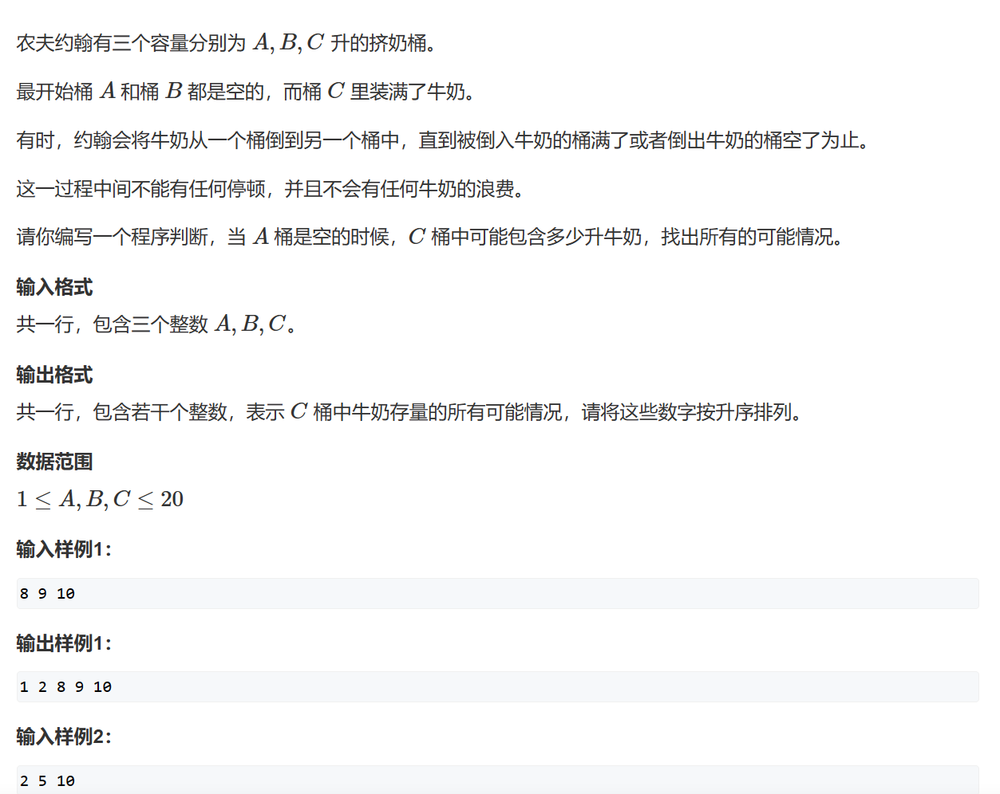

使用bfs模拟从一个桶倒入另一个桶的过程

```python
from collections import deque

# 初始状态
A,B,C=[int(x) for x in input().split()]
W=[A,B,C]
# 防止重复加入
vis=set()
def bfs():
    # 加入初始状态
    vis.add((0,0,C))
    d=deque()
    d.append((0,0,C))
    
    while d:
        
        for _ in range(len(d)):
            a,b,c=d.popleft()
            # 模拟从一个桶倒入另一个桶
            for i in range(3):
                for j in range(3):
                    # 每次重置为初始状态
                    w=[a,b,c]
                    # 不能自己到自己
                    if i==j:continue
                    # 倒出的牛奶不能超过本身有的或者是另一个溢出
                    r=min(W[j]-w[j],w[i])
                    # 变化
                    w[i]-=r
                    w[j]+=r
                    temp=tuple(w)
                    # 加入集合中
                    if temp not in vis:
                        vis.add(temp)
                        d.append(temp)
ans=[]
bfs()
# 对于给定的状态枚举所有的，如果在集合中说明存在是可以达到的
for i in range(21):
    for j in range(21):
        if (0,i,j) in vis:
            ans.append(j)
print(*sorted(ans))
```


## [执行操作后字典序最小的字符串](https://leetcode.cn/problems/lexicographically-smallest-string-after-applying-operations/)

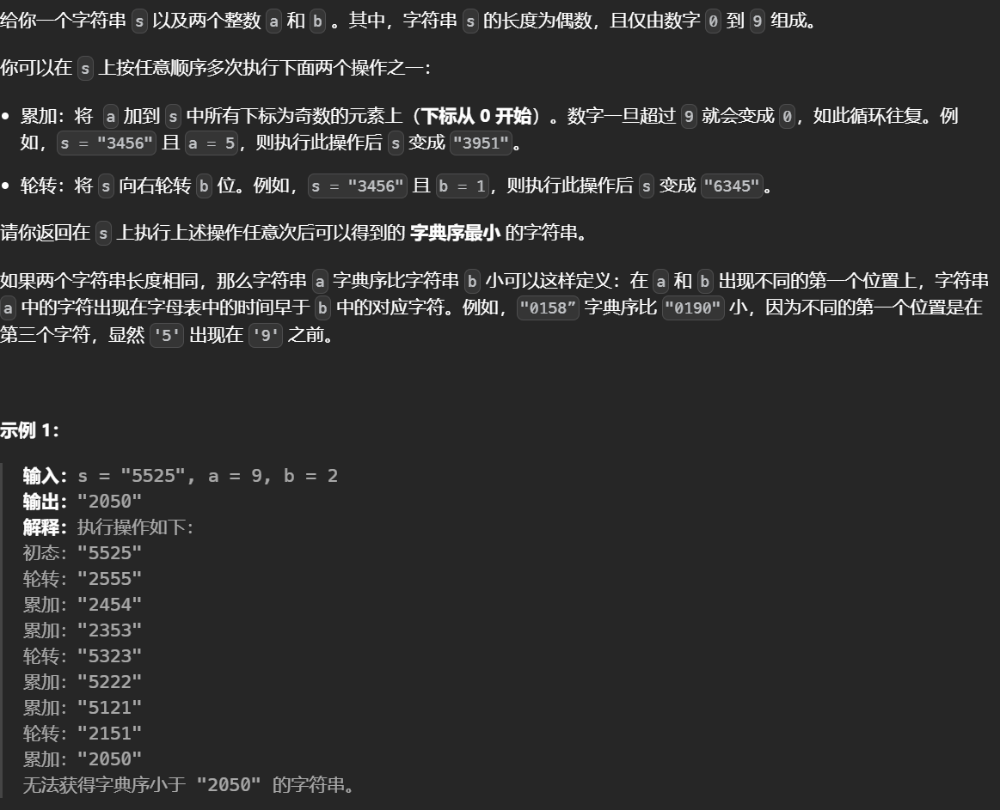

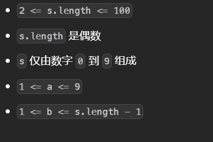


对于给定的数据范围可以暴力枚举，因为一次只有两个操作所以可以使用bfs模拟。

```python
class Solution:
    def findLexSmallestString(self, s: str, a: int, b: int) -> str:
        ans=''
        n=len(s)
        d=deque([s])
        vis=set()
        vis.add(s)
        while d:
            for _ in range(len(d)):
                curr=d.popleft() 
                if not ans or curr<ans:
                    ans=curr
                s1=curr[-b:]+curr[:-b]
                s2=''
                for i,c in enumerate(curr):
                    if i&1:s2+=str((int(c)+a)%10)
                    else:s2+=c
                if s1 not in vis:
                    vis.add(s1)
                    d.append(s1)
                if s2 not in vis:
                    vis.add(s2)
                    d.append(s2)
        return ans

```

##

## [推多米诺](https://leetcode.cn/problems/push-dominoes/)

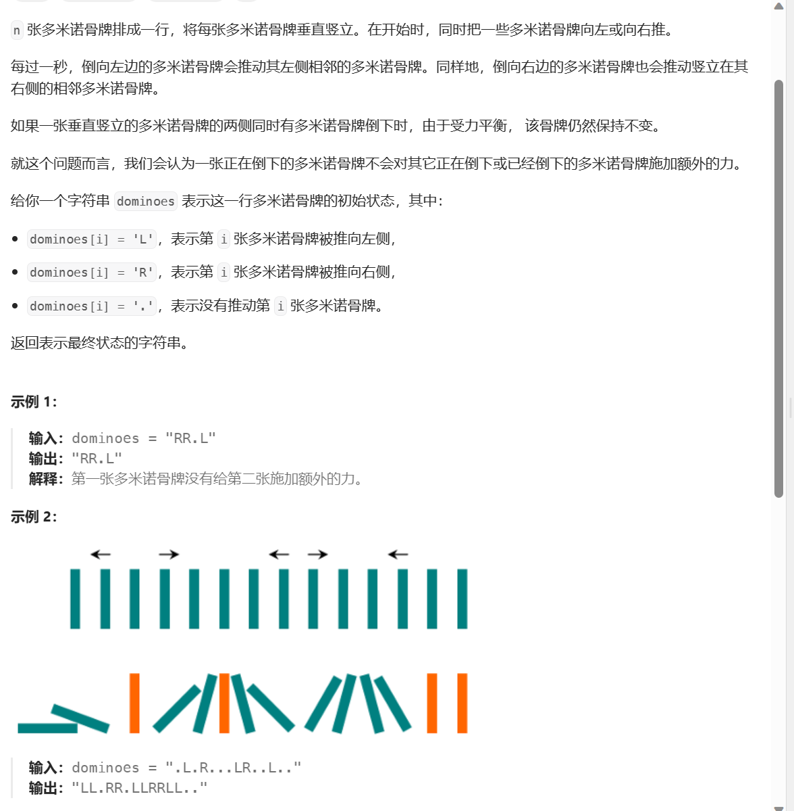

使用bfs模拟，每个受力的纸牌在下一时间都会影响到它受力方向的那个纸牌，如果一个纸牌在同一时间受到两个同向的力，那么他会保持不懂，使用bfs模拟同一时间每个纸牌的受力。

```python
class Solution:
    def pushDominoes(self, dominoes: str) -> str:
        d=deque()
        n=len(dominoes)
        # 需要一个时间数组记录每个纸牌变化的时间
        time=[-1]*n
        # 初始加入变化的纸牌，同时设置时间
        for i,c in enumerate(dominoes):
            if c!='.':
                d.append((i,c))
                time[i]=0
        res=list(dominoes)
        while d:
            i,f =d.popleft()
            t=time[i]
            # 下一个的位置
            ix=i-1 if f=='L' else i+1
            # 如果位置合法
            if 0<=ix<=n-1:
                # 如果这个纸牌没有受力
                if time[ix]==-1:
                    res[ix]=f
                    # 设置时间
                    time[ix]=t+1
                    d.append((ix,f))
                # 说明在同一时间有两个相向的力，恢复纸牌为原状态
                elif time[ix]==t+1:
                    res[ix]='.'
                # 已经推到的纸牌不会bei
        return "".join(res)
```


## [跳跃游戏 IV](https://leetcode.cn/problems/jump-game-iv/)

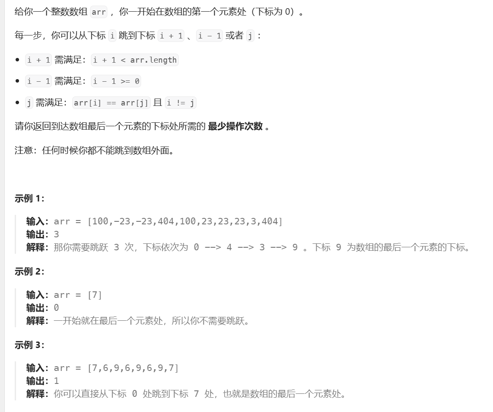

使用bfs而不是dfs回溯，可以看作是在图中的一个点到另一个点

```python
class Solution:
    def minJumps(self, arr: List[int]) -> int:
        memo=defaultdict(list)
        # 记录相同值的坐标
        for i,v in enumerate(arr):
            memo[v].append(i)
        ans=0
        # 防止加入重复值
        vis=set()
        vis.add(len(arr)-1)
        d=deque()
        d.append(len(arr)-1)
        while d:
            for _ in range(len(d)):
                curr=d.popleft()
                
                if curr==0:return ans
                # 记录前后
                if curr-1>=0 and curr-1 not in vis  :
                    d.append(curr-1)
                    vis.add(curr-1)
                if curr+1<len(arr) and curr+1 not in vis :
                    d.append(curr+1)
                    vis.add(curr+1)
                # 记录等值
                for k in memo[arr[curr]]:
                    if k in vis:continue
                    vis.add(k)
                    d.append(k)
                # 注意对每个等值只记录一次，因为只需要一次就能全部考虑这些位置，如果不删除下一个还会再重复记录
                del memo[arr[curr]]
            ans+=1
```


## [图中的最短环](https://leetcode.cn/problems/shortest-cycle-in-a-graph/)

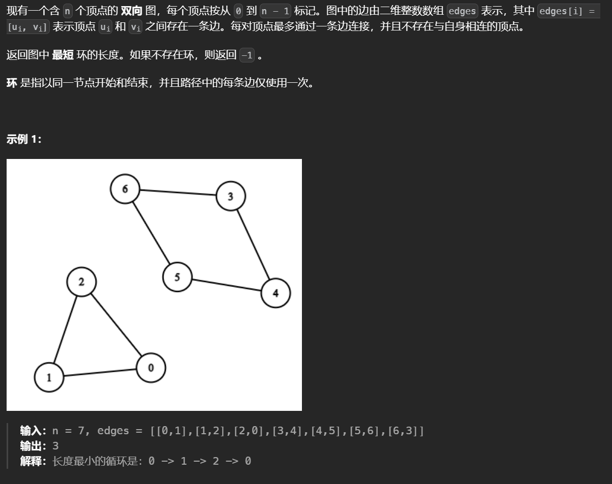

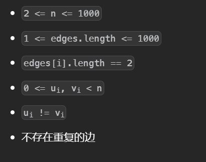

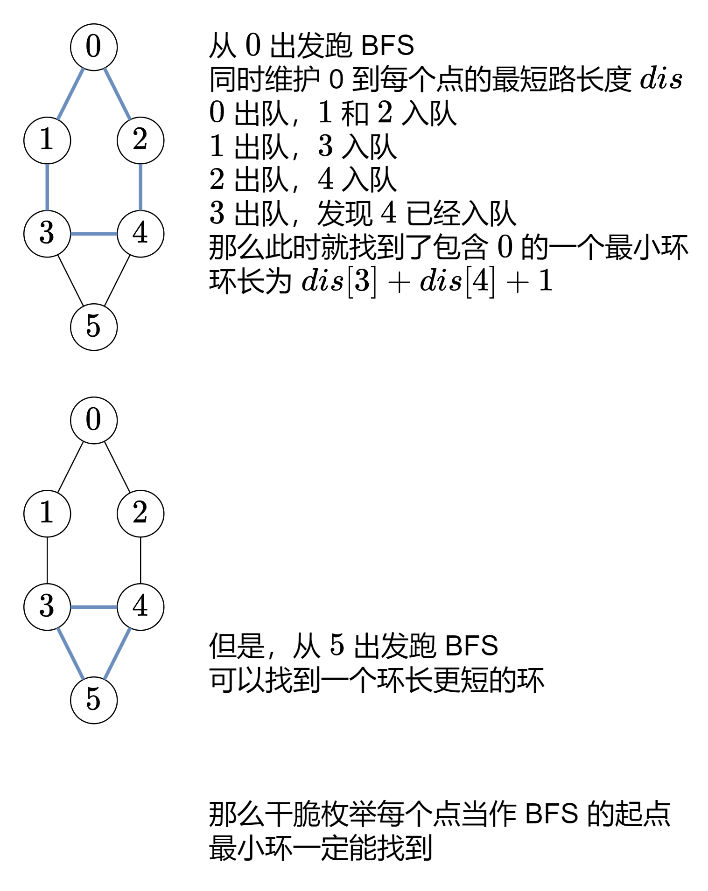

枚举每一个起点走bfs，与一般的bfs不同在于这里需要一个记录距离的数组

```python
class Solution:
    def findShortestCycle(self, n: int, edges: List[List[int]]) -> int:
        g = [[] for _ in range(n)]
        for x, y in edges:
            g[x].append(y)
            g[y].append(x)  # 建图
        def bfs(x):
            d=deque()
            d.append((x,-1))
            dis=[-1]*n
            dis[x]=0
            ans =inf
            while d:
                x,fa=d.popleft()
                for y in g[x]:
                    if dis[y]<0:
                        dis[y]=dis[x]+1
                        d.append((y,x))
                    elif y!=fa:
                        ans=min(ans,dis[x]+dis[y]+1)
            return ans 
        ans=inf

        for i in range(n):
            ans=min(ans,bfs(i))
        return ans if ans!=inf else -1

```

## **Go Stone Puzzle**

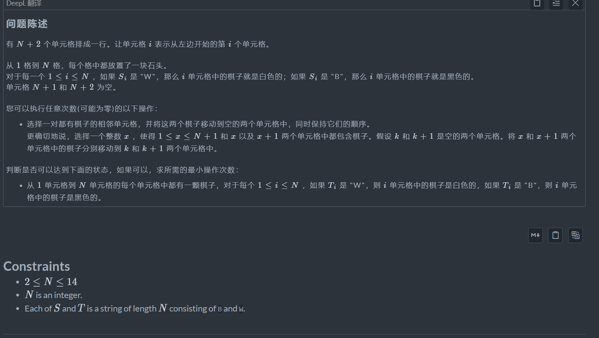


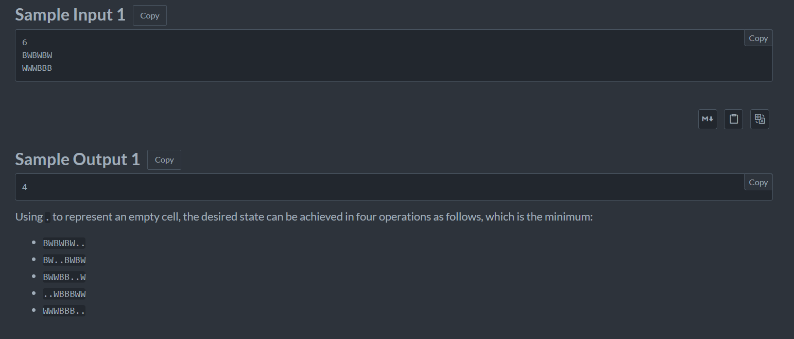

相当于用bfs求解最短路，将一个状态出发能得到的可能都枚举出来（过程中用集合去重）一步步往后找最终状态。

```python
n=int(input())
a=list(input())+['1','1']
b=list(input())+['1','1']
l1=Counter(a)
l2=Counter(b)
d=deque()
d.append(a)
vis=set()
vis.add(tuple(a))
sz=-1
while d:
    sz+=1
    for _ in range(len(d)):
        nums=d.popleft()
        if nums==b:
            print(sz)
            exit()
        index=nums.index('1')
        for i in range(1,n+2):
            if nums[i]=='1' or nums[i-1]=='1':continue
            temp=nums[:]
            l=temp[i-1]
            r=temp[i]
            temp[index],temp[index+1]=l,r
            temp[i-1]=temp[i]='1'
            if tuple(temp) not in vis:
                vis.add(tuple(temp))
                d.append(temp)
print(-1)
```


## [Palindromic Shortest Path](https://atcoder.jp/contests/abc394/tasks/abc394_e)

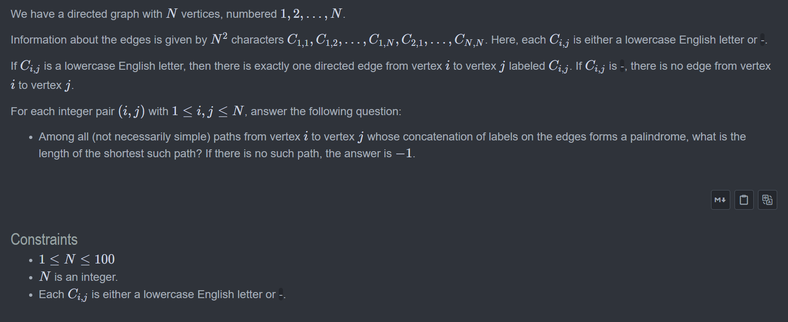

问题要找任意两个点之间的最短路径，要求路径是一个回文串。使用Dijkstra求解在判断回文串时会很麻烦，这里借助回文串的性质使用bfs，入队相同位置(i,i)偶数长度，以及相连的不同位置(i,j)奇数长度，向外扩展走相同的字符。

```python
n=R()
edges=defaultdict(lambda :defaultdict(list))
rev=defaultdict(lambda :defaultdict(list))

g=[]
for i in range(n):
    g.append(RS())
    for j,c in enumerate(g[-1]):
        if c!='-':
            edges[i][c].append(j)
            rev[j][c].append(i)
dis=[[-1]*n for _ in range(n)]

d=deque()

# 入队
for i in range(n):
    d.append((i,i))
    dis[i][i]=0

for i in range(n):
    for j in range(n):
        if i!=j and g[i][j]!='-':
            d.append((i,j))
            dis[i][j]=1


while d:
    for _ in range(len(d)):
        i,j=d.popleft()
        # 枚举其他位置比判断枚举字符要方便
        for a in range(n):
            # 要相连
            if g[a][i]=='-':continue
            for b in range(n):
                # 走相同的字符且取最小值
                if g[j][b]==g[a][i] and dis[a][b]==-1:
                    dis[a][b]=dis[i][j]+2
                    d.append((a,b))

for i in range(n):
    print(*dis[i])          
```

## [ Min of Restricted Sum](https://atcoder.jp/contests/abc396/tasks/abc396_e)

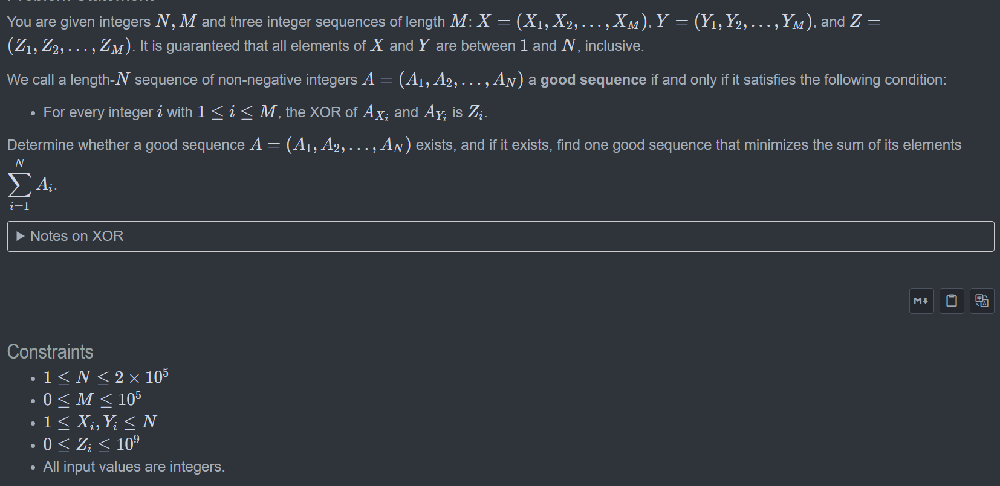

题意：我们验证是否存在一个“好”序列，满足给定整数N、M及三个长度为M的序列：X、Y、Z。检查是否能构造一个满足对每个i，A$[X_i]$和A$[Y_i]$的XOR值等于$Z_i$的序列。

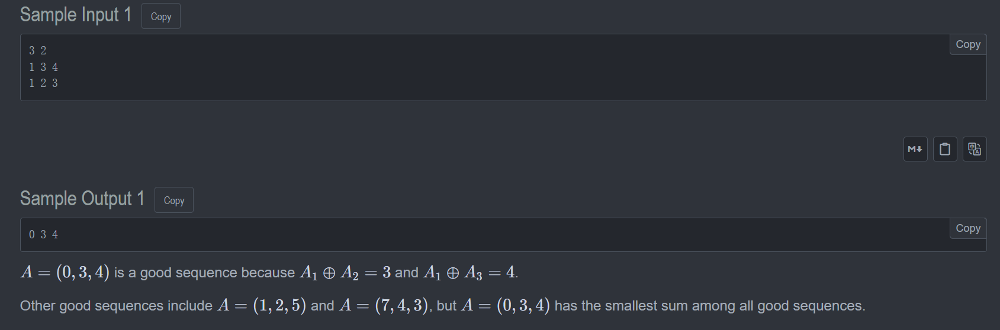


所有的关系抽象到图上求解，对于XOR运算，得到连通块中的一个点权就可以**推出其他点的点权**。首先考虑无解的情况，假设端点的点权为0，在图上做**bfs**求解其他点的点权同时计算连通块每一位上1的个数，当同一个点**第二次**被访问时，如果**点权与第一次不同**，那么说明表达式矛盾。

连通块的和可以看作是每一位上1的个数*$2^j$ ，为了得到最小的序列，根据XOR运算的性质，在每一位上可以进行**01反转**，因此如果连通块上的**1多于0**的个数，那么可以将端点的这一位**设置为1**(初始时模拟的是0)，**减少1的个数**。

```python
n,m=RR()
edges=defaultdict(dict)
# 建图
for _ in range(m):
    l,r,w=RR()
    l-=1
    r-=1 
    edges[l][r]=w
    edges[r][l]=w

vis=[False]*n

# 记录每个连通块每一位上1的个数
cnt={}

# 记录连通块的大小
size=defaultdict(int)

# 记录值
val=[0]*n

# bfs判断是否无解
for i in range(n):
    if not vis[i]:
        d=deque([(i,0)])    
        vis[i]=True
        c=[0]*32 
        while d:
            for _ in range(len(d)):
                size[i]+=1
                x,pre=d.popleft()
                # 求解每一位上1的个数之和
                for j in range(32):
                    if pre>>j&1:c[j]+=1
                for nx,w in edges[x].items():
                    # 第二次访问且值不同，则矛盾
                    if vis[nx] and val[nx]!=pre^w:
                        print(-1)
                        exit(0)
                    # 继续
                    elif not vis[nx]:
                        vis[nx]=True 
                        val[nx]=w^pre
                        d.append((nx,val[nx]))
        cnt[i]=c


vis=[False]*n
val=[-1]*n
# 求解点权
for i in cnt:
    x=0
    s=size[i]
    # 01反抓使得结果最小
    for j in range(32):
        if cnt[i][j]>s-cnt[i][j]:
            x|=(1<<j)
    # 做bfs求解最终结果
    d=deque([(i,x)])   
    val[i]=x  
    vis[i]=True
    while d:
        for _ in range(len(d)):
            x,pre=d.popleft()
            for nx,w in edges[x].items():
                if not vis[nx]:
                    vis[nx]=True 
                    val[nx]=w^pre
                    d.append((nx,val[nx]))

print(*val) 
```


# 多源BFS

## [找出最安全路径](https://leetcode.cn/problems/find-the-safest-path-in-a-grid/)

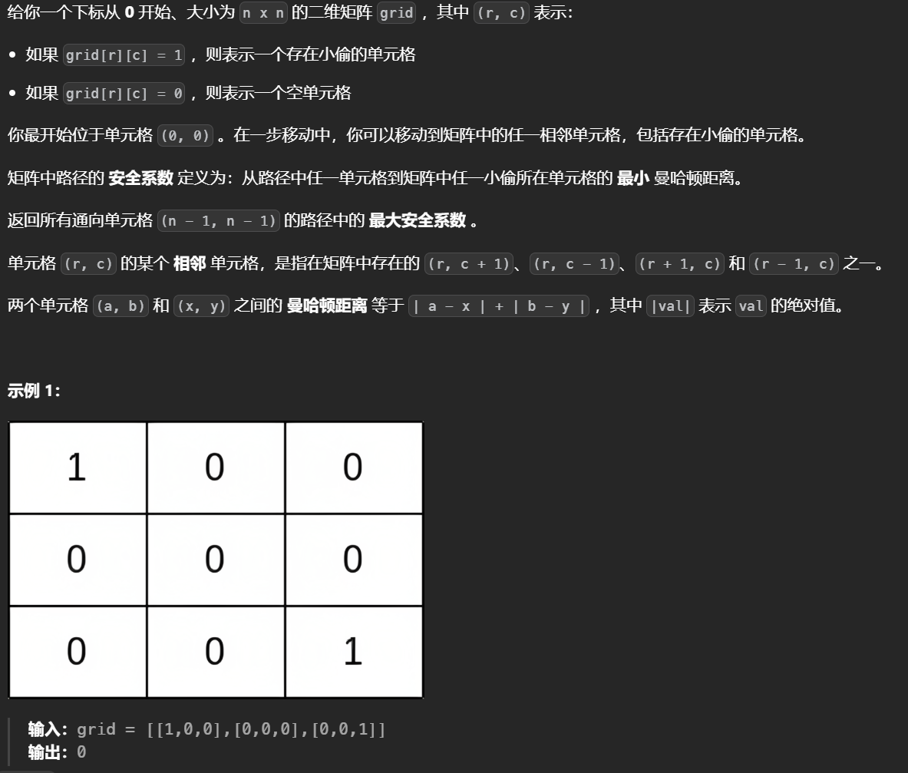


二分找到最大的安全系数，二分的check函数中从起点出发到终点的路径上所有单元格到小偷的最小距离都要大于等于安全系数，为了得到每个格子到小偷的最小安全系数，使用多源BFS从有小偷的单元格出发往外遍历，得到每个单元格距离小偷的最小距离。

```python
class Solution:
    def maximumSafenessFactor(self, g: List[List[int]]) -> int:
        if g[0][0] or g[-1][-1]:return 0
        m,n=len(g),len(g[0])
        dis=[[-1]*n for _ in range(m)]
        d=deque()
		# 找到小偷所在单元格
        for i,row in enumerate(g):
            for j,x in enumerate(row):
                if x:
                    d.append((i,j))
                    dis[i][j]=0
        # 找到其他单元格离小偷的最小距离
        sz=0
        while d:
            sz+=1
            for _ in range(len(d)):
                i,j=d.popleft()
                for dx,dy in (1,0),(-1,0),(0,-1),(0,1):
                    if 0<=(x:=dx+i)<m and 0<=(y:=dy+j)<n and not g[x][y] and dis[x][y]==-1:
                        d.append((x,y))
                        dis[x][y]=sz
        def cal(xx):
            if not xx:return True
            if dis[0][0]<xx:return False
            d=deque()
            vis=set()
            d.append((0,0))
            vis.add((0,0))
            while d:
                for _ in range(len(d)):
                    i,j=d.popleft()
                    if i==m-1 and j==n-1:return True 
                    for dx,dy in (1,0),(-1,0),(0,-1),(0,1):
                        if 0<=(x:=dx+i)<m and 0<=(y:=dy+j)<n and (x,y) not in vis and dis[x][y]>=xx:
                            d.append((x,y))
                            vis.add((x,y))
            return False
        # 二分枚举
        l,r=0,m+n
        while l<=r:
            mid=(l+r)>>1
            if cal(mid):
                l=mid+1
            else:
                r=mid-1
        return l-1
```


# 0-1BFS

边权为1或者0，可以使用0-1BFS，本质上是对Dijstra的优化，**因为边权只有0和1所以将最小堆换位双向队列，遇到0边权就插入到开头(因为一定是最小的)，1边权就插入到队尾。**


## [到达角落需要移除障碍物的最小数目](https://leetcode.cn/problems/minimum-obstacle-removal-to-reach-corner/)

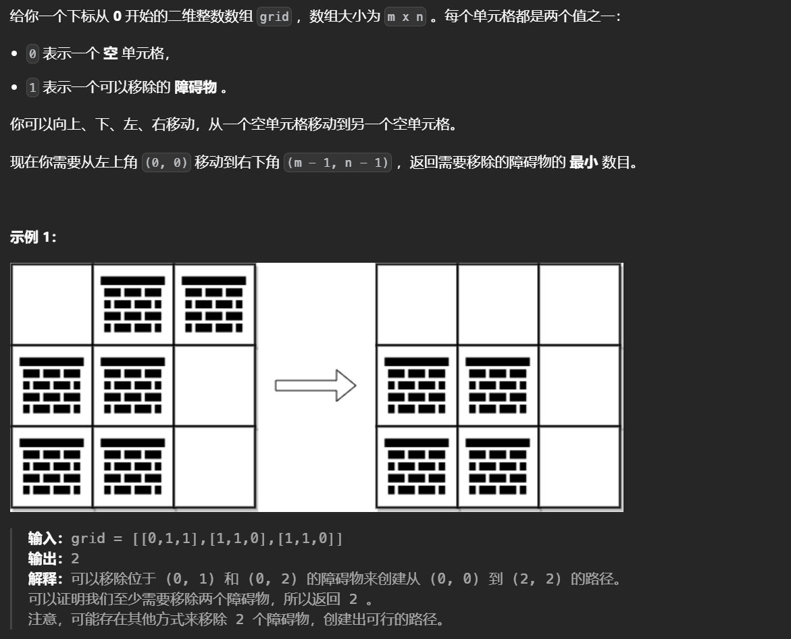


```python
class Solution:
    def minimumObstacles(self, g: List[List[int]]) -> int:
        m,n=len(g),len(g[0])
        dis=[[inf]*n for _ in range(m)]
        d=deque()
        dis[0][0]=0
        d.append((0,0))
        
        while d:
            i,j=d.popleft()
            for dx,dy in (1,0),(0,1),(-1,0),(0,-1):
                # Dijstra算法的判断逻辑
                if 0<=(x:=dx+i)<m and 0<=(y:=dy+j)<n and g[x][y]+dis[i][j]<dis[x][y]:
                    dis[x][y]=g[x][y]+dis[i][j]
                    # 插入到队首还是队尾取决于边权
                    if g[x][y]==0:
                        d.appendleft((x,y))
                    else:    
                        d.append((x,y))
                    
        return dis[-1][-1]
 
```


