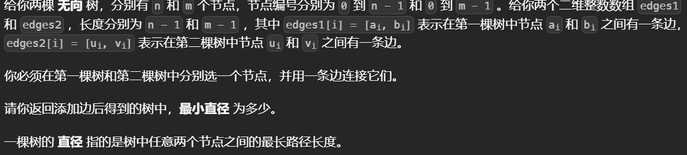

# BFS算法

BFS是把一些问题抽象成图，从一个点开始向四周扩散。一般的应用场景是求从起点到终点的最小距离。

# BFS模拟

​																																																																																		

## 母亲的牛奶


使用bfs模拟从一个桶倒入另一个桶的过程

```python
from collections import deque

# 初始状态
A,B,C=[int(x) for x in input().split()]
W=[A,B,C]
# 防止重复加入
vis=set()
def bfs():
    # 加入初始状态
    vis.add((0,0,C))
    d=deque()
    d.append((0,0,C))
    
    while d:
        
        for _ in range(len(d)):
            a,b,c=d.popleft()
            # 模拟从一个桶倒入另一个桶
            for i in range(3):
                for j in range(3):
                    # 每次重置为初始状态
                    w=[a,b,c]
                    # 不能自己到自己
                    if i==j:continue
                    # 倒出的牛奶不能超过本身有的或者是另一个溢出
                    r=min(W[j]-w[j],w[i])
                    # 变化
                    w[i]-=r
                    w[j]+=r
                    temp=tuple(w)
                    # 加入集合中
                    if temp not in vis:
                        vis.add(temp)
                        d.append(temp)
ans=[]
bfs()
# 对于给定的状态枚举所有的，如果在集合中说明存在是可以达到的
for i in range(21):
    for j in range(21):
        if (0,i,j) in vis:
            ans.append(j)
print(*sorted(ans))
```


## [执行操作后字典序最小的字符串](https://leetcode.cn/problems/lexicographically-smallest-string-after-applying-operations/)


对于给定的数据范围可以暴力枚举，因为一次只有两个操作所以可以使用bfs模拟。

```python
class Solution:
    def findLexSmallestString(self, s: str, a: int, b: int) -> str:
        ans=''
        n=len(s)
        d=deque([s])
        vis=set()
        vis.add(s)
        while d:
            for _ in range(len(d)):
                curr=d.popleft() 
                if not ans or curr<ans:
                    ans=curr
                s1=curr[-b:]+curr[:-b]
                s2=''
                for i,c in enumerate(curr):
                    if i&1:s2+=str((int(c)+a)%10)
                    else:s2+=c
                if s1 not in vis:
                    vis.add(s1)
                    d.append(s1)
                if s2 not in vis:
                    vis.add(s2)
                    d.append(s2)
        return ans

```

##

## [推多米诺](https://leetcode.cn/problems/push-dominoes/)


使用bfs模拟，每个受力的纸牌在下一时间都会影响到它受力方向的那个纸牌，如果一个纸牌在同一时间受到两个同向的力，那么他会保持不懂，使用bfs模拟同一时间每个纸牌的受力。

```python
class Solution:
    def pushDominoes(self, dominoes: str) -> str:
        d=deque()
        n=len(dominoes)
        # 需要一个时间数组记录每个纸牌变化的时间
        time=[-1]*n
        # 初始加入变化的纸牌，同时设置时间
        for i,c in enumerate(dominoes):
            if c!='.':
                d.append((i,c))
                time[i]=0
        res=list(dominoes)
        while d:
            i,f =d.popleft()
            t=time[i]
            # 下一个的位置
            ix=i-1 if f=='L' else i+1
            # 如果位置合法
            if 0<=ix<=n-1:
                # 如果这个纸牌没有受力
                if time[ix]==-1:
                    res[ix]=f
                    # 设置时间
                    time[ix]=t+1
                    d.append((ix,f))
                # 说明在同一时间有两个相向的力，恢复纸牌为原状态
                elif time[ix]==t+1:
                    res[ix]='.'
                # 已经推到的纸牌不会bei
        return "".join(res)
```


## [跳跃游戏 IV](https://leetcode.cn/problems/jump-game-iv/)


使用bfs而不是dfs回溯，可以看作是在图中的一个点到另一个点

```python
class Solution:
    def minJumps(self, arr: List[int]) -> int:
        memo=defaultdict(list)
        # 记录相同值的坐标
        for i,v in enumerate(arr):
            memo[v].append(i)
        ans=0
        # 防止加入重复值
        vis=set()
        vis.add(len(arr)-1)
        d=deque()
        d.append(len(arr)-1)
        while d:
            for _ in range(len(d)):
                curr=d.popleft()
                
                if curr==0:return ans
                # 记录前后
                if curr-1>=0 and curr-1 not in vis  :
                    d.append(curr-1)
                    vis.add(curr-1)
                if curr+1<len(arr) and curr+1 not in vis :
                    d.append(curr+1)
                    vis.add(curr+1)
                # 记录等值
                for k in memo[arr[curr]]:
                    if k in vis:continue
                    vis.add(k)
                    d.append(k)
                # 注意对每个等值只记录一次，因为只需要一次就能全部考虑这些位置，如果不删除下一个还会再重复记录
                del memo[arr[curr]]
            ans+=1
```


## [图中的最短环](https://leetcode.cn/problems/shortest-cycle-in-a-graph/)


枚举每一个起点走bfs，与一般的bfs不同在于这里需要一个记录距离的数组

```python
class Solution:
    def findShortestCycle(self, n: int, edges: List[List[int]]) -> int:
        g = [[] for _ in range(n)]
        for x, y in edges:
            g[x].append(y)
            g[y].append(x)  # 建图
        def bfs(x):
            d=deque()
            d.append((x,-1))
            dis=[-1]*n
            dis[x]=0
            ans =inf
            while d:
                x,fa=d.popleft()
                for y in g[x]:
                    if dis[y]<0:
                        dis[y]=dis[x]+1
                        d.append((y,x))
                    elif y!=fa:
                        ans=min(ans,dis[x]+dis[y]+1)
            return ans 
        ans=inf

        for i in range(n):
            ans=min(ans,bfs(i))
        return ans if ans!=inf else -1

```

## **Go Stone Puzzle**


相当于用bfs求解最短路，将一个状态出发能得到的可能都枚举出来（过程中用集合去重）一步步往后找最终状态。

```python
from collections import deque, defaultdict, Counter
from functools import lru_cache
from bisect import bisect_left
from itertools import accumulate
from math import ceil, inf
import sys
from typing import List
#input = sys.stdin.readline
def R(): return int(input())
def RR(): return [int(x) for x in input().split()]
def get_pre(nums):return list(accumulate(nums,initial=0))

from collections import Counter
n=int(input())
a=list(input())+['1','1']
b=list(input())+['1','1']
l1=Counter(a)
l2=Counter(b)
d=deque()
d.append(a)
vis=set()
vis.add(tuple(a))
sz=-1
while d:
    sz+=1
    for _ in range(len(d)):
        nums=d.popleft()
        if nums==b:
            print(sz)
            exit()
        index=nums.index('1')
        for i in range(1,n+2):
            if nums[i]=='1' or nums[i-1]=='1':continue
            temp=nums[:]
            l=temp[i-1]
            r=temp[i]
            temp[index],temp[index+1]=l,r
            temp[i-1]=temp[i]='1'
            if tuple(temp) not in vis:
                vis.add(tuple(temp))
                d.append(temp)
print(-1)
```


# 树的直径

## 树的直径


树的直径就是两个相邻最远的节点的距离

+ BFS方法，从任意节点开始都可以得到任意一个极端节点（距离所有节点最远的两个节点），然后从这个节点开始再进行一次BFS就可以得到另一个极端节点，这两个极端节点之间的距离就是树的直径。

```python
from collections import deque


class Solution(object):
    def treeDiameter(self, edges):
        if not len(edges):
            return 0
        # 使用set集合记录每一个边
        paths = [set() for _ in range(len(edges) + 1)]
        for edge in edges:
            u, v = edge
            paths[u].add(v)
            paths[v].add(u)

        # bfs框架
        def bfs(start):
            d = deque([start])
            
            # 备忘录防止重复加入
            visited = [False] * (len(paths))
            visited[start] = True
            # 记录最后一个节点
            lastnode = None
            # 距离从-1开始，因为遍历到最后一层时还会向外遍历一次，如果从0开始最后的结果会多出一
            distance=-1
            while d:
                sz = len(d)
                # 只遍历之前队列中元素的个数次
                for _ in range(sz):
                    # 弹出
                    curr = d.popleft()
                    for i in paths[curr]:
                        # 加入不重复的邻居
                        if not visited[i]:
                            visited[i] = True
                            d.append(i)
                            lastnode = i
				# 距离加一
                distance += 1
            return [distance, lastnode]
       
        distance, lastnode = bfs(0)
        return bfs(lastnode)[0]
```


+ 使用回溯算法解题，如果可以得到从父节点到任何后代叶子节点的最长距离t1,t2，那么经过该父节点的最长半径就是t1+t2，整个树的最长半径就是所有节点中的最长半径


```python
class Solution(object):
    def treeDiameter(self, edges):

        paths = [set() for _ in range(len(edges) + 1)]
		# 记录所有边
        for edge in edges:
            u, v = edge
            paths[u].add(v)
            paths[v].add(u)
            
         # 设置备忘录
        visited=[False]*len(paths)
        # 不断更新外部变量来得到最大值
        self.diameter=0

        # 会返回以p为父节点到叶子结点的最大距离
        def dfs(p,visited):
            # 设置两个到叶子节点的最长距离
            left = 0
            right = 0
            # 标记
            visited[p]=True
            for val in paths[p]:
                # 包含过了
                if visited[val]:
                    continue
                # 该节点到叶子结点的距离为它的子节点到叶子结点的距离加一
                distance=1+dfs(val,visited)
                # 更新
                if distance>left:
                    left,right=distance,left
                elif distance>right:
                    right=distance
			
                self.diameter=max(self.diameter,left+right)
            
            return left

        dfs(0,visited)
        return self.diameter
```

## N叉树的直径


与上一题一样

```python
class Solution(object):
    def diameter(self, root):
        self.diameter=0
        def dfs(root):

            left=0
            right=0
            for child in root.children:
                distance=1+dfs(child)
                if distance>left:
                    left,right=distance,left
                elif distance>right:
                    right=distance
                self.diameter=max(self.diameter,left+right)
            return left
        dfs(root)
        return self.diameter
```

## 串门


这种问题的最短路径就是所有的边之和乘2减去一条树的直径，但是这题每条边是有权重的，计算直径不能按照一般的方法。照样使用bfs模板，不过在遍历中有一个外部变量记录距离。

```python
from collections import deque

# 接收输入
n=int(input())
# 使用集合记录每个节点相连的节点以及相应的权重
edges=[set() for _ in range(n+1)]
w_sum=0
# 记录
for _ in range(n-1):
    u,v,w=list(map(int,input().split()))
    edges[u].add((v,w))
    edges[v].add((u,w))
    w_sum+=w

# 返回距离start最远的节点，以及一个记录距离的列表
def bfs(start):
    # distance记录的是所有节点到start的距离，先初始化为-1
    distance=[-1 for _ in range(n+1)]
    # 自己到自己的距离是0
    distance[start]=0
    # 接下来是bfs模板
    d=deque([start])
    while d:
        sz=len(d)
        for _ in range(sz):
            # 弹出
            curr=d.popleft()
            for u,w in edges[curr]:
                # 如果记录过，跳过
                if distance[u]!=-1:
                    continue
                # 从start到u的距离等于从start到curr的距离加上从curr到u的距离
                distance[u]=w+distance[curr]
                # 加入路径，称为下一轮的curr
                d.append(u)
     # 找出最远的点，也就是直径
    lastnode=distance.index(max(distance))
    return lastnode ,distance

# 先找出一个极端节点
node1,_=bfs(1)
# 再根据这个极端节点找另一个
node2,distance=bfs(node1)

print(w_sum*2-distance[node2])
```

## [合并两棵树后的最小直径](https://leetcode.cn/problems/find-minimum-diameter-after-merging-two-trees/)



两棵树合并后树的直径有两种情况，直径不会改变还是合并前两个树的直径中最大的那个，或者树的直径会经过连接的位置然后加上两个树的剩余直径之和（因为直径是树上最长的边所以一定会经过原本树上的直径），为了保证整个树的直径最小应该选择两个树的直径的中点相连，这里不需要知道那个是中点，因为只需要求出数值大小

```python
class Solution:
    def minimumDiameterAfterMerge(self, edges1: List[List[int]], edges2: List[List[int]]) -> int:
        # 用于求直径
        def cal(path):
            d=0
            def dfs(root,fa):
                l=r=0
                nonlocal d
                for child in path[root]:
                    if child ==fa:continue
                    x=dfs(child,root)+1
                    if x>l:
                        r=l
                        l=x
                    elif x>r:
                        r=x
                d=max(d,l+r)
                return l
            dfs(0,-1)
            return d
        path1=defaultdict(dict)
        path2=defaultdict(dict)
        for u,v in edges1:
            path1[u][v]=path1[v][u]=None
        for u,v in edges2:
            path2[u][v]=path2[v][u]=None
        d1,d2=cal(path1),cal(path2)
        # 三种情况，这里保证了相连后的直径是最小的
        return max(d1,d2,ceil(d1/2)+ceil(d2/2)+1)
```


## [转化数字的最小运算数](https://leetcode.cn/problems/minimum-operations-to-convert-number/)


每次有三种可能，使用bfs


```python
class Solution:
    def minimumOperations(self, nums: List[int], start: int, goal: int) -> int:
        d=deque()
        d.append(start)
        cnt=0
        vis=set()
        vis.add(start)
        while d:
            cnt+=1
            for _ in range(len(d)):
                curr=d.popleft()     
                # 由于状态众多，选择在循环内判断
                for x in nums:
                    for t in curr+x,curr-x,curr^x:
                        if t==goal:return cnt
                        if 0<=t<=1000 and t not in vis:
                            vis.add(t)
                            d.append(t)
            
        return -1
```


# 多源BFS

## [找出最安全路径](https://leetcode.cn/problems/find-the-safest-path-in-a-grid/)


二分找到最大的安全系数，二分的check函数中从起点出发到终点的路径上所有单元格到小偷的最小距离都要大于等于安全系数，为了得到每个格子到小偷的最小安全系数，使用多源BFS从有小偷的单元格出发往外遍历，得到每个单元格距离小偷的最小距离。

```python
class Solution:
    def maximumSafenessFactor(self, g: List[List[int]]) -> int:
        if g[0][0] or g[-1][-1]:return 0
        m,n=len(g),len(g[0])
        dis=[[-1]*n for _ in range(m)]
        d=deque()
		# 找到小偷所在单元格
        for i,row in enumerate(g):
            for j,x in enumerate(row):
                if x:
                    d.append((i,j))
                    dis[i][j]=0
        # 找到其他单元格离小偷的最小距离
        sz=0
        while d:
            sz+=1
            for _ in range(len(d)):
                i,j=d.popleft()
                for dx,dy in (1,0),(-1,0),(0,-1),(0,1):
                    if 0<=(x:=dx+i)<m and 0<=(y:=dy+j)<n and not g[x][y] and dis[x][y]==-1:
                        d.append((x,y))
                        dis[x][y]=sz
        def cal(xx):
            if not xx:return True
            if dis[0][0]<xx:return False
            d=deque()
            vis=set()
            d.append((0,0))
            vis.add((0,0))
            while d:
                for _ in range(len(d)):
                    i,j=d.popleft()
                    if i==m-1 and j==n-1:return True 
                    for dx,dy in (1,0),(-1,0),(0,-1),(0,1):
                        if 0<=(x:=dx+i)<m and 0<=(y:=dy+j)<n and (x,y) not in vis and dis[x][y]>=xx:
                            d.append((x,y))
                            vis.add((x,y))
            return False
        # 二分枚举
        l,r=0,m+n
        while l<=r:
            mid=(l+r)>>1
            if cal(mid):
                l=mid+1
            else:
                r=mid-1
        return l-1
```


# 0-1BFS

边权为1或者0，可以使用0-1BFS，本质上是对Dijstra的优化，**因为边权只有0和1所以将最小堆换位双向队列，遇到0边权就插入到开头(因为一定是最小的)，1边权就插入到队尾。**


## [到达角落需要移除障碍物的最小数目](https://leetcode.cn/problems/minimum-obstacle-removal-to-reach-corner/)


```python
class Solution:
    def minimumObstacles(self, g: List[List[int]]) -> int:
        m,n=len(g),len(g[0])
        dis=[[inf]*n for _ in range(m)]
        d=deque()
        dis[0][0]=0
        d.append((0,0))
        
        while d:
            i,j=d.popleft()
            for dx,dy in (1,0),(0,1),(-1,0),(0,-1):
                # Dijstra算法的判断逻辑
                if 0<=(x:=dx+i)<m and 0<=(y:=dy+j)<n and g[x][y]+dis[i][j]<dis[x][y]:
                    dis[x][y]=g[x][y]+dis[i][j]
                    # 插入到队首还是队尾取决于边权
                    if g[x][y]==0:
                        d.appendleft((x,y))
                    else:    
                        d.append((x,y))
                    
        return dis[-1][-1]
 
```


