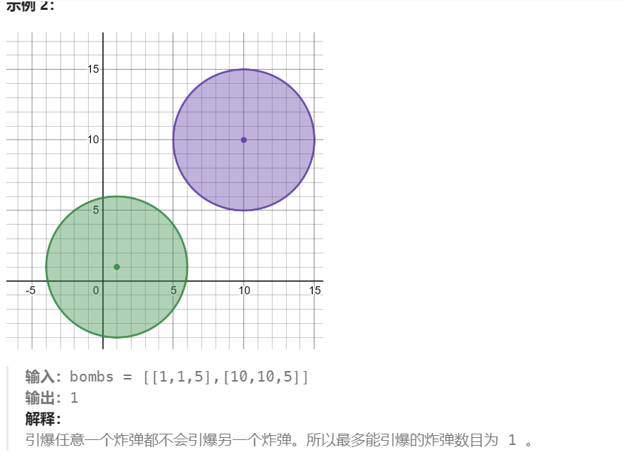
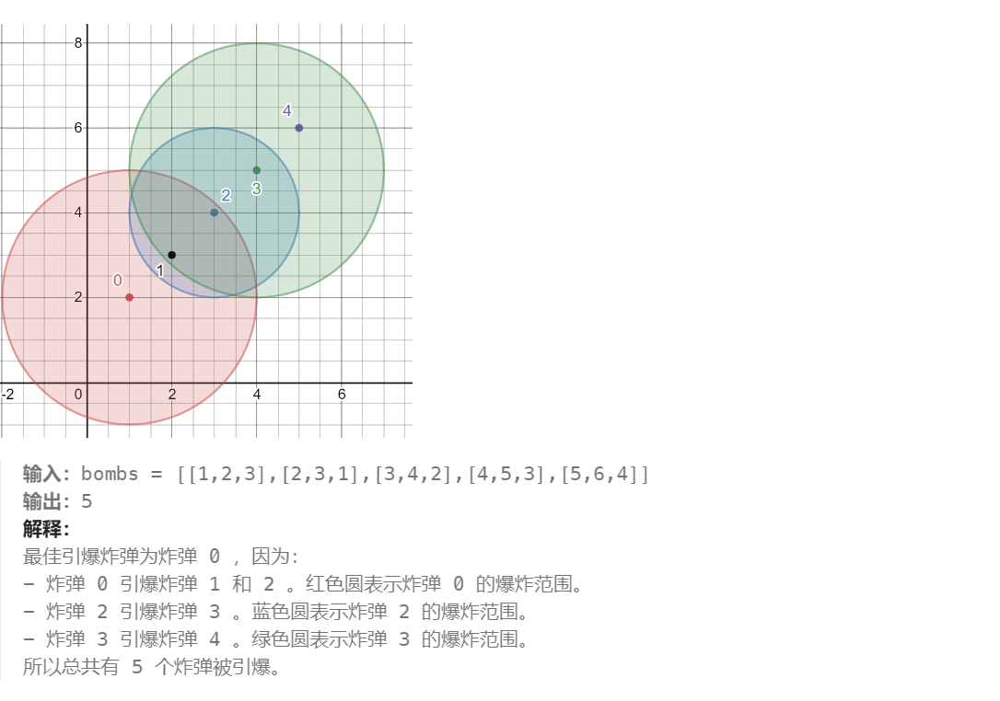
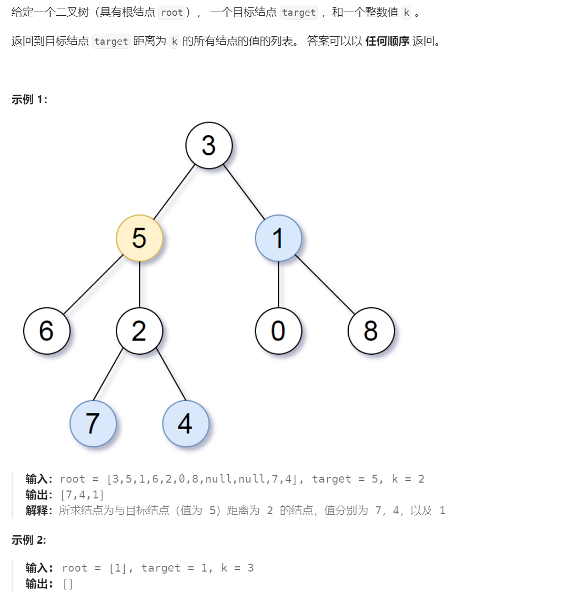
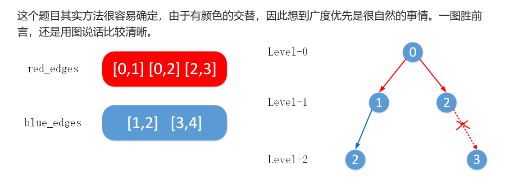
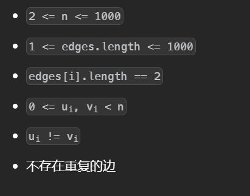
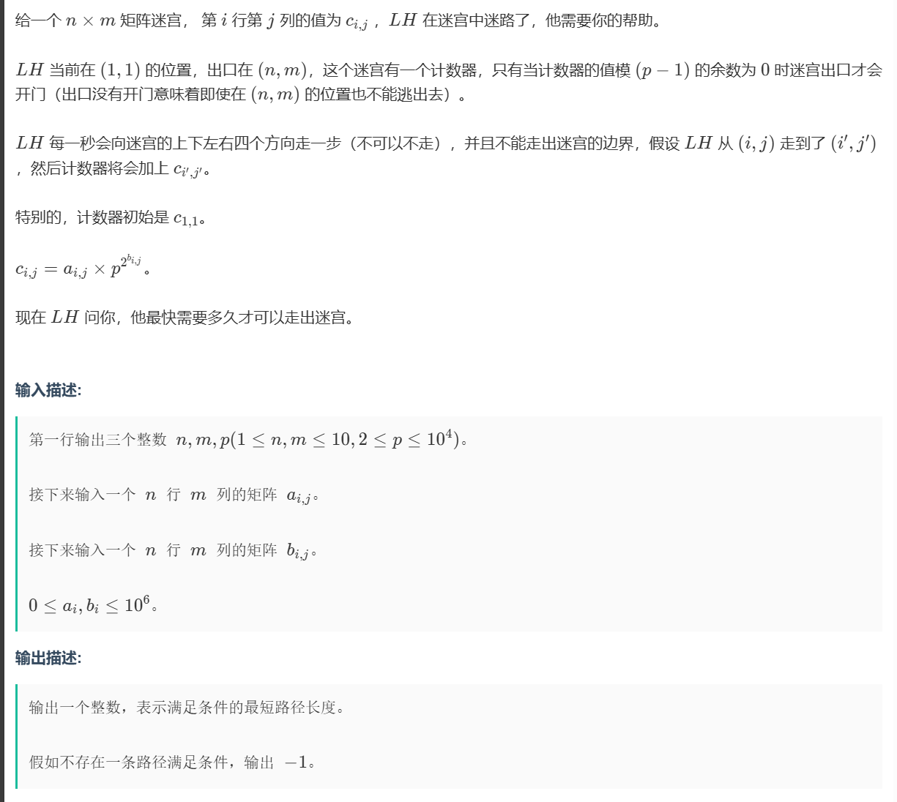
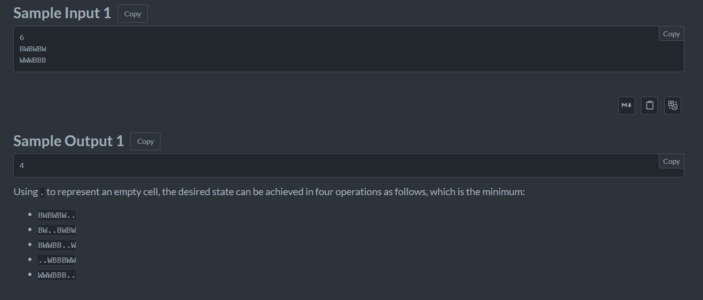

# BFS算法

BFS是把一些问题抽象成图，从一个点开始向四周扩散。一般的应用场景是求从起点到终点的最小距离。


# 树的直径

## 树的直径


树的直径就是两个相邻最远的节点的距离

+ BFS方法，从任意节点开始都可以得到任意一个极端节点（距离所有节点最远的两个节点），然后从这个节点开始再进行一次BFS就可以得到另一个极端节点，这两个极端节点之间的距离就是树的直径。

```python
from collections import deque


class Solution(object):
    def treeDiameter(self, edges):
        if not len(edges):
            return 0
        # 使用set集合记录每一个边
        paths = [set() for _ in range(len(edges) + 1)]
        for edge in edges:
            u, v = edge
            paths[u].add(v)
            paths[v].add(u)

        # bfs框架
        def bfs(start):
            d = deque([start])
            
            # 备忘录防止重复加入
            visited = [False] * (len(paths))
            visited[start] = True
            # 记录最后一个节点
            lastnode = None
            # 距离从-1开始，因为遍历到最后一层时还会向外遍历一次，如果从0开始最后的结果会多出一
            distance=-1
            while d:
                sz = len(d)
                # 只遍历之前队列中元素的个数次
                for _ in range(sz):
                    # 弹出
                    curr = d.popleft()
                    for i in paths[curr]:
                        # 加入不重复的邻居
                        if not visited[i]:
                            visited[i] = True
                            d.append(i)
                            lastnode = i
				# 距离加一
                distance += 1
            return [distance, lastnode]
       
        distance, lastnode = bfs(0)
        return bfs(lastnode)[0]
```


+ 使用回溯算法解题，如果可以得到从父节点到任何后代叶子节点的最长距离t1,t2，那么经过该父节点的最长半径就是t1+t2，整个树的最长半径就是所有节点中的最长半径


```python
class Solution(object):
    def treeDiameter(self, edges):

        paths = [set() for _ in range(len(edges) + 1)]
		# 记录所有边
        for edge in edges:
            u, v = edge
            paths[u].add(v)
            paths[v].add(u)
            
         # 设置备忘录
        visited=[False]*len(paths)
        # 不断更新外部变量来得到最大值
        self.diameter=0

        # 会返回以p为父节点到叶子结点的最大距离
        def dfs(p,visited):
            # 设置两个到叶子节点的最长距离
            left = 0
            right = 0
            # 标记
            visited[p]=True
            for val in paths[p]:
                # 包含过了
                if visited[val]:
                    continue
                # 该节点到叶子结点的距离为它的子节点到叶子结点的距离加一
                distance=1+dfs(val,visited)
                # 更新
                if distance>left:
                    left,right=distance,left
                elif distance>right:
                    right=distance
			
                self.diameter=max(self.diameter,left+right)
            
            return left

        dfs(0,visited)
        return self.diameter
```

## N叉树的直径


与上一题一样

```python
class Solution(object):
    def diameter(self, root):
        self.diameter=0
        def dfs(root):

            left=0
            right=0
            for child in root.children:
                distance=1+dfs(child)
                if distance>left:
                    left,right=distance,left
                elif distance>right:
                    right=distance
                self.diameter=max(self.diameter,left+right)
            return left
        dfs(root)
        return self.diameter
```

## 串门


这种问题的最短路径就是所有的边之和乘2减去一条树的直径，但是这题每条边是有权重的，计算直径不能按照一般的方法。照样使用bfs模板，不过在遍历中有一个外部变量记录距离。

```python
from collections import deque

# 接收输入
n=int(input())
# 使用集合记录每个节点相连的节点以及相应的权重
edges=[set() for _ in range(n+1)]
w_sum=0
# 记录
for _ in range(n-1):
    u,v,w=list(map(int,input().split()))
    edges[u].add((v,w))
    edges[v].add((u,w))
    w_sum+=w

# 返回距离start最远的节点，以及一个记录距离的列表
def bfs(start):
    # distance记录的是所有节点到start的距离，先初始化为-1
    distance=[-1 for _ in range(n+1)]
    # 自己到自己的距离是0
    distance[start]=0
    # 接下来是bfs模板
    d=deque([start])
    while d:
        sz=len(d)
        for _ in range(sz):
            # 弹出
            curr=d.popleft()
            for u,w in edges[curr]:
                # 如果记录过，跳过
                if distance[u]!=-1:
                    continue
                # 从start到u的距离等于从start到curr的距离加上从curr到u的距离
                distance[u]=w+distance[curr]
                # 加入路径，称为下一轮的curr
                d.append(u)
     # 找出最远的点，也就是直径
    lastnode=distance.index(max(distance))
    return lastnode ,distance

# 先找出一个极端节点
node1,_=bfs(1)
# 再根据这个极端节点找另一个
node2,distance=bfs(node1)

print(w_sum*2-distance[node2])
```

## [合并两棵树后的最小直径](https://leetcode.cn/problems/find-minimum-diameter-after-merging-two-trees/)


两棵树合并后树的直径有两种情况，直径不会改变还是合并前两个树的直径中最大的那个，或者树的直径会经过连接的位置然后加上两个树的剩余直径之和（因为直径是树上最长的边所以一定会经过原本树上的直径），为了保证整个树的直径最小应该选择两个树的直径的中点相连，这里不需要知道那个是中点，因为只需要求出数值大小

```python
class Solution:
    def minimumDiameterAfterMerge(self, edges1: List[List[int]], edges2: List[List[int]]) -> int:
        # 用于求直径
        def cal(path):
            d=0
            def dfs(root,fa):
                l=r=0
                nonlocal d
                for child in path[root]:
                    if child ==fa:continue
                    x=dfs(child,root)+1
                    if x>l:
                        r=l
                        l=x
                    elif x>r:
                        r=x
                d=max(d,l+r)
                return l
            dfs(0,-1)
            return d
        path1=defaultdict(dict)
        path2=defaultdict(dict)
        for u,v in edges1:
            path1[u][v]=path1[v][u]=None
        for u,v in edges2:
            path2[u][v]=path2[v][u]=None
        d1,d2=cal(path1),cal(path2)
        # 三种情况，这里保证了相连后的直径是最小的
        return max(d1,d2,ceil(d1/2)+ceil(d2/2)+1)
```


## 家族树

一个多叉树的题目 给与我们两个整数NM 整数N表示树中结点总数，整数M表示非叶子结点数。根节点数序号01接下来s行每行输入一个节点和该节点的子节点 格式如下ID K ID[1]ID[2] ... ID [K] 工D表示当前节点K表示该节点的子节点的数目后面一次是子节点的ID以空格间隔 要求我们输出从上往下树的每一层有多少叶子结点以空格间隔。

要求查看每一层的叶子节点数目，使用BFS进行层次遍历的同时用一个外部变量记录当前层次的叶子节点数目。


使用字典来对应多叉树的关系，每个值设置为一个数组，其中装着键所对应的子树。根节点是1，使用BFS广度优先搜索在队列中首先存入的是根节点，然后弹出根节点，根据字典查看它有没有子树，如果没有说明他是一个叶子节点，如果有加入它的子树们，之后一个个弹出当前队列中的子树，判断他们是否有子树，如果没有更新外部变量，如果有加入到末尾，当前队列中每一个子树都遍历完了，将外部变量加入到最终结果中，然后进入下一层。

```python
from collections import deque

N,M=map(int,input().split())
# 使用字典表示多叉树，而不是用树的结构其中的val设置为一个数组，太过麻烦
family={}

for i in range(M):
    # 值得注意的是'01'使用Int会转化为1
    li=list(map(int,input().split()))
    parent=li[0]
    li=li[2:]
    family[parent]=li[:]


d=deque()
d.append(1)
res=[]
while d:
    sz=len(d)
    count=0
    for i in range(sz):
        curr=d.popleft()
        # 如果不存在
        if curr not in family:
            count+=1
        else:
            d.extend(family[curr])
            # 外部变量记录
    res.append(count)

print(" ".join(map(str,res)))
```


## 打开转盘锁


如果不考虑死亡号码只看如何得出所有的号码，每次拨动一位，一个号码再拨动后会有八种可能，可以理解为BFS，在BFS的框架上加上细节改动即可。

```python
class Solution(object):
    # 上拨一位，python中不能对字符串使用索引，索引变为列表
    def upone(self,s,j):
        s=list(s)
        if s[j]=='9':
            s[j]='0'
        else:
            s[j]=str(int(s[j])+1)
        return ''.join(s)
	# 下拨一位
    def downone(self,s,j):
        s = list(s)
        if s[j] == '0':
            s[j] = '9'
        else:
            s[j] = str(int(s[j]) - 1)
        return ''.join(s)

    def openLock(self, deadends, target):
        q=deque()
        visit=set()# 防止回头

        q.append('0000')
        visit.append('0000')

        depth=0

        while q:
            for i in range(len(q)):

                curr=q.popleft()
				# 遇到死亡号码跳过
                if curr in deadends:
                    continue
				# 满足条件退出
                if curr==target:
                    return depth
				# 遍历得出所有的子节点
                for j in range(4):
                    up=self.upone(curr,j)
                    down=self.downone(curr,j)

                    if up not in visit:# 未曾记录过

                        q.append(up)
                        visit.append(up)

                    if down not in visit:
                        q.append(down)
                        visit.append(down)

            depth+=1

        return -1# 穷举完了说明不存在
```

BFS算法存在一种优化，双向BFS ，即同时从起点和终点开始扩散，当两边有交集的时候停止，这要求必须知道终点的值。

```python
class Solution(object):
    def upone(self,s,j):
        s=list(s)
        if s[j]=='9':
            s[j]='0'
        else:
            s[j]=str(int(s[j])+1)
        return ''.join(s)

    def downone(self,s,j):
        s = list(s)
        if s[j] == '0':
            s[j] = '9'
        else:
            s[j] = str(int(s[j])-1)
        return ''.join(s)

    def openLock(self, deadends, target):
        if '0000' in deadends:
            return -1
		
        # 设置两个队列
        start=deque()
        end=deque()
        start_visit=set()
        end_visit=set()

        start.append('0000')
        end.append(target)
        start_visit.add('0000')
        end_visit.add(target)

        depth=0

        while start and end:
            for _ in range(len(start)):
                curr = start.popleft()

                if curr in end_visit:# 只要有交集
                    return depth

                if curr in deadends:
                    continue
                
                for j in range(4):

                    up = self.upone(curr, j)
                    down = self.downone(curr, j)
                    
                    if up not in start_visit:
                        start.append(up)
                        start_visit.add(up)
                    
                    if down not in start_visit:
                        start.append(down)
                        start_visit.add(down)

            if len(start) > len(end):# 在末尾交换二者，选择条件判断是为了节省交换的次数
                start, end = end, start
                start_visit, end_visit = end_visit, start_visit

            depth += 1  


        return -1
```

## 八转码


使用bfs找从起始到目标值的最小操作次数，但是二维数组状态不好定义，选择将二维数组变为一维的字符串操作，目标结果是1234568x。

在进行操作的时候，取得字符串中x的位置，模拟进行二维操作。


```python
from collections import deque 
tar='12345678x'

def bfs():
    # 转化位一维的字符串
    s=input().replace(' ','')
    d=deque()
    # 防止重复
    vis=set()
    vis.add(s)
    d.append(s)
    ans=-1
    while d:
        sz=len(d)
        ans+=1
        for _ in range(sz):
            curr=d.popleft()
            if curr==tar:
                return ans
           	# 根据一维下x的位置，可以求出二维下的索引
            index=curr.find('x')
            # 技巧点
            x,y=divmod(index,3)
            # 模拟二维下操作
            for dx,dy in (-1,0),(0,-1),(0,1),(1,0):
                i,j=x+dx,y+dy
                temp=list(curr)
                if 0<=i<3 and 0<=j<3  :
                    temp[index],temp[i*3+j]=temp[i*3+j],temp[index]
                    # 转换为一维字符串
                    c=''.join(temp)
                    if c not in vis:
                        vis.add(c)
                        d.append(c)
    return -1
print(bfs())
                
```


## [引爆最多的炸弹](https://leetcode.cn/problems/detonate-the-maximum-bombs/)








建立图，对于每个炸弹把每个和它距离（圆心说圆心）不超过它的半径的炸弹相连，建立图之后，使用bfs统计有多少个相连的炸弹。

```python
from collections import deque 
class Solution:
    def maximumDetonation(self, bombs: List[List[int]]) -> int:
        n = len(bombs)
        ans = 0
        path = [set() for _ in range(n)]
        # 判断两个炸弹是否相连
        def valid(a,b):
            x1, y1, r1 =a
            x2, y2, _ = b
            d = ((x1 - x2) ** 2 + (y1 - y2) ** 2) ** 0.5
            if d <= r1:
                return True
            else:
                return False
        # 遍历每个炸弹建立图
        for i in range(n):
            for j in range(n):
                # 排除自己和自己
                if i!=j and valid(bombs[i],bombs[j]):
                    path[i].add(j)
        
        # 对每个炸弹使用一次bfs找打与他相连的炸弹的个数
        for i in range(n):
            # 初始为1，算上自己
            cnt=1
            d=deque([i])
            # 要带上备忘录，防止死循环
            vis=[False]*n
            # 自己要设置为True
            vis[i]=True
            while d:
                sz=len(d)
                for _ in range(sz):
                    curr=d.popleft()
                    # 把相连的加入
                    for j in path[curr]:
                        # 如果没有被访问过
                        if not vis[j]:
                            d.append(j)
                            # 标记	
                            vis[j]=True
                            cnt+=1
            ans=max(ans,cnt)
        return ans 
```

## [ 逐层排序二叉树所需的最少操作数目](https://leetcode.cn/problems/minimum-number-of-operations-to-sort-a-binary-tree-by-level/)


问题的关键在于一串数字如何确定通过交换两个数字达到有序的最少次数是多少，`这个问题要用到置换环（技巧点）：比如一串数字1 0 3 4 2，其中后三位和前两位的交换是互不干涉的，可以被分为两个环，而找到环的技巧是以当前值为下标，不断在数组中查找直到，回到原位，这就是一个环，最少的交换次数是环中的数字个数减一（或者是数组中元素的个数减去环的个数）`，而本题中数组并不使从0到n的而是随机开始的，因此需要离散化处理（技巧点），把5 6 7 8 变为0 1 2 3，`最简单的做法是将值排序后用二分搜索`。

本题中的bfs采用滚动数组的形式，没有选择双向队列。

```python
class Solution:
    def minimumOperations(self, root: Optional[TreeNode]) -> int:
        ans=0
        q=[root]
        while q:
            # 滚动数组形式，用tmp操作，q变为储存下一层内容的数组
            tmp=q
            # a中存储的是节点的值
            a=[]
            q=[]
            for node in tmp:
                a.append(node.val)
                if node.left:
                    q.append(node.left)
                if node.right:
                    q.append(node.right)
            # 离散化，排序二分
            b=sorted(a)
            a=[bisect_left(b,v) for v in a]
            n=len(a)
            # 最小的操作次数可以化简为，数字个数之和减去环的个数
            ans+=n
            # 使用vis数组标记是否访问过
            vis=[False]*n
            for p in a:
                if vis[p]:continue
                # 一直往下找
                while not vis[p]:
                    vis[p]=True
                    p=a[p]
                ans-=1
        return ans 
```


## [推多米诺](https://leetcode.cn/problems/push-dominoes/)


使用bfs模拟，每个受力的纸牌在下一时间都会影响到它受力方向的那个纸牌，如果一个纸牌在同一时间受到两个同向的力，那么他会保持不懂，使用bfs模拟同一时间每个纸牌的受力。

```python
class Solution:
    def pushDominoes(self, dominoes: str) -> str:
        d=deque()
        n=len(dominoes)
        # 需要一个时间数组记录每个纸牌变化的时间
        time=[-1]*n
        # 初始加入变化的纸牌，同时设置时间
        for i,c in enumerate(dominoes):
            if c!='.':
                d.append((i,c))
                time[i]=0
        res=list(dominoes)
        while d:
            i,f =d.popleft()
            t=time[i]
            # 下一个的位置
            ix=i-1 if f=='L' else i+1
            # 如果位置合法
            if 0<=ix<=n-1:
                # 如果这个纸牌没有受力
                if time[ix]==-1:
                    res[ix]=f
                    # 设置时间
                    time[ix]=t+1
                    d.append((ix,f))
                # 说明在同一时间有两个相向的力，恢复纸牌为原状态
                elif time[ix]==t+1:
                    res[ix]='.'
                # 已经推到的纸牌不会bei
        return "".join(res)
```


## [二叉树中所有距离为 K 的结点](https://leetcode.cn/problems/all-nodes-distance-k-in-binary-tree/)




对于树的操作比较难，因此把树转化为图进行bfs操作

```python
class Solution:
    def distanceK(self, root: TreeNode, target: TreeNode, k_: int) -> List[int]:
        path=defaultdict(set)
        # 遍历的过程建图
        def build(root):
            if not root:
                return 
            if root.left:
                # 注意是无向图
                path[root.val].add(root.left.val)
                path[root.left.val].add(root.val)
            if root.right:
                path[root.val].add(root.right.val)
                path[root.right.val].add(root.val)
            build(root.left)
            build(root.right)
        build(root)
        # Bfs模板
        d=[]
        d.append(target.val)
        dis=0
        vis=set()
        # 初始时注意标记根节点
        vis.add(target.val)
        while d:
            sz=len(d)
            if dis==k_:
                return d
            for _ in  range(sz):
                curr=d[0]
                d=d[1:]
                
                for k in path[curr]:
                    if k not in vis:
                        vis.add(k)
                        d.append(k)
            dis+=1
        return []
```

## [颜色交替的最短路径](https://leetcode.cn/problems/shortest-path-with-alternating-colors/)


并给是最短路问题



使用bfs遍历，最短路就是最先遍历到的距离，向外遍历的时候只有颜色不同的才能走到。

```python
class Solution:
    def shortestAlternatingPaths(self, n: int, redEdges: List[List[int]], blueEdges: List[List[int]]) -> List[int]:
        path=defaultdict(dict)
        # 使用字典记录两个点以及之间的颜色，注意一条路径有两个颜色则定义为2
        for x,y in redEdges:
            if y in path[x]:path[x][y]=2
            else:path[x][y]=0
            
        for x, y in blueEdges:
            if y in path[x]:path[x][y]=2
            else:path[x][y]=1
	
        # 记录距离
        dis=[-1]*n
        d=deque()
        # 初始时，0到0可以是任意颜色
        d.append([0,0])
        d.append([0,1])
        # 反之重复
        vis=set()
        vis.add((0,0))
        vis.add((0,1))
        # 记录距离
        level=0
        while d:
            for _ in range(len(d)):
                # 弹出
                x,c=d.popleft()
                if dis[x]==-1:dis[x]=level
                for k,v in path[x].items():
                    # 往外扩展，只有颜色不同的才能扩展
                    if v==c or (k,c^1) in vis:continue
                    vis.add((k,c^1))
                    d.append([k,c^1])
            level+=1
        return dis

       
```


## 母亲的牛奶


使用bfs模拟从一个桶倒入另一个桶的过程

```python
from collections import deque

# 初始状态
A,B,C=[int(x) for x in input().split()]
W=[A,B,C]
# 防止重复加入
vis=set()
def bfs():
    # 加入初始状态
    vis.add((0,0,C))
    d=deque()
    d.append((0,0,C))
    
    while d:
        
        for _ in range(len(d)):
            a,b,c=d.popleft()
            # 模拟从一个桶倒入另一个桶
            for i in range(3):
                for j in range(3):
                    # 每次重置为初始状态
                    w=[a,b,c]
                    # 不能自己到自己
                    if i==j:continue
                    # 倒出的牛奶不能超过本身有的或者是另一个溢出
                    r=min(W[j]-w[j],w[i])
                    # 变化
                    w[i]-=r
                    w[j]+=r
                    temp=tuple(w)
                    # 加入集合中
                    if temp not in vis:
                        vis.add(temp)
                        d.append(temp)
ans=[]
bfs()
# 对于给定的状态枚举所有的，如果在集合中说明存在是可以达到的
for i in range(21):
    for j in range(21):
        if (0,i,j) in vis:
            ans.append(j)
print(*sorted(ans))
```

## [跳跃游戏 IV](https://leetcode.cn/problems/jump-game-iv/)


使用bfs而不是dfs回溯，可以看作是在图中的一个点到另一个点

```python
class Solution:
    def minJumps(self, arr: List[int]) -> int:
        memo=defaultdict(list)
        # 记录相同值的坐标
        for i,v in enumerate(arr):
            memo[v].append(i)
        ans=0
        # 防止加入重复值
        vis=set()
        vis.add(len(arr)-1)
        d=deque()
        d.append(len(arr)-1)
        while d:
            for _ in range(len(d)):
                curr=d.popleft()
                
                if curr==0:return ans
                # 记录前后
                if curr-1>=0 and curr-1 not in vis  :
                    d.append(curr-1)
                    vis.add(curr-1)
                if curr+1<len(arr) and curr+1 not in vis :
                    d.append(curr+1)
                    vis.add(curr+1)
                # 记录等值
                for k in memo[arr[curr]]:
                    if k in vis:continue
                    vis.add(k)
                    d.append(k)
                # 注意对每个等值只记录一次，因为只需要一次就能全部考虑这些位置，如果不删除下一个还会再重复记录
                del memo[arr[curr]]
            ans+=1
```

## [转化数字的最小运算数](https://leetcode.cn/problems/minimum-operations-to-convert-number/)


每次有三种可能，使用bfs


```python
class Solution:
    def minimumOperations(self, nums: List[int], start: int, goal: int) -> int:
        d=deque()
        d.append(start)
        cnt=0
        vis=set()
        vis.add(start)
        while d:
            cnt+=1
            for _ in range(len(d)):
                curr=d.popleft()     
                # 由于状态众多，选择在循环内判断
                for x in nums:
                    for t in curr+x,curr-x,curr^x:
                        if t==goal:return cnt
                        if 0<=t<=1000 and t not in vis:
                            vis.add(t)
                            d.append(t)
            
        return -1
```


## [图中的最短环](https://leetcode.cn/problems/shortest-cycle-in-a-graph/)





枚举每一个起点走bfs，与一般的bfs不同在于这里需要一个记录距离的数组

```python
class Solution:
    def findShortestCycle(self, n: int, edges: List[List[int]]) -> int:
        g = [[] for _ in range(n)]
        for x, y in edges:
            g[x].append(y)
            g[y].append(x)  # 建图
        def bfs(x):
            d=deque()
            d.append((x,-1))
            dis=[-1]*n
            dis[x]=0
            ans =inf
            while d:
                x,fa=d.popleft()
                for y in g[x]:
                    if dis[y]<0:
                        dis[y]=dis[x]+1
                        d.append((y,x))
                    elif y!=fa:
                        ans=min(ans,dis[x]+dis[y]+1)
            return ans 
        ans=inf

        for i in range(n):
            ans=min(ans,bfs(i))
        return ans if ans!=inf else -1

```

## [执行操作后字典序最小的字符串](https://leetcode.cn/problems/lexicographically-smallest-string-after-applying-operations/)


对于给定的数据范围可以暴力枚举，因为一次只有两个操作所以可以使用bfs模拟。

```python
class Solution:
    def findLexSmallestString(self, s: str, a: int, b: int) -> str:
        ans=''
        n=len(s)
        d=deque([s])
        vis=set()
        vis.add(s)
        while d:
            for _ in range(len(d)):
                curr=d.popleft() 
                if not ans or curr<ans:
                    ans=curr
                s1=curr[-b:]+curr[:-b]
                s2=''
                for i,c in enumerate(curr):
                    if i&1:s2+=str((int(c)+a)%10)
                    else:s2+=c
                if s1 not in vis:
                    vis.add(s1)
                    d.append(s1)
                if s2 not in vis:
                    vis.add(s2)
                    d.append(s2)
        return ans

```

## 走一个大整数迷宫




这道题用bfs存在回头的走法为了保证计数器的大小模p-1可以为0，同时对于同一个位置虽然他可以多次访问但是条件是再次访问这个位置时计数器的大小模p-1不会重复，如果重复了那么相当于多走了无用的步数不符合题目要求。

b数组没有作用，因为$p^{2^b}$取模p-1等于1（拆开看，每个p模p-1都为1，那么都累乘上还是1）

```python
from collections import deque, defaultdict, Counter
from functools import lru_cache
from bisect import bisect_left
from math import ceil
import sys
from typing import List
input = sys.stdin.readline
def R(): return int(input())
def RR(): return [int(x) for x in input().split()]
    
m,n,p=RR()
a=[]
b=[]
for _ in range(m):
    a.append(RR())
for _ in range(m):
    b.append(RR())
d=deque()
vis=set()
p-=1
path=[[[-1]*(p+10) for _ in range(n+2)] for _ in range(m+2)]
path[0][0][a[0][0]%p]=0
d.append((a[0][0]%p,0,0))
def slove():
    s=-1
    while d:
        s+=1
        for _ in range(len(d)):
            v,i,j=d.popleft()
            # 能够结束的条件
            if i==m-1 and j==n-1 and not v:return s
            for dx,dy in (1,0),(0,1),(-1,0),(0,-1):
                x=i+dx
                y=j+dy
                # 对于同一个位置计数器取模p-1的结果不能重复
                if 0<=x<m and 0<=y<n and path[x][y][(v+a[x][y])%p]==-1:
                    d.append([(v+a[x][y])%p,x,y])
                    path[x][y][(v+a[x][y])%p]=s+1
    return -1          
        
res=slove()
print(res)
```

## **Go Stone Puzzle**




相当于用bfs求解最短路，将一个状态出发能得到的可能都枚举出来（过程中用集合去重）一步步往后找最终状态。

```python
from collections import deque, defaultdict, Counter
from functools import lru_cache
from bisect import bisect_left
from itertools import accumulate
from math import ceil, inf
import sys
from typing import List
#input = sys.stdin.readline
def R(): return int(input())
def RR(): return [int(x) for x in input().split()]
def get_pre(nums):return list(accumulate(nums,initial=0))

from collections import Counter
n=int(input())
a=list(input())+['1','1']
b=list(input())+['1','1']
l1=Counter(a)
l2=Counter(b)
d=deque()
d.append(a)
vis=set()
vis.add(tuple(a))
sz=-1
while d:
    sz+=1
    for _ in range(len(d)):
        nums=d.popleft()
        if nums==b:
            print(sz)
            exit()
        index=nums.index('1')
        for i in range(1,n+2):
            if nums[i]=='1' or nums[i-1]=='1':continue
            temp=nums[:]
            l=temp[i-1]
            r=temp[i]
            temp[index],temp[index+1]=l,r
            temp[i-1]=temp[i]='1'
            if tuple(temp) not in vis:
                vis.add(tuple(temp))
                d.append(temp)
print(-1)
```


# 多源BFS

## [找出最安全路径](https://leetcode.cn/problems/find-the-safest-path-in-a-grid/)


二分找到最大的安全系数，二分的check函数中从起点出发到终点的路径上所有单元格到小偷的最小距离都要大于等于安全系数，为了得到每个格子到小偷的最小安全系数，使用多源BFS从有小偷的单元格出发往外遍历，得到每个单元格距离小偷的最小距离。

```python
class Solution:
    def maximumSafenessFactor(self, g: List[List[int]]) -> int:
        if g[0][0] or g[-1][-1]:return 0
        m,n=len(g),len(g[0])
        dis=[[-1]*n for _ in range(m)]
        d=deque()
		# 找到小偷所在单元格
        for i,row in enumerate(g):
            for j,x in enumerate(row):
                if x:
                    d.append((i,j))
                    dis[i][j]=0
        # 找到其他单元格离小偷的最小距离
        sz=0
        while d:
            sz+=1
            for _ in range(len(d)):
                i,j=d.popleft()
                for dx,dy in (1,0),(-1,0),(0,-1),(0,1):
                    if 0<=(x:=dx+i)<m and 0<=(y:=dy+j)<n and not g[x][y] and dis[x][y]==-1:
                        d.append((x,y))
                        dis[x][y]=sz
        def cal(xx):
            if not xx:return True
            if dis[0][0]<xx:return False
            d=deque()
            vis=set()
            d.append((0,0))
            vis.add((0,0))
            while d:
                for _ in range(len(d)):
                    i,j=d.popleft()
                    if i==m-1 and j==n-1:return True 
                    for dx,dy in (1,0),(-1,0),(0,-1),(0,1):
                        if 0<=(x:=dx+i)<m and 0<=(y:=dy+j)<n and (x,y) not in vis and dis[x][y]>=xx:
                            d.append((x,y))
                            vis.add((x,y))
            return False
        # 二分枚举
        l,r=0,m+n
        while l<=r:
            mid=(l+r)>>1
            if cal(mid):
                l=mid+1
            else:
                r=mid-1
        return l-1
```


# 0-1BFS

边权为1或者0，可以使用0-1BFS，本质上是对Dijstra的优化，**因为边权只有0和1所以将最小堆换位双向队列，遇到0边权就插入到开头(因为一定是最小的)，1边权就插入到队尾。**


## [到达角落需要移除障碍物的最小数目](https://leetcode.cn/problems/minimum-obstacle-removal-to-reach-corner/)


```python
class Solution:
    def minimumObstacles(self, g: List[List[int]]) -> int:
        m,n=len(g),len(g[0])
        dis=[[inf]*n for _ in range(m)]
        d=deque()
        dis[0][0]=0
        d.append((0,0))
        
        while d:
            i,j=d.popleft()
            for dx,dy in (1,0),(0,1),(-1,0),(0,-1):
                # Dijstra算法的判断逻辑
                if 0<=(x:=dx+i)<m and 0<=(y:=dy+j)<n and g[x][y]+dis[i][j]<dis[x][y]:
                    dis[x][y]=g[x][y]+dis[i][j]
                    # 插入到队首还是队尾取决于边权
                    if g[x][y]==0:
                        d.appendleft((x,y))
                    else:    
                        d.append((x,y))
                    
        return dis[-1][-1]
 
```


