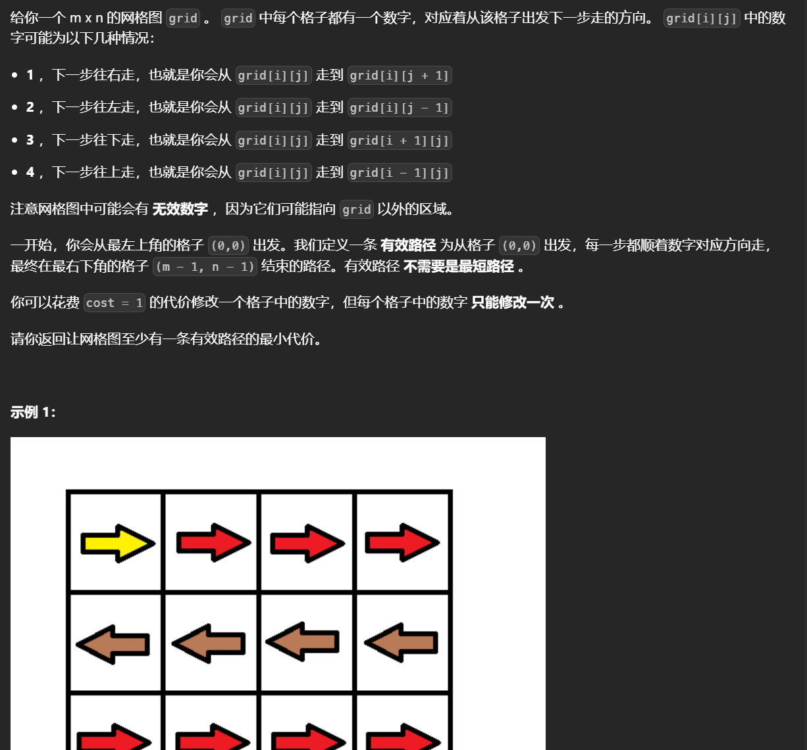

# Dijkstra算法


## 模板


```python
from math import inf

n, m = [int(x) for x in input().split()]
path = [[inf] * n for _ in range(n)]
dis = [inf] * n
dis[0] = 0
# 不用标记初始点
vis = [False] * n
for _ in range(m):
    u, v, w = [int(x) for x in input().split()]
    #注意要取最小值，可能有重边
    path[u-1][v-1] = min(w,path[u-1][v-1])
while True:
    x = -1
    # 遍历一遍所有点，选出其中没有被访问过且力起点最近的点
    for i in range(n):
        if not vis[i] and (x < 0 or dis[i] < dis[x]):
            x = i
    # 图不连通
    if x < 0 or dis[x] == inf:
        print(-1)
        break
    # 找到了，由于求的是单源最短路直接返回
    if x == n - 1:
        print(dis[x])
        break
    # 标记
    vis[x] = True
    # 更新状态
    for u, w in enumerate(path[x]):
        dis[u] = min(dis[u], dis[x] + w)

```

很明显的看出，每次要遍历所有的点n然后进行这个点边的个数次操作，一次操作中是O(m+n)，最多遍历vis数组的大小，也就是O(n^2)


点数太多而边数有限，使用优先队列优化的算法，优先队列优化指的是使用根堆每次找当前没有被访问过的且距离最小的点。

```python
from collections import defaultdict
from math import inf
import heapq

n, m = [int(x) for x in input().split()]
# 这里由于点数太多，且图是稀疏图因此使用邻接表
path =defaultdict(dict)
dis = [inf for i in range(n)]
dis[0] = 0

# 建图
for _ in range(m):
    u, v, w = [int(x)-1 for x in input().split()]
    # 不使用默认字典，即使是双向边也能用
    if v in path[u]:
        path[u][v]=min(path[u][v],w+1)
    else:
        path[u][v]=w+1

# 第一个值作为权重
h=[(0,0)]
while h:
    d,x=heapq.heappop(h)
    # 当前点之前出过堆
    if d>dis[x]:continue
    
    for k,v in path[x].items():
        # 严格小于 
        if d+v<dis[k]:
            dis[k]=d+v
            heappush(h,(dis[k],k))       
print(*dis[1:])
```

时间复杂度为O(mn)，根堆中找值的速度为O(logn)，大概一共进行m（边的个数次）


## 前往目标的最小代价


不考虑特殊路径，起点到中的距离就是曼哈顿距离，也就是两个坐标之差的绝对值之和，不需考虑怎么走（向上向下一类的），直接就是两个点的间距。

抽象为一幅图，认为每个节点和终点以及特殊路径中的终点相连，从起点记过一段特殊路径到达特殊路径的终点后，又可以直接到起点或者继续走一段特殊路径，接下来使用Dijkstra算法。

模拟一下：从起点开始，可以到达终点以及多个特殊路径的终点，如果在循环中选取出的最短路是直接到终点的话，也就是说经过特殊路径反而不会缩减距离，那么结果就是从起点直接到终点，否则就是选择了从起点到某一段特殊路径端点的最短的路径，然后从这个端点继续选择，如果从这个端点到重点的距离最短，那么下一轮循环就会直接找出答案， 如果是经过另一条特殊路径最短的话，那么下一轮继续之前的操作。

```python
from cmath import inf
from collections import defaultdict
class Solution(object):
    def minimumCost(self, start, target, specialRoads):
        # 将传入的数组转化为元组形式
        t = tuple(target)
        # 由于是二维下的，因此使用一个字典记录距离
        dis = defaultdict(lambda: inf)
        # 自己到自己的距离是0
        dis[tuple(start)] = 0
        # 记录有无加入过
        vis = set()

        def Dijastra():
            # 算法模板，没有用优先级队列
            
            while True:
                
                # v表示当前节点
                v = None
                
                # 使用循环找出队列中优先级最高的且没有被访问过的
                for point, d in dis.items():
                    if point not in vis and (v is None or d < dis[v]):
                        v = point
                # 到达目标点
                if v == t:
                    return dis[v]
                
                vis.add(v)
                vx, vy = v

                # 更新相连的节点
                
                # 更新到终点
                dis[t] = min(dis[t], dis[v] + abs(vx - t[0]) + abs(vy - t[1]))
                # 更新经过特殊路径的点
                for x1, y1, x2, y2, c in specialRoads:
                    # 只需要考虑特殊路径的另一端
                    w = (x2, y2)
                    # 从当前节点到特殊路径的另一端有两种走法，首先得到特殊路径的起始点，之后，一个是直接曼哈顿距离，一个经过特殊路径到另一端（加上cost）
                    d = dis[v] + min(abs(x2 - vx) + abs(y2 - vy), abs(x1 - vx) + abs(y1 - vy) + c)
                    # 更新
                    dis[w] = min(dis[w], d)

        return Dijastra()
```

## Buy a Ticket


该题目中存在点权，并且只有终点的点权需要计算而路径上的点权不需要考虑，对于此类题目可以建立一个超级源点，该源点连接每一个点并且边权为每个点的点权，从该超级源点出发做迪杰斯特拉的结果就是每个点到其他点的最短路径（可以是本身），该题目中需要考虑来回因此边权需要乘上2，而从超级源点出发的边边权不变。

对于给定的数据范围需要使用根堆优化

```python
import heapq
from collections import defaultdict
from heapq import heappush
from math import inf
import sys
input=sys.stdin.readline

n,m=[int(x) for x in input().split()]
path=defaultdict(dict)
# 建图 这里是无向图
for _ in range(m):
    u,v,w=[int(x) for x in input().split()]
    path[u][v]=w*2
    path[v][u]=w*2
a=[int(x) for x in input().split()]
# 建立超级源点，由于点是从1到n的，因此超级源点可以设置为0
for i,v in enumerate(a,1):
    path[0][i]=v
    path[i][0]=v
dis=[inf]*(n+1)
dis[0]=0
# 建立根堆
h=[(0,0)]
while h:
    # 弹出
    d,x=heapq.heappop(h)
    # 访问过
    if d>dis[x]:continue
    for k,v in path[x].items():
        # 更行
        if d+v<dis[k]:
            dis[k]=d+v
            heappush(h,(dis[k],k))       
print(*dis[1:])
```

## [得分最高的路径](https://leetcode.cn/problems/path-with-maximum-minimum-value/)

		


使用dfs超时，bfs无法求解，使用图论。此题点数太多使用根堆优化的版本，由于要求最大值，因此把边权转换为负数求解最小值。

```python
class Solution:
    def maximumMinimumPath(self, grid: List[List[int]]) -> int:
        m,n=len(grid),len(grid[0])
        # 用一维数组代替二维
        dis=[inf]*(m*n)
        h=[(-grid[0][0],0,0)] 
        dis[0]=-grid[0][0]
        while h:
            d,i,j=heapq.heappop(h)
            curr=i*n+j
            # 访问过了
            if d>dis[curr]:continue
            # 找相连的点
            for dx,dy in (0,1),(-1,0),(1,0),(0,-1):
                if 0<=(x:=dx+i)<m and 0<=(y:=dy+j)<n:
                    target=x*n+y
                    # 路径距离的计算是取最小值
                    cc=max(-grid[x][y],d)
                    #如果小于可以更新
                    if cc<dis[target]:
                        dis[target]=cc
                        heappush(h,(dis[target],x,y))
        
        return -dis[-1]
```

## [到达目的地的方案数](https://leetcode.cn/problems/number-of-ways-to-arrive-at-destination/)


用dijstra找最短路的过程中使用dp求解路径数，定义dp[i]为0~i最短路的数目，如果存在d+v<dis[k]说明从 0 到 *x* 再到 *y* 的路径是目前最短的，所以更新 *f*[*y*] 为 *f*[*x*]，如果等于，说明从 0 到 *x* 再到 *y* 的路径与之前找到的路径一样短，所以把 *f*[*y*] 增加 *f*[*x*]。

```python
class Solution:
    def countPaths(self, n: int, edges: List[List[int]]) -> int:
        mod=10**9+7
        path=defaultdict(dict)
        f=[0]*n
        f[0]=1
        for u,v,w in edges:
            path[u][v]=path[v][u]=w
        dis=[inf]*n
        dis[0]=0
        h=[(0,0)]
        while h:
            d,x=heappop(h)
            if d>dis[x]:continue
            for k,v in path[x].items():
                if d+v<dis[k]:
                    f[k]=f[x]
                    dis[k]=d+v
                    heappush(h,(dis[k],k))
                elif d+v<=dis[k]:
                    f[k]+=f[x]
                    f[k]%=mod
        
        return f[-1]
```


## [使网格图至少有一条有效路径的最小代价](https://leetcode.cn/problems/minimum-cost-to-make-at-least-one-valid-path-in-a-grid/)




最短路问题，把每个格子看作是一个点，是否要变化看作是权重0和1，用迪杰斯特拉求解从起点到终点的距离。


```python
class Solution:
    def minCost(self, grid: List[List[int]]) -> int:
        m,n=len(grid),len(grid[0])
        # 用二维矩阵表示从(0,0)到(i,j)的最小距离
        dis=[[inf]*n for _ in range(m)]
        # 初始化
        dis[0][0]=0
        h=[(0,0,0)]
        dirs=[(0,1),(0,-1),(1,0),(-1,0)]
			
        while h:
            c,x,y=heappop(h)
            if c>dis[x][y]:continue
            for jj in range(4):
                dx,dy=dirs[jj]
                # 合法的位置
                if 0<=(i:=dx+x)<m and  0<=(j:=dy+y)<n:
                    # 代价是是否要变化方向
                    cnt=c+int((jj+1)!=grid[x][y])
                    if cnt<dis[i][j]:
                        dis[i][j]=cnt
                        heappush(h,(dis[i][j],i,j))
        return dis[-1][-1]
```


## [在网格图中访问一个格子的最少时间](https://leetcode.cn/problems/minimum-time-to-visit-a-cell-in-a-grid/)


使用Dijkstra算法求解最短时间，这里到下一个位置所需的时间就是**max(当前位置所需的最短时间+1，这个位置至少需要的时间)**，同时这里可以通过反复横跳来增加时间，如果两个位置所需的时间的差为偶数那么到下一个位置所需的时间要加一，因为反复横跳所增加的时间一定是偶数，从5->11，差为6，反复横跳三次得到6然后在移动一次，因此所需的时间要加一。

```python
class Solution:
    def minimumTime(self, g: List[List[int]]) -> int:
        m,n=len(g),len(g[0])
        if g[0][1]>1 and g[1][0]>1:return -1
        dis=[[inf]*n for _ in range(m)]
        dis[0][0]=0
        h=[(0,0,0)]
        while True:
            d,i,j=heappop(h)
            if d>dis[i][j]:continue
            if i==m-1 and j==n-1:return d 
            for dx,dy in (1,0),(-1,0),(0,-1),(0,1):
                if 0<=(x:=dx+i)<m and 0<=(y:=dy+j)<n:
                    nd=max(d+1,g[x][y])
                    if (nd-d)&1==0:
                        nd+=1
                    if nd<dis[x][y]:
                        dis[x][y]=nd
                        heappush(h,(nd,x,y)) 
```


## [最大汉明距离](https://leetcode.cn/problems/maximum-hamming-distances/)


以二进制的角度看，每走一步就是反转一位 ，题目中要求的汉明距离最大即对应的不同二进制位越多越好，如果使用Dijkstra直接求解的会为了得到最大距离而走环(不断反转同一位)，这里将二进制转化为反码那么最大汉明距离就变为对应的相同二进制位越少越好

**题目中求解所有值的汉明距离，通过将所有的点作为起点做Dijkstra可以找到每一个点与其他点的最小距离。**最后的结果是dis[x]即x到所有起点的最小距离，也就是和反码相同位的有多少个，用m减去即可得到原码所需操作的次数

```python
class Solution:
    def maxHammingDistances(self, nums: List[int], m: int) -> List[int]:
        dis=defaultdict(lambda:inf)
        h=[]
        mask=(1<<m)-1
        for v in nums:
            # 转换为反码
            dis[v^mask]=0
            heappush(h,(0,v^mask))
        
        while h:
            d,x=heappop(h)
            # 当前点之前出过堆
            if d>dis[x]:continue
            for j in range(m):
                # 反转每一位
                state=x^(1<<j)
                if  d+1<dis[state]:
                    dis[state]=d+1
                    heappush(h,(dis[state],state))
        return [m-dis[v] for v in nums]
```


