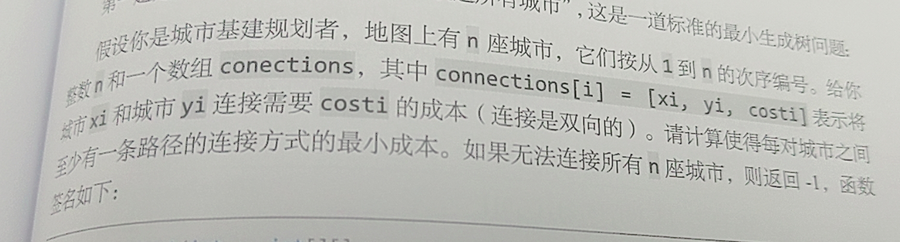
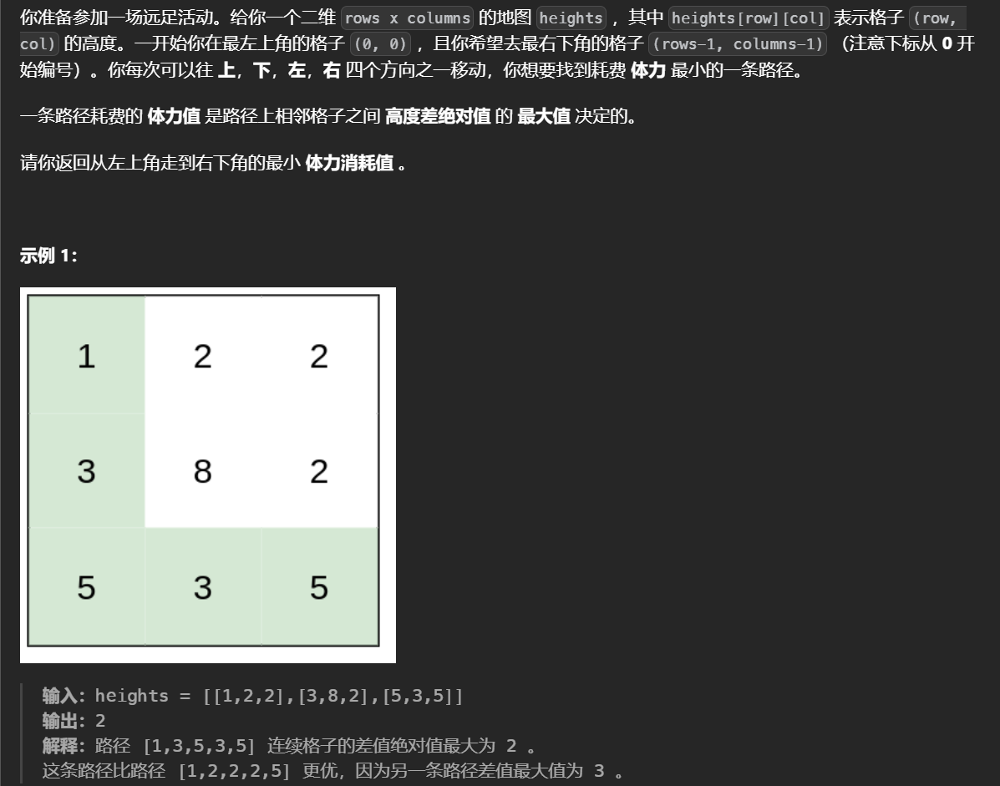
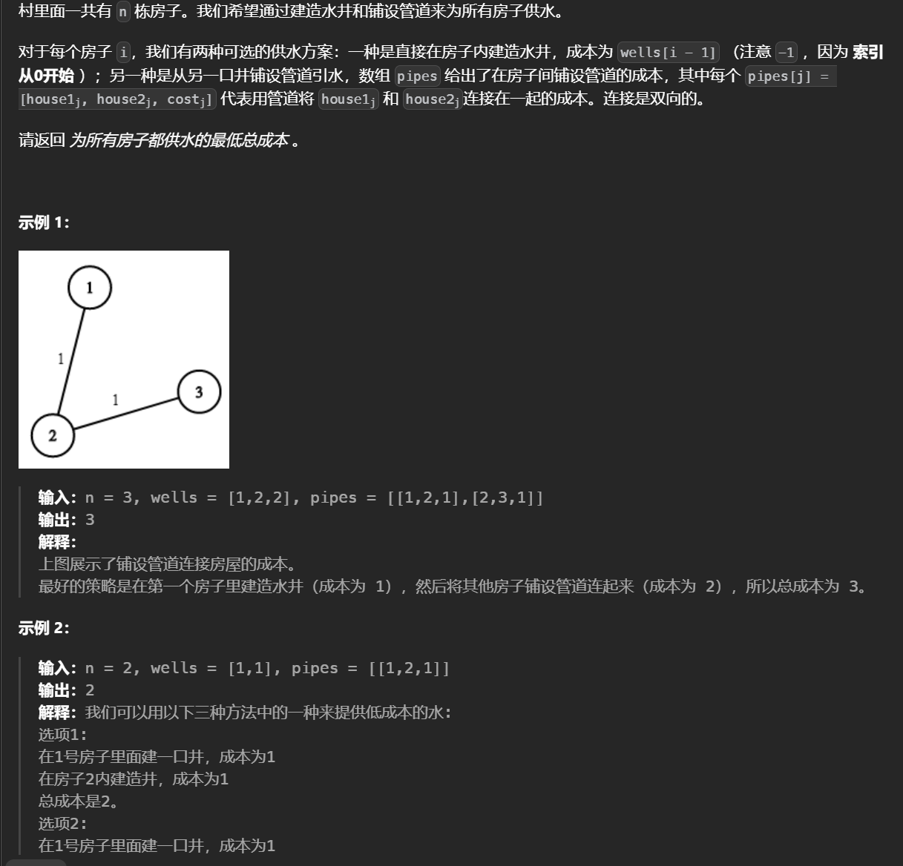

# Kruskal算法

该算法用于**重构**一棵树，从而生成**最小生成树**（Minimum Spanning Tree，MST）是一个在连接所有图的顶点的同时具有最小总权重的树形子图。在一个连通的带权无向图中，生成树是原图的一个子图，它包含了图中的所有顶点，并且是一棵树，没有包含任何环路。树与图的区别是树没有环。

基本思想是**贪心+并查集**，首先对所有的边按**权重**排序然后从最小的边开始遍历，如果二者不连通则连接上同时累加权重，**最后判断是否连通分量等于1（即n个点n-1条边）**

最小生成树算法可以用于求最短路


```python
class UF:
    def __init__(self,n):
        self.p=[i for i in range(n)]
        self.count=n
        self.size=[1 for _ in range(n)]
    def find(self,x):
        d=self
        if d.p[x]!=x:
            d.p[x]=d.find(d.p[x])
        return d.p[x]
    def union(self,x,y):
        d=self
        u=d.find(x)
        v=d.find(y)
        if u==v:
            return
        if d.size[u]<d.size[v]:
            d.size[v]+=d.size[u]
            d.p[u]=d.p[v]
        else:
            d.size[u]+=d.size[v]
            d.p[v]=d.p[u]
        d.count-=1
    def connect(self,x,y):
        d=self
        u=d.find(x)
        v=d.find(y)
        return v==u
    def judge(self):
        return self.count==1
n,m=[int(x) for x in input().split()]
edges=[]
for _ in range(m):
    edges.append(list(map(int,input().split())))
edges.sort(lambda x:x[2])

uf=UF(n)
res=0
for i in range(m):
    u,v,w =edges[i]
    u-=1
    v-=1
    if not uf.connect(u,v):
        uf.union(u,v)
        res+=w
if uf.judge():
    print(res)
else:
    print('impossible')
```

时间复杂度为O(mlogm+m)


## 最低成本联通城市



城市看作是节点，城市之间联通成本看作是权重，联通城市的最小成本即最小生成树的权重之和。每座城市之间至少有一条路径的，并要求最小成本，这就避免了环的出现，因为环的出现多此一举要花费更多的成本。

最小生成树问题，最小生成树是若干边的集合，这些边需要满足：保证包含图中所有节点，形成的结构不包含环，权重和最小。

其中前两点在遍历所有节点构造的同时，判断两个节点之间是否相连即可满足，权重最小利用贪心的思想，将所有边按照权重从小到达排序，从权重最小的边开始遍历，如果这条边和最小生成树中的其他边不会形成环，就将其加入到最小生成树，反之不加入

```python
def minimumCost(n,connection):
    connection=sorted(connection,key=lambda x:x[2])# 按照权重升序排序
    uf =UF(n+1)# 因为城市从1开始
    weight=0
    for connect in connection:
        p=connect[0]
        q=connect[1]
        w=connect[2]
        if uf.connect(p,q):
            continue
        weight+=w
        uf.union(p,q)
    # 0节点没有操作，所以连通分量应该是2，如果不是2说明存在没有连接上的，可能是会形成环。
    return weight if uf.count()==2else -1
```

## 联通所有点的最小费用


最小生成树问题，

```python
class UF:
    def __init__(self, n):
        self.count = n
        self.parent = [i for i in range(n)]
        self.size = [1 for _ in range(n)]

    def union(self, p, q):
        rootp = self.find(p)
        rootq = self.find(q)
        if rootq == rootp:
            return
        if self.size[rootq] < self.size[rootp]:
            self.parent[rootq] = rootp
            self.size[rootp] += self.size[rootq]
        else:
            self.parent[rootp] = rootq
            self.size[rootq] += self.size[rootp]
        self.count -= 1

    def connect(self, p, q):
        rootp = self.find(p)
        rootq = self.find(q)
        return rootq == rootp

# 递归，最终返回树的根节点
	def find(self,x):
    # 递归终止的条件是找到根节点
		if self.parent[x]!=x:
        	#在递归过程中把每一个节点的父节点设置为根节点
			self.parent[x]=self.find(self.parent[x])
    	return self.parent[x]
    def count(self):
        return self.count
class Solution(object):
    def minCostConnectPoints(self, points):
        connection=[]
        # 计算出每个节点之间的权重
        for i in range(len(points)):
            for j in range(i+1,len(points)):
                x_i=points[i][0]
                y_i=points[i][1]
                x_j = points[j][0]
                y_j = points[j][1]
                # 每个节点是一个坐标，选择将节点映射为它在points中的索引
                connection.append((i,j,abs(x_i-x_j)+abs(y_i-y_j)))
        # 按照权重排序
        connection=sorted(connection,key=lambda x:x[2])

        uf =UF(len(points))
        mst=0
        for connect in connection:
            # 避免多余的迭代
            if uf.count==1:
                break
            p=connect[0]
            q=connect[1]
            w=connect[2]
            if uf.connect(p,q):
                continue
            uf.union(p,q)
            mst+=w
        return mst 
```


## [最小体力消耗路径](https://leetcode.cn/problems/path-with-minimum-effort/)




由于可以向任意方向移动因此不能使用dp，根据给定的数据范围使用dfs会超时，这里使用最小生成树算法，但不是要加入所有子树而是遇到目标值就停止。

```python
class UF:
    def __init__(self, n):
        self.count = n
        self.parent = [i for i in range(n)]
        self.size = [1 for _ in range(n)]

    def union(self, p, q):
        rootp = self.find(p)
        rootq = self.find(q)
        if rootq == rootp:
            return
        # 小的连接到大的上面去
        if self.size[rootq] < self.size[rootp]:
            self.parent[rootq] = rootp
            self.size[rootp] += self.size[rootq]
        else:
            self.parent[rootp] = rootq
            self.size[rootq] += self.size[rootp]
        self.count -= 1

    def connect(self, p, q):
        rootp = self.find(p)
        rootq = self.find(q)
        return rootq == rootp

    def find(self,p):
        if self.parent[p]!=p:
            self.parent[p]=self.find(self.parent[p])
        return self.parent[p]
class Solution:
    def minimumEffortPath(self, g: List[List[int]]) -> int:
        m,n=len(g),len(g[0])
        uf=UF(m*n)
        path=[]
        
        vis=set()
        # 建图
        for i in range(m):
            for j in range(n):
                vis.add(i*n+j)
                for dx ,dy in (1,0),(0,1),(-1,0),(0,-1):
                    if 0<=(x:=dx+i)<m and 0<=(y:=dy+j)<n and x*n+y not in vis:
                        path.append([i*n+j,x*n+y,abs(g[i][j]-g[x][y])])
        # 按照权重排序
        path.sort(key=lambda x:x[2])
        for u,v,w in path:
            # 连接
            uf.union(u,v)
            # 两个目标值已经相连，直接返回权重，这个权重就是路径上最大的且是所有路径中最小的
            if uf.connect(0,m*n-1):
                return w
        return 0
        
```


## [水资源分配优化](https://leetcode.cn/problems/optimize-water-distribution-in-a-village/)



把水井看作是一个超级源点那么问题就变为了求解最小生成树。

```python
class UF:
    def __init__(self,n):
        self.p=[i for i in range(n)]
        self.count=n
        self.size=[1 for _ in range(n)]
    def find(self,x):
        d=self
        if d.p[x]!=x:
            d.p[x]=d.find(d.p[x])
        return d.p[x]
    def union(self,x,y):
        d=self
        u=d.find(x)
        v=d.find(y)
        if u==v:
            return
        if d.size[u]<d.size[v]:
            d.size[v]+=d.size[u]
            d.p[u]=d.p[v]
        else:
            d.size[u]+=d.size[v]
            d.p[v]=d.p[u]
        d.count-=1
    def connect(self,x,y):
        d=self
        u=d.find(x)
        v=d.find(y)
        return v==u
    def judge(self):
        return self.count==1
class Solution:
    def minCostToSupplyWater(self, n: int, wells: List[int], edges: List[List[int]]) -> int:
        for i,v in enumerate(wells,1):
            edges.append([0,i,v])
        edges.sort(key=lambda x:x[-1])
        ans=0
        uf=UF(n+1)
        for u,v,w in edges:
            if not uf.connect(u,v):
                ans+=w
                uf.union(u,v)
        return ans 
```


## **Sum of Max Matching**


题目保证AB中的元素无交集


最小化最大的边权想到最小生成树

这里使用两个数组start和end记录A和B中数出现的次数，在使用克鲁斯科尔的过程中，当一条边可以连接两个集合中的数时，这条边的权值就是两个集合中点相互到达的路径上的最小的最大值，因为从小到大枚举边。注意这里可能会连接集合内部的点而不是两个集合之间，因此最后需要修改start和end

```python
class UF:
    def __init__(self, n):
        self.count = n
        self.parent = [i for i in range(n)]
        self.size = [1 for _ in range(n)]

    def union(self, p, q):
        rootp = self.find(p)
        rootq = self.find(q)
        if rootq == rootp:
            return
        self.parent[p]=q
        self.count -= 1

    def connect(self, p, q):
        rootp = self.find(p)
        rootq = self.find(q)
        return rootq == rootp

    def find(self,p):
        if self.parent[p]!=p:
            self.parent[p]=self.find(self.parent[p])
        return self.parent[p]

n,m,k=RR()
edges=[]
# 记录以这个点为根有多少个待匹配的点
start=[0]*n
end=[0]*n
for _ in range(m):
    edges.append(RR())
# 初始化
for x in RR():start[x-1]+=1
for x in RR():end[x-1]+=1

uf=UF(n)
# 排序
edges.sort(key=lambda x:x[-1])
ans=0

for a,b,w in edges:
    a-=1
    b-=1
    # 找到端点对应的集合
    fa,fb=uf.find(a),uf.find(b)
    # 已经连接，跳过
    if fa==fb:continue
    # 连接，这里是将fa连到fa上，因为如果端点是在集合内，则默认以b为根，find不会改变被连接者的根
    uf.union(fa,fb)
    # a在start中,b在end中，取最小
    mn=min(start[fa],end[fb])
    ans+=mn*w
    # 已经匹配了不再需要，减去
    start[fa]-=mn
    end[fb]-=mn

    # 也可能是b在start中,a在end中
    mn=min(start[fb],end[fa])
    ans+=mn*w
    start[fb]-=mn
    end[fa]-=mn

    # 在内部，将a端点连接到b
    start[fb]+=start[fa]
    start[fa]=0

    end[fb]+=end[fa]
    end[fa]=0
print(ans)
```

