一个算法爱好者的刷题笔记，记录了所遇到的各类算法模板和题解

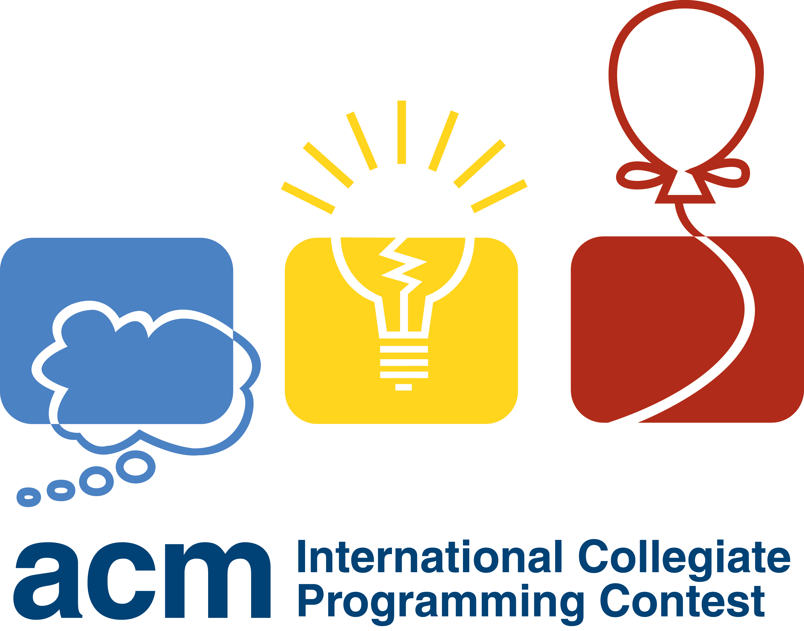

闲暇之余做做leetcode

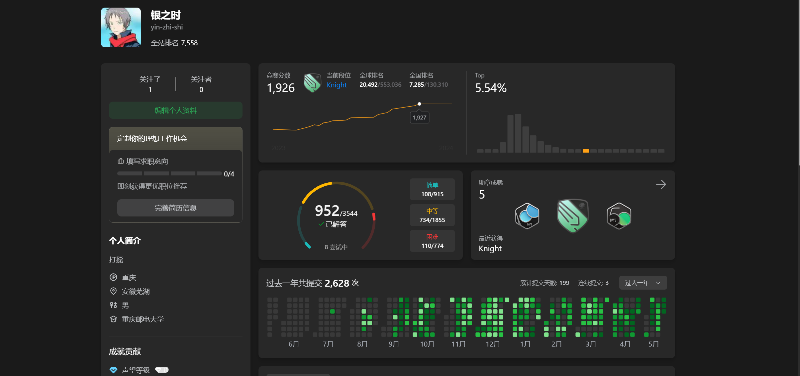

24底

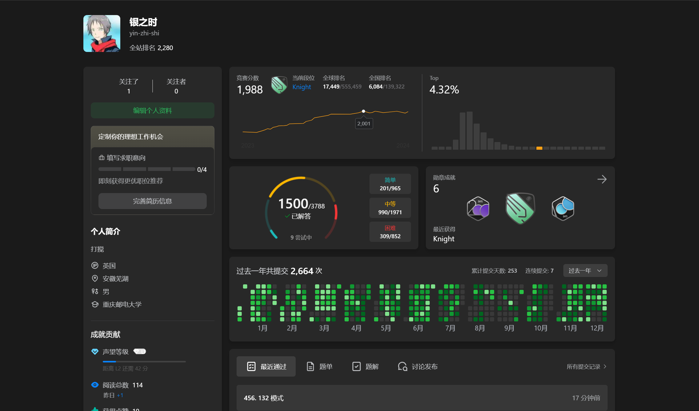

25年4月底，忙于保研没有太多精力了

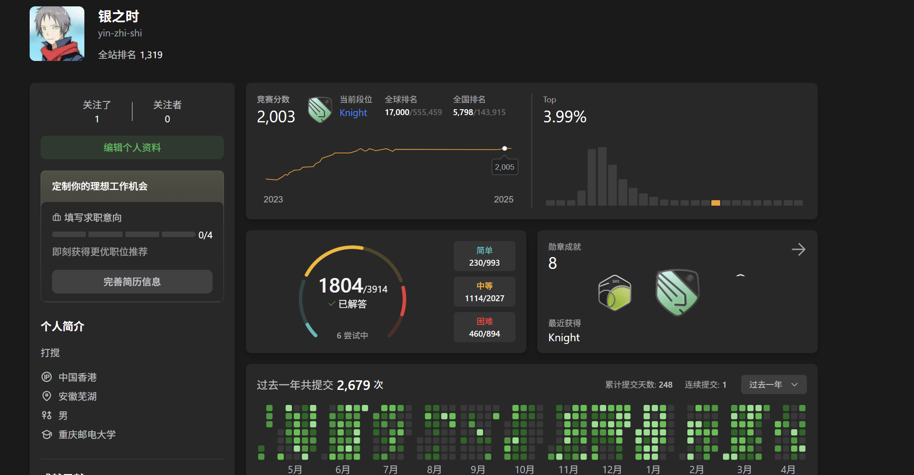

25年8月5号 2000题

有点感慨，现在还在保研的迷茫中，不知道未来会何去何从，希望大四有机会一直写，突破3000

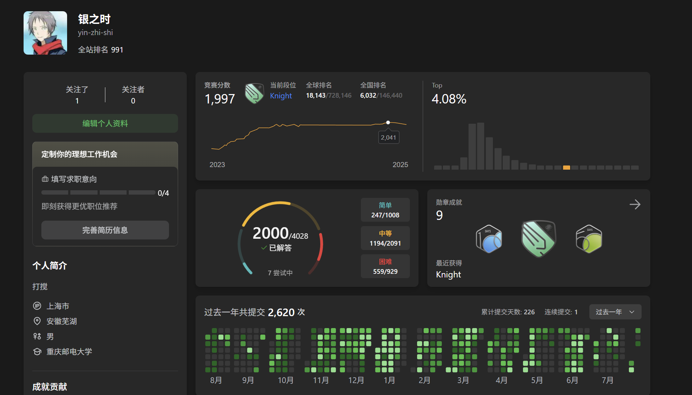

有空会做牛客和codeforce

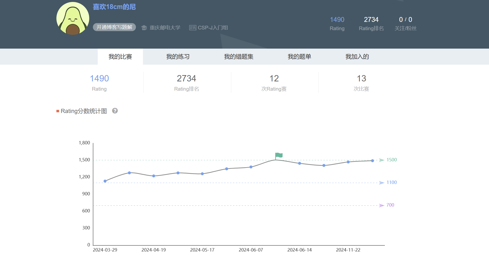

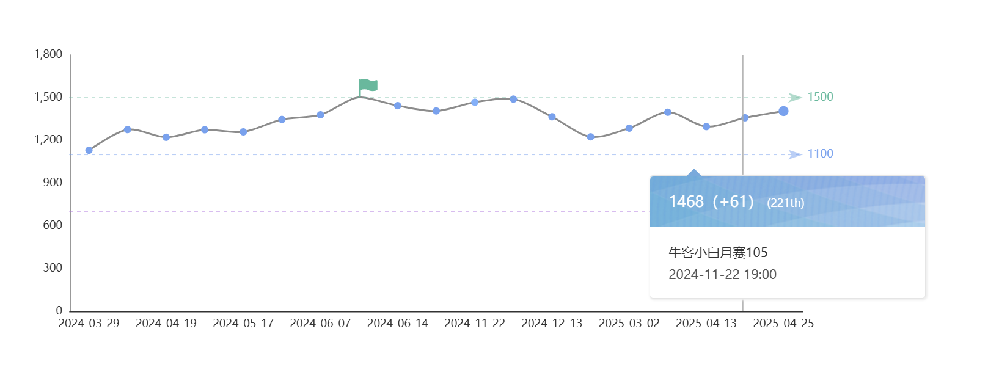

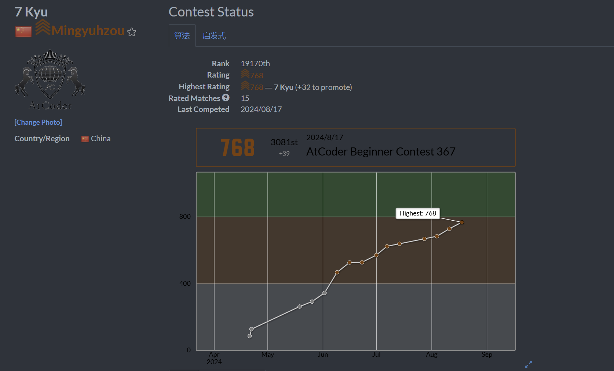

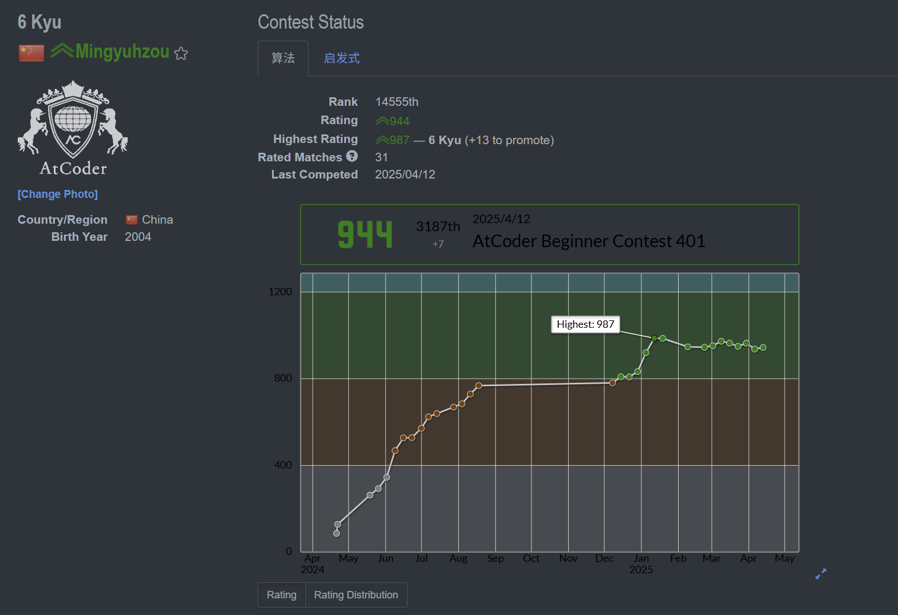

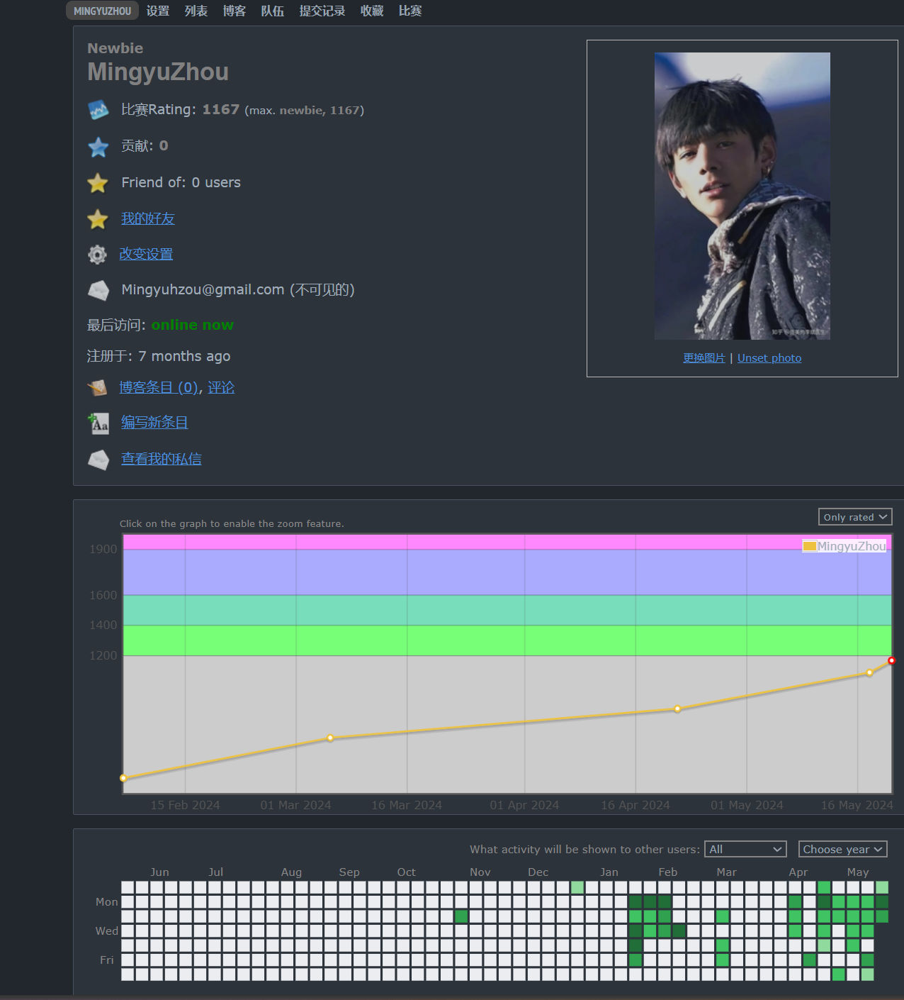

把我打得道心崩溃

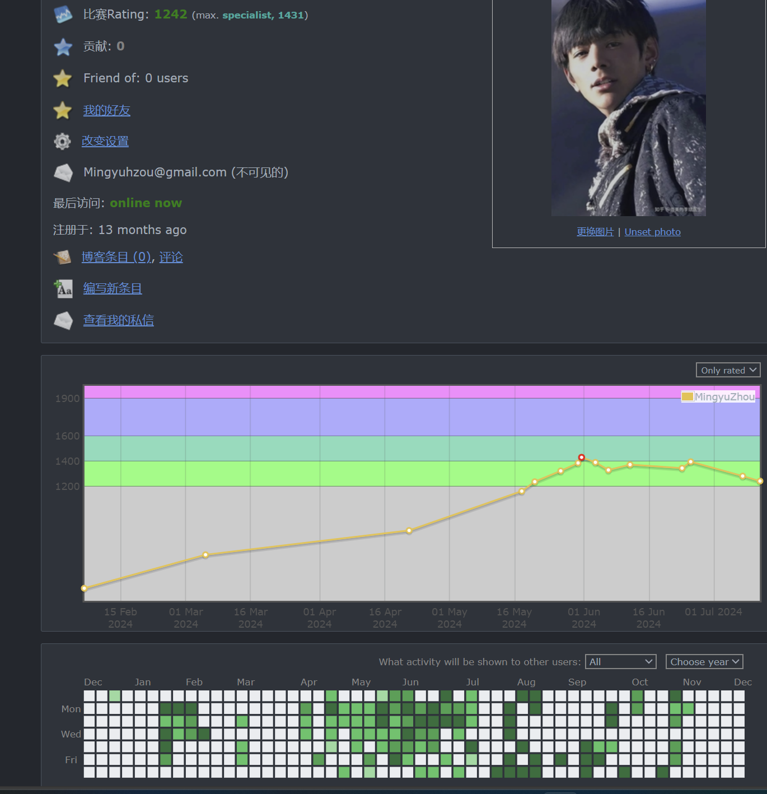

25-5-10

有幸参与了CCPC，差两名拿铜牌，这次比赛我也认识到了自己的错误——只会写模板题对构造题没有一点思路，从今天开始练习CF构造题。
