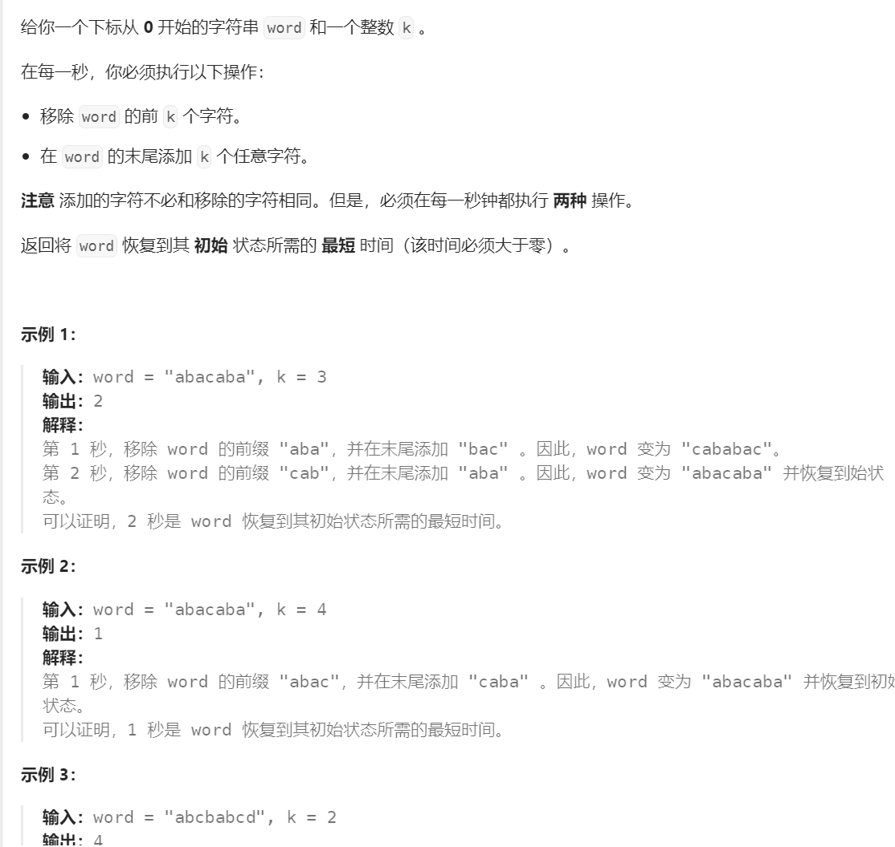
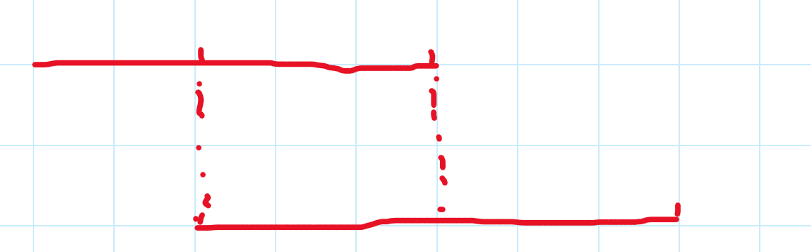
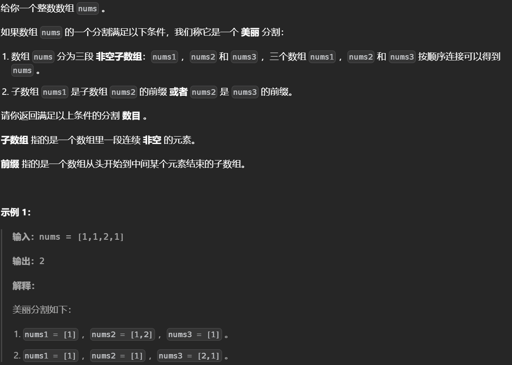
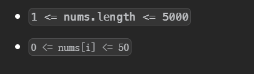

# Z函数

z[i]表示s[i:]\(每个后缀)与s的公共最长前缀是多少

初始时从1开始比较，找到最长前缀就是暴力匹配，匹配之后会有一段z-box:


再找下一个s[i:]的过程中如果i落在了z-box中，首先判断z[i-l]是否小于z-box的边界到i的距离，如果小于就确定了z[i]=z[i-l]，反之说明在z-box中的这一段都是匹配的继续往后找，最后更新z-box

```python
def z(s):
    n=len(s)
    z=[0]*n
    l,r=0,0
    for i in range(1,n):
        # 在z-box中并且小于
        if i<=r and z[i-l]<r-i+1:
            z[i]=z[i-l]
        else:
            # 先初始化为到边界的距离
            z[i]=max(0,r-i+1)
            # 往后找
            while i+z[i]<n and s[z[i]]==s[i+z[i]]:      
                z[i]+=1
            # 更新区间
            if i+z[i]-1>r:
                l=i
                r=i+z[i]-1
    return z
```


如果存在s和p 想找s的每个前缀能匹配多长的p(子串)，由于z函数是自身与自身匹配，这里可以拼接p+s求解z函数 s[i:]能匹配的最长的p即为z[i+len(p)]


对于后缀要倒置s2=p[::-1]+s[::-1]， z2=z(s2) 求解时b=z2[len(p)+len(s)-r(子串的右端点)]


## [将单词恢复初始状态所需的最短时间 II](https://leetcode.cn/problems/minimum-time-to-revert-word-to-initial-state-ii/)




删除k个前面的子串后，如果剩余的子串能完美匹配前缀那么就可以提前结束，因为在后面添加的值是任意的。

使用z函数找出每个后缀与字符串的最长公共前缀，如果大于当前剩余子串的长度那么可以提前结束反之只能删除所有原来的字符。

```python
class Solution:
    def minimumTimeToInitialState(self, word: str, k: int) -> int:
        def z(s):
            n=len(s)
            z=[0]*n
            l=r=0
            for i in range(1,n):
                if i<=r and z[i-l]<r-i+1:
                    z[i]=z[i-l]
                else:
                    z[i]=max(0,r-i+1)
                    while i+z[i]<n and s[z[i]]==s[i+z[i]]:
                        z[i]+=1
                    if i+z[i]-1>r:
                        l=i
                        r=i+z[i]-1
            return z
        z=z(word)
        n=len(word)
        for i in range(1,ceil(n/k)):
            if z[k*i]>=n-k*i:
                return i
        return ceil(n/k)

```

## Tavas and Malekas


关键在于判断每个模式串的位置是否合法，对于两个位置l1和l2，如果前者的r1不与或者相交那么自然合法，否则要去判断上下两端是否相等。使用Z函数可以快速判断，因为Z函数的Z[i]表示S[i:]能匹配S的最长前缀。




```python
def z(s):
    n=len(s)
    z=[0]*n
    l,r=0,0
    for i in range(1,n):
        # 在z-box中并且小于
        if i<=r and z[i-l]<r-i+1:
            z[i]=z[i-l]
        else:
            # 先初始化为到边界的距离
            z[i]=max(0,r-i+1)
            # 往后找
            while i+z[i]<n and s[z[i]]==s[i+z[i]]:
                z[i]+=1
            # 更新区间
            if i+z[i]-1>r:
                l=i
                r=i+z[i]-1
    return z
def slove():
    mod = 10 ** 9 + 7
    n, k = [int(x) for x in input().split()]
    s = input()
    if not k:
        print(pow(26,n,mod))
        return
    ll = len(s)
    nums = [int(x) for x in input().split()]
    nums.sort()
    tt = n


    arr=z(s)
    pre=nums[0]
    ans=ll

    for i in range(1,k):
        index=nums[i]
        r=pre+ll-1
        if r<index:
            ans+=ll
            pre=index
        else:
            l_=r-index+1
            x=arr[index-pre]
            if x<l_:
                print(0)
                return
            else:
                pre=index
                ans+=ll-l_
    print(pow(26, n - ans, mod))

slove()
```


## [统计数组中的美丽分割](https://leetcode.cn/problems/count-beautiful-splits-in-an-array/)





对于给定的数据范围可以枚举两个分割点，关键在于提前打表构建Z函数

```python
class Solution:
    def beautifulSplits(self, nums: List[int]) -> int:
        n=len(nums)
        def Z(s):
            n=len(s)
            z=[0]*n
            l,r=0,0
            for i in range(1,n):
                # 在z-box中并且小于
                if i<=r and z[i-l]<r-i+1:
                    z[i]=z[i-l]
                else:
                    # 先初始化为到边界的距离
                    z[i]=max(0,r-i+1)
                    # 往后找
                    while i+z[i]<n and s[z[i]]==s[i+z[i]]:      
                        z[i]+=1
                    # 更新区间
                    if i+z[i]-1>r:
                        l=i
                        r=i+z[i]-1
            return z
        z=[]
        a=nums[:]
        # 以每个后缀做一个Z函数表
        while a:
            z.append(Z(a))
            a.pop(0)
        # 检查两个端点
        def check(i,j):
            # 第二段的长度需要大于等于第一段，且匹配的前缀长度至少大于等于第一段
            if j-i>=i and z[0][i]>=i:return True 
        	# 第三段的长度大于等于第二段，且匹配的前缀长度至少大于等于第二段，这里找的Z表是以第二段开头的
            if n-1-j+1>=j-i and z[i][j-i]>=j-i:return True 
            return False
        ans=0
        # n^2枚举分割点
        for i in range(1,n-1):
            for j in range(i+1,n):
                if check(i,j):ans+=1
        return ans 
```


## 题目列表

[第一个几乎相等子字符串的下标](https://leetcode.cn/problems/find-the-occurrence-of-first-almost-equal-substring/)前后缀分解+Z函数子串匹配


