# 二分搜索题

**while l<=r**

如果是要最大化答案，一般是满足要求的情况下**l=mid+1**，最后的结果就是**l-1**，如果是最小化答案就是**r=mid-1**,最后的结果就是**r+1**

### 爱吃香蕉的珂珂

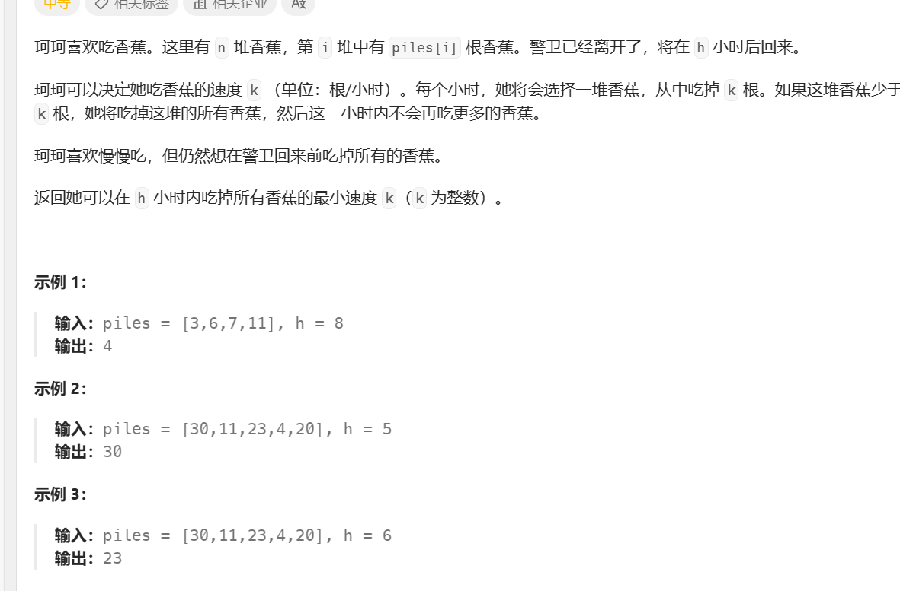

题目中令每小时吃香蕉的速度为x，f(x)为吃完所有香蕉的时间，约束条件是target=h


```python
class Solution(object):

    def minEatingSpeed(self, piles, h):
        def f(piles,x):
            hours=0
            for pile in piles:
                hours+=pile//x
                if pile%x!=0:
                    hours+=1
            return hours
        left=1
        right=10**9
        while left<right:
            mid=(left+right)//2

            if (f(piles, mid)==h):
                right=mid

            if(f(piles,mid)>h):
                left = mid + 1

            else:
                right=mid
        
        return left
```


### 在 D 天内送达包裹的能力

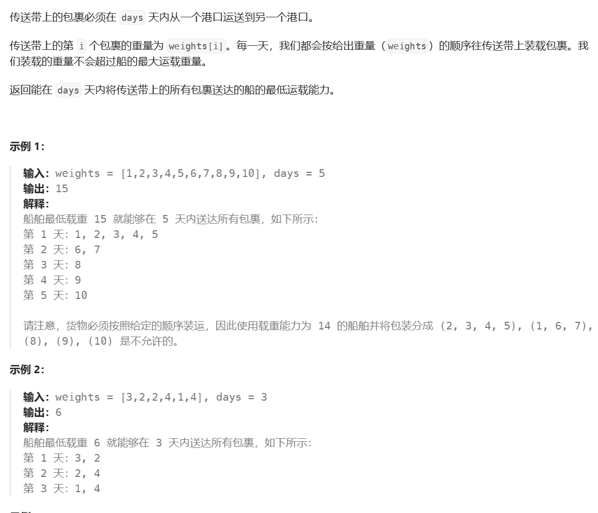

令每天运载的货物量为自变量x，f(x)表示以x为最小货物量时所需的天数。

注意x的初始值不能随便设，每天货物运载量最小的要是weights中最大的值如果从一开始那么什么也运不了，最大应该是所有货物总和，一次可以把所有货物运走。


```python
class Solution(object):
    def shipWithinDays(self, weights, days):
        # f(x)函数，说实话不好写
        def f(nums, x):
            i = 0
            days = 0
            while i < len(nums):
                cap = x
                while i < len(nums):
                    if nums[i] > cap:
                        break
                    else:
                        cap -= nums[i]
                        i += 1
                days += 1
            return days
        # 左右边界
        left=max(weights)
        right=sum(weights)
        while left < right:
            mid = (left + right) // 2
            # 不断缩减右边界
            if f(weights, mid) <= days:
                right = mid
            else:
                left = mid + 1  

        return left
```

### 分割数组的最大值

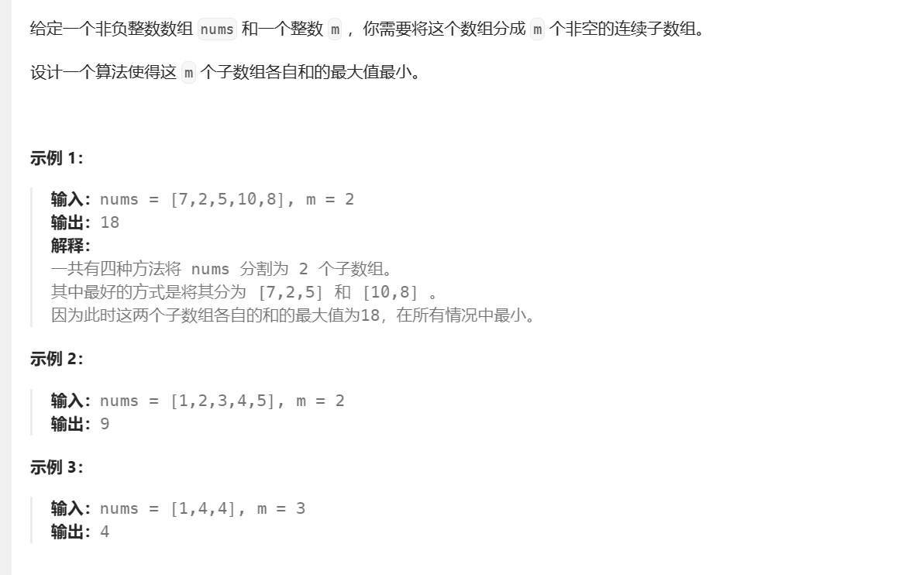

将问题抽象为有一个nums的数组表示货物量，需要在m天内运完所有的货物，问每天至少需要运多少。

```python
class Solution(object):
    def splitArray(self, nums, k):
        def f(nums,x):
            days=0
            i=0
            while i<len(nums):
                cap=x
                while i<len(nums):
                    if nums[i]>cap:
                        break
                    else:
                        cap-=nums[i]
                        i+=1
                days+=1
            return days
                
        left=max(nums) 
        right=sum(nums)
        while left<right:
            mid=(left+right)//2
            if f(nums,mid)<=k:
                right=mid
            else:
                left=mid+1
        return left
```


使用动态规划的思想，设置dp[i] [j]表示前i个数分为j段的最大连续子数组和的最小值，状态转移时，枚举一个变量从0到i-1表示前i个数中的前k个,dp[i] [j]=min(dp[i] [j],max(dp[k] [j-1],sum(nums[k:i+1])))

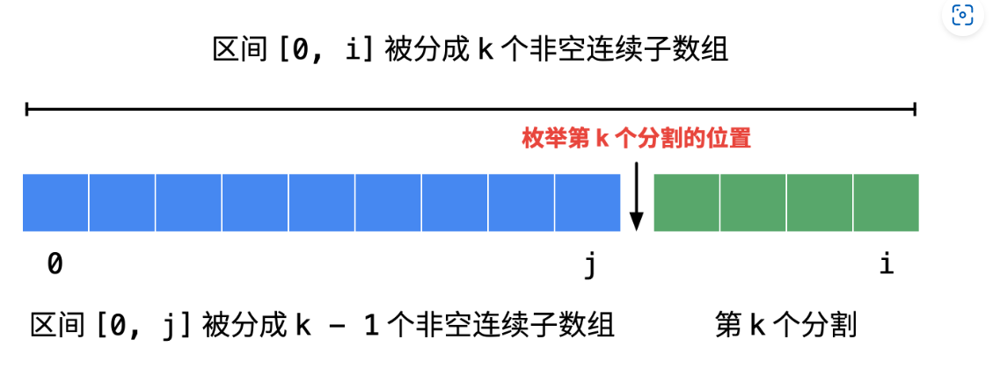

对于不合法的值，分的段数大于拥有的数，设置为一个很大的数。

根据dp表推出base case 为dp[0] [0]=0

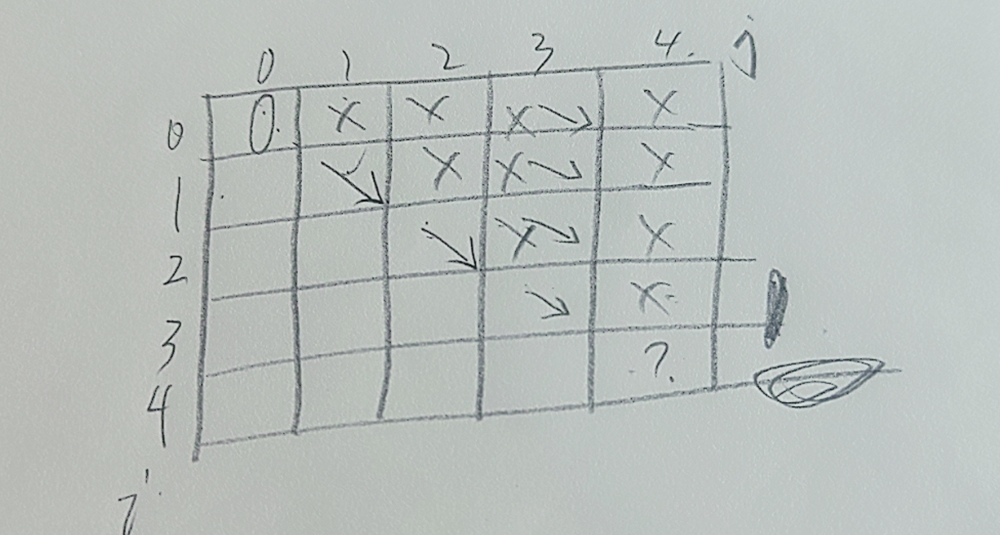


```python 
class Solution(object):
    def splitArray(self, nums, k):
        n=len(nums)
        # 初始化
        dp=[[float('inf') for _ in range(k+1)] for _ in range(n+1)]
        dp[0][0]=0
		# 构造前缀和数组
        sub=[0]
        for ele in nums:
            sub.append(sub[-1]+ele)
        # 遍历填充每个位置
        for i in range(1,n+1):
            # 对于分的段数大于当前拥有的不能遍历了
            for j in range(1,min(k,i)+1):
                # 从前I个中不断划分
                for m in range(i):
                    dp[i][j]=min(dp[i][j],max(dp[m][j-1],sub[i]-sub[m]))

        return dp[n][k]
```


### [使结果不超过阈值的最小除数](https://leetcode.cn/problems/find-the-smallest-divisor-given-a-threshold/)

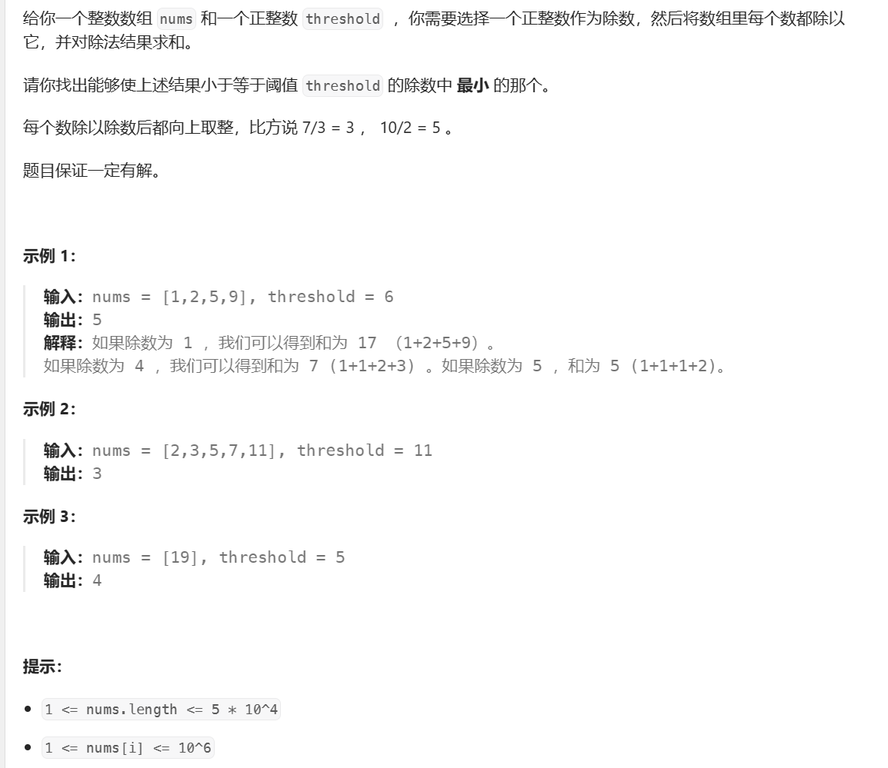

给定的数据范围可以进行二分搜索（二分的搜索次数很小即使在过程中会遍历这个数组也很快），注意界定开始点为1防止除数为0.

根据二分搜索算法找出除数，如果结果大于给定值说明除数小了，更新左边界，如果小于等于收缩右边界

```python
from math import ceil
class Solution:
    def smallestDivisor(self, nums: List[int], threshold: int) -> int:
        l,r=1, max(nums)
        ans=-1
        def f (x):
            return sum([ceil(i/x) for i in nums])
            
        while l<=r:
            mid=(l+r)//2

            val=f(mid)
            
            if val<=threshold:
                ans=mid
                r=mid-1
            else:
                l=mid+1
        return ans
```

### [完成旅途的最少时间](https://leetcode.cn/problems/minimum-time-to-complete-trips/)

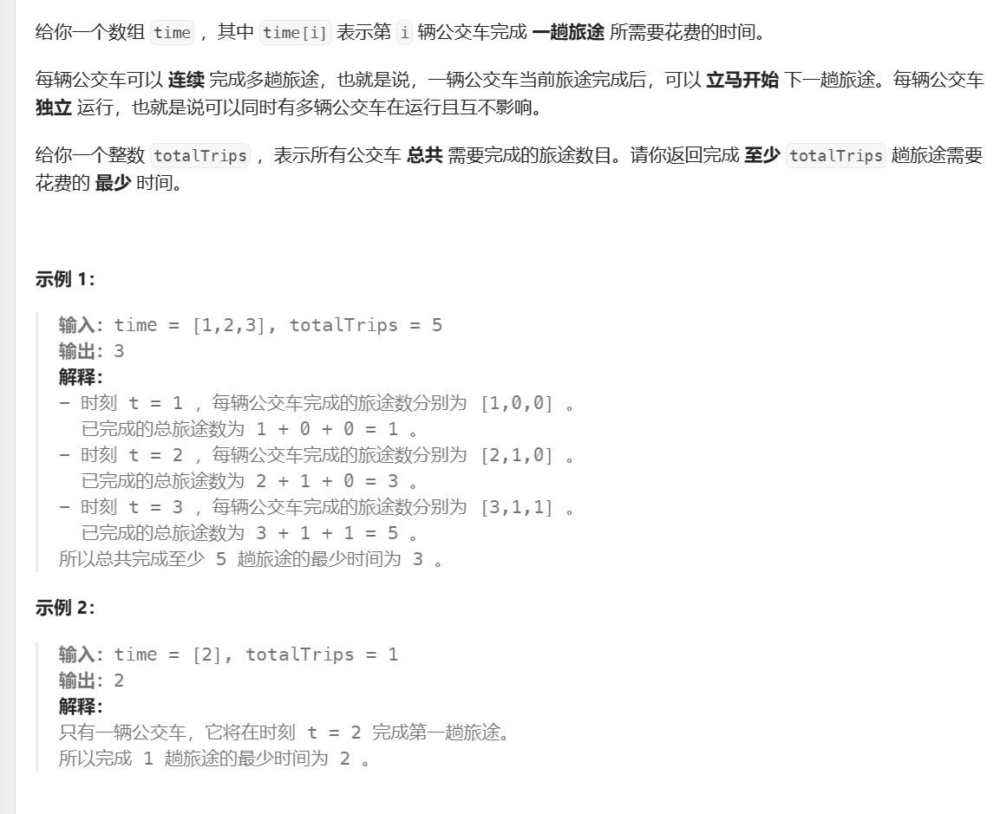

很明显使用二分应用，这里需要注意的一点是，当t=2,time=[1,2,3]的时候，不需要去找那些车可以移动，因为2//3=0，不会对答案有影响。

这里的上界是最小的启动时间去满足totaltime，使用找左侧边界的二分算法，即找到了答案不断缩减右边界。

```python
class Solution:
    def minimumTime(self, time: List[int], totalTrips: int) -> int:
        time.sort()
        r=time[0]*totalTrips
        l=1
        while l<=r:
            mid=(l+r)//2
            res=sum(mid//x for x in time)
            if res>totalTrips:
                r=mid-1
            elif res<totalTrips:
                l=mid+1
            else:
                r=mid-1
        return r+1
```

### 机器人跳跃问题

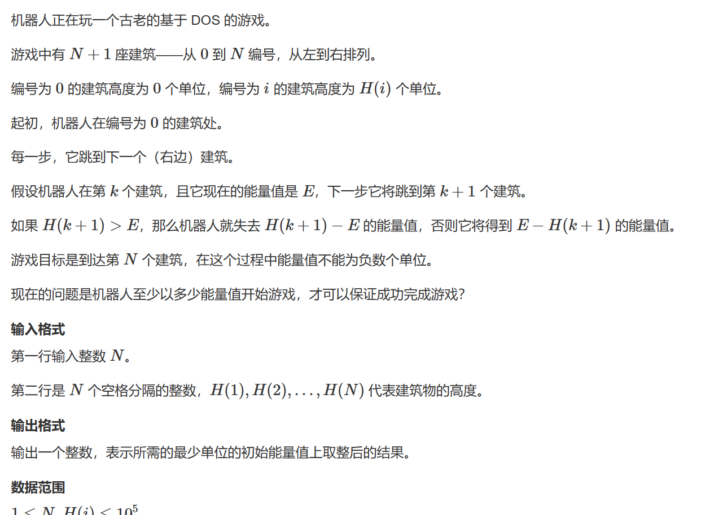

具有二分的性质，使用bisect_left的模板

```python
n=int(input())
nums=[int(x) for x in input().split()]

def cal(x):
    ans=x
    for i in range(n):
        ans=ans*2-nums[i]
        if ans<0:
            return False
    return True
l,r=0,10**5
while l<=r:
    mid=(l+r)>>1
    if cal(mid):
        r=mid-1
    else:
        l=mid+1
print(l)
```

### 借教室

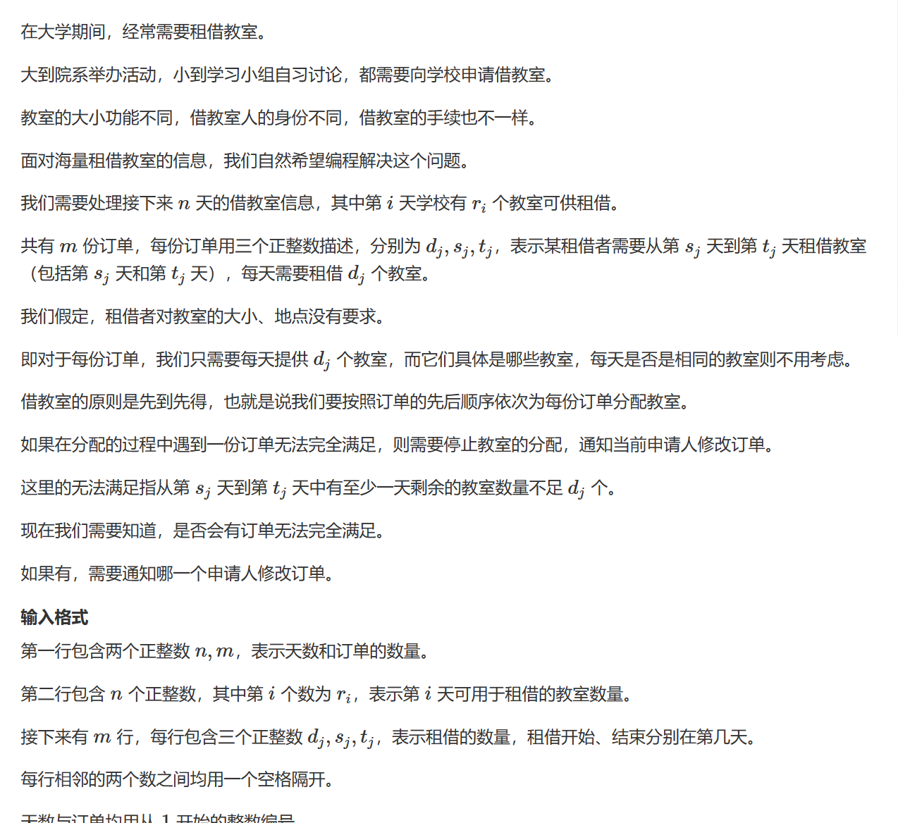

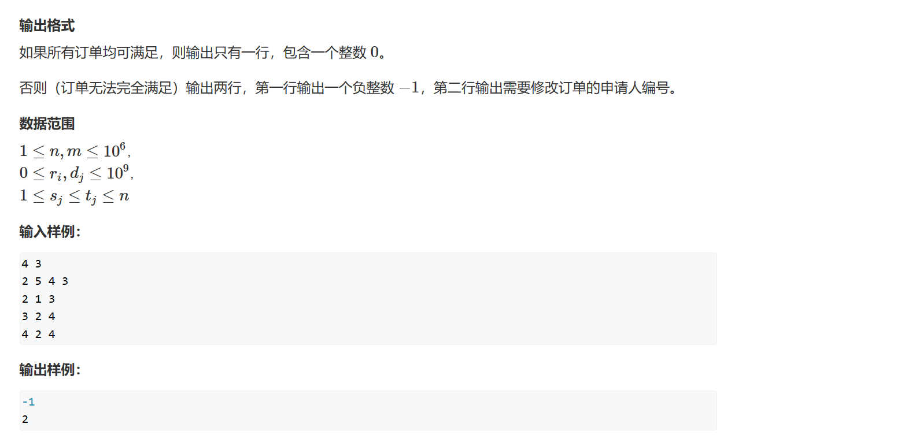

对能完成的任务数二分枚举前k个任务可以被完成，使用差分对前k操作快速操作，在操作之后求出前缀和如果某一个前缀和大于实际的值说明不满足条件直接退出

```python
import sys
input=sys.stdin.readline
n, k = [int(x) for x in input().split()]
nums = [int(x) for x in input().split()]
op = []

for i in range(1, k + 1):
    op.append([int(x) for x in input().split()])


def cal(x):
    # 差分
    d = [0]*n
    for i in range(x):
        w, s, e = op[i]
        s -= 1
        e -= 1
        d[s] += w
        if e + 1 < n:
            d[e + 1] -= w
    # 注意第一个值也要判断
    if d[0]>nums[0]:return False
    for i in range(1,n):
        d[i]+=d[i-1]
        if d[i]>nums[i]:
            return False
    return True


l, r = 1, k
while l <= r:
    mid = (l + r) >> 1
    if cal(mid):
        l = mid + 1
    else:
        r = mid - 1
if l >k:
    print(0)
else:
    print(-1)
    print(r+1)


```


### getting points 

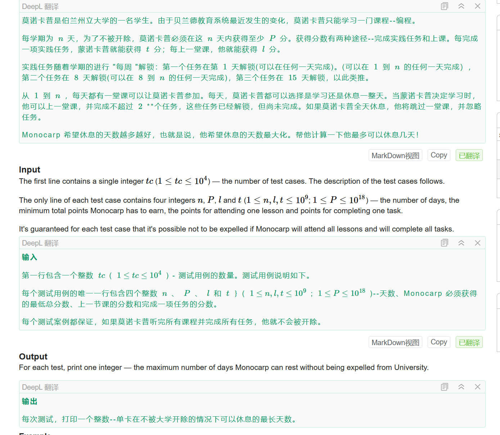

贪心的思想，为了得到最多的休息天数要工作最少的天数，从最后一天开始，往前每次推7天为了保证每次工作都能完成任务使得分最大化，也就是从后往前每次挑出能做任务的天工作，一次为基准使用二分找

```python
from math import ceil
tc=int(input())
def f(x,n,tasks,t,c):
    time=(n-x)//7
    x=n-7*time
    return min(2*(time+1),tasks)*t+(time+1)*c
while tc:
    n,p,c,t=[int(x) for x in input().split()]
    task=1+(n-1)//7
    # 如果完成所有的任务还不够，只能额外加上学习的天数
    if task*t+task*c<p:
        print(n-(task+ceil((p-(task*t+task*c))/c)))
    else:
        temp=n
        l,r=1,n
        while l<=r:
            mid=(l+r)//2
            val=f(mid,n,task,t,c)
            if val<p:
                r=mid-1
            elif val>p:
                l=mid+1
            else:
                l=mid+1
        print(n-((n-l+1)//7+1))

    tc-=1
```

### [求出最多标记下标](https://leetcode.cn/problems/find-the-maximum-number-of-marked-indices/)

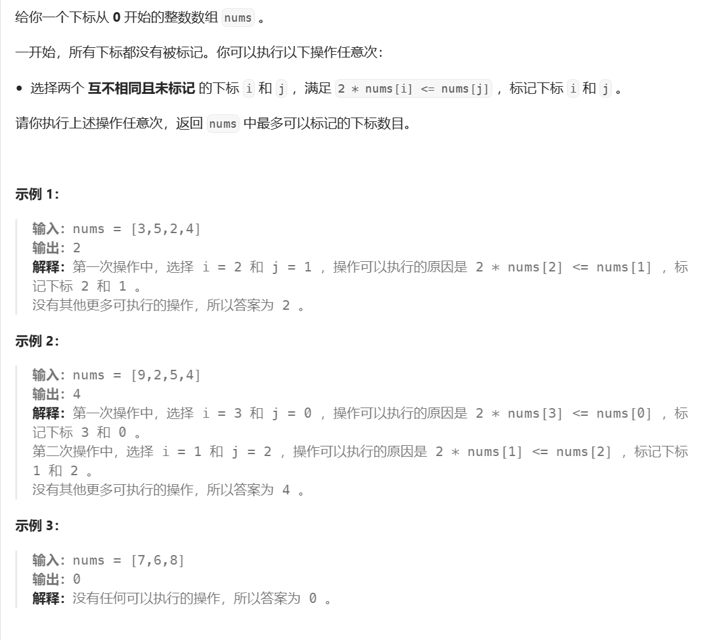

想要找到尽可能多的组那么应该把最小的数和最大的数匹配才能得到最多的，对于数组先排序，排序后可以对答案进行二分。

​	

```python
class Solution:
    def maxNumOfMarkedIndices(self, nums: List[int]) -> int:
        nums.sort()
        n=len(nums)
        # 枚举最小的数的结束位置，注意减一防止越界
        l,r=0,(len(nums))//2-1
        while l<=r:
            mid=(l+r)>>1
            flag=True
            # 判断前k个数和后k个数是否满足要求
            for i in range(mid+1):
                if nums[i]>nums[n-mid-1+i]//2:
                    flag=False
                    break
            if flag:l=mid+1
            else: r=mid-1
        return l*2
```

### [可移除字符的最大数目](https://leetcode.cn/problems/maximum-number-of-removable-characters/)

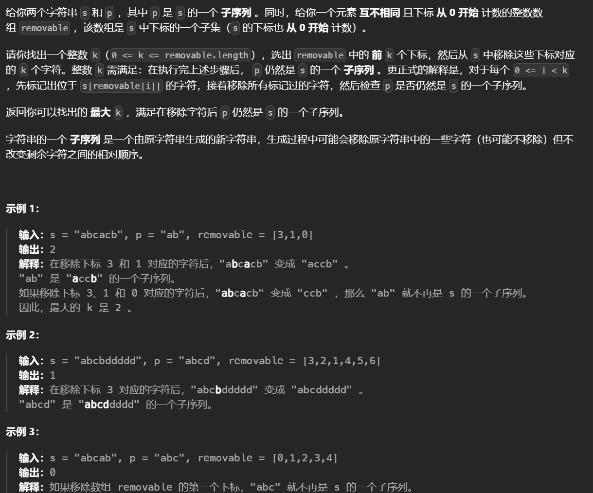

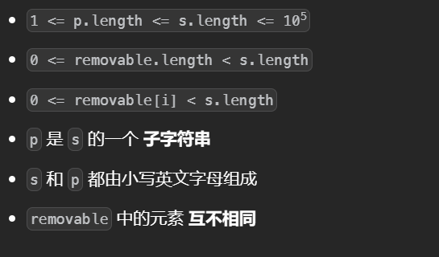


二分答案

```python
class Solution:
    def maximumRemovals(self, s: str, p: str, removable: List[int]) -> int:
        r=len(removable)
        l=0
        def cal(x):
            vis=set(removable[:x])
            j=0
            for i,c in enumerate(s):
                if i in vis:continue
                if c==p[j]:
                    j+=1
                    if j==len(p):return True 
            return False      
        while l<=r:
            mid=(l+r)>>1
            if cal(mid):
                l=mid+1
            else:
                r=mid-1
        return r
```


### [两球之间的磁力](https://leetcode.cn/problems/magnetic-force-between-two-balls/)

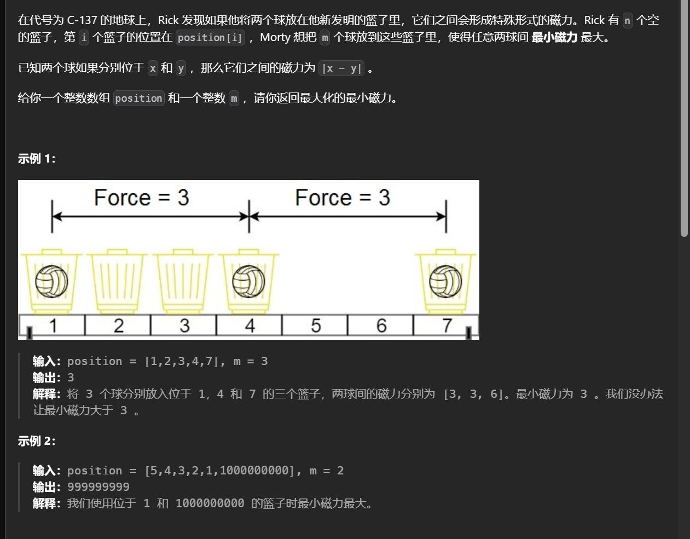


最大化最小值的描述可以想到使用二分，二分枚举可能的最小值，然后在数组中看以该距离为两球之间的最小距离是否能放下所有的球

```python
class Solution:
    def maxDistance(self, position: List[int], m: int) -> int:
        position.sort()
        l=inf
        r=position[-1]-position[0]
        for i,j in pairwise(position):
            l=min(l,j-i)
        def cal(x):
            temp=m
            temp-=1
            pre=position[0]
            for v in position[1:]:
                if not temp:return True 
                if v-pre>=x:
                    pre=v
                    temp-=1
            if temp:return False
            return True 

        while l<=r:
            mid=(l+r)>>1
            if cal(mid):
                l=mid+1
            else:
                r=mid-1
        return l-1
        
```


### [袋子里最少数目的球](https://leetcode.cn/problems/minimum-limit-of-balls-in-a-bag/)


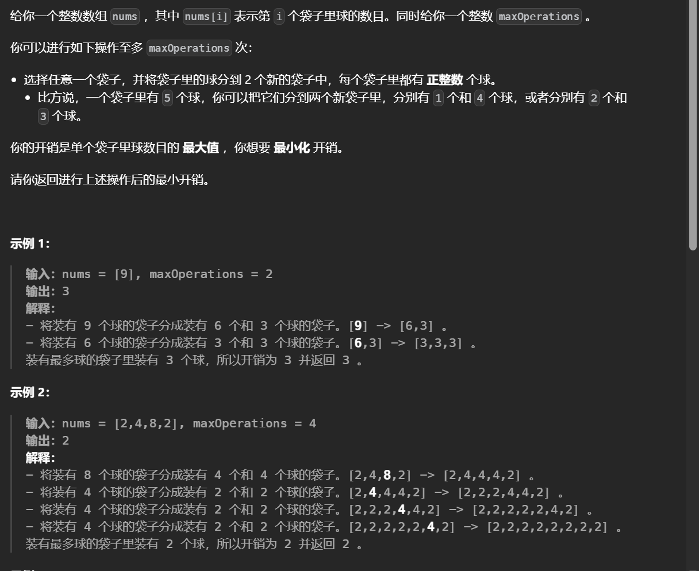

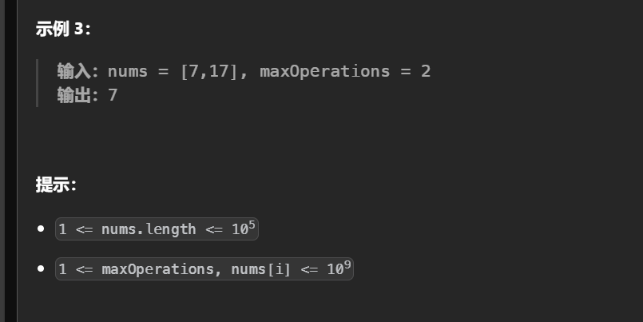

看到最小化答案想到二分，这里对答案二分，令最终的结果为x，那么每个数操作的次数为ceil(v/x)-1，只要最终操作次数不超过给定的值那么这个最终结果就是合理的。

```python
class Solution:
    def minimumSize(self, nums: List[int], maxOperations: int) -> int:
        r=max(nums)
        l=1
        def cal(x):
            temp=0
            for v in nums:
                temp+=ceil(v/mid)-1
            return temp<=maxOperations
        while l<=r:
            mid=(l+r)>>1
            if cal(mid):
                r=mid-1
            else:l=mid+1
        return r+1
```

###  [分享巧克力](https://leetcode.cn/problems/divide-chocolate/)

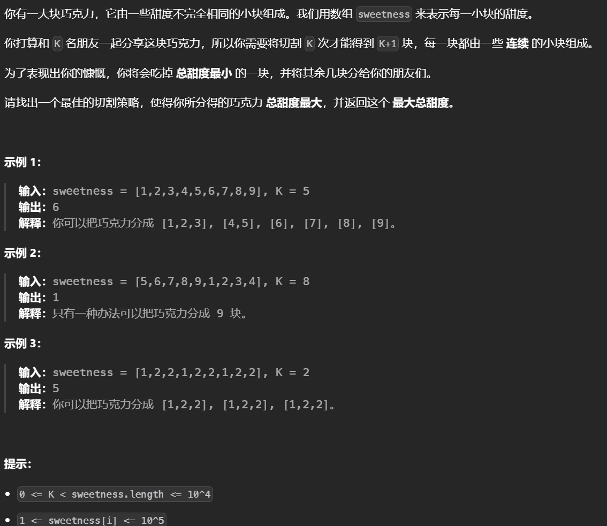

可以枚举甜度，然后在数组中划分，如果累计和大于等于给定的甜度那么就分为一个集合当遍历完整个数组后判断划分的集合是否大于等于k+1即可。


```python
class Solution:
    def maximizeSweetness(self, sweetness: List[int], k: int) -> int:
        l,r=1,sum(sweetness)
        def cal(x):
            temp=0
            cnt=0
            for v in sweetness:
                temp+=v
                if temp>=x:
                    cnt+=1
                    temp=0
            return cnt>=k+1 
        while l<=r:
            mid=(l+r)>>1
            if cal(mid):
                l=mid+1
            else:r=mid-1
        return l-1
```

### [ 销售价值减少的颜色球](https://leetcode.cn/problems/sell-diminishing-valued-colored-balls/)

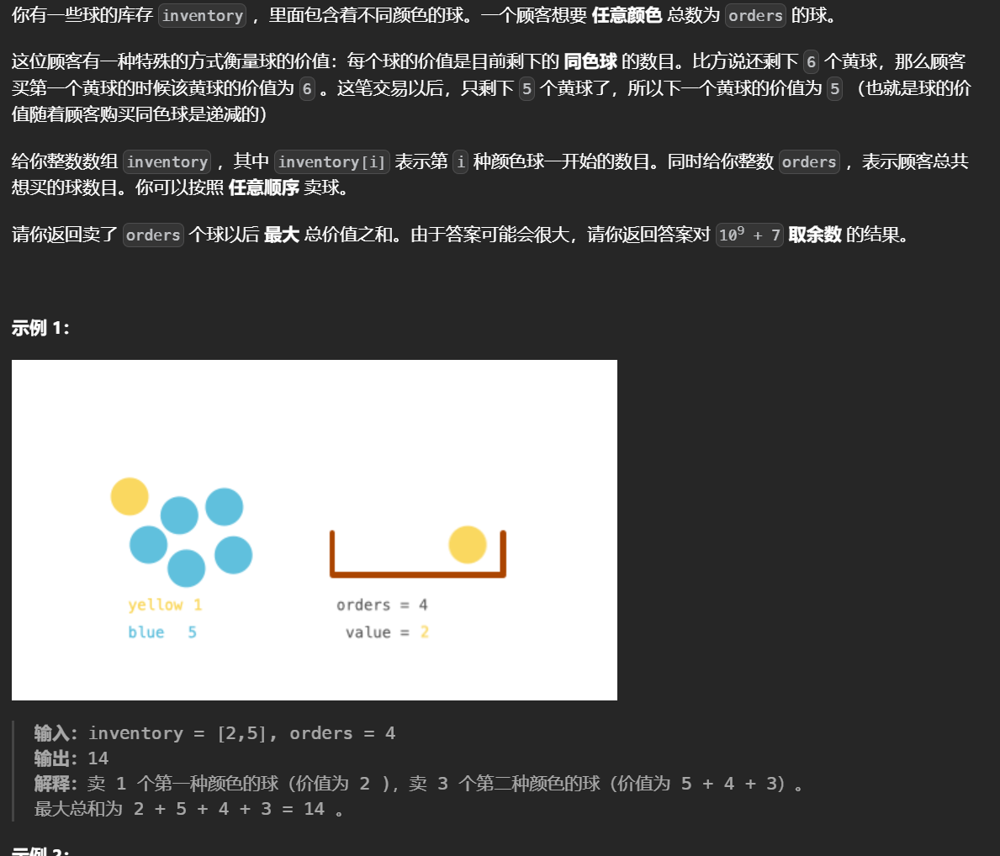

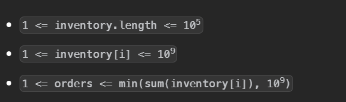


按照贪心的思路一定是先处理当前较大的数，最后较大而数会减小到一个定值，用二分找出这个值。

```python
class Solution:
    def maxProfit(self, inventory: List[int], orders: int) -> int:
        mod=10**9+7
        l=0
        r=max(inventory)
        # 找到能使操作次数小于等于orders的最大x
        while l<=r:
            mid=(l+r)>>1
            t=sum(v-mid for v in inventory if v>mid)
            if t<=orders:
                r=mid-1
            else:
                l=mid+1
        x=r+1
        ans=cnt=0
        # 求和
        for v in inventory:
            if v<=x:continue
            cnt+=v-x
            ans+=(v+x+1)*(v-x)//2
            ans%=mod
        # 因为操作次数是小于等于x的，所以可能不满足orders，缺少的次数一定是通过减小(orders-cnt)个x获得的，不可能是到x-1，因为如果是到x-1那么在二分中算出的就不会是x了
        if cnt<orders:ans+=(orders-cnt)*x
        return ans%mod
```


### Wooden Toy Festival

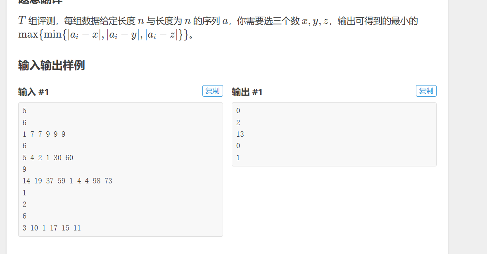

不需要关心选出的三个数是什么，只需要考虑答案，根据答案判断是否能分为三组，使得这三组的差都小于等于答案。

因此可以二分枚举答案

```python
from collections import deque,defaultdict,Counter
from functools import lru_cache
from bisect import bisect_left
from math import ceil
import sys
from typing import List

input=sys.stdin.readline
def R():return int(input())
def RR():return [int(x) for x in input().split()]

for _ in range(R()):
    n=R()
    nums=RR()
    nums.sort()
    l,r=0,10**9+10
    # 对于一组的数，要求都能满足和某一个数做差后的绝对值小于等于x，那么这一组数的最大和最小能的差要小于小于2x
    def cal(x):
        cnt=0
        j=0
        while j<n:
            v = nums[j]
            t = v + 2 * x
            j=bisect_left(nums,t+1)
            cnt+=1
        return cnt<=3

    while l<=r:
        mid=(l+r)>>1
        if cal(mid):
            r=mid-1
        else:
            l=mid+1
    print(r+1)


```

### [打家劫舍 IV](https://leetcode.cn/problems/house-robber-iv/)

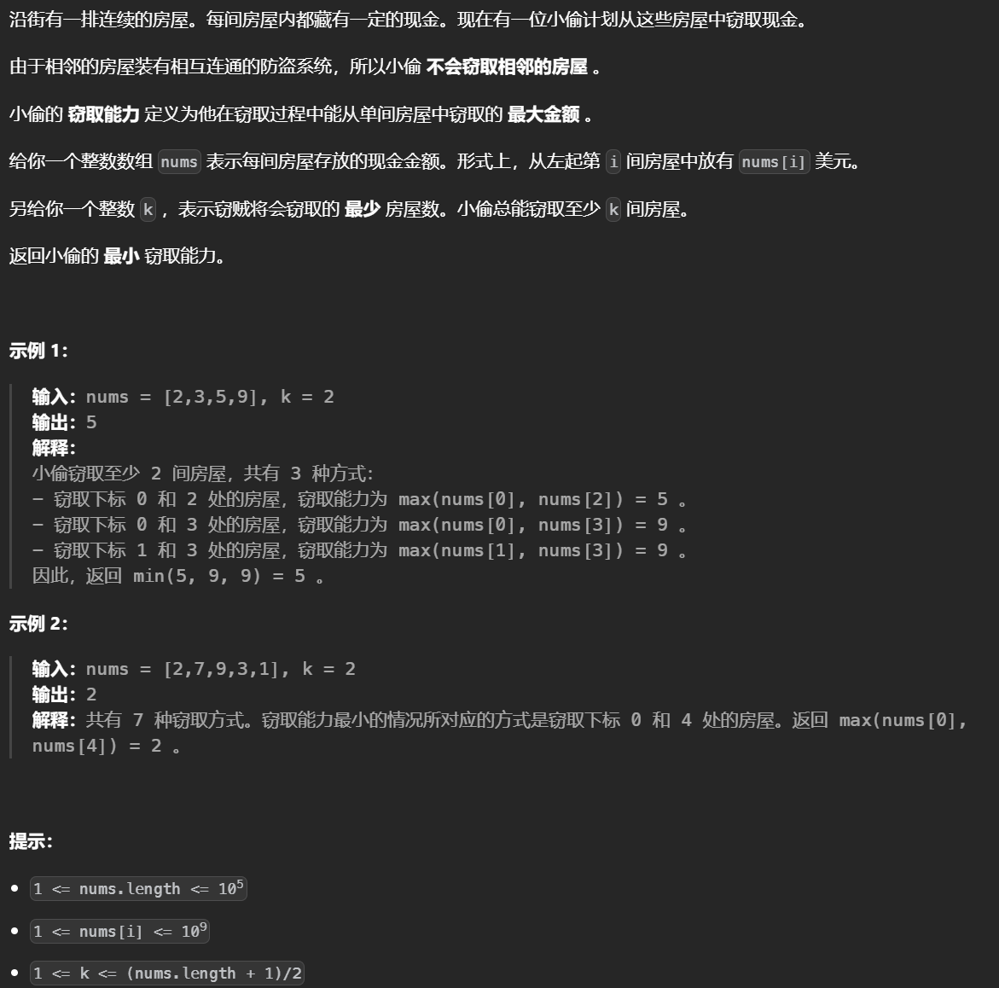

二分能拿到的最大的金额然后看是否满足能取至少k个小于等于该金额的相邻的房屋，后面的问题可以使用dp解决

```python
class Solution:
    def minCapability(self, nums: List[int], k: int) -> int:    
        n=len(nums)
        l=min(nums)
        r=max(nums)
        def cal(x):
            # 定义dp[i]表示在0~i范围内能取到小于等于x的最多有多少个不相邻的房屋
            @cache
            def dp(i):
                if i<0:return 0
                if nums[i]<=x:return max(dp(i-1),dp(i-2)+1)
                return dp(i-1)
            res=dp(n-1)
            dp.cache_clear()
            return res
        # 二分能拿到的最小金额
        while l<=r:
            mid=(l+r)>>1
            if cal(mid)>=k:
                r=mid-1
            else:
                l=mid+1
        return r+1
```

### **K-th Nearest**

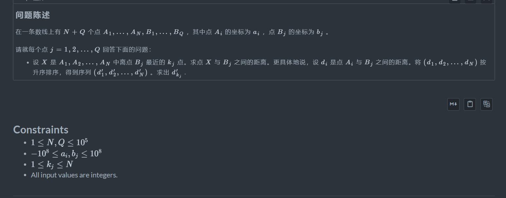

离x最近的第k个的距离，这里可以二分距离，用这个距离表示范围内的数的个数来表示是第几个，比如对于x当距离为10时，如果数组中x-10到x+10范围内的数是5，说明离x最近的第5个数的距离至少可能10（后续会用二分缩减）

```python
from collections import deque, defaultdict, Counter
from functools import lru_cache
from bisect import bisect_left,bisect_right
from heapq import heappop, heappush
from itertools import accumulate
from math import ceil, inf, gcd, sqrt, prod
import sys
from typing import List
input = sys.stdin.readline
def R(): return int(input())
def RR(): return [int(x) for x in input().split()]
def get_pre(nums): return list(accumulate(nums, initial=0))

n,m=RR()
nums=RR()
nums.sort()
def cal(mid):
    r,l=bisect_right(nums, b + mid),bisect_left(nums, b - mid)
    return r-l

for _ in range(m):
    b,k=RR()
    l=0
    r=2*10**8+10
    while l<=r:
        mid=(l+r)>>1
        if cal(mid)<k:
            l=mid+1
        else:
            r=mid-1
    print(l)

```


### Perform Operations to Maximize Score

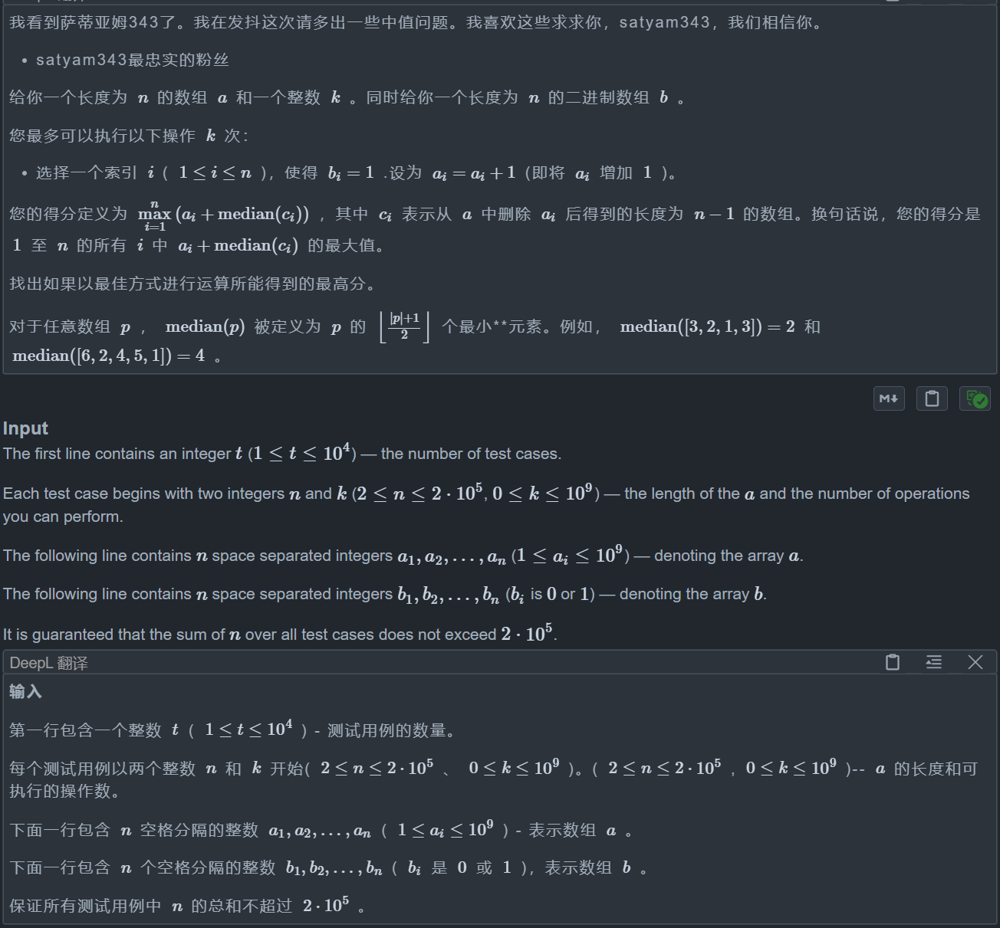

题目大意为给定两个数组a和b以及k此操作，每次操作可以使得一个bi=1的位置的对应的ai增大一，求解最高的得分，得分定义为ai+除了ai的a数组的中位数。

很明显，对于b=1的位置直接增大a更好，因此可以先枚举每个b=1的位置求解最大值。

也可以取数组的最大值然后用所有的的k去增大中位数，把中位数增大的方法不是用前缀和模拟的方法，而是用二分查找看是否满足条件。

```python
for _ in range(R()):
    n,k=RR()
    a=RR()
    b=RR()
    # 合成一个数组
    nums=[(i,j) for i,j in  zip(a,b)]
    nums.sort()# 排序
    # 找到中间位置
    index=n>>1 if n&1 else n//2-1
    ans=0
    # 枚举每个b=1的位置
    for ii in range(n):
        i,j=nums[ii]
        if j:
            # 删去这个位置后对中位数的位置分类讨论
            if ii<=index and n&1==0:ans=max(ans,i+k+nums[index+1][0])
            elif ii<index and n&1:ans=max(ans,i+k+nums[index][0])
            elif ii== index and n & 1:ans = max(ans, i + k + nums[index-1][0])
            elif n&1:ans=max(ans,i+k+nums[index-1][0])
            else:ans=max(ans,i+k+nums[index][0])
    l,r=0,10**9
    # 二分查找，看是否能找到一半以上的大于等于x的数且代价小于等于k，如果可以那么中位数至少是x
    def cal(x):
        cnt=0
        cost=0
        arr=nums
        for j in range(n-2,-1,-1):
            if nums[j][0]>=x:cnt+=1
            elif nums[j][1]:
                cost+=x-nums[j][0]
                if cost>k and cnt<ceil(n/2):return False
                cnt+=1
        return cnt>=ceil(n/2)

	# 二分找除去了最大值后能把中位数增大到多少
    while l<=r:
        mid=(l+r)>>1
        if cal(mid):
            l=mid+1
        else:
            r=mid-1
    ans=max(ans,nums[-1][0]+l-1)
    print(ans)
```

### **Triple Attack**

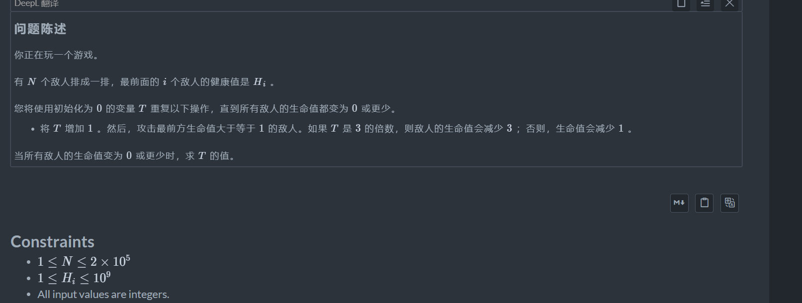

能直接想到二分法，但这里不是对最终答案二分而是对每个数需要操作几次二分

 假设对一个数需要操作x次，为了确定x次是否能满足要求需要得到T+1,T+mid之间3的个数可以用类似前缀和的操作求出cnt = ((ans + mid) // 3 - ans // 3)

```python
n = R()
nums = RR()
ans = 0
for x in nums:
    l, r = 1, x
    while l <= r:
        mid = (l + r) >> 1

        def cal(mid):
            cnt = ((ans + mid) // 3 - ans // 3)
            return mid - cnt + 3 * cnt >= x

        if cal(mid):
            r = mid - 1
        else:
            l = mid + 1
    ans += r + 1
print(ans)
```

### [范围内整数的最大得分](https://leetcode.cn/problems/maximize-score-of-numbers-in-ranges/)

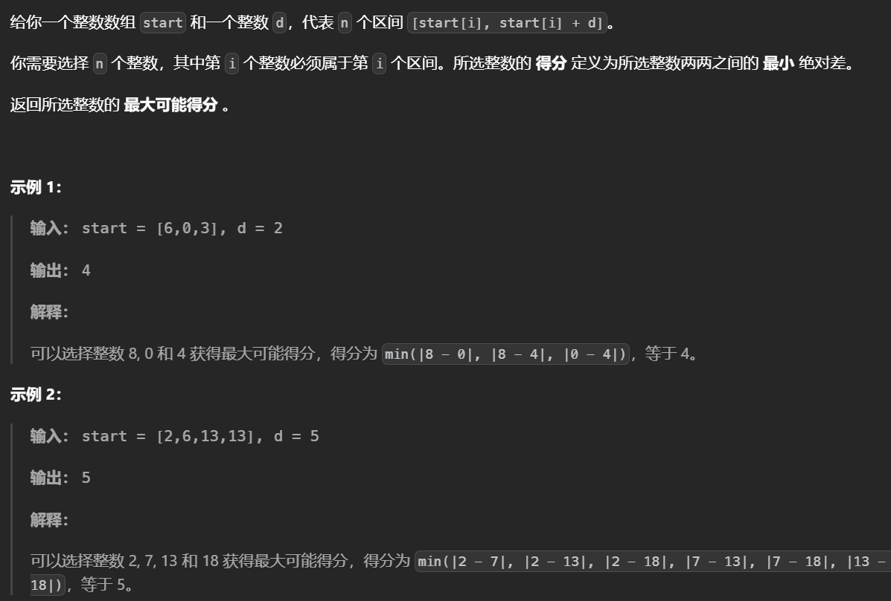

二分答案


### [第 K 小的子数组和](https://leetcode.cn/problems/kth-smallest-subarray-sum/)

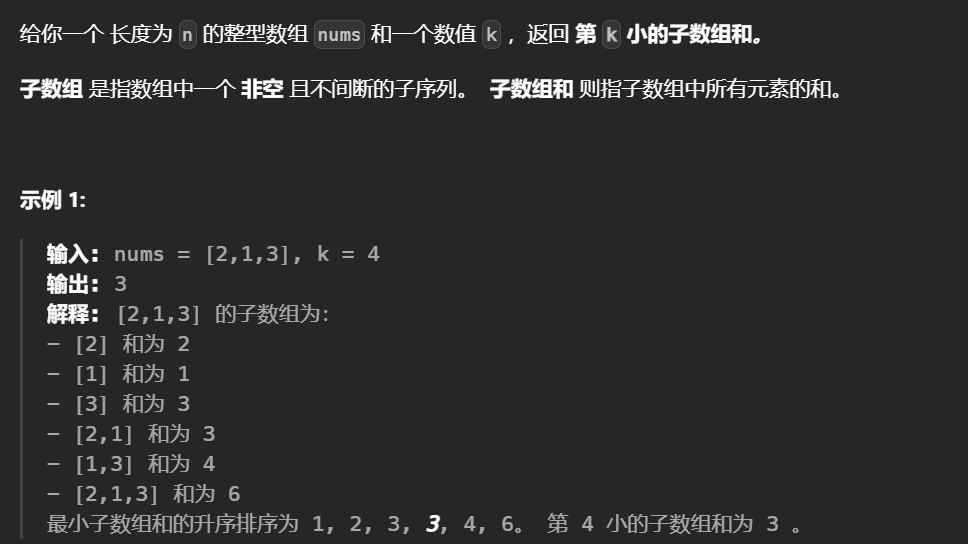


二分子数组和mid，然后使用滑动窗口找到小于等于mid的数组个数m，m就是第m-th小

```python
class Solution:
    def kthSmallestSubarraySum(self, nums: List[int], k: int) -> int:
        l=min(nums)
        r=sum(nums)
        def f(limit):
            ans=l=s=0
            for r,x in enumerate(nums):
                s+=x
                while s>limit and l<=r:
                    s-=nums[l]
                    l+=1
                ans+=r-l+1
            return ans

        while l<=r:
            mid=(l+r)>>1
            if f(mid)<k:
                l=mid+1
            else:
                r=mid-1
        return r+1       
```


# 二分查找

## [购买巧克力后的最小相对损失](https://leetcode.cn/problems/minimum-relative-loss-after-buying-chocolates/)

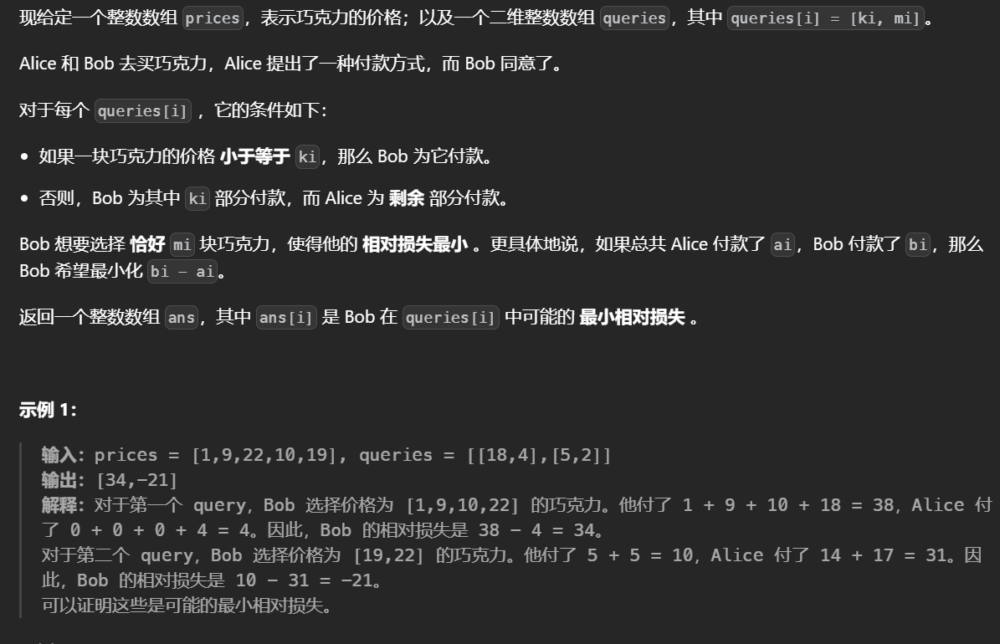

首先分类讨论

+ p<k时，l=k，r=0，diff=k

+ p>=k时，l=k，r=p-k，diff=2k-p

合并可得差值为**k-|k-p|**

为了最小化这个值就需要在prices中找到**M个离k最远的值**(相差的绝对值最大)，此时题目转化为**在所有巧克力中找到价格与k绝对值相差最大的M个**

最直接的方法是：将prices数组**排序**，**以k为中心，通过二分查找与k距离最远的m个元素**

通过枚举x(距离)，找到[0,k-x]和[k+x,inf]范围内元素的个数，为了绝对值相差最大**x要越大越好**，而范围内元素的个数与x有单调性关系，因此可以使用**二分查找**距离。

最后二分出的距离范围内，如果元素的个数大于m个，那么需要减去(cnt-m)*(k-x)，这是因为对于[0,k-x]区间内**多出**的元素会使得l多**k-x**，[k+x,inf]内多出的元素会使**l多k r多k+x-k**，那么最终的l-r会多出多个k-x，因此需要减去。

```python
class Solution:
    def minimumRelativeLosses(self, prices: List[int], queries: List[List[int]]) -> List[int]:
        n=len(prices)
        # 排序
        prices.sort()
        # 前缀和加速计算
        pre=list(accumulate(prices,initial=0))
        ans=[]
        for k,m in queries:
            def cal():
                l,r=0,prices[-1]+10
                # 二分距离，判断元素个数
                while l<=r:
                    mid=(l+r)>>1
                    # [i,j]=(k-x,k+x)
                    i,j=bisect_left(prices,k-mid+1),bisect_left(prices,k+mid)-1
                    cnt=n-(j-i+1)
                    if cnt>=m:
                        l=mid+1
                    else:
                        r=mid-1
                return l-1
            x=cal()
            # 找到区间端点
            i,j=bisect_left(prices,k-x+1),bisect_left(prices,k+x)-1
            # 计算l和r，及Bob和Alice花费的钱
            l,r=pre[i],pre[-1]-pre[j+1]
            l+=(n-j-1)*k
            r-=(n-j-1)*k
            res=l-r
            cnt=n-(j-i+1)
            # 如果多了要减去
            if cnt>m:
                res-=(cnt-m)*(k-x)
            ans.append(res)
        return ans 
```


# 二分求最小

## [使数字变为非正数的最小操作次数](https://leetcode.cn/problems/minimum-operations-to-make-numbers-non-positive/)

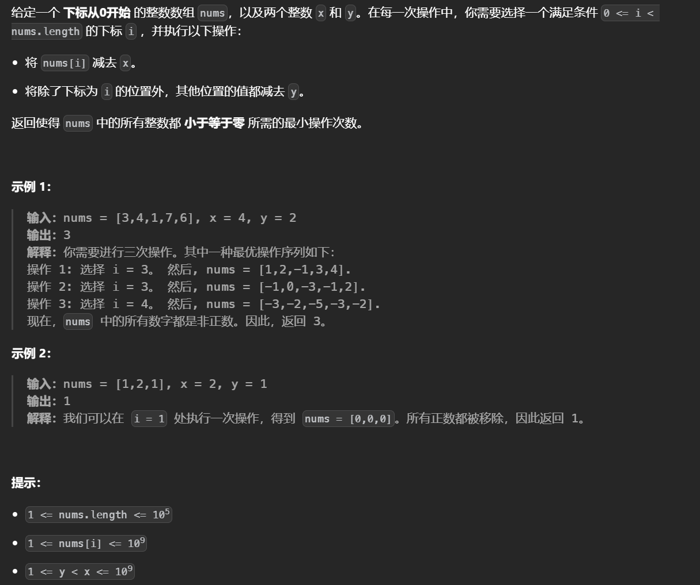

枚举所需的操作次数t，在check函数中遍历数组，如果元素值小于等于t*y那么直接跳过，否则需要进行减x操作，所需的操作次数等于(val-y\*t)/(x-y)

```python
class Solution:
    def minOperations(self, nums: List[int], x: int, y: int) -> int:
        nums.sort()
        n=len(nums)
        l,r=0,10**9
        def cal(t):
            cnt=0
            for v in nums:
                if v<=t*y:continue
                cnt+=ceil((v-t*y)/(x-y))
                if cnt>t:return False
            return True 

        while l<=r:
            mid=(l+r)>>1
            if cal(mid):
                r=mid-1
            else:
                l=mid+1
        return r+1
```


## [标记所有下标的最早秒数 I](https://leetcode.cn/problems/earliest-second-to-mark-indices-i/)

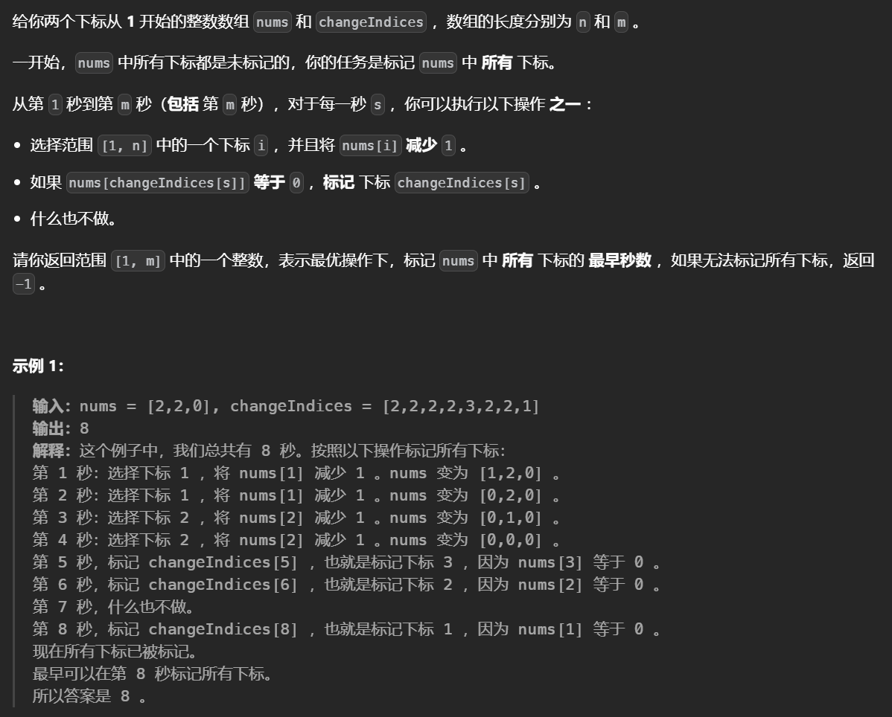

题意有点抽象，形象地解释一下：你有 n 门课程需要考试，第 i 门课程需要用 nums[i] 天复习。同一天只能复习一门课程。在第 i 天，你可以选择参加第 changeIndices[i] 门课程的考试。考试这一天不能复习。搞定所有课程的复习+考试，至少要多少天？

二分所需的最小时间，对于每个任务只有在最后时刻才去完成它，这样可以留出更多的shi'jian'zhu


```python
class Solution:
    def earliestSecondToMarkIndices(self, nums: List[int], changeIndices: List[int]) -> int:
        n=len(nums)
        m=len(changeIndices)
        l,r=1,m
        def cal(x):

            memo={}
            # 首先找出在x秒内，每个任务出现的最晚时间
            for i in range(x-1,-1,-1):
                val=changeIndices[i]
                if val in memo:continue
                memo[val]=i
            
            # 如果没有覆盖所有的任务，则不能完成所有的任务
            if len(memo)!=n:return False
            
            cnt=0
            for idx in range(x):
                # 每个任务越晚完成越好，这样可以留出更多的时间准备
                if idx==memo[changeIndices[idx]]:
                    ct=nums[changeIndices[idx]-1]
                    # 不足以完成任务
                    if cnt<ct:return False
                    cnt-=ct
                    del memo[changeIndices[idx]]
                else:
                    cnt+=1
            # 所有任务是否都完成了
            return not len(memo)

        while l<=r:
            mid=(l+r)>>1
            if cal(mid):
                r=mid-1
            else:
                l=mid+1
        return r+1 if r+1<=m else -1
        
```


# 二分求最大

## [同时运行 N 台电脑的最长时间](https://leetcode.cn/problems/maximum-running-time-of-n-computers/)

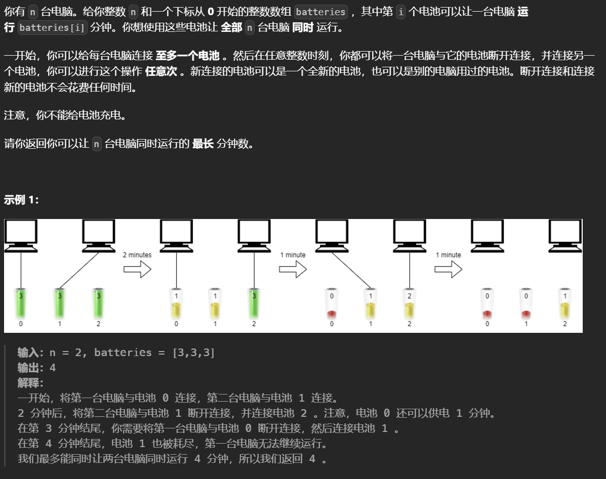


二分答案x为能运行的最长分钟数，每块电池能供给的最大电量为max(x,batteries[i])，答案想要满足条件就必须**x*n<=所有电池能提供的电量**

```python
class Solution:
    def maxRunTime(self, n: int, batteries: List[int]) -> int:
        l,r=0,10**14
        while l<=r:
            mid=(l+r)>>1
            if mid*n<=sum( min(c,mid)for c in batteries):
                l=mid+1
            else:
                r=mid-1
        return l-1
```


## [子数组最大平均数 II](https://leetcode.cn/problems/maximum-average-subarray-ii/)

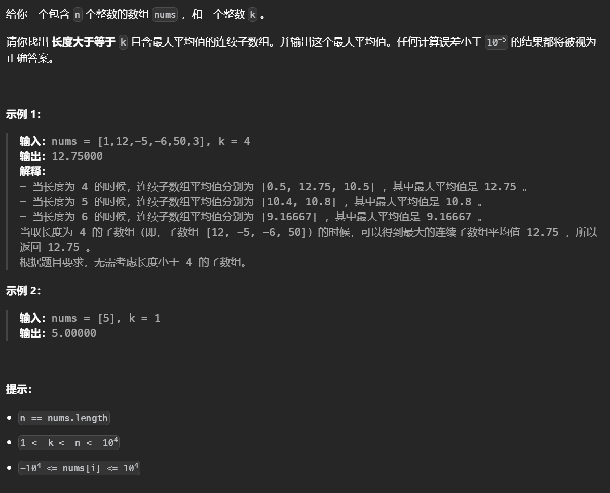

题目中的误差范围和最大提示了要使用二分算法

这里枚举**平均值**，然后**遍历**数组求解，求解子数组的平均值的一种快捷方法是：**将每个元素减去枚举的平均值然后求和**，如果和**大于等于0**，则说明该平均值可行。这里要求子数组长度大于等于k，那么**只需移动右端点记录前缀和**同时**左端点维护最小的前缀和**，这样就能在遍历的过程中求出**最大的子数组和**了。


```python
class Solution:
    def findMaxAverage(self, nums: List[int], k: int) -> float:
        l,r=-10010,10010
        n=len(nums)
        def cal(x):
            # 初始化为前x个的和
            end=res=sum(v-x for v in nums[:k])
            if end>=0:return True 
        	# 左端点维护最小的前缀和
            start_sum=start=0
            for i in range(k,n):
                v=nums[i]-x
                end+=v
                # 左端的前缀和
                start_sum+=nums[i-k]-x
                # 更新最小的前缀和
                start=min(start_sum,start)
                res=end-start
                # 只要有就返回
                if res>=0:return True 
            return False
        while r-l>1e-5:
            mid=(l+r)/2
            if cal(mid):
                l=mid
            else:
                r=mid
        return l
```


## [你可以安排的最多任务数目](https://leetcode.cn/problems/maximum-number-of-tasks-you-can-assign/)

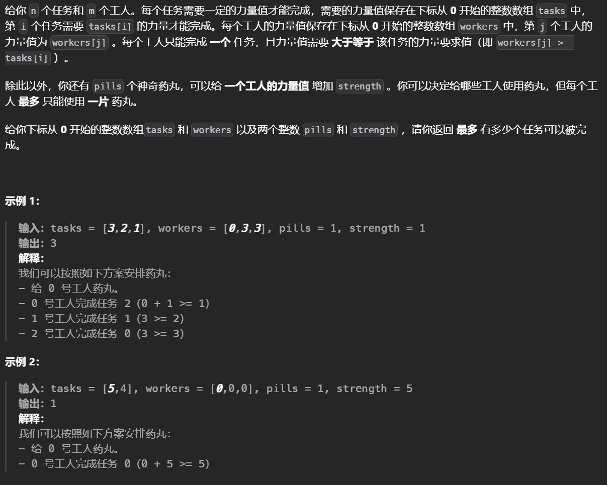

二分最多能完成的任务，对于这个数量**贪心**的取出最小的任务和最强的工人，**倒序**取出任务(取出最大)，如果**最强的工人能解决**这个任务**那么就匹配**，因为稍弱一点的工人如果也能解决目前最难得任务，那么他**一定也能解决其他的任务**，因此**没必要**把他们提前。如果不能，那么**取磕了药后能完成任务的最最弱的工人**，这可以保证**尽可能多的完成任务**，可以使用**有序集合**来维护工人。

```python
from sortedcontainers import SortedList as sl
class Solution:
    def maxTaskAssign(self, tasks: List[int], workers: List[int], pills: int, strength: int) -> int:
        n=len(tasks)
        m=len(workers)

        tasks.sort()
        workers.sort()
        l,r=1,min(m,n)
        def cal(x):
            p=pills
            t=tasks[:x]
            w=sl(workers[-x:])
            for v in t[::-1]:
                if w[-1]>=v:w.remove(w[-1])
                elif p>0:
                    idx=w.bisect_left(v-strength)
                    if idx<len(w):w.remove(w[idx])
                    else:return False
                    p-=1
            return not w
                
        while l<=r:
            mid=(l+r)>>1
            if cal(mid):
                l=mid+1
            else:
                r=mid-1
        return l-1
```


# 最小化最大值

## [最小化两个数组中的最大值](https://leetcode.cn/problems/minimize-the-maximum-of-two-arrays/)

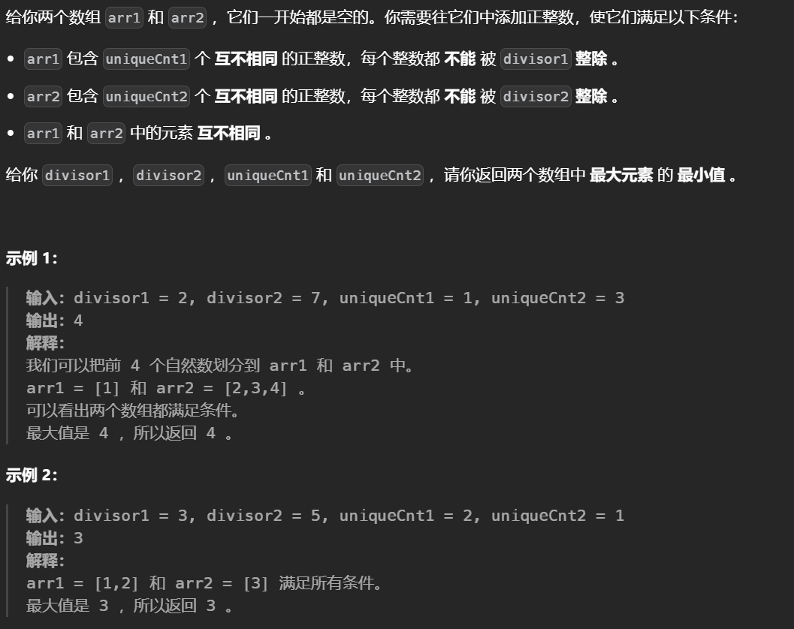

 枚举最大值如果可行则减小

这里找到可以独享的

+ 能被 *d*2 整除但不能被 *d*1 整除的数，能在 *arr*1 中且不能在 *arr*2 中 令为v1
+ 能被 *d*1 整除但不能被 *d*2 整除的数，能在 *arr*2 中且不能在 *arr*1 中 令为v2
+ 既不能被 *d*1 整除也不能被 *d*2 整除的数，可以在 *arr*1 和 *arr*2 中。令为v3

那么为了满足要求。**需要uniq减去独享的数量后剩余的数量能从共享的里面取**(共享=x-v1-v2-v3容斥原理)

```python
class Solution:
    def minimizeSet(self, divisor1: int, divisor2: int, uniqueCnt1: int, uniqueCnt2: int) -> int:
        l,r=1,10**11
        ll=lcm(divisor1,divisor2)
        def cal(x):
            v1=x//divisor2-x//ll
            v2=x//divisor1-x//ll
            shared=x-(v1+v2+x//ll)
            # 注意这里不能取到负数，否则会使需要从共享中取的数量减小
            return shared>=max(uniqueCnt1-v1,0)+max(uniqueCnt2-v2,0)
            
        while l<=r:
            mid=(l+r)>>1
            if cal(mid):
                r=mid-1
            else:
                l=mid+1
        return r+1
```


# 第K大/小

+ 第k 小等价于: 求最小的 ，满足 ≤ェ 的数至少有k个
+ 第k大等价于: 求最大的 ，满足 >ェ 的数至少有k个

有的情况下会用f(k+1)-f(k)来求第k个


## [阶乘函数后 K 个零](https://leetcode.cn/problems/preimage-size-of-factorial-zeroes-function/)

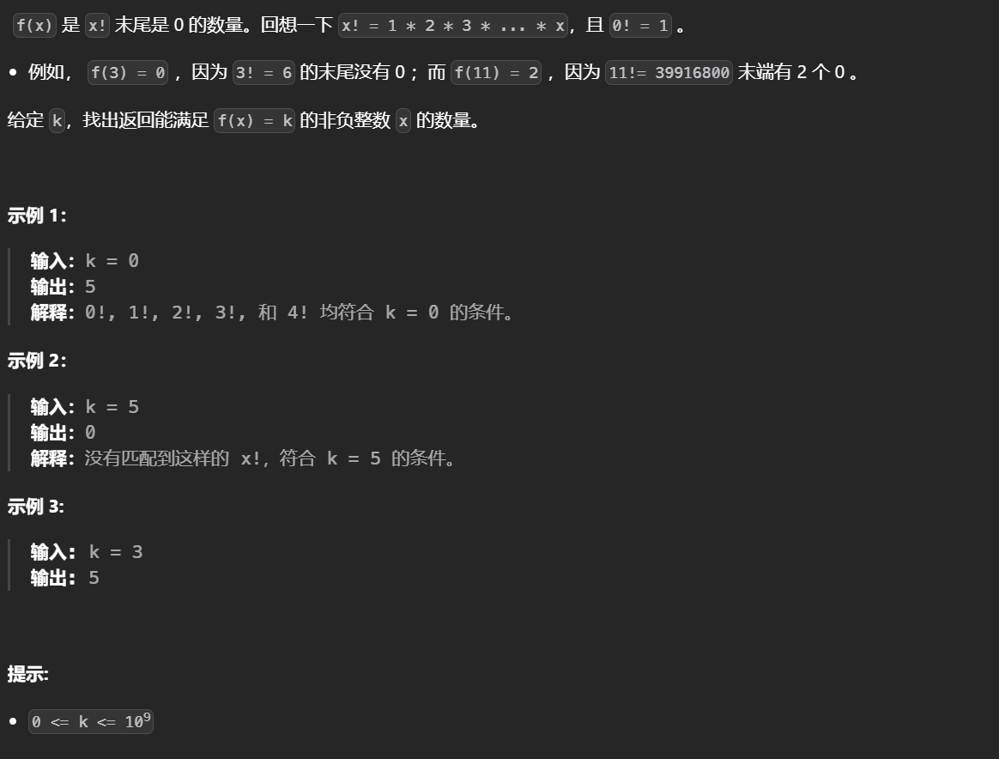

阶乘末尾0的数量取决于**[1,n]中质因子5的个数**，本题中要求末尾0的个数等于k的x!的数量，由性质可得**x越大末尾0的个数越多**，因此只能求出末尾0个数大于等于k的x的最小值即nx(k)，想要得到满足k的x的数量就只能用**nx(k+1)-nx(k)**

```python
class Solution:
    def preimageSizeFZF(self, k: int) -> int:
        def nx(x):
            l,r=0,10**11
            while l<=r:
                mid=(l+r)>>1
                def cal(m):
                    res=0
                    c=5
                    while c<=m:
                        res+=m//c
                        c*=5
                    return res>=x
                if cal(mid):
                    r=mid-1
                else:
                    l=mid+1
            return r+1
        return nx(k+1)-nx(k)        
```


