# 优先级队列

## **Intersecting Intervals**

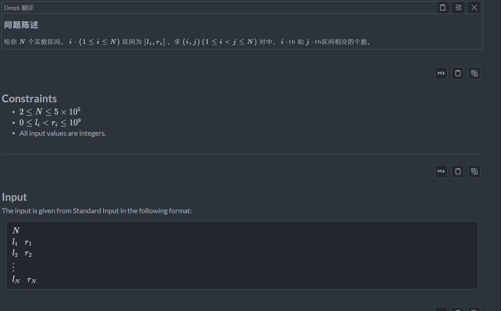

很简单的想到把区间排序，要数数对可以枚举其中一个然后维护前面的，初始的想法是使用线段树对于当前的区间找范围内的最大值，这个最大值就是会重叠的部分，然后再更新区间，这种做法会超时。

从左向右枚举，使用根堆记录每个区间的右端点，如果堆中最小的右端点不与当前的左端点重叠，那么也一定不会与之后的左端点重叠（排过序了），可以弹出，这样更新根堆之后留下的就是会重叠部分，累加这个长度然后压入现在的右端点继续。

```python
import heapq
from functools import lru_cache
n = int(input())
nums = []
import sys
input=sys.stdin.readline
for _ in range(n):
    nums.append([int(x) for x in input().split()])

# 排序
nums.sort(key=lambda x: (x[0],x[1]))
res=[]
ans=0
for i in range(n):
    l,r=nums[i]
    # 最小的右端点（即做靠左的区间）
    while res and res[0]<l:
        # 无法重叠弹出
        heapq.heappop(res)
   # 剩下的一定可以重叠
    ans+=len(res)
    heapq.heappush(res,r)
print(ans)
```


## [找到 Alice 和 Bob 可以相遇的建筑](https://leetcode.cn/problems/find-building-where-alice-and-bob-can-meet/)


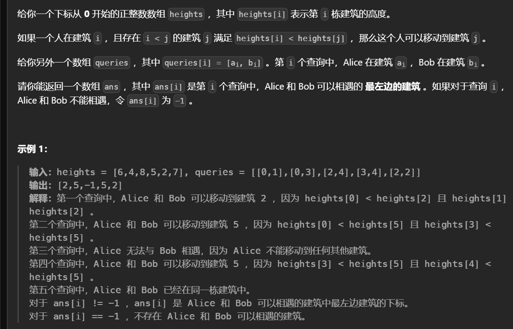


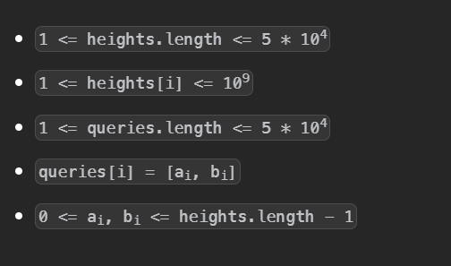


如果两个人在同一个位置，则答案就是这个位置，如果位置靠后的人比前面的热要高，那么答案就是后面人的位置。

最后如果是前一个人(a)较高，后一个人(b)较矮，那么就要去找在在b之后比a还高的第一个位置(此时的b位置一定矮于a位置)，如果只有一组询问那么很好解决但是这里的询问是多个混在在一起的，由于询问都给出了可以不按照给定的顺序去做，也就是离线。

由于每个询问需要去找b之后的位置，同时这个位置的是否可行由a的高度决定，因此在每个b位置上记录a的高度和对应的是第几个询问，预处理之后遍历数组同时维护遇到的询问，遍历到某一个位置时查看当前维护的讯问中最小的高度是否小于当前位置的高度，如果小于则弹出同时得到一个答案，因为讯问中的位置是一定小于当前位置的然后把当前位置记录的询问加入维护中，使用堆来维护，可以快速求出最小值

```python
class Solution:
    def leftmostBuildingQueries(self, heights: List[int], queries: List[List[int]]) -> List[int]:
        # 一个位置会有多个询问
        path=defaultdict(list)
        ans=[-1]*len(queries)
        for i,li in enumerate(queries):
            a,b=li
            # 找出可以直接求的情况
            if a==b:
                ans[i]=a 
                continue
            if a>b:
                a,b=b,a
            # 预处理询问
            if heights[a]<heights[b]:
                ans[i]=b
                continue
            path[b].append((heights[a],i))
            
        h=[]
        for i in range(len(heights)):
            # 一直弹出
            while h and h[0][0]<heights[i]:
                a,index=heappop(h)
                ans[index]=i
            # 加入到维护
            if i in path:
                for k in path[i]:heappush(h,k)
        return ans 
        
```


## [ 包含每个查询的最小区间](https://leetcode.cn/problems/minimum-interval-to-include-each-query/)

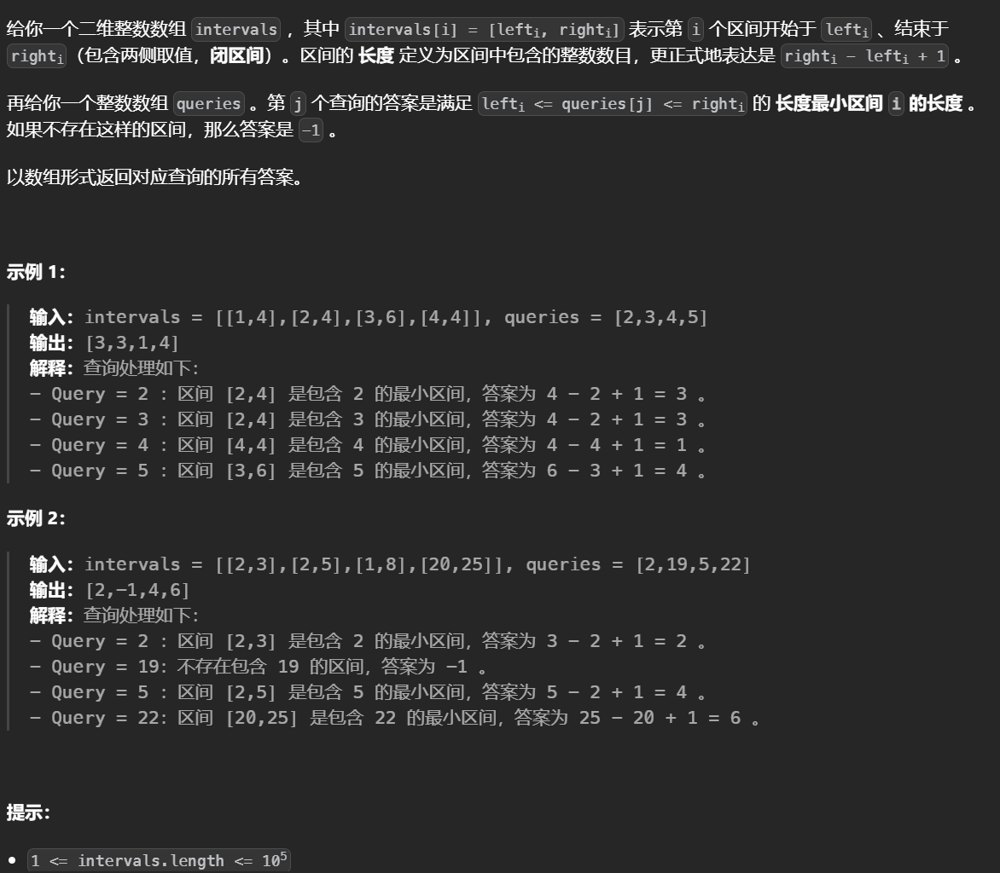


把区间按照区间的左端点排序同时对查询离线这样可以从左到右按照递增的顺序处理。

遍历每个询问，同时查找区间数组，把所有左端点小于当前位置的区间的长度和右端点记录到到根堆中（这些区间都是可能的结果），这样使得队首是长度最短的区间，之后将根堆中所有右端点不满足条件的弹出，因为区间是排了序的如果指定区间的右端点不能满足小的询问，那么大的询问而一定不能满足。

```python
class Solution:
    def minInterval(self, intervals: List[List[int]], queries: List[int]) -> List[int]:
        # 离线询问
        q=sorted([(v,i) for i,v in enumerate(queries)])
        intervals.sort(key=lambda x:x[0])
        ans=[-1]*len(q)
        h=[]
        index=0
        n=len(intervals)
        # 遍历每个询问
        for v,i in q:
            # 维护可能的结果
            while index<n and intervals[index][0]<=v:
                heappush(h,((intervals[index][1]-intervals[index][0]+1),intervals[index][1]))
                index+=1
            # 排除不合法的结果
            while h and h[0][1]<v:
                heappop(h)
            if h:
                ans[i]=h[0][0]
        return ans 
        
```


## [多次求和构造目标数组](https://leetcode.cn/problems/construct-target-array-with-multiple-sums/)

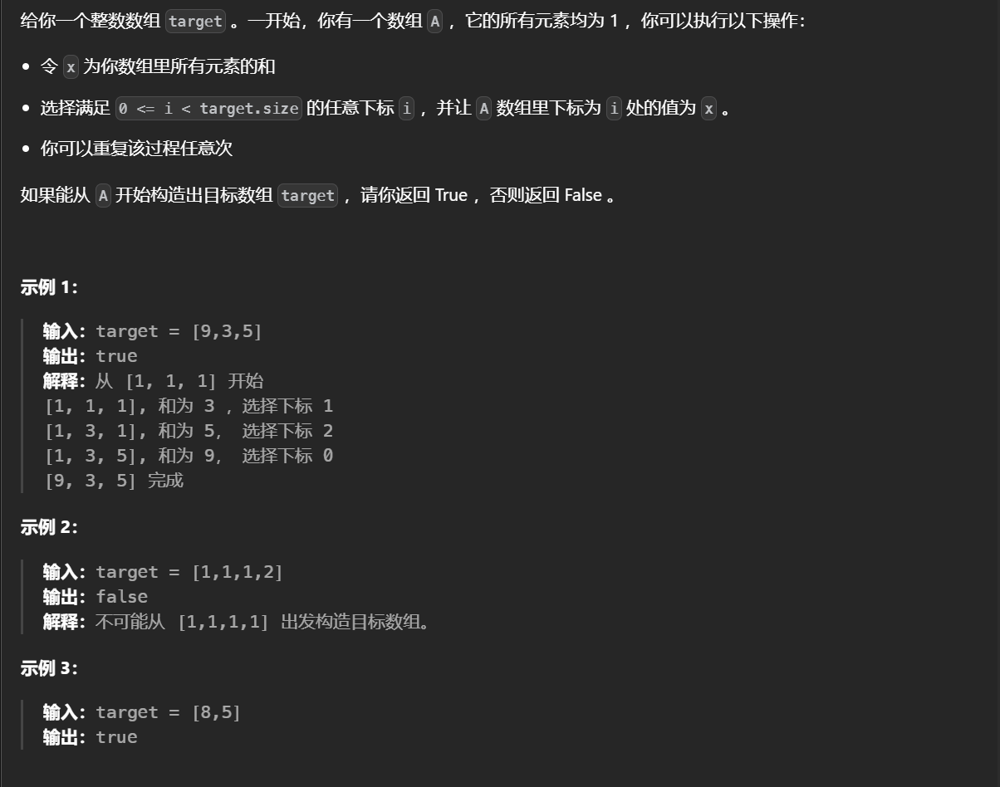


从1转换到不同的数字不好求解，因此把问题转化为从不同的数字是否能到1.

可以知道，数组中当前最大的数就是上一轮数组的总和，因此把最大的数减去上一轮除了这个位置的总和就可以得到上一轮这个位置的值，以此递推，最后判断是否都是1。注意对于较大的数据[1,100000]采取取模，也就是最大的数一直减去其他的总和知道不能减，用取余会很快求出。

这里借助根堆找出操作后最大的数，同时维护总和

```python
class Solution:
    def isPossible(self, target: List[int]) -> bool:
        # 特判只有一个数的情况
        if len(target)==1:
            return target[0]==1
        # 根堆
        h=[-v for v in target]
        s=sum(target)
        heapify(h)
        while 1:
            x=heappop(h)
            x=-x
            if x==1:break
            # 其他位置的和
            temp=s-x
            # 取余加速计算
            if x%temp:curr=x%temp
            else:curr=temp
            if curr==x:return False
            heappush(h,-curr)
            # 下一轮的总和
            s=curr+temp
        # 最后的判断
        if min(h)==-1:return True 
        return False
```

## [最多可以参加的会议数目](https://leetcode.cn/problems/maximum-number-of-events-that-can-be-attended/)

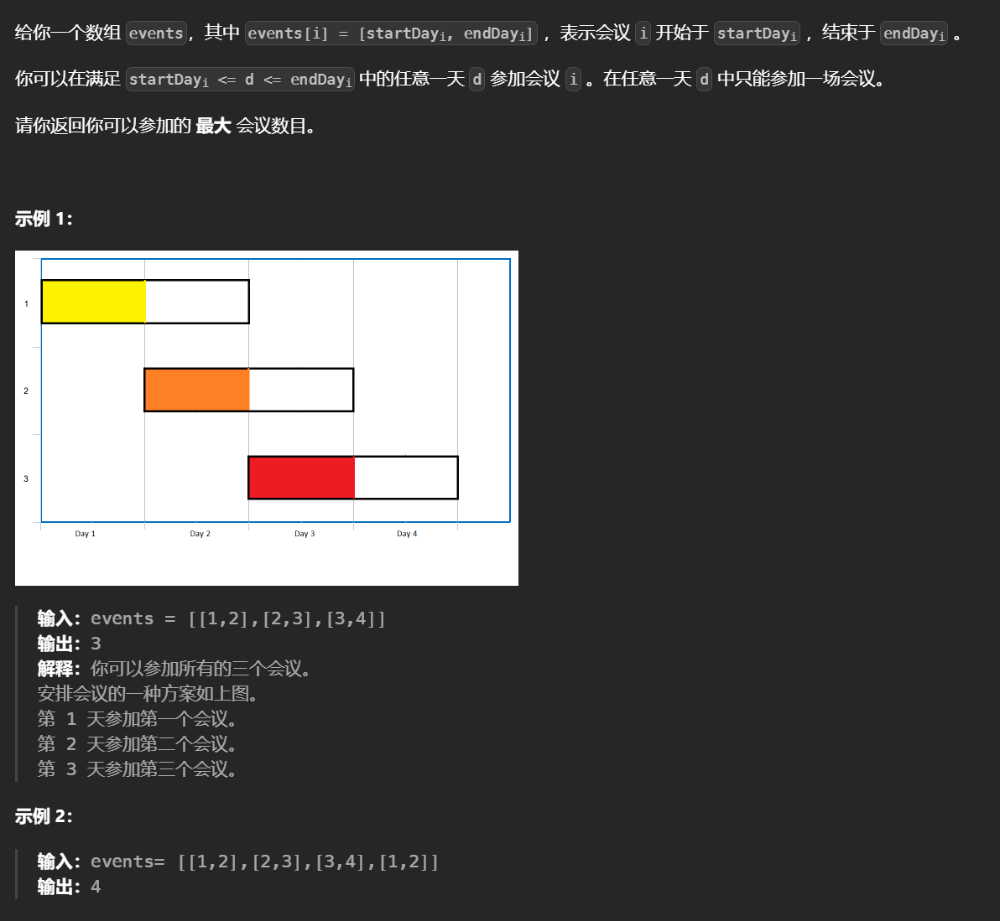


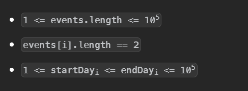


对于天数i最优的是去找相对i最早的结束时间的会议，对于给定的数据范围可以去枚举每一天，把以当前时间为开始时间的会议的结束时间加入到根堆中，随后选出最小的那个。

```python
class Solution:
    def maxEvents(self, nums: List[List[int]]) -> int:
        nums.sort()
        # 按照开始时间排序
        n=len(nums)
        h=[]
        ans=0
        j=0
        # 枚举每一天
        for i in range(1,100010):  
            # 弹出不合法的天数
            while h and h[0]<i:heappop(h)
            # 加入对应的结束天数
            while j<n and nums[j][0]==i:
                heappush(h,nums[j][1]) 
                j+=1
            # 弹出最小的，相当于选了一个会议
            if h:
                heappop(h)
                ans+=1
        return ans
```


## Too Many Segments

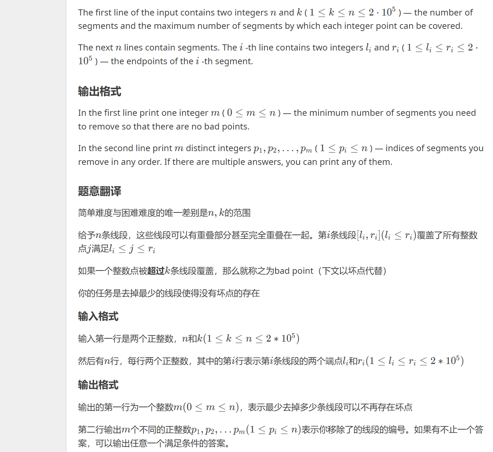

用不着线段树，直接使用差分在遍历的过程中累加即可。

对于给定的数据范围可以扫描所有的点，对于多个不符合的点，先从左边第一个开始操作，如果一个点不满足要求那么去删除包含他的右端点最大的线段。用差分数组表示每个位置的个数。

首先对线段按左端点排序，在遍历点的过程中把包含

这个点的线段的右端点全部加入到根堆中（同时记录编号），如果这个点不合法则删除右端点最大的线段，同时更新差分数组。


```python
import sys
from heapq import heappop, heappush

input=sys.stdin.readline
def R():
    return [int(x) for x in input().split()]
n,k=R()
N=2*10**5+10
d=[0]*N
h=[]
p=[]
# 处理所有的线段
for i in range(n):
    l,r=R()
    p.append([l,r,i+1])
    d[l]+=1
    d[r+1]-=1

# 线段排序
p.sort()

curr=0
index=0
ans=[]

# 扫描
for i in range(N):
    curr+=d[i]
    # 不合法的线段
    while h and -h[0][0]<i:
        heappop(h)
    # 记录所有合法的右端点
    while index<n and p[index][0]<=i:
        heappush(h,(-p[index][1],p[index][2]))
        index+=1
    # 当前点不满足条件，弹出最大的
    while curr>k:
        x,f=heappop(h)
        x=-x
        curr-=1
        # 更新差分数组
        d[x+1]+=1
        ans.append(f)
print(len(ans))
print(*ans)

```

## [将珠子放入背包中](https://leetcode.cn/problems/put-marbles-in-bags/)

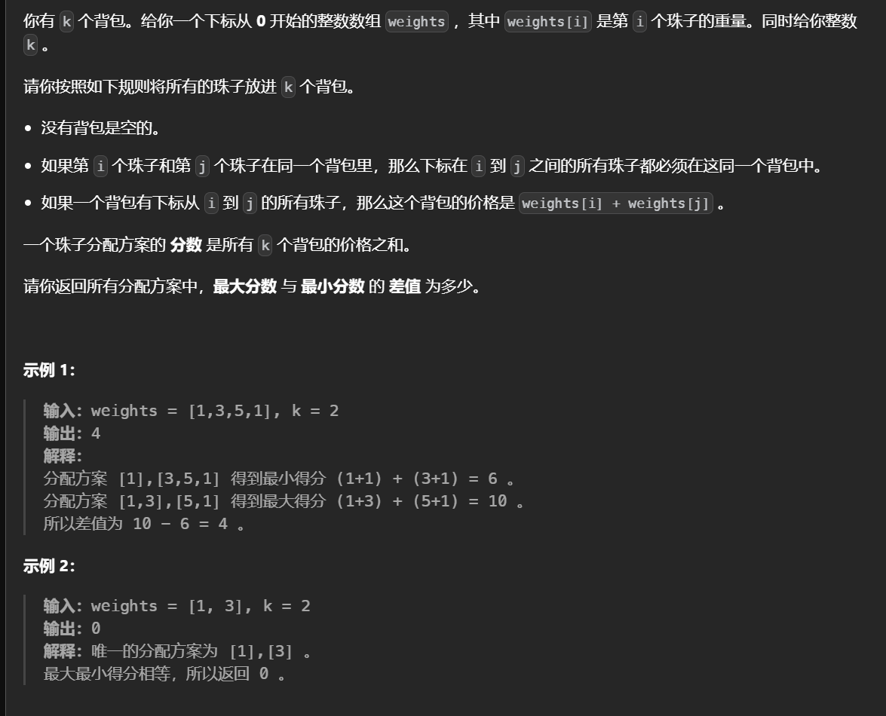

将数组分为k个子数组，每个子数组的价值等于数组中首尾元素相加，不管是那种分配方案相减，第一个和最后一个元素一定会被抵消因为它们一定会贡献到数组的价值中。此外每个数组的价值就是a[i]+a[i+1]一共有k-1个因为首尾一定会去掉，那么最大的差值就是最大的k-1个a[i]+a[i+1]减去最小的k-1个a[i]+a[i+1]。

```python
class Solution:
    def putMarbles(self, weights: List[int], k: int) -> int:
        h=[]
        for i,j in pairwise(weights):
            heappush(h,i+j)
        return sum(nlargest(k-1,h))-sum(nsmallest(k-1,h))
```

## [最大子序列的分数](https://leetcode.cn/problems/maximum-subsequence-score/)

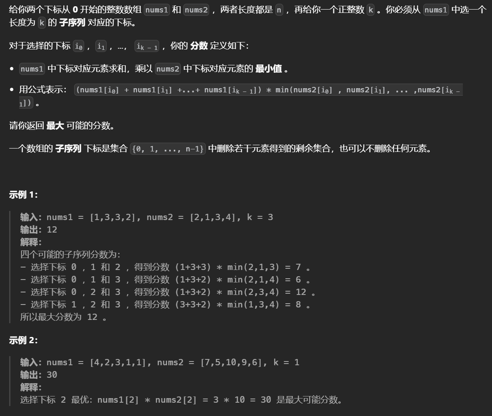

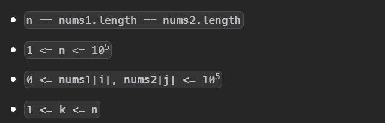

对于给定的数据范围无法使用动态规划，这里要求子序列并且结果只和子序列的数值相关和相对顺序无关，因此可以排序，按照nums2递减的顺序。

对于每个结果一定是有一个nums2中的值作为最小值那么可以枚举这个最小值，同时维护这个位置之前的k-1个nums1中的最大的值


```python
class Solution:
    def maxScore(self, nums1: List[int], nums2: List[int], k: int) -> int:
		# 排序
        nums=[(i,j) for i,j in zip(nums1,nums2)]
        nums.sort(key=lambda x:-x[1])
        # 先保证根堆中有k个值
        h=[i for i,j in nums[:k]]
        heapify(h)
        s=sum(h)
        ans=s*nums[k-1][1]
        # 枚举每个nums2中的值作为最小值
        for i,j in nums[k:]:
            # 更新堆，只维护k个值的总和
            if i>h[0]:
                s-=heappop(h)
                s+=i
                heappush(h,i)
                ans=max(ans,s*j)
        return ans 
```

## Phoenix and Towers

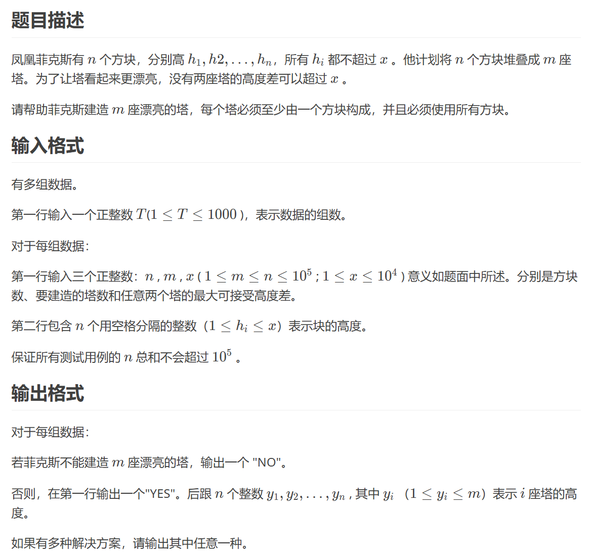

根据题目给定的hi<=x，如果存在两个塔高度之差大于等于x那么高的塔一定可以给低的塔一些方块来防止差值过大，因此不存在无解的情况，这里只需要按照贪心使用优先级队列：每次把值给当前高度最低的塔即可。


```python
for _ in range(R()):
    n,m,x=RR()
    nums=RR()
    ans=[]
    h=[(0,i+1) for i in range(m)]
    heapify(h)
    for i in range(n):
        val=nums[i]
        s,pos=heappop(h)
        ans.append(pos)
        heappush(h,(s+val,pos))
    print('YES')
    print(*ans)
```


## [查找和最小的 K 对数字](https://leetcode.cn/problems/find-k-pairs-with-smallest-sums/)

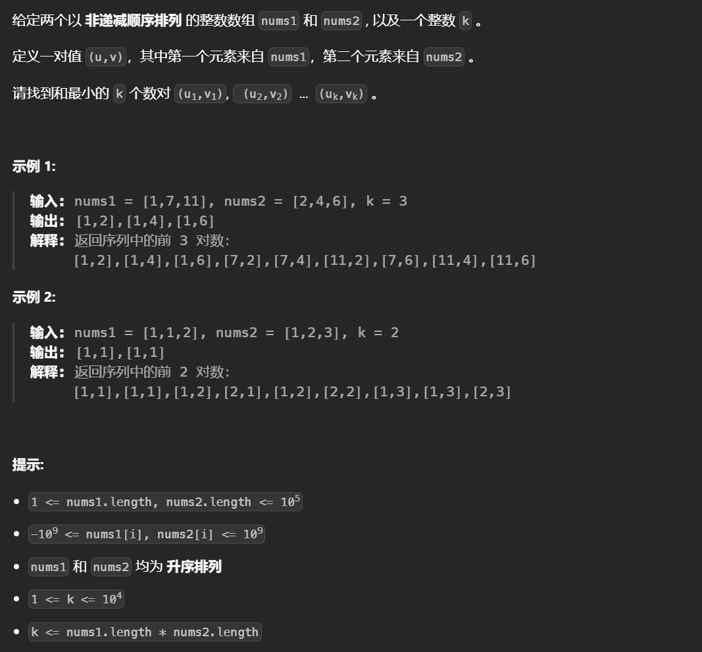

由于数组是升序排列的因此初始情况下最小的和一定是两个数组的首位，而接下来次小的一定是nums1[1]+nums2[0] / nums1[0]+nums2[1]，也就是i+1,j或者i,j+1位置，可以把它们放入优先级队列中，然后每弹出一个就新增两个，注意这里可能会增加重复的因此使用哈希表来判断。

```python
class Solution:
    def kSmallestPairs(self, nums1: List[int], nums2: List[int], k: int) -> List[List[int]]:
        n1,n2=len(nums1),len(nums2)
        h=[(nums1[0]+nums2[0],0,0)]
        memo=set()
        memo.add((0,0))
        cnt=0
        ans=[]
        while cnt<k:
            _,i,j=heappop(h)
            ans.append([nums1[i],nums2[j]])
            cnt+=1
            if i+1<n1 and (i+1,j) not in memo:
                memo.add((i+1,j))
                heappush(h,(nums1[i+1]+nums2[j],i+1,j))
            if j+1<n2 and (i,j+1) not in memo:
                memo.add((i,j+1))
                heappush(h,(nums1[i]+nums2[j+1],i,j+1))
        return ans 
```


## [有序矩阵中的第 k 个最小数组和](https://leetcode.cn/problems/find-the-kth-smallest-sum-of-a-matrix-with-sorted-rows/)

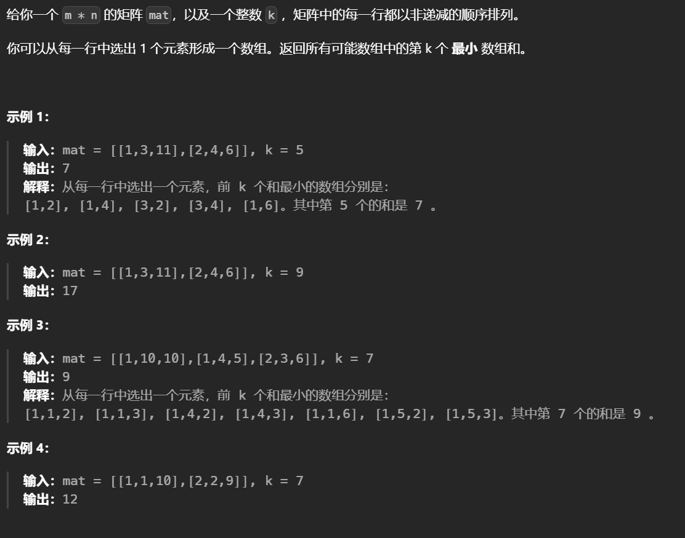

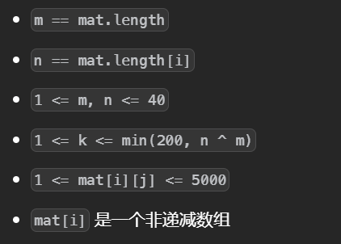

考虑示例三，假设已经算出了从前两行中每行取一个数的所有情况（一共九种），将这些数排序后是不需要考虑第八个和第九个的，因为随便从第三行取一个数与前七个数组合就已经满足k的条件了，因此下一行的数与前面已经计算出的数一一匹配后，取出K个最小的即可，取最小可以用堆加速计算。

```python
class Solution:
    def kthSmallest(self, mat: List[List[int]], k: int) -> int:
        def cal(arr1,arr2):
            # 初始时最小的
            h=[(arr1[0]+arr2[0],0,0)]
            n1,n2=len(arr1),len(arr2)
            ans=[]
            # 使用字典去重
            vis=set()
            vis.add((0,0))
            while len(ans)<k and h:
                v,i,j=heappop(h)
                ans.append(v)
                # 往两边扩展
                if i+1<n1 and (i+1,j) not in vis:
                    heappush(h,(arr1[i+1]+arr2[j],i+1,j))
                    vis.add((i+1,j))
                if (i,j+1) not in vis and j+1<n2:
                    heappush(h,(arr1[i]+arr2[j+1],i,j+1))
                    vis.add((i,j+1))
            return ans 
        # a表示之前算出的结果数组
        a=mat[0][:k]
        for row in mat[1:]:
            a=cal(a,row)
        return a[-1]
```


## [ 找出数组的第 K 大和](https://leetcode.cn/problems/find-the-k-sum-of-an-array/)

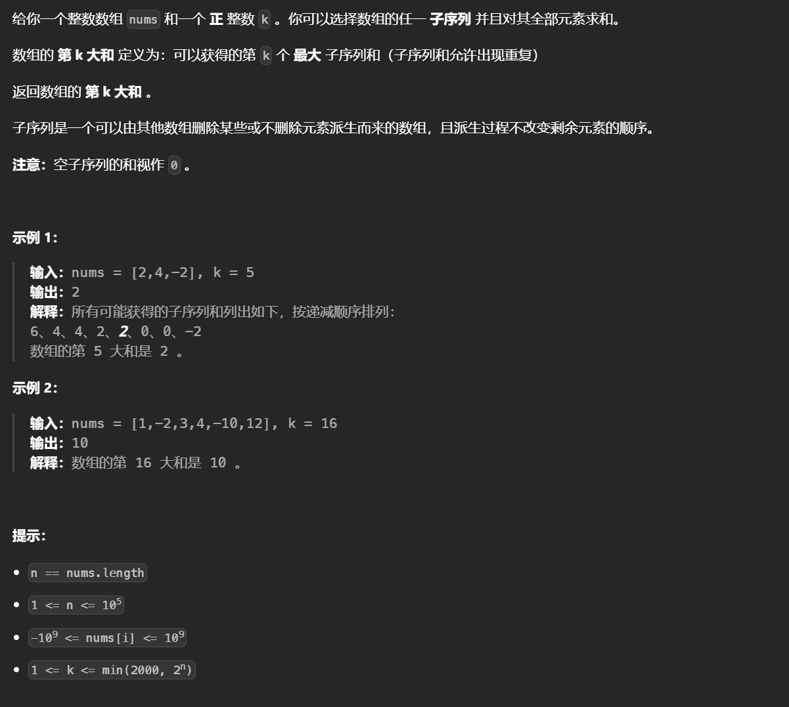

数组中最大的子序列和一定是所有**正数之和**，而第k大则是在**最大的子序列和上少选了正数，多选了负数**，使得最大的子序列和减小，那么可以将数组元素全部换为绝对值，问题变为**在非负数数组中选出第k小的子序列**(第k大的子序列等于之前求出的和最大的子序列减去转换后和第k小)

**想要求出第K小的子序列之和，可以使用根堆，在根堆中记录(元素和，下一个元素)，下一个元素可以拼接到当前元素后面，或者替换当前元素这样就能求出所有的子序列了。**

```python
class Solution:
    def kSum(self, nums: List[int], k: int) -> int:
        ss=0
        n=len(nums)
        # 转换数组并求出所有正数的和
        for i,x in enumerate(nums):
            if x<0:nums[i]=-x
            else:
                ss+=x
        # 先排序
        nums.sort()
        # 初始化
        h=[(0,0)]
        # 执行k-1次后，下一次的堆顶就是第K小
        for _ in range(k-1):
            s,i=heappop(h)
            if i<len(nums):
                # 加到后面
                heappush(h,(s+nums[i],i+1))
                # 替换当前
                if i-1>=0:
                    heappush(h,(s-nums[i-1]+nums[i],i+1))
        return ss-h[0][0]
```

## [网格图中最少访问的格子数](https://leetcode.cn/problems/minimum-number-of-visited-cells-in-a-grid/)

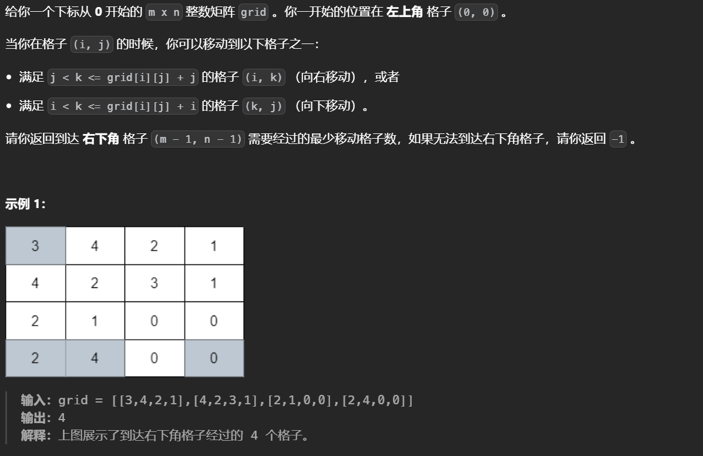

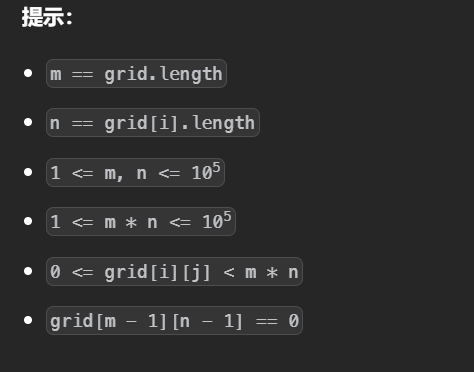

对于给定的数据范围可以**枚举每个位置**，一个位置可能**从它的上边或者左边得到**，**对每一行每一列构建优先队列**，队列以**移动次数**为key，**如果队首无法到达当前位置那么就弹出**，因为它一定也无法到达下一个位置，对行和列位置上**取最小的移动次数然后更新该位置对应的行和列的优先队列。**

```python
class Solution:
    def minimumVisitedCells(self, g: List[List[int]]) -> int:
        m,n=len(g),len(g[0])   
        if m==n==1:return 1
        # 记录每一列的对应的最小行
        row=[[] for _ in range(n)]
        # 记录每一行对应的列
        col=[[] for _ in range(m)]

        # 初始化0,0位置
        heappush(row[0],(0,g[0][0]))
        heappush(col[0],(0,g[0][0]))

        for i in range(m):    
            for j in range(n):
                # 跳过
                if not i and not j:continue
                r=row[j]
                c=col[i]
                # 不满足条件则弹出
                while r and r[0][1]<i:heappop(r)
                while c and c[0][1]<j:heappop(c)

                # 取得最小的操作次数
                ans=inf
                if r:ans=r[0][0]+1
                if c:ans=min(c[0][0]+1,ans)
                
                # 如果能到达就更新队列
                if ans!=inf:
                    heappush(r,(ans,i+g[i][j]))
                    heappush(c,(ans,j+g[i][j]))
                
                # 找到最终答案
                if i==m-1 and j==n-1:
                    if ans==inf:return -1 
                    return ans +1

```

