# 优先级队列

## **Intersecting Intervals**

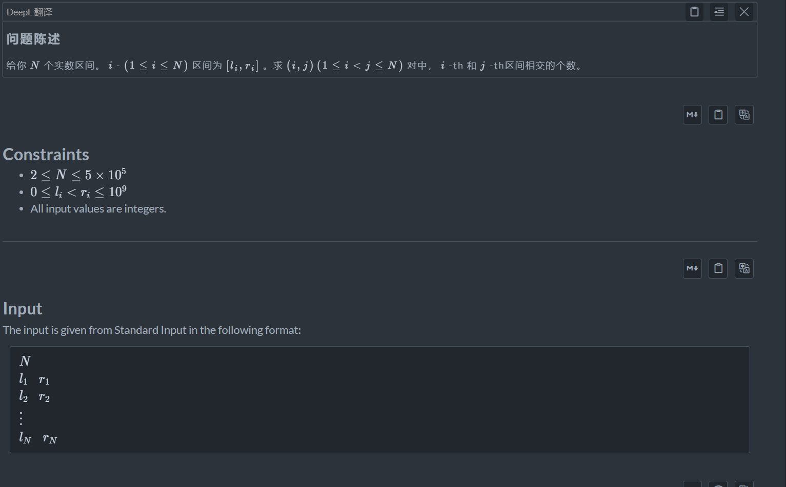

很简单的想到把区间排序，要数数对可以枚举其中一个然后维护前面的，初始的想法是使用线段树对于当前的区间找范围内的最大值，这个最大值就是会重叠的部分，然后再更新区间，这种做法会超时。

从左向右枚举，使用根堆记录每个区间的右端点，如果堆中最小的右端点不与当前的左端点重叠，那么也一定不会与之后的左端点重叠（排过序了），可以弹出，这样更新根堆之后留下的就是会重叠部分，累加这个长度然后压入现在的右端点继续。

```python
import heapq
from functools import lru_cache
n = int(input())
nums = []
import sys
input=sys.stdin.readline
for _ in range(n):
    nums.append([int(x) for x in input().split()])

# 排序
nums.sort(key=lambda x: (x[0],x[1]))
res=[]
ans=0
for i in range(n):
    l,r=nums[i]
    # 最小的右端点（即做靠左的区间）
    while res and res[0]<l:
        # 无法重叠弹出
        heapq.heappop(res)
   # 剩下的一定可以重叠
    ans+=len(res)
    heapq.heappush(res,r)
print(ans)
```


## [找到 Alice 和 Bob 可以相遇的建筑](https://leetcode.cn/problems/find-building-where-alice-and-bob-can-meet/)


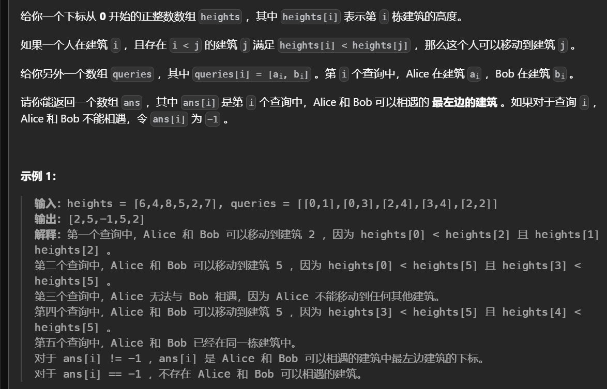


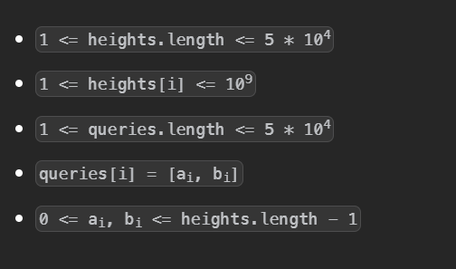


如果两个人在同一个位置，则答案就是这个位置，如果位置靠后的人比前面的人要高，那么答案就是后面人的位置。

最后如果是前一个人(a)较高，后一个人(b)较矮，那么就要去找在b之后比a还高的第一个位置(此时的b位置一定矮于a位置)，如果只有一组询问那么很好解决但是这里的询问是多个混在在一起的，由于询问都给出了可以不按照给定的顺序去做，也就是离线。

由于每个询问需要去找b之后的位置，同时这个位置的是否可行由a的高度决定，因此在每个b位置上记录a的高度和对应的是第几个询问，预处理之后遍历数组同时维护遇到的询问，遍历到某一个位置时查看当前维护的询问中最小的高度是否小于当前位置的高度，如果小于则弹出同时得到一个答案，因为询问中的位置是一定小于当前位置的然后把当前位置记录的询问加入维护中，使用堆来维护，可以快速求出最小值

```python
class Solution:
    def leftmostBuildingQueries(self, heights: List[int], queries: List[List[int]]) -> List[int]:
        # 一个位置会有多个询问
        path=defaultdict(list)
        ans=[-1]*len(queries)
        for i,li in enumerate(queries):
            a,b=li
            # 找出可以直接求的情况
            if a==b:
                ans[i]=a 
                continue
            if a>b:
                a,b=b,a
            # 预处理询问
            if heights[a]<heights[b]:
                ans[i]=b
                continue
            path[b].append((heights[a],i))
            
        h=[]
        for i in range(len(heights)):
            # 一直弹出
            while h and h[0][0]<heights[i]:
                a,index=heappop(h)
                ans[index]=i
            # 加入到维护
            if i in path:
                for k in path[i]:heappush(h,k)
        return ans 
        
```


## [ 包含每个查询的最小区间](https://leetcode.cn/problems/minimum-interval-to-include-each-query/)

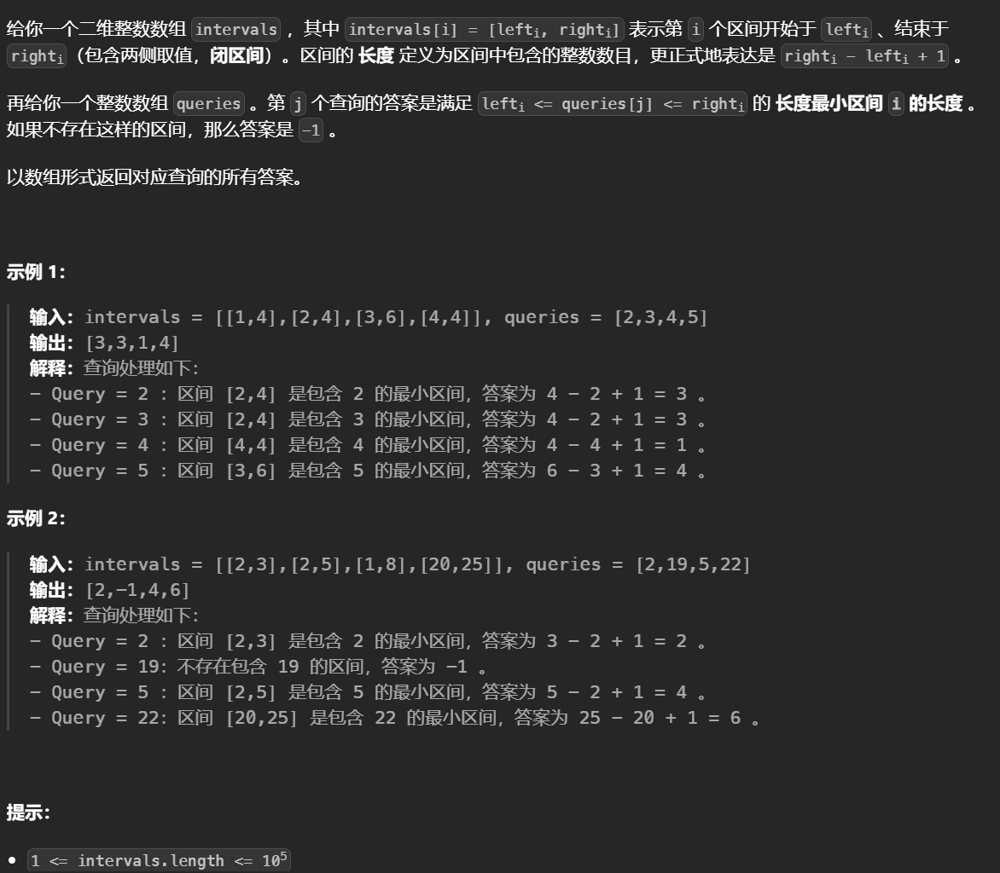


把区间按照区间的左端点排序同时对查询离线这样可以从左到右按照递增的顺序处理。

遍历每个询问，同时查找区间数组，把所有左端点小于当前位置的区间的长度和右端点记录到到根堆中（这些区间都是可能的结果），这样使得队首是长度最短的区间，之后将根堆中所有右端点不满足条件的弹出，因为区间是排了序的如果指定区间的右端点不能满足小的询问，那么大的询问而一定不能满足。

```python
class Solution:
    def minInterval(self, intervals: List[List[int]], queries: List[int]) -> List[int]:
        # 离线询问
        q=sorted([(v,i) for i,v in enumerate(queries)])
        intervals.sort(key=lambda x:x[0])
        ans=[-1]*len(q)
        h=[]
        index=0
        n=len(intervals)
        # 遍历每个询问
        for v,i in q:
            # 维护可能的结果
            while index<n and intervals[index][0]<=v:
                heappush(h,((intervals[index][1]-intervals[index][0]+1),intervals[index][1]))
                index+=1
            # 排除不合法的结果
            while h and h[0][1]<v:
                heappop(h)
            if h:
                ans[i]=h[0][0]
        return ans 
        
```


## [多次求和构造目标数组](https://leetcode.cn/problems/construct-target-array-with-multiple-sums/)

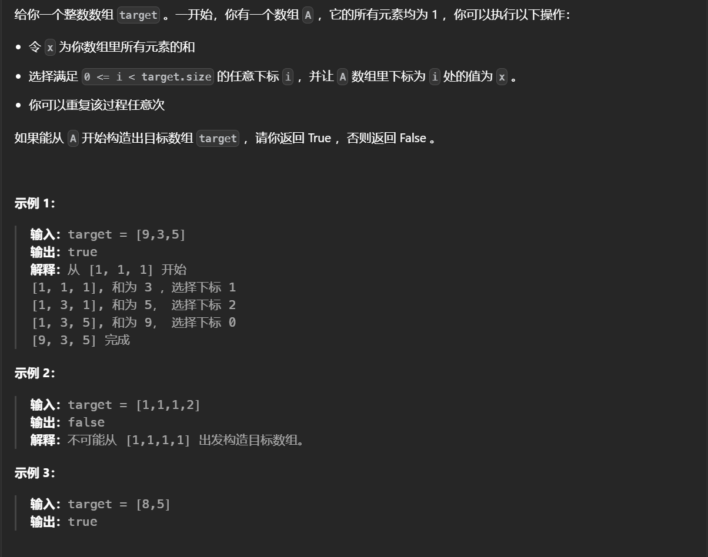


从1转换到不同的数字不好求解，因此把问题转化为从不同的数字是否能到1.

可以知道，数组中当前最大的数就是上一轮数组的总和，因此把最大的数减去上一轮除了这个位置的总和就可以得到上一轮这个位置的值，以此递推，最后判断是否都是1。注意对于较大的数据[1,100000]取模，也就是最大的数一直减去其他的总和直到不能减，用取余会很快求出。

这里借助根堆找出操作后最大的数，同时维护总和

```python
class Solution:
    def isPossible(self, target: List[int]) -> bool:
        # 特判只有一个数的情况
        if len(target)==1:
            return target[0]==1
        # 根堆
        h=[-v for v in target]
        s=sum(target)
        heapify(h)
        while 1:
            x=heappop(h)
            x=-x
            if x==1:break
            # 其他位置的和
            temp=s-x
            # 取余加速计算
            if x%temp:curr=x%temp
            else:curr=temp
            if curr==x:return False
            heappush(h,-curr)
            # 下一轮的总和
            s=curr+temp
        # 最后的判断
        if min(h)==-1:return True 
        return False
```

## [最多可以参加的会议数目](https://leetcode.cn/problems/maximum-number-of-events-that-can-be-attended/)

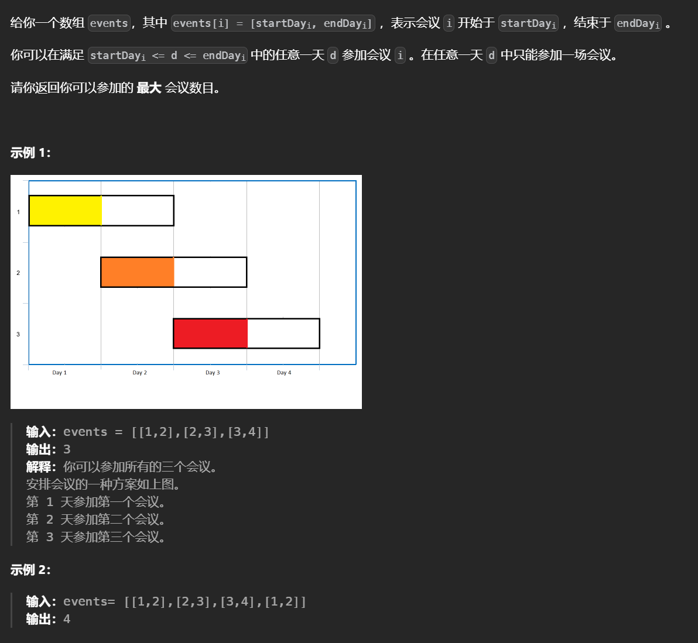


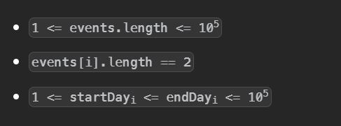


对于天数i最优的是去找相对i最早的结束时间的会议，对于给定的数据范围可以去枚举每一天，把以当前时间为开始时间的会议的结束时间加入到根堆中，随后选出最小的那个，实际上就是对于每一天维护一个合法的序列，同时减去序列中即将不合法的来保证能得到最大的天数。

```python
class Solution:
    def maxEvents(self, nums: List[List[int]]) -> int:
        nums.sort()
        # 按照开始时间排序
        n=len(nums)
        h=[]
        ans=0
        j=0
        # 枚举每一天
        for i in range(1,100010):  
            # 弹出不合法的天数
            while h and h[0]<i:heappop(h)
            # 加入对应的结束天数
            while j<n and nums[j][0]==i:
                heappush(h,nums[j][1]) 
                j+=1
            # 弹出最小的，相当于选了一个会议，因为一天只能参加一个
            if h:
                heappop(h)
                ans+=1
        return ans
```


## Too Many Segments

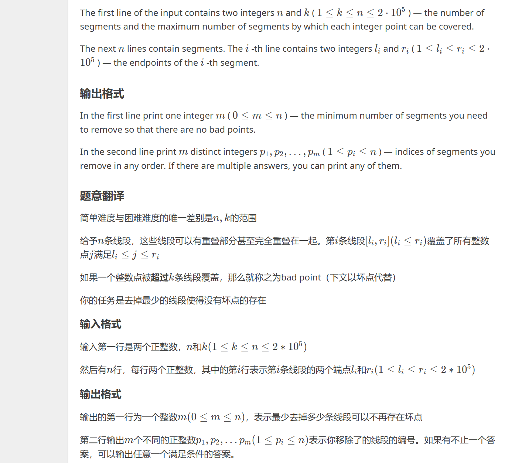

用不着线段树，直接使用差分在遍历的过程中累加即可。

对于给定的数据范围可以扫描所有的点，对于多个不符合的点，先从左边第一个开始操作，如果一个点不满足要求那么去删除包含他的右端点最大的线段。用差分数组表示每个位置的个数。

首先对线段按左端点排序，在遍历点的过程中把包含

这个点的线段的右端点全部加入到根堆中（同时记录编号），如果这个点不合法则删除右端点最大的线段，同时更新差分数组。


```python
import sys
from heapq import heappop, heappush

input=sys.stdin.readline
def R():
    return [int(x) for x in input().split()]
n,k=R()
N=2*10**5+10
d=[0]*N
h=[]
p=[]
# 处理所有的线段
for i in range(n):
    l,r=R()
    p.append([l,r,i+1])
    d[l]+=1
    d[r+1]-=1

# 线段排序
p.sort()

curr=0
index=0
ans=[]

# 扫描
for i in range(N):
    curr+=d[i]
    # 不合法的线段
    while h and -h[0][0]<i:
        heappop(h)
    # 记录所有合法的右端点
    while index<n and p[index][0]<=i:
        heappush(h,(-p[index][1],p[index][2]))
        index+=1
    # 当前点不满足条件，弹出最大的
    while curr>k:
        x,f=heappop(h)
        x=-x
        curr-=1
        # 更新差分数组
        d[x+1]+=1
        ans.append(f)
print(len(ans))
print(*ans)

```

## [将珠子放入背包中](https://leetcode.cn/problems/put-marbles-in-bags/)

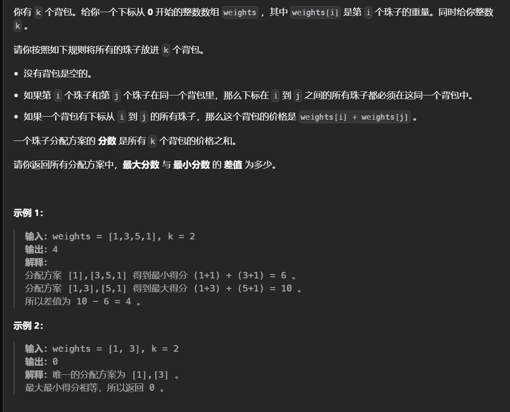

将数组分为k个子数组，每个子数组的价值等于数组中**首尾元素相加**，一种分割方案的分数等于其中所有子数组的分数之和。当分割一个位置时，上一个数组的末尾和下一个数组的开头一定会计入最终结果中，而题目要求最大分数与最小分数之和，因此**维护最大与最小的k-1**个分割点的值，即nums[i]+nums[i+1]，缺少的一个是因为**数组的开头和结尾对于任何一种分割方案都会计算**，因此最后会被抵消。


```python
class Solution:
    def putMarbles(self, weights: List[int], k: int) -> int:
        h=[]
        for i,j in pairwise(weights):
            heappush(h,i+j)
        return sum(nlargest(k-1,h))-sum(nsmallest(k-1,h))
```

## [最大子序列的分数](https://leetcode.cn/problems/maximum-subsequence-score/)

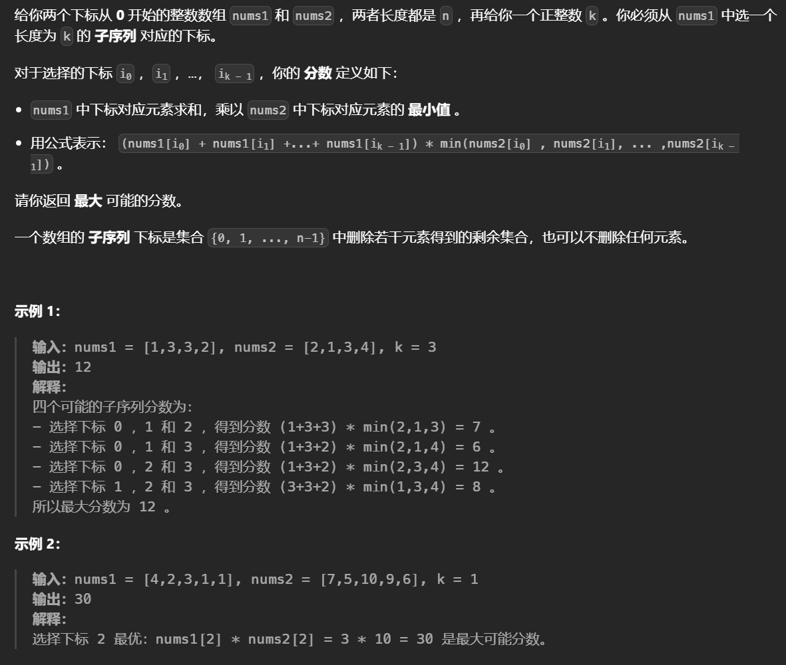

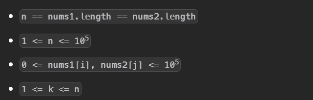

对于给定的数据范围无法使用动态规划，这里要求子序列并且结果只和子序列的数值相关和相对顺序无关，因此可以排序，按照nums2递减的顺序。

对于每个结果一定是有一个nums2中的值作为最小值那么可以枚举这个最小值，同时维护这个位置之前的k-1个nums1中的最大的值


```python
class Solution:
    def maxScore(self, nums1: List[int], nums2: List[int], k: int) -> int:
		# 排序
        nums=[(i,j) for i,j in zip(nums1,nums2)]
        nums.sort(key=lambda x:-x[1])
        # 先保证根堆中有k个值
        h=[i for i,j in nums[:k]]
        heapify(h)
        s=sum(h)
        ans=s*nums[k-1][1]
        # 枚举每个nums2中的值作为最小值
        for i,j in nums[k:]:
            # 更新堆，只维护k个值的总和
            if i>h[0]:
                s-=heappop(h)
                s+=i
                heappush(h,i)
                ans=max(ans,s*j)
        return ans 
```

## Phoenix and Towers

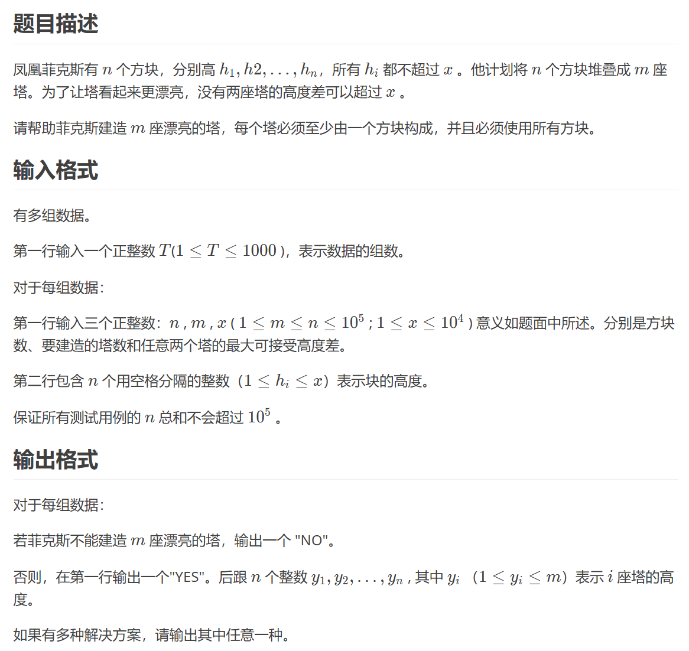

根据题目给定的hi<=x，如果存在两个塔高度之差大于等于x那么高的塔一定可以给低的塔一些方块来防止差值过大，因此不存在无解的情况，这里只需要按照贪心使用优先级队列：每次把值给当前高度最低的塔即可。


```python
for _ in range(R()):
    n,m,x=RR()
    nums=RR()
    ans=[]
    h=[(0,i+1) for i in range(m)]
    heapify(h)
    for i in range(n):
        val=nums[i]
        s,pos=heappop(h)
        ans.append(pos)
        heappush(h,(s+val,pos))
    print('YES')
    print(*ans)
```


## [查找和最小的 K 对数字](https://leetcode.cn/problems/find-k-pairs-with-smallest-sums/)

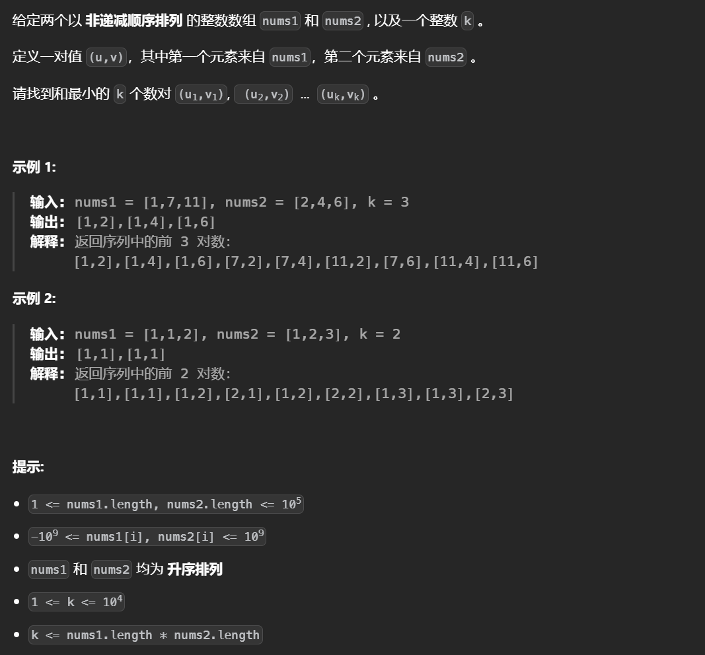

由于数组是升序排列的因此初始情况下最小的和一定是两个数组的首位，而接下来次小的一定是nums1[1]+nums2[0] / nums1[0]+nums2[1]，也就是i+1,j或者i,j+1位置，可以把它们放入优先级队列中，然后每弹出一个就新增两个，注意这里可能会增加重复的因此使用哈希表来判断。

```python
class Solution:
    def kSmallestPairs(self, nums1: List[int], nums2: List[int], k: int) -> List[List[int]]:
        n1,n2=len(nums1),len(nums2)
        h=[(nums1[0]+nums2[0],0,0)]
        memo=set()
        memo.add((0,0))
        cnt=0
        ans=[]
        while cnt<k:
            _,i,j=heappop(h)
            ans.append([nums1[i],nums2[j]])
            cnt+=1
            if i+1<n1 and (i+1,j) not in memo:
                memo.add((i+1,j))
                heappush(h,(nums1[i+1]+nums2[j],i+1,j))
            if j+1<n2 and (i,j+1) not in memo:
                memo.add((i,j+1))
                heappush(h,(nums1[i]+nums2[j+1],i,j+1))
        return ans 
```


## [有序矩阵中的第 k 个最小数组和](https://leetcode.cn/problems/find-the-kth-smallest-sum-of-a-matrix-with-sorted-rows/)

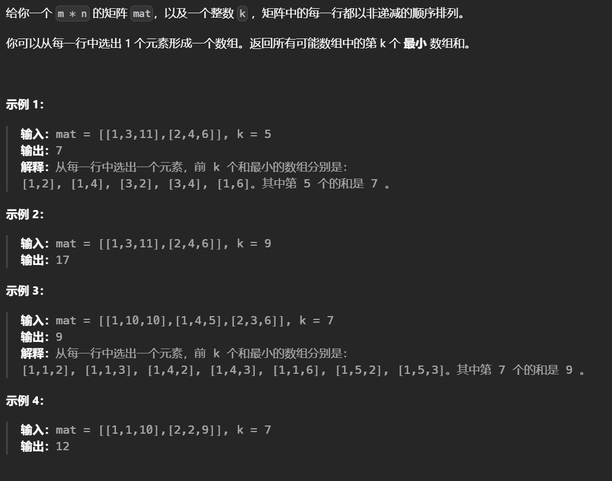

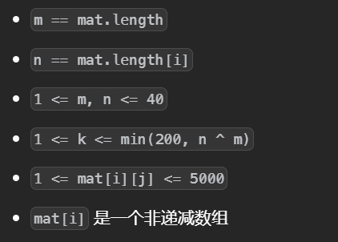

考虑示例三，假设已经算出了从前两行中每行取一个数的所有情况（一共九种），将这些数排序后是不需要考虑第八个和第九个的，因为随便从第三行取一个数与前七个数组合就已经满足k的条件了，因此下一行的数与前面已经计算出的数一一匹配后，取出K个最小的即可，取最小可以用堆加速计算。

```python
class Solution:
    def kthSmallest(self, mat: List[List[int]], k: int) -> int:
        def cal(arr1,arr2):
            # 初始时最小的
            h=[(arr1[0]+arr2[0],0,0)]
            n1,n2=len(arr1),len(arr2)
            ans=[]
            # 使用字典去重
            vis=set()
            vis.add((0,0))
            while len(ans)<k and h:
                v,i,j=heappop(h)
                ans.append(v)
                # 往两边扩展
                if i+1<n1 and (i+1,j) not in vis:
                    heappush(h,(arr1[i+1]+arr2[j],i+1,j))
                    vis.add((i+1,j))
                if (i,j+1) not in vis and j+1<n2:
                    heappush(h,(arr1[i]+arr2[j+1],i,j+1))
                    vis.add((i,j+1))
            return ans 
        # a表示之前算出的结果数组
        a=mat[0][:k]
        for row in mat[1:]:
            a=cal(a,row)
        return a[-1]
```


## [ 找出数组的第 K 大和](https://leetcode.cn/problems/find-the-k-sum-of-an-array/)

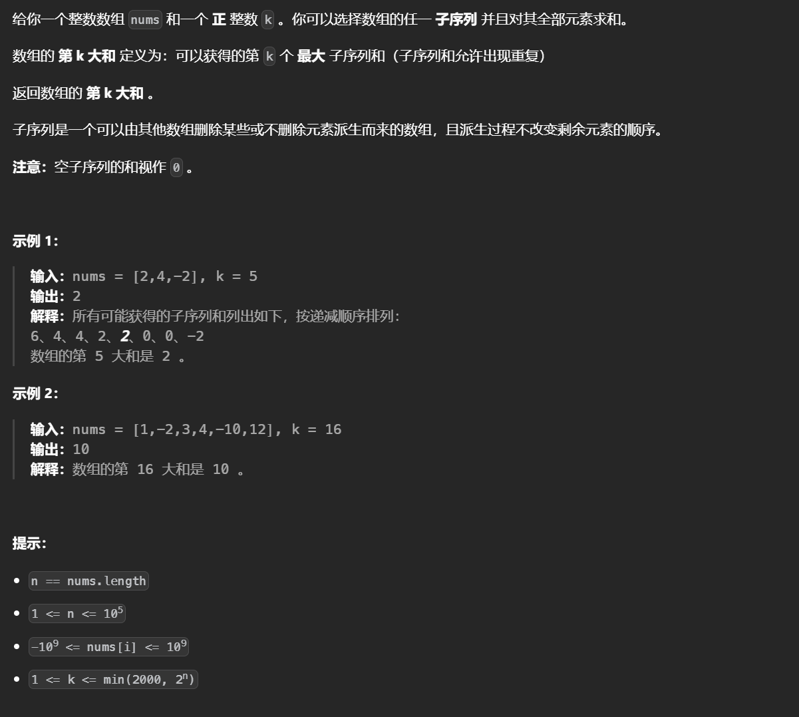

计算出数组中所有的发**正数之和**sum，任意一个子序列的和都是**从sum中减去某些非负数/加上负数**，可以转换为减去数组中的绝对值。问题变为**在非负数数组中选出第k小的子序列**(第k大的子序列等于之前求出的和最大的子序列减去转换后和第k小)

将绝对值数组排序后，不重不漏的生成所有的子序列

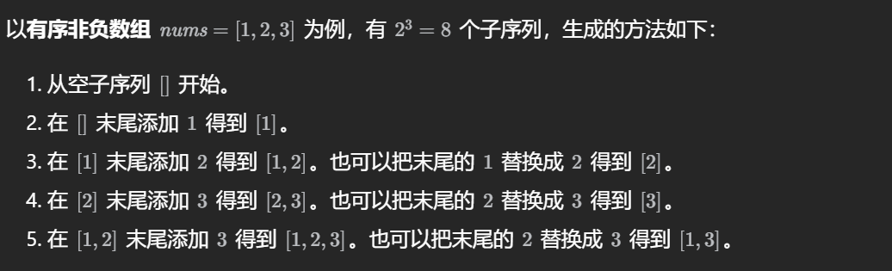

为了得到最小的和可以使用根堆维护，用平衡树做说不定也行。

```python
class Solution:
    def kSum(self, nums: List[int], k: int) -> int:
        ss=0
        n=len(nums)
        # 转换数组并求出所有正数的和
        for i,x in enumerate(nums):
            if x<0:nums[i]=-x
            else:
                ss+=x
        # 先排序
        nums.sort()
        # 初始化
        h=[(0,0)]
        # 执行k-1次后，下一次的堆顶就是第K小
        for _ in range(k-1):
            s,i=heappop(h)
            if i<len(nums):
                # 加到后面
                heappush(h,(s+nums[i],i+1))
                # 替换当前
                if i-1>=0:
                    heappush(h,(s-nums[i-1]+nums[i],i+1))
        return ss-h[0][0]
```

## [网格图中最少访问的格子数](https://leetcode.cn/problems/minimum-number-of-visited-cells-in-a-grid/)

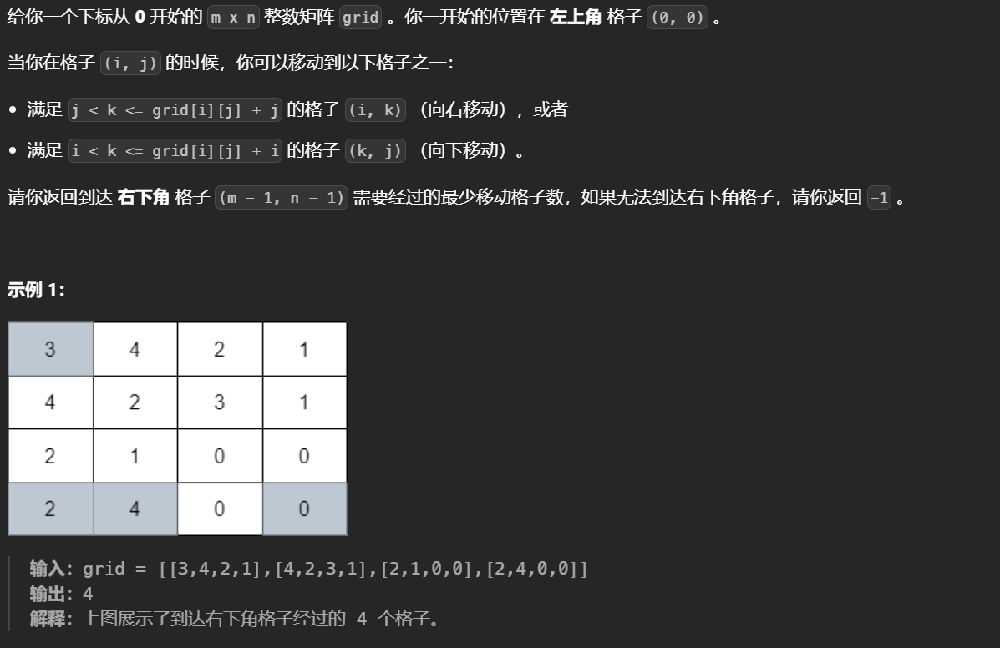

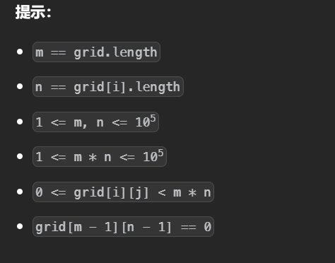

对于给定的数据范围可以**枚举每个位置**，一个位置可能**从它的上边或者左边得到**，**对每一行每一列构建优先队列**，队列以**移动次数**为key，同时维护这个点能到达的**最远位置**，如果具有最小操作次数的位置无法到达当前位置就弹出，因为它一定也无法到达下一个位置，反之**更新**该位置对应的行和列的优先队列。

```python
class Solution:
    def minimumVisitedCells(self, g: List[List[int]]) -> int:
        m,n=len(g),len(g[0])   
        if m==n==1:return 1
        # 记录每一列的对应的最小行
        row=[[] for _ in range(n)]
        # 记录每一行对应的列
        col=[[] for _ in range(m)]

        # 初始化0,0位置
        heappush(row[0],(0,g[0][0]))
        heappush(col[0],(0,g[0][0]))

        for i in range(m):    
            for j in range(n):
                # 跳过
                if not i and not j:continue
                r=row[j]
                c=col[i]
                # 不满足条件则弹出
                while r and r[0][1]<i:heappop(r)
                while c and c[0][1]<j:heappop(c)

                # 取得最小的操作次数
                ans=inf
                if r:ans=r[0][0]+1
                if c:ans=min(c[0][0]+1,ans)
                
                # 如果能到达就更新队列
                if ans!=inf:
                    heappush(r,(ans,i+g[i][j]))
                    heappush(c,(ans,j+g[i][j]))
                
                # 找到最终答案
                if i==m-1 and j==n-1:
                    if ans==inf:return -1 
                    return ans +1
```


# 懒删除堆

避免了从堆中删除一个元素需要**完全遍历一遍堆**

删除的时候，只需记录[要删除一个值为X的数]，并不去执行删除操作，等到要出堆时才真正执行删除操作

+ 使用一个**哈希表cnt**记录每个元素的删除情况
+ remove(x)，**cnt[x]+=1**
+ 入堆，**如果cnt[x]=0正常入堆，反之cnt[x]-=1**
+ 出堆，**在出堆之前正式执行删除操作**——**如果堆顶cnt[h.top]>0则弹出堆顶，直到cnt[h.top]=0**


## [滑动窗口中位数](https://leetcode.cn/problems/sliding-window-median/)

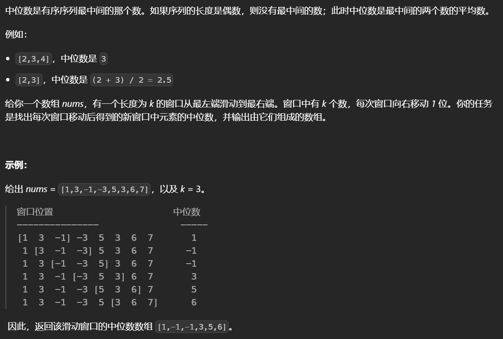


首先不考虑删除操作，如果**只有添加操作**如何计算中位数，根据中位数的定义——中位数分割了最大的m个值，和最小的m个值(m表示数组长度/2)，**因此使用堆维护最大的m个值，和最小的m个值**，如果数组长度为**奇数**，则在将额外的值放到**最大堆**中。求解中位数就是**最大堆维护的堆顶(奇数长度)**，**偶数长度就再加上最小的堆顶然后/2**

当滑动窗口移动时，需要执行删除操作，如果不借助懒删除堆则会完全遍历一遍堆

```python
class Lazy_heap:
    def __init__(self):
        self.h=[]
        # 哈希表
        self.cnt=defaultdict(int)
        # 记录堆的大小
        self.size=0
    # 正式的删除操作
    def apply_remove(self):
        d=self
        while d.h and d.cnt[d.h[0]]>0:
            d.cnt[d.h[0]]-=1
            heappop(d.h)
    # 返回堆顶
    def top(self):
        self.apply_remove()
        return self.h[0]
    # 入堆
    def push(self,x):
        d=self
        if d.cnt[x]:
            d.cnt[x]-=1
        else:
            heappush(d.h,x)
        d.size+=1
    # 出堆
    def pop(self):
        # 出堆之前正式执行删除操作
        self.apply_remove()
        self.size-=1
        return heappop(self.h)
    # 移除一个元素
    def remove(self,x):
        self.cnt[x]+=1
        self.size-=1
    # 先添加再删除
    def pushpop(self,x):
        self.apply_remove()
        return heappushpop(self.h,x)

class Solution:
    def medianSlidingWindow(self, nums: List[int], k: int) -> List[float]:
        if k==1:return nums
        l=Lazy_heap()
        r=Lazy_heap()

        ans=[]
        i=0
        for j,x in enumerate(nums):
            # 需要执行删除操作
            if j-i+1>k:
                # 在最小堆(大的值都放在最小堆)
                # 因为添加操作会保证二者的平衡(滑动窗口)，所以不用担心最小堆会被删空
                if nums[i]>=r.top():
                    r.remove(nums[i])
                else:
                    l.remove(-nums[i])
                    # 需要保证最大堆长度至少等于最小堆
                    if l.size<r.size:
                        # 否则取最小堆的堆顶给最大堆
                        pre=r.pop()
                        l.push(-pre)
                i+=1
            # 保证最大堆长度大于最小堆长度，且相差不超过一
            # 初始时直接给最小堆，防止访问空的堆
            if not l.size:
                l.push(-x)
            # 长度一样
            elif l.size==r.size:
                # 属于较大的值
                if x>r.top():
                    pre=r.pushpop(x)
                    l.push(-pre)
                    
                else:
                    l.push(-x)
            else:
                # 属于较小的值
                if x<-l.top():
                    pre=-l.pushpop(-x)
                    r.push(pre)
                else:
                    r.push(x)
            # 取中位数
            if j-i+1==k:
                if l.size==r.size:
                    ans.append((r.top()-l.top())/2)
                else:
                    ans.append(-l.top())

        return ans 
```


## [使 K 个子数组内元素相等的最少操作数](https://leetcode.cn/problems/minimum-operations-to-make-elements-within-k-subarrays-equal/)

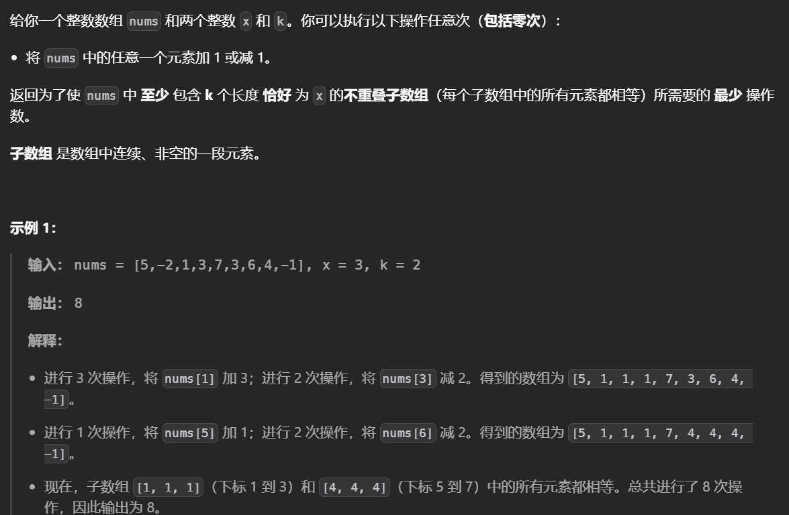

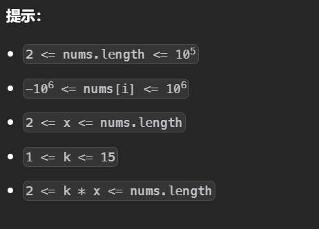

子数组元素都相等那么就是都变为**中位数**，由于子数组长度相同那么可以用滑动窗口遍历求解，再用懒删除堆维护中位数，最小的操作次数则是**中位数\*size+最大堆的和(注意最大堆中维护的是负数)+最小堆的和-中位数\*size**，预处理出每一段的最小操作次数

再根据题意使用**划分型DP**求解

```python
class Lazy_heap:
    def __init__(self):
        self.h=[]
        # 哈希表
        self.cnt=defaultdict(int)
        # 记录堆的大小
        self.size=0
        self.sum=0
    # 正式的删除操作
    def apply_remove(self):
        d=self
        while d.h and d.cnt[d.h[0]]>0:
            d.cnt[d.h[0]]-=1
            heappop(d.h)
    # 返回堆顶
    def top(self):
        self.apply_remove()
        return self.h[0]
    # 入堆
    def push(self,x):
        d=self
        d.sum+=x
        if d.cnt[x]:
            d.cnt[x]-=1
        else:
            heappush(d.h,x)
        d.size+=1
    # 出堆
    def pop(self):
        # 出堆之前正式执行删除操作
        self.apply_remove()
        self.size-=1
        x=heappop(self.h)
        self.sum-=x
        return x 
    # 移除一个元素
    def remove(self,x):
        self.sum-=x
        self.cnt[x]+=1
        self.size-=1
    # 先添加再删除
    def pushpop(self,x):
        self.apply_remove()
        self.sum==x-self.top()
        return heappushpop(self.h,x)
class Solution:
    def minOperations(self, nums: List[int], kk: int, k: int) -> int:
        n=len(nums)
        def make_dis():
            ans=[inf]*n
            ll=Lazy_heap()
            rr=Lazy_heap()
            l=0
            for r,x in enumerate(nums):
                # 滑动窗口删除多余元素
                if r-l+1>kk:
                    if nums[l]>=rr.top():
                        rr.remove(nums[l])
                    else:
                        ll.remove(-nums[l]) 
                        if ll.size<rr.size:
                            val=rr.pop()
                            ll.push(-val)
                    l+=1
                # 添加元素，维护两个堆的大小
                if not ll.size:
                    ll.push(-x)
                elif ll.size==rr.size:
                    if x>rr.top():
                        val=rr.pop()    
                        ll.push(-val)
                        rr.push(x)
                    else:
                        ll.push(-x)
                else:
                    if x<=-ll.top():
                        val=-ll.pop()
                        rr.push(val)
                        ll.push(-x)
                    else:
                        rr.push(x)
                # 求解最小操作次数
                if r-l+1==kk:
                    mid=-ll.top()
                    val=mid*ll.size+ll.sum+rr.sum-mid*rr.size
                    # 偶数长度额外判断一次
                    if ll.size==rr.size:
                        mid=rr.top()
                        val=min(val,mid*ll.size+ll.sum+rr.sum-mid*rr.size)
                    ans[l]=val
            return ans 
        
        dist=make_dis()
        # f[i][j] 考虑前j个元素已经划分了i段
        f=[[inf]*(n+1) for _ in range(k+1)]
        f[0]=[0]*(n+1)
        for i in range(1,k+1):
            for j in range(n+1):
                if j-kk>=0:
                    f[i][j]=min(f[i][j-1],f[i-1][j-kk]+dist[j-kk])
                else:
                    f[i][j]=f[i][j-1]
        return f[k][n]
```


## [滑动子数组的美丽值](https://leetcode.cn/problems/sliding-subarray-beauty/)

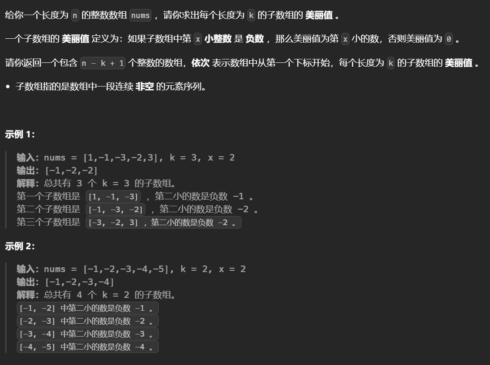

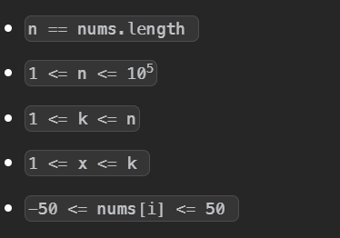

与上一题是同一类型的题目，不过这次需要**第x小**，用**最小堆维护k-x+1个最大值**，最大最维护剩下的最小值，那么**最小堆的堆顶就是第x小(第k-x+1大)**，这里需要保证**最小堆的大小**为k-x+1，当添加一个新值的时候，如果最小堆**未满**，则**直接插入**到最小堆，反之如果最小堆**刚好满了**，那么为了维护最大的k-x+1个值，将添加的值**与堆顶比较**。


## [移除最小数对使数组有序 II](https://leetcode.cn/problems/minimum-pair-removal-to-sort-array-ii/)

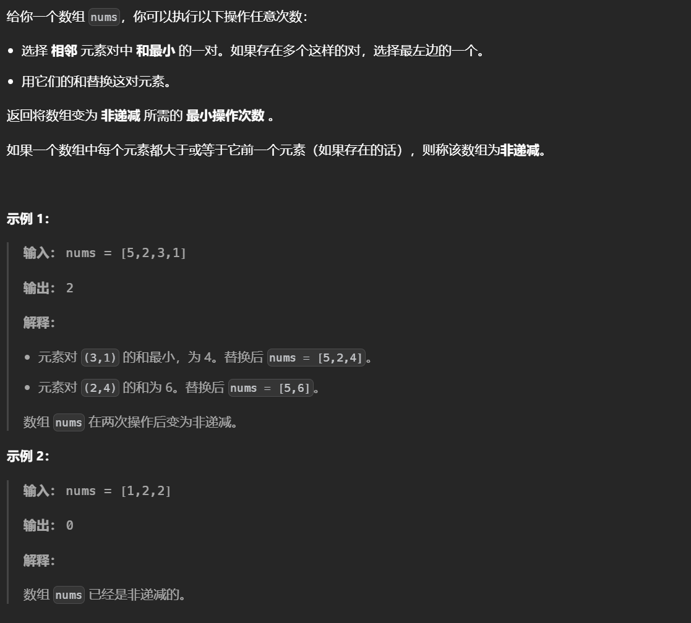


每次只能删除**和最小的**(相同则取最左侧的)，因此需要**有序集合和堆**之类的数据结构，当修改一个元素时要求**修改**其他相邻对的值，那么需要使用**懒删除堆或者有序结合**(需要remove操作)

为了判断是否**有序**，用一个变量**dec**记录数组中**不满足条件的相邻对**，不断操作，直到dec=0，

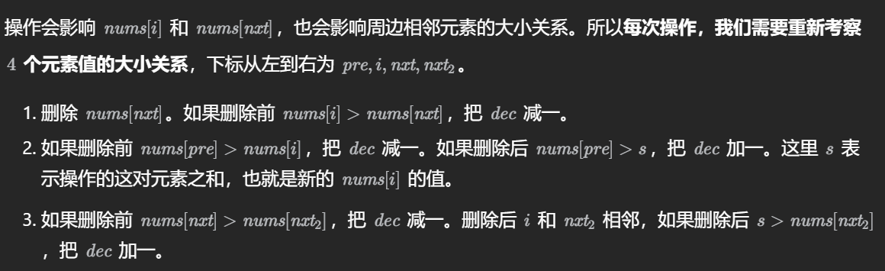

```python
# 并查集
class UF:
# 懒删除堆
class Lazy:
    def __init__(self):
        self.h=[]
        self.cnt=defaultdict(int)
        self.size=0

    def top(self):
        self.clear()
        return self.h[0]
         
    def clear(self):
        while self.h and self.cnt[self.h[0]]>0:
            self.cnt[self.h[0]]-=1
            heappop(self.h)

    def pop(self):
        self.clear()
        self.size-=1
        return heappop(self.h)
    
    def push(self,x):
        if self.cnt[x]:
            self.cnt[x]-=1
        else:
            heappush(self.h,x)        
        self.size-=1

    def remove(self,x):
        self.cnt[x]+=1
        self.size-=1
    
class Solution:
    def minimumPairRemoval(self, nums: List[int]) -> int:
        arr=Lazy()
        n=len(nums)
        # 特判
        if n==1:return 0
        
        ans=dec=0
        
        l=UF(n+1)# 记录每个位置的左边位置，用以跳过被删除的位置，初始时i位置的左边位置为i
        r=UF(n+1) # 同理

        # 初始化，统计dec个数以及将相邻位置入堆
        for i in range(n-1):
            arr.push((nums[i]+nums[i+1],i))
            dec+=int(nums[i]>nums[i+1])
        
        while dec and arr:
            s,idx=arr.pop()
            
            # 通过并查集找到真正的idx的右侧
            nx=r.find(idx+1)

            # 删除nx的影响
            if nums[idx]>nums[nx]:
                dec-=1
            
            # 判断修改idx后，idx与其左侧形成的相邻数对要变化 
            if idx-1>=0:
                # 真正的idx的左侧位置
                lpos=l.find(idx-1)

                # 对dec的影响
                if nums[lpos]>nums[idx]:
                    dec-=1
                if nums[lpos]>s:
                    dec+=1
                # 删除旧的相邻对，添加新的相邻对
                arr.remove((nums[lpos]+nums[idx],lpos))
                arr.push((nums[lpos]+s,lpos))

            # 判断右侧，同理
            if nx+1<n and r.find(nx+1)<n:
                rpos=r.find(nx+1)
                if nums[nx]>nums[rpos]:
                    dec-=1
                if s>nums[rpos]:
                    dec+=1
                arr.remove((nums[nx]+nums[rpos],nx))
                arr.push((s+nums[rpos],idx))
            
            # 修改原数组
            nums[idx]=s
            nums[nx]=-inf

            # 更新左侧以及右侧的位置
            l.parent[nx]=idx
            r.parent[nx]=min(n,nx+1)
            ans+=1
        
        return ans 
```

