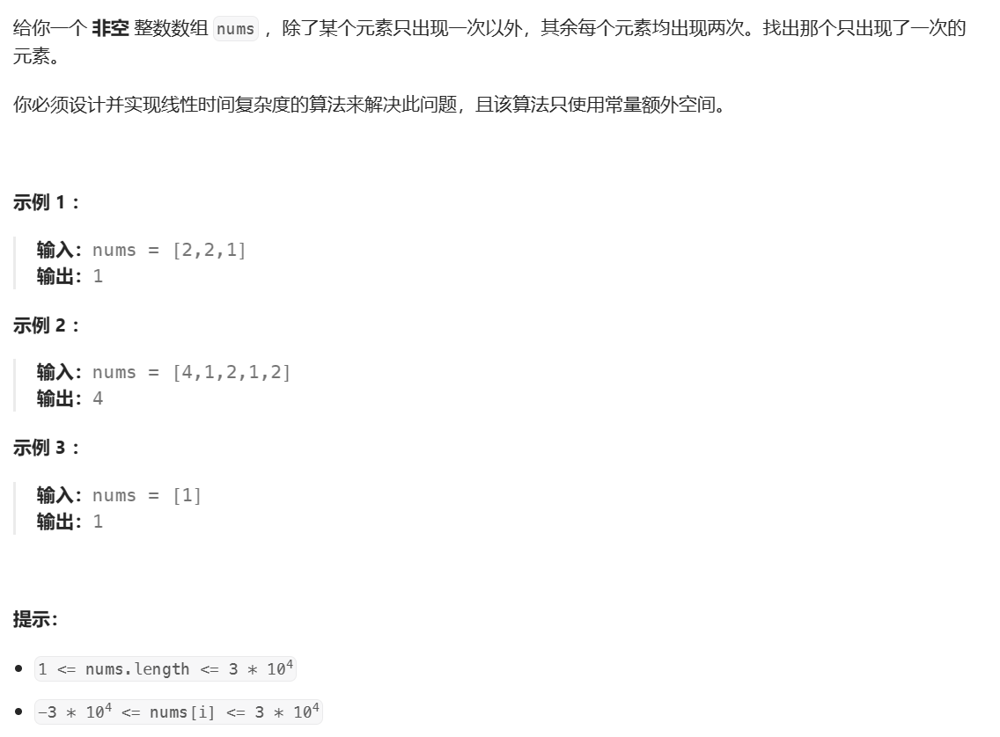
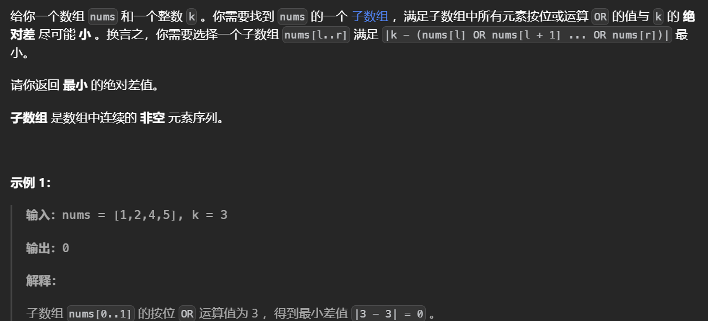

# 位运算


#  常用技巧


## 集合与集合


## 集合与元素

通常会用到移位运算，其中 << 表示左移，>> 表示右移，左移i位相当于乘上$2^i$，右移i位相当于除上$2^i$​，`注意左移右移运算符的优先级低于+-`。

i>>n<<n可以取出n位之上的

二进制取反就是找补集的操作：异或上((1<<n)-1)，n表示二进制长度，如果不想把最高位取反那么把n减去1即可。

**lowbit就是二进制下最低位1与其右边的0构成数字大小，可以通过i&-i求出**


## 遍历集合

直接循环

```python
for i in range(n):
    if (s >> i) & 1:  # i 在 s 中
        # 处理 i 的逻辑
```


使用lowbit的技巧

```python
t = s
while t:
    lowbit = t & -t
    t ^= lowbit
    i = lowbit.bit_length() - 1
    # 处理 i 的逻辑
```


## 枚举集合

最直接的是for循环

所有子集

```python
sub = s
while True:
    # 处理 sub 的逻辑
    sub = (sub - 1) & s
    if sub == s:
        break
```


**从大到小**枚举所有子集，**不包括空集**

```python
sub = s
while sub:
    # 处理 sub 的逻辑
    sub = (sub - 1) & s
```


# 异或操作

异或操作是一种二进制的位运算，`运算规则为相同为0不同为1`，一个数`异或自身的结果为0，与0异或得到本身`，异或运算满足`交换律`

**可以看作是不进位加法**，因此一组数异或后只会减小

**异或可以做前缀和，也可以用于做奇偶前缀。**

**两个数异或后，设置位的奇偶性不变**，见[用偶数异或设置位计数三元组 II](https://leetcode.cn/problems/count-triplets-with-even-xor-set-bits-ii/)，这个性质可以推导到三个。

**偶数长度的数组异或后一定不为0**

## [只出现一次的数字](https://leetcode.cn/problems/single-number/)

**异或操作可以用来排除偶次重复**

在一个整数数组中，仅存在一个不重复的数字，其余数字均出现两次（或偶数次），找出不重复数字，`将所有的元素异或`，偶数次的数字会被抵消，最后的结果就是不重复的数字。



```python
from functools import reduce
from operator import xor
class Solution:
    def singleNumber(self, nums: List[int]) -> int:
        return reduce(xor,nums)
```

## [只出现一次的数字 II](https://leetcode.cn/problems/single-number-ii/)

​	

使用位运算来找，如果x的某个比特是0，而由于其他数字都出现了三次，所以这个位置上1的个数是3的整数倍（其他重复三次的数字要么这个位置没有数字，要么就是三个一组的出现），如果x的比特是1，那么这个比特取余3必然为1


因此统计每个比特位上1的个数，数据范围如下：


python中数据类型比较特殊，其他语言中第31位是符号位运算时不会把这一位算入，python计算中会把31位当作符号位，但操作时它的31位会算入计算中。

因此在判断除第31位是1（即负数时），转化为补码形式可以成功表示出负数。补码的操作方式是res-=1<<31

```python
class Solution:
    def singleNumber(self, nums: List[int]) -> int:
        ans=0
        for i in range(32):
            # 统计这个位置上的1的个数
            cnt=sum((n>>i)&1 for n in nums)
            # 如果取余3为1，表示这个位置上x是存在的，对于符号位如果满足说明结果是负数
            if cnt%3:
                # 如果是符号位，转为补码形式
                if i==31:
                    ans-=1<<i
                 # 在这个位置上加入
                else:
                    ans|=1<<i
        return ans
```

## [只出现一次的数字 III](https://leetcode.cn/problems/single-number-iii/)


使用异或操作后，其中偶数次的结果抵消，剩下的是两个出现一次的元素的异或，根据这个异或查找里面为1的位置，这个位置代表两个数在这个比特上不同，接下来根据这个位置划分元素，这个位置上都为一的分一组，为0的分一组，由于其他元素都是偶数次重复，因此再做一次异或就都抵消了。


```python
from functools import reduce
from operator import xor
class Solution:
    def singleNumber(self, nums: List[int]) -> List[int]:
        v=reduce(xor,nums)
        # 找到这个位置
        for i in range(31):
            if (v>>i)&1:
                pos=i
                break
        a=b=0
        # 分组异或
        for num in nums:
            if (num>>i)&1:
                a^=num
            else:
                b^=num
        return [a,b] 
```

## [每个查询的最大异或值](https://leetcode.cn/problems/maximum-xor-for-each-query/)


最原始的思想是，K可以控制异或的值，遍历k所能控制的每一个位数，使得该位上异或的结果是1，记录下每一个位数，最后组合就是k的值。效率较慢。

```python
class Solution:
    def getMaximumXor(self, nums, maximumBit: int):
        n=len(nums)
        # 构建前缀异或数组，方便找值，不用删除最后一个元素
        pre=[0]*n
        pre[0]=nums[0]
        ans=[]
        for i in range(1,n):
            pre[i]=pre[i-1]^nums[i]
        # 倒序找每一个值
        for i in range(n-1,-1,-1):
            val=pre[i]
            temp=[]
            # 遍历这个值所能控制的每一个位置
            for j in range(maximumBit-1,-1,-1):
		# 如果这个位置相等了（都是1），则记录0
                if (1<<j)&val:
                    op=0
                else:
                    op=1
                temp.append(str(op))
            # 最后转化为十进制整数
            s="".join(temp)
            ans.append(int(s,2))
        return ans
```


第二种方法：观察数据范围，由于每个值都小于等于$2^{maximumBit}-1$，因此所有的前缀和也都小于这个值，而k可以控制到maximumBit-1位，因此每个前缀的和k异或的最大值就是$2^{maximumBit}-1$

因此由异或的性质可得：


其中xpre就是数组的异或前缀和，由异或的性质每次$xpre_{i}$^nums[i] 就是$xpre_{i-1}$以此来更新异或数组

```python
from functools import reduce
from operator import xor
class Solution:
    def getMaximumXor(self, nums, maximumBit: int):
        n=len(nums)
        # 使用reduce 函数找出所有的值的异或和
        xpre=reduce(xor,nums)
        ans=[]
        for i in range(n-1,-1,-1):
            # 找到当前的k
            k=((1<<maximumBit)-1)^xpre
            # 更新异或前缀数组
            xpre^=nums[i]
            ans.append(k)
        return ans 
```

## [构建回文串检测](https://leetcode.cn/problems/can-make-palindrome-from-substring/)


由于子数组可以重新排列因此只需要构建前缀计数数组，对于区间内出现偶数次的可以全部构成回文串的，而奇数个会留下一个无法构成回文串的字符，统计所有的出现为奇数次的字符的个数

比如说有4个出现为奇数次的k的大小别绪大于等于它的一半。

```python
class Solution:
    def canMakePaliQueries(self, s: str, queries: List[List[int]]) -> List[bool]:
        # 通过26个字符构建前缀计数数组
        pre=[[0]*26]
        ans=[]
        for c in s:
            temp=pre[-1][:]
            temp[ord(c)-ord('a')]+=1
            pre.append(temp)
        for l,r,k_ in queries:
            # 区间长度为奇数时可用忽略一个奇数
            cnt=-((r-l+1)%2)
            # 累加奇数个
            for sl,sr in zip(pre[l],pre[r+1]):
                cnt+=(sr-sl)%2
            ans.append(k_>=cnt//2)
        return ans   
```

​	

这里只关心每个字符出现次数的奇偶性因此可以只用一个数的位运算来构建前缀数组（0表示偶数1表示奇数，如果当前来了一个字符那么通过异或操作将奇数变偶数，偶数变奇数），再判断区间内是否为奇数(奇数与偶数操作为奇数，其他的都为偶数)通过异或运算可以实现。

```python
class Solution:
    def canMakePaliQueries(self, s: str, queries: List[List[int]]) -> List[bool]:
        pre=[0]
        ans=[]
        for c in s:
            bit=1<<(ord(c)-ord('a'))
            # 奇数变偶数，偶数变奇数
            pre.append(pre[-1]^bit)
        for l,r,k_ in queries:
            # 如果区间长度为奇数的话，需要减少的奇数就可以减一
            cnt=-((r-l+1)%2)
            sl,sr=pre[l],pre[r+1]
            # 通过异或运算判断区间内奇数的个数
            cnt+=(sl^sr).bit_count()
            # 对于这些奇数只需要操将其中一半变为另一半即可
            ans.append(k_>=cnt//2)
        return ans   
```

## [用偶数异或设置位计数三元组 II](https://leetcode.cn/problems/count-triplets-with-even-xor-set-bits-ii/)


对于两个数a,b，令其中设置位的个数为x和y，两者共有的设置位个数为z，那么异或后设置位的个数为x+y-2*z，即a独有的加上b独有的，因为减去的是一个偶数，**因此异或后设置位的奇偶就和x+y一致。**

**推导到三个就有异或后的奇偶性和x+y+z有关，**那么当要求最后是偶数时，就有三者都是偶数，或其中一个为偶数其他两个为奇数。


```python
class Solution:
    def tripletCount(self, a: List[int], b: List[int], c: List[int]) -> int:
        arr=[[0,0]*3]
        for i,j,k in zip(a,b,c):
            if i.bit_count()&1:arr[0][1]+=1
            else:arr[0][0]+=1
            
            if i.bit_count()&1:arr[0][1]+=1
            else:arr[0][0]+=1

            if i.bit_count()&1:arr[0][1]+=1
            else:arr[0][0]+=1
```

# 0-1Trie


## [统计异或值在范围内的数对有多少](https://leetcode.cn/problems/count-pairs-with-xor-in-a-range/)


数组异或类的题目使用字典树求解，初始的想法是构建所有值的异或字典树，然后枚举每一个数，在字典树上做bfs求解出所有的异或值然后判断是否在区间内，但是这种方法实际是n^2的，因为bfs找出了所有的异或值相当于遍历了数组。

这里查找区间内的个数，可以转换为前缀的求解，即找小于等于high的减去小于等于low-1的，那么在字典树中不需要维护一个队列，当limit的位为1的时候所有异或出0的分支都是可以的，直接加上然后跳到异或为1的分支继续，如果limit的位为0，那么就只能跳到与x这一位相反的分支上。

```python
class Trie:
    def __init__(self):
        self.children={}
        # 需要记录经过这个节点的数有多少，而不是只在端点记录，因为要剪枝
        self.cnt=0
    def insert(self,x):
        t=self
        # 从高位开始
        for i in range(15,-1,-1):
            c=x>>i&1
            if c not in t.children:
                t.children[c]=Trie()
            t=t.children[c]
            t.cnt+=1
    def search(self,x,limit):
        t=self
        ans=0
        for j in range(15,-1,-1):
            v=x>>j&1
            # 如果这一位是1，那么与x当前位相同的(异或出0)可以直接加上，因为必然小于limit，然后跳到与x不同的位上
            if limit>>j&1:
                if v in t.children:ans+=t.children[v].cnt
                # 如果没有这个分支
                if v^1 not in t.children:return ans 
                t=t.children[v^1]
            # 为0就只能跳到相同的位上
            else:
                if v not in t.children:return ans 
                t=t.children[v]
        return ans+t.cnt # 最后要加上这个位上的数

class Solution:
    def countPairs(self, nums: List[int], low: int, high: int) -> int:
        t=Trie()
        ans=0
        # 因为会重复计算，所以算一个插入一个，可以做到不重不漏
        for v in nums:
            ans+=t.search(v,high)-t.search(v,low-1)
            t.insert(v)
        # 或者也可以直接写
        # for v in nums:T.insert(v)
        # return sum([T.search(v,high) for v in nums])//2-sum([T.search(v,low-1) for v in nums])//2
        return ans 
```


## [找出强数对的最大异或值 II](https://leetcode.cn/problems/maximum-strong-pair-xor-ii/)


求解最大的异或值使用字典树，这里要求xy的满足一定的条件，可以排序后用滑动窗口


```python
class Trie:
    def __init__(self):
        self.children=[None]*2
        self.cnt=0
    def insert(self,x):
        d=self
        for j in range(21,-1,-1):
            c=x>>j&1
            if not d.children[c]:
                d.children[c]=Trie()
            d=d.children[c]
            d.cnt+=1
    def remove(self,x):
        d=self
        for j in range(21,-1,-1):
            c=x>>j&1
            d.children[c].cnt-=1
            if not d.children[c].cnt:
                d.children[c]=None
                return 
            d=d.children[c]

    def search(self,y):
        d=self
        ans=0
        for j in range(21,-1,-1):
            c=y>>j&1
            if d.children[c^1]:
                d=d.children[c^1]
                ans+=1<<j
            else:
                d=d.children[c]
        return ans 
        
class Solution:
    def maximumStrongPairXor(self, nums: List[int]) -> int:
        nums.sort()
        l=ans=0
        t=Trie()
        for r,y in enumerate(nums):
            t.insert(y)
            while l<r and nums[l]*2<y:
                t.remove(nums[l])
                l+=1
            ans=max(ans,t.search(y))
        return ans 
        
        
```


# 与或运算


# 拆位/贡献法


## [与非的谜题](https://leetcode.cn/problems/ryfUiz/)


拆位，每个比特位和1与非会取反，与0得到的是1，因此对数组中的数查看在k个比特位上最后出现的0的位置，在这个位置之前无论怎么操作，最后到了这个位置一定会变为1。因为会动态修改数组中的值因此需要使用k个有序集合统计最后0出现的位置。

```python
from sortedcontainers import SortedSet as st
class Solution:
    def getNandResult(self, k: int, arr: List[int], operations: List[List[int]]) -> int:
        n=len(arr)
        # 有序集合列表
        ss=[st() for _ in range(k)]
        
        ans=[]
        # 统计k个比特位上，0出现的位置
        for i,v in enumerate(arr):
            for j in range(k):
                if v>>j&1:continue
                ss[j].add(i)
        for f,x,y in operations:
            # 修改
            if not f:
                pre=arr[x]
                arr[x]=y
                # 将该值原先对应的位置从集合中删除
                for s in ss:
                    if x in s:s.remove(x)
                # 将新的值添加
                for j in range(k):
                    if y>>j&1:continue
                    ss[j].add(x)
            else:
                # 遍历每个比特位
                for j,s in enumerate(ss):
                    # 如果该比特位上全都是1那么一共反转n*x次
                    if not s:
                        cnt=n*x
                    else:
                        # 否则在最后一次0出现的位置变为1，然后返回n-s[-1]-1次，与一共操作多少次没有关系
                        cnt=n-s[-1]-1
                        # 注意变为1
                        y|=(1<<j)
                    # 反转
                    if cnt&1 :
                        y^=1<<j
                ans.append(y)
        return reduce(xor,ans)
```


# Logtrick

利用运算结果是有限的(位运算，乘积等于和，公因数)，来维护一个较短的数组(如果求得的是一个最接近的值那么可以直接往回找，如果求的是子数组的长度，那么额外维护一个索引值，如果是个数，那么就维护一个个数，在去重的时候更新或合并)，这个数组是当前位置之前的所有子数组的运算结果，每次枚举一个值的时候都会遍历这个数组重新计算以当前值为端点得到的新的子数组的结果。


## [按位或最大的最小子数组长度](https://leetcode.cn/problems/smallest-subarrays-with-maximum-bitwise-or/)


题意为：找出以每个元素为起始位置的子数组中，按位或能得到最大值的最短子数组。

异或运算得到的子数组只会是递增或是不变的具有单调性，使用一个数组来维护每个位置的元素所能得到的最大值以及这个位置，百万级别的数据对应到二进制上最多只有三十几个状态，因此维护的数据不会太大，而每个元素能对应的区间又可以由前一个元素推出。


```python
class Solution:
    def smallestSubarrays(self, nums: List[int]) -> List[int]:
        n=len(nums)
        ans=[0]*n
		# 维护状态（异或值，右端点索引），每次加到尾部，因此数组首部就是最大的异或值
        ors=[]
        # 倒序遍历，因为要以i为起点
        for i in range(n-1,-1,-1):
            ors.append([0,i])
            # 每个元素所有子数组的结果可以由上一个元素的结果推出，因为运算具有单调性
            for p in ors:
                p[0]|=nums[i]
            # 以下是去重的逻辑，因为对于相同的值，题目要求去最短区间
            l=0
            r=1
            while r<len(ors):
                if ors[r][0]!=ors[l][0]:
                    l+=1
                    ors[l]=ors[r]
                else:
                    # 对于相同的值取小的右端点
                    ors[l][1]=ors[r][1]
                r+=1
            del ors[l+1:]
            # 可以保证数组中的第一个元素是当前能到达的最大的
            ans[i]=ors[0][1]-i+1
        return ans 
        
```


## [子数组按位或操作](https://leetcode.cn/problems/bitwise-ors-of-subarrays/)


同上一题一样的解法，在找一个子数组最大的或结果中记录结果。或实质上是并集，遍历每一个元素，求他和之前的元素之间的或的结果，如果if nums[i]|nums[j]==nums[j]就说明当前的元素不会再使前面的集合变大了直接退出	


```python
class Solution:
    def subarrayBitwiseORs(self, nums: List[int]) -> int:
        ans=0
        n=len(nums)
        memo=set()
        # 这个题目不需要记录索引直接用集合去重
        ors=set()
        for i in range(n-1,-1,-1):
            ors.add(nums[i])
            temp=set()
            # 不能直接对原集合操作
            for j in ors:
                j|=nums[i]
                if j not in memo:
                    ans+=1
                    memo.add(j)
                temp.add(j)
            ors=temp        
        return ans 
```


​            

## [找到按位或最接近 K 的子数组](https://leetcode.cn/problems/find-subarray-with-bitwise-or-closest-to-k/)



不要求找出数组长度或者某一个端点，而只与值有关，因此简单的做法是从每个位置直接往前找，对于nums[j]它前面的每一个nums[i]就是reduce(or_, nums[i]~nums[j-1])，可以维护一个队列，但更简单的方法是直接修改数组的值。

枚举每个元素与前面的元素做或运算，相当于在取并集，因为或运算的特性，如果当前值和前面的集合或运算后不会扩大集合，那么再往前找就没用了(因为前面的集合更大)，因此对应每个值需要往前找的次数很小。

```python
class Solution:
    def minimumDifference(self, nums: List[int], k: int) -> int:
        ans=inf
        for i,x in enumerate(nums):
            # 本身单独作为一个集合
            ans=min(ans,abs(x-k))
            for j in range(i-1,-1,-1):
                if nums[j]|x==nums[j]:break
                nums[j]|=x
                ans=min(ans,abs(nums[j]-k))
        return ans                 
```


## 和与乘积


同样可以用于乘法

累乘只会增加或不变，具有单调有序性，对于每个元素它往后乘的子数组都会有一个区间，从该元素到这个区间内的某一个元素的子数组累乘结果都是一样的，查找从该元素到这个区间中的某一个元素的连续子数组是否满足要求即可。


`这里之所以能用模板主要还是因为res中的值不会最大只能为所有元素累和，超过了一定不行，因此res中的元素最多只能为log(sum(nums))同时还会对相同的结果去重`。

对于连续的值，它的区间就是i到i。

最后是如何判断从其实元素到区间中的某一个位置是否满足条件：利用一个前缀和数组快速判断，假设这个位置是x，那么子数组的累和就是pre[x+1]-pre[i]，`条件是pre[x+1]-pre[i]==p[0] (当前值)，这里不用一个个遍历x，求解pre[i]+p[0]的值是否在pre数组中即可`。


```python
from itertools import accumulate
from bisect import bisect_left as bf
from collections import deque
n=int(input())
nums=list(map(int,input().split()))
def slove(nums):
    d=[]
    ans=0
    # 前缀和数组
    pre=[0]+list(accumulate(nums))
    # 选择倒序遍历
    for i in range(n-1,-1,-1):
        d.append([1,i])# 值，索引（区间的最右端），这里保证元素是递减的
        # 倒序遍历d，方便舍去不合理的值
        for j in range(len(d)-1,-1,-1):
            d[j][0]*=nums[i]
            # 如果这个超出了所有元素的和，这个索引之前包括这个索引都不需要了
            if d[j][0]>pre[-1]:
                temp=[]
                for k in range(j+1,len(d)):
                    temp.append(d[k])
                d=temp
                break
        # 双指针去重，这里对相同的值找比较大的区间
        l,r=0,1
        while r<len(d):
            if d[l][0]!=d[r][0]:
                l+=1
                d[l]=d[r]

            r+=1
        del d[l+1:]
	
        # 判断是否满足条件
        #最初时，由于是倒序遍历，第一个值一定是自己，区间的左端点是自身
        l=i
        # 倒序遍历保证区间右端点是递增的
        for k_ in range(len(d)-1,-1,-1):
            p=d[k_]
            # 得到区间的右端点
            r=p[1]
            # 使用二分找pre[x+1]是否在
            index=bf(pre,pre[i]+p[0],l,r+1)
            # 如果x在区间中，才有可能满足条件
            if l<=index-1<=r+1and pre[index]-pre[i]==p[0]:
                ans+=1
            # 由于区间是连续的，下一个区间的左端点是上一个区间的右端点加一，
            l=r+1
    print(ans)
slove(nums)
```

## [最大公因数等于 K 的子数组数目](https://leetcode.cn/problems/number-of-subarrays-with-gcd-equal-to-k/)


10**9的因数个数最多为31个，因为一个数的因数要么等于自己要么减半（因数的因数也是一个因数），同时子数组的公因数个数只会减小或不变而不会增加具有单调性，因此可以通过为画一个32大小的数组然后遍历每个元素从而得出一每个元素为左端点的子数组的最大公因数

```python
class Solution:
    def subarrayGCD(self, nums: List[int], k: int) -> int:
        ans=0
        # 枚举每一个数，以这个数为左端点的子数组的所有可能可以由上一组推出
        a=[]
        for i in range(len(nums)-1,-1,-1):
            v=nums[i]
            # 如果当前值不为k的倍数，公因数一定不可能是K，清空数组，因此维护的数组中是不会有小于k的值的
            if v%k:
                a=[]
                continue
            # 第一个记录公因数，第二个记录有多少个
            a.append([v,1])
            for j in range(len(a)):
                a[j][0]=gcd(a[j][0],v)
            # 去重，相同的记录到一起
            l,r=0,1
            while r<len(a):
                if a[l][0]!=a[r][0]:
                    l+=1
                    a[l]=a[r]
                else:
                    a[l][1]+=a[r][1]
                r+=1
            del a[l+1:]
            # 遍历这个数组找到记录值为k的，注意数组中的值都是不重复的因此找到了就退出
            for j in range(len(a)):
                if a[j][0]==k:
                    ans+=a[j][1]
		    break
        return ans 
                    
```


## [使数组所有元素变成 1 的最少操作次数](https://leetcode.cn/problems/minimum-number-of-operations-to-make-all-array-elements-equal-to-1/)


观察发现，只要有1就可以把所有的数变为1，且最小的结果是不为1的个数（与1求最大公约数的结果是1）.

或者可能是一段子数组相互求最大公约数得到1，然后用这个1与其他的数运算即可，对于给定的数据范围可以暴力枚举出所有的子数组找到最下的满足最大公约数是1的，这表示这一段子数组同通过操作m-1次相互求最大公约数得到了1，再用这个1和其他的求解。

```python
class Solution:
    def minOperations(self, nums: List[int]) -> int:
        n=len(nums)
        sz=inf
        def cal(i,j):
            temp=nums[i]
            for k in range(i+1,j+1):
                temp=gcd(temp,nums[k])
                if temp==1:return True 
            return False
        if nums.count(1):
            return n-nums.count(1)
        for i in range(n):
            for j in range(i):
                if cal(j,i):sz=min(sz,i-j)
        return sz+n-1 if sz!=inf else -1
```


如果数据范围比较大，该如何找子数组的最大公约数呢。最大公约数具有递减的性质，且数目不会多，每一段子数组的最大公约数可以有上一段推出。

```python
class Solution:
    def minOperations(self, nums: List[int]) -> int: 
        # 排除一些基本情况
        if gcd(*nums)>1:return -1
        n=len(nums)
        if nums.count(1):
            return n-nums.count(1)
        # 模板
        a=[]
        sz=inf
        for i in range(n-1,-1,-1):
            x=nums[i]
            a.append([x,i])
            for p in a:
                p[0]=gcd(p[0],x)
            l,r=0,1
            # 双指针去重
            while r<len(a):
                if a[l][0]!=a[r][0]:
                    l+=1
                    a[l]=a[r]
                else:
                    a[l][1]=min(a[l][1],a[r][1])
                r+=1
            del a[l+1:]
            # 判断以当前数开头的最长子数组的公约数shi'fou'wei
            if a[0][0]==1:
                sz=min(sz,a[0][1]-i)
        return sz+n-1
```


# 集合论到位运算


## [连接连续二进制数字](https://leetcode.cn/problems/concatenation-of-consecutive-binary-numbers/)


​	

每次在累加i之前，先把结果左移i的二进制位，然后或上i即可。

```python
class Solution:
    def concatenatedBinary(self, n: int) -> int:
        m=10**9+7
        ans=0
        for i in range(1,n+1):
            ans=((ans<<i.bit_length())|i)%m
        return ans
```


## [最大异或乘积](https://leetcode.cn/problems/maximum-xor-product/)


 以O(1)的时间复杂度操作


```python
class Solution:
    def maximumXorProduct(self, a: int, b: int, n: int) -> int:
        # 为了方便总是把a设置为较大的值
        if a<b:
            a,b=b,a
        # 用来分割无法被x影响的比特位，1<<3(1000)-1=111
        mask=(1<<n)-1
        # &~ 是求两个集合差的方法，取出无法被x影响的比特位，可以直接作为结果
        ax=a&~mask
        bx=b&~mask
        # &操作正好可以取出会被影响的比特位
        a&=mask
        b&=mask
        # 找出其中可以操作的，即比特位不同的，比特位相同的可以认为就是1
        left=a^b
        # 把无需操作的比特位变为1，加入到结果中
        one=left^mask
        # |=操作，将元素加入到集合中，将上述变为1的比特位直接加入到结果中
        ax|=one
        bx|=one
        # 注意判断left是否为0，如果为0就是没有可以被操作的值。如果无法被影响的部分相同，为保证ax=bx，把其中之一的最高位1给另一个。这里的ax,bx是只有大于等于n的位数
        if left>0 and  ax==bx:
            # 用于取出可操作的最高位，如果left是0将会是一个负数，不合法
            high_bit=1<<(left.bit_length()-1)
            # 把这个最高位给ax
            ax|=high_bit
            # 从可操作的比特位中删除这个位置
            left^=high_bit
        # 剩下的给bx，正好也满足了ax>bx的条件，由于axbx初始只包括大于等于n的位数，所以正好
        bx|=left
        MOD=(10**9)+7
        return ax*bx%MOD
```

以O(n)的时间复杂度操作，遍历每一个位，对于ab异或操作之后想要取得最大值，对于比特位相同的部分自然是取1，不同，无论x取什么值都会出现1和0，怎么分配这个1是关键，由于已知分配完了之后1的数目是固定的，ax+bx位定制，要求ax*bx最大，就要求ax接近bx，因此每次把这个1分配给二者中较小的。

```python
class Solution:
    def maximumXorProduct(self, a: int, b: int, n: int) -> int:
        if a<b:
            a,b=b,a
        mask=(1<<n)-1
        # 取出大于等于n的位数，也可以用a>>n<<n，操作后低于n的位数是0
        ax=a&~mask
        bx=b&~mask
        # 对于剩下的一个个遍历
        for i in range(n-1,-1,-1):
            # >>&1的操作是判断第i位是否为1，下一步判断的是两个比特位上是否相等
            if a>>i&1 ==b>>i &1:
                ax|=1<<i
                bx|=1<<i
            else:
                # 如果无法处理的高位中ax更大，把1分配给bx相应的位置
                if ax>bx:
                    bx|=1<<i
                else:
                    ax|=1<<i
        mod = 10 ** 9 + 7
        return ax*bx%mod
```


## [得到目标数组的最少函数调用次数](https://leetcode.cn/problems/minimum-numbers-of-function-calls-to-make-target-array/)


每个数只能加一或者乘上2，`联想到二进制`，加一是在末尾加上一，乘2是整体左移一位也就是右边加上一个0。`数组从0开始到达目标数组过程中1只能是手动添加`，而0可以是在一个乘2的过程中添加上的，因此统计每个数中的1，这就是加一的次数，`而乘2的最多次数于数组中最大的数字的二进制长度有关`。

```python
class Solution:
    def minOperations(self, nums: List[int]) -> int:
        val=max(nums)
        ans=0
        if val==0:
            return 0
        for v in nums:
            s=bin(v)
            ans+=s.count('1')
        return ans+val.bit_length()-1
```


## [按位与结果大于零的最长组合](https://leetcode.cn/problems/largest-combination-with-bitwise-and-greater-than-zero/)


​	

如果想要结果不为0，那么就需要结果二进制位中存在一个1，而与运算会减少1的个数，`只有每个运算的数字在一个位置上都是1才能得到1`。`因此暴力枚举，枚举在每一位上有多少个1，如果有两个1那么最多只有两个数相与才能保证结果不为0`，找出在每个位置上1最多的个数。

```python
class Solution:
    def largestCombination(self, candidates: List[int]) -> int:
        return max(sum(x>>i&1 for x in candidates) for i in range(24))
```


## [价值和小于等于 K 的最大数字](https://leetcode.cn/problems/maximum-number-that-sum-of-the-prices-is-less-than-or-equal-to-k/)


统计1~num有多少1(技巧点)，假设x=1，首先判断一下最低位是否为1，最低位为1的个数就是1 ~num中奇数的个数，通过(num+1)//2可以得到。次低位1的个数，将num右移一位，然后数奇数的个数，除了最后一个数，每个奇数位贡献的1的个数为2^i，i表示左移了几次。比如对于6：


左移一位后只有00 01 10 11，考虑奇数只有01和11，而01会出现两次，但11只会出现一次，如果左移两位，那么只会有0和1，按理来说1出现的次数应该是4次，但1是结果中最后一个数，需要特判。

这里最后一个数是奇数情况下，出现的次数可以通过`(num&(2^i−1))+1`求解，i为左移的次数。

```python
def count(num: int) -> int:
    res = 0
    # i表示移动的次数
    i = 0
    # 不能改变num，特判会用到
    n = num
    while n:
        # 数奇数的个数，这里没有考虑n，而是考虑到n-1。每个奇数贡献的个数要乘上2**i
        res += (n // 2) << i
        # 如果n是奇数，特判他能贡献的个数，不是的话不用考虑
        if n % 2:
            mask = (1 << i) - 1
            res += (num & mask) + 1
        # 更新i和n
        i += 1
        n >>= 1
            return res
```


```python
class Solution:
    def findMaximumNumber(self, k: int, x: int) -> int:
        def count(num):
            # x不为1的话，初始先把x对应的位置变为最低位
            i=x-1
            n=num>>i
            res=0
            while n:
                res+=(n//2)<<i
                if n&1:
                    mask=(1<<i)-1
                    res+=(mask&num)+1
                # 每次移动x
                i+=x
                n>>=x
            return res

        l,r=0,10**15
        while l<=r:
            mid=(l+r)//2
            val=count(mid)
            if val<k:
                l=mid+1
            elif val>k:
                r=mid-1
            else:
                l=mid+1
        return r
```

## [最长优雅子数组](https://leetcode.cn/problems/longest-nice-subarray/)


集合两两元素按位与结果为0表示集合中所有的元素不存在交集，这里使用滑动窗口求解，使用一个外部变量极了有那些值记录了


```python
class Solution:
    def longestNiceSubarray(self, nums: List[int]) -> int:
        l=0
        r=1
        n=len(nums)
        ans=1
        # 初始为第一个值
        s=nums[0]
        while r<n:
            # 如果和下一个值有交集 应该收缩左边界因为当前的左边界不能再往后扩展了
            while s&nums[r] and l<=r:
                # 减去左边界的值
                s^=nums[l]
                l+=1
            # 加入这个值
            s|=nums[r]
            ans=max(ans,r-l+1)
            r+=1
        return ans 
```

## [所有数对按位与结果的异或和](https://leetcode.cn/problems/find-xor-sum-of-all-pairs-bitwise-and/)


根据性质**(a&b)^(a&c)= a&(b^c)**，那么对于两个数组[a,b],[c,d]有(a&c) ^ (a&d) ^ (b&c) ^ (b&d)=(a& (c^d)) ^ (b&(c^d))= (c^d) ^ (a^b) 

所以结果等于两个数组的异或和相与


## [数组最后一个元素的最小值](https://leetcode.cn/problems/minimum-array-end/)


很明显要想最后&的结果是x那么数组的第一个值必然大于等于x，为了数组最后的结果最小第一个只能等于x，而后的每一个值在x对应为1的位置也只能是1，能修改的只有为0的位置最终要求有N个值，就相当：


一共要n个数，直接找0到n-1。

## [按位与为零的三元组](https://leetcode.cn/problems/triples-with-bitwise-and-equal-to-zero/)


对于给定的数据范围可以先预处理出任意两个按位与的大小，然后去枚举第三个数，按位与结果为0说明其中一个是另一个的补集的子集，那么对当前的数找累加他补集的子集

```python
class Solution:
    def countTriplets(self, nums: List[int]) -> int:
        memo=Counter()
        # 记录个数
        for x in nums:
            for y in nums:
                memo[x&y]+=1
        ans=0
        # 枚举第三个数
        for m in nums:
            # 补集
            m^=((1<<16)-1)
            # 这里要包括
            p=m
            while True:
                ans+=memo[p]
                p=(p-1)&m
                if p==m:break
        return ans 
```

## 二进制加法拆开

对于二进制加法有

**a+b=(a^b)+2(a&b)**


## Xor Sigma Problem


数据范围不允许暴力

先考虑简单的版本，求序列中两两异或的总和，同样不允许暴力做但是把二进制拆开发现


每一位的贡献就是这一位上能组成多少个1(因为是两两组合)，假如说由两个0和三个1那么这个位置能异或出6个1，对结果的贡献就是(2^i)*6

那么对于该题求解一个区间那么用到前缀异或S，[l,r]内的异或结果是$S_{r} \bigoplus S_i-1$，有式子：


最后减去所有元素的和是因为前面的式子中多加了Ai

对于


实际上就是序列中两两异或的结果

```python
n=R()
nums=RR()
pre=[0]

for v in nums:pre.append(pre[-1]^v)
s1=sum(nums)
s2=sum(pre)

m=max(v.bit_length() for v in pre)
memo=Counter()
for v in pre[1:]:
    for j in range(m):
        if v>>j&1:memo[j]+=1
ans=0
for k,v in memo.items():
    cnt1,cnt0=v,n-v
    ans+=pow(2,k)*(cnt0*cnt1)
ans+=s2-s1
print(ans)
```


## 题目列表

http://codeforces.com/problemset/problem/1095/C给定n和k，要求用k个2的冥表示n


## LogTrick

[3171. 找到按位或最接近 K 的子数组](https://leetcode.cn/problems/find-subarray-with-bitwise-or-closest-to-k/)


## 倍增

### Teleporter


给定的K非常大，唯一的做法是nlogk，定义fi,j表示第i个位置经过2\^j后所在的位置，这个结果可以由f[f[i]\[j-1]]\[j-1]求出即i位置经过了2\^(j-1)步后再走2^(j-1)步求出。这样选定的状态j最多只有65。而题目所求的第一个位置在k步后所在的位置可以拆位递推求解。

```python
n,k=RR()
nums=RR()
K=66

f=[[0]*K for _ in range(n)]
# 初始化
for i in range(n):
    f[i][0]=nums[i]-1

# 递推过程
for j in range(1,K):
    for i in range(n):
        f[i][j]=f[f[i][j-1]][j-1]

ans=j=0
# 对于k=11也就是1011拆分为8+2+1，模拟这个递推过程
while k:
    if k&1:ans=f[ans][j]
    j+=1
    k>>=1

print(ans+1)

```


### Permute K times


倍增的做法，这里先考虑x数组因为实际上是x数组在做位置变化。

```python
n,k=RR()
b=RR()
a=RR()

K=66

f=[[0]*K for _ in range(n)]
# 初始化，每个位置经过一次变化就是x数组
for i in range(n):
    f[i][0]=b[i]-1

for j in range(1,K):
    for i in range(n):
        f[i][j]=f[f[i][j-1]][j-1]

ans=j=0
# res[i]表示第i个位置变化后的位置，初始时是自己
res=list(range(n))
# 模拟递推过程，将11次拆分为8+2+1，先变换一次然后在一次的基础上变换2次...
while k:
    if k&1:
        for i in range(n):res[i]=f[res[i]][j]
    j+=1
    k>>=1
# 最终答案	
ans=[a[index] for index in res]
print(*ans)
```


# 试填法

位运算经典算法，本质上是对每一位去构造答案


## [给定操作次数内使剩余元素的或值最小](https://leetcode.cn/problems/minimize-or-of-remaining-elements-using-operations/)

	   											


要求最后或出的结果最小，那么所有数字最高位的1都应该尝试消除掉，通过试填法来构造答案，从高位到低位枚举

按照题目要求两两相与，如果一段数字能与出0，那么操作次数就是这段数字长度-1，否则就需要从外部引入一个0，操作次数就是这段数字的长度。如果把这一位变为0需要的次数大于k，就说明无论如何都无法将这一位变为0，遂不考虑这位，否则在找更低位的时候仍需保持这一位为0的约束。

```python
class Solution:
    def minOrAfterOperations(self, nums: List[int], k: int) -> int:
        ans=0
        # mask用于取出每个数字的约束位，比如要考虑第一位和第三位，那么mask就为101，将每个数的一三位取出，第二位不考虑因为无法变为0，通过mask在找低位时可以同时考虑到高位的约束
        mask=0
        # 操作每一位
        for i in range(29,-1,-1):
            # ans_res是用于计算按位与的结果，初始时应该为11111...，这里令为-1可以简单表示
            ans_res=-1
            # 先要取出这一位
            mask|=(1<<i)
            # 记录操作次数
            cnt=0
            # 从头开始找每一段
            for v in nums:
                # 取出约束位
                v&=mask
                # 按位与
                ans_res&=v
                # 合并x操作次数加一，因为k小于数组长度，所以如果一直找不到的话最后cnt的次数一定会大于k
                if ans_res:
                    cnt+=1
                else:
                    # 这一段操作成功，那么去找下一段
                    ans_res=-1
            # 无法变为1
            if cnt>k:
                # 加入到答案中
                ans|=(1<<i)
                # 撤销mask上这一位
                mask^=(1<<i)
        return ans 
```

## 小苯的01背包


想让最后的价值最大，那么尽可能地最高位是1，通过试填法构造答案。

```python
from functools import lru_cache

n,k=[int(x) for x in input().split()]
nums=[]
for _ in range(n):
    nums.append([int(x) for x in input().split()])
mask=ans=0
# 从高位枚举，在保证这一位为1的同时，对应的体积不大于限制，最终的答案这一位就是1，否则是能是0
for i in range(31,-1,-1):
    # 要取出的位数
    mask|=(1<<i)
    ans|=(1<<i)
    # 这里不用-1，因为最后要判断大小
    ans_res=2**32-1
    
    for l,r in nums:
        # 取出价值对应的位数
        r&=mask
        # 如果不会使答案变小，可以加入，把对应的所有体积都添加，因为体积想与一定会变小所以不用判断直接加入
        if ans&r==ans:
            ans_res&=l
    # 最后体积不满足要求
    if ans_res>k:
        # 撤销，这一位不能是1
        mask^=(1<<i)
        # 答案中取消这一位
        ans^=(1<<i)
print(ans)
```


# 思维题

## [得到整数零需要执行的最少操作数](https://leetcode.cn/problems/minimum-operations-to-make-the-integer-zero/)


假设需要n步，那么有

因此就是判断res=nums1-n*nums2是否能划分为n个2的冥次

假设res小于0那么一定不行，如果小于k也一定不行，因为k个2二的冥次一定可以得到k，如果二进制位数大于k那么也一定无法满足。其他条件一定能满足，因为此时res中1的个数一定是小于等于k的， 而二进制是可以拆分为两个低位的数，**因此对于每个数他所需的2的冥次是res.bit_count()到res(全部拆为为1)**，所以一定成立。

枚举的次数不超过60，因为冥次能覆盖的范围jiu

```python
class Solution:
    def makeTheIntegerZero(self, a: int, b: int) -> int:
        if a<b:return -1
        k=0
        for _ in range(61):
            res=a-b*k
            if res<0 or res<k or res.bit_count()>k:
                k+=1
                continue
            return k
        return -1
```


## [对数组执行操作使平方和最大](https://leetcode.cn/problems/apply-operations-on-array-to-maximize-sum-of-squares/)


**一次操作中相当于把一个数中的1换到对应位置为0的位置**，假设操作之后x->x+d，那么y->y-d，x\^2+y\^2->(x+d)\^2+(y-d)^2一定是会增大的，因此将所有的1聚集起来是要比分散的要好，所以统计所有位置上的1，循环k次统计数组，如果当前位置上大于0就可以用于组合数。

```python
class Solution:
    def maxSum(self, nums: List[int], k: int) -> int:
        mod=10**9+7
        cnt=[0]*32
        ans=0
        for x in nums:
            for j in range(32):
                if x>>j&1:cnt[j]+=1
        for _ in range(k):
            res=0
            for j in range(32):
                if cnt[j]:
                    cnt[j]-=1
                    res+=1<<j
            ans+=res
            ans%=mod
        return ans 
```


## [黑板异或游戏](https://leetcode.cn/problems/chalkboard-xor-game/)


不能从头或者尾删除元素因此不能使用dp求解，对于长度为偶数的数组，无论怎么删除异或的结果一定不为0，因此数组如果是偶数那么先手必胜，如果是奇数删除一个元素后对于对于后手来说就偶数长度那么必胜，因此奇数时，除非数组初始异或结果就是0否则一定会输。

```python
class Solution:
    def xorGame(self, nums: List[int]) -> bool:
        return len(nums)&1==0 or reduce(xor,nums)==0
```


## [使整数变为 0 的最少操作次数](https://leetcode.cn/problems/minimum-one-bit-operations-to-make-integers-zero/description/)


每次操作一位是不会影响到**前一位**的，因此从最高位开始将1转化为0，观察发现将(1<<i)变为0所需的操作次数为(1<<(i+1))-1，

递归地解决这个问题

```python
class Solution:
    def minimumOneBitOperations(self, n: int) -> int:
        # 将x设置为0所需的最小操作次数，将这最高位变为0，那么这一位后面的形式必须是1000..
        def f(x):
            # 小于等于1可以直接返回
            if x<=1:return x 
            ll=x.bit_length()-1
            # 将后面变为100..的形式后，需要的操作次数就是将当前为变为0，再加上将后面的100..(2的冥)变为0，
            return 1+g(x,ll-1)+(1<<ll)-1
        
        # 将x从t位开始变为1000..的形式
        def g(x,t):
            # 最低位直接返回结果
            if t==0:return 1-x&1
            # 这一位是一
            if x>>t&1:
                # 需要把后面的为变为0，即调用f，这里设置要变为0的数是多少(取出后t位)
                return f(x&((1<<t)-1))
            # 否则需要将后面的位变为100..，操作同f
            return 1+g(x,t-1)+(1<<t)-1
        return f(n)
```


