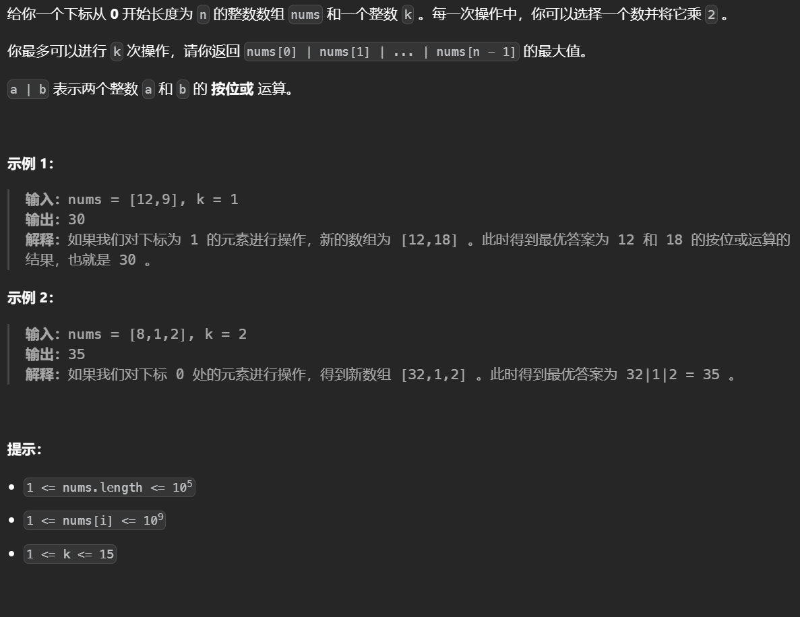

# 前缀和

# 前缀和数组

前缀和适用于快速频繁的计算一个索引区间内的元素之和，构建的前缀和数组第一位为0，方便构造，查询从0到r的区间内元素之和，结果是pre[r+1]

**可以找出子数组某个值的区间**


**如果做了一位偏移，那么在找l,r区间（从0开始的闭区间）内的元素和时，用pre[r+1]-pre[l]，反之就是在找pre[r]-pre[l-1],如果要找0到2区间内的值是会越界的，因此减一做一位偏移**


## [子数组异或查询](https://leetcode.cn/problems/xor-queries-of-a-subarray/)


快速查询某个区间内元素的和，使用前缀和数组，这里是异或操作，前缀数组中储存的就应该是元素之间累异或的结果。

**元素和0异或的结果不变**，偶数个相同元素异或相当于没异或，可以构造前缀和公式


```python
from functools import reduce
from operator import xor
class Solution:
    def xorQueries(self, arr: List[int], queries: List[List[int]]) -> List[int]:
        # 构造前缀数组，初始第一个位置为0方便构造,pre[i]就是从arr[0]异或到arr[i-1]的结果
        pre=[0]
        ans=[]
        # 构造
        for a in arr:
            pre.append(pre[-1]^a)
        for q in queries:
            l,r=q
            ans.append(pre[l]^pre[r+1])
        return ans
```

## [统计美丽子数组数目](https://leetcode.cn/problems/count-the-number-of-beautiful-subarrays/)


就是在找子数组异或和为0的数目，构建前缀异或和数组，子数组[l,r]异或的结果可以表示为pre[l-1]^pre[r]，要想为0就是找相同的异或和。

```python
class Solution:
    def beautifulSubarrays(self, nums: List[int]) -> int:
        pre=[0]
        for i,v in enumerate(nums):
            pre.append(v^pre[-1])
        memo=Counter(pre)
        ans=0
        for k,v in memo.items():
            ans+=comb(v,2)
        return ans 
```


## [ 数组美丽值求和](https://leetcode.cn/problems/sum-of-beauty-in-the-array/)


判断一个值是否大于左边的所有值只需要判断是否大于左边的最大值。（技巧点）

观察题目就是要求一个数是否大于左边的最大值以及小于右边的最小值，每次使用双指针向两边遍历的做法太慢了，构建`前缀最大值和前缀最小值数组`。

l[i]表示从0到i-1的最大值，r[i]表示从i+1到最后的最小值，因为要以i左右来判断，不需要到i

```python
class Solution:
    def sumOfBeauties(self, nums) -> int:
        n = len(nums)
        l = [-float('inf')] * n
        r = [+float('inf')] * n
        # 相当于做了一位偏移，本来按照l和r的定义也就不会取到
        l[0] = nums[0]
        r[n-1] = nums[-1]
        ans = 0

        for i in range(1, n):
            # nums[i-1]与l[i-1]的比较相当于nums[i-1]与nums[:i-2]中取最大值
            l[i] = max(nums[i - 1], l[i - 1])
        for i in range(n - 2, -1, -1):
            # nums[i+1]与r[i+1]的比较相当于nums[i+1]与nums[i+2:]中去最小值
            r[i] = min(nums[i + 1], r[i + 1])
        for i in range(1, n - 1):
            if nums[i] > l[i] and nums[i] < r[i]:
                ans += 2
            elif nums[i - 1] < nums[i] < nums[i + 1]:
                ans += 1
        return ans

Solution().sumOfBeauties([1,2,3])
```

## [最后 K 个数的乘积](https://leetcode.cn/problems/product-of-the-last-k-numbers/)


频繁的的计算区间内的结果，使用前缀思想，例如输入的 a b c d。则存的是 a，a×b，a×b×c，a×b×c×d。这样。如果查询最后k个数相乘，就是pre[n-1]//pre[n-k-1] 做一位偏移：（a×b×c×d）/ （a×b）= c × d。这样每次查询只需要做一次除法，每次输入只需要做一次乘法。

注意这里存在除0的可能，因此`每次遇到0的时候，就清空数组`，否则zai记录下去没有意义（0/0），如果查询的大小超过了当前的前缀数组（也就是必然包含0）就返回0

​	

```python
class ProductOfNumbers:

    def __init__(self):
        self.pre=[]

    def add(self, num: int) -> None:
        if len(self.pre)==0 and num!=0:
            self.pre.append(num)
        elif num==0:
            self.pre=[]
        else :
            self.pre.append(num*self.pre[-1])
    def getProduct(self, k: int) -> int:
        n=len(self.pre)
        if k>n:
            return 0
        elif k==n:
            return self.pre[n-1] 
        else:
            return self.pre[n-1]//self.pre[n-k-1]
```

## [除自身以外数组的乘积](https://leetcode.cn/problems/product-of-array-except-self/)


这里直接使用前缀和数组的话，如果遇到了0，没有办法求解，因此拆分为两个数组，一个前缀和一个后缀和，在找结果的时候乘上这个数左边的前缀和以及右边的后缀和。


```python
class Solution:
    def productExceptSelf(self, nums: List[int]) -> List[int]:
        n=len(nums)
        # 开了三个数组记录前缀后缀以及答案
        pre=[0]*n
        post=[0]*n
        ans=[0]*n
        pre[0]=nums[0]
        post[-1]=nums[-1]
        # 构建前后缀数组
        for i in range(1,n):
            pre[i]=nums[i]*pre[i-1]
        for i in range(n-2,-1,-1):
            post[i]=nums[i]*post[i+1]
         # 求解结果，注意对两端的设置前/后缀为1，因为创建前缀数组时没有偏移
        for i in range(n):
            if i-1>=0:
                first=pre[i-1]
            else:
                first=1
            if i+1<n:
                last=post[i+1]
            else:
                last=1
            ans[i]=first*last
        return ans 
```


## [分割数组](https://leetcode.cn/problems/partition-array-into-disjoint-intervals/)


就是找一个left的`前缀最大值小于right的后缀最小值的数组`

```python
from math import inf
class Solution:
    def partitionDisjoint(self, nums: List[int]) -> int:
        n=len(nums)
        mx=-1
        # 构建后缀最小值数组
        mn=[inf]*n
        mn[-1]=nums[-1]
        for i in range(n-2,-1,-1):
            mn[i]=min(nums[i],mn[i+1])
        for i in range(n)
        # 记录前缀最大值:
            mx=max(mx,nums[i])
            if mx<=mn[i+1]:
                # 注意长度是索引加一
                return i+1
```

## [任意子数组和的绝对值的最大值](https://leetcode.cn/problems/maximum-absolute-sum-of-any-subarray/)


通过前缀和表示数组区间的和，找出前缀和数组中最大的和最小的，找出他们的差值（只有最大值和最小值的差值才是最大的），在这三个值的绝对值中取最大值即可


## [生成平衡数组的方案数](https://leetcode.cn/problems/ways-to-make-a-fair-array/)


找删除一个元素后，所有的奇数元素之和，这需要用到前缀奇数数组，以及后缀偶数数组（因为删除这个元素后，原来后面的偶数下标变为奇数下标）

```python
class Solution:
    def waysToMakeFair(self, nums: List[int]) -> int:
        total=sum(nums)
        ans=0
        n=len(nums)
        # 加0方便操作
        pre=[0]*(n+1)
        post=[0]*(n+1)
        for i in range(n):
            if i&1:
                pre[i+1]=nums[i]+pre[i]
            else:
                pre[i+1]=pre[i]
        for i in range(n-1,-1,-1):
            if not i&1:
                post[i]+=post[i+1]+nums[i]
            else:
                post[i]=post[i+1]
        for i in range(n):
            # 注意索引的确定，删除了这个元素，奇数前缀和的索引传入i-1，但有一位偏移，偶数后缀和不存在索引偏移
            val= pre[i]+post[i+1]
            if val==total-val-nums[i]:
                ans+=1
        return ans

```

## [和相同的二元子数组](https://leetcode.cn/problems/binary-subarrays-with-sum/)	


先构造前缀和数组，可以通过O(1)的时间得出子数组的和，之后扫描每个位置，以这个位置为右端点，寻找是否有满足条件的左端点存在，左端点的子数组和就是之前的右端点所访问过的，使用一个哈希表记录这些右端点的值的个数

```python
class Solution:
    def numSubarraysWithSum(self, nums: List[int], goal: int) -> int:
        ans=0
        # 前缀和
        pre=[0]+list(accumulate(nums))
        # 注意初始的时候要记录一个0值，表示全部取到。
        memo=defaultdict(int,{0:1})
        for i in range(len(nums)):
            # 得到以r为右端点的子数组的和
            r=pre[i+1]
            # 查找左端点是否存在，以及有几个
            l=r-goal
            ans+=memo[l]
            memo[r]+=1
        return ans 
```

## collecting game


对每个位置的元素查找他可以删除多少个比他小的元素，删除了的元素可以加到这个元素上用于下一次判断。

对于每个元素暴力的查找会很慢，但通过观察可以发现，对于一个元素，比它小的最大元素所能到达的最远位置就是他能到达的最远位置，因此在把数组排序后可以维护一个只会向右移动的指针，遍历排序后的数组，当指针位置大于等于当前位置，那么这个元素的能走到的最远距离就是已知的，如果不大于，那么就从当前元素开始找，为了快速查找，使用前缀和数组，找出这个元素的前缀和数组中对应的位置，然后在排序的数组中使用二分判断他能到达的最远位置，之后再用这个位置的前缀和继续二分找最远位置直到位置不变，用这个位置的值去更新指针，同时对于每一个元素使用字典记录他能到达的最远距离，因为数组中可能存在重复值。

```python
from collections import defaultdict
from itertools import accumulate as ac
from bisect import bisect_right as br
t=int(input())
while t:
    n=int(input())
    ans=[0]*n
    nums=[int(x) for x in input().split()]
    temp=sorted([val for val in nums])
    l=0
    pre=list(ac(temp))
    memo=defaultdict(int)
    for i in range(n):
        if l<i:
            curr=pre[i]
            # 使用二分找能走到的最远距离
            index=br(temp,curr)-1
            # 如果合法，一直迭代
            while 0<index<n and index>i:
                # 找最远位置的前缀和
                curr=pre[index]
                # 这个前缀和能到达的最远位置
                cnt=br(temp,curr)-1
                # 如果相同，说明无法再向前了，退出，否则更新继续
                if cnt==index:
                    break
                else:
                    index=cnt
            l=index
        # 使用哈希表记录最大值，可能存在相同元素
        memo[temp[i]]=max(memo[temp[i]],max(0,l))

    for i,v in enumerate(nums):
        ans[i]=memo[v]
    print(*ans ,end=' ')
    print()
    t-=1
```


##  Sum of Progression


明显必须在O(1)的时间内完成一次查询，考虑使用带权的前缀和数组，即数组中记录的是$1\times a_0+2\times a_1 +3\times a_3...$

一共用到了两个前缀和

从特殊到一般来推公式，首先考虑d=1的情况：


在考虑d=2的情况

注意d>=2时考虑两个位置，一个从0开始一个从1开始


最后可以推出公式：


因此可预处理出每个d下的前缀和和带权前缀和，但是如果每个位置都处理的话会达到n^2的时间复杂度，这里使用根号分治法，十万级别的数据，如果d大于根号n的话，那么要处理的数据只有百位，直接暴力做，因此d限定在根号n之下


```python
from math import isqrt
import sys
input = sys.stdin.readline
# 首先开数组
mx_n = 100000
b = 300
pre = [[0]*(mx_n + b) for _ in range(b)]
summ = [[0]*(mx_n + b) for _ in range(b)]


def slove(nums):
    # 对于每个位置构造前缀数组
    for d in range(1, b):
        for i in range(len(nums)):
            pre[d][i + d] = pre[d][i] + nums[i]
            summ[d][i + d] = summ[d][i] + (i//d+1) * nums[i]


t = int(input())
while t:
    n, q = [int(x) for x in input().split()]
    nums = [int(x) for x in input().split()]
    # 预处理
    slove(nums)
    while q:
        s, d, k = [int(x) for x in input().split()]
        s-=1
        # 步长太大，直接暴力做
        if d >= b:
            ans=0
            for i in range(k):
                ans+=nums[s+d*i]*(i+1)
            print(ans, end=' ')
        else:
            r=s + d * k
            # 由公式求解
            print(summ[d][r] - summ[d][s] - (pre[d][r] - pre[d][s]) * (s // d), end=' ')

        q -= 1
    print()
    t -= 1
```


## [ 和可被 K 整除的子数组](https://leetcode.cn/problems/subarray-sums-divisible-by-k/)


一个子数组的和可以用两个前缀和相减得出，如果和为k的倍数，也就是(pre[j]-pre[i])%k= =0。根据`同余定理`，pre[j]%k==pre[i]%k，因此统计前缀和数组中取模k的相同的个数，计算最终的结果，这里顺序不重要只要存在就是一组解。注意对于取模结果为0的要额外加上它本身表示本身也可以作为一个结果。

```python
class Solution:
    def subarraysDivByK(self, nums: List[int], k: int) -> int:
        pre=list(accumulate(nums))
        memo=Counter()
        for p in pre:
            memo[p%k]+=1
        ans=0
        for k,v in memo.items():
            if k==0:
                ans+=v
            ans+=v*(v-1)//2
        return ans 
```

## [和为 K 的子数组](https://leetcode.cn/problems/subarray-sum-equals-k/)


子数组的和用两个前缀相减，这里有pre[j]-pre[i]==k，也就是对于每个j去找他前面是否存在一个pre[i]=pre[j]-k，和上一题不一样这一题需要考虑顺序。

```python
class Solution:
    def subarraySum(self, nums: List[int], k: int) -> int:
        memo=Counter()
        n=len(nums)
        pre=ans=0
        # 因为要找前面的，因此直接构造
        for i in range(n):
            # 累加前缀和
            pre+=nums[i]
            # 找是否存在结果
            ans+=memo[pre-k]
            # 特判本身就是一个
            if pre==k:
                ans+=1
            # 最后再记录，反之类似于nums=[1],k=0
            memo[pre]+=1
        return ans 
```


## [两个非重叠子数组的最大和](https://leetcode.cn/problems/maximum-sum-of-two-non-overlapping-subarrays/)


**对于有两个变量的值，通常可以枚举其中一个把他视为常量，从而转换为找一个变量的问题**

这个问题中，可以先枚举第二个区间在后面的情况，同时维护前一个区间的最大值，然后再找第一个区间在后面的情况。

​	

```python
class Solution:
    def maxSumTwoNoOverlap(self, nums: List[int], a: int, b: int) -> int:
        ans=0
        # 使用前缀和快速求解
        pre=[0]+list(accumulate(nums))
        n=len(nums)
        def f(a,b):
            nonlocal ans
             # 维护前一个的最大值
            maxa=0
            # 枚举当前区间在后面的所有可能，注意起始位置不能从头开始要给另一个区间留位置
            for i in range(a+b,n+1):
                # 维护最大值和答案
                maxa=max(maxa,pre[i-b]-pre[i-b-a])
                ans=max(ans,maxa+pre[i]-pre[i-b])
        f(a,b)
        f(b,a)
        return ans 
```

## [网格游戏](https://leetcode.cn/problems/grid-game/)	


观察可以发现，第一个人操作之后第二个人所能选的值就是第一个人拐点出的前后缀，由于二者都会做最佳决策因此枚举第一个人拐点的位置，第二个人会选择剩余的两个位置的最大值，选出所有拐点下第二个人能得到的最小得分。

```python
class Solution:
    def gridGame(self, grid: List[List[int]]) -> int:
        index=-1
        res=-inf
        n=len(grid[0])
        ans=inf
        pre=[0]+list(accumulate(grid[1]))
        prifx=[0]*(n+1)
        for i in range(n-1,-1,-1):
            prifx[i]=grid[0][i]+prifx[i+1]
        for i in range(n):
            ans=min(ans,max(pre[i],prifx[i+1]))
        return ans     

```


## [最大的以 1 为边界的正方形](https://leetcode.cn/problems/largest-1-bordered-square/)


对于给定的数据范围枚举每一个边长，对于确定了的边长枚举所有的左上角然后判断是否满足条件

```python
class Solution:
    def largest1BorderedSquare(self, grid: List[List[int]]) -> int:
        m,n=len(grid),len(grid[0])
        pre=[[0]*(n+1) for _ in range(m+1)]
        
        # 这里构造行和列分别的前缀和用于快速判断是否满足条件
        rs=[list(accumulate(row,initial=0)) for row in grid]
        # 技巧点，把每一列拆分出来做成前缀和
        cs=[list(accumulate(col,initial=0)) for col in zip(*grid)]

        # 枚举边长
        for d in range(min(m,n),0,-1):
            # 枚举左上角
            for i in range(m-d+1):
                for j in range(n-d+1):
                    # 满足条件可以直接退出
                    if rs[i][j+d]-rs[i][j]==d and rs[i+d-1][j+d]-rs[i+d-1][j]==d \
                    and cs[j][i+d]-cs[j][i]==d and cs[j+d-1][i+d]-cs[j+d-1][i]==d:
                        return d**2
        return 0
```


## [K 次串联后最大子数组之和](https://leetcode.cn/problems/k-concatenation-maximum-sum/)


分类讨论：可以是一个数组中的最大子数组之和，可以是两个数组最大的前缀加上最大的后缀，可以是k-2个数组组合起来加上最大的前缀和后缀。

```python
class Solution:
    def kConcatenationMaxSum(self, arr: List[int], k: int) -> int:
        m=10**9+7
        pre=list(accumulate(arr,initial=0))
        post=list(accumulate(arr[::-1]))
        mn=0
        mx=-inf
        for i in range(1,len(pre)):
            mx=max(pre[i]-mn,mx)
            mn=min(mn,pre[i])
        ans2=max(pre)+max(post) if k>=2 else 0
        ans3=ans2+(k-2)*sum(arr) if k>=3 else 0
        return max(ans2,ans3,mx,0)%m

```

## [相同元素的间隔之和](https://leetcode.cn/problems/intervals-between-identical-elements/)


一个数到其他相同的数的距离可以由他左边的，右边的相同的数推出，因此需要两个数组一个记录nums[i]左边所有相同的值到它的距离，一个记录右边的，最后的结果是两个相加。

```python
class Solution:
    def getDistances(self, nums: List[int]) -> List[int]:
        n=len(nums)
        pre=[0]*n
        post=[0]*n
        # 使用字典记录上一个nums[i]的位置以及有多少个相同的
        vis={}
        for i in range(n):
            # 不存在则这个位置左边的结果为0，记录这个位置以及个数
            if nums[i] not in vis:
                vis[nums[i]]=(i,1)
                pre[i]=0
                continue
            else:
                # 反之，找出左边所有点到上一个点的距离，然后加上这个点到当前点的距离乘个数
                index,cnt=vis[nums[i]]
                pre[i]=pre[index]+cnt*(i-index)
                vis[nums[i]]=(i,cnt+1)
        vis={}
        for i in range(n-1,-1,-1):
            if nums[i] not in vis:
                vis[nums[i]]=(i,1)
                post[i]=0
                continue
            else:
                index,cnt=vis[nums[i]]
                post[i]=post[index]+cnt*(index-i)
                vis[nums[i]]=(i,cnt+1)
        ans=[]
        for a,b in zip(pre,post):
            ans.append(a+b)
        return ans
        

```

## [从链表中删去总和值为零的连续节点](https://leetcode.cn/problems/remove-zero-sum-consecutive-nodes-from-linked-list/)


使用前缀和可以找出子区间和为0的，即用哈希记录相同的前缀和，但是在这个过程中可能会出现两个前缀和区间重合。


```python
# Definition for singly-linked list.
# class ListNode:
#     def __init__(self, val=0, next=None):
#         self.val = val
#         self.next = next
class Solution:
    def removeZeroSumSublists(self, head: Optional[ListNode]) -> Optional[ListNode]:
        dummy=ListNode()
        pre={}
        pre[0]=dummy
        dummy.next=head
        summ=0
        
        # 通过一次遍历找出相同的前缀和中最远的
        while head:
            summ+=head.val
            pre[summ]=head
            head=head.next
            
         # 再遍历一次，对于已出现的前缀和直接跳到它的下一位
        head=dummy
        summ=0
        while head:
            summ+=head.val
            head.next=pre[summ].next
            head=head.next
        return dummy.next 
```

## [使字符串平衡的最少删除次数](https://leetcode.cn/problems/minimum-deletions-to-make-string-balanced/)


最后字符串一定会是aabbb的形式枚举每个划分位置，这个位置之前的b都减去，之后的a都减去，取最小值。


```python
class Solution:
    def minimumDeletions(self, s: str) -> int:
        preb=[0]
        prea=[0]
        n=len(s)
        ans=n-1
        for i in range(n):
            c=s[i]
            if c=='b':
                preb.append(preb[-1]+1)
            else:
                preb.append(preb[-1])
        for i in range(n-1,-1,-1):
            c=s[i]
            if c=='a':
                prea.append(prea[-1]+1)
            else:
                prea.append(prea[-1])
        prea=list(reversed(prea))
        for i in range(n+1):
            ans=min(ans,preb[i]+prea[i])
        return ans


```


## Maximal Intersection


两个区间的交集就是两个左端点的最大值与右端点的最小值构成的区间，枚举删除一个区间剩下的交集如何通过O(1)的时间复杂度算出，交集的具有前缀和的性质，及多个区间的交集可以由n-1个区间的交集求出，这里构建前缀交集和后缀交集，当删除一个区间后，剩下区间的交集可以通过前缀和后缀求出。

```python
n=int(input())
nums=[]
for _ in range(n):
    nums.append([int(x) for x in input().split()])
pre=[(-1,10**9+7)]
for i in range(n):
    l,r=nums[i]
    pl,pr=pre[-1]
    pre.append([max(pl,l),min(pr,r)])
suff=[(-1,10**9+7)]
for i in range(n-1,-1,-1):
    l,r=nums[i]
    pl,pr=suff[-1]
    suff.append([max(pl,l),min(pr,r)])
suff=suff[::-1]
ans=0
for i in range(n):
    l1,r1=pre[i]
    l2,r2=suff[i+1]
    ans=max(min(r2,r1)-max(l1,l2),ans)
print(ans)
```

## [最大或值](https://leetcode.cn/problems/maximum-or/)




想要最后或的结果最大，就是尽可能地增大二进制的长度，因此找出所有二进制长度最长的数组枚举将他们扩大k倍（全部用于扩大一个可以保证二进制最长），为了快速计算扩大一个数后的最终结果使用前缀和记录两边的和来做到O(1)求解。

```python
class Solution:
    def maximumOr(self, nums: List[int], k: int) -> int:
        pre=[nums[0]]
        suff=[nums[-1]]
        l=max(nums).bit_length()
        
        # 构造前后缀
        for v in nums[1:]:
            pre.append(pre[-1]|v)
        for v in nums[::-1][1:]:
            suff.append(suff[-1]|v)
        pre=[0]+pre
        suff=[0]+suff
        suff=suff[::-1]
        res=[]
        # 找出二进制最长的
        for i,v in enumerate(nums):
            if l==v.bit_length():
                res.append(i)
        ans=-inf 
        # 枚举
        for i in res:
            v=nums[i]<<k
            ans=max(ans,v|pre[i]|suff[i+1])
        return ans 

                
        
```

  ## [满足三条件之一需改变的最少字符数](https://leetcode.cn/problems/change-minimum-characters-to-satisfy-one-of-three-conditions/)


考虑最后的结果

情况一，实质上也就是s1中所有的字符小于某一个字符，同时s2中所有的字符大于等于这个字符

情况二是一样的

情况三就是所有的字符都换为某个字符


一共只有26个字符全部枚举即可

```python
class Solution:
    def minCharacters(self, a: str, b: str) -> int:
        # 计数
        c1=[0]*26
        c2=[0]*26
        m,n=len(a),len(b)
        for c in a:
            c1[ord(c)-ord('a')]+=1
        for c in b:
            c2[ord(c)-ord('a')]+=1
        # 构建前缀和
        p1=list(accumulate(c1,initial=0))
        p2=list(accumulate(c2,initial=0))
        ans=inf
        for i in range(26):
            # 不能把字符变为小于a的，特判这种情况
            if i:
                ans=min(ans,p1[-1]-p1[i]+p2[i],p2[-1]-p2[i]+p1[i])
            ans=min(ans,m-c1[i]+n-c2[i])
        return ans 
        
```


## [统计中位数为 K 的子数组](https://leetcode.cn/problems/count-subarrays-with-median-k/)


注意整数互不相同

对于给定的k作为中位数要满足，对于奇数个两边大于k的=两边小于k的——>左侧大于+右侧大于=左侧小于+右侧小于——>左侧大于-左侧小于=右侧小于-右侧大于，为了统计这个结果将左侧大于的设置为1小于的设置为-1，右侧大于的设置为-1小于的设置为1，利用前缀和可以快速求出两边有多少

偶数的话变换o

```python
class Solution:
    def countSubarrays(self, nums: List[int], k: int) -> int:
        # 左侧大于+右侧大于=左侧小于+右侧小于+[1]
        # 左侧大于-左侧小于=右侧小于-右侧大于+[1]
        p=[]
        n=len(nums)
        index=nums.index(k)
        # 变换
        for i,v in enumerate(nums):
            if i==index:p.append(0)
            elif i<index and v>k:p.append(1)
            elif i<index and v<k:p.append(-1)
            elif v<k:p.append(1)
            else:p.append(-1)
        pre=list(accumulate(p,initial=0))
        memo=Counter()
        # 统计左侧
        for j in range(index,-1,-1):
            memo[pre[index]-pre[j]]+=1
        ans=0
        # 枚举右侧，如果相等就累加
        for j in range(index,n):
            c=pre[j+1]-pre[index+1]
            if c in memo:ans+=memo[c]
            if c+1 in memo:ans+=memo[c+1]
        
        return ans
```

## [使数组和能被 P 整除](https://leetcode.cn/problems/make-sum-divisible-by-p/) 


令y为某个子数组的和，x为整个数组的和，要求x-y能被p整除那么就是x同余于y，同时y又是前缀和数组中某两个位置的数相减求出的，那么就有(r-l)%p=x%p。遍历前缀和数组对于每个r去找最近的(r-x)%p，然后更新结果。

```python
class Solution:
    def minSubarray(self, nums: List[int], p: int) -> int:
        # 前缀和
        pre=list(accumulate(nums,initial=0))
        x=pre[-1]
        memo={}
        n=len(nums)
        ans=n
        for i,v in enumerate(pre):
            # 每次只需要记录当前的位置，因为只要最近的
            memo[v%p]=i
            if (v-x)%p in memo:
                ans=min(ans,i-memo[(v-x)%p])
        return ans if ans!=n  else -1
```

## [统计趣味子数组的数目](https://leetcode.cn/problems/count-of-interesting-subarrays/)


把原数组中%mod==k的都变换为1那么问题就变为统计前缀和


变化式子有


那么在遍历前缀和的过程中统计(r-k)%m的有多少个，然后记录r%m

```python
class Solution:
    def countInterestingSubarrays(self, nums: List[int], mod: int, k: int) -> int:
        nums=[int(v%mod==k) for v in nums]
        ans=0
        pre=list(accumulate(nums,initial=0))
        memo=Counter()
        for v in pre:
            ans+=memo[(v-k)%mod]
            memo[v%mod]+=1
        return ans         
```

## [构造乘积矩阵](https://leetcode.cn/problems/construct-product-matrix/)


无法使用逆元求解因为不是质数，考虑前后缀分解。

```python
class Solution:
    def constructProductMatrix(self, grid: List[List[int]]) -> List[List[int]]:
        mod=12345
        m,n=len(grid),len(grid[0])
        g=[[0]*n for _ in range(m)]
        pre=[]
        suff=[]
        row1=[1]
        row2=[1]
        for row in grid:
            temp1=[1]
            temp2=[1]
            for v in row:temp1.append((temp1[-1]*v)%mod)
            for v in row[::-1]:temp2.append((temp2[-1]*v)%mod)
            pre.append(temp1[:])
            suff.append(temp2[:][::-1])
        for arr in pre:
            x=arr[-1]
            row1.append((row1[-1]*x)%mod)
        for arr in pre[::-1]:
            x=arr[-1]
            row2.append((row2[-1]*x)%mod)
        row2=row2[::-1]
        for i in range(m):
            for j in range(n):
                g[i][j]=(row1[i]*row2[i+1]*pre[i][j]*suff[i][j+1])%mod
        return g
```


## Karen and Coffee


实际上是区间重叠问题，把给定的每个区间用差分在数组上表示，然后把每个位置定义为1如果大于等于k否则0，再构造一遍前缀数组，对于每个询问取出这个区间内的值即可。

```python
n,k,q=RR()
N=2*10**5+10
diff=[0]*N
# 差分
for _ in range(n):
    l,r=RR()
    diff[l]+=1
    diff[r+1]-=1
# 前缀变为一般数组
pre=get_pre(diff)[1:]
# 大于等于k令为1否则为0
nums=[1 if v>=k else 0 for v in pre]
# 再次前缀
pre=get_pre(nums)
for _ in range(q):
    l,r=RR()
    print(pre[r+1]-pre[l])
```

## Polo the Penguin and Matrix


如果所有的数可以通过加减一个数的整数倍来做到相同，那么所有的数余上这个数的模应该是一样的，所以对数组判断是否模上d的结果是一样的，如果一样那么说明所有的数一定可以通过加减得到数组中的任意一位或者数组外的某一位，至于最小的操作次数可以通过中位数贪心求出。

```python
m,n,d=RR()
g=[]
for _ in range(m):g.extend(RR())
g.sort()
# 判断余数是否相同
arr=[v%d for v in g]
if len(set(arr))!=1:print(-1)
else:
    # 中位数贪心，所有的数的操作次数为他到中位数的距离除以d
    mid=g[len(g)>>1]
    ans=sum([abs(mid-v)//d for v in g])
    print(ans)
```


##  **Manhattan Multifocal Ellipse** 


给定的公式可以拆开，即，这两部分是相互独立的也就是给定的一系列坐标点的x和y是不相关的只需要考虑他们的大小，因此可以随意排序。该题要求找到有多少个合适的点，每个点的xy分别满足上述式子，可以固定住一个去找另一个，观察数据范围发现点在-2e6,2e6之间，这里可预处理范围内的x和y对于给定的所有的xi和yi的距离。

```python
n,d=RR()
x=[]
y=[]
xx=[]
yy=[]
for _ in range(n):
    i,j=RR()
    x.append(i)
    y.append(j)

# 排序，为了之后二分求去除了绝对值的距离
x.sort()
y.sort()

prex=get_pre(x)
prey=get_pre(y)

# 求解值域范围内的距离
for val in range(-2*pow(10,6)-10,2*pow(10,6)+10):
    index=bisect_left(x,val+1)-1
    xx.append(val*(index+1)-prex[index+1]+(prex[-1]-prex[index+1]-val*(n-index-1) if index!=n-1 else 0))
    index=bisect_left(y,val+1)-1
    yy.append(val*(index+1)-prey[index+1]+(prey[-1]-prey[index+1]-val*(n-index-1) if index!=n-1 else 0))

xx.sort()
yy.sort()
ans=0
# 去找每个x，对于这个x的距离S有多少y满足距离小于等于D-S
for v in xx:
    if v>d:break
    index=bisect_left(yy,d-v+1)-1
    ans+=index+1

print(ans)
```

## [矩阵中的最大得分](https://leetcode.cn/problems/maximum-difference-score-in-a-grid/)


多个位置的差值:(c2-c1)+(c3-c2)实际上就是终点位置和起点的差，那么遍历每一个终点位置去找它左上区域内的最小值即可，这里的坐上区域是从(0,0)到(i,j)不包括i,j，因此可以使用二位前缀求解

```python
class Solution:
    def maxScore(self, g: List[List[int]]) -> int:
        m,n=len(g),len(g[0])
        p=[[inf]*(n+1) for _ in range(m+1)]
        ans=-inf
        # 枚举终点，这个过程中可以同时构建二维前缀最小值
        for i in range(m):
            for j in range(n):
                x=g[i][j]
                pre=inf
                # 防止越界
                if j>=0:pre=min(pre,p[i+1][j])
                if i>=0:pre=min(pre,p[i][j+1])
                # 这里是为了保证至少走一步，因为当i=j=0时左上区域找不到一点即没有走一步
                if i+j>0:
                    ans=max(ans,x-pre)
                # 更新二维前缀最小值
                p[i+1][j+1]=min(pre,x)
        return ans  
```

## Alternating String


如果长度为偶数那么直接减去出现次数最多的奇数位和偶数位剩下的就是需要删除的。

如果为奇数必须减去一个，当减去一个后需要快速计算出最多的出现次数，定义even[i]\[j]表示前i个数偶数位上为j的有多少个，odd[i]\[j]同理，枚举删除的位置和保留的数取最大值。

```python
for _ in range(R()):
    n = R()
    s = [ord(c)-97 for c in input()[:-1]]
    even=[[0]*26 for _ in range(n+1)]
    odd=[[0]*26 for _ in range(n+1)]
	
    # 计算前缀和
    for i in range(1,n+1):
        if i & 1:
            odd[i][s[i-1]] += 1
        else:
            even[i][s[i-1]] += 1
        for j in range(26):
            odd[i][j]+=odd[i-1][j]
            even[i][j]+=even[i-1][j]

    if n&1:
        res=inf
		# 枚举删除的位置
        for i in range(1,n+1):
            # l[j]表示删除位置i后奇数位置上的j有多少个
            l=[]# 奇数
            r=[]# 偶数
            for j in range(26):
                l.append(even[i-1][j]+odd[-1][j]-odd[i][j])
                r.append(odd[i-1][j]+even[-1][j]-even[i][j])
            res=min(res,n-max(l)-max(r))# 减去最大的


        print(res)
    else:
        print(n-max(even[-1])-max(odd[-1]))
```

## [长度可被 K 整除的子数组的最大元素和](https://leetcode.cn/problems/maximum-subarray-sum-with-length-divisible-by-k/)


长度是k的倍数，那么**有j-i+1//k->得到要找能满足(j+1)与i同余的两个位置**，为了得到这个位置的子数组和需要用到**前缀和**，那么问题变为找到pre[r]-pre[l]的最大值，则在遍历过程找到与当前位置同余的最小值，然后更新同余位置对应的最小值。

```python
class Solution:
    def maxSubarraySum(self, nums: List[int], k: int) -> int:
        pre=list(accumulate(nums,initial=0))
        memo=defaultdict(lambda:inf)
        ans=-inf 
        n=len(nums)
        memo[0]=0
        if n==1:return max(nums)
        for i in range(n):
            if memo[(i+1)%k]!=inf:
                ans=max(ans,pre[i+1]-memo[(i+1)%k])
            memo[(i+1)%k]=min(memo[(i+1)%k],pre[i+1])

        return ans 
```


# 二维前缀和

## 二维区域和检索–矩阵不可变


利用前缀和数组，计算出从原点到[i,j]的矩阵元素和

1. 从 `(row2, col2)` 处的前缀和减去 `(row1 - 1, col2)` 处的前缀和（如果 `row1` 不为0的话）。
2. 再减去 `(row2, col1 - 1)` 处的前缀和（如果 `col1` 不为0的话）。
3. 最后再加上 `(row1 - 1, col1 - 1)` 处的前缀和（如果 `row1` 和 `col1` 都不为0的话）。


```python
class NumMatrix(object):

    def __init__(self, matrix):
        if not matrix or not matrix[0]:
            self.prefix_sum = None
            return
        self.matrix=matrix
        m=len(matrix)
        n=len(matrix[0])
        # 所构建的数组长宽都要多出一，可以方便计算，不是防止越界
        self.prematrix=[[0]*(n+1) for _ in range(m+1)]
        for i in range(1,m+1):
            for j in range(1,n+1):
                # 子矩阵的元素和为矩阵元素加上左边的子矩阵加上上边的子矩阵减去重复的左上矩阵 
                self.prematrix[i][j]=self.matrix[i-1][j-1]+self.prematrix[i-1][j]+self.prematrix[i][j-1]-self.prematrix[i-1][j-1]
	
    def sumRegion(self, row1, col1, row2, col2):
        # 最后的计算中注意不能重叠，放到矩阵上做一位偏移
        return self.prematrix[row2+1][col2+1]-self.prematrix[row2+1][col1]-self.prematrix[row1][col2+1]+self.prematrix[row1][col1]
```


# 前缀和的前缀和

想要求**一个区间内的所有子数组的和的和**就需要用到前缀和的前缀和


## [巫师的总力量和](https://leetcode.cn/problems/sum-of-total-strength-of-wizards/)


使用栈求出一个值作为最小值的区间，然后需要求解区间中包括这个值得所有子数组和的和

令s为前缀和那么有，这里的将s[r+1]替换为s[r]，因此右端点的界限要加一


这里对s的累和可以用前缀和求解，因此要构建一个前缀和的前缀和。

```python
class Solution:
    def totalStrength(self, nums: List[int]) -> int:
        n=len(nums)
        less=[[-1,n] for _ in range(n)]
        d=deque()
        mod=10**9+7
        ans=0
        for i,x in enumerate(nums):
            while d and nums[d[-1]]>x:
                d.pop()
            if d:
                less[i][0]=d[-1]
            d.append(i)
        d=deque()
        for i in range(n-1,-1,-1):
            x=nums[i]
            while d and nums[d[-1]]>=x:
                d.pop()
            if d:
                less[i][1]=d[-1]
            d.append(i)
        pre=list(accumulate(accumulate(nums,initial=0),initial=0))
        for i,(l,r) in enumerate(less):
            l+=1
            r-=1
            ans+=((i-l+1)*(pre[r+2]-pre[i+1])-(pre[i+1]-pre[l])*(r-i+1))*nums[i]
            ans%=mod
        return ans 
```

