# 动态规划

动态规划三要素：

+ 重叠子问题：通过画图可以找出有无重叠子问题，从而判断是否使用备忘录。
+ 状态转移方程：明确dp数组的定义，所定义的dp数组可以运用数学归纳法求出下一个状态
+ 最优子结构：从子问题的最优结果可以推出更大规模的最优结果

存在子问题就可以用动态规划


子数组一般设定**f[i]表示以nums[i]结尾的子数组**，答案在递推的过程中更新，

**子序列枚举选或不选，或者枚举选哪个**

区间dp：一般是定义dp(i,j)其中i,j表示一个区间，根据题意写出不同的转移方程


动态规划优化到极致就是递推，因此最低的时间复杂度可以通过递推求解，同时也可以大大降低空间开销。当改为递推时，要参照递归中的定义，如果递归中是从i-1转移过来，那么递推中就是要从小到大枚举，同时如果是i-1是要判断是否越界的，可以在递推中把每个下标都加一以此来减少判断。


注意，递归的时间复杂度并非i*j，对于i表示集合(状压)，j表示集合中代表的元素之和，此时的状态个数应该是集合的个数，而非集合乘上元素和。


# 网格图 DP

## 地下城游戏

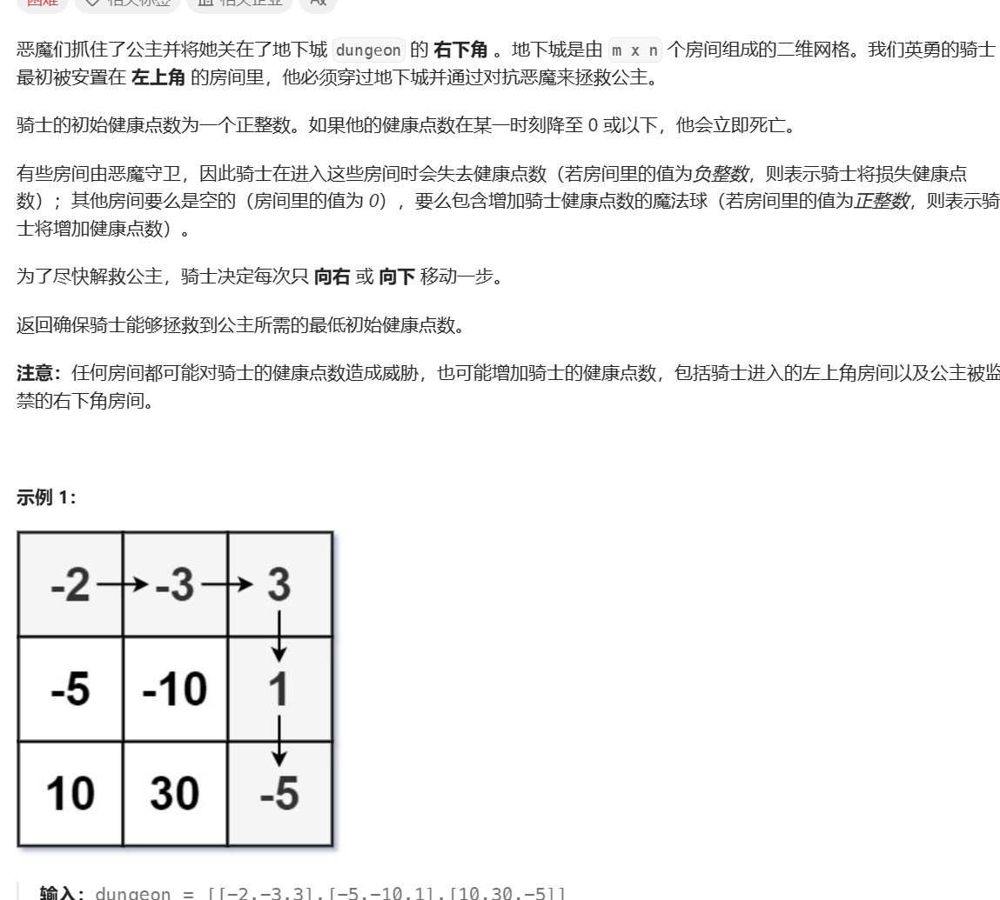

类似于最小路径和，但不能将dp定义为返回从起点到i,j的最小初始血量，如果这样定义的话，在状态转移的时候无法正确的得到下一个状态：

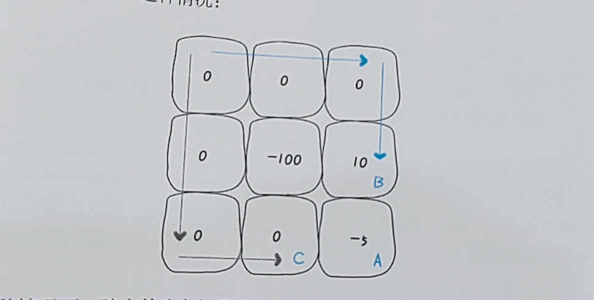

比如如图所示的情况，从起点到B,C的dp值都是1，如果令到终点的状态转移方程是:dp[i] [j]=min(dp[i-1] [j],dp[i] [j-1])-grid[i] [j]如果小于0设置为1，由此计算从BC到A的dp值，得出来的结果都是6，但是从B到A所需的dp值是1，因为在路上加了10，也就是说想要得到下一状态就必须有当前状态的血量值。

将dp设置为从i,j到终点的最低血量

总的来说，就是只能从后往前推，从前往后推条件不够。

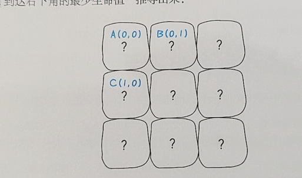

这样可以经由BC得出A

```python
class Solution(object):
    def calculateMinimumHP(self, dungeon):
        m=len(dungeon)
        n=len(dungeon[0])
        memo=[[-1]*n for _ in range(m)]
        def dp(i,j):
            # 判断终点本身所需的最低血量
            if i==m-1 and j==n-1:
                return 1 if dungeon[i][j]>=0 else -dungeon[i][j]+1
            # 超出边界
            if i>=m or j>=n:
                return float('inf')
            if memo[i][j]!=-1:
                return memo[i][j]
	# 选择所需初始血量最少的，如果选择了4而当前值是10，则所需血量应该是4-10
            res=min(dp(i+1,j),dp(i,j+1))-dungeon[i][j]
            # 由于血量不能低于0，所以设置为1
            if res<=0:
                res=1
            memo[i][j]=res
            return memo[i][j]
        return dp(0,0)
```


## [网格图中递增路径的数目](https://leetcode.cn/problems/number-of-increasing-paths-in-a-grid/)

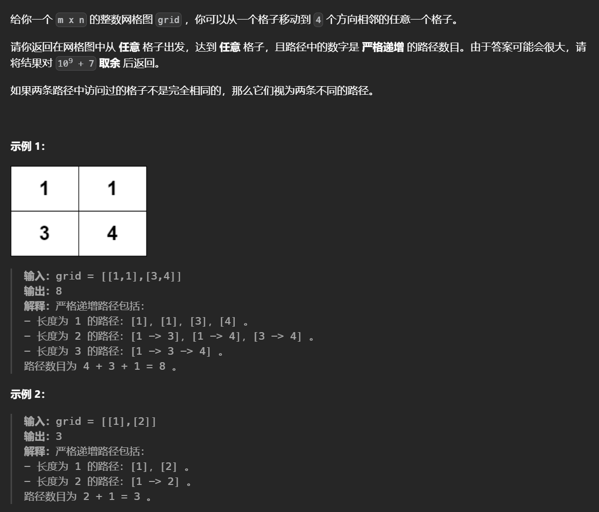

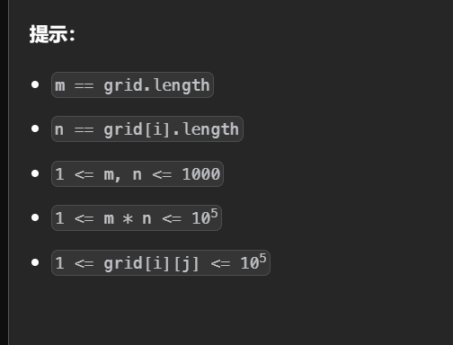


一般来说能往任意方向走的不能用动态规划，但是这个题目中合法的路径是一个严格递增的序列，也就是每次只会找更小的值因此不会有重复的访问。

```python
class Solution:
    def countPaths(self, grid: List[List[int]]) -> int:
        m,n=len(grid),len(grid[0])
        mod=10**9+7
        @cache
        def dfs(i,j):
            res=1
            for dx,dy in (1,0),(0,-1),(-1,0),(0,1):
                if 0<=(x:=dx+i)<m and 0<=(y:=dy+j)<n and grid[x][y]<grid[i][j]:
                    res+=dfs(x,y)
                    res%=mod
            return res
        return sum(dfs(i,j) for i in range(m) for j in range(n))%mod
```


## [ 摘樱桃 II](https://leetcode.cn/problems/cherry-pickup-ii/)

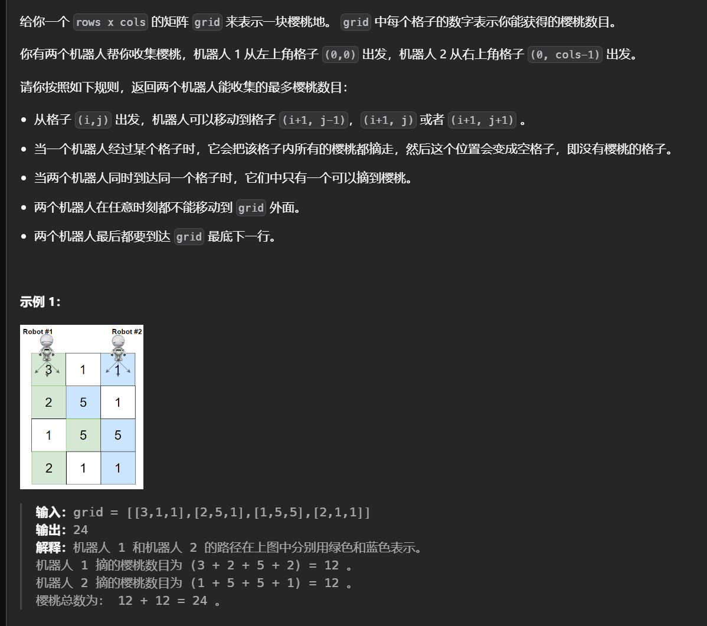

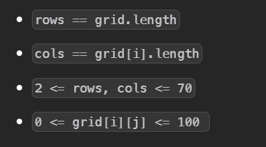


关键在于状态的选择，这里注意到，两个机器人时同时移动的也就是说他们的横坐标都一样，因此dp方程中只需要记录两个人的纵坐标加以区分即可。


```python
class Solution:
    def cherryPickup(self, nums: List[List[int]]) -> int:
        m,n=len(nums),len(nums[0])
        @cache
        def dfs(i,j1,j2):
            if j1<0 or j2<0 or j1>=n or j2>=n:return -inf
            if i==m:return 0
            res=0
            t=nums[i][j1]+nums[i][j2] if j1!=j2 else nums[i][j1]
            for dx in (-1,0,1):
                for dy in (-1,0,1):
                    res=max(res,dfs(i+1,j1+dx,j2+dy)+t)
            return res
        return dfs(0,0,n-1)

```

## [在网格上移动到目的地的方法数](https://leetcode.cn/problems/number-of-ways-to-reach-destination-in-the-grid/)

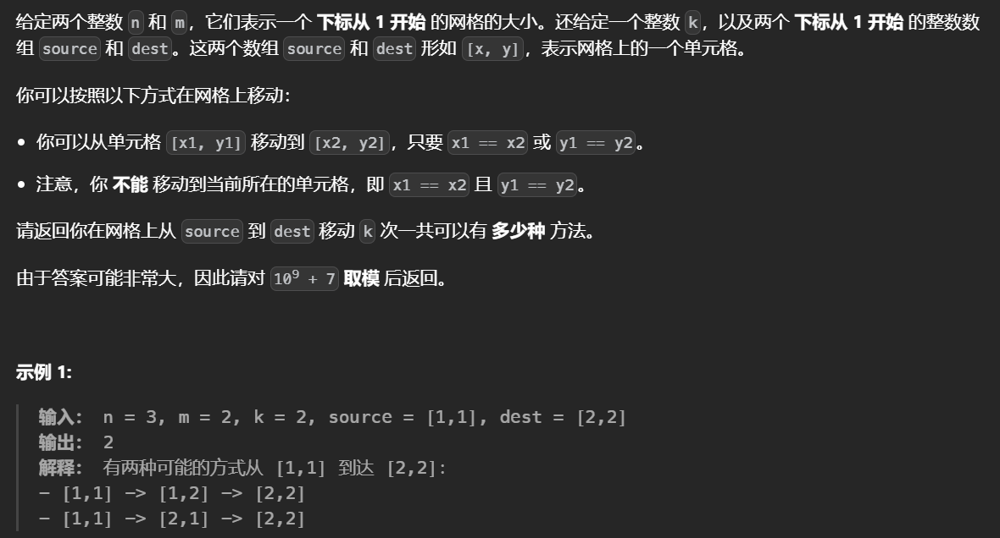

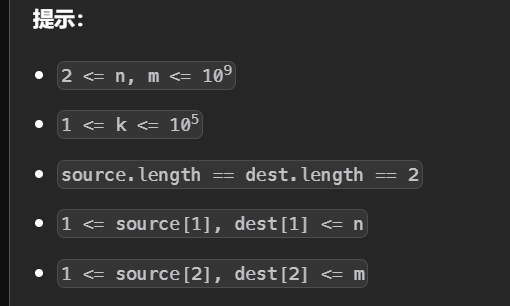

对于给定的数据范围只能从k入手，每次只能同行同列的移动（提示了状态的定义），定义dp(i,a,b)表示第i次移动，a与起点的横坐标是否一致，b表示与起点的纵坐标是否一致，进行分类讨论。

​	

```python
class Solution:
    def numberOfWays(self, m: int,n: int, k: int, source: List[int], dest: List[int]) -> int:
        mod=10**9+7
        @cache
        def dp(i,a,b):
            # 只能水平竖直转移
            if not i:return int(a and b)
            if a and b:
                # 只能从同一行同一列的其他位置转移过来，减一避免从起点到起点，
                return (dp(i-1,1,0)*(n-1)+dp(i-1,0,1)*(m-1))%mod
            elif a:
                ''' 与起点坐标一致的位置口语从其他与起点坐标一致的位置转移过来，但是不能是相同位置以及同时满足纵坐标也一致的位置，一共有n-2个；
                从起点本身转移过来，转台是确定的
                从其他位置即不与起点的横纵坐标有交集的位置转移，避免相同位置，有m-1种'''
                return (dp(i-1,False,False)*(m-1)+dp(i-1,True,False)*(n-2)+dp(i-1,True,True))%mod
            elif b:
                # 同理
                return (dp(i-1,False,False)*(n-1)+dp(i-1,False,True)*(m-2)+dp(i-1,True,True))%mod
            else:
                # 不能从起点过来，从其他位置转移但是不能是相同位置以及与起点的坐标有交集；
                # 从与起点坐标有交集的位置转移过来，只有一种，
                return (dp(i-1,False,True)+dp(i-1,True,False)+dp(i-1,False,False)*(m+n-4))%mod
        return dp(k,source[0]==dest[0],source[1]==dest[1])
```

## [摆放汤圆][https://www.lanqiao.cn/problems/20259/learning/?contest_id=241]

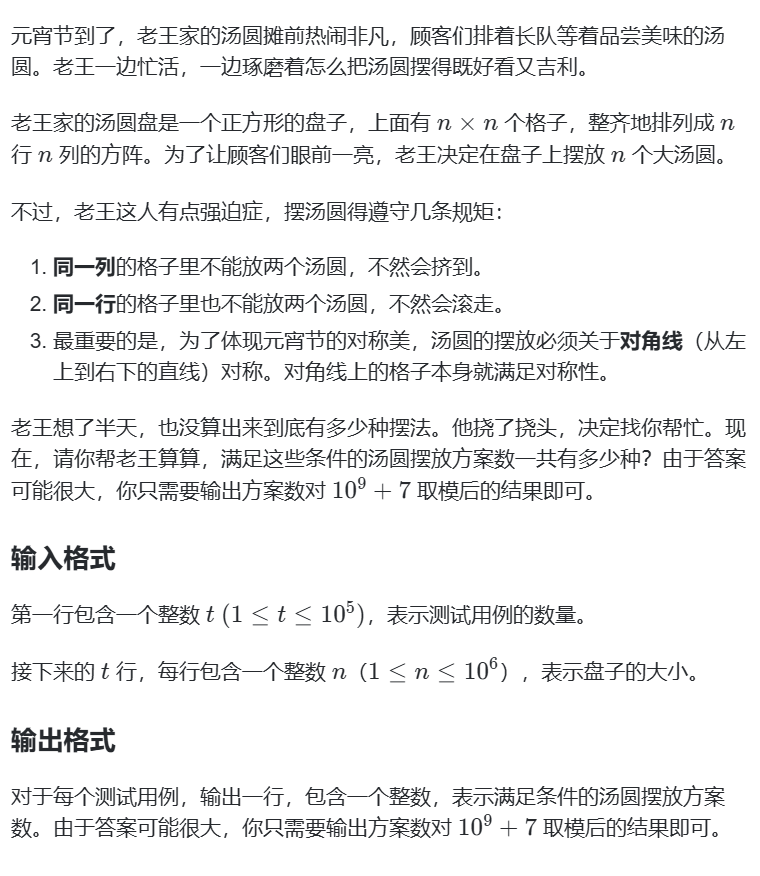

按照DP的思想求解，必然是一个汤圆占一行，最后一个汤圆如果放在对角线上那么f[i]=f[i-1]，如果不在(有I-1个位置)那么需要从前i-1个里面取出一个来对称，这里不考虑从i-1个里有几种取法，状态的定义是多少个不考虑顺序。

```python
mod=10**9+7
f=[0]*(10**6+10)
f[1]=1
f[2]=2
for i in range(3,10**6+10):
  if i&1:f[i]=(2*f[i-1])%mod
  else:f[i]=(pow(f[i-2],2)+f[i-2])%mod

for _ in range(R()):
    n=R()
    print(f[n])
```


## [扣分后的最大得分](https://leetcode.cn/problems/maximum-number-of-points-with-cost/)

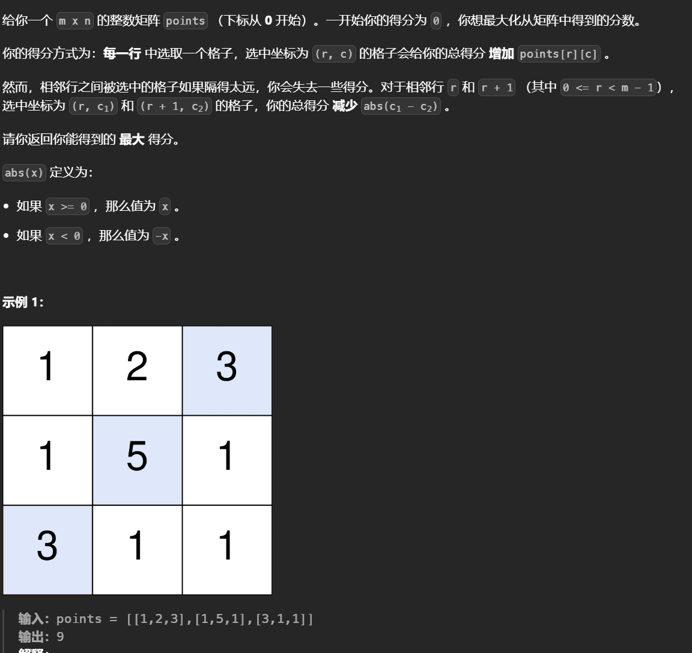

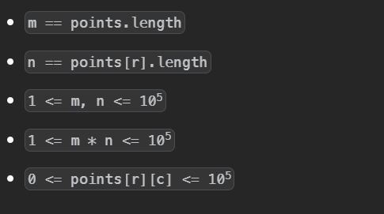

给定的数据范围要么预处理要么排序二分，后者是做不到的那么只能预处理，递推公式中不容易发现规律，需要将绝对值拆开

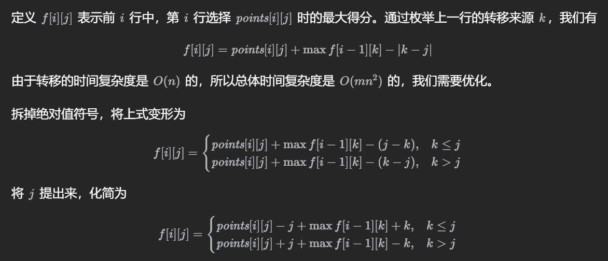

因此需要在递推的过程中预处理最大的f[i-1]\[k]+k和f[i-1]\[k]-k，注意按照j的位置分类

```python
class Solution:
    def maxPoints(self, g: List[List[int]]) -> int:
        m,n=len(g),len(g[0])
        f=[[-1]*n for _ in range(m)]
        # base case
        for j in range(n):
            f[0][j]=g[0][j]
        for i in range(1,m):
            pre=suf=-10**9
            # 遍历两边，在遍历的过程中找出最大的f[i-1][k]+k和f[i-1][k]-k
            # pre用于在j左侧的
            for j in range(n):
                pre=max(pre,f[i-1][j]+j)
                f[i][j]=g[i][j]-j+pre
            # suf用于在J右侧的
            for j in range(n-1,-1,-1):
                suf=max(suf,f[i-1][j]-j)
                f[i][j]=max(f[i][j],g[i][j]+j+suf)
        return max(f[-1])
```

## [最多可收集的水果数目](https://leetcode.cn/problems/find-the-maximum-number-of-fruits-collected/)

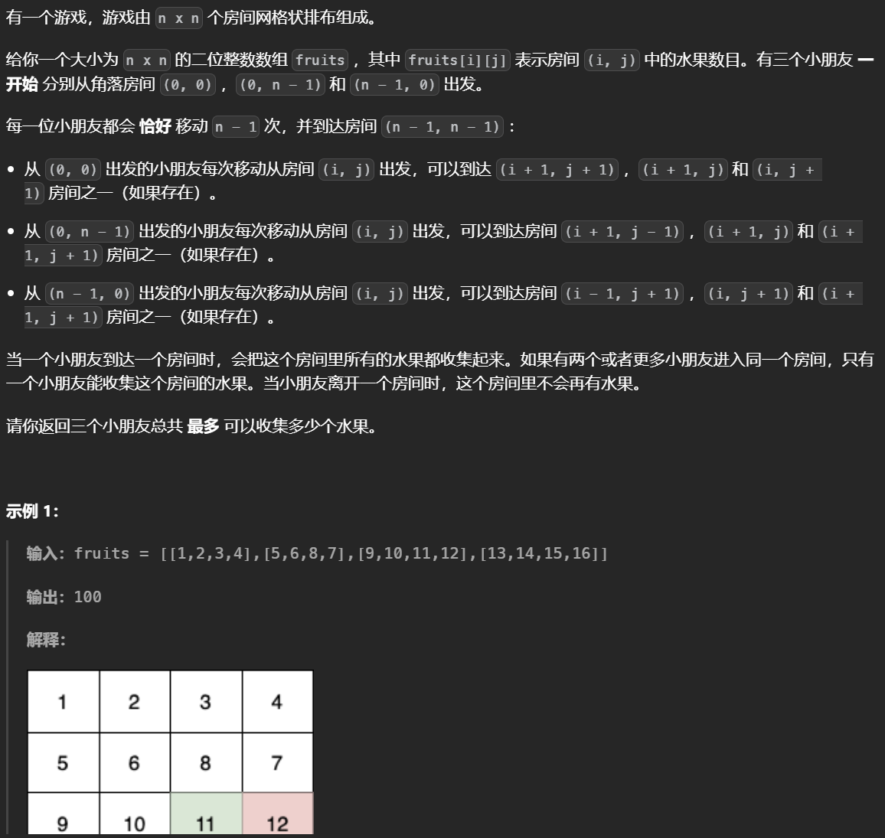


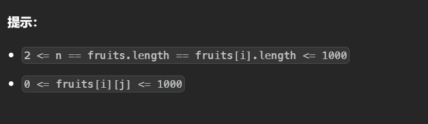

第一个人只能走对角线，其他两个人不能超过对角线(可以在对角线上)，因此不会有相交，问题就变为了基本的网格图DP

```python
class Solution:
    def maxCollectedFruits(self, g):
        m,n=len(g),len(g[0])

        @cache        
        def dfs1(i,j):
            # 在对角线上的状态直接返回，为了得到最大值是不会走到对角线上的
            if i==j:return 0
            elif i<0 or i>=m or j<0 or j>=n:return -inf 
            return g[i][j]+max(dfs1(i+1,j),dfs1(i+1,j-1),dfs1(i+1,j+1))
        @cache
        def dfs2(i,j):
            if i==j:return 0
            elif i<0 or i>=m or j<0 or j>=n:return -inf 
            return g[i][j]+max(dfs2(i,j+1),dfs2(i+1,j+1),dfs2(i-1,j+1))
        return sum(g[i][i] for i in range(n))+dfs1(0,n-1)+dfs2(n-1,0)  
```


# 01背包问题

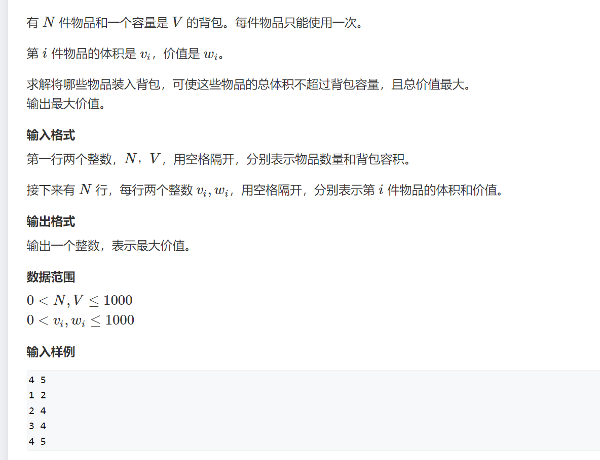

定义状态为dp(i,j)，i表示前i个,j表示最大容量，问题可以由子问题求解，base case 为i=0即没有的选，如果容量合法则返回0注意一定要先判断是否合法。

```python
from math import inf
n,v=[int(x) for x in input().split()]
memo=[[0,0]]
for _ in range(n):
    v_,w=[int(x) for x in input().split()]
    memo.append([v_,w])
# 二维数组定义需要考虑到边界
dp=[[-inf]*(v+1) for _ in range(n+1)]
dp[0]=[0]*(v+1)

for i in range(1,n+1):
    for j in range(v+1):
        # 注意状态要合法，还能够装下
        if j-memo[i][0]>=0:
            dp[i][j]=max(dp[i-1][j-memo[i][0]]+memo[i][1],dp[i-1][j])
        else:
            dp[i][j]=dp[i-1][j]
            
print(dp[n][v])


def dp(i, j):
    if j < 0:
        return -inf
    if i == 0:
        return 0
    return max(dp(i - 1, j - memo[i][0]) + memo[i][1], dp(i - 1, j))
```

## [打家劫舍 II](https://leetcode.cn/problems/house-robber-ii/)

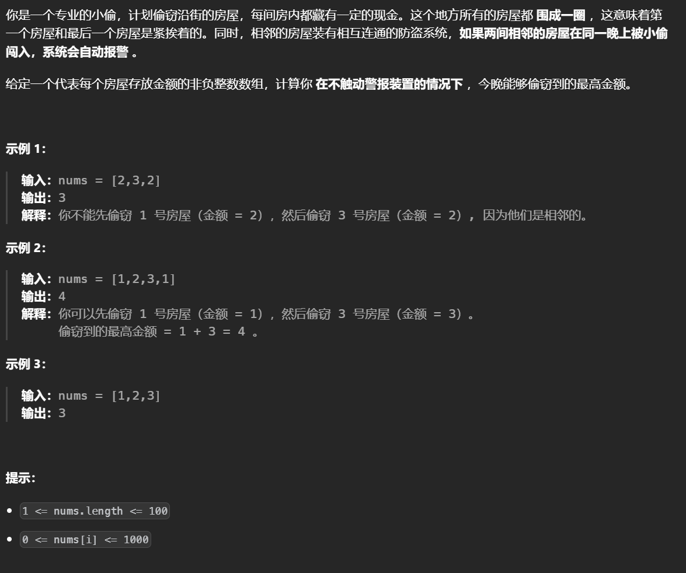

在原本的基础上数组变为环形，第一个元素选或不选受到影响，如果第一个元素选择，那么问题变为在nums[2:-1]的非环形数组中求解，如果不选则是在nums[1:]的非环形数组中求解。

```python
class Solution:
    def rob1(self, nums: List[int]) -> int:
        n=len(nums)
        @cache
        def dp(i):
            if i<0:return 0
            return max(dp(i-1),dp(i-2)+nums[i])
        return dp(n-1)
    def rob(self, nums: List[int]) -> int:
        return max(nums[0]+self.rob1(nums[2:-1]),self.rob1(nums[1:]))
```


## 打家劫舍 III

树上的最大独立集，从图中选取尽可能多的节点，使这些节点互不相邻。

对于每个节点都有选择和不选两种状态，如果选择那么最大值为：当前节点的值加上左右子树不包含的最大值，如果不选择，那么对于子树也有可选可不选的两种状态，以这个节点为根节点的子树的最大值为：左右子树的两种状态最大的那个相加。

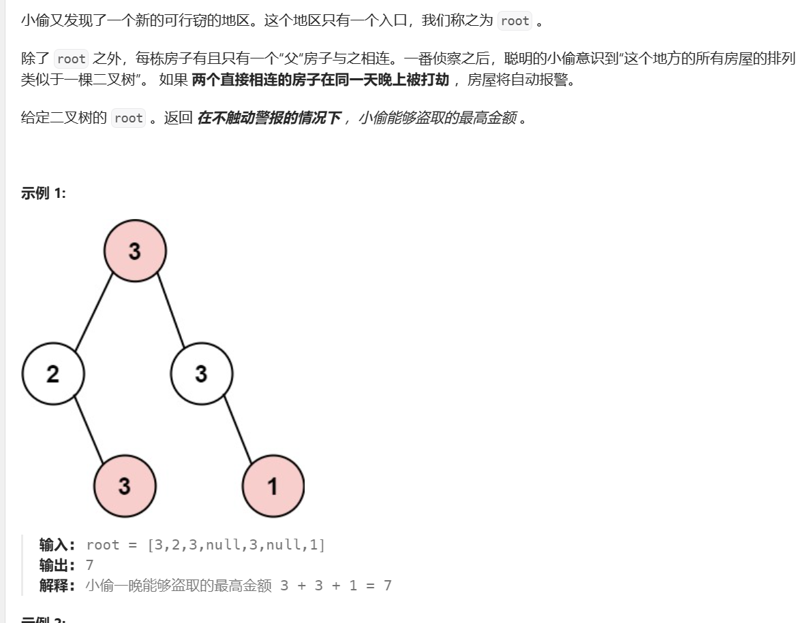

```python
class Solution(object):
    def rob(self, root):


        def dp(root):
            # 如果节点不存在，那么包不包含的结果都是0
            if not root:
                return 0,0
            # 找出左右子树包含和不包含的结果
            l_rob,l_not_rob=dp(root.left)
            r_rob,r_not_rob=dp(root.right)
            
            # 选择当前节点
            rob_=r_not_rob+l_not_rob+root.val
            # 不选择当前节点
            not_rob=max(l_rob,l_not_rob)+max(r_rob,r_not_rob)
            return rob_,not_rob
        # 最后的结果是选择和不选择中最大的
        return max(dp(root))
```


## [最后一块石头的重量 II](https://leetcode.cn/problems/last-stone-weight-ii/)

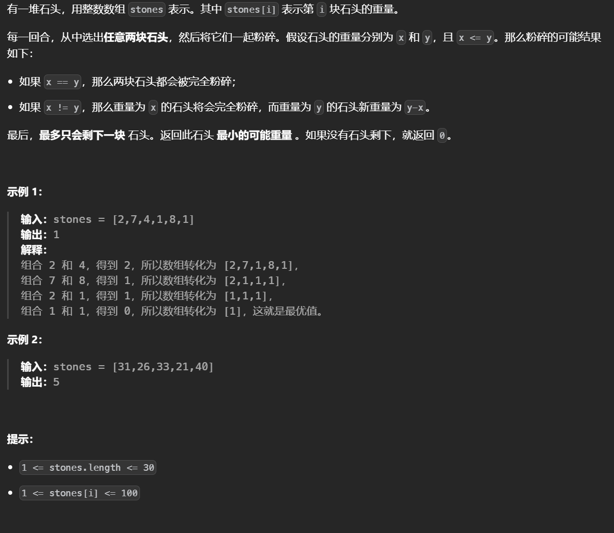

问题可以抽象为把石子分为两堆，求两堆和的最小差值，那么只要一堆接近总和的一半即可，用01背包求解能得出的最大的接近一半的和是多少。类似于从序列中选出接近target的子序列.

```python
class Solution:
    def lastStoneWeightII(self, nums: List[int]) -> int:
        s=sum(nums)
        n=len(nums)
        @cache
        def dp(i,j):
            if j<0:return -inf
            if not i:return 0
            return max(dp(i-1,j-nums[i-1])+nums[i-1],dp(i-1,j))
        return abs(2*dp(n,s>>1)-s)
```

## [求出数组中最大序列值](https://leetcode.cn/problems/find-the-maximum-sequence-value-of-array/)

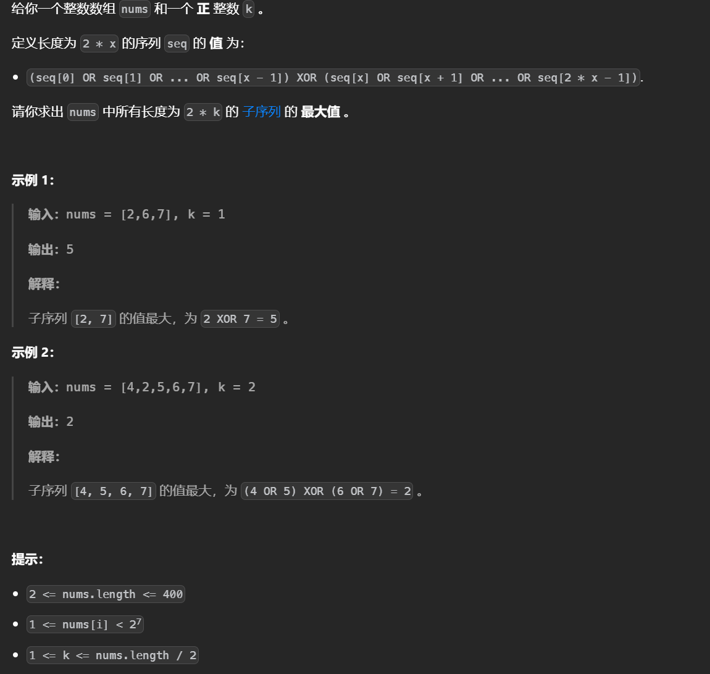

考虑枚举分割点，然后找出分割点两边所有的or值，最后两两组合得到最大的异或值。

```python
'''
根据给定的数据范围，所有的或值在0~2^7-1之间，可以定义为状态
定义f[i][j][x]表示考虑nums[i]~nums[n-1]之间选择j个数是否能Or出x
对Nums[i]有选或不选 由x=nums|？知无法用查表法 得到之前的状态 因此使用刷表法
选 f[i][j+1][x|v]=f[i+1][j][x]
不选 f[i][j][x]=f[i+1][j][x]

三维可以优化掉一维 用一个列表储存最外层
'''


class Solution:
    def maxValue(self, nums: List[int], k: int) -> int:
        # 得到可能结果的最大值
        mx=reduce(or_,nums) 
        n=len(nums)
        # 用于储存最外层 suf[i]表示nums[i]~nums[-1]
        suf=[None]*(n-k+1)
        f=[[False]*(mx+1) for _ in range(k+1)]
        # 初始化
        f[0][0]=True
        # 最外层的i就是分割点
        for i in range(n-1,k-1,-1):
            v=nums[i]
            # 刷表法倒叙枚举 j不能为k否则会超出 i的位置也会约束j的大小
            for j in range(min(k-1,n-i-1),-1,-1):
                for x ,has_x in enumerate(f[j]):
                    if has_x:
                        # 转移方程简化
                        f[j+1][x|v]=True
            # 至少能选k个值了
            if i<=n-k:
                suf[i]=f[k].copy()
        
        # 对前缀做一次
        ans=0
        pre=[[False]*(mx+1) for _ in range(k+1)]
        pre[0][0]=True
        for i, v in enumerate(nums[:-k]):
            for j in range(min(k-1,i),-1,-1):
                for x,has_x in enumerate(pre[j]):
                    if has_x:
                        pre[j+1][x|v]=True 
            if i<k-1:
                continue
            # 这个过程中和后缀组合
            for x,has_x in enumerate(pre[k]):
                if has_x:
                    for y,has_y in enumerate(suf[i+1]):
                        if has_y and x ^ y > ans:  # 手写 if
                            ans = x ^ y
            # 优化
            if ans==mx:return ans 
        return ans 
```

## [打地鼠](https://leetcode.cn/problems/ZbAuEH/)

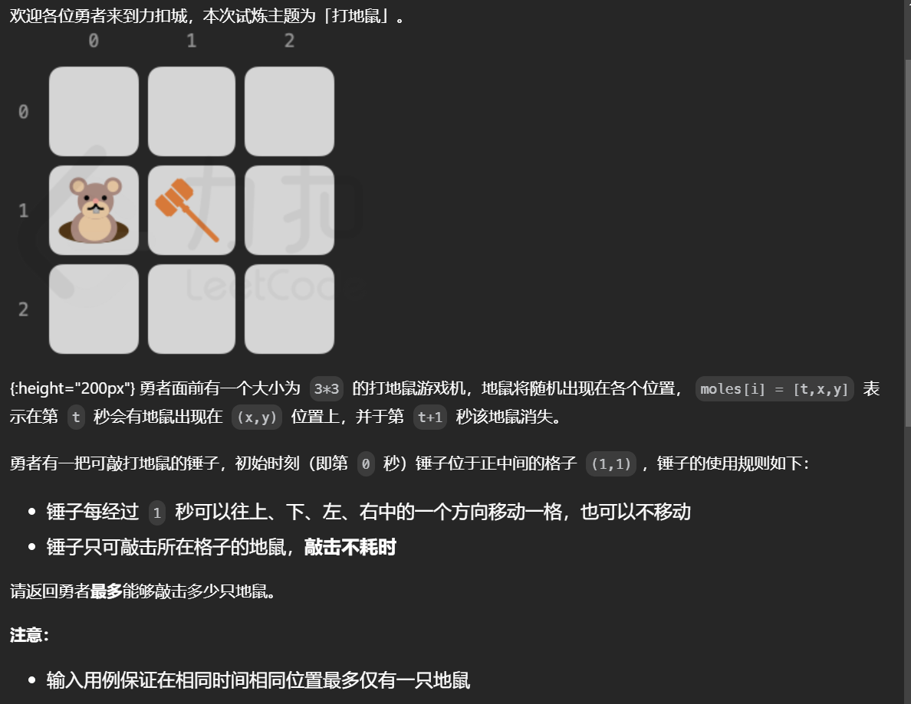

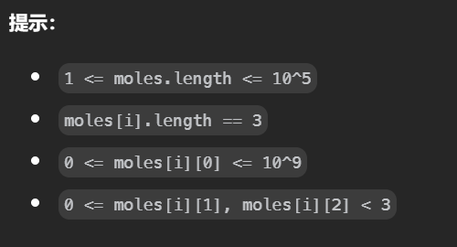

定义f[i]表示考虑前i个地鼠，在选择第i个地鼠的情况下最多能选多少地鼠，枚举i之前的j位置，如果j能到达i那么二者的时间之差一定大于等于二者的距离之差，因为网格为3*3，因此距离最多为4那么只要时间之差大于4，则j即j之前的都能选择，因此可以通过前缀最大值来避免循环。

```python
class Solution:
    def getMaximumNumber(self, g: List[List[int]]) -> int:
        
        flag=False
        g.sort()
        # 寻找初始位置是否有地鼠
        for i,x,y in g:
            if flag:break
            if i==0 and x==y==1:
                flag=True
                break
            if i:break
        # 没有的话加上初始位置作为哨兵
        if not flag:g=[[0,1,1]]+g
        n=len(g)
        f=[-inf]*n
        # base case
        f[0]=int(flag)
        # 前缀最大值
        pre=[0]
        ans=0
        # 第i只地鼠
        for i in range(1,n):
            # 枚举前面的位置
            for j in range(i-1,-1,-1):
                t=g[i][0]-g[j][0]
                d=abs(g[i][1]-g[j][1])+abs(g[i][2]-g[j][2])
                # 如果时间之差大于4，那么一定满足条件
                if t>4:
                    f[i]=max(f[i],pre[j]+1)
                    break
                # 满足条件
                elif d<=t:
                    f[i]=max(f[i],f[j]+1)
                # 如果不满足条件说明没法选第i只地鼠
            # 更新最大值
            ans=max(ans,f[i])
            # 更新前缀最大值
            pre.append(max(pre[-1],f[i]))
        return ans
        
```


## 波动数列

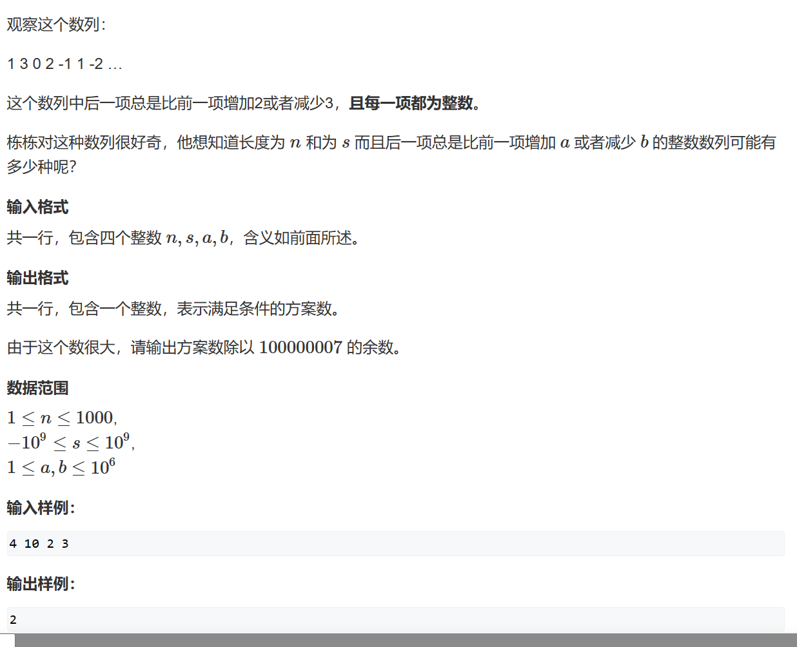

抽象出公式，这个过程中不能使用具体化的值。

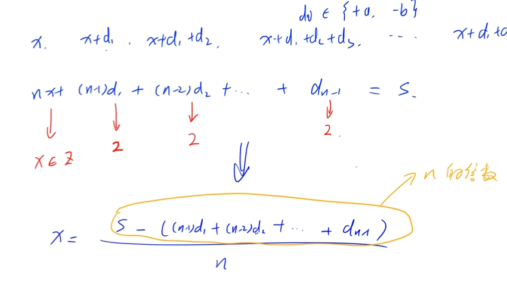


也就是去找能与S同余的解有多少个，每一个di都有两个选择，类似于背包问题定义dp(i,j)表示考虑前i个数，余数为j的有多少种方案，第i个数就是为i* a（就是把(n-1)*d1换为(n-1) *d{n-1}），根据同余定理:curr=pre+x同余n，因此前i-1个数余数就是(curr-x)取余n，x可能是bi或ai。

```python
n,s,a,b=[int(x) for x in input().split()]
m=100000007

dp=[[0]*(n+1) for _ in range(n+1)]
dp[0][0]=1
for i in range(1,n):
    for j in range(n):
        # 这里是相加，当前位置可能是a或b
        dp[i][j]+=dp[i-1][(j-a*i)%n]
        dp[i][j]+=dp[i-1][(j+b*i)%n]
        dp[i][j]%=m
# 根据公式只考虑前i-1个数
print(dp[n-1][s%n])
```


## [字符串中的额外字符](https://leetcode.cn/problems/extra-characters-in-a-string/)

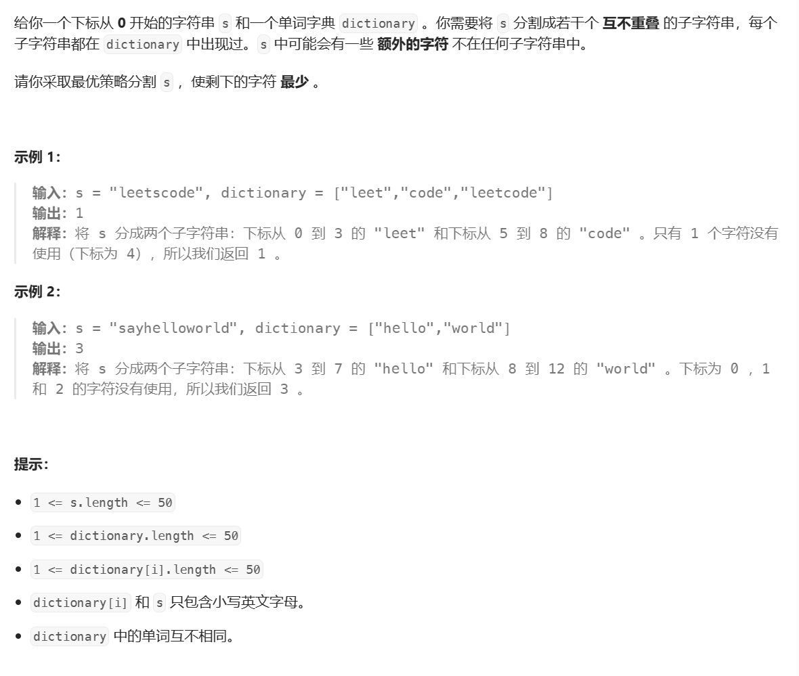


定义dp(i)为前i个字符分割后剩余的最少字符数，对于每个字符i它可以被跳过dp(i)=dp(i-1)+1，也可以去找他前面是否存在一个j,使得s[j:i+1]在d中

```python
class Solution:
    def minExtraChar(self, s: str, dictionary: List[str]) -> int:
        n=len(s)
        d=set(dictionary)
        @cache
        def dp(i):
            if i==-1:
                return 0
            res=dp(i-1)+1
            for j in range(i+1):
                if s[j:i+1] in d:
                    res=min(res,dp(j-1))
            return res
        return dp(n-1)
```


## [求出所有子序列的能量和](https://leetcode.cn/problems/find-the-sum-of-the-power-of-all-subsequences/)

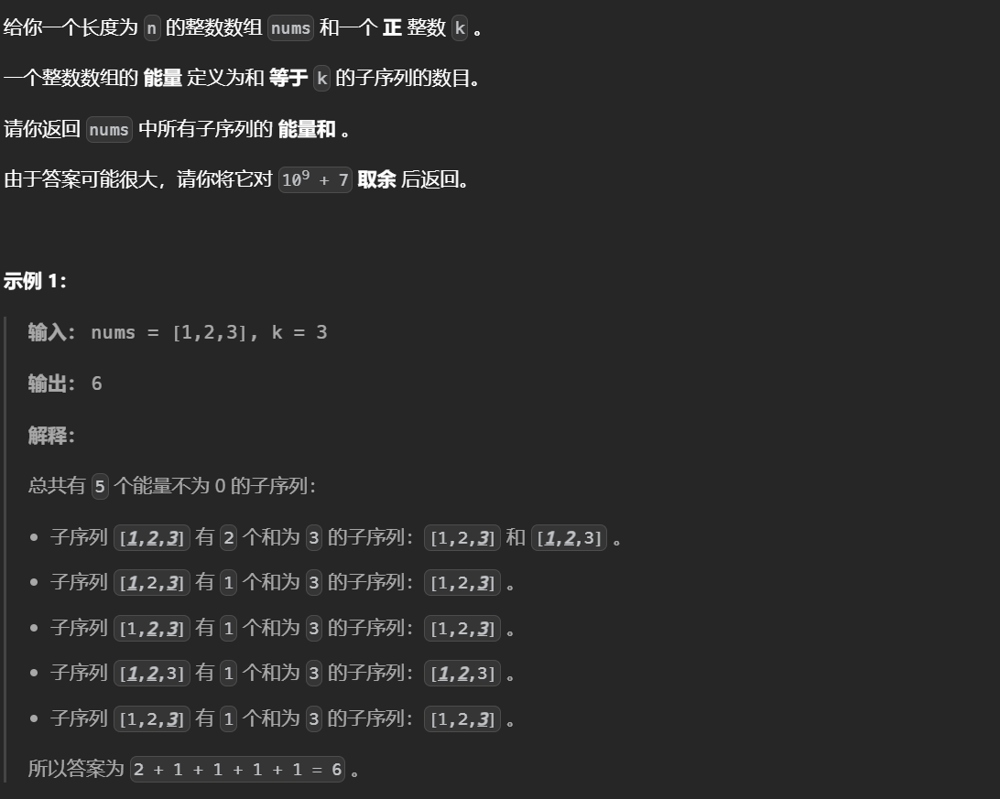

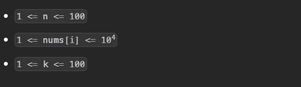

考虑数组中所有的子序列是否有满足条件的子序列，这里通过**枚举子序列长度**，对剩余的位置计数(2^i)找出这个子序列包含在多少个序列中，这样可以不重不漏。

```python
class Solution:
    def sumOfPower(self, nums: List[int], k: int) -> int:
        mod=10**9+7
        n=len(nums)
        # 三个状态，前i个，和为k，长度为c
        f=[[[0]*(n+1) for _ in range(k+1)] for _ in range(n+1)]
        # base case
        f[0][0][0]=1
        for i in range(1,n+1):
            for j in range(k+1):
                for c in range(n+1):
                    # 选或不选
                    f[i][j][c]=(f[i-1][j-nums[i-1]][c-1] if j>=nums[i-1] else 0)+f[i-1][j][c]
                    f[i][j][c]%=mod     
        ans=0
        # 枚举长度
        for i in range(n,-1,-1):
            ans+=(f[n][k][i]*pow(2,n-i))%mod
            ans%=mod
        return ans 
    
class Solution:
    def sumOfPower(self, nums: List[int], k: int) -> int:
        mod=10**9+7
        n=len(nums)
        # 
        f=[[0]*(n+1) for _ in range(k+1)]
        f[0][0]=1
        for i in range(1,n+1):
            # 倒序枚举，防止用已更新的状态取更新新的状态
            for j in range(k,-1,-1):
                for c in range(n,-1,-1):
                    f[j][c]=(f[j-nums[i-1]][c-1] if j>=nums[i-1] else 0)+f[j][c]
                    f[j][c]%=mod
        

        
        ans=0
        for i in range(n,-1,-1):
            ans+=(f[k][i]*pow(2,n-i))%mod
            ans%=mod
        return ans 

```


## [求出所有子序列的能量和](https://leetcode.cn/problems/find-the-sum-of-subsequence-powers/)

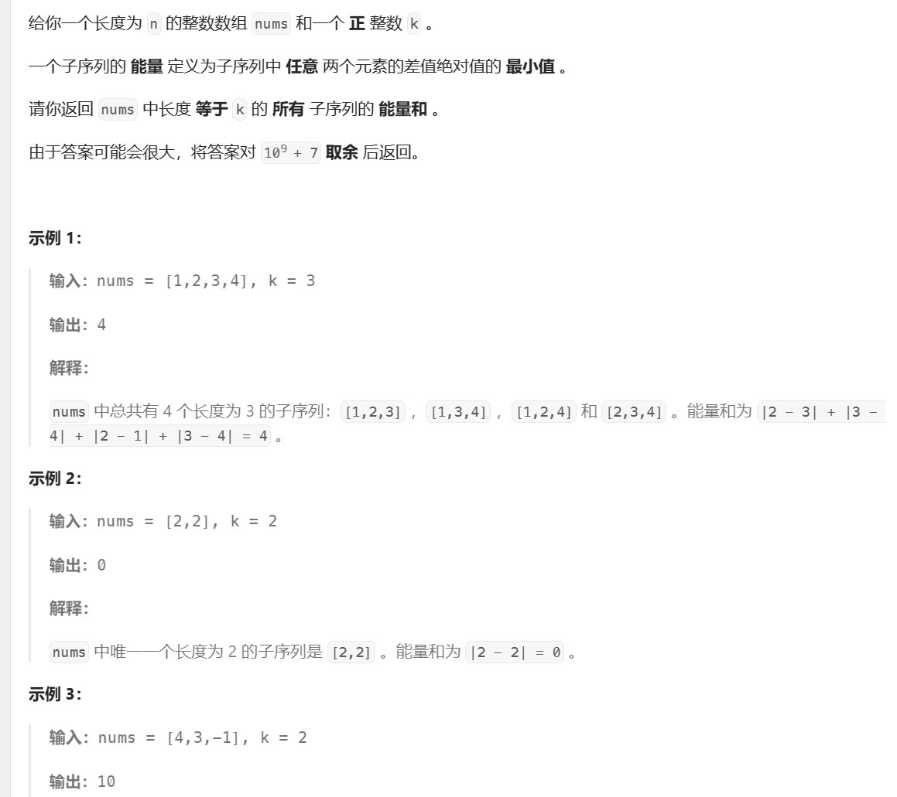


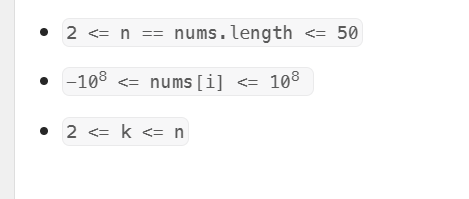


子序列问题，对于每个值有选或不选两种状态，该题是子序列问题中的相邻相关问题。

对于这题的子序列，元素的顺序无所谓可以先预处理

```python
class Solution:
    def sumOfPowers(self, nums: List[int], k: int) -> int:
        # 通过排序预处理，最小的差值可以由相邻的两个值得出
        nums.sort()
        m=10**9+7
        n=len(nums)
        @cache
        # i表示位置，c表示还能选几个数，pre表示之前选的值，diff表示差值
        def dp(i,c,pre,diff):
            # 选完了
            if c==0:
                return diff
            # 剩下的加起来都不够
            if c>i+1:return 0
            res=0
            # 选或不选相加
            res=dp(i-1,c,pre,diff)+dp(i-1,c-1,nums[i],min(diff,pre-nums[i]))
            return res%m
        return dp(n-1,k,inf,inf)
```

## [最高的广告牌](https://leetcode.cn/problems/tallest-billboard/)

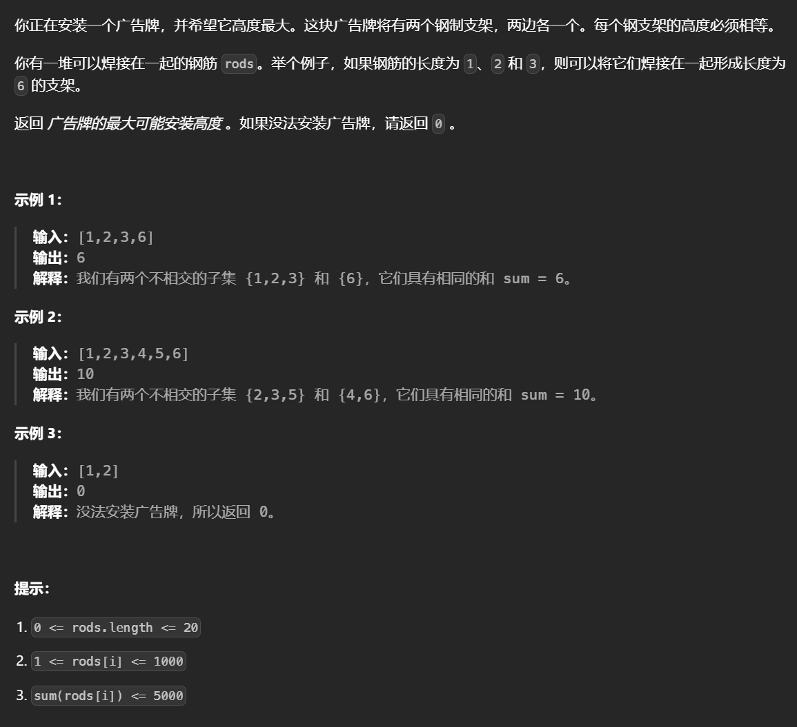

状态的选择不太好想，这里令dp(i,j)表示对于前i+1个，两个集合差为j时的最大总和，**对于两个集合之类的题目定义差为状态可能是一种套路**

```python
class Solution:
    def tallestBillboard(self,nums: List[int]) -> int:
        ans=0
        n=len(nums)
        
        @cache
        def dp(i,d):
            if i<0:
                # 对于0个，高度只差只能是0
                return 0 if not d else -inf 
            # 不选，选：给长的，给短的
            return max(dp(i-1,d),dp(i-1,d+nums[i])+nums[i],dp(i-1,abs(d-nums[i]))+nums[i])
        return dp(n-1,0)//2
```

## [好分区的数目](https://leetcode.cn/problems/number-of-great-partitions/)

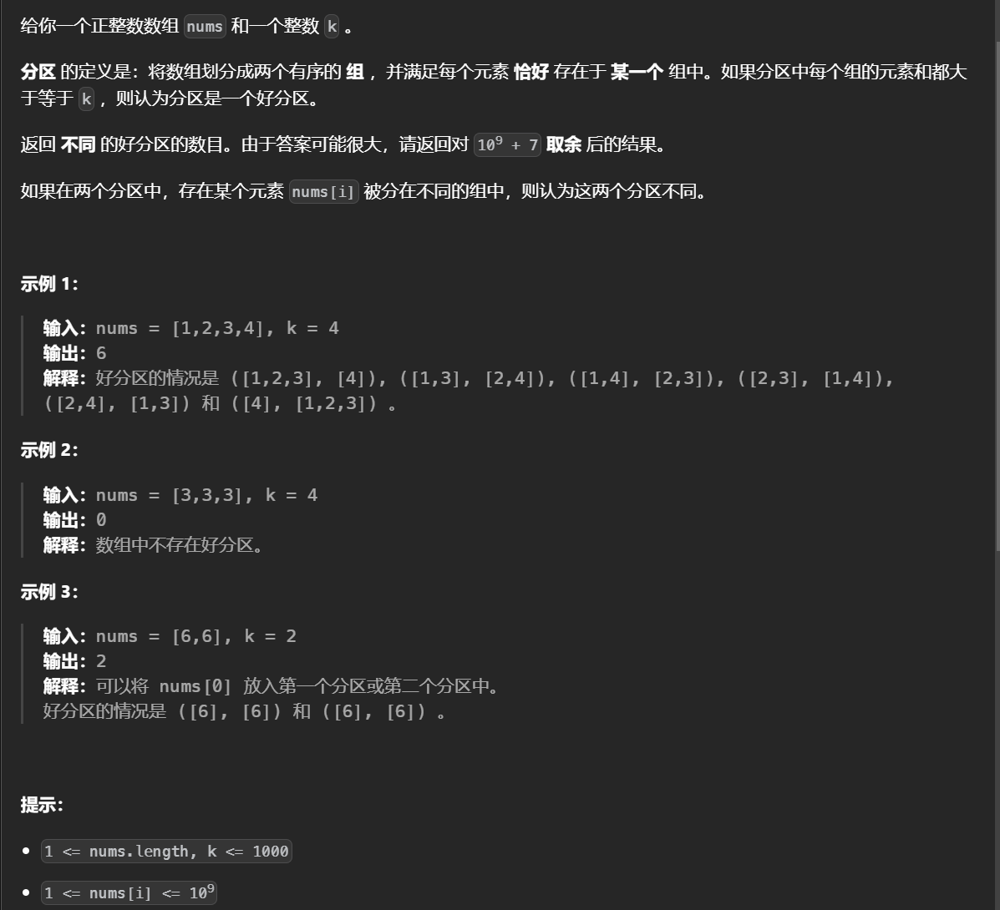


观察数据范围，**必然要用到k作为状态**，因为数组中的元素太大，求解满足两个区间和都大于等于k的较为复杂，**这里正难则反**，求解坏区间的个数即存在某些区间和小于等于k的，因为k的范围较小因此可以通过0-1背包求解，通过对称性可以只解出小于k的序列有多少然后乘上2就是存在一个坏区间的个数，对于两个都是坏区间的情况可以直接特判数组总和。

```python
class Solution:
    def countPartitions(self, nums: List[int], k: int) -> int:
        mod=10**9+7
        # 如果存在两个都是坏分区，那么必然不存在好分区
        if sum(nums)<2*k:return 0
        @cache
        # 考虑前i+1个中有多少个和不超过c的有多少个
        def dp(i,c):
            if c<=0:return 0
            if i<0:
                return 1
            return (dp(i-1,c-nums[i])+dp(i-1,c))%mod
        # 总的-坏区间的个数
        return (pow(2,len(nums),mod)-2*dp(len(nums)-1,k))%mod
```

# 完全背包问题

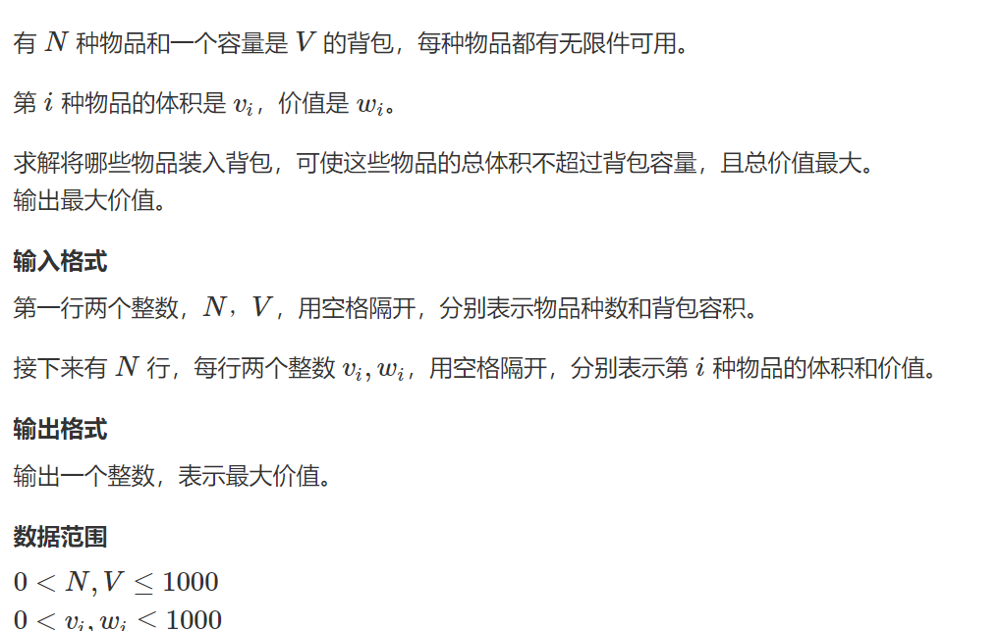


相比于01背包问题，这里的每个物品可以选无限多个（要合法）而不是只有选或不选两种情况，可以选0个1个2个...k个，因此在状态转移的过程中会有dp(i,j)=max(dp(i-1,j),dp(i-1,j-v),dp(i-1,j-2v),dp(i-1,j-3v)...dp(i-1,j-kv))，这相当于在转移的过程中多     出一重循环总共会有三重循环，对于1000的数据会超时，但是可以做优化：

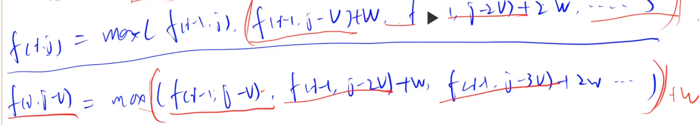

```python
from math import inf
n,v=[int(x) for x in input().split()]
# 注意初始化，方便转移的时候操作
nums=[[0,0]]
for _ in range(n):
    nums.append([int(x) for x in input().split()])

dp=[[inf]*(v+1) for _ in range(n+1)]
dp[0]=[0]*(v+1)

for i in range(1,n+1):
    for j in range(v+1):
        if j-nums[i][0]>=0:
            dp[i][j]=max(dp[i][j-nums[i][0]]+nums[i][1],dp[i-1][j])
        else:
            dp[i][j]=dp[i-1][j]
print(dp[n][v])
```


## 整数划分

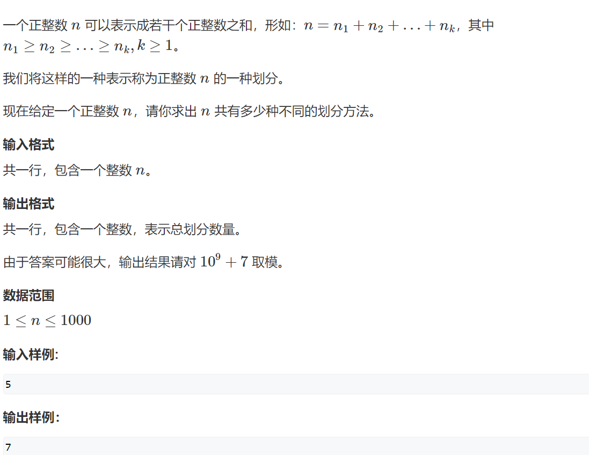

问题可以看作是一个完全背包问题，每一个数可以取无限次，但是这里定义的f(i,j)表示前i个元素当前整数为j的划分方法数，所以状态方程是枚举每个中间值，这里需要做一次优化，如下：


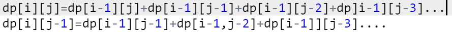

```python
from functools import lru_cache
m=10**9+7
n=int(input())

dp=[[0]*(n+1) for _ in range(n+1)]

# base case 当整数的大小为0的时候是一个合法的结果
for i in range(n+1):
    dp[i][0]=1
nums=list(range(n+1))
for i in range(1,n+1):
    for j in range(1,n+1):
        if j-nums[i]>=0:
            dp[i][j]=dp[i-1][j]+dp[i][j-nums[i]]
        else:
            dp[i][j]=dp[i-1][j]
print(dp[n][n]%m)
```


## [ K 个逆序对数组](https://leetcode.cn/problems/k-inverse-pairs-array/)

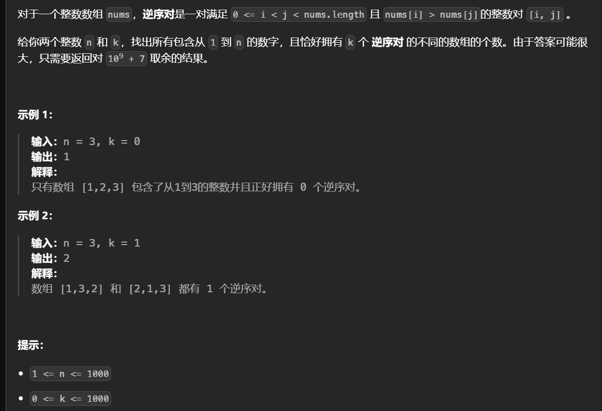

定义状态dp(i,j)表示考虑[1,i]的排列其中有j个逆序对的不同排列方式，对于[1,i]的排列长度为i，可以选任意一个数作为排列的最后一个元素，如果选的是k那么就会贡献i-k个逆序对，即k+1,k+2,k+3...i，此时排列贡献的逆序对等于i-k加上前i-1个元素贡献的逆序对，前i-1个也就是1\~k-1和k+1\~i，因为逆序对只考虑元素的相对大小因此1\~k-1和k+1\~i可以看作是1\~i-1的排列，由此得出子任务

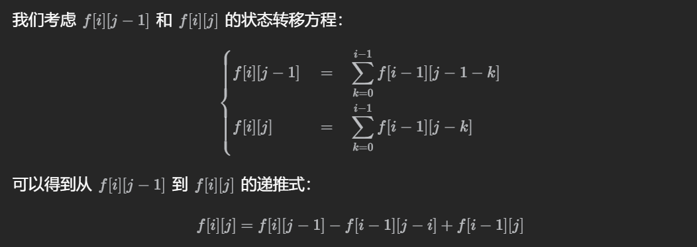

```python
class Solution:
    def kInversePairs(self, n: int, k: int) -> int:
        mod=10**9+7
        # 未优化的如下对于给定的数据范围会超时
        # @cache
        # def dp(i,j):
        #     if not j:return 1 逆序对为0，只有一种排列方式就是正序
        #     res=0
        #     for index in range(i):
        #         cnt=(i-1)-index 能贡献多少
        #         if cnt>j:continue
        #         res+=dp(i-1,j-cnt)
        #         res%=mod
        #     return res 
        # return dp(n,k)
        dp=[[0]*(k+10) for _ in range(n+10)]
        for i in range(n+1):dp[i][0]=1

        for i in range(2,n+1):
            for j in range(1,k+1):
                dp[i][j]=dp[i][j-1]-(dp[i-1][j-i] if j-i>=0 else 0)+dp[i-1][j]
                dp[i][j]%=mod
        return dp[n][k]
```


# 多重背包问题

物品可以重复选但是有个数限制

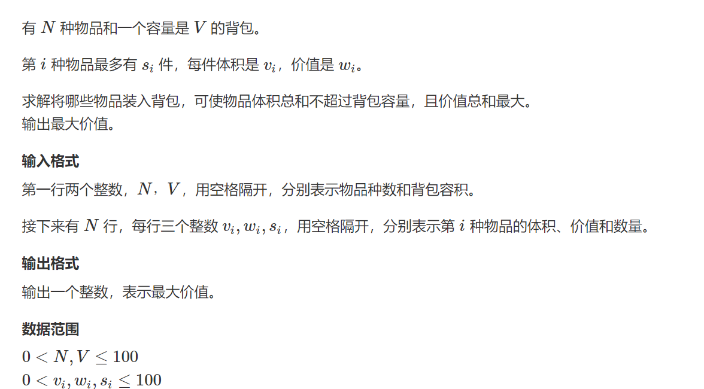


规定了物品最多能选s件，类似于完全背包问题状态转移的过程中多出一层循环，对于给定的数据可以接受。

```python
from math import inf

n,v=[int(x) for x in input().split()]
memo=[[0,0]]

for _ in range(n):
    memo.append([int(x) for x in input().split()])
    
dp=[[-inf]*(v+1) for _ in range(n+1)]
dp[0]=[0]*(v+1)

for i in range(1,n+1):
    for j in range(v+1):
        # 枚举出所有合法的状态
        li=[dp[i-1][j-s*memo[i][0]]+s*memo[i][1] for s in range(memo[i][2]+1) if j-s*memo[i][0]>=0]
        dp[i][j]=max(li)
print(dp[n][v])
```


当数据范围比较大的时候就不能选择枚举每一个，这里选择拆开每种物品单独看作一个集合把问题转化内01背包问题，但是如果拆分为1个的形式那么和枚举所有的没有区别这里的方法是拆分为二进制形式（技巧点），比如说7会拆为1 2 4，10会拆为1 2 4 3再把它们单独看作是一个集合，这样相当于把一重循环减小为logn，二进制的形式可以组合为0到n之间任意一个数。 

```python
from math import inf
n,v=[int(x) for x in input().split()]
items=[]
for _ in range(n):
    v_,w,s=[int(x) for x in input().split()]
    index=0
    # 拆分为二进制形式，或者使用矩阵快速冥的写法
    while s-2**index>=0:
        items.append((v_*2**index,w*2**index))
        s-=2**index
        index+=1
     # 最后可能会剩余一个
    if s:
        items.append((v_*s,w*s))
# 这里不再是n个人了
n=len(items)
# 注意初始化
items=[[0,0]]+items
dp=[[-inf]*(v+1) for _ in range(n+1)]
dp[0]=[0]*(v+1)
for i in range(1,n+1):
    for j in range(v+1):
        # 问题转换为01背包
        if j-items[i][0]>=0:
            dp[i][j]=max(dp[i-1][j],dp[i-1][j-items[i][0]]+items[i][1])
        else:
            dp[i][j]=dp[i-1][j]
print(dp[n][v])
```


## [和带限制的子多重集合的数目](https://leetcode.cn/problems/count-of-sub-multisets-with-bounded-sum/)

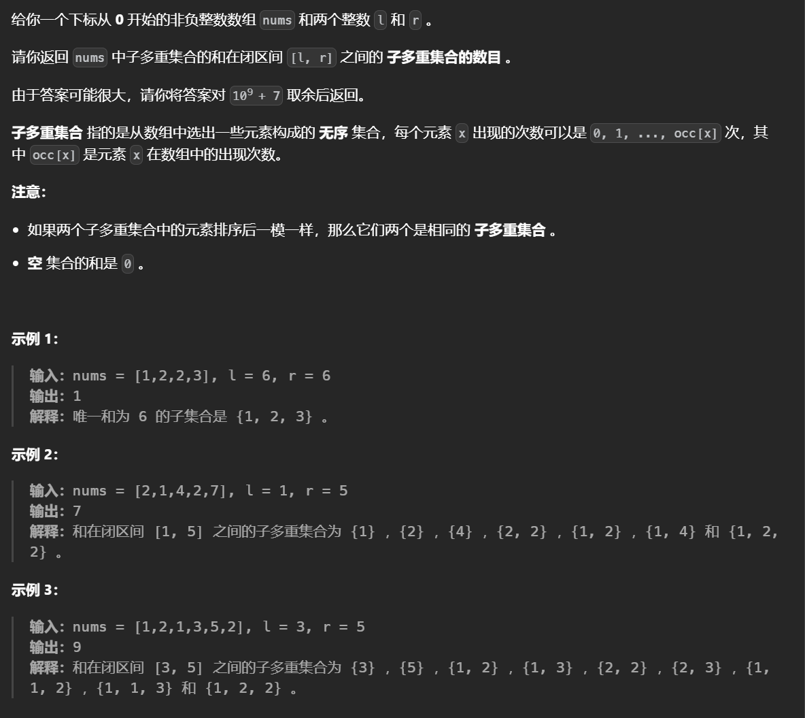

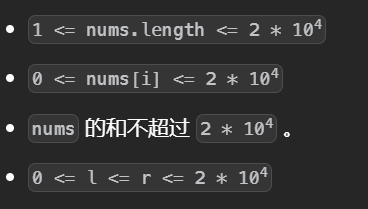

显而易见的使用DP求解，定义f[i]\[j]为前i个且和恰好为j的方案数，并且需要优化，这里不能拆分为二进制数否则会有重复状态，观察公式可以按照完全背包的方法拆开有，注意本题中存在0，对于0会出现f[i]\[j]=f[i]\[j]的情况，因此先除去0对所有的正数计算然后累计上0，结果等同于在base case中加上0的个数

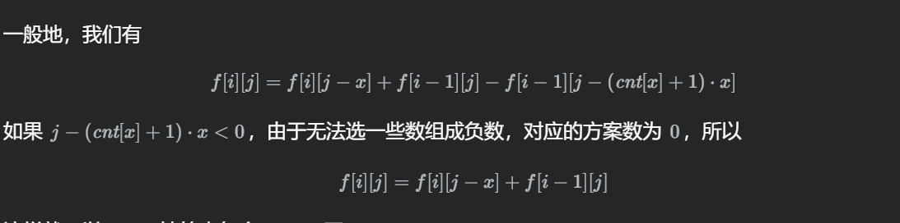

```python
class Solution:
    def countSubMultisets(self, nums: List[int], l: int, r: int) -> int:    
        if sum(nums)<l:return 0  
        r=min(r,sum(nums))

        mod=10**9+7
        memo=Counter(nums)
        cnt=memo[0]
        
        del memo[0]
        nums=list(memo.keys())
        n=len(nums)
 
        f=[[0]*(r+1) for _ in range(n+1)]
        f[0][0]=cnt+1
        
        for i in range(1,n+1):
            x=nums[i-1]
            c=memo[x]
            for j in range(r+1):
                # 直接求解，同时要防止超出范围
                f[i][j]=(f[i-1][j]+(f[i][j-x]if j-x>=0 else 0)-(f[i-1][j-(c+1)*x] if j-(c+1)*x>=0 else 0))%mod
        # 累加方案数
        return sum(f[-1][l:])%mod
```


也可以用一般的前缀和优化的方式，但是这里是等差前缀和，因为每个状态是由j-p,j-2p,j-3p，转移过来而不是j-p~j-3p，定义s[i]为

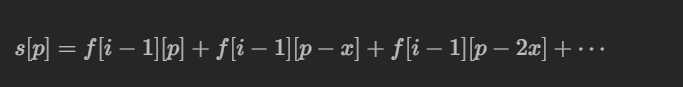

每个f[i]\[j]=s[p]-s[p-(c+1)*x]这样得出的就是范围内的j,j-p,j-2p,j-3p..j-c\*p

这个公式同样可以优化为


```python
class Solution:
    def countSubMultisets(self, nums: List[int], l: int, r: int) -> int:    
        # 总和太小
        if sum(nums)<l:return 0  
        # 取小的上界
        r=min(r,sum(nums))

        mod=10**9+7
        memo=Counter(nums)
        # 记录0的个数
        cnt=memo[0]
        
        # 除去0
        del memo[0]
        nums=list(memo.keys())
        n=len(nums)

        f=[[0]*(r+1) for _ in range(n+1)]
        # base case 加上0的个数，等同于计算出所有正数的结果后在与0组合
        f[0][0]=cnt+1
        
        # 前缀和
        s=[0]*(r+1)
        
        for i in range(1,n+1):
            x=nums[i-1]
            c=memo[x]
            # 先求解前缀和
            for j in range(r+1):
                s[j]=(f[i-1][j]+(s[j-x] if j-x>=0 else 0))%mod
            for j in range(r+1):
                f[i][j]=(s[j]-(s[j-(c+1)*x] if j-(c+1)*x>=0 else 0))%mod
        return sum(f[-1][l:])%mod
```


# 最长公共子序列(LCS)


## 最长公共子序列

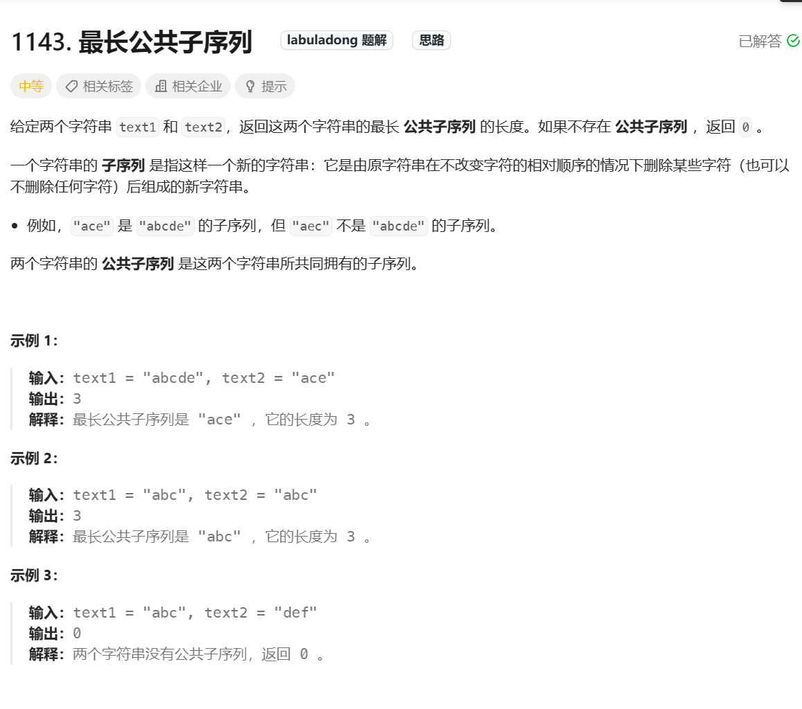

所有的字符串子序列问题都是使用两个指针进行动态规划，不看字符串而是看每个字符

```python
class Solution(object):
    def longestCommonSubsequence(self, text1, text2):
        m=len(text1)
        n=len(text2)
        # 备忘录
        memo=[[-1 for _ in range(n)] for _ in range(m)]
		
        # dp[m][n]返回s1[m:]与s2[n:]的最长公共子序列
        def dp(s1,m,s2,n):
            # base case 没有值
            if m==len(s1) or n==len(s2):
                return 0
            # 如果记录了
            if memo[m][n]!=-1:
                return memo[m][n]
            # 用指针比较字符
            if s1[m]==s2[n]:
                 memo[m][n]=1+dp(s1,m+1,s2,n+1)
            else:
                # 不等，说明至少有一个字符不是最长公共子序列中的，两个字符都不是的情况被至少一个不是包括
                memo[m][n]=max(dp(s1,m+1,s2,n),dp(s1,m,s2,n+1))#,dp(s1,m+1,s2,n+1))

            return memo[m][n]

        return dp(text1,0,text2,0)
    
# 自底向上的解法更快
class Solution(object):
    def longestCommonSubsequence(self, text1, text2):
        m=len(text1)
        n=len(text2)
        # 做一位偏移,dp[i]表示数组中以第i个元素结尾的最长公共子序列	
        dp=[[0 for _ in range(n+1)] for _ in range(m+1)]

        for i in range(1,m+1):
            for j in range(1,n+1):
                if text1[i-1]==text2[j-1]:
                    dp[i][j]=dp[i-1][j-1]+1
                else:
                    dp[i][j]=max(dp[i-1][j],dp[i][j-1])

        return dp[m][n]
```

## [最长重复子数组](https://leetcode.cn/problems/maximum-length-of-repeated-subarray/)

对上一题类似，不过换成了子数组，子数组一般定义为f[i]表示以nums[i]结尾的元素

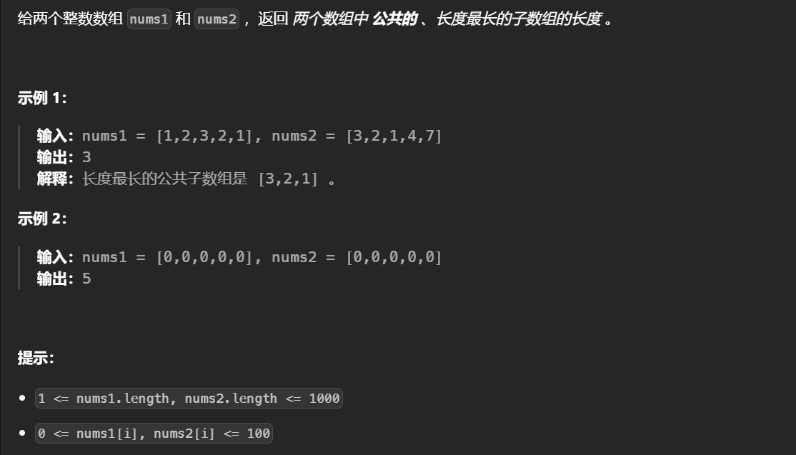

```python
class Solution:
    def findLength(self, nums1: List[int], nums2: List[int]) -> int:
        m,n=len(nums1),len(nums2)
        f=[[0]*(n+1) for _ in range(m+1)]
        ans=0
        for i in range(1,m+1):
            for j in range(1,n+1):
                if nums1[i-1]==nums2[j-1]:
                    f[i][j]=1+f[i-1][j-1]
                    ans=max(ans,f[i][j])
        return ans 
```


## 两个字符串的最小ASCII删除和

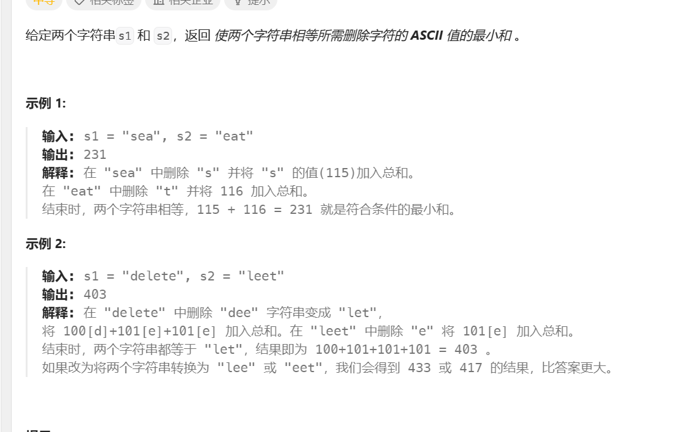

删除字符的最小的ASCII和，就是要求删除最少的字符，也就是找到最大的公共子序列。

```python
# 再求最长公共子序列的基础上改进
class Solution(object):
    def minimumDeleteSum(self, s1, s2):
        m = len(s1)
        n = len(s2)
        memo = [[-1 for _ in range(n)] for _ in range(m)]

        # 求解s[m:]和s[n:]的最小ASCII和
        def dp(s1, m, s2, n):
        
			# 如果其中一个字符串到头了，说明另一个要全部删除
            if m == len(s1):
                res=0
                for j in range(n,len(s2)):
                    res+=ord(s2[j])
                return res

            if n == len(s2):
                res=0
                for j in range(m,len(s1)):
                    res+=ord(s1[j])
                return res

            if memo[m][n] != -1:
                return memo[m][n]

            if s1[m] == s2[n]:
                memo[m][n] = dp(s1, m + 1, s2, n + 1)
            else:
                memo[m][n] = min(ord(s1[m])+dp(s1, m + 1, s2, n), dp(s1, m, s2, n + 1)+ord(s2[n]))

            return memo[m][n]
        
        return dp(s1,0,s2,0)
```


## [不相交的线](https://leetcode.cn/problems/uncrossed-lines/)

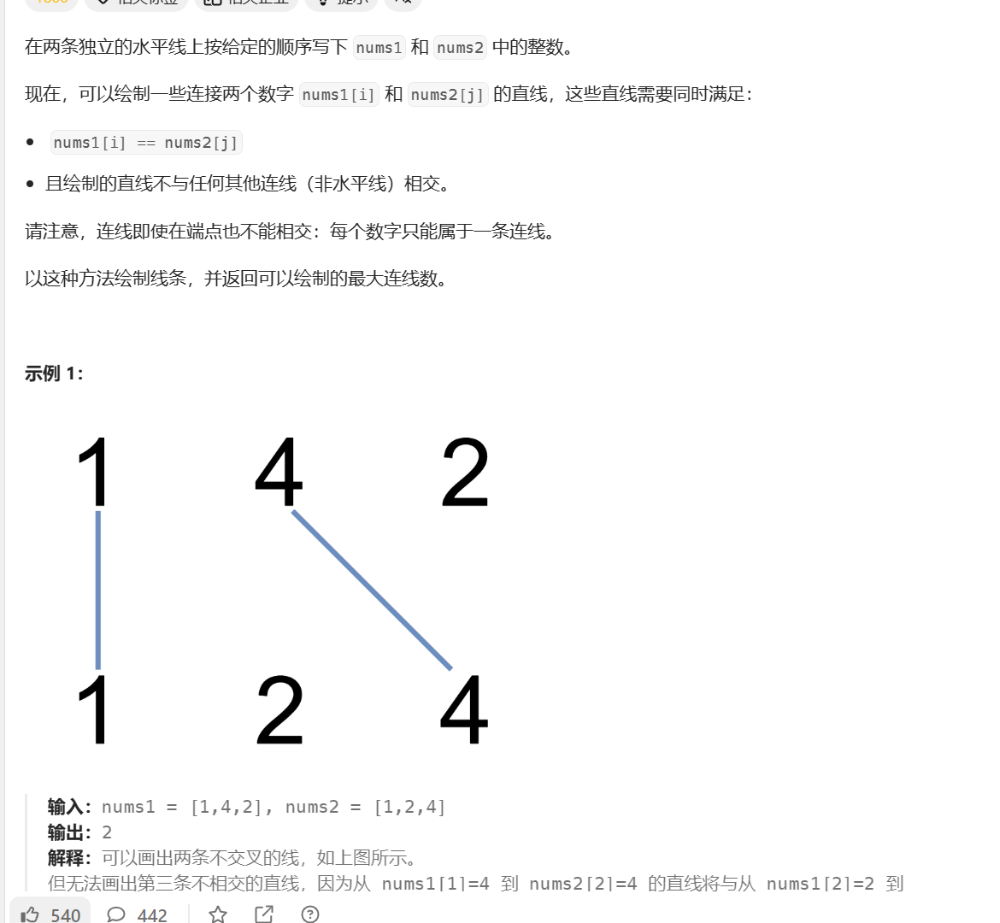

就是最长公共子序列的变形

```python
class Solution:
    def maxUncrossedLines(self, nums1: List[int], nums2: List[int]) -> int:
        n1,n2=len(nums1),len(nums2)
        @cache
        def dp(i,j):
            if i==n1 or j==n2:return 0
            return max(dp(i+1,j+1)+int(nums1[i]==nums2[j]),dp(i,j+1),dp(i+1,j))
        return dp(0,0)
```


## 编辑距离

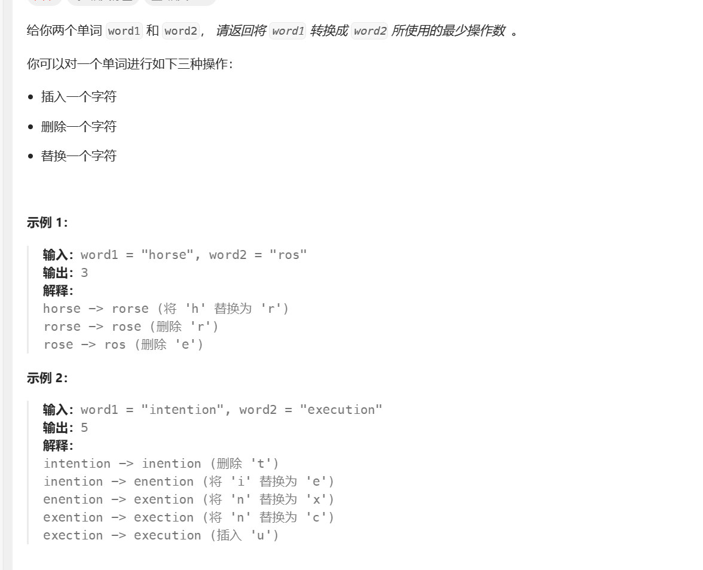

```python
class Solution(object):
    
    def minDistance(self, word1, word2):
        # 备忘录，记录当前剩下长度m和n的两个字符最少需要多少步
        memo=[[-1 for _ in range(len(word2))] for _ in range(len(word1))]
        # 表示从s1[0,m],s2[0,n]的字符串相等所需的最小步骤
        def dp(s1,m,s2,n):
	# 从末尾开始遍历，如果有一方提前结束，那么只需要另一个剩余字符长度的删除操作
            if m==-1:
                return n+1
            if n==-1:
                return m+1
			
            # 备忘录储存
            if memo[m][n]!=-1:
                return memo[m][n]

            # 如果字符相等，进入下一层
            if s1[m]==s2[n]:
                memo[m][n]=dp(s1,m-1,s2,n-1)
            else:
                # 反之找出最小的步骤，替换，减，增，注意不能拉下这一次的
                # dp(s1,m-1,s2,n-1)代表替换，没必要继续留在m,n顺势两个指针前移，dp(s1,m-1,s2,n)同时包含删除和增加，删除的是s1的最后一个字符，s1的指针前移一位，不一定删除之后就是末尾相等的两字符，也有可能是对s2增加一个，增加后s2的指针不动（因为增加了一位，匹配的是增加的），s1的前移一位因为匹配了，增加的一定是可以满足相等的（不会加入无用的浪费次数），
                memo[m][n]=min(dp(s1,m-1,s2,n-1)+1,dp(s1,m-1,s2,n)+1,dp(s1,m,s2,n-1)+1)
                
            return memo[m][n]

        return dp(word1, len(word1) - 1, word2, len(word2) - 1)
    
'''上述使用递归的是自定向下的写法，以下是使用DPtable，自底向上的写法'''
from math import inf

n1 = int(input())
s = input()
n2 = int(input())
p = input()
# 这里的dp[i][j]记录的是区间 s[i...n1)与p[j...n2)的最小操作次数，也可以认为是后n1-i,n2-j个
dp = [[inf] * (n2 + 1) for _ in range(n1 + 1)]

# 注意初始化，这里的dp[n1][x] dp[x][n2]表示的都是其中一个字符串空了，另一个字符串全删除的操作次数
dp[n1] =list(range(n2,-1,-1))
for i in range(n1 + 1):
    dp[i][n2] = n1-i	
for i in range(n1,0,-1):
    for j in range(n2,0,-1):
        # 相等可以不操作
        if s[i - 1] == p[j - 1]:
            dp[i-1][j-1] = min(dp[i][j], dp[i - 1][j - 1])
        # 三个操作
        dp[i-1][j-1] = min(dp[i-1][j-1], 1 + dp[i - 1][j], 1 + dp[i][j - 1],1+dp[i][j])
print(dp[0][0])
```


# 最长递增子序列(LIS 选哪个)

与选或不选不同，这里对于i，i-1并不一定会被考虑，也就是状态不是从i-1转移过来

## [最长递增子序列](https://leetcode.cn/problems/longest-increasing-subsequence/)

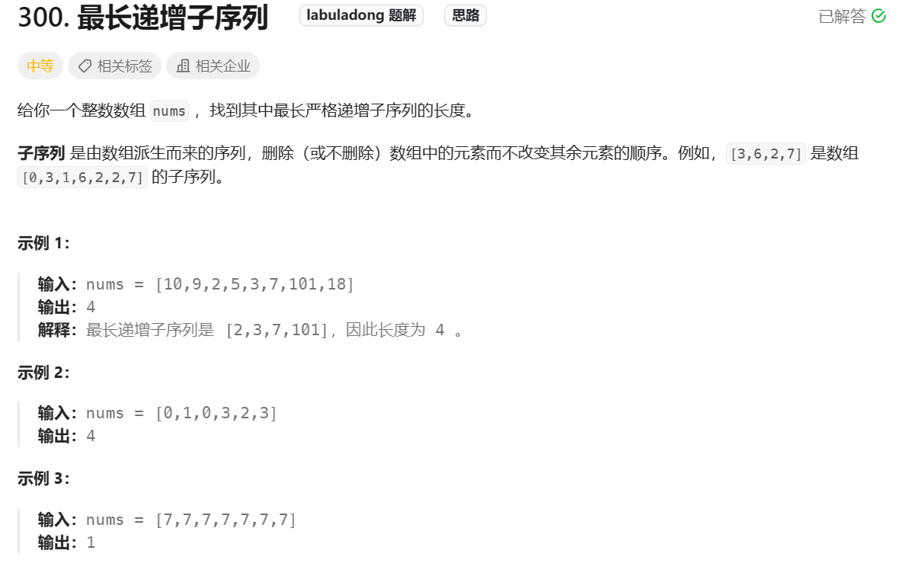

序列是不连续的集合。

这个问题可以使用动态规划求解，划分为求解子问题，定义dp数组，dp[i]表示以nums[i]结尾的最长递增子序列，dp[i]等于列表中nums[i]前面小于nums[i]的元素对应的dp值中最大的加一。

枚举选哪个

```python
class Solution(object):
    def lengthOfLIS(self, nums):
        n=len(nums)
        # 全部初始化为1，首先包括自己
        dp=[1 for _ in range(n)]
        # 遍历每一个
        for i in range(n):
            min_dp=-float('inf')
            # 找到列表中小于当前值且在前面的值
            for j in range(i):
                if nums[j]<nums[i]:
                    # 找到最大的
                    min_dp=max(min_dp,dp[j])
            dp[i]=min_dp+1 if min_dp!=-float('inf') else 1
        return max(dp)
```


每一个元素所能形成的最长递增子序列等于小于它的元素中所能形成的最长的递增子序列加一，定义dp(j)=max(dp(i))+1，dp(j)表示以元素j结尾的最长递增子序列，其中i是小于j的所有元素。这个转移方程中要求出区间（小于j）的最大值，然后用这个最大值去更新下一个状态，这个状态又会被用到其他的状态转移方程中，这需要快速求解区间最大值以及单点修改通过线段树完成。

数据结构优化

```python
class Node:
    def __init__(self):
        self.left=None
        self.right=None
        self.add=0
        self.val=0
# 求最大值的更新操作
def pushup(node):
    node.val=max(node.left.val,node.right.val)
# 进行的是区间覆盖操作
def pushdown(node):
    if not node.left:node.left=Node()
    if not node.right:node.right=Node()
    if not node.add:return
    # 不是累和而是覆盖
    node.left.val=node.right.val=node.left.add=node.right.add=node.add
    node.add=0

   
def update(node,start,end,l,r,v):
    if l<=start and r>=end:
        node.val=v
        node.add=v
        return 
    mid=(start+end)>>1
    pushdown(node)
    if l<=mid:update(node.left,start,mid,l,r,v)
    if r>=mid+1:update(node.right,mid+1,end,l,r,v)
    pushup(node)
def query(node,start,end,l,r):
    if l<=start and r>=end:
        return node.val
    mid=(start+end)>>1
    pushdown(node)
    res=0
    if l<=mid:res=max(res,query(node.left,start,mid,l,r))
    if r>=mid+1:res=max(res,query(node.right,mid+1,end,l,r))
    return res

class Solution:
    def lengthOfLIS(self, nums: List[int]) -> int:
        # 先离散化处理把元素换到1,n，方便处理
        temp=sorted(set(nums))
        # 注意这里把每个值加一是为了防止0的出现导致l>r
        nums=[bisect_left(temp,v)+1 for v in nums]
        N=max(nums)+10
        node=Node()
        ans=0
        # 依次求解每个元素小于他的元素中能形成的最长的序列
        for v in nums:
            # 找小于当前的元素，注意长度要加一
            cnt=query(node,0,N,0,v-1)+1
            # 求出后更新，因为维护的实际是一个dp(v)
            update(node,0,N,v,v,cnt)
            ans=max(ans,cnt)
        return ans 
```


二分+贪心

定义dp(i)为长度为i+1的最长上升子序列的末尾元素的最小值

```python
class Solution:
    def lengthOfLIS(self, nums: List[int]) -> int:
        g=[]
        for v in nums:
            j=bisect_left(g,v)
            if j==len(g):
                g.append(v)
            else:
                g[j]=v
        return len(g)
```


## [无矛盾的最佳球队](https://leetcode.cn/problems/best-team-with-no-conflicts/)

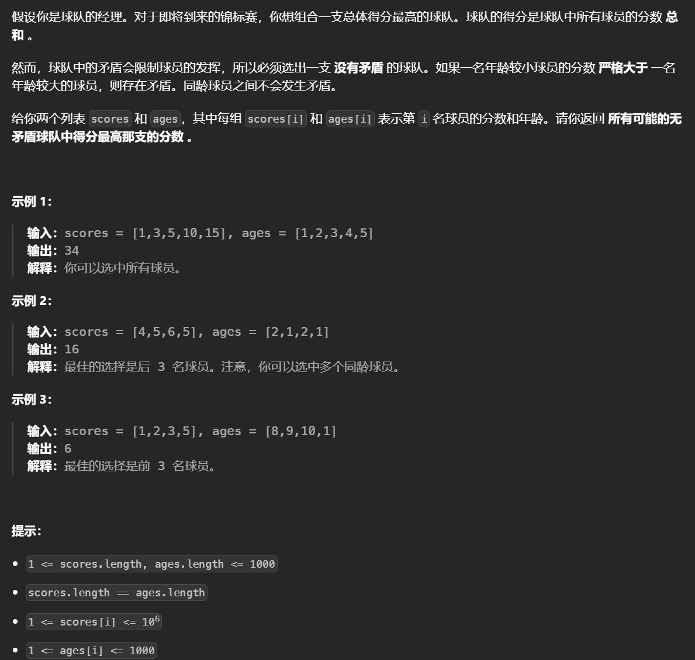

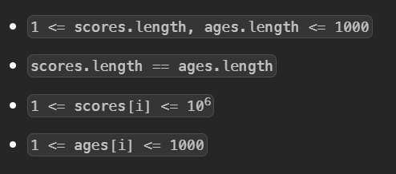

最长上升子序列可以用值域的写法求解

首先按照score的大小排序，对于相同的得分按照age从小到大排序，这样固定了score将二维的问题转换为一维，只需选出非严格递增的age序列即可。

定义f(i)为以age[i]结尾的非严格递增子序列的最大得分，$$f*[i]=max(f[j])+scores*[i]$$

```python
class Solution:
    def bestTeamScore(self, scores: List[int], ages: List[int]) -> int:
        nums=[(i,j) for i,j in zip(scores,ages)]
        nums.sort(key=lambda x:(x[1],x[0]))
        n=len(nums)
        dp=[0]*n 
        for i in range(n):
            res=0
            for j in range(i-1,-1,-1):
                if nums[j][1]<nums[i][1] and nums[j][0]>nums[i][0]:continue
                res=max(res,dp[j])
            dp[i]=res+nums[i][0]
        return max(dp)
    

# 用树状数组优化，注意由于数组中存的是最大得分，因此更新实际上是取最大值
def cal(x):
    return x&(-x)
class Tree:
    def __init__(self,n):
        # 这里没有原始数组
        self.tree=[0]*(n+1)
    # 更新
    def update(self,i,mx):
        i+=1
        while i<len(self.tree):
            self.tree[i]=max(self.tree[i],mx)
            i+=i&-i

    # 求出0,i的区间和，也就是小于等于i的个数
    def query(self,i: int) -> int:
        mx = 0
        while i:
            mx = max(mx, self.tree[i])
            i &= i - 1
        return mx

class Solution:
    def bestTeamScore(self, scores: List[int], ages: List[int]) -> int:
        x=max(ages)
        t=Tree(x+1)
        for i,j in sorted(zip(scores,ages)):
            mx=t.query(j+1)
            t.update(j,mx+i)
        return t.query(x+1)
```

## [最大整除子集](https://leetcode.cn/problems/largest-divisible-subset/)

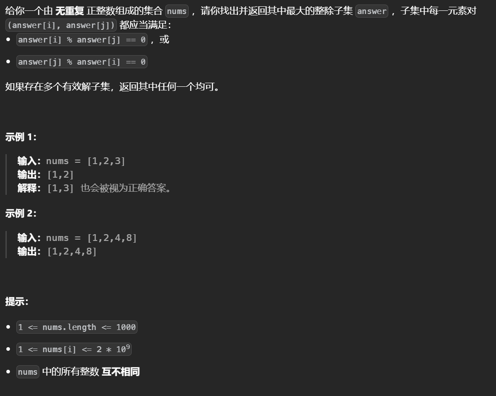

将数组排序后，假设有i<j，j对应的元素必然可以整除i对应位置的元素，根据除数约数的性质，如果a|b b|c那么有a|c，因此如果nums[j]可以整除nums[i]那么也必然能整除i能整除的元素，问题转换为找到最长的递增子序列，这里的递增指的是整除。

```python
class Solution:
    def largestDivisibleSubset(self, nums: List[int]) -> List[int]:
        nums.sort()
        n=len(nums)
        @cache
        def dp(i):
            ans=[]
            for j in range(i):
                # 如果可以整除
                if nums[i]%nums[j]==0:
                    res=dp(j)
                    # 取长度最大的
                    if len(res)>len(ans):ans=res[:]
            return ans+[nums[i]]
        ans=[]
        # 枚举每个位置作为结尾
        for i in range(n):
            res=dp(i)
            if len(res)>len(ans):ans=res[:]
        return ans 
```


## [解决智力问题](https://leetcode.cn/problems/solving-questions-with-brainpower/)

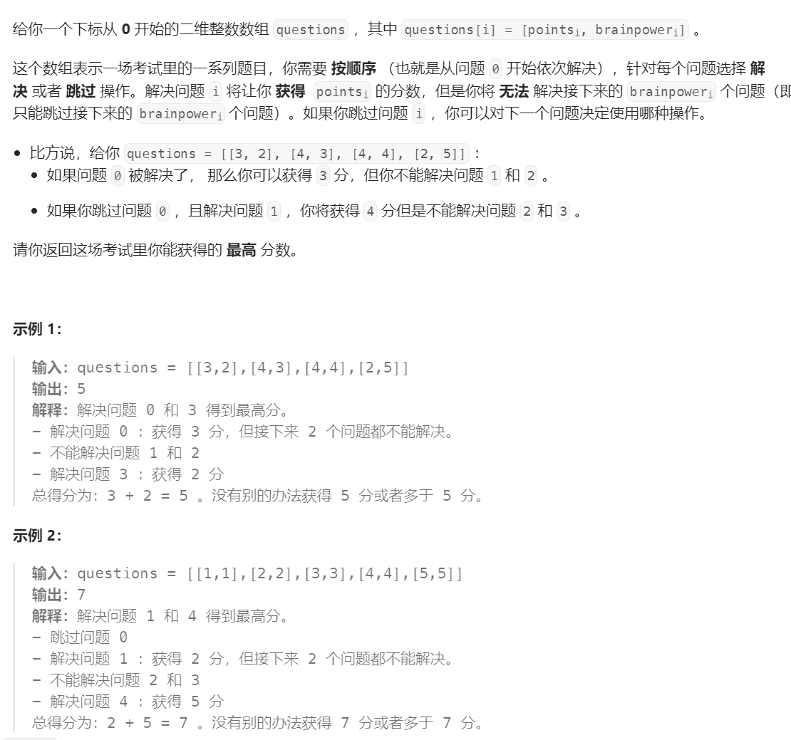

解决一个问题随后的几个问题只能跳过，这里需要使用倒序dp，因为下一个状态依赖于前一个状态f[i]表示解决i..n-1内的问题所能得到的最大分数，第i个解决与否会影响到f[i]的结果。如果是正序dp的话f[i]表示0...i是否选择，第i个解决与否会影响到f[i]的结果不仅会影响f[i]还会对后面的f[j]有影响，也就是一直在刷新后面的状态（刷表法）。

```python
class Solution:
    def mostPoints(self, questions: List[List[int]]) -> int:
        n=len(questions)
        # f[i]表示解决i..n-1内的问题所能得到的最大分数
        f=[0]*(n+1)
        for i in range(n-1,-1,-1):
            # 当前的问题可能跳过，可能选择，跳过的话分数等于f[i+1]反之等于当前问题的分数加上第j个问题跳过或选择
            f[i]=max(f[i+1],questions[i][0]+f[min(i+questions[i][1]+1,n)],questions[i][0])
        
        return f[0]
```


正序

```python
class Solution:
    def mostPoints(self, questions: List[List[int]]) -> int:
        n=len(questions)
        #  表示0...izuo'bi
        f=[0]*(n+1)
        for i in range(n):
            f[i+1]=max(f[i+1],f[i])
            j=min(n,i+questions[i][1]+1)
            f[j]=max(f[j],f[i]+questions[i][0])
        return f[n]
```


## [俄罗斯套娃信封问题](https://leetcode.cn/problems/russian-doll-envelopes/)

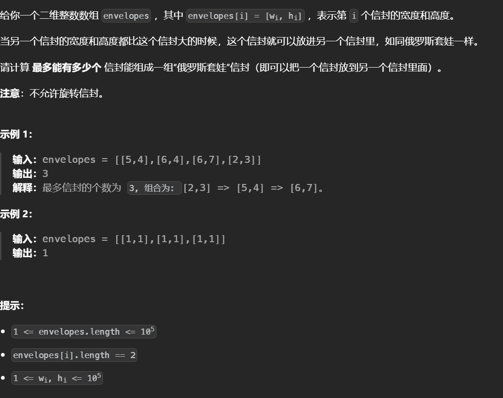

二维LIS，基本套路是固定一维转换为一维问题，这里的关键在于排序。

如果按照w从小到大排序，为了防止相同的信封嵌套，对于相同的w只保留最高的h，但是丢弃的较小值是有可能得到更大的结果的。

这里的排序方法是按照w从小到大排序，对于相同的w按照h降序排列，这样能保证不会选到w相同的信封，也能考虑到较小的值，对于给定的数据范围，对h按照而二分+贪心求解

```python
class Solution:
    def maxEnvelopes(self, nums) -> int:
        nums.sort(key=lambda x:(x[0],-x[1]))
        arr=[v[1] for v in nums]
        g=[]
        for v in arr:
            j=bisect_left(g,v)
            if len(g)==j:
                g.append(v)
            else:
                g[j]=v
        return len(g)
```

## [堆叠长方体的最大高度](https://leetcode.cn/problems/maximum-height-by-stacking-cuboids/)

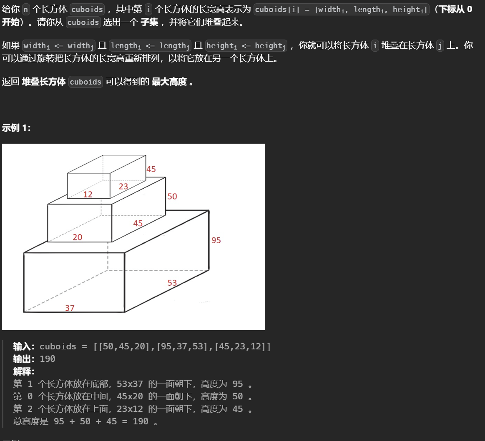

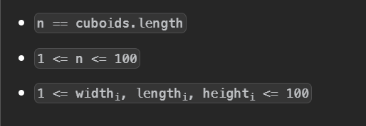

对于一个合法的堆叠，长方体 j 能够放在长方体 i 上必然要求三个边长排序后要都大于i的三个排序后的边长，因此将长方体按照排序后的边长排序，这样前面的一定不能放在后面的下方，但是后面有可能放在前面的下方，由于长方体可以旋转因此暴力枚举出每个长方体边长的全排列，定义dp(i,j)表示第I+1个长方体作为最后一个，当第i+1个长方体的排列为j时最大的高度是多少。

```python
class Solution:
    def maxHeight(self, cuboids: List[List[int]]) -> int:
        # 排序
        for c in cuboids:
            c.sort()
        # 排序，预处理全排列
        nums=[list(permutations(v)) for v in sorted(cuboids)]
        @cache
        def dp(i,j):
            res=0
            for pre in range(i):
                # 枚举前面的全排列
                for c,(x,y,z) in enumerate(nums[pre]):
                    # 要满足条件
                    if x<=nums[i][j][0] and y<=nums[i][j][1] and z<=nums[i][j][2]: 
                        res=max(res,dp(pre,c))
            return res+nums[i][j][-1]
        n=len(nums)
        # 找出最大的
        return max(dp(i,j) for i in range(n) for j in range(6))
```


## [删列造序 III](https://leetcode.cn/problems/delete-columns-to-make-sorted-iii/)

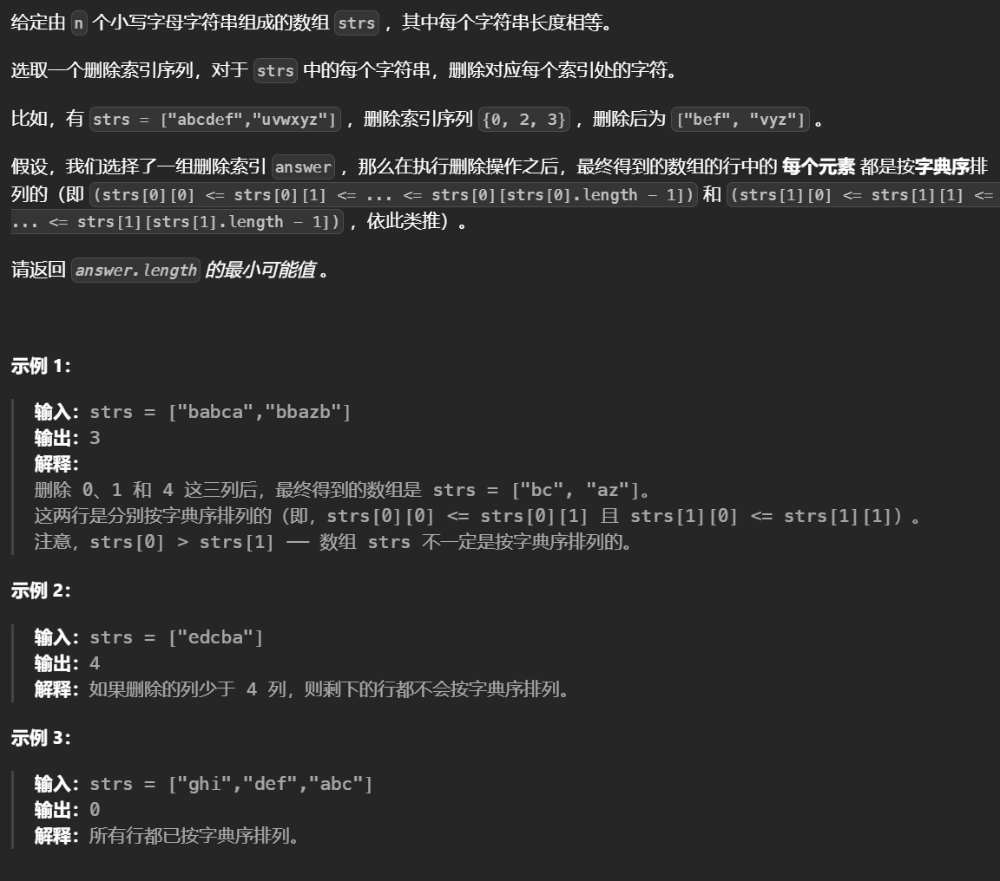

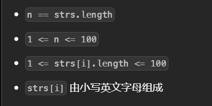

删除最少的下标，即保留最长的公共递增子序列。这里的公共指的是有相同的下标，定义dp(i)表示以索引i结尾的最长公共递增子序列，那么在i的左侧需要找到一个对于所有序列来说都小于当前字符的字符

```python
class Solution:
    def minDeletionSize(self, strs: List[str]) -> int:
        @cache
        def dp(i):
            if i<0:return 0
            ans=0
            for j in range(i):
                # 需要对所有的序列都满足条件
                for k in range(len(strs)):
                    if strs[k][j]>strs[k][i]:break
                else:
                    ans=max(ans,dp(j))
            return ans+1
        return len(strs[0])-max(dp(i) for i in range(len(strs[0])))
```


## [得到子序列的最少操作次数](https://leetcode.cn/problems/minimum-operations-to-make-a-subsequence/)

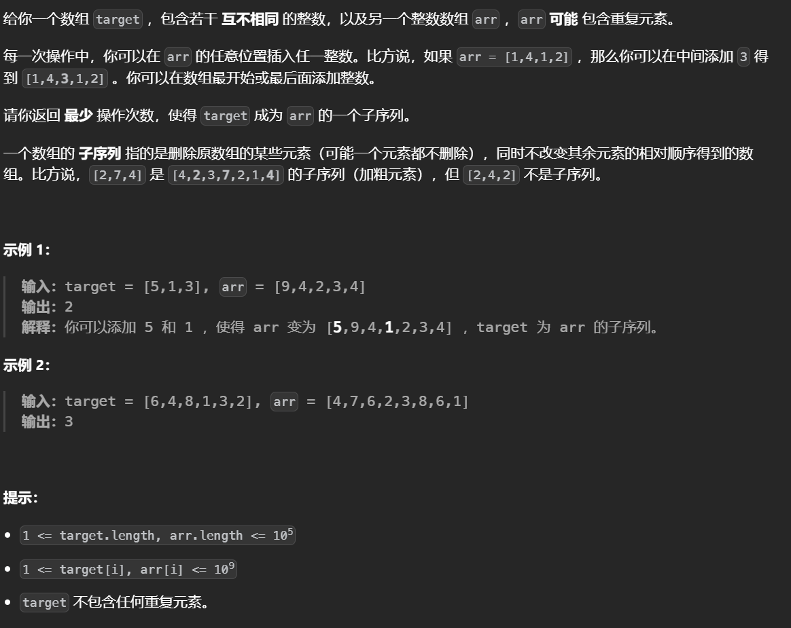

似乎是一个经典的做法，关键点在于target元素互不相同，这样可以**将nums中的元素映射为target中对应元素的下标**，将target作为子序列，那么就是在转换后的nums数组中找到最长递增子序列

```python
class Solution:
    def minOperations(self, target: List[int], arr: List[int]) -> int:
        nums=[]
        memo={v:i for i,v in enumerate(target)}
        for v in arr:
            if v in memo:
                nums.append(memo[v])
        g=[]
        for v in nums:
            j=bisect_left(g,v)
            if j==len(g):
                g.append(v)
            else:
                g[j]=v
        return len(target)-len(g)
```


# 状态机DP


## [买卖股票的最佳时机 II](https://leetcode.cn/problems/best-time-to-buy-and-sell-stock-ii/)

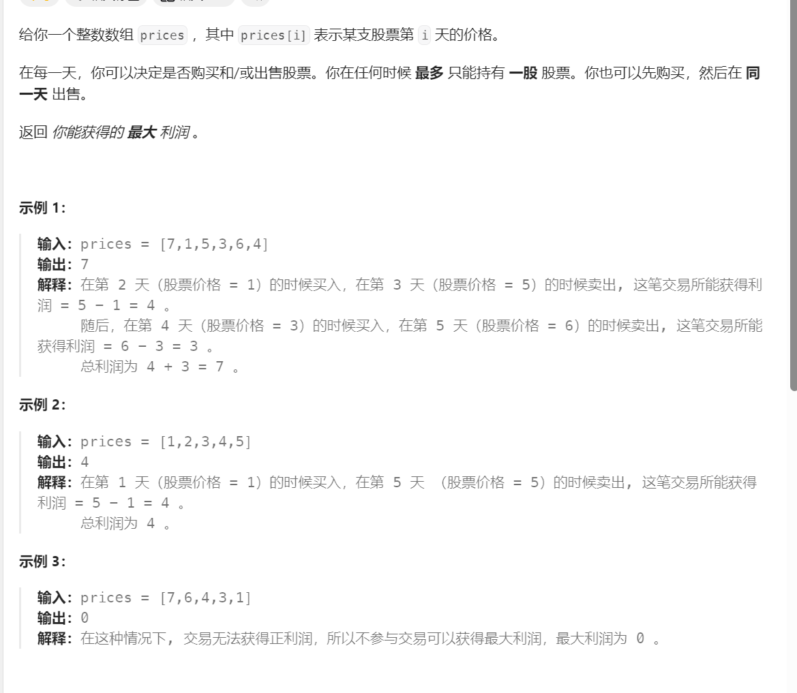

0到i天获得的利润可以由0到i-1天获得的利润加上第i天进行的操作求解得出，关键在于定义状态是否持有股票。

定义dp(i,hold)为第i天所获得的利润，hold表示是否持有股票。

```python
class Solution:
    def maxProfit(self, prices: List[int]) -> int:
        n=len(prices)
        @cache
        def dp(i,hold):
            # 一开始是不会持有股票的，因此定义一个不会取到的状态
            if i<0:
                return 0 if not hold else -inf
            # 如果持有股票，可以是前一天就有，也可能是今天买的利润要减去
            if hold :
                return max(dp(i-1,True),dp(i-1,False)-prices[i])
           # 反之，可能是今天买了，或者是本来就没有
            return max(dp(i-1,False),dp(i-1,True)+prices[i])
        return dp(n-1,False)

```

## [买卖股票的最佳时机 IV](https://leetcode.cn/problems/best-time-to-buy-and-sell-stock-iv/)

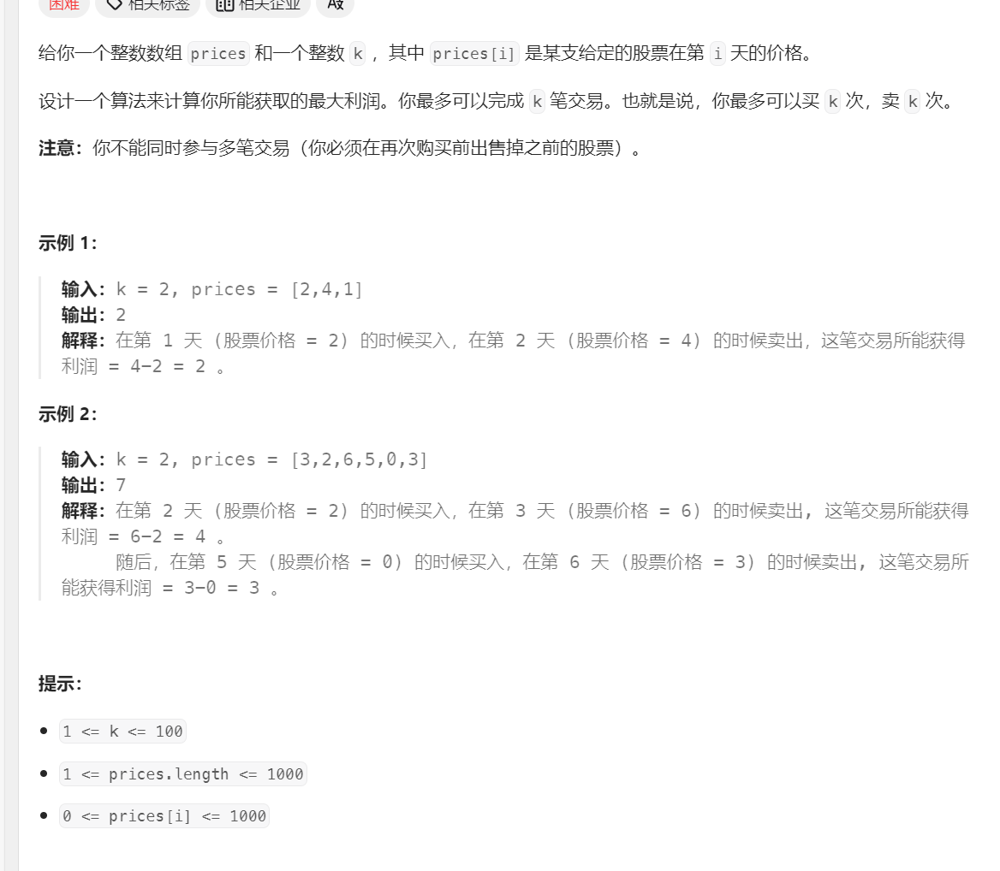

多出一个状态表示进行了几次买卖，如果买卖次数小于0了则是一个不合法的状态，注意一次买一次卖才算一次操作，有卖必有买，因此在卖或者买的一个位置将次数减一即可。

```python
class Solution:
    def maxProfit(self, k: int, prices: List[int]) -> int:
        n=len(prices)
        @cache
        def dp(i,j,hold):
            if j<0:
                return -inf
            if i<0:
                return -inf if hold else 0
            if hold:
                return max(dp(i-1,j,1),dp(i-1,j,0)-prices[i])
            return max(dp(i-1,j,0),dp(i-1,j-1,1)+prices[i])
        return dp(n-1,k,0)
```


如果要求恰好是k次，则修改判断边界条件。

```python
class Solution:
    def maxProfit(self, k: int, prices: List[int]) -> int:
        n=len(prices)
        @cache
        def dp(i,j,hold):
            if j<0:
                return -inf
            if i<0:
                # 这里j必须等于0，大于或者小于都不行
                return -inf if hold or j>0 else 0
            if hold:
                return max(dp(i-1,j,1),dp(i-1,j,0)-prices[i])
            return max(dp(i-1,j,0),dp(i-1,j-1,1)+prices[i])
        return dp(n-1,k,0)
```


如果要求是至少的话，当次数减小到了0相当于进行无限次交易，因此取出j<0的边界条件

```python
class Solution:
    def maxProfit(self, k: int, prices: List[int]) -> int:
        n=len(prices)
        @cache
        def dp(i,j,hold):
            if i<0:
                # 这里j必须小于等于0，表示至少进行了k次
                return -inf if hold or j>0 else 0
            if hold:
                return max(dp(i-1,j,1),dp(i-1,j,0)-prices[i])
            return max(dp(i-1,j,0),dp(i-1,j-1,1)+prices[i])
        return dp(n-1,k,0)
```

## [买卖股票的最佳时机 V](https://leetcode.cn/problems/best-time-to-buy-and-sell-stock-v/)

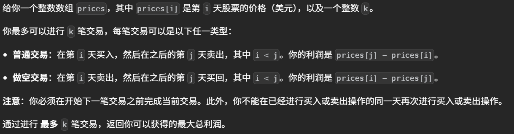

这里多出了一种操作，那么多出一个状态表示当前处于做空，状态转移方程也需要随之变化

- 如果持有股票，那么之前持有，之前没有或现在买的，
- 如果没有股票：之前没有，之前有现在卖了，之前是做空现在买回来了
- 做空状态，可以从做空状态转移过来，或者之前没有现在做空卖了


将操作次数定义为两种交易的第一个操作，如果是普通交易，那么在买入的时候算一次操作；如果是做空，那么在卖出时算一次操作。

```python
max=lambda x,y:x if x>=y else y
max3=lambda x,y,z:max(max(x,y),max(y,z))
class Solution:
    def maximumProfit(self, prices: List[int], k: int) -> int:
        n=len(prices)
        # 对操作次数做了一位偏移
        f=[[[-inf,-inf,-inf] for _ in range(k+2)] for _ in range(1+n)]
        for j in range(1,k+2):f[0][j][0]=0
        for i in range(1,n+1):
            for j in range(1,k+2):
                f[i][j][0]=max3(f[i-1][j][0],f[i-1][j][1]+prices[i-1],f[i-1][j][2]-prices[i-1])
                f[i][j][1]=max(f[i-1][j-1][0]-prices[i-1],f[i-1][j][1])
                f[i][j][2]=max(f[i-1][j][2],f[i-1][j-1][0]+prices[i-1])
                
        arr=f[-1]
        return f[-1][-1][0]
```


## [统计特殊子序列的数目](https://leetcode.cn/problems/count-number-of-special-subsequences/)

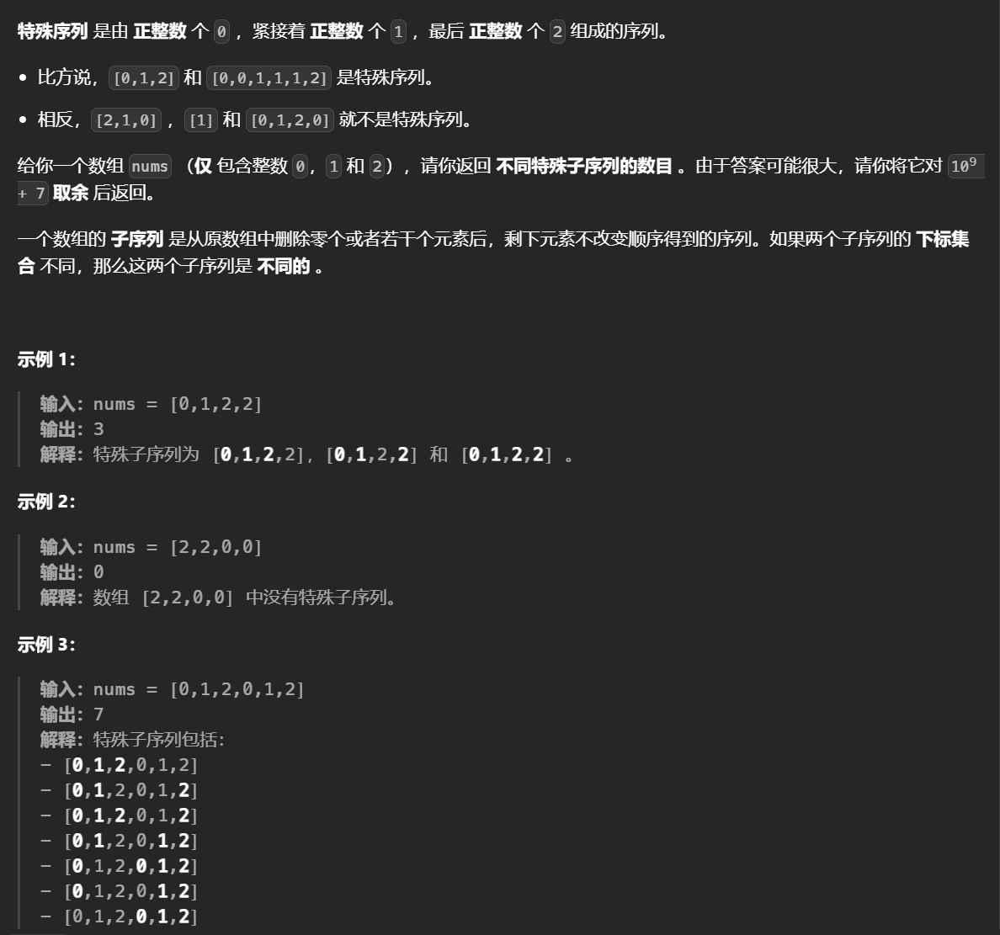

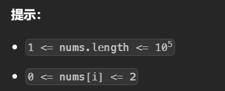

定义dp(i,0)为考虑前i个，全是0的子序列有多少个；dp(i,1)为考虑前i个，先0后1的子序列有多少个；dp(i,2)为考虑前i个，先0后1再2的子序列有多少个。

```python
class Solution:
    def countSpecialSubsequences(self, nums: List[int]) -> int:
        mod=10**9+7
        n=len(nums)
        @cache
        def dp(i,j):
            # 前0个自然是0
            if not i:
                return 0
            # j!=nums[i-1]那么只能由前面的状态转移过来
            if j!=nums[i-1]:return dp(i-1,j)
            # 如果不是0，那么可以选或不选，全是0的子序列可以由0单独组成一个，因此加1
            if not j:
                ans=dp(i-1,0)+dp(i-1,0)+1
            elif j==1:
                # 先0再1，1不能单独组成一个序列，只能和前面的0或者1拼接
                ans=dp(i-1,1)+dp(i-1,0)+dp(i-1,1)
            else:
                # 2与1同理
                ans=dp(i-1,2)+dp(i-1,2)+dp(i-1,1)
            ans%=mod
            return ans 
        return dp(n,2)   
```

## [和为奇数的子数组数目](https://leetcode.cn/problems/number-of-sub-arrays-with-odd-sum/)

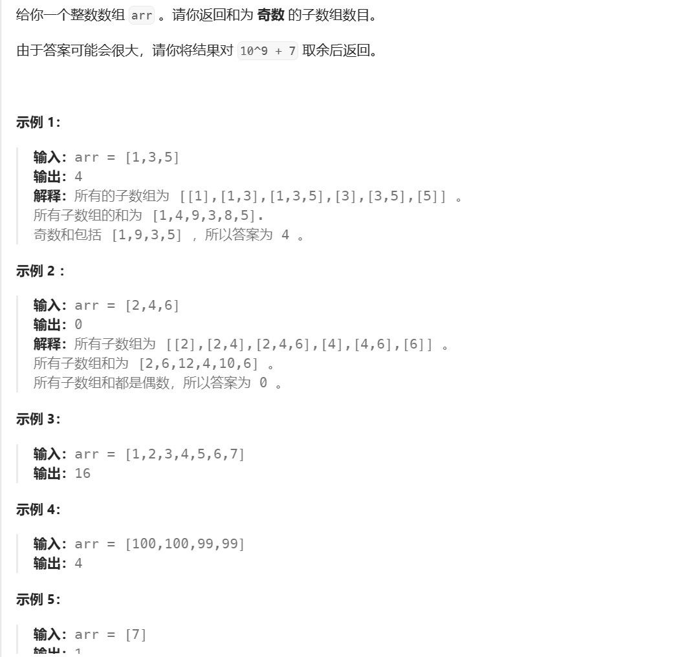

定义dp[i]表示以arr[i]结尾的子数组中和为奇数的子数组个数，对于arr[i+1]如果是偶数，那么能组成的奇数子数组的个数不会变（因为奇数加上偶数是奇数）也就是dp[i+1]不变。如果是奇数，那么就要以dp[i]就要变为1（自己单独）也为奇数和奇数组合为偶数，并且加上以arr[i-1]结尾的偶数子数组的个数。

```python
class Solution:
    def numOfSubarrays(self, arr: List[int]) -> int:
        m=10**9+7
        # dp表示以nums[i]结尾和为奇数的子数组个数
        # 初始化：第一位是奇数则为1
        ans=dp=int(arr[0]&1!=0)
        for i in range(1,len(arr)):
            val=arr[i]
            # 如果是奇数则只能等于(拼接到最后)前一位和为偶数的子数组数量
            # 因为是子数组 所以(i+1)-dp就是偶数子数组的个数
            if val&1:
                dp=(1+i)-dp
            ans+=dp
        return ans %m

```


## [子数组操作后的最大频率](https://leetcode.cn/problems/maximum-frequency-after-subarray-operation/)

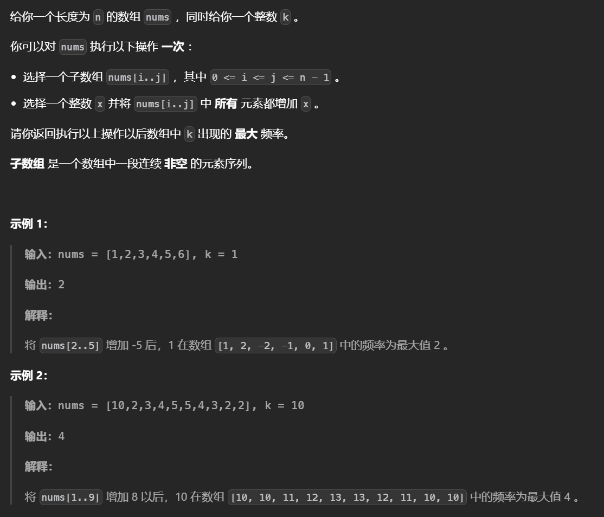

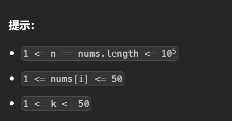

只允许做一次修改，观察数据范围突破点在值域，因此枚举将元素为j的改为k，其中j属于[1,50]，然后求解k的最大频率。

定义dp(i,j)，其中j~[0,2]：将整个数组划分为三段——被修改的子数组左侧，被修改的子数组，被修改的子数组右侧，dp(i,0)表示nums[i-1]\(做了一位偏移)位于左侧即未被修改，dp(i,1)表示nums[i-1]位于被修改的子数组，dp(i,2)表示nums[i-1]位于被修改的子数组右侧。

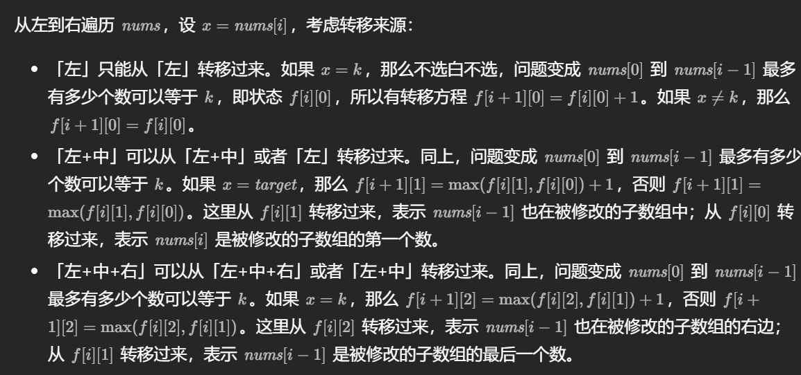


使用记忆化搜索超时，改为递推

```python
class Solution:
    def maxFrequency(self, nums: List[int], k: int) -> int:
        n=len(nums)
        ans=-inf 
        f=[[0]*3 for _ in range(n+1)]
        for target in set(nums):
            for i in range(1,n+1):
                x=nums[i-1]
                for j in range(3):
                    if not j:
                        f[i][j]=f[i-1][j]+int(x==k)
                    elif j==1:
                        f[i][j]=max(f[i-1][0],f[i-1][1])+int(x==target)
                    else:
                        f[i][j]=max(f[i-1][1],f[i-1][2])+int(x==k)
            ans=max(max(f[-1]),ans)
        return ans 
```

优化

```python
class Solution:
    def maxFrequency(self, nums: List[int], k: int) -> int:
        n=len(nums)
        ans=-inf 
        
        for target in set(nums):
            f0=f1=f2=0
            for x in nums:
                f2=max(f1,f2)+int(x==k)
                f1=max(f0,f1)+int(x==target)
                f0=f0+int(x==k)
            ans=max(f0,f1,f2,ans)
        return ans 
```

## [最大波动的子字符串](https://leetcode.cn/problems/substring-with-largest-variance/)

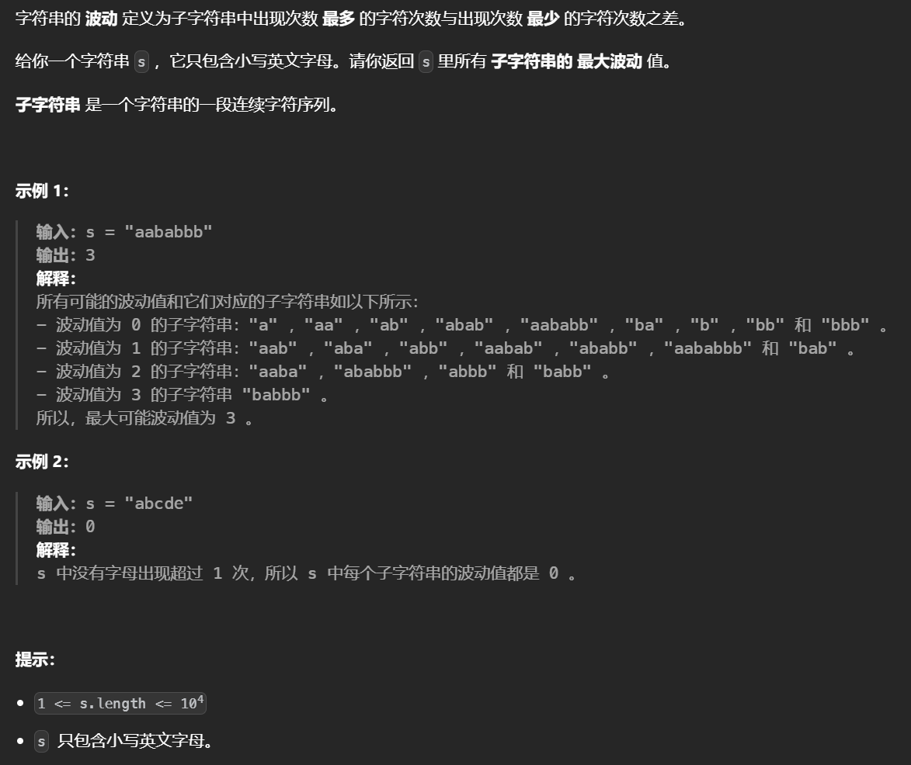

观察数据范围可知问题可以在26\*26\*n的范围内解决，因此枚举小写字母对(a,b)分别表示子字符串中最多的和最少的字母，为了得到最大波动值，**将a转换为1，b转换为-1，其他转换为0**，这样问题就变为了求解最大子数组和。本题中要求合法的子字符串必须同时包含a和b，因此多一重状态表示是否包含b


```python
class Solution:
    def largestVariance(self, s: str) -> int:
        n=len(s)
        ans=0
        
        # 枚举
        for ii in range(26):
            for jj in range(26):
                if ii==jj:continue
                # 转换
                def cal(idx):
                    if s[idx]==chr(ord('a')+ii):return 1
                    elif s[idx]==chr(ord('a')+jj):return -1 
                    return 0
                #滚动数组，f0表示未包含b时，以当前字符结尾的子字符串的最大和
                f0=0
                # 反之
                f1=-inf
                
                for i in range(1,n+1):
                    # b
                    if cal(i-1)<0:
                        # 可以从前面转移过来或者自己单独
                        f1=max(f0,f1,0)-1
                        # 当前字符是b，f0为不合法状态
                        f0=-inf
					# a
                    elif cal(i-1)==1:
                        # 单独或者拼接
                        f0=max(f0,0)+1
                        # 拼接
                        f1=f1+1
                    ans=max(f1,ans)
        return ans    
```


在上面的递推过程中，只会在s[i]==a或b时才会更新状态，对于其他的字符是不会更新f的，也就是浪费了大量的时间去访问无用的状态，因此可以通过枚举s中的每个字符同时更新所有的状态。	

```python
class Solution:
    def largestVariance(self, s: str) -> int:
        n=len(s)
        ans=0
        # f[a][b]表示最多的字符是a，最少的字符是b的子数组最大和，该状态是滚动数组
        f0=[[0]*26 for _ in range(26)]
        f1=[[-inf]*26 for _ in range(26)]
        # 枚举s中的字符
        for ch in map(ord,s):
            ch-=ord('a')
            # 枚举其他状态
            for i in range(26):
                if i==ch:continue
                f0[ch][i]=max(f0[ch][i],0)+1
                f1[ch][i]=f1[ch][i]+1

                # 注意顺序不要颠倒
                f1[i][ch]=max(f1[i][ch],f0[i][ch],0)-1
                f0[i][ch]=-inf

                ans=max(ans,f1[i][ch],f1[ch][i])
        return ans 
```


# 子序列DP

## [不同的好子序列数目](https://leetcode.cn/problems/number-of-unique-good-subsequences/)

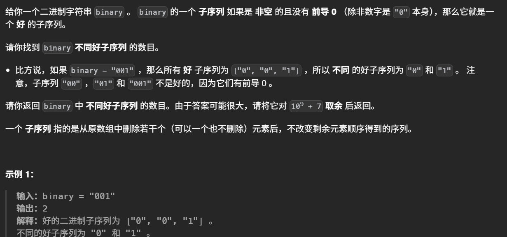

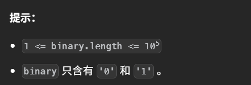

将字符串颠倒转换为求解以1结尾的不同子序列个数，由于以0结尾的子序列是可以得到以1结尾的子序列，那么定义dp[i]\[0/1]为前i个元素中以0/1结尾的子序列个数，转移的时候不考虑题目的要求，计算处所有的可能，最后答案为dp[n]\[1]来满足以1结尾的条件

```python
class Solution:
    def numberOfUniqueGoodSubsequences(self, s: str) -> int:
        mod=10**9+7
        # 颠倒
        s=s[::-1]
        n=len(s)
        f=[[0,0] for _ in range(n+1)]
        for i,c in enumerate(s,1):
            c=int(c)
            # 从上一位的0或1转化过来，同时自己也会贡献1
            f[i][c]=(f[i-1][0]+f[i-1][1]+1)%mod
            # c^1也要转移
            f[i][c^1]=f[i-1][c^1]
        # 最后特判单独的0
        return f[-1][1]+int('0' in s)
```


# 划分型DP


## 判定是否能划分

一般定义f[i]表示常为i的前缀a[:i]是否能划分


## 最优化分

### [分割回文串 II](https://leetcode.cn/problems/palindrome-partitioning-ii/)

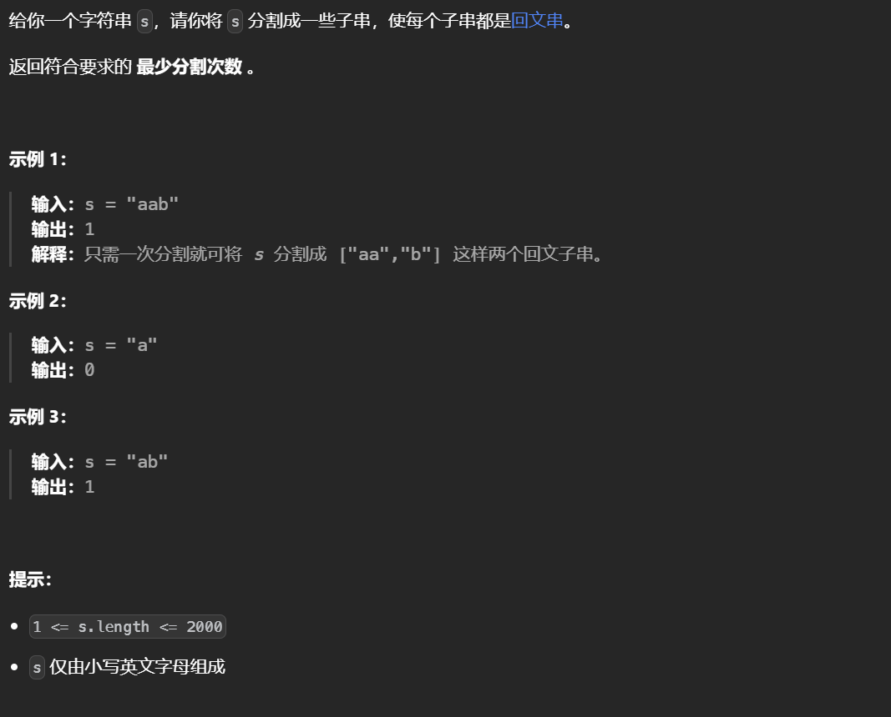

定义dp(i)表示s[:i]划分为回文串所需的最小操作次数，如果s[:i]本身是回文串那么直接返回0，反之枚举端点L，判断s[L:i]是否是回文串如果是则更新ans为dp(L)+1，对于给定的数据范围不能线性判断回文串需要使用dp帮助求解，令check(i,j)表示s[i,j]为回文串所需的最少操作次数。

```python
class Solution:
    def minCut(self, s: str) -> int:
        @cache
        def check(i,j):
            if i>=j:return True
            return s[i]==s[j] and check(i+1,j-1)
        @cache
        def dp(i):
            if check(0,i-1):return 0
            ans=inf 
            for j in range(1,i):
                if check(j,i-1):
                    ans=min(ans,dp(j)+1)
            return ans 
        n=len(s)
        return dp(n)
```


### [对字母串可执行的最大删除数](https://leetcode.cn/problems/maximum-deletions-on-a-string/)

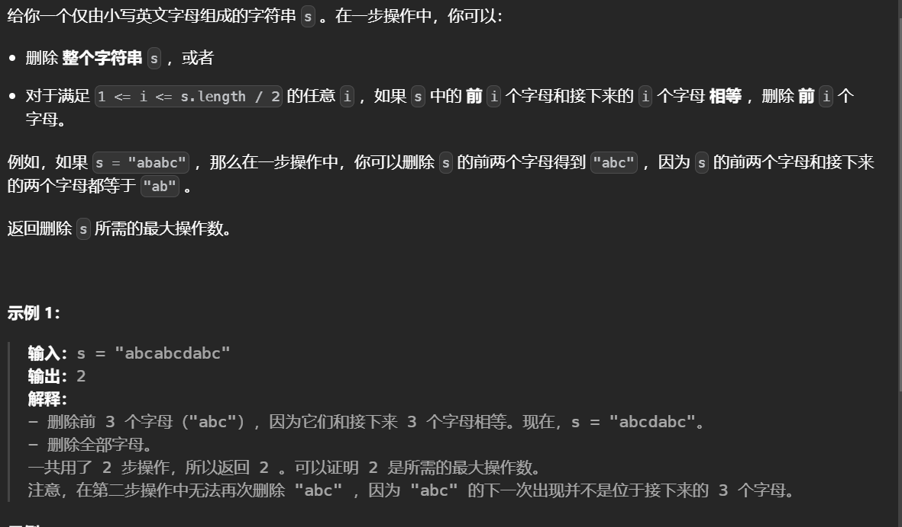

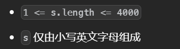


定义dp(i)表示删除s[i:]所需的最大操作次数，显而易见的枚举再每一个端点时要删除的长度，关键在于如何快速判断s[i:i+j]==s[i+j:j+j]是否相等，这里用字符串哈希判断。

```python
class Solution:
    def deleteString(self, s: str) -> int:
        n=len(s)
        # 字符串哈希模板
        pre=[0]*(n+1)
        p=131
        P=[1]
        mod = 998244353
        for i,c in enumerate(s,1):
            pre[i]=(pre[i-1]*p+ord(c))%mod
            P.append((P[-1]*p)%mod)
        
        # 定义g[i]表示删除s[i:]所需的最大操作次数
        g=[1]*n
        for i in range(n-1,-1,-1):
            # 枚举长度
            for j in range(1,((n-i)//2)+1):
                # 用字符串哈希加快判断
                if i+j+j<n+1 and (pre[i+j]-pre[i]*P[j])%mod==(pre[j+i+j]-pre[i+j]*P[j])%mod:
                    # 手写max更块，8000->6000
                    if 1+g[i+j]>g[i]:g[i]=1+g[i+j]
        res=g[0]
        return res 
```

### [最小移动总距离](https://leetcode.cn/problems/minimum-total-distance-traveled/)

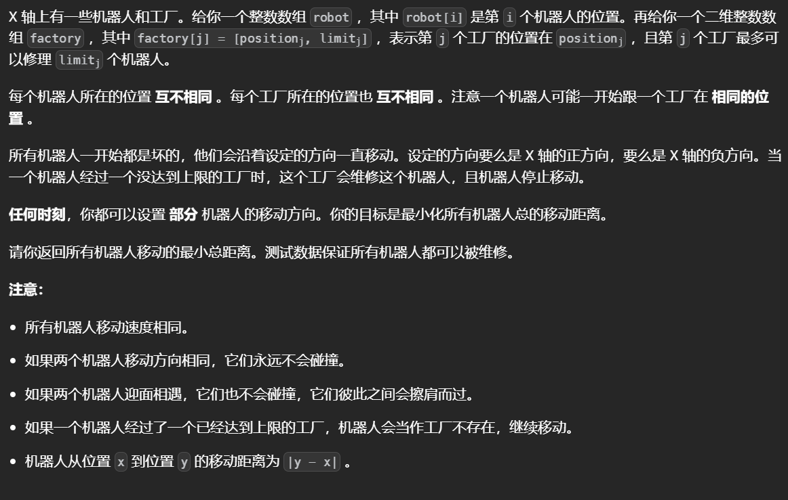

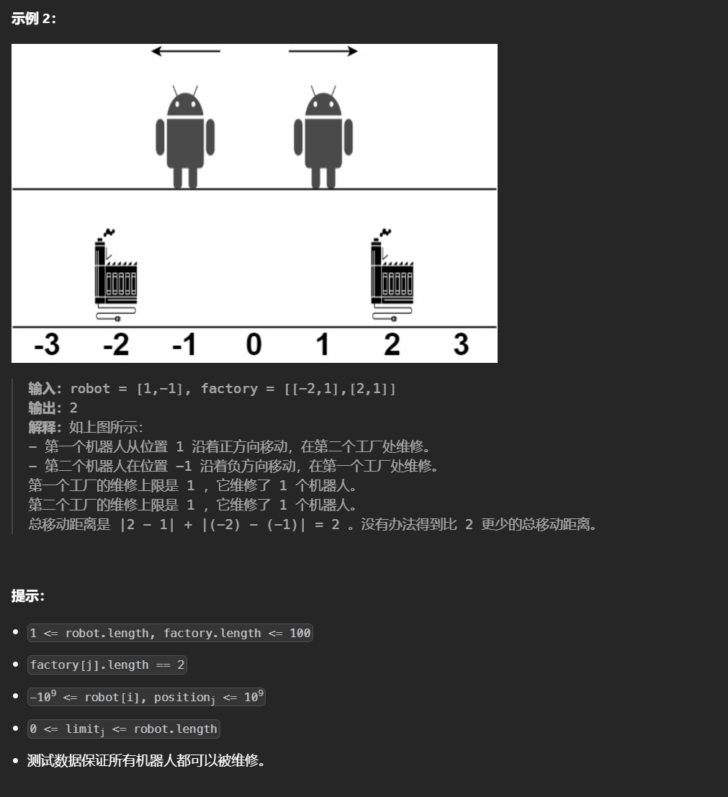

移动方向没什么用，本题可以看作是两组数相互匹配能得到的最小代价，代价定义为距离绝对值之和。

设最优方案中，机器人 *i* 被送去工厂 $t_i$。**注意到关键结论：存在最优方案，使得 $t_i$是不严格单调递增的**，使用邻项交换法证明，假设x,y表示机器人的位置，tx,ty表示工厂的位置，其中x<y,tx<ty，由下图可知如果x匹配到ty，y匹配到tx的距离必然要小于等于x匹配tx，y匹配ty，**因此相当于每个工厂匹配一组机器人。**

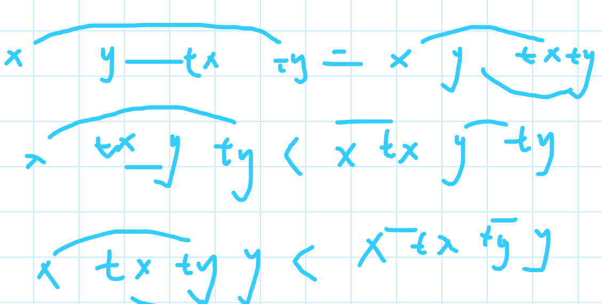


```python
class Solution:
    def minimumTotalDistance(self, robot: List[int], factory: List[List[int]]) -> int:
        n,m=len(robot),len(factory)  
        robot.sort()
        factory.sort()     
        @cache 
        def dp(i,j):
            if j==n:return 0
            if i==m:return inf
            t=0
            ans=inf
            for k in range(factory[i][1]+1):
                ans=min(ans,dp(i+1,j+k)+t)
                if j+k>=n:break
                t+=abs(robot[j+k]-factory[i][0])
            return ans 
        return dp(0,0)
```

邻项交换法还可以证明对于两组相互匹配的数（长度相等），必然是最小匹配最小，第二小匹配第二小才能得到最小的代价。 [使数组相似的最少操作次数](https://leetcode.cn/problems/minimum-number-of-operations-to-make-arrays-similar/solutions/1917721/by-tsreaper-sl0y/) 

### [字符串转换需要的最小操作数](https://leetcode.cn/problems/minimum-steps-to-convert-string-with-operations/)

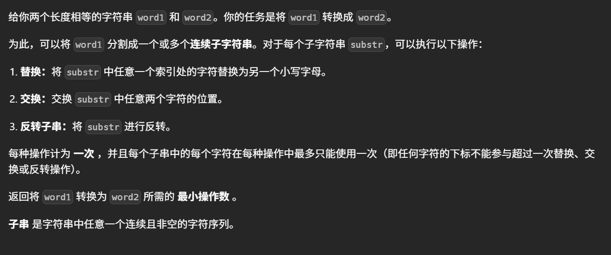

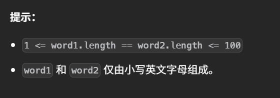

对于给定的数据范围可以去枚举每一段的长度从而转换为划分问题，定义f[i]表示前i个字母能转换为word2的最小操作次数，关键在于对于两段子串如何得到最小的操作次数。

这里发现操作二实际上就等于两次操作一，因此贪心的思想优先执行操作二，对于不匹配的位置如果有相反的数对就可以通过一次操作二求解，如果不存在只能进行操作一。对于操作三实际上颠倒再求解一次即可。

```python
class Solution:
    def minOperations(self, s: str, t: str) -> int:
        
        n=len(s)
        f=[0]*(n+1)
        for i in range(n):
            # 枚举左端点
            for j in range(i,-1,-1):
                memo=defaultdict(int)
                res=rev_res=0
                # 反转操作要多一次
                rev_res+=1
                # 遍历，贪心求解
                for idx in range(i,j-1,-1):
                    if s[idx]!=t[idx]:
                        # 能通过操作二求解
                        if (t[idx],s[idx]) in memo:
                            memo[(t[idx],s[idx])]-=1
                            if not memo[(t[idx],s[idx])]:del memo[(t[idx],s[idx])]
                        else:
                            # 只能通过操作一，如果后续有对应的数对，那么可以与之匹配同时也节省一次操作
                            memo[(s[idx],t[idx])]+=1
                            res+=1
                # 翻转一次
                memo=defaultdict(int)
                s[j:i+1]=s[j:i+1][::-1]
                for idx in range(i,j-1,-1):     
                    if s[idx]!=t[idx]:
                        if (t[idx],s[idx]) in memo:
                            memo[(t[idx],s[idx])]-=1
                            if not memo[(t[idx],s[idx])]:del memo[(t[idx],s[idx])]
                        else:
                            memo[(s[idx],t[idx])]+=1
                            rev_res+=1
                f[i+1]=f[j]+min(rev_res,res)
                s[j:i+1]=s[j:i+1][::-1]

        return f[-1]
```


## 约束划分个数

### [K 次调整数组大小浪费的最小总空间](https://leetcode.cn/problems/minimum-total-space-wasted-with-k-resizing-operations/)

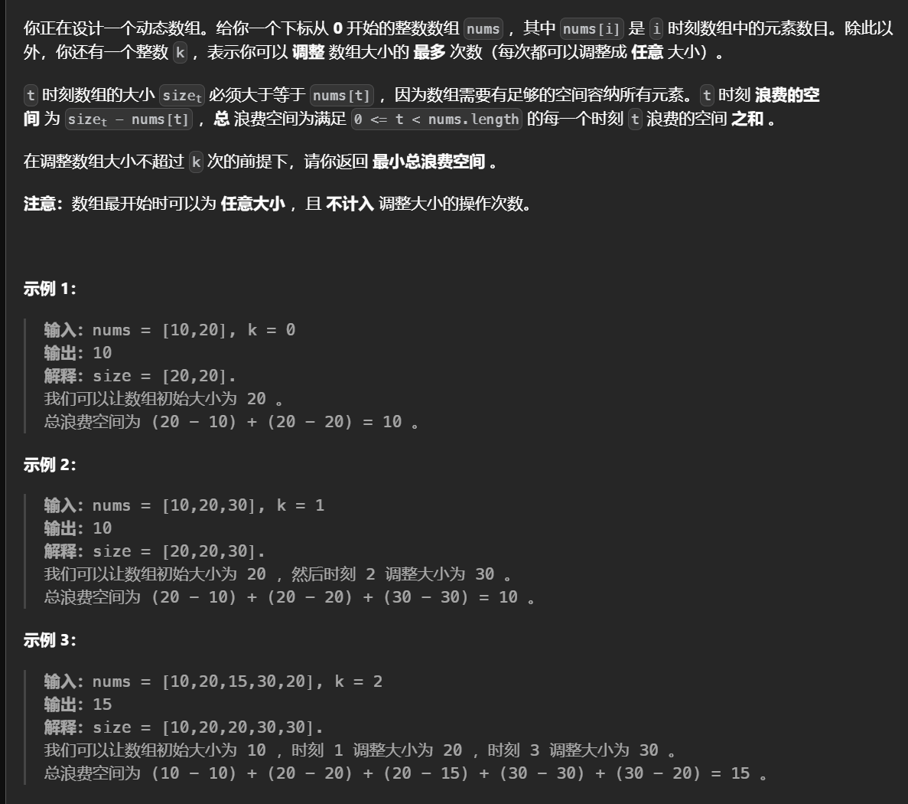

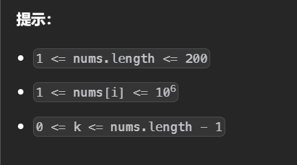

相当于把数组划分为最多k+1个子数组，每一个子数组的值代价等于子数组中的元素与某一个值做差，这里的值必然是子数组的最大值，题意要求需要大于等于子数组中的元素，为了代价最小，因此选择子数组的最大值。

定义f[i]\[j]表示前i个元素划分了j组

```python
class Solution:
    def minSpaceWastedKResizing(self, nums, k: int) -> int:
        n=len(nums)
        k+=1
        # 前缀和
        pre=list(accumulate(nums,initial=0))
        # 预处理出每一个子数组的代价
        cost=[[0]*n for _ in range(n)]
        for i in range(n):
            mx=nums[i]
            for j in range(i,n):
                if nums[j]>mx:mx=nums[j]
                cost[i][j]=mx*(j-i+1)-(pre[j+1]-pre[i])

        f=[[inf]*(k+1) for _ in range(n+1)]
        for i in range(1,n+1):
            f[i][1]=cost[0][i-1]
            # 划分的个数不超过当前位置
            for j in range(2,min(i,k)+1):
                # 枚举左端点你，如果使用递归不好实现
                # 枚举当前值与哪一个左端点形成一个子数组
                for l in range(i-1,j-2,-1):# 注意这个界限，需要预留已划分的元素
                    f[i][j]=min(cost[l][i-1]+f[l][j-1],f[i][j])
        return min(f[n])
```


### [完美分割的方案数](https://leetcode.cn/problems/number-of-beautiful-partitions/)

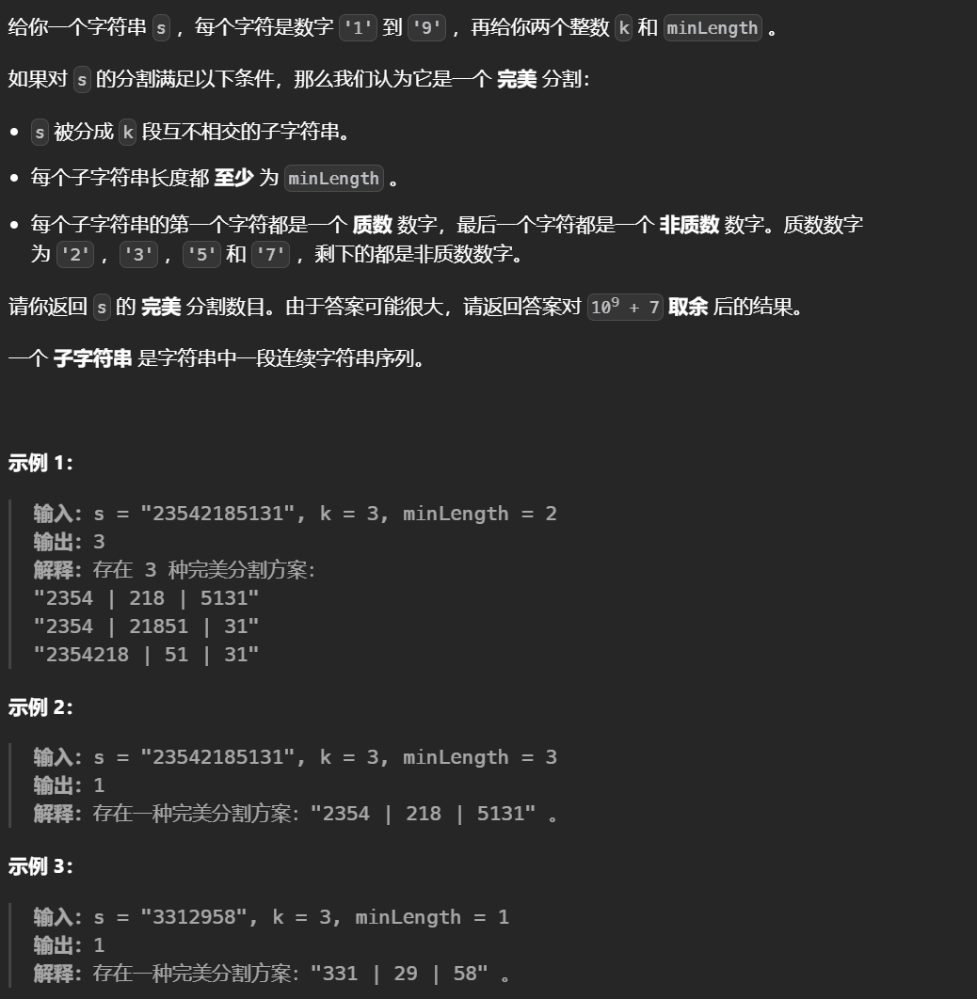

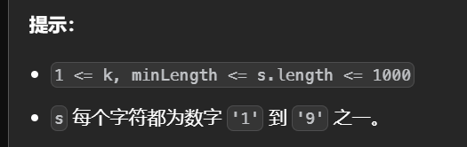


与上一题一样的思路，定义f[i]\[j]表示前i个元素划分了j组，但是这里的数据范围无法使用三层循环求解，必须要优化。难点在于前缀和的构建。

```python
class Solution:
    def beautifulPartitions(self, s: str, k: int, minLength: int) -> int:
        mod=10**9+7
        prime={'2','3','5','7'}
        n=len(s)
        f=[[0]*(k+1) for _ in range(n+1)]
        # 初始化
        f[0][0]=1
        if s[0] in prime:
            for i in range(minLength,n+1):
                if s[i-1] not in prime:f[i][1]=1
        p=[]# 质数的位置
        q=[]# 非质数的位置
        # 遍历数组划分质数和非质数
        for idx,v in enumerate(s):
            if v in prime:p.append(idx)
            else:q.append(idx)
        
        for idx in q:
            pos=bisect_left(p,idx-minLength+1+1)-1
            # 枚举划分的组数
            for j in range(2,min(i,k)+1):
                if pos<0:continue
                # 枚举左端点形成子数组，l是质数的位置，
                for l in p[:pos+1]:
                    f[idx+1][j]+=f[l][j-1]
                    f[idx+1][j]%=mod
        return f[n][k]
```


观察发现如果一个位置r是非质数那么它需要考虑前面所有的质数位置l，f[r]\[cnt]需要加上f[l]\[cnt-1]，这里的l做了一位偏移表示l-1位置，如果l-1位置是非质数那么有解，反之无解，因此相当于每个位置要加上之前的分界点(非质数与质数)，因此在使用前缀和优化的时候只有当位置是分界点的时候才会更新前缀和。

定义pre[i]\[j]表示前I个数，划分了j组时所有合法的方案数，这个前缀和只有在当前值处于分界点时才会更新，实际上这个前缀和没有什么含义，只适用于帮忙储存。


```python
class Solution:
    def beautifulPartitions(self, s: str, k: int, minLength: int) -> int:
        mod=10**9+7
        prime={'2','3','5','7'}
        # 可行性剪枝
        if s[0] not in prime or s[-1] in prime:return 0
        n=len(s)
        f=[[0]*(k+1) for _ in range(n+1)]
        pre=[[0]*(k+1) for _ in range(n+1)]
        # 初始化，只划分一组
        for i in range(minLength,n+1):
            if s[i-1] not in prime:f[i][1]=1
        
        for i in range(1,n+1):
            for cnt in range(1,k+1):
                # 延续
                pre[i][cnt]=pre[i-1][cnt]
                # 可以构成合法划分
                if i-minLength>=0 and s[i-1] not in prime:
                    f[i][cnt]+=pre[i-minLength][cnt-1]
                    f[i][cnt]%=mod
                # 只有是分界点才会更新
                if s[i-1] not in prime and i+1<=n and s[i] in prime:
                    pre[i][cnt]+=f[i][cnt]
                    pre[i][cnt]%=mod

        return f[n][k]
```


### [K 个不相交子数组的最大能量值](https://leetcode.cn/problems/maximum-strength-of-k-disjoint-subarrays/)

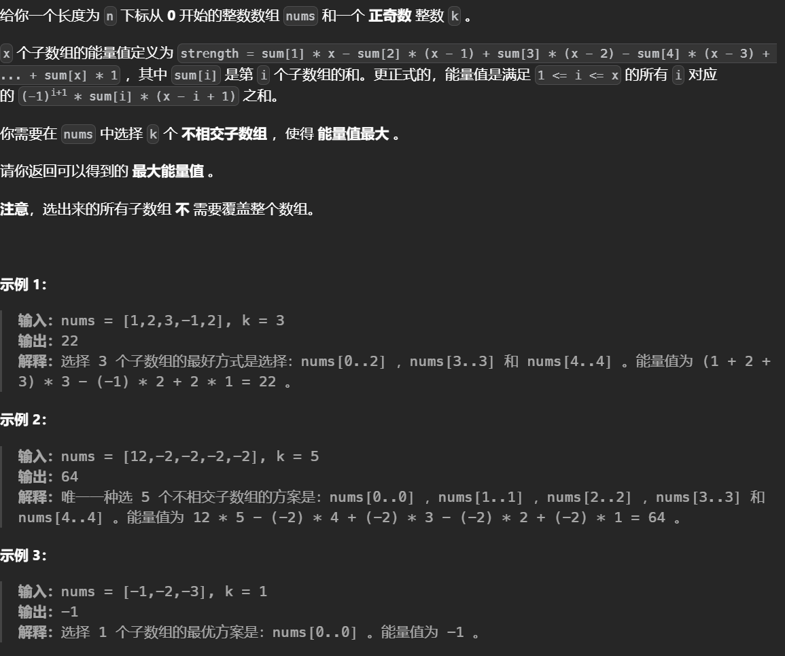

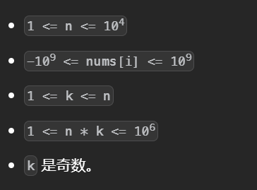

定义f[i]\[j]表示前i个元素已经划分了为j段，可以得到的**最大能量值**，对于第i个元素有选或不选，如果选择则枚举左端点

```python
for r in range(1,n+1):
    for j in range(1,k+1):
        f[r][j]=max(f[r][j],f[r-1][j])
        ssum[r][j]=ssum[r-1][j]
        for l in range(r-1,j-2,-1):
            w=(k-j+1)*pow(-1,j+1)
            f[r][j]=max(f[r][j],f[l][j-1]+(pre[r]-pre[l]*w)
```


显然对于给定的数据范围必须优化，对转移方程不好构造前缀和公式因为枚举的l在第一维，因此转换状态定义f(i,j)表示前j个数已经划分了i组，有

```python
class Solution:
    def maximumStrength(self, nums: List[int], k: int) -> int:
        n=len(nums)
        def cal(j):return (k-j+1)*pow(-1,j+1)
        pre=list(accumulate(nums,initial=0))
        
        f=[[-inf]*(n+1) for _ in range(k+1)]
        f[0]=[0]*(n+1)

        for i in range(1,k+1):
            # 枚举的数有范围限制，保证前后可以划分
            for j in range(i,n-(k-i)+1):
                # 以j结尾的组的左端点的前一位
                for l in range(i-1,j):
                    f[i][j]=max(f[i][j],f[i-1][l]+(pre[j]-pre[l])*cal(i))
        return max(f[k])
```

观察到随着j的增加1，需要枚举的l也会增加1，因此定义mx在每一轮j中更新最大值

```python
class Solution:
    def maximumStrength(self, nums: List[int], k: int) -> int:
        n=len(nums)
        def cal(j):return (k-j+1)*pow(-1,j+1)
        pre=list(accumulate(nums,initial=0))
        
        f=[[-inf]*(n+1) for _ in range(k+1)]
        f[0]=[0]*(n+1)

        for i in range(1,k+1):
            mx=-inf
            # 枚举的数有范围限制，保证前后可以划分
            for j in range(i,n-(k-i)+1):
                mx=max(mx,f[i-1][j-1]-pre[j-1]*cal(i))
                # 以j结尾的组的左端点的前一位
                f[i][j]=max(f[i][j-1],pre[j]*cal(i)+mx)
        return max(f[k])
```


## 不相交区间


### [销售利润最大化](https://leetcode.cn/problems/maximize-the-profit-as-the-salesman/)

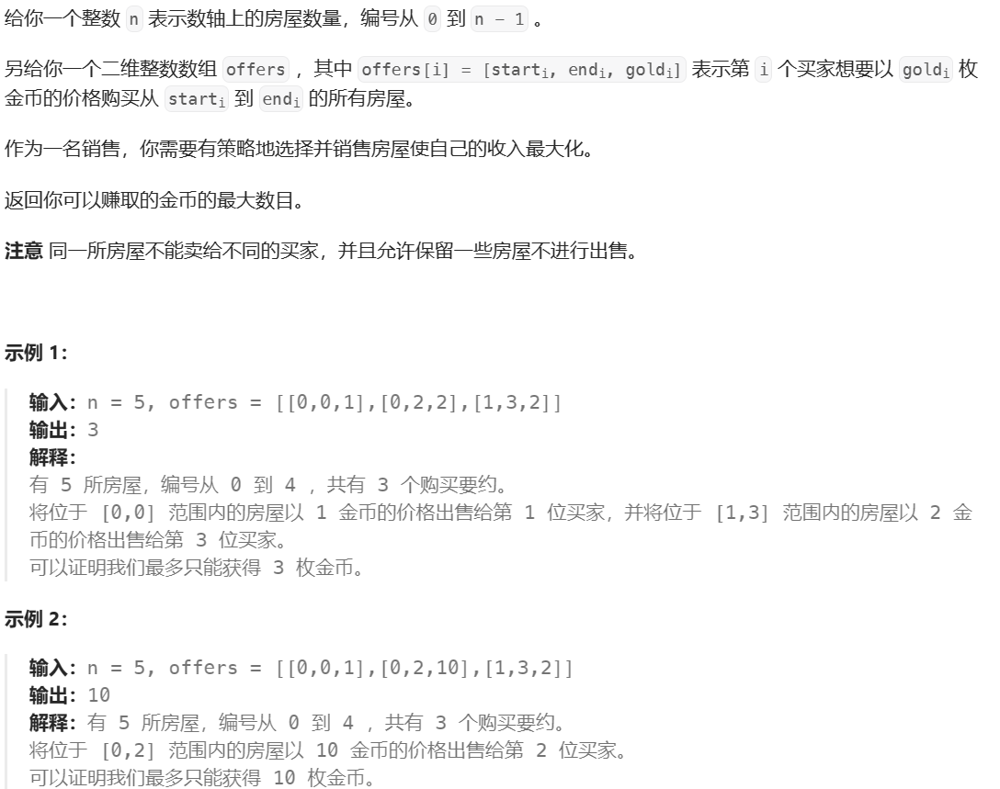

这里的状态定义是dp(i)表示考虑第i号房子能获得的最多金币，每个房子可以考虑卖或不卖

```python
class Solution:
    def maximizeTheProfit(self, n: int, offers: List[List[int]]) -> int:
        memo=[[]for _ in range(n)]
        # 通过数组记录上一个位置
        for s,e,w in offers:
            memo[e].append((s,w))

        @cache
        def dp(i):
            if i<0 :return 0
            # 不选往上转移，选了就是在区间前面转移过来
            return max(dp(i-1),max((dp(pre-1)+w for pre,w in memo[i]),default=0))
        return dp(n-1)

```


### [出租车的最大盈利](https://leetcode.cn/problems/maximum-earnings-from-taxi/)

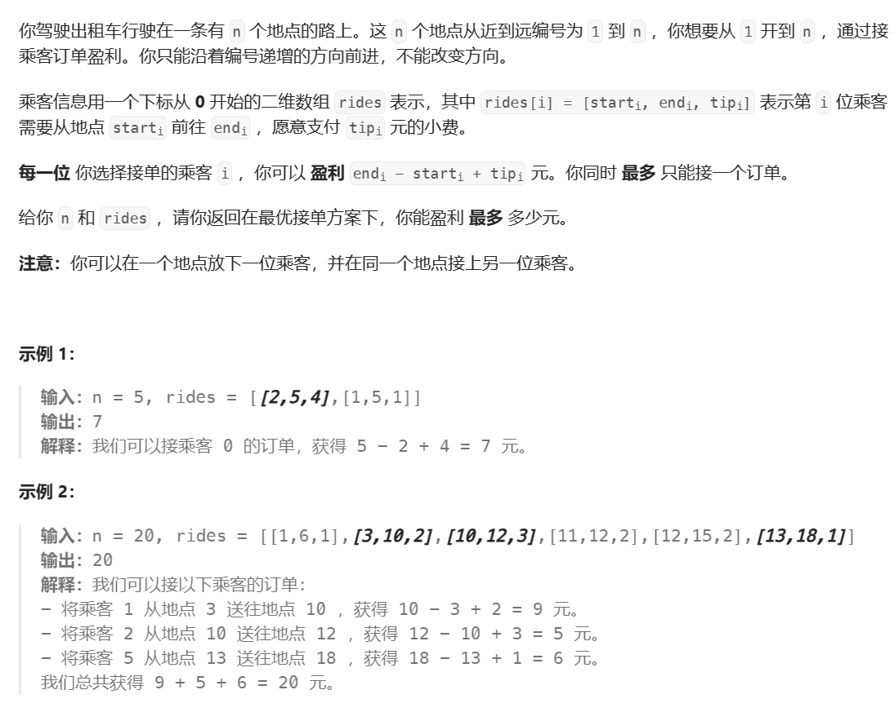

定义dp(i)表示到达第i个位置时的最大盈利

```python
class Solution:
    def maxTaxiEarnings(self, n: int, rides: List[List[int]]) -> int:
        memo=[[] for _ in range(n)]
        for l,r,w in rides:
            memo[r-1].append((l-1,w))

        # @cache
        # def dp(i):
        #     if i<0:return 0
        #     res=dp(i-1)
        #     if memo[i]:
        #         res=max(res,max(dp(pre)+w+i-pre for pre,w in memo[i]))
        #     return res
        # return dp(n-1)
        dp=[0]*n
        for i in range(n):
            if i-1>=0:dp[i]=dp[i-1]
            if memo[i]:dp[i]=max(dp[i],max(dp[pre]+w+i-pre for pre,w in memo[i]))
        return dp[-1]
```


### [规划兼职工作](https://leetcode.cn/problems/maximum-profit-in-job-scheduling/)

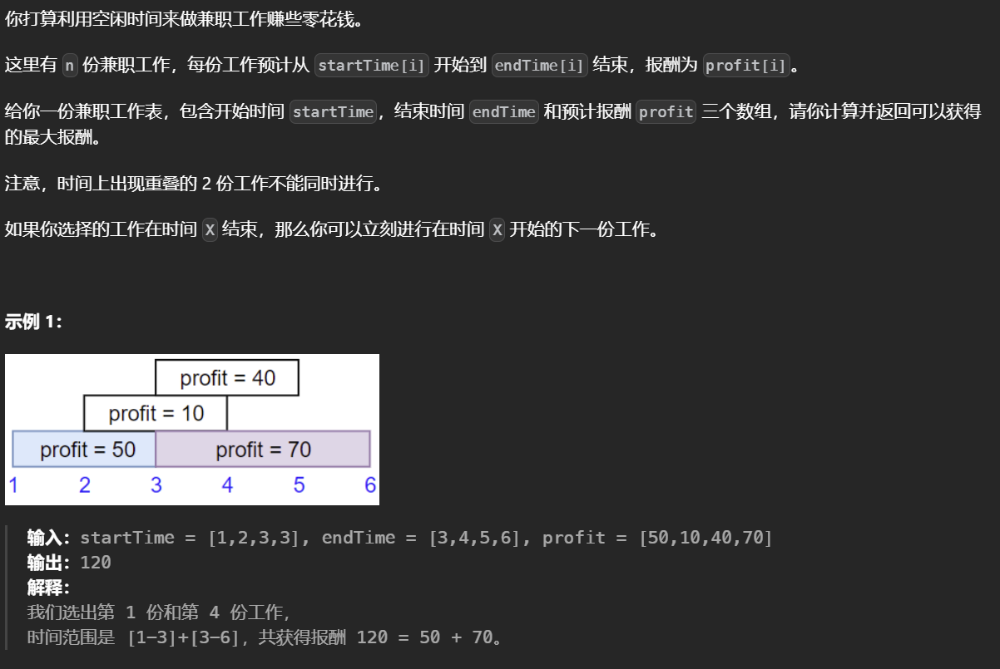

选或不选，令dp[i]为从0-i中在满足条件的情况下能得到的最大的报酬，为了满足条件可以区间按照(**结束时间，开始时间**)排序，当判断i-th时，使用二分快速找出合法的位置。

```python
class Solution:
    def jobScheduling(self, startTime: List[int], endTime: List[int], profit: List[int]) -> int:
        nums=[(i,j,w) for i,j,w in zip(startTime,endTime,profit)]
        nums.sort(key=lambda x:(x[1],x[0]))
        p=[x[1] for x in nums]
        n=len(nums)
        @cache
        def dp(i):
            if not i:return 0
            j=bisect_left(p,nums[i-1][0]+1,hi=i)-1
            if j<0:return max(dp(i-1),nums[i-1][2])
            a=dp(j+1)+nums[i-1][2]
            b=dp(i-1)
            return max(a,b)
        return dp(n)
```


在上一题的基础上多了一个状态

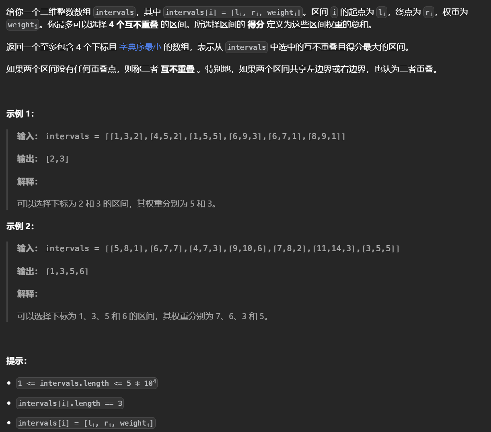

```python
class Solution:
    def maximumWeight(self, intervals: List[List[int]]) -> List[int]:
        # 答案要返回编号，因此数组中添加上编号
        nums=[[*arr,i] for i,arr in enumerate(intervals)]
        # 按照时间值排序
        nums.sort(key=lambda x:(x[1],x[0]))
        # 时间区间右端点
        p=[x[1] for x in nums]
        n=len(nums)

        @cache
        def dp(i,cnt):
            # base case
            if i<0:
                # 不合法
                if cnt:return [-inf]
                return [0] 
            # 选完了
            if not cnt:return [0]
            if i+1<cnt:return [-inf]
            j=bisect_left(p,nums[i][0],hi=i)-1
            
            # 这里的返回值要复制一遍，因为返回的是数组
            a=dp(i-1,cnt)[:]
            b=dp(j,cnt-1)[:]
            b[0]+=nums[i][2]

            b.append(nums[i][-1])
            if a[0]<b[0]:
                return b
            elif a[0]==b[0]:
                return min(a,b)
            return a
        ans=None
        # 4个不一定选满
        for i in range(1,5):
            res=dp(n-1,i)
            # 注意判断值最大，字典序最小
            res=[res[0]]+sorted(res[1:])
            if not ans or res[0]>ans[0]:ans=res[:]
            elif res[0]==ans[0] and res[1:]<ans[1:]:ans=res[:]
    
        
        return sorted(ans[1:])
```

## 相邻相关

### [合并得到最小旅行时间](https://leetcode.cn/problems/merge-operations-for-minimum-travel-time/)

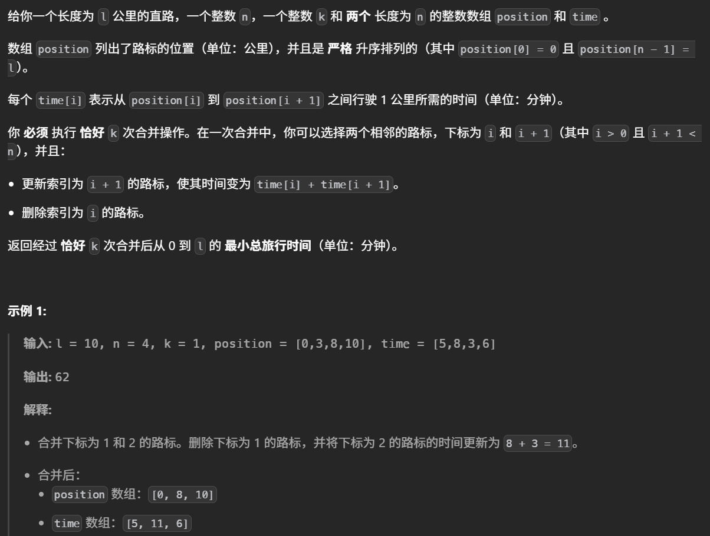

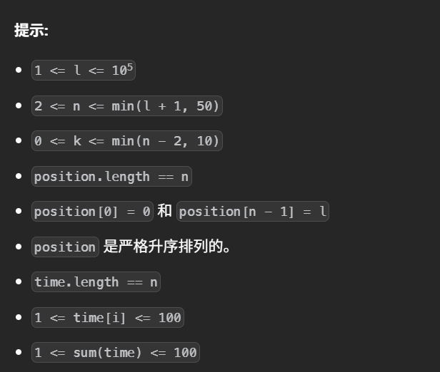

初始时认为是有n个区间，一次合并操作会使区间个数减一，示例1把time=[5,8,3,6] 划分成 [5],[8,3],[6] 三个子数组。

令[i,j]表示划分出的子区间，假设开始时有A=[i,j]，当划分了B=[j+1,nx]时，从position[j移动到position[nx]时所需的时间就是A区间的时间之和，因为题意中time[i]对应的是position[i]到position[i+1]，合并后的区间自然也要做偏移。

```python
class Solution:
    def minTravelTime(self, l: int, n: int, k: int, position: List[int], time: List[int]) -> int:
        # 前缀和加速求解时间
        pre=list(accumulate(time,initial=0))
        min=lambda x,y:x if x<y else y
        @cache
        # [i,j]表示区间，k是还要划分多少区间
        def dp(i,j,k):
            # 划分完毕
            if j==n-1:
                if k:return inf
                return 0
            
            res=inf
            # 对于给定的数据范围可以找下一个端点
            for nx in range(j+1,n):
                # 当前划分出的区间得到的分数是上一区间时间之和乘上当前区间和上一区间的距离
                val=(pre[j+1]-pre[i])*(position[nx]-position[j])
                res=min(res,val+dp(j+1,nx,k-1))
            return res 
        # 0位置不能合并，因为必须从0出发，因此要划分的区间减一
        return dp(0,0,n-k-1)
```


# [最长有效括号](https://leetcode.cn/problems/longest-valid-parentheses/)

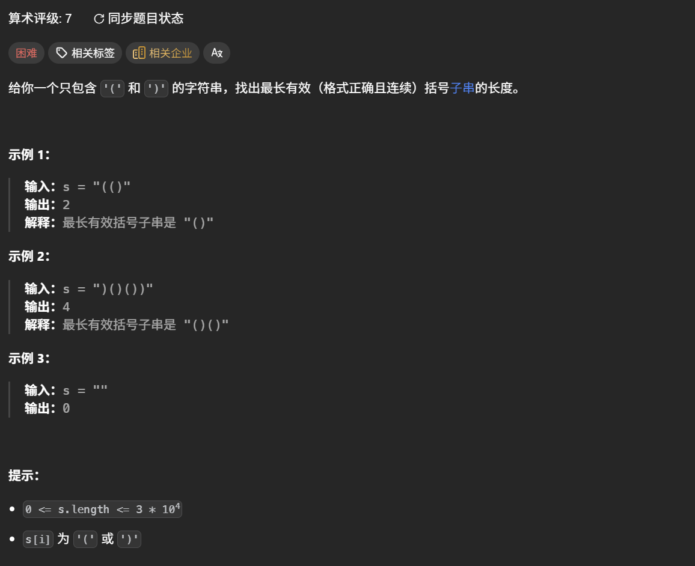


定义dp[i]为以第i个字符结尾时能得到最长的子串长度，当s[i]是(直接跳过。

如果前一位是(，那么有f[i]=2+f[i-2]；如果是)，那么去找不能与前一个位置形成最大合法子串的位置，如果当前位置不能和这个位置形成合法子串，那么也一定不能往前继续构成合法括号序列。

```python
class Solution:
    def longestValidParentheses(self, s: str) -> int:
        n=len(s)
        f=[0]*(n+1)
        for i,c in enumerate(s,1):
           # 对于(和第一个字符是一定不能形成合法序列的 
            if c==')' and i>1:
                # 可以构成一个括号
                if s[i-2]=='(':
                    f[i]=f[i-2]+2
                else:
                    # 找出不能和前一个位置形成合法括号序列的位置
                    sz=f[i-1]
                    pre=i-sz-1
                    # 如果这个位置是}，那么当前位置一定不能形成合法括号序列
                    if pre-1>=0 and s[pre-1]=='(':
                        f[i]=2+f[i-1]+f[pre-1]
        return max(f)
```


## [完成比赛的最少时间](https://leetcode.cn/problems/minimum-time-to-finish-the-race/)

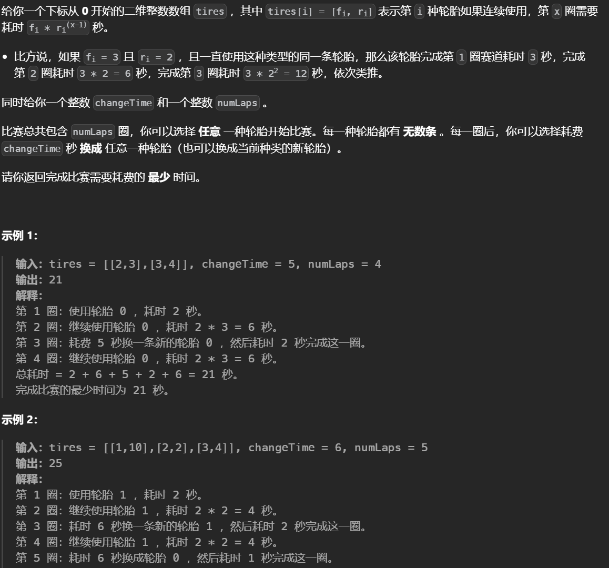

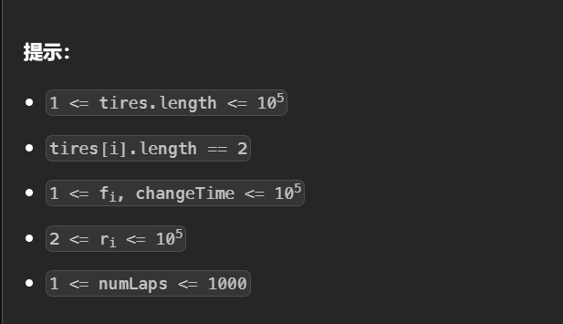

轮胎的耗时是指数增长的，因此一个轮胎可以使用的次数必然是有限制的

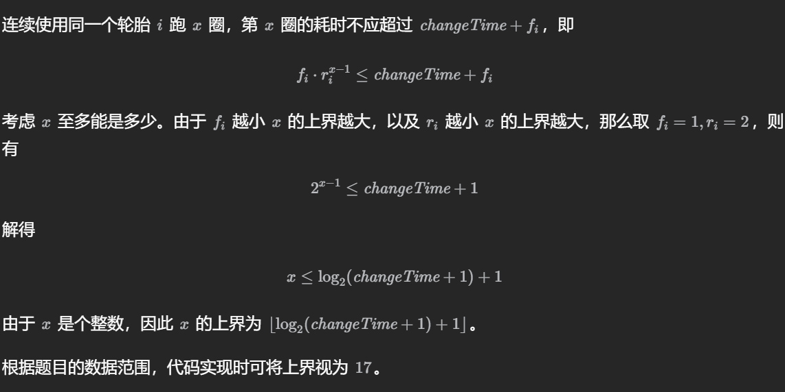


因此一个轮胎最多跑17圈就得更换，可以预处理minS[j]表示跑j圈所需的最小耗时，定义f[i]表示跑i圈的最小耗时，通过枚举最后一个轮胎跑了多少圈来转移。

```python
class Solution:
    def minimumFinishTime(self, nums, changeTime: int, numLaps: int) -> int:
        n=len(nums)
        minS=[inf]*18
        for f,r in nums:
            pre=0
            for j in range(1,18):
                pre+=f*pow(r,j-1)
                minS[j]=min(minS[j],pre)
        f=[inf]*(numLaps+1)
        f[0]=-changeTime
        for i in range(1,numLaps+1):
            for j in range(1,18):
                if i-j>=0:
                    f[i]=min(f[i],f[i-j]+changeTime+minS[j])
        return f[-1]
```

## [使字符频率相等的最少操作次数](https://leetcode.cn/problems/minimum-operations-to-make-character-frequencies-equal/)

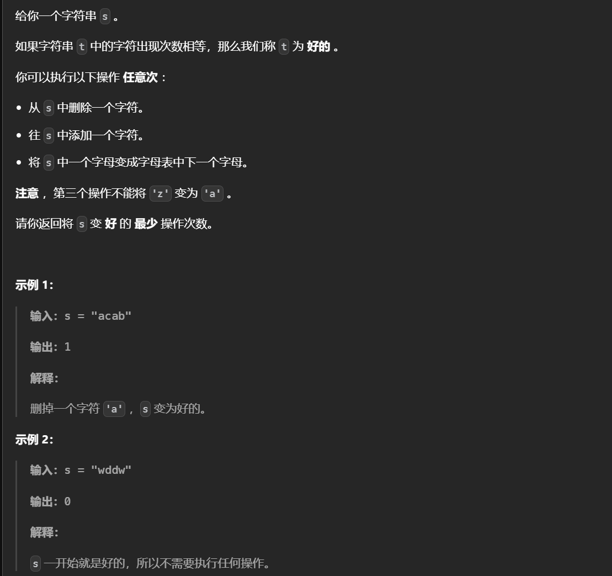


一次操作可以将一个字母转换为字母表中的下一个，联想到经典做法——定义f[i]表示前i种字母，结合给定的数据范围想到枚举字母的出现次数。

简化问题，如果只能增和删那么对于每种字母直接计算最小的操作次数即可，当字母可以向后转换时，一个字母想要满足当前枚举的出现次数时，如果其出现次数更小，那么字母表中的前一位可以通过向下转换来增大当前字母的个数并减小自己的出现次数从而减小操作次数。

对于每种字母可以保留也可以不保留：
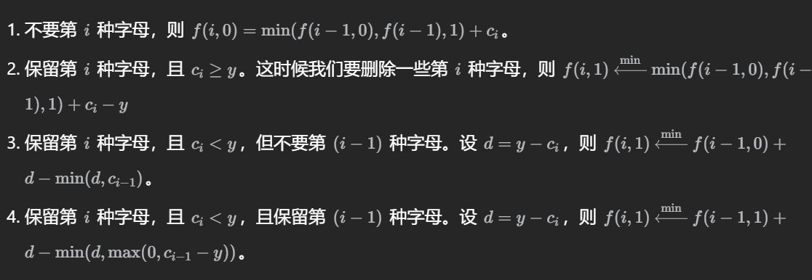

```python
class Solution:
    def makeStringGood(self, s: str) -> int:
        n=len(s)
        memo=Counter(s)
        memo[chr(ord('a')-1)]=0
        cnt=max(memo.values())
        ans=inf
        # 枚举出现次数
        for target in range(max(memo.values())+1):
            f=[[inf]*2 for _ in range(27)]
            # 定义 0表示保留，1表示不保留
            f[0][1]=0
            # 枚举字母
            for i in range(1,27):
                c=chr(i-1+ord('a'))
                pre=chr(i-2+ord('a'))
                cnt=memo[c]
                # 不保留，直接删除
                f[i][1]=min(f[i-1][0],f[i-1][1])+cnt
                if not cnt:continue
                # 保留
                # 字母出现次数更大，直接删除
                if cnt>=target:
                    f[i][0]=min(f[i-1][0],f[i-1][1])+cnt-target
                else:
                    # 更小，可以从前一位减小差距
                    d=target-cnt
                    f[i][0]=min(f[i-1][1]+d-min(d,memo[pre]),f[i-1][0]+d-min(d,max(0,-target+memo[pre])))
            ans=min(
```

## [访问完所有房间的第一天](https://leetcode.cn/problems/first-day-where-you-have-been-in-all-the-rooms/)

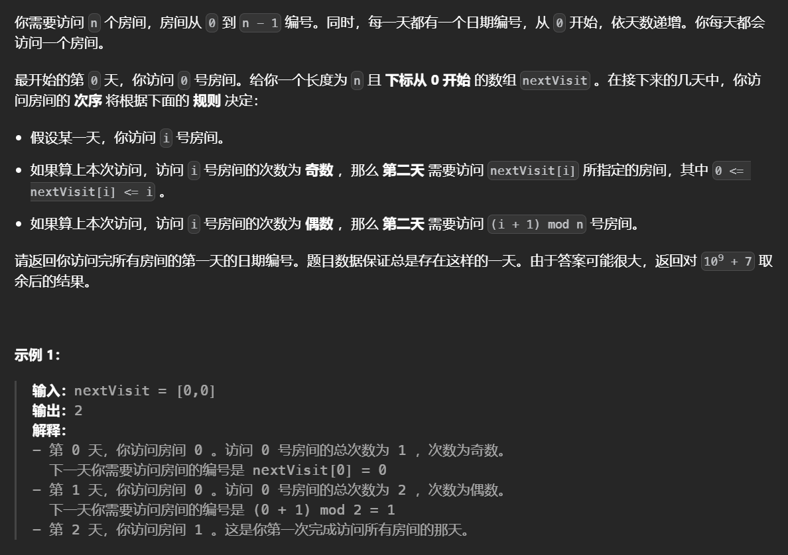

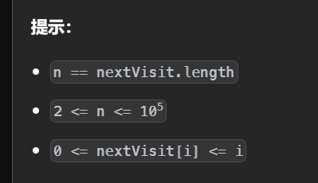

由于nextVisit[i]<=i，因此i位置一定是从i-1位置且i-1位置累计到达了偶数次转移过来的，定义f[i]为首次到达i位置的时间

如果nextVisit[i-1]==i-1那么，f[i]=f[i-1]+2，否则想从i-1位置到达i位置，必须先满足i-1位置到达偶数次，那么到i-1位置奇数次f[i-1]再出发到达nextVisit[i-1]位置，再从nextVisit[i-1]位置到达i-1位置所需的时间为f[i-1]-f[nextVisit[i-1]]，此时i-1位置已经满足偶数次了，再走一次到达i位置

```python
class Solution:
    def firstDayBeenInAllRooms(self, nextVisit: List[int]) -> int:
        mod=10**9+7
        n=len(nextVisit)
        f=[0]*n
        for i in range(1,n):
            if nextVisit[i-1]==i-1:
                f[i]=f[i-1]+2
            else:
                pre=nextVisit[i-1]
                f[i]=f[i-1]+f[i-1]-f[pre]+1+1
            f[i]%=mod
        return f[-1]
```

## [赛车](https://leetcode.cn/problems/race-car/)

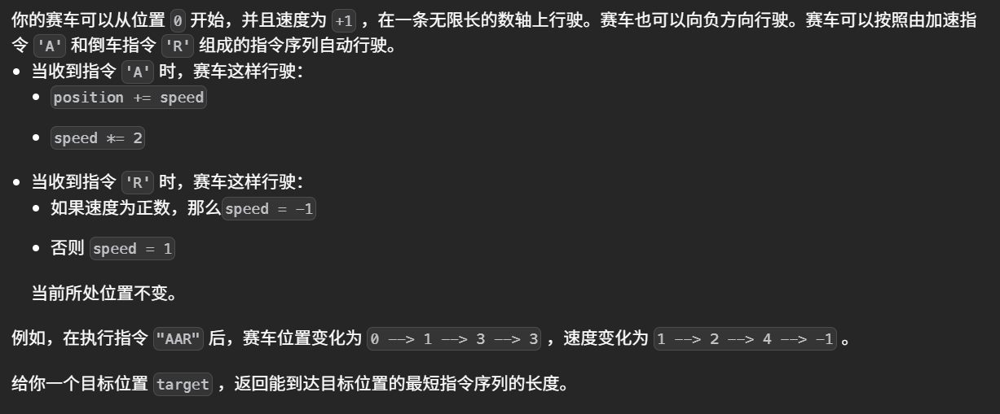


按照一般的DP来看，一个位置是不能从两边过来的，因为无法做出转移方程。但是这里的转向，相当于从一个新的起点开始，走一段距离，可以完全与原问题分割，因此可以使用DP求解。

这里枚举三种情况，一是可以从起点直接走到该位置；二是走过了，然后回头，这里并不会超过目标位置太多，不然只会白白浪费操作次数。三是未到达目标位置，从中间位置回头走了一段，然后再向终点进发；三种情况都可以转化为从某个点开始，走一段更短的距离，这里的起点和终点其实完全不重要了。

```python
class Solution:
    def racecar(self, n: int) -> int:
        inf =1<<20
        f=[inf]*(n+1)
        f[0]=0
        for i in range(1,n+1):
            # 直接可以走到，最优的情况
            if '0' not in bin(i)[2:]:
                f[i]=i.bit_count()
            else:
                idx=0
                # 超出，不能超出太多
                while (1<<idx)-1<i:idx+=1
                f[i]=min(f[i],f[(1<<idx)-1-i]+1+idx)
                # 走一段后回退一段距离
                for j1 in range(1,idx):
                    # 这里可以回退0步，相当于重置一下速度
                    for j2 in range(j1+1):
                        pos=(1<<j1)-1-(1<<j2)+1
                        f[i]=min(f[i],f[i-pos]+j1+j2+1+1)
        return f[-1]
Solution().racecar(4)
```


# 矩阵快速冥优化DP

## [斐波那契数](https://leetcode.cn/problems/fibonacci-number/)

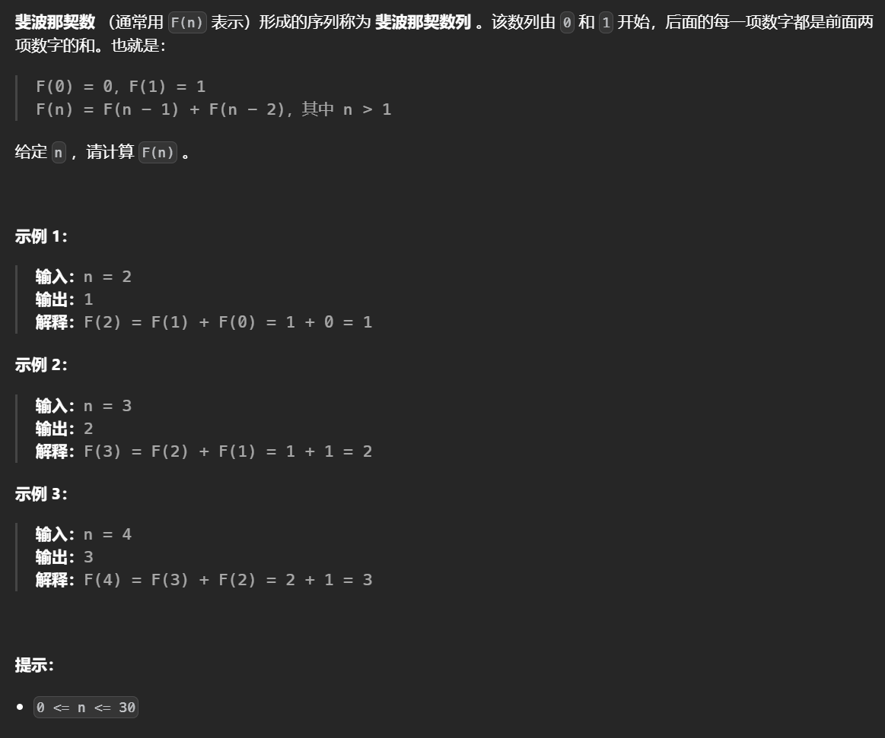

当数据范围很大时迭代和递归都无法满足，观察递推式发现：

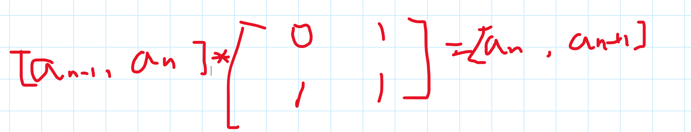


递推式可以转换为矩阵相乘的形式，$f_n=f_0*mat^n$，因此可以通过矩阵的冥次乘上初始状态最终的结果

```python
class Matrix:
    def __init__(self,mat):
        self.mat=mat
        self.mod=10**9+7
    def __mul__(self,other):
        p,q,r=len(self.mat),len(other.mat),len(other.mat[1])
        m=[[0]*r for _ in range(p)]
        # 遍历新矩阵的位置新矩阵
        for i in range(p):
            for j in range(r):
                # 共有的位置
                for k in range(q):
                    # 取模防止过大
                    m[i][j]=(m[i][j]+self.mat[i][k]*other.mat[k][j])%self.mod
        return Matrix(m)

class Solution:
    def fib(self, n: int) -> int:
        # 用于递推的矩阵
        S=Matrix([[0,1],[1,1]])
        # 初始状态，为方便计算扩充维度
        R=Matrix([[0,1],[0,0]])
        # 快速幂求解，可以先计算出S的冥次然后与R计算(res=1->res=res*S)，也可以一同计算
        while n:
            if n&1:
                R*=S
            S=S*S
            n>>=1
        return R.mat[0][0]
```

## Iterated Linear Function

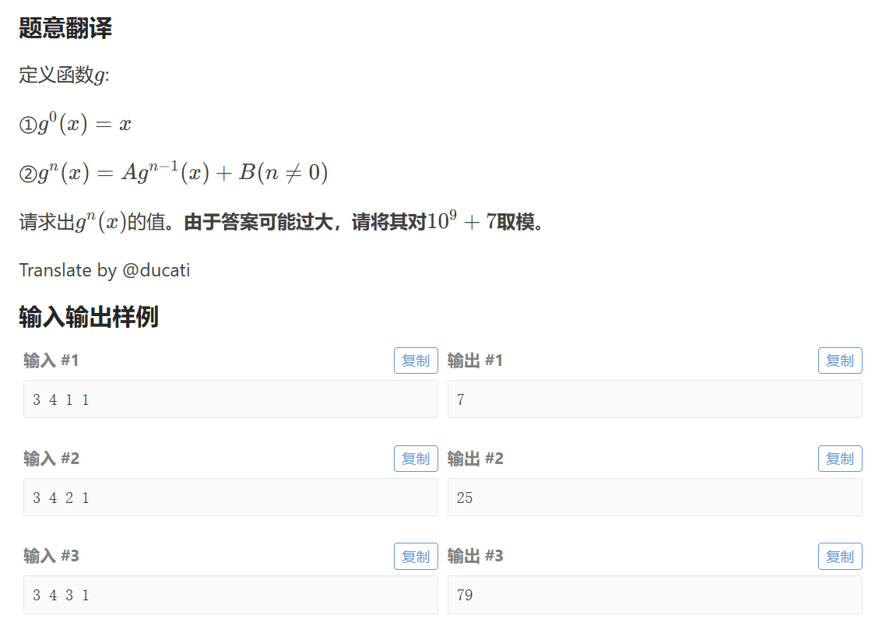


对于给定的数据范围必须用快速冥求解。

首先构造出公式，对于[g1(x),1]要得出[g2(x)=A*g1(x)+B,1]，注意这一步是关键必须同时满足后面的1，为方便操作将矩阵扩展为2\*2得。

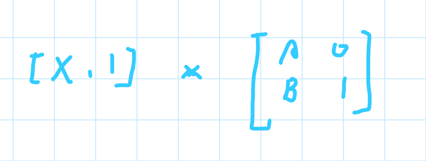


```python
class Matrix:
    def __init__(self,mat):
        self.mat=mat
        self.mod=10**9+7
    def __mul__(self,other):
        p,q,r=len(self.mat),len(other.mat),len(other.mat[1])
        m=[[0]*r for _ in range(p)]
        # 遍历新矩阵的位置新矩阵
        for i in range(p):
            for j in range(r):
                # 共有的位置
                for k in range(q):
                    # 取模防止过大
                    m[i][j]=(m[i][j]+self.mat[i][k]*other.mat[k][j])%self.mod
        return Matrix(m)
a,b,n,x=RR()
I=Matrix([[x,1]])
S=Matrix([[a,0],[b,1]])
while n:
    if n&1:
        I*=S    
    S*=S
    n>>=1
print(I.mat[0][0])
```


## [Dangerous Sugoroku](https://atcoder.jp/contests/abc388/tasks/abc388_f)

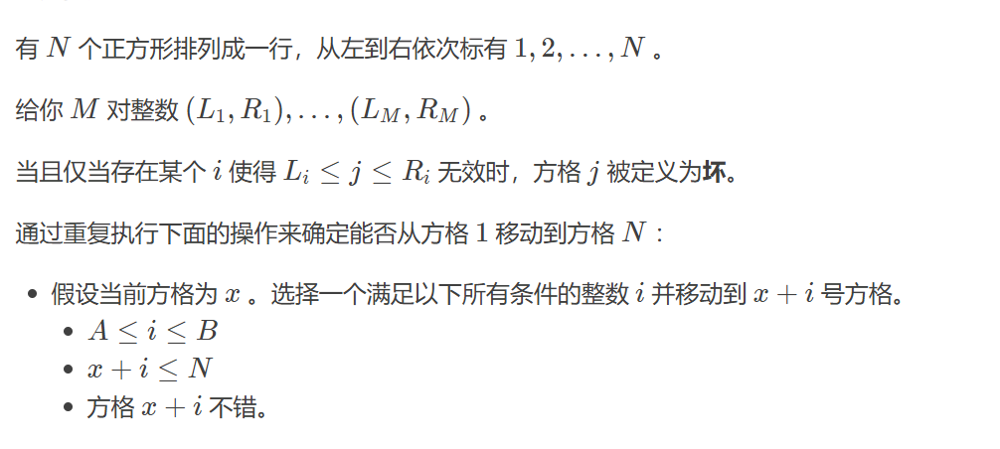

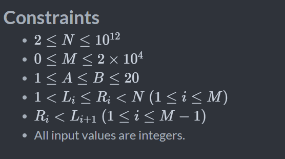


给定的数据范围无法暴力求解，观察到给定的AB范围很小，因此必然是从AB出发求解。考虑DP令$f_i$表示i位置（或者说走了i步）是否可以到达，那么显然有转移方程

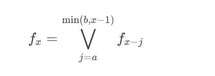

直接求解DP必然超时，发现$$f_1,f_2,f_3,f_4->f_2,f_3,f_4,f_1|f_2|f_3=f_5$$因此使用矩阵快速幂优化DP，令矩阵的大小为B*B，通过刷表法的思想求解，乘一次矩阵会得到一个新的状态。用1\*B的矩阵表示当前的各个状态，末尾就是每次新得到的状态，初始时只有[[0,0,...,1]]表示在0位置。

当经过好方块时，结构如下：

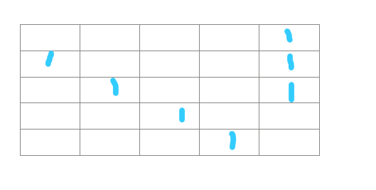


而经过坏方块时，结构如下：求解出的新状态必然是0，因为在坏方块上。

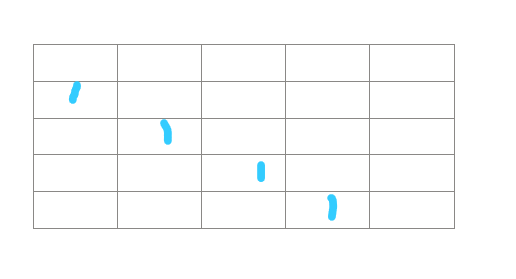

注意这里将各个状态用1*B的矩阵表示，这样在矩阵相乘的时间复杂度就是B\^2，如果用B\*B表示，那么时间复杂度就是B\^3


```python
# 定义矩阵类方便计算
class Matrix:
    def __init__(self,mat):
        self.mat=mat
    def __mul__(self,other):
        p,q,r=len(self.mat),len(other.mat),len(self.mat[0])
        m=[[0]*r for _ in range(p)]

        # 前两重循环遍历新矩阵的每个位置
        for i in range(p):
            for j in range(r):
                # 遍历公共的
                for k in range(q):
                    # 对&结果取或
                    m[i][j]|=self.mat[i][k]&other.mat[k][j]
        return Matrix(m)

# row坏区间的个数
n,row,a,b=RR()

# 经过好位置
good=[[0]*b for _ in range(b)]
# 经过坏位置
bad=[[0]*b for _ in range(b)]
# 初始状态 1*B
s=[[0]*b]

# 初始化
for i in range(1,b):
    good[i][i-1]=bad[i][i-1]=1
# 好区间可以得到新的状态
for i in range(b-b,b-a+1):
    good[i][-1]=1
# 初始在f0位置
s[0][-1]=1

good=Matrix(good)
bad=Matrix(bad)
s=Matrix(s)

# 预处理矩阵的2的冥次
fac1=[0]*45
fac2=[0]*45

fac1[0]=good
fac2[0]=bad

for i in range(1,45):
    fac1[i]=fac1[i-1]*fac1[i-1]
    fac2[i]=fac2[i-1]*fac2[i-1]

# 快速幂，直接带入求解不用返回的快速幂结果，防止时间复杂度过大
# 求解走几步，走的是好方块还是坏方块
def mpow(s,k,fac):
    for i in range(45):
        if k&(1<<i):s*=fac[i]
    return s

# 表示上一个区间的结尾
pre=0 
# 遍历坏区间 
for _ in range(row):
    l,r=RR()
    l-=1
    r-=1
    # 如果坏区间太大了，或者初始位置就是坏区间，那么必然不行
    if r-l+1>=b or not l:
        print('No')
        exit(0)
    # 先走好方块到区间
    if l-pre-1>0:s=mpow(s,l-pre-1,fac1)
    # 走区间中的坏方块
    if r-l+1>0:s=mpow(s,r-l+1,fac2)   
    pre=r

# 从最后一个区间走到最后的位置
if n-pre-1>0:s=mpow(s,n-pre-1,fac1)

if s.mat[0][-1]>0:
    print('Yes')
else:
    print('No')
```


## [字符串转换后的长度 II](https://leetcode.cn/problems/total-characters-in-string-after-transformations-ii/)

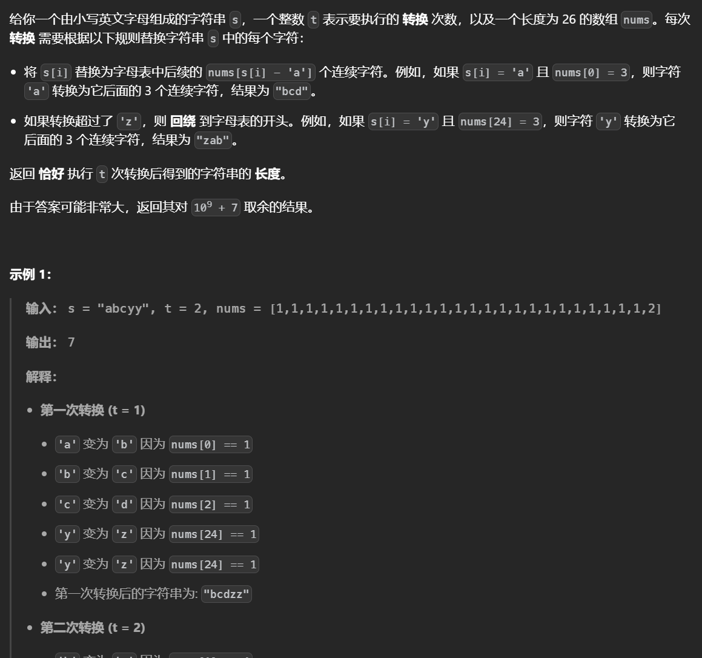

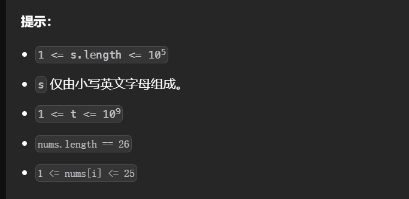

寻找子问题对于字符a，当nums[0]=2时转换两次后的长度就等于b和c转换一次后的长度之和，对于给定的数据范围需要使用矩阵快速幂优化。

定义f[i]\[c]为字母c变化i次

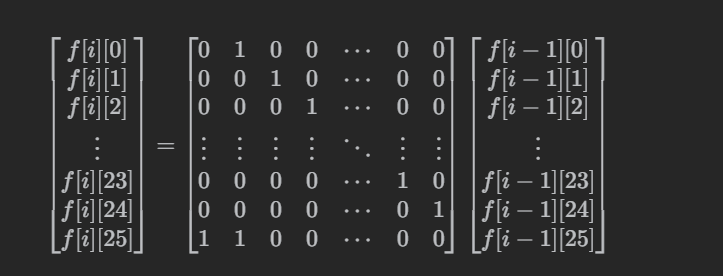

```python
class Solution:
    def lengthAfterTransformations(self, s: str, t: int, nums) -> int:
        mod=10**9+7
        # 初始化，转移0次的长度等于1
        R=Matrix([[1]*26])

        S=[[0]*26 for _ in range(26)]
        # 对于每个字符，它可以转化为后nums[i]个
        for j in range(26):
            i=j
            for cnt in range(1,nums[j]+1):
                row=(i+cnt)%26
                S[row][j]=1
        S=Matrix(S)
        # 快速幂求解
        while t:
            if t&1:
                R*=S
            S*=S
            t>>=1
        ans=0
        # 只统计出现在s中的字符
        for c in s:
            ans=(ans+R.mat[0][ord(c)-ord('a')])%mod
        return ans
```

# 子矩形DP


## [最大正方形](https://leetcode.cn/problems/maximal-square/)

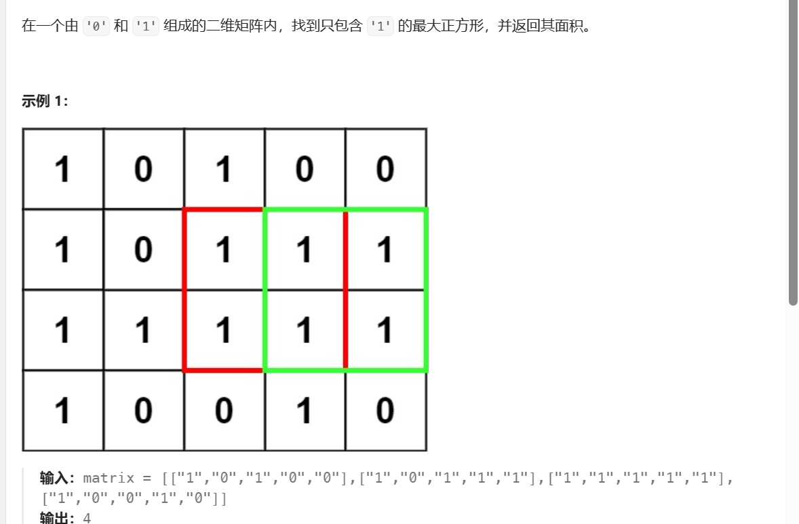


求正方形面积找到正方形的边长即可

令dp[i] [j]表示以i,j为右下角的正方形（无需同时找左上角和右下角，该状态的定义其实已经考虑了所有可行的左上角）所能组成合法的（即全为1）正方形的最大边长，该状态由左边，上边，左上中最小的推出这里，考虑左上是因为即使左边和上边都是合法的但是左上不合法就是不行的。如果该位置为0直接跳过，不会构成合法的正方形因此最大边长是只能是0。

```python
class Solution:
    def maximalSquare(self, matrix: List[List[str]]) -> int:
        m=len(matrix)
        n=len(matrix[0])
        ans=0
        dp=[[0 for _ in range(n)] for _ in range(m)]
        for i in range(m):
            for j in range(n):
                # 跳过为0的项
                if matrix[i][j]=='0':
                 	 continue	
                # 边界上为1的最大边长只能是1
                if i==0 or j==0:
                  	dp[i][j]=1
                else:
                    # 由三个位置中最小的推出
                    dp[i][j]=min(dp[i-1][j],dp[i][j-1],dp[i-1][j-1])+1
                ans=max(ans,dp[i][j])
        return ans**2
```

## [ 统计全为 1 的正方形子矩阵](https://leetcode.cn/problems/count-square-submatrices-with-all-ones/)

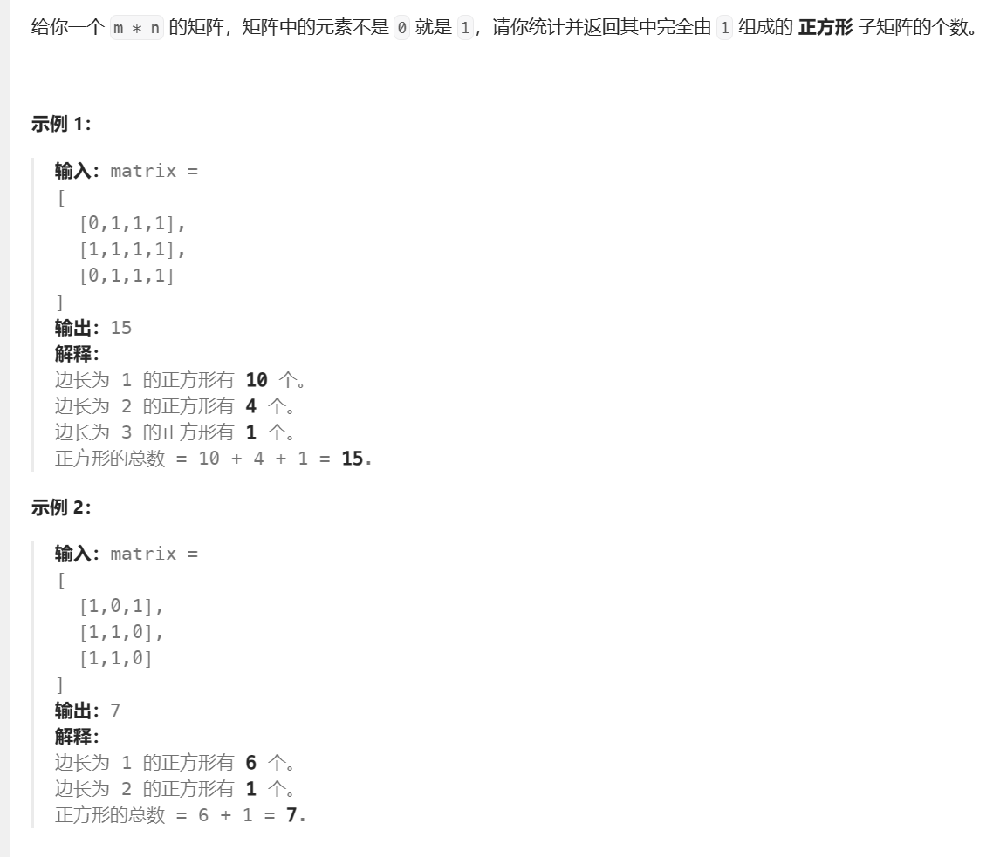

统计一个区域内所有合法的正方形个数比较困难，可以求解以某个位置做右下角的正方形有多少个，令dp[i]\[j]表示以i,j为右下角所能形成正方形的最大边长，边长的大小就是这一点为右下角所形成的正方形的个数，如果这位置是0跳过，因为以0为右下角无法形成合法的正方形，状态转移方程同上，实际上做基本的做法是枚举正方形的边长，长度为2是否存在等于长度为1的左，上，左上位置长度为1的是否存在，但本题只求解个数因此直接取最大值。


```python
class Solution:
    def countSquares(self, matrix: List[List[int]]) -> int:
        m = len(matrix)
        n = len(matrix[0])
        ans = 0
        dp = [[0 for _ in range(n)] for _ in range(m)]
        for i in range(m):
            for j in range(n):
                if matrix[i][j]==0:
                  	continue
                if i==0 or j==0:
                    dp[i][j]=int(matrix[i][j]==1)
                else:
                    dp[i][j]=min(dp[i-1][j],dp[i][j-1],dp[i-1][j-1])+1
                ans+=dp[i][j]
        return ans 
```


## [统计农场中肥沃金字塔的数目](https://leetcode.cn/problems/count-fertile-pyramids-in-a-land/)

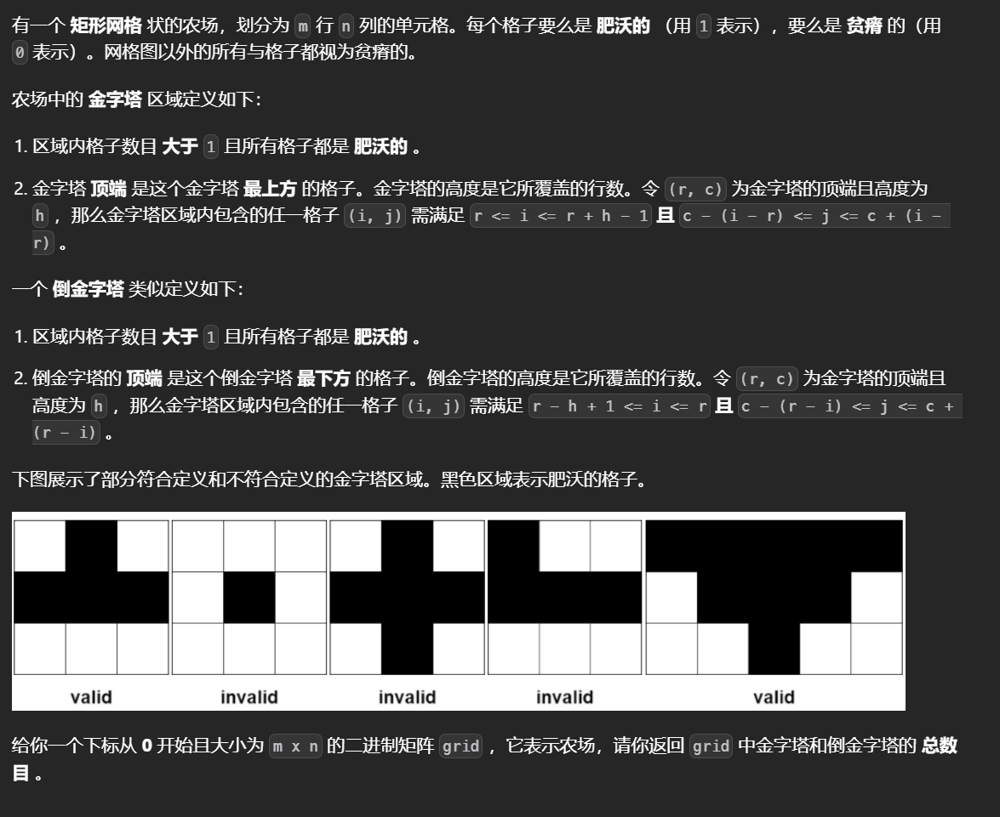

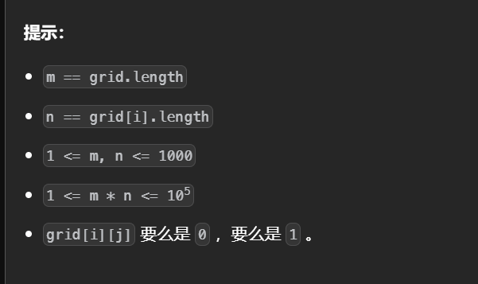

定义f[i]\[j]表示以(i,j)为顶端的金字塔的最大层数，如果层数为x那么该顶端也一定有x-1,x-2...1层的金字塔，1层不计算因此统计答案时更新x-1。递推的策略是从(i+1,j)位置的最大金字塔外套上一层外壳，即(i,j)往左下角和右下角延申的连续1的长度，即

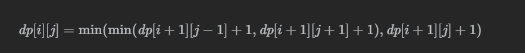


```python
class Solution:
    def countPyramids(self, g) -> int:
        m,n=len(g),len(g[0])
        def dp(g):
            ans=0
            f=[[0]*n for _ in range(m)]
            # 初始化
            for i in range(m):
                for j in range(n):
                    if g[i][j]:f[i][j]=1

            for i in range(m-2,-1,-1):
                for j in range(n):
                    # 顶端位置需要为1
                    if not g[i][j]:continue
                    # 可以往左下和右下延申
                    if j-1>=0 and j+1<n:
                        f[i][j]=min(min(f[i+1][j-1],f[i+1][j+1]),f[i+1][j])+1
                        ans+=f[i][j]-1
            return ans 
        ans=dp(g)
        # 将矩阵上下颠倒求解倒金字塔的个数
        mat=[[0]*n for _ in range(m)]
        for j in range(n):
            for i in range(m):
                mat[i][j]=g[m-i-1][j]
        return ans+dp(mat)
```


# 多维DP


## [ K 个逆序对数组](https://leetcode.cn/problems/k-inverse-pairs-array/)


定义状态dp(i,j)表示考虑[1,i]的排列其中有j个逆序对的不同排列方式，对于[1,i]的排列长度为i，可以选任意一个数最为排列的最后一个元素，如果选的是k那么就会贡献i-k个逆序对，即k+1,k+2,k+3...i，此时排列贡献的逆序对等于i-k加上前i-1个元素贡献的逆序对，前i-1个也就是1\~k-1和k+1\~i，因为逆序对只考虑元素的相对大小因此1\~k-1和k+1\~i可以看作是1\~i-1的排列，由此得出子任务


```python
class Solution:
    def kInversePairs(self, n: int, k: int) -> int:
        mod=10**9+7
        # 未优化的如下对于给定的数据范围会超时
        # @cache
        # def dp(i,j):
        #     if not j:return 1 逆序对为0，只有一种排列方式就是正序
        #     res=0
        #     for index in range(i):
        #         cnt=(i-1)-index 能贡献多少
        #         if cnt>j:continue
        #         res+=dp(i-1,j-cnt)
        #         res%=mod
        #     return res 
        # return dp(n,k)
        
        dp=[[0]*(k+10) for _ in range(n+10)]
        for i in range(n+1):dp[i][0]=1

        for i in range(2,n+1):
            for j in range(1,k+1):
                dp[i][j]=dp[i][j-1]-(dp[i-1][j-i] if j-i>=0 else 0)+dp[i-1][j]
                dp[i][j]%=mod
        return dp[n][k]
```


## [统计逆序对的数目](https://leetcode.cn/problems/count-the-number-of-inversions/)

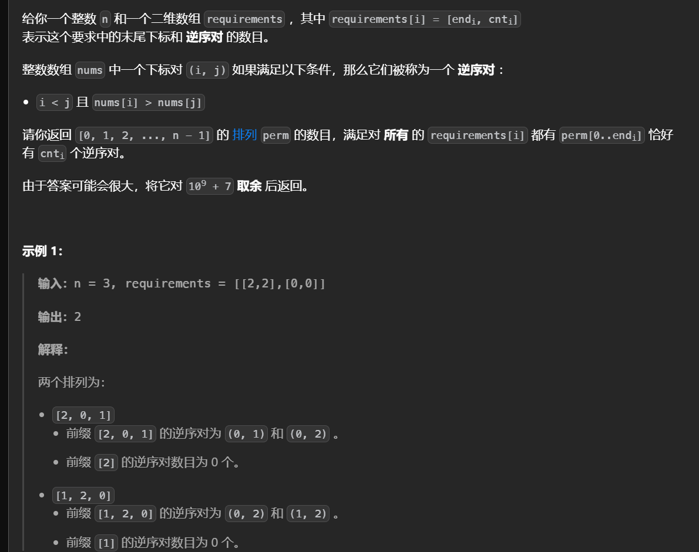


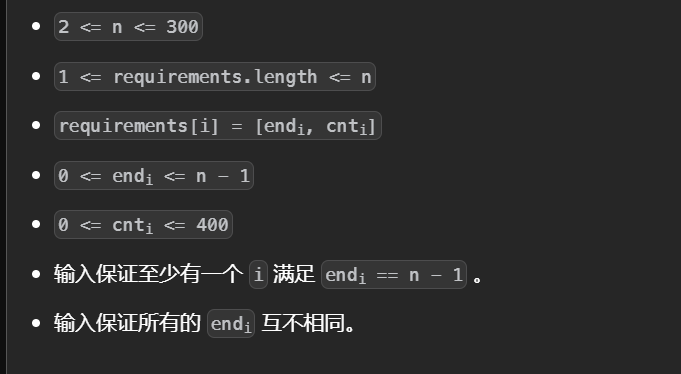

该题目在上述的基础上增加了一些条件，定义dp(i,j)表示前0~i有j个逆序对

关键思路同上一题，把1\~n的排列随机取一个数后，前面剩余的数可以看作是0\~n-2的排列，因为只考虑逆序对那么只关心相对大小。

```python
class Solution:
    def numberOfPermutations(self, n: int, requirements: List[List[int]]) -> int:
        r=[-1]*(n+1)
        mod=10**9+7
        requirements.sort()
        # 先设置好约束条件
        for i,j in requirements:
            r[i+1]=j
        @cache
        def dp(i,j):
            # base case是只有一个数的时候，这是逆序对只能是0个
            if i==1:return int(j==0)
        	# 如果有约束条件，那么必须满足约束条件，首先剩余的逆序对要足够构建约束规定的逆序对的个数，其次为了满足约束条件而凑出的逆序对必须能由前i个数构建出来，即小于i-1
            if r[i-1]>=0:
                return dp(i-1,r[i-1]) if j-r[i-1]<=i-1 and r[i-1]<=j else 0
            # 否则任取，注意不能大于已有的逆序对个数和能构建出的逆序对个数
            return sum(dp(i-1,j-k) for k in range(min(i,j+1)))%mod
        return dp(n,requirements[-1][-1])
       
```


## [恰有 K 根木棍可以看到的排列数目](https://leetcode.cn/problems/number-of-ways-to-rearrange-sticks-with-k-sticks-visible/)

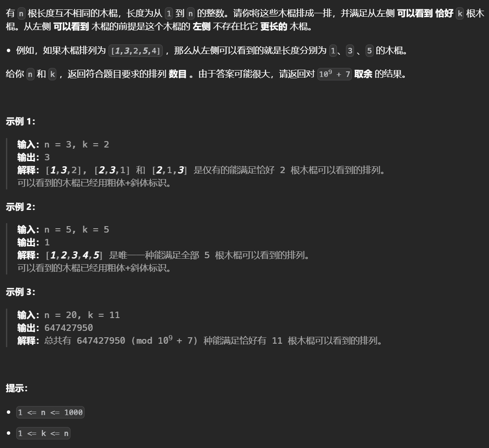

定义dp(i,j)表示1到i+1的整数可以看到 j 个木棍的排列个数，如果排列的最后一个数可以被看到那么必然是最大的数排在最后dp(i-1,j-1)，否则就是1到i-1中的某个数排在最后，而剩下的i-1个数只考虑相对大小那么看作是1到i-1的整数。

```python
class Solution:
    def rearrangeSticks(self, n: int, k: int) -> int:
        mod=10**9+7
        @cache
        def dp(i,j):
            if i==j==1:return 1
            if j>i or not j:return 0
            return (dp(i-1,j-1)+dp(i-1,j)*(i-1))%mod
        return dp(n,k)
```

## [卖木头块](https://leetcode.cn/problems/selling-pieces-of-wood/)

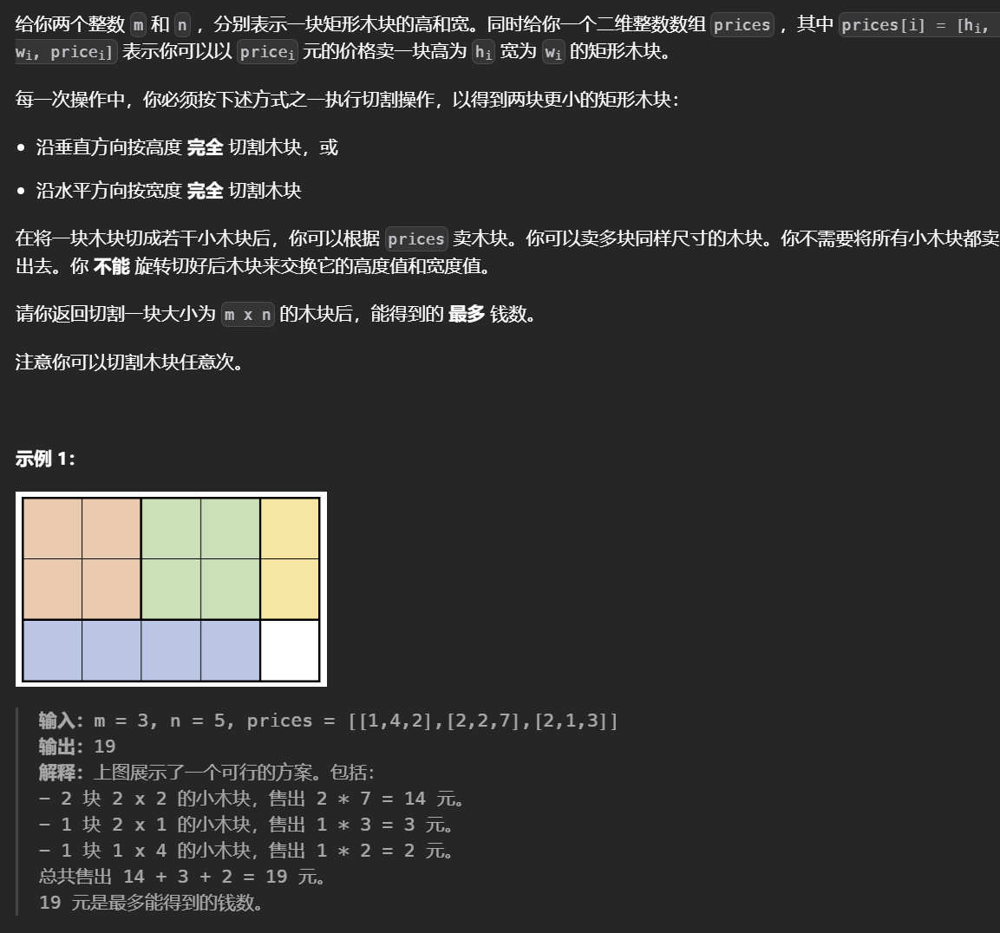

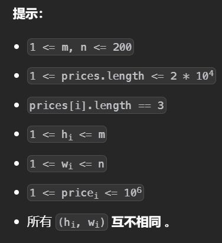

定义dp(i,j)表示高为i宽为j的木块最多能卖多少钱，因为是完全沿着水平和垂直方向切一刀，因此可以枚举切割位置将大木块划分为更小的木块，木块的高和宽如果出现在prices中也可以不切割。

内层枚举切割位置的时候，因为存在对称性所以可以只枚举一半的位置。

```python
class Solution:
    def sellingWood(self, m: int, n: int, prices: List[List[int]]) -> int:
        p=defaultdict(int)
        for u,v,w in prices:
            p[(u,v)]=max(p[(u,v)],w)
        
        @cache
        def dp(i,j):
            res=p[(i,j)]
            for h in range(1,i//2+1):
                res=max(res,dp(h,j)+dp(i-h,j))
            for w in range(1,j//2+1):
                res=max(res,dp(i,w)+dp(i,j-w))
            return res
        return dp(m,n)
```


## [3n 块披萨](https://leetcode.cn/problems/pizza-with-3n-slices/)

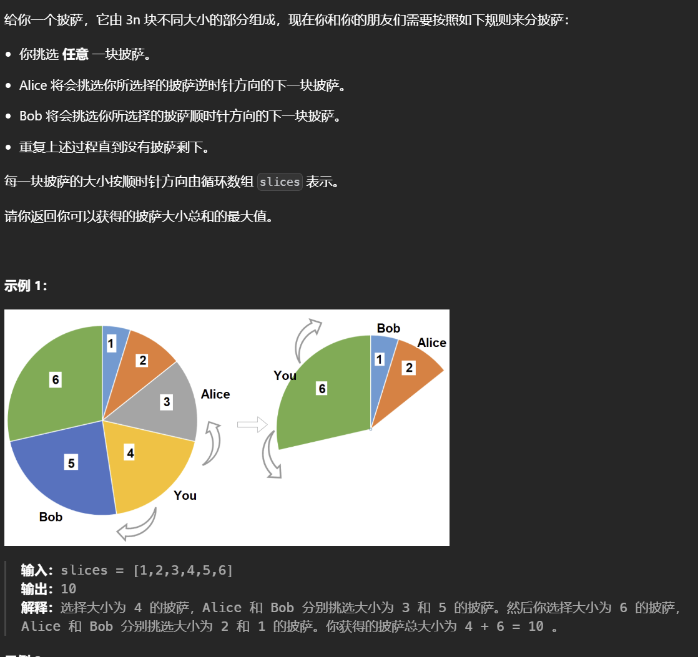

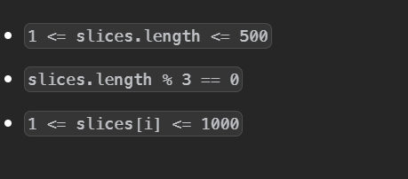


选了一个位置之后两边的位置不能选择了，问题可以转换为必须选择n//3次的打家劫舍，并且是在环上的版本。对于环的存在，只会影响到第一个位置，因此可以预先枚举选不选第一个元素，将问题转换为链上的点。

```python
class Solution:
    def maxSizeSlices(self, nums) -> int:
        n=len(nums)
        # 必须要选n//3次
        def slove(arr,target):
            @cache
            def dp(i,c):
                if c==target:return 0
                # 超出了还没选完就是不合法的状态
                if i>=len(arr):return -inf
                # 选或不选
                return max(dp(i+2,c+1)+arr[i],dp(i+1,c))
            return dp(0,0)
        # 预先枚举，除了选择第一个位置在环上会影响到其他位置，选择其他的位置和链上没有区别
        return max(nums[0]+slove(nums[2:-1],n//3-1),slove(nums[1:],n//3))
```


## [准时抵达会议现场的最小跳过休息次数](https://leetcode.cn/problems/minimum-skips-to-arrive-at-meeting-on-time/)

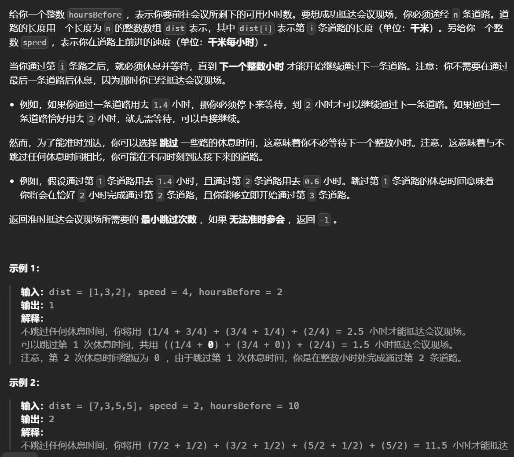

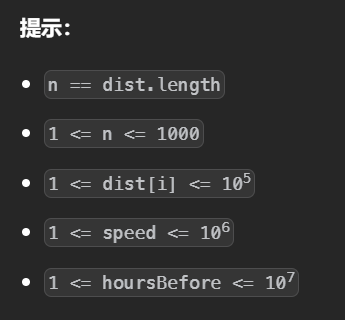

给定的数据范围可以做到枚举跳跃次数，因此定义dp(i,j)经过前i个位置，跳跃j次所需的最小时间，由于最后一个位置的特殊性所以递归入口为dp(n-1,c)。

如果跳跃，那么问题分解为经过前i-1个位置跳跃j-1次所需的最小时间+当前位置所需时间

如果不t跳跃，那么问题变为前i-1个位置跳跃j次所需的最小时间+ceil(当前所需时间+之前的时间，因为由题意得到每个位置的时间可以和前面花费的时间组合)。

注意本题由于除法的存在，在ceil方法时会出现误差

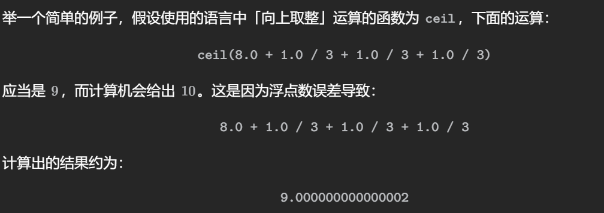


一种经典的解决方法为正减负加，对于正数减去一个小于精度1e6(题目给出的速度)的EPS，因为精度为1e6那么除法结果的最小有效位（第一个不为0）一定不会小于1e-6(1/1e6)的位置，而浮点数结果最终会误差 （-1e-15， 1e-15），因此EPS取1e-7(再小一点也行)就可以在不影响结果的情况下同时又能消除误差。

```python
class Solution:
    def minSkips(self, dist: List[int], speed: int, hoursBefore: int) -> int:
        arr=[v/speed for v in dist]
        # 特判，全部休息都到不了的情况
        if sum(arr)>hoursBefore:return -1
        n=len(dist)
        EPS=1e-7
        @cache
        def dp(i,j):
            if not i:
                return inf if j else 0
            # 能选
            if j:
                # 选或不选，EPS处理误差
                return min(dp(i-1,j-1)+arr[i-1],(ceil(dp(i-1,j)+arr[i-1]-EPS) if dp(i-1,j)!=inf else inf ))
            # 只能不选
            return ceil(dp(i-1,j)+arr[i-1]-EPS) if dp(i-1,j)!=inf else inf
        
        # 枚举跳跃次数
        for c in range(n):
            # 最后一个位置特殊，调整递归入口
            if dp(n-1,c)+arr[-1]<=hoursBefore:return c
        return -1
```

​	

## [统计平衡排列的数目](https://leetcode.cn/problems/count-number-of-balanced-permutations/)

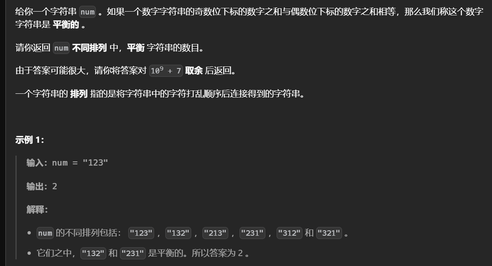

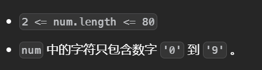

计数DP+组合数，问题等价于把数组分为两部分(n//2和n-n//2)保证两部分的和相等，定义dp(i,lc,rc)表示两部分只差为i且左右还需选择lc和rc个。枚举每个数字，枚举数字的顺序不重要因为是求解排列组合

```python
class Solution:
    def countBalancedPermutations(self, num: str) -> int:
        mod=10**9+7
        n=len(num)
        memo=Counter(num)
        s='0123456789'
        # 预处理100以内的组合数
        C=[[0]*90 for _ in range(90)]
        for i in range(90):
            for j in range(i+1):
                if not j:C[i][j]=1
                else:C[i][j]=(C[i-1][j-1]+C[i-1][j])%mod
        
        # 滚动数组求解
        dp=Counter()
        # 初始状态
        dp[(0,n//2,n-n//2)]=1
        # 枚举每个数字
        for c in s:
            nx=Counter()
            # 枚举左边选几个
            for l in range(memo[c]+1):
                r=memo[c]-l
                for k,v in dp.items():
                    # 需要不超过
                    if l>k[1] or r>k[2]:continue
                    # 组合数求解
                    nx[((l-r)*int(c)+k[0],k[1]-l,k[2]-r)]+=C[k[1]][l]*C[k[2]][r]*v
                    nx[((l-r)*int(c)+k[0],k[1]-l,k[2]-r)]%=mod
            dp=nx
        return dp[(0,0,0)]
```

## [Battles in a Row](https://atcoder.jp/contests/abc410/tasks/abc410_e)

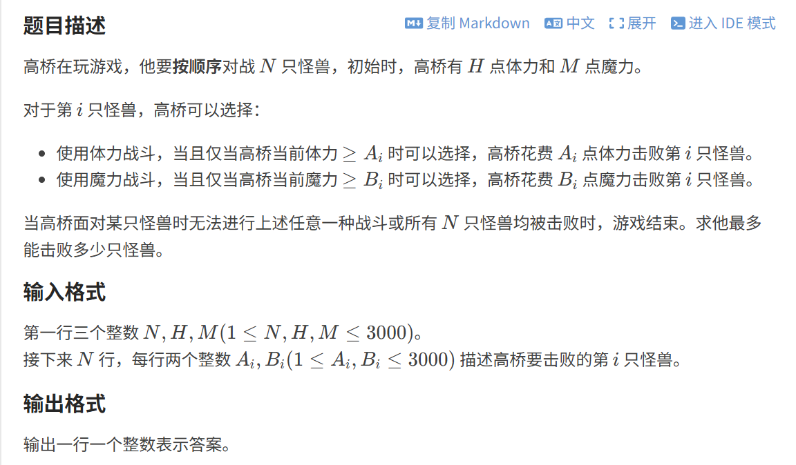

显而易见的动态规划，但是这里一定要维护的状态太多，数据范围一定会超，一定要去掉一个状态才能满足给定的数据范围求解。

根据题意，击败的怪兽一定是从头开始连续的一段，并且求解的是能击败的怪兽数，那么定义dp[i]\[j]表示体力和魔力为i和j的情况下，能击败的最多的怪兽数，DP的结果可以指出要访问的是数组的哪一位，如果do[i]\[j]=x，那么对于当前状态，第x+1个怪兽的数值假设为x,y，那么dp[i+x]\[j]=dp[i]\[j]+1，dp[i]\[j+y]=dp[i]\[j]+1，初始时显然有dp[0]\[0]=0

```python
k,m,n=RR()
f=[[0]*(n+1) for _ in range(m+1)]

nums=[]
for _ in range(k):
    nums.append(RR())

for i in range(m+1):
    for j in range(n+1):
        if i:f[i][j]=max(f[i][j],f[i-1][j])
        if j:f[i][j]=max(f[i][j],f[i][j-1])
        x=f[i][j]   

        if x<k:
            l,r=nums[x]
            if i+l<=m:f[i+l][j]=max(f[i+l][j],f[i][j]+1)
            if j+r<=n:f[i][j+r]=max(f[i][r+j],f[i][j]+1)

print(f[m][n])
```

## [播放列表的数量](https://leetcode.cn/problems/number-of-music-playlists/)


观察条件，每首歌至少播放一次，那么一定需要一个状态来记录歌曲是否都被选择，这里不能用状态压缩，可以定义i为已选i种歌曲，那么再定义j表示已经听了j首歌。这里发现歌曲是不同的，但是长度或者说盒子的的个数是一样的，那么可以想到第二类斯特林数，定义dp[i]\[j]为已选i种歌曲，当前听了j首歌，那么有转移方程


```python
class Solution:
    def numMusicPlaylists(self, n: int, goal: int, k: int) -> int:
        mod=10**9+7
        max=lambda x,y:x if x>=y else y
        f=[[0]*(goal+1) for _ in range(n+1)]
        f[0][0]=1
        for i in range(1,n+1):
            for j in range(1,goal+1):
                f[i][j]+=f[i-1][j-1]*(n-(i-1))
                f[i][j]+=f[i][j-1]*max(i-k,0)
                f[i][j]%=mod
        return f[n][goal]
```

## [DI序列的有效排列](https://leetcode.cn/problems/valid-permutations-for-di-sequence/)

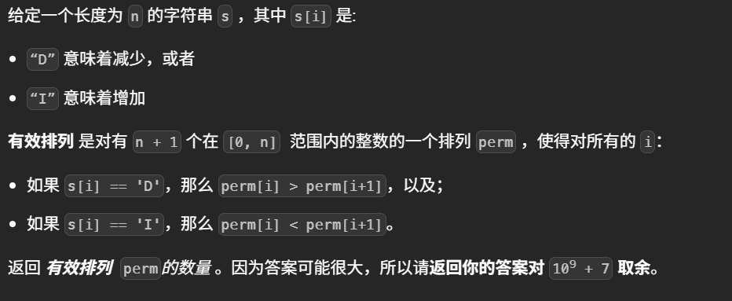

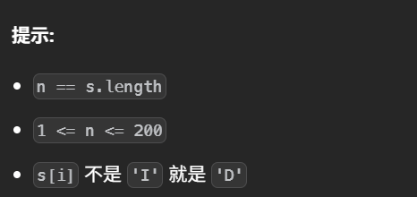

对于字符串的每个字符s[i]它只能影响到下一位，因此需要一个状态来满足有效排列的要求。定义dp[i]\[j]表示对于s[i]，右侧有j个小于它的值时有效排列的个数。

当s[i]是'D'时，应该从j个数中选一个；反之，可以求解出更大的数有哪些，然后从这些数中转移。

```python
class Solution:
    def numPermsDISequence(self, s: str) -> int:
        mod=10**9+7
        n=len(s)
        @cache
        def dp(i,j):
            # 一共有n+1个数
            if i==n+1:return int(j==0)
            res=0
            # 从较小的数中选
            if s[i-1]=='D':
                for nx in range(j):
                    res+=dp(i+1,nx)
            else:
                # 从较大的数中选
                c=n-i-j+1
                for nx in range(c):
                    res+=dp(i+1,n-i+1-nx-1)
            return res%mod
        
        res=0
        # 第一个位置考虑枚举每个数
        for i in range(n+1):
            res+=dp(1,i)
            res%=mod
        return res
```


# 区间DP

## 石子合并

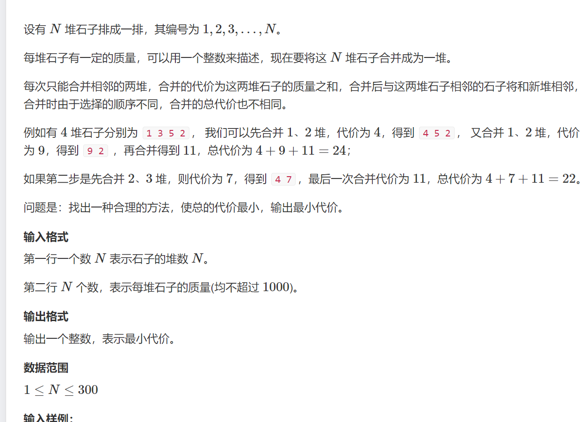

区间dp问题，每个问题可以由子问题推出，最后的结果一定是合并左边的一个区间和右边的一个区间得出的并且这两个区间是相邻的，而左右两个区间又可以再次分解。定义dp(i,j)为将区间[i,j]合并为一堆所需的最小代价，而i,j可以划分为[i,k],[k+1,j]这两堆，因此枚举i到j之间的位置求解，时间复杂度为n^3。

```python
from math import inf
from itertools import accumulate
from functools import lru_cache
n=int(input())
nums=[int(x) for x in input().split()]
pre=[0]+list(accumulate(nums))

# 递归不如递推
@lru_cache(maxsize=None)
def dp(i,j):
    # 一个元素没有代价
    if i==j:
        return 0
    res=inf
    for k in range(i,j):
        # 合并两个区间的代价就是这两个区间内的元素和，使用前缀和快速求解（两个区间是连续的）
        res=min(res,dp(i,k)+dp(k+1,j)-pre[i]+pre[j+1])
    return res
print(dp(0,n-1))

# 区间dp的递推一般都是先枚举区间长度，再找左右端点
from math import inf
from itertools import accumulate
from functools import lru_cache
n=int(input())
nums=[int(x) for x in input().split()]
pre=[0]+list(accumulate(nums))

dp=[[0]*n for _ in range(n)]

# 枚举长度，长度为1不用考虑代价为0
for len in range(2,n+1):
    # 左右端点
    l=0
    while l+len-1<n:
        r=l+len-1
        dp[l][r]=inf
        # 枚举分割点
        for k in range(l,r):
            dp[l][r]=min(dp[l][r],dp[l][k]+dp[k+1][r]+pre[r+1]-pre[l])
        l+=1
print(dp[0][n-1])
```

## [合并石头的最低成本](https://leetcode.cn/problems/minimum-cost-to-merge-stones/)

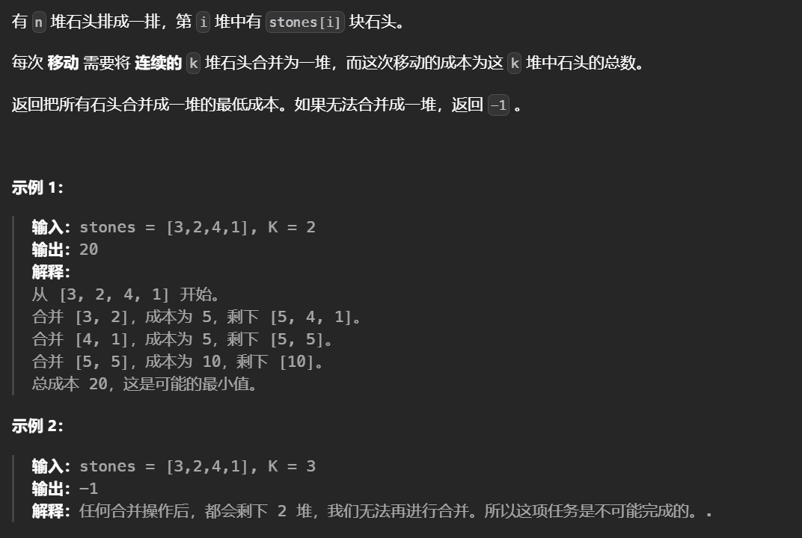

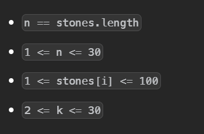

每一轮合并会减少k-1个组并保留一组，因此先取出一组，对于剩下的组如果满足%(k-1)==0，那么就都可以和保留的那一组拼接来合并，反之无解。

定义dp(i,j,p)表示对于区间[i,j]合并成p组所需的最小代价，当p=1时需要从dp(i,j,k)+sum(nums[l:r+1])转移过来，对于其他情况可以划分为1和p-1，对于p-1又可以继续划分为1,p-2，那么可以组合出2,p-2，因此不需要枚举x,p-x

```python
class Solution:
    def mergeStones(self,nums, k: int) -> int:
        pre=list(accumulate(nums,initial=0))
    
        n=len(nums)
        # 无解的情况
        if (n-1)%(k-1)!=0:return -1
        @cache
        def dp(i,j,p):
            # 只有一组
            if p==1:
                # 单独一个数可以无需从k组合并而来
                return 0 if i==j else dp(i,j,k)+pre[j+1]-pre[i]
            # 划分，端点每次增加k-1保证有解
            return min(dp(i,m,1)+dp(m+1,j,p-1) for m in range(i,j,k-1))
        return dp(0,n-1,1)
```


## [奶牛体检][https://www.acwing.com/problem/content/6138/]

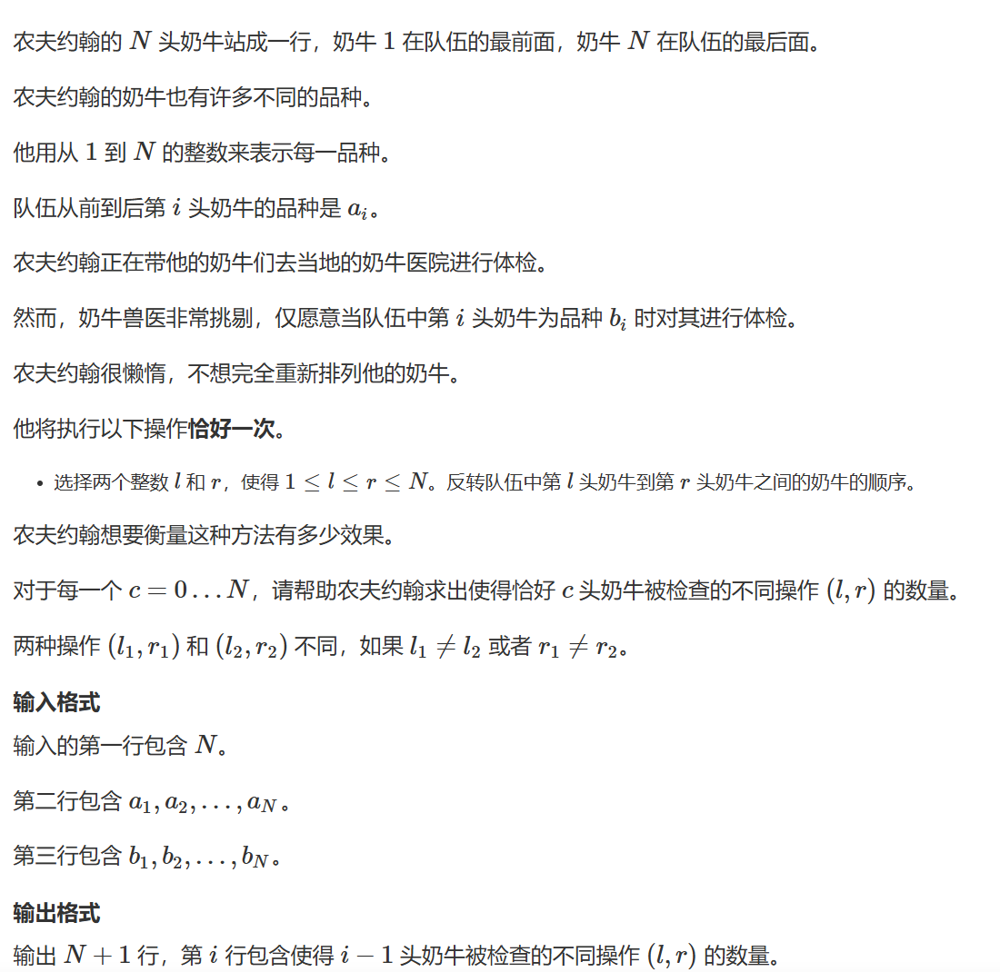

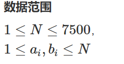

可以做到n^2的复杂度

一次操作可以反转一个区间，至多只有一次操作，枚举每个区间在反转后后的满足条件的个数，其中区间内满足条件的个数可以用DP递推得到，区间外可以通过前缀和快速求解。

```python
n=R()
a=RR()
b=RR()
nums=[]
# 将是否相等用数值表示
for i,j in zip(a,b):
    if i==j:nums.append(1)
    else:nums.append(0)

# 构建前缀和
pre=get_pre(nums)

@cache
# 递归写法超时
def dp(i,j):
    if i==j:return int(a[i]==b[j])
    elif i>j:return 0
    return dp(i+1,j-1)+int(a[j]==b[i])+int(a[i]==b[j])

# 递推
f=[[0]*n for _ in range(n)]
# 长度为1时作为base case
for i in range(n):f[i][i]=int(a[i]==b[i])

for len in range(2,n+1):
    l=0
    while l+len-1<n:
        r=l+len-1
        # r-1>=l+1用于特判长度为2的情况，防止越界
        f[l][r]=(f[l+1][r-1] if r-1>=l+1 else 0)+int(a[l]==b[r])+int(a[r]==b[l])
        l+=1

ans=defaultdict(int)
# 枚举反转每个区间，操作后满足条件的个数等于反转后的区间满足条件的个个数+两边满足条件的个数
for i in range(n):
    for j in range(i,n):
        # 能得到这个值的操作多一个
        ans[f[i][j]+pre[i]+pre[-1]-pre[j+1]]+=1
for i in range(n+1):
```


## [统计不同回文子序列](https://leetcode.cn/problems/count-different-palindromic-subsequences/)

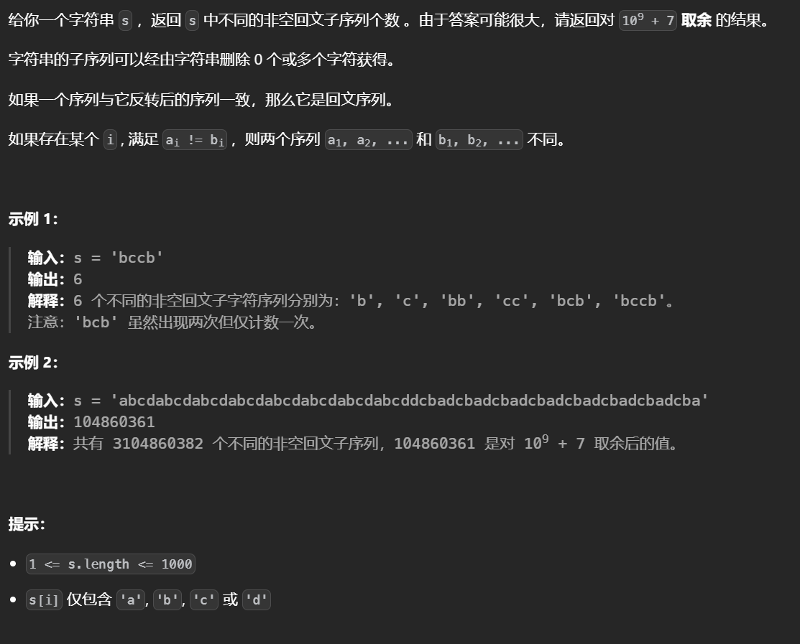

定义dp(i,j,c)为以区间[i,j]范围以字符c作为两端的不同回文序列个数，c可以和区间内不同的回文序列拼接，或者单独形成xx,x(即使之前有x,xx也会被拼接)

```python
class Solution:
    def countPalindromicSubsequences(self, s: str) -> int:
        mod=10**9+7
        n=len(s)
        @cache
        def dp(i,j,c):
            # base case
            if i>=j:return int(i==j and s[i]==c)
            # 左右不等，移动指针
            if s[i]!=c and s[j]!=c:
                return dp(i+1,j-1,c)
            if s[i]!=c:
                return dp(i+1,j,c)
            if s[j]!=c:
                return dp(i,j-1,c)
            # 枚举外侧的字符，拼接和单独
            return (2+sum(dp(i+1,j-1,nx) for nx in 'abcd'))%mod
        # 枚举外侧的字符
        return sum(dp(0,n-1,nx) for nx in 'abcd')%mod
```

## [删除回文子数组](https://leetcode.cn/problems/palindrome-removal/)

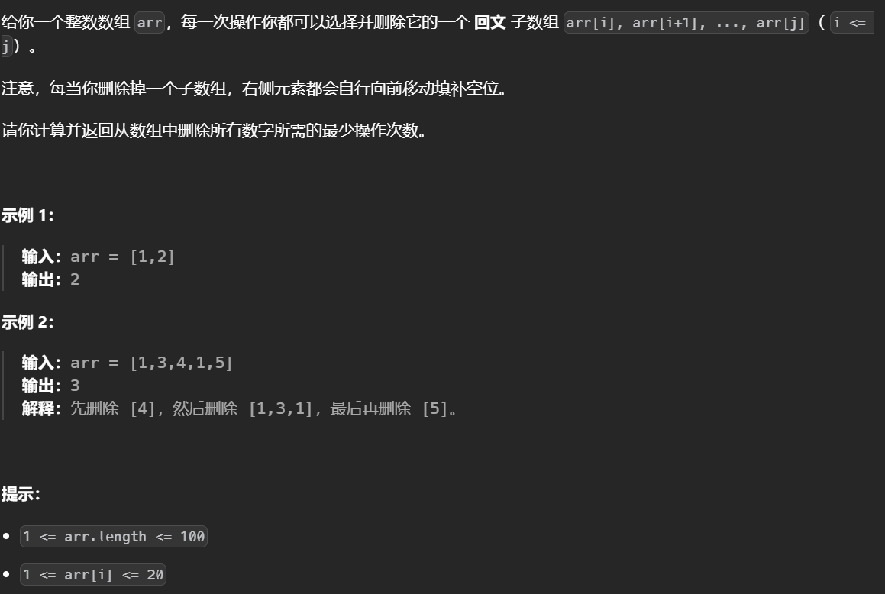

标准的区间DP(n=100)，定义dp(i,j)表示删除区间[i,j]所有数所需的最小操作次数，可以枚举中间节点划分区间，如果两端的字符相等那么可以拼接到中间某一次删除操作后使得所需操作次数减一，但也有可能是划分区间后所需的操作次数最小。

```python
class Solution:
    def minimumMoves(self, arr) -> int:
        n=len(arr)
        f=[[inf]*n for _ in range(n)]
        # base case 
        for i in range(n):f[i][i]=1
        for ll in range(2,n+1):
            l=0
            while (r:=l+ll-1)<n:
                # 长度为2特判
                if ll==2:
                    f[l][r]=int(arr[l]!=arr[r])+1
                else:
                    # 枚举中间位置
                    for k in range(l,r):
                        f[l][r]=min(f[l][r],f[l][k]+f[k+1][r]) 
                    # 并非满足两端相等就要删除
                    if arr[l]==arr[r]:
                        f[l][r]=min(f[l][r],f[l+1][r-1])
                l+=1
        return f[0][n-1]
```

## [移除盒子](https://leetcode.cn/problems/remove-boxes/)

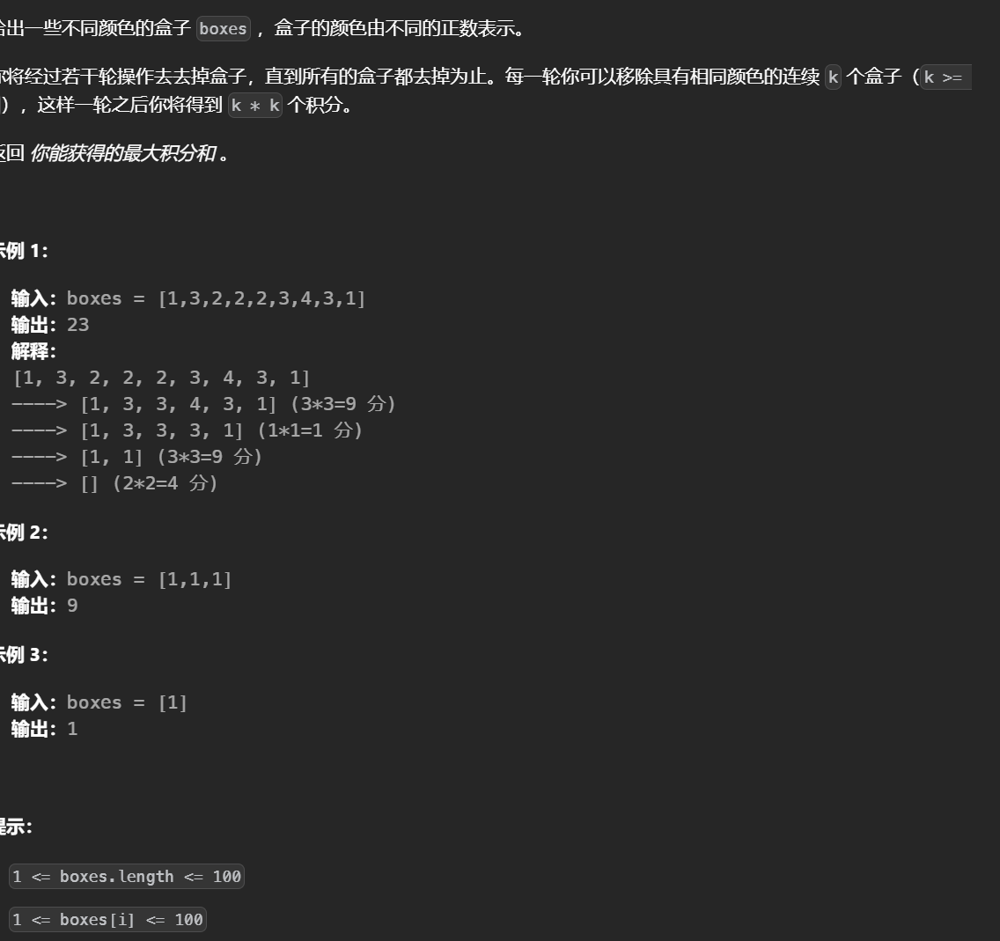

用dp(i,j)表示合并区间[i,j]的最小成本无法进行状态转移，因为区间的分数还会受到之前的移动的影响，这里定义dp(i,j,k)表示合并区间[i,j]且区间的右侧有k个数等于nums[j]的最小成本，这样可以考虑到前一时刻的影响。

转移时，可以是最后一个元素与右侧的元素拼接，或者从区间中再找一个等于nums[j]的nums[idx]，删除[idx+1,j]中的元素使得nums[idx]与之后的k+1个元素拼接。

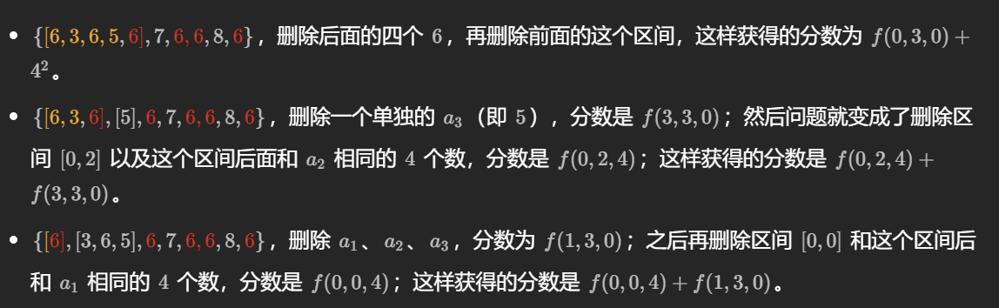

```python
class Solution:
    def removeBoxes(self, nums: List[int]) -> int:
        n=len(nums)
        @cache
        def dp(i,j,k):
            if i>j:return 0
            # 最后一个元素直接拼接
            res=dp(i,j-1,0)+(k+1)**2
            for idx in range(i,j):
                # 找一个等于nums[j]的元素，使得k+1个元素连接在一起
                if nums[idx]==nums[j]:
                    res=max(res,dp(i,idx,k+1)+dp(idx+1,j-1,0))
            return res
        return dp(0,n-1,0)
```


## [解出数学表达式的学生分数](https://leetcode.cn/problems/the-score-of-students-solving-math-expression/)

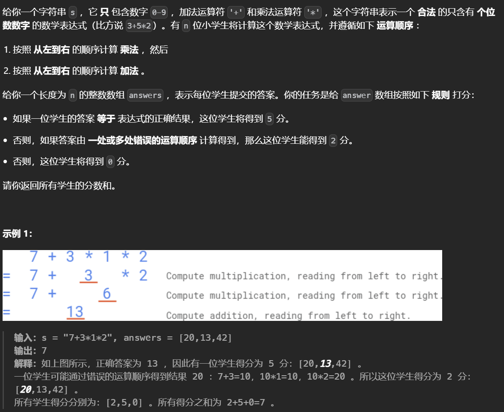

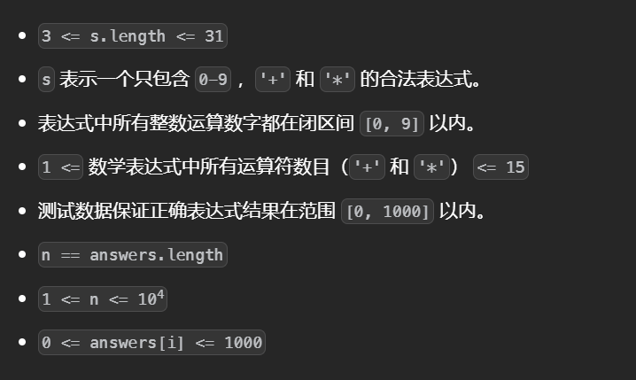

区间DP按照运算符划分，得出一个区间最多能有多少中可能(计算错误的)

```python
class Solution:
    def scoreOfStudents(self, s: str, answers) -> int:
        right=eval(s)
        @cache
        def dp(i,j):
            if i==j:
                return set([int(s[i])])
            ans=set()
            for k in range(i,j+1):
                # 按照运算符划分区间
                if not str.isdigit(s[k]):
                    # 左右区间的可能
                    m1=dp(i,k-1)
                    m2=dp(k+1,j)
                    for l in m1:
                        # 运算出的结果不能大于1000
                        if l>1000:continue
                        for r in m2:
                            if s[k]=='*' and l*r<=1000:ans.add(l*r)
                            elif s[k]=='+' and l+r<=1000:ans.add(l+r)
            return ans 
        n=len(s)
        s=dp(0,n-1)
        s.remove(right)
        ans=0
        for x in answers:
            if x==right:ans+=5
            elif x in s:ans+=2
        return ans
```

## [奇怪的打印机](https://leetcode.cn/problems/strange-printer/)

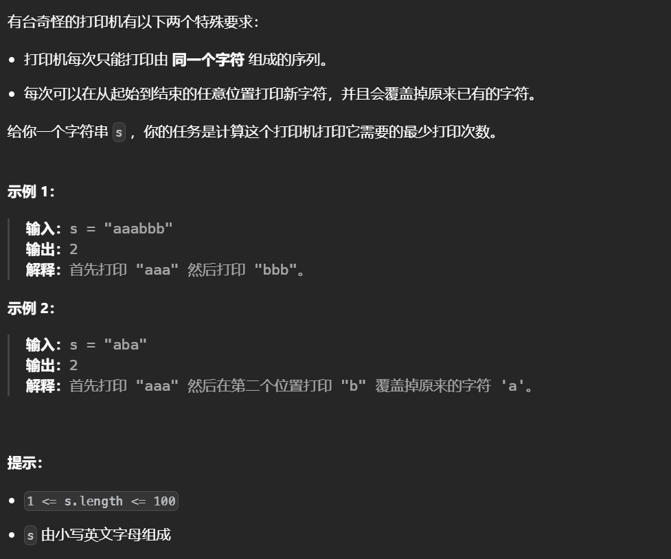


定义dp(i,j)为区间[i,j]所需的最少操作次数，如果两侧的字符相等那么dp(i,j)=dp(i,j-1)即右侧的字符可以顺带打印，这里不能转移到dp(i+1,j-1)不然对于aba难以确定最终结果。

```python
class Solution:
    def strangePrinter(self, s: str) -> int:
        n=len(s)
        @cache
        def dp(i,j):
            if i>=j:return 1
            res=inf
            if s[i]==s[j]:return dp(i,j-1)
            for k in range(i,j):
                res=min(res,dp(i,k)+dp(k+1,j))
            return res 
        return dp(0,n-1)
```


## [多边形三角剖分的最低得分](https://leetcode.cn/problems/minimum-score-triangulation-of-polygon/)

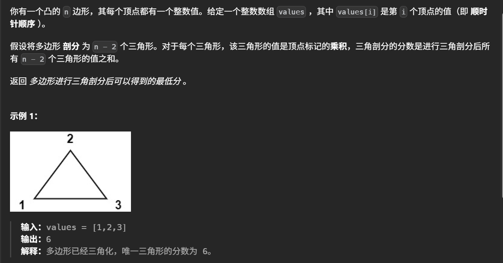

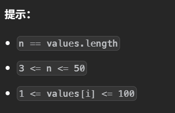

很抽象的区间DP，对于给定的多边形，可以看作是固定两个点去找第三个点，而这第三个点会将剩余部分划分为两个子问题，然后递归处理

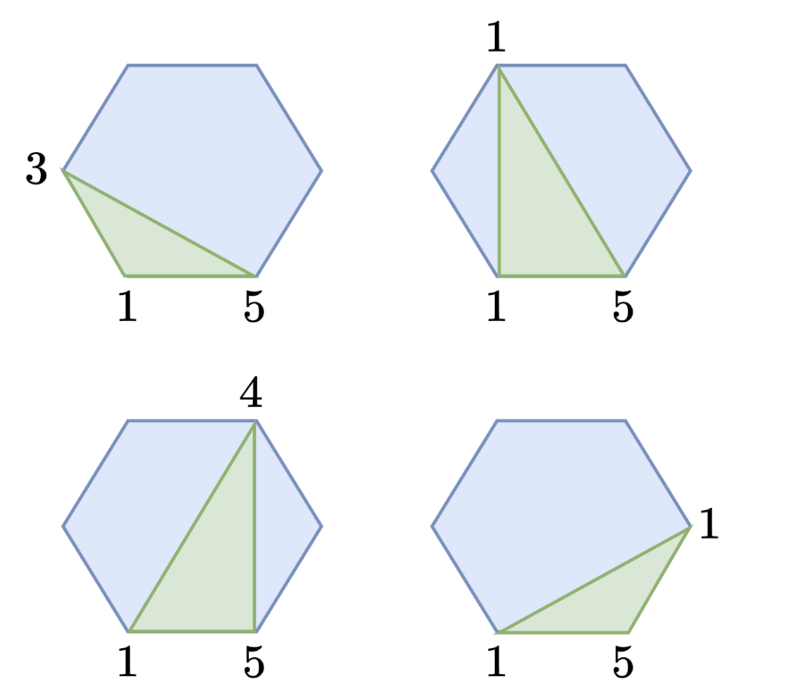

```python
class Solution:
    def minScoreTriangulation(self, nums) -> int:
        n=len(nums)
        @cache
        def dp(i,j):
            if j-i==1:return 0
            res=inf
            for k in range(i+1,j):
                res=min(res,dp(i,k)+dp(k,j)+nums[i]*nums[k]*nums[j])
            return res 
        return dp(0,n-1)
```


 


## [可处理的最大删除操作数 I](https://leetcode.cn/problems/maximum-number-of-removal-queries-that-can-be-processed-i/)

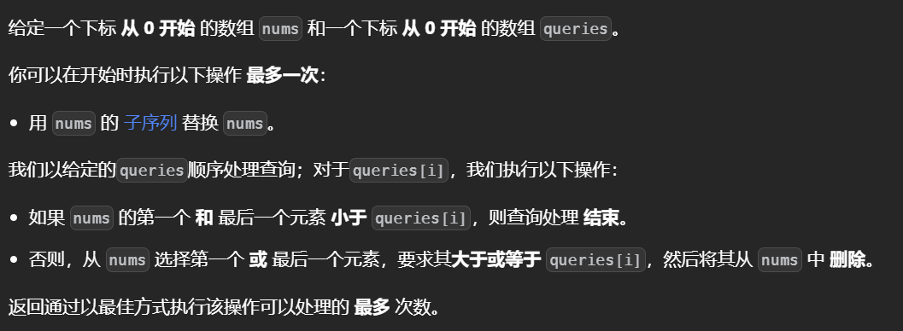

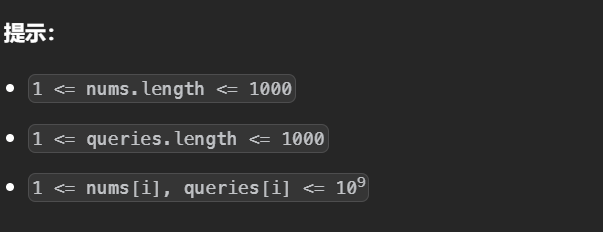


对于给定的数据范围，设置dp的返回值为可以处理的最多操作次数来判断当前要处理第几个询问，避免多一维的状态。

定义dp(i,j)为区间[i,j]为选择端点时能处理的最多的次数，这里使用刷表法求解。

```python
class Solution:
    def maximumProcessableQueries(self, nums: List[int], queries: List[int]) -> int:
        n=len(nums)
        f=[[0]*(n+1) for _ in range(n+1)]
        max=lambda a,b:a if a>=b else b 
        ans=0
        for k in range(n,0,-1):
            # n-l>=k
            for l in range(1,n-k+2):
                r=l+k-1
                # 刷表法
                i=f[l][r]
                # 询问全都能解决
                if i==len(queries):return len(queries) 
                
                ans=max(ans,i)
                # 左端点满足
                if nums[l-1]>=queries[i]:
                    # 防止越界，实际上是特判[i,i]区间
                    if l+1>r:ans=max(ans,i+1)
                    else:f[l+1][r]=max(f[l+1][r],i+1)
                # 不满足，但可以通过筛选子序列跳过
                else:
                    if l+1>r:ans=max(ans,i)
                    else:f[l+1][r]=max(f[l+1][r],i) 
                # 右端点满足
                if nums[r-1]>=queries[i]:
                    if l>r-1:ans=max(ans,i+1)
                    else:f[l][r-1]=max(f[l][r-1],i+1)
                else:
                    if l>r-1:ans=max(ans,i)
                    else:f[l][r-1]=max(f[l][r-1],i)

        return ans 
```


## [查询子数组最大异或值](https://leetcode.cn/problems/maximum-xor-score-subarray-queries/)

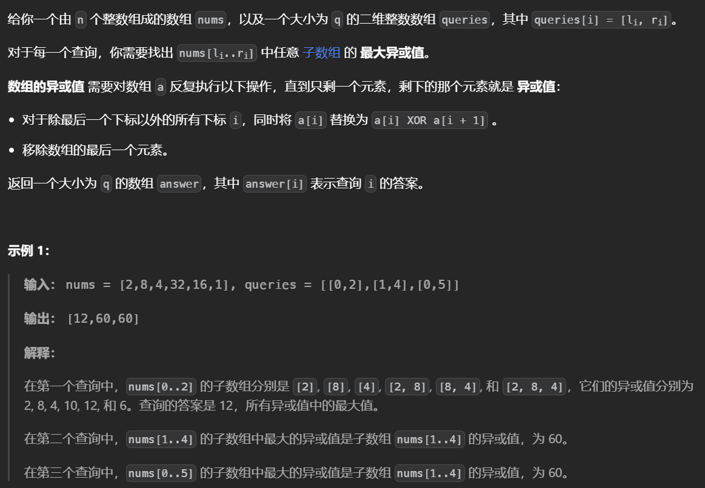

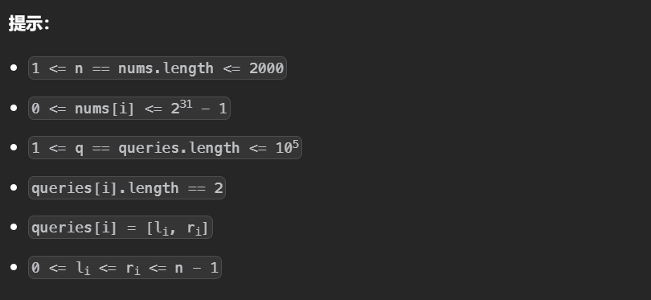


注意一次操作是将数组中出最后一个之外的的每一个值与它的后一位异或，对于数组a b c d 有

$$ab bc cd ->ab^2c bc^2d ->ab^3c^3d 即abcd$$，发现区间最后的结果就是f[i+1]\[j]^f[i]\[j-1]得到状态转移方程。

为了应对每一组询问，同时套一个区间最大值。

```python
class Solution:
    def maximumSubarrayXor(self, nums: List[int], queries: List[List[int]]) -> List[int]:
        n=len(nums)
        f=[[0]*n for _ in range(n)]
        mx=[[0]*n for _ in range(n)]
        
        for i in range(n-1,-1,-1):
            f[i][i]=mx[i][i]=nums[i]
            for j in range(i+1,n):
                f[i][j]=f[i+1][j]^f[i][j-1]
                mx[i][j]=max(f[i][j],mx[i+1][j],mx[i][j-1])
        res=[]
        for l,r in queries:res.append(mx[l][r])
        return res 
```


## 戳气球

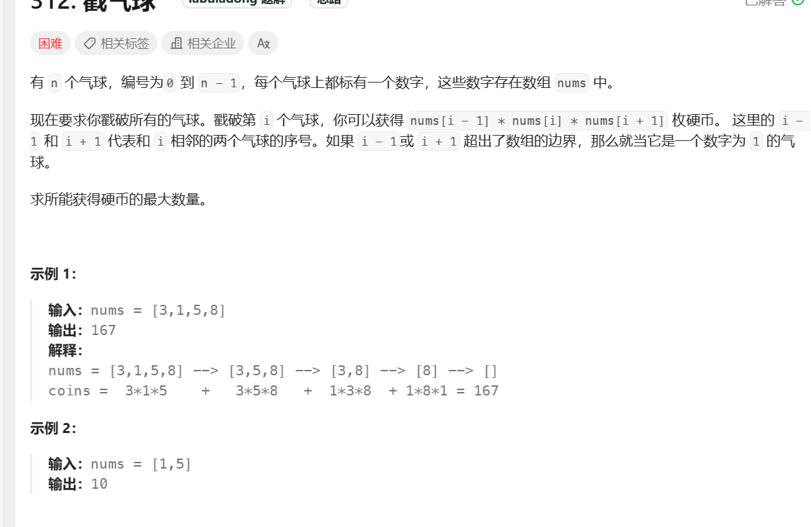

由题意知，超出边界的值选择为1，在原数组中加入两个边界值左边一个右边一个，将原问题转换为一排气球吹破除了起点于端点外的所有气球所能得到的最大分数。

选取状态为区间，dp[i] [j]表示从i到j的开区间内，戳破所有气球的最大分数，而选择k是那个气球是**最后一个戳破**的，这样就有状态转移方程。最后的结果是dp[0] [n+1]。

dp[i] [j]=dp[i] [k]+dp[k] [j]+nums[k]*nums [i] *nums[j]，既然是最后一个戳破的，那么左右的值只能是区间的边界。

注意i和j的遍历顺序，选择从左到右，从下到上遍历，因为每个状态要由它的前一个状态推出

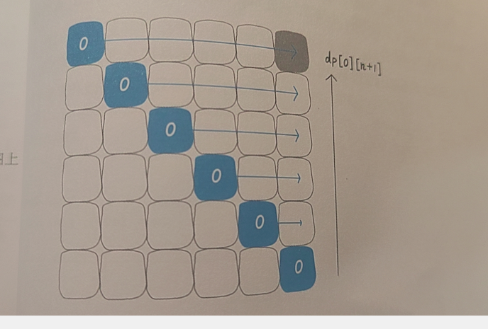


```python
class Solution(object):
    def maxCoins(self, nums):
        n=len(nums)
        # 构建新数组，加入两个虚拟节点
        nums_dummy=[1]
        nums_dummy.extend(nums)
        nums_dummy.append(1)
        # 初始化，base case 是当区间内没有值的时候，即i>=j，初始化结果为0
        dp=[[0 for _ in range(n+2)] for _ in range(n+2)]
        # 按照从左到右从下到上的顺序遍历
        for i in range(n,-1,-1):
            for j in range(i+1,n+2):
                # 在当前区间内选取k，作为最后一个吹破的气球
                for k in range(i+1,j):
                    dp[i][j]=max(dp[i][j],dp[i][k]+dp[k][j]+nums_dummy[i]*nums_dummy[k]*nums_dummy[j])
        # 注意dp表示的是开区间
        return dp[0][n+1]
```


# 状压dp

## 相邻无关

### [校园自行车分配 II](https://leetcode.cn/problems/campus-bikes-ii/)

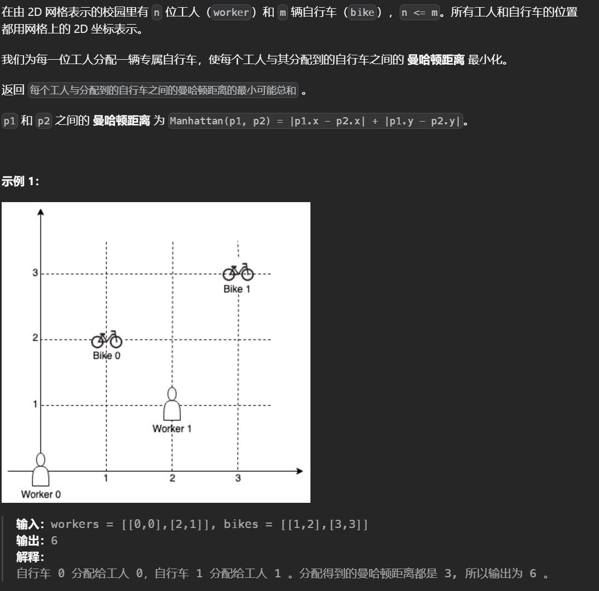


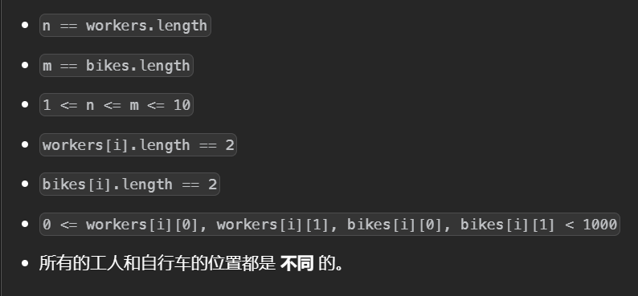


状态压缩dp，有两个对象一个是工人一个是自行车，把工人用i表示第几个，自行车用mask表示选或未选的状态，这里不是把两个对象都是用mask表示。

```python
class Solution:
    def assignBikes(self, workers: List[List[int]], bikes: List[List[int]]) -> int:
        n=len(workers)
        m=len(bikes)
        def  cal(x,y):
            return abs(workers[x][0]-bikes[y][0])+abs(workers[x][1]-bikes[y][1])
        @cache
        def dp(i,mask):
            if i==n:return 0
            res=inf
            for j in range(m):
                if mask>>j&1:continue
                res=min(res,dp(i+1,mask|(1<<j))+cal(i,j))
            return res
        return dp(0,0)
```


### [数组的最大与和](https://leetcode.cn/problems/maximum-and-sum-of-array/)

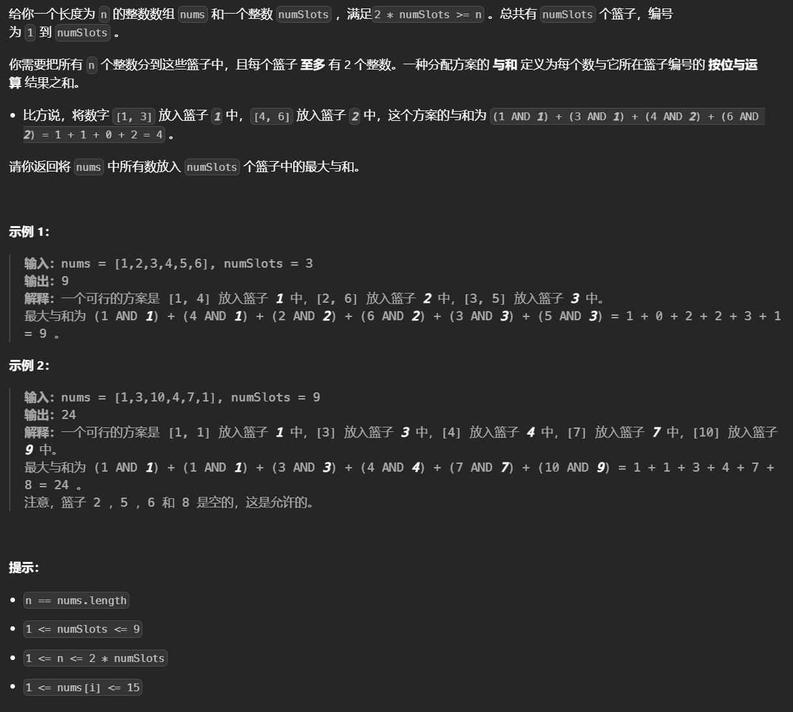

由题意至少定义两个状态，第一种是第几个篮子和二进制表示的每个数是否已选，状态数有2^18=262144

第二种是第几个数，每个篮子还能放几个(0,1,2)可以用三进制数表示，状态数有3^9=19683一因此选择第二种方式

```python
class Solution:
    def maximumANDSum(self, nums: List[int], numSlots: int) -> int:
        n=len(nums)
        @cache
        def dp(i,s):
            if i==n:
               return 0 
            res=-inf
            mask=[]
            total=s
            # 求解三进制表示方式
            while s:
                mask.append(s%3)
                s//=3
            # 注意 需要补前导0
            mask=[0]*(numSlots-len(mask))+mask[::-1]
            # 每个数选哪个篮子
            for j,x in enumerate(mask):
                # 篮子可以放
                if x:
                    v=nums[i]&(j+1)
                    res=max(res,dp(i+1,total-3**(numSlots-j-1))+v)   
            return res
        return dp(0,3**numSlots-1)
```


## 子集状压型

一般通过枚举子集来转移，时间复杂度为O($3^n$)，对于第几个集合或者说第几个人，有的时候可以通过集合推出。


### [完成所有工作的最短时间](https://leetcode.cn/problems/find-minimum-time-to-finish-all-jobs/)

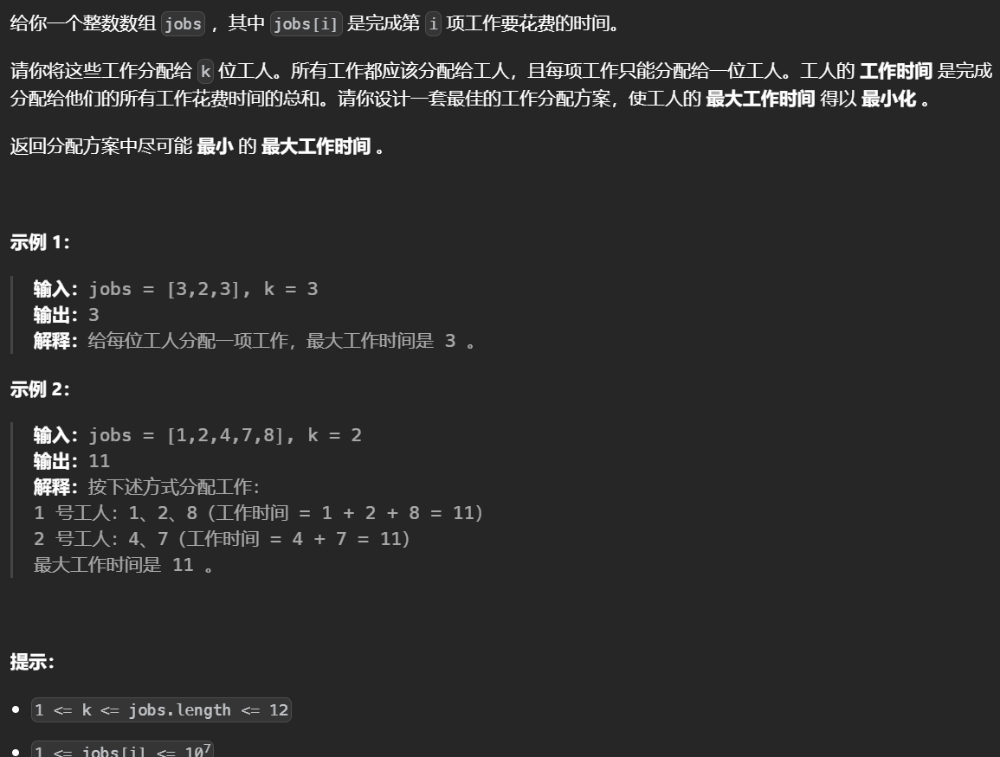


定义dp(i,j)表示对于前I个工人，已经完成了集合为j的工作的最小的最大工作时间。

转移方程为对第i个工人枚举他完成了那些工作，然后与前i-1个工人取最大

```python
sub=[[] for _ in range(1<<12)]
for i in range((1<<12)):
    temp=i
    # 包括空集
    while True:
        sub[i].append(temp)
        temp=(temp-1)&i
        if i==temp:break
class Solution:
    def minimumTimeRequired(self, nums, k: int) -> int:
        n=len(nums)
        sum=[-1]*(1<<n)
        # 预处理每个子集的工作时间
        for i in range(1<<n):
            res=0
            for j in range(n):
                if i>>j&1:res+=nums[j]
            sum[i]=res
        f=[[inf]*(1<<n) for _ in range(k+1)]
        # 所有的工作必须完成
        f[0][0]=0
        for i in range(1,k+1):
            for j in range((1<<n)):
                for s in sub[j]:
                    # 手动判断大小，减小开销
                    l,r=f[i-1][j^s],sum[s]
                    if l<=r:t=r
                    else:t=l
                    if t<f[i][j]:f[i][j]=t
                    # f[i][j]=min(f[i][j],max(f[i-1][j^s],sum[s]))
        return f[k][(1<<n)-1]
```

### [参加考试的最大学生数](https://leetcode.cn/problems/maximum-students-taking-exam/)

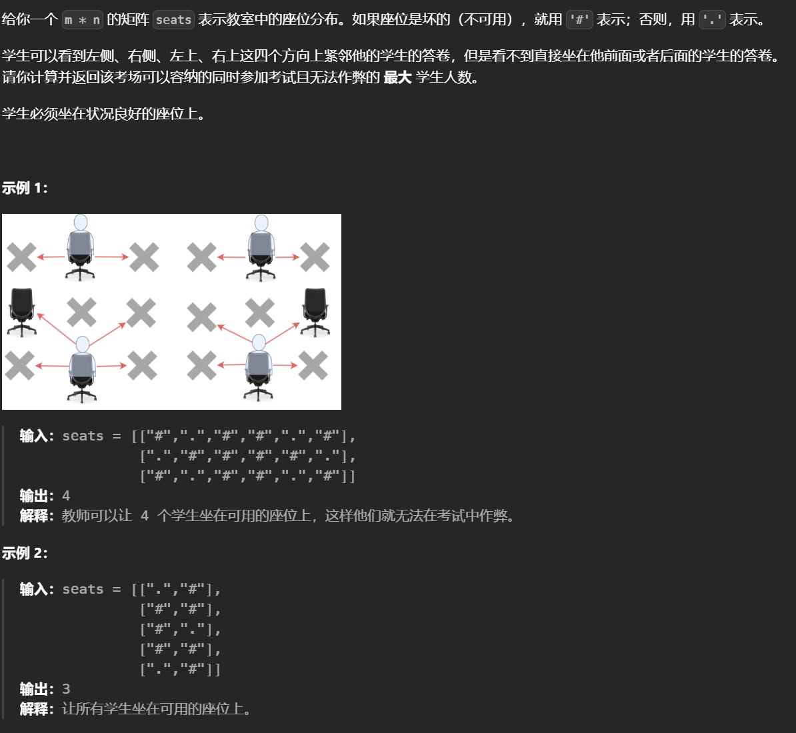

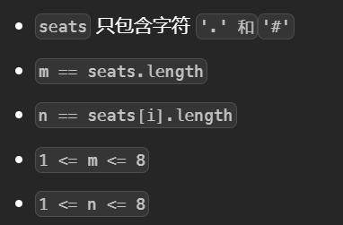


对于给定的数据范围无法用一维的状压表示，这里令dp(i,s)表示在第i行状态为s的时候能坐下的最多的学生数。

```python
class Solution:
    def maxStudents(self, seats) -> int:
        # 计算出每行的约束
        def f(arr):
            s=0
            for j,v in enumerate(arr):
                if v!='#':s|=(1<<j)
            return s
        n=len(seats[0])
        ss=[f(s) for s in seats]
        @cache
        def dp(i,s):# s表示第I行的约束
            ans=0
            # 枚举所有状态
            for mask in range(1<<n):
                # 不能有相邻的也不能超出当前的状态
                if (mask|s)==s and (mask&(mask<<1))==0:
                    cnt=mask.bit_count()
                    # 最后一行特判
                    if i==len(ss)-1:
                        ans=max(ans,cnt)
                    else:
                        # 用当前的状态对下一行约束
                        nx=ss[i+1]
                        for j in range(n):
                            if mask>>j&1:
                                # 左下右下不能坐人
                                if j-1>=0:nx&=~(1<<(j-1))
                                if j+1<n:nx&=~(1<<(j+1))
                        ans=max(ans,cnt+dp(i+1,nx))
            return ans 
        return dp(0,ss[0])
```


### [并行课程 II](https://leetcode.cn/problems/parallel-courses-ii/)

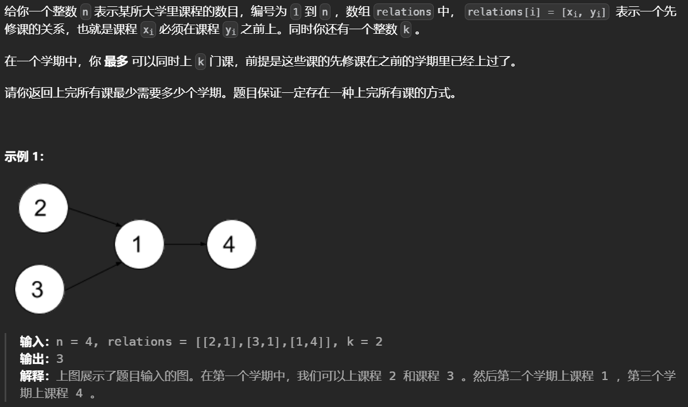

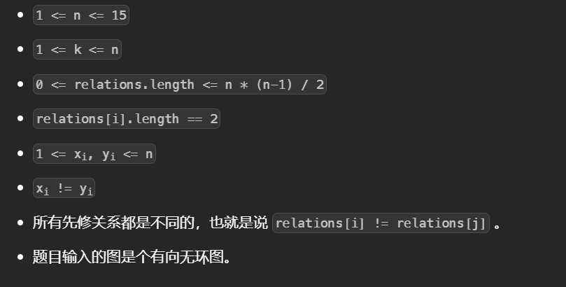


对于给定的数据范围考虑使用状压dp，定义dp(i)表示有哪些没有完成。	


```python
class Solution:
    def minNumberOfSemesters(self, n: int, relations: List[List[int]], k: int) -> int:
        pre1=[0]*n
        # 用二进制储存每个课程的先修课
        for u,v in relations:
            pre1[v-1]|=(1<<(u-1))
        # 全集
        u=(1<<n)-1
        @cache
        def dp(i):
            # 都学了
            if not i:return 0
            # 找当前的补集也即是学了那些
            c1=u^i
            i1=0
            # 遍历所有的课程找出那些没有被选过的且满足先修课要求的
            for j,p in enumerate(pre1):
                if i>>j&1 and p|c1==c1:
                    i1|=(1<<j)
            # 如果这个可以选的课程小于等于k那么就一次性解决
            if i1.bit_count()<=k:
                return dp(i1^i)+1
            # 否则选其中k个，这里通过枚举子集实现
            res=inf 
            j=i1
            while j:
                if j.bit_count()<=k:res=min(res,dp(i^j)+1)
                j=(j-1)&i1
            return res 
        return dp(u)          
```


### [覆盖](https://leetcode.cn/problems/broken-board-dominoes/)

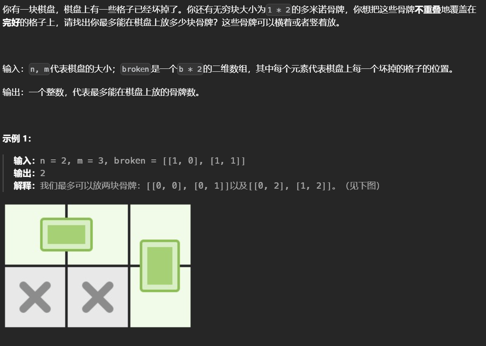

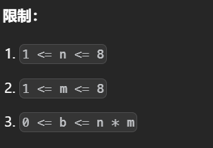

与上一题大致相同，枚举行数，用一个二进制数表示每一行可放置的的状态，这里可以横放或者竖放，因此使用dfs回溯去找最多的骨牌数，如果竖放那么会影响到下一行的状态，回溯中额外维护一个状态表示下一行可选的，当去找下一行时，要对两个状态取and

```python
class Solution:
    def domino(self, m: int, n: int, broken: List[List[int]]) -> int:
        row=[(1<<n)-1]*(m+1)
        # 记录每一行的状态
        for r,c in broken:
            row[r]^=(1<<c)
        
        @cache
        def dp(i,mask):# i表示行，maks表示当前行的状态
            # 结束
            if i==m:return 0
			# 列的位置，s表示下一行的状态，找出这一行在满足条件的情况下各种排列方式的放置数以及下一行的状态
            def dfs(cur_i,s):
                # 一行选择完，找下一行，row[i+1]表示下一行原本的状态，s表示当前行选完后下一行可选的状态，取交集
                if cur_i==n:return dp(i+1,s&row[i+1])
                # 跳过当前位置
                res=dfs(cur_i+1,s)
                state=None
                # 横放 
                if cur_i+1<n and mask>>cur_i&1 and mask>>(cur_i+1)&1:
                    res=max(res,dfs(cur_i+2,s)+1)
                # 竖放，修改下一行的状态
                if mask>>cur_i&1 and i+1<m and row[i+1]>>cur_i&1:                    
                    res=max(res,dfs(cur_i+1,s^(1<<cur_i))+1)
                return res
            # 回溯求解
            res=dfs(0,(1<<n)-1)
            return res
        
        return dp(0,row[0])                

```

### [最优账单平衡](https://leetcode.cn/problems/optimal-account-balancing/)

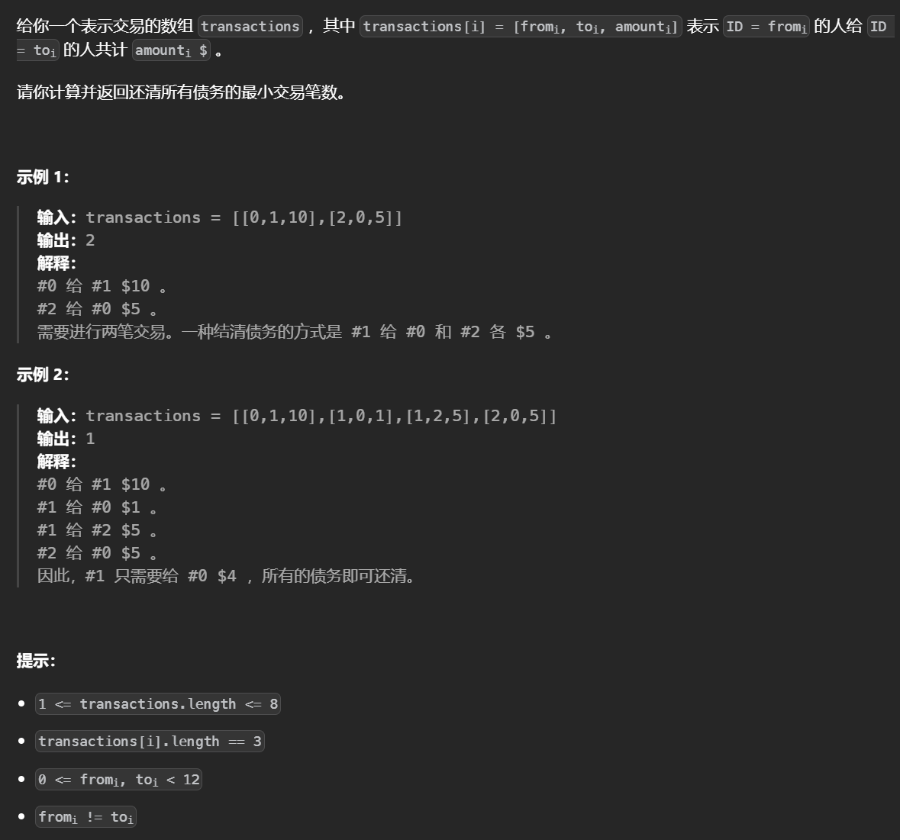

还清债务只需要把借的钱倒还回去即可，因此不需要从外部引入额外的钱。

对于不同的交易，一个人减少一个人增加，减少的数值和增加的数值一样多，因此最后数组的的和是平衡的，如果一个集合能还清债务那么集合中的元素之和一定为0。

对于{4,-1,-1,-1,-1}需要至少n-1次操作，而对于集合{-1,-1,1,1}可以在两次操作内完成，因此对于一个集合，可以去划分为两个子集，它所需的操作次数等于自己操作次数之和。

```python
class Solution:
    def minTransfers(self, nums: List[List[int]]) -> int:
        cnt=Counter()
        # 初始化数组
        for i,j,w in nums:
            cnt[i]-=w
            cnt[j]+=w
        arr=list(cnt.values())
        
        # 记录每个集合的元素之和
        pb={}
        # 枚举子集
        sub=[[] for _ in range(1<<len(cnt))]

        # 枚举子集
        for i in range(1<<len(cnt)):
            temp=i
            temp=(temp-1)&i

            val=0
            for j in range(len(cnt)):
                if i>>j&1:val+=arr[j]
            pb[i]=val
            

            while temp:
                sub[i].append(temp)
                temp=(temp-1)&i
        @cache
        def dp(i):  
            if not i:return 0
             # 至少需要的操作次数，但集合的元素之和必须为0
            res=i.bit_count()-1 if pb[i]==0 else inf 
            for s in sub[i]:
                # 两个子集操作次数之和
                res=min(res,dp(i^s)+dp(s))
            return res 
        return dp((1<<len(cnt))-1)
```


## 排列型 ② 相邻相关

一般定义f[s]\[j]表示已选的集合，以及上一个选的元素的下标 j，通过枚举当前下标转移。


### 毕业旅行问题

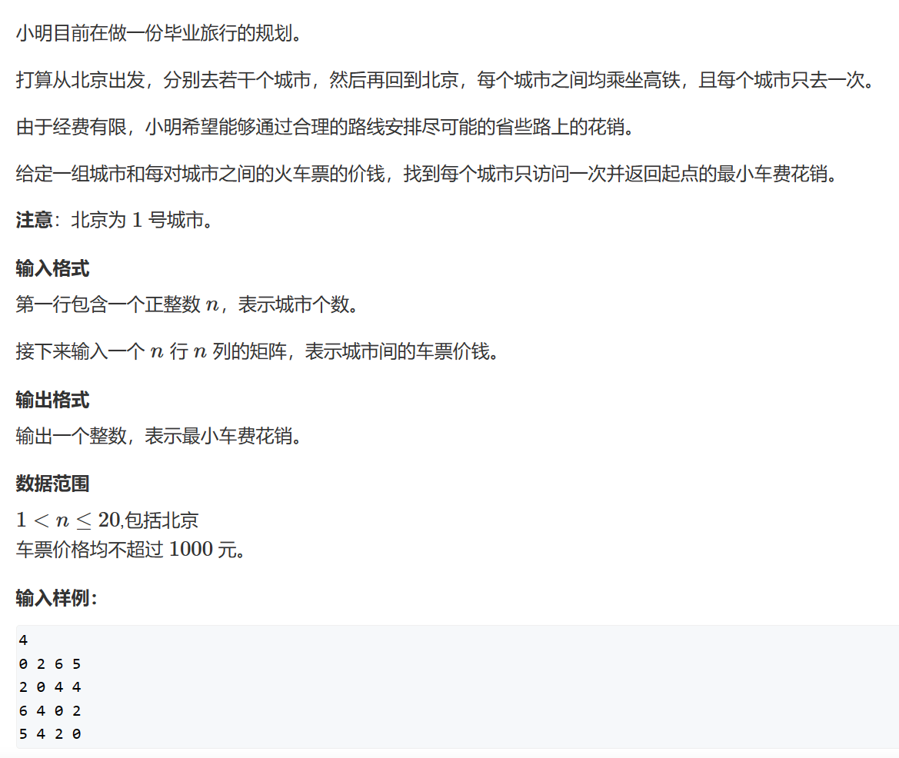


状态压缩dp，定义dp(i,j)，i表示访问过的集合是一个二进制表示，j表示当前在那个位置。状态转移定义为到dp(i,j)的最小距离为在i中访问过的其他点中（除了j以外）到j的距离的最小。

```python
from math import inf 

n=int(input())
m=1<<n
# 建图
g=[[inf]*n for _ in range(n)]

for i in range(n):
    nums=[int(x) for x in input().split()]
    for j ,v in enumerate(nums):
        g[i][j]=v

# 定义状态
dp=[[inf]*n for _ in range(m)]

# base case 初始的时候必须从0号节点开始也就是i=1，j=0
dp[1][0]=0

# 枚举所有的状态，访问过的点的集合，每次加二包括起点位置
for i in range(1,1<<n,2):
    # 枚举j，当前所在位置
    for j in range(n):
        # 首先需要j在集合中存在
        if (i>>j&1):
            # 枚举从集合中的其他点出发，到j的的最短距离
            for k in range(n):
                # 这个点需要存在于剩下的集合中
                if ((i-(1<<j))>>k&1): dp[i][j]=min(dp[i][j],dp[i-(1<<j)][k]+g[k][j])
res=inf 
# 最后找出从不同节点到0的最短距离
for i in range(1,n):
    res=min(res,dp[(1<<n)-1][i]+g[i][0])
print(res)
```


### [找出分数最低的排列](https://leetcode.cn/problems/find-the-minimum-cost-array-permutation/)

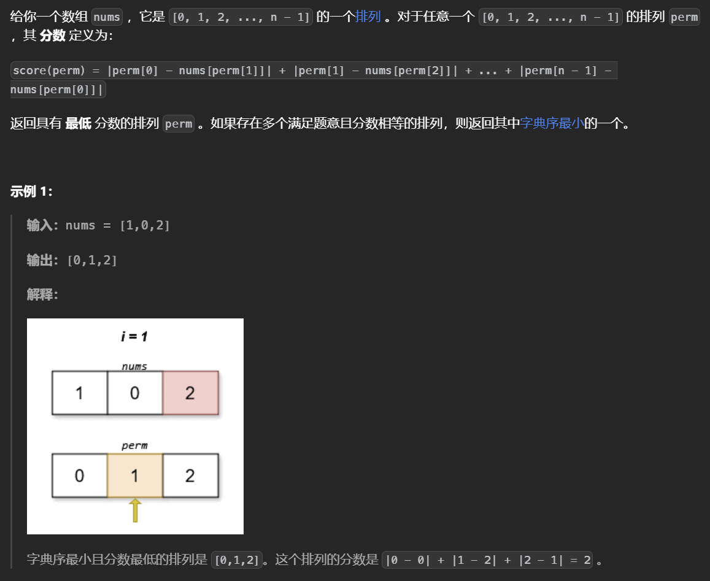

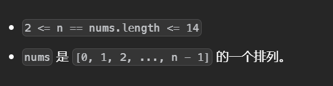


计算的得分包括两个位置，因此需要一个状态表示前一个选了什么，同时计算表达式有首尾相连的项，如果能确定首项或者尾项可以简化式子，观察发现将perm数组左移一位不会影响到最终结果，而题目要求最小序，所以第一项一定是0。

求解具体的方案数，先通过dp求解出最小的分数，然后使用递归枚举选某一项是否满足分数要求，如果满足那么就添加到数组。

```python
class Solution:
    def findPermutation(self, nums):
        n=len(nums)
        arr=list(range(n))
        inf=10**9
        
        @cache
        # s表示已选,j表示前一项
        def dfs(s,j):
            # 选完了，求解最后一项
            if s==(1<<n)-1:return abs(j-nums[0])
            res=inf
            for i in range(n):
                # 枚举没有选的
                if s>>i&1==0:
                    res=min(res,dfs(s|(1<<i),i)+abs(nums[i]-j))
            return res 
        ans=[]
        def make_ans(s,pre):
            nonlocal ans
            # 加入
            ans.append(pre)
            if s==(1<<n)-1:return 
            val=dfs(s,pre)
            for i in range(n):
                # 选择这一项满足数值要求
                if s>>i&1==0 and dfs(s|(1<<i),i)+abs(pre-nums[i])==val:
                    make_ans(s|(1<<i),i)
                    return 
        make_ans(1,0)
        return ans 
```


### [图中的最长回文路径](https://leetcode.cn/problems/longest-palindromic-path-in-graph/)


直接爆搜显然是不行的，回文串的做法就几种，考虑使用中心扩展法优化，枚举回文中心，这样就只需往两边找相同的字符。

由于节点个数较少因此可以使用状态压缩记录操作过的节点，定义dp(x,y,s)为左右端点为x,y的回文串，s记录已选过的节点，去枚举x,y的相邻节点做状态转移

```python
max=lambda x,y:x if x>y else y

class Solution:
    def maxLen(self, n: int, edges: List[List[int]], nums: str) -> int:
        ans=1 # 只有一个节点的情况
        # 建图
        g=[[] for _ in range(n)]
        for u,v in edges:
            g[u].append(v)
            g[v].append(u)
        @cache
        def dp(x,y,s):
            res=0
            # 枚举
            for nx1 in g[x]:
                if s>>nx1&1:continue
                for nx2 in g[y]:
                    # 需要字符相同，且没选过
                    if nx1!=nx2 and s>>nx2&1==0 and nums[nx1]==nums[nx2]:
                        # 注意要保证相对顺序，否则会多出很多重复状态
                        if nx1>nx2:nx1,nx2=nx2,nx1
                        res=max(res,2+dp(nx1,nx2,s|(1<<nx1)|(1<<nx2)))
            return res  
        
        for u,v in edges:
            # 单个点作为中心
            ans=max(ans,1+dp(u,u,(1<<u)))
            ans=max(ans,1+dp(v,v,(1<<v)))

            # 两个点作为中心
            if nums[u]==nums[v]:
                if u>v:u,v=v,u
                ans=max(ans,2+dp(u,v,(1<<u)|(1<<v)))
        return ans 
```


### [吃掉所有兵需要的最多移动次数](https://leetcode.cn/problems/maximum-number-of-moves-to-kill-all-pawns/)

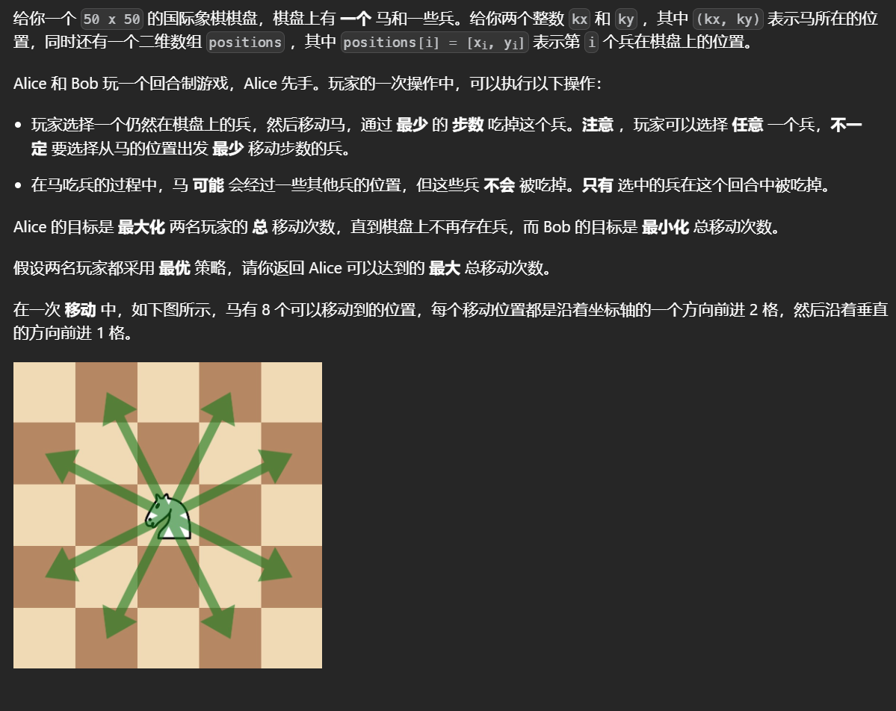

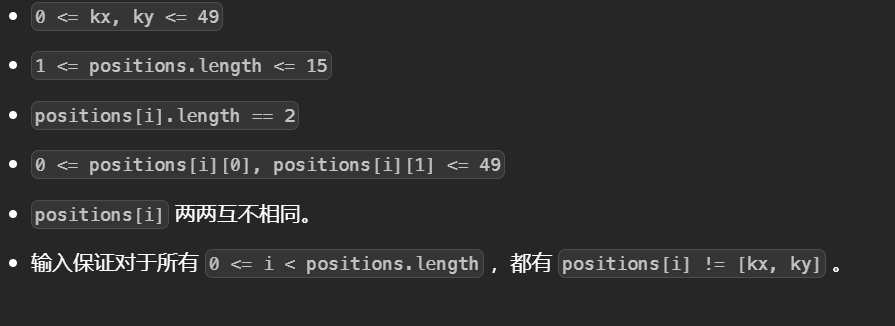

给定的数据范围可以进行状态压缩，状态中需要有表示当前坐标位置的，可以用pos数组的索引来表示因此每次移动完一定是在某一个兵的位置，可以把初始位置放到pos中，如果在dp中进行bfs会很耗时因此可以预先处理，反向思考每个兵到周围位置的所需的最小步数。用msk中1的个数表示当前是该谁操作l

```python
class Solution:
    def maxMoves(self, kx: int, ky: int, pos: List[List[int]]) -> int:
        n=len(pos)
        # 预处理每个位置到网格中其他点的距离
        f=[[[-1]*50 for _ in range(50)] for _ in range(n)]
        for ii in range(n):
            x,y=pos[ii]
            d=deque()
            d.append((x,y))
            sz=0
            while d:
                sz+=1
                for _ in range(len(d)):
                    i,j=d.popleft()
                    for dx,dy in (1,2),(-1,2),(-1,-2),(2,-1),(2,1),(-2,1),(-2,-1),(1,-2):
                        if 0<=(x:=dx+i)<50 and 0<=(y:=dy+j)<50 and f[ii][x][y]<0:
                            f[ii][x][y]=sz
                            d.append((x,y))
        a=f[0]
        pos.append((kx,ky))
        @cache
        def dp(i,j):# i表示当前所在位置，j表示选了那些
            if j==(1<<n)-1:return 0
            x,y=pos[i]
            count=j.bit_count()
            res=inf if count&1 else -inf  
            for jj in range(n):
                if j>>jj&1==0:
                    if count&1:res=min(res,f[jj][x][y]+dp(jj,j|(1<<jj)))
                    else:res=max(res,f[jj][x][y]+dp(jj,j|(1<<jj)))
            return res 
        return dp(n,0)

```


### [最小不兼容性](https://leetcode.cn/problems/minimum-incompatibility/)

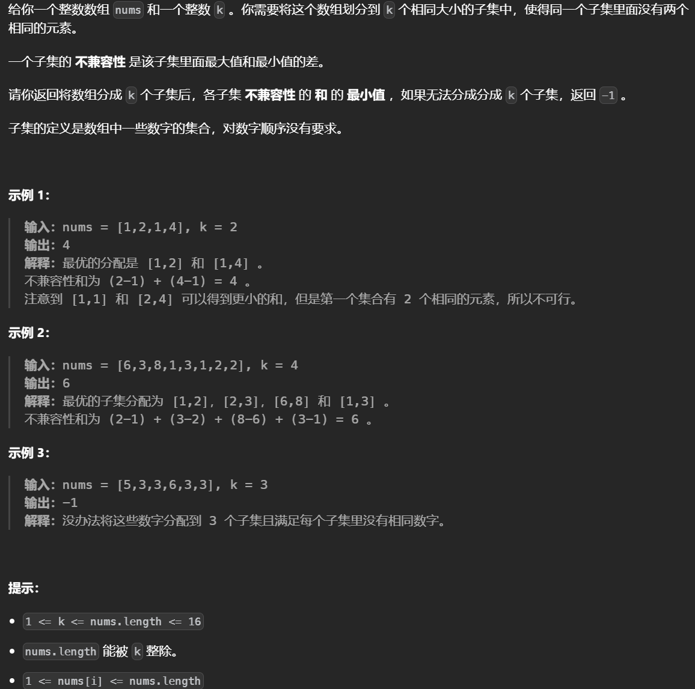

初始时定义状态为dp(i,s)表示前i组，已选s集合的元素，对于每一组从s中枚举子集转移，对于给定的数据范围超时。

实际上第一个状态是不需要的，集合中1的个数完全可以表示组数，并且最后的结果必然是所有的集合都选了，记录组数是没有必要的。定义dp(s)表示已选s集合时的最小值，枚举大小为n/k的集合转移。

```python
class Solution:
    def minimumIncompatibility(self, nums: List[int], k: int) -> int:
        n=len(nums)

        if n%k!=0:return -1
        # 特判
        if n == k:
            return 0
        kk=n//k
        f=[inf]*(1<<n)
        # base case
        f[0]=0

        max=lambda a,b:a if a>=b else b
        min=lambda a,b:a if a<=b else b

        # 预处理大小为kk的且不包含重复值的子集
        memo={}
        for i in range(1<<n):
            temp=i
            # 大小满足
            if temp.bit_count()!=kk:continue
            mx,mn=-inf,inf
            vis=set()
            for j in range(n):
                if temp>>j&1:
                    # 不重复
                    if nums[j] in vis:break
                    mx=max(mx,nums[j])
                    mn=min(mn,nums[j])
                    vis.add(nums[j])
            else:
                memo[i]=mx-mn            

        for i in range(1,1<<n):
            if i.bit_count()%kk==0:
                temp=i
                # 枚举子集
                while True:
                    # 满足条件的子集
                    if temp in memo:
                        f[i]=min(f[i],memo[temp]+f[i^temp])
                    temp=(temp-1)&i
                    if temp==i:break
        return f[-1] if f[-1]!=inf else -1
```


### [建造坚实的砖墙的方法数](https://leetcode.cn/problems/number-of-ways-to-build-sturdy-brick-wall/)

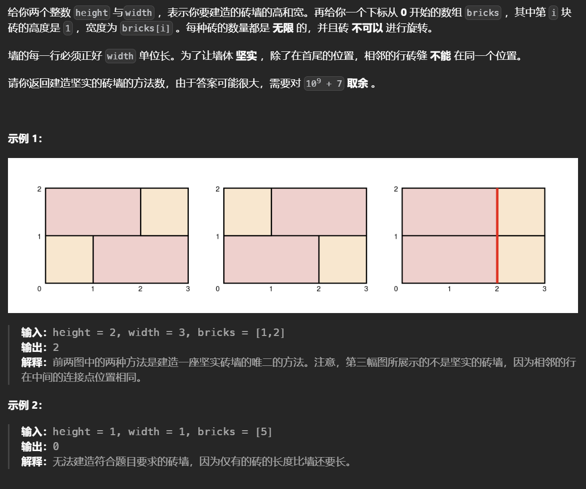

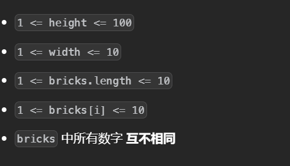

难点在于每一种砖头可以选无数次，且砖头之间的仙相对位置(缝隙)会影响下一个位置的选择，观察数据范围，发现宽度width<=10，那么可以记录缝隙的位置而无需考虑顺序以及个数，因此可以先用dfs求解出缝隙的位置

```python
class Solution:
    def buildWall(self, height: int, width: int, bricks) -> int:
        mod=10**9+7

        d=set()
        def dfs(cur,path):
            if cur>width :return  
            if cur==width:
                d.add(path) 
                return
            for x in bricks:
                dfs(cur+x,path|(1<<(cur+x)))
        dfs(0,0)

        @cache
        def dp(i,pre):
            if i==height:
                return 1
            res=0
            for k in d:
                if (k&pre)<=(1<<width):
                    res+=dp(i+1,k)
                    res%=mod
            return res 
        return dp(0,0)  
```


## 其他

### [大礼包](https://leetcode.cn/problems/shopping-offers/)

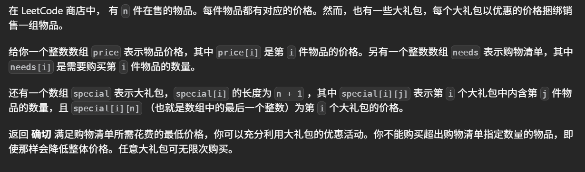

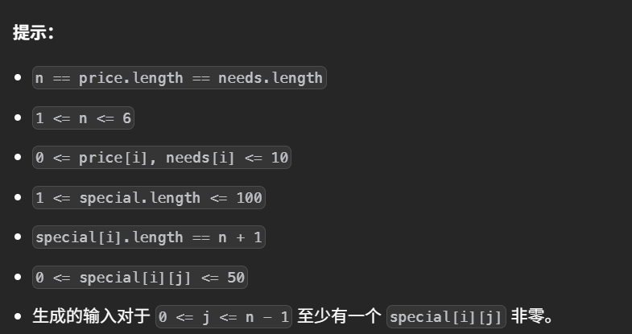

给定的数据范围——只有不超过6个位置，每个位置的值不超过10，那么可以用一最多为个6*4=24位数来压缩状态，表示当前还需选哪些。每个状态下遍历每个礼包，并计算全部单独买的最小值。

```python
class Solution:
    def shoppingOffers(self, price, special, needs) -> int:
        n=len(price)
        mask=[]
        for v in needs:
            v=bin(v)[2:]
            v='0'*(4-len(v))+v
            mask.append(v)
        mask=int(''.join(mask),2)
        @cache
        def dp(mask):
            if not mask:return 0
            a=[]
            s=bin(mask)[2:]
            s='0'*(4*n-len(s))+s
            res=0

            for i in range(0,4*n,4):
                c=s[i:i+4]
                a.append(int(c,2))
                res+=a[-1]*price[len(a)-1]  
            for arr in special:
                tmp=a[:]
                nx=[]
                for i,v in enumerate(arr[:-1]):
                    if v>tmp[i]:
                        break
                    tmp[i]-=v
                    c=bin(tmp[i])[2:]
                    nx.append('0'*(4-len(c))+c)
                else:
                    res=min(res,arr[-1]+dp(int(''.join(nx),2)))
            return res 
        return dp(mask)
```


### [选择矩阵中单元格的最大得分](https://leetcode.cn/problems/select-cells-in-grid-with-maximum-score/)

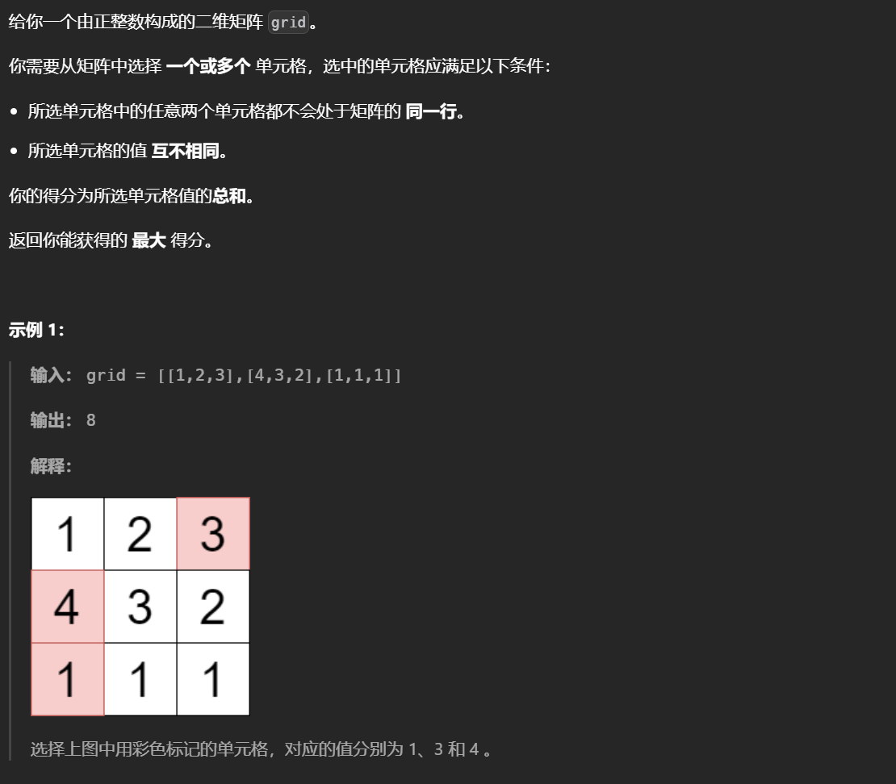

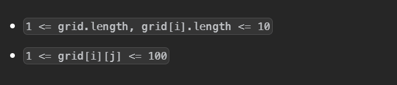

明显的状压dp，这里要求元素不能重复，这里如果枚举行号则无法对值域的选或不选进行压缩，因此选择枚举值域压缩行号。对于一个值枚举选或不选，如果选那么选那行。

```python
class Solution:
    def maxScore(self, grid: List[List[int]]) -> int:
        p=defaultdict(list)
        m,n=len(grid),len(grid[0])
        # 预处理出每个值的行号
        for r,row in enumerate(grid):
            for x in set(row):
                p[x].append(r)
        @cache
        def dp(i,j):# I表示值i，j表示选择的行号的集合
            if j==(1<<m)-1:return 0
            if not i:return 0
            res=dp(i-1,j)# 不选值i
            for row in p[i]:# 选择值i，从其对应的行中选择
                if j>>row&1==0:
                    res=max(res,i+dp(i-1,j|(1<<row)))
            return res 
        return dp(max(p),0)
```


### [连通两组点的最小成本](https://leetcode.cn/problems/minimum-cost-to-connect-two-groups-of-points/)

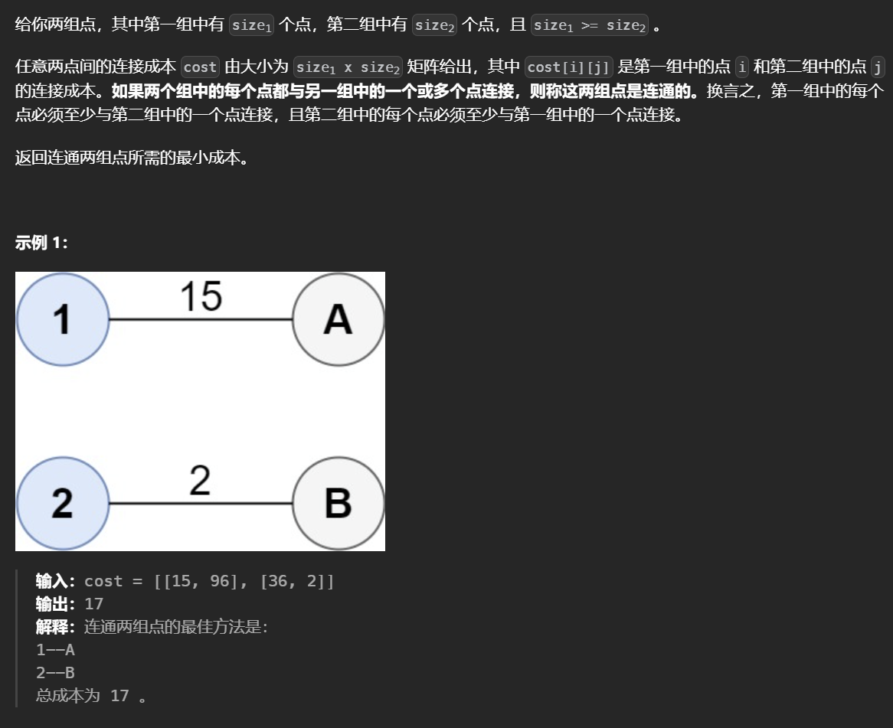

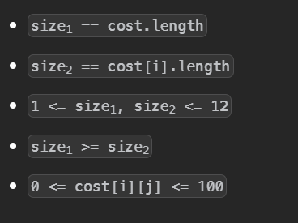


注意到size2的集合较小，因此枚举size1用二进制数表示size2中的数是否已选，这里对每个size1中的数不会去找有多少个size2中的集合与它对应，而是枚举size2中的每个数是否与它对应，因为为了得到最小值，size1是不会主动连接size2的集合的，枚举到最后如果还有size2中的数没有选，那么贪心的选择其能对应的最小值。

```python
class Solution:
    def connectTwoGroups(self, cost: List[List[int]]) -> int:
        n=len(cost)
        m=len(cost[0])
        @cache
        def dp(i,s):
            if i==n:
                return sum(min(list(zip(*cost))[j])  for j in range(m) if s>>j&1)
            return min(dp(i+1,s&~(1<<j))+cost[i][j] for j in range(m))
        return dp(0,(1<<m)-1)
```


# 数位dp

用于解决在[l,r]区间内满足一定条件的数字的个数。

@cache表示记忆化搜索，对于重复的参数列表会跳过，但是参数中不能有个列表，只能是数字，没有记忆化搜索直接完蛋。

数位dp有一套板子，*index用于对每个位置进行操作，limit用于约束每个位置上的最大值，防止跳出n的范围，mask用于记录这个值是否出现过并方便调用记忆化搜索，is_num用于忽略前导0的影响，用来跳过一些前面的位置。*


同时考虑上下界的数位DP参考 **统计强大整数的数目**和**计数问题**，其中计数问题还包括了不取时，下界的调整情况。


## 至少有一位重复的数字

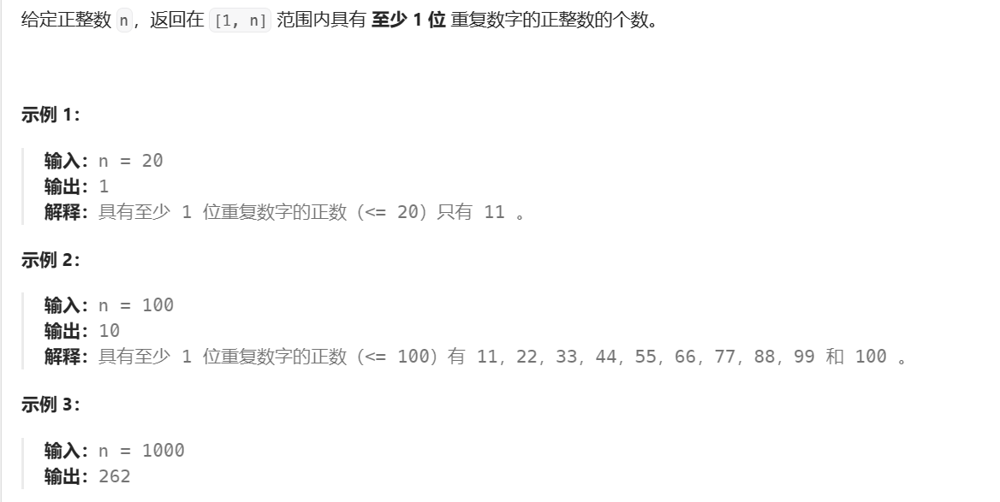


至少有一位那就是n减去一位都没有

这道题中需要考虑前导0，比如010就不是一个合法的数，因此使用一个外部变量记录是否跳过。

```python
from functools import cache
class Solution(object):
    def numDupDigitsAtMostN(self, n):
        s=str(n)
        @cache
        def dp(i,mask,limit,is_num):# is_num记录是否有插入值
            if i==len(s):
                # 只有插入值了才是一个有效的数
                return int(is_num)
            res=0
            # 如果前面没有插入值可以继续跳过
            if not is_num:
                res+=dp(i+1,mask,False,is_num)
            up=int(s[i]) if limit else 9
            # 如果前面没有填数字，必须从 1 开始（因为不能有前导零）
            low=0 if is_num else 1
            for d in range(low,up+1):
                if mask>>d&1==0: # d 不在 mask 中
                    res+=dp(i+1,mask|(1<<d),limit and d==up,True)
            return res
        return n-dp(0,0,True,False)
```

## 最大和为N的数字组合

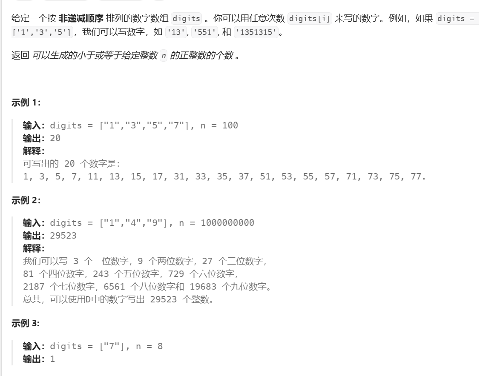

根据数位dp，每次找的值都是小于等于n的，不需要在函数中判断是否是小于等于n，注意这里的1实际上是001，为了实现跳过某个位数，一个实现一个is_num的变量来进行数位的跳过

```python
class Solution(object):
    def atMostNGivenDigitSet(self, digits, n):
        s=str(n)
        @cache
        def dp(i,limit ,is_num):
            if i==len(s):
                return int(is_num)
            res=0
            if not is_num:# 如果前面没有填入值，可以继续跳过，这个操作会处理类似于01，02，03之类的数
                res+=dp(i+1,False,False)
            up=s[i] if limit else '9'
            # 从给定的列中中选择值
            for digit in digits:
                if digit >up:
                    break
                res+=dp(i+1,limit and up==digit,True)
            return res
        return dp(0,True,False)
```

## 范围内的数字计数

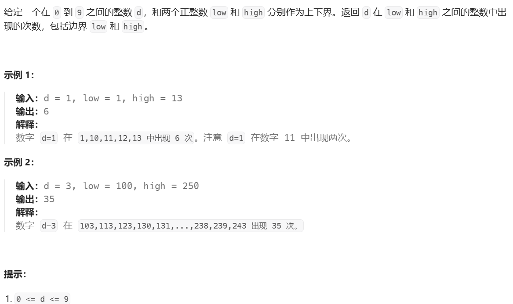

对于不是从1开始的区间，`比如[l,r]，返回dp(r)-dp(l-1)即可`

由于数字可能为0，所以考虑前导0.

```python
from functools import cache


class Solution(object):
    def digitsCount(self, d, low, high):
        k=d
        @cache
        def dp(s,i,cnt,limit,is_num):
            if i==len(s):
                return cnt if is_num else 0
            res=0
			# 考虑前导0
            if not is_num:
                res+=dp(s,i+1,cnt,False,False)
            up=int(s[i]) if limit else 9
            # 控制最低从哪里开始
            low=0 if is_num else 1
            for d in range(low,up+1):
                res+=dp(s,i+1,cnt+int(d==k),limit and d==up,True)
            return res
        return dp(str(high),0,0,True,False)-dp(str(low-1),0,0,True,False)
    
    
    
    
# 数位dp2.0
class Solution(object):
    def digitsCount(self, d, down, high):
        k=d
        high=str(high)
        down=str(down)
        # 补全下界
        down='0'*(len(high)-len(down))+down
        @cache
        def dp(i,is_up,is_down,cnt,is_num):
            if i==len(high):
                return cnt if is_num else 0
            
            up=int(high[i]) if is_up else 9
            low=int(down[i]) if is_down else 0
            res=0
            for j in range(low,up+1):
            # 这里比较重要，是否插入值：如果前面插入了这里也插入了，反之前面没插入并且当前位选了0自然就不算插入了值
                is_num=is_num or j>0
                res+=dp(i+1,is_up and j==up, is_down and j==low,cnt+int(j==k and is_num),is_num)
            return res
        return dp(0,True,True,0,False)
```

## [价值和小于等于 K 的最大数字](https://leetcode.cn/problems/maximum-number-that-sum-of-the-prices-is-less-than-or-equal-to-k/)

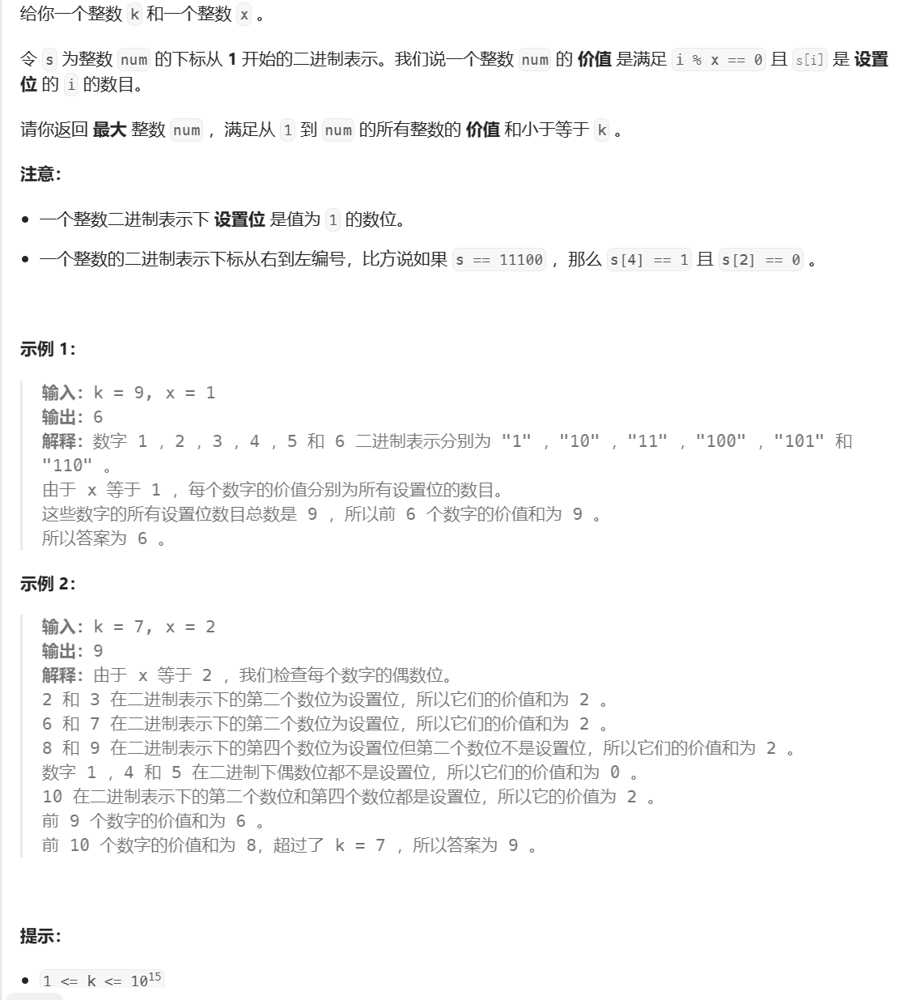

题目有二分的性质，但关键在于`如何求出1~nums二进制中所有1的个数`，可以使用数位dp求解。

```python
class Solution:
    def findMaximumNumber(self, k: int, x: int) -> int:
        def count(num,x):
            n=num.bit_length()
            @cache
            def dp(i, cnt, is_limit):
                if i == n:
                    return cnt
                # 判断上界，查找这个数二进制中这个位置最大值
                up = num >>(n-i-1) & 1 if is_limit else 1
                res=0
                for j in range(up + 1):
                    # 这里需要注意，只有位置是x的倍数才能贡献答案，而题目中要求是从右往左数，并且最右边为1，可以发现i和实际索引之和相加等于总长度，做一步转换。
                    res += dp(i+1, cnt + int(j == 1 and (n-i)%x==0), is_limit and j == up)
                return res
            
            return dp(0, 0, True)
	# 二分搜索的上界设置为
        l,r=0,(k+1)*(2**(x-1))
        while l<=r:
            mid=(l+r)//2
            val=count(mid,x)
            if val<k:
                l=mid+1
            elif val>k:
                r=mid-1
            else:
                l=mid+1
        return r
```

## [统计强大整数的数目](https://leetcode.cn/problems/count-the-number-of-powerful-integers/)

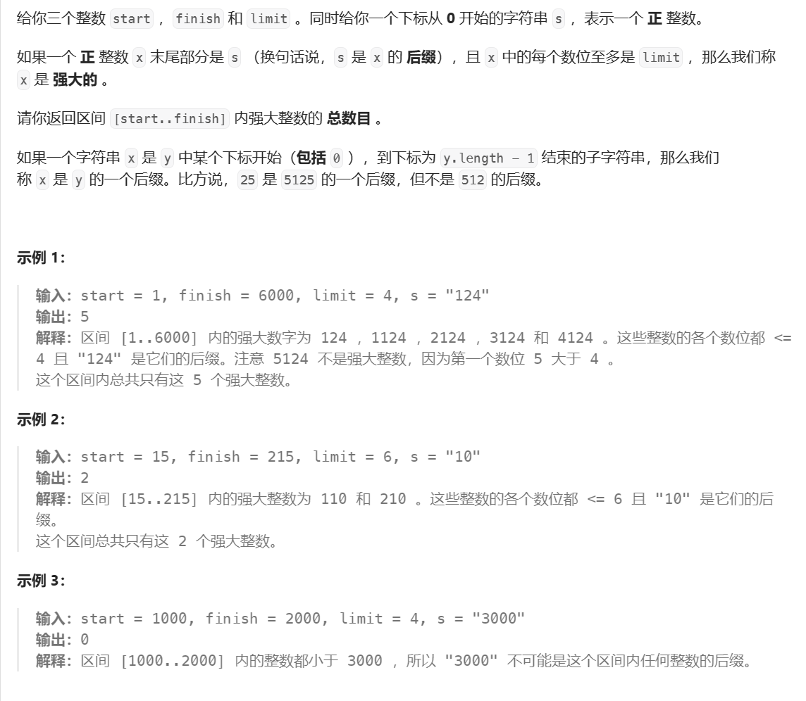


数位dp第二版，不需要写两个范围的dp然后相减，可以在dp中直接规划上下界

```python
class Solution:
    def numberOfPowerfulInt(self, start: int, finish: int, limit: int, s: str) -> int:
        high=str(finish)
        low=str(start)
        n=len(high)
        # 下界，需要补上前导0
        low='0'*(n-len(low))+low
	# 只能操作前diff位，后面的都是固定的后缀
        diff=n-len(s)        
        @cache
        def dp(i,is_up,is_down):
            # 能走到这一步表示是一个合法的值
            if i==n:
                return 1
            # 找出上下界，注意这里不能把上界的范围规定为min(hi,limit)，如果上一位数的最大值是6，但因为limit选了5，在进入下一轮时会因为取到了5而认为是到达上界，从而在下一轮中最大只能取到当前数位上的值，从而错过limit或者可取的值
            hi=int(high[i]) if is_up else 9
            lo=int(low[i]) if is_down else 0
            res=0
            if i<diff:
                # 取limit的限制应该在这里判断，数位dp中其他对数位的限制也应该在这里判断
                for j in range(lo,min(hi,limit)+1):
                    res+=dp(i+1,is_up and j==hi,is_down and j==lo)
            else:
                # 对于不能改变的后缀只能取对应的值
                x=int(s[i-diff])
                # 如果超出限制不能考虑
                if lo<=x<=hi:
                    res=dp(i+1,is_up and x==hi ,is_down and x==lo)
            return res
        return dp(0,True,True)
```

## 计数问题

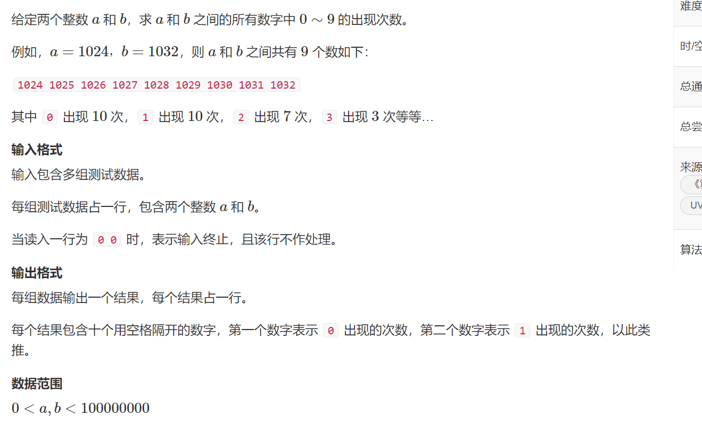

使用2.0版本的数位dp，注意这里为了使用记忆化搜索，在一次操作中求出0~9中某一个数字出现的次数，而不是枚举a ~b找所有个数字出现的次数这样。

```python
from collections import Counter
from functools import lru_cache

# 处理输入
q = []
while 1:
    res = [int(x) for x in input().split()]
    if res == [0, 0]:
        break
    q.append(res)

for a, b in q:
    memo = Counter()
    temp = []
    # 方便操作，让b是最大的
    if a > b:
        b, a = a, b
    a = str(a)
    b = str(b)
    n = len(b)
    a = '0' * (n - len(a)) + a

    # 类似于数字1的个数，不过是2.0版本的
    @lru_cache(maxsize=None)
    def dp(i, is_up, is_down, is_num, cnt, target):
        if i == n:
            if is_num:
                return cnt
            return 0
        # 规定上下界
        up = int(b[i]) if is_up else 9
        down =low= int(a[i]) if is_down else 0
        res = 0
        # 跳过，注意这里为了不小于下界一定要满足下界这个位置的元素是0
        if not is_num and not int(a[i]):
            # 上界的极限一定不满足，但下界的极限一定满足
            res += dp(i + 1, False, True, is_num, cnt, target)
        # 重要的一步，如果前面跳过了，这里一定是从1开始，但是注意不能更改下界范围
        if not is_num:
            low=max(1,low)

        for j in range(low, up + 1):
            res += dp(i + 1, is_up and j == up, is_down and j == down, True, cnt + int(j == target), target)
        return res

    # 分别找每一个的
    for i in range(10):
        memo[i] += dp(0, True, True, False, 0, i)
    ans = []
    k = sorted(memo)
    for i in k:
        ans.append(memo[i])
    print(*ans)
    # print(temp)
```

## **Masked Popcount**

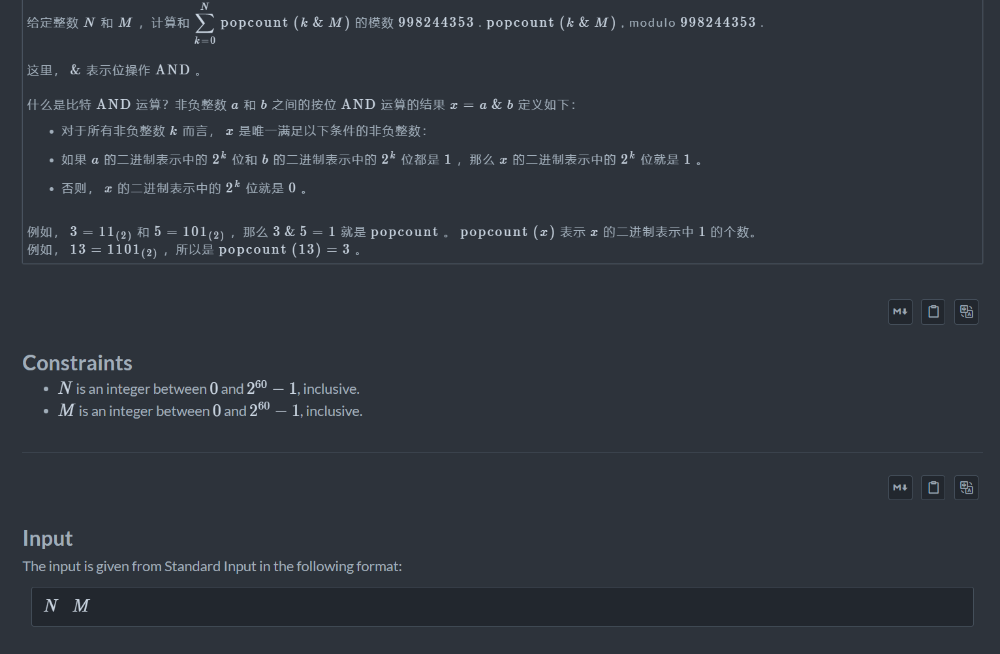


统计0到N的所有Popcount，根据描述使用数位dp。

只有m二进制中为1的位才能贡献到最后的答案，对于n的二进制进行数位dp，如果当前位选了1并且对应到m中也是1那么会给答案贡献。

```python
from functools import cache

n,m=[int(x) for x in input().split()]
s=bin(n)[2:]
l=len(s)
memo=set()
m=bin(m)[2:]
mod=998244353

# 统计m中1的位置，因为对n统计数位要从高位到低位，如果m小的话要左边补0否则截断（因为高位一定为0）
if len(s)>=len(m):m='0'*(len(s)-len(m)) +m
else:m=m[len(m)-len(s):]

for i,c in enumerate(m):
    if c=='1':memo.add(i)

@cache
def dp(i,is_limit,is_num,cnt):
    if i==l:
        if is_num:return cnt
        return 0
    res=0
    # 先找到上限
    up = int(s[i]) if is_limit else 1
    # 如果前面跳过了则当前为也可以跳过
    if not is_num:res+=dp(i+1,False,False,cnt)
    # 如果不跳过（也就是前面选了数）可以选0，否则选0是不合理的（等同于跳过）
	else:res+=dp(i+1,is_limit and 0==up,True,cnt)
    if up==1:
        res+=dp(i+1,is_limit ,True ,cnt+int(i in memo))
    return res%mod
r=dp(0,True,False,0)
print(r%mod)
```


## [ 易混淆数 II](https://leetcode.cn/problems/confusing-number-ii/)

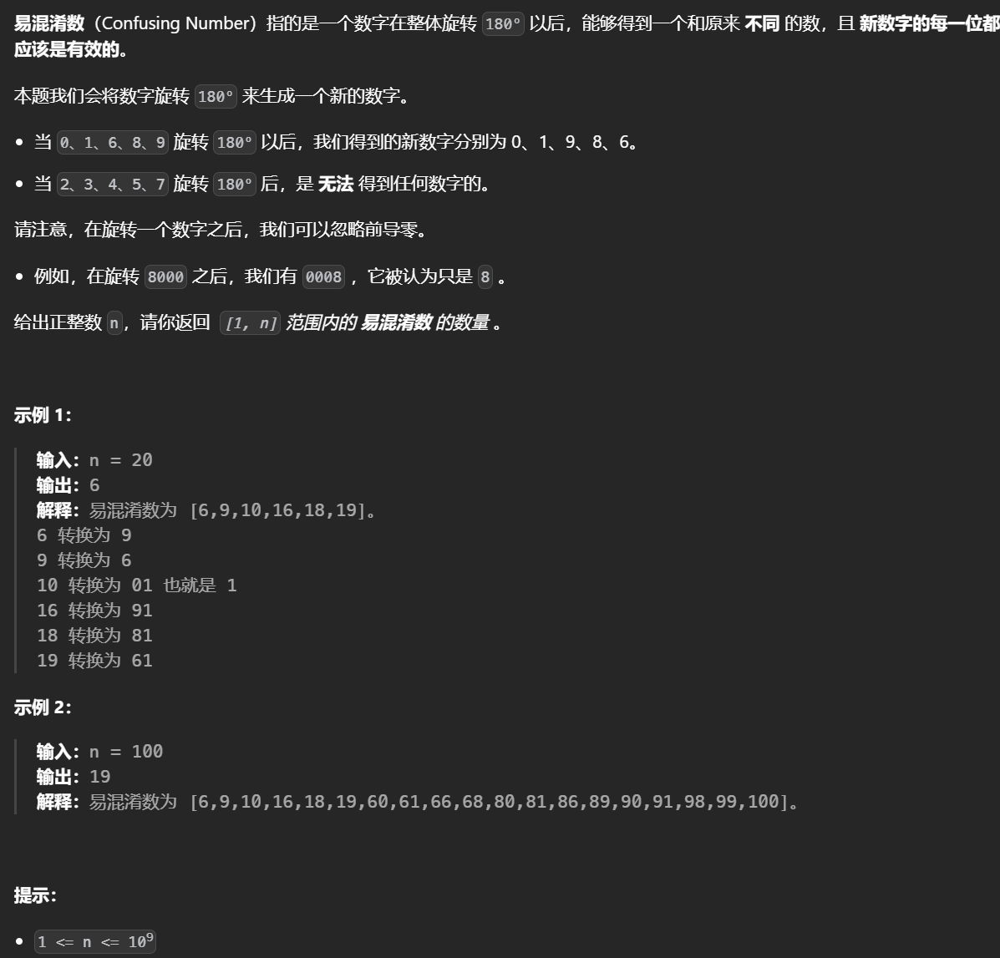

对于给定的数据范围可以直接记录表示当前数的字符串

```python
class Solution:
    def confusingNumberII(self, n: int) -> int:
        n=str(n)
        memo={'0':'0','1':'1','6':'9','8':'8','9':'6'}
        @cache
        def dp(i,curr,is_num,is_limit):
            if i==len(n):
                if not is_num:return 0
                temp=''
                for c in curr[::-1]:
                    temp+=memo[c]
                return int(temp!=curr)
            res=0
            if not is_num:res+=dp(i+1,curr,is_num,False)
            up=int(n[i]) if is_limit else 9
            low=0 if is_num else 1
            for c in memo.keys():
                c=int(c)
                if c<low:continue
                if c>up:break
                res+=dp(i+1,curr+str(c),True,is_limit and c==up)
            return res 
            
        return dp(0,'',False ,True)
```


## [找到所有好字符串](https://leetcode.cn/problems/find-all-good-strings/)

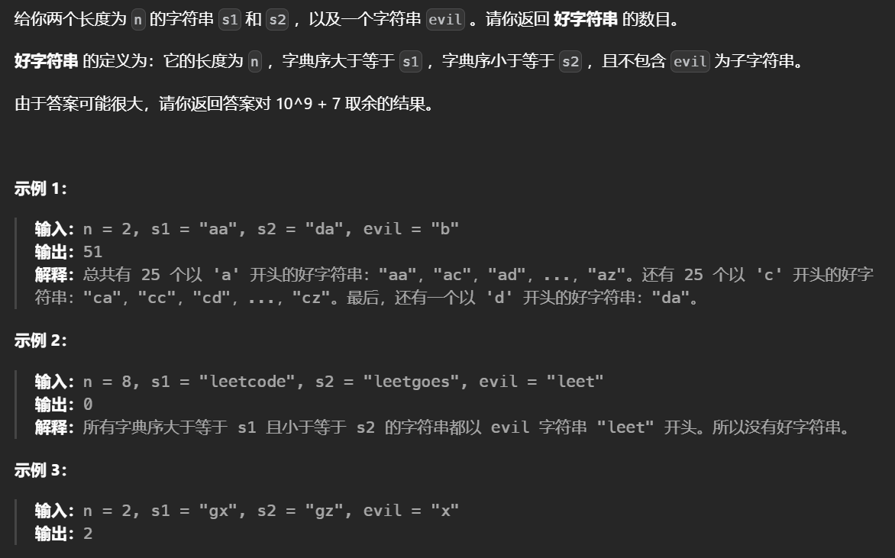

一般的数位DP大体上无异，这里需要一个额外变量记录已经匹配evil的个数，但是在不匹配时并不是直接归为0，而是用KMP中p数组——p[:i]表示s[:i+1]前缀与后缀相匹配的个数，来回退，因为不匹配不代表以匹配的长度中完全不一。

```python
class Solution:
    def findGoodStrings(self, n: int, s1: str, s2: str, evil: str) -> int:
        mod=10**9+7
        x=1
        p=[0]
        now=p[x-1]
        while x<len(evil):
            if evil[x]==evil[now]:
                x+=1
                now+=1
                p.append(now)
            elif now:
                now=p[now-1]
            else:
                p.append(0)
                x+=1
            
        @cache
        def dp(i,is_limit,is_low,idx):
            if idx==len(evil):return 0
            if i==n:return 1
            res=0
            d=ord(s2[i])-ord('a') if is_limit else 25
            l=ord(s1[i])-ord('a') if is_low else 0
            for j in range(l,d+1):
                c=chr(ord('a')+j)
                pos=idx
                while pos>0 and evil[pos]!=c:
                    pos=p[pos-1]
                if evil[pos]==c:pos+=1
                
                res+=dp(i+1,is_limit and j==d,is_low and j==l,pos)
            return res%mod
        
        return dp(0,True,True,0)   
```


## [Popcount Sum 3](https://atcoder.jp/contests/abc406/tasks/abc406_e)

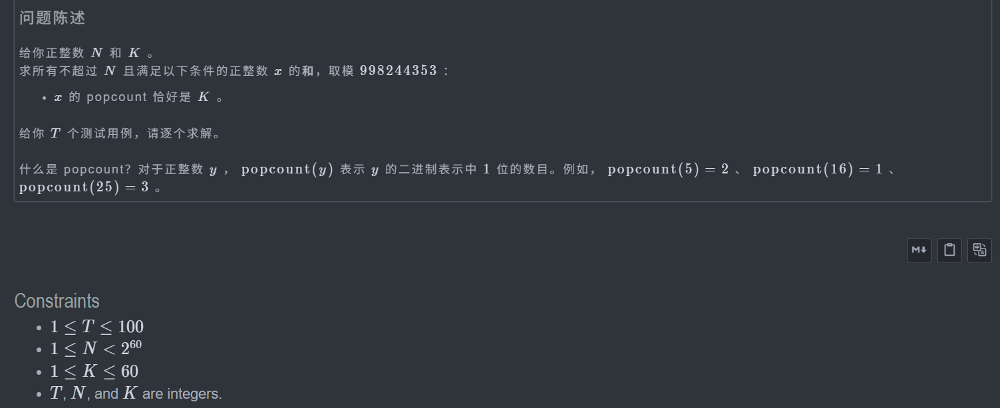

数位DP可以求解出满足条件的数字个数，但是无法直接求解数字之和，这可以需要做两次数位DP一次求解个数，一次利用贡献发求解最终结果——假设i位置填了1那么它对答案的贡献就是(1<<(n-i-1))*该位置填1的数字个数。

```python
mod=998244353

for _ in range(R()):
    n,k=RR()
    # 转换为二进制
    s=bin(n)[2:]
    @cache
    # 求个数
    def f(i,is_limit,is_num,cnt):
        # 可行性剪枝
        if len(s)-i<cnt:
            return 0
        if i==len(s):
            return int(is_num)
        res=0
        # 可以不选
        if not is_num:
            res+=f(i+1,False,False,cnt)
        d=int(s[i]) if is_limit else 1
        # 选0
        res+=f(i+1,is_limit and 0==d ,True,cnt)
        # 满足条件的情况下选1 
        if d and cnt>0:
            res+=f(i+1,is_limit and 1==d ,True,cnt-1)
        return res
    
    @cache 
    # 求和
    def ssum(i,is_limit,cnt):
        if len(s)-i<cnt:
            return 0
        if i==len(s):
            return 0 
        res=0
        # 这里没有不选，因为是求和最终返回的都是0
        d=int(s[i]) if is_limit else 1
        res+=ssum(i+1,is_limit and d==0,cnt)
        if d and cnt:
            res+=ssum(i+1,is_limit and d==1,cnt-1)+(1<<(len(s)-i-1))*f(i+1,is_limit and d==1,True,cnt-1)
        return res%mod
    res=ssum(0,True,k)
    print(res)
```


# 前缀和优化

## [长度至少为 M 的 K 个子数组之和](https://leetcode.cn/problems/sum-of-k-subarrays-with-length-at-least-m/)

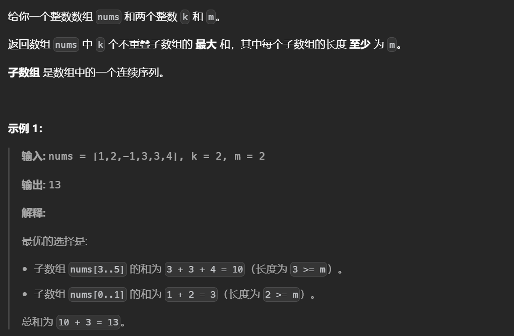

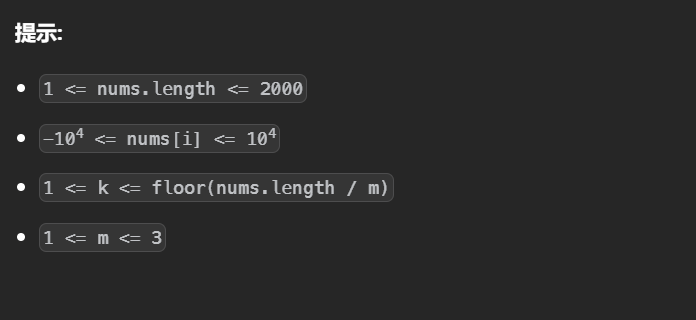

标准的划分型DP，定义dp(i,j)表示前I个数，已经划分了j组，显而易见有下述的状态转移方程

```python
class Solution:
    def maxSum(self, nums: List[int], k: int, m: int) -> int:
        n=len(nums)
        pre=list(accumulate(nums,initial=0))
        f=[[-inf]*(k+1) for _ in range(n+1)]
        # 0组的和自然是0
        for i in range(n+1):f[i][0]=0
        for i in range(1,n+1):
            for j in range(1,k+1):
                # 不划分新的组
                f[i][j]=f[i-1][j]
                # 枚举以第i个数结尾的组的左端点到哪里
                for kk in range(m,i+1):
                    f[i][j]=max(f[i][j],f[i-kk][j-1]+pre[i]-pre[i-kk])
        return f[n][k]
```

对于给定的数据范围要考虑前缀和优化，对于转移方程$$max(f[i][j],f[i-kk][j-1]+pre[i]-pre[i-kk])$$其中一直变化的i-kk出现在了第一个维度不好构造前缀和，因此转换状态dp(i,j)表示前j个数，以及划分了i组，有

```python
f=[[-inf]*(n+1) for _ in range(k+1)]
# 0组的情况下和为0
f[0]=[0]*(n+1)
for i in range(1,k+1):
    # j要保证前后能有足够的数
    for j in range(i*m,n-(k-i)*m+1):
        f[i][j]=f[i][j-1]
        # 枚举以j结尾的区间的左端点的前一位
        for l in range((i-1)*m,j-m+1):
            f[i][j]=max(f[i][j],pre[j]+f[i-1][l]-pre[l])
```

转换状态同时也排除了不合法的选择

观察转移方程，对于第一轮j，l属于[i*m,j-m]，对于j+1，l属于[i\*m,j-m+1]，往后每一轮都只会增加当前j对于的j-m，因此维护mx，每一轮更新mx为mx (mx , f[i-1]\[j-m]-pre[j-m])

```python
for i in range(1,k+1):
    mx=-inf
    for j in range(i*m,n-(k-i)*m+1):
        mx=max(mx,f[i-1][j-m]-pre[j-m])
        f[i][j]=max(f[i][j-1],pre[j]+mx)
```


优化为一维

```python
f=[0]*(n+1)
for i in range(1,k+1):
    mx=-inf
    nx=[-inf]*(n+1)
    for j in range(i*m,n-(k-i)*m+1):
        mx=max(mx,f[j-m]-pre[j-m])
        nx[j]=max(nx[j-1],pre[j]+mx)
        f=nx[:]
        return f[n]
```


## [和带限制的子多重集合的数目](https://leetcode.cn/problems/count-of-sub-multisets-with-bounded-sum/)


显而易见的使用DP求解，定义f[i]\[j]为选了**前i种数中选择一些数且和恰好为j的方案数**

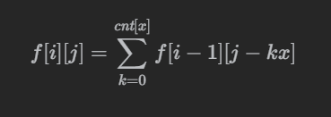


用一般的前缀和优化的方式，但是这里是等差前缀和，因为每个状态是由j-p,j-2p,j-3p转移过来而不是j-p~j-3p，定义s[i]为


**每个f[i]\[p]=s[p]-s[p-(c+1)*x]这样得出的就是范围内的j,j-x,j-2x,j-3x..j-c\*x**

这个公式同样可以优化为


```python
class Solution:
    def countSubMultisets(self, nums: List[int], l: int, r: int) -> int:    
        # 总和太小
        if sum(nums)<l:return 0  
        # 取小的上界
        r=min(r,sum(nums))

        mod=10**9+7
        memo=Counter(nums)
        # 记录0的个数
        cnt=memo[0]
        
        # 除去0
        del memo[0]
        nums=list(memo.keys())
        n=len(nums)

        f=[[0]*(r+1) for _ in range(n+1)]
        # base case 加上0的个数，等同于计算出所有正数的结果后在与0组合
        f[0][0]=cnt+1
        
        # 前缀和
        s=[0]*(r+1)
        
        for i in range(1,n+1):
            x=nums[i-1]
            c=memo[x]
            # 先求解前缀和
            for j in range(r+1):
                s[j]=(f[i-1][j]+(s[j-x] if j-x>=0 else 0))%mod
            for j in range(r+1):
                f[i][j]=(s[j]-(s[j-(c+1)*x] if j-(c+1)*x>=0 else 0))%mod
        return sum(f[-1][l:])%mod
```


## [完美分割的方案数](https://leetcode.cn/problems/number-of-beautiful-partitions/)


划分型DP，定义f(i,j)表示**前i组第j个**，需要使用前缀和优化


对于转移方程f[i]\[j]+=f[i-1]\[pre]，可以维护一个额外的数组pre记录每一组每一个位置对应的分割数目，只有在第i组求完后才会更新pre[i]

```python
class Solution:
    def beautifulPartitions(self, s: str, k: int, minLength: int) -> int:
        mod=10**9+7
        prime={'2','3','5','7'}
        if s[0] not in prime or s[-1] in prime:return 0

        n=len(s)
        f=[[0]*(n+1) for _ in range(k+1)]
        f[0][0]=1
        pre=[[0] for _ in range(k+1)]
        pre[0]=[1]*(n+1)
        
        for i in range(1,k+1):
            for j in range(1,n+1):
                # 合法的结尾位置为非质数，且后一位是质数，同时要保证能划分
                if s[j-1] not in prime and (j==n or s[j] in prime) and j-minLength>=0:
                    # 前缀转移
                    f[i][j]+=pre[i-1][j-minLength]
                    f[i][j]%=mod
                    # for pre in range(j-minLength,-1,-1):
                    #     if s[pre] in prime:
                    #         f[i][j]+=f[i-1][pre]
                    #         f[i][j]%=mod
            # f[i][j]只能从合法的位置转移过来，所以pre不会统计到不合法的位置(为0)
            for j in range(1,n+1):pre[i].append((pre[i][-1]+f[i][j])%mod)

        return f[k][n]

    class Solution:
        def beautifulPartitions(self, s: str, k: int, minLength: int) -> int:
            mod=10**9+7
            prime={'2','3','5','7'}
            if s[0] not in prime or s[-1] in prime:return 0

        n=len(s)
        f=[[0]*(n+1) for _ in range(k+1)]
        f[0][0]=1
        for i in range(1,k+1):
            mx=0
            for j in range(1,n+1):
                if j-minLength>=0:
                    mx+=f[i-1][j-minLength]
                    if s[j-1] not in prime and (j==n or s[j] in prime) and j-minLength>=0:
                        f[i][j]+=mx
                        f[i][j]%=mod
                        # for pre in range(j-minLength,-1,-1):
                        #     if s[pre] in prime:
                        #         f[i][j]+=f[i-1][pre]
                        #         f[i][j]%=mod

                        return f[k][n]
```


## [最小移动总距离](https://leetcode.cn/problems/minimum-total-distance-traveled/)


移动方向没什么用，本题可以看作是两组数相互匹配能得到的最小代价，代价定义为距离绝对值之和。

设最优方案中，机器人 *i* 被送去工厂 $t_i$。**注意到关键结论：存在最优方案，使得 $t_i$是不严格单调递增的**，使用邻项交换法证明，假设x,y表示机器人的位置，tx,ty表示工厂的位置，其中x<y,tx<ty，由下图可知如果x匹配到ty，y匹配到tx的距离必然要小于等于x匹配tx，y匹配ty，**因此相当于每个工厂匹配一组机器人。**


```python
class Solution:
    def minimumTotalDistance(self, robot: List[int], factory: List[List[int]]) -> int:
        n,m=len(robot),len(factory)  
        robot.sort()
        factory.sort()     
        @cache 
        def dp(i,j):
            if j==n:return 0
            if i==m:return inf
            t=0
            ans=inf
            for k in range(factory[i][1]+1):
                ans=min(ans,dp(i+1,j+k)+t)
                if j+k>=n:break
                t+=abs(robot[j+k]-factory[i][0])
            return ans 
        return dp(0,0)
```

邻项交换法还可以证明对于两组相互匹配的数（长度相等），必然是最小匹配最小，第二小匹配第二小才能得到最小的代价。 [使数组相似的最少操作次数](https://leetcode.cn/problems/minimum-number-of-operations-to-make-arrays-similar/solutions/1917721/by-tsreaper-sl0y/) 


## [新 21 点](https://leetcode.cn/problems/new-21-game/)

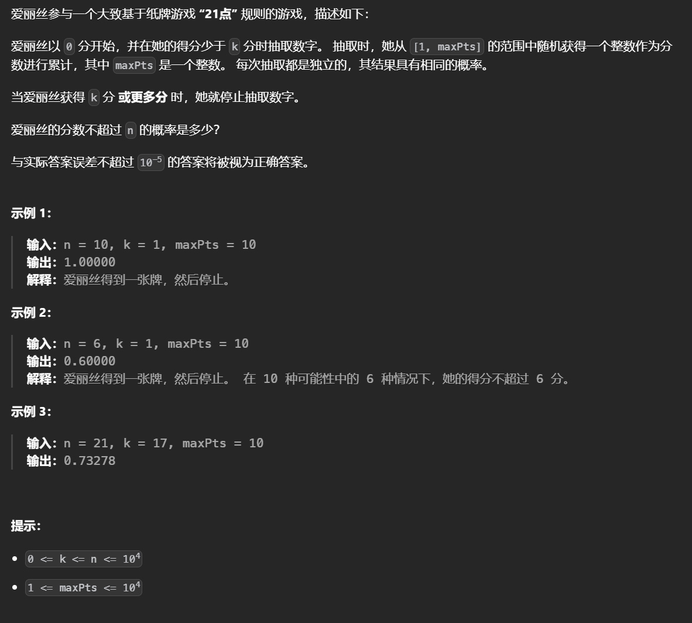

定义f[i]为得到i分的概率，初始时f[0]=1，答案就是f[k:]，注意这里在分数小于k的时候还会不停的抽牌，因此不能算答案

明显的使用前缀和优化

```python
class Solution:
    def new21Game(self, n: int, k: int, maxPts: int) -> float:
        f=[0]*(n+1)
        if not k:return 1
        f[0]=1
        pre=f[0]# 初始的前缀和计算i=1，随着i的增大，前缀和会不断增多一个值(前提是<k)
        for i in range(1,n+1):
            f[i]=pre/maxPts
            if i<k:
                pre+=f[i]
            # 注意为了保证转移的区间来自[0,k)当i足够大的时候转移的左区间端点右移，这时候需要减小前缀值，但是注意最后左区间端点会超出k，从而导致pre为负数，因此需要判断pre不等于0
            if i-maxPts>=0 and pre:
                pre-=f[i-maxPts]
            # for j in range(1,maxPts+1):
            #     if 0<=i-j<k:
            #         f[i]+=f[i-j]/maxPts
        return sum(f[k:])
```


## [找到初始输入字符串 II](https://leetcode.cn/problems/find-the-original-typed-string-ii/)

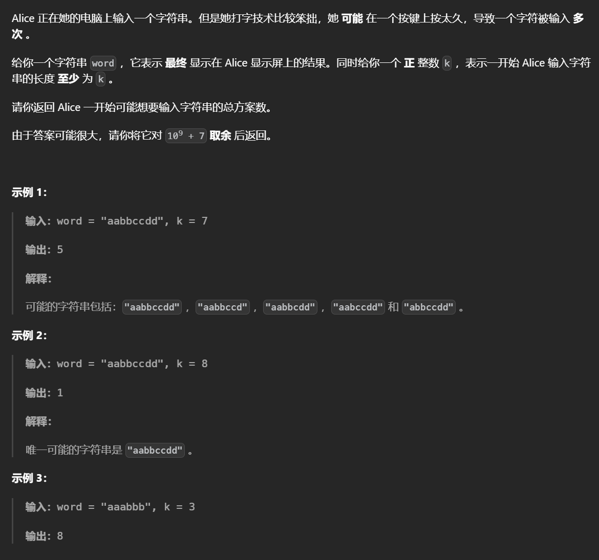

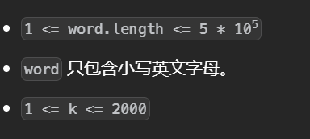

该问题不能变为0-1背包形式，对于'aaaa'拆分为1 2 1的形式，选择1+1和2是一样的方案。这里枚举每一段连续字母的**长度**，因此有

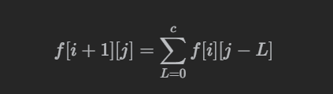

对于给定的数据范围显然需要用前缀和优化。


本题需要每一段至少选一个因此问题可以转换为：字符串的初始长度为k-分组数，即已选定分组数个元素，同时"至少"不好计算，通过容斥原理转换为总的-不超过k，对于总的因为对'aaa'选前两个a和后两个'a'是一样的，因此不能用2的幂次计算，这里对于每一组可以由1，2，3...c个字符扩展而来，因此有段长种选法。

```python
def get_pre(nums): return list(accumulate(nums, initial=0))
class Solution:
    def possibleStringCount(self, word: str, k: int) -> int:
        mod=10**9+7
        n=len(word)
        i=0
        ans=1
        nums=[]
        while i<n:
            start=i
            i+=1
            while i<n and word[i]==word[start]:i+=1
            cnt=i-start
            ans*=cnt
            ans%=mod
            k-=1
            if cnt>1:nums.append(cnt-1)
        
        n=len(nums)
        if not n or k<=0:
            return ans
        f=[[0]*k for _ in range(n+1)]
        f[0]=[1]*k

        tmp=get_pre(f[0])
        for i in range(1,n+1):
            pre=tmp[:]
            tmp=[0]
            for j in range(k):
                f[i][j]=pre[j+1]-pre[max(0,j-nums[i-1])]
                f[i][j]%=mod
                tmp.append((tmp[-1]+f[i][j])%mod)

        return (ans-f[-1][-1])%mod
```

## [ K 个逆序对数组](https://leetcode.cn/problems/k-inverse-pairs-array/)


定义状态dp(i,j)表示考虑[1,i]的排列其中有j个逆序对的不同排列方式，对于[1,i]的排列长度为i，可以选任意一个数作为排列的最后一个元素，如果选的是k那么就会贡献i-k个逆序对，即k+1,k+2,k+3...i，此时排列贡献的逆序对等于i-k加上前i-1个元素贡献的逆序对，前i-1个也就是1\~k-1和k+1\~i，因为逆序对只考虑元素的相对大小因此1\~k-1和k+1\~i可以看作是1\~i-1的排列，由此得出子任务


```python
class Solution:
    def kInversePairs(self, n: int, k: int) -> int:
        mod=10**9+7
        # 未优化的如下对于给定的数据范围会超时
        # @cache
        # def dp(i,j):
        #     if not j:return 1 逆序对为0，只有一种排列方式就是正序
        #     res=0
        #     for index in range(i):
        #         cnt=(i-1)-index 能贡献多少
        #         if cnt>j:continue
        #         res+=dp(i-1,j-cnt)
        #         res%=mod
        #     return res 
        # return dp(n,k)
        dp=[[0]*(k+10) for _ in range(n+10)]
        for i in range(n+1):dp[i][0]=1

        for i in range(2,n+1):
            for j in range(1,k+1):
                dp[i][j]=dp[i][j-1]-(dp[i-1][j-i] if j-i>=0 else 0)+dp[i-1][j]
                dp[i][j]%=mod
        return dp[n][k]
```

# 单调栈优化DP

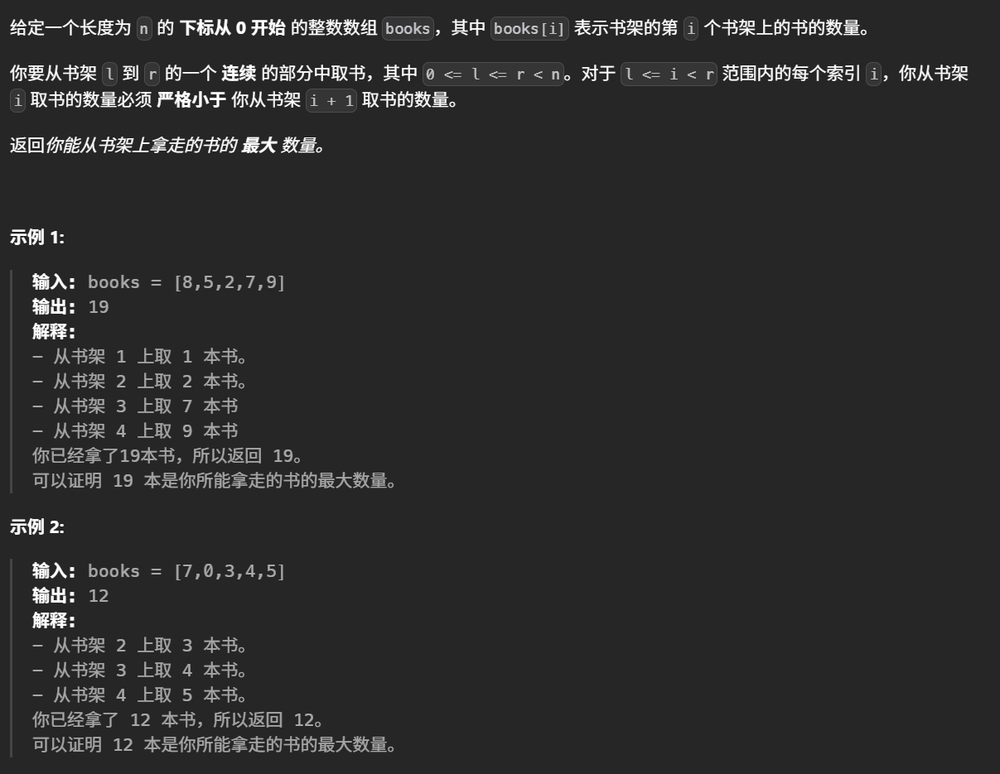

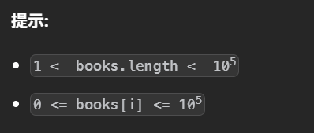

贪心的思想，定义f[i]表示已nums[i]结尾的最大和，要想在满足条件的情况下数组最大，那么最好的办法是以nums[i]结尾构造一个等差数列，令j为无法构造出等差数列的下标位置，那么有转移方程f[i]=(等差数列之和)+f[j]。

但是这里不能对每个位置往回找不满足等差数列的位置，本题中等差数列有性质：nums[j]-nums[i]>=j-i，那么有nums[j]-j>=nums[i]-i。因此重新构造数组，对每个位置找左侧第一个小于它的位置进行状态转移。

```python
class Solution:
    def maximumBooks(self,nums) -> int:
        d=deque()
        n=len(nums)
        f=[0]*(n+1)
        arr=nums[:]
        nums=[x-i for i,x in enumerate(nums)]
        pre=[]
        # 单调栈求解左侧第一个小于的
        for i in range(1,n+1):
            c=nums[i-1]
            while d and nums[d[-1]-1]>=c:
                d.pop()
            if d:
                pre.append(d[-1])
            else:
                pre.append(0)
            d.append(i)
        # dp求解
        for i in range(1,n+1):
            c=arr[i-1]
            l=pre[i-1]
            sz=i-l
            # 注意这里等差数列可能导致x变为负数，因此要特判
            if c-sz+1>=0:f[i]=f[l]+(c+c-sz+1)*sz//2
            else:f[i]=f[l]+(c+1)*c//2
        return max(f)
```


## [统计极差最大为 K 的分割方式数](https://leetcode.cn/problems/count-partitions-with-max-min-difference-at-most-k/)

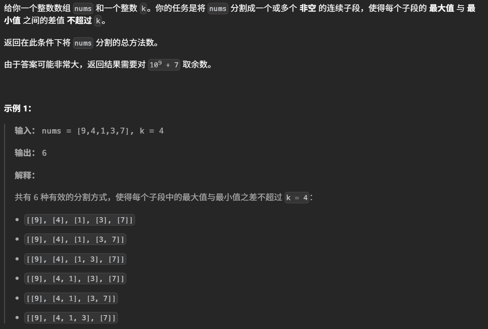

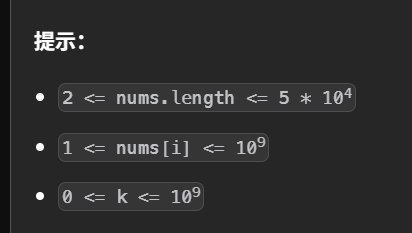

定义dp(i)表示前I个元素满足条件的方案数，显然要找出所有的j满足


那么就是要维护一段子数组满足其中的最大值和最小值之差不超过k，问题转换为类似滑动窗口最大值

```python
class Solution:
    def countPartitions(self, nums: List[int], k: int) -> int:
        mod=10**9+7
        n=len(nums)
        f=[0]*(n+1)
        l=pre=0
        # 注意初始化
        f[0]=1

        mx=deque()
        mn=deque()
        for i in range(1,n+1):
            x=nums[i-1]
            # 注意实现的细节，维护的是端点l但用于更新的值是l-1位置对应的f值
            pre+=f[i-1]
            # 从尾部弹出，保证头是最值
            while mn and x<=nums[mn[-1]]:
                mn.pop()
            while mx and x>=nums[mx[-1]]:
                mx.pop()
            mx.append(i-1)
            mn.append(i-1)
            while nums[mx[0]]-nums[mn[0]]>k:
                pre-=f[l]
                if mx and mx[0]<=l:
                    mx.popleft()
                if mn and mn[0]<=l:
                    mn.popleft()
                l+=1
            f[i]=pre%mod
        return f[-1]
```


# 线段树优化DP


## [Athletic](https://atcoder.jp/contests/abc408/tasks/abc408_f)


虽然每个位置可以往两边移动，但是每次只能去到高度更小的位置，因此可以考虑DP求解


有公式

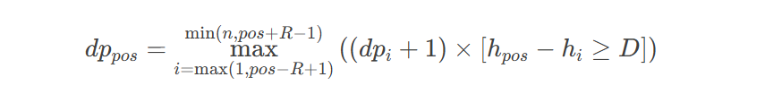


按照高度大小排序求解，同时记录在原数组中的索引，用线段树找出区间最大值


```python
class SegmentTree:
    def __init__(self,n):
        self.tree=[0]*(4*n)
    
    def add(self,o,l,r,idx,val):
        if l==r:
            self.tree[o]=val
            return 
        mid=(l+r)>>1
        if idx<=mid:
            self.add(o*2,l,mid,idx,val)
        else:
            self.add(o*2+1,mid+1,r,idx,val)
        self.tree[o]=max(self.tree[o*2],self.tree[o*2+1])
    def query(self,o,l,r,L,R):
        if L<=l and R>=r:
            return self.tree[o]
        res=-1
        mid=(l+r)>>1
        if L<=mid:
            res=max(res,self.query(o*2,l,mid,L,R))
        if R>mid:
            res=max(res,self.query(o*2+1,mid+1,r,L,R))
        return res 

n,D,r=RR()
nums=RR()

# 定义f[i]表示第i小的位置能移动的最大次数
f=[0]*n

# 按照高度排序，同时记录索引
h=[(x,i) for i,x in enumerate(nums)]
h.sort()
t=SegmentTree(n)

# 记录状态，每个状态不是一计算完就可以用于下个状态的求解，需要满足相差为D的条件
d=deque()

# 先初始化为-1，防止对无法跳跃的状态求解出1
for i in range(n):
    t.add(1,0,n-1,i,-1)

idx=0
for hi,i in h:
    # 满足差值才能用于求解下一状态
    while d and hi-d[0][0]>=D:
        x,j,res=d.popleft()
        # 更新
        t.add(1,0,n-1,j,res)
    # 求解最大值
    mx=t.query(1,0,n-1,max(0,i-r),min(n-1,i+r))
    f[idx]=mx+1    
    d.append((hi,i,f[idx]))
    idx+=1
print(max(f))
```

## [最长递增子序列](https://leetcode.cn/problems/longest-increasing-subsequence/)


序列是不连续的集合。

这个问题可以使用动态规划求解，划分为求解子问题，定义dp数组，dp[i]表示以nums[i]结尾的最长递增子序列，dp[i]等于列表中nums[i]前面小于nums[i]的元素对应的dp值中最大的加一。

枚举选哪个

```python
class Solution(object):
    def lengthOfLIS(self, nums):
        n=len(nums)
        # 全部初始化为1，首先包括自己
        dp=[1 for _ in range(n)]
        # 遍历每一个
        for i in range(n):
            min_dp=-float('inf')
            # 找到列表中小于当前值且在前面的值
            for j in range(i):
                if nums[j]<nums[i]:
                    # 找到最大的
                    min_dp=max(min_dp,dp[j])
            dp[i]=min_dp+1 if min_dp!=-float('inf') else 1
        return max(dp)
```


每一个元素所能形成的最长递增子序列等于小于它的元素中所能形成的最长的递增子序列加一，定义dp(j)=max(dp(i))+1，dp(j)表示以元素j结尾的最长递增子序列，其中i是小于j的所有元素。这个转移方程中要求出区间（小于j）的最大值，然后用这个最大值去更新下一个状态，这个状态又会被用到其他的状态转移方程中，这需要快速求解区间最大值以及单点修改通过线段树完成。

数据结构优化

```python
class Node:
    def __init__(self):
        self.left=None
        self.right=None
        self.add=0
        self.val=0
# 求最大值的更新操作
def pushup(node):
    node.val=max(node.left.val,node.right.val)
# 进行的是区间覆盖操作
def pushdown(node):
    if not node.left:node.left=Node()
    if not node.right:node.right=Node()
    if not node.add:return
    # 不是累和而是覆盖
    node.left.val=node.right.val=node.left.add=node.right.add=node.add
    node.add=0

   
def update(node,start,end,l,r,v):
    if l<=start and r>=end:
        node.val=v
        node.add=v
        return 
    mid=(start+end)>>1
    pushdown(node)
    if l<=mid:update(node.left,start,mid,l,r,v)
    if r>=mid+1:update(node.right,mid+1,end,l,r,v)
    pushup(node)
def query(node,start,end,l,r):
    if l<=start and r>=end:
        return node.val
    mid=(start+end)>>1
    pushdown(node)
    res=0
    if l<=mid:res=max(res,query(node.left,start,mid,l,r))
    if r>=mid+1:res=max(res,query(node.right,mid+1,end,l,r))
    return res

class Solution:
    def lengthOfLIS(self, nums: List[int]) -> int:
        # 先离散化处理把元素换到1,n，方便处理
        temp=sorted(set(nums))
        # 注意这里把每个值加一是为了防止0的出现导致l>r
        nums=[bisect_left(temp,v)+1 for v in nums]
        N=max(nums)+10
        node=Node()
        ans=0
        # 依次求解每个元素小于他的元素中能形成的最长的序列
        for v in nums:
            # 找小于当前的元素，注意长度要加一
            cnt=query(node,0,N,0,v-1)+1
            # 求出后更新，因为维护的实际是一个dp(v)
            update(node,0,N,v,v,cnt)
            ans=max(ans,cnt)
        return ans 
```


# 刷表法

## [统计可以被最后一个数位整除的子字符串数目](https://leetcode.cn/problems/count-substrings-divisible-by-last-digit/)

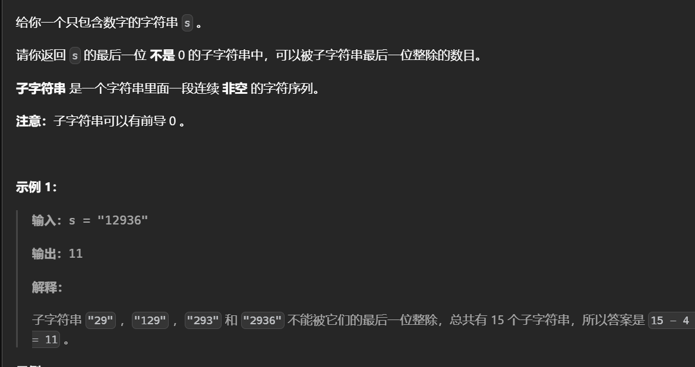


字符串问题，观察数据范围有一种经典的思路那就是枚举字符，因为这里的字符有效范围是1到9

从1到10枚举k，定义f[i]\[j]表示以第i个字符结尾的字符串模k余数为j的个数，用填表法不好转移，因此使用刷表法即f[i]\[(10*j+x)%k]=f[i-1]\[j]，当nums[i-1]等于枚举的k的时候可以更新答案，也就是此时枚举的k恰好表示nums[i-1]结尾。

```python
class Solution:
    def countSubstrings(self, s: str) -> int:
        n=len(s)
        ans=0
        # 枚举k
        for k in range(1,10):
            f=[[0]*k for _ in range(n+1)]
            # f[i][j]表示以第i个数结尾模k余数为j的序列有多少个
            for i in range(1,n+1):
                x=int(s[i-1])
                # 自己单独作为一个序列
                f[i][x%k]+=1
                # 刷表法
                for j in range(k):
                    f[i][(j*10+x)%k]+=f[i-1][j]
                # 更新答案
                if x==k:
                    ans+=f[i][0]
        return ans 
```


## [ 最大公约数相等的子序列数量](https://leetcode.cn/problems/find-the-number-of-subsequences-with-equal-gcd/)

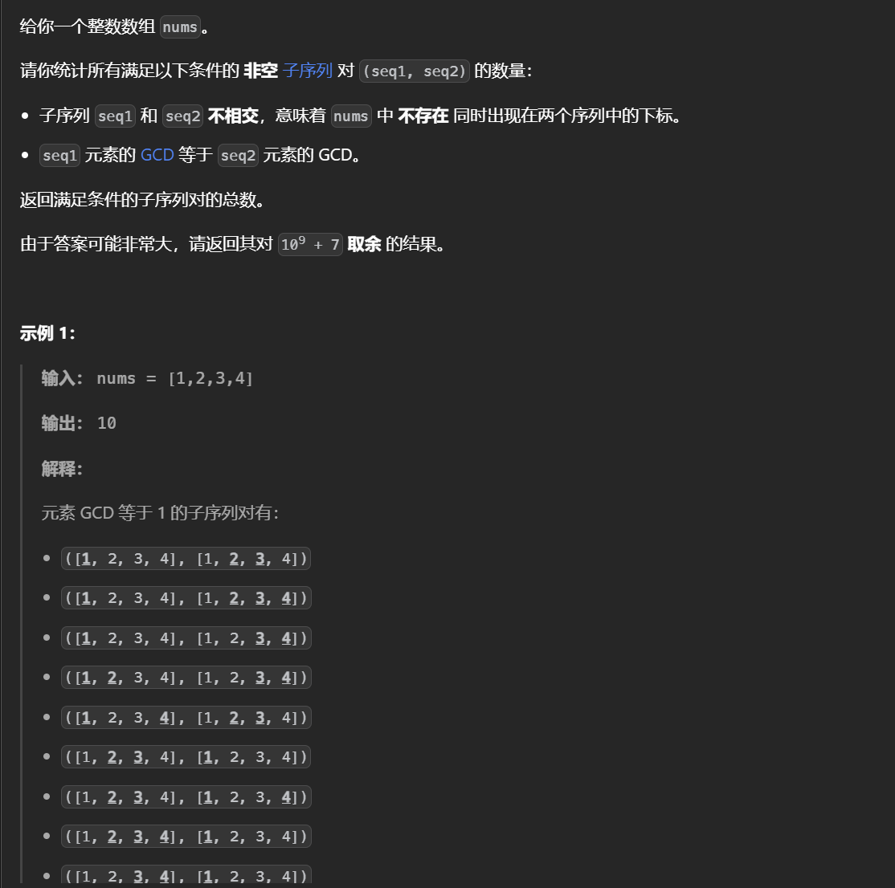

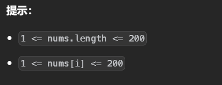

对于每个元素有选或不选的状态，同时选择的情况下也分为选给seq1和seq2，通过刷表法的做法求解，由于GCD的性质范围不会很大。

```python
class Solution:
    def subsequencePairCount(self, nums: List[int]) -> int:
        mod=10**9+7
        n=len(nums)
        def dp(i,l,r):
            if i==n:return l==r and l!=0
            x=nums[i]
            return (dp(i+1,gcd(x,l) if l else x,r)+dp(i+1,l,gcd(x,r) if r else x)+dp(i+1,l,r))%mod
        return dp(0,0,0)
```


# 路径问题


## 下降路径最小和

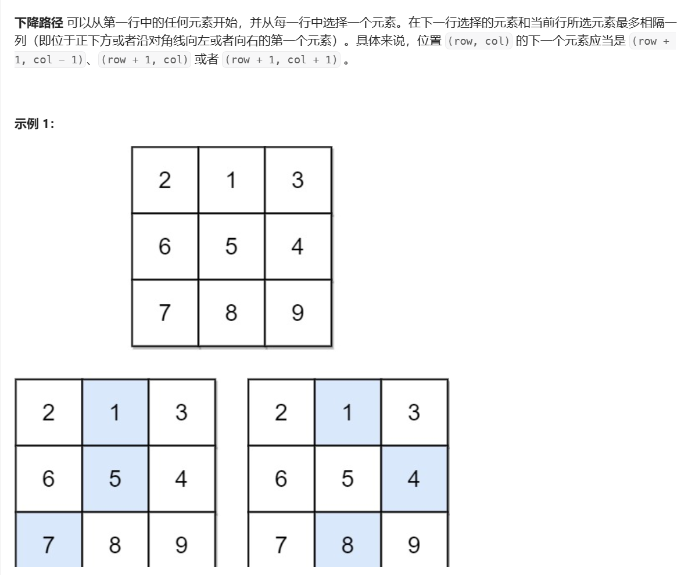

自顶向下，最小的结果一定是从最后一行的某个位置得出。

```python
    class Solution(object):
        def minFallingPathSum(self, matrix):
        n = len(matrix)
        res = float('inf')
        # 备忘录
        memo=[[float('inf') for _ in range(n)] for _ in range(n)]

        def dp(i, j):
			# 检查是否合法，不合法返回一个无穷大
            if i < 0 or i >= n or j < 0 or j >= n:
                return float('inf')
            
			# 如果到了第一行，直接返回
            if i == 0:
                return matrix[i][j]

            # 如果有记录，直接返回
            if memo[i][j]!=float('inf'):
                return memo[i][j]
		
        	# 最小的路径等于当前节点加上上一层的最小路径
            res=matrix[i][j] + min(dp(i - 1, j - 1), dp(i - 1, j), dp(i - 1, j + 1))
            # 记录
            memo[i][j]=res

            return res


        for i in range(n):
            # 由于每次的只能走到左下右下，因此不能直接选则最小的那个，要全部遍历一编
            res = min(res, dp(n - 1, i))
        return res
```

## 最小路径和

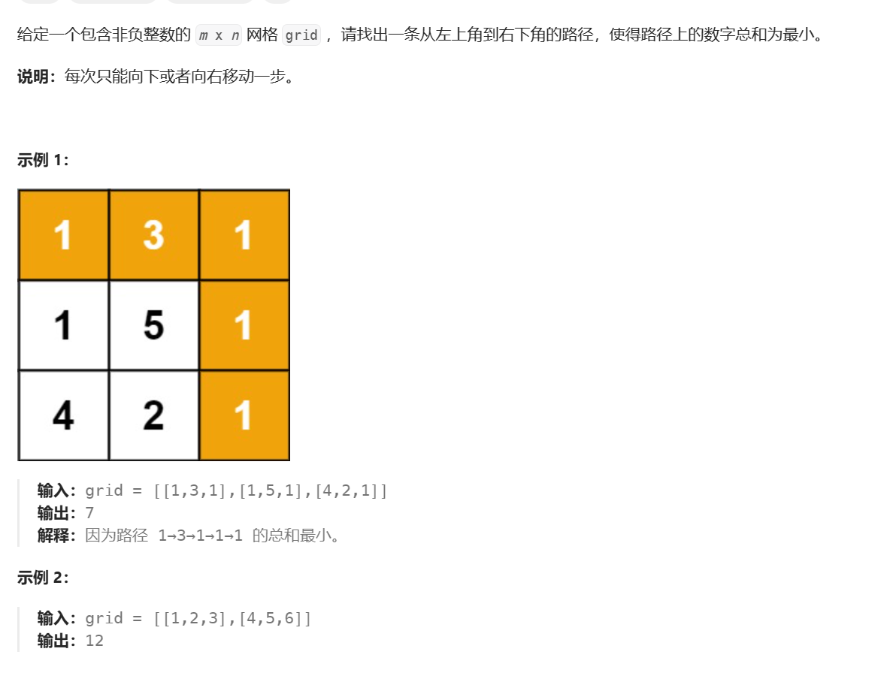

转换为动态规划问题，到达i,j的最小路径等于它的左或上中最小的路径加上它本身。

```python
class Solution(object):
    def minPathSum(self, grid):
        m=len(grid[0])
        n=len(grid)
        # 使用备忘录
        memo=[[-1 for _ in range(m)] for _ in range(n)]
        def dp(i,j):
            
            if i==0 and j==0:
                return grid[0][0]
            # 选择将越界的设置为无穷大，不合法的值不会被取到
            if j<0 or i<0:
                return float('inf')
            if memo[i][j]!=-1:
                return memo[i][j]

            memo[i][j]=min(dp(i-1,j),dp(i,j-1))+grid[i][j]
            return memo[i][j]
        return dp(n-1,m-1)
```


# LIS/选哪个


### [修改数组后最大化数组中的连续元素数目](https://leetcode.cn/problems/maximize-consecutive-elements-in-an-array-after-modification/)

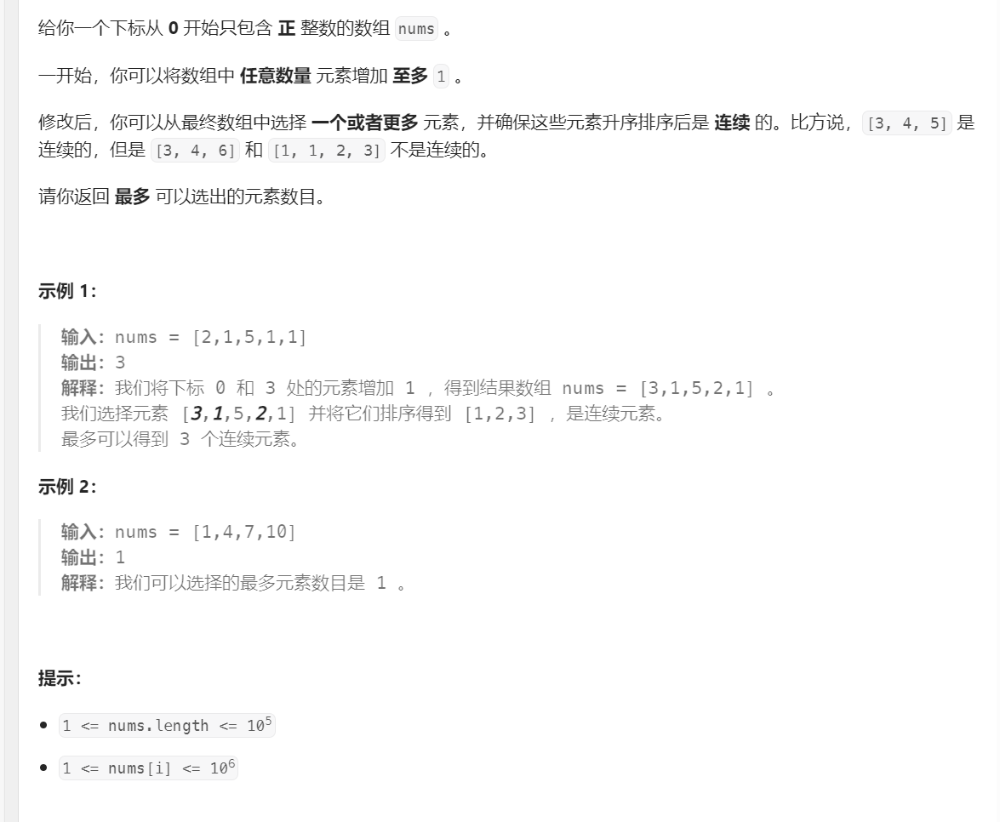

从原数组中任意取几个元素然后排序组成一个递增子序列，那么原数组的顺序就不重要了，将数组排好序之后问题转换为求最长递增子序列。定义dp（i,add）为以nums[i]为结尾的最长递增子序列，add表示是否选择加一，当前数值x可以从x-1或者x-2转移过来因为可以将数值加一。按照递增子序列I的做法是n^2的，但是这里元素被排序后可以使用二分搜索查找满足的元素。

此题的状态定义不能是前i个，因为要找上一个位置这种定义不方便


```python
class Solution:
    def maxSelectedElements(self, nums: List[int]) -> int:
        # 预处理
        nums.sort()
        @cache
        def dfs(i,add):
            if i==-1:
                return 0
            res=1
            # 当前元素实际大小
            x=nums[i]+add
            # 二分去找合适的值
            j=bisect_right(nums,x-1,0,i)-1
            
	    # 注意两个不同的状态x-1,x-2对于不同的add
            if j>=0 and nums[j]==x-1:
                res=max(res,1+dfs(j,0))
            
            j=bisect_right(nums,x-2,0,i)-1
            if j>=0 and nums[j]==x-2:
                res=max(res,1+dfs(j,1))
            return res
        ans=-inf
        # dui'mei'g
        for i ,v in enumerate(nums):
            ans=max(ans,dfs(i,0),dfs(i,1))
        return ans 
```

此题的性质类似于定差子序列，因为最后要求是连续的因此对于每个以v结尾的上一个一定是v-1，可以定义dp(i)表示以i结尾的满足要求的子序列的最长长度

```python
class Solution:
    def maxSelectedElements(self, nums: List[int]) -> int:
        nums.sort()
        f=defaultdict(int)
        # 注意顺序
        for v in nums:
            f[v+1]=f[v]+1
            f[v]=f[v-1]+1
        return max(f.values())
```


### 二维最长递增子序列

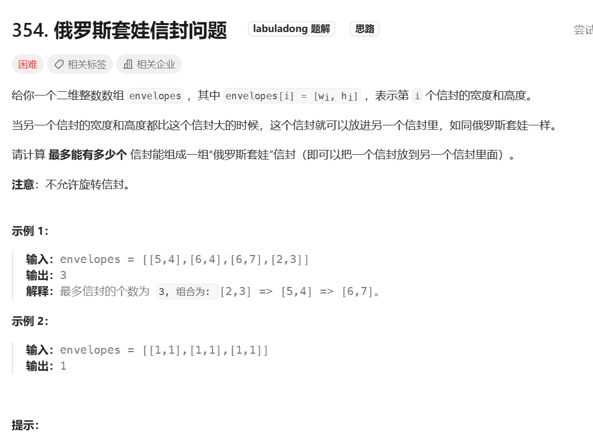


本质上也是在求解子序列，将数组中的值，先按照w的大小升序排列，然后对于相同的w按照h降序排列，如果不是降序会将宽度相同的信封装在一起。之后对h的数组进行找最长递增子序列即可

```python
class Solution:
    def maxEnvelopes(self, envelopes):
        if not envelopes:
            return 0
        
        n = len(envelopes)
        # 排序，先按照w升序再按照h降序，具体写法是利用lambda函数返回一个元组，为了使按照h降序，元组中放的是负的值
        envelopes.sort(key=lambda x: (x[0], -x[1]))

        # 找最长递增子序列
        f = [1] * n
        for i in range(n):
            for j in range(i):
                if envelopes[j][1] < envelopes[i][1]:
                    f[i] = max(f[i], f[j] + 1)
        
        return max(f)
```


### [访问数组中的位置使分数最大](https://leetcode.cn/problems/visit-array-positions-to-maximize-score/)

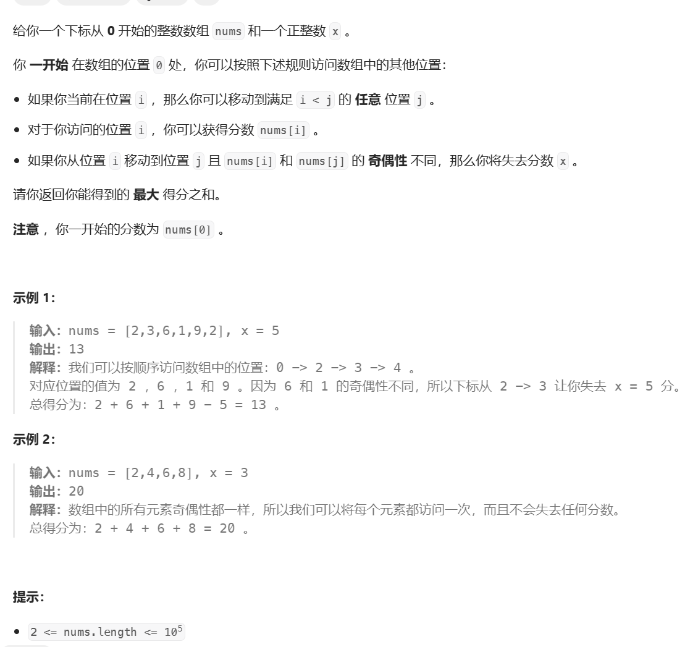


奇偶dp，dp[i]表示选到了第几位，分两个dp偶数的和奇数的，根据最后一个元素的奇偶性而分的。如果当前的值是奇数那么就更新奇数dp，奇数dp可以从上一位的奇数转移过来也可以是偶数转移过来，而偶数dp不变因为偶数dp要求最后一个数是偶数。

```python
class Solution:
    def maxScore(self, nums: List[int], x: int) -> int:
        n=len(nums)
        l=[0]*n
        r=[0]*n
        if nums[0]&1:
            l[0]=nums[0]
            r[0]=nums[0]-x
        else:
            l[0]=nums[0]-x
            r[0]=nums[0]
        for i in range(1,n):
            if nums[i]&1:
                l[i]=max(l[i-1]+nums[i],r[i-1]+nums[i]-x)
                r[i]=r[i-1]
            else:
                l[i]=l[i-1]
                r[i]=max(r[i-1]+nums[i],l[i-1]+nums[i]-x)
        return max(l[-1],r[-1])
```


### 子序列dp

#### [使数组变美的最小增量运算数](https://leetcode.cn/problems/minimum-increment-operations-to-make-array-beautiful/)

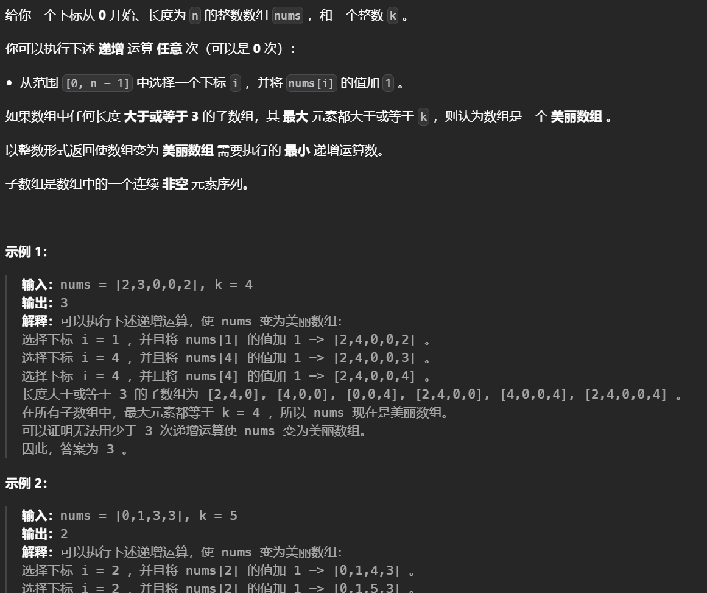

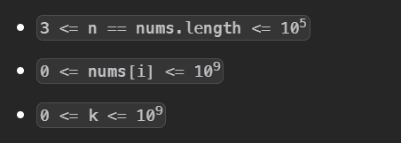

子序列问题对每个元素有增加或者不增加，题目要求每个长度大于等于3的满足要求，实际上只用找长度等于3的子数组即可。

由于长度只有三可以定义状态J表示这个数组右边不满足要求的连续元素个数，定义dp(i,j)表示当前位置上，右边有连续j个不满足要求的元素。

```python
class Solution:
    def minIncrementOperations(self, nums: List[int], k: int) -> int:
        n=len(nums)
        # @cache
        # def dp(i,j):
        #     if i<0:return 0
        #     if j==2:如果j=2就必须对当前位置操作
        #         return dp(i-1,0)+max(0,k-nums[i])
        #     return min(dp(i-1,0)+max(0,k-nums[i]),dp(i-1,j+1))# 操作或不操作
        # return dp(len(nums)-1,0)
        
        f=[[0]*3 for _ in range(n+1)]
        for i in range(1,n+1):
            f[i][0]=min(f[i-1][1],f[i-1][0]+max(0,k-nums[i-1]))
            f[i][1]=min(f[i-1][2],f[i-1][0]+max(0,k-nums[i-1]))
            f[i][2]=f[i-1][0]+max(0,k-nums[i-1])
        return f[n][0]

           
```


 


# 值域dp

## [求出最长好子序列 II](https://leetcode.cn/problems/find-the-maximum-length-of-a-good-subsequence-ii/)

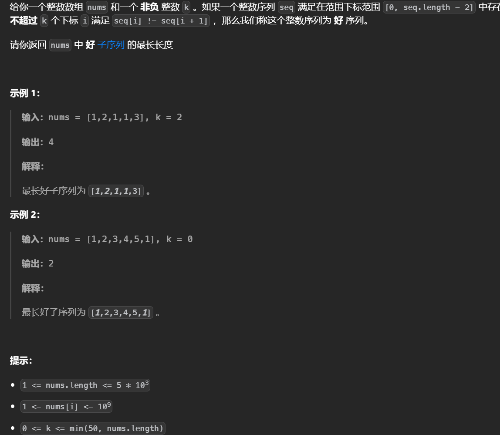

题目的关键是相邻元素的数值大小，考虑使用值域dp。

定义f[x]\[j]为以 *x* 结尾的、至多包含 *j* 个不同相邻元素的子序列的最大长度，转移方程为f[x]\[j]=max(f[x]]\[j],max{f[v]]\[j-1]})+1，即末尾的值是否相同，如果相同可以直接加一，对于不同的去找最大的。

这里的v是在x之前的值，如果要暴力枚举v会超时。这里可以在遍历x的过程中维护至多为j-1的最长长度，这里即使nums[j]=x也没关系，因为他一定是小于等于长度为j+1的不会影响到最后结果。

在转移过后更新j的最大长度。注意因为j需要去看j-1，而操作过后会更新j(节省空间不另开一个数组)，下一轮的j+1又会用到j，为了避免使用覆盖后的数据可以到倒序枚举j。


```python
class Solution:
    def maximumLength(self, nums: List[int], k: int) -> int:
        n=len(nums)
        # 为了构建数组，离散化
        p=sorted(set(nums))
        nums=[bisect_left(p,v) for v in nums]
        dp=[[0]*(k+1) for _ in range(max(nums)+1)]
        mx=[0]*(k+1)
        for x in nums:
            # 倒序枚举
            for j in range(k,-1,-1):
                dp[x][j]=max(dp[x][j],mx[j-1] if j-1>=0 else 0)+1
                mx[j]=max(mx[j],dp[x][j])
        return max(mx)
```

## Choosing Balls

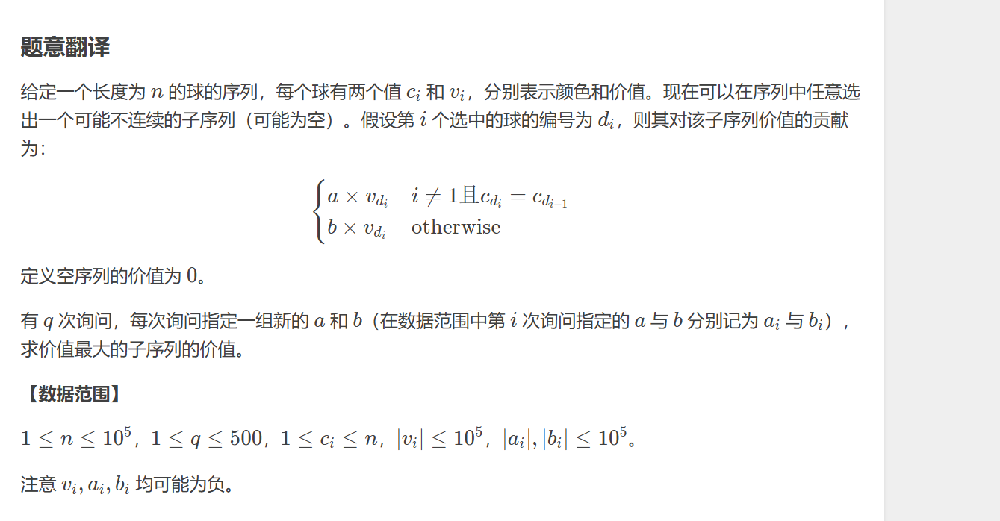


与上一题是同一类型的，值域DP。

```python
import sys
input=sys.stdin.readline

n,q=list(map(int,input().split()))
v=list(map(int,input().split()))
cc=list(map(int,input().split()))
# 定义dp[c]表示以颜色C作为最后一个的最长子序列
for _ in range(q):
    a, b = [int(x) for x in input().split()]
    mx1 = mx2 = 0# 表示最大的子序列对应的颜色，为了方便初始时指向0
    # 注意dp数组的大小只与颜色个数相关，不用定义为n
    dp = [-10**18] * (max(cc)+ 1)
    dp[0] = 0
    # 从前往后遍历每一个
    for val, c in zip(v, cc):
        # 拼接到相同的颜色后面，如果不存在相同的颜色也就是dp[c]=-inf，在取最大中会被排除
        x = dp[c] + val * a
        # 找到最大的与当前那颜色不同的
        y = (dp[mx1] if mx1 != c else dp[mx2]) + b * val
        if x < y: x = y
        # 更新最长的子序列对应的颜色，不用取等，如果等于在某个上一轮中jiu
        if dp[c] < x:
            dp[c] = x
            if dp[mx1] < x:
                mx1, mx2 = c, mx1
            elif mx1 != c and dp[mx2] < x:
                mx2 = c
    print(dp[mx1])
```

## [找出有效子序列的最大长度 II](https://leetcode.cn/problems/find-the-maximum-length-of-valid-subsequence-ii/)

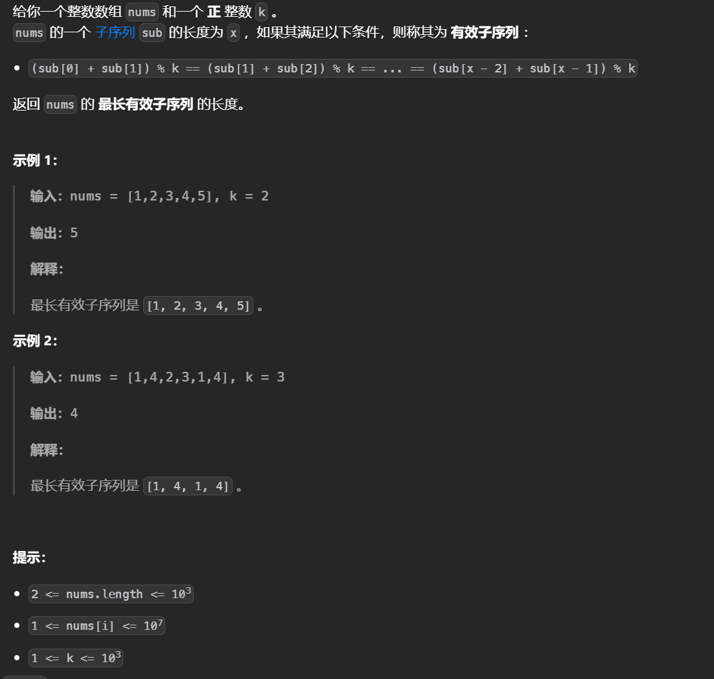

化简公式，实际上就是找奇数位置取余k相等并且偶数位置取余k也相等的最长子序列。

根据给定的数据范围，可以做到k^2。定义f[i]\[j]表示最后一个数为i倒数第二个数为j

```python
class Solution:
    def maximumLength(self, nums: List[int], k: int) -> int:
        f=[[0]*k for _ in range(k)]
        # 预处理数组
        nums=[v%k for v in nums]
        for v in nums:
            # 选这个数表示把这个数放在以任意个一个数为倒数第一个，以这个数为倒数第二个的子序列后面
            for j in range(k):
                f[v][j]=f[j][v]+1
        return max(map(max,f))
```


## [矩阵中严格递增的单元格数](https://leetcode.cn/problems/maximum-strictly-increasing-cells-in-a-matrix/)

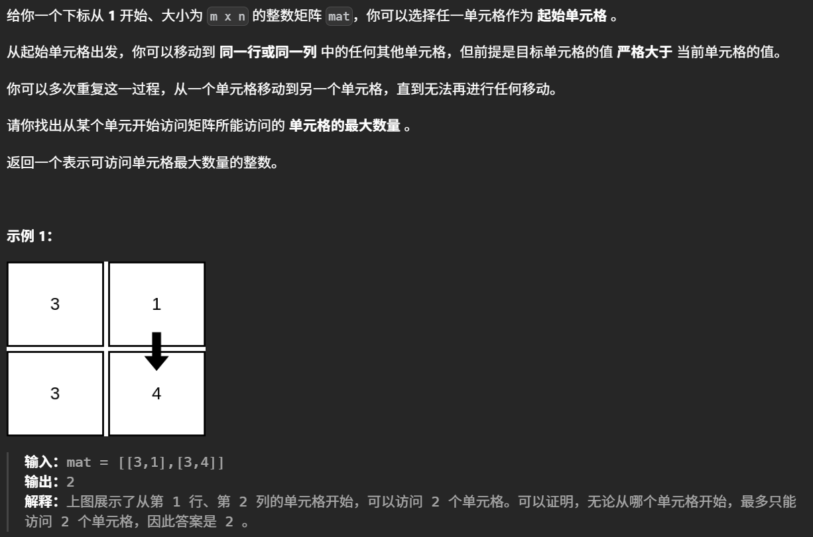

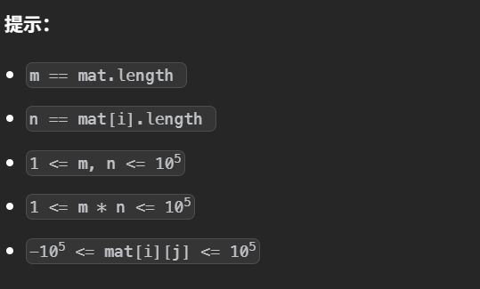

虽然是在网格图上，但是每个位置只能被值比它更小的值的位置转移过来，因此考虑值域DP，对于g[i]\[j]需要从同一行同一列中小于他的位置转移过来并且只会是DP值最大的，在计算g[i]\[j]时，比它更小的位置已经被计算出来了，只需用字典记录每一行每一列对应的最大DP值即可。

```python
from collections import defaultdict
class Solution:
    def maxIncreasingCells(self, nums) -> int:
        row=defaultdict(int)
        col=defaultdict(int)
        memo=defaultdict(list)
        m=len(nums)
        n=len(nums[0])
        max=lambda x,y: x if x>=y else y
        # 记录每个值对应的位置
        for i in range(m):
            for j in range(n):
                memo[nums[i][j]].append((i,j))
        ans=0
        for v in sorted(memo.keys()):
            mx=1
            r=defaultdict(int)
            c=defaultdict(int)

            # 不能同时更新，需要暂存
            for i,j in memo[v]:
                x=max(row[i]+1,col[j]+1)
                r[i]=max(r[i],x)
                c[j]=max(c[j],x)
                mx=max(mx,x)
            # 更新每一行/列对应的最大值
            for i in r:row[i]=max(row[i],r[i])
            for i in c:col[i]=max(col[i],c[i])

            ans=max(ans,mx)
        return ans 
```


​	


# 可行性背包

## [执行操作可获得的最大总奖励 I](https://leetcode.cn/problems/maximum-total-reward-using-operations-i/)

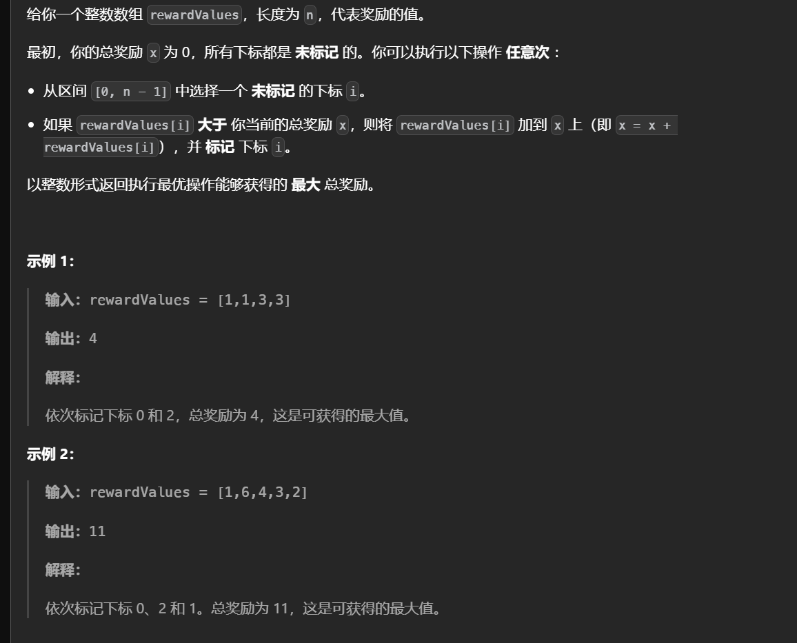

每次只能选大于当前总和的数，先贪心把数组去重后排序。

定义dp(i,j)表示考虑前i个元素，是否能满足最大和为J，初始时dp(0,0)为True，整个数组能能到的最大值为mx，因为每次只能选择大于当前和的数因此，一个值如果大于数组的最大值那么mx就是这个数，如果小于最大值则可以加上数组的最大值然后就不能再增大了，mx=max(nums)*2-1.

选一个数的条件是j-v<v（没选这个数之前小于当前数）只有这样才能选择j

```python
class Solution:
    def maxTotalReward(self, rewardValues: List[int]) -> int:
        rewardValues=sorted(set(rewardValues))
        n=len(rewardValues)
        mx=2*rewardValues[-1]
        # dp=[[False]*mx for _ in range(n+1)]
        # dp[0][0]=True
        # for i in range(1,n+1):
        #     for j in range(mx):
        #         v=rewardValues[i-1]
        #         if j>=v and j-v<v:dp[i][j]=dp[i-1][j]|dp[i-1][j-v]
        #         else:dp[i][j]=dp[i-1][j]
        # for j in range(mx-1,-1,-1):
        #     if dp[-1][j]:return j

        # 优化为一维
        dp=[False]*mx
        dp[0]=True
        for i in range(1,n+1):
            v=rewardValues[i-1]
            for j in range(mx-1,-1,-1):
                if j>=v and j-v<v:dp[j]=dp[j]|dp[j-v]

        for j in range(mx-1,-1,-1):
            if dp[j]:return j      
```

当数据比较大的时候就必须优化了


对于可行性背包最常见的优化技巧是bitset

用一个二进制数f表示dp数组,其中f的第i位表示dp[i]，为1表示TRUE,0表示FALSE


初始时f=1表示dp[0]=TRUE

```python
class Solution:
    def maxTotalReward(self, rewardValues: List[int]) -> int:
        rewardValues=sorted(set(rewardValues))
        n=len(rewardValues)
        f=1
        for v in rewardValues:
            f|=(f&(1<<v)-1)<<v     
        return f.bit_length()-1       
```


### [单调数组对的数目 II](https://leetcode.cn/problems/find-the-count-of-monotonic-pairs-ii/)

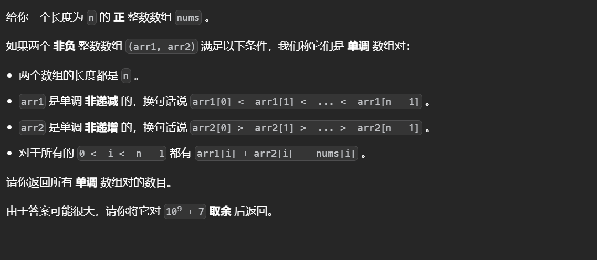

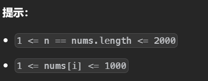


定义f[i]\[j]表示第i个位置选择j的个数，可以很简单的得出推导式，

```python
@cache
def dp(i,j):
    if not i:return 1
    mx=min(j,nums[i-1]-nums[i]+j)
    res=0
    for k in range(mx+1):
        res+=dp(i-1,k)
        res%=mod
    return res 
return sum(dp(n-1,k) for k in range(nums[-1]+1))%mod
```

但是对于给定的的数据范围无法求解只有优化一重循环才能得到结果，把dp改为递推之后发现其中一重循环完全可以用前缀和优化。

```python
        for v in range(nums[0]+1):f[0][v]=1
        for i in range(1,n):
            s=list(accumulate(f[i-1],initial=0))
            for j in range(nums[i]+1):
                mx=min(j,nums[i-1]-nums[i]+j)
                if mx<0:continue
                res=s[mx+1]
                # for k in range(mx+1):
                #     res+=f[i-1][k]
                res%=mod
                f[i][j]=res
        return sum(f[n-1][k] for k in range(nums[-1]+1))%mod
```


### [不同骰子序列的数目](https://leetcode.cn/problems/number-of-distinct-roll-sequences/)

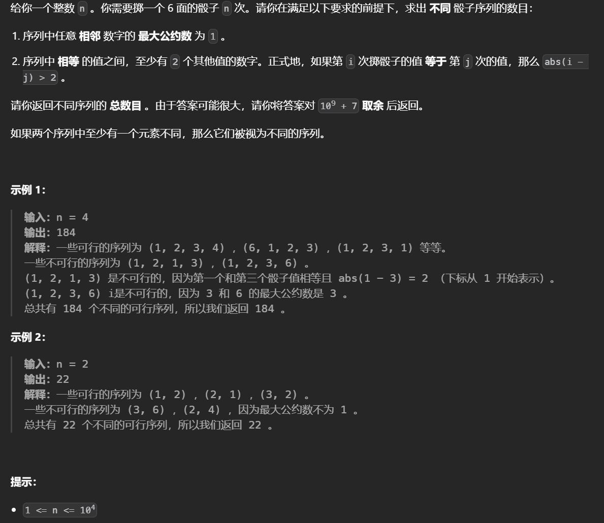

最直接的定义，设置l1，l2为倒数第一个数和倒数第二个数

```python
class Solution:
    def distinctSequences(self, n: int) -> int:
        mod=10**9+7
        @cache
        def dp(i,l1,l2):
            if i==n:return 1
            res=0
            for j in range(1,7):
                if gcd(l1,j)!=1 or l1==j or l2==j:continue
                res+=dp(i+1,j,l1)
                res%=mod
            return res 
        return dp(0,-1,-1)
```

优化，定义dp(i,j)表示前i个序列以j结尾，倒数第二个数的值可以推出

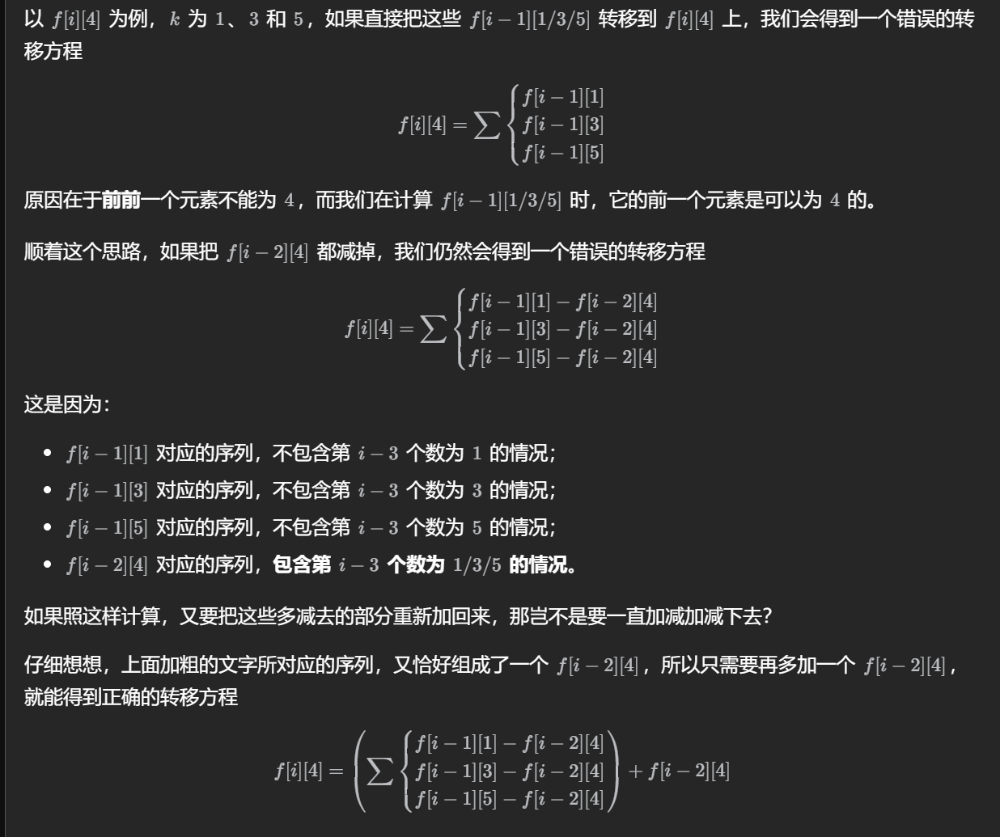

```python
class Solution:
    def distinctSequences(self, n: int) -> int:
        mod=10**9+7
        @cache
        def dp(i,j):
            if i==1:return 1
            elif i<=0:return 0
            res=0
            for k in range(1,7):
                if k!=j and gcd(k,j)==1:
                    res+=dp(i-1,k)-dp(i-2,j)
                    res%=mod
            # 注意这里按照定义只有I大于3的时候才能求解，否则是不存在i-3的
            if i>3:res+=dp(i-2,j)
            return res%mod
        return sum(dp(n,i) for i in range(1,7))%mod

```


### Toward 0

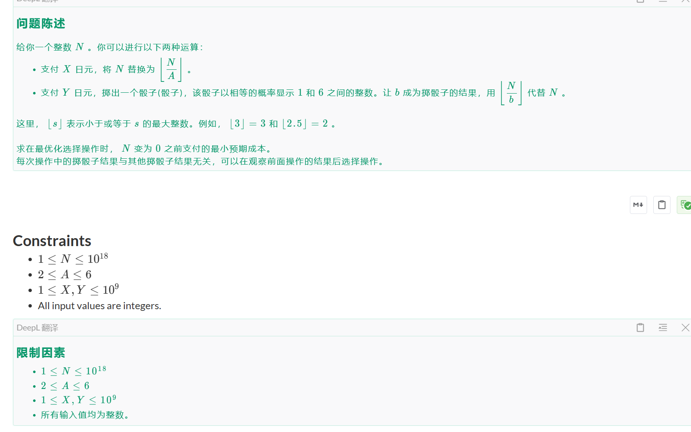


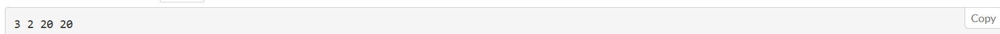

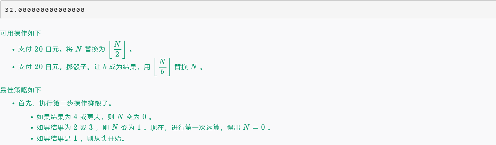

实际上是dp问题，每次可以选择掷色子或者固定减少两种选择，掷色子的花费dp(x)=(6*y+dp(n/1)+dp(n/2)+dp(n/3)+dp(n/4)+dp(n/5)+dp(n/6))/6，这里出现了重复项，可以变化公式得出最后的形式。

```python
from functools import lru_cache
n,a,x,y=[int(x) for x in input().split()]
@lru_cache(maxsize=None)
def dfs(u):
    if not u:return 0
    l=x+dfs(u//a)
    r=(6*y+dfs(u//2)+dfs(u//3)+dfs(u//4)+dfs(u//5)+dfs(u//6))/5
    return min(l,r)
print(dfs(n))
```

​	

### How Does the Rook Move

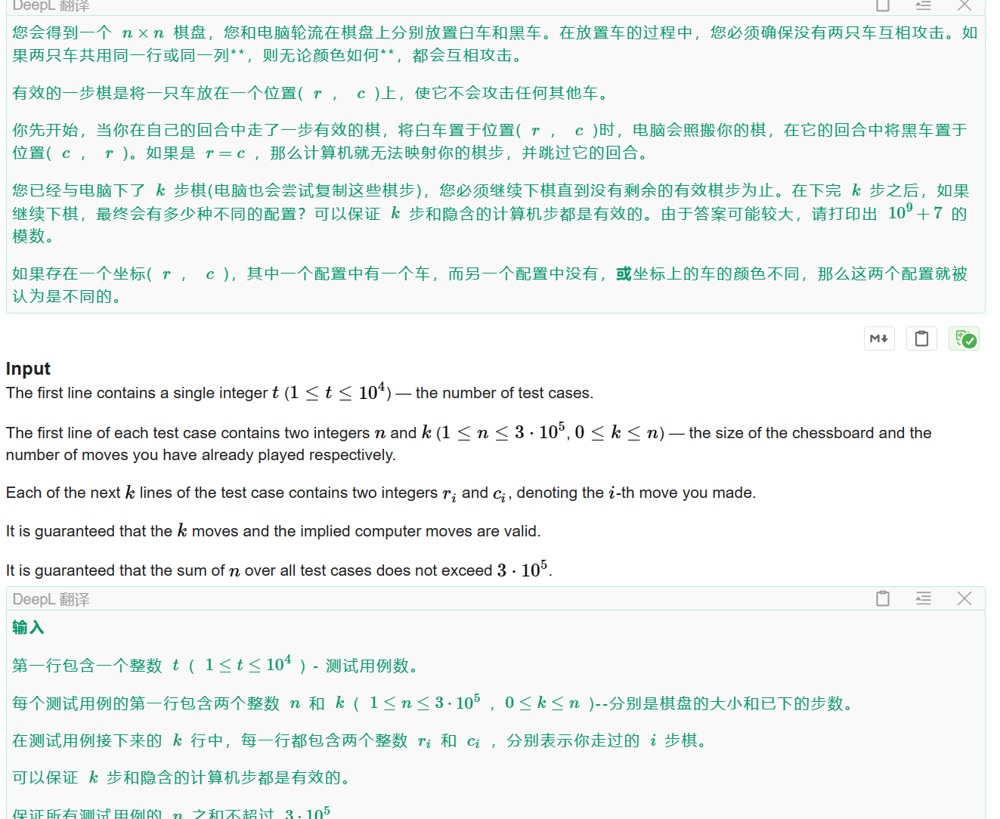

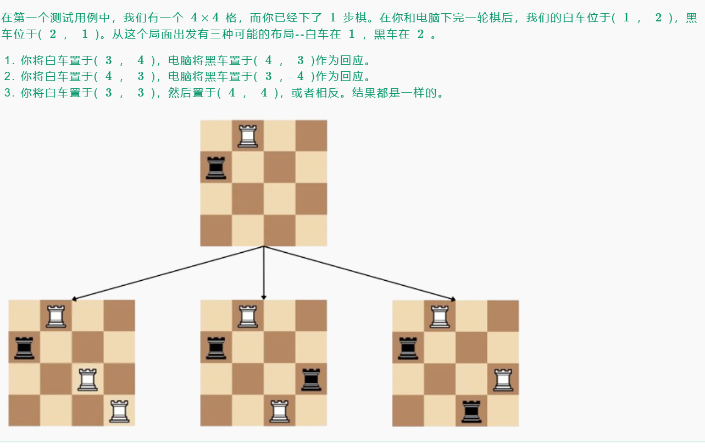


黑棋的位置不重要，因为只能由白棋决定，当白棋落在正对角线的位置时可选的行数减少1，其他位置时可选的行数减少2，显然是一个子问题求解过程。

dp[i]=dp[i-1]+(i-1+i-1)*dp[i-2]加上两个i-1是因为子啊除开对角线由2\*i-2个位置可选.

```python
from functools import lru_cache
mod=10**9+7
for _ in range(int(input())):
    n,k=[int(x) for x in input().split()]
    dp = [0] * (n + 1)
    dp[0]=dp[1] = 1
    for _ in range(k):
        a,b=[int(x) for x in input().split()]
        if a==b:n-=1
        else:n-=2

    for i in range(2,n+1):
        dp[i]=dp[i-1]+(2*i-2)*dp[i-2]
        dp[i]%=mod
    print(dp[n])
```


### [视频拼接](https://leetcode.cn/problems/video-stitching/)

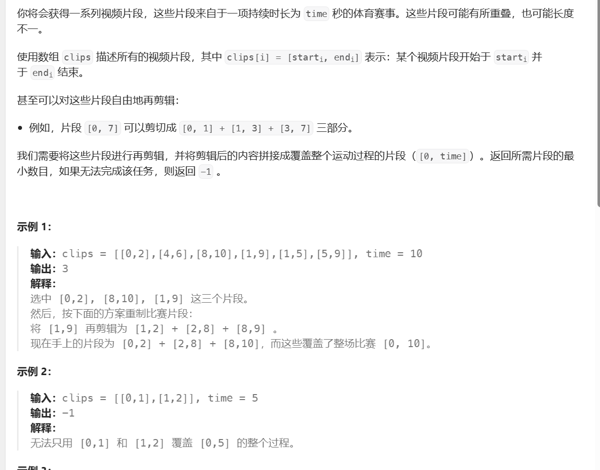

```python
class Solution(object):
    def videoStitching(self,clips, time):
        dp = [float('inf')] * (time + 1)
        dp[0] = 0
    
        for i in range(1, time + 1):
            for start, end in clips:
                if start < i <= end:
                    dp[i] = min(dp[i], dp[start] + 1)
    
        return dp[time] if dp[time] != float('inf') else -1

```

### [灌溉花园的最少水龙头数目](https://leetcode.cn/problems/minimum-number-of-taps-to-open-to-water-a-garden/)

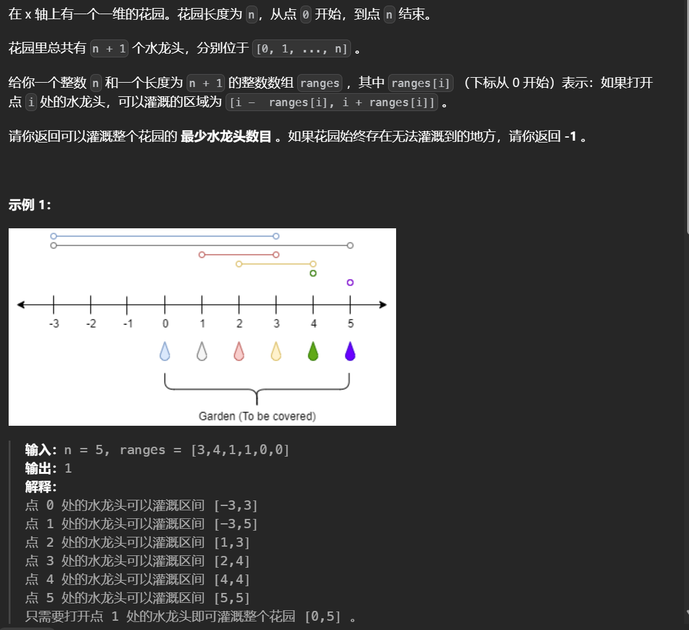


和上一题是一个类型，都选出最少的区间来覆盖整个区间，这种题目令dp[i]表示0~i区间内被全覆盖所需的最少区间数。


```python
class Solution:
    def minTaps(self, n: int, ranges: List[int]) -> int:
        inter=[]
        # 首先对区间进行操作，超出的位置不需要
        for i,v in enumerate(ranges):
            inter.append([max(0,i-v),min(i+v,n)])
        # 按照开始时间排序，能保证开始时间之前都是计算好的
        inter.sort()
        dp=[inf]*(n+1)
        dp[0]=0
        # 如果选了这个区间，那么到达这个区间中某一个点j的最少区间数与这个区间的左端点有关
        for l,r in inter:
            # 如果存在不合法的状态则表示有点没有被覆盖
            if dp[l]==inf:return -1
            for j in range(l,r+1):
                # 类似于刷表法
                dp[j]=min(dp[j],dp[l]+1)
        return dp[n]
```


### [知道秘密的人数](https://leetcode.cn/problems/number-of-people-aware-of-a-secret/)

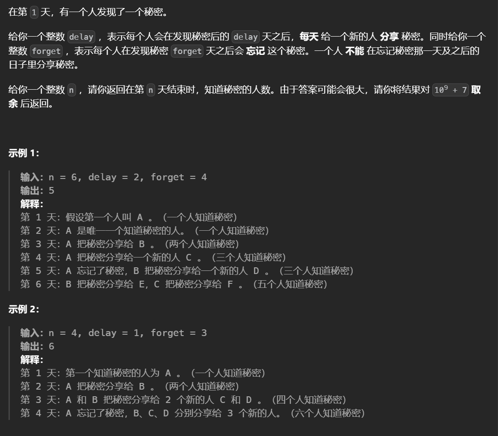

考虑dp[i]表示第i天新增的人数，最后求的总人数就是从最后一天往前数forget天增加的总人数之和。


```python
class Solution:
    def peopleAwareOfSecret(self, n: int, delay: int, forget: int) -> int:
        mod=10**9+7
        dp=[0]*(n+1)
        dp[1]=1
        # 使用刷表法，第i天会影响到后面的一个区间的时间端
        for i in range(1,n+1):
            for j in range(i+delay,i+forget):
                if j>=n+1:break
                dp[j]+=dp[i]
        ans=0
        # 最后求和
        for i in range(n-forget+1,n+1):
            ans+=dp[i]
            ans%=mod
        return ans 
```

### **Avoid K Partition**

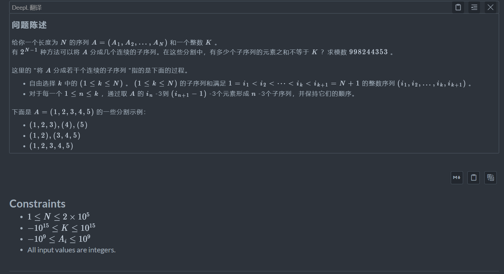

定义fi表示 表示在 i*i* 点分割时的总可行方案数，直接想到fi=sum(fj)其中j<i，但是其中会存在不满足条件的fj也就是s[i]-s[j]==k->s[i]-k\==s[j]，因此用字典记录前缀和为s[j]的f[i]之和。

```python
n,k=RR()
nums=RR()
mod=998244353

f=[0]*(n+1)
f[0]=summ=1
memo=defaultdict(int)
memo[0]=1
pre=get_pre(nums)

for i in range(1,n+1):
    f[i]=(summ-memo[pre[i]-k])%mod
    memo[pre[i]]+=f[i]
    summ+=f[i]

print(f[n])
```


### 最大子数组之和

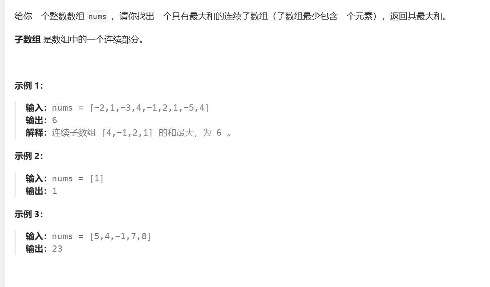

```python
class Solution:
    def maxSubArray(self, nums: List[int]) -> int:
        n=len(nums)
        dp=[0]*n
        dp[0]=nums[0]
        ans=dp[0]
        for i in range(1,n):
            dp[i]=max(nums[i],dp[i-1]+nums[i])
            ans=max(ans,dp[i])
        return ans 
```

### [将字符串翻转到单调递增](https://leetcode.cn/problems/flip-string-to-monotone-increasing/)

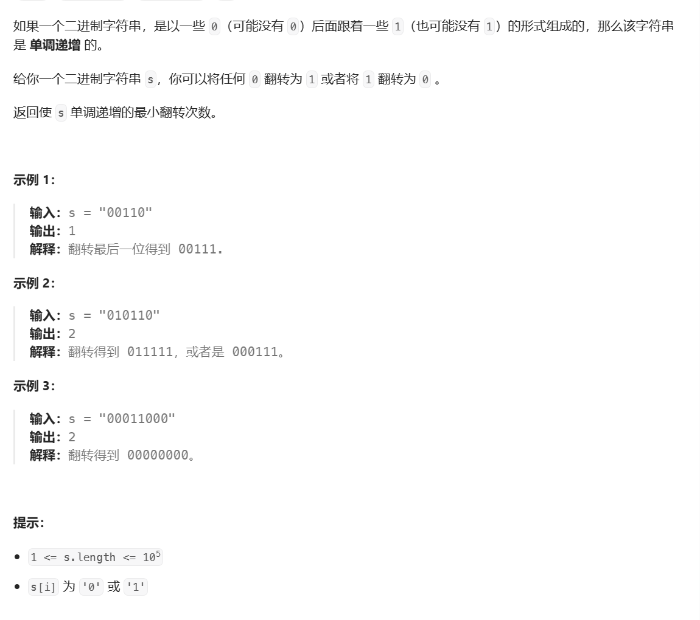

规定dp[i] [j]为把第i+1个变为j并且是递增的最小操作次数，最终的结果就是最后一个字符变为0或1中的最小的那个。

dp[i] [0]=dp[i-1] [0]，把当前位转换为0，前一位只能是0，次数就是前一位转换为0的次数加上当前位置字符是否为1。

dp[i] [1]，前一位可以是0或者是1，次数是前一位转换为0或1的最小值，加上当前位是否为0.

```python
class Solution:
    def minFlipsMonoIncr(self, s: str) -> int:
        n=len(s)
        dp=[[0,0] for _ in range(n+1)]
        for i in range(n):
            dp[i+1][0]=dp[i][0]+int(s[i]=='1')
            dp[i+1][1]=min(dp[i][0],dp[i][1])+int(s[i]=='0')
        return min(dp[n][0],dp[n][1])
    # 可以优化为只有两个变量
   	   zero=one=0
        for i in range(n):
            one,zero=min(zero,one)+int(s[i]=='0'),zero+int(s[i]=='1')
        return min(zero,one)
```

### [最大节点价值之和](https://leetcode.cn/problems/find-the-maximum-sum-of-node-values/)

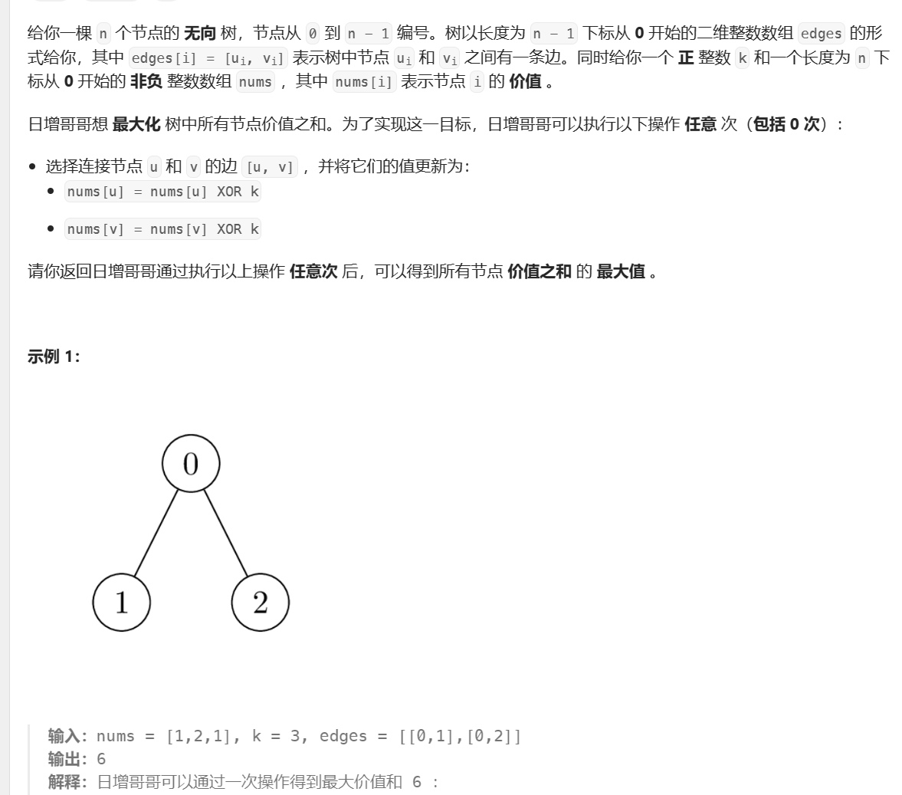

这道题目的边是没有用的，每次选出两个值进行异或操作：如果两个值都被操作过，总的异或个数减二，反之加二，如果只有一个操作过则总数不变。因此到最后异或的个数一定是偶数个，根据这一点给出dp(i,j)表示考虑前i个数，当有j(1表示奇数0表示偶数)个异或个数时的最大值。


```python
class Solution:
    def maximumValueSum(self, nums: List[int], k: int, edges: List[List[int]]) -> int:
        n=len(nums)
        @cache
        def dp(i,j):
            res=nums[i-1]^k
            # base case 对于第一个值如果操作次数是偶数则不会异或上值
            if i==1:
                return nums[i-1]^k if j else nums[i-1]
            return max(dp(i-1,j)+nums[i-1],dp(i-1,j^1)+(nums[i-1]^k))
        return dp(n,0)
```


### [ 两个子序列的最大点积](https://leetcode.cn/problems/max-dot-product-of-two-subsequences/)

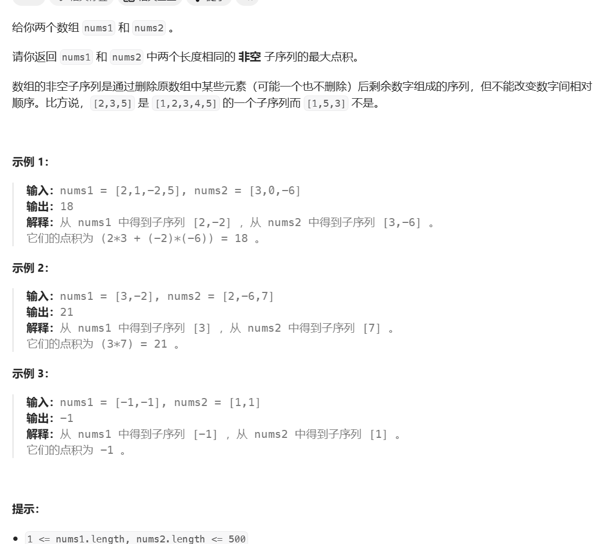

定义dp(i,j)为nums1[i:],nums2[j:]范围内的最大点积。

状态转移相当于枚举选或不选	


```python
class Solution:
    def maxDotProduct(self, nums1: List[int], nums2: List[int]) -> int:
        n1,n2=len(nums1),len(nums2)
        @cache 
        def dp(i,j):
            # 不合法的状态
            if i>=n1 or j>=n2:return -inf
            # 两个都选，注意后面的值取了可能会更小，因此取最大
            res=max(nums1[i]*nums2[j],nums1[i]*nums2[j]+dp(i+1,j+1))
            # 其中一个不选，包括了两个都不选的情况
            res=max(res,dp(i,j+1))
            res=max(res,dp(i+1,j))

            return res
        res=dp(0,0)
        return res 
```

### [最短公共超序列](https://leetcode.cn/problems/shortest-common-supersequence/)

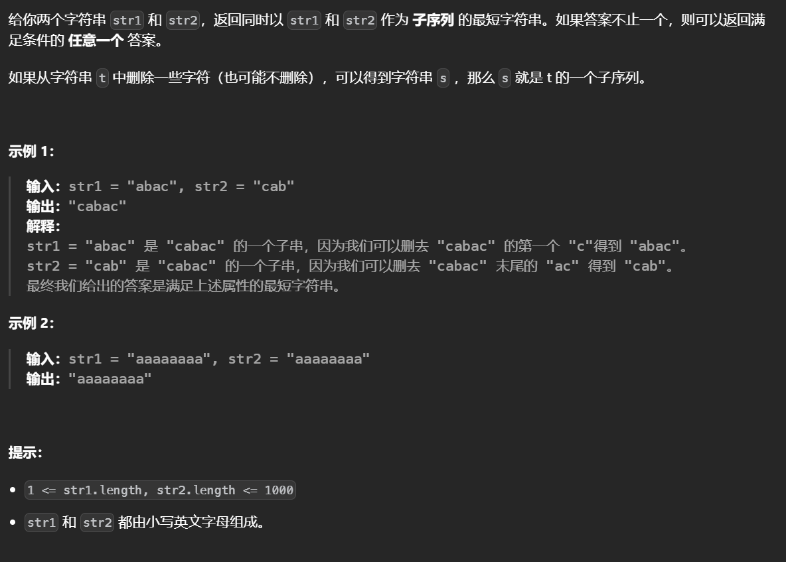


要求构造的字符串尽可能短那么最后一个字符一定是a或者b中的，如果是a中的那么问题变为从a[:-1]和b中构造字符串，反之问题变为从a,b[:-1]中构造字符串，如果相同那么就是从a[:-1]和b[:-1]中构造，可以分解出子问题。

如果直接使用记忆化搜索找最短的字符串那么内存会超出，在函数中使用另一个函数计算长度这样可以确保每一步走的都是正确的，不用递归循环找错误的子串

```python
class Solution:
    def shortestCommonSupersequence(self, s: str, t: str) -> str:
        @cache
        def dfs(i,j):
            if j<0:return i+1
            elif i<0:return j+1
            if s[i]==t[j]: return dfs(i-1,j-1)+1
            return min(dfs(i-1,j),dfs(i,j-1))+1
        
       # 不需要记忆化搜索了
        def maks(i,j):
            if j<0:return s[:i+1]
            elif i<0:return t[:j+1]
            if s[i]==t[j]: return maks(i-1,j-1)+s[i]
            if dfs(i-1,j)<dfs(i,j-1):
                return maks(i-1,j)+s[i]
            return maks(i,j-1)+t[j]
        return maks(len(s)-1,len(t)-1)
```


### 两个字符串的删除操作

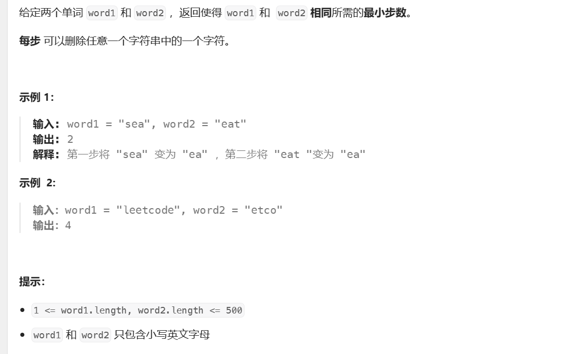

两个字符串可以任意删除，那就是找两字符串的最长公共子序列。

```python 
class Solution(object):
    def minDistance(self, word1, word2):
        m=len(word1)
        n=len(word2)
        memo=[[-1 for _ in range(n)] for _ in range(m)]

        def dp(s1,m,s2,n):
            if m==len(s1) or n==len(s2):
                return 0
            if memo[m][n]!=-1:
                return memo[m][n]
            if s1[m]==s2[n]:
                memo[m][n]=1+dp(s1,m+1,s2,n+1)
            else:
                memo[m][n]=max(dp(s1,m+1,s2,n),dp(s1,m,s2,n+1))
            return memo[m][n]

        length=dp(word1,0,word2,0)
        return m+n-2*length
    
# 自底向上的更快
class Solution(object):
    def minDistance(self, word1, word2):
        m=len(word1)
        n=len(word2)
        dp=[[0 for _ in range(n+1)] for _ in range(m+1)]

        for i in range(1,m+1):
            for j in range(1,n+1):
                if word1[i-1]==word2[j-1]:
                    dp[i][j]=dp[i-1][j-1]+1
                else:
                    dp[i][j]=max(dp[i-1][j],dp[i][j-1])

        length=dp[m][n]
        return m+n-2*length
```

### 正则表达式

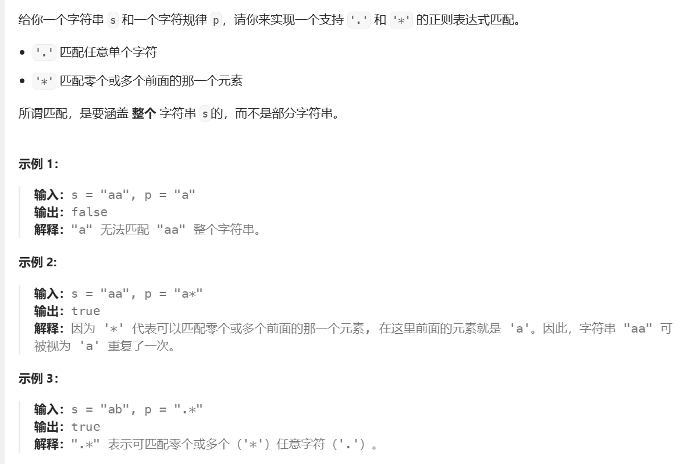

使用动态规划的思想。

如果两个指针指向的元素匹配了，如果规则中的下一位是*那么有可能是p匹配了多个s的指针移动一位，也有可能是p匹配了0个p的指针移动两位（跳过 *），比如说s=ab p=a * ab。如果下一位不是*那么就是正常的匹配，指针都移动一位。

如果两个元素不匹配，那么可能是*规则匹配了0次，或者就是s不满足p的规则。

```python
class Solution(object):
    def isMatch(self, s, p):
        memo=[[-1 for _ in range(len(p))] for _ in range(len(s))]

        # dp返回的是s[m:]与p[n:]是否匹配
        def dp(s, i, p, j):
            # base case,如果规则中的匹配完了，返回判断字符串是否检索完
            if j == len(p):
                return i == len(s)
            
            # 如果字符串检索完，不能认为规则检索完，因为规则中可能还有多个a*的形式 
            if i == len(s):
                
                # a*的形式必须是偶数
                if (len(p) - j) % 2 == 1:
                    return False
                # 判断剩下的规则元素中是否是a*的形式
                while j + 1 < len(p):
                    if p[j + 1] != "*":
                        return False
                    j += 2
                return True
            
            # 备忘录中存有值
            if memo[i][j]!=-1:
                return memo[i][j]
            
            # 如果匹配
            if s[i] == p[j] or p[j] == ".":
                # a*匹配0次或多次
                if j + 1 < len(p) and p[j + 1] == "*":
                    memo[i][j]=dp(s, i + 1, p, j) or dp(s, i, p, j + 2)
                else:# 正常匹配都移动一步
                    memo[i][j]=dp(s, i + 1, p, j + 1)
            else:# 不匹配
                # 判断是否是因为a*匹配0次导致的
                if j + 1 < len(p) and p[j + 1] == "*":
                    memo[i][j]=dp(s, i, p, j + 2)
                else:
                    memo[i][j]=False
            return memo[i][j]

        return dp(s, 0, p, 0)
```

### 最长回文子序列

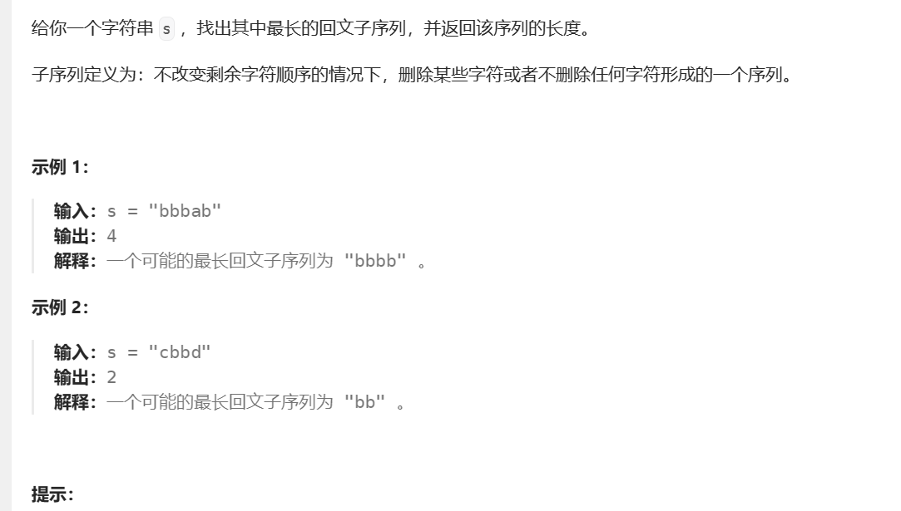

dp数组定义为二维的dp[m] [n]表示的是，s[m:n+1]的最长回文子序列，借助这个dp数组可以推出下一个状态，如果s[i]==s[j]说明这两个字符是回文子序列中的，那么dp[m] [n]=dp[m+1] [n-1]+2，反之最大长度应该等于将这两个字符分别加入后的结果。

```python
class Solution(object):
    def longestPalindromeSubseq(self, s):
        # 备忘录
        memo=[[-1 for _ in range(len(s))]for _ in range(len(s))]

        def dp(s,l,r):
            # base case，相等自然是只有一个字符
            if l==r:
                return 1
            # 如果索引不合法就是0
            if l>r:
                return 0
            
            if memo[l][r]!=-1:
                return memo[l][r]
            # 等于，加入
            if s[l]==s[r]:
                memo[l][r]=dp(s,l+1,r-1)+2
            else:# 反之找出最大的
                memo[l][r]= max(dp(s,l,r-1),dp(s,l+1,r))
            return memo[l][r]
        return dp(s,0,len(s)-1)


'''使用dp table的版本，dp[m][n]的结果要借助它的左下，左，下求出，因此选择自下而上自左而右的遍历顺序，初始时可以将不合法的值以及对角线上的值（只有一个字符）初始化'''
class Solution(object):
    def longestPalindromeSubseq(self, s):
        dp = [[0 for _ in range(len(s))] for _ in range(len(s))]
        for i in range(len(s)):
            dp[i][i]=1
        for i in range(len(s)-2,-1,-1):
            for j in range(i+1, len(s)):
                if s[i]==s[j]:
                    dp[i][j]=dp[i+1][j-1]+2
                else:
                    dp[i][j]=max(dp[i][j-1],dp[i+1][j])
        return dp[0][len(s)-1]
```

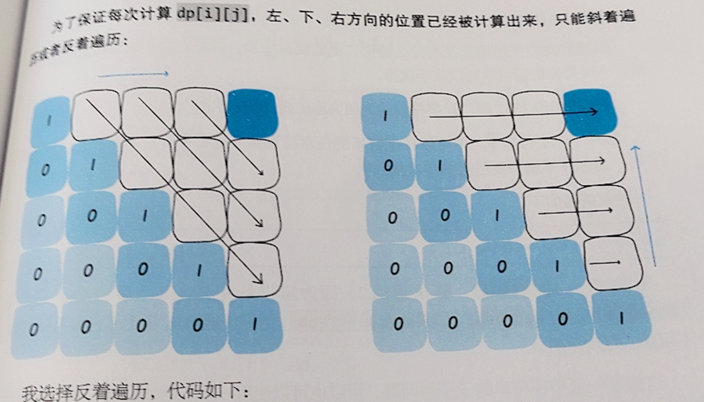

### 	[数组中的最长山脉](https://leetcode.cn/problems/longest-mountain-in-array/)

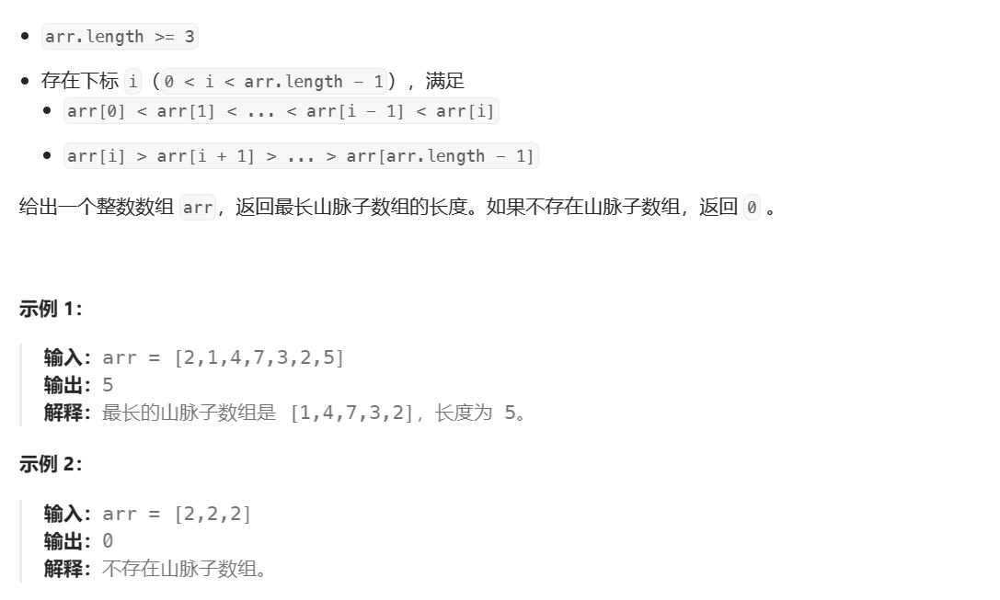


使用动态规划求解以第i位结尾的最长递增连续子数组的长度，题目中要求两边都是小于它的。因此求两个：dp1: 从左到右记录以这个数为结尾的最长连续递增子数组长度
dp2: 从右到左记录以这个数为结尾的最长连续递增序列长度，然后把它们依次相加再减一（重复了一位）就是这个位置左右的最长递增连续子序列长度。可以认为是有两个条件，对这两个条件分别讨论

```python
class Solution(object):
    def longestMountain(self, arr):
        n = len(arr)
        dp1=[1]*n
        dp2=[1]*n
        ans=0
        # 正序求一次
        for i in range(1,n):
            if arr[i]>arr[i-1]:
                dp1[i]=dp1[i-1]+1
	# 倒序求一次
        for i in range(n-1,0,-1):
            if arr[i-1]>arr[i]:
                dp2[i-1]=dp2[i]+1
        for i in range(n):
            # 注意一个山的要求最少有三个元素，如果两个都等于1，无法构成山
            if dp1[i]>1 and dp2[i]>1:
                curr=dp1[i]+dp2[i]-1
                ans=max(ans,curr)
        return ans
```


### [统计元音字母序列的数目](https://leetcode.cn/problems/count-vowels-permutation/)	

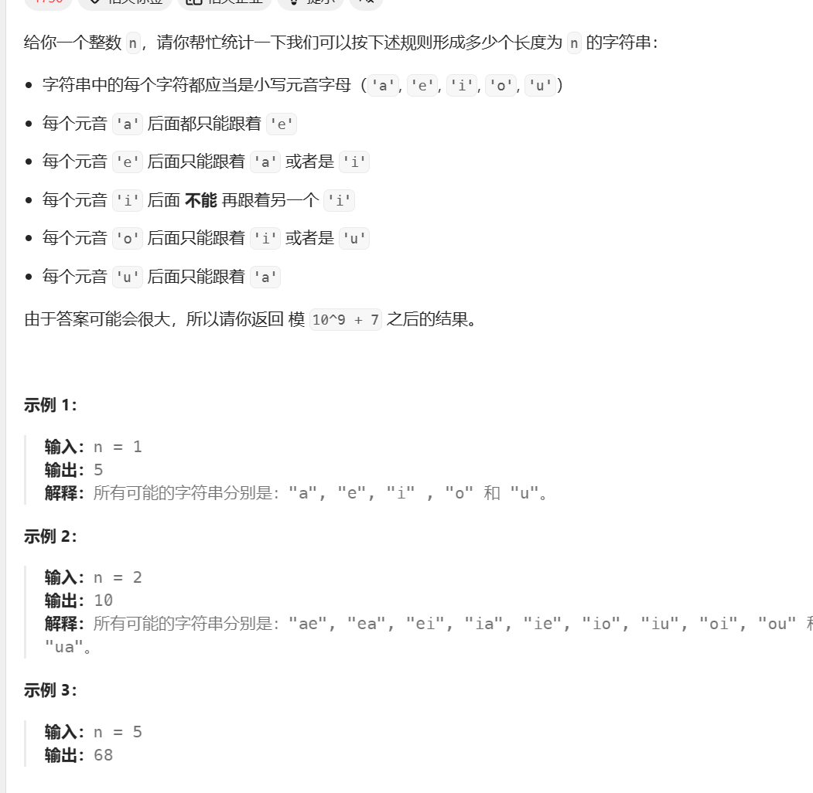


问题可以分解为子问题求解，定义f[i] [j]为长度为i+1结尾元素为j的方案数，状态方程是：以e为结尾元素且长度为i+1的方案数等于长度为i并且是以a,i结尾的方案数的总和。

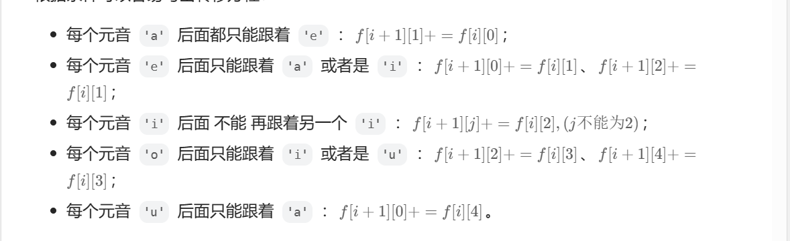

```python
class Solution:
    def countVowelPermutation(self, n: int) -> int:
        m=10**9+7
        f=[[0]*5 for _ in range(n)]
        f[0]=[1]*5
        for i in range(n-1):
            f[i+1][1]+=f[i][0]

            f[i+1][0]+=f[i][1]
            f[i+1][2]+=f[i][1]

            f[i+1][0]+=f[i][2]
            f[i+1][1]+=f[i][2]
            f[i+1][3]+=f[i][2]
            f[i+1][4]+=f[i][2]

            f[i+1][2]+=f[i][3]
            f[i+1][4]+=f[i][3]

            f[i+1][0]+=f[i][4]

            for j in range(5):
                f[i+1][j]%=m

        ans=0
        for i in range(5):
            ans+=f[n-1][i]
            
        return ans%m 
```


### [拼接数组的最大分数](https://leetcode.cn/problems/maximum-score-of-spliced-array/)

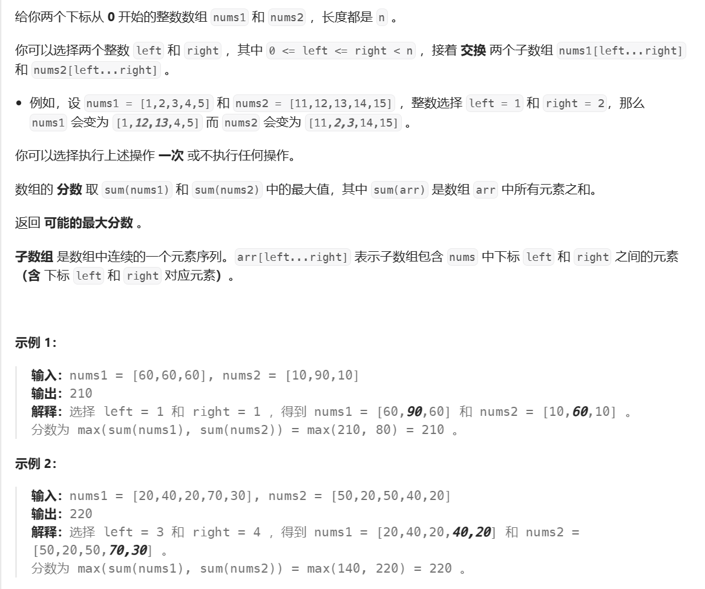

交换同一个区间内的两个值，转换为数学公式就是：

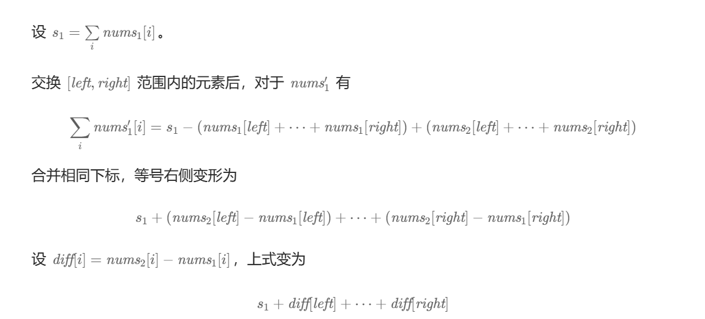


问题变为求diff数组的最大子数组之和


```python
class Solution:
    def maximumsSplicedArray(self, nums1: List[int], nums2: List[int]) -> int:
        # 构建两个diff数组
        diff1=[a-b for a,b in zip(nums2,nums1)]
        diff2=[a-b for a,b in zip(nums1,nums2)]
        a=b=0
        
        # 状态定义为以nums[i]结尾的子数组
        def dp1(i):
            if i==0:
                return diff1[0]
            c=dp1(i-1)
            res=max(diff1[i],c+diff1[i])
            # 记录最大值
            nonlocal a 
            a=max(a,res)
            return res

        def dp2(i):
            if i==0:
                return diff2[0]
            c=dp2(i-1)
            res=max(diff2[i],c+diff2[i])
            nonlocal b
            b=max(b,res)
            return res

        dp1(len(nums1)-1)
        dp2(len(nums1)-1)
	# 求两个的最大
        return max(sum(nums1)+a,sum(nums2)+b)

```


### 乌龟棋

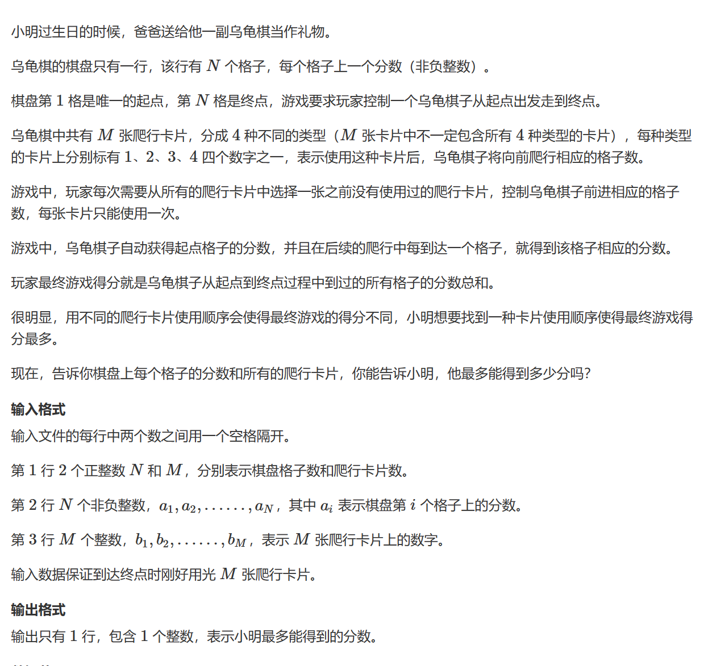


如果只用单纯的i表示以nums[i]结尾，为了表示卡牌的使用情况会在内部使用字典记录但这样就没法记忆化搜索了，如果加上abcd表示卡牌的用量那么状态太多了，关键在于卡牌的用量可以表示当前的位置。这道题使用递归会超时，用递推


```python
from collections import Counter
from math import inf
from functools import lru_cache

n, m = [int(x) for x in input().split()]
nums = [int(x) for x in input().split()]
memo = [0] * 4
# 记录每种卡牌的数量
for k in list(map(int, input().split())):
    memo[k - 1] += 1
a,b,c,d=memo[0],memo[1],memo[2],memo[3]

# 开四维数组表示每种卡牌的用量，注意定义时要顺序颠倒
dp=[[[[0 for _ in range(d+1)] for _ in range(c+1)] for _ in range(b+1)] for _ in range(a+1)]
# base case 
dp[0][0][0][0]=nums[0]

# 开始枚举
for i in range(a+1):
    for j in range(b+1):
        for u in range(c+1):
            for v in range(d+1):
                index=i+2*j+3*u+4*v
                # 找出最大的
                if i:dp[i][j][u][v]=max(dp[i][j][u][v],dp[i-1][j][u][v]+nums[index])
                if j:dp[i][j][u][v]=max(dp[i][j][u][v],dp[i][j-1][u][v]+nums[index])
                if u:dp[i][j][u][v]=max(dp[i][j][u][v],dp[i][j][u-1][v]+nums[index])
                if v:dp[i][j][u][v]=max(dp[i][j][u][v],dp[i][j][u][v-1]+nums[index])
                
                
                
print(dp[a][b][c][d])


```


### 传纸条

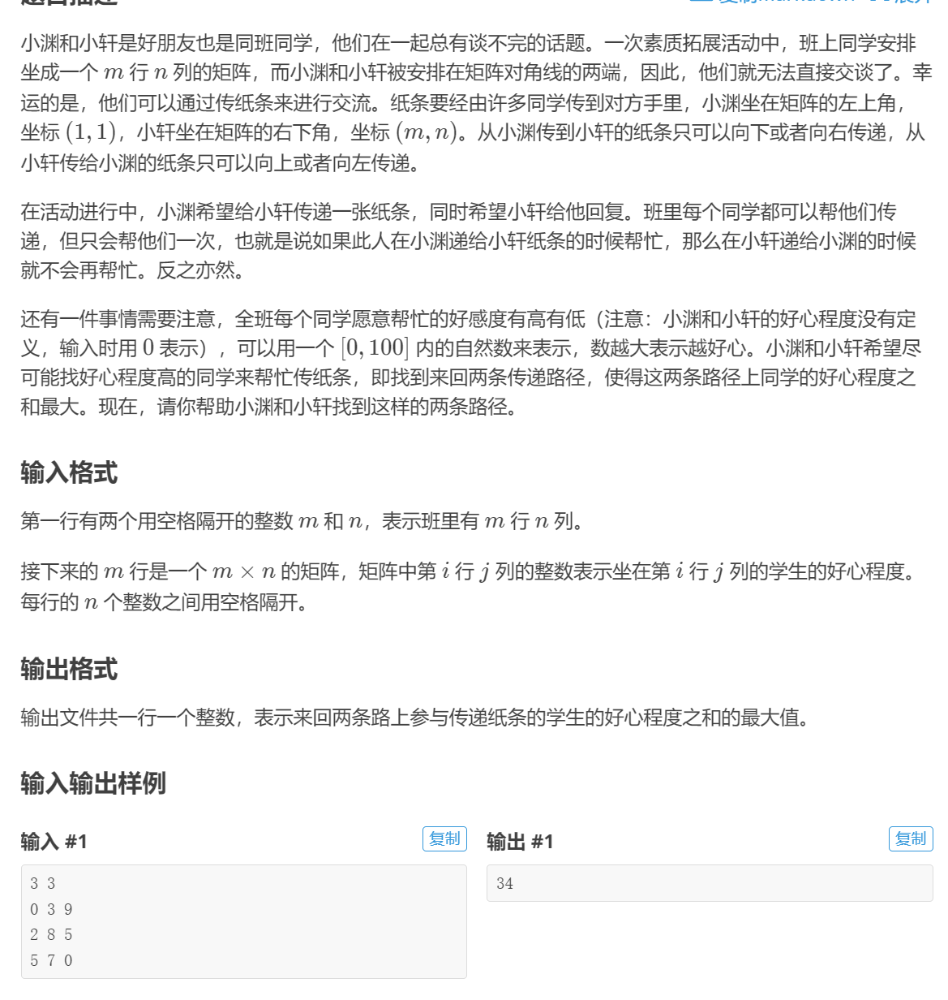

一来一回，并且前一条路径对后一条路径有影响（不能经过同一个位置），转换思想定义两条路径同时走，因为只能向右或向下所以两个路径走过的距离是一样的也就是同时出发同时到达。

定义dp(i,j,a,b)表示两个人的位置从原点出发到达(i,j)以及(a,b)的时候所经过的最大路径和。

```python
from math import inf
from functools import lru_cache

m,n=[int(x) for x in input().split()]
nums=[]
for _ in range(m):
    nums.append([int(x) for x in input().split()])
@lru_cache(maxsize=None)
def dp(i,j,a,b):
    # 起点位置作为base case
    if i==j==a==b==0:return 0
    # 不合法状态
    if i < 0 or j < 0 or a < 0 or b < 0: return -inf
    # 防止走到重复的位置除了终点
    if  i==a!=m-1 and j==b!=n-1:return -inf
    temp = nums[i][j] if i == a and j == b else nums[i][j] + nums[a][b]
    res=max(dp(i-1,j,a-1,b),dp(i,j-1,a,b-1),dp(i-1,j,a,b-1),dp(i,j-1,a-1,b))+temp
    return res
print(dp(m-1,n-1,m-1,n-1))

```


四维dp较大由于可以确定两个路径同时行动因此定义状态p表示走了多少步，同时定义两个状态ab表示两个路径当前的纵坐标，通过p-a可以算出对应的横坐标。

```python
from math import inf
from functools import lru_cache
m,n=[int(x) for x in input().split()]
nums=[]
for _ in range(m):
    nums.append([int(x) for x in input().split()])
@lru_cache(maxsize=None)
def dp(p,a,b):
    # 一步还没走的时候作为base case
    if not p:
        if a==b==0:return 0
        return -inf
    i,j=p-a,p-b
    # 不合法状态
    if i<0 or j<0 or a<0 or b<0:return -inf
    # 防止走到重复的位置除了终点
    if i==j!=m-1 and a==b!=n-1:return -inf
    temp=nums[i][a]+nums[j][b] if i!=j and a!=b else nums[i][a]
    return max(dp(p-1,a,b),dp(p-1,a,b-1),dp(p-1,a-1,b),dp(p-1,a-1,b-1))+temp

print(dp(m+n-2,n-1,n-1))

```


### Color with Occurrences


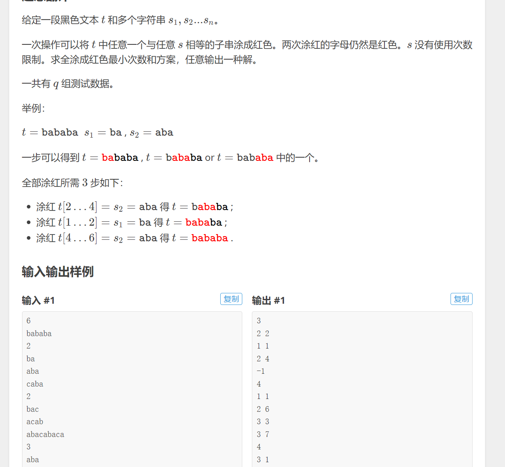

每次可以选不同的字符串会得到不同的结果，因此使用动态规划，定义dp(i)表示前i个染成红色所需的最少次数


```python
from math import inf

for _ in range(int(input())):
    # 处理输入
    s = input()
    n = len(s)
    m = int(input())
    memo=[input() for _ in range(m)]
    f=[inf]*(n+1)
    # 第0个自然需要0此
    f[0]=0
    pre=[0]*(n+1)
    vis={}
    
    for i in range(1,n+1):
        # 枚举每个字符串看是否能匹配
        for j in range(m):
            # 如果能匹配，那么可以由(i-len(p),i)的任意一个位置转移过来而不是从i-len(p)过来
            if len(memo[j])<=i and s[i-len(memo[j]):i]==memo[j]:
                for k in range(i-len(memo[j]),i):
                    # 如果较小，可以取得
                    if f[k]+1<f[i]:
                        f[i]=f[k]+1
                        # 由于需要输出转移方案，因此使用一个数组pre记录从哪里转移过来
                        pre[i]=k
                        # vis记录当前位置的转移操作，注意是在i-len(memo[j])（从0开始）操作而不是k位置
                        vis[i]=[j+1,i-len(memo[j])+1]
    if f[n]==inf:print(-1)
    else:
        print(f[n])
        # 迭代输出结果
        now=n
        while now:
            print(vis[now][0],vis[now][1])
            now=pre[now]
```


### [ 统计打字方案数](https://leetcode.cn/problems/count-number-of-texts/)

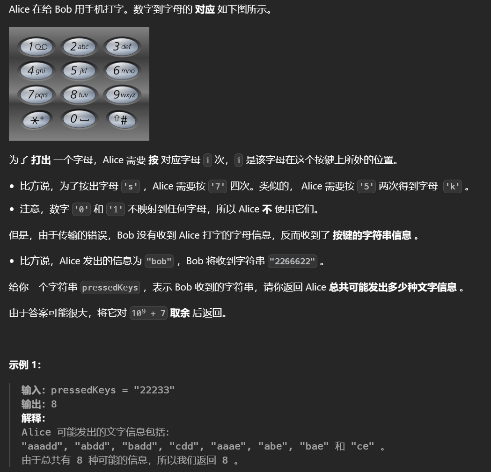

f(i)=f(i-1)+f(i-2)+f(i-3)+[f(i-4)如果当前数字为7或9]实际上是在枚举最后一位数


```python
class Solution:
    def countTexts(self,s: str) -> int:
        m=10**9+7
        @cache
        def dp(i,c):
            if i==0:return 1
            elif i<0:return 0
            if c:
                return (dp(i-1,c)+dp(i-2,c)+dp(i-3,c)+dp(i-4,c))%m
            return (dp(i-1,c)+dp(i-2,c)+dp(i-3,c))%m
        i=0
        n=len(s)
        ans=[]
        while i<n:
            start=i
            i+=1
            while i<n and s[i]==s[start]:
                i+=1
            l=i-start
            ans.append(dp(l,int(s[start] in {'7','9'})))
        return reduce(lambda x,y:x*y,ans)%m

```

### [公平分发饼干](https://leetcode.cn/problems/fair-distribution-of-cookies/)

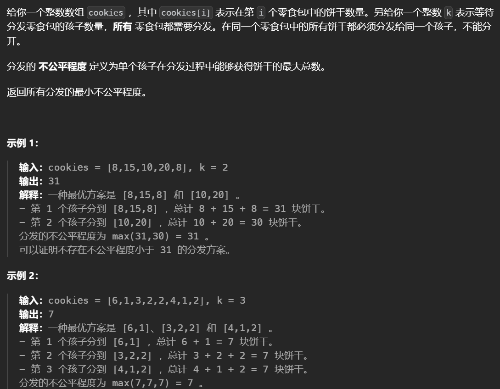

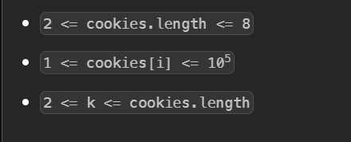


每个人可以选任意多个饼干，用dp[i]\[j]表示前i个人，j表示饼干的选取状态，通过枚举第i个人分配到的饼干状态p（s的子集）来转移方程。

```python
class Solution:
    def distributeCookies(self, cookies: List[int], k: int) -> int:
        n=len(cookies)
        mask=(1<<n)
        s=[0]*mask
        # 首先预处理出
        for i in range(mask):
            t=0
            for j in range(n):
                if i>>j&1:
                    t+=cookies[j]
            s[i]=t

        @cache
        def dp(i,m):
            # 对于0个人，应该不分配饼干
            if not i:
                return 0 if not m else inf 
            res=inf 
            p=m
            # 枚举出m的所有子集作为当前的结果
            while p:
                res=min(res,max(dp(i-1,m-p),s[p]))
                p=(p-1)&m
            return res 
        return dp(k,mask-1)
```


### [最长理想子序列](https://leetcode.cn/problems/longest-ideal-subsequence/)

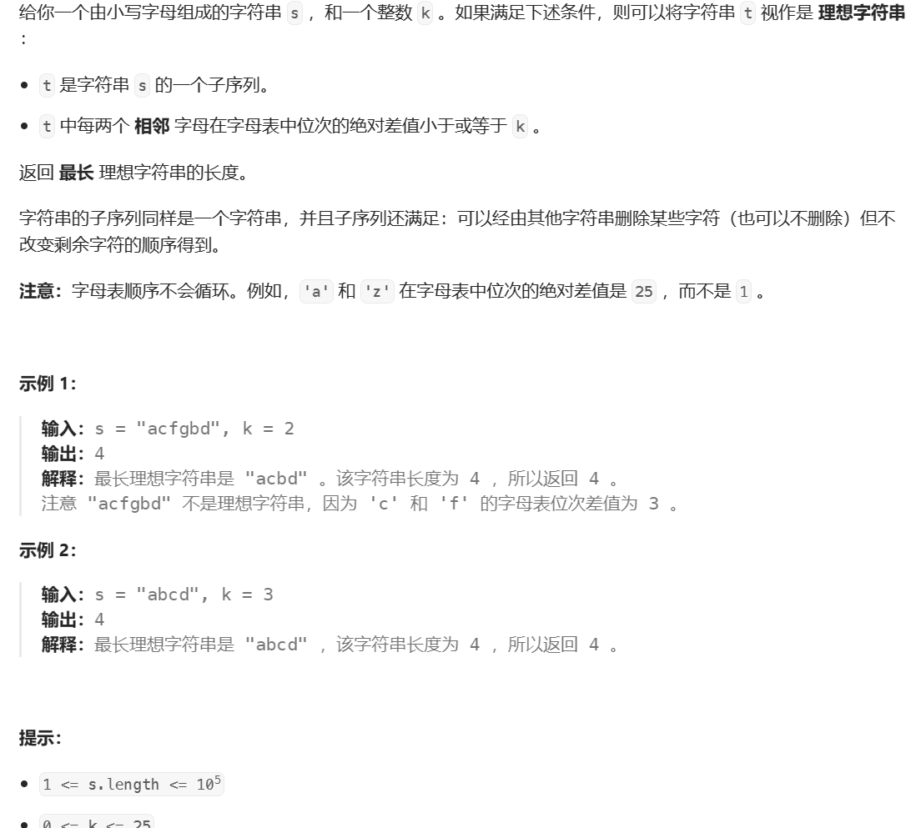

枚举选或不选，根据题目中的约束条件要多出一维表示前一个字符。

定义dp(i,j)为考虑前i个中以字符j结尾的最长长度

如果不选的话：dp[i] [j]=dp[i-1] [j]，选的话dp[i-1] [j]=1+max(dp[合适的范围])，可以发现能够去掉一维。

```python
class Solution:
    def longestIdealString(self, s: str, k: int) -> int:
        n=len(s)
        f=[0]*26
        for c in s:
            c=ord(c)-ord('a')
            f[c]=1+max(f[max(0,c-k):min(c+k+1,26)])
        return max(f)
```

### 保险箱

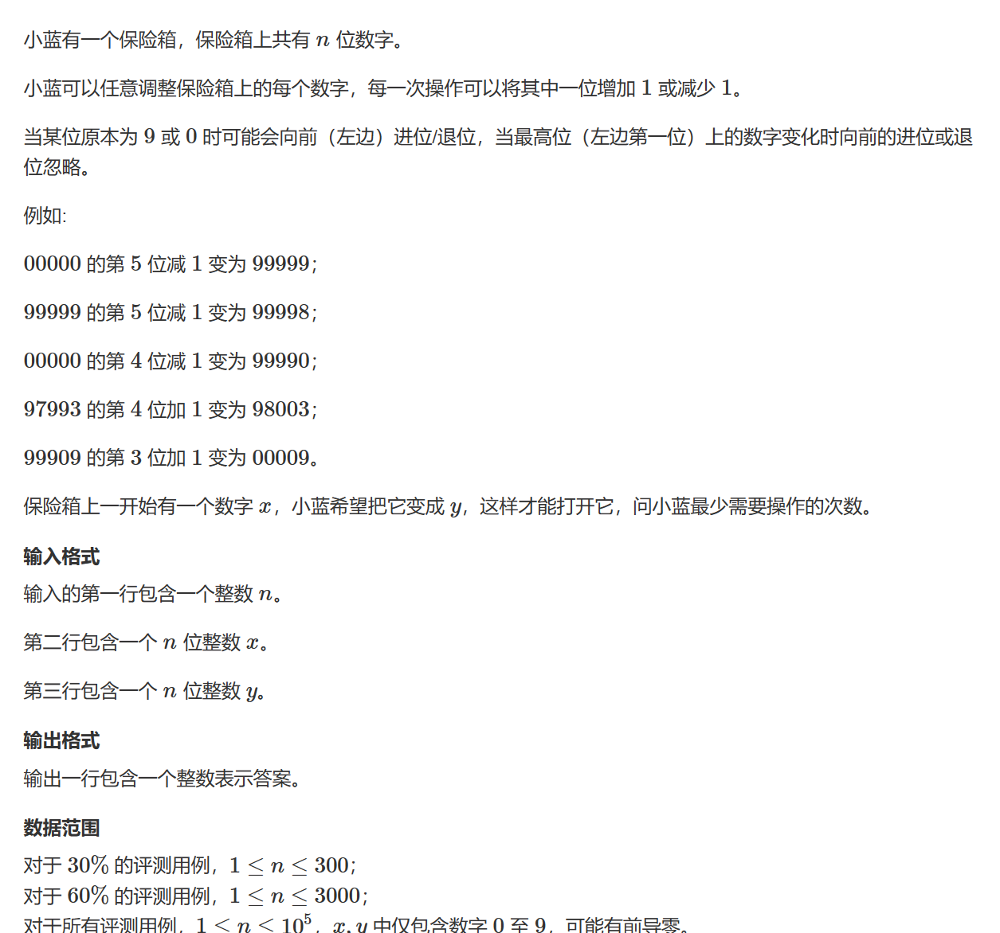

通过观察可以得到，对左边的数位操作不会影响到右边的数位因此从右往左看。由于操作低位会影响到高位所以需要多出一个状态来表示这个影响，定义dp(i,j)表示为状态为j的时候，nums[i:]都匹配的最小操作次数。 (j=0对前一位无影响，j=1进一位，j=2借一位)

```python
from math import inf 
from functools import lru_cache 
n=int(input())
a=input()
b=input()

dp=[[inf]*3 for _ in range(n+1)]

# 没有数字的时候只能是无影响，其他的两个状态不合法
dp[n][0]=0

for i in range(n-1,-1,-1):
    x=int(a[i])
    y=int(b[i])
    dp[i][0]=min(dp[i+1][0]+abs(x-y),dp[i+1][1]+abs(x+1-y),dp[i+1][2]+abs(x-1-y))
    dp[i][1]=min(dp[i+1][0]+abs(10-x+y),dp[i+1][1]+abs(9-x+y),dp[i+1][2]+abs(11-x+y))
    dp[i][2]=min(dp[i+1][0]+abs(10+x-y),dp[i+1][1]+abs(11+x-y),dp[i+1][2]+abs(9+x-y))

# 最后的结果要三者中最小的，因为最高位进位借位无影响
print(min(dp[0]))
```


### [最长的斐波那契子序列的长度](https://leetcode.cn/problems/length-of-longest-fibonacci-subsequence/)

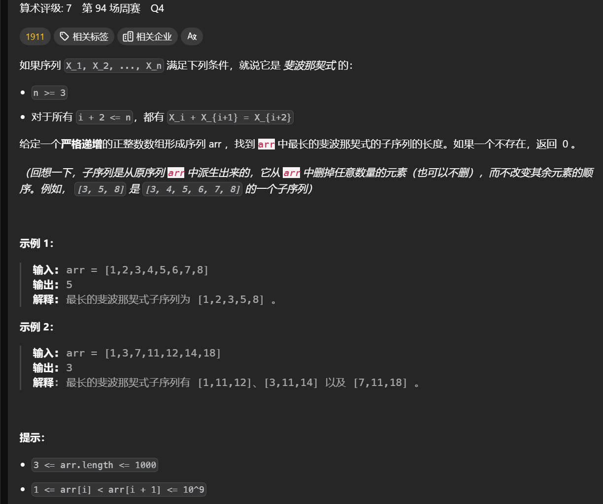


对于给定的数据范围可以做到n^2，定义状态dp(i,j)表示以nums[i]和nums[j]为结尾的斐波那契数列的最长长度，根据这两个值可以去推前面的值，由于数组是递增的因此前一个值一定在i位置前，如果第二个与第三个数的差大于等于第二个数那么是不合法的可以直接跳出，之后的状态也会是不合法的

```python
class Solution:
    def lenLongestFibSubseq(self,nums: List[int]) -> int:
        # 首先建立哈希表
        memo={x:i for i,x in enumerate(nums)}
        n=len(nums)
        ans=-inf
        dp=[[0]*n for _ in range(n)]
        for i in range(n):
            for j in range(i+1,n):
                # 可行性剪枝，如果不满足下述条件一定是不合法的
                if nums[i]*2<=nums[j]:break
                if (x:=nums[j]-nums[i]) in memo:
                    index=memo[x]
                    # 如果能找到至少为3
                    dp[i][j]=max(3,dp[index][i]+1)
                ans=max(ans,dp[i][j])
        return ans                 

```


### [不相交的握手](https://leetcode.cn/problems/handshakes-that-dont-cross/)

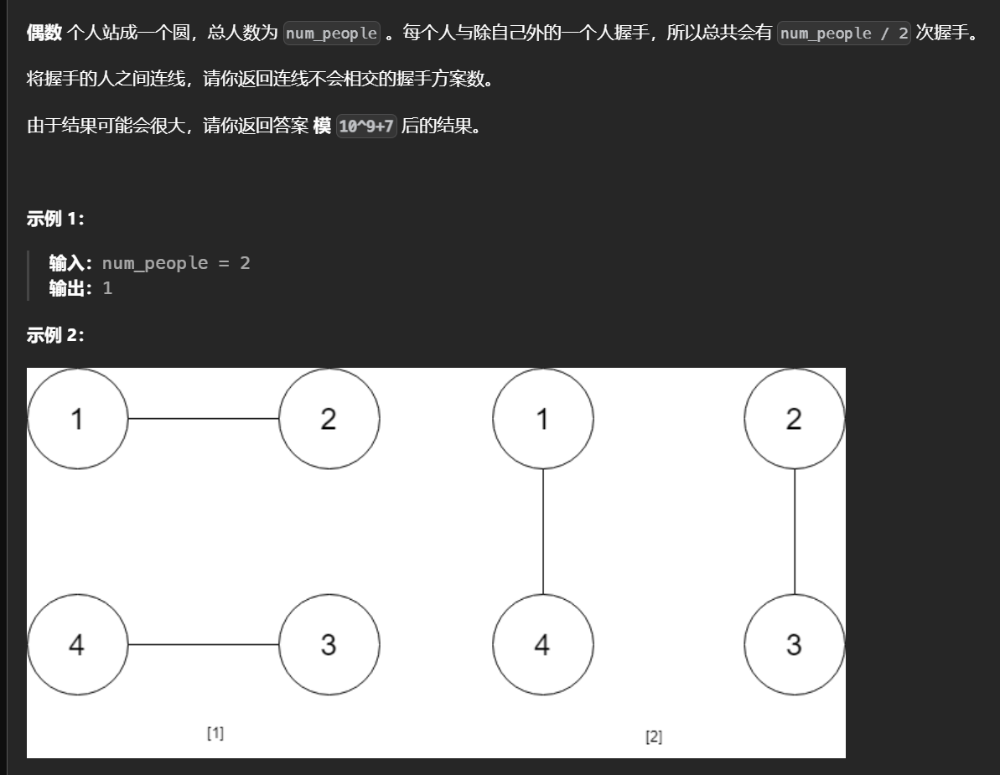


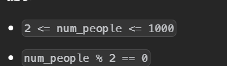

一段连线可以把区间分为两部分，而这两部分又可以继续划分这就出现了子问题。要求两两相连，因此每个区间内的数量必须是偶数才能做到相连，想要划分出的区间是偶数，要求是奇偶不同的两个数相连。这里规定以每个圈中的最后一个点去找相连的点，因为圈为偶数，所以可以对最后一个数去找每个奇数，这样就把区间分为了两部分。

```python
class Solution:
    def numberOfWays(self, numPeople: int) -> int:
        mod=10**9+7
        # 定义dp[i]为I个人的握手方案
        dp=[0]*(numPeople+1)
        # 0个人和2个人的时候只有一次
        dp[0]=dp[2]=1
        # i必须是偶数
        for i in range(4,numPeople+1,2):
            # 以每个圈中最后一个去找他要相连的，就是去找奇数
            for j in range(1,numPeople,2):
                dp[i]=(dp[i]+dp[i-j-1]*dp[j-1])%mod
        return dp[numPeople]
```


### [石子游戏](https://leetcode.cn/problems/stone-game/)

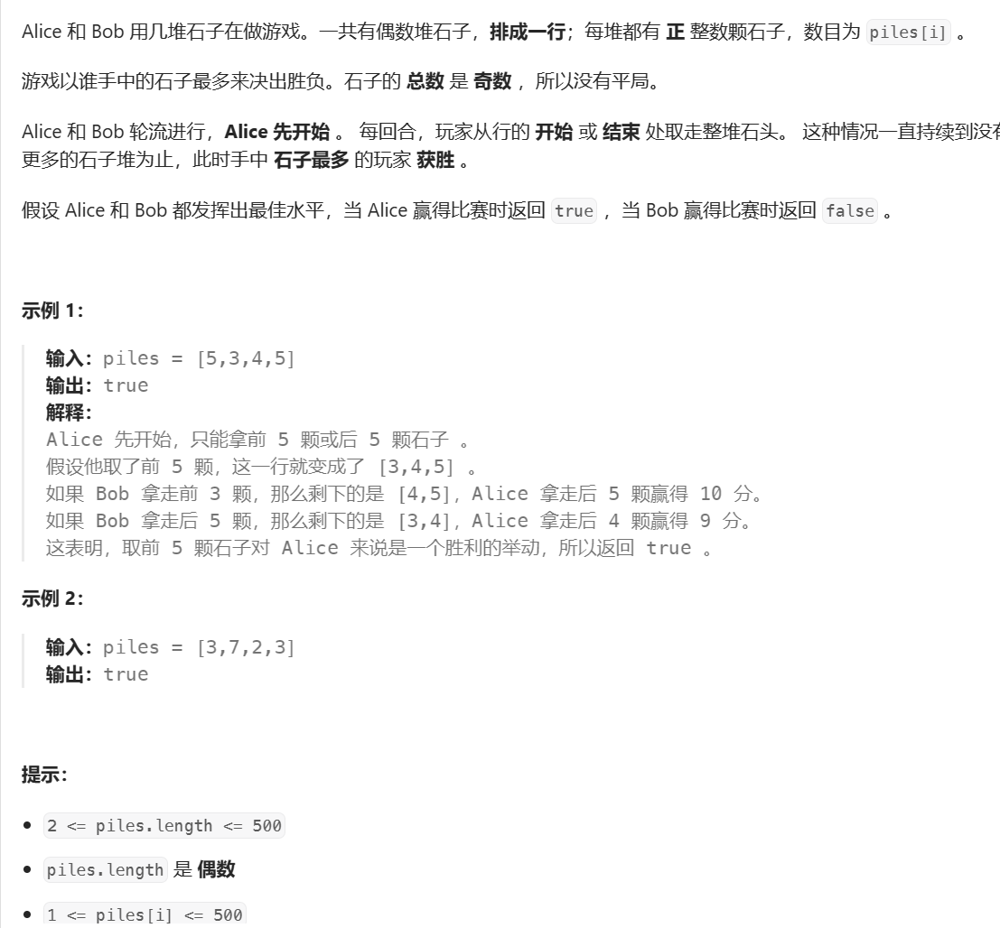

定义dp(i,j)为i,j范围内先手玩家比后手玩家得分多出的最大（因为两人采取最优策略）差值。

对于先手玩家，可以选择开头的元素或者是末尾的元素，当选择完成后，先手变为后手，后手变为先手，状态转移方程为piles[i]-dp(i+1,j)，这里的dp(i+1,j)表示在i+1,j这个区间内先手与后手的最大差值，不过这里的先手是i,j区间内的后手，piles[i]-dp(i+1,j)表示在i,j区间内先手选择的值，减去i+1,j区间内原来的后手比先手的最大差值，结果是i,j区间内先手与后手的差值。


```python
class Solution:
    def stoneGame(self, piles: List[int]) -> bool:
        @cache 
        def dp(i,j):
            if i>j :return 0
            return max(piles[i]-dp(i+1,j),piles[j]-dp(i,j-1))
        return dp(0,len(piles)-1)>0
```


### [石子游戏 VII](https://leetcode.cn/problems/stone-game-vii/)

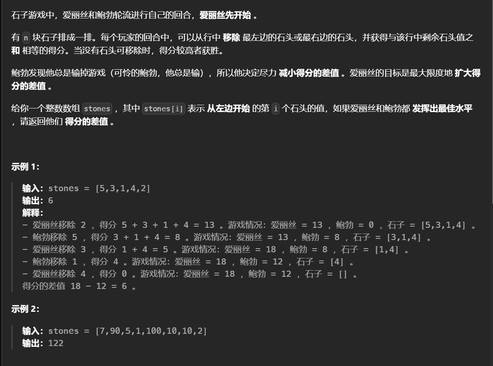


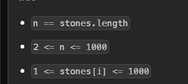

数据范围更大，使用记忆化搜索内存会超限，之后需要清空内存

```python
class Solution:
    def stoneGameVII(self, nums: List[int]) -> int:
        pre=list(accumulate(nums,initial=0))
        @cache
        def dp(l,r):
            if l>r:return 0
            return max(pre[r+1]-pre[l+1]-dp(l+1,r),pre[r]-pre[l]-dp(l,r-1))
        res=dp(0,len(nums)-1)
        dp.cache_clear()
        return res
```

改为递推形式，考虑dp[i]\[j]的转移方程dp[i+1]\[j],dp[i]\[j-1]，所以i要从大到小枚举，j要从小到大枚举

```python
class Solution:
    def stoneGameVII(self, stones: List[int]) -> int:
        pre = list(accumulate(stones, initial=0))  # 前缀和
        n=len(stones)
        f=[[0]*n for _ in range(n)]
        for i in range(n-2,-1,-1):
            # 注意根据题意j是要大于等于i的
            for j in range(i+1,n):
                f[i][j]=max(pre[j+1]-pre[i+1]-f[i+1][j],pre[j]-pre[i]-f[i][j-1])
        return f[0][-1]

```


### 游戏

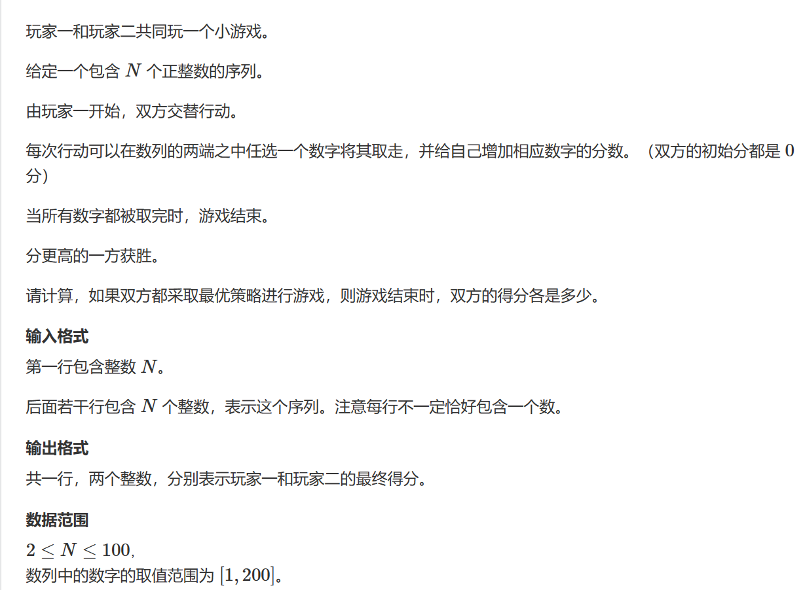


```python
from math import inf 
from functools import lru_cache
n=int(input())
nums=[]
# 读取值
while len(nums)!=n:
    nums.extend([int(x) for x in input().split()])
t=sum(nums)

# 同上一题一样，定义dp(i,j)表示区间[i,j]范围内先手比后手多出的值
@lru_cache(maxsize=None)
def dp(i,j):
    # 不合法状态
    if i>j:return 0
    # 下一轮的dp(i,j)就表示下一轮中的先手比后手多出的值，不过下一轮的先手是这一轮的后手，通过相减可以得出结果
    return max(nums[i]-dp(i+1,j),nums[j]-dp(i,j-1))
res=dp(0,n-1)
# 已知两个值的和，又知道一个值和另一个值的差，通过简单的数学运算可得
print((t+res)//2,t-(t+res)//2)
```


### [最长字符串链](https://leetcode.cn/problems/longest-string-chain/)

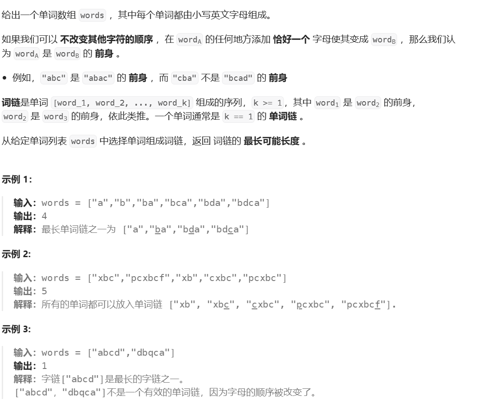

​	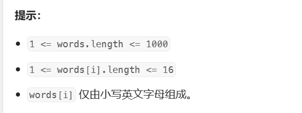

使用动态规划，对于以一个字符串s结尾，所能形成的的最长的子链，取决于它去掉某一位之后的形成的字符串得到的最大子链数加一，减小了问题规模。由于字符串长度不大，可以直接枚举。

```python
class Solution:
    def longestStrChain(self, words: List[str]) -> int:
        words=set(words)
        @cache 
        # 返回字符串s所能形成的子链的最长长度
        def dp(s):
            res=0
            # 枚举去掉每一位
            for i in range(len(s)):
                t=s[:i]+s[i+1:]
                # 如果存在，才会进行下一次递归
                if t in words:
                    res=max(res,dp(t))
            return res+1
        return max(dp(s) for s in words
             
# 自下而上
class Solution:
    def longestStrChain(self, words: List[str]) -> int:
        # 先排序
        words=sorted(words,key=lambda x:len(x))
        n=len(words)
        dp=defaultdict(int)
        for c in words:
            c=list(c)
            # 枚举删掉每一位
            for i in range(len(c)):
                temp=c[:]
                del temp[i]
                dp[tuple(c)]=max(dp[tuple(temp)]+1,dp[tuple(c)])
        return max(dp.values())
```

### [不同的子序列 II](https://leetcode.cn/problems/distinct-subsequences-ii/)

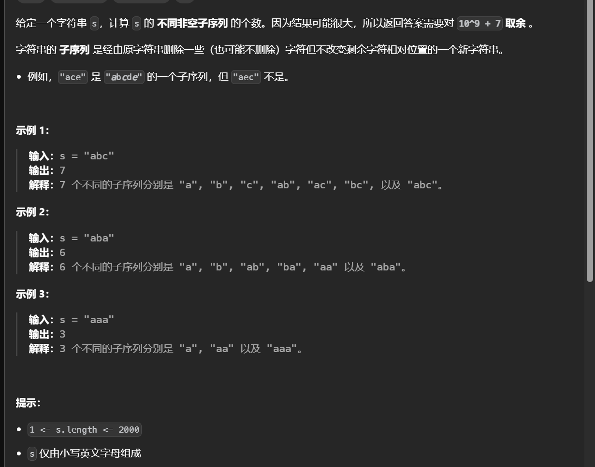

很难去想对于前i个元素不同的子序列有多少个，不能简单的拼接操作（把当前元素拼接到前面不同的子序列上再加上不拼接的数量，这样无法避免重复），但如果细分的话即多出一个状态j表示以字符j结尾，分别去统计以j结尾的不同序列数可以避免重复。

最后统计一个位置上所有的字符即可。

```python
class Solution:
    def distinctSubseqII(self, s: str) -> int:
        mod=10**9+7
        @cache
        def dp(i,j):
            if not i:return 0
            if ord(s[i-1])-ord('a')==j:
                return 1+sum(dp(i-1,j) for j in range(26))%mod
            return dp(i-1,j)
        return sum(dp(len(s),i) for i in range(26))%mod         
```


### [购买水果需要的最少金币数](https://leetcode.cn/problems/minimum-number-of-coins-for-fruits/)

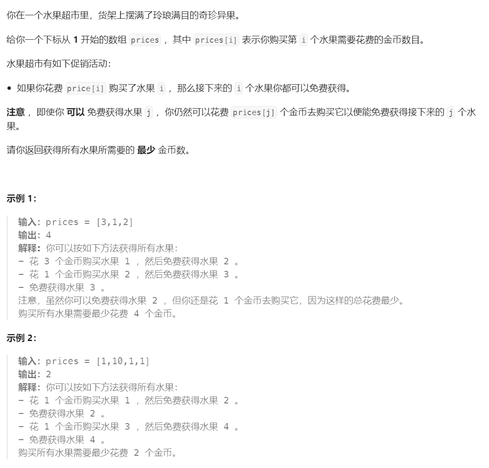

定义dp(i)为购买第i个以及之后的水果所需的最少金币数，这里的base case 是如果2*i大于等于n那最少的金币数就是只购买一个i

```python
class Solution:
    def minimumCoins(self, prices: List[int]) -> int:
        n=len(prices)
        @cache 
        def dp(i):
            if i*2>=n:
                return prices[i-1]
            # 这里i+1到2i+1一定需要买一个
            return min([dp(j) for j in range(i+1,2*i+2)])+prices[i-1]
        return dp(1)
```


### [ 构造最长非递减子数组](https://leetcode.cn/problems/longest-non-decreasing-subarray-from-two-arrays/)

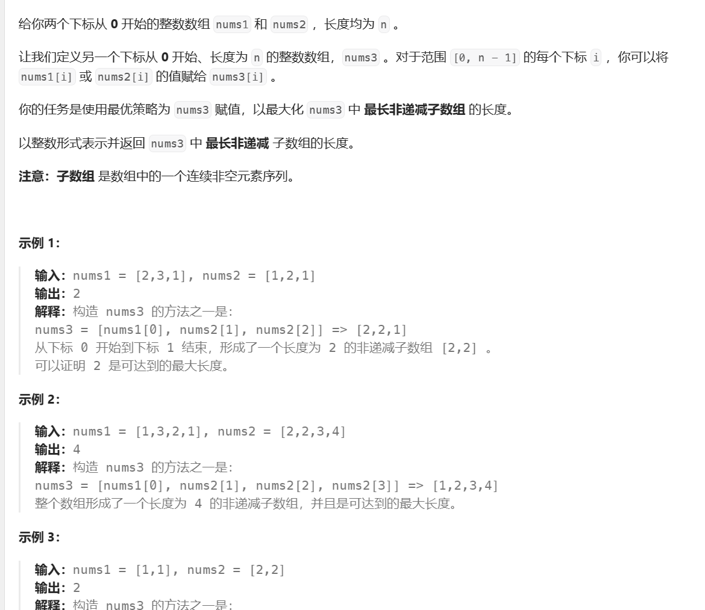


枚举选择两个数组中那个

定义dp(i,j)表示为以$$nums_{j}[i]$$结尾的最长递增数组的长度

```python
class Solution:
    def maxNonDecreasingLength(self, nums1: List[int], nums2: List[int]) -> int:
        n=len(nums1)
        nums=(nums1,nums2)
        @cache
        def dp(i,j):
            # 只有一个元素，那最大就是1
            if i==0:return 1
            res=1
            # 枚举可选的
            if nums1[i-1]<=nums[j][i]:
                res=dp(i-1,0)+1
            if nums2[i-1]<=nums[j][i]:
                res=max(res,dp(i-1,1)+1)
            return res
        # 因为以最后一个元素结尾的最长不一定是最终答案，因此找出所有的
        return max(dp(i,j) for j in range(2) for i in range(n))
        
```


# 换根DP

##  [树中距离之和](https://leetcode.cn/problems/sum-of-distances-in-tree/)

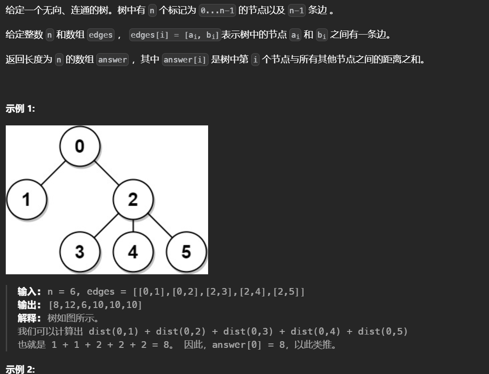

暴力的做法是对每个节点做一次dfs求结果，但对于给定的数据范围N^2会超时，作图发现当换节点时距离也会有规律的变化，具体表现为距离会减少当前节点的子树数目加一并增加不是他子树的数目，然后对于这个子树的节点又可以以相同的方式求解。

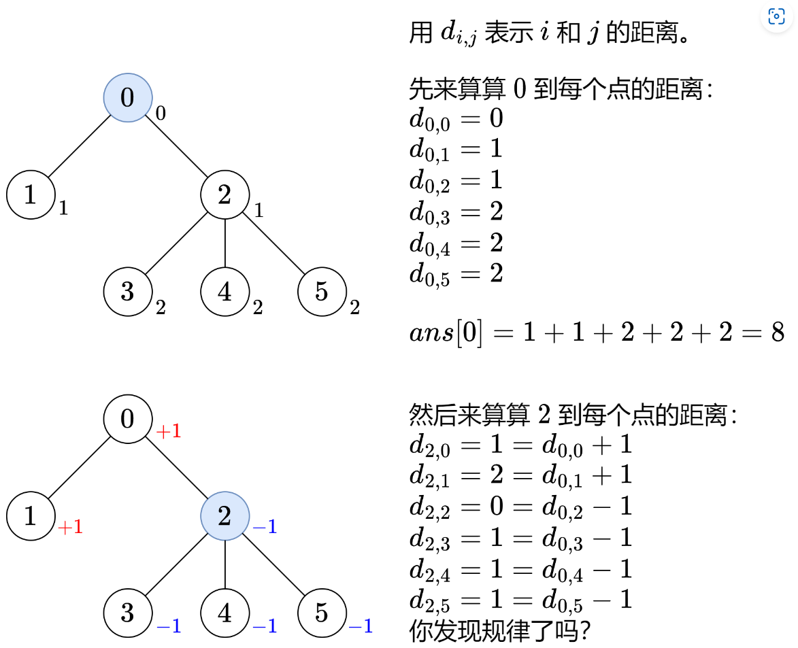


这里先做一次dfs求出对于起始节点的距离，以及每个节点的子树，对于给定的无向图转换为有向图求解。

```python
class Solution:
    def sumOfDistancesInTree(self, n: int, edges: List[List[int]]) -> List[int]:
        dis=[0]*n
        size=[0]*n

        g=[[] for _ in range(n)]
        # 建图
        for u,v in edges:
            g[u].append(v)
            g[v].append(u)
		# cnt表示从0到root的距离
        def dfs(root,fa,cnt):
            dis[root]=cnt
            t=0
            for y in g[root]:
                if y!=fa:
                    t+=dfs(y,root,cnt+1)# 求距离
            size[root]=t# 求子树
            return t+1
        dfs(0,-1,0)
        ans=[0]*n
        ans[0]=res=sum(dis)
        def reroot(x,fa,res):
            # 这个节点的子树以及它自身
            ss=size[x]+1
            # 当前的距离
            d=res-ss+n-ss
            ans[x]=d
            # 求解其他的节点
            for y in g[x]:
                if y!=fa:
                    # 每次用的距离都是父节点的距离
                    reroot(y,x,d)
        # 因为预先求解出了0，因此从0的子节点开始
        for y in g[0]:
            reroot(y,0,res)
        return ans 

```

## [标记所有节点需要的时间](https://leetcode.cn/problems/time-taken-to-mark-all-nodes/)

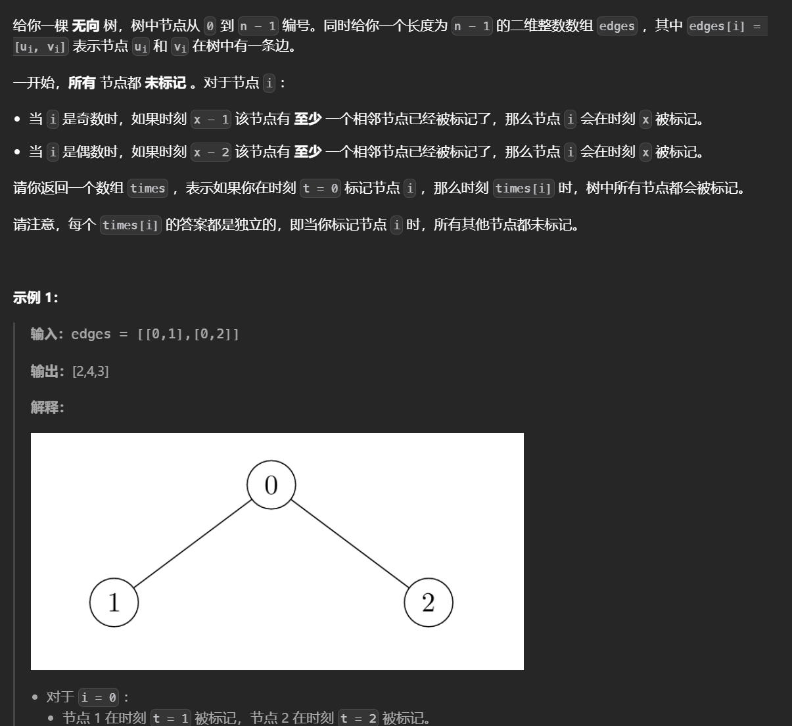

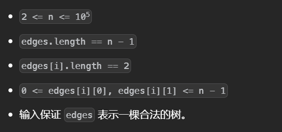

很明显暴力求解不行，这里所谓的时间可以转换为边权，即其他节点到偶数节点的距离是2，那么问题转换为了以每个节点为根所走的最大距离是多少。

对于节点x有最远距离mx1和次远距离mx2，那么对于x的子节点y，它的结果就是max(y到子节点的最大距离,y到父节点的距离加上mx1或mx2)，具体是mx1还是mx2，看mx1是不是由y得到，那么对于该题每个节点需要维护[mx1,mx2,my(得到mx1的子节点)]，这种维护额外信息的称为第二类换根dp

```python
class Solution:
    def timeTaken(self, edges: List[List[int]]) -> List[int]:
        n=len(edges)+1
        g=[[] for _ in range(n)]
        for u,v in edges:
            g[u].append(v)
            g[v].append(u)

        nodes=[[] for _ in range(n)]
        def dfs(x,fa):
            mx1=mx2=my=0
            for y in g[x]:
                if y!=fa:
                    # 计算距离，边权不用记录直接计算即可
                    dis=dfs(y,x)+(1 if y&1 else 2)
                    # 记录最远和次远距离
                    if dis>mx1:
                        mx1,mx2=dis,mx1
                        my=y
                    elif dis>mx2:
                        mx2=dis
            # 维护额外信息
            nodes[x]=[mx1,mx2,my]
            return mx1
        dfs(0,-1)
        ans=[0]*n
        def reroot(x,fa,dis):
            mx1,mx2,my=nodes[x]
            cnt= 1 if x&1 else 2
            # 以该节点为根的答案是它到子树的最大距离与他到其他子树(即父节点)的最大距离的最大值
            ans[x]=max(mx1,dis)
            for y in g[x]:
                if y!=fa:
                    # 下一个节点到其他子树的最大距离也可能是是当前节点到其他子树的最大距离(dis)而不是他到自己子树的最大距离，因此取最大
                    reroot(y,x,cnt+max(dis,mx1 if y!=my else mx2))

        reroot(0,-1,0)
        return ans 
```


# 树形DP

## [移除边之后的权重最大和](https://leetcode.cn/problems/maximize-sum-of-weights-after-edge-removals/)

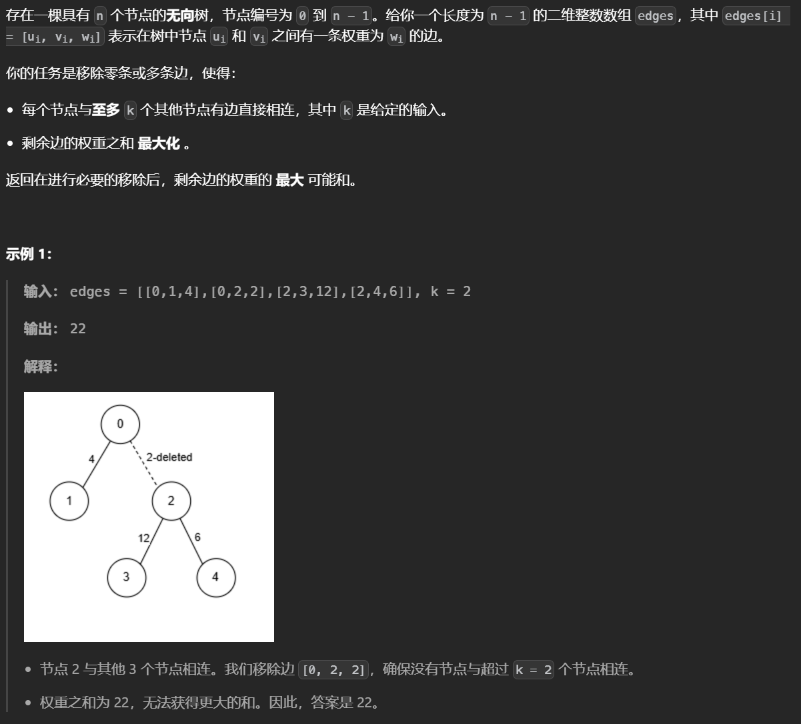

从特殊出发，假设树是一条链，k=1，问题就变为了相邻节点不能同时选择，这是打家劫舍问题，需要用到DP。

换到树上，根节点对它所有的子节点都有选或不选，并且最多只能选k个，如果对于选有数组a，不选有数组b(两个数组长度一致)，那问题变为从a中至多选k个数，剩下的数从b中选，选出的数的最大和是多少，这个问题等价于[2611. 老鼠和奶酪 - 力扣（LeetCode）](https://leetcode.cn/problems/mice-and-cheese/description/)需要使用贪心求解(先全选b，然后选择k个最大的b-a)

```python
class Solution:
    def maximizeSumOfWeights(self, edges: List[List[int]], kk: int) -> int:
        p=defaultdict(dict)
        # 建图
        for i,j,w in edges:
            p[i][j]=p[j][i]=w
        
        def dp(root,fa):
            # 到叶子节点
            if len(p[root])==1 and fa in p[root]:return 0,0
            nums=[]
            res=0
            # 遍历子节点
            for k,v in p[root].items():
                if k==fa:continue
                nc,c=dp(k,root)
                # 先选择全部的不选
                res+=nc
                # 如果选>不选那么可能会作为K个之一
                if c+v-nc>0:nums.append(c+v-nc)

            nums.sort(reverse=True)
    
            a=res+sum(nums[:kk])
            b=res+sum(nums[:kk-1])# 被父节点选，该节点能选择的边少一

            return a,b
        return max(dp(0,-1))  
```


# 树上背包

## [折扣价交易股票的最大利润](https://leetcode.cn/problems/maximum-profit-from-trading-stocks-with-discounts/)

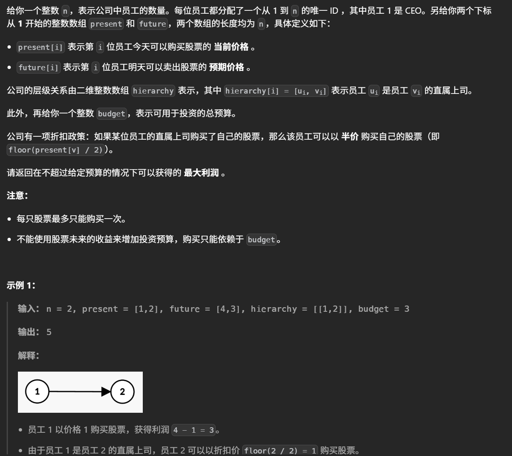

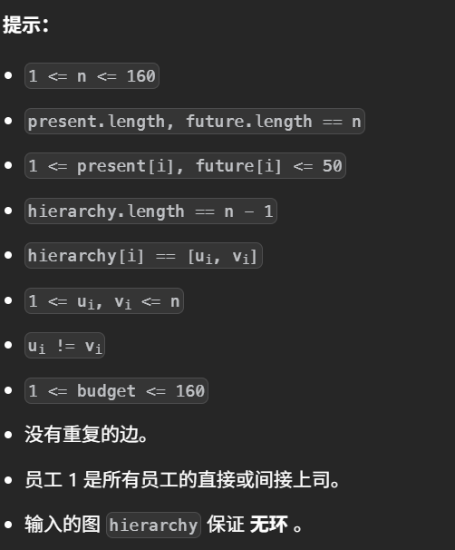

对于本题的树形结构，使用DP不知道如何递归回来，枚举一个个子节点分配多少资金然后转移(状态太多饿了)，因此定义状态f[i]\[j][k]为对于节点，资金为j，能够打折状态为k(0不能，1能)时，可以获得的最多利益，对于节点x求出它所有子节点y的f[y]值，找出所有资金状态的可能。现在对于x需要知道，我该如何分配资金才能使从子树中获得利益最大，定义sub[i]\[j]\[k]为对于前i个子树，资金不超过j，打折状态为k时的能从子树获得的最大利益。这实际上是一个背包问题，此时已经求得了每个节点的f值，可以枚举给该节点分配多少资金。

总的来说是一个回溯加DP的过程

```python
max=lambda x,y:x if x>=y else y
class Solution:
    def maxProfit(self, n: int, p: List[int], r: List[int], hierarchy: List[List[int]], budget: int) -> int:
        g=[[] for _ in range(n+1)]
        # 建图
        for u,v in hierarchy:
            g[u].append(v)

        # 做一位偏移
        p=[0]+p
        r=[0]+r

        # 返回一个(budge+1,2)的数组，表示对于x在所有所有的资金状态下能获得最大利润
        def dfs(x):
            # sub求解在所有资金状态下能从子树中获得的最大利益
            # 这里的dp数组进行了状态压缩，优化掉了第一维
            sub=[[0]*2 for _ in range(budget+1)]
            for y in g[x]:
                f=dfs(y)
                # 倒序枚举，防止修改掉用于转移的状态
                for j in range(budget,-1,-1):
                    for jy in range(j+1):
                        for k in range(2):
                            sub[j][k]=max(sub[j][k],sub[j-jy][k]+f[jy][k])
            
            f=[[0]*2 for _ in range(budget+1)]
            for j in range(budget+1):
                for k in range(2):
                    # 根据k值判断是否要打折
                    cost=p[x]//(k+1)
                    # 买
                    if j>=cost:
                        f[j][k]=max(sub[j][0],sub[j-cost][1]+r[x]-cost)
                    # 不买
                    else:
                        f[j][k]=sub[j][0]
            return f
        return dfs(1)[budget][0]
```

## [选课](https://www.luogu.com.cn/problem/P2014)

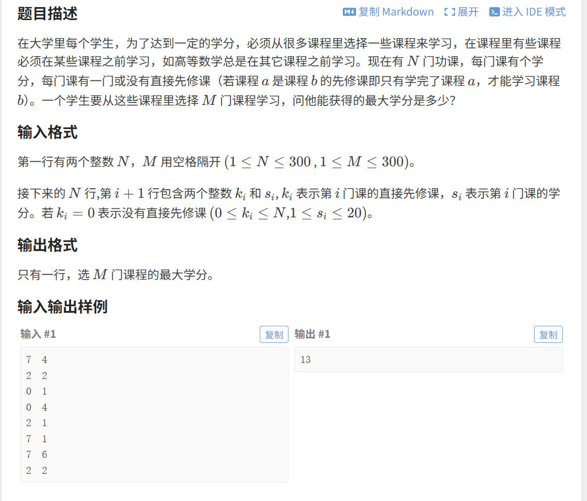

同样的套路，先解出所有子树的dp值——dp[i]在选择不超过i个节点的情况下能得到的最多的分数，然后求解背包找出能从子树中得到的最多的分数sub——sub[i]子树能选择i个值时可以得到的最大分数。

注意本题中没有说是一棵树，因此要先用超级源点0将森林合并为1棵树，源点是一定要经过的因此m+1.

```python
n,m=RR()
m+=1
g=[[] for _ in range(n+1)]
cnt=[0]
for i in range(1,n+1):
    fa,c=RR()
    # 合并
    if fa:g[fa].append(i)
    else:g[0].append(i)
    cnt.append(c)

def dfs(x):
    # 先找出所有的子树
    sub=[0]*(m+1)
    for y in g[x]:
        f=dfs(y)
        # 背包求解，优化了一维
        for j in range(m,-1,-1):
            for jy in range(j+1):
                sub[j]=max(sub[j],sub[j-jy]+f[jy])
    f=[0]*(m+1)
    # 从1开始，因为x必须选择防止越界
    for j in range(1,m+1):
        f[j]=sub[j-1]+cnt[x]
    return f
res=dfs(0)[m]
print(res)
```


# 概率DP

期望值理解为各种可能的和，而概率就是单纯的转移


## [Bag of mice](https://codeforces.com/problemset/problem/148/D)

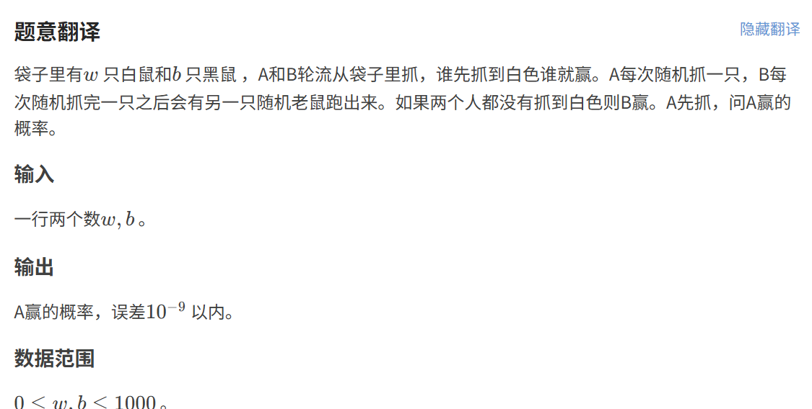

对于给定的数据范围可以做到n**2求解，既然题目问A赢得概率那么令dp(i,j)表示还剩下a只白鼠和b只黑鼠时A赢得概率。当没有白鼠时A输，当仅有白鼠时A必胜

那么：

+ A抽到白鼠，`i/(i+j)`
+ A抽到黑鼠，B抽到白鼠，`j/(i+j)*i/(i+j-1)`
+ 两人都抽到黑鼠，跑了一只白鼠 `(j/(i+j))*((j-1)/(i+j-1))*(i/(i+j-2))` ，递归求解
+ 两人都抽到黑鼠，跑了一只黑鼠 `(j/(i+j))*((j-1)/(i+j-1))*((j-2)/(i+j-2))`，递归求解

那么状态转移

```python
w,b=RR()

@cache
def dp(i,j):
    if not i:return 0
    if not j:return 1
    res=i/(i+j)
    if j>=2:res+=dp(i-1,j-2)*(j/(i+j))*((j-1)/(i+j-1))*(i/(i+j-2))
    if j>=3:res+=dp(i,j-3)*(j/(i+j))*((j-1)/(i+j-1))*((j-2)/(i+j-2))
    return res 

print(dp(w,b))
```


## [Payment Required](https://atcoder.jp/contests/abc402/tasks/abc402_e)

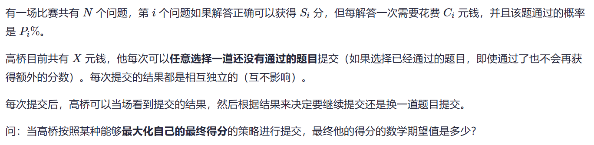

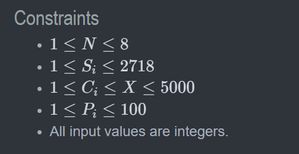

每个题目如果通过了就没有必要重复求解，且数据范围较小，因此可以用状态压缩求解，定义f[s]\[j]表示目前已选的集合为s，花费的金额为j的最大得分的期望值


对于每个题目，如果通过了有

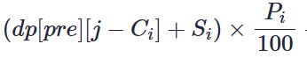


未通过则是重复提交也可能是首次提交，取最大值

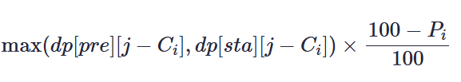

注意期望求解中cur，pre都要乘概率


对于期望值，要将通过和失败的结果相加，对于已选的集合为s，枚举选哪个然后取最大值。

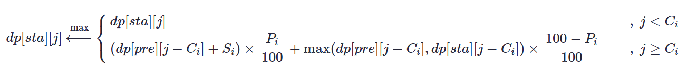

```python
n,money=RR()
nums=[RR() for _ in range(n)]
f=[[0]*(money+1) for _ in range(1<<n)]
f[0][0]=0

for i in range(1,1<<n):
    for j in range(money+1):
        for k in range(n):
            s,c,p=nums[k]
            if i>>k&1 and j>=c:
                f[i][j]=max(f[i][j],(f[i^(1<<k)][j-c]+s)*p/100+max(f[i][j-c],f[i^(1<<k)][j-c])*((100-p)/100))
print(f[(1<<n)-1][money])
```


## **Expansion Packs**

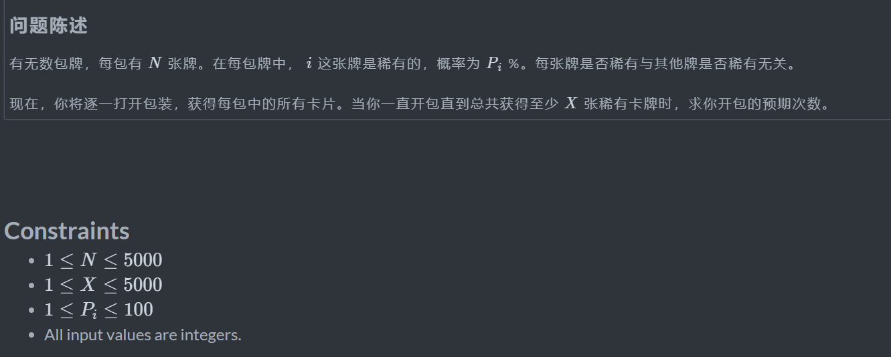

结合了概率DP和期望DP

先用概率DP求解从一包牌中抽出j张稀有牌的可能，令f(i,j)表示从I张牌中取出j张稀有牌的可能，那么有转移方程

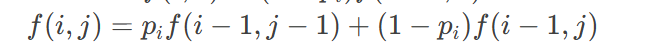


在求解期望DP，令g(i)表示获得i张稀有卡所需的开包次数，枚举最后一次抽到的卡的数量，有转移方程

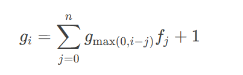

这里的1实际上是所有的f之和除以n得到的。


这里j可以等于0从而导致转移方程不可解，采用移项的方法得到可解的转移方程

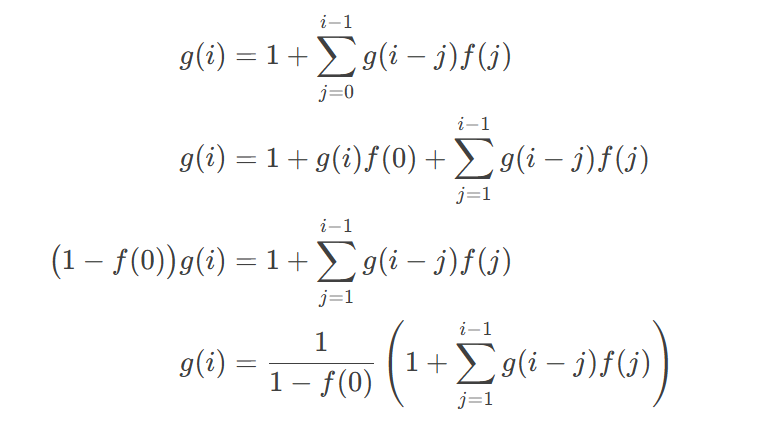

```python
n,x=RR()
p=[x/100 for x in RR()]
f=[[0]*(n+1) for _ in range(n+1)]
f[0][0]=1
for i in range(1,n+1):
    for j in range(i+1):
        if j-1>=0:f[i][j]=f[i-1][j-1]*p[i-1]+f[i-1][j]*(1-p[i-1])
        else:f[i][j]=f[i-1][j]*(1-p[i-1])
g=[0]*(x+1)
for i in range(1,x+1):
    g[i]=(1+sum(g[i-j]*f[-1][j] for j in range(1,min(n,i)+1)))/(1-f[-1][0])
print(g[-1])

# 压缩为一维
n,x=RR()
p=[x/100 for x in RR()]
f=[0 for _ in range(n+1)]
f[0]=1

# 一维的做法中，j由j-1和j更新然后又会被用于更新下一个数，这里用于更新的数应该是上一轮的结果，可以用一个temp数组存储每一轮的结果，但这样就失去了压缩的意义，所以采用倒序枚举的方法，这样用到的结果是上一轮求解出的，并且更新过程中也不会影响其他结果的取值
for i in range(1,n+1):
    for j in range(i,-1,-1):
        if j-1>=0:f[j]=f[j-1]*p[i-1]+f[j]*(1-p[i-1])
        else:f[j]=f[j]*(1-p[i-1])
g=[0]*(x+1)
for i in range(1,x+1):
    g[i]=(1+sum(g[i-j]*f[j] for j in range(1,min(n,i)+1)))/(1-f[0])
print(g[-1])
```

​		


# 倍增


## [正方形上的点之间的最大距离](https://leetcode.cn/problems/maximize-the-distance-between-points-on-a-square/)

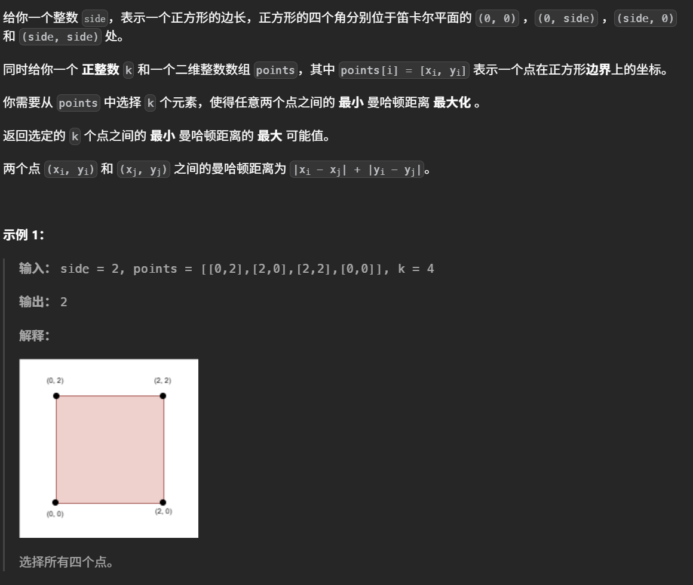

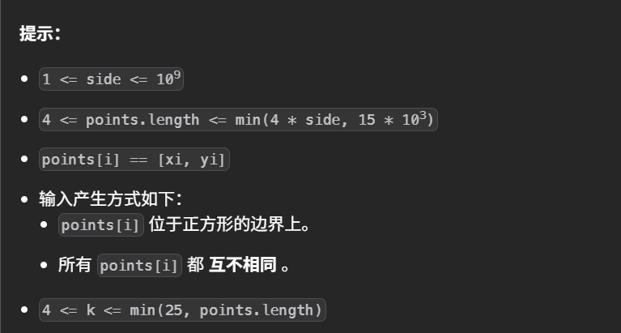

点之间的距离有曼哈顿公式求解，每个点只能移动距离大于等于k的点，公式中的绝对值影响判断，由于是二维不能直接排序，这里因为点都分布在边界上，因此可以将其展开为一维，利用相对大小的性质。

此时问题变为能否在数组中选择k个点，要求任意相邻元素的差至少为low，且最后一个元素和第一个元素差至少为*side*⋅4−low(环形)

最小化最大问题显然用二分，二分相邻距离找出是否存在k个点，它们的相邻距离大于等于二分的距离。

暴力枚举从i开始最少走mid步是否能访问k个点，时间复杂度会超出，这里使用倍增优化。

f[i]\[0]表示距离a[i]至少为low（二分的距离）的下一个索引，如果不存在定义为n，注意这里的步不是距离，而是一次跳跃。

```python
class Solution:
    def maxDistance(self, side: int, points: List[List[int]], k: int) -> int:
        nums=[]
        # 转化为一维
        for x,y in points:
            if not x:nums.append(y)
            elif y==side:nums.append(side+x)
            elif x==side:nums.append(3*side-y)
            else:
                nums.append(4*side-x)
        # 排序
        nums.sort()
        n=len(nums)
        
        l,r=1,10**10
        # 枚举时已经算了一个点
        k-=1
        
        def check(x):
            # 倍增
            f=[[n]*20 for _ in range(n+1)]
            j=n
            # 初始化
            f[n][0]=n
            for i in range(n-1,-1,-1):
                # 双指针保证最近的合法位置
                while nums[j-1]-nums[i]>=x:
                    j-=1
                f[i][0]=j
            
            # 倍增第题u
            for j in range(19):
                for i in range(n):
                    f[i][j+1]=f[f[i][j]][j]
            
            # 枚举每个位置，是否能走k-1步
            for i,start in enumerate(nums):
                cur=i
                for j in range(20):
                    if k>>j&1:
                        cur=f[cur][j]
                # 不存在
                if cur>=n:break
                # 满足环形数组
                if nums[cur]-start<=side*4-x:
                    return True 
            return False
        
        # 二分
        while l<=r:
            mid=(l+r)>>1
            if check(mid):
                l=mid+1
            else:
                r=mid-1
        return l-1
```


## [针对图的路径存在性查询 II](https://leetcode.cn/problems/path-existence-queries-in-a-graph-ii/)

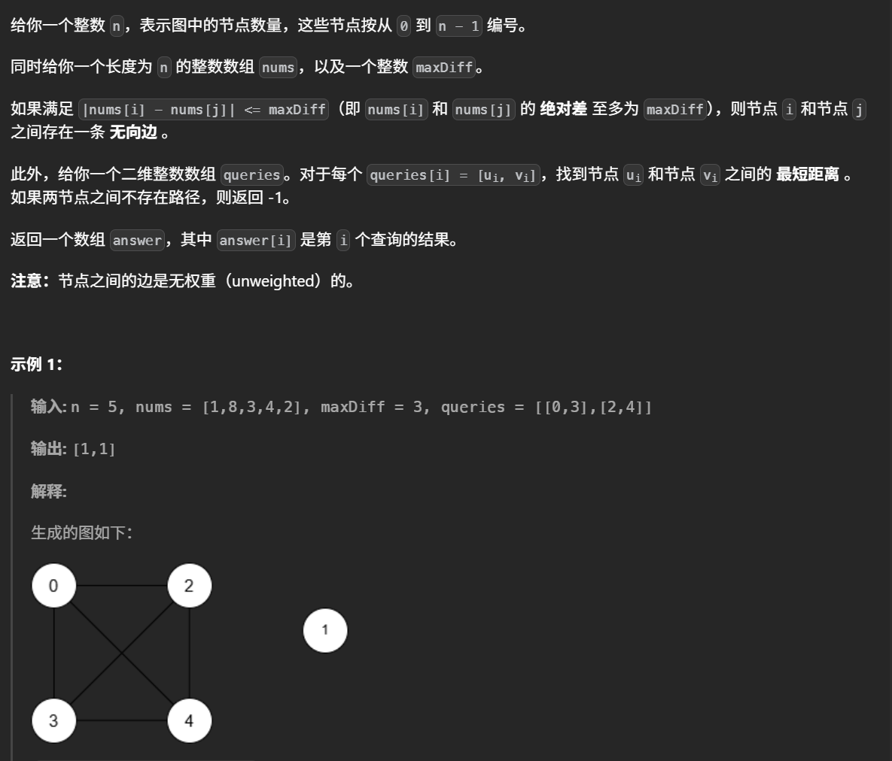

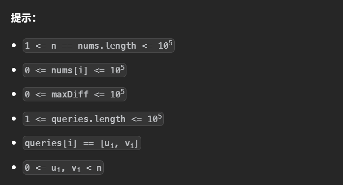

与上一题类似

绝对值差小于等于maxDiff的节点才能相互连接，直接构造的话需要n**2，经典套路——将数组排序，每个点只需考虑它前面的节点。

朴素的思想，排序后找两个节点l,r之间的最小距离，就是从r开始往左跳，每一步的元素差不超过maxDiff，且跳到点上。为了得到最小的距离(即跳跃次数)，每次要跳到最远的位置，但是这样的时间复杂度是O(n)，考虑maxDiff=1的情况。

考虑使用倍增优化，定于f[i]\[j]表示从索引i处向左跳了$2^j$步能走到的最远位置，那么在查询l,r时，从r位置开始，每次跳到最远的位置，由于f[i]\[j]记录的是最远的位置，也就是之间的位置一定可以走到，因此f[i]\[j]的值只要小于等于l即可。

```python
class Solution:
    def pathExistenceQueries(self, n: int, nums: List[int], maxDiff: int, queries: List[List[int]]) -> List[int]:
        # 排序
        nums=[(v,i) for i,v in enumerate(nums)]
        nums.sort()
        memo={}
        arr=[]
        # 索引映射
        for idx,(x,i) in enumerate(nums):
            arr.append(x)
            memo[i]=idx

        # 倍增
        f=[[inf]*20 for _ in range(n)]
        left=0
        # 初始化，使用双指针找出跳一步能到的位置
        for i in range(n):
            # 判断是否太远了，如果无法跳到前一位置那么就设置为自己
            while arr[i]-arr[left]>maxDiff:
                left+=1
            f[i][0]=left
        
        # 倍增递推
        for j in range(19):
            for i in range(n):
                f[i][j+1]=f[f[i][j]][j]
        ans=[]
        for l,r in queries:
            l,r=memo[l],memo[r]
            # 使得r是右侧位置
            if l>r:
                l,r=r,l
            
            if l==r:
                ans.append(0)
                continue
            
            res=0
            # 从r开始往左跳，倒序为了跳到最远的位置，每跳一步不需要再从19开是倒序，一次遍历就能够造出2^20-1内的所有数
            for i in range(19,-1,-1):
                if f[r][i]>l:
                    r=f[r][i]
                    res+=1<<i
            # 最后可能无解
            ans.append(-1 if f[r][0]>l else res+1)
        return ans 
```


