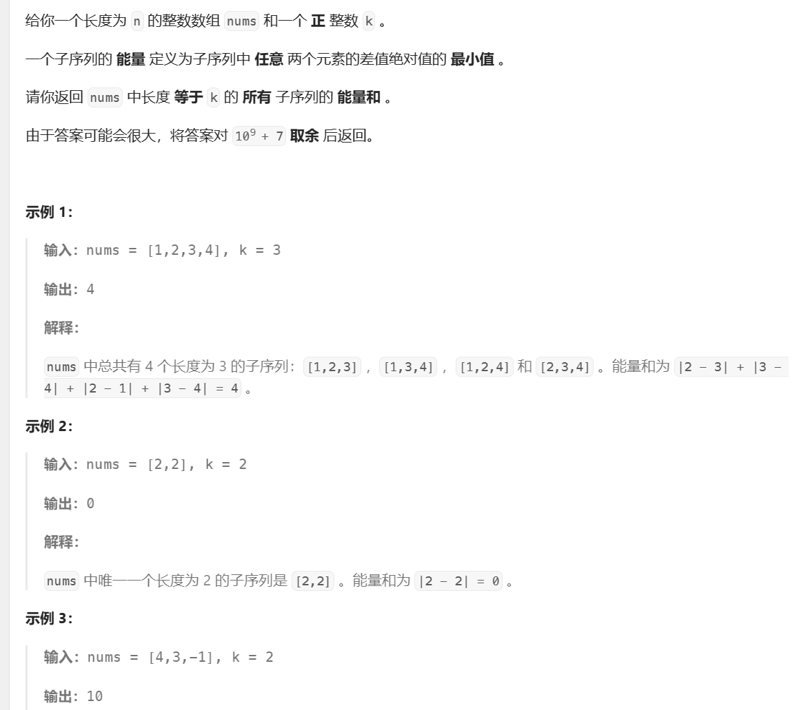
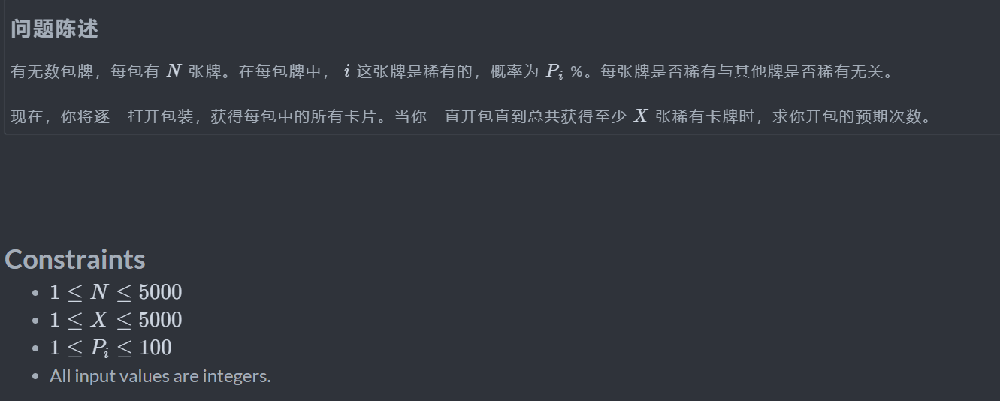

# 动态规划

动态规划三要素：

+ 重叠子问题：通过画图可以找出有无重叠子问题，从而判断是否使用备忘录。
+ 状态转移方程：明确dp数组的定义，所定义的dp数组可以运用数学归纳法求出下一个状态
+ 最优子结构：从子问题的最优结果可以推出更大规模的最优结果

存在子问题就可以用动态规划


子数组一般设定dp(i)表示以nums[i]结尾的子数组，子字符串也可以用dp解决，此外根据题目的额外要求会给出新的状态

子序列枚举选或不选，或者枚举选哪个

区间dp：一般是定义dp(i,j)其中i,j表示一个区间，根据题意写出不同的转移方程


动态规划优化到极致就是递推，因此最低的时间复杂度可以通过递推求解，同时也可以大大降低空间开销。当改为递推时，要参照递归中的定义，如果递归中是从i-1转移过来，那么递推中就是要从小到大枚举，同时如果是i-1是要判断是否越界的，可以在递推中把每个下标都加一以此来减少判断。

选或不选想到背包问题

线性dp有的时候考虑倒序做法，比如说操作了当前的位置后后面的某个位置不能操作了

涉及到奇数偶数的考虑状态机dp

回文串可能会定义dp(i,j)表示区间


# 选或不选/01背包问题


定义状态为dp(i,j)，i表示前i个,j表示最大容量，问题可以由子问题求解，base case 为i=0即没有的选，如果容量合法则返回0注意一定要先判断是否合法。

```python
from math import inf
n,v=[int(x) for x in input().split()]
memo=[[0,0]]
for _ in range(n):
    v_,w=[int(x) for x in input().split()]
    memo.append([v_,w])
# 二维数组定义需要考虑到边界
dp=[[-inf]*(v+1) for _ in range(n+1)]
dp[0]=[0]*(v+1)

for i in range(1,n+1):
    for j in range(v+1):
        # 注意状态要合法，还能够装下
        if j-memo[i][0]>=0:
            dp[i][j]=max(dp[i-1][j-memo[i][0]]+memo[i][1],dp[i-1][j])
        else:
            dp[i][j]=dp[i-1][j]
            
print(dp[n][v])


def dp(i, j):
    if j < 0:
        return -inf
    if i == 0:
        return 0
    return max(dp(i - 1, j - memo[i][0]) + memo[i][1], dp(i - 1, j))
```

## [最后一块石头的重量 II](https://leetcode.cn/problems/last-stone-weight-ii/)


问题可以抽象为把石子分为两堆，求两堆和的最小差值，那么只要一堆接近总和的一半即可，用01背包求解能得出的最大的接近一般的和是多少。类似于从序列中选出接近target的子序列

```python
class Solution:
    def lastStoneWeightII(self, nums: List[int]) -> int:
        s=sum(nums)
        n=len(nums)
        @cache
        def dp(i,j):
            if j<0:return -inf
            if not i:return 0
            return max(dp(i-1,j-nums[i-1])+nums[i-1],dp(i-1,j))
        return abs(2*dp(n,s>>1)-s)
```

## [求出数组中最大序列值](https://leetcode.cn/problems/find-the-maximum-sequence-value-of-array/)


考虑枚举分割点，然后找出分割点两边所有的or值，最后两两组合得到最大的异或值。

```python
'''
根据给定的数据范围，所有的或值在0~2^7-1之间，可以定义为状态
定义f[i][j][x]表示考虑nums[i]~nums[n-1]之间选择j个数是否能Or出x
对Nums[i]有选或不选 由x=nums|？知无法用查表法 得到之前的状态 因此使用刷表法
选 f[i][j+1][x|v]=f[i+1][j][x]
不选 f[i][j][x]=f[i+1][j][x]

三维可以优化掉一维 用一个列表储存最外层
'''


class Solution:
    def maxValue(self, nums: List[int], k: int) -> int:
        # 得到可能结果的最大值
        mx=reduce(or_,nums) 
        n=len(nums)
        # 用于储存最外层 suf[i]表示nums[i]~nums[-1]
        suf=[None]*(n-k+1)
        f=[[False]*(mx+1) for _ in range(k+1)]
        # 初始化
        f[0][0]=True
        # 最外层的i就是分割点
        for i in range(n-1,k-1,-1):
            v=nums[i]
            # 刷表法倒叙枚举 j不能为k否则会超出 i的位置也会约束j的大小
            for j in range(min(k-1,n-i-1),-1,-1):
                for x ,has_x in enumerate(f[j]):
                    if has_x:
                        # 转移方程简化
                        f[j+1][x|v]=True
            # 至少能选k个值了
            if i<=n-k:
                suf[i]=f[k].copy()
        
        # 对前缀做一次
        ans=0
        pre=[[False]*(mx+1) for _ in range(k+1)]
        pre[0][0]=True
        for i, v in enumerate(nums[:-k]):
            for j in range(min(k-1,i),-1,-1):
                for x,has_x in enumerate(pre[j]):
                    if has_x:
                        pre[j+1][x|v]=True 
            if i<k-1:
                continue
            # 这个过程中和后缀组合
            for x,has_x in enumerate(pre[k]):
                if has_x:
                    for y,has_y in enumerate(suf[i+1]):
                        if has_y and x ^ y > ans:  # 手写 if
                            ans = x ^ y
            # 优化
            if ans==mx:return ans 
        return ans 
```


## 波动数列


抽象出公式，这个过程中不能使用具体化的值。


也就是去找能与S同余的解有多少个，每一个di都有两个选择，类似于背包问题定义dp(i,j)表示考虑前i个数，余数为j的有多少种方案，第i个数就是为i* a（就是把(n-1)*d1换为(n-1) *d{n-1}），根据同余定理:curr=pre+x同余n，因此前i-1个数余数就是(curr-x)取余n，x可能是bi或ai。

```python
n,s,a,b=[int(x) for x in input().split()]
m=100000007

dp=[[0]*(n+1) for _ in range(n+1)]
dp[0][0]=1
for i in range(1,n):
    for j in range(n):
        # 这里是相加，当前位置可能是a或b
        dp[i][j]+=dp[i-1][(j-a*i)%n]
        dp[i][j]+=dp[i-1][(j+b*i)%n]
        dp[i][j]%=m
# 根据公式只考虑前i-1个数
print(dp[n-1][s%n])
```


## [ 统计放置房子的方式数](https://leetcode.cn/problems/count-number-of-ways-to-place-houses/)


街道的两侧互不影响，先考虑一侧放房子不相邻的方案有多少。使用线段dp，这个dp有点意料之外情理之中，想在一个线段上选择位置，只要不相邻就可以，有多少种做法，这确实是可以分解子问题来看的。

dp(i)表示前i位一共有多少种方案，第i位可以选或者是不选，不选就是由dp(i-1)转移而来，反之是由dp(i-2)转移而来，dp(0)表示空的存在一种方案,dp(1)有两种方案。

```python
class Solution:
    def countHousePlacements(self, n: int) -> int:
        mod=(10**9)+7
        @cache 
        def dp(i):
            if i==0:
                return 1
            elif i==1:
                return 2
            return dp(i-1)+dp(i-2)
        return (dp(n)**2)%mod
```


## 找到最大开销的子字符串


使用动态规划，令dp[i]表示以第i位结尾的字符串的最大开销。状态转移方程是：如果dp[i-1]大于0，则dp[i]=dp[i-1]加上当前值，否则就是单独的当前值。


```python
class Solution(object):
    def maximumCostSubstring(self, s, chars, vals):
        s=list(s)
        # 技巧点，将两个对应的数组转换为字典
        map=dict(zip(chars,vals))
        dp=[0]*len(s)
        dp[0]=map.get(s[0],ord(s[0])-ord('a')+1)
        for i in range(1,len(s)):
            c=s[i]
            # 状态转移方程
            dp[i]=max(dp[i-1],0)+map.get(c,ord(c)-ord('a')+1)
         # 最后如果是负数的话，返回空字符串的开销
        return max(dp) if max(dp)>0 else 0
```

## [字符串中的额外字符](https://leetcode.cn/problems/extra-characters-in-a-string/)


定义dp(i)为前i个字符分割后剩余的最少字符数，对于每个字符i它可以被跳过dp(i)=dp(i-1)+1，也可以去找他前面是否存在一个j,使得s[j:i+1]在d中

```python
class Solution:
    def minExtraChar(self, s: str, dictionary: List[str]) -> int:
        n=len(s)
        d=set(dictionary)
        @cache
        def dp(i):
            if i==-1:
                return 0
            res=dp(i-1)+1
            for j in range(i+1):
                if s[j:i+1] in d:
                    res=min(res,dp(j-1))
            return res
        return dp(n-1)
```


## [求出所有子序列的能量和](https://leetcode.cn/problems/find-the-sum-of-subsequence-powers/)




子序列问题，对于每个值有选或不选两种状态，该题是子序列问题中的相邻相关问题。

对于这题的子序列，元素的顺序无所谓可以先预处理

```python
class Solution:
    def sumOfPowers(self, nums: List[int], k: int) -> int:
        # 通过排序预处理，最小的差值可以由相邻的两个值得出
        nums.sort()
        m=10**9+7
        n=len(nums)
        @cache
        # i表示位置，c表示还能选几个数，pre表示之前选的值，diff表示差值
        def dp(i,c,pre,diff):
            # 选完了
            if c==0:
                return diff
            # 剩下的加起来都不够
            if c>i+1:return 0
            res=0
            # 选或不选相加
            res=dp(i-1,c,pre,diff)+dp(i-1,c-1,nums[i],min(diff,pre-nums[i]))
            return res%m
        return dp(n-1,k,inf,inf)
```


# 完全背包问题


相比于01背包问题，这里的每个物品可以选无限多个（要合法）而不是只有选或不选两种情况，可以选0个1个2个...k个，因此在状态转移的过程中会有dp(i,j)=max(dp(i-1,j),dp(i-1,j-v),dp(i-1,j-2v),dp(i-1,j-3v)...dp(i-1,j-kv))，这相当于在转移的过程中多     出一重循环总共会有三重循环，对于1000的数据会超时，但是可以做优化：


```python
from math import inf
n,v=[int(x) for x in input().split()]
# 注意初始化，方便转移的时候操作
nums=[[0,0]]
for _ in range(n):
    nums.append([int(x) for x in input().split()])

dp=[[inf]*(v+1) for _ in range(n+1)]
dp[0]=[0]*(v+1)

for i in range(1,n+1):
    for j in range(v+1):
        if j-nums[i][0]>=0:
            dp[i][j]=max(dp[i][j-nums[i][0]]+nums[i][1],dp[i-1][j])
        else:
            dp[i][j]=dp[i-1][j]
print(dp[n][v])
```


## 整数划分


问题可以看作是一个完全背包问题，每一个数可以取无限次，但是这里定义的f(i,j)表示前i个元素当前整数为j的划分方法数，所以状态方程是枚举每个中间值，这里需要做一次优化，如下：


```python
from functools import lru_cache
m=10**9+7
n=int(input())

dp=[[0]*(n+1) for _ in range(n+1)]

# base case 当整数的大小为0的时候是一个合法的结果
for i in range(n+1):
    dp[i][0]=1
nums=list(range(n+1))
for i in range(1,n+1):
    for j in range(1,n+1):
        if j-nums[i]>=0:
            dp[i][j]=dp[i-1][j]+dp[i][j-nums[i]]
        else:
            dp[i][j]=dp[i-1][j]
print(dp[n][n]%m)
```

###


# 多重背包问题


规定了物品最多能选s件，类似于完全背包问题状态转移的过程中多出一层循环，对于给定的数据可以接受。

```python
from math import inf

n,v=[int(x) for x in input().split()]
memo=[[0,0]]

for _ in range(n):
    memo.append([int(x) for x in input().split()])
    
dp=[[-inf]*(v+1) for _ in range(n+1)]
dp[0]=[0]*(v+1)

for i in range(1,n+1):
    for j in range(v+1):
        # 枚举出所有合法的状态
        li=[dp[i-1][j-s*memo[i][0]]+s*memo[i][1] for s in range(memo[i][2]+1) if j-s*memo[i][0]>=0]
        dp[i][j]=max(li)
print(dp[n][v])
```

当数据范围比较大的时候就不能选择枚举每一个，这里选择拆开每种物品单独看作一个集合把问题转化内01背包问题，但是如果拆分为1个的形式那么和枚举所有的没有区别这里的方法是拆分为二进制形式（技巧点），比如说7会拆为1 2 4，10会拆为1 2 4 3再把它们单独看作是一个集合，这样相当于把一重循环减小为logn，二进制的形式可以组合为0到n之间任意一个数。

 

```python
from math import inf
n,v=[int(x) for x in input().split()]
items=[]
for _ in range(n):
    v_,w,s=[int(x) for x in input().split()]
    index=0
    # 拆分为二进制形式，或者使用矩阵快速冥的写法
    while s-2**index>=0:
        items.append((v_*2**index,w*2**index))
        s-=2**index
        index+=1
     # 最后可能会剩余一个
    if s:
        items.append((v_*s,w*s))
# 这里不再是n个人了
n=len(items)
# 注意初始化
items=[[0,0]]+items
dp=[[-inf]*(v+1) for _ in range(n+1)]
dp[0]=[0]*(v+1)
for i in range(1,n+1):
    for j in range(v+1):
        # 问题转换为01背包
        if j-items[i][0]>=0:
            dp[i][j]=max(dp[i-1][j],dp[i-1][j-items[i][0]]+items[i][1])
        else:
            dp[i][j]=dp[i-1][j]
print(dp[n][v])
```


# 区间DP

## 石子合并


区间dp问题，每个问题可以由子问题推出，最后的结果一定是合并左边的一个区间和右边的一个区间得出的并且这两个区间是相邻的，而左右两个区间又可以再次分解。定义dp(i,j)为将区间[i,j]合并为一堆所需的最小代价，而i,j可以划分为[i,k],[k+1,j]这两堆，因此枚举i到j之间的位置求解，时间复杂度为n^3。

```python
from math import inf
from itertools import accumulate
from functools import lru_cache
n=int(input())
nums=[int(x) for x in input().split()]
pre=[0]+list(accumulate(nums))

# 递归不如递推
@lru_cache(maxsize=None)
def dp(i,j):
    # 一个元素没有代价
    if i==j:
        return 0
    res=inf
    for k in range(i,j):
        # 合并两个区间的代价就是这两个区间内的元素和，使用前缀和快速求解（两个区间是连续的）
        res=min(res,dp(i,k)+dp(k+1,j)-pre[i]+pre[j+1])
    return res
print(dp(0,n-1))

# 区间dp的递推一般都是先枚举区间长度，再找左右端点
from math import inf
from itertools import accumulate
from functools import lru_cache
n=int(input())
nums=[int(x) for x in input().split()]
pre=[0]+list(accumulate(nums))

dp=[[0]*n for _ in range(n)]

# 枚举长度，长度为1不用考虑代价为0
for len in range(2,n+1):
    # 左右端点
    l=0
    while l+len-1<n:
        r=l+len-1
        dp[l][r]=inf
        # 枚举分割点
        for k in range(l,r):
            dp[l][r]=min(dp[l][r],dp[l][k]+dp[k+1][r]+pre[r+1]-pre[l])
        l+=1
print(dp[0][n-1])
```

# 路径问题


## 下降路径最小和


自顶向下，最小的结果一定是从最后一行的某个位置得出。

```python
    class Solution(object):
        def minFallingPathSum(self, matrix):
        n = len(matrix)
        res = float('inf')
        # 备忘录
        memo=[[float('inf') for _ in range(n)] for _ in range(n)]

        def dp(i, j):
			# 检查是否合法，不合法返回一个无穷大
            if i < 0 or i >= n or j < 0 or j >= n:
                return float('inf')
            
			# 如果到了第一行，直接返回
            if i == 0:
                return matrix[i][j]

            # 如果有记录，直接返回
            if memo[i][j]!=float('inf'):
                return memo[i][j]
		
        	# 最小的路径等于当前节点加上上一层的最小路径
            res=matrix[i][j] + min(dp(i - 1, j - 1), dp(i - 1, j), dp(i - 1, j + 1))
            # 记录
            memo[i][j]=res

            return res


        for i in range(n):
            # 由于每次的只能走到左下右下，因此不能直接选则最小的那个，要全部遍历一编
            res = min(res, dp(n - 1, i))
        return res
```

## 最小路径和


转换为动态规划问题，到达i,j的最小路径等于它的左或上中最小的路径加上它本身。

```python
class Solution(object):
    def minPathSum(self, grid):
        m=len(grid[0])
        n=len(grid)
        # 使用备忘录
        memo=[[-1 for _ in range(m)] for _ in range(n)]
        def dp(i,j):
            
            if i==0 and j==0:
                return grid[0][0]
            # 选择将越界的设置为无穷大，不合法的值不会被取到
            if j<0 or i<0:
                return float('inf')
            if memo[i][j]!=-1:
                return memo[i][j]

            memo[i][j]=min(dp(i-1,j),dp(i,j-1))+grid[i][j]
            return memo[i][j]
        return dp(n-1,m-1)
```


## 地下城游戏


类似于最小路径和，但不能将dp定义为返回从起点到i,j的最小初始血量，如果这样定义的话，在状态转移的时候无法正确的得到下一个状态：


比如如图所示的情况，从起点到B,C的dp值都是1，如果令到终点的状态转移方程是:dp[i] [j]=min(dp[i-1] [j],dp[i] [j-1])-grid[i] [j]如果小于0设置为1，由此计算从BC到A的dp值，得出来的结果都是6，但是从B到A所需的dp值是1，因为在路上加了10，也就是说想要得到下一状态就必须有当前状态的血量值。

将dp设置为从i,j到终点的最低血量

总的来说，就是只能从后往前推，从前往后推条件不够。


这样可以经由BC得出A

```python
class Solution(object):
    def calculateMinimumHP(self, dungeon):
        m=len(dungeon)
        n=len(dungeon[0])
        memo=[[-1]*n for _ in range(m)]
        def dp(i,j):
            # 判断终点本身所需的最低血量
            if i==m-1 and j==n-1:
                return 1 if dungeon[i][j]>=0 else -dungeon[i][j]+1
            # 超出边界
            if i>=m or j>=n:
                return float('inf')
            if memo[i][j]!=-1:
                return memo[i][j]
	# 选择所需初始血量最少的，如果选择了4而当前值是10，则所需血量应该是4-10
            res=min(dp(i+1,j),dp(i,j+1))-dungeon[i][j]
            # 由于血量不能低于0，所以设置为1
            if res<=0:
                res=1
            memo[i][j]=res
            return memo[i][j]
        return dp(0,0)
```


## [网格图中递增路径的数目](https://leetcode.cn/problems/number-of-increasing-paths-in-a-grid/)


一般来说能往任意方向走的不能用动态规划，但是这个题目中合法的路径是一个严格递增的序列，也就是每次只会找更小的值因此不会有重复的访问。

```python
class Solution:
    def countPaths(self, grid: List[List[int]]) -> int:
        m,n=len(grid),len(grid[0])
        mod=10**9+7
        @cache
        def dfs(i,j):
            res=1
            for dx,dy in (1,0),(0,-1),(-1,0),(0,1):
                if 0<=(x:=dx+i)<m and 0<=(y:=dy+j)<n and grid[x][y]<grid[i][j]:
                    res+=dfs(x,y)
                    res%=mod
            return res
        return sum(dfs(i,j) for i in range(m) for j in range(n))%mod
```


# 几何


## [最大正方形](https://leetcode.cn/problems/maximal-square/)


求正方形面积找到正方形的边长即可

令dp[i] [j]表示以i,j为右下角的正方形（无需同时找左上角和右下角，该状态的定义其实已经考虑了所有可行的左上角）所能组成合法的（即全为1）正方形的最大边长，该状态由左边，上边，左上中最小的推出这里，考虑左上是因为即使左边和上边都是合法的但是左上不合法就是不行的。如果该位置为0直接跳过，不会构成合法的正方形因此最大边长是只能是0.

```python
class Solution:
    def maximalSquare(self, matrix: List[List[str]]) -> int:
        m=len(matrix)
        n=len(matrix[0])
        ans=0
        dp=[[0 for _ in range(n)] for _ in range(m)]
        for i in range(m):
            for j in range(n):
                # 跳过为0的项
                if matrix[i][j]=='0':
                 	 continue	
                # 边界上为1的最大边长只能是1
                if i==0 or j==0:
                  	dp[i][j]=1
                else:
                    # 由三个位置中最小的推出
                    dp[i][j]=min(dp[i-1][j],dp[i][j-1],dp[i-1][j-1])+1
                ans=max(ans,dp[i][j])
        return ans**2
```

## [ 统计全为 1 的正方形子矩阵](https://leetcode.cn/problems/count-square-submatrices-with-all-ones/)


令dp[i] [j]表示以i,j为右下角所能形成的最多的正方形个数，如果这位置是0跳过，因为以0为右下角无法形成合法的正方形，状态转移方程同上

```python
class Solution:
    def countSquares(self, matrix: List[List[int]]) -> int:
        m = len(matrix)
        n = len(matrix[0])
        ans = 0
        dp = [[0 for _ in range(n)] for _ in range(m)]
        for i in range(m):
            for j in range(n):
                if matrix[i][j]==0:
                  	continue
                if i==0 or j==0:
                    dp[i][j]=int(matrix[i][j]==1)
                else:
                    dp[i][j]=min(dp[i-1][j],dp[i][j-1],dp[i-1][j-1])+1
                ans+=dp[i][j]
        return ans 
```


# 状态机DP

## [和为奇数的子数组数目](https://leetcode.cn/problems/number-of-sub-arrays-with-odd-sum/)


定义dp[i]表示以arr[i]结尾的子数组中和为奇数的子数组个数，对于arr[i+1]如果是偶数，那么能组成的奇数子数组的个数不会变（因为奇数加上偶数是奇数）也就是dp[i+1]不变。如果是奇数，那么就要以dp[i]就要变为1（自己单独）也为奇数和奇数组合为偶数，并且加上以arr[i-1]结尾的偶数子数组的个数。

```python

class Solution:
    def numOfSubarrays(self, arr: List[int]) -> int:
        m=10**9+7
        # dp表示以nums[i]结尾和为奇数的子数组个数
        # 初始化：第一位是奇数则为1
        ans=dp=int(arr[0]&1!=0)
        for i in range(1,len(arr)):
            val=arr[i]
            # 如果是奇数则只能等于(拼接到最后)前一位和为偶数的子数组数量
            # 因为是子数组 所以(i+1)-dp就是偶数子数组的个数
            if val&1:
                dp=(1+i)-dp
            ans+=dp
        return ans %m

```


# LIS/选哪个

## 最长递增子序列


序列是不连续的集合。

这个问题可以使用动态规划求解，划分为求解子问题，定义dp数组，dp[i]表示以nums[i]结尾的最长递增子序列，dp[i]等于列表中nums[i]前面小于nums[i]的元素对应的dp值中最大的加一。

```python
class Solution(object):
    def lengthOfLIS(self, nums):
        n=len(nums)
        # 全部初始化为1，首先包括自己
        dp=[1 for _ in range(n)]
        # 遍历每一个
        for i in range(n):
            min_dp=-float('inf')
            # 找到列表中小于当前值且在前面的值
            for j in range(i):
                if nums[j]<nums[i]:
                    # 找到最大的
                    min_dp=max(min_dp,dp[j])
            dp[i]=min_dp+1 if min_dp!=-float('inf') else 1
        return max(dp)
```


### [修改数组后最大化数组中的连续元素数目](https://leetcode.cn/problems/maximize-consecutive-elements-in-an-array-after-modification/)


从原数组中任意取几个元素然后排序组成一个递增子序列，那么原数组的顺序就不重要了，将数组排好序之后问题转换为求最长递增子序列。定义dp（i,add）为以nums[i]为结尾的最长递增子序列，add表示是否选择加一，当前数值x可以从x-1或者x-2转移过来因为可以将数值加一。按照递增子序列I的做法是n^2的，但是这里元素被排序后可以使用二分搜索查找满足的元素。

此题的状态定义不能是前i个，因为要找上一个位置这种定义不方便


```python
class Solution:
    def maxSelectedElements(self, nums: List[int]) -> int:
        # 预处理
        nums.sort()
        @cache
        def dfs(i,add):
            if i==-1:
                return 0
            res=1
            # 当前元素实际大小
            x=nums[i]+add
            # 二分去找合适的值
            j=bisect_right(nums,x-1,0,i)-1
            
	    # 注意两个不同的状态x-1,x-2对于不同的add
            if j>=0 and nums[j]==x-1:
                res=max(res,1+dfs(j,0))
            
            j=bisect_right(nums,x-2,0,i)-1
            if j>=0 and nums[j]==x-2:
                res=max(res,1+dfs(j,1))
            return res
        ans=-inf
        # dui'mei'g
        for i ,v in enumerate(nums):
            ans=max(ans,dfs(i,0),dfs(i,1))
        return ans 
```

此题的性质类似于定差子序列，因为最后要求是连续的因此对于每个以v结尾的上一个一定是v-1，可以定义dp(i)表示以i结尾的满足要求的子序列的最长长度

```python
class Solution:
    def maxSelectedElements(self, nums: List[int]) -> int:
        nums.sort()
        f=defaultdict(int)
        # 注意顺序
        for v in nums:
            f[v+1]=f[v]+1
            f[v]=f[v-1]+1
        return max(f.values())
```


### 二维最长递增子序列


本质上也是在求解子序列，将数组中的值，先按照w的大小升序排列，然后对于相同的w按照h降序排列，如果不是降序会将宽度相同的信封装在一起。之后对h的数组进行找最长递增子序列即可

```python
class Solution:
    def maxEnvelopes(self, envelopes):
        if not envelopes:
            return 0
        
        n = len(envelopes)
        # 排序，先按照w升序再按照h降序，具体写法是利用lambda函数返回一个元组，为了使按照h降序，元组中放的是负的值
        envelopes.sort(key=lambda x: (x[0], -x[1]))

        # 找最长递增子序列
        f = [1] * n
        for i in range(n):
            for j in range(i):
                if envelopes[j][1] < envelopes[i][1]:
                    f[i] = max(f[i], f[j] + 1)
        
        return max(f)
```


### [解决智力问题](https://leetcode.cn/problems/solving-questions-with-brainpower/)


解决一个问题随后的几个问题只能跳过，这里需要使用倒序dp，因为下一个状态依赖于前一个状态f[i]表示解决i..n-1内的问题所能得到的最大分数，第i个解决与否会影响到f[i]的结果。如果是正序dp的话f[i]表示0...i是否选择，第i个解决与否会影响到f[i]的结果不仅会影响f[i]还会对后面的f[j]有影响，也就是一直在刷新后面的状态（刷表法）。

```python
class Solution:
    def mostPoints(self, questions: List[List[int]]) -> int:
        n=len(questions)
        # f[i]表示解决i..n-1内的问题所能得到的最大分数
        f=[0]*(n+1)
        for i in range(n-1,-1,-1):
            # 当前的问题可能跳过，可能选择，跳过的话分数等于f[i+1]反之等于当前问题的分数加上第j个问题跳过或选择
            f[i]=max(f[i+1],questions[i][0]+f[min(i+questions[i][1]+1,n)],questions[i][0])
        
        return f[0]
```


正序

```python
class Solution:
    def mostPoints(self, questions: List[List[int]]) -> int:
        n=len(questions)
        #  表示0...izuo'bi
        f=[0]*(n+1)
        for i in range(n):
            f[i+1]=max(f[i+1],f[i])
            j=min(n,i+questions[i][1]+1)
            f[j]=max(f[j],f[i]+questions[i][0])
        return f[n]
```


### [访问数组中的位置使分数最大](https://leetcode.cn/problems/visit-array-positions-to-maximize-score/)


奇偶dp，dp[i]表示选到了第几位，分两个dp偶数的和奇数的，根据最后一个元素的奇偶性而分的。如果当前的值是奇数那么就更新奇数dp，奇数dp可以从上一位的奇数转移过来也可以是偶数转移过来，而偶数dp不变因为偶数dp要求最后一个数是偶数。

```python
class Solution:
    def maxScore(self, nums: List[int], x: int) -> int:
        n=len(nums)
        l=[0]*n
        r=[0]*n
        if nums[0]&1:
            l[0]=nums[0]
            r[0]=nums[0]-x
        else:
            l[0]=nums[0]-x
            r[0]=nums[0]
        for i in range(1,n):
            if nums[i]&1:
                l[i]=max(l[i-1]+nums[i],r[i-1]+nums[i]-x)
                r[i]=r[i-1]
            else:
                l[i]=l[i-1]
                r[i]=max(r[i-1]+nums[i],l[i-1]+nums[i]-x)
        return max(l[-1],r[-1])
```

### [销售利润最大化](https://leetcode.cn/problems/maximize-the-profit-as-the-salesman/)


这里的状态定义是dp(i)表示考虑第i号房子能获得的最多金币，每个房子可以考虑卖或不卖

```python
class Solution:
    def maximizeTheProfit(self, n: int, offers: List[List[int]]) -> int:
        memo=[[]for _ in range(n)]
        # 通过数组记录上一个位置
        for s,e,w in offers:
            memo[e].append((s,w))

        @cache
        def dp(i):
            if i<0 :return 0
            # 不选往上转移，选了就是在区间前面转移过来
            return max(dp(i-1),max((dp(pre-1)+w for pre,w in memo[i]),default=0))
        return dp(n-1)

```

### [ 摘樱桃 II](https://leetcode.cn/problems/cherry-pickup-ii/)


关键在于状态的选择，这里注意到，两个机器人时同时移动的也就是说他们的横坐标都一样，因此dp方程中只需要记录两个人的纵坐标加以区分即可。

```python
class Solution:
    def cherryPickup(self, nums: List[List[int]]) -> int:
        m,n=len(nums),len(nums[0])
        @cache
        def dfs(i,j1,j2):
            if j1<0 or j2<0 or j1>=n or j2>=n:return -inf
            if i==m:return 0
            res=0
            t=nums[i][j1]+nums[i][j2] if j1!=j2 else nums[i][j1]
            for dx in (-1,0,1):
                for dy in (-1,0,1):
                    res=max(res,dfs(i+1,j1+dx,j2+dy)+t)
            return res
        return dfs(0,0,n-1)

```

### [ K 个逆序对数组](https://leetcode.cn/problems/k-inverse-pairs-array/)


定义状态dp(i,j)表示考虑[1,i]的排列其中有j个逆序对的不同排列方式，对于[1,i]的排列长度为i，可以选任意一个数最为排列的最后一个元素，如果选的是k那么就会贡献i-k个逆序对，即k+1,k+2,k+3...i，此时排列贡献的逆序对等于i-k加上前i-1个元素贡献的逆序对，前i-1个也就是1\~k-1和k+1\~i，因为逆序对只考虑元素的相对大小因此1\~k-1和k+1\~i可以看作是1\~i-1的排列，由此得出子任务


```python
class Solution:
    def kInversePairs(self, n: int, k: int) -> int:
        mod=10**9+7
        # 未优化的如下对于给定的数据范围会超时
        # @cache
        # def dp(i,j):
        #     if not j:return 1 逆序对为0，只有一种排列方式就是正序
        #     res=0
        #     for index in range(i):
        #         cnt=(i-1)-index 能贡献多少
        #         if cnt>j:continue
        #         res+=dp(i-1,j-cnt)
        #         res%=mod
        #     return res 
        # return dp(n,k)
        
        dp=[[0]*(k+10) for _ in range(n+10)]
        for i in range(n+1):dp[i][0]=1

        for i in range(2,n+1):
            for j in range(1,k+1):
                dp[i][j]=dp[i][j-1]-(dp[i-1][j-i] if j-i>=0 else 0)+dp[i-1][j]
                dp[i][j]%=mod
        return dp[n][k]
```


### [统计逆序对的数目](https://leetcode.cn/problems/count-the-number-of-inversions/)


该题目在上述的基础上增加了一些条件，定义dp(i,j)表示前0~i有j个逆序对

关键思路同上一题，把1\~n的排列随机取一个数后，前面剩余的数可以看作是0\~n-2的排列，因为只考虑逆序对那么只关心相对大小。

```python
class Solution:
    def numberOfPermutations(self, n: int, requirements: List[List[int]]) -> int:
        r=[-1]*(n+1)
        mod=10**9+7
        requirements.sort()
        # 先设置好约束条件
        for i,j in requirements:
            r[i+1]=j
        @cache
        def dp(i,j):
            # base case是只有一个数的时候，这是逆序对只能是0个
            if i==1:return int(j==0)
        	# 如果有约束条件，那么必须满足约束条件，首先剩余的逆序对要足够构建约束规定的逆序对的个数，其次为了满足约束条件而凑出的逆序对必须能由前i个数构建出来，即小于i-1
            if r[i-1]>=0:
                return dp(i-1,r[i-1]) if j-r[i-1]<=i-1 and r[i-1]<=j else 0
            # 否则任取，注意不能大于已有的逆序对个数和能构建出的逆序对个数
            return sum(dp(i-1,j-k) for k in range(min(i,j+1)))%mod
        return dp(n,requirements[-1][-1])
       
```


## [规划兼职工作](https://leetcode.cn/problems/maximum-profit-in-job-scheduling/)


选或不选，令dp[i]为从0-i中在满足条件的情况下能得到的最大的报酬，为了满足条件可以区间按照(**结束时间，开始时间**)排序，当判断i-th时，使用二分快速找出合法的位置。

```python
class Solution:
    def jobScheduling(self, startTime: List[int], endTime: List[int], profit: List[int]) -> int:
        nums=[(i,j,w) for i,j,w in zip(startTime,endTime,profit)]
        nums.sort(key=lambda x:(x[1],x[0]))
        p=[x[1] for x in nums]
        n=len(nums)
        @cache
        def dp(i):
            if not i:return 0
            j=bisect_left(p,nums[i-1][0]+1,hi=i)-1
            if j<0:return max(dp(i-1),nums[i-1][2])
            a=dp(j+1)+nums[i-1][2]
            b=dp(i-1)
            return max(a,b)
        return dp(n)
```


在上一题的基础上多了一个状态


```python
class Solution:
    def maximumWeight(self, intervals: List[List[int]]) -> List[int]:
        # 答案要返回编号，因此数组中添加上编号
        nums=[[*arr,i] for i,arr in enumerate(intervals)]
        # 按照时间值排序
        nums.sort(key=lambda x:(x[1],x[0]))
        # 时间区间右端点
        p=[x[1] for x in nums]
        n=len(nums)

        @cache
        def dp(i,cnt):
            # base case
            if i<0:
                # 不合法
                if cnt:return [-inf]
                return [0] 
            # 选完了
            if not cnt:return [0]
            if i+1<cnt:return [-inf]
            j=bisect_left(p,nums[i][0],hi=i)-1
            
            # 这里的返回值要复制一遍，因为返回的是数组
            a=dp(i-1,cnt)[:]
            b=dp(j,cnt-1)[:]
            b[0]+=nums[i][2]

            b.append(nums[i][-1])
            if a[0]<b[0]:
                return b
            elif a[0]==b[0]:
                return min(a,b)
            return a
        ans=None
        # 4个不一定选满
        for i in range(1,5):
            res=dp(n-1,i)
            # 注意判断值最大，字典序最小
            res=[res[0]]+sorted(res[1:])
            if not ans or res[0]>ans[0]:ans=res[:]
            elif res[0]==ans[0] and res[1:]<ans[1:]:ans=res[:]
    
        
        return sorted(ans[1:])
```


### 子序列dp

#### [使数组变美的最小增量运算数](https://leetcode.cn/problems/minimum-increment-operations-to-make-array-beautiful/)


子序列问题对每个元素有增加或者不增加，题目要求每个长度大于等于3的满足要求，实际上只用找长度等于3的子数组即可。

由于长度只有三可以定义状态J表示这个数组右边不满足要求的连续元素个数，定义dp(i,j)表示当前位置上，右边有连续j个不满足要求的元素。

```python
class Solution:
    def minIncrementOperations(self, nums: List[int], k: int) -> int:
        n=len(nums)
        # @cache
        # def dp(i,j):
        #     if i<0:return 0
        #     if j==2:如果j=2就必须对当前位置操作
        #         return dp(i-1,0)+max(0,k-nums[i])
        #     return min(dp(i-1,0)+max(0,k-nums[i]),dp(i-1,j+1))# 操作或不操作
        # return dp(len(nums)-1,0)
        
        f=[[0]*3 for _ in range(n+1)]
        for i in range(1,n+1):
            f[i][0]=min(f[i-1][1],f[i-1][0]+max(0,k-nums[i-1]))
            f[i][1]=min(f[i-1][2],f[i-1][0]+max(0,k-nums[i-1]))
            f[i][2]=f[i-1][0]+max(0,k-nums[i-1])
        return f[n][0]

           
```


 


# 值域dp

#### [求出最长好子序列 II](https://leetcode.cn/problems/find-the-maximum-length-of-a-good-subsequence-ii/)


题目的关键是相邻元素的数值大小，考虑使用值域dp。

定义f[x]\[j]为以 *x* 结尾的、至多包含 *j* 个不同相邻元素的子序列的最大长度，转移方程为f[x]\[j]=max(f[x]]\[j],max{f[v]]\[j-1]})+1，即末尾的值是否相同，如果相同可以直接加一，对于不同的去找最大的。

这里的v是在x之前的值，如果要暴力枚举v会超时。这里可以在遍历x的过程中维护至多为j-1的最长长度，这里即使nums[j]=x也没关系，因为他一定是小于等于长度为j+1的不会影响到最后结果。

在转移过后更新j的最大长度。注意因为j需要去看j-1，而操作过后会更新j(节省空间不另开一个数组)，下一轮的j+1又会用到j，为了避免使用覆盖后的数据可以到倒序枚举j。


```python
class Solution:
    def maximumLength(self, nums: List[int], k: int) -> int:
        n=len(nums)
        # 为了构建数组，离散化
        p=sorted(set(nums))
        nums=[bisect_left(p,v) for v in nums]
        dp=[[0]*(k+1) for _ in range(max(nums)+1)]
        mx=[0]*(k+1)
        for x in nums:
            # 倒序枚举
            for j in range(k,-1,-1):
                dp[x][j]=max(dp[x][j],mx[j-1] if j-1>=0 else 0)+1
                mx[j]=max(mx[j],dp[x][j])
        return max(mx)
```

#### Choosing Balls


与上一题是同一类型的，值域DP。

```python
import sys
input=sys.stdin.readline

n,q=list(map(int,input().split()))
v=list(map(int,input().split()))
cc=list(map(int,input().split()))
# 定义dp[c]表示以颜色C作为最后一个的最长子序列
for _ in range(q):
    a, b = [int(x) for x in input().split()]
    mx1 = mx2 = 0# 表示最大的子序列对应的颜色，为了方便初始时指向0
    # 注意dp数组的大小只与颜色个数相关，不用定义为n
    dp = [-10**18] * (max(cc)+ 1)
    dp[0] = 0
    # 从前往后遍历每一个
    for val, c in zip(v, cc):
        # 拼接到相同的颜色后面，如果不存在相同的颜色也就是dp[c]=-inf，在取最大中会被排除
        x = dp[c] + val * a
        # 找到最大的与当前那颜色不同的
        y = (dp[mx1] if mx1 != c else dp[mx2]) + b * val
        if x < y: x = y
        # 更新最长的子序列对应的颜色，不用取等，如果等于在某个上一轮中jiu
        if dp[c] < x:
            dp[c] = x
            if dp[mx1] < x:
                mx1, mx2 = c, mx1
            elif mx1 != c and dp[mx2] < x:
                mx2 = c
    print(dp[mx1])
```

#### [无矛盾的最佳球队](https://leetcode.cn/problems/best-team-with-no-conflicts/)


最长上升子序列可以用值域的写法求解

首先将数组按照得分的大小排序，定义dp(i)为年龄最大值恰好为i的最高得分，它可以由年龄小于等于自己的最大的分求出，同时因为排序，所以前面的得分一定是小于等于当前的得分所以不会违反要求。

```python
class Solution:
    def bestTeamScore(self, scores: List[int], ages: List[int]) -> int:
        nums=[(i,j) for i,j in zip(scores,ages)]
        nums.sort(key=lambda x:(x[1],x[0]))
        n=len(nums)
        dp=[0]*n 
        for i in range(n):
            res=0
            for j in range(i-1,-1,-1):
                if nums[j][1]<nums[i][1] and nums[j][0]>nums[i][0]:continue
                res=max(res,dp[j])
            dp[i]=res+nums[i][0]
        return max(dp)
    

# 用树状数组优化，注意由于数组中存的是最大得分，因此更新实际上是取最大值
def cal(x):
    return x&(-x)
class Tree:
    def __init__(self,n):
        # 这里没有原始数组
        self.tree=[0]*(n+1)
    # 更新
    def update(self,i,mx):
        i+=1
        while i<len(self.tree):
            self.tree[i]=max(self.tree[i],mx)
            i+=i&-i

    # 求出0,i的区间和，也就是小于等于i的个数
    def query(self,i: int) -> int:
        mx = 0
        while i:
            mx = max(mx, self.tree[i])
            i &= i - 1
        return mx

class Solution:
    def bestTeamScore(self, scores: List[int], ages: List[int]) -> int:
        x=max(ages)
        t=Tree(x+1)
        for i,j in sorted(zip(scores,ages)):
            mx=t.query(j+1)
            t.update(j,mx+i)
        return t.query(x+1)
```

#### [找出有效子序列的最大长度 II](https://leetcode.cn/problems/find-the-maximum-length-of-valid-subsequence-ii/)


化简公式，实际上就是找奇数位置取余k相等并且偶数位置取余k也相等的最长子序列。

根据给定的数据范围，可以做到k^2。定义f[i]\[j]表示最后一个数为i倒数第二个数为j

```python
class Solution:
    def maximumLength(self, nums: List[int], k: int) -> int:
        f=[[0]*k for _ in range(k)]
        # 预处理数组
        nums=[v%k for v in nums]
        for v in nums:
            # 选这个数表示把这个数放在以任意个一个数为倒数第一个，以这个数为倒数第二个的子序列后面
            for j in range(k):
                f[v][j]=f[j][v]+1
        return max(map(max,f))
```


​	


# 可行性背包

#### [执行操作可获得的最大总奖励 I](https://leetcode.cn/problems/maximum-total-reward-using-operations-i/)


每次只能选大于当前总和的数，先贪心把数组去重后排序。

定义dp(i,j)表示考虑前i个元素，是否能满足最大和为J，初始时dp(0,0)为True，整个数组能能到的最大值为mx，因为每次只能选择大于当前和的数因此，一个值如果大于数组的最大值那么mx就是这个数，如果小于最大值则可以加上数组的最大值然后就不能再增大了，mx=max(nums)*2-1.

选一个数的条件是j-v<v（没选这个数之前小于当前数）只有这样才能选择j

```python
class Solution:
    def maxTotalReward(self, rewardValues: List[int]) -> int:
        rewardValues=sorted(set(rewardValues))
        n=len(rewardValues)
        mx=2*rewardValues[-1]
        # dp=[[False]*mx for _ in range(n+1)]
        # dp[0][0]=True
        # for i in range(1,n+1):
        #     for j in range(mx):
        #         v=rewardValues[i-1]
        #         if j>=v and j-v<v:dp[i][j]=dp[i-1][j]|dp[i-1][j-v]
        #         else:dp[i][j]=dp[i-1][j]
        # for j in range(mx-1,-1,-1):
        #     if dp[-1][j]:return j

        # 优化为一维
        dp=[False]*mx
        dp[0]=True
        for i in range(1,n+1):
            v=rewardValues[i-1]
            for j in range(mx-1,-1,-1):
                if j>=v and j-v<v:dp[j]=dp[j]|dp[j-v]

        for j in range(mx-1,-1,-1):
            if dp[j]:return j      
```

当数据比较大的时候就必须优化了


对于可行性背包最常见的优化技巧是bitset

用一个二进制数f表示dp数组,其中f的第i位表示dp[i]，为1表示TRUE,0表示FALSE


初始时f=1表示dp[0]=TRUE

```python
class Solution:
    def maxTotalReward(self, rewardValues: List[int]) -> int:
        rewardValues=sorted(set(rewardValues))
        n=len(rewardValues)
        f=1
        for v in rewardValues:
            f|=(f&(1<<v)-1)<<v     
        return f.bit_length()-1       
```


### [单调数组对的数目 II](https://leetcode.cn/problems/find-the-count-of-monotonic-pairs-ii/)


定义f[i]\[j]表示第i个位置选择j的个数，可以很简单的得出推导式，

```python
@cache
def dp(i,j):
    if not i:return 1
    mx=min(j,nums[i-1]-nums[i]+j)
    res=0
    for k in range(mx+1):
        res+=dp(i-1,k)
        res%=mod
    return res 
return sum(dp(n-1,k) for k in range(nums[-1]+1))%mod
```

但是对于给定的的数据范围无法求解只有优化一重循环才能得到结果，把dp改为递推之后发现其中一重循环完全可以用前缀和优化。

```python
        for v in range(nums[0]+1):f[0][v]=1
        for i in range(1,n):
            s=list(accumulate(f[i-1],initial=0))
            for j in range(nums[i]+1):
                mx=min(j,nums[i-1]-nums[i]+j)
                if mx<0:continue
                res=s[mx+1]
                # for k in range(mx+1):
                #     res+=f[i-1][k]
                res%=mod
                f[i][j]=res
        return sum(f[n-1][k] for k in range(nums[-1]+1))%mod
```


### [不同骰子序列的数目](https://leetcode.cn/problems/number-of-distinct-roll-sequences/)


最直接的定义，设置l1，l2为倒数第一个数和倒数第二个数

```python
class Solution:
    def distinctSequences(self, n: int) -> int:
        mod=10**9+7
        @cache
        def dp(i,l1,l2):
            if i==n:return 1
            res=0
            for j in range(1,7):
                if gcd(l1,j)!=1 or l1==j or l2==j:continue
                res+=dp(i+1,j,l1)
                res%=mod
            return res 
        return dp(0,-1,-1)
```

优化，定义dp(i,j)表示前i个序列以j结尾，倒数第二个数的值可以推出


```python
class Solution:
    def distinctSequences(self, n: int) -> int:
        mod=10**9+7
        @cache
        def dp(i,j):
            if i==1:return 1
            elif i<=0:return 0
            res=0
            for k in range(1,7):
                if k!=j and gcd(k,j)==1:
                    res+=dp(i-1,k)-dp(i-2,j)
                    res%=mod
            # 注意这里按照定义只有I大于3的时候才能求解，否则是不存在i-3的
            if i>3:res+=dp(i-2,j)
            return res%mod
        return sum(dp(n,i) for i in range(1,7))%mod

```


### [出租车的最大盈利](https://leetcode.cn/problems/maximum-earnings-from-taxi/)


定义dp(i)表示到达第i个位置时的最大盈利

```python
class Solution:
    def maxTaxiEarnings(self, n: int, rides: List[List[int]]) -> int:
        memo=[[] for _ in range(n)]
        for l,r,w in rides:
            memo[r-1].append((l-1,w))

        # @cache
        # def dp(i):
        #     if i<0:return 0
        #     res=dp(i-1)
        #     if memo[i]:
        #         res=max(res,max(dp(pre)+w+i-pre for pre,w in memo[i]))
        #     return res
        # return dp(n-1)
        dp=[0]*n
        for i in range(n):
            if i-1>=0:dp[i]=dp[i-1]
            if memo[i]:dp[i]=max(dp[i],max(dp[pre]+w+i-pre for pre,w in memo[i]))
        return dp[-1]
```

### Toward 0


实际上是dp问题，每次可以选择掷色子或者固定减少两种选择，掷色子的花费dp(x)=(6*y+dp(n/1)+dp(n/2)+dp(n/3)+dp(n/4)+dp(n/5)+dp(n/6))/6，这里出现了重复项，可以变化公式得出最后的形式。

```python
from functools import lru_cache
n,a,x,y=[int(x) for x in input().split()]
@lru_cache(maxsize=None)
def dfs(u):
    if not u:return 0
    l=x+dfs(u//a)
    r=(6*y+dfs(u//2)+dfs(u//3)+dfs(u//4)+dfs(u//5)+dfs(u//6))/5
    return min(l,r)
print(dfs(n))
```

​	

### How Does the Rook Move


黑棋的位置不重要，因为只能由白棋决定，当白棋落在正对角线的位置时可选的行数减少1，其他位置时可选的行数减少2，显然是一个子问题求解过程。

dp[i]=dp[i-1]+(i-1+i-1)*dp[i-2]加上两个i-1是因为子啊除开对角线由2\*i-2个位置可选.

```python
from functools import lru_cache
mod=10**9+7
for _ in range(int(input())):
    n,k=[int(x) for x in input().split()]
    dp = [0] * (n + 1)
    dp[0]=dp[1] = 1
    for _ in range(k):
        a,b=[int(x) for x in input().split()]
        if a==b:n-=1
        else:n-=2

    for i in range(2,n+1):
        dp[i]=dp[i-1]+(2*i-2)*dp[i-2]
        dp[i]%=mod
    print(dp[n])
```


### [视频拼接](https://leetcode.cn/problems/video-stitching/)


```python
class Solution(object):
    def videoStitching(self,clips, time):
        dp = [float('inf')] * (time + 1)
        dp[0] = 0
    
        for i in range(1, time + 1):
            for start, end in clips:
                if start < i <= end:
                    dp[i] = min(dp[i], dp[start] + 1)
    
        return dp[time] if dp[time] != float('inf') else -1

```

### [灌溉花园的最少水龙头数目](https://leetcode.cn/problems/minimum-number-of-taps-to-open-to-water-a-garden/)


和上一题是一个类型，都选出最少的区间来覆盖整个区间，这种题目令dp[i]表示0~i区间内被全覆盖所需的最少区间数。


```python
class Solution:
    def minTaps(self, n: int, ranges: List[int]) -> int:
        inter=[]
        # 首先对区间进行操作，超出的位置不需要
        for i,v in enumerate(ranges):
            inter.append([max(0,i-v),min(i+v,n)])
        # 按照开始时间排序，能保证开始时间之前都是计算好的
        inter.sort()
        dp=[inf]*(n+1)
        dp[0]=0
        # 如果选了这个区间，那么到达这个区间中某一个点j的最少区间数与这个区间的左端点有关
        for l,r in inter:
            # 如果存在不合法的状态则表示有点没有被覆盖
            if dp[l]==inf:return -1
            for j in range(l,r+1):
                # 类似于刷表法
                dp[j]=min(dp[j],dp[l]+1)
        return dp[n]
```


### [知道秘密的人数](https://leetcode.cn/problems/number-of-people-aware-of-a-secret/)


考虑dp[i]表示第i天新增的人数，最后求的总人数就是从最后一天往前数forget天增加的总人数之和。


```python
class Solution:
    def peopleAwareOfSecret(self, n: int, delay: int, forget: int) -> int:
        mod=10**9+7
        dp=[0]*(n+1)
        dp[1]=1
        # 使用刷表法，第i天会影响到后面的一个区间的时间端
        for i in range(1,n+1):
            for j in range(i+delay,i+forget):
                if j>=n+1:break
                dp[j]+=dp[i]
        ans=0
        # 最后求和
        for i in range(n-forget+1,n+1):
            ans+=dp[i]
            ans%=mod
        return ans 
```

### **Avoid K Partition**


定义fi表示 表示在 i*i* 点分割时的总可行方案数，直接想到fi=sum(fj)其中j<i，但是其中会存在不满足条件的fj也就是s[i]-s[j]==k->s[i]-k\==s[j]，因此用字典记录前缀和为s[j]的f[i]之和。

```python
n,k=RR()
nums=RR()
mod=998244353

f=[0]*(n+1)
f[0]=summ=1
memo=defaultdict(int)
memo[0]=1
pre=get_pre(nums)

for i in range(1,n+1):
    f[i]=(summ-memo[pre[i]-k])%mod
    memo[pre[i]]+=f[i]
    summ+=f[i]

print(f[n])
```


### 最大子数组之和


```python
class Solution:
    def maxSubArray(self, nums: List[int]) -> int:
        n=len(nums)
        dp=[0]*n
        dp[0]=nums[0]
        ans=dp[0]
        for i in range(1,n):
            dp[i]=max(nums[i],dp[i-1]+nums[i])
            ans=max(ans,dp[i])
        return ans 
```

### [将字符串翻转到单调递增](https://leetcode.cn/problems/flip-string-to-monotone-increasing/)


规定dp[i] [j]为把第i+1个变为j并且是递增的最小操作次数，最终的结果就是最后一个字符变为0或1中的最小的那个。

dp[i] [0]=dp[i-1] [0]，把当前位转换为0，前一位只能是0，次数就是前一位转换为0的次数加上当前位置字符是否为1。

dp[i] [1]，前一位可以是0或者是1，次数是前一位转换为0或1的最小值，加上当前位是否为0.

```python
class Solution:
    def minFlipsMonoIncr(self, s: str) -> int:
        n=len(s)
        dp=[[0,0] for _ in range(n+1)]
        for i in range(n):
            dp[i+1][0]=dp[i][0]+int(s[i]=='1')
            dp[i+1][1]=min(dp[i][0],dp[i][1])+int(s[i]=='0')
        return min(dp[n][0],dp[n][1])
    # 可以优化为只有两个变量
   	   zero=one=0
        for i in range(n):
            one,zero=min(zero,one)+int(s[i]=='0'),zero+int(s[i]=='1')
        return min(zero,one)
```

### [最大节点价值之和](https://leetcode.cn/problems/find-the-maximum-sum-of-node-values/)


这道题目的边是没有用的，每次选出两个值进行异或操作：如果两个值都被操作过，总的异或个数减二，反之加二，如果只有一个操作过则总数不变。因此到最后异或的个数一定是偶数个，根据这一点给出dp(i,j)表示考虑前i个数，当有j(1表示奇数0表示偶数)个异或个数时的最大值。


```python
class Solution:
    def maximumValueSum(self, nums: List[int], k: int, edges: List[List[int]]) -> int:
        n=len(nums)
        @cache
        def dp(i,j):
            res=nums[i-1]^k
            # base case 对于第一个值如果操作次数是偶数则不会异或上值
            if i==1:
                return nums[i-1]^k if j else nums[i-1]
            return max(dp(i-1,j)+nums[i-1],dp(i-1,j^1)+(nums[i-1]^k))
        return dp(n,0)
```


### 编辑距离


```python
class Solution(object):
    
    def minDistance(self, word1, word2):
        # 备忘录，记录当前剩下长度m和n的两个字符最少需要多少步
        memo=[[-1 for _ in range(len(word2))] for _ in range(len(word1))]
        # 表示从s1[0,m],s2[0,n]的字符串相等所需的最小步骤
        def dp(s1,m,s2,n):
	# 从末尾开始遍历，如果有一方提前结束，那么只需要另一个剩余字符长度的删除操作
            if m==-1:
                return n+1
            if n==-1:
                return m+1
			
            # 备忘录储存
            if memo[m][n]!=-1:
                return memo[m][n]

            # 如果字符相等，进入下一层
            if s1[m]==s2[n]:
                memo[m][n]=dp(s1,m-1,s2,n-1)
            else:
                # 反之找出最小的步骤，替换，减，增，注意不能拉下这一次的
                # dp(s1,m-1,s2,n-1)代表替换，没必要继续留在m,n顺势两个指针前移，dp(s1,m-1,s2,n)同时包含删除和增加，删除的是s1的最后一个字符，s1的指针前移一位，不一定删除之后就是末尾相等的两字符，也有可能是对s2增加一个，增加后s2的指针不动（因为增加了一位，匹配的是增加的），s1的前移一位因为匹配了，增加的一定是可以满足相等的（不会加入无用的浪费次数），
                memo[m][n]=min(dp(s1,m-1,s2,n-1)+1,dp(s1,m-1,s2,n)+1,dp(s1,m,s2,n-1)+1)
                
            return memo[m][n]

        return dp(word1, len(word1) - 1, word2, len(word2) - 1)
    
'''上述使用递归的是自定向下的写法，以下是使用DPtable，自底向上的写法'''
from math import inf

n1 = int(input())
s = input()
n2 = int(input())
p = input()
# 这里的dp[i][j]记录的是区间 s[i...n1)与p[j...n2)的最小操作次数，也可以认为是后n1-i,n2-j个
dp = [[inf] * (n2 + 1) for _ in range(n1 + 1)]

# 注意初始化，这里的dp[n1][x] dp[x][n2]表示的都是其中一个字符串空了，另一个字符串全删除的操作次数
dp[n1] =list(range(n2,-1,-1))
for i in range(n1 + 1):
    dp[i][n2] = n1-i	
for i in range(n1,0,-1):
    for j in range(n2,0,-1):
        # 相等可以不操作
        if s[i - 1] == p[j - 1]:
            dp[i-1][j-1] = min(dp[i][j], dp[i - 1][j - 1])
        # 三个操作
        dp[i-1][j-1] = min(dp[i-1][j-1], 1 + dp[i - 1][j], 1 + dp[i][j - 1],1+dp[i][j])
print(dp[0][0])
```

### 最长公共子序列


所有的字符串子序列问题都是使用两个指针进行动态规划，不看字符串而是看每个字符

```python
class Solution(object):
    def longestCommonSubsequence(self, text1, text2):
        m=len(text1)
        n=len(text2)
        # 备忘录
        memo=[[-1 for _ in range(n)] for _ in range(m)]
		
        # dp[m][n]返回s1[m:]与s2[n:]的最长公共子序列
        def dp(s1,m,s2,n):
            # base case 没有值
            if m==len(s1) or n==len(s2):
                return 0
            # 如果记录了
            if memo[m][n]!=-1:
                return memo[m][n]
            # 用指针比较字符
            if s1[m]==s2[n]:
                 memo[m][n]=1+dp(s1,m+1,s2,n+1)
            else:
                # 不等，说明至少有一个字符不是最长公共子序列中的，两个字符都不是的情况被至少一个不是包括
                memo[m][n]=max(dp(s1,m+1,s2,n),dp(s1,m,s2,n+1))#,dp(s1,m+1,s2,n+1))

            return memo[m][n]

        return dp(text1,0,text2,0)
    
# 自底向上的解法更快
class Solution(object):
    def longestCommonSubsequence(self, text1, text2):
        m=len(text1)
        n=len(text2)
        # 做一位偏移,dp[i]表示数组中以第i个元素结尾的最长公共子序列	
        dp=[[0 for _ in range(n+1)] for _ in range(m+1)]

        for i in range(1,m+1):
            for j in range(1,n+1):
                if text1[i-1]==text2[j-1]:
                    dp[i][j]=dp[i-1][j-1]+1
                else:
                    dp[i][j]=max(dp[i-1][j],dp[i][j-1])

        return dp[m][n]
```

### [不相交的线](https://leetcode.cn/problems/uncrossed-lines/)


就是最长公共子序列的变形

```python
class Solution:
    def maxUncrossedLines(self, nums1: List[int], nums2: List[int]) -> int:
        n1,n2=len(nums1),len(nums2)
        @cache
        def dp(i,j):
            if i==n1 or j==n2:return 0
            return max(dp(i+1,j+1)+int(nums1[i]==nums2[j]),dp(i,j+1),dp(i+1,j))
        return dp(0,0)

```

### [ 两个子序列的最大点积](https://leetcode.cn/problems/max-dot-product-of-two-subsequences/)


定义dp(i,j)为nums1[i:],nums2[j:]范围内的最大点积。

状态转移相当于枚举选或不选	


```python
class Solution:
    def maxDotProduct(self, nums1: List[int], nums2: List[int]) -> int:
        n1,n2=len(nums1),len(nums2)
        @cache 
        def dp(i,j):
            # 不合法的状态
            if i>=n1 or j>=n2:return -inf
            # 两个都选，注意后面的值取了可能会更小，因此取最大
            res=max(nums1[i]*nums2[j],nums1[i]*nums2[j]+dp(i+1,j+1))
            # 其中一个不选，包括了两个都不选的情况
            res=max(res,dp(i,j+1))
            res=max(res,dp(i+1,j))

            return res
        res=dp(0,0)
        return res 
```

### [最短公共超序列](https://leetcode.cn/problems/shortest-common-supersequence/)


要求构造的字符串尽可能短那么最后一个字符一定是a或者b中的，如果是a中的那么问题变为从a[:-1]和b中构造字符串，反之问题变为从a,b[:-1]中构造字符串，如果相同那么就是从a[:-1]和b[:-1]中构造，可以分解出子问题。

如果直接使用记忆化搜索找最短的字符串那么内存会超出，在函数中使用另一个函数计算长度这样可以确保每一步走的都是正确的，不用递归循环找错误的子串

```python
class Solution:
    def shortestCommonSupersequence(self, s: str, t: str) -> str:
        @cache
        def dfs(i,j):
            if j<0:return i+1
            elif i<0:return j+1
            if s[i]==t[j]: return dfs(i-1,j-1)+1
            return min(dfs(i-1,j),dfs(i,j-1))+1
        
       # 不需要记忆化搜索了
        def maks(i,j):
            if j<0:return s[:i+1]
            elif i<0:return t[:j+1]
            if s[i]==t[j]: return maks(i-1,j-1)+s[i]
            if dfs(i-1,j)<dfs(i,j-1):
                return maks(i-1,j)+s[i]
            return maks(i,j-1)+t[j]
        return maks(len(s)-1,len(t)-1)
```


### 两个字符串的删除操作


两个字符串可以任意删除，那就是找两字符串的最长公共子序列。

```python 
class Solution(object):
    def minDistance(self, word1, word2):
        m=len(word1)
        n=len(word2)
        memo=[[-1 for _ in range(n)] for _ in range(m)]

        def dp(s1,m,s2,n):
            if m==len(s1) or n==len(s2):
                return 0
            if memo[m][n]!=-1:
                return memo[m][n]
            if s1[m]==s2[n]:
                memo[m][n]=1+dp(s1,m+1,s2,n+1)
            else:
                memo[m][n]=max(dp(s1,m+1,s2,n),dp(s1,m,s2,n+1))
            return memo[m][n]

        length=dp(word1,0,word2,0)
        return m+n-2*length
    
# 自底向上的更快
class Solution(object):
    def minDistance(self, word1, word2):
        m=len(word1)
        n=len(word2)
        dp=[[0 for _ in range(n+1)] for _ in range(m+1)]

        for i in range(1,m+1):
            for j in range(1,n+1):
                if word1[i-1]==word2[j-1]:
                    dp[i][j]=dp[i-1][j-1]+1
                else:
                    dp[i][j]=max(dp[i-1][j],dp[i][j-1])

        length=dp[m][n]
        return m+n-2*length
```

### 两个字符串的最小ASCII删除和


删除字符的最小的ASCII和，就是要求删除最少的字符，也就是找到最大的公共子序列。

```python
# 再求最长公共子序列的基础上改进
class Solution(object):
    def minimumDeleteSum(self, s1, s2):
        m = len(s1)
        n = len(s2)
        memo = [[-1 for _ in range(n)] for _ in range(m)]

        # 求解s[m:]和s[n:]的最小ASCII和
        def dp(s1, m, s2, n):
        
			# 如果其中一个字符串到头了，说明另一个要全部删除
            if m == len(s1):
                res=0
                for j in range(n,len(s2)):
                    res+=ord(s2[j])
                return res

            if n == len(s2):
                res=0
                for j in range(m,len(s1)):
                    res+=ord(s1[j])
                return res

            if memo[m][n] != -1:
                return memo[m][n]

            if s1[m] == s2[n]:
                memo[m][n] = dp(s1, m + 1, s2, n + 1)
            else:
                memo[m][n] = min(ord(s1[m])+dp(s1, m + 1, s2, n), dp(s1, m, s2, n + 1)+ord(s2[n]))

            return memo[m][n]
        
        return dp(s1,0,s2,0)
```

### 正则表达式


使用动态规划的思想。

如果两个指针指向的元素匹配了，如果规则中的下一位是*那么有可能是p匹配了多个s的指针移动一位，也有可能是p匹配了0个p的指针移动两位（跳过 *），比如说s=ab p=a * ab。如果下一位不是*那么就是正常的匹配，指针都移动一位。

如果两个元素不匹配，那么可能是*规则匹配了0次，或者就是s不满足p的规则。

```python
class Solution(object):
    def isMatch(self, s, p):
        memo=[[-1 for _ in range(len(p))] for _ in range(len(s))]

        # dp返回的是s[m:]与p[n:]是否匹配
        def dp(s, i, p, j):
            # base case,如果规则中的匹配完了，返回判断字符串是否检索完
            if j == len(p):
                return i == len(s)
            
            # 如果字符串检索完，不能认为规则检索完，因为规则中可能还有多个a*的形式 
            if i == len(s):
                
                # a*的形式必须是偶数
                if (len(p) - j) % 2 == 1:
                    return False
                # 判断剩下的规则元素中是否是a*的形式
                while j + 1 < len(p):
                    if p[j + 1] != "*":
                        return False
                    j += 2
                return True
            
            # 备忘录中存有值
            if memo[i][j]!=-1:
                return memo[i][j]
            
            # 如果匹配
            if s[i] == p[j] or p[j] == ".":
                # a*匹配0次或多次
                if j + 1 < len(p) and p[j + 1] == "*":
                    memo[i][j]=dp(s, i + 1, p, j) or dp(s, i, p, j + 2)
                else:# 正常匹配都移动一步
                    memo[i][j]=dp(s, i + 1, p, j + 1)
            else:# 不匹配
                # 判断是否是因为a*匹配0次导致的
                if j + 1 < len(p) and p[j + 1] == "*":
                    memo[i][j]=dp(s, i, p, j + 2)
                else:
                    memo[i][j]=False
            return memo[i][j]

        return dp(s, 0, p, 0)
```

### 最长回文子序列


dp数组定义为二维的dp[m] [n]表示的是，s[m:n+1]的最长回文子序列，借助这个dp数组可以推出下一个状态，如果s[i]==s[j]说明这两个字符是回文子序列中的，那么dp[m] [n]=dp[m+1] [n-1]+2，反之最大长度应该等于将这两个字符分别加入后的结果。

```python
class Solution(object):
    def longestPalindromeSubseq(self, s):
        # 备忘录
        memo=[[-1 for _ in range(len(s))]for _ in range(len(s))]

        def dp(s,l,r):
            # base case，相等自然是只有一个字符
            if l==r:
                return 1
            # 如果索引不合法就是0
            if l>r:
                return 0
            
            if memo[l][r]!=-1:
                return memo[l][r]
            # 等于，加入
            if s[l]==s[r]:
                memo[l][r]=dp(s,l+1,r-1)+2
            else:# 反之找出最大的
                memo[l][r]= max(dp(s,l,r-1),dp(s,l+1,r))
            return memo[l][r]
        return dp(s,0,len(s)-1)


'''使用dp table的版本，dp[m][n]的结果要借助它的左下，左，下求出，因此选择自下而上自左而右的遍历顺序，初始时可以将不合法的值以及对角线上的值（只有一个字符）初始化'''
class Solution(object):
    def longestPalindromeSubseq(self, s):
        dp = [[0 for _ in range(len(s))] for _ in range(len(s))]
        for i in range(len(s)):
            dp[i][i]=1
        for i in range(len(s)-2,-1,-1):
            for j in range(i+1, len(s)):
                if s[i]==s[j]:
                    dp[i][j]=dp[i+1][j-1]+2
                else:
                    dp[i][j]=max(dp[i][j-1],dp[i+1][j])
        return dp[0][len(s)-1]
```


### 	[数组中的最长山脉](https://leetcode.cn/problems/longest-mountain-in-array/)


使用动态规划求解以第i位结尾的最长递增连续子数组的长度，题目中要求两边都是小于它的。因此求两个：dp1: 从左到右记录以这个数为结尾的最长连续递增子数组长度
dp2: 从右到左记录以这个数为结尾的最长连续递增序列长度，然后把它们依次相加再减一（重复了一位）就是这个位置左右的最长递增连续子序列长度。可以认为是有两个条件，对这两个条件分别讨论

```python
class Solution(object):
    def longestMountain(self, arr):
        n = len(arr)
        dp1=[1]*n
        dp2=[1]*n
        ans=0
        # 正序求一次
        for i in range(1,n):
            if arr[i]>arr[i-1]:
                dp1[i]=dp1[i-1]+1
	# 倒序求一次
        for i in range(n-1,0,-1):
            if arr[i-1]>arr[i]:
                dp2[i-1]=dp2[i]+1
        for i in range(n):
            # 注意一个山的要求最少有三个元素，如果两个都等于1，无法构成山
            if dp1[i]>1 and dp2[i]>1:
                curr=dp1[i]+dp2[i]-1
                ans=max(ans,curr)
        return ans
```


### [统计元音字母序列的数目](https://leetcode.cn/problems/count-vowels-permutation/)	


问题可以分解为子问题求解，定义f[i] [j]为长度为i+1结尾元素为j的方案数，状态方程是：以e为结尾元素且长度为i+1的方案数等于长度为i并且是以a,i结尾的方案数的总和。


```python
class Solution:
    def countVowelPermutation(self, n: int) -> int:
        m=10**9+7
        f=[[0]*5 for _ in range(n)]
        f[0]=[1]*5
        for i in range(n-1):
            f[i+1][1]+=f[i][0]

            f[i+1][0]+=f[i][1]
            f[i+1][2]+=f[i][1]

            f[i+1][0]+=f[i][2]
            f[i+1][1]+=f[i][2]
            f[i+1][3]+=f[i][2]
            f[i+1][4]+=f[i][2]

            f[i+1][2]+=f[i][3]
            f[i+1][4]+=f[i][3]

            f[i+1][0]+=f[i][4]

            for j in range(5):
                f[i+1][j]%=m

        ans=0
        for i in range(5):
            ans+=f[n-1][i]
            
        return ans%m 
```


### [拼接数组的最大分数](https://leetcode.cn/problems/maximum-score-of-spliced-array/)


交换同一个区间内的两个值，转换为数学公式就是：


问题变为求diff数组的最大子数组之和


```python
class Solution:
    def maximumsSplicedArray(self, nums1: List[int], nums2: List[int]) -> int:
        # 构建两个diff数组
        diff1=[a-b for a,b in zip(nums2,nums1)]
        diff2=[a-b for a,b in zip(nums1,nums2)]
        a=b=0
        
        # 状态定义为以nums[i]结尾的子数组
        def dp1(i):
            if i==0:
                return diff1[0]
            c=dp1(i-1)
            res=max(diff1[i],c+diff1[i])
            # 记录最大值
            nonlocal a 
            a=max(a,res)
            return res

        def dp2(i):
            if i==0:
                return diff2[0]
            c=dp2(i-1)
            res=max(diff2[i],c+diff2[i])
            nonlocal b
            b=max(b,res)
            return res

        dp1(len(nums1)-1)
        dp2(len(nums1)-1)
	# 求两个的最大
        return max(sum(nums1)+a,sum(nums2)+b)

```


### 乌龟棋


如果只用单纯的i表示以nums[i]结尾，为了表示卡牌的使用情况会在内部使用字典记录但这样就没法记忆化搜索了，如果加上abcd表示卡牌的用量那么状态太多了，关键在于卡牌的用量可以表示当前的位置。这道题使用递归会超时，用递推


```python
from collections import Counter
from math import inf
from functools import lru_cache

n, m = [int(x) for x in input().split()]
nums = [int(x) for x in input().split()]
memo = [0] * 4
# 记录每种卡牌的数量
for k in list(map(int, input().split())):
    memo[k - 1] += 1
a,b,c,d=memo[0],memo[1],memo[2],memo[3]

# 开四维数组表示每种卡牌的用量，注意定义时要顺序颠倒
dp=[[[[0 for _ in range(d+1)] for _ in range(c+1)] for _ in range(b+1)] for _ in range(a+1)]
# base case 
dp[0][0][0][0]=nums[0]

# 开始枚举
for i in range(a+1):
    for j in range(b+1):
        for u in range(c+1):
            for v in range(d+1):
                index=i+2*j+3*u+4*v
                # 找出最大的
                if i:dp[i][j][u][v]=max(dp[i][j][u][v],dp[i-1][j][u][v]+nums[index])
                if j:dp[i][j][u][v]=max(dp[i][j][u][v],dp[i][j-1][u][v]+nums[index])
                if u:dp[i][j][u][v]=max(dp[i][j][u][v],dp[i][j][u-1][v]+nums[index])
                if v:dp[i][j][u][v]=max(dp[i][j][u][v],dp[i][j][u][v-1]+nums[index])
                
                
                
print(dp[a][b][c][d])


```


### 传纸条


一来一回，并且前一条路径对后一条路径有影响（不能经过同一个位置），转换思想定义两条路径同时走，因为只能向右或向下所以两个路径走过的距离是一样的也就是同时出发同时到达。

定义dp(i,j,a,b)表示两个人的位置从原点出发到达(i,j)以及(a,b)的时候所经过的最大路径和。

```python
from math import inf
from functools import lru_cache

m,n=[int(x) for x in input().split()]
nums=[]
for _ in range(m):
    nums.append([int(x) for x in input().split()])
@lru_cache(maxsize=None)
def dp(i,j,a,b):
    # 起点位置作为base case
    if i==j==a==b==0:return 0
    # 不合法状态
    if i < 0 or j < 0 or a < 0 or b < 0: return -inf
    # 防止走到重复的位置除了终点
    if  i==a!=m-1 and j==b!=n-1:return -inf
    temp = nums[i][j] if i == a and j == b else nums[i][j] + nums[a][b]
    res=max(dp(i-1,j,a-1,b),dp(i,j-1,a,b-1),dp(i-1,j,a,b-1),dp(i,j-1,a-1,b))+temp
    return res
print(dp(m-1,n-1,m-1,n-1))

```


四维dp较大由于可以确定两个路径同时行动因此定义状态p表示走了多少步，同时定义两个状态ab表示两个路径当前的纵坐标，通过p-a可以算出对应的横坐标。

```python
from math import inf
from functools import lru_cache
m,n=[int(x) for x in input().split()]
nums=[]
for _ in range(m):
    nums.append([int(x) for x in input().split()])
@lru_cache(maxsize=None)
def dp(p,a,b):
    # 一步还没走的时候作为base case
    if not p:
        if a==b==0:return 0
        return -inf
    i,j=p-a,p-b
    # 不合法状态
    if i<0 or j<0 or a<0 or b<0:return -inf
    # 防止走到重复的位置除了终点
    if i==j!=m-1 and a==b!=n-1:return -inf
    temp=nums[i][a]+nums[j][b] if i!=j and a!=b else nums[i][a]
    return max(dp(p-1,a,b),dp(p-1,a,b-1),dp(p-1,a-1,b),dp(p-1,a-1,b-1))+temp

print(dp(m+n-2,n-1,n-1))

```


### Color with Occurrences


每次可以选不同的字符串会得到不同的结果，因此使用动态规划，定义dp(i)表示前i个染成红色所需的最少次数


```python
from math import inf

for _ in range(int(input())):
    # 处理输入
    s = input()
    n = len(s)
    m = int(input())
    memo=[input() for _ in range(m)]
    f=[inf]*(n+1)
    # 第0个自然需要0此
    f[0]=0
    pre=[0]*(n+1)
    vis={}
    
    for i in range(1,n+1):
        # 枚举每个字符串看是否能匹配
        for j in range(m):
            # 如果能匹配，那么可以由(i-len(p),i)的任意一个位置转移过来而不是从i-len(p)过来
            if len(memo[j])<=i and s[i-len(memo[j]):i]==memo[j]:
                for k in range(i-len(memo[j]),i):
                    # 如果较小，可以取得
                    if f[k]+1<f[i]:
                        f[i]=f[k]+1
                        # 由于需要输出转移方案，因此使用一个数组pre记录从哪里转移过来
                        pre[i]=k
                        # vis记录当前位置的转移操作，注意是在i-len(memo[j])（从0开始）操作而不是k位置
                        vis[i]=[j+1,i-len(memo[j])+1]
    if f[n]==inf:print(-1)
    else:
        print(f[n])
        # 迭代输出结果
        now=n
        while now:
            print(vis[now][0],vis[now][1])
            now=pre[now]
```


### [ 统计打字方案数](https://leetcode.cn/problems/count-number-of-texts/)


f(i)=f(i-1)+f(i-2)+f(i-3)+[f(i-4)如果当前数字为7或9]实际上是在枚举最后一位数


```python
class Solution:
    def countTexts(self,s: str) -> int:
        m=10**9+7
        @cache
        def dp(i,c):
            if i==0:return 1
            elif i<0:return 0
            if c:
                return (dp(i-1,c)+dp(i-2,c)+dp(i-3,c)+dp(i-4,c))%m
            return (dp(i-1,c)+dp(i-2,c)+dp(i-3,c))%m
        i=0
        n=len(s)
        ans=[]
        while i<n:
            start=i
            i+=1
            while i<n and s[i]==s[start]:
                i+=1
            l=i-start
            ans.append(dp(l,int(s[start] in {'7','9'})))
        return reduce(lambda x,y:x*y,ans)%m

```

### [公平分发饼干](https://leetcode.cn/problems/fair-distribution-of-cookies/)


每个人可以选任意多个饼干，用dp[i]\[j]表示前i个人，j表示饼干的选取状态，通过枚举第i个人分配到的饼干状态p（s的子集）来转移方程。

```python
class Solution:
    def distributeCookies(self, cookies: List[int], k: int) -> int:
        n=len(cookies)
        mask=(1<<n)
        s=[0]*mask
        # 首先预处理出
        for i in range(mask):
            t=0
            for j in range(n):
                if i>>j&1:
                    t+=cookies[j]
            s[i]=t

        @cache
        def dp(i,m):
            # 对于0个人，应该不分配饼干
            if not i:
                return 0 if not m else inf 
            res=inf 
            p=m
            # 枚举出m的所有子集作为当前的结果
            while p:
                res=min(res,max(dp(i-1,m-p),s[p]))
                p=(p-1)&m
            return res 
        return dp(k,mask-1)
```


### [最长理想子序列](https://leetcode.cn/problems/longest-ideal-subsequence/)


枚举选或不选，根据题目中的约束条件要多出一维表示前一个字符。

定义dp(i,j)为考虑前i个中以字符j结尾的最长长度

如果不选的话：dp[i] [j]=dp[i-1] [j]，选的话dp[i-1] [j]=1+max(dp[合适的范围])，可以发现能够去掉一维。

```python
class Solution:
    def longestIdealString(self, s: str, k: int) -> int:
        n=len(s)
        f=[0]*26
        for c in s:
            c=ord(c)-ord('a')
            f[c]=1+max(f[max(0,c-k):min(c+k+1,26)])
        return max(f)
```

### 保险箱


通过观察可以得到，对左边的数位操作不会影响到右边的数位因此从右往左看。由于操作低位会影响到高位所以需要多出一个状态来表示这个影响，定义dp(i,j)表示为状态为j的时候，nums[i:]都匹配的最小操作次数。 (j=0对前一位无影响，j=1进一位，j=2借一位)

```python
from math import inf 
from functools import lru_cache 
n=int(input())
a=input()
b=input()

dp=[[inf]*3 for _ in range(n+1)]

# 没有数字的时候只能是无影响，其他的两个状态不合法
dp[n][0]=0

for i in range(n-1,-1,-1):
    x=int(a[i])
    y=int(b[i])
    dp[i][0]=min(dp[i+1][0]+abs(x-y),dp[i+1][1]+abs(x+1-y),dp[i+1][2]+abs(x-1-y))
    dp[i][1]=min(dp[i+1][0]+abs(10-x+y),dp[i+1][1]+abs(9-x+y),dp[i+1][2]+abs(11-x+y))
    dp[i][2]=min(dp[i+1][0]+abs(10+x-y),dp[i+1][1]+abs(11+x-y),dp[i+1][2]+abs(9+x-y))

# 最后的结果要三者中最小的，因为最高位进位借位无影响
print(min(dp[0]))
```


### [最长的斐波那契子序列的长度](https://leetcode.cn/problems/length-of-longest-fibonacci-subsequence/)


对于给定的数据范围可以做到n^2，定义状态dp(i,j)表示以nums[i]和nums[j]为结尾的斐波那契数列的最长长度，根据这两个值可以去推前面的值，由于数组是递增的因此前一个值一定在i位置前，如果第二个与第三个数的差大于等于第二个数那么是不合法的可以直接跳出，之后的状态也会是不合法的

```python
class Solution:
    def lenLongestFibSubseq(self,nums: List[int]) -> int:
        # 首先建立哈希表
        memo={x:i for i,x in enumerate(nums)}
        n=len(nums)
        ans=-inf
        dp=[[0]*n for _ in range(n)]
        for i in range(n):
            for j in range(i+1,n):
                # 可行性剪枝，如果不满足下述条件一定是不合法的
                if nums[i]*2<=nums[j]:break
                if (x:=nums[j]-nums[i]) in memo:
                    index=memo[x]
                    # 如果能找到至少为3
                    dp[i][j]=max(3,dp[index][i]+1)
                ans=max(ans,dp[i][j])
        return ans                 

```


### [不相交的握手](https://leetcode.cn/problems/handshakes-that-dont-cross/)


一段连线可以把区间分为两部分，而这两部分又可以继续划分这就出现了子问题。要求两两相连，因此每个区间内的数量必须是偶数才能做到相连，想要划分出的区间是偶数，要求是奇偶不同的两个数相连。这里规定以每个圈中的最后一个点去找相连的点，因为圈为偶数，所以可以对最后一个数去找每个奇数，这样就把区间分为了两部分。

```python
class Solution:
    def numberOfWays(self, numPeople: int) -> int:
        mod=10**9+7
        # 定义dp[i]为I个人的握手方案
        dp=[0]*(numPeople+1)
        # 0个人和2个人的时候只有一次
        dp[0]=dp[2]=1
        # i必须是偶数
        for i in range(4,numPeople+1,2):
            # 以每个圈中最后一个去找他要相连的，就是去找奇数
            for j in range(1,numPeople,2):
                dp[i]=(dp[i]+dp[i-j-1]*dp[j-1])%mod
        return dp[numPeople]
```


### [石子游戏](https://leetcode.cn/problems/stone-game/)


定义dp(i,j)为i,j范围内先手玩家比后手玩家得分多出的最大（因为两人采取最优策略）差值。

对于先手玩家，可以选择开头的元素或者是末尾的元素，当选择完成后，先手变为后手，后手变为先手，状态转移方程为piles[i]-dp(i+1,j)，这里的dp(i+1,j)表示在i+1,j这个区间内先手与后手的最大差值，不过这里的先手是i,j区间内的后手，piles[i]-dp(i+1,j)表示在i,j区间内先手选择的值，减去i+1,j区间内原来的后手比先手的最大差值，结果是i,j区间内先手与后手的差值。


```python
class Solution:
    def stoneGame(self, piles: List[int]) -> bool:
        @cache 
        def dp(i,j):
            if i>j :return 0
            return max(piles[i]-dp(i+1,j),piles[j]-dp(i,j-1))
        return dp(0,len(piles)-1)>0
```


### [石子游戏 VII](https://leetcode.cn/problems/stone-game-vii/)


数据范围更大，使用记忆化搜索内存会超限，之后需要清空内存

```python
class Solution:
    def stoneGameVII(self, nums: List[int]) -> int:
        pre=list(accumulate(nums,initial=0))
        @cache
        def dp(l,r):
            if l>r:return 0
            return max(pre[r+1]-pre[l+1]-dp(l+1,r),pre[r]-pre[l]-dp(l,r-1))
        res=dp(0,len(nums)-1)
        dp.cache_clear()
        return res
```

改为递推形式，考虑dp[i]\[j]的转移方程dp[i+1]\[j],dp[i]\[j-1]，所以i要从大到小枚举，j要从小到大枚举

```python
class Solution:
    def stoneGameVII(self, stones: List[int]) -> int:
        pre = list(accumulate(stones, initial=0))  # 前缀和
        n=len(stones)
        f=[[0]*n for _ in range(n)]
        for i in range(n-2,-1,-1):
            # 注意根据题意j是要大于等于i的
            for j in range(i+1,n):
                f[i][j]=max(pre[j+1]-pre[i+1]-f[i+1][j],pre[j]-pre[i]-f[i][j-1])
        return f[0][-1]

```


### 游戏


```python
from math import inf 
from functools import lru_cache
n=int(input())
nums=[]
# 读取值
while len(nums)!=n:
    nums.extend([int(x) for x in input().split()])
t=sum(nums)

# 同上一题一样，定义dp(i,j)表示区间[i,j]范围内先手比后手多出的值
@lru_cache(maxsize=None)
def dp(i,j):
    # 不合法状态
    if i>j:return 0
    # 下一轮的dp(i,j)就表示下一轮中的先手比后手多出的值，不过下一轮的先手是这一轮的后手，通过相减可以得出结果
    return max(nums[i]-dp(i+1,j),nums[j]-dp(i,j-1))
res=dp(0,n-1)
# 已知两个值的和，又知道一个值和另一个值的差，通过简单的数学运算可得
print((t+res)//2,t-(t+res)//2)
```


### [最长字符串链](https://leetcode.cn/problems/longest-string-chain/)


​	

使用动态规划，对于以一个字符串s结尾，所能形成的的最长的子链，取决于它去掉某一位之后的形成的字符串得到的最大子链数加一，减小了问题规模。由于字符串长度不大，可以直接枚举。

```python
class Solution:
    def longestStrChain(self, words: List[str]) -> int:
        words=set(words)
        @cache 
        # 返回字符串s所能形成的子链的最长长度
        def dp(s):
            res=0
            # 枚举去掉每一位
            for i in range(len(s)):
                t=s[:i]+s[i+1:]
                # 如果存在，才会进行下一次递归
                if t in words:
                    res=max(res,dp(t))
            return res+1
        return max(dp(s) for s in words
             
# 自下而上
class Solution:
    def longestStrChain(self, words: List[str]) -> int:
        # 先排序
        words=sorted(words,key=lambda x:len(x))
        n=len(words)
        dp=defaultdict(int)
        for c in words:
            c=list(c)
            # 枚举删掉每一位
            for i in range(len(c)):
                temp=c[:]
                del temp[i]
                dp[tuple(c)]=max(dp[tuple(temp)]+1,dp[tuple(c)])
        return max(dp.values())
```

### [不同的子序列 II](https://leetcode.cn/problems/distinct-subsequences-ii/)


很难去想对于前i个元素不同的子序列有多少个，不能简单的拼接操作（把当前元素拼接到前面不同的子序列上再加上不拼接的数量，这样无法避免重复），但如果细分的话即多出一个状态j表示以字符j结尾，分别去统计以j结尾的不同序列数可以避免重复。

最后统计一个位置上所有的字符即可。

```python
class Solution:
    def distinctSubseqII(self, s: str) -> int:
        mod=10**9+7
        @cache
        def dp(i,j):
            if not i:return 0
            if ord(s[i-1])-ord('a')==j:
                return 1+sum(dp(i-1,j) for j in range(26))%mod
            return dp(i-1,j)
        return sum(dp(len(s),i) for i in range(26))%mod         
```


### [买卖股票的最佳时机 II](https://leetcode.cn/problems/best-time-to-buy-and-sell-stock-ii/)


0到i天获得的利润可以由0到i-1天获得的利润加上第i天进行的操作求解得出，关键在于定义状态是否持有股票。

定义dp(i,hold)为第i天所获得的利润，hold表示是否持有股票。

```python
class Solution:
    def maxProfit(self, prices: List[int]) -> int:
        n=len(prices)
        @cache
        def dp(i,hold):
            # 一开始是不会持有股票的，因此定义一个不会取到的状态
            if i<0:
                return 0 if not hold else -inf
            # 如果持有股票，可以是前一天就有，也可能是今天买的利润要减去
            if hold :
                return max(dp(i-1,True),dp(i-1,False)-prices[i])
           # 反之，可能是今天买了，或者是本来就没有
            return max(dp(i-1,False),dp(i-1,True)+prices[i])
        return dp(n-1,False)

```

### [买卖股票的最佳时机 IV](https://leetcode.cn/problems/best-time-to-buy-and-sell-stock-iv/)


多出一个状态表示进行了几次买卖，如果买卖次数小于0了则是一个不合法的状态，注意一次买一次卖才算一次操作，有卖必有买因此在卖或者买的一个位置将次数减一即可。

```python
class Solution:
    def maxProfit(self, k: int, prices: List[int]) -> int:
        n=len(prices)
        @cache
        def dp(i,j,hold):
            if j<0:
                return -inf
            if i<0:
                return -inf if hold else 0
            if hold:
                return max(dp(i-1,j,1),dp(i-1,j,0)-prices[i])
            return max(dp(i-1,j,0),dp(i-1,j-1,1)+prices[i])
        return dp(n-1,k,0)
```


如果要求恰好是k次，则修改判断边界条件。

```python
class Solution:
    def maxProfit(self, k: int, prices: List[int]) -> int:
        n=len(prices)
        @cache
        def dp(i,j,hold):
            if j<0:
                return -inf
            if i<0:
                # 这里j必须等于0，大于或者小于都不行
                return -inf if hold or j>0 else 0
            if hold:
                return max(dp(i-1,j,1),dp(i-1,j,0)-prices[i])
            return max(dp(i-1,j,0),dp(i-1,j-1,1)+prices[i])
        return dp(n-1,k,0)
```


如果要求是至少的话，当次数减小到了0相当于进行无限次交易，因此取出j<0的边界条件

```python
class Solution:
    def maxProfit(self, k: int, prices: List[int]) -> int:
        n=len(prices)
        @cache
        def dp(i,j,hold):
            if i<0:
                # 这里j必须小于等于0，表示至少进行了k次
                return -inf if hold or j>0 else 0
            if hold:
                return max(dp(i-1,j,1),dp(i-1,j,0)-prices[i])
            return max(dp(i-1,j,0),dp(i-1,j-1,1)+prices[i])
        return dp(n-1,k,0)
```

### [购买水果需要的最少金币数](https://leetcode.cn/problems/minimum-number-of-coins-for-fruits/)


定义dp(i)为购买第i个以及之后的水果所需的最少金币数，这里的base case 是如果2*i大于等于n那最少的金币数就是只购买一个i

```python
class Solution:
    def minimumCoins(self, prices: List[int]) -> int:
        n=len(prices)
        @cache 
        def dp(i):
            if i*2>=n:
                return prices[i-1]
            # 这里i+1到2i+1一定需要买一个
            return min([dp(j) for j in range(i+1,2*i+2)])+prices[i-1]
        return dp(1)
```


### [ 构造最长非递减子数组](https://leetcode.cn/problems/longest-non-decreasing-subarray-from-two-arrays/)


枚举选择两个数组中那个

定义dp(i,j)表示为以$$nums_{j}[i]$$结尾的最长递增数组的长度

```python
class Solution:
    def maxNonDecreasingLength(self, nums1: List[int], nums2: List[int]) -> int:
        n=len(nums1)
        nums=(nums1,nums2)
        @cache
        def dp(i,j):
            # 只有一个元素，那最大就是1
            if i==0:return 1
            res=1
            # 枚举可选的
            if nums1[i-1]<=nums[j][i]:
                res=dp(i-1,0)+1
            if nums2[i-1]<=nums[j][i]:
                res=max(res,dp(i-1,1)+1)
            return res
        # 因为以最后一个元素结尾的最长不一定是最终答案，因此找出所有的
        return max(dp(i,j) for j in range(2) for i in range(n))
        
```


# 状压dp

##毕业旅行问题


状态压缩dp，定义dp(i,j)，i表示访问过的集合是一个二进制表示，j表示当前在那个位置。状态转移定义为到dp(i,j)的最小距离为在i中访问过的其他点中（除了j以外）到j的距离的最小。

```python
from math import inf 

n=int(input())
m=1<<n
# 建图
g=[[inf]*n for _ in range(n)]

for i in range(n):
    nums=[int(x) for x in input().split()]
    for j ,v in enumerate(nums):
        g[i][j]=v

# 定义状态
dp=[[inf]*n for _ in range(m)]

# base case 初始的时候必须从0号节点开始也就是i=1，j=0
dp[1][0]=0

# 枚举所有的状态，访问过的点的集合
for i in range(1,1<<n,2):
    # 枚举j，当前所在位置
    for j in range(n):
        # 首先需要j在集合中存在
        if (i>>j&1):
            # 枚举集合中的其他点，用从这个点出发到j的距离更新结果
            for k in range(n):
                # 这个点需要存在于剩下的集合中
                if ((i-(1<<j))>>k&1): dp[i][j]=min(dp[i][j],dp[i-(1<<j)][k]+g[k][j])
res=inf 
# 最后找出从不同节点到0的最短距离
for i in range(1,n):
    res=min(res,dp[(1<<n)-1][i]+g[i][0])
print(res)
```

## [不同路径 III](https://leetcode.cn/problems/unique-paths-iii/)


可用回溯做，这里介绍状态压缩


定义dp(i,j)表示从i,j到终点的路径数，这里由于要求所有的可行点必须经过且不能重复走，多使用一个状态表示做过的路径。

定义vis为储存了走过路径的集合


```python
class Solution:
    def uniquePathsIII(self, grid: List[List[int]]) -> int:
        m,n=len(grid),len(grid[0])
        # 全集
        all=(1<<m*n)-1
        vis=0
        # 注意为了方便比较要把障碍先加上，同时找出终点
        for i in range(m):
            for j in range(n):
                if grid[i][j]<0:
                    vis|=(1<<(i*n+j))
                elif grid[i][j]==1:
                    sx,sy=i,j
        @cache
        def dfs(x,y,vis):
            # 不合法
            if x>=m or x<0 or y<0 or y>=n or vis>>(n*x+y)&1:
                return 0
            # 记录到集合中，注意这里把二维转化为一维
            vis|=1<<(n*x+y)
            # 找到终点
            if grid[x][y]==2:
                return int(vis==all)
            # 四个方向走
            return dfs(x-1,y,vis)+dfs(x+1,y,vis)+dfs(x,y-1,vis)+dfs(x,y+1,vis)
        return dfs(sx,sy,vis)
```


## [校园自行车分配 II](https://leetcode.cn/problems/campus-bikes-ii/)


状态压缩dp，有两个对象一个是工人一个是自行车，把工人用i表示第几个，自行车用mask表示选或未选的状态，这里不是把两个对象都是用mask表示。

```python
class Solution:
    def assignBikes(self, workers: List[List[int]], bikes: List[List[int]]) -> int:
        n=len(workers)
        m=len(bikes)
        def  cal(x,y):
            return abs(workers[x][0]-bikes[y][0])+abs(workers[x][1]-bikes[y][1])
        @cache
        def dp(i,mask):
            if i==n:return 0
            res=inf
            for j in range(m):
                if mask>>j&1:continue
                res=min(res,dp(i+1,mask|(1<<j))+cal(i,j))
            return res
        return dp(0,0)

```

## [特别的排列](https://leetcode.cn/problems/special-permutations/)


对于给定的数据范围可以想到状压dp

定义dp(i,j)表示还有i(表示集合)可选，上一次选了j。

```python
class Solution:
    def specialPerm(self, nums: List[int]) -> int:
        mod=10**9+7
        n=len(nums)
        @cache
        def dp(i,j):
            # 能到这就是一个合法的排列
            if not i:return 1
            res=0
            # 枚举可选
            for k,x in enumerate(nums):
                # 判断是否合法
                if i>>k&1 and (nums[j]%x==0 or x%nums[j]==0):
                    res+=dp(i^(1<<k),k)
                    res%=mod
            return res
        # 注意是减一
        s=(1<<n)-1
        return sum(dp(s^(1<<j),j)for j in range(n))%mod 
```

## [并行课程 II](https://leetcode.cn/problems/parallel-courses-ii/)


对于给定的数据范围考虑使用状压dp，定义dp(i)表示有哪些没有完成。	


```python
class Solution:
    def minNumberOfSemesters(self, n: int, relations: List[List[int]], k: int) -> int:
        pre1=[0]*n
        # 用二进制储存每个课程的先修课
        for u,v in relations:
            pre1[v-1]|=(1<<(u-1))
        # 全集
        u=(1<<n)-1
        @cache
        def dp(i):
            # 都学了
            if not i:return 0
            # 找当前的补集也即是学了那些
            c1=u^i
            i1=0
            # 遍历所有的课程找出那些没有被选过的且满足先修课要求的
            for j,p in enumerate(pre1):
                if i>>j&1 and p|c1==c1:
                    i1|=(1<<j)
            # 如果这个可以选的课程小于等于k那么就一次性解决
            if i1.bit_count()<=k:
                return dp(i1^i)+1
            # 否则选其中k个，这里通过枚举子集实现
            res=inf 
            j=i1
            while j:
                if j.bit_count()<=k:res=min(res,dp(i^j)+1)
                j=(j-1)&i1
            return res 
        return dp(u)          
```

## [选择矩阵中单元格的最大得分](https://leetcode.cn/problems/select-cells-in-grid-with-maximum-score/)


明显的状压dp，这里要求元素不能重复，这里如果枚举行号则无法对值域的选或不选进行压缩，因此选择枚举值域压缩行号。对于一个值枚举选或不选，如果选那么选那行。

```python
class Solution:
    def maxScore(self, grid: List[List[int]]) -> int:
        p=defaultdict(list)
        m,n=len(grid),len(grid[0])
        # 预处理出每个值得行号
        for r,row in enumerate(grid):
            for x in set(row):
                p[x].append(r)
        @cache
        def dp(i,j):
            if j==(1<<m)-1:return 0
            if not i:return 0
            res=dp(i-1,j)
            for row in p[i]:
                if j>>row&1==0:
                    res=max(res,i+dp(i-1,j|(1<<row)))
            return res 
        return dp(max(p),0)
```

## [吃掉所有兵需要的最多移动次数](https://leetcode.cn/problems/maximum-number-of-moves-to-kill-all-pawns/)


给定的数据范围可以进行状态压缩，状态中需要有表示当前坐标位置的，可以用pos数组的索引来表示因此每次移动完一定是在某一个兵的位置，可以把初始位置放到pos中，如果在dp中进行bfs会很耗时因此可以预先处理，反向思考每个兵到周围位置的所需的最小步数。用msk中1的个数表示当前是该谁操作l

```python
class Solution:
    def maxMoves(self, kx: int, ky: int, pos: List[List[int]]) -> int:
        n=len(pos)
        # 预处理位置
        f=[[[-1]*50 for _ in range(50)] for _ in range(n)]
        for ii in range(n):
            x,y=pos[ii]
            d=deque()
            d.append((x,y))
            sz=0
            while d:
                sz+=1
                for _ in range(len(d)):
                    i,j=d.popleft()
                    for dx,dy in (1,2),(-1,2),(-1,-2),(2,-1),(2,1),(-2,1),(-2,-1),(1,-2):
                        if 0<=(x:=dx+i)<50 and 0<=(y:=dy+j)<50 and f[ii][x][y]<0:
                            f[ii][x][y]=sz
                            d.append((x,y))
        a=f[0]
        pos.append((kx,ky))
        @cache
        def dp(i,j):
            if j==(1<<n)-1:return 0
            x,y=pos[i]
            count=j.bit_count()
            res=inf if count&1 else -inf  
            for jj in range(n):
                if j>>jj&1==0:
                    if count&1:res=min(res,f[jj][x][y]+dp(jj,j|(1<<jj)))
                    else:res=max(res,f[jj][x][y]+dp(jj,j|(1<<jj)))
            return res 
        return dp(n,0)

```


## [参加考试的最大学生数](https://leetcode.cn/problems/maximum-students-taking-exam/)


对于给定的数据范围无法用一维的状压表示，这里令dp(i,s)表示在第i行状态为s的时候能坐下的最多的学生数。

```python
class Solution:
    def maxStudents(self, seats) -> int:
        # 计算出每行的约束
        def f(arr):
            s=0
            for j,v in enumerate(arr):
                if v!='#':s|=(1<<j)
            return s
        n=len(seats[0])
        ss=[f(s) for s in seats]
        @cache
        def dp(i,s):
            ans=0
            # 枚举所有状态
            for mask in range(1<<n):
                # 不能有相邻的也不能超出当前的状态
                if (mask|s)==s and (mask&(mask<<1))==0:
                    cnt=mask.bit_count()
                    # 最后一行特判
                    if i==len(ss)-1:
                        ans=max(ans,cnt)
                    else:
                        # 用当前的状态对下一行约束
                        nx=ss[i+1]
                        for j in range(n):
                            if mask>>j&1:
                                # 左下右下不能坐人
                                if j-1>=0:nx&=~(1<<(j-1))
                                if j+1<n:nx&=~(1<<(j+1))
                        ans=max(ans,cnt+dp(i+1,nx))
            return ans 
        return dp(0,ss[0])
```


## [覆盖](https://leetcode.cn/problems/broken-board-dominoes/)


与上一题大致相同，枚举行数，用一个二进制数表示每一行可放置的的状态，这里可以横放或者竖放，因此使用dfs回溯去找最多的骨牌数，如果竖放那么会影响到下一行的状态，回溯中额外维护一个状态表示下一行可选的，当去找下一行时，要对两个状态取and

```python
class Solution:
    def domino(self, m: int, n: int, broken: List[List[int]]) -> int:
        row=[(1<<n)-1]*(m+1)
        # 记录每一行的状态
        for r,c in broken:
            row[r]^=(1<<c)
        
        @cache
        def dp(i,mask):
            # 结束
            if i==m:return 0
            def dfs(cur_i,s):
                # 一行选择完，找下一行，row[i+1]表示下一行原本的状态，s表示当前行选完后下一行可选的状态，取交集
                if cur_i==n:return dp(i+1,s&row[i+1])
                # 跳过当前位置
                res=dfs(cur_i+1,s)
                state=None
                # 横放
                if cur_i+1<n and mask>>cur_i&1 and mask>>(cur_i+1)&1:
                    res=max(res,dfs(cur_i+2,s)+1)
                # 竖放，修改下一行的状态
                if mask>>cur_i&1 and i+1<m and row[i+1]>>cur_i&1:                    
                    res=max(res,dfs(cur_i+1,s^(1<<cur_i))+1)
                return res
            # 回溯求解
            res=dfs(0,(1<<n)-1)
            return res
        
        return dp(0,row[0])                

```


## [数组的最大与和](https://leetcode.cn/problems/maximum-and-sum-of-array/)


由题意至少定义两个状态，第一种是第几个篮子和二进制表示的每个数是否已选，状态数有2^18=262144

第二种是第几个数，每个篮子还能放几个(0,1,2)可以用三进制数表示，状态数有3^9=19683一因此选择第二种方式

```python
class Solution:
    def maximumANDSum(self, nums: List[int], numSlots: int) -> int:
        n=len(nums)
        @cache
        def dp(i,s):
            if i==n:
               return 0 
            res=-inf
            mask=[]
            total=s
            # 求解三进制表示方式
            while s:
                mask.append(s%3)
                s//=3
            # 注意 需要补前导0
            mask=[0]*(numSlots-len(mask))+mask[::-1]
            # 每个数选哪个篮子
            for j,x in enumerate(mask):
                # 篮子可以放
                if x:
                    v=nums[i]&(j+1)
                    res=max(res,dp(i+1,total-3**(numSlots-j-1))+v)   
            return res
        return dp(0,3**numSlots-1)
```

## [连通两组点的最小成本](https://leetcode.cn/problems/minimum-cost-to-connect-two-groups-of-points/)


注意到size2的集合较小，因此枚举size1用二进制数表示size2中的数是否已选，这里对每个size1中的数不会去找有多少个size2中的集合与它对应，而是枚举size2中的每个数是否与它对应，因为为了得到最小值，size1是不会主动连接size2的集合的，枚举到最后如果还有size2中的数没有选，那么贪心的选择其能对应的最小值。

```python
class Solution:
    def connectTwoGroups(self, cost: List[List[int]]) -> int:
        n=len(cost)
        m=len(cost[0])
        @cache
        def dp(i,s):
            if i==n:
                return sum(min(list(zip(*cost))[j])  for j in range(m) if s>>j&1)
            return min(dp(i+1,s&~(1<<j))+cost[i][j] for j in range(m))
        return dp(0,(1<<m)-1)
```


# 换根DP

##  [树中距离之和](https://leetcode.cn/problems/sum-of-distances-in-tree/)


暴力的做法是对每个节点做一次dfs求结果，但对于给定的数据范围N^2会超时，作图发现当换节点时距离也会有规律的变化，具体表现为距离会减少当前节点的子树数目加一并增加不是他子树的数目，然后对于这个子树的节点又可以以相同的方式求解。


这里先做一次dfs求出对于起始节点的距离，以及每个节点的子树，对于给定的无向图转换为有向图求解。

```python
class Solution:
    def sumOfDistancesInTree(self, n: int, edges: List[List[int]]) -> List[int]:
        dis=[0]*n
        size=[0]*n

        g=[[] for _ in range(n)]
        # 建图
        for u,v in edges:
            g[u].append(v)
            g[v].append(u)

        def dfs(root,fa,cnt):
            dis[root]=cnt
            t=0
            for y in g[root]:
                if y!=fa:
                    t+=dfs(y,root,cnt+1)# 求距离
            size[root]=t# 求子树
            return t+1
        dfs(0,-1,0)
        ans=[0]*n
        ans[0]=res=sum(dis)
        def reroot(x,fa,res):
            # 这个节点的子树以及它自身
            ss=size[x]+1
            # 当前的距离
            d=res-ss+n-ss
            ans[x]=d
            # 求解其他的节点
            for y in g[x]:
                if y!=fa:
                    # 每次用的距离都是父节点的距离
                    reroot(y,x,d)
        # 因为预先求解出了0，因此从0的子节点开始
        for y in g[0]:
            reroot(y,0,res)
        return ans 

```

## [标记所有节点需要的时间](https://leetcode.cn/problems/time-taken-to-mark-all-nodes/)


很明显暴力求解不行，这里所谓的时间可以转换为边权，即其他节点到偶数节点的距离是2，那么问题转换为了以每个节点为根所走的最大距离是多少。

对于节点x有最远距离mx1和此大距离mx2，那么对于x的子节点y，它的结果就是max(y到子节点的最大距离,y到父节点的距离加上mx1或mx2)，具体是mx1还是mx2，看mx1是不是由y得到，那么对于该题每个节点需要维护[mx1,mx2,my(得到mx1的子节点)]，这种维护额外信息的称为第二类换根dp

```python
class Solution:
    def timeTaken(self, edges: List[List[int]]) -> List[int]:
        n=len(edges)+1
        g=[[] for _ in range(n)]
        for u,v in edges:
            g[u].append(v)
            g[v].append(u)

        nodes=[[] for _ in range(n)]
        def dfs(x,fa):
            mx1=mx2=my=0
            for y in g[x]:
                if y!=fa:
                    # 计算距离，边权不用记录直接计算即可
                    dis=dfs(y,x)+(1 if y&1 else 2)
                    # 记录最远和次远距离
                    if dis>mx1:
                        mx1,mx2=dis,mx1
                        my=y
                    elif dis>mx2:
                        mx2=dis
            # 维护额外信息
            nodes[x]=[mx1,mx2,my]
            return mx1
        dfs(0,-1)
        ans=[0]*n
        def reroot(x,fa,dis):
            mx1,mx2,my=nodes[x]
            cnt= 1 if x&1 else 2
            # 以该节点为根的答案是它到子树的最大距离与他到其他子树(即父节点)的最大距离的最大值
            ans[x]=max(mx1,dis)
            for y in g[x]:
                if y!=fa:
                    # 下一个节点到其他子树的最大距离也可能是是当前节点到其他子树的最大距离(dis)而不是他到自己子树的最大距离，因此取最大
                    reroot(y,x,cnt+max(dis,mx1 if y!=my else mx2))

        reroot(0,-1,0)
        return ans 
```

# 划分型dp

## [划分数组得到最小的值之和](https://leetcode.cn/problems/minimum-sum-of-values-by-dividing-array/)


对于长度为n的数组，有n^2个子数组，如果每个子数组按位与的话最终只会有nlogU(U为最大的整数)个不同的子数组，即以一个点为右端点从起点到这个点构成的子数组中只会有logU个不同的子数组。

该题要划分子数组，定义dp(i,j,nd)表示考虑第i位，已经划分了j个子数组，当前的and值为nd，因为nd最多只有logU个因此状态数不会太大。

```python
class Solution:
    def minimumValueSum(self, nums: List[int], andValues: List[int]) -> int:
        n,m=len(nums),len(andValues)
        @cache
        def dp(i,j,nd):
            # 只有每一个都划分到了一组才能是成功
            if i==n:
                return 0 if j==m else inf
            if j==m:return inf
				
            nd&=nums[i]
            # 剪枝，因为按位与只会变小
            if nd<andValues[j]:return inf 
			
            res=dp(i+1,j,nd)
            # 只有当按位与的结果满足要求时才能作为一组
            if nd==andValues[j]:
                res=min(res,dp(i+1,j+1,-1)+nums[i])
            return res
        res=dp(0,0,-1)
        return res if res!=inf else -1
```


# 状态机dp

http://codeforces.com/problemset/problem/1535/C


### [最长等差数列](https://leetcode.cn/problems/longest-arithmetic-subsequence/)


对于[9,4,7,2,10]，a[2]=7他能形成公差为2和3的两个子序列，在找a[4]=10的过程中他和7形成公差为3的子序列，而对于7如果已知他能形成的公差为3的子序列长度最大为2，就可以直接求出答案。这里利用了等差子序列的公差是一样的。


```python
class Solution:
    def longestArithSeqLength(self, nums: List[int]) -> int:
        ans=-inf
        @cache
        def dp(i):
            # 使用哈希表记录每个公差所能形成的最长子序列
            m={}
            for j in range(i-1,-1,-1):
                d=nums[i]-nums[j]
                # 去找j位的公差为d的，不存在默认就为1
                if d not in m:
                    m[d]=dp(j).get(d,1)+1          
            return m
        return max(max(dp(i).values()) for i in range(1,len(nums)))
```

### **Count Arithmetic Subsequences**	


不好确定差值，因此使用两个状态表示序列中相邻的两个值，这就就可以表示差值了，再用一个状态表示序列的长度


```python
from collections import deque, defaultdict, Counter
from functools import lru_cache,cache
from bisect import bisect_left
from heapq import heappop, heappush
from itertools import accumulate
from math import ceil, inf
import sys
from typing import List
input = sys.stdin.readline
def R(): return int(input())
def RR(): return [int(x) for x in input().split()]
def get_pre(nums): return list(accumulate(nums, initial=0))

n=R()
nums=RR()

mod=998244353

ans=[0]*(n+1)

ans[1]=n
@cache
def dfs(i,j,cnt):
    if cnt==2:return 1
    res=0
    for k in range(j+1,n):
        if nums[k]-nums[j]==nums[j]-nums[i]:
            res+=dfs(j,k,cnt-1)
            res%=mod
    return res 
for i in range(n):
    for j in range(i+1,n):
        for k in range(2,n+1):
            ans[k]+=dfs(i,j,k)
            ans[k]%=mod
print(*ans[1:])
       
```


### [ 最大子序列交替和](https://leetcode.cn/problems/maximum-alternating-subsequence-sum/)


每个元素有选或不选两种，考虑dp(i,j)表示前i个元素中选了J(1表示偶数0表示奇数)，如果选了当前元素那么就是从前i-1转移过来，如果是偶数则上一位就是奇数个，比当前位小nums[i]，不选则直接跳过


```python
class Solution:
    def maxAlternatingSum(self, nums: List[int]) -> int:
        @cache
        def dp(i,j):
            if i==0:
                return -inf if j==1 else 0
            a=dp(i-1,j)
            b=dp(i-1,j^1)
            if j:
                b+=nums[i-1]
            else:
                b-=nums[i-1]
            return max(a,b)
        return max(dp(len(nums),1),dp(len(nums),0))
```


### [检查数组是否存在有效划分](https://leetcode.cn/problems/check-if-there-is-a-valid-partition-for-the-array/)


定义dp(i)表是以nums[i]结尾的数组是否可以划分，对于dp(i)他有三种选择，删除两个相同的，删除三个相同的，删除三个连续的，这样dp(i就变为dp(i-2)或dp(i-3)缩减了子问题，类似于爬楼梯问题。

```python
class Solution:
    def validPartition(self, nums: List[int]) -> bool:
        
        @cache 
        def dp(i):
            if i<0:
                return True 
            if i-1>=0 and nums[i]==nums[i-1]and dp(i-2):
                return True 
            if i-2>=0 and nums[i]==nums[i-1]==nums[i-2] and dp(i-3):
                return True 
            if i-2>=0 and nums[i]==nums[i-1]+1==nums[i-2]+2 and dp(i-3):
                return True  
            return False 
        return dp(len(nums)-1)
```

### [ 删除一次得到子数组最大和](https://leetcode.cn/problems/maximum-subarray-sum-with-one-deletion/)


状态机dp，定义dp(i,j)表示以nums[i]结尾的子数组，其中j=1表示删除一次，j=0表示没有删除过

```python
class Solution:
    def maximumSum(self, arr: List[int]) -> int:
        l=r=0
        n=len(arr)
        i=0
        ans=-inf
        @cache
        def dp(i,j):
            nonlocal ans
            if i==0:
                # 对于一个值如果删除了是不合法的
                return -inf if j else arr[i]
            # 删除过一次，那么可能是删去当前位置的，或者之前删除过
            if j:
                res=max(dp(i-1,0),dp(i-1,1)+arr[i])
            else:
                res=max(dp(i-1,0)+arr[i],arr[i]) 
            return res
            
        return max(max(dp(i,0),dp(i,1)) for i in range(n))        


```

### 小红的序列乘积2.0


子序列问题尝试使用dp求解

要找出所有非空子序列的权值和，这个权值和只与f序列的个位数有关因此全看f序列个位数，状态为0到9，总体的权值和很难求使用贡献法求解

这里定义dp[i]\[j]表示前i个数构成的子序列的f序列的最后一位的各位为j的个数

对于a[i]有选或不选，如果选可以单独作为一个序列或者跟在之前的序列后面，具体实现类似刷表法。如果选且j*a[i]%10==6那么a[i]的贡献为2^(n-i-1)认为是后面的元素构成的序列接在a[i]后面。

```python
mod=10**9+7

n=R()
nums=[v%10 for v in RR()]
dp=[0 for _ in range(10)]
ans=0

# 用一维滚动数组
for i,x in enumerate(nums):
    # 先复制一份，这里已经完成了不选的操作，同时也不会有贡献
    dp1=dp[:]
    # 选，单独作为一个序列
    if x==6:# 如果是6那么可以贡献答案
        ans+=pow(2,n-i-1)
        ans%=mod
    # 序列的最后一位为a[i]同时也是f序列的最后一位，因此个数加一
    dp1[x]+=1
    dp1[x]%=mod
    for j in range(10):
        if (j*x)%10==6:
            # 注意这里不能忘掉dp[j]
            ans+=pow(2,n-i-1,mod)*dp[j]
            ans%=mod
        dp1[j*x%10]+=dp[j]
        dp1[j*x%10]%=mod
    dp=dp1[:]
print(ans)
```


### [乘积最大子数组](https://leetcode.cn/problems/maximum-product-subarray/)	


定义dp(i,j)表示以nums[i]结尾的最（大1/小0）子数组，不能定义j表示为是否包含过当前子数值是正/负，因为无法定义出合适的base case。

数组中的负数可以使得最小的数组变为最大的，最大的变为最小的。

```python
class Solution:
    def maxProduct(self, nums: List[int]) -> int:
        n=len(nums)
        ans=nums[0]
        @cache
        def dp(i,j):
            # 只有一个值，那么最大最小都是它
            if i==0:return nums[0]
            if nums[i]>=0:
                if j:
                    # 当前值是正数，那么最大的子数组来自于自身或者前面的最大子数组
                    res=max(nums[i],dp(i-1,1)*nums[i])
                else:
                    # 最小同理
                    res=min(nums[i],dp(i-1,0)*nums[i])
            else:
                if j:
                    # 对于负数它的最大子数组可能是本身或者是前面最小的子数组乘上本身，如果前面最大的子数组是正数那么一定不会大于这个负数本身，如果是负数那么一定不如反转更小的最小子数组
                    res=max(nums[i],dp(i-1,0)*nums[i])
                else:
                    # 对于最小的本身或者乘上前面最大的，如果前面最大的子数组是那么最小的只会更大，如果是负数一定会比最小的子数组小。
                    res=min(nums[i],nums[i]*dp(i-1,1))
            return res
        return max(max(dp(i,0),dp(i,1)) for i in range(n))
```

###  Jellyfish and Mex


为了使结果最小要尽可能地减小MEN，对于当前的MEN而言删除比它大的不会改变MEN，只有删除某个小于他的值并且全部删除掉这个才能改变MEN，定义dp(i)表示MEN=i时最小的结果，这个状态由比它大的MEN转移删除了所有的i后转移过来，对于给定的数据范围可以枚举所有大的MEN。

```python
import sys
from collections import Counter
from math import inf

input = sys.stdin.readline
for _ in range(int(input())):
    n = int(input())
    nums = [int(x) for x in input().split()]
    # 记录元素出现的个数
    cnt = Counter(nums)
    M = 0
    # 找一开始出现的MEN 
    while M in cnt:
        M += 1
    
    dp=[inf]*(M+1)
    dp[M]=0
    # 往回找
    for i in range(M,-1,-1):
        for j in range(i+1,M+1):
            dp[i]=min(dp[i],dp[j]+(cnt[i]-1)*j+i)
    print(dp[0])

```

###  **Alphabet Tiles**


动态规划加组合数，对于每个字符组有选或不选两种，定义dp(i,j)表示考虑前i个字母，长度为j时有多少种方案。在长度为 *j* 的情况下，把 *k* 个字母放进字符串的方案数是 $C^{k}_{j}$

注意到组合数的上下限不超过1000，同时会进行很多次的组合数计算，因此打表记录所有的组合数快速求解。

```python
from functools import lru_cache
from math import comb

n=int(input())
a=[int(x) for x in input().split()]
mod=MOD=998244353

C=[[0]*2010 for _ in range(2010)]
# 打表
for i in range(2010):
    # 内层的循环只能到i，在往外无意义
    for j in range(i+1):
        # j=0的时候结果为1
        if not j:C[i][j]=1
        else:
            C[i][j]=(C[i-1][j-1]+C[i-1][j])%mod

      
f=[[0]*(n+1) for _ in range(27)]
f[0][0]=1

for i in range(1,27):
    for j in range(n+1):
        # 对于字母a[i-1]可选的方案数
        for k in range(min(a[i-1],j)+1):
            f[i][j]=(f[i][j]+f[i-1][j-k]*C[j][k])%mod

ans = 0
for j in range(1, n + 1):
  ans += f[-1][j]
  ans %= MOD
print(ans)
```


### **Remove Pairs**


博弈dp，给定的数据范围可以启发思考，定义dp(i)表示当前剩余牌的状态，对于当前的人如果能让后手必输，则它能取得胜利，如果后手都是赢那么他是必输。


```python
from functools import lru_cache

nums=[]
n=int(input())
for _ in range(n):
    nums.append([int(x) for x in input().split()])
@lru_cache(maxsize=None)
def dp(i):
    # 只有两张牌，base case 注意要判断这两张牌是否能满足要求
    if bin(i).count('1')==2:
        temp=[]
        for index in range(n):
            if i>>index&1:
                temp.append(nums[index])
        return int(temp[0][0]==temp[1][0] or temp[0][1]==temp[1][1])
    # 当前无法操作，必输
    elif bin(i).count('1')<2:return 0

	# 通过n^2 枚举要删除的牌
    for l in range(n):
        if (i>>l)&1==0:continue
        for r in range(n):
            if (i>>r)&1==0 or l==r :continue
            elif nums[l][0]!=nums[r][0] and nums[l][1]!=nums[r][1]:continue
            if not dp(i^(1<<l)^(1<<r)):return 1
    return 0
res=dp((1<<n)-1)
if res:print('Takahashi')
else:print('Aoki')

```


### 让字符串成为回文串的最少插入次序


只要找出最长回文子序列后，不在最大公共子序列中的值就是要添加的，因为没人和他们匹配。

```python
class Solution(object):
    def minInsertions(self, s):
        return len(s)-self.longestPalindromeSubseq(s)
    def longestPalindromeSubseq(self,s):
        memo=[[-1 for _ in range(len(s))]for _ in range(len(s))]

        def dp(s,l,r):
            if l==r:
                return 1
            if l>r:
                return 0
            if memo[l][r]!=-1:
                return memo[l][r]
            if s[l]==s[r]:
                memo[l][r]=dp(s,l+1,r-1)+2
            else:
                memo[l][r]= max(dp(s,l,r-1),dp(s,l+1,r))
            return memo[l][r]
        return dp(s,0,len(s)-1)
```

### 鸡蛋掉落


如果不考虑鸡蛋数目，假如现在有7层楼，想要找到f使用线性查找一层楼一层楼的遍历，最坏的情况是遍历7次，想要找最小的操作数需要使用二分查找，先去第 (1 + 7) / 2 = 4 层扔一下：如果碎了说明 F 小于 4，我就去第 (1 + 3) / 2 = 2 层试……如果没碎说明 F 大于等于 4，我就去第 (5 + 7) / 2 = 6 层试……

以这种策略，最坏情况应该是试到第 7 层鸡蛋还没碎（F = 7），或者鸡蛋一直碎到第 1 层（F = 0）。然而无论那种最坏情况，只需要试 log7 向上取整等于 3 次，比刚才尝试 7 次要少，这就是所谓的至少要扔几次。

只有找最坏情况才能确定f的确切的值。

如果限制鸡蛋数目，比如只有1个，就无法使用二分查找，1个鸡蛋只能一个个线性查找（鸡蛋在f之下不会碎）

选择使用动态规划解决，首先明确状态和选择，状态是当前的鸡蛋数目以及面对的楼层数目，选择是在第几楼扔鸡蛋，扔下去之后，鸡蛋可能碎也可能不碎，找出其中最大的那个，因为要求最坏情况。dp的结果是在有K个鸡蛋的情况下面对n层楼的最小操作数。


```python
class Solution(object):
    def superEggDrop(self, k, n):
        memo = {}
        
        def dp(k, n):
            
            # 只有一个鸡蛋只能线性搜索
            if k == 1:
                return n
            
            # 0层楼自然操作0次
            if n == 0:
                return 0
            # 备忘录
            if (k,n) in memo:
                return memo[(k,n)]
            res = float('inf')
            
            # 当前有k个鸡蛋但不知道从哪扔，遍历所有的楼层选择从最小的那个扔
            for i in range(1, n + 1):
                # 如果鸡蛋没碎，f在i及i之上（base case 中包含了0的情况），反之，在下
                res = min(res, max(dp(k - 1, i - 1), dp(k, n - i))+1) 
            
            memo[(k,n)] = res
            return res
        
        return dp(k, n)
```

改进的二分查找，不是遍历每一层选择最少的，而是直接从中间开始，根据结果的情况不断二分区间

```python
class Solution(object):
    def superEggDrop(self, k, n):
        memo = {}


        def dp(k, n):
            if k == 1:
                return n
            if n == 0:
                return 0
            if (k, n) in memo:
                return memo[(k, n)]
            lo=1
            high=n
            res=float('inf')
            while lo<=high:
                mid=(lo+high)//2
                broken=dp(k-1,mid-1)
                broken_no=dp(k,n-mid)
                if broken>broken_no:
                    
                    high=mid-1
                    res=min(res,broken+1)
                else:
                    lo=mid+1
                    res=min(res,broken_no+1)
            memo[(k,n)]=res
            return res
        return dp(k,n)
```


### 戳气球


注意如果有编号为1到4的气球，第一次戳了第二个，第二次戳了死三个，此时计算分数用的是nums[1] * nums[3] * nums[4]

由题意知，超出边界的值选择为1，在原数组中加入两个边界值左边一个右边一个，将原问题转换为一排气球吹破除了起点于端点外的所有气球所能得到的最大分数。

选取状态为区间，dp[i] [j]表示从i到j的开区间内，戳破所有气球的最大分数，而选择k是那个气球是最后一个戳破的，这样就有状态转移方程。最后的结果是dp[0] [n+1]。

dp[i] [j]=dp[i] [k]+dp[k] [j]+nums[k]*nums [i] *nums[j]，既然是最后一个戳破的，那么左右的值只能是区间的边界。

注意i和j的遍历顺序，选择从左到右，从下到上遍历，因为每个状态要由它的前一个状态推出


```python
class Solution(object):
    def maxCoins(self, nums):
        n=len(nums)
        # 构建新数组，加入两个虚拟节点
        nums_dummy=[1]
        nums_dummy.extend(nums)
        nums_dummy.append(1)
        # 初始化，base case 是当区间内没有值的时候，即i>=j，初始化结果为0
        dp=[[0 for _ in range(n+2)] for _ in range(n+2)]
        # 按照从左到右从下到上的顺序遍历
        for i in range(n,-1,-1):
            for j in range(i+1,n+2):
                # 在当前区间内选取k，作为最后一个吹破的气球
                for k in range(i+1,j):
                    dp[i][j]=max(dp[i][j],dp[i][k]+dp[k][j]+nums_dummy[i]*nums_dummy[k]*nums_dummy[j])
        # 注意dp表示的是开区间
        return dp[0][n+1]
```

### 题目列表

[最长上升路径的长度](https://leetcode.cn/problems/length-of-the-longest-increasing-path/)LIS+排序


# 树形DP

## [移除边之后的权重最大和](https://leetcode.cn/problems/maximize-sum-of-weights-after-edge-removals/)


从特殊出发，假设树是一条链，k=1，问题就变为了相邻节点不能同时选择，这是打家劫舍问题，需要用到DP。

换到树上，根节点对它所有的子节点都有选或不选，并且最多只能选k个，如果对于选有数组a，不选有数组b(两个数组长度一致)，那问题变为从a中至多选k个数，剩下的数从b中选，选出的数的最大和是多少，这个问题等价于[2611. 老鼠和奶酪 - 力扣（LeetCode）](https://leetcode.cn/problems/mice-and-cheese/description/)需要使用贪心求解(先全选b，然后选择k个最大的b-a)

```python
class Solution:
    def maximizeSumOfWeights(self, edges: List[List[int]], kk: int) -> int:
        p=defaultdict(dict)
        # 建图
        for i,j,w in edges:
            p[i][j]=p[j][i]=w
        
        def dp(root,fa):
            # 到叶子节点
            if len(p[root])==1 and fa in p[root]:return 0,0
            nums=[]
            res=0
            # 遍历子节点
            for k,v in p[root].items():
                if k==fa:continue
                nc,c=dp(k,root)
                # 先选择全部的不选
                res+=nc
                # 如果选>不选那么可能会作为K个之一
                if c+v-nc>0:nums.append(c+v-nc)

            nums.sort(reverse=True)
    
            a=res+sum(nums[:kk])
            b=res+sum(nums[:kk-1])# 被父节点选，该节点能选择的边少一

            return a,b
        return max(dp(0,-1))  
```


# 概率DP

 ## **Expansion Packs**



令f(i,j)表示从I张牌中取出j张稀有牌的可能，那么有转移方程


令g(i)表示获得x张稀有卡所需的开包次数，有转移方程


这里j可以等于0从而导致转移方程不可解，采用移项的方法得到可解的转移方程


```python
n,x=RR()
p=[x/100 for x in RR()]
f=[[0]*(n+1) for _ in range(n+1)]
f[0][0]=1
for i in range(1,n+1):
    for j in range(i+1):
        if j-1>=0:f[i][j]=f[i-1][j-1]*p[i-1]+f[i-1][j]*(1-p[i-1])
        else:f[i][j]=f[i-1][j]*(1-p[i-1])
g=[0]*(x+1)
for i in range(1,x+1):
    g[i]=(1+sum(g[i-j]*f[-1][j] for j in range(1,min(n,i)+1)))/(1-f[-1][0])
print(g[-1])

# 压缩为一维
n,x=RR()
p=[x/100 for x in RR()]
f=[0 for _ in range(n+1)]
f[0]=1
# 一维的做法中，j由j-1和j更新然后又会被用于更新下一个数，这里用于更新的数应该是上一轮的结果，可以用一个temp数组存储每一轮的结果，但这样就失去了压缩的意义，所以采用倒序枚举的方法，这样用到的结果是上一轮求解出的，并且更新过程中也不会影响其他结果的取值
for i in range(1,n+1):
    for j in range(i,-1,-1):
        if j-1>=0:f[j]=f[j-1]*p[i-1]+f[j]*(1-p[i-1])
        else:f[j]=f[j]*(1-p[i-1])
g=[0]*(x+1)
for i in range(1,x+1):
    g[i]=(1+sum(g[i-j]*f[j] for j in range(1,min(n,i)+1)))/(1-f[0])
print(g[-1])
```

