# 单调栈结构

栈结构多用于下一个最大元素，数字元素符，匹配之类的题目。

## 下一个更大元素

单调栈结构用于处理，需要保持相对次序，并且计算下一个更大的元素时。

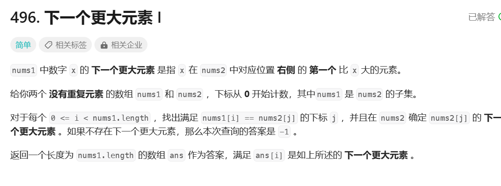

选择计算出每个元素的下一个最大元素，然后使用字典进行映射。

如果把每个元素当成一堵墙那么下一个最大元组就是能够露出来的。

```python
from collections import deque# 使用双向队列模拟栈

class Solution(object):
    def nextGreaterElement(self, nums1, nums2):
        d=deque()
        res={}# 用字典作映射
        for i in range(len(nums2)-1,-1,-1):# 倒序放入
            val=nums2[i]
            while d and val>d[-1]:# 如果栈中有元素并且栈顶的元素小于要放入的元素，那么该元素就是无用的，从栈中删除，直到栈空或者有大于的元素
                d.pop()
            if not d:# 如果栈空了，说明没有比该元素大的，结果是-1，同时记住往栈中放入元素
                res[val]=-1
                d.append(val)
                continue
            # 没空，说明有大于的，设置为栈顶元素
            res[val]=d[-1]
            d.append(val)
        result=[]
        # 一个个映射
        for i in nums1:
            result.append(res[i])
        return result
```


## 下一个更大元素II

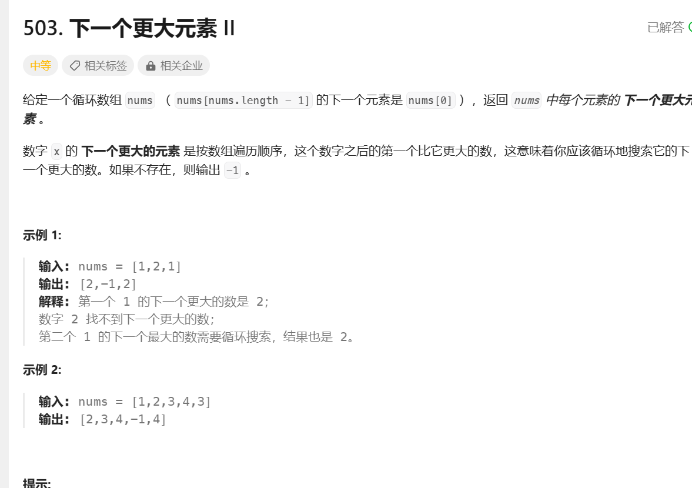

以数组长度加倍实现环形，重要思想

```python
from collections import deque
class Solution(object):
    def nextGreaterElements(self, nums):
        d=deque()
        n=len(nums)
        res=[-1]*n
        # 不需要创建数组，只需让索引翻倍实现重复访问即可
        for i in range(2*n-1,-1,-1):
            val=nums[i%n]
            while d and d[-1]<=val:
                d.pop()
            if not d:
                res[i%n]=-1
                d.append(val)
                continue
            res[i%n]=d[-1]
            d.append(val)
        return res
```


## 去除重复字母

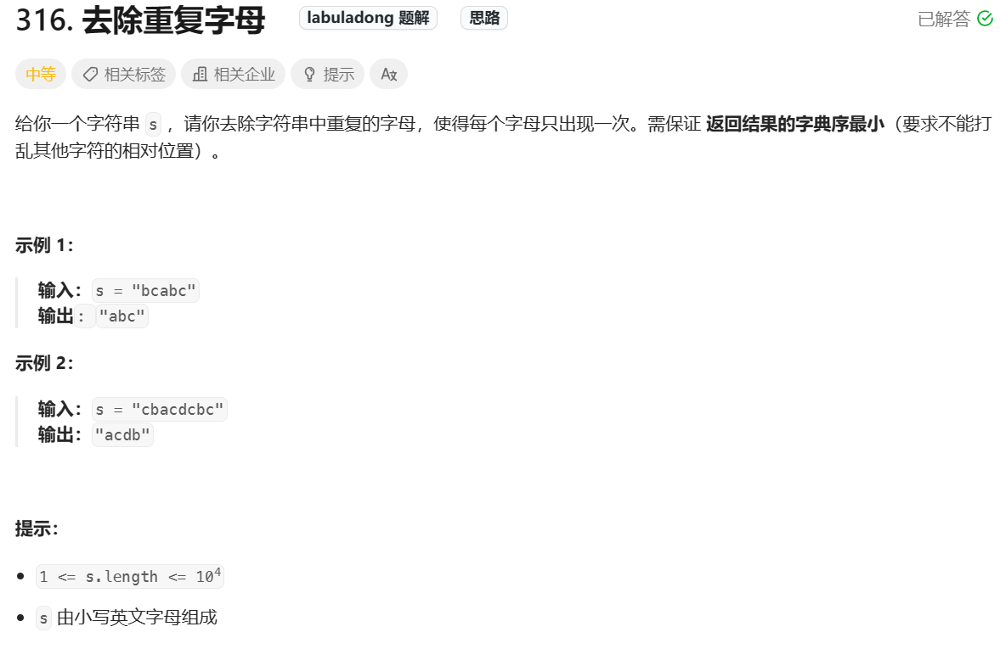

本题有两个要求：元素不重复，最小字典序。

在压入栈之前，比较栈顶的字符的大小，如果栈顶字符更大并且还可以出现那么就用当前字符把栈顶字符替换掉以此保证字典序最小的情况下同时保证每个元素不会被忽略。

```python
from collections import deque
from collections import Counter
class Solution(object):
    def removeDuplicateLetters(self, s):
        # 栈
        d=deque()
        # 字典
        dict=Counter(list(s))
        # 记录结果的数组
        res=[]
        # 记录是否出现过
        used=[False for _ in range(256)]
        for i in range(len(s)):
            # 如果已经出现了一次就不要再加入，同时将记录的次数减一
            if  used[ord(s[i])]:
                dict[s[i]]-=1
                continue
            # 判断顶部的元素是否大于要加入的元素
            while len(d)!=0 and ord(d[-1])>ord(s[i]):
                # 弹出之前判断，防止丢失
                if dict[d[-1]]!=0:
                    used[ord(d.pop())]=False
                else:
                    # 不能弹出字何解推出循环
                    break
            d.append(s[i])
            # 加入后记录减一
            dict[s[i]]-=1
            # 标记
            used[ord(s[i])]=True
                
        while len(d)!=0:
            res.append(d.popleft())
        return "".join(res)
```

## 笨阶乘

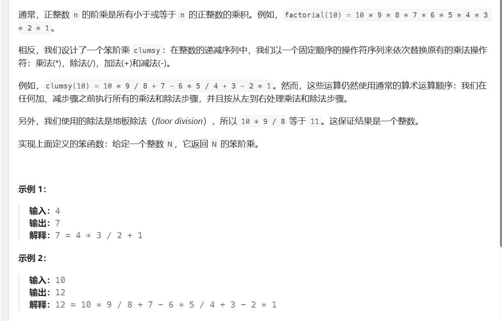

表达式计算一般借助栈结构求解，因为表达式计算存在优先级关系，借助栈的特性可以实现，对于乘除法直接计算，加减法入栈不操作，最后栈中得到的是各个操作之后的结果，求累和即可

```python
from collections import deque
class Solution(object):

    def clumsy(self, n):
        d=deque([n])# 栈中初始就有一个元素，方便之后计算
        index=0# 使用index对4取模，求解是那种运算
        n-=1# 注意前面栈中已经有了一个元素
        while n:# 从末尾开始
            
            # 如果是乘法，直接与栈顶相乘然后在加入
            if index%4==0:
                val=d.pop()
                d.append(val*n)
        	# 如果是除法，用栈顶的元素除以当前的元素（由于是向0取整不能都用//），注意如果是负数要特殊操作    
        	elif index%4==1:
                val=d.pop()
                if val<0:
                    v=abs(val)//n
                    d.append(-v)
                else:
                    d.append(val//n)
            # 如果是加法，加入栈不操作
            elif index%4==2:
                d.append(n)
            # 反之是减法，加入负数
            else:
                d.append(-n)
            n-=1
            index+=1
        sum=0
        # 最后计算栈中元素的累和
        while d:
            sum+=d.pop()
        return sum
```

双栈算法，一个记录数字，一个记录运算符。

```python
from collections import deque
class Solution(object):

    def clumsy(self, n):
        nums=deque()
        ops=deque()
        
        # 使用字典记录优先级
        priority={'*':2,"/":2,"+":1,"-":1}
        operators=['*','/','+','-']
        index=0
        
        # 计算的函数
        def cal(nums,s):
         	# 弹出两个值，注意顺序
        	a=nums.pop()
            b=nums.pop()
            if s=='+':
                nums.append(a+b)
            elif s=='-':
                nums.append(b-a)
            elif s=='*':
                nums.append(a*b)
            else:
                nums.append(b//a)
		
        # 从末尾开始
        for i in range(n,-1,-1):
            # 取得运算符，不着急运算，而是等和看下一个元素符的优先级，如果下一个的优先级小于自身，则运算，否则加入然后新加入的继续看下一个的优先级
            operator=operators[index%4]
            index+=1
            # 0直接退出
            if i==0:
                break
            # 加入数字
            nums.append(i)
            # 如果当前的运算符优先级不大于栈中的，也就是说栈中的可以先计算，那就将当前栈中的元素计算，直到运算符栈空了或是遇到了优先级小于当前的。
            while ops and priority[ops[-1]] >= priority[operator]:
                cal(nums, ops.pop())
			# 1之后没有运算符了
            if i!=1 :
                ops.append(operator)
		# 如果此时op栈中还有值全部运算，比如10 * 9 / 8 + 7 - 6 * 5 / 4 + 3 - 2 * 1，最后nums[A],ops[-]，之后会存入nums[A,2,1] ops[-*] 然后遇到0就退出了
        while ops:
            cal(nums,ops.pop())
        return nums[-1]
```

## [检查替换后的词是否有效](https://leetcode.cn/problems/check-if-word-is-valid-after-substitutions/)

​	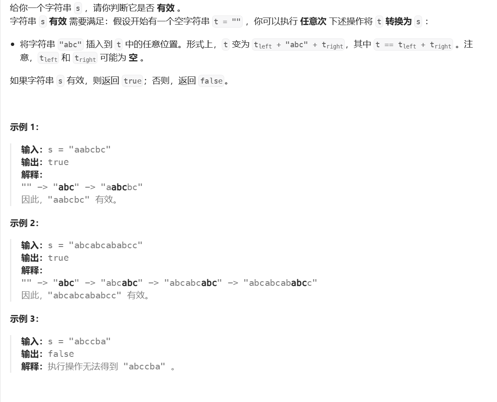

类似于将字符串 `()` 插入到 *t* 中的任意位置」，比如 `() -> (()) -> (()())`

按照栈的顺序，b必然匹配a，c必然匹配b

把`a`:比作左括号，遇到了就入栈，`b`：如果栈为空或者说栈顶不是`a` 返回false，否则把栈顶变为`b`.`c`：如果栈为空，或者栈顶不为 `b`，则返回 `false`，否则弹出栈顶，相当于找到了一个abc。

```python
class Solution(object):
    def isValid(self, s):
        d=deque()
        for c in map(ord,s):
            if c==ord('a'):
                d.append(c)
            elif c==ord('b'):
                if len(d)==0 or c-d[-1]!=1:
                    return False
                else:
                    # 把栈顶变为b
                    d.pop()
                    d.append(c)
            else:
                if len(d)==0 or c-d[-1]!=1:
                    return False
                else:
                    # 不需要霸占顶变为c
                    d.pop()
         # 最后栈中应该不会有元素
        return len(d)==0
```

## [子数组的最小值之和](https://leetcode.cn/problems/sum-of-subarray-minimums/)

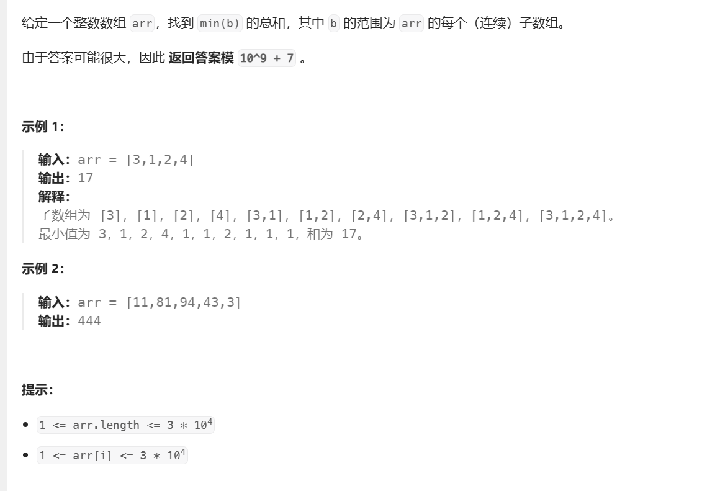


对于每个值去`计算它可能作为多少个区间的最小值`，在列表中找这个值左边小于它的元素的坐标L，右边找小于他的元素的坐标R，然后这个值乘上对应的区间就是他所能做出的贡献。

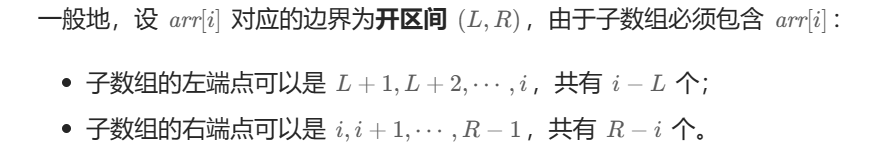

这里需要注意，由于存在相同元素，计算答案时会重复统计同一个子数组，`为避免重复统计，可以修改边界的定义，把右边界改为找小于等于该数的下标`


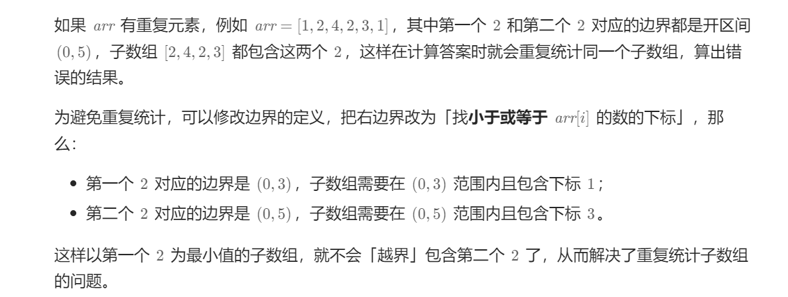


```python
from collections import deque
class Solution:
    def sumSubarrayMins(self, nums) -> int:
        n=len(nums)
        # left[i],right[i]表示nums[i]左小于它的第一个元素的索引，右小于等于它的第一个元素的位置，找不到合适的位置时(两边或数组中最小的元素)，设置为-1和n，方便之后计算。
        left=[-1]*n
        right=[n]*n
        # 使用栈结构找小于它的元素，记录的是坐标
        d=deque()
        ans=0
        # 找左边小于它的元素，栈中大于等于当前值的都没用直接弹出
        for i ,x in enumerate(nums):
            while d and nums[d[-1]]>=x:
                d.pop()
             # 如果栈中还有值，说明这个值是小于当前值的，记录它的索引
            if d: left[i]=d[-1]
            d.append(i)
         # 记得清空栈
        d=deque()
        # 找右边小于等于它的元素，倒序遍历
        for i in range(n-1,-1,-1):
            while d and nums[d[-1]]>nums[i]:
                d.pop()
            if d: right[i]=d[-1]
            d.append(i)
        for i,(l,r,x) in enumerate(zip(left,right,nums)):
            # 最后按照公式解题即可
            ans+=x*(i-l)*(r-i)
        return ans %((10**9)+7)
```


## [子数组范围和](https://leetcode.cn/problems/sum-of-subarray-ranges/)

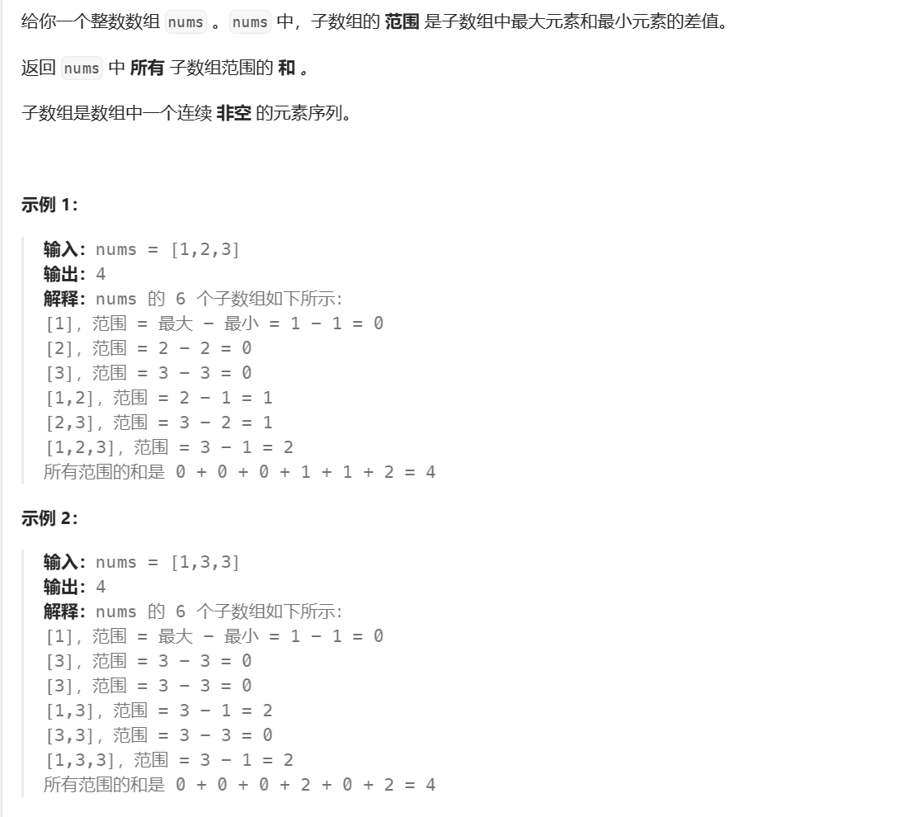

贡献法，技巧点

`转化找所有子数组的最大最小值`：找每个元素作为最大值出现在了多少个区间，以及作为最小值出现在了多少个区间，求每个元素的贡献。

找一个元素作为最大值出现在了多少子数组，就是在这个数组两边找第一个大于他的值的索引（L,R），在这个开区间中包含这个元素的区间数目为：左边可选的开始端点为L+1,L+2,...I,右边的端点为i,i+1,i+2,R-1，存在的区间为（i-l）*(r-i）

```python
import collections
from collections import deque
class Solution:
    def subArrayRanges(self, arr) -> int:
        n = len(arr)
        
        # 进行两次，一次找最大值，一次找最小值
        # 找最大值
        left=[-1]*n
        right=[n]*n
        d=deque()
        ans=0
        for i,x in enumerate(arr):
            # 小于当前值的没有用，弹出
            while d and arr[d[-1]]<=x:
                d.pop()
            if d:left[i]=d[-1]
            d.append(i)
        d=deque()
        for i in range(n-1,-1,-1):
            while d and arr[d[-1]]<arr[i]:
                d.pop()
            if d:right[i]=d[-1]
            d.append(i)

         # 最大值的贡献用于加
        for i ,(l,r,x) in enumerate(zip(left,right,arr)):
            ans+=x*(i-l)*(r-i)

        left = [-1] * n
        right = [n] * n
        d = deque()

        for i ,x in enumerate(arr):
            while d and arr[d[-1]] >= x:
                d.pop()
            if d: left[i] = d[-1]
            d.append(i)
        d = deque()
        for i in range(n - 1, -1, -1):
            while d and arr[d[-1]] > arr[i]:
                d.pop()
            if d: right[i] = d[-1]
            d.append(i)

         # 最小值用于减
        for i, (l, r, x) in enumerate(zip(left, right, arr)):
            ans -= x * (i - l) * (r - i)

        return ans
```


## [最大宽度坡](https://leetcode.cn/problems/maximum-width-ramp/)

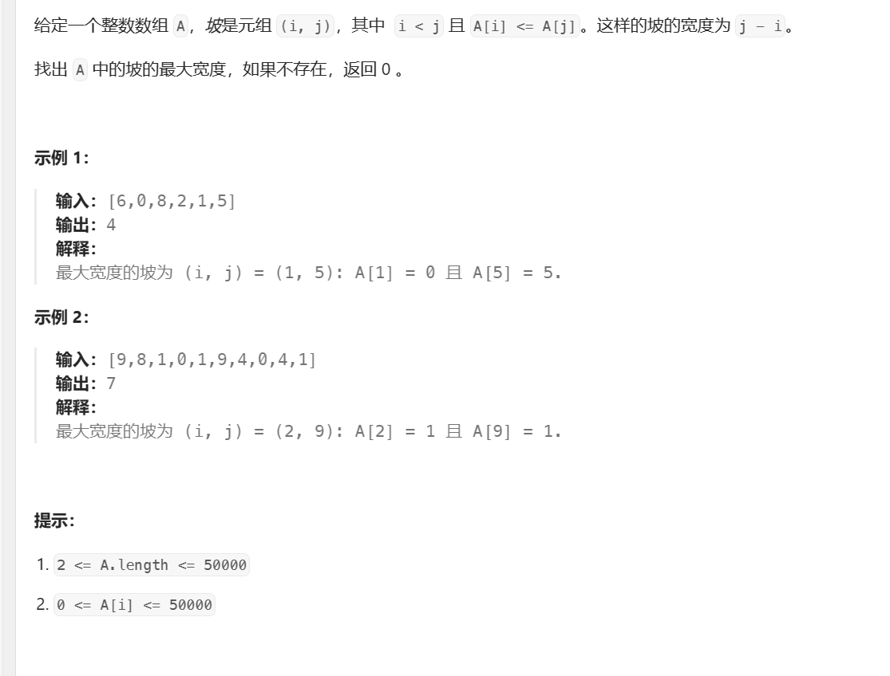


单调栈解决，为了得到最宽的(i,j)，那么需要i尽可能小，j尽可能大.首先从左往右遍历，`在栈中加入递减序列，这些值是可能的i`，对于相同的A[i]肯定是要选择索引小的，对于一个A[i]如果i左边存在一个更小的i，那么当前的区间一定是可以往左扩展的，因此i的左边存的值必须是严格大于它的。

之后从右往左遍历选择j，使得j尽可能大。如果j对应的值大于栈顶对应的值那么这构成了一个区间，弹出栈顶，之后继续比较栈顶（试图扩大区间），如果栈顶空了或者栈顶的值大于当前值，那么退出，进入下一次j循环。

```python
class Solution:
    def maxWidthRamp(self, nums: List[int]) -> int:
        d=deque()
        n=len(nums)
        ans=0
        # 首先从左往右遍历，加入递减序列到栈中，存的是索引
        for i in range(n):
            val=nums[i]
            if not d:
                d.appendleft(i)
            elif val<nums[d[0]]:
                d.appendleft(i)
        for i in range(n-1,-1,-1):
            while d and nums[i]>=nums[d[0]]:
                ans=max(i-d[0],ans )
                d.popleft()
        return ans 
```


## [表现良好的最长时间段](https://leetcode.cn/problems/longest-well-performing-interval/)

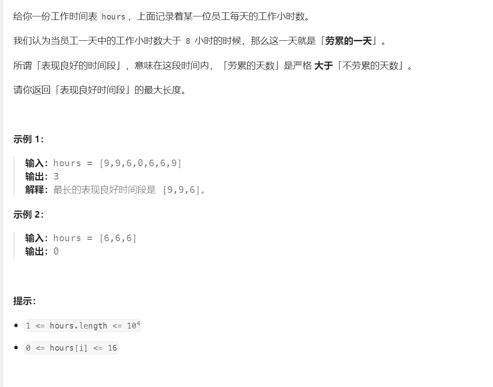

劳累的天数大于不劳累的天数，则应该是前者减去后者的结果大于0，如果令大于8的为1，小于等于为-1（技巧点，统计一个区间内大于某个数的个数比小于等于的个数多的问题转换为求解子数组和的问题），则问题变为找最长的子数组使得这个子数组的和大于0。

找子数组的和，想到使用前缀和数组。根据条件就是去找对于pre[j]找前面小于它的最远pre[i间的距离，使用栈操作，问题同上：如果位置I的左侧存在更小的元素，那么区间一定可以往左扩展，因此要去找从开头的严格递减的序列

```python
class Solution:
    def longestWPI(self, hours: List[int]) -> int:
        # 转化
        nums=[1 if h>8 else -1 for h in hours ]
        # 前缀和加上0可以保证取到从头开始到j的整个数组
        pre=[0]+list(accumulate(nums))
        ans=0
        n=len(pre)
        d=deque()
        # 找严格递减的序列
        for i in range(n):
            # 不会弹出值，只会加入
            if not d or pre[i]<pre[d[-1]]:
                d.append(i)
         # 倒序遍历，对于每个j找左侧小于自己的前缀和
        for i in range(n-1,-1,-1):
            while d and pre[d[-1]]<pre[i]:
                index=d.pop()
                ans=max(ans,i-index)
        return ans 
```

## [股票价格跨度](https://leetcode.cn/problems/online-stock-span/)

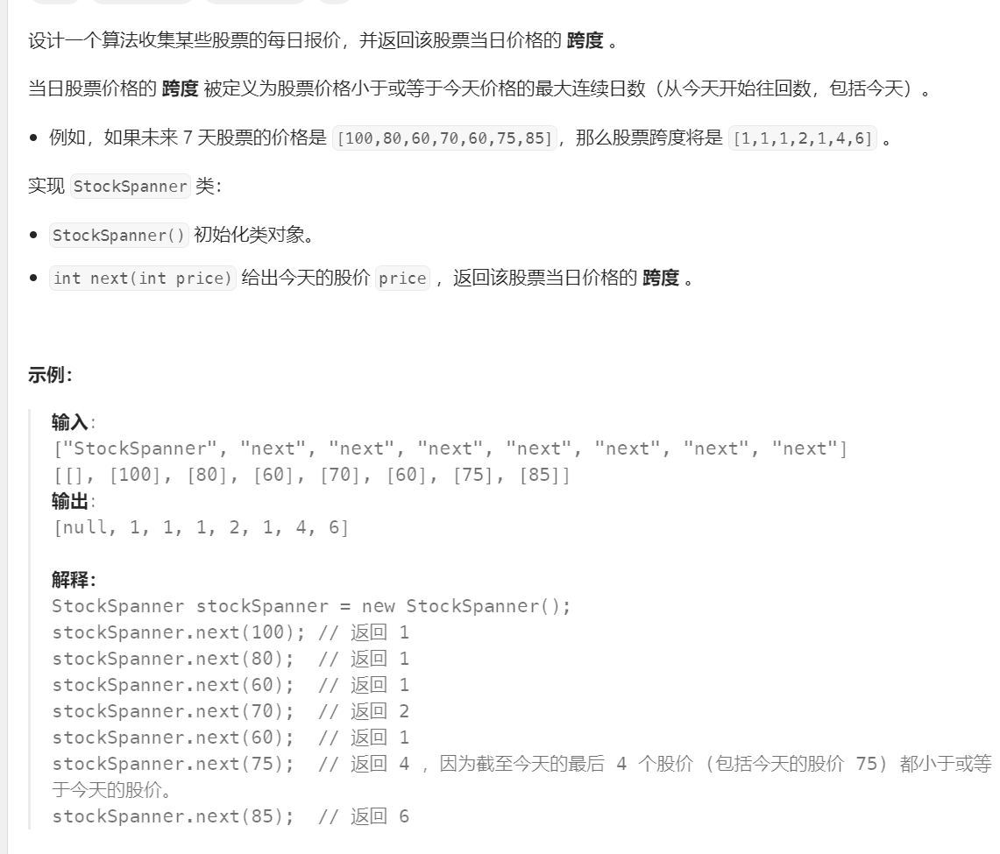 

使用栈解决，栈中记录元素大小同时记录有多少个元素小于当前元素，加入元素时如果栈顶元素小于当前元素那么是没用的弹出同时用一个外部变量记录有多少个小于等于当前元素。

```python
class StockSpanner:

    def __init__(self):
        self.d=deque()

    def next(self, price: int) -> int:
        d=self.d
        cnt=1
        while d and d[-1][0]<=price:
            cnt+=d.pop()[1]
        d.append((price,cnt))
        return cnt
```


## [ 找出最具竞争力的子序列](https://leetcode.cn/problems/find-the-most-competitive-subsequence/)

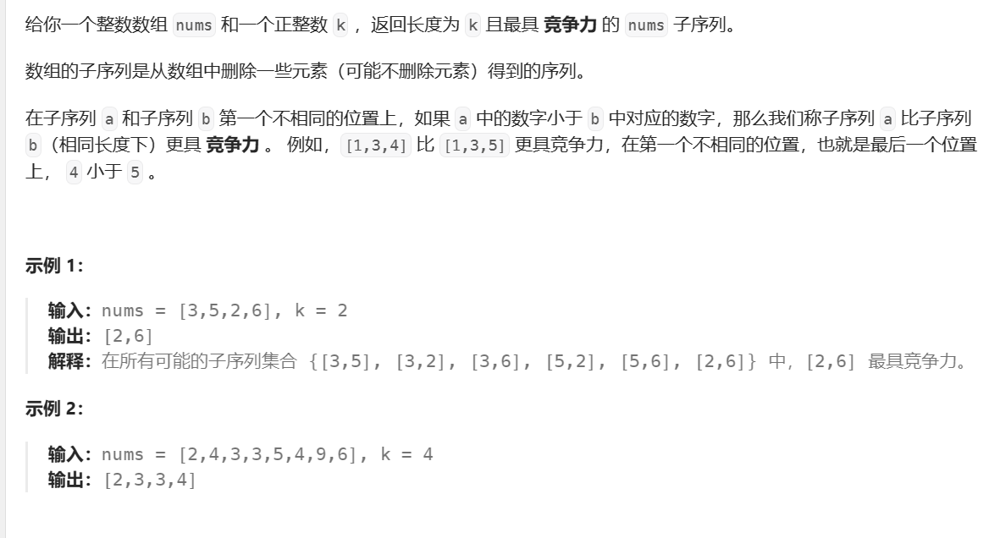

把元素依次入栈，大于栈顶的元素直接加入，小于的弹出栈顶直达不小于，要求保留k个值那么最多只能删除n-k个值。

```python
class Solution:
    def mostCompetitive(self, nums: List[int], k: int) -> List[int]:
        n=len(nums)
        d=deque()
        cnt=0
        ans=[]
        for i,v in enumerate(nums):
            while cnt<n-k and d and v<d[-1]:
                d.pop()
                cnt+=1
            d.append(v)
        for _ in range(k):
            ans.append(d.popleft())
        return ans 
            


```

## [跳跃游戏 VI](https://leetcode.cn/problems/jump-game-vi/)

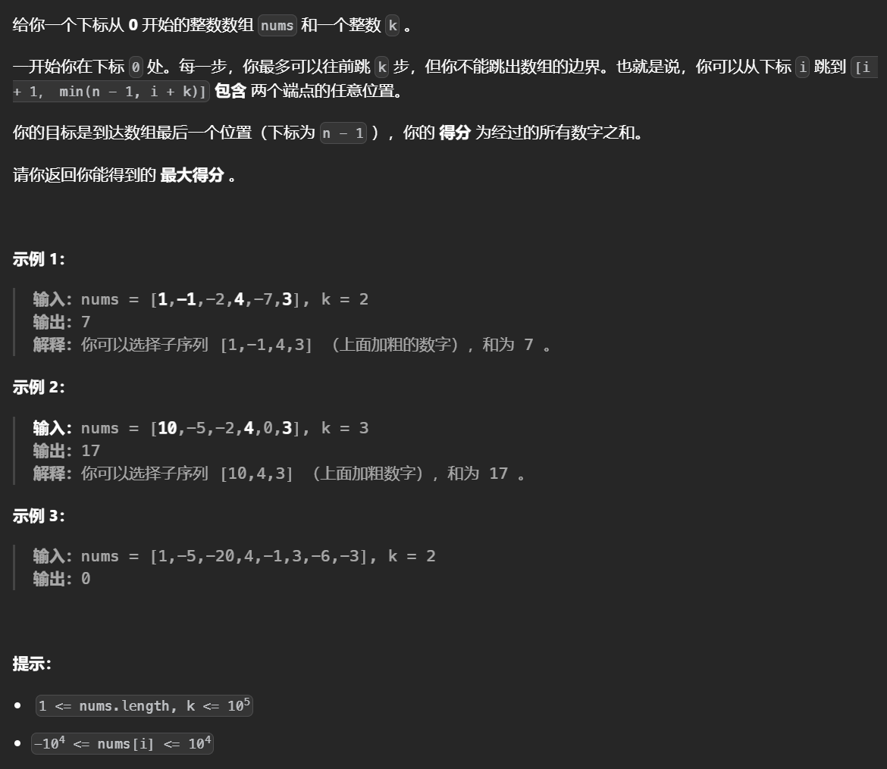

最基本的想法是：

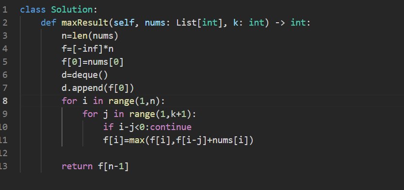

但是会超时，观察注意方程发现，每个状态是由f[i-k]~f[i-1]中最大值决定的，其他的状态无用，在向后遍历的过程中维护一个单调队列即可，类似于滑动窗口最大值的做法

```python
class Solution:
    def maxResult(self, nums: List[int], k: int) -> int:
        n=len(nums)
        f=[-inf]*n
        f[0]=nums[0]
        # 维护队列
        d=deque()
        # 初始时放入base case
        d.append(0)
        for i in range(1,n):
            # 注意当i>=k时，要开始维护队列的长度
            if i>=k:
                while d and d[0]<i-k:
                    d.popleft()
            
            f[i]=nums[i]+f[d[0]]
            # 弹出最大值
            while d and f[d[-1]]<=f[i]:
                d.pop()
            d.append(i)
           
        return f[n-1]
```


## [最大频率栈](https://leetcode.cn/problems/maximum-frequency-stack/)

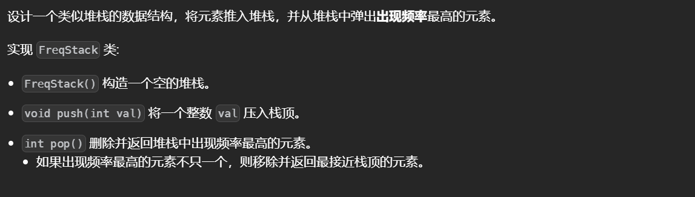

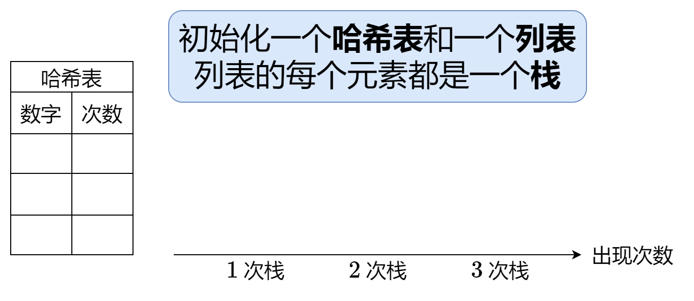

哈希表和栈的结合，为了得到最近出现的元素在添加时应该放到数据结果的末尾，而这个数组结构只能是线性的。	

```python
class FreqStack:

    def __init__(self):
        self.d=[[]]
        self.memo=Counter()

    def push(self, val: int) -> None:
        self.memo[val]+=1
        cnt=self.memo[val]
        if len(self.d)<cnt:self.d.append([val])
        else:self.d[cnt-1].append(val)

    def pop(self) -> int:
        val=self.d[-1].pop()
        # 注意减去
        self.memo[val]-=1
        if not self.d[-1]:self.d.pop()
        return val
```

## [带限制的子序列和](https://leetcode.cn/problems/constrained-subsequence-sum/)

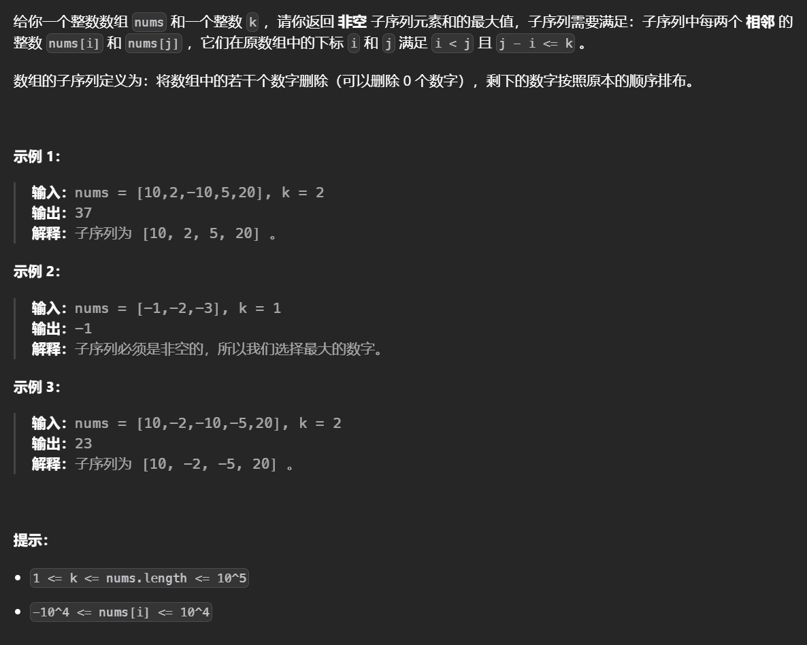

基本的dp是但需要n^2的时间复杂度，选择用线段树优化仍超时

```python
class Solution:
    def constrainedSubsetSum(self, nums: List[int], k: int) -> int:
        n=len(nums)
        f=[0]*n
        f[0]=nums[0]
        t=SegTree(f,lambda x,y:max(x,y))
        for i in range(1,n):
            # res=0
            # for j in range(1,k+1):
            #     if i-j<0:break
            #     res=max(res,f[i-j])
            res=t.query(max(0,i-k),i-1)
            t.update(i,max(nums[i],res+nums[i]))
        return max(t.nums)
```

观察状态转移方程，每个f[i]由f[i-k]\~f[i-1]最大值推出，如果f[k]大于f[k-1]那么f[k-1]在在之后就不会被取到，同时当i右移一位时选取的区间f[i-k]\~f[i-1]将最左边的值去除，同时右边会添加一位，因此可以使用单调栈优化。

```python
class Solution:
    def constrainedSubsetSum(self, nums: List[int], k: int) -> int:
        n=len(nums)
        ans=nums[0]
        d=deque()
        d.append((nums[0],0))
        for i in range(1,n):
            # 最左边的位置超过了i-k
            while d and d[0][1]<i-k:
                d.popleft()
            # 最大值
            x=max(d[0][0]+nums[i],nums[i])
            ans=max(ans,x)           
            # 弹出无用的元素
            while d and d[-1][0]<=x:
                d.pop()
            d.append((x,i))
            
        return ans 
```


## [边界元素是最大值的子数组数目](https://leetcode.cn/problems/find-the-number-of-subarrays-where-boundary-elements-are-maximum/)

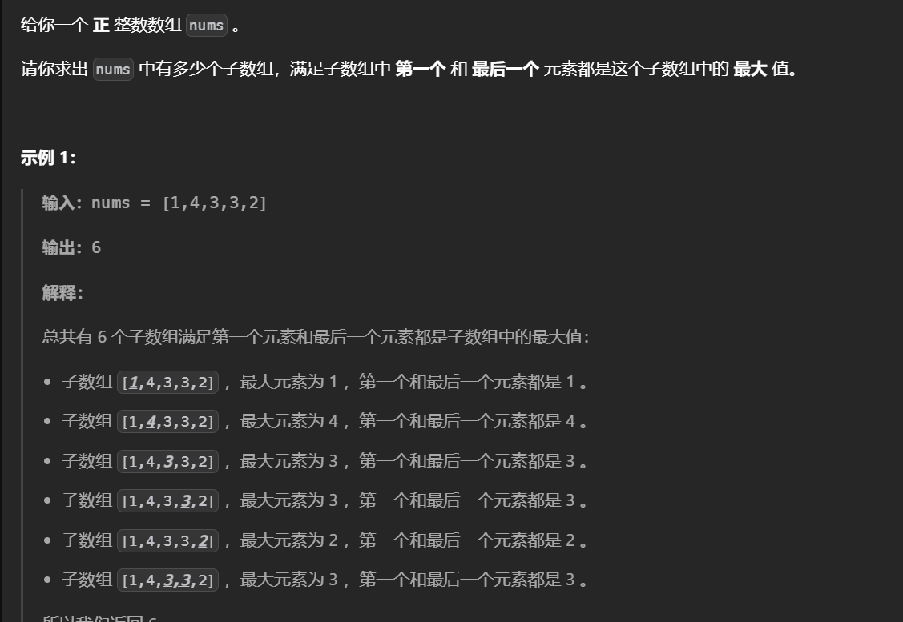

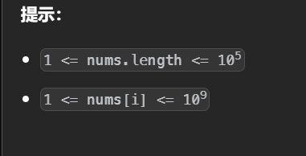


如果一个值的右边存在一个大于他的值，那么这个值就无法与之后相同的值组成一个合法的子数组，在之后这个值就不会用到了，因此所需的元素是单调递减的可以用栈实现，每次遍历到的值如果大于栈顶的元素就一直弹出，最后如果等于栈顶的元素那么就可以与之前出现过的相同的元素匹配一次，栈中存放的是一个值得大小以及出现次数。

```python
class Solution:
    def numberOfSubarrays(self, nums: List[int]) -> int:
        d=deque()
        n=len(nums)
        # 初始时每个元素单独可以作为一个
        ans=n
        for i,v in enumerate(nums):
            # 大于则弹出，这些用不到了
            while d and v>d[-1][0]:
                d.pop()
            if d and d[-1][0]==v:
                # 如果等于则更新结果，然后把次数加一
                ans+=d[-1][1]
                d[-1][1]+=1
            else:
                d.append([v,1])
        return ans 
```

## [替换数组中的非互质数](https://leetcode.cn/problems/replace-non-coprime-numbers-in-array/)

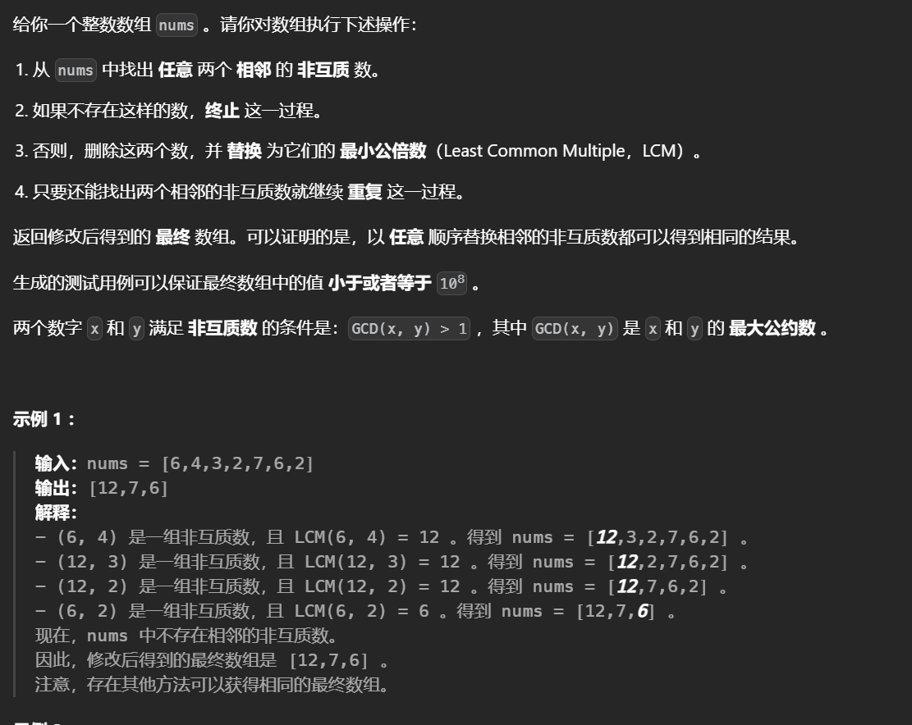

根据题目给定的证明，可以直接用栈模拟

```python
class Solution:
    def replaceNonCoprimes(self, nums: List[int]) -> List[int]:
        d=deque()
        for i,v in enumerate(nums):
            d.append(v)
            while len(d)>=2 and gcd(d[-1],d[-2])!=1:
                x=d.pop()
                d[-1]=lcm(d[-1],x)
        return list(d)

```


## [美丽塔 II](https://leetcode.cn/problems/beautiful-towers-ii/)

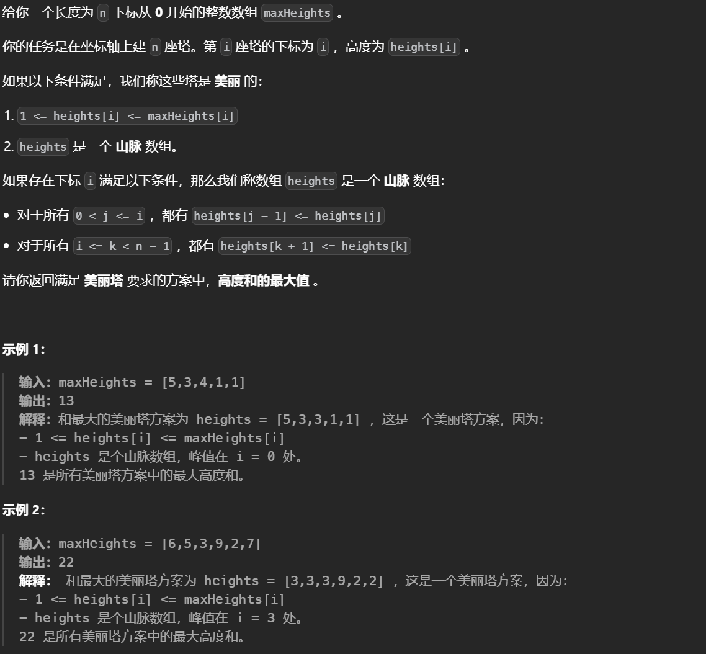

对于山脉数组进行前后缀分解，用栈来维护一个不严格递增的数组，同时使用一个变量记录数组的和。如果当前元素大于等于栈顶元素那么不用操作，如果小于那么弹出栈顶的元素同时变量要减这个元素然后加上当前的元素（也就是把这个元素替换为当前元素）

```python
class Solution:
    def maximumSumOfHeights(self, nums: List[int]) -> int:
        pre=[]
        suf=[]
        d=deque()
        # 哨兵
        d.append(-1)
        temp=0
        for i,v in enumerate(nums):
            # 栈顶元素更大
            while len(d)>1 and nums[d[-1]]>v:
                j=d.pop()
                # 通过坐标相减可以得得出这个位置之前栈顶的元素有多少个，因为对于当前的栈顶元素他前面一定是已经修改过的小于等于它的
                temp-=nums[j]*(j-d[-1])
                temp+=v*(j-d[-1])
            d.append(i)
            pre.append(temp)
            temp+=v
        temp=0
        n=len(nums)
        d=deque()
        d.append(n)
        # 求解后缀
        for i in range(n-1,-1,-1):
            v=nums[i]
            while len(d)>1 and nums[d[-1]]>v:
                j=d.pop()
                temp-=nums[j]*(d[-1]-j)
                temp+=v*(d[-1]-j)
            d.append(i)
            suf.append(temp)
            temp+=v

        suf=suf[::-1]
        ans=0
        # 计算最终结果
        for i,v in enumerate(nums):
            ans=max(pre[i]+suf[i]+v,ans)
        return ans 
```

## Longest Max Min Subsequence

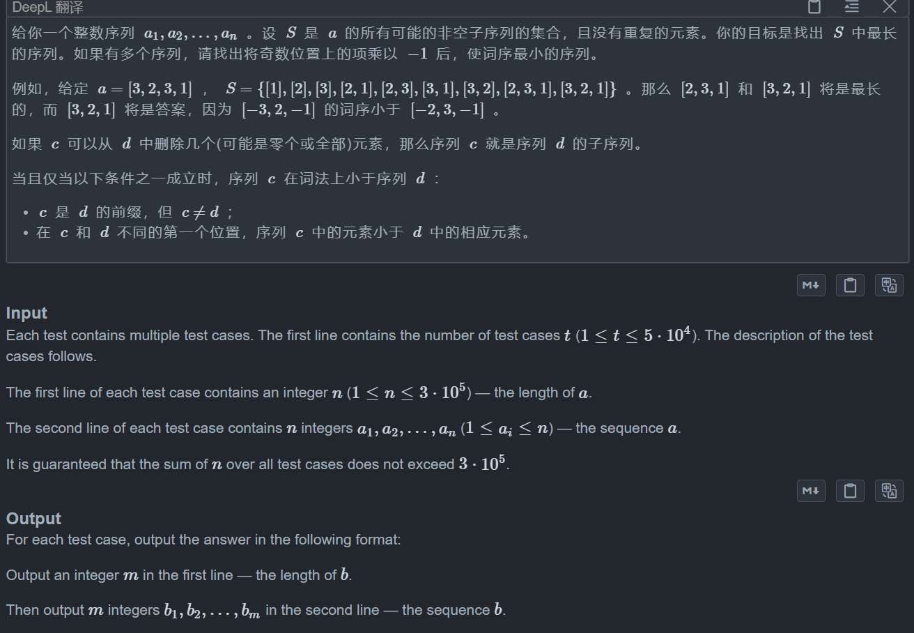

类似于求每个元素恰好出现一次的子序列中字典序最小的序列，对于每个元素在加入栈之前与栈尾作比较，如果栈尾后面还会出现并且大于当前元素那么就弹出栈尾。

本人错误的做法是对于后面会出现的元素储存到另一个栈中，每当往答案栈中添加一个元素时，考虑把前一个栈中的元素按照要求插入答案中。

这里多了一步判断——要求奇数位大而偶数位小

```python
for _ in range(R()):
    n=R()
    nums=RR()
    memo=Counter(nums)
    d=deque()
    vis=set()
    ans=[]
    for x in nums:
        memo[x]-=1
        # 访问过的元素直接跳过
        if x in vis:continue
        # 如果栈尾不如当前元素好那么一直弹出
        while ans and memo[ans[-1]] and ((len(ans)&1==0 and x<ans[-1]) or (len(ans)&1 and x>ans[-1])):
            vis.remove(ans.pop())
        # 不止要看前一个元素还要看倒数第二个元素，比如4 1 4 5 4 5 10 1 5 1，错解为 4 1 10 5，正解为 5 4 10 1
        while len(ans)>=2 and memo[ans[-1]] and memo[ans[-2]] and ((len(ans)&1==0 and x>ans[-2]) or (len(ans)&1 and x<ans[-2])):# 时间复杂度仍是线性的
            vis.remove(ans.pop())
            vis.remove(ans.pop())
        ans.append(x)
        vis.add(x)

    print(len(ans))
    print(*ans)
```


## [z的括号问题]([E-lz的括号问题_牛客小白月赛105](https://ac.nowcoder.com/acm/contest/95937/E))

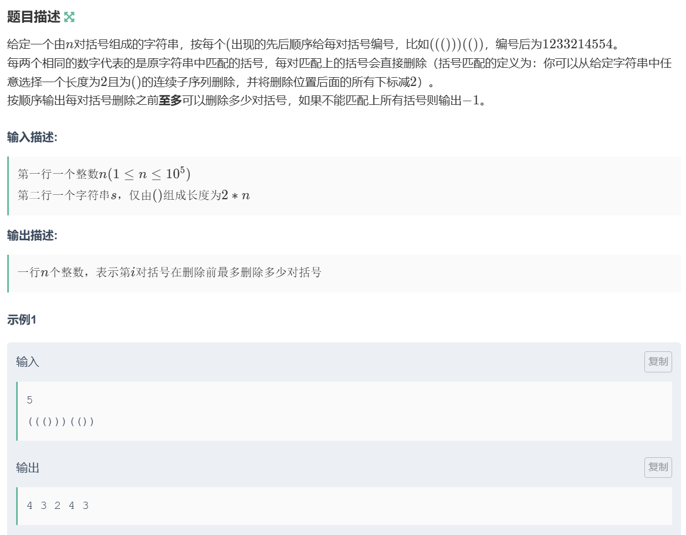

对于每个括号来看，他最多能删除的括号是所有的括号减去包裹它的括号

因此使用栈匹配的过程中，每个左括号对应的答案就是n-len(d)

```python
n=R()
s=input()[:-1]
d=deque()
ans=[]
for r,c in enumerate(s):
    if c=='(':
        d.append(c)
        ans.append(n-len(d))
    elif d:
        d.pop()
    else:
        print(-1)
        exit(0)
print(*ans)
```

## [132 模式](https://leetcode.cn/problems/132-pattern/)

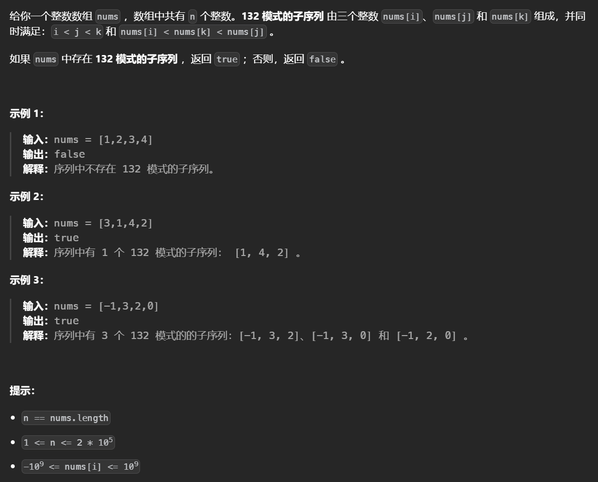

从后往前遍历维护一个单调低递减的栈，用一个变量维护出栈元素的最大值，这个变量就是k值它一定小于当前的栈顶，栈顶维护的相当于j值，枚举的元素实际是i值，这个i值如果小于记录的k那么就有满足的132模式。

```python
class Solution:
    def find132pattern(self, nums: List[int]) -> bool:
        n=len(nums)
        d=deque()
        mx=-inf 
        for x in nums[::-1]:
            # 这里对相等的值特判，不做更新
            while d and d[-1]==x:
                d.pop()
            while d and d[-1]<x:
                mx=max(mx,d.pop())
            if x<mx:
                return True
            d.append(x) 
        return False
```


## [队列中可以看到的人数](https://leetcode.cn/problems/number-of-visible-people-in-a-queue/)

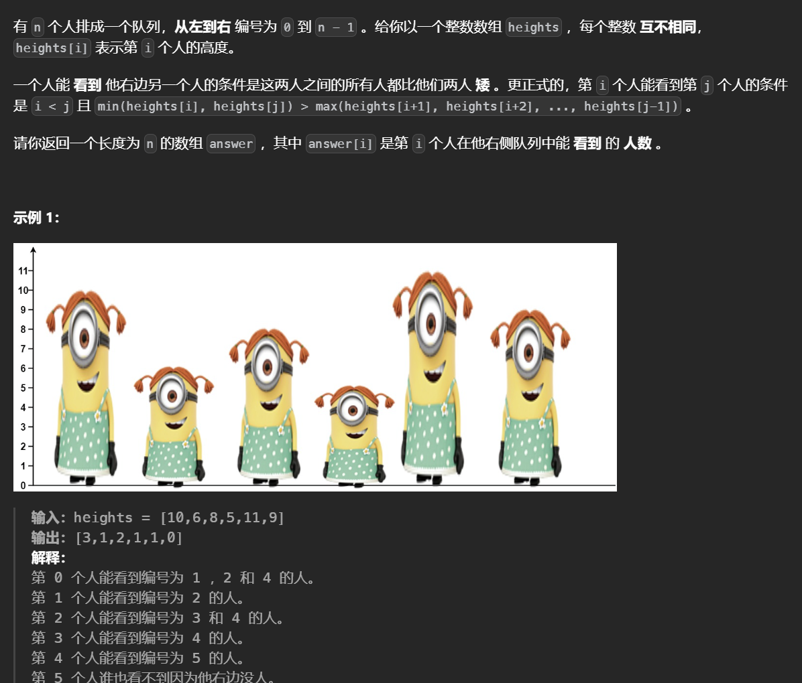


一个值j的左侧如果存在一个更大的元素i，那么j就无法被i左侧的值看到，因此从右往左遍历维护一个单调递减的队列就可以将无法看到的元素弹出，遍历到一个新的值的时候弹出栈顶比它小的值，这些值就是可以被看到的，如果弹出完后栈中还有值（大于当前值），那么栈顶的值就是右侧最后一个能看到的值。

```python
class Solution:
    def canSeePersonsCount(self, nums: List[int]) -> List[int]:
        n=len(nums)
        ans=[0]*n
        d=deque()
        for i in range(n-1,-1,-1):
            x=nums[i]
            cnt=0
            while d and d[-1]<=x:
                d.pop()
                cnt+=1
            if d:cnt+=1
            ans[i]=cnt
            d.append(x)
        return ans 
```


## [ 在一个网格中可以看到的人数](https://leetcode.cn/problems/number-of-people-that-can-be-seen-in-a-grid/)

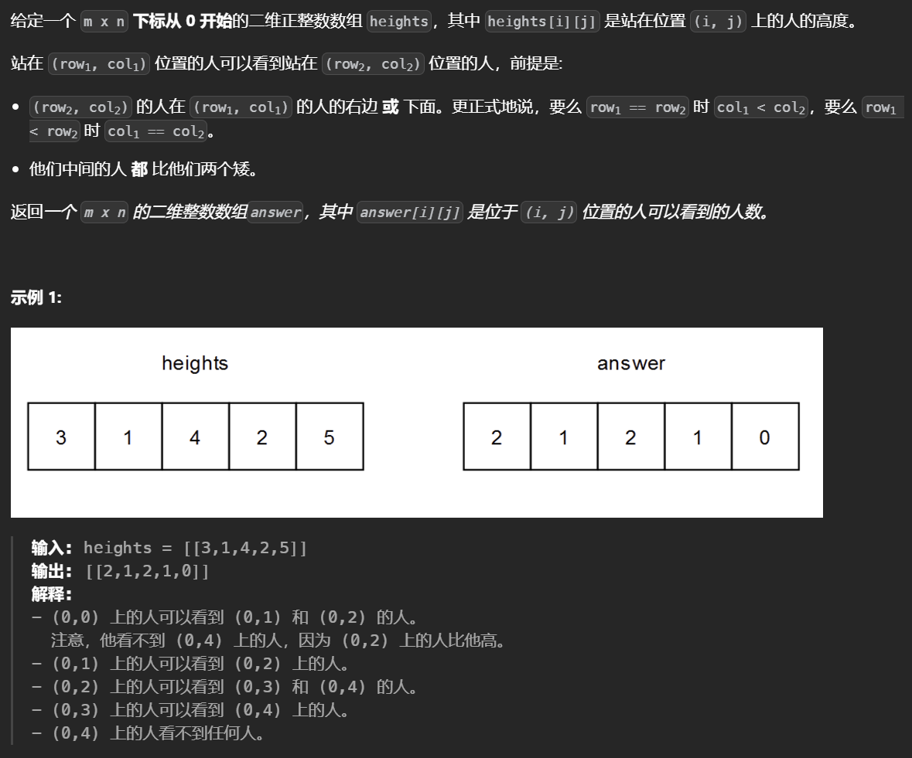

与上一题套路一样，**如果栈顶的值小于当前枚举的值那么栈顶的值是无法被左侧的值看到的，因此弹出栈顶将次数加一，对每一行每一列都做一次。**

但是这里的是可能出现**相同的值**，当栈顶的值与枚举的值相同时，这个值应该作为终点记录一次，然后弹出它但不再记录次数，如果不弹出留在栈中则会导致左侧更大的元素记录这些相同的值。

```python
class Solution:
    def seePeople(self, heights: List[List[int]]) -> List[List[int]]:
        def cal(nums):
            n=len(nums)
            res=[0]*n
            d=deque()
            
            for rr in range(n-1,-1,-1):
                x=nums[rr]
                cnt=0
                while d and x>nums[d[-1]]:
                    d.pop()
                    cnt+=1
                if d and d:
                    cnt+=1
                while d and x==nums[d[-1]]:
                    d.pop()
                res[rr]=cnt
                d.append(rr)
            return res
        rows=[cal(row) for row in heights] 
        cols=[cal(col) for col in zip(*heights)]
        m,n=len(heights),len(heights[0])
        ans=[]
        for i in range(m):
            temp=[]
            for j in range(n):
                temp.append((rows[i][j])+(cols[j][i]))
            ans.append(temp)
        return ans 
```


## [下一个更大元素 IV](https://leetcode.cn/problems/next-greater-element-iv/)

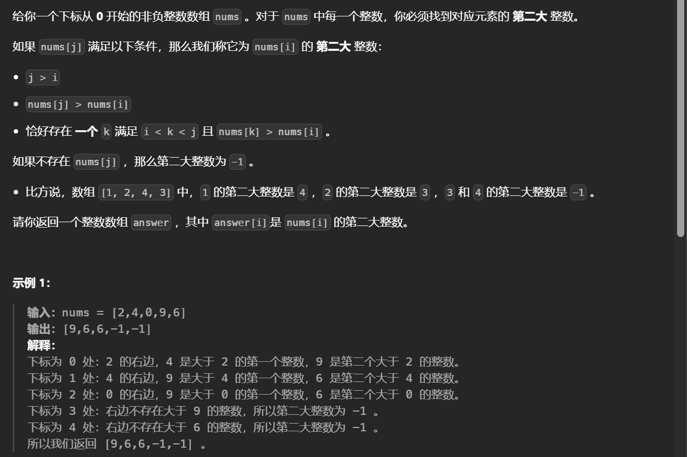

从左到右遍历数组，做两次单调栈d和tmp，每个元素入栈前将d中所有小于自己的弹出，这些元素找到了第一个比自己大的，随后当前元素对tmp中做同样的操作，tmp中存储的是从d中弹出的元素，从tmp中弹出的元素即找到了第二个比自己大的元素，最后将从d中弹出的元素按顺序放入到tmp中。

```python
class Solution:
    def secondGreaterElement(self, nums: List[int]) -> List[int]:
        d=deque()
        tmp=deque()
        n=len(nums)
        ans=[-1]*n
        for i,x in enumerate(nums):
            # 处理tmp中的元素，这些事已经找到了第一个更大的元素的元素，如果被弹出则找到了第二个更大的元素
            while tmp and nums[tmp[-1]]<x:
                ans[tmp.pop()]=x
            temp=[]
            # 能弹出说明找到了第一个更大的元素
            while d and nums[d[-1]]<x:
                temp.append(d.pop())
            # 将这些元素按照递减顺序加入到tmp中，注意要先处理tmp再加入新的元素
            tmp.extend(temp[::-1])
            d.append(i)
        return ans 
```

## [移掉 K 位数字](https://leetcode.cn/problems/remove-k-digits/)


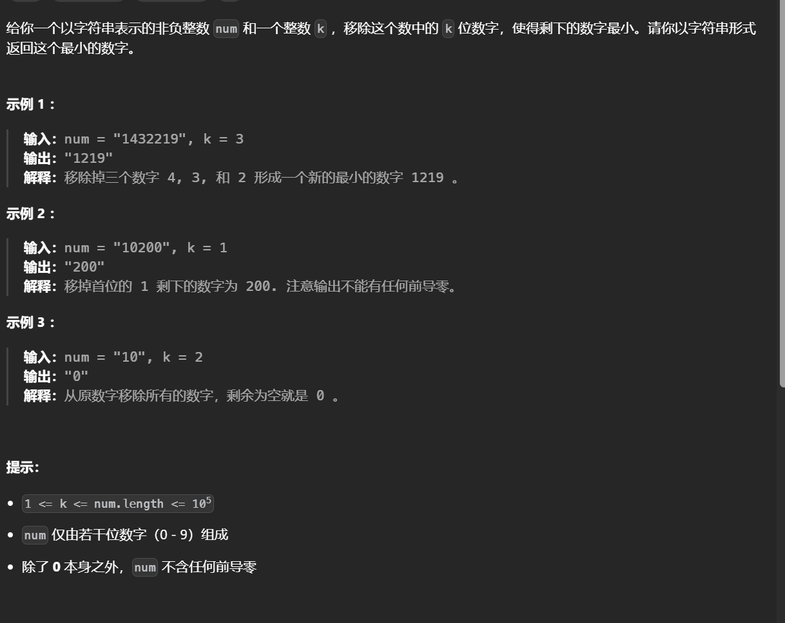

维护一个非严格递增的序列，一旦元素小于栈顶，那么栈顶一定是要弹出的，遍历结束后如果还可以操作那么就从删除末尾的元素，在返回答案之前删除所有的首位0。

```python
class Solution:
    def removeKdigits(self, nums: str, k: int) -> str:
        n=len(nums)
        if k>=n:
            return '0'
        less=[n]*n
        d=deque()
        for i,x in enumerate(nums):
            while d and d[-1]>x and k>0:
                k-=int(d.pop()!='0')    
            d.append(x)
        
        while d and d[0]=='0':d.popleft()
        # 判断一下防止取到0
        if k>0:d=list(d)[:-k]
        ans=''.join(d)
        return ans if ans  else  '0'
```


## [使数组按非递减顺序排列](https://leetcode.cn/problems/steps-to-make-array-non-decreasing/)

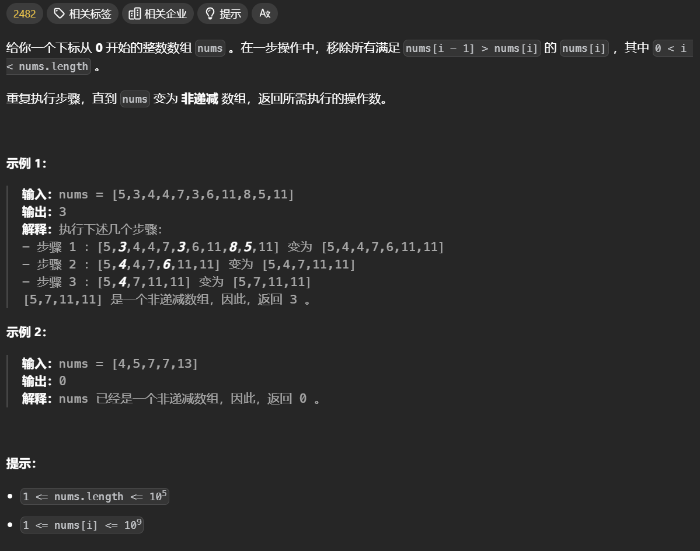

问题可以理解为每个元素把右侧更小的元素都删除的最大时间

从右往左枚举，当元素入栈前将栈中小于自己的元素都弹出，该元素至少需要max(cnt+1,next)的时间，因为元素都是可以并行删除的

```python
class Solution:
    def totalSteps(self, nums: List[int]) -> int:
        d=deque()
        
        for x in nums[::-1]:
            cnt=0
            while d and x>d[-1][0]:
                _,t=d.pop()
                cnt=max(cnt+1,t)
            d.append([x,cnt])
        return max(cnt for _,cnt in d)
```


## [车队 II](https://leetcode.cn/problems/car-fleet-ii/)

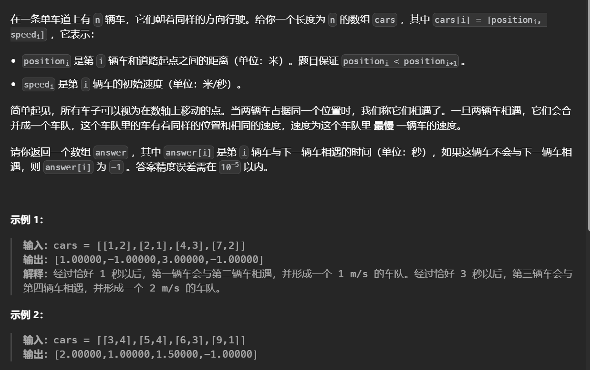

想要计算一辆车追上下一俩车的时间还要考虑，下一辆车是否会再追上下下一辆车，这里不需要考虑前一辆车的影响，因为如果前一辆车能追上组成车队，当前车的位置和速度也不会变。

从右往左枚举，如果不能追上栈顶的车那么从栈中删除这辆车，因为他对左侧的车没有影响，同时如果当前车追上栈顶的车的时候，栈顶的车已经追上后一辆车了组成车队了，也就是当前车需要追上前前一辆车，因此栈顶的车不再有影响了可弹出。

```python
class Solution:
    def getCollisionTimes(self, nums: List[List[int]]) -> List[float]:
        d=deque()
        n=len(nums)
        # 初始化最右侧的车
        d.append(n-1)
        res=[-1]*n
        for i in range(n-2,-1,-1):
            p,c=nums[i]
            # 如果追不上或者追的太慢了就弹出，这里特判等于-1的情况，为了简化代码没有设置为inf，这样追不上的可以直接跳过不用设置答案
            while d and (nums[d[-1]][1]>=c or ( res[d[-1]]!=-1 and (nums[d[-1]][0]-p)/(c-nums[d[-1]][1])>res[d[-1]])):
                d.pop()
            if d:
                res[i]=(nums[d[-1]][0]-p)/(c-nums[d[-1]][1])
            d.append(i)
        return res 
```


# 矩形面积

## 矩形牛棚

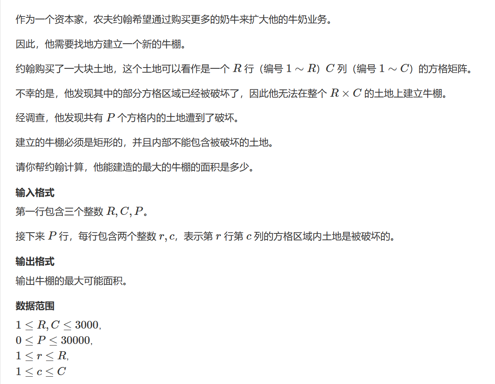


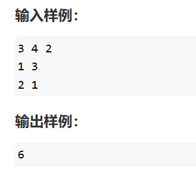


样例类似于：

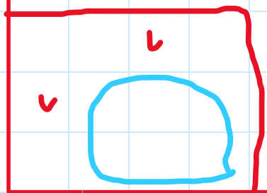


枚举每一条下边界，求以这个下边界为底找最大的矩形面积，问题转换为直方图中的最大矩形，对于一条下边它每个位置上的直方高是多少使用递归求解如果这个位置上有一个破坏的点那么它的高是0，否则是上一行的高加上一。

```python
from collections import deque
import copy
import sys
input=sys.stdin.readline

m, n, c = [int(x) for x in input().split()]

# 记录破坏的点
grid=[[0]*n for _ in range(m)]
# 记录每个位置上直方的高
h=[[0]*n for _ in range(m)]


for _ in range(c):
    a, b = [int(x)-1 for x in input().split()]
    grid[a][b]=1

# 迭代求解
h[0]=[v^1 for v in grid[0]]
for i in range(1,m):
    for j in range(n):
        if not grid[i][j]:h[i][j]=h[i-1][j]+1

ans = 0
# 枚举每个高
for b in range(m):
    nums =h[b]
    l = [0]*n
    r = [0]*n
    d = deque()
    # 单调栈计算左右位置
    for i in range(len(nums)):
        v = nums[i]

        while d and nums[d[-1]] >= v:
            d.pop()
        if d:
            l[i]=d[-1]
        else:
            l[i]=-1
        d.append(i)
    d = deque()
    for i in range(n- 1, -1, -1):
        v = nums[i]
        while d and nums[d[-1]] >= v:
            d.pop()
        if d:
            r[i]=d[-1]
        else:
            r[i]=n
        d.append(i)
    
    for i, v in enumerate(nums):
        ans = max(ans, (v) * (r[i] - l[i]-1))
print(ans)
```


## 直方图中最大的矩形

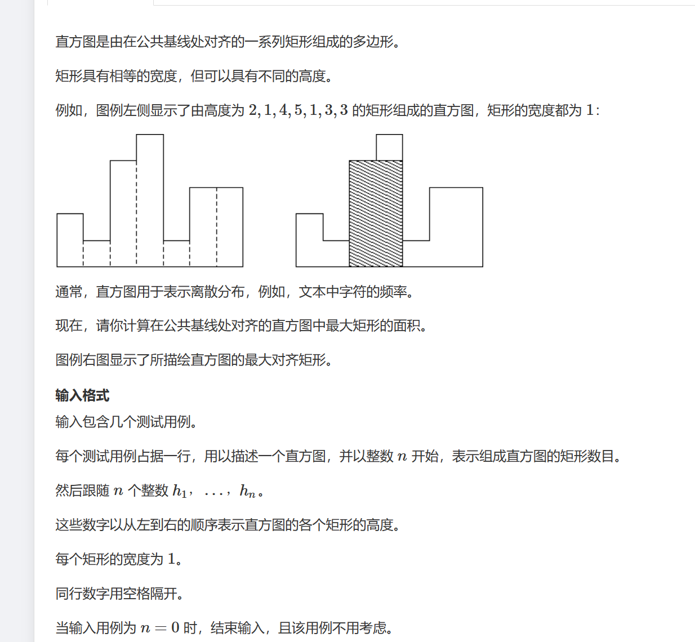


枚举每一个上边，以该上边形成的最大矩形取决于两边比它小的上边的位置，使用单调栈找出两边小于它的位置即可。

```python
from math import inf
import sys
from collections import deque

input = sys.stdin.readline
while 1:
    nums = [int(x) for x in input().split()][1:]
    if len(nums) ==0:
        break
    # 储存左边小于的，右边小于的
    l = []
    r = []
    # 栈中储存的是下标
    d = deque()
    ans = -inf
    for i, v in enumerate(nums):
        if not d:
            l.append(-1)
            d.append(i)
            continue
        # 大于的值没必要留在栈中，因为只会取到小的值
        while d and nums[d[-1]] >= v:
            d.pop()
        if not d:
            l.append(-1)
        else:
            l.append(d[-1])
        d.append(i)
    # 注意清空栈
    d=deque()
    for i in range(len(nums) - 1, -1, -1):
        v = nums[i]
        if not d:
            r.append(len(nums))
            d.append(i)
            continue
        while d and nums[d[-1]] >= v:
            d.pop()
        if not d:
            r.append(len(nums))
        else:
            r.append(d[-1])
        d.append(i)
    r = list(reversed(r))
    for i, v in enumerate(nums):
        ans = max(ans, v * (r[i] - l[i] - 1))
    print(ans)
```

## [接雨水](https://leetcode.cn/problems/trapping-rain-water/)

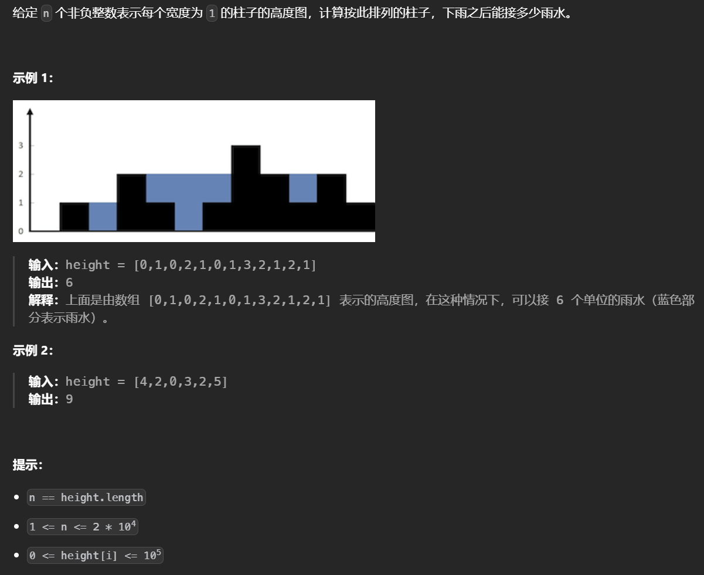

使用栈保存每堵墙，如果当前的墙小于栈顶则说明会有积水，如果大于则前面的积水到这里停下，因此相当于用栈保存一个单调递减的序列。

在计算积水时，应当去找栈顶的后一位，一层一层的计算积水。


```python
class Solution:
    def trap(self, nums: List[int]) -> int:
        # 栈中保存坐标，因为要计算宽度
        d=deque()
        ans=0
        for i,x in enumerate(nums):
            # 要找到左侧更大的，因为是一层层的计算相同的高度也要弹出
            while d and x>=nums[d[-1]]:
                # 弹出栈顶
                h=nums[d.pop()]
                # 如果左侧不存在墙，则说明当前位置是积水的起始位置，直接退出
                if not d:break
                # 积水的高度由两侧最低的高度绝地给
                ans+=(min(x,nums[d[-1]])-h)*(i-d[-1]-1)
            d.append(i)
        return ans 
```

