# 回溯算法（DFS）

回溯算法需要确定：路径（已做出的选择），选择列表（可以做的选择），结束条件（无法再做选择的条件），本质上是一种暴力穷举的算法，复杂度一般都很高。

其基本框架如下，核心是for循环中的递归，在递归调用之前做选择，然后在递归中根据这个选择深入，在递归调用之后撤销选择


`回溯有一个很重要的优化就是从大到小去回溯，这样可以更快的选出不合法的值大大减小状态数目`。

在一些题目中需要枚举字符串或数组的切分点，定义dfs(i)表示从i位置开始切割，然后枚举后面的位置作为切分点

```python
result=[]
def backtrace(路径,选择列表):
	if 满足结束条件:
		result.add(路径)
		return 
	for 条件 in 选择列表:
		做选择
        backtrace(路径,选择列表)
        撤销选择
```


**当只需要找到一个合适的状态时，需要给回溯一个返回值以便及时终止搜索，防止访问所有的状态。**

```python
def dfs():
	if base case:
        ans=xxx
        return True
   	for i in range(n):
        xxx
		if dfs(i):return True
    	xxx
    return False
```


## 子集（包括重复元素）

每个元素有选或者不选，对于数组[1,2,2]选择第一个2和第二个2都是一样的，因此对于当前的x，如果前面有相同的y并且没有被选择那么这个元素应该被跳过否则会出现相同的子集

```python
class Solution:
    def subsetsWithDup(self, nums: List[int]) -> List[List[int]]:
        #通过排序将相同的元素集中到一起
        nums.sort()
        vis=set()
        ans=[]
        # 每个元素选或者不选
        def dfs(i,path):
            if i==len(nums):
                ans.append(path[:])
                return 
            # 判断需要跳过的情况
            if not (i>0 and nums[i-1]==nums[i] and i-1 not in vis):
                path.append(nums[i])
                vis.add(i)
                dfs(i+1,path)
                vis.remove(i)
                path.pop()
            dfs(i+1,path)
            
        dfs(0,[])
        return ans 
```

### 组合总和（元素重复）

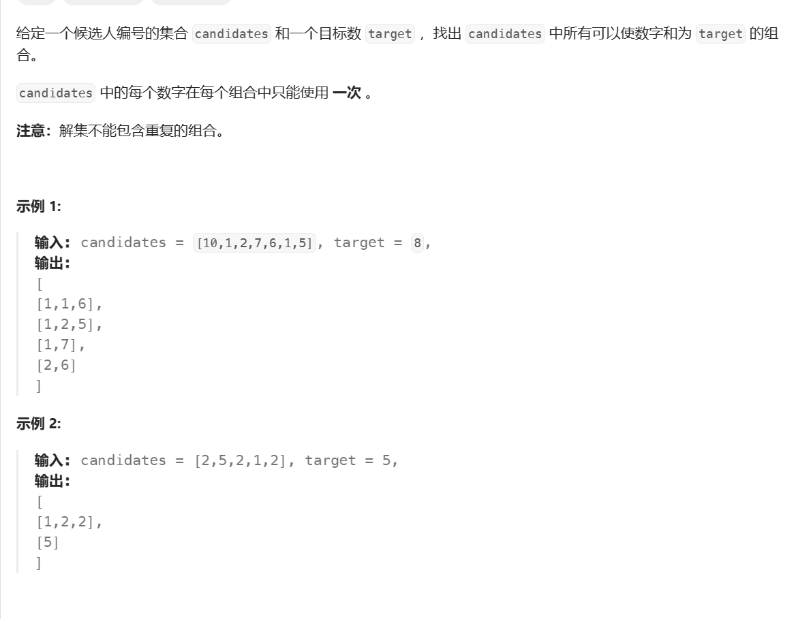

元素重复可能会出现相同的结果，因此对于当前的x，如果前面有相同的y并且没有被选择那么这个元素应该被跳过否则会出现相同的子集。

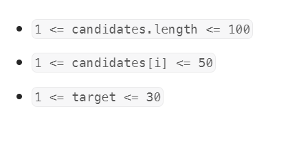

给定的数据范围不能枚举每个（选或不选），这里通过规定起始点来标定每次选择的元素，

```python
class Solution:
    def combinationSum2(self, candidates: List[int], target: int) -> List[List[int]]:
        res=[]
        n=len(candidates)
        # 排序
        candidates.sort()
        vis=set()
        def dfs(i,target,path):
            # 合理的
            if not target:
                res.append(path[:])
                return 
            # 不合法的
            if target<0:
                return 
            
            for j in range(i,n):
                if j>0 and candidates[j]==candidates[j-1] and j-1 not in vis:
                    continue
                # 剪枝
                if target-candidates[j]<0:
                    break
                # 回溯
                vis.add(j)
                path.append(candidates[j])
                dfs(j+1,target-candidates[j],path)
                path.pop()
                vis.remove(j)
        dfs(0,target,[])
        return res 
```

### 组合总和（可重选）

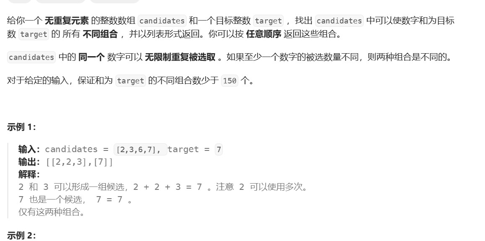

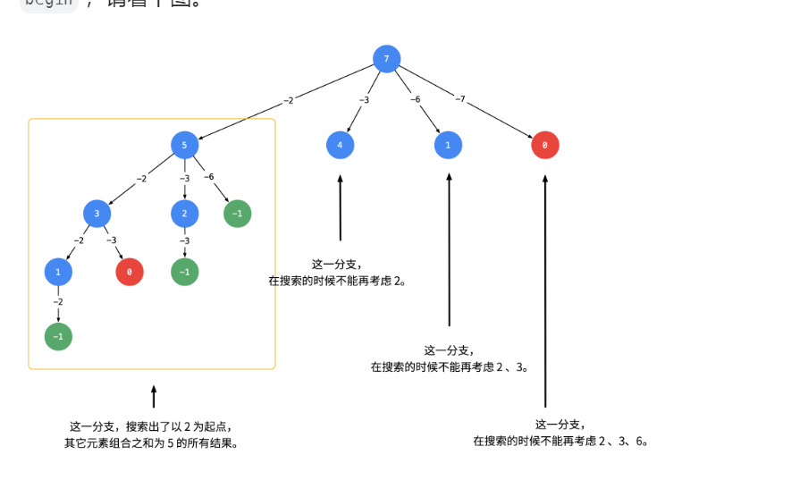

通过树形图可以看出不能考虑每个元素选或者不选，一个元素可以选多次而这个可以通过控制区间来实现。

先将数组排序，这样选的过程中如果当前的元素选了会使target小于0，那么这个元素之后的也一定会，因此可以直接退出。

```python
class Solution:
    def combinationSum(self, candidates: List[int], target: int) -> List[List[int]]:
        res=[]
        n=len(candidates)
        # 排序
        candidates.sort()
        def dfs(i,target,path):
            # 合理的
            if not target:
                res.append(path[:])
            # 不合法的
            if target<0:
                return 
            for j in range(i,n):
                # 剪枝
                if target-candidates[j]<0:
                    break
                # 回溯
                path.append(candidates[j])
                dfs(j,target-candidates[j],path)
                path.pop()
        dfs(0,target,[])
        return res 
```


### 全排列（包含重复元素）

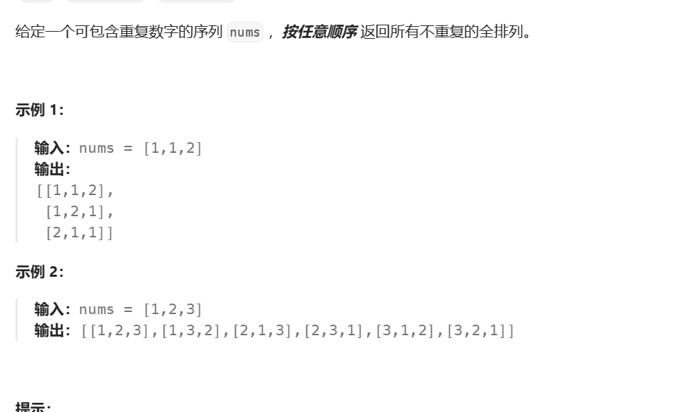

字典的妙用，使用字典初始化列表使得需要遍历的次数减少，无与伦比的剪枝，此外最重要的是规定了一个元素出现的次数，绝对不会超出。（技巧点）

通过字典可以排除重复的全排列序列

```python
from collections import Counter
class Solution(object):
    def permuteUnique(self, nums):
        memo=Counter(nums)
        ans=[]
        vis=[False]*len(nums)
        def dfs(path):
            if len(path)==len(nums):
                ans.append(path[:])
                return 
            for d in memo:
                if memo[d]>0:
                    memo[d]-=1
                    path.append(d)
                    dfs(path)
                    path.pop()
                    memo[d]+=1
        dfs([])
        return ans 
```


### 划分为K个相等的子集

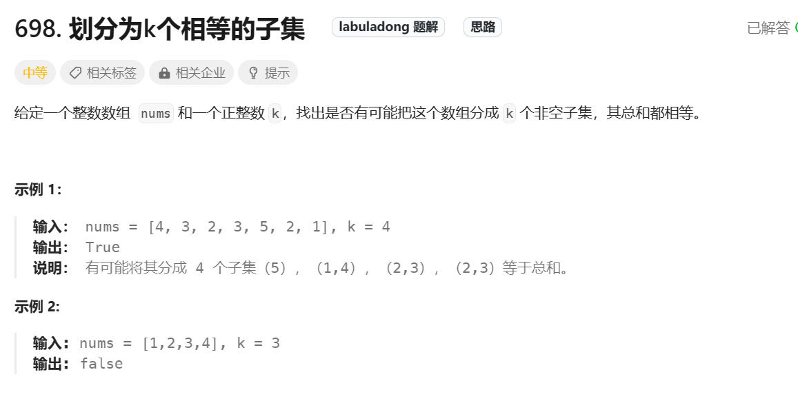

按照球盒模型理解，K个盒子N个球，每个盒子遍历一遍数组，从中选取合适的值加入到盒子中，盒子满了就换下一个盒子

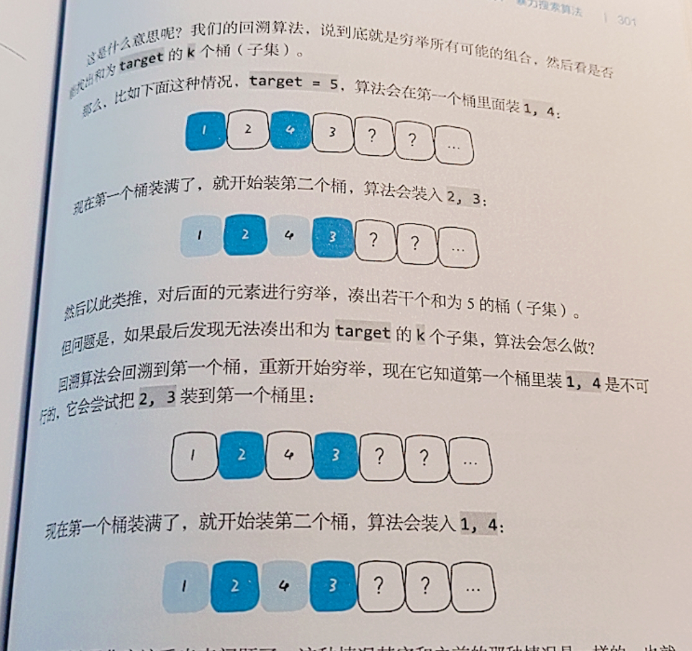

两个盒子可能出现一样的选球组合：当前一个盒子的组合（比如说选了1，5）后面的无论怎么组合结果都是不对的，那么会进行回溯，这是前一个选了（2，4）后一个盒子有可能拿到（1，5）那么结果是已经确定了的，使用哈希表记录下每个失败的组合，当盒子选到失败的组合直接返回

```python
class Solution(object):
    def canPartitionKSubsets(self, nums, k):
	# 数组长度没有要划分的集合多
        if k>len(nums):
            return False
        # 数字总和
        vals=sum(nums)
	# 数字总和无法被均分为K份
        if vals%k!=0:
            return False
        # 每个盒子中数字的总和
        target=vals//k
        # 记录数字是否被加入,使用位图的方式记录，节省空间并且方便记录到字典中
        used=0
        # 字典，防止重复求解
        self.hash={}
        return self.backtrace(nums,target,0,used,k,0)
    # nums数组，target每个盒子中的数，start当盒子中加入了一个数后，下一个数从哪里开始找，k表示当前是第几号盒子，bucket当前盒子中的数
    def backtrace(self,nums,target,start,used,k,bucket):
        if not k:
            return True
        if bucket==target:
            # 当前盒子满了求解下一个盒子
            res=self.backtrace(nums,target,0,used,k-1,0)
            # 记录装满这个盒子方式的结果
            self.hash[used]=res
            return res
        # 这个方式已经求过了，直接返回结果
        if used in self.hash:
            return self.hash[used]
        for i in range(start,len(nums)):
            # 位运算，判断第i位是否为1（TRUE）
            if (used>>i)&1==1:
                continue
            # 大了
            if bucket+nums[i]>target:
                continue
			# 更新
            bucket+=nums[i]
            # 将第i位设置为1
            used|=1<<i
            # 从下一个位置开始选数填入桶中，如果能满足，直接返回
            if self.backtrace(nums,target,i+1,used,k,bucket):
                return True
            bucket-=nums[i]
            # 第i位设置为0
            used^=1<<i
        # 穷举了所有数字都无法装满桶
        return False
```


从球的视角看就是每个球有k种选择，对每个合法的选择都进行一次

这里一个重要的剪枝是当两个盒子有相同的值的时候，当前的球放到哪一个中结果都是一样的

```python
class Solution:
    def canPartitionKSubsets(self, num	s: List[int], k: int) -> bool:
        # 通过排序保证值往一个方向走，同时每次都是找没有被选的最大的球，如果较大的球无法塞入那么小的也一定不行，这样可以更快的筛出无用的结果
        nums.sort(reverse=True)
        # 可行性剪枝
        total=sum(nums)
        n=len(nums)
        if total%k:
            return False
        target=total//k
        # 记录k个盒子中储存的值
        buckets=[0]*k
        # i表示第几个球
        def dfs(i):
            # 能走到最后就是一个可行的解
            if i==n: return True
      	  # 遍历每一个盒子，就是在模拟球放入每一个盒子
            for j in range(k):
                # 如果当前盒子和前一个盒子储存的值是一样的，相当于把球塞入两个相同的箱子，那么结果也是一样的（False）
                if j>0 and buckets[j]==buckets[j-1]:continue 
                # 如果超出盒子容积了，换下一个盒子
                if buckets[j]+nums[i]>target:continue
                # 递归，看下一个球
                buckets[j]+=nums[i]
                if dfs(i+1):
                    return True
                buckets[j]-=nums[i]
            return False
        return dfs(0)
```


以盒子的视角来看，每个盒子遍历一遍数组，每个值有加入和不加入两种情况，时间复杂度为$$2^{kn}$$

以球的视角n个数字每个数字有k个桶可供选择，时间复杂度为$$k^{n}


## 木棒

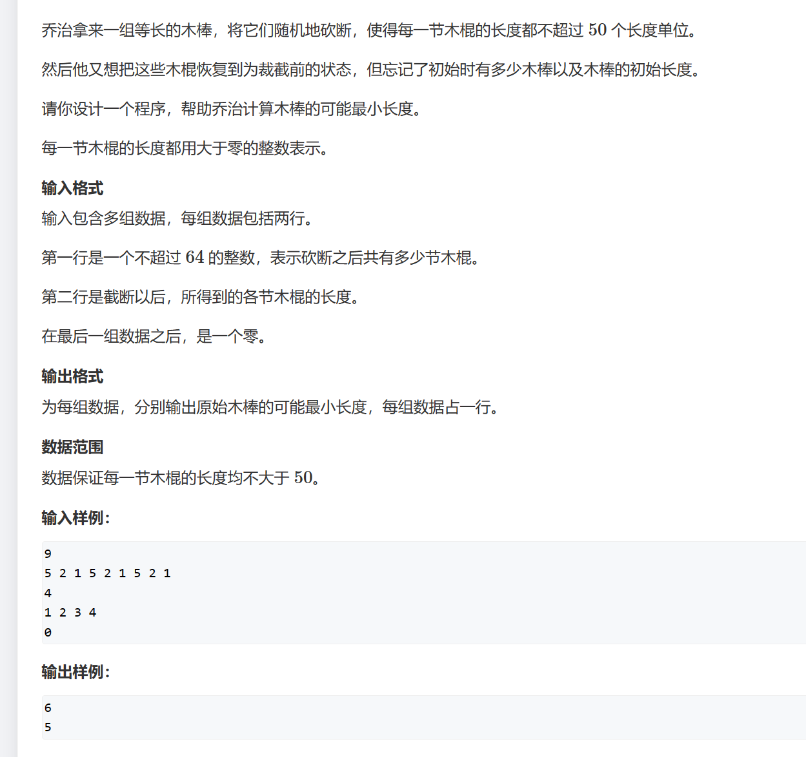

回溯加剪枝，枚举每个长度找是否可以划分，类似于划分K个相等的子集，给定m个桶每个桶的值为n

剪枝：

+ 对于相同的值，如果之前选了这个值不行，那么再选相同的值结果也是一样的
+ 如果前面选了先选了1再选了5，而后不能先选5在选1，结果是一样的，所以start 不会从头开始
+ 对于一个桶，如果他第一个放入的值不行就退出。反证法：如果存在一组合法的方案，那么这根木棍一定是存在于某组木棍中，因为组内木棍的顺序是任意的，所以可以将其调至为第一根木棍，故和已知牟盾。
+ 同理，对于一个桶，如果他最后放入的值不行就退出。


```python
import sys
input=sys.stdin.readline
# u表示桶的数目，curr表示当前桶内的值,start表示从第几个开始，k表示目标值
def dfs(u,curr,start,k):
    # 找到了合适的组合
    if u*k==total:return True
    # 一个桶满了
    if curr==k:return dfs(u+1,0,0,k)
    
    i=start
    # 往桶里装值
    while i<n:
        # 访问过
        if vis[i]:
            i+=1
            continue
        # 超出了 
        if curr+nums[i]<=k:
            vis[i]=True
            #  回溯
            if dfs(u,curr+nums[i],i+1,k):
                return True 
            vis[i]=False
        # 如果是第一个值或最后一个值
        if not curr or curr+nums[i]==k:return False
        # 跳过重复的值
        j=i+1
        while j<n and nums[j]==nums[i]:j+=1
        i=j
    return False


while 1:
    n = int(input())
    if not n:
        break
    # 注意一定要先倒序排序，通过先访问大的值排除尽可能多的错误答案
    nums = sorted([int(x) for x in input().split()],reverse=True)
    total=sum(nums)
    vis=[False]*70

    # 枚举
    for k in range(max(nums), total + 1):
    
        if total % k != 0: continue
        
        if dfs(0, 0, 0,k):
            print(k)
            break
```


## 带分数

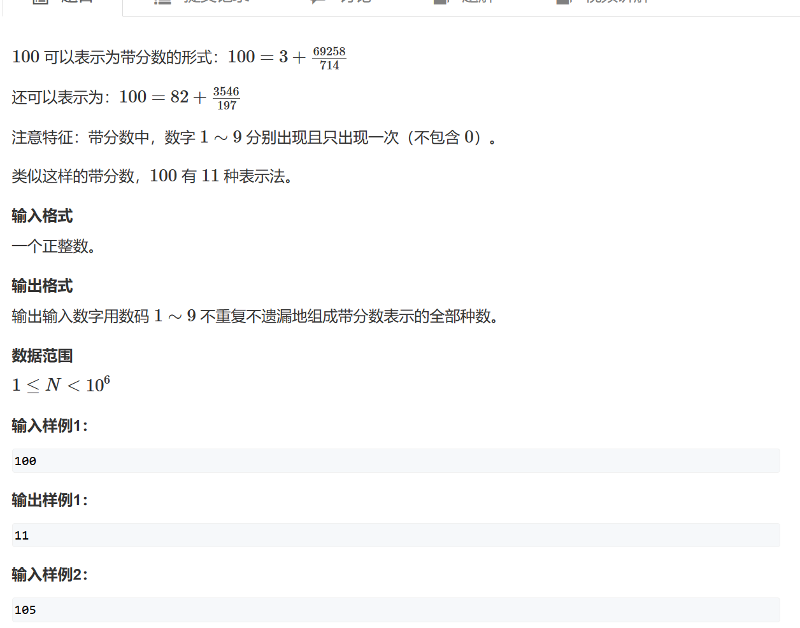

最暴力的做法：找出所有1-9的全排列，对每个排列在其中用隔板法找出a和b以及c判断是否是满足条件的。

```python
from itertools import permutations

target=int(input())

li=list(range(1,10))
# 全排列
nums=permutations(li)

res=[]
ans=0
for s in nums:
    s=''.join(map(str,s))
    for i in range(7):
        for j in range(i+1,8):
            # 剪枝，分母比分子大
            if len(s[j+1:])>len(s[i+1:j+1]):continue
            # 隔板法找出所有的可能
            a=int(s[:i+1])
            b=int(s[i+1:j+1])
            c=int(s[j+1:])
            # 满足条件
            if b%c:continue
            elif a+b//c==target:
                res.append([a,b,c])
                ans+=1
print(ans)

```


优化的做法是：变化公式发现b=nc-ac只要枚举出a和c即可，使用回溯法找a对于a的每个叶节点去找可能的c，也就是回溯套回溯，然后对于每个c可以求出b由此判断是否合法。

```python
import copy

n = int(input())
st = [False] * 10
ans = 0

# 检查是否满足条件，abc中分别包含1~9且只含有一个
def check(a, b, c):
    temp = a + b + c
    if len(temp)==9 and set(temp) == set('123456789'):
        return True
    return False

ans=0
# 在a的基础上找c
def dfs_c(a, c):
    # 推出b
    b = str(n * c - a * c)
    # 重要剪枝
    if len(str(a)) + len(str(b)) + len(str(c)) > 9:
        return
    # 查看当下的a b c是否可行
    if check(str(a), b, str(c)):
        global ans
        ans += 1
     # 回溯找c
    for i in range(1,10):
        if not st[i]:
            st[i] = True
            dfs_c(a, c * 10 + i)
            st[i] = False

# 回溯找a
def dfs_a(a):
    # 剪枝
    if a >= n:
        return
    # 回溯套回溯，在a的每个叶节点找c
    if a:
        dfs_c(a, 0)
	
    for i in range(1,10):
        if not st[i]:
            st[i] = True
            dfs_a(a * 10 + i)
            st[i] = False


dfs_a(0)
print(ans)


```

​	

## 飞行员兄弟

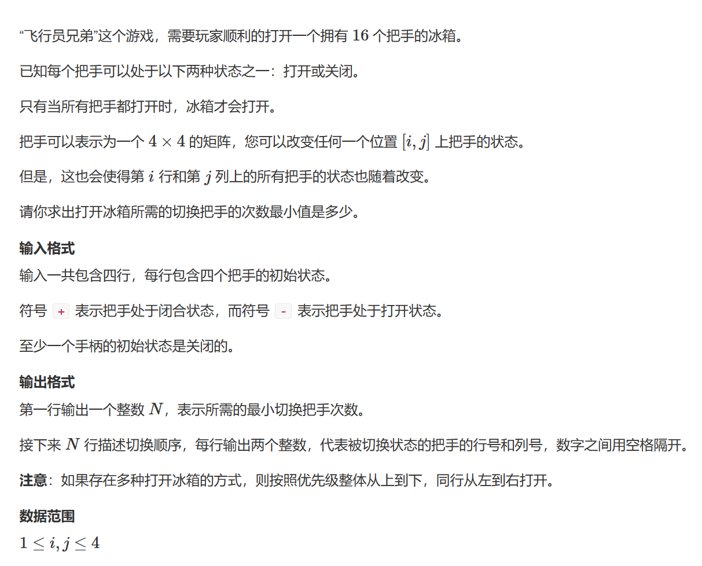

每个按钮操作两次及以上就没有意义了，因此每个按钮只有选和不选两种状态枚举出所有的状态然后判断是否合法。

```python
from copy import deepcopy
from math import inf

path = [list(input()) for _ in range(4)]


def convert(x):
    return divmod(x, 4)

# 翻转这一行和这一列
def change(g, x, y):
    for i in range(4):
        if i == y: continue
        g[x][i] = '-' if g[x][i] == '+' else '+'
    for i in range(4):
        if i == x: continue
        g[i][y] = '-' if g[i][y] == '+' else '+'
    g[x][y] = '-' if g[x][y] == '+' else '+'


ans = inf
res = []
# 枚举每种状态
for i in range(1<<16):
    g = deepcopy(path)
    cnt = 0
    temp = []
    # 找有那些位置被操作了
    for j in range(i.bit_length()):
        if (i >> j) & 1:
            # 一维转换为二维坐标
            x, y = convert(j)
            change(g, x, y)
            cnt += 1
            temp.append([x+1, y+1])
    temp.sort()
    r = True
    for j in range(4):
        if g[j] != ['-']*4:
            r = False
            break
    if r and cnt <= ans:
        ans = cnt
        if not res or temp < res:
            res = temp
print(ans)
for v in res:
    print(*v)
```


## Two Buttons

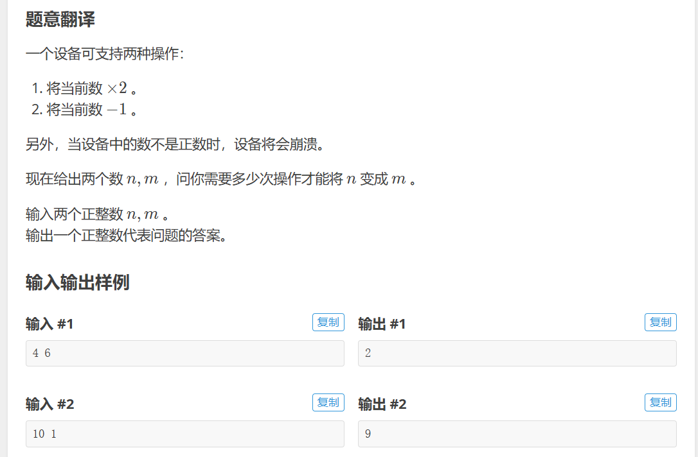


将问题转换为从m到n每次只能加一或者除二，此时只有偶数才能除而而奇数只能加一，并且为了逼近n每次都是尽量选择除二。

```python
@lru_cache(maxsize=None)
def dfs(x):
    if x==n:return 0
    if x<n:return n-x
    if x&1==0:return 1+dfs(x>>1)
    return 1+dfs(x+1)
print(dfs(m))
```

## **Maximize XOR**

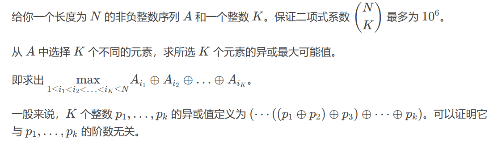


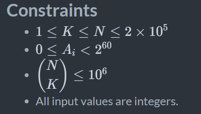


给定的数据范围中N中选K个不会超过1e6，那么回溯枚举，**因为根据组合数的公式k如果比较大n就会相对较小**

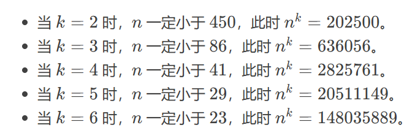

在回溯的时候做可行性剪枝，如果剩余的数等于还要选的数那么就直接异或上前缀异或和。

```python
def dfs(i,cnt,val):
    global ans
    if cnt==k:
        ans=max(ans,val)
        return 
    if i>=n:return 
    if n-i==k-cnt:
        ans=max(ans,val^pre[-1]^pre[i])
        return
    dfs(i+1,cnt+1,val^nums[i])
    dfs(i+1,cnt,val)

dfs(0,0,0)
print(ans)
```


