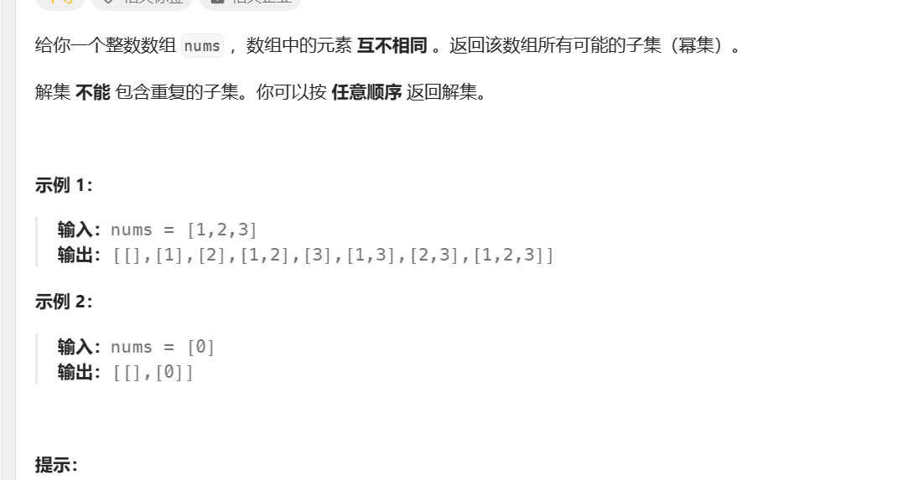
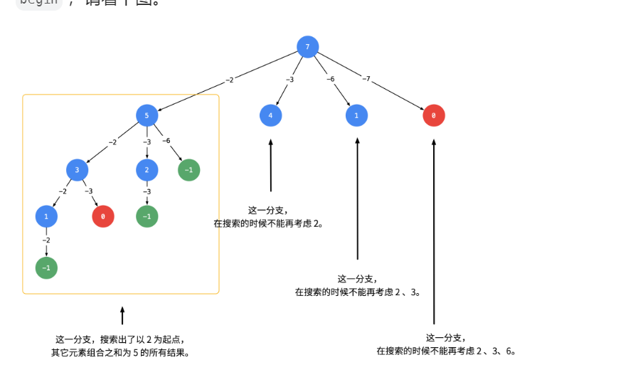
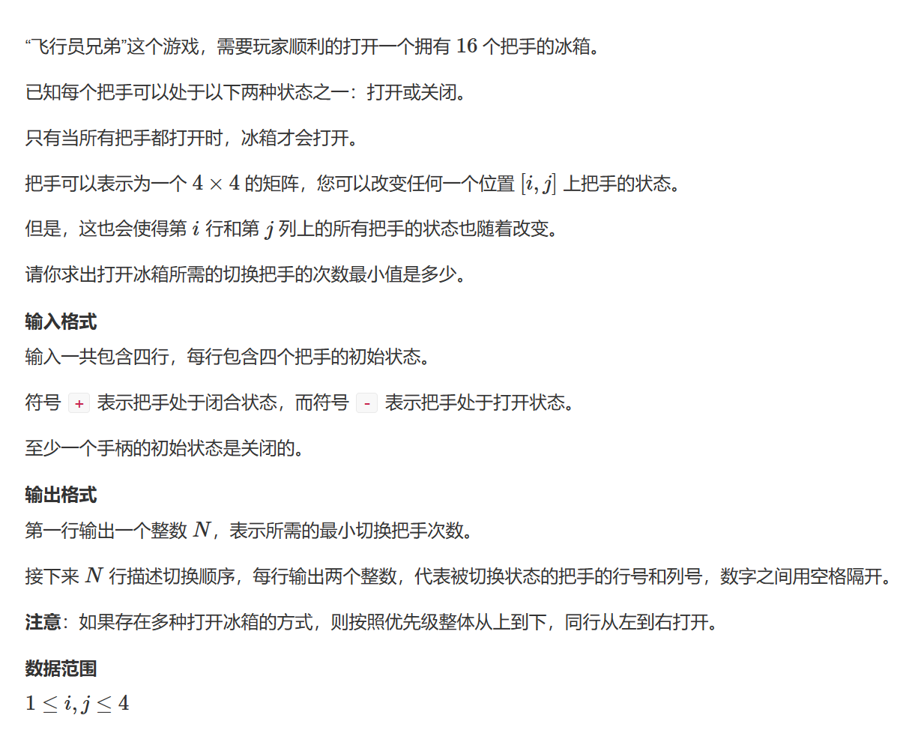
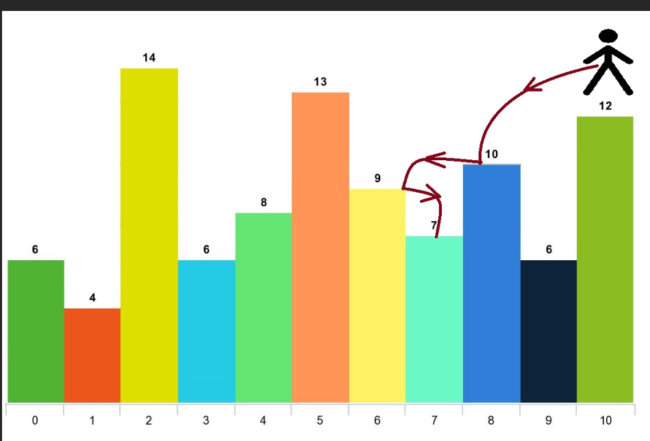

# 回溯算法（DFS）

回溯算法需要确定：路径（已做出的选择），选择列表（可以做的选择），结束条件（无法再做选择的条件），本质上是一种暴力穷举的算法，复杂度一般都很高。

其基本框架如下，核心是for循环中的递归，在递归调用之前做选择，然后在递归中根据这个选择深入，在递归调用之后撤销选择


`回溯有一个很重要的优化就是从大到小去回溯，这样可以更快的选出不合法的值大大减小状态数目`。

在一些题目中需要枚举字符串或数组的切分点，定义dfs(i)表示从i位置开始切割，然后枚举后面的位置作为切分点

```python
result=[]
def backtrace(路径,选择列表):
	if 满足结束条件:
		result.add(路径)
		return 
	for 条件 in 选择列表:
		做选择
        backtrace(路径,选择列表)
        撤销选择
```

dfs中的选择一旦大于

## 子集（元素唯一不可复选）



回溯算法解决

```python
# 在输入的角度来看，每个数有选还是不选的两种情况
class Solution(object):
    def subsets(self, nums):
        n=len(nums)
        ans=[]
        def dfs(i,path):
            if i==n:
                ans.append(path[:])
                return
            # 不选，直接进入下一层
            dfs(i+1,path)
            # 选择
            path.append(nums[i])
            dfs(i+1,path)
            path.pop()
        dfs(0,[])
        return ans 


# 从答案角度来看，选哪个数
class Solution(object):
    def subsets(self, nums):
        self.res=[]
        self.backtrace(nums,[],0)
        return self.res
    def backtrace(self,nums,path,start):
        # 注意
        self.res.append(path[:])
        # 通过索引控制区间的起始，不断缩减区间，从而到达防止重复的效果
        for i in range(start,len(nums)):
            path.append(nums[i])
            self.backtrace(nums,path,i+1)
            path.pop()
```

## 组合


子集注意不能跳过

```python
class Solution(object):
    def combine(self, n, k):
        if not n:
            return None
        self.res=[]
        nums=[i+1 for i in range(n)]
        self.backtrace(nums,k,[],0)
        return self.res
        
    def backtrace(self,nums,k,path,start):
        # 在子集的基础上加上一个base case 
        if len(path)==k:
            self.res.append(path[:])
            return
        for i in range(start,len(nums)):    
            path.append(nums[i])
            self.backtrace(nums,k,path,i+1)
            path.pop()
```

## 子集（包括重复元素）

每个元素有选或者不选，对于数组[1,2,2]选择第一个2和第二个2都是一样的，因此对于当前的x，如果前面有相同的y并且没有被选择那么这个元素应该被跳过否则会出现相同的子集

```python
class Solution:
    def subsetsWithDup(self, nums: List[int]) -> List[List[int]]:
        #通过排序将相同的元素集中到一起
        nums.sort()
        vis=set()
        ans=[]
        # 每个元素选或者不选
        def dfs(i,path):
            if i==len(nums):
                ans.append(path[:])
                return 
            # 判断需要跳过的情况
            if not (i>0 and nums[i-1]==nums[i] and i-1 not in vis):
                path.append(nums[i])
                vis.add(i)
                dfs(i+1,path)
                vis.remove(i)
                path.pop()
            dfs(i+1,path)
            
        dfs(0,[])
        return ans 
```

### 组合总和（元素重复）


元素重复可能会出现相同的结果，因此对于当前的x，如果前面有相同的y并且没有被选择那么这个元素应该被跳过否则会出现相同的子集。


给定的数据范围不能枚举每个（选或不选），这里通过规定起始点来标定每次选择的元素，

```python
class Solution:
    def combinationSum2(self, candidates: List[int], target: int) -> List[List[int]]:
        res=[]
        n=len(candidates)
        # 排序
        candidates.sort()
        vis=set()
        def dfs(i,target,path):
            # 合理的
            if not target:
                res.append(path[:])
                return 
            # 不合法的
            if target<0:
                return 
            
            for j in range(i,n):
                if j>0 and candidates[j]==candidates[j-1] and j-1 not in vis:
                    continue
                # 剪枝
                if target-candidates[j]<0:
                    break
                # 回溯
                vis.add(j)
                path.append(candidates[j])
                dfs(j+1,target-candidates[j],path)
                path.pop()
                vis.remove(j)
        dfs(0,target,[])
        return res 
```

### 组合总和（可重选）




通过树形图可以看出不能考虑每个元素选或者不选，一个元素可以选多次而这个可以通过控制区间来实现。

先将数组排序，这样选的过程中如果当前的元素选了会使target小于0，那么这个元素之后的也一定会，因此可以直接退出。

```python
class Solution:
    def combinationSum(self, candidates: List[int], target: int) -> List[List[int]]:
        res=[]
        n=len(candidates)
        # 排序
        candidates.sort()
        def dfs(i,target,path):
            # 合理的
            if not target:
                res.append(path[:])
            # 不合法的
            if target<0:
                return 
            for j in range(i,n):
                # 剪枝
                if target-candidates[j]<0:
                    break
                # 回溯
                path.append(candidates[j])
                dfs(j,target-candidates[j],path)
                path.pop()
        dfs(0,target,[])
        return res 
```


### 全排列


实际上就是决策树遍历的问题，选择了1下一步只能选择23，再选择了2就只剩下3了，然后完成一次排列，接着就回溯（撤销选择），从3到2没得选，选2到1，再以这个节点可以选择3（for 条件 in 选择列表），当初始的1节点完成排列之后，回溯到选择2或3作为第一个值。

```python
class Solution(object):
    def permute(self, nums):
        res=[]# 记录最终结果的列表
        
        used=[False]*len(nums)# 用于判断数字是否包含
    
    	trace=[]# 路径
        
        self.backtrace(nums,res,trace,used)
        
        return res
    # 这个函数会返回一个排列
    def backtrace(self,nums,res,trace,used):
        
        if len(trace)==len(nums):# 长度一致时既是一个排列
            res.append(trace[:])# 注意要传入一个新的列表，否则在之后会被改动
            return
        
        for i in range(len(nums)):# 遍历每一个数
            if used[i]:# 如果包含过了，跳过
                continue
            trace.append(nums[i])# 否则加入路径
            used[i]=True# 并设置为True
            self.backtrace(nums,res,trace,used)# 按照现有的路径深入
            trace.pop()
            used[i]=False
```

### 全排列（包含重复元素）


字典的妙用，使用字典初始化列表使得需要遍历的次数减少，无与伦比的剪枝，此外最重要的是规定了一个元素出现的次数，绝对不会超出。（技巧点）

通过字典可以排除重复的全排列序列

```python
from collections import Counter
class Solution(object):
    def permuteUnique(self, nums):
        memo=Counter(nums)
        ans=[]
        vis=[False]*len(nums)
        def dfs(path):
            if len(path)==len(nums):
                ans.append(path[:])
                return 
            for d in memo:
                if memo[d]>0:
                    memo[d]-=1
                    path.append(d)
                    dfs(path)
                    path.pop()
                    memo[d]+=1
        dfs([])
        return ans 
```

### [正方形数组的数目](https://leetcode.cn/problems/number-of-squareful-arrays/)


本质上是在找全排列，注意这里有重复元素，判断是否满足要求打表即可

```python
a=set()
a.add(0)
v=1
while v**2<10**9+10:
    a.add(v**2)
    v+=1
class Solution:
    def numSquarefulPerms(self, nums: List[int]) -> int:
        n=len(nums)
        vis=[False]*n
        ans=[]
        nums.sort()
        memo=Counter(nums)
        def dfs(k,path):
            if k==n:
                ans.append(path[:])
                return 
            # 通过字典防止找到一样的排列
            for d in memo:
                # 注意不能忘了条件
                if path and path[-1]+d not in a :continue
                if memo[d]>0:
                    memo[d]-=1
                    path.append(d)
                    dfs(k+1,path)
                    path.pop()
                    memo[d]+=1
        dfs(0,[])
        return len(ans)

```


或者直接加条件判断

```python
a=set()
a.add(0)
v=1
while v**2<10**9+10:
    a.add(v**2)
    v+=1
class Solution:
    def numSquarefulPerms(self, nums: List[int]) -> int:
        n=len(nums)
        vis=[False]*n
        ans=[]
        # 注意，要先排列使相同元素凑在一起
        nums.sort()
        def dfs(k,path):
            if k==n:
                ans.append(path[:])
                return 
            for i in range(n):
                if vis[i]:continue
                # 如果前面有相同的值，并且这个值没被选中
                elif i>0 and nums[i-1]==nums[i] and not vis[i-1]:continue
                elif path and path[-1]+nums[i] not in a:continue
                vis[i]=True
                path.append(nums[i])
                dfs(k+1,path)
                path.pop()
                vis[i]=False
        dfs(0,[])
        return len(ans)
```


### [ 找出 3 位偶数](https://leetcode.cn/problems/finding-3-digit-even-numbers/)


实际上就是在选出三个元素，然后看他们的全排列中有几个满足条件的

使用字典的高效的dfs,如果选择遍历digits中的每一个值，绝对超时

```python
from collections import Counter
class Solution(object):
    def findEvenNumbers(self, digits):
        memo=Counter(digits)
        ans=[]
        def dfs(path):
            if len(path)==3:
                val=path[0]*100+path[1]*10+path[2]
                if val>99 and val%2==0:
                    ans.append(val)
                return 
            for d in memo:
                if memo[d]>0:
                    memo[d]-=1
                    path.append(d)
                    dfs(path)
                    path.pop()
                    memo[d]+=1
        dfs([])
        ans.so
        return ans
```

### N皇后问题


回溯算法解决，以行为单位推进，选择列表中是任意的列

```python
class Solution(object):
    def solveNQueens(self, n):
        res = []
        square = [['.' for _ in range(n)] for _ in range(n)]# 棋盘
        self.backtrace(square, n, res, 0)
        return res

    def backtrace(self, square, n, res, row):
        if row >n-1:# 行超出边界作为结束条件
            res.append(["".join(row) for row in square])# 二维的似乎不能用square[:]
            return
        for col in range(n):# 选择列表，每一行的任意列都可以选择，然后进入到下一行从左到右选择一列（需要判断合法，否则跳过）
            if self.isvalid(square, row, col, n):# 如果位置合法
                
                square[row][col] = 'Q'# 选择
                
                self.backtrace(square, n, res, row + 1)# 进入下一层
                
                square[row][col] = '.'# 撤销

    def isvalid(self, square, row, col, n):# 判断皇后的位置是否合法
        for i in range(row):# 判断该位置上方的列
            if square[i][col] == 'Q':
                return False

        for i, j in zip(range(row - 1, -1, -1), range(col - 1, -1, -1)):# 判断左上
            if square[i][j] == 'Q':
                return False

        for i, j in zip(range(row - 1, -1, -1), range(col + 1, n)):# 判断右上
            if square[i][j] == 'Q':
                return False

        return True

```

### 划分为K个相等的子集


按照球盒模型理解，K个盒子N个球，每个盒子遍历一遍数组，从中选取合适的值加入到盒子中，盒子满了就换下一个盒子


两个盒子可能出现一样的选球组合：当前一个盒子的组合（比如说选了1，5）后面的无论怎么组合结果都是不对的，那么会进行回溯，这是前一个选了（2，4）后一个盒子有可能拿到（1，5）那么结果是已经确定了的，使用哈希表记录下每个失败的组合，当盒子选到失败的组合直接返回

```python
class Solution(object):
    def canPartitionKSubsets(self, nums, k):
	# 数组长度没有要划分的集合多
        if k>len(nums):
            return False
        # 数字总和
        vals=sum(nums)
	# 数字总和无法被均分为K份
        if vals%k!=0:
            return False
        # 每个盒子中数字的总和
        target=vals//k
        # 记录数字是否被加入,使用位图的方式记录，节省空间并且方便记录到字典中
        used=0
        # 字典，防止重复求解
        self.hash={}
        return self.backtrace(nums,target,0,used,k,0)
    # nums数组，target每个盒子中的数，start当盒子中加入了一个数后，下一个数从哪里开始找，k表示当前是第几号盒子，bucket当前盒子中的数
    def backtrace(self,nums,target,start,used,k,bucket):
        if not k:
            return True
        if bucket==target:
            # 当前盒子满了求解下一个盒子
            res=self.backtrace(nums,target,0,used,k-1,0)
            # 记录装满这个盒子方式的结果
            self.hash[used]=res
            return res
        # 这个方式已经求过了，直接返回结果
        if used in self.hash:
            return self.hash[used]
        for i in range(start,len(nums)):
            # 位运算，判断第i位是否为1（TRUE）
            if (used>>i)&1==1:
                continue
            # 大了
            if bucket+nums[i]>target:
                continue
			# 更新
            bucket+=nums[i]
            # 将第i位设置为1
            used|=1<<i
            # 从下一个位置开始选数填入桶中，如果能满足，直接返回
            if self.backtrace(nums,target,i+1,used,k,bucket):
                return True
            bucket-=nums[i]
            # 第i位设置为0
            used^=1<<i
        # 穷举了所有数字都无法装满桶
        return False
```


从球的视角看就是每个球有k种选择，对每个合法的选择都进行一次

这里一个重要的剪枝是当两个盒子有相同的值的时候，当前的球放到哪一个中结果都是一样的

```python
class Solution:
    def canPartitionKSubsets(self, num	s: List[int], k: int) -> bool:
        # 通过排序保证值往一个方向走，同时每次都是找没有被选的最大的球，如果较大的球无法塞入那么小的也一定不行，这样可以更快的筛出无用的结果
        nums.sort(reverse=True)
        # 可行性剪枝
        total=sum(nums)
        n=len(nums)
        if total%k:
            return False
        target=total//k
        # 记录k个盒子中储存的值
        buckets=[0]*k
        # i表示第几个球
        def dfs(i):
            # 能走到最后就是一个可行的解
            if i==n: return True
      	  # 遍历每一个盒子，就是在模拟球放入每一个盒子
            for j in range(k):
                # 如果当前盒子和前一个盒子储存的值是一样的，相当于把球塞入两个相同的箱子，那么结果也是一样的（False）
                if j>0 and buckets[j]==buckets[j-1]:continue 
                # 如果超出盒子容积了，换下一个盒子
                if buckets[j]+nums[i]>target:continue
                # 递归，看下一个球
                buckets[j]+=nums[i]
                if dfs(i+1):
                    return True
                buckets[j]-=nums[i]
            return False
        return dfs(0)
```


以盒子的视角来看，每个盒子遍历一遍数组，每个值有加入和不加入两种情况，时间复杂度为$$2^{kn}$$

以球的视角n个数字每个数字有k个桶可供选择，时间复杂度为$$k^{n}


## 木棒


回溯加剪枝，枚举每个长度找是否可以划分，类似于划分K个相等的子集，给定m个桶每个桶的值为n

剪枝：

+ 对于相同的值，如果之前选了这个值不行，那么再选相同的值结果也是一样的
+ 如果前面选了先选了1再选了5，而后不能先选5在选1，结果是一样的
+ 对于一个桶，如果他第一个放入的值不行就退出。反证法：如果存在一组合法的方案，那么这根木棍一定是存在于某组木棍中，因为组内木棍的顺序是任意的，所以可以将其调至为第一根木棍，故和已知牟盾。
+ 同理，对于一个桶，如果他最后放入的值不行就退出。


```python
import sys
input=sys.stdin.readline
# u表示桶的数目，curr表示当前桶内的值,start表示从第几个开始，k表示目标值
def dfs(u,curr,start,k):
    # 找到了合适的组合
    if u*k==total:return True
    # 一个桶满了
    if curr==k:return dfs(u+1,0,0,k)
    
    i=start
    # 往桶里装值
    while i<n:
        # 访问过
        if vis[i]:
            i+=1
            continue
        # 超出了 
        if curr+nums[i]<=k:
            vis[i]=True
            #  回溯
            if dfs(u,curr+nums[i],i+1,k):
                return True 
            vis[i]=False
        # 如果是第一个值或最后一个值
        if not curr or curr+nums[i]==k:return False
        # 跳过重复的值
        j=i+1
        while j<n and nums[j]==nums[i]:j+=1
        i=j
    return False


while 1:
    n = int(input())
    if not n:
        break
    # 注意一定要先倒序排序，通过先访问大的值排除尽可能多的错误答案
    nums = sorted([int(x) for x in input().split()],reverse=True)
    total=sum(nums)
    vis=[False]*70

    # 枚举
    for k in range(max(nums), total + 1):
    
        if total % k != 0: continue
        
        if dfs(0, 0, 0,k):
            print(k)
            break


```


## 岛屿数量


遍历每一个值，如果是陆地使用DFS将这块陆地及周围的陆地淹没，这样可以防止重复计算，每一块陆地只会计入一次。

```python
class Solution(object):
    def numIslands(self, grid):
        # 长度
        m=len(grid)
        n=len(grid[0])
        res=0
        # 方向
        self.dirs=[
            lambda x,y:(x-1,y),
            lambda x,y:(x,y+1),
            lambda x,y:(x+1,y),
            lambda x,y:(x,y-1)]
        # 遍历每一个
        for i in range(m):
            for j in range(n):
                if grid[i][j]=='1':
                    # 淹没周围的陆地
                    self.dfs(grid,i,j)
                    res+=1
        return res
    def dfs(self,grid,i,j):
        # 淹没本身
        grid[i][j]='0'
        # 各个方向
        for dir in self.dirs:
            x,y=dir(i,j)
            # 判断是否索引合法
            if 0<=x<len(grid) and 0<=y<len(grid[0]):
                if grid[x][y]=='1':
                    self.dfs(grid,x,y)
```


### 封闭岛屿数目


在地图中只要不与边界相邻就是封闭的，因此先去掉边界上的陆地，然后再遍历内部的陆地即可。

```python
class Solution(object):
    def closedIsland(self, grid):
        m = len(grid)
        n = len(grid[0])
        res = 0
        self.dirs = [
            lambda x, y: (x - 1, y),
            lambda x, y: (x, y + 1),
            lambda x, y: (x + 1, y),
            lambda x, y: (x, y - 1)]
        for i in range(m):
            if grid[i][0]==0:
                self.dfs(grid,i,0)
            if grid[i][n-1]==0:
                self.dfs(grid,i,n-1)
        for i in range(n):
            if grid[0][i]==0:
                self.dfs(grid,0,i)
            if grid[m-1][i]==0:
                self.dfs(grid,m-1,i)
        for i in range(1,m-1):
            for j in range(1,n-1):
                if grid[i][j] == 0:
                    self.dfs(grid, i, j)
                    res += 1
        return res

    def dfs(self, grid, i, j):
        grid[i][j] = 1
        for dir in self.dirs:
            x, y = dir(i, j)
            if 0 <= x < len(grid) and 0 <= y < len(grid[0]):
                if grid[x][y] == 0:
                    self.dfs(grid, x, y)
```


## 岛屿的最大面积


回溯每个岛屿的时候将用于记录最大值的外部变量更新

```python
class Solution(object):
    def maxAreaOfIsland(self, grid):
        m = len(grid)
        n = len(grid[0])
        res = 0
        self.dirs = [
            lambda x, y: (x - 1, y),
            lambda x, y: (x, y + 1),
            lambda x, y: (x + 1, y),
            lambda x, y: (x, y - 1)]
        self.count=0
        for i in range(m):
            for j in range(n):
                self.count=0
                if grid[i][j] == 1:
                    self.dfs(grid, i, j)
                    res = max(res,self.count)
        return res

    def dfs(self, grid, i, j):
        
        grid[i][j] =0
        self.count+=1
        for dir in self.dirs:
            x, y = dir(i, j)
            if 0 <= x < len(grid) and 0 <= y < len(grid[0]):
                if grid[x][y] == 1:
                    self.dfs(grid, x, y)
```


## 统计子岛屿


grid2中的子岛屿的每一块陆地必须在grid1中出现，遍历grid2，如果其中有一块陆地在grid2中出现而没有在grid1中出现，说明这个陆地所连的岛屿不是子岛屿，将其淹没。完成上述步骤后，再次遍历grid2进行计数即可。

## 不同的岛屿数目


使用回溯算法寻找每一个岛屿，对于相同的岛屿他们的回溯的顺序是一样的，因此在回溯过程中定义一个字符串记录每次的回溯顺序，比如令向下为1 向上为0，当向上的时候加入'0'到字符串中。此外不能拉下撤销的顺序。

比如：

[[1,1,0],[0,1,1],[0,0,0],[1,1,1],[0,1,0]]如果只记录加入的顺序会认为是一样的。

```python
class Solution(object):
    def numDistinctIslands(self, grid):
        m = len(grid)
        n = len(grid[0])
        dirs = [
            lambda x, y: (x - 1, y),# left
            lambda x, y: (x + 1, y),# right
            lambda x, y: (x, y + 1),# up
            lambda x, y: (x, y - 1)]# down
        self.build=""
        hash={}

        def dfs(i,j,s):
            self.build+=s
            grid[i][j]=0
            for index,dir in enumerate(dirs):
                x,y=dir(i,j)
                if 0<=x<m and 0<=y<n and grid[x][y]==1:
                    # 回溯过程中记录顺序，使用index表示
                    dfs(x,y,str(index))
                    # 撤销使用-index
                    self.build+=str(-index)
            
        for i in range(m):
            for j in range(n):
                self.build = ""# 每次清空
                if grid[i][j]==1:
                    dfs(i,j,"")
                    # 计入集合防止重复
                    hash[self.build]=None
            
        return len(hash)# 返回有多少
```

## [受限条件下可到达节点的数目](https://leetcode.cn/problems/reachable-nodes-with-restrictions/)


bfs写法

```python
from collections import deque
class Solution:
    def reachableNodes(self, n: int, edges, restricted) -> int:
        paths=[set() for _ in range(n)]
        vis=[False]*n
        vis[0]=True
        ans=1
        # 这里把restriceed转换为set可以降低时间复杂度，因为对set的in 操作复杂度为O(1)
        restricted=set(restricted)
        for edge in edges:
            u,v =edge
            # 在受限数组中的不加入
            if u in restricted or v in restricted:
                continue
            paths[v].add(u)
            paths[u].add(v)
        d=deque(paths[0])
        while d:
            sz=len(d)
            for _ in range(sz):
                curr=d.popleft()
                vis[curr]=True
                if curr not in restricted:
                    ans+=1
                    for e in paths[curr]:
                        if not vis[e]:
                            d.append(e)
        return ans
```

dfs可以用来代替bfs遍历图，只要在传入一个参数表示父节点，在加入连接的节点时判断如果是父节点跳过即可。


### 目标和


回溯算法，找出所有的组合，如果满足条件外部变量加一

```python
class Solution(object):
    def findTargetSumWays(self, nums, target):
        self.count=0
        def backtrace(nums,target,start,sum):
            if start==len(nums):
                if sum==target:
                    self.count+=1
            else:
                # 不直接修改start的值，做到回溯的效果，由于要计算加和减，调用两次，并用一个sum表示组合的值
                backtrace(nums,target,start+1,sum+nums[start])
                backtrace(nums,target,start+1,sum-nums[start])
        backtrace(nums,target,0,0)
        return self.count

# 由于超出时间限制，选择使用备忘录，将函数改为有返回值的，
class Solution(object):
    def findTargetSumWays(self, nums, target):
        self.memo = {}
        # start表示当前的值，sum是组合
        def backtrace(nums, target, start, sum):
            # 键
            key=(start,sum)
            # 查找备忘录
            if key in self.memo:
                return self.memo[key]
            
            # 每一个值都要有，所以必须遍历完，结束条件就是当前遍历到末尾
            if start == len(nums):
                if sum == target:
                    return 1
                else:
                    return 0
                
            else:# 向外层
                res = backtrace(nums, target, start + 1, sum + nums[start]) + backtrace(nums, target, start + 1, sum - nums[start])
                self.memo[key] = res
                
            return res

        return backtrace(nums, target, 0, 0)
```

###  统计无向图中无法互相到达点对数


优美的dfs回溯

```python
class Solution(object):
    def countPairs(self, n, edges):
        # cnt表示当前连通块中有多少个点
        res=cnt=total=0
        # 是否访问
        vis=[False]*n
        g=[[] for _ in range(n)]
	# 建图
        for edge in edges:
            p,q=edge[0],edge[1]
            g[p].append(q)
            g[q].append(p)
        def dfs(p):
            vis[p]=True
            nonlocal cnt
            cnt+=1
            for q in g[p]:
                if not vis[q]:
                   
                    dfs(q)
                    
        for i in range(n):
            cnt=0
            if not vis[i]:
                dfs(i)
            res+=cnt*total
            total+=cnt
        return res
```

### 二叉树中的伪回文路径


使用dfs找出所有的路径，然后判断是否为伪回文串，伪回文串满足至多存在一个出现奇数次的数字。

```python
class Solution(object):
    def pseudoPalindromicPaths (self, root):
        count=0
        # 使用计数列表
        path=[0]*10
        # 找是否有一个数字出现奇数次
        def find(paths):
            flag=0
            for path in paths:
                if path%2==1:
                    flag+=1
            return flag>=2
        def dfs(root):
            
            path[root.val]+=1
            # 注意加入放在判断之前，因为判断的是是否为叶子节点
            if not root.left and not root.right:
                nonlocal count
                count+=0 if find(path) else 1      
            if root.left:
                dfs(root.left)
            if root.right:
                dfs(root.right)
            path[root.val] -= 1
        dfs(root)
        return count
```

### [检查替换后的词是否有效](https://leetcode.cn/problems/check-if-word-is-valid-after-substitutions/)


dfs不一样的用法，同样是遍历每一个位置，将该位置的子串和pattern比较，如果相等进入下一层，如果一直找不到就说明没有满足的返回false，在这个过程中参数是字符串。


```python
class Solution(object):
    def isValid(self, s):
        pattern='abc'# 用于比较
        @cache
        def dfs(s):
            # 如果长度为0表示找到了
            if len(s)==0:
                return True
            # 从当前字符串一直找到倒数第三个
            for i in range(len(s)-2):
                # 取其中的三个
                if s[i:i+3]==pattern:
                    # 参数是去除了找到的子串
                    return dfs(s[:i]+s[i+3:len(s)])
            return False
        return dfs(s)
```

### 素因数


由于数据量不是很大，使用dfs暴力求解，这里的素因数指的是一个数的因数同时这个因数是一个质数。


```python
n=int(input())
nums=list(map(int,input().split()))
ans=float('inf')
# 题目中要求同一个素因数不能同时出现
vis=set()
# 判断是不是质数的函数，技巧点
def prime(x):
    i=2
    # 从2开始判断到开方即可（要取到），只能被1和自己整除
    while i<=(x**0.5):
        if x%i==0:
            return False
        i+=1
    return True
# dfs暴力求解，对每一个数取一个素因数，暴力求解找出所有的
def dfs(index,nums,val):
    global ans
    if index==n:
        # 取最小
        ans=min(sum(val),ans)
        return
    i=2
    # 找一个数的所有因数，从2开始遍历所有的数，因为1不是素因数
    while i<=(nums[index]):
        # 判断这个数是不是因数，是不是质数，有没有重复
        if nums[index]%i==0 and prime(i) and i not in vis:
            vis.add(i)
            val.append(i)
            dfs(index+1,nums,val)
            val.pop()
            vis.remove(i)
        i+=1
dfs(0,nums,[])
print(ans if ans !=float('inf') else -1)
#4
#12 15 28 22
```

### [给定数字能组成的最大时间](https://leetcode.cn/problems/largest-time-for-given-digits/)


暴力法，枚举出每一种可能然后判断可行与否


```python
class Solution:
    def largestTimeFromDigits(self, arr) -> str:
        vis=[False]*4
        # 先进行倒序排列，这里得出的结果才是最大的，如果是正序的话，第一个值就有可能选到0，然后通过判断条件
        arr.sort(reverse=True)
        ans=[]
        # dfs找出所有的排列，注意这里是全排列，不用控制索引
        def dfs(path):
            if len(path)==4:
                ans.append(path[:])
                return
            for i in range(4):
                if vis[i]:
                    continue
                vis[i]=True
                path.append(arr[i])
                dfs(path)
                path.pop()
                vis[i]=False
        dfs([])
        for a,b,c,d in ans :
            # 判断的方式比较巧妙
            if a*10+b<24 and c*10+d<60:
                # 不使用字符串拼接，用格式化字符串
                return f"{a}{b}:{c}{d}"
```

### [重新规划路线](https://leetcode.cn/problems/reorder-routes-to-make-all-paths-lead-to-the-city-zero/)


要求从每个城市都可以到达0，那么从0出发（路线相反）应该可以去往每一个城市，`在路线中添加相反的路线(技巧点)`，以确保从0出发可以到达每一个城市，用1表示原本的路线，0表示添加的路线

如果0可以通过原来的路线到该城市，说明这个路线需要反向，如果通过的是添加的路线，那么不需要反转路线。

```python
class Solution:
    def minReorder(self, n: int, connections: List[List[int]]) -> int:
        paths=[set() for _ in range(n)]
        for u,v in connections:
            paths[u].add((v,1))
            paths[v].add((u,0))

        def dfs(i,fa):
            res=0
            for p,j in paths[i]:
                if p==fa:continue
                res+=dfs(p,i)+j
            return res
        return dfs(0,-1)
```


## 树的重心


简言之，树的重心就是每个节点最大的子树中的最小值，使用dfs遍历可以得到每一个节点的子树最大值，从中找出最小的的即可，不需要对每个节点使用dfs遍历，遍历一个节点的过程会算出其他节点的子树最大值。对于一个节点他会分为边的数目个子树，其中父节点所在的由于不会回头因此不是通过回溯算出的，但是这个子树的大小，是节点总数减去当前节点dfs遍历到达节点数目。


```python
from functools import lru_cache
from collections import Counter

n = int(input())
memo = Counter()
temp = n - 1
path = [set() for _ in range(n)]
while temp:
    u, v = [int(x) - 1 for x in input().split()]
    path[u].add(v)
    path[v].add(u)
    memo[v] += 1
    memo[u] += 1
    temp -= 1
nums = list(memo.items())
nums.sort(key=lambda x: x[1], reverse=True)
tar = nums[0][1]
ans = float('inf')

li=[]
@lru_cache(maxsize=None)
# 函数会求出每个节点子树数目，不包括父节点
def dfs(i, fa):
    # 记录以i为重心的，删除i后的最大连通块的节点数目
    res = 0
    # 表示以i为根的节点总数（包括根）
    mx = 0
    for p in path[i]:
        if p == fa: continue
        val=dfs(p, i)
        res = max(res, val)
        mx += val
    mx+=1
    res=max(n-mx,res)
    # 使用一个列表记录所有节点的最大子树
    li.append(res)
    return mx


dfs(0,-1)
print(min(li))
```


## [收集树上所有苹果的最少时间](https://leetcode.cn/problems/minimum-time-to-collect-all-apples-in-a-tree/)


先用一遍dfs找除每个节点子树中苹果的数目（包括自身，防止子树没有苹果），然后在深度遍历的过程中如果当前节点子树有苹果更新时间。

如果知道了这个子树没有苹果就不会进入从而减少花费无用的书简。

```python
class Solution:
    def minTime(self, n: int, edges: List[List[int]], hasApple: List[bool]) -> int:
        ans=0
        g=defaultdict(set)
        for u,v in edges:
            g[u].add(v)
            g[v].add(u)
        # 记录以i为根的子树的苹果数目
        count=[0]*n
       	
        def dfs(root,p):
            # 叶子节点，注意防止根节点被误判的情况
            if len(g[root])==1 and p in g[root]:
                count[root]=int(hasApple[root])
                return count[root]
            res=0
            for u in g[root]:
                if u==p:continue
                res+=dfs(u,root)
             # 更新苹果
            count[root]=res +int(hasApple[root])
            return count[root]
        dfs(0,-1)
        time=0
        # 判断
        def dp(root,p):
            # 叶子节点
            if len(g[root])==1 and p in g[root]:
                return 0
            nonlocal time
            for u in g[root]:
                if u==p:continue
                # 如果子树中有苹果一定会有一个来回
                if count[u]:
                    time+=2
                dp(u,root)
        dp(0,-1)
        return time 
```


## [ 统计构造好字符串的方案数](https://leetcode.cn/problems/count-ways-to-build-good-strings/)


一个操作1一个操作0，无论怎么组合都不会重复，因此也就是找出不同的操作组合（执行几次zero几次one）

```python
class Solution:
    def countGoodStrings(self, low: int, high: int, zero: int, one: int) -> int:
        mod=10**9+7
        @cache
        def dfs(i):
            if i==0:
                return 1
            elif i<0:
                return 0
            return (dfs(i-zero)+dfs(i-one))%mod   
        res=0
        for i in range(low,high+1):
            res+=dfs(i)
            res%=mod
        return res
```

从low到high都求一遍即可。

## 带分数


最暴力的做法：找出所有1-9的全排列，对每个排列在其中用隔板法找出a和b以及c判断是否是满足条件的。

```python
from itertools import permutations

target=int(input())

li=list(range(1,10))
# 全排列
nums=permutations(li)

res=[]
ans=0
for s in nums:
    s=''.join(map(str,s))
    for i in range(7):
        for j in range(i+1,8):
            # 剪枝，分母比分子大
            if len(s[j+1:])>len(s[i+1:j+1]):continue
            # 隔板法找出所有的可能
            a=int(s[:i+1])
            b=int(s[i+1:j+1])
            c=int(s[j+1:])
            # 满足条件
            if b%c:continue
            elif a+b//c==target:
                res.append([a,b,c])
                ans+=1
print(ans)

```


优化的做法是：变化公式发现b=nc-ac只要枚举出a和c即可，使用回溯法找a对于a的每个叶节点去找可能的c，也就是回溯套回溯，然后对于每个c可以求出b由此判断是否合法。

```python
import copy

n = int(input())
st = [False] * 10
ans = 0

# 检查是否满足条件，abc中分别包含1~9且只含有一个
def check(a, b, c):
    temp = a + b + c
    if len(temp)==9 and set(temp) == set('123456789'):
        return True
    return False

ans=0
# 在a的基础上找c
def dfs_c(a, c):
    # 推出b
    b = str(n * c - a * c)
    # 重要剪枝
    if len(str(a)) + len(str(b)) + len(str(c)) > 9:
        return
    # 查看当下的a b c是否可行
    if check(str(a), b, str(c)):
        global ans
        ans += 1
     # 回溯找c
    for i in range(1,10):
        if not st[i]:
            st[i] = True
            dfs_c(a, c * 10 + i)
            st[i] = False

# 回溯找a
def dfs_a(a):
    # 剪枝
    if a >= n:
        return
    # 回溯套回溯，在a的每个叶节点找c
    if a:
        dfs_c(a, 0)
	
    for i in range(1,10):
        if not st[i]:
            st[i] = True
            dfs_a(a * 10 + i)
            st[i] = False


dfs_a(0)
print(ans)


```

## [将数组拆分成斐波那契序列](https://leetcode.cn/problems/split-array-into-fibonacci-sequence/)


回溯加剪枝，找到一个即可因此dfs返回布尔值，只要是True就表示找到了直接返回，使用回溯划分子数组。

如果开头是0 并且不会在开头划分则不行。如果当前子数组的值大于2**32-1不行。根据斐波那契的性质，划分的数组的前两个值必须等于当前值，如果当前值大于了直接返回，只有等于才能放入

```python
class Solution:
    def splitIntoFibonacci(self, nums: str) -> List[int]:
        n=len(nums)
        ans=[]
        def dfs(index):
            # 能够走到最后的就行
            if index==n:
                return len(ans)>=3
            # 记录的当前划分数组的值
            curr=0
            # 划分
            for i in range(index,n):
                # 剪枝
                if i>index and nums[index]=='0':
                    break
                curr=curr*10+int(nums[i])
                if curr>2**31-1:break
                # 只有满足性质才能，数组中先得有两个数
                if len(ans)<2 or ans[-2]+ans[-1]==curr:
                    ans.append(curr)
                    if dfs(i+1):
                        return True 
                    ans.pop()
                elif len(ans)>2 and curr>ans[-2]+ans[-1]:
                    break
            
            return False
        dfs(0)
        return ans 
```

## [最低票价](https://leetcode.cn/problems/minimum-cost-for-tickets/)


纯暴力的做法，直接看做三种选择的最小值：

```python
class Solution:
    def mincostTickets(self, days: List[int], costs: List[int]) -> int:
        n=len(days)
        ans=[]
        @cache
        def dfs(i,c):
            # 全部完成
            if i>n-1:
                ans.append(c)
                return 
            # 使用二分看这个选择能到那天
            dfs(bisect_left(days,days[i]+1),c+costs[0])
            dfs(bisect_left(days,days[i]+7),c+costs[1])
            dfs(bisect_left(days,days[i]+30),c+costs[2])
        dfs(0,0)
        return min(ans)
```


动态规划的思想，定义dfs(i)为从第i天开始到这一年结束所需的最小的费用，对于车票贪心的思想是晚点买这样可以持续长的时间。

```python
class Solution:
    def mincostTickets(self, days: List[int], costs: List[int]) -> int:
        T=[1,7,30]
        d=set(days)
        ans=[]
        @cache
        def dfs(i):
            if i>365:
                return 0 
            if i in d:
                # 需要出行选最xaio'de
                return min(dfs(i+t)+c for t,c in zip(T,costs) )
            else:
                return dfs(i+1)# 不需要出行就跳过
        return dfs(1)
```


​	

## 飞行员兄弟



每个按钮操作两次及以上就没有意义了，因此每个按钮只有选和不选两种状态枚举出所有的状态然后判断是否合法。

```python
from copy import deepcopy
from math import inf

path = [list(input()) for _ in range(4)]


def convert(x):
    return divmod(x, 4)

# 翻转这一行和这一列
def change(g, x, y):
    for i in range(4):
        if i == y: continue
        g[x][i] = '-' if g[x][i] == '+' else '+'
    for i in range(4):
        if i == x: continue
        g[i][y] = '-' if g[i][y] == '+' else '+'
    g[x][y] = '-' if g[x][y] == '+' else '+'


ans = inf
res = []
# 枚举每种状态
for i in range(1<<16):
    g = deepcopy(path)
    cnt = 0
    temp = []
    # 找有那些位置被操作了
    for j in range(i.bit_length()):
        if (i >> j) & 1:
            # 一维转换为二维坐标
            x, y = convert(j)
            change(g, x, y)
            cnt += 1
            temp.append([x+1, y+1])
    temp.sort()
    r = True
    for j in range(4):
        if g[j] != ['-']*4:
            r = False
            break
    if r and cnt <= ans:
        ans = cnt
        if not res or temp < res:
            res = temp
print(ans)
for v in res:
    print(*v)
```

##  [将字符串拆分为递减的连续值](https://leetcode.cn/problems/splitting-a-string-into-descending-consecutive-values/)


由于是低递减的序列因此枚举出第一个数字后面的就确定了。

```python
class Solution:
    def splitString(self, s: str) -> bool:
        n=len(s)
        
        def dfs(i,num):
            if i==n:
                return True
            for j in range(i+1,n+1):
                if int(s[i:j])==num-1:
                    if dfs(j,num-1):
                        return True
            return False
        for i in range(1,n):
            if dfs(i,int(s[:i])):
                return True
        return False
```

## [将字符串分割为最少的美丽子字符串](https://leetcode.cn/problems/partition-string-into-minimum-beautiful-substrings/)


定义dfs(i)表示从那个位置开始，对于给定的数据范围可用去找它对应的结尾

​	

```python
class Solution:
    def minimumBeautifulSubstrings(self, s: str) -> int:
        n=len(s)
        @cache
        def dfs(i):
            if i==n:return 0
            if s[i]=='0':return inf 
            res=inf
            for j in range(i,n):
                c=s[i:j+1]
                v=int(c,2)
                if v==5**int(log(v,5)):
                    res=min(res,1+dfs(j+1))
            return res  
        ans=dfs(0)
        if ans==inf:ans=-1
        return ans 
```

## [跳跃游戏 V](https://leetcode.cn/problems/jump-game-v/)


对于给定的数据方位可以直接暴力回溯

往左找小于的所有位置，往右找小于的所有位置。

```python
class Solution:
    def maxJumps(self, arr: List[int], d: int) -> int:
        nums=arr
        seen=dict()
        n=len(arr)
        def dp(i):
            # 剪枝放置重复计算
            if i in seen:return
            seen[i]=1
            l=i-1
            while i-l<=d and l>=0 and nums[i]>nums[l]:
                dp(l)
                seen[i]=max(seen[i],seen[l]+1)
                l-=1
            r=i+1
            while r<n and r-i<=d and nums[i]>nums[r]:
                dp(r)
                seen[i]=max(seen[i],seen[r]+1)
                r+=1
        for i in range(n):
            dp(i)
        return max(seen.values())
```


或者反过来看



每个位置能走的最多的就是去左边第一个比它大的，右边第一个比它大的，用单调栈处理然后回溯做。


```python
class Solution:
    def maxJumps(self, nums: List[int], k: int) -> int:
        n=len(nums)
        d=deque()
        l=[0]*n
        r=[0]*n
        for i in range(n):
            while d and nums[d[-1]]<=nums[i]:
                d.pop()
            if d:l[i]=d[-1]
            else:l[i]=-1
            d.append(i)
        d=deque()
        for i in range(n-1,-1,-1):
            while d and nums[d[-1]]<=nums[i]:
                d.pop()
            if d:r[i]=d[-1]
            else:r[i]=n
            d.append(i)
        d=k
        @cache
        def dfs(i):
            if i==-1 or i==n:return 0
            res=1
            if abs(l[i]-i)<=d:
                res=max(res,dfs(l[i])+1)
            if abs(r[i]-i)<=d:
                res=max(res,dfs(r[i])+1)
            return res
        return max(dfs(i) for i in range(n-1,-1,-1))	
```


## [统计最高分的节点数目](https://leetcode.cn/problems/count-nodes-with-the-highest-score/)


想使用dfs求出所有节点子树的大小，但是担心进入递归后无法求出父节点对应的子树大小。这里的关键在于父节点对应的子树大小可以由当前节点对应子树大小总和求出，因为节点的个数是确定的。

```python
class Solution:
    def countHighestScoreNodes(self, parents: List[int]) -> int:
        memo=Counter()
        path=defaultdict(dict)
        n=len(parents)
        # 建图，树的结构无用
        for i,v in enumerate(parents):
            if v==-1:continue
            path[v][i]=None
	# 回溯往下找
        def dfs(x):
            # 定义分数
            score=1
            # 定义其他节点的个数
            size=n-1
            for k in path[x].keys():
                sz=dfs(k)
                score*=sz
                # 不断地减去子树的大小，剩下的就是父节点的大小
                size-=sz
            if x:score*=size
            memo[score]+=1
            return n-size
        dfs(0)
        return memo[max(memo.keys())]


```


## [基于陈述统计最多好人数](https://leetcode.cn/problems/maximum-good-people-based-on-statements/)


直接暴力枚举查看是否矛盾即可

```python
class Solution:
    def maximumGood(self, statements: List[List[int]]) -> int:
        n=len(statements)
        def check(vis):
            for i in range(n):
                if i not in vis:continue
                for j in range(n):
                    if i==j or statements[i][j]==2:continue 
                    elif statements[i][j]==1 and j not in vis:return False
                    elif statements[i][j]==0 and j in vis:return False
            return True

        ans=0
        for i in range(1,1<<n):
            vis=set()
            for j in range(n):
                if i>>j&1:vis.add(j)
            if check(vis):ans=max(ans,len(vis))
        return ans

```

## Two Buttons


将问题转换为从m到n每次只能加一或者除二，此时只有偶数才能除而而奇数只能加一，并且为了逼近n每次都是尽量选择除二。

```python
@lru_cache(maxsize=None)
def dfs(x):
    if x==n:return 0
    if x<n:return n-x
    if x&1==0:return 1+dfs(x>>1)
    return 1+dfs(x+1)
print(dfs(m))
```


## [找出最大的 N 位 K 回文数](https://leetcode.cn/problems/find-the-largest-palindrome-divisible-by-k/)


x是一个长度为n的数，在构造这个数的过程中想要被k整除就要看余数，同时为了满足回文数的条件构造一个位置就确定了对称的另一个位置，定义dfs(i,j)表示当前考虑位置i并且余数为j，终止状态为m,0其中m是中间位置的下一个。

```python
class Solution:
    def largestPalindrome(self, n: int, k: int) -> str:
        pow10 = [1] * n
        # 预处理
        for i in range(1, n):
            pow10[i] = pow10[i - 1] * 10 % k

        m=(n+1)>>1
        ans=['']*n
        # 防止进入重复的状态，用擦车也行
        vis=[[False]*k for _ in range(m+1)]
        def dfs(i,j):
            if i==m:
                return j==0
            vis[i][j]=True
            # 贪心，从大到小，如果可以就直接退出
            for d in range(9,-1,-1):
                if n%2 and i==m-1:
                    j2=(j+pow10[i]*d)%k
                else:
                    j2=(j+pow10[i]*d+pow10[n-i-1]*d)%k
                if not vis[i+1][j2] and dfs(i+1,j2):
                    # 构造答案
                    ans[i]=ans[n-i-1]=str(d)
                    return True

            return False
        dfs(0,0)
        return ''.join(ans)
```

## **Maximize XOR**


给定的数据范围中N中选K个不会超过1e6，那么回溯枚举，**因为根据组合数的公式k如果比较大n就会相对较小**


在回溯的时候做可行性剪枝，如果剩余的数等于还要选的数那么就直接异或上前缀异或和。

```python
def dfs(i,cnt,val):
    global ans
    if cnt==k:
        ans=max(ans,val)
        return 
    if i>=n:return 
    if n-i==k-cnt:
        ans=max(ans,val^pre[-1]^pre[i])
        return
    dfs(i+1,cnt+1,val^nums[i])
    dfs(i+1,cnt,val)

dfs(0,0,0)
print(ans)
```

