# 拓扑排序

**拓扑排序可以用将环和其他的节点区分，拓扑序列不唯一，序列中边起点一定排在终点之前。**

**拓扑排序的另一个用处是删除无用的叶子节点**


并非只有有向图可以做拓扑排序，对于无向图也可以做，需要加入**入度为1的**。


建图的过程中要记录每个节点的入度，使用节点的过程中首先把入度为0的点加入到队列中，之后遍历队列中的点，对于每一个在队列中的点把与它相连的点之间的边去掉，具体表示为减少下一个点的入度，如果这个点的入度为0了，那么就加入到队列中。最后判断队列的长度是否为N。

```python
from collections import deque
n,m=[int(x) for x in input().split()]
path=[set() for _ in range(n)]
d=[0]*n
q=deque()
for _ in range(m):
    u,v=[int(x)-1 for x in input().split()]
    # 防止重边
    if v not in path[u]:
        path[u].add(v)
        d[v]+=1
 # 排序
def topsort():
    # 加入入度为0的点
    for i,val in enumerate(d):
        if not val:
            q.append(i) 
    index=0
    # 遍历队列中的点
    while index<len(q):
        p=q[index]
        # 去掉边，如果入度变为0则加入
        for p_ in path[p]:
            d[p_]-=1
            if not d[p_]:
                q.append(p_)
        index+=1
    # 判断是否有拓扑序
    return len(q)==n
if (topsort()):
    for i in q:
        print(i+1,end=' ')
else:
    print(-1)
```

## [课程表 IV](https://leetcode.cn/problems/course-schedule-iv/)


需要知道节点之间的顺序，需要用到拓扑排序，这里同时需要知道两个节点是否相连单单用拓扑排序是做不到的，所以在排序的过程中要枚举每个节点是否能和下一个节点相连。

```python
class Solution:
    def checkIfPrerequisite(self, n: int, p: List[List[int]], queries: List[List[int]]) -> List[bool]:
        path=defaultdict(dict)
        # 用于记录两个节点是否相连
        f=[[False]*n for _ in range(n)]
        cnt=[0]*n
        vis=set()
        for u,v in p:
            path[u][v]=None
            cnt[v]+=1
         # 加入所有入度为0的，即使是单独一个节点也会算入不影响到最后的结果
        d=deque(i for i,v in enumerate(cnt) if v==0)
        # 这里只需要按照拓扑排序的顺序处理即可，不需要保留序列
        while d:
            curr=d.popleft()
            for p in path[curr].keys():
                f[curr][p]=True
                # 类似于floyd的处理方式
                for h in range(n):
                    f[h][p]=f[h][curr] or f[h][p]
                cnt[p]-=1
                if not cnt[p]:
                    d.append(p)

        ans=[]
        for u,v in queries:
            ans.append(f[u][v])
        return ans 
```

## [给定条件下构造矩阵](https://leetcode.cn/problems/build-a-matrix-with-conditions/)

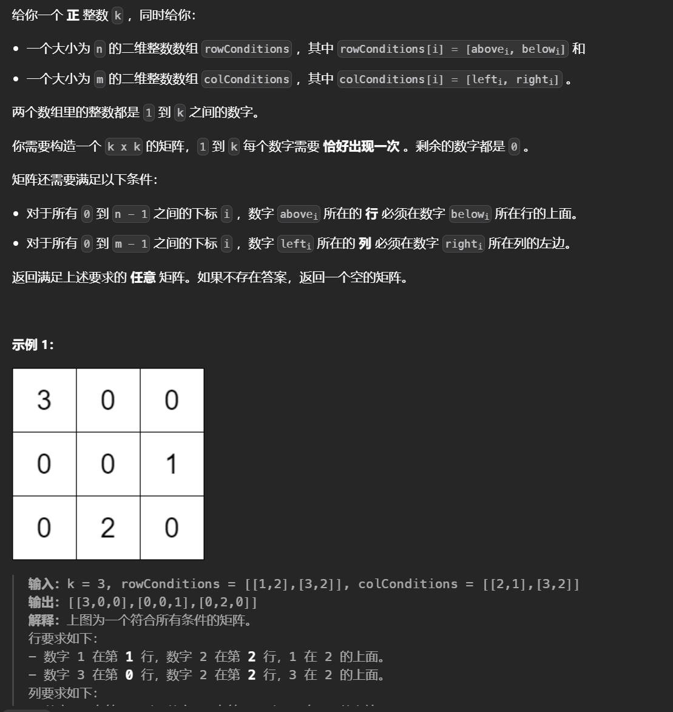

给定的两个数组规定了两两之间的相对顺序但是这个顺序不是很明确，可以用拓扑排序给出所有点的顺序。

```python
class Solution:
    def buildMatrix(self, k: int, rowConditions: List[List[int]], colConditions: List[List[int]]) -> List[List[int]]:
        	# 拓扑排序
            def top(d):
                q=deque()
                for i,v in enumerate(d):
                    if not i:continue
                    if not v:q.append(i)
                index=0
                while index<len(q):
                    # 保留序列
                    curr=q[index]
                    for c in path[curr].keys():
                        d[c]-=1
                        if not d[c]:
                            q.append(c)
                    index+=1
                # 最后判断是否满足拓扑序，防止不合法的相对顺序
                return q if len(q)==k else []
            
            # 分别统计行和列两个数组的入度
            
            m,n=len(rowConditions),len(colConditions)
            d=[0]*(k+1)
            grid=[[0]*k for _ in range(k)]
            path=defaultdict(dict)
            for a,b in rowConditions:
                if b not in path[a]:
                    path[a][b]=None
                    d[b]+=1
            row=top(d)

            d=[0]*(k+1)
            path=defaultdict(dict)
            for a,b in colConditions:
                if b not in path[a]:
                    path[a][b]=None
                    d[b]+=1
            col=top(d)
			
            if not col or not row:return []
        	# 使用哈希表记录每个值对应的行和列
            memo=defaultdict(list)
            for i,v in enumerate(row):
                memo[v]=[i]
            for i,v in enumerate(col):
                memo[v].append(i)
            for k,v in memo.items():
                r,c=v
                grid[r][c]=k
            return grid                 
```


## [找到最终的安全状态](https://leetcode.cn/problems/find-eventual-safe-states/)

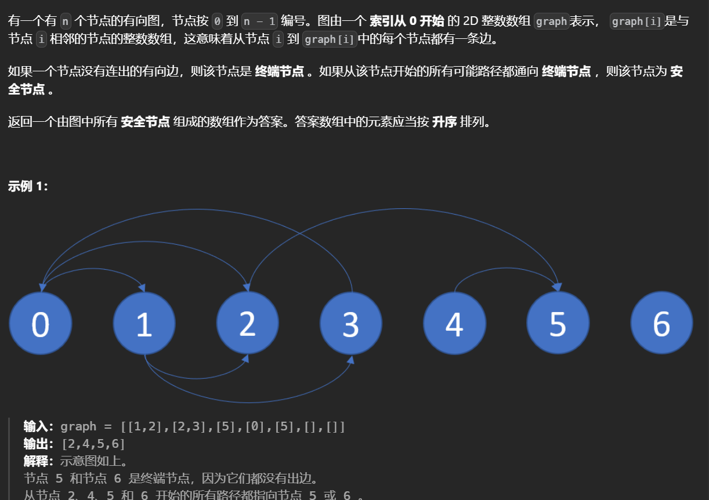

在环上的点是一定无法到达终端结点的，而不在环上的点一定可以到到终端节点(往下走直到终点)，因此使用拓扑排序分开环与节点，节点能到达终端节点那么也一定能从终端节点到达该节点，因此从终端节点出发统计出度为0的点/

```python
class Solution:
    def eventualSafeNodes(self, g: List[List[int]]) -> List[int]:
        ans=[]
        n=len(g)
        reg=[[] for _ in range(n)]
        out=[0]*n
        for i,arr in enumerate(g):
            for v in arr:
                reg[v].append(i)
                out[i]+=1
        q=deque([i for i,v in enumerate(out) if not v])
        
        # 基环是不会入队的
        while q:
            x=q.popleft()
            for y in reg[x]:
                out[y]-=1
                if not out[y]:q.append(y)
        return [i for i,v in enumerate(out) if not v]
```


## [最小高度树](https://leetcode.cn/problems/minimum-height-trees/)


**从外层开始，一层层剥离叶子节点，最后一层就是可以作为根的且高度最小的节点**，这里是无向图因此需要记录入度为1的。

```python
class Solution:
    def findMinHeightTrees(self, n: int, edges: List[List[int]]) -> List[int]:
        if n==1:return [0]
        d=deque()
        p=[[] for _ in range(n)]
        dev=[0]*n
        for u,v in edges:
            p[u].append(v)
            p[v].append(u)
            dev[u]+=1
            dev[v]+=1
        for i,x in enumerate(dev):
            if x==1:d.append(i)
        
        ans=[]
        while d:
            ans.clear()
            for _ in range(len(d)):
                curr=d.popleft()
                ans.append(curr)
                for child in p[curr]:
                    dev[child]-=1
                    if dev[child]==1:d.append(child)
        return ans 
```


## [奇怪的打印机 II](https://leetcode.cn/problems/strange-printer-ii/)


每个颜色只能用一次，每个颜色之间有相对顺序，如果一个颜色包裹在另一个颜色的矩形中那么必然要在这个颜色之后画，可以建图，用边相连来表示这个相对顺序，最后判断是否成环来判断是否矛盾。

```python
class Solution:
    def isPrintable(self, g: List[List[int]]) -> bool:
        m,n=len(g),len(g[0])
        color=defaultdict(list)
        # 统计每个颜色下的坐标
        for i in range(m):
            for j in range(n):
                c=g[i][j]
                color[c].append((i,j))
        path=defaultdict(list)
        dev=defaultdict(int)
        # 建图
        for c1 in color:
            # 找到该颜色对应的边界
            l,r=min(ls[1] for ls in color[c1]),max(ls[1] for ls in color[c1])
            u,d=min(ls[0] for ls in color[c1]),max(ls[0] for ls in color[c1])
            # 判断是否包含
            for c2 in color:
                if c1==c2:continue
                for i,j in color[c2]:
                    # 连边，更新入度
                    if u<=i<=d and l<=j<=r:
                        path[c1].append(c2)
                        dev[c2]+=1
                        break
        d=deque()
        idx=0
        # 拓扑排序
        for i in color:
            if not dev[i]:d.append(i)
        while idx<len(d):
            curr=d[idx]
            for child in path[curr]:
                dev[child]-=1
                if not dev[child]:d.append(child)
            idx+=1
        return len(d)==len(color)
```


## [项目管理](https://leetcode.cn/problems/sort-items-by-groups-respecting-dependencies/)

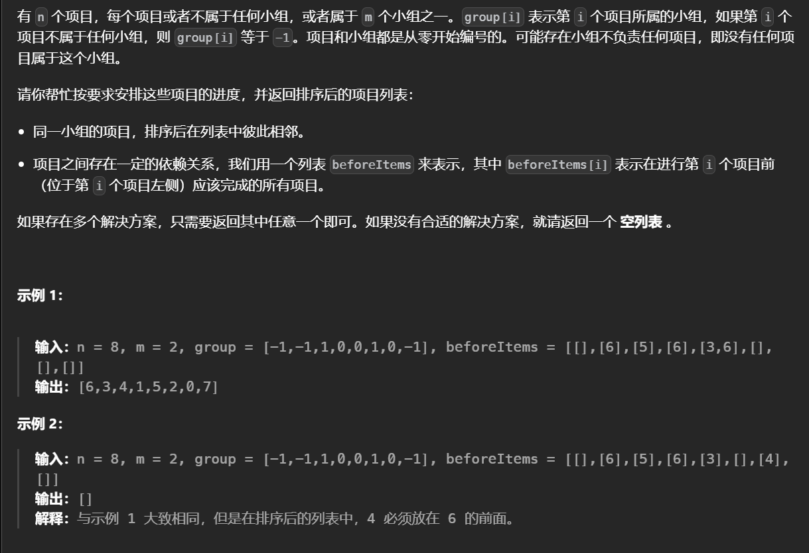

难点在于同一组的项目要相邻，不同组的项目之间存在依赖关系，这里做**两次拓扑排序**，第一次按照组之间的依赖关系排好序，然后拓扑排序每个项目，将项目按顺序放入到组中。

```python
class Solution:
    def sortItems(self, n: int, m: int, group: List[int], edges: List[List[int]]) -> List[int]:
        # 对于独立的项目给一个编号
        id=0
        vis=set(group)
        for i,v in enumerate(group):
            if v!=-1:continue
            while id in vis:id+=1
            group[i]=id
            vis.add(id)
        # 注意更新有多少组
        id=max(id,max(group))

        # 对组拓扑排序
        dev=[0]*(id+1)
        d=deque()
        path=[[] for _ in range(id+1)]
        
        # 对每个项目映射到组号建图
        for i,arr in enumerate(edges):
            if not arr:continue
            for v in arr:
                # 同一组中的忽略
                if group[v]==group[i]:continue
                dev[group[i]]+=1
                path[group[v]].append(group[i])
        
        for i,x in enumerate(dev):
            if not x:d.append(i)
        # 排序
        idx=0
        while idx<len(d):
            curr=d[idx]
            for child in path[curr]:
                dev[child]-=1
                if not dev[child]:d.append(child)
            idx+=1 
        # 如果组之间存在矛盾
        if len(d)!=id+1:return []
        
        ans=[[]for _ in range(id+1)]
        # 存储组对应到答案的位置
        pos=dict((v,i) for i,v in enumerate(list(d)))

        # 对项目建图
        dev=[0]*n
        path=[[] for _ in range(n)]
        d=deque()
        for i,arr in enumerate(edges):
            if not arr:continue
            for v in arr:
                dev[i]+=1
                path[v].append(i)
        
        # 排序
        idx=0
        for i,x in enumerate(dev):
            if not x:d.append(i)
        while idx<len(d):
            curr=d[idx]
            for child in path[curr]:
                dev[child]-=1
                if not dev[child]:d.append(child)
            idx+=1
        if len(d)!=n:return []

        # 按照关系一一对应
        for v in d:
            ans[pos[group[v]]].append(v)
        res=[]
        # 拼接上
        for arr in ans:res+=arr
        return res 
```


## [收集树中金币](https://leetcode.cn/problems/collect-coins-in-a-tree/)


这里令节点的度数等于它的邻居的个数，为了经过最少的边数，**删除不会访问到的边**。首先进行拓扑排序将不会访问到的节点找出(从不包含金币的叶子节点出发往回找)，要删除的边数就等于这些节点的个数。这里可以收集距离2以内的所有金币，所以对于剩下的叶子节点先删除一次他们的个数，然后再用拓扑找出下一轮叶子节点，再删除一次，剩下的边就是必须要访问的。因为必须要回到根节点所以剩余的边数乘二就是最终结果。

```python
class Solution:
    def collectTheCoins(self, coins: List[int], edges: List[List[int]]) -> int:
        n=len(coins)
        ans=n-1
        # 建图
        g=[[] for _ in range(n)]
        dev=[0]*n
        for x,y in edges:
            g[x].append(y)
            g[y].append(x)
            dev[x]+=1
            dev[y]+=1

        # 删除不需要的边          
        d=deque()
        for i,x in enumerate(dev):
            if x==1 and not coins[i]:
                d.append(i)
        idx=0
        while idx<len(d):
            curr=d[idx]
            for nx in g[curr]:
                dev[nx]-=1
                if dev[nx]==1 and not coins[nx]:
                    d.append(nx)
            idx+=1
        # 更新答案
        ans-=len(d)
        d=deque()
        
        # 找出包含金币的叶子节点
        for i ,c in enumerate(coins):
            if dev[i]==1 and c:d.append(i)
        # 删除一次 
        ans-=len(d)
        
        # 往回找一次即可实现删除距离为二的
        while d:
            curr=d.popleft()
            for nx in g[curr]:
                dev[nx]-=1
                if dev[nx]==1:
                    ans-=1
        # 如果所有的节点都要删除，最后一条边会被删除两次结果为-1，因此特判
        return max(ans*2,0) 
```

## [冗余连接 II](https://leetcode.cn/problems/redundant-connection-ii/)


给定的有向图是在树的基础上增加了一条边得来的，如果存在一个节点入度为二那么要删除的边一定是连接到它的两条边之一，如果从一条边出发能到根节点那么这条边是合法的，因此先查看第一条边是否能反向到达根节点如果能则可以删除第二条边，如果不能则删除这条边，因为该图原先定是合法的树。

如果不存在入度为二的边那么一定是存在一个有向环，对于本题统计出度为0的做拓扑排序即可找出环中的点。

```python
class Solution:
    def findRedundantDirectedConnection(self, edges: List[List[int]]) -> List[int]:
        n=len(edges)
        
        inn=[0]*n
        out=[0]*n
        reg=[[] for _ in range(n)]
        # 构建反图，统计入度和出度
        for u,v in edges:
            u-=1
            v-=1
            reg[v].append(u)
            inn[v]+=1
            out[u]+=1
        # 如果存在入度为2的点
        if 2 in inn:
            root=inn.index(0)
            # 先判断第一条边是否可行
            l,r=reg[inn.index(2)]
            s=l
            while True:
                # 能找到根节点则是合法的边，那么可以删除第二条边，至少要使得删除后还是一颗合法的树
                if s==root:return [r+1,inn.index(2)+1]
                # 通过反边往回找
                s=reg[s][0]
                # 不合法
                if l==s:return [l+1,inn.index(2)+1]
                
        # 使用出度拓扑排序
        d=deque()
        for r,x in enumerate(out):
            if not x:
                d.append(r)
        vis=set()
        idx=0
        while idx<len(d):
            curr=d[idx]
            vis.add(curr)
            for nx in reg[curr]:
                out[nx]-=1
                if not out[nx]:d.append(nx)
            idx+=1
        ans=None
        # 找到最小的
        for u,v in edges:
            if u-1 not in vis and v-1 not in vis:ans=[u,v]
        return ans     
```


# 拓扑序上DP

在拓扑序上DP类似于刷表法

## [并行课程 III](https://leetcode.cn/problems/parallel-courses-iii/)


用拓扑排序加动态规划，f[i]表示完成课程i所需的最小月份，在拓扑排序的过程中当一个点出队时用它去更新其他点的拓扑值。

```python
class Solution:
    def minimumTime(self, n: int, relations: List[List[int]], time: List[int]) -> int:
        p=defaultdict(dict)
        e=[0]*n
        # 建图
        for u,v in relations:
            p[u-1][v-1]=None
            e[v-1]+=1
        q=deque([i for i,v in enumerate(e) if not v])
        f=[0]*n
        # 拓扑排序
        while q:
            curr=q.popleft()
            # 出队，说明它的先修课都处理过了，那么这个课程所需的时间就要加上他自身所需的时间
            f[curr]+=time[curr]
            for k in p[curr].keys():
                # 他作为先修课去更新别的课程
                f[k]=max(f[k],f[curr])
                e[k]-=1
                if not e[k]:q.append(k)
        return max(f)   
```


## [有向图中最大颜色值](https://leetcode.cn/problems/largest-color-value-in-a-directed-graph/)


已知颜色使用字母表示的，因此经典做法令f[i]\[j]表示到节点i时字母j的最大值

```python
class Solution:
    def largestPathValue(self, colors: str, edges: List[List[int]]) -> int:
        n=len(colors)
        dev=[0]*n
        f=[[0]*26 for _ in range(n)]
        ans=-1
        g=[[] for _ in range(n)]
        for u,v in edges:
            g[u].append(v)
            dev[v]+=1
        d=deque()
        for i,x in enumerate(dev):
            if not x:
                d.append(i)
        idx=0
        while idx<len(d):
            curr=d[idx]
            c=ord(colors[curr])-ord('a')
            f[curr][c]+=1   
            ans=max(ans,max(f[curr]))
            for nx in g[curr]:
                dev[nx]-=1
                if not dev[nx]:
                    d.append(nx)
                for i in range(26):
                    f[nx][i]=max(f[nx][i],f[curr][i])
            idx+=1
        if len(d)!=n:return -1
        return ans
```


# 基环树

## [ 参加会议的最多员工数](https://leetcode.cn/problems/maximum-employees-to-be-invited-to-a-meeting/)


内向基环图，具有n个节点n条边的连通块，内向指的是连通块中的每个节点的出度为1，外向指的是入度为1，基环图中在基环外可以连接有多个树枝

每个员工只能坐在喜欢的人边上那么座次必须要满足是一个内向基环图

如果基环的大小大于等于3，那么圆桌上能做的人数就是基环的大小，一旦往这个环里**向x->y插入其他的节点**，一定会使得x不满足条件。

如果基环的大小为2，那么两个点的**两边**可以继续坐人也就是求出两个点的最长链，为此需要构造一个反图，此外在这个座次中可以继续坐入大小为2的基环。


通过一次拓扑排序可以**将树枝的入度变为0以此与基环分开**，因为图拓扑排序中只能操作树枝，通过构建反图。

```python
class Solution:
    def maximumInvitations(self, favorite: List[int]) -> int:
        n=len(favorite)
	# 计算入度
        deg=[0]*n
        for f in favorite:
            deg[f]+=1
        q=deque([i for i,v in enumerate(deg) if not v])    
        r=defaultdict(list)
        # 将树枝与基环分开，基环是不会入队的
        while q:
            x=q.popleft()
            y=favorite[x]
            # 构建反图
            r[y].append(x)
            deg[y]-=1
            if not deg[y]:
                q.append(y)
         # 求出最长的链
        def dfs(x):
            if not r[x]:return 0
            return max(dfs(y)+1 for y in r[x])
        a=b=0
        # 遍历每一个点，找出基环
        for i,v in enumerate(deg):
            if not v:continue
            # 设置为0防止重复访问到
            deg[i]=0
            j=favorite[i]
            res=1
            # 一直顺着基环找
            while j!=i:
                deg[j]=0
                j=favorite[j]
                res+=1
            # 分类讨论 
            if res>2:
                a=max(a,res)
            elif res==2:
                # 基环长度为2的可以一直累加
                b+=dfs(i)+dfs(favorite[i])+res
        return max(a,b) 
```


## [图中的最长环](https://leetcode.cn/problems/longest-cycle-in-a-graph/)


问题就是在找最大的基环数，把树枝通过拓扑排序与基环分开后直接去找基环的大小。

```python
class Solution:
    def longestCycle(self, edges: List[int]) -> int:
        n=len(edges)
        deg=[0]*n
        for f in edges:
            if f==-1:continue
            deg[f]+=1
        q=deque([i for i,v in enumerate(deg) if not v])
        # 基环是不会入队的
        while q:
            x=q.popleft()
            y=edges[x]
            if y==-1:continue
            deg[y]-=1
            if not deg[y]:
                q.append(y)
        ans=0
        for i,v in enumerate(deg):
            if not v:continue
            j=edges[i]
            res=1
            deg[i]=0
            while deg[j]:
                deg[j]=1
                j=edges[j]
                res+=1
            ans=max(ans,res)
        return ans if ans else -1
```


## **Reachability in Functional Graph**


特意强调了每个点的出边只有一个，那么就是一个基环树。**找两两可以相互到达的点首先看环**，在环上的点能到达其他点的数目就是环的大小，作为分支的点可以到的点的数目就是就是他所连的点能到达的数目加一。

```python
from collections import deque,defaultdict
import sys
sys.setrecursionlimit(150000)
from functools import lru_cache

input=sys.stdin.readline

n=int(input())
nums=[int(x)-1 for x in input().split()]

e=[0]*n

for i,v in enumerate(nums):
    e[v]+=1

# 把环筛出来
p=[False]*n
d=deque([i for i,v in enumerate(e) if not v])
while d:
    curr=d.popleft()
    p[curr]=True
    k=nums[curr]
    if k==curr:continue
    e[k]-=1
    if not e[k]:d.append(k)

ans=[0]*n
# 计算环上每个点能连接的大小
for i in range(n):
    if not p[i]:
        cnt=0
        j=nums[i]
        while not p[j]:
            cnt+=1
            p[j]=True
            j=nums[j]
        for _ in range(cnt):
            ans[i]=cnt
            i=nums[i]
vis=set()

# 计算分支，使用递归注意要设置深度
@lru_cache(maxsize=None)
def dfs(i):
    if e[i]:return ans[i]
    return 1+dfs(nums[i])

for i,v in enumerate(e):
    if not v and i not in vis:
        ans[i]=dfs(i)
print(sum(ans))
```


## [追逐游戏](https://leetcode.cn/problems/Za25hA/)


因为只有n条边所以图中最多只有一个环，如果图中存在大小为4的环并且b比a更快到环的入口那么a永远追不上b，而后枚举每一个点的位置，如果a比b更快到达这个点，那么a一定是在这个点之前追上b，因此不能用于更新答案。

```python
class Solution:
    def chaseGame(self, edges: List[List[int]], a: int, b: int) -> int:
        n=len(edges)
        deg=[0]*n
        edges=[[u-1,v-1] for u,v in edges]
        a-=1
        b-=1
        inn=set()
        
        # 建图
        g=[[] for _ in range(n)]
        for u,v in edges:
            deg[v]+=1
            deg[u]+=1
            g[u].append(v)
            g[v].append(u)
        # 如果相邻
        if b in g[a]:return 1
        
        # 求解到每个点的距离以及距离最近的环的入口
        def getdis(a):
            dis=[-1]*n
            d=deque()
            vis=set()
            d.append(a)
            vis.add(a)
            sz=-1
            pre=-1
            while d:
                sz+=1
                for _ in range(len(d)):
                    curr=d.popleft()
                    dis[curr]=sz
                    if pre==-1 and curr in inn:
                        pre=curr
                    for nx in g[curr]:
                        if nx in vis:continue
                        d.append(nx)
                        vis.add(nx)
            return dis,pre
        
        vis=set()
        d=deque()
        for i,x in enumerate(deg):
            if x==1:d.append(i)
        # 拓扑排序找出环
        while d:
            curr=d.popleft()
            vis.add(curr)
            for nx in g[curr]:
                if nx in vis:continue
                deg[nx]-=1
                if deg[nx]==1:
                    d.append(nx)
        # 求解环的大小
        for i,x in enumerate(deg):
            if x>1:
                deg[i]=0
                inn.add(i)
                for nx in g[i]:
                    if deg[nx]==2:
                        j=nx
                        break
                cnt=1
                
                while j!=i:
                    cnt+=1
                    deg[j]=0
                    inn.add(j)
                    for nx in g[j]:
                        if deg[nx]==2:
                            j=nx
                            break
                    else:
                        break
                break
        disa,_=getdis(a)
        disb,entry=getdis(b)
        # 能成功到环上
        if cnt>3 and disa[entry]>disb[entry]+1:return -1
        ans=-1
        # 枚举每个点
        for i in range(n):
            # 并不是每个点都可以
            if disa[i]<=disb[i]+1:continue
            ans=max(ans,disa[i])
        return ans 
```


# Dijkstra算法

对于有多个状态的问题，需要扩展dIs数组，类似DP的做法。

通过将所有的点入队做Dijkstra可以得到每个点到其他点的最短距离


## 模板

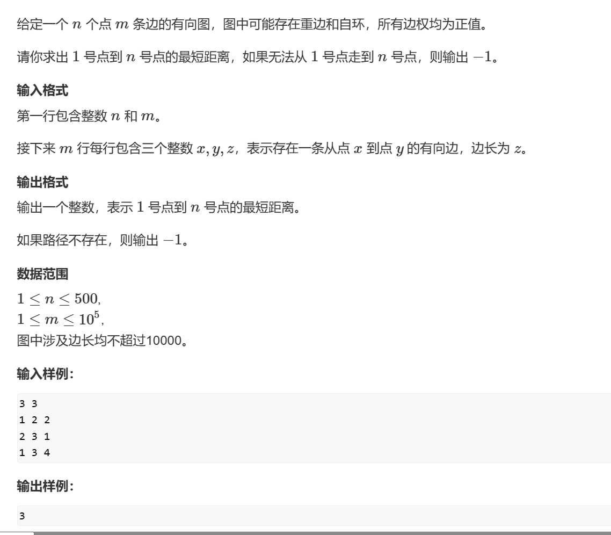

```python
from math import inf

n, m = [int(x) for x in input().split()]
path = [[inf] * n for _ in range(n)]
dis = [inf] * n
dis[0] = 0
# 不用标记初始点
vis = [False] * n
for _ in range(m):
    u, v, w = [int(x) for x in input().split()]
    #注意要取最小值，可能有重边
    path[u-1][v-1] = min(w,path[u-1][v-1])
while True:
    x = -1
    # 遍历一遍所有点，选出其中没有被访问过且力起点最近的点
    for i in range(n):
        if not vis[i] and (x < 0 or dis[i] < dis[x]):
            x = i
    # 图不连通
    if x < 0 or dis[x] == inf:
        print(-1)
        break
    # 找到了，由于求的是单源最短路直接返回
    if x == n - 1:
        print(dis[x])
        break
    # 标记
    vis[x] = True
    # 更新状态
    for u, w in enumerate(path[x]):
        dis[u] = min(dis[u], dis[x] + w)

```

很明显的看出，每次要遍历所有的点n然后进行这个点边的个数次操作，一次操作中是O(m+n)，最多遍历vis数组的大小，也就是O(n^2)


点数太多而边数有限，使用优先队列优化的算法，优先队列优化指的是使用根堆每次找当前没有被访问过的且距离最小的点。

```python
from collections import defaultdict
from math import inf
import heapq

n, m = [int(x) for x in input().split()]
# 这里由于点数太多，且图是稀疏图因此使用邻接表
path =defaultdict(dict)
dis = [inf for i in range(n)]
dis[0] = 0

# 建图
for _ in range(m):
    u, v, w = [int(x)-1 for x in input().split()]
    # 不使用默认字典，即使是双向边也能用
    if v in path[u]:
        path[u][v]=min(path[u][v],w+1)
    else:
        path[u][v]=w+1

# 第一个值作为权重
h=[(0,0)]
while h:
    d,x=heapq.heappop(h)
    # 当前点之前出过堆
    if d>dis[x]:continue
    
    for k,v in path[x].items():
        # 严格小于 
        if d+v<dis[k]:
            dis[k]=d+v
            heappush(h,(dis[k],k))       
print(*dis[1:])
```

时间复杂度为O(mn)，根堆中找值的速度为O(logn)，大概一共进行m（边的个数次）


## 前往目标的最小代价


不考虑特殊路径，起点到终点的距离就是曼哈顿距离，也就是两个坐标之差的绝对值之和，不需考虑怎么走（向上向下一类的），直接就是两个点的间距。

抽象为一幅图，认为每个节点和终点以及特殊路径中的终点相连，从起点记过一段特殊路径到达特殊路径的终点后，又可以直接到起点或者继续走一段特殊路径，接下来使用Dijkstra算法。

模拟一下：从起点开始，可以到达终点以及多个特殊路径的终点，如果在循环中选取出的最短路是直接到终点的话，也就是说经过特殊路径反而不会缩减距离，那么结果就是从起点直接到终点，否则就是选择了从起点到某一段特殊路径端点的最短的路径，然后从这个端点继续选择，如果从这个端点到重点的距离最短，那么下一轮循环就会直接找出答案， 如果是经过另一条特殊路径最短的话，那么下一轮继续之前的操作。

```python
from cmath import inf
from collections import defaultdict
class Solution(object):
    def minimumCost(self, start, target, specialRoads):
        # 将传入的数组转化为元组形式
        t = tuple(target)
        # 由于是二维下的，因此使用一个字典记录距离
        dis = defaultdict(lambda: inf)
        # 自己到自己的距离是0
        dis[tuple(start)] = 0
        # 记录有无加入过
        vis = set()

        def Dijastra():
            # 算法模板，没有用优先级队列
            
            while True:
                # v表示当前节点
                v = None
                # 使用循环找出队列中优先级最高的且没有被访问过的
                for point, d in dis.items():
                    if point not in vis and (v is None or d < dis[v]):
                        v = point
                # 到达目标点
                if v == t:
                    return dis[v]
                
                vis.add(v)
                vx, vy = v

                # 更新相连的节点
                
                # 更新到终点
                dis[t] = min(dis[t], dis[v] + abs(vx - t[0]) + abs(vy - t[1]))
                # 更新经过特殊路径的点
                for x1, y1, x2, y2, c in specialRoads:
                    # 只需要考虑特殊路径的另一端
                    w = (x2, y2)
                    # 从当前节点到特殊路径的另一端有两种走法，首先得到特殊路径的起始点，之后，一个是直接曼哈顿距离，一个经过特殊路径到另一端（加上cost）
                    d = dis[v] + min(abs(x2 - vx) + abs(y2 - vy), abs(x1 - vx) + abs(y1 - vy) + c)
                    # 更新
                    dis[w] = min(dis[w], d)

        return Dijastra()
```

## Buy a Ticket


该题目中存在点权，并且只有终点的点权需要计算而路径上的点权不需要考虑，对于此类题目可以建立一个超级源点，该源点连接每一个点并且边权为每个点的点权，从该超级源点出发做迪杰斯特拉的结果就是每个点到其他点的最短路径（可以是本身），该题目中需要考虑来回因此边权需要乘上2，而从超级源点出发的边边权不变。

对于给定的数据范围需要使用根堆优化

```python
import heapq
from collections import defaultdict
from heapq import heappush
from math import inf
import sys
input=sys.stdin.readline

n,m=[int(x) for x in input().split()]
path=defaultdict(dict)
# 建图 这里是无向图
for _ in range(m):
    u,v,w=[int(x) for x in input().split()]
    path[u][v]=w*2
    path[v][u]=w*2
a=[int(x) for x in input().split()]
# 建立超级源点，由于点是从1到n的，因此超级源点可以设置为0
for i,v in enumerate(a,1):
    path[0][i]=v
    path[i][0]=v
dis=[inf]*(n+1)
dis[0]=0
# 建立根堆
h=[(0,0)]
while h:
    # 弹出
    d,x=heapq.heappop(h)
    # 访问过
    if d>dis[x]:continue
    for k,v in path[x].items():
        # 更行
        if d+v<dis[k]:
            dis[k]=d+v
            heappush(h,(dis[k],k))       
print(*dis[1:])
```

## [得分最高的路径](https://leetcode.cn/problems/path-with-maximum-minimum-value/)

		

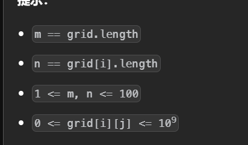


使用dfs超时，bfs无法求解，使用图论。此题点数太多使用根堆优化的版本，由于要求最大值，因此把边权转换为负数求解最小值。

```python
class Solution:
    def maximumMinimumPath(self, grid: List[List[int]]) -> int:
        m,n=len(grid),len(grid[0])
        # 用一维数组代替二维
        dis=[inf]*(m*n)
        h=[(-grid[0][0],0,0)] 
        dis[0]=-grid[0][0]
        while h:
            d,i,j=heapq.heappop(h)
            curr=i*n+j
            # 访问过了
            if d>dis[curr]:continue
            # 找相连的点
            for dx,dy in (0,1),(-1,0),(1,0),(0,-1):
                if 0<=(x:=dx+i)<m and 0<=(y:=dy+j)<n:
                    target=x*n+y
                    # 路径距离的计算是取最小值
                    cc=max(-grid[x][y],d)
                    #如果小于可以更新
                    if cc<dis[target]:
                        dis[target]=cc
                        heappush(h,(dis[target],x,y))
        
        return -dis[-1]
```

## [到达目的地的方案数](https://leetcode.cn/problems/number-of-ways-to-arrive-at-destination/)


用dijstra找最短路的过程中使用dp求解路径数，定义dp[i]为0~i最短路的数目，如果存在d+v<dis[k]说明从 0 到 *x* 再到 *y* 的路径是目前最短的，所以更新 *f*[*y*] 为 *f*[*x*]，如果等于，说明从 0 到 *x* 再到 *y* 的路径与之前找到的路径一样短，所以把 *f*[*y*] 增加 *f*[*x*]。

```python
class Solution:
    def countPaths(self, n: int, edges: List[List[int]]) -> int:
        mod=10**9+7
        path=defaultdict(dict)
        f=[0]*n
        f[0]=1
        for u,v,w in edges:
            path[u][v]=path[v][u]=w
        dis=[inf]*n
        dis[0]=0
        h=[(0,0)]
        while h:
            d,x=heappop(h)
            if d>dis[x]:continue
            for k,v in path[x].items():
                if d+v<dis[k]:
                    f[k]=f[x]
                    dis[k]=d+v
                    heappush(h,(dis[k],k))
                elif d+v<=dis[k]:
                    f[k]+=f[x]
                    f[k]%=mod
        
        return f[-1]
```


## [使网格图至少有一条有效路径的最小代价](https://leetcode.cn/problems/minimum-cost-to-make-at-least-one-valid-path-in-a-grid/)


最短路问题，把每个格子看作是一个点，是否要变化看作是权重0和1，用迪杰斯特拉求解从起点到终点的距离。

```python
class Solution:
    def minCost(self, grid: List[List[int]]) -> int:
        m,n=len(grid),len(grid[0])
        # 用二维矩阵表示从(0,0)到(i,j)的最小距离
        dis=[[inf]*n for _ in range(m)]
        # 初始化
        dis[0][0]=0
        h=[(0,0,0)]
        dirs=[(0,1),(0,-1),(1,0),(-1,0)]
			
        while h:
            c,x,y=heappop(h)
            if c>dis[x][y]:continue
            for jj in range(4):
                dx,dy=dirs[jj]
                # 合法的位置
                if 0<=(i:=dx+x)<m and  0<=(j:=dy+y)<n:
                    # 代价是是否要变化方向
                    cnt=c+int((jj+1)!=grid[x][y])
                    if cnt<dis[i][j]:
                        dis[i][j]=cnt
                        heappush(h,(dis[i][j],i,j))
        return dis[-1][-1]
```


## [在网格图中访问一个格子的最少时间](https://leetcode.cn/problems/minimum-time-to-visit-a-cell-in-a-grid/)

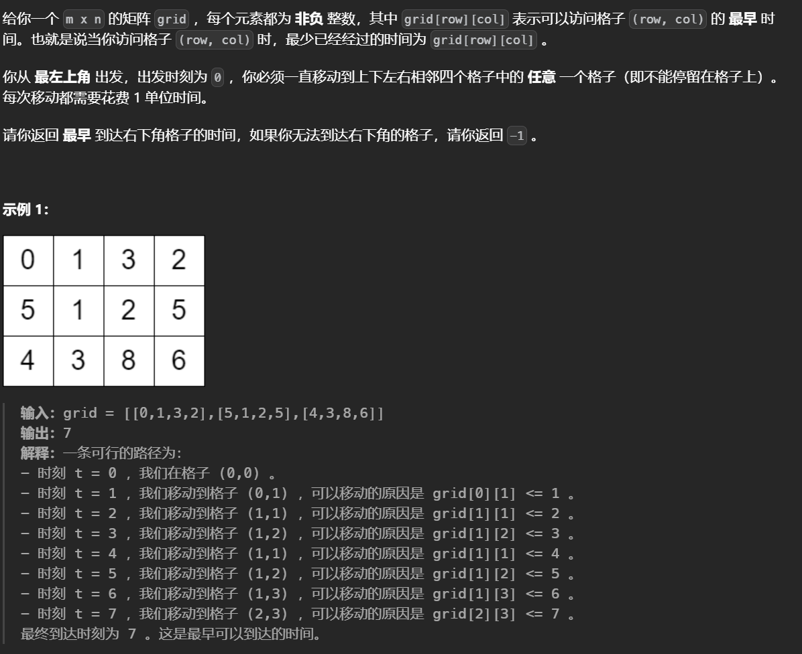

使用Dijkstra算法求解最短时间，这里到下一个位置所需的时间就是**max(当前位置所需的最短时间+1，这个位置至少需要的时间)**，同时这里可以通过反复横跳来增加时间，如果两个位置所需的时间的差为偶数那么到下一个位置所需的时间要加一，因为反复横跳所增加的时间一定是偶数，从5->11，差为6，反复横跳三次得到6然后在移动一次，因此所需的时间要加一。

```python
class Solution:
    def minimumTime(self, g: List[List[int]]) -> int:
        m,n=len(g),len(g[0])
        if g[0][1]>1 and g[1][0]>1:return -1
        dis=[[inf]*n for _ in range(m)]
        dis[0][0]=0
        h=[(0,0,0)]
        while True:
            d,i,j=heappop(h)
            if d>dis[i][j]:continue
            if i==m-1 and j==n-1:return d 
            for dx,dy in (1,0),(-1,0),(0,-1),(0,1):
                if 0<=(x:=dx+i)<m and 0<=(y:=dy+j)<n:
                    nd=max(d+1,g[x][y])
                    if (nd-d)&1==0:
                        nd+=1
                    if nd<dis[x][y]:
                        dis[x][y]=nd
                        heappush(h,(nd,x,y)) 
```


## [最大汉明距离](https://leetcode.cn/problems/maximum-hamming-distances/)

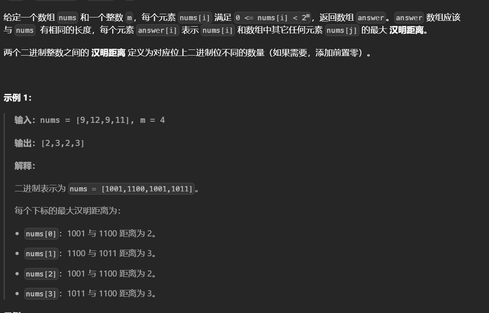

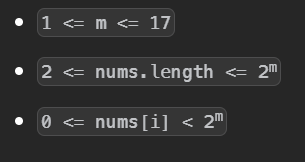

以二进制的角度看，每走一步就是反转一位 ，题目中要求的汉明距离最大即对应的不同二进制位越多越好，如果使用Dijkstra直接求解的会为了得到最大距离而走环(不断反转同一位)，这里将枚举的数转化为反码那么最大汉明距离就变为对应的不同的二进制位越少越好

**题目中求解所有值的汉明距离，通过将所有的点作为起点做Dijkstra可以找到每一个点与其他点的最小距离。**最后的结果是dis[x]即x到所有起点的最小距离，也就是和反码相同位的有多少个，用m减去即可得到原码所需操作的次数

```python
class Solution:
    def maxHammingDistances(self, nums: List[int], m: int) -> List[int]:
        dis=defaultdict(lambda:inf)
        h=[]
        mask=(1<<m)-1
        for v in nums:
            # 转换为反码
            dis[v^mask]=0
            heappush(h,(0,v^mask))
        
        while h:
            d,x=heappop(h)
            # 当前点之前出过堆
            if d>dis[x]:continue
            for j in range(m):
                # 反转每一位
                state=x^(1<<j)
                if  d+1<dis[state]:
                    dis[state]=d+1
                    heappush(h,(dis[state],state))
        return [m-dis[v] for v in nums]
```

## [到达目的地的第二短时间](https://leetcode.cn/problems/second-minimum-time-to-reach-destination/)


要得到第二小的距离只需在距离数组中额外维护一个变量即可，每次更新时先于最小的比较在于第二小的比较。

```python
class Solution:
    def secondMinimum(self, n: int, edges, time: int, change: int) -> int:
        dis=[[inf,inf] for _ in range(n)]
        dis[0][0]=0
        g=[[] for _ in range(n)]
        for u,v in edges:
            u-=1
            v-=1
            g[v].append(u)
            g[u].append(v)
        h=[(0,0)]
        while h:
            d,x=heappop(h)
            if d>dis[x][1]:continue
            for nx in g[x]:
                t=time+d
                if (d//change)&1:
                    t+=change-d%change
                if dis[nx][0]>t:
                    dis[nx][0],dis[nx][1]=t,dis[nx][0]
                    heappush(h,(dis[nx][0],nx))
                    heappush(h,(dis[nx][1],nx))
                elif t!=dis[nx][0] and dis[nx][1]>t:
                    dis[nx][1]=t
                    heappush(h,(dis[nx][1],nx))
        return dis[-1][-1]
res=Solution().secondMinimum(7,[[1,2],[1,3],[2,5],[2,6],[6,5],[5,7],[3,4],[4,7]],4,7)
print(res)
```


## [细分图中的可到达节点](https://leetcode.cn/problems/reachable-nodes-in-subdivided-graph/)


使用BFS模拟会难以判断是否要访问已经过的节点，这里转换为单源最短路问题，这里的边权是w+1，对于每个点做出从起点出发能到达的最短距离，首先枚举每个点如果能到达就把这个点入计入，随后枚举每条边，如果到达边的两个端点后还能继续走那么即计入答案。

```python
class Solution:
    def reachableNodes(self, edges: List[List[int]], cnt: int, n: int) -> int:
        ans=0
        g=defaultdict(dict)
        # 建图，注意边权加一
        for u,v,w in edges:
            g[u][v]=g[v][u]=w+1
        h=[(0,0)]
        dis=[inf]*n
        dis[0]=0
        # 求最短路
        while h:
            d,x=heappop(h)
            if d>dis[x]:continue
            for k,v in g[x].items():
                if dis[k]>d+v:
                    dis[k]=d+v
                    heappush(h,(dis[k],k))
        # 先枚举节点
        for i in range(n):
            if dis[i]<=cnt:ans+=1
        # 找边
        for u,v,w in edges:
            # 注意不要计算负数
            a=max(0,cnt-dis[u])
            b=max(0,cnt-dis[v])
            ans+=min(a+b,w)
            
        return ans
```


## [得到要求路径的最小带权子图](https://leetcode.cn/problems/minimum-weighted-subgraph-with-the-required-paths/)


直接求解距离会导致重复计算某段距离，**这里枚举三个点的交汇点**，首先预处理出src1,src2到其他点的距离，再通过反边找到dest到其他点的距离，如下所示的图中通过枚举交汇点可以避免重复计算，如果三个点是在链上则会枚举到三个点的中间节点得到正确答案。


```python
class Solution:
    def minimumWeight(self, n: int, edges: List[List[int]], src1: int, src2: int, dest: int) -> int:
        g=defaultdict(dict)
        reg=defaultdict(dict)
        for u,v,w in edges:
            if u in reg[v]:reg[v][u]=min(reg[v][u],w)
            else:reg[v][u]=w
            if v in g[u]:g[u][v]=min(g[u][v],w)
            else:g[u][v]=w

        def dijkstra(g,start):
            dis=[inf]*n
            dis[start]=0
            h=[(0,start)]
            while h:
                d,x=heappop(h)
                if d>dis[x]:continue
                for k,v in g[x].items():
                    if dis[k]>d+v:
                        dis[k]=d+v
                        heappush(h,(dis[k],k))
            return dis
        d1,d2,d3=dijkstra(g,src1),dijkstra(g,src2),dijkstra(reg,dest)
        ans=min(sum(d) for d in zip(d1,d2,d3))
        if ans==inf:return -1
        return ans
```

## [规定时间内到达终点的最小花费](https://leetcode.cn/problems/minimum-cost-to-reach-destination-in-time/)


本题有两个约束条件一个是费用一个是时间，从起点出发第一次到达的点的费用一定是最低的，**因为本题中权重是在点上的而非边上。相当于固定了一个变量去找另一个变量，即已经确定一个先走过的位置费用一定更小，如果时间不会更小的话那么一定是无用的状态。**为了固定费用根堆以费用最为权重。

```python
class Solution:
    def minCost(self, maxTime: int, edges: List[List[int]], f: List[int]) -> int:
        n=len(f)
        g=[[] for _ in range(n)]
        # 建图，点之间会有多条边
        for u,v,w in edges:
            g[u].append((v,w))
            g[v].append((u,w))
        # 费用为权重
        h=[(f[0],0,0)]
        # 使用时间做判断依据
        time=[inf]*n
        time[0]=0
        while h:
            d,t,x=heappop(h)
            # 找到了直接返回
            if x==n-1:return d
            for k,v in g[x]:
                '''
                不超时且到达下一个点的时间要更小，如果时间大于则下一节点被访问过了
                因为根堆每次弹出最小的值，所以先访问到的节点费用一定更少，此时
                下一节点需要的时间又更短，那么就完全没有更新的必要

                '''
                if t+v>=time[k] or t+v>maxTime:continue
                '''对于一个节点只有访问到它的距离更短(tieme[i]=inf)
                或者访问到的它的时间更短(time[i]>t+v)时才会更新
                '''
                time[k]=t+v
                heappush(h,(f[k]+d,t+v,k))
        return -1
```


[K 站中转内最便宜的航班](https://leetcode.cn/problems/cheapest-flights-within-k-stops/)


本题是边权，对于约束条件经过的点数，已经访问过的位置一定是更小的，因此如果费用不会更小的话那么一定是无用的状态。

为了固定访问次数，根堆以访问次数作为权重

```python
class Solution:
    def findCheapestPrice(self, n: int, edges: List[List[int]], src: int, dst: int, kk: int) -> int:
        dis=[inf]*n
        dis[src]=0
        ans=inf
        g=defaultdict(dict)
        # 建图
        for u,v,w in edges:
            g[u][v]=w
        h=[(0,0,src)]
        while h:
            cnt,d,x=heappop(h)
            if x==dst:ans=min(ans,d)
            for k,v in g[x].items():
                # 次数不能超过
                if cnt>kk:continue
                # 只有费用更小才有可能
                if d+v<dis[k]:
                    dis[k]=d+v
                    heappush(h,(cnt+1,dis[k],k))
        if ans!=inf:return ans
        return -1
```

或者也可以扩展状态，用类似DP的方式求解

```python
class Solution:
    def findCheapestPrice(self, n: int, edges: List[List[int]], src: int, dst: int, kk: int) -> int:
        dis=[[inf]*(kk+2) for _ in range(n)]
        dis[src][0]=0
        g=defaultdict(dict)
        # 建图
        for u,v,w in edges:
            g[u][v]=w
        h=[(0,0,src)]
        while h:
            d,cnt,x=heappop(h)
            for k,v in g[x].items():
                if cnt+1>kk+1:continue
                if d+v<dis[k][cnt+1]:
                    dis[k][cnt+1]=d+v
                    heappush(h,(dis[k][cnt+1],cnt+1,k))
        if (ans:=min(dis[dst]))!=inf:return ans
        return -1
```


## [电动车游城市](https://leetcode.cn/problems/DFPeFJ/)


在传统最短路径问题的基础上，引入电量状态，**即dis[i]\[j]表示到达城市i时所剩电量为j所需的最短时间**。

```python
class Solution:
    def electricCarPlan(self, edges: List[List[int]], cnt: int, start: int, end: int, charge: List[int]) -> int:
        g=defaultdict(dict)
        n=len(charge)
        for u,v,w in edges:
            if v in g[u]:g[u][v]=min(g[u][v],w)
            else:g[u][v]=w

            if u in g[v]:g[v][u]=min(g[v][u],w)
            else:g[v][u]=w

        h=[(0,0,start)]
        dis=[[inf]*(cnt+1) for _ in range(n)]
        dis[start][0]=0 
        while h:
            d,c,x=heappop(h)
            if d>dis[x][c]:continue
            if c+1<=cnt and dis[x][c+1]>d+charge[x]:
                dis[x][c+1]=d+charge[x]
                heappush(h,(dis[x][c+1],c+1,x))
            for k,v in g[x].items():
                if c<v:continue
                if dis[k][c-v]>d+v:
                    dis[k][c-v]=d+v
                    heappush(h,(dis[k][c-v],c-v,k))

        return min(dis[end])
```


## [隐藏网格下的最小消耗路径](https://leetcode.cn/problems/minimum-path-cost-in-a-hidden-grid/)

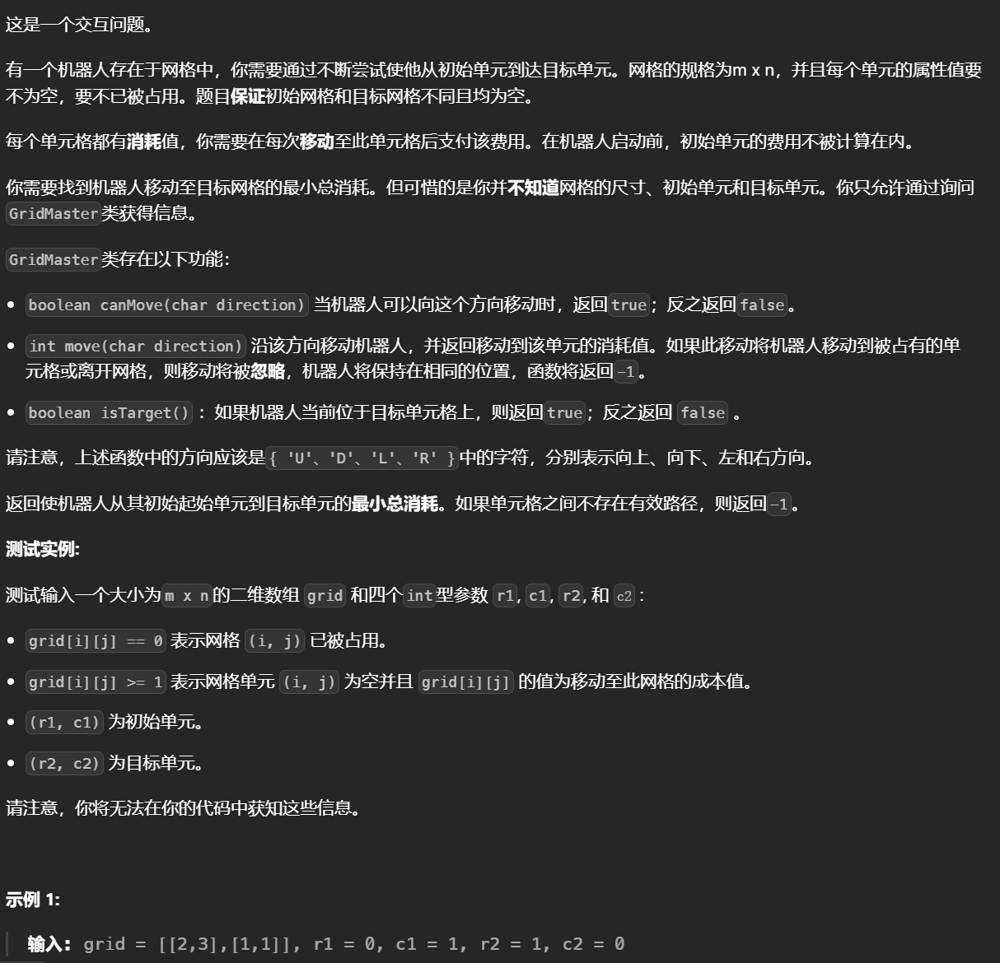

需要手动建图，这里无法找出起始点以及图的大小，因为当遇到被占用的位置以及超出边界时都会返回-1，因此无法判断到底能不能走，这里建图选择用偏移量作为点，即(0,0)表示起点，(0,-1)表示起点左移一位

```python
class Solution(object):
    def findShortestPath(self, master: 'GridMaster') -> int:
        dirs={'U':(-1,0),'D':(1,0),'L':(0,-1),'R':(0,1)}
        reg={'U':'D','D':'U','L':'R','R':'L'}
        
        tx=ty=None

        vis={}
        # vis记录图
        vis[(0,0)]=0
        dest=None
        def dfs(i,j):
            nonlocal tx,ty

            if master.isTarget():
                tx,ty=i,j             
            for dir in dirs:
                dx,dy=dirs[dir]
                # 如果位置记录过了就不再访问，相当于dfs遍历了一遍图
                if master.canMove(dir) and (i+dx,j+dy) not in vis:
                    vis[(i+dx,j+dy)]=master.move(dir)
                    dfs(i+dx,j+dy)
                    master.move(reg[dir])
        dfs(0,0)

        # 无法到达终点
        if tx==None:return -1
        # 用坐标点做Dijkstra
        dis=defaultdict(lambda:inf)
        # 跑Dijstra
        dis[(0,0)]=0
        h=[(0,0,0)]
        while h:
            d,i,j=heappop(h)
            if i==tx and j==ty:return d
            if d>dis[(i,j)]:continue
            for dx,dy in dirs.values():
                x=dx+i
                y=dy+j
                # 在vis中的才是图的节点
                if (x,y) in vis and vis[(x,y)]+d<dis[(x,y)]:
                    dis[(x,y)]=vis[(x,y)]+d
                    heappush(h,(dis[(x,y)],x,y))
```


# FLoyd算法（多源最短路）


基本原理：对于每个中间点v，和任一顶点对(i,j)，i!=j,i!=v ,j!=v(不和中间点相连，如果相连经不经过中间点都是一样的，如果i==j也就是自己到自己也没必要考虑)，如果A[i] [j]>A[i] [v] +A[v] [j]（如果经过中间到达目标点的距离更短，更新），则更新A[i] [j]为后者。

初始时建立两张表格，A,path下标为-1表示没有考虑任何中间点，A中的值表示的是两点之间的最短距离，path中的值表示两个点之间的最短路是否经过一个中间点。


​	

之后根据原理不断更新距离，对每个中间点，遍历一遍A数组更新最短路径。


实际上是在不断考虑经过每个中间点之后是否会是当前路径变短，


## [阈值距离内邻居最少的城市](https://leetcode.cn/problems/find-the-city-with-the-smallest-number-of-neighbors-at-a-threshold-distance/)


即找出每个城市到其他城市的最短路中小于distanceThrehold的有多少个，选出其中最少的且编号最大的那个。

从起点到终点枚举中间点。

​	


```python
from math import inf
class Solution:
    def findTheCity(self, n: int, edges: List[List[int]], distanceThreshold: int) -> int:
        # 初始化为无穷，表示不相连
        dis=[[inf for _ in range(n)] for _ in range(n)]
        # 建立直接相连的图
        for u,v,w in edges:
            dis[u][v]=dis[v][u]=w
            
         # dfs(k,i,j)返回从i到j的最短路径，并且这条最短路的中间节点编号都 ≤k。注意中间节点不包含 i 和 j。对于选取每个中间节点改为设置一个最大的中间节点，在递归中做到选取每一个中间节点
        @cache
        def dfs(k,i,j):
            # 当二者之间的中间节点为-1时，表示i 和 j 之间没有任何中间节点，此时最短路长度只能是连接 i和 j 的边的边权
            if k<0:
                return dis[i][j]
            else:
                # 对于给定的中间节点，有选或者不选两种可能.
                return min(dfs(k-1,i,j),dfs(k-1,i,k)+dfs(k-1,k,j))
        val=inf
        ans=0
        # 使用双层循环，外层循环找所有的城市，内层循环找所有的其他的城市，计算二者之间的距离如果小于将次数加一
        for i in range(n):
            cnt=0
            for j in range(n):
                # 中间节点设置为节点个数，以便选择所有的中间节点
                if j!=i and dfs(n-1,i,j)<=distanceThreshold:
                    cnt+=1
             # 记录，相等时取最大的 i
            if cnt<=val:
                val=cnt
                ans=i
        return ans 
    
    
    
# 自底向上的写法
from math import inf
class Solution:
    def findTheCity(self, n: int, edges: List[List[int]], distanceThreshold: int) -> int:
        dis=[[inf for _ in range(n)] for _ in range(n)]
        for u,v,w in edges:
            dis[u][v]=dis[v][u]=w
        # 注意不能忘记标记自己到自己为0
        for i in range(n):
            dis[i][i]=0
        f=dis
        flag=inf
        ans=0
        # 三重循环找最短距离，注意首先是枚举中间节点k
        for k in range(n):
            for i in range(n):
                for j in range(n):
                    f[i][j]=min(f[i][j],f[i][k]+f[k][j])

        for i,v in enumerate(f):
            cnt=0
            for j,jv in enumerate(v):
                # 注意自己到自己不能算
                if i!=j and jv<=distanceThreshold:
                    cnt+=1
            # 设置小于等于找最大的编号
            if cnt<=flag:
                flag=cnt
                ans=i
        return ans
```


加上记忆化搜索后，结果是O($n^3$)


## [设计可以求最短路径的图类](https://leetcode.cn/problems/design-graph-with-shortest-path-calculator/)


使用floyd算法

```python
from math import inf


class Graph:

    def __init__(self, n: int, edges: List[List[int]]):
        g = [[inf for _ in range(n)] for _ in range(n)]
        self.n = n
        # 初始化临界矩阵
        for u, v, w in edges:
            g[u][v] = w
        for i in range(n):
            g[i][i] = 0
        # floyd直接计算最短路，先建立好不需要每次调用的时候再计算
        for k in range(self.n):
            for i in range(self.n):
                for j in range(self.n):
                    g[i][j] = min(g[i][j], g[i][k] + g[k][j])
        self.g = g

    def addEdge(self, edge: List[int]) -> None:
        g=self.g
        n=len(g)
        u,v,w=edge
        # 每次加入一条边，判断每个节点经过这个这条边的两端的最短距离是否会剪短
        for i in range(n):
            for j in range(n):
                g[i][j]=min(g[i][j],g[i][u]+w+g[v][j])
        self.g=g

    def shortestPath(self, n1: int, n2: int) -> int:
        val=self.g[n1][n2]
        return val if val!=inf else -1
   
```


## [关闭分部的可行集合数	目](https://leetcode.cn/problems/number-of-possible-sets-of-closing-branches/)


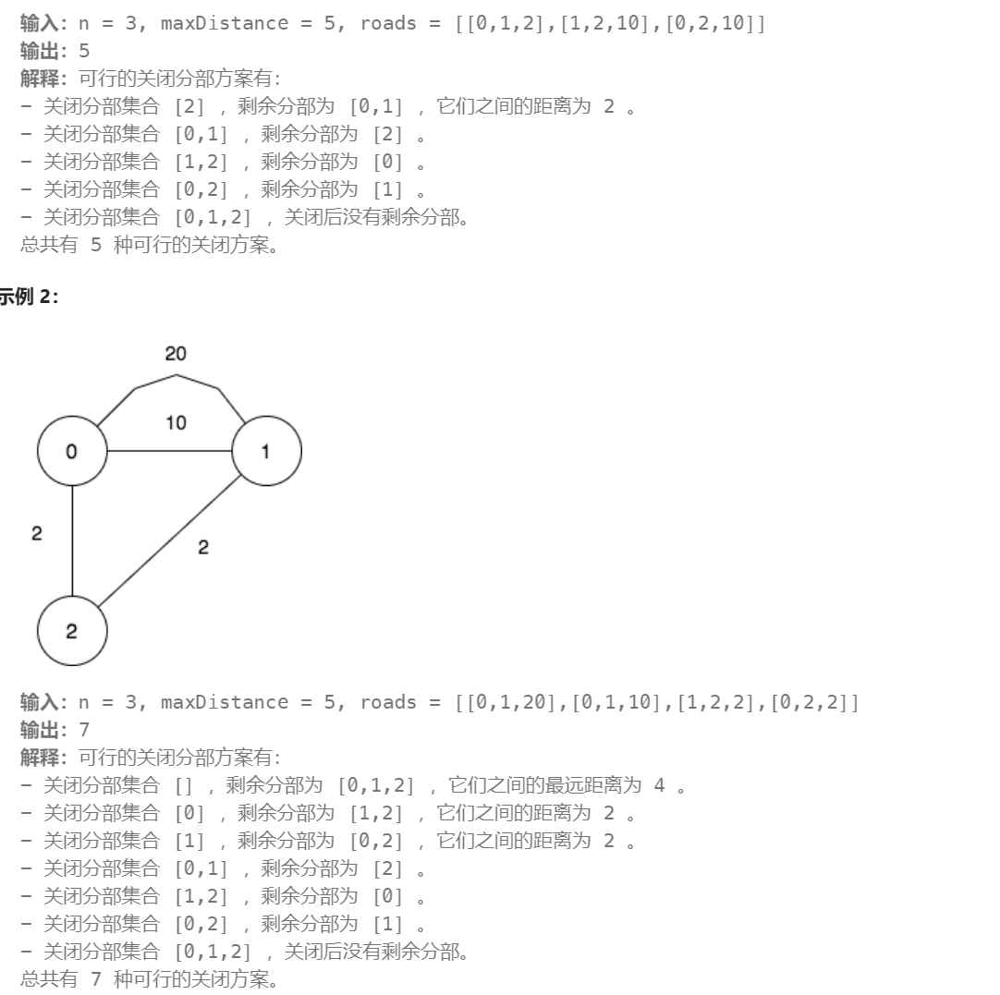


删去某些节点后，剩余的节点之间的最短距离是否小于给定的值，找出删除的方法个数。


对于给定的范围可以暴力枚举，列出所有的可能，可能选择有二进制集合表示，比如n=10，1024表示1000 0000 00，即只有10一个元素。


使用s>>i&1可以判断i是否在集合中


```python
from math import inf
class Solution:
    def numberOfSets(self, n: int, maxDistance: int, roads: List[List[int]]) -> int:
        w=[[inf for _ in range(n)]for _ in range(n)]
        # 建立边权表，这里可能会有重边因此每次选择最小的值
        for u,v,w_ in roads:
            w[u][v]=min(w_,w[u][v])
            w[v][u]=min(w_,w[v][u])
        for i in range(n):
            w[i][i]=0

        f=[None]*n
        def check(s):
            for i,v in enumerate(w):
                # 如果包含这个元素复制一份，以此来排除未选择的节点
                if s>>i&1:
                    f[i]=v[:]
            # Floyd算法模板，对集合中存在的元素找它到集合中存在的终点的最短路径，通过遍历他们两的存在的中间节点
            for k in range(n):
                # 如果中间值不在集合中，跳过
                if not s>>k&1: continue 
                for i in range(n):
                    # 如果要找的起点终点不在集合中跳过
                    if not s>>i&1: continue 
                    for j in range(n):
                        if not s>>j&1: continue
                        # 更新
                        f[i][j]=min(f[i][j],f[i][k]+f[k][j])
            # 判断，对于集合中存在的点，它到其他点的距离是否小于给定值，如果有一个大于那就不行
            for i ,v in enumerate(f):
                if not s>>i&1:continue
                for j,vj in enumerate(v):
                    # 判断终点是否存在，来避免null与值比较
                    if s>>j&1 and vj>maxDistance:
                        return 0
            return 1
        # 枚举处每一种集合的可能，传入判断函数取和
        return sum(check(s) for s in range(1<<n))
```


## [转换字符串的最小成本 II](https://leetcode.cn/problems/minimum-cost-to-convert-string-ii/)


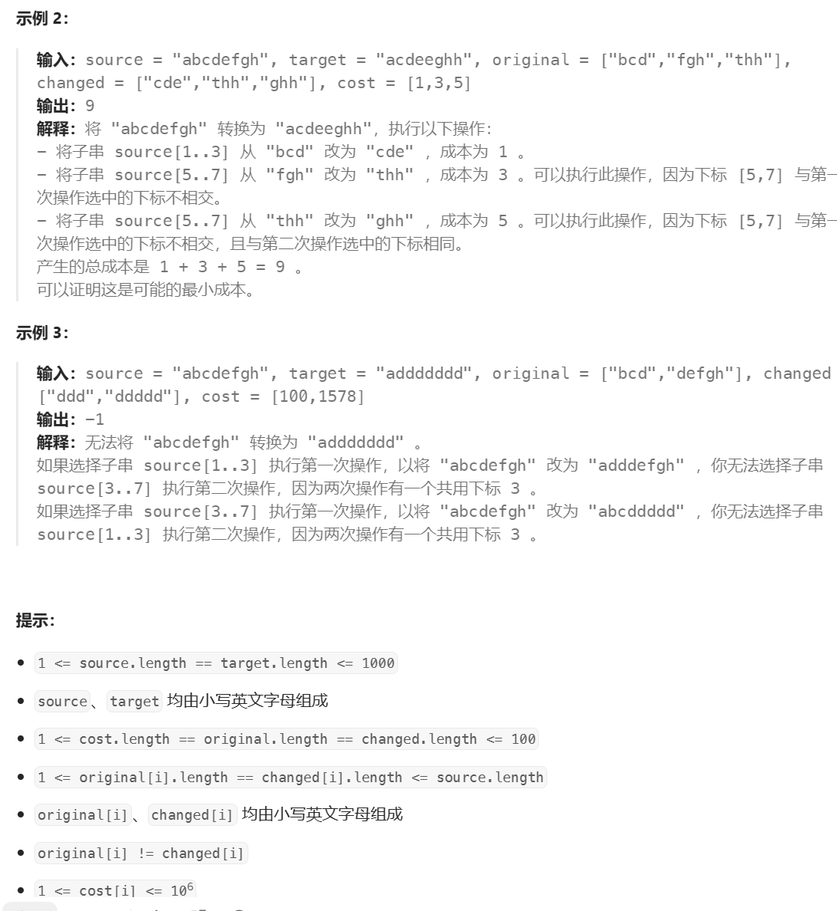

注意每次选择的子集可以相同但是不能相交。

1.如何找到要替换的子串? 选择遍历给定的两个字符串，如果对应位置两个字符串相同，可以选择跳过也可以选择就在这个位置替换;替换子串多长?如果选择枚举给定字符串的各个位置，由于给定字符串的长度最多为1000，很容易超时，因此转向枚举给定的用于替换的字符数组中所有字符串的长度（最多只有100个不同的长度），需要对字符数组按照长度进行分组。能不能替换？要看两个子串是否在字符数组中。

2.如何找替换的最小成本？使用floyd算法。

```python
class Solution:
    def minimumCost(self, source: str, target: str, original: List[str], changed: List[str], cost: List[int]) -> int:
        len_to_str=defaultdict(set)
        # 图使用哈希表表示，不需要用二维数组（尤其是在图比较稀疏的时候），使用二维列表还要转化为数字，技巧点
        dis=defaultdict(lambda :defaultdict(lambda :inf))
        for x,y,c in zip(original,changed,cost):
            # 把替换的字符按照长度分组
            len_to_str[len(x)].add(x)
            len_to_str[len(y)].add(y)
            # 建图，注意两个点之间会有多条路，选取其中最小的
            dis[x][y]=min(dis[x][y],c)
            dis[x][x]=0
            dis[y][y]=0 

        # folyd找最短路
        # 不同长度的字符串一定是不连通的
        for strs in len_to_str.values():
            for k in strs:
                for i in strs:
                    # 进行条件判断，如果从起始点到这个中间节点的距离为无限远，跳过。
                    if dis[i][k]==inf: continue
                    for j in strs:
                        dis[i][j]=min(dis[i][j],dis[i][k]+dis[k][j])
        @cache
        # 动态规划
        def dfs(i):
            if i==0: return 0
            res=inf
            # 如果两个值相等，可以选择跳过
            if source[i-1]==target[i-1]:
                res=dfs(i-1)
            # 枚举字符数组中的长度，而不是枚举整个字符串的位置
            for size,strs in len_to_str.items():
                if i<size:continue # 不够替换，跳过
                s=source[i-size:i]
                t=target[i-size:i]
                # 能替换
                if s in strs and t in strs:
            	# 找出最小值        
                    res=min(res,dis[s][t]+dfs(i-size))
            return res

        ans=dfs(len(source))
        return ans if ans<inf else -1
```

## **Sightseeing Tour**


k的范围很小可以暴力枚举，首先用floyd求出两点间最短距离，然后全排列给定的必须通过的桥，在枚举每个桥是从u到v，还是从v到u。

```python
n,m=RR()
# Floyd模板
dis=[[inf]*n for _ in range(n)]
p=[]
for _ in range(m):
    u,v,w=RR()
    u-=1
    v-=1
    p.append((u,v,w))
    # 注意可能存在重复的路径取最小
    dis[u][v]=min(dis[u][v],w)
    dis[v][u]=min(dis[v][u],w)
for i in range(n):dis[i][i]=0# 自己到自己的距离初始化为0
f=dis
for k in range(n):
    for i in range(n):
        for j in range(n):
            f[i][j]=min(f[i][j],f[i][k]+f[k][j])
for _ in range(R()):
    k=R()
    nums=[v-1 for v in RR()]
    ans=inf
    # 全排列
    for arr in permutations(nums):
        # 枚举经过的方向
        for s in range(1<<k):
            curr = temp = 0
            for j in range(k):
                u,v,w =p[arr[j]]
                temp+=w
                if s>>j&1:
                    temp+=f[curr][u]
                    curr=v
                else:
                    temp+=f[curr][v]
                    curr=u
            # 最后要到终点
            temp+=dis[curr][-1]
            # 取最小
            ans=min(ans,temp)
    print(ans)
```


# Kruskal算法

该算法用于**重构**一棵树，从而生成**最小生成树**（Minimum Spanning Tree，MST）是一个在连接所有图的顶点的同时具有最小总权重的树形子图。在一个连通的带权无向图中，生成树是原图的一个子图，它包含了图中的所有顶点，并且是一棵树，没有包含任何环路。树与图的区别是树没有环。

基本思想是**贪心+并查集**，首先对所有的边按**权重**排序然后从最小的边开始遍历，如果二者不连通则连接上同时累加权重，**最后判断是否连通分量等于1（即n个点n-1条边）**

最小生成树算法可以用于求最短路


```python
class UF:
    def __init__(self,n):
        self.p=[i for i in range(n)]
        self.count=n
        self.size=[1 for _ in range(n)]
    def find(self,x):
        d=self
        if d.p[x]!=x:
            d.p[x]=d.find(d.p[x])
        return d.p[x]
    def union(self,x,y):
        d=self
        u=d.find(x)
        v=d.find(y)
        if u==v:
            return
        if d.size[u]<d.size[v]:
            d.size[v]+=d.size[u]
            d.p[u]=d.p[v]
        else:
            d.size[u]+=d.size[v]
            d.p[v]=d.p[u]
        d.count-=1
    def connect(self,x,y):
        d=self
        u=d.find(x)
        v=d.find(y)
        return v==u
    def judge(self):
        return self.count==1
n,m=[int(x) for x in input().split()]
edges=[]
for _ in range(m):
    edges.append(list(map(int,input().split())))
edges.sort(lambda x:x[2])

uf=UF(n)
res=0
for i in range(m):
    u,v,w =edges[i]
    u-=1
    v-=1
    if not uf.connect(u,v):
        uf.union(u,v)
        res+=w
if uf.judge():
    print(res)
else:
    print('impossible')
```

时间复杂度为O(mlogm+m)


## 最低成本联通城市


城市看作是节点，城市之间联通成本看作是权重，联通城市的最小成本即最小生成树的权重之和。每座城市之间至少有一条路径的，并要求最小成本，这就避免了环的出现，因为环的出现多此一举要花费更多的成本。

最小生成树问题，最小生成树是若干边的集合，这些边需要满足：保证包含图中所有节点，形成的结构不包含环，权重和最小。

其中前两点在遍历所有节点构造的同时，判断两个节点之间是否相连即可满足，权重最小利用贪心的思想，将所有边按照权重从小到达排序，从权重最小的边开始遍历，如果这条边和最小生成树中的其他边不会形成环，就将其加入到最小生成树，反之不加入

```python
def minimumCost(n,connection):
    connection=sorted(connection,key=lambda x:x[2])# 按照权重升序排序
    uf =UF(n+1)# 因为城市从1开始
    weight=0
    for connect in connection:
        p=connect[0]
        q=connect[1]
        w=connect[2]
        if uf.connect(p,q):
            continue
        weight+=w
        uf.union(p,q)
    # 0节点没有操作，所以连通分量应该是2，如果不是2说明存在没有连接上的，可能是会形成环。
    return weight if uf.count()==2else -1
```

## 联通所有点的最小费用


最小生成树问题，

```python
class UF:
    def __init__(self, n):
        self.count = n
        self.parent = [i for i in range(n)]
        self.size = [1 for _ in range(n)]

    def union(self, p, q):
        rootp = self.find(p)
        rootq = self.find(q)
        if rootq == rootp:
            return
        if self.size[rootq] < self.size[rootp]:
            self.parent[rootq] = rootp
            self.size[rootp] += self.size[rootq]
        else:
            self.parent[rootp] = rootq
            self.size[rootq] += self.size[rootp]
        self.count -= 1

    def connect(self, p, q):
        rootp = self.find(p)
        rootq = self.find(q)
        return rootq == rootp

# 递归，最终返回树的根节点
	def find(self,x):
    # 递归终止的条件是找到根节点
		if self.parent[x]!=x:
        	#在递归过程中把每一个节点的父节点设置为根节点
			self.parent[x]=self.find(self.parent[x])
    	return self.parent[x]
    def count(self):
        return self.count
class Solution(object):
    def minCostConnectPoints(self, points):
        connection=[]
        # 计算出每个节点之间的权重
        for i in range(len(points)):
            for j in range(i+1,len(points)):
                x_i=points[i][0]
                y_i=points[i][1]
                x_j = points[j][0]
                y_j = points[j][1]
                # 每个节点是一个坐标，选择将节点映射为它在points中的索引
                connection.append((i,j,abs(x_i-x_j)+abs(y_i-y_j)))
        # 按照权重排序
        connection=sorted(connection,key=lambda x:x[2])

        uf =UF(len(points))
        mst=0
        for connect in connection:
            # 避免多余的迭代
            if uf.count==1:
                break
            p=connect[0]
            q=connect[1]
            w=connect[2]
            if uf.connect(p,q):
                continue
            uf.union(p,q)
            mst+=w
        return mst 
```


## [最小体力消耗路径](https://leetcode.cn/problems/path-with-minimum-effort/)


由于可以向任意方向移动因此不能使用dp，根据给定的数据范围使用dfs会超时，这里使用最小生成树算法，但不是要加入所有子树而是遇到目标值就停止。

```python
class UF:
    def __init__(self, n):
        self.count = n
        self.parent = [i for i in range(n)]
        self.size = [1 for _ in range(n)]

    def union(self, p, q):
        rootp = self.find(p)
        rootq = self.find(q)
        if rootq == rootp:
            return
        # 小的连接到大的上面去
        if self.size[rootq] < self.size[rootp]:
            self.parent[rootq] = rootp
            self.size[rootp] += self.size[rootq]
        else:
            self.parent[rootp] = rootq
            self.size[rootq] += self.size[rootp]
        self.count -= 1

    def connect(self, p, q):
        rootp = self.find(p)
        rootq = self.find(q)
        return rootq == rootp

    def find(self,p):
        if self.parent[p]!=p:
            self.parent[p]=self.find(self.parent[p])
        return self.parent[p]
class Solution:
    def minimumEffortPath(self, g: List[List[int]]) -> int:
        m,n=len(g),len(g[0])
        uf=UF(m*n)
        path=[]
        
        vis=set()
        # 建图
        for i in range(m):
            for j in range(n):
                vis.add(i*n+j)
                for dx ,dy in (1,0),(0,1),(-1,0),(0,-1):
                    if 0<=(x:=dx+i)<m and 0<=(y:=dy+j)<n and x*n+y not in vis:
                        path.append([i*n+j,x*n+y,abs(g[i][j]-g[x][y])])
        # 按照权重排序
        path.sort(key=lambda x:x[2])
        for u,v,w in path:
            # 连接
            uf.union(u,v)
            # 两个目标值已经相连，直接返回权重，这个权重就是路径上最大的且是所有路径中最小的
            if uf.connect(0,m*n-1):
                return w
        return 0
        
```


## [水资源分配优化](https://leetcode.cn/problems/optimize-water-distribution-in-a-village/)


把水井看作是一个超级源点那么问题就变为了求解最小生成树。

```python
class UF:
    def __init__(self,n):
        self.p=[i for i in range(n)]
        self.count=n
        self.size=[1 for _ in range(n)]
    def find(self,x):
        d=self
        if d.p[x]!=x:
            d.p[x]=d.find(d.p[x])
        return d.p[x]
    def union(self,x,y):
        d=self
        u=d.find(x)
        v=d.find(y)
        if u==v:
            return
        if d.size[u]<d.size[v]:
            d.size[v]+=d.size[u]
            d.p[u]=d.p[v]
        else:
            d.size[u]+=d.size[v]
            d.p[v]=d.p[u]
        d.count-=1
    def connect(self,x,y):
        d=self
        u=d.find(x)
        v=d.find(y)
        return v==u
    def judge(self):
        return self.count==1
class Solution:
    def minCostToSupplyWater(self, n: int, wells: List[int], edges: List[List[int]]) -> int:
        for i,v in enumerate(wells,1):
            edges.append([0,i,v])
        edges.sort(key=lambda x:x[-1])
        ans=0
        uf=UF(n+1)
        for u,v,w in edges:
            if not uf.connect(u,v):
                ans+=w
                uf.union(u,v)
        return ans 
```


## **Sum of Max Matching**


题目保证AB中的元素无交集


最小化最大的边权想到最小生成树

这里使用两个数组start和end记录A和B中数出现的次数，在使用克鲁斯科尔的过程中，当一条边可以连接两个集合中的数时，这条边的权值就是两个集合中点相互到达的路径上的最小的最大值，因为从小到大枚举边。注意这里可能会连接集合内部的点而不是两个集合之间，因此最后需要修改start和end

```python
class UF:
    def __init__(self, n):
        self.count = n
        self.parent = [i for i in range(n)]
        self.size = [1 for _ in range(n)]

    def union(self, p, q):
        rootp = self.find(p)
        rootq = self.find(q)
        if rootq == rootp:
            return
        self.parent[p]=q
        self.count -= 1

    def connect(self, p, q):
        rootp = self.find(p)
        rootq = self.find(q)
        return rootq == rootp

    def find(self,p):
        if self.parent[p]!=p:
            self.parent[p]=self.find(self.parent[p])
        return self.parent[p]

n,m,k=RR()
edges=[]
# 记录以这个点为根有多少个待匹配的点
start=[0]*n
end=[0]*n
for _ in range(m):
    edges.append(RR())
# 初始化
for x in RR():start[x-1]+=1
for x in RR():end[x-1]+=1

uf=UF(n)
# 排序
edges.sort(key=lambda x:x[-1])
ans=0

for a,b,w in edges:
    a-=1
    b-=1
    # 找到端点对应的集合
    fa,fb=uf.find(a),uf.find(b)
    # 已经连接，跳过
    if fa==fb:continue
    # 连接，这里是将fa连到fa上，因为如果端点是在集合内，则默认以b为根，find不会改变被连接者的根
    uf.union(fa,fb)
    # a在start中,b在end中，取最小
    mn=min(start[fa],end[fb])
    ans+=mn*w
    # 已经匹配了不再需要，减去
    start[fa]-=mn
    end[fb]-=mn

    # 也可能是b在start中,a在end中
    mn=min(start[fb],end[fa])
    ans+=mn*w
    start[fb]-=mn
    end[fa]-=mn

    # 在内部，将a端点连接到b
    start[fb]+=start[fa]
    start[fa]=0

    end[fb]+=end[fa]
    end[fa]=0
print(ans)
```


## [找到最小生成树里的关键边和伪关键边](https://leetcode.cn/problems/find-critical-and-pseudo-critical-edges-in-minimum-spanning-tree/)


给定的数据范围可以枚举每一条边，根据定义**关键边是去除了会使得最小生成树权值增加的边出现在每个最小生成树中，而非关键边是去除了不会使权值改变**。首先做一遍kruskal找出最小的权值，随后**枚举每一条边**，对于一条边如果它出现在第一次做出的最小生成树中，那么它有可能是关键边或非关键边，不在这个生成树中的一定会不是关键边，将这条边**不记录**再做一次最小生成树，**如果最后的权值增大了或者图不连通，那么它一定是关键边**，反之是非关键边。对于没出现在第一次最小生成树中的边，它有可能是非关键边或者不会加入到生成树的边，再次做最小生成树，**这次将这条边记录**，如果最后的权值**增大**了说明它不是生成树中的边，**相等**则说明是非关键边。

```python
class Solution:
    def findCriticalAndPseudoCriticalEdges(self, n: int, edges: List[List[int]]) -> List[List[int]]:
        uf=UF(n)
        ans=[[],[]]
        path={}
        # 记录图的编号
        for i,v in enumerate(edges):
            path[tuple(v)]=i
        edges.sort(key=lambda x:x[2])
        res=0
        # 第一次找最小生成树
        vis=set()
        for u,v,w in edges:
            if not uf.connect(u,v):  
                uf.union(u,v)
                # 记录有哪些边  
                vis.add(path[(u,v,w)])
                res+=w
        
        # 关键边或非关键边
        def judge1(u,v,w):
            idx=path[(u,v,w)]
            c=0
            uf=UF(n)
            for u,v,w in edges:
                # 不记录
                if idx==path[(u,v,w)]:continue
                if not uf.connect(u,v):  
                    uf.union(u,v)
                    c+=w
            # 不连通或权值增大
            if uf.count!=1 or c>res:
                ans[0].append(idx)
            else:ans[1].append(idx)
        
        # 非关键边或不会加入的边
        def judge2(u,v,w):
            idx=path[(u,v,w)]
            uf=UF(n)
            uf.union(u,v)
            c=w
            for u,v,w in edges:
                if idx==path[(u,v,w)]:continue
                if not uf.connect(u,v):  
                    uf.union(u,v)
                    c+=w
            # 不会增大，是非关键边
            if c==res:ans[1].append(idx)

        for u,v,w in edges:
            idx=path[(u,v,w)]
            if idx in vis:judge1(u,v,w)
            else:judge2(u,v,w)
        return ans
```


# 欧拉回路

**欧拉路径定义为：如果一条路径可以经过图中所有的边恰好一次，那么这条路径就是欧拉路径。**数学家欧拉为了解决著名的哥尼斯堡七桥问题提出的。

欧拉路径又分为欧拉回路——路径的**起点与终点一样**，欧拉开路(通路)——**起点和终点不同**。


对于无向图：

+ 欧拉回路：**图是连通的，每个顶点的度数均是偶数**
+ 欧拉开路：**图是连通的，并且只有两个顶点的度是奇数**

对于有向图：

+ 欧拉回路：**图是连通的，每个顶点的入度等于出度**
+ 欧拉开路：**图是连通的，只有两个顶点的入度出度不同，其中一个入度比出度大一，其为欧拉路径的终点；另一个入度比出度小一，其为欧拉路径的起点**


## [重新安排行程](https://leetcode.cn/problems/reconstruct-itinerary/)


本题需要找出**经过所有边一次的路径**，那么就是求解欧拉路径，题目保证**有解**，那么“JFK“一定是欧拉路径的起点。


求解欧拉路径使用**Hierholzer**算法：

1. **从起点出发，进行深度优先搜索。**
2. **每次沿着某条边从某个顶点移动到另外一个顶点的时候，都需要删除这条边。**
3. **如果没有可移动的路径，则将所在节点加入到栈中，并返回。**

最后求解出的是**倒序**的欧拉路径


本题为了得到最小的字典序，需要向将边排序

```python
class Solution:
    def findItinerary(self, edges: List[List[str]]) -> List[str]:
        deg=defaultdict(list)
        # 使用堆排序
        for u,v in edges:
            deg[u].append(v)
        for k in deg:
            heapify(deg[k])
        ans=[]

        def dfs(root):
            # 不断往后找
            while deg[root]:
                # 拆边
                dfs(heappop(deg[root]))
            # 没有边了，加入自己
            ans.append(root)
        dfs("JFK")
        # 求解出的是倒序
        return ans[::-1]
```


# 有向图的强连通分量

一般用于有向图的缩点

## 定义


**连通：无向图中可以从任意点i可以到达任意点j**

**强连通：有向图中可以从任意点i可以到达任意点j**

**弱连通：有向图看作是无向图时，可以从任意点i可以到达任意点j**

dfn[x]定义为遍历过程中到达x的最早时间

low[x]定义为以x可以回溯到的最早时间点


## 过程

在dfs遍历的过程中将元素存储到栈中


d能回溯到更早的时间点，更新low[d]=low[b]


d返回到c，c跟更新其Low为最小的


随后c返回到b，b的low值不会在变小了，并且b的dfn==low值，此时弹出栈中的值直到弹出b，因此dcb就组成了一个强连通分量


## [施法所需最低符文数量](https://leetcode.cn/problems/minimum-runes-to-add-to-cast-spell/)


对于水晶访问不到的分量进行缩点，缩点后所有入度为0的点就是要添加的边的数量

```python
class Solution:
    def minRunesToAdd(self, n: int, crystals: List[int], flowFrom: List[int], flowTo: List[int]) -> int:
        g=defaultdict(list)
        deg=[0]*n
        # 拓扑排序，防止从一条链的末尾开始不断重复访问
        for u,v in zip(flowFrom,flowTo):
            g[u].append(v)
            deg[v]+=1
        d=deque()
        for i,x in enumerate(deg):
            if not x:d.append(i)

        curr=0
        while curr<len(d):
            x=d[curr]
            for nx in g[x]:
                deg[nx]-=1
                if not deg[nx]:d.append(nx)
            curr+=1
        nums=list(d)

        vis=set(crystals)
        d=deque(crystals)
        # 连通分量的标号
        gid=n

        # 有哪些新的连通分量
        group=defaultdict(set)
        # 点属于哪个连通分量
        m={}

        # bfs标记可以访问到的点
        while d:
            x=d.popleft()
            for nx in g[x]:
                if nx not in vis:
                    vis.add(nx)
                    d.append(nx)
        def tarjan(root,t):
            nonlocal gid
            dfn[root]=low[root]=t
            d.append(root)
            for nx in g[root]:
                if nx not in dfn:
                    tarjan(nx,t+1)
                    low[root]=min(low[root],low[nx])
                else:
                    low[root]=min(low[root],dfn[nx])
            # 可以弹出
            if low[root]==dfn[root]:   
                while d:
                    x=d.pop()
                    group[gid].add(x)
                    m[x]=gid
                    if x==root:break
                gid+=1

        dfn={}
        low={}
        d=deque()
        # 对访问不到的分量进行缩点，通过拓扑序可以先访问链的首部，防止从尾部开始重复访问
        for i in nums:
            # 通过m记录可以防止重复对同一个连通块缩点
            if i not in vis and i not in m: 
                tarjan(i,0)
        # 并非所有的点都会被拓扑排序到
        for i in range(n):
            if i not in vis and i not in m: 
                tarjan(i,0)
        # 统计缩点后的入度
        deg=defaultdict(int)
        for u,v in zip(flowFrom,flowTo):
            if u in m:u=m[u]
            if v in m:v=m[v]
            # 缩点后属于同一点，跳过
            if u==v:continue
            deg[v]+=1
        ans=0
        # 找出缩点后入度为0的，且不会被访问到的点
        for i in group:
            if i in vis:continue
            if not deg[i]:ans+=1
        return ans
```


### 受欢迎的牛


对于该题只要建立拓扑序然后看看是否只有1个出度为0的点(可能有单独的点)，但是建立拓扑序需要没有环因此使用tarjan缩点 

```python
from collections import deque
import sys

input = sys.stdin.readline
sys.setrecursionlimit(5000)

N = 10010

n, m = [int(x) for x in input().split()]
# 建图
e = [[] for _ in range(N)]
# 栈
d = deque()
# 记录点是否入栈
in_d = [False] * (N)
# 记录遍历到这个点的时间
dfn = [0] * (N)
# 记录从这个点开始走能得到的最小时间戳
low = [0] * (N)
# 记录每个点对应的连通分量
id = [-1] * (N)
# 记录点所对的连通分量的大小
size = [0] * (N)
# 时间，注意初始化为1方便判断
t = 1
# 连通分量编号
idx = 0
# 记录出度
out = [0] * (N)

for _ in range(m):
    u, v = [int(x) for x in input().split()]
    e[u].append(v)


def tarjan(i):
    global t, idx
    # 首先记录时间戳
    dfn[i] = low[i] = t
    t += 1
    # 入栈
    d.append(i)
    in_d[i] = True
    # 找相邻的点
    for k in e[i]:
        # 没有访问过操作一下
        if not dfn[k]:
            tarjan(k)
            # 更新时间
            low[i] = min(low[i], low[k])
        elif in_d[k]:
            low[i] = min(low[i], dfn[k])
    a = d
    # 如果这个点可以作为它所对连通分量的最低点
    if low[i] == dfn[i]:
        idx += 1
        # 出栈操作
        while True:
            curr = d.pop()
            in_d[curr] = False
            id[curr] = idx
            size[idx] += 1
            if i == curr: break

# 对每个点操作
for i in range(1, n + 1):
    if not dfn[i]: tarjan(i)
# 缩点后建图，这里不需要建图只有考虑出度
for i in range(1, n + 1):
    for j in e[i]:
        # 所对的连通分量不同，需要建立一条边，这里更新出度
        if id[i] != id[j]: out[id[i]] += 1

zero = 0
ans = 0
# 查找是否只有一个出度为0的点
for i in range(1, idx + 1):
    if not out[i]:
        ans += size[i]
        zero += 1
        if zero > 1:
            ans = 0
            break
print(ans)
```

### 学校网络


对于第一个问题只要找到入度为0的点即可，第二问要求将图变为强联通分量也就是图中所有的点都可以相互到达，那么有结论需要连接的边数是max(入度为0的点的数目，出度为0的点的数目)。

```python
N=110
from collections import deque, defaultdict
import sys
input=sys.stdin.readline

n=int(input())
path=defaultdict(dict)
d=deque()
for i in range(1,n+1):
    temp=[int(x) for x in input().split()]
    for v in temp:
        if not v:break
        path[i][v]=None

dfn=[0]*N
low=[0]*N
id=[-1]*N
t=1
idx=0
out=[0]*(n+1)
inn=[0]*(n+1)
in_d=[False]*N

def tarjan(i):
    global idx,t
    dfn[i]=low[i]=t
    t+=1
    d.append(i)
    in_d[i]=True
    for k in path[i].keys():
        if not dfn[k]:
            tarjan(k)
            low[i]=min(low[i],low[k])
        elif in_d[k]:
            low[i]=min(low[i],dfn[k])
    if dfn[i]==low[i]:
        idx+=1
        while True:
            curr=d.pop()
            in_d[curr]=False
            id[curr]=idx
            if i==curr:break
for i in range(1,n+1):
    if not dfn[i]: tarjan(i)

for i in range(1,n+1):
    for j in path[i].keys():
        if id[i]!=id[j]:
            out[id[i]]+=1
            inn[id[j]]+=1
# 做了一位偏移
out=out[1:idx+1]
inn=inn[1:idx+1]

l,r=out.count(0),inn.count(0)
print(r)
# 特判，本身就是一个强连通分量
if idx==1:print(0)
else:print(max(l,r))

```


# 无向图的双连通分量

讲解视频https://www.bilibili.com/video/BV1Q7411e7bM?vd_source=63004f7ee2f738d6adc086e00ebcede2&spm_id_from=333.788.player.switch&p=4

## 定义

桥：**对于连通的图如果删除一条边后图变得不连通了**

割点：**如果删掉这个点后整个图会变得不连通，割点的判断比较反常，有时是看不出来的，需要按照dfn和low判断来决定**


dfn[x]定义为遍历过程中到达x的最早时间

low[x]定义为以x可以回溯到的最早时间点

在无向图中从子节点到父节点的边不予处理，防止low[y]=dfn[x]导致无法判断桥。


双连通分量分为：**边双连通分量e-dcc(极大的不含有桥的连通分量)，点双连通分量v-dcc(极大的不包含割点的连通分量)**

**对于v-dcc找到割点后，对其他点做bfs遇到割点就加入结果，但不加入队列，这样就能找到所有的连通分量。**


**两个割点之间的边不一定是桥**


**桥的两个端点不一定是割点**


如果x是割点：

**这里的root指的是回溯的起点**

**1. x非root&x有子节点&low[x.child]>=dfn[x]**，即子节点不能回溯到x的祖先，否则删除依然连通了，因此是一个割点。


**2. 当x是根节点且子节点>=2**

这里的子节点指的是**dfs搜索过程中的子节点**。左图中有两个子节点，右图中只有一个子节点。


如果边是**桥**：
	x->y是桥有**low[y]>dfn[x]**，这样就不会回溯到比x更早的时间点，那么删除x->y就会导致不连通。


tarjan算法是基于dfs搜索的过程，**其中每条边只会访问一次**。


## 过程

 


假设从A开始dfs，接下来先找B再找C


无向图中不会往回找父节点，**但经过一条边到父节点的父节点是没有问题的**，因此可以从C到A，那么low[C]=dfn[A]=1

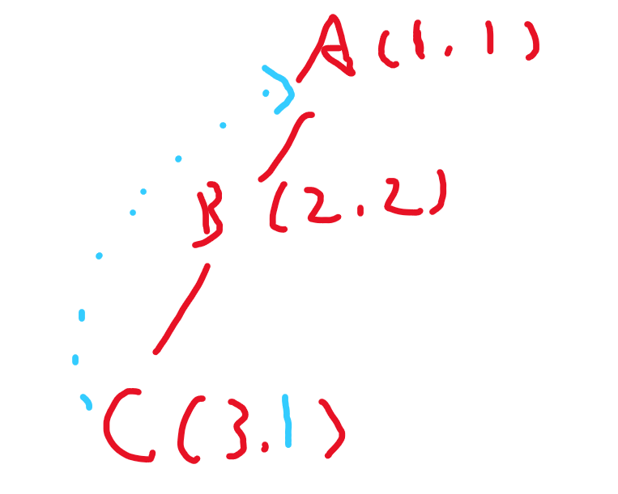


当前回溯结束，从C返回到B，C的Low能更小，自然B的low也能更小，因为可以从B到C，low[b]=low[c]=1，**这里的B应该是找子节点中最小的low**


返回到A后继续找D和E，也是一样的过程


## [查找集群内的关键连接](https://leetcode.cn/problems/critical-connections-in-a-network/)


所谓的关键路径删除掉图就无法连通，那么就是桥，因此使用Tarjan找到桥即可。

```python
class Solution:
    def criticalConnections(self, n: int, edges: List[List[int]]) -> List[List[int]]:
        dfn=[-1]*n
        low=[-1]*n
        ans=[]
        # 建图
        g=[[] for _ in range(n)]
        for u,v in edges:
            g[u].append(v)
            g[v].append(u)
        
        def Tarjan(root,fa,t):
            # 更新时间戳
            dfn[root]=t
            low[root]=t
            # 找下一点
            for nx in g[root]:
                # 不能往回走
                if nx==fa:continue
                # 没访问过
                if dfn[nx]==-1:
                    Tarjan(nx,root,t+1)
                    # 更新low为最小的
                    low[root]=min(low[root],low[nx])
                    # 判断是否是桥
                    if low[nx]>dfn[root]:
                        ans.append([root,nx])
                else:
                    low[root]=min(dfn[nx],low[root])
        Tarjan(0,-1,0)
        return ans 
```

## [使陆地分离的最少天数](https://leetcode.cn/problems/minimum-number-of-days-to-disconnect-island/)


把陆地看作是一个连通的无向图，要做的就是判断是否有割点，因此这里每次是删除一个点而非边。

```python
class Solution:
    def minDays(self, grid: List[List[int]]) -> int:
        inf=10**9
        m,n=len(grid),len(grid[0])
        cnt=t=0
        g=[[] for _ in range(m*n)]
        bridge=False
        vis=set()
        def dfs(i,j):
            d=deque()
            vis.add((i,j))
            d.append((i,j))
            while d:
                i,j=d.popleft()
                for dx, dy in (1,0),(-1,0),(0,-1),(0,1):
                    if 0<=(x:=dx+i)<m and 0<=(y:=dy+j)<n and grid[x][y]:
                        g[i*n+j].append(x*n+y)
                        if  (x,y) not in vis:
                            d.append((x,y))
                            vis.add((x,y))
            return len(vis)
        def tarjan(root,fa):
            nonlocal bridge,t
            dfn[root]=low[root]=t
            t+=1
            cnt=0
            for nx in g[root]:
                if nx==fa:continue
                if dfn[nx]==-1:
                    cnt+=1
                    tarjan(nx,root)
                    # 更新low为最小的
                    low[root]=min(low[root],low[nx])
                    # 如果不是根节点并且存在low[nx]>=dfn[root]
                    if -1!=fa and low[nx]>=dfn[root]:
                        bridge=True
                else:
                    # 更新low
                    low[root]=min(low[root],dfn[nx])
            # 如果是根节点并且存在两个及以上的子节点
            if fa==-1 and cnt>=2:bridge=True 

        for i in range(m):
            for j in range(n):
                # 建图
                if grid[i][j] and (i,j) not in vis:
                    dfs(i,j)
                    dfn=[-1]*(m*n)
                    low=[-1]*(m*n)
                    # 记录dfs的起点
                    start=i*n+j
                    tarjan(start,-1)
                    cnt+=1
                # 如果有两块独立的陆地，就不需要操作
                if cnt>1:return 0
        
        # 两个特判的情况
        if len(vis)==2:return 2
        elif len(vis)<=1:return len(vis)
        
        # 有割点，删除割点即可
        if bridge:return 1
        # 没有的话直接删除两个点即可
        return 2
                    
Solution().minDays(grid = [[0,1,1,0],[0,1,1,0],[0,0,0,0]])         
                


```

## [夺回据点](https://leetcode.cn/problems/s5kipK/)


初始的节点一定是在连通分量中选择，如果选了割点的话就会导致不连通，并且选择的连通分量不能连接两个割点否则删除也会导致不连通，这样将缩点后的图抽象为一棵树，要选择的点就是叶子节点，假设有k个叶子节点，当k>1时必须选k-1个，否则会剩下两个及以上在找的时候会出现分支导致图不连通。因此先找出所有的割点，在找一遍连通分量，取每个连通分量中的最小值，一共取k-1个。

```python
class Solution:
    def minimumCost(self, cost: List[int], edges: List[List[int]]) -> int:
        n=len(cost)
        dfn=[-1]*n
        low=[-1]*n
        # 记录割点
        points=set()

        # 建图
        g=[[] for _ in range(n)]
        for u,v in edges:
            g[u].append(v)
            g[v].append(u)

        def tarjan(root,fa,t):
            dfn[root]=low[root]=t
            cnt=0
            for nx in g[root]:
                if nx==fa:continue
                if dfn[nx]==-1:
                    cnt+=1
                    tarjan(nx,root,t+1)
                    low[root]=min(low[root],low[nx])
                    # 割点的两种可能
                    if fa!=-1 and low[nx]>=dfn[root]:
                        points.add(root)
                else:
                    low[root]=min(low[root],dfn[nx])
                
            if fa==-1 and cnt>=2:
                points.add(root)
        tarjan(0,-1,0)

        ans=[]
        vis=set()
        # 遍历每个点，从每个点出发做bfs就能找到连通分量
        for i in range(n):
            # 是割点，或者作为连通分量访问过
            if  i in points or i in vis:continue
            vis.add(i)
            # 记录会遇到几个割点
            cv=set()
            d=deque([i])
            res=cost[i]
            while d:
                curr=d.popleft()
                for nx in g[curr]:
                    # 这里割点不用于更新结果，因为不能删除割点
                    if nx in points:
                        cv.add(nx)
                    elif nx not in vis:
                        vis.add(nx)
                        d.append(nx)
                        res=min(res,cost[nx])
            # 如果这个连通分量连接两个割点，即非叶子节点，就不用选
            if len(cv)<2:
                ans.append(res)
        # 只有一个那就从这个连通分量开始
        if len(ans)==1:return ans[0]
        # 有多个，保证最后只剩一个叶子节点(代价最小)
        return sum(ans)-max(ans)
```


