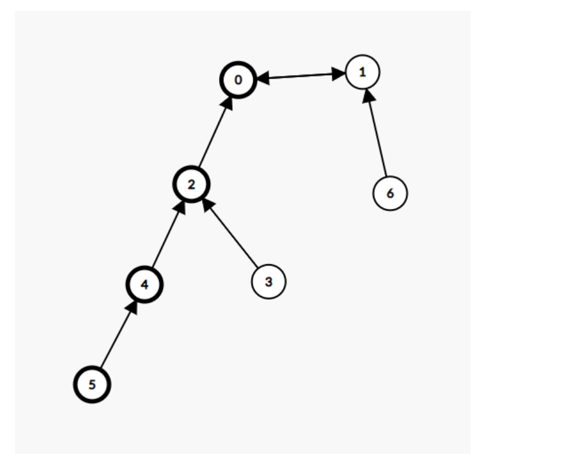

# 内向基环树

## [ 参加会议的最多员工数](https://leetcode.cn/problems/maximum-employees-to-be-invited-to-a-meeting/)


内向基环图，具有n个节点n条边的连通块，内向指的是连通块中的每个节点的出度为1，外向指的是入度为1，基环图中在基环外可以连接有多个树枝

每个员工只能坐在喜欢的人边上那么座次必须要满足是一个内向基环图

如果基环的大小大于等于3，那么圆桌上能做的人数就是基环的大小，一旦往这个环里**向x->y插入其他的节点**，一定会使得x不满足条件。

如果基环的大小为2，那么两个点的**两边**可以继续坐人也就是求出两个点的最长链，为此需要构造一个反图，此外在这个座次中可以继续坐入大小为2的基环。



通过一次拓扑排序可以**将树枝的入度变为0以此与基环分开**，因为图拓扑排序中只能操作树枝，通过构建反图。

```python
class Solution:
    def maximumInvitations(self, favorite: List[int]) -> int:
        n=len(favorite)
	# 计算入度
        deg=[0]*n
        for f in favorite:
            deg[f]+=1
        q=deque([i for i,v in enumerate(deg) if not v])    
        r=defaultdict(list)
        # 将树枝与基环分开，基环是不会入队的
        while q:
            x=q.popleft()
            y=favorite[x]
            # 构建反图
            r[y].append(x)
            deg[y]-=1
            if not deg[y]:
                q.append(y)
         # 求出最长的链
        def dfs(x):
            if not r[x]:return 0
            return max(dfs(y)+1 for y in r[x])
        a=b=0
        # 遍历每一个点，找出基环
        for i,v in enumerate(deg):
            if not v:continue
            # 设置为0防止重复访问到
            deg[i]=0
            j=favorite[i]
            res=1
            # 一直顺着基环找
            while j!=i:
                deg[j]=0
                j=favorite[j]
                res+=1
            # 分类讨论 
            if res>2:
                a=max(a,res)
            elif res==2:
                # 基环长度为2的可以一直累加
                b+=dfs(i)+dfs(favorite[i])+res
        return max(a,b) 
```


## [图中的最长环](https://leetcode.cn/problems/longest-cycle-in-a-graph/)


问题就是在找最大的基环数，把树枝通过拓扑排序与基环分开后直接去找基环的大小。

```python
class Solution:
    def longestCycle(self, edges: List[int]) -> int:
        n=len(edges)
        deg=[0]*n
        for f in edges:
            if f==-1:continue
            deg[f]+=1
        q=deque([i for i,v in enumerate(deg) if not v])
        # 基环是不会入队的
        while q:
            x=q.popleft()
            y=edges[x]
            if y==-1:continue
            deg[y]-=1
            if not deg[y]:
                q.append(y)
        ans=0
        for i,v in enumerate(deg):
            if not v:continue
            j=edges[i]
            res=1
            deg[i]=0
            while deg[j]:
                deg[j]=1
                j=edges[j]
                res+=1
            ans=max(ans,res)
        return ans if ans else -1
```


## **Reachability in Functional Graph**


特意强调了每个点的出边只有一个，那么就是一个基环树。**找两两可以相互到达的点首先看环**，在环上的点能到达其他点的数目就是环的大小，作为分支的点可以到的点的数目就是就是他所连的点能到达的数目加一。

```python
from collections import deque,defaultdict
import sys
sys.setrecursionlimit(150000)
from functools import lru_cache

input=sys.stdin.readline

n=int(input())
nums=[int(x)-1 for x in input().split()]

e=[0]*n

for i,v in enumerate(nums):
    e[v]+=1

# 把环筛出来
p=[False]*n
d=deque([i for i,v in enumerate(e) if not v])
while d:
    curr=d.popleft()
    p[curr]=True
    k=nums[curr]
    if k==curr:continue
    e[k]-=1
    if not e[k]:d.append(k)

ans=[0]*n
# 计算环上每个点能连接的大小
for i in range(n):
    if not p[i]:
        cnt=0
        j=nums[i]
        while not p[j]:
            cnt+=1
            p[j]=True
            j=nums[j]
        for _ in range(cnt):
            ans[i]=cnt
            i=nums[i]
vis=set()

# 计算分支，使用递归注意要设置深度
@lru_cache(maxsize=None)
def dfs(i):
    if e[i]:return ans[i]
    return 1+dfs(nums[i])

for i,v in enumerate(e):
    if not v and i not in vis:
        ans[i]=dfs(i)
print(sum(ans))
```


## [追逐游戏](https://leetcode.cn/problems/Za25hA/)


因为只有n条边所以图中最多只有一个环，如果图中存在大小为4的环并且b比a更快到环的入口那么a永远追不上b，而后枚举每一个点的位置，如果a比b更快到达这个点，那么a一定是在这个点之前追上b，因此不能用于更新答案。

```python
class Solution:
    def chaseGame(self, edges: List[List[int]], a: int, b: int) -> int:
        n=len(edges)
        deg=[0]*n
        edges=[[u-1,v-1] for u,v in edges]
        a-=1
        b-=1
        inn=set()
        
        # 建图
        g=[[] for _ in range(n)]
        for u,v in edges:
            deg[v]+=1
            deg[u]+=1
            g[u].append(v)
            g[v].append(u)
        # 如果相邻
        if b in g[a]:return 1
        
        # 求解到每个点的距离以及距离最近的环的入口
        def getdis(a):
            dis=[-1]*n
            d=deque()
            vis=set()
            d.append(a)
            vis.add(a)
            sz=-1
            pre=-1
            while d:
                sz+=1
                for _ in range(len(d)):
                    curr=d.popleft()
                    dis[curr]=sz
                    if pre==-1 and curr in inn:
                        pre=curr
                    for nx in g[curr]:
                        if nx in vis:continue
                        d.append(nx)
                        vis.add(nx)
            return dis,pre
        
        vis=set()
        d=deque()
        for i,x in enumerate(deg):
            if x==1:d.append(i)
        # 拓扑排序找出环
        while d:
            curr=d.popleft()
            vis.add(curr)
            for nx in g[curr]:
                if nx in vis:continue
                deg[nx]-=1
                if deg[nx]==1:
                    d.append(nx)
        # 求解环的大小
        for i,x in enumerate(deg):
            if x>1:
                deg[i]=0
                inn.add(i)
                for nx in g[i]:
                    if deg[nx]==2:
                        j=nx
                        break
                cnt=1
                
                while j!=i:
                    cnt+=1
                    deg[j]=0
                    inn.add(j)
                    for nx in g[j]:
                        if deg[nx]==2:
                            j=nx
                            break
                    else:
                        break
                break
        disa,_=getdis(a)
        disb,entry=getdis(b)
        # 能成功到环上
        if cnt>3 and disa[entry]>disb[entry]+1:return -1
        ans=-1
        # 枚举每个点
        for i in range(n):
            # 并不是每个点都可以
            if disa[i]<=disb[i]+1:continue
            ans=max(ans,disa[i])
        return ans 
```


