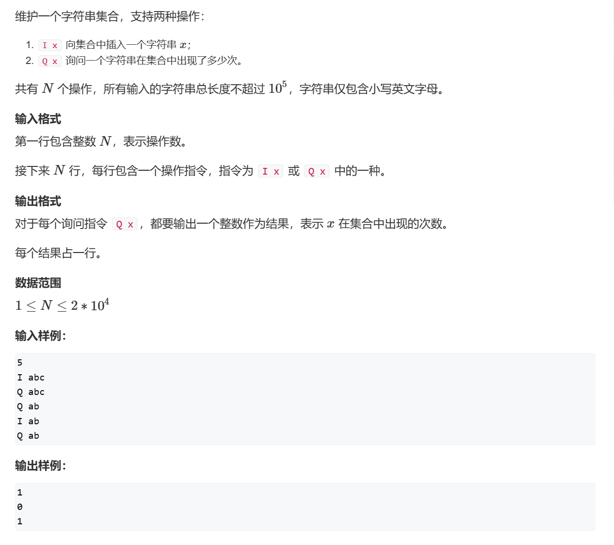
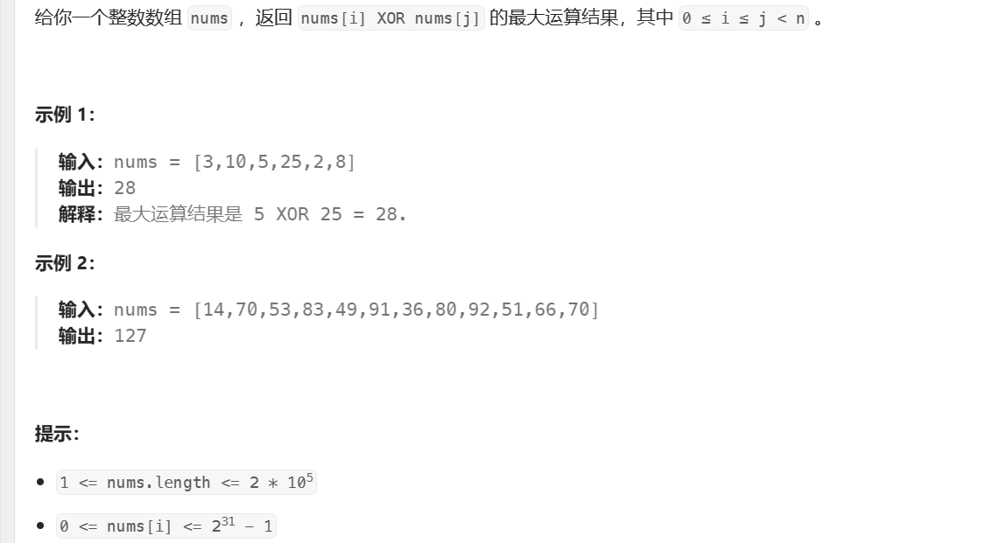
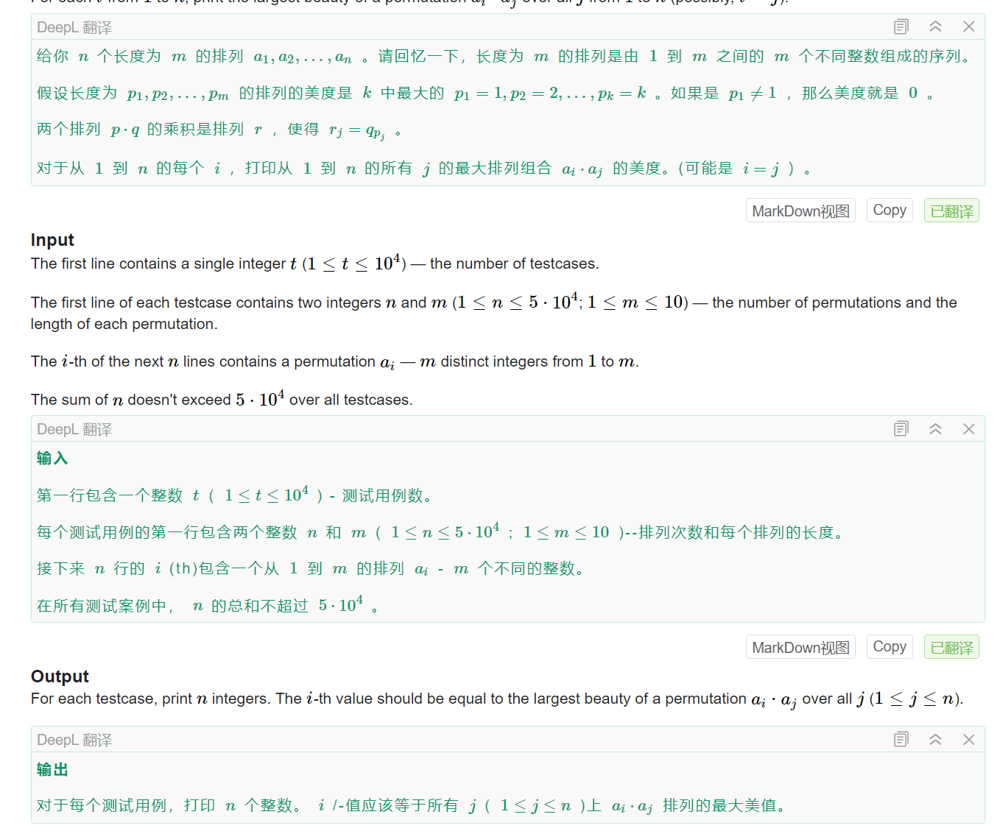
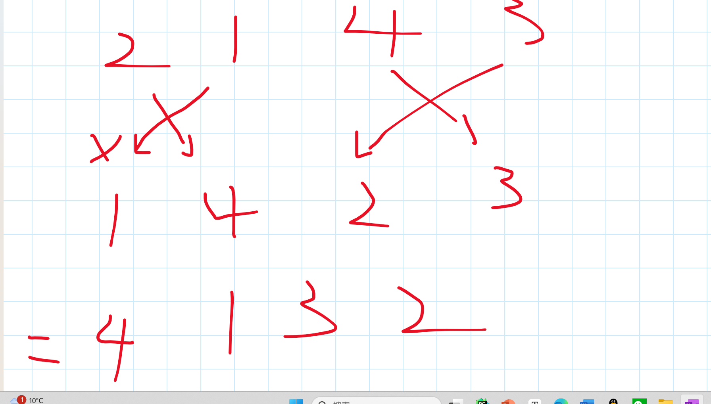
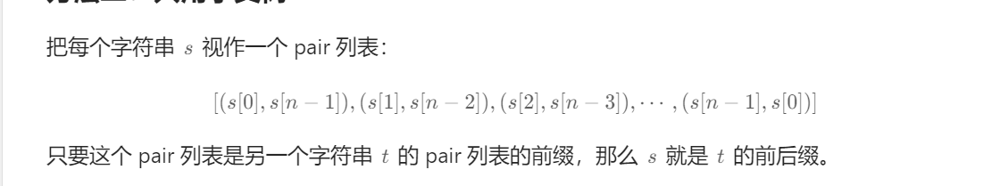
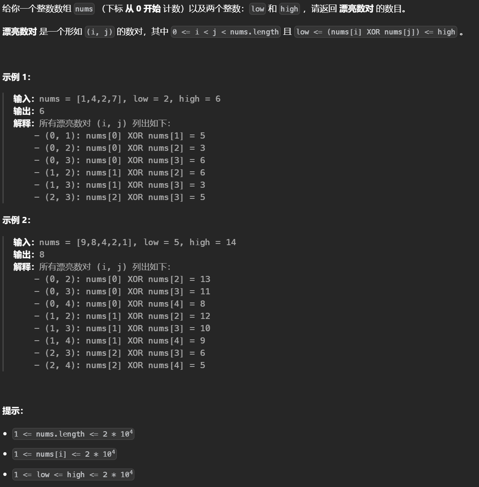

# 字典树


## 构造字典树


```python
class Trie:

    def __init__(self):
        # 只存在26位
        self.child=[None]*26
        
        # 表示是否存在一个字符串
        self.isend=False

    def searchPrefix(self, prefix: str) -> "Trie":
        node=self
        for c in prefix:
            c=ord(c)-ord('a')
            if not node.child[c]:
                return None
            node=node.child[c]
        return node
             
    def insert(self, word: str) -> None:
        node=self
        for c in word:
            c=ord(c)-ord('a')
            if not node.child[c]:
                node.child[c]=Trie()
            node=node.child[c]
        # 设置isend表示存在一个字符串
        node.isend=True

    def search(self, word: str) -> bool:
        res=self.searchPrefix(word)
        return res is not None and res.isend

    def startsWith(self, prefix: str) -> bool:
        return self.searchPrefix(prefix) is not None
```

## Trie字符串统计



```python
class Trie:
    def __init__(self):
        self.children=[None]*26
        self.is_end=0
    def insert(self,s):
        d=self
        for c in s:
            c=ord(c)-ord('a')
            if not d.children[c]:
                d.children[c]=Trie()
            d=d.children[c]
        d.is_end+=1
    def search(self,s):
        d=self
        for c in s:
            c=ord(c)-ord('a')
            if not d.children[c]:
                return 0
            d=d.children[c]
        return d.is_end
q=int(input())
tree=Trie()
while q:
    a,s=input().split()
    if a=='I':
        tree.insert(s)
    else:
        print(tree.search(s))
    q-=1
```


## [数组中两个数的最大异或值](https://leetcode.cn/problems/maximum-xor-of-two-numbers-in-an-array/)




两个数异或和最大要求尽可能多的二进制位不相同（并且在是尽可能地在高位不同），因此把所有数字转换为二进制到字典树中，然后贪心的对每个数找相反的路径比如是01，则在树中找10，注意由于数字的二进制不同，把题目都补为32位。

```python
class Trie:
    def __init__(self):
        self.children=[None]*2
        self.is_end=-1
    def insert(self,x):
        d=self
        for i in range(15,-1,-1):
            c=(x>>i)&1
            if not d.children[c]:
                d.children[c]=Trie()
            d=d.children[c]
        d.is_end=x
    def search(self,x):
        d=self
        for i in range(15,-1,-1):
            c= 0 if (x>>i)&1 else 1
            # 尽可能的找相反的，如果不存在就只能找存在的
            if not d.children[c]:
                c=0 if c else 1
            d=d.children[c]
            # 返回的是异或的结果
        return d.is_end^x if d.is_end else 0
class Solution:
    def findMaximumXOR(self, nums: List[int]) -> int:
        tree=Trie()
        # 插入每个数到字典树中
        for x in nums:
            tree.insert(x)
        # 对每个数在字典树中找与他相反的路劲，返回最大的
        return max([tree.search(x) for x in nums])
```


## [ 最长公共前缀](https://leetcode.cn/problems/longest-common-prefix/)

字典树可以用来求公共前缀，这需要在字典树中构建一个新的变量cnt，用于记录有多少个字符串经过这个位置。如果是公共前缀那么经过这个点的点数应该是n，因此在字典树中找最后一个cnt等于n的节点，同时记录树的深度就可以得到最长的公共前缀。


```python
class Trie:
    def __init__(self):
        self.children={}
        # 多出一个变量cnt
        self.isend=0
    def insert(self,s):
        d=self
        for c in s:
            c=ord(c)-ord('a')
            if c not in d.children:
                d.children[c]=Trie()
            d=d.children[c]
            # 在循环中更新注意，记录要多少个字符串经过这个位置
            d.isend+=1
class Solution:
    def longestCommonPrefix(self, strs: List[str]) -> str:
        tree=Trie()
        n=len(strs)
        # 插入
        for s in strs:
            tree.insert(s)
        # 记录深度
        depth=0
        # 如果遇到了分叉，那么一定不是公共前缀
        while len(tree.children)==1:
            for k,v in tree.children.items():
                # 找到前缀为n的最大的节点的深度
                if v.isend!=n:
                    return strs[0][:depth]
                tree=tree.children[k]
                depth+=1
        return strs[0][:depth]
```


## Collapsing Strings


实际上是在求解两个字符串之间长度之和减去它们公共的前后缀的长度。


根据观察可以发现如果不考虑重合的部分最后的结果就是$2\times n \times$所有字符串的长度之和

一个字符串倒序前缀和与所有字符串前缀重合的部分不好计算，把该字符串转换为颠倒的，这样就可以求解公共前缀了。而求字符串和所有的字符串的前缀之和可以通过模拟加入字符串的过程，减去遍历到的每一个节点经过的字符串数来实现。

至于为什么只能说是通过观察得出


```python
import sys
input=sys.stdin.readline
n=int(input())
S=[input().rstrip() for _ in range(n)]
# 搭建字典树
class TrieNode:
    def __init__(self):
        # 邻接表的方式连接
        self.nxt={}
        # 多一个额外的变量记录有多少字符经过
        self.cnt=0
class Trie:
    def __init__(self):
        self.root=TrieNode()

T = Trie()
ans = 0
for s in S:
    # 插入所有的点同时记录大小
    ans += len(s)*n*2
    node = T.root
    for t in s:
        j = ord(t)-ord("a")
        if j not in node.nxt :
            node.nxt[j] = TrieNode()
        node = node.nxt[j]
        node.cnt+=1
 
for s in S:
    # 在对每个字符倒序模拟插入
    node = T.root
    
    for i in range(len(s)-1,-1,-1):
        t=s[i]
        j = ord(t)-ord("a")
        if j not in  node.nxt:
            break
        # 减去遍历到的每一个点储存的经过字符数，组合以要乘二，因为是两个字符串的贡献都要减
        node = node.nxt[j]
        ans -= node.cnt*2
 
print(ans) 
```


## Fixed Prefix Permutations



题目大意是：每个数组与其他数组（包括本身）相乘后最大的美丽值，美丽值指的是数组从1开始的严格递增序列的长度。两个数组相乘指的是，前一个数组中从左到右的每个值作为下标取第二个数组中的元素：



而对于一个数组想要得到最大的美丽值就要映射如下：


要求必须是从1开始的递增序列，因此后面可以没有但是前面不能缺少，前一个数组想要获得大的美丽值就必须是左边正确指出下一个数组中对应元素的正确位置，然后才能找下一个位置。对于3142只有用2413乘它才能得到最大的，如果不存在2413则找241是否存在，如果存在最大的美丽值就是3，反之继续。对于给定的数组要找一个a数组使得a[i]能指向第i+1大的数，这个数组可以通过给定的数组的值为索引下标为值来实现，然后去看所有数组能匹配的这个逆序对最大前缀是？（因为要求第一个必须是1），求解前缀可以用字典树。

```python
import sys
from collections import defaultdict
input=sys.stdin.readline
t=int(input())
# 字典树
class Trie:
    def __init__(self):
        self.children={}
    
    def insert(self,nums):
        d=self
        for v in nums:
            if v not in d.children:
                d.children[v]=Trie()
            d=d.children[v]
    def find(self,nums):
        d=self
        cnt=0
        for v in nums:
            if v not in d.children:
                return cnt
            cnt+=1
            d=d.children[v]
        return cnt 

# 构造最优数组
def traverse(nums):
    n_=len(nums)
    res=[0]*n_
    for i,v in enumerate(nums):
        res[v]=i
    return res 

for _ in range(t):
    n,m=[int(x) for x in input().split()]
    # 注意要放到里面
    tree=Trie()
    temp=[]
    for _ in range(n):
        # 做一位偏移
        nums=[int(x)-1 for x in input().split()]
        # 将逆序对插入
        tree.insert(traverse(nums))
        temp.append(nums)
    for li in temp:
        # 对每个数组找他能匹配的最大前缀，
        print(tree.find(li),end=' ')
    print()
```

## [统计前后缀下标对 II](https://leetcode.cn/problems/count-prefix-and-suffix-pairs-ii/)


统计前后缀相同的，构造每个字符串的第i个和倒数第i个的pair存入字典树。相当于同时在匹配前缀和后缀



```python
class Trie:
    def __init__(self):
        self.children={}
        self.isend=0


class Solution:
    def countPrefixSuffixPairs(self, words: List[str]) -> int:
        tree=Trie()
        n=len(words)
        ans=0
	# 由于是要找i和j，那么要先检查再插入	
        for s in words:
            temp=tree
            for c in zip(s,reversed(s)):
                if c not in temp.children:
                    temp.children[c]=Trie()
                temp=temp.children[c]
                ans+=temp.isend
            temp.isend+=1
            
        return ans 
```


## [统计异或值在范围内的数对有多少](https://leetcode.cn/problems/count-pairs-with-xor-in-a-range/)



数组异或类的题目使用字典树求解，初始的想法是构建所有值的异或字典树，然后枚举每一个数，在字典树上做bfs求解出所有的异或值然后判断是否在区间内，但是这种方法实际是n^2的，因为bfs找出了所有的异或值相当于遍历了数组。

这里查找区间内的个数，可以转换为前缀的求解，即找小于等于high的减去小于等于low-1的，那么在字典树中不需要维护一个队列，当limit的位为1的时候所有异或出0的分支都是可以的，直接加上然后跳到异或为1的分支继续，如果limit的位为0，那么就只能跳到与x这一位相反的分支上。

```python
class Trie:
    def __init__(self):
        self.children={}
        # 需要记录经过这个节点的数有多少，而不是只在端点记录，因为要剪枝
        self.cnt=0
    def insert(self,x):
        t=self
        # 从高位开始
        for i in range(15,-1,-1):
            c=x>>i&1
            if c not in t.children:
                t.children[c]=Trie()
            t=t.children[c]
            t.cnt+=1
    def search(self,x,limit):
        t=self
        ans=0
        for j in range(15,-1,-1):
            v=x>>j&1
            # 如果这一位是1，那么与x当前位相同的(异或出0)可以直接加上，因为必然小于limit，然后跳到与x不同的位上
            if limit>>j&1:
                if v in t.children:ans+=t.children[v].cnt
                # 如果没有这个分支
                if v^1 not in t.children:return ans 
                t=t.children[v^1]
            # 为0就只能跳到相同的位上
            else:
                if v not in t.children:return ans 
                t=t.children[v]
        return ans+t.cnt # 最后要加上这个位上的数

class Solution:
    def countPairs(self, nums: List[int], low: int, high: int) -> int:
        t=Trie()
        ans=0
        # 因为会重复计算，所以算一个插入一个，可以做到不重不漏
        for v in nums:
            ans+=t.search(v,high)-t.search(v,low-1)
            t.insert(v)
        # 或者也可以直接写
        # for v in nums:T.insert(v)
        # return sum([T.search(v,high) for v in nums])//2-sum([T.search(v,low-1) for v in nums])//2
        return ans 
```


## 题目列表

[形成目标字符串需要的最少字符串数 I](https://leetcode.cn/problems/minimum-number-of-valid-strings-to-form-target-i/)字典树+dp


