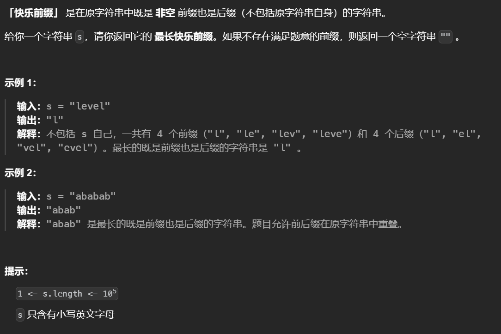
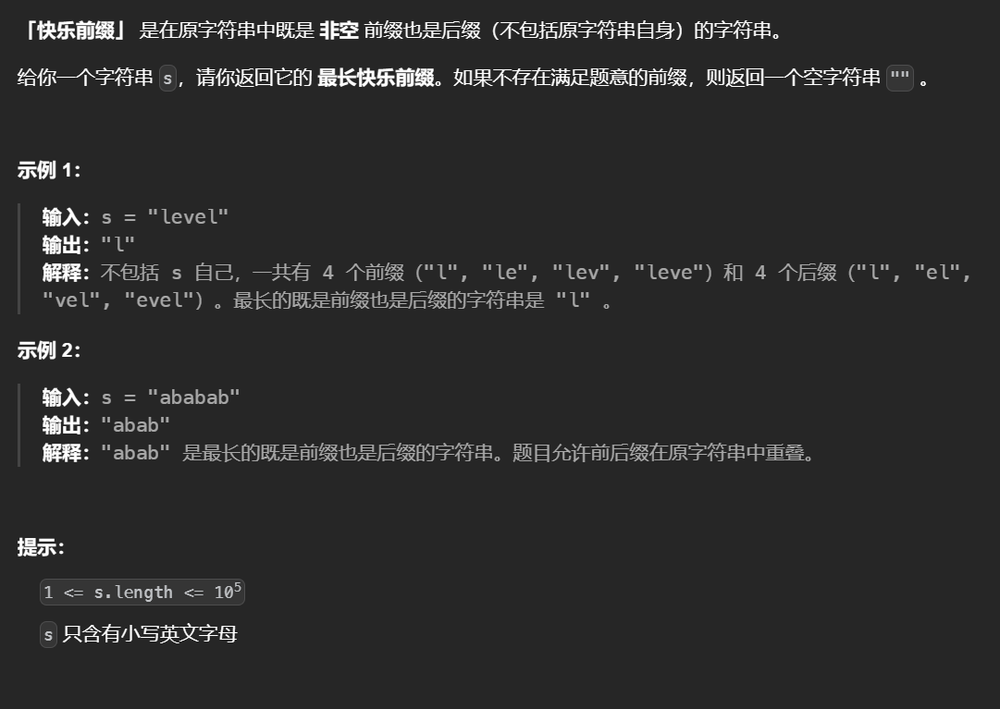
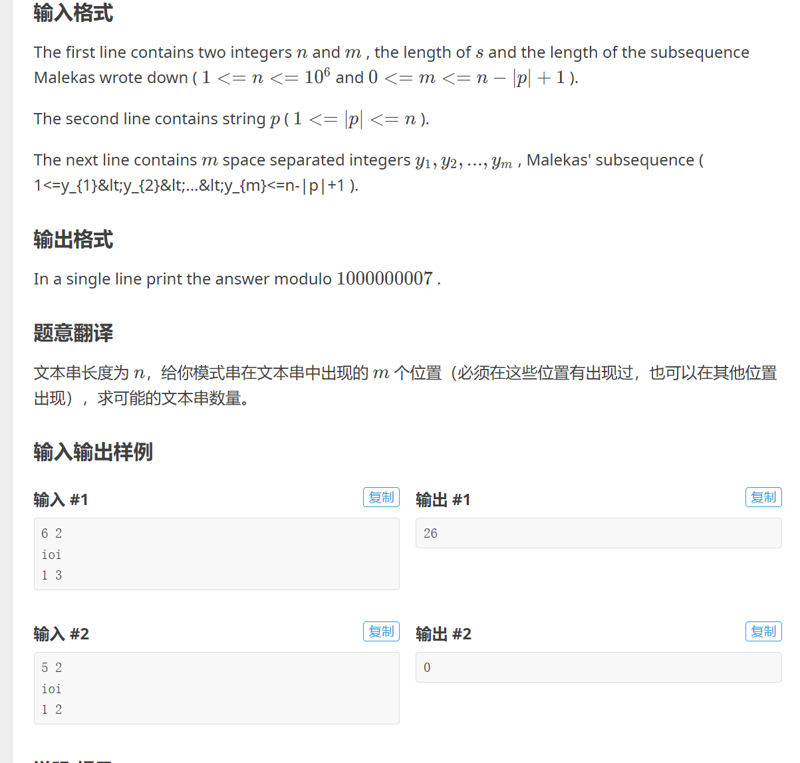
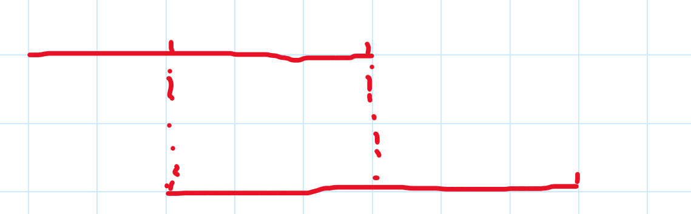

# KMAP

全称 Knuth–Morris–Pratt 算法，是用于在给定的字符串s中查找模式串p是否存在，如果存在，是在那个位置开始。

暴力的做法是，从第一个位置开始遍历s，如果遇到了p的开头，开始一一枚举，如果不匹配则s会回退到自己的第 2 个字符，p则回退到自己的开头，然后开始重新比较。

而kmap是减少了查找的次数，即遇到了不匹配的字符，s的位置不会回退，而p会回退。


这里可以看出s不会回退，而p会回退


即找到相同的前缀和后缀，把p原来的起始位置换到对应的后缀位置上，减少了无用的枚举，只有从相等的后缀处开始才有可能找到。


kmap算法的关键在于，构造next数组，next[i]表示P[0]~P[x] 这一段字符串，使得**k-前缀恰等于k-后缀**的最大的k。

记录now为next[x-1]的结果，如果下一位的字符相同


不同，可以看出子串A与B是一样的，找到子串A的next长度，递归的判断现在的now和x相不相同。


arr[i]表示s[:i+1]最长的前缀和后缀相等的长度

```python
def build(p):
    # 初始时，自己与自己是等于0的
    arr=[0]
    x=1
    now=arr[x-1]
    while x<len(p):
        # 相等，都往后扩展，记录结果
        if p[now]==p[x]:
            now+=1
            x+=1
            arr.append(now)
        # 不同的话，递归
        elif now:
            now=arr[now-1]
        # 确实不存在相同的前后缀
        else:
            arr.append(0)
            x+=1
    return arr
```


```python
def search(s,p):
    # 构建前后缀数组
    arr=build(p)
    # 标识两个字符串的指针
    tar,pos=0,0
    res=[]
    while tar<len(s):
        # 相同，往后
        if s[tar]==p[pos]:
            tar+=1
            pos+=1
        # s与p存在不匹配的
        elif pos:
            pos=arr[pos-1]
        else:
            # 还没匹配到第一个字符
            tar+=1
        # 匹配了一个p，记录结果，这里p要回退而不是重新开始
        if pos==len(p):
            res.append(tar-pos)
            pos=arr[pos-1]
    return res
```


## [找出数组中的美丽下标 II](https://leetcode.cn/problems/find-beautiful-indices-in-the-given-array-ii/)


搭建kmap，然后使用二分

```python
class Solution:
    def beautifulIndices(self, s: str, a: str, b: str, k: int) -> List[int]:
        def build(p):
            arr=[0]
            x=1
            now=arr[x-1]
            while x<len(p):
                if p[now]==p[x]:
                    now+=1
                    x+=1
                    arr.append(now)
                elif now:
                    now=arr[now-1]
                else:
                    arr.append(0)
                    x+=1
            return arr

        def search(s,p):
            arr=build(p)
            tar,pos=0,0
            res=[]
            while tar<len(s):
                if s[tar]==p[pos]:
                    tar+=1
                    pos+=1
                elif pos:
                    pos=arr[pos-1]
                else:
                    tar+=1
                if pos==len(p):
                    res.append(tar-pos)
                    pos=arr[pos-1]
            return res
        ans=[]
        li1=search(s,a)
        li2=search(s,b)
        n=len(li2)
        # 使用二分
        # for i in range(len(li1)):
        #     index=bisect_left(li2,li1[i])
        #     if index<n and li2[index]-li1[i]<=k:
        #         ans.append(li1[i])
        #     elif index>0 and li1[i]-li2[index-1]<=k:
        #         ans.append(li1[i])
        # return ans
        
        # 使用双指针
        l=0
        for val in li1:
            while l<len(li2) and li2[l]<val-k:
                l+=1
            if l<len(li2) and li2[l]<=val+k:
                ans.append(val)
        return ans 
```


## [匹配模式数组的子数组数目 II](https://leetcode.cn/problems/number-of-subarrays-that-match-a-pattern-ii/)


模式串适用于表示大小增减关系的，因此可以把原字符串转换为表示大小的字符串，这样问题就变为在文本串中找模式串，注意把-1换为2方便查找。

```python
class Solution:
    def countMatchingSubarrays(self, nums: List[int], pattern: List[int]) -> int:
        text=''
        # 转化
        for i in range(1,len(nums)):
            if nums[i]>nums[i-1]:
                text+='1'
            elif nums[i]==nums[i-1]:
                text+='0'
            else:
                text+='2'
        # kmp模板
        def build(p):
            arr=[0]
            x=1
            now=arr[x-1]
            while x<len(p):
                if p[now]==p[x]:
                    x+=1
                    now+=1
                    arr.append(now)
                elif now:
                    now=arr[now-1]
                else:
                    arr.append(0)
                    x+=1
            return arr
        def search(s,p):
            l=r=0
            arr=build(p)
            ans=[]
            while r<len(s):
                if s[r]==p[l]:
                    r+=1
                    l+=1
                elif l:
                    l=arr[l-1]
                else:
                    r+=1
                if l==len(p):
                    ans.append(r-l)
                    l=arr[l-1]
            return ans 
        pattern=[x if x!=-1 else 2 for x in pattern ]
        p=''.join(list(map(str,pattern)))
        return len(search(text,p))
```


## [最长快乐前缀](https://leetcode.cn/problems/longest-happy-prefix/)




运用了kmp算法中的一部分

```python
class Solution:
    def longestPrefix(self, s: str) -> str:    
        arr=[0]
        x=1
        now=arr[x-1]
        while x<len(s):
            if s[x]==s[now]:
                x+=1
                now+=1
                arr.append(now)
            elif now:
                now=arr[now-1]
            else:
                arr.append(0)
                x+=1
        return s[:arr[-1]]
```

## [最短匹配子字符串](https://leetcode.cn/problems/shortest-matching-substring/)


模式串中只有两个*(一种提示)，因此转换思路将模式串按照\*划分为三段，每一段用KMAP匹配给定的s，枚举中间模式串的位置，找出对于这个位置左右两个模式串最接近的位置是多少，以此来保证\*填充最少的元素。

对于划分后空的模式串，令它们可以匹配任意位置。

```python
class Solution:
    def shortestMatchingSubstring(self, s: str, p: str) -> int:
        p1,p2,p3=p.split('*')
        # KMAP模板
        def build(p):...
        def search(s,p):
            # 对于空的模式串可以匹配所有位置，这里要额外匹配|S|位置，在中间模式串匹配到了末尾，最后模式串为空时可以满足条件
            if not p:return list(range(len(s)+1))
        	...
        # 构建匹配位置
        pos1,pos2,pos3=search(s,p1),search(s,p2),search(s,p3)
        ans=inf
        # 左右两个模式串索引
        i=k=0
        for idx in pos2:
            # 右侧尽可能地接近
            while k<len(pos3) and pos3[k]<idx+len(p2):
                k+=1
            # 右侧无法匹配
            if k>=len(pos3):break
            # 左侧同理
            while i<len(pos1) and pos1[i]+len(p1)<=idx:
                i+=1
            # 要做一位偏移
            if i-1>=0:
                # 这里的公式化简过
                ans=min(ans,len(p3)+pos3[k]-pos1[i-1])
        return ans if ans!=inf else -1
```


# 字符串哈希

## 模板


逐一比较字符串的每个值超时，对字符串构建前缀和。把字符串看作一个p进制的数，比如说aa代表一个$$a \times p^1+a\times p^0$$

就这样构造前缀字符串数组，查询一个区间的值的时候，可以通过相减得到字串的数值，但是注意不是直接相减，比如aabbc，为了得到bbc需要减去前面的aa但是aa是高进制的需要先左移三位才能减去。

```python
n,m =[int(x) for x in input().split()]
s=input()
pre=[0]*(n+1)
# 进制，p取131可以防止哈希冲突（技巧点）
p=131
# P[i]表示p^i
P=[1]
# 数值太大会导致计算非常慢，因此要取模
mod = 998244353
# 构造前缀和，注意取模
for i ,c in enumerate(s,1):
    pre[i]=(pre[i-1]*p+ord(c))%mod
    P.append((P[-1]*p)%mod)
while m:
    # 注意这里的l,r是从1开始的
    l1,r1,l2,r2=[int(x) for x in input().split()]
    # 比较的结果也要取模，防止太大，注意要把后面的数乘上P[字符串的长度]
    if (pre[r1]-pre[l1-1]*P[r1-l1+1])%mod==(pre[r2]-pre[l2-1]*P[r2-l2+1])%mod:
        print('Yes')
    else:
        print('No')
    m-=1
```

## [形成目标字符串需要的最少字符串数 II](https://leetcode.cn/problems/minimum-number-of-valid-strings-to-form-target-ii/)


## [最长快乐前缀](https://leetcode.cn/problems/longest-happy-prefix/)



```python
class Solution:
    def longestPrefix(self, s: str) -> str:
        pre=[0]
        P=[1]
        p=131
        mod=10**9+7
        n=len(s)
        ans=0
        # 注意取模
        for i,c in enumerate(s):
            pre.append((pre[-1]*p+ord(c))%mod)
            P.append((P[-1]*p)%mod)
        # 这里枚举长度
        for i in range(1,n):
            l=(pre[i]-pre[0]*P[i])%mod
            r=(pre[n]-pre[n-i]*P[i])%mod
            if l==r:
                ans=max(ans,i)
        return s[:ans]
```


# Z函数

z[i]表示s[i:]\(每个后缀)与s的公共最长前缀是多少

初始时从1开始比较，找到最长前缀就是暴力匹配，匹配之后会有一段z-box:


再找下一个s[i:]的过程中如果i落在了z-box中，首先判断z[i-l]是否小于z-box的边界到i的距离，如果小于就确定了z[i]=z[i-l]，反之说明在z-box中的这一段都是匹配的继续往后找，最后更新z-box

```python
def z(s):
    n=len(s)
    z=[0]*n
    l,r=0,0
    for i in range(1,n):
        # 在z-box中并且小于
        if i<=r and z[i-l]<r-i+1:
            z[i]=z[i-l]
        else:
            # 先初始化为到边界的距离
            z[i]=max(0,r-i+1)
            # 往后找
            while i+z[i]<n and s[z[i]]==s[i+z[i]]:      
                z[i]+=1
            # 更新区间
            if i+z[i]-1>r:
                l=i
                r=i+z[i]-1
    return z
```


如果存在s和p 想找s的每个前缀能匹配多长的p(子串)，由于z函数是自身与自身匹配，这里可以拼接p+s求解z函数 s[i:]能匹配的最长的p即为z[i+len(p)]


对于后缀要倒置s2=p[::-1]+s[::-1]， z2=z(s2) 求解时b=z2[len(p)+len(s)-r(子串的右端点)]


## [将单词恢复初始状态所需的最短时间 II](https://leetcode.cn/problems/minimum-time-to-revert-word-to-initial-state-ii/)


删除k个前面的子串后，如果剩余的子串能完美匹配前缀那么就可以提前结束，因为在后面添加的值是任意的。

使用z函数找出每个后缀与字符串的最长公共前缀，如果大于当前剩余子串的长度那么可以提前结束反之只能删除所有原来的字符。

```python
class Solution:
    def minimumTimeToInitialState(self, word: str, k: int) -> int:
        def z(s):
            n=len(s)
            z=[0]*n
            l=r=0
            for i in range(1,n):
                if i<=r and z[i-l]<r-i+1:
                    z[i]=z[i-l]
                else:
                    z[i]=max(0,r-i+1)
                    while i+z[i]<n and s[z[i]]==s[i+z[i]]:
                        z[i]+=1
                    if i+z[i]-1>r:
                        l=i
                        r=i+z[i]-1
            return z
        z=z(word)
        n=len(word)
        for i in range(1,ceil(n/k)):
            if z[k*i]>=n-k*i:
                return i
        return ceil(n/k)

```

## Tavas and Malekas




关键在于判断每个模式串的位置是否合法，对于两个位置l1和l2，如果前者的r1不与或者相交那么自然合法，否则要去判断上下两端是否相等。使用Z函数可以快速判断，因为Z函数的Z[i]表示S[i:]能匹配S的最长前缀。




```python
def z(s):
    n=len(s)
    z=[0]*n
    l,r=0,0
    for i in range(1,n):
        # 在z-box中并且小于
        if i<=r and z[i-l]<r-i+1:
            z[i]=z[i-l]
        else:
            # 先初始化为到边界的距离
            z[i]=max(0,r-i+1)
            # 往后找
            while i+z[i]<n and s[z[i]]==s[i+z[i]]:
                z[i]+=1
            # 更新区间
            if i+z[i]-1>r:
                l=i
                r=i+z[i]-1
    return z
def slove():
    mod = 10 ** 9 + 7
    n, k = [int(x) for x in input().split()]
    s = input()
    if not k:
        print(pow(26,n,mod))
        return
    ll = len(s)
    nums = [int(x) for x in input().split()]
    nums.sort()
    tt = n


    arr=z(s)
    pre=nums[0]
    ans=ll

    for i in range(1,k):
        index=nums[i]
        r=pre+ll-1
        if r<index:
            ans+=ll
            pre=index
        else:
            l_=r-index+1
            x=arr[index-pre]
            if x<l_:
                print(0)
                return
            else:
                pre=index
                ans+=ll-l_
    print(pow(26, n - ans, mod))

slove()
```


## [统计数组中的美丽分割](https://leetcode.cn/problems/count-beautiful-splits-in-an-array/)


对于给定的数据范围可以枚举两个分割点，关键在于提前打表构建Z函数

```python
class Solution:
    def beautifulSplits(self, nums: List[int]) -> int:
        n=len(nums)
        def Z(s):
            n=len(s)
            z=[0]*n
            l,r=0,0
            for i in range(1,n):
                # 在z-box中并且小于
                if i<=r and z[i-l]<r-i+1:
                    z[i]=z[i-l]
                else:
                    # 先初始化为到边界的距离
                    z[i]=max(0,r-i+1)
                    # 往后找
                    while i+z[i]<n and s[z[i]]==s[i+z[i]]:      
                        z[i]+=1
                    # 更新区间
                    if i+z[i]-1>r:
                        l=i
                        r=i+z[i]-1
            return z
        z=[]
        a=nums[:]
        # 以每个后缀做一个Z函数表
        while a:
            z.append(Z(a))
            a.pop(0)
        # 检查两个端点
        def check(i,j):
            # 第二段的长度需要大于等于第一段，且匹配的前缀长度至少大于等于第一段
            if j-i>=i and z[0][i]>=i:return True 
        	# 第三段的长度大于等于第二段，且匹配的前缀长度至少大于等于第二段，这里找的Z表是以第二段开头的
            if n-1-j+1>=j-i and z[i][j-i]>=j-i:return True 
            return False
        ans=0
        # n^2枚举分割点
        for i in range(1,n-1):
            for j in range(i+1,n):
                if check(i,j):ans+=1
        return ans 
```


## 题目列表

[第一个几乎相等子字符串的下标](https://leetcode.cn/problems/find-the-occurrence-of-first-almost-equal-substring/)前后缀分解+Z函数子串匹配


