# 中心扩展法

中心扩展法可用于判断回文串，即枚举每个回文中心，回文中心可能是一个也可能是两个，然后往两边扩展

```python
class Solution:
    def longestPalindrome(self, s: str) -> str:
        n=len(s)
        ans=''
        for i in range(2*n-1):
            l=i//2
            r=i//2+i%2
            while l>=0 and r<n and s[l]==s[r]:
                # 求解最长回文串
                if r-l+1>len(ans):ans=s[l:r+1]
                l-=1
                r+=1
        return ans 
```


## [子字符串连接后的最长回文串 II](https://leetcode.cn/problems/longest-palindrome-after-substring-concatenation-ii/)

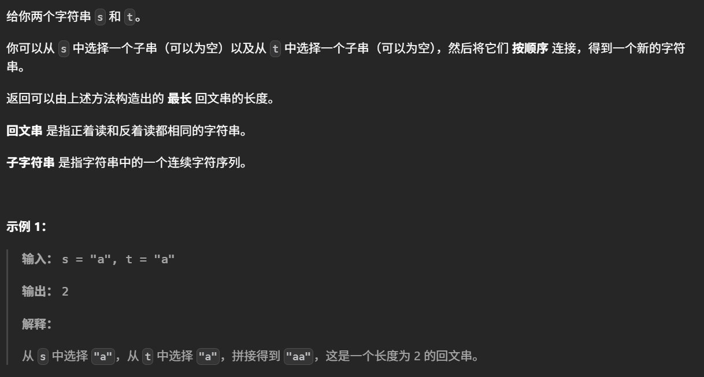

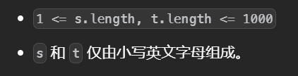

从两个字符串中取前后缀，有三种情况：

+ 取得的子串一样长，那么就是求解最长公共子数组
+ S更长，必须满足长度为y的部分一样，且剩下的部分是一个回文串
+ T更长，反之

为了保证剩下的部分是回文串，对于给定的数据可以使用扩中心扩展法，在满足是回文串的情况下累加前后缀匹配的长度，取最大值。

```python
class Solution:
    def longestPalindrome(self, s: str, t: str) -> int:
        m,n=len(s),len(t)
        ans=0
        # DP求解公共子数组,f[i][j]表示以s[i]结尾,t(倒序)[j]结尾的最长公共子数组
        f=[[0]*(n+1) for _ in range(m+1)]
        for i in range(1,m+1):
            for j in range(n-1,-1,-1):
                if s[i-1]==t[j]:
                    f[i][j]=1+f[i-1][j+1]
                    ans=max(f[i][j]*2,ans)
        # 求解以s[i]结尾的最长公共子数组
        smx=[]
        # 求解以t[j]开头的最长公共子数组
        rmx=[]
        for i in range(m+1):
            smx.append(max(f[i]))
        for j in range(n+1):
            rmx.append(max(f[i][j] for i in range(m+1)))

        # 中心扩展法
        for j in range(2*m-1):
            l,r=j//2,j//2+j%2
            while l>=0 and r<m and s[l]==s[r]:
                # 不断更新答案，实际上做了一位偏移
                ans=max(ans,(r-l+1)+smx[l]*2)
                l-=1
                r+=1
        # 同理
        for j in range(2*n-1):
            l,r=j//2,j//2+j%2
            while l>=0 and r<n and t[l]==t[r]:
                ans=max(ans,(r-l+1)+rmx[r+1]*2)
                l-=1
                r+=1
        return ans 
```


## [图中的最长回文路径](https://leetcode.cn/problems/longest-palindromic-path-in-graph/)

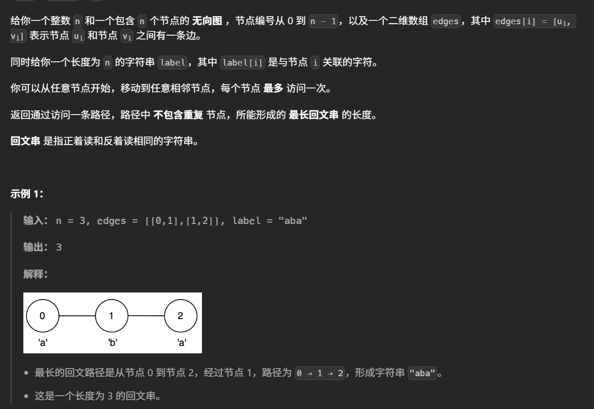

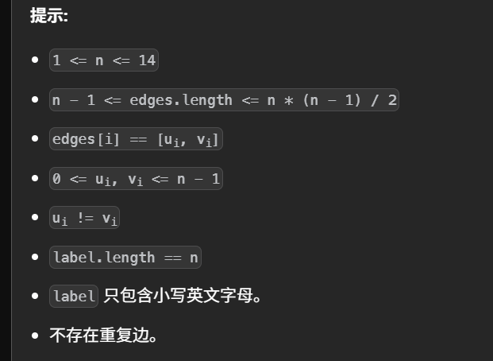

直接爆搜显然是不行的，回文串的做法就几种，考虑使用中心扩展法优化，枚举回文中心，这样就只需往两边找相同的字符。

由于节点个数较少因此可以使用状态压缩记录操作过的节点，定义dp(x,y,s)为左右端点为x,y的回文串，s记录已选过的节点，去枚举x,y的相邻节点做状态转移

```python
max=lambda x,y:x if x>y else y

class Solution:
    def maxLen(self, n: int, edges: List[List[int]], nums: str) -> int:
        ans=1 # 只有一个节点的情况
        # 建图
        g=[[] for _ in range(n)]
        for u,v in edges:
            g[u].append(v)
            g[v].append(u)
        @cache
        def dp(x,y,s):
            res=0
            # 枚举
            for nx1 in g[x]:
                if s>>nx1&1:continue
                for nx2 in g[y]:
                    # 需要字符相同，且没选过
                    if nx1!=nx2 and s>>nx2&1==0 and nums[nx1]==nums[nx2]:
                        # 注意要保证相对顺序，否则会多出很多重复状态
                        if nx1>nx2:nx1,nx2=nx2,nx1
                        res=max(res,2+dp(nx1,nx2,s|(1<<nx1)|(1<<nx2)))
            return res  
        
        for u,v in edges:
            # 单个点作为中心
            ans=max(ans,1+dp(u,u,(1<<u)))
            ans=max(ans,1+dp(v,v,(1<<v)))

            # 两个点作为中心
            if nums[u]==nums[v]:
                if u>v:u,v=v,u
                ans=max(ans,2+dp(u,v,(1<<u)|(1<<v)))
        return ans 
```


# KMAP

全称 Knuth–Morris–Pratt 算法，是用于在给定的字符串s中查找模式串p是否存在，如果存在，是在那个位置开始。

暴力的做法是，从第一个位置开始遍历s，如果遇到了p的开头，开始一一枚举，如果不匹配则s会回退到自己的第 2 个字符，p则回退到自己的开头，然后开始重新比较。

而kmap是减少了查找的次数，即遇到了不匹配的字符，s的位置不会回退，而p会回退。

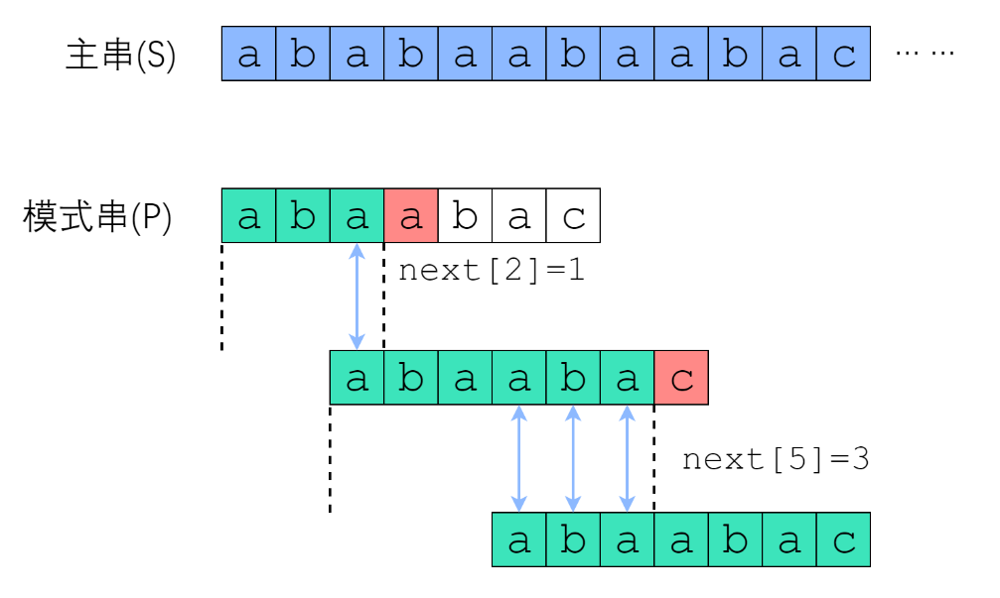

这里可以看出s不会回退，而p会回退

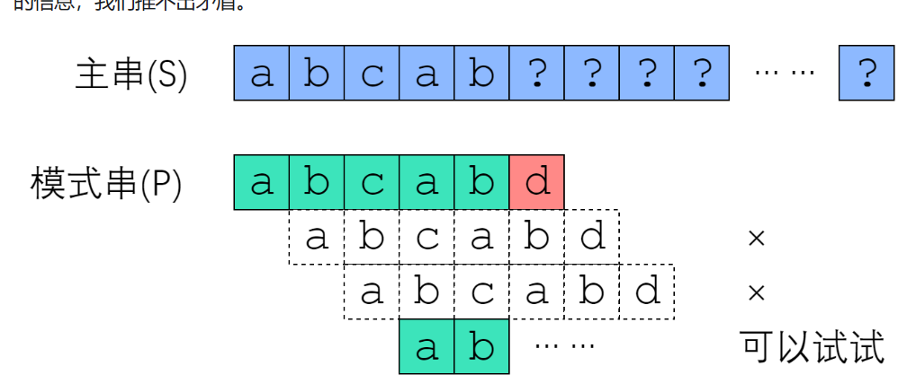

即找到相同的前缀和后缀，把p原来的起始位置换到对应的后缀位置上，减少了无用的枚举，只有从相等的后缀处开始才有可能找到。

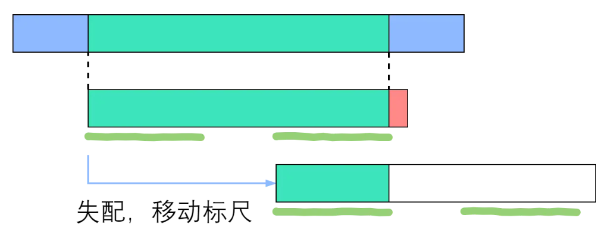


kmap算法的关键在于，构造next数组，next[i]表示P[0]~P[x] 这一段字符串，使得**k-前缀恰等于k-后缀**的最大的k。

记录now为next[x-1]的结果，如果下一位的字符相同

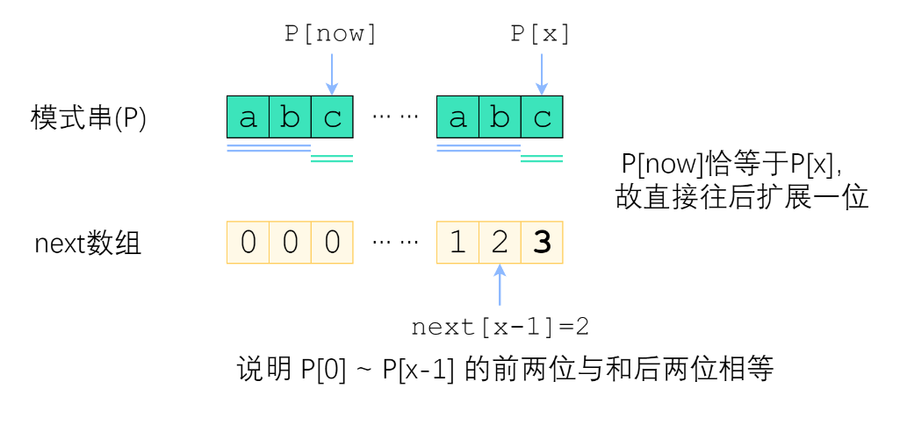

不同，可以看出子串A与B是一样的，找到子串A的next长度，递归的判断现在的now和x相不相同。

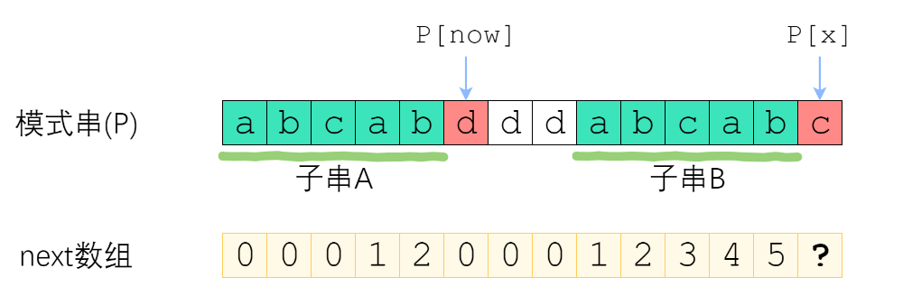


`arr[i]`表示模式串`p[0...i]`(包含i)的最长的**前缀**和**后缀**相等的的长度。例如，如果`p = "ABAB"`，那么`arr = [0, 0, 1, 2]`，意味着：

- `arr[0] = 0`，不存在相等的前后缀。
- `arr[1] = 0`，不存在。
- `arr[2] = 1`，前缀`A`与后缀`A`相等。
- `arr[3] = 2`，前缀`AB`与后缀`AB`相等。


```python
def build(p):
    # 初始时，自己与自己是等于0的
    arr=[0]
    x=1
    now=arr[x-1]
    while x<len(p):
        # 相等，都往后扩展，记录结果
        if p[now]==p[x]:
            now+=1	
            x+=1
            arr.append(now)
        # 不同的话，递归
        elif now:
            now=arr[now-1]
        # 确实不存在相同的前后缀
        else:
            arr.append(0)
            x+=1
    return arr
```


```python
def search(s,p):
    # 构建前后缀数组
    arr=build(p)
    # 标识两个字符串的指针
    tar,pos=0,0
    res=[]
    while tar<len(s):
        # 相同，往后
        if s[tar]==p[pos]:
            tar+=1
            pos+=1
        # s与p存在不匹配的
        elif pos:
            pos=arr[pos-1]
        else:
            # 还没匹配到第一个字符
            tar+=1
        # 匹配了一个p，记录结果，这里p要回退而不是重新开始
        if pos==len(p):
            res.append(tar-pos) # 注意做减法
            pos=arr[pos-1] # 仍然要回退
    return res
```


## [找出数组中的美丽下标 II](https://leetcode.cn/problems/find-beautiful-indices-in-the-given-array-ii/)

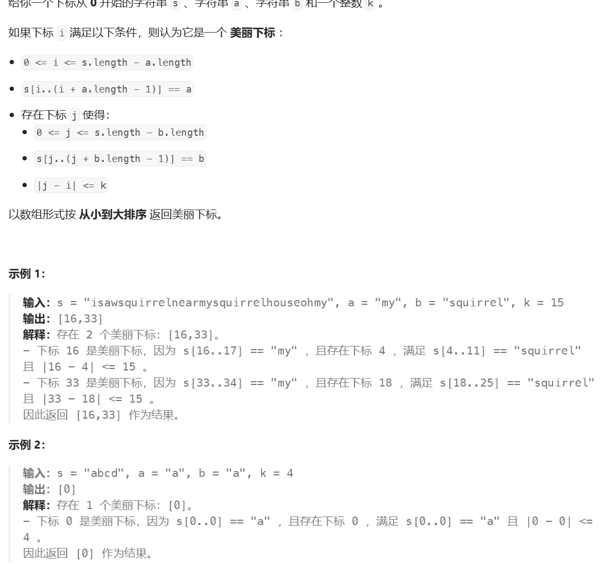


搭建kmap，然后使用二分

```python
class Solution:
    def beautifulIndices(self, s: str, a: str, b: str, k: int) -> List[int]:
        def build(p):
            arr=[0]
            x=1
            now=arr[x-1]
            while x<len(p):
                if p[now]==p[x]:
                    now+=1
                    x+=1
                    arr.append(now)
                elif now:
                    now=arr[now-1]
                else:
                    arr.append(0)
                    x+=1
            return arr

        def search(s,p):
            arr=build(p)
            tar,pos=0,0
            res=[]
            while tar<len(s):
                if s[tar]==p[pos]:
                    tar+=1
                    pos+=1
                elif pos:
                    pos=arr[pos-1]
                else:
                    tar+=1
                if pos==len(p):
                    res.append(tar-pos)
                    pos=arr[pos-1]
            return res
        ans=[]
        li1=search(s,a)
        li2=search(s,b)
        n=len(li2)
        # 使用二分
        # for i in range(len(li1)):
        #     index=bisect_left(li2,li1[i])
        #     if index<n and li2[index]-li1[i]<=k:
        #         ans.append(li1[i])
        #     elif index>0 and li1[i]-li2[index-1]<=k:
        #         ans.append(li1[i])
        # return ans
        
        # 使用双指针
        l=0
        for val in li1:
            while l<len(li2) and li2[l]<val-k:
                l+=1
            if l<len(li2) and li2[l]<=val+k:
                ans.append(val)
        return ans 
```


## [匹配模式数组的子数组数目 II](https://leetcode.cn/problems/number-of-subarrays-that-match-a-pattern-ii/)

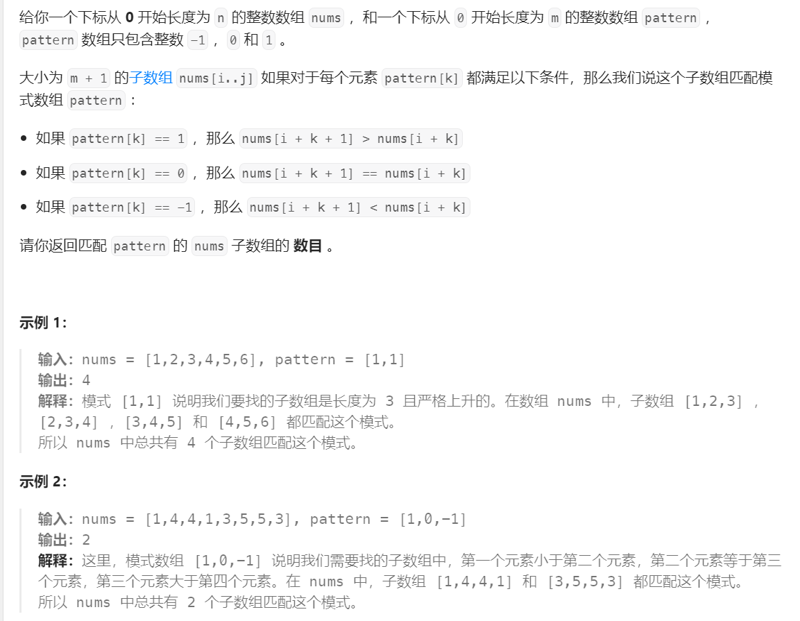

模式串适用于表示大小增减关系的，因此可以把原字符串转换为表示大小的字符串，这样问题就变为在文本串中找模式串，注意把-1换为2方便查找。

```python
class Solution:
    def countMatchingSubarrays(self, nums: List[int], pattern: List[int]) -> int:
        text=''
        # 转化
        for i in range(1,len(nums)):
            if nums[i]>nums[i-1]:
                text+='1'
            elif nums[i]==nums[i-1]:
                text+='0'
            else:
                text+='2'
        # kmp模板
        def build(p):
            arr=[0]
            x=1
            now=arr[x-1]
            while x<len(p):
                if p[now]==p[x]:
                    x+=1
                    now+=1
                    arr.append(now)
                elif now:
                    now=arr[now-1]
                else:
                    arr.append(0)
                    x+=1
            return arr
        def search(s,p):
            l=r=0
            arr=build(p)
            ans=[]
            while r<len(s):
                if s[r]==p[l]:
                    r+=1
                    l+=1
                elif l:
                    l=arr[l-1]
                else:
                    r+=1
                if l==len(p):
                    ans.append(r-l)
                    l=arr[l-1]
            return ans 
        pattern=[x if x!=-1 else 2 for x in pattern ]
        p=''.join(list(map(str,pattern)))
        return len(search(text,p))
```


## [最短匹配子字符串](https://leetcode.cn/problems/shortest-matching-substring/)

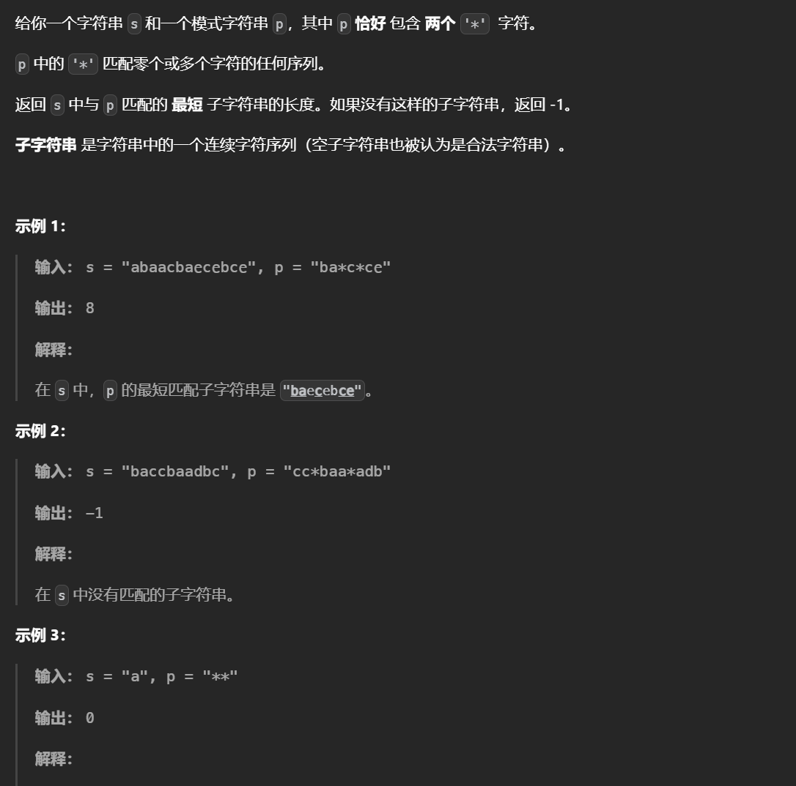

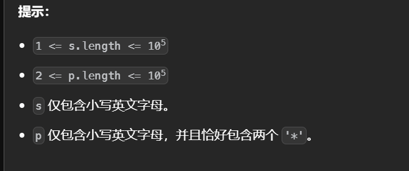


模式串中只有**两个***(提示)，因此转换思路将模式串按照\*划分为三段，每一段用KMAP匹配给定的s，枚举中间模式串的位置，找出对于这个位置左右两个模式串最接近的位置是多少，以此来保证\*填充最少的元素。

对于划分后空的模式串，令它们可以匹配任意位置。

```python
class Solution:
    def shortestMatchingSubstring(self, s: str, p: str) -> int:
        p1,p2,p3=p.split('*')
        # KMAP模板
        def build(p):...
        def search(s,p):
            # 对于空的模式串可以匹配所有位置，这里要额外匹配|S|位置，在中间模式串匹配到了末尾，最后模式串为空时可以满足条件
            if not p:return list(range(len(s)+1))
        	...
        # 构建匹配位置
        pos1,pos2,pos3=search(s,p1),search(s,p2),search(s,p3)
        ans=inf
        # 左右两个模式串索引
        i=k=0
        for idx in pos2:
            # 右侧尽可能地接近
            while k<len(pos3) and pos3[k]<idx+len(p2):
                k+=1
            # 右侧无法匹配
            if k>=len(pos3):break
            # 左侧同理
            while i<len(pos1) and pos1[i]+len(p1)<=idx:
                i+=1
            # 要做一位偏移
            if i-1>=0:
                # 这里的公式化简过
                ans=min(ans,len(p3)+pos3[k]-pos1[i-1])
        return ans if ans!=inf else -1
```

# Manacher

求解两个数组**d1和d2**，d1[i]表示以**s[i]**位置为**中心**长度为**奇数**的**回文串**个数，d2[i]表示的是**偶数**，这里偶数指**偏右**的

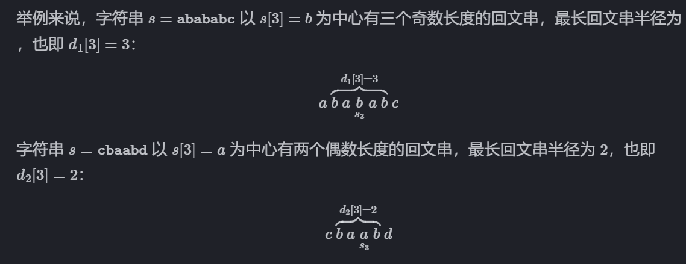


Manacher可以做到**线性**的时间复杂度求解一个字符串的最长回文子串


朴素的解法是中心扩展法

```python
d1=[0]*n
d2=[0]*n

for i in range(n):
    d1[i]=1
    while i-d1[i]>=0 and i+d1[i]<n and s[i-d1[i]]==s[i+d1[i]]:
        d1[i]+=1
    
    d2[i]=0
    while i-d2[i]-1>=0 and i+d2[i]<n and s[i-d1[i]+1]==s[i+d1[i]]
        d2[i]+=1
```


以求解奇数长度子回文串的Manacher算法为例，在遍历过程中维护**(l,r)即已找到的最靠右的回文串区间**

当遍历到位置i时，当i位于范围之外那么调用朴素的算法

反之，尝试从已求解出的区间中获取一些信息——首先在区间中反转i，即j=l+(r-i)，然后考察d1[j]，可以证明的是**d1[j]可以复制给d1[i]**

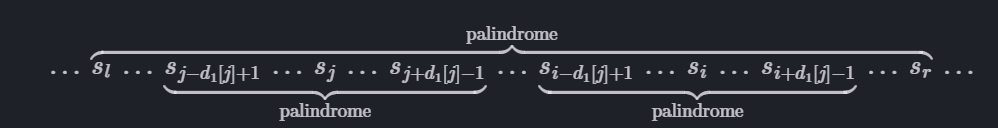

然后这个性质只在区间内成立，即i+d1[j]-1>r对外部的不保证，因此会截断回文串长度，然后再运行朴素的算法

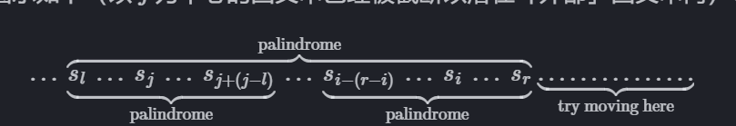

注意每次求解完需要更新(l,r)

**d1的和**与**d2的和**就是总的回文串的个数

注意，d2的实现中min(r-i+1,d2[l+r-i+1])容易写成min(r-i+1,**d1**[l+r-i+1])

```python
d1=[0]*n
d2=[0]*n
l,r=0,-1
for i in range(n):
    k=1 if i>r else min(r-i+1,d1[l+r-i])
    while i-k>=0 and i+k<n and s[i-k]==s[i+k]:
        k+=1
    d1[i]=k
    k-=1 	# 注意减一
    if i+k>r:
        l=i-k
        r=i+k

l,r=0,-1
for i in range(n):
    k=0 if i>r else min(r-i+1,d2[l+r-i+1]) # 注意这里+1
    while i-k-1>=0 and i+k<n and s[i-k-1]==s[i+k]:
        k+=1
    d2[i]=k
    k-=1
    if i+k>r: # 如果当前位置的右边界超出了，就重新更新l,r
        l=i-k-1
        r=i+k
```


如果在循环中要统计回文长度的话，d2需要做一位偏移——len=**2*(k+1)**


# 字符串哈希

## 模板

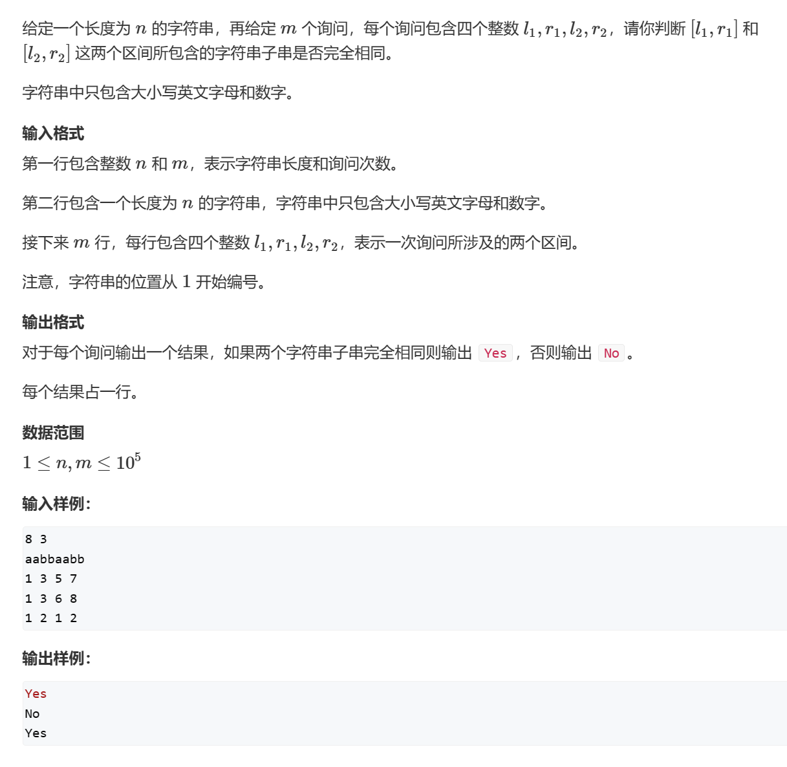


逐一比较字符串的每个值超时，对字符串构建前缀和。把字符串看作一个p进制的数，比如说aa代表一个$$a \times p^1+a\times p^0$$

就这样构造前缀字符串数组，查询一个区间的值的时候，可以通过相减得到字串的数值，但是注意不是直接相减，比如aabbc，为了得到bbc需要减去前面的aa但是aa是高进制的需要先左移三位才能减去。

```python
n,m =[int(x) for x in input().split()]
s=input()
pre=[0]*(n+1)
# 进制，p取131可以防止哈希冲突（技巧点）
p=131
# P[i]表示p^i
P=[1]
# 数值太大会导致计算非常慢，因此要取模
mod = 998244353
# 构造前缀和，注意取模
for i ,c in enumerate(s,1):
    pre[i]=(pre[i-1]*p+ord(c))%mod
    P.append((P[-1]*p)%mod)
while m:
    # 注意这里的l,r是从1开始的
    l1,r1,l2,r2=[int(x) for x in input().split()]
    # 比较的结果也要取模，防止太大，注意要把后面的数乘上P[字符串的长度]
    if (pre[r1]-pre[l1-1]*P[r1-l1+1])%mod==(pre[r2]-pre[l2-1]*P[r2-l2+1])%mod:
        print('Yes')
    else:
        print('No')
    m-=1
```


使用双模哈希防止hack

```python
mod = 10 ** 18 + 3
BASE = randint(8 * 10 ** 17, 9 * 10 ** 17)
P=[1]+[0]*n
pre=[0]*(n+1)
# 构建字符串哈希
for i,c in enumerate(s):
    pre[i+1]=(pre[i]*BASE+ord(c))%mod
    P[i+1]=(P[i]*BASE)%mod
```

##  [ ABCBA](https://atcoder.jp/contests/abc398/tasks/abc398_f)


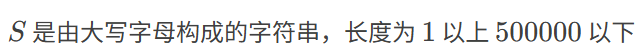

最直接的想法是找出s结尾的最长回文串，这样拼接的长度就是最小的，如果s本身就是回文串那么就直接返回。

通过枚举回文串的长度，然后比较s的尾字符串是否是回文串即可，但是这里如果按照字符比较会导致时间复杂度过大，因此使用字符串哈希比较数字O(1)。

```python
s=RS()
n=len(s)
# 自身是回文串
if s==s[::-1]:
    print(s)    
    exit(0)

mod = 998244353
p=31
P=[1]

# 字符串哈希
pre=[0]
for i,c in enumerate(s,1):
    pre.append((pre[-1]*p+ord(c))%mod)
    P.append((P[-1]*p)%mod)

s=s[::-1]
p=31
P=[1]
rev=[0]

# 由于是比较bab形式，因此需要对ab做一个哈希，ba做一个倒序哈希，来比较
for i,c in enumerate(s,1):
    rev.append((rev[-1]*p+ord(c))%mod)
    P.append((P[-1]*p)%mod)

ans=1
# 比较
for i in range(1,n+1):
    # 划分左右长度
    mid=i>>1
    l=(rev[ceil(i/2)]-rev[0]*P[mid+int(i&1==1)])%mod
    r=(pre[n-mid]-pre[n-i]*P[mid+int(i&1==1)])%mod
    if l==r:ans=i

s=s[::-1]
print(s+s[:-ans][::-1])
```

## [最小代价构造字符串](https://leetcode.cn/problems/construct-string-with-minimum-cost/)


问题转换为选或不选，定义f[i]表示前缀i满足条件的最小代价，如果枚举枚举位置j(j<i)，判断选或不选，时间复杂度是n^2，但实际上只需要枚举words中出现过的长度即可，如果words总长为L，那么最多只会出现sqrt(L)种长度，然后够使用字符串哈希判断即可。

```python
class Solution:
    def minimumCost(self, target: str, words: List[str], costs: List[int]) -> int:
        n=len(target)
        min_cost=defaultdict(lambda:inf)
        mod=1_070_777_777
        # 防止被hack
        BASE=randint(8 * 10 ** 8, 9 * 10 ** 8)
        P=[1]+[0]*n
        pre=[0]*(n+1)
        # 构建字符串哈希
        for i,c in enumerate(target):
            pre[i+1]=(pre[i]*BASE+ord(c))%mod
            P[i+1]=(P[i]*BASE)%mod
        # 对匹配串构造哈希值
        for i,word in enumerate(words):
            tmp=0
            for c in word:
                tmp=tmp*BASE+ord(c)
                tmp%=mod
            # 可能出现相同的匹配串，取最小
            min_cost[tmp]=min(min_cost[tmp],costs[i])
        # 只需枚举sqrt(L)种长度
        l_arr=sorted(set(map(len,words)))
        # DP求解
        f=[0]+[inf]*n
        for i in range(1,n+1):
            for sz in l_arr:
                # 剪枝
                if sz>i:
                    break
                sub_hash=(pre[i]-pre[i-1-sz+1]*P[sz])%mod
                # 手写min
                tmp=f[i-sz]+min_cost[sub_hash]
                if tmp<f[i]:
                    f[i]=tmp
        if f[-1]!=inf:return f[-1]
        return -1
```


# Z函数

z[i]表示s[i:]\(每个**后缀**)与s的**公共最长前缀**是多少


初始时从1开始比较，找到最长前缀就是暴力匹配，匹配之后会有一段z-box:
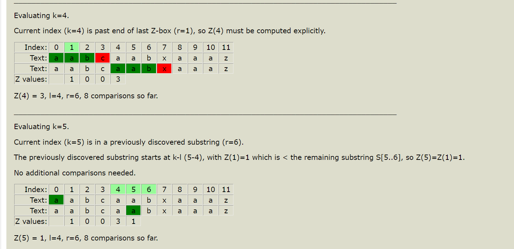

再找下一个s[i:]的过程中如果i落在了z-box中，首先判断z[i-l]是否小于z-box的边界到i的距离，如果小于就确定了z[i]=z[i-l]，反之说明在z-box中的这一段都是匹配的继续往后找，最后更新z-box

```python
def Z(s):
    n=len(s)
    z=[0]*n
    l,r=0,0
    for i in range(1,n):
        # 在z-box中并且小于
        if i<=r and z[i-l]<r-i+1:
            z[i]=z[i-l]
        else:
            # 先初始化为到边界的距离
            z[i]=max(0,r-i+1)
            # 往后找
            while i+z[i]<n and s[z[i]]==s[i+z[i]]:      
                z[i]+=1
            # 更新区间
            if i+z[i]-1>r:
                l=i
                r=i+z[i]-1
    return z
```


如果存在s和p 想找s的每个前缀能匹配多长的p(子串)，由于z函数是自身与自身匹配，这里可以拼接p+s求解z函数 s[i:]能匹配的最长的p即为z[i+len(p)]

对于后缀要倒置s2=p[::-1]+s[::-1]， z2=z(s2) 求解时b=z2[len(p)+len(s)-r(子串的右端点)


## [将单词恢复初始状态所需的最短时间 II](https://leetcode.cn/problems/minimum-time-to-revert-word-to-initial-state-ii/)

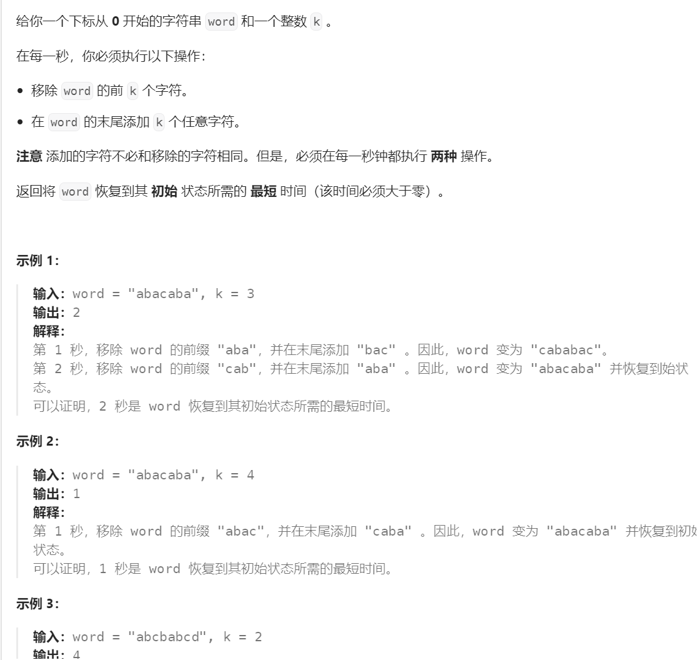


删除k个前面的子串后，如果剩余的子串能完美匹配前缀那么就可以提前结束，因为在后面添加的值是任意的。

使用z函数找出每个后缀与字符串的最长公共前缀，如果大于当前剩余子串的长度那么可以提前结束反之只能删除所有原来的字符。

```python
class Solution:
    def minimumTimeToInitialState(self, word: str, k: int) -> int:
        def z(s):
            n=len(s)
            z=[0]*n
            l=r=0
            for i in range(1,n):
                if i<=r and z[i-l]<r-i+1:
                    z[i]=z[i-l]
                else:
                    z[i]=max(0,r-i+1)
                    while i+z[i]<n and s[z[i]]==s[i+z[i]]:
                        z[i]+=1
                    if i+z[i]-1>r:
                        l=i
                        r=i+z[i]-1
            return z
        z=z(word)
        n=len(word)
        for i in range(1,ceil(n/k)):
            if z[k*i]>=n-k*i:
                return i
        return ceil(n/k)
```


## [统计数组中的美丽分割](https://leetcode.cn/problems/count-beautiful-splits-in-an-array/)

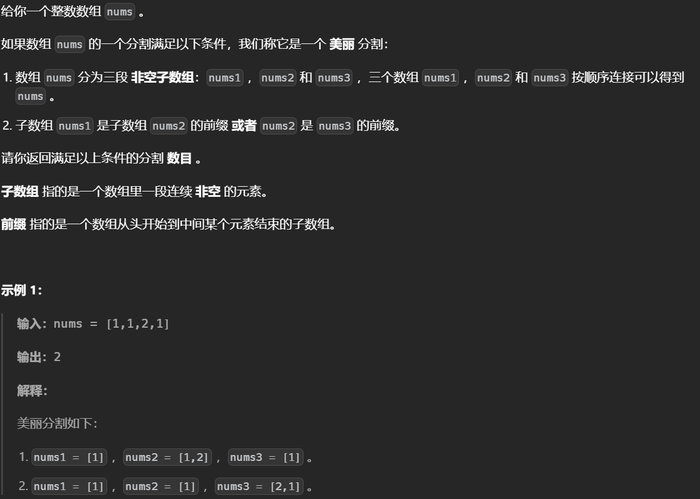

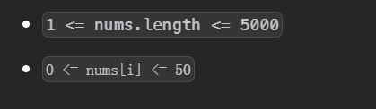

对于给定的数据范围可以枚举两个分割点，关键在于提前打表构建Z函数

```python
class Solution:
    def beautifulSplits(self, nums: List[int]) -> int:
        n=len(nums)
        def Z(s):
            n=len(s)
            z=[0]*n
            l,r=0,0
            for i in range(1,n):
                # 在z-box中并且小于
                if i<=r and z[i-l]<r-i+1:
                    z[i]=z[i-l]
                else:
                    # 先初始化为到边界的距离
                    z[i]=max(0,r-i+1)
                    # 往后找
                    while i+z[i]<n and s[z[i]]==s[i+z[i]]:      
                        z[i]+=1
                    # 更新区间
                    if i+z[i]-1>r:
                        l=i
                        r=i+z[i]-1
            return z
        z=[]
        a=nums[:]
        # 以每个后缀做一个Z函数表
        while a:
            z.append(Z(a))
            a.pop(0)
        # 检查两个端点
        def check(i,j):
            # 第二段的长度需要大于等于第一段，且匹配的前缀长度至少大于等于第一段
            if j-i>=i and z[0][i]>=i:return True 
        	# 第三段的长度大于等于第二段，且匹配的前缀长度至少大于等于第二段，这里找的Z表是以第二段开头的
            if n-1-j+1>=j-i and z[i][j-i]>=j-i:return True 
            return False
        ans=0
        # n^2枚举分割点
        for i in range(1,n-1):
            for j in range(i+1,n):
                if check(i,j):ans+=1
        return ans 
```


## [第一个几乎相等子字符串的下标](https://leetcode.cn/problems/find-the-occurrence-of-first-almost-equal-substring/)

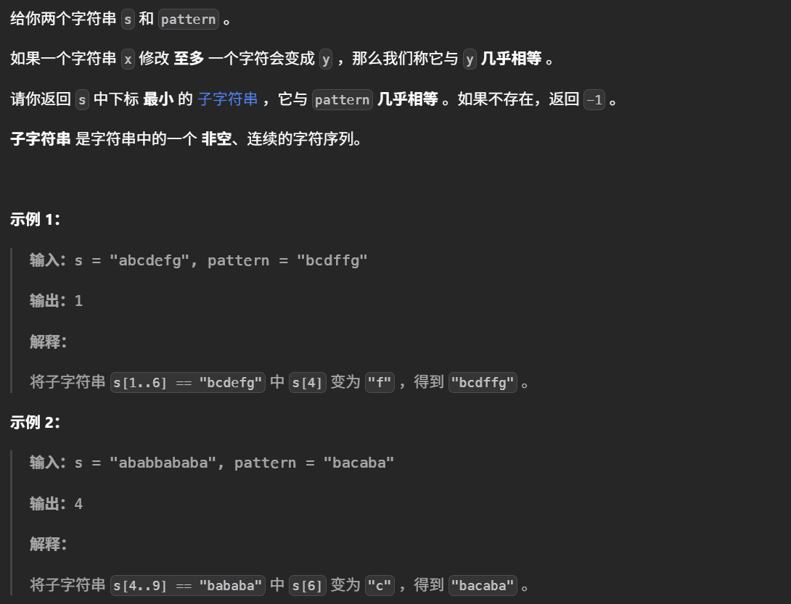

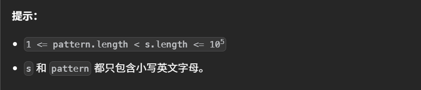


至多修改一个字符可以相等，那么可以将字符串前后缀分解——l,r其中r=l+len(p)-1，如果s[l:]能匹配到p的前缀的数量+s[:r]能匹配的p的后缀的个数大于等于len(p)-1，那么就可以通过修改一个位置做到相等。

这里求解匹配串的每个前缀与模式串匹配的情况(后缀亦然)可以使用Z函数——将p与s拼接再用Z函数求解即可。

```python
'''
如果存在s和p 想找s的每个前缀能匹配多长的p(子串)，由于z函数是自身与自身匹配，
这里可以拼接p+s求解z函数 s[i:]能匹配的最长的p即为z[i+len(p)]

可以枚举s的子串l和r如果s[l:]能匹配p的最长子串+s[:r]能匹配p的最长子串=len(p)+1
就能得到答案 这里使用z函数求解 用镜像算出后缀

'''
class Solution:
    def minStartingIndex(self, s: str, p: str) -> int:
        n,m=len(s),len(p)
        def z(s):
            n=len(s)
            z=[0]*n
            l,r=0,0
            for i in range(1,n):
                # 在z-box中并且小于
                if i<=r and z[i-l]<r-i+1:
                    z[i]=z[i-l]
                else:
                    # 先初始化为到边界的距离
                    z[i]=max(0,r-i+1)
                    # 往后找
                    while i+z[i]<n and s[z[i]]==s[i+z[i]]:      
                        z[i]+=1
                    # 更新区间
                    if i+z[i]-1>r:
                        l=i
                        r=i+z[i]-1
            return z

        # 得到前缀和后缀
        s1=p+s
        z1=z(s1)
        # 后缀求解要倒置
        s2=p[::-1]+s[::-1]
        z2=z(s2)
        for i in range(n):
            l,r=i,i+m-1
            if r>=n:return -1
            a=z1[l+m]
            # 做偏移
            b=z2[m+n-r-1]
            if a+b>=m-1:return i
        
        return -1
```


## [形成目标字符串需要的最少字符串数 II](https://leetcode.cn/problems/minimum-number-of-valid-strings-to-form-target-ii/)

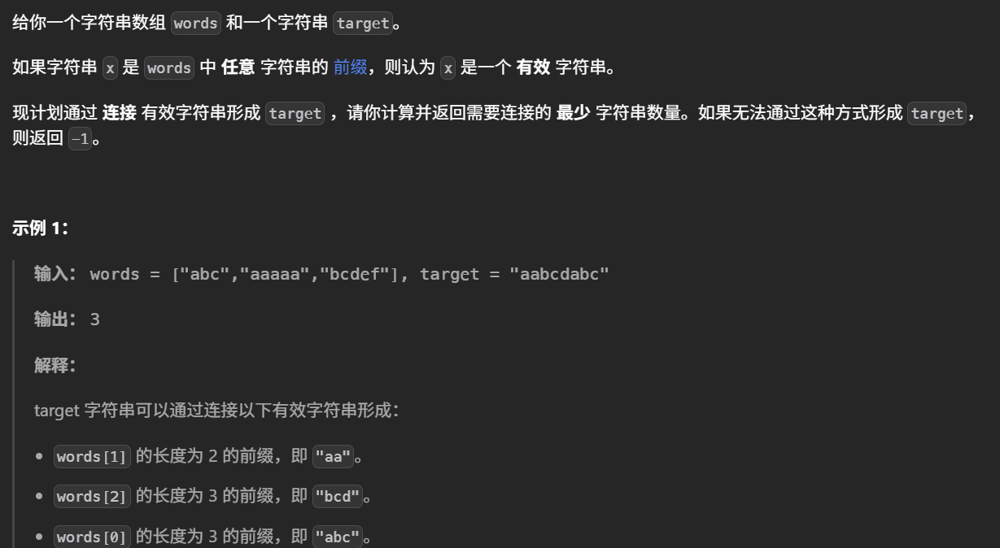

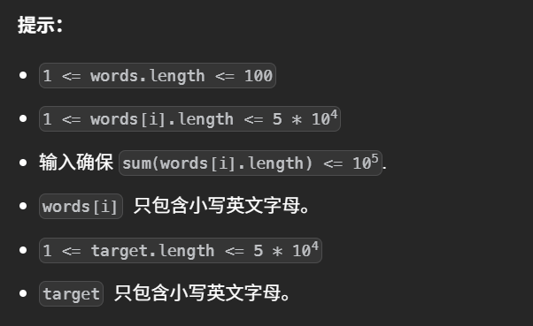

首先需要求出从s的每个位置出发可以走几步，即求解出s的每个前缀与各个模式串的匹配的字符数，如果s[i]最多能匹配x个字符，那么从i位置出发可以走到i+x位置，最终可以得到数组nums，其中nums[i]表示s[i]出发能走到的最远位置，将问题转换为[跳跃游戏 II](https://leetcode.cn/problems/jump-game-ii/)。

求解s各个前缀与模式串的最大匹配，需要用到z函数

```python
class Solution:
    def minValidStrings(self, words, s: str) -> int:
        def Z(s):
            n=len(s)
            z=[0]*n
            l,r=0,0
            for i in range(1,n):
                if i<=r and z[i-l]<r-i+1:
                    z[i]=z[i-l]
                else:
                    z[i]=max(0,r-i+1)
                    while i+z[i]<n and s[z[i]]==s[i+z[i]]:
                        z[i]+=1
                    if i+z[i]-1>r:
                        l=i
                        r=i+z[i]-1
            return z
        nums=[0]*len(s)
        # 求解各个模式串与s前缀的匹配个数
        for w in words:
            m=len(w)
            # 插入#防止匹配个数超出
            z=Z(w+'#'+s)[m+1:]
            # 求解s每个前缀能匹配的最大值
            for i,x in enumerate(z):
                nums[i]=max(nums[i],x)

        # 跳跃游戏
        ans=end=mx=0
        for i,x in enumerate(nums):
            mx=max(i+x,mx)
            if i==end:
                ans+=1
                end=mx
        return ans if end>=len(s) else -1
```

## [字典序最小的生成字符串](https://leetcode.cn/problems/lexicographically-smallest-generated-string/)

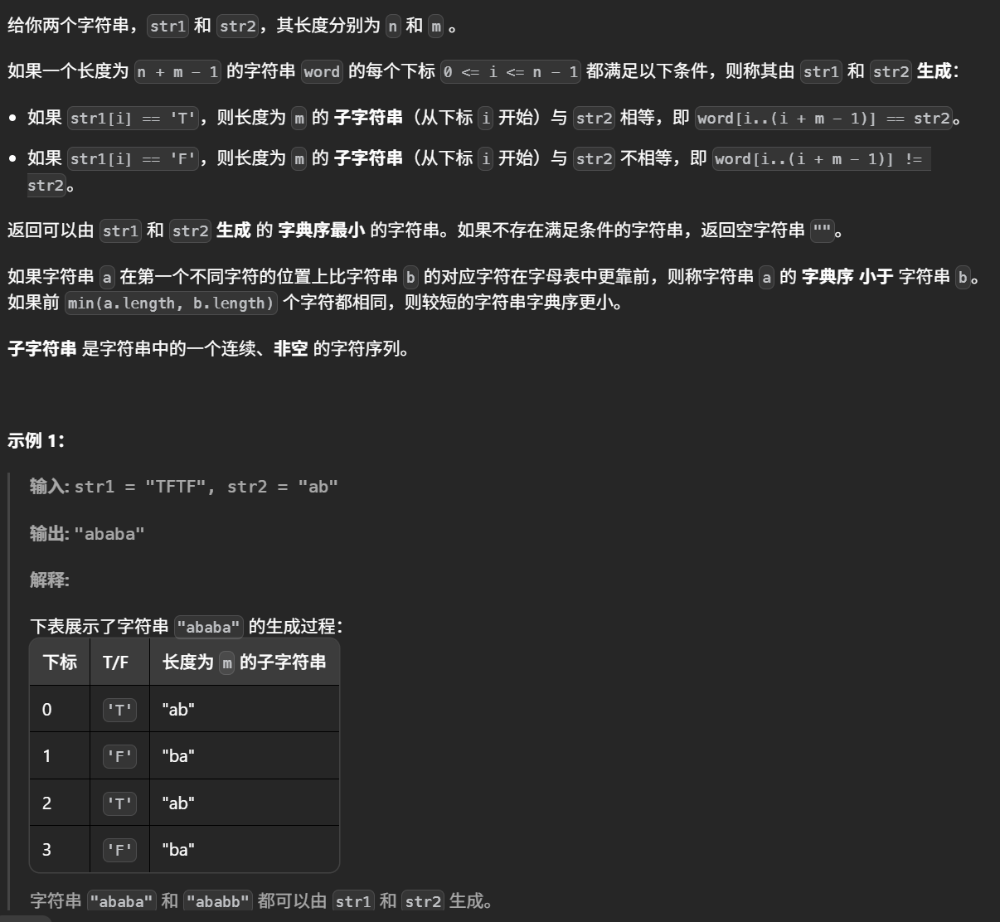

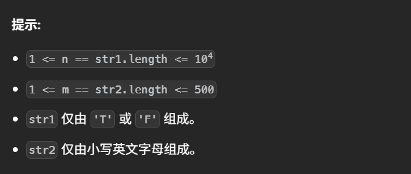

首先处理T，如果两个T重叠，那么需要判断重叠长度的前后缀是否相等，在满足条件的情况下填充str2

然后处理F，此时答案ans已经满足了T合法的情况，将剩下的位置填充'a'，然后判断每个F位置的子串是否等于t——拼接str2和ans，求解Z函数。如果等于那么需要将最后一个可修改的位置（处理完T后剩下未处理的位置）改为'b'，如果这个位置不存在说明不合法。


```python
class Solution:
    def generateString(self, str1: str, str2: str) -> str:
        def Z(s):
            n=len(s)
            z=[0]*n
            l,r=0,0
            for i in range(1,n):
                # 在z-box中并且小于
                if i<=r and z[i-l]<r-i+1:
                    z[i]=z[i-l]
                else:
                    # 先初始化为到边界的距离
                    z[i]=max(0,r-i+1)
                    # 往后找
                    while i+z[i]<n and s[z[i]]==s[i+z[i]]:      
                        z[i]+=1
                    # 更新区间
                    if i+z[i]-1>r:
                        l=i
                        r=i+z[i]-1
            return z
        z=Z(str2)
        b=-1
        n=len(str1)
        m=len(str2)
        # 初始时，标识为?
        ans=['?']*(m+n-1)

        arr=[]
        # 记录每个T的位置
        for i,c in enumerate(str1):
            if c=='T':arr.append([i,i+m-1])
        # 判断T是否合法不冲突，并填充
        for l,r in arr:
            # 有重叠
            if b>=l:
                # 重叠部分长度
                cnt=b-l+1
                start=m-cnt
                if z[start]<cnt:return ''
                ans[l+cnt:r+1]=str2[cnt:]
                b=r
                continue
            ans[l:r+1]=str2[:]
            b=r
        # 剩下的位置填充a，并求解每个位置左侧最近的可修改位置
        pre=[-1]*(m+n-1)
        idx=-1
        for i,c in enumerate(ans):
            if c=='?':
                ans[i]='a'
                idx=i
            pre[i]=idx  
        
        # 构建Z函数
        z=Z(str2+''.join(ans))
        
        i=0
        while i<n:
            if str1[i]=='T':
                i+=1
                continue
            # F位置的子串不等于str2
            if z[i+m]<m:
                i+=1
                continue
                # 将最后一个位置修改b
            j=pre[i+m-1]
            # 无法修改
            if j<i:return ''
            ans[j]='b'
            # 修改过后跳过j，因为不会更新z函数的值，所以可能错误判断，都填a会出错，那么修改一个位置，相当于[i,j]之间不再是全填a，也就不会有错误了
            i=j+1
        return ''.join(ans) 
```


# 子序列状态机

预处理≥i的最近字母c的下标，用于快速判断给定的一序列字符串是否是模式串的子序列。

[讲解](https://leetcode.cn/problems/is-subsequence/solutions/2813031/jian-ji-xie-fa-pythonjavaccgojsrust-by-e-mz22/)


## [匹配子序列的单词数](https://leetcode.cn/problems/number-of-matching-subsequences/)

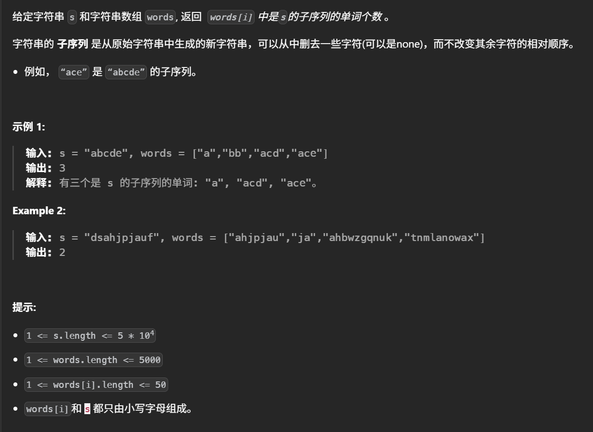

有多个字符串，如果每一个都用双指针做法会超时，因此预处理f[i]\[c]表示位置右侧及该位置字母c出现的最近的位置，f可以通过dp计算。

```python
class Solution:
    def numMatchingSubseq(self, s: str, words) -> int:
        n=len(s)
        f=[[n]*26 for _ in range(n+1)]
        ans=0
        for i in range(n-1,-1,-1):
            c=ord(s[i])-ord('a')
            # 直接拷贝上一状态
            f[i]=f[i+1][:]
            # 修改当前字母
            f[i][c]=i

        for w in words:
            cur=-1
            for c in w:
                c=ord(c)-ord('a')
                # 要从下一个位置开始找，否则当字符串为dd时会出错
                nx=f[cur+1][c]
                # 找不到
                if nx==n:break
                cur=nx
            else:ans+=1
        return ans 
```


## [重复 K 次的最长子序列](https://leetcode.cn/problems/longest-subsequence-repeated-k-times/)

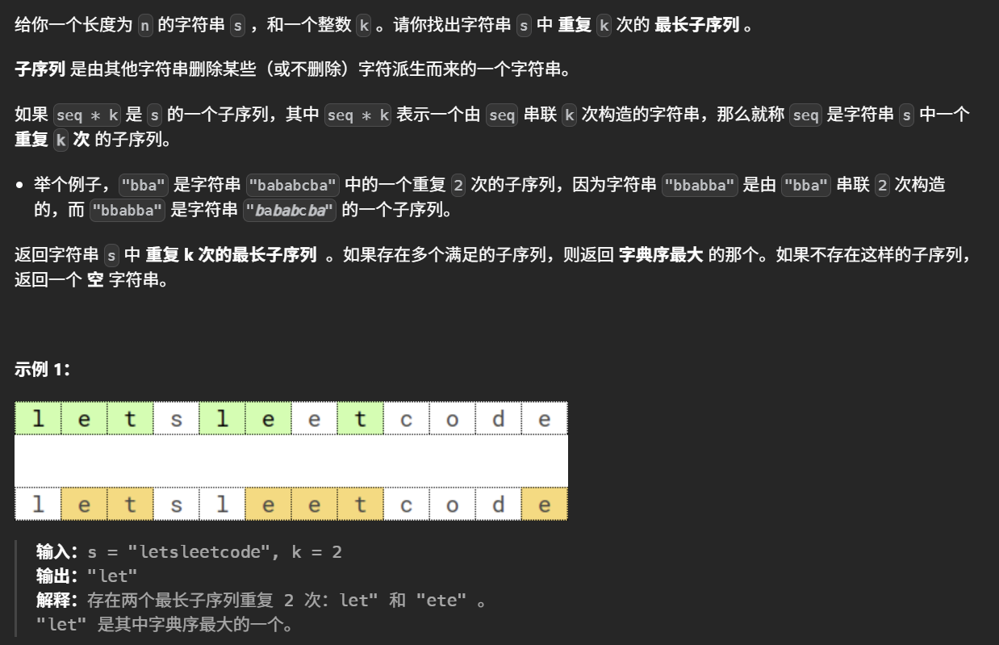

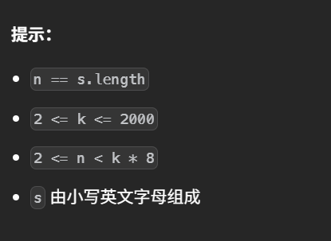

一个字符如果出现在最终的答案中那么其在字符串中出现的频次必然要大于等于k，考虑数据范围可知这样的字符不会超过8个，注意字符可以相同，也就是说c可以有v//k个。

那么可以全排列找出所有的可能，然后在s中判断这个排列是否出现了k次，这里找arr*k即可。

```python
class Solution:
    def longestSubsequenceRepeatedK(self, s: str, k: int) -> str:
        n=len(s)
        # 子序列自动机
        f=[[n]*26 for _ in range(n+1)]
        for i in range(n-1,-1,-1):
            c=s[i]
            f[i]=f[i+1][:]
            f[i][ord(c)-ord('a')]=i
        min=lambda x,y:x if x<=y else y
        ans=''
        memo=Counter(s)
        # 找出合法的字符
        c=''.join([c*(v//k) for c,v in memo.items()])
        # 从大到小枚举
        for i in range(len(c),-1,-1):
            # 找出所有可能的排列
            for arr in permutations(c,i):
                cur=-1
                arr=''.join(arr)
                tmp=''.join(arr*k)                
                for idx in tmp:
                    idx=ord(idx)-ord('a')
                    nx=f[cur+1][idx]
                    if nx==n:break
                    cur=nx
                else:
                    if not ans:ans=arr
                    else:ans=max(ans,arr)
            if ans:return ans 
        return ans 
```


​	
