# 差分数组

差分数组（Differential Array）是一个常用于高效处理数组区间更新操作的数据结构，它主要用于解决给定一个数组，支持多次对数组的某个区间进行一系列增减操作，并能够快速查询最终数组某个的值。

差分数组的基本操作时维护一个新的数组，该数组的元素是原始数组中相邻元素的差值。

1. **更新操作**：对原始数组的某个区间 `[left, right]` 进行增加或减少的操作。这可以通过在差分数组中更新两个位置来实现。具体地，对于原始数组的区间 `[left, right]` 增加 `val` 可以在差分数组的 `left` 处增加 `val`，并在 `right + 1` 处减少 `val`。这样，在查询时，差分数组的前缀和就等于原始数组操作后相应位置的值。
2. **查询操作**：查询原始数组的某个位置的值。这可以通过查询差分数组的前缀和来实现。在查询原始数组的位置 `i` 处的值时，只需查询差分数组的前缀和 `prefixSum[i]` 即可。
3. **快速更新多个区间**：如果需要对多个区间进行更新，差分数组可以在一次遍历中完成所有更新操作，而不需要每次都遍历原始数组。
4. 遍历差分数组的过程中，使用一个变量记录累和就可以得到当前位置的元素大小

```python
class DifferenceArray:
    def __init__(self,nums):
        # 构建差分数组
        self.n=len(nums)
        self.diff=[0]*self.n
        # 第一个位置的值和原数组第一个位置的值相同
        self.diff[0]=nums[0]
        for i in range(1,self.n):
            self.diff[i]=nums[i]-nums[i-1]
    # 更新操作
    def increment(self,left,right,val):
        # 更新
        self.diff[left]+=val
        if right+1<self.n:
            # 注意索引不能超出，超出则不做操作
            self.diff[right+1]-=val
    def result(self):
        # 根据差分数组构建原数组
        result=[0]*self.n
        result[0]=self.diff[0]
        for i in range(1,self.n):
            result[i]=result[i-1]+self.diff[i]
        return result
    # 或者是直接在差分数组上恢复原数组
   	for i in range(1,n):
		diff[i]+=diff[i-1]

# 示例使用
nums = [1, 2, 3, 2, 1]
diff_array = DifferenceArray(nums)

# 对区间 [1, 3] 增加 2
diff_array.increment(1, 3, 2)

# 查询最终数组
final_array = diff_array.result()
print(final_array)
```


在一次从头到尾的遍历操作中，可以使用差分修改数组，这个过程中使用一个外部变量一直累加来表示当前的值。

## 航班预订统计

抽象的差分数组问题

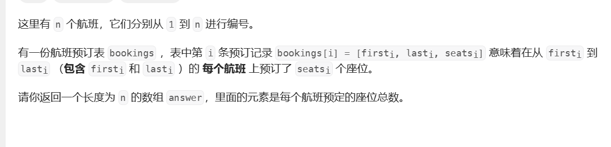

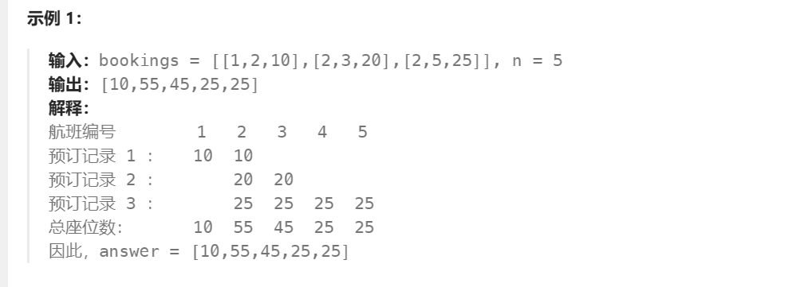

```python
class Solution(object):
    def result(self,li,n):
        # 根据差分数组还原原数组
        result=[0]*n
        result[0]=li[0]
        for i in range(1,n):
            result[i]=result[i-1]+li[i]
        return result
    
    def corpFlightBookings(self, bookings, n):
        # 更新操作
        li=[0]*n
        for book in bookings:
            li[book[0]-1]+=book[2]
            if book[1]<n:
                li[book[1]]-=book[2]
        return self.result(li,n)
```

## 拼车

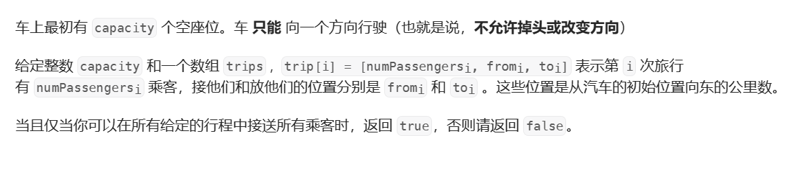

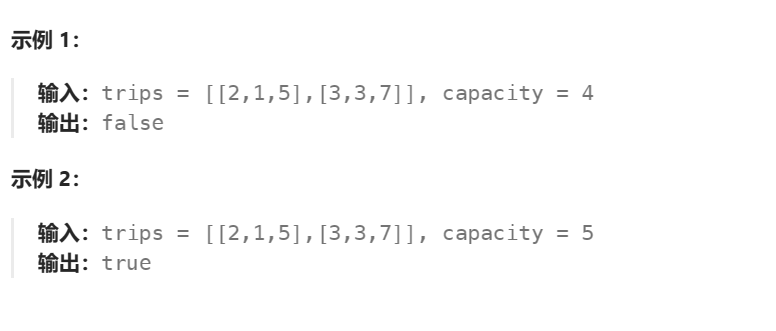


```python
class Solution(object):
    # 差分数组
    def carPooling(self, trips, capacity):
        # 题设给出的限制
        li=[0]*1001
        for trip in trips:
            # 位置索引从0开始
            li[trip[1]]+=trip[0]
            # 乘客在end的位置已经下车，因此乘客在车上的区间应该是start,end-1,所以差分数组的右边不用加一
            li[trip[2]]-=trip[0]
        curr=0
        for i in li:
            curr+=i
            if curr>capacity:
                return False
        return True
```

## [字母移位 II](https://leetcode.cn/problems/shifting-letters-ii/)

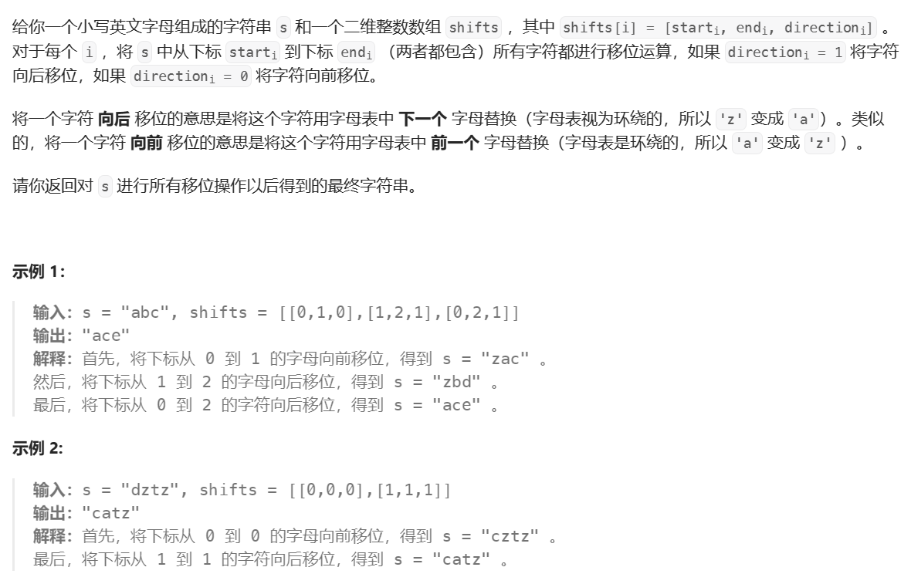


使用差分数组，注意0其实是-1，减去一个数的操作和加上一个数的操作是一样的，不过左边加的是负数而已。注意字符的操作是循环的。

```python
class Solution(object):
    def shiftingLetters(self, s, shifts):
        n=len(s)
        diff=[0]*n
        res=""
        # 使用差分数组可以快速得出对每个区间的操作
        for operator in shifts:
            start,end,dir=operator
            if not dir:
                dir=-1
            diff[start]+=dir
            if end+1<n:
                diff[end+1]-=dir
         # 把差分数组转化为原数组，原数组就是对每个位置进行的操作
        for i in range(1,n):
            diff[i]+=diff[i-1]

        for i in range(n):
            op,c=diff[i],s[i]
            # 这里对字符的操作比较巧妙 （技巧点），负数取模后结果是正数
            res+=chr((ord(c)-ord('a')+op+26)%26+ord('a'))

        return res
Solution().shiftingLetters(s ="xuwdbdqik", shifts = [[4,8,0],[4,4,0],[2,4,0],[2,4,0],[6,7,1],[2,2,1],[0,2,1],[8,8,0],[1,3,1]])

```


## [ 将区间分为最少组数](https://leetcode.cn/problems/divide-intervals-into-minimum-number-of-groups/)


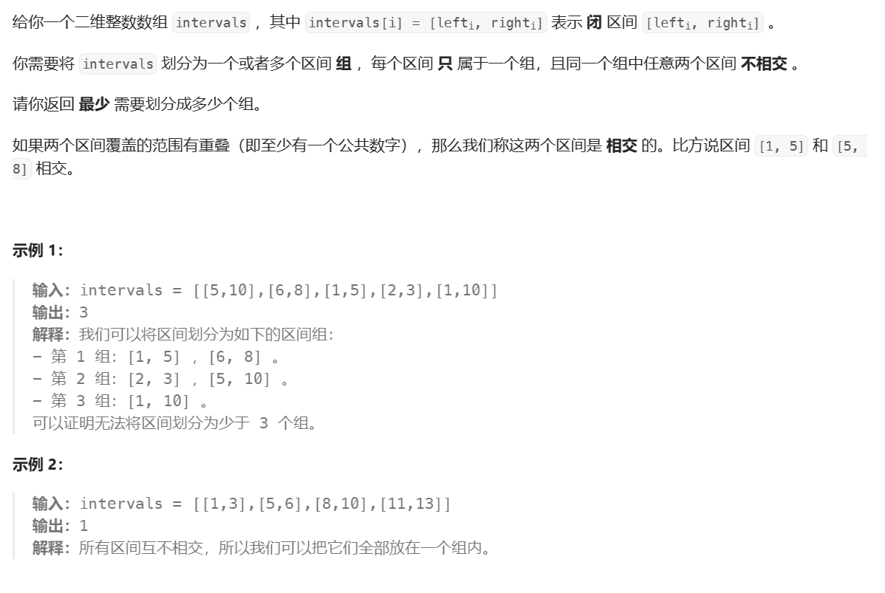

需要转换思想，如果要划分组，就要求不能有重叠子区间，如图所示，所需划分的组数就是最大重叠数目，可以用上下车模型求出


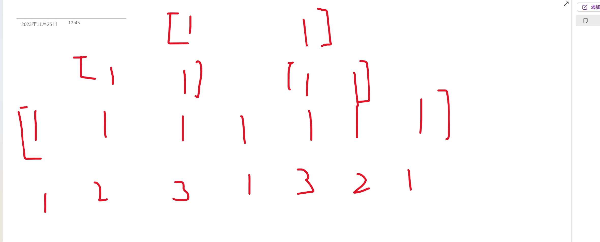


```python
class Solution(object):
    def minGroups(self, intervals):
        n=10**6
        diff=[0]*n# 差分数组的范围选择为数值的最大范围
        for i in intervals:
            l,r=i
            # 有一位索引偏移
            diff[l-1]+=1
            if r<n:
                diff[r]-=1
        for i in range(1,n):
            diff[i]+=diff[i-1]
          # 返回其中的最大值
        return max(diff)
```

## [使数组中的所有元素都等于零](https://leetcode.cn/problems/apply-operations-to-make-all-array-elements-equal-to-zero/)

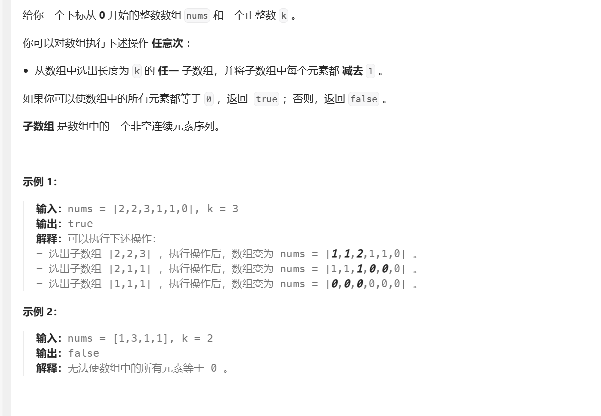

想要让数组中所有的元素等于0，遍历数组，对于对于nums[i]>0的情况为了把nums[i]变为0，需要对nums中i到i+k的位置减去nums[i],然后继续，如果说这个位置的值是负数，返回false因为无法递增，对区间内的元素频繁的更新需要用到差分数组

```python
class Solution(object):
    def checkArray(self, nums, k):
        n=len(nums)
        diff=[0]*n
        diff[0]=nums[0]
        val=0
        # 构建差分数组
        for i in range(1,n):
            diff[i]=nums[i]-nums[i-1]
        for i in range(n):
            # 使用一个外部变量记录当前位置的元素和，其实也就是前缀和
            val+=diff[i]
            # 注意要求区间是固定的，不能超出范围
            if val>0 and i+k<=n:
                diff[i]-=val
 		# 基本操作
                if i+k<n:
                    diff[i+k]+=val
                # 注意最后要改变外部变量
                val=0
        # 等于0跳过    
        elif val==0:
                continue
        else:
                return False
        return True
```

​	

## [子矩阵元素加 1](https://leetcode.cn/problems/increment-submatrices-by-one/)

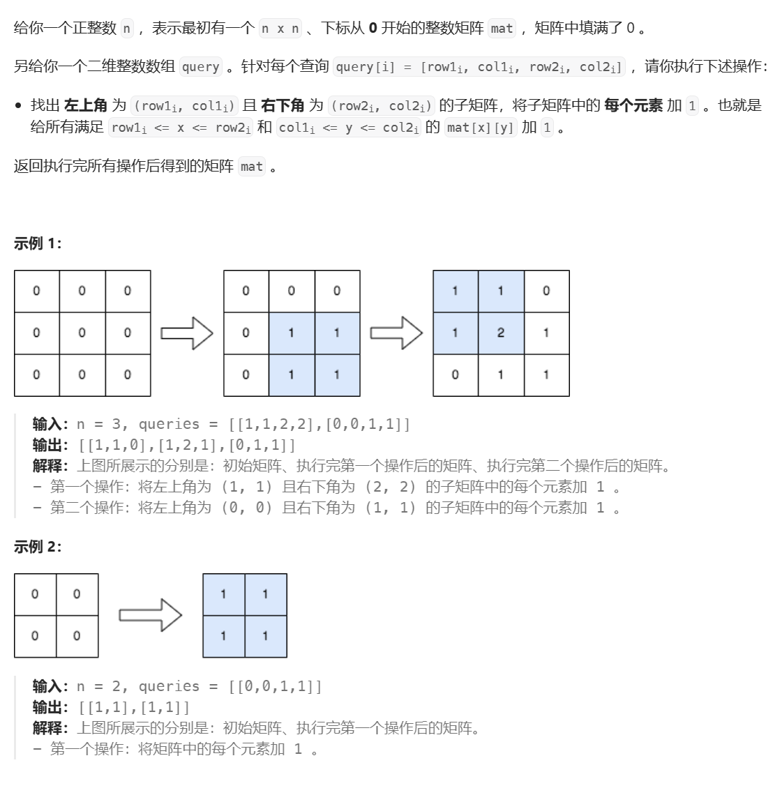


使用差分数组，可以对每一行单独差分，也可以进行二维差分，然后求前缀和。

二维差分的操作技巧是：

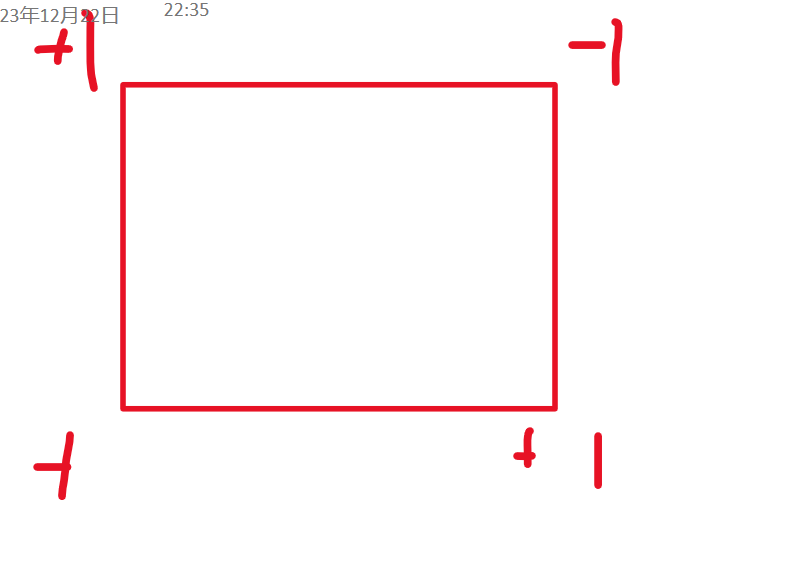


`由于是要求前缀和，所以在大小为n+1的表格上操作，又由于二维差分的操作需要在结尾处右侧减去一，为了方便操作，选择将数组大小设置为n+2，最后在原数组上求前缀和，然后去掉多余的行和列即可`。

```python
class Solution:
    def rangeAddQueries(self, n: int, queries: List[List[int]]) -> List[List[int]]:
        diff=[[0 for _ in range(n+2)] for _ in range(n+2)]
        #  为了前缀和做一位偏移，因此坐标都加一，差分的性质再结尾的后一位减一，因此减去的地方再做一位偏移
        for r1,c1,r2,c2 in queries:
            # 左上
            diff[r1+1][c1+1]+=1
            # 右上
            diff[r1+1][c2+2]-=1
            # 左下
            diff[r2+2][c1+1]-=1
             # 右下，末尾的后一位加上一
            diff[r2+2][c2+2]+=1
            
        # 求前缀和
        for i in range(1,n+1):
            for j in range(1,n+1):
                diff[i][j]+=diff[i][j-1]+diff[i-1][j]-diff[i-1][j-1]
                
         # 去掉多余的行和列
        for i in range(n+2):
            diff[i]=diff[i][1:-1]
        return diff[1:-1]
```

## 二维差分

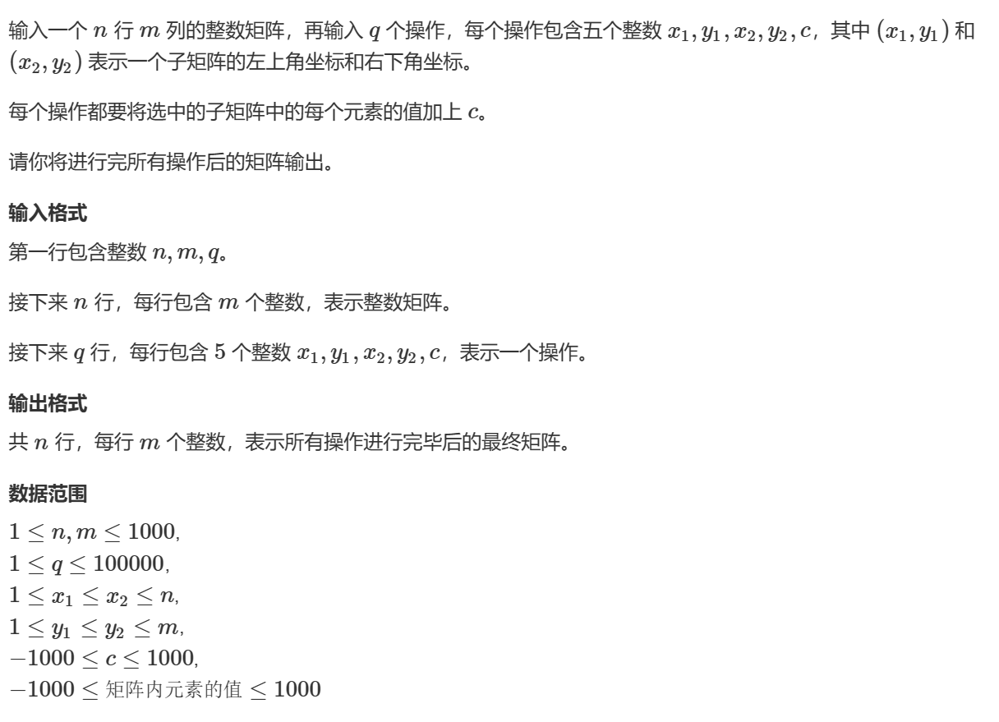

二维差分`要构造比给定矩阵大2的差分矩阵，初始化为0，因为方便构建前缀和操作需要n+1（在原矩阵上构建前缀和），而差分的更新操作又需要n+1`。

然后根据原矩阵构造差分，对于原矩阵的每一个值，`相当于在差分矩阵中插入一个值，不过左上角和右下角是一样的`。`差分矩阵的更新操作为对(i,j,x,y)把i,j位置加一，最后的前缀和使得以i,j为左上角到最右下的矩阵面积中的值都变化，因此需要在i,y+1和x+1,j减去对应的值，而在x+1,y+1处加上多减去的部分。`

```python
from itertools import accumulate as ac
n,m,q=[int(x) for x in input().split()]
li=[]
for _ in range(n):
    li.append([int(x) for x in input().split()])
# 矩阵规模大出2
diff=[[0 for _ in range(m+2)] for _ in range(n+2)]

# 根据原矩阵初始化差分矩阵
for i in range(n):
    for j in range(m):
        c=li[i][j]
        # 与一般的更新操作一样
        diff[i+1][j+1]+=c
        diff[i+1][j+2]-=c
        diff[i+2][j+1]-=c
        diff[i+2][j+2]+=c


while q:
    # 更新
    x1,y1,x2,y2,c=[int(x)-1 for x in input().split()]
    c+=1
    diff[x1+1][y1+1]+=c
    diff[x1+1][y2+2]-=c
    diff[x2+2][y1+1]-=c
    diff[x2+2][y2+2]+=c
    q-=1
    
# 构建前缀和
for i in range(1,n+1):
    for j in range(1,m+1):
        diff[i][j]+=diff[i-1][j]+diff[i][j-1]-diff[i-1][j-1]

 # 减去无用的第一行最后一行第一列最后一列
for i in range(n+2):
    diff[i]=diff[i][1:-1]
diff=diff[1:-1]

for d in diff:
    print(*d,end=' ')
    print()
```

## [按距离统计房屋对数目 II](https://leetcode.cn/problems/count-the-number-of-houses-at-a-certain-distance-ii/)

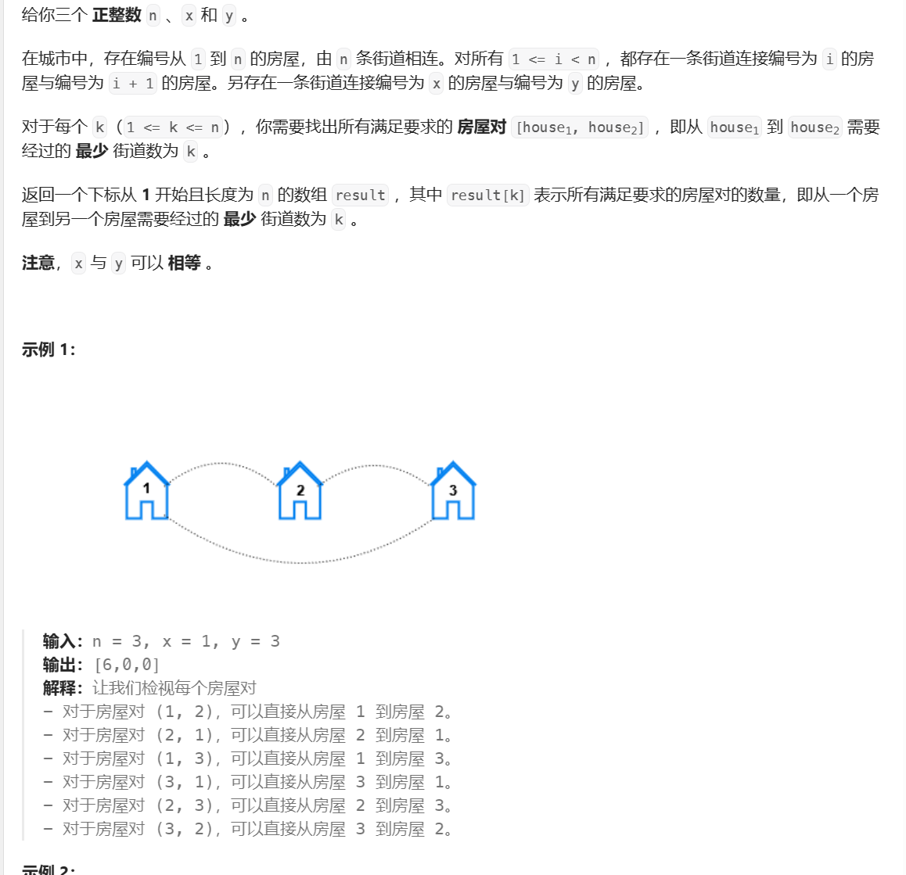

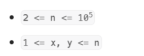

先考虑没有x和y的情况，对于每个位置，他能做出的贡献为它与左边/右边的所有值的差值，由于是一个顺序递增的数组，因此位置I的贡献为1~ i-1,1~n-i，根据这个值更新答案，很明显要使用差分数组才能做到快速的更新操作。然后考虑x和y，当i小于x时，它左边的结果不受影响，但是右边的结果受到影响，它到y+1以及之后的位置距离都会缩减，i到y的距离从y-i变为x-i+1(从i到x再多走一步)，因此原先的一系列距离都要减小dec=y-i-(x-i+1)=y-x+1>。而对于区间中的点：


当j大于一定的位置时从x走到y再到j更短，因此j-i到y-i-j的距离不存在了转而变为x-i+2（从i经过x到y-1）和x-i+1+y-j

而对于区间内的点，假设有一点i到区间外的j经过x会更短可证这个位置在：


因此在x<i<(x+y+1)//2的区间内，i到y以及y右边的距离会变化，同样分析。

而对于在(x+y+1)//2+1到y和y之外的i，可以通过对称性变化为前两种情况，相当于180度反转


```python
class Solution:
    def countOfPairs(self, n: int, x: int, y: int) -> List[int]:
        # 做一位偏移
        diff=[0]*(n+1)
        if x>y:
            x,y=y,x
        def add(l,r,v):
            if l>r:
                return 
            diff[l]+=v
            diff[r+1]-=v    
        def update(i,x,y):
            add(y-i,n-i,-1)
            dec=y-x-1
            # 到y之后的距离变化
            add(y-i-dec,n-i-dec,1)

            # 到内部的距离变化
            j=(x+y+1)//2+1
            add(j-i,y-1-i,-1)
            add(x-i+2,x-i+1+y-j,1)

        def update2(i,x,y):
            # 撤销
            add(y-i,n-i,-1)
            # 计算出差值
            dec=x+y-1-2*i
            # 记录新的距离
            add(y-i-dec,n-i-dec,1)
		
            j=(2*i+y-x+1)//2+1
            add(j-i,y-1-i,-1)
            add(i-x+2,i-x+1+y-j,1)


        for i in range(1,n+1):
            # 初始的时候就加上
            add(1,i-1,1)
            add(1,n-i,1)
            # 相邻两个相连没有用处
            if x+1>=y:
                continue
            if i<=x:
                update(i,x,y)
            elif i>=y:
                # 对称变化，两个索引相加应该为n，但是这里索引从1开始，注意x和y是相反的（技巧点）
                update(n+1-i,n+1-y,n+1-x)
            elif i<(x+y)//2:
                update2(i,x,y)
            elif i>(x+y+1)//2:
                update2(n+1-i,n+1-y,n+1-x)
        return list(accumulate(diff))[1:]
```


## 空调

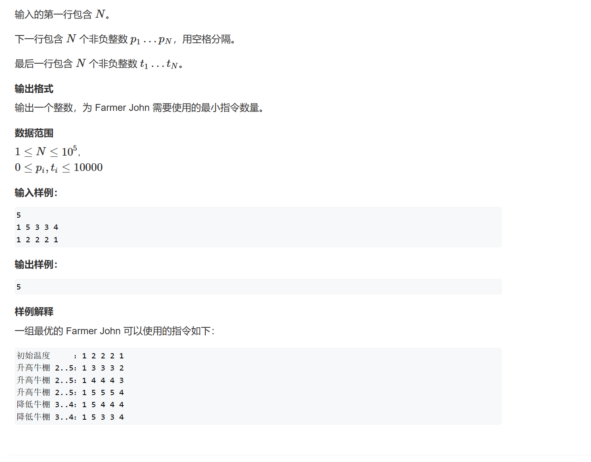


简言之就是把[0,0,0,0]转换为[3,1,3,1]所需的最少操作次数，每次可以把一个区域的值加以或减一。

从差分数组的角度考虑每次在一个位置加一在一个位置减一，构建两个数组的差分数组（技巧点），一般的差分数组是只有n项的但这里为方便构建n+1项，对于[3,1,1,3]差分数组为[3,-2,0,2,-3]最后一项是0-nums[-1]，令正数为S，则负数为-S，根据构造公式可得。在一个位置加一，一个地方减一至少需要所有正数之和次操作。


```python
n=int(input())
a=[int(x) for x  in input().split()]
b=[int(x) for x in input().split()]
# 找两个数组的差值
nums=[x-y for x,y in zip(a,b) ]

if nums:
    diff=[nums[0]]
    for i in range(1,len(nums)):
        diff.append(nums[i]-nums[i-1])
        # 多构建一位
    diff.append(-nums[-1])
    cnt=0
    for v in diff:
        if v>0:
            cnt+=v
    print(cnt)
else:
    print(0)

```

##  Look Back

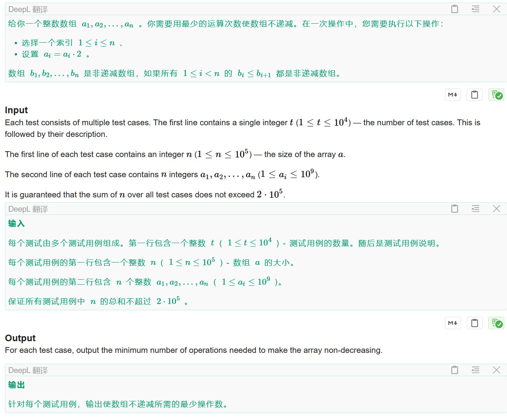


直接模拟乘2会超时，使用位运算记录乘2的次数同时修改数组元素会超内存。此题具有差分的性质，为了保证元素是不递减的每个元素操作时不仅要看前一个还要看前面所有的。

记录差分，不过这里不是元素相减而是相除，比如3 2 1 第三个元素需要的次数是2这个次数是由2与1的差值所需的操作次数加上3和2的操作次数，一些情况下比如3 2 5 ，5操作0次

因为2与5之间的操作次数位log2(2/5)上取整是一个负数，他还就要加上3和2的操作次数，最后的结果是负数，但是此题中只能改大不能改小，因此把负数变为0

```python
from math import *
import sys
from itertools import accumulate as ac
input=sys.stdin.readline
for _ in range(int(input())):
    n=int(input())
    nums=[int(x) for x in input().split()]
    # 差分数组，这里是相除的差分
    diff=[0]*n
    diff[0]=nums[0]
    for i in range(1,n):
        diff[i]=nums[i-1]/nums[i]
    # 记录操作的前缀和
    a=[0]
    for i in range(1,n):
        a.append(a[-1]+ceil(log2(diff[i])))
        a[-1]=max(a[-1],0)   
    a=list(ac(a))
    print(a[-1])
```

## [跳跃游戏 VII](https://leetcode.cn/problems/jump-game-vii/) 

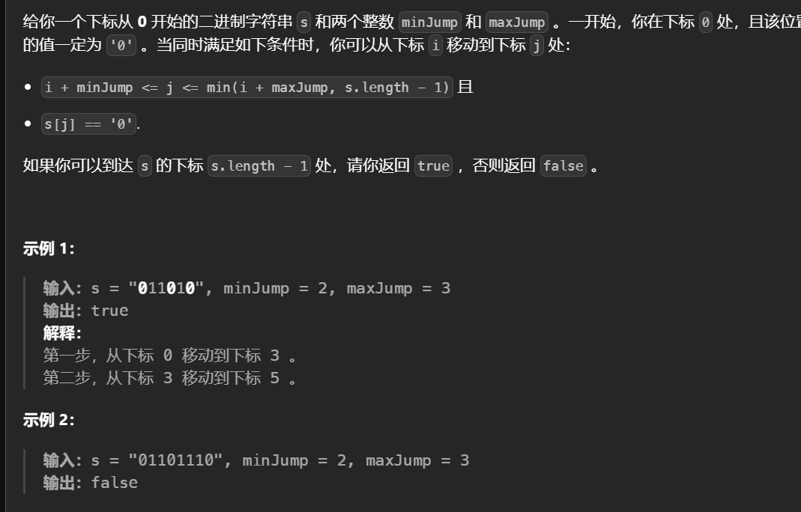


一个位置如果是0会影响到后面的区间，通过差分操作加一来表示这个区间可以访问到，一个区间如果能访问那么用于记录的数组在这个位置上一定是大于0的，通过定义一个变量不断地在这个过程中累加值来表示到这个位置的时候的总值，如果当前位置值大于0就说明可以跳到。


```python
class Solution:
    def canReach(self, s: str, minJump: int, maxJump: int) -> bool:
        n=len(s)
        diff=[0]*n
        diff[0]=1
        diff[1]=-1
        acc=0
        for i,c in enumerate(s):
            acc+=diff[i]
            if c=='0' and acc:
                if i+minJump<n:diff[i+minJump]+=1
                else:continue
                if i+maxJump+1<n:diff[i+maxJump+1]-=1
        res=list(accumulate(diff))
        return res[-1]>0 and s[-1]=='0'
```

## [描述绘画结果](https://leetcode.cn/problems/describe-the-painting/)

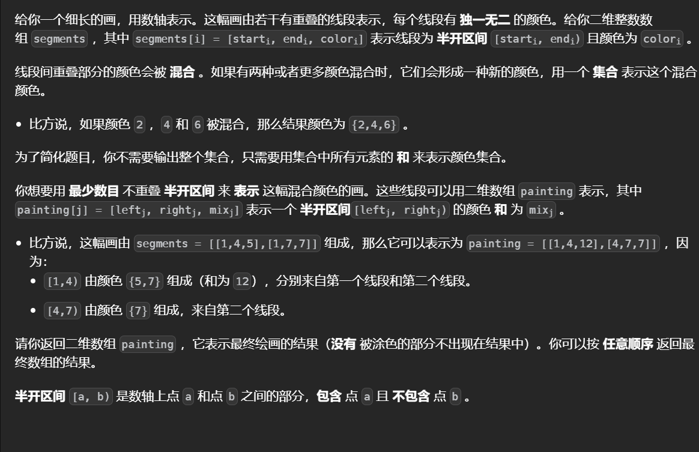

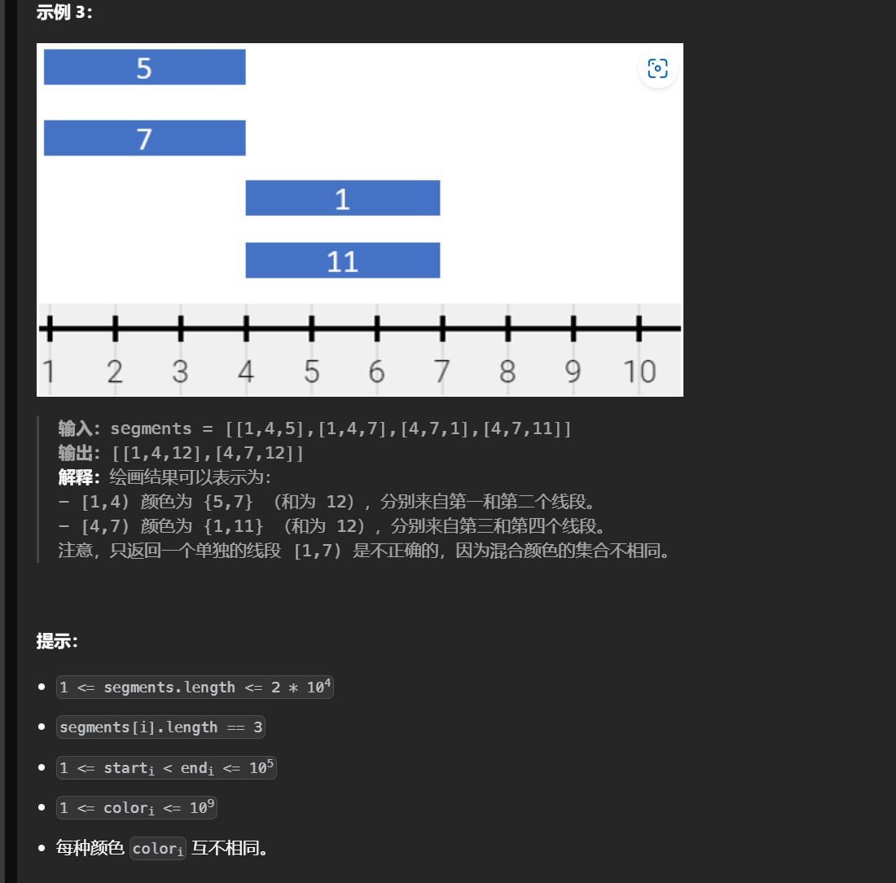

很明显是使用差分，但是如果对区间差分构建前缀和后去找相同的值的区间，会把两段不同的区间认为是一个。这里选择按照端点的顺序对端点构建前缀和，因为只有在线段的端点才会变换颜色

通过对区间端点差分构建前缀和可以轻松求出每一段区间


```python
class Solution:
    def splitPainting(self, segments: List[List[int]]) -> List[List[int]]:
        # 因为只是对端点操作，不需要记录数组
        memo=defaultdict(int)
        for u,v,w in segments:
            memo[u]+=w
            memo[v]-=w
        # 按顺序访问
        nums=sorted([k,v] for k,v in memo.items())
        n=len(nums)
        ans=[]
        pre=0
        for i in range(n-1):
            pre+=nums[i][1]
            # 不存在的区间不考虑
            if pre:ans.append([nums[i][0],nums[i+1][0],pre])
        return ans 
```


## [最大化城市的最小电量](https://leetcode.cn/problems/maximize-the-minimum-powered-city/)

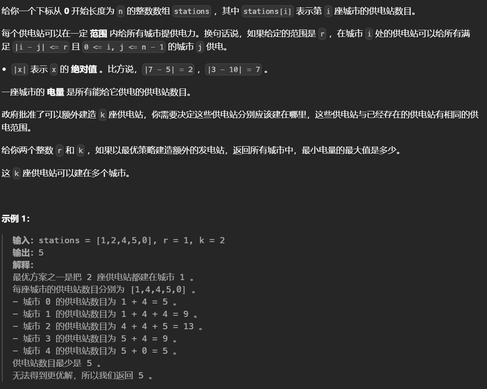


最小化最大值，使用二分来做，check函数中需要检查每个城市对应的区间内的电量和是否满足条件，如果不满足则要在能影响到这个城市的最右侧的城市建造供电站，这是个动态修改的过程，如果使用线段树求解会超时，因此这里使用差分。

首先将数组中的值替换为它对应的区间和，差分数组记录每个位置多了多少电量(受供电站影响)，遍历的过程中求前缀和就可以得到每个位置添加的数量了。

```python

class Solution:
    def maxPower(self, nums: List[int], ra: int, k: int) -> int:
        n=len(nums)
        l,r=0,10**11
        s=list(accumulate(nums,initial=0))
        # 计算出每个城市对应的区间和
        for i in range(n):
            nums[i]=s[min(n-1,i+ra)+1]-s[max(0,i-ra)]

        def cal(min_power):
            d=[0]*n
            sum_d=need=0
            # 遍历的过程中累加前缀和得到每个城市多的电量
            for i,power in enumerate(nums):
                sum_d+=d[i]
                c=min_power-power-sum_d
                if c>0:
                    need+=c
                    sum_d+=c
                    if need>k:return False
                    if i+2*ra+1<n:
                        d[i+2*ra+1]-=c
            return True

        while l<=r:
            mid=(l+r)>>1
            if cal(mid):
                l=mid+1
            else:
                r=mid-1
        return l-1        
```


