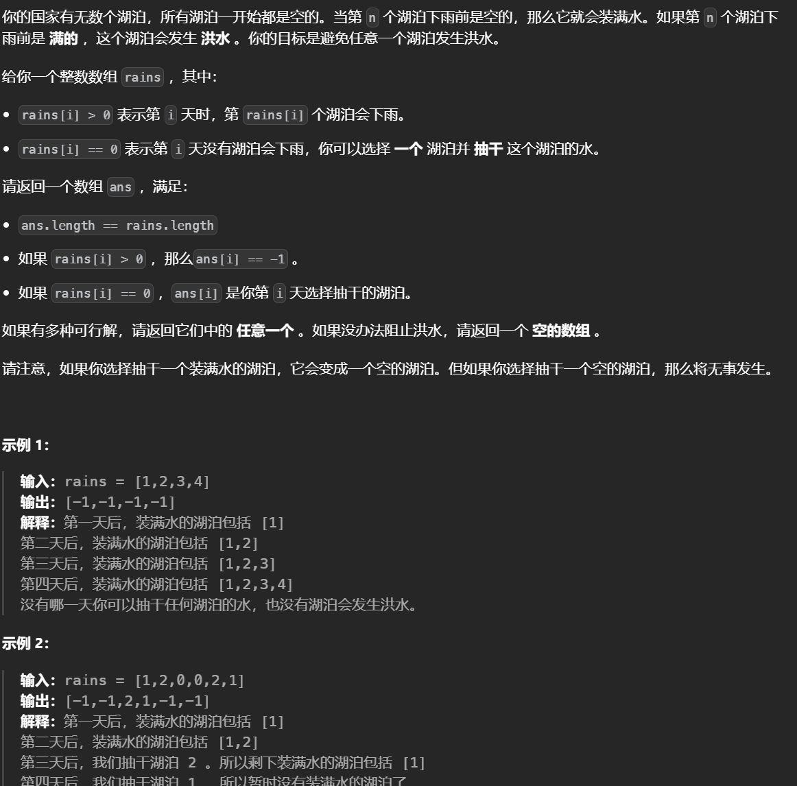
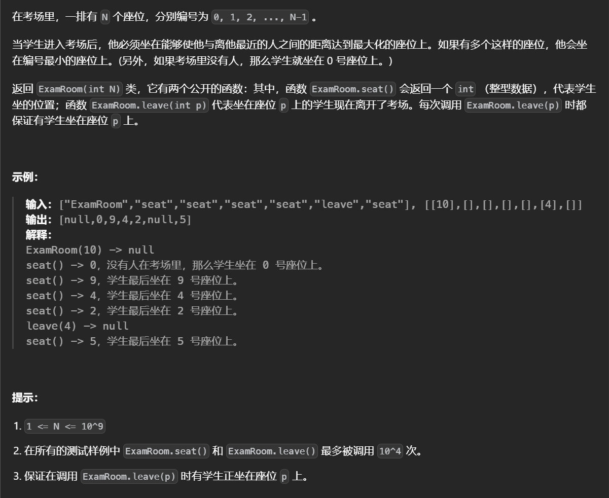
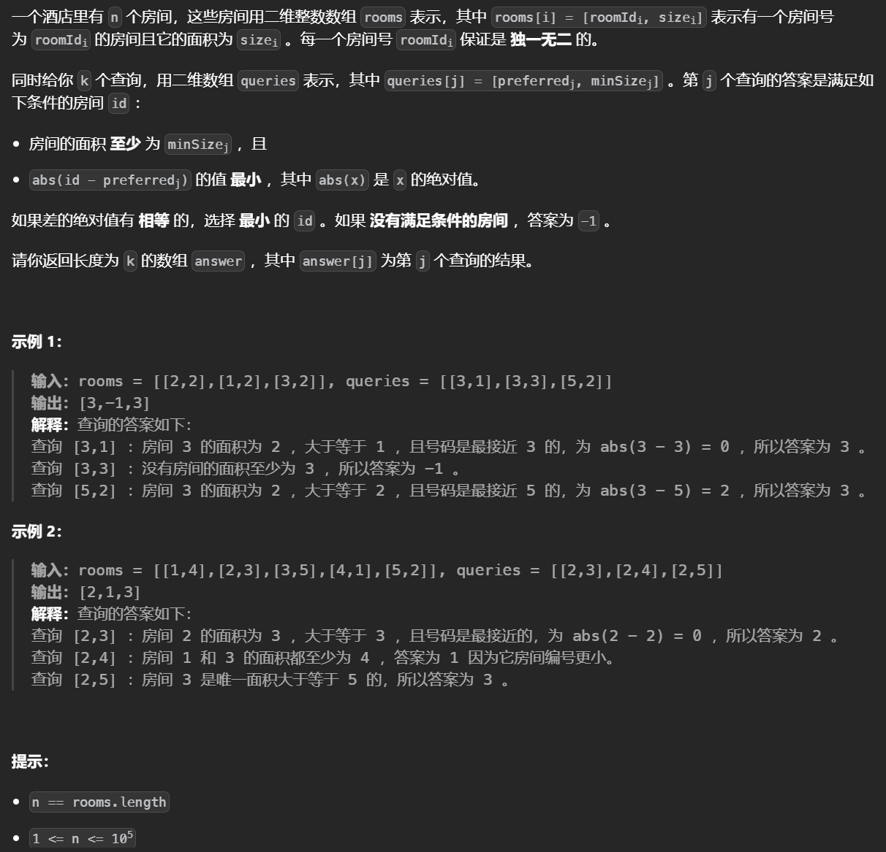

## 平衡树

### [避免洪水泛滥](https://leetcode.cn/problems/avoid-flood-in-the-city/)



贪心的思想，遍历rains数组如果这个湖泊之前已经遍历过也就是会发生洪水，就需要把离这个湖泊之前的位置最近的晴天分配给他，然后这个晴天就不能在用了。

可以二分快速找到最近的晴天，但是把这个晴天去除后仍需要保持数组顺序以此来继续二分，这需要用到平衡树。

### [考场就座](https://leetcode.cn/problems/exam-room/)



有序集合不仅可以存储元素也可以存储区间，对于本题首先找出距离最大的，而后是最靠前的位置，每次加入一个点会删除一个区间加入两个区间

```python
from sortedcontainers import SortedList
class ExamRoom:

    def __init__(self, n: int):
        # 计算距离的函数，如果点是最左或最右则特判
        def dist(x):
            l,r=x
            return r-l-1 if l==-1 or r==n else (r-l)>>1
        self.n=n
        # 按照区间距离和左端点排序
        self.s=SortedList(key=lambda x:(-dist(x),x[0]))
        # 记录一个点的左边位置和右边端点，可以用来更新区间
        self.l={}
        self.r={}
        # 初始化
        self.s.add((-1,n))
        self.l[n]=-1
        self.r[-1]=n
        
    def seat(self) -> int:
        # 找到距离最大的区间
        ss=self.s[0]
        l,r=ss
        # 计算中点位置
        p=(l+r)>>1
        # 对于两端特判
        if l==-1:p=0
        elif r==self.n:p=self.n-1
        # 先删除当前的区间，因为加入这个点这个区间就用不上了
        self.delete(ss)
        # 新增两个区间
        self.add((l,p))
        self.add((p,r))
        return p
    def delete(self,s):
        # 不仅删除区间还有删除左右对应的位置
        self.s.remove(s)
        del self.l[s[1]]
        del self.r[s[0]]

    def add(self,s):
        self.s.add(s)
        self.l[s[1]]=s[0]
        self.r[s[0]]=s[1]

    def leave(self, p: int) -> None:
        # 先记录两个位置
        l,r=self.l[p],self.r[p]
        # 一个点的删除会减少两个区间增加一个大的区间
        self.delete((self.l[p],p))
        self.delete((p,self.r[p]))
        self.add((l,r))
```

### [最近的房间](https://leetcode.cn/problems/closest-room/)



对询问离线，按照面积从大到小操作，同时对给定的数组也按照面积从大到小排序，这样保证了每次处理询问时数据结构内都是合法的选择(面积更大)。把合法的选择放入到有序集合中查找与当前询问的id差不多的数值。

```python
from sortedcontainers import SortedList
class Solution:
    def closestRoom(self, nums: List[List[int]], queries: List[List[int]]) -> List[int]:
        n=len(nums)
        # 排序
        nums.sort(key=lambda x:(-x[1]))
        q=[[queries[i][0],queries[i][1],i] for i in range(len(queries))]
        q.sort(key=lambda x:-x[1])
        ans=[-1]*len(queries)
        # 哨兵，取无穷保证了不会被取到
        sl=SortedList((-inf,inf))
        j=0
        n=len(nums)
        # 按照面积从大到小操作
        for rid,s,i in q:
            # 离线，保证数据结构内都是合法的选择
            while j<n and nums[j][1]>=s:
                sl.add(nums[j][0])
                j+=1
            # 找在当前id左右的
            if len(sl)>2:
                index=sl.bisect_left(rid)
                curr=sl[index]
                pre=sl[index-1]
                if not abs(rid-curr)<abs(rid-pre):
                    curr=sl[index-1]
                ans[i]=curr
        return ans 
```


