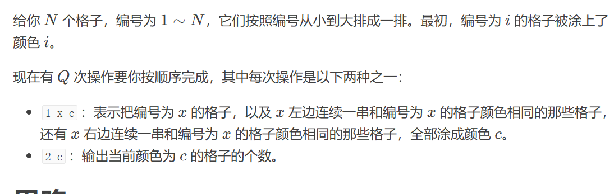

# 并查集

该算法主要用于解决图论中的动态连通性问题。

```python
# 完整模板
# 迭代方式的find函数要配合size使用
class UF:
    def __init__(self, n):
        self.count = n
        self.parent = [i for i in range(n)]
        self.size = [1 for _ in range(n)]

    def union(self, p, q):
        rootp = self.find(p)
        rootq = self.find(q)
        if rootq == rootp:
            return
        # 小的连接到大的上面去
        if self.size[rootq] < self.size[rootp]:
            self.parent[rootq] = rootp
            self.size[rootp] += self.size[rootq]
        else:
            self.parent[rootp] = rootq
            self.size[rootq] += self.size[rootp]
        self.count -= 1

    def connect(self, p, q):
        rootp = self.find(p)
        rootq = self.find(q)
        return rootq == rootp

    def find(self,p):
        if self.parent[p]!=p:
            self.parent[p]=self.find(self.parent[p])
        return self.parent[p]
```


并查集的撤销操作似乎撤销最近的操作，使用栈记录每一次操作，撤销时取出栈顶记录的操作进行恢复


## **1D Bucket Tool**




使用并查集将**相同颜色块的连通**，并查集中额外维护**每一个块对应的颜色**，本题的难点在于——在改变颜色后如何与**相邻的同色块**连接，这里需要**额外维护一个范围(**左端点-1，右端点+1)，通过连通块的**父节点来指向这个范围**，在与左右同色块合并时**更新**这个范围


```python
class UF:
    def __init__(self, n):
        self.count=n
        self.parent=[i for i in range(n)]
        self.size=[1]*n
        self.col=[i for i in range(n)]

    def union(self,u,v):
        rootp=self.find(u)
        rootq=self.find(v)
        if rootp==rootq:return
        if self.size[rootp]<self.size[rootq]:
            self.parent[rootp]=rootq
            self.size[rootq]+=self.size[rootp]
            self.col[rootp]=self.col[rootq]
        else:
            self.parent[rootq]=rootp
            self.size[rootp]+=self.size[rootq]
            self.col[rootq]=self.col[rootp]
    def connnect(self,u,v):
        rootp = self.find(u)
        rootq = self.find(v)
        return rootp == rootq
    def find(self,u):
        if self.parent[u]!=u:
            self.parent[u]=self.find(self.parent[u])
        return self.parent[u]

n,q=RR()
# 记录颜色的个数
cnt=[1]*n
uf=UF(n)
# 范围数组
w = [(i - 1, i + 1) for i in range(n)]
for _ in range(q):
    question=RR()
    ll=len(question)
    c=uf.col
    # 做一位偏移
    if ll==3:
        x,c=question[1:]
        x-=1
        c-=1
        
        idx = uf.find(x)
        # 找到当前块对应的范围
        l, r = w[idx]
    
        # 颜色改变，原先的颜色对应的数量一定减少
        cnt[uf.col[idx]]-=uf.size[idx]
        # 对应的颜色数量增加
        cnt[c] += uf.size[idx]
        
        # 要判断颜色是否相同，范围是否合法
        if l>=0 and uf.col[uf.find(l)]==c:
            ll, rr = w[uf.find(l)]
            # 注意范围要更新
            uf.union(l,x)
            l=ll
        if r<n and uf.col[uf.find(r)]==c:
            ll, rr = w[uf.find(r)]
            uf.union(x,r)
            r=rr
        
        idx = uf.find(x)
        # 改变该连通块的颜色
        uf.col[idx] = c
        # 更新范围
        w[idx]=(l,r)
    else:
        c=question[1]-1
        print(cnt[c])
```


## 食物链

合并多个并查集——准备一个新的并查集，连接每个并查集的**i和pare食物链**


`最重要的思想是对于两个物种，不论是什么关系，都先放进并查集中，但每一个物种都先属于单独的一类`，在并查集中多加一个数组d，d[i]表示i节点与当前集合中根的关系，0表示同类，1表示吃，2表示被吃，通过是由于食物链中只有三种关系，因此2也表示可以吃1，初始时d中的元素都是0表示自己与自己是同类。

当选择两个元素是同类时，首先通过find函数查找他们是否是同一类，如果是的话，判断它们与根节点的关系，如果不相同就是假话，如果不在同一个集合中，则把p连接到q，其中p与q的关系可由两个xy求出：
将q连接到p上关系是1-2=-1 取余结果是2表示被吃


​	


当选择两个元素是吃的关系时，首先通过find函数查找他们是否在一个集合中，如果在的话，判断它们与根节点的关系，如果不满足则是假话，如果不在一个集合中，则把他们连接到一个集合中，然后由关系得出同余公式求解距离。


```python
class UF:
    def __init__(self,n):
        self.parent=[i for i in range(n)]
        self.size=[1 for _ in range(n)]
        self.d=[0]*n
        self.res=0
    # find函数用于压缩，注意同时要更新d
    def find(self,x):
        if self.parent[x]!=x:
            temp=self.parent[x]
            self.parent[x]=self.find(self.parent[x])
            self.d[x]+=self.d[temp]
        return self.parent[x]
    def union(self,u,v,flag):
        if u>n or v>n :
            self.res+=1
            return 
        p,q=self.find(u),self.find(v)
        if flag==1:
            # 同一个类中，却不满足关系
            if p==q and (self.d[u]-self.d[v])%3:
                self.res+=1
            elif p!=q:
                # 不同的集合相连，注意d数组的更新公式
                if self.size[q]<self.size[p]:
                    self.parent[q]=p
                    self.d[q]=self.d[u]-self.d[v]
                else:
                    self.parent[p]=q
                    self.d[p]=self.d[v]-self.d[u]
        else:
            # 特判，自己吃自己
            if u==v:
                self.res+=1
            # 同一个集合中，却不满足关系
            elif p==q:
                if (self.d[u]-self.d[v]-1)%3:
                    self.res+=1
            # 注意不同类间，是连接根节点
            else:
                self.parent[p]=q
                self.d[p]=self.d[v]-self.d[u]+1
            
                
        
        
n,k=[int(x) for x in input().split()]
uf=UF(n+1)
while k:
    flag,u,v=[int(x) for x in input().split()]
    uf.union(u,v,flag)
    k-=1
print(uf.res)
```


### 奶酪


对所有的点入队同时分出哎底部的和顶部的，连接范围内的两个点，最后枚举底部的和顶部的看看是否相连。

​	

```python
class UF:
    def __init__(self, n):
        self.parent = [i for i in range(n)]
        self.size = [1 for _ in range(n)]

    def union(self, u, v):
        p = self.find(u)
        q = self.find(v)
        if p == q: return
        if self.size[p] < self.size[q]:
            self.parent[p] = q
            self.size[q] += self.size[p]
        else:
            self.parent[q] = p
            self.size[p] += self.size[q]

    def connect(self, u, v):
        p = self.find(u)
        q = self.find(v)
        return p == q

    def find(self, x):
        if self.parent[x] != x:
            self.parent[x] = self.find(self.parent[x])
        return self.parent[x]


for _ in range(int(input())):
    n, h, r = [int(x) for x in input().split()]
    bottom = []
    up = []
    nums = []
    # 节点入队划分
    for i in range(n):
        li = [int(x) for x in input().split()]
        if li[2] + r >= h:
            up.append(i)
        if li[2] - r <= 0:
            bottom.append(i)

        nums.append(li)
    uf = UF(n)
    flag = False
    # 枚举所有的点可以相连
    for i in range(n):
        x1, x2, x3 = nums[i]
        for j in range(i + 1, n):
            y1, y2, y3 = nums[j]
            d=((x1-y1)**2+(x2-y2)**2+(x3-y3)**2)**0.5
            if d <=2*r:
                uf.union(i, j)
                
    # 枚举底部的和顶部的
    for u in up:
        if flag:break
        for v in bottom:
            if uf.connect(u, v):
                flag = True
                break
    res = 'Yes' if flag else 'No'
    print(res)

```


### [包含每个查询的最小区间](https://leetcode.cn/problems/minimum-interval-to-include-each-query/)


转换思想，将区间按照长度排序，去找每个区间可以包含的询问，每个询问的答案就是第一个包括他的区间。

在这个过程中区间可能会包含已经处理过的询问，也就是说需要对一些询问跳过，可以使用并查集跳过连续的询问。

如下所示，在找完1之后应该去找2但是2一直到4是已经处理过的，所以直接跳到5


```python
class UF:
    def __init__(self, n):
        self.count = n
        self.parent = [i for i in range(n)]
        self.size = [1 for _ in range(n)]

    def union(self, p, q):
        rootp = self.find(p)
        rootq = self.find(q)
        if rootq == rootp:
            return
        # 小的连接到大的上面去
        if self.size[rootq] < self.size[rootp]:
            self.parent[rootq] = rootp
            self.size[rootp] += self.size[rootq]
        else:
            self.parent[rootp] = rootq
            self.size[rootq] += self.size[rootp]
        self.count -= 1

    def connect(self, p, q):
        rootp = self.find(p)
        rootq = self.find(q)
        return rootq == rootp

    def find(self,p):
        if self.parent[p]!=p:
            self.parent[p]=self.find(self.parent[p])
        return self.parent[p]
class Solution:
    def minInterval(self, intervals: List[List[int]], queries: List[int]) -> List[int]:
        m,n=len(intervals),len(queries)
        uf=UF(n+1)
        # 按照长度排序
        intervals.sort(key=lambda x:(x[1]-x[0]))
        # 离线
        q=sorted([(v,i) for i,v in enumerate(queries)])
        ans=[-1]*n
        for l,r in intervals:
            # 对于这个区间，去找可能的询问
            j=bisect_left(q,(l,-1))
            # 通过并查集跳过处理过的位置
            idx=uf.find(j)
            while idx<n and q[idx][0]<=r:
                ans[q[idx][1]]=r-l+1
                # 将当前询问和下一个询问连接起来（按照位置），这样当下一次包括到当前询问时会从下一个询问开始
                uf.parent[idx]=idx+1
                idx+=1
                # 由于下一个询问可能和其他的位置相连，所以要通过并查集跳过
                idx=uf.find(idx)
        return ans 
```


### [ 避免洪水泛滥](https://leetcode.cn/problems/avoid-flood-in-the-city/)


对于重复下雨的位置i和j，去找离i最近的晴天把这个晴天分配给他，之后这个晴天就不能在操作了，如果下一次再找到这晴天应该跳过，使用并查集可以快速跳过某些连续的位置

```python
class UF:
    def __init__(self, n):
        self.count = n
        self.parent = [i for i in range(n)]
        self.size = [1 for _ in range(n)]

    def union(self, p, q):
        rootp = self.find(p)
        rootq = self.find(q)
        if rootq == rootp:
            return
        # 小的连接到大的上面去
        if self.size[rootq] < self.size[rootp]:
            self.parent[rootq] = rootp
            self.size[rootp] += self.size[rootq]
        else:
            self.parent[rootp] = rootq
            self.size[rootq] += self.size[rootp]
        self.count -= 1

    def connect(self, p, q):
        rootp = self.find(p)
        rootq = self.find(q)
        return rootq == rootp

    def find(self,p):
        if self.parent[p]!=p:
            self.parent[p]=self.find(self.parent[p])
        return self.parent[p]
        
class Solution:
    def avoidFlood(self, rains: List[int]) -> List[int]:
        memo={}
        s=[]
        ans=[1]*len(rains)
        # 记录晴天位置
        for i,v in enumerate(rains):
            if not v:s.append(i)
        uf=UF(len(s)+1)
        for i,v in enumerate(rains):
            if not v:continue
            elif v not in memo:
                ans[i]=-1
            else:
                # 取出前面的位置
                pre=memo[v]
                # 使用二分找到最近的位置
                j=bisect_left(s,pre)
                # 跳过已取的位置
                j=uf.find(j)
                if j>=len(s) or s[j]>i:return []              
                ans[s[j]]=v
                # 连接到下一个位置，使得下一次取到这个位置可以跳过
                uf.parent[j]=j+1
                ans[i]=-1
            memo[v]=i
        return ans
```

### [找出知晓秘密的所有专家](https://leetcode.cn/problems/find-all-people-with-secret/)


这道题是对时间有要求的，如果a和b在t1时刻开会（a知晓秘密）,而b和c在t2时刻开会（t2<t1）那么c是不会知晓秘密的，需要使用可撤销的并查集

同时对于同一时刻具有瞬时性，因此要把数组按照时间排序，把同一时刻的分为一组同时处理

```python
class UF:
    def __init__(self, n):
        self.count = n
        self.parent = [i for i in range(n)]
        self.size = [1 for _ in range(n)]

    def union(self, p, q):
        rootp = self.find(p)
        rootq = self.find(q)
        if rootq == rootp:
            return
        # 小的连接到大的上面去
        if self.size[rootq] < self.size[rootp]:
            self.parent[rootq] = rootp
            self.size[rootp] += self.size[rootq]
        else:
            self.parent[rootp] = rootq
            self.size[rootq] += self.size[rootp]
        self.count -= 1

    def connect(self, p, q):
        rootp = self.find(p)
        rootq = self.find(q)
        return rootq == rootp

    def find(self,p):
        if self.parent[p]!=p:
            self.parent[p]=self.find(self.parent[p])
        return self.parent[p]
    def isolate(self,x):
        self.parent[x]=x
        
class Solution:
    def findAllPeople(self, n: int, meetings: List[List[int]], firstPerson: int) -> List[int]:
        uf=UF(n)
        #初始
        uf.union(0,firstPerson)
        f=defaultdict(list)
        # 分组
        for x,y,t in meetings:
            f[t].append([x,y])
        for v in sorted(f.keys()):
            nums=f[v]
            # 对于同一时刻的两个人先把它们连接起来，如果当前没有知晓秘密那么可能由同一时刻的其他人知晓秘密
            for x,y in nums:
                uf.union(x,y)
            #再次遍历，不知晓秘密的两个人不应该连接，因为如果在下一个时刻某一个人知晓了秘密会导致前一时刻的另个人知晓秘密。
            for x,y in nums:
                if not uf.connect(x,0):
                    uf.isolate(x)
                    uf.isolate(y)
     
        return [i for i in range(n) if uf.connect(0,i)]
```

### [移除最多的同行或同列石头](https://leetcode.cn/problems/most-stones-removed-with-same-row-or-column/)


把每个石子看作是图上的一个点，那么行列相同的属于同一个连通块，一个连通块一定可以去除到只剩一个点，因此最后的结果就是所有的石子减去连通块的个数。

```python
# 完整模板
# 迭代方式的find函数要配合size使用
class UF:
    def __init__(self, n):
        self.count = n
        self.parent = [i for i in range(n)]
        self.size = [1 for _ in range(n)]

    def union(self, p, q):
        rootp = self.find(p)
        rootq = self.find(q)
        if rootq == rootp:
            return
        # 小的连接到大的上面去
        if self.size[rootq] < self.size[rootp]:
            self.parent[rootq] = rootp
            self.size[rootp] += self.size[rootq]
        else:
            self.parent[rootp] = rootq
            self.size[rootq] += self.size[rootp]
        self.count -= 1

    def connect(self, p, q):
        rootp = self.find(p)
        rootq = self.find(q)
        return rootq == rootp

    def find(self,p):
        if self.parent[p]!=p:
            self.parent[p]=self.find(self.parent[p])
        return self.parent[p]
    # 并查集的撤销
    def isolate(self,x):
        self.parent[x]=x

class Solution:
    def removeStones(self, stones: List[List[int]]) -> int:
        n=len(stones)
        uf=UF(n)
        row={}
        col={}
        for i,(u,v) in enumerate(stones):
            if u not in row:row[u]=i
            else:uf.union(row[u],i)
            if v not in col:col[v]=i
            else:uf.union(col[v],i)
        return n-uf.count

```

### [使子数组元素和相等](https://leetcode.cn/problems/make-k-subarray-sums-equal/)


明显的中位数贪心关键在于如何把需要相等的归为一组，可以用并查集来归类


```python
class UF:
    def __init__(self, n):
        self.count = n
        self.parent = [i for i in range(n)]
        self.size = [1 for _ in range(n)]

    def union(self, p, q):
        rootp = self.find(p)
        rootq = self.find(q)
        if rootq == rootp:
            return
        # 小的连接到大的上面去
        if self.size[rootq] < self.size[rootp]:
            self.parent[rootq] = rootp
            self.size[rootp] += self.size[rootq]
        else:
            self.parent[rootp] = rootq
            self.size[rootq] += self.size[rootp]
        self.count -= 1

    def connect(self, p, q):
        rootp = self.find(p)
        rootq = self.find(q)
        return rootq == rootp

    def find(self,p):
        if self.parent[p]!=p:
            self.parent[p]=self.find(self.parent[p])
        return self.parent[p]
    # 并查集的撤销
    def isolate(self,x):
        self.parent[x]=x
class Solution:
    def makeSubKSumEqual(self, arr: List[int], k: int) -> int:
        n=len(arr)
        uf=UF(n)
        memo=defaultdict(list)
        ans=0
        # 每个位置只需和后k个相连
        for i in range(n):uf.union(i,(i+k)%n)
        # 对每个位置去找根节点，把它们按照根节点归为一类
        for i in range(n):
            j=uf.find(i)
            memo[j].append(arr[i])
        for k,nums in memo.items():
            n=len(nums)
            nums.sort()
            if n&1:
                for v in nums:
                    ans+=abs(v-nums[n>>1])
            else:
                # 偶数长度的话，取中间两位的均值（上取整或下取整都操作一次取最小值）
                index=n//2
                x=(nums[index-1]+nums[index])//2
                for v in nums:
                    ans+=abs(v-x)
        return ans
```

### Where is the Pizza


观察样例发现，先假设C中都没选择，这里如果第一个位置选择1那么第二个位置和第三个位置选择的结果也都是确定的，因为每个数组都是一个排列，可以把ab中的数字看作是环，连接a[i]和b[i]会得到1-2-3 4-7 5-6三个环，如果一个环的大小大于等于2那么他对答案啊的贡献是2，因为在第一个位置只有两种选择一旦选了其中一个那么剩下值的位置都是已经确定了的。如果环的大小为1也就只有一个选择。如果c[i]中有值那么也就是确定了一个环，最后的答案等于2^m，其中m是所有大于等于2的环的格式且对应的c[i]不为0


```python
from collections import deque, defaultdict, Counter
from functools import lru_cache
from bisect import bisect_left
from itertools import accumulate
from math import ceil, inf
import sys
from typing import List
input = sys.stdin.readline
def R(): return int(input())
def RR(): return [int(x) for x in input().split()]
def get_pre(nums): return list(accumulate(nums, initial=0))
mod=10**9+7
class UF:
    def __init__(self, n):
        self.count = n
        self.parent = [i for i in range(n)]
        self.size = [1 for _ in range(n)]

    def union(self, p, q):
        rootp = self.find(p)
        rootq = self.find(q)
        if rootq == rootp:
            return
        # 小的连接到大的上面去
        if self.size[rootq] < self.size[rootp]:
            self.parent[rootq] = rootp
            self.size[rootp] += self.size[rootq]
        else:
            self.parent[rootp] = rootq
            self.size[rootq] += self.size[rootp]
        self.count -= 1

    def connect(self, p, q):
        rootp = self.find(p)
        rootq = self.find(q)
        return rootq == rootp

    def find(self,p):
        if self.parent[p]!=p:
            self.parent[p]=self.find(self.parent[p])
        return self.parent[p]
    # 并查集的撤销
    def isolate(self,x):
        self.parent[x]=x

for _ in range(R()):
    n=R()
    a=RR()
    b=RR()
    c=RR()
    ans=1
    uf=UF(n+1)
    # 连接a和b，如果c存在那么这个环无贡献，把他和0相连后面做判断
    for i,k in enumerate(zip(a,b)):
        l,r=k
        uf.union(l,r)
        if c[i]:
            uf.union(0,l)
    memo=Counter()
    # 求解一个环的大小
    for i in range(1,n+1):
        p=uf.find(i)
        memo[p]+=1

    for k,v in memo.items():
        # 只有长度大于等于2且不包含c[i]!=0的环才有贡献
        if v>=2 and not uf.connect(0,k):ans*=2
        ans%=mod
    print(ans)

```


### [新增道路查询后的最短距离 II](https://leetcode.cn/problems/shortest-distance-after-road-addition-queries-ii/)


可以发现如果在两个点之间加了一条边那么从起点走到终点必然要经过这条边才能使路径最短，同时有条件两个新边不会交叉重叠，那么每次添加一条边就可以视为将范围内的边合并为一条边，同时起点到终点的距离就是边的个数，如果把每个边视为点那么答案就是连通分量的大小。

```python
class Solution:
    def shortestDistanceAfterQueries(self, n: int, queries: List[List[int]]) -> List[int]:
        uf=UF(n-1)
        ans=[]
        # 这里用点数减一表示边数
        for u,v in queries:
            l=uf.find(u)
            while l<v-1:
                # 实际操作中，需要跳过一些已经是连通块的点，因此把每个点的父节点设置为右边的点，这样方便跳过
                uf.parent[l]=l+1
                uf.count-=1
                l+=1
                # 通过find函数跳到遇到的连通块的父节点
                l=uf.find(l)
            ans.append(uf.count)
        return ans
```


