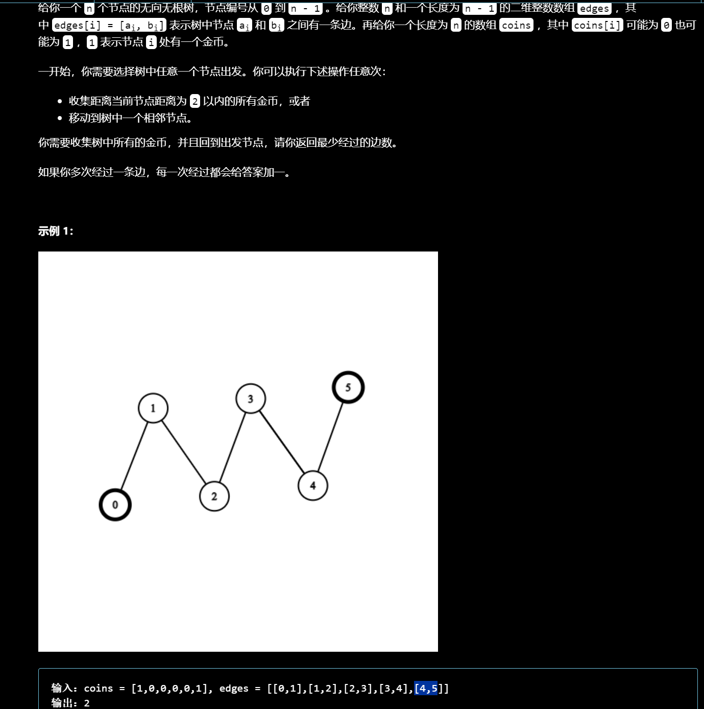

# 拓扑排序

**拓扑排序可以用将环和其他的节点区分，拓扑序列不唯一，序列中边起点一定排在终点之前。**

**拓扑排序的另一个用处是删除无用的叶子节点**


并非只有有向图可以做拓扑排序，对于无向图也可以做，需要加入**入度为1的**。


建图的过程中要记录每个节点的入度，使用节点的过程中首先把入度为0的点加入到队列中，之后遍历队列中的点，对于每一个在队列中的点把与它相连的点之间的边去掉，具体表示为减少下一个点的入度，如果这个点的入度为0了，那么就加入到队列中。最后判断队列的长度是否为N。

```python
from collections import deque
n,m=[int(x) for x in input().split()]
path=[set() for _ in range(n)]
d=[0]*n
q=deque()
for _ in range(m):
    u,v=[int(x)-1 for x in input().split()]
    # 防止重边
    if v not in path[u]:
        path[u].add(v)
        d[v]+=1
 # 排序
def topsort():
    # 加入入度为0的点
    for i,val in enumerate(d):
        if not val:
            q.append(i) 
    index=0
    # 遍历队列中的点
    while index<len(q):
        p=q[index]
        # 去掉边，如果入度变为0则加入
        for p_ in path[p]:
            d[p_]-=1
            if not d[p_]:
                q.append(p_)
        index+=1
    # 判断是否有拓扑序
    return len(q)==n
if (topsort()):
    for i in q:
        print(i+1,end=' ')
else:
    print(-1)
```

## [课程表 IV](https://leetcode.cn/problems/course-schedule-iv/)


需要知道节点之间的顺序，需要用到拓扑排序，这里同时需要知道两个节点是否相连单单用拓扑排序是做不到的，所以在排序的过程中要枚举每个节点是否能和下一个节点相连。

```python
class Solution:
    def checkIfPrerequisite(self, n: int, p: List[List[int]], queries: List[List[int]]) -> List[bool]:
        path=defaultdict(dict)
        # 用于记录两个节点是否相连
        f=[[False]*n for _ in range(n)]
        cnt=[0]*n
        vis=set()
        for u,v in p:
            path[u][v]=None
            cnt[v]+=1
         # 加入所有入度为0的，即使是单独一个节点也会算入不影响到最后的结果
        d=deque(i for i,v in enumerate(cnt) if v==0)
        # 这里只需要按照拓扑排序的顺序处理即可，不需要保留序列
        while d:
            curr=d.popleft()
            for p in path[curr].keys():
                f[curr][p]=True
                # 类似于floyd的处理方式
                for h in range(n):
                    f[h][p]=f[h][curr] or f[h][p]
                cnt[p]-=1
                if not cnt[p]:
                    d.append(p)

        ans=[]
        for u,v in queries:
            ans.append(f[u][v])
        return ans 
```

## [给定条件下构造矩阵](https://leetcode.cn/problems/build-a-matrix-with-conditions/)


给定的两个数组规定了两两之间的相对顺序但是这个顺序不是很明确，可以用拓扑排序给出所有点的顺序。

```python
class Solution:
    def buildMatrix(self, k: int, rowConditions: List[List[int]], colConditions: List[List[int]]) -> List[List[int]]:
        	# 拓扑排序
            def top(d):
                q=deque()
                for i,v in enumerate(d):
                    if not i:continue
                    if not v:q.append(i)
                index=0
                while index<len(q):
                    # 保留序列
                    curr=q[index]
                    for c in path[curr].keys():
                        d[c]-=1
                        if not d[c]:
                            q.append(c)
                    index+=1
                # 最后判断是否满足拓扑序，防止不合法的相对顺序
                return q if len(q)==k else []
            
            # 分别统计行和列两个数组的入度
            
            m,n=len(rowConditions),len(colConditions)
            d=[0]*(k+1)
            grid=[[0]*k for _ in range(k)]
            path=defaultdict(dict)
            for a,b in rowConditions:
                if b not in path[a]:
                    path[a][b]=None
                    d[b]+=1
            row=top(d)

            d=[0]*(k+1)
            path=defaultdict(dict)
            for a,b in colConditions:
                if b not in path[a]:
                    path[a][b]=None
                    d[b]+=1
            col=top(d)
			
            if not col or not row:return []
        	# 使用哈希表记录每个值对应的行和列
            memo=defaultdict(list)
            for i,v in enumerate(row):
                memo[v]=[i]
            for i,v in enumerate(col):
                memo[v].append(i)
            for k,v in memo.items():
                r,c=v
                grid[r][c]=k
            return grid                 
```


## [找到最终的安全状态](https://leetcode.cn/problems/find-eventual-safe-states/)


在环上的点是一定无法到达终端结点的，而不在环上的点一定可以到到终端节点(往下走直到终点)，因此使用拓扑排序分开环与节点，节点能到达终端节点那么也一定能从终端节点到达该节点，因此从终端节点出发统计出度为0的点/

```python
class Solution:
    def eventualSafeNodes(self, g: List[List[int]]) -> List[int]:
        ans=[]
        n=len(g)
        reg=[[] for _ in range(n)]
        out=[0]*n
        for i,arr in enumerate(g):
            for v in arr:
                reg[v].append(i)
                out[i]+=1
        q=deque([i for i,v in enumerate(out) if not v])
        
        # 基环是不会入队的
        while q:
            x=q.popleft()
            for y in reg[x]:
                out[y]-=1
                if not out[y]:q.append(y)
        return [i for i,v in enumerate(out) if not v]
```


## [最小高度树](https://leetcode.cn/problems/minimum-height-trees/)


**从外层开始，一层层剥离叶子节点，最后一层就是可以作为根的且高度最小的节点**，这里是无向图因此需要记录入度为1的。

```python
class Solution:
    def findMinHeightTrees(self, n: int, edges: List[List[int]]) -> List[int]:
        if n==1:return [0]
        d=deque()
        p=[[] for _ in range(n)]
        dev=[0]*n
        for u,v in edges:
            p[u].append(v)
            p[v].append(u)
            dev[u]+=1
            dev[v]+=1
        for i,x in enumerate(dev):
            if x==1:d.append(i)
        
        ans=[]
        while d:
            ans.clear()
            for _ in range(len(d)):
                curr=d.popleft()
                ans.append(curr)
                for child in p[curr]:
                    dev[child]-=1
                    if dev[child]==1:d.append(child)
        return ans 
```


## [奇怪的打印机 II](https://leetcode.cn/problems/strange-printer-ii/)


每个颜色只能用一次，每个颜色之间有相对顺序，如果一个颜色包裹在另一个颜色的矩形中那么必然要在这个颜色之后画，可以建图，用边相连来表示这个相对顺序，最后判断是否成环来判断是否矛盾。

```python
class Solution:
    def isPrintable(self, g: List[List[int]]) -> bool:
        m,n=len(g),len(g[0])
        color=defaultdict(list)
        # 统计每个颜色下的坐标
        for i in range(m):
            for j in range(n):
                c=g[i][j]
                color[c].append((i,j))
        path=defaultdict(list)
        dev=defaultdict(int)
        # 建图
        for c1 in color:
            # 找到该颜色对应的边界
            l,r=min(ls[1] for ls in color[c1]),max(ls[1] for ls in color[c1])
            u,d=min(ls[0] for ls in color[c1]),max(ls[0] for ls in color[c1])
            # 判断是否包含
            for c2 in color:
                if c1==c2:continue
                for i,j in color[c2]:
                    # 连边，更新入度
                    if u<=i<=d and l<=j<=r:
                        path[c1].append(c2)
                        dev[c2]+=1
                        break
        d=deque()
        idx=0
        # 拓扑排序
        for i in color:
            if not dev[i]:d.append(i)
        while idx<len(d):
            curr=d[idx]
            for child in path[curr]:
                dev[child]-=1
                if not dev[child]:d.append(child)
            idx+=1
        return len(d)==len(color)
```


## [项目管理](https://leetcode.cn/problems/sort-items-by-groups-respecting-dependencies/)


难点在于同一组的项目要相邻，不同组的项目之间存在依赖关系，这里做**两次拓扑排序**，第一次按照组之间的依赖关系排好序，然后拓扑排序每个项目，将项目按顺序放入到组中。

```python
class Solution:
    def sortItems(self, n: int, m: int, group: List[int], edges: List[List[int]]) -> List[int]:
        # 对于独立的项目给一个编号
        id=0
        vis=set(group)
        for i,v in enumerate(group):
            if v!=-1:continue
            while id in vis:id+=1
            group[i]=id
            vis.add(id)
        # 注意更新有多少组
        id=max(id,max(group))

        # 对组拓扑排序
        dev=[0]*(id+1)
        d=deque()
        path=[[] for _ in range(id+1)]
        
        # 对每个项目映射到组号建图
        for i,arr in enumerate(edges):
            if not arr:continue
            for v in arr:
                # 同一组中的忽略
                if group[v]==group[i]:continue
                dev[group[i]]+=1
                path[group[v]].append(group[i])
        
        for i,x in enumerate(dev):
            if not x:d.append(i)
        # 排序
        idx=0
        while idx<len(d):
            curr=d[idx]
            for child in path[curr]:
                dev[child]-=1
                if not dev[child]:d.append(child)
            idx+=1 
        # 如果组之间存在矛盾
        if len(d)!=id+1:return []
        
        ans=[[]for _ in range(id+1)]
        # 存储组对应到答案的位置
        pos=dict((v,i) for i,v in enumerate(list(d)))

        # 对项目建图
        dev=[0]*n
        path=[[] for _ in range(n)]
        d=deque()
        for i,arr in enumerate(edges):
            if not arr:continue
            for v in arr:
                dev[i]+=1
                path[v].append(i)
        
        # 排序
        idx=0
        for i,x in enumerate(dev):
            if not x:d.append(i)
        while idx<len(d):
            curr=d[idx]
            for child in path[curr]:
                dev[child]-=1
                if not dev[child]:d.append(child)
            idx+=1
        if len(d)!=n:return []

        # 按照关系一一对应
        for v in d:
            ans[pos[group[v]]].append(v)
        res=[]
        # 拼接上
        for arr in ans:res+=arr
        return res 
```


## [收集树中金币](https://leetcode.cn/problems/collect-coins-in-a-tree/)




这里令节点的度数等于它的邻居的个数，为了经过最少的边数，**删除不会访问到的边**。首先进行拓扑排序将不会访问到的节点找出(从不包含金币的叶子节点出发往回找)，要删除的边数就等于这些节点的个数。这里可以收集距离2以内的所有金币，所以对于剩下的叶子节点先删除一次他们的个数，然后再用拓扑找出下一轮叶子节点，再删除一次，剩下的边就是必须要访问的。因为必须要回到根节点所以剩余的边数乘二就是最终结果。

```python
class Solution:
    def collectTheCoins(self, coins: List[int], edges: List[List[int]]) -> int:
        n=len(coins)
        ans=n-1
        # 建图
        g=[[] for _ in range(n)]
        dev=[0]*n
        for x,y in edges:
            g[x].append(y)
            g[y].append(x)
            dev[x]+=1
            dev[y]+=1

        # 删除不需要的边          
        d=deque()
        for i,x in enumerate(dev):
            if x==1 and not coins[i]:
                d.append(i)
        idx=0
        while idx<len(d):
            curr=d[idx]
            for nx in g[curr]:
                dev[nx]-=1
                if dev[nx]==1 and not coins[nx]:
                    d.append(nx)
            idx+=1
        # 更新答案
        ans-=len(d)
        d=deque()
        
        # 找出包含金币的叶子节点
        for i ,c in enumerate(coins):
            if dev[i]==1 and c:d.append(i)
        # 删除一次 
        ans-=len(d)
        
        # 往回找一次即可实现删除距离为二的
        while d:
            curr=d.popleft()
            for nx in g[curr]:
                dev[nx]-=1
                if dev[nx]==1:
                    ans-=1
        # 如果所有的节点都要删除，最后一条边会被删除两次结果为-1，因此特判
        return max(ans*2,0) 
```


# 拓扑序上DP

在拓扑序上DP类似于刷表法

## [并行课程 III](https://leetcode.cn/problems/parallel-courses-iii/)


用拓扑排序加动态规划，f[i]表示完成课程i所需的最小月份，在拓扑排序的过程中当一个点出队时用它去更新其他点的拓扑值。

```python
class Solution:
    def minimumTime(self, n: int, relations: List[List[int]], time: List[int]) -> int:
        p=defaultdict(dict)
        e=[0]*n
        # 建图
        for u,v in relations:
            p[u-1][v-1]=None
            e[v-1]+=1
        q=deque([i for i,v in enumerate(e) if not v])
        f=[0]*n
        # 拓扑排序
        while q:
            curr=q.popleft()
            # 出队，说明它的先修课都处理过了，那么这个课程所需的时间就要加上他自身所需的时间
            f[curr]+=time[curr]
            for k in p[curr].keys():
                # 他作为先修课去更新别的课程
                f[k]=max(f[k],f[curr])
                e[k]-=1
                if not e[k]:q.append(k)
        return max(f)   
```


## [有向图中最大颜色值](https://leetcode.cn/problems/largest-color-value-in-a-directed-graph/)


已知颜色使用字母表示的，因此经典做法令f[i]\[j]表示到节点i时字母j的最大值

```python
class Solution:
    def largestPathValue(self, colors: str, edges: List[List[int]]) -> int:
        n=len(colors)
        dev=[0]*n
        f=[[0]*26 for _ in range(n)]
        ans=-1
        g=[[] for _ in range(n)]
        for u,v in edges:
            g[u].append(v)
            dev[v]+=1
        d=deque()
        for i,x in enumerate(dev):
            if not x:
                d.append(i)
        idx=0
        while idx<len(d):
            curr=d[idx]
            c=ord(colors[curr])-ord('a')
            f[curr][c]+=1   
            ans=max(ans,max(f[curr]))
            for nx in g[curr]:
                dev[nx]-=1
                if not dev[nx]:
                    d.append(nx)
                for i in range(26):
                    f[nx][i]=max(f[nx][i],f[curr][i])
            idx+=1
        if len(d)!=n:return -1
        return ans
```

