# 数学知识

# 偶数和奇数

通过**异或**两个数可以判断两个数的奇偶性是否相同(==1?)

# 取模

想迭代计算x=10x+1，为防止结果太大需要取模，在迭代的过程中10*x+1中的x可以直接取上一次迭代后取模的结果


# 质数（素数）

对于质数相关的题目经常打表计算，构建质数表的效率至关重要，如果选择遇到一个数字就去从2开始遍历它，然后在遍历中判断是不是质数，这样的效率非常低。


`注意使用质数表的时候，要把表的运算放到外面进行`，因为一道题有很多个测试数据，放在里面每次测试都需要算，放在外面只需要算一次。

注意**1e7**无法打表

找因数质数什么的都可以从开方处找（可以取到）。

梅森素数指的是x是质数，x-1也是质数。

**两个互质的数，不能组合出的最大的数是AB-A-B**

**分解质因数或者试除法最好特判一下1和2**

## 分解质因数(单个数)

一个数的质因数指的是它的因数都是由质数组成的，比如说6就是有2和3组成的，而8是由三个2组成的。

找质因数的过程类似于试除法，从小到大找每个数如果他是一个因数，通过把给定的数一直整除这个因数直到不再是因数来排除掉这个因数的倍数从而保证所有的因数都是质数，然后继续找下一个数。注意质因数中只会有一个大于根号n，因此可以遍历到根号n，如果最后剩下的数大于1那么这就是余下的质数。

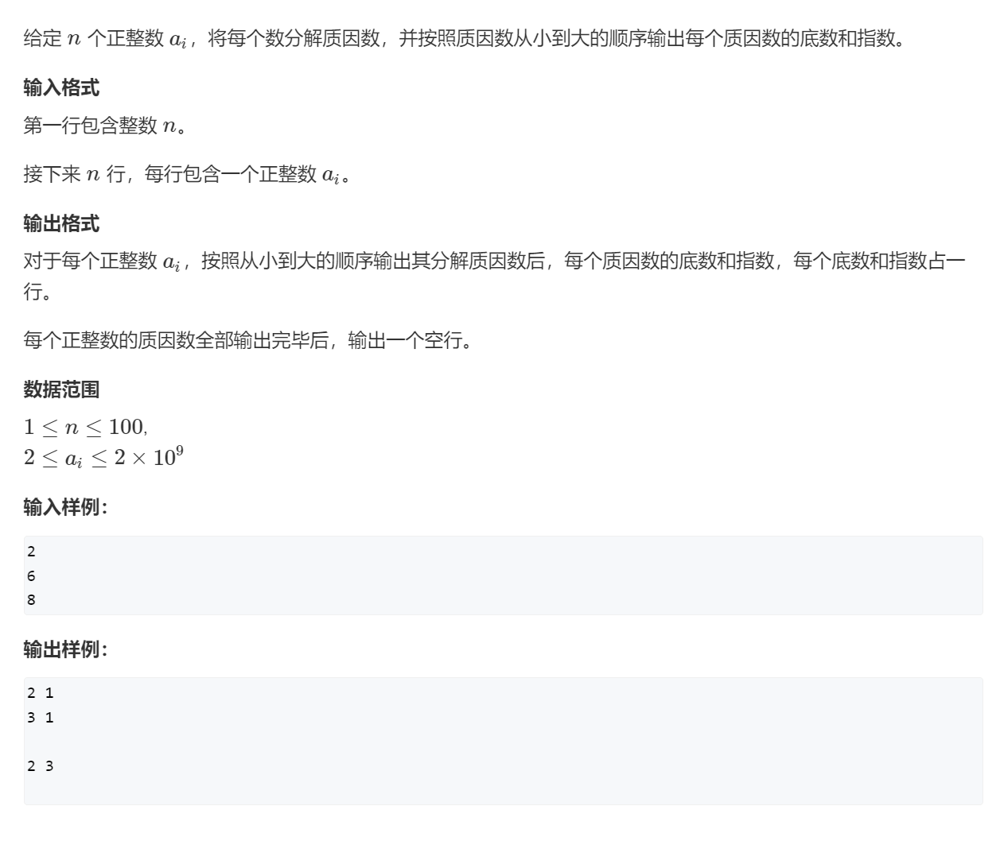

```python
from math import sqrt
n=int(input())
def cal(x):
    # 找每个数判断是不是因数
    for i in range(2,int(sqrt(x)+1)):
        if x%i==0:
            s=0
            # 如果是，把他的倍数全部消掉
            while x%i==0:
                x//=i
                s+=1
            ans.append([i,s])
    # 如果最后留下一个那就是剩余的质因数
    if x>1:
        ans.append([x,1])

for _ in range(n):
    x=int(input())
    ans=[]
    cal(x)
    for i in ans:
        print(*i)
    print()
```

有一种加速的写法是：在进入循环之前判断是否能模2，然后将2全部除掉，这样可以减少判断次数。


## 分解质因数(一组数)

求出一组数中每个数的质因数，不能用根号n的做法，需要用到最小质因子做法

预处理出最小质因子

```python
MAX=10**6+10
is_prime=[True]*MAX
is_prime[0]=is_prime[1]=False

prime=[]
min_factor=[0]*MAX
min_factor[1]=1
for i in range(2,MAX):
    if is_prime[i]:
        prime.append(i)
        min_factor[i]=i
    for p in prime:
        if i*p>=MAX:break
        is_prime[i*p]=False
        min_factor[i*p]=p
        if i%p==0:
            break
```


想要找一组数的质因数时

```python
for v in nums:
    while v>1:
        total[min_factor[v]]+=1
        v//=min_factor[v]
```

在nlogU时间内完成


如果值得范围到了**1e9**，分解质因数：预处理出**1e4.5**范围内的质数(~3000)，在判断质因数时遍历质数表


## 埃氏筛

对于给定的数据范围，从2开始找质数，如果这个数是质数，那么它的冥次一定不是质数，在判断表中标记

```python
MAX=10**6+1
# 记录这个数是不是质数，初始为True
is_prime=[True]*MAX
# 注意0和1的特判
is_prime[0]=False
is_prime[1]=False
# 记录质数
prime=[]
# 对于给定的数据范围，从2开始找质数
for i in range(2,MAX):
    if is_prime[i]:
        # 如果是质数加入，并把他的冥次标记
        prime.append(i)
        # 这里的优化是设置步长并从i**2开始
        for j in range(i*i,MAX,i):
            is_prime[j]=False
```

**在1e6的范围下速度更快**O(nloglogn)


下述式子的时间复杂度为O(nlogn)，调和级数

```python
for i in range(1,MX):
    for j in range(i,MX,i):
```


## 线性筛（欧拉筛）

每个数只会被他的最小质因数划掉，每个数乘上所有小于等于它最小质因数的质数来筛别的数。

```python
MAX=(10**6)+1
is_prime=[True]*MAX
is_prime[0]=is_prime[1]=False
prime=[]
for i in range(2,MAX):
    if is_prime[i]:
        prime.append(i)
     # 要对每个数进行筛选，不是只对质数筛选，下面的循环要放到外面
    for p in prime:
        # 防止越界
        if p*i>=MAX:
            break
        is_prime[p*i]=False
        if i%p==0:
            break
```


## 试除法

判断是否是质数使用试除法，对于不是质数的数，它的因数都是成对存在的。因此判断质数的时候只需要对一边判断即可。

**对于1和2最好特判**

```python
from math import sqrt
n=int(input())
ans=[]
def cal(x):
    # 特判1
    if x==1:
        return False
    if x==2:return True
    for i in range(2,int(sqrt(x)+1)):
        if x%i==0:
            return False
    return True
for _ in range(n):
    x=int(input())
    if cal(x):
        ans.append('Yes')
    else:
        ans.append('No')
for i in ans:
    print(i)
```

O(n)


更好的方法是用打表判断出的质数，而不是一个一个看，因为本来也就只有质数能起作用。

对于10^9 (30000)的数据可以开5*10^4

```python
p=[]
MX=(10**4)*5
is_prime=[True]*MX
for i in range(2,MX):
    if is_prime[i]:
        p.append(i)
        for j in range(i**2,MX,i):is_prime[j]=False
n=len(p)

i=0
cnt=0
x=int(input())
while x>1 and j<n:
    v=p[i]
	if x%v==0:
        while x%v==0:
            cnt+=1
            x//=v
    j+=1
if x>1:
    cnt+=1
```


# 因数

一个数的因数个数大概是立方级别

## 因数个数(小规模，非连续)

枚举因数时，从2开始到ceil(num**0.5+0.1)，加0.1是防止4之类的平方数取不到开方数

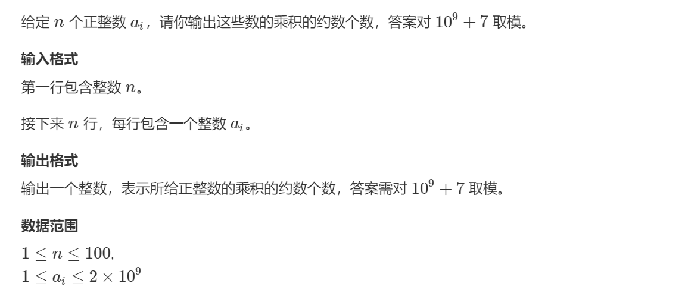


一个数的因数个数通过公式可得是：是它的质因数中(指数+1)的累积，可以理解为排列组合，加一表示不选

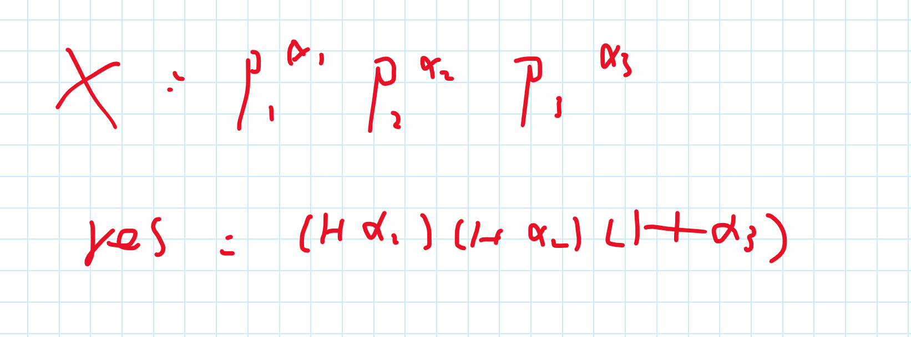

而质因数可以通过因数的质因数求解

```python
from math import sqrt
from collections import Counter
n=int(input())
# 用于记录指数的累和
memo=Counter()
mod=10**9+7

# 求解质因数的模板
def cal(x):
    for i in range(2,ceil(num**0.5+0.1)):
        if x%i==0:
            s=0
            while x%i==0:
                x//=i
                s+=1
            memo[i]+=s
    if x>1:
        memo[x]+=1

for _ in range(n):
    x=int(input())
    # 对每个因数找它的质因数
    cal(x)
nums=[x+1 for x in memo.values()]
ans=nums[0]
# 计算累乘
for i in range(1,len(nums)):
    ans*=nums[i]
    ans%=mod
print(ans)
```


## 因数个数(连续的一段)

问题形如：求解1~1e6范围内每个数的因数个数

如果枚举每个数对其求解因数会超时，这里使用调和级数的做法——**枚举1~1e6范围内的每个数作为因数，对这个数的倍数计数，可以用nlogn的时间复杂度求解。**


## 因素之和

因数之和同样需要质因数的指数，需要对每个质数计算质数从0到出现次数的累和，然后再累积上


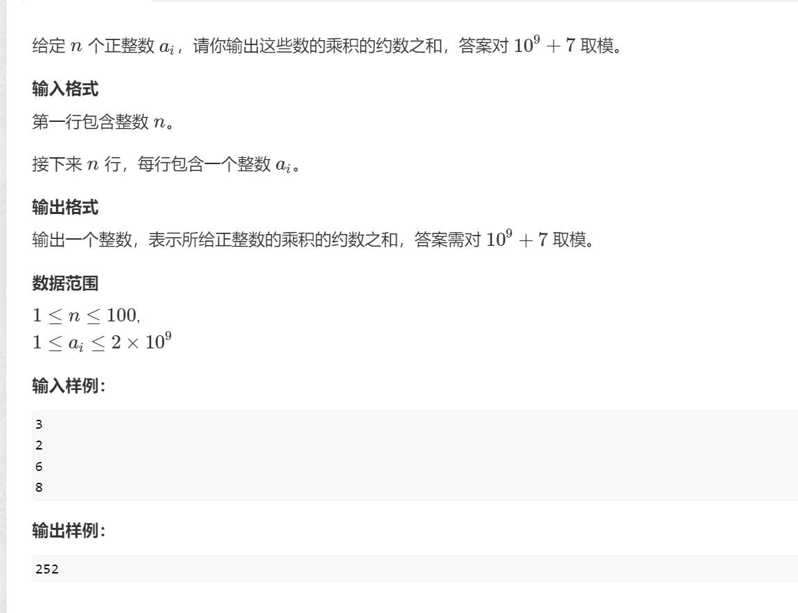

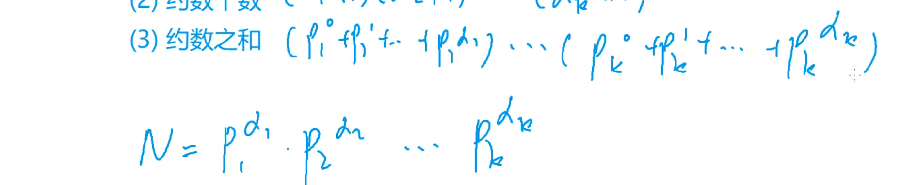

```python
from math import sqrt
from collections import Counter
n=int(input())
# 用于记录指数的累和
memo=Counter()
mod=10**9+7

# 求解质因数的模板
def cal(x):
    for i in range(2,int(sqrt(x)+1)):
        if x%i==0:
            s=0
            while x%i==0:
                x//=i
                s+=1
            memo[i]+=s
    if x>1:
        memo[x]+=1

for _ in range(n):
    x=int(input())
    # 对每个因数找它的质因数，累加指数
    cal(x)

# 计算每个质数的结果
def count_(k,v):
    ans=0
    for i in range(v+1):
        ans+=pow(k,i)
    return ans 
ans=1

# 计算累和
for k,v in memo.items():
    ans*=count_(k,v)
    ans%=mod
print(ans)
```


# 欧拉函数

用于求解N在1到N之间有多少个与N互质的数字，需要利用到质因数，**这里的特例是1的欧拉函数是1**

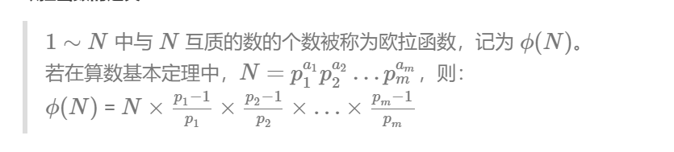

质数的欧拉函数是该质数减1


```python
n=int(input())
from math import sqrt
# 这里只需要考虑质因数的底数而不需要考虑指数
def cal(x):
    ans=[]
    for i in range(2,int(sqrt(x)+1)):
        if x%i==0:
            s=0
            while x%i==0:
                x//=i
                s+=1
            ans.append(i)
    if x>1:
        ans.append(x)
    return ans

for _ in range(n):
    x=int(input())
    nums=cal(x)
    ans=x
    # 利用公式求解
    for p in nums:
        ans*=(1-1/p)
    print(int(ans))
```

## 求欧拉函数之和

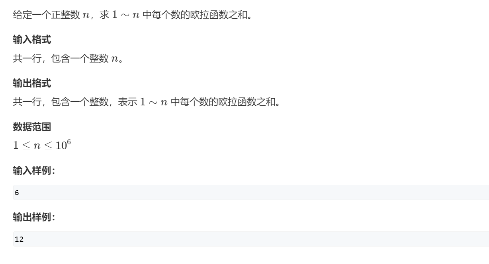


如果对每个数求欧拉函数，时间复杂度为O($$n\sqrt{n}$$)，而线性筛的方法可以在找质因数的过程中求出1到n所有数字的欧拉函数。

**注意1的欧拉函数为1**

在线性筛中每次枚举p*i的时候顺便求出P * i的欧拉函数，根据公式它的欧拉函数比i的多出了p乘(1-1/p)，如果在前面判断了p是i的因数，就说明这个p已经在i的欧拉函数中乘过了，欧拉函数和质因数的个数无关和种类有关，因此不需要再乘一次了。

```python
n=int(input())
prime=[]
# 做偏移
is_prime=[True]*(n+1)
res=[0]*(n+1)
# 特例
res[1]=1
# 线性筛
for i in range(2,n+1):
    # 对于一个质数，它的质因数只能是自己，由公式推出欧拉函数是p-1
    if is_prime[i]:
        prime.append(i)
        res[i]=i-1
     # 注意不能再if语句块中
    for p in prime:
        if i*p>n:
            break
        is_prime[i*p]=False
        # 判断
        if i%p==0:
            res[i*p]=p*res[i]
            break
        else:
            res[i*p]=res[i]*(p-1)
print(sum(res))        
```


# 递归

## 河内塔

如何花费最少的操作次数，在每次只能**移动一个**圆盘并且大圆盘不能**放在小圆盘上**的情形下，将整个圆盘移动到另一个柱子上

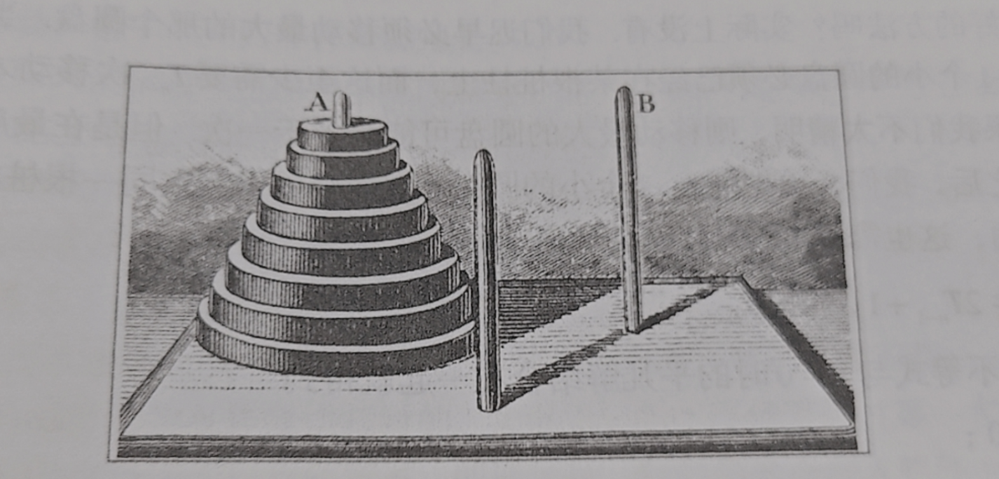


令Tn为在规则下将一个1~n的所有塔移动到另一个柱子上的最少操作次数，一个思路是**先将n-1小的圆盘移动到其他柱子上，然后移动第n个圆盘，再将n-1个移动到第n个圆盘上。**则有$T_n=2T_{n-1}+1$

由数学归纳法可得，$T_n=2^n-1$

## 平面上的直线

平面上n条直线所能界定的区域的最大个数L

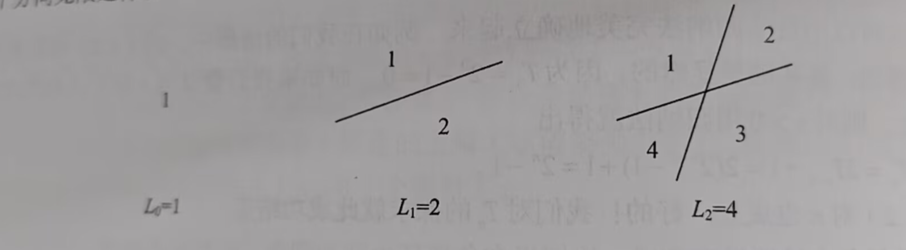


通过观察较小的例子可以假设$L=2^n$，这是基于每一条线能划分现存的每个区域，但是一条线与m条线相交只能划分m-1个区域，因此假设$L_n=L_{n-1}+k$，意味着与k-1条线相交，而k-1<=n-1，因此k最多等于n，则有$L_n=L_{n-1}+n$

用数学归纳法不断展开有$L_n=1+(1+n)*n/2$


## 约瑟夫问题

1~n个人围成一个圈，每个一个删去一个人，直到最后只剩一个人。

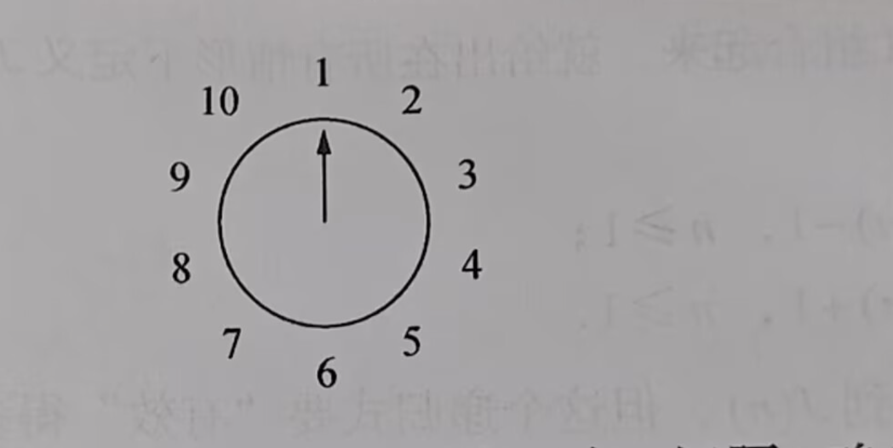

令J(n)表示最后剩下的人的编号

假设有2n个人，那么经过一轮后有

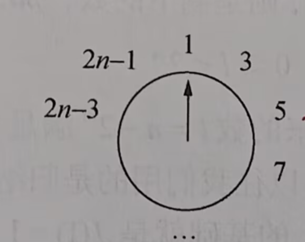

这种情况可以看作从n个人开始，但是编号变为了2n-1，那么有**J(2n)=2*J(n)-1**


对于2*n+1个人有相似的情况

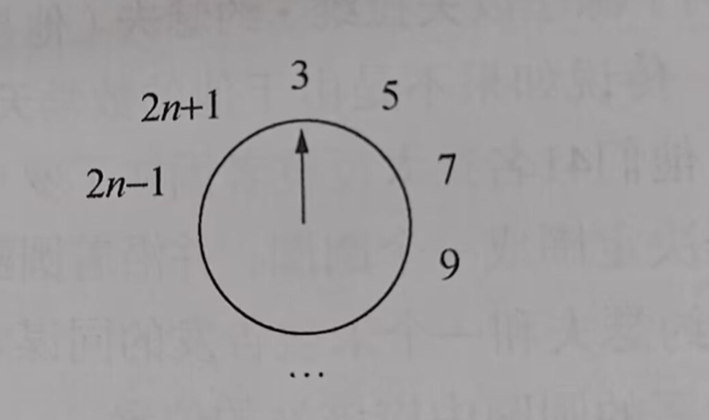

**J(2n+1)=2*J(n)+1**


则有递归式

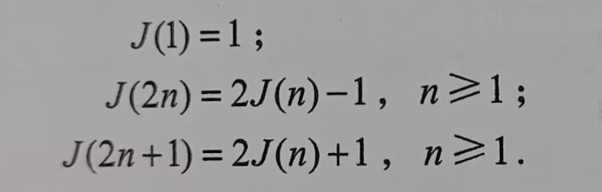


构造几组解，观察有$J(2^m+l)=2l-1$

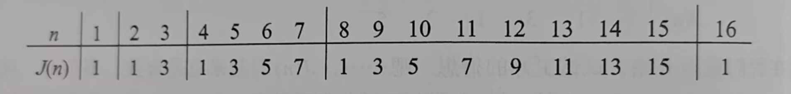


从二进制出发

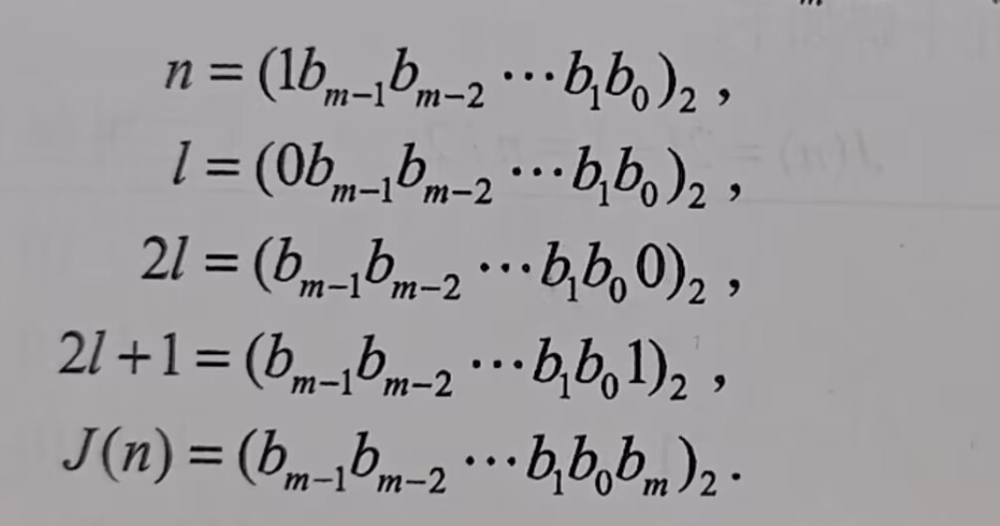

即把n向左循环移动一位，这样不断递归下去就得到了$J(n)=2^{cnt}-1，cnt是n二进制中1的个数$


# 裴属定理

**对于不全为0任意整数a和b，对于整数x和y都一定满足ax+by是gcd(a,b)的倍数；特别的一定存在整数 x 和 y 的解，使得 ax+by=gcd(a,b) 成立**

**一个重要的推论是对于ax+by=1只有在ab互质的情况下有解，反过来也一样如果ab互质，则必须满足ax+by=1**

上述的性质可以推广到**n**个


一个经典运用是：判断是否存在一个ax+by+cy+.....=k(a,b,c...是系数)的问题，这可以用裴属定理，即**k是gcd(x,y,z,....)的整数倍则有解**


## [检查「好数组」](https://leetcode.cn/problems/check-if-it-is-a-good-array/)

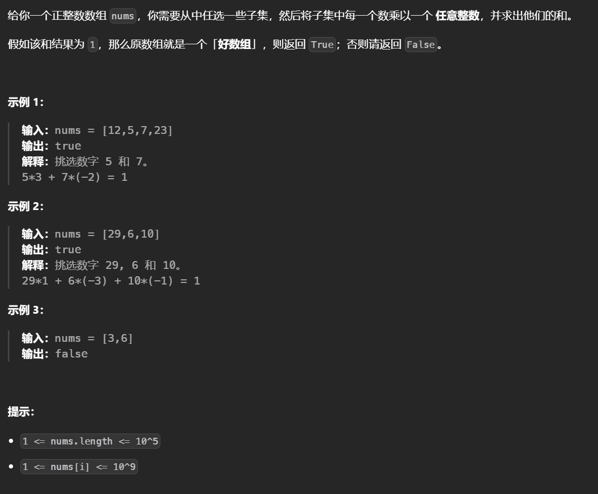


实际上就是裴属定理扩展到n上的性质，即询问是否有

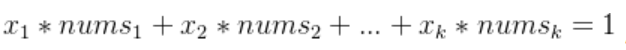

那么直接判断数组中的数是否互质，求解最大公约数是否等于1


# 欧几里得算法


## 求出所有的公约数

a和b所有的公约数是a和b的最大公约数的约数。

```python
temp=set()
n=gcd(a,b)
i=1
while i<=int(n**0.5)+1:
    if not n%i:
        temp.add(i)
        # 注意另一部分不能落下	
        temp.add(n//i)
    i+=1
temp=sorted(temp)
```

补充公因数的一个性质**gcd(a,b,c,d)=gcd(a,|b-a|,|c-b|,|d-c|)**


## 基本欧几里得算法

```python
# 迭代的写法
def gcd(x,y):
    if x<y:
        x,y=y,x
    m=-1
    while m:
        _,m=divmod(x,y)
        x=y
        y=m
        temp=m
    return m

# 递归的写法，根据性质：gcd(a,b)=gcd(b,a%b)
def gcd(a,b):
	if not b:
		return a
    return gcd(b,a%b)
```


## 扩展欧几里得算法

但是仅仅根据欧几里得算法无法得出系数，需要用到扩展的欧几里得算法，即在找最大公约数的过程中求解出系数。

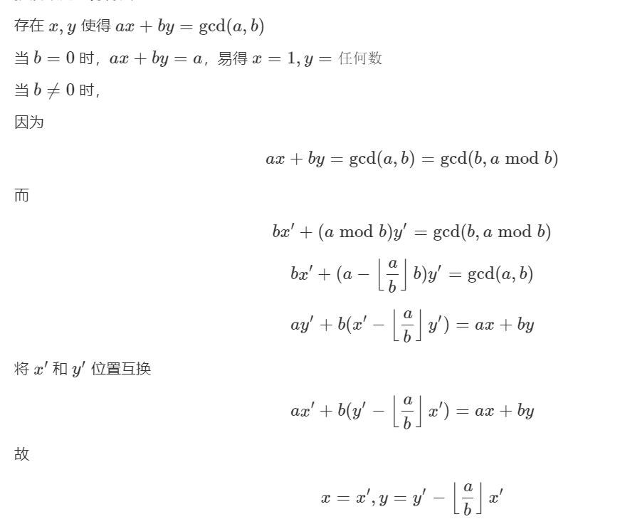

在调用欧几里得算法的过程中，反转了a和b，因此x和y传入的时候也要反转。根据推到可以得到外层的系数和下一层循环的系数右一定的联系。

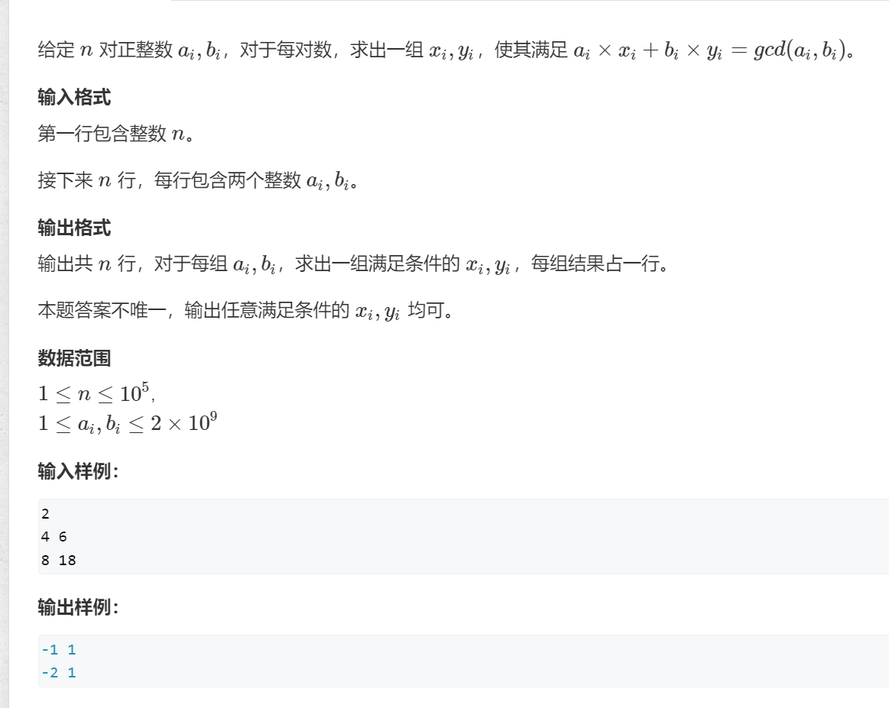

注意调用扩展欧几里得时，后两个传入0，0

```python
def exgcd(a,b,x,y):
    if not b:
        # 如果b等于0，根据公式一定有ax+by=a，选择返回系数1，0
        return a,1,0
    # 反之，递归
    d,y,x=exgcd(b,a%b,y,x)
    return d,x,y-a//b*x
t=int(input())
for _ in range(t):
    x,y=[int(x) for x in input().split()]
    # 初始的参数都为0
    _,a,c=exgcd(x,y,0,0)
    print(*[a,c])
```


## 扩展欧几里得求逆元

扩展欧几里得算法还能求出逆

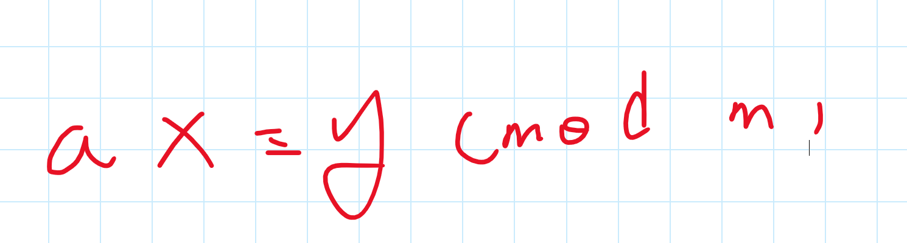


**当ab互素时，即ax+by==1，求解出的x是a模b的逆元，y是b模a的逆元。**


## 线性同余方程

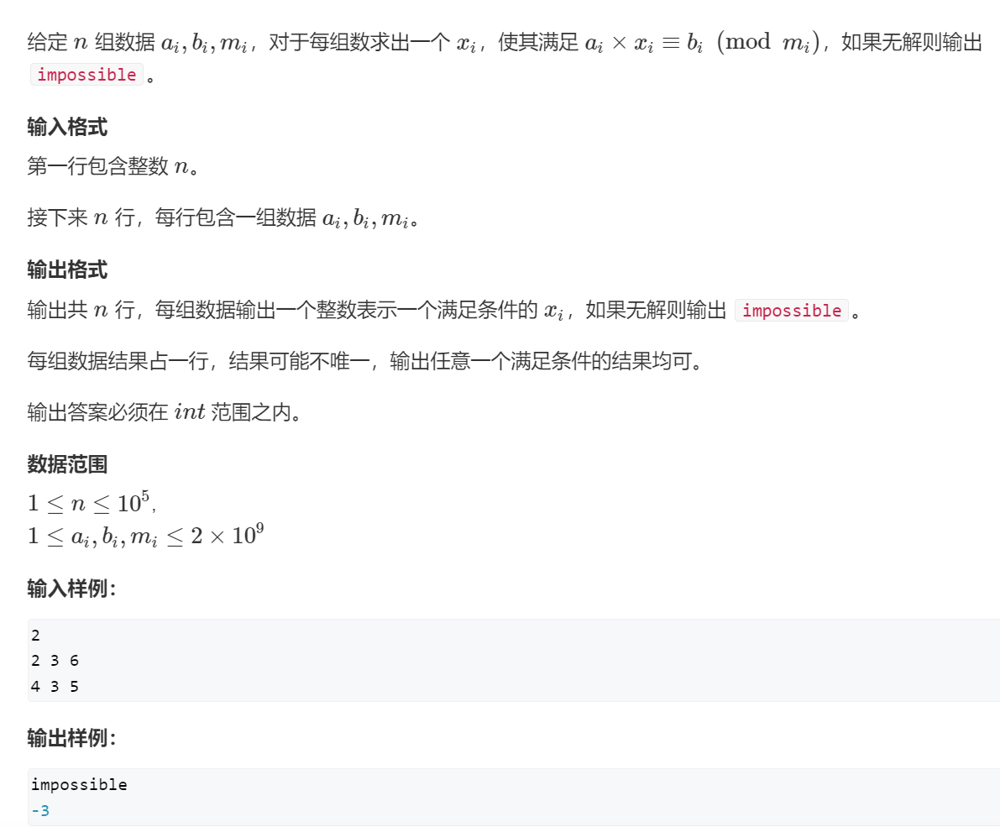


求解线性同余方程：$a \cdot x \equiv b \pmod{m}$，这等价于：$a \cdot x - b = m \cdot y \quad \text{（某个整数 } y \text{）}$

进一步可重写为：$a \cdot x + m \cdot (-y) = b$，即：$a \cdot x + m \cdot y = b$

引入Bézout定理有：$a \cdot x_0 + m \cdot y_0 = \gcd(a, m) = d$，由扩展欧几里得算法可以求出一组整数解 $x_0, y_0$。

可以把上面的式子乘以 $\frac{b}{d}$，得到：$a \cdot \left( x_0 \cdot \frac{b}{d} \right) + m \cdot \left( y_0 \cdot \frac{b}{d} \right) = b$

映射会原方程有：$x = x_0 \cdot \frac{b}{d} \pmod{m}$

```python
t=int(input())
def exgcd(a,b,x,y):
    if not b:
        return a ,1,0
    d,y,x=exgcd(b,a%b,y,x)
    return d,x,y-a//b*x
    
for _ in range(t):
    a,b,m=[int(x) for x in input().split()]
    d,x,y=exgcd(a,m,0,0)
    if b%d:
        print('impossible')
    else:
        print((x*b//d)%m)
```


# 逆元

就是扩展欧几里得算法中求解出的x或者是y的系数，另外根据费马小定理有：**当取模的数是质数的时候，a的逆元就是a^m-1**。在对两个较大的数相除的结果取模的时候，由于同余定理对除法不起作用，因此要把被除数转化为逆元变为乘法后取模，而找一个数取逆元的过程如下：

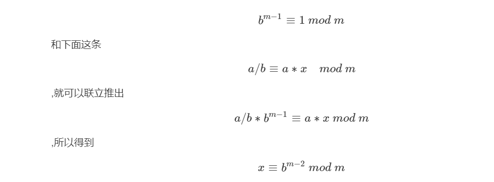

这里可以使用费马小定理主要是因为10**9+7是一个质数

# 排列

**对于长度为n的数组它的全排列个数为n!，如果数组中有重复的元素那么总的排列个数要除以数组中相同元素的个数的阶乘。**可以理解为把重复元素当作是一个数，内部再全排列。


# 第二类斯特林数

第二类斯特林数S(n,m)表示的是把n个**不同**的小球放在m个**相同**的盒子里方案数，可以递推求解：**一个球独占一个盒子f(n-1,m-1)以及非独占f(n-1,m)*m**


## [计算分配糖果的不同方式](https://leetcode.cn/problems/count-ways-to-distribute-candies/)

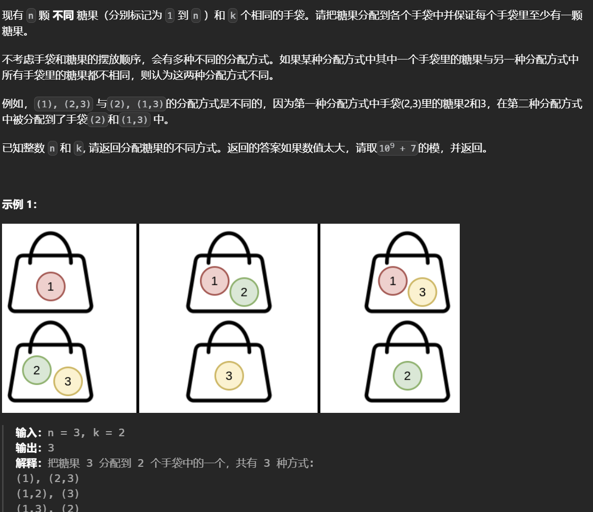

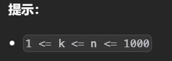

第二类斯特林数，要求每个盒子至少有一个球。

```python
class Solution:
    def waysToDistribute(self, n: int, k: int) -> int:
        mod=10**9+7
        f=[[0]*(n+1) for _ in range(k+1)]
        # 0个盒子0个球的时候有一种可能，如果球数更多则不满足要求(都要放到盒子中)
        f[0][0]=1
        for i in range(1,k+1):
            # 球的个数需要大于等于盒子数
            for j in range(i,n+1):
                f[i][j]=(f[i-1][j-1]+f[i][j-1]*i)%mod
        return f[k][n]
```


## [播放列表的数量](https://leetcode.cn/problems/number-of-music-playlists/)

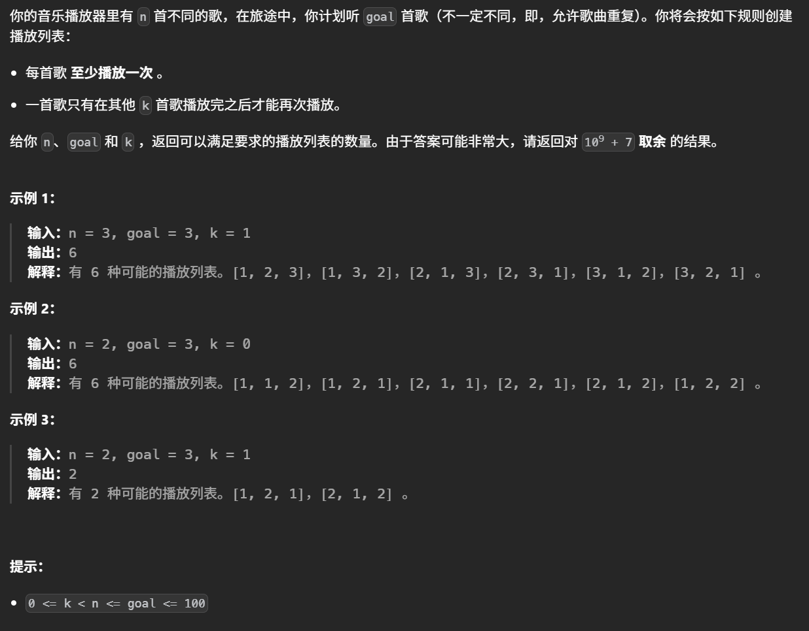

观察条件，每首歌至少播放一次，那么一定需要一个状态来记录歌曲是否都被选择，这里不能用状态压缩，可以定义i为已选i种歌曲，那么再定义j表示已经听了j首歌。这里发现歌曲是不同的，但是长度或者说盒子的的个数是一样的，那么可以想到第二类斯特林数，定义dp[i]\[j]为已选i种歌曲，当前听了j首歌，那么有转移方程

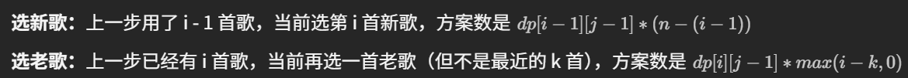

```python
class Solution:
    def numMusicPlaylists(self, n: int, goal: int, k: int) -> int:
        mod=10**9+7
        max=lambda x,y:x if x>=y else y
        f=[[0]*(goal+1) for _ in range(n+1)]
        f[0][0]=1
        for i in range(1,n+1):
            for j in range(1,goal+1):
                f[i][j]+=f[i-1][j-1]*(n-(i-1))
                f[i][j]+=f[i][j-1]*max(i-k,0)
                f[i][j]%=mod
        return f[n][goal]
```


# 组合数

对于长度为k的数组任取偶数个位置(或者说选偶数次)有$2^{k-1}$个选法，奇数个也是同理。


## 递推式

组合数的递推公式为：$$C_{a}^b= C_{a-1}^b+C_{a-1}^{b-1}$$注意是加法

注意组合数在python3中可以直接用comb快速计算，但是在pypy3中并没有comb函数，即使comb对于大数很快但是对于多次询问还是需要打表求解。


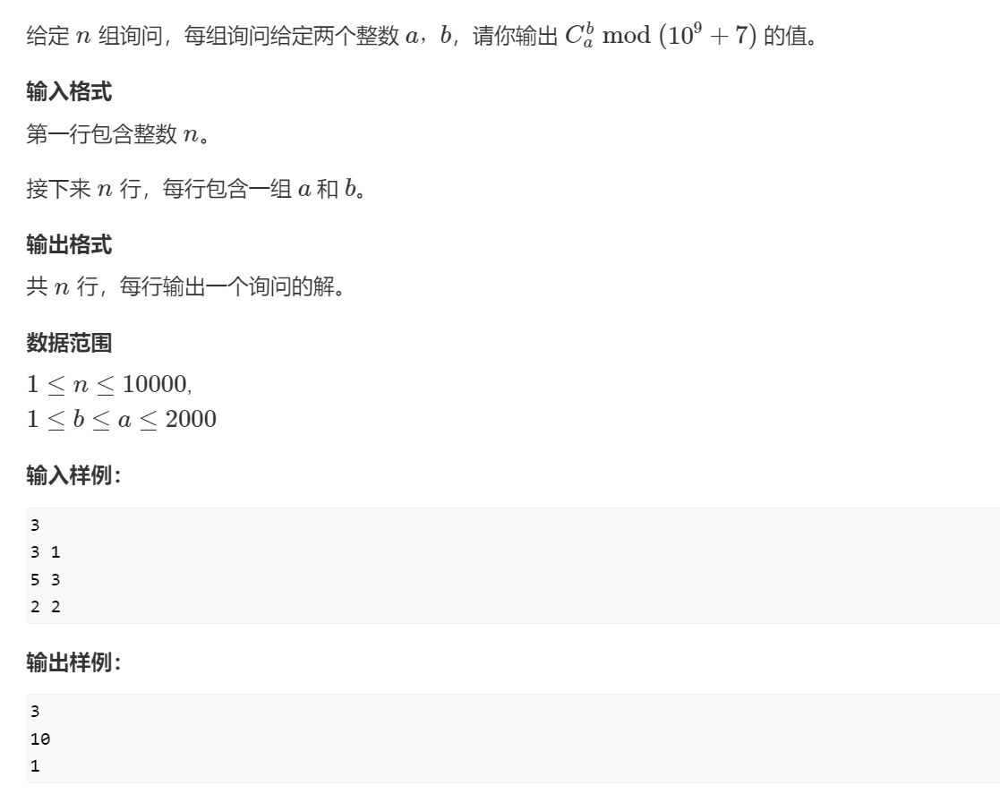

对于多次询问（十万次）必须快速求解出组合数，因此选择打表计算对于给定的数据打表最多是10**6。

初始化dp[0]\[0]=1

```python
dp=[[0]*2010 for _ in range(2010)]
mod=10**9+7
for i in range(2010):
    # 内层的循环只能到i，在往外无意义
    for j in range(i+1):
        # j=0的时候结果为1
        if not j:dp[i][j]=1
        else:
            dp[i][j]=(dp[i-1][j-1]+dp[i-1][j])%mod
t=int(input())
for _ in range(t):
    a,b=[int(x) for x in input().split()]
    if b>a:
        a,b=b,a
    print(dp[a][b])
```


## 阶乘

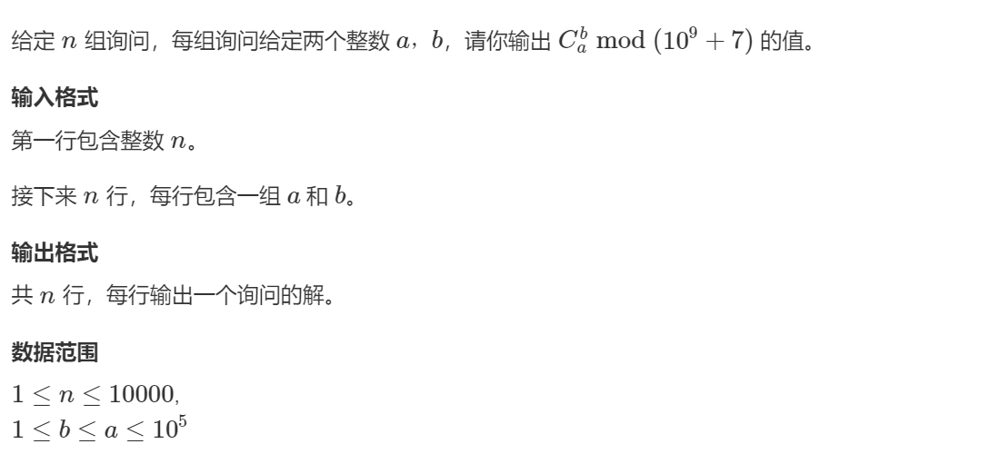

这里给定的数据范围无法打表计算每一组解，根据组合数的性质求解除使用递推求解每个数的阶乘，然后在计算中使用阶乘求解即可。

```python
n=10**5+10
mod=10**9+7
dp=[1]*n
infact=[0]*n
for i in range(1,n):
    dp[i]=(i*dp[i-1])%mod
t=int(input())
for _ in range(t):
    a,b=[int(x) for x in input().split()]
    # 转换为逆元进行乘法操作，才能取模
    print(dp[a]*pow(dp[b],mod-2,mod) *pow(dp[a-b],mod-2,mod)%mod)
```


# Lucas

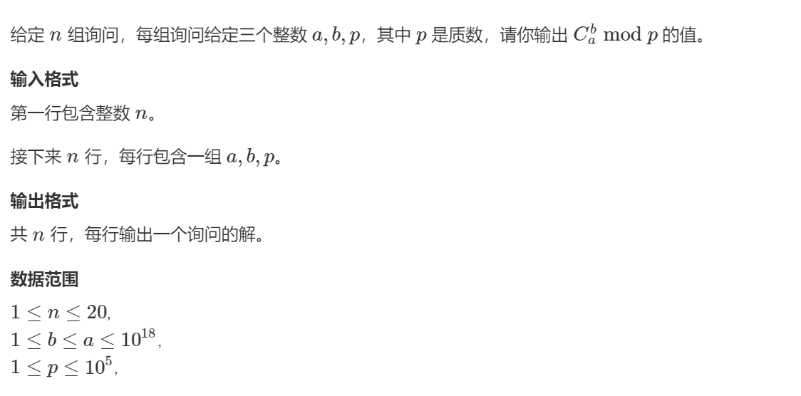

对于数据范围**很大的组合数**取模的结果，如果模数是一个**不大的质数**那么可以用卢卡斯定理求解：
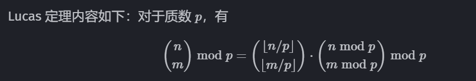


```python
def C(a,b,p):
    j=a
    res=1
    # 根据定义计算，根据公式拆分为(a/b)*(c/d)的形式...，一共有b项，这个过程中一直取模
    for i in range(1,b+1):
        res=res*j%p
        # 使用逆元
        res=res*pow(i,p-2,p)%p
        j-=1
    return res
        
def locus(a,b,p):
    # 如果ab的范围可以接收（十万以内），直接计算
    if a<p and b<p:
        return C(a,b,p)
    # 否则用卢卡斯定理简化计算
    return C(a%p,b%p,p)*locus(a//p,b//p,p)%p
for _ in range(int(input())):
    a,b,p=[int(x) for x in input().split()]
    print(locus(a,b,p))
```


# 中国剩余定理

中国剩余定理是扩展lucas定理，**可以求解lucas中P不为质数的情况**。

「物不知数」问题：有物不知其数，三三数之剩二，五五数之剩三，七七数之剩二。问物几何？

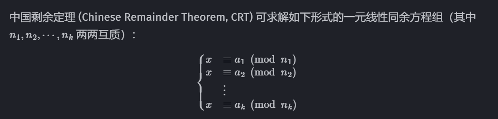

其中a和m是已知的，注意m是互质(最大公约数为1)的要求，求解x。


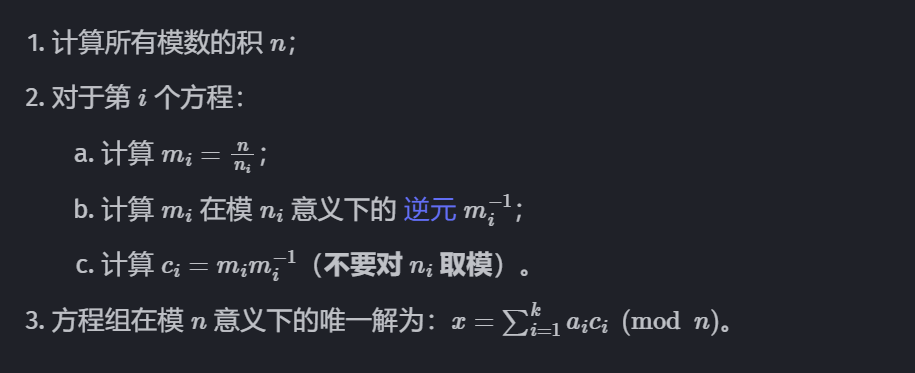


反过来可以用于求解**大数取模合数**时的结果，例如，**其中a1.a2,a3...是comb(n,k)取模2,3,4679的结果**，只能运用于冥次为1的情况

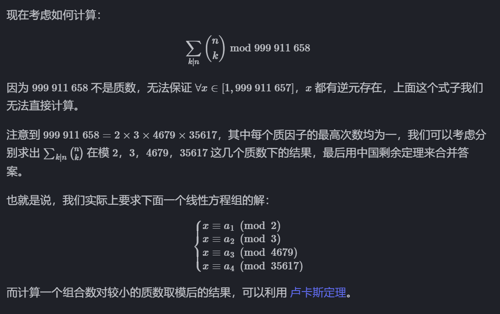


## [判断操作后字符串中的数字是否相等 II](https://leetcode.cn/problems/check-if-digits-are-equal-in-string-after-operations-ii/)

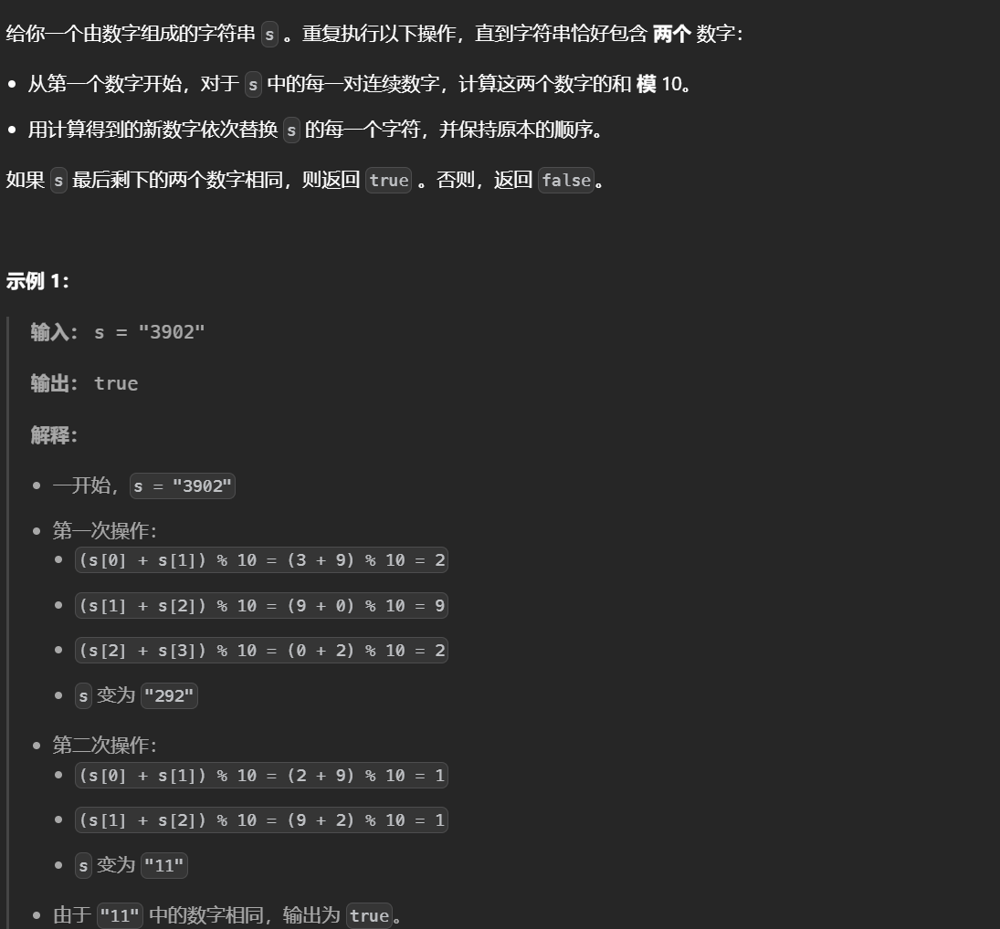


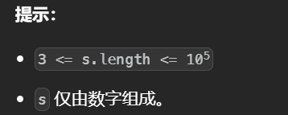

最后化简出的两个数实际上就是s的n-1位(前n-1位以及后n-1位)与杨辉三角形的第n-1层一一相乘，关键在于如何快速求解出杨辉三角形的n-1层的系数。

根据公式杨辉三角形的第n层的第m个，数值为C(n-1,m-1)由数据范围可知无法递推求解，但是通过阶乘或者lacus定理需要模数为质数，然而这里给的是模10。因此要使用扩展lucas定理使得可以模一个合数。

将10拆为2和5然后运用公式

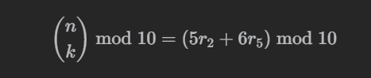

将10拆位2和5构造中国剩余定理的公式有：$$a1 =r1= \binom{n}{k} \mod 2 \quad \quad a2 =r2= \binom{n}{k}\mod5$$，而n1=5,n2=2，由此可以构造公式求解x即$\binom{n}{k} \mod 10$

```python
MX=5
C=[[0]*MX for _ in range(MX)]
for i in range(MX):
    for j in range(i+1):
        if not j:C[i][j]=1
        else:C[i][j]=C[i-1][j-1]+C[i-1][j]

class Solution:
    def hasSameDigits(self, s: str) -> bool:
        n=len(s)-1  
        mod=10
        # lucas定理
        def lucas(n,k,p):
            # 第二个数为0   
            if not k:return 1
            # 数值范围较小可以直接求解
            return C[n%p][k%p]*lucas(n//p,k//p,p)%p
        
        def cal(n,k):
            # 经过变换后的公式
            return (5*lucas(n,k,2)+6*lucas(n,k,5))%10
        
        temp1=temp2=idx=0
        s=[int(c) for c in s]
        # 枚举两个位置
        for i,j in pairwise(s):
            val=cal(n-1,idx)
            temp1+=val*i
            temp2+=val*j
            idx+=1
        # 比较
        return temp1%10==temp2%10
```


# 卡特兰数

一种特殊的组合数

问题一般是有两个选择，问这两种选择满足的组合有多少种

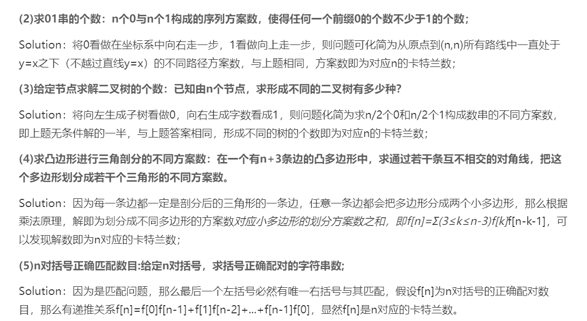


## 生成字符串

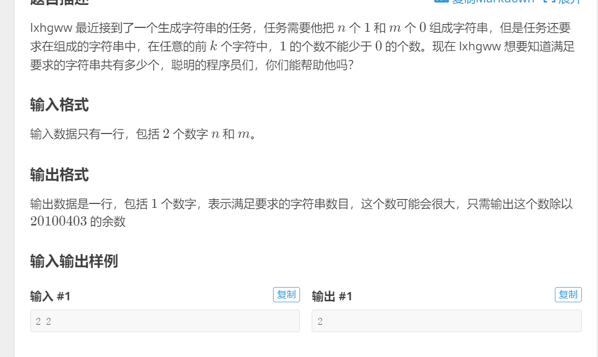


把文图抽象为图像，1相当于向右上走，0相当于向右下走，为了1的个数要大于0需要在组合的过程中不要经过y=-1这条线否则就是0的个数大于1的个数

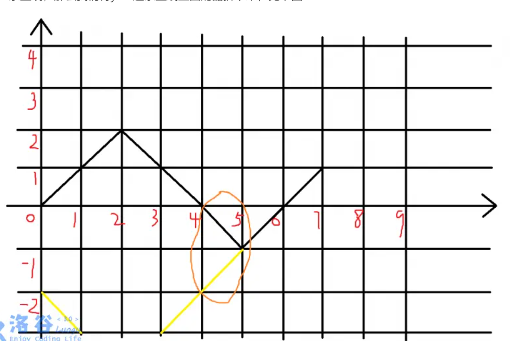


最后的结果是所有的组合数减去不合法的组合数，其中所有的组合数就是从起点走到(n,m)有多少种走法也就是从m+n中选出n个或者m个。而不合法的数目，将路线从开头到第一次经过y=-1这条线的点的路线反转，问题变为从0，-2开始走到目标点有多少种走法，这里变化后，通过观察图像发现0的个数减少1的个数增加1，从m+n中选出n+1个或者m-1个

```python
from math import factorial as f
mod=20100403
n,m=[int(x) for x in input().split()]

#  不使用内置的函数计算防止内存超限
def C(a,b):
    # 使用一个变量记录上面的结果
    j=a
    # res记录当前的结果
    res=1
    # 下面是从1到b
    for i in range(1,b+1):
        res=(res*j)%mod
        res=(res*pow(i,mod-2,mod))%mod
        j-=1
    return res%mod
res=C(m+n,n)-C(m+n,n+1)
print(res%mod)
```


## 鸡蛋饼


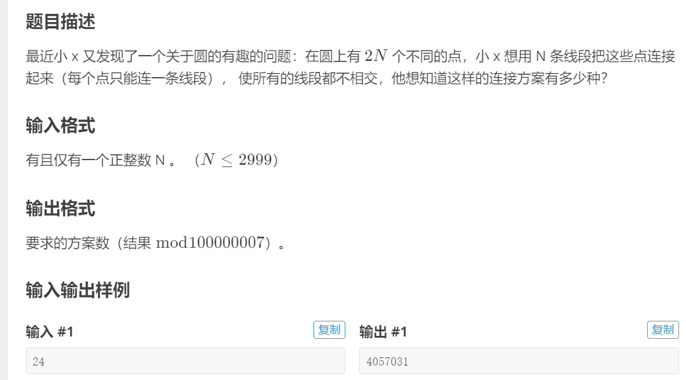


就是求解卡特兰数

```python
mod=100000007
n=int(input())
def C(a,b):
    res=1
    j=a
    for i in range(1,b+1):
        res=(res*j)%mod
        res=(res*pow(i,mod-2,mod))%mod
        j-=1
    return res%mod
print(C(2*n,n)*pow(n+1,mod-2,mod)%mod)
```

## 矩阵ii

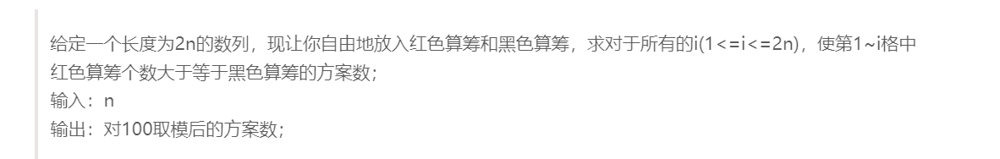

这里取模数是100不能使用飞马小定理求解逆元，对卡特兰数使用定义计算：

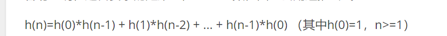

这里注意取模操作要放到括号外面，对于每个卡特兰数他都是由前面的数推出，这里不存在除法可以直接取模

```python
f=[0]*110
mod=100
f[0]=1
for i in range(1,101):
    # 从0到n-1
    for j in range(i):
        f[i]=(f[i]+f[j]*f[i-1-j])%mod
n=int(input())
print(f[n])
```

# 快速冥

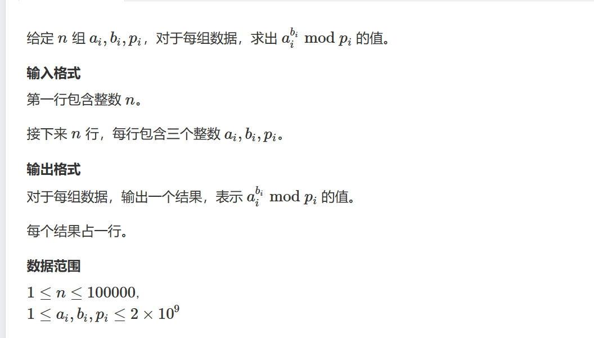


对于较大的冥次比如说n达到10**9，保证不会溢出的情况下使用迭代求解会超时。快速冥的做法是把冥次拆分为二进制数（比如6写为110，$2^2+2^1$），然后只操作这些位

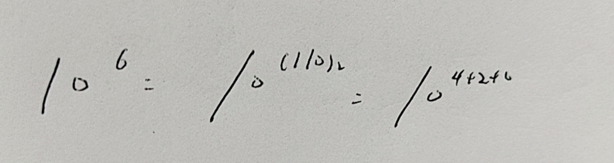

这样就只需要迭代log(n)次

```python
n=int(input())
def cal(a,b,p):
    res=1

    while b:
        # 只有在有1的时候才会葛更新结果，也就是每次乘的时候恰好对应到拆分的位数
        if b&1:
            res=(res*a)%p
        b=b>>1
        a=(a*a)%p
    return res
        
for _ in range(n):
    a,b,p=[int(x) for x in input().split()]
    print(cal(a,b,p))
```

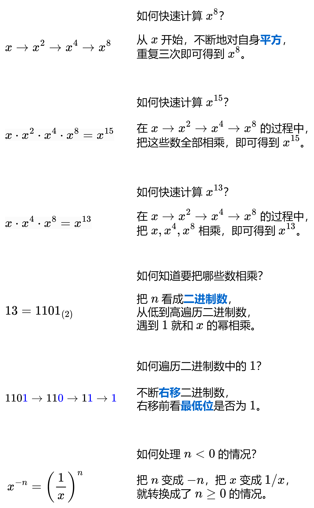

# 冥次

使用内置函数Pow可快速求解，为了防止数据太大可以在**Pow函数中加入第三个参数**作为取模的值防止过大导致计算较慢。

内置函数sqrt()可以求解开方，isqrt()可以求出开方后的整数。

补充2^31开方后的结果为40000多

比起log函数求冥，模拟整除更好


# 曼哈顿距离转换为切比雪夫距离

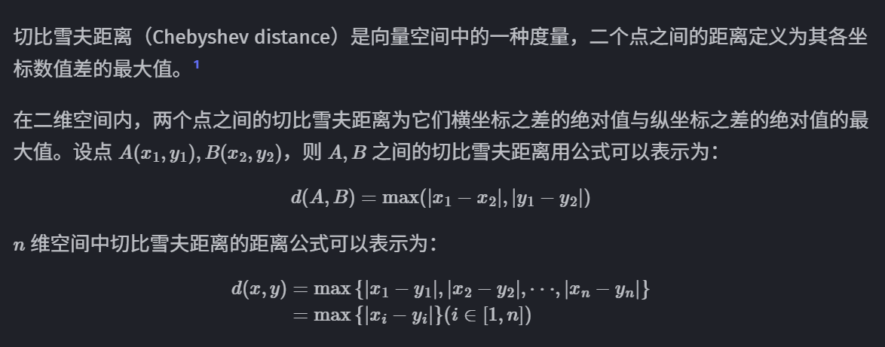


原坐标系转换到切比雪夫坐标系：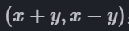


## [最小化曼哈顿距离](https://leetcode.cn/problems/minimize-manhattan-distances/)

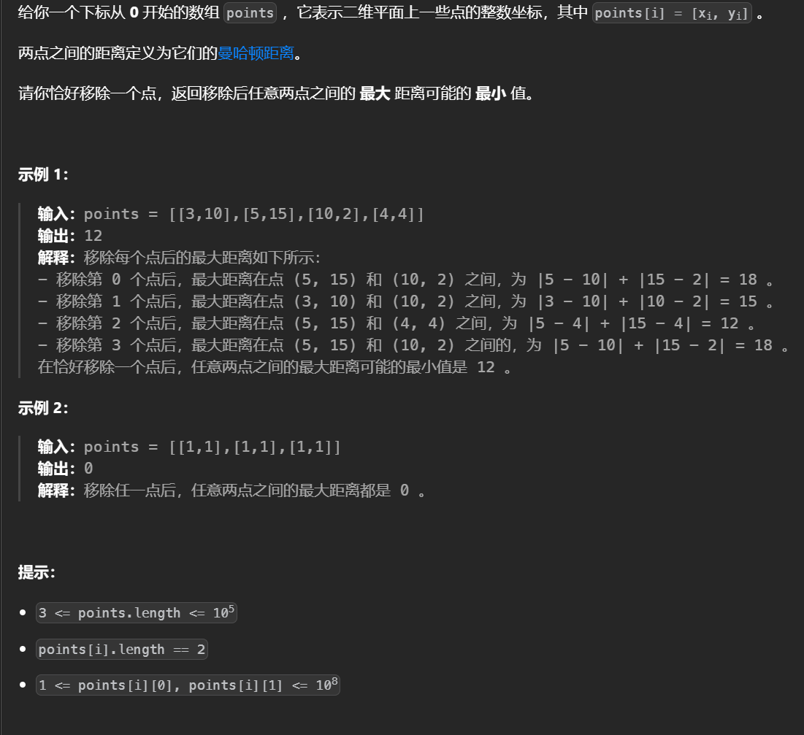


对于给定的数据范围无法得到最大的曼哈顿距离（因为要两层循环），同时无法枚举删除每一个点后的最大距离。但是可以通过将曼哈顿距离转化为切比雪夫距离一次遍历求出最大的曼哈顿距离。

切比雪夫距离等价于曼哈顿距离

将(x,y)转换为**(x+y,y-x)**，枚举删除每一个坐标，同时用有序集合维护最大最小值。

```python
from sortedcontainers import SortedList as sl
class Solution:
    def minimumDistance(self, points: List[List[int]]) -> int:
        # 使用有序集合维护
        x=sl()
        y=sl()
        for l,r in points:
            x.add(l+r)
            y.add(r-l)
        ans=inf
        for l,r in points:
            # 先删除在加入
            x.remove(l+r)
            y.remove(r-l)
            ans=min(ans,max(x[-1]-x[0],y[-1]-y[0]))
            x.add(l+r)
            y.add(r-l)
        return ans
```


# 容斥原理

在计算结果的时候不去考虑重叠的部分，先把所有的加上然后再家去重叠的部分，这个公式就是概率论中的几个集合相交

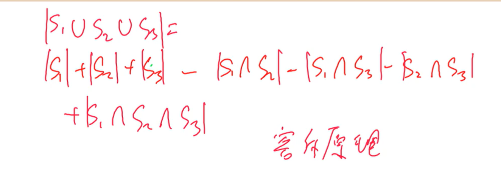


往外推广的结果是1-2+3-4+5-6+....+(-1)^(n-1)*n，奇数个集合是加偶数个集合是减。

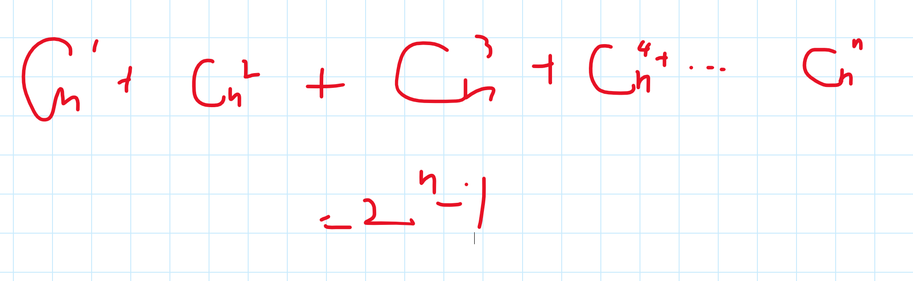

可以看作是从n个数中选取任意个，一共有2^n-1个状态（注意不会选0个，等式左边会补上 $$C^0_n$$）

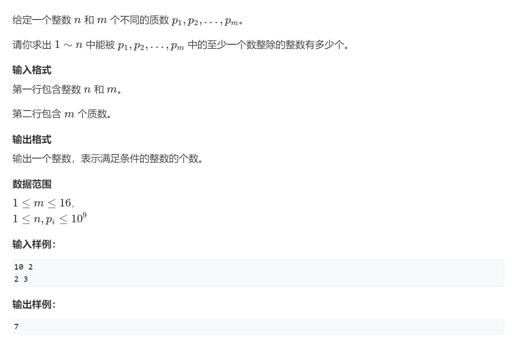


使用容斥原理找能被一个质数整除的个数，这里补充一点1到n中能被p整除的个数是n//p，而能被n和m同时整除的个数是n//(m*n)，这里的p是质数。

能被质数整除的集合一共有m个，枚举每个选或者是不选则有2^m-1个状态

```python
n,m=[int(x) for x in input().split()]
prime=[int(x) for x in input().split()]
res=0
# 使用位图表示当前位置的集合有没有选
for i in range(1,1<<len(prime)):
    # 记录选取的集合的乘积
    t=1
    # 分别记录当前枚举的集合个数和结果
    cnt=summ=0
    # 遍历每一位
    for j in range(m):
        p=prime[j]
        if i>>j&1:
            t*=p
            # 如果累乘的结果大于N说明不存在能被当前集合所除的数
            if t>n:
                t=-1
                break
            cnt+=1
    summ+=n//t
    if t!=-1:
        # 奇数加偶数减
        res+= summ if cnt&1 else -summ
print(res)
```


## [单面值组合的第 K 小金额](https://leetcode.cn/problems/kth-smallest-amount-with-single-denomination-combination/)

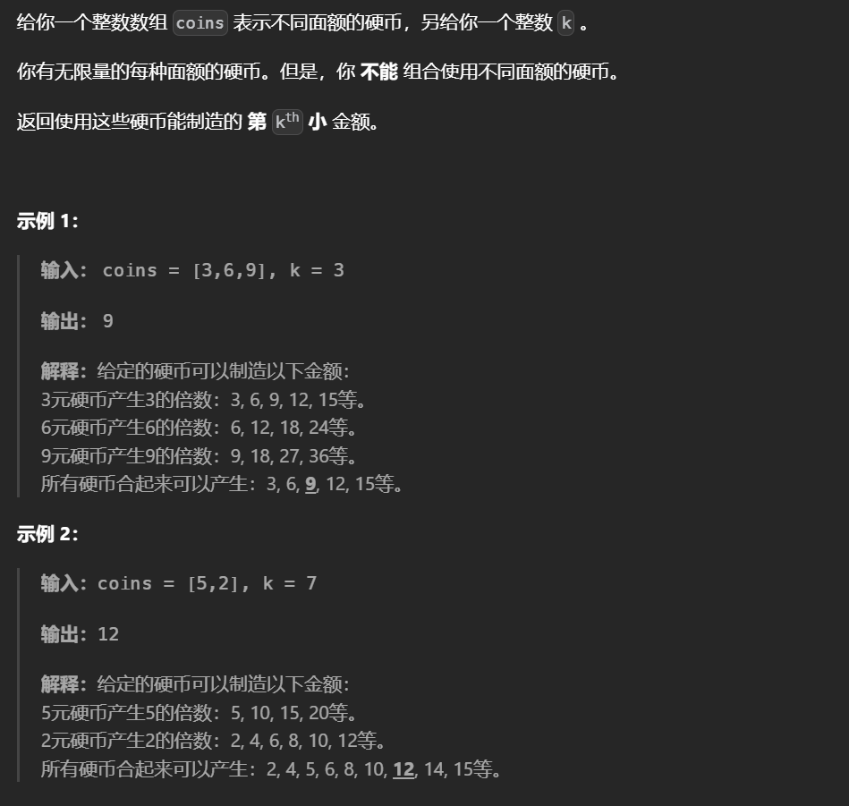

二分枚举金额的大小，查看是否满足至少有k个小于等于该金额

注意这里的金额不能有重复值，也就是不能直接取整除后的结果，需要减去重复的值，不仅两个值之间要减去重复的内容，三个值四个值之间也同样需要，因此使用容斥定理求解。

容斥定理枚举子集找出子集的最小公倍数，然后选择减或加。


```python
class Solution:
    def findKthSmallest(self, coins: List[int], k: int) -> int:
        l,r=0,min(coins)*k
        n=len(coins)
        memo={}
        # 预处理出每个子集的最小公倍数
        for s in range(1,1<<n):
            lcm=1
            for j in range(n):
                if s>>j&1:lcm=math.lcm(lcm,coins[j])
            memo[s]=lcm

        def cal(x):
            cnt=0
            for i in range(1,1<<n):
                c=0
                lcm=1
                # 根据子集中元素的个数判断是加还是减(奇数加偶数减)
                c=i.bit_count()
                lcm=memo[i]
                cnt+=pow(-1,c+1)*(x//lcm)
            return cnt>=k

        while l<=r:
            mid=(l+r)>>1
            if cal(mid):
                r=mid-1
            else:
                l=mid+1
        return r+1
```


# 简单博弈论

一个人胜利的条件是后一个只要会输，而输的条件是无论怎么操作后一个人都会赢

## NIM游戏

n堆物品，每堆有ai 个，两个玩家轮流取走任意一堆的大于0个物品。取走最后一个物品的人获胜

结论是每堆石子的异或和如果等于0，则先手必输反之必胜。

## Training Before the Olympiad

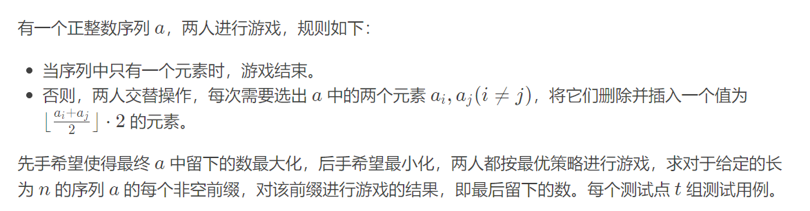

先手想要结果最大后手想要结果最小，每次选奇偶不同的数可以使得元素总和减小一，而相同的总和不变，因此前者尽可能多的选奇偶相同的后者选不同的，此外为了保证先手胜利，先手会每次优先完奇数/偶数优先保证后手不能减小总和。

维护两个前缀数组，一个是奇数的个数一个是前缀和，每一轮如果奇数的个数足够的话可以减少三个如果不够，剩余0个或2个那么最后的总和一定不变，反之一定会减小1.

```python
import sys
from itertools import accumulate as ac
input=sys.stdin.readline


for _ in range(int(input())):
    n=int(input())
    nums=list(map(int,input().split()))
    # 记录奇数个数
    odd=[0]*n
    odd[0]=int(nums[0]&1==1)
    for i in range(1,n):
        odd[i]+=odd[i-1]+int(nums[i]&1==1)
    # 记录前缀和
    pre=list(ac(nums))
    ans=[]
    for i in range(n):
        # 对于第一个要特判
        if i==0:
            ans.append(pre[i])
            continue
        v=odd[i]
        a,b =divmod(v,3)
        # 总和要减去轮数
        if b==0 or b==2:
            ans.append(pre[i]-a)
        else:
            ans.append(pre[i]-a-1)
    for v in ans:
        print(v,end=' ')
    print()
```


​	
