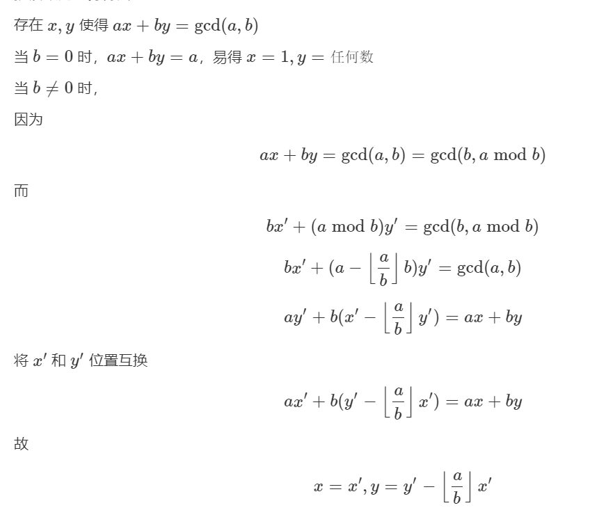
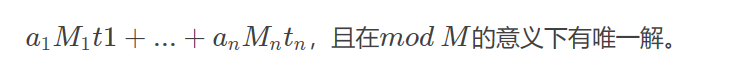
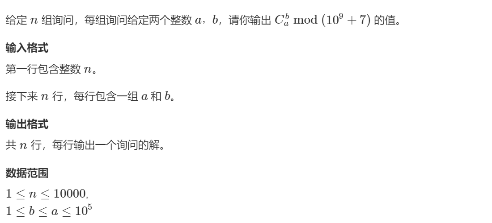
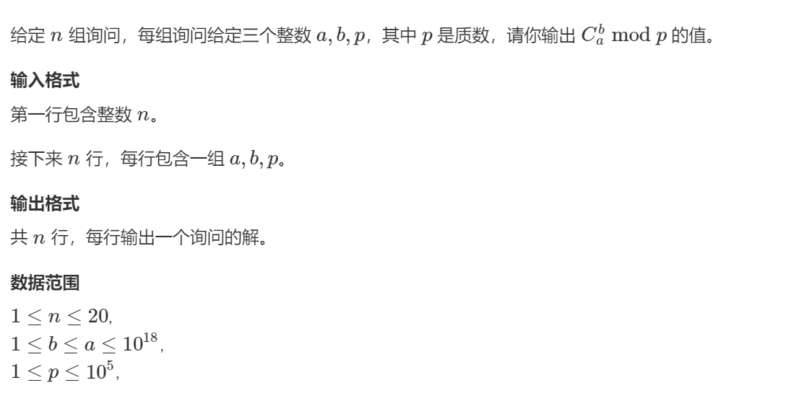
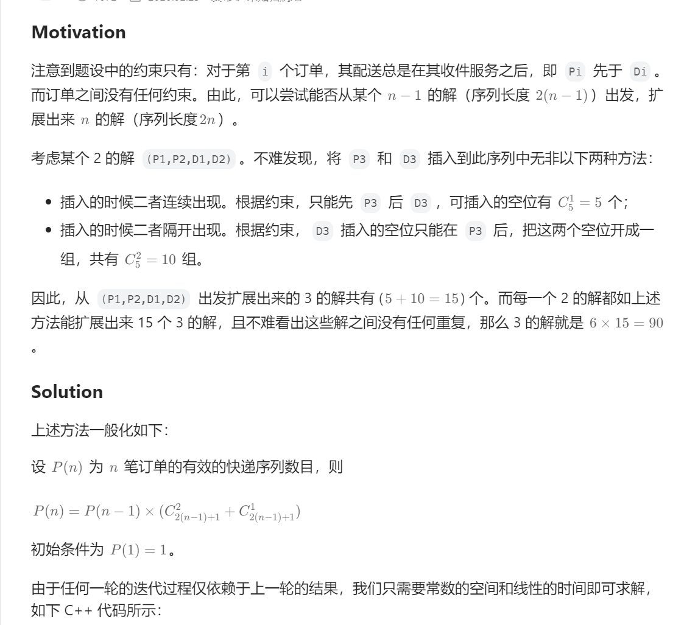
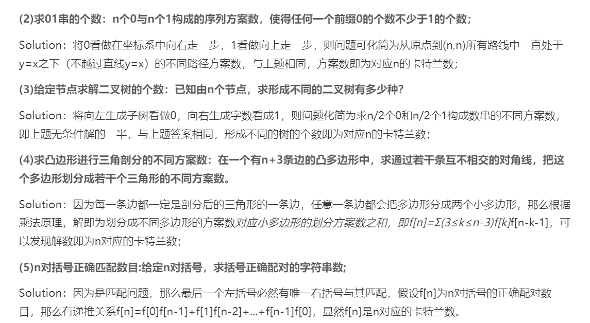
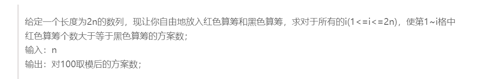
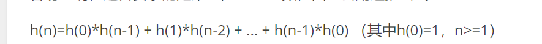
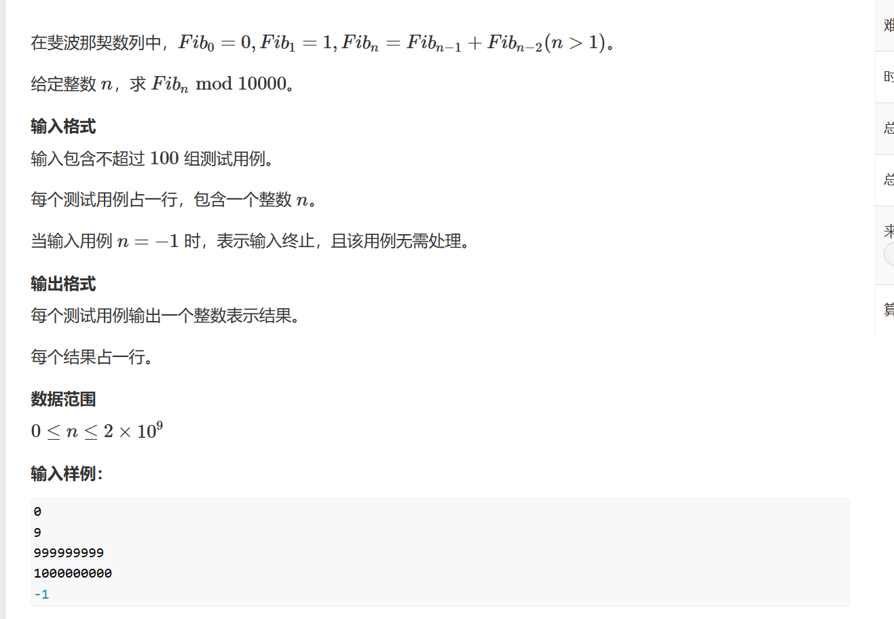
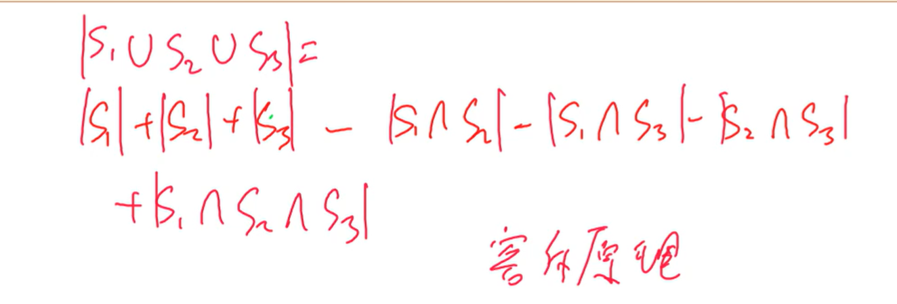

# 数学知识

# 偶数和奇数

从1到n中**奇数**的个数为**(n+1)//2**，偶数的个数为**n-(n+1)//2**，通过**异或**两个数可以判断两个数的奇偶性是否相同(==1?)

# 取模

想要求迭代求10x+1，为防止结果太大需要取模，在迭代的过程中10*x+1中的x可以直接取上一次迭代后取模的结果


# 质数（素数）

对于质数相关的题目经常打表计算，构建质数表的效率至关重要，如果选择遇到一个数字就去从2开始遍历它，然后在遍历中判断是不是质数，这样的效率非常低。

`注意使用质数表的时候，要把表的运算放到外面进行`，因为一道题有很多个测试数据，放在里面每次测试都需要算，放在外面只需要算一次。

找因数质数什么的都可以从开方处找（可以取到）。


补充：梅森素数指的是x是质数x-1，也是质数。


## 分解质因数

一个数的质因数指的是它的因数都是由质数组成的，比如说6就是有2和3组成的，而8是由三个2组成的。

找质因数的过程类似于试除法，从小到大找每个数如果他是一个因数，通过把给定的数一直整除这个因数直到不再是因数来排除掉这个因数的倍数从而保证所有的因数都是质数，然后继续找下一个数。注意质因数中只会有一个大于根号n，因此可以遍历到根号n，如果最后剩下的数大于1那么这就是余下的质数。


```python
from math import sqrt
n=int(input())
def cal(x):
    # 找每个数判断是不是因数
    for i in range(2,int(sqrt(x)+1)):
        if x%i==0:
            s=0
            # 如果是，把他的倍数全部消掉
            while x%i==0:
                x//=i
                s+=1
            ans.append([i,s])
    # 如果最后留下一个那就是剩余的质因数
    if x>1:
        ans.append([x,1])

for _ in range(n):
    x=int(input())
    ans=[]
    cal(x)
    for i in ans:
        print(*i)
    print()
```


## 埃氏筛

对于给定的数据范围，从2开始找质数，如果这个数是质数，那么它的冥次一定不是质数，在判断表中标记


```python
MAX=10**6+1
# 记录这个数是不是质数，初始为True
is_prime=[True]*MAX
is_prime[0]=False
is_prime[1]=False
# 记录质数
prime=[]
# 对于给定的数据范围，从2开始找质数
for i in range(2,MAX):
    if is_prime[i]:
        # 如果是质数加入，并把他的冥次标记
        prime.append(i)
        # 这里的优化是设置步长并从i**2开始
        for j in range(i*i,MAX,i):
            is_prime[j]=False
```


## 线性筛（欧拉筛）

每个数只会被他的最小质因数划掉，每个数乘上所有小于等于它最小质因数的质数来筛别的数。

```python
MAX=(10**6)+1
is_prime=[True]*MAX
prime=[]
for i in range(2,MAX):
    if is_prime[i]:
        prime.append(i)
     # 要对每个数进行筛选，不是只对质数筛选，下面的循环要放到外面
    for p in prime:
        # 防止越界
        if p*i>=MAX:
            break
        is_prime[p*i]=False
        if i%p==0:
            break
```

在数据范围比较大（10**7）的时候效率比埃氏筛好,大约快一倍。

## 试除法

判断是否是质数使用试除法，对于不是质数的数，它的因数都是成对存在的。因此判断质数的时候只需要对一边判断即可。

```python
from math import sqrt
n=int(input())
ans=[]
def cal(x):
    # 特判1
    if x==1:
        return False
    for i in range(2,int(sqrt(x)+1)):
        if x%i==0:
            return False
    return True
for _ in range(n):
    x=int(input())
    if cal(x):
        ans.append('Yes')
    else:
        ans.append('No')
for i in ans:
    print(i)
```


更好的方法是用打表判断出的质数，而不是一个一个看，因为本来也就只有质数能起作用。

对于10^9 (30000)的数据可以开5*10^4

```python
p=[]
MX=(10**4)*5
is_prime=[True]*MX
for i in range(2,MX):
    if is_prime[i]:
        p.append(i)
        for j in range(i**2,MX,i):is_prime[j]=False
n=len(p)

i=0
cnt=0
x=int(input())
while x>1 and j<n:
    v=p[i]
	if x%v==0:
        while x%v==0:
            cnt+=1
            x//=v
    j+=1
if x>1:
    cnt+=1
```


# 因数

一个数的因数个数大概是立方级别

## 因数个数


一个数的约数个数通过公式可得是：是他的质因数中(指数+1)的累积


而质因数可以通过因数的质因数求解

```python
from math import sqrt
from collections import Counter
n=int(input())
# 用于记录指数的累和
memo=Counter()
mod=10**9+7

# 求解质因数的模板
def cal(x):
    for i in range(2,int(sqrt(x)+1)):
        if x%i==0:
            s=0
            while x%i==0:
                x//=i
                s+=1
            memo[i]+=s
    if x>1:
        memo[x]+=1

for _ in range(n):
    x=int(input())
    # 对每个因数找它的质因数
    cal(x)
nums=[x+1 for x in memo.values()]
ans=nums[0]
# 计算累乘
for i in range(1,len(nums)):
    ans*=nums[i]
    ans%=mod
print(ans)
```


## 约数之和


约数之和同样需要质因数的指数，需要对每个质数计算质数从0到出现次数的累和，然后再累积上


```python
from math import sqrt
from collections import Counter
n=int(input())
# 用于记录指数的累和
memo=Counter()
mod=10**9+7

# 求解质因数的模板
def cal(x):
    for i in range(2,int(sqrt(x)+1)):
        if x%i==0:
            s=0
            while x%i==0:
                x//=i
                s+=1
            memo[i]+=s
    if x>1:
        memo[x]+=1

for _ in range(n):
    x=int(input())
    # 对每个因数找它的质因数，累加指数
    cal(x)

# 计算每个质数的结果
def count_(k,v):
    ans=0
    for i in range(v+1):
        ans+=pow(k,i)
    return ans 
ans=1

# 计算累和
for k,v in memo.items():
    ans*=count_(k,v)
    ans%=mod
print(ans)
```


# 欧拉函数

用于求解N在1到N之间有多少个与N互质的数字，需要利用到质因数，这里的特例是1的欧拉函数是1/


质数的欧拉函数是该质数减1


```python
n=int(input())
from math import sqrt
# 这里只需要考虑质因数的底数而不需要考虑指数
def cal(x):
    ans=[]
    for i in range(2,int(sqrt(x)+1)):
        if x%i==0:
            s=0
            while x%i==0:
                x//=i
                s+=1
            ans.append(i)
    if x>1:
        ans.append(x)
    return ans

for _ in range(n):
    x=int(input())
    nums=cal(x)
    ans=x
    # 利用公式求解
    for p in nums:
        ans*=(1-1/p)
    print(int(ans))
```

## 求欧拉函数之和


如果对每个数求欧拉函数，时间复杂度为O($$n\sqrt{n}$$)，而线性筛的方法可以在找质因数的过程中求出1到n所有数字的欧拉函数。

**注意1的欧拉函数为1**

在线性筛中每次枚举p*i的时候顺便求出P * i的欧拉函数，根据公式它的欧拉函数比i的多出了p乘(1-1/p),如果在前面判断了p是i的因数，就说明这个p已经在i的欧拉函数中乘过了，欧拉函数和质因数的个数无关和种类有关，因此不需要再乘一次了。

```python
n=int(input())
prime=[]
# 做偏移
is_prime=[True]*(n+1)
res=[0]*(n+1)
# 特例
res[1]=1
# 线性筛
for i in range(2,n+1):
    # 对于一个质数，它的质因数只能是自己，由公式推出欧拉函数是p-1
    if is_prime[i]:
        prime.append(i)
        res[i]=i-1
     # 注意不能再if语句块中
    for p in prime:
        if i*p>n:
            break
        is_prime[i*p]=False
        # 判断
        if i%p==0:
            res[i*p]=p*res[i]
            break
        else:
            res[i*p]=res[i]*(p-1)
print(sum(res))
                
```


# 递归

## 河内塔

如何花费最少的操作次数，在每次只能**移动一个**圆盘并且大圆盘不能**放在小圆盘上**的情形下，将整个圆盘移动到另一个柱子上


令Tn为在规则下将一个1~n的所有塔移动到另一个柱子上的最少操作次数，一个思路是**先将n-1小的圆盘移动到其他柱子上，然后移动第n个圆盘，再将n-1个移动到第n个圆盘上。**则有$T_n=2T_{n-1}+1$

由数学归纳法可得，$T_n=2^n-1$

## 平面上的直线

平面上n条直线所能界定的区域的最大个数L


通过观察较小的例子可以假设$L=2^n$，这是基于每一条线能划分现存的每个区域，但是一条线与m条线相交只能划分m-1个区域，因此假设$L_n=L_{n-1}+k$，意味着与k-1条线相交，而k-1<=n-1，因此k最多等于n，则有$L_n=L_{n-1}+n$

用数学归纳法不断展开有$L_n=1+(1+n)*n/2$


## 约瑟夫问题

1~n个人围成一个圈，每个一个删去一个人，直到最后只剩一个人。


令J(n)表示最后剩下的人的编号

假设有2n个人，那么经过一轮后有


这种情况可以看作从n个人开始，但是编号变为了2n-1，那么有**J(2n)=2*J(n)-1**


对于2*n+1个人有相似的情况


**J(2n+1)=2*J(n)+1**


则有递归式


构造几组解，观察有$J(2^m+l)=2l-1$


从二进制出发


即把n向左循环移动一位，这样不断递归下去就得到了$J(n)=2^{cnt}-1，cnt是n二进制中1的个数$


## 裴属定理+欧几里得算法

**对于任意一对正整数x,y一定存在整数a,b，使得ax+by=gcd(x,y)**

**两个互质的数，不能组合出的最大的数是(n-1)*(m-1)-1**

是否存在一个ax+by+cy+.....=k的问题，这可以用裴属定理，即k是gcd(a,b,c,....)的整数倍则有解，不过这里要求xyz不能取0


### 求出所有的公约数

a和b所有的公约数是a和b的最大公约数的约数。

```python
temp=set()
n=gcd(a,b)
i=1
while i<=int(n**0.5)+1:
    if not n%i:
        temp.add(i)
        # 注意另一部分不能落下	
        temp.add(n//i)
    i+=1
temp=sorted(temp)
```


### 基本欧几里得算法

```python
# 迭代的写法
def gcd(x,y):
    if x<y:
        x,y=y,x
    m=-1
    while m:
        _,m=divmod(x,y)
        x=y
        y=m
        temp=m
    return m

# 递归的写法，根据性质：gcd(a,b)=gcd(b,a%b)
def gcd(a,b):
	if not b:
		return a
        return gcd(b,a%b)
    
```


### 扩展欧几里得算法

但是仅仅根据欧几里得算法无法得出系数，需要用到扩展的欧几里得算法，即在找最大公约数的过程中求解出系数。



在调用欧几里得算法的过程中，反转了a和b，因此x和y传入的时候也要反转。根据推到可以得到外层的系数和下一层循环的系数右一定的联系。


注意调用扩展欧几里得时，后两个传入0，0

```python
def exgcd(a,b,x,y):
    if not b:
        # 如果b等于0，根据公式一定有ax+by=a，选择返回系数1，0
        return a,1,0
    # 反之，递归
    d,y,x=exgcd(b,a%b,y,x)
    return d,x,y-a//b*x
t=int(input())
for _ in range(t):
    x,y=[int(x) for x in input().split()]
    # 初始的参数都为0
    _,a,c=exgcd(x,y,0,0)
    print(*[a,c])
```


### 扩展欧几里得求逆

扩展欧几里得算法还能求出逆


a的逆等于exgcd(a,m,0,0)[1]，求出a的逆后x的结果等于y*(a的逆)//(a和m的最大公约数)%m，注意这里如果结果不能整除二者的最大公约数那么无法找到x。


### 线性同余方程


找a和m的最大公约数，如果这个数可以被b整除则存在x，结果是`b//d*(a的系数)%m`

```python
t=int(input())
def exgcd(a,b,x,y):
    if not b:
        return a ,1,0
    d,y,x=exgcd(b,a%b,y,x)
    return d,x,y-a//b*x
    
for _ in range(t):
    a,b,m=[int(x) for x in input().split()]
    d,x,y=exgcd(a,m,0,0)
    if b%d:
        print('impossible')
    else:
        print((x*b//d)%m)
```

## 互素的数所不能表示的最大的数

如果两个数互素，那么它们所不能表示的最大的数是x*y-x-y

## 逆元

就是扩展欧几里得算法中求解出的x或者是y的系数，另外根据费马小定理有：当取模的数是质数的时候，a的逆元就是a^m-1。在对两个较大的数相除的结果取模的时候，由于同余定理对除法不起作用，因此要把被除数转化为逆元变为乘法后取模，而找一个数取逆元的过程如下：


这里可以使用费马小定理主要是因为10**9+7是一个质数


## 中国剩余定理


其中a和m是已知的，注意m是互质(最大公约数为1)的要求

不论证明过程，最后最小的x等于


令M等于所有m的乘积，Mi等于M//mi，$M_{i}t_i≡1(mod m_i)$ti就是Mi对mi的逆


```python
n = int(input())
S = 1
m = [0] * n
a = [0] * n

# 扩展欧几里得
def exgcd(a, b, x, y):
    if not b: return a, 1, 0
    d, y, x = exgcd(b, a % b, y, x)
    return d,x, y - a // b * x


for i in range(n):
    m_, a_ = [int(x) for x in input().split()]
    a[i] = a_
    m[i] = m_
    S *= m_
ans = 0
for i in range(n):
    x,y,z=exgcd(S // m[i], m[i], 0, 0)
    M=S//m[i]
    # 注意累加过程要取模M
    ans= (ans+a[i]*y*M)%S
print(ans)
```


## 排列

对于长度为n的数组它的全排列个数为n!，如果不区分相同元素的话那么总的排列个数要除以数组中相同元素的个数的阶乘。


## 组合数

组合数的递推公式为：$$C_{a}^b= C_{a-1}^b+C_{a-1}^{b-1}$$注意是加法

注意组合数在python3中可以直接用comb快速计算，但是在pypy3中并没有comb函数


注意即使comb对于大数很快但是对于多次询问还是需要打表求解。


对于长度为k的数组任意取有2^k-1个非空序列


对于多次询问（十万次）必须快速求解出组合数，因此选择打表计算对于给定的数据打表最多是10**6。

初始化dp[0]\[0]=1

```python
dp=[[0]*2010 for _ in range(2010)]
mod=10**9+7
for i in range(2010):
    # 内层的循环只能到i，在往外无意义
    for j in range(i+1):
        # j=0的时候结果为1
        if not j:dp[i][j]=1
        else:
            dp[i][j]=(dp[i-1][j-1]+dp[i-1][j])%mod
t=int(input())
for _ in range(t):
    a,b=[int(x) for x in input().split()]
    if b>a:
        a,b=b,a
    print(dp[a][b])
    
```




这里给定的数据范围无法打表计算每一组解，根据组合数的性质求解除使用递推求解每个数的阶乘，然后在计算中使用阶乘求解即可。

```python
n=10**5+10
mod=10**9+7
dp=[1]*n
infact=[0]*n
for i in range(1,n):
    dp[i]=(i*dp[i-1])%mod
t=int(input())
for _ in range(t):
    a,b=[int(x) for x in input().split()]
    # 转换为逆元进行乘法操作，才能取模
    print(dp[a]*pow(dp[b],mod-2,mod) *pow(dp[a-b],mod-2,mod)%mod)
```




对于数据范围很大的组合数取模的结果，如果模数是一个质数那么可以用卢卡斯定理简化计算：
	$$C_{a}^{b}=C_{a mod p}^{bmod p}*C_{a/p}^{b/p} mod p$$

注意这里的p一定是一个质数

```python
def C(a,b,p):
    j=a
    res=1
    # 根据定义计算，根据公式拆分为(a/b)*(c/d)的形式...，一共有b项，这个过程中一直取模
    for i in range(1,b+1):
        res=res*j%p
        # 使用逆元
        res=res*pow(i,p-2,p)%p
        j-=1
    return res
        
def locus(a,b,p):
    # 如果ab的范围可以接收（十万以内），直接计算
    if a<p and b<p:
        return C(a,b,p)
    # 否则用卢卡斯定理简化计算
    return C(a%p,b%p,p)*locus(a//p,b//p,p)%p
for _ in range(int(input())):
    a,b,p=[int(x) for x in input().split()]
    print(locus(a,b,p))
```

### [有效的快递序列数目](https://leetcode.cn/problems/count-all-valid-pickup-and-delivery-options/)




注意comb(5,2)中两个数字的顺序是只有一种的，要么是i先j后，或者反过来,不会都有。

两种放置方式：两个数字一块放也就是在所有的空位中选一个出来，或者是间隔放即在空位中选出两个。

```python
class Solution:
    def countOrders(self, n: int) -> int:
        m=10**9+7
        p=1
        for i in range(2,n+1):
            a=2*(i-1)+1
            b=a*(a-1)//2
            p=p*(a+b)%m

        return p
        
```


## 卡特兰数

一种特殊的组合数

问题一般是有两个选择，问这两种选择满足的组合有多少种




### 生成字符串


把文图抽象为图像，1相当于向右上走，0相当于向右下走，为了1的个数要大于0需要在组合的过程中不要经过y=-1这条线否则就是0的个数大于1的个数


最后的结果是所有的组合数减去不合法的组合数，其中所有的组合数就是从起点走到(n,m)有多少种走法也就是从m+n中选出n个或者m个。而不合法的数目，将路线从开头到第一次经过y=-1这条线的点的路线反转，问题变为从0，-2开始走到目标点有多少种走法，这里变化后，通过观察图像发现0的个数减少1的个数增加1，从m+n中选出n+1个或者m-1个

```python
from math import factorial as f
mod=20100403
n,m=[int(x) for x in input().split()]

#  不使用内置的函数计算防止内存超限
def C(a,b):
    # 使用一个变量记录上面的结果
    j=a
    # res记录当前的结果
    res=1
    # 下面是从1到b
    for i in range(1,b+1):
        res=(res*j)%mod
        res=(res*pow(i,mod-2,mod))%mod
        j-=1
    return res%mod
res=C(m+n,n)-C(m+n,n+1)
print(res%mod)
```


### 鸡蛋饼


就是求解卡特兰数

```python
mod=100000007
n=int(input())
def C(a,b):
    res=1
    j=a
    for i in range(1,b+1):
        res=(res*j)%mod
        res=(res*pow(i,mod-2,mod))%mod
        j-=1
    return res%mod
print(C(2*n,n)*pow(n+1,mod-2,mod)%mod)
```

### 矩阵ii



这里取模数是100不能使用飞马小定理求解逆元，对卡特兰数使用定义计算：



这里注意取模操作要放到括号外面，对于每个卡特兰数他都是由前面的数推出，这里不存在除法可以直接取模

```python
f=[0]*110
mod=100
f[0]=1
for i in range(1,101):
    # 从0到n-1
    for j in range(i):
        f[i]=(f[i]+f[j]*f[i-1-j])%mod
n=int(input())
print(f[n])
```

## 快速冥


对于较大的冥次比如说n达到10**9，保证不会溢出的情况下使用迭代求解会超时。快速冥的做法是把冥次拆分为二进制数（比如6写为110，$2^2+2^1$），然后只操作这些位


这样就只需要迭代log(n)次

```python
n=int(input())
def cal(a,b,p):
    res=1

    while b:
        # 只有在有1的时候才会葛更新结果，也就是每次乘的时候恰好对应到拆分的位数
        if b&1:
            res=(res*a)%p
        b=b>>1
        a=(a*a)%p
    return res
        
for _ in range(n):
    a,b,p=[int(x) for x in input().split()]
    print(cal(a,b,p))
```

## 矩阵快速冥

对于递推式可以变为矩阵得形式，利用矩阵快速计算求解。



对于给定的数据范围迭代和递归都无法满足，观察递推式发现：


递推式可以转换为矩阵相乘的形式，$f_n=f_0*mat^n$

为此实现矩阵快速冥

```python
n=int(input())
m=10000

# 矩阵乘法
def mul(a,b):
    # 初始状态
    R=[[0,0],[0,0]]
    # 先遍历每个位置
    for i in range(2):
        for j in range(2):
            # k表示共有的部分，m*k k*n
            for k in range(2):
                # 注意这个算式，这个过程中要取模
                R[i][j]=(R[i][j]+a[i][k]*b[k][j])%m
    return R
    
# 修改快速冥即可
def cal(n):
    # base case，初始时应该是[0,1]但是为了使用mul函数，统一为[[0,1],[0,0]]
    R=[[0,1],[0,0]]
    # mat
    A=[[0,1],[1,1]]
    while n:
        if n&1:
            R=mul(R,A)
        A=mul(A,A)
        n>>=1
    return R[0][0]
    
    
while n!=-1:
    res=cal(n)
    print(res)
    n=int(input())
```

## Iterated Linear Function


对于给定的数据范围必须用快速冥求解。

首先构造出公式，对于[g1(x),1]要得出[g2(x)=A*g1(x)+B,1]，注意这一步是关键必须同时满足后面的1，为方便操作将矩阵扩展为2\*2得。


```python
mod=10**9+7
a,b,n,x=[int(x) for x in input().split()]
# 矩阵乘法
def mul(a,b):
    # 初始状态
    R=[[0,0],[0,0]]
    # 先遍历每个位置
    for i in range(2):
        for j in range(2):
            # k表示共有的部分，m*k k*n
            for k in range(2):
                # 注意这个算式，这个过程中要取模
                R[i][j]=(R[i][j]+a[i][k]*b[k][j])%mod
    return R
def cal(n):
    # 初始结果
    R=[[x,1],[0,0]]
    # 用于计算的矩阵
    A=[[a,0],[b,1]]
    # 快速冥拆分
    while n:
        if n&1:
            R=mul(R,A)
        A=mul(A,A)
        n>>=1
    return R[0][0]
print(cal(n))
```


## 冥次

使用内置函数Pow可快速求解，为了防止数据太大可以在Pow函数中加入第三个参数作为取模的值防止过大导致计算较慢。

内置函数sqrt()可以求解开方，isqrt()可以求出开方后的整数。

补充2^31开方后的结果为40000多

比起log函数求冥，模拟整除更好


## 容斥原理

在计算结果的时候不去考虑重叠的部分，先把所有的加上然后再家去重叠的部分，这个公式就是概率论中的几个集合相交




往外推广的结果是1-2+3-4+5-6+....+(-1)^(n-1)*n，奇数个集合是加偶数个集合是减。


可以看作是从n个数中选取任意个，一共有2^n-1个状态（注意不会选0个，等式左边会补上 $$C^0_n$$）


使用容斥原理找能被一个质数整除的个数，这里补充一点1到n中能被p整除的个数是n//p，而能被n和m同时整除的个数是n//(m*n)，这里的p是质数。

能被质数整除的集合一共有m个，枚举每个选或者是不选则有2^m-1个状态

```python
n,m=[int(x) for x in input().split()]
prime=[int(x) for x in input().split()]
res=0
# 使用位图表示当前位置的集合有没有选
for i in range(1,1<<len(prime)):
    # 记录选取的集合的乘积
    t=1
    # 分别记录当前枚举的集合个数和结果
    cnt=summ=0
    # 遍历每一位
    for j in range(m):
        p=prime[j]
        if i>>j&1:
            t*=p
            # 如果累乘的结果大于N说明不存在能被当前集合所除的数
            if t>n:
                t=-1
                break
            cnt+=1
    summ+=n//t
    if t!=-1:
        # 奇数加偶数减
        res+= summ if cnt&1 else -summ
print(res)
```


## 简单博弈论

### NIM游戏

n堆物品，每堆有ai 个，两个玩家轮流取走任意一堆的任意个物品，但不能不取。取走最后一个物品的人获胜

结论是每堆石子的异或和如果等于0，则先手必输反之必胜。


### Training Before the Olympiad


先手想要结果最大后手想要结果最小，每次选奇偶不同的数可以使得元素总和减小一，而相同的总和不变，因此前者尽可能多的选奇偶相同的后者选不同的，此外为了保证先手胜利，先手会每次优先完奇数/偶数优先保证后手不能减小总和。

维护两个前缀数组，一个是奇数的个数一个是前缀和，每一轮如果奇数的个数足够的话可以减少三个如果不够，剩余0个或2个那么最后的总和一定不变，反之一定会减小1.

```python
import sys
from itertools import accumulate as ac
input=sys.stdin.readline


for _ in range(int(input())):
    n=int(input())
    nums=list(map(int,input().split()))
    # 记录奇数个数
    odd=[0]*n
    odd[0]=int(nums[0]&1==1)
    for i in range(1,n):
        odd[i]+=odd[i-1]+int(nums[i]&1==1)
    # 记录前缀和
    pre=list(ac(nums))
    ans=[]
    for i in range(n):
        # 对于第一个要特判
        if i==0:
            ans.append(pre[i])
            continue
        v=odd[i]
        a,b =divmod(v,3)
        # 总和要减去轮数
        if b==0 or b==2:
            ans.append(pre[i]-a)
        else:
            ans.append(pre[i]-a-1)
    for v in ans:
        print(v,end=' ')
    print()
```


