# 乘法定理

## [统计树中的合法路径数目](https://leetcode.cn/problems/count-valid-paths-in-a-tree/)

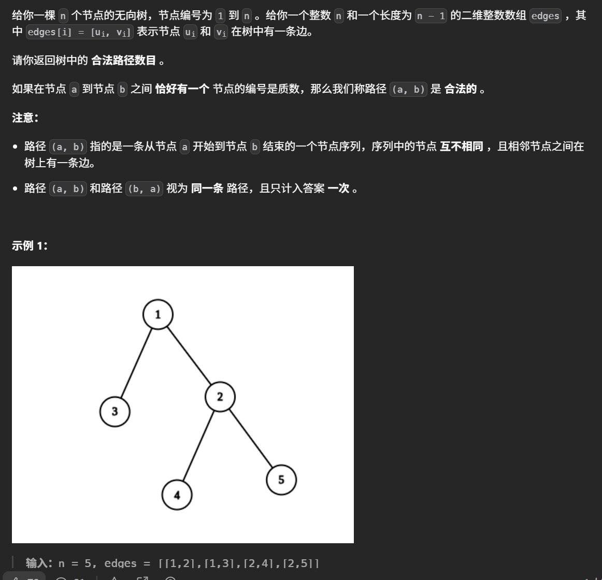

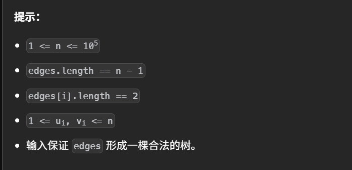

题目要求以路径中只包含一个质数，那么以质数划分图——考虑枚举每个质数将其邻居连接为一个并查集，计算这个连通块的大小，用乘法定理求出所有的可能。

考虑如图所示，求解所有可能的步骤是

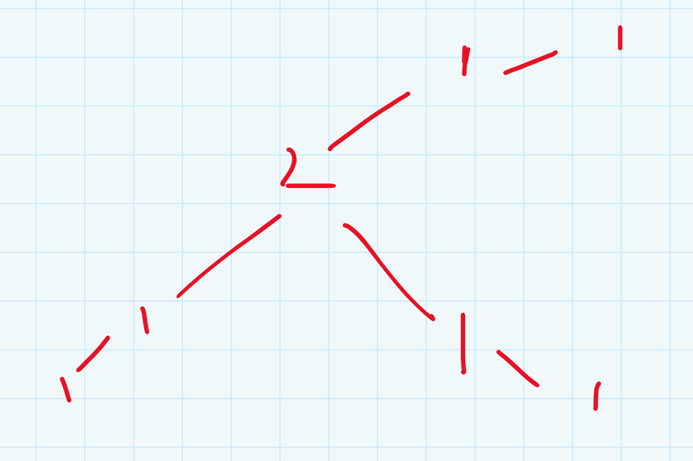

```python
t=0
s=uf.size[nx]
ans+=s # 质数本身可以作为一个端点
ans+=t*s # 邻居的连通块与已有的端点组合
t+=s  # 维护已有的集合
```

乘法定理的运用：一边累加一边累乘，这里并不是在一堆位置里选两个，而是维护合法的位置去选其他的


```python
MAX=10**6+1
is_prime=[True]*MAX
is_prime[0]=is_prime[1]=False
prime=[]
for i in range(2,MAX):
    if is_prime[i]:
        prime.append(i)
     # 要对每个数进行筛选，不是只对质数筛选，下面的循环要放到外面
    for p in prime:
        # 防止越界
        if p*i>=MAX:
            break
        is_prime[p*i]=False
        if i%p==0:
            break
from collections import deque,defaultdict
# 完整模板
# 迭代方式的find函数要配合size使用
class UF:
	...
class Solution:
    def countPaths(self, n: int, edges) -> int:
        g=[[] for _ in range(n+1)]
        uf=UF(n+1)
        ans=defaultdict(int)
        # 建图
        for u,v in edges:
            g[u].append(v)
            g[v].append(u)
        
        vis=[False]*(n+1)
        # 深搜
        def dfs(root):
            vis[root]=True
            for nx in g[root]:
                if not is_prime[nx] and not vis[nx]:
                    uf.union(root,nx)
                    dfs(nx)
        # 枚举质数
        for i in range(1,n+1):
            if is_prime[i]:
                vis[i]=True
                t=0
                # 将邻居连接为连通块
                for nx in g[i]:
                    # 邻居不能是质数
                    if not is_prime[nx]:
                        # 没访问过就深搜
                        if not vis[nx]:
                            dfs(nx)
                        # 乘法定理
                        s=uf.size[uf.find(nx)]
                        ans[i]+=s
                        ans[i]+=s*t
                        t+=s
        # 累加答案
        res=0   
        for i in range(1,n+1):
            if is_prime[i]:res+=ans[i]
        return res 
```


## [统计理想数组的数目](https://leetcode.cn/problems/count-the-number-of-ideal-arrays/)

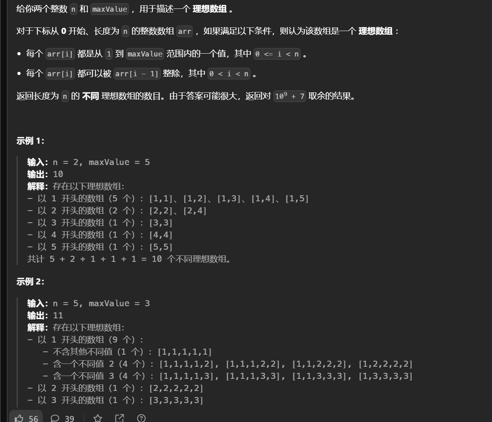


对于给定的数据范围，可以枚举最后一个值，当最后一个值为x时前面的所有数都是它的因数，从1开始要乘上x所有的质因数才能到x，因此把x的质因数作为倍率分配到n个位置上这样就可以确定一个理想数组，没有分配到的认为是1，问题变为从把n个球分为k组，一组的值可以是空的。


每个质因数之间不影响，因此要用乘法原理求出所有质因数组合的结果。

```python
# 现预处理出所有数的质因数
p=[[] for _ in range(10**4+10)]
for i in range(2,10**4+10):
    x=i
    for j in range(2,isqrt(i)+1):
        cnt=0
        while x%j==0:
            x//=j
            cnt+=1
        p[i].append(cnt)
    if x>1:
        p[i].append(1)
class Solution:
    def idealArrays(self, n: int, maxValue: int) -> int:
        mod=10**9+7
        ans=0
        # 枚举
        for i in range(1,maxValue+1):
            res=1
            # 结果是每个质数结果的乘积
            for k in p[i]:
                res=res*comb(k+n-1,k)%mod
            ans+=res
            ans%=mod                
        return ans
```


# 质数

## [Ringo's Favorite Numbers 3](https://atcoder.jp/contests/abc400/tasks/abc400_e)

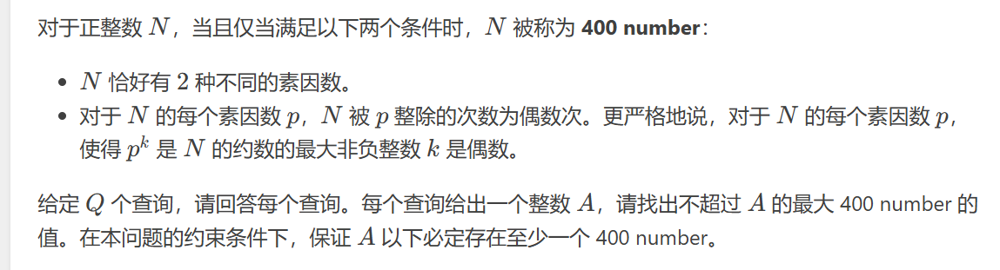

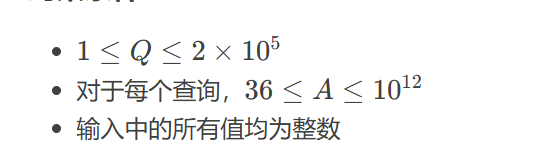

两个质数的偶数次方要在A的数据范围之内，则质数的范围必然不能超过1e6，因此可以筛出1e6内的质数，然后枚举幂次，因为保证A的范围<=1e12，那么只要pq幂次范围小于1e6就是满足要求的质数对，因此最多只有1e6种可能

对于给定的询问，二分查找即可

```python
MX=10**6+10
# 注意另一个质数的幂次可能比较小，一次一个质数的幂次范围可以更大一些，保证不超过1e6即可
p2=[i for i in range(1,21)]
prime=[]

# 质数筛
is_prime=[True]*MX
is_prime[0]=is_prime[1]=False

for i in range(2,MX):
    if is_prime[i]:
        prime.append(i)
    for p in prime:
        if i*p>=MX:
            break
        is_prime[i*p]=False
        if i%p==0:break
    
arr=[]
# 枚举质数对
for i in range(len(prime)):
    for j in range(i):
        base=prime[i]*prime[j]
        # 剪枝
        if base>10**6:break
        
        # 枚举不同的幂次
        for c1 in p2:
            if prime[i]**c1>10**6:break
            for c2 in p2:
                x=(prime[i]**c1)*(prime[j]**c2)
                if x>10**6:break
                arr.append(x**2)
                

arr.sort()
ans=[]
# 二分查找
for _ in range(R()):
    x=R()
    idx=bisect_left(arr,x+1)-1
    ans.append(arr[idx])

print(*ans,sep='\n')
```


## [完全子集的最大元素和](https://leetcode.cn/problems/maximum-element-sum-of-a-complete-subset-of-indices/)

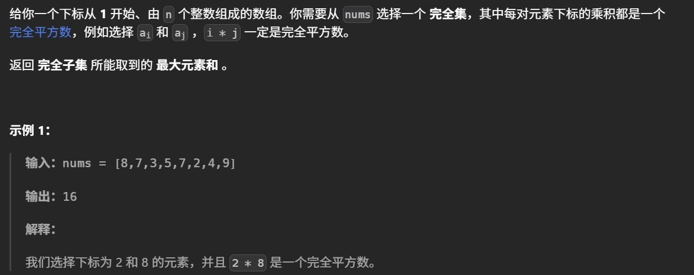

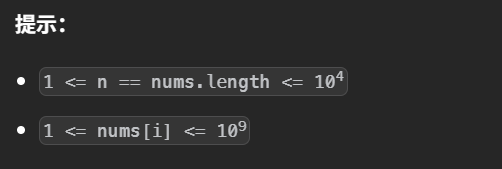


每对坐标的乘积是一个完全平方数，对于满足该条件的坐标，将其中的完全平方数剔除掉也仍然满足条件，因此把所有的坐标剔除其中的完全平方数得到core，只有core相等的一组数才能满足每对之间可以满足条件。

```python
MAX=10**4+10
is_prime=[True]*MAX
is_prime[0]=is_prime[1]=False

prime=[]
min_factor=[0]*MAX
min_factor[1]=1
for i in range(2,MAX):
    if is_prime[i]:
        prime.append(i)
        min_factor[i]=i
    for p in prime:
        if i*p>=MAX:break
        is_prime[i*p]=False
        min_factor[i*p]=p
        if i%p==0:
            break
from collections import defaultdict
class Solution:
    def maximumSum(self, nums) -> int:
        ans=0
        core=defaultdict(int)
        for i,x in enumerate(nums,1):
            # 求出坐标的质因数，剔除其中的完全平方数
            cnt=defaultdict(int)
            while i>1:
                cnt[min_factor[i]]+=1
                i//=min_factor[i]
            res=1
            # 计算剩下的core
            for k,v in cnt.items():
                if v&1:
                    res*=k
            # 累加
            core[res]+=x
            # 取最大
            ans=max(ans,core[res])
        return ans 
```

## [统计美丽子字符串 II](https://leetcode.cn/problems/count-beautiful-substrings-ii/)

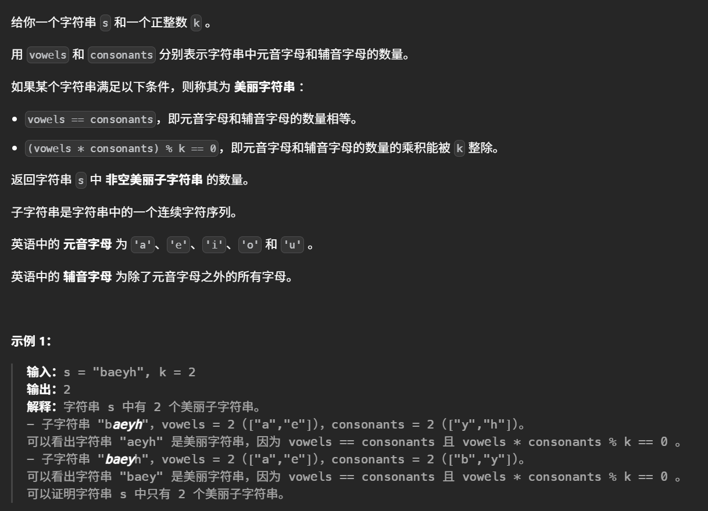

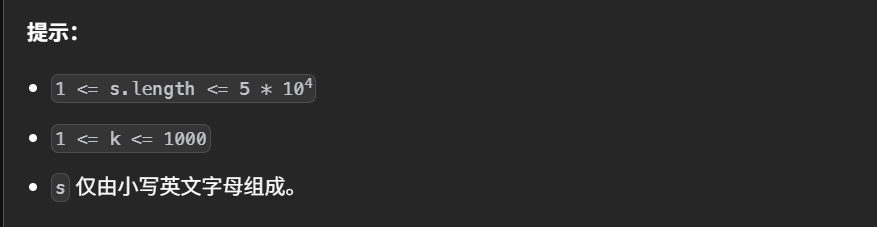

令元音为1，辅音为-1，要求元音的个数=辅音的个数那么前缀和等于0，也就是两个位置的前缀值相等，其中元音的个数=辅音的个数=(l-r+1)//2，就是坐标位置之差，令二者之和为L，那么对于条件二有

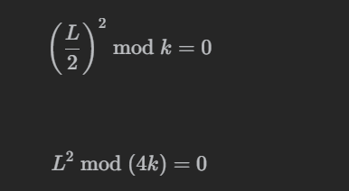

可以理解为整除，如果能将平方去除就好了

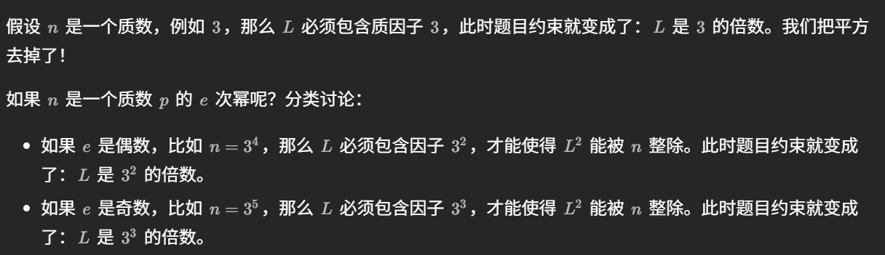

则条件二转换为L模4K转换后的结果。

每个位置记录它的下标模k‘和前缀值，遍历的过程中累加和它记录值一样的结果。


找两个前缀值相等——pre[r]=pre[l]实际对应的区间是[l,r-1]，由于每个位置记录的前缀值是pre[i+1]在求解时需要做转换。

如图所示，对于h，在找相等的pre的时候会对应到b（前缀和的偏移造成的），但实际上应该是a，此时要满足第二个条件j%k'==(i-1)%k'，如果找到的正确的a在满足条件二的时候还要再做偏移，所以就直接让每个j对应i-1位置

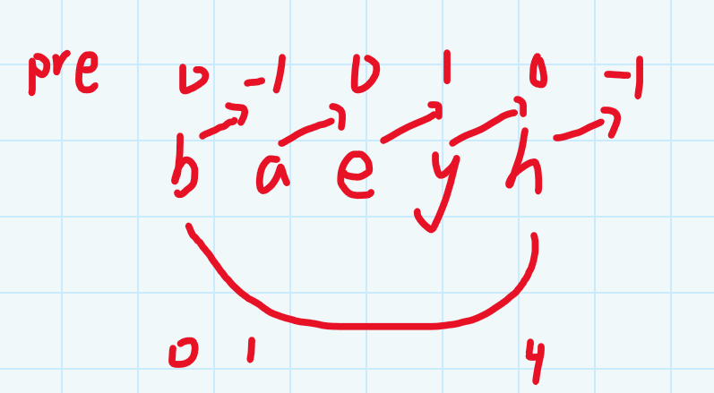

对于y它要找的i-1在遍历字符串s时不会更新，因此初始化时添加(k'-1,0)满足从0开始的子串。

```python
class Solution:
    def beautifulSubstrings(self, s: str, k: int) -> int:
        # 元音
        vowels={'a','e','i','o','u'}
        # 构造前缀和
        nums=[1 if c in vowels else -1 for c in s]
        pre=list(accumulate(nums,initial=0))
        k*=4
        
        tmp=k
        p=defaultdict(int)
        for i in range(2,ceil(k**0.5)+1):
            while tmp%i==0:
                p[i]+=1
                tmp//=i
        if tmp>1:p[tmp]+=1
        
        # 得到k'
        res=1
        for i,v in p.items():
            res*=i**ceil(v/2)
        memo=defaultdict(int)

        ans=0
        # 初始化
        memo[(res-1,0)]+=1
        for i,c in enumerate(s):
            p=(i%res,pre[i+1])
            ans+=memo[p]
            memo[p]+=1
        return ans 
```


## [About Dividing Numbers](https://codeforces.com/problemset/problem/1538/D)

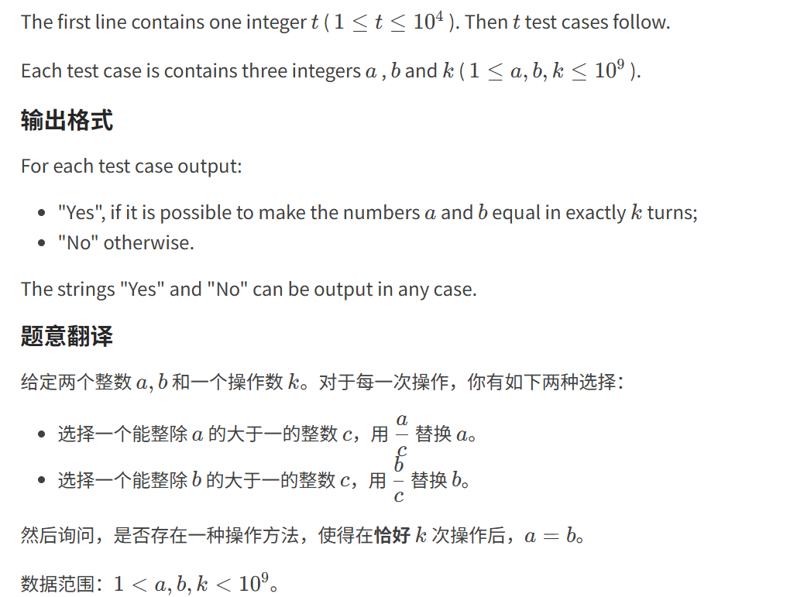

操作恰好K次，那么查询给定数的最大操作次数和最小操纵次数，如果K在其范围内则可以求解出。

最小操作次数：如果两个数相等，那么最小操纵次数就是0；求解x=gcd(a,b) 如果x=a或者x=b那么结果是1，反之等于2

最大操作次数：也就是两个数都变为1，那么操作次数就等于二者的质因数个数之和

参看给定的数据范围，不能直接判断质因数，这里求解最小质因子。因为值得范围到了10**9，所以求解出1e4.5范围内的质数(3000左右)，在判断质因数得时候直接遍历质数表，如果数值非常大会访问一遍表，对于给定的数据范围到1e7可以接受，注意这里不能直接求解1e5范围内的数(10\*\*4)会超时。

```python
MX=int(10**4.5)+10
is_prime=[True]*MX
prime=[2]
is_prime[0]=is_prime[1]=False

for i in range(3,MX,2):
    if is_prime[i]:
        prime.append(i)
        for j in range(i**2,MX,i):
            is_prime[j]=False


for _ in range(R()):
    a,b,k=RR()
    if k==1:
        if a!=b and (a%b==0 or b%a==0):
            print('YES')
        else:
            print('NO')
    else:
        mx=0
        for i in prime:
            if i>a:break
            while a%i==0:
                mx+=1
                a//=i   
             
        for i in prime:
            if i>b:break

            while b%i==0:
                mx+=1
                b//=i        
        if a>1:mx+=1
        if b>1:mx+=1  
        if k<=mx:
            print('YES')
        else:
            print('NO')
```


# 因数

## [GCD of Subset](https://atcoder.jp/contests/abc393/tasks/abc393_e)


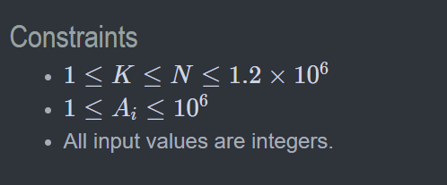

给定的数据范围无法求解每个数的因数，这里求解每个数可以作为序列中多少个数的因数，时间复杂度为O(nlogn)，为了得到最大的因数，倒序枚举，如果一个数可以作为至少k个数的因数，那么这个数的倍数（在序列中的）可以组成长度至少为k的最大GCD为该数的序列。

```python
n,k=RR()
nums=RR()
memo=Counter(nums)
cnt=defaultdict(int)

MX=10**6+10

# 预处理每个数作为因数的个数，时间复杂度为 nlongn
for i in range(1,MX):
    for j in range(i,MX,i):
        cnt[i]+=memo[j]

ans={}
# 找最大，倒序枚举
for i in range(MX,0,-1):
    # 满足条件
    if cnt[i]>=k:
        # 所有在序列中的倍数可以组成GCD为i的序列
        for j in range(i,MX,i):
            # 只保留最大
            if j not in ans:ans[j]=i
print(*[ ans[v] for v in nums])
```


##  [A · B Problem](https://www.luogu.com.cn/problem/P12174)

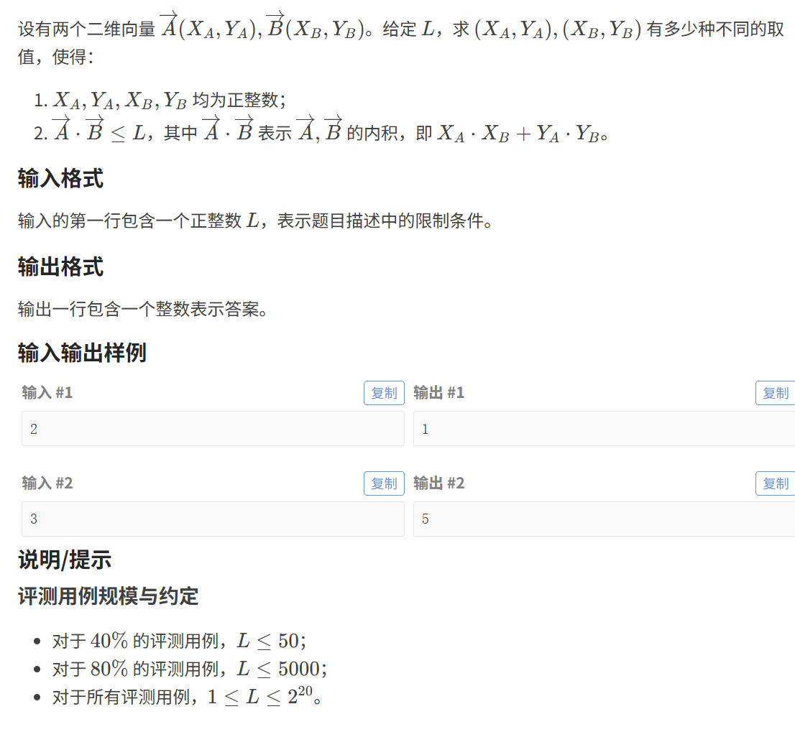


先考虑简化的问题，对于一个数L如何求出有多少个不同的乘积a*b等于它，这个问题就是在找L的因数。

原问题可以转换为先找X的因数个数再找Y(<=L-X)的因数个数，两两组合求解。L的范围在1e6，因此可以枚举X的值，对于所有的Y值可以前缀和求解。

现在问题是如何求解出1e6范围内所有的数的因数个数，如果枚举每一个数求因数会超时，这里用一种经典技巧——枚举所有的因数，对于每个因数枚举它的倍数，对这个倍数计数处理，可以证明的是这种做法的时间复杂度是nlogn，这样就找除了所有的因数。

```python
memo=defaultdict(int)

l=R()
# 枚举每个数的倍数，求解因数个数
for i in range(1,l+1):
    tmp=i
    while i<=l:
        memo[i]+=1
        i+=tmp

# 前缀和
pre=[0]
for i in range(1,l+1):
    pre.append(pre[-1]+memo[i])

ans=0
# 累加 x 和所有 <=n-x的组合
for i in range(1,l+1):
    ans+=pre[l-i]*memo[i]
print(ans)
```


## **9 Divisors**

给定一个整数*N*，请你求出1~ *N*中所有因数个数为9的数的个数。N<=4*10^12

因数个数可以由质因数的冥次求得，9=1\*9=3\*3，那么一个数如果满足条件，那么必然是x=$a^8$=$a^2b^2$的形式

首先找出范围内所有的质因数，质因数的上限一定是10^6

```python
n=R()

ans=0

MAX=10**6+10
# 记录这个数是不是质数，初始为True
is_prime=[True]*MAX
is_prime[0]=False
is_prime[1]=False
# 记录质数
prime=[]
# 对于给定的数据范围，从2开始找质数
for i in range(2,MAX):
    if is_prime[i]:
        # 如果是质数加入，并把他的冥次标记
        prime.append(i)
        # 这里的优化是设置步长并从i**2开始
        for j in range(i*i,MAX,i):
            is_prime[j]=False
i=2
while i<n and pow(i,8)<=n:
    if is_prime[i]:
        ans+=1
    i+=1


# 使用双指针来找
p=[v**2 for v in prime]
ll=len(p)
r=ll-1
for i,v in enumerate(p):
    while i<=r and p[r]*v>n:r-=1
    if i>=r:break
    ans+=r-(i+1)+1
print(ans)
```


## [统计可以被 K 整除的下标对数目](https://leetcode.cn/problems/count-array-pairs-divisible-by-k/)

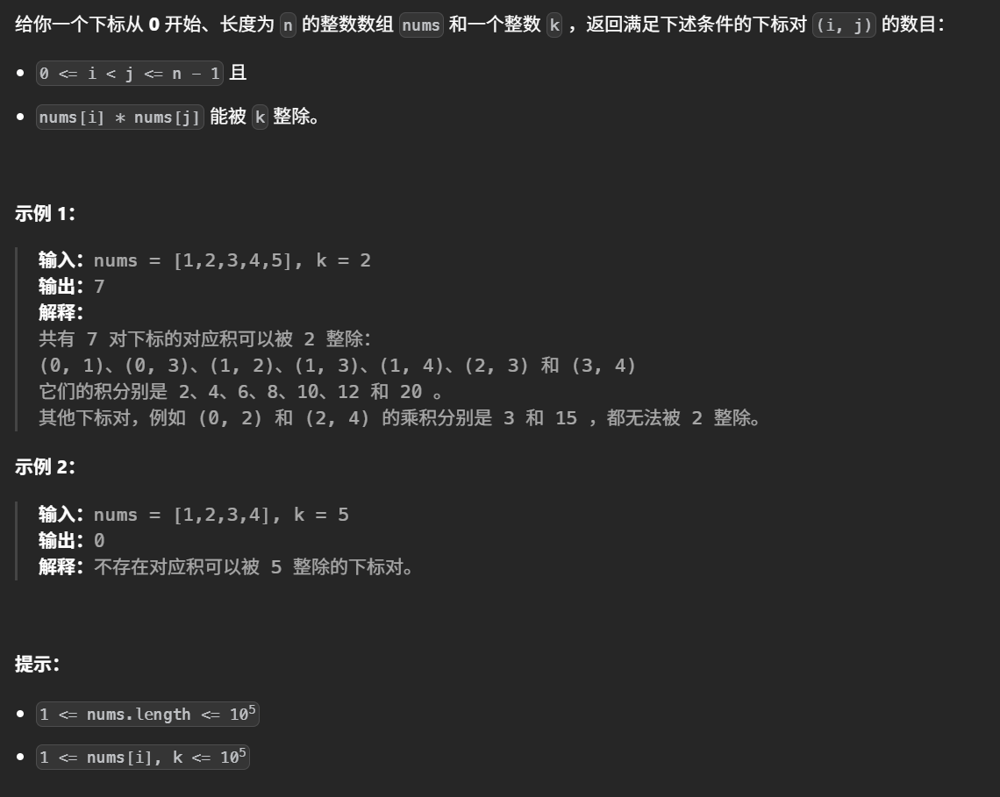

查找下标对，自然而然地固定nums[j]去找nums[i]，如果nums[j]的因数包含有k，那么贡献就是j，反之去看看是否能和nums[i]凑出k，先将k除去它和nums[j]的最大公因数，然后去前面找除后结果的倍数，因此维护枚举因数的倍数有多少个。

```python
MX=10**5+10
fac=[[] for _ in range(10**5+10)]
# 对一组数找因数需要用调和级数
for i in range(1,MX):
    j=i
    while j<MX:
        fac[j].append(i)
        j+=i

class Solution:
    def countPairs(self, nums: List[int], k: int) -> int:
        ans=0
        # 记录nums[i]的各个因数的倍数
        memo=defaultdict(int)
        for i,x in enumerate(nums):
            # 包含
            if k in fac[x]:
                ans+=i
            else:
                # 找倍数
                tmp=k//gcd(x,k)
                ans+=memo[tmp]
            # 更新
            for v in fac[x]:
                memo[v]+=1
        return ans 
```


# 最大公约数

## [判断一个点是否可以到达](https://leetcode.cn/problems/check-if-point-is-reachable/)

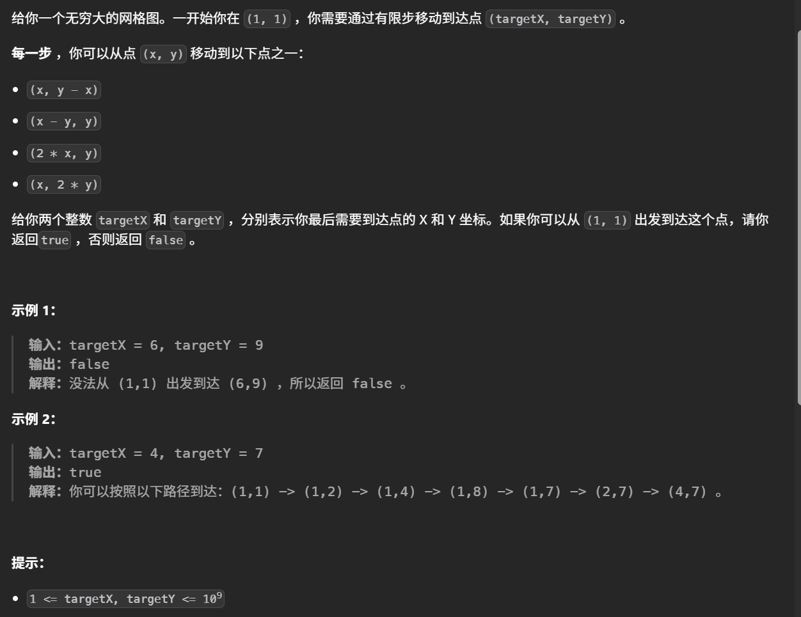


令g为x和y的最大公约数，那么经过(x-y,y)和)(x,y-x)操作变换后不会改变g，而第三和第四个操作会将最大公约数增大2的幂次，那么初始时x=y=1,那么g=1，只要最终的tx和ty的最大公约数是2的幂次那么就有解。


可以考虑构造具体的移动方案，这里乘法的可能性很多，但如果反过来做除法，那么就要求值必须是偶数，因此可以尝试从tx,ty反向操作得到1,1。如果其中存在偶数，就取整；如果都是奇数，当二者相同时无解，因为无论怎么操作都不会得到新的状态，反之将较大的数变为(x+y)//2；不断循环，直到得到两个1.

```python
class Solution:
    def isReachable(self, x: int, y: int) -> bool:
        while True:
            if x%2==0 and y%2==0:
                x//=2
                y//=2
            elif x%2==0:
                x//=2
            elif y%2==0:
                y//=2
            else:
                if x>y:
                    x=(x+y)//2
                elif x==y:return False
                else:
                    y=(x+y)//2
            if not x or not y:return False
            if x==y==1:return True 	
```


## [最大子数组 GCD 分数](https://leetcode.cn/problems/maximize-subarray-gcd-score/)

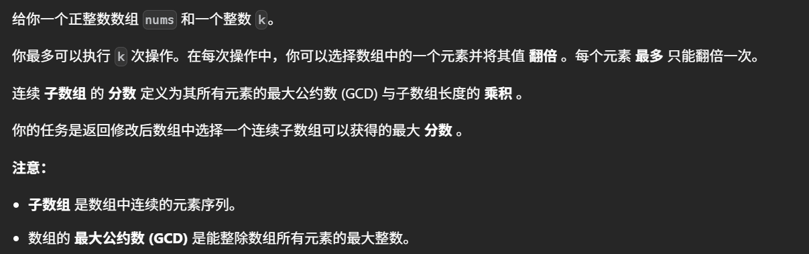

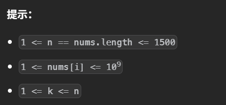

对于给定的数据范围可以枚举所有的子数组，一次操作可以将一个数乘2也就是2的质因数个数加一，如果可以将子数组中2的质因数个数最少的数都乘2，那么整个子数组的最大公因数就可以乘2，同时一个数只能操作一次，因此最大公因数最多增加一倍。

因此在枚举的过程中记录最小的2的质因数个数，同时记录有多少个，如果个数小于等于k，那么就可以将质因数翻倍。

可以通过lowbit求解2的质因数个数


```python
class Solution:
    def maxGCDScore(self, nums: List[int], k: int) -> int:
        n=len(nums)
        max=lambda x,y:x if x>=y else y
        ans=0
        for i in range(n):
            cnt=0
            pow2=inf
            g=-1
            for j in range(i,n):
                x=nums[j]
                lb=x&(-x)
                # 出现更少的2的质因数个数，重置
                if lb<pow2:
                    pow2=lb
                    cnt=1
                # 相等则累计
                elif lb==pow2:
                    cnt+=1
                
                g=x if j==i else gcd(x,g)
                ans=max(ans,g*(j-i+1))
                if cnt<=k:
                    ans=max(ans,g*2*(j-i+1))
                
        return ans
```


## [子数组的最大 GCD-Sum](https://leetcode.cn/problems/maximum-gcd-sum-of-a-subarray/)

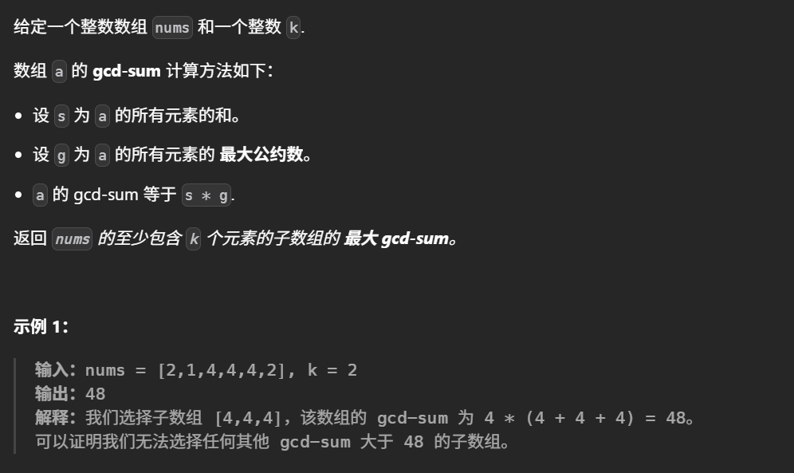

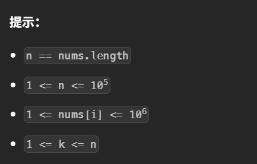

统计以每个元素作为左端点的子数组可以形成的最大的gcd-sum，这可以由前一位得到的状态推出来，同时gcd的个数有限，为了的最大的gcd-sum对于相同的gcd值一定是取右端点最大的，因此可以使用logtrick求解。这里只需要记录区间的gcd和右端点，数组元素的和可以通头当前的左端点和右端点求出来。

```python
class Solution:
    def maxGcdSum(self, nums, k: int) -> int:
        pre=list(accumulate(nums,initial=0))
        n=len(nums)
        memo=[]
        ans=0
        for idx in range(n-1,-1,-1):
            x=nums[idx]
            # 以当前位置作为区间右端点
            memo.append([nums[idx],idx])
            
            # 和之前的状态递推
            # 队列头维护的是以该点为左端点能得到的最小的gcd值
            for p in memo:
                p[0]=gcd(p[0],x)
            
            # 原地去重
            l,r=0,1
            while r<len(memo):
                if memo[l][0]!=memo[r][0]:
                    l+=1
                    memo[l]=memo[r]
                # 对于相同的不需要操作，因为l指向的gcd所代表的右端点更远
                r+=1
            del memo[l+1:]
            
            # 枚举更新答案
            for i,j in memo:
                if j-idx+1>=k:
                    ans=max(ans,i*(pre[j+1]-pre[idx]))
        return ans 
```


## [小红与gcd和sum](https://ac.nowcoder.com/acm/contest/112320/E)

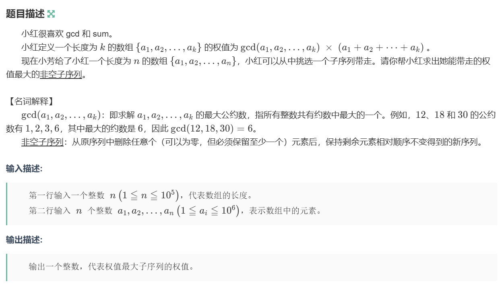

本题不要求子数组反而是简单了，因为不需要考虑元素的顺序结构，只需要计数即可。对于给定的数据范围，可以直接枚举最大公约数，然后调和级数枚举这个最大公约数的倍数更新答案，这些数的最大公约数不一定是枚举到的因数，但枚举到的因数是可以作为这些数的最大公因数。

```python
n=R()
nums=RR()
memo=Counter(nums)
mx=max(nums)
ans=0

for i in range(1,mx+1):
    s=0
    for j in range(i,mx+1,i):
        s+=memo[j]*j
    if s*i>ans:ans=s*i
print(ans)
```


## [查询排序后的最大公约数](https://leetcode.cn/problems/sorted-gcd-pair-queries/)

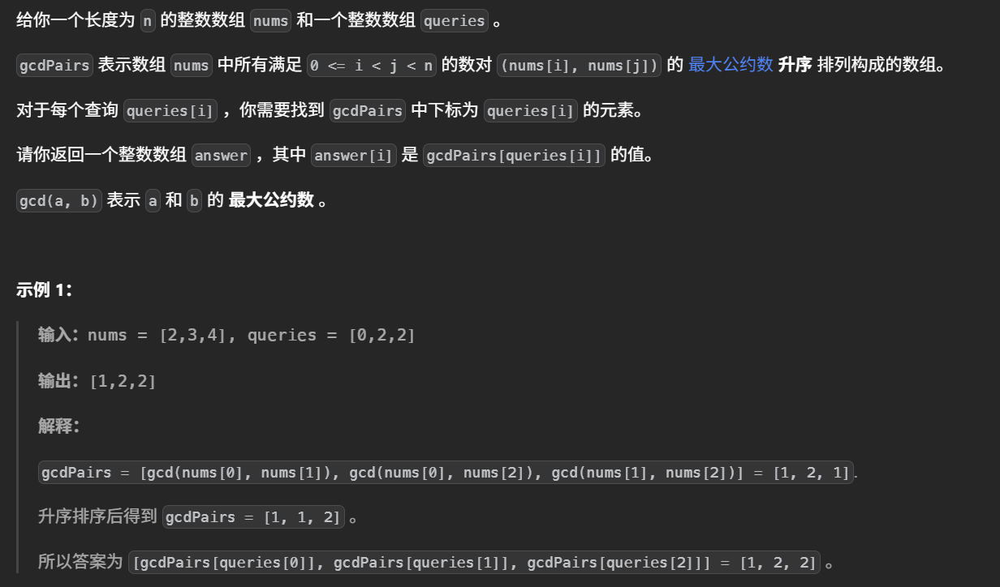

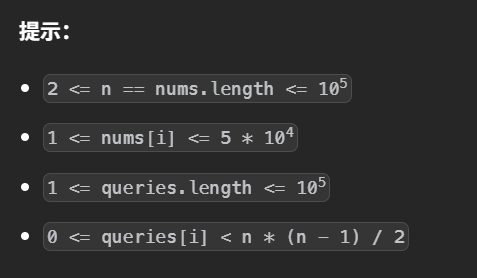

枚举所有可能的公约数，以2为例找出所有2的倍数，可以以2为公约数的个数等于comb(x,2)。但是数对中一部分会是以4，6，8...为公约数，因此根据容斥定理需要减去这部分数对的个数，通过调和级数枚举可以在给定的数据范围内求解出答案。

对于最大公约数所处的位置，可以通过前缀和求解。

```python
class Solution:
    def gcdValues(self, nums: List[int], queries: List[int]) -> List[int]:
        MX=max(nums)+1
        g=[0]*MX
        memo=Counter(nums)
        # 从大到小枚举最大公约数	
        for i in range(MX-1,0,-1):
            tmp=i
            # 记录以I为因数的个数
            c=d=0
            while tmp<MX:
                c+=memo[tmp]
                # 同时记录要减去的部分
                d+=g[tmp]
                tmp+=i
            g[i]=comb(c,2)-d
        
        pre=list(accumulate(g))
        ans=[]
        for x in queries:
            idx=bisect_left(pre,x+1)
            ans.append(idx)
        return ans 
```

## [序列中不同最大公约数的数目](https://leetcode.cn/problems/number-of-different-subsequences-gcds/)

​			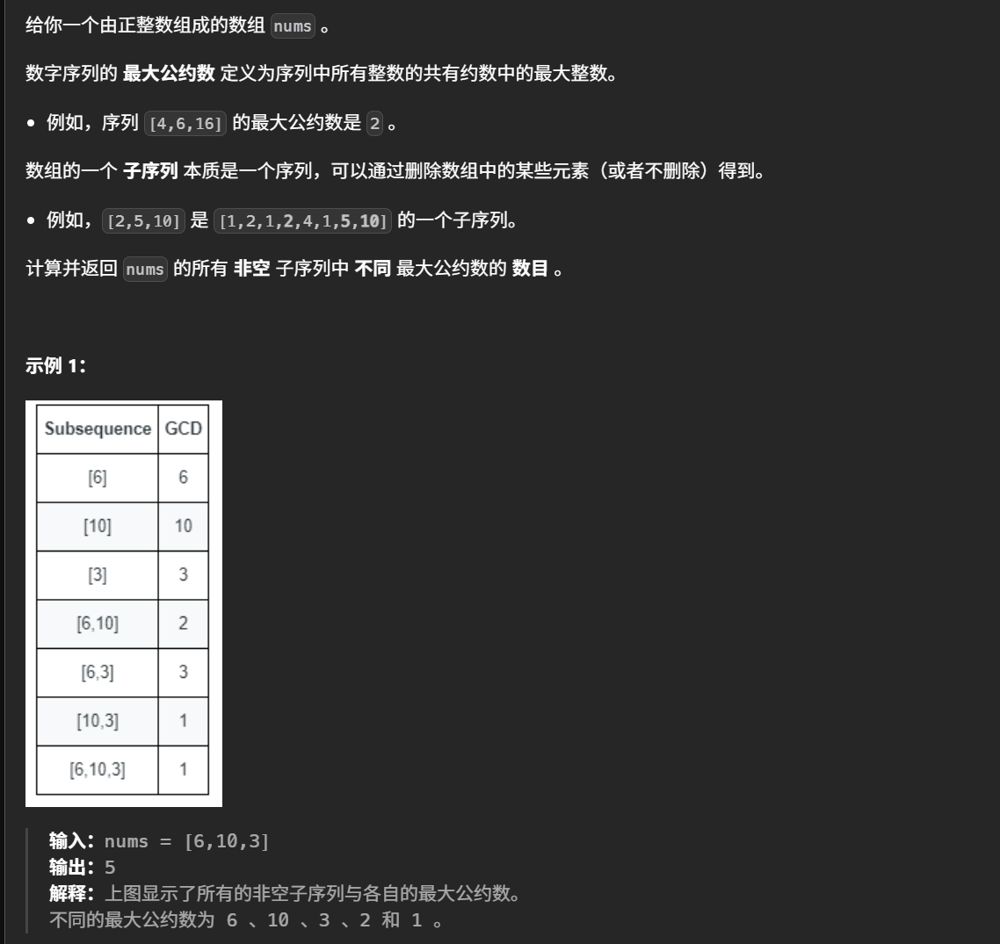	


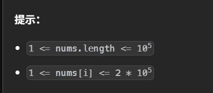

同样是枚举最大公因数，但是给定的数据范围不能跑满循环，这里根据gcd的性质(数越多gcd越小)提前判断，退出循环。

```python
from collections import Counter
class Solution:
    def countDifferentSubsequenceGCDs(self, nums) -> int:
        MX=max(nums)
        vis=set(nums)
        ans=0
        for i in range(1,MX+1):
            g=0
            for j in range(i,MX+1,i):
                if j in vis:
                    # 一直计算gcd
                    g=gcd(g,j)
                    # 找到答案提前退出
                    if g==i:
                        ans+=1
                        break
                    # 不会再变大了，提前退出
                    if g<i:break
        return ans 
Solution().countDifferentSubsequenceGCDs([6,10,3])
```

​	


# 根号分治

## [最小代价构造字符串](https://leetcode.cn/problems/construct-string-with-minimum-cost/)

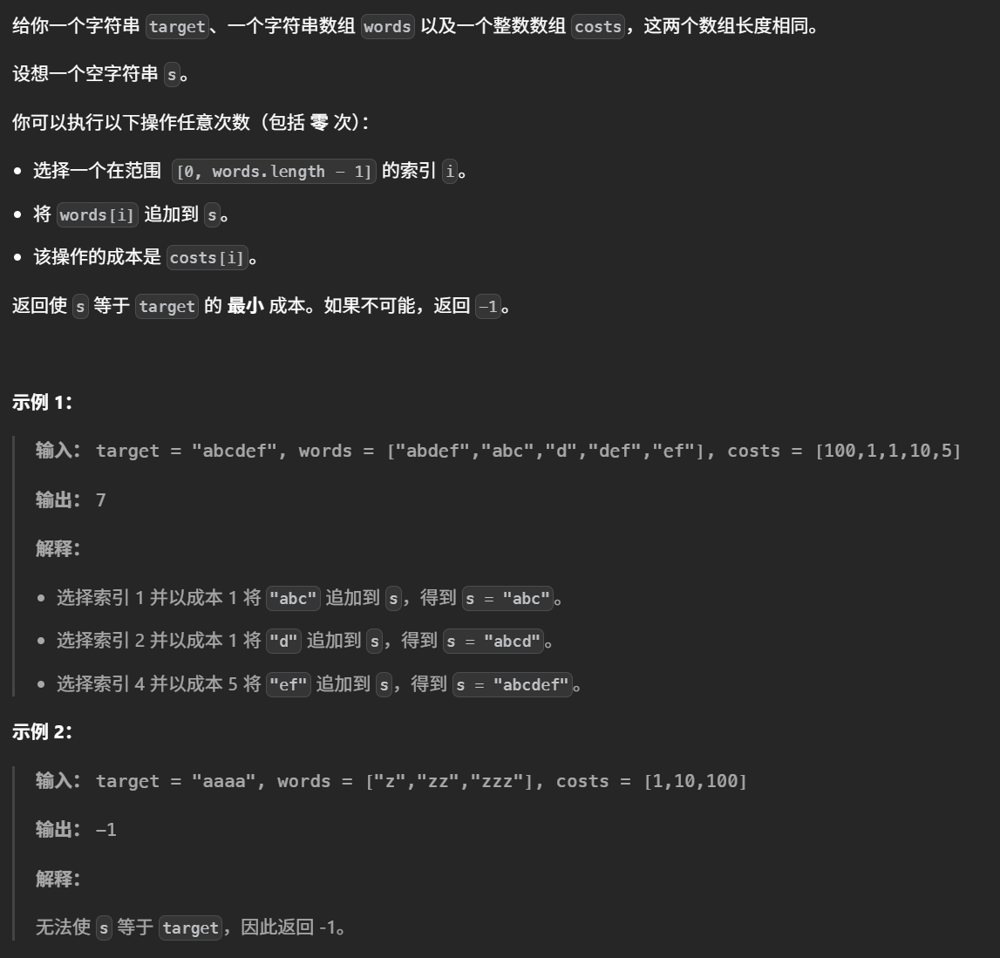

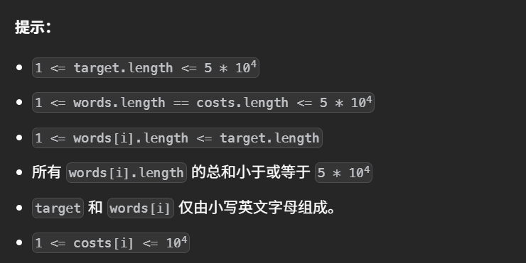

问题转换为选或不选，定义f[i]表示前缀i满足条件的最小代价，如果枚举位置j(j<i)，判断选或不选，时间复杂度是n^2，但实际上只需要枚举words中出现过的长度即可，如果words总长为L，那么最多只会出现sqrt(L)种长度，然后够使用字符串哈希判断即可。

```python
class Solution:
    def minimumCost(self, target: str, words: List[str], costs: List[int]) -> int:
        n=len(target)
        min_cost=defaultdict(lambda:inf)
        mod=1_070_777_777
        # 防止被hack
        BASE=randint(8 * 10 ** 8, 9 * 10 ** 8)
        P=[1]+[0]*n
        pre=[0]*(n+1)
        # 构建字符串哈希
        for i,c in enumerate(target):
            pre[i+1]=(pre[i]*BASE+ord(c))%mod
            P[i+1]=(P[i]*BASE)%mod
        # 对匹配串构造哈希值
        for i,word in enumerate(words):
            tmp=0
            for c in word:
                tmp=tmp*BASE+ord(c)
                tmp%=mod
            # 可能出现相同的匹配串，取最小
            min_cost[tmp]=min(min_cost[tmp],costs[i])
        # 只需枚举sqrt(L)种长度
        l_arr=sorted(set(map(len,words)))
        # DP求解
        f=[0]+[inf]*n
        for i in range(1,n+1):
            for sz in l_arr:
                # 剪枝
                if sz>i:
                    break
                sub_hash=(pre[i]-pre[i-1-sz+1]*P[sz])%mod
                # 手写min
                tmp=f[i-sz]+min_cost[sub_hash]
                if tmp<f[i]:
                    f[i]=tmp
        if f[-1]!=inf:return f[-1]
        return -1
```


# 鸽巢(抽屉)原理

**将N+1个球放到N个抽屉里，至少有一个抽屉会有两个(或以上)的球**

**将N个球放到K个抽屉里，只有会有一个分组有ceil(N/K)个个球**


1500个人中，至少有5个人生日相同——[1500/366]上取整，其中366可以看作是抽屉，15000个人则是球。


最经典的问题就是一个盒子里不能放同一种颜色的球，运用鸽巢原理，如果一种颜色的出现次数大于盒子的数量，那么一定无解。但即使满足了这个条件也不代表有解，考虑装球最少的盒子中球的数量为Y，令盒子数为N，出现次数为N的颜色的数量为X，如果X>Y一定无解，因为X必须满足最少的盒子中球的数量为Y的情况，所以多出的球一定会放到其他的盒子，那么就一定违反颜色不能重复的条件。


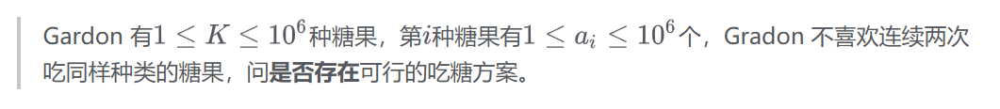

其中将个数最多的糖果看作是抽屉，那么一共有N个抽屉，其他剩余的糖果之和令为S

当S<N-1时必然无解，因为不够填入隔板中导致隔板相邻，上述队列方式，对于数量最多的这类糖果来说，其实是最优的构造方式。

反之，必然有解，可以将同一种的所有糖果依次放入抽屉，因为抽屉是数量最多的，因此必然能隔开所有的糖果且抽屉本身被隔开。

https://zhuanlan.zhihu.com/p/661206530


## 智乃想考一道鸽巢原理

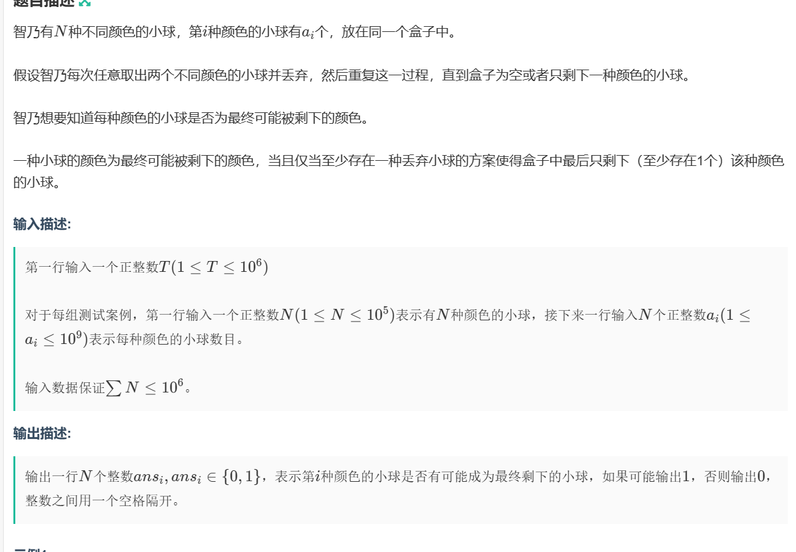

可以理解为每次选不同的糖果。对于某一个数，如果其他数中最大的能被剩下的数之和抵消掉就说明除了这个数以外的数都能被消掉（因为最大的都能被消掉），需要注意的是，如果其他数的总和是奇数那么必然会剩下一个，此时如果当前数是1那么会被抵消掉。如果最大的数抵消掉其他的数之和后小于当前的数，那么除了当前数的其他数都能被抵消掉。

```python
for _ in range(int(input())):
    n=int(input())
    t=0
    nums=[int(x) for x in input().split()]
    ans=[]
    # 特判只有一个数的情况
    if n==1:
        print(1)
        continue
    # 通过一次遍历找出最大的两个数以及总和
    mx1=mx2=-1
    for v in nums:
        if mx1<v:
            mx1=v
        elif mx2<v:
            mx2=v
        t+=v
    # 遍历每一个数
    for i in range(n):
        v=nums[i]
        res=0
        # 找出除了当前数外的最大数
        mx=mx2 if v==mx1 else mx1
	# 如果最大的数都能被消掉
        if t-v-mx>=mx-1:
            # 只有在其他数是偶数时才会没有剩余，否则会剩下一个，如果当前颜色的球刚好也是一个那么可以抵消。
            res=0 if v==1 and t%2==0 else 1
        else:
            # 如果其他的部分抵消后可以小于当前数
            res=int(v>mx-(t-v-mx))
        ans.append(res)
    print(*ans)
```

这个结论推导到一般的情况就是，如果每次要从数组中选取两个不同的数删去，如果最大的数（值出现频率）小于等于其他数（频率）之和那么最终数组会剩下1个数（如果数组的个数是奇数，否则全部都能删去），否则会剩下最大的数的频率减去其他数的频率之和个数。或者也可能是每次从数组中选两个不同的数将他们减小1之类的情况。


## [你可以工作的最大周数](https://leetcode.cn/problems/maximum-number-of-weeks-for-which-you-can-work/)

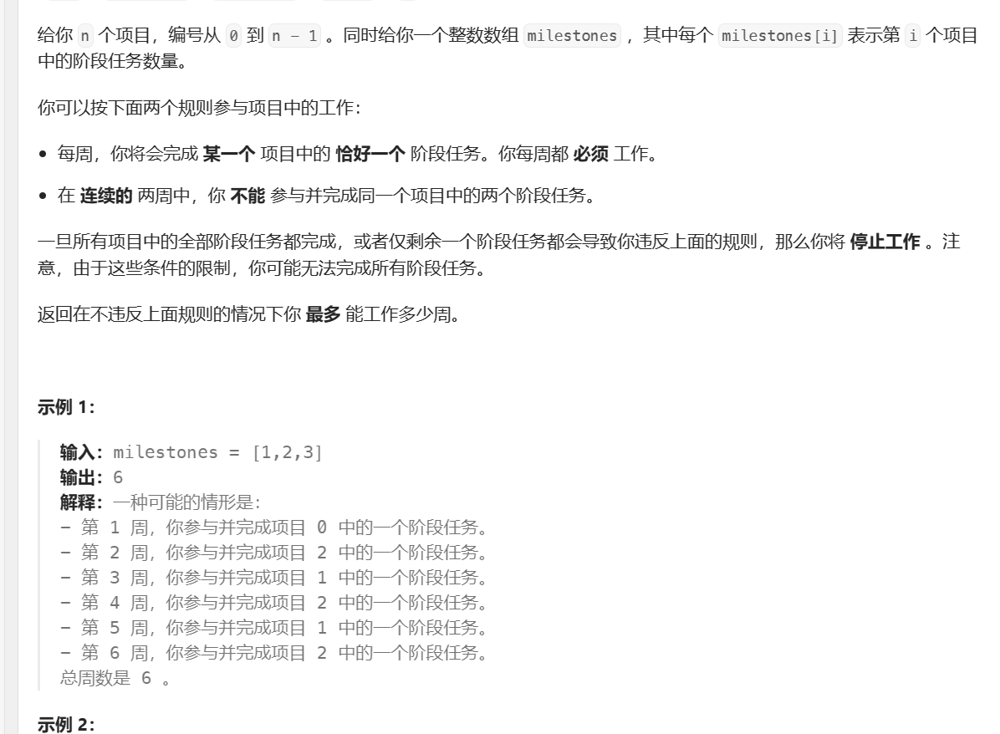

鸽巢原理的应用，不能在两周内连续操作一个项目，可以看作每次选两个不同位置的值减一

```python
class Solution:
    def numberOfWeeks(self, nums: List[int]) -> int:
        l=max(nums)
        t=sum(nums)
        # 所有的项目都可以被完成，奇数只是不能在每次取两个的情况下消除但这里只是模拟一次去一个
        if l<=t-l:
            return t
        else:
            # x y _ | x y _ | x _ _ | x _ _，可以完成(t-l)次，每一次代表的是两周，最后还能再合法的情况下还能完成一次
            return 2*(t-l)+1
```

## [使数组元素都变为零的最少操作次数](https://leetcode.cn/problems/minimum-operations-to-make-array-elements-zero/)

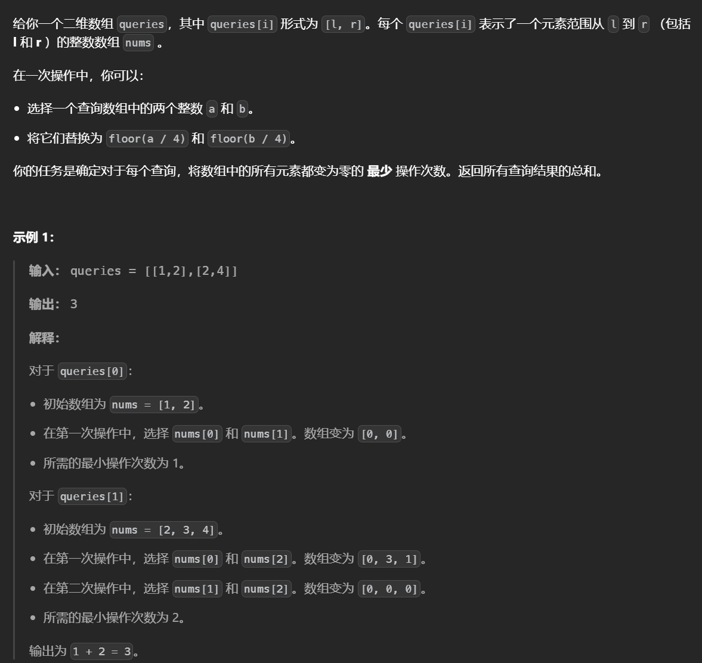

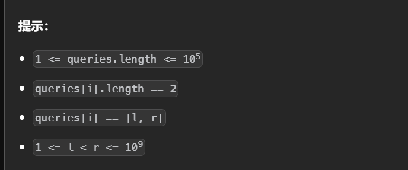

除四下取整相当于**左移两位**，因此先处理出每个范围所需要的操作次数，将数字按照4的幂分组，则有p=[0,1,4,16....]然后计算出每个分割点对应的前缀和pre[i]

对于给定的一组数[1,2,2,2,4,4,4,4...]每次可以选择**两个不同的数减小一**，问所需的最小操作次数。令N为最大的操作次数，S为剩余的操作次数总和，如果可以两两取完即**S>=N-1**那么操作次数就是**总和/2上取整(奇数额外操作一次)**，否则就是**从N中取S个与剩余的S匹配，然后剩下的N-S自己减一不断减小。**

```python
p=[0,1]
pre=[0,1]
i=4
while i<10**9+10:
    pre.append(pre[-1]+(i-p[-1]-1)*(ceil(p[-1].bit_length()/2))+ceil(i.bit_length()/2))
    p.append(i)
    i*=4
class Solution:
    def minOperations(self, queries: List[List[int]]) -> int: 
        ans=0
        for l,r in queries:
            # 前缀和的方式，左区间-1
            l-=1
            # 二分找范围i
            a=bisect_left(p,r+1)-1
            b=bisect_left(p,l+1)-1
            r=pre[a]+(r-p[a])*ceil(r.bit_length()/2)
            l=pre[b]+(l-p[b])*ceil(l.bit_length()/2)
            # 求出总的操作数
            s=r-l
            n=ceil(r.bit_length()/2)

            if s<n-1:ans+=(s+n-s)
            else:ans+=int(ceil(s/2))

        return ans 
```


# 公式变形

## [Cubes](https://atcoder.jp/contests/abc397/tasks/abc397_d)

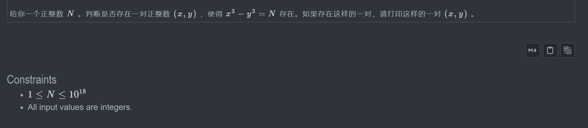

拆开公式后还要做一些变化

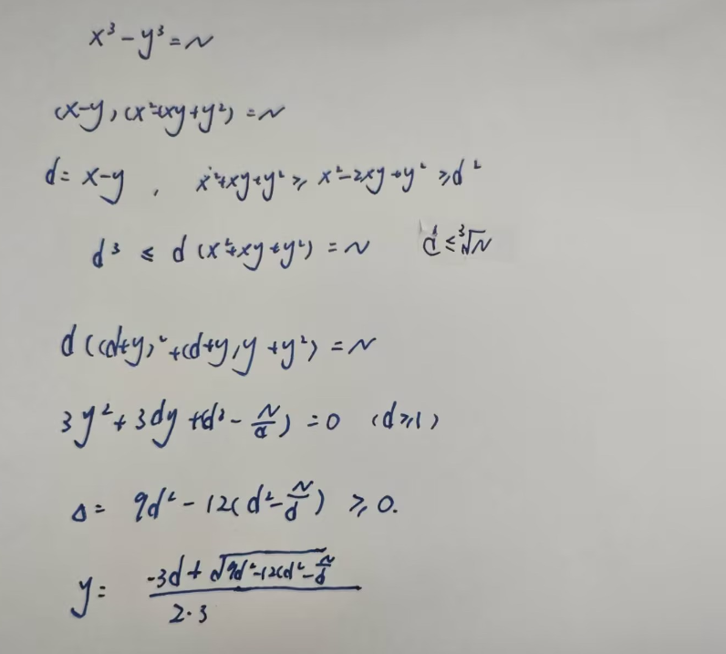


因此可以在立方N的时间复杂度下枚举d，然后用求根公式快速求解y值

```python
n=R()
l,r=1,ceil(pow(n,1/3))
for d in range(1,r+1):
    # 需要保证有整数解
    if n%d==0 and (theta:=9*d**2-12*(d**2-n//d))>=0 and isqrt(theta)**2==theta and (isqrt(theta)-3*d)%(2*3)==0:
        y=(isqrt(theta)-3*d)//(2*3)
        if not y:continue
        x=y+d
        print(x,y)
        break
else:
    print(-1)
```


# 组合数学

## [小红开灯(easy)](https://ac.nowcoder.com/acm/contest/107000/C)

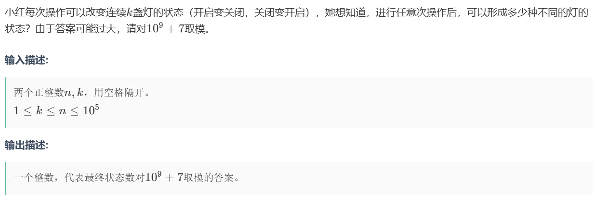

每次只能操作连续k个，那么一共可以操作n-k+1次，总的状态数就是1<<(n-k+1)

## [小红开灯(hard）](https://ac.nowcoder.com/acm/contest/107000/D)	

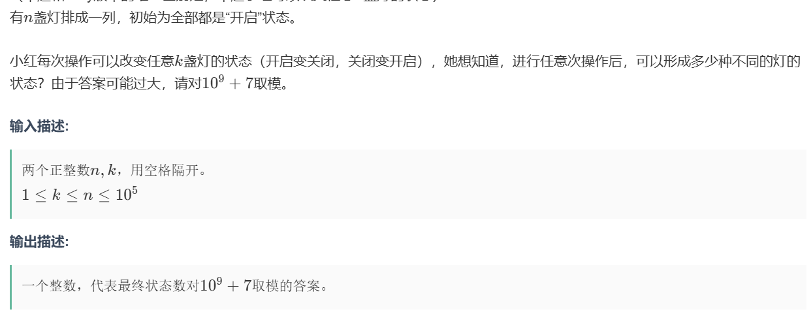

一次任意操作k盏灯，那么可以推出两次操作可以改变两盏灯——重复处理k-1个相同位置

当k为奇数时，因为可以通过两次操作改变两盏灯，那么可以通过奇数和偶数搭配来改变一个位置，因此k为奇数时可以修改任意一个位置，答案就是1<<n

当k为偶数时，只能做到修改偶数个位置，那么问题变为从n个位置选偶数个位置有多少选法，结果就是**1<<(n-1)**，k为奇数也可以看作是从n个位置中选**奇数个和偶数个的选法**。

```python
n,k=RR()
mod=10**9+7
if n==k:# 特判
    print(2)
    exit(0)
if k&1:
    print(pow(2,n,mod))
else:
    print(pow(2,n-1,mod))
```


## [排列序列](https://leetcode.cn/problems/permutation-sequence/)

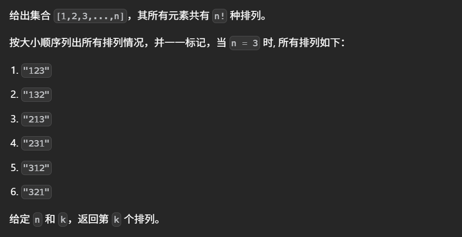

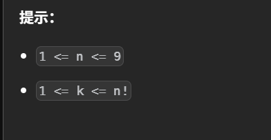

考虑第一个位置：

- 以1为a1的排列共有(n-1)!
- 以2为a1的排列共有(n-1)!
- 以3为a1的排列共有(n-1)!

那么当k<=(n-1)!时，首位一定选1，如果(n-1)<=k<=2*(n-1)!则选2...

对于剩下的位置也是同样的操作

```python
from math import factorial as f
class Solution:
    def getPermutation(self, n: int, k: int) -> str:
        ans=''
        # 选过的数字
        vis=set()
        for i in range(1,n+1):
            # 边界
            l,r=1,f(n-i)
            for c in range(1,n+1):
                if c in vis:continue
                if l<=k<=r:
                    ans+=str(c)
                    vis.add(c)
                    # 更新k，l-1是选c时能超过的值，将下一个位置当作首位
                    k-=l-1
                    break
                l+=f(n-i)
                r+=f(n-i)
        return ans  
```


这种做法称为康托展开，用于求排列属于第排列中的第几个


```python
from sortedcontainers import SortedList as sl
mod=10**9+7
f=[1]
# 预处理阶乘
for i in range(1,10**5+10):
    f.append(f[-1]*i)
    f[-1]%=mod

class Solution:
    def getPermutationIndex(self, perm: List[int]) -> int:
        n=len(perm)
        # 有序集合求解某个位置的值在剩余的数中排第几个
        p=sl()
        ans=0
        for i,x in enumerate(perm,1):
            # 对于值3，如果1已经被用过了，那么3的范围在(f(n-i),2*f(n-i))
            idx=p.bisect_left(x+1)-1
            idx+=1
            # 左边界
            l=(x-idx-1)*f[n-i]+1
            p.add(x)
            # 已经大于的个数
            ans+=l-1
            ans%=mod
        return (ans)%mod
```


## [最小回文排列 II](https://leetcode.cn/problems/smallest-palindromic-rearrangement-ii/)

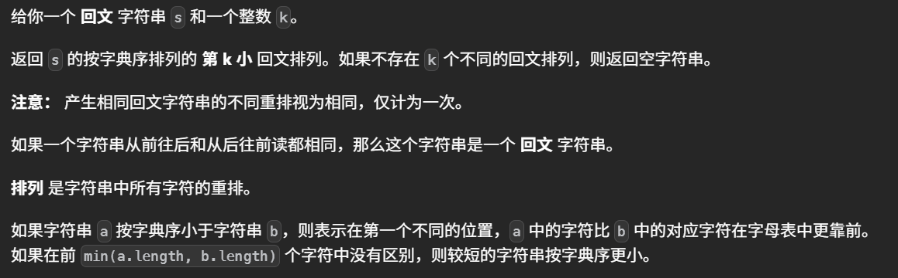

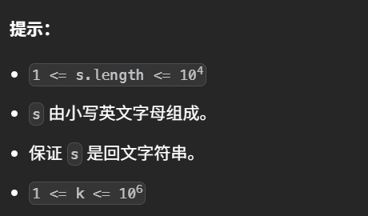


和上一题一样康托展开，但是本题中有重复元素会出现重复序列，计算时不能单纯用阶乘。

想要不重不漏的统计需要用到组合数，即在sz中取2，sz-2中取3....

```python
class Solution:
    def smallestPalindrome(self, s: str, c: int) -> str:
        n=len(s)
        m=n>>1
        # 回文串只需要考虑一半
        memo=Counter(s)
        odd=''
        cnt=defaultdict(int)
        for k in memo.keys():
            if memo[k]&1:
                # 找到奇数
                odd=k
            if memo[k]>1:cnt[k]+=memo[k]//2

        ans=[]
        # 遍历每个位置
        for i in range(1,m+1):  
            # 排序
            arr=sorted(cnt.keys())
            
            # 从小到大遍历每个字母
            for k in arr:
                cnt[k]-=1
                # 用完了就删除，防止计算组合数时用到
                if not cnt[k]:del cnt[k]
                
                # 以字母k为首能组成多少个排列
                tmp=1
                
                # 剩余位置
                mm=m-i
                
                for kk,v in cnt.items():
                    # 不重不漏地统计，注意是累乘
                    tmp*=comb(mm,v)

                    # 可选的位置减小
                    mm-=v   

                    # 需要只要满足条件就退出，否则会超时
                    if tmp>c:break
                
                if c<=tmp:
                    ans.append(k)
                    break

                # 下一个字母组成的序列包含tmp个，因此减去
                c-=tmp
                # 恢复
                cnt[k]+=1
            
            else:
                # 找不到
                return ''
            
        ans=''.join(ans)
        if odd:
            return ans+odd+ans[::-1]
        return ans+ans[::-1]
```


## [给小朋友们分糖果 II](https://leetcode.cn/problems/distribute-candies-among-children-ii/)

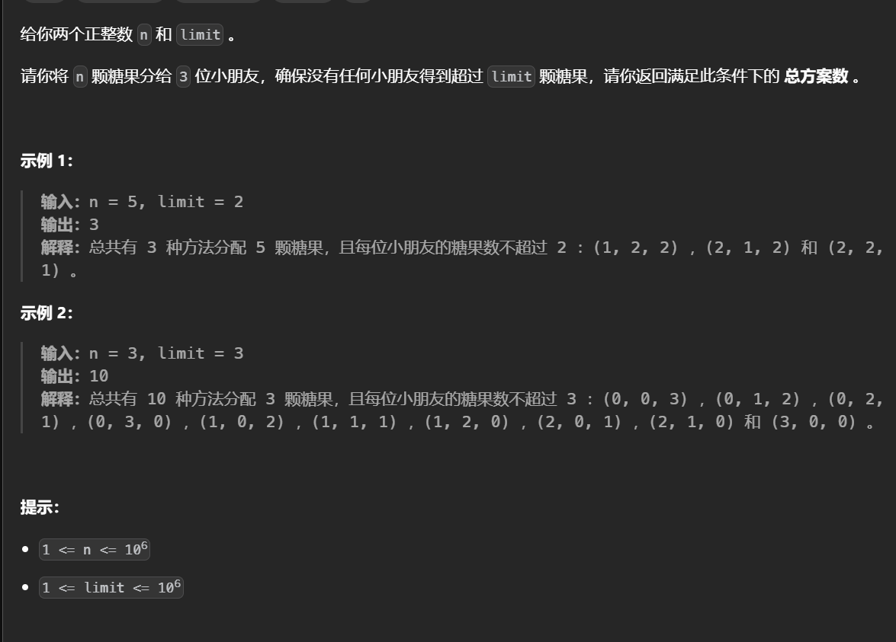


暴力的做法，直接枚举第一个人分到的糖果数，而后对于剩余的糖果数看后两个人是否能分。

```python
class Solution:
    def distributeCandies(self, n: int, limit: int) -> int:
        ans=0
        # 注意第一个人不能取出超过总数和限制的糖果数
        for i in range(min(limit,n)+1):
            value=n-i
            # 如果剩下的两个人取满了都无法划分
            if value>2*limit:continue
            # 可以在[0,value]中任意取，这里糖果不区分，所以只有取一个两个...的不同，一共有value+1中取法包括0
            elif value<=limit:
                ans+=value+1
            # 不能任意取，一个人最少取value-limit（另一个人取满，如果不去value-limit是不会满足要求的）
            elif value<=2*limit:
                t=limit-(value-limit)+1
                ans+=t
        return ans 
```


利用容斥原理，三个人都不超过limit的个数=总数-至少有一个人超过limit 

把n个取放入3个不同的箱子中，利用隔板法求解。这里可以让箱子为空，因此两边可以插板子并且同一个位置可以插板子。

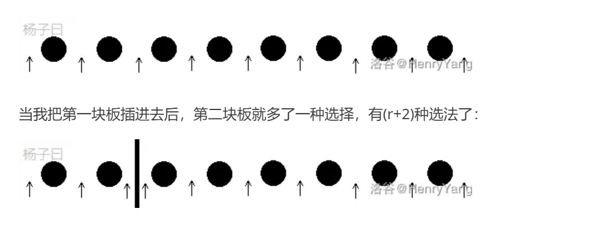

如图所示，插第一个板子的时候有n+1种方法，插第二个板子的时候会多出一个位置，即在上一个板子的左右。

**总结，在n个球中插入k-1个板子(即k个箱子)共有$$C_{n+k-1}^{k-1}$$**，和第二类斯特林数不同的地方在于，这里的球是相同的。

令A表示第一个人超过了，B表示第二个人超过了，C表示第三个人超过了，那么所有不满足的情况为|A+B+C|，其中会出现重复的情况：

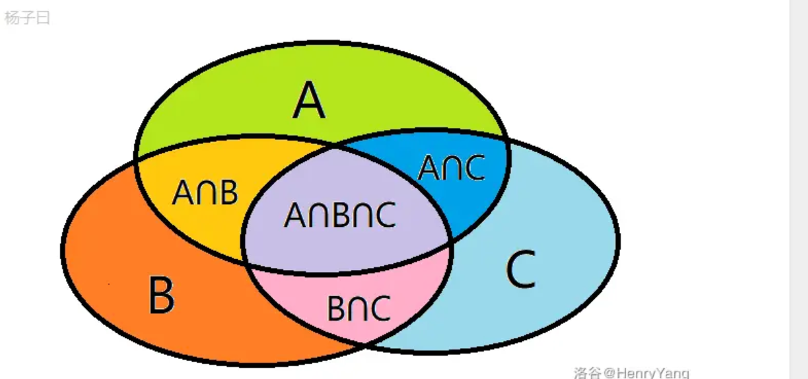

根据容斥原理有

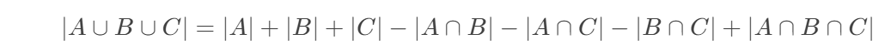

其中A交B为两个人超过了，A交B交C表示三个人都超过了

```python
class Solution:
    def distributeCandies(self, n: int, limit: int) -> int:
        # 这里k=3所以公式直接返回
        def cal(x):
            return x*(x-1)//2 if x>1 else 0
        # 总数 n+k-1
        tt=cal(n+2)
        # 至少一人，A+B+C，已经划分了limit+1个，在剩下的球中继续划分                                                   
        a=3*cal(n-(limit+1)+2)
        # 至少两人，两两相交
        b=3*cal(n-2*(limit+1)+2)
        # 三个人相交
        c=cal(n-3*(limit+1)+2)
        return tt-(a-(b-c))
```


## Devu and Flowers

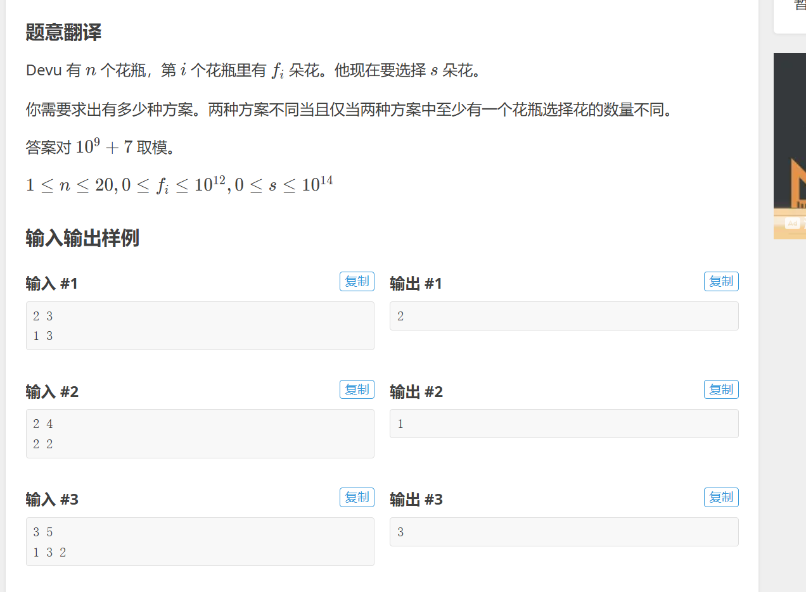


**看作是有s个球往n个箱子中放（一个花瓶中不能取出超过它所持有的花的数目），每个箱子中的球不能超过nums[i]个。**

用总的减去不合法的状态，不合法的状态是至少有一个箱子超出了限制(全都不超出的反面，1超出了+2超出了+加3超出了...其中会出现很多重复的)，利用容斥原理计算。

枚举n的子集，偶数个是减法操作，奇数个是加法操作。

```python
from functools import lru_cache

n,s=[int(x) for x in input().split()]
nums=[int(x) for x in input().split()]
mod=10**9+7

# 求逆元，需要保存结果，这个过程还是比较费时的
@lru_cache(maxsize=None)
def inv(x):
    return pow(x,mod-2,mod)
# 计算组合数，这里下面的数较大，上面的数较小可以直接计算
def cal(l,r):
    res=1
    for i in range(1,r+1):
        res=res*l%mod
        l-=1
    for i in range(1,r+1):
        res=res*inv(i)%mod

    return res
# 求出总的
ans=cal(s+n-1,n-1)
# 枚举所有子集，从1开始
for i in range(1,1<<n):
    cnt=0
    total =s
    # 查找出选取了状态
    for j in range(n):
        if i>>j&1:
            total-=nums[j]+1
            cnt+=1
    # 不合法
    if total<0:continue
    # 判断是奇数还是偶数，与ans做计算时符号要变化
    if cnt&1:ans=(ans-cal(total+n-1,n-1))%mod
    else:ans=(ans+cal(total+n-1,n-1))%mod
print(ans)
```

## [统计好整数的数目](https://leetcode.cn/problems/find-the-count-of-good-integers/)

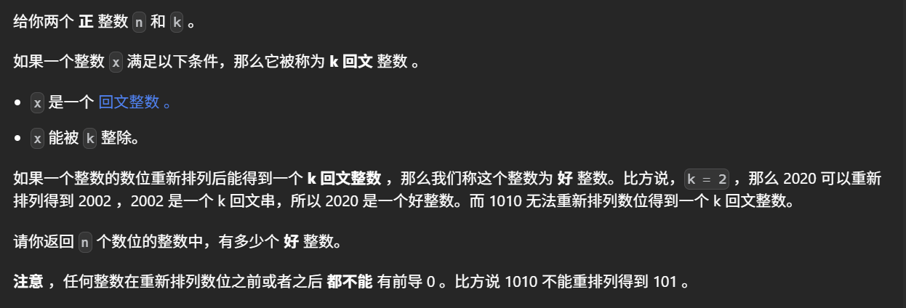

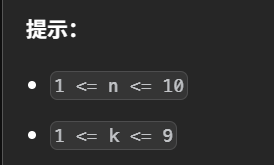

找那些数可以通过变化称为一个K回文数较为困难，这里的做法是枚举所有的回文串，对于合法的回文串(能整除k)去找有多少种数可以通过排列得到这个回文串，存在回文串是相同的——各个数字出现次数相同，这会导致重复统计，因此通过对回文串排序用哈希表去重。对于一个合法的回文串，能得到它的数字只需满足首位不为0即可。

```python
class Solution:
    def countGoodIntegers(self, n: int, k: int) -> int:
        # 回文串开始的左部
        base=10**((n-1)//2)
        # 对于同一种回文串防止重复统计
        vis=set()
        ans=0
        @cache
        def f(x):
            if x<=1:return 1
            return x*f(x-1)
        for s in range(base,10*base):
            s=str(s)
            # 构造回文串
            if n&1:s=s[:-1]+s[::-1]
            else:s=s+s[::-1]
            # 满足条件
            if int(s)%k:continue
            s=''.join(sorted(list(s)))
            if s not in vis:
                vis.add(s)
                memo=Counter(s)
                # 首位不能是0，其他位置可以随意
                res=f(n-1)*(n-memo['0'])
                # 去掉重复结果
                for v in memo.values():res//=f(v)
                ans+=res
        return ans 
```


## [生成乘积数组的方案数](https://leetcode.cn/problems/count-ways-to-make-array-with-product/)

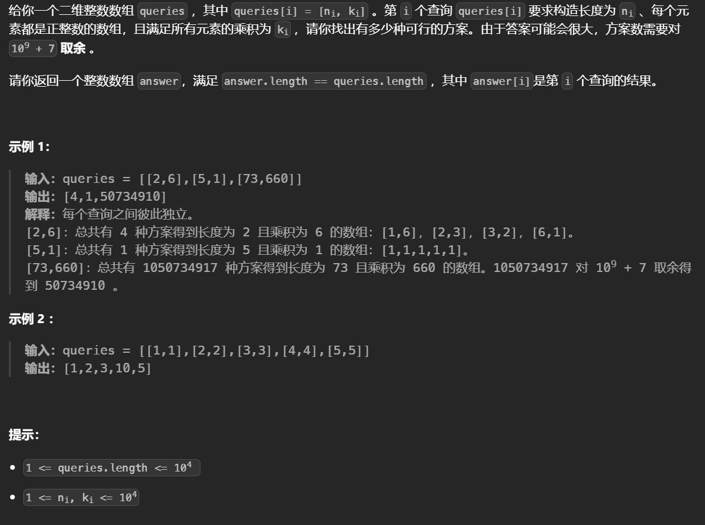

**对x找一组数，这组数的乘积为x，则这组数是x的质因数。**

对于本题而言，找出k所有的质因数，$2^3$拆开为3个2，就这样分为n组（多个数可以放到一组，比如两个2相当于4，空的相当于1）


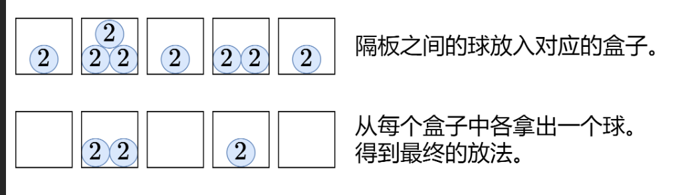


这里允许(3,2),(2,3)为不同的组也就是说两种质数各个质因数之间相互独立，可以用求出**每种质因数**的划分方案数在用乘法原理求解。

```python
# 打表，质因数个数不会超过20个，下标由于要加上l-1所以会比较大
# 注意下述表不是dp而是组合数公式
mod=10**9+7
dp=[[0]*20 for _ in range(10100)]
for i in range(10100):
    for j in range(20):
        if not j:dp[i][j]=1
        else:dp[i][j]=(dp[i-1][j-1]+dp[i-1][j])%mod
        
class Solution:
    def waysToFillArray(self, queries: List[List[int]]) -> List[int]:
        ans=[]
        for l,v in queries:
            res=1
            # 找质因数
            for i in range(2,isqrt(v)+1):
                n=0
                while v%i==0:
                    v//=i
                    n+=1
                # 每个质因数单独求解，原本为C（b+l-1,l-1）但是为了减小打表的范围，改为n
                res=res*dp[n+l-1][n]%mod
            if v>1:
                # 还剩一个，按照公式可以直接乘
                res=res*l%mod
            ans.append(res)
        return ans 
            

```

## 祥子拆团

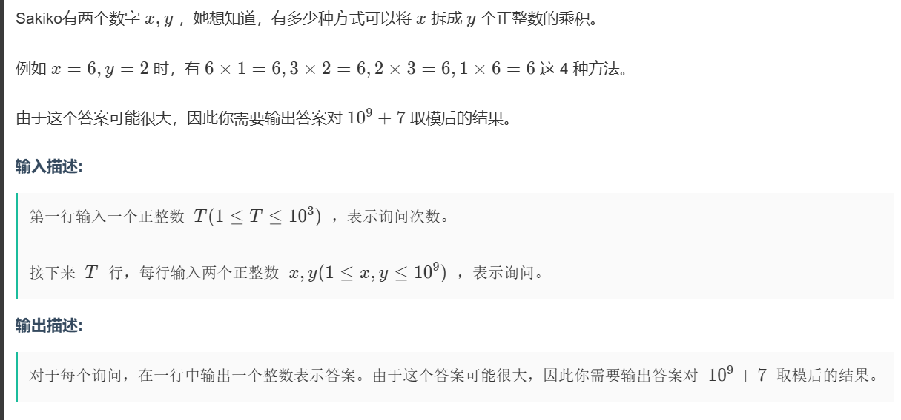

实际上也就是把x的质因数放到y个盒子里去，同时1*6和6\*1被视为是两个不同的那么就需要每种质数单独计算最后用乘法定理求解。

```python
import sys
from math import inf, ceil, comb

input=sys.stdin.readline
mod=10**9+7

p=[]
MX=(10**4)*5
is_prime=[True]*MX
# 找出所有的质数
for i in range(2,MX):
    if is_prime[i]:
        p.append(i)
        for j in range(i**2,MX,i):is_prime[j]=False

n=len(p)

for _ in range(int(input())):
    x,y=[int(x) for x in input().split()]
    res=1
    i=0
    # 使用打表的分解质因数可以更快
    while x>1 and i<n:
        v=p[i]
        if x%v==0:
            cnt=0
            while x%v==0:
                x//=v
                cnt+=1
            res*=comb(cnt+y-1,cnt)
            res%=mod
        i+=1
    if x>1:
        res*y
        res%=mod
    print(res)
```

## [统计恰好有 K 个相等相邻元素的数组数目](https://leetcode.cn/problems/count-the-number-of-arrays-with-k-matching-adjacent-elements/)

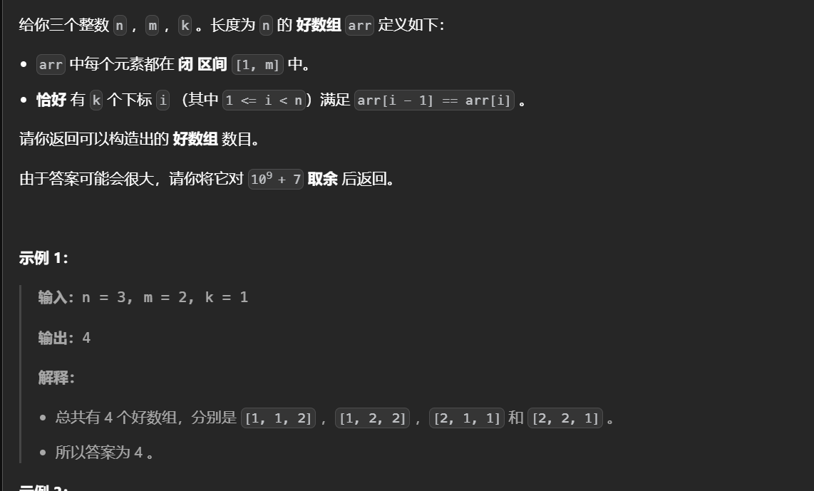

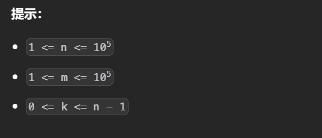


一个元素和前一个元素相等，那么从数对的角度来看就是从n-1对中选出k对，对于每个元素，第一个元素不用考虑限制有m种选法，后面的元素中有k个和前面相等的即1种选法，有n-k+1个和前面不相等的即M-1种选法，因此最后的结果就是一个公式。

```python
class Solution:
    def countGoodArrays(self, n: int, m: int, k: int) -> int:
        mod=10**9+7
        return comb(n-1,k)%mod*pow(m-1,n-k-1,mod)*m%mod
```


##  [ Fruit Lineup](https://atcoder.jp/contests/abc405/tasks/abc405_e)

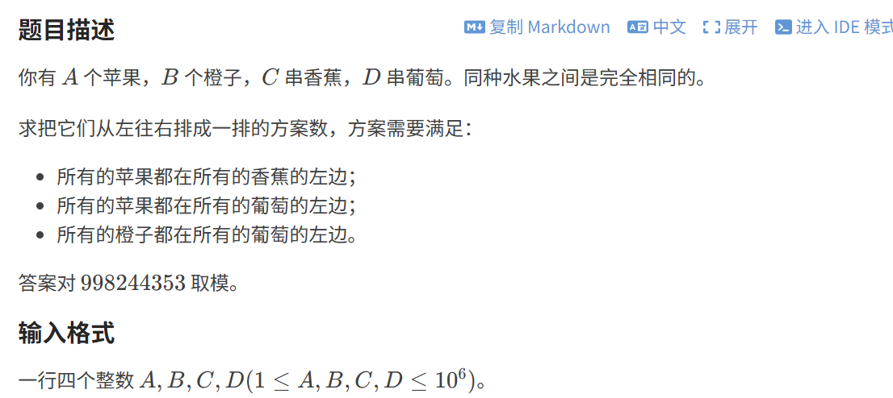

苹果和橙子需要满足在葡萄之前，因此以最左侧的葡萄划分数组为两部分，左侧是苹果和橙子，右侧是葡萄，香蕉可以在两侧放，枚举香蕉在左侧有x个，那么左侧有公式

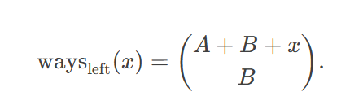

表示在左侧选B个位置，因为苹果需要放到香蕉之前，橙子的位置选好了之后，苹果和香蕉的位置也都是固定的。


右侧有

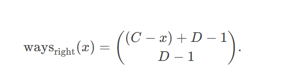

葡萄和香蕉之间没有关系，可以随意排放，右侧的葡萄要出去固定好的左侧的葡萄(在A+B+x+1处，用于分隔)，题目中说明水果都是一样的因此用组合的方式求解所有的可能。

```python
mod=998244353
# 预处理阶乘
f=[1]+[-1]*(4*10**6+10)
for i in range(1,4*10**6+10):
    f[i]=i*f[i-1]
    f[i]%=mod

a,b,c,d=RR()
ans=0
# 枚举左侧的香蕉的数量
for x in range(c+1):
    i,j=a+b+x,x
    l=f[i]*pow((f[b]*f[i-b])%mod,mod-2,mod)%mod
    r=f[d-1+c-x]*pow((f[c-x]*f[d-1])%mod,mod-2,mod)%mod
    ans+=(l*r)%mod
    ans%=mod

print(ans)
```

## [统计为蚁群构筑房间的不同顺序](https://leetcode.cn/problems/count-ways-to-build-rooms-in-an-ant-colony/)

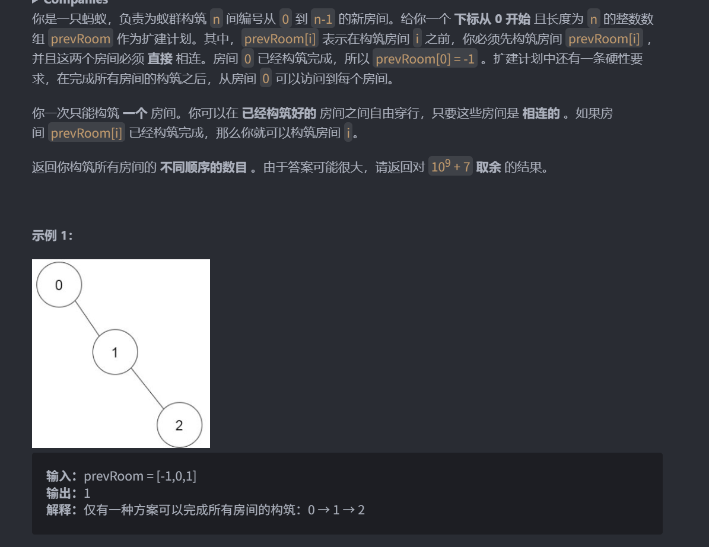

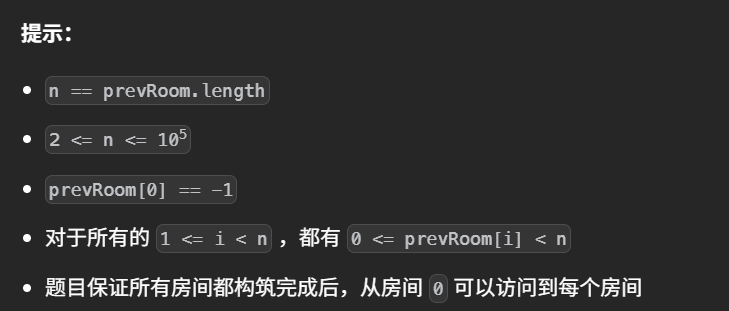


根据题目要求，对于任意的i>0，必须先构建preRoom[i]然后才能构建i，条件等价于拓扑排序，因此找构建所有房间不同顺序的数目就是去找构造树的不同拓扑序的数目。


定义dp(i)表示以i为根节点的树的拓扑序的数目，根据乘法定理要从所有子节点转移过来，但是乘法定理不考虑不同的顺序，因此使用排列组合求出所有的顺序。


对于排列数计算的公式可以表示为：	
			

对于拓扑序，第一个位置一定是确认的，因此分子是根节点的子节点的数目-1

```python
class Solution:
    def waysToBuildRooms(self, prevRoom: List[int]) -> int:
        mod=10**9+7
        g=[[] for _ in range(len(prevRoom))]
        # 建图
        for i,x in enumerate(prevRoom):
            if i:
                g[x].append(i)

        sz=defaultdict(int)
        # 计算阶乘
        @cache
        def f(x):
            if x<=1:return 1
            return x*f(x-1)%mod 
        # 求解子树大小
        def dfs(root):
            sz[root]=1
            for nx in g[root]:
                sz[root]+=dfs(nx)
            return sz[root]
        dfs(0)
        @cache
        def dp(root):
            res=tmp=1
            total=f(sz[root]-1)
            for nx in g[root]:
                res=res*dp(nx)%mod
                tmp=tmp*pow(f(sz[nx]),mod-2,mod)%mod
            return total*tmp*res%mod
        return dp(0)
```

# 第二类斯特林数

## [安排活动的方案数](https://leetcode.cn/problems/find-the-number-of-possible-ways-for-an-event/)

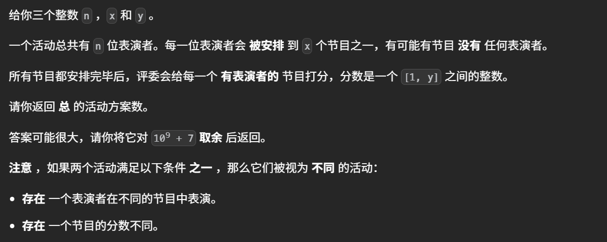


该问题可拆为三部分，第一部分，从x个节目中取出i个不为空的(分配了表演者)，这里由于每个表演者都是不同的，因此是排列数；第二部分，将n个不同的表演者划分给i个非空集合(这里的集合都是相同的)，也就是斯特林数；第三部分，i个节目都要打分，就是$y^i$

```python
class Solution:
    def numberOfWays(self, n: int, x: int, y: int) -> int:
        ans=0
        # 计算阶乘
        @cache
        def fact(x):
            if x<=1:return 1
            return x*fact(x-1)%mod
        # 枚举非空集合的数目
        for i in range(1,min(x,n)+1):
            # 排列数
            p=(fact(x)*pow(fact(x-i),mod-2,mod))%mod
            term=p*f[n][i]*pow(y,i,mod)
            ans=(ans+term)%mod
        return ans 
```


# 几何

## 判断集合是否在直线上

要判断一堆点是否在一条直线上，可以使用**向量法**

任取三个点 $A(x_1, y_1)$、$B(x_2, y_2)$、$C(x_3, y_3)$，如果这三个点共线，那么向量 $\overrightarrow{AB}$ 和 $\overrightarrow{AC}$ 的**叉积**为 0。

 向量叉积公式：
$$
(x_2 - x_1) \times (y_3 - y_1) = (x_3 - x_1) \times (y_2 - y_1)
$$
如果上面的等式成立，说明三点共线。
 对于一堆点，只需要选择第一个点作为基准，然后依次判断后面的每两个点是否满足上面的等式即可。


## [Line Crossing](https://atcoder.jp/contests/abc402/tasks/abc402_d)

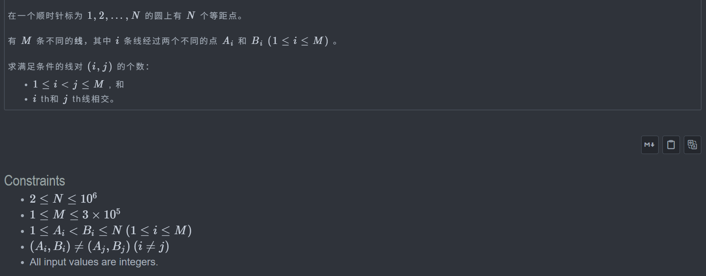

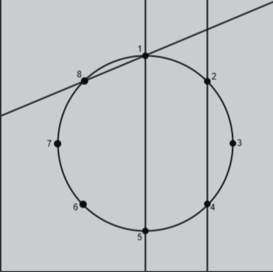

显然找不相交的只要用总的减去平行的即可，如果两条线平行那么端点的中点一定相等，竖直线是个例外比如2 4与8 6，需要额外取模n。

```python
n,m=RR()
ans=m*(m-1)//2
memo=defaultdict(int)
for _ in range(m):
    l,r=RR()
    ans-=memo[(l+r)%n]
    memo[(l+r)%n]+=1
print(ans)
```


## [农夫约翰的奶酪块][https://www.acwing.com/problem/content/6125/]

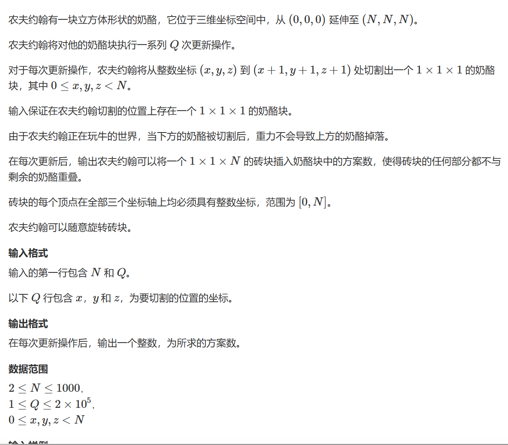

摆放的方式只有三种，沿着X|Y|Z轴方向，因此在每次删除一个方块的时候记录沿X|Y|Z轴方向是否打通即可。

```python
n,q=RR()
# 使用三个二维数组记录对于的面是否打通
X=[[0]*n for _ in range(n)]
Y=[[0]*n for _ in range(n)]
Z=[[0]*n for _ in range(n)]
ans=0
for _ in range(q):
    x,y,z=RR()
    X[x][z]+=1
    Z[x][y]+=1
    Y[y][z]+=1
    if X[x][z]==n:ans+=1
    if Y[y][z]==n:ans+=1
    if Z[x][y]==n:ans+=1
    print(ans)
```


## [ Chord Crossing](https://atcoder.jp/contests/abc405/tasks/abc405_f)

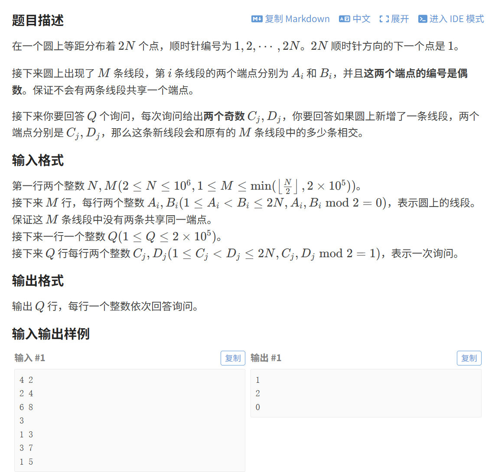

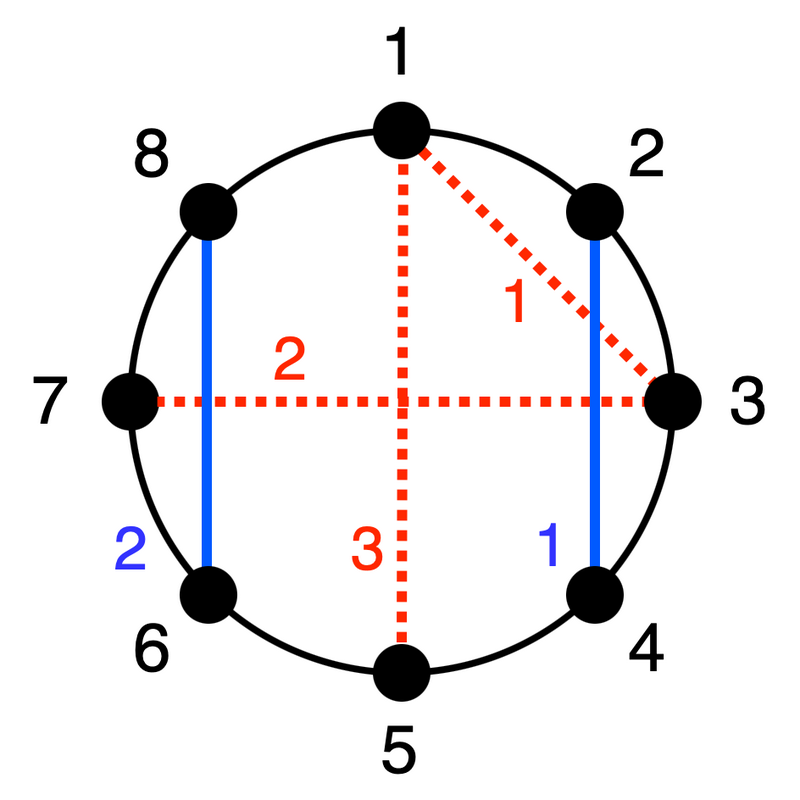

观察到如果两个线段有交集，那么其中一个线段必然只有一个端点在另一个线段中，因此可以将圆展开为线段判断。

令给定的线段为a,b，询问的线段为c,d，那么可能的情况是b在cd之间，a小于c

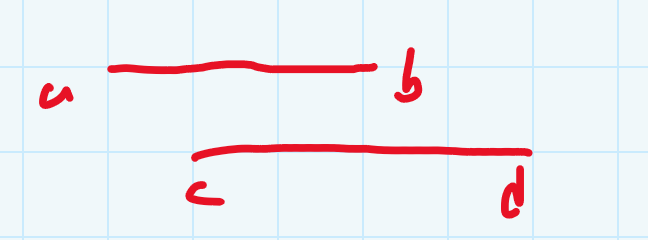


以及a在cd之间，b大于d

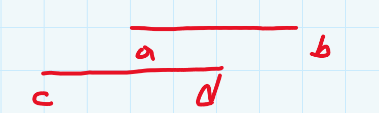

离线询问，首先按照左端点的值排序，枚举每一个询问的线段c d，将给定的线段数组中左端点小于c的线段(a,b)的**右端点**b记录到树状数组中，统计得到满足第一种情况的个数。随后再按照右端点的值排序，得到第二种情况的个数。

```python
class Tree:

n,m=RR()
inv=[RR() for _ in range(m)]

query=[]
for i in range(R()):
    l,r=RR()
    # 离线询问，维护索引
    query.append((l,r,i))
ans=[0]*len(query)

# 查询满足条件一的个数
t=Tree(2*n+10)
inv.sort(key=lambda x:x[0])
query.sort(key=lambda x:x[0])

l=0
for r in range(len(query)):
    #将左端点小于当前枚举的线段的右端点记录到树状数组中
    while l<m and inv[l][0]<query[r][0]:
        t.update(inv[l][1],1)
        l+=1
    # 查询满足条件的个数
    ans[query[r][2]]+=t.query(query[r][0],query[r][1])

# 反过来求条件二
l=m-1
t=Tree(2*n+10)
inv.sort(key=lambda x:x[1])
query.sort(key=lambda x:x[1])
for r in range(len(query)-1,-1,-1):
    while l>=0 and inv[l][1]>query[r][1]:
        t.update(inv[l][0],1)
        l-=1
    ans[query[r][2]]+=t.query(query[r][0],query[r][1])
print(*ans,sep='\n')
```

​	
