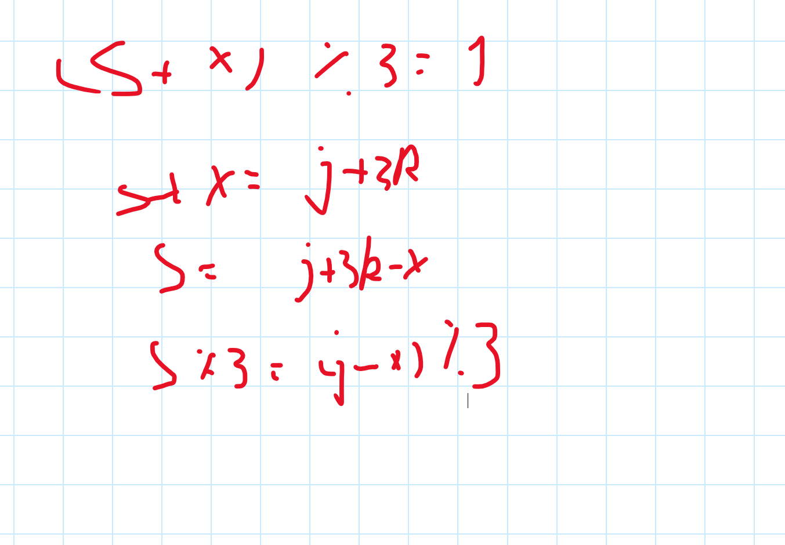
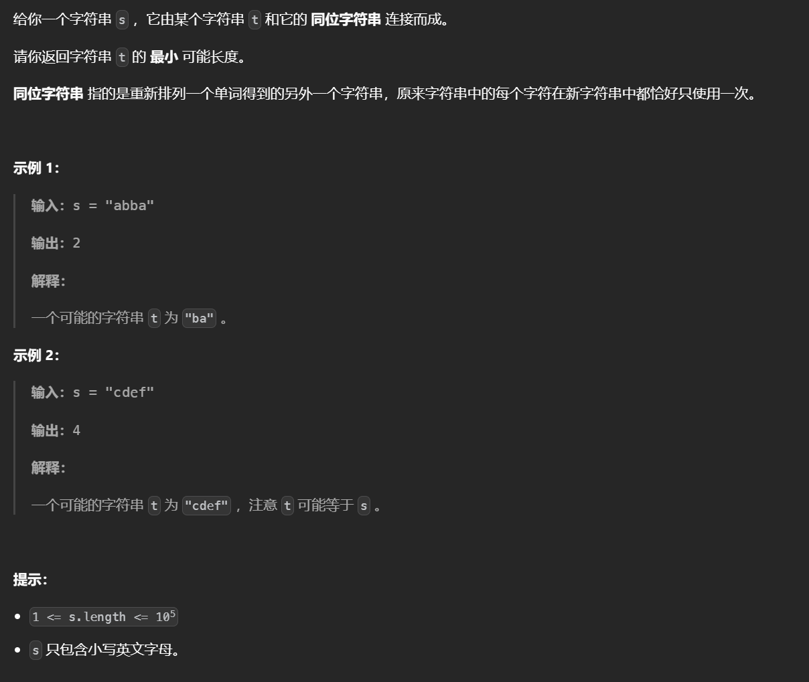
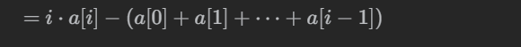
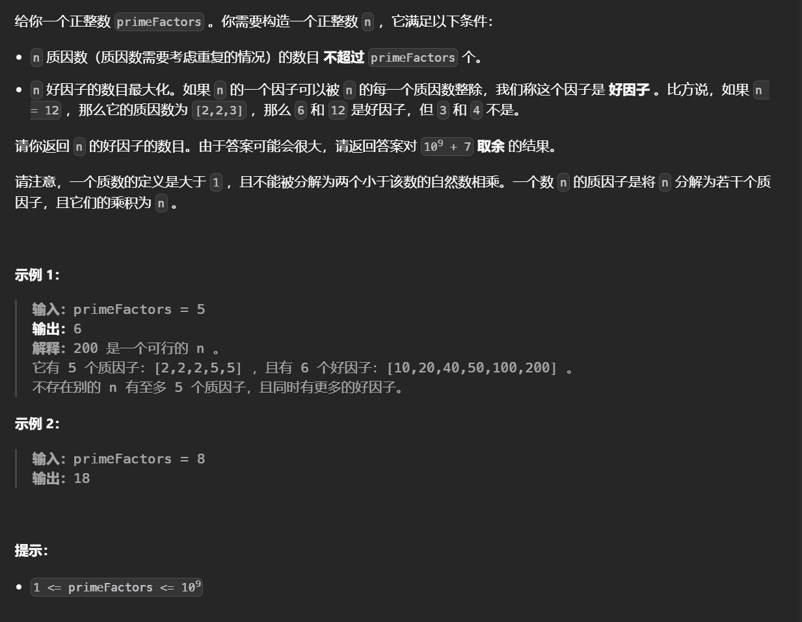
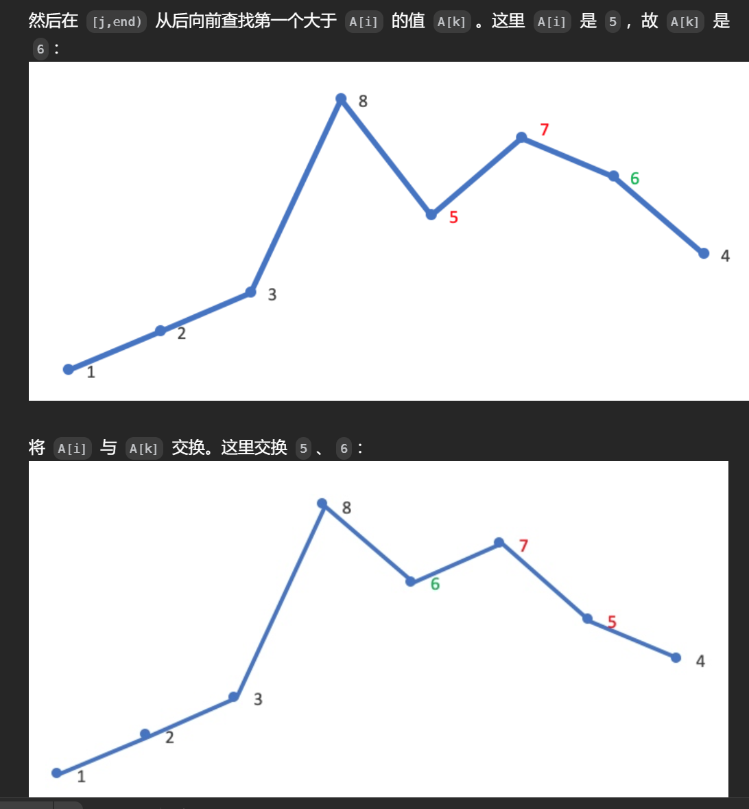
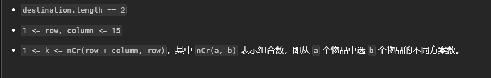
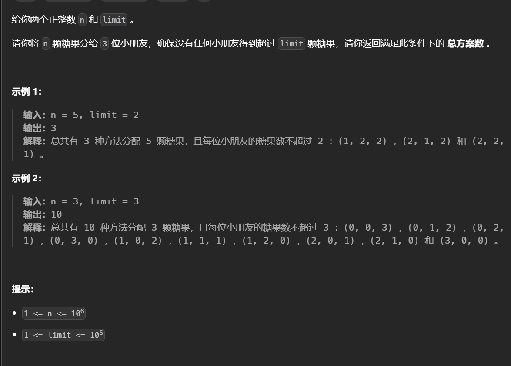

# 数学题目


## [摧毁一系列目标](https://leetcode.cn/problems/destroy-sequential-targets/)


找到一个子序列，其中所有的元素满足a=b+kd（其中a和k已知），变化可得a-b=kd两边同时取模d有a-b同余0，也就是a同余b取模d，因此去找所有同余space相同的元素，这些元素可以组成一个子序列。

```python
class Solution:
    def destroyTargets(self, nums: List[int], space: int) -> int:
        memo=defaultdict(list)
        l=-inf
        ans=inf
        for v in nums:
            memo[v%space].append(v)
            l=max(l,len(memo[v%space]))
        # 找到满足要求的
        for k,v in memo.items():
            if len(v)==l:
                ans=min(ans,min(v))
        return ans 
```


## [可被三整除的最大和](https://leetcode.cn/problems/greatest-sum-divisible-by-three/)


余数的性质，两种做法。

首先找出数组总和，如果取模三等于1，就减去数组中取模等于1的最小元素或者减去两个取模为2的元素，对于总和取模等于2的同理。

```python
class Solution:
    def maxSumDivThree(self, nums: List[int]) -> int:
        a=sorted([v for v in nums if v%3==1])
        b=sorted([v for v in nums if v%3==2])
        t=sum(nums)
        ans=t
        if t%3==1:
            if a and len(b)>=2:
                ans=max(t-b[0]-b[1],t-a[0])
            elif a:
                ans=t-a[0]
            elif len(b)>=2:
                ans=t-b[0]-b[1]

        elif t%3==2:
            if b and len(a)>=2:
                ans=max(t-a[0]-a[1],t-b[0])
            elif b:
                ans=t-b[0]
            elif len(a)>=2:
                ans=t-a[0]-a[1]
        return ans 
```


使用动态规划，定义dp(i,j)表示考虑前i个元素，总和取模三等于j的，最大元素总和

每个元素有选或不选两种可能，如果不选则转移到dp(i-1,j)，否则是dp(i-1,(j-nums[i])%3+nums[i])




```python
class Solution:
    def maxSumDivThree(self, nums: List[int]) -> int:
        n=len(nums)
        @cache
        def dp(i,j):
            if i<0:
                return -inf if j else 0
            a=dp(i-1,j)
            b=dp(i-1,(j-nums[i])%3)+nums[i]
            return max(a,b)
        return dp(n-1,0)

```


## [找出满足差值条件的下标 II](https://leetcode.cn/problems/find-indices-with-index-and-value-difference-ii/)


两个值，枚举j同时维护可行的i中最大最小值，这样可以保证差的绝对值最大也同时只用考虑单边（技巧点）。

```python
class Solution:
    def findIndices(self, nums: List[int], indexDifference: int, valueDifference: int) -> List[int]:
        n=len(nums)
        mx=mn=0
        r=indexDifference
        # 可行的i的最右端
        l=0
        while r<n:
            val=nums[r]
            # 判断是否满足条件
            if nums[mx]-val>=valueDifference:
                return [mx,r]
            if  val-nums[mn]>=valueDifference:
                return [mn,r]
		
            # 更新i
            l+=1
            # 规定l<n是为了防止只有一个元素的情况
            if l<n and nums[l]>nums[mx]:
                mx=l
            if l<n and nums[l]<nums[mn]:
                mn=l
            r+=1
        return [-1,-1]
```


## [对角线遍历 II](https://leetcode.cn/problems/diagonal-traverse-ii/)


同一条对角线上坐标之和相同，遍历每一行使用哈希表记录所有相同的然后输出即可，第一条对角线的坐标值和是最小的。

对角线的扩展知识：从右上到左下是的对角线之和是横纵坐标之和，从左上到右下横纵坐标值做差相同，注意对角线的遍历是由两部分！


```python
class Solution:
    def findDiagonalOrder(self, nums: List[List[int]]) -> List[int]:
        memo=defaultdict(deque)
        # 添加到左边，行数在后面的对应到对角线上是在前面的
        for i,li in enumerate(nums):
            for j,v in enumerate(li):
                memo[i+j].appendleft(v)
        ans=[]
        for v in memo.values():
            ans.extend(v)
        return ans 
```

## [需要添加的硬币的最小数量](https://leetcode.cn/problems/minimum-number-of-coins-to-be-added/) 


对于可以表示的1~s，当遇到了一个x可以表示的范围就变为了1 ~ s+x因为可以给原来的区间都加上x变为1+x ~ s+x 而x本身也可以被表示因此区间可以合并。

对于这道题初始时令s=0，s表示可以表示到的范围，然后遍历数组，当遇到了x如果他在区间内或者是等于s+1即可以被表示那么就更新区间。反之，如果超出了s+1比如说 s=3 而x等于5，也就是4不能被表示，为了得到4一个加一个数上去，因为加一个数可以使得表示的区间更大，所以贪心的想法是要加不能表示的最小的数而不是1使得区间更大。

```python
class Solution:
    def minimumAddedCoins(self, coins: List[int], target: int) -> int:
        # 先排序
        coins.sort()
        ans=i=0
        s=0
        while s<target:
            # 遍历coins 
            if i<len(coins) and (coins[i]==s+1 or coins[i]<=s):
                s+=coins[i]
                i+=1
            else:
                ans+=1
                s+=s+1
        return ans 
```


## [形成三的最大倍数](https://leetcode.cn/problems/largest-multiple-of-three/)


如果一个数可以被3整除`那么它的各个数位之和也一定会被3整除，充分必要条件`，统计各个数位的和如果满足条件那么直接输出排序后的整个数组，如果余1那么需要减去最小的余1的或者两个余2的，如果余2那么减去最小的余2的或者两个余1的。


```python
class Solution:
    def largestMultipleOfThree(self, digits: List[int]) -> str:
        cnt = Counter()
        t = 0
        s = ''
        m = Counter()
        # 统计
        for v in digits:
            t+=v
            cnt[v] += 1
            m[v % 3] += 1
        # 直接输出，输出的时候注意排除0的情况
        if t % 3 == 0:
            if len(cnt) == 1 and 0 in cnt: return '0'
            for k in sorted(cnt.keys(),reverse=True):
                s += str(k) * cnt[k]
            return s
        # 如果余1
        elif t % 3 == 1:
            # 找到余1最小的
            if m[1]:
                for a in (1, 4, 7):
                    # 需要有值
                    if cnt[a]:
                        cnt[a] -= 1
                        # 注意没有了就要删除
                        if not cnt[a]:del cnt[a]
                        break
            else:
                # 如果不存在找两个余2的
                f = 2
                for a in (2, 5, 8):
                    # 能直接减去最好
                    if cnt[a] >= f:
                        cnt[a] -= f
                        if not cnt[a]:del cnt[a]
                        break
                    elif cnt[a] == 1:
                        cnt[a] -= 1
                        if not cnt[a]:del cnt[a]
                        f -= 1

            if len(cnt) == 1 and 0 in cnt: return '0'
            for k in sorted(cnt.keys(),reverse=True):
                s += str(k) * cnt[k]
            return s
        # 同上	
        else:
            if m[2]:
                for a in (2, 5, 8):
                    if cnt[a]:
                        cnt[a] -= 1
                        if not cnt[a]:del cnt[a]
                        break
            else:
                f = 2
                for a in (1, 4, 7):
                    if cnt[a] >= f:
                        cnt[a] -= f
                        if not cnt[a]:del cnt[a]
                        break
                    elif cnt[a] == 1:
                        cnt[a] -= 1
                        if not cnt[a]:del cnt[a]
                        f -= 1

            if len(cnt) == 1 and 0 in cnt: return '0'        
            for k in sorted(cnt.keys(),reverse=True):
                s += str(k) * cnt[k]
            return s 
```

## 智乃想考一道鸽巢原理


每次选两个不同的出来相消。对于某一个数，如果其他数中最大的能被剩下的数之和抵消掉就说明除了这个数以外的数都能被消掉（因为最大的都能被消掉），需要注意的是，如果其他数的总和是奇数那么必然会剩下一个，此时如果当前数是1那么会被抵消掉。如果最大的数抵消掉其他的数之和后小于当前的数，那么除了当前数的其他数都能被抵消掉。

```python
for _ in range(int(input())):
    n=int(input())
    t=0
    nums=[int(x) for x in input().split()]
    ans=[]
    # 特判只有一个数的情况
    if n==1:
        print(1)
        continue
    # 通过一次遍历找出最大的两个数以及总和
    mx1=mx2=-1
    for v in nums:
        if mx1<v:
            mx1=v
        elif mx2<v:
            mx2=v
        t+=v
    # 遍历每一个数
    for i in range(n):
        v=nums[i]
        res=0
        # 找出除了当前数外的最大数
        mx=mx2 if v==mx1 else mx1
	# 如果最大的数都能被消掉
        if t-v-mx>=mx:
            # 这里判其他数当前数是否为1，且其他数总和是奇数
            res=0 if v==1 and t%2==0 else 1
        else:
            # 如果其他的部分抵消后可以小于当前数
            res=int(v>mx-(t-v-mx))
        ans.append(res)
    print(*ans)
```

这个结论推导到一般的情况就是，如果每次要从数组中选取两个不同的数删去，如果最大的数（值出现频率）小于等于其他数（频率）之和那么最终数组会剩下1个数（如果数组的个数是奇数，否则全部都能删去），否则会剩下最大的数的频率减去其他数的频率之和个数。或者也可能是每次从数组中选两个不同的数将他们减小1之类的情况


## [你可以工作的最大周数](https://leetcode.cn/problems/maximum-number-of-weeks-for-which-you-can-work/)


鸽巢原理的应用，不能在两周内连续操作一个项目，可以看作每次选两个不同位置的值减一

```python
class Solution:
    def numberOfWeeks(self, nums: List[int]) -> int:
        l=max(nums)
        t=sum(nums)
        # 所有的项目都可以被完成，奇数只是不能在每次取两个的情况下消除但这里只是模拟一次去一个
        if l<=t-l:
            return t
        else:
            # 只有l-(t-l)个不能完成，加一通过观察得出
            return t-(l-(t-l))+1
```


## [使数组中所有元素相等的最小开销](https://leetcode.cn/problems/minimum-cost-to-equalize-array/)


分类讨论：

如果数组大小小于等于2，那么操作一个才是最好的选择。

如果进行两次操作一个的费用小于等于操作两个的费用，直接一个一个的操作。

否则，最好的选择是尽可能地操作两个，这里不能确定最终的元素是多少，假设最终的元素就是当前数组中最大的值，那么转换数组把每个元素变为最大值与他的差，问题变为每次选两个值消掉

运用鸽巢原理，如果最大值小于其他值的总和那么所有的值都可以被削掉，除非所有值总和是奇数（会剩一个只能用cost1消）。如果是偶数，增大最大值只会使最终结果变大，奇数的话可能cost1太大，因此会尝试把最大值增加一让最后不会留下一个，最大值加一最终总体值会加n，如果n是偶数再怎么加也没用是奇数加一次就够了，因此最后只需要多判断一次。

如果最大值不能被完全消掉，为了尽可能多的去执行操作二，只有不断地增加上限使得最大值小于其他值得总和，来让最后这剩下一个或全部消掉，剩下一个会出现和上述一样的情况以此同样需要往后多判断一位。


```python
class Solution:
    def minCostToEqualizeArray(self, nums: List[int], cost1: int, cost2: int) -> int:
        mx=max(nums)
        mod=10**9+7
        n=len(nums)
        # 分类讨论
        if n<=2:return ((max(nums)-min(nums))*cost1)%mod
        elif 2*cost1<=cost2:
            ans=0
            for v in nums:
                ans+=(mx-v)*cost1
            return ans%mod 
        # 先转换数组
        nums=[mx-v for v in nums]
        # 找最大值和总和
        m=max(nums)
        t=sum(nums)
        # 如果都能被消掉，多往后判断一位（因为奇数个会剩下一个1，往后找一位可能会消掉这个1）
        if m<=t-m:
            return min(t//2*cost2+t%2*cost1,(t+n)//2*cost2+(t+n)%2*cost1)%mod
        ans=((t-m)*cost2+(m-(t-m))*cost1)%mod
        # 扩大上限，不断取最小值
        for x in range(1,ceil((2*m-t)/(n-2))+2):
            t+=n
            m+=1
            if m<=t-m:
                ans=min(ans,t//2*cost2+t%2*cost1)
            else:ans=min(ans,(t-m)*cost2+(m-(t-m))*cost1)%mod
        return ans 
```


## [不同的循环子字符串](https://leetcode.cn/problems/distinct-echo-substrings/)


对于给定的数据范围可以枚举每个开始位置然后枚举长度以此来构造左部和右部，但是比较每个左部和右部有点费时可以使用字符串哈希快速比较。


```python
class Solution:
    def distinctEchoSubstrings(self, s: str) -> int:
        n=len(s)
        m=10**9+7
        base=131
        ans=0
        # 防止重复
        vis=set()
	# 将字符转化为数字
        def cal(c):
            return ord(c)-ord('a')+1
	
       # 构造字符串哈希前缀
        pre=[0]*(n+1)
        p=[1]*(n+1)
        for i in range(1,n+1):
            pre[i]=(pre[i-1]*base+cal(s[i-1]))%m
            p[i]=(p[i-1]*base)%m

        for i in range(n):
            for j in range(1,(n-i)//2+1):
                # 注意减去的前一部分要进位
                a=(pre[i+j]-pre[i]*p[j])%m
                if a in vis:continue
                b=(pre[2*j+i]-pre[j+i]*p[j])%m
                if a==b:
                    vis.add(a)
                    ans+=1
        return ans
```


## [最小化曼哈顿距离](https://leetcode.cn/problems/minimize-manhattan-distances/)


对于给定的数据范围无法得到最大的曼哈顿距离（因为要两层循环），同时无法枚举删除每一个点后的最大距离。但是可以通过将曼哈顿距离转化为切比雪夫距离一次遍历求出最大的曼哈顿距离。


在原坐标系中通过将点的横纵坐标转换为(x+y,y-x)可以转化到切比雪夫坐标系中，把所有点转化到切比雪夫坐标系中可以求解切比雪夫距离这个距离等价于原坐标系中的曼哈顿距离，而切比雪夫距离通过最大与最小的横/纵的相减就可以求出，也就是一次遍历把所有点换到切比雪夫中同时维护值的大小，之后枚举删除每一个值后的结果。

```python
from sortedcontainers import SortedList as sl
class Solution:
    def minimumDistance(self, points: List[List[int]]) -> int:
        # 使用有序集合维护
        x=sl()
        y=sl()
        for l,r in points:
            x.add(l+r)
            y.add(r-l)
        ans=inf
        for l,r in points:
            # 先删除在加入
            x.remove(l+r)
            y.remove(r-l)
            ans=min(ans,max(x[-1]-x[0],y[-1]-y[0]))
            x.add(l+r)
            y.add(r-l)
        return ans
```


## Bingbong的奇偶世界


考虑字符串的最后一个为偶数，遍历每一个字符同时记录前面的位数，如果这个字符可以作为结尾那么加上它前面的所有字符都有选或不选两种状态数，同时减去前面以0为开头的个数。

以0开头的状态数，可以通过记录0的个数，每一次遍历把这个状态数乘2因为多出一个数位可以在原来的基础上选或不选这一位，同时如果这个数位是0那么状态数在加一因为可以自己单独作为一个。

```python
n=int(input())
s=input()
mod=10**9+7
ans=t=0
a=0
for i in range(n):
    if int(s[i])%2==0:
        ans=(ans+pow(2,t,mod)-a)%mod
    t+=1
    a=(a*2+int(s[i]=='0'))%mod
print(ans)
```


## [坏了的计算器](https://leetcode.cn/problems/broken-calculator/)


逆向思维，对于乘法和减法有多种选择，可以变到t/8,t/4,t/2...处运用乘法，但是如果逆向思维变为除法和加法，只有一种选择一直除下去直到小于或等于然后用加法，可以证明奇数只能加法，偶数选择除法是最优的:x//2+1<(x+2)//2

```python
class Solution:
    def brokenCalc(self, s: int, t: int) -> int:
        ans=0
        while t>s:
            # 偶数直接除，奇数先变化
            if t%2==0:t//=2
            else:t+=1
            ans+=1
        return ans+s-t
```

## [同位字符串连接的最小长度](https://leetcode.cn/problems/minimum-length-of-anagram-concatenation/)




注意这里题目描述不清楚，其实是可以连接多个同位字符串。

初始想法是计数，然后统计最大公约数，但是这里其实是要考虑开头子串的顺序比如aabb。

既然要分为多个长度一样的数可以选择去枚举分为几组（n//k即为t的长度），t的长度只能为len(s)的因数，而n的因数最多为$n^{1/3}$个

```python
class Solution:
    def minAnagramLength(self, s: str) -> int:
        vis=set()
        n=len(s)
        # 统计所有的因数
        for i in range(1,int(n**0.5+1)):
            if n%i==0:
                vis.add(n//i)
                vis.add(i)
        
        # 枚举分为几组
        for v in sorted(vis)[::-1]:
            i=0
            pre=[]
            # 分组循环找出mei
            while i<n:
                start=i
                temp=[0]*26
                while i<n and i-start<n//v:
                    temp[ord(s[i])-ord('a')]+=1
                    i+=1
                if not pre:pre=temp[:]
                elif pre!=temp:break
            else:return n//v
```

## Make It Round


结尾0的个数与数中有多少个10的因子有关，而因子10的个数又与因子2和因子5的个数相关，其他的因数影响不到结尾0的个数为了使得结果尽可能大把k中除去2 5 10剩余的因数都乘上.

```python
from math import log10, log
for _ in range(int(input())):
    n,k=[int(x) for x in input().split()]
    ans=[]
    x=n
    # 首先统计2和5作为因子的个数
    for v in [2,5]:
        temp=0
        while x%v==0:
            x//=v
            temp+=1
        ans.append(temp)
    a,b=ans
    # 如果某一个更多，就尝试去补齐
    if a>b:
        cnt=min(int(log(k,5)),a-b)
        if cnt:
            n*=5**cnt
            k //= (5 ** cnt)
    elif a<b:
        cnt=min(b-a,int(log(k,2)))
        if cnt:
            n*=2**cnt
            k//=(2 ** cnt)

    # 补齐后继续填入2和5注意只有同等数量的2和5才有用，因此去找10
    cnt = int(log10(k))
    if cnt:
        n *= 10 ** cnt
        k //= (10 ** cnt)
    # 乘上剩下的数不会影响结尾0的个数
    n*=k
    print(n)

```


## [分隔长廊的方案数](https://leetcode.cn/problems/number-of-ways-to-divide-a-long-corridor/)


简言之就是要两两划分为一组，利用乘法原理可求解

```python
class Solution:
    def numberOfWays(self, s: str) -> int:
        cnt=s.count('S')
        # 没有座位或者是不满足分的要求
        if cnt%2 or not cnt:return 0
        mod=10**9+7
        temp=0
        ans=[]
        pre=-1
        for i,c in enumerate(s):
            if c=='S':
                temp+=1
                if temp==1 and pre!=-1:ans.append(i-pre)
                elif temp==2:
                    temp=0
                    pre=i
        
        res=1
        for v in ans:
            res*=v
            res%=mod
        return res
```


## Vasya and Petya's Game


通一组询问来确定一个数，每个数都可以被质因数表示比如2的三次方和7的平方的乘积，如果只询问2和7或者8和7是无法得出具体的数的，因此需要全部问上，不仅是质因数还要有质因数的冥次直到大于给定值。

```python
is_prime = [True] * 1010
for i in range(2, 1010):
    if is_prime[i]:
        for j in range(i ** 2, 1010, i):
            is_prime[j] = False

n = int(input())
ans = []
for i in range(2, n + 1):
    j=i
    if is_prime[i]:
        while i <= n:
            ans.append(i)
            i *= j

print(len(ans))
print(*ans)
```

## [移动机器人](https://leetcode.cn/problems/movement-of-robots/)


同之前做过的——所有的蚂蚁掉下来的最后一刻类似，两个相撞都掉头相当于穿过了对方继续走，且此题中没有要求每个蚂蚁的具体位置。

计算两两之间的距离，首先排序保证从小到大，用当前值减去前面的所有的值等价于，这个值剩下的部分会在后面被计算

```python
class Solution:
    def sumDistance(self, nums: List[int], s: str, d: int) -> int:
        mod=10**9+7
        # 直接计算出最后的位置
        for i,j in zip(range(len(nums)),s):
            if j=='R':
                nums[i]+=d
            else:
                nums[i]-=d
        nums.sort()
        total=ans=0# 累加求的前缀
        for i in range(len(nums)):
            ans+=i*nums[i]-total
            total+=nums[i]
            ans%=mod
        return ans 
```


## Two Arrays and Sum of Functions


简言之，就是对C[i]的所有子数组求和，要求这个和尽可能地小。其中C[I]是a[i]*b[i]，直觉上来讲想要这个结果最小只要让最大的a[i]对应最小的b[i]即可，但是这里不是对C[i]简单的求和，而是对所有子数组求和，也就是a[i]的贡献为a[i]\*(i+1)\*(n-i+1)，在数组中左边可以选i+1个右边可以选n-i+1个包括了自身，所以a[i]实际上对应的是a[i]\*(i+1)\*(n-i+1)，以这个新的结果数组去找b[i]匹配即可。

```python
mod=998244353
n=int(input())
a=[int(x) for x in input().split()]
b=[int(x) for x in input().split()]
ans=0
for i in range(n):
    a[i]*=(i+1)*(n-i)
a.sort()
b.sort()
b=b[::-1]
for i,j in zip(a,b):
    ans+=i*j
    ans%=mod
print(ans)
```

## [丑数 III](https://leetcode.cn/problems/ugly-number-iii/)


第n个能被a或b或c整除的整数，利用容斥原理结合二分判断可行的数

对于x有x// a个数可以被a整除，有x// b个数可以被b整除，有x// c个数可以被c整除，有x//gcd_ab个数可以同时被a和b整除，有x//gcd_ac个数可以同时被a和c整除，有x//gcd_bc个数可以同时被b和c整除，有x//gcd_abc个数可以同时被a、b、c整除

具体解释是：如果一个数既能被a除又能被b除那么它会重复计算一次所以要减去这一类数，对于其他的也是。但是对于能被a，b，c整除的数他被计算了三次同时也减去了三次，为了不漏掉所以要加上。

用容斥原理可以推广到多个

```python
class Solution:
    def nthUglyNumber(self, n: int, a: int, b: int, c: int) -> int:
        def cal(x):
            cnt=x//a+x//b+x//c
            cnt-=x//lcm(a,b)+x//lcm(a,c)+x//lcm(b,c)-x//lcm(a,b,c)
            return cnt>=n
        l,r=1,3*10**9
        while l<=r:
            mid=(l+r)>>1
            if cal(mid):
                r=mid-1
            else:
                l=mid+1
        return r+1
```


## Nikita and LCM


最小公约数只会更大，将数组排序，判断整个数组的lcm和最后一个数的大小，如果lcm更大则找到最长的子序列，否则所有数的lcm等于数组中最大的数（a），也就是数组中其他的数都是a的因数，这样数组中任意一个子序列的的lcm都是a的因数，枚举a的因数（a的立方个）作为子序列的lcm，如果该因数在数组中则跳过，否则将数组中该因数的所有因数（为了更长）找出判断他们的lcm是否为该因数，同时记录长度。

```python
import sys
from math import ceil, lcm

input = sys.stdin.readline
for _ in range(int(input())):
    n = int(input())
    nums = [int(x) for x in input().split()]
    nums.sort()
    # 找所有数的lcm
    if (res := lcm(*nums)) > nums[-1]:
        print(n)
    else:
        p = []
        a = nums[-1]
        # 找出最后一个数的因数
        for i in range(1, ceil(a** 0.5) + 1):
            if a % i == 0:
                p.append(i)
                if i != a // i: p.append(a // i)
        res = 0
        # 枚举所有的因数
        for r in p:
            if r in nums: continue
            l=[]
            for i, v in enumerate(nums):
                if r % v == 0: l .append(v)
            # 成功找出一组
            if lcm(*l)==r :res = max(res, len(l))
        print(res)
```

## [可以被 K 整除连通块的最大数目](https://leetcode.cn/problems/maximum-number-of-k-divisible-components/)


题目已经保证了整个树的和是k的倍数，那么如果找到一个和为k的倍数的子树，那么一定可以把这个子树拆出来，它的父节点对应的树也一定还是k的倍数，同时对于这个子树它可以继续去找它的和为k的倍数的子树即嵌套删除。

```python
class Solution:
    def maxKDivisibleComponents(self, n: int, edges: List[List[int]], values: List[int], k: int) -> int:
        g=[[] for _ in range(n)]
        for u,v in edges:
            g[u].append(v)
            g[v].append(u)
        ans=0
        def dfs(i,fa):
            nonlocal ans 
            s=values[i]
            for y in g[i]:
                if y==fa:continue
                s+=dfs(y,i)
            if s%k==0:ans+=1
            return s
        dfs(0,-1)
        return ans
```

## [检查「好数组」](https://leetcode.cn/problems/check-if-it-is-a-good-array/)


找出是否有形如ax+by+cz...=1的xyz

根据裴属定理有，方程 ax + by = 1 有解当且仅当整数a和b互素，这个定理可以推广到多个数上，那么就说这多个数都互质，因此也就是多个数的最大公约数为1.

```python
class Solution:
    def isGoodArray(self, nums: List[int]) -> bool:
        return reduce(gcd,nums)==1
```

## [不同的子序列 II](https://leetcode.cn/problems/distinct-subsequences-ii/)


不同的子序列，考虑前i个数字的不同子序列如何计算，最直接的思想是前i个数字的不同子序列=两倍的前i-1个数字的不同子序列（即在前面的基础上再加上前面的拼接上当前的字符），但是这样会有重复的子序列出现


引入第一个b的时候新增的个数为cnt，那么当引入第二个b的时候新增的个数会重复，这个重复的个数上一轮新增的，注意是新增的个数而不是实际增加的个数（大概是或者是贯观察得到的），最后要减去空串

```python
class Solution:
    def distinctSubseqII(self, s: str) -> int:
        mod=10**9+7
        n=len(s)
        dp=[0]*(n+1)
        dp[0]=1
        memo={}
        for i,c in enumerate(s,1):
            dp[i]=2*dp[i-1]%mod
            if c in memo:
                dp[i]-=memo[c]
                dp[i]%=mod
            # 记录的是新增的个数
            memo[c]=dp[i-1]
        return (dp[-1]-1)%mod          
```

## [最小面积矩形 II](https://leetcode.cn/problems/minimum-area-rectangle-ii/)


对于给定的数据范围枚举三个点去找第四个点是否满足

令a b c 为枚举的三个点，其中a为一个顶点,bc为相对的两个点，第四个点的坐标等于b+c-a（通过向量求的），如果第四个点存在那么需要判断是否满足垂直关系，通过向量的内积求即(a-b)*(a-c)==0

```python
class Solution:
    def minAreaFreeRect(self, nums: List[List[int]]) -> float:
        n=len(nums)
        ans=inf
        vis=set()
        for k in nums:
            vis.add(tuple(k))
        # 要枚举三个点，同时还要对应不同的顶角会相对的角，使用全排列求出
        for x,y,z in permutations(nums,3):
            # 用向量的方法求出第四个点
            d=[z[0]+y[0]-x[0],z[1]+y[1]-x[1]]
            if tuple(d) in vis:
                # 判断内积找是否满足垂直关系
                a=(z[0]-x[0],z[1]-x[1])
                b=(y[0]-x[0],y[1]-x[1])
                if a[0]*b[0]+a[1]*b[1]==0:
                    area=((a[0]**2+a[1]**2)*(b[0]**2+b[1]**2))**0.5
                    ans=min(ans,area)
        return ans if ans!=inf else 0
```


##  Earning on Bets


题目大意是给定一组a找一组b是的每个bi*ai>b数组的总和

模拟公式


两边同时乘上a数组的最小公倍数，判断不等式是否成立。

最终左边是a数组的最小公倍数右边就是对应的b数组，每个b乘上对应的a就是a数组的最小公倍数，这个最小公倍数有满足大于b数组之和。

```python
from math import ceil,lcm
import sys
input=sys.stdin.readline

esp=1e-5

for _ in range(int(input())):
    n=int(input())
    nums=[int(x) for x in input().split()]
    l=lcm(*nums)
    ans=[l//v for v in nums]
    if sum(ans)>=l:print(-1)
    else:print(*ans)
```


不要把公式拆开看


## Johnny and Another Rating Drop


对于给定的数据范围只能找规律

考虑每一位的贡献

对于最低位，奇偶不同可以贡献n个

对于次低位，0~n中所有2的倍数可以贡献一个，因为如果是2的倍数那么这一位上要么为1要么为0，并且右边都是0，i-1在该位置上对于前者一定是0，对于后者一定是1，这就贡献了一位。同理对于4的倍数...

```python
for _ in range(int(input())):
    x=int(input())
    index=0
    ans=0
    for i in range(x.bit_length()):
        ans+=x//pow(2,index)
        index+=1
    print(ans)
```


也可以观察二进制形式发现，从最低位开始每次能加的值都会折半。


## [K 秒后第 N 个元素的值](https://leetcode.cn/problems/find-the-n-th-value-after-k-seconds/)	


观察样例发现，每一组的值都是杨辉三角上的一个对角线


要找的是三角形上第n+k行的第n个，杨辉三角形的每个值可以用组合数公式计算，C(n-1,m-1)其中n,m表示行和列

```python
class Solution:
    def valueAfterKSeconds(self, n: int, k: int) -> int:
        mod=10**9+7
        return comb(n+k-1,n-1)%mod
```

## D-Function


对于给定的数据范围一定是存在一个结论

K*D(x)如果不存在进位就等于D(KX)，如果存在进位只会使得结果变小，因为第I位进位意味着第i-1位减小了10第I位增加了1，一共会减小9，因此去在范围内找每一位乘上k不会进位的。

注意l实际是长度为l+1

```python
mod=10**9+7
for _ in range(int(input())):
    l,r,k=[int(x) for x in input().split()]
    # 每一位只有x种
    x=9//k+1
    a=pow(x,r,mod)
    b=pow(x,l,mod)
    # 直接用前缀和的思想
    print((a-b)%mod)
```

## Beauty of the mountains


就是让二维数组中两个不同的区域的和相同，一次可以变化k*k大小的区域。

很明显的现预处理除所有k*k大小的区块能对差值改变多少(区域内一类和二类个数之差)，找出这些数后问题就变为了是否存在一个ax+by+cy+.....=k的问题，这可以用裴属定理，即k是gcd(a,b,c,....)的整数被则有解。

```python
from collections import deque,defaultdict,Counter
from functools import lru_cache
from bisect import bisect_left
from math import ceil, gcd
import sys
input=sys.stdin.readline
def R():return int(input())
def RR():return [int(x) for x in input().split()]
for _ in range(R()):
    m,n,k=RR()
    g=[]
    c=[]
    tt=0
    for _ in range(m):
        g.append(RR())
        tt+=sum(g[-1])
    for _ in range(m):c.append([int(x) for x in input()[:-1]])

    # 二位前缀和预处理除所有k*k的区域的贡献
    pre=[[0]*(n+1) for _ in range(m+1)]
    for i in range(1,m+1):
        for j in range(1,n+1):
            pre[i][j]=c[i-1][j-1]+pre[i-1][j]+pre[i][j-1]-pre[i-1][j-1]
    def cal(i1,j1,i2,j2):
        return pre[i2+1][j2+1]-pre[i2+1][j1]-pre[i1][j2+1]+pre[i1][j1]
    a=set()
    for i in range(m):
        for j in range(n):
            i1,j1=i,j
            i2,j2=i+k-1,j+k-1
            if i2>=m or j2>=n:continue
            x=abs(cal(i1,j1,i2,j2))
            a.add(2 *x-k**2)
    a=nn=list(a)
    a=gcd(*a)
    t=0
    # 计算两种类型的差值
    for i in range(m):
        for j in range(n):
            if c[i][j]==1:t+=g[i][j]
    diff=abs(t-(tt-t))
    if not diff:
        print("YES")
        continue
    # 用裴属定理判断
    if a and diff%a==0:print("YES")
    else:print('NO')
```


## [ 绝对值表达式的最大值](https://leetcode.cn/problems/maximum-of-absolute-value-expression/)


```python
class Solution:
    def maxAbsValExpr(self, arr1: List[int], arr2: List[int]) -> int:
        #化简式子，一共有八种形式
        #arr1[i]-arr1[j]+arr2[i]-arr2[j]+i-j
        #arr1[i]-arr1[j]+arr2[i]-arr2[j]-i+j
        #arr1[i]-arr1[j]-arr2[i]+arr2[j]+i-j
        #arr1[i]-arr1[j]-arr2[i]+arr2[j]-i+j
        #-arr1[i]+arr1[j]+arr2[i]-arr2[j]+i-j
        #-arr1[i]+arr1[j]+arr2[i]-arr2[j]-i+j
        #-arr1[i]+arr1[j]-arr2[i]+arr2[j]+i-j
        #-arr1[i]+arr1[j]-arr2[i]+arr2[j]-i+j

        # 移项，由于i和j是可以互换的因此最终只有四项，根据这个式子分类讨论求最后的结果
        #arr1[i]+arr2[i]+i-(arr1[j]+arr2[j]+j)
        #arr1[i]+arr2[i]-i-(arr1[j]+arr2[j]-j)
        #arr1[i]-arr2[i]+i-(arr1[j]-arr2[j]+j)
        #arr1[i]-arr2[i]-i-(arr1[j]-arr2[j]-j)
		
        #-arr1[i]+arr2[i]+arr1[j]-arr2[j]+i-j
        #-arr1[i]+arr2[i]+arr1[j]-arr2[j]-i+j
        #-arr1[i]-arr2[i]+arr1[j]+arr2[j]+i-j
        #-arr1[i]-arr2[i]+arr1[j]+arr2[j]-i+j
        A=[]
        B=[]
        C=[]
        D=[]
        for i,c in enumerate(zip(arr1,arr2)):
            l,r=c
            # 构造四个式子
            A.append(l+r+i)
            B.append(l+r-i)
            C.append(l-r+i)
            D.append(l-r-i)
        A.sort()
        B.sort()
        C.sort()
        D.sort()
        # 求解最大的
        return max(A[-1]-A[0],B[-1]-B[0],C[-1]-C[0],D[-1]-D[0])

```

## [好因子的最大数目](https://leetcode.cn/problems/maximize-number-of-nice-divisors/) 



最后好因子的个数实际上是不同质因数个数用乘法原理求解出的，也就是有a1+a2+a3+a4=n，要求a1\*a2*a3\*a4最大

要让乘积最大有两个条件：把n划分为数值相等的几部分，其次每一部分都是3，也就是n=3a+b，如果b=0那么直接返回3

\^a，如果b=1那么把1和一个3拼起来分为2和2，如果b=3那么就在3\^a基础上乘上2.


```python
class Solution:
    def maxNiceDivisors(self, n: int) -> int:
        mod=10**9+7
        # 可以不划分也就是每个都是一个质因数，特判小于等于3的
        if n<=3:return n
        a=n//3
        b=n%3
        if not b:return pow(3,a,mod)
        elif b==1:return pow(3,a-1,mod)*4%mod
        return pow(3,a,mod)*2%mod
```

## [下一个排列](https://leetcode.cn/problems/next-permutation/)


为了找到下一个排列，需要增加的幅度最小，因此每次都是从最低的数位操作。从右往左遍历，一旦遇到nums[i]<nums[i+1]也就是说可以变大，那么就开始操作，因为是遇到第一个就开始操作因此右边的位置都是降序的，再次从右往左遍历选出第一个小于当前元素的值将这个位置的值与当前位置的元素交换（保证增大幅度最小），而后将当前位置的右边排序得到下一个大更大的的排列。


```python
class Solution:
    def nextPermutation(self, nums: List[int]) -> None:
        n=len(nums)
        for i in range(n-2,-1,-1):
            r=nums[i+1]
            l=nums[i]
            if l<r:
                for j in range(n-1,-1,-1):
                    if nums[j]>nums[i]:
                        nums[i],nums[j]=nums[j],nums[i]
                        temp=sorted(nums[i+1:])
                        res=nums[:i+1]+temp
                        return res 
        nums.sort()
        return nums
```





## [第 K 条最小指令](https://leetcode.cn/problems/kth-smallest-instructions/)




问题就是m个V和n个H的第k个排列

从高位往低位看

```python
class Solution:
    def kthSmallestPath(self, destination: List[int], k: int) -> str:
        ans=[]
        v,h=destination
        n,m=h,v
        ans=''
        # 遍历每一个位置
        for i in range(m+n-1):
            c1=comb(v+h-1,h-1)# 这个位置选H，剩下的位置中选h-1个H其他的放V有多少个
            c2=comb(v+h-1,v-1)# 同上，因为V大于H，因此C1会大于C1
            # 如果这个位置选H后排列不足以满足k那么就只能选V，
            if c1<k:
                ans+='V'
                v-=1# 选了一个V
                k-=c1# 所需的排列数减小c1个
                if not v:break
            else:
                # 选H能满足
                ans+='H'
                h-=1
                if not h:break
        # 剩下没选的
        while h:
            ans+='H'
            h-=1
        while v:
            ans+='V'
            v-=1
        return ans 
```

## [统计距离为 k 的点对](https://leetcode.cn/problems/count-pairs-of-points-with-distance-k/)


突破点在k的范围，给定的式子 $${x_1} \bigoplus {x_2}+{y_1} \bigoplus {y_2}=k$$因为异或运算的结果总是整数可以令${x_1} \bigoplus {x_2}$为i，那么i的范围在0到100之间那么变形式子有*x*1=*x*2⊕*i* 且 *y*1=*y*2⊕(*k*−*i*)。枚举x1y1累加他们的贡献然后用哈希表记录i从0到k+1出现的元组次数

```python
class Solution:
    def countPairs(self, coordinates: List[List[int]], k: int) -> int:
        memo=Counter()
        ans=0
        for x,y in coordinates:
            ans+=memo[(x,y)]
            for i in range(k+1):
                memo[(i^x,(k-i)^y)]+=1
        return ans 
```

## I Hate 1111


观察发现，所有大于三位的1的组合都能被11和111表示，那么问题变为一个数是否能被11a+111b表示，对于给定的10**9无法直接暴力枚举，但是发现11和111互素那么有结论所有大于11\*111-11-111的数都可以被11和111表示，对于小于这个范围的可以直接求解。

```python
from collections import deque, defaultdict, Counter
from functools import lru_cache
from bisect import bisect_left
from heapq import heappop, heappush
from itertools import accumulate
from math import ceil, inf, gcd
import sys
from typing import List
input = sys.stdin.readline
def R(): return int(input())
def RR(): return [int(x) for x in input().split()]
def get_pre(nums): return list(accumulate(nums, initial=0))

up=11*111-11-111

def cal(x):
    l,r=ceil(x/11),ceil(x/111)
    for i in range(l+1):
        for j in range(r+1):
            if 11*i+111*j==x:return True 
    return False

for _ in range(R()):
    x=R()
    if x>up or cal(x):print('YES')
    else:print('NO')
```


##  Amr and Pins


圆转动一次最多可以使圆心移动2*r，为了最快逼近另一个圆每次都选择移动2\*r，求解出两个圆之间的距离后直接除以2\*r上取整，即使不能精确的到达另一个圆心但是通过上取整的次数做了一次微调。

```python
r,x,y,x1,y1=RR()
d=((x-x1)**2+(y-y1)**2)**0.5
print(ceil(d/(2*r)))
```

## 小红装匣子


观察发现，竖着放两个2和横着放两排2是一样的，对于长度为n排列，横着放2和竖着放2所用的数量是一样的（也就是如果剩余n个位置可以不考虑如何摆放2，只要2的数目够就可以填满），而对于3所需的条件就严格了，为了保证填满先填好3

```python
import sys
input = sys.stdin.readline
def R(): return int(input())
def RR(): return [int(x) for x in input().split()]
def get_pre(nums): return list(accumulate(nums, initial=0))

for _ in range(R()):
    a,b,n=RR()
    # 考虑一排
    cnt=b>>1
    v=3*cnt
    # 如果超过了，看看在满足要求的情况下会剩下几个位置
    if v>n:
        c=n-n//3*3
    else:
        # 如果不够会剩下一些，剩下的部分不用靠考虑摆放直接看2的个数即可
        c=n-v
    if c>a:print('NO')
    else:print('YES')          
```

## Find The Array


由第三个条件的2可以得到启发，假设b<a那么有a//2<=b<=a，那么再这个范围内必然存在一个2^k(由二进制可知)，那么只需构造一个在这个范围内的数即可，最简单的方式是保留大的数的最高位，可以通过lowbit求出。

```python
# def cal(x):
#     return x&-x
# for _ in range(R()):
#     n=R()
#     nums=RR()
#     ans=[]
#     for v in nums:
#         不断减lowbit可以得到只有最高位的1 
#         while v-cal(v):v-=cal(v)
#         ans.append(v)
#     print(*ans)

# 或者更直接一点，全部为1然后在奇数位置或者偶数位置等于原值，两个中总有一个可以
for _ in range(R()):
    n=R()
    nums=RR()
    s=sum(nums)
    ans=[1]*n
    for i in range(0,n,2):
        ans[i]=nums[i]
    if sum(abs(i-j) for i,j in zip(nums,ans))*2<=s:
        print(*ans)
        continue
    ans=[1]*n
    for i in range(1,n,2):
        ans[i]=nums[i]
    if sum(abs(i-j) for i,j in zip(nums,ans))*2<=s:
        print(*ans)
```

## Composite Coloring


很明显要对每个数找质因数然后按照相同的质因数分组，但是不确定按照质因数分组会不会大于11组，题目中保证了每个数都不是质数同时小于等于1000，那么有根号下1000=33，也就是每个数一定存在一个小于33的质因数，而在33以下的质数共有11个正好可以分完。遍历数组中每个数如果他是某个质因数的倍数那么直接分到那一组。

```python
p=set()
for i in range(2,33):
    for j in range(2,isqrt(i)+1):
        if i%j==0:break
    else:
        p.add(i)
p=list(p)
# 给质因数一个下标
memo=dict([(j,i) for i,j in enumerate(p,1)])

for _ in range(R()):
    n=R()
    nums=RR()
    if n<=11:
        print(n)
        print(*[i for i in range(1,n+1)])
    else:
        ans=[]
        # 把每个数转换它他所对的质因数的下标
        for i,v in enumerate(nums):
            for pp in p:
                if v%pp==0:
                    ans.append(memo[pp])
                    break
        # 离散化，因为答案要求从1开始
        temp=set(ans)
        temp=sorted(temp)
        ans=[bisect_left(temp,x)+1 for x in ans]
        print(max(ans))
        print(*ans)
```


## [K 次乘运算后的最终数组 II](https://leetcode.cn/problems/final-array-state-after-k-multiplication-operations-ii/)


如果数组中只有两个数，当x<=y且x*m>y时，之后的操作都是交替进行的，同理对于3个4个n个都有这个规律，那么对于k=10**9就可以利用这个规律简化。

```python
class Solution:
    def getFinalState(self, nums: List[int], k: int, multiplier: int) -> List[int]:
        if multiplier==1:return nums
        n=len(nums)
        mod=10**9+7
        h=[(v,i) for i,v in enumerate(nums)]
        heapify(h)
        mx=max(nums)
        # 利用最小堆每次操作最小的，当最小值是原本的最大值的时候，之后的操作就会开始循环
        while k and h[0][0]<mx:
            x,i=h[0]
            heapreplace(h,(x*multiplier,i))
            k-=1
        
        h.sort()
        m=k%n
        for i,(x,j) in enumerate(h):
            nums[j]=x*pow(multiplier,k//n+int(i+1<=m),mod)%mod
        h.sort(key=lambda x:x[1])
        return nums
```

## 又是一年毕业季


找到一个最小的不是数列中某个数的倍数的数，实质上就是找最小的未出现的质数

不过在筛素数的时候注意数据范围要开大一点，因为数组中可能都是素数。

```python
MAX=5*10**6+10
# 记录这个数是不是质数，初始为True
is_prime=[True]*MAX
is_prime[0]=False
is_prime[1]=False
# 记录质数
prime=[]
# 对于给定的数据范围，从2开始找质数
for i in range(2,MAX):
    if is_prime[i]:
        # 如果是质数加入，并把他的冥次标记
        prime.append(i)
        # 这里的优化是设置步长并从i**2开始
        for j in range(i*i,MAX,i):
            is_prime[j]=False

for _ in range(R()):
    n=R()
    nums=RR()
    vis=set(nums)
    for v in prime:
        if v not in vis:
            print(v)
            break
```


## 倍投法

http://codeforces.com/problemset/problem/1929/C


一个经典的问题是，对于一次赌注，输赢概率相等，如果赢了则获得投入金币的翻倍，输了则什么都没有，理论上想要稳赚不赔需要在**输的时候投入上次金币的两倍**，赢了的话则本次投一金币。假如我们已经投了 n 次，前 n−1次全部失败，那么我们已经亏损了 1+2+4+...+$2^{n−1}$=$2^{n-1}$ 的金币。但是如果我第 n次成功了，我可以赚得$2^n$数量的金币。

本题是k倍的赔率，并且保证了x+1次必成功，推导公式有


因此需要保证每一次投入的金币大于等于


```python
for _ in range(R()):
    k,x,a=RR()
    sum=0
    for i in range(x+1):
        sum+=sum//(k-1)+1
        if sum>a:
            print('NO')
            break
    else:
        print('Yes')
```

## Vladik and fractions


##  **Palindromic Numbe**


枚举回文数的前半段长度，当前半段的长度位1的时候对于奇数长度的回文串有9个，偶数长度的也有9个；当前半段位2是，则有90个奇数长度的，90个偶数长度的....

```python
from collections import deque, defaultdict, Counter
from functools import lru_cache, cache
from bisect import bisect_left, bisect_right
from heapq import heappop, heappush
from itertools import accumulate,permutations
#from more_itertools import distinct_permutations as dispermutations
from math import ceil, inf, gcd, sqrt, prod, lcm, isqrt, log
import sys
from typing import List
input = sys.stdin.readline
def R(): return int(input())
def RS():return input().rstrip()
def RSS():return input().rstrip()
def RLS():return input().rstrip().split()
def RR(): return [int(x) for x in input().split()]
def get_pre(nums): return list(accumulate(nums, initial=0))

n=R()
# 简单判断一下
if n<10:
    print(n-1)
    exit(0)
# 这里减去0所生成的1个
n-=1
# 前半段的长度 1表示长度为1 10表示长度为2....
idx=1

while 1:
    # 先算奇数，因为奇数的范围小
    odd=idx*9
    if n<odd:
        s=str(idx+n-1)
        print(s+s[::-1][1:])
        break
    # 减去找到在范围内的
    n-=odd

    # 判断偶数
    even=idx*9
    if n<even:
        s=str(idx+n-1)
        print(s+s[::-1])
        break
    n-=even
    idx*=10
```


## 排列组合

https://atcoder.jp/contests/abc371/tasks/abc371_e 贡献法 求所有子段不同元素的个数之和


## 题目列表

http://codeforces.com/problemset/problem/1772/D 展开公式 分类讨论

https://codeforces.com/contest/1354/problem/C1 对正2n(n是偶数)型的外接正方形的边长为1/tan(pi/2n)

# 组合数学


## [给小朋友们分糖果 II](https://leetcode.cn/problems/distribute-candies-among-children-ii/)




暴力的做法，直接枚举第一个人分到的糖果数，而后对于剩余的糖果数看后两个人是否能分。

```python
class Solution:
    def distributeCandies(self, n: int, limit: int) -> int:
        ans=0
        # 注意第一个人不能取出超过总数和限制的糖果数
        for i in range(min(limit,n)+1):
            value=n-i
            # 如果剩下的两个人取满了都无法划分
            if value>2*limit:continue
            # 可以在[0,value]中任意取，这里糖果不区分，所以只有取一个两个...的不同，一共有value+1中取法包括0
            elif value<=limit:
                ans+=value+1
            # 不能任意取，一个人最少取value-limit（另一个人取满，如果不去value-limit是不会满足要求的）
            elif value<=2*limit:
                t=limit-(value-limit)+1
                ans+=t
        return ans 
```


利用容斥原理，三个人都不超过limit的个数=总数-至少有一个人超过limit 

把n个取放入3个不同的箱子中，利用隔板法求解。这里可以让箱子为空，因此两边可以插板子并且同一个位置可以插板子。


如图所示，插第一个板子的时候有n+1种方法，插第二个板子的时候会多出一个位置，即在上一个板子的左右。

**总结，在n个球中插入k-1个板子(即k个箱子)共有$$C_{n+k-1}^{k-1}$$**

令A表示第一个人超过了，B表示第二个人超过了，C表示第三个人超过了，那么所有不满足的情况为|A+B+C|，其中会出现重复的情况：


根据容斥原理有


其中A交B为两个人超过了，A交B交C表示三个人都超过了

```python
class Solution:
    def distributeCandies(self, n: int, limit: int) -> int:
        # 这里k=3所以公式直接返回
        def cal(x):
            return x*(x-1)//2 if x>1 else 0
        # 总数 n+k-1
        tt=cal(n+2)
        # 至少一人，A+B+C，已经划分了limit+1个                                                            
        a=3*cal(n-(limit+1)+2)
        # 至少两人，两两相交
        b=3*cal(n-2*(limit+1)+2)
        # 三个人相交
        c=cal(n-3*(limit+1)+2)
        return tt-(a-(b-c))
```


## Devu and Flowers


**看作是有s个球往n个箱子中放（一个花瓶中不能取出超过它所持有的花的数目），每个箱子中的球不能超过nums[i]个。**

用总的减去不合法的状态，不合法的状态是至少有一个箱子超出了限制(全都不超出的反面，1超出了+2超出了+加3超出了...其中会出现很多重复的)，利用容斥原理计算。

枚举n的子集，偶数个是减法操作，奇数个是加法操作。

```python
from functools import lru_cache

n,s=[int(x) for x in input().split()]
nums=[int(x) for x in input().split()]
mod=10**9+7

# 求逆元，需要保存结果，这个过程还是比较费时的
@lru_cache(maxsize=None)
def inv(x):
    return pow(x,mod-2,mod)
# 计算组合数，这里下面的数较大，上面的数较小可以直接计算
def cal(l,r):
    res=1
    for i in range(1,r+1):
        res=res*l%mod
        l-=1
    for i in range(1,r+1):
        res=res*inv(i)%mod

    return res
# 求出总的
ans=cal(s+n-1,n-1)
# 枚举所有子集，从1开始
for i in range(1,1<<n):
    cnt=0
    total =s
    # 查找出选取了状态
    for j in range(n):
        if i>>j&1:
            total-=nums[j]+1
            cnt+=1
    # 不合法
    if total<0:continue
    # 判断是奇数还是偶数，与ans做计算时符号要变化
    if cnt&1:ans=(ans-cal(total+n-1,n-1))%mod
    else:ans=(ans+cal(total+n-1,n-1))%mod
print(ans)
```


## [生成乘积数组的方案数](https://leetcode.cn/problems/count-ways-to-make-array-with-product/)


**对x找一组数，这组数的乘积为x，则这组数是x的质因数。**

对于本题而言，找出k所有的质因数，$2^3$拆开为3个2，就这样分为n组（多个数可以放到一组，比如两个2相当于4，空的相当于1）


这里允许(3,2),(2,3)为不同的组也就是说两种质数各个质因数之间相互独立，可以用求出每个质因数的划分方案数在用乘法原理求解。

```python
#打表，质因数个数不会超过20个，下标由于要加上l-1所以会比较大
# 注意下述表不是dp而是组合数公式
mod=10**9+7
dp=[[0]*20 for _ in range(10100)]
for i in range(10100):
    for j in range(20):
        if not j:dp[i][j]=1
        else:dp[i][j]=(dp[i-1][j-1]+dp[i-1][j])%mod
class Solution:
    def waysToFillArray(self, queries: List[List[int]]) -> List[int]:
        ans=[]
        for l,v in queries:
            res=1
            # 找质因数
            for i in range(2,isqrt(v)+1):
                n=0
                while v%i==0:
                    v//=i
                    n+=1
                # 每个质因数单独求解，原本为C（b+l-1,l-1）但是为了减小打表的范围，改为n
                res=res*dp[n+l-1][n]%mod
            if v>1:
                # 还剩一个，按照公式可以直接乘
                res=res*l%mod
            ans.append(res)
        return ans 
            

```

## 祥子拆团


实际上也就是把x的质因数放到y个盒子里去，同时1*6和6\*1被视为是两个不同的那么就需要诶个质数单独计算用乘法定理求解。

```python
import sys
from math import inf, ceil, comb

input=sys.stdin.readline
mod=10**9+7

p=[]
MX=(10**4)*5
is_prime=[True]*MX
# 找出所有的质数
for i in range(2,MX):
    if is_prime[i]:
        p.append(i)
        for j in range(i**2,MX,i):is_prime[j]=False

n=len(p)

for _ in range(int(input())):
    x,y=[int(x) for x in input().split()]
    res=1
    i=0
    # 使用打表的分解质因数可以更快
    while x>1 and i<n:
        v=p[i]
        if x%v==0:
            cnt=0
            while x%v==0:
                x//=v
                cnt+=1
            res*=comb(cnt+y-1,cnt)
            res%=mod
        i+=1
    if x>1:
        res*y
        res%=mod
    print(res)
```

## [统计理想数组的数目](https://leetcode.cn/problems/count-the-number-of-ideal-arrays/)


对于给定的数据范围，可以枚举最后一个值，当最后一个值为x时前面的所有数都是它的因数，从1开始要乘上x所有的质因数才能到x，因此把x的质因数作为倍率分配到n个位置上这样就可以确定一个理想数组，没有分配到的认为是1，问题变为从把n个球分为k组，一组的值可以是空的。


每个质因数之间不影响，因此要用乘法原理求出所有质因数组合的结果。

```python
# 现预处理出所有数的质因数
p=[[] for _ in range(10**4+10)]
for i in range(2,10**4+10):
    x=i
    for j in range(2,isqrt(i)+1):
        cnt=0
        while x%j==0:
            x//=j
            cnt+=1
        p[i].append(cnt)
    if x>1:
        p[i].append(1)
class Solution:
    def idealArrays(self, n: int, maxValue: int) -> int:
        mod=10**9+7
        ans=0
        # 枚举
        for i in range(1,maxValue+1):
            res=1
            # 结果是每个质数结果的乘积
            for k in p[i]:
                res=res*comb(k+n-1,k)%mod
            ans+=res
            ans%=mod                
        return ans


```

## [统计恰好有 K 个相等相邻元素的数组数目](https://leetcode.cn/problems/count-the-number-of-arrays-with-k-matching-adjacent-elements/)


一个元素和前一个元素相等，那么从数对的角度来看就是从n-1对中选出k对，对于每个元素，第一个元素不用考虑限制有m种选法，后面的元素中有k个和前面相等的即1种选法，有n-k+1个和前面不相等的即M-1种选法，因此最后的结果就是一个公式。

```python
class Solution:
    def countGoodArrays(self, n: int, m: int, k: int) -> int:
        mod=10**9+7
        return comb(n-1,k)%mod*pow(m-1,n-k-1,mod)*m%mod
```


