# 数据结构专题

# 枚举右维护左


## [ 统计特殊子序列的数目](https://leetcode.cn/problems/count-special-subsequences/)

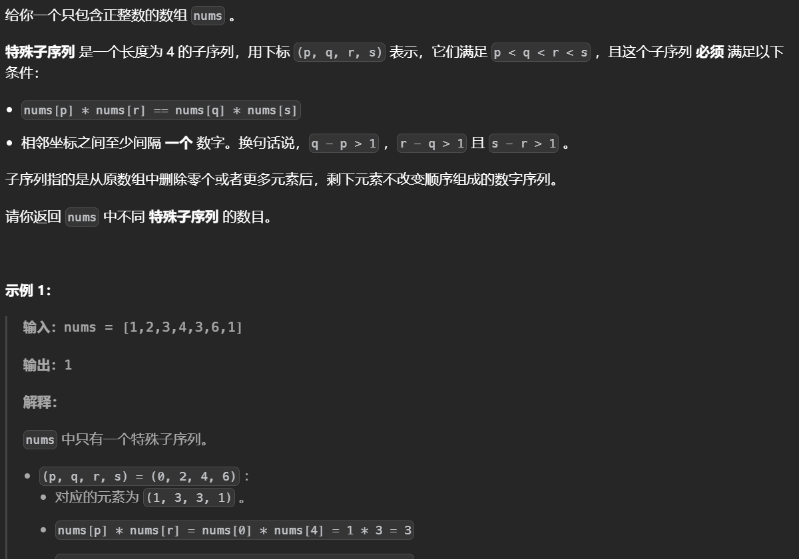

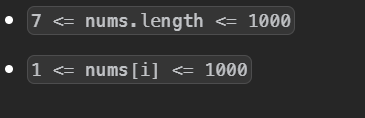

对于给定的数据范围可以双重循环(可以构造出所有数对)，给定的公式可以变形，经典套路枚举中间——将枚举的值作为c去找符合条件的数对，再将枚举的值作为b，去更新储存的值。

```python
class Solution:
    def numberOfSubsequences(self, nums: List[int]) -> int:
        n=len(nums)
        # 因为要间隔一位所以需要用两个计数器
        pre=Counter()
        curr=Counter()
        ans=0
        for i in range(n):
            # 先更新答案再更新计数器
            # 只有下标大于等于4才能找到c和d，以当前位置为c
            if i>=4:
                c=nums[i]
                # 要间隔一位
                for j in range(i+2,n):
                    d=nums[j]
                    ans+=pre[d/c]
            # 更新i-2位置的计数器
            pre=Counter(curr)
            # 以当前位置为b更新计数器
            if i>=2:
                b=nums[i]
                for j in range(i-2,-1,-1):
                    a=nums[j]
                    curr[a/b]+=1           
        return ans 
```

## [统计近似相等数对 II](https://leetcode.cn/problems/count-almost-equal-pairs-ii/)

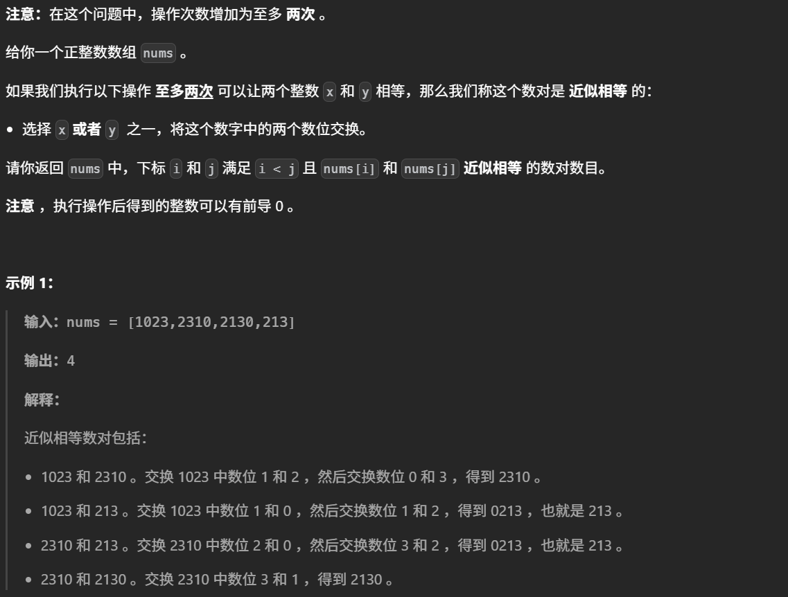

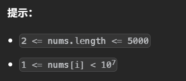

如果一对数能通过交换变得相等，那么交换那个都可行，因此枚举每个数统计它交换0，1，2次能匹配到的数对。

```python
class Solution:
    def countPairs(self, nums: List[int]) -> int:
        ans=0
        memo=Counter()
        nums.sort()
        for r,x in enumerate(nums):
            st=set()
            ans+=memo[x]
            st.add(x)
            s=list(str(x)) 
            m=len(s)
            for i in range(m):
                for j in range(i+1,m):
                    s[i],s[j]=s[j],s[i]
                    temp=int(''.join(s))
                    if temp not in st:
                        st.add(temp)
                        ans+=memo[temp]
                    for a in range(m):
                        for b in range(a+1,m):
                            s[a],s[b]=s[b],s[a]
                            temp=int(''.join(s))
                            if temp not in st:
                                st.add(temp)
                                ans+=memo[temp]
                            s[a],s[b]=s[b],s[a]
                    s[i],s[j]=s[j],s[i]
            memo[x]+=1
        return ans 
```


# 枚举中间

对于三个或者四个变量的问题，枚举中间的变量往往更好算。

## [节点序列的最大得分](https://leetcode.cn/problems/maximum-score-of-a-node-sequence/)

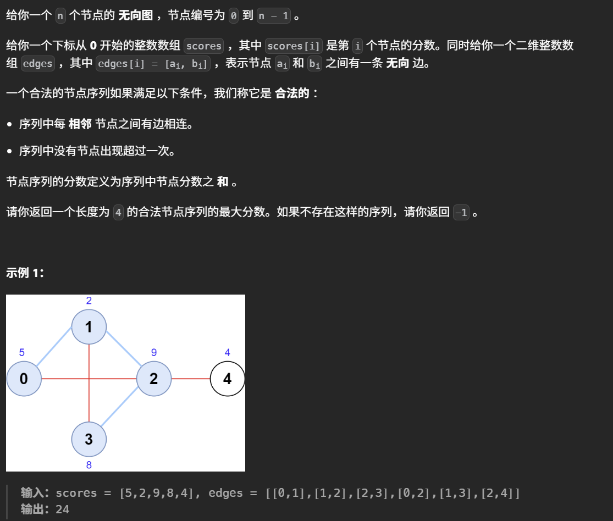

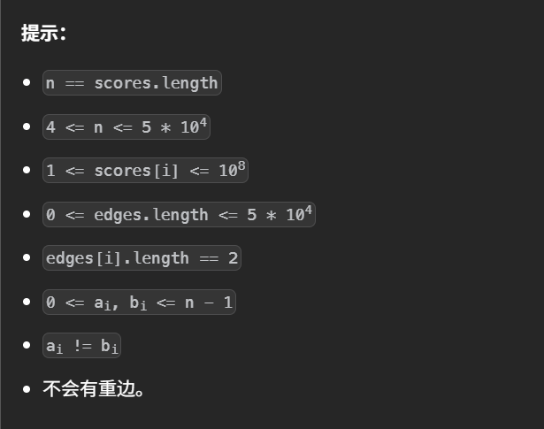

四个变量枚举中间位置，既然要保证点之间相连，那就枚举边。对边的两个端点再去枚举与它相连的最大的点，这里用堆维护最大的三个

```python
class Solution:
    def maximumScore(self,nums: List[int], edges: List[List[int]]) -> int:

        n=len(nums)
        g=[[] for _ in range(n)]
        for u,v in edges:
            g[u].append((nums[v],v))
            g[v].append((nums[u],u))
        for i,arr in enumerate(g):
            if len(arr)>3:g[i]=nlargest(3,arr)
        ans=-1
        for x,y in edges:
            for _,l in g[x]:
                if l==y:continue
                for _,r in g[y]:
                    if r==x or l==r:continue
                    ans=max(ans,nums[x]+nums[y]+nums[l]+nums[r])
        return ans 
```


## [统计上升四元组](https://leetcode.cn/problems/count-increasing-quadruplets/)

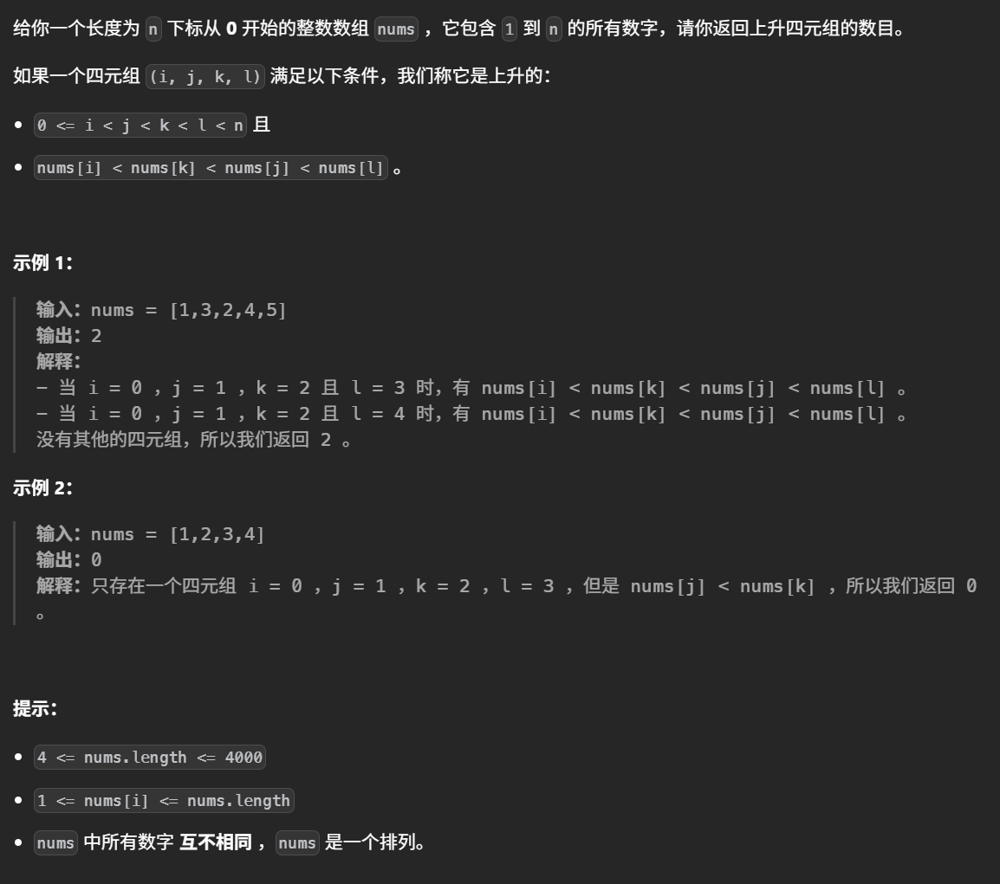

考虑给定的数据范围可以枚举j和k，i和l的组合通过乘法定理求解，定义great[k]\[x]为位置k右侧比x大的有多少，同理可以求解j左侧小于nums[k]的有多少，但本题的nums是一个排列，利用排列的性质只要知道右侧有多少大于的，就能计算出左侧有多少小于的

```python
class Solution:
    def countQuadruplets(self, nums) -> int:
        n=len(nums)
        great=[None]*n
        great[-1]=[0]*(n+1)
        # 递推求解great
        for i in range(n-2,-1,-1):
            great[i]=great[i+1][:]
            # 优化，只枚举到nums[i+1]，x<nums[i+1]更新
            for x in range(1,nums[i+1]):
                great[i][x]+=1
        ans=0
        # 优化，不递推less，直接求解
        for j in range(1,n-2):
            for k in range(j+1,n-1):
                if nums[j]>nums[k]:
                    g=great[k][nums[j]]
                    g2=great[j][nums[k]]
                    rest=n-nums[k]-g2-1
                    mn=j-rest
                    ans+=mn*g
        return ans 
```


# 前缀和

如果构建好了前缀和，从0~n-1遍历i取pre[i+1]，再找pre[j]时注意将j加一得到真实的j索引


## [分割数组的最多方案数](https://leetcode.cn/problems/maximum-number-of-ways-to-partition-an-array/)

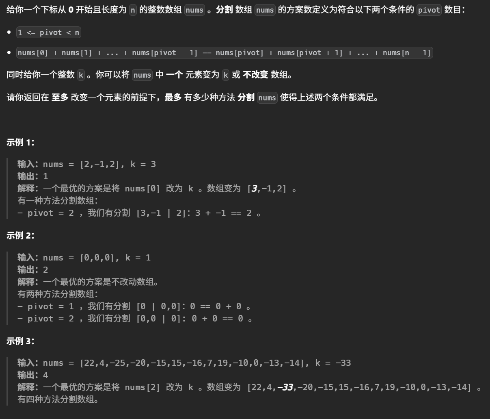

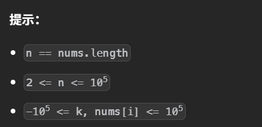

条件相当于把数组划分为大小相等的两部分，用前缀和来看就是pre[i]=pre[-1]//2

既然是只可以修改一个位置的话，那么就枚举这个位置将其改为k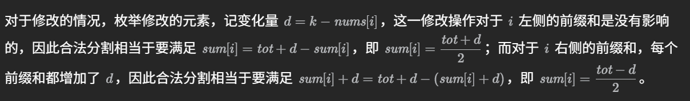

那么根据公式，维护一个位置之前的前缀指与之后的前缀值统计最大值。

```python
class Solution:
    def waysToPartition(self, nums: List[int], k: int) -> int:
        pre=list(accumulate(nums,initial=0))
        n=len(nums)
        # i位置之前的前缀值
        l=defaultdict(int)
        # i及i位置之后的前缀值，这里防止取到偏移项。
        # pre[i]实际上统计的是i+1位置分割后是否满足条件，因此丢弃pre数组的最后一个防止取到无用的值
        r=Counter(pre[1:-1])
        ans=0
        # 记录不修改的结果
        if pre[-1]%2==0:
            ans=max(ans,r[pre[-1]//2])
        
        for i in range(n):
            # 偏移
            diff=k-nums[i]
            if nums[i]!=k:
                tmp=0
                # 记录前缀
                if (pre[-1]+diff)%2==0:
                    tmp+=l[(pre[-1]+diff)//2]
                if (pre[-1]-diff)%2==0:
                    tmp+=r[(pre[-1]-diff)//2] 
                ans=max(ans,tmp)
            # 维护
            l[pre[i+1]]+=1
            r[pre[i+1]]-=1

        return ans 
```


## [构造正数组](https://leetcode.cn/problems/make-a-positive-array/)

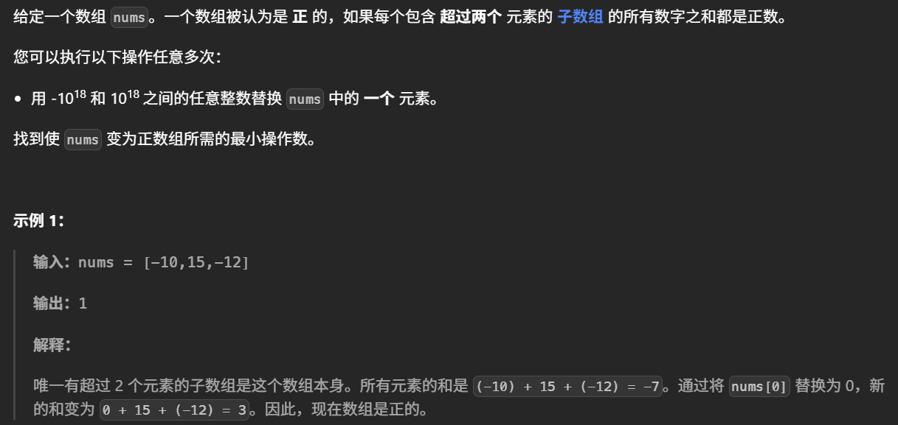

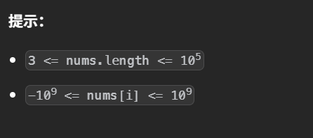

要求所有包含两个元素以上的子数组的和需要是正数，那么从头开始操作使得以每个元素为右端点的子数组满足要求。

这里贪心的思想，如果一个右端点不满足条件那么就修改这个右端点，这样可以使得右侧需要修改的次数最少，既然要修改那么一定是越大越好，因此取10**18。

如果一段子数组的和为负数，那么前缀和的角度来看，就是当前位置的前缀和小于前面位置的前缀和，因此在遍历的过程中维护一个前缀和和一个记录前缀最大值的前缀数组，不断比较，如果小于那么操作次数就加一，并将该位置改为10**18.

```python
from sortedcontainers import SortedList as sl
class Solution:
    def makeArrayPositive(self, nums: List[int]) -> int:
        pre=[nums[0]]
        preMx=[0]
        ans=0
        n=len(nums)
        for i in range(1,n):
            # # 前缀和
            tmp=pre[-1]+nums[i]
            # 需要数组包含两个以上的元素
            if i-2>=0 and preMx[i-2]>=tmp:
                ans+=1
                # 修改前缀值
                tmp=tmp-nums[i]+10**18
            # 记录前缀值
            pre.append(tmp)
            # 前缀最大值要保证记录的i-2位置及之前。
            preMx.append(max(preMx[-1],pre[i-1]))
        return ans 


```


## [向下取整数对和](https://leetcode.cn/problems/sum-of-floored-pairs/)

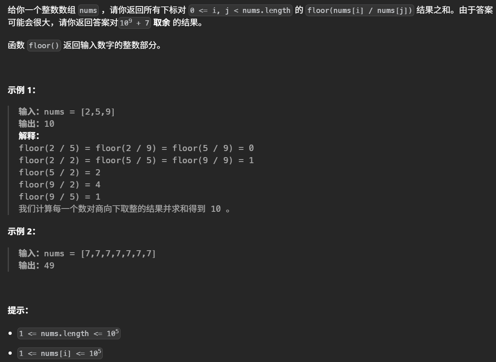

这里的关键点在于floor下取整操作，假设分母是X，那么所有[0,x-1]的做除法会得到一样的结果，[x,2x-1]得到一样的结果，.....，因此通过计数数组的前缀和可以求解出所有的可能。这里遍历[kx,kx-1]的所有区间是调和级数的时间复杂度。

```python
class Solution:
    def sumOfFlooredPairs(self, nums: List[int]) -> int:
        mod=10**9+7
        vis=Counter(nums)
        mx=max(nums)
        # 计数数组
        arr=[0]*(mx+1)
        for x in nums:
            arr[x]+=1
        # 前缀和
        pre=list(accumulate(arr,initial=0))
        ans=0
        n=len(nums)
        # 同一种数只需计算一次，乘上出现次数即可
        for x in vis:
            l,r=0,x-1
            # 调和级数枚举区间
            while True:
                i=pre[l]
                # 防止超出范围
                j=pre[min(r+1,len(pre)-1)]
                ans+=(j-i)*l//x*vis[x]
                l+=x
                r+=x
                if l>mx:break
            ans%=mod
        return ans 
```


## [矩形区域不超过 K 的最大数值和](https://leetcode.cn/problems/max-sum-of-rectangle-no-larger-than-k/)

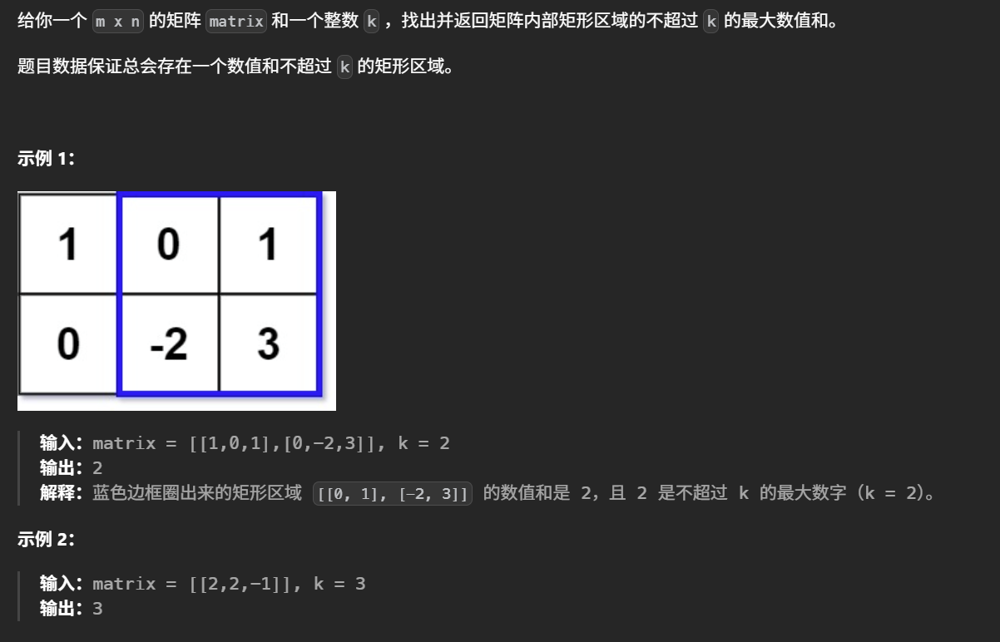

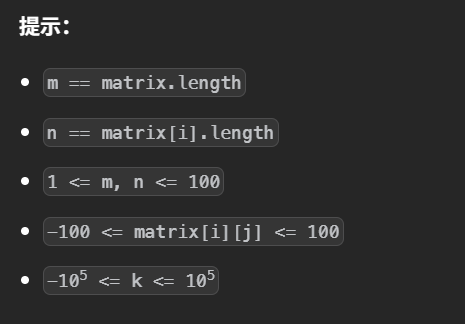

考虑给定的数据范围，可以枚举矩形的上下边界，然后第三重循环枚举矩形的右边界，通过前缀和(压缩为一维)求解满足条件的左边界——pre[j+1]-pre[i]<=k找到刚刚好满足pre[i]>=pre[j+1]-k的位置，这里一边枚举一边记录，使用有序数组维护。

```python
from sortedcontainers import SortedList as sl 
class Solution:
    def maxSumSubmatrix(self, g: List[List[int]], k: int) -> int:
        m,n=len(g),len(g[0])
        # 每一列的前缀值
        col=[list(accumulate(arr,initial=0)) for arr in zip(*g)]
        ans=-inf
        # 枚举上下边界
        for j in range(m):
            for i in range(j+1):
                # 压缩为一维的前缀和
                pre=list(accumulate([col[idx][j+1]-col[idx][i] for idx in range(n)],initial=0))
                # 有序数组
                arr=sl()
                arr.add(0)
                for p in range(n):
                    idx=arr.bisect_left(pre[p+1]-k)
                    # 找到能满足条件且使最终结果最大
                    if idx<len(arr):ans=max(pre[p+1]-arr[idx],ans)
                    arr.add(pre[p+1])
        return ans 
```

## [找出最长的超赞子字符串](https://leetcode.cn/problems/find-longest-awesome-substring/)


既然能够重排，那么只需要计数。回文串对应的字符最多只有一个出现奇数次，其他都要出现偶数次，那么可以想到用异或运算求解，用长度为10的二进制位表示每个数字出现奇数次还是偶数次。异或运算可以使用前缀和表示，如果子数组满足条件，那么异或出的结果最多只有一个位置为1，可以枚举最终1的位置，反解出前缀值。

```python
class Solution:
    def longestAwesome(self, s: str) -> int:
        memo=defaultdict(list)
        memo[0].append(-1)
        m=ans=0
        for j,c in enumerate(s):
            c=int(c)
            m^=(1<<c)
            if m in memo:
                ans=max(j-memo[m][0],ans)
            for i in range(10):
                d=m^(1<<i)
                if d in memo:ans=max(j-memo[d][0],ans)
            memo[m].append(j)
        return ans 
```


## [幂中幂plus](https://ac.nowcoder.com/acm/contest/113313/F)

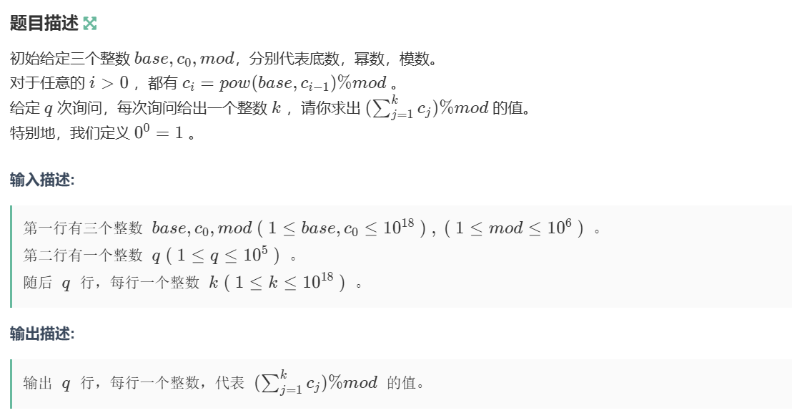

10^18的数据范围求解一般只能使用倍增或找数学规律，但是本题无法使用倍增也找不出数学规律，观察到模数的范围是1e6，那么可以推测必然存在一个循环节使得c不断循环，一因此只要找到这个循环节再结合前缀和就可以快速求解。

```python
base,c0,mod=RR()
memo=defaultdict(int)
cnt=1
c=pow(base,c0,mod)
pre=[0]

# 找循环节
while c not in memo:
    memo[c]=cnt
    pre.append((pre[-1]+c)%mod)
    cnt+=1
    c=pow(base,c,mod)

# 注意这里的cnt需要减一才能得到循环的结束位置
cnt-=1
sz=cnt-memo[c]+1
idx=memo[c]-1


for _ in range(R()):
    q=R()
    # 小于的直接前缀和求解
    if q<=cnt:
        print(pre[q])
    else:
        # 分为循环开始前，若干段循环，以及不能形成一个循环的部分
        tmp=(q-memo[c]+1)//sz
        tmp1=(q-memo[c]+1)%sz
        ans=(tmp*(pre[-1]-pre[idx])%mod)%mod
        l=pre[idx]
        r=(pre[idx+tmp1]-pre[idx])%mod
        ans+=l+r
        ans%=mod
        print(ans)
```


# 二维前缀和

## 二维区域和检索–矩阵不可变


利用前缀和数组，计算出从原点到[i,j]的矩阵元素和

1. 从 `(row2, col2)` 处的前缀和减去 `(row1 - 1, col2)` 处的前缀和（如果 `row1` 不为0的话）。
2. 再减去 `(row2, col1 - 1)` 处的前缀和（如果 `col1` 不为0的话）。
3. 最后再加上 `(row1 - 1, col1 - 1)` 处的前缀和（如果 `row1` 和 `col1` 都不为0的话）。


```python
class NumMatrix(object):

    def __init__(self, matrix):
        if not matrix or not matrix[0]:
            self.prefix_sum = None
            return
        self.matrix=matrix
        m=len(matrix)
        n=len(matrix[0])
        # 所构建的数组长宽都要多出一，可以方便计算，不是防止越界
        self.prematrix=[[0]*(n+1) for _ in range(m+1)]
        for i in range(1,m+1):
            for j in range(1,n+1):
                # 子矩阵的元素和为矩阵元素加上左边的子矩阵加上上边的子矩阵减去重复的左上矩阵 
                self.prematrix[i][j]=self.matrix[i-1][j-1]+self.prematrix[i-1][j]+self.prematrix[i][j-1]-self.prematrix[i-1][j-1]
	
    def sumRegion(self, row1, col1, row2, col2):
        # 最后的计算中注意不能重叠，放到矩阵上做一位偏移
        return self.prematrix[row2+1][col2+1]-self.prematrix[row2+1][col1]-self.prematrix[row1][col2+1]+self.prematrix[row1][col1]
```


# 前缀和的前缀和

想要求**一个区间内的所有子数组的和的和**就需要用到前缀和的前缀和


## [巫师的总力量和](https://leetcode.cn/problems/sum-of-total-strength-of-wizards/)

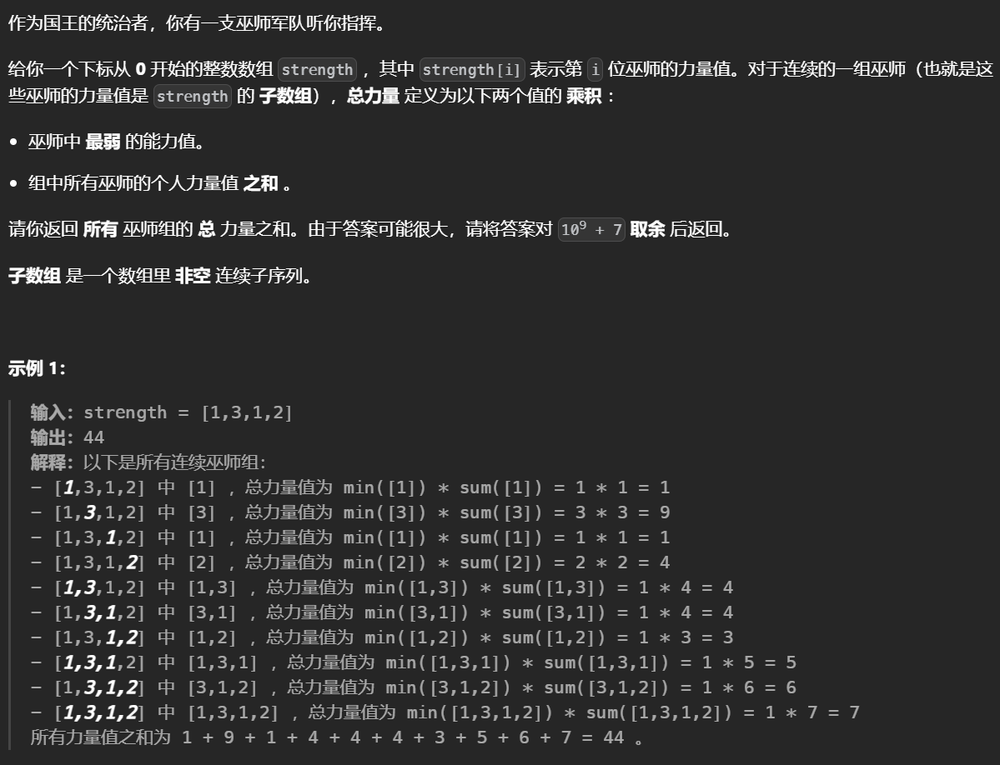

使用栈求出一个值作为最小值的区间，然后需要求解区间中包括这个值得所有子数组和的和

令s为前缀和那么有，这里的将s[r+1]替换为s[r]，因此右端点的界限要加一

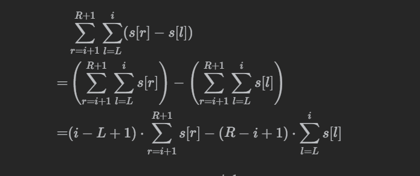

这里对s的累和可以用前缀和求解，因此要构建一个前缀和的前缀和。

```python
class Solution:
    def totalStrength(self, nums: List[int]) -> int:
        n=len(nums)
        less=[[-1,n] for _ in range(n)]
        d=deque()
        mod=10**9+7
        ans=0
        for i,x in enumerate(nums):
            while d and nums[d[-1]]>x:
                d.pop()
            if d:
                less[i][0]=d[-1]
            d.append(i)
        d=deque()
        for i in range(n-1,-1,-1):
            x=nums[i]
            while d and nums[d[-1]]>=x:
                d.pop()
            if d:
                less[i][1]=d[-1]
            d.append(i)
        pre=list(accumulate(accumulate(nums,initial=0),initial=0))
        for i,(l,r) in enumerate(less):
            l+=1
            r-=1
            ans+=((i-l+1)*(pre[r+2]-pre[i+1])-(pre[i+1]-pre[l])*(r-i+1))*nums[i]
            ans%=mod
        return ans 
```

# 差分数组

差分数组（Differential Array）是一个常用于高效处理数组区间更新操作的数据结构，它主要用于解决给定一个数组，支持多次对数组的某个区间进行一系列增减操作，并能够快速查询最终数组某个的值。

差分数组的基本操作时维护一个新的数组，该数组的元素是原始数组中相邻元素的差值。

1. **更新操作**：对原始数组的某个区间 `[left, right]` 进行增加或减少的操作。这可以通过在差分数组中更新两个位置来实现。具体地，对于原始数组的区间 `[left, right]` 增加 `val` 可以在差分数组的 `left` 处增加 `val`，并在 `right + 1` 处减少 `val`。这样，在查询时，差分数组的前缀和就等于原始数组操作后相应位置的值。
2. **查询操作**：查询原始数组的某个位置的值。这可以通过查询差分数组的前缀和来实现。在查询原始数组的位置 `i` 处的值时，只需查询差分数组的前缀和 `prefixSum[i]` 即可。
3. **快速更新多个区间**：如果需要对多个区间进行更新，差分数组可以在一次遍历中完成所有更新操作，而不需要每次都遍历原始数组。
4. 遍历差分数组的过程中，使用一个变量记录累和就可以得到当前位置的元素大小

```python
class DifferenceArray:
    def __init__(self,nums):
        # 构建差分数组
        self.n=len(nums)
        self.diff=[0]*self.n
        # 第一个位置的值和原数组第一个位置的值相同
        self.diff[0]=nums[0]
        for i in range(1,self.n):
            self.diff[i]=nums[i]-nums[i-1]
    # 更新操作
    def increment(self,left,right,val):
        # 更新
        self.diff[left]+=val
        if right+1<self.n:
            # 注意索引不能超出，超出则不做操作
            self.diff[right+1]-=val
    def result(self):
        # 根据差分数组构建原数组
        result=[0]*self.n
        result[0]=self.diff[0]
        for i in range(1,self.n):
            result[i]=result[i-1]+self.diff[i]
        return result
    # 或者是直接在差分数组上恢复原数组
   	for i in range(1,n):
		diff[i]+=diff[i-1]

# 示例使用
nums = [1, 2, 3, 2, 1]
diff_array = DifferenceArray(nums)

# 对区间 [1, 3] 增加 2
diff_array.increment(1, 3, 2)

# 查询最终数组
final_array = diff_array.result()
print(final_array)
```


在一次从头到尾的遍历操作中，可以使用差分修改数组，这个过程中使用一个外部变量一直累加来表示当前的值。


## 空调

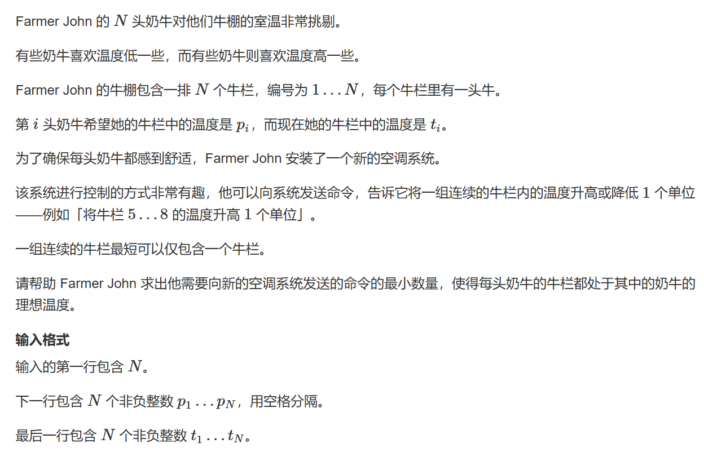

通过差分操作来让两组数平衡，而差分操作实际上就是对两组数的差值：1.任意一个位置加一，另一个位置减一(区间更新操作)  2.任意位置加一或减一(右区间超过数组范围)

因此最大的操作次数就是做差后的数组中的最大值和最小值中绝对值最大的。

```python
n=int(input())
a=[int(x) for x  in input().split()]
b=[int(x) for x in input().split()]
# 找两个数组的差值
nums=[x-y for x,y in zip(a,b) ]

if nums:
    diff=[nums[0]]
    for i in range(1,len(nums)):
        diff.append(nums[i]-nums[i-1])
        # 多构建一位
    diff.append(-nums[-1])
    cnt=0
    for v in diff:
        if v>0:
            cnt+=v
    print(cnt)
else:
    print(0)

```

## [平衡细菌][https://www.acwing.com/problem/content/5529/]

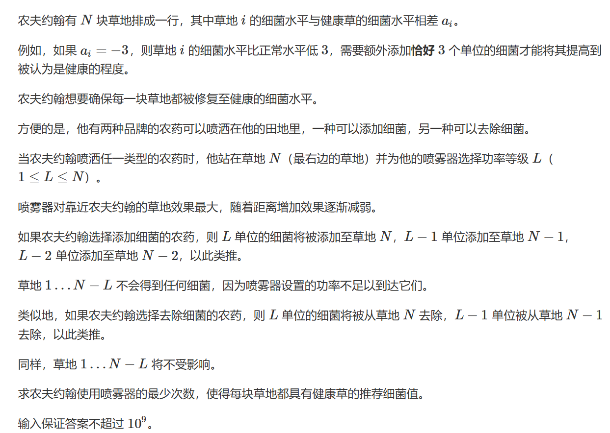

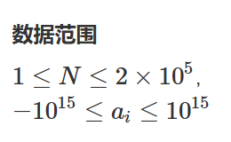

一次操作对数组添加1 2 3 4 5...，从一维差分的角度来看是 1 1 1 1...再从二维差分的角度看是1 0 0 0 0，因此最小的的操作次数实际上就是把二维差分数组中所有的位置变为0。

```python
n=R()
nums=RR()
# 一维差分
diff=[nums[0]]
for i in range(1,n):
    diff.append(nums[i]-nums[i-1])

# 二维差分
d=[diff[0]]
for i in range(1,n):
    d.append(diff[i]-diff[i-1])

# 绝对值求和
ans=sum([abs(x) for x in d])
print(ans)
```


##  Look Back

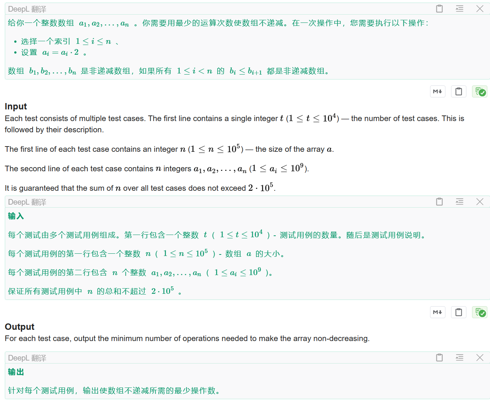


直接模拟乘2会超时，使用位运算记录乘2的次数同时修改数组元素会超内存。此题具有差分的性质，为了保证元素是不递减的每个元素操作时不仅要看前一个还要看前面所有的。

记录差分，不过这里不是元素相减而是相除，比如3 2 1 第三个元素需要的次数是2这个次数是由2与1的差值所需的操作次数加上3和2的操作次数，一些情况下比如3 2 5 ，5操作0次

因为2与5之间的操作次数位log2(2/5)上取整是一个负数，他还就要加上3和2的操作次数，最后的结果是负数，但是此题中只能改大不能改小，因此把负数变为0

```python
from math import *
import sys
from itertools import accumulate as ac
input=sys.stdin.readline
for _ in range(int(input())):
    n=int(input())
    nums=[int(x) for x in input().split()]
    # 差分数组，这里是相除的差分
    diff=[0]*n
    diff[0]=nums[0]
    for i in range(1,n):
        diff[i]=nums[i-1]/nums[i]
    # 记录操作的前缀和
    a=[0]
    for i in range(1,n):
        a.append(a[-1]+ceil(log2(diff[i])))
        a[-1]=max(a[-1],0)   
    a=list(ac(a))
    print(a[-1])
```

## [描述绘画结果](https://leetcode.cn/problems/describe-the-painting/)

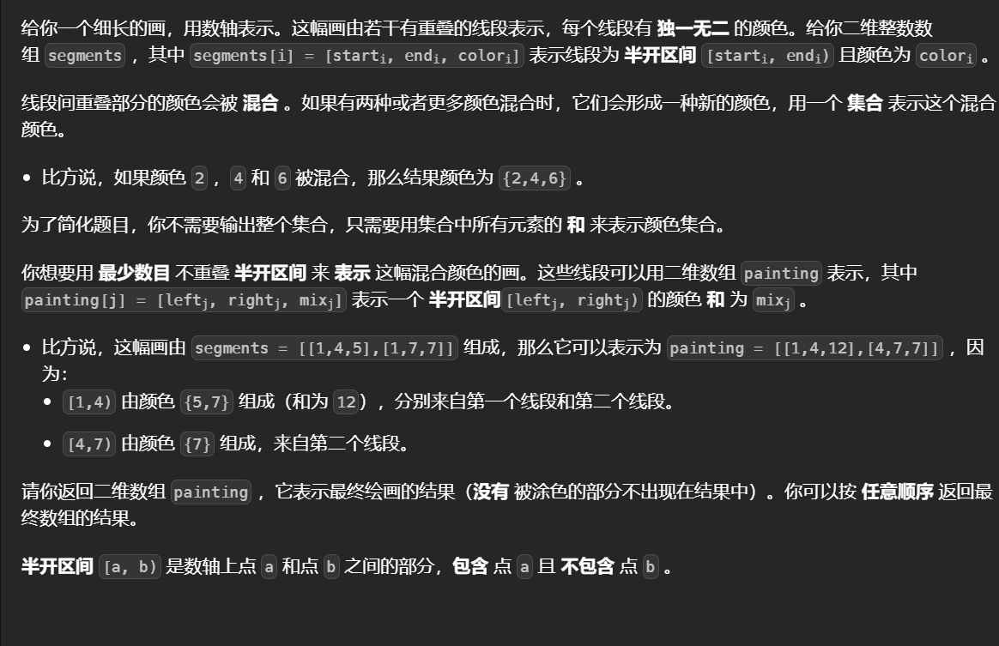

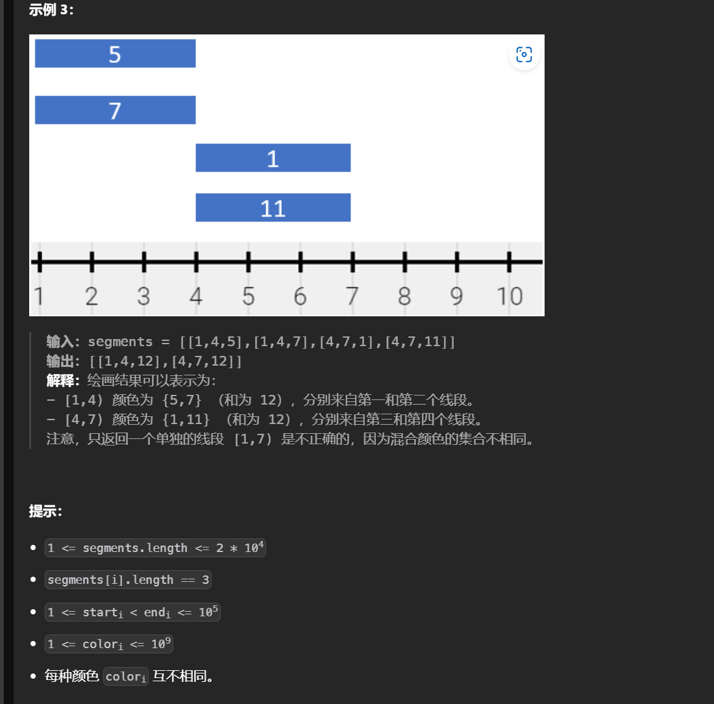

很明显是使用差分，但是如果对区间差分构建前缀和后去找相同的值的区间，会把两段不同的区间认为是一个。这里选择按照端点的顺序对端点构建前缀和，因为只有在线段的端点才会变换颜色

通过对区间端点差分构建前缀和可以轻松求出每一段区间


```python
class Solution:
    def splitPainting(self, segments: List[List[int]]) -> List[List[int]]:
        # 因为只是对端点操作，不需要记录数组
        memo=defaultdict(int)
        for u,v,w in segments:
            memo[u]+=w
            memo[v]-=w
        # 按顺序访问
        nums=sorted([k,v] for k,v in memo.items())
        n=len(nums)
        ans=[]
        pre=0
        for i in range(n-1):
            pre+=nums[i][1]
            # 不存在的区间不考虑
            if pre:ans.append([nums[i][0],nums[i+1][0],pre])
        return ans 
```


## [最大化城市的最小电量](https://leetcode.cn/problems/maximize-the-minimum-powered-city/)

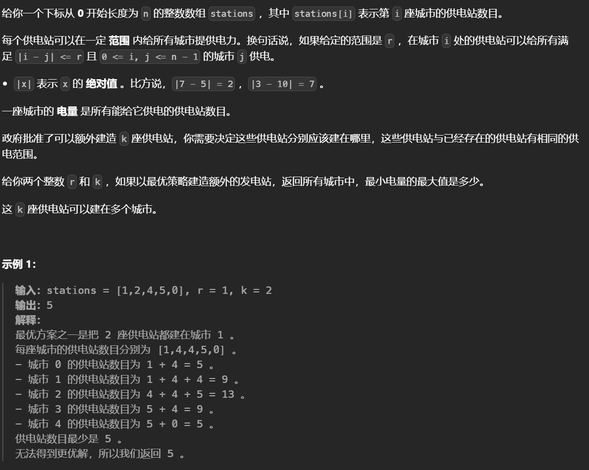


最小化最大值，使用二分来做，check函数中需要检查每个城市对应的区间内的电量和是否满足条件，如果不满足则要在能影响到这个城市的最右侧的城市建造供电站，这是个动态修改的过程，如果使用线段树求解会超时，因此这里使用差分。

首先将数组中的值替换为它对应的区间和，差分数组记录每个位置多了多少电量(受供电站影响)，遍历的过程中求前缀和就可以得到每个位置添加的数量了。

```python
class Solution:
    def maxPower(self, nums: List[int], ra: int, k: int) -> int:
        n=len(nums)
        l,r=0,10**11
        s=list(accumulate(nums,initial=0))
        # 计算出每个城市对应的区间和
        for i in range(n):
            nums[i]=s[min(n-1,i+ra)+1]-s[max(0,i-ra)]

        def cal(min_power):
            d=[0]*n
            sum_d=need=0
            # 遍历的过程中累加前缀和得到每个城市多的电量
            for i,power in enumerate(nums):
                sum_d+=d[i]
                c=min_power-power-sum_d
                if c>0:
                    need+=c
                    sum_d+=c
                    if need>k:return False
                    if i+2*ra+1<n:
                        d[i+2*ra+1]-=c
            return True

        while l<=r:
            mid=(l+r)>>1
            if cal(mid):
                l=mid+1
            else:
                r=mid-1
        return l-1        
```


## [使差值相等的最少数组改动次数](https://leetcode.cn/problems/minimum-array-changes-to-make-differences-equal/)

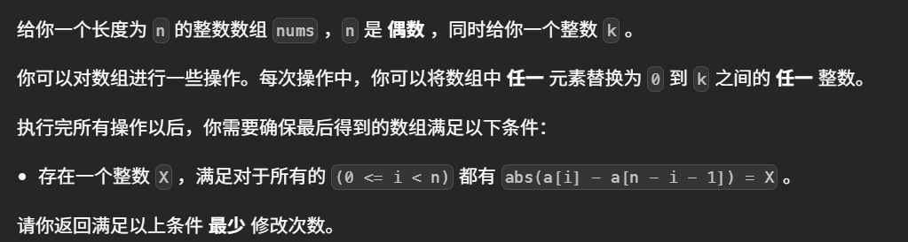

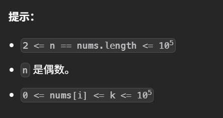


本题枚举最终的X，对于每个数对，它们之间可以形成的距离有三种：(1)二者绝对值之差，需要操作0次 (2)需要操作一次才能得到的差 (3)操作两次才能得到的差

因此，遍历每个数对，用差分数组记录对最终结果所需的操作次数。

```python
class Solution:
    def minChanges(self, nums: List[int], k: int) -> int:
        n=len(nums)
        # 开大一点，避免判断
        diff=[0]*(k+10)
        for i in range(n>>1):
            l,r=nums[i],nums[n-i-1]
            if l>r:
                l,r=r,l
                
            # 先考虑移动一次能得到的差值区间
            a,b=0,max(r,k-l)
            diff[a]+=1
            diff[b+1]-=1
            
            # 操作两次能得到的最大的区间，[b+1,k]，这里k超出了差分数组的范围不用处理
            diff[b+1]+=2
            d=r-l
            # 处理不需要操作的位置
            diff[d]-=1
            diff[d+1]+=1
        pre=list(accumulate(diff))
        return min(pre[:k+1])
```

## [执行操作后元素的最高频率 II](https://leetcode.cn/problems/maximum-frequency-of-an-element-after-performing-operations-ii/)

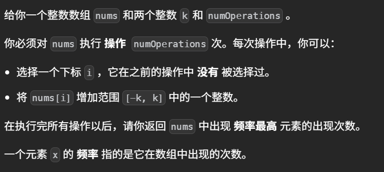

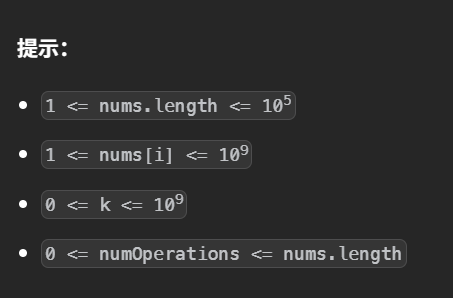

显而易见的差分操作，对于可能的数看看有哪些元素操作后可以得到它，比例每个数用差分记录它所能形成的范围。这里不同的地方在于操作次数是有限的，需要对于每个结果判断一下，如果它出现在数组中，那么他能从别的位置的元素转移过来的次数不能超过numsoperations，如果不在数组中，那么出现次数一定不能超过numsoperations，这样就满足了限制条件

给定的数据范围是1e9需要用字典进行差分，由于这里需要判断元素是否出现在数组中，因此字典中需要记录数组中的值。

```python
class Solution:
    def maxFrequency(self, nums, k: int, c: int) -> int:
        diff=defaultdict(int)
        # 差分操作
        for v in nums:
            l,r=max(0,v-k),v+k
            diff[v]
            diff[l]+=1
            diff[r+1]-=1
        ans=pre=0
        memo=Counter(nums)
        # 记录前缀和
        arr=sorted(diff.keys())

        for k in arr:
            pre+=diff[k]
            if k in memo:
                ans=max(ans,memo[k]+min(c,pre-memo[k]))
            else:
                ans=max(ans,min(pre,c))
        return ans 
```


# 二维差分


二维差分`要构造比给定矩阵大2的差分矩阵，初始化为0，因为方便构建前缀和操作需要n+1（在原矩阵上构建前缀和），而差分的更新操作又需要n+1`。坐标都要做一位偏移，而右侧下侧的坐标额外做一次偏移

然后根据原矩阵构造差分，对于原矩阵的每一个值，`相当于在差分矩阵中插入一个值，不过左上角和右下角是一样的`。`差分矩阵的更新操作为对(i,j,x,y)把i,j位置加一，最后的前缀和使得以i,j为左上角到最右下的矩阵面积中的值都变化，因此需要在i,y+1和x+1,j减去对应的值，而在x+1,y+1处加上多减去的部分。`

```python
from itertools import accumulate as ac
n,m,q=[int(x) for x in input().split()]
li=[]
for _ in range(n):
    li.append([int(x) for x in input().split()])
# 矩阵规模大出2
diff=[[0 for _ in range(m+2)] for _ in range(n+2)]

# 根据原矩阵初始化差分矩阵
for i in range(n):
    for j in range(m):
        c=li[i][j]
        # 主对角线加，负对角线减
        diff[i+1][j+1]+=c
        diff[i+1][j+2]-=c
        diff[i+2][j+1]-=c
        diff[i+2][j+2]+=c


while q:
    # 更新
    x1,y1,x2,y2,c=[int(x)-1 for x in input().split()]
    c+=1
    diff[x1+1][y1+1]+=c
    diff[x1+1][y2+2]-=c
    diff[x2+2][y1+1]-=c
    diff[x2+2][y2+2]+=c
    q-=1
    
# 构建二维前缀和
for i in range(1,n+1):
    for j in range(1,m+1):
        diff[i][j]+=diff[i-1][j]+diff[i][j-1]-diff[i-1][j-1]

 # 减去无用的第一行最后一行第一列最后一列
for i in range(n+2):
    diff[i]=diff[i][1:-1]
diff=diff[1:-1]

for d in diff:
    print(*d,end=' ')
    print()
```

## [子矩阵元素加 1](https://leetcode.cn/problems/increment-submatrices-by-one/)

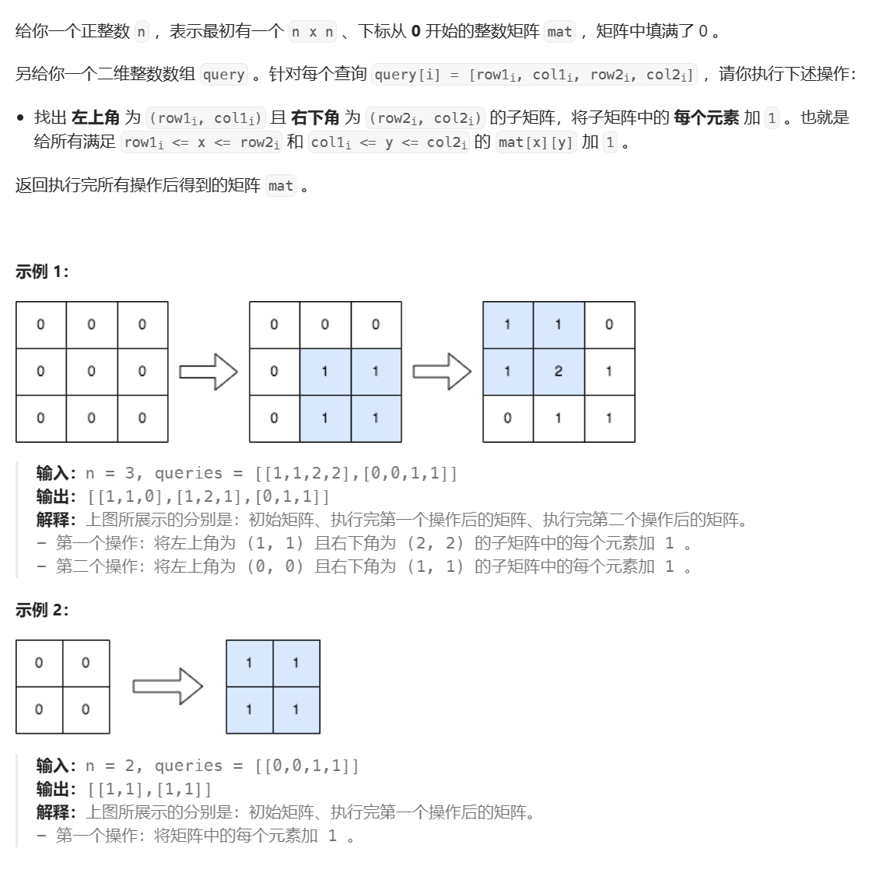


使用差分数组，可以对每一行单独差分，也可以进行二维差分，然后求前缀和。

二维差分的操作技巧是：

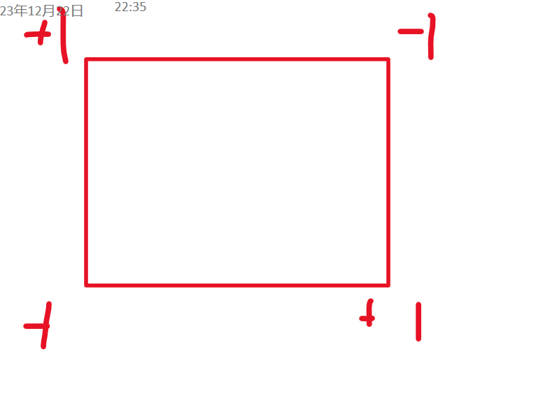


`由于是要求前缀和，所以在大小为n+1的表格上操作，又由于二维差分的操作需要在结尾处右侧减去一，为了方便操作，选择将数组大小设置为n+2，最后在原数组上求前缀和，然后去掉多余的行和列即可`。

```python
class Solution:
    def rangeAddQueries(self, n: int, queries: List[List[int]]) -> List[List[int]]:
        diff=[[0 for _ in range(n+2)] for _ in range(n+2)]
        #  为了前缀和做一位偏移，因此坐标都加一，差分的性质再结尾的后一位减一，因此减去的地方再做一位偏移
        for r1,c1,r2,c2 in queries:
            # 左上
            diff[r1+1][c1+1]+=1
            # 右上
            diff[r1+1][c2+2]-=1
            # 左下
            diff[r2+2][c1+1]-=1
             # 右下，末尾的后一位加上一
            diff[r2+2][c2+2]+=1
            
        # 求前缀和
        for i in range(1,n+1):
            for j in range(1,n+1):
                diff[i][j]+=diff[i][j-1]+diff[i-1][j]-diff[i-1][j-1]
                
         # 去掉多余的行和列
        for i in range(n+2):
            diff[i]=diff[i][1:-1]
        return diff[1:-1]
```


## [用邮票贴满网格图](https://leetcode.cn/problems/stamping-the-grid/)

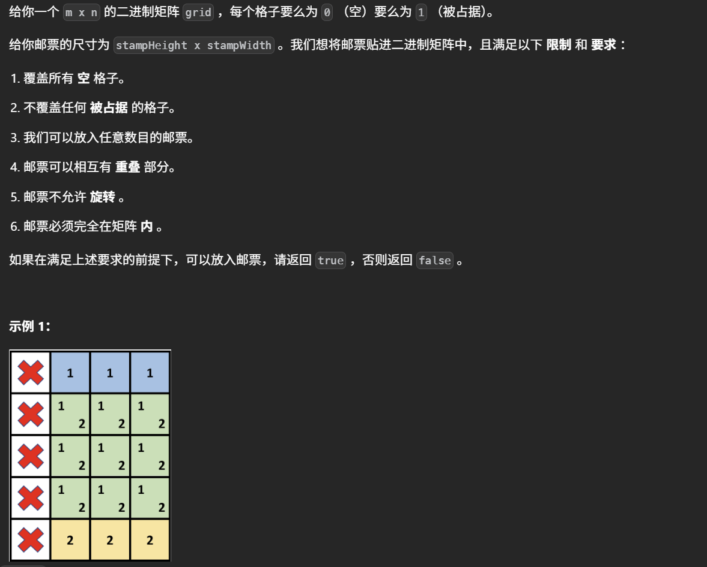

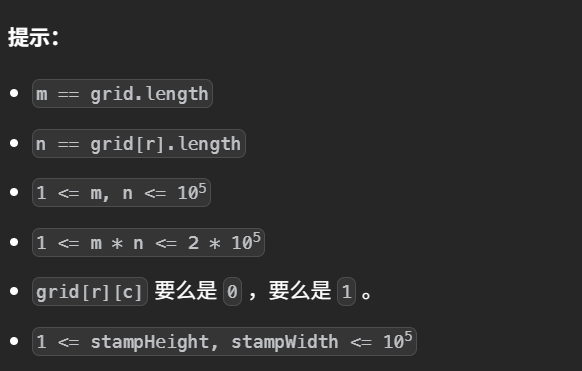


既然邮票可以重叠并且不要求邮票数量最少，那么只要对于所有不存在1的矩形就去填入，通过二维差分维护，最后判断是否满足条件。

```python
class Solution:
    def possibleToStamp(self, g, h: int, w: int) -> bool:
        m,n=len(g),len(g[0])
        pre=[[0]*(n+1) for _ in range(m+1)]
        diff=[[0]*(n+2) for _ in range(m+2)]
        
        for i in range(1,m+1):
            for j in range(1,n+1):
                pre[i][j]=g[i-1][j-1]+pre[i-1][j]+pre[i][j-1]-pre[i-1][j-1]
        for i in range(m-h+1):
            for j in range(n-w+1):
                ni,nj=i+h-1,j+w-1
                d=pre[ni+1][nj+1]-pre[ni+1][j]-pre[i][nj+1]+pre[i][j]
                if not d:
                    diff[ni+2][nj+2]+=1
                    diff[i+1][j+1]+=1
                    diff[ni+2][j+1]-=1
                    diff[i+1][nj+2]-=1
        for i in range(1,m+1):
            for j in range(1,n+1):
                diff[i][j]+=diff[i-1][j]+diff[i][j-1]-diff[i-1][j-1]

        diff=diff[1:-1]
        for i in range(m):diff[i]=diff[i][1:-1]

        for i in range(m):
            for j in range(n):
                if g[i][j]:
                    if diff[i][j]:return False
                else:
                    if not diff[i][j]:return False
        return True
```


# 链表

## [Conflict 2](https://atcoder.jp/contests/abc411/tasks/abc411_d)

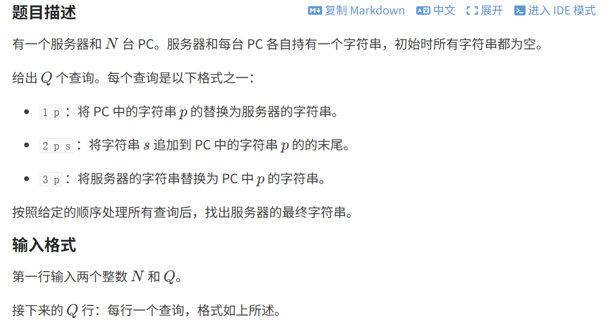

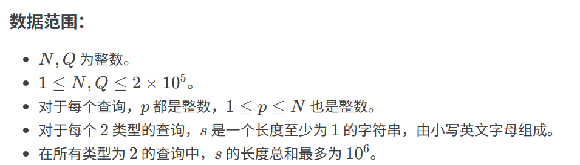

本题中需要不断替换字符串，但又要确保字符串不能是引用类型防止字符被修改被覆盖，因此需要不断拷贝字符串。这个过程一定会超时，因此考虑使用链表，用指针指向真正的数据，每次修改时只需移动指针。

具体过程如下：

- 操作1：创建一个节点，该节点的头指针指向服务器节点
- 操作2：创建一个新节点，该节点头指针指向原先的节点，尾节点指向新的字符串
- 操作3：服务器节点设置为对应的pc节点

```python
n,q=RR()
class Node:
    def __init__(self,p=None,nx=None):
        self.pre=p
        self.nx=nx  
# 维护每台电脑对应的节点
p=[None]*n
# 服务器节点
s=None 
for _ in range(q):
    tmp=RLS()
    if tmp[0]=='1':
        idx=int(tmp[1])-1
        # 创建新的节点，头指针指向服务器节点
        p[idx]=Node(s)
    elif tmp[0]=='2':
        idx=int(tmp[1])-1
        # 创建新节点，拼接两个值
        p[idx]=Node(('' if not p[idx] else p[idx]),tmp[-1])
    else:
        idx=int(tmp[1])-1
        # 修改服务器所对的节点
        s=p[idx]

if not s:print('')
else:
    # 遍历链表，拼接字符串
    ans=deque()
    while True:
        if s.nx:ans.appendleft(s.nx)
        if isinstance(s.pre,Node):
            s=s.pre
        else:
            if s.pre:ans.appendleft(s.pre)
            break
    print(''.join(ans))
```


# ST 表

Sparse Table，一种用于解决**可重复贡献问题**的数据结构

可重复贡献问题：对于运算opt，满足**x** opt **x**= **x**，则对应的区间询问就是一个可重复贡献问题。例如，**最大值有max(c,c)=c，gcd有gcd(c,c)=c，所以RMQ和区间GCD，区间与/或就是一个可重复贡献问题**，但区间和就不具有这个性质。


ST表基于倍增的思想，可以做到**O(nlogn)**预处理，**O(1)**回答每个询问，但不支持**修改**操作


以求解区间最大值为例，令f(i,j)表示区间[i,i+$2^j$-1]，即i表示区间的起始位置，j表示走(1<<j)-1步，显然j=0时，f(i,0)=$a_i$

那么根据倍增的思想，有转移方程

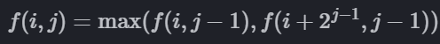

**对于询问[l,r]，取[l,l+(1<<s)-1] ，[r-(1<<s)+1,r]的最大值，其中s=log(r-l+1)下取整**

```python
MX=22 # 步长

MXL=10**5+10 # 区间大小
log=lambda x:floor(log2(x))

# 可以手动预处理log值
L=[0]*MXL
L[1],L[2]=0,1
for i in range(3,MXL):
    L[i]=L[i>>1]+1

n,m=RR()
nums=RR()

# 预处理
f=[[0]*MX for _ in range(n)]
 
# 初始化
for i in range(n):f[i][0]=nums[i]

# 注意转移方程，i会从前后转移过来，j只会从j-1转移过来，因此j作为第一层循环
for j in range(1,MX):
    i=0
    # 注意不要越界
    while i+(1<<(j-1))<n:
        f[i][j]=max(f[i][j-1],f[i+(1<<(j-1))][j-1])
        i+=1

for _ in range(m):
    l,r=RR()
    l-=1
    r-=1
    # 分为两部分
    s=L[r-l+1]
    print(max(f[l][s],f[r-(1<<s)+1][s]))
```


## [Rectangle GCD](https://www.luogu.com.cn/remoteJudgeRedirect/atcoder/abc254_f)

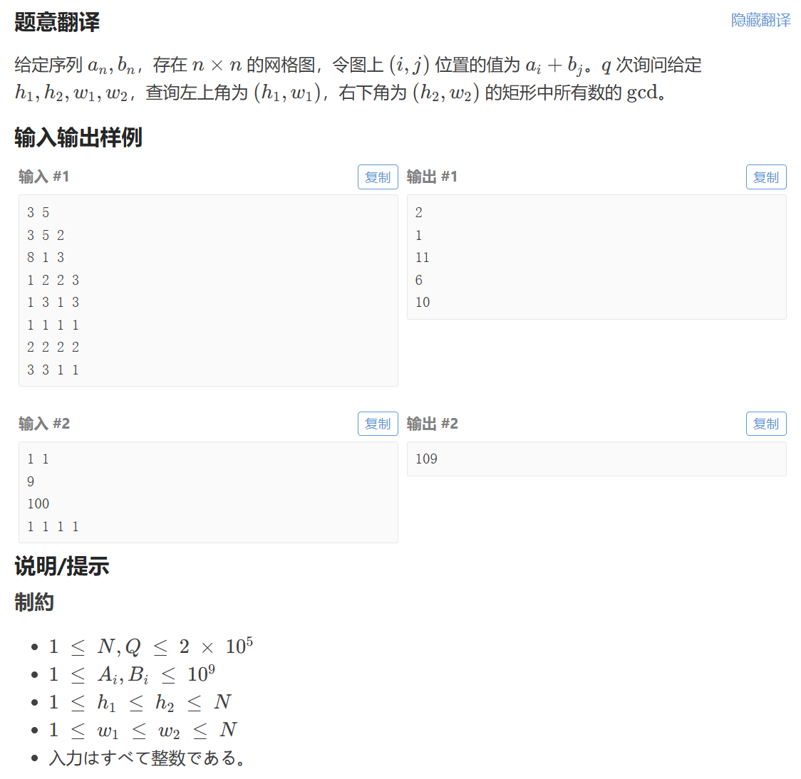

观察到n的范围是1e5，因此是不可能构建矩阵的，这里利用gcd(a,b,c)=gcd(a,|b-a|,|c-b|)的性质。

对矩阵每一行都运用这个性质，可以化简得到，**除了第一列外每一列都相等**，同理对于列使用性质化简也可以得到**除第一行外，每一行都相等**，同时化简的结果是**等差数列**

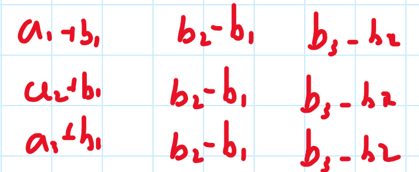

因此对于范围x1 y1 x2 y2运用性质化简后(注意是从x1 y1开始，**即x1 y1是a1 b1**，而不是使用整个矩阵化简得结果，但等差数列的构建无影响)，然后求解区间**x1+1到x2的gcd，以及y1+1到y2的gcd**，最后与x1 y1位置的值，取gcd。

最终将区间gcd转换为了寻找数组的gcd

```python
MX=20
log=lambda x:floor(log2(x)) if x else 0

n,q=RR()
a=RR()
b=RR()
# 构建等差数列
def make_diff(arr):
    temp=[arr[0]]
    for i in range(1,len(arr)):
        temp.append(arr[i]-arr[i-1])
    return temp

row=[a[0]+b[i] for i in range(n)]
col=[a[i]+b[0] for i in range(n)]

row=make_diff(row)
col=make_diff(col)

# st表求解区间gcd
frow=[[0]*MX for _ in range(n)]
fcol=[[0]*MX for _ in range(n)]

for i in range(n):
    frow[i][0]=abs(row[i])
    fcol[i][0]=abs(col[i])

for j in range(1,MX):
    i=0
    while i+(1<<(j-1))<n:
        frow[i][j]=gcd(frow[i][j-1],frow[i+(1<<(j-1))][j-1])
        fcol[i][j]=gcd(fcol[i][j-1],fcol[i+(1<<(j-1))][j-1])
        i+=1


for _ in range(q):
    lx,rx,ly,ry=[v-1 for v in RR()]
    # 起始位置
    start=a[lx]+b[ly]

    lx+=1
    ly+=1
    # 大小为0会返回0，gcd(0,x)=x
    sx,sy=log(rx-lx+1),log(ry-ly+1)
    # 防止区间大小为一的情况
    if lx<=rx:x=gcd(fcol[lx][sx],fcol[rx-(1<<sx)+1][sx])
    else:x=0

    if ly<=ry:y=gcd(frow[ly][sy],frow[ry-(1<<sy)+1][sy])
    else:y=0
    print(gcd(start,x,y))
```


# 树状数组

类似于线段树可以快速求出区间和，同时可以更新，这两个操作的时间复杂度为logn,不过这里的更新只能是单点修改。

+ 求解逆序对
+ 区间求和
+ 邻项交换所需的最小操作次数

树状数组的关键在于巧妙地区间拆分


```python
class FenwickTree:
    def __init__(self, n: int):
        self.tree = [0]*(n+1)

    # a[i] 增加 val
    # 0 <= i <= n-1
    # 时间复杂度 O(log n)
    def update(self, i: int, val: int) -> None:
        i+=1 # 这里加一是为了防止传入的i为0，致使i无法更新
        while i < len(self.tree):
            self.tree[i] += val
            i += i & -i

    # i=3就是前三个值得和
    # 0 <= i <= n-1
    # 时间复杂度 O(log n)
    def pre(self, i: int) -> int:
        res = 0
        while i > 0:
            res += self.tree[i]
            i &= i - 1
        return res

    # 计算区间和 a[l] + ... + a[r]
    # 0 <= l <= r <= n-1
    # 时间复杂度 O(log n)
    def query(self, l: int, r: int) -> int:
        if r < l:
            return 0
        # 前缀和的使用方法
        return self.pre(r+1) - self.pre(l)
```


## [邻位交换的最小次数](https://leetcode.cn/problems/minimum-adjacent-swaps-to-reach-the-kth-smallest-number/)

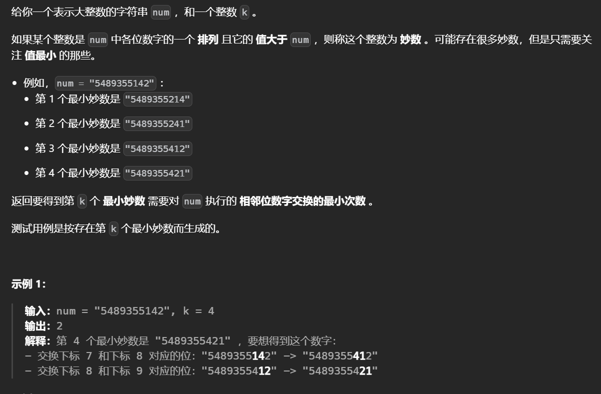

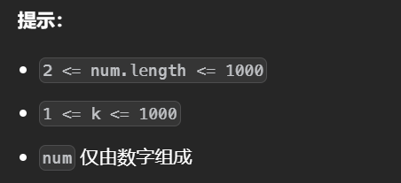

分为两步，先求出第k个排列，其实就是进行k次求下一个更大的排列[下一个排列](https://leetcode.cn/problems/next-permutation/)，然后求解从原序列到目标序列的最小操作次数。

只能相邻交换，求解一个序列到另一个序列的最小操作次数，可以使用逆序对求解。

假设有：pre 11112 target 21111，target的下标为12345，pre映射到target的的序列是23451(第一个1对target的第一个1，第二个1对第二个1)，答案就是pre映射后的逆序对。

```python
from collections import deque,defaultdict

class Tree:
	...
class Solution:
    def getMinSwaps(self, num: str, k: int) -> int:
        n=len(num)
        def convert(num):
            for i in range(n-2,-1,-1):
                if num[i]<num[i+1]:
                    for j in range(n-1,-1,-1):
                        if num[j]>num[i]:
                            num[i],num[j]=num[j],num[i]
                            num[i+1:]=num[i+1:][::-1]
                            return num
        target=list(num)         
        # 进行k次下一个更大的排列
        for _ in range(k):
            target=convert(target)

        # 用目标数组建立映射
        memo=defaultdict(deque)
        for i,c in enumerate(target,1):
            memo[c].append(i)
        
        t=Tree(n+1)
        # 转换原数组
        nums=[]
        for c in num:
            nums.append(memo[c].popleft())
        
        # 求解逆序对
        ans=0
        for i in range(n-1,-1,-1):
            t.update(nums[i],1)
            ans+=t.pre(nums[i]-1)
        return ans
```

## 小朋友排队

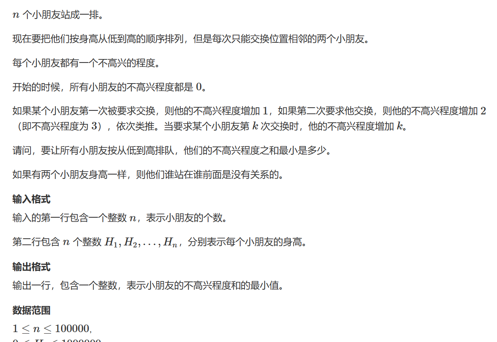

要想交换次数最少那必须是逆序对的个数，每交换一次减少一对逆序对，但是这个题不是统计逆序对，每个人可以贡献的结果与他被交换的次数有关，他交换的次数等于它找别人交换的次数即他右边小于他的数字的个数（逆序对），以及别人找他交换的次数，他左边大于它的个数。

对于第二点，统计每一个数左边大于这个数的个数也可以用逆序对解决不过要稍加变化，比如3 2 1逆序对是右边小于当前数的个数所以第一步要把值的大小颠倒变为1 2 3 然后反转数组求解逆序对即可。

```python
from bisect import bisect_left as bl
n=int(input())
nums=[int(x) for x in input().split()]
class Tree:
    def __init__(self):
        self.tree=[0]*1000010
    def update(self,i,delta):
        i+=1
        while i<len(self.tree):
            self.tree[i]+=delta
            i+=i&(-i)
    def query(self,i):
        s=0
        while i:
            s+=self.tree[i]
            i-=i&(-i)
        return s
ans=[0]*n

# 标准的求解逆序对
t=Tree()
for i in range(n-1,-1,-1):
    v=nums[i]
    t.update(v,1)
    ans[i]+=t.query(v)

t=Tree()
# 离散化，这里是大小颠倒
a=sorted(set(nums))
temp=[n-bl(a,v) for v in nums]
# 反转
temp=temp[::-1]
# 求逆序对
for i in range(n-1,-1,-1):
    v=temp[i]
    t.update(v,1)
    # 注意这个贡献的逆序对要加到反转前的位置上
    ans[n-i-1]+=t.query(v)
res=0
for v in ans:
    res+=(v+1)*v//2
print(res)
```


## **Gather Coins**

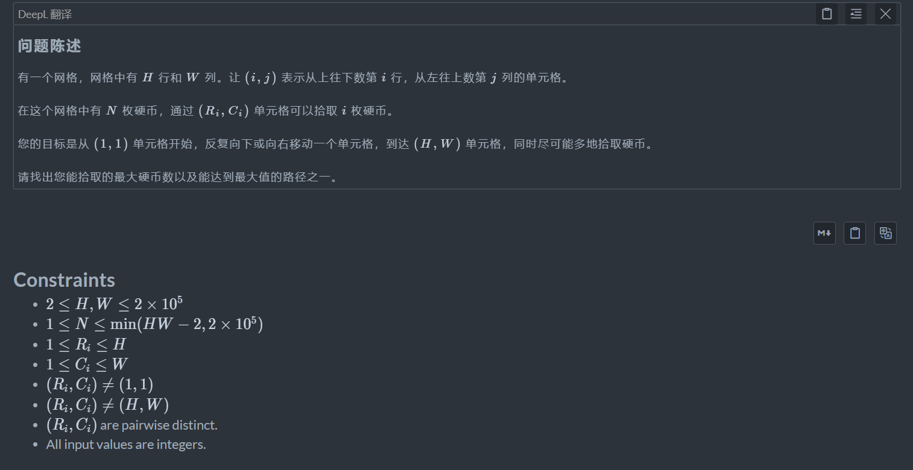


给定的数据范围无法使用回溯，这里因为只能往右下走所以每个硬币只能从左边和上面转移过来，先将数组按照行和列排序，fi表示考虑前i个硬币并且取第i个硬币时最多的硬币数


明显的使用树状数组优化求解，为了得到路径在计算的过程中同时记录一个转移数组，在变数组的过程中已经保证了行是递增的，而对于列用树状数组取得小于等于当前的最大的即可，树状数组中用列的坐标作为数组，这里因为数据范围不大所以不需要离散化。

```python
class SegTree:
    def __init__(self,op,e,n,nums):
        self._n=n
        self._op=op
        self._e=e
        self._log=(n-1).bit_length()
        self._size=1<<self._log
        self._d=[self._e()]*(self._size<<1)
        if nums:
            for i in range(self._n):self._d[self._size+i]=nums[i]
            for i in range(self._size-1,0,-1):self._d[i]=self._op(self._d[i<<1],self._d[i<<1|1])
    def update(self,index,x):
        index+=self._size
        self._d[index]=x
        while index:
            self._d[index>>1]=self._op(self._d[index],self._d[index^1])
            index>>=1
    def get(self,p):return self._d[p+self._size]
    def query(self,l,r):
        sml,smr=self._e(),self._e()
        l+=self._size
        r+=self._size
        while l<r:
            if l&1:
                sml=self._op(sml,self._d[l])
                l+=1
            if r&1:
                r-=1
                smr=self._op(smr,self._d[r])
            l>>=1
            r>>=1
        return self._op(sml,smr)
    def all_prod(self):return self._d[1]

def op(x,y):
    val1,i1=x
    val2,i2=y
    if val1>val2:return (val1,i1)
    return (val2,i2)

def e():return(-1,-1)

h,w,n=RR()
nums=[]
for _ in range(n):nums.append([v-1 for v in RR()])
nums.sort()

init=[(0,-1)]*(w+2)
t=SegTree(op,e,len(init),init)
pre=[-1]*n

for i,(r,c) in enumerate(nums):
    val,index=t.query(0,c+1)
    t.update(c,(val+1,i))
    pre[i]=index

val,index=t.query(0,w+2)

m=h-1
n=w-1
ans=[]
# 往回构造路径
while 1:
    r,c=nums[index]
    ans+=['D']*(m-r)
    ans+=['R']*(n-c)
    index=pre[index]
    m,n=r,c
    if index==-1:
        ans += ['D'] * m
        ans += ['R'] *n
        break
print(val)
print(''.join(ans[::-1]))
```

## [Rotated Inversions](https://link.csdn.net/?target=https%3A%2F%2Fatcoder.jp%2Fcontests%2Fabc396%2Ftasks%2Fabc396_f%3Flogin%3Dfrom_csdn)

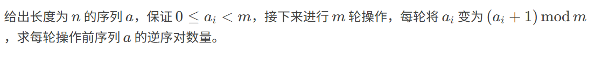

 

考虑每一次加k逆序对如何变化，先对原数组每个元素模m，当k=1时，只有大小为m-1的元素贡献的逆序对会变化，假设大小为m-1的元素的位置为[a1,a2,a3]，对于a2它前面的元素除了a1都会与+k后的a2形成逆序对，而它后面的元素除了a3原本都会与a2形成逆序对(因为模m后最大值为m-1)，当+k后这些逆序对都会消失。处理完1后，k=2会在1的基础上继续，即此时m-2为最大值。

```python
n,m=RR()

# 初始时模m
nums=[v%m for v in RR()]

# 记录m-i为元素位置
pos=defaultdict(list)
for i,v in enumerate(nums):
    pos[m-v].append(i)

# 树状数组
class Tree:
    def __init__(self):
        self.t=[0]*(3*10**5)
    def update(self,i,val):
        i+=1
        while i<len(self.t):
            self.t[i]+=val
            i+=i&-i
    def preSum(self,i):
        s=0
        while i:
            s+=self.t[i]
            i-=i&-i
        return s
t=Tree()
ans=0
# 求解逆序对
for r in range(n-1,-1,-1):
    x=nums[r]
    ans+=t.preSum(x)
    t.update(x,1)

print(ans)
for i in range(1,m):
    # 更新答案
    for j,idx in enumerate(pos[i],1):
        ans+=idx-(j-1)
        ans-=n-idx-1-(len(pos[i])-j)
    print(ans)	
```


## [用点构造面积最大的矩形 II](https://leetcode.cn/problems/maximum-area-rectangle-with-point-constraints-ii/)

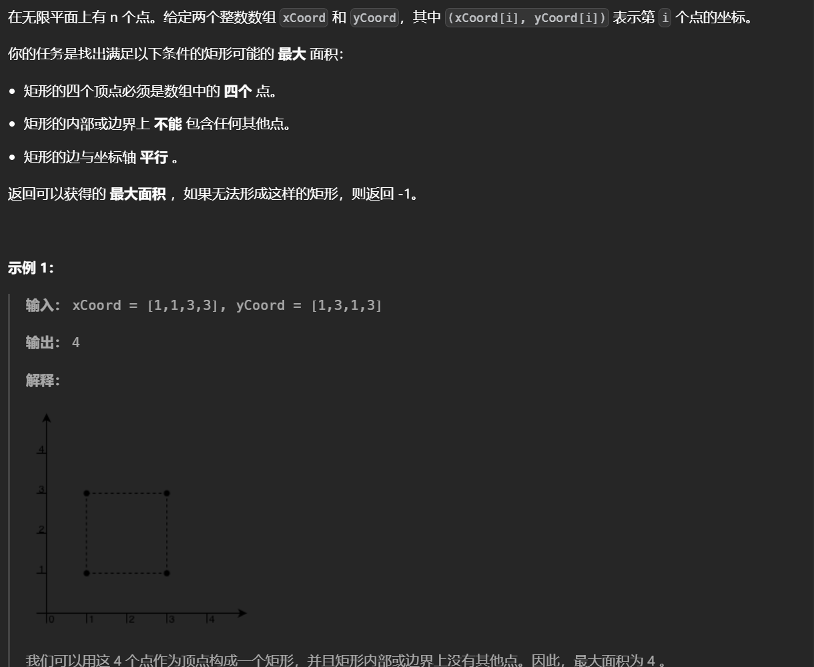

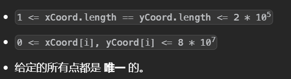


经典扫描线做法，枚举每个右边界（相当于枚举右维护左），这里的数据范围要做离散化处理，但是最后要求解面积，所以需要做一个映射找回去。

以横坐标分组，每个横坐标对应一个排好序的y序列，为了保证竖直边界上没有点，这里遍历相邻的y坐标作为左上和左下，在扫描的过程中记录每对y坐标对应的最近的x坐标以保证水平边界上没有多余的点，这样就找出了一个矩形。

为了保证矩形内部没有多余的点，以y轴来统计点的个数，用树状数组求解区间内点的个数。

```python
class Tree:
    def __init__(self, n):
        # 初始化树状数组，大小为 n + 1
        self.tree = [0] * (n + 1)

    def cal(self,x):
        return x & (-x)
    def update(self, i, detal):
        # 更新操作，i 是索引，detal 是增量
        i += 1  # 树状数组下标从 1 开始
        while i < len(self.tree):
            self.tree[i] += detal
            i += self.cal(i)

    def querymax(self, i: int) -> int:
        # 查询最大值，[0, i-1] 区间
        mx = 0
        while i:
            mx = max(mx, self.tree[i])
            i &= i - 1  # 去掉最低有效位
        return mx

    def get(self, i):
        # 查询前缀和，[0, i-1] 区间
        s = 0
        while i:
            s += self.tree[i]
            i -= self.cal(i)
        return s
    def query(self,l,r):
        # 查询[l,r-1]的区间和
        return self.get(r)-self.get(l)

class Solution:
    def maxRectangleArea(self, xCoord: List[int], yCoord: List[int]) -> int:
        # 用于离散化
        xs=sorted(set(xCoord))
        ys=sorted(set(yCoord))
        
        mx={}
        my={}

        xp=[]
        yp=[]

        # 开始对X数组离散化，同时要记录映射，因为最后是要求解面积大小的不能用离散化的值来算
        for v in xCoord:
            xp.append(bisect_left(xs,v))
            mx[bisect_left(xs,v)]=v
        
        # 对y同理
        for v in yCoord:
            yp.append(bisect_left(ys,v))
            my[bisect_left(ys,v)]=v

        # 记录每组x对应的y
        x_list=[[]for _ in range(len(xs))]
        for i,j in zip(xp,yp):
            x_list[i].append(j)

        # 排序 为了保证边界上只有一个点，需要相邻取y坐标
        for i in range(len(xs)):x_list[i].sort()

        # 记录前一对相邻的y对应的x位置
        last={}
        # 建立树状数组
        tree=Tree(max(len(xs),len(ys)))
        # 记录前一对相邻的y范围内，从0开始到其对应的x中点的个数 
        pre={}

        ans=-1

        # 枚举右边界
        for i in range(len(xs)):
            arr=x_list[i]
            x2=i
            tree.update(arr[0],1)
            # 找相邻的y值，同时更新区间内点的个数
            for y1,y2 in pairwise(arr):
                tree.update(y2,1)
                # 找前面这对相邻的y值是否出现过，从而确定一个矩形
                if (y1,y2) in last:
                    x1=last[(y1,y2)]
                    # 0到x1,y1到y2范围内点的个数
                    sum1=pre[(y1,y2)]
                    # 0到x2,y1到y2范围内点的个数
                    sum2=tree.query(y1,y2+1)
                    # 说明区间内没有点
                    if sum1+2==sum2:
                        # 更新答案时注意映射回去
                        ans=max(ans,(mx[x2]-mx[x1])*(my[y2]-my[y1]))

                last[(y1,y2)]=i
                pre[(y1,y2)]=tree.query(y1,y2+1)
        return ans
```


# 线段树

**线段树解决区间和的问题，并且区间会被修改。线段数的两个操作：求区间和，修改区间，时间复杂度均为logn**

如果一个问题可以分治求解，那么其带修改的版本可以用线段树求解


## 模板


将区间划分**至多4n**(因为满二叉树的节点个数为2n-1，一个**基于经验的安全值**是4n)个节点，其中每个节点记录的是一个区间的**结果**(和，最大值等等)

查询过程通过分支划分较小的区间，但不一定会划分到叶子节点，如果**当前节点对应的区间范围已经被查询的范围包括了，就直接返回该节点储存的结果，**而不需要再往下划分了，这样可以节省时间。

更新的过程中通过**分治**不断划分出**较小的子区间**，但如果要划分到**叶子节点**再更新，则在范围较大时会涉及到**大量节点耗时较多**，因此使用**懒标记(延迟更新)**，即更新操作推迟到真正需要的时候执行，每个节点会配备一个懒标记记录该节点上未处理的更新操作，当对该节点对应的区间进一步查询或更新时，会将标记下推，这样避免了对每个叶子节点的操作。


最基本结构，以区间和为例

```python
class SegmentTree:
    def __init__(self,nums):
        self.nums=nums
        self.n=len(nums)
        self.tree=[0]*(4*self.n)
        if self.n:
            self.build(0,0,self.n-1)
    def build(self,o,l,r):
        if l==r:
            self.tree[o]=self.nums[l]
            return 
        mid=(l+r)>>1
        self.build(o*2+1,l,mid)
        self.build(o*2+2,mid+1,r)
        self.tree[o]=self.tree[o*2+1]+self.tree[o*2+2]

    # 单点修改 idx位置更新为val
    def add(self,o,l,r,idx,val):
        if l==r: # 到了叶子节点
            self.tree[o]=val
            # 注意nums数组是修改idx位置不是o
            self.nums[idx]=val
            return 
        
        mid=(l+r)>>1
        # 注意判断idx与mid的相对大小
        if idx<=mid:
            self.add(o*2+1,l,mid,idx,val)
        else:
            self.add(o*2+2,mid+1,r,idx,val)
            
        # 注意要更新
        self.tree[o]=self.tree[o*2+1]+self.tree[o*2+2]
    
    # L,R表示实际求解的区间
    def query(self,o,l,r,L,R):
        # 搜索区间被覆盖，直接返回结果，无需要划分下去
        if L<=l and r<=R:
            return self.tree[o]
        
        res=0
        mid=(l+r)>>1
        # 左子树存在要计算的区间
        if L<=mid:
            res+=self.query(o*2+1,l,mid,L,R)
        # 右子树存在
        if R>=mid+1:
            res+=self.query(o*2+2,mid+1,r,L,R)
        return res 
```

**如果用o\*2+1，o\*2+2的方式更新，传入的o应该等于0，反之等于1**


非递归方式实现

```python
import sys, heapq
from collections import deque, Counter, defaultdict
sys.setrecursionlimit(10**7)
input = lambda: sys.stdin.readline().rstrip()
ii = lambda: int(input())
mi = lambda: map(int, input().split())
li = lambda: list(mi())
inf = 2 ** 63 - 1
mod = 998244353


class SegTree:
    def __init__(self, init_list, segfunc, ide_ele):
        self.n = len(init_list)
        self.segfunc = segfunc
        self.ide_ele = ide_ele
        self.num = 2 ** (self.n - 1).bit_length()
        self.tree = [ide_ele] * 2 * self.num
        for k in range(self.n):
            self.tree[self.num + k] = init_list[k]
        for k in range(self.num - 1, 0, -1):
            self.tree[k] = self.segfunc(self.tree[2 * k], self.tree[2 * k + 1])
    
    # idxがk(0-indexed)である要素を返す
    def __getitem__(self, k):
        return self.tree[self.num + k]

    #【一点加算】idxがk(0-indexed)である要素にxを加える
    def add(self, k, x):
        k += self.num
        self.tree[k] += x
        while k > 1:
            self.tree[k // 2] = self.segfunc(self.tree[k], self.tree[k ^ 1])
            k //= 2

    #【一点更新】idxがk(0-indexed)である要素をxに更新する
    def update(self, k, x):
        k += self.num
        self.tree[k] = x
        while k > 1:
            self.tree[k // 2] = self.segfunc(self.tree[k], self.tree[k ^ 1])
            k //= 2

    #【区間内のクエリを実行する】区間[l, r)でsegfuncしたものを返す
    def query(self, l, r):
        res = self.ide_ele
        l += self.num
        r += self.num
        while l < r:
            if l % 2 == 1:
                res = self.segfunc(res, self.tree[l])
                l += 1
            l //= 2

            if r % 2 == 1:
                res = self.segfunc(res, self.tree[r - 1])
            r //= 2
        return res
    
    def lis(self):
        return self.tree    
```


涉及到区间更新据需要用到懒标记了


线段树数组实现（数组版本，懒标记，区间查询/修改），根据题目要求传入不同的函数，注意区间查询的res根据目标值的不同也要做相应的修改，一定要注意L,R表示的是操作的区间。

```python
class SegmentTree:
    def __init__(self, nums, func):
        self.nums = nums
        self.n = len(nums)
        self.tree = [0] * (4 * self.n)  # 节点数组，4n是安全经验值
        self.lazy = [0] * (4 * self.n)  # 懒标记数组
        self.func = func  # 操作函数（如求和、求最大值等）
        if self.n:
            self.build(0, 0, self.n - 1)  # 初始化构建树

    # 懒标记下推，将当前节点的懒标记传递给子节点
    def pushdown(self, root, l, r):
        if self.lazy[root]:
            mid = (l + r) >> 1
            # 子节点更新累加，[l,mid] ,[mid+1,r]
            self.tree[root * 2 + 1] += self.lazy[root] * (mid - l + 1)
            self.tree[root * 2 + 2] += self.lazy[root] * (r - mid)
            # 懒标记也传下去
            self.lazy[root * 2 + 1] += self.lazy[root]
            self.lazy[root * 2 + 2] += self.lazy[root]
            # 清除当前懒标记
            self.lazy[root] = 0

    # 向上合并更新节点值
    def pushup(self, root):
        self.tree[root] = self.func(self.tree[root * 2 + 1], self.tree[root * 2 + 2])

    # 构建线段树，root表示当前节点编号，l, r是其表示的区间范围
    def build(self, root, l, r):
        if l == r:
            self.tree[root] = self.nums[l]  # 叶子节点直接赋值
            return
        mid = (l + r) >> 1
        self.build(root * 2 + 1, l, mid)        # 构建左子树
        self.build(root * 2 + 2, mid + 1, r)    # 构建右子树
        self.pushup(root) # 合并结果

    # 区间更新：将区间 [L, R] 每个值加上 val
    def update(self, root, l, r, L, R, val):
        if L <= l and r <= R:  # 当前节点区间完全被包含
            self.tree[root] += val * (r - l + 1)
            self.lazy[root] += val
            return
        self.pushdown(root, l, r)  # 先下推懒标记
        mid = (l + r) >> 1
        if L <= mid:
            self.update(root * 2 + 1, l, mid, L, R, val)       # 更新左子树
        if R > mid:
            self.update(root * 2 + 2, mid + 1, r, L, R, val)   # 更新右子树
        self.pushup(root)  # 向上更新当前节点

    # 区间查询，返回[L,R]范围内的func 聚合结果
    def query(self, root, l, r, L, R):
        if L <= l and r <= R:  # 当前区间完全覆盖
            return self.tree[root]
        self.pushdown(root, l, r)  # 先下推懒标记
        mid = (l + r) >> 1
        res = 0
        if L <= mid:
            res = self.func(res, self.query(root * 2 + 1, l, mid, L, R))  # 左区间
        if R > mid:
            res = self.func(res, self.query(root * 2 + 2, mid + 1, r, L, R))  # 右区间
        return res	
```


线段树模板（动态开点，区间和）需要注意当区间较大时(10**9)才会用到动态开点线段树，这个版本的实现很慢：

```python
class Node:
    def __init__(self):
        self.left=None
        self.right=None
        self.add=0
        self.val=0
def pushup(node):
    node.val=node.left.val+node.right.val

def pushdown(node,lc,rc):
    if not node.left:node.left=Node()
    if not node.right:node.right=Node()

    if node.add==0:return
    node.left.val+=lc*node.add
    node.right.val+=rc*node.add
    # 懒标记不需要加
    node.left.add += node.add
    node.right.add += node.add
    node.add=0

def update(root,start,end,l,r,val):
    if l<=start and r>=end:
        root.val+=(end-start+1)*val
        root.add+=val
        return
    mid=(start+end)>>1
    pushdown(root,mid-start+1,end-mid)
    if l<=mid:update(root.left,start,mid,l,r,val)
    if r>=mid+1:update(root.right,mid+1,end,l,r,val)
    pushup(root)
def query(root,start,end,l,r):
    if l <= start and r >= end:return root.val
    mid=(start+end)>>1
    ans=0
    pushdown(root,mid-start+1,end-mid)
    if l<=mid:ans+=query(root.left,start,mid,l,r)
    if r>=mid+1:ans+=query(root.right,mid+1,end,l,r)
    return ans
```

注意根据题意的不同线段树中的各个函数也是可能改变的，基本上pushup,pushdown 之类的函数会变化


## 线段树+二分

### [将水果装入篮子 III](https://leetcode.cn/problems/fruits-into-baskets-iii/)

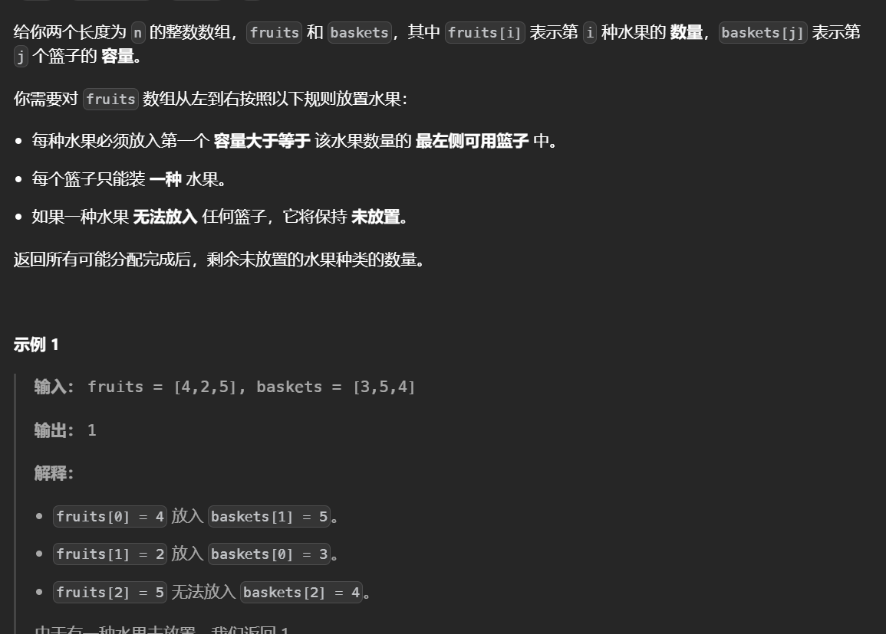

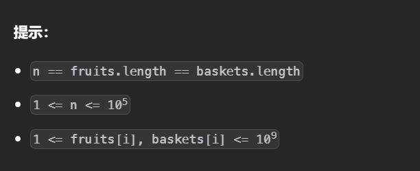

 线段树+二分模板题

使用线段树求解区间最大值，对于每个询问，用二分求解[0,right]的最大值不断逼近区间中第一个大于等于该值的位置，当取得该值后将其改为-1避免在后面取到。

这里对线段树的模板进行修改，因为只会涉及到单点修改且是在搜寻到的时候修改，对于一个区间可以递归左子树找是否存在，再找右子树是否存在，避免在外部不断调用线段树模板中的query函数。

```python
class SegTree:
    def __init__(self, nums):
        n=len(nums)
        self.mx=[0]*(4*n)
        self.build(nums,1,0,n-1)
    # 维护最大值
    def maintain(self,o):
        self.mx[o]=max(self.mx[2*o],self.mx[2*o+1])
    def build(self,a,o,l,r):
        # 区间只有一个值
        if l==r:
            self.mx[o]=a[l]
            return 
        mid=(l+r)>>1
        # 递归左右
        self.build(a,2*o,l,mid)
        self.build(a,2*o+1,mid+1,r)
        # 维护
        self.maintain(o)
    def search(self,o,l,r,x):
        # 如果区间的最大值都不满足，那么直接退出
        if self.mx[o]<x:return -1
        # 找到并修改
        if l==r:
            self.mx[o]=-1
            return l
        mid=(l+r)>>1
        # 递归左右
        i=self.search(o*2,l,mid,x)
        if i<0:
            i=self.search(o*2+1,mid+1,r,x)
        self.maintain(o)
        return i
class Solution:
    def numOfUnplacedFruits(self, nums: List[int], arr: List[int]) -> int:
        tree=SegTree(arr)
        ans=0
        n=len(arr)
        # 查询每个询问
        for v in nums:
            if tree.search(1,0,n-1,v)<0:ans+=1
        return ans 
Solution().numOfUnplacedFruits([4,2,5],[3,5,4])
```


### [找到Alice和Bob可以相遇的建筑](https://leetcode.cn/problems/find-building-where-alice-and-bob-can-meet/)

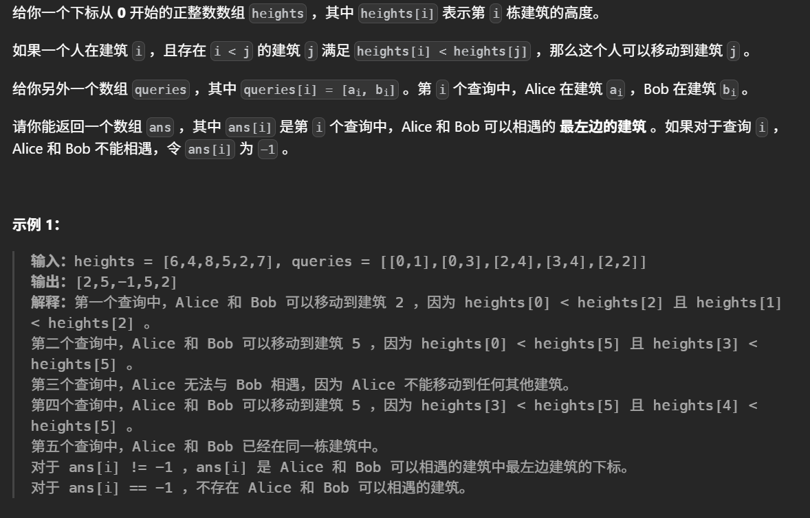

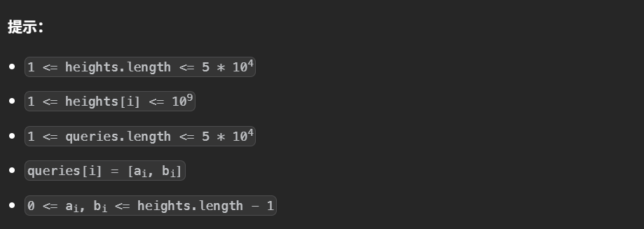

```python
class Solution:
    def leftmostBuildingQueries(self, heights: List[int], queries: List[List[int]]) -> List[int]:
        n = len(heights)
        mx = [0] * (n * 4)

        def build(o: int, l: int, r: int) -> None:
            if l == r:
                mx[o] = heights[l - 1]
                return
            m = (l + r) // 2
            build(o * 2, l, m)
            build(o * 2 + 1, m + 1, r)
            mx[o] = max(mx[o * 2], mx[o * 2 + 1])

        # 返回 [L,n] 中 > v 的最小下标（前三个参数表示线段树的节点信息）
        def query(o: int, l: int, r: int, L: int, v: int) -> int:
            if v >= mx[o]:  # 最大值 <= v，没法找到 > v 的数
                return 0
            if l == r:  # 找到了
                return l
            m = (l + r) // 2
            if L <= m:
                pos = query(o * 2, l, m, L, v)  # 递归左子树
                if pos > 0:  # 找到了
                    return pos
            return query(o * 2 + 1, m + 1, r, L, v)  # 递归右子树

        build(1, 1, n)
        ans = []
        for i, j in queries:
            if i > j:
                i, j = j, i
            if i == j or heights[i] < heights[j]:
                ans.append(j)
            else:
                pos = query(1, 1, n, j + 1, heights[i])
                ans.append(pos - 1)  # 不存在时刚好得到 -1
        return ans
```


## [最长递增子序列](https://leetcode.cn/problems/longest-increasing-subsequence/)

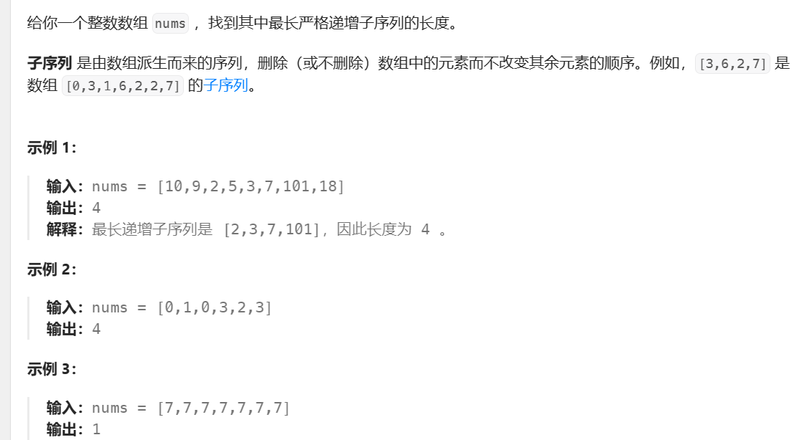

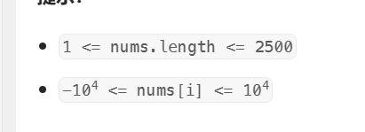

每一个元素所能形成的最长递增子序列等于小于它的元素中所能形成的最长的递增子序列加一，定义dp(j)=max(dp(i))+1，dp(j)表示yi元素j结尾的最长递增子序列，其中i是小于j的所有元素。这个转移方程中要求出区间（小于j）的最大值，然后用这个最大值去更新下一个状态，这个状态又会被用到其他的状态转移方程中，这需要快速求解区间最大值以及单点修改通过线段树完成。

```python
class Node:
    def __init__(self):
        self.left=None
        self.right=None
        self.add=0
        self.val=0
# 求最大值的更新操作
def pushup(node):
    node.val=max(node.left.val,node.right.val)
# 进行的是区间覆盖操作
def pushdown(node):
    if not node.left:node.left=Node()
    if not node.right:node.right=Node()
    if not node.add:return
    # 不是累和而是覆盖
    node.left.val=node.right.val=node.left.add=node.right.add=node.add
    node.add=0

   
def update(node,start,end,l,r,v):
    if l<=start and r>=end:
        node.val=v
        node.add=v
        return 
    mid=(start+end)>>1
    pushdown(node)
    if l<=mid:update(node.left,start,mid,l,r,v)
    if r>=mid+1:update(node.right,mid+1,end,l,r,v)
    pushup(node)
def query(node,start,end,l,r):
    if l<=start and r>=end:
        return node.val
    mid=(start+end)>>1
    pushdown(node)
    res=0
    if l<=mid:res=max(res,query(node.left,start,mid,l,r))
    if r>=mid+1:res=max(res,query(node.right,mid+1,end,l,r))
    return res

class Solution:
    def lengthOfLIS(self, nums: List[int]) -> int:
        # 先离散化处理把元素换到1,n，方便处理
        temp=sorted(set(nums))
        # 注意这里把每个值加一是为了防止0的出现导致l>r
        nums=[bisect_left(temp,v)+1 for v in nums]
        N=max(nums)+10
        node=Node()
        ans=0
        # 依次求解每个元素小于他的元素中能形成的最长的序列
        for v in nums:
            # 找小于当前的元素，注意长度要加一
            cnt=query(node,0,N,0,v-1)+1
            # 求出后更新，因为维护的实际是一个dp(v)
            update(node,0,N,v,v,cnt)
            ans=max(ans,cnt)
        return ans 
```

## [物块放置查询](https://leetcode.cn/problems/block-placement-queries/)

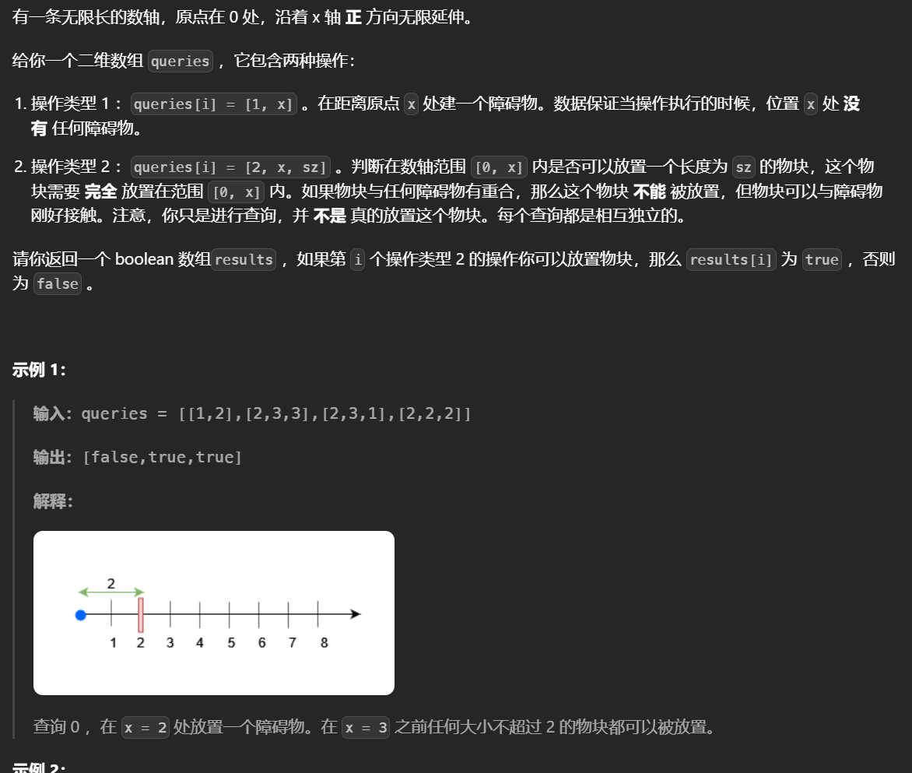

这个题目是对线段树的高级运用，每次更新一个位置后该如何求出闲置的区间呢，这里每个点记录的是以他为右端点所能得到的区间长度是多少，而不是每次更新一个点就把他认为是加一，这样再查询的时候，可以直接查询区间内的最大值以此求的给定区间内最长的闲置空间，另一个问题是，当你更新一个位置时，更新的具体的值是多少呢，这个值应该是这个点有它前面的那个点的值，同时更新一个点，这个点后面的点的大小也要变化，这就需要快速求出给定点的两端的点，可以通过有序数组求出

```python
from sortedcontainers import SortedList as sl
class Node:
    def __init__(self):
        self.left=None
        self.right=None
        self.add=0
        self.val=0

def pushup(node):
    node.val=max(node.left.val,node.right.val)

def pushdown(node):
    if not node.left:node.left=Node()
    if not node.right:node.right=Node()
    node.left.val+=node.add
    node.right.val+=node.add
    node.left.add+=node.add
    node.right.add+=node.add
    node.add=0

def update(node,start,end,l,r,val):
    if l<=start and r>=end:
        node.val+=val
        node.add+=val
        return 
    mid=(start+end)>>1
    pushdown(node)
    if l<=mid:
        update(node.left,start,mid,l,r,val)
    if r>=mid+1:
        update(node.right,mid+1,end,l,r,val)
    pushup(node)
    

def query(node,start,end,l,r):
    if l<=start and r>=end:
        return node.val
    mid=(start+end)>>1
    ans=0
    pushdown(node)
    if l<=mid:
        ans=query(node.left,start,mid,l,r) 
    if r>=mid+1:
        ans=max(ans,query(node.right,mid+1,end,l,r))
    return ans 
class Solution:
    def getResults(self, queries: List[List[int]]) -> List[bool]:
        # 值域
        m = max(q[1] for q in queries) + 1
        node=Node()
        # 初始时，放入哨兵，这样在插入第一个点时不用特判，同时哨兵又不会影响结果（不会包含在区间内）不用特判
        s=sl([0,m])
        ans=[]
        for li in queries:
            # 找到前后的点
            j=s.bisect_left(li[1])
            pre=s[j-1]
            x=li[1]
            nx=s[j]
            if li[0]==1:
                # 更新前后的点，注意板子中val是更新的值
                update(node,0,m,x,x,x-pre)
                # 后面的节点应该减小
                update(node,0,m,nx,nx,-(nx-pre-(nx-x)))
                # 不能落下
                s.add(li[1])
            else:
                x,sz=li[1:]
                # 求出最大值，这个最大的空闲区间应该是0~pre之间的，以及pre~i之间的
                mx=max(query(node,0,m,0,pre),x-pre)
                ans.append(mx>=sz)
        return ans 
```


## [求出数组的 X 值 II](https://leetcode.cn/problems/find-x-value-of-array-ii/)

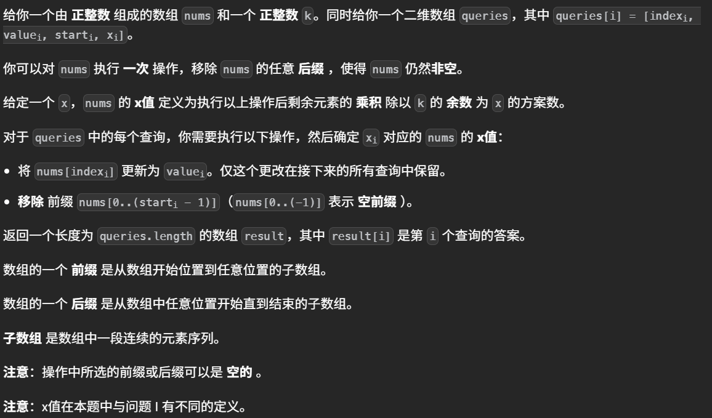

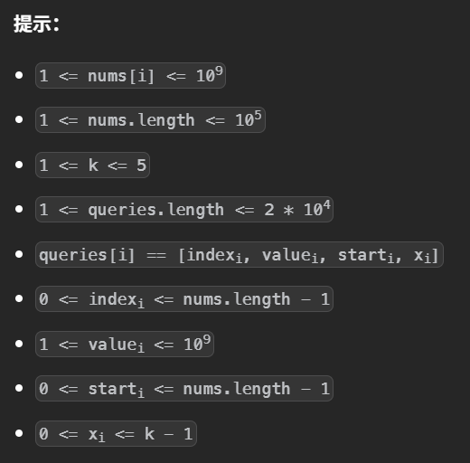

对于区间只能移除后缀，而每个询问的左端点是固定的，即求解以l为左端点，右端点为l,l+1,l+2,l+3...的子数组中，元素积模k等于x的方案数

该问题可以通过分治求解

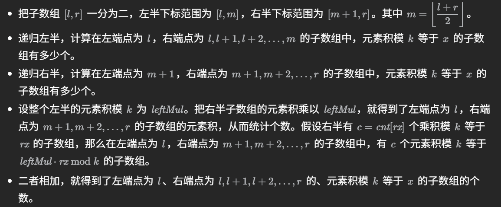


注意返回的数组要拷贝，否则引用会导致出错

```python
class Solution:
    def resultArray(self, nums: List[int], k: int, queries: List[List[int]]) -> List[int]:
        class SegmentTree:
            def __init__(self):
                self.n=len(nums)
                self.cnt=[[0]*5 for _ in range(4*self.n)]
                self.mul=[0]*(4*self.n)
                if self.n:
                    self.build(0,0,self.n-1)
            def matain(self,o):
                c1=self.cnt[o*2+1].copy()
                c2=self.cnt[o*2+2].copy()
                for rx,c in enumerate(c2):
                    c1[self.mul[o*2+1]*rx%k]+=c
                self.mul[o]=self.mul[o*2+1]*self.mul[o*2+2]%k
                self.cnt[o]=c1.copy()
            
            def build(self,o,l,r):
                if l==r:
                    self.mul[o]=nums[l]%k
                    self.cnt[o][self.mul[o]]=1
                    return 
                mid=(l+r)>>1
                self.build(o*2+1,l,mid)
                self.build(o*2+2,mid+1,r)
                self.matain(o)

            def update(self,o,l,r,idx,val):
                if l==r:
                    self.mul[o]=val
                    self.cnt[o]=[0]*k
                    self.cnt[o][val]=1
                    return 
                mid=(l+r)>>1
                if mid>=idx:
                    self.update(o*2+1,l,mid,idx,val)
                else:
                    self.update(o*2+2,mid+1,r,idx,val)
                self.matain(o)

            def query(self,o,l,r,L,R):
                if L<=l and r<=R:
                    return self.mul[o],self.cnt[o].copy()
                mid=(l+r)>>1
                if R<=mid:
                    return self.query(o*2+1,l,mid,L,R)
                if L>mid:
                    return self.query(o*2+2,mid+1,r,L,R)
                # 注意这里不是用self,mul[o*2]，因为左区间可能只是一小段，需要递归求出区间的mul值而不是直接使用
                lmul,c1=self.query(o*2+1,l,mid,L,R)
                rmul,c2=self.query(o*2+2,mid+1,r,L,R)
                for rx,c in enumerate(c2):
                    c1[lmul*rx%k]+=c
                return lmul*rmul%k,c1.copy()

        t=SegmentTree()
        ans=[]
        n=len(nums)
        for idx,val,start,x in queries:
            t.update(0,0,n-1,idx,val%k)
            _,res=t.query(0,0,n-1,start,n-1)
            ans.append(res[x])
        return ans
```


## [完成所有任务的最少时间](https://leetcode.cn/problems/minimum-time-to-complete-all-tasks/)

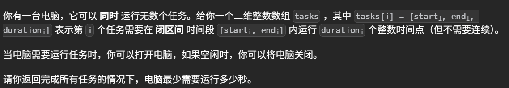

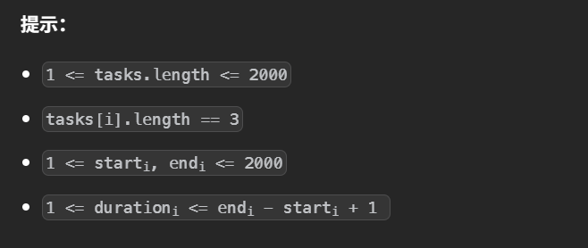

对于区间类问题，最好进行排序。这里先对右端点排列，然后依次处理每个区间，对于每个区间先统计一下已经运行了多久，如果还需要运行的话，那么最好是在区间的后缀时间段执行，因为之前的区间已经满足要求，往后填可以满足后面的区间的要求。


```python
class Solution:
    def findMinimumTime(self, nums) -> int:
        nums.sort(key=lambda x:x[1])
        n=nums[-1][1]+10
        ans=0
        # 对区间排序
        tree=SegmentTree([0]*n,lambda x,y:x+y)
        for l,r,d in nums:
            res=tree.query(0,0,n-1,l,r) 
            # 仍需进行的时间
            diff=d-res
            if res<d:
                # 因为之前的区间可能会与当前区间的后缀有重叠，所以二分找出最短的满足要求的后缀
                i,j=0,r
                while i<=j:
                    mid=(i+j)>>1
                    if (r-mid+1)-tree.query(0,0,n-1,mid,r)>=diff:
                        i=mid+1
                    else:
                        j=mid-1
                i-=1
                # 修改区间
                tree.update(0,0,n-1,i,r,1)
                ans+=diff
        return ans 
```


# 字典树


## Trie字符串统计


```python
class Trie:
    def __init__(self):
        self.children=[None]*26
        self.is_end=0
    def insert(self,s):
        d=self
        for c in s:
            c=ord(c)-ord('a')
            if not d.children[c]:
                d.children[c]=Trie()
            d=d.children[c]
        d.is_end+=1
    def search(self,s):
        d=self
        for c in s:
            c=ord(c)-ord('a')
            if not d.children[c]:
                return 0
            d=d.children[c]
        return d.is_end
q=int(input())
tree=Trie()
while q:
    a,s=input().split()
    if a=='I':
        tree.insert(s)
    else:
        print(tree.search(s))
    q-=1
```


## [数组中两个数的最大异或值](https://leetcode.cn/problems/maximum-xor-of-two-numbers-in-an-array/)

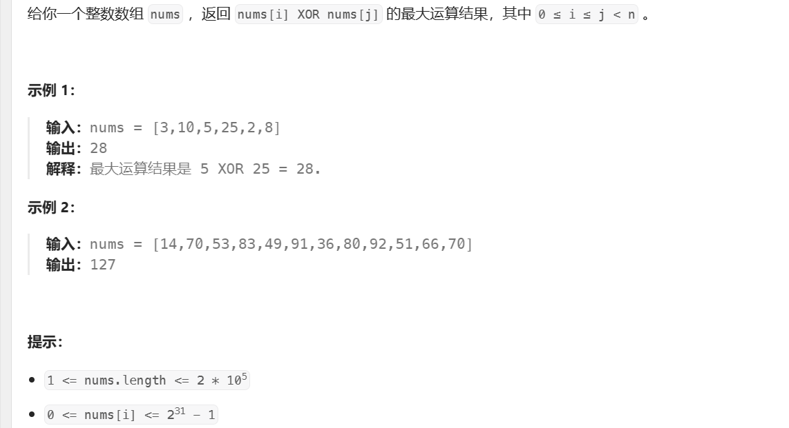


两个数异或和最大要求尽可能多的二进制位不相同（并且在是尽可能地在高位不同），因此把所有数字转换为二进制到字典树中，然后贪心的对每个数找相反的路径比如是01，则在树中找10，注意由于数字的二进制不同，把题目都补为32位。

```python
class Trie:
    def __init__(self):
        self.children=[None]*2
        self.is_end=-1
    def insert(self,x):
        d=self
        for i in range(15,-1,-1):
            c=(x>>i)&1
            if not d.children[c]:
                d.children[c]=Trie()
            d=d.children[c]
        d.is_end=x
    def search(self,x):
        d=self
        for i in range(15,-1,-1):
            c= 0 if (x>>i)&1 else 1
            # 尽可能的找相反的，如果不存在就只能找存在的
            if not d.children[c]:
                c=0 if c else 1
            d=d.children[c]
            # 返回的是异或的结果
        return d.is_end^x if d.is_end else 0
class Solution:
    def findMaximumXOR(self, nums: List[int]) -> int:
        tree=Trie()
        # 插入每个数到字典树中
        for x in nums:
            tree.insert(x)
        # 对每个数在字典树中找与他相反的路劲，返回最大的
        return max([tree.search(x) for x in nums])
```


## [统计前后缀下标对 II](https://leetcode.cn/problems/count-prefix-and-suffix-pairs-ii/)

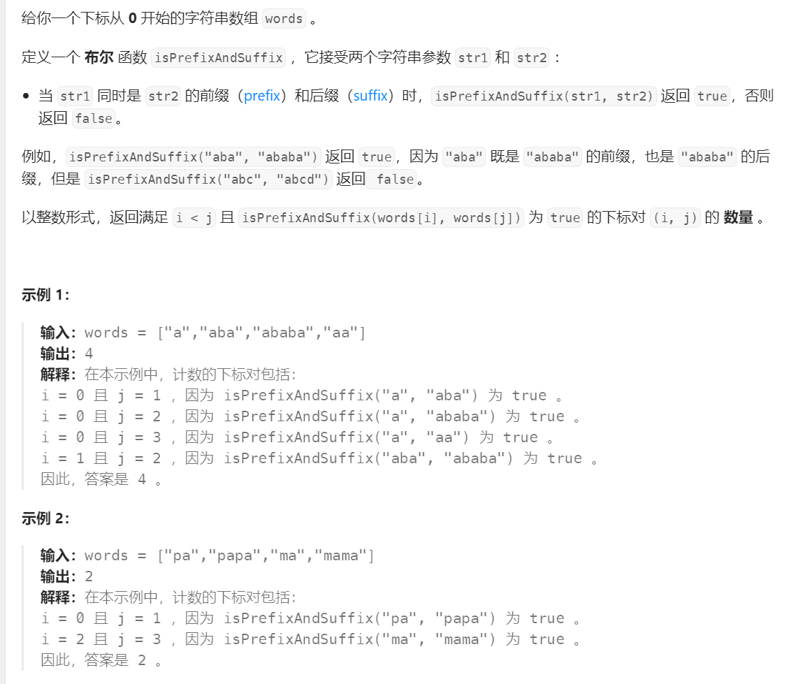

统计前后缀相同的，构造每个字符串的第i个和倒数第i个的pair存入字典树。相当于同时在匹配前缀和后缀

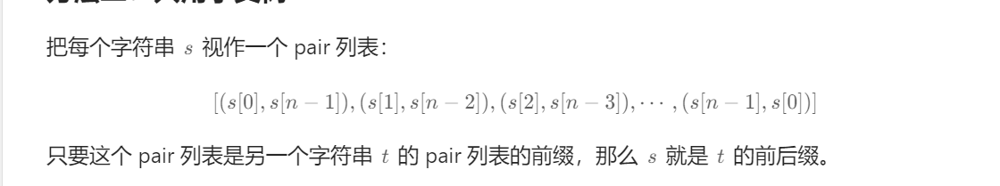

```python
class Trie:
    def __init__(self):
        self.children={}
        self.isend=0


class Solution:
    def countPrefixSuffixPairs(self, words: List[str]) -> int:
        tree=Trie()
        n=len(words)
        ans=0
	# 由于是要找i和j，那么要先检查再插入	
        for s in words:
            temp=tree
            for c in zip(s,reversed(s)):
                if c not in temp.children:
                    temp.children[c]=Trie()
                temp=temp.children[c]
                ans+=temp.isend
            temp.isend+=1
            
        return ans 
```


## [ 删除元素后 K 个字符串的最长公共前缀](https://leetcode.cn/problems/longest-common-prefix-of-k-strings-after-removal/)

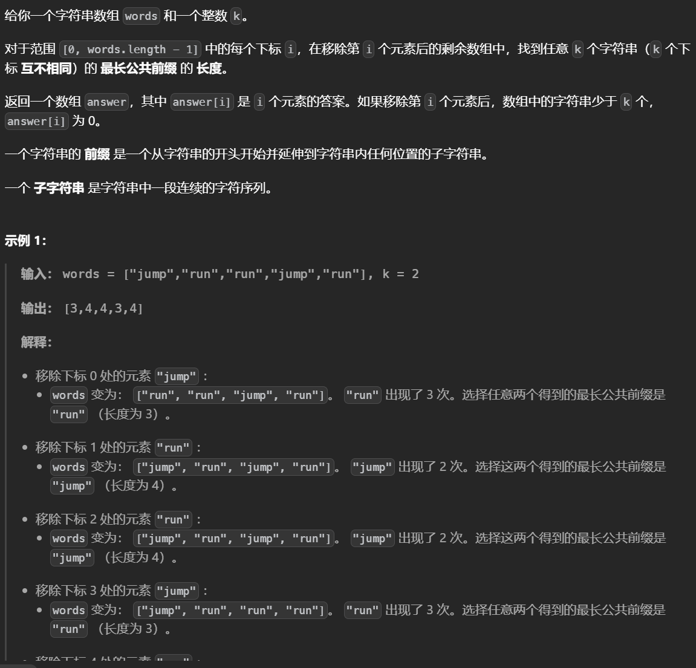

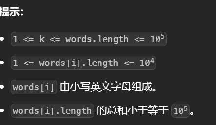


最长公共前缀使用字典树求解，每次删除一个字符串，然后去找最长的公共前缀，关键在于找出最长的公共前缀和次长的公共前缀，实际上删除字符串也就只有两种可能——删除的是可以构成最长前缀的/构不成最长前缀的，字典树用递归的方式求解，通过删除最长的前缀可以保证找出次长的前缀。

```python
class Solution:
    def longestCommonPrefix(self, words: List[str], k: int) -> List[int]:
        # 节点
        class Trie:
            def __init__(self):
                self.memo={}
                self.cnt=0
                self.idx=-1
        # 插入
        def insert(t,s,idx):
            # 根节点记录经过的个数，防止在lca函数中排除
            t.cnt+=1
            for c in s:
                # 不存在则创建
                if c not in t.memo:
                    t.memo[c]=Trie()
                    # 记录节点对应的字符串，有多个字符串经过该节点选择不覆盖
                    t.memo[c].idx=idx
                t=t.memo[c]
                # 记录经过该节点的个数
                t.cnt+=1

        # 删除节点
        def remove(t,s):
            for c in s:
                t=t.memo[c]    
                t.cnt-=1
        
        # 求解lca
        def lca(root,idx):
            # 返回值(长度，个数，字符串位置)
            if root.cnt<k:return (0,1,root.idx)
            res=(idx,root.cnt,root.idx)
            
            for nx in root.memo:
                if nx:
                    # 从子结点中选择最大的
                    temp=lca(root.memo[nx],idx+1)
                    res=max(res,temp)
            return res
        
        t=Trie()
        n=len(words)
        # 初始化
        for idx,s in enumerate(words):insert(t,s,idx)

        # 求解最长的
        res=lca(t,0)

        # 最长前缀
        pre=words[res[2]][:res[0]]

        # 如果大于k，那么减去一个贡献前缀长度的字符串也没有影响
        if res[1]>k:
            return [res[0]]*n
        
        # 删除一次最长的前缀
        remove(t,pre)
        
        # 找次长的前缀
        sec=lca(t,0)

        ans=[]

        # 记录答案
        for s in words:
            if s.startswith(pre):ans.append(sec[0])
            else:
                ans.append(res[0])
        return ans
```


## [统计异或值在范围内的数对有多少](https://leetcode.cn/problems/count-pairs-with-xor-in-a-range/)

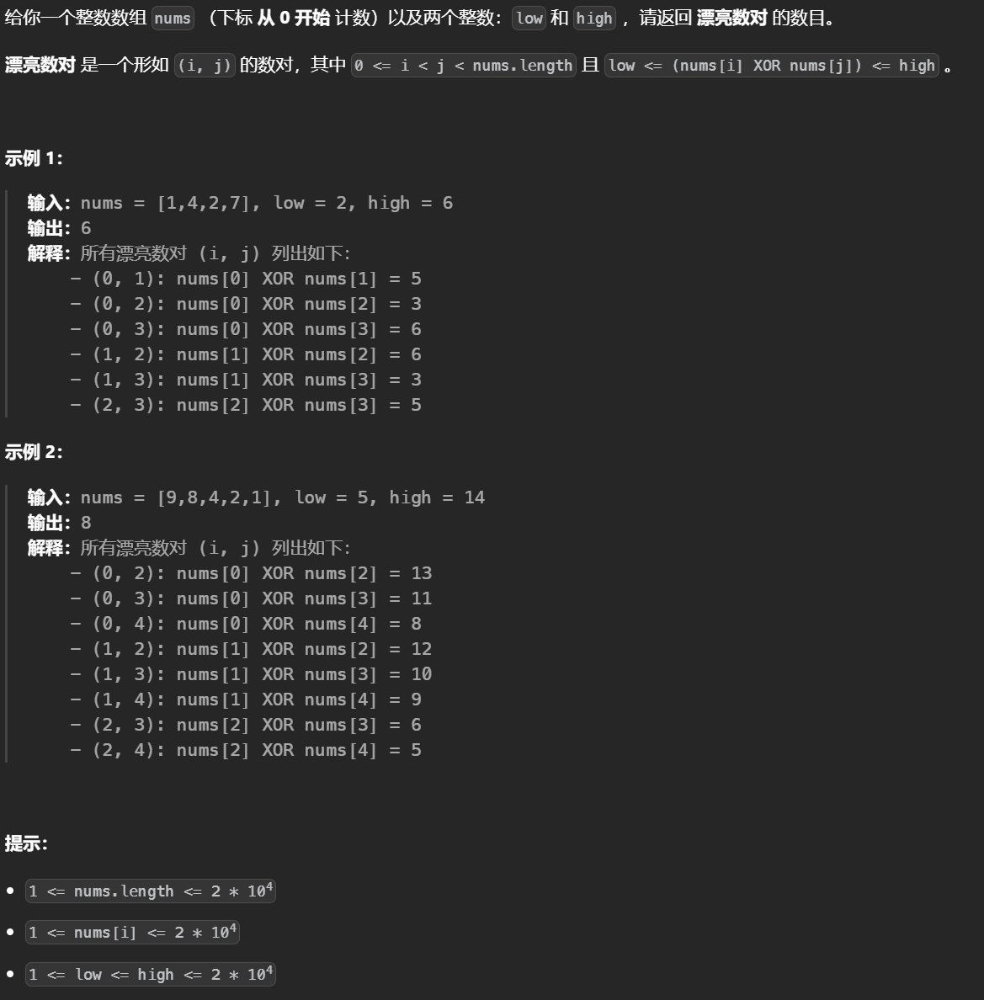

数组异或类的题目使用字典树求解，初始的想法是构建所有值的异或字典树，然后枚举每一个数，在字典树上做bfs求解出所有的异或值然后判断是否在区间内，但是这种方法实际是n^2的，因为bfs找出了所有的异或值相当于遍历了数组。

将范围内的个数转换为**前缀**，即找小于等于high的减去小于等于low-1的，遍历数组枚举右维护左，每个值val与limit在字典树中比较。

如果limit在某一位为1，那么val在这一位上取与当前位相反的同时加上所有相同的分支个数(因为相同必然异或出0是结果更小)

反之只能取不同保证不超出

如果需要的分支不存在则退出。

```python
class Trie:
    def __init__(self):
        self.children={}
        # 需要记录经过这个节点的数有多少，而不是只在端点记录，因为要剪枝
        self.cnt=0
    def insert(self,x):
        t=self
        # 从高位开始
        for i in range(15,-1,-1):
            c=x>>i&1
            if c not in t.children:
                t.children[c]=Trie()
            t=t.children[c]
            t.cnt+=1
    def search(self,x,limit):
        t=self
        ans=0
        for j in range(15,-1,-1):
            v=x>>j&1
            # 如果这一位是1，那么与x当前位相同的(异或出0)可以直接加上，因为必然小于limit，然后跳到与x不同的位上
            if limit>>j&1:
                if v in t.children:ans+=t.children[v].cnt
                # 如果没有这个分支
                if v^1 not in t.children:return ans 
                t=t.children[v^1]
            # 为0就只能跳到相同的位上
            else:
                if v not in t.children:return ans 
                t=t.children[v]
        return ans+t.cnt # 最后要加上这个位上的数

class Solution:
    def countPairs(self, nums: List[int], low: int, high: int) -> int:
        t=Trie()
        ans=0
        # 因为会重复计算，所以算一个插入一个，可以做到不重不漏
        for v in nums:
            ans+=t.search(v,high)-t.search(v,low-1)
            t.insert(v)
        # 或者也可以直接写
        # for v in nums:T.insert(v)
        # return sum([T.search(v,high) for v in nums])//2-sum([T.search(v,low-1) for v in nums])//2
        return ans 
```


# 平衡树

SortedList是一个允许**重复元素**的**有序多重集合**


| 操作                      | 方法                                         | 时间复杂度 |
| ------------------------- | -------------------------------------------- | ---------- |
| 插入元素                  | `add(value)`                                 | O(log n)   |
| 删除元素                  | `remove(value)`                              | O(log n)   |
| 按索引访问                | `sl[i]`                                      | O(1)       |
| 查找下标                  | `bisect_left(value)` / `bisect_right(value)` | O(log n)   |
| 合并列表                  | `update(iterable)`                           | O(n log n) |
| 统计某元素出现次数        | `count(value)`                               | O(n log n) |
| 删除并返回索引为 i 的元素 | `pop(i=-1)`                                  | O(n log n) |


在仅有**删除和添加**的情况下，可以用**懒删除堆**代替，不支持**索引**访问


## [避免洪水泛滥](https://leetcode.cn/problems/avoid-flood-in-the-city/)

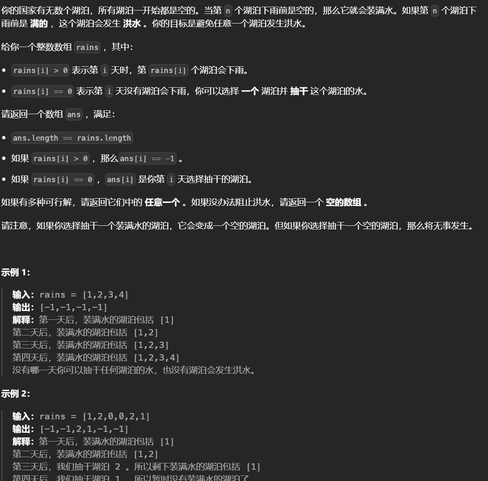

贪心的思想，遍历rains数组如果这个湖泊之前已经遍历过也就是会发生洪水，就需要把离这个湖泊之前的位置最近的晴天分配给他，然后这个晴天就不能在用了。

可以二分快速找到最近的晴天，但是把这个晴天去除后仍需要保持数组顺序以此来继续二分，这需要用到平衡树。

## [考场就座](https://leetcode.cn/problems/exam-room/)

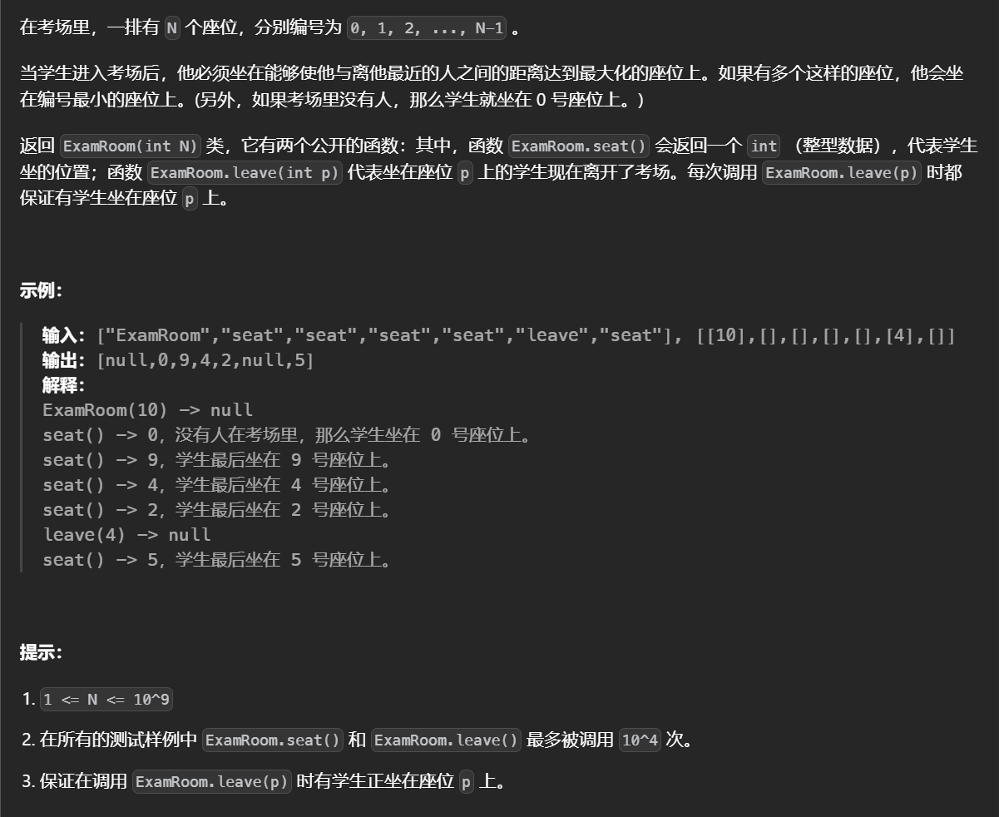

有序集合不仅可以存储元素也可以存储区间，对于本题首先找出距离最大的，而后是最靠前的位置，每次加入一个点会删除一个区间加入两个区间

```python
from sortedcontainers import SortedList
class ExamRoom:

    def __init__(self, n: int):
        # 计算距离的函数，如果点是最左或最右则特判
        def dist(x):
            l,r=x
            return r-l-1 if l==-1 or r==n else (r-l)>>1
        self.n=n
        # 按照区间距离和左端点排序
        self.s=SortedList(key=lambda x:(-dist(x),x[0]))
        # 记录一个点的左边位置和右边端点，可以用来更新区间
        self.l={}
        self.r={}
        # 初始化
        self.s.add((-1,n))
        self.l[n]=-1
        self.r[-1]=n
        
    def seat(self) -> int:
        # 找到距离最大的区间
        ss=self.s[0]
        l,r=ss
        # 计算中点位置
        p=(l+r)>>1
        # 对于两端特判
        if l==-1:p=0
        elif r==self.n:p=self.n-1
        # 先删除当前的区间，因为加入这个点这个区间就用不上了
        self.delete(ss)
        # 新增两个区间
        self.add((l,p))
        self.add((p,r))
        return p
    def delete(self,s):
        # 不仅删除区间还有删除左右对应的位置
        self.s.remove(s)
        del self.l[s[1]]
        del self.r[s[0]]

    def add(self,s):
        self.s.add(s)
        self.l[s[1]]=s[0]
        self.r[s[0]]=s[1]

    def leave(self, p: int) -> None:
        # 先记录两个位置
        l,r=self.l[p],self.r[p]
        # 一个点的删除会减少两个区间增加一个大的区间
        self.delete((self.l[p],p))
        self.delete((p,self.r[p]))
        self.add((l,r))
```

## [最近的房间](https://leetcode.cn/problems/closest-room/)

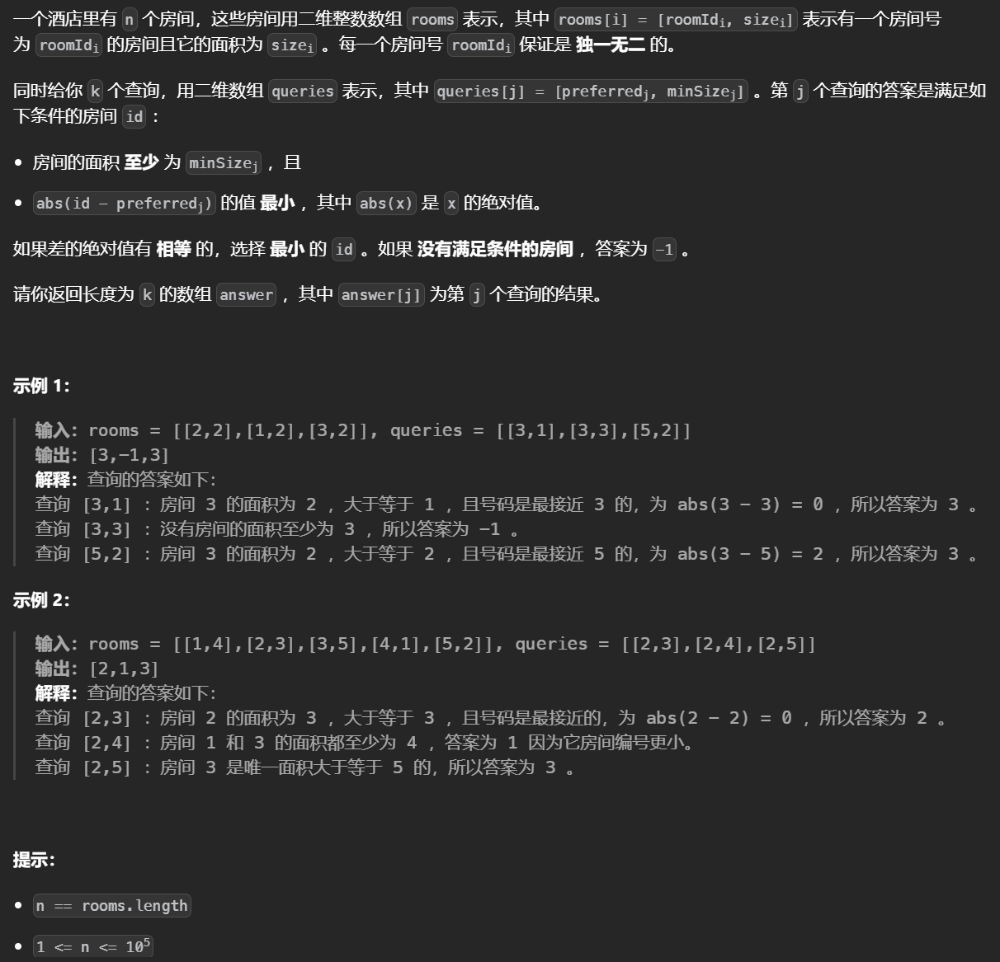

对询问离线，按照面积从大到小操作，同时对给定的数组也按照面积从大到小排序，这样保证了每次处理询问时数据结构内都是合法的选择(面积更大)。把合法的选择放入到有序集合中查找与当前询问的id差不多的数值。

```python
from sortedcontainers import SortedList
class Solution:
    def closestRoom(self, nums: List[List[int]], queries: List[List[int]]) -> List[int]:
        n=len(nums)
        # 排序
        nums.sort(key=lambda x:(-x[1]))
        q=[[queries[i][0],queries[i][1],i] for i in range(len(queries))]
        q.sort(key=lambda x:-x[1])
        ans=[-1]*len(queries)
        # 哨兵，取无穷保证了不会被取到
        sl=SortedList((-inf,inf))
        j=0
        n=len(nums)
        # 按照面积从大到小操作
        for rid,s,i in q:
            # 离线，保证数据结构内都是合法的选择
            while j<n and nums[j][1]>=s:
                sl.add(nums[j][0])
                j+=1
            # 找在当前id左右的
            if len(sl)>2:
                index=sl.bisect_left(rid)
                curr=sl[index]
                pre=sl[index-1]
                if not abs(rid-curr)<abs(rid-pre):
                    curr=sl[index-1]
                ans[i]=curr
        return ans 
```


