# 数据结构专题

# 枚举右维护左


## [ 统计特殊子序列的数目](https://leetcode.cn/problems/count-special-subsequences/)

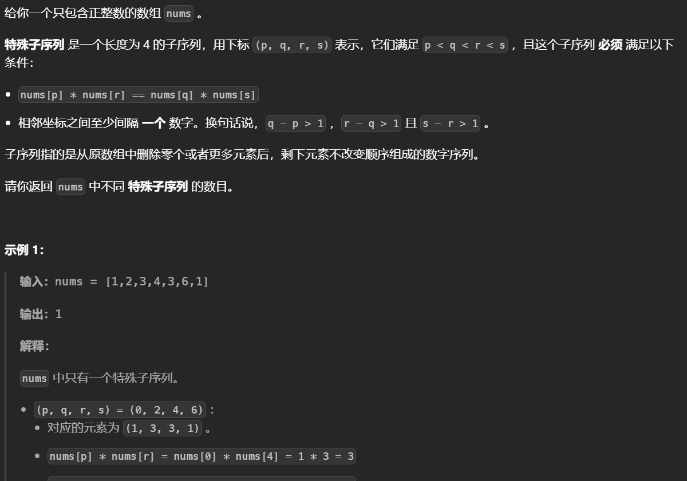

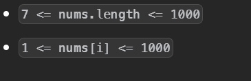

对于给定的数据范围可以双重循环枚举

```python
class Solution:
    def numberOfSubsequences(self, nums: List[int]) -> int:
        n=len(nums)
        # 因为要间隔一位所以需要用两个计数器
        pre=Counter()
        curr=Counter()
        ans=0
        for i in range(n):
            # 先更新答案再更新计数器
            # 只有下标大于等于4才能找到c和d
            if i>=4:
                c=nums[i]
                # 要间隔一位
                for j in range(i+2,n):
                    d=nums[j]
                    ans+=pre[d/c]
            # 更新i-2位置的计数器
            pre=Counter(curr)
            # 以当前位置为b更新计数器
            if i>=2:
                b=nums[i]
                for j in range(i-2,-1,-1):
                    a=nums[j]
                    curr[a/b]+=1           
        return ans 
```


# 树状数组

类似于线段树可以快速求出区间和，同时可以更新，这两个操作的时间复杂度为logn,不过这里的更新只能是单点修改。

树状数组的关键在于巧妙地区间拆分


由于关键区间的右端点互不相同，我们可以把右端点为 *i* 的关键区间的元素和保存在*tree*[*i*] 中

想要求解[1,i]的区间和，先求出[i-lowbit(i),i]，然后更新i为i-lowbit(i)表示去找[1,i-lowbit(i)]的区间和，使用一个s变量在外部累加。

而对于更新操作除了把对应的点更新外，还要去更新会受到影响的区间，其中第一个区间就是[1,i]而下一个要更新的区间为[i+1,i+lowbit(i)]就这样一直找下去


query(i)的结果是小于等于i-1的有多少个，数组要开n+2的因为想要取到数字n并且前缀和要做一位偏移


简略版板子如下，只能实现区间求和且数组数值数组，使用时像前缀和的操作方法

```python
class Tree:
    def __init__(self, n):
        # 初始化树状数组，大小为 n + 1
        self.tree = [0] * (n + 1)

    def cal(self,x):
        return x & (-x)
    def update(self, i, detal):
        # 更新操作，i 是索引，detal 是增量
        i += 1  # 树状数组下标从 1 开始
        while i < len(self.tree):
            self.tree[i] += detal
            i += self.cal(i)

    def querymax(self, i: int) -> int:
        # 查询最大值，[0, i-1] 区间
        mx = 0
        while i:
            mx = max(mx, self.tree[i])
            i &= i - 1  # 去掉最低有效位
        return mx

    def get(self, i):
        # 查询前缀和，[0, i-1] 区间
        s = 0
        while i:
            s += self.tree[i]
            i -= self.cal(i)
        return s
    def query(self,l,r):
        # 查询[l,r-1]的区间和
        return self.get(r)-self.get(l)
```


## [区域和检索 - 数组可修改](https://leetcode.cn/problems/range-sum-query-mutable/)

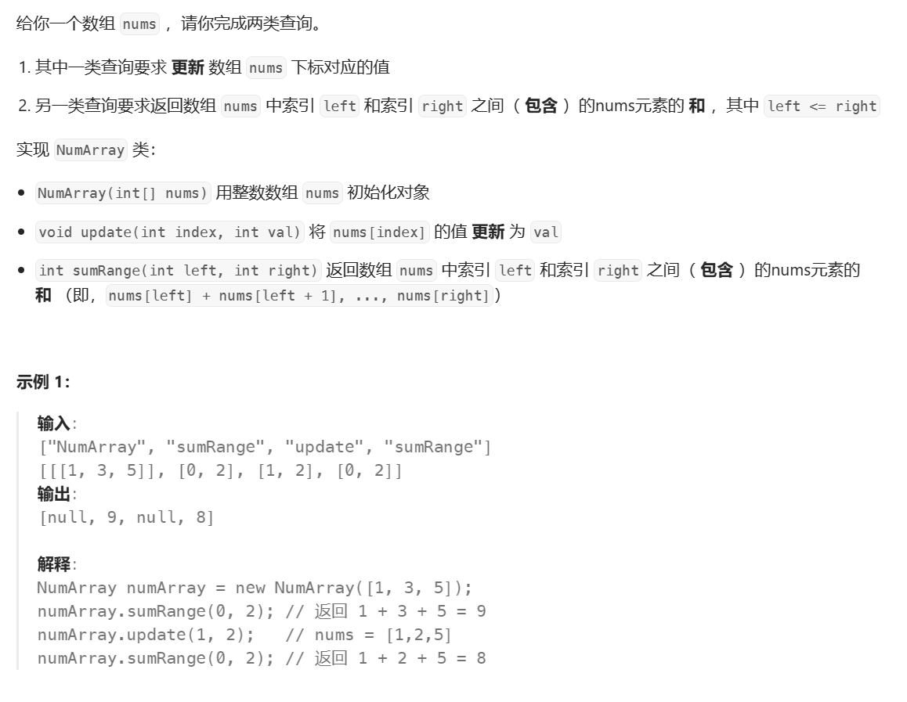


```python
class NumArray:

    def __init__(self, nums: List[int]):
        # 初始化，相当把每个点更新一次
        n=len(nums)
        self.nums=[0]*n
        self.tree=[0]*(n+1)
        for i,x in enumerate(nums):
            self.update(i,x)


    def update(self, index: int, val: int) -> None:
        # 找出差值用于更新前缀
        diff=val-self.nums[index]
        # 更新对应的位置
        self.nums[index]=val
        # 找区间，注意区间会多一位偏移
        i=index+1
        # 迭代
        while i<len(self.tree):
            self.tree[i]+=diff
            # 结论，更新
            i+=i&-i
     # 求前缀
    def preSum(self,i):
        # 累加
        s=0
        while i:
            s+=self.tree[i]
            i-=i&-i
        return s
    def sumRange(self, left: int, right: int) -> int:
        # 左右位置，求解方式类似于一维
        return self.preSum(right+1)-self.preSum(left)
```

## [计算右侧小于当前元素的个数](https://leetcode.cn/problems/count-of-smaller-numbers-after-self/)

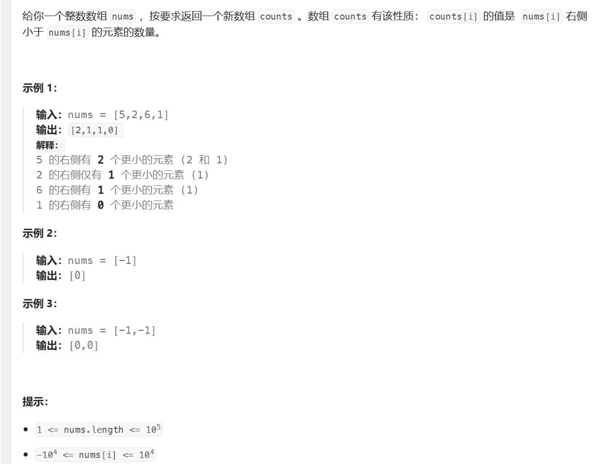

找一个值右边小于当前值的有多少个必然要已知右边，因此从右到左的思考。

这里使用树状数组，树状数组的前缀和pre[i+1]表示i前面小于i的有多少个数，因为每次插入一个值i会更新1这也就表示i的个数，将计数问题转换为前缀和（技巧点）

```python
class Solution:
    def countSmaller(self, nums: List[int]) -> List[int]:
        def cal(x):
            return x&(-x)
        # 离散化
        li=sorted(list(set(nums)))
        nums=[bisect_left(li,v) for v in nums]
        
        class Tree:
            def __init__(self,n):
                # 这里没有原始数组
                self.tree=[0]*(n+1)
            # 更新
            def update(self,i,detal):
                # 注意偏移
                i+=1
                while i<len(self.tree):
                    self.tree[i]+=detal
                    i+=cal(i)
            # 求出0,i的区间和，也就是小于等于i的个数
            def query(self,i):
                s=0
                while i:
                    s+=self.tree[i]
                    i-=cal(i)
                return s
        n=len(nums)
        t=Tree(n)
        ans=[0]*n
        # 倒序处理
        for i in range(n-1,-1,-1):
            # 先更新
            t.update(nums[i],1)
            # 这里做了一位偏移
            ans[i]=t.query(nums[i])
        return ans
```

## [ 交易逆序对的总数](https://leetcode.cn/problems/shu-zu-zhong-de-ni-xu-dui-lcof/)


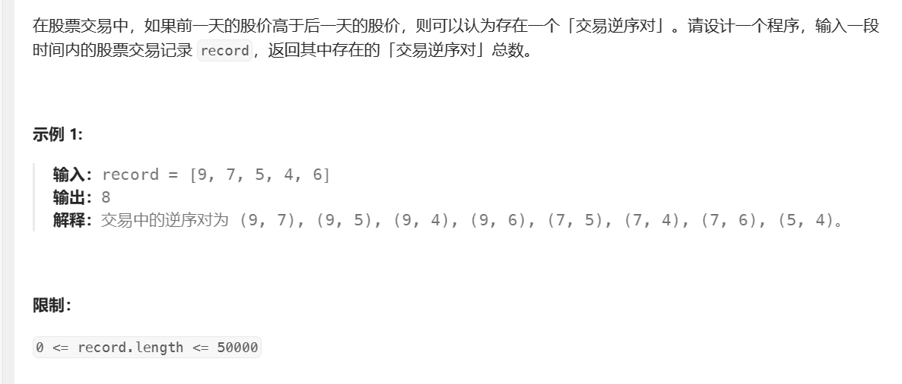


```python
class Solution:
    def reversePairs(self, record: List[int]) -> int:
        li=sorted(set(record))
        nums=[bisect_left(li,v) for v in record]
        class Tree:
            def __init__(self,n):
                self.tree=[0]*(n+1)
            def update(self,i,d):
                i+=1
                while i<len(self.tree):
                    self.tree[i]+=d
                    i+=i&(-i)
            def query(self,i):
                s=0
                while i:
                    s+=self.tree[i]
                    i-=i&(-i)
                return s
        n=len(nums)
        t=Tree(n)
        ans=0
        for i in range(n-1,-1,-1):
            t.update(nums[i],1)
            ans+=t.query(nums[i])
        return ans 
```

## [邻位交换的最小次数](https://leetcode.cn/problems/minimum-adjacent-swaps-to-reach-the-kth-smallest-number/)

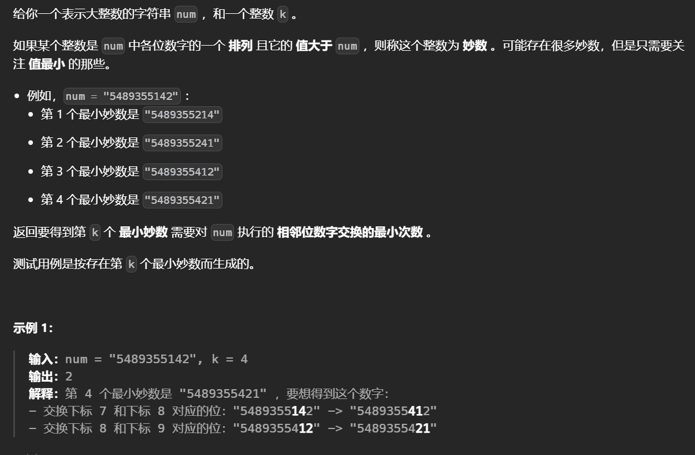

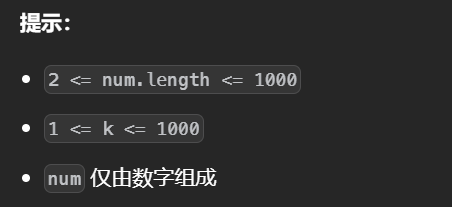

分为两步，先求出第k个排列，其实就是进行k次求下一个更大的排列，然后求解所需的操作次数。因为只能相邻交换因此转换为求逆序对。对原数组的每个值做映射对于bcad有：b->0 c->1 a->2 d->3，那么对于结果cdba就是 1302所需的操作次数就是逆序对，一个字符有多种可能的映射，由于要让交换次数尽可能小，所以贪心地让映射的下标升序就行。。

```python
class Tree:
    def __init__(self,n):
        self.tree=[0]*(n+1)
    def update(self,i,d):
        i+=1
        while i<len(self.tree):
            self.tree[i]+=d
            i+=i&(-i)
    def query(self,i):
        s=0
        while i:
            s+=self.tree[i]
            i-=i&(-i)
        return s
class Solution:
    def getMinSwaps(self, nums: str, k: int) -> int:
        n=len(nums)
        nums=list(nums)
        arr=nums[:]
        # 求解下一个更大的排列
        def slove(nums):
            for i in range(n-2,-1,-1):
                r=int(nums[i+1])
                l=int(nums[i])
                if l<r:
                    for j in range(n-1,-1,-1):
                        x=int(nums[j])
                        if l<x:
                            nums[i],nums[j]=nums[j],nums[i]
                            nums=nums[:i+1]+sorted(nums[i+1:])
                            return nums
        # 进行k次
        for _ in range(k):
            nums=slove(nums)   
        # 对每个位置做映射
        memo=defaultdict(deque)
        for i,c in enumerate(arr):
            memo[c].append(i)
        # 构建映射后的数组
        temp=[]
        for i,c in enumerate(nums):
            temp.append(memo[c].popleft())
        # 树状数组求解逆序对
        t=Tree(n)
        ans=0
        for i in range(n-1,-1,-1):
            t.update(temp[i],1)
            ans+=t.query(temp[i])
        return ans          
```


## 小朋友排队

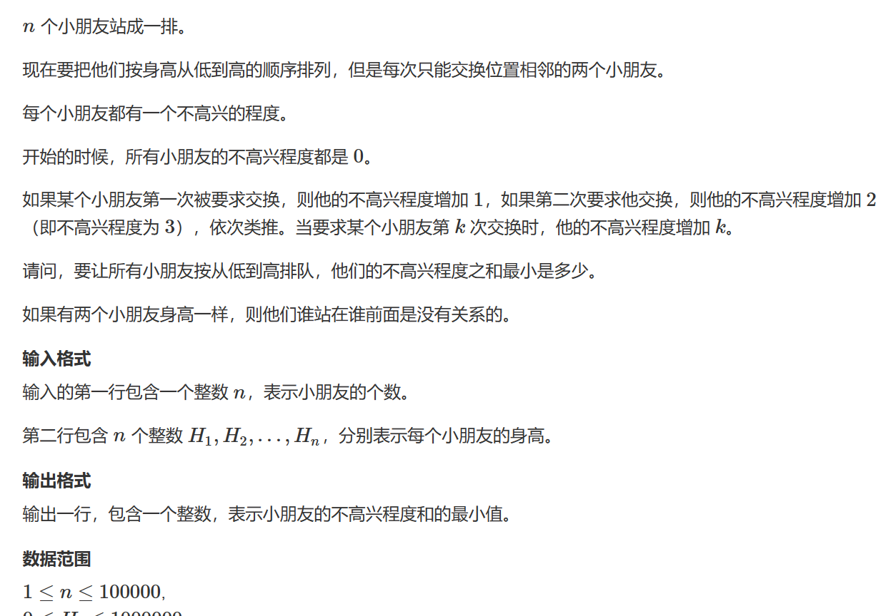

要想交换次数最少那必须是逆序对的个数，每交换一次减少一对逆序对，但是这个题不是统计逆序对，每个人可以贡献的结果与他被交换的次数有关，他交换的次数等于它找别人交换的次数即他右边小于他的数字的个数（逆序对），以及别人找他交换的次数，他左边大于它的个数。

对于第二点，统计每一个数左边大于这个数的个数也可以用逆序对解决不过要稍加变化，比如3 2 1逆序对是右边小于当前数的个数所以第一步要把值的大小颠倒变为1 2 3 然后反转数组求解逆序对即可。

```python
from bisect import bisect_left as bl
n=int(input())
nums=[int(x) for x in input().split()]
class Tree:
    def __init__(self):
        self.tree=[0]*1000010
    def update(self,i,delta):
        i+=1
        while i<len(self.tree):
            self.tree[i]+=delta
            i+=i&(-i)
    def query(self,i):
        s=0
        while i:
            s+=self.tree[i]
            i-=i&(-i)
        return s
ans=[0]*n

# 标准的求解逆序对
t=Tree()
for i in range(n-1,-1,-1):
    v=nums[i]
    t.update(v,1)
    ans[i]+=t.query(v)

t=Tree()
# 离散化，这里是大小颠倒
a=sorted(set(nums))
temp=[n-bl(a,v) for v in nums]
# 反转
temp=temp[::-1]
# 求逆序对
for i in range(n-1,-1,-1):
    v=temp[i]
    t.update(v,1)
    # 注意这个贡献的逆序对要加到反转前的位置上
    ans[n-i-1]+=t.query(v)
res=0
for v in ans:
    res+=(v+1)*v//2
print(res)
```


## 火柴排队

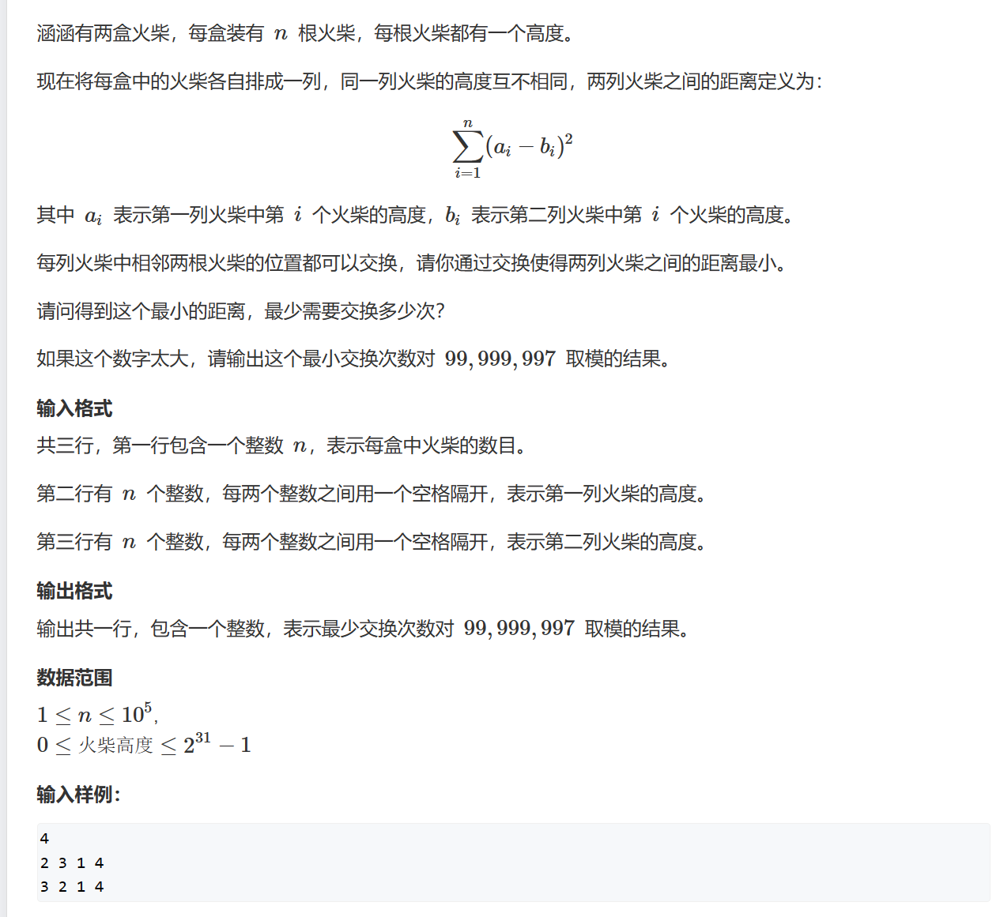


对于给定的公式展开：$Σ(a_i^2-2*a_i*b_i+b_i^2)$公式的首项和末项是固定的，无论怎么变换顺序都不影响，而只有$Σa_i*b_i$会影响到最终结果为了使结果最小，这个项需要是最大，当两个序列按照顺序排列对应相乘的时候最终的结果会是最大，也就是满足a中的第k大的值乘上b中第k大的值所需的最少交换次数。为了使a中的第k大的值对应b中第k大的值构造数组p[a[i]]=b[i]，只有当p[i]=i也就是p是升序的时候才能满足要求，由于每一次只能交换相邻的两个值，因此每一次操作可以减少一个逆序对最后最少的的操作次数就是数组中的逆序对。

 


```python
from bisect import bisect_left as bl
n=int(input())
a=[int(x) for x in input().split()]
b=[int(x) for x in input().split()]

m=10**8-3
# 带着下标排序
a=sorted([(v,i) for i,v in enumerate(a)])
b=sorted([(v,i) for i,v in enumerate(b)])

p=[0]*n
# 第k大的对应第k大的，构建数组
for i in range(n):
    p[b[i][1]]=a[i][1]
# 板子
class Tree:
    def __init__(self,n):
        self.tree=[0]*(n+1)
    def update(self,i,d):
        i+=1
        while i<len(self.tree):
            self.tree[i]+=d
            i+=i&(-i)
    def query(self,i):
        s=0
        while i:
            s+=self.tree[i]
            i-=i&(-i)
        return s
ans=0
t=Tree(n)
for i in range(n-1,-1,-1):
    t.update(p[i],1)
    ans+=t.query(p[i])
print(ans%m)
```

## 数星星

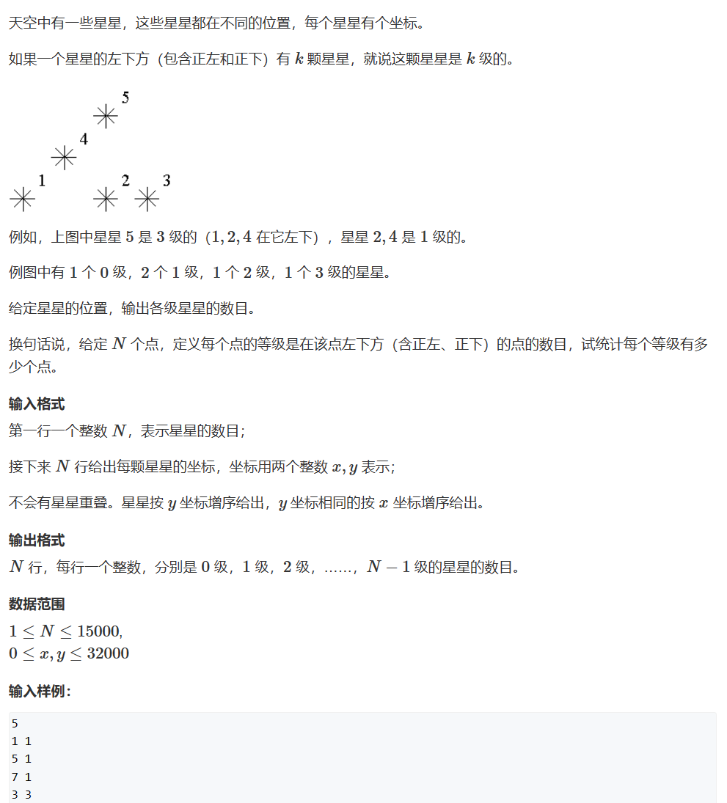


对于给定的数据，由于是已经按照纵坐标排好序的因此前面的值都是在他下面的，能够满足要求的值需要看横坐标大小，横坐标小于等于当前值的即可。通过树状数组记录每个横坐标（将这个位置加一）通过计算前缀和就能得出满足的个数。

```python
# 树状数组
class Tree:
    def __init__(self):
        self.tree=[0]*70000

    def update(self,i,delta):
        i+=1
        while i<len(self.tree):
            self.tree[i]+=delta
            i+=i&(-i)

    def query(self,i):
        s=0
        while i:
            s+=self.tree[i]
            i-=i&(-i)
        return s

t=Tree()
n=int(input())
ans=[0]*n
for _ in range(n):
    x,y=[int(x) for x in input().split()]
    # 记录横坐标的值
    t.update(x,1)
    # 查询，要同时包含这个横坐标，因为可能存在在正下面的点，同时减去一表示不包括本身
    ans[t.query(x+1)-1]+=1
for v in ans:
    print(v)
```

## **Gather Coins**

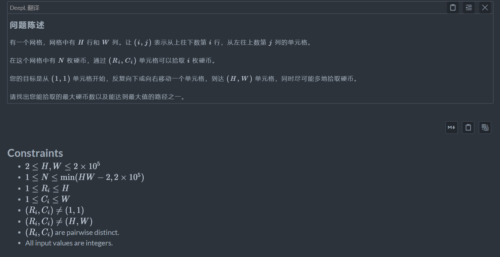


给定的数据范围无法使用回溯，这里因为只能往右下走所以每个硬币只能从左边和上面转移过来，先将数组按照行和列排序，fi表示考虑前i个硬币并且取第i个硬币时最多的硬币数


明显的使用树状数组优化求解，为了得到路径在计算的过程中同时记录一个转移数组，在变数组的过程中已经保证了行是递增的，而对于列用树状数组取得小于等于当前的最大的即可，树状数组中用列的坐标作为数组，这里因为数据范围不大所以不需要离散化

```python
class SegTree:
    def __init__(self,op,e,n,nums):
        self._n=n
        self._op=op
        self._e=e
        self._log=(n-1).bit_length()
        self._size=1<<self._log
        self._d=[self._e()]*(self._size<<1)
        if nums:
            for i in range(self._n):self._d[self._size+i]=nums[i]
            for i in range(self._size-1,0,-1):self._d[i]=self._op(self._d[i<<1],self._d[i<<1|1])
    def update(self,index,x):
        index+=self._size
        self._d[index]=x
        while index:
            self._d[index>>1]=self._op(self._d[index],self._d[index^1])
            index>>=1
    def get(self,p):return self._d[p+self._size]
    def query(self,l,r):
        sml,smr=self._e(),self._e()
        l+=self._size
        r+=self._size
        while l<r:
            if l&1:
                sml=self._op(sml,self._d[l])
                l+=1
            if r&1:
                r-=1
                smr=self._op(smr,self._d[r])
            l>>=1
            r>>=1
        return self._op(sml,smr)
    def all_prod(self):return self._d[1]

def op(x,y):
    val1,i1=x
    val2,i2=y
    if val1>val2:return (val1,i1)
    return (val2,i2)

def e():return(-1,-1)

h,w,n=RR()
nums=[]
for _ in range(n):nums.append([v-1 for v in RR()])
nums.sort()

init=[(0,-1)]*(w+2)
t=SegTree(op,e,len(init),init)
pre=[-1]*n

for i,(r,c) in enumerate(nums):
    val,index=t.query(0,c+1)
    t.update(c,(val+1,i))
    pre[i]=index

val,index=t.query(0,w+2)

m=h-1
n=w-1
ans=[]
# 往回构造路径
while 1:
    r,c=nums[index]
    ans+=['D']*(m-r)
    ans+=['R']*(n-c)
    index=pre[index]
    m,n=r,c
    if index==-1:
        ans += ['D'] * m
        ans += ['R'] *n
        break
print(val)
print(''.join(ans[::-1]))
```

## [用点构造面积最大的矩形 II](https://leetcode.cn/problems/maximum-area-rectangle-with-point-constraints-ii/)


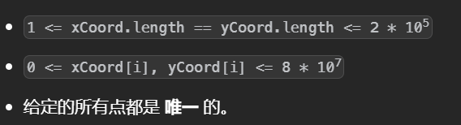


经典扫描线做法，枚举每个右边界，这里的数据范围要做离散化处理，但是最后要求解面积，所以需要做一个映射找回去。

以横坐标分组，每个横坐标对应一个排好序的y序列，为了保证竖直边界上没有点，这里遍历相邻的y坐标作为左上和左下，在扫描的过程中记录每对y坐标对应的最近的x坐标以保证水平边界上没有多余的点，这样就找出了一个矩形，为了保证矩形内部没有多余的点，这里以y来做区间和

```python
class Tree:
    def __init__(self, n):
        # 初始化树状数组，大小为 n + 1
        self.tree = [0] * (n + 1)

    def cal(self,x):
        return x & (-x)
    def update(self, i, detal):
        # 更新操作，i 是索引，detal 是增量
        i += 1  # 树状数组下标从 1 开始
        while i < len(self.tree):
            self.tree[i] += detal
            i += self.cal(i)

    def querymax(self, i: int) -> int:
        # 查询最大值，[0, i-1] 区间
        mx = 0
        while i:
            mx = max(mx, self.tree[i])
            i &= i - 1  # 去掉最低有效位
        return mx

    def get(self, i):
        # 查询前缀和，[0, i-1] 区间
        s = 0
        while i:
            s += self.tree[i]
            i -= self.cal(i)
        return s
    def query(self,l,r):
        # 查询[l,r-1]的区间和
        return self.get(r)-self.get(l)

class Solution:
    def maxRectangleArea(self, xCoord: List[int], yCoord: List[int]) -> int:
        # 用于离散化
        xs=sorted(set(xCoord))
        ys=sorted(set(yCoord))
        
        mx={}
        my={}

        xp=[]
        yp=[]

        # 开始对X数组离散化，同时要记录映射，因为最后是要求解面积大小的不能用离散化的值来算
        for v in xCoord:
            xp.append(bisect_left(xs,v))
            mx[bisect_left(xs,v)]=v
        
        # 对y同理
        for v in yCoord:
            yp.append(bisect_left(ys,v))
            my[bisect_left(ys,v)]=v

        # 记录每组x对应的y
        x_list=[[]for _ in range(len(xs))]
        for i,j in zip(xp,yp):
            x_list[i].append(j)

        # 排序 为了保证边界上只有一个点，需要相邻取y坐标
        for i in range(len(xs)):x_list[i].sort()

        # 记录前一对相邻的y对应的x位置
        last={}
        # 建立树状数组
        tree=Tree(max(len(xs),len(ys)))
        # 记录前一对相邻的y范围内，从0开始到其对应的x中点的个数 
        pre={}

        ans=-1

        # 枚举右边界
        for i in range(len(xs)):
            arr=x_list[i]
            x2=i
            tree.update(arr[0],1)
            # 找相邻的y值，同时更新区间内点的个数
            for y1,y2 in pairwise(arr):
                tree.update(y2,1)
                # 找前面这对相邻的y值是否出现过，从而确定一个矩形
                if (y1,y2) in last:
                    x1=last[(y1,y2)]
                    # 0到x1,y1到y2范围内点的个数
                    sum1=pre[(y1,y2)]
                    # 0到x2,y1到y2范围内点的个数
                    sum2=tree.query(y1,y2+1)
                    # 说明区间内没有点
                    if sum1+2==sum2:
                        # 更新答案时注意映射回去
                        ans=max(ans,(mx[x2]-mx[x1])*(my[y2]-my[y1]))

                last[(y1,y2)]=i
                pre[(y1,y2)]=tree.query(y1,y2+1)
        return ans
```


# 线段树

**线段树解决区间和的问题，并且区间会被修改。线段数的两个操作：求区间和，修改区间，时间复杂度均为logn**


## 模板

本质上是使用递归加速计算，线段树的结构如下所示


将区间划分**至多4n**(因为满二叉树的节点个数为2n-1，一个**基于经验的安全值**是4n)个节点，其中每个节点记录的是一个区间的**结果**(和，最大值等等)

查询过程通过分支划分较小的区间，但不一定会划分到叶子节点，如果**当前节点对应的区间范围已经被查询的范围包括了，就直接返回该节点储存的结果，**而不需要再往下划分了，这样可以节省时间。

更新的过程中通过**分治**不断划分出**较小的子区间**，但如果要划分到**叶子节点**再更新，则在范围较大时会涉及到**大量节点耗时较多**，因此使用**懒标记(延迟更新)**，即更新操作推迟到真正需要的时候执行，每个节点会配备一个懒标记记录该节点上未处理的更新操作，当对该节点对应的区间进一步查询或更新时，会将标记下推，这样避免了对每个叶子节点的操作。


线段树数组实现（数组版本，懒标记，区间查询/修改），根据题目要求传入不同的函数：

```python
class SegTree:
    def __init__(self, nums, func):
        self.nums = nums
        self.n = len(nums)
        self.tree = [0] * (4 * self.n)  # 存储节点，4n是基于经验的安全值
        self.lazy = [0] * (4 * self.n)  # 懒标记数组和节点数组一样大
        self.func = func # 操作的函数，求最大值，求和一类的
        if self.n > 0:
            self._build(0, 0, self.n - 1)
	# 构建节点数组
    def _build(self, root, l, r):
        if l == r:
            self.tree[root] = self.nums[r]
            return
        mid = (l + r) >> 1
        # 递归更新左右，然后合并
        self._build(root * 2 + 1, l, mid)
        self._build(root * 2 + 2, mid + 1, r)
        self.tree[root] = self.func(self.tree[root * 2 + 1], self.tree[root * 2 + 2])

    def _push_down(self, root, l, r):
        """将懒标记下推到子节点"""
        if self.lazy[root] != 0:
            mid = (l + r) >> 1
            # 更新左右子节点的值
            self.tree[root * 2 + 1] += self.lazy[root] * (mid - l + 1)
            self.tree[root * 2 + 2] += self.lazy[root] * (r - mid)
            # 传递懒标记到子节点
            self.lazy[root * 2 + 1] += self.lazy[root]
            self.lazy[root * 2 + 2] += self.lazy[root]
            # 清除当前节点的懒标记
            self.lazy[root] = 0

    def update(self, ul, ur, diff):
        """区间更新，将区间 [ul, ur] 的值增加 diff"""
        self._update_range(0, 0, self.n - 1, ul, ur, diff)
	
    # 更新区间，root表示节点编号，可以从0或者1开始(这里从0开始，如果从1开始则左节点20,右节点2o+1)，lr是该节点覆盖的范围，LR是实际操作的范围
    def _update_range(self, root, l, r, ul, ur, diff):
        if ul <= l and r <= ur:  # 当前区间完全在目标区间内，无需下推直接在这一层标记
            self.tree[root] += diff * (r - l + 1)  # 更新当前区间的值
            self.lazy[root] += diff  # 标记懒更新
            return
        self._push_down(root, l, r)  # 下推懒标记
        mid = (l + r) >> 1
        # 涉及到当前节点的左儿子
        if ul <= mid:
            self._update_range(root * 2 + 1, l, mid, ul, ur, diff)
        # 右儿子
        if ur > mid:
            self._update_range(root * 2 + 2, mid + 1, r, ul, ur, diff)
        # 更新当前节点的值
        self.tree[root] = self.func(self.tree[root * 2 + 1], self.tree[root * 2 + 2])

    def query(self, ql, qr):
        """区间查询，返回 [ql, qr] 的值"""
        return self._query_range(0, 0, self.n - 1, ql, qr)
	
    # 参数同理
    def _query_range(self, root, l, r, ql, qr):
        if ql <= l and r <= qr:  # 当前区间完全在目标区间内，无需继续划分直接返回
            return self.tree[root]
        self._push_down(root, l, r)  # 下推懒标记
        mid = (l + r) >> 1
        res = 0
        # 划分区间
        if ql <= mid:
            res = self.func(res, self._query_range(root * 2 + 1, l, mid, ql, qr))
        if qr > mid:
            res = self.func(res, self._query_range(root * 2 + 2, mid + 1, r, ql, qr))
        return res

```


线段树模板（动态开点，区间和）需要注意当区间较大时(10**9)才会用到动态开点线段树，这个版本的实现很慢：

```python
class Node:
    def __init__(self):
        self.left=None
        self.right=None
        self.add=0
        self.val=0
def pushup(node):
    node.val=node.left.val+node.right.val

def pushdown(node,lc,rc):
    if not node.left:node.left=Node()
    if not node.right:node.right=Node()

    if node.add==0:return
    node.left.val+=lc*node.add
    node.right.val+=rc*node.add
    # 懒标记不需要加
    node.left.add += node.add
    node.right.add += node.add
    node.add=0

def update(root,start,end,l,r,val):
    if l<=start and r>=end:
        root.val+=(end-start+1)*val
        root.add+=val
        return
    mid=(start+end)>>1
    pushdown(root,mid-start+1,end-mid)
    if l<=mid:update(root.left,start,mid,l,r,val)
    if r>=mid+1:update(root.right,mid+1,end,l,r,val)
    pushup(root)
def query(root,start,end,l,r):
    if l <= start and r >= end:return root.val
    mid=(start+end)>>1
    ans=0
    pushdown(root,mid-start+1,end-mid)
    if l<=mid:ans+=query(root.left,start,mid,l,r)
    if r>=mid+1:ans+=query(root.right,mid+1,end,l,r)
    return ans
```

注意根据题意的不同线段树中的各个函数也是可能改变的，基本上pushup,pushdown 之类的函数会变化


# 懒标记线段树

## [更新数组后处理求和查询](https://leetcode.cn/problems/handling-sum-queries-after-update/)

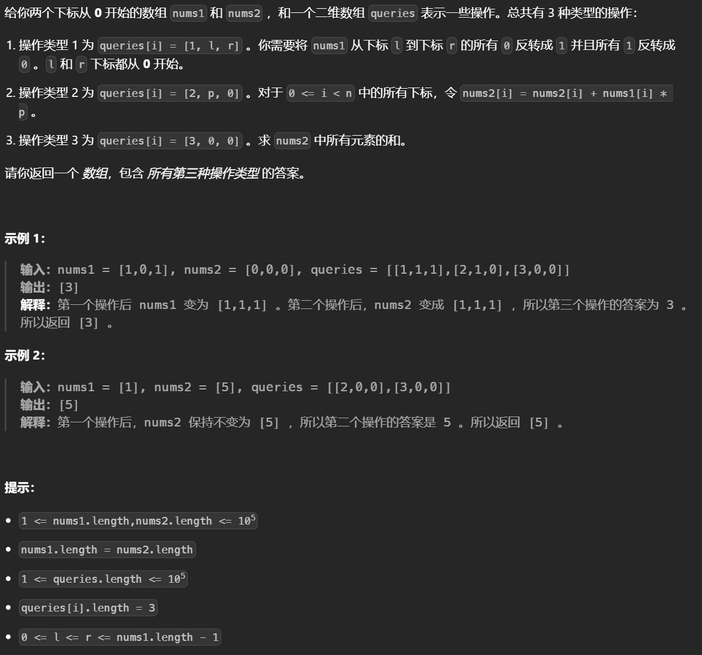

对于操作二，不需要**操作数组**，只记录**nums2的和**，将和每次添加**nums1中1的个数**即可，使用线段树维护Nums1中**1的个数(区间和)**，对区间的反转变化即操作一就是将**区间和修改为区间长度-区间和**

模板中修改懒标记为1和0表示是否**反转**，节点的值修改为区间长度减区间和

```python
class SegTree:
    def __init__(self, nums, func):
        self.nums = nums
        self.n = len(nums)
        self.tree = [0] * (4 * self.n)  # 存储节点，4n是基于经验的安全值
        self.lazy = [0] * (4 * self.n)  # 懒标记数组和节点数组一样大
        self.func = func # 操作的函数，求最大值，求和一类的
        if self.n > 0:
            self._build(0, 0, self.n - 1)
	# 构建节点数组
    def _build(self, root, l, r):
        if l == r:
            self.tree[root] = self.nums[r]
            return
        mid = (l + r) >> 1
        # 递归更新左右，然后合并
        self._build(root * 2 + 1, l, mid)
        self._build(root * 2 + 2, mid + 1, r)
        self.tree[root] = self.func(self.tree[root * 2 + 1], self.tree[root * 2 + 2])

    def _push_down(self, root, l, r):
        """将懒标记下推到子节点"""
        if self.lazy[root]:
            mid = (l + r) >> 1
            # 更新左右子节点的值
            self.tree[root * 2 + 1] = (mid - l + 1)-self.tree[root * 2 + 1]
            self.tree[root * 2 + 2] = (r - mid)-self.tree[root * 2 + 2]
            # 传递懒标记到子节点
            self.lazy[root * 2 + 1] ^= self.lazy[root]
            self.lazy[root * 2 + 2] ^= self.lazy[root]
            # 清除当前节点的懒标记
            self.lazy[root] = 0

    def update(self, ul, ur, diff):
        """区间更新，将区间 [ul, ur] 的值增加 diff"""
        self._update_range(0, 0, self.n - 1, ul, ur, diff)
	
    # 更新区间，root表示节点编号，可以从0或者1开始(这里从0开始，如果从1开始则左节点20,右节点2o+1)，lr是该节点覆盖的范围，LR是实际操作的范围
    def _update_range(self, root, l, r, ul, ur, diff):
        if ul <= l and r <= ur:  # 当前区间完全在目标区间内，无需下推直接在这一层标记
            self.tree[root] =(r - l + 1)-self.tree[root]  # 更新当前区间的值
            self.lazy[root] ^= 1  # 标记懒更新
            return
        self._push_down(root, l, r)  # 下推懒标记
        mid = (l + r) >> 1
        # 涉及到当前节点的左儿子
        if ul <= mid:
            self._update_range(root * 2 + 1, l, mid, ul, ur, diff)
        # 右儿子
        if ur > mid:
            self._update_range(root * 2 + 2, mid + 1, r, ul, ur, diff)
        # 更新当前节点的值
        self.tree[root] = self.func(self.tree[root * 2 + 1], self.tree[root * 2 + 2])

    def query(self, ql, qr):
        """区间查询，返回 [ql, qr] 的值"""
        return self._query_range(0, 0, self.n - 1, ql, qr)
	
    # 参数同理
    def _query_range(self, root, l, r, ql, qr):
        if ql <= l and r <= qr:  # 当前区间完全在目标区间内，无需继续划分直接返回
            return self.tree[root]
        self._push_down(root, l, r)  # 下推懒标记
        mid = (l + r) >> 1
        res = 0
        # 划分区间
        if ql <= mid:
            res = self.func(res, self._query_range(root * 2 + 1, l, mid, ql, qr))
        if qr > mid:
            res = self.func(res, self._query_range(root * 2 + 2, mid + 1, r, ql, qr))
        return res

class Solution:
    def handleQuery(self, nums1: List[int], nums2: List[int], queries: List[List[int]]) -> List[int]:
        t=SegTree(nums1,lambda x,y:x+y)
        s=sum(nums2)
        n=len(nums1)
        ans=[]
        for i,j,k in queries:
            if i==1:
                t.update(j,k,1)
            elif i==2:
                s+=t.query(0,n-1)*j
            else:
                ans.append(s)
        return ans 
```


# 动态开点线段树

## [ 我的日程安排表 I](https://leetcode.cn/problems/my-calendar-i/)

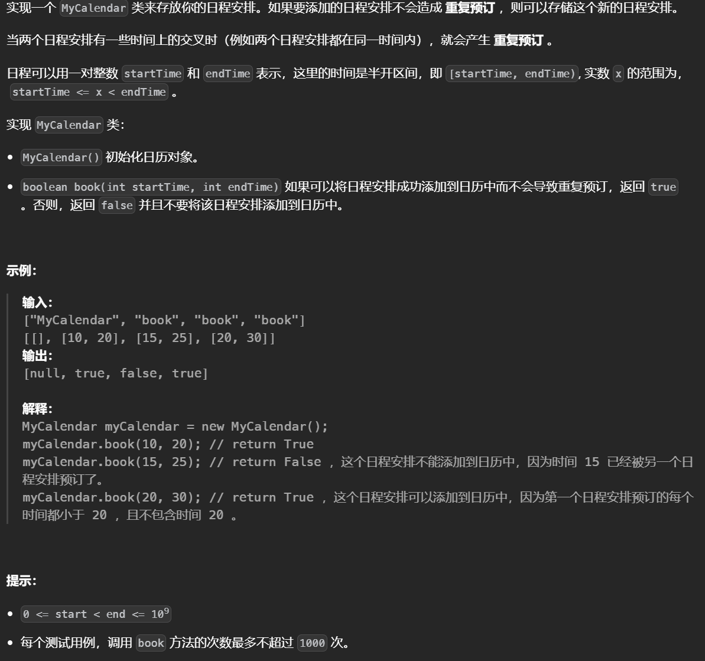

对于给定的数据范围只能动态

线段树操作，对于合法的区间会把对应的位置都增加一（类似于计数操作），在加入下一个值的时候需要判断这个区间的最大值是否等于0也就是判断这个区间是否会和当前区间重叠。

```python
class Node:
    def __init__(self):
        self.left=None
        self.right=None
        self.add=0
        self.val=0
def pushup(node):
    node.val=max(node.left.val,node.right.val)

def pushdown(node):
    if not node.left:node.left=Node()
    if not node.right:node.right=Node()

    if node.add==0:return
    node.left.val+=node.add
    node.right.val+=node.add

    node.left.add += node.add
    node.right.add += node.add
    node.add=0

def update(root,start,end,l,r,val):
    if l<=start and r>=end:
        root.val+=val
        root.add+=val
        return
    mid=(start+end)>>1
    pushdown(root)
    if l<=mid:update(root.left,start,mid,l,r,val)
    if r>=mid+1:update(root.right,mid+1,end,l,r,val)
    pushup(root)
def query(root,start,end,l,r):
    if l <= start and r >= end:return root.val
    mid=(start+end)>>1
    ans=0
    pushdown(root)
    if l<=mid:ans=query(root.left,start,mid,l,r)
    if r>=mid+1:ans=max(query(root.right,mid+1,end,l,r),ans)
    return ans

class MyCalendar:

    def __init__(self):
        self.n=10**9
        self.node=Node()

    def book(self, start: int, end: int) -> bool:
        if query(self.node,0,self.n,start,end-1)!=0:
            return False
        update(self.node,0,self.n,start,end-1,1)
        return True
```


## [最长递增子序列](https://leetcode.cn/problems/longest-increasing-subsequence/)


每一个元素所能形成的最长递增子序列等于小于它的元素中所能形成的最长的递增子序列加一，定义dp(j)=max(dp(i))+1，dp(j)表示yi元素j结尾的最长递增子序列，其中i是小于j的所有元素。这个转移方程中要求出区间（小于j）的最大值，然后用这个最大值去更新下一个状态，这个状态又会被用到其他的状态转移方程中，这需要快速求解区间最大值以及单点修改通过线段树完成。

```python
class Node:
    def __init__(self):
        self.left=None
        self.right=None
        self.add=0
        self.val=0
# 求最大值的更新操作
def pushup(node):
    node.val=max(node.left.val,node.right.val)
# 进行的是区间覆盖操作
def pushdown(node):
    if not node.left:node.left=Node()
    if not node.right:node.right=Node()
    if not node.add:return
    # 不是累和而是覆盖
    node.left.val=node.right.val=node.left.add=node.right.add=node.add
    node.add=0

   
def update(node,start,end,l,r,v):
    if l<=start and r>=end:
        node.val=v
        node.add=v
        return 
    mid=(start+end)>>1
    pushdown(node)
    if l<=mid:update(node.left,start,mid,l,r,v)
    if r>=mid+1:update(node.right,mid+1,end,l,r,v)
    pushup(node)
def query(node,start,end,l,r):
    if l<=start and r>=end:
        return node.val
    mid=(start+end)>>1
    pushdown(node)
    res=0
    if l<=mid:res=max(res,query(node.left,start,mid,l,r))
    if r>=mid+1:res=max(res,query(node.right,mid+1,end,l,r))
    return res

class Solution:
    def lengthOfLIS(self, nums: List[int]) -> int:
        # 先离散化处理把元素换到1,n，方便处理
        temp=sorted(set(nums))
        # 注意这里把每个值加一是为了防止0的出现导致l>r
        nums=[bisect_left(temp,v)+1 for v in nums]
        N=max(nums)+10
        node=Node()
        ans=0
        # 依次求解每个元素小于他的元素中能形成的最长的序列
        for v in nums:
            # 找小于当前的元素，注意长度要加一
            cnt=query(node,0,N,0,v-1)+1
            # 求出后更新，因为维护的实际是一个dp(v)
            update(node,0,N,v,v,cnt)
            ans=max(ans,cnt)
        return ans 
```

## [物块放置查询](https://leetcode.cn/problems/block-placement-queries/)

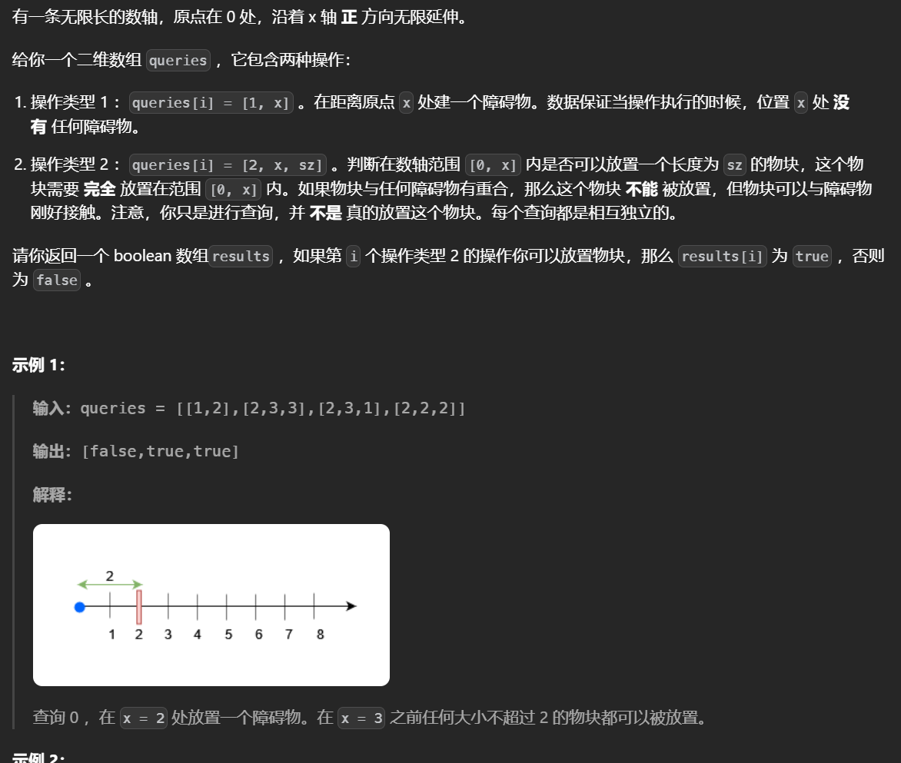

这个题目是对线段树的高级运用，每次更新一个位置后该如何求出闲置的区间呢，这里每个点记录的是以他为右端点所能得到的区间长度是多少，而不是每次更新一个点就把他认为是加一，这样再查询的时候，可以直接查询区间内的最大值以此求的给定区间内最长的闲置空间，另一个问题是，当你更新一个位置时，更新的具体的值是多少呢，这个值应该是这个点有它前面的那个点的值，同时更新一个点，这个点后面的点的大小也要变化，这就需要快速求出给定点的两端的点，可以通过有序数组求出

```python
from sortedcontainers import SortedList as sl
class Node:
    def __init__(self):
        self.left=None
        self.right=None
        self.add=0
        self.val=0

def pushup(node):
    node.val=max(node.left.val,node.right.val)

def pushdown(node):
    if not node.left:node.left=Node()
    if not node.right:node.right=Node()
    node.left.val+=node.add
    node.right.val+=node.add
    node.left.add+=node.add
    node.right.add+=node.add
    node.add=0

def update(node,start,end,l,r,val):
    if l<=start and r>=end:
        node.val+=val
        node.add+=val
        return 
    mid=(start+end)>>1
    pushdown(node)
    if l<=mid:
        update(node.left,start,mid,l,r,val)
    if r>=mid+1:
        update(node.right,mid+1,end,l,r,val)
    pushup(node)
    

def query(node,start,end,l,r):
    if l<=start and r>=end:
        return node.val
    mid=(start+end)>>1
    ans=0
    pushdown(node)
    if l<=mid:
        ans=query(node.left,start,mid,l,r) 
    if r>=mid+1:
        ans=max(ans,query(node.right,mid+1,end,l,r))
    return ans 
class Solution:
    def getResults(self, queries: List[List[int]]) -> List[bool]:
        # 值域
        m = max(q[1] for q in queries) + 1
        node=Node()
        # 初始时，放入哨兵，这样在插入第一个点时不用特判，同时哨兵又不会影响结果（不会包含在区间内）不用特判
        s=sl([0,m])
        ans=[]
        for li in queries:
            # 找到前后的点
            j=s.bisect_left(li[1])
            pre=s[j-1]
            x=li[1]
            nx=s[j]
            if li[0]==1:
                # 更新前后的点，注意板子中val是更新的值
                update(node,0,m,x,x,x-pre)
                # 后面的节点应该减小
                update(node,0,m,nx,nx,-(nx-pre-(nx-x)))
                # 不能落下
                s.add(li[1])
            else:
                x,sz=li[1:]
                # 求出最大值，这个最大的空闲区间应该是0~pre之间的，以及pre~i之间的
                mx=max(query(node,0,m,0,pre),x-pre)
                ans.append(mx>=sz)
        return ans 
```


# 字典树


## 构造字典树

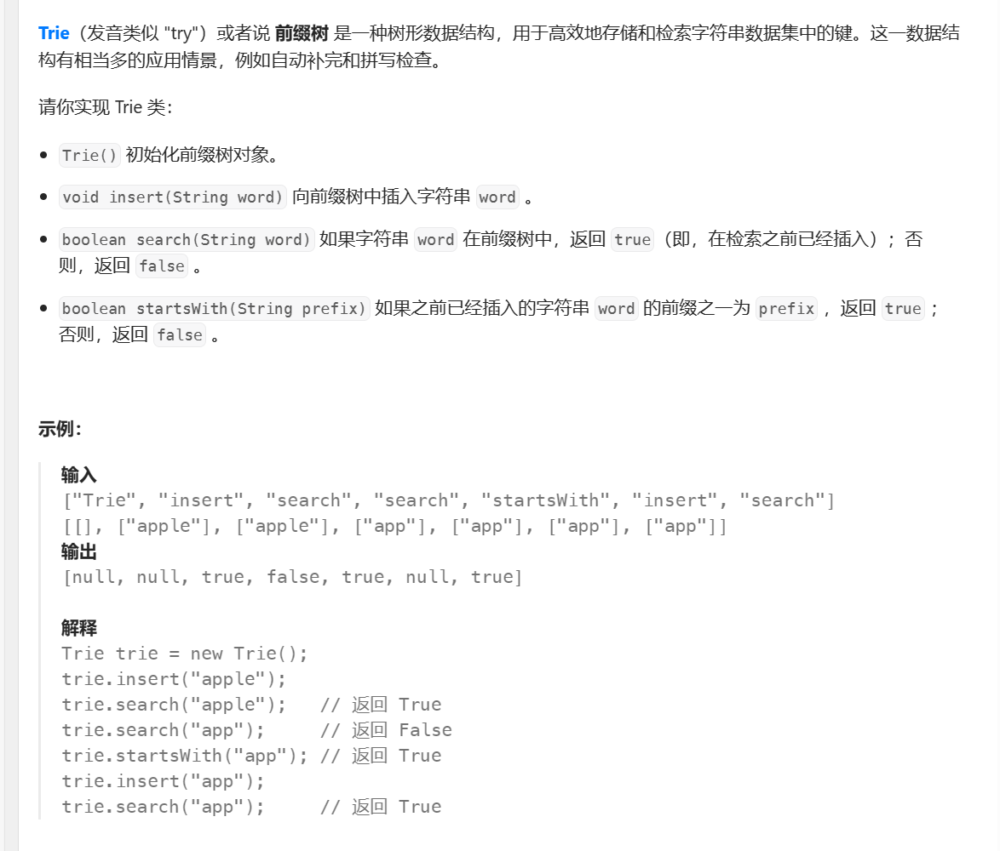


```python
class Trie:

    def __init__(self):
        # 只存在26位
        self.child=[None]*26
        
        # 表示是否存在一个字符串
        self.isend=False

    def searchPrefix(self, prefix: str) -> "Trie":
        node=self
        for c in prefix:
            c=ord(c)-ord('a')
            if not node.child[c]:
                return None
            node=node.child[c]
        return node
             
    def insert(self, word: str) -> None:
        node=self
        for c in word:
            c=ord(c)-ord('a')
            if not node.child[c]:
                node.child[c]=Trie()
            node=node.child[c]
        # 设置isend表示存在一个字符串
        node.isend=True

    def search(self, word: str) -> bool:
        res=self.searchPrefix(word)
        return res is not None and res.isend

    def startsWith(self, prefix: str) -> bool:
        return self.searchPrefix(prefix) is not None
```

## Trie字符串统计

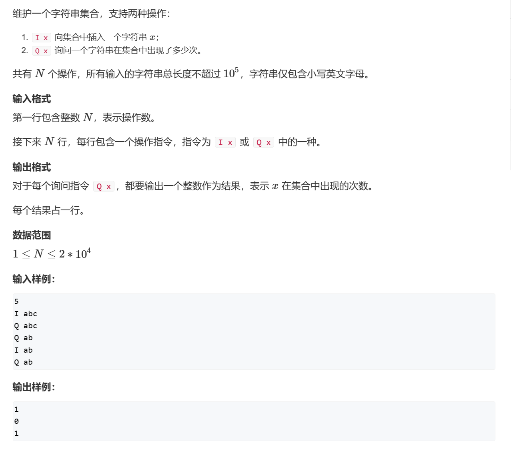

```python
class Trie:
    def __init__(self):
        self.children=[None]*26
        self.is_end=0
    def insert(self,s):
        d=self
        for c in s:
            c=ord(c)-ord('a')
            if not d.children[c]:
                d.children[c]=Trie()
            d=d.children[c]
        d.is_end+=1
    def search(self,s):
        d=self
        for c in s:
            c=ord(c)-ord('a')
            if not d.children[c]:
                return 0
            d=d.children[c]
        return d.is_end
q=int(input())
tree=Trie()
while q:
    a,s=input().split()
    if a=='I':
        tree.insert(s)
    else:
        print(tree.search(s))
    q-=1
```


## [数组中两个数的最大异或值](https://leetcode.cn/problems/maximum-xor-of-two-numbers-in-an-array/)

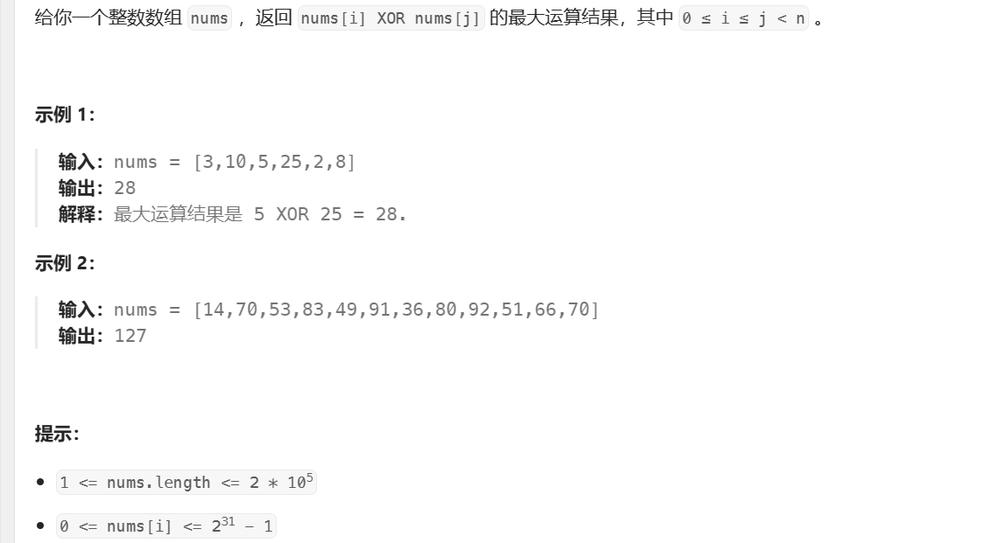


两个数异或和最大要求尽可能多的二进制位不相同（并且在是尽可能地在高位不同），因此把所有数字转换为二进制到字典树中，然后贪心的对每个数找相反的路径比如是01，则在树中找10，注意由于数字的二进制不同，把题目都补为32位。

```python
class Trie:
    def __init__(self):
        self.children=[None]*2
        self.is_end=-1
    def insert(self,x):
        d=self
        for i in range(15,-1,-1):
            c=(x>>i)&1
            if not d.children[c]:
                d.children[c]=Trie()
            d=d.children[c]
        d.is_end=x
    def search(self,x):
        d=self
        for i in range(15,-1,-1):
            c= 0 if (x>>i)&1 else 1
            # 尽可能的找相反的，如果不存在就只能找存在的
            if not d.children[c]:
                c=0 if c else 1
            d=d.children[c]
            # 返回的是异或的结果
        return d.is_end^x if d.is_end else 0
class Solution:
    def findMaximumXOR(self, nums: List[int]) -> int:
        tree=Trie()
        # 插入每个数到字典树中
        for x in nums:
            tree.insert(x)
        # 对每个数在字典树中找与他相反的路劲，返回最大的
        return max([tree.search(x) for x in nums])
```


## [ 最长公共前缀](https://leetcode.cn/problems/longest-common-prefix/)

字典树可以用来求公共前缀，这需要在字典树中构建一个新的变量cnt，用于记录有多少个字符串经过这个位置。如果是公共前缀那么经过这个点的点数应该是n，因此在字典树中找最后一个cnt等于n的节点，同时记录树的深度就可以得到最长的公共前缀。

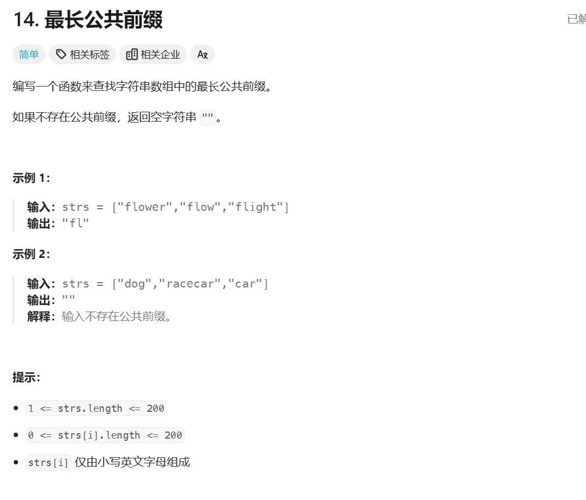

```python
class Trie:
    def __init__(self):
        self.children={}
        # 多出一个变量cnt
        self.isend=0
    def insert(self,s):
        d=self
        for c in s:
            c=ord(c)-ord('a')
            if c not in d.children:
                d.children[c]=Trie()
            d=d.children[c]
            # 在循环中更新注意，记录要多少个字符串经过这个位置
            d.isend+=1
class Solution:
    def longestCommonPrefix(self, strs: List[str]) -> str:
        tree=Trie()
        n=len(strs)
        # 插入
        for s in strs:
            tree.insert(s)
        # 记录深度
        depth=0
        # 如果遇到了分叉，那么一定不是公共前缀
        while len(tree.children)==1:
            for k,v in tree.children.items():
                # 找到前缀为n的最大的节点的深度
                if v.isend!=n:
                    return strs[0][:depth]
                tree=tree.children[k]
                depth+=1
        return strs[0][:depth]
```


## Collapsing Strings

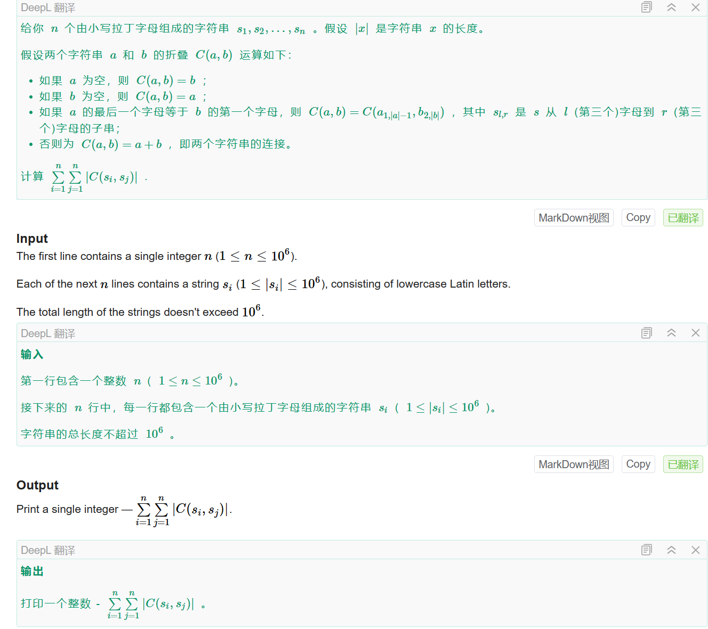

实际上是在求解两个字符串之间长度之和减去它们公共的前后缀的长度。


根据观察可以发现如果不考虑重合的部分最后的结果就是$2\times n \times$所有字符串的长度之和

一个字符串倒序前缀和与所有字符串前缀重合的部分不好计算，把该字符串转换为颠倒的，这样就可以求解公共前缀了。而求字符串和所有的字符串的前缀之和可以通过模拟加入字符串的过程，减去遍历到的每一个节点经过的字符串数来实现。

至于为什么只能说是通过观察得出

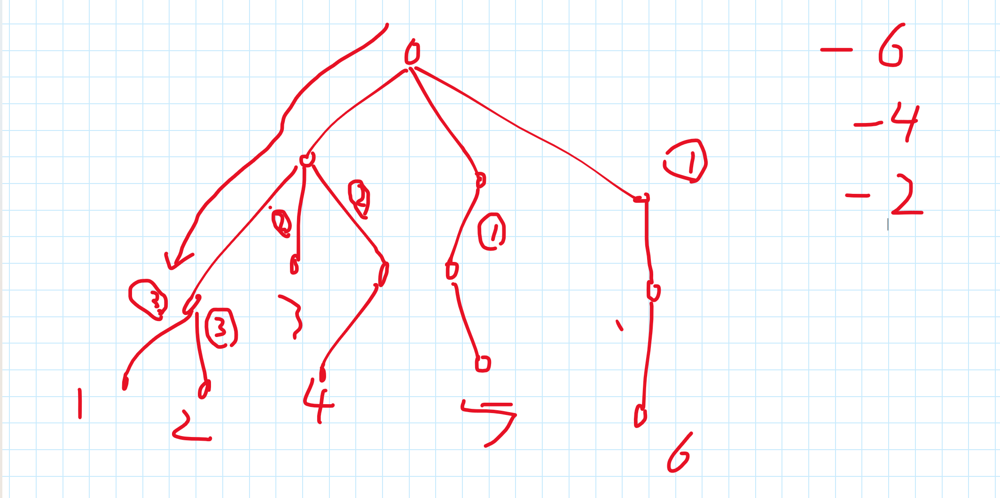


```python
import sys
input=sys.stdin.readline
n=int(input())
S=[input().rstrip() for _ in range(n)]
# 搭建字典树
class TrieNode:
    def __init__(self):
        # 邻接表的方式连接
        self.nxt={}
        # 多一个额外的变量记录有多少字符经过
        self.cnt=0
class Trie:
    def __init__(self):
        self.root=TrieNode()

T = Trie()
ans = 0
for s in S:
    # 插入所有的点同时记录大小
    ans += len(s)*n*2
    node = T.root
    for t in s:
        j = ord(t)-ord("a")
        if j not in node.nxt :
            node.nxt[j] = TrieNode()
        node = node.nxt[j]
        node.cnt+=1
 
for s in S:
    # 在对每个字符倒序模拟插入
    node = T.root
    
    for i in range(len(s)-1,-1,-1):
        t=s[i]
        j = ord(t)-ord("a")
        if j not in  node.nxt:
            break
        # 减去遍历到的每一个点储存的经过字符数，组合以要乘二，因为是两个字符串的贡献都要减
        node = node.nxt[j]
        ans -= node.cnt*2
 
print(ans) 
```


## Fixed Prefix Permutations

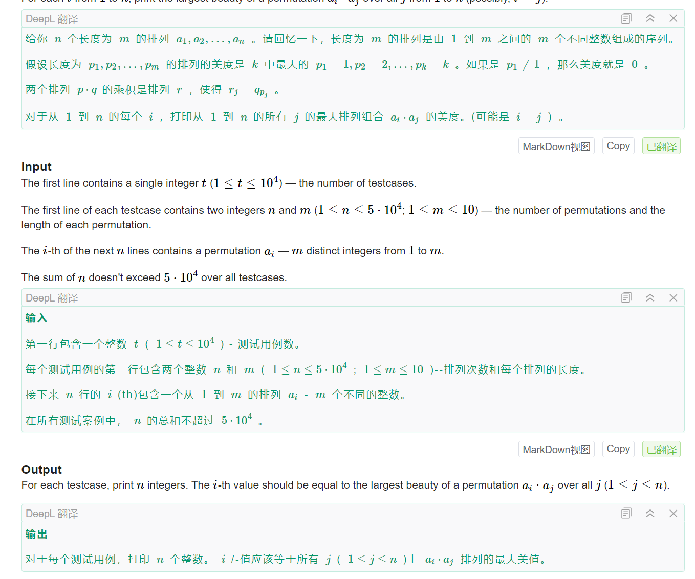

题目大意是：每个数组与其他数组（包括本身）相乘后最大的美丽值，美丽值指的是数组从1开始的严格递增序列的长度。两个数组相乘指的是，前一个数组中从左到右的每个值作为下标取第二个数组中的元素：

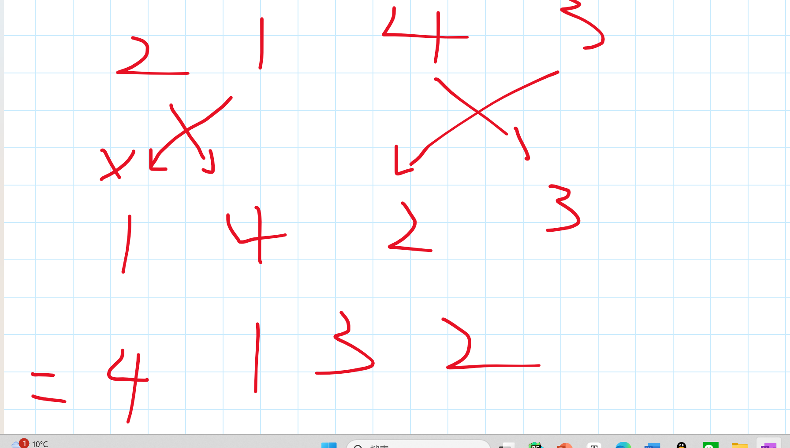

而对于一个数组想要得到最大的美丽值就要映射如下：
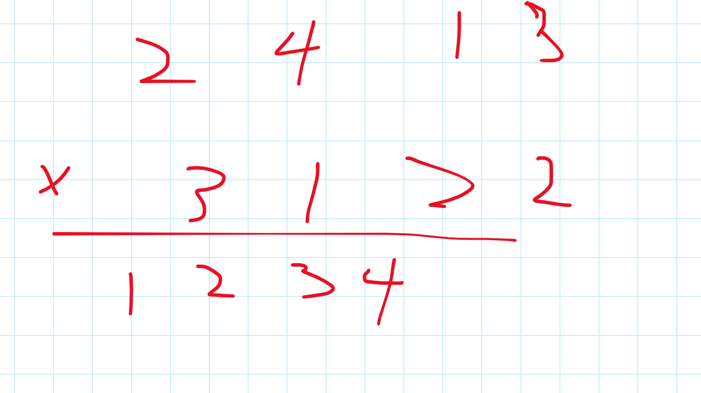


要求必须是从1开始的递增序列，因此后面可以没有但是前面不能缺少，前一个数组想要获得大的美丽值就必须是左边正确指出下一个数组中对应元素的正确位置，然后才能找下一个位置。对于3142只有用2413乘它才能得到最大的，如果不存在2413则找241是否存在，如果存在最大的美丽值就是3，反之继续。对于给定的数组要找一个a数组使得a[i]能指向第i+1大的数，这个数组可以通过给定的数组的值为索引下标为值来实现，然后去看所有数组能匹配的这个逆序对最大前缀是？（因为要求第一个必须是1），求解前缀可以用字典树。

```python
import sys
from collections import defaultdict
input=sys.stdin.readline
t=int(input())
# 字典树
class Trie:
    def __init__(self):
        self.children={}
    
    def insert(self,nums):
        d=self
        for v in nums:
            if v not in d.children:
                d.children[v]=Trie()
            d=d.children[v]
    def find(self,nums):
        d=self
        cnt=0
        for v in nums:
            if v not in d.children:
                return cnt
            cnt+=1
            d=d.children[v]
        return cnt 

# 构造最优数组
def traverse(nums):
    n_=len(nums)
    res=[0]*n_
    for i,v in enumerate(nums):
        res[v]=i
    return res 

for _ in range(t):
    n,m=[int(x) for x in input().split()]
    # 注意要放到里面
    tree=Trie()
    temp=[]
    for _ in range(n):
        # 做一位偏移
        nums=[int(x)-1 for x in input().split()]
        # 将逆序对插入
        tree.insert(traverse(nums))
        temp.append(nums)
    for li in temp:
        # 对每个数组找他能匹配的最大前缀，
        print(tree.find(li),end=' ')
    print()
```

## [统计前后缀下标对 II](https://leetcode.cn/problems/count-prefix-and-suffix-pairs-ii/)

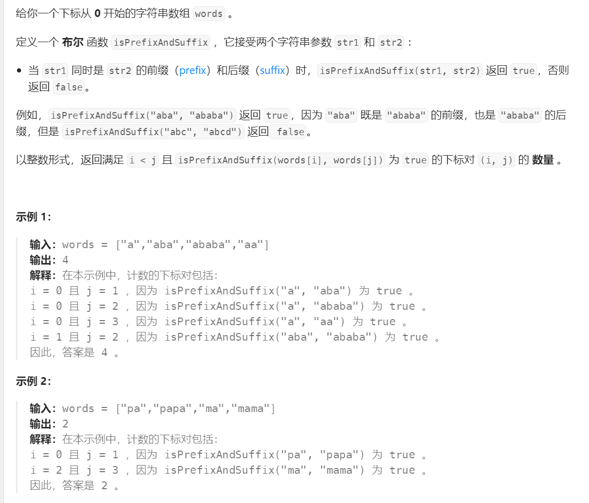

统计前后缀相同的，构造每个字符串的第i个和倒数第i个的pair存入字典树。相当于同时在匹配前缀和后缀

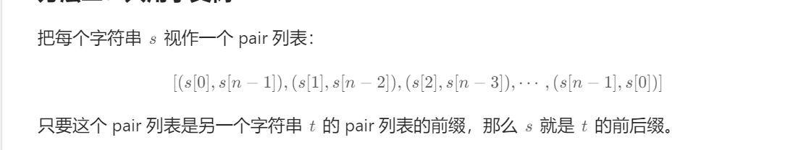

```python
class Trie:
    def __init__(self):
        self.children={}
        self.isend=0


class Solution:
    def countPrefixSuffixPairs(self, words: List[str]) -> int:
        tree=Trie()
        n=len(words)
        ans=0
	# 由于是要找i和j，那么要先检查再插入	
        for s in words:
            temp=tree
            for c in zip(s,reversed(s)):
                if c not in temp.children:
                    temp.children[c]=Trie()
                temp=temp.children[c]
                ans+=temp.isend
            temp.isend+=1
            
        return ans 
```


## [统计异或值在范围内的数对有多少](https://leetcode.cn/problems/count-pairs-with-xor-in-a-range/)


数组异或类的题目使用字典树求解，初始的想法是构建所有值的异或字典树，然后枚举每一个数，在字典树上做bfs求解出所有的异或值然后判断是否在区间内，但是这种方法实际是n^2的，因为bfs找出了所有的异或值相当于遍历了数组。

这里查找区间内的个数，可以转换为前缀的求解，即找小于等于high的减去小于等于low-1的，那么在字典树中不需要维护一个队列，当limit的位为1的时候所有异或出0的分支都是可以的，直接加上然后跳到异或为1的分支继续，如果limit的位为0，那么就只能跳到与x这一位相反的分支上。

```python
class Trie:
    def __init__(self):
        self.children={}
        # 需要记录经过这个节点的数有多少，而不是只在端点记录，因为要剪枝
        self.cnt=0
    def insert(self,x):
        t=self
        # 从高位开始
        for i in range(15,-1,-1):
            c=x>>i&1
            if c not in t.children:
                t.children[c]=Trie()
            t=t.children[c]
            t.cnt+=1
    def search(self,x,limit):
        t=self
        ans=0
        for j in range(15,-1,-1):
            v=x>>j&1
            # 如果这一位是1，那么与x当前位相同的(异或出0)可以直接加上，因为必然小于limit，然后跳到与x不同的位上
            if limit>>j&1:
                if v in t.children:ans+=t.children[v].cnt
                # 如果没有这个分支
                if v^1 not in t.children:return ans 
                t=t.children[v^1]
            # 为0就只能跳到相同的位上
            else:
                if v not in t.children:return ans 
                t=t.children[v]
        return ans+t.cnt # 最后要加上这个位上的数

class Solution:
    def countPairs(self, nums: List[int], low: int, high: int) -> int:
        t=Trie()
        ans=0
        # 因为会重复计算，所以算一个插入一个，可以做到不重不漏
        for v in nums:
            ans+=t.search(v,high)-t.search(v,low-1)
            t.insert(v)
        # 或者也可以直接写
        # for v in nums:T.insert(v)
        # return sum([T.search(v,high) for v in nums])//2-sum([T.search(v,low-1) for v in nums])//2
        return ans 
```


# 前缀和数组

前缀和适用于快速频繁的计算一个索引区间内的元素之和，构建的前缀和数组第一位为0，方便构造，查询从0到r的区间内元素之和，结果是pre[r+1]

**可以找出子数组某个值的区间**


**如果做了一位偏移，那么在找l,r区间（从0开始的闭区间）内的元素和时，用pre[r+1]-pre[l]，反之就是在找pre[r]-pre[l-1],如果要找0到2区间内的值是会越界的，因此减一做一位偏移**


## [子数组异或查询](https://leetcode.cn/problems/xor-queries-of-a-subarray/)

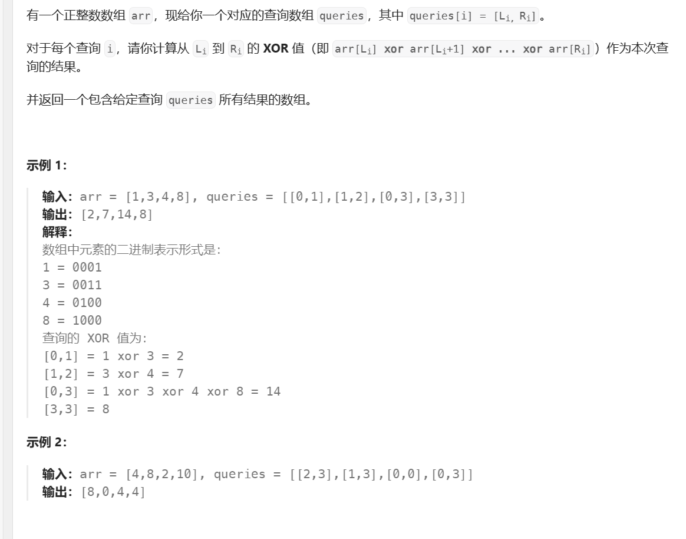

快速查询某个区间内元素的和，使用前缀和数组，这里是异或操作，前缀数组中储存的就应该是元素之间累异或的结果。

**元素和0异或的结果不变**，偶数个相同元素异或相当于没异或，可以构造前缀和公式

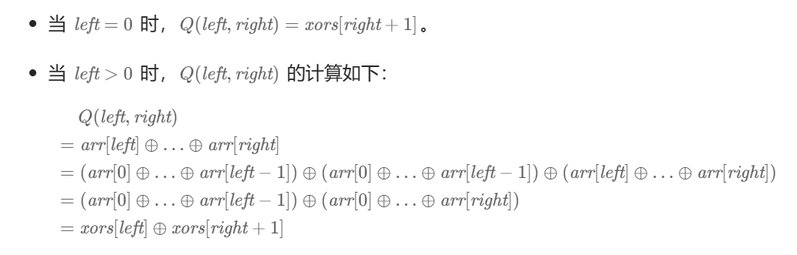

```python
from functools import reduce
from operator import xor
class Solution:
    def xorQueries(self, arr: List[int], queries: List[List[int]]) -> List[int]:
        # 构造前缀数组，初始第一个位置为0方便构造,pre[i]就是从arr[0]异或到arr[i-1]的结果
        pre=[0]
        ans=[]
        # 构造
        for a in arr:
            pre.append(pre[-1]^a)
        for q in queries:
            l,r=q
            ans.append(pre[l]^pre[r+1])
        return ans
```

## [统计美丽子数组数目](https://leetcode.cn/problems/count-the-number-of-beautiful-subarrays/)


就是在找子数组异或和为0的数目，构建前缀异或和数组，子数组[l,r]异或的结果可以表示为pre[l-1]^pre[r]，要想为0就是找相同的异或和。

```python
class Solution:
    def beautifulSubarrays(self, nums: List[int]) -> int:
        pre=[0]
        for i,v in enumerate(nums):
            pre.append(v^pre[-1])
        memo=Counter(pre)
        ans=0
        for k,v in memo.items():
            ans+=comb(v,2)
        return ans 
```


## [ 数组美丽值求和](https://leetcode.cn/problems/sum-of-beauty-in-the-array/)

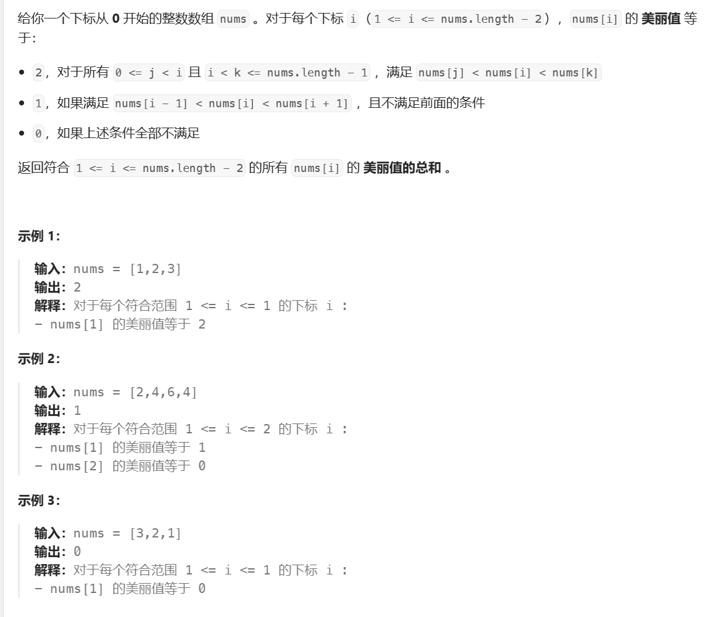

判断一个值是否大于左边的所有值只需要判断是否大于左边的最大值。（技巧点）

观察题目就是要求一个数是否大于左边的最大值以及小于右边的最小值，每次使用双指针向两边遍历的做法太慢了，构建`前缀最大值和前缀最小值数组`。

l[i]表示从0到i-1的最大值，r[i]表示从i+1到最后的最小值，因为要以i左右来判断，不需要到i

```python
class Solution:
    def sumOfBeauties(self, nums) -> int:
        n = len(nums)
        l = [-float('inf')] * n
        r = [+float('inf')] * n
        # 相当于做了一位偏移，本来按照l和r的定义也就不会取到
        l[0] = nums[0]
        r[n-1] = nums[-1]
        ans = 0

        for i in range(1, n):
            # nums[i-1]与l[i-1]的比较相当于nums[i-1]与nums[:i-2]中取最大值
            l[i] = max(nums[i - 1], l[i - 1])
        for i in range(n - 2, -1, -1):
            # nums[i+1]与r[i+1]的比较相当于nums[i+1]与nums[i+2:]中去最小值
            r[i] = min(nums[i + 1], r[i + 1])
        for i in range(1, n - 1):
            if nums[i] > l[i] and nums[i] < r[i]:
                ans += 2
            elif nums[i - 1] < nums[i] < nums[i + 1]:
                ans += 1
        return ans

Solution().sumOfBeauties([1,2,3])
```

## [最后 K 个数的乘积](https://leetcode.cn/problems/product-of-the-last-k-numbers/)

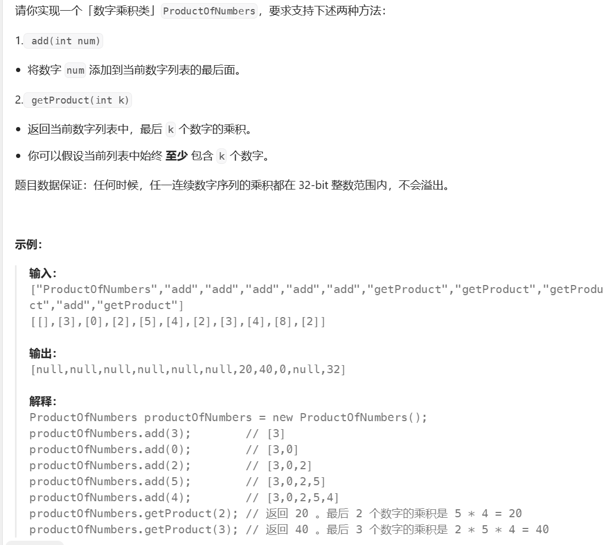


频繁的的计算区间内的结果，使用前缀思想，例如输入的 a b c d。则存的是 a，a×b，a×b×c，a×b×c×d。这样。如果查询最后k个数相乘，就是pre[n-1]//pre[n-k-1] 做一位偏移：（a×b×c×d）/ （a×b）= c × d。这样每次查询只需要做一次除法，每次输入只需要做一次乘法。

注意这里存在除0的可能，因此`每次遇到0的时候，就清空数组`，否则zai记录下去没有意义（0/0），如果查询的大小超过了当前的前缀数组（也就是必然包含0）就返回0

​	

```python
class ProductOfNumbers:

    def __init__(self):
        self.pre=[]

    def add(self, num: int) -> None:
        if len(self.pre)==0 and num!=0:
            self.pre.append(num)
        elif num==0:
            self.pre=[]
        else :
            self.pre.append(num*self.pre[-1])
    def getProduct(self, k: int) -> int:
        n=len(self.pre)
        if k>n:
            return 0
        elif k==n:
            return self.pre[n-1] 
        else:
            return self.pre[n-1]//self.pre[n-k-1]
```

## [除自身以外数组的乘积](https://leetcode.cn/problems/product-of-array-except-self/)

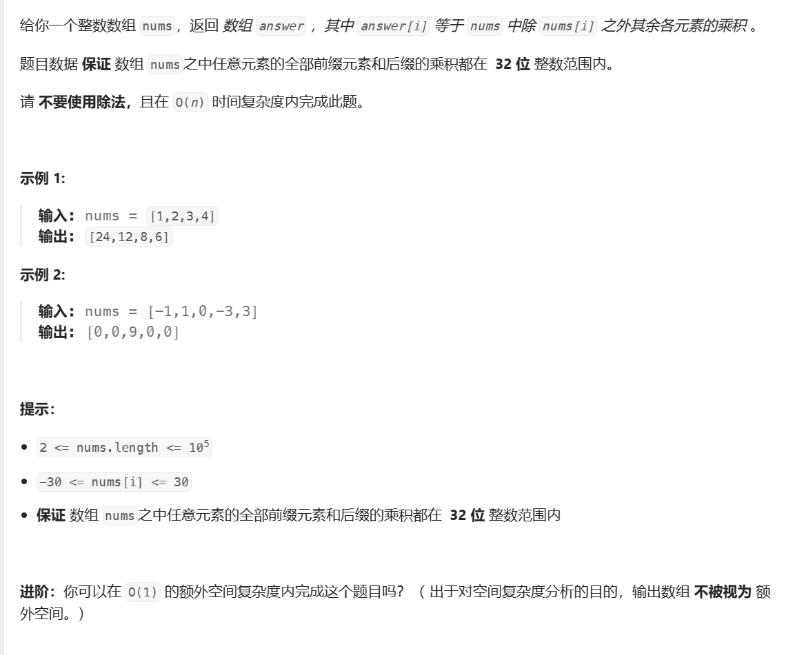

这里直接使用前缀和数组的话，如果遇到了0，没有办法求解，因此拆分为两个数组，一个前缀和一个后缀和，在找结果的时候乘上这个数左边的前缀和以及右边的后缀和。


```python
class Solution:
    def productExceptSelf(self, nums: List[int]) -> List[int]:
        n=len(nums)
        # 开了三个数组记录前缀后缀以及答案
        pre=[0]*n
        post=[0]*n
        ans=[0]*n
        pre[0]=nums[0]
        post[-1]=nums[-1]
        # 构建前后缀数组
        for i in range(1,n):
            pre[i]=nums[i]*pre[i-1]
        for i in range(n-2,-1,-1):
            post[i]=nums[i]*post[i+1]
         # 求解结果，注意对两端的设置前/后缀为1，因为创建前缀数组时没有偏移
        for i in range(n):
            if i-1>=0:
                first=pre[i-1]
            else:
                first=1
            if i+1<n:
                last=post[i+1]
            else:
                last=1
            ans[i]=first*last
        return ans 
```


## [分割数组](https://leetcode.cn/problems/partition-array-into-disjoint-intervals/)


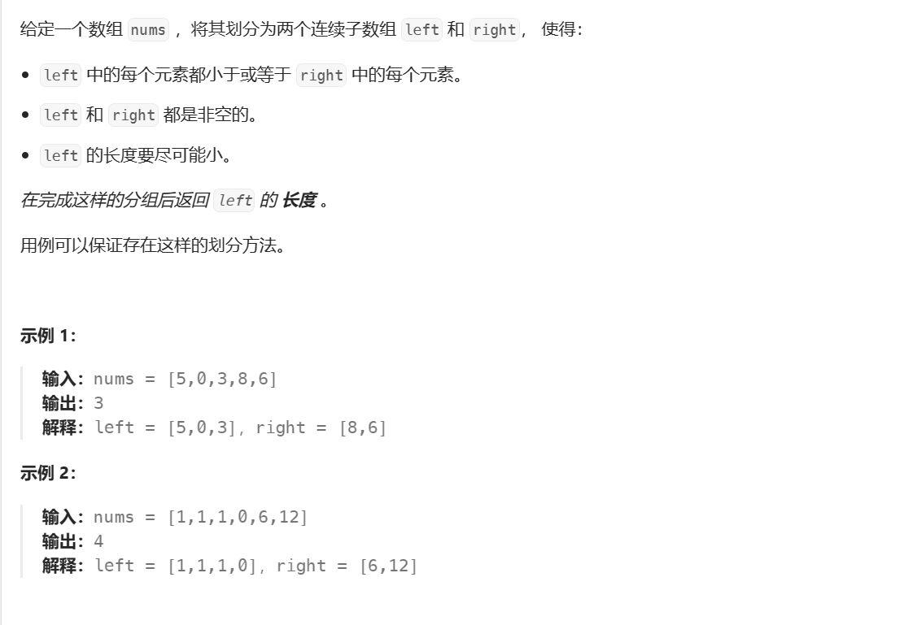


就是找一个left的`前缀最大值小于right的后缀最小值的数组`

```python
from math import inf
class Solution:
    def partitionDisjoint(self, nums: List[int]) -> int:
        n=len(nums)
        mx=-1
        # 构建后缀最小值数组
        mn=[inf]*n
        mn[-1]=nums[-1]
        for i in range(n-2,-1,-1):
            mn[i]=min(nums[i],mn[i+1])
        for i in range(n)
        # 记录前缀最大值:
            mx=max(mx,nums[i])
            if mx<=mn[i+1]:
                # 注意长度是索引加一
                return i+1
```

## [任意子数组和的绝对值的最大值](https://leetcode.cn/problems/maximum-absolute-sum-of-any-subarray/)


通过前缀和表示数组区间的和，找出前缀和数组中最大的和最小的，找出他们的差值（只有最大值和最小值的差值才是最大的），在这三个值的绝对值中取最大值即可


## [生成平衡数组的方案数](https://leetcode.cn/problems/ways-to-make-a-fair-array/)

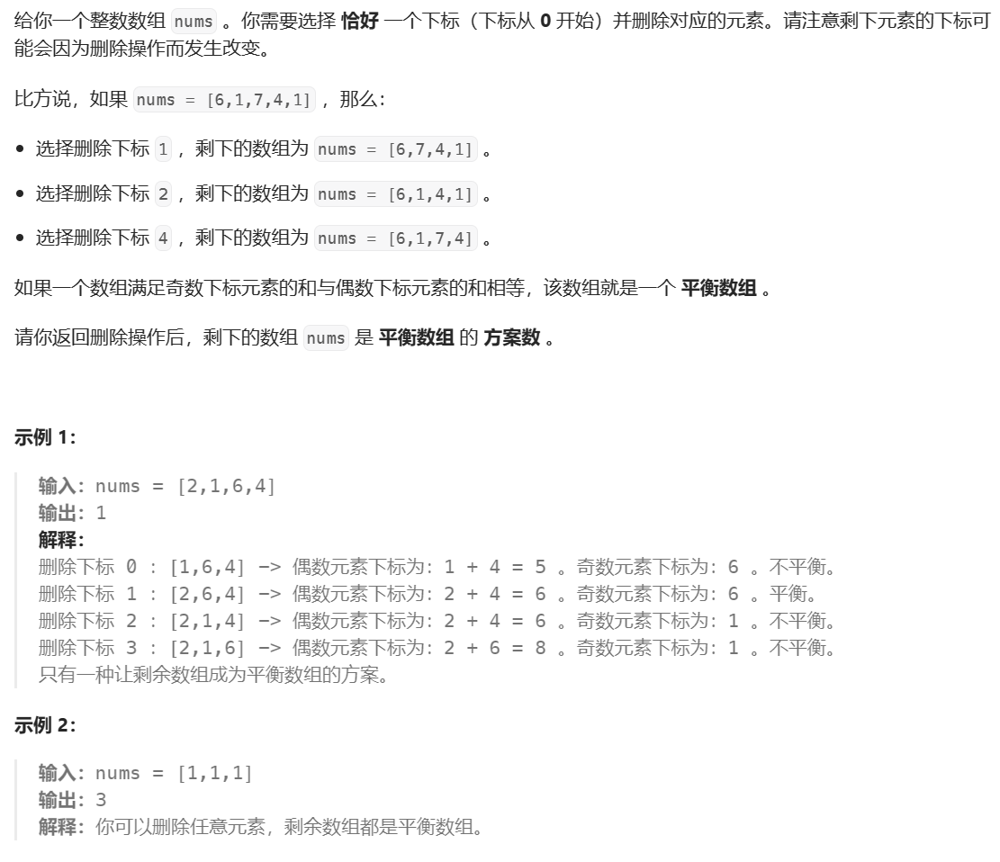

找删除一个元素后，所有的奇数元素之和，这需要用到前缀奇数数组，以及后缀偶数数组（因为删除这个元素后，原来后面的偶数下标变为奇数下标）

```python
class Solution:
    def waysToMakeFair(self, nums: List[int]) -> int:
        total=sum(nums)
        ans=0
        n=len(nums)
        # 加0方便操作
        pre=[0]*(n+1)
        post=[0]*(n+1)
        for i in range(n):
            if i&1:
                pre[i+1]=nums[i]+pre[i]
            else:
                pre[i+1]=pre[i]
        for i in range(n-1,-1,-1):
            if not i&1:
                post[i]+=post[i+1]+nums[i]
            else:
                post[i]=post[i+1]
        for i in range(n):
            # 注意索引的确定，删除了这个元素，奇数前缀和的索引传入i-1，但有一位偏移，偶数后缀和不存在索引偏移
            val= pre[i]+post[i+1]
            if val==total-val-nums[i]:
                ans+=1
        return ans

```

## [和相同的二元子数组](https://leetcode.cn/problems/binary-subarrays-with-sum/)	

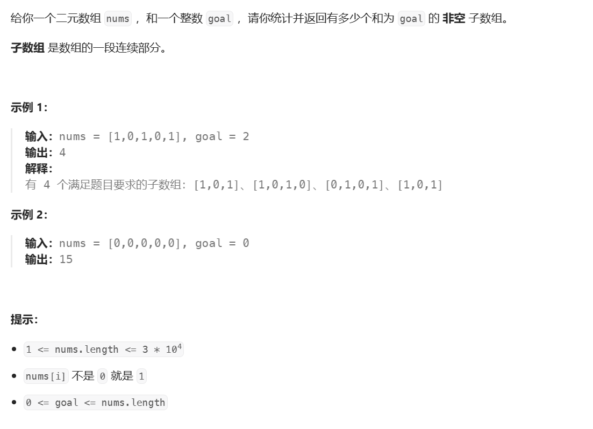

先构造前缀和数组，可以通过O(1)的时间得出子数组的和，之后扫描每个位置，以这个位置为右端点，寻找是否有满足条件的左端点存在，左端点的子数组和就是之前的右端点所访问过的，使用一个哈希表记录这些右端点的值的个数

```python
class Solution:
    def numSubarraysWithSum(self, nums: List[int], goal: int) -> int:
        ans=0
        # 前缀和
        pre=[0]+list(accumulate(nums))
        # 注意初始的时候要记录一个0值，表示全部取到。
        memo=defaultdict(int,{0:1})
        for i in range(len(nums)):
            # 得到以r为右端点的子数组的和
            r=pre[i+1]
            # 查找左端点是否存在，以及有几个
            l=r-goal
            ans+=memo[l]
            memo[r]+=1
        return ans 
```

## collecting game

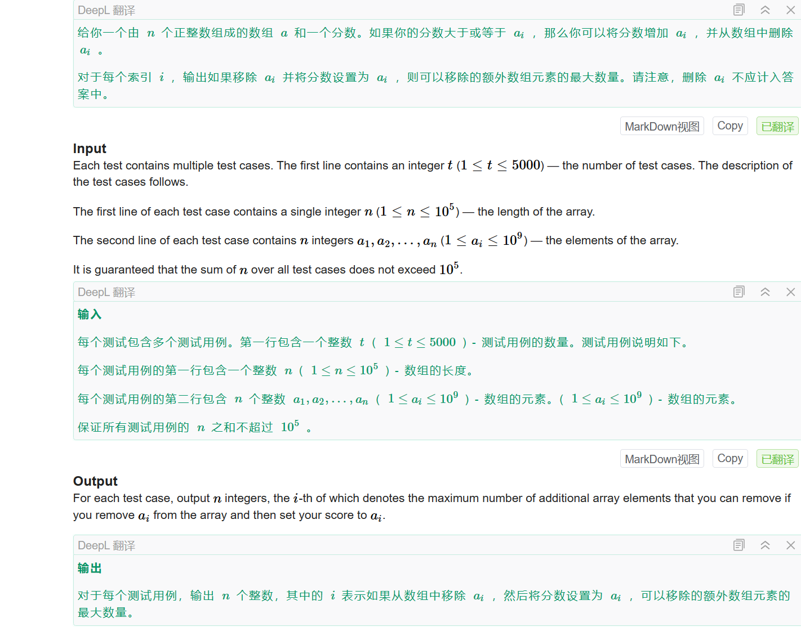

对每个位置的元素查找他可以删除多少个比他小的元素，删除了的元素可以加到这个元素上用于下一次判断。

对于每个元素暴力的查找会很慢，但通过观察可以发现，对于一个元素，比它小的最大元素所能到达的最远位置就是他能到达的最远位置，因此在把数组排序后可以维护一个只会向右移动的指针，遍历排序后的数组，当指针位置大于等于当前位置，那么这个元素的能走到的最远距离就是已知的，如果不大于，那么就从当前元素开始找，为了快速查找，使用前缀和数组，找出这个元素的前缀和数组中对应的位置，然后在排序的数组中使用二分判断他能到达的最远位置，之后再用这个位置的前缀和继续二分找最远位置直到位置不变，用这个位置的值去更新指针，同时对于每一个元素使用字典记录他能到达的最远距离，因为数组中可能存在重复值。

```python
from collections import defaultdict
from itertools import accumulate as ac
from bisect import bisect_right as br
t=int(input())
while t:
    n=int(input())
    ans=[0]*n
    nums=[int(x) for x in input().split()]
    temp=sorted([val for val in nums])
    l=0
    pre=list(ac(temp))
    memo=defaultdict(int)
    for i in range(n):
        if l<i:
            curr=pre[i]
            # 使用二分找能走到的最远距离
            index=br(temp,curr)-1
            # 如果合法，一直迭代
            while 0<index<n and index>i:
                # 找最远位置的前缀和
                curr=pre[index]
                # 这个前缀和能到达的最远位置
                cnt=br(temp,curr)-1
                # 如果相同，说明无法再向前了，退出，否则更新继续
                if cnt==index:
                    break
                else:
                    index=cnt
            l=index
        # 使用哈希表记录最大值，可能存在相同元素
        memo[temp[i]]=max(memo[temp[i]],max(0,l))

    for i,v in enumerate(nums):
        ans[i]=memo[v]
    print(*ans ,end=' ')
    print()
    t-=1
```


##  Sum of Progression

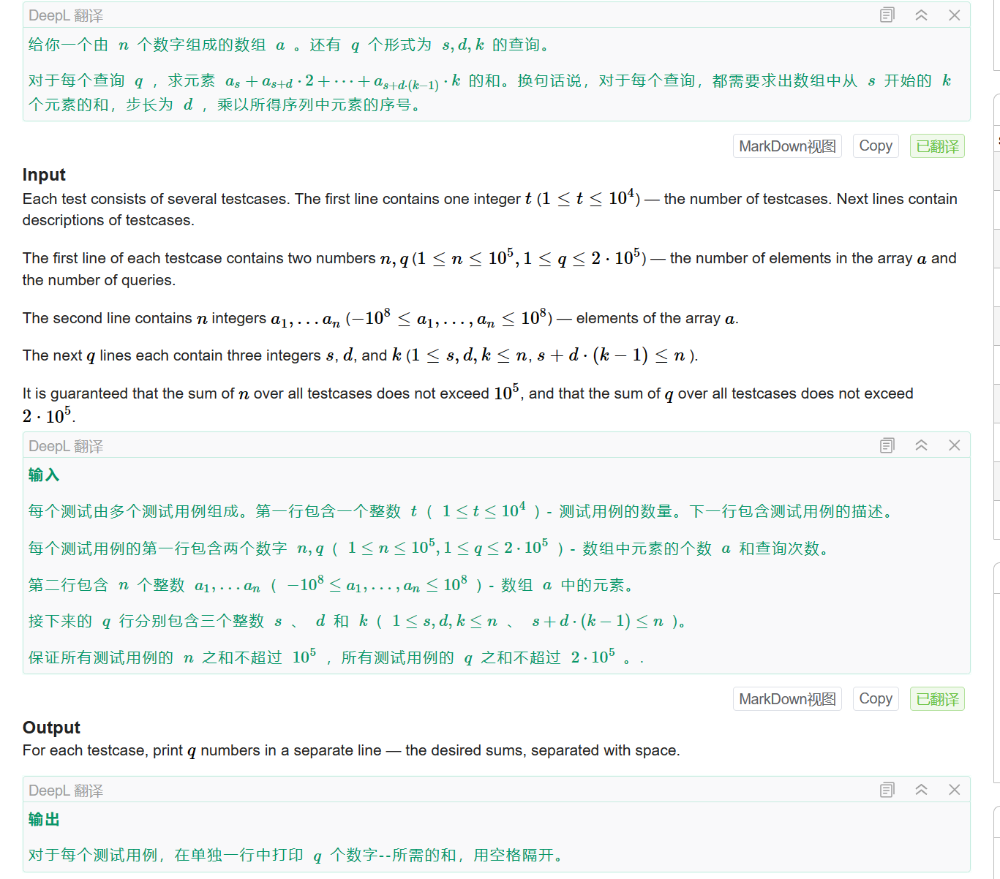

明显必须在O(1)的时间内完成一次查询，考虑使用带权的前缀和数组，即数组中记录的是$1\times a_0+2\times a_1 +3\times a_3...$

一共用到了两个前缀和

从特殊到一般来推公式，首先考虑d=1的情况：


在考虑d=2的情况

注意d>=2时考虑两个位置，一个从0开始一个从1开始


最后可以推出公式：
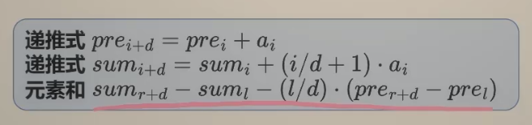


因此可预处理出每个d下的前缀和和带权前缀和，但是如果每个位置都处理的话会达到n^2的时间复杂度，这里使用根号分治法，十万级别的数据，如果d大于根号n的话，那么要处理的数据只有百位，直接暴力做，因此d限定在根号n之下


```python
from math import isqrt
import sys
input = sys.stdin.readline
# 首先开数组
mx_n = 100000
b = 300
pre = [[0]*(mx_n + b) for _ in range(b)]
summ = [[0]*(mx_n + b) for _ in range(b)]


def slove(nums):
    # 对于每个位置构造前缀数组
    for d in range(1, b):
        for i in range(len(nums)):
            pre[d][i + d] = pre[d][i] + nums[i]
            summ[d][i + d] = summ[d][i] + (i//d+1) * nums[i]


t = int(input())
while t:
    n, q = [int(x) for x in input().split()]
    nums = [int(x) for x in input().split()]
    # 预处理
    slove(nums)
    while q:
        s, d, k = [int(x) for x in input().split()]
        s-=1
        # 步长太大，直接暴力做
        if d >= b:
            ans=0
            for i in range(k):
                ans+=nums[s+d*i]*(i+1)
            print(ans, end=' ')
        else:
            r=s + d * k
            # 由公式求解
            print(summ[d][r] - summ[d][s] - (pre[d][r] - pre[d][s]) * (s // d), end=' ')

        q -= 1
    print()
    t -= 1
```


## [ 和可被 K 整除的子数组](https://leetcode.cn/problems/subarray-sums-divisible-by-k/)

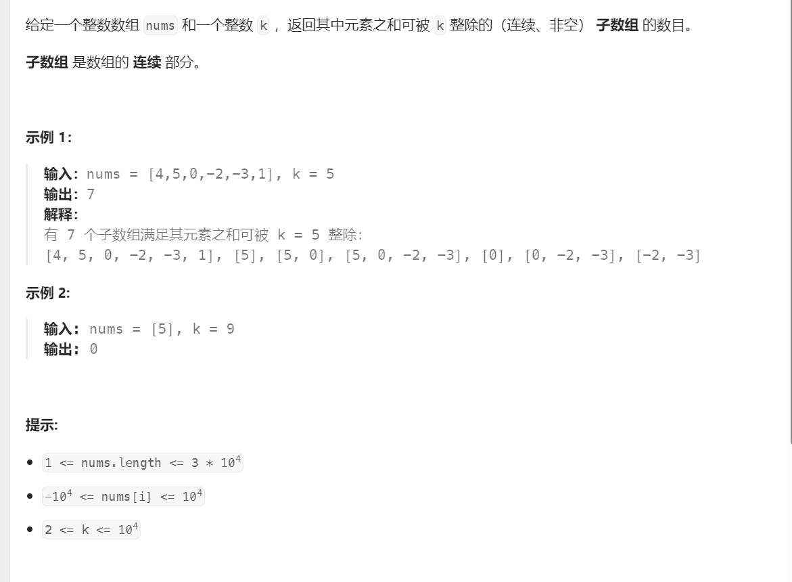

一个子数组的和可以用两个前缀和相减得出，如果和为k的倍数，也就是(pre[j]-pre[i])%k= =0。根据`同余定理`，pre[j]%k==pre[i]%k，因此统计前缀和数组中取模k的相同的个数，计算最终的结果，这里顺序不重要只要存在就是一组解。注意对于取模结果为0的要额外加上它本身表示本身也可以作为一个结果。

```python
class Solution:
    def subarraysDivByK(self, nums: List[int], k: int) -> int:
        pre=list(accumulate(nums))
        memo=Counter()
        for p in pre:
            memo[p%k]+=1
        ans=0
        for k,v in memo.items():
            if k==0:
                ans+=v
            ans+=v*(v-1)//2
        return ans 
```

## [和为 K 的子数组](https://leetcode.cn/problems/subarray-sum-equals-k/)


子数组的和用两个前缀相减，这里有pre[j]-pre[i]==k，也就是对于每个j去找他前面是否存在一个pre[i]=pre[j]-k，和上一题不一样这一题需要考虑顺序。

```python
class Solution:
    def subarraySum(self, nums: List[int], k: int) -> int:
        memo=Counter()
        n=len(nums)
        pre=ans=0
        # 因为要找前面的，因此直接构造
        for i in range(n):
            # 累加前缀和
            pre+=nums[i]
            # 找是否存在结果
            ans+=memo[pre-k]
            # 特判本身就是一个
            if pre==k:
                ans+=1
            # 最后再记录，反之类似于nums=[1],k=0
            memo[pre]+=1
        return ans 
```


## [两个非重叠子数组的最大和](https://leetcode.cn/problems/maximum-sum-of-two-non-overlapping-subarrays/)

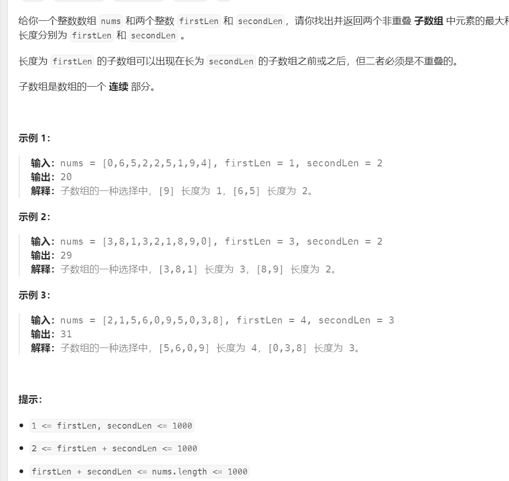


**对于有两个变量的值，通常可以枚举其中一个把他视为常量，从而转换为找一个变量的问题**

这个问题中，可以先枚举第二个区间在后面的情况，同时维护前一个区间的最大值，然后再找第一个区间在后面的情况。

​	

```python
class Solution:
    def maxSumTwoNoOverlap(self, nums: List[int], a: int, b: int) -> int:
        ans=0
        # 使用前缀和快速求解
        pre=[0]+list(accumulate(nums))
        n=len(nums)
        def f(a,b):
            nonlocal ans
             # 维护前一个的最大值
            maxa=0
            # 枚举当前区间在后面的所有可能，注意起始位置不能从头开始要给另一个区间留位置
            for i in range(a+b,n+1):
                # 维护最大值和答案
                maxa=max(maxa,pre[i-b]-pre[i-b-a])
                ans=max(ans,maxa+pre[i]-pre[i-b])
        f(a,b)
        f(b,a)
        return ans 
```

## [网格游戏](https://leetcode.cn/problems/grid-game/)	

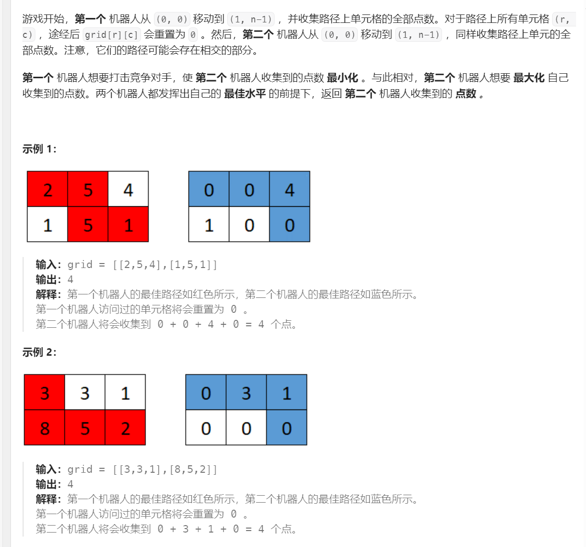

观察可以发现，第一个人操作之后第二个人所能选的值就是第一个人拐点出的前后缀，由于二者都会做最佳决策因此枚举第一个人拐点的位置，第二个人会选择剩余的两个位置的最大值，选出所有拐点下第二个人能得到的最小得分。

```python
class Solution:
    def gridGame(self, grid: List[List[int]]) -> int:
        index=-1
        res=-inf
        n=len(grid[0])
        ans=inf
        pre=[0]+list(accumulate(grid[1]))
        prifx=[0]*(n+1)
        for i in range(n-1,-1,-1):
            prifx[i]=grid[0][i]+prifx[i+1]
        for i in range(n):
            ans=min(ans,max(pre[i],prifx[i+1]))
        return ans     

```


## [最大的以 1 为边界的正方形](https://leetcode.cn/problems/largest-1-bordered-square/)


对于给定的数据范围枚举每一个边长，对于确定了的边长枚举所有的左上角然后判断是否满足条件

```python
class Solution:
    def largest1BorderedSquare(self, grid: List[List[int]]) -> int:
        m,n=len(grid),len(grid[0])
        pre=[[0]*(n+1) for _ in range(m+1)]
        
        # 这里构造行和列分别的前缀和用于快速判断是否满足条件
        rs=[list(accumulate(row,initial=0)) for row in grid]
        # 技巧点，把每一列拆分出来做成前缀和
        cs=[list(accumulate(col,initial=0)) for col in zip(*grid)]

        # 枚举边长
        for d in range(min(m,n),0,-1):
            # 枚举左上角
            for i in range(m-d+1):
                for j in range(n-d+1):
                    # 满足条件可以直接退出
                    if rs[i][j+d]-rs[i][j]==d and rs[i+d-1][j+d]-rs[i+d-1][j]==d \
                    and cs[j][i+d]-cs[j][i]==d and cs[j+d-1][i+d]-cs[j+d-1][i]==d:
                        return d**2
        return 0
```


## [K 次串联后最大子数组之和](https://leetcode.cn/problems/k-concatenation-maximum-sum/)


分类讨论：可以是一个数组中的最大子数组之和，可以是两个数组最大的前缀加上最大的后缀，可以是k-2个数组组合起来加上最大的前缀和后缀。

```python
class Solution:
    def kConcatenationMaxSum(self, arr: List[int], k: int) -> int:
        m=10**9+7
        pre=list(accumulate(arr,initial=0))
        post=list(accumulate(arr[::-1]))
        mn=0
        mx=-inf
        for i in range(1,len(pre)):
            mx=max(pre[i]-mn,mx)
            mn=min(mn,pre[i])
        ans2=max(pre)+max(post) if k>=2 else 0
        ans3=ans2+(k-2)*sum(arr) if k>=3 else 0
        return max(ans2,ans3,mx,0)%m

```

## [相同元素的间隔之和](https://leetcode.cn/problems/intervals-between-identical-elements/)


一个数到其他相同的数的距离可以由他左边的，右边的相同的数推出，因此需要两个数组一个记录nums[i]左边所有相同的值到它的距离，一个记录右边的，最后的结果是两个相加。

```python
class Solution:
    def getDistances(self, nums: List[int]) -> List[int]:
        n=len(nums)
        pre=[0]*n
        post=[0]*n
        # 使用字典记录上一个nums[i]的位置以及有多少个相同的
        vis={}
        for i in range(n):
            # 不存在则这个位置左边的结果为0，记录这个位置以及个数
            if nums[i] not in vis:
                vis[nums[i]]=(i,1)
                pre[i]=0
                continue
            else:
                # 反之，找出左边所有点到上一个点的距离，然后加上这个点到当前点的距离乘个数
                index,cnt=vis[nums[i]]
                pre[i]=pre[index]+cnt*(i-index)
                vis[nums[i]]=(i,cnt+1)
        vis={}
        for i in range(n-1,-1,-1):
            if nums[i] not in vis:
                vis[nums[i]]=(i,1)
                post[i]=0
                continue
            else:
                index,cnt=vis[nums[i]]
                post[i]=post[index]+cnt*(index-i)
                vis[nums[i]]=(i,cnt+1)
        ans=[]
        for a,b in zip(pre,post):
            ans.append(a+b)
        return ans
        

```

## [从链表中删去总和值为零的连续节点](https://leetcode.cn/problems/remove-zero-sum-consecutive-nodes-from-linked-list/)


使用前缀和可以找出子区间和为0的，即用哈希记录相同的前缀和，但是在这个过程中可能会出现两个前缀和区间重合。


```python
# Definition for singly-linked list.
# class ListNode:
#     def __init__(self, val=0, next=None):
#         self.val = val
#         self.next = next
class Solution:
    def removeZeroSumSublists(self, head: Optional[ListNode]) -> Optional[ListNode]:
        dummy=ListNode()
        pre={}
        pre[0]=dummy
        dummy.next=head
        summ=0
        
        # 通过一次遍历找出相同的前缀和中最远的
        while head:
            summ+=head.val
            pre[summ]=head
            head=head.next
            
         # 再遍历一次，对于已出现的前缀和直接跳到它的下一位
        head=dummy
        summ=0
        while head:
            summ+=head.val
            head.next=pre[summ].next
            head=head.next
        return dummy.next 
```

## [使字符串平衡的最少删除次数](https://leetcode.cn/problems/minimum-deletions-to-make-string-balanced/)

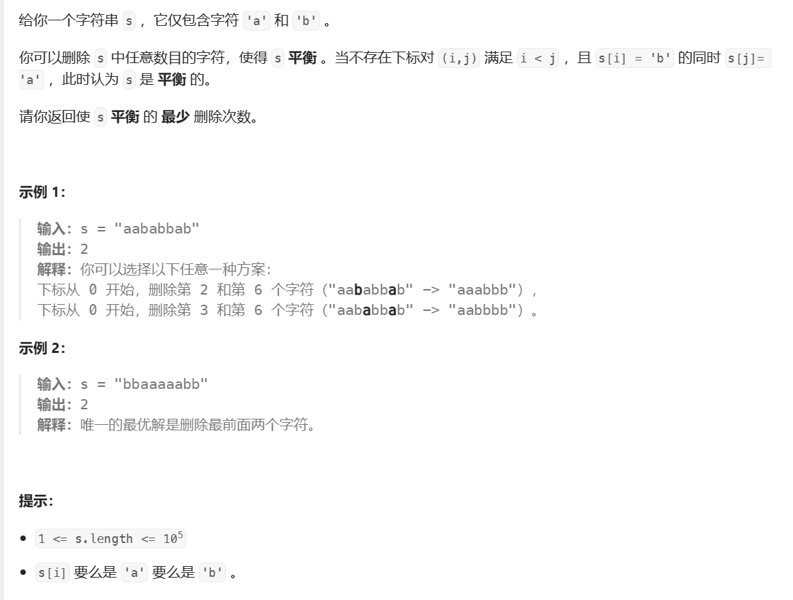


最后字符串一定会是aabbb的形式枚举每个划分位置，这个位置之前的b都减去，之后的a都减去，取最小值。


```python
class Solution:
    def minimumDeletions(self, s: str) -> int:
        preb=[0]
        prea=[0]
        n=len(s)
        ans=n-1
        for i in range(n):
            c=s[i]
            if c=='b':
                preb.append(preb[-1]+1)
            else:
                preb.append(preb[-1])
        for i in range(n-1,-1,-1):
            c=s[i]
            if c=='a':
                prea.append(prea[-1]+1)
            else:
                prea.append(prea[-1])
        prea=list(reversed(prea))
        for i in range(n+1):
            ans=min(ans,preb[i]+prea[i])
        return ans


```


## Maximal Intersection


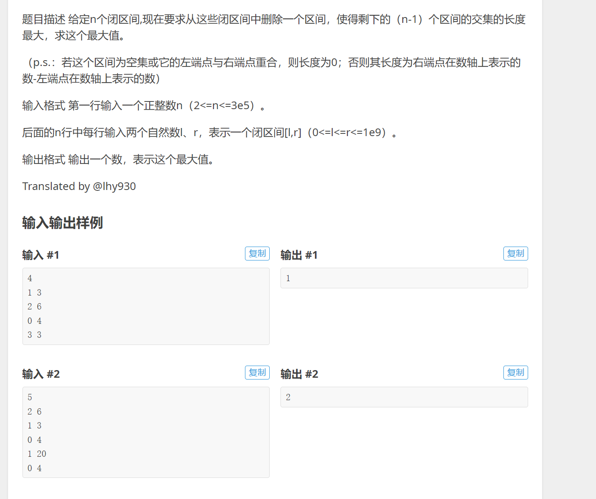


两个区间的交集就是两个左端点的最大值与右端点的最小值构成的区间，枚举删除一个区间剩下的交集如何通过O(1)的时间复杂度算出，交集的具有前缀和的性质，及多个区间的交集可以由n-1个区间的交集求出，这里构建前缀交集和后缀交集，当删除一个区间后，剩下区间的交集可以通过前缀和后缀求出。

```python
n=int(input())
nums=[]
for _ in range(n):
    nums.append([int(x) for x in input().split()])
pre=[(-1,10**9+7)]
for i in range(n):
    l,r=nums[i]
    pl,pr=pre[-1]
    pre.append([max(pl,l),min(pr,r)])
suff=[(-1,10**9+7)]
for i in range(n-1,-1,-1):
    l,r=nums[i]
    pl,pr=suff[-1]
    suff.append([max(pl,l),min(pr,r)])
suff=suff[::-1]
ans=0
for i in range(n):
    l1,r1=pre[i]
    l2,r2=suff[i+1]
    ans=max(min(r2,r1)-max(l1,l2),ans)
print(ans)
```

## [最大或值](https://leetcode.cn/problems/maximum-or/)


想要最后或的结果最大，就是尽可能地增大二进制的长度，因此找出所有二进制长度最长的数组枚举将他们扩大k倍（全部用于扩大一个可以保证二进制最长），为了快速计算扩大一个数后的最终结果使用前缀和记录两边的和来做到O(1)求解。

```python
class Solution:
    def maximumOr(self, nums: List[int], k: int) -> int:
        pre=[nums[0]]
        suff=[nums[-1]]
        l=max(nums).bit_length()
        
        # 构造前后缀
        for v in nums[1:]:
            pre.append(pre[-1]|v)
        for v in nums[::-1][1:]:
            suff.append(suff[-1]|v)
        pre=[0]+pre
        suff=[0]+suff
        suff=suff[::-1]
        res=[]
        # 找出二进制最长的
        for i,v in enumerate(nums):
            if l==v.bit_length():
                res.append(i)
        ans=-inf 
        # 枚举
        for i in res:
            v=nums[i]<<k
            ans=max(ans,v|pre[i]|suff[i+1])
        return ans 

                
        
```

  ## [满足三条件之一需改变的最少字符数](https://leetcode.cn/problems/change-minimum-characters-to-satisfy-one-of-three-conditions/)


考虑最后的结果

情况一，实质上也就是s1中所有的字符小于某一个字符，同时s2中所有的字符大于等于这个字符

情况二是一样的

情况三就是所有的字符都换为某个字符


一共只有26个字符全部枚举即可

```python
class Solution:
    def minCharacters(self, a: str, b: str) -> int:
        # 计数
        c1=[0]*26
        c2=[0]*26
        m,n=len(a),len(b)
        for c in a:
            c1[ord(c)-ord('a')]+=1
        for c in b:
            c2[ord(c)-ord('a')]+=1
        # 构建前缀和
        p1=list(accumulate(c1,initial=0))
        p2=list(accumulate(c2,initial=0))
        ans=inf
        for i in range(26):
            # 不能把字符变为小于a的，特判这种情况
            if i:
                ans=min(ans,p1[-1]-p1[i]+p2[i],p2[-1]-p2[i]+p1[i])
            ans=min(ans,m-c1[i]+n-c2[i])
        return ans 
        
```


## [统计中位数为 K 的子数组](https://leetcode.cn/problems/count-subarrays-with-median-k/)

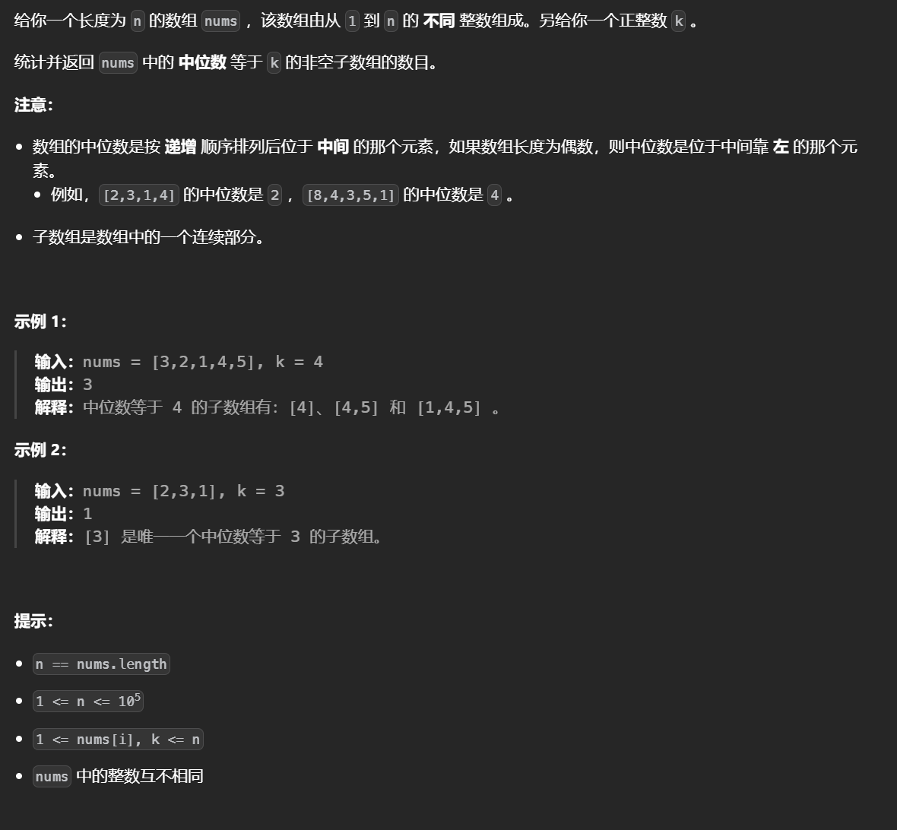

注意整数互不相同

对于给定的k作为中位数要满足，对于奇数个两边大于k的=两边小于k的——>左侧大于+右侧大于=左侧小于+右侧小于——>左侧大于-左侧小于=右侧小于-右侧大于，为了统计这个结果将左侧大于的设置为1小于的设置为-1，右侧大于的设置为-1小于的设置为1，利用前缀和可以快速求出两边有多少

偶数的话变换o

```python
class Solution:
    def countSubarrays(self, nums: List[int], k: int) -> int:
        # 左侧大于+右侧大于=左侧小于+右侧小于+[1]
        # 左侧大于-左侧小于=右侧小于-右侧大于+[1]
        p=[]
        n=len(nums)
        index=nums.index(k)
        # 变换
        for i,v in enumerate(nums):
            if i==index:p.append(0)
            elif i<index and v>k:p.append(1)
            elif i<index and v<k:p.append(-1)
            elif v<k:p.append(1)
            else:p.append(-1)
        pre=list(accumulate(p,initial=0))
        memo=Counter()
        # 统计左侧
        for j in range(index,-1,-1):
            memo[pre[index]-pre[j]]+=1
        ans=0
        # 枚举右侧，如果相等就累加
        for j in range(index,n):
            c=pre[j+1]-pre[index+1]
            if c in memo:ans+=memo[c]
            if c+1 in memo:ans+=memo[c+1]
        
        return ans
```

## [使数组和能被 P 整除](https://leetcode.cn/problems/make-sum-divisible-by-p/) 


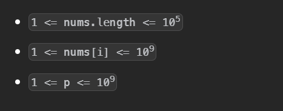

令y为某个子数组的和，x为整个数组的和，要求x-y能被p整除那么就是x同余于y，同时y又是前缀和数组中某两个位置的数相减求出的，那么就有(r-l)%p=x%p。遍历前缀和数组对于每个r去找最近的(r-x)%p，然后更新结果。

```python
class Solution:
    def minSubarray(self, nums: List[int], p: int) -> int:
        # 前缀和
        pre=list(accumulate(nums,initial=0))
        x=pre[-1]
        memo={}
        n=len(nums)
        ans=n
        for i,v in enumerate(pre):
            # 每次只需要记录当前的位置，因为只要最近的
            memo[v%p]=i
            if (v-x)%p in memo:
                ans=min(ans,i-memo[(v-x)%p])
        return ans if ans!=n  else -1
```

## [统计趣味子数组的数目](https://leetcode.cn/problems/count-of-interesting-subarrays/)

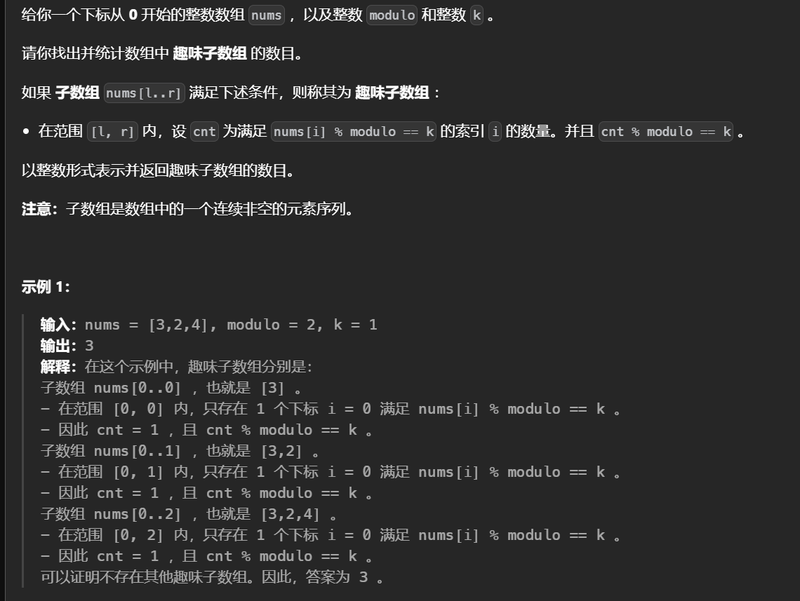

把原数组中%mod==k的都变换为1那么问题就变为统计前缀和


变化式子有


那么在遍历前缀和的过程中统计(r-k)%m的有多少个，然后记录r%m

```python
class Solution:
    def countInterestingSubarrays(self, nums: List[int], mod: int, k: int) -> int:
        nums=[int(v%mod==k) for v in nums]
        ans=0
        pre=list(accumulate(nums,initial=0))
        memo=Counter()
        for v in pre:
            ans+=memo[(v-k)%mod]
            memo[v%mod]+=1
        return ans         
```

## [构造乘积矩阵](https://leetcode.cn/problems/construct-product-matrix/)


无法使用逆元求解因为不是质数，考虑前后缀分解。

```python
class Solution:
    def constructProductMatrix(self, grid: List[List[int]]) -> List[List[int]]:
        mod=12345
        m,n=len(grid),len(grid[0])
        g=[[0]*n for _ in range(m)]
        pre=[]
        suff=[]
        row1=[1]
        row2=[1]
        for row in grid:
            temp1=[1]
            temp2=[1]
            for v in row:temp1.append((temp1[-1]*v)%mod)
            for v in row[::-1]:temp2.append((temp2[-1]*v)%mod)
            pre.append(temp1[:])
            suff.append(temp2[:][::-1])
        for arr in pre:
            x=arr[-1]
            row1.append((row1[-1]*x)%mod)
        for arr in pre[::-1]:
            x=arr[-1]
            row2.append((row2[-1]*x)%mod)
        row2=row2[::-1]
        for i in range(m):
            for j in range(n):
                g[i][j]=(row1[i]*row2[i+1]*pre[i][j]*suff[i][j+1])%mod
        return g
```


## Karen and Coffee


实际上是区间重叠问题，把给定的每个区间用差分在数组上表示，然后把每个位置定义为1如果大于等于k否则0，再构造一遍前缀数组，对于每个询问取出这个区间内的值即可。

```python
n,k,q=RR()
N=2*10**5+10
diff=[0]*N
# 差分
for _ in range(n):
    l,r=RR()
    diff[l]+=1
    diff[r+1]-=1
# 前缀变为一般数组
pre=get_pre(diff)[1:]
# 大于等于k令为1否则为0
nums=[1 if v>=k else 0 for v in pre]
# 再次前缀
pre=get_pre(nums)
for _ in range(q):
    l,r=RR()
    print(pre[r+1]-pre[l])
```

## Polo the Penguin and Matrix

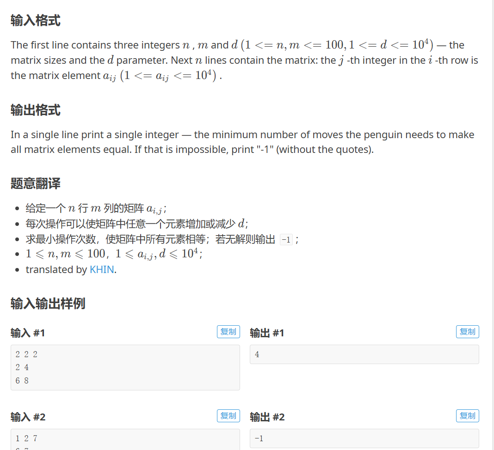


如果所有的数可以通过加减一个数的整数倍来做到相同，那么所有的数余上这个数的模应该是一样的，所以对数组判断是否模上d的结果是一样的，如果一样那么说明所有的数一定可以通过加减得到数组中的任意一位或者数组外的某一位，至于最小的操作次数可以通过中位数贪心求出。

```python
m,n,d=RR()
g=[]
for _ in range(m):g.extend(RR())
g.sort()
# 判断余数是否相同
arr=[v%d for v in g]
if len(set(arr))!=1:print(-1)
else:
    # 中位数贪心，所有的数的操作次数为他到中位数的距离除以d
    mid=g[len(g)>>1]
    ans=sum([abs(mid-v)//d for v in g])
    print(ans)
```


##  **Manhattan Multifocal Ellipse** 


给定的公式可以拆开，即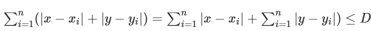，这两部分是相互独立的也就是给定的一系列坐标点的x和y是不相关的只需要考虑他们的大小，因此可以随意排序。该题要求找到有多少个合适的点，每个点的xy分别满足上述式子，可以固定住一个去找另一个，观察数据范围发现点在-2e6,2e6之间，这里可预处理范围内的x和y对于给定的所有的xi和yi的距离。

```python
n,d=RR()
x=[]
y=[]
xx=[]
yy=[]
for _ in range(n):
    i,j=RR()
    x.append(i)
    y.append(j)

# 排序，为了之后二分求去除了绝对值的距离
x.sort()
y.sort()

prex=get_pre(x)
prey=get_pre(y)

# 求解值域范围内的距离
for val in range(-2*pow(10,6)-10,2*pow(10,6)+10):
    index=bisect_left(x,val+1)-1
    xx.append(val*(index+1)-prex[index+1]+(prex[-1]-prex[index+1]-val*(n-index-1) if index!=n-1 else 0))
    index=bisect_left(y,val+1)-1
    yy.append(val*(index+1)-prey[index+1]+(prey[-1]-prey[index+1]-val*(n-index-1) if index!=n-1 else 0))

xx.sort()
yy.sort()
ans=0
# 去找每个x，对于这个x的距离S有多少y满足距离小于等于D-S
for v in xx:
    if v>d:break
    index=bisect_left(yy,d-v+1)-1
    ans+=index+1

print(ans)
```

## [矩阵中的最大得分](https://leetcode.cn/problems/maximum-difference-score-in-a-grid/)


多个位置的差值:(c2-c1)+(c3-c2)实际上就是终点位置和起点的差，那么遍历每一个终点位置去找它左上区域内的最小值即可，这里的坐上区域是从(0,0)到(i,j)不包括i,j，因此可以使用二位前缀求解

```python
class Solution:
    def maxScore(self, g: List[List[int]]) -> int:
        m,n=len(g),len(g[0])
        p=[[inf]*(n+1) for _ in range(m+1)]
        ans=-inf
        # 枚举终点，这个过程中可以同时构建二维前缀最小值
        for i in range(m):
            for j in range(n):
                x=g[i][j]
                pre=inf
                # 防止越界
                if j>=0:pre=min(pre,p[i+1][j])
                if i>=0:pre=min(pre,p[i][j+1])
                # 这里是为了保证至少走一步，因为当i=j=0时左上区域找不到一点即没有走一步
                if i+j>0:
                    ans=max(ans,x-pre)
                # 更新二维前缀最小值
                p[i+1][j+1]=min(pre,x)
        return ans  
```

## Alternating String


如果长度为偶数那么直接减去出现次数最多的奇数位和偶数位剩下的就是需要删除的。

如果为奇数必须减去一个，当减去一个后需要快速计算出最多的出现次数，定义even[i]\[j]表示前i个数偶数位上为j的有多少个，odd[i]\[j]同理，枚举删除的位置和保留的数取最大值。

```python
for _ in range(R()):
    n = R()
    s = [ord(c)-97 for c in input()[:-1]]
    even=[[0]*26 for _ in range(n+1)]
    odd=[[0]*26 for _ in range(n+1)]
	
    # 计算前缀和
    for i in range(1,n+1):
        if i & 1:
            odd[i][s[i-1]] += 1
        else:
            even[i][s[i-1]] += 1
        for j in range(26):
            odd[i][j]+=odd[i-1][j]
            even[i][j]+=even[i-1][j]

    if n&1:
        res=inf
		# 枚举删除的位置
        for i in range(1,n+1):
            # l[j]表示删除位置i后奇数位置上的j有多少个
            l=[]# 奇数
            r=[]# 偶数
            for j in range(26):
                l.append(even[i-1][j]+odd[-1][j]-odd[i][j])
                r.append(odd[i-1][j]+even[-1][j]-even[i][j])
            res=min(res,n-max(l)-max(r))# 减去最大的


        print(res)
    else:
        print(n-max(even[-1])-max(odd[-1]))
```

## [长度可被 K 整除的子数组的最大元素和](https://leetcode.cn/problems/maximum-subarray-sum-with-length-divisible-by-k/)

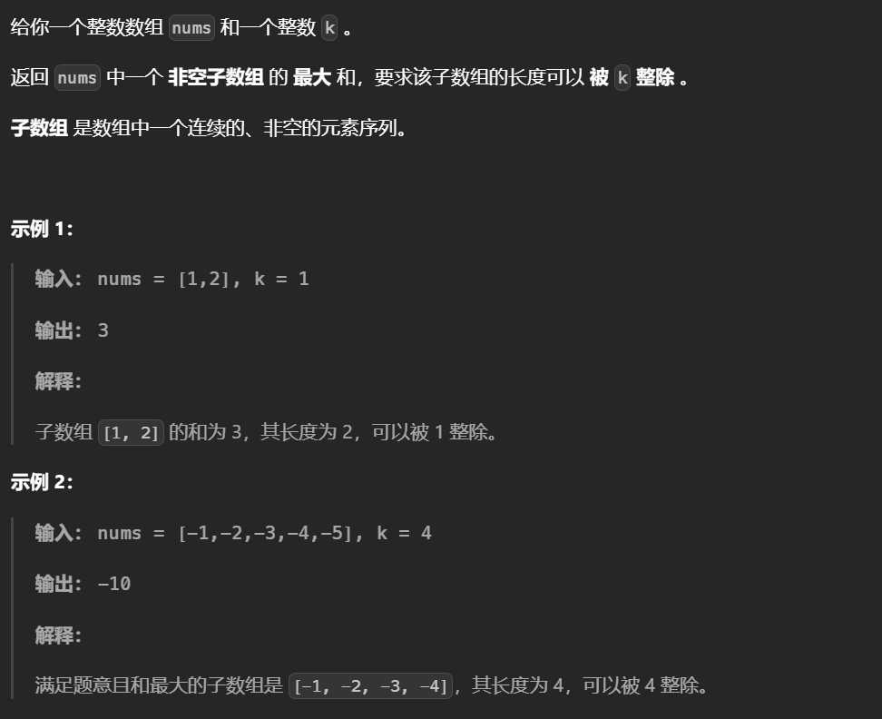

长度是k的倍数，那么**有j-i+1//k->得到要找能满足(j+1)与i同余的两个位置**，为了得到这个位置的子数组和需要用到**前缀和**，那么问题变为找到pre[r]-pre[l]的最大值，则在遍历过程找到与当前位置同余的最小值，然后更新同余位置对应的最小值。

```python
class Solution:
    def maxSubarraySum(self, nums: List[int], k: int) -> int:
        pre=list(accumulate(nums,initial=0))
        memo=defaultdict(lambda:inf)
        ans=-inf 
        n=len(nums)
        memo[0]=0
        if n==1:return max(nums)
        for i in range(n):
            if memo[(i+1)%k]!=inf:
                ans=max(ans,pre[i+1]-memo[(i+1)%k])
            memo[(i+1)%k]=min(memo[(i+1)%k],pre[i+1])

        return ans 
```

## Repeated Sequence

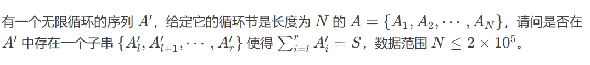


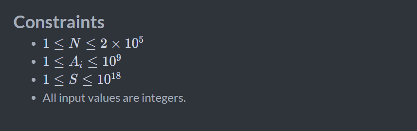

S的范围非常大，很明显要取模数组的和，剩余的部分是数组的一个前缀加上一个后缀


然而也有可能是**数组中间区间的和**，因为可能通过将两侧的整个数组的一部分移动到中间


```python
def cal():
    n,s=RR()
    nums=RR()
    pre=get_pre(nums)
    m1=set(pre)
    m2=set(get_pre(nums[::-1])[::-1])
    ss=sum(nums)
    s%=ss

    for v in pre:
        if s+v in m1 or s-v in m2:return True 
    
    return False

if cal():
    print('Yes')
else:
    print('No')
```


# 二维前缀和

## 二维区域和检索–矩阵不可变

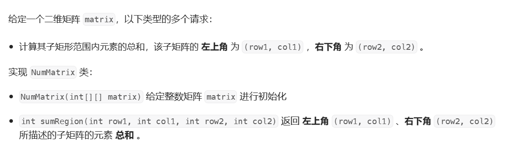

利用前缀和数组，计算出从原点到[i,j]的矩阵元素和

1. 从 `(row2, col2)` 处的前缀和减去 `(row1 - 1, col2)` 处的前缀和（如果 `row1` 不为0的话）。
2. 再减去 `(row2, col1 - 1)` 处的前缀和（如果 `col1` 不为0的话）。
3. 最后再加上 `(row1 - 1, col1 - 1)` 处的前缀和（如果 `row1` 和 `col1` 都不为0的话）。

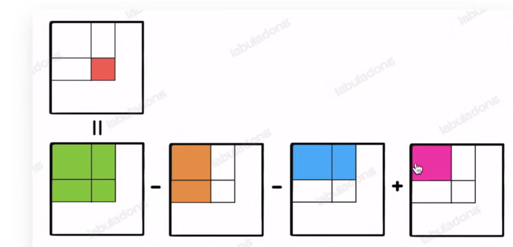

```python
class NumMatrix(object):

    def __init__(self, matrix):
        if not matrix or not matrix[0]:
            self.prefix_sum = None
            return
        self.matrix=matrix
        m=len(matrix)
        n=len(matrix[0])
        # 所构建的数组长宽都要多出一，可以方便计算，不是防止越界
        self.prematrix=[[0]*(n+1) for _ in range(m+1)]
        for i in range(1,m+1):
            for j in range(1,n+1):
                # 子矩阵的元素和为矩阵元素加上左边的子矩阵加上上边的子矩阵减去重复的左上矩阵 
                self.prematrix[i][j]=self.matrix[i-1][j-1]+self.prematrix[i-1][j]+self.prematrix[i][j-1]-self.prematrix[i-1][j-1]
	
    def sumRegion(self, row1, col1, row2, col2):
        # 最后的计算中注意不能重叠，放到矩阵上做一位偏移
        return self.prematrix[row2+1][col2+1]-self.prematrix[row2+1][col1]-self.prematrix[row1][col2+1]+self.prematrix[row1][col1]
```


# 前缀和的前缀和

想要求**一个区间内的所有子数组的和的和**就需要用到前缀和的前缀和


## [巫师的总力量和](https://leetcode.cn/problems/sum-of-total-strength-of-wizards/)

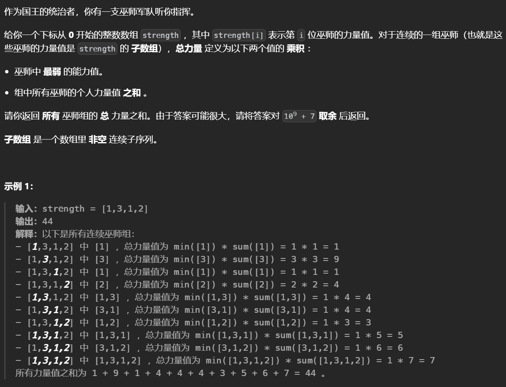

使用栈求出一个值作为最小值的区间，然后需要求解区间中包括这个值得所有子数组和的和

令s为前缀和那么有，这里的将s[r+1]替换为s[r]，因此右端点的界限要加一

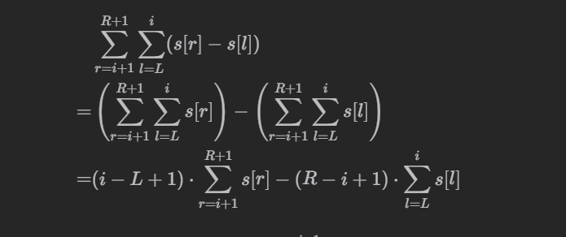

这里对s的累和可以用前缀和求解，因此要构建一个前缀和的前缀和。

```python
class Solution:
    def totalStrength(self, nums: List[int]) -> int:
        n=len(nums)
        less=[[-1,n] for _ in range(n)]
        d=deque()
        mod=10**9+7
        ans=0
        for i,x in enumerate(nums):
            while d and nums[d[-1]]>x:
                d.pop()
            if d:
                less[i][0]=d[-1]
            d.append(i)
        d=deque()
        for i in range(n-1,-1,-1):
            x=nums[i]
            while d and nums[d[-1]]>=x:
                d.pop()
            if d:
                less[i][1]=d[-1]
            d.append(i)
        pre=list(accumulate(accumulate(nums,initial=0),initial=0))
        for i,(l,r) in enumerate(less):
            l+=1
            r-=1
            ans+=((i-l+1)*(pre[r+2]-pre[i+1])-(pre[i+1]-pre[l])*(r-i+1))*nums[i]
            ans%=mod
        return ans 
```


# 平衡树


## [避免洪水泛滥](https://leetcode.cn/problems/avoid-flood-in-the-city/)


贪心的思想，遍历rains数组如果这个湖泊之前已经遍历过也就是会发生洪水，就需要把离这个湖泊之前的位置最近的晴天分配给他，然后这个晴天就不能在用了。

可以二分快速找到最近的晴天，但是把这个晴天去除后仍需要保持数组顺序以此来继续二分，这需要用到平衡树。

## [考场就座](https://leetcode.cn/problems/exam-room/)


有序集合不仅可以存储元素也可以存储区间，对于本题首先找出距离最大的，而后是最靠前的位置，每次加入一个点会删除一个区间加入两个区间

```python
from sortedcontainers import SortedList
class ExamRoom:

    def __init__(self, n: int):
        # 计算距离的函数，如果点是最左或最右则特判
        def dist(x):
            l,r=x
            return r-l-1 if l==-1 or r==n else (r-l)>>1
        self.n=n
        # 按照区间距离和左端点排序
        self.s=SortedList(key=lambda x:(-dist(x),x[0]))
        # 记录一个点的左边位置和右边端点，可以用来更新区间
        self.l={}
        self.r={}
        # 初始化
        self.s.add((-1,n))
        self.l[n]=-1
        self.r[-1]=n
        
    def seat(self) -> int:
        # 找到距离最大的区间
        ss=self.s[0]
        l,r=ss
        # 计算中点位置
        p=(l+r)>>1
        # 对于两端特判
        if l==-1:p=0
        elif r==self.n:p=self.n-1
        # 先删除当前的区间，因为加入这个点这个区间就用不上了
        self.delete(ss)
        # 新增两个区间
        self.add((l,p))
        self.add((p,r))
        return p
    def delete(self,s):
        # 不仅删除区间还有删除左右对应的位置
        self.s.remove(s)
        del self.l[s[1]]
        del self.r[s[0]]

    def add(self,s):
        self.s.add(s)
        self.l[s[1]]=s[0]
        self.r[s[0]]=s[1]

    def leave(self, p: int) -> None:
        # 先记录两个位置
        l,r=self.l[p],self.r[p]
        # 一个点的删除会减少两个区间增加一个大的区间
        self.delete((self.l[p],p))
        self.delete((p,self.r[p]))
        self.add((l,r))
```

## [最近的房间](https://leetcode.cn/problems/closest-room/)


对询问离线，按照面积从大到小操作，同时对给定的数组也按照面积从大到小排序，这样保证了每次处理询问时数据结构内都是合法的选择(面积更大)。把合法的选择放入到有序集合中查找与当前询问的id差不多的数值。

```python
from sortedcontainers import SortedList
class Solution:
    def closestRoom(self, nums: List[List[int]], queries: List[List[int]]) -> List[int]:
        n=len(nums)
        # 排序
        nums.sort(key=lambda x:(-x[1]))
        q=[[queries[i][0],queries[i][1],i] for i in range(len(queries))]
        q.sort(key=lambda x:-x[1])
        ans=[-1]*len(queries)
        # 哨兵，取无穷保证了不会被取到
        sl=SortedList((-inf,inf))
        j=0
        n=len(nums)
        # 按照面积从大到小操作
        for rid,s,i in q:
            # 离线，保证数据结构内都是合法的选择
            while j<n and nums[j][1]>=s:
                sl.add(nums[j][0])
                j+=1
            # 找在当前id左右的
            if len(sl)>2:
                index=sl.bisect_left(rid)
                curr=sl[index]
                pre=sl[index-1]
                if not abs(rid-curr)<abs(rid-pre):
                    curr=sl[index-1]
                ans[i]=curr
        return ans 
```


