# 排序

## 排序的稳定性

对于两个相同大小的元素，如果排序后相对位置不变，那么说排序是稳定的。

- **选择排序、快速排序、希尔排序、堆排序不是稳定的排序算法。**
- **冒泡排序、插入排序、归并排序、基数排序是稳定的排序算法。**

## 列表查找


### 顺序查找

顺序查找也叫线性查找，从列表第一个元素开始，顺序进行搜索，直到查找到元素或是到列表最后一个元素为止。

### 二分查找

又叫折半查找，从有序列表的初始候选区li[0:n]开始，通过对待查找的值与候选区中间值的比较，可以使候选区减少一半，时间复杂度为O(logn)


## 排序(3个较低的算法)

### 冒泡排序

时间复杂度为O(n^2)，对于传入n=10000，大概需要十秒运行，一般的电脑每秒运行 10^7

列表每两个相邻的数，如果前面的比后面的大，则交换这两个数。

最外层表示轮数，第一轮会将数组中最大的元素排到最后，第二轮会将第二大的排到倒数第二...因此内层每轮会缩减一

```python
li=[1,3,32,3,543,7,43,124,436,2]
for i in range(len(li)):
    for j in range(len(li)-1-i):
        if li[j]>li[j+1]:
            li[j+1],li[j]=li[j],li[j+1]
print(li)
```


### 选择排序

算法思想：首先在未排序序列中找出最小的元素，放到已排序序列的末尾，然后一直进行下去。

**不稳定**排序。如序列3，5，3，1。第一次交换结果为1，5，3，3，我们发现原序列的第一个3排在了第二个3的后面。


### 插入排序

对未排序数据，从后往前扫描已排序序列，找到相应位置插入，同时会将已排序序列中比当前元素大的元素后移一位。

最好的情况是数组已经是有序的了，只需比较n-1次即可；最坏的情况是数组是降序的。

插入排序是**稳定**排序


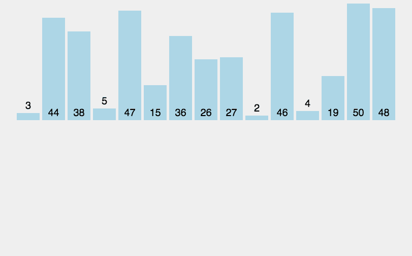

## 快速排序

快速排序思路：

+  取一个元素p（一般取第一个元素），使元素p归位（左边的元素小于p，右边的元素大于p）
+ 递归完成排序

```python
#时间复杂度为O(n)，因为从两边往中间扫，其实没必要这么麻烦，直接列表生成式也可以
def partition(data,left,right):
    #先暂存这个数，注意要存为left
    temp=data[left]
    #只要区间里面有值
    while left<right:
        #因为把第一个元素作为用来划分的值，第一个空位在左边，从右边开始寻找小于的值填到左边，只要大于等于就递减并且保证区间有效
        while data[right]>=temp and right>left:
            right-=1
        #填上左边的空位
        #如果右边的值全都大于要划分的值,left就会等于right,while循环就会都退出,下面的赋值就会使自身赋值
        data[left]=data[right]
        #现在右边出现了一个空位，从左边寻找值
        while data[left]<=temp and left<right:
            left+=1
        data[right]=data[left]
    #当left和right相等时，就是划分用的值要填充的位置也就是mid
    data[left]=temp
    #返回mid
    return left

def quick_sort(data,left,right):
     #列表区域至少有两个元素
    if left<right:
        #对区间安置排序
        mid=partition(data,left,right)
        #对右半部分
        quick_sort(data,mid+1,right)
        #对左半部分
        quick_sort(data,left,mid-1)
    return data
li= [5,7,4,6,3,1,2,9,8]
print(quick_sort(li,0,len(li)-1))
```

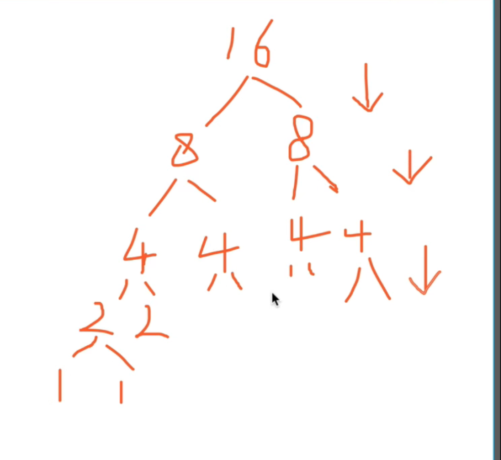

快速排序每次划分为两个部分，其中进行一次partition划分logn次，时间复杂度为nlog(n)

最坏的情况是n^2:如果列表是[9,8,7,6,5,4,3,2,1]

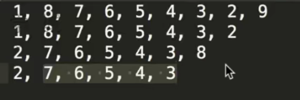

每次调用时只会减少一个数，做不到减半,时间复杂度为n^2，想要改变的话可以选择划分区域时随机选择一个数，而不是从头开始，因此可以随机找一个数然后与第一个数交换即可。

注意函数递归是由最大深度的，一般是999可以使用sys模块下的sys.setrecrusionlimit(n)来改变。

对于比较大的数据量，不能一直选取第一个数，需要随机选择

```python
import random

input()
li = list(map(int, input().split()))
n = len(li)

def quick_sort(arr):
    if len(arr) <= 1:
        return arr
    index = random.randint(0, len(arr) - 1)
    temp = arr[index]
    left = [x for x in arr if x < temp]
    right = [x for x in arr if x > temp]
    mid = [x for x in arr if x == temp]
    return quick_sort(left) + mid + quick_sort(right)


a=quick_sort(li)
for l in a:
    print(l, end=' ')
    
```


## 堆排序

### 树与二叉树

树是一种数据结构，树是由n个节点组成的集合，如果n=0则是一个空树，如果n>0则存在一个节点作为树的根节点，其他节点可以分为m个集合，每个集合本身又是一棵树。不能再分的节点称为叶子节点，树的深度就是层数，树的度就是整个树中最大的度，节点的度就是它分了几个岔。

二叉树就是度不超过2的树，每个节点最多有两个子节点。

满二叉树：每一层的节点数都达到最大值

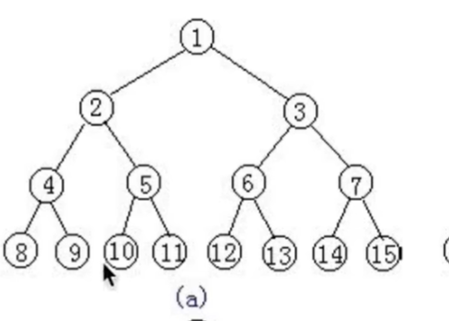

完全二叉树：是满二叉树最下一层没有满，但缺少的部分必须是右边的	

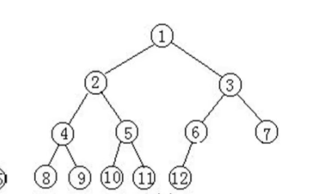

二叉树的存储方式：

顺序储存方式 使用列表来存,表示方法是[9 8 7 6 5 0 1 2 4 3 ]如下图，这应该是理解堆排序重要的的一步，使用父节点和子节点之间的关系来找。

父节点和左子节点的下标之间有：i->2i+1

父节点和右子节点下表之间有:i->2i+2

### 堆

堆是一种特殊的完全二叉树且应满足以下两个之一：

+ 大根堆：一棵完全二叉树，满足任意节点都比其子节点大。

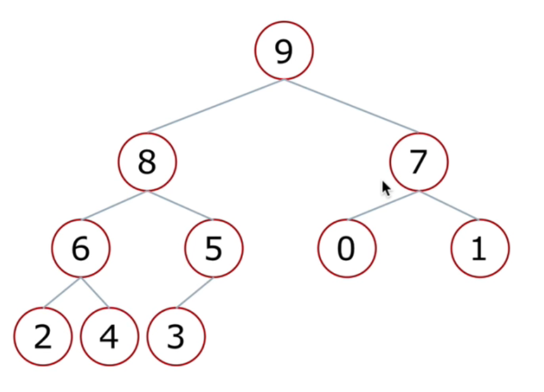

+ 小根堆：与大根堆相反。

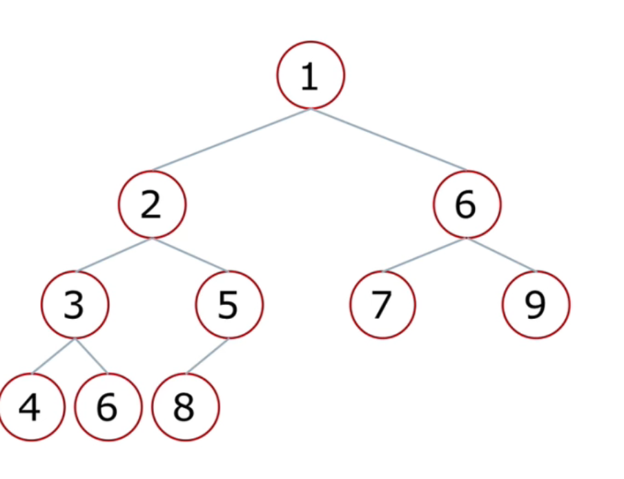

堆的性质：假设节点的左右子树都是堆，但自身不是堆，如下不满足大根堆

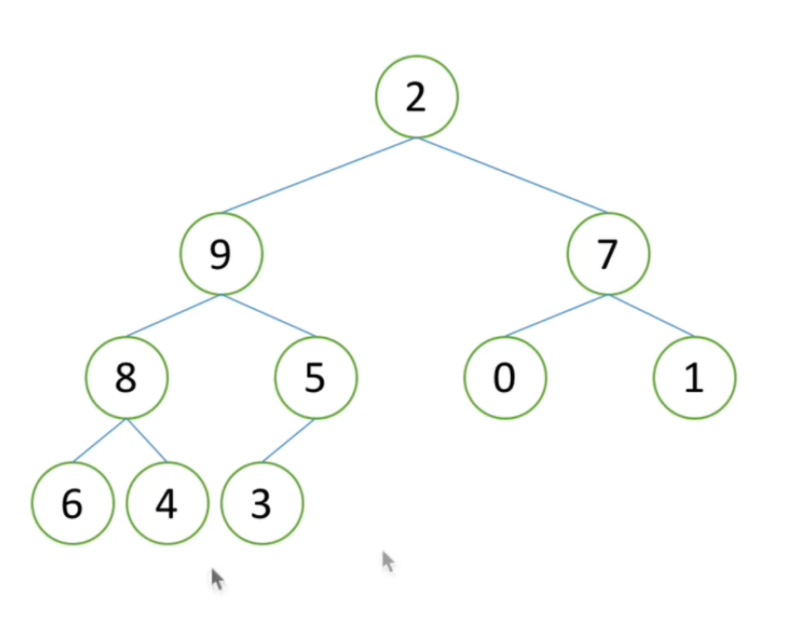

此时可以通过一次向下调整过程来将其变换为一个堆，将2提出，从子节点中选取满足的9上移，9的位置再由它的子结点和2中满足的替代……

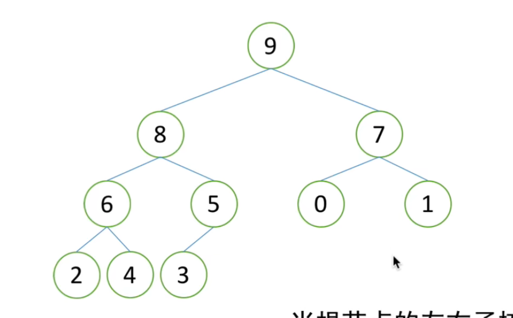

### 堆排序过程

+ 用一个数列建立一个未排序的堆，然后对每个叶子节点部分调整，从而得到排序的堆
+ 挨个出数，取出堆顶的元素，在将最后一个元素放到堆顶，不能直接将下一层的最大数放到堆顶，这会导致出现一个空位破坏完全二叉树。
+ 进行一次向下调整，将堆变为合法的堆，从而使得堆顶的元素为最大值
+ 重复第二和三步

```python
'''调整的函数'''
#时间复杂度为log(n),有一个这般的过程，每次从两个树中选一个进行
def sift(li ,low ,high):
    ''''low指的是堆顶的元素，high是最后一个元素'''
    i=low#i最开始指向根节点
    j=2*i+1#j开始是左子节点
    temp=li[low]#取得堆顶
    while j<=high:#保证j位置有数
        if j+1<=high and li[j+1]>li[j]:#右子树有数并且大于左子树
            j=j+1
        if li[j]>temp:#子树的值更大，i位置的值等于j位置的值，并且更新j
            li[i]=li[j]
            i=j
            j=2*i+1
        else:#不然的话就退出
            li[i]=temp
            break
    else:#找的元素都大于堆顶元素则把堆顶元素放在叶子节点上
        li[i]=temp
'''时间复杂度为nlog(n)'''
def heap_sort(li):
    n=len(li)
    #建立堆，调整叶子节点，i代表的是每个叶子节点
    for i in range((n-2)//2,-1,-1):
         #调整函数中的high全部设置为整个堆的最后一个元素，因为high是用来判断有没有超出边界，而整个堆的最后一个元素可以完全满足判断
         #根据叶子节点很难找出相应的最后一个元素
        sift(li,i,n-1)
    '''挨个出数，为了节省内存不会再创建一个列表，每次提出的最大的数与最后一个元素交换位置'''
    for i in range(n-1,-1,-1):
        #i代表的是最后一个元素
        li[0],li[i]=li[i],li[0]
        sift(li,0,i-1)#交换位置后，再次调整获得最大值，high的位置应该提前一位保证不影响提出的最大值
li=[i for i in range(100)]
import random
random.shuffle(li)
print(li)
heap_sort(li)
print(li)
```


25-3-5

```python
# 调整的函数
def sift(arr,start,end):
    parent=int(start)
    
    # 子节点
    child=parent*2+1
    # 下标不能超出范围
    while child<=end:
        # 取子结点中最大的
        if child+1<=end and arr[child+1]>arr[child]:
            child+=1
        # 如果父节点大于子节点就退出，说明已经满足了大根堆(子节点本身已经是大根堆了——从最后的父节点开始往前调整)
        if arr[parent]>arr[child]:
            return 
        # 交换，保证大根堆的性质
        arr[child],arr[parent]=arr[parent],arr[child]
        # 交换后子节点也要重新调整
        parent=child
        child=parent*2+1

def heap_sort(arr,len):
    # 从最后一个父节点开始调整，效果同heapify，实现大根堆
    i=(len-2)/2
    while i>=0:
        sift(arr,i,len-1)
        i-=1
    # 此时0位置是当前数组的最大值，通过将最大值和最后一个元素交换排好了这个元素的顺序，然后缩减数组大小重新调整，继续这个过程，每一次都会排好一个最大值
    i=len-1
    # i无需等于0(自己和自己交换)
    while i>0:
        # 交换
        arr[0],arr[i]=arr[i],arr[0]
        # 调整
        sift(arr,0,i-1)
        # 缩减
        i-=1
```


### topk问题

topk问题是指从n个元素中选择前k大个数：以下是三种解决方案

+ 排序后切片：nlog(n)
+ 排序k次：kn，比如冒泡排序每次排序都会提出列表中最大的元素，排序k次即可
+ 堆排序：nlog(k)，从原列表中中取前k个元素，组成一个小根堆，然后依次从之后的列表中提取元素与小根堆的堆顶进行比较，此时的堆顶意味着前k个元素中第k大的元素，后面的元素如果小于则不考虑，反之替换小根堆堆顶，然后调整一次。最后得到的堆就是目前前k大的元素。

```python
#调整小根堆的函数
def sift(li,low ,high):
    i=low
    j=2*i+1
    temp=li[low]
    while j<=high:
        if j+1<=high and li[j+1]<li[j]:
            j+=1
        if li[j]<temp:
            li[i]=li[j]
            i=j
            j=2*i+1
        else:
            li[i]=temp
            break
    else:
        li[i]=temp
def topk(li,k):
    heap=li[0:k]#选取前k个
    for i in range((k-2 )//2,-1,-1):#建立堆
        sift(heap,i ,k-1)
    for i in range(k,len(li)-1):#往后逐个比较
        if li[i]>heap[0]:
            heap[0]=li[i]
            sift(heap,0,k-1)
    for i in range(k-1,-1,-1):#逐个出数
        heap[0],heap[i]=heap[i],heap[0]
        sift(heap,0,i-1)
    print(heap)
import random
li=list(range(1000))
random.shuffle(li)
topk(li,10)
```

## 归并排序

归并：假设现在的列表分两段有序，将它们合成为一段有序的列表称为归并。

具体过程是从两个列表头开始，依次比较，较小的出来然后指针然后后移，之后再比较。


将列表越分越小，直到只有一个元素，一个元素是有序的，之后合并两个列表，把列表越合越大。

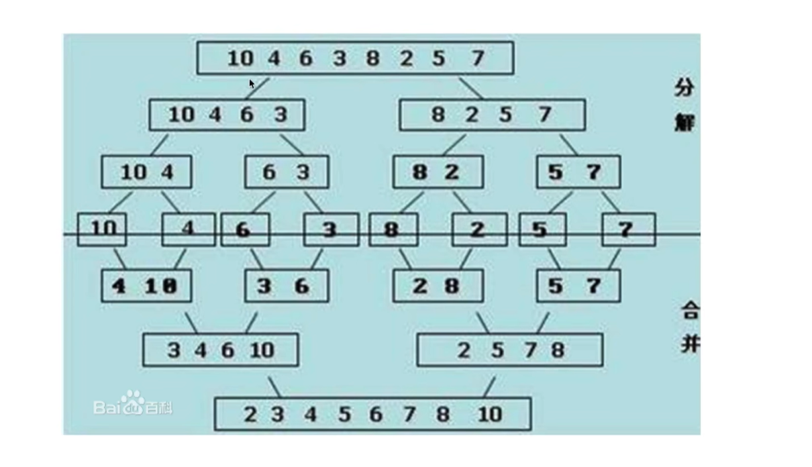


归并排序需要额外的内存开销。

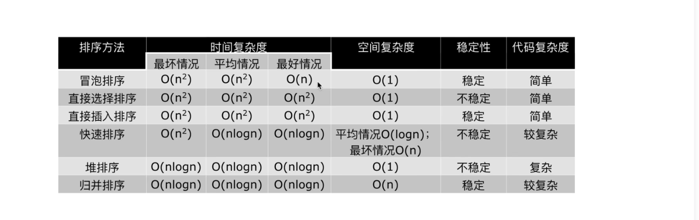

稳定性指的是两个相同的元素在排完序后，其相对位置不变。

## 希尔排序

希尔排序是插入排序的优化，它将数据分为多组，对每一组进行插入排序，然后缩短划分的组数，再对每一组执行插入排序。最后对整个数组进行一次插入排序。希尔排序通过跳跃式比较使得元素的左移次数大大减小。


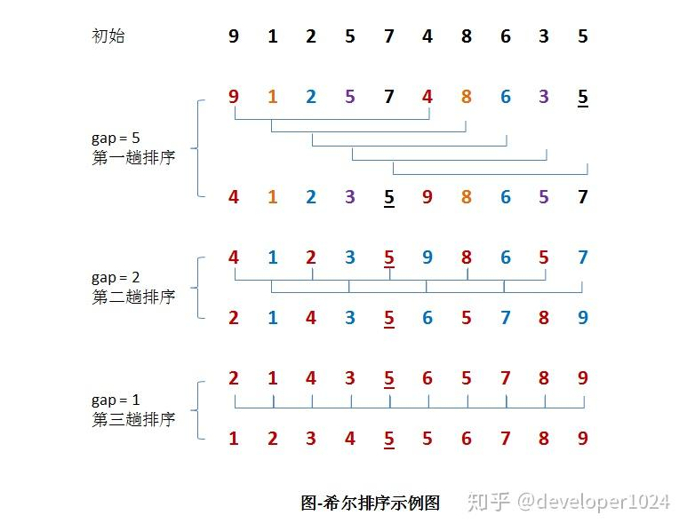

希尔排序的效率取决于增量值gap的选取，时间复杂度并不是一个定值。


## 计数排序

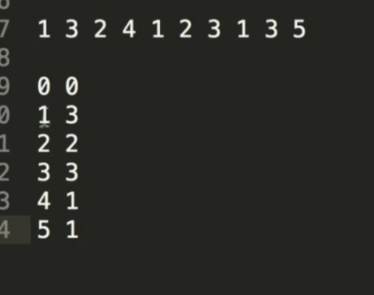

已知列表的范围，对每个元素的出现的次数进行计数，最后根据计数求出应有的范围。


注意需要已知范围，比如年龄之类的，并且消耗内存。

## 桶排序

同样是知道区间，桶排序是当区间比较大的时候，把元素装到不同的桶里，在对每个桶中的元素做排序。


## 基数排序

基数排序会按照数值的每一位进行排序，首先将每个数左侧补0填充成数位大小一致。然后可以从左往右(高位到低位)或者从右往左(低位到高位)逐个排序，对于十进制数会有10个桶，每个桶代表一位数。从左到右遍历每个数，将每个数按照对应的位添加到到每个桶中

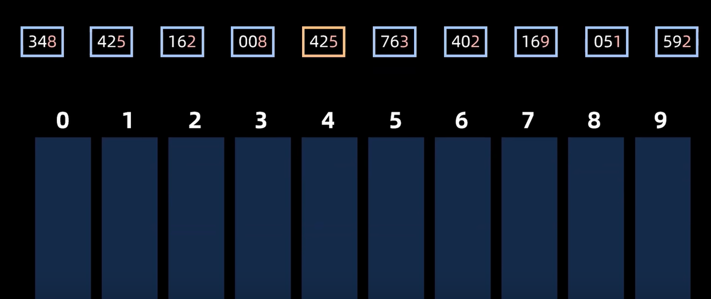


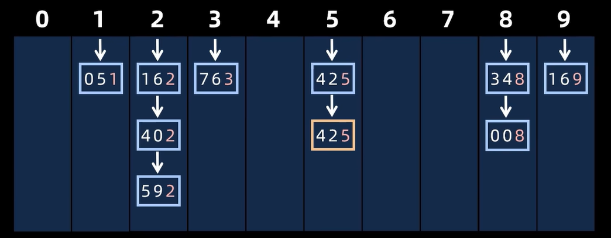


随后遍历每个桶按顺序取出每个数，此时得到的数组保证除个位外的数如果都相同，那么一定是有序的。

接下来对十位，百位...操作，最终能得到一个有序的数组。


基数排序是一个稳定的排序。


# 数据结构

## 数据结构的分类

存储结构分类：顺序存储，链式存储，散列表

逻辑分类：线性(一对一)，树形(一对多)，图(多对对)

## 列表

列表的元素是顺序存储的。

C的数组中使用下标查找元素时，时间复杂度为O(1)，其并非把数组遍历一遍，而是根据索引计算该元素的内存地址，比如一个整数占四个字节，查找整数数组中的第三个元素，传入索引2，会将首地址加上2*一个整数所占的字节。

python中的列表与数组不同，数组要求其中的元素类型都相同，数组长度固定。列表中可以是不同的类型，其中存储的是每个元素的地址，使用索引查找的时候，依旧是通过首地址加法运算取得值，不过此时的值是地址，然后再通过地址找到真正的元素值。列表的长度可以扩充类似于C++中的向量，在添加元素的时候，申请一块新的内存然后，把之前列表复制过来，新的内存长度不止是原内存长度加一，而可能是加倍。

append的时间复杂度是O(1)，但如果储存空间不够的话，时间复杂度为O(n)

插入和删除对列表都是O(n)的复杂度。

## 栈

只能在一段进行插入和删除的列表，后进先出：


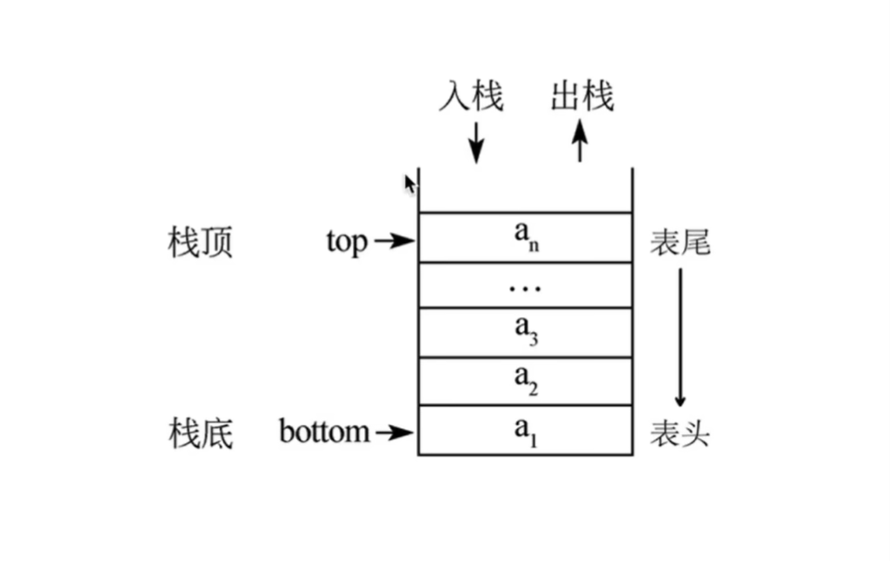

栈的实现：

```python
class stack:
    def __init__(self):
        self.stack=[]
    def pop(self):
        return self.stack.pop()
    def get_pop(self):
        if len(self.stack)>0:
            return self.stack[-1]
        else:
            return None
    def push(self,ele):
        self.stack.append(ele)
```

栈的的一个实例应用：用来判断括号是否匹配。函数中如果是左括号加入栈，右括号不加入堆，只是用来匹配。	

```python
def brace_match(str):
    stack=Stack()
    match={')':'(','}':'{',']':'['}#使用字典来表示与右括号匹配的
    for  s in str:#遍历每一个元素
        if s in ['[','{','(']:#如果是左括号，加入
            stack.push(s)
        else:
            if stack.is_empty():#栈是空的，没人匹配
                return False
            elif stack.get_pop()==match[s]:#如果栈顶元素与右括号匹配，弹出
                stack.pop()
            else:
                return False
    if stack.is_empty():#如果是空的说明全部匹配
        return True
    else:
        return False
```

## 队列

一端进行插入另一端进行删除的数据集合，插入端为队尾，删除端为队首。

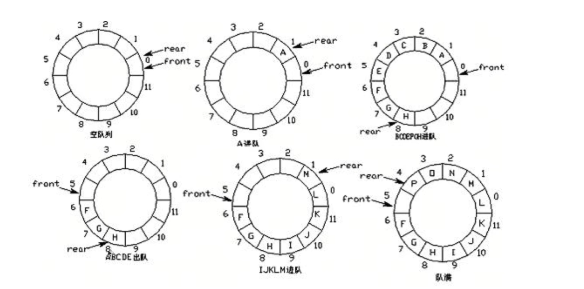

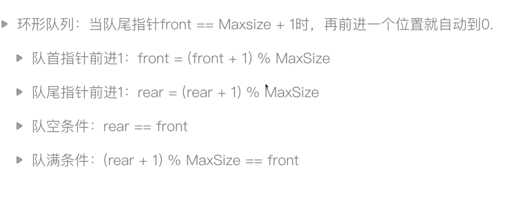

```python
class Queue:
    def __init__(self,size=100):
        self.queue=[0 for _ in range(size)]
        self.size=size
        self.rear=0
        self.front=0
    def push(self,ele):
        if self.is_filled():
            raise IndexError('the queue is filled')
        self.rear=(self.rear+1)%self.size
        self.queue[self.rear]=ele
    def pop(self):
        if self.is_empty():
            raise IndexError('no value in the queue')
        self.front=(self.front+1)%self.size
        return self.queue[self.front]
    def is_empty(self):
        return self.rear==self.front
    def is_filled(self):
        return (self.rear+1)%self.size==self.front
queue=Queue(5)
for i in range(4):
    queue.push(i)
print(queue.pop())
```

## 双向队列

在 Python 中，`deque`（双端队列）是一种高效的数据结构，它可以在两端进行插入和删除操作。`deque` 是由 `collections` 模块提供的一个类，它的名称来自于 "double-ended queue"（双端队列）的缩写。

`deque` 的主要特点包括：

1. 高效的插入和删除：`deque` 在两端进行插入和删除操作的时间复杂度均为 O(1)，即常数时间复杂度。
2. 可以用作队列或栈：由于 `deque` 支持在两端进行操作，因此它既可以像队列一样按照先进先出（FIFO）的顺序进行操作，也可以像栈一样按照后进先出（LIFO）的顺序进行操作。
3. 可指定最大长度：通过指定 `maxlen` 参数，可以创建一个有限长度的 `deque`，超过指定长度时，插入操作会自动移除最早的元素，可以用于对文件进行切片操作。

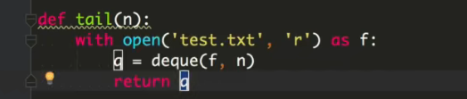

1. 内置的高级功能：`deque` 提供了许多内置的方法，如旋转、计数、索引等，方便进行各种常见操作。

```python 
from collections import deque
# 创建一个空的 deque
d = deque()
# 在 deque 的末尾插入元素
d.append(1)
d.append(2)
d.append(3)
# 在 deque 的开头插入元素
d.appendleft(0)
# 从 deque 的末尾删除元素
d.pop()
# 从 deque 的开头删除元素
d.popleft()
# 访问 deque 中的元素
print(d[0])
```

## 链表

链表是由一系列节点组成的元素集合，每个节点包含两部分，一个元素值，一个指向下一个节点的指针，通过节点之间的指针相互连接，最终串联成一个链表。

创建链表：

```python
class Note:
    def __init__(self,item):
        self.item=item
        self.next=None
def create_link_head(li):#头插法
    head =Note(li[0])
    for ele in li[1:]:
        note=Note(ele)
        note.next=head
        head=note
    return head
def create_link_tail(li):#尾插法
    head=Note(li[0])
    tail=head
    for ele in li[1:]:
        note=Note(ele)
        tail.next=note
        tail=note
    return head
def print_lk(head):#遍历打印
    while not head==None:
        print(head.item,end=",")
        head=head.next
lk1=create_link_head([1,2,3,4,5,6])
lk2=create_link_tail([1,2,3,4,5,6])
print_lk(lk1)
print_lk(lk2)

# 链表的反转
class Solution:
    def isPalindrome(self, head):
        """一个快节点一个慢节点，如果列表长度是奇数，快节点到达尾部，慢节点正好在中间，反之是偶数，快节点超出尾部一位，慢节点在中间偏右一位"""
        curr = head
        fast = head
        # 开始的时候头节点的前一节点不存在
        prev = None
        '''遍历的过程中反转前半列表，将链子全部反向'''
        while fast is not None and fast.next is not None:
            fast = fast.next.next
            # 记录下一节点
            temp = curr.next
            # 使当前节点的下一位指向前一节点，反转链子
            curr.next = prev
            # 更新前一节点的位置
            prev = curr
            # 更新当前节点
            curr = temp
        '''判断出是奇数，形如121，将慢节点后移一位，不需要判断中间的位数'''
        if fast is not None:
            curr = curr.next
        while prev is not None:
            if prev.val != curr.val:
                return False
            prev = prev.next
            curr = curr.next
        return True

```

链表的插入和删除：链表的插入考虑当前节点和插入节点，首先应该将插入节点的指针指向当前节点下一个节点，防止数据丢失，然后将当前节点的指针指向插入节点。删除，将当前节点指向下一节点的下一节点即可。

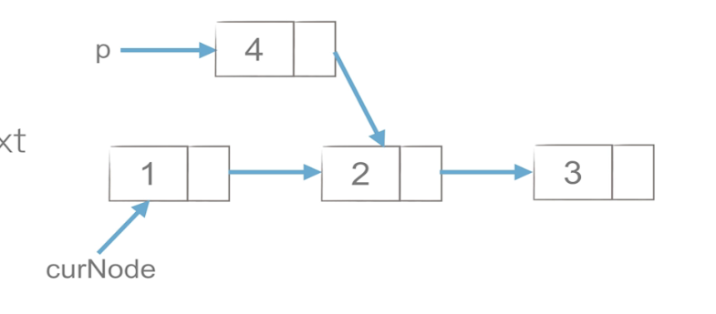

数组实现单链表

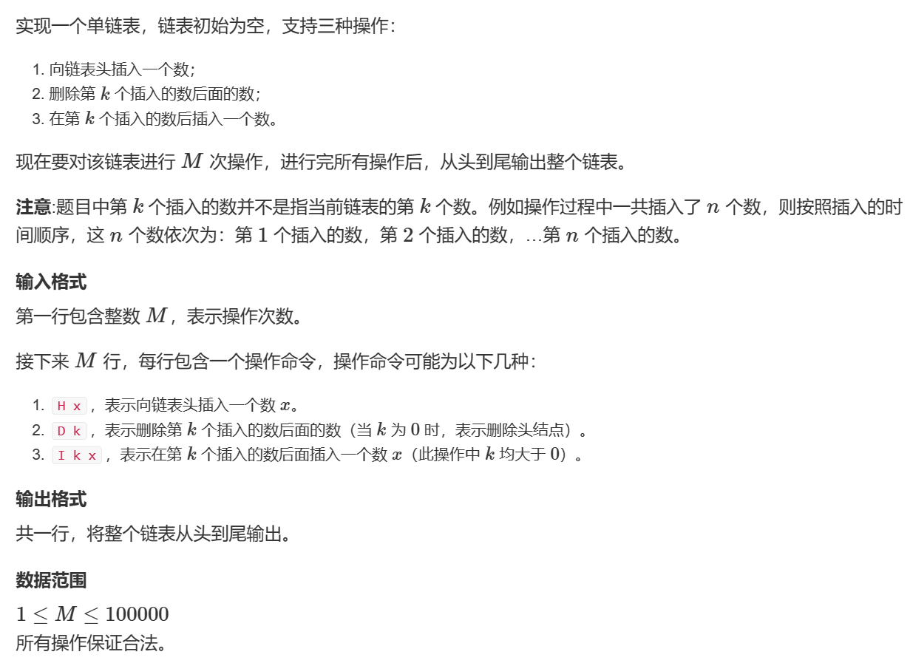

使用两个数组，n与nx，前者储存第i个位置的值，后者储存该位置下一个的指针，使用一个curr指针表示当前操作的位置，head表示头节点所指元素的位置。

```python
n=[0]*100010
nx=[-1]*100010
curr=0
head=-1
# 头插法
def add(x):
    global curr,head
    # 在当前位置设置这个值
    n[curr]=x
    # 设置该位置的下一个指向的是头节点的下一个
    nx[curr]=head
    # 把头节点的下一个指向当前位置
    head=curr
    # 更新
    curr+=1
# 在插入的第k个元素之后插入一个值
def insert(k,x):
    global curr, head
    n[curr]=x
    # 注意要先设置当前值的指针
    nx[curr]=nx[k-1]
    nx[k-1]=curr
    curr+=1
def remove(k):
    global curr, head
    if k==0:
        head=nx[head]
        return
    # 这里要注意，不是把nx[k-1]设置为nx[k]，nx的下标实际上第几个，而里面存储的值才是真正的元素位置所在
    nx[k-1]=nx[nx[k-1]]

m=int(input())

while m:
    li=input().split()
    flag=li[0]
    if flag=='H':
        add(int(li[1]))
    elif flag=='I':
        insert(int(li[1]),int(li[2]))
    else:
        remove(int(li[1]))
    m-=1

while head!=-1:
    print(n[head],end=' ')
    head=nx[head]


```


## 双链表

每个节点两个指针，一个指向前面，一个指向后面。

双链表的插入：先连接插入节点与下一节点，插入节点的后指针指向节点，下一节点的前指针指向插入节点，再连接当前节点与插入节点，插入节点的前指针指向当前节点，当前节点的后指针指向插入节点。

双链表的删除：当前节点的后指针指向删除节点的后一节点，后一节点的前指针指向当前节点。

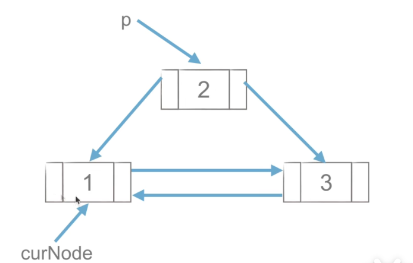


双链表用数组实现

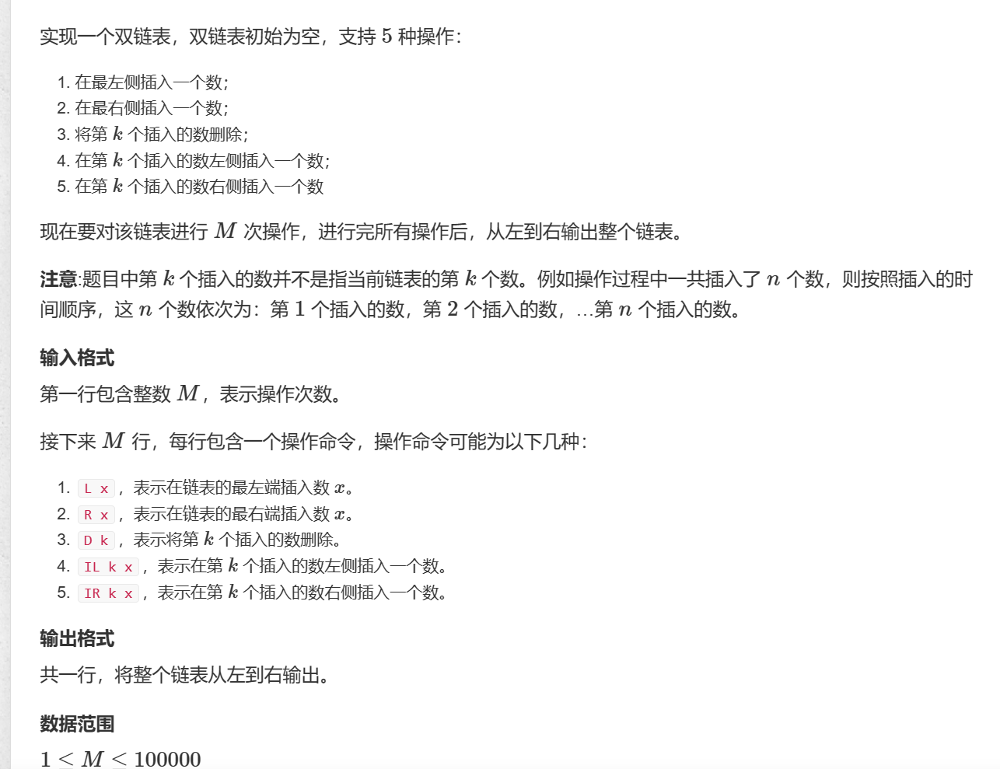


l，r分别表示左右指针，初用0和1表示左右端点，当前位置从2开始，需要索引偏移一位，初始时二者相连

```python
m=int(input())
l=[-1]*100010
r=[-1]*100010
n=[0]*100010
curr=2

def init():
    r[0]=1
    l[1]=0
# 在k位置右边插入
def insert(k,x):
    global curr
    n[curr]=x
    r[curr]=r[k]
    l[curr]=k
    l[r[k]]=curr
    r[k]=curr
    curr+=1
# 删除操作
def remove(k):
    l[r[k]]=l[k]
    r[l[k]]=r[k]
    

    
init()
while m:
    li=input().split()
    if li[0]=='L':
        insert(0,int(li[1]))
    elif li[0]=='R':
        insert(l[1],int(li[1]))
    elif li[0]=='D':
        remove(int(li[1])+1)
    elif li[0]=='IL':
        insert(l[int(li[1])+1],int(li[2]))
    else:
        insert(int(li[1])+1,int(li[2]))
    m-=1
head=r[0]
while head!=1:
    print(n[head],end=' ')
    head=r[head]


```


## 二叉树

二叉树的结构是一个节点连接两个子树：

```python
class binarytree:
    def __init__(self,data):
        self.data=data
        self.lchild=None
        self.rchild=None
```

与线性结构不同，二叉树的遍历并不能通过循环得到，需要使用递归：

+ 前向遍历：

  ```python
  def pre_order(root):
      if root:
          print(root.data,end=' ')
          pre_order(root.lchild)
          pre_order(root.rchild)
  ```

+ 中序遍历：

  ```python
  def in_order(root):
      if root:
          in_order(root.lchild)
          print(root.data,end=' ')
          in_order(root.rchild)
  ```

  

+ 后序遍历

  ```python
  def in_order(root):
      if root:
          in_order(root.lchild)
          in_order(root.rchild)
          print(root.data,end=' ')
  ```

以上三个遍历出的结果，只要有前序和中序就可以得到树的结构：


可以得到，E是树的根，在中序中，E左是左子树（ABCD），E右使右子树(GF)，在左子树中A是根，通过中序可知，A没有左子树，而BCD是其右子树...

层次遍历，按照层级遍历，适用于多叉树：

```python
def level_order(root):
    queue=deque()
    queue.append(root)
    while len(queue)>0:
        current=queue.popleft()
        print(current.data)
        if current.rchild:
            queue.append(current.rchild)
        if current.lchild:
            queue.append(current.lchild)
```

## 二叉搜索树

满足二叉树的基本结构，左节点的值小于父节点，右节点的值大于父节点。

插入：

```python
#节点
class Node:
    def __init__(self, data):
        self.data = data
        self.lchild = None
        self.rchild = None
        self.parent = None
#树
class BST:
    def __init__(self, li=None):
        self.root = None#根节点
        if li:#列表初始化
            for val in li:
                self.insert_not_rec(val)
     #使用递归插入，node用于代表当前节点，初始时是根节点
    def insert(self, node, val):
        if not node:
            node = Node(val)
        if val < node.data:
            node.lchild = self.insert(node.lchild, val)
            node.lchild.parent = node
        if val > node.data:
            node.rchild = self.insert(node.rchild, val)
            node.rchild.parent = node
        return node
	#非递归的方式
    def insert_not_rec(self, val):
        p = self.root
        if not p:#如果是空树，直接构造
            self.root = Node(val)
            return
        while 1:#反之，不断遍历
            if val > p.data:
                if not p.rchild:
                    p.rchild = Node(val)
                    p.rchild.parent = p
                    return
                else:
                    p = p.rchild
            elif val < p.data:
                if not p.lchild:
                    p.lchild = Node(val)
                    p.lchild.parent = p
                    return
                else:
                    p = p.lchild
            else :
                return
```

通过运行可以知道，对于搜索二叉树使用中序遍历，输出的结果是升序的。

查询：

```python
    def find(self, node, val):
        if not node:
            return None
        if node.data > val:
            return self.find(node.lchild, val)
        elif node.data < val:
            return self.find(node.rchild, val)
        else:
            return node

    def find_not_rec(self, val):
        p = self.root
        while p:
            if p.data == val:
                return p
            if p.data > val:
                p = p.lchild
            elif p.data < val:
                p = p.rchild
        return None
```

删除操作：但要删除的节点是叶节点的时候，直接删除，如果是有一个子节点的根的话，

```python
    def __remove__node1(self, node):  # 删除的节点没有子节点
        if not node.parent:  # 如果树中只有这一个节点
            self.root = None
        # 先判断是左/右那个节点，然后断开
        if node == node.parent.lchild:  # 如果是父节点的左子树
            node.parent.lchild = None
            node.parent = None
        else:  # 反之，右子树
            node.parent.rchild = None
            node.parent = None

    def __remove__node21(self, node):  # 删除的节点有一个子节点,并且这个子节点是左子树的
        if not node.parent:  # 如果树中只有这两个节点
            self.root = node.lchild
            node.lchild.parent = None
        elif node.parent.lchild == node:  # 如果该节点是其父节点的左节点
            node.parent.lchild = node.lchild
            node.lchild.parent = node.parent
        else:  # 反之，右节点
            node.parent.rchild = node.lchild
            node.rchild.parent = node.parent

    def __remove__node22(self, node):  # 删除的节点有一个子节点,并且这个子节点是右子树的
        if not node.parent:  # 如果树中只有这两个节点
            self.root = node.rchild
            node.rchild.parent = None
        elif node.parent.lchild == node:
            node.parent.lchild = node.rchild
            node.rchild.parent = node.parent
        else:
            node.parent.rchild = node.rchild
            node.rchild.parent = node.parent

    def delete(self, val):
        if not self.root:  # 判断是否是空的树
            print('the tree is empty')
            return
        node = self.find_not_rec(val)  # 找到这个节点
        if not node:  # 该值不存在
            print('not exist')
            return
        if not node.lchild and not node.rchild:  # 如果是单独一个节点
            self.__remove__node1(node)
        elif not node.rchild:  # 没有右子节点，只有左子节点
            self.__remove__node21(node)
        elif not node.lchild:  # 只有一个右子节点
            self.__remove__node22(node)
        else:  # 两个子节点都有，找到该节点右子树中最小的替换该节点
            min_node = node.rchild
            while min_node.lchild:#一直往左子树遍历
                min_node = min_node.lchild
            node.data = min_node.data#替换数据
            if min_node.rchild:#在把这个节点删除，判断他有没有右子节点
                self.__remove__node22(min_node)
            else:
                self.__remove__node1(min_node)
```

二叉树的搜索时间复杂度为log(n)，极端的情况是二叉树十分倾斜。


## 红黑树

红黑树是一个**自平衡的二叉搜索树**（树高<=**2lg(n+1)**），每个树额外储存了一个**color字段**(RED BLACK)，用于确保树在**插入或者删除**时保持平衡

注意红黑树并不追求**绝对平衡**——高度只差最多为**2**

红黑树中要求所有的**叶子节点**为**空**(NIL)，所有的信息都存储在**内部节点**(非叶子节点上)，**根节点**的父节点也是NIL

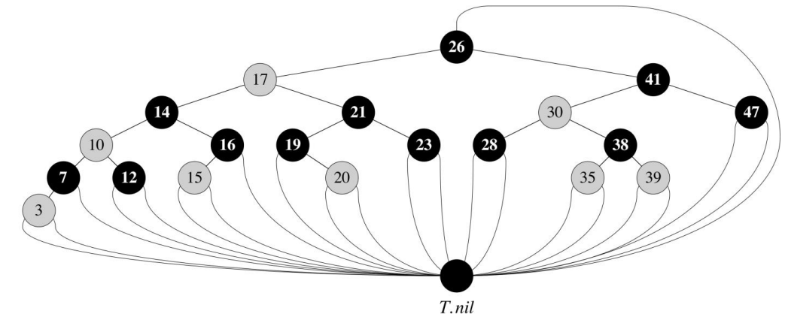


合法的红黑树必须遵循以下性质：

1. **节点为红色或者黑色**
2. **根节点为黑色**
3. **NIL节点(空叶子节点)为黑色**
4. **红色节点的子节点为黑色，不要求红黑交替**
5. **从根节点到NIL上路径上，黑色节点的个数一样多**


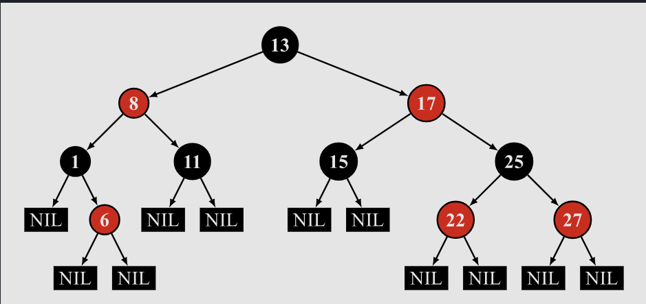


自平衡的树结构一般都需要旋转操作，红黑树的旋转操作和AVL树相同

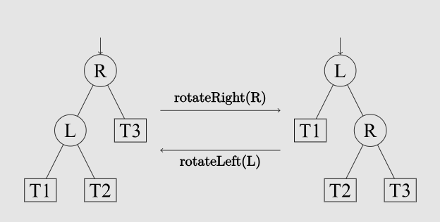


插入操作，注意节点初始默认是**红色**的

1. **空树**，直接插入无需修正
2. 当前节点的**父节点为黑色**，无需修正
3. 当前节点的**父节点为红色且为根节点**，将根节点染为**黑色**
4. 当前节点**父节点以及叔父节点均为红色**，则将**二者染黑**，**祖父染红**，递归维护**祖父节点**，如果祖父节点是根节点，那么需要染黑，即出现连续的黑色的情况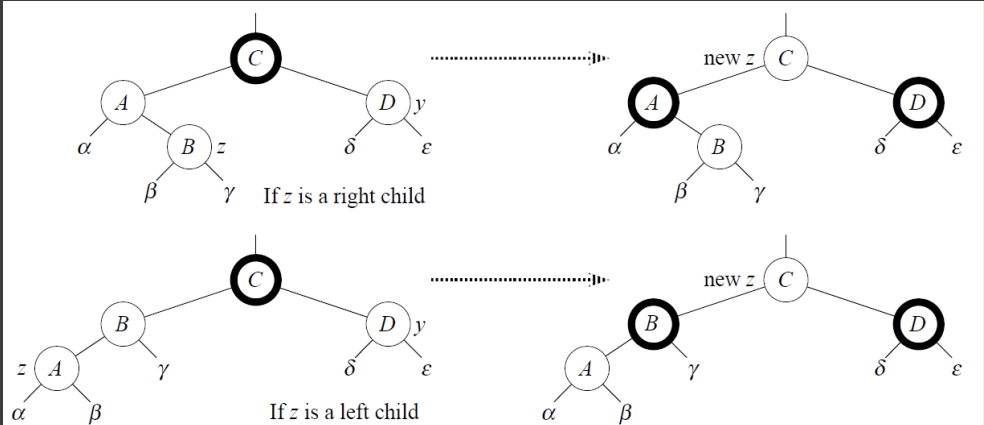
5. 当前节点N与父节点P方向相反(即 N 节点为右子节点且父节点为左子节点，或 N 节点为左子节点且父节点为右子节点)，需要旋转为方向相同的结构，然后执行操作6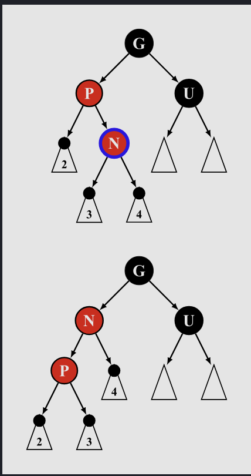
6. 若N为左子节点，则右旋祖父节点G，反之左旋，然后将P染黑，G染红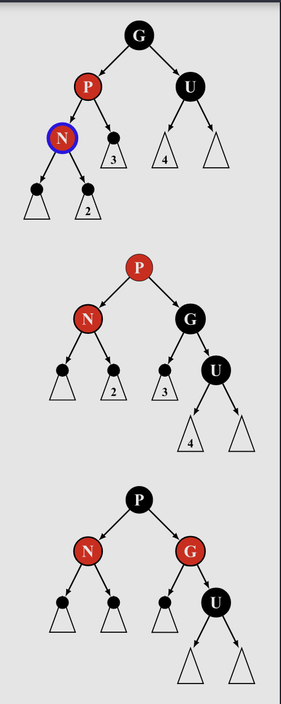


需要**旋转**的操作如下，对于右右/左左的形式，先变化颜色再旋转

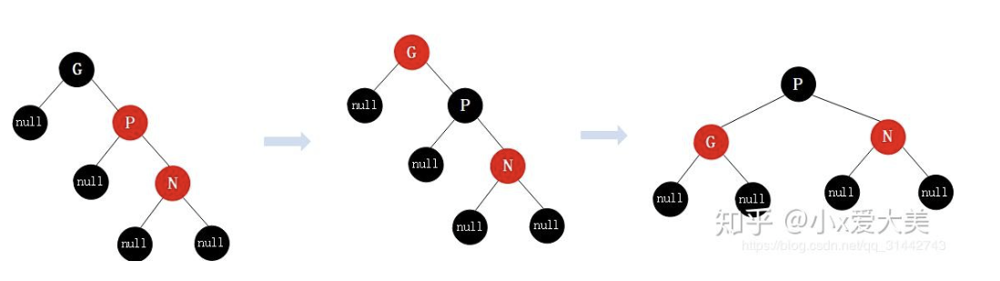

**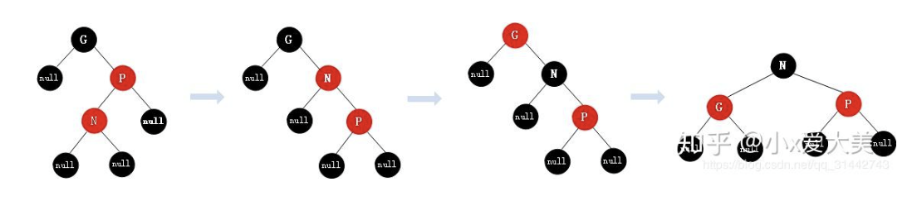**


一个插入的过程如下：

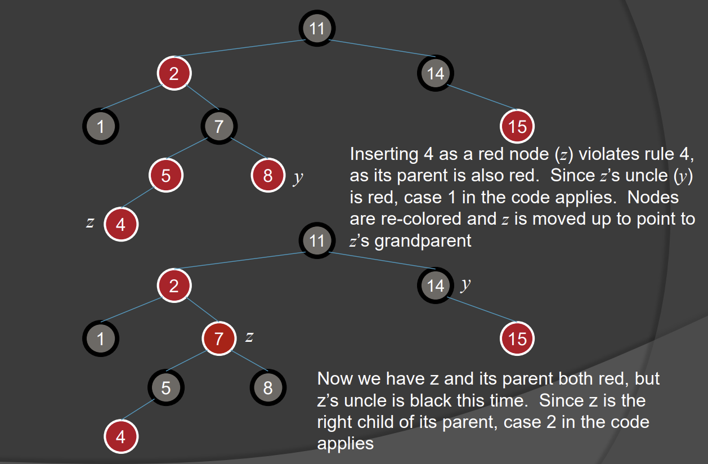

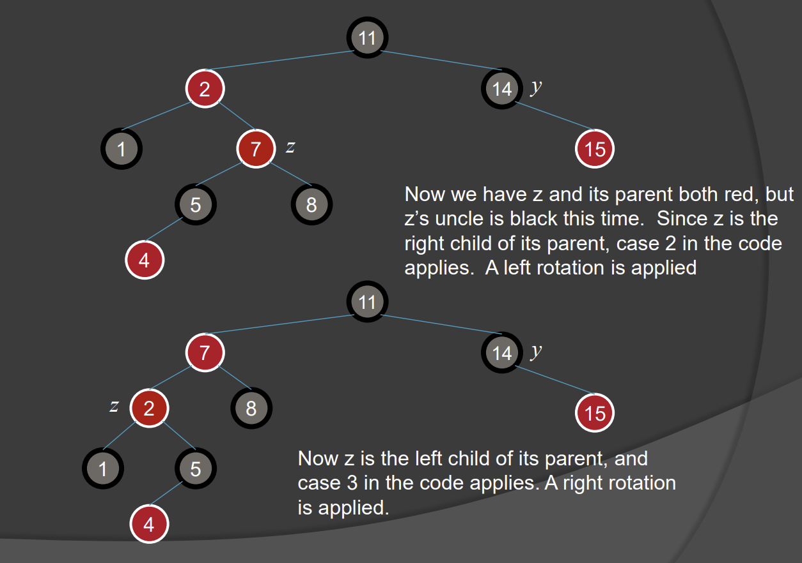

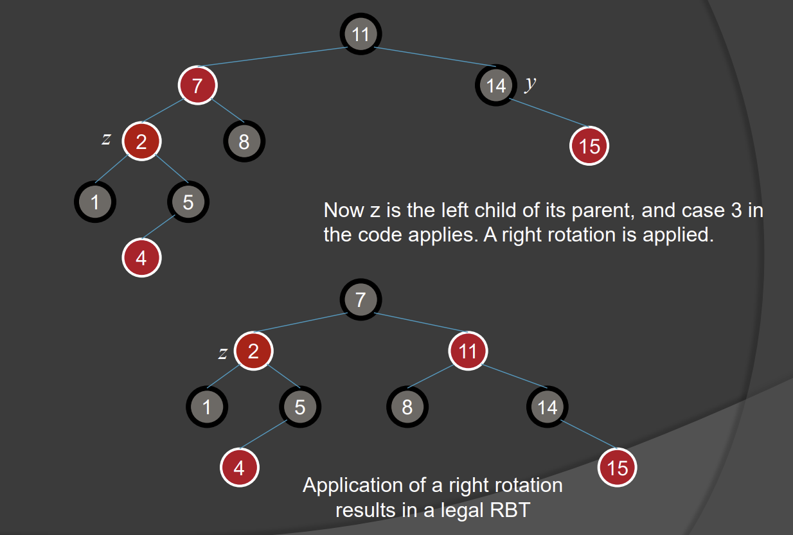


## AVL树

**一个自平衡的二叉搜索树，其性质有：**

**1.空的二叉树是一个AVL树；**

**2.如果T是一棵AVL树，那么它的左右子树也是AVL树，且|h(ls)-h(rs)|<=1，h是左右子树的高度；**

**3.树的高度是O(logn)**


当二叉树退化为单链表时，搜索的效率会降低到O(n)，AVL树可以解决这个问题。

完全平衡的树(满二叉树full)的树高需要满足h ≤ (lg N)，AVL树不保证完全平衡，仅满足 h ≤ (~1.4404 lg N)，而红黑树则是 h ≤ (2 lg N)。

AVL树使用平衡因子Balance Factor (BF) ，其取值只能是-1，0，1，等于左子树的高度-右子树的高度。


当一个节点的平衡因子等于2或-2时，意味着出现了不平衡

LL和RR操作与红黑树一致


LR，插入到节点的左子树的右子树

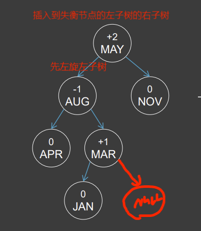

左旋左子树

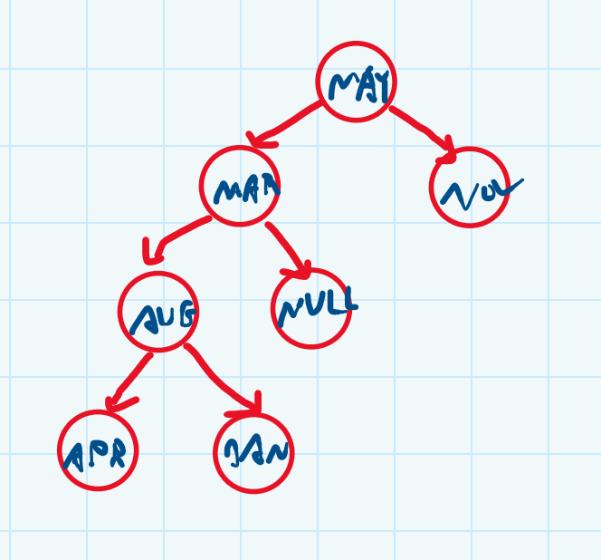

右旋当前节点

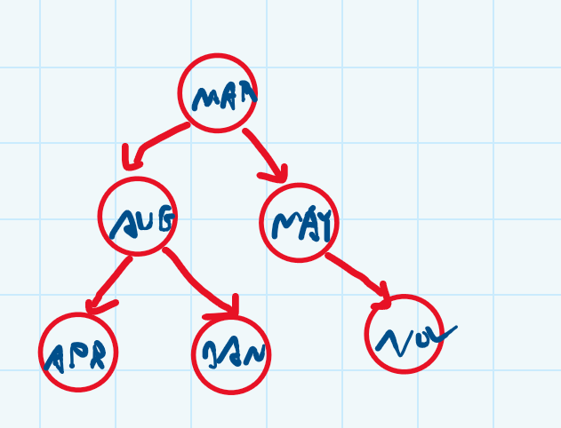


RL，插入到节点的右子树的左子树，先右旋右子树，再左旋当前节点

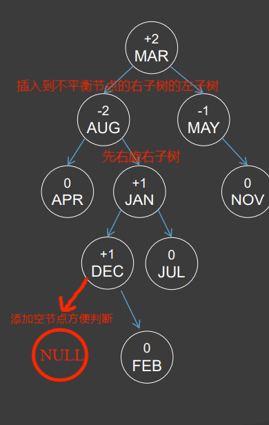

右旋右子树

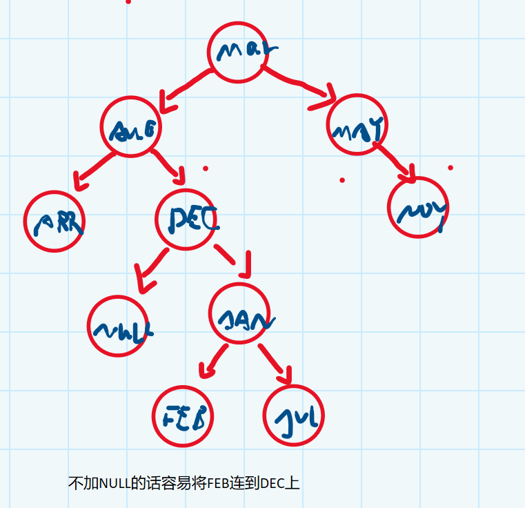

再左旋失衡节点

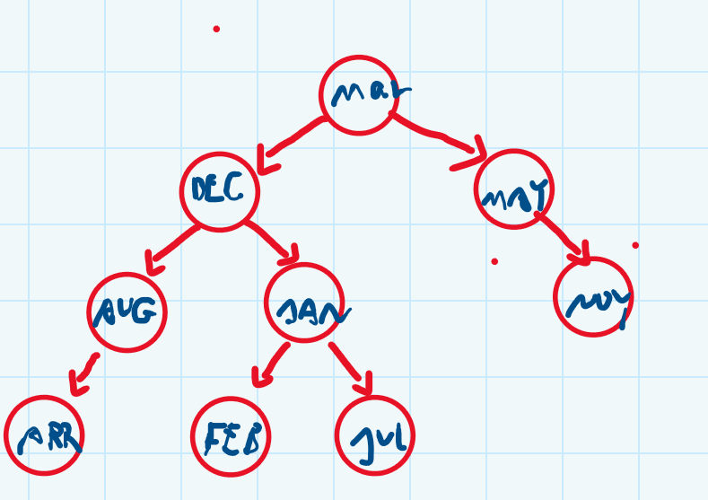


多个失衡节点先处理最末端的(叶子节点到根)，下图所示判断为RL

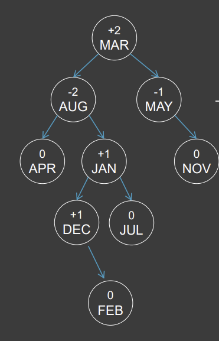


## 哈夫曼树

设二叉树具有**n**个带权叶结点，从根结点到各叶结点的路径长度与相应叶节点权值的乘积之和称为 **树的带权路径长度（Weighted Path Length of Tree，WPL)**


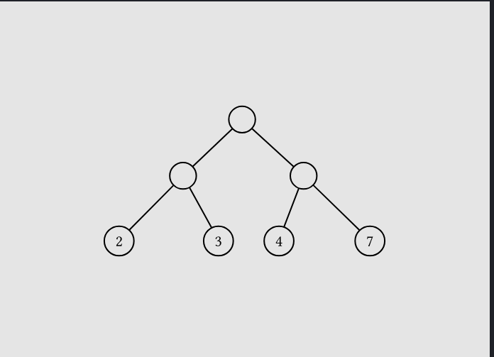

如上图所示，其 WPL 计算过程与结果：WPL=2*2+3*2+4*2+7*2=4+6+8+14=32

对于给定一组具有确定权值的叶结点，可以构造出不同的二叉树，其中，**WPL 最小的二叉树** 称为 **霍夫曼树（Huffman Tree）**。

对于霍夫曼树来说，其叶结点权值越小，离根越远，叶结点权值越大，离根越近，此外其仅有**叶结点的出度为 0**，其他结点**出度均为 2**（也就是必然有两个**子节点**）

霍夫曼算法用于构建一颗霍夫曼树，步骤如下

1. **初始化**：由给定的 n个权值构造 **n 棵**只有**一个根节点**的二叉树，得到一个二叉树集合 F。
2. **选取与合并**：从二叉树集合  中选取根节点权值 **最小的两棵(有多个相同则任意)** 二叉树分别作为左右子树构造一棵**新的二叉树**，这棵新二叉树的根节点的权值为其左、右子树根结点的权值和。
3. **删除与加入**：从  中删除作为左、右子树的两棵二叉树，并将新建立的二叉树加入到  中。
4. **重复 2、3 步**，当集合中只剩下**一棵**二叉树时，这棵二叉树就是霍夫曼树。

实现如下

```python
# 构建节点
class Node:
    def __init__(self,w,l=None,r=None):
        self.weight=w
        self.l=l
        self.r=r
    # 定于<比较的对象
    def __lt__(self,other):
        return self.weight<other.weight


n=R()
# 堆
h=[Node(x) for x in RR()]

heapify(h)
while len(h)>1:
    a=heappop(h)
    b=heappop(h)
    # 创建节点
    new_node=Node(a.weight+b.weight,a,b)
    heappush(h,new_node)
root=heappop(h)

# 层级遍历输出
d=deque([root])
while d:
    for _ in range(len(d)):
        node=d.popleft()
        print(node.weight)
        if node.l:d.append(node.l)
        if node.r:d.append(node.r)
```


在进行二进制编码的时，假设所有的代码都等长，那么表示N个不同的字符需要**logN**位，称为等长编码。

如果每个字符的**使用频率相等**，那么**等长编码**无疑是空间效率最高的编码，而如果字符串出现的**频率不同**，则可以让**频率高的字符采用尽可能短的编码，频率低的字符采用尽可能长的编码**，来构造出一种**不等长编码**，从而获得更好的**空间效率**。

在构造不等长的编码时要考虑**解码的唯一性**，如果一组编码中的**任意编码**都不是其他任何一个编码的**前缀**，那么这组编码称为**前缀编码**，其保证了**编码被解码时的唯一**。

霍夫曼树可用于构建**最短前缀编码**

规定树的**左枝为0，右枝为1**，**从根节点到叶子结点的路径即为字符的编码**

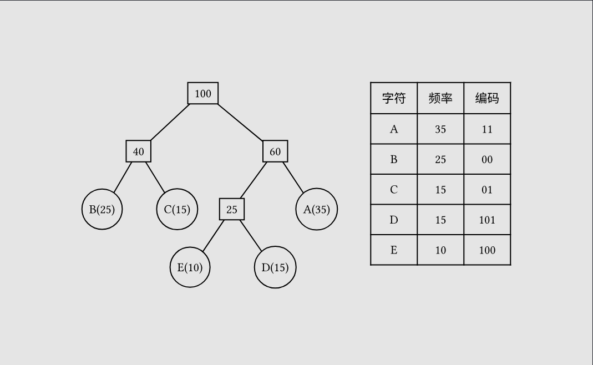


**哈夫曼树越不平衡(字符频率差异显著)，压缩的效率就越高**


解码的性质，从根结点开始读入字符，走到**叶子节点**就解码了一个字符，然后继续从根节点开始操作，当所有的字符都处理完毕，此时应该**位于叶子节点**。

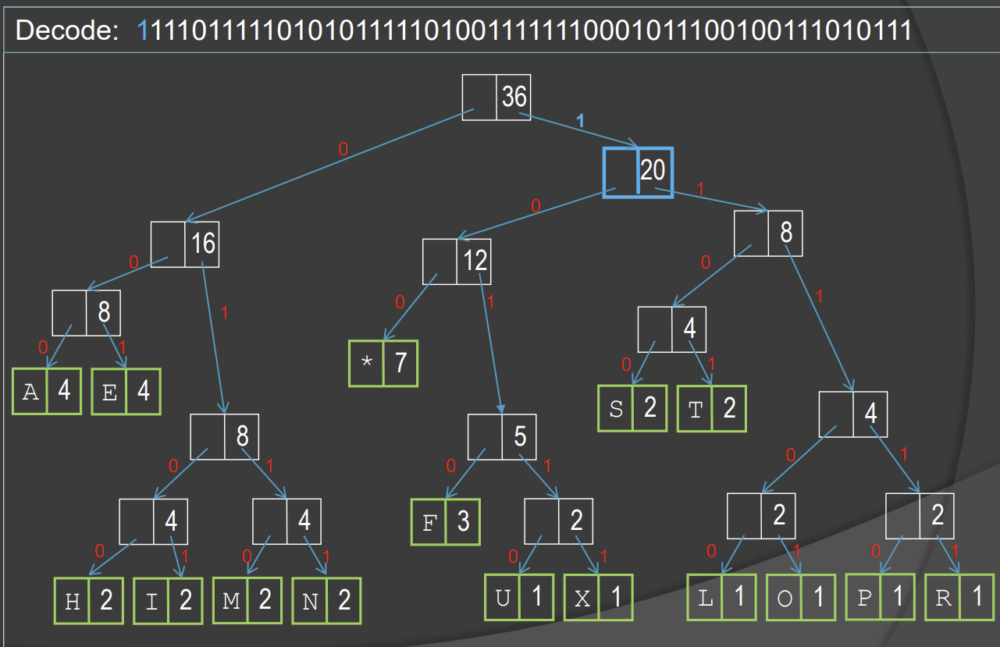


计算机中一般使用**固定的位数**工作，即把**压缩后的结果分为大小固定的块**，压缩后的结果可能需要**填充位**来补充


填充位可以使用**空格**，或者**使用某一段前缀**，使得不会走到**叶子节点**

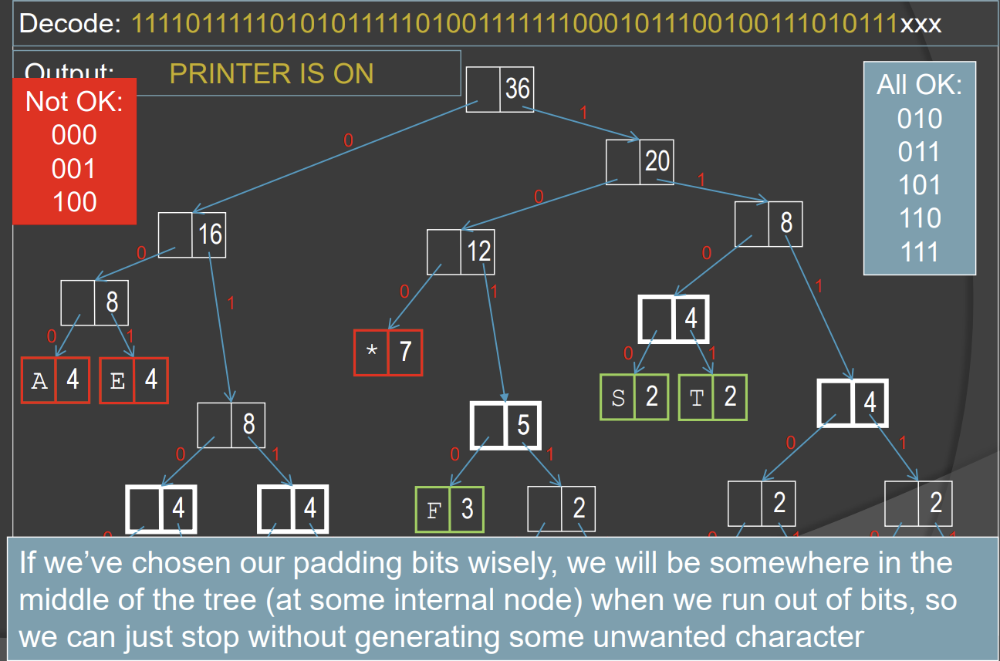


## B树

B树是一个多叉平衡搜索树，每一个节点可以有多个值9关键字)，且包含对应记录的指针，节点内的值是有序的，也可以有多个分支。为磁盘/大数据存储系统设计的一种高效可扩展的数据结构，数据库的索引用的就是B树。

[参考视频](https://www.bilibili.com/video/BV1JU411d7iY?spm_id_from=333.788.player.switch&vd_source=63004f7ee2f738d6adc086e00ebcede2)

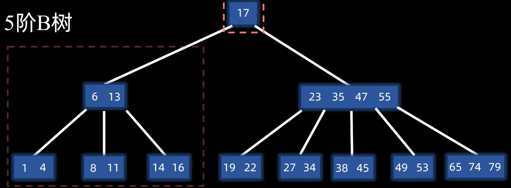

考虑6,13这个节点，它的子树1,4 8,11实际上对应的就是6的左右子树，8,11 14,16就是13的左右子树

对于M阶B树，每个节点最多有M个分支，包含M-1个元素；最少ceil(m/2)个分支，包含ceil(m/2)-1个元素，根节点可以是2个分支以及1个元素。

### 查找

以找28为例

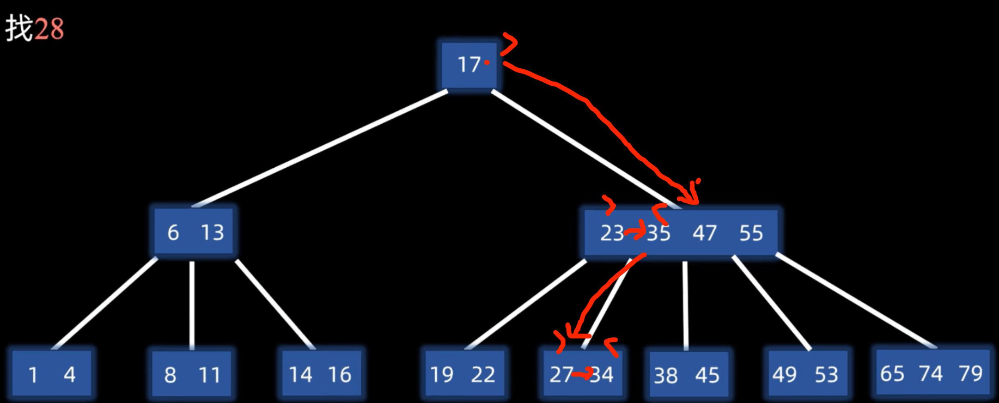

这里回去找43的左子树，但是其左子树不存在，相当于走到了失败节点上，因此查找失败。


### 插入

以插入20为例

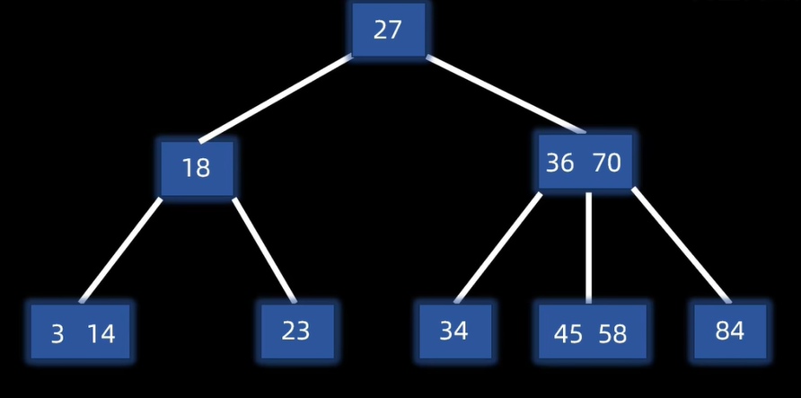


最后会走到23所在节点，这里不是继续往下走而是直接将值加入到23所在的节点。


插入时可能会违反B树的规则，即一个节点中的元素数超过上限了。假设现在插入的17，那么它会被添加到3,14这个位置，此时节点内元素的个数会超出上限(上溢)，此时需要进行调整——将中间位置的元素上移到父节点，并将该节点划分为左右两部分。

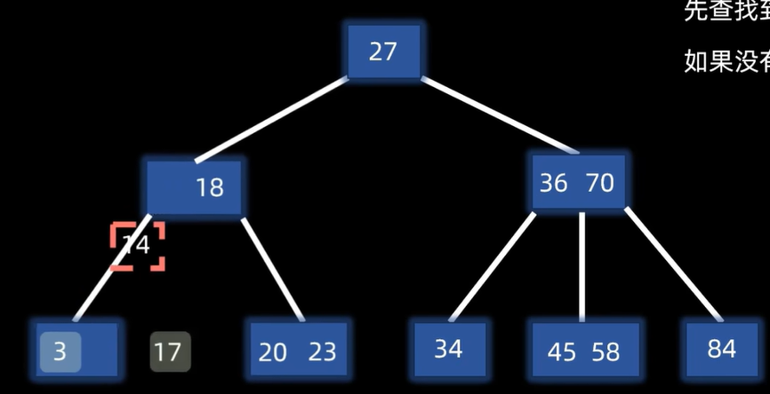

显然的上移后依然可能会违反规则，因此继续递归处理

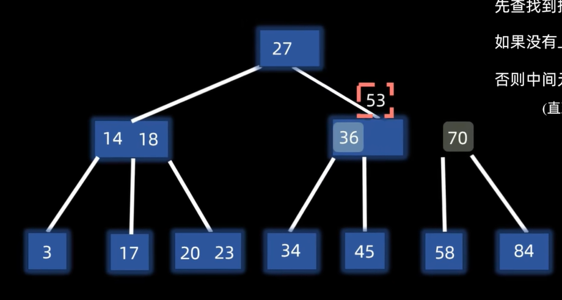


 B树的构建也是这样一点点调整出来的。


### 删除

[参考视频](https://www.bilibili.com/video/BV1JU411d7iY?spm_id_from=333.788.player.switch&vd_source=63004f7ee2f738d6adc086e00ebcede2)

删除B树上的非叶子节点，和二叉搜索树一样用中序的后继替换，然后删除替换后的节点。然后删除界点活可能会违反B树的规则——节点内元素的个数不够了(下溢)。

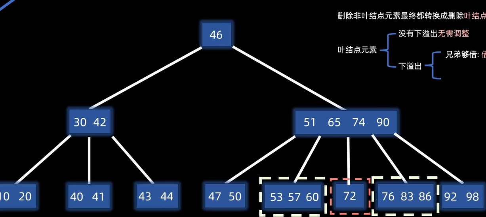

如果兄弟节点可以借一个，那么就从兄弟节点处借一个节点过来，左右随意。

这里不能借节点中的任意一个，做法是：将兄弟节点对应的父节点添加给下溢出的节点，然后将兄弟节点的中最大/最小(取决于是左兄弟还是右兄弟)的元素值上移，保证有序，父下来子上去。

注意如果兄弟节点也有子树那么需要移动该节点最左/最右的子树移动给溢出节点。

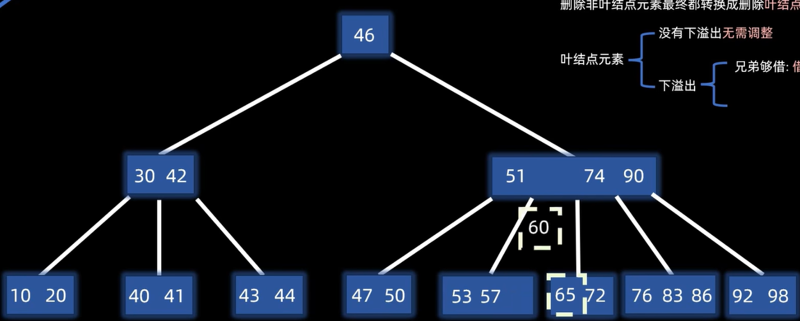


如果兄弟节点不够借，那么需要合并

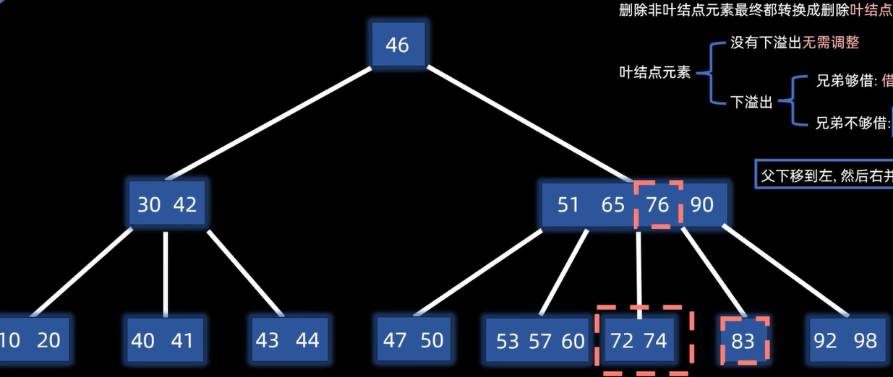


和左兄弟合并——将其父节点移动到左兄弟，然后再合并，合并时也需要移动对应的子树

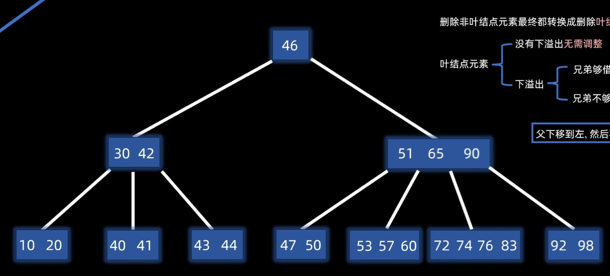


这样父节点也会减少一个元素，可能发生下溢出，因此递归处理


## B+树

叶结点层包含全部的关键字以及指向相应记录的的指针，非叶子节点只是作为索引，节点之间通过链表连接，这样在顺序查找时可以避免中序遍历的方式在树上来回移动，兼顾了顺序查找和随机查找，以及范围查找(顺寻查找+随机查找)。

和B树不同，m个分支的节点有m个元素，同时非叶子节点的每个元素对应其子节点的最大值，叶子节点包含一个指向记录的指针

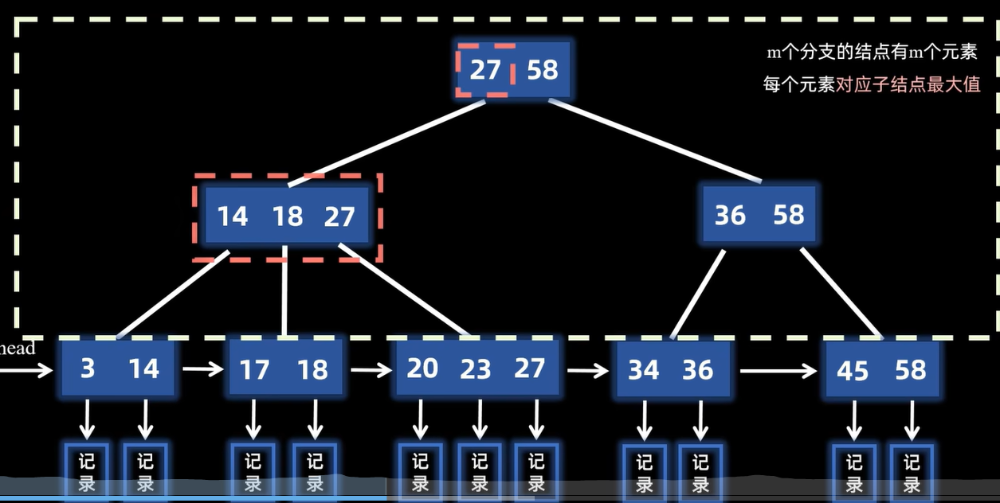


B+树的查找需要一直走到叶子节点，不能中途停下


## 哈希表

哈希表的两种散列函数是：直接定值法(构造一个线性函数)，除留余数法(模一个数，模数寻选取小于等于表长的质数，可以减小冲突的可能)


解决哈希冲突的方法有：

+ 开放定址法：**去找另一个位置**
  + 线性探测法：冲突后依次找**下一个位置**(数组是**循环**的)，直到遇到**空闲**位置。查找时，如果映射到的位置不是想要的值，也会不断向后找，**如果遇到空闲位置，说明这个值不在哈希表中**(如果存在一定会向后移动到这个位置)。对于要删除的数不能**直接**把它从哈希表中删掉，这会**截断**其他值向后寻找的路径。因此将删除位置标记一个**特殊值**。
  + 平方探测法：冲突时按照+1², −1², +2², −2², +3², −3², ...探测
  + 二次探测法：冲突时按照$+1^2, -1^2, 2^2, -2^2, +3^2,+3^2，...$探测
  + 二度哈希：有多个哈希函数，使用第一个哈希函数冲突，则使用第二个哈希函数
+ 拉链法：将映射到同一个位置的值，用单链表连接起来


# 工具方法

## 数据

$$2\times 10^9==2^{31}$$，而这开方后的结果是44721

$$log_2{10^9}==29$$，七次方则是23

做比较时如果次数非常多那么应该避免使用math.inf，可以用10**18替代Inf


## tuple

把列表转换为tuple可以存入字典

## 读取

内置的的input函数处理大数据时非常低效，一般使用：

```python
import sys
input=sys.stdin.readline
```

这个读取函数会一并将语句末尾的换行符读取，因此对字符串操作的时候注意带上rstrip()

在读取过程中，使用int()对于一定特定的值会卡住，因此如果不是必须要使用数值类型，尽量不要转换为整数


## 设置字符串转换限制

```python
sys.set_int_max_str_digits(10000)# str(a)对a的长度是有限制的，通过该函数把限制放大
```


## 优先级队列(根堆)

```python 
import heapq
heap = [3, 1, 4, 1, 5, 9, 2]
heapq.heapify(heap)# 可以将列表转换为小根堆形式
print(heap)  # 输出: [1, 1, 2, 4, 5, 9, 3]

# 向堆中添加一个元素，并保持堆的顺序
heap = [1, 3, 5, 7, 9]
heapq.heappush(heap, 4)
print(heap)  # 输出: [1, 3, 4, 7, 9, 5]

# 弹出并返回堆中最小的元素，保持堆的顺序
heap = [1, 3, 4, 7, 9, 5]
smallest = heapq.heappop(heap)
print(smallest)  # 输出: 1
print(heap)      # 输出: [3, 5, 4, 7, 9]

import heapq

# 初始堆为空
heap = []

# 向堆中推入元组 (priority, value)，以第一个值为优先级，当第一个值相同时以第二个值排序
heapq.heappush(heap, (2, 'Task 2'))
heapq.heappush(heap, (1, 'Task 1'))
heapq.heappush(heap, (3, 'Task 3'))

# 弹出并打印最小元素，弹出优先级最小的
while heap:
    priority, task = heapq.heappop(heap)
    print(f'Priority: {priority}, Task: {task}')

    
# 获取前几个最大/最小值
array = [10, 17, 50, 7, 30, 24, 27, 45, 15, 5, 36, 21]
heapq.heapify(array)
print(heapq.nlargest(2, array))
print(heapq.nsmallest(3, array))
```

## 求数组的乘积

使用math.prod()即可


## 记忆化搜索

借助缓存策略用空间换时间

### functools.lru_cache（3.2）

`functools.lru_cache` 是 Python 标准库中 `functools` 模块的一部分。`lru_cache` 装饰器可以用来为一个函数添加一个缓存系统。这个缓存系统会存储函数的输入和对应的输出。如果函数被调用，并且给出了已经缓存过的输入，那么函数就不会重新计算，而是直接从缓存中获取对应的输出。

LRU 是 “Least Recently Used” 的缩写，意思是 “最近最少使用”。LRU 缓存就是一种缓存淘汰算法，当缓存达到预设的容量上限时，会优先淘汰最近最少使用的数据。

使用lru_cache完成记忆化搜索可以大大提高效率

```python
from functools import lru_cache
# 从functools中导入，其中包含一个参数，maxsize表示最大缓存容量
@lru_cache(maxsize=None)
def febo(n):
    if n==0 or n==1:
        return n
    return febo(n-1)+febo(n-2)
print(febo(100))
```

### cache(3.9)

与lru_cache 没有大的区别，只是取消了缓存的限制。

dp.cache_clear()

注意记忆化搜索，需要dfs有一个返回值，如果在函数中是一个外部变量累加，`记忆化搜索不会对这个值进行累计，而是直接跳过`。因此要使用记忆化搜索需要用一个内部变量在函数中累加，然后返回他。

同样要注意的是：使用set判断，原本因为在外面加入到set中的值不同导致dfs的结果也会不同，而这里使用了记忆化搜索，记忆的很可能不是以a为初始值的set()而是在以前某次循环中以b为初始值的set()

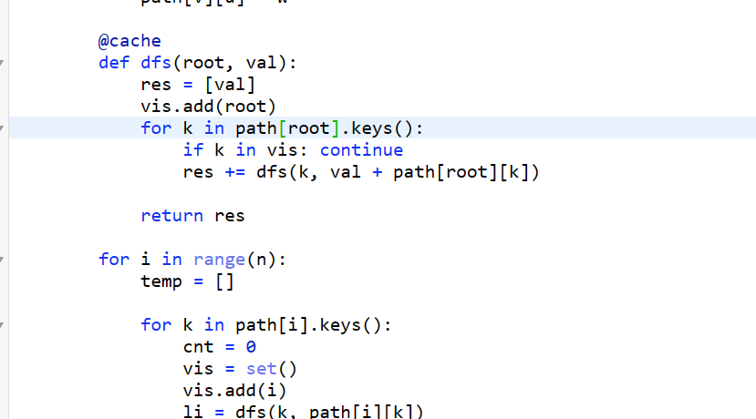

## 字符串格式化(舍入)


```python
print(f"{100.126:.2f}")# 这将输出100.13，.2f表示保留两位小数，会进行四舍六入五看齐

print(f'{100: 10}') # 将会设置字符宽度为10，默认为右对齐
name = "John"
print(f"{name:_<10}")  # 使用下划线填充，总宽度为10，<表示左对齐

print(f"{2:+>10}")  # 使用加号填充，右对齐，总宽度为10
+++++++++2
```


**注意字符串的拼接使用列表，在列表尾部多添加一个值而不是s+=c，后者在字符串比较长的时候会浪费大量时间**。

**无法实现四舍五入因为精度的问题只能做到，四舍五入六看齐**


## 前缀和

```python
from itertools import accumulate
# 可以轻松构造前缀和数组
lst=list(accumulate(count))
list(accumulate(nums,initial=0))等价于[0]+list(accumulate(nums))
```

## 二分搜索

```python
from bisect import bisect_left

# 内部使用二分搜索实现
# bisect_left(a, x, lo=0, hi=len(a))),用于在列表中(起始位置为lo,终止位置为hi，左闭右开区间）查找元素 x 插入的位置，使得插入后序列仍然保持有序，函数返回一个索引值，这个值可以认为是列表中大于等于x的最小的索引

#bisect_right找出的索引减去一，就是列表中小于等于这个元素的最大的元素的位置，一般通过 bisect_left(a, x+1)-1来找小于等于x的位置

# 可用于快速查找列表中大于等于查找值的最小值的索引	
from bisect import bisect_right,bisect_left

# 已排序的列表
sorted_list = [1, 3, 4, 4, 6, 8, 10]

# 查找插入位置
insert_index = bisect_left(sorted_list, 4)

left：{insert_index}")# 插入位置left：2


# 两个函数的实现，注意边界条件
def bisect_left():
    l,r=0,n-1
    while l<=r:
        mid=(l+r)//2
        # 找到目标值，因为要求的是大于等于目标值的最小，因此对于找到的值不能确定左边是否还有所以缩减右边界往左找
        if nums[mid]<target:
            l=mid+1
        else:
            r=mid-1
def bisect_right():
    l,r=0,n-1
    while l<=r:
        mid=(l+r)//2
        # 不能确定找到的值右边是否还有桐言的值，因此缩减左边界
        if nums[mid]>=target:
            l=mid+1
        else:
            r=mid-1
    

```

## set集合

使用集合可以用来连接图

```python
for edge in edges:
    u,v =edge
    if u in restricted or v in restricted:
        continue
    paths[v].add(u)
    paths[u].add(v)
```

集合的另一个妙用是`对集合的in 操作时间复杂度是O(1)的`，实际上大量使用set做判断也会耗时

集合操作：

```python
memo[i].issubset(memo[j])# 判断i是否是j集合的子集

# 并
set1 = {1, 2, 3}
set2 = {3, 4, 5}
a=set1|set2

# 交
b= set1&set2

# 差，可以通过直接相减得到
a={2,3,5}
b={2,3,4}
print((a-b).pop())

#  复制
new_set = my_set.copy()

```


## 全排列permutations

全排列可以用于数据量较小的匹配，比如对于长度都为9的a和b数组相互任意匹配，可以固定b数组然后找a的全排列一一匹配。

```python
from itertools import permutations

# 创建一个集合
my_set = {1, 2, 3}
# 使用permutations生成全排列
perm_generator = permutations(my_set)
# 遍历生成的排列
for perm in perm_generator:
    print(perm)
 # 限制排列的长度
perm_generator = permutations(my_set, 2)


# from more_itertools import distinct_permutations as dispermutations
使用该API可以更快的生成不重复的全排列
```

## 最小公倍数lcm和最大公约数gcd

```python
from math import lcm,gcd	
lcm(11,23)
```

## 有序集合

```python
from sortedcontainers import SortedList,SortedDict，SortedSet

# 分别实现了有序列表和有序字典，以及集合。集合与列表的不同在于集合中没有重复元素

# 可以直接初始化
s=SortedList([1,2,3])

# 加入值，按照第一个排序后按照第二个排序，类似于根堆
s.add((i,j))


# 可以直接调用二分查找
s.bisect_left(val)
s.bisect_right(val)

# update方法可以合并两个有序列表
a=sl([1,2,3,4,4])
a.update(sl([3,4,5]))

# 以下两个都是删除操作，但第一个如果删除的值不存在会抛出异常，而第二个不会	
# 如果这个值重复了，不会都删除而是只删除一个
a.remove(1)
a.discard(1)

# 此外有序容器可以切片，使用索引，反转操作

s=SortedDict()
s[k]=val
s.bisect_left/right(val)

# 在有序集合中可以存放元组，并指定排序规则
s=sl(key=lambda x:(x[0],-x[1]))
如果使用二分搜索也会按照给给定的规则去寻找

```

可以在循环中不断加入元素同时保证从小到大的顺序


```python
class SortedList:
    def __init__(self, iterable=[], _load=200):
        """Initialize sorted list instance."""
        values = sorted(iterable)
        self._len = _len = len(values)
        self._load = _load
        self._lists = _lists = [values[i:i + _load] for i in range(0, _len, _load)]
        self._list_lens = [len(_list) for _list in _lists]
        self._mins = [_list[0] for _list in _lists]
        self._fen_tree = []
        self._rebuild = True

    def _fen_build(self):
        """Build a fenwick tree instance."""
        self._fen_tree[:] = self._list_lens
        _fen_tree = self._fen_tree
        for i in range(len(_fen_tree)):
            if i | i + 1 < len(_fen_tree):
                _fen_tree[i | i + 1] += _fen_tree[i]
        self._rebuild = False

    def _fen_update(self, index, value):
        """Update `fen_tree[index] += value`."""
        if not self._rebuild:
            _fen_tree = self._fen_tree
            while index < len(_fen_tree):
                _fen_tree[index] += value
                index |= index + 1

    def _fen_query(self, end):
        """Return `sum(_fen_tree[:end])`."""
        if self._rebuild:
            self._fen_build()

        _fen_tree = self._fen_tree
        x = 0
        while end:
            x += _fen_tree[end - 1]
            end &= end - 1
        return x

    def _fen_findkth(self, k):
        """Return a pair of (the largest `idx` such that `sum(_fen_tree[:idx]) <= k`, `k - sum(_fen_tree[:idx])`)."""
        _list_lens = self._list_lens
        if k < _list_lens[0]:
            return 0, k
        if k >= self._len - _list_lens[-1]:
            return len(_list_lens) - 1, k + _list_lens[-1] - self._len
        if self._rebuild:
            self._fen_build()

        _fen_tree = self._fen_tree
        idx = -1
        for d in reversed(range(len(_fen_tree).bit_length())):
            right_idx = idx + (1 << d)
            if right_idx < len(_fen_tree) and k >= _fen_tree[right_idx]:
                idx = right_idx
                k -= _fen_tree[idx]
        return idx + 1, k

    def _delete(self, pos, idx):
        """Delete value at the given `(pos, idx)`."""
        _lists = self._lists
        _mins = self._mins
        _list_lens = self._list_lens

        self._len -= 1
        self._fen_update(pos, -1)
        del _lists[pos][idx]
        _list_lens[pos] -= 1

        if _list_lens[pos]:
            _mins[pos] = _lists[pos][0]
        else:
            del _lists[pos]
            del _list_lens[pos]
            del _mins[pos]
            self._rebuild = True

    def _loc_left(self, value):
        """Return an index pair that corresponds to the first position of `value` in the sorted list."""
        if not self._len:
            return 0, 0

        _lists = self._lists
        _mins = self._mins

        lo, pos = -1, len(_lists) - 1
        while lo + 1 < pos:
            mi = (lo + pos) >> 1
            if value <= _mins[mi]:
                pos = mi
            else:
                lo = mi

        if pos and value <= _lists[pos - 1][-1]:
            pos -= 1

        _list = _lists[pos]
        lo, idx = -1, len(_list)
        while lo + 1 < idx:
            mi = (lo + idx) >> 1
            if value <= _list[mi]:
                idx = mi
            else:
                lo = mi

        return pos, idx

    def _loc_right(self, value):
        """Return an index pair that corresponds to the last position of `value` in the sorted list."""
        if not self._len:
            return 0, 0

        _lists = self._lists
        _mins = self._mins

        pos, hi = 0, len(_lists)
        while pos + 1 < hi:
            mi = (pos + hi) >> 1
            if value < _mins[mi]:
                hi = mi
            else:
                pos = mi

        _list = _lists[pos]
        lo, idx = -1, len(_list)
        while lo + 1 < idx:
            mi = (lo + idx) >> 1
            if value < _list[mi]:
                idx = mi
            else:
                lo = mi

        return pos, idx

    def add(self, value):
        """Add `value` to sorted list."""
        _load = self._load
        _lists = self._lists
        _mins = self._mins
        _list_lens = self._list_lens

        self._len += 1
        if _lists:
            pos, idx = self._loc_right(value)
            self._fen_update(pos, 1)
            _list = _lists[pos]
            _list.insert(idx, value)
            _list_lens[pos] += 1
            _mins[pos] = _list[0]
            if _load + _load < len(_list):
                _lists.insert(pos + 1, _list[_load:])
                _list_lens.insert(pos + 1, len(_list) - _load)
                _mins.insert(pos + 1, _list[_load])
                _list_lens[pos] = _load
                del _list[_load:]
                self._rebuild = True
        else:
            _lists.append([value])
            _mins.append(value)
            _list_lens.append(1)
            self._rebuild = True

    def discard(self, value):
        """Remove `value` from sorted list if it is a member."""
        _lists = self._lists
        if _lists:
            pos, idx = self._loc_right(value)
            if idx and _lists[pos][idx - 1] == value:
                self._delete(pos, idx - 1)

    def remove(self, value):
        """Remove `value` from sorted list; `value` must be a member."""
        _len = self._len
        self.discard(value)
        if _len == self._len:
            raise ValueError('{0!r} not in list'.format(value))

    def pop(self, index=-1):
        """Remove and return value at `index` in sorted list."""
        pos, idx = self._fen_findkth(self._len + index if index < 0 else index)
        value = self._lists[pos][idx]
        self._delete(pos, idx)
        return value

    def bisect_left(self, value):
        """Return the first index to insert `value` in the sorted list."""
        pos, idx = self._loc_left(value)
        return self._fen_query(pos) + idx

    def bisect_right(self, value):
        """Return the last index to insert `value` in the sorted list."""
        pos, idx = self._loc_right(value)
        return self._fen_query(pos) + idx

    def count(self, value):
        """Return number of occurrences of `value` in the sorted list."""
        return self.bisect_right(value) - self.bisect_left(value)

    def __len__(self):
        """Return the size of the sorted list."""
        return self._len

    def __getitem__(self, index):
        """Lookup value at `index` in sorted list."""
        pos, idx = self._fen_findkth(self._len + index if index < 0 else index)
        return self._lists[pos][idx]

    def __delitem__(self, index):
        """Remove value at `index` from sorted list."""
        pos, idx = self._fen_findkth(self._len + index if index < 0 else index)
        self._delete(pos, idx)

    def __contains__(self, value):
        """Return true if `value` is an element of the sorted list."""
        _lists = self._lists
        if _lists:
            pos, idx = self._loc_left(value)
            return idx < len(_lists[pos]) and _lists[pos][idx] == value
        return False

    def __iter__(self):
        """Return an iterator over the sorted list."""
        return (value for _list in self._lists for value in _list)

    def __reversed__(self):
        """Return a reverse iterator over the sorted list."""
        return (value for _list in reversed(self._lists) for value in reversed(_list))

    def __repr__(self):
        """Return string representation of sorted list."""
        return 'SortedList({0})'.format(list(self))
```


## 除法

有的时候需要进行高精度除法判断，python自带的除法无法准确在进行判断的时候会出问题，因此选择使用分数进行判断

```python
from factions import Factions as f
res=f(10,3)
res的结果是10/3	，内部会自动进行约分
```

## pairwise

有的时候要在数组中在每个位置和它的下一个位置进行比较，这是哦胡可以用pairwise进行操作。

**注意当数组大小为一的时候该方法会忽略第一个元素**


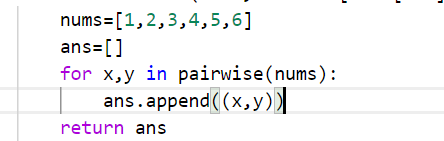

```python
[[1,2],[2,3],[3,4],[4,5],[5,6]]
```

## 分数

```python
from fractions import Fraction as f
# 可以接受字符串
f(2,3)
f('2/3')
# 可以做到自动约分，分数相加或与整数相加，结果显示为分数
```


## 对拍

对拍程序首先需要一个数据生成器gen.py，格式看题目要求

```python
from random import *
n=randint(1,200)
len=randint(n,300)
print(n,len)

for _ in range(n):
    l,s=randint(1,len),randint(1,100)
    print(l,s)
```


然后就是自己的正解和暴力的代码AC.py time_out.py

最后就是比较程序，借助subprocess提供的命令行调用工具

```python
import subprocess

# 测试用例数
for i in range(10): 
    # 生成输入数据 check_output运行命令并接受程序的输出 text将返回结果解码为字符串
    input_data=subprocess.check_output(['python','gen.py'],text=True)

    # 调用正解和暴力解 指定input数据
    try:
        WA=subprocess.check_output(['python','AC.py'],input=input_data,text=True)
    except Exception  as e:
        print('test code error')
        print(e)
        print(input_data)
        break

    try: 
        TLE=subprocess.check_output(['python','TLE.py'],input=input_data,text=True)
    except Exception  as e:
        print('time_out code error')
        print(e)
        print(input_data)
        break

    # 直接对结果比较即可
    if TLE!=WA:
        print('input_data: ')
        print(input_data,end='\n')

        print('WA: ')
        print(TLE,end='\n')

        print('error: ')
        print(WA,end='\n')

        break
```


## 日期

```python
import datetime

s="2024-03-11 12:30:00"
# 构造日期，对于不同的日期格式使用不同的方式格式化，如果是20110101就是%Y%m%d,注意大小写
a=datetime.datetime.strptime(s,"%Y-%m-%d %H:%M:%S")

# 使用内置方法timedelta构造用于加减的时间戳
print(a+datetime.timedelta(days=5,hours=3))

# 两个日期运算后，通过调用days()取出天数，单独的时间戳不行。	
print((a-b).days())
```

datetime.datetime.strptime会返回**datetime**类型，可用与datetime做**减法**得到**timedelta**类型，但是只能与timedelta类型做**加法**，timedelta可以通过与datetime做加法转换为datetime类型。

在输出时会默认输出完整的时间，即使初始化只用了时间没用日期，输出时会默认补上1900 1 1作为日期，可以通过该对象下的strftime()方法传入模式串('%H:%M:%S')来规范输出的内容。


## 递归次数

```python
import sys
sys.setrecursionlimit(1500) # 设置限制数1500

atcoder平台对迭代有优化
import pypyjit
pypyjit.set_param("max_unroll_recursion=-1")
```


## Counter

注意a+=Counter(nums[-1])的操作很慢，使用defaultdict(int)会更快

# 链表反转

## 反转链表

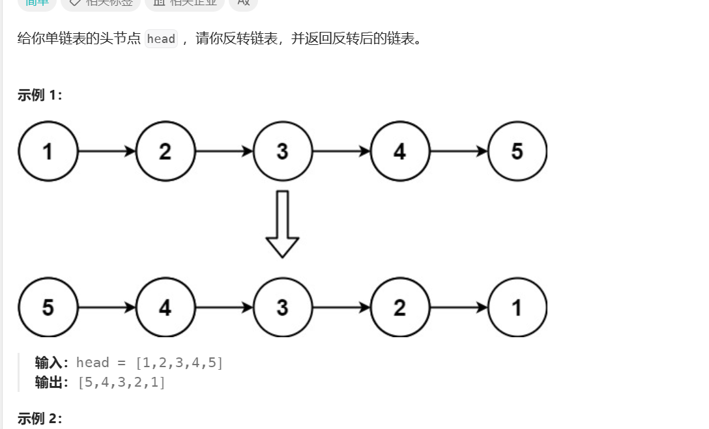

使用迭代函数以及双指针，么此将下一个指针指向上一个指针，注意要提前记录下一个值否则会丢失

```python
class Solution(object):
    def reverseList(self, head):
        l=None
        r=head
        while r:
            temp=r.next
            r.next=l
            l,r=r,temp
        return l
```


使用递归函数操作，每次递归的操作是将下一个节点的下一指针连接到自己上，将自己的下一指针断开，防止形成环，递归会对每个节点做相同的操作。

```python
class Solution(object):
    def reverseList(self, head):
        # 如果传入的节点是空的或者只有一个，直接返回，在递归中会返回原本的尾节点，反转操作最后是要获得新的头节点，找到了尾节点之后一直传递
        if not head or not head.next:
            return head
        temp=self.reverseList(head.next)
        head.next.next=head
        head.next=None
		# 传递
        return temp
```


## 反转链表II

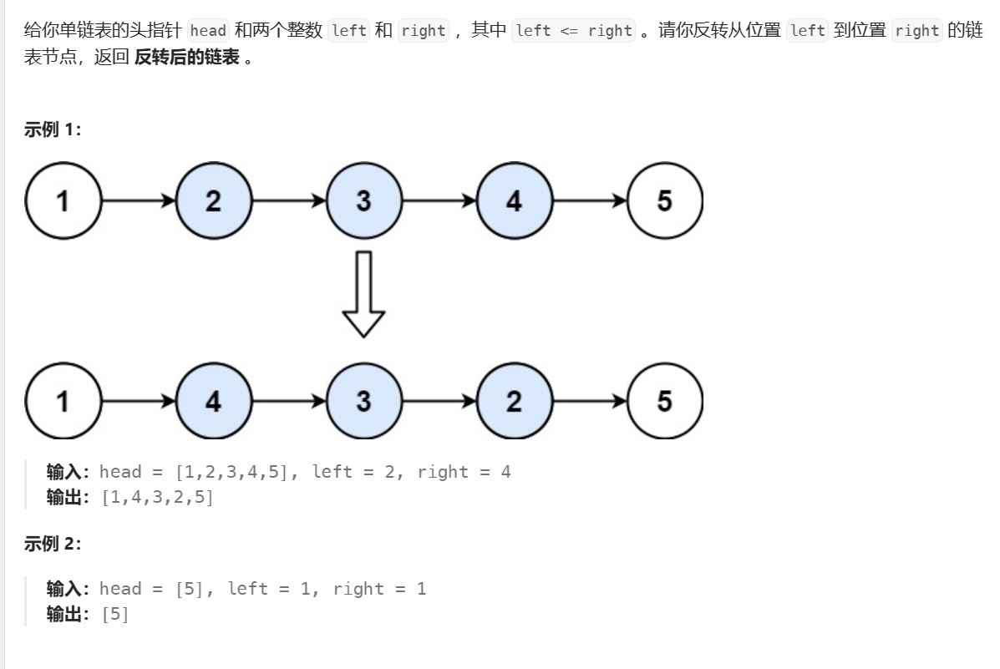

找到开始反转节点的前一个，对之后的k个节点使用上述的双指针操作，注意如果要求的是最开始的节点就无法找到前一位，因此加入一个虚拟节点。

```python 
class Solution(object):
    def reverseBetween(self, head, left, right):
        # 虚拟节点
        dummy=ListNode(-1)
        dummy.next=head
        p0=dummy
        # 找到前一节点
        for _ in range(left-1):
            p0=p0.next
        pre=None
        curr=p0.next
        # 双指针操作
        for _ in range(right-left+1):
            temp=curr.next
            curr.next=pre
            pre,curr=curr,temp
         # 最后curr指向末尾节点的下一个，pre指向末尾节点，开始的前一个此时还指向这开始节点，将开始节点的下一个连到末尾的下一个去，开始节点的下一个连接到末尾节点 
        p0.next.next=curr
        p0.next=pre
        return  dummy.next
```

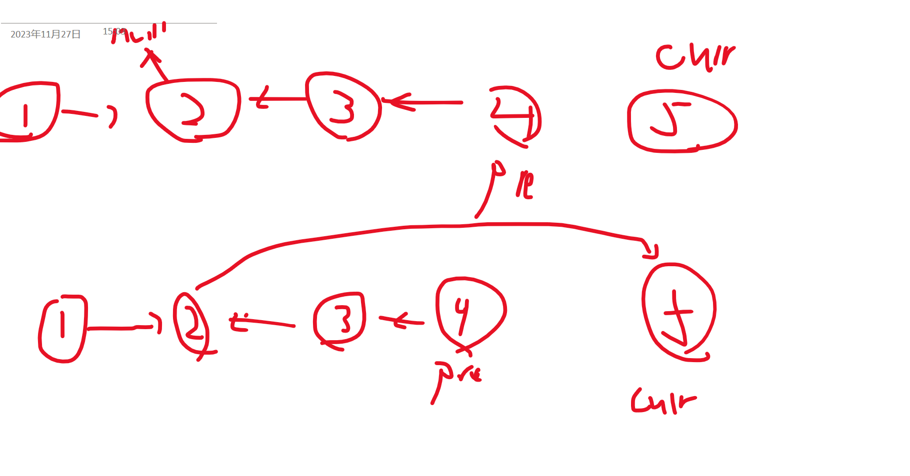

## [K 个一组翻转链表](https://leetcode.cn/problems/reverse-nodes-in-k-group/)

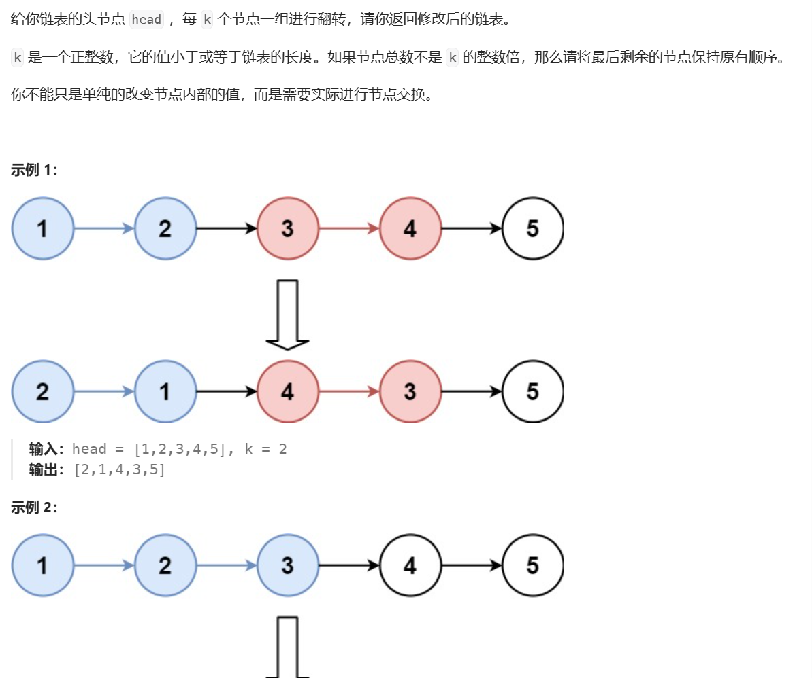


k个一组反转链表，首先要得到链表的长度，如果剩下的节点数目不够，就不进行操作了。

和上一题一样的思路，唯一要注意的是每次需更新p0（p0是开始反转节点的前一个节点），每次的p0按照观察就是上一次操作的p0.next（因为反转了过来）。如图所示第一次操作前是21435，p0是dummy节点，下一个节点是2，在将前两个反转后12435，下一个要反转43,p0应该是2，也就是上一次操作的p0.next。


```python
class Solution(object):
    def reverseKGroup(self, head, k):
        temp=head
        n=1
        # 首先找到链表的长度
        while temp.next:
            temp=temp.next
            n+=1
        index=0
        # 记录虚拟节点，防止删除第一个
        dummy = ListNode(-1)
        dummy.next = head
        p0 = dummy
        
        while n-index>=k:
            pre=None
            # 每次记录p0的下一个节点
            cnt=curr=p0.next
            # 反转k个节点的操作
            for _ in range(k):
                temp=curr.next
                curr.next=pre
                pre,curr=curr,temp
            p0.next.next=curr
            p0.next=pre
            # 更新p0
            p0=cnt
            # 每次操作完了后，递增k个
            index+=k
        return dummy.next
```

## [从链表中移除节点](https://leetcode.cn/problems/remove-nodes-from-linked-list/)

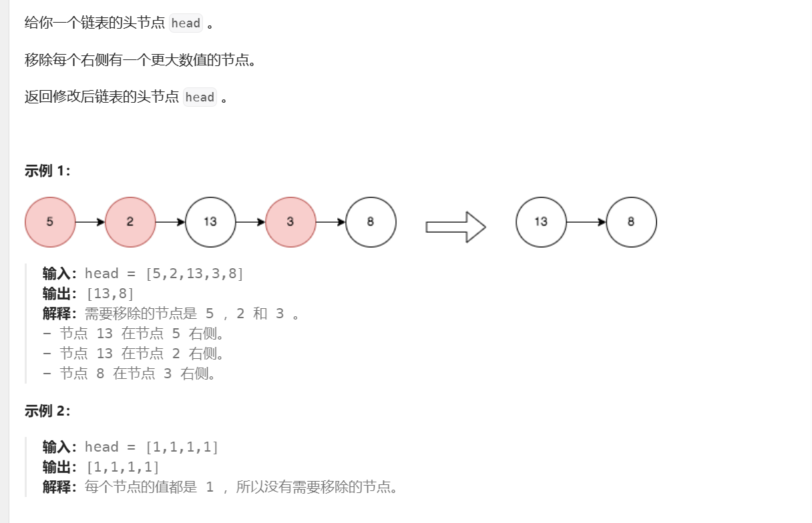


正难则反，找到右侧存在一个更大的值比较难，于是反转链表，删除小于当前节点的，最后再反转一次链表即可

```python
class Solution(object):
    def removeNodes(self, head):
        pre=None
        curr=head
        # 反转链表
        while curr:
            temp=curr.next
            curr.next=pre
            pre,curr=curr,temp
        
        head=pre
        t=head
        # 删除小于当前节点的
        while t:
            if t.next and t.next.val<t.val:
                t.next=t.next.next
                # 删掉了之后继续而不是更新节点
                continue
            t=t.next
        # 最后再反转
        pre = None
        curr = head
        while curr:
            temp = curr.next
            curr.next = pre
            pre, curr = curr,temp
        return pre
```


# 链表双指针技巧全面总结

## 删除排序链表中的重复元素

给定一个已排序的链表的头 `head` ， *删除所有重复的元素，使每个元素只出现一次* 。返回 *已排序的链表* 。

```python
class Solution(object):
    def deleteDuplicates(self, head):
        if not head:
            return None
        # 双指针，一快一慢
        slow=head
        fast=head
        while fast:
            # 通过连接不同的元素来达到删除的效果，而不是遇到相同的元素就解链子
            if fast.val!=slow.val:
                slow.next=fast
                slow=slow.next
            fast=fast.next
        slow.next=None
        return head
```


## 合并两个有序链表

```python
class Solution(object):
    def mergeTwoLists(self, list1, list2):
        p=ListNode()
        curr=p

        while list1!=None and list2!=None:
            if list1.val>list2.val:
                curr.next=list2
                list2=list2.next
            else:
                curr.next=list1
                list1=list1.next
            curr=curr.next
        if list1!=None:
            curr.next=list1
        else:
            curr.next=list2
        return p.next
```

## 合并k个升序链表

```python
'''借助优先级队列（实际上内部是堆），每次加入元素按照他们的优先级排序好'''
class ListNode(object):
    def __init__(self, val=0, next=None):
        self.val = val
        self.next = next
class Solution(object):
    def mergeKLists(self, lists):
        # list中装的是所有链表的头节点
        if len(lists) == 0:
            return None
        head = ListNode(-1)
        curr = head

        li = []
        for head_ in lists:
            if head_ != None:
                # 传入元组以第一个元素作为优先级，第二个元素是加入的值，这里是链表的头节点
                heapq.heappush(li, (head_.val, head_))

        while len(li) != 0:
            _, node = heapq.heappop(li)
            curr.next = node

            if node.next:
                # 取出头节点之后，再加入该节点所连接的下一个节点
                heapq.heappush(li, (node.next.val, node.next))
            curr = curr.next
        return head.next
```


## 分割链表

使用两个链表来储存

```python
class Solution(object):
    def partition(self, head, x):
         lesshead=ListNode()
         lessthan=lesshead
         morehead=ListNode()
         morethan=morehead
         while head:
             if head.val>=x:
                 morethan.next=head
                 morethan=morethan.next
             else:
                 lessthan.next=head
                 lessthan=lessthan.next
             head= head.next
         # 注意要把morethan的下一个连接断开
         morethan.next=None
         lessthan.next=morehead.next
         return lesshead.next
```


## 单链表倒数第k个节点

倒数的第K个节点即整数的第n-k+1个节点

单链表只能从前往后遍历，如果想找倒数的元素一般需要遍历两次，一次找出总长度一次遍历到n-k+1的位置。但是可以使用双指针技巧（初始两个指针都指向头节点），首先一个指针走k步，然后在与另一个指针走n-k步，此时前一个指针到达None，后一个指针到达n-k+1。

删除链表时需要注意头结点的情况，如果有5个节点，要删除倒数第5个节点，按照理论需要找到倒数第6个，但此时倒数第6个不存在，因此使用虚拟头节点，虚拟头节点的时候不会影响倒数的个数，因为是加在头节点之前的。

```python
'''给你一个链表，删除链表的倒数第 n 个结点，并且返回链表的头结点。'''
class ListNode(object):
    def __init__(self, val=0, next=None):
        self.val = val
        self.next = next

class Solution(object):

    def removeNthFromEnd(self, head, n):
        dummy = ListNode(0)
        dummy.next = head
        p1, p2 = dummy, dummy
		
        # 要删除倒数第K个节点，首先要找到倒数第K+1个节点
        for _ in range(n + 1):
            p1 = p1.next

        while p1:
            p1 = p1.next
            p2 = p2.next

        p2.next = p2.next.next
        return dummy.next

```

## 单链表的中点

使用一快一慢的两个指针

```python
'''给你单链表的头结点 head ，请你找出并返回链表的中间结点。	
如果有两个中间结点，则返回第二个中间结点。'''
class Solution(object):
    def middleNode(self, head):
        slow=head
        fast=head
        while fast and fast.next:
            # 慢的走一步快的走两步
            slow=slow.next
            fast=fast.next.next
        return slow
```

## 判断链表是否包含环

使用双指针，如果fast遇到空指针说明不是环，如果快指针等于慢指针说明前者超过后者一圈。

```python
class Solution(object):
    def middleNode(self, head):
        slow=head
        fast=head
        while fast and fast.next:
            # 慢的走一步快的走两步
            slow=slow.next
            fast=fast.next.next
        	if fast==slow:
				return True
        return False
```

## 计算环起点


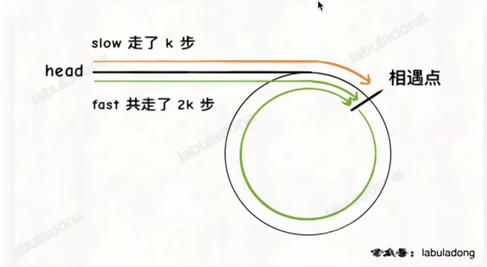

由图可得，K是环的长度的整数倍

假设环的起点到相遇点的距离是m，那么从起点到环起点和相遇点到环起点的距离是相同的k-m

让慢节点从头开始，快节点继续从相遇点出发，以相同的速度，一旦相遇就是环起点

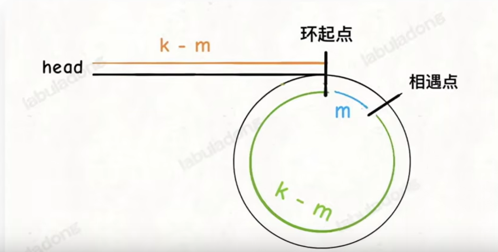

```python
class ListNode(object):
    def __init__(self, x):
        self.val = x
        self.next = None

class Solution(object):
    def hasCycle(self, head):
        slow=head
        fast=head
        while fast and fast.next:
            slow=slow.next
            fast=fast.next.next
            if slow==fast:
                break
        # 始终未相遇
        if not (fast and fast.next):
            return None
        # 慢节点从头开始，快节点继续
        slow=head
        while fast!=slow:
            fast=fast.next
            slow=slow.next
        return fast
```

## 两个链表是否相交

使用双指针技巧，但是两个链表相交前的节点个数不同，双指针无法同步，于是把他们拼接起来。

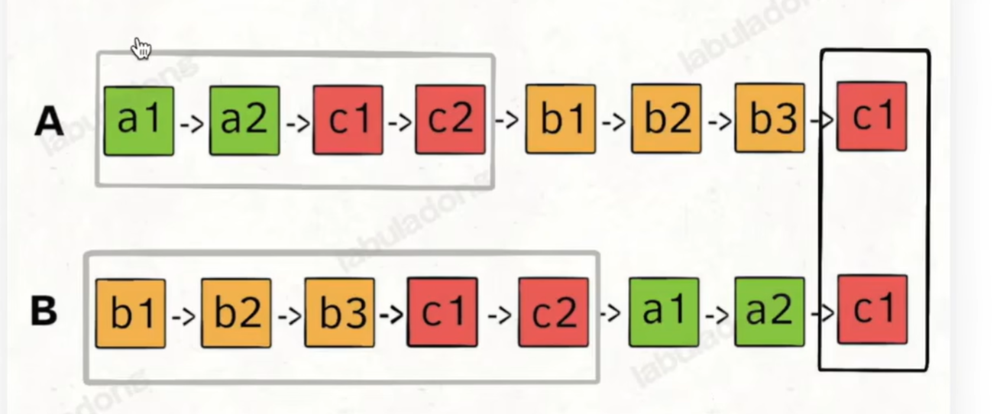

```python
# Definition for singly-linked list.
# class ListNode(object):
#     def __init__(self, x):
#         self.val = x
#         self.next = None

class Solution(object):
    def getIntersectionNode(self, headA, headB):
        a=headA
        b=headB
        while a!=b:
            if a :
                a=a.next
            else:
                a=headB
            if b:
                b=b.next
            else:
                b=headA
        return a
```

# 数组双指针题型汇总

## 删除有序数组中的重复项

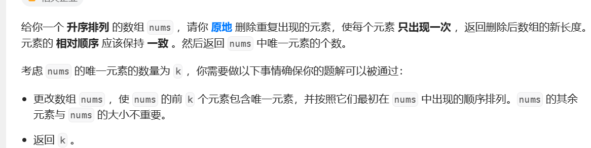

原地指的是不额外创建O(n)空间

使用双指针技巧，一个快指针在前面遍历数组，一个慢指针留在原地。数组的双指针就是下标。

```python
class Solution(object):
    def removeDuplicates(self, nums):
        slow=0
        fast=0
        # 遍历一次足以
        while fast<len(nums):
            # 一旦遇到不同的值，更新慢指针
            if nums[slow]!=nums[fast]:
                slow+=1
                nums[slow]=nums[fast]
            fast+=1
        return slow+1
```

## 移除元素

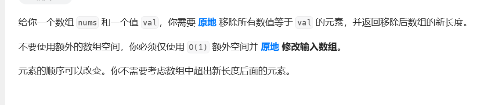

```python
class Solution(object):
    def removeElement(self, nums, val):
        slow=0
        for fast in range(len(nums)):
            # 记录所有不是val的值
            if nums[fast]!=val:
                nums[slow]=nums[fast]
                slow+=1
        return slow
```

## 移动零

给定一个数组 `nums`，编写一个函数将所有 `0` 移动到数组的末尾，同时保持非零元素的相对顺序。

**请注意** ，必须在不复制数组的情况下原地对数组进行操作。

利用双指针将所有的零元素删除，然后再末尾加上相应的零元素。

```python
class Solution(object):
    def moveZeroes(self, nums):
        slow=0
        fast=0
        while fast<len(nums):
            if nums[fast]!=0:
                nums[slow]=nums[fast]
                slow+=1
            fast+=1
        nums[slow:]=[0]*(len(nums)-slow)
        return nums
```

## 两数之和

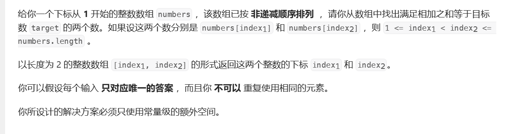

左右指针，一个在开头一个在末尾，满足一定的条件移动

```python
class Solution(object):
    def twoSum(self, numbers, target):
        left=0
        right=len(numbers)-1
        while True:
            # 计算和
            sum=numbers[left]+numbers[right]
            # 判断一些列条件
            if sum>target:
                right-=1
            elif sum<target:
                left+=1
            else:
                return [left+1,right+1]  
```

## 反转字符串

编写一个函数，其作用是将输入的字符串反转过来。输入字符串以字符数组 `s` 的形式给出。

不要给另外的数组分配额外的空间，你必须**[原地](https://baike.baidu.com/item/原地算法)修改输入数组**、使用 O(1) 的额外空间解决这一问题。

同样使用左右指针技巧。

```python
class Solution(object):
    def reverseString(self, s):
        left = 0
        right = len(s) - 1
        while left <= right:
            temp = s[left]
            s[left] = s[right]
            s[right] = temp
            right -= 1
            left += 1
        return s
```

## 最长回文字符串

给你一个字符串 `s`，找到 `s` 中最长的回文子串。

如果字符串的反序与原始字符串相同，则该字符串称为回文字符串。

左右指针，不过是从中间往两边扩展，一种特殊的方法，最长回文字符串分为偶数和奇数，函数pendling同时考虑二者

```python
class Solution(object):   
    def pendling(self, s, l, r):
        while l >= 0 and r < len(s) and s[l] == s[r]:
            l -= 1
            r += 1
           
        # 最后退出的条件是s[l]!=s[r]或是l<0，因此返回的结果是[left+1,right)防止包括不满足的字符和越界
        return s[l + 1:r]

    def longestPalindrome(self, s):
        if len(s) <= 1:
            return s
        
        res = ''
        # 同时考虑奇数和偶数
        for i in range(len(s)):
            # 奇数情况
            temp = self.pendling(s, i, i)
            if len(temp) > len(res):
                res = temp
            # 偶数情况
            temp = self.pendling(s, i, i + 1)
            if len(temp) > len(res):
                res = temp
        
        return res
```


# 实现缓存策略的数据结构

## LRU

LRU算法是一种缓存淘汰策略，按照访问时间来淘汰。

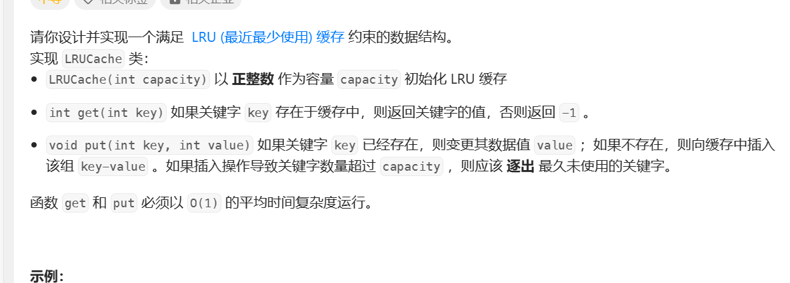

要求删除最晚使用的，则需要数据结构具有顺序顺序，要求get和put的时间复杂度为O(1)，即查找和加入要十分快，即可以快速找到某个key对应的val，以及能在任意位置快速的插入删除元素。哈希表查找很快但是数据没有固定的顺序，双向链表在任意位置插入删除快但是查找慢，因此将二者结合起来，使用双向链表作为数组的存储形式，用哈希表作为索引。

```python
# 节点的数据结构
class node:
    def __init__(self, k,v):
        self.key=k
        self.val=v
        self.prev=None
        self.next=None
        
# 选择使用双向链表
class Doublelinklist:
    
    # 双向链表加入头节点和尾节点方便操作
    def __init__(self):
        self.head=node(0,0)
        self.tail=node(0,0)
        self.head.next=self.tail
        self.tail.prev=self.head
        self.size=0
    
    # 加入，注意头节点尾节点不做为真正的数据
    def addlist(self,x):
        self.size+=1
        x.prev=self.tail.prev
        self.tail.prev.next=x
        x.next=self.tail
        self.tail.prev=x
        
    # 删除
    def remove(self,x):
        x.prev.next=x.next
        x.next.prev=x.prev
        self.size-=1
    
	# 删除第一个
    def removeFirst(self):
        if self.head.next==self.tail:
            return None
        curr=self.head.next
        self.remove(curr)
        return curr
    
    # 返回节点数目
    def size_(self):
        return self.size

    
class LRUCache:
    
    def __init__(self,capacity):
        # 哈希表作为映射索引，注意再操作时要同时更新哈希表
        self.hashmap={}
        # 双向链表储存数据
        self.db=Doublelinklist()
        self.cap=capacity
    
    # 将节点更新为最近使用的，删除后加入即可
    def makeRecently(self,k):
        x=self.hashmap.get(k)
        self.db.remove(x)
        self.db.addlist(x)
    
    # 加入
    def addRecently(self,k,val):
        x=node(k,val)
        self.hashmap[k]=x
        self.db.addlist(x)
    
    # 删除
    def removeRecently(self,k):
        x = self.hashmap.get(k)
        self.db.remove(x)
        del self.hashmap[k]
    
    # 当链表满了的时候，删除最晚使用的
    def removeLeastRecently(self):
        first=self.db.removeFirst()
        if first:
            del self.hashmap[first.key]

    # 获取
    def get(self,k):
        x = self.hashmap.get(k)
        # 不存在
        if not x:
            return -1
        self.makeRecently(k)
        
        return x.val
    
    # 放入
    def put(self,key,val):
        
        # 如果存在，删除再加入即可
        if key in self.hashmap:
            self.removeRecently(key)
            self.addRecently(key,val)
            return
        
        # 如果已满，删除最晚的再加入
        if self.db.size_()>=self.cap:
            self.removeLeastRecently()    
        self.addRecently(key,val)
```

## LFU

LFU要求是每次淘汰访问频率最少的。

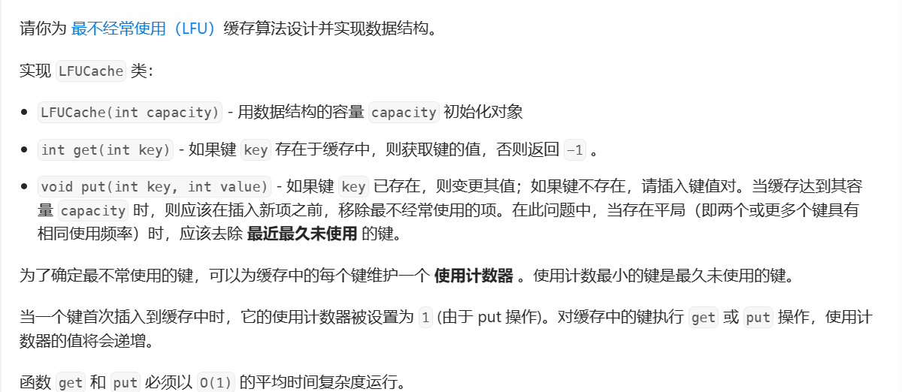

重点在于三个映射表

```python 
# 默认字典，当访问不存在的键时，会自动创建该键，并以给定的默认值作为键的值
from collections import defaultdict
# 有序字典，根据加入顺序排序
from collections import OrderedDict

class LFUCache:
    def __init__(self,capacity):
	# get(key)要求时间复杂度为O(1)，设置键值对
        self.kv={}
        # 一旦使用get或是put访问key，该key对应的频率就要增加，设置键频率表
        self.kf={}
        # 当容量满了的时候删除频率最小的，同时可能有多个频率最小的，使用频率对应的键，有序字典作为值(可以储存多个值并且保留顺序还能快速查找)，
        self.fk=defaultdict(OrderedDict)
        self.cap=capacity

    def get(self,key):

        # 如果这个键存在，增加频率并返回相应的值
        if key in self.kv:

            self.increasefreq(key)
            return self.kv[key]

        return -1

    def increasefreq(self,k):

        freq=self.kf[k]
        # 频率加一
        self.kf[k]+=1

        # 删除这个频率对应的有序字典的键
        del self.fk[freq][k]
        # 如果这个频率对应的字典空了，删除
        if not self.fk[freq]:
            del self.fk[freq]

        freq+=1
        # 在更新后的频率对应的字典中添加k对应的键（默认字典，不存在则创建）,值不重要
        self.fk[freq][k]=None

    def put(self,key,val):

        if key in self.kv:
            # 更新值
            self.kv[key]=val
            self.increasefreq(key)
            return

        # 如果已满
        if len(self.kv)>=self.cap:
            self.removemin()
        self.kv[key]=val
        self.kf[key]=1
        self.fk[1][key]=None

    def removemin(self):
        # 找出最小的频率
        minfreq=min(self.fk)
        # 返回对应的有序字典中的第一个，只取键不去值
        key,_ =self.fk[minfreq].popitem(last=False)

        del self.kv[key]
        del self.kf[key]
```


