# 数据结构和算法

## 估算算法效率和时间复杂度

时间复杂度是用来体现算法的运行的快慢的，这是一个通用的表示，不会因为硬件的差异而不同，可以形象的比较时间的快慢，时间复杂度越高运行慢。

常见的时间复杂度如下：


```python
#O(1)，对于基本的操作，加减乘除打印等时间消耗为1时间单位
print('hello world')
#O(n)，大约会运行n次
for i in range(10):
    print('hello world')
#O(n^2)两层嵌套
for i in range(10):
    for j in range(10):
        print('hello world')
#O(n^3)三层嵌套
for i in range(10):
    for j in range(10):
        for k in range(10):
            print('hello world')
#并非是O(3)，O(1)代表的是一个单位，打印一次和多次没有区别，只要规模不上升到n的程度，结果就还是O(1)，时间复杂的大约是一个大约
print('hello world')
print('hello world')
print('hello world')
#并非O(n+n^2)，时间复杂度表示大约n^2大于n，只留下大单位，O(n^2)
for i in range(10):
    print('hello world')
    for j in range(10):
        print('hello world')
```

开苏判断时间复杂度的方法（适用于大部分简单的情况）：

+ 确定问题的规模n
+ 循环减半->logn
+ k层关于n的循环->n^k

复杂的情况要根据算法的执行过程具体判断。

递归函数的时间复杂度：递归树的节点*每一个节点操作的时间复杂度。

一些不太明显的算法，比如滑动窗口，每次两个指针只有前进没有后退，时间复杂度是O（n）

## 空间复杂度

用来评估算法内存的的占用大小。

时间复杂度和空间复杂度的计算完全一样，讨论算法的时候时间比空间更重要，因为随着时间的发展内存越来越先进，大部分算法都有一个规则叫做”空间换时间“，牺牲空间来换取时间。

递归函数的空间复杂度是递归树的深度加上每次操作开的空间。

## 递归

递归有两个特点：

+ 调用自己
+ 结束条件


### 实例：汉诺塔问题


在小圆盘上不能放大圆盘，一次只能移动一个圆盘，只有三根柱子。

当只有两个圆盘时，小的移动到B，大的移动到C，然后小的再移动到C上。

递归的思想是将上面的n-1个盘子视为一个整体，最下面的视为另一个，接下来：

+ 把n-1个盘子从A经过C移动到B
+ 把第n个盘子从A移动到C
+ 把n-1个盘子从B经过A移动到C

其中只有第二步是移动一个盘子，第一步和第三步是移动n-1个盘子，但是比原问题规模小了1

```python
#h(x)=2h(x-1)+1
#n表示盘子的数量,abc表示柱子，从a经过b移动到c
def hanio(n,a,b,c):
    #终止条件是n=0也就是说没有盘子的时候
    if n>0:
        #把n-1个盘子从A经过C移动到B
        hanio(n-1,a,c,b)
        #把第n个盘子从A移动到C
        print("moving from %s to %s"%(a,c))
        #把n-1个盘子从B经过A移动到C
        hanio(n-1,b,a,c)
hanio(3,'A','B','C')
moving from A to C
moving from A to B
moving from C to B
moving from A to C
moving from B to A
moving from B to C
moving from A to C
```

## 列表查找

### 顺序查找

顺序查找也叫线性查找，从列表第一个元素开始，顺序进行搜索，直到查找到元素或是到列表最后一个元素为止。

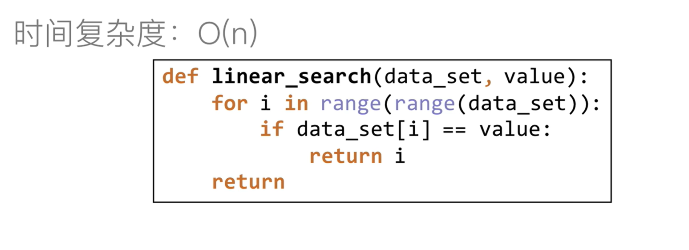

### 二分查找

又叫折半查找，从有序列表的初始候选区li[0:n]开始，通过对待查找的值与候选区中间值的比较，可以使候选区减少一半，时间复杂度为O(logn)

```python
def binary_search_new(li,val):
    #定义一个左顶点
    left=0
    #定义一个右顶点
    right=len(li)-1
    #循环成立的条件是候选区有值
    while left<=right:
        #中间的位置
        mid=(left+right)//2
        #以下是三种情况，每当大于或者是小于的时候，左顶点或者右顶点都要移动到mid的左侧/右侧
        if li[mid] ==val:
            return mid
        elif li[mid]>val:
            right=mid-1
        if li[mid]<val:
            left=mid+1
    #找不到返回-1
    return -1
```

列表内置函数index()使用的是顺序查找，因为线性查找要求是二分查找。	

## 排序(3个较低的算法)

### 冒泡排序

时间复杂度为O(n^2)，对于传入n=10000，大概需要十秒运行，一般的电脑每秒运行 10^7

列表每两个相邻的数，如果前面的比后面的大，则交换这两个数。

一趟列表排完，无序区域减少一个数，有序区域增加一个数。

```python
li=[1,3,32,3,543,7,43,124,436,2]
for i in range(len(li)):
    for j in range(len(li)-1-i):
        if li[j]>li[j+1]:
            li[j+1],li[j]=li[j],li[j+1]
print(li)
```


### 选择排序

每次遍历列表取出其中最小的数。

建立有序区和无序区的概念。

```python
#多生成一个列表，占用内存
#复杂度包括其中remov和min都是要遍历一边的操作，时间复杂度为O(n^2)
def select_sort(li):
    new_list=[]
    for i in range(len(li)):
        min_val=min(li)
        new_list.append(min_val)
        li.remove(min_val)
    return new_list
def select_sort_batter(li):
    #执行的次数，最后一次不用执行一定是最大的，同时i也代表无序区的开始
    for i in range(len(li)-1):
        #初始化无序区最小的位置为无序区的开端,蛮重要的一步
        min_loc=i
        #遍历无序区
        for j in range(i+1,len(li)):
            #如果小于的话就交换，会找到无序区中最小的元素
            if li[j]<li[min_loc]:
                min_loc=j
        #最后将无序区最小的值作为无序区第一个值，下一次循环会改变无序区的位置
        li[i],li[min_loc]=li[min_loc],li[i]
    return li

list=[2,3,4,2,1,5,7,3,9,6,7]
print(select_sort_batter(list))
```

### 插入排序

有序区只有一个元素，每次从无序区中选择一个元素然后插入有序区。	

```python
#时间复杂度为O(n^2)
def insert_sort(li):
    #无序区从1开始
    for i in range(1,len(li)):
        #保存拿到的值
        tem=li[i]
        #每一次遍历都会插入一个元素，j作为有序区最后一个元素的开端
        j=i-1
        #遍历有序区，要插入的元素小于有序区的元素，就把所有的有序区元素右移一位
        while li[j]>tem and j>=0:
            li[j+1]=li[j]
            j-=1
        #如果拿的元素大于所指有序去的元素，退出循环然后将拿的元素插到所指元素的后一位
        #或者如果拿的元素小于所有的有序区元素的话，也就是J的索引指到 -1，就把拿的元素放到最前端，有序区元素都往后移一位
        li[j+1]=tem
    return li
```

## 快速排序

快速排序思路：

+  取一个元素p（一般取第一个元素），使元素p归位（左边的元素小于p，右边的元素大于p）
+ 递归完成排序

```python
#时间复杂度为O(n)，因为从两边往中间扫
def partition(data,left,right):
    #先暂存这个数，注意要存为left
    temp=data[left]
    #只要区间里面有值
    while left<right:
        #因为把第一个元素作为用来划分的值，第一个空位在左边，从右边开始寻找小于的值填到左边，只要大于等于就递减并且保证区间有效
        while data[right]>=temp and right>left:
            right-=1
        #填上左边的空位
        #如果右边的值全都大于要划分的值,left就会等于right,while循环就会都退出,下面的赋值就会使自身赋值
        data[left]=data[right]
        #现在右边出现了一个空位，从左边寻找值
        while data[left]<=temp and left<right:
            left+=1
        data[right]=data[left]
    #当left和right相等时，就是划分用的值要填充的位置也就是mid
    data[left]=temp
    #返回mid
    return left

def quick_sort(data,left,right):
     #列表区域至少有两个元素
    if left<right:
        #对区间安置排序
        mid=partition(data,left,right)
        #对右半部分
        quick_sort(data,mid+1,right)
        #对左半部分
        quick_sort(data,left,mid-1)
    return data
li= [5,7,4,6,3,1,2,9,8]
print(quick_sort(li,0,len(li)-1))
```

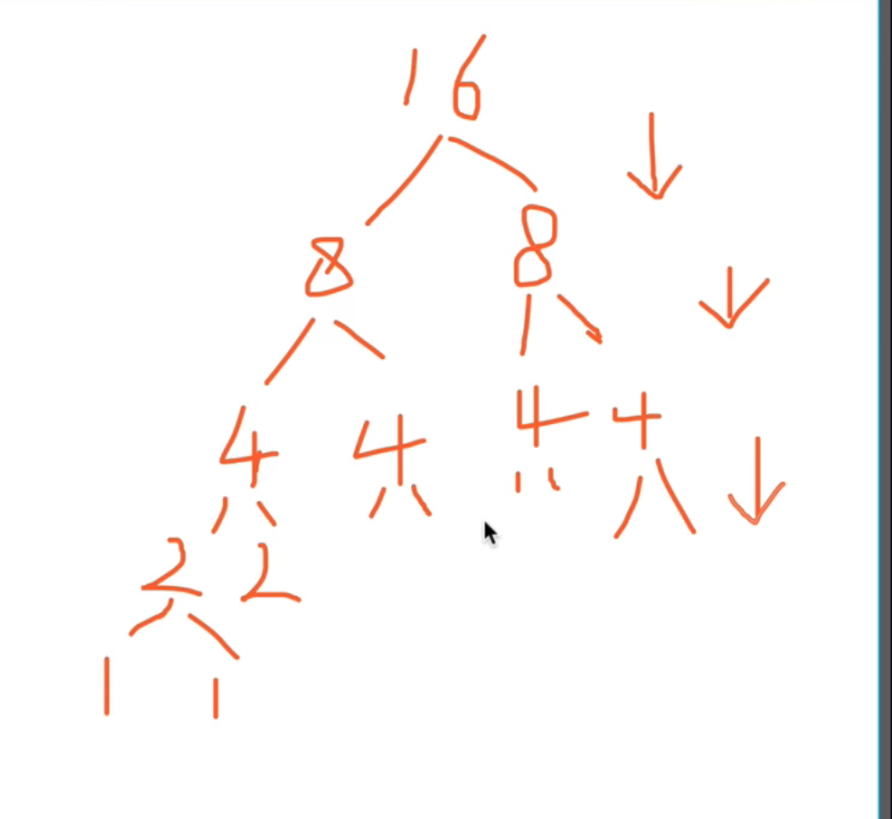

快速排序每次划分为两个部分，其中进行一次partition划分logn次，时间复杂度为nlog(n)

最坏的情况是n^2:如果列表是[9,8,7,6,5,4,3,2,1]

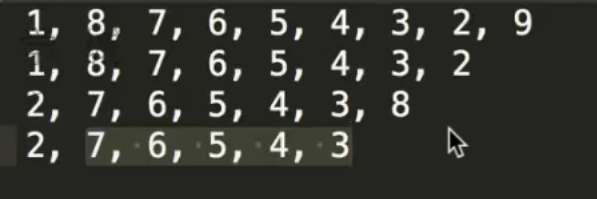

每次调用时只会减少一个数，做不到减半,时间复杂度为n^2，想要改变的话可以选择划分区域时随机选择一个数，而不是从头开始，因此可以随机找一个数然后与第一个数交换即可。

注意函数递归是由最大深度的，一般是999可以使用sys模块下的sys.setrecrusionlimit(n)来改变。

对于比较大的数据量，不能一直选取第一个数，需要随机选择

```python
import random

input()
li = list(map(int, input().split()))
n = len(li)

def quick_sort(arr):
    if len(arr) <= 1:
        return arr
    index = random.randint(0, len(arr) - 1)
    temp = arr[index]
    left = [x for x in arr if x < temp]
    right = [x for x in arr if x > temp]
    mid = [x for x in arr if x == temp]
    return quick_sort(left) + mid + quick_sort(right)


a=quick_sort(li)
for l in a:
    print(l, end=' ')
    
```


## 堆排序

### 树与二叉树

树是一种数据结构，树是由n个节点组成的集合，如果n=0则是一个空树，如果n>0则存在一个节点作为树的根节点，其他节点可以分为m个集合，每个集合本身又是一棵树。不能再分的节点称为叶子节点，树的深度就是层数，树的度就是整个树中最大的度，节点的度就是它分了几个岔。

二叉树就是度不超过2的树，每个节点最多有两个子节点。

满二叉树：每一层的节点数都达到最大值

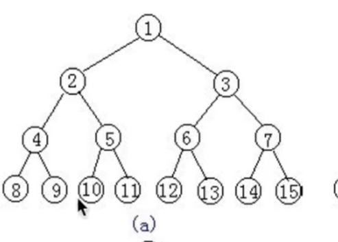

完全二叉树：是满二叉树最下一层没有满，但缺少的部分必须是右边的	


二叉树的存储方式：

顺序储存方式 使用列表来存,表示方法是[9 8 7 6 5 0 1 2 4 3 ]如下图，这应该是理解堆排序重要的的一部，使用父节点和子节点之间的关系来找。

父节点和左子节点的下标之间有：i->2i+1

父节点和右子节点下表之间有:i->2i+2

### 堆

堆是一种特殊的完全二叉树且应满足以下两个之一：

+ 大根堆：一棵完全二叉树，满足任意节点都比其他子节点大。

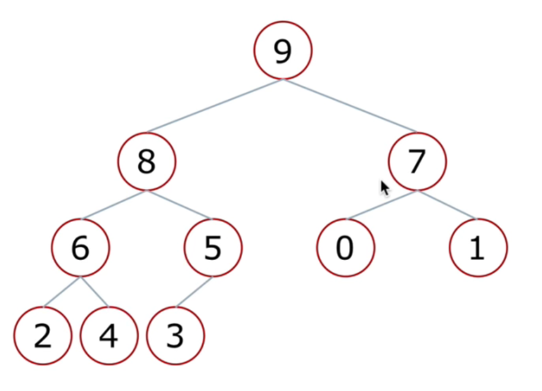

+ 小根堆：与大根堆相反。

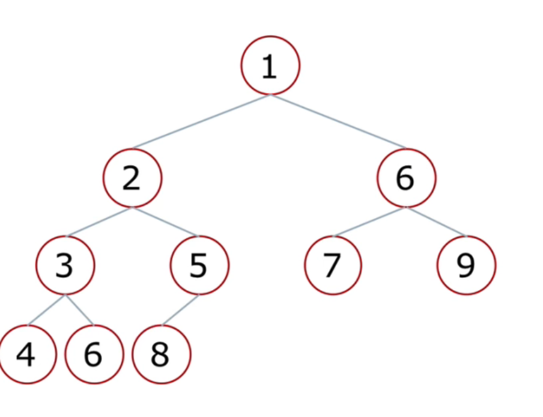

堆的性质：假设节点的左右子树都是堆，但自身不是堆，如下不满足大根堆：

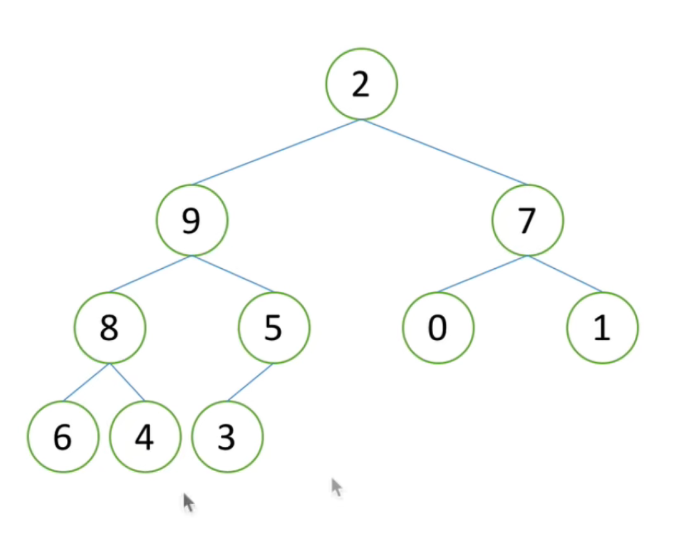

此时可以通过一次向下调整过程来将其变换为一个堆，将2提出，从子节点中选取满足的9上移，9的位置再由它的子结点和2中满足的替代……

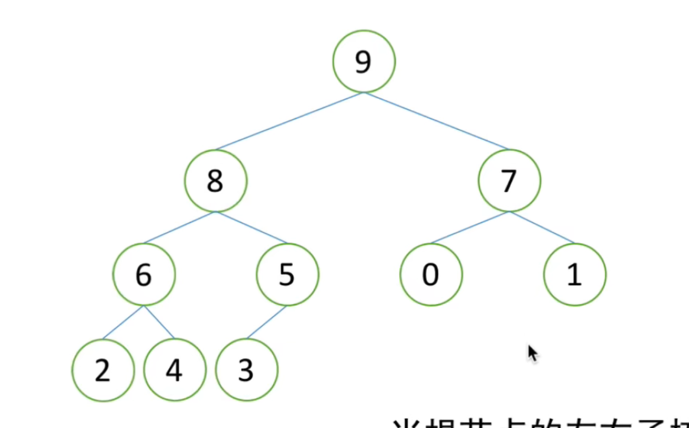

### 堆排序过程

+ 用一个数列建立一个未排序的堆，然后对每个叶子节点部分调整，从而得到排序的堆
+ 挨个出数，取出堆顶的元素，在将最后一个元素放到堆顶，不能直接将下一层的最大数放到堆顶，这会导致出现一个空位破坏完全二叉树。
+ 进行一次向下调整，将堆变为合法的堆，从而使得堆顶的元素为最大值
+ 重复第二和三步

```python
'''调整的函数'''
#时间复杂度为log(n),有一个这般的过程，每次从两个树中选一个进行
def sift(li ,low ,high):
    ''''low指的是堆顶的元素，high是最后一个元素'''
    i=low#i最开始指向根节点
    j=2*i+1#j开始是左子节点
    temp=li[low]#取得堆顶
    while j<=high:#保证j位置有数
        if j+1<=high and li[j+1]>li[j]:#右子树有数并且大于左子树
            j=j+1
        if li[j]>temp:#子树的值更大，i位置的值等于j位置的值，并且更新j
            li[i]=li[j]
            i=j
            j=2*i+1
        else:#不然的话就退出
            li[i]=temp
            break
    else:#找的元素都大于堆顶元素则把堆顶元素放在叶子节点上
        li[i]=temp
'''时间复杂度为nlog(n)'''
def heap_sort(li):
    n=len(li)
    #建立堆，调整叶子节点，i代表的是每个叶子节点
    for i in range((n-2)//2,-1,-1):
         #调整函数中的high全部设置为整个堆的最后一个元素，因为high是用来判断有没有超出边界，而整个对的最后一个元素可以完全满			足判断
         #根据叶子节点很难找出相应的最后一个元素
        sift(li,i,n-1)
    '''挨个出数，为了节省内存不会再创建一个列表，每次提出的最大的数与最后一个元素交换位置'''
    for i in range(n-1,-1,-1):
        #i代表的是最后一个元素
        li[0],li[i]=li[i],li[0]
        sift(li,0,i-1)#交换位置后，再次调整获得最大值，high的位置应该提前一位保证不影响提出的最大值
li=[i for i in range(100)]
import random
random.shuffle(li)
print(li)
heap_sort(li)
print(li)
```

### topk问题

topk问题是指从n个元素中选择前k大个数：以下是三种解决方案

+ 排序后切片：nlog(n)
+ 排序k次：kn，比如冒泡排序每次排序都会提出列表中最大的元素，排序k次即可
+ 堆排序：nlog(k)，从原列表中中取前k个元素，组成一个小根堆，然后依次从之后的列表中提取元素与小根堆的堆顶进行比较，此时的堆顶意味着前k个元素中第k大的元素，后面的元素如果小于则不考虑，反之替换小根堆堆顶，然后调整一次。最后得到的堆就是目前前k大的元素。

```python
#调整小根堆的函数
def sift(li,low ,high):
    i=low
    j=2*i+1
    temp=li[low]
    while j<=high:
        if j+1<=high and li[j+1]<li[j]:
            j+=1
        if li[j]<temp:
            li[i]=li[j]
            i=j
            j=2*i+1
        else:
            li[i]=temp
            break
    else:
        li[i]=temp
def topk(li,k):
    heap=li[0:k]#选取前k个
    for i in range((k-2 )//2,-1,-1):#建立堆
        sift(heap,i ,k-1)
    for i in range(k,len(li)-1):#往后逐个比较
        if li[i]>heap[0]:
            heap[0]=li[i]
            sift(heap,0,k-1)
    for i in range(k-1,-1,-1):#逐个出数
        heap[0],heap[i]=heap[i],heap[0]
        sift(heap,0,i-1)
    print(heap)
import random
li=list(range(1000))
random.shuffle(li)
topk(li,10)
```

## 归并排序

归并：假设现在的列表分两段有序，将它们合成为一段有序的列表称为归并。

具体过程是从两个列表头开始，依次比较，较小的出来然后指针然后后移，之后再比较。

```python
def merge(li,low,mid,high):
    '''low：左列表起始位置 mid左列表终止位置 high右列表终止位置'''
    i=low
    j=mid+1
    new_li=[]#临时存储列表
    while i<=mid and j<=high:
        if li[i]<li[j]:#左边值小
            new_li.append(li[i])
            i+=1
        else:
            new_li.append(li[j])#右边值小
            j += 1
    while i<=mid:#左边列表有剩余
        new_li.append(li[i])
        i+=1
    while j<=high:#右边列表有剩余
        new_li.append(li[j])
        j+=1
    li[low:high+1]=new_li#还原原列表
li=[2, 4 ,5 ,7 ,1 ,3 ,6,8]
merge(li,0,3,7)
print(li)
```

将列表越分越小，直到只有一个元素，一个元素是有序的，之后合并两个列表，把列表越合越大。


```python
def merge_sort(li,low,high):#时间复杂度为nlog(n)
    if low<high:#只要有元素
        merge_sort(li,low,(low+high)//2)#对左区间排序
        merge_sort(li,(low+high)//2+1,high)#对右区间排序
        merge(li,low,(low+high)//2,high)#归并
li=list(range(1000))
import random
random.shuffle(li)
print(li)
merge_sort(li,0,len(li)-1)
print(li)
```

归并排序需要额外的内存开销。

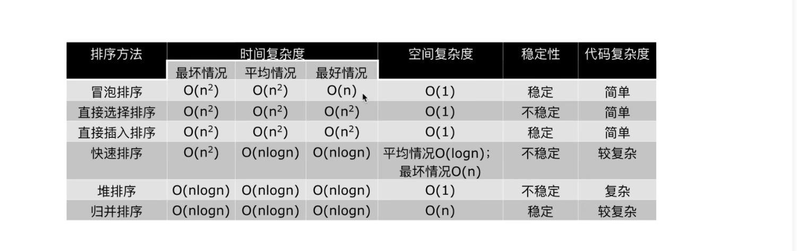

稳定性指的是两个相同的元素在排完序后，其相对位置不变。

## 希尔排序

希尔排序是一种分组插入排序法，首先取一个整数d1=n//2，把元素分为d1组，每组中的元素是由原列表中距离为d1元素构成的，再取第二个数，d2=d1//2，重复上述过程，直到dn=1。希尔排序每趟并不使某些元素有序，而是使整体元素越来越趋向于有序，最后一趟使得所有数据有序。

比如说58492167，八个数分为4组，52 81 46 97

```python
def insert_sort_gap(li,gap):
    for i in range(gap,len(li)):
        j=i-gap
        temp=li[i]
        while j>=0 and li[j]>temp:
            li[j+gap]=li[j]
            j-=gap
        li[j+gap]=temp
def shell_sort(li):
    n=len(li)//2
    while n>=1:
        insert_sort_gap(li,n)
        n=n//2
li=list(range(1000))
import random
random.shuffle(li)
print(li)
shell_sort(li)
print(li)
```

希尔排序的时间复杂度和gap的选取有关，上述的gap使得时间复杂度为${n}/2^k$

## 计数排序

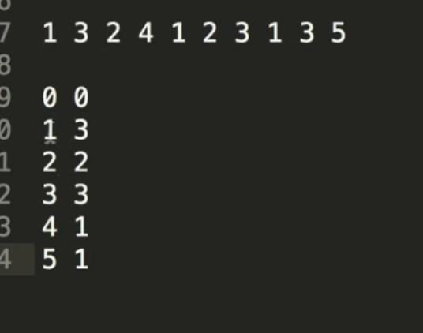

已知列表的范围，对每个元素的出现的次数进行计数，最后根据计数求出应有的范围。

```python
#时间复杂度为o(n)
def count_sort(li,max_count=100):
    count=[0 for _ in range(max_count+1)]#创造一个列表，初始化元素都为0
    for val in li:#对每个元素进行计数，索引为元素值，索引所对的值为元素的个数
        count[val]+=1
    li=[]#清空原列表
    for index ,val in enumerate(count):
        #val个index
        for i in range(val):
            li.append(index)
    return li
li=list(range(100))
import random
random.shuffle(li)
print(li)
print(count_sort(li,99))
```

注意需要已知范围，比如年龄之类的，并且消耗内存。

## 桶排序

同样是知道区间，桶排序是当区间比较大的时候，把元素装到不同的桶里，在对每个桶中的元素做排序。

```python
def bucket_sort(li,n=100,max_num=10000):#桶的数目，和最大值
    buckets=[[] for _ in range(n)]#创建一个二维列表，其中每个列表代表一个桶
    for val in li:
        i=min(val//(max_num//n),n-1)#利用整除判断每个元素值属于那个桶，遇到最大值时，痛的数目不够用，因此放到最后一个桶中
        buckets[i].append(val)#先加入再排序（利用冒泡排序）
        for j in range(len(buckets[i])-1,0,-1):#不能到-1，否则会和最后一个元素比较
            if buckets[i][j]<buckets[i][j-1]:
                buckets[i][j],buckets[i][j-1]=buckets[i][j-1],buckets[i][j]
            else:#列表中已有的元素已经是排好序的，如果不满足条件则退出
                break
    sorted_li=[]
    for buc in buckets:
        sorted_li.extend(buc)
    return sorted_li
li=list(range(10000))
import random
random.shuffle(li)
print(li)
print(bucket_sort(li))
```

## 基数排序

是桶排序的进阶，按照多关联值的方式排序，这是一种稳定的排序，相同的数之间不会改变顺序。按照位数进行排序，每一次排完序，对应位数的次序是排好的，但下一位数是不确定的，下一次再排序的时候，按照之前排好的次序遍历，根据下一位数加入新的桶，再这个过程中顺序慢慢的形成。

```python
def radix_sort(li):#时间复杂度为O(kn)，其中K是最大数的位数，其速度快于快速排序，如果最大数的位数很大，其速度可能慢于快排
    max_num=max(li)#找出最大的值，其他的元素补0
    it=0#代表迭代次数
    while 10**it<=max_num:#迭代次数满足元素的位数
        buckets=[[] for _ in range(10)]
        for var in li:
            digit=(var//10 ** it)%10#找到相应的位数
            buckets[digit].append(var)
        li=[]#清空
        for buc in buckets:
            li.extend(buc)#extend用来添加列表的元素，而非直接添加列表
        it+=1
    return li
li=list(range(10000))
import random
random.shuffle(li)
print(li)
print(radix_sort(li))
```

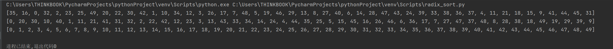

# 数据结构

数据结构按照逻辑可以分为线性结构，树结构（一对多），和图结构（多对多）

## 列表

列表的元素是顺序存储的。

C的数组中使用下标查找元素时，时间复杂度为O(1)，其并非把数组遍历一遍，而是根据索引计算该元素的内存地址，比如一个整数占四个字节，查找整数数组中的第三个元素，传入索引2，会将首地址加上2*一个整数所占的字节。

python中的列表与数组不同，数组要求其中的元素类型都相同，数组长度固定。列表中可以是不同的类型，其中存储的是每个元素的地址，使用索引查找的时候，依旧是通过首地址加法运算取得值，不过此时的值是地址，然后再通过地址找到真正的元素值。列表的长度可以扩充类似于C++中的向量，在添加元素的时候，申请一块新的内存然后，把之前列表复制过来，新的内存长度不止是原内存长度加一，而可能是加倍。

append的时间复杂度是O(1)，但如果储存空间不够的话，时间复杂度为O(n)

插入和删除对列表都是O(n)的复杂度。

## 栈

只能在一段进行插入和删除的列表，后进先出：


栈的实现：

```python
class stack:
    def __init__(self):
        self.stack=[]
    def pop(self):
        return self.stack.pop()
    def get_pop(self):
        if len(self.stack)>0:
            return self.stack[-1]
        else:
            return None
    def push(self,ele):
        self.stack.append(ele)
```

栈的的一个实例应用：用来判断括号是否匹配。函数中如果是左括号加入栈，右括号不加入堆，只是用来匹配。	

```python
def brace_match(str):
    stack=Stack()
    match={')':'(','}':'{',']':'['}#使用字典来表示与右括号匹配的
    for  s in str:#遍历每一个元素
        if s in ['[','{','(']:#如果是左括号，加入
            stack.push(s)
        else:
            if stack.is_empty():#栈是空的，没人匹配
                return False
            elif stack.get_pop()==match[s]:#如果栈顶元素与右括号匹配，弹出
                stack.pop()
            else:
                return False
    if stack.is_empty():#如果是空的说明全部匹配
        return True
    else:
        return False
```

## 队列

一端进行插入另一端进行删除的数据集合，插入端为队尾，删除端为队首。

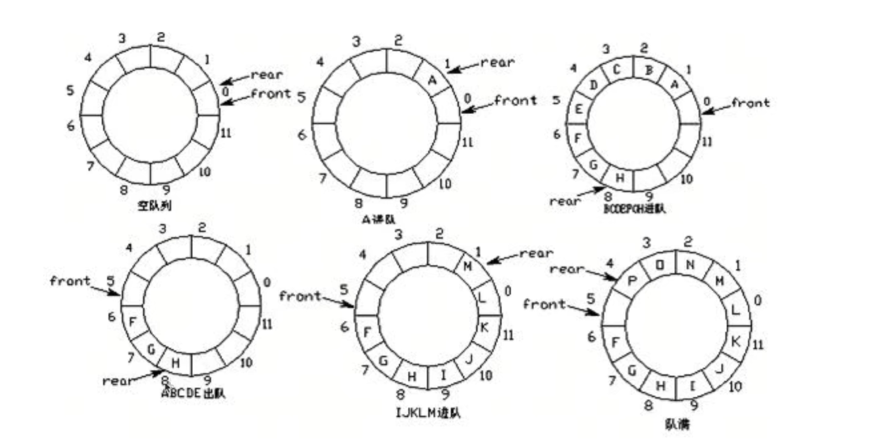

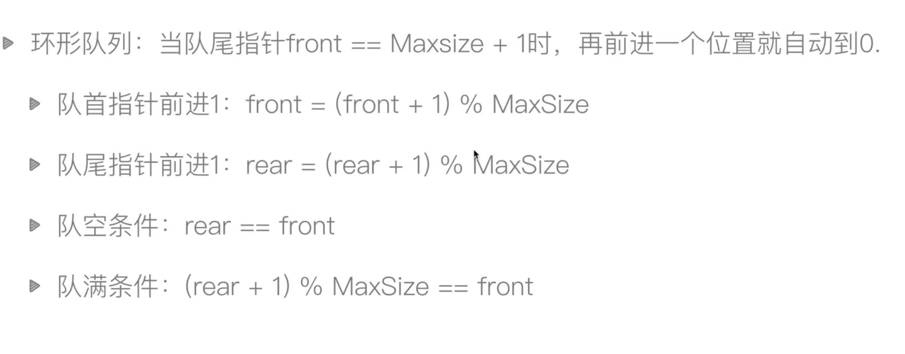

```python
class Queue:
    def __init__(self,size=100):
        self.queue=[0 for _ in range(size)]
        self.size=size
        self.rear=0
        self.front=0
    def push(self,ele):
        if self.is_filled():
            raise IndexError('the queue is filled')
        self.rear=(self.rear+1)%self.size
        self.queue[self.rear]=ele
    def pop(self):
        if self.is_empty():
            raise IndexError('no value in the queue')
        self.front=(self.front+1)%self.size
        return self.queue[self.front]
    def is_empty(self):
        return self.rear==self.front
    def is_filled(self):
        return (self.rear+1)%self.size==self.front
queue=Queue(5)
for i in range(4):
    queue.push(i)
print(queue.pop())
```

## 双向队列

在 Python 中，`deque`（双端队列）是一种高效的数据结构，它可以在两端进行插入和删除操作。`deque` 是由 `collections` 模块提供的一个类，它的名称来自于 "double-ended queue"（双端队列）的缩写。

`deque` 的主要特点包括：

1. 高效的插入和删除：`deque` 在两端进行插入和删除操作的时间复杂度均为 O(1)，即常数时间复杂度。
2. 可以用作队列或栈：由于 `deque` 支持在两端进行操作，因此它既可以像队列一样按照先进先出（FIFO）的顺序进行操作，也可以像栈一样按照后进先出（LIFO）的顺序进行操作。
3. 可指定最大长度：通过指定 `maxlen` 参数，可以创建一个有限长度的 `deque`，超过指定长度时，插入操作会自动移除最早的元素，可以用于对文件进行切片操作。

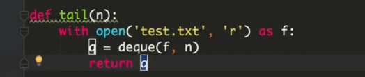

1. 内置的高级功能：`deque` 提供了许多内置的方法，如旋转、计数、索引等，方便进行各种常见操作。

```python 
from collections import deque
# 创建一个空的 deque
d = deque()
# 在 deque 的末尾插入元素
d.append(1)
d.append(2)
d.append(3)
# 在 deque 的开头插入元素
d.appendleft(0)
# 从 deque 的末尾删除元素
d.pop()
# 从 deque 的开头删除元素
d.popleft()
# 访问 deque 中的元素
print(d[0])
```

## 迷宫问题


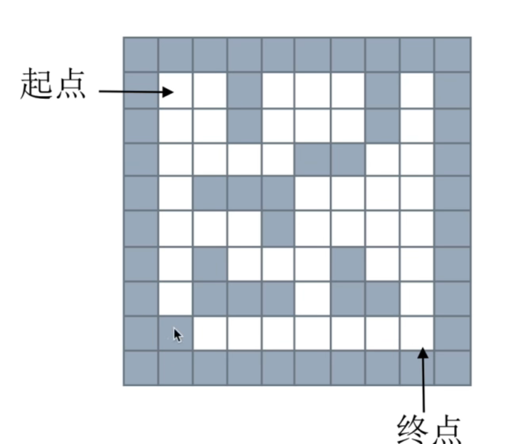


### 使用栈

给一个二维列表，其中1表示墙，0表示路径。

使用栈进行深度优先搜索，深度指的是一条路走到死，走不通了回溯到上一个位置换一个方向。

```python
maze =[
[1,1,1,1,1,1,1,1,1,1],
[1,0,0,1,0,0,0,1,0,1],
[1,0,0,1,0,0,0,1,0,1],
[1,0,0,0,0,1,1,0,0,1],
[1,0,1,1,1,0,0,0,0,1],
[1,0,0,0,1,0,0,0,0,1],
[1,0,1,0,0,0,1,0,0,1],
[1,0,1,1,1,0,1,1,0,1],
[1,1,0,0,0,0,0,0,0,1],
[1,1,1,1,1,1,1,1,1,1]
]
#一个包含了函数的列表，用于计算上下左右的位置
dirs=[
    lambda x,y:(x-1,y),
    lambda x,y:(x,y+1),
    lambda x,y:(x+1,y),
    lambda x,y:(x,y-1)
]
def maze_path(x1,y1,x2,y2):#传入起始位置和终点位置
    stack=[]#一个栈，用于记录所走的路程
    stack.append((x1,y1))#首先传入起点位置
    while len(stack)>0:#如果没有合适的路径会回溯，回溯到最后没有元素
        current=stack[-1]
        if current[0]==x2 and current[1]==y2:#如果位置到达，输出路径
            for path in stack:
                print(path)
            return True
        for dir in dirs:#向每个方向试探
            next=dir(current[0],current[1])#调用的是函数
            if maze[next[0]][next[1]]==0:#可以走
                stack.append(next)#加入
                maze[next[0]][next[1]]=2#标记已走过
                break#并退出
        else:#每个方向都不可以走的话，说明路已经走死了，回溯
            stack.pop()
    else:
        print('no path')
        return False
maze_path(1,1,2,1)
```

然而找到的路径并非是最短的。

### 使用队列

广度优先搜索，从一个结点开始，寻找所有接下来能继续走的点，继续不断寻找直到找到出口。

使用队列实现，队列中只储存每一条路径的末尾加上它的索引（该索引表示的是该路径的上一个路径点在列表中的位置），一条路径点在循环中会将下一次所有的可能路径加入并把自身弹出，弹出的值被储存在列表中，当找到终点之后，从列表中遍历路径点，根据路劲点的索引值找到上一个路径点，直到开头。

```python
from collections import deque
maze =[
[1,1,1,1,1,1,1,1,1,1],
[1,0,0,1,0,0,0,1,0,1],
[1,0,0,1,0,0,0,1,0,1],
[1,0,0,0,0,1,1,0,0,1],
[1,0,1,1,1,0,0,0,0,1],
[1,0,0,0,1,0,0,0,0,1],
[1,0,1,0,0,0,1,0,0,1],
[1,0,1,1,1,0,1,1,0,1],
[1,1,0,0,0,0,0,0,0,1],
[1,1,1,1,1,1,1,1,1,1]
]
#一个包含了函数的列表，用于计算上下左右的位置
dirs=[
    lambda x,y:(x-1,y),
    lambda x,y:(x,y+1),
    lambda x,y:(x+1,y),
    lambda x,y:(x,y-1)
]
def print_r(path):
    #最后一个
    current=path[-1]
    index=current[2]
    realpath=[]
    while not index==-1:
        realpath.append((current[0],current[1]))
        current=path[index]
        index=current[2]
    realpath.append((path[0][0],path[0][1]))
    realpath.reverse()
    for res in realpath :
        print(res)

def maze_path(x1,y1,x2,y2):
    queue=deque()
    path=[]
    queue.append((x1,y1,-1))
    while len(queue)>0:
        current=queue.pop()
        maze[current[0]][current[1]]=2
        path.append(current)
        if current[0]==x2 and current[1]==y2:
            print_r(path)#找到路径，遍历列表打印
            return True
        for dir in dirs:#观察每个方向
            next=dir(current[0],current[1])
            if maze[next[0]][next[1]]==0:
                queue.append((next[0],next[1],len(path)-1))#第三个值代表该路径点的上一个关联的路径点的的索引
                maze[next[0]][next[1]]=2#标记路径
    else:
        print('no path')
        return False
maze_path(1,1,3,3)
```

## 链表

链表是由一系列节点组成的元素集合，每个节点包含两部分，一个元素值，一个指向下一个节点的指针，通过节点之间的指针相互连接，最终串联成一个链表。

创建链表：

```python
class Note:
    def __init__(self,item):
        self.item=item
        self.next=None
def create_link_head(li):#头插法
    head =Note(li[0])
    for ele in li[1:]:
        note=Note(ele)
        note.next=head
        head=note
    return head
def create_link_tail(li):#尾插法
    head=Note(li[0])
    tail=head
    for ele in li[1:]:
        note=Note(ele)
        tail.next=note
        tail=note
    return head
def print_lk(head):#遍历打印
    while not head==None:
        print(head.item,end=",")
        head=head.next
lk1=create_link_head([1,2,3,4,5,6])
lk2=create_link_tail([1,2,3,4,5,6])
print_lk(lk1)
print_lk(lk2)

# 链表的反转
class Solution:
    def isPalindrome(self, head):
        """一个快节点一个慢节点，如果列表长度是奇数，快节点到达尾部，慢节点正好在中间，反之是偶数，快节点超出尾部一位，慢节点在中间偏右一位"""
        curr = head
        fast = head
        # 开始的时候头节点的前一节点不存在
        prev = None
        '''遍历的过程中反转前半列表，将链子全部反向'''
        while fast is not None and fast.next is not None:
            fast = fast.next.next
            # 记录下一节点
            temp = curr.next
            # 使当前节点的下一位指向前一节点，反转链子
            curr.next = prev
            # 更新前一节点的位置
            prev = curr
            # 更新当前节点
            curr = temp
        '''判断出是奇数，形如121，将慢节点后移一位，不需要判断中间的位数'''
        if fast is not None:
            curr = curr.next
        while prev is not None:
            if prev.val != curr.val:
                return False
            prev = prev.next
            curr = curr.next
        return True

```

链表的插入和删除：链表的插入考虑当前节点和插入节点，首先应该将插入节点的指针指向当前节点下一个节点，防止数据丢失，然后将当前节点的指针指向插入节点。删除，将当前节点指向下一节点的下一节点即可。

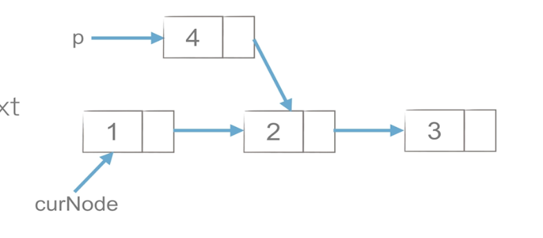

数组实现单链表

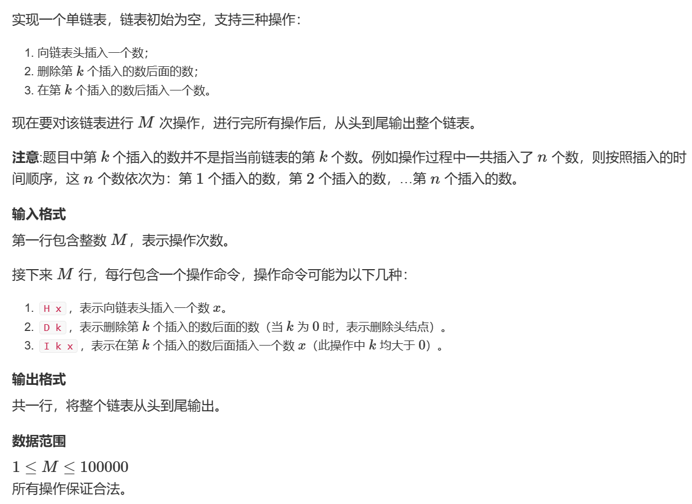

使用两个数组，n与nx，前者储存第i个位置的值，后者储存该位置下一个的指针，使用一个curr指针表示当前操作的位置，head表示头节点所指元素的位置。

```python
n=[0]*100010
nx=[-1]*100010
curr=0
head=-1
# 头插法
def add(x):
    global curr,head
    # 在当前位置设置这个值
    n[curr]=x
    # 设置该位置的下一个指向的是头节点的下一个
    nx[curr]=head
    # 把头节点的下一个指向当前位置
    head=curr
    # 更新
    curr+=1
# 在插入的第k个元素之后插入一个值
def insert(k,x):
    global curr, head
    n[curr]=x
    # 注意要先设置当前值的指针
    nx[curr]=nx[k-1]
    nx[k-1]=curr
    curr+=1
def remove(k):
    global curr, head
    if k==0:
        head=nx[head]
        return
    # 这里要注意，不是把nx[k-1]设置为nx[k]，nx的下标实际上第几个，而里面存储的值才是真正的元素位置所在
    nx[k-1]=nx[nx[k-1]]

m=int(input())

while m:
    li=input().split()
    flag=li[0]
    if flag=='H':
        add(int(li[1]))
    elif flag=='I':
        insert(int(li[1]),int(li[2]))
    else:
        remove(int(li[1]))
    m-=1

while head!=-1:
    print(n[head],end=' ')
    head=nx[head]


```


## 双链表

每个节点两个指针，一个指向前面，一个指向后面。

双链表的插入：先连接插入节点与下一节点，插入节点的后指针指向节点，下一节点的前指针指向插入节点，再连接当前节点与插入节点，插入节点的前指针指向当前节点，当前节点的后指针指向插入节点。

双链表的删除：当前节点的后指针指向删除节点的后一节点，后一节点的前指针指向当前节点。

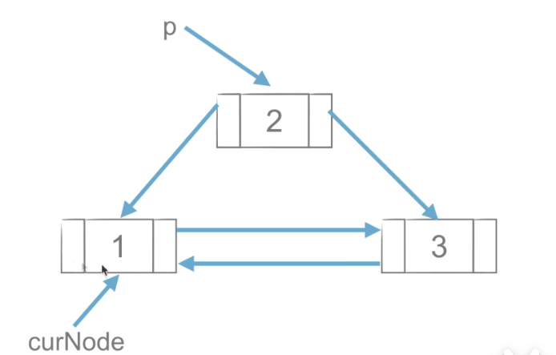


双链表用数组实现

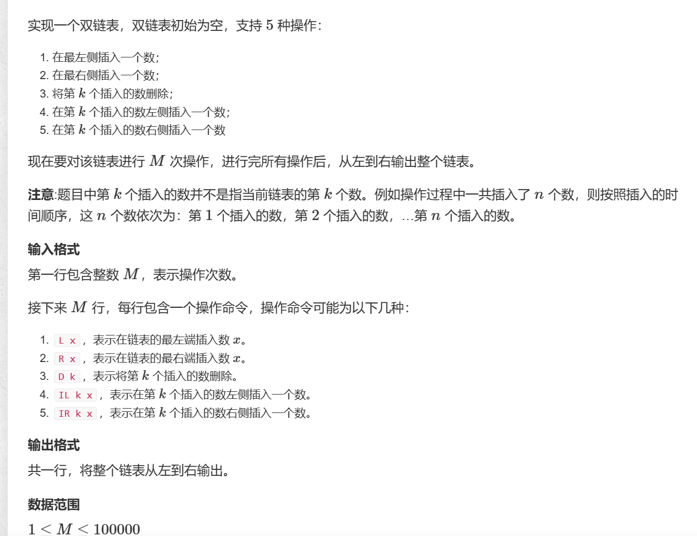


l，r分别表示左右指针，初用0和1表示左右端点，当前位置从2开始，需要索引偏移一位，初始时二者相连

```python
m=int(input())
l=[-1]*100010
r=[-1]*100010
n=[0]*100010
curr=2

def init():
    r[0]=1
    l[1]=0
# 在k位置右边插入
def insert(k,x):
    global curr
    n[curr]=x
    r[curr]=r[k]
    l[curr]=k
    l[r[k]]=curr
    r[k]=curr
    curr+=1
# 删除操作
def remove(k):
    l[r[k]]=l[k]
    r[l[k]]=r[k]
    

    
init()
while m:
    li=input().split()
    if li[0]=='L':
        insert(0,int(li[1]))
    elif li[0]=='R':
        insert(l[1],int(li[1]))
    elif li[0]=='D':
        remove(int(li[1])+1)
    elif li[0]=='IL':
        insert(l[int(li[1])+1],int(li[2]))
    else:
        insert(int(li[1])+1,int(li[2]))
    m-=1
head=r[0]
while head!=1:
    print(n[head],end=' ')
    head=r[head]


```


## 哈希表

哈希表是一个通过哈希函数来计算数据储存位置的数据结构，通常支持以下操作：

+ insert(ley,value)
+ get(key)
+ delete(key)

直接寻址表，将键所有可能的值作为一个域，假设有一个关键字的全集为k，创建一个长度为k的列表，然后将数据元素储存在列表中，列表的索引就是元素的键，当需要查找某个值的时候，支取通过其关键字key，直接在数组中寻找对应的位置从而实现快速的数据查找。这种方式只适用于域很小的时候，如果域很大但是出现的key很小，会浪费内存，并别这种方式无法处理关键字不是数字的情况。

哈希表是线性储存结构，由一个直接寻址表和一个哈希函数组成，并且规定列表长度为m，哈希函数h(k)，将关键字K作为自变量返回元素的储存下标。


由于哈希表的大小是有限的，而要储存的值的数量是无限的，因此会出现来两个不同的元素映射到同一个位置上的，这称为哈希冲突。

开放寻址法：

+ 线性探查：如果位置被占用，则探查i+1,i+2,i+3...
+ 二次探查：如果位置被占用，则探查$i+1^2$  $i-1^2$$i+2^2$$i-2^2$
+ 二度哈希：有多个哈希函数，使用第一个哈希函数冲突，则使用第二个哈希函数

拉链法：哈希表每个位置都连接一个链表，发生哈希冲突的时候，冲突的元素放到该链表位置的最后一个。

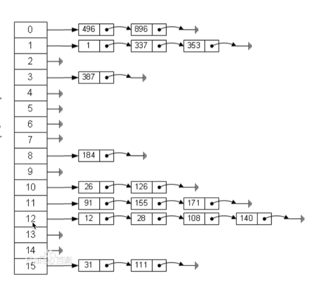

## 二叉树

二叉树的结构是一个节点连接两个子树：

```python
class binarytree:
    def __init__(self,data):
        self.data=data
        self.lchild=None
        self.rchild=None
```

与线性结构不同，二叉树的遍历并不能通过循环得到，需要使用递归：

+ 前向遍历：

  ```python
  def pre_order(root):
      if root:
          print(root.data,end=' ')
          pre_order(root.lchild)
          pre_order(root.rchild)
  ```

+ 中序遍历：

  ```python
  def in_order(root):
      if root:
          in_order(root.lchild)
          print(root.data,end=' ')
          in_order(root.rchild)
  ```

  

+ 后序遍历

  ```python
  def in_order(root):
      if root:
          in_order(root.lchild)
          in_order(root.rchild)
          print(root.data,end=' ')
  ```

以上三个遍历出的结果，只要有前序和中序就可以得到树的结构：


可以得到，E是树的根，在中序中，E左是左子树（ABCD），E右使右子树(GF)，在左子树中A是根，通过中序可知，A没有左子树，而BCD是其右子树...

层次遍历，按照层级遍历，适用于多叉树：

```python
def level_order(root):
    queue=deque()
    queue.append(root)
    while len(queue)>0:
        current=queue.popleft()
        print(current.data)
        if current.rchild:
            queue.append(current.rchild)
        if current.lchild:
            queue.append(current.lchild)
```

## 二叉搜索树

满足二叉树的基本结构，左节点的值小于父节点，右节点的值大于父节点。

插入：

```python
#节点
class Node:
    def __init__(self, data):
        self.data = data
        self.lchild = None
        self.rchild = None
        self.parent = None
#树
class BST:
    def __init__(self, li=None):
        self.root = None#根节点
        if li:#列表初始化
            for val in li:
                self.insert_not_rec(val)
     #使用递归插入，node用于代表当前节点，初始时是根节点
    def insert(self, node, val):
        if not node:
            node = Node(val)
        if val < node.data:
            node.lchild = self.insert(node.lchild, val)
            node.lchild.parent = node
        if val > node.data:
            node.rchild = self.insert(node.rchild, val)
            node.rchild.parent = node
        return node
	#非递归的方式
    def insert_not_rec(self, val):
        p = self.root
        if not p:#如果是空树，直接构造
            self.root = Node(val)
            return
        while 1:#反之，不断遍历
            if val > p.data:
                if not p.rchild:
                    p.rchild = Node(val)
                    p.rchild.parent = p
                    return
                else:
                    p = p.rchild
            elif val < p.data:
                if not p.lchild:
                    p.lchild = Node(val)
                    p.lchild.parent = p
                    return
                else:
                    p = p.lchild
            else :
                return
```

通过运行可以知道，对于搜索二叉树使用中序遍历，输出的结果是升序的。

查询：

```python
    def find(self, node, val):
        if not node:
            return None
        if node.data > val:
            return self.find(node.lchild, val)
        elif node.data < val:
            return self.find(node.rchild, val)
        else:
            return node

    def find_not_rec(self, val):
        p = self.root
        while p:
            if p.data == val:
                return p
            if p.data > val:
                p = p.lchild
            elif p.data < val:
                p = p.rchild
        return None
```

删除操作：但要删除的节点是叶节点的时候，直接删除，如果是有一个子节点的根的话，

```python
    def __remove__node1(self, node):  # 删除的节点没有子节点
        if not node.parent:  # 如果树中只有这一个节点
            self.root = None
        # 先判断是左/右那个节点，然后断开
        if node == node.parent.lchild:  # 如果是父节点的左子树
            node.parent.lchild = None
            node.parent = None
        else:  # 反之，右子树
            node.parent.rchild = None
            node.parent = None

    def __remove__node21(self, node):  # 删除的节点有一个子节点,并且这个子节点是左子树的
        if not node.parent:  # 如果树中只有这两个节点
            self.root = node.lchild
            node.lchild.parent = None
        elif node.parent.lchild == node:  # 如果该节点是其父节点的左节点
            node.parent.lchild = node.lchild
            node.lchild.parent = node.parent
        else:  # 反之，右节点
            node.parent.rchild = node.lchild
            node.rchild.parent = node.parent

    def __remove__node22(self, node):  # 删除的节点有一个子节点,并且这个子节点是右子树的
        if not node.parent:  # 如果树中只有这两个节点
            self.root = node.rchild
            node.rchild.parent = None
        elif node.parent.lchild == node:
            node.parent.lchild = node.rchild
            node.rchild.parent = node.parent
        else:
            node.parent.rchild = node.rchild
            node.rchild.parent = node.parent

    def delete(self, val):
        if not self.root:  # 判断是否是空的树
            print('the tree is empty')
            return
        node = self.find_not_rec(val)  # 找到这个节点
        if not node:  # 该值不存在
            print('not exist')
            return
        if not node.lchild and not node.rchild:  # 如果是单独一个节点
            self.__remove__node1(node)
        elif not node.rchild:  # 没有右子节点，只有左子节点
            self.__remove__node21(node)
        elif not node.lchild:  # 只有一个右子节点
            self.__remove__node22(node)
        else:  # 两个子节点都有，找到该节点右子树中最小的替换该节点
            min_node = node.rchild
            while min_node.lchild:#一直往左子树遍历
                min_node = min_node.lchild
            node.data = min_node.data#替换数据
            if min_node.rchild:#在把这个节点删除，判断他有没有右子节点
                self.__remove__node22(min_node)
            else:
                self.__remove__node1(min_node)
```

二叉树的搜索时间复杂度为log(n)，极端的情况是二叉树十分倾斜。

## AVL树

一个自平衡的二叉搜索树，平衡指每个节点的子树最大高度的差不能超过1，没有子树认为是0。如下认为是一个不平衡的树：


左子树的高度为1，右子树的高度为3.

平衡因数即两个子树的高度差，AVL树要求根的左右子树都是平衡二叉树。

AVL树在插入一个节点的时候，可能会破坏树的平衡，可以通过旋转操作来进行修正，在插入了节点之后，只有从插入节点到根节点的路径上的节点的平衡可能会被改变，需要找出第一个平衡被破坏的节点，称其为K，K的两颗子树的高度之差为2。

不平衡的情况右四种：

+ 对K的右子树的右子树插入，通过左旋解决


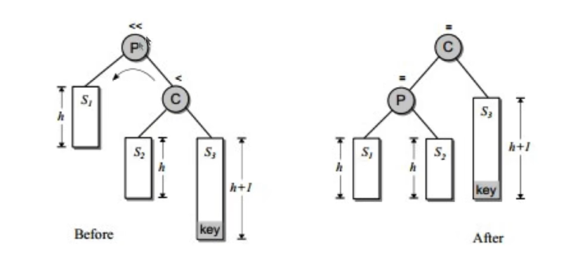

+ 对K的左子树的左子树插入，通过右旋解决

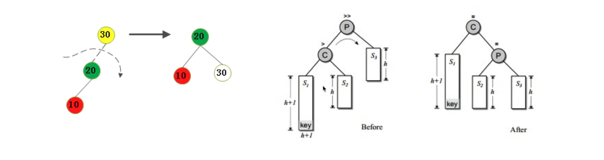

+ 对K右子树的左子树插入，通过右旋和左旋


+ 对K左子树的右子树插入，通过左旋和右旋

```python
from binarytree_ import Node, BST
class node_(Node):
    def __init__(self, data):
        Node.__init__(self, data)
        self.bf = 0


class AVL(BST):
    def __init__(self, li=None):
        BST.__init__(self, li)

    def rotate_left(self, p, c):
        s = c.lchild
        p.rchild = s
        if s:
            s.parent = p
        c.lchild = p
        p.parent = c

        p.bf = 0
        c.bf = 0

        return c

    def rotate_right(self, p, c):
        s = c.rchild
        p.lchild = s
        if s:
            s.parent = p
        c.rchild = p
        p.parent = c

        p.bf = 0
        c.bf = 0

        return c

    def rotate_left_right(self, p, c):
        g = c.lchild
        g_left = g.lchild
        g_right = g.rchild
        c.rchild = g_left
        if g_left:
            g_left.parent = c
        p.lchild = g_right
        if g_right:
            g_right.parent = p
        g.lchlid = p
        g.rchild = c
        p.parent = g
        c.parent = c
        if g.bf > 0:
            c.bf = -1
            p.bf = 0
        elif g.bf < 0:
            c.bf = 0
            p.bf = -1
        elif g.bf == 0:
            p.bf = 0
            c.bf = 0
        return g

    def rotate_right_left(self, p, c):
        g = c.lchild
        g_left = g.lchild
        g_right = g.rchild
        p.rchild = g_left
        if g_left:
            g_left.parent = p
        c.lchlid = g_right
        if g_right:
            g_right.parent = c
        g.lchlid = p
        g.rchild = c
        p.parent = g
        c.parent = c
        if g.bf > 0:
            c.bf = 0
            p.bf = -1
        elif g.bf < 0:
            c.bf = -1
            p.bf = 0
        elif g.bf == 0:
            p.bf = 0
            c.bf = 0
        return g

    # 重写插入函数
    def insert_not_rec(self, val):
        p = self.root
        if not p:
            self.root = node_(val)
            return
        while 1:
            if val > p.data:
                if not p.rchild:
                    p.rchild = node_(val)
                    p.rchild.parent = p
                    node = p.rchild
                    break
                else:
                    p = p.rchild
            elif val < p.data:
                if not p.lchild:
                    p.lchild = node_(val)
                    p.lchild.parent = p
                    node = p.lchild
                    break
                else:
                    p = p.lchild
            else:
                return
        '''由规律可以得知，每次加入节点，当节点是在左子树的时候，根节点的bf会减一，反之加一，然后继续往上更新节点的bf，当一个节点的bf为0的时候，就不会在继续往上传递了'''
        while node.parent:
            # 获取节点的根节点的根节点，用于连接旋转之后的子树
            g = node.parent.parent
            # 记录旋转之前的根节点，用于之后连接
            x = node.parent
            # 如果添加到了左子树，减一
            if node.parent.lchild == node:
                # 原先根节点的bf为-1，变为-2，需要调整，左子树更重
                if node.parent.bf < 0:
                    # 左子树重的情况有两种，一是左左，使用右旋，而是左右，使用左旋加右旋，具体是哪种判断当前节点的bf
                    # 如果当前节点偏右，说明是左右
                    if node.bf > 0:
                        n = self.rotate_left_right(node.parent, node)
                    # 反之，是左左
                    else:
                        n = self.rotate_right(node.parent, node)
                # 如果原先根节点的bf为0，现在减少1，然后继续传递
                elif node.parent.bf == 0:
                    node.parent.bf = -1
                    node = node.parent
                    continue
                # 如果是1，变为0，不在传递
                else:
                    node.parent.bf = 0
                    break
            # 添加到右子树的情况，加一
            else:
                # 原先的根节点为1，变为2 ，需要调整，右子树更重
                if node.parent.bf > 0:
                    # 右子树更重的情况，可能是右右使用左旋，或者是右左，先右旋在左旋
                    # 当前节点偏左,右左
                    if node.bf < 0:
                        n = self.rotate_right_left(node.parent, node)
                    # 反之右右
                    else:
                        n = self.rotate_left(node.parent, node)
                # 同上
                elif node.parent.bf == 0:
                    node.parent.bf = 1
                    node = node.parent
                    continue
                else:
                    node.parent.bf = 0
                    break
            # 到达这一步，说明所有的节点的都已经满足|bf|<2
            # 连接旋转之后的节点，然会退出循环
            n.parent = g
            # 如果该节点存在
            if g:
                # 判断是哪个节点,此时的node.parent右键变化
                if x == g.lchild:
                    g.lchild = n
                else:
                    g.rchild = n
                    break
            # 如果这个节点不存在的话，也就是原本就没有节点连接这个子树
            else:
                self.root = n
                break


tree = AVL([9, 8, 7, 6, 5, 4, 3, 2, 1])
print(tree.root)
tree.in_order(tree.root)
print("")
tree.pre_order(tree.root)
```


# 工具方法

## 数据

$$2\times 10^9==2^{31}$$，而这开方后的结果是44721

$$log_2{10^9}==29$$，七次方则是23

做比较时如果次数非常多那么应该避免使用math.inf，可以用10**18替代Inf


## tuple

把列表转换为tuple可以存入字典

## 读取

内置的的input函数处理大数据时非常低效，一般使用：

```python
import sys
input=sys.stdin.readline
```

这个读取函数会一并将语句末尾的换行符读取，因此对字符串操作的时候注意带上rstrip()

在读取过程中，使用int()对于一定特定的值会卡住，因此如果不是必须要使用数值类型，尽量不要转换为整数


## 设置字符串转换限制

```python
sys.set_int_max_str_digits(10000)# str(a)对a的长度是有限制的，通过该函数把限制放大
```


## 优先级队列(根堆)

```python 
import heapq
heap = [3, 1, 4, 1, 5, 9, 2]
heapq.heapify(heap)# 可以将列表转换为小根堆形式
print(heap)  # 输出: [1, 1, 2, 4, 5, 9, 3]

# 向堆中添加一个元素，并保持堆的顺序
heap = [1, 3, 5, 7, 9]
heapq.heappush(heap, 4)
print(heap)  # 输出: [1, 3, 4, 7, 9, 5]

# 弹出并返回堆中最小的元素，保持堆的顺序
heap = [1, 3, 4, 7, 9, 5]
smallest = heapq.heappop(heap)
print(smallest)  # 输出: 1
print(heap)      # 输出: [3, 5, 4, 7, 9]

import heapq

# 初始堆为空
heap = []

# 向堆中推入元组 (priority, value)，以第一个值为优先级，当第一个值相同时以第二个值排序
heapq.heappush(heap, (2, 'Task 2'))
heapq.heappush(heap, (1, 'Task 1'))
heapq.heappush(heap, (3, 'Task 3'))

# 弹出并打印最小元素，弹出优先级最小的
while heap:
    priority, task = heapq.heappop(heap)
    print(f'Priority: {priority}, Task: {task}')

    
# 获取前几个最大/最小值
array = [10, 17, 50, 7, 30, 24, 27, 45, 15, 5, 36, 21]
heapq.heapify(array)
print(heapq.nlargest(2, array))
print(heapq.nsmallest(3, array))
```

## 求数组的乘积

使用math.prod()即可


## 记忆化搜索

借助缓存策略用空间换时间

### functools.lru_cache（3.2）

`functools.lru_cache` 是 Python 标准库中 `functools` 模块的一部分。`lru_cache` 装饰器可以用来为一个函数添加一个缓存系统。这个缓存系统会存储函数的输入和对应的输出。如果函数被调用，并且给出了已经缓存过的输入，那么函数就不会重新计算，而是直接从缓存中获取对应的输出。

LRU 是 “Least Recently Used” 的缩写，意思是 “最近最少使用”。LRU 缓存就是一种缓存淘汰算法，当缓存达到预设的容量上限时，会优先淘汰最近最少使用的数据。

使用lru_cache完成记忆化搜索可以大大提高效率

```python
from functools import lru_cache
# 从functools中导入，其中包含一个参数，maxsize表示最大缓存容量
@lru_cache(maxsize=None)
def febo(n):
    if n==0 or n==1:
        return n
    return febo(n-1)+febo(n-2)
print(febo(100))
```

### cache(3.9)

与lru_cache 没有大的区别，只是取消了缓存的限制。

dp.cache_clear()

注意记忆化搜索，需要dfs有一个返回值，如果在函数中是一个外部变量累加，`记忆化搜索不会对这个值进行累计，而是直接跳过`。因此要使用记忆化搜索需要用一个内部变量在函数中累加，然后返回他。

同样要注意的是：使用set判断，原本因为在外面加入到set中的值不同导致dfs的结果也会不同，而这里使用了记忆化搜索，记忆的很可能不是以a为初始值的set()而是在以前某次循环中以b为初始值的set()

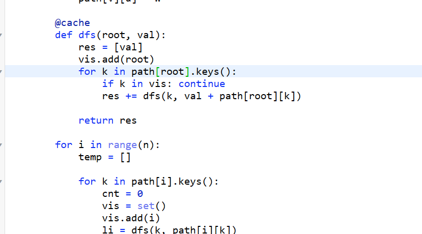

## 字符串格式化


```python
print(f"{100.126:.2f}")# 这将输出100.13，.2f表示保留两位小数，大于5的会进位

print(f'{100: 10}') # 将会设置字符宽度为10，默认为右对齐
name = "John"
print(f"{name:_<10}")  # 使用下划线填充，总宽度为10，<表示左对齐


print(f"{2:+>10}")  # 使用加号填充，右对齐，总宽度为10
+++++++++2


```


注意字符串的拼接使用列表，在列表尾部多添加一个值而不是s+=c，后者在字符串比较长的时候会浪费大量时间。


## 前缀和

```python
from itertools import accumulate
# 可以轻松构造前缀和数组
lst=list(accumulate(count))
list(accumulate(nums,initial=0))等价于[0]+list(accumulate(nums))
```

## 二分搜索

```python
from bisect import bisect_left

# 内部使用二分搜索实现
# bisect_left(a, x, lo=0, hi=len(a))),用于在列表中(起始位置为lo,终止位置为hi，左闭右开区间）查找元素 x 插入的位置，使得插入后序列仍然保持有序，函数返回一个索引值，这个值可以认为是列表中大于等于x的最小的索引

#bisect_right找出的索引减去一，就是列表中小于等于这个元素的最大的元素的位置，一般通过 bisect_left(a, x+1)-1来找小于等于x的位置

# 可用于快速查找列表中大于等于查找值的最小值的索引	
from bisect import bisect_right,bisect_left

# 已排序的列表
sorted_list = [1, 3, 4, 4, 6, 8, 10]

# 查找插入位置
insert_index = bisect_left(sorted_list, 4)

left：{insert_index}")# 插入位置left：2


# 两个函数的实现，注意边界条件
def bisect_left():
    l,r=0,n-1
    while l<=r:
        mid=(l+r)//2
        # 找到目标值，因为要求的是大于等于目标值的最小，因此对于找到的值不能确定左边是否还有所以缩减右边界往左找
        if nums[mid]<target:
            l=mid+1
        else:
            r=mid-1
def bisect_right():
    l,r=0,n-1
    while l<=r:
        mid=(l+r)//2
        # 不能确定找到的值右边是否还有桐言的值，因此缩减左边界
        if nums[mid]>=target:
            l=mid+1
        else:
            r=mid-1
    

```

## set集合

使用集合可以用来连接图

```python
for edge in edges:
    u,v =edge
    if u in restricted or v in restricted:
        continue
    paths[v].add(u)
    paths[u].add(v)
```

集合的另一个妙用是`对集合的in 操作时间复杂度是O(1)的`，实际上大量使用set做判断也会耗时

集合操作：

```python
memo[i].issubset(memo[j])# 判断i是否是j集合的子集

# 并
set1 = {1, 2, 3}
set2 = {3, 4, 5}
a=set1|set2

# 交
b= set1&set2

# 差，可以通过直接相减得到
a={2,3,5}
b={2,3,4}
print((a-b).pop())

#  复制
new_set = my_set.copy()

```


## 全排列permutations

全排列可以用于数据量较小的匹配，比如对于长度都为9的a和b数组相互任意匹配，可以固定b数组然后找a的全排列一一匹配。

```python
from itertools import permutations

# 创建一个集合
my_set = {1, 2, 3}

# 使用permutations生成全排列
perm_generator = permutations(my_set)

# 遍历生成的排列
for perm in perm_generator:
    print(perm)

 # 限制排列的长度
perm_generator = permutations(my_set, 2)
```

## 最小公倍数lcm和最大公约数gcd

```python
from math import lcm,gcd	
lcm(11,23)
```

## 有序集合

```python
from sortedcontainers import SortedList,SortedDict，SortedSet

# 分别实现了有序列表和有序字典，以及集合。集合与列表的不同在于集合中没有重复元素

# 可以直接初始化
s=SortedList([1,2,3])

# 加入值，按照第一个排序后按照第二个排序，类似于根堆
s.add((i,j))


# 可以直接调用二分查找
s.bisect_left(val)
s.bisect_right(val)

# update方法可以合并两个有序列表
a=sl([1,2,3,4,4])
a.update(sl([3,4,5]))

# 以下两个都是删除操作，但第一个如果删除的值不存在会抛出异常，而第二个不会	
# 如果这个值重复了，不会都删除而是只删除一个
a.remove(1)
a.discard(1)

# 此外有序容器可以切片，使用索引，反转操作

s=SortedDict()
s[k]=val
s.bisect_left/right(val)

# 在有序集合中可以存放元组，并指定排序规则
s=sl(key=lambda x:(x[0],-x[1]))
如果使用二分搜索也会按照给给定的规则去寻找

```

可以在循环中不断加入元素同时保证从小到大的顺序


```python
class SortedList:
    def __init__(self, iterable=[], _load=200):
        """Initialize sorted list instance."""
        values = sorted(iterable)
        self._len = _len = len(values)
        self._load = _load
        self._lists = _lists = [values[i:i + _load] for i in range(0, _len, _load)]
        self._list_lens = [len(_list) for _list in _lists]
        self._mins = [_list[0] for _list in _lists]
        self._fen_tree = []
        self._rebuild = True

    def _fen_build(self):
        """Build a fenwick tree instance."""
        self._fen_tree[:] = self._list_lens
        _fen_tree = self._fen_tree
        for i in range(len(_fen_tree)):
            if i | i + 1 < len(_fen_tree):
                _fen_tree[i | i + 1] += _fen_tree[i]
        self._rebuild = False

    def _fen_update(self, index, value):
        """Update `fen_tree[index] += value`."""
        if not self._rebuild:
            _fen_tree = self._fen_tree
            while index < len(_fen_tree):
                _fen_tree[index] += value
                index |= index + 1

    def _fen_query(self, end):
        """Return `sum(_fen_tree[:end])`."""
        if self._rebuild:
            self._fen_build()

        _fen_tree = self._fen_tree
        x = 0
        while end:
            x += _fen_tree[end - 1]
            end &= end - 1
        return x

    def _fen_findkth(self, k):
        """Return a pair of (the largest `idx` such that `sum(_fen_tree[:idx]) <= k`, `k - sum(_fen_tree[:idx])`)."""
        _list_lens = self._list_lens
        if k < _list_lens[0]:
            return 0, k
        if k >= self._len - _list_lens[-1]:
            return len(_list_lens) - 1, k + _list_lens[-1] - self._len
        if self._rebuild:
            self._fen_build()

        _fen_tree = self._fen_tree
        idx = -1
        for d in reversed(range(len(_fen_tree).bit_length())):
            right_idx = idx + (1 << d)
            if right_idx < len(_fen_tree) and k >= _fen_tree[right_idx]:
                idx = right_idx
                k -= _fen_tree[idx]
        return idx + 1, k

    def _delete(self, pos, idx):
        """Delete value at the given `(pos, idx)`."""
        _lists = self._lists
        _mins = self._mins
        _list_lens = self._list_lens

        self._len -= 1
        self._fen_update(pos, -1)
        del _lists[pos][idx]
        _list_lens[pos] -= 1

        if _list_lens[pos]:
            _mins[pos] = _lists[pos][0]
        else:
            del _lists[pos]
            del _list_lens[pos]
            del _mins[pos]
            self._rebuild = True

    def _loc_left(self, value):
        """Return an index pair that corresponds to the first position of `value` in the sorted list."""
        if not self._len:
            return 0, 0

        _lists = self._lists
        _mins = self._mins

        lo, pos = -1, len(_lists) - 1
        while lo + 1 < pos:
            mi = (lo + pos) >> 1
            if value <= _mins[mi]:
                pos = mi
            else:
                lo = mi

        if pos and value <= _lists[pos - 1][-1]:
            pos -= 1

        _list = _lists[pos]
        lo, idx = -1, len(_list)
        while lo + 1 < idx:
            mi = (lo + idx) >> 1
            if value <= _list[mi]:
                idx = mi
            else:
                lo = mi

        return pos, idx

    def _loc_right(self, value):
        """Return an index pair that corresponds to the last position of `value` in the sorted list."""
        if not self._len:
            return 0, 0

        _lists = self._lists
        _mins = self._mins

        pos, hi = 0, len(_lists)
        while pos + 1 < hi:
            mi = (pos + hi) >> 1
            if value < _mins[mi]:
                hi = mi
            else:
                pos = mi

        _list = _lists[pos]
        lo, idx = -1, len(_list)
        while lo + 1 < idx:
            mi = (lo + idx) >> 1
            if value < _list[mi]:
                idx = mi
            else:
                lo = mi

        return pos, idx

    def add(self, value):
        """Add `value` to sorted list."""
        _load = self._load
        _lists = self._lists
        _mins = self._mins
        _list_lens = self._list_lens

        self._len += 1
        if _lists:
            pos, idx = self._loc_right(value)
            self._fen_update(pos, 1)
            _list = _lists[pos]
            _list.insert(idx, value)
            _list_lens[pos] += 1
            _mins[pos] = _list[0]
            if _load + _load < len(_list):
                _lists.insert(pos + 1, _list[_load:])
                _list_lens.insert(pos + 1, len(_list) - _load)
                _mins.insert(pos + 1, _list[_load])
                _list_lens[pos] = _load
                del _list[_load:]
                self._rebuild = True
        else:
            _lists.append([value])
            _mins.append(value)
            _list_lens.append(1)
            self._rebuild = True

    def discard(self, value):
        """Remove `value` from sorted list if it is a member."""
        _lists = self._lists
        if _lists:
            pos, idx = self._loc_right(value)
            if idx and _lists[pos][idx - 1] == value:
                self._delete(pos, idx - 1)

    def remove(self, value):
        """Remove `value` from sorted list; `value` must be a member."""
        _len = self._len
        self.discard(value)
        if _len == self._len:
            raise ValueError('{0!r} not in list'.format(value))

    def pop(self, index=-1):
        """Remove and return value at `index` in sorted list."""
        pos, idx = self._fen_findkth(self._len + index if index < 0 else index)
        value = self._lists[pos][idx]
        self._delete(pos, idx)
        return value

    def bisect_left(self, value):
        """Return the first index to insert `value` in the sorted list."""
        pos, idx = self._loc_left(value)
        return self._fen_query(pos) + idx

    def bisect_right(self, value):
        """Return the last index to insert `value` in the sorted list."""
        pos, idx = self._loc_right(value)
        return self._fen_query(pos) + idx

    def count(self, value):
        """Return number of occurrences of `value` in the sorted list."""
        return self.bisect_right(value) - self.bisect_left(value)

    def __len__(self):
        """Return the size of the sorted list."""
        return self._len

    def __getitem__(self, index):
        """Lookup value at `index` in sorted list."""
        pos, idx = self._fen_findkth(self._len + index if index < 0 else index)
        return self._lists[pos][idx]

    def __delitem__(self, index):
        """Remove value at `index` from sorted list."""
        pos, idx = self._fen_findkth(self._len + index if index < 0 else index)
        self._delete(pos, idx)

    def __contains__(self, value):
        """Return true if `value` is an element of the sorted list."""
        _lists = self._lists
        if _lists:
            pos, idx = self._loc_left(value)
            return idx < len(_lists[pos]) and _lists[pos][idx] == value
        return False

    def __iter__(self):
        """Return an iterator over the sorted list."""
        return (value for _list in self._lists for value in _list)

    def __reversed__(self):
        """Return a reverse iterator over the sorted list."""
        return (value for _list in reversed(self._lists) for value in reversed(_list))

    def __repr__(self):
        """Return string representation of sorted list."""
        return 'SortedList({0})'.format(list(self))
```


## 除法

有的时候需要进行高精度除法判断，python自带的除法无法准确在进行判断的时候会出问题，因此选择使用分数进行判断

```python
from factions import Factions as f
res=f(10,3)
res的结果是10/3	，内部会自动进行约分
```

## pairwise

有的时候要在数组中在每个位置和它的下一个位置进行比较，这是哦胡可以用pairwise进行操作。


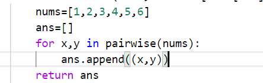

```python
[[1,2],[2,3],[3,4],[4,5],[5,6]]
```

## 分数

```python
from fractions import Fraction as f
# 可以接受字符串
f(2,3)
f('2/3')
# 可以做到自动约分，分数相加或与整数相加，结果显示为分数
```


## 日期

```python
import datetime
s="2024-03-11 12:30:00"
# 构造时间戳，对于不同的日期格式使用不同的方式格式化，如果是20110101就是%Y%m%d,注意大小写
a=datetime.datetime.strptime(s,"%Y-%m-%d %H:%M:%S")
# 使用内置方法timedelta构造用于加减的时间戳
print(a+datetime.timedelta(days=5,hours=3))

# 两个时间戳运算后，通过调用days()取出天数，单独的时间戳不行。	
print((a-b).days())
```

## 递归次数

```python
import sys
sys.setrecursionlimit(1500) # 设置限制数1500

atcoder平台对迭代有优化
import pypyjit
pypyjit.set_param("max_unroll_recursion=-1")
```

## Counter

注意a+=Counter(nums[-1])的操作很慢，使用defaultdict(int)会更快


# 数学知识

## 偶数和奇数

从1到n中奇数的个数为(n+1)//2，偶数的个数为n-(n+1)//2，通过异或两个数可以判断两个数的奇偶性是否相同(==1?)

## 取模

想要求迭代求10x+1，为防止结果太大需要取模，在迭代的过程中10*x+1中的x可以直接取上一次迭代后取模的结果

****


## 质数（素数）

对于质数相关的题目经常打表计算，构建质数表的效率至关重要，如果选择遇到一个数字就去从2开始遍历它，然后在遍历中判断是不是质数，这样的效率非常低。

`注意使用质数表的时候，要把表的运算放到外面进行`，因为一道题有很多个测试数据，放在里面每次测试都需要算，放在外面只需要算一次。

找因数质数什么的都可以从开方处找（可以取到）。


补充：梅森素数指的是x是质数x-1，也是质数。


### 分解质因数

一个数的质因数指的是它的因数都是由质数组成的，比如说6就是有2和3组成的，而8是由三个2组成的。

找质因数的过程类似于试除法，从小到大找每个数如果他是一个因数，通过把给定的数一直整除这个因数直到不再是因数来排除掉这个因数的倍数从而保证所有的因数都是质数，然后继续找下一个数。注意质因数中只会有一个大于根号n，因此可以遍历到根号n，如果最后剩下的数大于1那么这就是余下的质数。


```python
from math import sqrt
n=int(input())
def cal(x):
    # 找每个数判断是不是因数
    for i in range(2,int(sqrt(x)+1)):
        if x%i==0:
            s=0
            # 如果是，把他的倍数全部消掉
            while x%i==0:
                x//=i
                s+=1
            ans.append([i,s])
    # 如果最后留下一个那就是剩余的质因数
    if x>1:
        ans.append([x,1])

for _ in range(n):
    x=int(input())
    ans=[]
    cal(x)
    for i in ans:
        print(*i)
    print()
```


### 埃氏筛

对于给定的数据范围，从2开始找质数，如果这个数是质数，那么它的冥次一定不是质数，在判断表中标记


```python
MAX=10**6+1
# 记录这个数是不是质数，初始为True
is_prime=[True]*MAX
is_prime[0]=False
is_prime[1]=False
# 记录质数
prime=[]
# 对于给定的数据范围，从2开始找质数
for i in range(2,MAX):
    if is_prime[i]:
        # 如果是质数加入，并把他的冥次标记
        prime.append(i)
        # 这里的优化是设置步长并从i**2开始
        for j in range(i*i,MAX,i):
            is_prime[j]=False
```


### 线性筛（欧拉筛）

每个数只会被他的最小质因数划掉，每个数乘上所有小于等于它最小质因数的质数来筛别的数。

```python
MAX=(10**6)+1
is_prime=[True]*MAX
prime=[]
for i in range(2,MAX):
    if is_prime[i]:
        prime.append(i)
     # 要对每个数进行筛选，不是只对质数筛选，下面的循环要放到外面
    for p in prime:
        # 防止越界
        if p*i>=MAX:
            break
        is_prime[p*i]=False
        if i%p==0:
            break
```

在数据范围比较大（10**7）的时候效率比埃氏筛好,大约快一倍。

### 试除法

判断是否是质数使用试除法，对于不是质数的数，它的因数都是成对存在的。因此判断质数的时候只需要对一边判断即可。

```python
from math import sqrt
n=int(input())
ans=[]
def cal(x):
    # 特判1
    if x==1:
        return False
    for i in range(2,int(sqrt(x)+1)):
        if x%i==0:
            return False
    return True
for _ in range(n):
    x=int(input())
    if cal(x):
        ans.append('Yes')
    else:
        ans.append('No')
for i in ans:
    print(i)
```


更好的方法是用打表判断出的质数，而不是一个一个看，因为本来也就只有质数能起作用。

对于10^9 (30000)的数据可以开5*10^4

```python
p=[]
MX=(10**4)*5
is_prime=[True]*MX
for i in range(2,MX):
    if is_prime[i]:
        p.append(i)
        for j in range(i**2,MX,i):is_prime[j]=False
n=len(p)

i=0
cnt=0
x=int(input())
while x>1 and j<n:
    v=p[i]
	if x%v==0:
        while x%v==0:
            cnt+=1
            x//=v
    j+=1
if x>1:
    cnt+=1
```


## 因数

一个数的因数个数大概是立方级别

### 因数个数

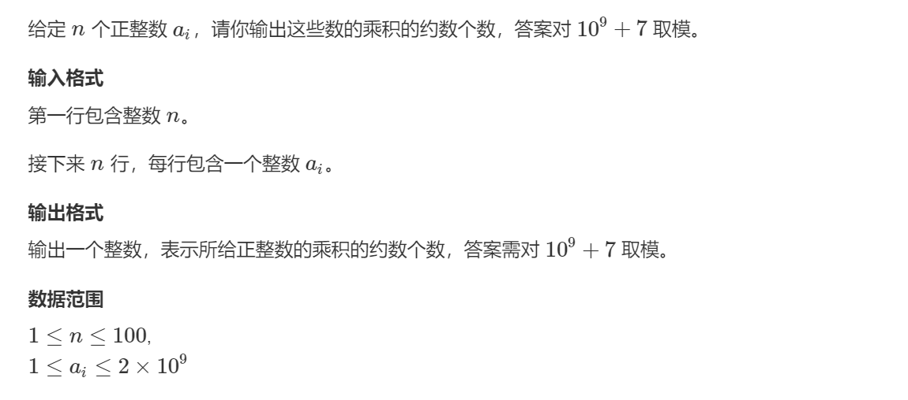


一个数的约数个数通过公式可得是：是他的质因数中(指数+1)的累积

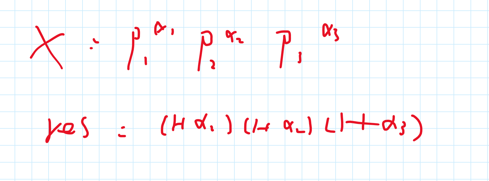

而质因数可以通过因数的质因数求解

```python
from math import sqrt
from collections import Counter
n=int(input())
# 用于记录指数的累和
memo=Counter()
mod=10**9+7

# 求解质因数的模板
def cal(x):
    for i in range(2,int(sqrt(x)+1)):
        if x%i==0:
            s=0
            while x%i==0:
                x//=i
                s+=1
            memo[i]+=s
    if x>1:
        memo[x]+=1

for _ in range(n):
    x=int(input())
    # 对每个因数找它的质因数
    cal(x)
nums=[x+1 for x in memo.values()]
ans=nums[0]
# 计算累乘
for i in range(1,len(nums)):
    ans*=nums[i]
    ans%=mod
print(ans)
```


### 约数之和


约数之和同样需要质因数的指数，需要对每个质数计算质数从0到出现次数的累和，然后再累积上


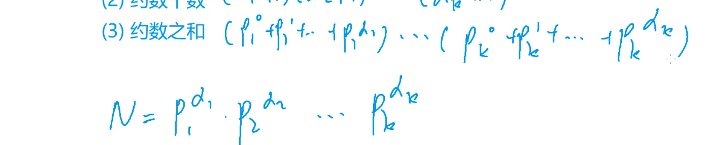

```python
from math import sqrt
from collections import Counter
n=int(input())
# 用于记录指数的累和
memo=Counter()
mod=10**9+7

# 求解质因数的模板
def cal(x):
    for i in range(2,int(sqrt(x)+1)):
        if x%i==0:
            s=0
            while x%i==0:
                x//=i
                s+=1
            memo[i]+=s
    if x>1:
        memo[x]+=1

for _ in range(n):
    x=int(input())
    # 对每个因数找它的质因数，累加指数
    cal(x)

# 计算每个质数的结果
def count_(k,v):
    ans=0
    for i in range(v+1):
        ans+=pow(k,i)
    return ans 
ans=1

# 计算累和
for k,v in memo.items():
    ans*=count_(k,v)
    ans%=mod
print(ans)
```


## 欧拉函数

用于求解N在1到N之间有多少个与N互质的数字，需要利用到质因数，这里的特例是1的欧拉函数是1/


质数的欧拉函数是该质数减1


```python
n=int(input())
from math import sqrt
# 这里只需要考虑质因数的底数而不需要考虑指数
def cal(x):
    ans=[]
    for i in range(2,int(sqrt(x)+1)):
        if x%i==0:
            s=0
            while x%i==0:
                x//=i
                s+=1
            ans.append(i)
    if x>1:
        ans.append(x)
    return ans

for _ in range(n):
    x=int(input())
    nums=cal(x)
    ans=x
    # 利用公式求解
    for p in nums:
        ans*=(1-1/p)
    print(int(ans))
```

### 求欧拉函数之和

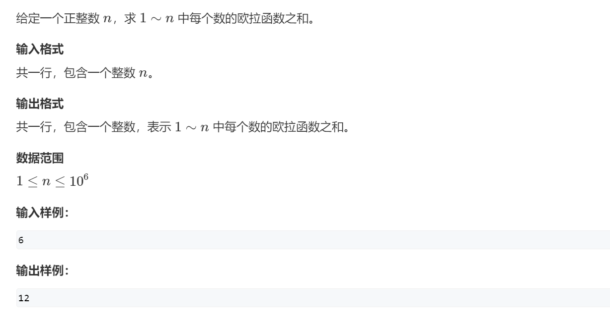


如果对每个数求欧拉函数，时间复杂度为O($$n\sqrt{n}$$)，而线性筛的方法可以在找质因数的过程中求出1到n所有数字的欧拉函数。

**注意1的欧拉函数为1**

在线性筛中每次枚举p*i的时候顺便求出P * i的欧拉函数，根据公式它的欧拉函数比i的多出了p乘(1-1/p),如果在前面判断了p是i的因数，就说明这个p已经在i的欧拉函数中乘过了，欧拉函数和质因数的个数无关和种类有关，因此不需要再乘一次了。

```python
n=int(input())
prime=[]
# 做偏移
is_prime=[True]*(n+1)
res=[0]*(n+1)
# 特例
res[1]=1
# 线性筛
for i in range(2,n+1):
    # 对于一个质数，它的质因数只能是自己，由公式推出欧拉函数是p-1
    if is_prime[i]:
        prime.append(i)
        res[i]=i-1
     # 注意不能再if语句块中
    for p in prime:
        if i*p>n:
            break
        is_prime[i*p]=False
        # 判断
        if i%p==0:
            res[i*p]=p*res[i]
            break
        else:
            res[i*p]=res[i]*(p-1)
print(sum(res))
                
```

## 裴属定理+欧几里得算法

**对于任意一对正整数x,y一定存在整数a,b，使得ax+by=gcd(x,y)**

**两个互质的数，不能组合出的最大的数是(n-1)*(m-1)-1**

是否存在一个ax+by+cy+.....=k的问题，这可以用裴属定理，即k是gcd(a,b,c,....)的整数倍则有解，不过这里要求xyz不能取0


### 求出所有的公约数

a和b所有的公约数是a和b的最大公约数的约数。

```python
temp=set()
n=gcd(a,b)
i=1
while i<=int(n**0.5)+1:
    if not n%i:
        temp.add(i)
        # 注意另一部分不能落下	
        temp.add(n//i)
    i+=1
temp=sorted(temp)
```


### 基本欧几里得算法

```python
# 迭代的写法
def gcd(x,y):
    if x<y:
        x,y=y,x
    m=-1
    while m:
        _,m=divmod(x,y)
        x=y
        y=m
        temp=m
    return m

# 递归的写法，根据性质：gcd(a,b)=gcd(b,a%b)
def gcd(a,b):
	if not b:
		return a
        return gcd(b,a%b)
    
```


### 扩展欧几里得算法

但是仅仅根据欧几里得算法无法得出系数，需要用到扩展的欧几里得算法，即在找最大公约数的过程中求解出系数。

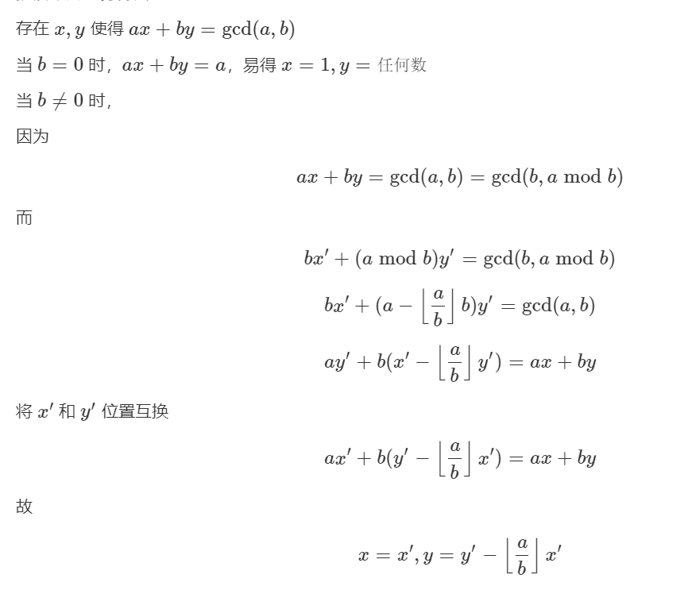

在调用欧几里得算法的过程中，反转了a和b，因此x和y传入的时候也要反转。根据推到可以得到外层的系数和下一层循环的系数右一定的联系。


注意调用扩展欧几里得时，后两个传入0，0

```python
def exgcd(a,b,x,y):
    if not b:
        # 如果b等于0，根据公式一定有ax+by=a，选择返回系数1，0
        return a,1,0
    # 反之，递归
    d,y,x=exgcd(b,a%b,y,x)
    return d,x,y-a//b*x
t=int(input())
for _ in range(t):
    x,y=[int(x) for x in input().split()]
    # 初始的参数都为0
    _,a,c=exgcd(x,y,0,0)
    print(*[a,c])
```


### 扩展欧几里得求逆

扩展欧几里得算法还能求出逆

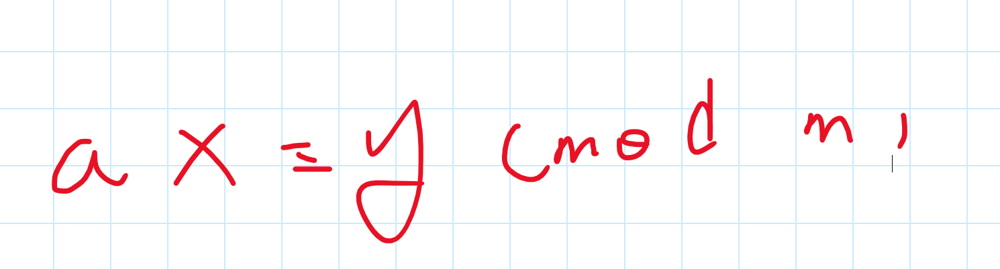


a的逆等于exgcd(a,m,0,0)[1]，求出a的逆后x的结果等于y*(a的逆)//(a和m的最大公约数)%m，注意这里如果结果不能整除二者的最大公约数那么无法找到x。


### 线性同余方程


找a和m的最大公约数，如果这个数可以被b整除则存在x，结果是`b//d*(a的系数)%m`

```python
t=int(input())
def exgcd(a,b,x,y):
    if not b:
        return a ,1,0
    d,y,x=exgcd(b,a%b,y,x)
    return d,x,y-a//b*x
    
for _ in range(t):
    a,b,m=[int(x) for x in input().split()]
    d,x,y=exgcd(a,m,0,0)
    if b%d:
        print('impossible')
    else:
        print((x*b//d)%m)
```

## 互素的数所不能表示的最大的数

如果两个数互素，那么它们所不能表示的最大的数是x*y-x-y

## 逆元

就是扩展欧几里得算法中求解出的x或者是y的系数，另外根据费马小定理有：当取模的数是质数的时候，a的逆元就是a^m-1。在对两个较大的数相除的结果取模的时候，由于同余定理对除法不起作用，因此要把被除数转化为逆元变为乘法后取模，而找一个数取逆元的过程如下：


这里可以使用费马小定理主要是因为10**9+7是一个质数


## 中国剩余定理


其中a和m是已知的，注意m是互质(最大公约数为1)的要求

不论证明过程，最后最小的x等于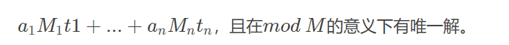


令M等于所有m的乘积，Mi等于M//mi，$M_{i}t_i≡1(mod m_i)$ti就是Mi对mi的逆


```python
n = int(input())
S = 1
m = [0] * n
a = [0] * n

# 扩展欧几里得
def exgcd(a, b, x, y):
    if not b: return a, 1, 0
    d, y, x = exgcd(b, a % b, y, x)
    return d,x, y - a // b * x


for i in range(n):
    m_, a_ = [int(x) for x in input().split()]
    a[i] = a_
    m[i] = m_
    S *= m_
ans = 0
for i in range(n):
    x,y,z=exgcd(S // m[i], m[i], 0, 0)
    M=S//m[i]
    # 注意累加过程要取模M
    ans= (ans+a[i]*y*M)%S
print(ans)
```


## 排列

对于长度为n的数组它的全排列个数为n!，如果不区分相同元素的话那么总的排列个数要除以数组中相同元素的个数的阶乘。


## 组合数

组合数的递推公式为：$$C_{a}^b= C_{a-1}^b+C_{a-1}^{b-1}$$注意是加法

注意组合数在python3中可以直接用comb快速计算，但是在pypy3中并没有comb函数


注意即使comb对于大数很快但是对于多次询问还是需要打表求解。


对于长度为k的数组任意取有2^k-1个非空序列

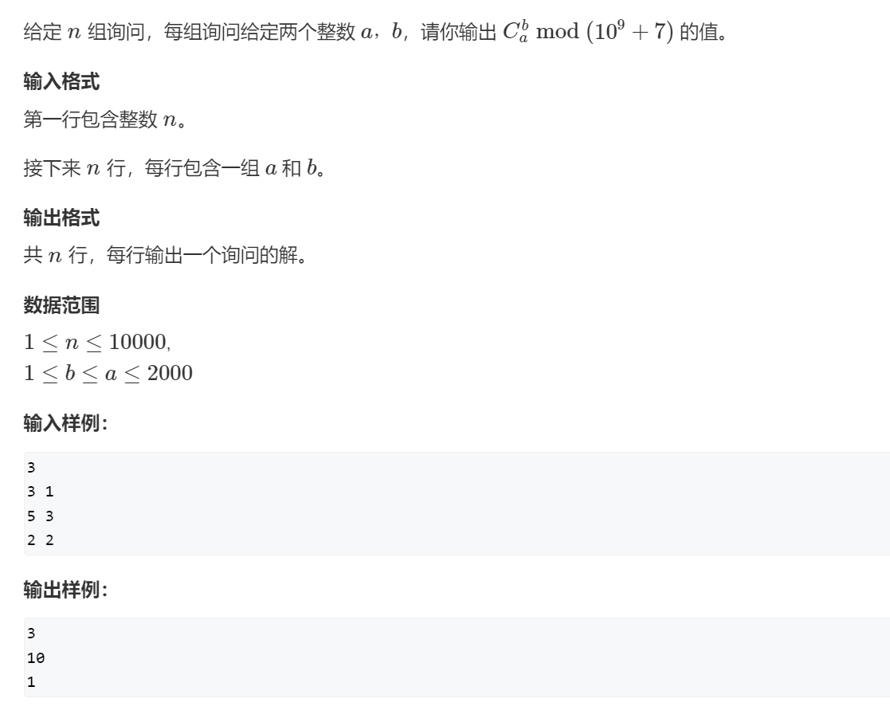

对于多次询问（十万次）必须快速求解出组合数，因此选择打表计算对于给定的数据打表最多是10**6。

初始化dp[0]\[0]=1

```python
dp=[[0]*2010 for _ in range(2010)]
mod=10**9+7
for i in range(2010):
    # 内层的循环只能到i，在往外无意义
    for j in range(i+1):
        # j=0的时候结果为1
        if not j:dp[i][j]=1
        else:
            dp[i][j]=(dp[i-1][j-1]+dp[i-1][j])%mod
t=int(input())
for _ in range(t):
    a,b=[int(x) for x in input().split()]
    if b>a:
        a,b=b,a
    print(dp[a][b])
    
```


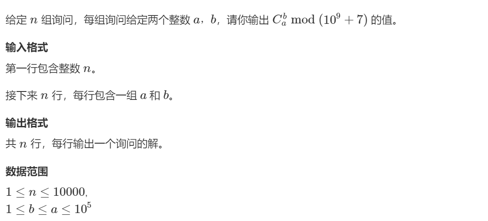

这里给定的数据范围无法打表计算每一组解，根据组合数的性质求解除使用递推求解每个数的阶乘，然后在计算中使用阶乘求解即可。

```python
n=10**5+10
mod=10**9+7
dp=[1]*n
infact=[0]*n
for i in range(1,n):
    dp[i]=(i*dp[i-1])%mod
t=int(input())
for _ in range(t):
    a,b=[int(x) for x in input().split()]
    # 转换为逆元进行乘法操作，才能取模
    print(dp[a]*pow(dp[b],mod-2,mod) *pow(dp[a-b],mod-2,mod)%mod)
```


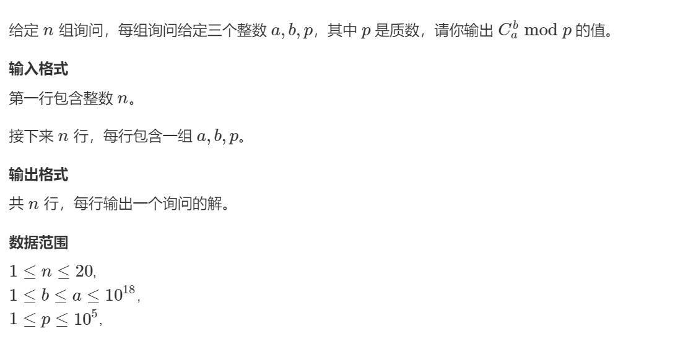

对于数据范围很大的组合数取模的结果，如果模数是一个质数那么可以用卢卡斯定理简化计算：
	$$C_{a}^{b}=C_{a mod p}^{bmod p}*C_{a/p}^{b/p} mod p$$

注意这里的p一定是一个质数

```python
def C(a,b,p):
    j=a
    res=1
    # 根据定义计算，根据公式拆分为(a/b)*(c/d)的形式...，一共有b项，这个过程中一直取模
    for i in range(1,b+1):
        res=res*j%p
        # 使用逆元
        res=res*pow(i,p-2,p)%p
        j-=1
    return res
        
def locus(a,b,p):
    # 如果ab的范围可以接收（十万以内），直接计算
    if a<p and b<p:
        return C(a,b,p)
    # 否则用卢卡斯定理简化计算
    return C(a%p,b%p,p)*locus(a//p,b//p,p)%p
for _ in range(int(input())):
    a,b,p=[int(x) for x in input().split()]
    print(locus(a,b,p))
```

### [有效的快递序列数目](https://leetcode.cn/problems/count-all-valid-pickup-and-delivery-options/)

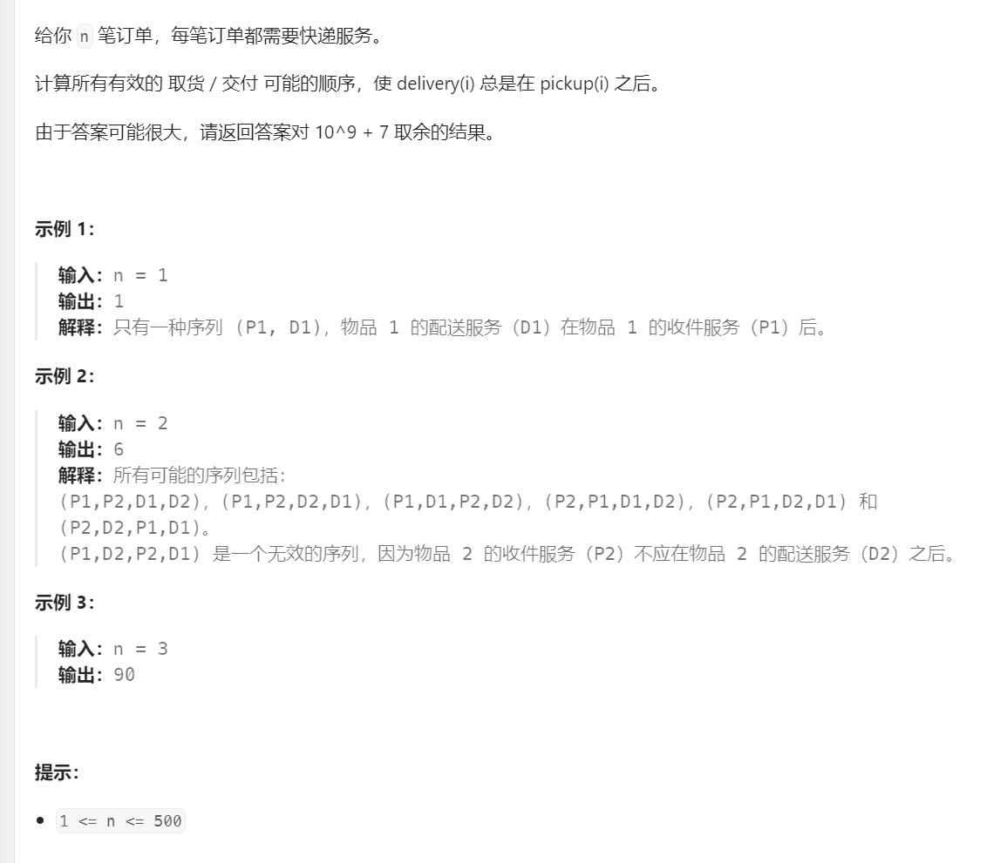

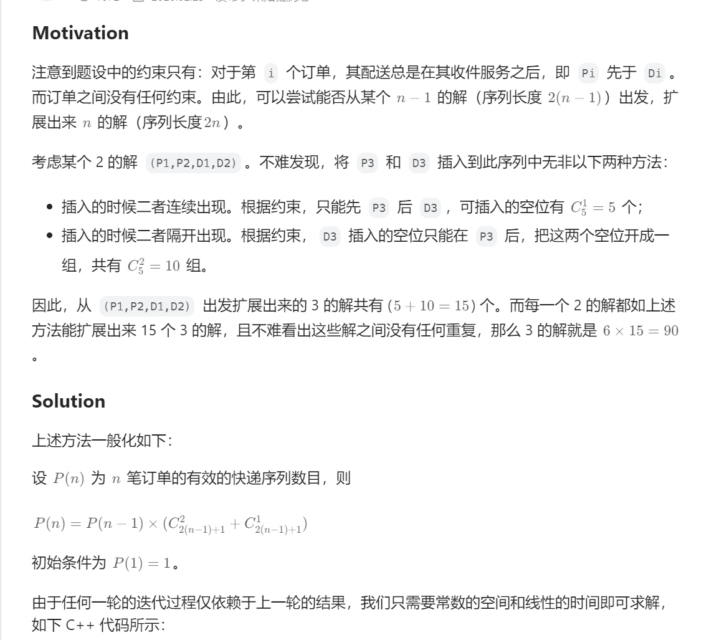

注意comb(5,2)中两个数字的顺序是只有一种的，要么是i先j后，或者反过来,不会都有。

两种放置方式：两个数字一块放也就是在所有的空位中选一个出来，或者是间隔放即在空位中选出两个。

```python
class Solution:
    def countOrders(self, n: int) -> int:
        m=10**9+7
        p=1
        for i in range(2,n+1):
            a=2*(i-1)+1
            b=a*(a-1)//2
            p=p*(a+b)%m

        return p
        
```


## 卡特兰数

一种特殊的组合数

问题一般是有两个选择，问这两种选择满足的组合有多少种

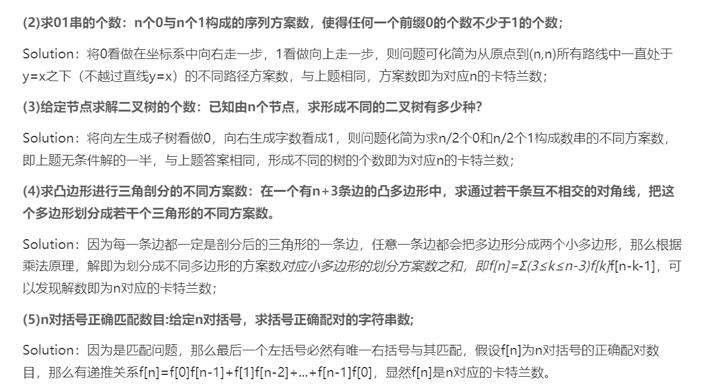


### 生成字符串

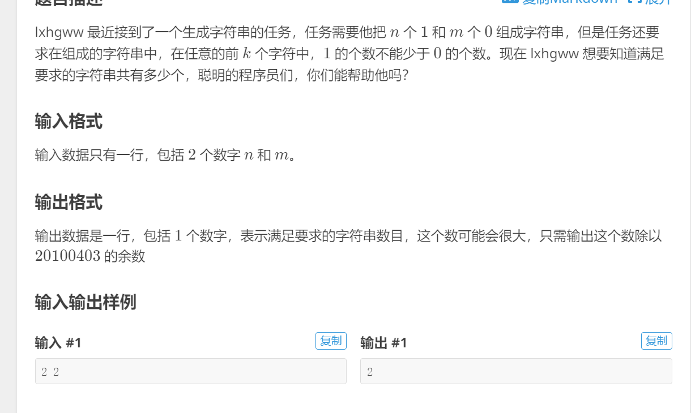


把文图抽象为图像，1相当于向右上走，0相当于向右下走，为了1的个数要大于0需要在组合的过程中不要经过y=-1这条线否则就是0的个数大于1的个数


最后的结果是所有的组合数减去不合法的组合数，其中所有的组合数就是从起点走到(n,m)有多少种走法也就是从m+n中选出n个或者m个。而不合法的数目，将路线从开头到第一次经过y=-1这条线的点的路线反转，问题变为从0，-2开始走到目标点有多少种走法，这里变化后，通过观察图像发现0的个数减少1的个数增加1，从m+n中选出n+1个或者m-1个

```python
from math import factorial as f
mod=20100403
n,m=[int(x) for x in input().split()]

#  不使用内置的函数计算防止内存超限
def C(a,b):
    # 使用一个变量记录上面的结果
    j=a
    # res记录当前的结果
    res=1
    # 下面是从1到b
    for i in range(1,b+1):
        res=(res*j)%mod
        res=(res*pow(i,mod-2,mod))%mod
        j-=1
    return res%mod
res=C(m+n,n)-C(m+n,n+1)
print(res%mod)
```


### 鸡蛋饼


就是求解卡特兰数

```python
mod=100000007
n=int(input())
def C(a,b):
    res=1
    j=a
    for i in range(1,b+1):
        res=(res*j)%mod
        res=(res*pow(i,mod-2,mod))%mod
        j-=1
    return res%mod
print(C(2*n,n)*pow(n+1,mod-2,mod)%mod)
```

### 矩阵ii

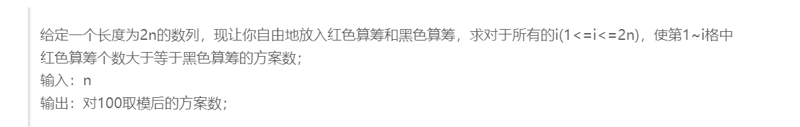

这里取模数是100不能使用飞马小定理求解逆元，对卡特兰数使用定义计算：

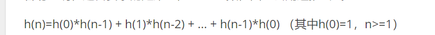

这里注意取模操作要放到括号外面，对于每个卡特兰数他都是由前面的数推出，这里不存在除法可以直接取模

```python
f=[0]*110
mod=100
f[0]=1
for i in range(1,101):
    # 从0到n-1
    for j in range(i):
        f[i]=(f[i]+f[j]*f[i-1-j])%mod
n=int(input())
print(f[n])
```

## 快速冥

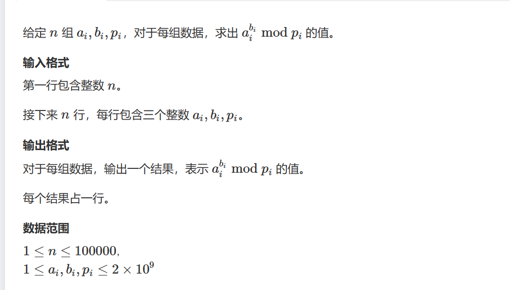


对于较大的冥次比如说n达到10**9，保证不会溢出的情况下使用迭代求解会超时。快速冥的做法是把冥次拆分为二进制数（比如6写为110，$2^2+2^1$），然后只操作这些位

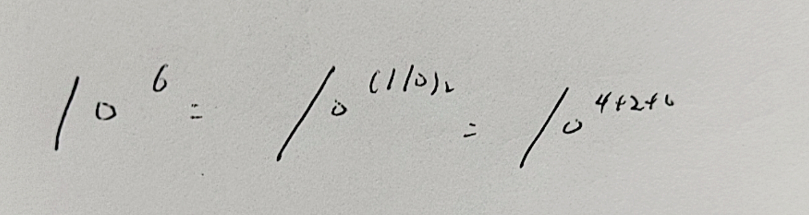

这样就只需要迭代log(n)次

```python
n=int(input())
def cal(a,b,p):
    res=1

    while b:
        # 只有在有1的时候才会葛更新结果，也就是每次乘的时候恰好对应到拆分的位数
        if b&1:
            res=(res*a)%p
        b=b>>1
        a=(a*a)%p
    return res
        
for _ in range(n):
    a,b,p=[int(x) for x in input().split()]
    print(cal(a,b,p))
```

## 矩阵快速冥

对于递推式可以变为矩阵得形式，利用矩阵快速计算求解。

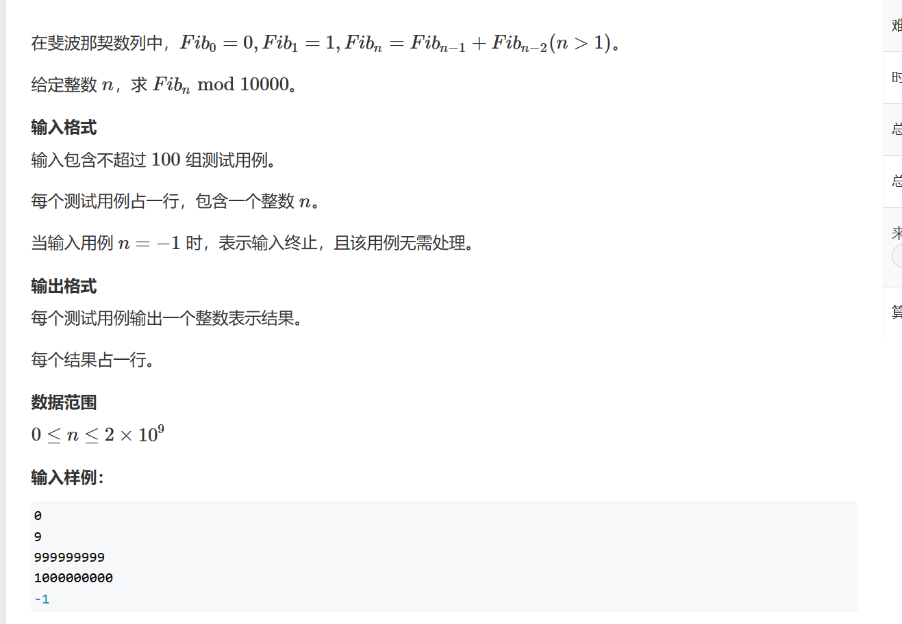

对于给定的数据范围迭代和递归都无法满足，观察递推式发现：


递推式可以转换为矩阵相乘的形式，$f_n=f_0*mat^n$

为此实现矩阵快速冥

```python
n=int(input())
m=10000

# 矩阵乘法
def mul(a,b):
    # 初始状态
    R=[[0,0],[0,0]]
    # 先遍历每个位置
    for i in range(2):
        for j in range(2):
            # k表示共有的部分，m*k k*n
            for k in range(2):
                # 注意这个算式，这个过程中要取模
                R[i][j]=(R[i][j]+a[i][k]*b[k][j])%m
    return R
    
# 修改快速冥即可
def cal(n):
    # base case，初始时应该是[0,1]但是为了使用mul函数，统一为[[0,1],[0,0]]
    R=[[0,1],[0,0]]
    # mat
    A=[[0,1],[1,1]]
    while n:
        if n&1:
            R=mul(R,A)
        A=mul(A,A)
        n>>=1
    return R[0][0]
    
    
while n!=-1:
    res=cal(n)
    print(res)
    n=int(input())
```

## Iterated Linear Function

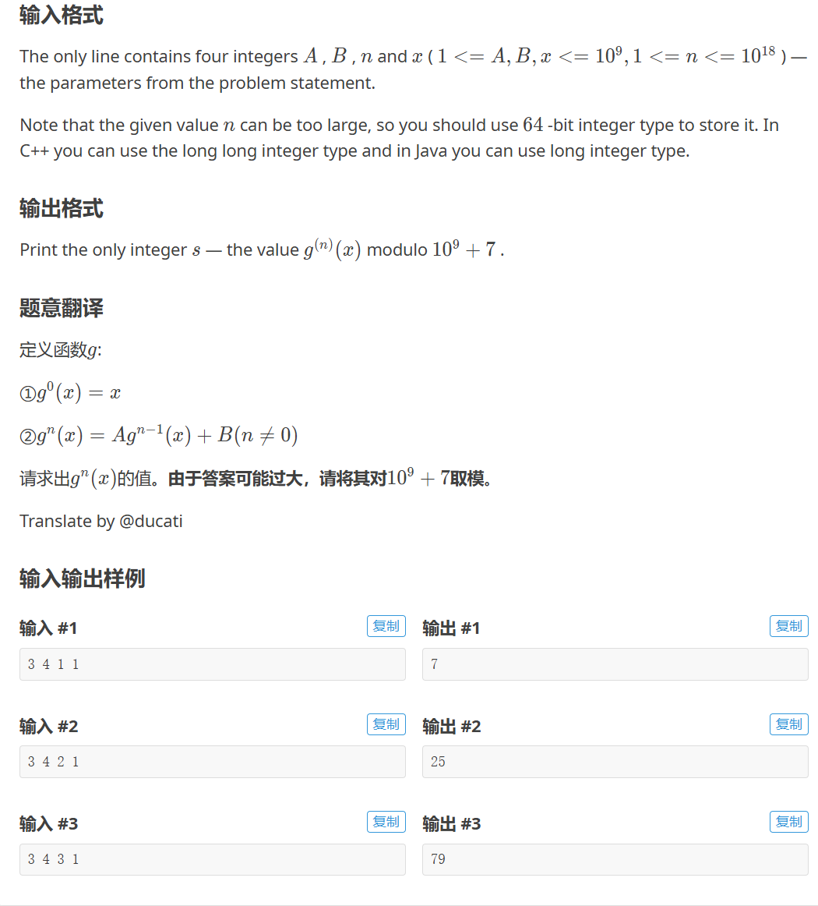


对于给定的数据范围必须用快速冥求解。

首先构造出公式，对于[g1(x),1]要得出[g2(x)=A*g1(x)+B,1]，注意这一步是关键必须同时满足后面的1，为方便操作将矩阵扩展为2\*2得。

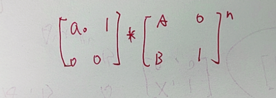


```python
mod=10**9+7
a,b,n,x=[int(x) for x in input().split()]
# 矩阵乘法
def mul(a,b):
    # 初始状态
    R=[[0,0],[0,0]]
    # 先遍历每个位置
    for i in range(2):
        for j in range(2):
            # k表示共有的部分，m*k k*n
            for k in range(2):
                # 注意这个算式，这个过程中要取模
                R[i][j]=(R[i][j]+a[i][k]*b[k][j])%mod
    return R
def cal(n):
    # 初始结果
    R=[[x,1],[0,0]]
    # 用于计算的矩阵
    A=[[a,0],[b,1]]
    # 快速冥拆分
    while n:
        if n&1:
            R=mul(R,A)
        A=mul(A,A)
        n>>=1
    return R[0][0]
print(cal(n))
```


## 冥次

使用内置函数Pow可快速求解，为了防止数据太大可以在Pow函数中加入第三个参数作为取模的值防止过大导致计算较慢。

内置函数sqrt()可以求解开方，isqrt()可以求出开方后的整数。

补充2^31开方后的结果为40000多

比起log函数求冥，模拟整除更好


## 容斥原理

在计算结果的时候不去考虑重叠的部分，先把所有的加上然后再家去重叠的部分，这个公式就是概率论中的几个集合相交

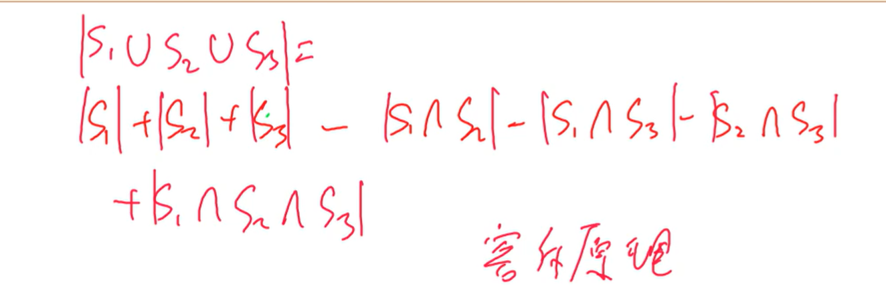


往外推广的结果是1-2+3-4+5-6+....+(-1)^(n-1)*n，奇数个集合是加偶数个集合是减。

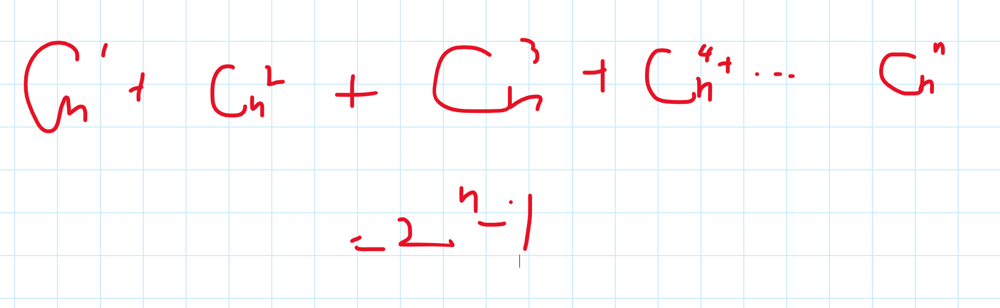

可以看作是从n个数中选取任意个，一共有2^n-1个状态（注意不会选0个，等式左边会补上 $$C^0_n$$）


使用容斥原理找能被一个质数整除的个数，这里补充一点1到n中能被p整除的个数是n//p，而能被n和m同时整除的个数是n//(m*n)，这里的p是质数。

能被质数整除的集合一共有m个，枚举每个选或者是不选则有2^m-1个状态

```python
n,m=[int(x) for x in input().split()]
prime=[int(x) for x in input().split()]
res=0
# 使用位图表示当前位置的集合有没有选
for i in range(1,1<<len(prime)):
    # 记录选取的集合的乘积
    t=1
    # 分别记录当前枚举的集合个数和结果
    cnt=summ=0
    # 遍历每一位
    for j in range(m):
        p=prime[j]
        if i>>j&1:
            t*=p
            # 如果累乘的结果大于N说明不存在能被当前集合所除的数
            if t>n:
                t=-1
                break
            cnt+=1
    summ+=n//t
    if t!=-1:
        # 奇数加偶数减
        res+= summ if cnt&1 else -summ
print(res)
```


## 简单博弈论

### NIM游戏

n堆物品，每堆有ai 个，两个玩家轮流取走任意一堆的任意个物品，但不能不取。取走最后一个物品的人获胜

结论是每堆石子的异或和如果等于0，则先手必输反之必胜。


### Training Before the Olympiad


先手想要结果最大后手想要结果最小，每次选奇偶不同的数可以使得元素总和减小一，而相同的总和不变，因此前者尽可能多的选奇偶相同的后者选不同的，此外为了保证先手胜利，先手会每次优先完奇数/偶数优先保证后手不能减小总和。

维护两个前缀数组，一个是奇数的个数一个是前缀和，每一轮如果奇数的个数足够的话可以减少三个如果不够，剩余0个或2个那么最后的总和一定不变，反之一定会减小1.

```python
import sys
from itertools import accumulate as ac
input=sys.stdin.readline


for _ in range(int(input())):
    n=int(input())
    nums=list(map(int,input().split()))
    # 记录奇数个数
    odd=[0]*n
    odd[0]=int(nums[0]&1==1)
    for i in range(1,n):
        odd[i]+=odd[i-1]+int(nums[i]&1==1)
    # 记录前缀和
    pre=list(ac(nums))
    ans=[]
    for i in range(n):
        # 对于第一个要特判
        if i==0:
            ans.append(pre[i])
            continue
        v=odd[i]
        a,b =divmod(v,3)
        # 总和要减去轮数
        if b==0 or b==2:
            ans.append(pre[i]-a)
        else:
            ans.append(pre[i]-a-1)
    for v in ans:
        print(v,end=' ')
    print()
```


# 链表反转

## 反转链表

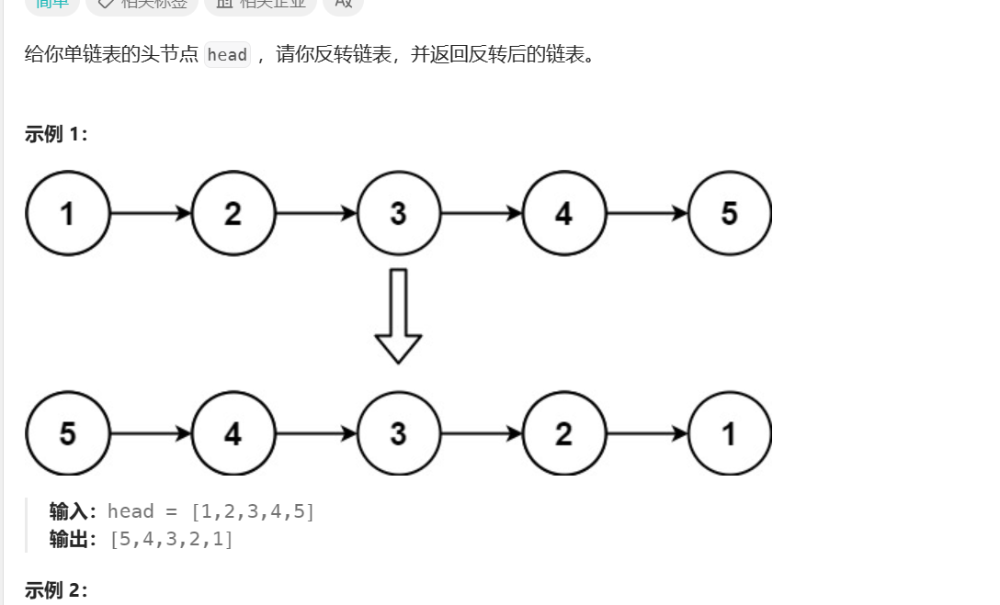

使用迭代函数以及双指针，么此将下一个指针指向上一个指针，注意要提前记录下一个值否则会丢失

```python
class Solution(object):
    def reverseList(self, head):
        l=None
        r=head
        while r:
            temp=r.next
            r.next=l
            l,r=r,temp
        return l
```


使用递归函数操作，每次递归的操作是将下一个节点的下一指针连接到自己上，将自己的下一指针断开，防止形成环，递归会对每个节点做相同的操作。

```python
class Solution(object):
    def reverseList(self, head):
        # 如果传入的节点是空的或者只有一个，直接返回，在递归中会返回原本的尾节点，反转操作最后是要获得新的头节点，找到了尾节点之后一直传递
        if not head or not head.next:
            return head
        temp=self.reverseList(head.next)
        head.next.next=head
        head.next=None
		# 传递
        return temp
```


## 反转链表II


找到开始反转节点的前一个，对之后的k个节点使用上述的双指针操作，注意如果要求的是最开始的节点就无法找到前一位，因此加入一个虚拟节点。

```python 
class Solution(object):
    def reverseBetween(self, head, left, right):
        # 虚拟节点
        dummy=ListNode(-1)
        dummy.next=head
        p0=dummy
        # 找到前一节点
        for _ in range(left-1):
            p0=p0.next
        pre=None
        curr=p0.next
        # 双指针操作
        for _ in range(right-left+1):
            temp=curr.next
            curr.next=pre
            pre,curr=curr,temp
         # 最后curr指向末尾节点的下一个，pre指向末尾节点，开始的前一个此时还指向这开始节点，将开始节点的下一个连到末尾的下一个去，开始节点的下一个连接到末尾节点 
        p0.next.next=curr
        p0.next=pre
        return  dummy.next
```

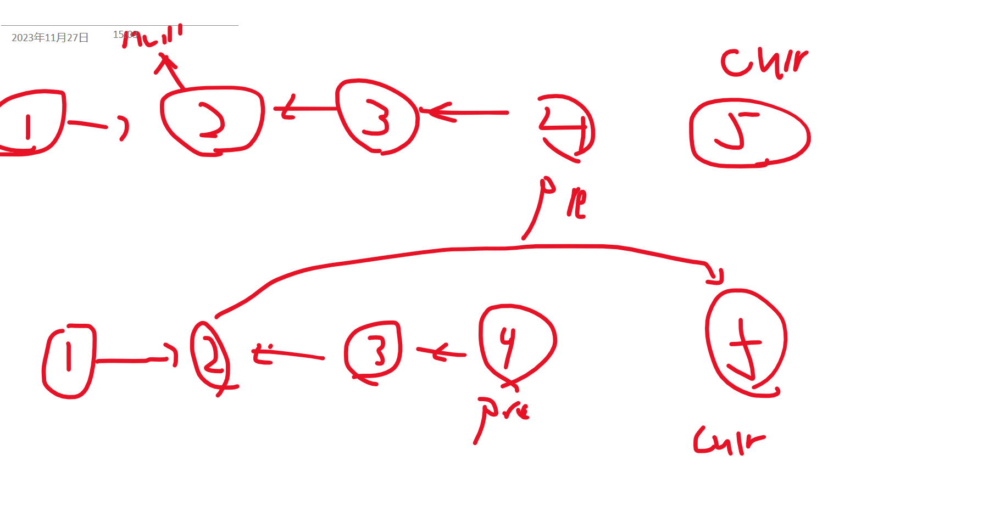

## [K 个一组翻转链表](https://leetcode.cn/problems/reverse-nodes-in-k-group/)

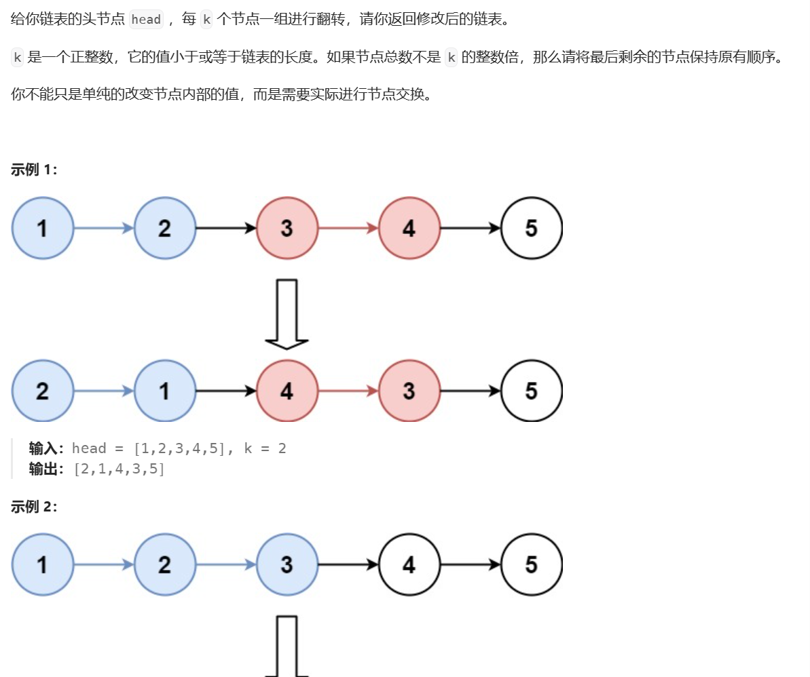


k个一组反转链表，首先要得到链表的长度，如果剩下的节点数目不够，就不进行操作了。

和上一题一样的思路，唯一要注意的是每次需更新p0（p0是开始反转节点的前一个节点），每次的p0按照观察就是上一次操作的p0.next（因为反转了过来）。如图所示第一次操作前是21435，p0是dummy节点，下一个节点是2，在将前两个反转后12435，下一个要反转43,p0应该是2，也就是上一次操作的p0.next。


```python
class Solution(object):
    def reverseKGroup(self, head, k):
        temp=head
        n=1
        # 首先找到链表的长度
        while temp.next:
            temp=temp.next
            n+=1
        index=0
        # 记录虚拟节点，防止删除第一个
        dummy = ListNode(-1)
        dummy.next = head
        p0 = dummy
        
        while n-index>=k:
            pre=None
            # 每次记录p0的下一个节点
            cnt=curr=p0.next
            # 反转k个节点的操作
            for _ in range(k):
                temp=curr.next
                curr.next=pre
                pre,curr=curr,temp
            p0.next.next=curr
            p0.next=pre
            # 更新p0
            p0=cnt
            # 每次操作完了后，递增k个
            index+=k
        return dummy.next
```

## [从链表中移除节点](https://leetcode.cn/problems/remove-nodes-from-linked-list/)

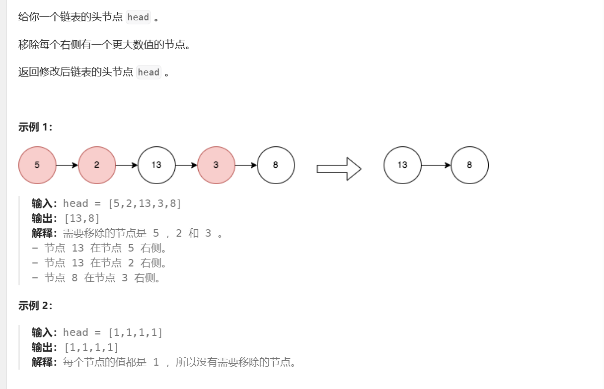


正难则反，找到右侧存在一个更大的值比较难，于是反转链表，删除小于当前节点的，最后再反转一次链表即可

```python
class Solution(object):
    def removeNodes(self, head):
        pre=None
        curr=head
        # 反转链表
        while curr:
            temp=curr.next
            curr.next=pre
            pre,curr=curr,temp
        
        head=pre
        t=head
        # 删除小于当前节点的
        while t:
            if t.next and t.next.val<t.val:
                t.next=t.next.next
                # 删掉了之后继续而不是更新节点
                continue
            t=t.next
        # 最后再反转
        pre = None
        curr = head
        while curr:
            temp = curr.next
            curr.next = pre
            pre, curr = curr,temp
        return pre
```


# 链表双指针技巧全面总结

## 删除排序链表中的重复元素

给定一个已排序的链表的头 `head` ， *删除所有重复的元素，使每个元素只出现一次* 。返回 *已排序的链表* 。

```python
class Solution(object):
    def deleteDuplicates(self, head):
        if not head:
            return None
        # 双指针，一快一慢
        slow=head
        fast=head
        while fast:
            # 通过连接不同的元素来达到删除的效果，而不是遇到相同的元素就解链子
            if fast.val!=slow.val:
                slow.next=fast
                slow=slow.next
            fast=fast.next
        slow.next=None
        return head
```


## 合并两个有序链表

```python
class Solution(object):
    def mergeTwoLists(self, list1, list2):
        p=ListNode()
        curr=p

        while list1!=None and list2!=None:
            if list1.val>list2.val:
                curr.next=list2
                list2=list2.next
            else:
                curr.next=list1
                list1=list1.next
            curr=curr.next
        if list1!=None:
            curr.next=list1
        else:
            curr.next=list2
        return p.next
```

## 合并k个升序链表

```python
'''借助优先级队列（实际上内部是堆），每次加入元素按照他们的优先级排序好'''
class ListNode(object):
    def __init__(self, val=0, next=None):
        self.val = val
        self.next = next
class Solution(object):
    def mergeKLists(self, lists):
        # list中装的是所有链表的头节点
        if len(lists) == 0:
            return None
        head = ListNode(-1)
        curr = head

        li = []
        for head_ in lists:
            if head_ != None:
                # 传入元组以第一个元素作为优先级，第二个元素是加入的值，这里是链表的头节点
                heapq.heappush(li, (head_.val, head_))

        while len(li) != 0:
            _, node = heapq.heappop(li)
            curr.next = node

            if node.next:
                # 取出头节点之后，再加入该节点所连接的下一个节点
                heapq.heappush(li, (node.next.val, node.next))
            curr = curr.next
        return head.next
```


## 分割链表

使用两个链表来储存

```python
class Solution(object):
    def partition(self, head, x):
         lesshead=ListNode()
         lessthan=lesshead
         morehead=ListNode()
         morethan=morehead
         while head:
             if head.val>=x:
                 morethan.next=head
                 morethan=morethan.next
             else:
                 lessthan.next=head
                 lessthan=lessthan.next
             head= head.next
         # 注意要把morethan的下一个连接断开
         morethan.next=None
         lessthan.next=morehead.next
         return lesshead.next
```


## 单链表倒数第k个节点

倒数的第K个节点即整数的第n-k+1个节点

单链表只能从前往后遍历，如果想找倒数的元素一般需要遍历两次，一次找出总长度一次遍历到n-k+1的位置。但是可以使用双指针技巧（初始两个指针都指向头节点），首先一个指针走k步，然后在与另一个指针走n-k步，此时前一个指针到达None，后一个指针到达n-k+1。

删除链表时需要注意头结点的情况，如果有5个节点，要删除倒数第5个节点，按照理论需要找到倒数第6个，但此时倒数第6个不存在，因此使用虚拟头节点，虚拟头节点的时候不会影响倒数的个数，因为是加在头节点之前的。

```python
'''给你一个链表，删除链表的倒数第 n 个结点，并且返回链表的头结点。'''
class ListNode(object):
    def __init__(self, val=0, next=None):
        self.val = val
        self.next = next

class Solution(object):

    def removeNthFromEnd(self, head, n):
        dummy = ListNode(0)
        dummy.next = head
        p1, p2 = dummy, dummy
		
        # 要删除倒数第K个节点，首先要找到倒数第K+1个节点
        for _ in range(n + 1):
            p1 = p1.next

        while p1:
            p1 = p1.next
            p2 = p2.next

        p2.next = p2.next.next
        return dummy.next

```

## 单链表的中点

使用一快一慢的两个指针

```python
'''给你单链表的头结点 head ，请你找出并返回链表的中间结点。	
如果有两个中间结点，则返回第二个中间结点。'''
class Solution(object):
    def middleNode(self, head):
        slow=head
        fast=head
        while fast and fast.next:
            # 慢的走一步快的走两步
            slow=slow.next
            fast=fast.next.next
        return slow
```

## 判断链表是否包含环

使用双指针，如果fast遇到空指针说明不是环，如果快指针等于慢指针说明前者超过后者一圈。

```python
class Solution(object):
    def middleNode(self, head):
        slow=head
        fast=head
        while fast and fast.next:
            # 慢的走一步快的走两步
            slow=slow.next
            fast=fast.next.next
        	if fast==slow:
				return True
        return False
```

## 计算环起点


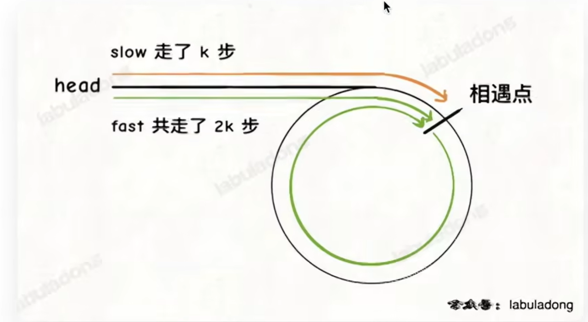

由图可得，K是环的长度的整数倍

假设环的起点到相遇点的距离是m，那么从起点到环起点和相遇点到环起点的距离是相同的k-m

让慢节点从头开始，快节点继续从相遇点出发，以相同的速度，一旦相遇就是环起点

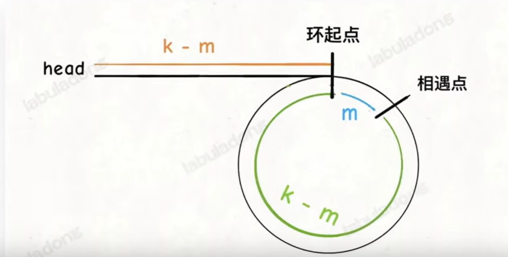

```python
class ListNode(object):
    def __init__(self, x):
        self.val = x
        self.next = None

class Solution(object):
    def hasCycle(self, head):
        slow=head
        fast=head
        while fast and fast.next:
            slow=slow.next
            fast=fast.next.next
            if slow==fast:
                break
        # 始终未相遇
        if not (fast and fast.next):
            return None
        # 慢节点从头开始，快节点继续
        slow=head
        while fast!=slow:
            fast=fast.next
            slow=slow.next
        return fast
```

## 两个链表是否相交

使用双指针技巧，但是两个链表相交前的节点个数不同，双指针无法同步，于是把他们拼接起来。

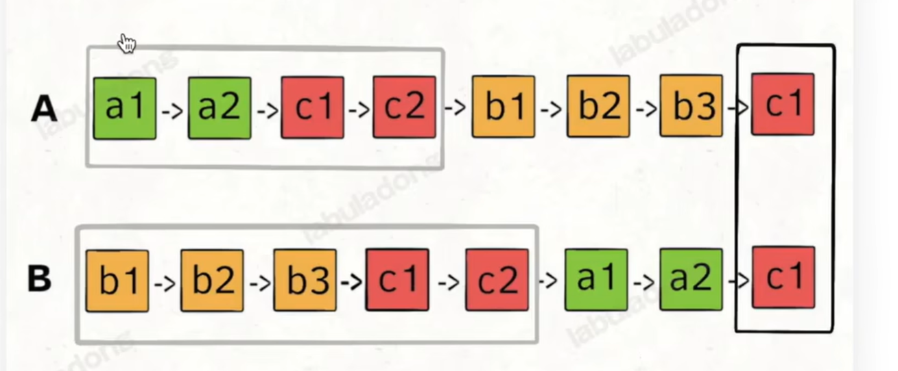

```python
# Definition for singly-linked list.
# class ListNode(object):
#     def __init__(self, x):
#         self.val = x
#         self.next = None

class Solution(object):
    def getIntersectionNode(self, headA, headB):
        a=headA
        b=headB
        while a!=b:
            if a :
                a=a.next
            else:
                a=headB
            if b:
                b=b.next
            else:
                b=headA
        return a
```

# 数组双指针题型汇总

## 删除有序数组中的重复项

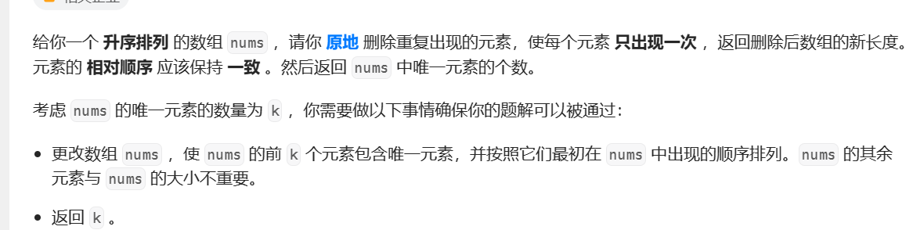

原地指的是不额外创建O(n)空间

使用双指针技巧，一个快指针在前面遍历数组，一个慢指针留在原地。数组的双指针就是下标。

```python
class Solution(object):
    def removeDuplicates(self, nums):
        slow=0
        fast=0
        # 遍历一次足以
        while fast<len(nums):
            # 一旦遇到不同的值，更新慢指针
            if nums[slow]!=nums[fast]:
                slow+=1
                nums[slow]=nums[fast]
            fast+=1
        return slow+1
```

## 移除元素

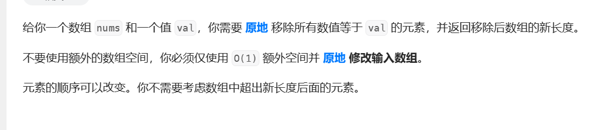

```python
class Solution(object):
    def removeElement(self, nums, val):
        slow=0
        for fast in range(len(nums)):
            # 记录所有不是val的值
            if nums[fast]!=val:
                nums[slow]=nums[fast]
                slow+=1
        return slow
```

## 移动零

给定一个数组 `nums`，编写一个函数将所有 `0` 移动到数组的末尾，同时保持非零元素的相对顺序。

**请注意** ，必须在不复制数组的情况下原地对数组进行操作。

利用双指针将所有的零元素删除，然后再末尾加上相应的零元素。

```python
class Solution(object):
    def moveZeroes(self, nums):
        slow=0
        fast=0
        while fast<len(nums):
            if nums[fast]!=0:
                nums[slow]=nums[fast]
                slow+=1
            fast+=1
        nums[slow:]=[0]*(len(nums)-slow)
        return nums
```

## 两数之和

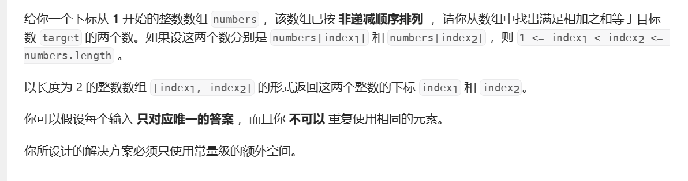

左右指针，一个在开头一个在末尾，满足一定的条件移动

```python
class Solution(object):
    def twoSum(self, numbers, target):
        left=0
        right=len(numbers)-1
        while True:
            # 计算和
            sum=numbers[left]+numbers[right]
            # 判断一些列条件
            if sum>target:
                right-=1
            elif sum<target:
                left+=1
            else:
                return [left+1,right+1]  
```

## 反转字符串

编写一个函数，其作用是将输入的字符串反转过来。输入字符串以字符数组 `s` 的形式给出。

不要给另外的数组分配额外的空间，你必须**[原地](https://baike.baidu.com/item/原地算法)修改输入数组**、使用 O(1) 的额外空间解决这一问题。

同样使用左右指针技巧。

```python
class Solution(object):
    def reverseString(self, s):
        left = 0
        right = len(s) - 1
        while left <= right:
            temp = s[left]
            s[left] = s[right]
            s[right] = temp
            right -= 1
            left += 1
        return s
```

## 最长回文字符串

给你一个字符串 `s`，找到 `s` 中最长的回文子串。

如果字符串的反序与原始字符串相同，则该字符串称为回文字符串。

左右指针，不过是从中间往两边扩展，一种特殊的方法，最长回文字符串分为偶数和奇数，函数pendling同时考虑二者

```python
class Solution(object):   
    def pendling(self, s, l, r):
        while l >= 0 and r < len(s) and s[l] == s[r]:
            l -= 1
            r += 1
           
        # 最后退出的条件是s[l]!=s[r]或是l<0，因此返回的结果是[left+1,right)防止包括不满足的字符和越界
        return s[l + 1:r]

    def longestPalindrome(self, s):
        if len(s) <= 1:
            return s
        
        res = ''
        # 同时考虑奇数和偶数
        for i in range(len(s)):
            # 奇数情况
            temp = self.pendling(s, i, i)
            if len(temp) > len(res):
                res = temp
            # 偶数情况
            temp = self.pendling(s, i, i + 1)
            if len(temp) > len(res):
                res = temp
        
        return res
```

# 数学题目

## 一些数学性质

找1~n中能被a或b整数的正整数有多少个：n//a+n//b-n//lcm(a,b)

求出数组中所有子数组的和，去找每个元素的贡献，一个元素的贡献为val*(i+1)\*(n-i+1)即左边右边可选的数目（包括自己）


## [摧毁一系列目标](https://leetcode.cn/problems/destroy-sequential-targets/)

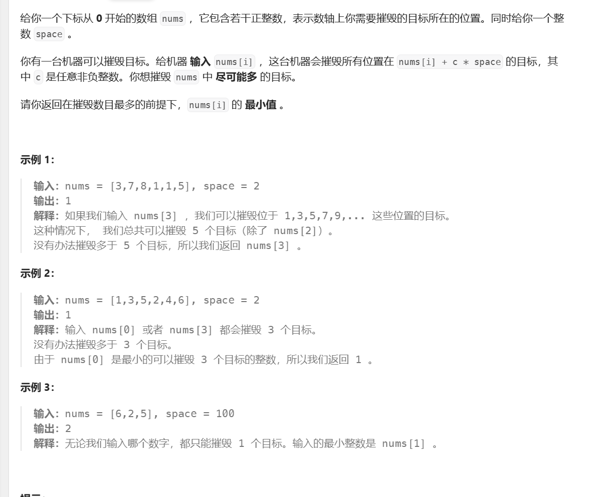


找到一个子序列，其中所有的元素满足a=b+kd（其中a和k已知），变化可得a-b=kd两边同时取模d有a-b同余0，也就是a同余b取模d，因此去找所有同余space相同的元素，这些元素可以组成一个子序列。

```python
class Solution:
    def destroyTargets(self, nums: List[int], space: int) -> int:
        memo=defaultdict(list)
        l=-inf
        ans=inf
        for v in nums:
            memo[v%space].append(v)
            l=max(l,len(memo[v%space]))
        # 找到满足要求的
        for k,v in memo.items():
            if len(v)==l:
                ans=min(ans,min(v))
        return ans 
```


## [可被三整除的最大和](https://leetcode.cn/problems/greatest-sum-divisible-by-three/)

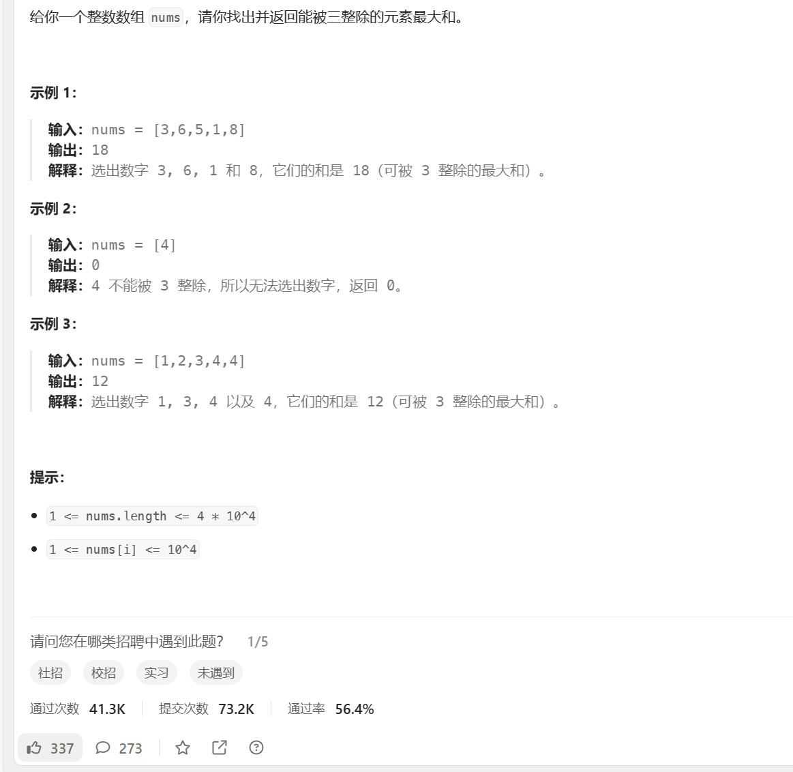


余数的性质，两种做法。

首先找出数组总和，如果取模三等于1，就减去数组中取模等于1的最小元素或者减去两个取模为2的元素，对于总和取模等于2的同理。

```python
class Solution:
    def maxSumDivThree(self, nums: List[int]) -> int:
        a=sorted([v for v in nums if v%3==1])
        b=sorted([v for v in nums if v%3==2])
        t=sum(nums)
        ans=t
        if t%3==1:
            if a and len(b)>=2:
                ans=max(t-b[0]-b[1],t-a[0])
            elif a:
                ans=t-a[0]
            elif len(b)>=2:
                ans=t-b[0]-b[1]

        elif t%3==2:
            if b and len(a)>=2:
                ans=max(t-a[0]-a[1],t-b[0])
            elif b:
                ans=t-b[0]
            elif len(a)>=2:
                ans=t-a[0]-a[1]
        return ans 
```


使用动态规划，定义dp(i,j)表示考虑前i个元素，总和取模三等于j的，最大元素总和

每个元素有选或不选两种可能，如果不选则转移到dp(i-1,j)，否则是dp(i-1,(j-nums[i])%3+nums[i])

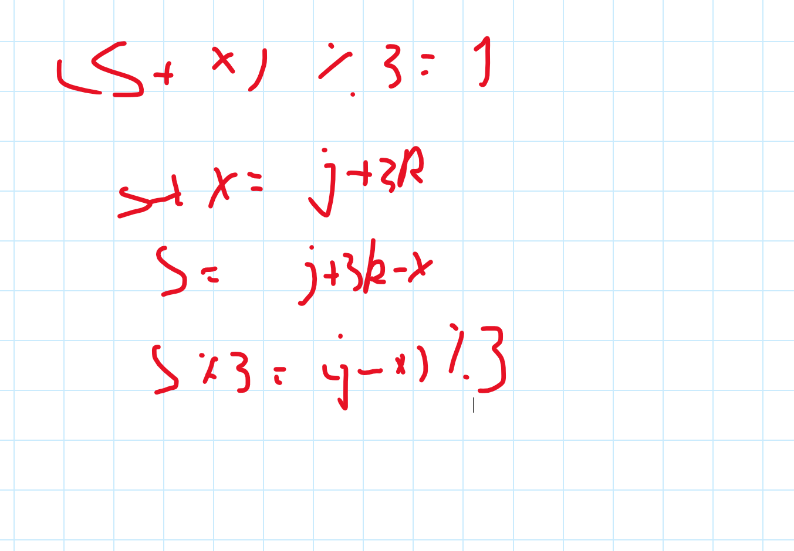


```python
class Solution:
    def maxSumDivThree(self, nums: List[int]) -> int:
        n=len(nums)
        @cache
        def dp(i,j):
            if i<0:
                return -inf if j else 0
            a=dp(i-1,j)
            b=dp(i-1,(j-nums[i])%3)+nums[i]
            return max(a,b)
        return dp(n-1,0)

```


## [找出满足差值条件的下标 II](https://leetcode.cn/problems/find-indices-with-index-and-value-difference-ii/)

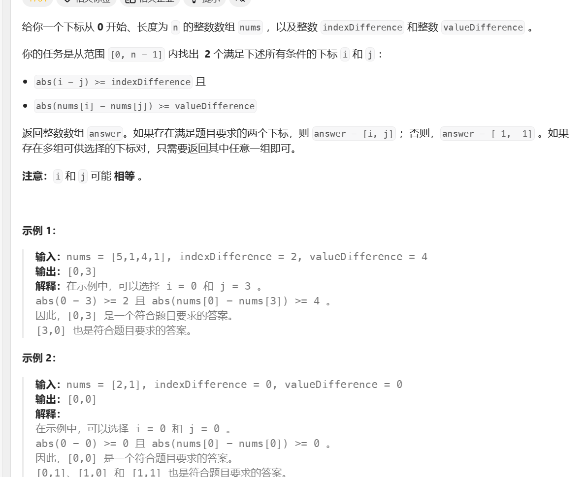

两个值，枚举j同时维护可行的i中最大最小值，这样可以保证差的绝对值最大也同时只用考虑单边（技巧点）。

```python
class Solution:
    def findIndices(self, nums: List[int], indexDifference: int, valueDifference: int) -> List[int]:
        n=len(nums)
        mx=mn=0
        r=indexDifference
        # 可行的i的最右端
        l=0
        while r<n:
            val=nums[r]
            # 判断是否满足条件
            if nums[mx]-val>=valueDifference:
                return [mx,r]
            if  val-nums[mn]>=valueDifference:
                return [mn,r]
		
            # 更新i
            l+=1
            # 规定l<n是为了防止只有一个元素的情况
            if l<n and nums[l]>nums[mx]:
                mx=l
            if l<n and nums[l]<nums[mn]:
                mn=l
            r+=1
        return [-1,-1]
```


## [对角线遍历 II](https://leetcode.cn/problems/diagonal-traverse-ii/)

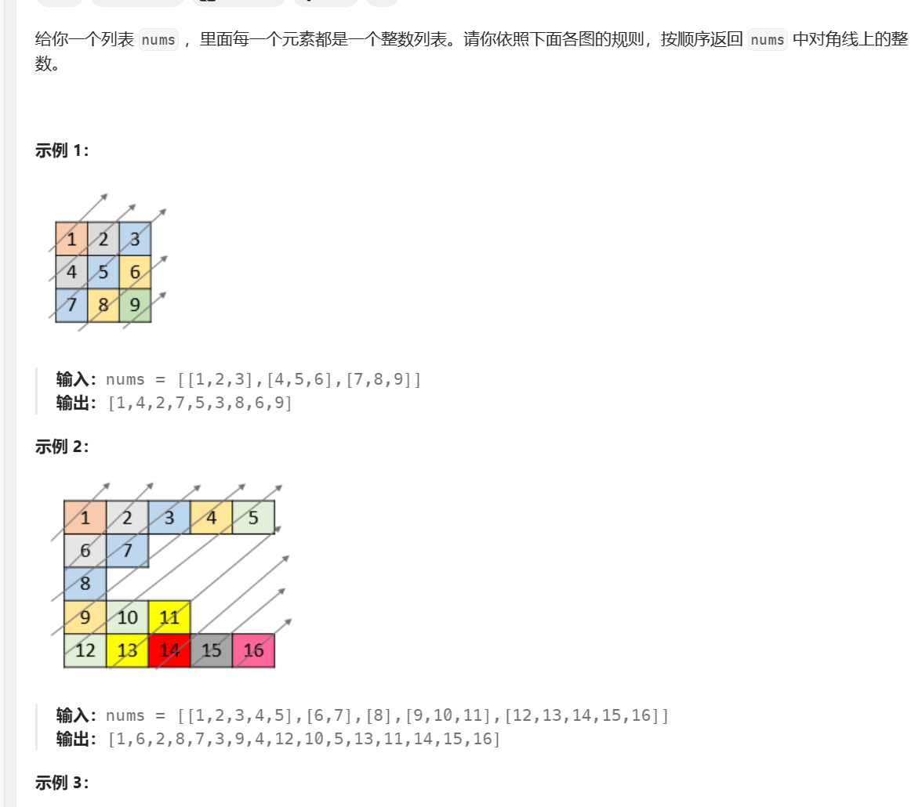


同一条对角线上坐标之和相同，遍历每一行使用哈希表记录所有相同的然后输出即可，第一条对角线的坐标值和是最小的。

对角线的扩展知识：从右上到左下是的对角线之和是横纵坐标之和，从左上到右下横纵坐标值做差相同，注意对角线的遍历是由两部分！


```python
class Solution:
    def findDiagonalOrder(self, nums: List[List[int]]) -> List[int]:
        memo=defaultdict(deque)
        # 添加到左边，行数在后面的对应到对角线上是在前面的
        for i,li in enumerate(nums):
            for j,v in enumerate(li):
                memo[i+j].appendleft(v)
        ans=[]
        for v in memo.values():
            ans.extend(v)
        return ans 
```

## [需要添加的硬币的最小数量](https://leetcode.cn/problems/minimum-number-of-coins-to-be-added/) 

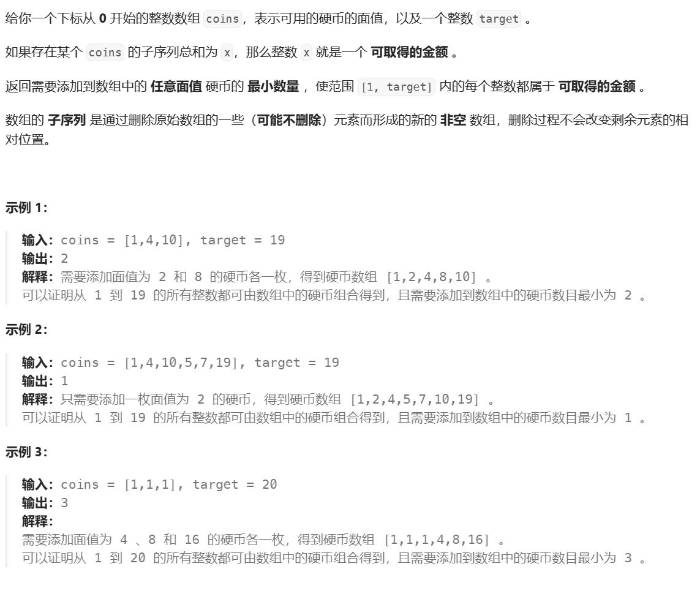

对于可以表示的1~s，当遇到了一个x可以表示的范围就变为了1 ~ s+x因为可以给原来的区间都加上x变为1+x ~ s+x 而x本身也可以被表示因此区间可以合并。

对于这道题初始时令s=0，s表示可以表示到的范围，然后遍历数组，当遇到了x如果他在区间内或者是等于s+1即可以被表示那么就更新区间。反之，如果超出了s+1比如说 s=3 而x等于5，也就是4不能被表示，为了得到4一个加一个数上去，因为加一个数可以使得表示的区间更大，所以贪心的想法是要加不能表示的最小的数而不是1使得区间更大。

```python
class Solution:
    def minimumAddedCoins(self, coins: List[int], target: int) -> int:
        # 先排序
        coins.sort()
        ans=i=0
        s=0
        while s<target:
            # 遍历coins 
            if i<len(coins) and (coins[i]==s+1 or coins[i]<=s):
                s+=coins[i]
                i+=1
            else:
                ans+=1
                s+=s+1
        return ans 
```


## [形成三的最大倍数](https://leetcode.cn/problems/largest-multiple-of-three/)


如果一个数可以被3整除`那么它的各个数位之和也一定会被3整除，充分必要条件`，统计各个数位的和如果满足条件那么直接输出排序后的整个数组，如果余1那么需要减去最小的余1的或者两个余2的，如果余2那么减去最小的余2的或者两个余1的。


```python
class Solution:
    def largestMultipleOfThree(self, digits: List[int]) -> str:
        cnt = Counter()
        t = 0
        s = ''
        m = Counter()
        # 统计
        for v in digits:
            t+=v
            cnt[v] += 1
            m[v % 3] += 1
        # 直接输出，输出的时候注意排除0的情况
        if t % 3 == 0:
            if len(cnt) == 1 and 0 in cnt: return '0'
            for k in sorted(cnt.keys(),reverse=True):
                s += str(k) * cnt[k]
            return s
        # 如果余1
        elif t % 3 == 1:
            # 找到余1最小的
            if m[1]:
                for a in (1, 4, 7):
                    # 需要有值
                    if cnt[a]:
                        cnt[a] -= 1
                        # 注意没有了就要删除
                        if not cnt[a]:del cnt[a]
                        break
            else:
                # 如果不存在找两个余2的
                f = 2
                for a in (2, 5, 8):
                    # 能直接减去最好
                    if cnt[a] >= f:
                        cnt[a] -= f
                        if not cnt[a]:del cnt[a]
                        break
                    elif cnt[a] == 1:
                        cnt[a] -= 1
                        if not cnt[a]:del cnt[a]
                        f -= 1

            if len(cnt) == 1 and 0 in cnt: return '0'
            for k in sorted(cnt.keys(),reverse=True):
                s += str(k) * cnt[k]
            return s
        # 同上	
        else:
            if m[2]:
                for a in (2, 5, 8):
                    if cnt[a]:
                        cnt[a] -= 1
                        if not cnt[a]:del cnt[a]
                        break
            else:
                f = 2
                for a in (1, 4, 7):
                    if cnt[a] >= f:
                        cnt[a] -= f
                        if not cnt[a]:del cnt[a]
                        break
                    elif cnt[a] == 1:
                        cnt[a] -= 1
                        if not cnt[a]:del cnt[a]
                        f -= 1

            if len(cnt) == 1 and 0 in cnt: return '0'        
            for k in sorted(cnt.keys(),reverse=True):
                s += str(k) * cnt[k]
            return s 
```

## 智乃想考一道鸽巢原理

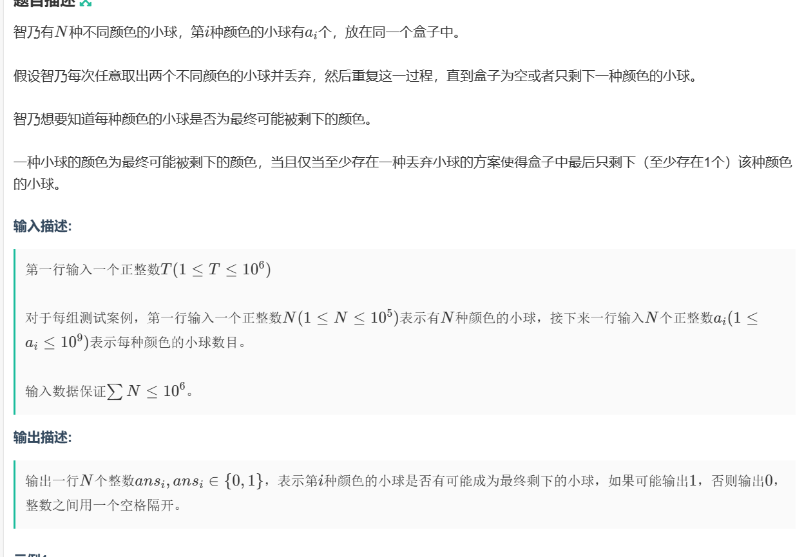

每次选两个不同的出来相消。对于某一个数，如果其他数中最大的能被剩下的数之和抵消掉就说明除了这个数以外的数都能被消掉（因为最大的都能被消掉），需要注意的是，如果其他数的总和是奇数那么必然会剩下一个，此时如果当前数是1那么会被抵消掉。如果最大的数抵消掉其他的数之和后小于当前的数，那么除了当前数的其他数都能被抵消掉。

```python
for _ in range(int(input())):
    n=int(input())
    t=0
    nums=[int(x) for x in input().split()]
    ans=[]
    # 特判只有一个数的情况
    if n==1:
        print(1)
        continue
    # 通过一次遍历找出最大的两个数以及总和
    mx1=mx2=-1
    for v in nums:
        if mx1<v:
            mx1=v
        elif mx2<v:
            mx2=v
        t+=v
    # 遍历每一个数
    for i in range(n):
        v=nums[i]
        res=0
        # 找出除了当前数外的最大数
        mx=mx2 if v==mx1 else mx1
	# 如果最大的数都能被消掉
        if t-v-mx>=mx:
            # 这里判其他数当前数是否为1，且其他数总和是奇数
            res=0 if v==1 and t%2==0 else 1
        else:
            # 如果其他的部分抵消后可以小于当前数
            res=int(v>mx-(t-v-mx))
        ans.append(res)
    print(*ans)
```

这个结论推导到一般的情况就是，如果每次要从数组中选取两个不同的数删去，如果最大的数（值出现频率）小于等于其他数（频率）之和那么最终数组会剩下1个数（如果数组的个数是奇数，否则全部都能删去），否则会剩下最大的数的频率减去其他数的频率之和个数。或者也可能是每次从数组中选两个不同的数将他们减小1之类的情况


## [你可以工作的最大周数](https://leetcode.cn/problems/maximum-number-of-weeks-for-which-you-can-work/)

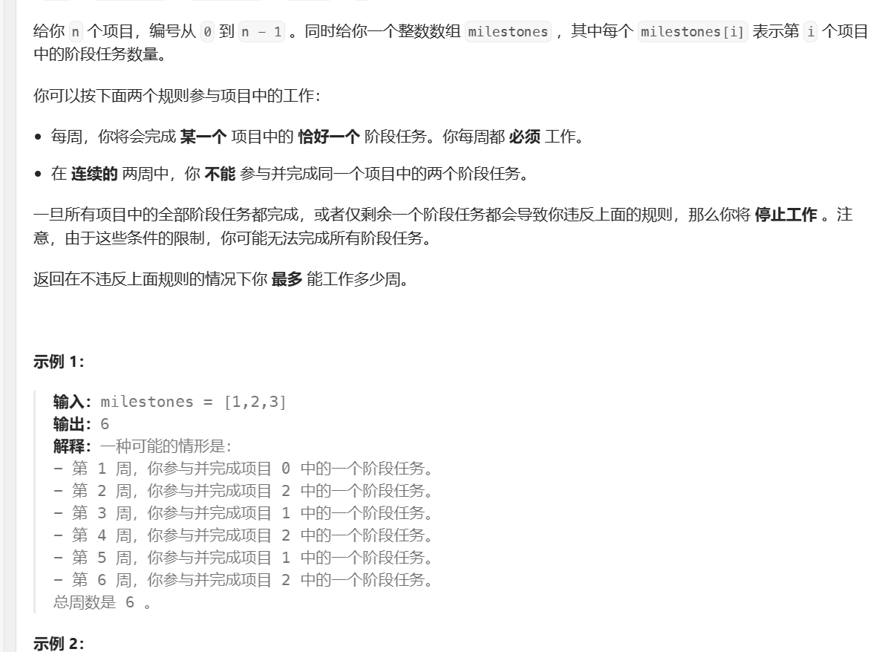

鸽巢原理的应用，不能在两周内连续操作一个项目，可以看作每次选两个不同位置的值减一

```python
class Solution:
    def numberOfWeeks(self, nums: List[int]) -> int:
        l=max(nums)
        t=sum(nums)
        # 所有的项目都可以被完成，奇数只是不能在每次取两个的情况下消除但这里只是模拟一次去一个
        if l<=t-l:
            return t
        else:
            # 只有l-(t-l)个不能完成，加一通过观察得出
            return t-(l-(t-l))+1
```


## [使数组中所有元素相等的最小开销](https://leetcode.cn/problems/minimum-cost-to-equalize-array/)

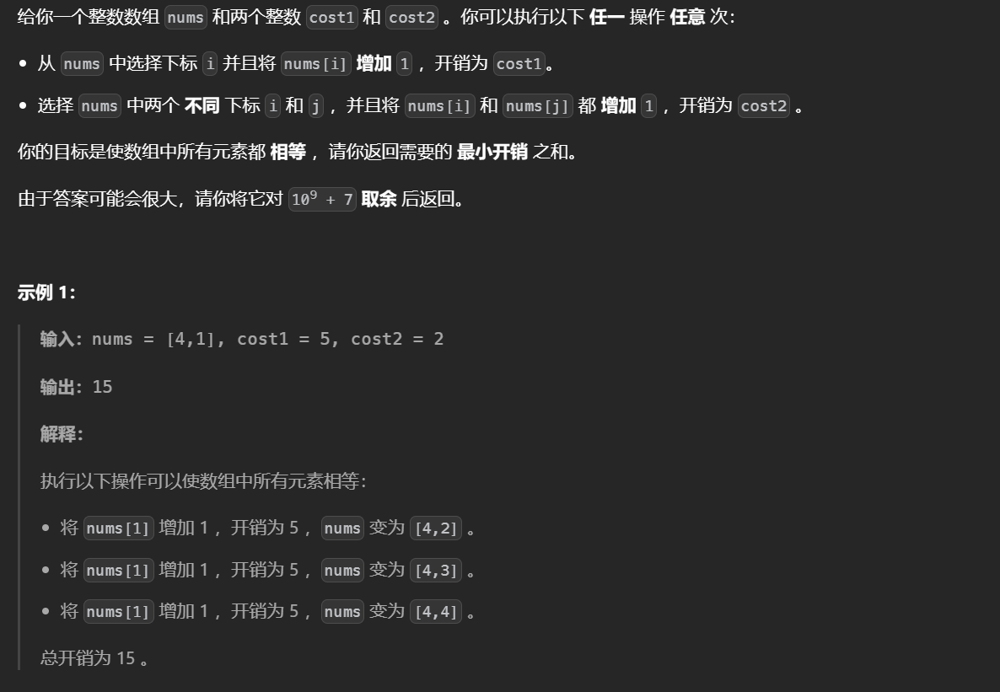


分类讨论：

如果数组大小小于等于2，那么操作一个才是最好的选择。

如果进行两次操作一个的费用小于等于操作两个的费用，直接一个一个的操作。

否则，最好的选择是尽可能地操作两个，这里不能确定最终的元素是多少，假设最终的元素就是当前数组中最大的值，那么转换数组把每个元素变为最大值与他的差，问题变为每次选两个值消掉

运用鸽巢原理，如果最大值小于其他值的总和那么所有的值都可以被削掉，除非所有值总和是奇数（会剩一个只能用cost1消）。如果是偶数，增大最大值只会使最终结果变大，奇数的话可能cost1太大，因此会尝试把最大值增加一让最后不会留下一个，最大值加一最终总体值会加n，如果n是偶数再怎么加也没用是奇数加一次就够了，因此最后只需要多判断一次。

如果最大值不能被完全消掉，为了尽可能多的去执行操作二，只有不断地增加上限使得最大值小于其他值得总和，来让最后这剩下一个或全部消掉，剩下一个会出现和上述一样的情况以此同样需要往后多判断一位。


```python
class Solution:
    def minCostToEqualizeArray(self, nums: List[int], cost1: int, cost2: int) -> int:
        mx=max(nums)
        mod=10**9+7
        n=len(nums)
        # 分类讨论
        if n<=2:return ((max(nums)-min(nums))*cost1)%mod
        elif 2*cost1<=cost2:
            ans=0
            for v in nums:
                ans+=(mx-v)*cost1
            return ans%mod 
        # 先转换数组
        nums=[mx-v for v in nums]
        # 找最大值和总和
        m=max(nums)
        t=sum(nums)
        # 如果都能被消掉，多往后判断一位（因为奇数个会剩下一个1，往后找一位可能会消掉这个1）
        if m<=t-m:
            return min(t//2*cost2+t%2*cost1,(t+n)//2*cost2+(t+n)%2*cost1)%mod
        ans=((t-m)*cost2+(m-(t-m))*cost1)%mod
        # 扩大上限，不断取最小值
        for x in range(1,ceil((2*m-t)/(n-2))+2):
            t+=n
            m+=1
            if m<=t-m:
                ans=min(ans,t//2*cost2+t%2*cost1)
            else:ans=min(ans,(t-m)*cost2+(m-(t-m))*cost1)%mod
        return ans 
```


## [不同的循环子字符串](https://leetcode.cn/problems/distinct-echo-substrings/)

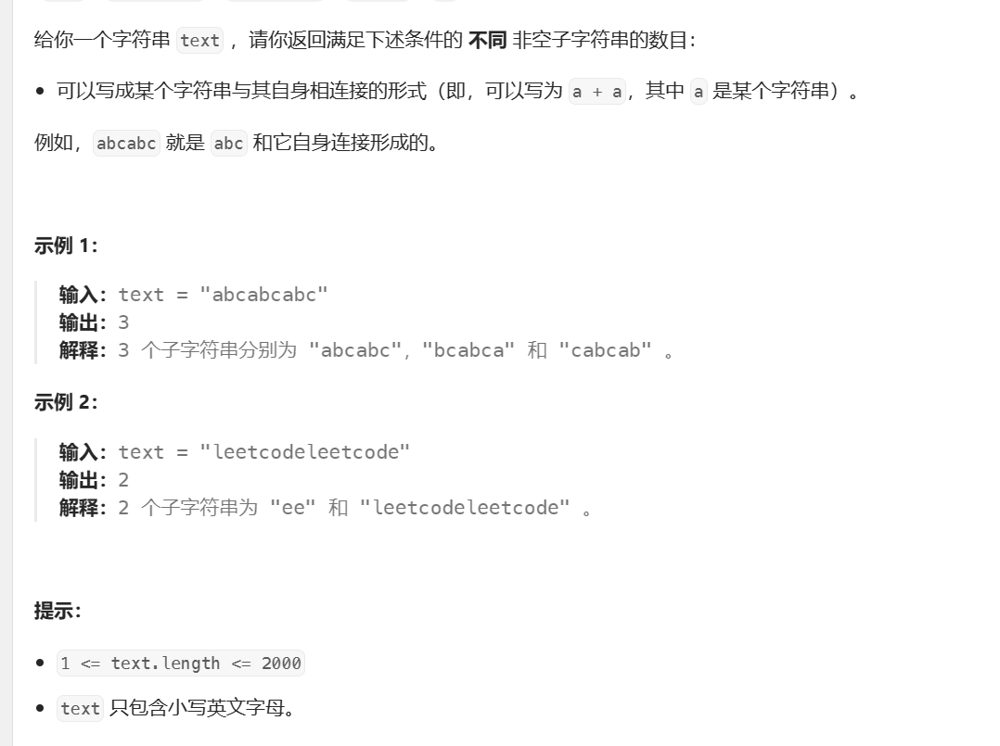

对于给定的数据范围可以枚举每个开始位置然后枚举长度以此来构造左部和右部，但是比较每个左部和右部有点费时可以使用字符串哈希快速比较。


```python
class Solution:
    def distinctEchoSubstrings(self, s: str) -> int:
        n=len(s)
        m=10**9+7
        base=131
        ans=0
        # 防止重复
        vis=set()
	# 将字符转化为数字
        def cal(c):
            return ord(c)-ord('a')+1
	
       # 构造字符串哈希前缀
        pre=[0]*(n+1)
        p=[1]*(n+1)
        for i in range(1,n+1):
            pre[i]=(pre[i-1]*base+cal(s[i-1]))%m
            p[i]=(p[i-1]*base)%m

        for i in range(n):
            for j in range(1,(n-i)//2+1):
                # 注意减去的前一部分要进位
                a=(pre[i+j]-pre[i]*p[j])%m
                if a in vis:continue
                b=(pre[2*j+i]-pre[j+i]*p[j])%m
                if a==b:
                    vis.add(a)
                    ans+=1
        return ans
```


## [最小化曼哈顿距离](https://leetcode.cn/problems/minimize-manhattan-distances/)

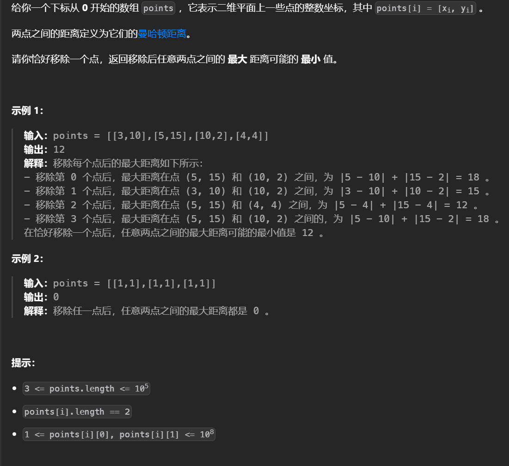


对于给定的数据范围无法得到最大的曼哈顿距离（因为要两层循环），同时无法枚举删除每一个点后的最大距离。但是可以通过将曼哈顿距离转化为切比雪夫距离一次遍历求出最大的曼哈顿距离。

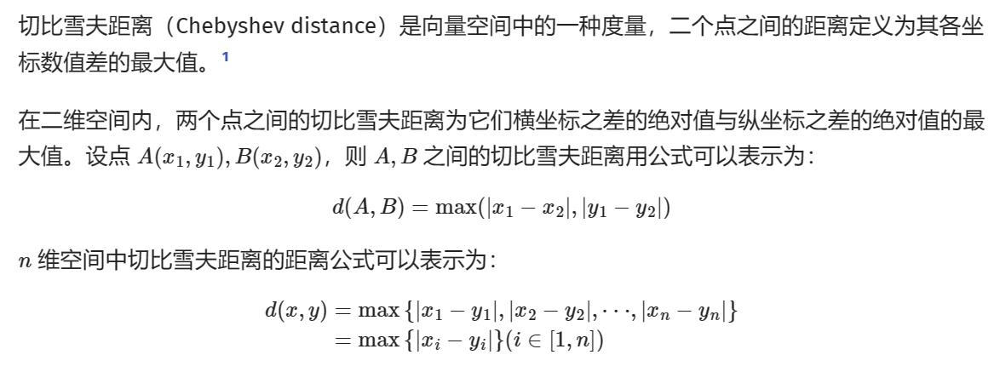


在原坐标系中通过将点的横纵坐标转换为(x+y,y-x)可以转化到切比雪夫坐标系中，把所有点转化到切比雪夫坐标系中可以求解切比雪夫距离这个距离等价于原坐标系中的曼哈顿距离，而切比雪夫距离通过最大与最小的横/纵的相减就可以求出，也就是一次遍历把所有点换到切比雪夫中同时维护值的大小，之后枚举删除每一个值后的结果。

```python
from sortedcontainers import SortedList as sl
class Solution:
    def minimumDistance(self, points: List[List[int]]) -> int:
        # 使用有序集合维护
        x=sl()
        y=sl()
        for l,r in points:
            x.add(l+r)
            y.add(r-l)
        ans=inf
        for l,r in points:
            # 先删除在加入
            x.remove(l+r)
            y.remove(r-l)
            ans=min(ans,max(x[-1]-x[0],y[-1]-y[0]))
            x.add(l+r)
            y.add(r-l)
        return ans
```


## Bingbong的奇偶世界

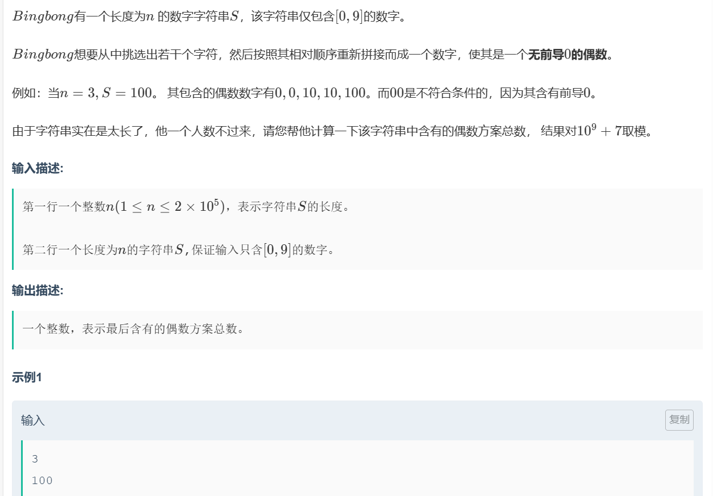

考虑字符串的最后一个为偶数，遍历每一个字符同时记录前面的位数，如果这个字符可以作为结尾那么加上它前面的所有字符都有选或不选两种状态数，同时减去前面以0为开头的个数。

以0开头的状态数，可以通过记录0的个数，每一次遍历把这个状态数乘2因为多出一个数位可以在原来的基础上选或不选这一位，同时如果这个数位是0那么状态数在加一因为可以自己单独作为一个。

```python
n=int(input())
s=input()
mod=10**9+7
ans=t=0
a=0
for i in range(n):
    if int(s[i])%2==0:
        ans=(ans+pow(2,t,mod)-a)%mod
    t+=1
    a=(a*2+int(s[i]=='0'))%mod
print(ans)
```


## [坏了的计算器](https://leetcode.cn/problems/broken-calculator/)

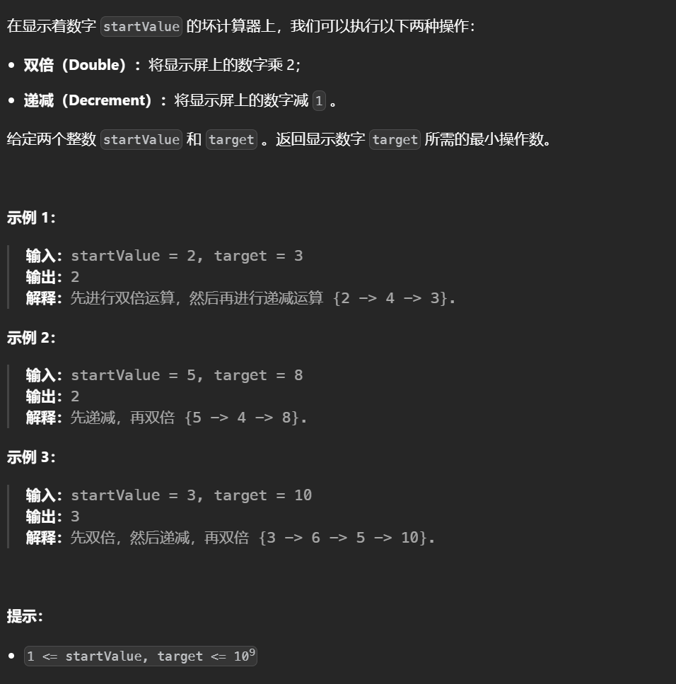


逆向思维，对于乘法和减法有多种选择，可以变到t/8,t/4,t/2...处运用乘法，但是如果逆向思维变为除法和加法，只有一种选择一直除下去直到小于或等于然后用加法，可以证明奇数只能加法，偶数选择除法是最优的:x//2+1<(x+2)//2

```python
class Solution:
    def brokenCalc(self, s: int, t: int) -> int:
        ans=0
        while t>s:
            # 偶数直接除，奇数先变化
            if t%2==0:t//=2
            else:t+=1
            ans+=1
        return ans+s-t
```

## [同位字符串连接的最小长度](https://leetcode.cn/problems/minimum-length-of-anagram-concatenation/)

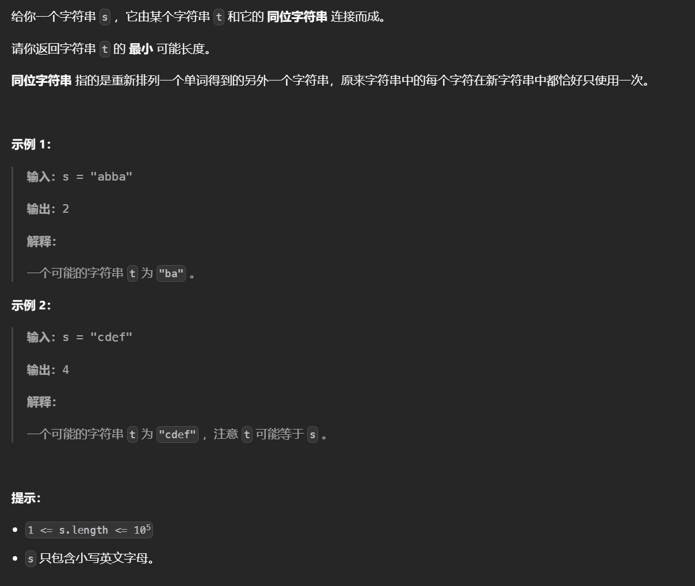


注意这里题目描述不清楚，其实是可以连接多个同位字符串。

初始想法是计数，然后统计最大公约数，但是这里其实是要考虑开头子串的顺序比如aabb。

既然要分为多个长度一样的数可以选择去枚举分为几组（n//k即为t的长度），t的长度只能为len(s)的因数，而n的因数最多为$n^{1/3}$个

```python
class Solution:
    def minAnagramLength(self, s: str) -> int:
        vis=set()
        n=len(s)
        # 统计所有的因数
        for i in range(1,int(n**0.5+1)):
            if n%i==0:
                vis.add(n//i)
                vis.add(i)
        
        # 枚举分为几组
        for v in sorted(vis)[::-1]:
            i=0
            pre=[]
            # 分组循环找出mei
            while i<n:
                start=i
                temp=[0]*26
                while i<n and i-start<n//v:
                    temp[ord(s[i])-ord('a')]+=1
                    i+=1
                if not pre:pre=temp[:]
                elif pre!=temp:break
            else:return n//v
```

## Make It Round

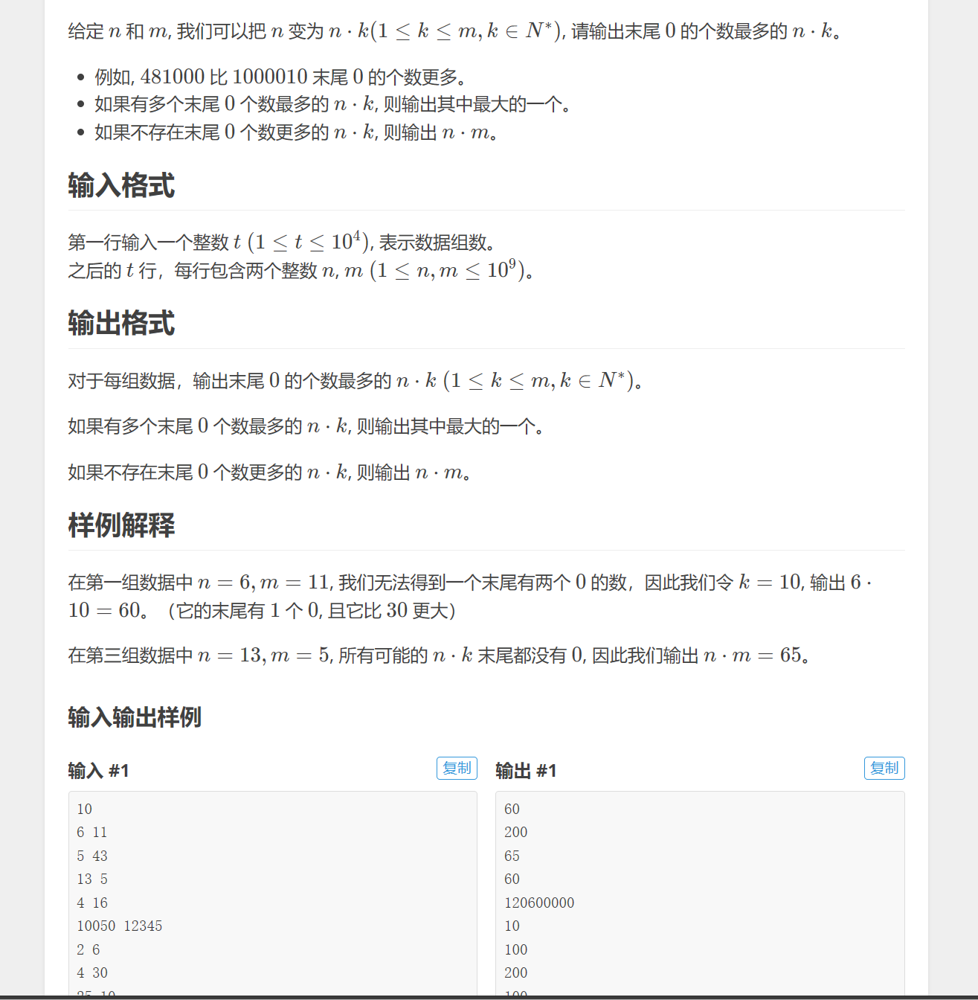

结尾0的个数与数中有多少个10的因子有关，而因子10的个数又与因子2和因子5的个数相关，其他的因数影响不到结尾0的个数为了使得结果尽可能大把k中除去2 5 10剩余的因数都乘上.

```python
from math import log10, log
for _ in range(int(input())):
    n,k=[int(x) for x in input().split()]
    ans=[]
    x=n
    # 首先统计2和5作为因子的个数
    for v in [2,5]:
        temp=0
        while x%v==0:
            x//=v
            temp+=1
        ans.append(temp)
    a,b=ans
    # 如果某一个更多，就尝试去补齐
    if a>b:
        cnt=min(int(log(k,5)),a-b)
        if cnt:
            n*=5**cnt
            k //= (5 ** cnt)
    elif a<b:
        cnt=min(b-a,int(log(k,2)))
        if cnt:
            n*=2**cnt
            k//=(2 ** cnt)

    # 补齐后继续填入2和5注意只有同等数量的2和5才有用，因此去找10
    cnt = int(log10(k))
    if cnt:
        n *= 10 ** cnt
        k //= (10 ** cnt)
    # 乘上剩下的数不会影响结尾0的个数
    n*=k
    print(n)

```


## [分隔长廊的方案数](https://leetcode.cn/problems/number-of-ways-to-divide-a-long-corridor/)

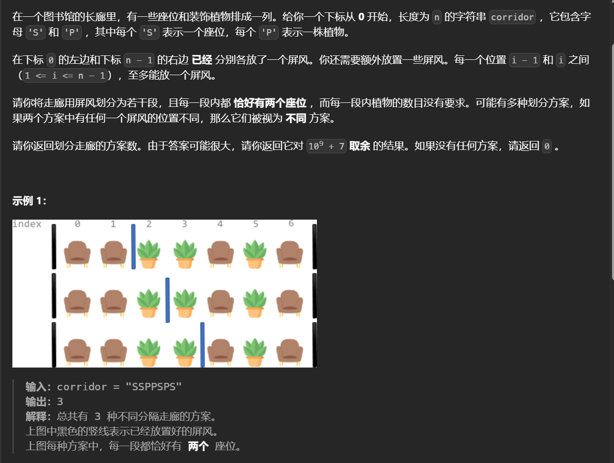


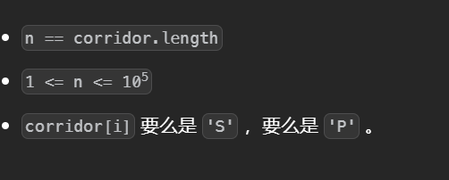


简言之就是要两两划分为一组，利用乘法原理可求解

```python
class Solution:
    def numberOfWays(self, s: str) -> int:
        cnt=s.count('S')
        # 没有座位或者是不满足分的要求
        if cnt%2 or not cnt:return 0
        mod=10**9+7
        temp=0
        ans=[]
        pre=-1
        for i,c in enumerate(s):
            if c=='S':
                temp+=1
                if temp==1 and pre!=-1:ans.append(i-pre)
                elif temp==2:
                    temp=0
                    pre=i
        
        res=1
        for v in ans:
            res*=v
            res%=mod
        return res
```


## Vasya and Petya's Game

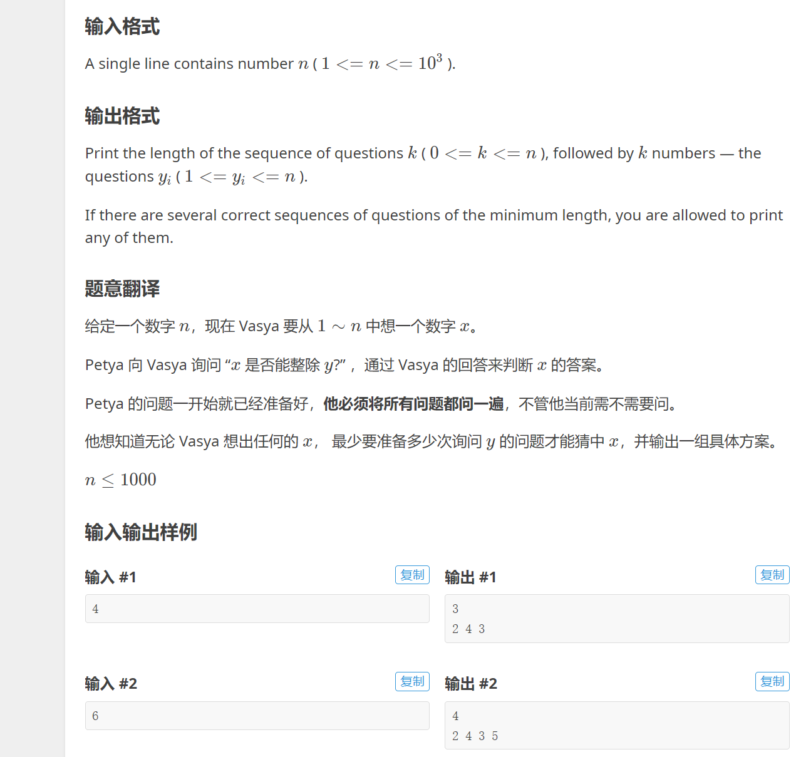

通一组询问来确定一个数，每个数都可以被质因数表示比如2的三次方和7的平方的乘积，如果只询问2和7或者8和7是无法得出具体的数的，因此需要全部问上，不仅是质因数还要有质因数的冥次直到大于给定值。

```python
is_prime = [True] * 1010
for i in range(2, 1010):
    if is_prime[i]:
        for j in range(i ** 2, 1010, i):
            is_prime[j] = False

n = int(input())
ans = []
for i in range(2, n + 1):
    j=i
    if is_prime[i]:
        while i <= n:
            ans.append(i)
            i *= j

print(len(ans))
print(*ans)
```

## [移动机器人](https://leetcode.cn/problems/movement-of-robots/)


同之前做过的——所有的蚂蚁掉下来的最后一刻类似，两个相撞都掉头相当于穿过了对方继续走，且此题中没有要求每个蚂蚁的具体位置。

计算两两之间的距离，首先排序保证从小到大，用当前值减去前面的所有的值等价于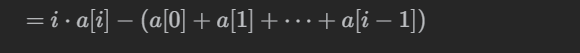，这个值剩下的部分会在后面被计算

```python
class Solution:
    def sumDistance(self, nums: List[int], s: str, d: int) -> int:
        mod=10**9+7
        # 直接计算出最后的位置
        for i,j in zip(range(len(nums)),s):
            if j=='R':
                nums[i]+=d
            else:
                nums[i]-=d
        nums.sort()
        total=ans=0# 累加求的前缀
        for i in range(len(nums)):
            ans+=i*nums[i]-total
            total+=nums[i]
            ans%=mod
        return ans 
```


## Two Arrays and Sum of Functions

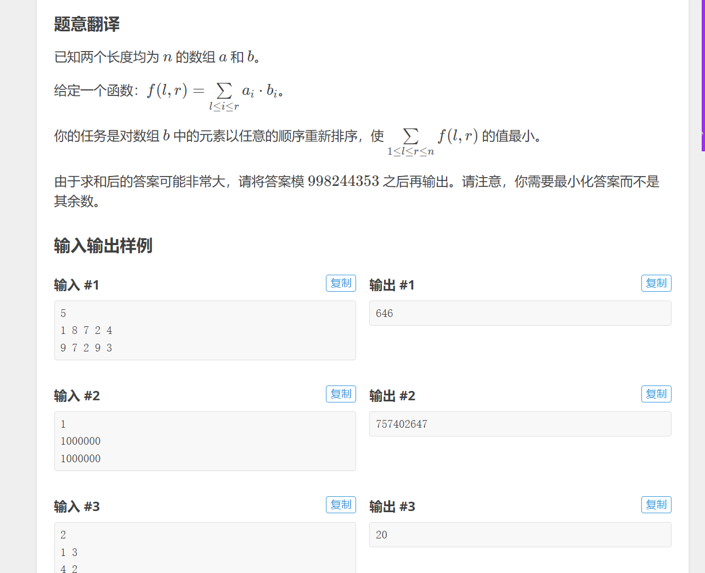


简言之，就是对C[i]的所有子数组求和，要求这个和尽可能地小。其中C[I]是a[i]*b[i]，直觉上来讲想要这个结果最小只要让最大的a[i]对应最小的b[i]即可，但是这里不是对C[i]简单的求和，而是对所有子数组求和，也就是a[i]的贡献为a[i]\*(i+1)\*(n-i+1)，在数组中左边可以选i+1个右边可以选n-i+1个包括了自身，所以a[i]实际上对应的是a[i]\*(i+1)\*(n-i+1)，以这个新的结果数组去找b[i]匹配即可。

```python
mod=998244353
n=int(input())
a=[int(x) for x in input().split()]
b=[int(x) for x in input().split()]
ans=0
for i in range(n):
    a[i]*=(i+1)*(n-i)
a.sort()
b.sort()
b=b[::-1]
for i,j in zip(a,b):
    ans+=i*j
    ans%=mod
print(ans)
```

## [丑数 III](https://leetcode.cn/problems/ugly-number-iii/)

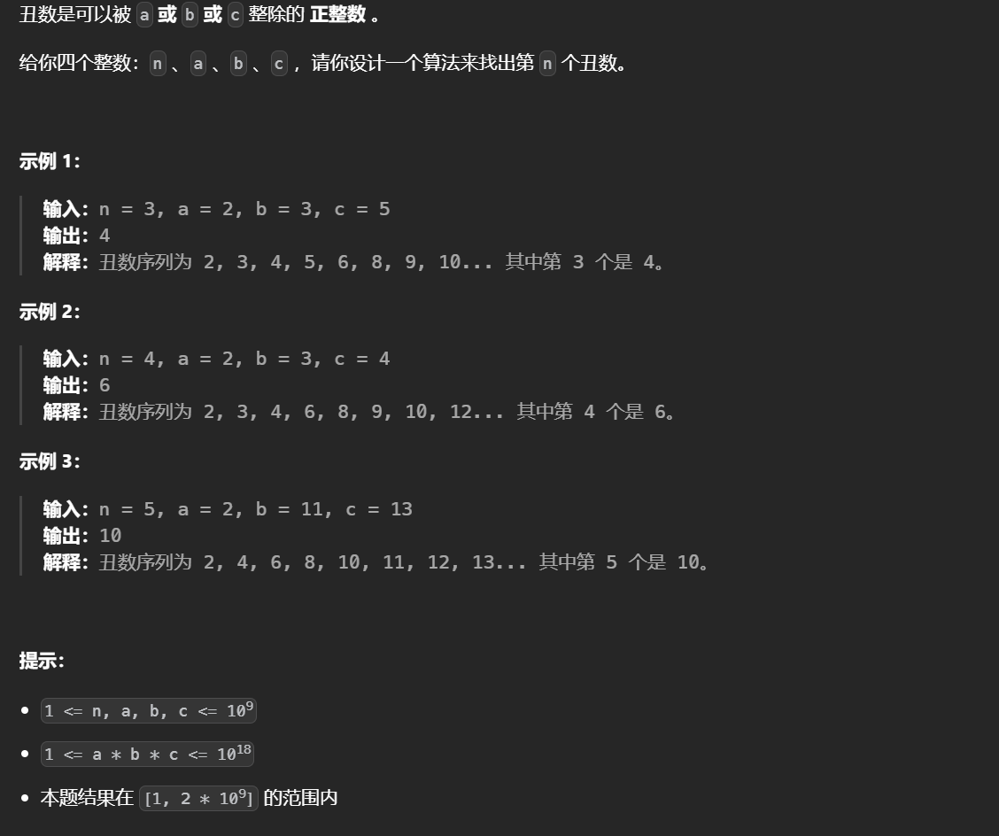

第n个能被a或b或c整除的整数，利用容斥原理结合二分判断可行的数

对于x有x// a个数可以被a整除，有x// b个数可以被b整除，有x// c个数可以被c整除，有x//gcd_ab个数可以同时被a和b整除，有x//gcd_ac个数可以同时被a和c整除，有x//gcd_bc个数可以同时被b和c整除，有x//gcd_abc个数可以同时被a、b、c整除

具体解释是：如果一个数既能被a除又能被b除那么它会重复计算一次所以要减去这一类数，对于其他的也是。但是对于能被a，b，c整除的数他被计算了三次同时也减去了三次，为了不漏掉所以要加上。

用容斥原理可以推广到多个

```python
class Solution:
    def nthUglyNumber(self, n: int, a: int, b: int, c: int) -> int:
        def cal(x):
            cnt=x//a+x//b+x//c
            cnt-=x//lcm(a,b)+x//lcm(a,c)+x//lcm(b,c)-x//lcm(a,b,c)
            return cnt>=n
        l,r=1,3*10**9
        while l<=r:
            mid=(l+r)>>1
            if cal(mid):
                r=mid-1
            else:
                l=mid+1
        return r+1
```


## [给小朋友们分糖果 II](https://leetcode.cn/problems/distribute-candies-among-children-ii/)

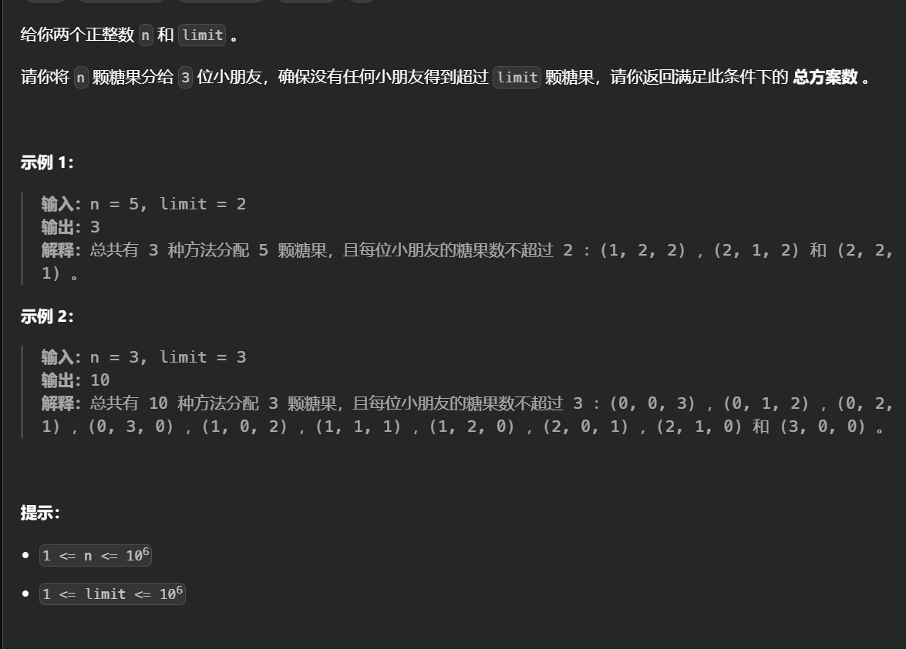


暴力的做法，直接枚举第一个人分到的糖果数，而后对于剩余的糖果数看后两个人是否能分。

```python
class Solution:
    def distributeCandies(self, n: int, limit: int) -> int:
        ans=0
        # 注意第一个人不能取出超过总数和限制的糖果数
        for i in range(min(limit,n)+1):
            value=n-i
            # 如果剩下的两个人取满了都无法划分
            if value>2*limit:continue
            # 可以在[0,value]中任意取，这里糖果不区分，所以只有取一个两个...的不同，一共有value+1中取法包括0
            elif value<=limit:
                ans+=value+1
            # 不能任意取，一个人最少取value-limit（另一个人取满，如果不去value-limit是不会满足要求的）
            elif value<=2*limit:
                t=limit-(value-limit)+1
                ans+=t
        return ans 
```


利用容斥原理，三个人都不超过limit的个数=总数-至少有一个人超过limit 

把n个取放入3个不同的箱子中，利用隔板法求解。这里可以让箱子为空，因此两边可以插板子并且同一个位置可以插板子。

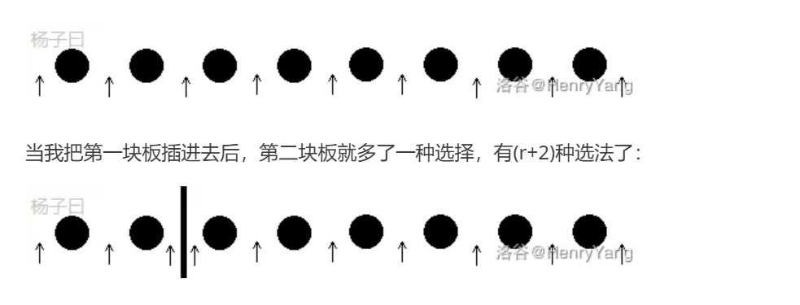

如图所示，插第一个板子的时候有n+1种方法，插第二个板子的时候会多出一个位置，即在上一个板子的左右。

**总结，在n个球中插入k-1个板子(即k个箱子)共有$$C_{n+k-1}^{k-1}$$**

令A表示第一个人超过了，B表示第二个人超过了，C表示第三个人超过了，那么所有不满足的情况为|A+B+C|，其中会出现重复的情况：

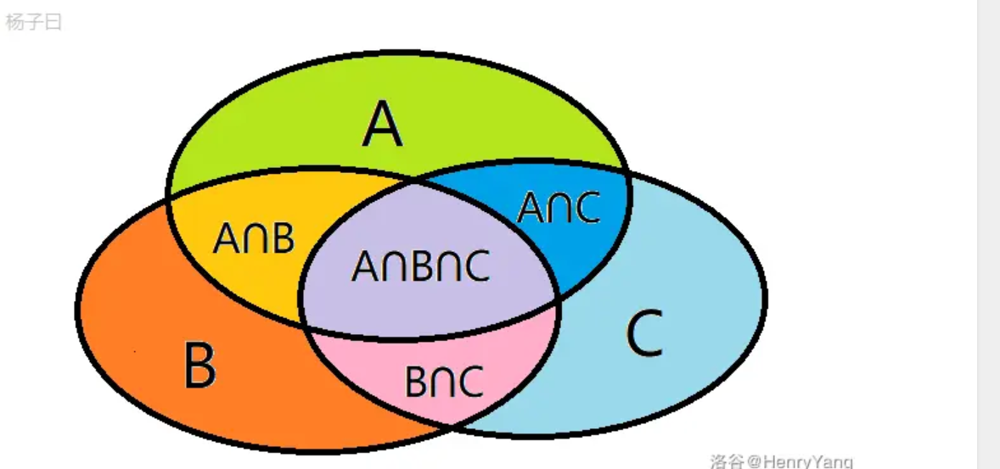

根据容斥原理有

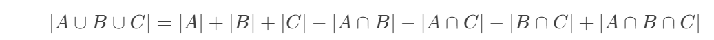

其中A交B为两个人超过了，A交B交C表示三个人都超过了

```python
class Solution:
    def distributeCandies(self, n: int, limit: int) -> int:
        def cal(x):
            return x*(x-1)//2 if x>1 else 0
        # 总数
        tt=cal(n+2)
        # 至少一人，A+B+C                                                              
        a=3*cal(n-(limit+1)+2)
        # 至少两人，两两相交
        b=3*cal(n-2*(limit+1)+2)
        # 三个人相交
        c=cal(n-3*(limit+1)+2)
        return tt-(a-(b-c))
```


## Devu and Flowers

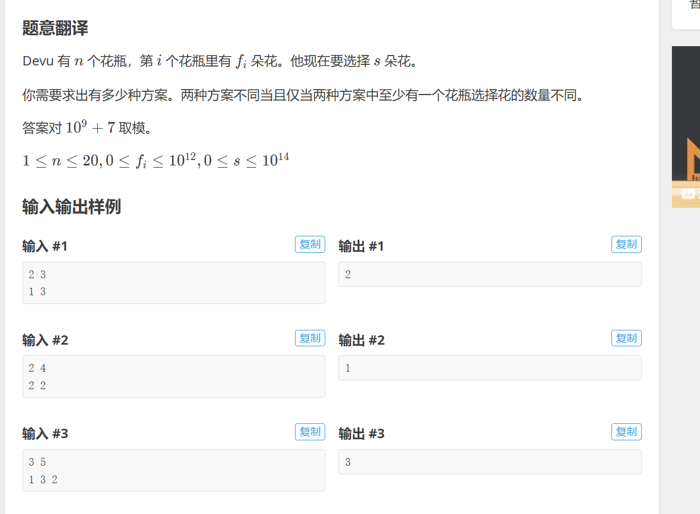


看作是有s个球往n个箱子中放（一个花瓶中不能取出超过它所持有的花的数目），每个箱子中的球不能超过nums[i]个。

用总的减去不合法的状态，不合法的状态是至少有一个箱子超出了限制(全都不超出的反面，1超出了+2超出了+加3超出了...其中会出现很多重复的)，利用容斥原理计算。

枚举n的子集，偶数个是减法操作，奇数个是加法操作。

```python
from functools import lru_cache

n,s=[int(x) for x in input().split()]
nums=[int(x) for x in input().split()]
mod=10**9+7

# 求逆元，需要保存结果，这个过程还是比较费时的
@lru_cache(maxsize=None)
def inv(x):
    return pow(x,mod-2,mod)
# 计算组合数，这里下面的数较大，上面的数较小可以直接计算
def cal(l,r):
    res=1
    for i in range(1,r+1):
        res=res*l%mod
        l-=1
    for i in range(1,r+1):
        res=res*inv(i)%mod

    return res
# 求出总的
ans=cal(s+n-1,n-1)
# 枚举所有子集，从1开始
for i in range(1,1<<n):
    cnt=0
    total =s
    # 查找出选取了状态
    for j in range(n):
        if i>>j&1:
            total-=nums[j]+1
            cnt+=1
    # 不合法
    if total<0:continue
    # 判断是奇数还是偶数，与ans做计算时符号要变化
    if cnt&1:ans=(ans-cal(total+n-1,n-1))%mod
    else:ans=(ans+cal(total+n-1,n-1))%mod
print(ans)
```


## [生成乘积数组的方案数](https://leetcode.cn/problems/count-ways-to-make-array-with-product/)

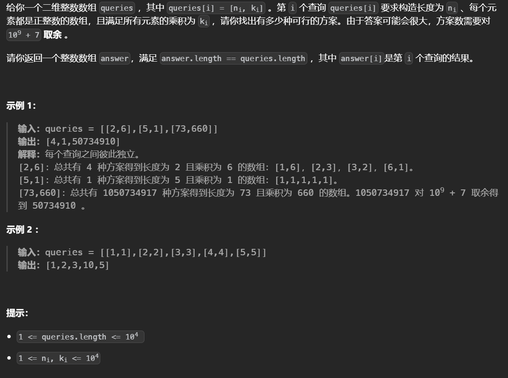

**对x找一组数，这组数的乘积为x，则这组数是x的质因数。**

对于本题而言，找出k所有的质因数，$2^3$拆开为3个2，就这样分为n组（多个数可以放到一组，比如两个2相当于4，空的相当于1）


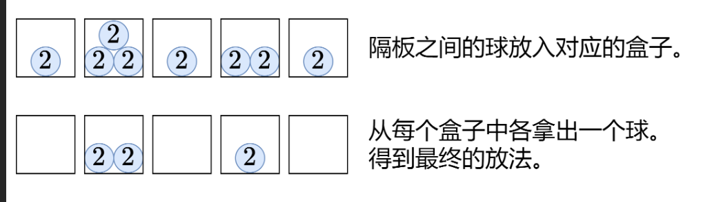


这里允许(3,2),(2,3)为不同的组也就是说两种质数各个质因数之间相互独立，可以用求出每个质因数的划分方案数在用乘法原理求解。

```python
#打表，质因数个数不会超过20个，下标由于要加上l-1所以会比较大
# 注意下述表不是dp而是组合数公式
mod=10**9+7
dp=[[0]*20 for _ in range(10100)]
for i in range(10100):
    for j in range(20):
        if not j:dp[i][j]=1
        else:dp[i][j]=(dp[i-1][j-1]+dp[i-1][j])%mod
class Solution:
    def waysToFillArray(self, queries: List[List[int]]) -> List[int]:
        ans=[]
        for l,v in queries:
            res=1
            # 找质因数
            for i in range(2,isqrt(v)+1):
                n=0
                while v%i==0:
                    v//=i
                    n+=1
                # 每个质因数单独求解，原本为C（b+l-1,l-1）但是为了减小打表的范围，改为n
                res=res*dp[n+l-1][n]%mod
            if v>1:
                # 还剩一个，按照公式可以直接乘
                res=res*l%mod
            ans.append(res)
        return ans 
            

```

## 祥子拆团

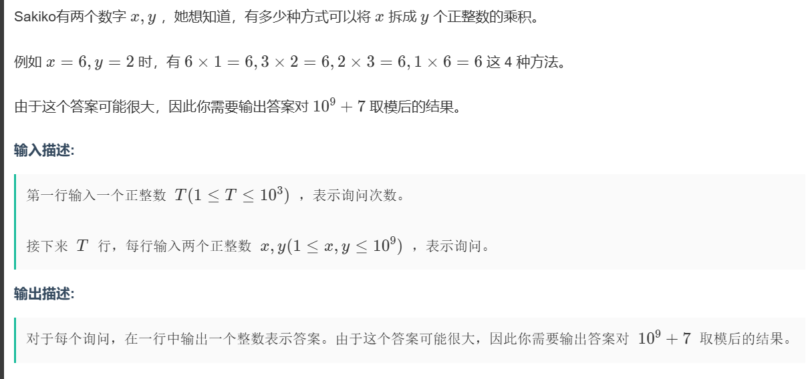

实际上也就是把x的质因数放到y个盒子里去，同时1*6和6\*1被视为是两个不同的那么就需要诶个质数单独计算用乘法定理求解。

```python
import sys
from math import inf, ceil, comb

input=sys.stdin.readline
mod=10**9+7

p=[]
MX=(10**4)*5
is_prime=[True]*MX
# 找出所有的质数
for i in range(2,MX):
    if is_prime[i]:
        p.append(i)
        for j in range(i**2,MX,i):is_prime[j]=False

n=len(p)

for _ in range(int(input())):
    x,y=[int(x) for x in input().split()]
    res=1
    i=0
    # 使用打表的分解质因数可以更快
    while x>1 and i<n:
        v=p[i]
        if x%v==0:
            cnt=0
            while x%v==0:
                x//=v
                cnt+=1
            res*=comb(cnt+y-1,cnt)
            res%=mod
        i+=1
    if x>1:
        res*=y
        res%=mod
    print(res)
```


## [统计理想数组的数目](https://leetcode.cn/problems/count-the-number-of-ideal-arrays/)

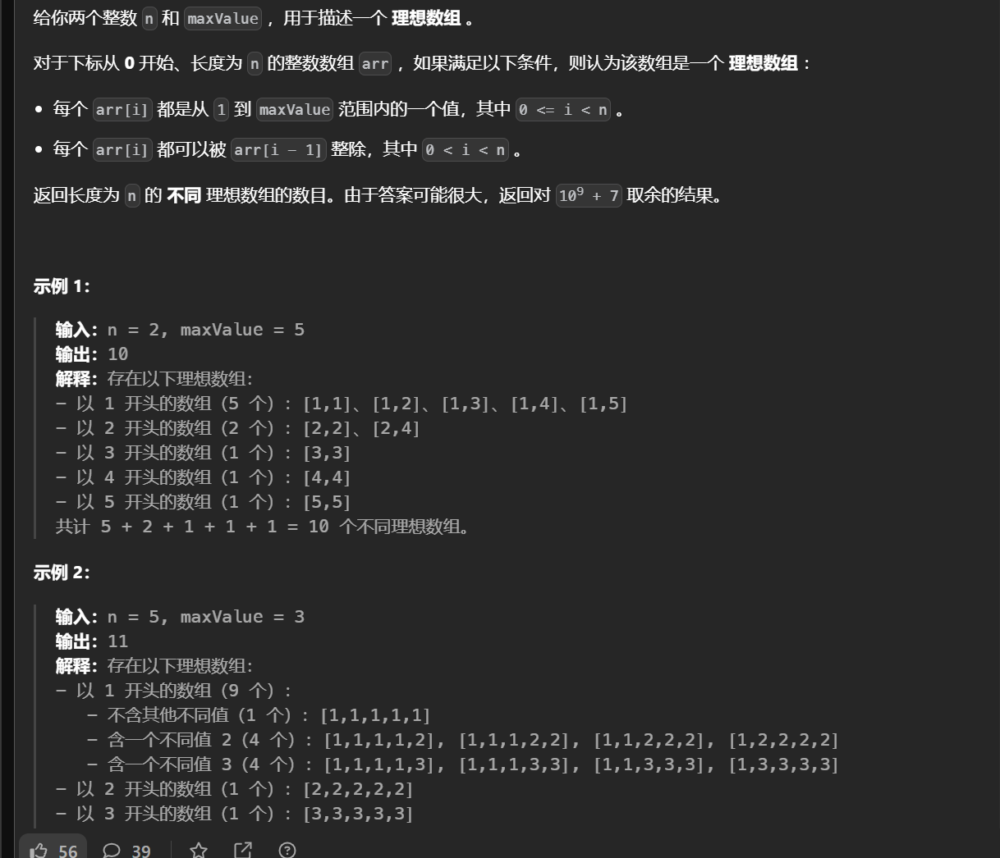


对于给定的数据范围，可以枚举最后一个值，当最后一个值为x时前面的所有数都是它的因数，从1开始要乘上x所有的质因数才能到x，因此把x的质因数作为倍率分配到n个位置上这样就可以确定一个理想数组，没有分配到的认为是1，问题变为从把n个球分为k组，一组的值可以是空的。


每个质因数之间不影响，因此要用乘法原理求出所有质因数组合的结果。

```python
# 现预处理出所有数的质因数
p=[[] for _ in range(10**4+10)]
for i in range(2,10**4+10):
    x=i
    for j in range(2,isqrt(i)+1):
        cnt=0
        while x%j==0:
            x//=j
            cnt+=1
        p[i].append(cnt)
    if x>1:
        p[i].append(1)
class Solution:
    def idealArrays(self, n: int, maxValue: int) -> int:
        mod=10**9+7
        ans=0
        # 枚举
        for i in range(1,maxValue+1):
            res=1
            # 结果是每个质数结果的乘积
            for k in p[i]:
                res=res*comb(k+n-1,k)%mod
            ans+=res
            ans%=mod                
        return ans


```

## Nikita and LCM

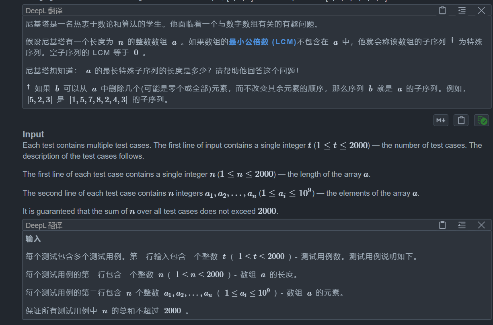


最小公约数只会更大，将数组排序，判断整个数组的lcm和最后一个数的大小，如果lcm更大则找到最长的子序列，否则所有数的lcm等于数组中最大的数（a），也就是数组中其他的数都是a的因数，这样数组中任意一个子序列的的lcm都是a的因数，枚举a的因数（a的立方个）作为子序列的lcm，如果该因数在数组中则跳过，否则将数组中该因数的所有因数（为了更长）找出判断他们的lcm是否为该因数，同时记录长度。

```python
import sys
from math import ceil, lcm

input = sys.stdin.readline
for _ in range(int(input())):
    n = int(input())
    nums = [int(x) for x in input().split()]
    nums.sort()
    # 找所有数的lcm
    if (res := lcm(*nums)) > nums[-1]:
        print(n)
    else:
        p = []
        a = nums[-1]
        # 找出最后一个数的因数
        for i in range(1, ceil(a** 0.5) + 1):
            if a % i == 0:
                p.append(i)
                if i != a // i: p.append(a // i)
        res = 0
        # 枚举所有的因数
        for r in p:
            if r in nums: continue
            l=[]
            for i, v in enumerate(nums):
                if r % v == 0: l .append(v)
            # 成功找出一组
            if lcm(*l)==r :res = max(res, len(l))
        print(res)
```

## [可以被 K 整除连通块的最大数目](https://leetcode.cn/problems/maximum-number-of-k-divisible-components/)

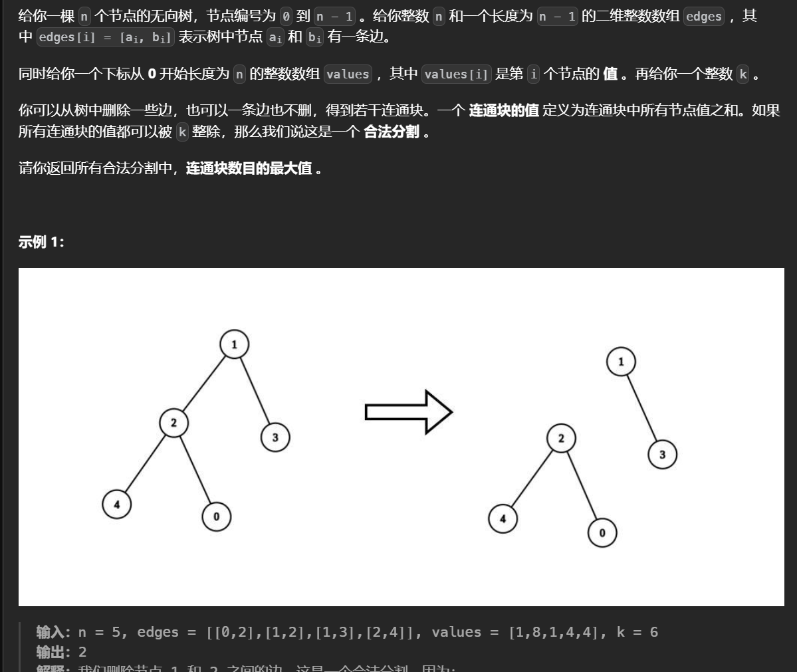


题目已经保证了整个树的和是k的倍数，那么如果找到一个和为k的倍数的子树，那么一定可以把这个子树拆出来，它的父节点对应的树也一定还是k的倍数，同时对于这个子树它可以继续去找它的和为k的倍数的子树即嵌套删除。

```python
class Solution:
    def maxKDivisibleComponents(self, n: int, edges: List[List[int]], values: List[int], k: int) -> int:
        g=[[] for _ in range(n)]
        for u,v in edges:
            g[u].append(v)
            g[v].append(u)
        ans=0
        def dfs(i,fa):
            nonlocal ans 
            s=values[i]
            for y in g[i]:
                if y==fa:continue
                s+=dfs(y,i)
            if s%k==0:ans+=1
            return s
        dfs(0,-1)
        return ans
```

## [检查「好数组」](https://leetcode.cn/problems/check-if-it-is-a-good-array/)

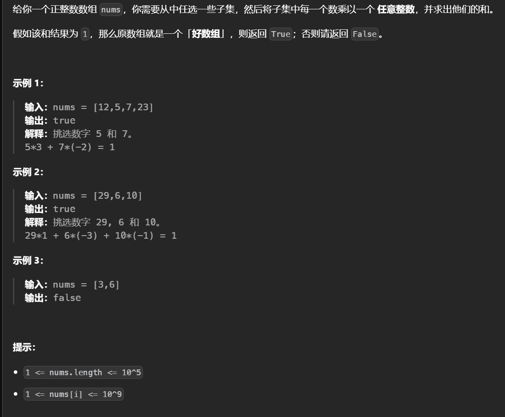

找出是否有形如ax+by+cz...=1的xyz

根据裴属定理有，方程 ax + by = 1 有解当且仅当整数a和b互素，这个定理可以推广到多个数上，那么就说这多个数都互质，因此也就是多个数的最大公约数为1.

```python
class Solution:
    def isGoodArray(self, nums: List[int]) -> bool:
        return reduce(gcd,nums)==1
```

## [不同的子序列 II](https://leetcode.cn/problems/distinct-subsequences-ii/)

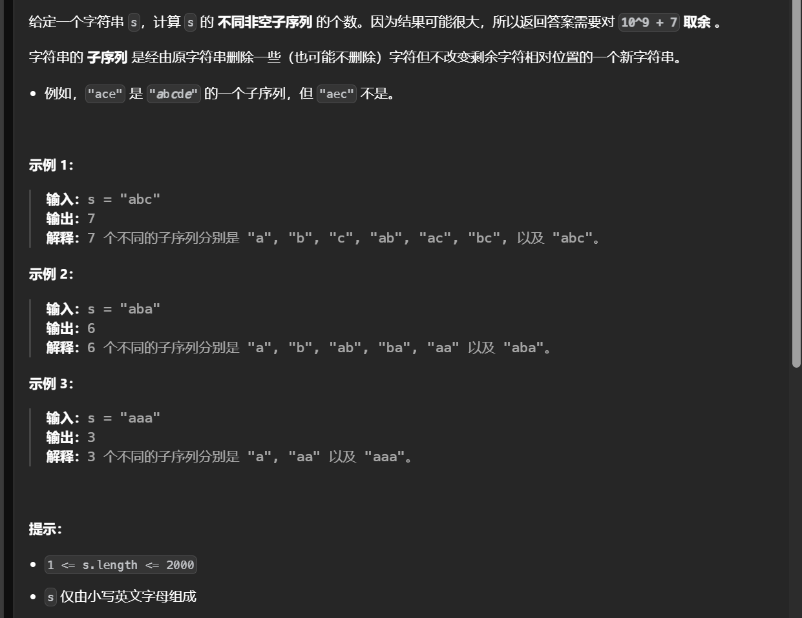

不同的子序列，考虑前i个数字的不同子序列如何计算，最直接的思想是前i个数字的不同子序列=两倍的前i-1个数字的不同子序列（即在前面的基础上再加上前面的拼接上当前的字符），但是这样会有重复的子序列出现


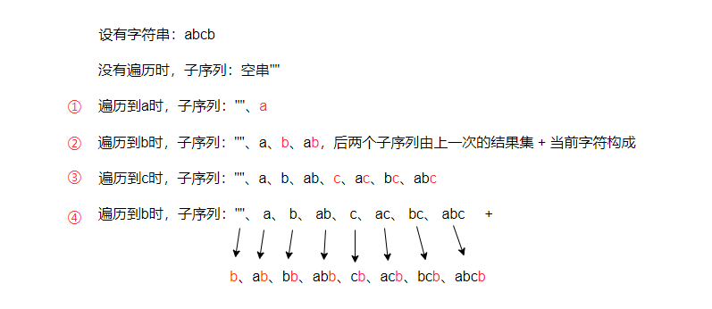

引入第一个b的时候新增的个数为cnt，那么当引入第二个b的时候新增的个数会重复，这个重复的个数上一轮新增的，注意是新增的个数而不是实际增加的个数（大概是或者是贯观察得到的），最后要减去空串

```python
class Solution:
    def distinctSubseqII(self, s: str) -> int:
        mod=10**9+7
        n=len(s)
        dp=[0]*(n+1)
        dp[0]=1
        memo={}
        for i,c in enumerate(s,1):
            dp[i]=2*dp[i-1]%mod
            if c in memo:
                dp[i]-=memo[c]
                dp[i]%=mod
            # 记录的是新增的个数
            memo[c]=dp[i-1]
        return (dp[-1]-1)%mod          
```

## [最小面积矩形 II](https://leetcode.cn/problems/minimum-area-rectangle-ii/)

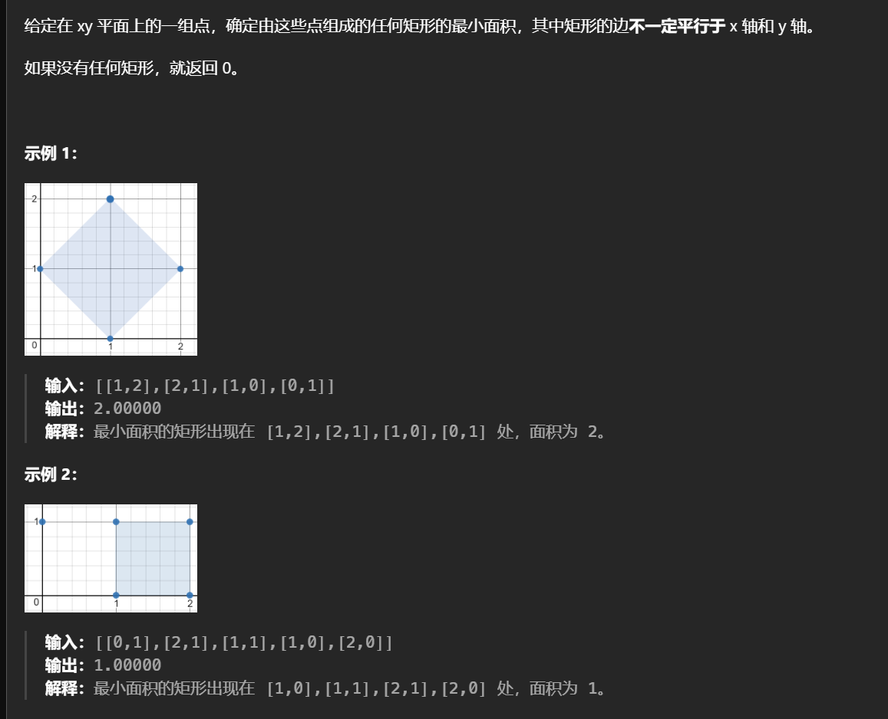

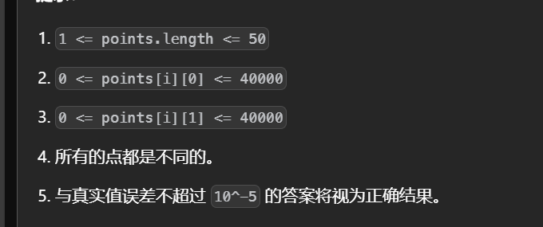


对于给定的数据范围枚举三个点去找第四个点是否满足

令a b c 为枚举的三个点，其中a为一个顶点,bc为相对的两个点，第四个点的坐标等于b+c-a（通过向量求的），如果第四个点存在那么需要判断是否满足垂直关系，通过向量的内积求即(a-b)*(a-c)==0

```python
class Solution:
    def minAreaFreeRect(self, nums: List[List[int]]) -> float:
        n=len(nums)
        ans=inf
        vis=set()
        for k in nums:
            vis.add(tuple(k))
        # 要枚举三个点，同时还要对应不同的顶角会相对的角，使用全排列求出
        for x,y,z in permutations(nums,3):
            # 用向量的方法求出第四个点
            d=[z[0]+y[0]-x[0],z[1]+y[1]-x[1]]
            if tuple(d) in vis:
                # 判断内积找是否满足垂直关系
                a=(z[0]-x[0],z[1]-x[1])
                b=(y[0]-x[0],y[1]-x[1])
                if a[0]*b[0]+a[1]*b[1]==0:
                    area=((a[0]**2+a[1]**2)*(b[0]**2+b[1]**2))**0.5
                    ans=min(ans,area)
        return ans if ans!=inf else 0
```


##  Earning on Bets

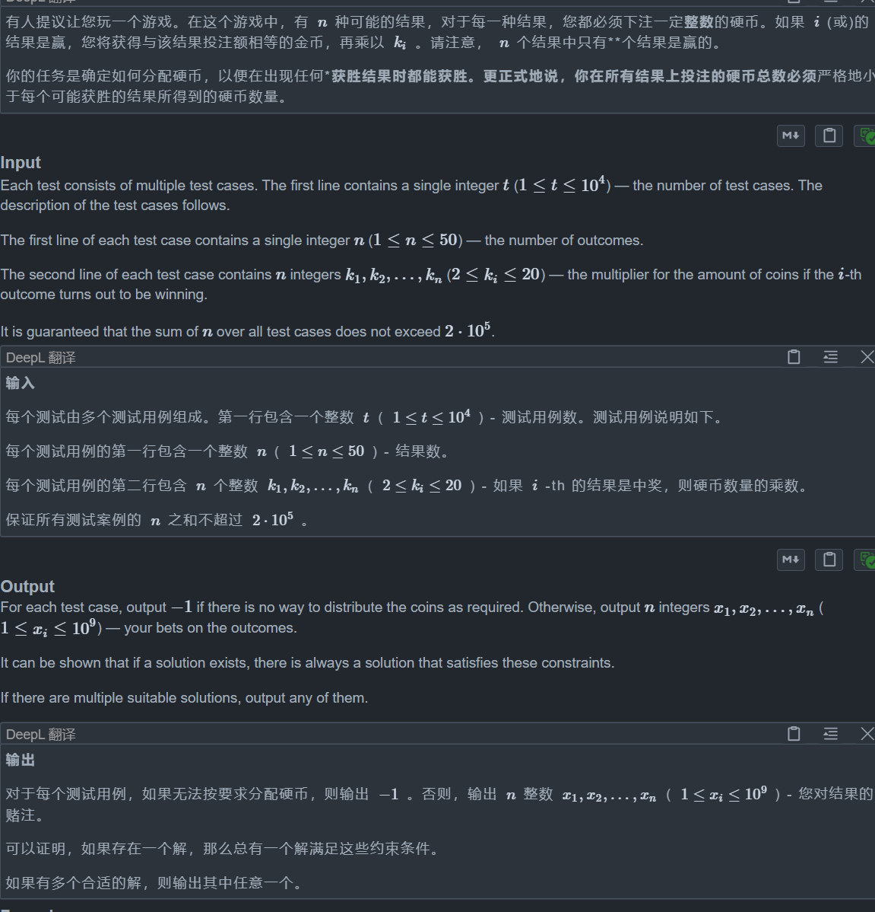

题目大意是给定一组a找一组b是的每个bi*ai>b数组的总和

模拟公式

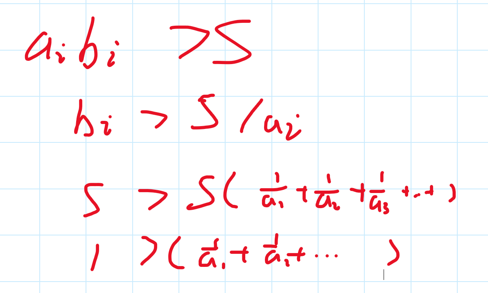


两边同时乘上a数组的最小公倍数，判断不等式是否成立。

最终左边是a数组的最小公倍数右边就是对应的b数组，每个b乘上对应的a就是a数组的最小公倍数，这个最小公倍数有满足大于b数组之和。

```python
from math import ceil,lcm
import sys
input=sys.stdin.readline

esp=1e-5

for _ in range(int(input())):
    n=int(input())
    nums=[int(x) for x in input().split()]
    l=lcm(*nums)
    ans=[l//v for v in nums]
    if sum(ans)>=l:print(-1)
    else:print(*ans)
```


不要把公式拆开看

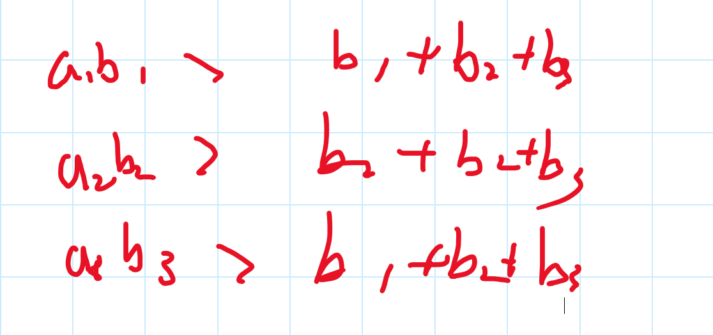


## Johnny and Another Rating Drop


对于给定的数据范围只能找规律

考虑每一位的贡献

对于最低位，奇偶不同可以贡献n个

对于次低位，0~n中所有2的倍数可以贡献一个，因为如果是2的倍数那么这一位上要么为1要么为0，并且右边都是0，i-1在该位置上对于前者一定是0，对于后者一定是1，这就贡献了一位。同理对于4的倍数...

```python
for _ in range(int(input())):
    x=int(input())
    index=0
    ans=0
    for i in range(x.bit_length()):
        ans+=x//pow(2,index)
        index+=1
    print(ans)
```

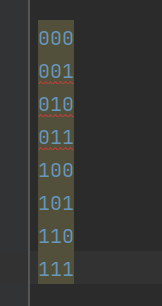


也可以观察二进制形式发现，从最低位开始每次能加的值都会折半。


## [K 秒后第 N 个元素的值](https://leetcode.cn/problems/find-the-n-th-value-after-k-seconds/)	

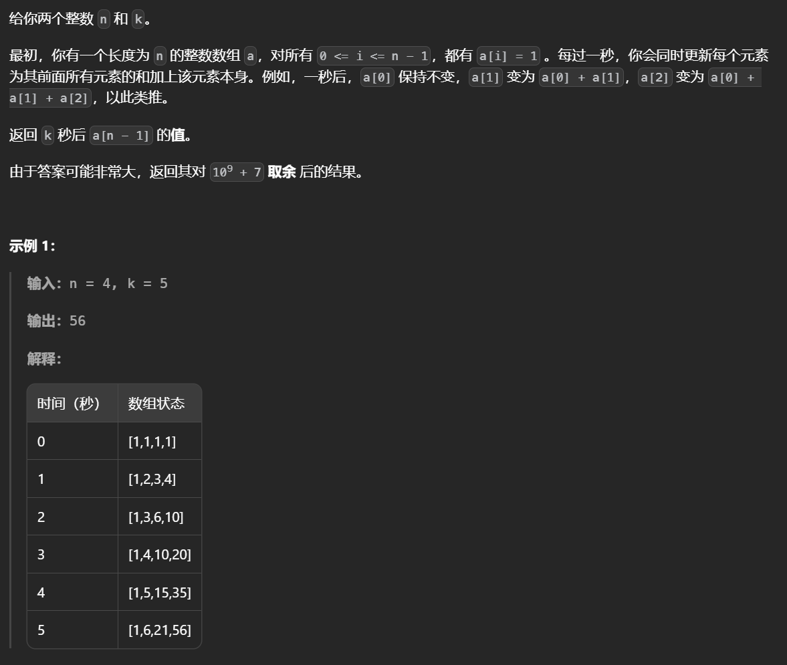

观察样例发现，每一组的值都是杨辉三角上的一个对角线

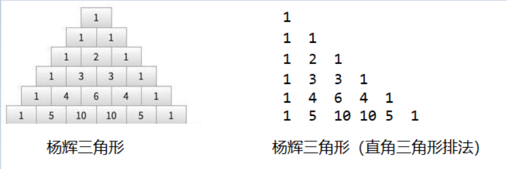


要找的是三角形上第n+k行的第n个，杨辉三角形的每个值可以用组合数公式计算，C(n-1,m-1)其中n,m表示行和列

```python
class Solution:
    def valueAfterKSeconds(self, n: int, k: int) -> int:
        mod=10**9+7
        return comb(n+k-1,n-1)%mod
```

## D-Function

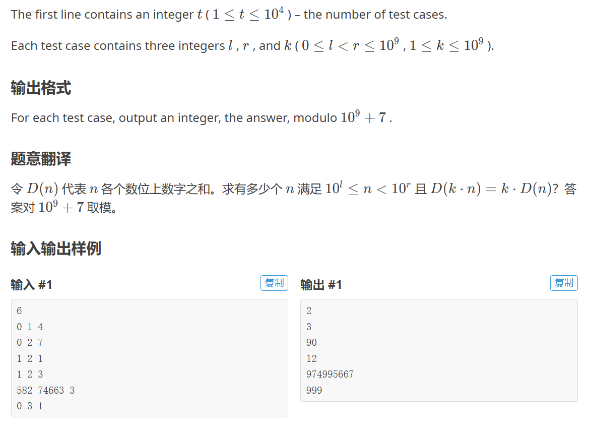

对于给定的数据范围一定是存在一个结论

K*D(x)如果不存在进位就等于D(KX)，如果存在进位只会使得结果变小，因为第I位进位意味着第i-1位减小了10第I位增加了1，一共会减小9，因此去在范围内找每一位乘上k不会进位的。

注意l实际是长度为l+1

```python
mod=10**9+7
for _ in range(int(input())):
    l,r,k=[int(x) for x in input().split()]
    # 每一位只有x种
    x=9//k+1
    a=pow(x,r,mod)
    b=pow(x,l,mod)
    # 直接用前缀和的思想
    print((a-b)%mod)
```

## Beauty of the mountains

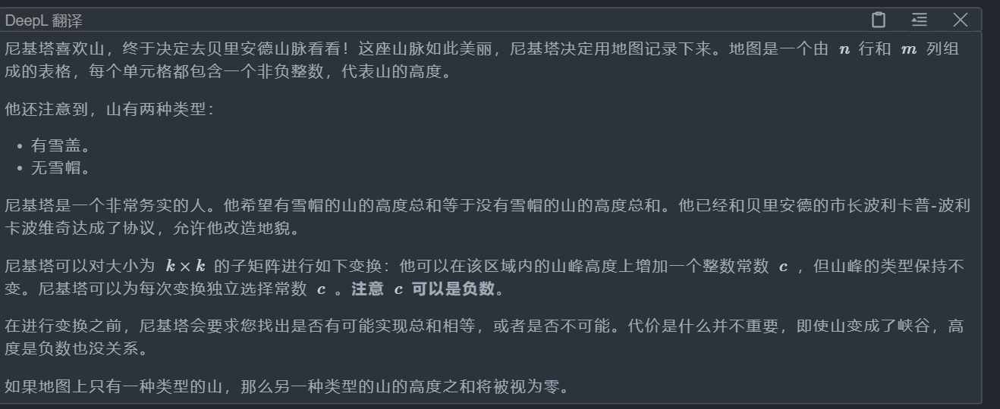

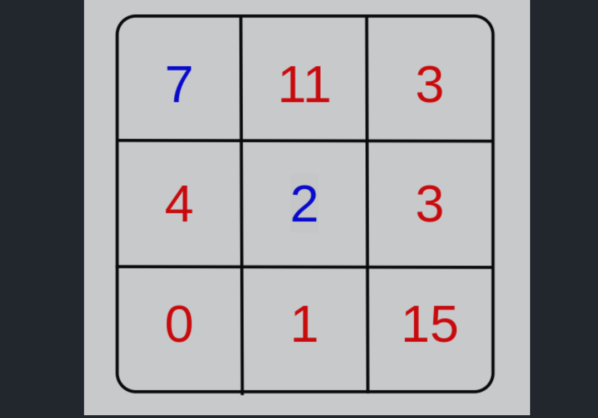

就是让二维数组中两个不同的区域的和相同，一次可以变化k*k大小的区域。

很明显的现预处理除所有k*k大小的区块能对差值改变多少(区域内一类和二类个数之差)，找出这些数后问题就变为了是否存在一个ax+by+cy+.....=k的问题，这可以用裴属定理，即k是gcd(a,b,c,....)的整数被则有解。

```python
from collections import deque,defaultdict,Counter
from functools import lru_cache
from bisect import bisect_left
from math import ceil, gcd
import sys
input=sys.stdin.readline
def R():return int(input())
def RR():return [int(x) for x in input().split()]
for _ in range(R()):
    m,n,k=RR()
    g=[]
    c=[]
    tt=0
    for _ in range(m):
        g.append(RR())
        tt+=sum(g[-1])
    for _ in range(m):c.append([int(x) for x in input()[:-1]])

    # 二位前缀和预处理除所有k*k的区域的贡献
    pre=[[0]*(n+1) for _ in range(m+1)]
    for i in range(1,m+1):
        for j in range(1,n+1):
            pre[i][j]=c[i-1][j-1]+pre[i-1][j]+pre[i][j-1]-pre[i-1][j-1]
    def cal(i1,j1,i2,j2):
        return pre[i2+1][j2+1]-pre[i2+1][j1]-pre[i1][j2+1]+pre[i1][j1]
    a=set()
    for i in range(m):
        for j in range(n):
            i1,j1=i,j
            i2,j2=i+k-1,j+k-1
            if i2>=m or j2>=n:continue
            x=abs(cal(i1,j1,i2,j2))
            a.add(2 *x-k**2)
    a=nn=list(a)
    a=gcd(*a)
    t=0
    # 计算两种类型的差值
    for i in range(m):
        for j in range(n):
            if c[i][j]==1:t+=g[i][j]
    diff=abs(t-(tt-t))
    if not diff:
        print("YES")
        continue
    # 用裴属定理判断
    if a and diff%a==0:print("YES")
    else:print('NO')
```


## [ 绝对值表达式的最大值](https://leetcode.cn/problems/maximum-of-absolute-value-expression/)

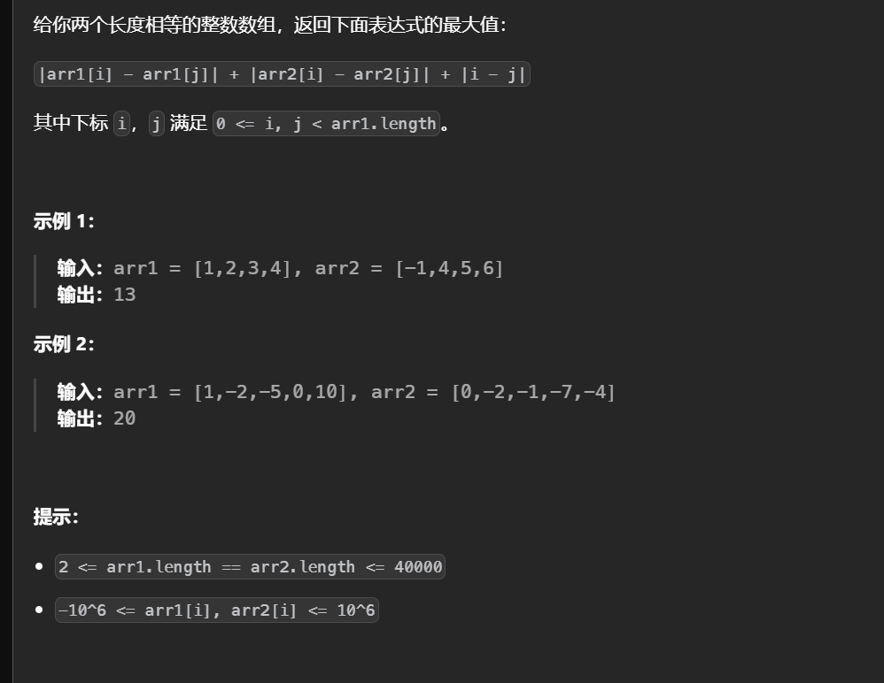


```python
class Solution:
    def maxAbsValExpr(self, arr1: List[int], arr2: List[int]) -> int:
        #化简式子，一共有八种形式
        #arr1[i]-arr1[j]+arr2[i]-arr2[j]+i-j
        #arr1[i]-arr1[j]+arr2[i]-arr2[j]-i+j
        #arr1[i]-arr1[j]-arr2[i]+arr2[j]+i-j
        #arr1[i]-arr1[j]-arr2[i]+arr2[j]-i+j
        #-arr1[i]+arr1[j]+arr2[i]-arr2[j]+i-j
        #-arr1[i]+arr1[j]+arr2[i]-arr2[j]-i+j
        #-arr1[i]+arr1[j]-arr2[i]+arr2[j]+i-j
        #-arr1[i]+arr1[j]-arr2[i]+arr2[j]-i+j

        # 移项，由于i和j是可以互换的因此最终只有四项，根据这个式子分类讨论求最后的结果
        #arr1[i]+arr2[i]+i-(arr1[j]+arr2[j]+j)
        #arr1[i]+arr2[i]-i-(arr1[j]+arr2[j]-j)
        #arr1[i]-arr2[i]+i-(arr1[j]-arr2[j]+j)
        #arr1[i]-arr2[i]-i-(arr1[j]-arr2[j]-j)
		
        #-arr1[i]+arr2[i]+arr1[j]-arr2[j]+i-j
        #-arr1[i]+arr2[i]+arr1[j]-arr2[j]-i+j
        #-arr1[i]-arr2[i]+arr1[j]+arr2[j]+i-j
        #-arr1[i]-arr2[i]+arr1[j]+arr2[j]-i+j
        A=[]
        B=[]
        C=[]
        D=[]
        for i,c in enumerate(zip(arr1,arr2)):
            l,r=c
            # 构造四个式子
            A.append(l+r+i)
            B.append(l+r-i)
            C.append(l-r+i)
            D.append(l-r-i)
        A.sort()
        B.sort()
        C.sort()
        D.sort()
        # 求解最大的
        return max(A[-1]-A[0],B[-1]-B[0],C[-1]-C[0],D[-1]-D[0])

```

## [好因子的最大数目](https://leetcode.cn/problems/maximize-number-of-nice-divisors/) 

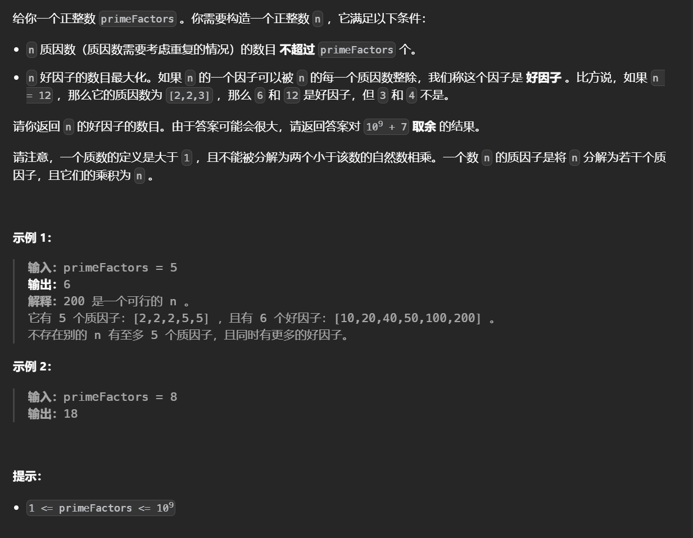

最后好因子的个数实际上是不同质因数个数用乘法原理求解出的，也就是有a1+a2+a3+a4=n，要求a1\*a2*a3\*a4最大

要让乘积最大有两个条件：把n划分为数值相等的几部分，其次每一部分都是3，也就是n=3a+b，如果b=0那么直接返回3

\^a，如果b=1那么把1和一个3拼起来分为2和2，如果b=3那么就在3\^a基础上乘上2.


```python
class Solution:
    def maxNiceDivisors(self, n: int) -> int:
        mod=10**9+7
        # 可以不划分也就是每个都是一个质因数，特判小于等于3的
        if n<=3:return n
        a=n//3
        b=n%3
        if not b:return pow(3,a,mod)
        elif b==1:return pow(3,a-1,mod)*4%mod
        return pow(3,a,mod)*2%mod
```

## [下一个排列](https://leetcode.cn/problems/next-permutation/)

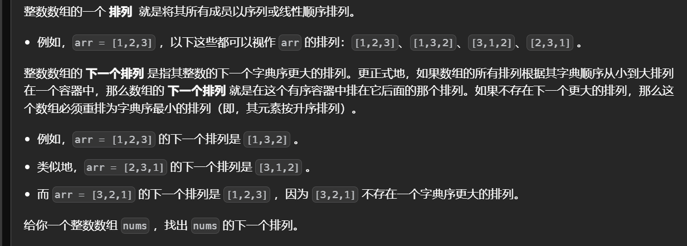

为了找到下一个排列，需要增加的幅度最小，因此每次都是从最低的数位操作。从右往左遍历，一旦遇到nums[i]<nums[i+1]也就是说可以变大，那么就开始操作，因为是遇到第一个就开始操作因此右边的位置都是降序的，再次从右往左遍历选出第一个小于当前元素的值将这个位置的值与当前位置的元素交换（保证增大幅度最小），而后将当前位置的右边排序得到下一个大更大的的排列。


```python
class Solution:
    def nextPermutation(self, nums: List[int]) -> None:
        n=len(nums)
        for i in range(n-2,-1,-1):
            r=nums[i+1]
            l=nums[i]
            if l<r:
                for j in range(n-1,-1,-1):
                    if nums[j]>nums[i]:
                        nums[i],nums[j]=nums[j],nums[i]
                        temp=sorted(nums[i+1:])
                        res=nums[:i+1]+temp
                        return res 
        nums.sort()
        return nums
```


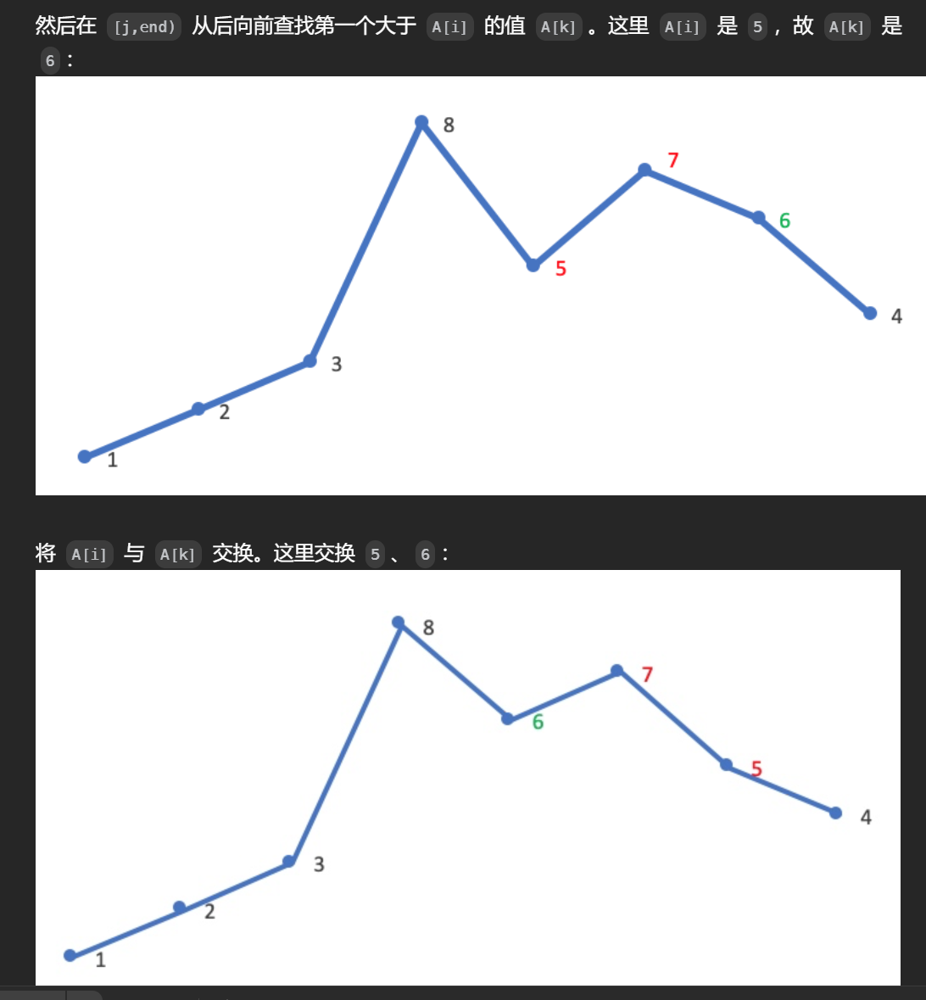


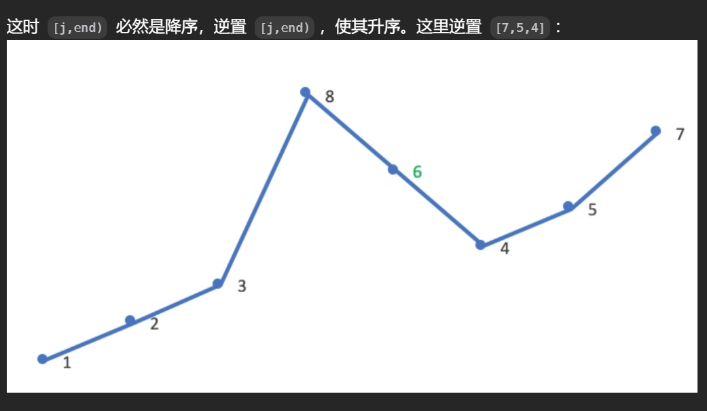

## [第 K 条最小指令](https://leetcode.cn/problems/kth-smallest-instructions/)

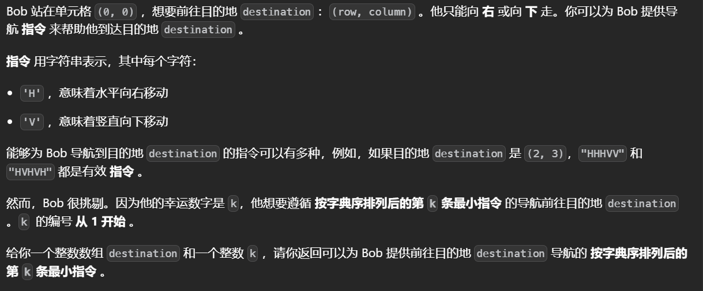

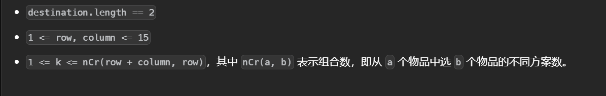

问题就是m个V和n个H的第k个排列

从高位往低位看

```python
class Solution:
    def kthSmallestPath(self, destination: List[int], k: int) -> str:
        ans=[]
        v,h=destination
        n,m=h,v
        ans=''
        # 遍历每一个位置
        for i in range(m+n-1):
            c1=comb(v+h-1,h-1)# 这个位置选H，剩下的位置中选h-1个H其他的放V有多少个
            c2=comb(v+h-1,v-1)# 同上，因为V大于H，因此C1会大于C1
            # 如果这个位置选H后排列不足以满足k那么就只能选V，
            if c1<k:
                ans+='V'
                v-=1# 选了一个V
                k-=c1# 所需的排列数减小c1个
                if not v:break
            else:
                # 选H能满足
                ans+='H'
                h-=1
                if not h:break
        # 剩下没选的
        while h:
            ans+='H'
            h-=1
        while v:
            ans+='V'
            v-=1
        return ans 
```

## [统计距离为 k 的点对](https://leetcode.cn/problems/count-pairs-of-points-with-distance-k/)

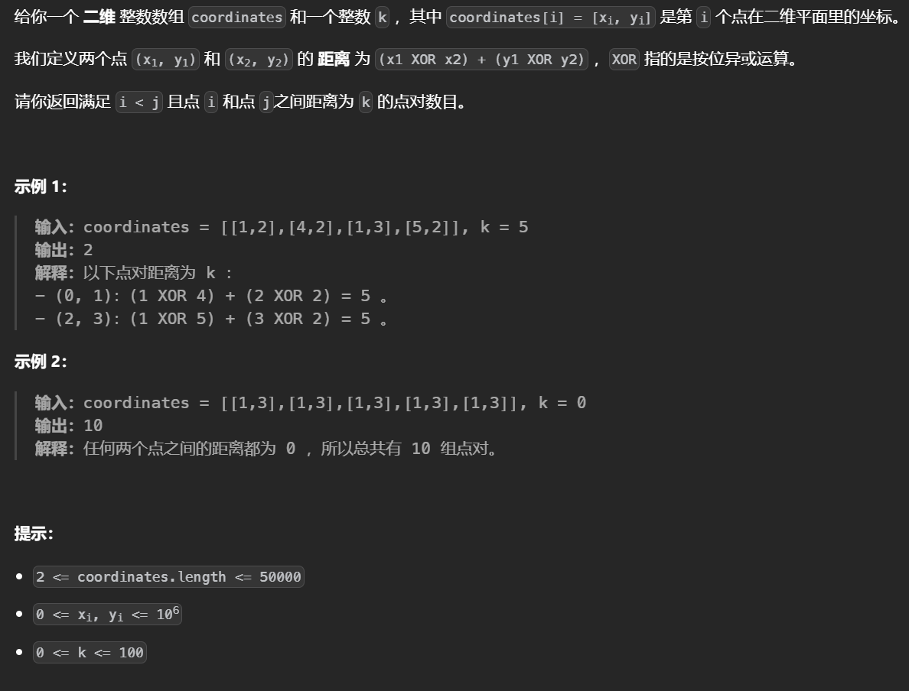

突破点在k的范围，给定的式子 $${x_1} \bigoplus {x_2}+{y_1} \bigoplus {y_2}=k$$因为异或运算的结果总是整数可以令${x_1} \bigoplus {x_2}$为i，那么i的范围在0到100之间那么变形式子有*x*1=*x*2⊕*i* 且 *y*1=*y*2⊕(*k*−*i*)。枚举x1y1累加他们的贡献然后用哈希表记录i从0到k+1出现的元组次数

```python
class Solution:
    def countPairs(self, coordinates: List[List[int]], k: int) -> int:
        memo=Counter()
        ans=0
        for x,y in coordinates:
            ans+=memo[(x,y)]
            for i in range(k+1):
                memo[(i^x,(k-i)^y)]+=1
        return ans 
```

## I Hate 1111

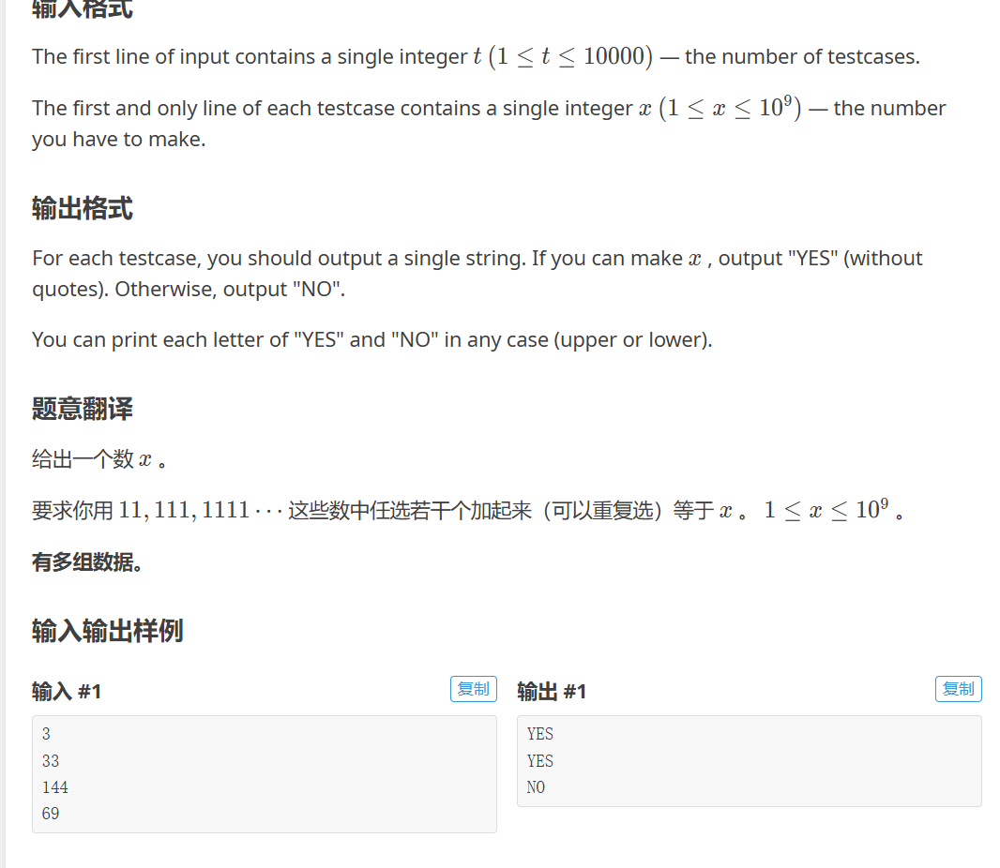

观察发现，所有大于三位的1的组合都能被11和111表示，那么问题变为一个数是否能被11a+111b表示，对于给定的10**9无法直接暴力枚举，但是发现11和111互素那么有结论所有大于11\*111-11-111的数都可以被11和111表示，对于小于这个范围的可以直接求解。

```python
from collections import deque, defaultdict, Counter
from functools import lru_cache
from bisect import bisect_left
from heapq import heappop, heappush
from itertools import accumulate
from math import ceil, inf, gcd
import sys
from typing import List
input = sys.stdin.readline
def R(): return int(input())
def RR(): return [int(x) for x in input().split()]
def get_pre(nums): return list(accumulate(nums, initial=0))

up=11*111-11-111

def cal(x):
    l,r=ceil(x/11),ceil(x/111)
    for i in range(l+1):
        for j in range(r+1):
            if 11*i+111*j==x:return True 
    return False

for _ in range(R()):
    x=R()
    if x>up or cal(x):print('YES')
    else:print('NO')
```


##  Amr and Pins

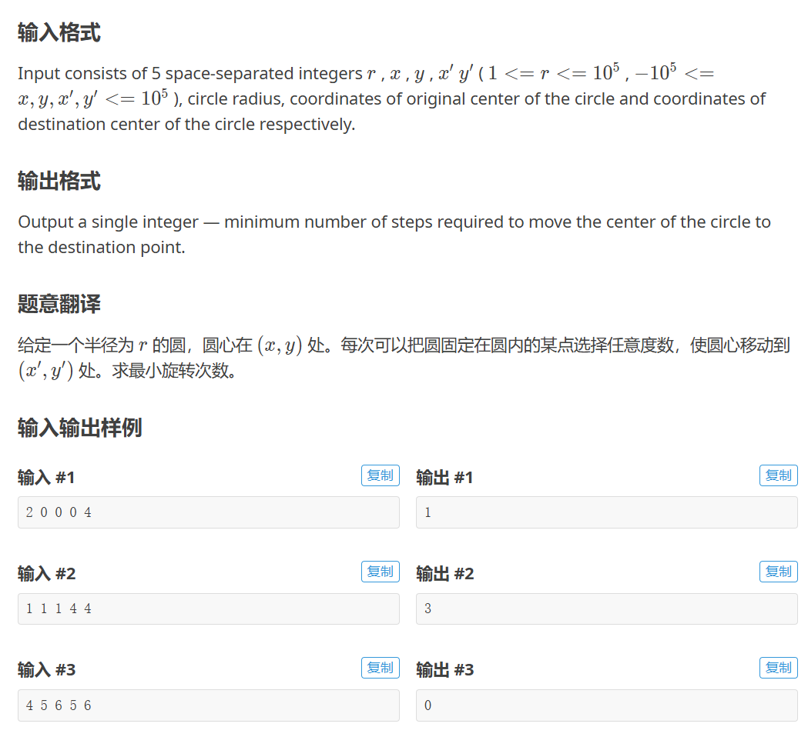

圆转动一次最多可以使圆心移动2*r，为了最快逼近另一个圆每次都选择移动2\*r，求解出两个圆之间的距离后直接除以2\*r上取整，即使不能精确的到达另一个圆心但是通过上取整的次数做了一次微调。

```python
r,x,y,x1,y1=RR()
d=((x-x1)**2+(y-y1)**2)**0.5
print(ceil(d/(2*r)))
```

## 小红装匣子

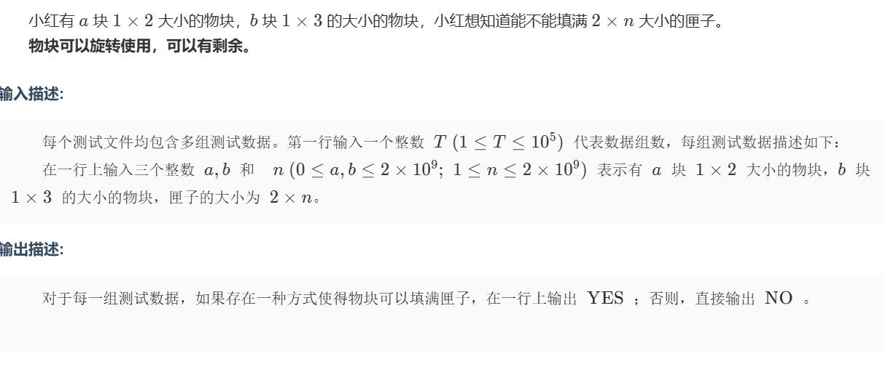

观察发现，竖着放两个2和横着放两排2是一样的，对于长度为n排列，横着放2和竖着放2所用的数量是一样的（也就是如果剩余n个位置可以不考虑如何摆放2，只要2的数目够就可以填满），而对于3所需的条件就严格了，为了保证填满先填好3

```python
import sys
input = sys.stdin.readline
def R(): return int(input())
def RR(): return [int(x) for x in input().split()]
def get_pre(nums): return list(accumulate(nums, initial=0))

for _ in range(R()):
    a,b,n=RR()
    # 考虑一排
    cnt=b>>1
    v=3*cnt
    # 如果超过了，看看在满足要求的情况下会剩下几个位置
    if v>n:
        c=n-n//3*3
    else:
        # 如果不够会剩下一些，剩下的部分不用靠考虑摆放直接看2的个数即可
        c=n-v
    if c>a:print('NO')
    else:print('YES')          
```

## Find The Array

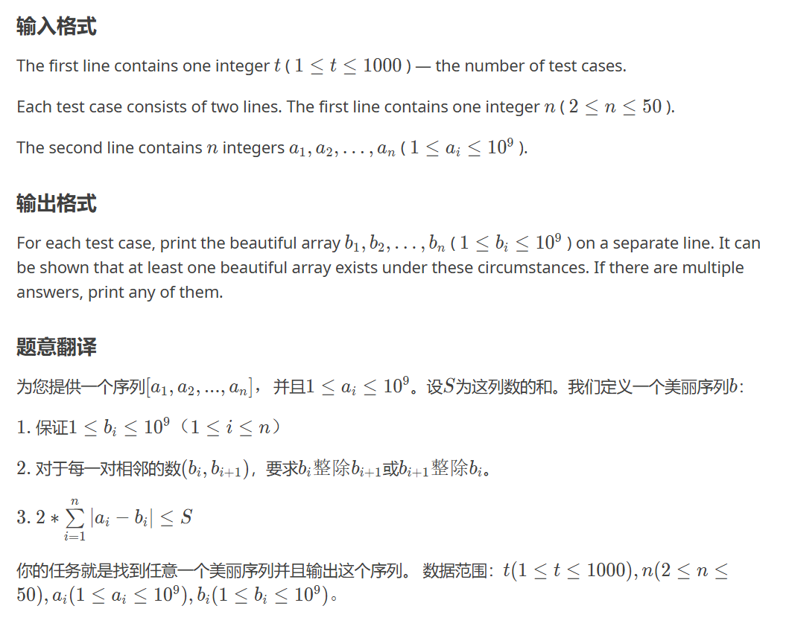

由第三个条件的2可以得到启发，假设b<a那么有a//2<=b<=a，那么再这个范围内必然存在一个2^k(由二进制可知)，那么只需构造一个在这个范围内的数即可，最简单的方式是保留大的数的最高位，可以通过lowbit求出。

```python
# def cal(x):
#     return x&-x
# for _ in range(R()):
#     n=R()
#     nums=RR()
#     ans=[]
#     for v in nums:
#         不断减lowbit可以得到只有最高位的1 
#         while v-cal(v):v-=cal(v)
#         ans.append(v)
#     print(*ans)

# 或者更直接一点，全部为1然后在奇数位置或者偶数位置等于原值，两个中总有一个可以
for _ in range(R()):
    n=R()
    nums=RR()
    s=sum(nums)
    ans=[1]*n
    for i in range(0,n,2):
        ans[i]=nums[i]
    if sum(abs(i-j) for i,j in zip(nums,ans))*2<=s:
        print(*ans)
        continue
    ans=[1]*n
    for i in range(1,n,2):
        ans[i]=nums[i]
    if sum(abs(i-j) for i,j in zip(nums,ans))*2<=s:
        print(*ans)
```

## Composite Coloring

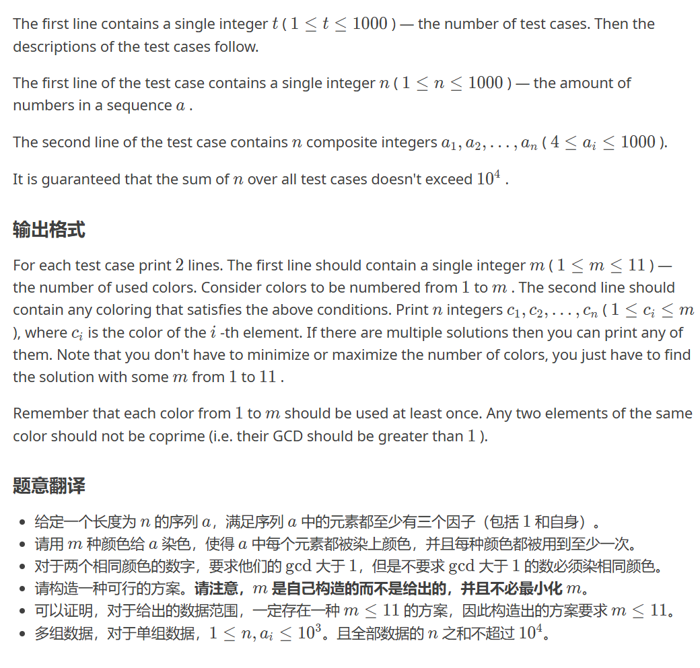


很明显要对每个数找质因数然后按照相同的质因数分组，但是不确定按照质因数分组会不会大于11组，题目中保证了每个数都不是质数同时小于等于1000，那么有根号下1000=33，也就是每个数一定存在一个小于33的质因数，而在33以下的质数共有11个正好可以分完。遍历数组中每个数如果他是某个质因数的倍数那么直接分到那一组。

```python
p=set()
for i in range(2,33):
    for j in range(2,isqrt(i)+1):
        if i%j==0:break
    else:
        p.add(i)
p=list(p)
# 给质因数一个下标
memo=dict([(j,i) for i,j in enumerate(p,1)])

for _ in range(R()):
    n=R()
    nums=RR()
    if n<=11:
        print(n)
        print(*[i for i in range(1,n+1)])
    else:
        ans=[]
        # 把每个数转换它他所对的质因数的下标
        for i,v in enumerate(nums):
            for pp in p:
                if v%pp==0:
                    ans.append(memo[pp])
                    break
        # 离散化，因为答案要求从1开始
        temp=set(ans)
        temp=sorted(temp)
        ans=[bisect_left(temp,x)+1 for x in ans]
        print(max(ans))
        print(*ans)
```


## [K 次乘运算后的最终数组 II](https://leetcode.cn/problems/final-array-state-after-k-multiplication-operations-ii/)

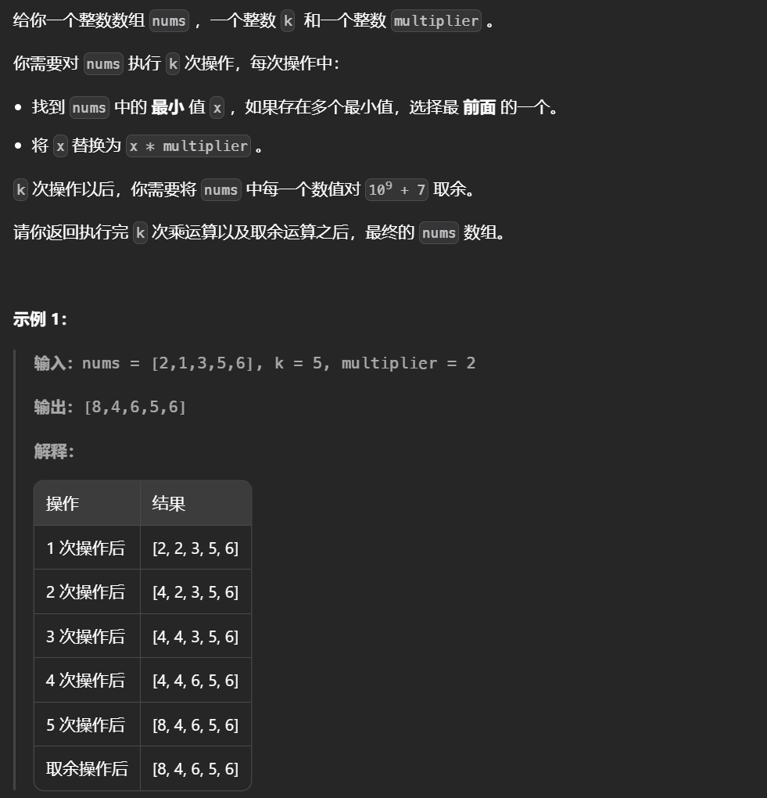

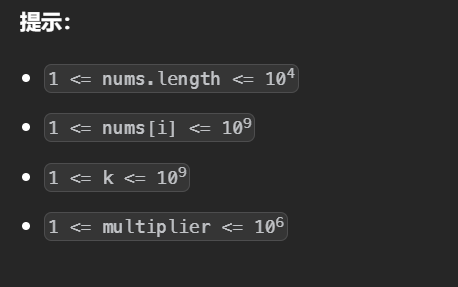


如果数组中只有两个数，当x<=y且x*m>y时，之后的操作都是交替进行的，同理对于3个4个n个都有这个规律，那么对于k=10**9就可以利用这个规律简化。

```python
class Solution:
    def getFinalState(self, nums: List[int], k: int, multiplier: int) -> List[int]:
        if multiplier==1:return nums
        n=len(nums)
        mod=10**9+7
        h=[(v,i) for i,v in enumerate(nums)]
        heapify(h)
        mx=max(nums)
        # 利用最小堆每次操作最小的，当最小值是原本的最大值的时候，之后的操作就会开始循环
        while k and h[0][0]<mx:
            x,i=h[0]
            heapreplace(h,(x*multiplier,i))
            k-=1
        
        h.sort()
        m=k%n
        for i,(x,j) in enumerate(h):
            nums[j]=x*pow(multiplier,k//n+int(i+1<=m),mod)%mod
        h.sort(key=lambda x:x[1])
        return nums
```

## 又是一年毕业季

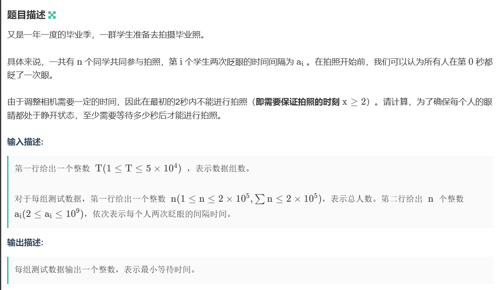

找到一个最小的不是数列中某个数的倍数的数，实质上就是找最小的未出现的质数

不过在筛素数的时候注意数据范围要开大一点，因为数组中可能都是素数。

```python
MAX=5*10**6+10
# 记录这个数是不是质数，初始为True
is_prime=[True]*MAX
is_prime[0]=False
is_prime[1]=False
# 记录质数
prime=[]
# 对于给定的数据范围，从2开始找质数
for i in range(2,MAX):
    if is_prime[i]:
        # 如果是质数加入，并把他的冥次标记
        prime.append(i)
        # 这里的优化是设置步长并从i**2开始
        for j in range(i*i,MAX,i):
            is_prime[j]=False

for _ in range(R()):
    n=R()
    nums=RR()
    vis=set(nums)
    for v in prime:
        if v not in vis:
            print(v)
            break
```


​	


# 前缀和数组

前缀和适用于快速频繁的计算一个索引区间内的元素之和，构建的前缀和数组第一位为0，方便构造，查询从0到r的区间内元素之和，结果是pre[r+1]

**可以找出子数组某个值的区间**


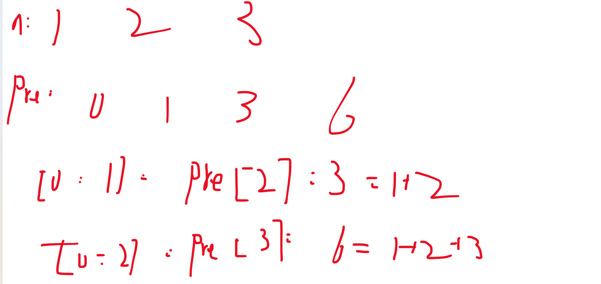

**如果做了一位偏移，那么在找l,r区间（从0开始的闭区间）内的元素和时，用pre[r+1]-pre[l]，反之就是在找pre[r]-pre[l-1],如果要找0到2区间内的值是会越界的，因此减一做一位偏移**


## 一维数组的检索


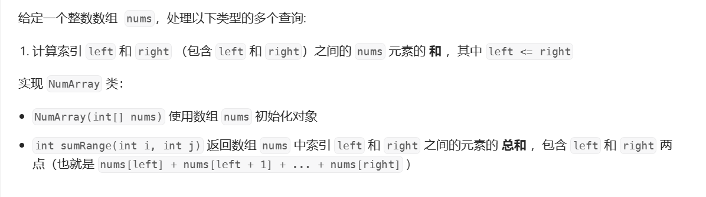

利用前缀和数组，创建一个新数组。数组中第一个元素是0作为索引偏移，而后的第i+1个元素的值是原数组中第i个元素及其之前的元素的和。

例如[1,2,3,4,5]的前缀和数组就是[0,1,3,6,10,15]，比如说想要[2,4]，那么利用算出的前缀和数组计算prenum[5]（多了0）-prenum[2]，也就是前五个元素（包括0）和减去前一个元素和，就是第二个到第4个的元素和

```python
class NumArray(object):
    def __init__(self, nums):
        self.li=nums
        self.list=[0]
        for i in range(len(self.li)):
            self.list.append(self.li[i]+self.list[i])

    def sumRange(self, left, right):   
        return self.list[right+1]-self.list[left]
```


## 二维区域和检索–矩阵不可变

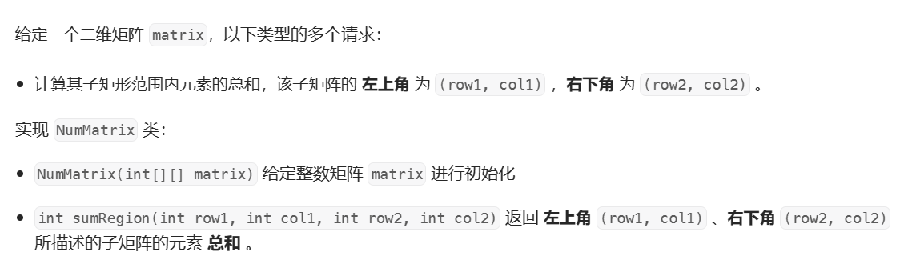

利用前缀和数组，计算出从原点到[i,j]的矩阵元素和

1. 从 `(row2, col2)` 处的前缀和减去 `(row1 - 1, col2)` 处的前缀和（如果 `row1` 不为0的话）。
2. 再减去 `(row2, col1 - 1)` 处的前缀和（如果 `col1` 不为0的话）。
3. 最后再加上 `(row1 - 1, col1 - 1)` 处的前缀和（如果 `row1` 和 `col1` 都不为0的话）。

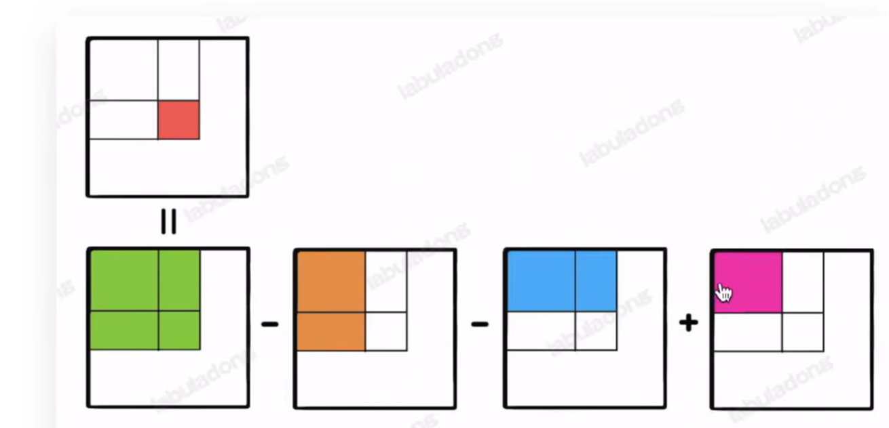

```python
class NumMatrix(object):

    def __init__(self, matrix):
        if not matrix or not matrix[0]:
            self.prefix_sum = None
            return
        self.matrix=matrix
        m=len(matrix)
        n=len(matrix[0])
        # 所构建的数组长宽都要多出一，可以方便计算，不是防止越界
        self.prematrix=[[0]*(n+1) for _ in range(m+1)]
        for i in range(1,m+1):
            for j in range(1,n+1):
                # 子矩阵的元素和为矩阵元素加上左边的子矩阵加上上边的子矩阵减去重复的左上矩阵 
                self.prematrix[i][j]=self.matrix[i-1][j-1]+self.prematrix[i-1][j]+self.prematrix[i][j-1]-self.prematrix[i-1][j-1]
	
    def sumRegion(self, row1, col1, row2, col2):
        # 最后的计算中注意不能重叠，放到矩阵上做一位偏移
        return self.prematrix[row2+1][col2+1]-self.prematrix[row2+1][col1]-self.prematrix[row1][col2+1]+self.prematrix[row1][col1]
```

## 带权重的随机算法

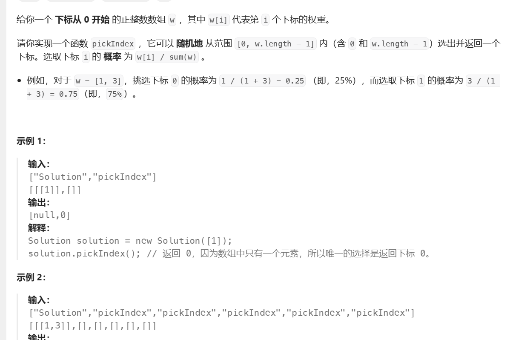

w可以抽象为一组线段，权重为1线段长度为1，权重为3线段长度为3。

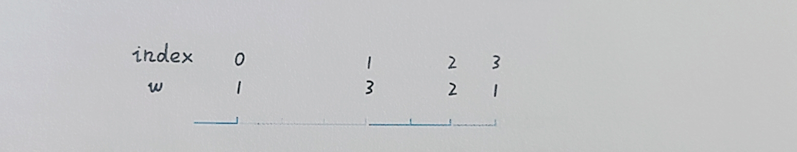

如果用数组表示的话就是：
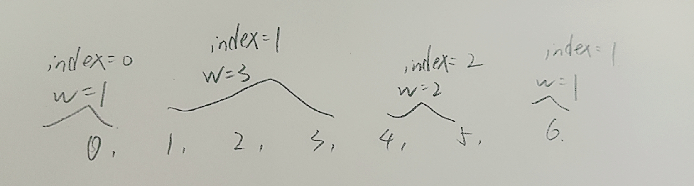

选择使用前缀和数组表示

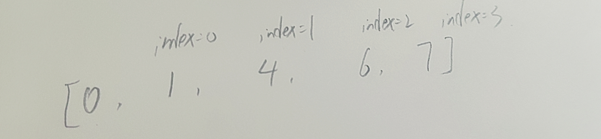


注意0只是一个占位符，选取随机值的时候不包括0，随机值的区间在[1,7]，如果随机到了4那么返回的索引就是数值1在前缀和数组的索引，如果是5返回的索引就是数值6的（也就是如果前缀和数组中不存在则返回大于他的最小的那个数的索引），最后的结果要减少一，因为前缀和数组中有一位偏移。

至于如何判断随机到的值的索引使用二分搜索。

```python
import random
class Solution(object):

    def __init__(self, w):
        # 构造前缀和数组，有一位偏移
        self.presum=[0]*(len(w)+1)
        self.presum[0]=0
        for i in range(1,len(self.presum)):
            self.presum[i]=w[i-1]+self.presum[i-1]
        

    def pickIndex(self):
        target = random.randint(1, self.presum[-1])
        
        left=0
        right=len(self.presum)
        
        while left<right:
            mid=(left+right)//2
            # 找到了更新右指针，为了找到最小的那个
            if self.presum[mid]==target:
                right=mid
            elif self.presum[mid]>target:
                right=mid 
            else:
                left=mid+1
        return left-1
```

## [子数组异或查询](https://leetcode.cn/problems/xor-queries-of-a-subarray/)

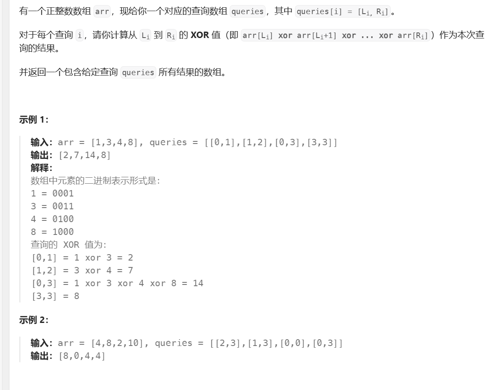

快速查询某个区间内元素的和，使用前缀和数组，这里是异或操作，前缀数组中储存的就应该是元素之间累异或的结果。

**元素和0异或的结果不变**，偶数个相同元素异或相当于没异或，可以构造前缀和公式

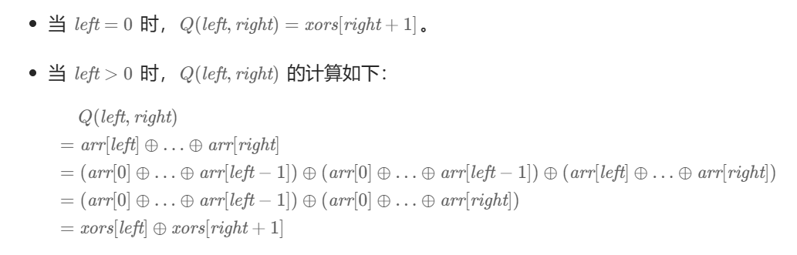

```python
from functools import reduce
from operator import xor
class Solution:
    def xorQueries(self, arr: List[int], queries: List[List[int]]) -> List[int]:
        # 构造前缀数组，初始第一个位置为0方便构造,pre[i]就是从arr[0]异或到arr[i-1]的结果
        pre=[0]
        ans=[]
        # 构造
        for a in arr:
            pre.append(pre[-1]^a)
        for q in queries:
            l,r=q
            ans.append(pre[l]^pre[r+1])
        return ans
```

## [统计美丽子数组数目](https://leetcode.cn/problems/count-the-number-of-beautiful-subarrays/)

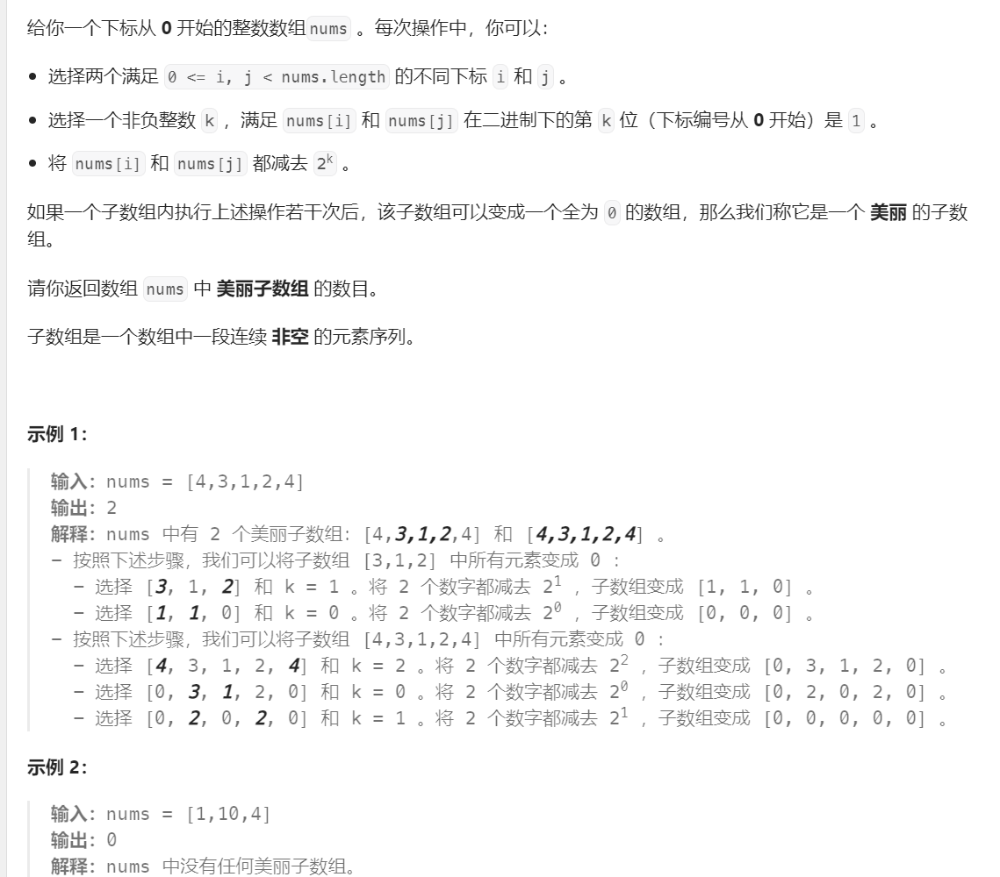

就是在找子数组异或和为0的数目，构建前缀异或和数组，子数组[l,r]异或的结果可以表示为pre[l-1]^pre[r]，要想为0就是找相同的异或和。

```python
class Solution:
    def beautifulSubarrays(self, nums: List[int]) -> int:
        pre=[0]
        for i,v in enumerate(nums):
            pre.append(v^pre[-1])
        memo=Counter(pre)
        ans=0
        for k,v in memo.items():
            ans+=comb(v,2)
        return ans 
```


## [ 数组美丽值求和](https://leetcode.cn/problems/sum-of-beauty-in-the-array/)

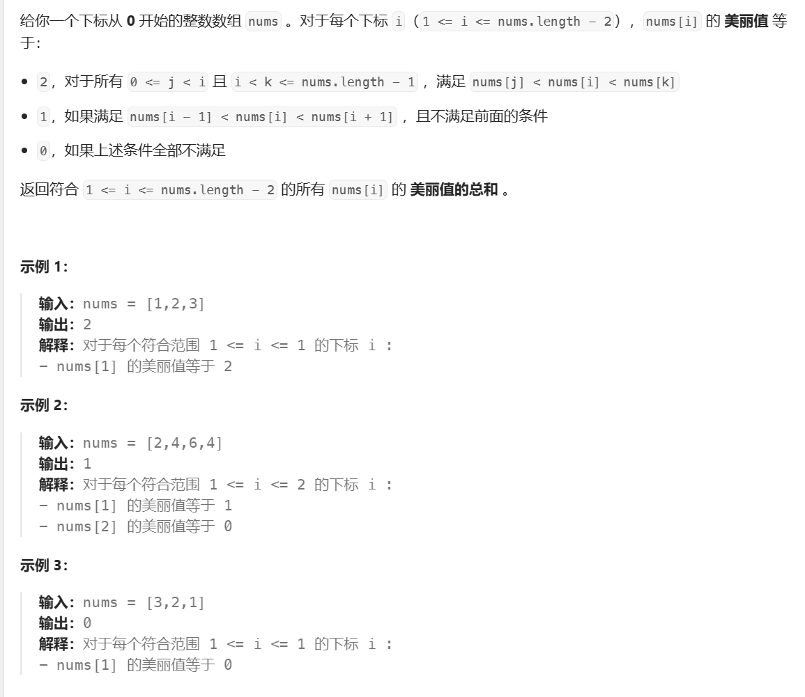

判断一个值是否大于左边的所有值只需要判断是否大于左边的最大值。（技巧点）

观察题目就是要求一个数是否大于左边的最大值以及小于右边的最小值，每次使用双指针向两边遍历的做法太慢了，构建`前缀最大值和前缀最小值数组`。

l[i]表示从0到i-1的最大值，r[i]表示从i+1到最后的最小值，因为要以i左右来判断，不需要到i

```python
class Solution:
    def sumOfBeauties(self, nums) -> int:
        n = len(nums)
        l = [-float('inf')] * n
        r = [+float('inf')] * n
        # 相当于做了一位偏移，本来按照l和r的定义也就不会取到
        l[0] = nums[0]
        r[n-1] = nums[-1]
        ans = 0

        for i in range(1, n):
            # nums[i-1]与l[i-1]的比较相当于nums[i-1]与nums[:i-2]中取最大值
            l[i] = max(nums[i - 1], l[i - 1])
        for i in range(n - 2, -1, -1):
            # nums[i+1]与r[i+1]的比较相当于nums[i+1]与nums[i+2:]中去最小值
            r[i] = min(nums[i + 1], r[i + 1])
        for i in range(1, n - 1):
            if nums[i] > l[i] and nums[i] < r[i]:
                ans += 2
            elif nums[i - 1] < nums[i] < nums[i + 1]:
                ans += 1
        return ans

Solution().sumOfBeauties([1,2,3])
```

## [最后 K 个数的乘积](https://leetcode.cn/problems/product-of-the-last-k-numbers/)

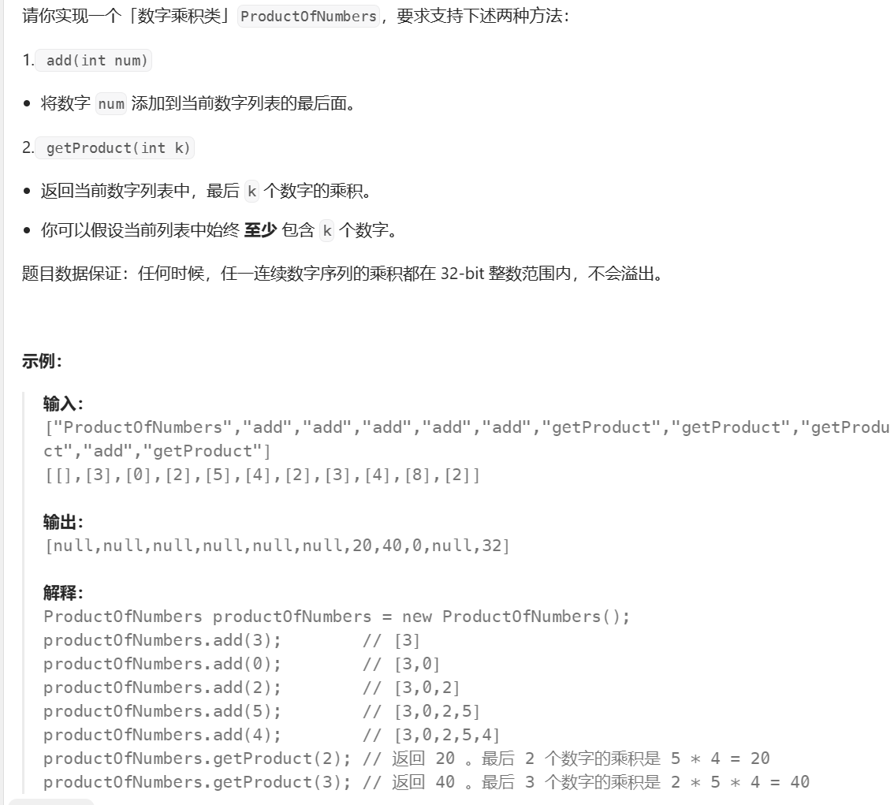


频繁的的计算区间内的结果，使用前缀思想，例如输入的 a b c d。则存的是 a，a×b，a×b×c，a×b×c×d。这样。如果查询最后k个数相乘，就是pre[n-1]//pre[n-k-1] 做一位偏移：（a×b×c×d）/ （a×b）= c × d。这样每次查询只需要做一次除法，每次输入只需要做一次乘法。

注意这里存在除0的可能，因此`每次遇到0的时候，就清空数组`，否则zai记录下去没有意义（0/0），如果查询的大小超过了当前的前缀数组（也就是必然包含0）就返回0

​	

```python
class ProductOfNumbers:

    def __init__(self):
        self.pre=[]

    def add(self, num: int) -> None:
        if len(self.pre)==0 and num!=0:
            self.pre.append(num)
        elif num==0:
            self.pre=[]
        else :
            self.pre.append(num*self.pre[-1])
    def getProduct(self, k: int) -> int:
        n=len(self.pre)
        if k>n:
            return 0
        elif k==n:
            return self.pre[n-1] 
        else:
            return self.pre[n-1]//self.pre[n-k-1]
```

## [矩阵区域和](https://leetcode.cn/problems/matrix-block-sum/)

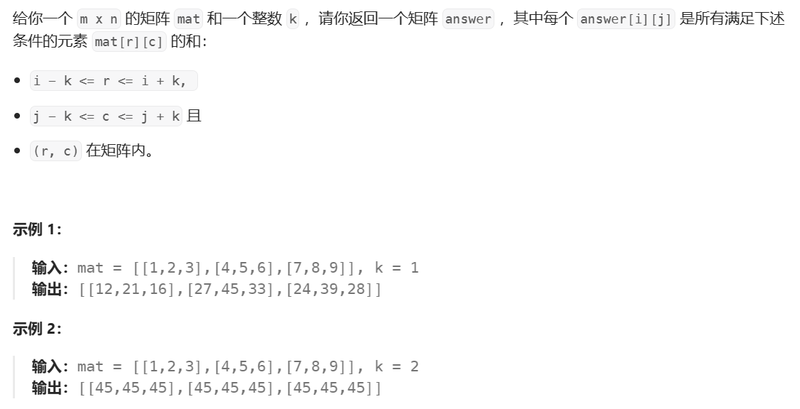


二维前缀和数组，根据k的大小确定起点和终点，但是注意不能越界

```python
class Solution:
    def matrixBlockSum(self, mat, k) :
        m,n=len(mat),len(mat[0])
        arr=[[0 for _ in range(n+1)]for _ in range(m+1)]
        # 构建前缀和数组
        for i in range(m):
            for j in range(n):
                arr[i+1][j+1]=arr[i+1][j]+arr[i][j+1]-arr[i][j]+mat[i][j]
        ans=[[0 for _ in range(n)]for _ in range(m)]
        for i in range(m):
            for j in range(n):
                # 控制边界
                a,b=max(i-k,0),max(j-k,0)# 1 0
                c,d=min(m-1,i+k),min(n-1,j+k)
                # 原数组映射到前缀和数组上存在一位索引偏移
                ans[i][j]=arr[c+1][d+1]-arr[c+1][b]-arr[a][d+1]+arr[a][b]
        return ans
```

## [除自身以外数组的乘积](https://leetcode.cn/problems/product-of-array-except-self/)

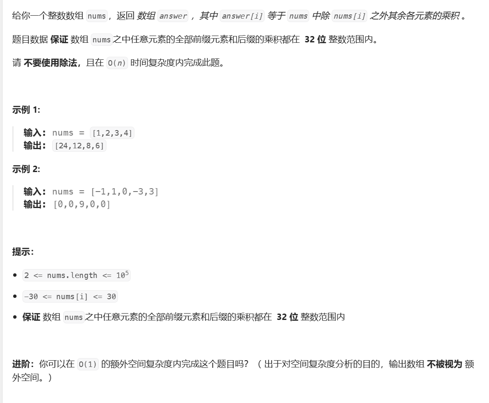

这里直接使用前缀和数组的话，如果遇到了0，没有办法求解，因此拆分为两个数组，一个前缀和一个后缀和，在找结果的时候乘上这个数左边的前缀和以及右边的后缀和。


```python
class Solution:
    def productExceptSelf(self, nums: List[int]) -> List[int]:
        n=len(nums)
        # 开了三个数组记录前缀后缀以及答案
        pre=[0]*n
        post=[0]*n
        ans=[0]*n
        pre[0]=nums[0]
        post[-1]=nums[-1]
        # 构建前后缀数组
        for i in range(1,n):
            pre[i]=nums[i]*pre[i-1]
        for i in range(n-2,-1,-1):
            post[i]=nums[i]*post[i+1]
         # 求解结果，注意对两端的设置前/后缀为1，因为创建前缀数组时没有偏移
        for i in range(n):
            if i-1>=0:
                first=pre[i-1]
            else:
                first=1
            if i+1<n:
                last=post[i+1]
            else:
                last=1
            ans[i]=first*last
        return ans 
```


## [分割数组](https://leetcode.cn/problems/partition-array-into-disjoint-intervals/)


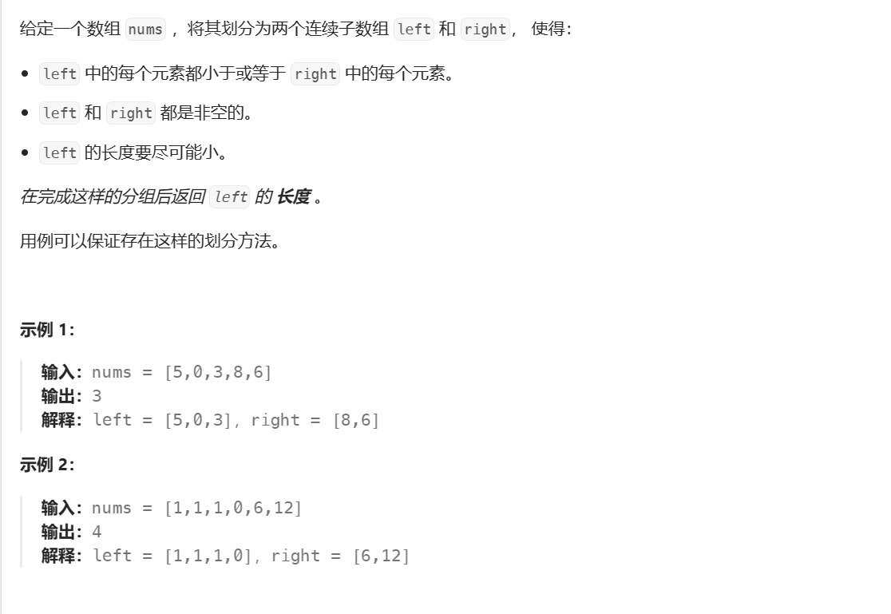


就是找一个left的`前缀最大值小于right的后缀最小值的数组`

```python
from math import inf
class Solution:
    def partitionDisjoint(self, nums: List[int]) -> int:
        n=len(nums)
        mx=-1
        # 构建后缀最小值数组
        mn=[inf]*n
        mn[-1]=nums[-1]
        for i in range(n-2,-1,-1):
            mn[i]=min(nums[i],mn[i+1])
        for i in range(n)
        # 记录前缀最大值:
            mx=max(mx,nums[i])
            if mx<=mn[i+1]:
                # 注意长度是索引加一
                return i+1
```

## [任意子数组和的绝对值的最大值](https://leetcode.cn/problems/maximum-absolute-sum-of-any-subarray/)

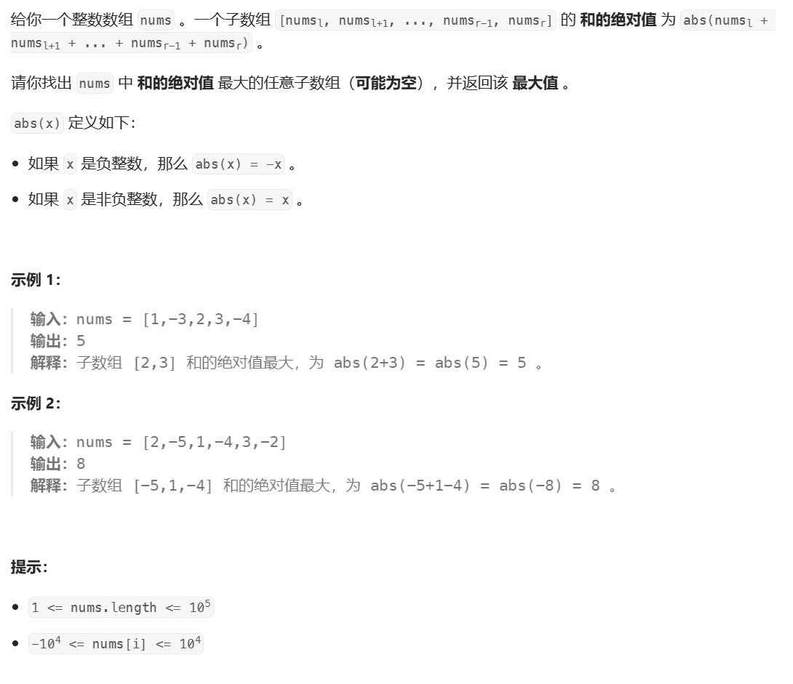

通过前缀和表示数组区间的和，找出前缀和数组中最大的和最小的，找出他们的差值（只有最大值和最小值的差值才是最大的），在这三个值的绝对值中取最大值即可


## [生成平衡数组的方案数](https://leetcode.cn/problems/ways-to-make-a-fair-array/)

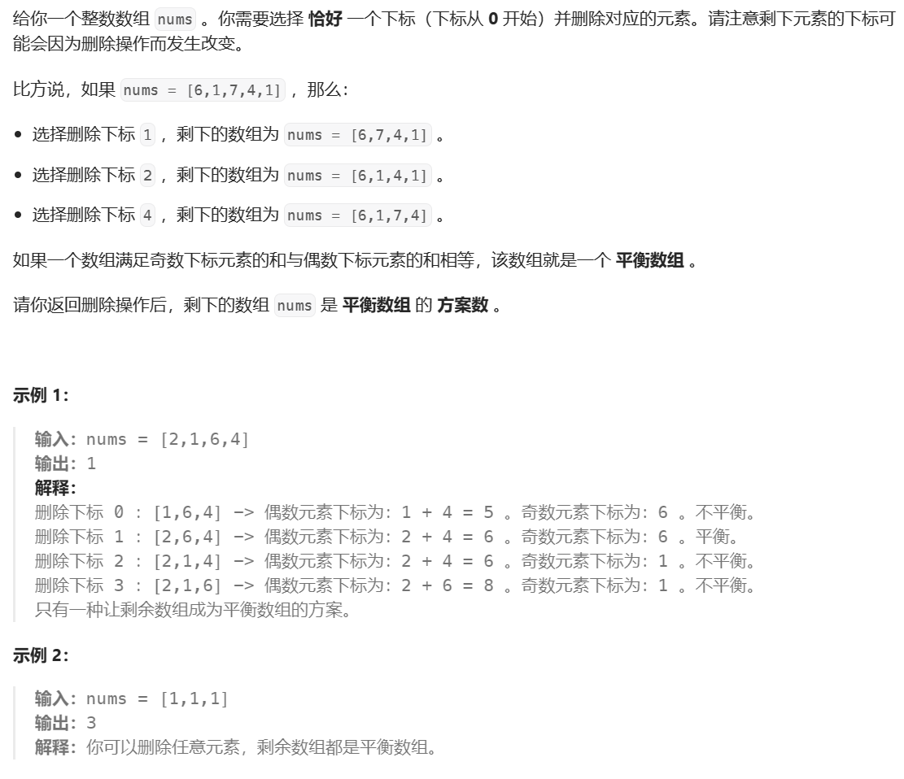

找删除一个元素后，所有的奇数元素之和，这需要用到前缀奇数数组，以及后缀偶数数组（因为删除这个元素后，原来后面的偶数下标变为奇数下标）

```python
class Solution:
    def waysToMakeFair(self, nums: List[int]) -> int:
        total=sum(nums)
        ans=0
        n=len(nums)
        # 加0方便操作
        pre=[0]*(n+1)
        post=[0]*(n+1)
        for i in range(n):
            if i&1:
                pre[i+1]=nums[i]+pre[i]
            else:
                pre[i+1]=pre[i]
        for i in range(n-1,-1,-1):
            if not i&1:
                post[i]+=post[i+1]+nums[i]
            else:
                post[i]=post[i+1]
        for i in range(n):
            # 注意索引的确定，删除了这个元素，奇数前缀和的索引传入i-1，但有一位偏移，偶数后缀和不存在索引偏移
            val= pre[i]+post[i+1]
            if val==total-val-nums[i]:
                ans+=1
        return ans

```

## [和相同的二元子数组](https://leetcode.cn/problems/binary-subarrays-with-sum/)	

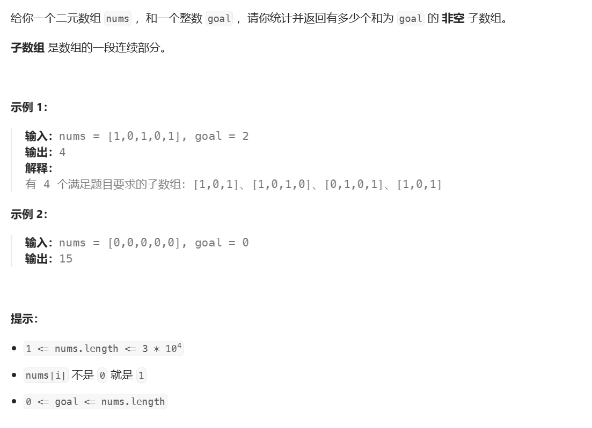

先构造前缀和数组，可以通过O(1)的时间得出子数组的和，之后扫描每个位置，以这个位置为右端点，寻找是否有满足条件的左端点存在，左端点的子数组和就是之前的右端点所访问过的，使用一个哈希表记录这些右端点的值的个数

```python
class Solution:
    def numSubarraysWithSum(self, nums: List[int], goal: int) -> int:
        ans=0
        # 前缀和
        pre=[0]+list(accumulate(nums))
        # 注意初始的时候要记录一个0值，表示全部取到。
        memo=defaultdict(int,{0:1})
        for i in range(len(nums)):
            # 得到以r为右端点的子数组的和
            r=pre[i+1]
            # 查找左端点是否存在，以及有几个
            l=r-goal
            ans+=memo[l]
            memo[r]+=1
        return ans 
```

## collecting game

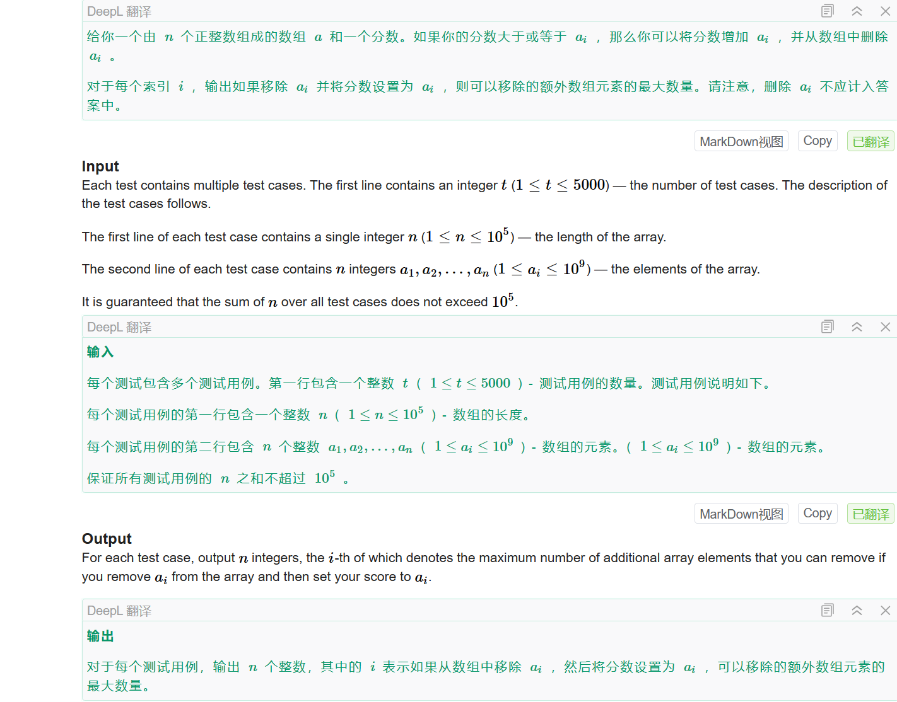

对每个位置的元素查找他可以删除多少个比他小的元素，删除了的元素可以加到这个元素上用于下一次判断。

对于每个元素暴力的查找会很慢，但通过观察可以发现，对于一个元素，比它小的最大元素所能到达的最远位置就是他能到达的最远位置，因此在把数组排序后可以维护一个只会向右移动的指针，遍历排序后的数组，当指针位置大于等于当前位置，那么这个元素的能走到的最远距离就是已知的，如果不大于，那么就从当前元素开始找，为了快速查找，使用前缀和数组，找出这个元素的前缀和数组中对应的位置，然后在排序的数组中使用二分判断他能到达的最远位置，之后再用这个位置的前缀和继续二分找最远位置直到位置不变，用这个位置的值去更新指针，同时对于每一个元素使用字典记录他能到达的最远距离，因为数组中可能存在重复值。

```python
from collections import defaultdict
from itertools import accumulate as ac
from bisect import bisect_right as br
t=int(input())
while t:
    n=int(input())
    ans=[0]*n
    nums=[int(x) for x in input().split()]
    temp=sorted([val for val in nums])
    l=0
    pre=list(ac(temp))
    memo=defaultdict(int)
    for i in range(n):
        if l<i:
            curr=pre[i]
            # 使用二分找能走到的最远距离
            index=br(temp,curr)-1
            # 如果合法，一直迭代
            while 0<index<n and index>i:
                # 找最远位置的前缀和
                curr=pre[index]
                # 这个前缀和能到达的最远位置
                cnt=br(temp,curr)-1
                # 如果相同，说明无法再向前了，退出，否则更新继续
                if cnt==index:
                    break
                else:
                    index=cnt
            l=index
        # 使用哈希表记录最大值，可能存在相同元素
        memo[temp[i]]=max(memo[temp[i]],max(0,l))

    for i,v in enumerate(nums):
        ans[i]=memo[v]
    print(*ans ,end=' ')
    print()
    t-=1
```


##  Sum of Progression

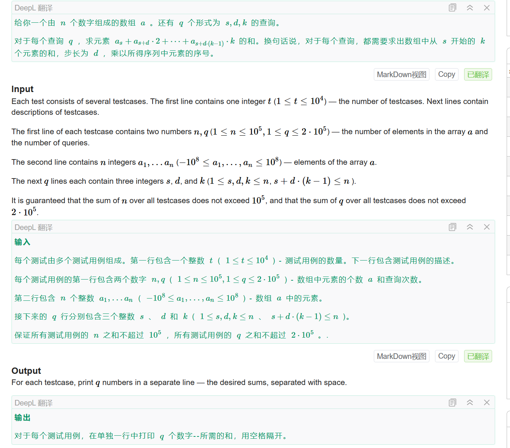

明显必须在O(1)的时间内完成一次查询，考虑使用带权的前缀和数组，即数组中记录的是$1\times a_0+2\times a_1 +3\times a_3...$

一共用到了两个前缀和

从特殊到一般来推公式，首先考虑d=1的情况：

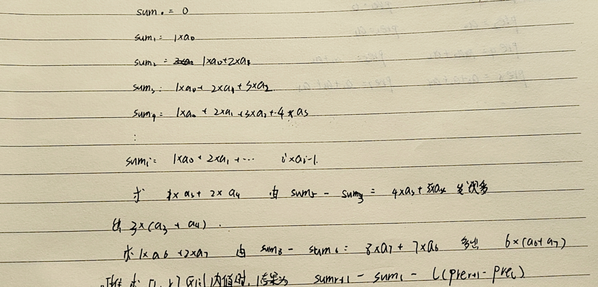


在考虑d=2的情况

注意d>=2时考虑两个位置，一个从0开始一个从1开始

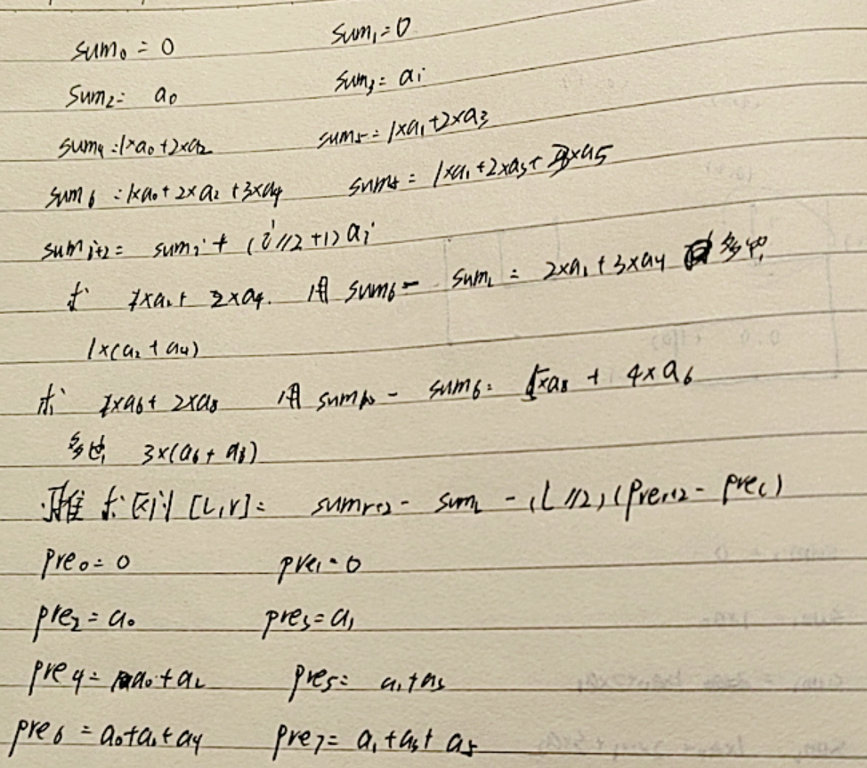

最后可以推出公式：
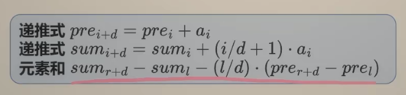


因此可预处理出每个d下的前缀和和带权前缀和，但是如果每个位置都处理的话会达到n^2的时间复杂度，这里使用根号分治法，十万级别的数据，如果d大于根号n的话，那么要处理的数据只有百位，直接暴力做，因此d限定在根号n之下


```python
from math import isqrt
import sys
input = sys.stdin.readline
# 首先开数组
mx_n = 100000
b = 300
pre = [[0]*(mx_n + b) for _ in range(b)]
summ = [[0]*(mx_n + b) for _ in range(b)]


def slove(nums):
    # 对于每个位置构造前缀数组
    for d in range(1, b):
        for i in range(len(nums)):
            pre[d][i + d] = pre[d][i] + nums[i]
            summ[d][i + d] = summ[d][i] + (i//d+1) * nums[i]


t = int(input())
while t:
    n, q = [int(x) for x in input().split()]
    nums = [int(x) for x in input().split()]
    # 预处理
    slove(nums)
    while q:
        s, d, k = [int(x) for x in input().split()]
        s-=1
        # 步长太大，直接暴力做
        if d >= b:
            ans=0
            for i in range(k):
                ans+=nums[s+d*i]*(i+1)
            print(ans, end=' ')
        else:
            r=s + d * k
            # 由公式求解
            print(summ[d][r] - summ[d][s] - (pre[d][r] - pre[d][s]) * (s // d), end=' ')

        q -= 1
    print()
    t -= 1
```


## [ 和可被 K 整除的子数组](https://leetcode.cn/problems/subarray-sums-divisible-by-k/)

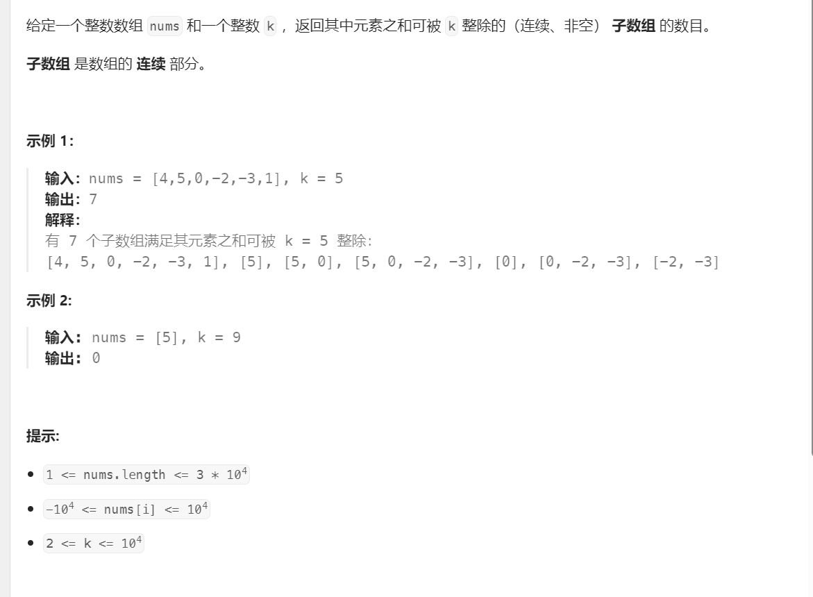

一个子数组的和可以用两个前缀和相减得出，如果和为k的倍数，也就是(pre[j]-pre[i])%k= =0。根据`同余定理`，pre[j]%k==pre[i]%k，因此统计前缀和数组中取模k的相同的个数，计算最终的结果，这里顺序不重要只要存在就是一组解。注意对于取模结果为0的要额外加上它本身表示本身也可以作为一个结果。

```python
class Solution:
    def subarraysDivByK(self, nums: List[int], k: int) -> int:
        pre=list(accumulate(nums))
        memo=Counter()
        for p in pre:
            memo[p%k]+=1
        ans=0
        for k,v in memo.items():
            if k==0:
                ans+=v
            ans+=v*(v-1)//2
        return ans 
```

## [和为 K 的子数组](https://leetcode.cn/problems/subarray-sum-equals-k/)

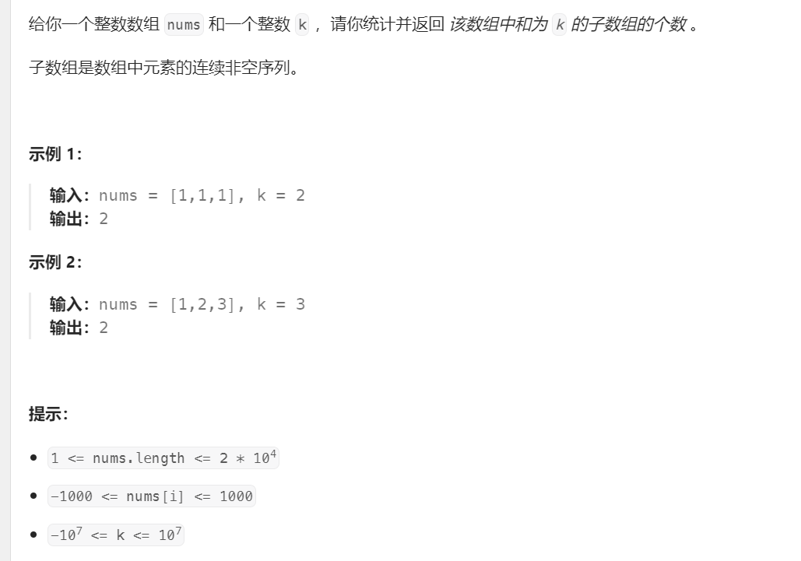

子数组的和用两个前缀相减，这里有pre[j]-pre[i]==k，也就是对于每个j去找他前面是否存在一个pre[i]=pre[j]-k，和上一题不一样这一题需要考虑顺序。

```python
class Solution:
    def subarraySum(self, nums: List[int], k: int) -> int:
        memo=Counter()
        n=len(nums)
        pre=ans=0
        # 因为要找前面的，因此直接构造
        for i in range(n):
            # 累加前缀和
            pre+=nums[i]
            # 找是否存在结果
            ans+=memo[pre-k]
            # 特判本身就是一个
            if pre==k:
                ans+=1
            # 最后再记录，反之类似于nums=[1],k=0
            memo[pre]+=1
        return ans 
```


## [两个非重叠子数组的最大和](https://leetcode.cn/problems/maximum-sum-of-two-non-overlapping-subarrays/)

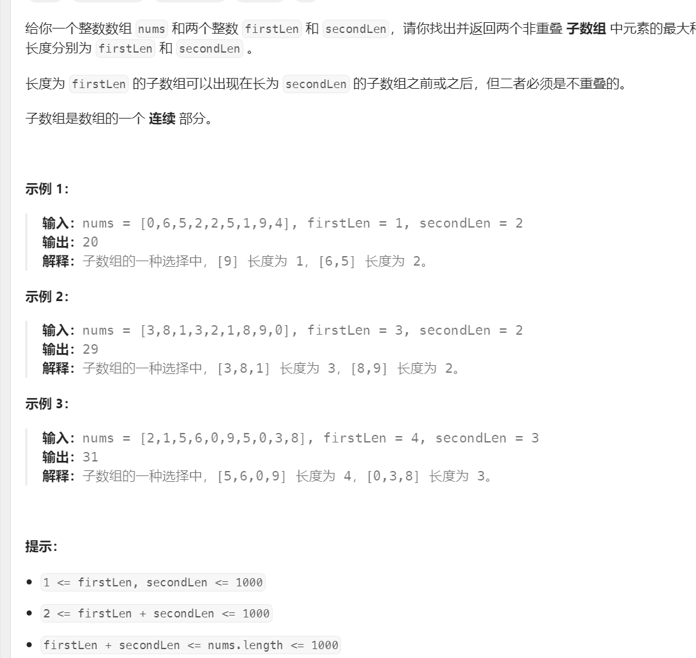


**对于有两个变量的值，通常可以枚举其中一个把他视为常量，从而转换为找一个变量的问题**

这个问题中，可以先枚举第二个区间在后面的情况，同时维护前一个区间的最大值，然后再找第一个区间在后面的情况。

​	

```python
class Solution:
    def maxSumTwoNoOverlap(self, nums: List[int], a: int, b: int) -> int:
        ans=0
        # 使用前缀和快速求解
        pre=[0]+list(accumulate(nums))
        n=len(nums)
        def f(a,b):
            nonlocal ans
             # 维护前一个的最大值
            maxa=0
            # 枚举当前区间在后面的所有可能，注意起始位置不能从头开始要给另一个区间留位置
            for i in range(a+b,n+1):
                # 维护最大值和答案
                maxa=max(maxa,pre[i-b]-pre[i-b-a])
                ans=max(ans,maxa+pre[i]-pre[i-b])
        f(a,b)
        f(b,a)
        return ans 
```

## [网格游戏](https://leetcode.cn/problems/grid-game/)	

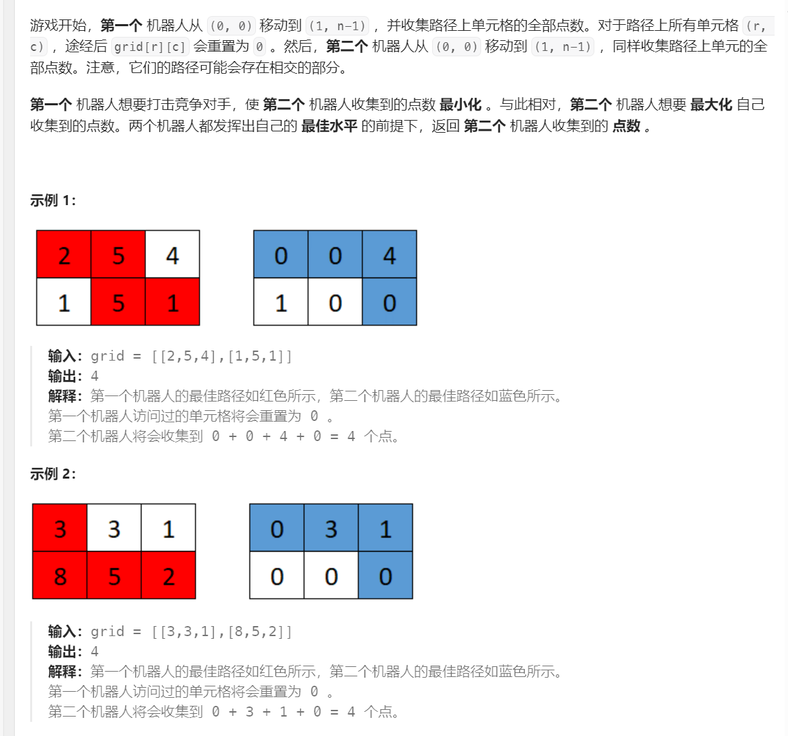

观察可以发现，第一个人操作之后第二个人所能选的值就是第一个人拐点出的前后缀，由于二者都会做最佳决策因此枚举第一个人拐点的位置，第二个人会选择剩余的两个位置的最大值，选出所有拐点下第二个人能得到的最小得分。

```python
class Solution:
    def gridGame(self, grid: List[List[int]]) -> int:
        index=-1
        res=-inf
        n=len(grid[0])
        ans=inf
        pre=[0]+list(accumulate(grid[1]))
        prifx=[0]*(n+1)
        for i in range(n-1,-1,-1):
            prifx[i]=grid[0][i]+prifx[i+1]
        for i in range(n):
            ans=min(ans,max(pre[i],prifx[i+1]))
        return ans     

```


## [最大的以 1 为边界的正方形](https://leetcode.cn/problems/largest-1-bordered-square/)

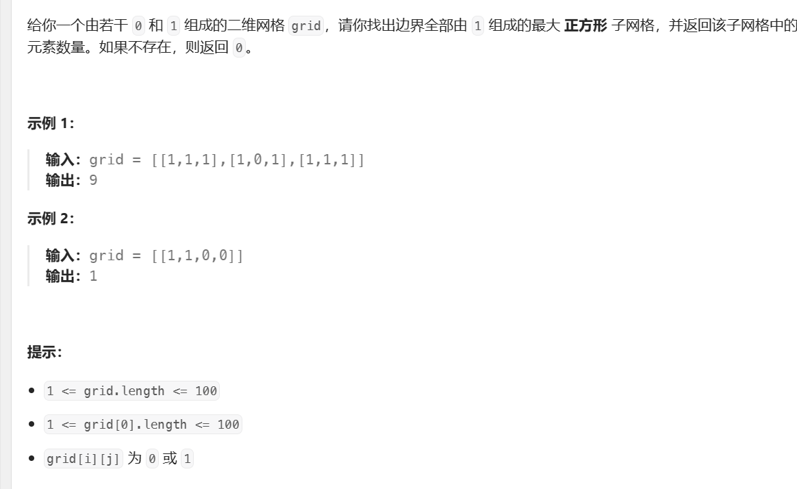

对于给定的数据范围枚举每一个边长，对于确定了的边长枚举所有的左上角然后判断是否满足条件

```python
class Solution:
    def largest1BorderedSquare(self, grid: List[List[int]]) -> int:
        m,n=len(grid),len(grid[0])
        pre=[[0]*(n+1) for _ in range(m+1)]
        
        # 这里构造行和列分别的前缀和用于快速判断是否满足条件
        rs=[list(accumulate(row,initial=0)) for row in grid]
        # 技巧点，把每一列拆分出来做成前缀和
        cs=[list(accumulate(col,initial=0)) for col in zip(*grid)]

        # 枚举边长
        for d in range(min(m,n),0,-1):
            # 枚举左上角
            for i in range(m-d+1):
                for j in range(n-d+1):
                    # 满足条件可以直接退出
                    if rs[i][j+d]-rs[i][j]==d and rs[i+d-1][j+d]-rs[i+d-1][j]==d \
                    and cs[j][i+d]-cs[j][i]==d and cs[j+d-1][i+d]-cs[j+d-1][i]==d:
                        return d**2
        return 0
```


## [K 次串联后最大子数组之和](https://leetcode.cn/problems/k-concatenation-maximum-sum/)

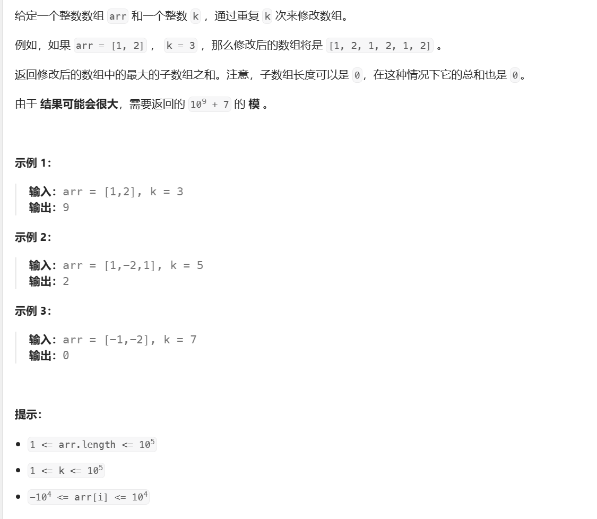

分类讨论：可以是一个数组中的最大子数组之和，可以是两个数组最大的前缀加上最大的后缀，可以是k-2个数组组合起来加上最大的前缀和后缀。

```python
class Solution:
    def kConcatenationMaxSum(self, arr: List[int], k: int) -> int:
        m=10**9+7
        pre=list(accumulate(arr,initial=0))
        post=list(accumulate(arr[::-1]))
        mn=0
        mx=-inf
        for i in range(1,len(pre)):
            mx=max(pre[i]-mn,mx)
            mn=min(mn,pre[i])
        ans2=max(pre)+max(post) if k>=2 else 0
        ans3=ans2+(k-2)*sum(arr) if k>=3 else 0
        return max(ans2,ans3,mx,0)%m

```

## [相同元素的间隔之和](https://leetcode.cn/problems/intervals-between-identical-elements/)

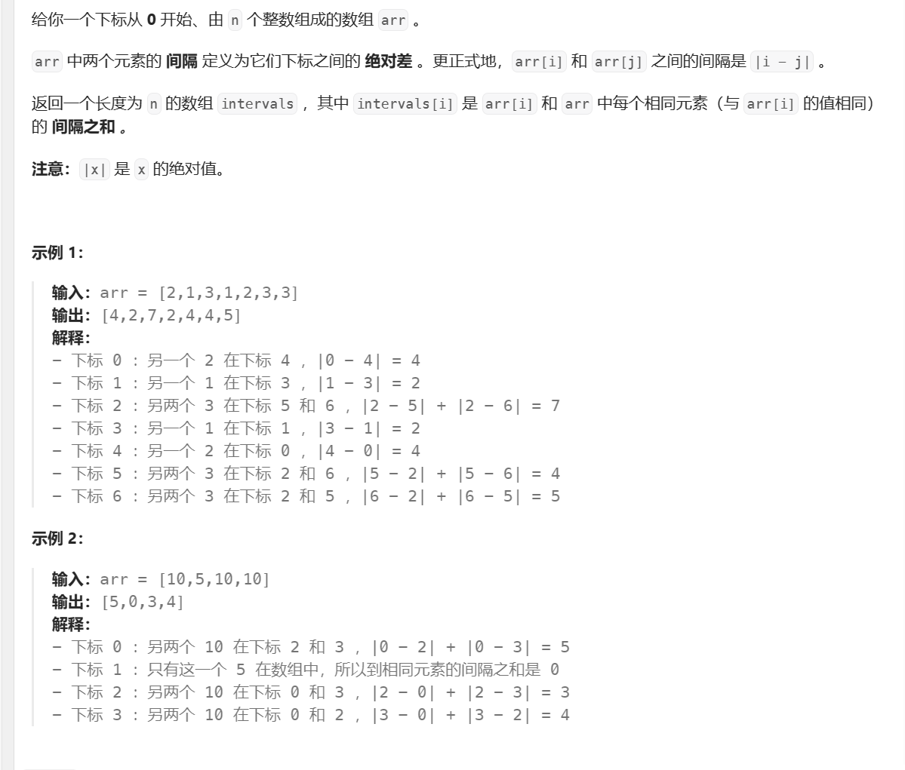


一个数到其他相同的数的距离可以由他左边的，右边的相同的数推出，因此需要两个数组一个记录nums[i]左边所有相同的值到它的距离，一个记录右边的，最后的结果是两个相加。

```python
class Solution:
    def getDistances(self, nums: List[int]) -> List[int]:
        n=len(nums)
        pre=[0]*n
        post=[0]*n
        # 使用字典记录上一个nums[i]的位置以及有多少个相同的
        vis={}
        for i in range(n):
            # 不存在则这个位置左边的结果为0，记录这个位置以及个数
            if nums[i] not in vis:
                vis[nums[i]]=(i,1)
                pre[i]=0
                continue
            else:
                # 反之，找出左边所有点到上一个点的距离，然后加上这个点到当前点的距离乘个数
                index,cnt=vis[nums[i]]
                pre[i]=pre[index]+cnt*(i-index)
                vis[nums[i]]=(i,cnt+1)
        vis={}
        for i in range(n-1,-1,-1):
            if nums[i] not in vis:
                vis[nums[i]]=(i,1)
                post[i]=0
                continue
            else:
                index,cnt=vis[nums[i]]
                post[i]=post[index]+cnt*(index-i)
                vis[nums[i]]=(i,cnt+1)
        ans=[]
        for a,b in zip(pre,post):
            ans.append(a+b)
        return ans
        

```

## [从链表中删去总和值为零的连续节点](https://leetcode.cn/problems/remove-zero-sum-consecutive-nodes-from-linked-list/)

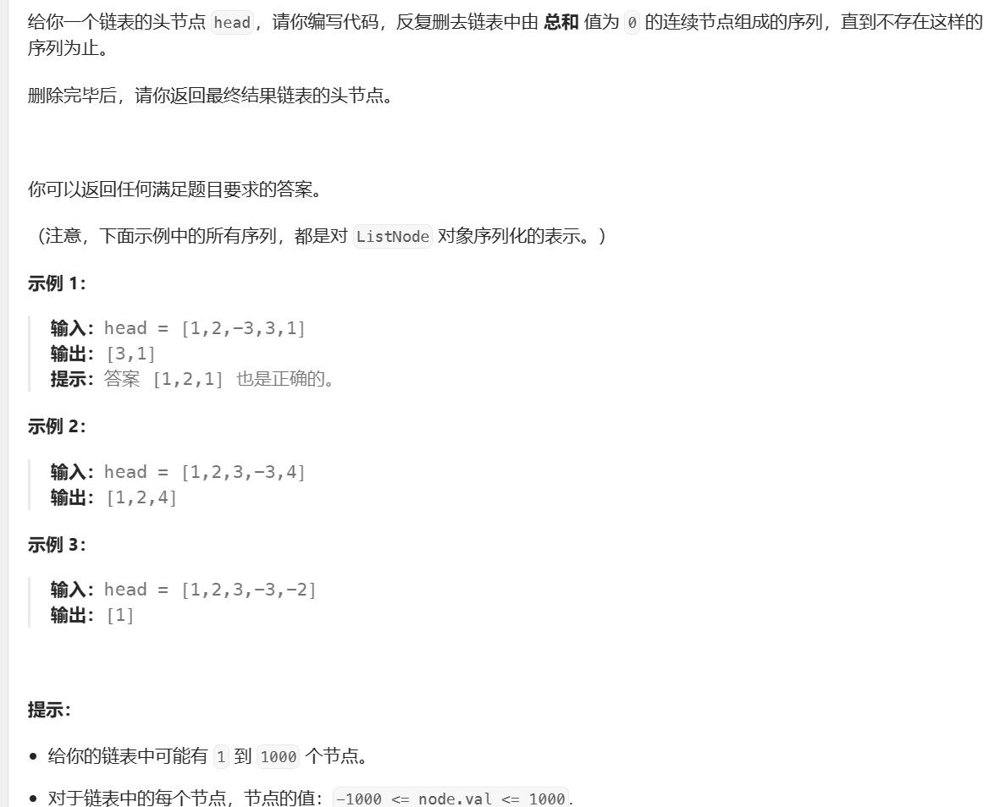


使用前缀和可以找出子区间和为0的，即用哈希记录相同的前缀和，但是在这个过程中可能会出现两个前缀和区间重合。


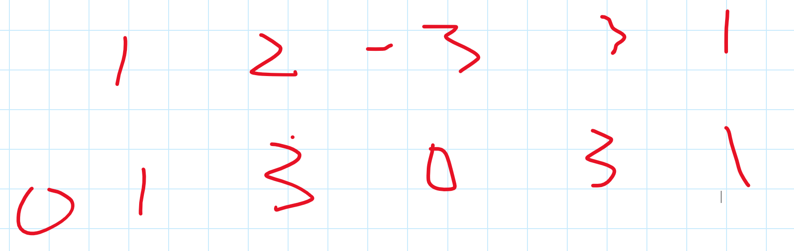

```python
# Definition for singly-linked list.
# class ListNode:
#     def __init__(self, val=0, next=None):
#         self.val = val
#         self.next = next
class Solution:
    def removeZeroSumSublists(self, head: Optional[ListNode]) -> Optional[ListNode]:
        dummy=ListNode()
        pre={}
        pre[0]=dummy
        dummy.next=head
        summ=0
        
        # 通过一次遍历找出相同的前缀和中最远的
        while head:
            summ+=head.val
            pre[summ]=head
            head=head.next
            
         # 再遍历一次，对于已出现的前缀和直接跳到它的下一位
        head=dummy
        summ=0
        while head:
            summ+=head.val
            head.next=pre[summ].next
            head=head.next
        return dummy.next 
```

## [使字符串平衡的最少删除次数](https://leetcode.cn/problems/minimum-deletions-to-make-string-balanced/)

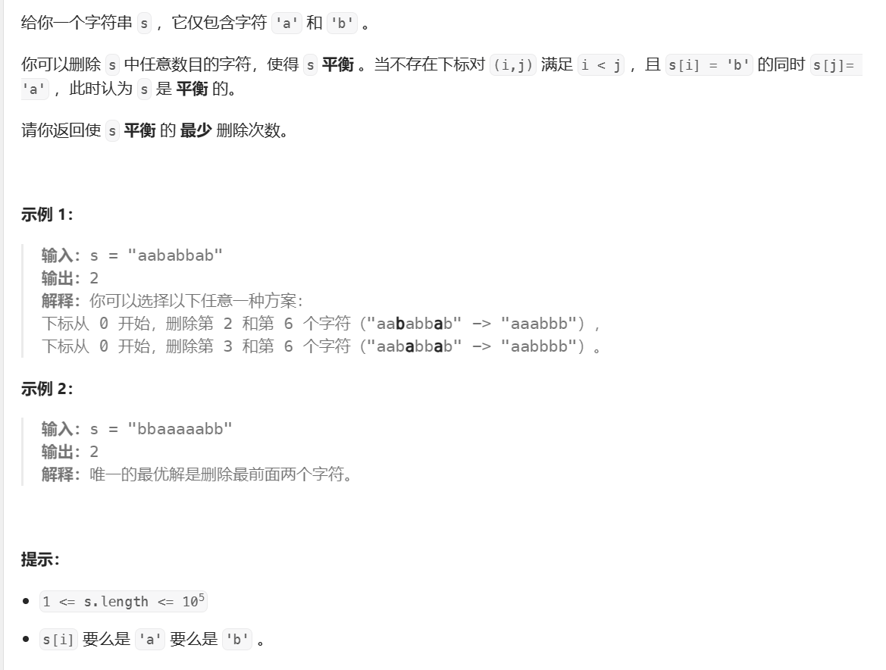


最后字符串一定会是aabbb的形式枚举每个划分位置，这个位置之前的b都减去，之后的a都减去，取最小值。


```python
class Solution:
    def minimumDeletions(self, s: str) -> int:
        preb=[0]
        prea=[0]
        n=len(s)
        ans=n-1
        for i in range(n):
            c=s[i]
            if c=='b':
                preb.append(preb[-1]+1)
            else:
                preb.append(preb[-1])
        for i in range(n-1,-1,-1):
            c=s[i]
            if c=='a':
                prea.append(prea[-1]+1)
            else:
                prea.append(prea[-1])
        prea=list(reversed(prea))
        for i in range(n+1):
            ans=min(ans,preb[i]+prea[i])
        return ans


```


## Maximal Intersection


两个区间的交集就是两个左端点的最大值与右端点的最小值构成的区间，枚举删除一个区间剩下的交集如何通过O(1)的时间复杂度算出，交集的具有前缀和的性质，及多个区间的交集可以由n-1个区间的交集求出，这里构建前缀交集和后缀交集，当删除一个区间后，剩下区间的交集可以通过前缀和后缀求出。

```python
n=int(input())
nums=[]
for _ in range(n):
    nums.append([int(x) for x in input().split()])
pre=[(-1,10**9+7)]
for i in range(n):
    l,r=nums[i]
    pl,pr=pre[-1]
    pre.append([max(pl,l),min(pr,r)])
suff=[(-1,10**9+7)]
for i in range(n-1,-1,-1):
    l,r=nums[i]
    pl,pr=suff[-1]
    suff.append([max(pl,l),min(pr,r)])
suff=suff[::-1]
ans=0
for i in range(n):
    l1,r1=pre[i]
    l2,r2=suff[i+1]
    ans=max(min(r2,r1)-max(l1,l2),ans)
print(ans)
```

## [最大或值](https://leetcode.cn/problems/maximum-or/)

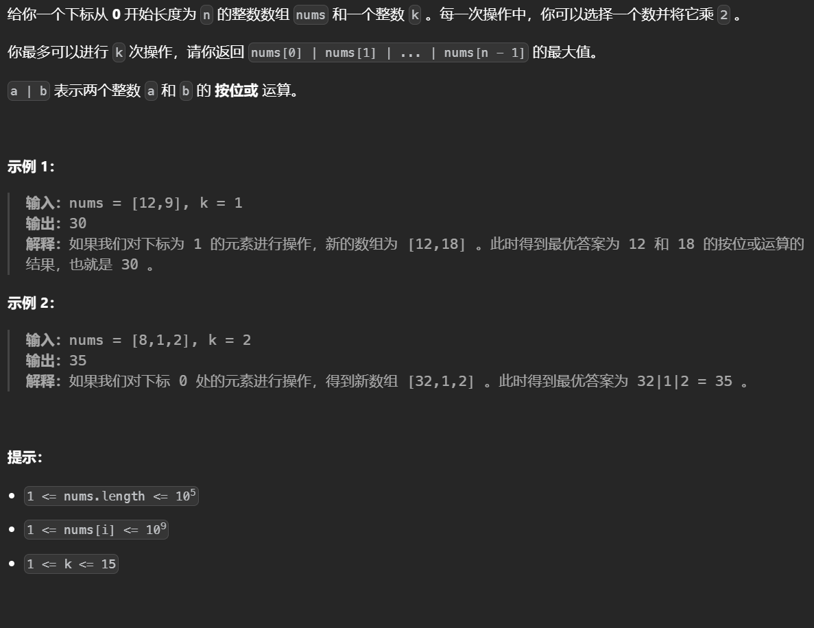


想要最后或的结果最大，就是尽可能地增大二进制的长度，因此找出所有二进制长度最长的数组枚举将他们扩大k倍（全部用于扩大一个可以保证二进制最长），为了快速计算扩大一个数后的最终结果使用前缀和记录两边的和来做到O(1)求解。

```python
class Solution:
    def maximumOr(self, nums: List[int], k: int) -> int:
        pre=[nums[0]]
        suff=[nums[-1]]
        l=max(nums).bit_length()
        
        # 构造前后缀
        for v in nums[1:]:
            pre.append(pre[-1]|v)
        for v in nums[::-1][1:]:
            suff.append(suff[-1]|v)
        pre=[0]+pre
        suff=[0]+suff
        suff=suff[::-1]
        res=[]
        # 找出二进制最长的
        for i,v in enumerate(nums):
            if l==v.bit_length():
                res.append(i)
        ans=-inf 
        # 枚举
        for i in res:
            v=nums[i]<<k
            ans=max(ans,v|pre[i]|suff[i+1])
        return ans 

                
        
```

  ## [满足三条件之一需改变的最少字符数](https://leetcode.cn/problems/change-minimum-characters-to-satisfy-one-of-three-conditions/)

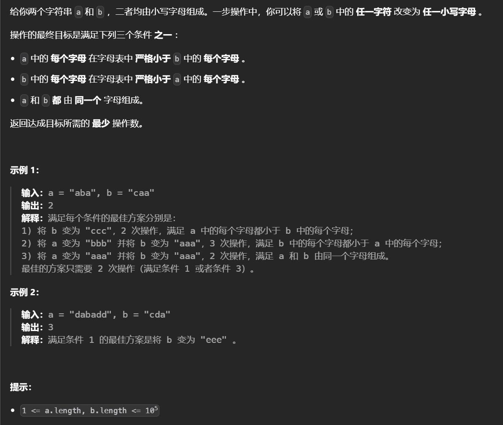

考虑最后的结果

情况一，实质上也就是s1中所有的字符小于某一个字符，同时s2中所有的字符大于等于这个字符

情况二是一样的

情况三就是所有的字符都换为某个字符


一共只有26个字符全部枚举即可

```python
class Solution:
    def minCharacters(self, a: str, b: str) -> int:
        # 计数
        c1=[0]*26
        c2=[0]*26
        m,n=len(a),len(b)
        for c in a:
            c1[ord(c)-ord('a')]+=1
        for c in b:
            c2[ord(c)-ord('a')]+=1
        # 构建前缀和
        p1=list(accumulate(c1,initial=0))
        p2=list(accumulate(c2,initial=0))
        ans=inf
        for i in range(26):
            # 不能把字符变为小于a的，特判这种情况
            if i:
                ans=min(ans,p1[-1]-p1[i]+p2[i],p2[-1]-p2[i]+p1[i])
            ans=min(ans,m-c1[i]+n-c2[i])
        return ans 
        
```


## [统计中位数为 K 的子数组](https://leetcode.cn/problems/count-subarrays-with-median-k/)

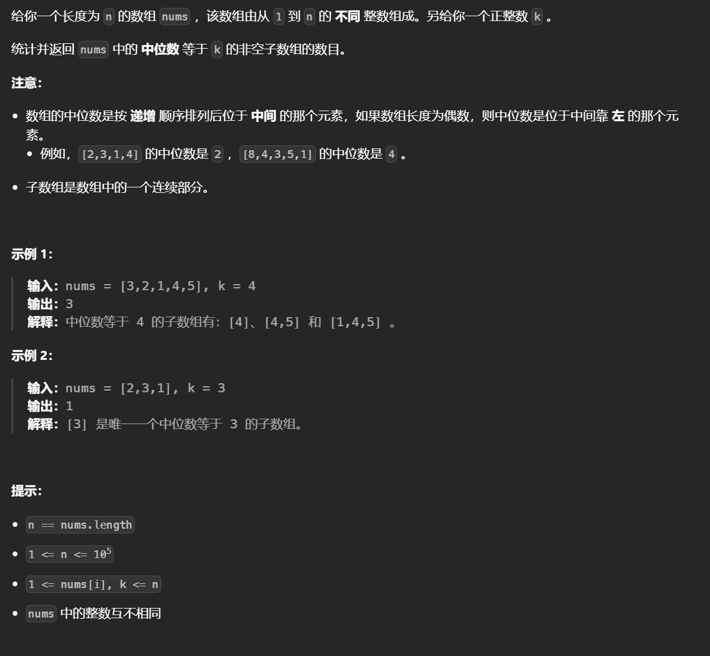

注意整数互不相同

对于给定的k作为中位数要满足，对于奇数个两边大于k的=两边小于k的——>左侧大于+右侧大于=左侧小于+右侧小于——>左侧大于-左侧小于=右侧小于-右侧大于，为了统计这个结果将左侧大于的设置为1小于的设置为-1，右侧大于的设置为-1小于的设置为1，利用前缀和可以快速求出两边有多少

偶数的话变换o

```python
class Solution:
    def countSubarrays(self, nums: List[int], k: int) -> int:
        # 左侧大于+右侧大于=左侧小于+右侧小于+[1]
        # 左侧大于-左侧小于=右侧小于-右侧大于+[1]
        p=[]
        n=len(nums)
        index=nums.index(k)
        # 变换
        for i,v in enumerate(nums):
            if i==index:p.append(0)
            elif i<index and v>k:p.append(1)
            elif i<index and v<k:p.append(-1)
            elif v<k:p.append(1)
            else:p.append(-1)
        pre=list(accumulate(p,initial=0))
        memo=Counter()
        # 统计左侧
        for j in range(index,-1,-1):
            memo[pre[index]-pre[j]]+=1
        ans=0
        # 枚举右侧，如果相等就累加
        for j in range(index,n):
            c=pre[j+1]-pre[index+1]
            if c in memo:ans+=memo[c]
            if c+1 in memo:ans+=memo[c+1]
        
        return ans
```

## [使数组和能被 P 整除](https://leetcode.cn/problems/make-sum-divisible-by-p/) 

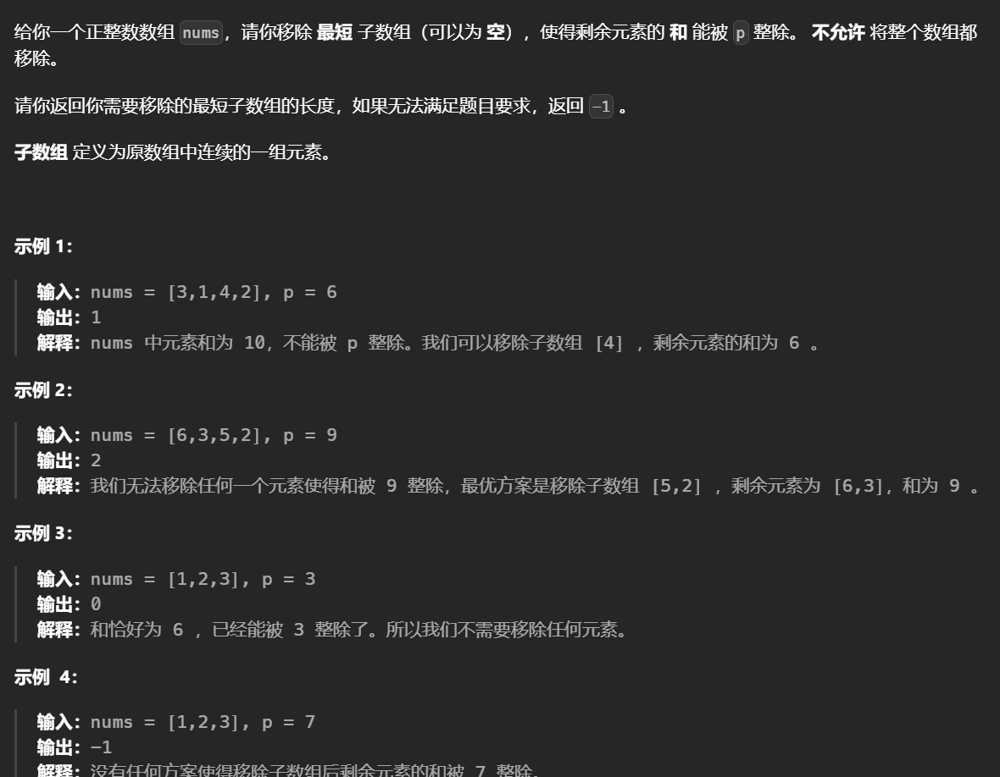


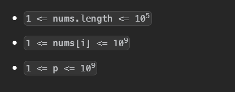

令y为某个子数组的和，x为整个数组的和，要求x-y能被p整除那么就是x同余于y，同时y又是前缀和数组中某两个位置的数相减求出的，那么就有(r-l)%p=x%p。遍历前缀和数组对于每个r去找最近的(r-x)%p，然后更新结果。

```python
class Solution:
    def minSubarray(self, nums: List[int], p: int) -> int:
        # 前缀和
        pre=list(accumulate(nums,initial=0))
        x=pre[-1]
        memo={}
        n=len(nums)
        ans=n
        for i,v in enumerate(pre):
            # 每次只需要记录当前的位置，因为只要最近的
            memo[v%p]=i
            if (v-x)%p in memo:
                ans=min(ans,i-memo[(v-x)%p])
        return ans if ans!=n  else -1
```

## [统计趣味子数组的数目](https://leetcode.cn/problems/count-of-interesting-subarrays/)

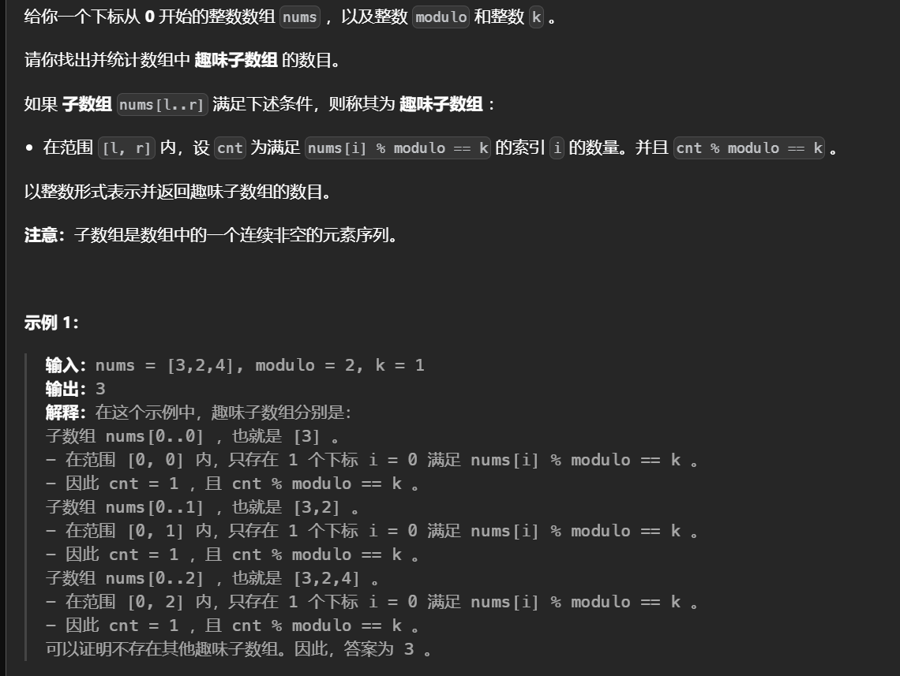

把原数组中%mod==k的都变换为1那么问题就变为统计前缀和


变化式子有


那么在遍历前缀和的过程中统计(r-k)%m的有多少个，然后记录r%m

```python
class Solution:
    def countInterestingSubarrays(self, nums: List[int], mod: int, k: int) -> int:
        nums=[int(v%mod==k) for v in nums]
        ans=0
        pre=list(accumulate(nums,initial=0))
        memo=Counter()
        for v in pre:
            ans+=memo[(v-k)%mod]
            memo[v%mod]+=1
        return ans         
```

## [构造乘积矩阵](https://leetcode.cn/problems/construct-product-matrix/)

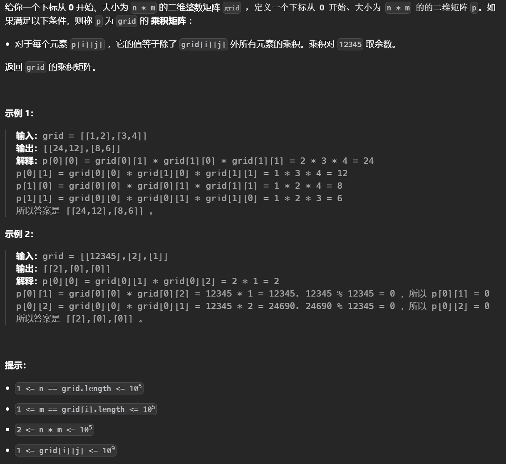

无法使用逆元求解因为不是质数，考虑前后缀分解。

```python
class Solution:
    def constructProductMatrix(self, grid: List[List[int]]) -> List[List[int]]:
        mod=12345
        m,n=len(grid),len(grid[0])
        g=[[0]*n for _ in range(m)]
        pre=[]
        suff=[]
        row1=[1]
        row2=[1]
        for row in grid:
            temp1=[1]
            temp2=[1]
            for v in row:temp1.append((temp1[-1]*v)%mod)
            for v in row[::-1]:temp2.append((temp2[-1]*v)%mod)
            pre.append(temp1[:])
            suff.append(temp2[:][::-1])
        for arr in pre:
            x=arr[-1]
            row1.append((row1[-1]*x)%mod)
        for arr in pre[::-1]:
            x=arr[-1]
            row2.append((row2[-1]*x)%mod)
        row2=row2[::-1]
        for i in range(m):
            for j in range(n):
                g[i][j]=(row1[i]*row2[i+1]*pre[i][j]*suff[i][j+1])%mod
        return g
```


## Karen and Coffee

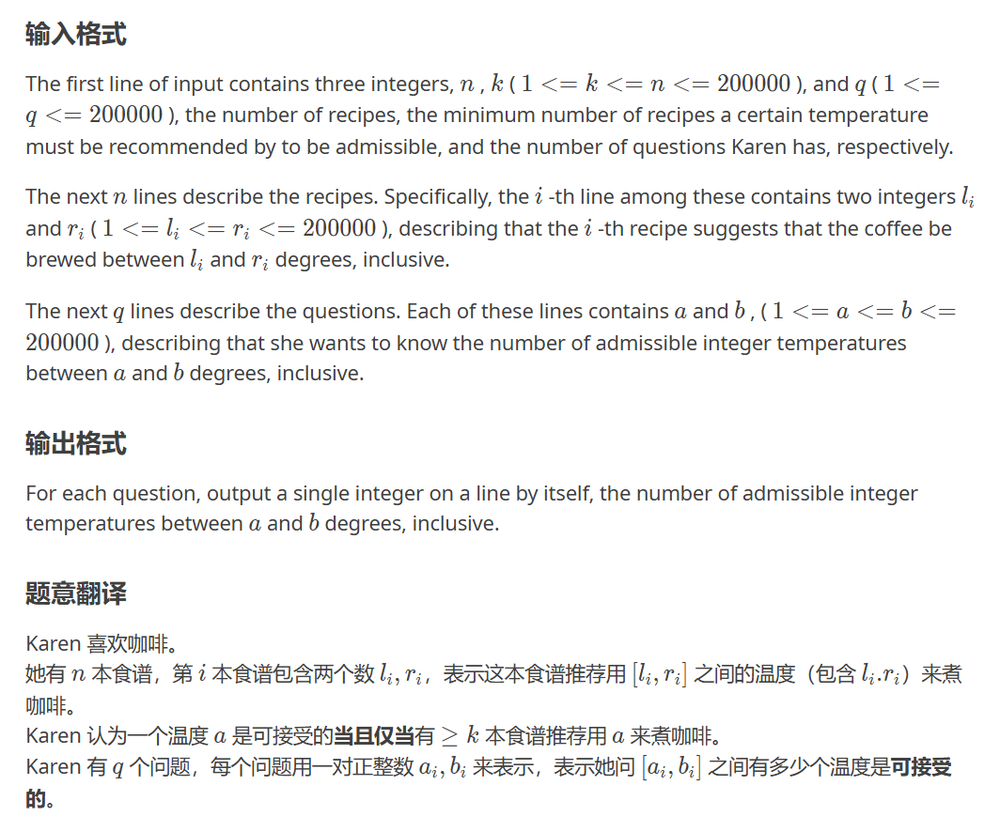

实际上是区间重叠问题，把给定的每个区间用差分在数组上表示，然后把每个位置定义为1如果大于等于k否则0，再构造一遍前缀数组，对于每个询问取出这个区间内的值即可。

```python
n,k,q=RR()
N=2*10**5+10
diff=[0]*N
# 差分
for _ in range(n):
    l,r=RR()
    diff[l]+=1
    diff[r+1]-=1
# 前缀变为一般数组
pre=get_pre(diff)[1:]
# 大于等于k令为1否则为0
nums=[1 if v>=k else 0 for v in pre]
# 再次前缀
pre=get_pre(nums)
for _ in range(q):
    l,r=RR()
    print(pre[r+1]-pre[l])
```

## Polo the Penguin and Matrix

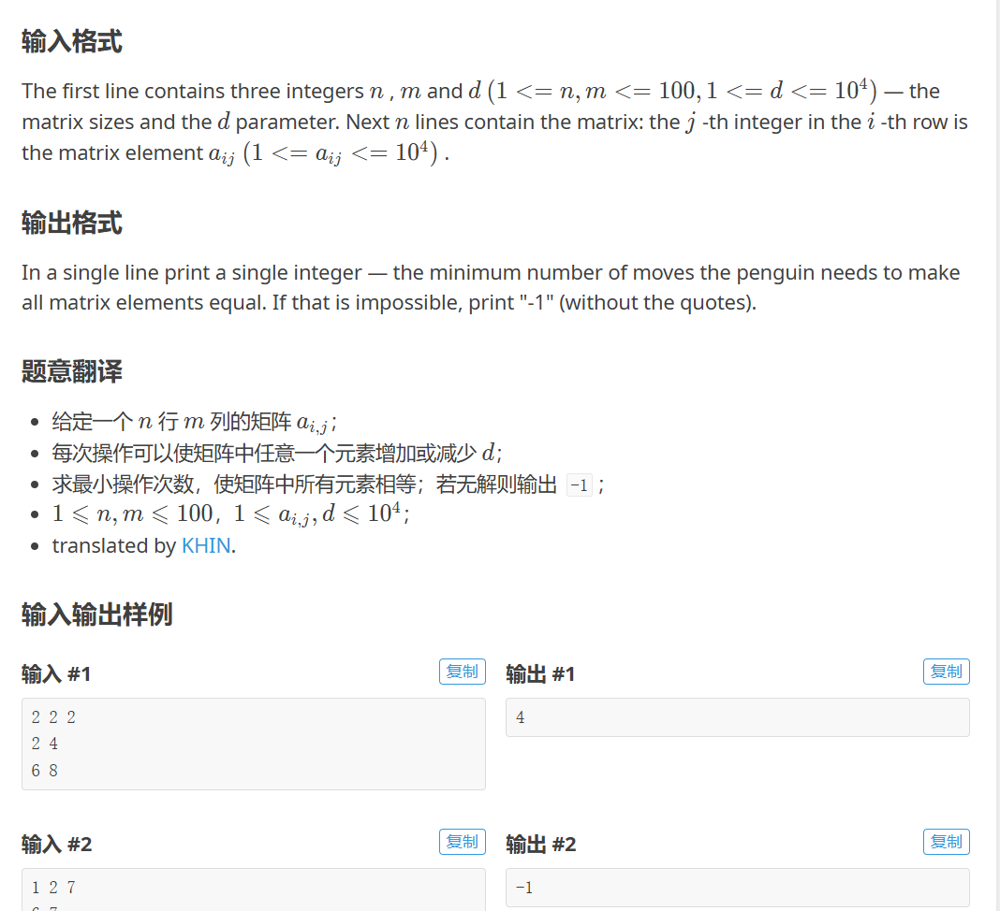


如果所有的数可以通过加减一个数的整数倍来做到相同，那么所有的数余上这个数的模应该是一样的，所以对数组判断是否模上d的结果是一样的，如果一样那么说明所有的数一定可以通过加减得到数组中的任意一位或者数组外的某一位，至于最小的操作次数可以通过中位数贪心求出。

```python
m,n,d=RR()
g=[]
for _ in range(m):g.extend(RR())
g.sort()
# 判断余数是否相同
arr=[v%d for v in g]
if len(set(arr))!=1:print(-1)
else:
    # 中位数贪心，所有的数的操作次数为他到中位数的距离除以d
    mid=g[len(g)>>1]
    ans=sum([abs(mid-v)//d for v in g])
    print(ans)
```


##  **Manhattan Multifocal Ellipse** 

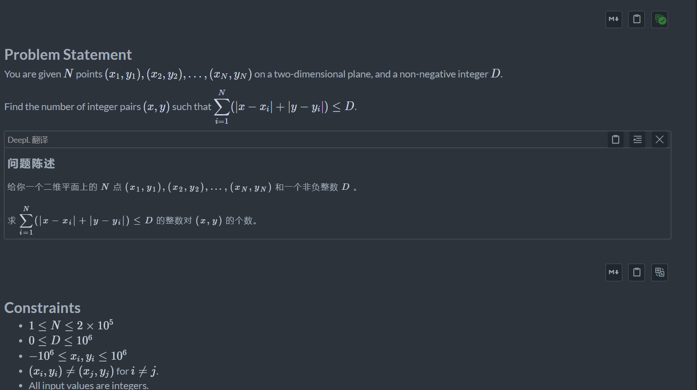

给定的公式可以拆开，即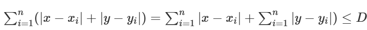，这两部分是相互独立的也就是给定的一系列坐标点的x和y是不相关的只需要考虑他们的大小，因此可以随意排序。该题要求找到有多少个合适的点，每个点的xy分别满足上述式子，可以固定住一个去找另一个，观察数据范围发现点在-2e6,2e6之间，这里可预处理范围内的x和y对于给定的所有的xi和yi的距离。

```python
n,d=RR()
x=[]
y=[]
xx=[]
yy=[]
for _ in range(n):
    i,j=RR()
    x.append(i)
    y.append(j)

# 排序，为了之后二分求去除了绝对值的距离
x.sort()
y.sort()

prex=get_pre(x)
prey=get_pre(y)

# 求解值域范围内的距离
for val in range(-2*pow(10,6)-10,2*pow(10,6)+10):
    index=bisect_left(x,val+1)-1
    xx.append(val*(index+1)-prex[index+1]+(prex[-1]-prex[index+1]-val*(n-index-1) if index!=n-1 else 0))
    index=bisect_left(y,val+1)-1
    yy.append(val*(index+1)-prey[index+1]+(prey[-1]-prey[index+1]-val*(n-index-1) if index!=n-1 else 0))

xx.sort()
yy.sort()
ans=0
# 去找每个x，对于这个x的距离S有多少y满足距离小于等于D-S
for v in xx:
    if v>d:break
    index=bisect_left(yy,d-v+1)-1
    ans+=index+1

print(ans)
```

## [矩阵中的最大得分](https://leetcode.cn/problems/maximum-difference-score-in-a-grid/)

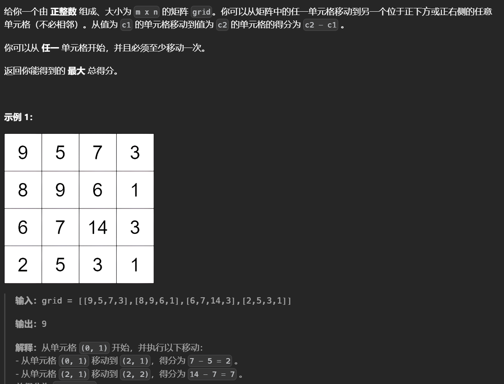

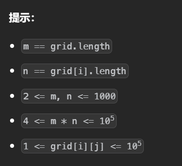


多个位置的差值:(c2-c1)+(c3-c2)实际上就是终点位置和起点的差，那么遍历每一个终点位置去找它左上区域内的最小值即可，这里的坐上区域是从(0,0)到(i,j)不包括i,j，因此可以使用二位前缀求解

```python
class Solution:
    def maxScore(self, g: List[List[int]]) -> int:
        m,n=len(g),len(g[0])
        p=[[inf]*(n+1) for _ in range(m+1)]
        ans=-inf
        # 枚举终点，这个过程中可以同时构建二维前缀最小值
        for i in range(m):
            for j in range(n):
                x=g[i][j]
                pre=inf
                # 防止越界
                if j>=0:pre=min(pre,p[i+1][j])
                if i>=0:pre=min(pre,p[i][j+1])
                # 这里是为了保证至少走一步，因为当i=j=0时左上区域找不到一点即没有走一步
                if i+j>0:
                    ans=max(ans,x-pre)
                # 更新二维前缀最小值
                p[i+1][j+1]=min(pre,x)
        return ans  
```


# 差分数组

差分数组（Differential Array）是一个常用于高效处理数组区间更新操作的数据结构，它主要用于解决给定一个数组，支持多次对数组的某个区间进行一系列增减操作，并能够快速查询最终数组某个的值。

差分数组的基本操作时维护一个新的数组，该数组的元素是原始数组中相邻元素的差值。

1. **更新操作**：对原始数组的某个区间 `[left, right]` 进行增加或减少的操作。这可以通过在差分数组中更新两个位置来实现。具体地，对于原始数组的区间 `[left, right]` 增加 `val` 可以在差分数组的 `left` 处增加 `val`，并在 `right + 1` 处减少 `val`。这样，在查询时，差分数组的前缀和就等于原始数组操作后相应位置的值。
2. **查询操作**：查询原始数组的某个位置的值。这可以通过查询差分数组的前缀和来实现。在查询原始数组的位置 `i` 处的值时，只需查询差分数组的前缀和 `prefixSum[i]` 即可。
3. **快速更新多个区间**：如果需要对多个区间进行更新，差分数组可以在一次遍历中完成所有更新操作，而不需要每次都遍历原始数组。
4. 遍历差分数组的过程中，使用一个变量记录累和就可以得到当前位置的元素大小

```python
class DifferenceArray:
    def __init__(self,nums):
        # 构建差分数组
        self.n=len(nums)
        self.diff=[0]*self.n
        # 第一个位置的值和原数组第一个位置的值相同
        self.diff[0]=nums[0]
        for i in range(1,self.n):
            self.diff[i]=nums[i]-nums[i-1]
    # 更新操作
    def increment(self,left,right,val):
        # 更新
        self.diff[left]+=val
        if right+1<self.n:
            # 注意索引不能超出，超出则不做操作
            self.diff[right+1]-=val
    def result(self):
        # 根据差分数组构建原数组
        result=[0]*self.n
        result[0]=self.diff[0]
        for i in range(1,self.n):
            result[i]=result[i-1]+self.diff[i]
        return result
    # 或者是直接在差分数组上恢复原数组
   	for i in range(1,n):
		diff[i]+=diff[i-1]

# 示例使用
nums = [1, 2, 3, 2, 1]
diff_array = DifferenceArray(nums)

# 对区间 [1, 3] 增加 2
diff_array.increment(1, 3, 2)

# 查询最终数组
final_array = diff_array.result()
print(final_array)
```


在一次从头到尾的遍历操作中，可以使用差分修改数组，这个过程中使用一个外部变量一直累加来表示当前的值。

## 航班预订统计

抽象的差分数组问题

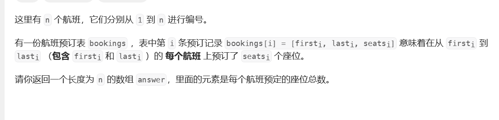

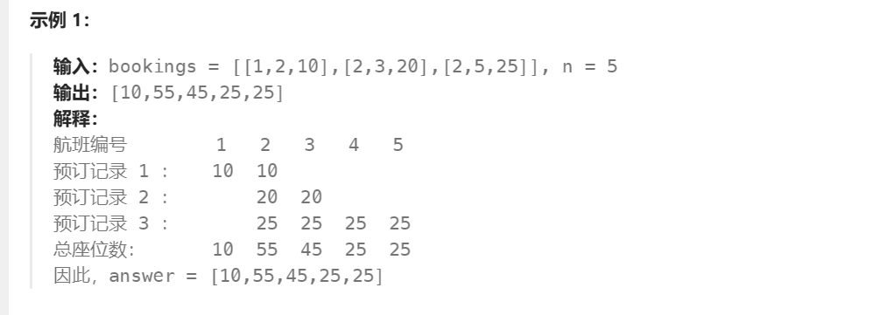

```python
class Solution(object):
    def result(self,li,n):
        # 根据差分数组还原原数组
        result=[0]*n
        result[0]=li[0]
        for i in range(1,n):
            result[i]=result[i-1]+li[i]
        return result
    
    def corpFlightBookings(self, bookings, n):
        # 更新操作
        li=[0]*n
        for book in bookings:
            li[book[0]-1]+=book[2]
            if book[1]<n:
                li[book[1]]-=book[2]
        return self.result(li,n)
```

## 拼车

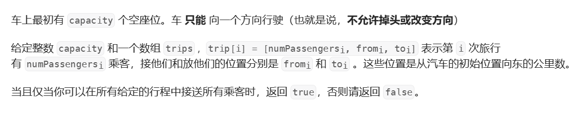

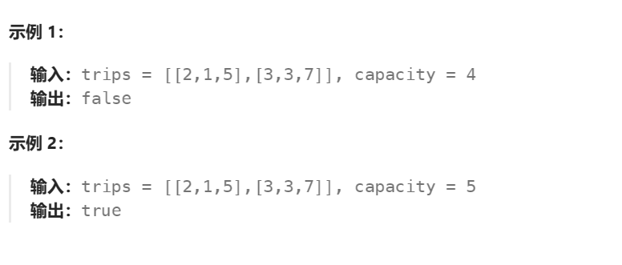


```python
class Solution(object):
    # 差分数组
    def carPooling(self, trips, capacity):
        # 题设给出的限制
        li=[0]*1001
        for trip in trips:
            # 位置索引从0开始
            li[trip[1]]+=trip[0]
            # 乘客在end的位置已经下车，因此乘客在车上的区间应该是start,end-1,所以差分数组的右边不用加一
            li[trip[2]]-=trip[0]
        curr=0
        for i in li:
            curr+=i
            if curr>capacity:
                return False
        return True
```

## [字母移位 II](https://leetcode.cn/problems/shifting-letters-ii/)


使用差分数组，注意0其实是-1，减去一个数的操作和加上一个数的操作是一样的，不过左边加的是负数而已。注意字符的操作是循环的。

```python
class Solution(object):
    def shiftingLetters(self, s, shifts):
        n=len(s)
        diff=[0]*n
        res=""
        # 使用差分数组可以快速得出对每个区间的操作
        for operator in shifts:
            start,end,dir=operator
            if not dir:
                dir=-1
            diff[start]+=dir
            if end+1<n:
                diff[end+1]-=dir
         # 把差分数组转化为原数组，原数组就是对每个位置进行的操作
        for i in range(1,n):
            diff[i]+=diff[i-1]

        for i in range(n):
            op,c=diff[i],s[i]
            # 这里对字符的操作比较巧妙 （技巧点），负数取模后结果是正数
            res+=chr((ord(c)-ord('a')+op+26)%26+ord('a'))

        return res
Solution().shiftingLetters(s ="xuwdbdqik", shifts = [[4,8,0],[4,4,0],[2,4,0],[2,4,0],[6,7,1],[2,2,1],[0,2,1],[8,8,0],[1,3,1]])

```


## [ 将区间分为最少组数](https://leetcode.cn/problems/divide-intervals-into-minimum-number-of-groups/)


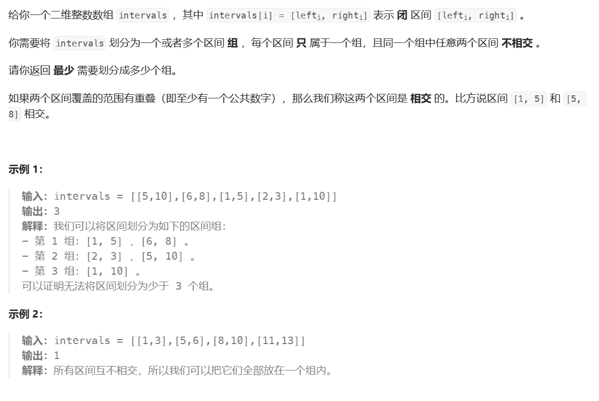

需要转换思想，如果要划分组，就要求不能有重叠子区间，如图所示，所需划分的组数就是最大重叠数目，可以用上下车模型求出


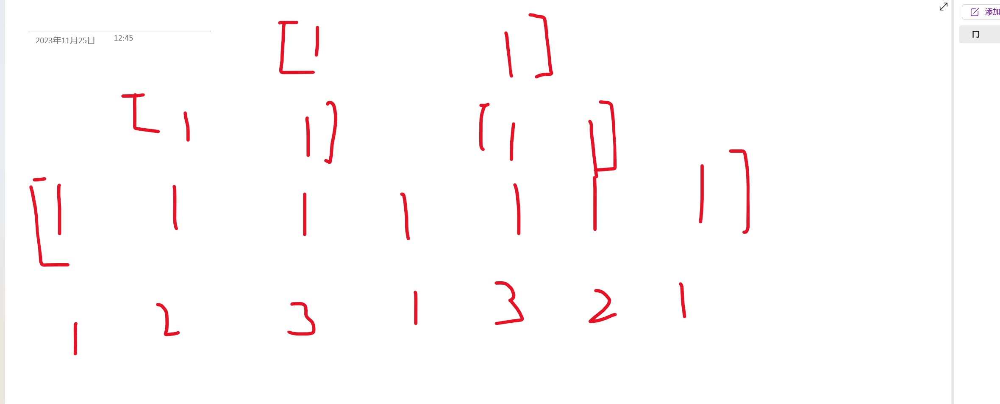


```python
class Solution(object):
    def minGroups(self, intervals):
        n=10**6
        diff=[0]*n# 差分数组的范围选择为数值的最大范围
        for i in intervals:
            l,r=i
            # 有一位索引偏移
            diff[l-1]+=1
            if r<n:
                diff[r]-=1
        for i in range(1,n):
            diff[i]+=diff[i-1]
          # 返回其中的最大值
        return max(diff)
```

## [使数组中的所有元素都等于零](https://leetcode.cn/problems/apply-operations-to-make-all-array-elements-equal-to-zero/)

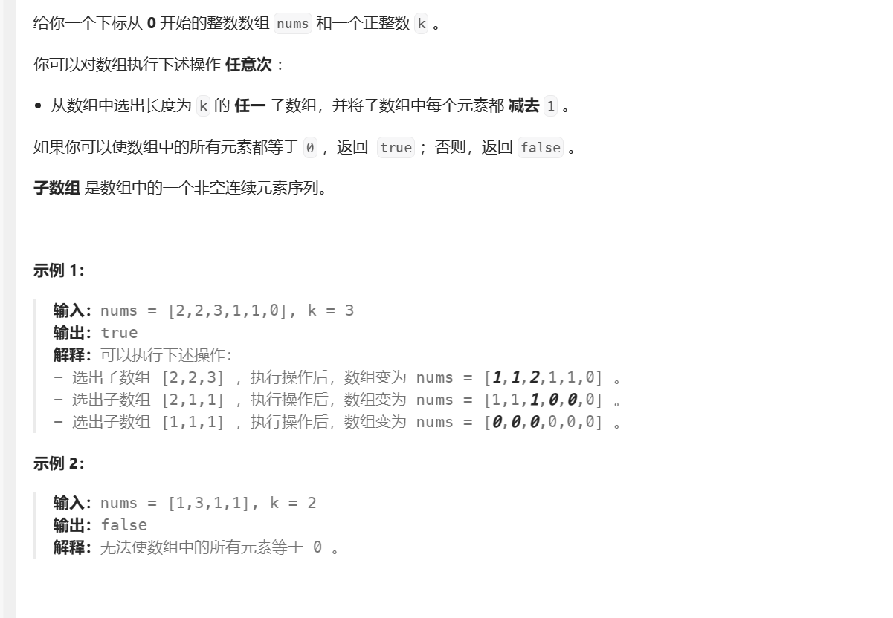

想要让数组中所有的元素等于0，遍历数组，对于对于nums[i]>0的情况为了把nums[i]变为0，需要对nums中i到i+k的位置减去nums[i],然后继续，如果说这个位置的值是负数，返回false因为无法递增，对区间内的元素频繁的更新需要用到差分数组

```python
class Solution(object):
    def checkArray(self, nums, k):
        n=len(nums)
        diff=[0]*n
        diff[0]=nums[0]
        val=0
        # 构建差分数组
        for i in range(1,n):
            diff[i]=nums[i]-nums[i-1]
        for i in range(n):
            # 使用一个外部变量记录当前位置的元素和，其实也就是前缀和
            val+=diff[i]
            # 注意要求区间是固定的，不能超出范围
            if val>0 and i+k<=n:
                diff[i]-=val
 		# 基本操作
                if i+k<n:
                    diff[i+k]+=val
                # 注意最后要改变外部变量
                val=0
        # 等于0跳过    
        elif val==0:
                continue
        else:
                return False
        return True
```

​	

## [子矩阵元素加 1](https://leetcode.cn/problems/increment-submatrices-by-one/)

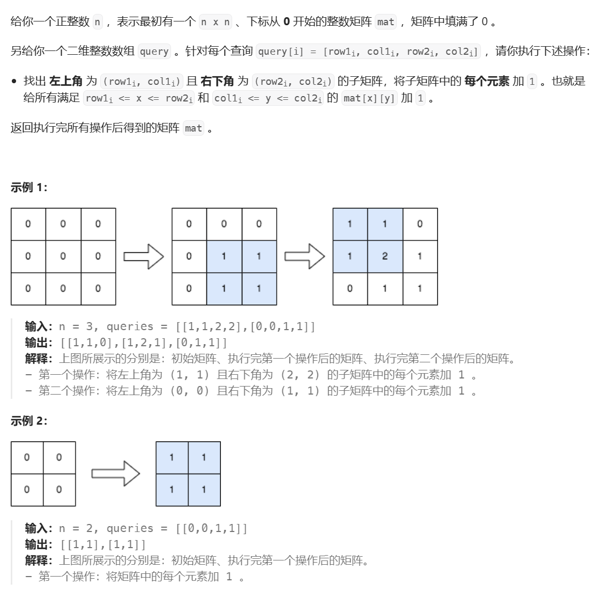


使用差分数组，可以对每一行单独差分，也可以进行二维差分，然后求前缀和。

二维差分的操作技巧是：

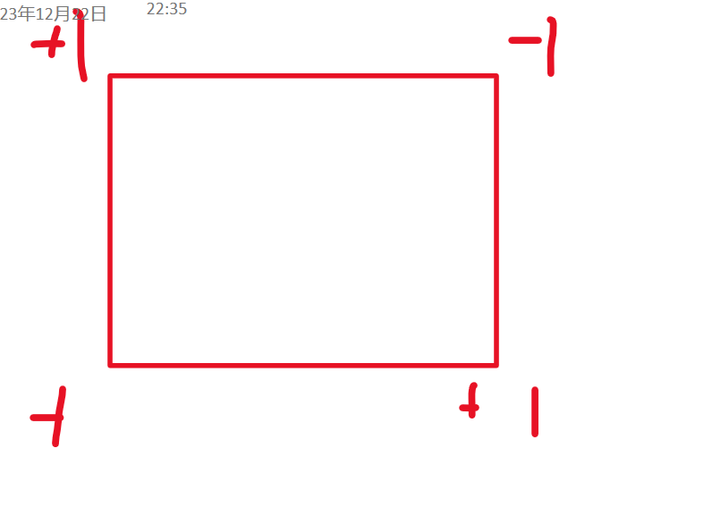


`由于是要求前缀和，所以在大小为n+1的表格上操作，又由于二维差分的操作需要在结尾处右侧减去一，为了方便操作，选择将数组大小设置为n+2，最后在原数组上求前缀和，然后去掉多余的行和列即可`。

```python
class Solution:
    def rangeAddQueries(self, n: int, queries: List[List[int]]) -> List[List[int]]:
        diff=[[0 for _ in range(n+2)] for _ in range(n+2)]
        #  为了前缀和做一位偏移，因此坐标都加一，差分的性质再结尾的后一位减一，因此减去的地方再做一位偏移
        for r1,c1,r2,c2 in queries:
            # 左上
            diff[r1+1][c1+1]+=1
            # 右上
            diff[r1+1][c2+2]-=1
            # 左下
            diff[r2+2][c1+1]-=1
             # 右下，末尾的后一位加上一
            diff[r2+2][c2+2]+=1
            
        # 求前缀和
        for i in range(1,n+1):
            for j in range(1,n+1):
                diff[i][j]+=diff[i][j-1]+diff[i-1][j]-diff[i-1][j-1]
                
         # 去掉多余的行和列
        for i in range(n+2):
            diff[i]=diff[i][1:-1]
        return diff[1:-1]
```

## 二维差分

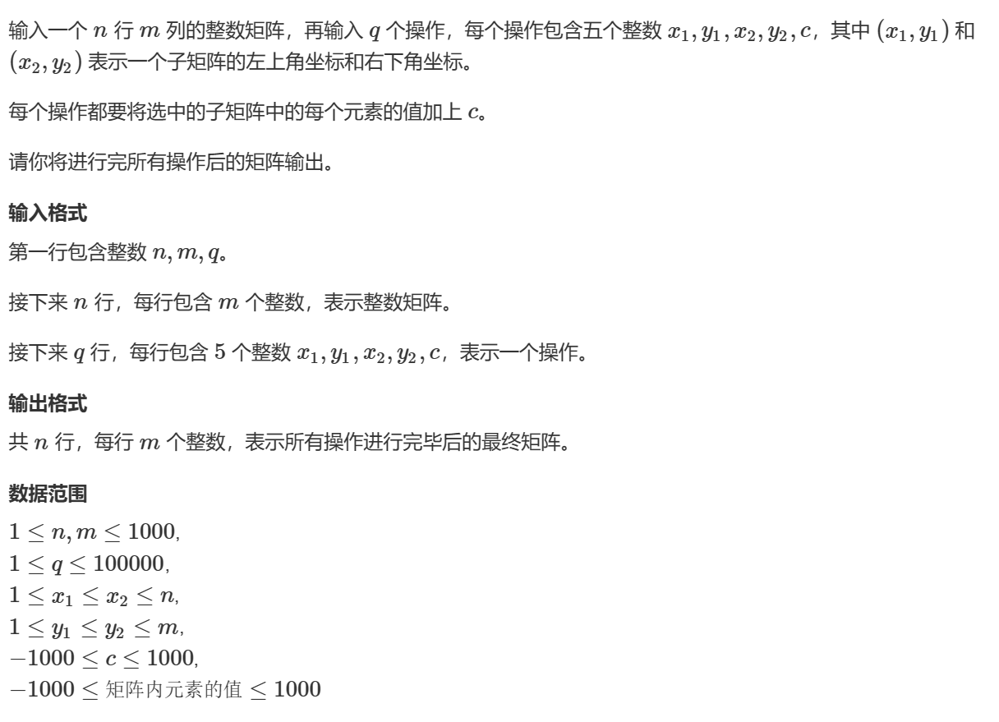

二维差分`要构造比给定矩阵大2的差分矩阵，初始化为0，因为方便构建前缀和操作需要n+1（在原矩阵上构建前缀和），而差分的更新操作又需要n+1`。

然后根据原矩阵构造差分，对于原矩阵的每一个值，`相当于在差分矩阵中插入一个值，不过左上角和右下角是一样的`。`差分矩阵的更新操作为对(i,j,x,y)把i,j位置加一，最后的前缀和使得以i,j为左上角到最右下的矩阵面积中的值都变化，因此需要在i,y+1和x+1,j减去对应的值，而在x+1,y+1处加上多减去的部分。`

```python
from itertools import accumulate as ac
n,m,q=[int(x) for x in input().split()]
li=[]
for _ in range(n):
    li.append([int(x) for x in input().split()])
# 矩阵规模大出2
diff=[[0 for _ in range(m+2)] for _ in range(n+2)]

# 根据原矩阵初始化差分矩阵
for i in range(n):
    for j in range(m):
        c=li[i][j]
        # 与一般的更新操作一样
        diff[i+1][j+1]+=c
        diff[i+1][j+2]-=c
        diff[i+2][j+1]-=c
        diff[i+2][j+2]+=c


while q:
    # 更新
    x1,y1,x2,y2,c=[int(x)-1 for x in input().split()]
    c+=1
    diff[x1+1][y1+1]+=c
    diff[x1+1][y2+2]-=c
    diff[x2+2][y1+1]-=c
    diff[x2+2][y2+2]+=c
    q-=1
    
# 构建前缀和
for i in range(1,n+1):
    for j in range(1,m+1):
        diff[i][j]+=diff[i-1][j]+diff[i][j-1]-diff[i-1][j-1]

 # 减去无用的第一行最后一行第一列最后一列
for i in range(n+2):
    diff[i]=diff[i][1:-1]
diff=diff[1:-1]

for d in diff:
    print(*d,end=' ')
    print()
```

## [按距离统计房屋对数目 II](https://leetcode.cn/problems/count-the-number-of-houses-at-a-certain-distance-ii/)

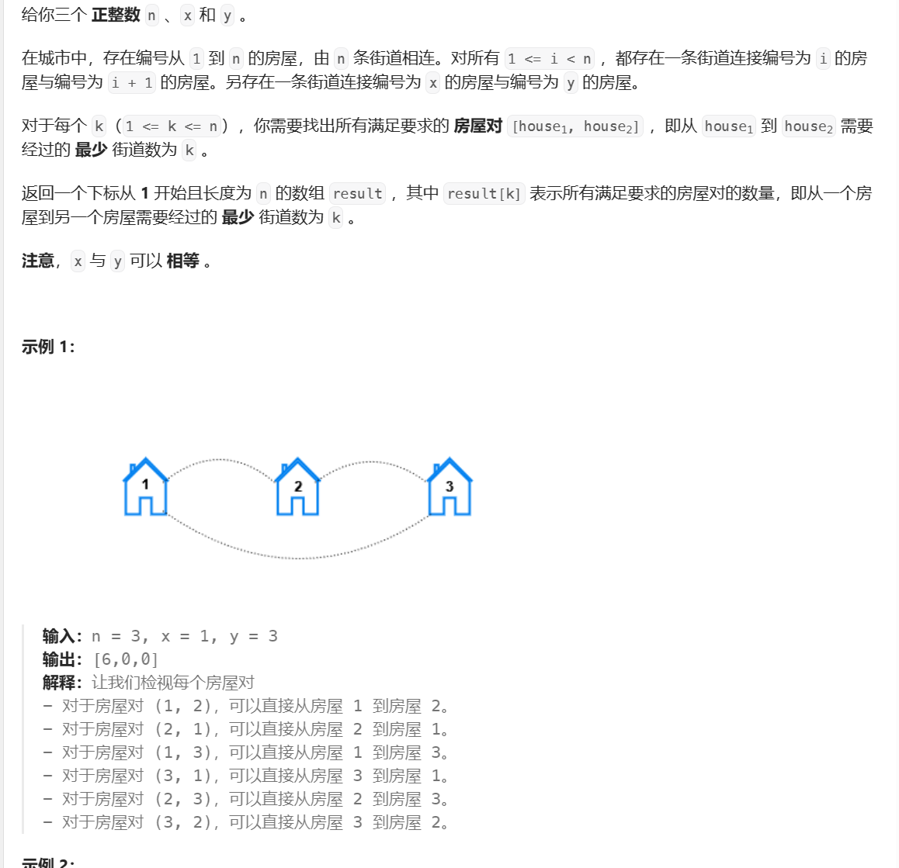

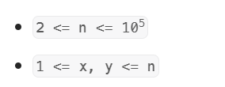

先考虑没有x和y的情况，对于每个位置，他能做出的贡献为它与左边/右边的所有值的差值，由于是一个顺序递增的数组，因此位置I的贡献为1~ i-1,1~n-i，根据这个值更新答案，很明显要使用差分数组才能做到快速的更新操作。然后考虑x和y，当i小于x时，它左边的结果不受影响，但是右边的结果受到影响，它到y+1以及之后的位置距离都会缩减，i到y的距离从y-i变为x-i+1(从i到x再多走一步)，因此原先的一系列距离都要减小dec=y-i-(x-i+1)=y-x+1>。而对于区间中的点：


当j大于一定的位置时从x走到y再到j更短，因此j-i到y-i-j的距离不存在了转而变为x-i+2（从i经过x到y-1）和x-i+1+y-j

而对于区间内的点，假设有一点i到区间外的j经过x会更短可证这个位置在：


因此在x<i<(x+y+1)//2的区间内，i到y以及y右边的距离会变化，同样分析。

而对于在(x+y+1)//2+1到y和y之外的i，可以通过对称性变化为前两种情况，相当于180度反转


```python
class Solution:
    def countOfPairs(self, n: int, x: int, y: int) -> List[int]:
        # 做一位偏移
        diff=[0]*(n+1)
        if x>y:
            x,y=y,x
        def add(l,r,v):
            if l>r:
                return 
            diff[l]+=v
            diff[r+1]-=v    
        def update(i,x,y):
            add(y-i,n-i,-1)
            dec=y-x-1
            # 到y之后的距离变化
            add(y-i-dec,n-i-dec,1)

            # 到内部的距离变化
            j=(x+y+1)//2+1
            add(j-i,y-1-i,-1)
            add(x-i+2,x-i+1+y-j,1)

        def update2(i,x,y):
            # 撤销
            add(y-i,n-i,-1)
            # 计算出差值
            dec=x+y-1-2*i
            # 记录新的距离
            add(y-i-dec,n-i-dec,1)
		
            j=(2*i+y-x+1)//2+1
            add(j-i,y-1-i,-1)
            add(i-x+2,i-x+1+y-j,1)


        for i in range(1,n+1):
            # 初始的时候就加上
            add(1,i-1,1)
            add(1,n-i,1)
            # 相邻两个相连没有用处
            if x+1>=y:
                continue
            if i<=x:
                update(i,x,y)
            elif i>=y:
                # 对称变化，两个索引相加应该为n，但是这里索引从1开始，注意x和y是相反的（技巧点）
                update(n+1-i,n+1-y,n+1-x)
            elif i<(x+y)//2:
                update2(i,x,y)
            elif i>(x+y+1)//2:
                update2(n+1-i,n+1-y,n+1-x)
        return list(accumulate(diff))[1:]
```


## 空调

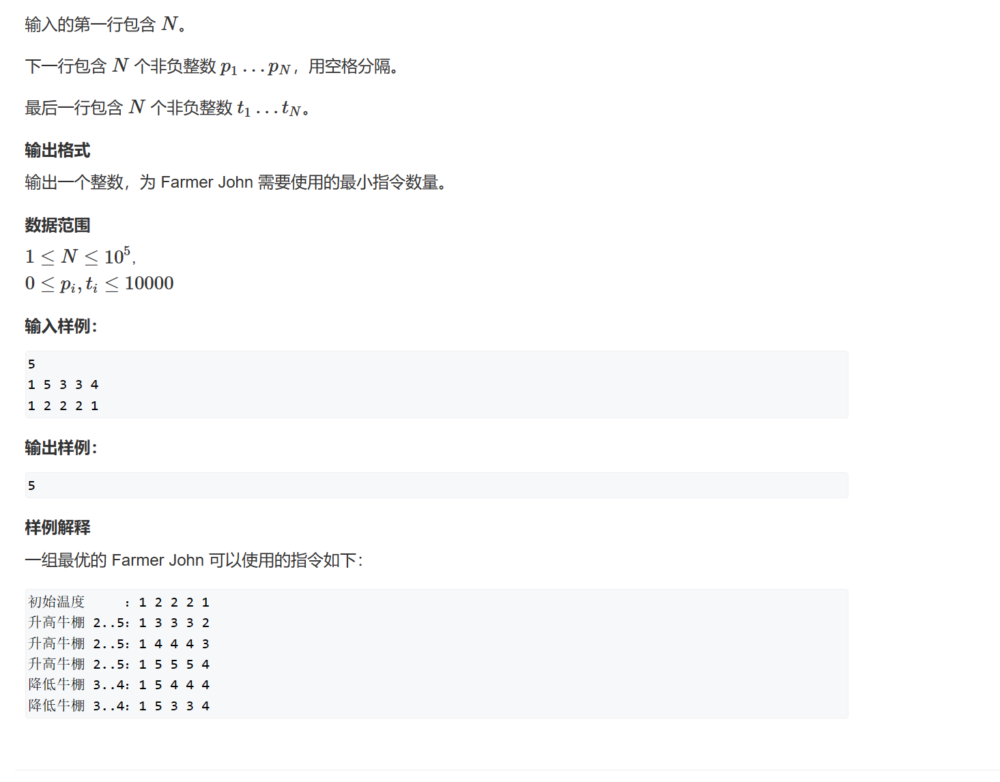


简言之就是把[0,0,0,0]转换为[3,1,3,1]所需的最少操作次数，每次可以把一个区域的值加以或减一。

从差分数组的角度考虑每次在一个位置加一在一个位置减一，构建两个数组的差分数组（技巧点），一般的差分数组是只有n项的但这里为方便构建n+1项，对于[3,1,1,3]差分数组为[3,-2,0,2,-3]最后一项是0-nums[-1]，令正数为S，则负数为-S，根据构造公式可得。在一个位置加一，一个地方减一至少需要所有正数之和次操作。


```python
n=int(input())
a=[int(x) for x  in input().split()]
b=[int(x) for x in input().split()]
# 找两个数组的差值
nums=[x-y for x,y in zip(a,b) ]

if nums:
    diff=[nums[0]]
    for i in range(1,len(nums)):
        diff.append(nums[i]-nums[i-1])
        # 多构建一位
    diff.append(-nums[-1])
    cnt=0
    for v in diff:
        if v>0:
            cnt+=v
    print(cnt)
else:
    print(0)

```

##  Look Back

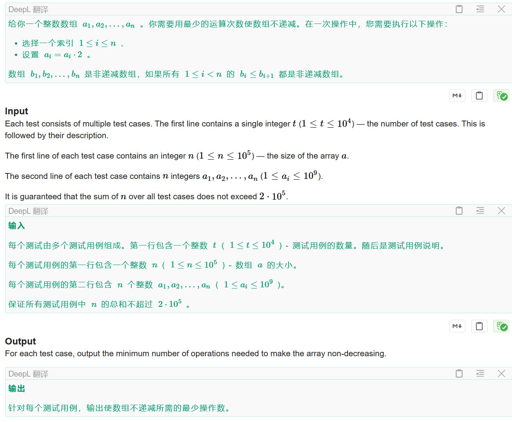


直接模拟乘2会超时，使用位运算记录乘2的次数同时修改数组元素会超内存。此题具有差分的性质，为了保证元素是不递减的每个元素操作时不仅要看前一个还要看前面所有的。

记录差分，不过这里不是元素相减而是相除，比如3 2 1 第三个元素需要的次数是2这个次数是由2与1的差值所需的操作次数加上3和2的操作次数，一些情况下比如3 2 5 ，5操作0次

因为2与5之间的操作次数位log2(2/5)上取整是一个负数，他还就要加上3和2的操作次数，最后的结果是负数，但是此题中只能改大不能改小，因此把负数变为0

```python
from math import *
import sys
from itertools import accumulate as ac
input=sys.stdin.readline
for _ in range(int(input())):
    n=int(input())
    nums=[int(x) for x in input().split()]
    # 差分数组，这里是相除的差分
    diff=[0]*n
    diff[0]=nums[0]
    for i in range(1,n):
        diff[i]=nums[i-1]/nums[i]
    # 记录操作的前缀和
    a=[0]
    for i in range(1,n):
        a.append(a[-1]+ceil(log2(diff[i])))
        a[-1]=max(a[-1],0)   
    a=list(ac(a))
    print(a[-1])
```

## [跳跃游戏 VII](https://leetcode.cn/problems/jump-game-vii/) 

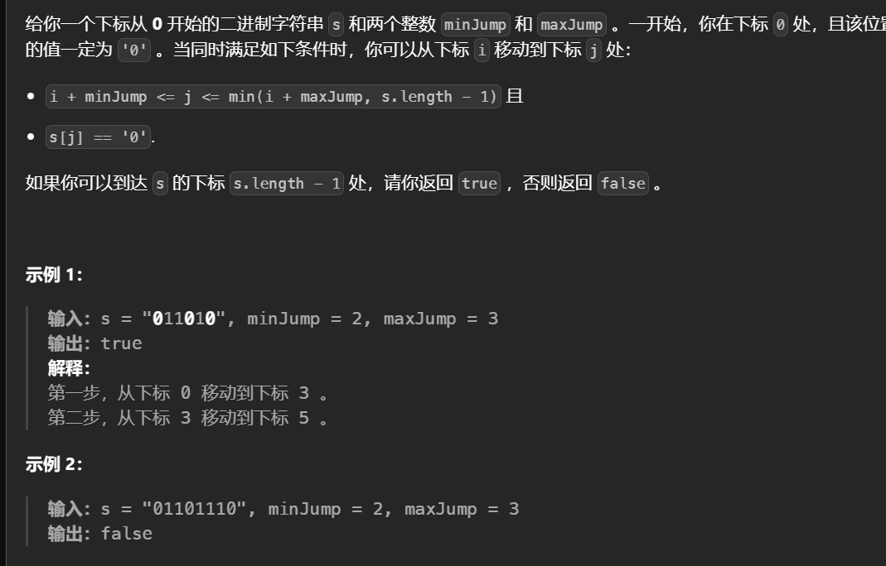


一个位置如果是0会影响到后面的区间，通过差分操作加一来表示这个区间可以访问到，一个区间如果能访问那么用于记录的数组在这个位置上一定是大于0的，通过定义一个变量不断地在这个过程中累加值来表示到这个位置的时候的总值，如果当前位置值大于0就说明可以跳到。


```python
class Solution:
    def canReach(self, s: str, minJump: int, maxJump: int) -> bool:
        n=len(s)
        diff=[0]*n
        diff[0]=1
        diff[1]=-1
        acc=0
        for i,c in enumerate(s):
            acc+=diff[i]
            if c=='0' and acc:
                if i+minJump<n:diff[i+minJump]+=1
                else:continue
                if i+maxJump+1<n:diff[i+maxJump+1]-=1
        res=list(accumulate(diff))
        return res[-1]>0 and s[-1]=='0'
```

## [描述绘画结果](https://leetcode.cn/problems/describe-the-painting/)

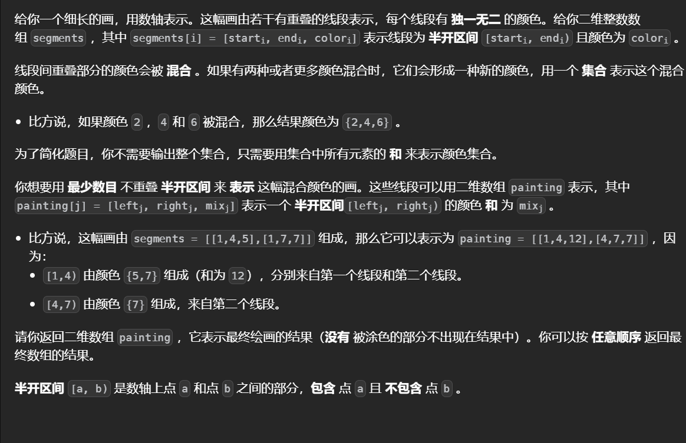

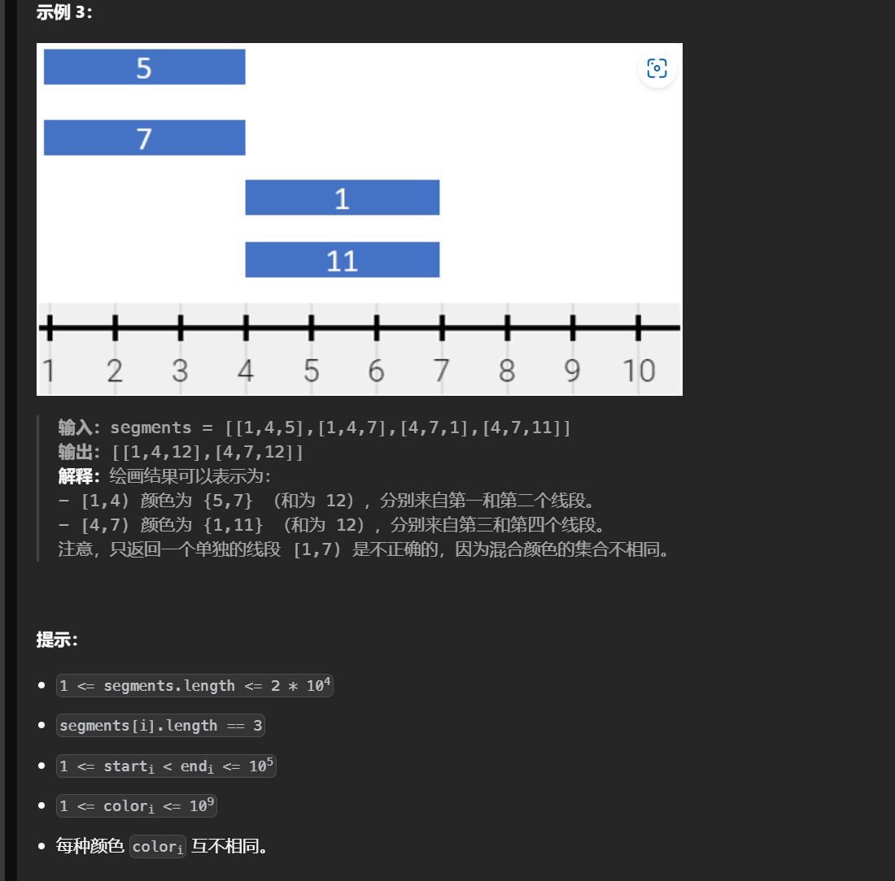

很明显是使用差分，但是如果对区间差分构建前缀和后去找相同的值的区间，会把两段不同的区间认为是一个。这里选择按照端点的顺序对端点构建前缀和，因为只有在线段的端点才会变换颜色

通过对区间端点差分构建前缀和可以轻松求出每一段区间


```python
class Solution:
    def splitPainting(self, segments: List[List[int]]) -> List[List[int]]:
        # 因为只是对端点操作，不需要记录数组
        memo=defaultdict(int)
        for u,v,w in segments:
            memo[u]+=w
            memo[v]-=w
        # 按顺序访问
        nums=sorted([k,v] for k,v in memo.items())
        n=len(nums)
        ans=[]
        pre=0
        for i in range(n-1):
            pre+=nums[i][1]
            # 不存在的区间不考虑
            if pre:ans.append([nums[i][0],nums[i+1][0],pre])
        return ans 
```


# LRU

LRU算法是一种缓存淘汰策略，按照访问时间来淘汰。

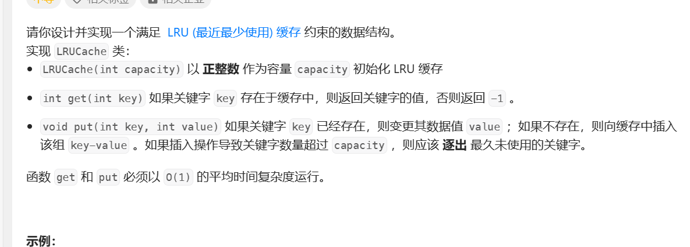

要求删除最晚使用的，则需要数据结构具有顺序顺序，要求get和put的时间复杂度为O(1)，即查找和加入要十分快，即可以快速找到某个key对应的val，以及能在任意位置快速的插入删除元素。哈希表查找很快但是数据没有固定的顺序，双向链表在任意位置插入删除快但是查找慢，因此将二者结合起来，使用双向链表作为数组的存储形式，用哈希表作为索引。

```python
# 节点的数据结构
class node:
    def __init__(self, k,v):
        self.key=k
        self.val=v
        self.prev=None
        self.next=None
        
# 选择使用双向链表
class Doublelinklist:
    
    # 双向链表加入头节点和尾节点方便操作
    def __init__(self):
        self.head=node(0,0)
        self.tail=node(0,0)
        self.head.next=self.tail
        self.tail.prev=self.head
        self.size=0
    
    # 加入，注意头节点尾节点不做为真正的数据
    def addlist(self,x):
        self.size+=1
        x.prev=self.tail.prev
        self.tail.prev.next=x
        x.next=self.tail
        self.tail.prev=x
        
    # 删除
    def remove(self,x):
        x.prev.next=x.next
        x.next.prev=x.prev
        self.size-=1
    
	# 删除第一个
    def removeFirst(self):
        if self.head.next==self.tail:
            return None
        curr=self.head.next
        self.remove(curr)
        return curr
    
    # 返回节点数目
    def size_(self):
        return self.size

    
class LRUCache:
    
    def __init__(self,capacity):
        # 哈希表作为映射索引，注意再操作时要同时更新哈希表
        self.hashmap={}
        # 双向链表储存数据
        self.db=Doublelinklist()
        self.cap=capacity
    
    # 将节点更新为最近使用的，删除后加入即可
    def makeRecently(self,k):
        x=self.hashmap.get(k)
        self.db.remove(x)
        self.db.addlist(x)
    
    # 加入
    def addRecently(self,k,val):
        x=node(k,val)
        self.hashmap[k]=x
        self.db.addlist(x)
    
    # 删除
    def removeRecently(self,k):
        x = self.hashmap.get(k)
        self.db.remove(x)
        del self.hashmap[k]
    
    # 当链表满了的时候，删除最晚使用的
    def removeLeastRecently(self):
        first=self.db.removeFirst()
        if first:
            del self.hashmap[first.key]

    # 获取
    def get(self,k):
        x = self.hashmap.get(k)
        # 不存在
        if not x:
            return -1
        self.makeRecently(k)
        
        return x.val
    
    # 放入
    def put(self,key,val):
        
        # 如果存在，删除再加入即可
        if key in self.hashmap:
            self.removeRecently(key)
            self.addRecently(key,val)
            return
        
        # 如果已满，删除最晚的再加入
        if self.db.size_()>=self.cap:
            self.removeLeastRecently()    
        self.addRecently(key,val)
```

# LFU

LFU要求是每次淘汰访问频率最少的。

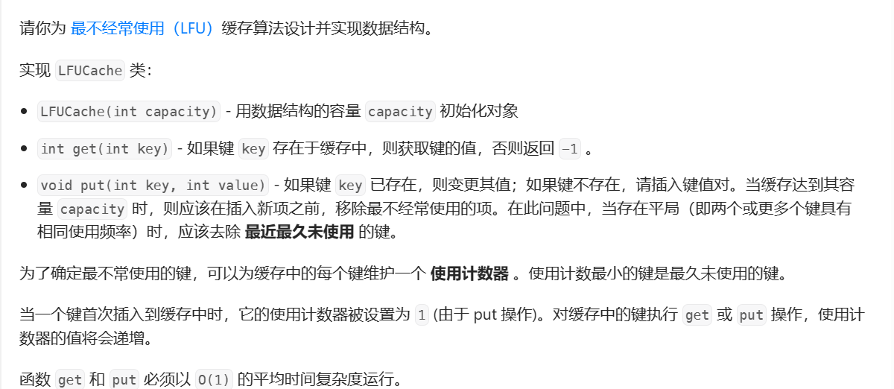

重点在于三个映射表

```python 
# 默认字典，当访问不存在的键时，会自动创建该键，并以给定的默认值作为键的值
from collections import defaultdict
# 有序字典，根据加入顺序排序
from collections import OrderedDict

class LFUCache:
    def __init__(self,capacity):
	# get(key)要求时间复杂度为O(1)，设置键值对
        self.kv={}
        # 一旦使用get或是put访问key，该key对应的频率就要增加，设置键频率表
        self.kf={}
        # 当容量满了的时候删除频率最小的，同时可能有多个频率最小的，使用频率对应的键，有序字典作为值(可以储存多个值并且保留顺序还能快速查找)，
        self.fk=defaultdict(OrderedDict)
        self.cap=capacity

    def get(self,key):

        # 如果这个键存在，增加频率并返回相应的值
        if key in self.kv:

            self.increasefreq(key)
            return self.kv[key]

        return -1

    def increasefreq(self,k):

        freq=self.kf[k]
        # 频率加一
        self.kf[k]+=1

        # 删除这个频率对应的有序字典的键
        del self.fk[freq][k]
        # 如果这个频率对应的字典空了，删除
        if not self.fk[freq]:
            del self.fk[freq]

        freq+=1
        # 在更新后的频率对应的字典中添加k对应的键（默认字典，不存在则创建）,值不重要
        self.fk[freq][k]=None

    def put(self,key,val):

        if key in self.kv:
            # 更新值
            self.kv[key]=val
            self.increasefreq(key)
            return

        # 如果已满
        if len(self.kv)>=self.cap:
            self.removemin()
        self.kv[key]=val
        self.kf[key]=1
        self.fk[1][key]=None

    def removemin(self):
        # 找出最小的频率
        minfreq=min(self.fk)
        # 返回对应的有序字典中的第一个，只取键不去值
        key,_ =self.fk[minfreq].popitem(last=False)

        del self.kv[key]
        del self.kf[key]
```


# 单调栈结构

栈结构多用于下一个最大元素，数字元素符，匹配之类的题目。

## 下一个更大元素

单调栈结构用于处理，需要保持相对次序，并且计算下一个更大的元素时。

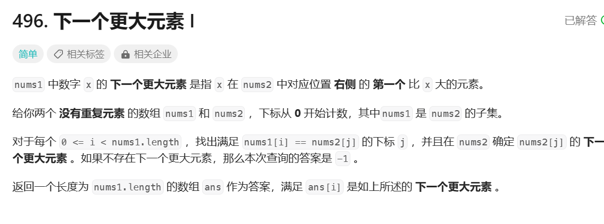

选择计算出每个元素的下一个最大元素，然后使用字典进行映射。

如果把每个元素当成一堵墙那么下一个最大元组就是能够露出来的。

```python
from collections import deque# 使用双向队列模拟栈

class Solution(object):
    def nextGreaterElement(self, nums1, nums2):
        d=deque()
        res={}# 用字典作映射
        for i in range(len(nums2)-1,-1,-1):# 倒序放入
            val=nums2[i]
            while d and val>d[-1]:# 如果栈中有元素并且栈顶的元素小于要放入的元素，那么该元素就是无用的，从栈中删除，直到栈空或者有大于的元素
                d.pop()
            if not d:# 如果栈空了，说明没有比该元素大的，结果是-1，同时记住往栈中放入元素
                res[val]=-1
                d.append(val)
                continue
            # 没空，说明有大于的，设置为栈顶元素
            res[val]=d[-1]
            d.append(val)
        result=[]
        # 一个个映射
        for i in nums1:
            result.append(res[i])
        return result
```


## 每日温度

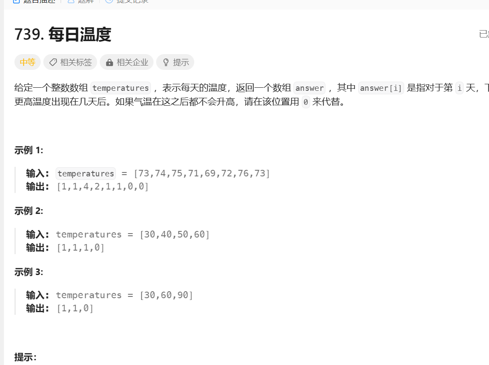

与上一题一样使用单调栈，但结果中要求的是索引差值，在栈中存入索引。

```python
from collections import deque
class Solution(object):
    def dailyTemperatures(self, temperatures):
        stack=deque()

        res=[]
        for i in range(len(temperatures)-1,-1,-1):
            val=temperatures[i]
            # 虽然存的不是数值，但可以转换为数值
            while stack and temperatures[stack[-1]]<=val:
                stack.pop()
            if not stack:
                res.append(0)
                stack.append(i)
                continue
			
            # 记录索引的差值
            res.append(stack[-1]-i)
            stack.append(i)
         
        return res[::-1]
```

## 下一个更大元素II

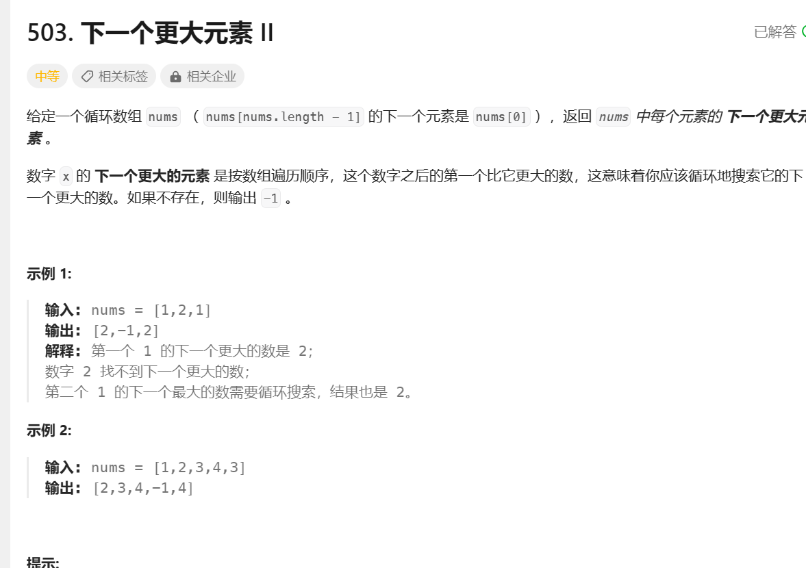

以数组长度加倍实现环形，重要思想

```python
from collections import deque
class Solution(object):
    def nextGreaterElements(self, nums):
        d=deque()
        n=len(nums)
        res=[-1]*n
        # 不需要创建数组，只需让索引翻倍实现重复访问即可
        for i in range(2*n-1,-1,-1):
            val=nums[i%n]
            while d and d[-1]<=val:
                d.pop()
            if not d:
                res[i%n]=-1
                d.append(val)
                continue
            res[i%n]=d[-1]
            d.append(val)
        return res
```


## 去除重复字母

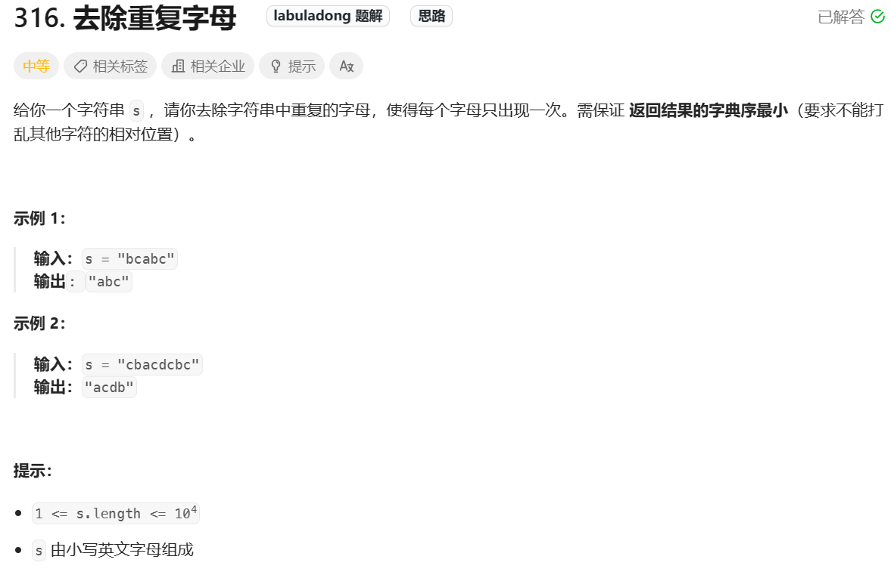

本题有两个要求：元素不重复，最小字典序。

在压入栈之前，比较栈顶的字符的大小，如果栈顶字符更大并且还可以出现那么就用当前字符把栈顶字符替换掉以此保证字典序最小的情况下同时保证每个元素不会被忽略。

```python
from collections import deque
from collections import Counter
class Solution(object):
    def removeDuplicateLetters(self, s):
        # 栈
        d=deque()
        # 字典
        dict=Counter(list(s))
        # 记录结果的数组
        res=[]
        # 记录是否出现过
        used=[False for _ in range(256)]
        for i in range(len(s)):
            # 如果已经出现了一次就不要再加入，同时将记录的次数减一
            if  used[ord(s[i])]:
                dict[s[i]]-=1
                continue
            # 判断顶部的元素是否大于要加入的元素
            while len(d)!=0 and ord(d[-1])>ord(s[i]):
                # 弹出之前判断，防止丢失
                if dict[d[-1]]!=0:
                    used[ord(d.pop())]=False
                else:
                    # 不能弹出字何解推出循环
                    break
            d.append(s[i])
            # 加入后记录减一
            dict[s[i]]-=1
            # 标记
            used[ord(s[i])]=True
                
        while len(d)!=0:
            res.append(d.popleft())
        return "".join(res)
```

## 笨阶乘

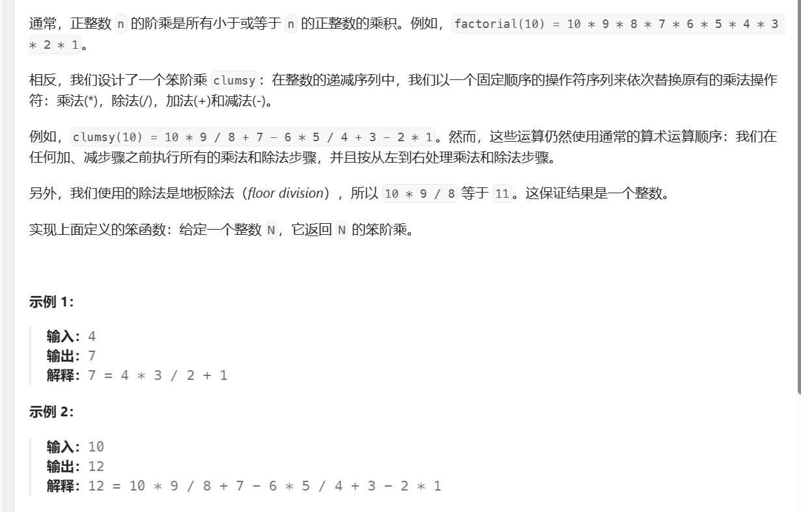

表达式计算一般借助栈结构求解，因为表达式计算存在优先级关系，借助栈的特性可以实现，对于乘除法直接计算，加减法入栈不操作，最后栈中得到的是各个操作之后的结果，求累和即可

```python
from collections import deque
class Solution(object):

    def clumsy(self, n):
        d=deque([n])# 栈中初始就有一个元素，方便之后计算
        index=0# 使用index对4取模，求解是那种运算
        n-=1# 注意前面栈中已经有了一个元素
        while n:# 从末尾开始
            
            # 如果是乘法，直接与栈顶相乘然后在加入
            if index%4==0:
                val=d.pop()
                d.append(val*n)
        	# 如果是除法，用栈顶的元素除以当前的元素（由于是向0取整不能都用//），注意如果是负数要特殊操作    
        	elif index%4==1:
                val=d.pop()
                if val<0:
                    v=abs(val)//n
                    d.append(-v)
                else:
                    d.append(val//n)
            # 如果是加法，加入栈不操作
            elif index%4==2:
                d.append(n)
            # 反之是减法，加入负数
            else:
                d.append(-n)
            n-=1
            index+=1
        sum=0
        # 最后计算栈中元素的累和
        while d:
            sum+=d.pop()
        return sum
```

双栈算法，一个记录数字，一个记录运算符。

```python
from collections import deque
class Solution(object):

    def clumsy(self, n):
        nums=deque()
        ops=deque()
        
        # 使用字典记录优先级
        priority={'*':2,"/":2,"+":1,"-":1}
        operators=['*','/','+','-']
        index=0
        
        # 计算的函数
        def cal(nums,s):
         	# 弹出两个值，注意顺序
        	a=nums.pop()
            b=nums.pop()
            if s=='+':
                nums.append(a+b)
            elif s=='-':
                nums.append(b-a)
            elif s=='*':
                nums.append(a*b)
            else:
                nums.append(b//a)
		
        # 从末尾开始
        for i in range(n,-1,-1):
            # 取得运算符，不着急运算，而是等和看下一个元素符的优先级，如果下一个的优先级小于自身，则运算，否则加入然后新加入的继续看下一个的优先级
            operator=operators[index%4]
            index+=1
            # 0直接退出
            if i==0:
                break
            # 加入数字
            nums.append(i)
            # 如果当前的运算符优先级不大于栈中的，也就是说栈中的可以先计算，那就将当前栈中的元素计算，直到运算符栈空了或是遇到了优先级小于当前的。
            while ops and priority[ops[-1]] >= priority[operator]:
                cal(nums, ops.pop())
			# 1之后没有运算符了
            if i!=1 :
                ops.append(operator)
		# 如果此时op栈中还有值全部运算，比如10 * 9 / 8 + 7 - 6 * 5 / 4 + 3 - 2 * 1，最后nums[A],ops[-]，之后会存入nums[A,2,1] ops[-*] 然后遇到0就退出了
        while ops:
            cal(nums,ops.pop())
        return nums[-1]
```

## [检查替换后的词是否有效](https://leetcode.cn/problems/check-if-word-is-valid-after-substitutions/)

​	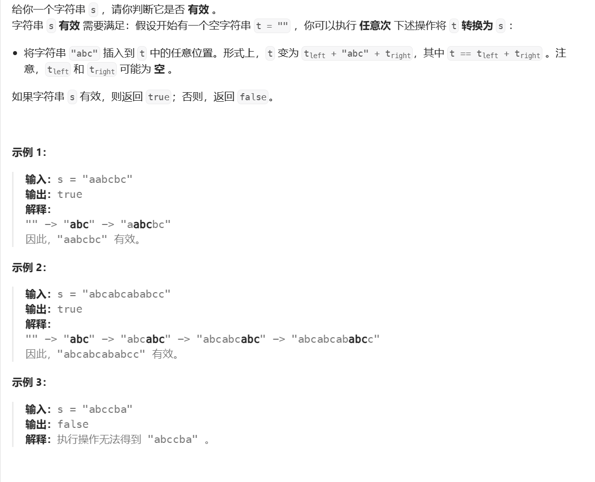

类似于将字符串 `()` 插入到 *t* 中的任意位置」，比如 `() -> (()) -> (()())`

按照栈的顺序，b必然匹配a，c必然匹配b

把`a`:比作左括号，遇到了就入栈，`b`：如果栈为空或者说栈顶不是`a` 返回false，否则把栈顶变为`b`.`c`：如果栈为空，或者栈顶不为 `b`，则返回 `false`，否则弹出栈顶，相当于找到了一个abc。

```python
class Solution(object):
    def isValid(self, s):
        d=deque()
        for c in map(ord,s):
            if c==ord('a'):
                d.append(c)
            elif c==ord('b'):
                if len(d)==0 or c-d[-1]!=1:
                    return False
                else:
                    # 把栈顶变为b
                    d.pop()
                    d.append(c)
            else:
                if len(d)==0 or c-d[-1]!=1:
                    return False
                else:
                    # 不需要霸占顶变为c
                    d.pop()
         # 最后栈中应该不会有元素
        return len(d)==0
```

## [子数组的最小值之和](https://leetcode.cn/problems/sum-of-subarray-minimums/)

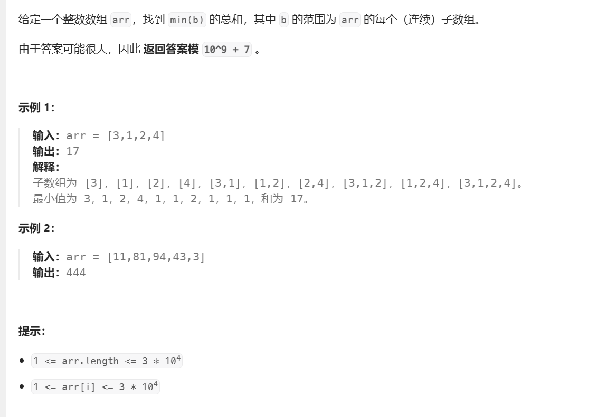


对于每个值去`计算它可能作为多少个区间的最小值`，在列表中找这个值左边小于它的元素的坐标L，右边找小于他的元素的坐标R，然后这个值乘上对应的区间就是他所能做出的贡献。

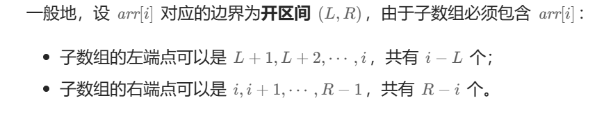

这里需要注意，由于存在相同元素，计算答案时会重复统计同一个子数组，`为避免重复统计，可以修改边界的定义，把右边界改为找小于等于该数的下标`


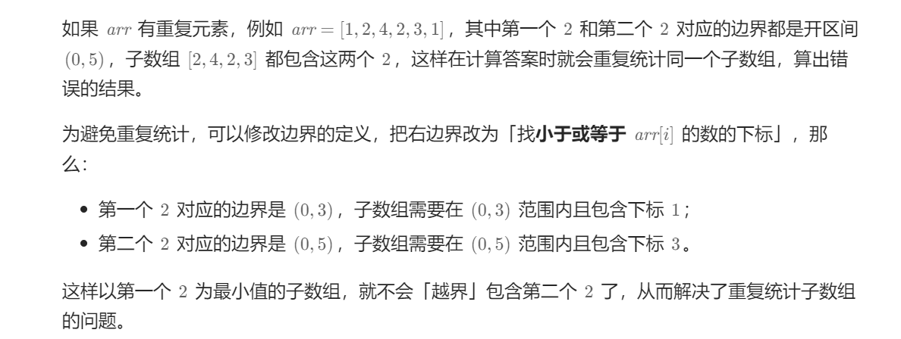


```python
from collections import deque
class Solution:
    def sumSubarrayMins(self, nums) -> int:
        n=len(nums)
        # left[i],right[i]表示nums[i]左小于它的第一个元素的索引，右小于等于它的第一个元素的位置，找不到合适的位置时(两边或数组中最小的元素)，设置为-1和n，方便之后计算。
        left=[-1]*n
        right=[n]*n
        # 使用栈结构找小于它的元素，记录的是坐标
        d=deque()
        ans=0
        # 找左边小于它的元素，栈中大于等于当前值的都没用直接弹出
        for i ,x in enumerate(nums):
            while d and nums[d[-1]]>=x:
                d.pop()
             # 如果栈中还有值，说明这个值是小于当前值的，记录它的索引
            if d: left[i]=d[-1]
            d.append(i)
         # 记得清空栈
        d=deque()
        # 找右边小于等于它的元素，倒序遍历
        for i in range(n-1,-1,-1):
            while d and nums[d[-1]]>nums[i]:
                d.pop()
            if d: right[i]=d[-1]
            d.append(i)
        for i,(l,r,x) in enumerate(zip(left,right,nums)):
            # 最后按照公式解题即可
            ans+=x*(i-l)*(r-i)
        return ans %((10**9)+7)
```


## [子数组范围和](https://leetcode.cn/problems/sum-of-subarray-ranges/)

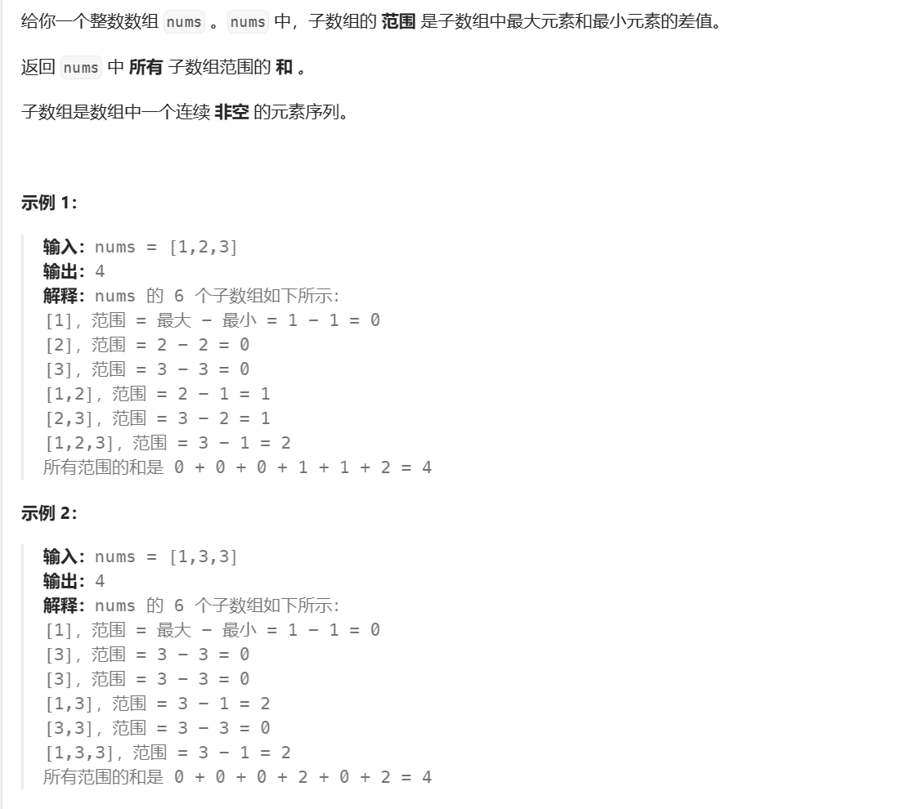

贡献法，技巧点

`转化找所有子数组的最大最小值`：找每个元素作为最大值出现在了多少个区间，以及作为最小值出现在了多少个区间，求每个元素的贡献。

找一个元素作为最大值出现在了多少子数组，就是在这个数组两边找第一个大于他的值的索引（L,R），在这个开区间中包含这个元素的区间数目为：左边可选的开始端点为L+1,L+2,...I,右边的端点为i,i+1,i+2,R-1，存在的区间为（i-l）*(r-i）

```python
import collections
from collections import deque
class Solution:
    def subArrayRanges(self, arr) -> int:
        n = len(arr)
        
        # 进行两次，一次找最大值，一次找最小值
        # 找最大值
        left=[-1]*n
        right=[n]*n
        d=deque()
        ans=0
        for i,x in enumerate(arr):
            # 小于当前值的没有用，弹出
            while d and arr[d[-1]]<=x:
                d.pop()
            if d:left[i]=d[-1]
            d.append(i)
        d=deque()
        for i in range(n-1,-1,-1):
            while d and arr[d[-1]]<arr[i]:
                d.pop()
            if d:right[i]=d[-1]
            d.append(i)

         # 最大值的贡献用于加
        for i ,(l,r,x) in enumerate(zip(left,right,arr)):
            ans+=x*(i-l)*(r-i)

        left = [-1] * n
        right = [n] * n
        d = deque()

        for i ,x in enumerate(arr):
            while d and arr[d[-1]] >= x:
                d.pop()
            if d: left[i] = d[-1]
            d.append(i)
        d = deque()
        for i in range(n - 1, -1, -1):
            while d and arr[d[-1]] > arr[i]:
                d.pop()
            if d: right[i] = d[-1]
            d.append(i)

         # 最小值用于减
        for i, (l, r, x) in enumerate(zip(left, right, arr)):
            ans -= x * (i - l) * (r - i)

        return ans
```


## [删除字符串中的所有相邻重复项 II](https://leetcode.cn/problems/remove-all-adjacent-duplicates-in-string-ii/)

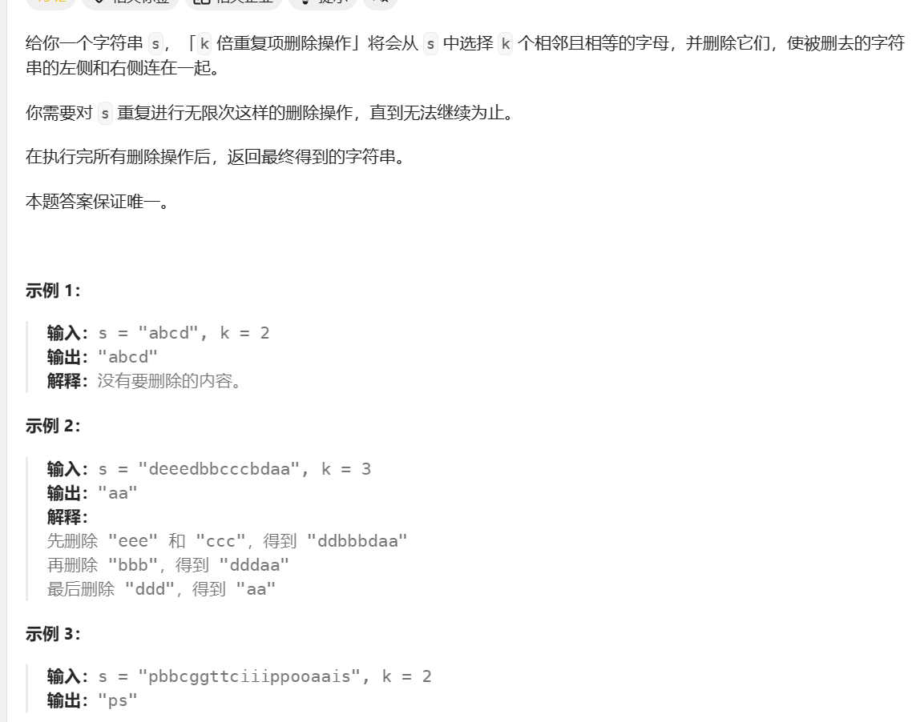


将元素依次加入到栈中同时记录个数，如果加入的元素和栈顶元素相同，那么栈顶元素个数加一，如果个数满足K，就在删除，如果和栈顶元素不相同，就加入这个值，注意这里同时记录元素和个数，不能使用字典记录个数，因为字典没法记录在不同位置的元素个数。

```python
from collections import deque,defaultdict as f
class Solution:
    def removeDuplicates(self, s: str, k: int) -> str:
        d=deque()
        ans=""
        for c in s:
            if not d or d[-1][0]!=c:
                d.append([c,1])
            elif d[-1][1]+1<k:
                d[-1][1]+=1
            else:
                d.pop()
        for c,l in d:
            ans+=c*l
        return ans
```

## [最大宽度坡](https://leetcode.cn/problems/maximum-width-ramp/)

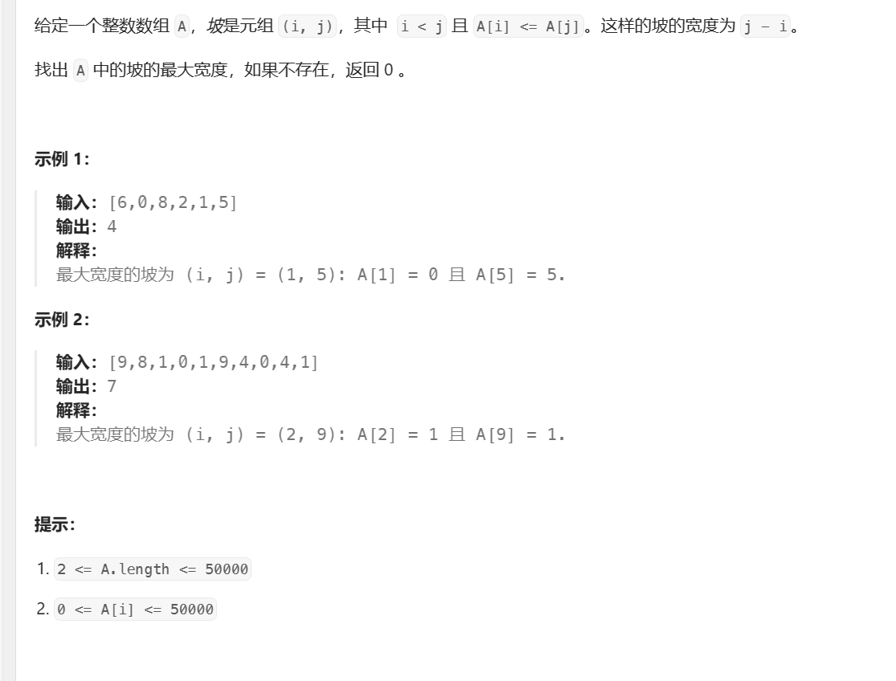


单调栈解决，为了得到最宽的(i,j)，那么需要i尽可能小，j尽可能大.首先从左往右遍历，`在栈中加入递减序列，这些值是可能的i`，对于相同的A[i]肯定是要选择索引小的，对于一个A[i]如果i左边存在一个更小的i，那么当前的区间一定是可以往左扩展的，因此i的左边存的值必须是严格大于它的。

之后从右往左遍历选择j，使得j尽可能大。如果j对应的值大于栈顶对应的值那么这构成了一个区间，弹出栈顶，之后继续比较栈顶（试图扩大区间），如果栈顶空了或者栈顶的值大于当前值，那么退出，进入下一次j循环。

```python
class Solution:
    def maxWidthRamp(self, nums: List[int]) -> int:
        d=deque()
        n=len(nums)
        ans=0
        # 首先从左往右遍历，加入递减序列到栈中，存的是索引
        for i in range(n):
            val=nums[i]
            if not d:
                d.appendleft(i)
            elif val<nums[d[0]]:
                d.appendleft(i)
        for i in range(n-1,-1,-1):
            while d and nums[i]>=nums[d[0]]:
                ans=max(i-d[0],ans )
                d.popleft()
        return ans 
```


## [表现良好的最长时间段](https://leetcode.cn/problems/longest-well-performing-interval/)

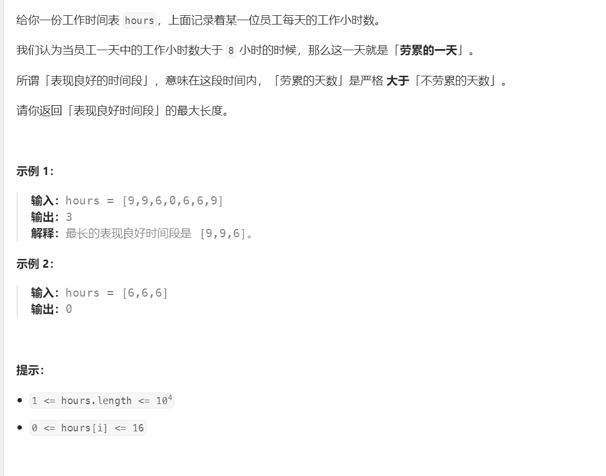

劳累的天数大于不劳累的天数，则应该是前者减去后者的结果大于0，如果令大于8的为1，小于等于为-1（技巧点，统计一个区间内大于某个数的个数比小于等于的个数多的问题转换为求解子数组和的问题），则问题变为找最长的子数组使得这个子数组的和大于0。

找子数组的和，想到使用前缀和数组。根据条件就是去找对于pre[j]找前面小于它的最远pre[i间的距离，使用栈操作，问题同上：如果位置I的左侧存在更小的元素，那么区间一定可以往左扩展，因此要去找从开头的严格递减的序列

```python
class Solution:
    def longestWPI(self, hours: List[int]) -> int:
        # 转化
        nums=[1 if h>8 else -1 for h in hours ]
        # 前缀和加上0可以保证取到从头开始到j的整个数组
        pre=[0]+list(accumulate(nums))
        ans=0
        n=len(pre)
        d=deque()
        # 找严格递减的序列
        for i in range(n):
            # 不会弹出值，只会加入
            if not d or pre[i]<pre[d[-1]]:
                d.append(i)
         # 倒序遍历，对于每个j找左侧小于自己的前缀和
        for i in range(n-1,-1,-1):
            while d and pre[d[-1]]<pre[i]:
                index=d.pop()
                ans=max(ans,i-index)
        return ans 
```

## [股票价格跨度](https://leetcode.cn/problems/online-stock-span/)

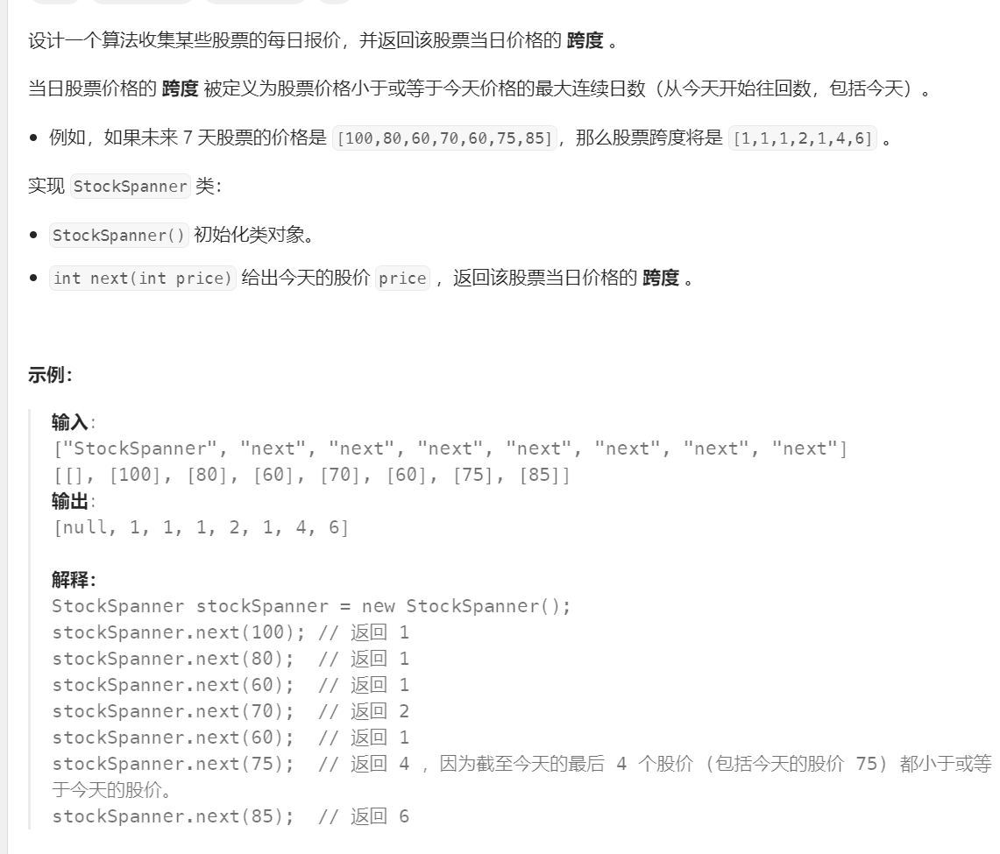 

使用栈解决，栈中记录元素大小同时记录有多少个元素小于当前元素，加入元素时如果栈顶元素小于当前元素那么是没用的弹出同时用一个外部变量记录有多少个小于等于当前元素。

```python
class StockSpanner:

    def __init__(self):
        self.d=deque()

    def next(self, price: int) -> int:
        d=self.d
        cnt=1
        while d and d[-1][0]<=price:
            cnt+=d.pop()[1]
        d.append((price,cnt))
        return cnt
```


## [ 找出最具竞争力的子序列](https://leetcode.cn/problems/find-the-most-competitive-subsequence/)

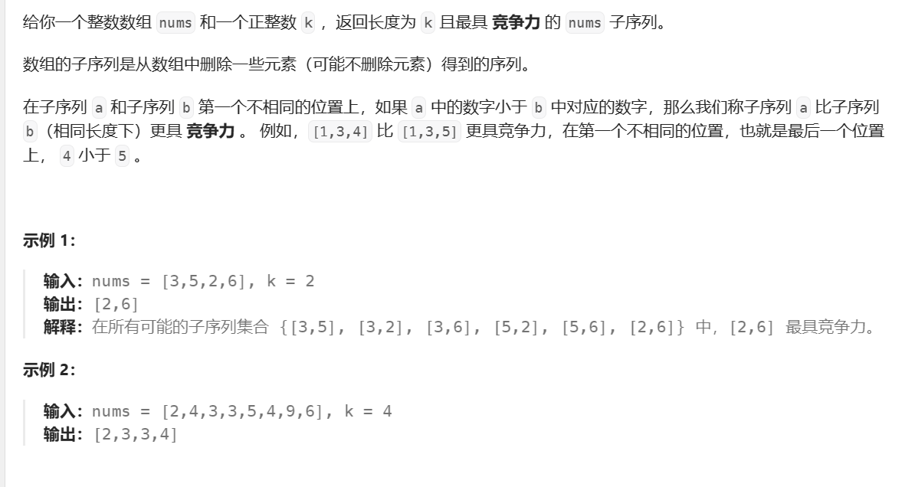

把元素依次入栈，大于栈顶的元素直接加入，小于的弹出栈顶直达不小于，要求保留k个值那么最多只能删除n-k个值。

```python
class Solution:
    def mostCompetitive(self, nums: List[int], k: int) -> List[int]:
        n=len(nums)
        d=deque()
        cnt=0
        ans=[]
        for i,v in enumerate(nums):
            while cnt<n-k and d and v<d[-1]:
                d.pop()
                cnt+=1
            d.append(v)
        for _ in range(k):
            ans.append(d.popleft())
        return ans 
            


```

## 直方图中最大的矩形

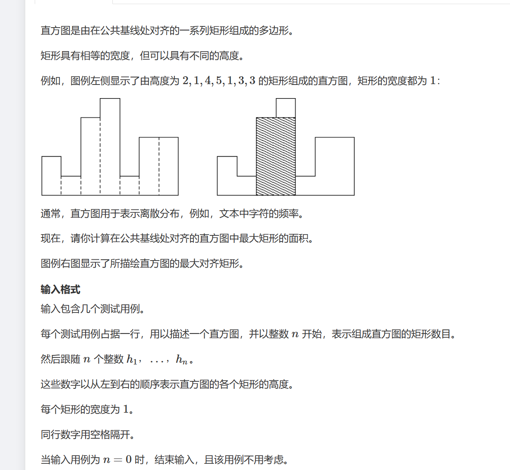


枚举每一个上边，以该上边形成的最大矩形取决于两边比它小的上边的位置，使用单调栈找出两边小于它的位置即可。

```python
from math import inf
import sys
from collections import deque

input = sys.stdin.readline
while 1:
    nums = [int(x) for x in input().split()][1:]
    if len(nums) ==0:
        break
    # 储存左边小于的右边小于的
    l = []
    r = []
    # 栈中储存的是下标
    d = deque()
    ans = -inf
    for i, v in enumerate(nums):
        if not d:
            l.append(-1)
            d.append(i)
            continue
        # 大于的值没必要留在栈中，因为只会取到小的值
        while d and nums[d[-1]] >= v:
            d.pop()
        if not d:
            l.append(-1)
        else:
            l.append(d[-1])
        d.append(i)
    # 注意清空栈
    d=deque()
    for i in range(len(nums) - 1, -1, -1):
        v = nums[i]
        if not d:
            r.append(len(nums))
            d.append(i)
            continue
        while d and nums[d[-1]] >= v:
            d.pop()
        if not d:
            r.append(len(nums))
        else:
            r.append(d[-1])
        d.append(i)
    r = list(reversed(r))
    for i, v in enumerate(nums):
        ans = max(ans, v * (r[i] - l[i] - 1))
    print(ans)
```

## [跳跃游戏 VI](https://leetcode.cn/problems/jump-game-vi/)

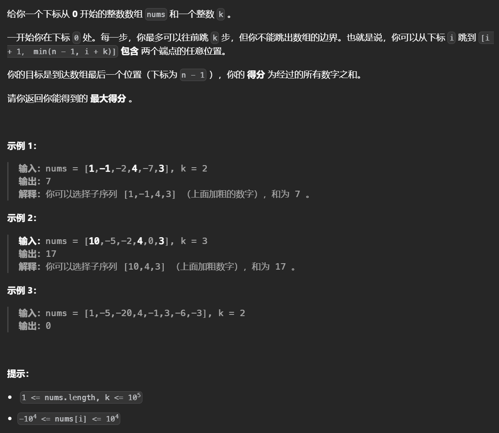

最基本的想法是：

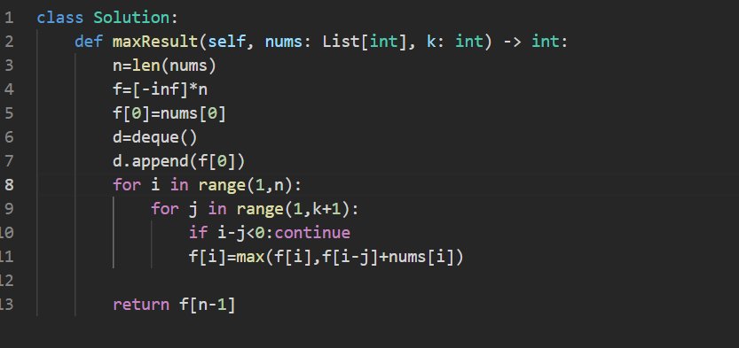

但是会超时，观察注意方程发现，每个状态是由f[i-k]~f[i-1]中最大值决定的，其他的状态无用，在向后遍历的过程中维护一个单调队列即可，类似于滑动窗口最大值的做法

```python
class Solution:
    def maxResult(self, nums: List[int], k: int) -> int:
        n=len(nums)
        f=[-inf]*n
        f[0]=nums[0]
        # 维护队列
        d=deque()
        # 初始时放入base case
        d.append(0)
        for i in range(1,n):
            # 注意当i>=k时，要开始维护队列的长度
            if i>=k:
                while d and d[0]<i-k:
                    d.popleft()
            
            f[i]=nums[i]+f[d[0]]
            # 弹出最大值
            while d and f[d[-1]]<=f[i]:
                d.pop()
            d.append(i)
           
        return f[n-1]
```


## 矩形牛棚

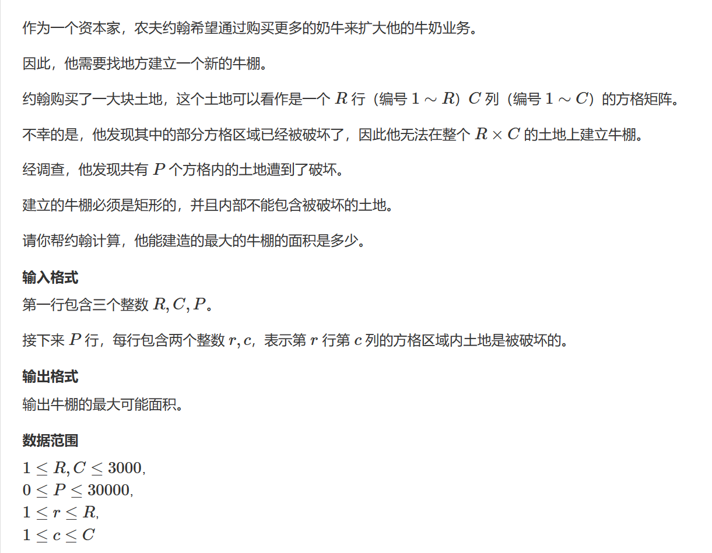


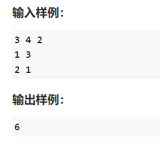


样例类似于：

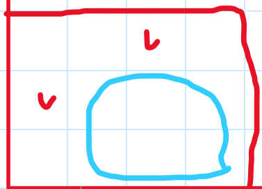


枚举每一条下边界，求以这个下边界为底找最大的矩形面积，问题转换为直方图中的最大矩形，对于一条下边它每个位置上的直方高是多少使用递归求解如果这个位置上有一个破坏的点那么它的高是0，否则是上一行的高加上一。

```python
from collections import deque
import copy
import sys
input=sys.stdin.readline

m, n, c = [int(x) for x in input().split()]

# 记录破坏的点
grid=[[0]*n for _ in range(m)]
# 记录每个位置上直方的高
h=[[0]*n for _ in range(m)]


for _ in range(c):
    a, b = [int(x)-1 for x in input().split()]
    grid[a][b]=1

# 迭代求解
h[0]=[v^1 for v in grid[0]]
for i in range(1,m):
    for j in range(n):
        if not grid[i][j]:h[i][j]=h[i-1][j]+1

ans = 0
# 枚举每个高
for b in range(m):
    nums =h[b]
    l = [0]*n
    r = [0]*n
    d = deque()
    # 单调栈计算左右位置
    for i in range(len(nums)):
        v = nums[i]

        while d and nums[d[-1]] >= v:
            d.pop()
        if d:
            l[i]=d[-1]
        else:
            l[i]=-1
        d.append(i)
    d = deque()
    for i in range(n- 1, -1, -1):
        v = nums[i]
        while d and nums[d[-1]] >= v:
            d.pop()
        if d:
            r[i]=d[-1]
        else:
            r[i]=n
        d.append(i)
    
    for i, v in enumerate(nums):
        ans = max(ans, (v) * (r[i] - l[i]-1))
print(ans)


```

## [最大频率栈](https://leetcode.cn/problems/maximum-frequency-stack/)

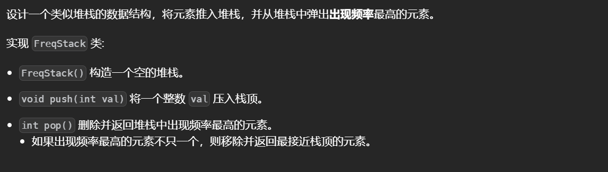

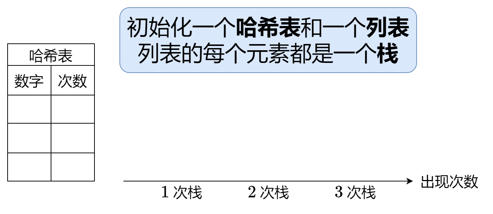

哈希表和栈的结合，为了得到最近出现的元素在添加时应该放到数据结果的末尾，而这个数组结构只能是线性的。	

```python
class FreqStack:

    def __init__(self):
        self.d=[[]]
        self.memo=Counter()

    def push(self, val: int) -> None:
        self.memo[val]+=1
        cnt=self.memo[val]
        if len(self.d)<cnt:self.d.append([val])
        else:self.d[cnt-1].append(val)

    def pop(self) -> int:
        val=self.d[-1].pop()
        # 注意减去
        self.memo[val]-=1
        if not self.d[-1]:self.d.pop()
        return val
```

## [带限制的子序列和](https://leetcode.cn/problems/constrained-subsequence-sum/)

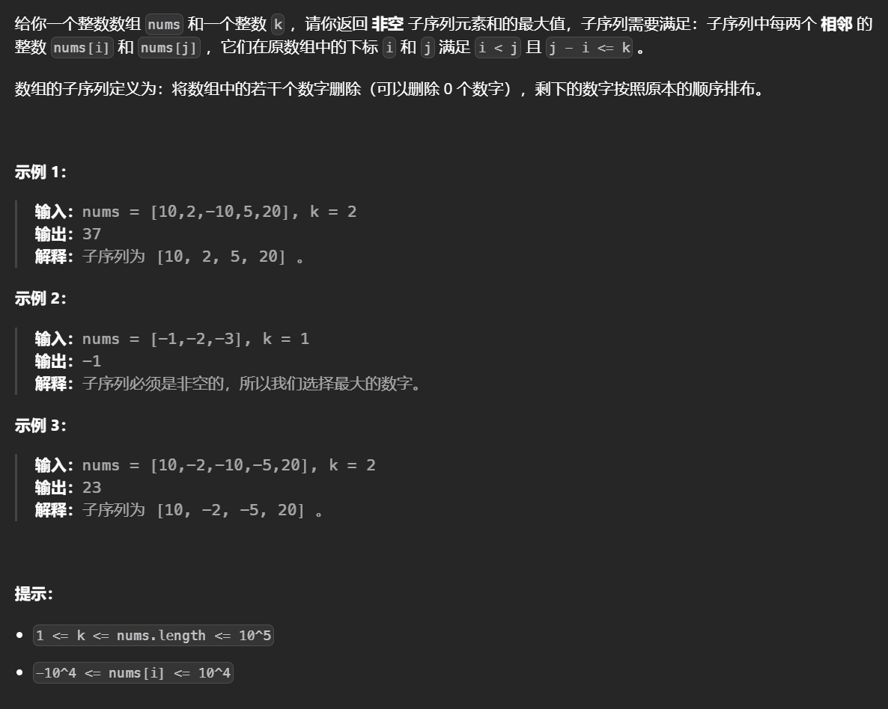

基本的dp是但需要n^2的时间复杂度，选择用线段树优化仍超时

```python
class Solution:
    def constrainedSubsetSum(self, nums: List[int], k: int) -> int:
        n=len(nums)
        f=[0]*n
        f[0]=nums[0]
        t=SegTree(f,lambda x,y:max(x,y))
        for i in range(1,n):
            # res=0
            # for j in range(1,k+1):
            #     if i-j<0:break
            #     res=max(res,f[i-j])
            res=t.query(max(0,i-k),i-1)
            t.update(i,max(nums[i],res+nums[i]))
        return max(t.nums)
```

观察状态转移方程，每个f[i]由f[i-k]\~f[i-1]最大值推出，如果f[k]大于f[k-1]那么f[k-1]在在之后就不会被取到，同时当i右移一位时选取的区间f[i-k]\~f[i-1]将最左边的值去除，同时右边会添加一位，因此可以使用单调栈优化。

```python
class Solution:
    def constrainedSubsetSum(self, nums: List[int], k: int) -> int:
        n=len(nums)
        ans=nums[0]
        d=deque()
        d.append((nums[0],0))
        for i in range(1,n):
            # 最左边的位置超过了i-k
            while d and d[0][1]<i-k:
                d.popleft()
            # 最大值
            x=max(d[0][0]+nums[i],nums[i])
            ans=max(ans,x)           
            # 弹出无用的元素
            while d and d[-1][0]<=x:
                d.pop()
            d.append((x,i))
            
        return ans 
```


## [边界元素是最大值的子数组数目](https://leetcode.cn/problems/find-the-number-of-subarrays-where-boundary-elements-are-maximum/)

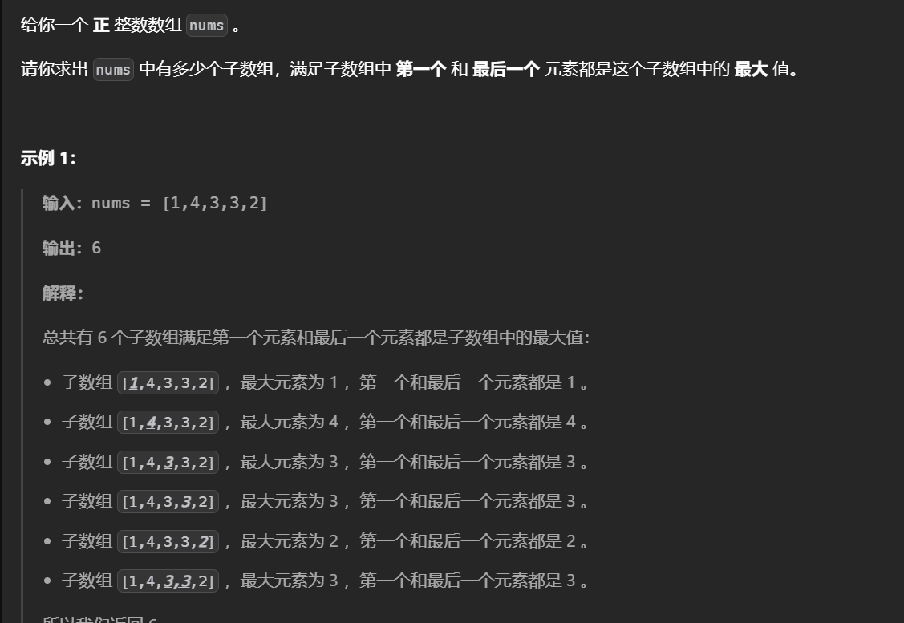

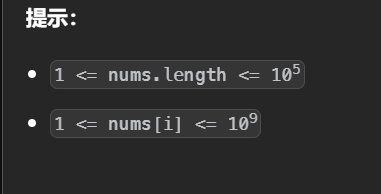


如果一个值的右边存在一个大于他的值，那么这个值就无法与之后相同的值组成一个合法的子数组，在之后这个值就不会用到了，因此所需的元素是单调递减的可以用栈实现，每次遍历到的值如果大于栈顶的元素就一直弹出，最后如果等于栈顶的元素那么就可以与之前出现过的相同的元素匹配一次，栈中存放的是一个值得大小以及出现次数。

```python
class Solution:
    def numberOfSubarrays(self, nums: List[int]) -> int:
        d=deque()
        n=len(nums)
        # 初始时每个元素单独可以作为一个
        ans=n
        for i,v in enumerate(nums):
            # 大于则弹出，这些用不到了
            while d and v>d[-1][0]:
                d.pop()
            if d and d[-1][0]==v:
                # 如果等于则更新结果，然后把次数加一
                ans+=d[-1][1]
                d[-1][1]+=1
            else:
                d.append([v,1])
        return ans 
```

## [替换数组中的非互质数](https://leetcode.cn/problems/replace-non-coprime-numbers-in-array/)

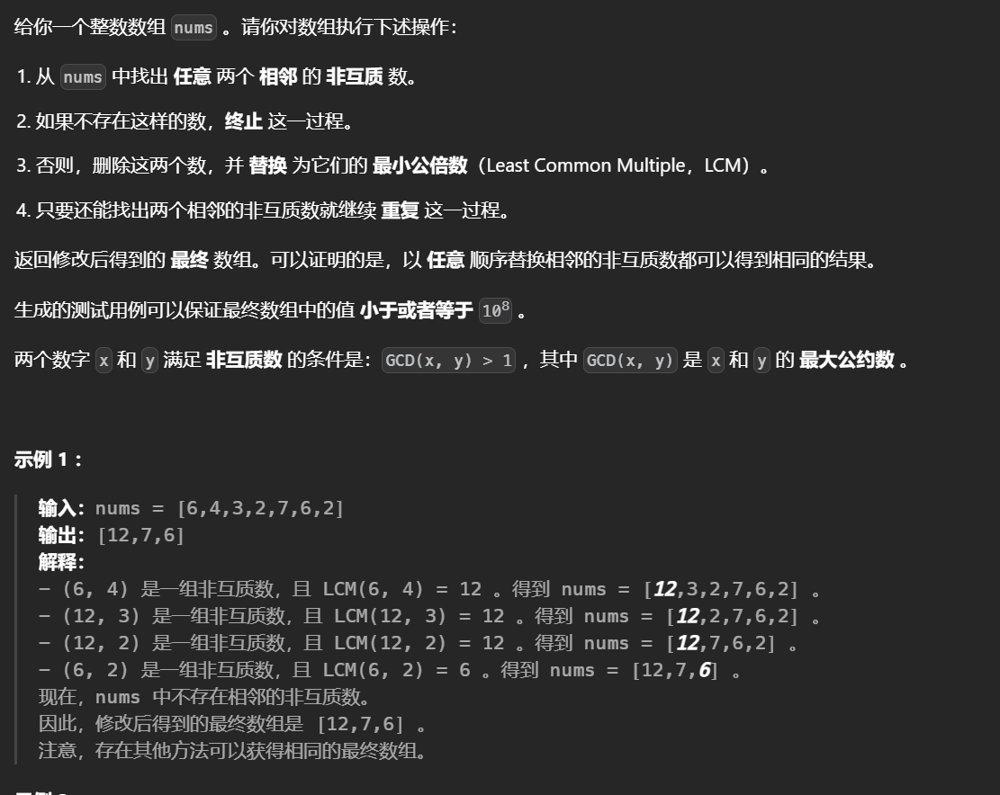

根据题目给定的证明，可以直接用栈模拟

```python
class Solution:
    def replaceNonCoprimes(self, nums: List[int]) -> List[int]:
        d=deque()
        for i,v in enumerate(nums):
            d.append(v)
            while len(d)>=2 and gcd(d[-1],d[-2])!=1:
                x=d.pop()
                d[-1]=lcm(d[-1],x)
        return list(d)

```


## [美丽塔 II](https://leetcode.cn/problems/beautiful-towers-ii/)


对于山脉数组进行前后缀分解，用栈来维护一个不严格递增的数组，同时使用一个变量记录数组的和。如果当前元素大于等于栈顶元素那么不用操作，如果小于那么弹出栈顶的元素同时变量要减这个元素然后加上当前的元素（也就是把这个元素替换为当前元素）

```python
class Solution:
    def maximumSumOfHeights(self, nums: List[int]) -> int:
        pre=[]
        suf=[]
        d=deque()
        # 哨兵
        d.append(-1)
        temp=0
        for i,v in enumerate(nums):
            # 栈顶元素更大
            while len(d)>1 and nums[d[-1]]>v:
                j=d.pop()
                # 通过坐标相减可以得得出这个位置之前栈顶的元素有多少个，因为对于当前的栈顶元素他前面一定是已经修改过的小于等于它的
                temp-=nums[j]*(j-d[-1])
                temp+=v*(j-d[-1])
            d.append(i)
            pre.append(temp)
            temp+=v
        temp=0
        n=len(nums)
        d=deque()
        d.append(n)
        # 求解后缀
        for i in range(n-1,-1,-1):
            v=nums[i]
            while len(d)>1 and nums[d[-1]]>v:
                j=d.pop()
                temp-=nums[j]*(d[-1]-j)
                temp+=v*(d[-1]-j)
            d.append(i)
            suf.append(temp)
            temp+=v

        suf=suf[::-1]
        ans=0
        # 计算最终结果
        for i,v in enumerate(nums):
            ans=max(pre[i]+suf[i]+v,ans)
        return ans 
```

## Longest Max Min Subsequence

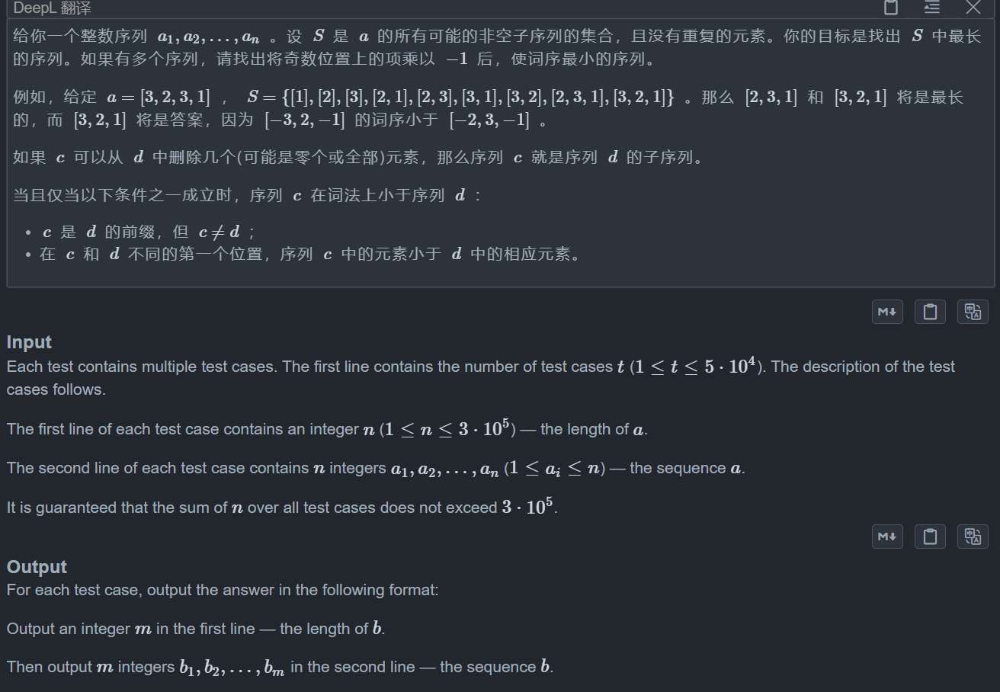

类似于求每个元素恰好出现一次的子序列中字典序最小的序列，对于每个元素在加入栈之前与栈尾作比较，如果栈尾后面还会出现并且大于当前元素那么就弹出栈尾。

本人错误的做法是对于后面会出现的元素储存到另一个栈中，每当往答案栈中添加一个元素时，考虑把前一个栈中的元素按照要求插入答案中。

这里多了一步判断——要求奇数位大而偶数位小

```python
for _ in range(R()):
    n=R()
    nums=RR()
    memo=Counter(nums)
    d=deque()
    vis=set()
    ans=[]
    for x in nums:
        memo[x]-=1
        # 访问过的元素直接跳过
        if x in vis:continue
        # 如果栈尾不如当前元素好那么一直弹出
        while ans and memo[ans[-1]] and ((len(ans)&1==0 and x<ans[-1]) or (len(ans)&1 and x>ans[-1])):
            vis.remove(ans.pop())
        # 不止要看前一个元素还要看倒数第二个元素，比如4 1 4 5 4 5 10 1 5 1，错解为 4 1 10 5，正解为 5 4 10 1
        while len(ans)>=2 and memo[ans[-1]] and memo[ans[-2]] and ((len(ans)&1==0 and x>ans[-2]) or (len(ans)&1 and x<ans[-2])):# 时间复杂度仍是线性的
            vis.remove(ans.pop())
            vis.remove(ans.pop())
        ans.append(x)
        vis.add(x)

    print(len(ans))
    print(*ans)
```


## 小结

栈可以求出下一个更大更小的元素（求解最近），同时可以用于求解最长，求解具有单调性的子序列问题；可以解决匹配配对问题；能用贡献法求出一些问题；


# 单调队列

## 滑动窗口最大值

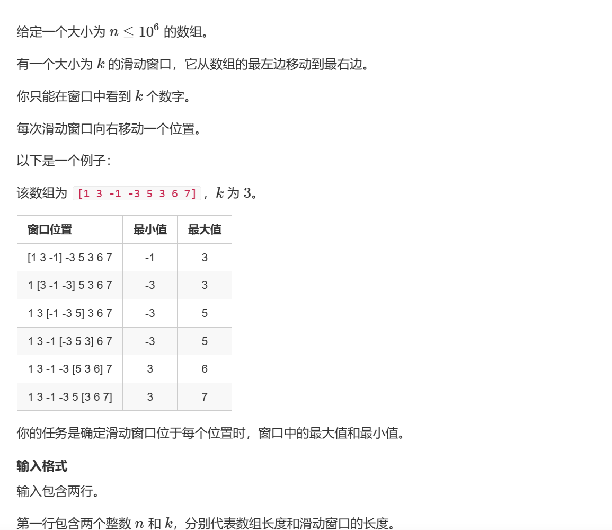

如果暴力去枚举大概是O(n^2)的时间复杂度

窗口内的最大最小值具有单调性，比如最大值，在窗口中加入一个新的值的时候，它前面比它小的数都是没有用的，自然是要弹出的，于是窗口中的值都是保持单调递减的，所维护的第一个值就是最大值。而对于最小值，加入一个值的时候，前面比它大的值是没有用的，自然弹出，于是维护的队列是一个单调递增的，第一个值就是最小的。

总而言之，是使用队列维护窗口

```python
from collections import deque
n,k =[int(x) for x in input().split()]
li=list(map(int,input().split()))

# 进行两次一次找最大一次找最小
mx=[]
d=deque()
for i,val in enumerate(li):
    while d and li[d[-1]]<=val:
        d.pop()
    d.append(i)
    # 当滑窗移动后最大值被排除
    if i-d[0]>=k:
        d.popleft()
    if i-k+1>=0:
        mx.append(d[0])
d=deque()
mn=[]
for i ,val in enumerate(li):
    while d and li[d[-1]]>=val:
        d.pop()
    d.append(i)
    if i-d[0]>=k:
        d.popleft()
    if i+1>=k:
        mn.append(d[0])
print(*[li[x] for x in mn ] , end=' ')
print()
print(*[li[x] for x in mx],end=' ')
```

##  Set To Max 

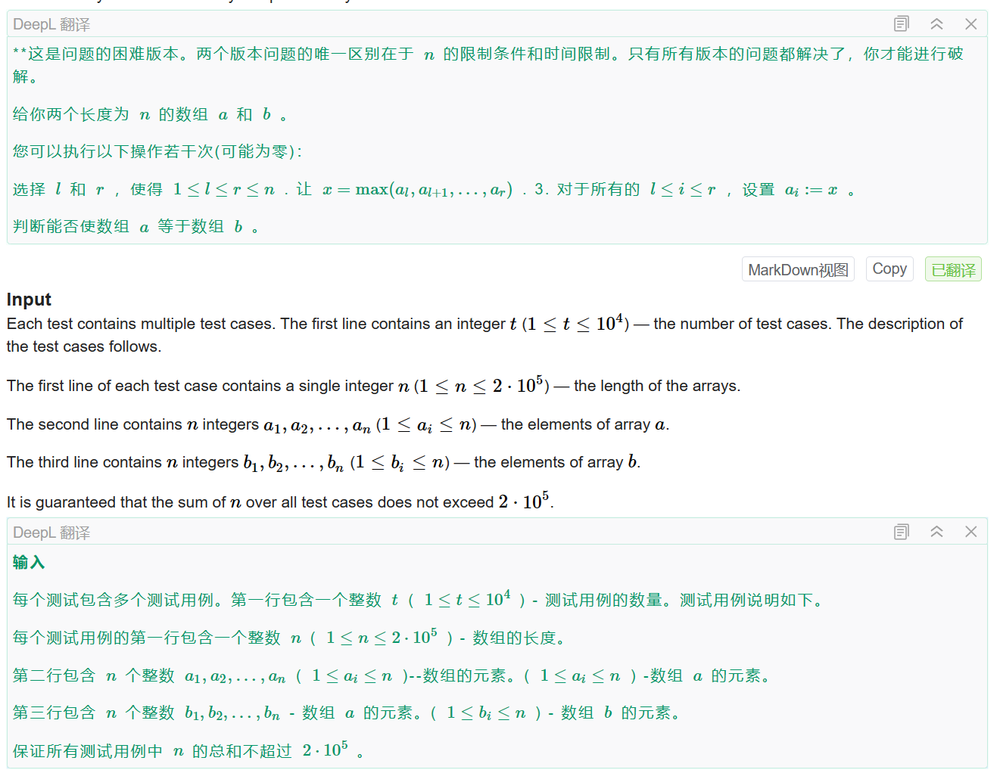


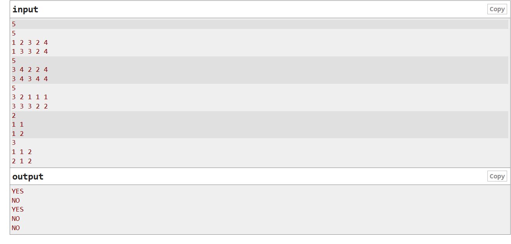


元素只能被变大不能被变小，大的元素可以向外扩散影响小的元素。

两个条件：不会使被影响元素大于对应的bi，在影响该元素的元素中是最大的，才能影响一个元素。

为了找到每个元素可以影响的区间，双向遍历找左右区间。接下来的做法类似于找下一个最小元素。使用双向队列，队列中存储着可以影响当前元素的元素，如果队列为空直接加入，遍历过程中如果当前元素更大，弹出队尾元素直到不在大于，这个过程可以满足队首的元素是在影响该元素的元素中是最大的，如果队首元素超过bi，则弹出队首因为他不能够影响当前元素了

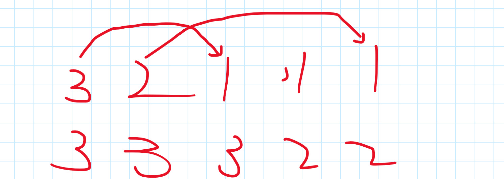

```python
from collections import deque
t=int(input())
while t:
    n=int(input())
    a=[int(x) for x in input().split()]
    b=[int(x) for x in input().split()]
    d=deque()
    # 队列双向遍历
    for i in range(n):
        while d and d[-1]<a[i]:
            d.pop()
        while d and d[0]>b[i]:
            d.popleft()
        d.append(a[i])
        a[i]=d[0]

    for i in range(n-1,-1,-1):
        while d and d[-1]<a[i]:
            d.pop()
        while d and d[0]>b[i]:
            d.popleft()
        d.append(a[i])
        a[i]=d[0
    # 最后判断是否相等	
    for i,j in zip(a,b):
        if i!=j:
            print('NO')
            break
    else:
        print('YES')
    t-=1
```


# 集合论到位运算

集合可以用二进制表示，二进制从高到低第i位为1表示i在集合中，为0表示不再集合中。例如集合 {0,23}{0,2,3} 可以用二进制数1101 表示；反过来，二进制数1101 就对应着集合 {0,2,3}{0,2,3}。

## 异或操作

异或操作是一种二进制的位运算，`运算规则为相同为0不同为1`，一个数`异或自身的结果为0，与0异或得到本身`，异或运算满足`交换律`

比特位上一个位置上存在奇数个相同元素最后异或和的结果为1

一组数异或后只会减小，异或操作优先级比加减要低	


不能拆开

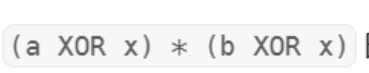

### [只出现一次的数字](https://leetcode.cn/problems/single-number/)

异或操作可以用来排除偶次重复

在一个整数数组中，仅存在一个不重复的数字，其余数字均出现两次（或偶数次），找出不重复数字，`将所有的元素异或`，偶数次的数字会被抵消，最后的结果就是不重复的数字。

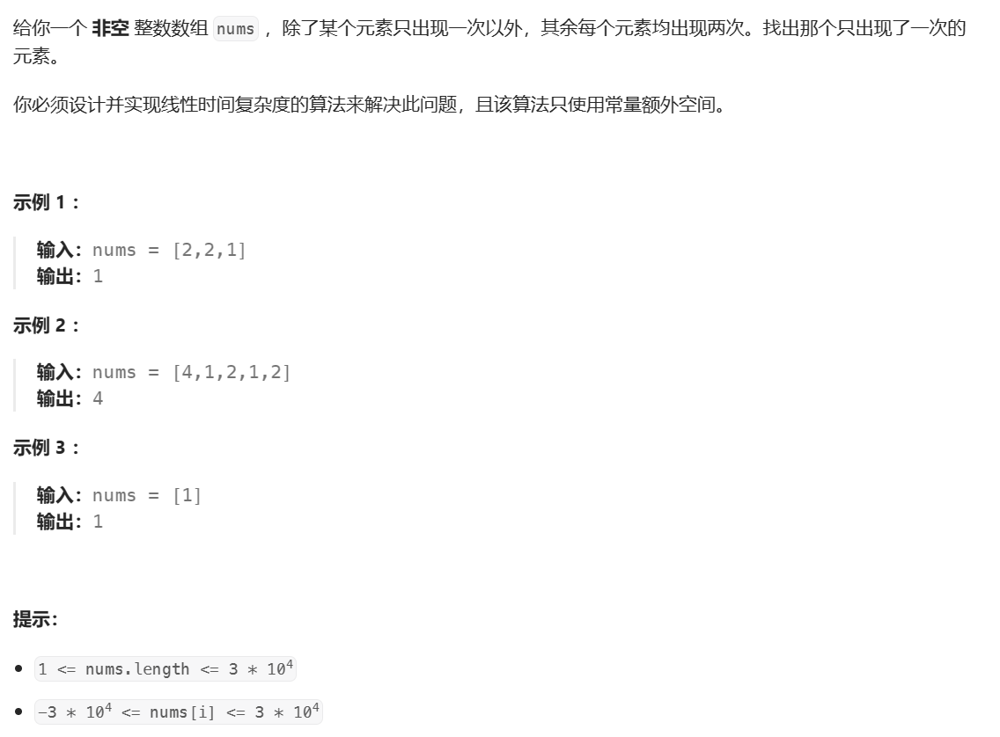

```python
from functools import reduce
from operator import xor
class Solution:
    def singleNumber(self, nums: List[int]) -> int:
        return reduce(xor,nums)
```

### [只出现一次的数字 II](https://leetcode.cn/problems/single-number-ii/)

​	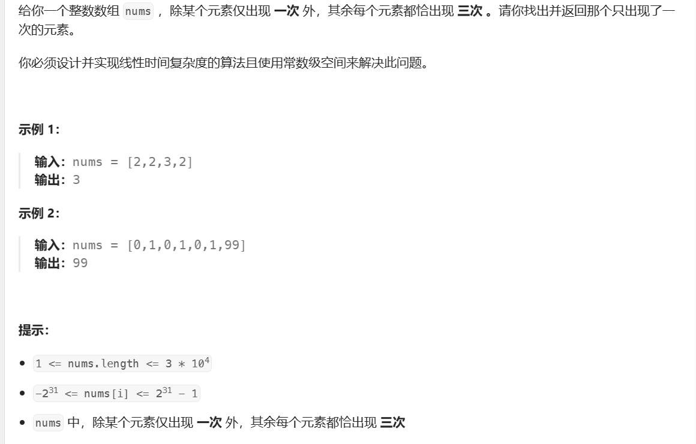

使用位运算来找，如果x的某个比特是0，而由于其他数字都出现了三次，所以这个位置上1的个数是3的整数倍（其他重复三次的数字要么这个位置没有数字，要么就是三个一组的出现），如果x的比特是1，那么这个比特取余3必然为1

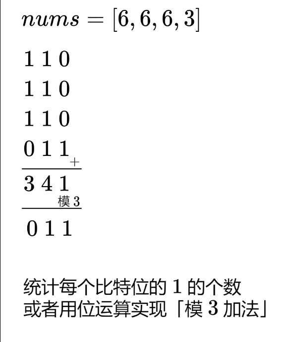

因此统计每个比特位上1的个数，数据范围如下：


python中数据类型比较特殊，其他语言中第31位是符号位运算时不会把这一位算入，python计算中会把31位当作符号位，但操作时它的31位会算入计算中。

因此在判断除第31位是1（即负数时），转化位补码形式可以成功表示出负数。补码的操作方式是res-=1<<31

```python
class Solution:
    def singleNumber(self, nums: List[int]) -> int:
        ans=0
        for i in range(32):
            # 统计这个位置上的1的个数
            cnt=sum((n>>i)&1 for n in nums)
            # 如果取余3为1，表示这个位置上x是存在的，对于符号位如果满足说明结果是负数
            if cnt%3:
                # 如果是符号位，转为补码形式
                if i==31:
                    ans-=1<<i
                 # 在这个位置上加入
                else:
                    ans|=1<<i
        return ans
```

### [只出现一次的数字 III](https://leetcode.cn/problems/single-number-iii/)

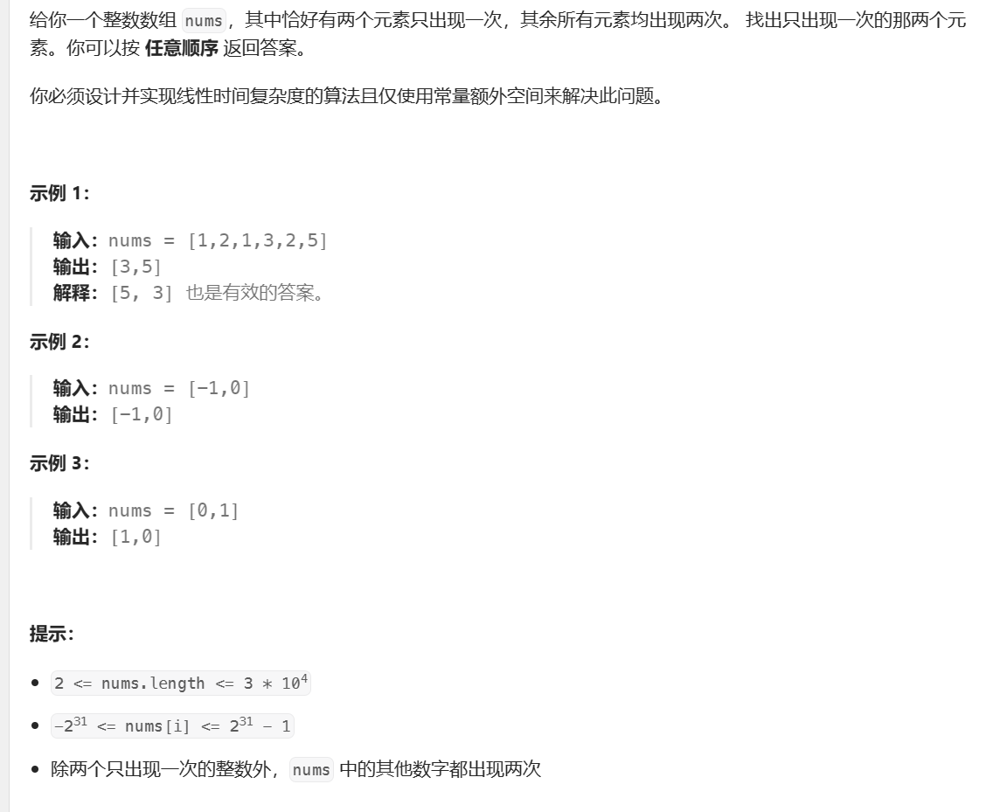


使用异或操作后，其中偶数次的结果抵消，剩下的是两个出现一次的元素的异或，根据这个异或查找里面为1的位置，这个位置代表两个数在这个比特上不同，接下来根据这个位置划分元素，这个位置上都为一的分一组，为0的分一组，由于其他元素都是偶数次重复，因此再做一次异或就都抵消了。


```python
from functools import reduce
from operator import xor
class Solution:
    def singleNumber(self, nums: List[int]) -> List[int]:
        v=reduce(xor,nums)
        # 找到这个位置
        for i in range(31):
            if (v>>i)&1:
                pos=i
                break
        a=b=0
        # 分组异或
        for num in nums:
            if (num>>i)&1:
                a^=num
            else:
                b^=num
        return [a,b] 
```

### [每个查询的最大异或值](https://leetcode.cn/problems/maximum-xor-for-each-query/)

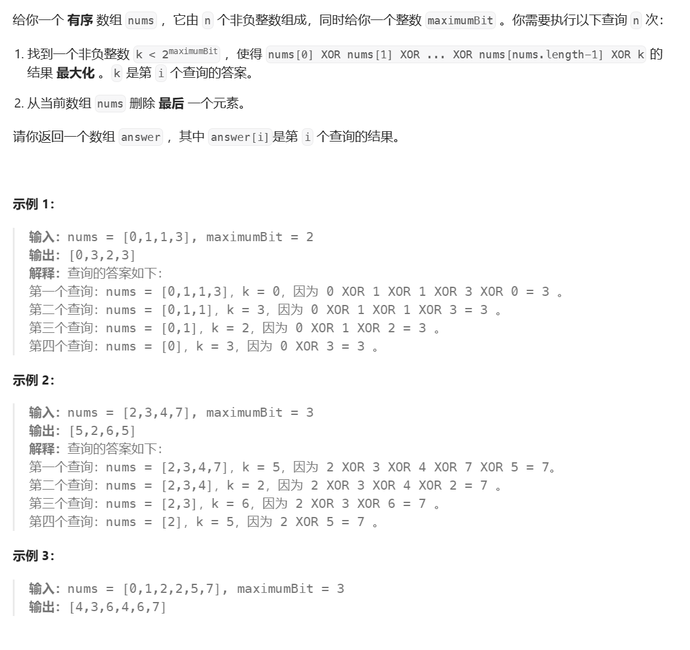

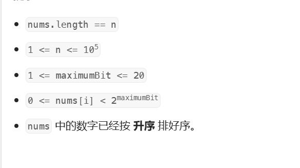

最原始的思想是，K可以控制异或的值，遍历k所能控制的每一个位数，使得该位上异或的结果是1，记录下每一个位数，最后组合就是k的值。效率较慢。

```python
class Solution:
    def getMaximumXor(self, nums, maximumBit: int):
        n=len(nums)
        # 构建前缀异或数组，方便找值，不用删除最后一个元素
        pre=[0]*n
        pre[0]=nums[0]
        ans=[]
        for i in range(1,n):
            pre[i]=pre[i-1]^nums[i]
        # 倒序找每一个值
        for i in range(n-1,-1,-1):
            val=pre[i]
            temp=[]
            # 遍历这个值所能控制的每一个位置
            for j in range(maximumBit-1,-1,-1):
		# 如果这个位置相等了（都是1），则记录0
                if (1<<j)&val:
                    op=0
                else:
                    op=1
                temp.append(str(op))
            # 最后转化为十进制整数
            s="".join(temp)
            ans.append(int(s,2))
        return ans
```


第二种方法：观察数据范围，由于每个值都小于等于$2^{maximumBit}-1$，因此所有的前缀和也都小于这个值，而k可以控制到maximumBit-1位，因此每个前缀的和k异或的最大值就是$2^{maximumBit}-1$

因此由异或的性质可得：

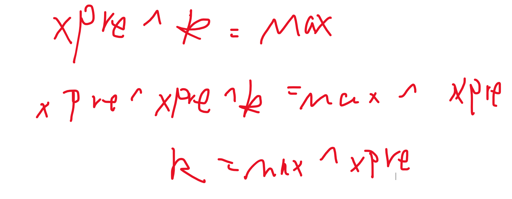

其中xpre就是数组的异或前缀和，由异或的性质每次$xpre_{i}$^nums[i]$就是$xpre_{i-1}$以此来更新异或数组

```python
from functools import reduce
from operator import xor
class Solution:
    def getMaximumXor(self, nums, maximumBit: int):
        n=len(nums)
        # 使用reduce 函数找出所有的值的异或和
        xpre=reduce(xor,nums)
        ans=[]
        for i in range(n-1,-1,-1):
            # 找到当前的k
            k=((1<<maximumBit)-1)^xpre
            # 更新异或前缀数组
            xpre^=nums[i]
            ans.append(k)
        return ans 
```

### [构建回文串检测](https://leetcode.cn/problems/can-make-palindrome-from-substring/)

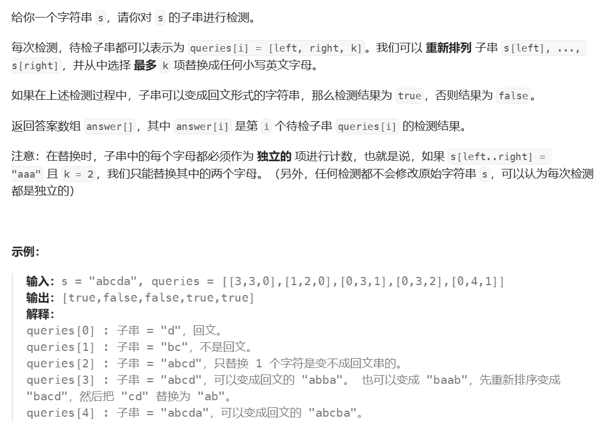

由于子数组可以重新排列因此只需要构建前缀计数数组，对于区间内出现偶数次的可以全部构成回文串的，而奇数个会留下一个无法构成回文串的字符，统计所有的出现为奇数次的字符的个数

比如说有4个出现为奇数次的k的大小别绪大于等于它的一半。

```python
class Solution:
    def canMakePaliQueries(self, s: str, queries: List[List[int]]) -> List[bool]:
        # 通过26个字符构建前缀计数数组
        pre=[[0]*26]
        ans=[]
        for c in s:
            temp=pre[-1][:]
            temp[ord(c)-ord('a')]+=1
            pre.append(temp)
        for l,r,k_ in queries:
            # 区间长度为奇数时可用忽略一个奇数
            cnt=-((r-l+1)%2)
            # 累加奇数个
            for sl,sr in zip(pre[l],pre[r+1]):
                cnt+=(sr-sl)%2
            ans.append(k_>=cnt//2)
        return ans   
```

​	

这里只关心每个字符出现次数的奇偶性因此可以只用一个数的位运算来构建前缀数组（0表示偶数1表示奇数，如果当前来了一个字符那么通过异或操作可用技术变偶数偶数变奇数），在判断区间内是否为奇数(奇数与偶数操作为奇数，其他的都为偶数)通过异或运算可以实现。

```python
class Solution:
    def canMakePaliQueries(self, s: str, queries: List[List[int]]) -> List[bool]:
        pre=[0]
        ans=[]
        for c in s:
            bit=1<<(ord(c)-ord('a'))
            # 奇数变偶数，偶数变奇数
            pre.append(pre[-1]^bit)
        for l,r,k_ in queries:
            cnt=-((r-l+1)%2)
            sl,sr=pre[l],pre[r+1]
            # 通过异或运算实现奇数与偶数相减为奇数，其他为偶数
            cnt+=(sl^sr).bit_count()
            ans.append(k_>=cnt//2)
        return ans   
```


## 集合与集合

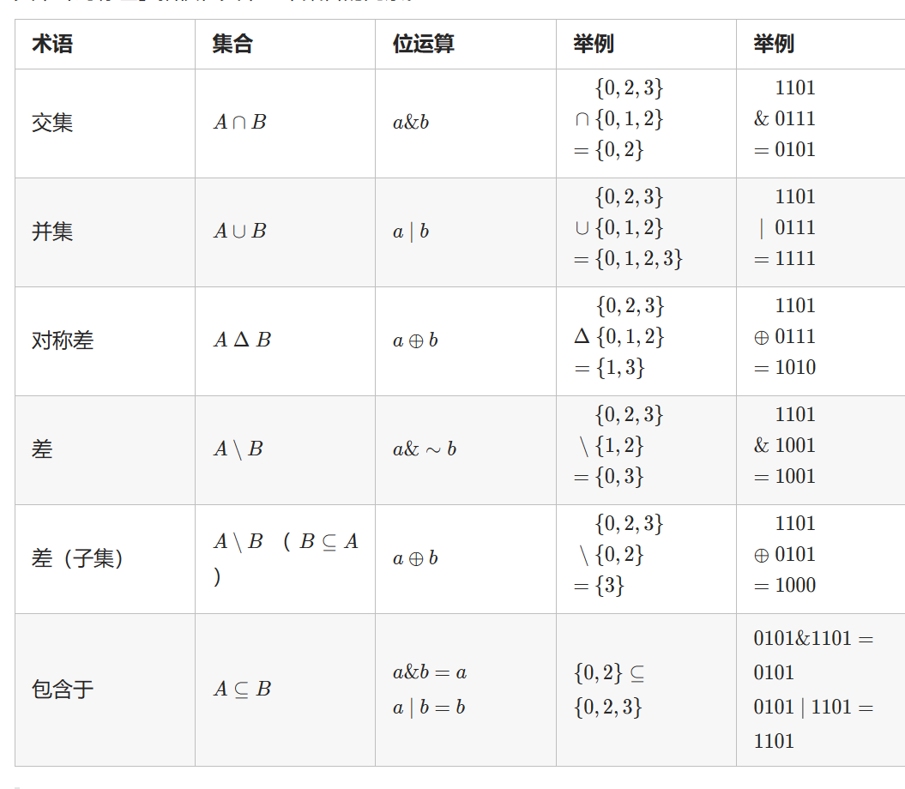


## 集合与元素

通常会用到移位运算，其中 << 表示左移，>> 表示右移，左移i位相当于乘上$2^i$，右移i位相当于除上$2^i$​，`注意左移右移运算符的优先级低于+-`。

i>>n<<n可以取出n位之上的

二进制取反就是找补集的操作：异或上((1<<n)-1)，n表示二进制长度，如果不想把最高位取反那么把n减去1即可。

lowbit就是二进制下最低位1与其右边的0构成数字大小，可以通过i&-1求出

k<$2^{n}$表示k可以操作n位


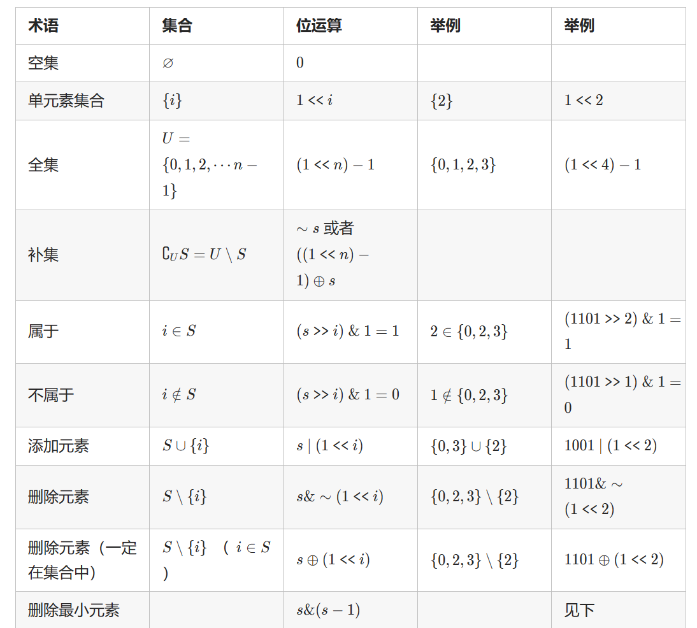


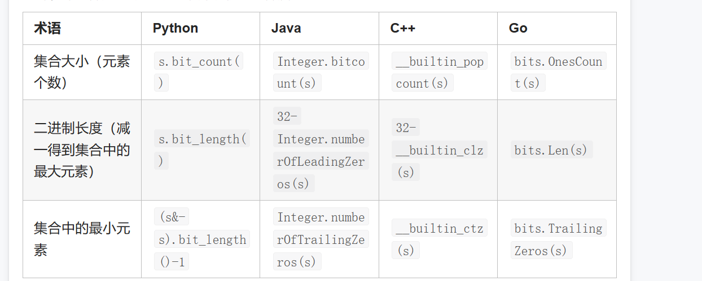

## 遍历集合

```python
for i in range(n):
    if (s >> i) & 1:  # i 在 s 中
        # 处理 i 的逻辑
```

​	

## 枚举子集

```python
p = s=19
while p:
    # 更新p
    p= (p - 1) & s
```

按照二进制的减法规律会把最低位的1变为0，同时把1右边的0变为1，如果直接写sub = (sub - 1)的话中途会遇到许多不是s子集的情况，而为了快速找到下一个子集，即从10101到10100再到10001，同样减一但是最低位1的右边只保留原来集合中对应位置右边的1，而不是全变为1。

上述是不包括空集的写法

包括空集

```python
p=m
while True:
    ans+=memo[p]
    p=(p-1)&m
    if p==m:break
```


## [连接连续二进制数字](https://leetcode.cn/problems/concatenation-of-consecutive-binary-numbers/)

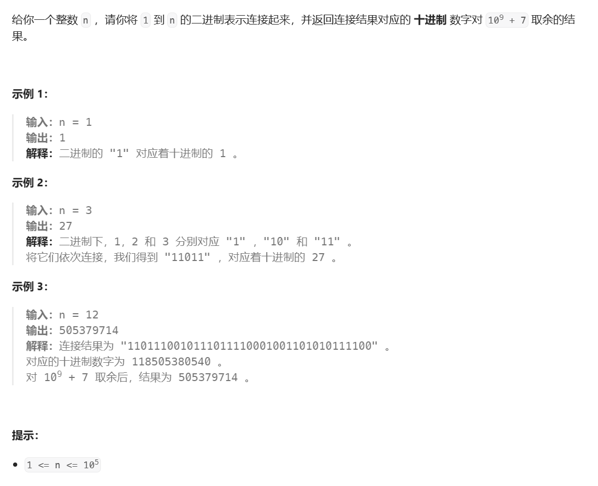

​	

每次在累加i之前，先把结果左移i的二进制位，然后或上i即可。

```python
class Solution:
    def concatenatedBinary(self, n: int) -> int:
        m=10**9+7
        ans=0
        for i in range(1,n+1):
            ans=((ans<<i.bit_length())|i)%m
        return ans
```


## [最大异或乘积](https://leetcode.cn/problems/maximum-xor-product/)

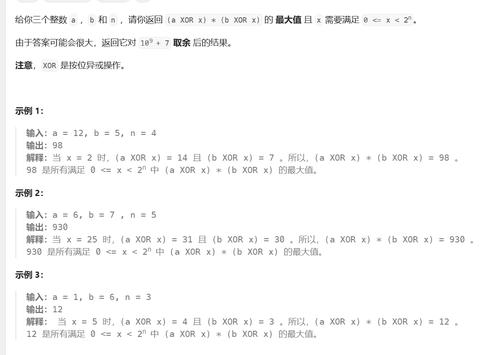

 以O(1)的时间复杂度操作

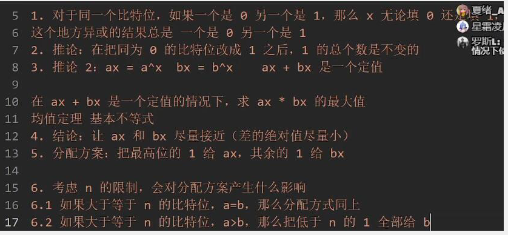

```python
class Solution:
    def maximumXorProduct(self, a: int, b: int, n: int) -> int:
        # 为了方便总是把a设置为较大的值
        if a<b:
            a,b=b,a
        # 用来分割无法被x影响的比特位，1<<3(1000)-1=111
        mask=(1<<n)-1
        # &~ 是求两个集合差的方法，取出无法被x影响的比特位，可以直接作为结果
        ax=a&~mask
        bx=b&~mask
        # &操作正好可以取出会被影响的比特位
        a&=mask
        b&=mask
        # 找出其中可以操作的，即比特位不同的，比特位相同的可以认为就是1
        left=a^b
        # 把无需操作的比特位变为1，加入到结果中
        one=left^mask
        # |=操作，将元素加入到集合中，将上述变为1的比特位直接加入到结果中
        ax|=one
        bx|=one
        # 注意判断left是否为0，如果为0就是没有可以被操作的值。如果无法被影响的部分相同，为保证ax=bx，把其中之一的最高位1给另一个。这里的ax,bx是只有大于等于n的位数
        if left>0 and  ax==bx:
            # 用于取出可操作的最高位，如果left是0将会是一个负数，不合法
            high_bit=1<<(left.bit_length()-1)
            # 把这个最高位给ax
            ax|=high_bit
            # 从可操作的比特位中删除这个位置
            left^=high_bit
        # 剩下的给bx，正好也满足了ax>bx的条件，由于axbx初始只包括大于等于n的位数，所以正好
        bx|=left
        MOD=(10**9)+7
        return ax*bx%MOD
```

以O(n)的时间复杂度操作，遍历每一个位，对于ab异或操作之后想要取得最大值，对于比特位相同的部分自然是取1，不同，无论x取什么值都会出现1和0，怎么分配这个1是关键，由于已知分配完了之后1的数目是固定的，ax+bx位定制，要求ax*bx最大，就要求ax接近bx，因此每次把这个1分配给二者中较小的。

```python
class Solution:
    def maximumXorProduct(self, a: int, b: int, n: int) -> int:
        if a<b:
            a,b=b,a
        mask=(1<<n)-1
        # 取出大于等于n的位数，也可以用a>>n<<n，操作后低于n的位数是0
        ax=a&~mask
        bx=b&~mask
        # 对于剩下的一个个遍历
        for i in range(n-1,-1,-1):
            # >>&1的操作是判断第i位是否为1，下一步判断的是两个比特位上是否相等
            if a>>i&1 ==b>>i &1:
                ax|=1<<i
                bx|=1<<i
            else:
                # 如果无法处理的高位中ax更大，把1分配给bx相应的位置
                if ax>bx:
                    bx|=1<<i
                else:
                    ax|=1<<i
        mod = 10 ** 9 + 7
        return ax*bx%mod
```


## [ 二叉树寻路](https://leetcode.cn/problems/path-in-zigzag-labelled-binary-tree/)

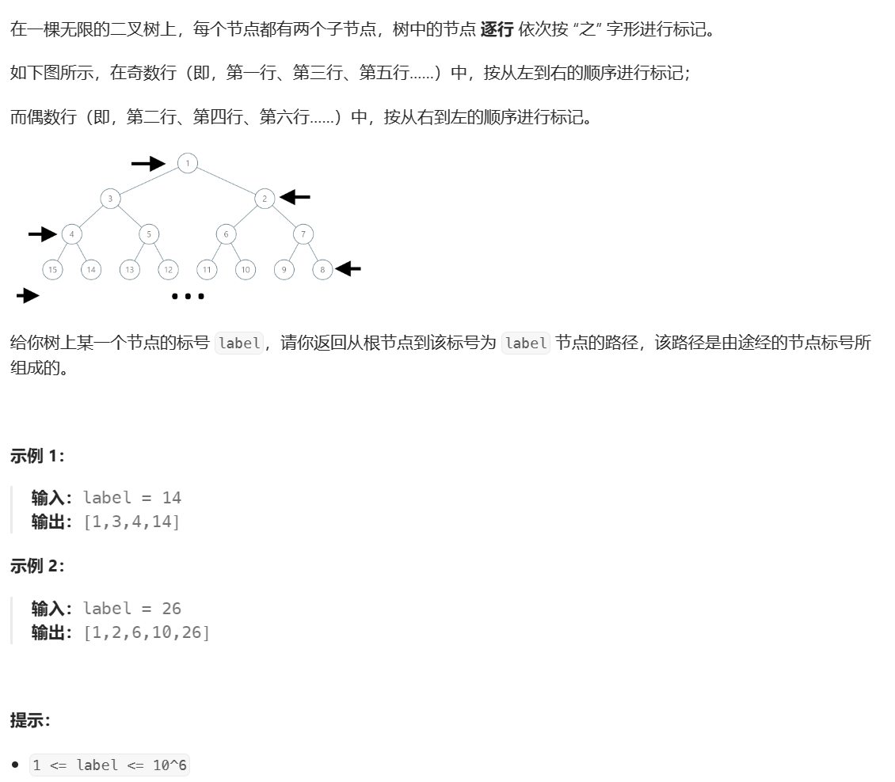

在二进制的表示中为：

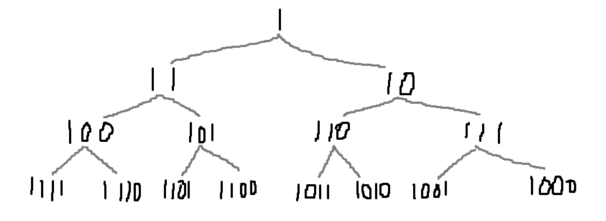

从一个值往上推，通过观察可以得出这个值的根节点就是当前值去掉最低位后，`除了最高位都取反的结果`。

对一个数的二进制取反操作（技巧点）：将这个数与全是1的异或，将1左移n次会得到一个位数比操作数多出一位的10000..，此时减去1结果就是原操作数位数一致的1111...

```python
a=1988
print(bin(a))# 0b11111000100
n=a.bit_length()
print(bin((1<<n)-1^a))# 0b00000111011

# 如果想对除了最高位以外的数取反，将n-1即可，注意加减的优先级高于位运算
print(bin((1<<(n-1))-1^a))# 0b10000111011
```


```python
class Solution:
    def pathInZigZagTree(self, label: int) -> List[int]:
        ans=[label]
        while label!=1:
            n=label.bit_length()
            label=((1<<n-1)-1^label)>>1
            ans.append(label)
        return list(reversed(ans))
```


## [ 查询数组异或美丽值](https://leetcode.cn/problems/find-xor-beauty-of-array/)

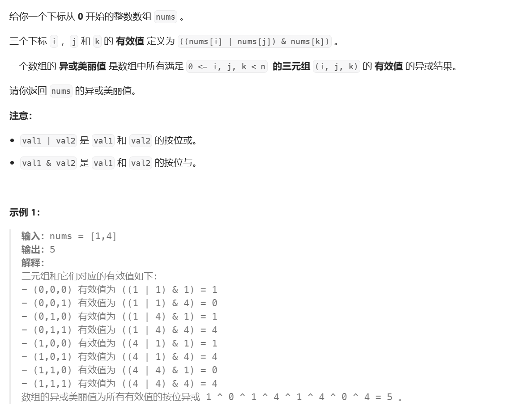

三种情况：

+ i!=j：一定会存在(i,j,k),(j,i,k)，这两种情况算出的有效值是相同的，两个相同的值异或的结果是0，0不会影响最终的结果，可以忽略。
+ i==j!=k：一定会存在(i,i,k),(k,k,i)，不会出现(j,j,k)重复了，求出的结果同样是0，不会影响到最终的结果，忽略
+ i==j ==k：每个有效值是nums[i]，最终转化为数组中每个值异或的结果。

```python
class Solution:
    def xorBeauty(self, nums: List[int]) -> int:
        return reduce(xor,nums)
```

## [安排电影院座位](https://leetcode.cn/problems/cinema-seat-allocation/)

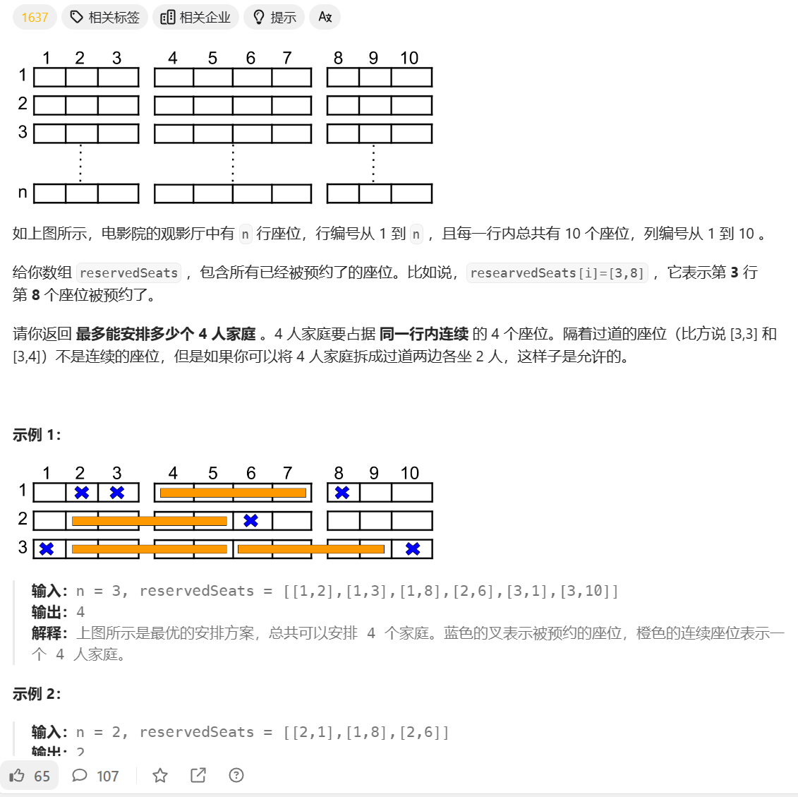


通过观察可以得到，两边的1和10是否标记不会影响最后的结果，因此不考虑。

合理的位置只有2 3 4 5,4 5 6 7,6 7 8 9或者是2 3 4 5 6 7 8 9，对于给定的数组使用哈希表标记每一行的情况，用二进制数表示是否被占位置（用1表示有人），如果一行没有被标记说明可以安排两个家庭，否则最多只能安排一个。想要快速判断一个左边四个位置是否被标记，用判断二进制数和0b00001111按位或是否等于0b00001111即可（技巧点）。

```python
class Solution:
    def maxNumberOfFamilies(self, n: int, re: List[List[int]]) -> int:
        memo=defaultdict(int)
        left=0b11110000
        right=0b00001111
        mid=0b11000011
        ans=0
        for r in re:
            if 1<r[1]<10:
                memo[r[0]]|=(1<<(r[1]-2))
        ans+=(n-len(memo))*2
        for k,v in memo.items():
            if v|left==left or v|right==right or v|mid==mid:
                ans+=1
        return ans 
```

## [得到目标数组的最少函数调用次数](https://leetcode.cn/problems/minimum-numbers-of-function-calls-to-make-target-array/)

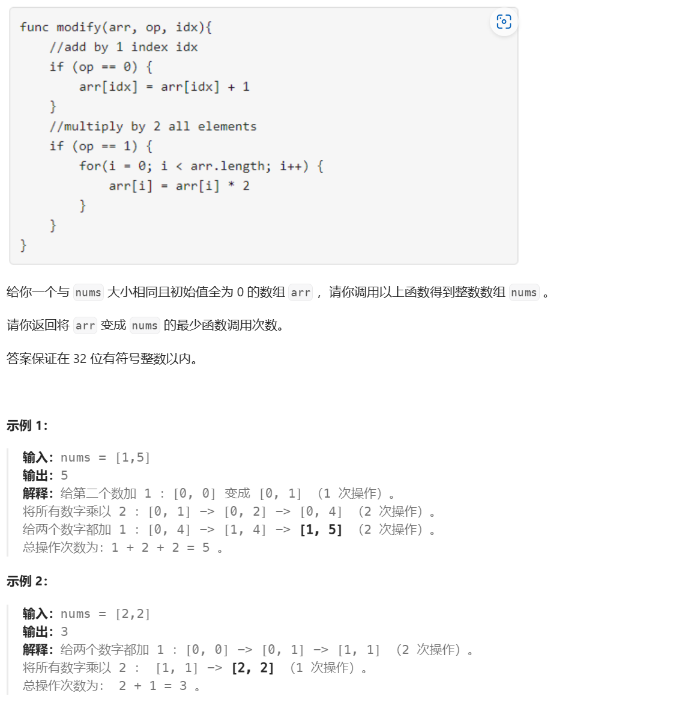


每个数只能加一或者乘上2，`联想到二进制`，加一是在末尾加上一，乘2是整体左移一位也就是右边加上一个0。`数组从0开始到达目标数组过程中1只能是手动添加`，而0可以是在一个乘2的过程中添加上的，因此统计每个数中的1，这就是加一的次数，`而乘2的最多次数于数组中最大的数字的二进制长度有关`。

```python
class Solution:
    def minOperations(self, nums: List[int]) -> int:
        val=max(nums)
        ans=0
        if val==0:
            return 0
        for v in nums:
            s=bin(v)
            ans+=s.count('1')
        return ans+val.bit_length()-1
```


## [按位与结果大于零的最长组合](https://leetcode.cn/problems/largest-combination-with-bitwise-and-greater-than-zero/)

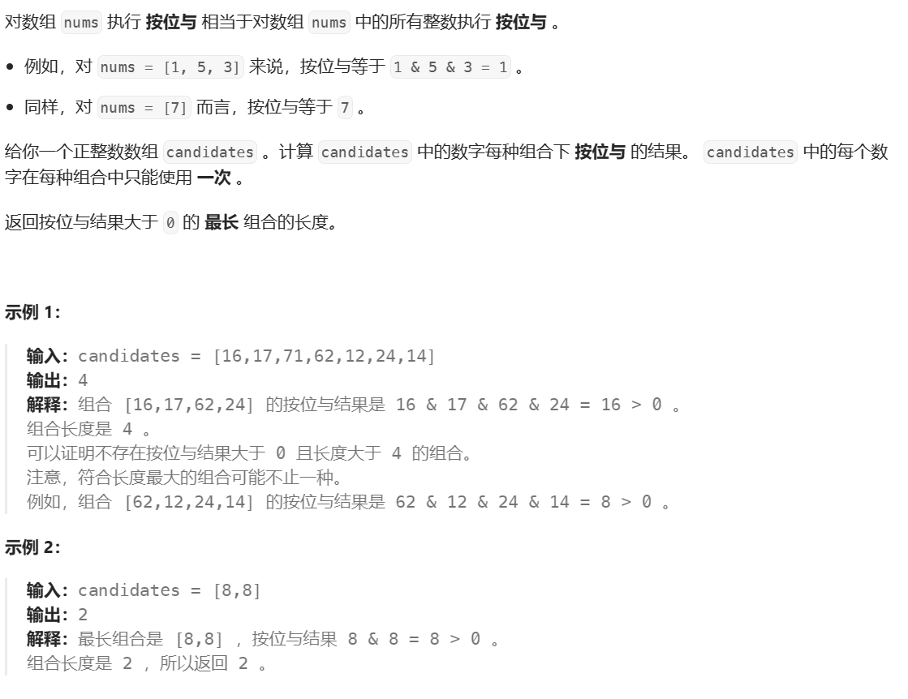

​	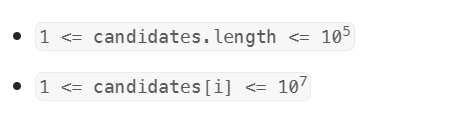

如果想要结果不为0，那么就需要结果二进制位中存在一个1，而与运算会减少1的个数，`只有每个运算的数字在一个位置上都是1才能得到1`。`因此暴力枚举，枚举在每一位上有多少个1，如果有两个1那么最多只有两个数相与才能保证结果不为0`，找出在每个位置上1最多的个数。

```python
class Solution:
    def largestCombination(self, candidates: List[int]) -> int:
        return max(sum(x>>i&1 for x in candidates) for i in range(24))
```


## [价值和小于等于 K 的最大数字](https://leetcode.cn/problems/maximum-number-that-sum-of-the-prices-is-less-than-or-equal-to-k/)


统计1~num有多少1(技巧点)，假设x=1，首先判断一下最低位是否为1，最低位为1的个数就是1 ~num中奇数的个数，通过(num+1)//2可以得到。次低位1的个数，将num右移一位，然后数奇数的个数，除了最后一个数，每个奇数位贡献的1的个数为2^i，i表示左移了几次。比如对于6：
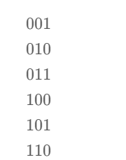

左移一位后只有00 01 10 11，考虑奇数只有01和11，而01会出现两次，但11只会出现一次，如果左移两位，那么只会有0和1，按理来说1出现的次数应该是4次，但1是结果中最后一个数，需要特判。

这里最后一个数是奇数情况下，出现的次数可以通过`(num&(2^i−1))+1`求解，i为左移的次数。

```python
def count(num: int) -> int:
    res = 0
    # i表示移动的次数
    i = 0
    # 不能改变num，特判会用到
    n = num
    while n:
        # 数奇数的个数，这里没有考虑n，而是考虑到n-1。每个奇数贡献的个数要乘上2**i
        res += (n // 2) << i
        # 如果n是奇数，特判他能贡献的个数，不是的话不用考虑
        if n % 2:
            mask = (1 << i) - 1
            res += (num & mask) + 1
        # 更新i和n
        i += 1
        n >>= 1
            return res
```


```python
class Solution:
    def findMaximumNumber(self, k: int, x: int) -> int:
        def count(num):
            # x不为1的话，初始先把x对应的位置变为最低位
            i=x-1
            n=num>>i
            res=0
            while n:
                res+=(n//2)<<i
                if n&1:
                    mask=(1<<i)-1
                    res+=(mask&num)+1
                # 每次移动x
                i+=x
                n>>=x
            return res

        l,r=0,10**15
        while l<=r:
            mid=(l+r)//2
            val=count(mid)
            if val<k:
                l=mid+1
            elif val>k:
                r=mid-1
            else:
                l=mid+1
        return r
```

## [最长优雅子数组](https://leetcode.cn/problems/longest-nice-subarray/)

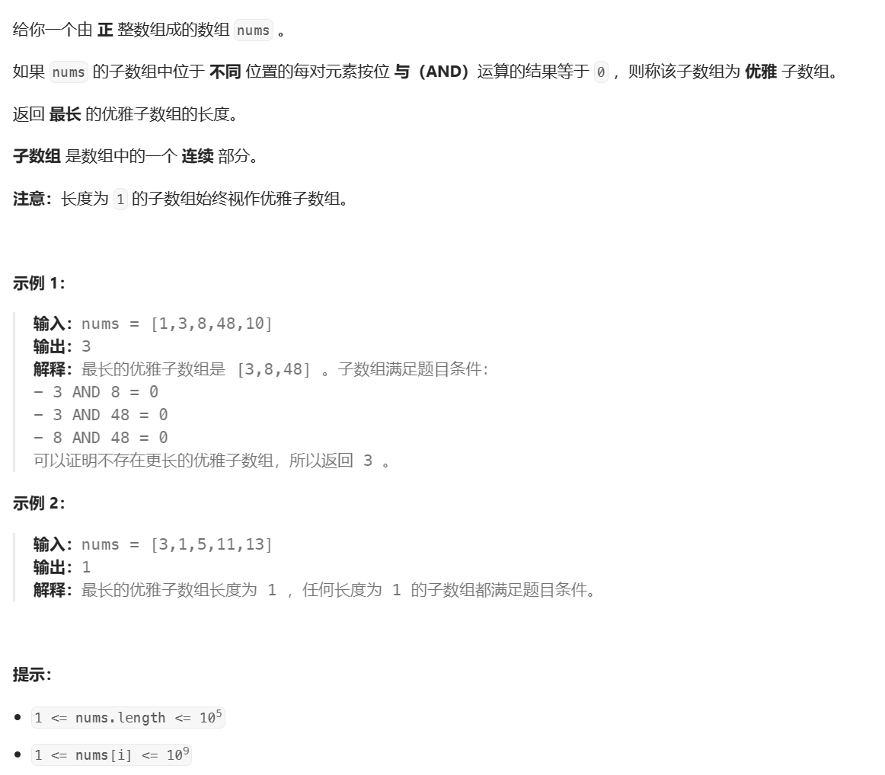


集合两两元素按位与结果为0表示集合中所有的元素不存在交集，这里使用滑动窗口求解，使用一个外部变量极了有那些值记录了


```python
class Solution:
    def longestNiceSubarray(self, nums: List[int]) -> int:
        l=0
        r=1
        n=len(nums)
        ans=1
        # 初始为第一个值
        s=nums[0]
        while r<n:
            # 如果和下一个值有交集 应该收缩左边界因为当前的左边界不能再往后扩展了
            while s&nums[r] and l<=r:
                # 减去左边界的值
                s^=nums[l]
                l+=1
            # 加入这个值
            s|=nums[r]
            ans=max(ans,r-l+1)
            r+=1
        return ans 
```

## [所有数对按位与结果的异或和](https://leetcode.cn/problems/find-xor-sum-of-all-pairs-bitwise-and/)

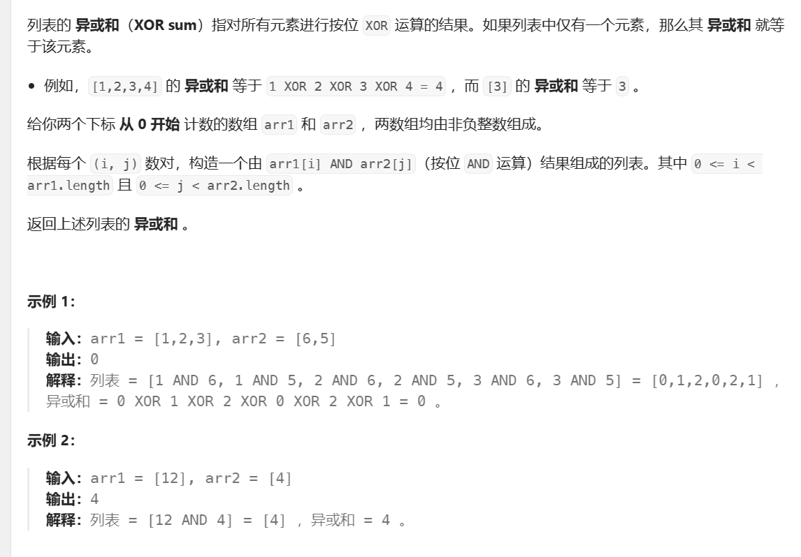

根据性质**(a&b)^(a&c)= a&(b^c)**，那么对于两个数组[a,b],[c,d]有(a&c) ^ (a&d) ^ (b&c) ^ (b&d)=(a& (c^d)) ^ (b&(c^d))= (c^d) ^ (a^b) 

所以结果等于两个数组的异或和相与


## [数组最后一个元素的最小值](https://leetcode.cn/problems/minimum-array-end/)

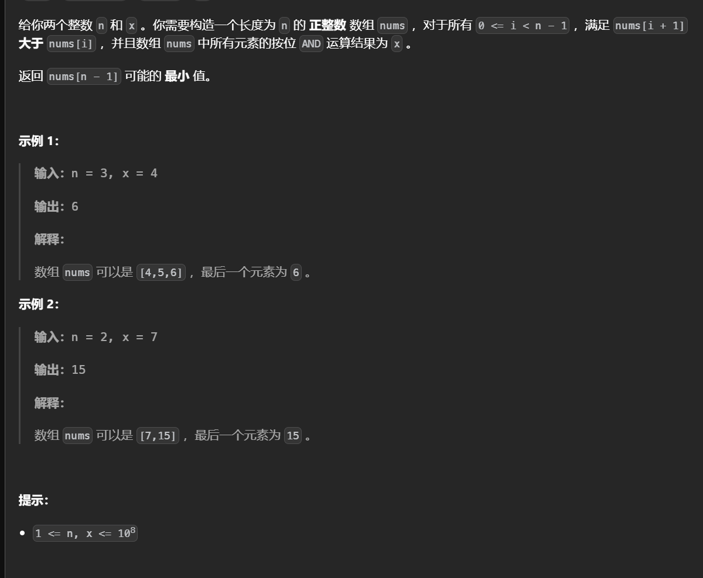

很明显要想最后&的结果是x那么数组的第一个值必然大于等于x，为了数组最后的结果最小第一个只能等于x，而后的每一个值在x对应为1的位置也只能是1，能修改的只有为0的位置最终要求有N个值，就相当：

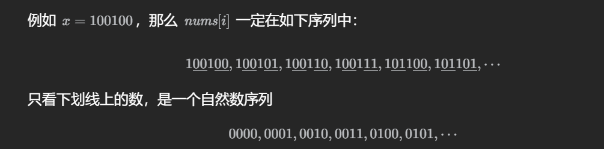

一共要n个数，直接找0到n-1。

## [解码异或后的排列](https://leetcode.cn/problems/decode-xored-permutation/)

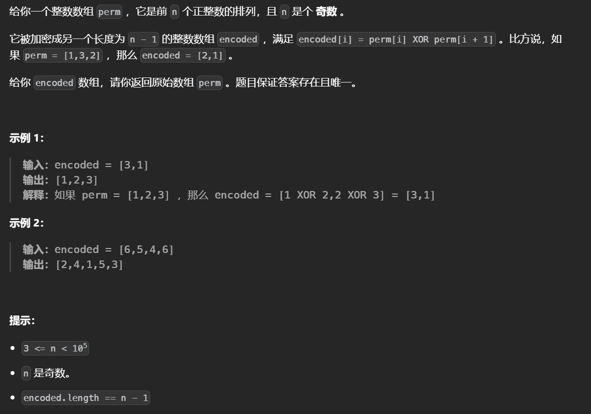

只要知道一个数值就能求出所有的，借助n是奇数的性质，对于给定的数组只要隔一位异或就能得到除了nums[-1]的外的数组的全排序，同时因为数组是n的全排列因此可以求出数组中最后一个值得大小。

```python
class Solution:
    def decode(self, encoded: List[int]) -> List[int]:
        pre=0
        n=len(encoded)
        for i in range(0,n,2):
            pre^=encoded[i]
        tt=reduce(xor,list(range(1,n+2)))
        last=tt^pre
        ans=[last]
        for v in encoded[::-1]:
            ans.append(ans[-1]^v)
        return ans [::-1]
```

## [按位与为零的三元组](https://leetcode.cn/problems/triples-with-bitwise-and-equal-to-zero/)

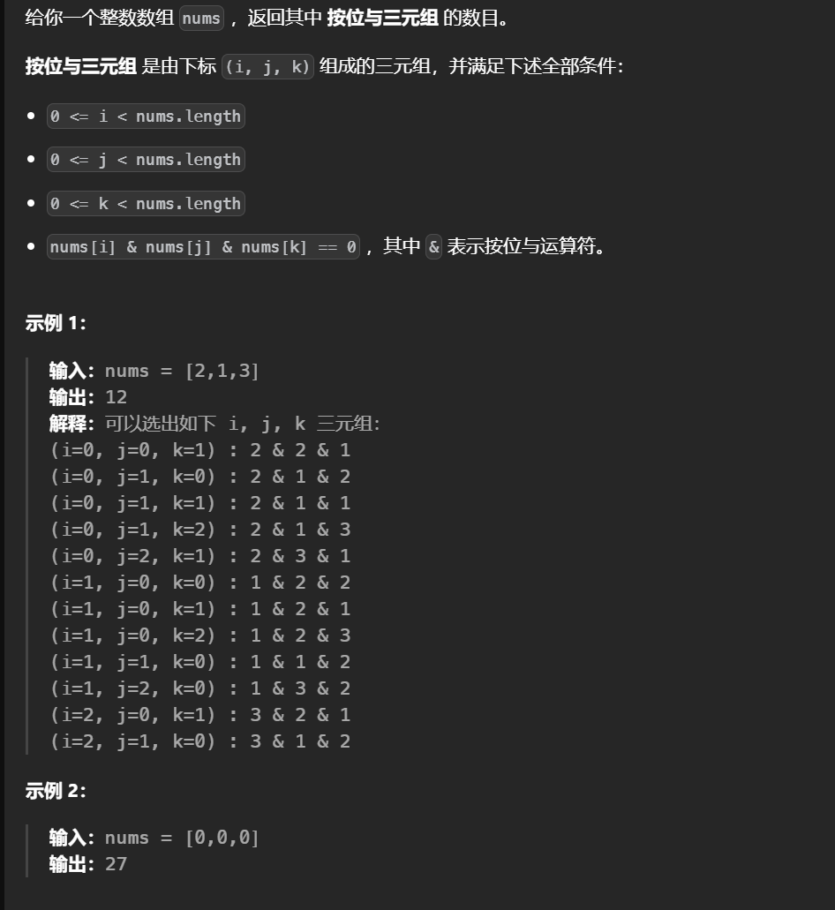

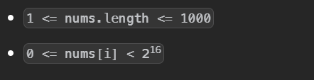

对于给定的数据范围可以先预处理出任意两个按位与的大小，然后去枚举第三个数，按位与结果为0说明其中一个是另一个的补集的子集，那么对当前的数找累加他补集的子集

```python
class Solution:
    def countTriplets(self, nums: List[int]) -> int:
        memo=Counter()
        # 记录个数
        for x in nums:
            for y in nums:
                memo[x&y]+=1
        ans=0
        # 枚举第三个数
        for m in nums:
            # 补集
            m^=((1<<16)-1)
            # 这里要包括
            p=m
            while True:
                ans+=memo[p]
                p=(p-1)&m
                if p==m:break
        return ans 
```

## Xor Sigma Problem

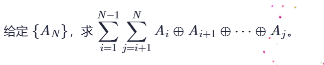

数据范围不允许暴力

先考虑简单的版本，求序列中两两异或的总和，同样不允许暴力做但是把二进制拆开发现

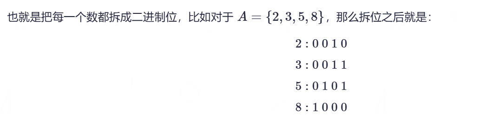


每一位的贡献就是这一位上能组成多少个1(因为是两两组合)，假如说由两个0和三个1那么这个位置能异或出6个1，对结果的贡献就是(2^i)*6

那么对于该题求解一个区间那么用到前缀异或S，[l,r]内的异或结果是$S_{r} \bigoplus S_i-1$，有式子：


最后减去所有元素的和是因为前面的式子中多加了Ai

对于

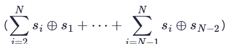


实际上就是序列中两两异或的结果

```python
n=R()
nums=RR()
pre=[0]

for v in nums:pre.append(pre[-1]^v)
s1=sum(nums)
s2=sum(pre)

m=max(v.bit_length() for v in pre)
memo=Counter()
for v in pre[1:]:
    for j in range(m):
        if v>>j&1:memo[j]+=1
ans=0
for k,v in memo.items():
    cnt1,cnt0=v,n-v
    ans+=pow(2,k)*(cnt0*cnt1)
ans+=s2-s1
print(ans)
```


## 倍增

### Teleporter

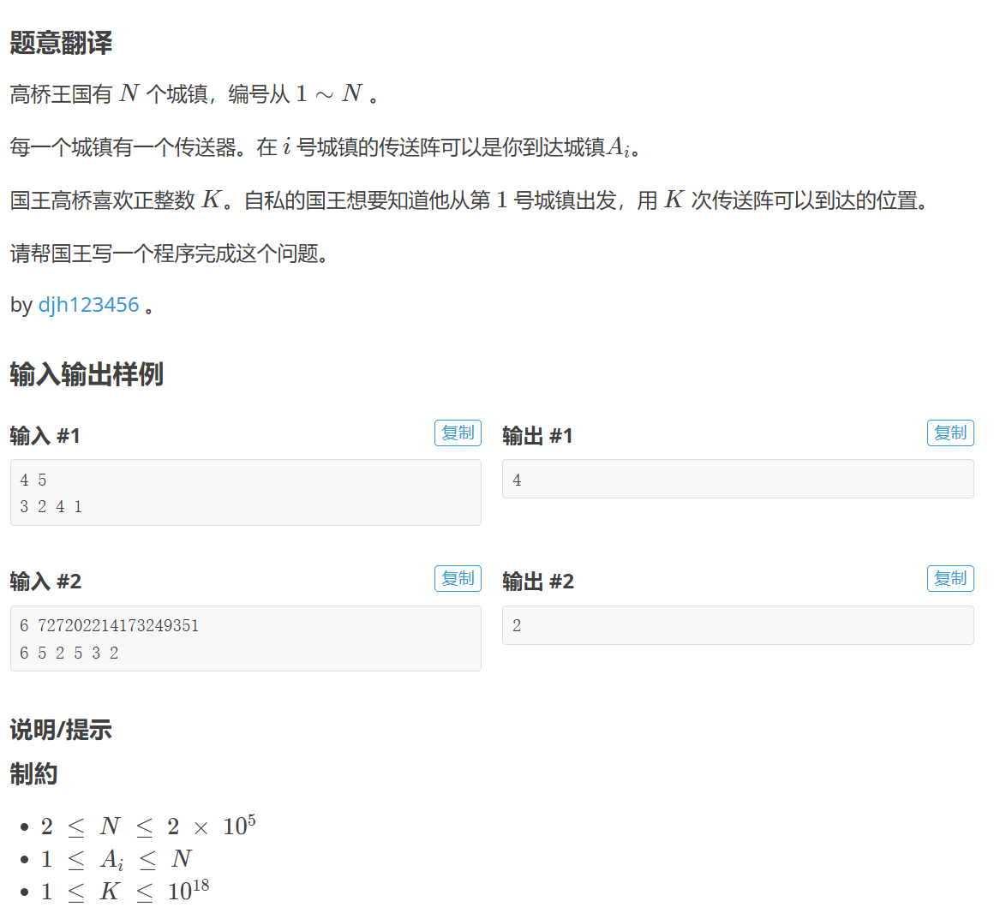

给定的K非常大，唯一的做法是nlogk，定义fi,j表示第i个位置经过2\^j后所在的位置，这个结果可以由f[f[i]\[j-1]]\[j-1]求出即i位置经过了2\^(j-1)步后再走2^(j-1)步求出。这样选定的状态j最多只有65。而题目所求的第一个位置在k步后所在的位置可以拆位递推求解。

```python
n,k=RR()
nums=RR()
K=66

f=[[0]*K for _ in range(n)]
# 初始化
for i in range(n):
    f[i][0]=nums[i]-1

# 递推过程
for j in range(1,K):
    for i in range(n):
        f[i][j]=f[f[i][j-1]][j-1]

ans=j=0
# 对于k=11也就是1011拆分为8+2+1，模拟这个递推过程
while k:
    if k&1:ans=f[ans][j]
    j+=1
    k>>=1

print(ans+1)

```


### Permute K times

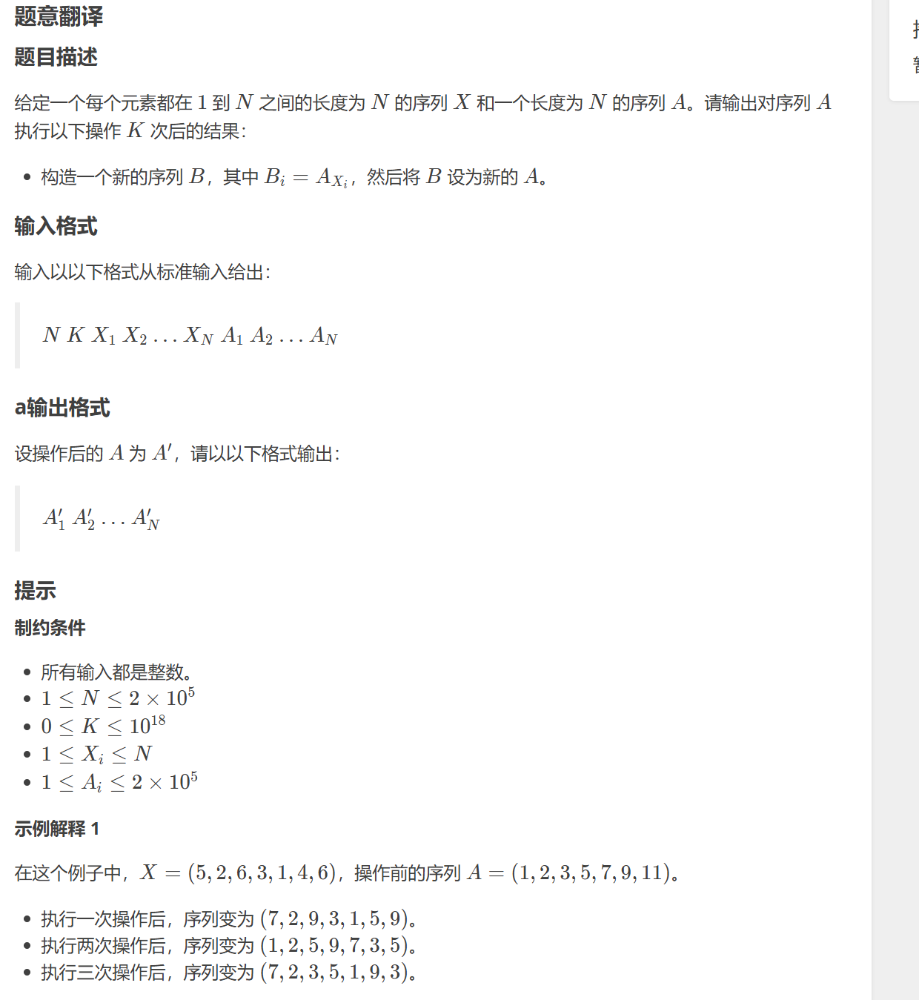

倍增的做法，这里先考虑x数组因为实际上是x数组在做位置变化。

```python
n,k=RR()
b=RR()
a=RR()

K=66

f=[[0]*K for _ in range(n)]
# 初始化，每个位置经过一次变化就是x数组
for i in range(n):
    f[i][0]=b[i]-1

for j in range(1,K):
    for i in range(n):
        f[i][j]=f[f[i][j-1]][j-1]

ans=j=0
# res[i]表示第i个位置变化后的位置，初始时是自己
res=list(range(n))
# 模拟递推过程，将11次拆分为8+2+1，先变换一次然后在一次的基础上变换2次...
while k:
    if k&1:
        for i in range(n):res[i]=f[res[i]][j]
    j+=1
    k>>=1
# 最终答案	
ans=[a[index] for index in res]
print(*ans)
```


## 试填法

位运算经典算法，本质上是对每一位去构造答案


### [给定操作次数内使剩余元素的或值最小](https://leetcode.cn/problems/minimize-or-of-remaining-elements-using-operations/)

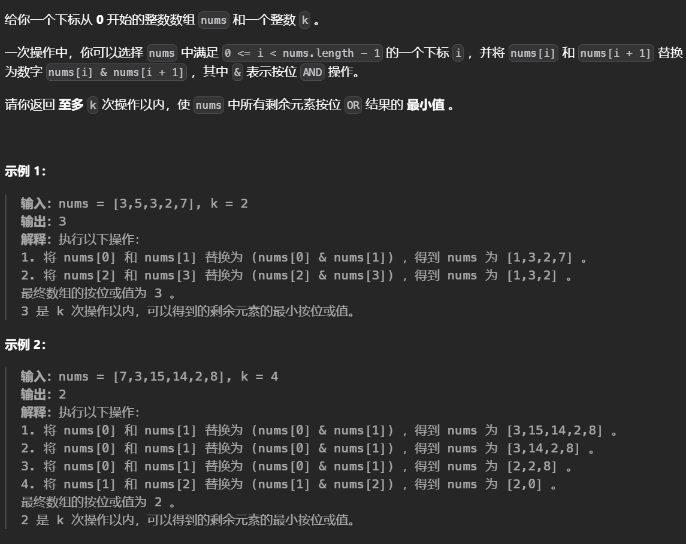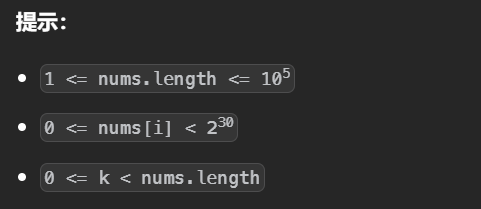


要求最后或出的结果最小，那么所有数字最高位的1都应该尝试消除掉，通过试填法来构造答案，从高位到低位枚举

按照题目要求两两相与，如果一段数字能与出0，那么操作次数就是这段数字长度-1，否则就需要从外部引入一个0，操作次数就是这段数字的长度。如果把这一位上变为0需要的次数大于k，就说明无论如何都无法将这一位变为0，遂不考虑这位，否则在找更低位的时候需要考虑保持这一位为0的约束。

```python
class Solution:
    def minOrAfterOperations(self, nums: List[int], k: int) -> int:
        ans=0
        # mask用于取出每个数字的约束位，比如要考虑第一位和第三位，那么mask就为101，将每个数的一三位取出，第二位不考虑因为无法变为0，通过mask在找低位时可以同时考虑到高位的约束
        mask=0
        # 操作每一位
        for i in range(29,-1,-1):
            # ans_res是用于计算按位与的结果，初始时应该为11111...，这里令为-1可以简单表示
            ans_res=-1
            # 先要取出这一位
            mask|=(1<<i)
            # 记录操作次数
            cnt=0
            for v in nums:
                # 取出约束位
                v&=mask
                # 按位与
                ans_res&=v
                # 判断每次的结果，不为0即加一，这可以实现如果一段数字能与出0，那么操作次数就是这段数字长度-1，否则就需要从外部引入一个0，操作次数就是这段数字的长度
                if ans_res:
                    cnt+=1
                else:
                    # 这一段操作成功，那么去找下一段
                    ans_res=-1
            # 无法变为1
            if cnt>k:
                # 加入到答案中
                ans|=(1<<i)
                # 撤销mask上这一位
                mask^=(1<<i)
        return ans 
```

### 小苯的01背包


想让最后的价值最大，那么尽可能地最高位是1，通过试填法构造答案。

```python
from functools import lru_cache

n,k=[int(x) for x in input().split()]
nums=[]
for _ in range(n):
    nums.append([int(x) for x in input().split()])
mask=ans=0
# 从高位枚举，再保证这一位为1的同时，对应的体积不大于限制，最终的答案这一位就是1，否则是能是0
for i in range(31,-1,-1):
    # 要取出的位数
    mask|=(1<<i)
    ans|=(1<<i)
    # 这里不用-1，因为最后要判断大小
    ans_res=2**32-1
    
    for l,r in nums:
        # 取出价值对应的位数
        r&=mask
        # 如果不会使答案变小，可以加入，把对应的所有体积都添加
        if ans&r==ans:
            ans_res&=l
    # 最后体积不满足要求
    if ans_res>k:
        # 撤销，这一位不能是1
        mask^=(1<<i)
        # 答案中取消这一位
        ans^=(1<<i)
print(ans)
```


# 子数组类找的模板

模板以第一题为例

或运算的性质，`子数组往后递增只会增大集合或集合不变两中可能`，

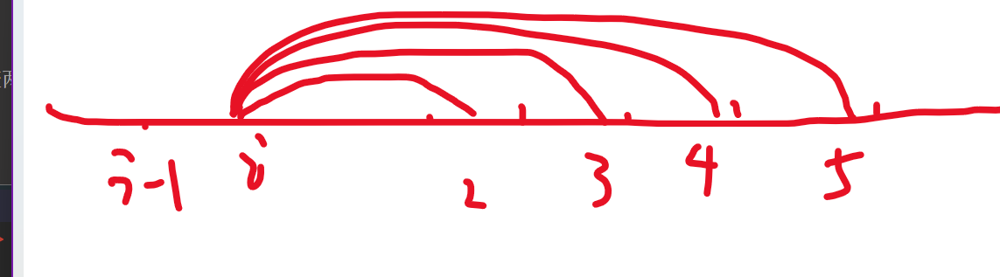

图中的i的子数组每个结果都会存在一个区间，子数组插入区间内的元素，不会改变或运算的结果。最小的数组长度达到最大的或结果，就是到达5这个区间所对应的左端点，再往后结果不会变但数组长度会变大。往前递推，对每个i-1,他都会遍历原先的区间形成一个新的区间，由或运算的性质，这些新的区间只会大于或等于原区间。`通过列表记录这些区间，然后在递推中遍历更新，来找到结果，根据或运算结果单调有序的性质，不断在列表中去重，列表中元素始终不会超过30个`，保证效率。

```python
class Solution:
    def smallestSubarrays(self, nums: List[int]) -> List[int]:
        n=len(nums)
        ans=[0]*n
        ors=[]# 储存异或结果的值，以及区间的左端点
        for i in range(n-1,-1,-1):
            # 把每个数字本身对应的区间和值加入到列表中，由于使在末尾添加，因此可以保证列表的第一个元素是最大的或结果
            ors.append([0,i])
            # 遍历列表，更新区间
            for p in ors:
                p[0]|=nums[i]
            # 双指针去重，保证列表中的元素不会超过30个
            l=0
            r=1
            while r<len(ors):
                # 如果是不同的值，移动指针即可
                if ors[r][0]!=ors[l][0]:
                    l+=1
                    ors[l]=ors[r]
                else:
                    # 相同的值，对于结果要求的最小子数组，更新下标为小的
                    ors[l][1]=ors[r][1]
                r+=1
                # 删除后面无用的元素
            del ors[l+1:]
            # 记录结果
            ans[i]=ors[0][1]-i+1
        return ans 
```


`这个模板本质上是递推的体现，由于问题中子数组的性质，满足条件的子数组数量很少，而下一个元素所形成的子数组可以有当前包含的子数组求出，因为数量很少所以很快可以推出下一个元素的子数组。`


## [按位或最大的最小子数组长度](https://leetcode.cn/problems/smallest-subarrays-with-maximum-bitwise-or/)

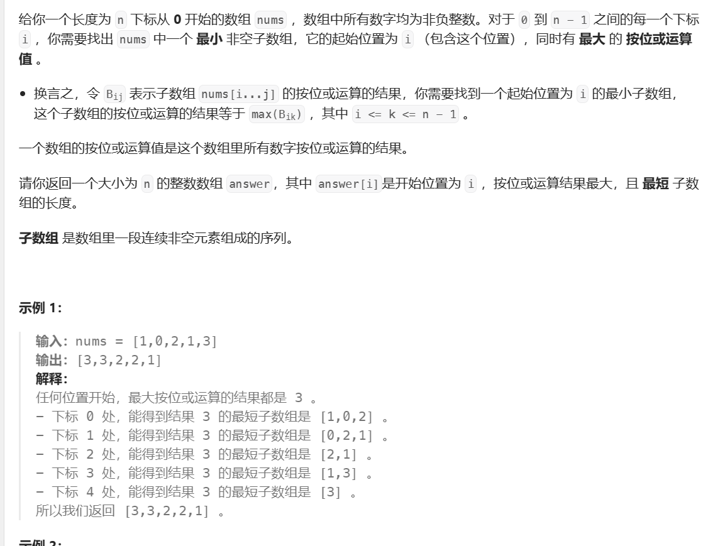

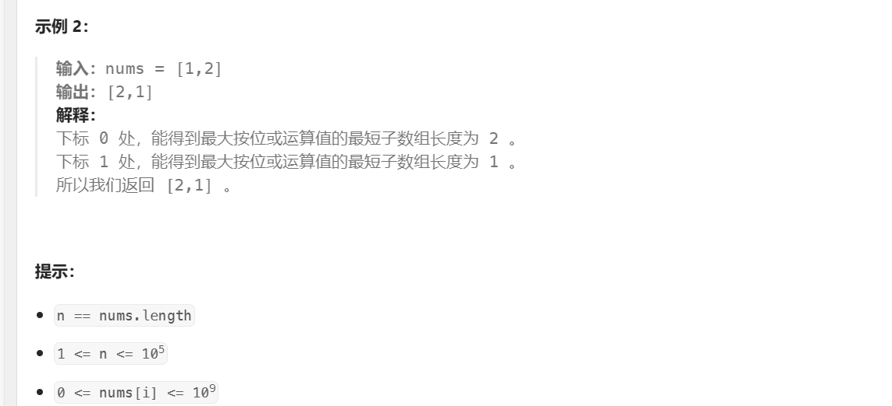

题意为：找出以每个元素为起始位置的子数组中，按位或能得到最大值的最短子数组。

异或运算得到的子数组只会是递增或是不变的具有单调性，使用一个数组来维护每个位置的元素所能得到的最大值以及这个位置，百万级别的数据对应到二进制上最多只有三十几个状态，因此维护的数据不会太大，而每个元素能对应的区间又可以由前一个元素推出。


```python
class Solution:
    def smallestSubarrays(self, nums: List[int]) -> List[int]:
        n=len(nums)
        ans=[0]*n
		# 维护状态（异或值，右端点索引）
        ors=[]
        # 倒序遍历
        for i in range(n-1,-1,-1):
            ors.append([0,i])
            # 每个元素所有子数组的结果可以由上一个元素的结果推出，因为运算具有单调性
            for p in ors:
                p[0]|=nums[i]
            
            # 以下是去重的逻辑，因为对于相同的值，题目要求去最短区间
            l=0
            r=1
            while r<len(ors):
                if ors[r][0]!=ors[l][0]:
                    l+=1
                    ors[l]=ors[r]
                else:
                    ors[l][1]=ors[r][1]
                r+=1
            del ors[l+1:]
            # 可以保证数组中的第一个元素是当前能到达的最大的
            ans[i]=ors[0][1]-i+1
        return ans 
        
```


## [子数组按位或操作](https://leetcode.cn/problems/bitwise-ors-of-subarrays/)

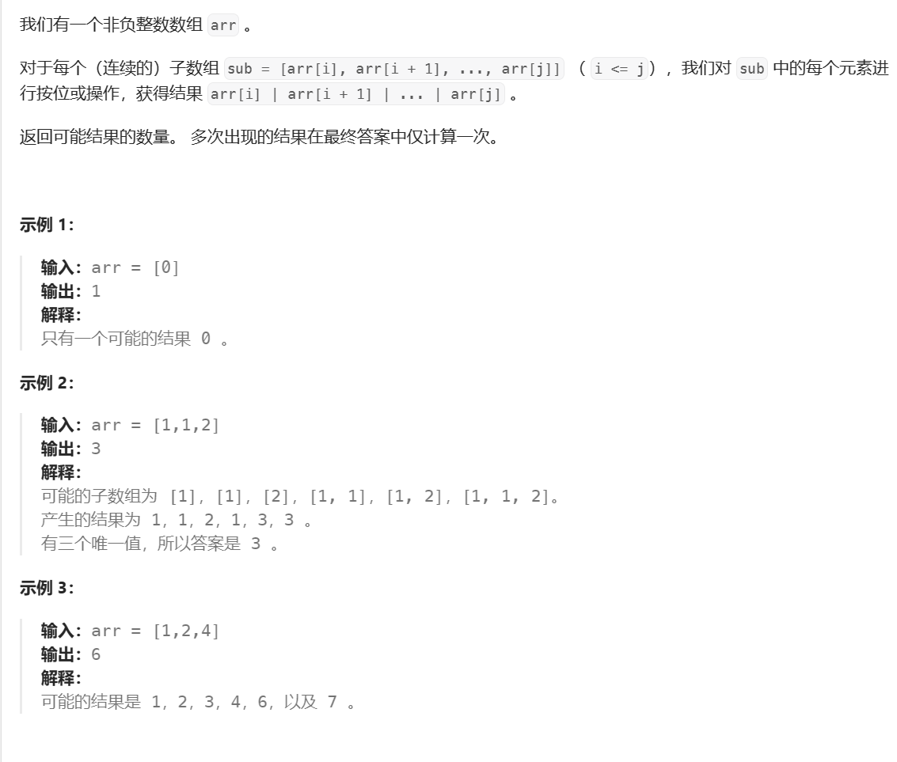

同上一题一样的解法，在找一个子数组最大的或结果中记录结果。或实质上是并集，遍历每一个元素，求他和之前的元素之间的或的结果，如果if nums[i]|nums[j]==nums[j]就说明当前的元素不会再使前面的集合变大了直接退出	

```python
class Solution:
    def subarrayBitwiseORs(self, nums: List[int]) -> int:
        ans=0
        temp=nums[:]
        n=len(nums)
        memo=set()
        for i in range(n):
            # 防止漏掉自己
            if nums[i] not in memo:
                ans+=1
                memo.add(nums[i])
            # 查找前面的
            for j in range(i-1,-1,-1):
                # 无法再使前面的变大就退出
                if nums[i]|nums[j]==nums[j]:break
                # 更新
                nums[j]|=nums[i]
                if nums[j] not in memo:
                    ans+=1
                    memo.add(nums[j])
        return ans 
```


按照模板在递推中，通过当前元素与区间列表或运算可以找出他所能达到的值，在通过集合找到不同的数目，这个题目中不考虑区间列表的顺序，只考虑他能到达的值，用集合储存区间列表去重

```python
class Solution:
    def subarrayBitwiseORs(self, nums: List[int]) -> int:
        ans=0
        n=len(nums)
        memo=set()
        # 这个题目不需要记录索引直接用集合去重
        ors=set()
        for i in range(n-1,-1,-1):
            ors.add(nums[i])
            temp=set()
            # 不能直接对原集合操作
            for j in ors:
                j|=nums[i]
                if j not in memo:
                    ans+=1
                    memo.add(j)
                temp.add(j)
            ors=temp        
        return ans 
```

## [子数组按位与值为 K 的数目](https://leetcode.cn/problems/number-of-subarrays-with-and-value-of-k/)

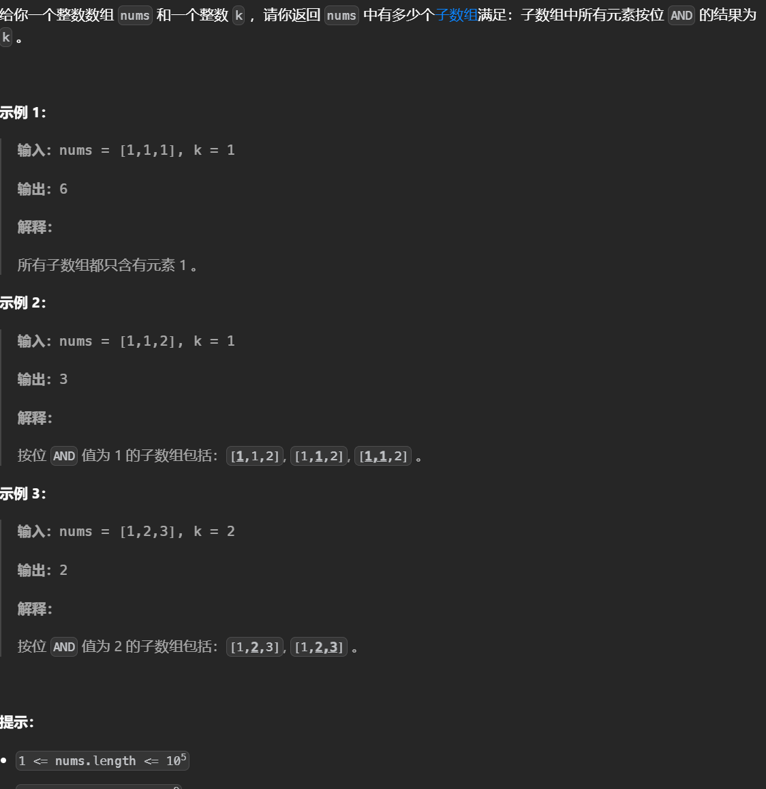


遍历每一个元素，去查找他之前的元素，与操作实际上是在做并集只会使元素减小，如果if x&nums[j]==nums[j]说明当前元素不会再使前面的元素减小了，因为要求子数组的个数用双指针求出可以使得子数组大小为k的区间，因为元素只会变小，因此只需要像一个方向移动。令l,r为以当前位置i为右端点的能使l~r之间的位置到i的子数组按位与为k的区间的做右端点，那么子数组的个数就是r-l

```python
class Solution:
    def countSubarrays(self, nums: List[int], k: int) -> int:
        ans=0
        ors=[]
        n=len(nums)
        l=r=0
        # 遍历每一个元素
        for i in range(n):
            x=nums[i]
            # 遍历之前的
            for j in range(i-1,-1,-1):
                # 不会再使元素减小
                if x&nums[j]==nums[j]:
                    break
                # 更新
                nums[j]&=x
            # 移动左右端点，注意不能超过i，左端点是小于k的而右端点是大于k的，这能保证取出的区间端点是满足要求的
            while l<=i and nums[l]<k:
                l+=1
            while r<=i and nums[r]<=k:
                r+=1
            ans+=r-l
        return ans
                
```


## [找到最接近目标值的函数值](https://leetcode.cn/problems/find-a-value-of-a-mysterious-function-closest-to-target/)

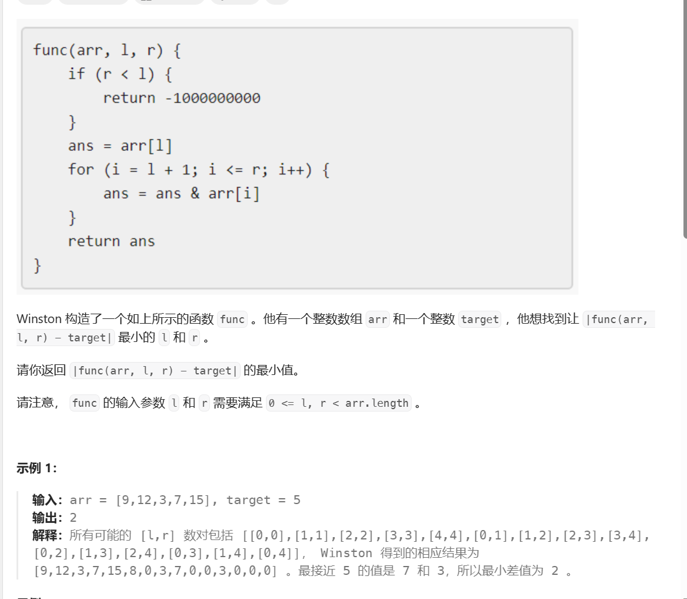


实际上就是在找子数组按位或的结果，直接用模板做题，这里不要考虑区间的索引，只在乎数值。

按位与同样具有单调性，随着区间的扩大数值只会越来越小，从后往前遍历，每一个元素所有子数组按位与的区间都可以由上一个循环的区间推出。

```python
class Solution:
    def closestToTarget(self, nums: List[int], target: int) -> int:
        ads=set()
        n=len(nums)
        ans=inf
        for i in range(n-1,-1,-1):
            ads.add(nums[i])
            temp=set()
            for v in ads:
                v&=nums[i]
                temp.add(v)
            ads=temp
            # ads的大小不会超过17位，直接遍历找最接近target的结果
            for s in ads:
                ans=min(ans,abs(s-target))
        return ans 
```

## 和与乘积

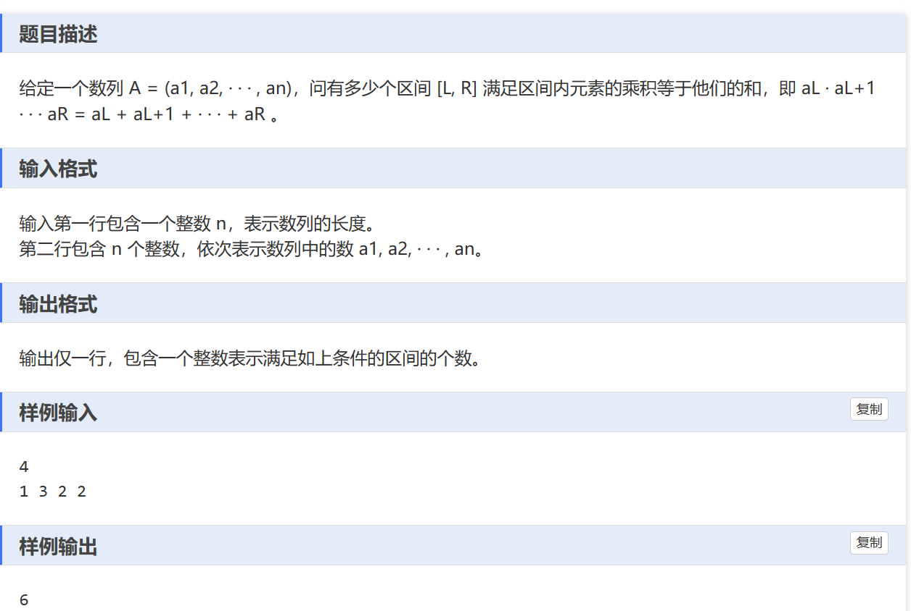

同样可以用于乘法

累乘只会增加或不变，具有单调有序性，对于每个元素它往后乘的子数组都会有一个区间，从该元素到这个区间内的某一个元素的子数组累乘结果都是一样的，查找从该元素到这个区间中的某一个元素的连续子数组是否满足要求即可。

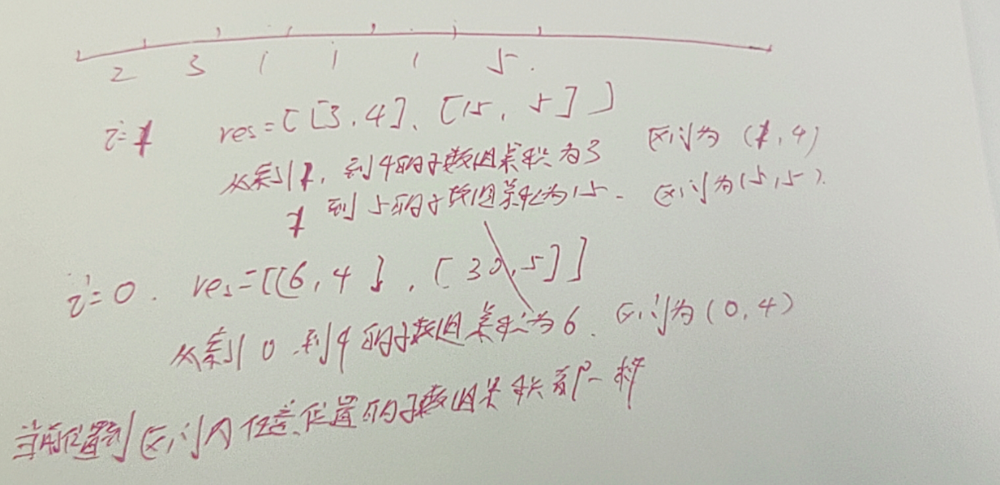

`这里之所以能用模板主要还是因为res中的值不会最大只能为所有元素累和，超过了一定不行，因此res中的元素最多只能为log(sum(nums))同时还会对相同的结果去重`。

对于连续的值，它的区间就是i到i。

最后是如何判断从其实元素到区间中的某一个位置是否满足条件：利用一个前缀和数组快速判断，假设这个位置是x，那么子数组的累和就是pre[x+1]-pre[i]，`条件是pre[x+1]-pre[i]==p[0] (当前值)，这里不用一个个遍历x，求解pre[i]+p[0]的值是否在pre数组中即可`。


```python
from itertools import accumulate
from bisect import bisect_left as bf
from collections import deque
n=int(input())
nums=list(map(int,input().split()))
def slove(nums):
    d=[]
    ans=0
    # 前缀和数组
    pre=[0]+list(accumulate(nums))
    # 选择倒序遍历
    for i in range(n-1,-1,-1):
        d.append([1,i])# 值，索引（区间的最右端），这里保证元素是递减的
        # 倒序遍历d，方便舍去不合理的值
        for j in range(len(d)-1,-1,-1):
            d[j][0]*=nums[i]
            # 如果这个超出了所有元素的和，这个索引之前包括这个索引都不需要了
            if d[j][0]>pre[-1]:
                temp=[]
                for k in range(j+1,len(d)):
                    temp.append(d[k])
                d=temp
                break
        # 双指针去重，这里对相同的值找比较大的区间
        l,r=0,1
        while r<len(d):
            if d[l][0]!=d[r][0]:
                l+=1
                d[l]=d[r]

            r+=1
        del d[l+1:]
	
        # 判断是否满足条件
        #最初时，由于是倒序遍历，第一个值一定是自己，区间的左端点是自身
        l=i
        # 倒序遍历保证区间右端点是递增的
        for k_ in range(len(d)-1,-1,-1):
            p=d[k_]
            # 得到区间的右端点
            r=p[1]
            # 使用二分找pre[x+1]是否在
            index=bf(pre,pre[i]+p[0],l,r+1)
            # 如果x在区间中，才有可能满足条件
            if l<=index-1<=r+1and pre[index]-pre[i]==p[0]:
                ans+=1
            # 由于区间是连续的，下一个区间的左端点是上一个区间的右端点加一，
            l=r+1
    print(ans)
slove(nums)
```

## [最大公因数等于 K 的子数组数目](https://leetcode.cn/problems/number-of-subarrays-with-gcd-equal-to-k/)

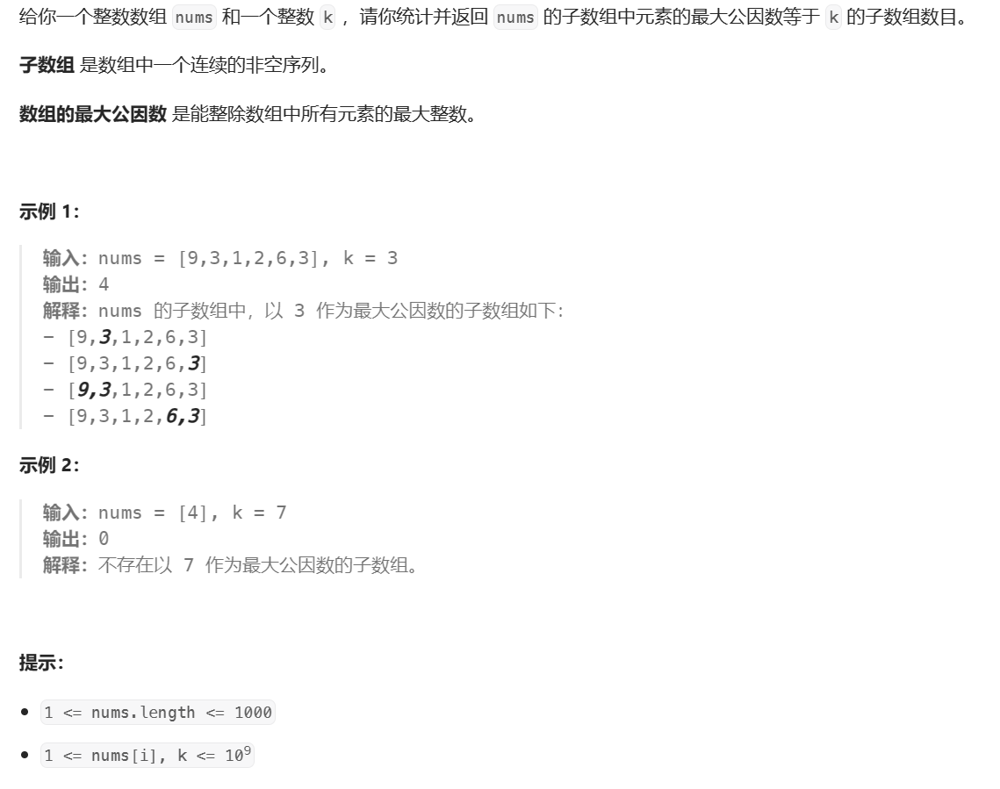

10**9的因数个数最多为31个，因为一个数的因数要么等于自己要么减半（因数的因数也是一个因数），同时子数组的公因数个数只会减小或不变而不会增加具有单调性，因此可以通过为画一个32大小的数组然后遍历每个元素从而得出一每个元素为左端点的子数组的最大公因数


```python
class Solution:
    def subarrayGCD(self, nums: List[int], k: int) -> int:
        ans=0
        # 枚举每一个数，以这个数为左端点的子数组的所有可能可以由上一组推出
        a=[]
        for i in range(len(nums)-1,-1,-1):
            v=nums[i]
            # 如果当前值不为k的倍数，公因数一定不可能是K，清空数组
            if v%k:
                a=[]
                continue
            # 第一个记录公因数，第二个记录有多少个
            a.append([v,1])
            for j in range(len(a)):
                a[j][0]=gcd(a[j][0],v)
            # 去重，相同的记录到一起
            l,r=0,1
            while r<len(a):
                if a[l][0]!=a[r][0]:
                    l+=1
                    a[l]=a[r]
                else:
                    a[l][1]+=a[r][1]
                r+=1
            del a[l+1:]
            # 遍历这个数组找到记录值为k的，注意数组中的值都是不重复的因此找到了就退出
            for j in range(len(a)):
                if a[j][0]==k:
                    ans+=a[j][1]
		    break
        return ans 
                    
```


## [使数组所有元素变成 1 的最少操作次数](https://leetcode.cn/problems/minimum-number-of-operations-to-make-all-array-elements-equal-to-1/)

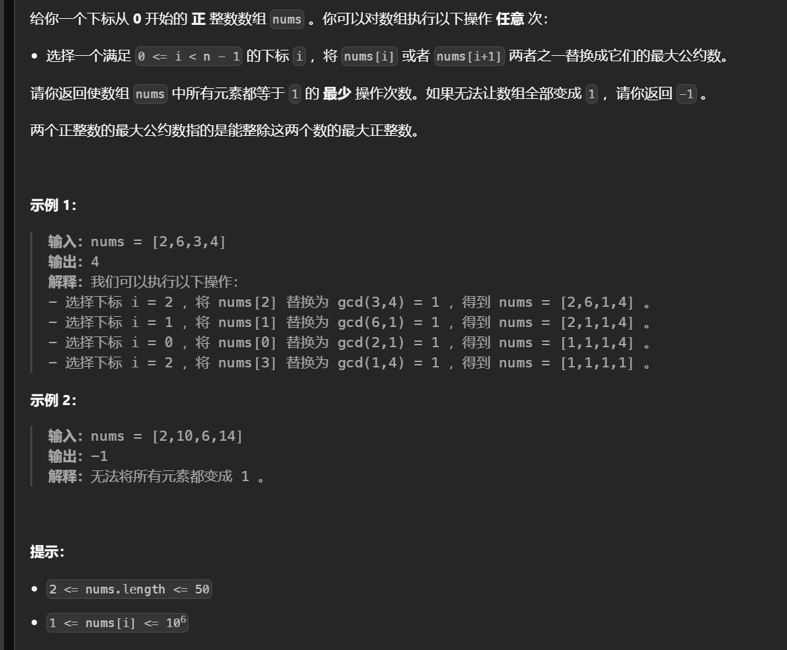


观察发现，只要有1就可以把所有的数变为1，且最小的结果是不为1的个数（与1求最大公约数的结果是1）.

或者可能是一段子数组相互求最大公约数得到1，然后用这个1与其他的数运算即可，对于给定的数据范围可以暴力枚举出所有的子数组找到最下的满足最大公约数是1的，这表示这一段子数组同通过操作m-1次相互求最大公约数得到了1，再用这个1和其他的求解。

```python
class Solution:
    def minOperations(self, nums: List[int]) -> int:
        n=len(nums)
        sz=inf
        def cal(i,j):
            temp=nums[i]
            for k in range(i+1,j+1):
                temp=gcd(temp,nums[k])
                if temp==1:return True 
            return False
        if nums.count(1):
            return n-nums.count(1)
        for i in range(n):
            for j in range(i):
                if cal(j,i):sz=min(sz,i-j)
        return sz+n-1 if sz!=inf else -1
```


如果数据范围比较大，该如何找子数组的最大公约数呢。最大公约数具有递减的性质，且数目不会多，每一段子数组的最大公约数可以有上一段推出。


```python
class Solution:
    def minOperations(self, nums: List[int]) -> int: 
        # 排除一些基本情况
        if gcd(*nums)>1:return -1
        n=len(nums)
        if nums.count(1):
            return n-nums.count(1)
        # 模板
        a=[]
        sz=inf
        for i in range(n-1,-1,-1):
            x=nums[i]
            a.append([x,i])
            for p in a:
                p[0]=gcd(p[0],x)
            l,r=0,1
            # 双指针去重
            while r<len(a):
                if a[l][0]!=a[r][0]:
                    l+=1
                    a[l]=a[r]
                else:
                    a[l][1]=min(a[l][1],a[r][1])
                r+=1
            del a[l+1:]
            # 判断以当前数开头的最长子数组的公约数shi'fou'wei
            if a[0][0]==1:
                sz=min(sz,a[0][1]-i)
        return sz+n-1
```


# 算法


## 贪心

贪心算法指的是在对问题求解的时候选择从当前看来做好的选择，不从整体上考虑而是局部上，贪心算法不保证得到最优解，但某些问题的最优解就是贪心算法，需要判断一个问题是否适合用贪心求解。贪心是动态规划的一个特例。

比如在背包问题中，用承载能力有限的背包中带走最大价值的商品：
优先选择最有价值的商品装入背包

```python
goods=[(50,10),(120,30),(100,20)]
goods.sort(key=lambda x:x[0]/x[1],reverse=True)# 按照价值排序
def backpack(goods,w):
    m=[0 for _ in range(len(goods))]# 每种货物拿取的百分比
    for i ,(_,weight) in enumerate(goods):
        if w>=weight:
            m[i]=1
            w-=weight
        else:# 空间不够
            m[i]=w/weight
            w=0
            break
    return m
print(backpack(goods,50))
```

将一群非负整数组合出最大的值，同样是贪心的思想，将首位最大的放到前面

```python
li=[32,94,128,1286,6,71]

def number_join(li):
    li=list(map(str,li))
    li=sorted(li)
    li.reverse()
    return "".join(li)
print(number_join(li))
```

贪心算法重要的是选择最优的条件，在我呢提活动场地中（一个场地依次只能进行一个活动，每个活动有固定的开始时间和结束时间，问如何安排才能进行最多的活动）认为活动结束时间最早的为最优条件。

```python
a=[(1,4),(3,5),(0,6),(5,7),(3,9),(5,9),(6,10),(8,11),(8,12),(2,14),(12,16)]
a.sort(key=lambda x : x[1])
def activity(a):
    res=[a[0]]
    for i in range(1,len(a)):
        if a[i][0]>=res[-1][1]:# 当前活动的开始时间小于上一结束时间
            res.append(a[i])
    return res
print(activity(a))
```

### 执行子串操作后的字典序最小字符串

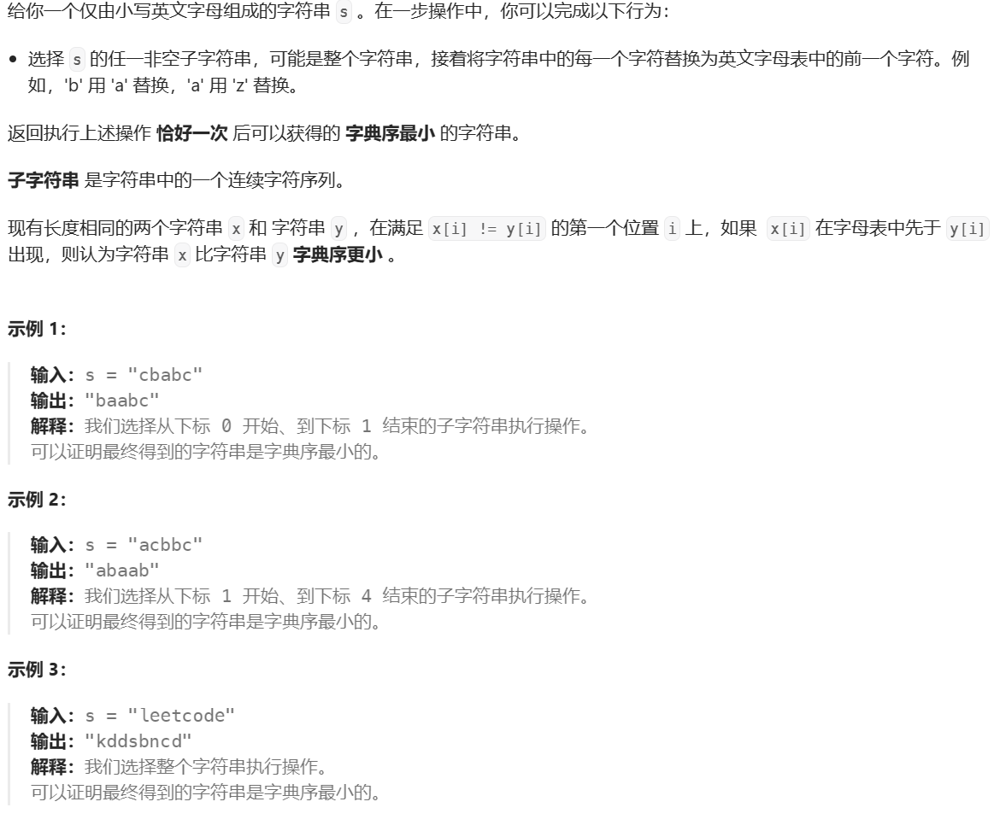

注意a前面是z而不是不存在，对每个字符进行替换，如果是a会变成z导致字典序变大，因此不能操作a字符，而其他的所有字符都可以前进一位。

贪心的思想，尽可能地将前面的值换掉，除非不能换。

```python
class Solution:0
    def smallestString(self, s: str) -> str:
        t=list(s)
        for i in range(len(s)):
            # 如果不是a的话，对他后面的元素操作，直到又遇到了a或者是到了末尾
            if t[i]!='a':
                for j in range(i,len(s)):
                    if t[j]=='a':
                        break
                    else:
                        t[j]=chr(ord(t[j])-1)
                return "".join(t)
        # 注意如果字符串全是a ，但又不能选择空的字符串，只能将字符串的最后一个元素换为z
        t[-1]='z'
        return "".join(t)
```


### [使数组唯一的最小增量](https://leetcode.cn/problems/minimum-increment-to-make-array-unique/)

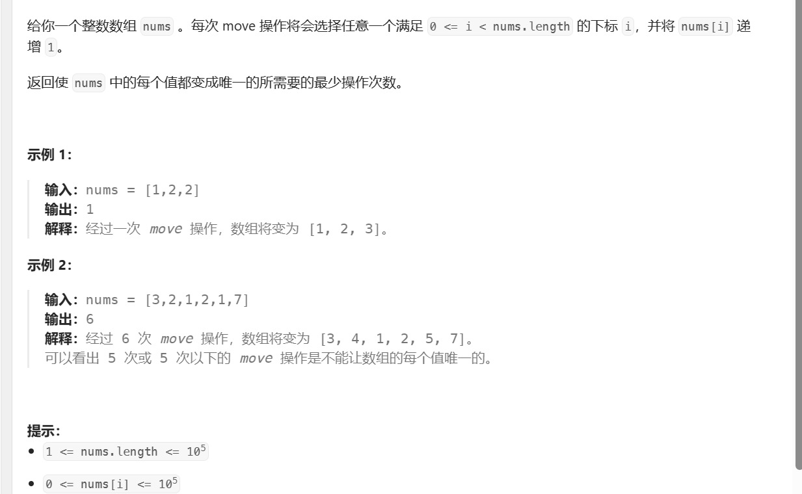


将数组排序后，保证其中的每个元素是唯一的即可

```python
class Solution:
    def minIncrementForUnique(self, nums: List[int]) -> int:
        nums.sort()
        ans=0
        for i in range(1,len(nums)):
            if  nums[i]<=nums[i-1]:
                ans+=nums[i-1]-nums[i]+1
                nums[i]=nums[i-1]+1
                
        return ans
```


### [减小和重新排列数组后的最大元素](https://leetcode.cn/problems/maximum-element-after-decreasing-and-rearranging/)	

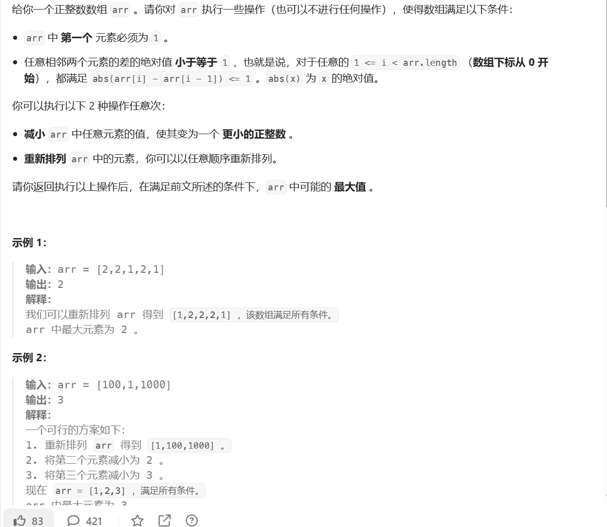

排序加贪心

```python
class Solution(object):
    def maximumElementAfterDecrementingAndRearranging(self, arr):
        n=len(arr)
        arr.sort()
        arr[0]=1
        for i in range(1,n):
            # 元素值不能超过自身，因为操作里没有递增
            arr[i]=min(arr[i],arr[i-1]+1)
        return arr[-1]
```

### [具有给定数值的最小字符串](https://leetcode.cn/problems/smallest-string-with-a-given-numeric-value/)

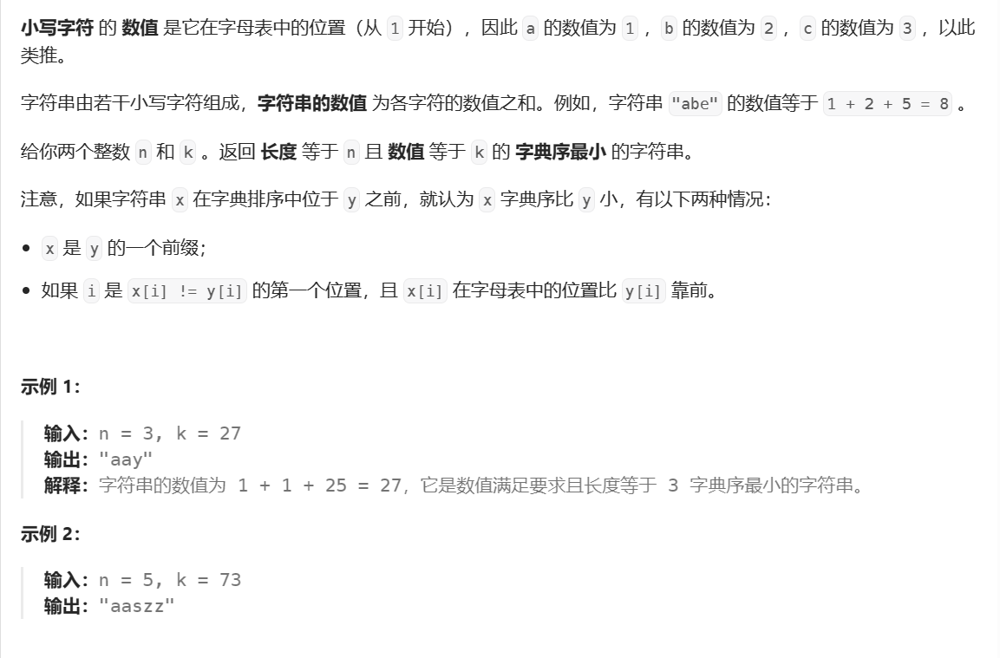


贪心的思想，对于每个位置，为了保证字典序小，前面的位置应该尽可能小的选取值，而这个位置选取'a'的条件是后面的位置可以满足全取z而总和大于k-1,如果这个位置不能取a，那也应该尽可能地小，即取到k-26*n也就是后面的位置都取z，这个位置才能保证取到满足和为k的最小字符。

```python
class Solution:
    def getSmallestString(self, n: int, k: int) -> str:
        ans=[]
        def tran(n):
            return chr(n+ord('a')-1)
        for i in range(1,n+1):
            val =max(1,k-26*(n-i))
            k-=val
            ans.append(tran(val))
        return "".join(ans)
```

### [破坏回文串](https://leetcode.cn/problems/break-a-palindrome/)


回文串只需考虑前一半即可，对于中间的值不取，比如aba改中间的值没用。

按照贪心的思路，必然要把第一个不是a的改为a,一旦改变那么就不是回文串了可以直接返回，不然的话就说明字符串中全是a,将最后一个字符改为b即可

```python
class Solution:
    def breakPalindrome(self, p: str) -> str:
        if len(p)==1:
            return ""
        p=list(p)
        n=len(p)//2
        for i in range(n):
            c=p[i]
            if c!='a':
                p[i]='a'
                return "".join(p)
        p[-1]='b'
        return "".join(p)
```

### [连接棒材的最低费用](https://leetcode.cn/problems/minimum-cost-to-connect-sticks/)

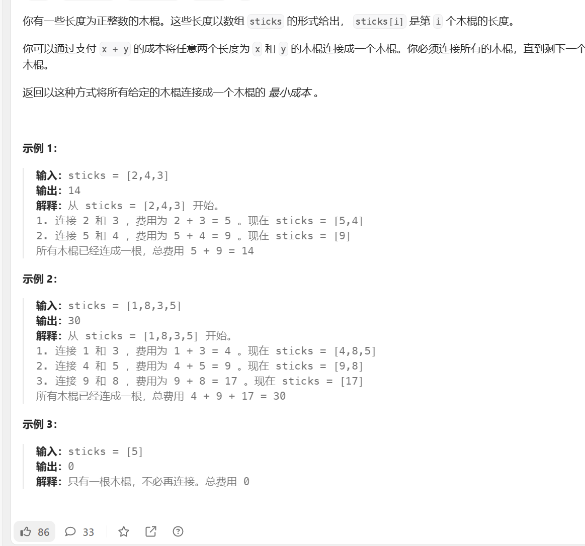

为了保证成本最少，每次只连接最小的两个，使用优先级队列快速找出最小的两个


```python
import heapq
class Solution:
    def connectSticks(self, sticks: List[int]) -> int:
        heapq.heapify(sticks)
        ans=0
        while len(sticks)>1:
            a=heapq.heappop(sticks)
            b=heapq.heappop(sticks)
            val=a+b
            heapq.heappush(sticks,val)
            ans+=val
        return ans 
```

### [移除石子的最大得分](https://leetcode.cn/problems/maximum-score-from-removing-stones/)

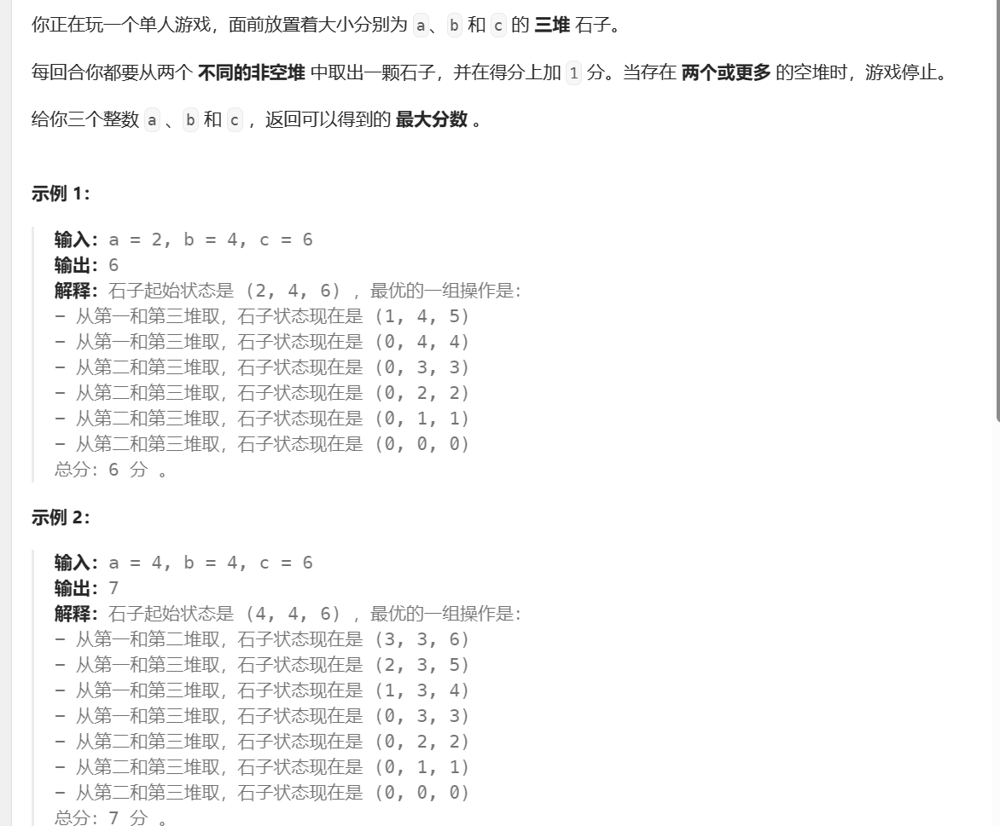

数学的做法是:
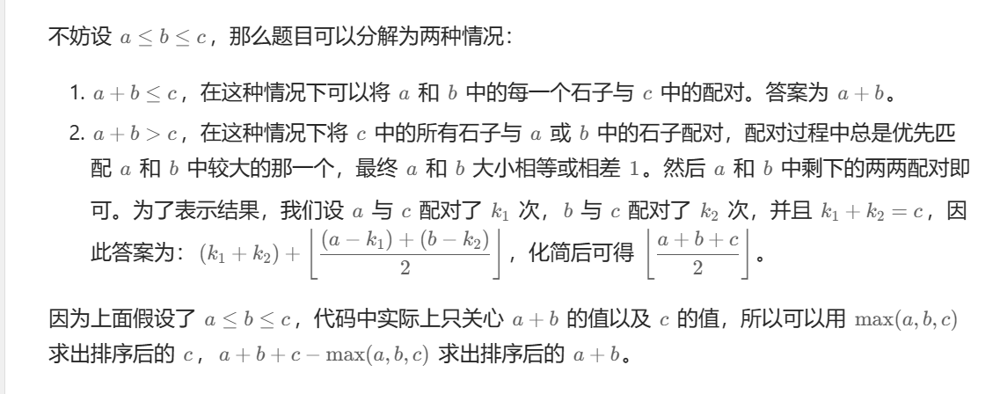


贪心的做法是每次从最大的两个堆中取

```python
class Solution:
    def maximumScore(self, a: int, b: int, c: int) -> int:
        s=sorted([a,b,c])
        ans=0
        while s[1]:
            s[1]-=1
            s[2]-=1
            s.sort()
            ans+=1
        return ans
```

### [K 次增加后的最大乘积](https://leetcode.cn/problems/maximum-product-after-k-increments/)

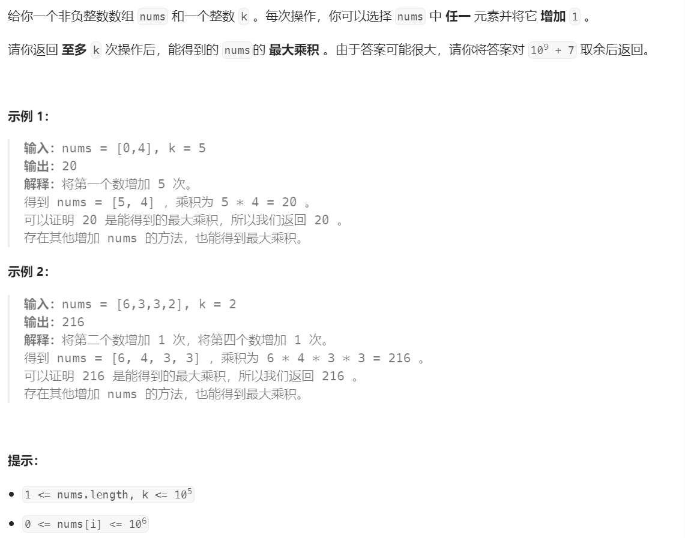

为了让结果更大每次增加小的元素，使用根堆来找出数组中最小的元素


```python
class Solution:
    def maximumProduct(self, nums: List[int], k: int) -> int:
        m=10**9+7
        heapify(nums)
        index=0
        target=nums[-1]
        while k:
            val=heappop(nums)
            heappush(nums,val+1)
            k-=1
        val=1
        for i in nums:
            val*=i
            val%=m
        return val
```


### [拆分成最多数目的正偶数之和](https://leetcode.cn/problems/maximum-split-of-positive-even-integers/)

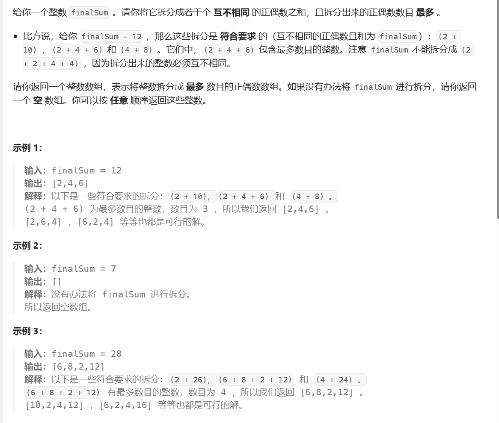

贪心的思想，要尽可能多的数字又不能重复，因此从最小的2开始分，每次递增2，最后如果有余数加到数组的最后一个元素上。

```python
class Solution:
    def maximumEvenSplit(self, finalSum: int) -> List[int]:
        # 判断奇偶，偶数之和只能是偶数
        if finalSum&1:
            return []
        ans=[]
        index=2
        while index<=finalSum:
            ans.append(index)
            finalSum-=index
            index+=2
        ans[-1]+=finalSum
        return ans
```

### [使数组成为等数数组的最小代价](https://leetcode.cn/problems/minimum-cost-to-make-array-equalindromic/)

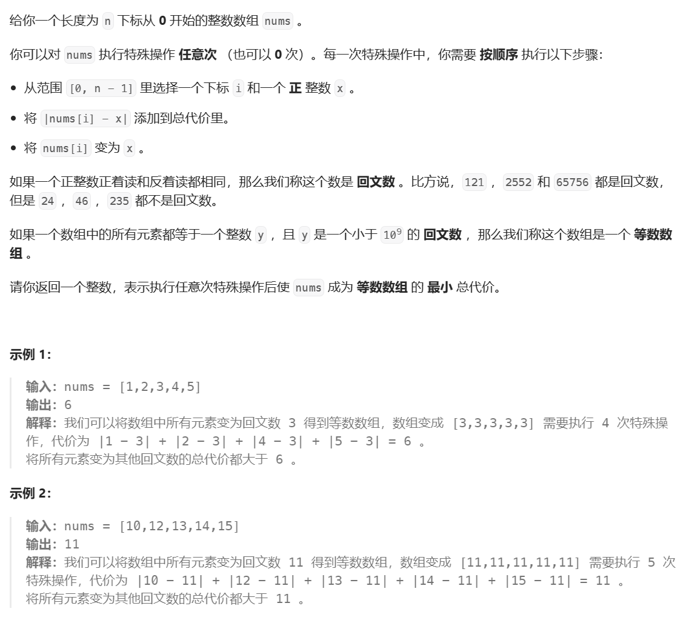


想要找到所有的数到一个数的代价最小，这个数不能是平均数而是`中位数`(技巧点)，想象一下，从1到n，`当选取得数在这个范围之间的时候，往右移动的过程中，距离左边的数越远距离（距离加上左边的数目乘上一），右边的数越近（距离减上右边的数目乘一），由此距离不断减小，当达到中间位置的时候距离最小`。

题目中要求找的数是回文数，数据范围在10^9之内，`打表计算(技巧点，构造回文表)`, 10^9这个范围的回文数可以通过递归左边的数求出，比如11奇数反转为111，偶数反转为1111， 枚举10^5-1,即99999反转，先奇数反转再偶数反转，保证数据的顺序性。

```python
from bisect import bisect_left as bf
# 打表，找出回文表
li=[]
base=1
while base<=10000:
    for i in range(base ,base*10):
        temp=i
        # 奇数反转先去掉最低位
        i//=10
        # 不断加个位
        while i:
            temp=temp*10+i%10
            i//=10
        li.append(temp)
    
    # 偶数反转不需要去掉最低位
    for i in range(base,base*10):
        temp=i
        while i:
            temp=temp*10+i%10
            i//=10
        li.append(temp)
    base*=10
    
class Solution:
    def minimumCost(self, nums: List[int]) -> int:
        n=len(nums)
        # 记得排序
        nums.sort()
        def f(x):
            return sum([abs(i-x) for i in nums])
        # 用二分法找距离中位数最近的回文数。偶数有两个中位数，这两个中位数之间（包括本身）到其他数的距离都属一样的，随意取
        i=bf(li,nums[(n-1)//2])
	# 如果中位数就是回文数，直接计算
        if li[i]==nums[n//2]:
            return f(li[i])
        # 如果不是的话，就找出li中位数附近的两个回文数，求出最小的
        return min(f(li[i-1]),f(li[i]))
```


### [使数组相等的最小开销](https://leetcode.cn/problems/minimum-cost-to-make-array-equal/)

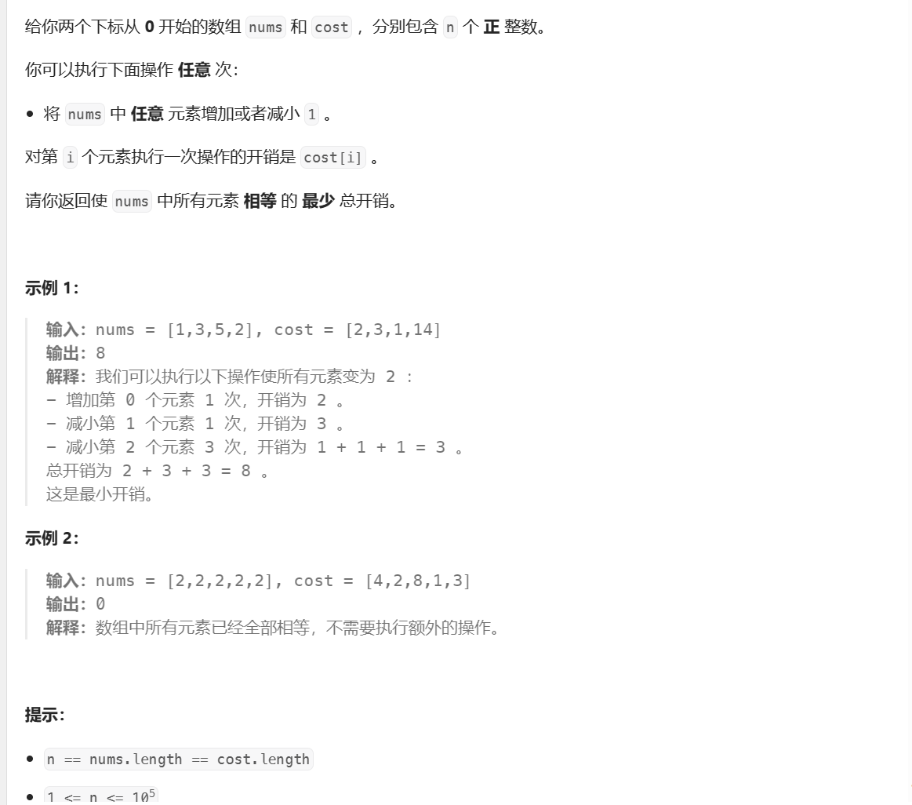


运用中位数贪心的思想，把元素转换为他们的中位数可以得到最小的操作数，然而这道题目中，给定了每个元素转换的开销，原先的最小操作数认为开销为1，这里转换思路，`把cost[i]视为有cost[i]个nums[i]`，这样每次操作的开销满足条件同时也可以使用中位数贪心。

```python
class Solution:
    def minCost(self, nums: List[int], cost: List[int]) -> int:
        a=sorted(zip(nums,cost))
        mid=sum(cost)//2
        s=0
        for x,c in a:
            s+=c
            if s>mid:
                return sum([abs(v-x)*time for v,time in zip(nums,cost)])    
```


### 树上贪心

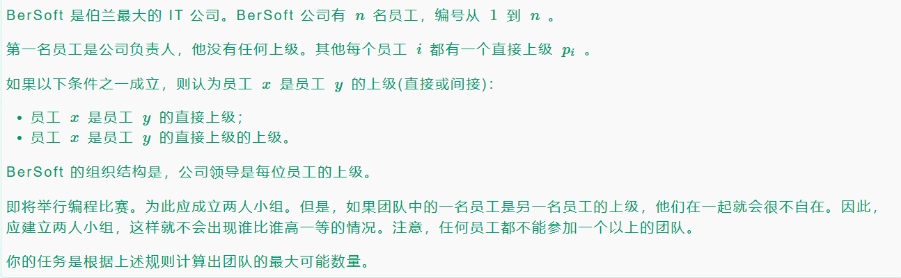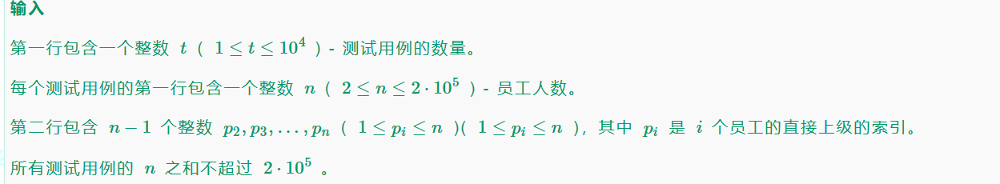


即在一棵树上找出不是直接根节点的两个节点。

如果一颗树的根节点的一个子树（节点数目最多）的节点数目没有超过这个根节点的一半，那么这个根节点的所有子节点都可以找到另一个满足条件的节点，满足的节点对是根节点数目的一半。

反之，可以找一个节点与这个这个子树的根节点配对，就这样一直递归下去。

```python
t=int(input())

def slove():
    n=int(input())
    li=list(map(int,input().split()))
    # 储存每个节点的节点数目（包括自己）
    v=[0]*n
    g=[[]for _ in range(n)]
    # 建图，做一位索引偏移
    for i,val in enumerate(li):
        g[val-1].append(i+1)
     # 找出所有结点的子树数目
    def init(x):
        # 自己算上
        v[x]=1
        # 找他的子树
        for j in g[x]:
            # 对他的子树操作
            init(j)
            # 该节点的节点数目一个加上子树的节点数目
            v[x]+=v[j]
            # 在这个过程中，把每个节点对应的最长的子树放到第一位，方便操作
            if v[j]>v[g[x][0]]:
                index=g[x].index(j)
                g[x][0],g[x][index]=g[x][index],g[x][0]
    init(0)
    # x是当前节点，other是迭代之前其他节点之和
    other=ans=x=0
    # 不断迭代
    while True:
        # 如果other有值代表情况二，在其他的节点中选一个出来与最长的子树的根节点匹配
        if other:
            ans+=1
            other-=1
            
        if not g[x]:
            break
        # 找到这个节点对应的最长的子树的根节点
        y=g[x][0]
        # 找到它的值
        val=v[y]
        # s是当前节点的总的节点数目（包括自己因此要减去，因为根节点在上一层迭代中进行过了），开始时当前节点是根节点
        s=v[x]-1
        # 如果小于等于一半，直接得出结果
        if 2*val<=s+other:
            ans+=(s+other)//2
            break
        # 反之，进行情况二，other记录除了最长的子树以外的节点
        other+=s-val
        # 下一轮从这个节点开始找，因为这个节点对应的值中最大的基本上是所有节点中最大的
        x=y
    print(ans)

while t:
    slove()
    t-=1

```

###  Memory for Arrays

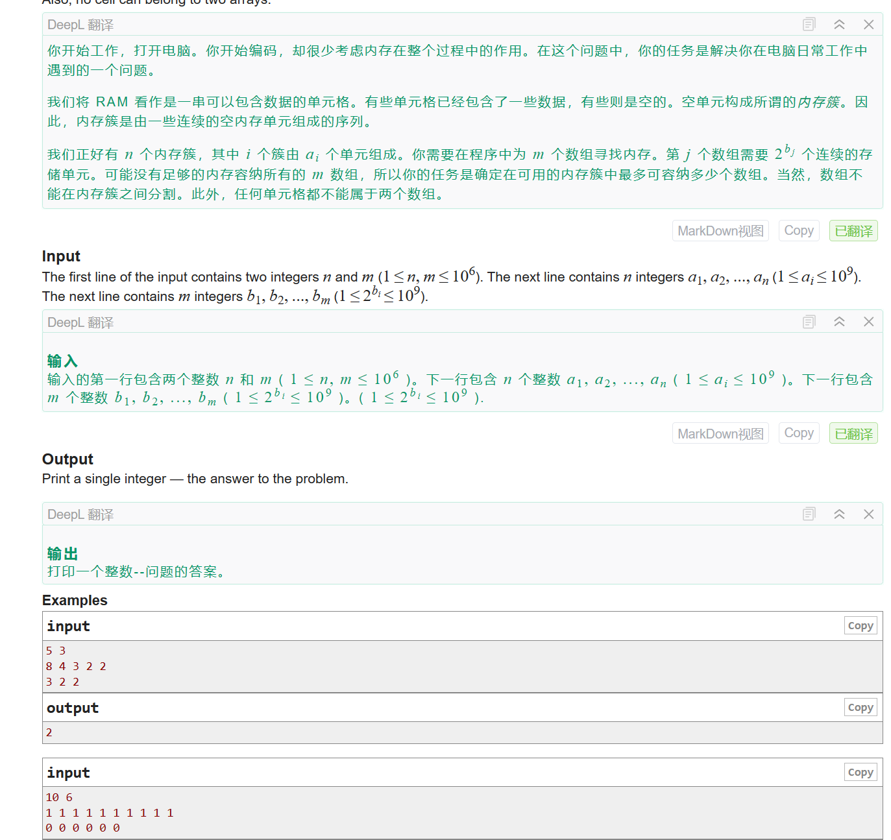

问题可以抽象为背包问题，每次拿走一部分要求拿走最多的物品，按照贪心的思路每次拿最少的可以使一个背包空余的空间最多，因此把b数组排序求解问题。但是对于b中的1，如果用偶数解决它，偶数会变成奇数，那么可能会余下一个1（数组中除了1就是偶数），从而造成浪费，因此应该把1都给奇数解决。

```python
n,m=[int(x) for x in input().split()]
a=sorted([int(x) for x in input().split()])
b=sorted([int(x) for x in input().split()])
j=ans=0
for i in range(n):
    if j>=m or b[j]:
        break
    if a[i]&1:
        a[i]-=1
        j+=1
        ans+=1
i=0
while i<n and j<m:
    v=2**b[j]
    if v<=a[i]:
        a[i]-=v
        j+=1
        ans+=1
    else:
        i+=1
print(ans)
```

### [老鼠和奶酪](https://leetcode.cn/problems/mice-and-cheese/)	


两个变量的问题选择固定其中一个去找另一个，考虑如果k是1的情况，那么把所有的奶酪到给老鼠二，选择一个i给老鼠1最后的得分增加了r1[i]-r2[i]，为了使结果最大应该让这个值尽可能大。k>1的情况就是要给老鼠1k个r1[i]-r2[i]一个选出最大的这样的值，因此把两个数组的差值相减后排个序，从中选取k个。

```python
class Solution:
    def miceAndCheese(self, reward1: List[int], reward2: List[int], k: int) -> int:
        r=sorted([r1 -r2 for r1,r2 in zip(reward1,reward2)],reverse=True)
        return sum(reward2)+sum(r[:k])
```


```python
class Solution:
    def twoCitySchedCost(self, costs: List[List[int]]) -> int:
        n=len(costs)//2
        ans=sum([x[1] for x in costs])
        nums=sorted([x[0]-x[1] for x in costs])
        return ans+sum(nums[:n])
```


### [将数组分成几个递增序列](https://leetcode.cn/problems/divide-array-into-increasing-sequences/)

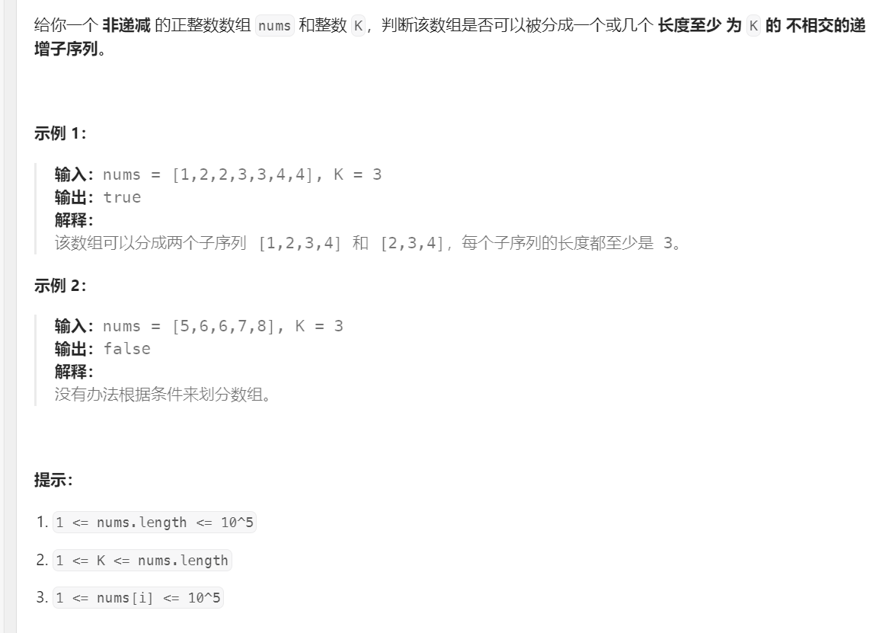

贪心的做法，由于要求序列不能出现相同的值，因此必须至少要分数组中出现频率最大的元素个序列，每个序列至少长k，则最终要求数组中至少有freq*k个元素。

```python
class Solution:
    def canDivideIntoSubsequences(self, nums: List[int], k: int) -> bool:
        memo=Counter(nums)
        val=max(memo.values())
        return len(nums)>=val*k
```

### [删除数对后的最小数组长度](https://leetcode.cn/problems/minimum-array-length-after-pair-removals/)

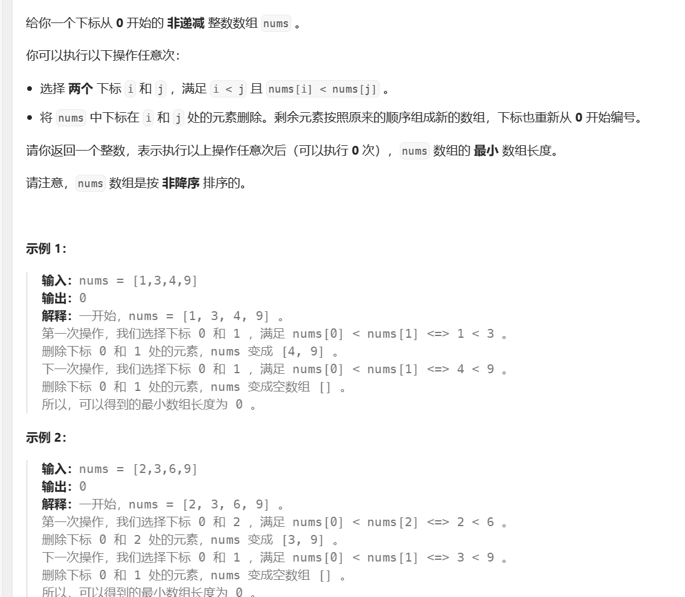


鸽巢原理

```python
class Solution:
    def minLengthAfterRemovals(self, nums: List[int]) -> int:
        memo=Counter(nums)
        cnt=max(memo.values())
        n=len(nums)
        if cnt*2>n:
            return 2*cnt-n
        else:
            l=n-cnt
            if (l-cnt)&1:
                return 1
            return 0
```


### [使所有字符相等的最小成本](https://leetcode.cn/problems/minimum-cost-to-make-all-characters-equal/)

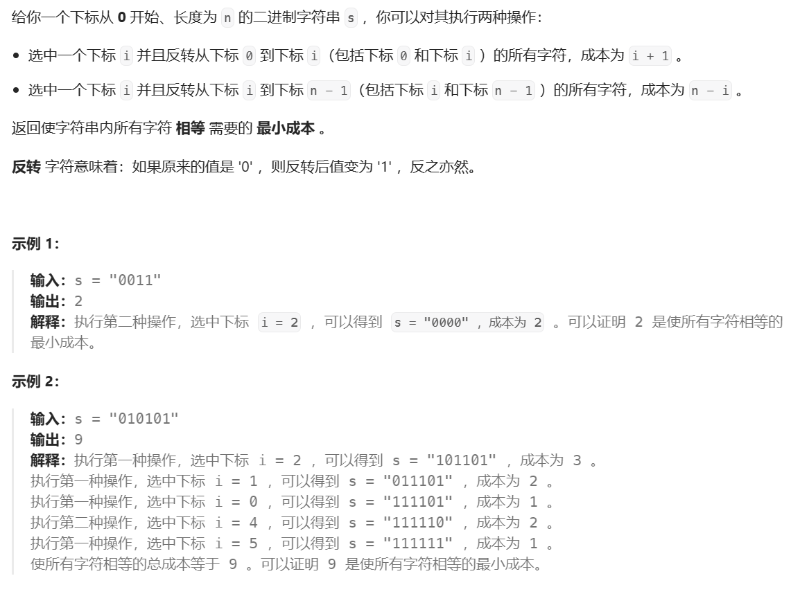


对于一组串，其中不等的都是01组成的，而对于所有的01每次翻转左边或者右边都只能更改一对01串，并且不会影响已经相等的字符（不相等的还是不相等），因此一旦遇到不等的字符就会翻转

```python
class Solution:
    def minimumCost(self, s: str) -> int:
        n=len(s)
        ans=0
        for i in range(n-1):
            if s[i]!=s[i+1]:
                # 每次找翻转代价最小的
                ans+=min(i+1,n-i-1)
        return ans 
```


### [最长快乐字符串](https://leetcode.cn/problems/longest-happy-string/)


容易想到的是两个相同的一组中间用其他的字符隔开但是这样很难实现，贪心的思想每次取剩余的最多的字符，如果和前面两个一样就取次多的，如果次多的不存在就退出。

```python
class Solution:
    def longestDiverseString(self, a: int, b: int, c: int) -> str:
        nums=[]
        # 没有就不用加入
        if a:heappush(nums,(-a,'a'))
        if b:heappush(nums,(-b,'b'))
        if c:heappush(nums,(-c,'c'))
        s=''
        while nums:
            # 弹出剩余最多的
            cnt,c =heappop(nums)
            cnt=-cnt
            # 如果不满足条件就选择次多的
            if (len(s)>=2 and s[-2:]==2*c):
                if not nums:break
                cnt_,c_ =heappop(nums)
                cnt_=-cnt_
                s+=c_
                cnt_-=1
                # 如果没有值了就不要加入
                if cnt_:heappush(nums,(-cnt_,c_))
            else:
                s+=c
                cnt-=1
            if cnt:heappush(nums,(-cnt,c))
        return s
```

### [小于等于 K 的最长二进制子序列](https://leetcode.cn/problems/longest-binary-subsequence-less-than-or-equal-to-k/)

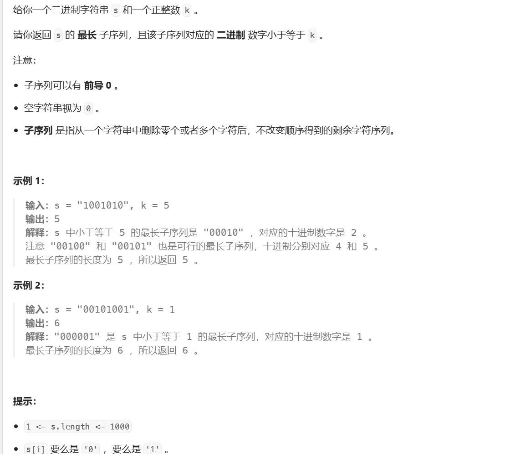


对于要找的子序列前面的前导0越多越好，应该在s靠后的位置找一个不大于k的子序列这样就可以加更多的0，找s中不超过K的最长后缀，如果不能往这个后缀中在添加1那么说明就只能添加0.

​	

```python
class Solution:
    def longestSubsequence(self, s: str, k: int) -> int:
        n,m=len(s),k.bit_length()
        if n<m:return n
        ans=m if int(s[-m:],2)<=k else m-1
        return ans+s[:-m].count('0')
        
```

### [通过最少操作次数使数组的和相等](https://leetcode.cn/problems/equal-sum-arrays-with-minimum-number-of-operations/)


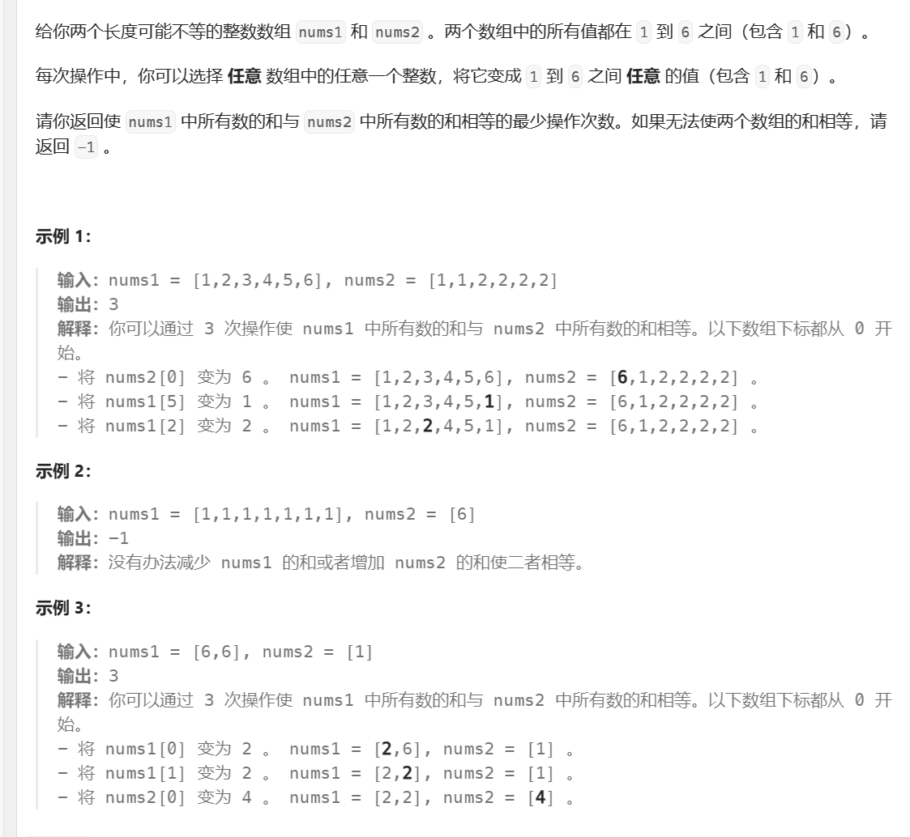

考虑总和为了使得操作次数最少，应该每一次能使差值减少最大。对于总和较大的数组每个元素最小变为1，差值最多减小nums[i]-1。对于总和较小的数组每个元素最大变为6，差值最多减小6-nums[i]，统计这些变化量的个数。

```python
class Solution:
    def minOperations(self, nums1: List[int], nums2: List[int]) -> int:
        n1,n2=len(nums1),len(nums2)
        # 特判
        if max(n1,n2)>min(n1,n2)*6:return -1
        # 交换，方便操作
        t1,t2=sum(nums1),sum(nums2)
        if t1==t2:return 0
        if t1>t2:
            nums1,nums2=nums2,nums1
        # 差值
        d=abs(t1-t2)
        memo=[0]*6
        # 记录变化量
        for a in nums1:
            memo[6-a]+=1
        for b in nums2:
            memo[b-1]+=1
        
        ans=0
        # 从大到小枚举
        for i in range(5,0,-1):
            # 如果能直接消除差值，那么向上取整
            if i*memo[i]>=d:
                return ans+ceil(d/i)
            # 反之，累减
            d-=i*memo[i]
            ans+=memo[i]

        return ans 
```

### [无重叠区间](https://leetcode.cn/problems/non-overlapping-intervals/)


考虑问题：今天有好几个活动，每个活动有相应的开始和结束时间，同一时间段只能参加一个活动，问一天最多能参加多少个活动。贪心的思考就是要参加结束时间最早的活动使得有更多的空余时间去参加别的活动，同时对于结束时间相同的活动选择开始时间晚的留出更多的时间。将数组排序后依次遍历，对于不能满足的活动就排除。


```python
class Solution:
    def eraseOverlapIntervals(self, intervals: List[List[int]]) -> int:
        # 排序
        intervals.sort(key=lambda x:(x[1],x[0]))
        r=intervals[0][1]
        cnt=1
        for i in range(1,len(intervals)):
            # 可选
            if intervals[i][0]>=r:
                cnt+=1
                r=intervals[i][1]
        return len(intervals)-cnt
```


### [排布二进制网格的最少交换次数](https://leetcode.cn/problems/minimum-swaps-to-arrange-a-binary-grid/)

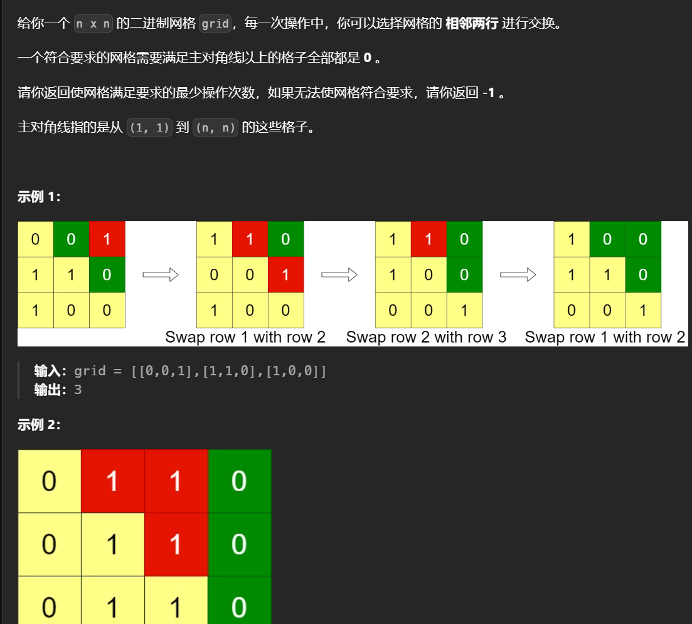

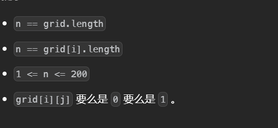


最少的交换次数按贪心的做法，一定是把在这个位置之下的第一个符合条件的放上来，对于给定的数据可以模拟暴力操作。

```python
class Solution:
    def minSwaps(self, grid: List[List[int]]) -> int:
        nums=[]
        vis=set()
        ans=i=temp=0
        n=len(grid)
        # 统计右边1的个数
        for g in grid:
            cnt=0
            for c in g[::-1]:
                if c==0:cnt+=1
                else:break
            nums.append(cnt)
        # 从上往下找
        while i<n:
            v=n-i-1
            j=i
            while j<n and nums[j]<v:j+=1
            if j==n:return -1
	
    	# 模拟交换顺便记录次数
            while j>i:
                nums[j],nums[j-1]=nums[j-1],nums[j]
                ans+=1
                j-=1
            i+=1

        return ans 
```


### Blue-Red Permutation


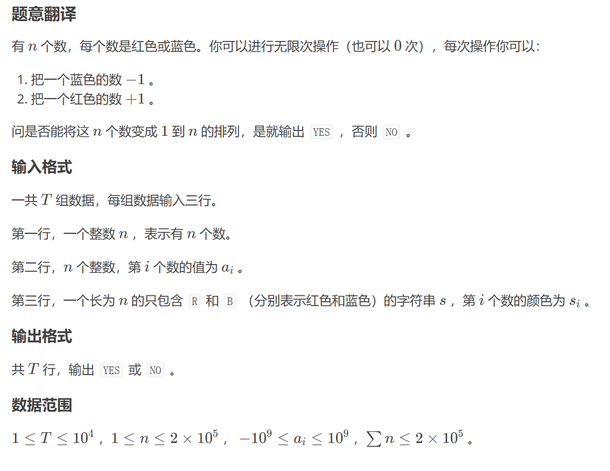

贪心的思想，把每个元素按照颜色分类，在找1到n的过程中如果蓝色有值就匹配蓝色中最小的，因为越小的蓝色和越大的红色表示的范围越小，把数尽可能的用蓝色去填充可以保证后面能匹配更多大的值，如果当前的蓝色小于当前值说明这个蓝色没有地方放无法满足，当蓝色用完了后去使用红色，如果红色大于当前值则这个位置无法填充不满足条件。


```python
import sys
input=sys.stdin.readline
from collections import deque
ans=[]
for _ in range(int(input())):
    n=int(input())
    nums=[int(x) for x in input().split()]
    color=input().rstrip()
    # 使用队列储存
    r=deque()
    b=deque()
    # 分类，注意要先排序
    for v,c in sorted([(a,b) for a,b in zip(nums,color)]):
        if c=='B':b.append(v)
        else:r.append(v)
    # 找1到n的数
    for i in range(1,n+1):
        v=i
        # 先弹出蓝色的
        if b:
            if b[0]>=v:
                b.popleft()
            else:
                # 队首的蓝色无处安放 
                ans.append('NO')
                break
        else:
            if r[0]<=v:
                r.popleft()
            else:
                ans.append('NO')
                break
    else:
        ans.append('YES')
for v in ans:
    print(v)
```

### [分割两个字符串得到回文串](https://leetcode.cn/problems/split-two-strings-to-make-palindrome/)

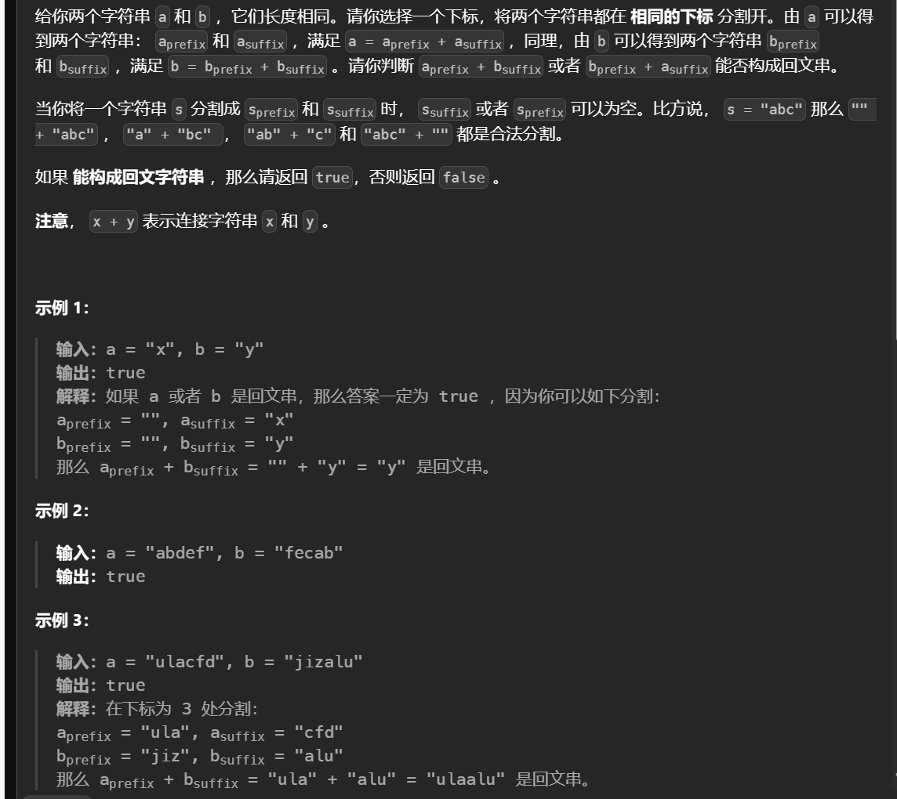


从同一个位置分开然后组合判断是否是回文串，如果前后缀相同就有可能是回文串，接着去判断中间的字符，前后缀能匹配的字母越多中间需要判断的字符就越少，因此找到最大的前后缀匹配字符然后去判断中间。

```python
class Solution:
    def checkPalindromeFormation(self, a: str, b: str) -> bool:
        n=len(a)
        def check(a,b):
            l,r=0,n-1
            while l<r and a[l]==b[r]:
                l+=1
                r-=1
            # 中间的那段
            s=a[l:r+1]
            t=b[l:r+1]
            return s==s[::-1] or t==t[::-1]
        # 两种情况
        return  check(a,b) or check(b,a)

```

### [形成目标数组的子数组最少增加次数](https://leetcode.cn/problems/minimum-number-of-increments-on-subarrays-to-form-a-target-array/)

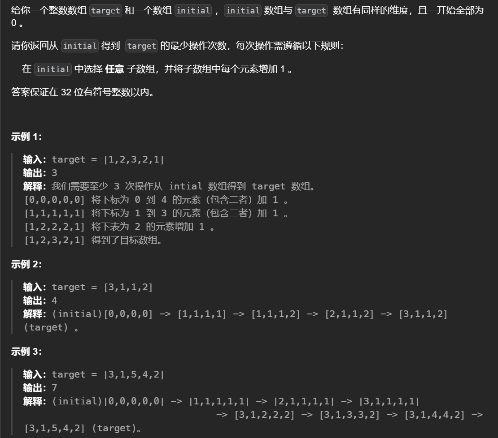


贪心的做法：每个元素所需要的操作与它左边的相关，如果左边的数小于它，那么需要补一个差值，如果大于等于它那么就不要需要操作。	

```python
class Solution:
    def minNumberOperations(self, target: List[int]) -> int:
        n=len(target)
        # dp=[0]*n
        # dp[0]=target[0]
        # for i in range(1,n):
        #     if target[i]<=target[i-1]:
        #         dp[i]=dp[i-1]
        #     else:
        #         dp[i]=dp[i-1]+target[i]-target[i-1]
        # return dp[-1]
        ans=target[0]
        for i in range(1,n):
            if target[i]>target[i-1]:
                ans+=target[i]-target[i-1]
        return ans 
```


### [跳跃游戏 II](https://leetcode.cn/problems/jump-game-ii/)


贪心的做法，每次尽可能地走远，维护两个值一个标记当前的终止位置一个表示当前可以走到的最远位置，一旦当前位置与终止位置相等，那就需要跳到最远的位置，让终止位置等于最远位置而不是实际变化指针，继续遍历在遍历的过程中记录最远位置。

```python
class Solution:
    def jump(self, nums: List[int]) -> int:
        n=len(nums)
        curr=mx=end=ans=0
        for i in range(n-1):
            mx=max(mx,i+nums[i])
            if i==end:
                ans+=1
                end=mx
        return ans 
```

### Rotation Matching

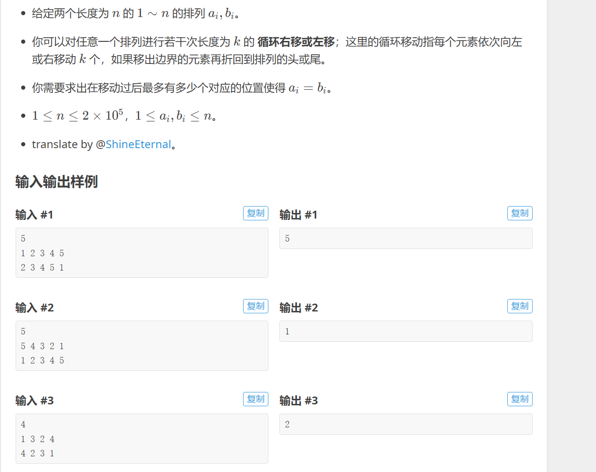

移动那个数组都一样，因此固定B去移动A，对于每个元素查看它在AB中的位置，如果在A中的位置靠左代表A数组需要向右移动r-l个单位才能保证这个元素满足要求，反之要移动l+n-r个单位才能相同，查询每个元素相等所需的A数组向右移动次数最多的那个就是最后能得到的最大的结果。

```python
from collections import Counter,defaultdict
n=int(input())
a=[int(x) for x in input().split()] 
b=[int(x) for x in input().split()]
l=Counter()
r=Counter()
for i in range(n):
    l[a[i]]=i
    r[b[i]]=i
cnt=Counter()
for i in range(1,n+1):
    l1,r1=l[i],r[i]
    if l1<=r1:
        cnt[r1-l1]+=1
    else:
        cnt[r1+n-l1]+=1
print(max(cnt.values()))

```


### [完成所有任务的最少初始能量](https://leetcode.cn/problems/minimum-initial-energy-to-finish-tasks/)


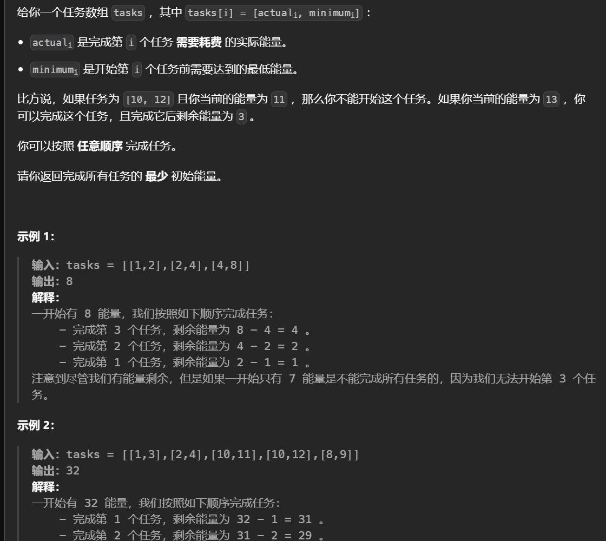

贪心的思想，对于每个任务min-actual是最少能剩余多少能量，倒序遍历保证剩余能量最多，从而可以遍历完所有的。

```python
class Solution:
    def minimumEffort(self, tasks: List[List[int]]) -> int:
        tasks.sort(key=lambda x:(x[1]-x[0]),reverse=True)
        # 一个表示当前能量一个表示初始能量
        t=ans=0
        for l,r in tasks:
            # 如果当前能量不满足只能增加
            if t<r:
                ans+=r-t
                t=r-l
            else:
                t-=l
        return ans
```

### [全部开花的最早一天](https://leetcode.cn/problems/earliest-possible-day-of-full-bloom/)


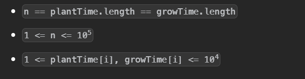

播种所需的时间是固定的，可以交替播种或者一个一个播种，两种方式所需的总播种时间是固定的，但是交替播种会使一个花的播种完成时间延后这一定是不好的，因此选择种完一个去种另一个。


```python
class Solution:
    def earliestFullBloom(self, plantTime: List[int], growTime: List[int]) -> int:
        d=ans=0
        for i,j in sorted(zip(plantTime,growTime),key=lambda x:-x[-1]):
            d+=i
            ans=max(ans,d+j)
        return ans 
```


### [ 移除后集合的最多元素数](https://leetcode.cn/problems/maximum-size-of-a-set-after-removals/)

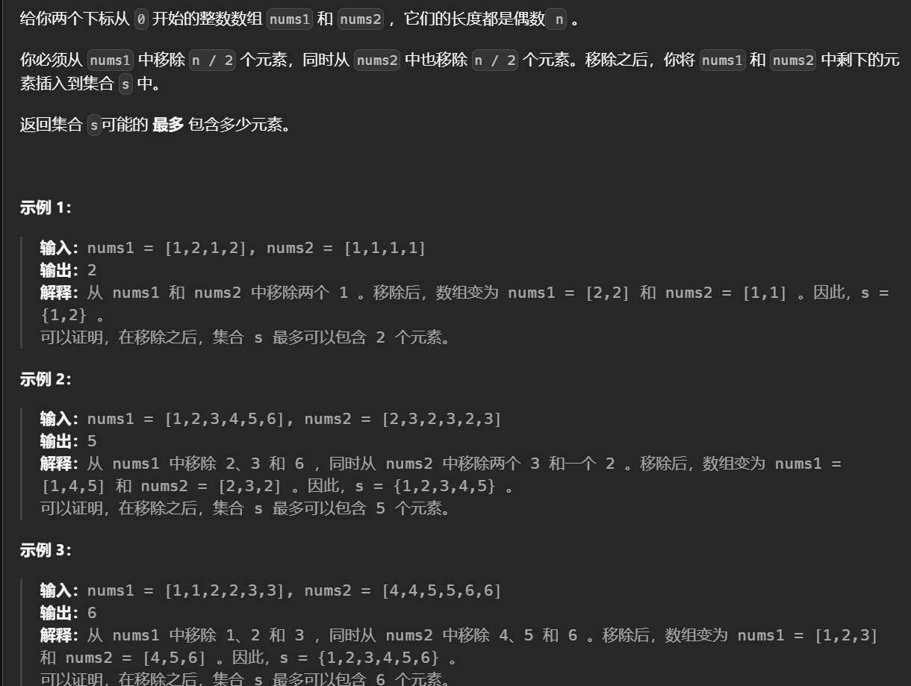


逆向思维：从两个数组中取出一半的元素组合在一起

贪心的思想：每次取值要从两个数组中独有的取，且不能大于一半

```python
class Solution:
    def maximumSetSize(self, nums1: List[int], nums2: List[int]) -> int:
        n=len(nums1)
        nums1=set(nums1)
        nums2=set(nums2)
        common=len(nums1&nums2)
        # 独有的就是取出了重复值后再减去两个共有的
        a=min(len(nums1)-common,n//2)
        b=min(len(nums2)-common,n//2)
	# 如果没取满n，再从共有的里面取n-a-b个，如果不够就只能是common个
        return a+b+min(n-a-b,common)   
```


从正向看

```python
class Solution:
    def maximumSetSize(self, nums1: List[int], nums2: List[int]) -> int:
        n=len(nums1)
        m=n//2
        
        nums1=set(nums1)
        nums2=set(nums2)
        # 先假设不删除值设置初始的结果
        ans=len(nums1)+len(nums2)
        common=len(nums1&nums2)
        ans-=common
        
        # 如果删除的值不足一半
        if n-len(nums1)<m:
            temp=m-(n-len(nums1))
            # 先从重复的值中删除，这样可以保证最后结果最大
            if common>=temp:
                common-=temp
            else:
                # 如果重复的值不够，只能在删完重复的之后把出现一次的值删除
                temp-=common
                ans-=temp
                common=0
        # 对于另一个也是同样的操作
        if n-len(nums2)<m:
            temp=m-(n-len(nums2))
            if common>=temp:
                common-=temp
            else:
                temp-=common
                ans-=temp
                common=0
        
        return ans

```


### Cat, Fox and Double Maximum

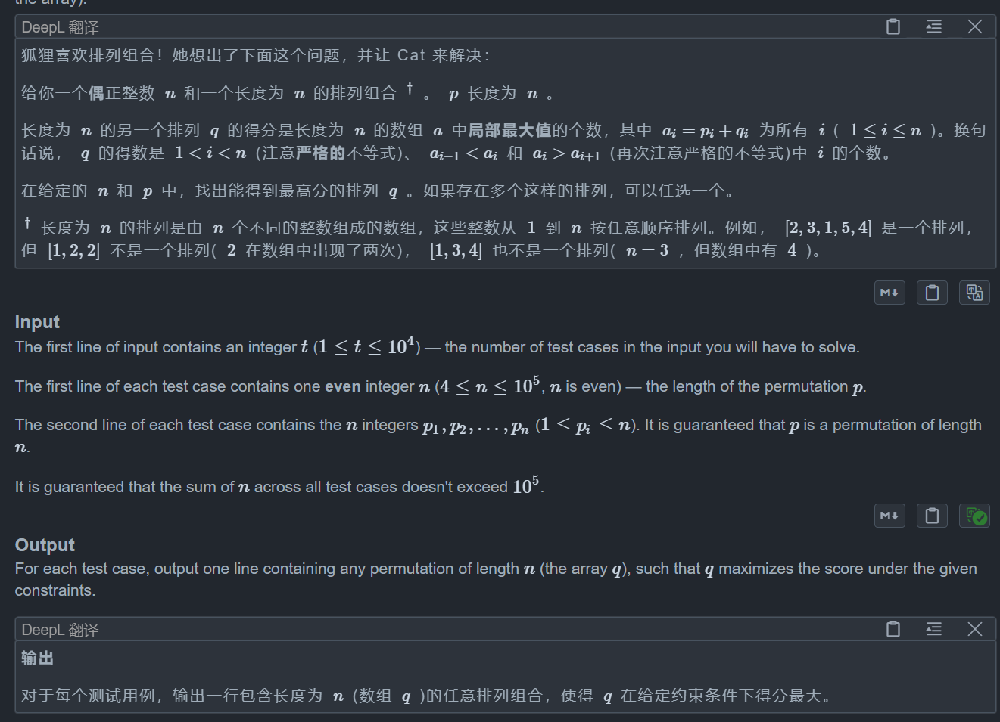


题目大意是对于给定的排列找一个从1到n的排列使得对应位置相加后的新的排列得分最大，这个的得分最大指定的存在最多的峰(即一个数严格大于两边的数)

对于一个数组，最多可以构造n//2-1个这样的峰

对于该题认为一定可以构造出n//2-1个峰，观察样例发现，峰的位置要么是1 3 5...要么是2 4 6...，因此对该题直接构造，至于为什么，贪心有的时候是看感觉的。

```python
from collections import deque
import sys
input=sys.stdin.readline
for _ in range(int(input())):
    n=int(input())
    nums=[int(x) for x in input().split()]
    k=n//2-1
    ans=[0]*n
    # 提取出对应位置的值，把大的值赋给小的峰，把小的值赋给较大的谷底
    mx=[]
    mn=[]
    r=n
    l=1
    for i in range(n):
        if i&1 and i!=n-1:mx.append([nums[i],i])
        else:mn.append([nums[i],i])
    mx.sort(key=lambda x:x[0])
    mn.sort(key=lambda x:x[0])
    for i,j in mx:
        ans[j]=r
        r-=1
    for i,j in mn[::-1]:
        ans[j]=l
        l+=1
    temp=0
    # 如果 1 3 5等位置不可。那么就去找 2 4 6位置
    for i in range(1,n-1,2):
        if nums[i]+ans[i]>nums[i+1]+ans[i+1] and nums[i]+ans[i]>nums[i-1]+ans[i-1]:temp+=1
    if temp==k:print(*ans)
    else:
        mx=[]
        mn=[]
        ans=[0]*n
        r=n
        l=1
        for i in range(n):
            if i>=2 and i&1==0 and i!=n-1:mx.append([nums[i],i])
            else:mn.append([nums[i],i])
        mx.sort(key=lambda x:x[0])
        mn.sort(key=lambda x:x[0])
        for i,j in mx:
            ans[j]=r
            r-=1
        for i,j in mn[::-1]:
            ans[j]=l
            l+=1
        print(*ans)

```


### Alternating Subsequence

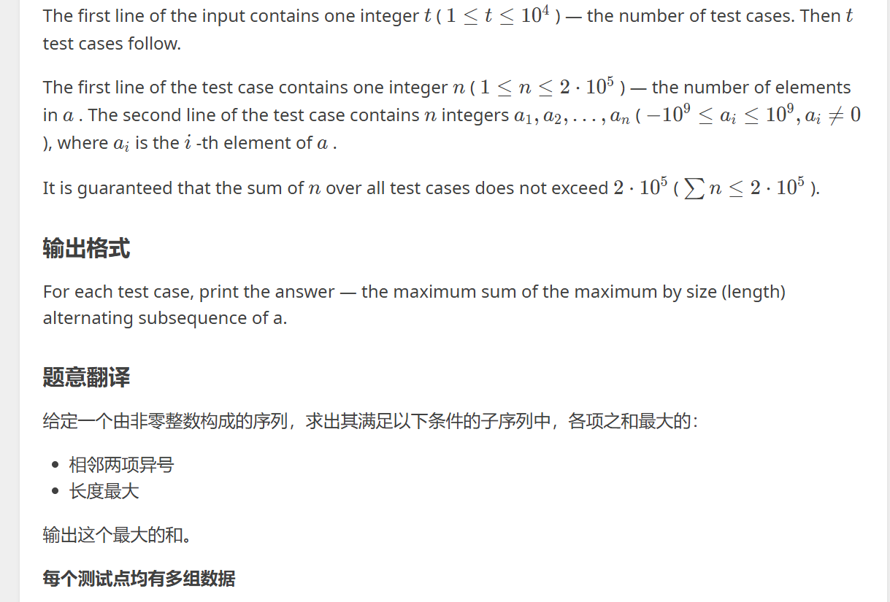

选取相邻异号的数字，要求最后的子序列和最大并且这个子序列的长度必须等于整个数组最长的相邻异号的长度。

为了取出相邻异号的数字，把数组中符号相同的分为一组，从每个组中取出一个数字这能做到取出最长的相邻异号的子序列，要求子数组和最大那么要在每个组中取出数是最大的。

```python
import sys
input=sys.stdin.readline

for _ in range(int(input())):
    n=int(input())
    nums=[int(x) for x in input().split()]
    i=0
    ans=0
    while i<n:
        start=i
        i+=1
        mx=nums[start]
        while i<n and nums[i]*nums[i-1]>0:
            mx=max(mx,nums[i])
            i+=1
        ans+=mx
    print(ans)
```

### [不可能得到的最短骰子序列](https://leetcode.cn/problems/shortest-impossible-sequence-of-rolls/)


题目大意是要找出一个最小的长度，对于这个长度在数组中无法找到所有元素的组合

贪心的思路：每次找出包含所有元素的最短前缀，找到了之后再继续往后找下一组。假设找到了m组那么一定能构造出长度为m的子序列，即从每一组中取出需要的，因此不能得到的最短子序列就是m+1

```python
class Solution:
    def shortestSequence(self, rolls: List[int], k: int) -> int:
        memo=Counter()
        m=0
        for r,x in enumerate(rolls):
            memo[x]+=1
            if len(memo)==k:
                m+=1
                memo=Counter()
        return m+1
```


### Alarm Clock 


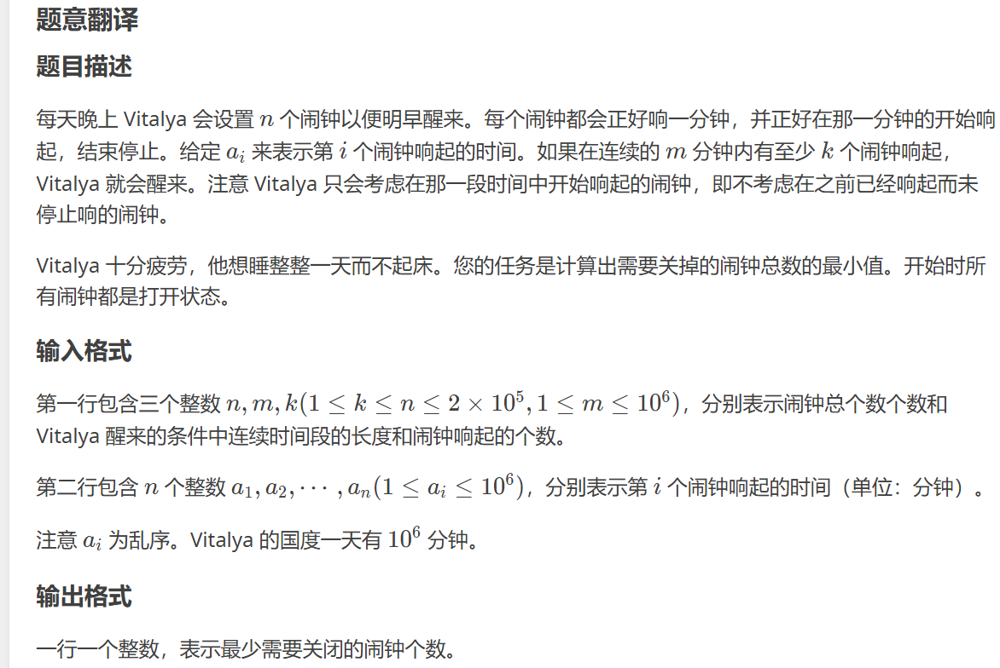

把问题想象成是在一个数轴上有多个点

更具体一点就是：数轴上有 n 个点，要求任意长为 m-1 的闭区间不能包含 >= k 个点。问：至少要去掉多少个点？

维护窗口内的点的个数 cnt。枚举 $a_i$ 作为窗口右端点位置，如果窗口长度 ≥𝑚≥*m* 则移动窗口左端点 left*left*。如果发现 cnt=𝑘*cnt*=*k*，则优先删除窗口最右边的点，这样更右边的窗口可以包含的点更少，删除右边的点可以使一个区间能包含的点最少从而减少操作次数。

```python
from bisect import bisect_left
from collections import deque

n,m,k=[int(x) for x in input().split()]
nums=[int(x) for x in input().split()]
nums.sort()
ans=0
d=deque()
for r,x in enumerate(nums):
    d.append(x)
    while d and d[-1]-d[0]+1>m:
        d.popleft()
    while d and len(d)>=k:
        d.pop()
        ans+=1
print(ans)
```

### [需要教语言的最少人数](https://leetcode.cn/problems/minimum-number-of-people-to-teach/)

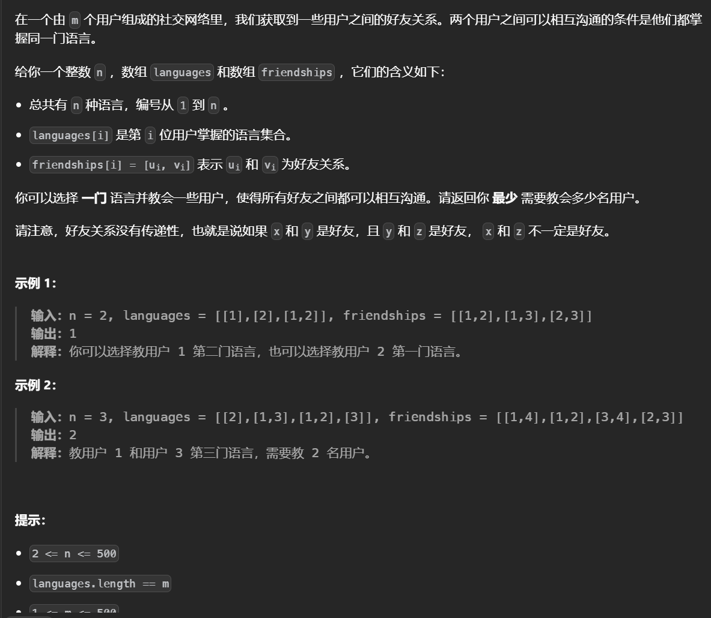

注意是只能教一门语言，找出所有无法沟通的好友统计他们会的最多的语言，这样可以使得需要教的人最少。

### Two Movies

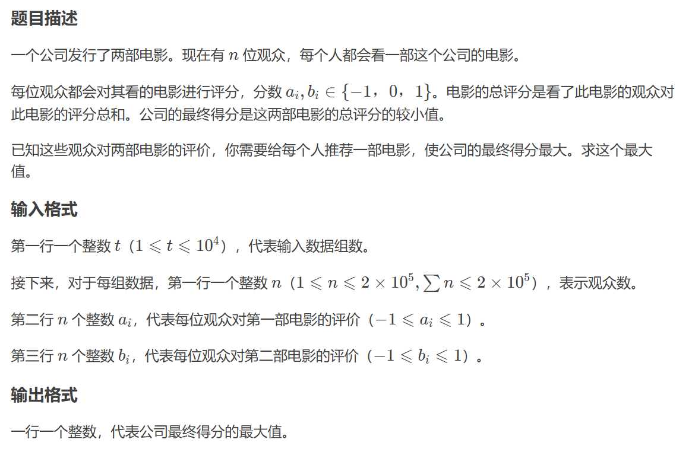

这里不需要按照顺序处理，对于不同的得分一定是要高分，而对于都为1的情况肯定是给较小的分数都为-1的情况一定是给较大那个，但是只有当所有不同的处理完了才能知道相同的该如何分配，因此先处理不同的再处理相同的。

```python
for _ in range(R()):
    n=R()
    a=RR()
    b=RR()
    arr=[]
    l=r=pre=0
    for i,j in zip(a,b):
        if  i>j:
            l+=i
        elif j>i:
            r+=j
        else:
          arr.append(i)
    for v in arr:
        if v==1:
            if l<r:l+=1
            else:r+=1
        elif v==-1:
            if l<r:r-=1
            else:l-=1
    print(min(l,r))
```


### [ 石子游戏 VI](https://leetcode.cn/problems/stone-game-vi/)

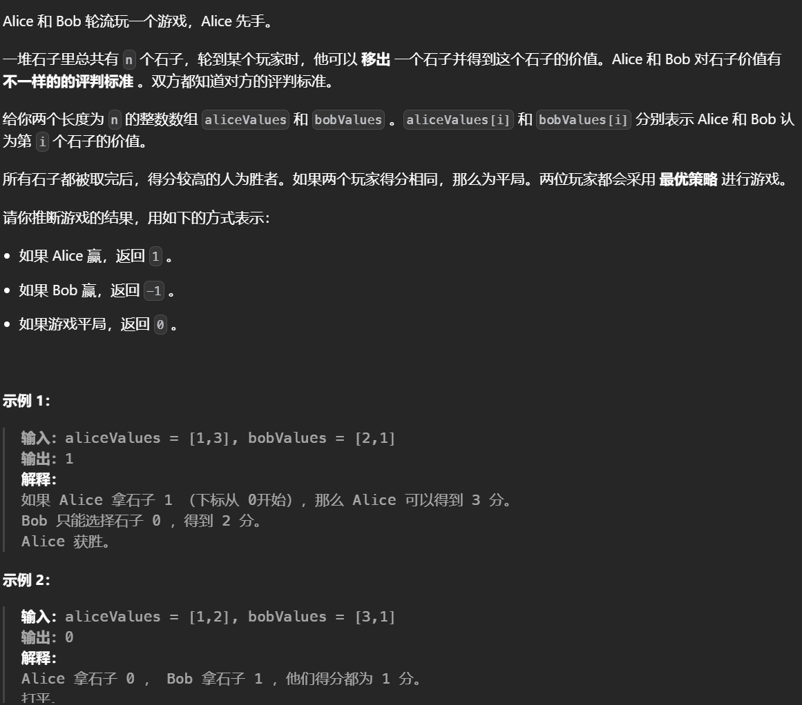

贪心的思想，拿走一个位置的结果不单单看他能给自身贡献多少值，同时还要看他能减少别人多少，比如这个位置能给自身贡献1，但是却能让别人减少100，总的收益实际上就是101，在计算的过程中每个人选择当前收益最大的，将对应的分数累加到自身。

或者

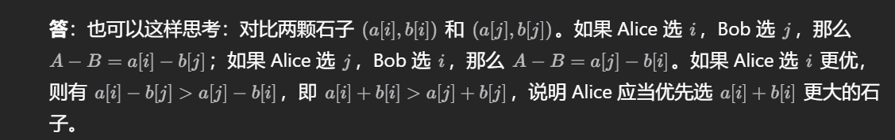

```python
class Solution:
    def stoneGameVI(self, aliceValues: List[int], bobValues: List[int]) -> int:
        a=b=0
        # 按照实际的收益排序
        nums=[(a+b,i) for i,(a,b) in enumerate(zip(aliceValues,bobValues))]
        nums.sort()
        nums=nums[::-1]
        for i in range(len(nums)):
            x,j=nums[i]
            # 累加之类加每个位置相应的值而不是实际收益
            if i&1:
                b+=bobValues[j]
            else:
                a+=aliceValues[j]
        if a==b:return 0
        elif a>b:return 1
        return -1
```


### 0, 1, 2, Tree!

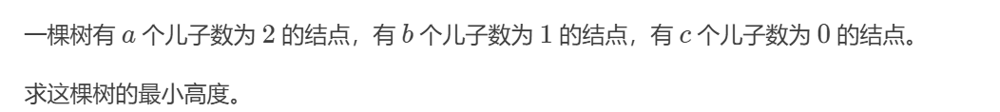

首先判断不满足的条件，对于a，他能有2*a个节点，但是已经用掉了a-1个，剩下的a+1个节点最终一定连接到c因为b不会影响到c的数量，因此a+1=c。

为了树的高度最小一定是先构造所有的a，因为b只会让树的高度增大而a可以多容纳别的节点。

```python
from math import ceil

for _ in range(int(input())):
    a,b,c=[int(x) for x in input().split()]
    if a+1!=c:print(-1)
    elif not a:print(b)
    else:
        # a能放置的层数等于a的二进制长度
        l=a.bit_length()
        # 最后一层不一定铺满所以留给b
        k=pow(2,l)-c
        b-=k
        if b<=0:print(l)
        else:
            # 如果还有b就只能接在c的下面
            l+=ceil(b/c)
            print(l)

```

### [判断一个括号字符串是否有效](https://leetcode.cn/problems/check-if-a-parentheses-string-can-be-valid/)

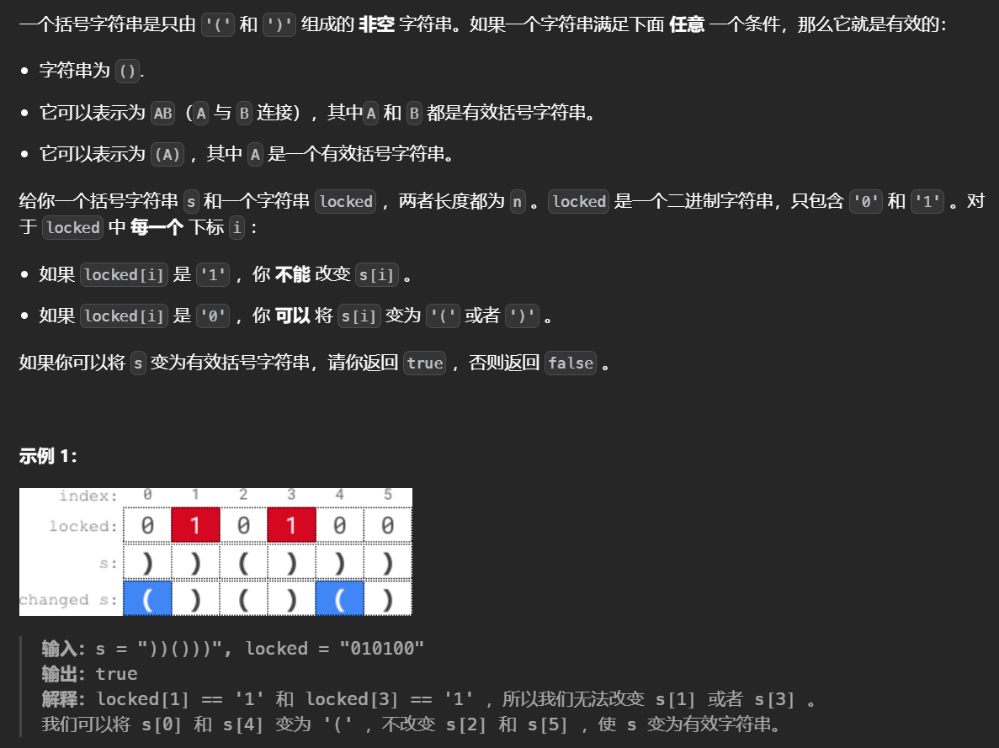

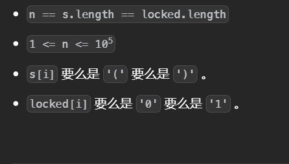

首先正向遍历，遇到可以变换的加一，否则对(加一，)减一，如果在这个过程中变量的值小于0说明无法匹配过多的右括号(即使把所有可以变得都变化了)，再倒序遍历，用同样的方式处理左括号较多的情况。

```python
class Solution:
    def canBeValid(self, s: str, locked: str) -> bool:
        n=len(locked)
        # 奇数一定不行
        if n&1:return False
        cnt=0
        for i,c in enumerate(s):
            if locked[i]=='0':
                cnt+=1
                continue
            if c=='(':cnt+=1
            else:cnt-=1
            if cnt<0:return False

        cnt=0
        for i in range(n-1,-1,-1):
            c=s[i]
            if locked[i]=='0':
                cnt+=1
                continue
            if c==')':cnt+=1
            else:cnt-=1
            if cnt<0:return False
        return True 
```

### [得到回文串的最少操作次数](https://leetcode.cn/problems/minimum-number-of-moves-to-make-palindrome/)


贪心的思路，每次先操作最外边的字符使它位置对应，当处理完完了外边的字符问题的规模就会缩小。

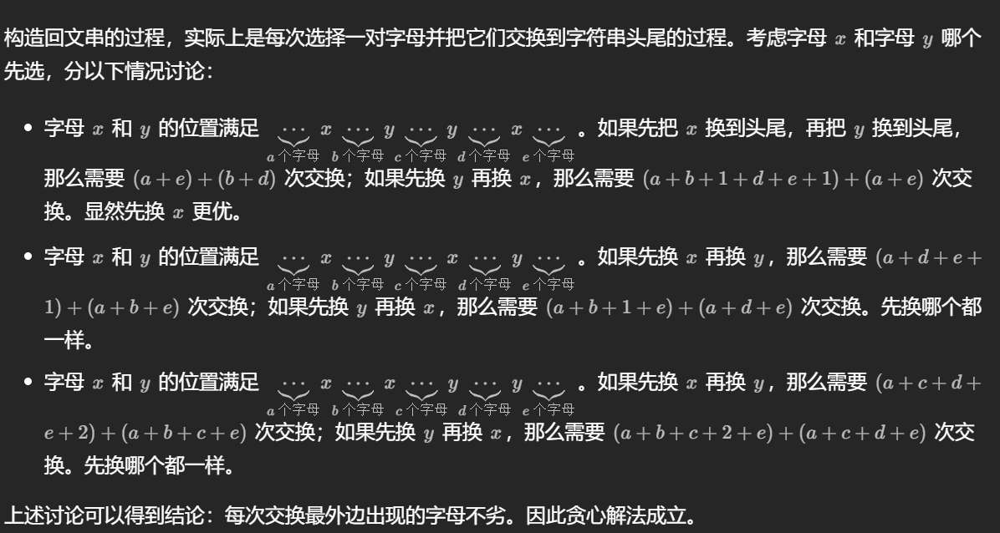


```python
class Solution:
    def minMovesToMakePalindrome(self, s: str) -> int:
        @cache
        def dfs(s):
            n=len(s)
            if n<=1:return 0
            # 先处理右边最先出现的字符    
            for i in range(n-1):
                if s[i]==s[-1]:
                    return i+dfs(s[:i]+s[i+1:-1])
            # 如果能走到这里说明这个字符出现一次，先跳过接着从左边开始找
            for i in range(n-1,0,-1):
                if s[i]==s[0]:
                    return n-1-i+dfs(s[1:i]+s[i+1:])
            return -1
        return dfs(s)
```

### [完成所有交易的初始最少钱数](https://leetcode.cn/problems/minimum-money-required-before-transactions/)

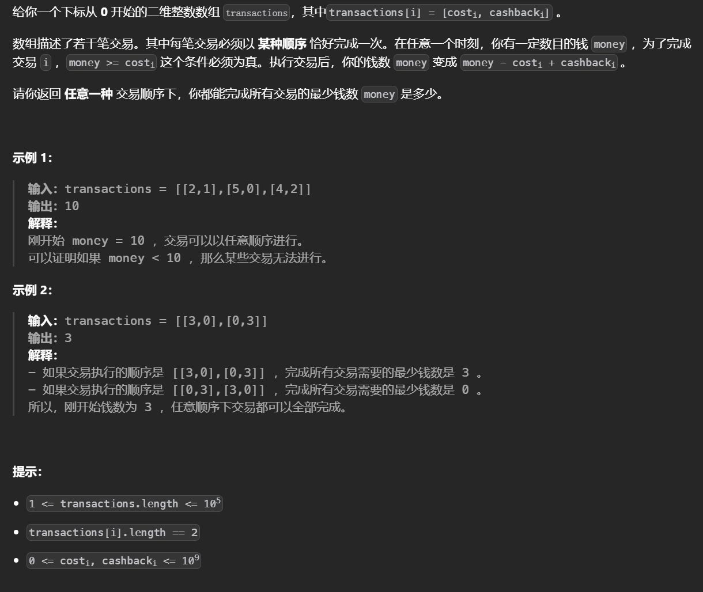

首先对每个投资分类要么是亏了要么是赚了，之后考虑每个交易为了完成这个交易最坏的情况是把除了它自身外投资亏损的处理过了后剩下的钱大于等于cost，最后的答案就是枚举过程中的最大值

```python
class Solution:
    def minimumMoney(self,nums: List[List[int]]) -> int:
        n=len(nums)
        s=0
        ans=0
        # 先求出所有的亏损
        for i in range(n):
            l,r=nums[i]
            deg=l-r
            s+=max(deg,0)
        # 对于亏损的交易，先减去总的亏损中自己的那一部分，赚了的不需要考虑
        for i in range(n):
            l,r=nums[i]
            deg=l-r
            if deg>0:
                ans=max(ans,s-deg+l)
            else:
                ans=max(ans,s+l)
        return ans
```


### Grouping Increases


定义两个子序列的结尾元素x,y(x>y)，答案的贡献只与两个相邻的数有关，对于每一个元素考虑把它放入那个序列中，如果这个元素大于x那么只能贡献答案，把y变为这个元素因为要保证两个元素都尽可能大才能使答案较小，如果x>=val>y那么不想变大答案把它放到x的末尾，如果val<y那么为了两个结尾都尽可能大把x变为val。

```python
for _ in range(R()):
    n=R()
    nums=RR()
    ans=0
    s,t=n+2,n+1
    for i in range(n):
        v=nums[i]
        if v>s:
            t=v
            ans+=1
            if t>s:s,t=t,s
        elif s>=v>t:
            s=v
        else:
            t=v
    print(ans)
```


## 离散化

`对于数据范围比较大(10^9)，但是数据量不是很大的情况(10 ^5)，因此把序列映射到从0开始的连续自然数`。

如果有重复元素需要去重，数组需要先进行排序

```python
a=[...]
a.sort()
b=[bisect_left(a,x) for x in a ]
```

### 区间和

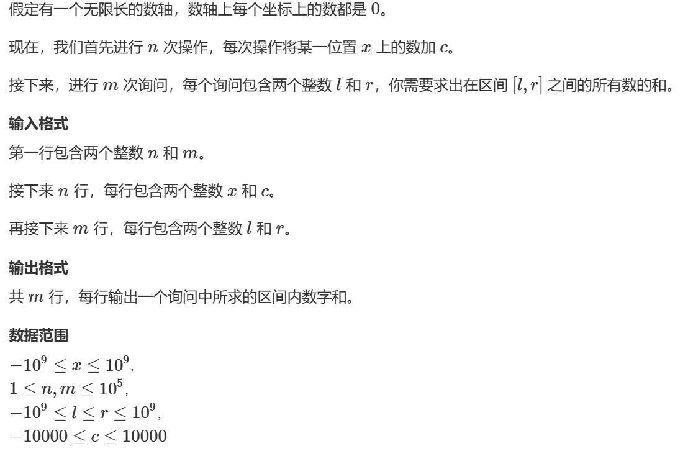

这里数据范围很大但是h只有10^5个数据

```python
from bisect import bisect_left
from collections import Counter
from itertools import accumulate as ac
n,m =[int(x) for x in input().split()]
memo=Counter()
index=[]
while n:
    u,v=[int(x) for x in input().split()]
    # 需要注意，一个位置可能多次改变，因此累加他的值
    memo[u]+=v
    index.append(u)
    n-=1
q=[]

while m:
    u,v=[int(x) for x in input().split()]
    q.append([u,v])
    index.extend([u,v])
    m-=1

# 注意要去重
index=list(set(index))
index.sort()
# 离散化
arr=[bisect_left(index,x) for x in index]

res=[0]*len(arr)

for k,l in memo.items():
    res[bisect_left(index,k)]+=memo[k]

pre=[0]+list(ac(res))

for s,e in q:
    # 查询之前记得改变一下坐标
    s=bisect_left(index,s)
    e=bisect_left(index,e)
    print(pre[e+1]-pre[s])
    
```


## 优先级队列

### [最小未被占据椅子的编号](https://leetcode.cn/problems/the-number-of-the-smallest-unoccupied-chair/)

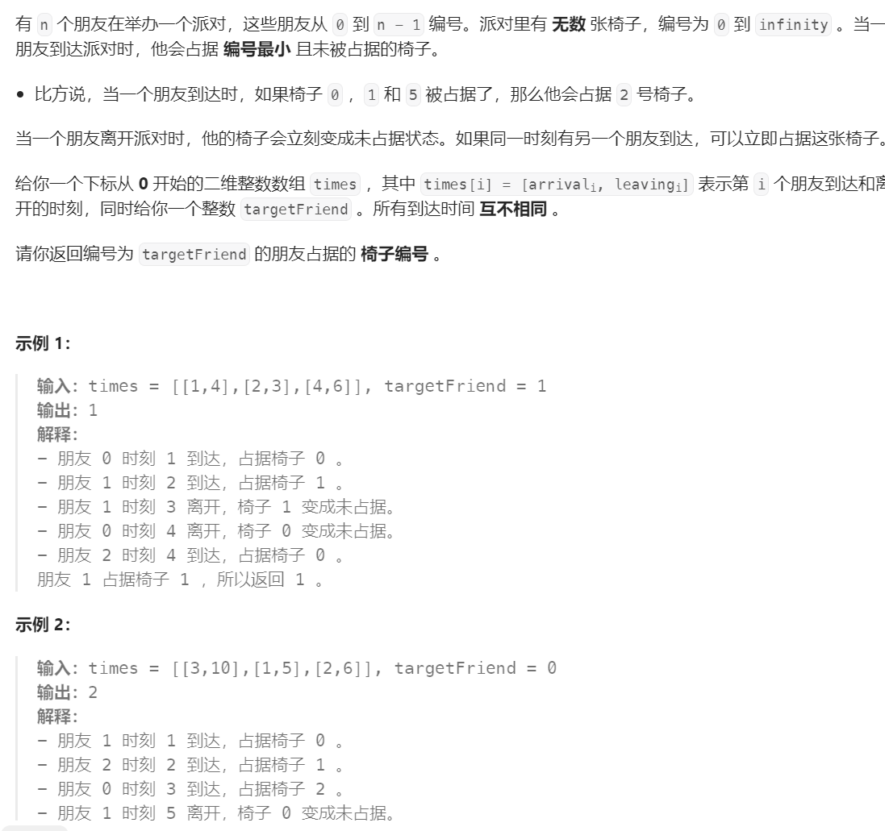

对于每一个人到达时需要选出最小的椅子，当一个人离开时需要把他占据的椅子释放，使用根堆实现当前最小的椅子编号以及可释放的椅子。

```python
class Solution:
    def smallestChair(self, times: List[List[int]], targetFriend: int) -> int:
        # 按照开始时间排序
        nums=sorted([ (v,i) for i,v in enumerate(times)],key=lambda x:x[0][0])
        # 记录使用的椅子
        endtime=[]
        n=len(nums)
        chair=list(range(n))
        for time,p in nums:
            s,e=time
            # 找出当前可释放的
            while endtime and s>=endtime[0][0]:
                _ , c =heappop(endtime)
                # 加入到可用椅子
                heappush(chair,c)
            c=heappop(chair)
            if p==targetFriend:
                return c
            heappush(endtime,(e,c))
```


​	


## 分组循环

适用场景：按照题目要求数组会被分给为若干组，且每一组的判断方式/处理逻辑是相同的。

核心思想：

+ 外层循环负责遍历组之前的准备工作（记录开始位置），和遍历组之后的统计工作（记录最大值）
+ 内存循环负责遍历组，找出这一组最远的位置


### 最长奇偶子数组

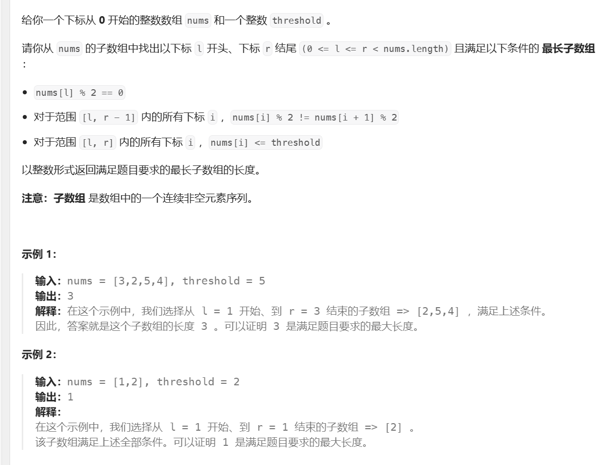

```python
class Solution(object):
    def longestAlternatingSubarray(self, nums, threshold):
        n=len(nums)
        ans=i=0
        while i<n:
             # 找到一组的开始位置，使用if判断而不是使用while，可以防止索引超出
            if nums[i]%2 or nums[i]>threshold:
                i+=1
                continue
            start=i#  记录这一组的开始位置
            i+=1 # 开始位置已经满足，从下一个位置开始判断
            while i<n and nums[i]%2!=nums[i-1]%2 and nums[i]<=threshold:# 按照要求向外延申
                i+=1
             # 记录最大值
            ans=max(ans,i-start)
        return ans
```


### 连续字符

可以看作是把字符串分为很多组

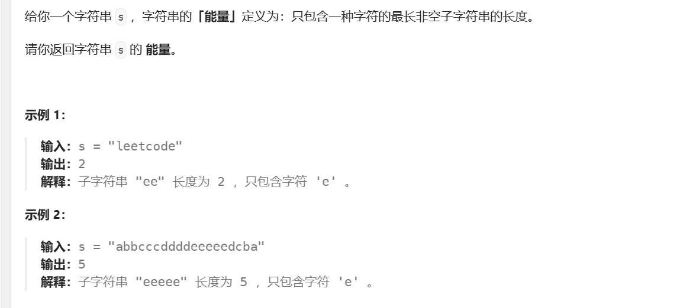

```python
class Solution(object):
    def maxPower(self, s):
        ans=i=0
        n=len(s)
        while i<n:
            start=i
            i+=1
            while i<n and  s[i]==s[i-1]:
                i+=1
            ans=max(ans,i-start)
        return ans
```


### 哪种连续子字符串更长


分组循环找出1与0最长的一组

```python
class Solution(object):
    def checkZeroOnes(self, s):
        ans1=ans0=i=0
        n=len(s)
        while i<n:
            start=i
            i+=1
            while i<n and s[i]==s[i-1]:
                i+=1
            if s[i-1]=='0':
                ans0=max(ans0,i-start)
            else:
                ans1=max(ans1,i-start)
        return ans1>ans0
```

### 统计同质子字符串的数目

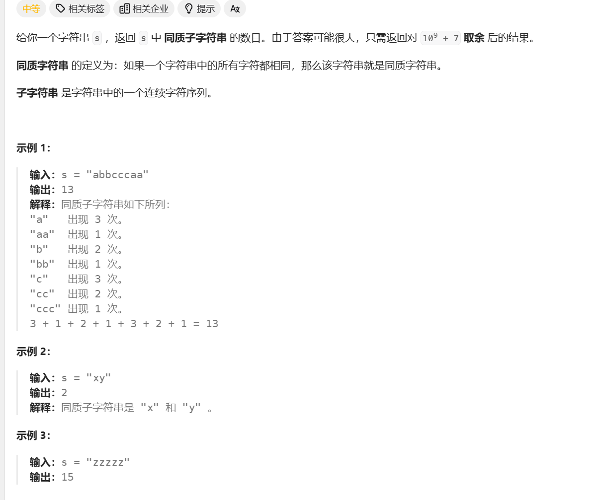

分组循环，找每一组的阶乘和,比如说一组的长度是n，则这一组的结果为n+n-1+n-2....

```python
class Solution(object):
    def countHomogenous(self, s):
        def cal(a):
            if a==1 or a==0:
                return a
            return a+cal(a-1)
        ans=i=0
        n=len(s)
        while i<n:
            start=i
            i+=1
            while i<n and s[i]==s[i-1]:
                i+=1
            ans+=cal(i-start)
        return ans%(10**9+7)	
```

### 如果相邻两个颜色均相同则删除当前颜色

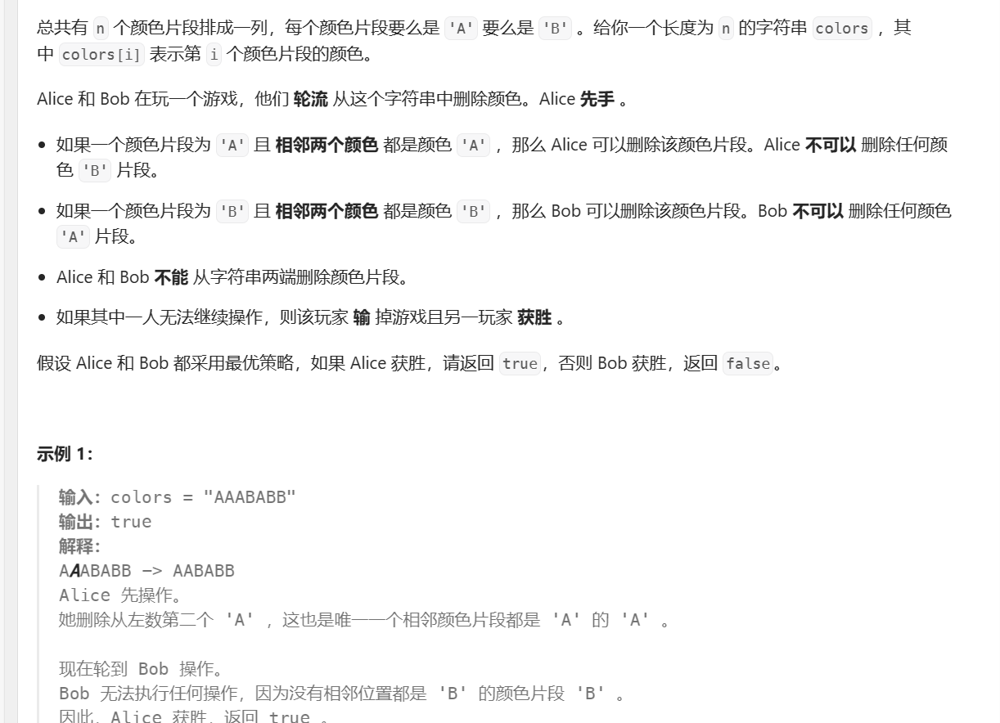

想要删除一个颜色片段，就必须要求两边有相同的颜色片段，也就是说对于一个连续的颜色块两边的颜色是不会被删除的，因此删除其中一个不会影响另一种颜色。至于两个人先手后手谁会赢，转化为比较两个人的操作次数，如果a先手则a的操作次数应该大于b的操作次数才行。

分组循环只有长度大于等于3的才能删除，记录操作次数为长度减去2（两边的无法删除）

```python
class Solution(object):
    def winnerOfGame(self, colors):
        a=b=0
        i=0
        n=len(colors)
        while i<n:
            start=i
            i+=1
            while i<n and colors[i]==colors[i-1]:
               i+=1
            if i-start>=3:
                if colors[i-1]=='A':
                    a+=i-start-2
                else:
                    b+=i-start-2
        return a>b
```

### 所有元音按顺序排布的最长子字符串

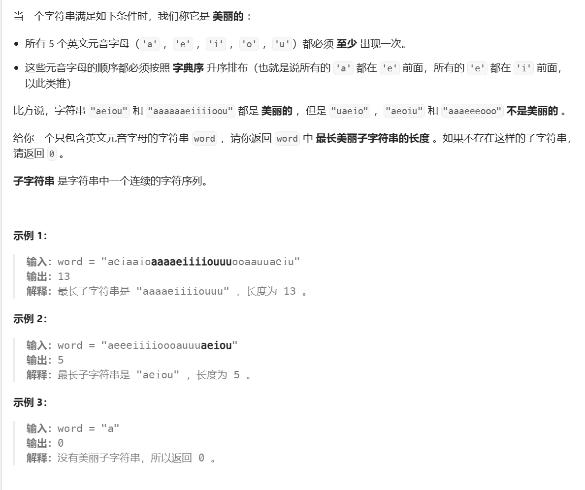

分组循环，用条件约束。

```python
class Solution(object):
    def longestBeautifulSubstring(self, word):
        ans=i=0
        word=list(word)
        n=len(word)
        while i<n:
            start=i
            i+=1
            while i<n and ord(word[i])>=ord(word[i-1]):
                i+=1
            li=word[start:i]
            if 'a' in li and 'e' in li and 'i' in li and 'o' in li and 'u' in li :
                ans=max(ans,i-start)
        return ans
```


### 使绳子变成彩色的最短时间

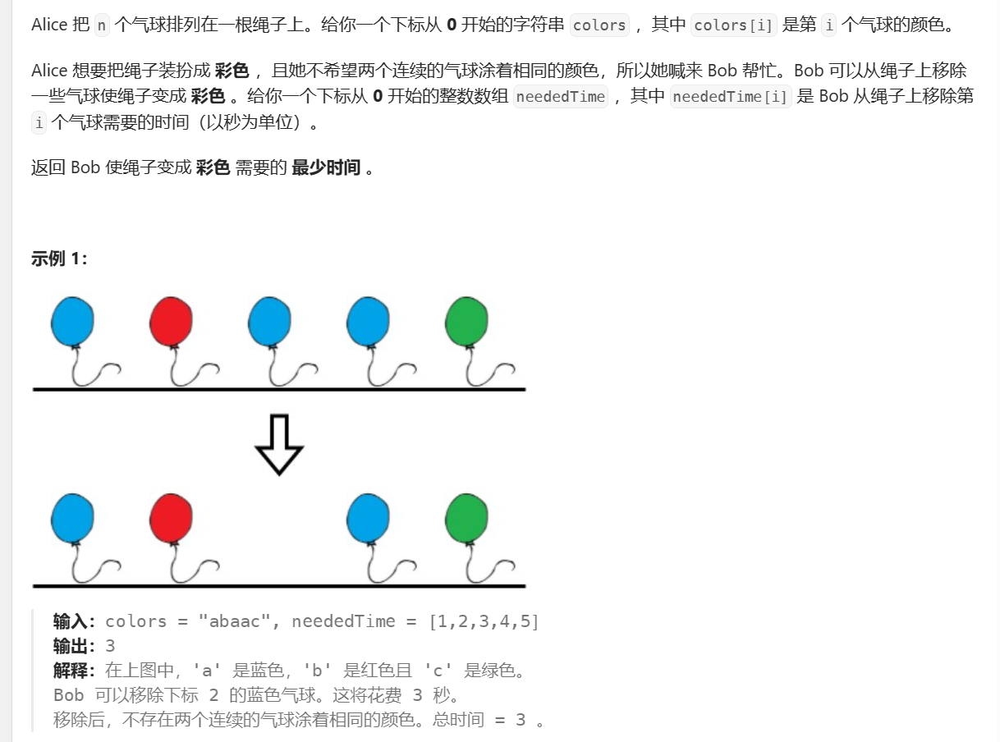

找出所有连续大于等于2的子数组，然后遍历对应的时间区间，由于只需要留一个，所以用时间区间元素的总和减去最大值（因为要求的是最少的时间）

```python
class Solution(object):
    def minCost(self, colors, neededTime):
        i=ans=0
        n=len(colors)
        while i<n:
            start=i
            i+=1
            while i<n and colors[i]==colors[i-1]:
                i+=1
            if i-start>=2:
                ans+=sum(neededTime[start:i])-max(neededTime[start:i])
        return ans
```


### [ 交换得到字典序最小的数组](https://leetcode.cn/problems/make-lexicographically-smallest-array-by-swapping-elements/)

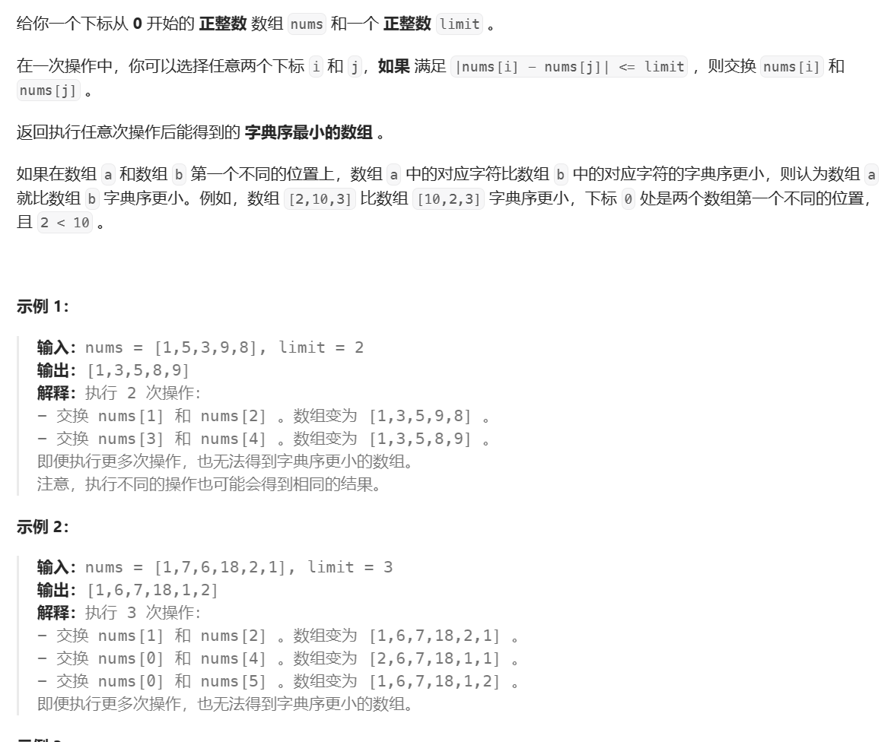


只有相差小于等于limit的才能进行交换，把nums带着下标排序（排完序之后可以很容易的找出相差为limit的值），将连续的相差等于limit的记为一组，因为没有要求是连续的数组因此这一组的值可以在它们对应的位置区间任意交换。

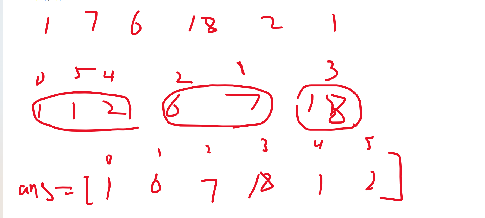

```python
class Solution:
    def lexicographicallySmallestArray(self, nums: List[int], limit: int) -> List[int]:
        n=len(nums)
        # 带着下标以数字大小排序
        a=sorted(zip(nums,range(n)))（技巧点）
        i=0
        # 答案
        ans=[0]*n
        # 分组循环
        while i<n:
            st=i
            i+=1
            while i<n and a[i][0]-a[i-1][0]<=limit:
                i+=1
             # 注意下标也要排序，因为此时的值是从小到大的，为了保证字典序最小，最小的值应该对应最小的索引，但此时的下标是数值在原数组中对应的位置huo'zhe'shuo
            index=sorted(i for _,i in a[st:i])
            # 把最小的值放到当前组中最前面的位置
            for pos,(x,_) in zip(index,a[st:i]):
                ans[pos]=x
        return ans 
```


### [ 构造有效字符串的最少插入数](https://leetcode.cn/problems/minimum-additions-to-make-valid-string/)


分组循环加上贪心，为了保证插入次数最少，每次尽可能找ab bc ac之类为一组，然后更新答案即可。


```python
from collections import deque
class Solution:
    def addMinimum(self, word: str) -> int:
        i=ans=l=0
        n=len(word)
        while i<n:
            start=i
            i+=1
            # 分组尽可能找多的
            while i<n and (ord(word[i-1])==ord(word[i])-1 or ord(word[i-1])+2==ord(word[i]) ):
                i+=1
            l=i-start
            ans+=3-l
        return ans
```


## 动态规划

动态规划三要素：

+ 重叠子问题：通过画图可以找出有无重叠子问题，从而判断是否使用备忘录。
+ 状态转移方程：明确dp数组的定义，所定义的dp数组可以运用数学归纳法求出下一个状态
+ 最优子结构：从子问题的最优结果可以推出更大规模的最优结果

存在子问题就可以用动态规划


子数组一般设定dp(i)表示以nums[i]结尾的子数组，子字符串也可以用dp解决，此外根据题目的额外要求会给出新的状态

子序列枚举选或不选，或者枚举选哪个

区间dp：一般是定义dp(i,j)其中i,j表示一个区间，根据题意写出不同的转移方程


动态规划优化到极致就是递推，因此最低的时间复杂度可以通过递推求解，同时也可以大大降低空间开销。当改为递推时，要参照递归中的定义，如果递归中是从i-1转移过来，那么递推中就是要从小到大枚举，同时如果是i-1是要判断是否越界的，可以在递推中把每个下标都加一以此来减少判断。

选或不选想到背包问题

线性dp有的时候考虑倒序做法，比如说操作了当前的位置后后面的某个位置不能操作了

涉及到奇数偶数的考虑状态机dp

回文串可能会定义dp(i,j)表示区间

有的情况下dp不一定要表示为最后的结果，也可以表示为能推出最后jie'guo'de


### 斐波那契数列

最基本的递归写法

```python
def fibo(n):
    if n==1 of n==2:
        return 1
    return fibo(n-1)+fibo(n-2)
```

最基本的递归写法十分的低效，在这个解法中存在许多重复的求解

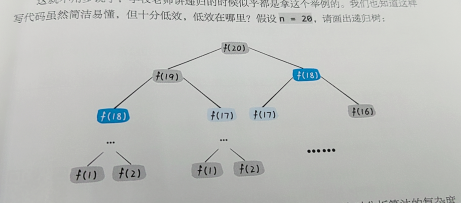

每次计算中会计算重复的子问题，并且这些子问题又十分巨大，为了解决这个问题选择使用大有备忘录的递归算法：在算法中添加一个备忘录，每次算出子问题的答案之后不用着急返回，先将其记到备忘录中，每次遇到一个子问题先到备忘录中去查找是否有对应的值。

```python
def fibo(n):
	memo=[0]*n
    return helper(memo,n)
def helper(memo,n):
	if n==1 or n==0:
        return n
    if memo[n]!=0:
        return memo[n]
    memo[n]=helper(memo,n-1)+helper(memo,n-2)
    return memo[n]
```

上述的写法是从顶向下，从规模较大的问题分解之规模较小的问题。

而自底向上的写法是从小的问题一步步推出大的问题，

```python 
def fibo(n):
    if n==0:
		return 0
	dp=[0]*n
    dp[0]=0
    dp[1]=1
    for i in range(2,n):
		dp[i]=dp[i-1]+dp[i-2]
    return dp[n]
```

上述代码可以进一步优化，因为其中当前的状态只与前两个状态有关，并不需要一个长数组储存

```python
def fibo(n):
	if n==0 or n==1:
    	return n
	dp_1=1
    dp_2=0
    for i in range(2,n):
		dp_i=dp_1+dp_2
        dp_2=dp_1
         dp_1=dp_i
     return dp_1
```


### 凑零钱

首先寻找问题是否可以切割，切割为更小的问题，对于以下问题可以将求解11划分为求解10 9 6，而10 9 6 又可以划分

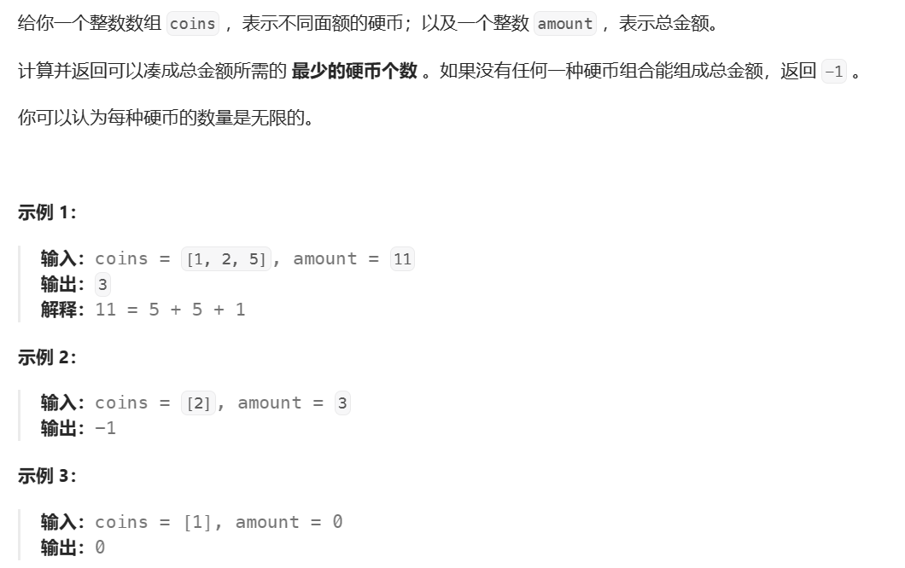

于是给出最基本的方法：

```python
class Solution(object):
    def coinChange(self, coins, amount):
        if amount==0:
            return 0
        elif amount<0:
            return -1
        res=100000
        for  coin in coins :
            ans=self.coinChange(coins,amount-coin)
            if ans==-1:
                continue
            else:
                res=min(res,ans)
        return res if res!=100000 else -1
```

但是在这个递归过程中会出现重复求解同一个问题，导致效率降低，可以添加一个备忘录记录已经算出来的值

```python
class Solution(object):
    def coinChange(self, coins, amount):
        memo=[-10 for _ in range(amount)]
        return self.dp(coins,amount,memo)
    def dp(self,coins,amount,memo):
        if amount==0:
            return 0
        elif amount<0:
            return -1
        if memo[amount]!=-10:
            return memo[amount]
        res=100000
        for  coin in coins :
            ans=self.dp(coins,amount-coin,memo)# 这里认定的递归函数的返回结果是当前金额所需的最少硬币数
            if ans==-1:# 结果为-1说明不存在
                continue
            else:# 最后的结果加上一是应为包含amount-coin这一次
                res=min(res,ans+1)
        memo[amount]=res if res!=10000 else -1# 不存在的记过也要计入
        return memo[amount]
```

上述的是自顶向下的解法，可以考虑自底向上

```python
class Solution(object):
    def coinChange(self, coins, amount):
        dp=[amount+1 for _ in range(amount+1)]
        dp[0]=0
        for i in range(len(dp)):
            for coin in coins :
                if i-coin <0:
                    continue
                dp[i]=min(dp[i],1+dp[i-coin])
        return dp[amount] if dp[amount]!=amount+1 else -1
```

###  完全平方数

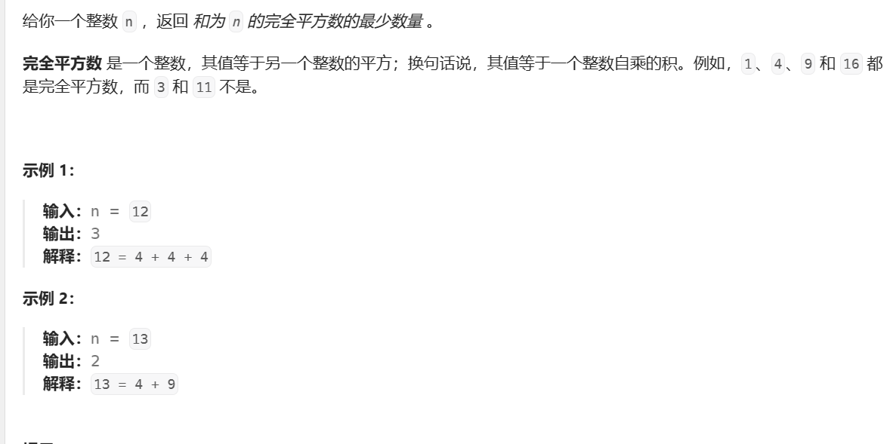

类似于凑零钱

dp[12]=min(dp[8]+1,dp[11]+1,dp[3]+1)

```python
class Solution(object):
    def numSquares(self, n):
        # dp数组的定义是dp[i]代表和为i的完全平方数的最少数量
        dp=[float('inf')]*(n+1)
        dp[0]=0
        for i in range(1,n+1):
            # 不越界
            for j in range(1,int(i**0.5)+1):
                dp[i]=min(dp[i],dp[i-j*j]+1)
        return dp[n]
```

### 组合总和

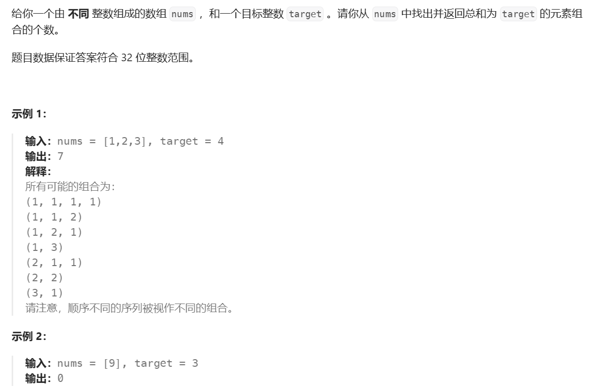

数组中元素不重复并且组合不考虑顺序

```python
class Solution(object):
    def combinationSum4(self, nums, target):
        # dp[i]返回有多少种组合可以得到i
        dp=[0]*(target+1)
        # 只有当不选取任何元素时，元素之和才为0，因此只有1种方案。
        dp[0]=1
        for i in range(1,target+1):
            # 在遍历的过程中每一个小于i的元素都会被作为排列的最后一个元素
            for j in range(len(nums)):
                if nums[j]<=i:
                    dp[i]+=dp[i-nums[j]]
        return dp[target]
```


### 01背包问题


定义状态为dp(i,j)，i表示前i个,j表示最大容量，问题可以由子问题求解，base case 为i=0即没有的选，如果容量合法则返回0注意一定要先判断是否合法。

```python
from math import inf
n,v=[int(x) for x in input().split()]
memo=[[0,0]]
for _ in range(n):
    v_,w=[int(x) for x in input().split()]
    memo.append([v_,w])
# 二维数组定义需要考虑到边界
dp=[[-inf]*(v+1) for _ in range(n+1)]
dp[0]=[0]*(v+1)

for i in range(1,n+1):
    for j in range(v+1):
        # 注意状态要合法，还能够装下
        if j-memo[i][0]>=0:
            dp[i][j]=max(dp[i-1][j-memo[i][0]]+memo[i][1],dp[i-1][j])
        else:
            dp[i][j]=dp[i-1][j]
            
print(dp[n][v])


def dp(i, j):
    if j < 0:
        return -inf
    if i == 0:
        return 0
    return max(dp(i - 1, j - memo[i][0]) + memo[i][1], dp(i - 1, j))
```

### [最后一块石头的重量 II](https://leetcode.cn/problems/last-stone-weight-ii/)

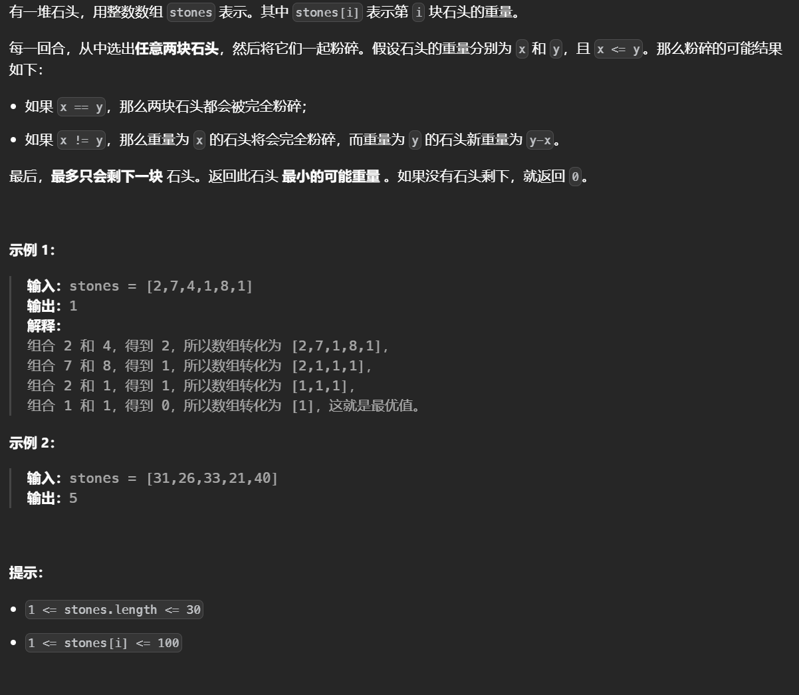

问题可以抽象为把石子分为两堆，求两堆和的最小差值，那么只要一堆接近总和的一半即可，用01背包求解能得出的最大的接近一般的和是多少。类似于从序列中选出接近target的子序列

```python
class Solution:
    def lastStoneWeightII(self, nums: List[int]) -> int:
        s=sum(nums)
        n=len(nums)
        @cache
        def dp(i,j):
            if j<0:return -inf
            if not i:return 0
            return max(dp(i-1,j-nums[i-1])+nums[i-1],dp(i-1,j))
        return abs(2*dp(n,s>>1)-s)
```


### 完全背包问题

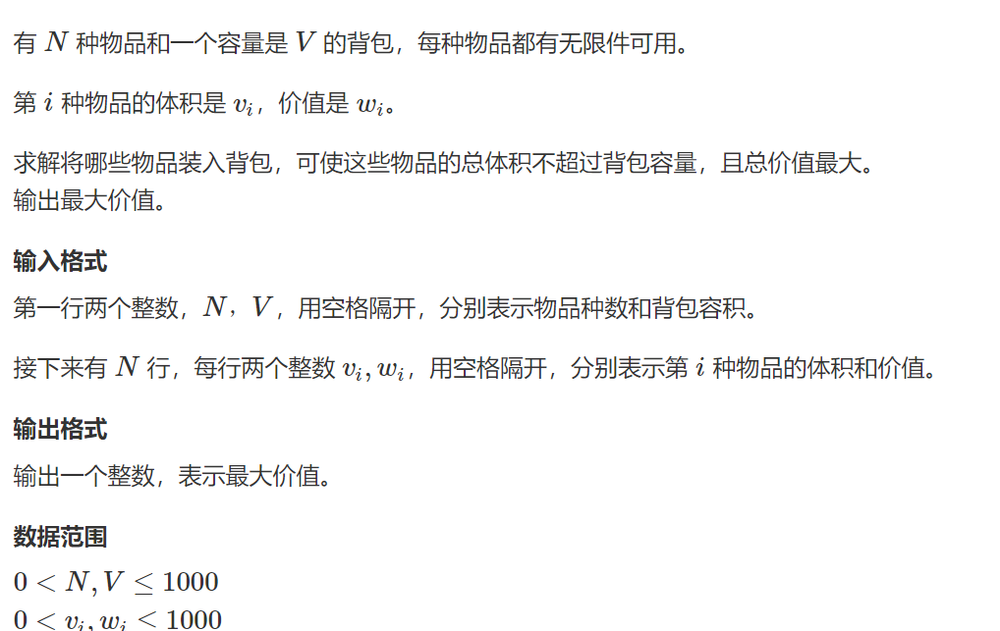


相比于01背包问题，这里的每个物品可以选无限多个（要合法）而不是只有选或不选两种情况，可以选0个1个2个...k个，因此在状态转移的过程中会有dp(i,j)=max(dp(i-1,j),dp(i-1,j-v),dp(i-1,j-2v),dp(i-1,j-3v)...dp(i-1,j-kv))，这相当于在转移的过程中多     出一重循环总共会有三重循环，对于1000的数据会超时，但是可以做优化：

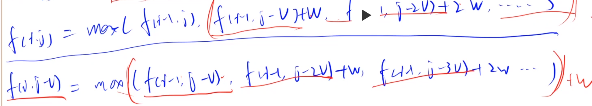


```python
from math import inf
n,v=[int(x) for x in input().split()]
# 注意初始化，方便转移的时候操作
nums=[[0,0]]
for _ in range(n):
    nums.append([int(x) for x in input().split()])

dp=[[inf]*(v+1) for _ in range(n+1)]
dp[0]=[0]*(v+1)

for i in range(1,n+1):
    for j in range(v+1):
        if j-nums[i][0]>=0:
            dp[i][j]=max(dp[i][j-nums[i][0]]+nums[i][1],dp[i-1][j])
        else:
            dp[i][j]=dp[i-1][j]
print(dp[n][v])
```

### 货币系统

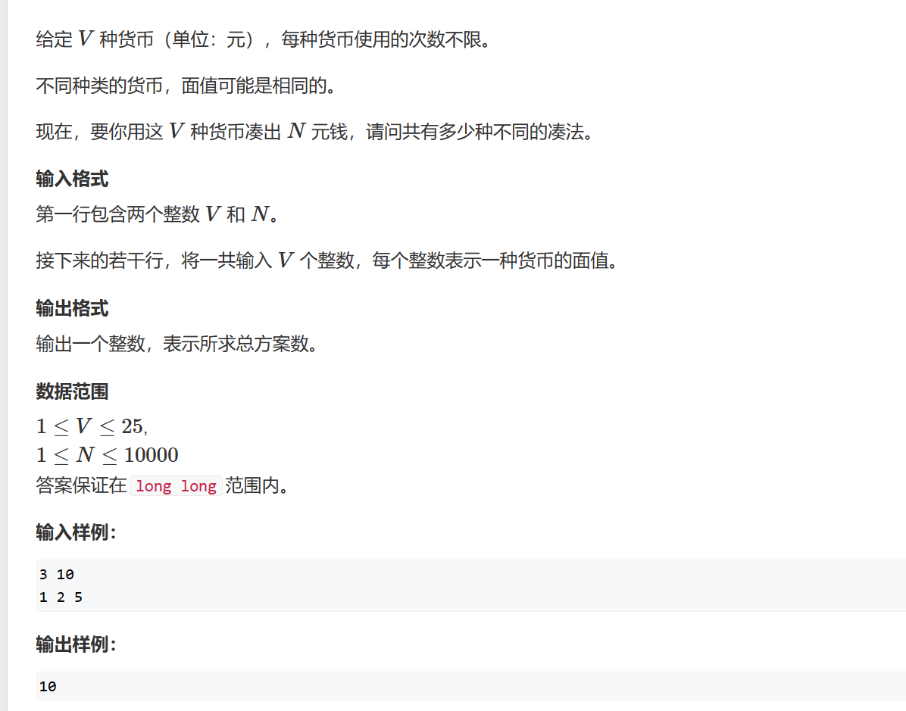

```python
from functools import lru_cache
n,v=[int(x) for x in input().split()]
nums=[]
# 记录数组
while len(nums)!=n:
    nums.extend([int(x) for x in input().split()])

# 定义dp[i][j]表示前i个数中当前钱的多少（容量），这里不能定义j=0的时候对应的结果为1因为最终会归到i=0j=0，如果定义为1会导致重复计算	
dp=[[0]*(v+1) for _ in range(n+1)]
# base case 
dp[0][0]=1
for i in range(1,n+1):
    for j in range(v+1):
        dp[i][j]+=dp[i-1][j]
        # 完全背包压缩，这里求的是总和
        if j-nums[i-1]>=0:dp[i][j]+=dp[i][j-nums[i-1]]
        
print(dp[-1][-1])
    

```


### 多重背包问题

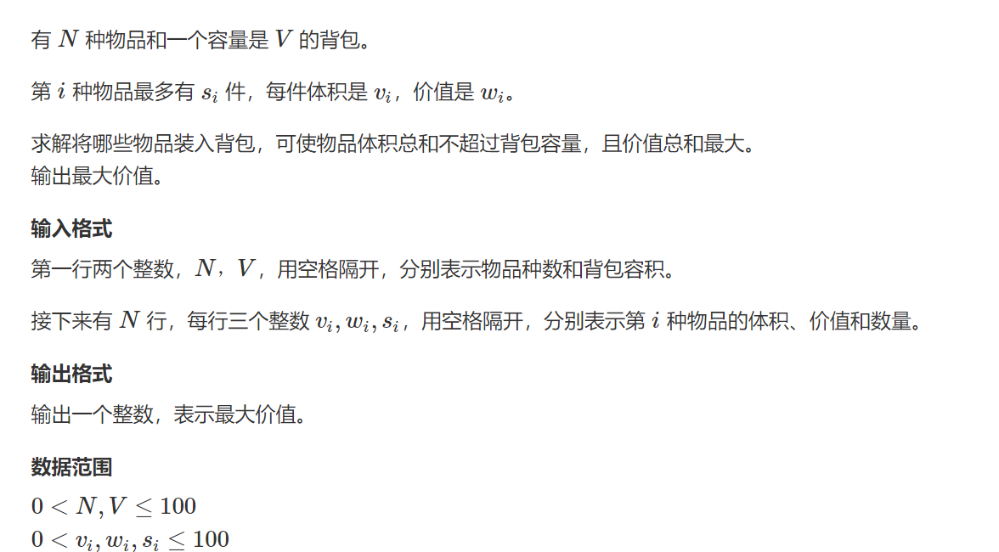


规定了物品最多能选s件，类似于完全背包问题状态转移的过程中多出一层循环，对于给定的数据可以接受。

```python
from math import inf

n,v=[int(x) for x in input().split()]
memo=[[0,0]]

for _ in range(n):
    memo.append([int(x) for x in input().split()])
    
dp=[[-inf]*(v+1) for _ in range(n+1)]
dp[0]=[0]*(v+1)

for i in range(1,n+1):
    for j in range(v+1):
        # 枚举出所有合法的状态
        li=[dp[i-1][j-s*memo[i][0]]+s*memo[i][1] for s in range(memo[i][2]+1) if j-s*memo[i][0]>=0]
        dp[i][j]=max(li)
print(dp[n][v])
```

当数据范围比较大的时候就不能选择枚举每一个，这里选择拆开每种物品单独看作一个集合把问题转化内01背包问题，但是如果拆分为1个的形式那么和枚举所有的没有区别这里的方法是拆分为二进制形式（技巧点），比如说7会拆为1 2 4，10会拆为1 2 4 3再把它们单独看作是一个集合，这样相当于把一重循环减小为logn，二进制的形式可以组合为0到n之间任意一个数。

 

```python
from math import inf
n,v=[int(x) for x in input().split()]
items=[]
for _ in range(n):
    v_,w,s=[int(x) for x in input().split()]
    index=0
    # 拆分为二进制形式，或者使用矩阵快速冥的写法
    while s-2**index>=0:
        items.append((v_*2**index,w*2**index))
        s-=2**index
        index+=1
     # 最后可能会剩余一个
    if s:
        items.append((v_*s,w*s))
# 这里不再是n个人了
n=len(items)
# 注意初始化
items=[[0,0]]+items
dp=[[-inf]*(v+1) for _ in range(n+1)]
dp[0]=[0]*(v+1)
for i in range(1,n+1):
    for j in range(v+1):
        # 问题转换为01背包
        if j-items[i][0]>=0:
            dp[i][j]=max(dp[i-1][j],dp[i-1][j-items[i][0]]+items[i][1])
        else:
            dp[i][j]=dp[i-1][j]
print(dp[n][v])
```


### [获得分数的方法数](https://leetcode.cn/problems/number-of-ways-to-earn-points/)

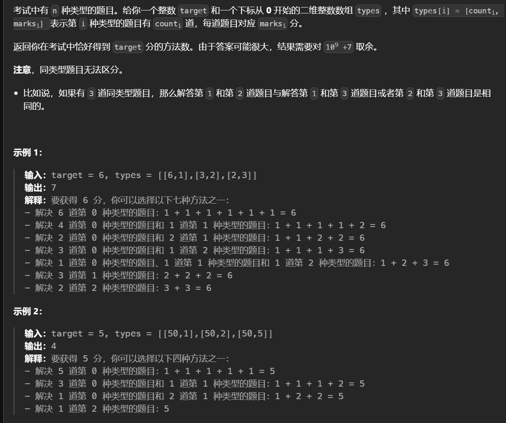

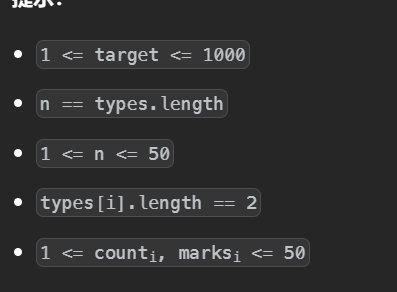


多重背包问题（给定了个数和分数考虑取不取），不过要求的是方案数

注意这里不能使用二进制优化，因为把状态拆分后，计算时会把重复状态计入而题目说明了在一组中去第几个都是一样的。

```python
class Solution:
    def waysToReachTarget(self, target: int, nums: List[List[int]]) -> int:
        mod=10**9+7
        n=len(nums)
        dp=[[0]*(target+1) for _ in range(n+1)]
        # base case 
        dp[0][0]=1
        for i in range(1,n+1):
            for j in range(target+1):
                cnt,x=nums[i-1]
                for k in range(min(cnt,j//x)+1):
                    dp[i][j]+=dp[i-1][j-k*x]
                    dp[i][j]%=mod
        return dp[n][target]
```


### [将一个数字表示成幂的和的方案数](https://leetcode.cn/problems/ways-to-express-an-integer-as-sum-of-powers/)

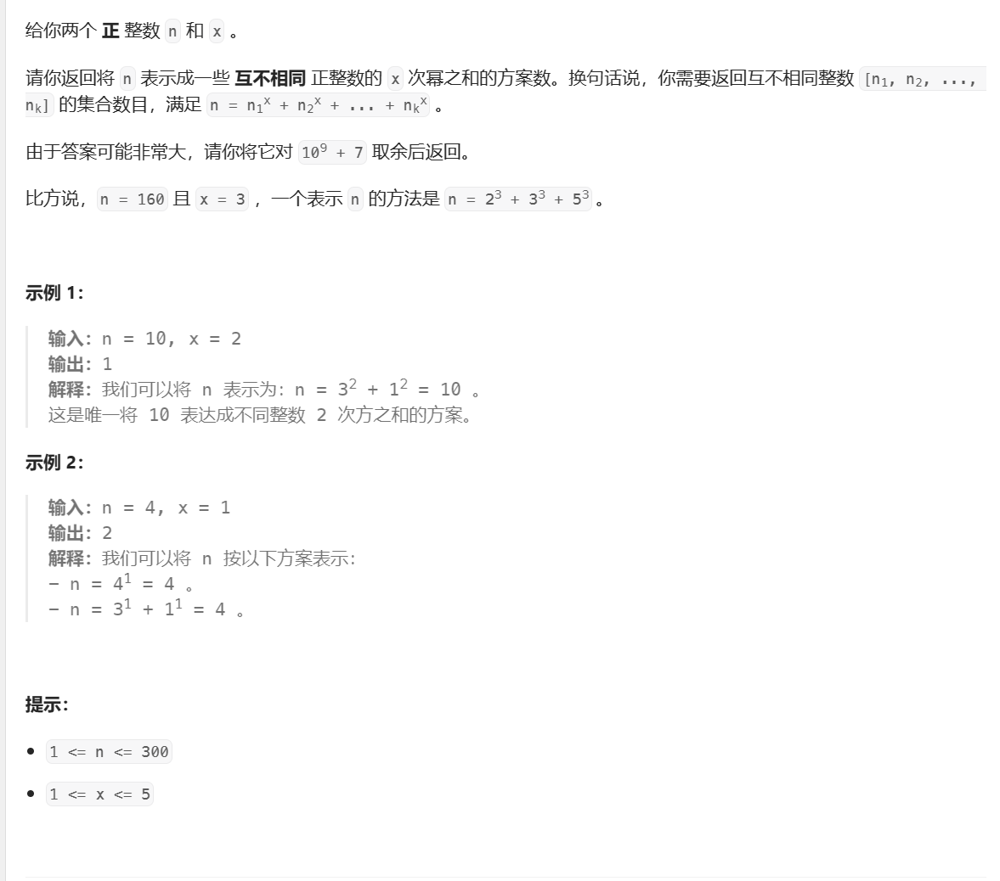j


将问题转化为01背包问题，枚举每个值选或不选。


```python
class Solution:
    def numberOfWays(self, n: int, x: int) -> int:
        vis=set()
        #构造列表
        nums=[i**x for i in range(1,int(n**(1/x)+1)+1)]
        m=10**9 + 7

        @cache 
        def dp(i,j):
            # 超出了不可取
            if j<0:return 0
            # base case
            if i==0:return int(j==0)
            return (dp(i-1,j-nums[i-1])+dp(i-1,j))
        return dp(len(nums),n)%m
```


### 波动数列

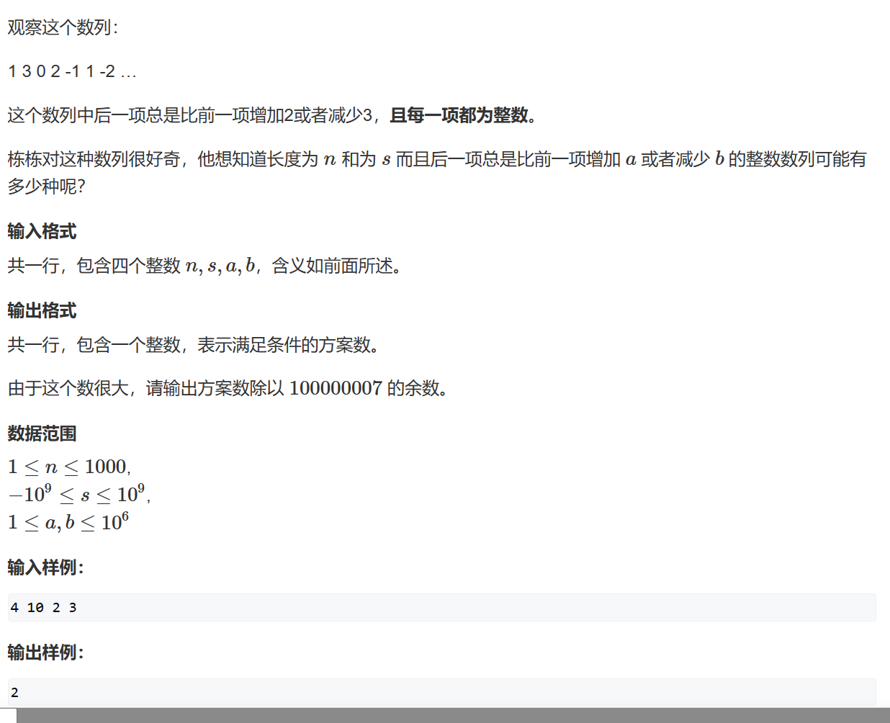

抽象出公式，这个过程中不能使用具体化的值。

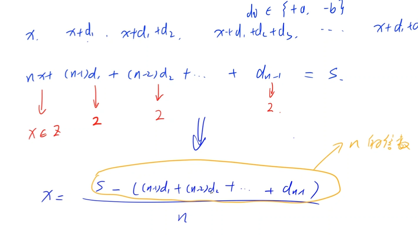


也就是去找能与S同余的解有多少个，每一个di都有两个选择，类似于背包问题定义dp(i,j)表示考虑前i个数，余数为j的有多少种方案，第i个数就是为i* a（就是把(n-1)*d1换为(n-1) *d{n-1}），根据同余定理:curr=pre+x同余n，因此前i-1个数余数就是(curr-x)取余n，x可能是bi或ai。

```python
n,s,a,b=[int(x) for x in input().split()]
m=100000007

dp=[[0]*(n+1) for _ in range(n+1)]
dp[0][0]=1
for i in range(1,n):
    for j in range(n):
        # 这里是相加，当前位置可能是a或b
        dp[i][j]+=dp[i-1][(j-a*i)%n]
        dp[i][j]+=dp[i-1][(j+b*i)%n]
        dp[i][j]%=m
# 根据公式只考虑前i-1个数
print(dp[n-1][s%n])
```


### 分组背包问题

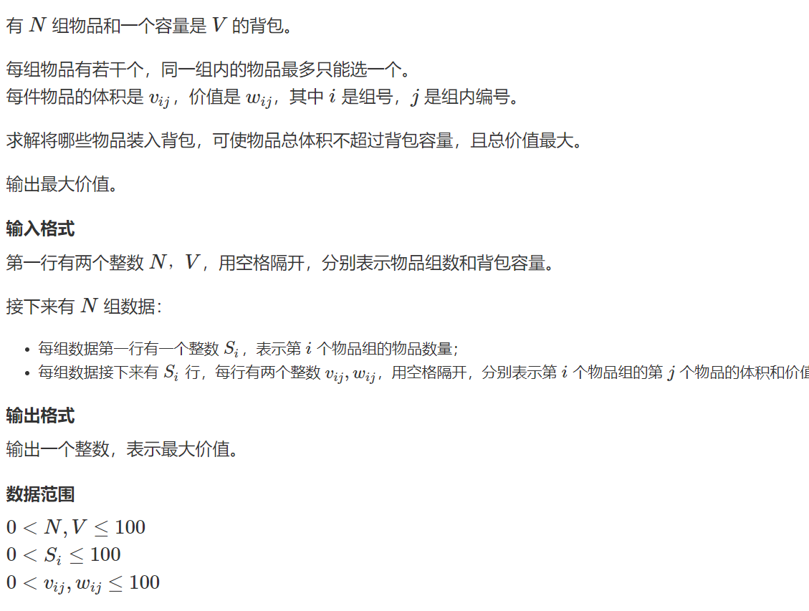


类似于多重背包问题

```python
from math import inf
n,v=[int(x) for x in input().split()]
items=[[0,0]]
for _ in range(n):
    temp=[]
    for _ in range(int(input())):
        temp.append([int(x) for x in input().split()])
    items.append(temp)
dp=[[-inf]*(v+1) for _ in range(n+1)]
dp[0]=[0]*(v+1)
for i in range(1,n+1):
    for j in range(v+1):
        dp[i][j]=max([dp[i-1][j]]+[dp[i-1][j-items[i][k][0]]+items[i][k][1]  for k in range(len(items[i])) if j-items[i][k][0]>=0])
print(dp[n][v])
```


### 石子合并

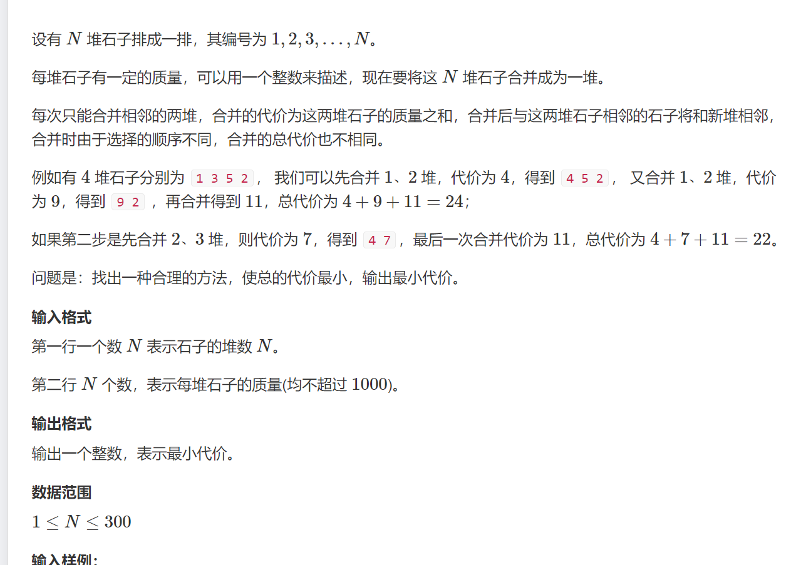

区间dp问题，每个问题可以由子问题推出，最后的结果一定是合并左边的一个区间和右边的一个区间得出的并且这两个区间是相邻的，而左右两个区间又可以再次分解。定义dp(i,j)为将区间[i,j]合并为一堆所需的最小代价，而i,j可以划分为[i,k],[k+1,j]这两堆，因此枚举i到j之间的位置求解，时间复杂度为n^3。

```python
from math import inf
from itertools import accumulate
from functools import lru_cache
n=int(input())
nums=[int(x) for x in input().split()]
pre=[0]+list(accumulate(nums))

# 递归不如递推
@lru_cache(maxsize=None)
def dp(i,j):
    # 一个元素没有代价
    if i==j:
        return 0
    res=inf
    for k in range(i,j):
        # 合并两个区间的代价就是这两个区间内的元素和，使用前缀和快速求解（两个区间是连续的）
        res=min(res,dp(i,k)+dp(k+1,j)-pre[i]+pre[j+1])
    return res
print(dp(0,n-1))

# 区间dp的递推一般都是先枚举区间长度，再找左右端点
from math import inf
from itertools import accumulate
from functools import lru_cache
n=int(input())
nums=[int(x) for x in input().split()]
pre=[0]+list(accumulate(nums))

dp=[[0]*n for _ in range(n)]

# 枚举长度，长度为1不用考虑代价为0
for len in range(2,n+1):
    # 左右端点
    l=0
    while l+len-1<n:
        r=l+len-1
        dp[l][r]=inf
        # 枚举分割点
        for k in range(l,r):
            dp[l][r]=min(dp[l][r],dp[l][k]+dp[k+1][r]+pre[r+1]-pre[l])
        l+=1
print(dp[0][n-1])
```


### [叶值的最小代价生成树](https://leetcode.cn/problems/minimum-cost-tree-from-leaf-values/)

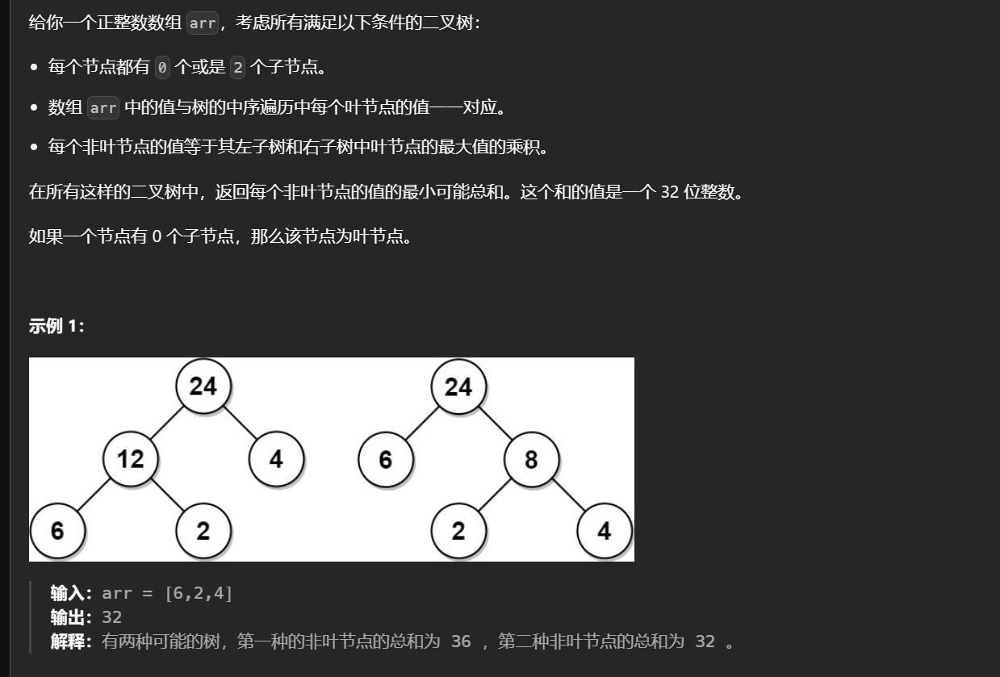


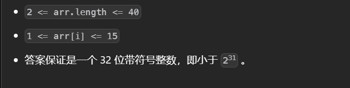


区间dp问题，每个树都是由一个左子树和右子树构成，dp(i,j)表示在区间i,j范围内构成的二叉树的结果。


```python
class Node:
    def __init__(self):
        self.left=None
        self.right=None
        self.add=0
        self.val=0
 # 这里不是求区间和，而是找区间是否被选过，可以取子区间的最大值
def pushup(node):
    node.val=max(node.left.val,node.right.val)

# 向下推，这里不是求区间和因此不用乘上子树大小直接加上，简言之不需要累加
def pushdown(node):
    if not node.left:node.left=Node()
    if not node.right:node.right=Node()

    if node.add==0:return
    node.left.val+=node.add
    node.right.val+=node.add

    node.left.add += node.add
    node.right.add += node.add
    node.add=0

def update(root,start,end,l,r,val):
    if l<=start and r>=end:
        # 因为表示的是最大值，因此更新区间不需要取出子节点的数目
        root.val+=val
        root.add+=val
        return
    mid=(start+end)>>1
    pushdown(root)
    # 注意最大值不是累加
    if l<=mid:update(root.left,start,mid,l,r,val)
    if r>=mid+1:update(root.right,mid+1,end,l,r,val)
    pushup(root)
    
# 后面的是要检索的区间
def query(root,start,end,l,r):
    if l <= start and r >= end:return root.val
    mid=(start+end)>>1
    ans=0
    pushdown(root)
    # 子区间取最大
    if l<=mid:ans=query(root.left,start,mid,l,r)
    if r>=mid+1:ans=max(query(root.right,mid+1,end,l,r),ans)
    return ans


class Solution:
    def mctFromLeafValues(self, arr: List[int]) -> int:
        node=Node()
        start=0
        end=len(arr)+10
        # 这里借助线段树求解区间的最大值，也可以双重循环求解
        for i,v in enumerate(arr):
            update(node,start,end,i,i,v)
        a=query(node,start,end,2,2)
        @cache
        def dp(i,j):
            # 区间内只有一个值无法形成二叉树
            if i==j:return 0
            res=inf
            # 枚举中间节点
            for k in range(i,j):
                a=query(node,start,end,i,k)
                b=query(node,start,end,k+1,j)
                temp=a*b
                res=min(dp(i,k)+dp(k+1,j)+temp,res)
            return res
        return dp(0,len(arr)-1)
```


### 整数划分


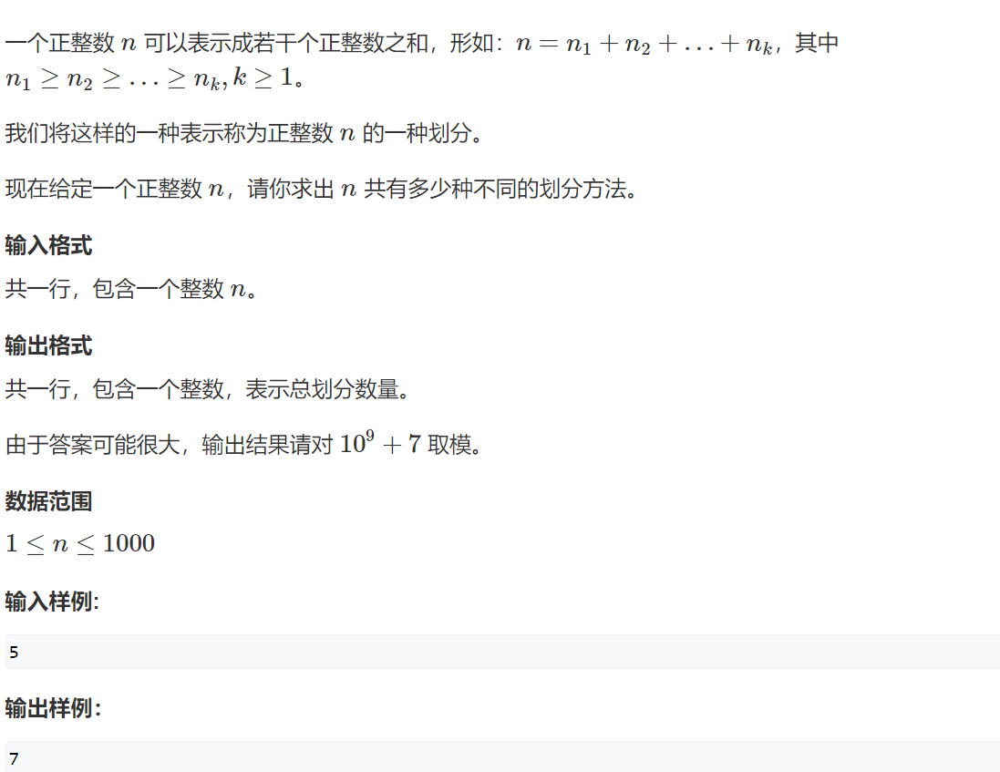

问题可以看作是一个完全背包问题，每一个数可以取无限次，但是这里定义的f(i,j)表示前i个元素当前整数为j的划分方法数，所以状态方程是枚举每个中间值，这里需要做一次优化，如下：


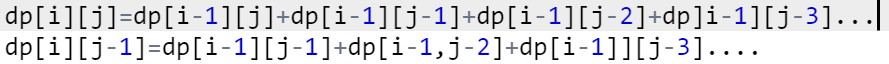

```python
from functools import lru_cache
m=10**9+7
n=int(input())

dp=[[0]*(n+1) for _ in range(n+1)]

# base case 当整数的大小为0的时候是一个合法的结果
for i in range(n+1):
    dp[i][0]=1
nums=list(range(n+1))
for i in range(1,n+1):
    for j in range(1,n+1):
        if j-nums[i]>=0:
            dp[i][j]=dp[i-1][j]+dp[i][j-nums[i]]
        else:
            dp[i][j]=dp[i-1][j]
print(dp[n][n]%m)
```

### 蒙德里安的梦想

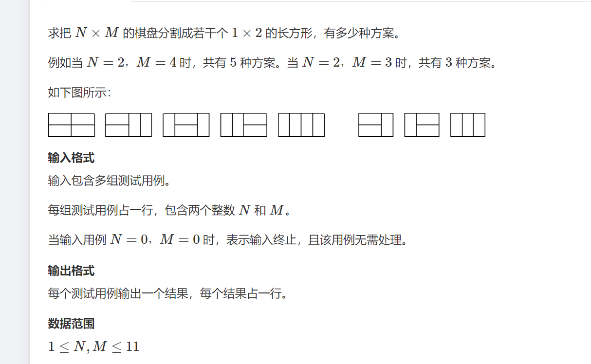


找出所有的横放的方案数，对于已经确定的横放的方案竖放的方案只有一个，定义f(i,j)表示前i-1列都放置完成，j表示从第i-1列伸出的状态，如果j=1001就表示第0和最后一行是被占据的，合法的状态需要满足当前行上面的空位必须是偶数个否则竖放无法满足，并且它的前一列同一行能不能也伸出。

```python
while 1:
    n,m =[int(x) for x in input().split()]
    if not m and not n:
        break
    # 表示状态i是否合法
    st=[True]*(1<<n)
    # 表示i合法的邻居
    valid=[[] for _ in range(1<<n)]
    # 预处理出不合法的结果
    for i in range(1<<n):
        cnt=0
        res=True
        # 如果在1上面有奇数个空位一定不能用竖放满足
        for j in range(n):
            if (i>>j)&1:
                if cnt&1:
                    res=False
                    break
            else:
                cnt+=1
        # 注意判断最后一段，比如0011000
        if cnt&1:
            res=False
        st[i]=res
    # 暴力枚举每个状态去很找邻居
    for i in range(1<<n):
        for j in range(1<<n):
            # st[i|j],i中的1是从j伸过来的，而j中的1是横放木板的开头，因此第i列的1的个数一概是二者或上查看st中的这个值观察是否合法。
    	if (i&j)==0 and st[i|j]:
                valid[i].append(j)
    
    f=[[0]*(1<<n) for _ in range(m+1)]
    # base case 
    f[0][0]=1
    for i in range(1,m+1):
        for j in range(1<<n):
            # 枚举这个状态从那个状态转移过来
            for k in valid[j]:
                f[i][j]+=f[i-1][k]
   	# 最后的f[m][0]表示前m-1行放吃完成并且伸出来的数位0的状态
    print(f[m][0])
```


### 下降路径最小和

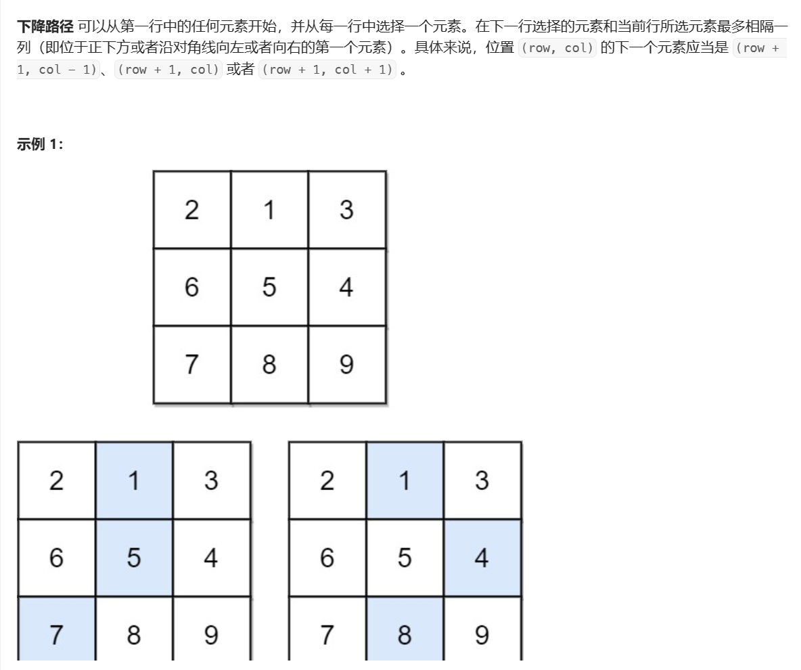

自顶向下，最小的结果一定是从最后一行的某个位置得出。

```python
    class Solution(object):
        def minFallingPathSum(self, matrix):
        n = len(matrix)
        res = float('inf')
        # 备忘录
        memo=[[float('inf') for _ in range(n)] for _ in range(n)]

        def dp(i, j):
			# 检查是否合法，不合法返回一个无穷大
            if i < 0 or i >= n or j < 0 or j >= n:
                return float('inf')
            
			# 如果到了第一行，直接返回
            if i == 0:
                return matrix[i][j]

            # 如果有记录，直接返回
            if memo[i][j]!=float('inf'):
                return memo[i][j]
		
        	# 最小的路径等于当前节点加上上一层的最小路径
            res=matrix[i][j] + min(dp(i - 1, j - 1), dp(i - 1, j), dp(i - 1, j + 1))
            # 记录
            memo[i][j]=res

            return res


        for i in range(n):
            # 由于每次的只能走到左下右下，因此不能直接选则最小的那个，要全部遍历一编
            res = min(res, dp(n - 1, i))
        return res
```


### [最大正方形](https://leetcode.cn/problems/maximal-square/)

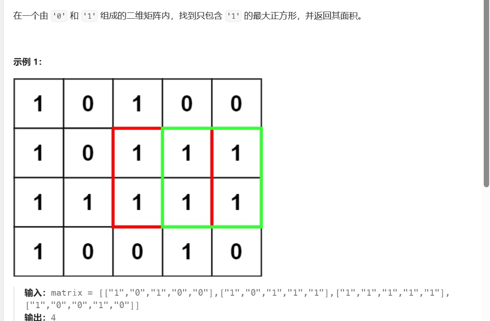


求正方形面积找到正方形的边长即可

令dp[i] [j]表示以i,j为右下角的正方形（无需同时找左上角和右下角，该状态的定义其实已经考虑了所有可行的左上角）所能组成合法的（即全为1）正方形的最大边长，该状态由左边，上边，左上中最小的推出这里，考虑左上是因为即使左边和上边都是合法的但是左上不合法就是不行的。如果该位置为0直接跳过，不会构成合法的正方形因此最大边长是只能是0.

```python
class Solution:
    def maximalSquare(self, matrix: List[List[str]]) -> int:
        m=len(matrix)
        n=len(matrix[0])
        ans=0
        dp=[[0 for _ in range(n)] for _ in range(m)]
        for i in range(m):
            for j in range(n):
                # 跳过为0的项
                if matrix[i][j]=='0':
                 	 continue	
                # 边界上为1的最大边长只能是1
                if i==0 or j==0:
                  	dp[i][j]=1
                else:
                    # 由三个位置中最小的推出
                    dp[i][j]=min(dp[i-1][j],dp[i][j-1],dp[i-1][j-1])+1
                ans=max(ans,dp[i][j])
        return ans**2
```

### [ 统计全为 1 的正方形子矩阵](https://leetcode.cn/problems/count-square-submatrices-with-all-ones/)

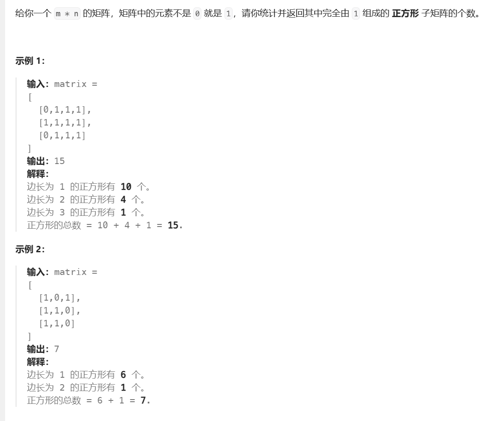

令dp[i] [j]表示以i,j为右下角所能形成的最多的正方形个数，如果这位置是0跳过，因为以0为右下角无法形成合法的正方形，状态转移方程同上

```python
class Solution:
    def countSquares(self, matrix: List[List[int]]) -> int:
        m = len(matrix)
        n = len(matrix[0])
        ans = 0
        dp = [[0 for _ in range(n)] for _ in range(m)]
        for i in range(m):
            for j in range(n):
                if matrix[i][j]==0:
                  	continue
                if i==0 or j==0:
                    dp[i][j]=int(matrix[i][j]==1)
                else:
                    dp[i][j]=min(dp[i-1][j],dp[i][j-1],dp[i-1][j-1])+1
                ans+=dp[i][j]
        return ans 
```

### [和为奇数的子数组数目](https://leetcode.cn/problems/number-of-sub-arrays-with-odd-sum/)

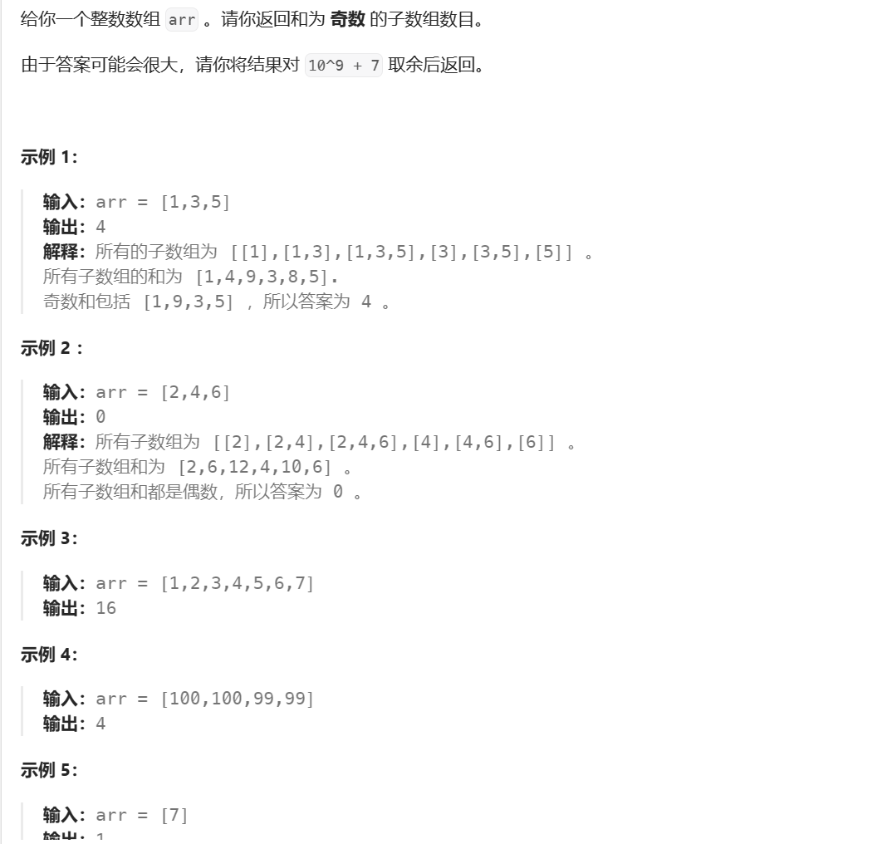

定义dp[i]表示以arr[i]结尾的子数组中和为奇数的子数组个数，对于arr[i+1]如果是偶数，那么能组成的奇数子数组的个数不会变（因为奇数加上偶数是奇数）也就是dp[i+1]不变。如果是奇数，那么就要以dp[i]就要变为1（自己单独）也为奇数和奇数组合为偶数，并且加上以arr[i-1]结尾的偶数子数组的个数。

```python
class Solution:
    def numOfSubarrays(self, arr: List[int]) -> int:
        m=10**9+7
        ans=dp=int(arr[0]&1!=0)
        for i in range(1,len(arr)):
            val=arr[i]
            if val&1:
                dp=1+(i-dp)
            ans+=dp
        return ans %m
```

### [字符串中的额外字符](https://leetcode.cn/problems/extra-characters-in-a-string/)

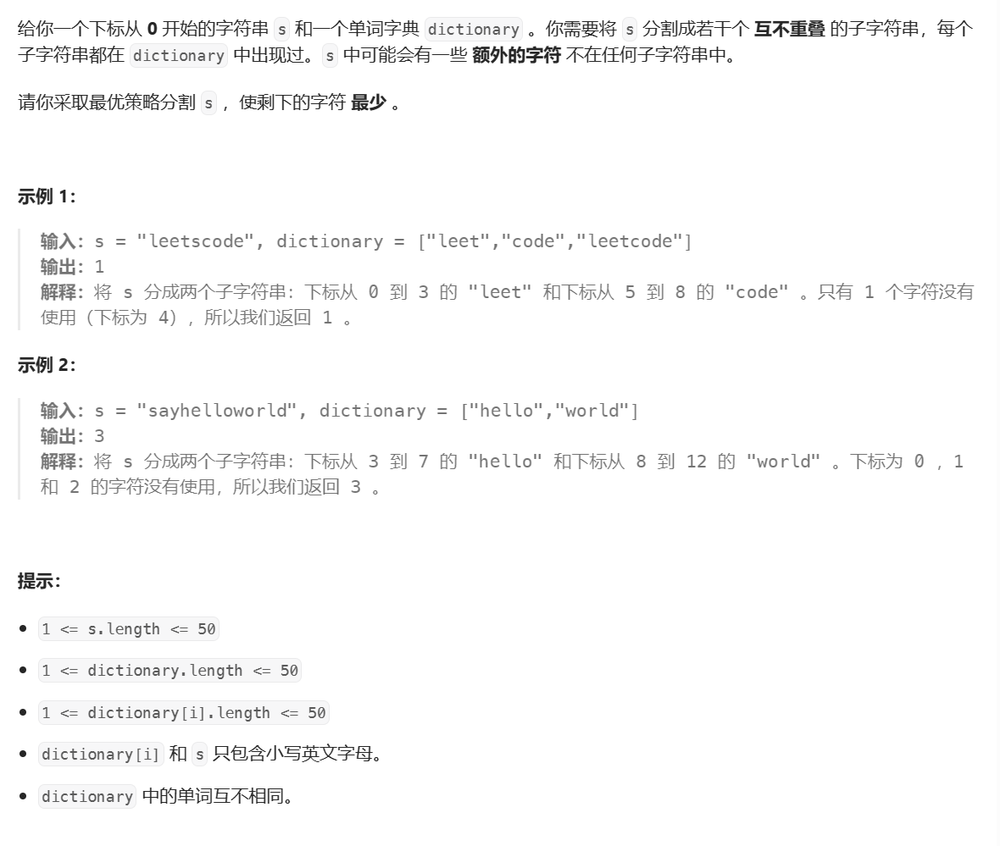


定义dp(i)为前i个字符分割后剩余的最少字符数，对于每个字符i它可以被跳过dp(i)=dp(i-1)+1，也可以去找他前面是否存在一个j,使得s[j:i+1]在d中

```python
class Solution:
    def minExtraChar(self, s: str, dictionary: List[str]) -> int:
        n=len(s)
        d=set(dictionary)
        @cache
        def dp(i):
            if i==-1:
                return 0
            res=dp(i-1)+1
            for j in range(i+1):
                if s[j:i+1] in d:
                    res=min(res,dp(j-1))
            return res
        return dp(n-1)
```


### 最小路径和

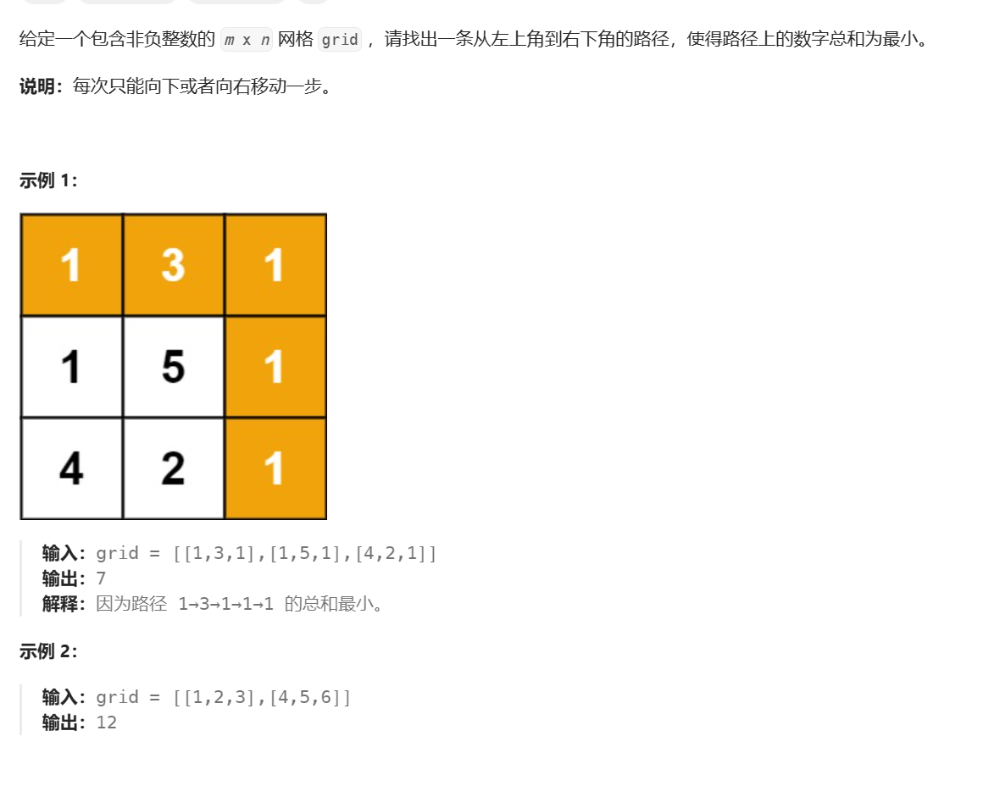

转换为动态规划问题，到达i,j的最小路径等于它的左或上中最小的路径加上它本身。

```python
class Solution(object):
    def minPathSum(self, grid):
        m=len(grid[0])
        n=len(grid)
        # 使用备忘录
        memo=[[-1 for _ in range(m)] for _ in range(n)]
        def dp(i,j):
            
            if i==0 and j==0:
                return grid[0][0]
            # 选择将越界的设置为无穷大，不合法的值不会被取到
            if j<0 or i<0:
                return float('inf')
            if memo[i][j]!=-1:
                return memo[i][j]

            memo[i][j]=min(dp(i-1,j),dp(i,j-1))+grid[i][j]
            return memo[i][j]
        return dp(n-1,m-1)
```

### 找到最大开销的子字符串

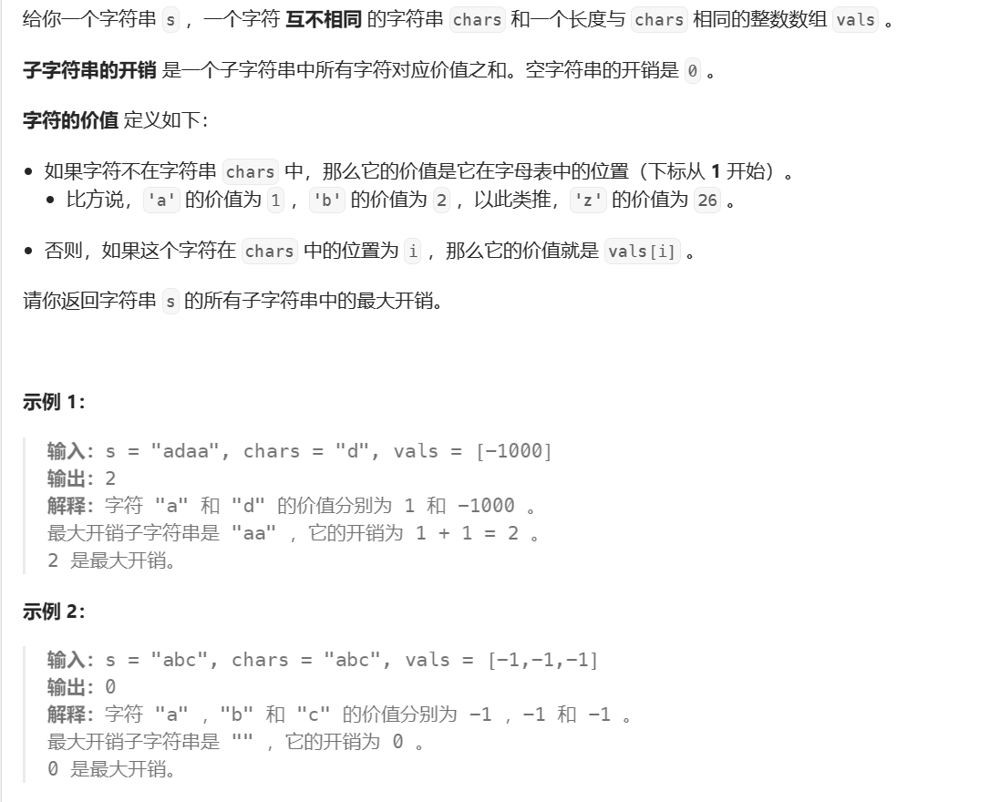


使用动态规划，令dp[i]表示以第i位结尾的字符串的最大开销。状态转移方程是：如果dp[i-1]大于0，则dp[i]=dp[i-1]加上当前值，否则就是单独的当前值。


```python
class Solution(object):
    def maximumCostSubstring(self, s, chars, vals):
        s=list(s)
        # 技巧点，将两个对应的数组转换为字典
        map=dict(zip(chars,vals))
        dp=[0]*len(s)
        dp[0]=map.get(s[0],ord(s[0])-ord('a')+1)
        for i in range(1,len(s)):
            c=s[i]
            # 状态转移方程
            dp[i]=max(dp[i-1],0)+map.get(c,ord(c)-ord('a')+1)
         # 最后如果是负数的话，返回空字符串的开销
        return max(dp) if max(dp)>0 else 0
```


### [ 达到末尾下标所需的最大跳跃次数](https://leetcode.cn/problems/maximum-number-of-jumps-to-reach-the-last-index/)

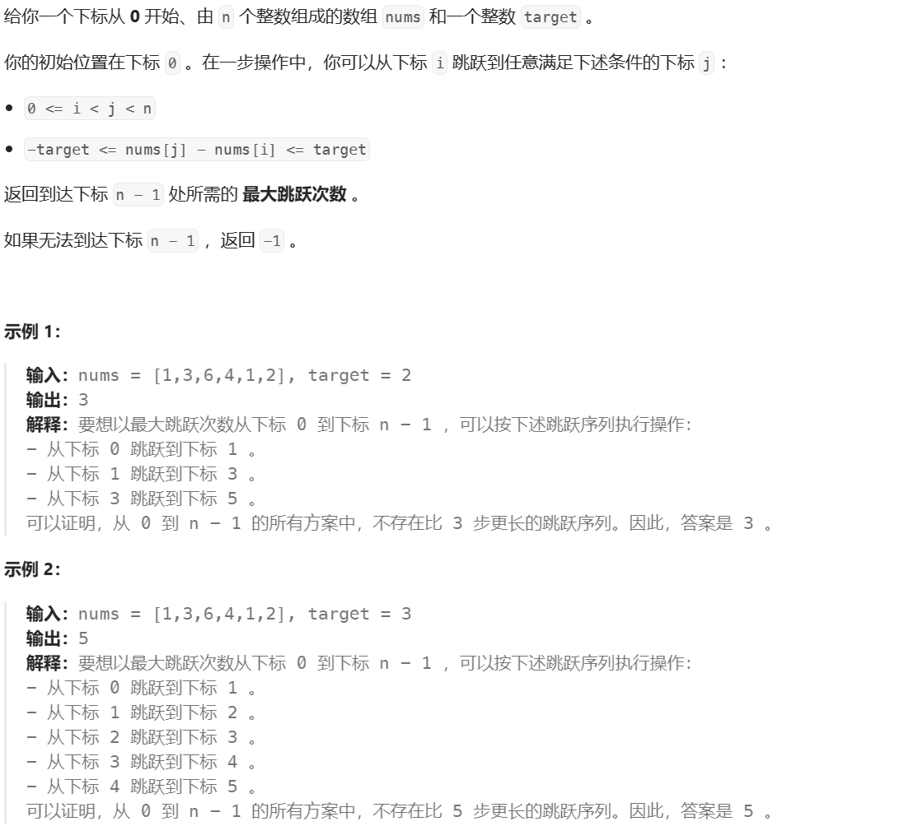

f[i]表示从从i到0所需的最大跳跃步数，每个f[i]都需要1->i-1的状态来推，因此从小往大递推

```python
from cmath import inf
class Solution:
    def maximumJumps(self, nums: List[int], target: int) -> int:
        n=len(nums)
        f=[-inf]*n
        f[0]=0
        for i in range(1,n):
            for j in range(i):
                if abs(nums[i]-nums[j])<=target:
                    # 状态转移
                    f[i]=max(f[i],f[j]+1)
        return -1 if f[-1]<0 else f[-1]
```

### [最长定差子序列](https://leetcode.cn/problems/longest-arithmetic-subsequence-of-given-difference/)

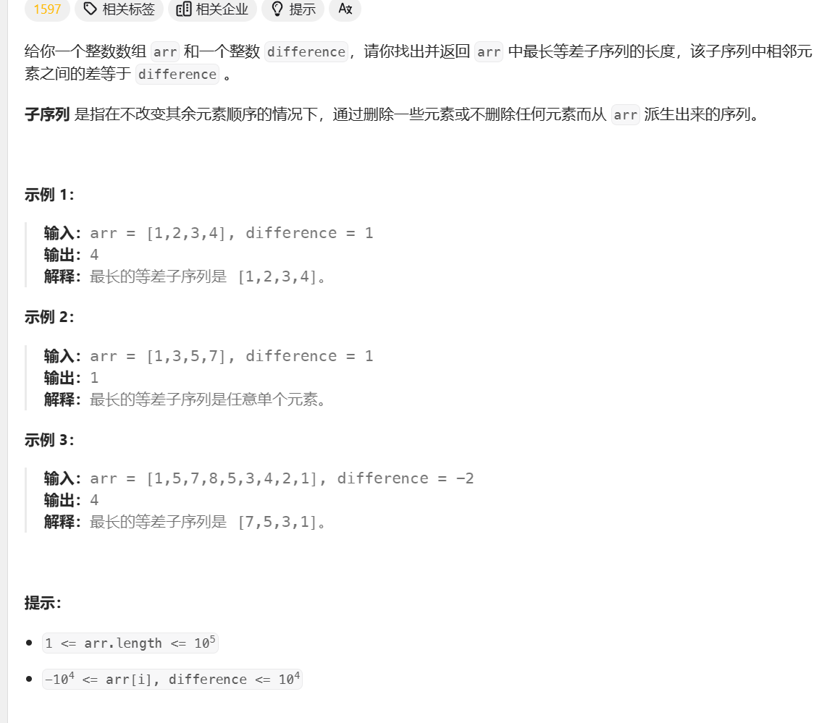

自下而上的递推，不同于最长递增子序列I的做法这里的数据范围比较大并且给定了差值可以很容易的求出上一个元素是什么。

这里的dp[v]表示以v结尾的满足条件的子序列长度

```python
class Solution:
    def longestSubsequence(self, arr: List[int], difference: int) -> int:
        n=len(arr)
        dp=defaultdict(int)
        ans=0
        for j in range(len(arr)):
            dp[arr[j]]=dp[arr[j]-difference]+1
        return max(dp.values())
```


### [ 统计放置房子的方式数](https://leetcode.cn/problems/count-number-of-ways-to-place-houses/)

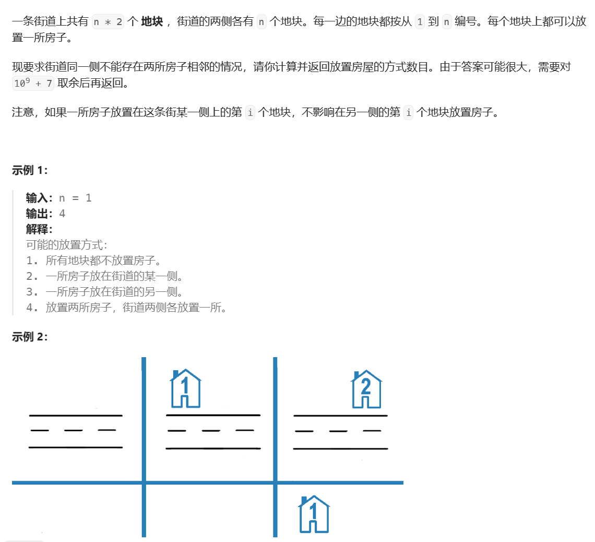

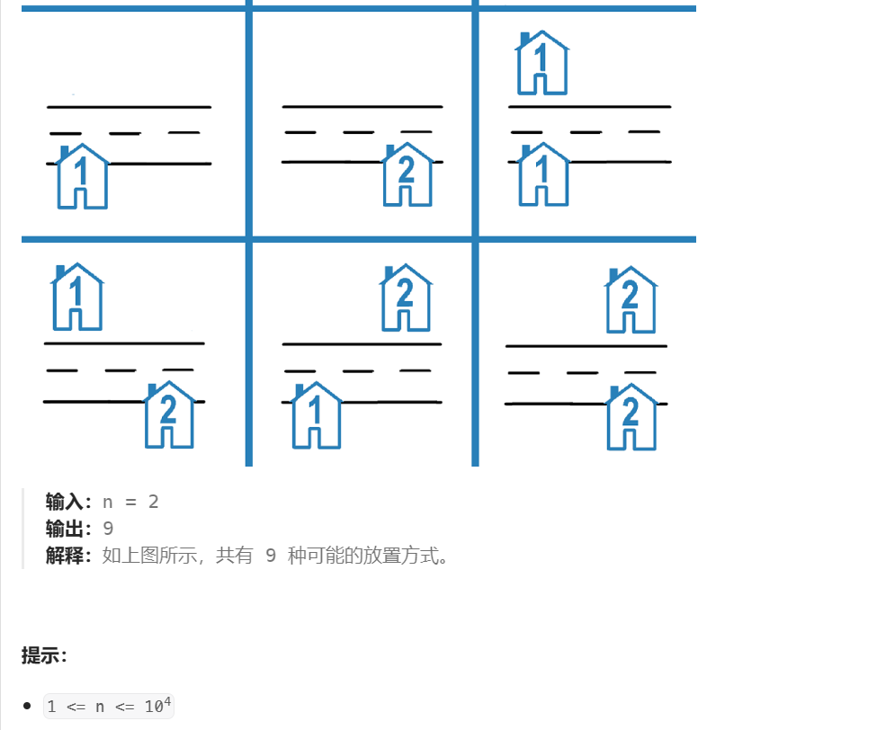


街道的两侧互不影响，先考虑一侧放房子不相邻的方案有多少。使用线段dp，这个dp有点意料之外情理之中，想在一个线段上选择位置，只要不相邻就可以，有多少种做法，这确实是可以分解子问题来看的。

dp(i)表示前i位一共有多少种方案，第i位可以选或者是不选，不选就是由dp(i-1)转移而来，反之是由dp(i-2)转移而来，dp(0)表示空的存在一种方案,dp(1)有两种方案。

```python
class Solution:
    def countHousePlacements(self, n: int) -> int:
        mod=(10**9)+7
        @cache 
        def dp(i):
            if i==0:
                return 1
            elif i==1:
                return 2
            return dp(i-1)+dp(i-2)
        return (dp(n)**2)%mod
```


### 地下城游戏

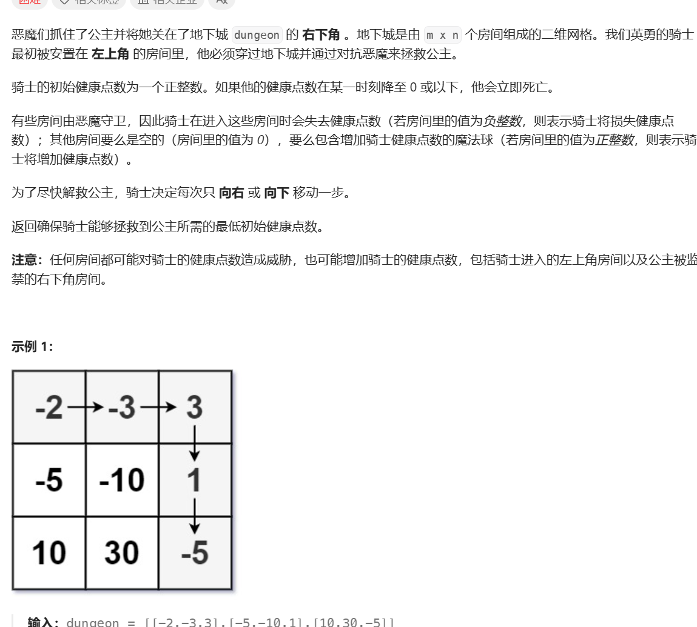

类似于最小路径和，但不能将dp定义为返回从起点到i,j的最小初始血量，如果这样定义的话，在状态转移的时候无法正确的得到下一个状态：

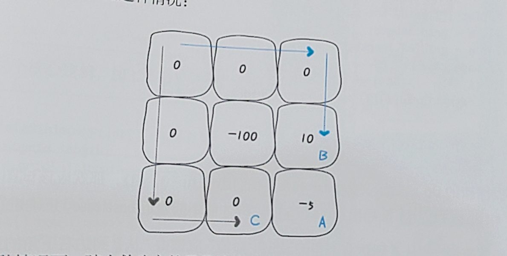

比如如图所示的情况，从起点到B,C的dp值都是1，如果令到终点的状态转移方程是:dp[i] [j]=min(dp[i-1] [j],dp[i] [j-1])-grid[i] [j]如果小于0设置为1，由此计算从BC到A的dp值，得出来的结果都是6，但是从B到A所需的dp值是1，因为在路上加了10，也就是说想要得到下一状态就必须有当前状态的血量值。

将dp设置为从i,j到终点的最低血量

总的来说，就是只能从后往前推，从前往后推条件不够。

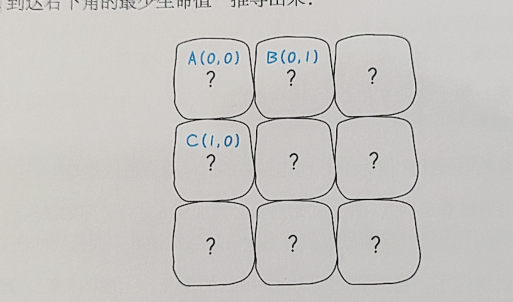

这样可以经由BC得出A

```python
class Solution(object):
    def calculateMinimumHP(self, dungeon):
        m=len(dungeon)
        n=len(dungeon[0])
        memo=[[-1]*n for _ in range(m)]
        def dp(i,j):
            # 判断终点本身所需的最低血量
            if i==m-1 and j==n-1:
                return 1 if dungeon[i][j]>=0 else -dungeon[i][j]+1
            # 超出边界
            if i>=m or j>=n:
                return float('inf')
            if memo[i][j]!=-1:
                return memo[i][j]
	# 选择所需初始血量最少的，如果选择了4而当前值是10，则所需血量应该是4-10
            res=min(dp(i+1,j),dp(i,j+1))-dungeon[i][j]
            # 由于血量不能低于0，所以设置为1
            if res<=0:
                res=1
            memo[i][j]=res
            return memo[i][j]
        return dp(0,0)
```

### [网格图中递增路径的数目](https://leetcode.cn/problems/number-of-increasing-paths-in-a-grid/)

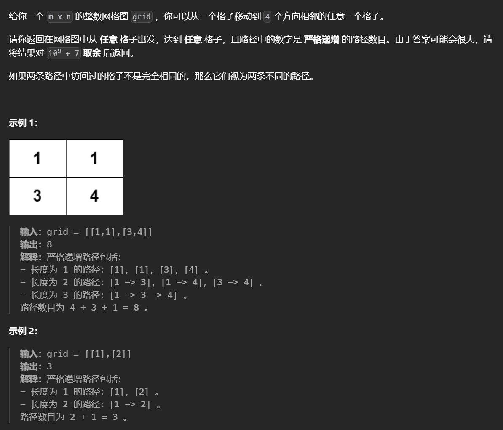

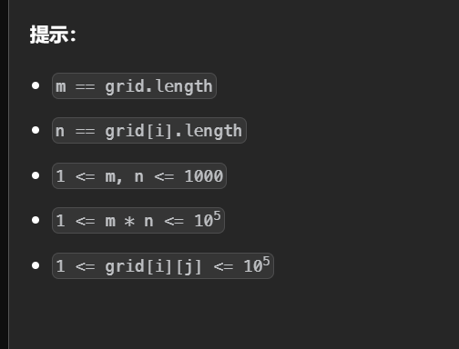


一般来说能往任意方向走的不能用动态规划，但是这个题目中合法的路径是一个严格递增的序列，也就是每次只会找更小的值因此不会有重复的访问。

```python
class Solution:
    def countPaths(self, grid: List[List[int]]) -> int:
        m,n=len(grid),len(grid[0])
        mod=10**9+7
        @cache
        def dfs(i,j):
            res=1
            for dx,dy in (1,0),(0,-1),(-1,0),(0,1):
                if 0<=(x:=dx+i)<m and 0<=(y:=dy+j)<n and grid[x][y]<grid[i][j]:
                    res+=dfs(x,y)
                    res%=mod
            return res
        return sum(dfs(i,j) for i in range(m) for j in range(n))%mod
```


### 最长递增子序列

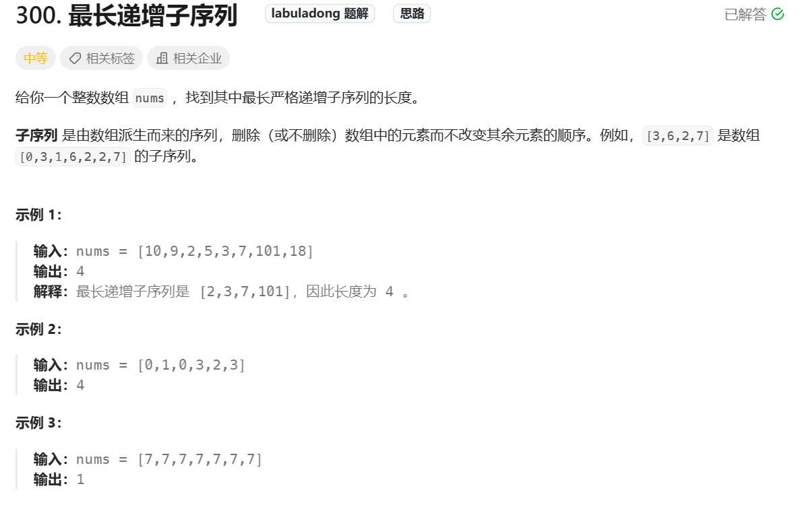

序列是不连续的集合。

这个问题可以使用动态规划求解，划分为求解子问题，定义dp数组，dp[i]表示以nums[i]结尾的最长递增子序列，dp[i]等于列表中nums[i]前面小于nums[i]的元素对应的dp值中最大的加一。

```python
class Solution(object):
    def lengthOfLIS(self, nums):
        n=len(nums)
        # 全部初始化为1，首先包括自己
        dp=[1 for _ in range(n)]
        # 遍历每一个
        for i in range(n):
            min_dp=-float('inf')
            # 找到列表中小于当前值且在前面的值
            for j in range(i):
                if nums[j]<nums[i]:
                    # 找到最大的
                    min_dp=max(min_dp,dp[j])
            dp[i]=min_dp+1 if min_dp!=-float('inf') else 1
        return max(dp)
```


### [ 最长递增子序列的个数](https://leetcode.cn/problems/number-of-longest-increasing-subsequence/)

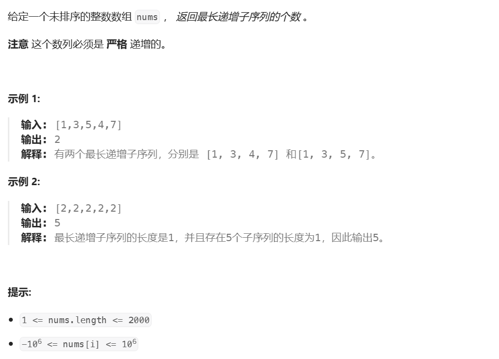

对于给定的数据范围可以通过枚举前面的位数求出以nums[i]结尾的最长递增子序列，该题要求最长递增子序列的个数，如果nums[i]可以拼接到nums[j]后面形成最长递增子序列那么以nums[i]结尾的最长递增子序列的个数要加上nums[j]的。

```python
class Solution:
    def findNumberOfLIS(self, nums: List[int]) -> int:
        n=len(nums)
        ans=mx=0
        cnt=[0]*n
        dp=[0]*n
        for i,x in enumerate(nums):
            # 至少为一
            cnt[i]=1
            dp[i]=1
            # 枚举前面
            for j in range(i):
                # 如果可以拼接
                if nums[j]<x:
                    # 长度被更新，那么个数也要重置
                    if dp[j]+1>dp[i]:
                        dp[i]=dp[j]+1
                        cnt[i]=cnt[j]
                    # 如果是等于，累加
                    elif dp[j]+1==dp[i]:
                        cnt[i]+=cnt[j]
            # 记录最长的，如果大于则重置，否则累加
            if dp[i]>mx:
                mx=dp[i]
                ans=cnt[i]
            elif dp[i]==mx:
                ans+=cnt[i]
        return ans  
            

```


### [求出所有子序列的能量和](https://leetcode.cn/problems/find-the-sum-of-subsequence-powers/)

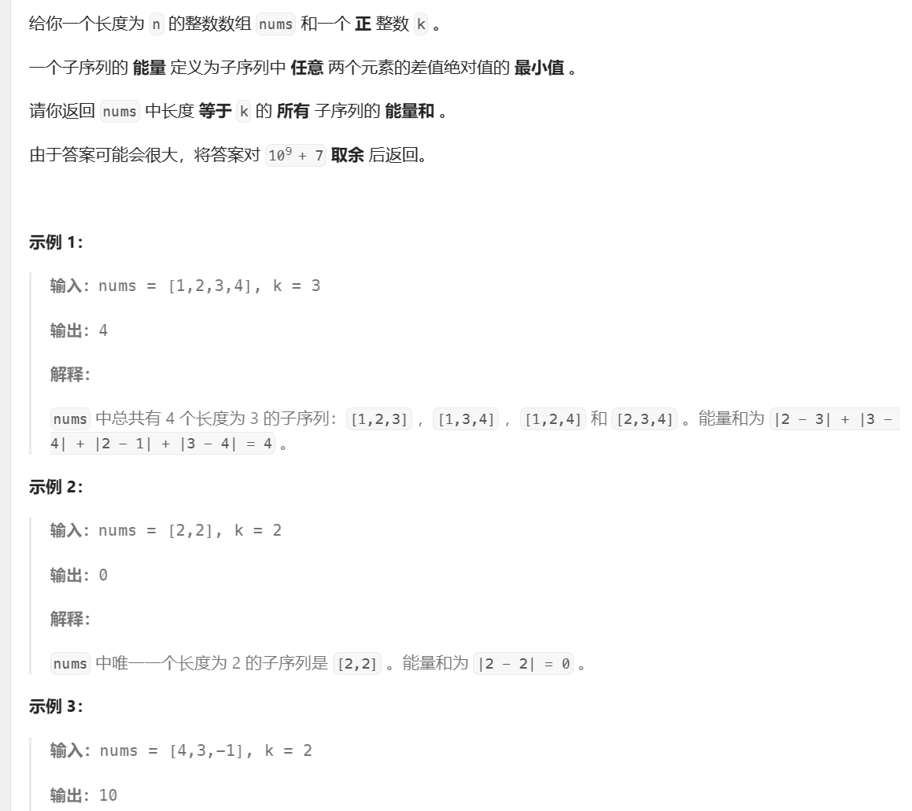


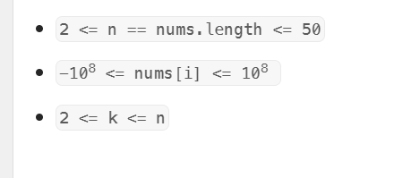


子序列问题，对于每个值有选或不选两种状态，该题是子序列问题中的相邻相关问题。

对于这题的子序列，元素的顺序无所谓可以先预处理

```python
class Solution:
    def sumOfPowers(self, nums: List[int], k: int) -> int:
        # 通过排序预处理，最小的差值可以由相邻的两个值得出
        nums.sort()
        m=10**9+7
        n=len(nums)
        @cache
        # i表示位置，c表示还能选几个数，pre表示之前选的值，diff表示差值
        def dp(i,c,pre,diff):
            # 选完了
            if c==0:
                return diff
            # 剩下的加起来都不够
            if c>i+1:return 0
            res=0
            # 选或不选相加
            res=dp(i-1,c,pre,diff)+dp(i-1,c-1,nums[i],min(diff,pre-nums[i]))
            return res%m
        return dp(n-1,k,inf,inf)
```

​	

### [掷骰子模拟](https://leetcode.cn/problems/dice-roll-simulation/)

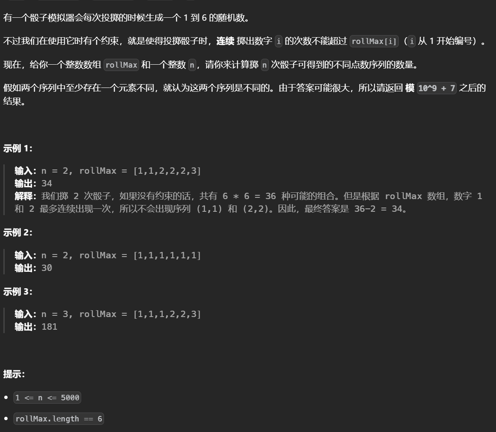


定义dp(i,j,k)，i表示第几轮，j表示上一次选了什么，k表示还能选几个j。

```python
class Solution:
    def dieSimulator(self, n: int, rollMax: List[int]) -> int:
        mod=10**9+7
        f=[[[0 for _ in range(16)] for _ in range(6) ]for _ in range(n)]
        for j in range(6):
            for cnt in range(rollMax[j]):
                f[0][j][cnt]=1
        for i in range(n):
            for j in range(6):
                for cnt in range(rollMax[j]):
                    for k,mx in enumerate(rollMax):
                        if k!=j:f[i][j][cnt]+=f[i-1][k][mx-1]
                        elif cnt:f[i][j][cnt]+=f[i-1][k][cnt-1]
                        f[i][j][cnt]%=mod
        return sum(f[n-1][j][mx-1] for j,mx in enumerate(rollMax))%mod


class Solution:
    def dieSimulator(self, n: int, rollMax: List[int]) -> int:
        mod=10**9+7
        @cache
        def dfs(i,x,left):
            # 第一轮返回1
            if not i:return 1
            res=0
            for j,mx in enumerate(rollMax):
                if j!=x:res+=dfs(i-1,j,mx-1)
                elif left:res+=dfs(i-1,j,left-1)
            return res%mod
        return sum(dfs(n-1,i,mx-1) for i,mx in enumerate(rollMax))%mod


```

### [ 吃掉 N 个橘子的最少天数](https://leetcode.cn/problems/minimum-number-of-days-to-eat-n-oranges/)


一定是做除法更好，在最优的操作下，如果能整除2则不存在-1-1再除2，因为大小上m-1-1/2=m/2-1，但是操作次数上后者会更少，同理如果能整除3则不会-1-1-1再除3。


```python
class Solution:
    def minDays(self, n: int) -> int:
        @cache
        def dp(i):
            if i<=1:return 1
        	# 一直做除法
            return min(dp(i//2)+i%2,dp(i//3)+i%3)+1
        return dp(n)
```


### [修改数组后最大化数组中的连续元素数目](https://leetcode.cn/problems/maximize-consecutive-elements-in-an-array-after-modification/)

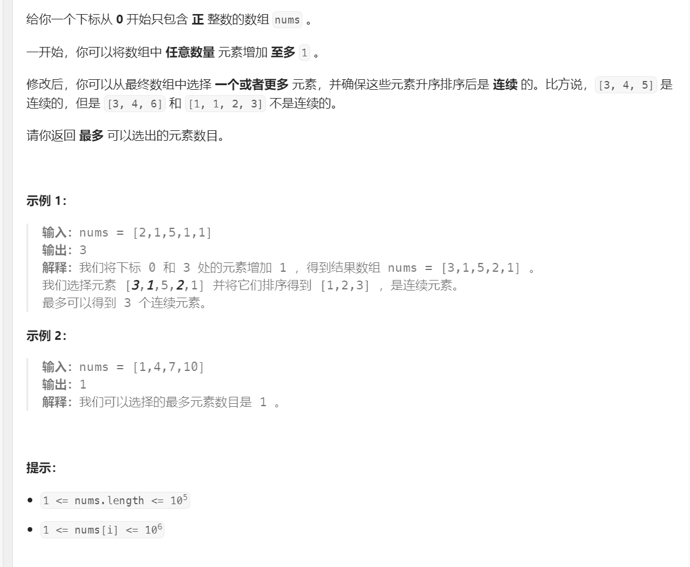

从原数组中任意取几个元素然后排序组成一个递增子序列，那么原数组的顺序就不重要了，将数组排好序之后问题转换为求最长递增子序列。定义dp（i,add）为以nums[i]为结尾的最长递增子序列，add表示是否选择加一，当前数值x可以从x-1或者x-2转移过来因为可以将数值加一。按照递增子序列I的做法是n^2的，但是这里元素被排序后可以使用二分搜索查找满足的元素。

此题的状态定义不能是前i个，因为要找上一个位置这种定义不方便


```python
class Solution:
    def maxSelectedElements(self, nums: List[int]) -> int:
        # 预处理
        nums.sort()
        @cache
        def dfs(i,add):
            if i==-1:
                return 0
            res=1
            # 当前元素实际大小
            x=nums[i]+add
            # 二分去找合适的值
            j=bisect_right(nums,x-1,0,i)-1
            
	    # 注意两个不同的状态x-1,x-2对于不同的add
            if j>=0 and nums[j]==x-1:
                res=max(res,1+dfs(j,0))
            
            j=bisect_right(nums,x-2,0,i)-1
            if j>=0 and nums[j]==x-2:
                res=max(res,1+dfs(j,1))
            return res
        ans=-inf
        # dui'mei'g
        for i ,v in enumerate(nums):
            ans=max(ans,dfs(i,0),dfs(i,1))
        return ans 
```

此题的性质类似于定差子序列，因为最后要求是连续的因此对于每个以v结尾的上一个一定是v-1，可以定义dp(i)表示以i结尾的满足要求的子序列的最长长度

```python
class Solution:
    def maxSelectedElements(self, nums: List[int]) -> int:
        nums.sort()
        f=defaultdict(int)
        # 注意顺序
        for v in nums:
            f[v+1]=f[v]+1
            f[v]=f[v-1]+1
        return max(f.values())
```


### 二维最长递增子序列

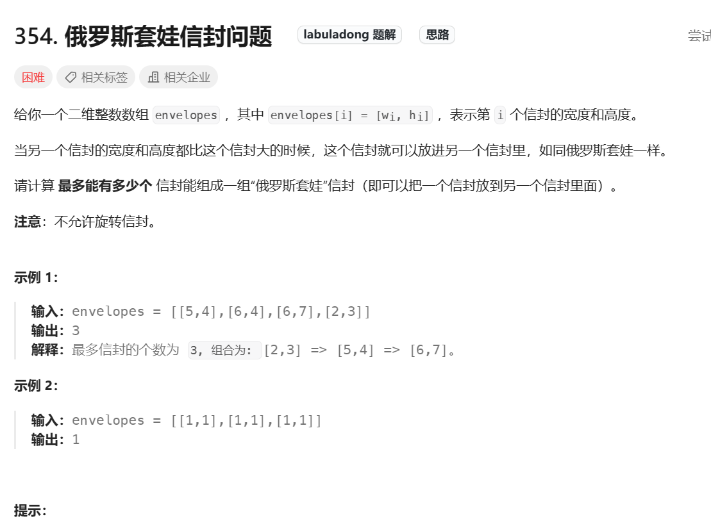


本质上也是在求解子序列，将数组中的值，先按照w的大小升序排列，然后对于相同的w按照h降序排列，如果不是降序会将宽度相同的信封装在一起。之后对h的数组进行找最长递增子序列即可

```python
class Solution:
    def maxEnvelopes(self, envelopes):
        if not envelopes:
            return 0
        
        n = len(envelopes)
        # 排序，先按照w升序再按照h降序，具体写法是利用lambda函数返回一个元组，为了使按照h降序，元组中放的是负的值
        envelopes.sort(key=lambda x: (x[0], -x[1]))

        # 找最长递增子序列
        f = [1] * n
        for i in range(n):
            for j in range(i):
                if envelopes[j][1] < envelopes[i][1]:
                    f[i] = max(f[i], f[j] + 1)
        
        return max(f)
```


### [解决智力问题](https://leetcode.cn/problems/solving-questions-with-brainpower/)

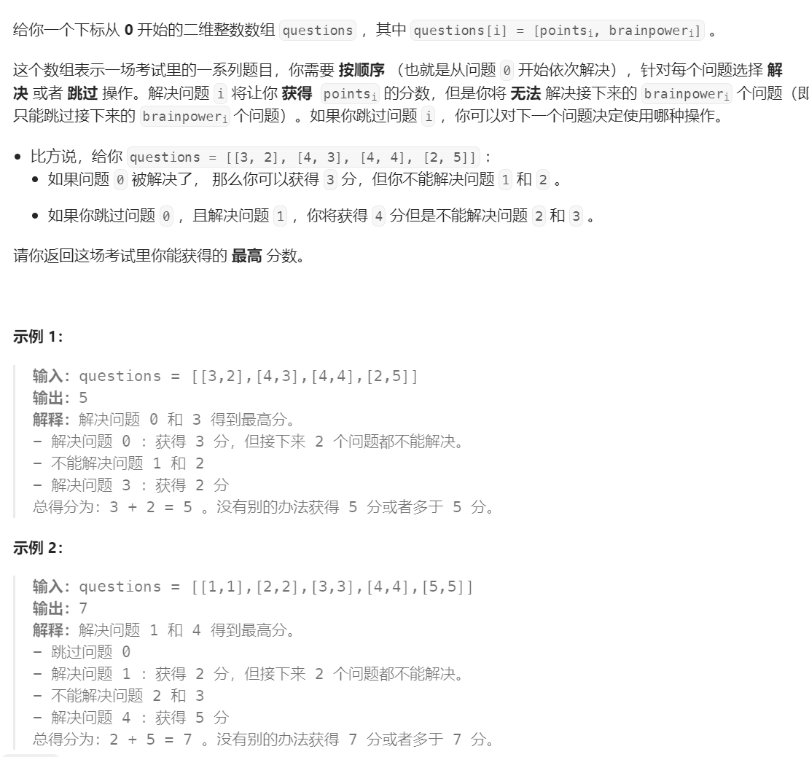

解决一个问题随后的几个问题只能跳过，这里需要使用倒序dp，因为下一个状态依赖于前一个状态f[i]表示解决i..n-1内的问题所能得到的最大分数，第i个解决与否会影响到f[i]的结果。如果是正序dp的话f[i]表示0...i是否选择，第i个解决与否会影响到f[i]的结果不仅会影响f[i]还会对后面的f[j]有影响，也就是一直在刷新后面的状态（刷表法）。

```python
class Solution:
    def mostPoints(self, questions: List[List[int]]) -> int:
        n=len(questions)
        # f[i]表示解决i..n-1内的问题所能得到的最大分数
        f=[0]*(n+1)
        for i in range(n-1,-1,-1):
            # 当前的问题可能跳过，可能选择，跳过的话分数等于f[i+1]反之等于当前问题的分数加上第j个问题跳过或选择
            f[i]=max(f[i+1],questions[i][0]+f[min(i+questions[i][1]+1,n)],questions[i][0])
        
        return f[0]
```


正序

```python
class Solution:
    def mostPoints(self, questions: List[List[int]]) -> int:
        n=len(questions)
        #  表示0...izuo'bi
        f=[0]*(n+1)
        for i in range(n):
            f[i+1]=max(f[i+1],f[i])
            j=min(n,i+questions[i][1]+1)
            f[j]=max(f[j],f[i]+questions[i][0])
        return f[n]
```


### [访问数组中的位置使分数最大](https://leetcode.cn/problems/visit-array-positions-to-maximize-score/)

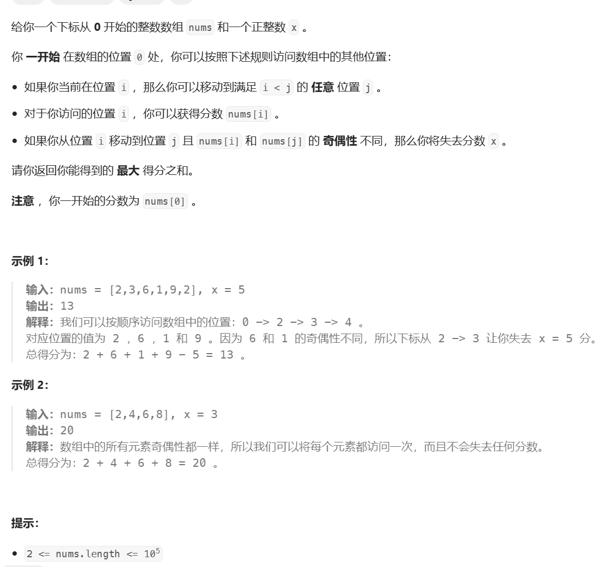


奇偶dp，dp[i]表示选到了第几位，分两个dp偶数的和奇数的，根据最后一个元素的奇偶性而分的。如果当前的值是奇数那么就更新奇数dp，奇数dp可以从上一位的奇数转移过来也可以是偶数转移过来，而偶数dp不变因为偶数dp要求最后一个数是偶数。

```python
class Solution:
    def maxScore(self, nums: List[int], x: int) -> int:
        n=len(nums)
        l=[0]*n
        r=[0]*n
        if nums[0]&1:
            l[0]=nums[0]
            r[0]=nums[0]-x
        else:
            l[0]=nums[0]-x
            r[0]=nums[0]
        for i in range(1,n):
            if nums[i]&1:
                l[i]=max(l[i-1]+nums[i],r[i-1]+nums[i]-x)
                r[i]=r[i-1]
            else:
                l[i]=l[i-1]
                r[i]=max(r[i-1]+nums[i],l[i-1]+nums[i]-x)
        return max(l[-1],r[-1])
```

### [销售利润最大化](https://leetcode.cn/problems/maximize-the-profit-as-the-salesman/)

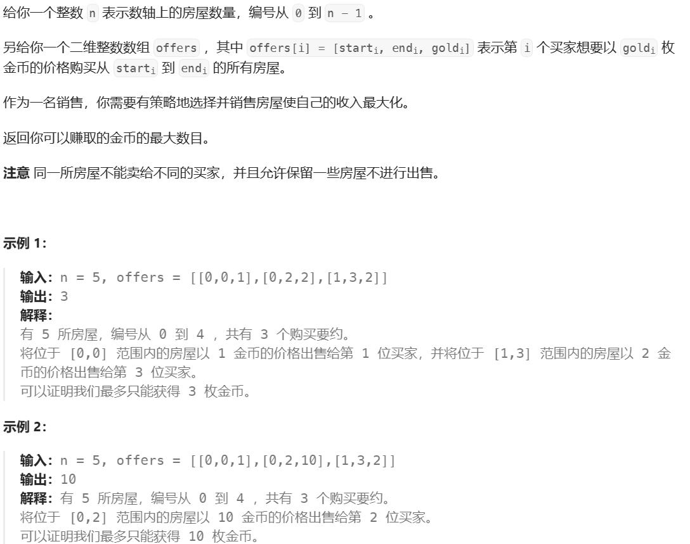

这里的状态定义是dp(i)表示考虑第i号房子能获得的最多金币，每个房子可以考虑卖或不卖

```python
class Solution:
    def maximizeTheProfit(self, n: int, offers: List[List[int]]) -> int:
        memo=[[]for _ in range(n)]
        # 通过数组记录上一个位置
        for s,e,w in offers:
            memo[e].append((s,w))

        @cache
        def dp(i):
            if i<0 :return 0
            # 不选往上转移，选了就是在区间前面转移过来
            return max(dp(i-1),max((dp(pre-1)+w for pre,w in memo[i]),default=0))
        return dp(n-1)

```

### [ 摘樱桃 II](https://leetcode.cn/problems/cherry-pickup-ii/)

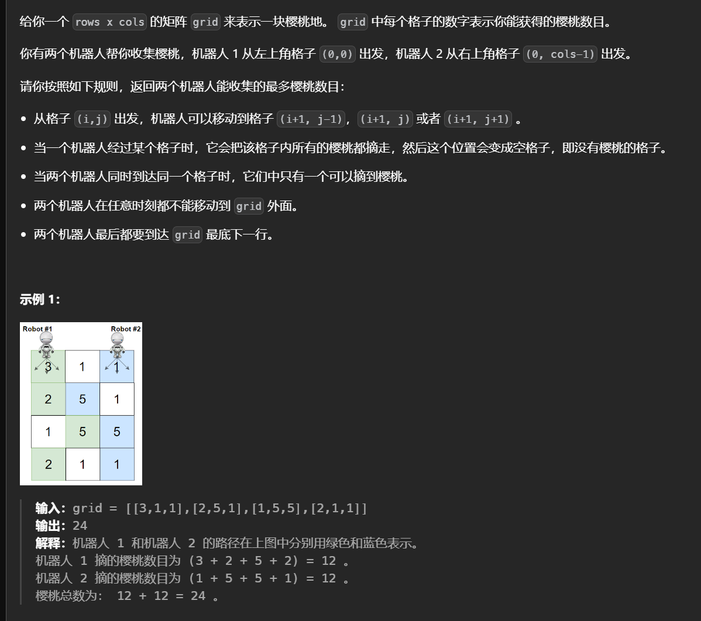

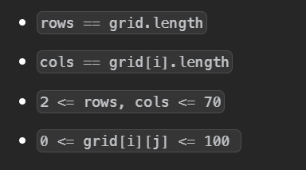


关键在于状态的选择，这里注意到，两个机器人时同时移动的也就是说他们的横坐标都一样，因此dp方程中只需要记录两个人的纵坐标加以区分即可。

```python
class Solution:
    def cherryPickup(self, nums: List[List[int]]) -> int:
        m,n=len(nums),len(nums[0])
        @cache
        def dfs(i,j1,j2):
            if j1<0 or j2<0 or j1>=n or j2>=n:return -inf
            if i==m:return 0
            res=0
            t=nums[i][j1]+nums[i][j2] if j1!=j2 else nums[i][j1]
            for dx in (-1,0,1):
                for dy in (-1,0,1):
                    res=max(res,dfs(i+1,j1+dx,j2+dy)+t)
            return res
        return dfs(0,0,n-1)

```

### [ K 个逆序对数组](https://leetcode.cn/problems/k-inverse-pairs-array/)

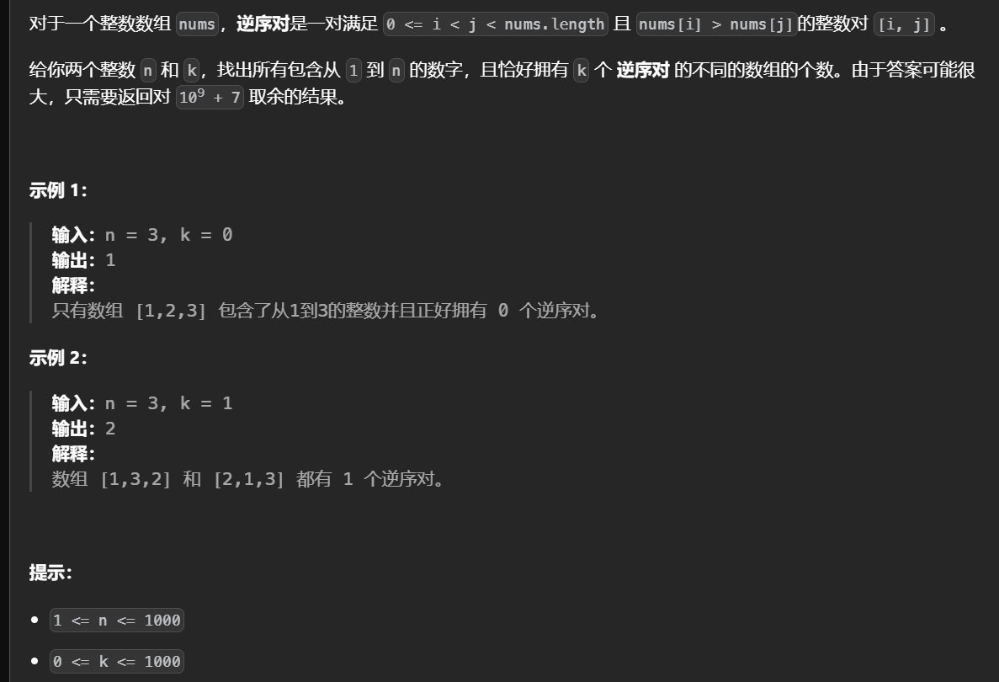

定义状态dp(i,j)表示考虑[1,i]的排列其中有j个逆序对的不同排列方式，对于[1,i]的排列长度为i，可以选任意一个数最为排列的最后一个元素，如果选的是k那么就会贡献i-k个逆序对，即k+1,k+2,k+3...i，此时排列贡献的逆序对等于i-k加上前i-1个元素贡献的逆序对，前i-1个也就是1\~k-1和k+1\~i，因为逆序对只考虑元素的相对大小因此1\~k-1和k+1\~i可以看作是1\~i-1的排列，由此得出子任务


```python
class Solution:
    def kInversePairs(self, n: int, k: int) -> int:
        mod=10**9+7
        # 未优化的如下对于给定的数据范围会超时
        # @cache
        # def dp(i,j):
        #     if not j:return 1 逆序对为0，只有一种排列方式就是正序
        #     res=0
        #     for index in range(i):
        #         cnt=(i-1)-index 能贡献多少
        #         if cnt>j:continue
        #         res+=dp(i-1,j-cnt)
        #         res%=mod
        #     return res 
        # return dp(n,k)
        
        dp=[[0]*(k+10) for _ in range(n+10)]
        for i in range(n+1):dp[i][0]=1

        for i in range(2,n+1):
            for j in range(1,k+1):
                dp[i][j]=dp[i][j-1]-(dp[i-1][j-i] if j-i>=0 else 0)+dp[i-1][j]
                dp[i][j]%=mod
        return dp[n][k]
```

### [统计逆序对的数目](https://leetcode.cn/problems/count-the-number-of-inversions/)

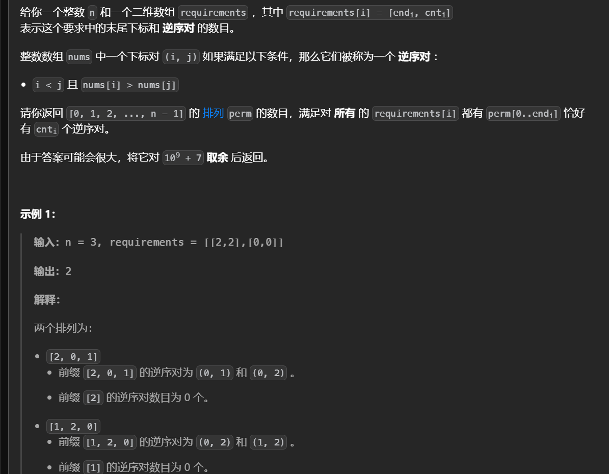

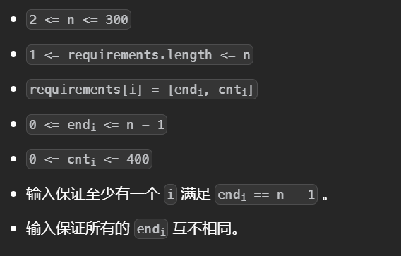


### [统计逆序对的数目](https://leetcode.cn/problems/count-the-number-of-inversions/)

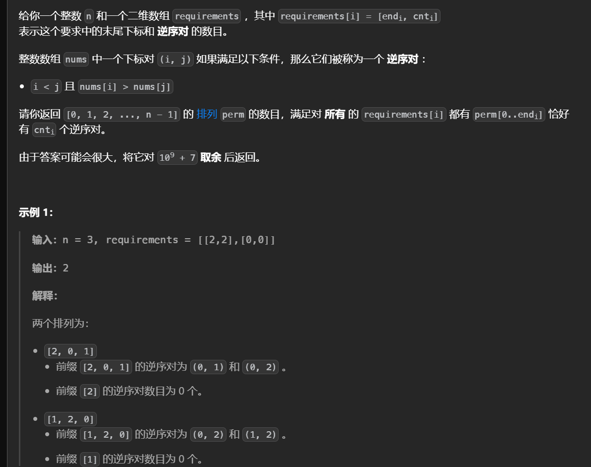


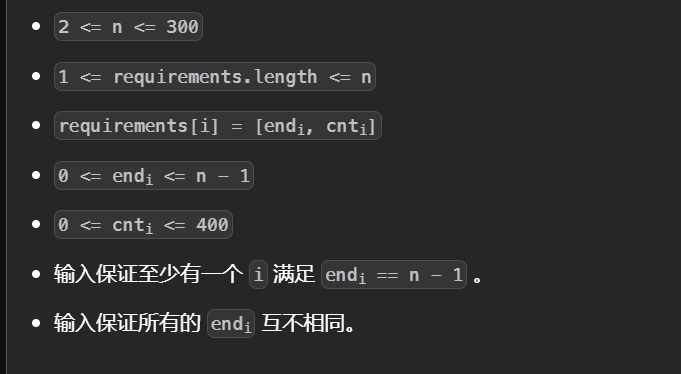


该题目在上述的基础上增加了一些条件，定义dp(i,j)表示前0~i有j个逆序对

关键思路同上一题，把1\~n的排列随机取一个数后，前面剩余的数可以看作是0\~n-2的排列，因为只考虑逆序对那么只关心相对大小。

```python
class Solution:
    def numberOfPermutations(self, n: int, requirements: List[List[int]]) -> int:
        r=[-1]*(n+1)
        mod=10**9+7
        requirements.sort()
        # 先设置好约束条件
        for i,j in requirements:
            r[i+1]=j
        @cache
        def dp(i,j):
            # base case是只有一个数的时候，这是逆序对只能是0个
            if i==1:return int(j==0)
        	# 如果有约束条件，那么必须满足约束条件，首先剩余的逆序对要足够构建约束规定的逆序对的个数，其次为了满足约束条件而凑出的逆序对必须能由前i个数构建出来，即小于i-1
            if r[i-1]>=0:
                return dp(i-1,r[i-1]) if j-r[i-1]<=i-1 and r[i-1]<=j else 0
            # 否则任取，注意不能大于已有的逆序对个数和能构建出的逆序对个数
            return sum(dp(i-1,j-k) for k in range(min(i,j+1)))%mod
        return dp(n,requirements[-1][-1])
       
```


### 子序列dp

#### [使数组变美的最小增量运算数](https://leetcode.cn/problems/minimum-increment-operations-to-make-array-beautiful/)

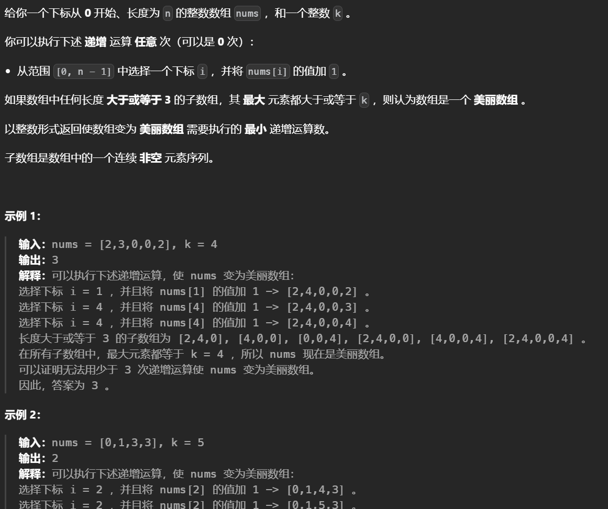

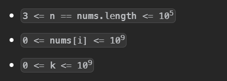

子序列问题对每个元素有增加或者不增加，题目要求每个长度大于等于3的满足要求，实际上只用找长度等于3的子数组即可。

由于长度只有三可以定义状态J表示这个数组右边不满足要求的连续元素个数，定义dp(i,j)表示当前位置上，右边有连续j个不满足要求的元素。

```python
class Solution:
    def minIncrementOperations(self, nums: List[int], k: int) -> int:
        n=len(nums)
        # @cache
        # def dp(i,j):
        #     if i<0:return 0
        #     if j==2:如果j=2就必须对当前位置操作
        #         return dp(i-1,0)+max(0,k-nums[i])
        #     return min(dp(i-1,0)+max(0,k-nums[i]),dp(i-1,j+1))# 操作或不操作
        # return dp(len(nums)-1,0)
        
        f=[[0]*3 for _ in range(n+1)]
        for i in range(1,n+1):
            f[i][0]=min(f[i-1][1],f[i-1][0]+max(0,k-nums[i-1]))
            f[i][1]=min(f[i-1][2],f[i-1][0]+max(0,k-nums[i-1]))
            f[i][2]=f[i-1][0]+max(0,k-nums[i-1])
        return f[n][0]

           
```


 


### 值域dp

#### [求出最长好子序列 II](https://leetcode.cn/problems/find-the-maximum-length-of-a-good-subsequence-ii/)

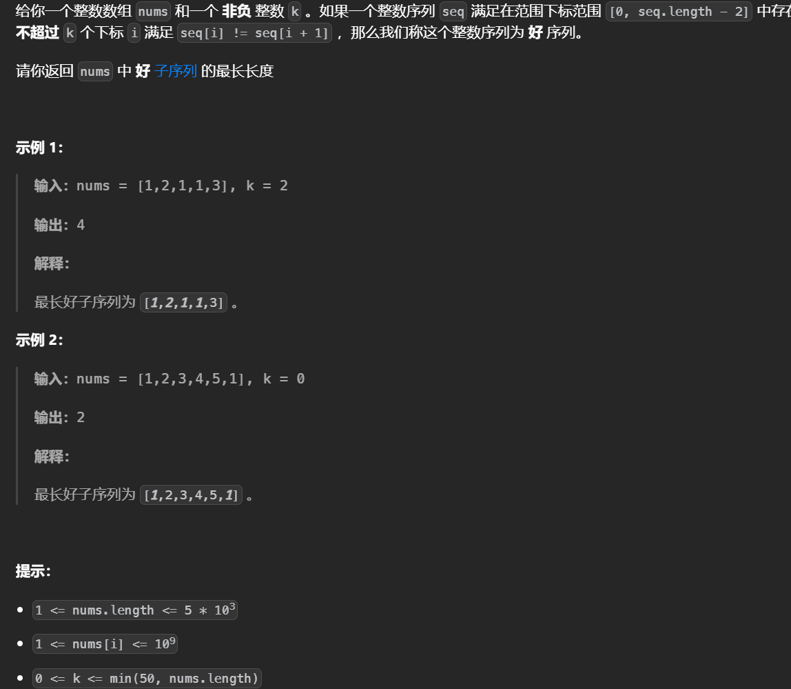

题目的关键是相邻元素的数值大小，考虑使用值域dp。

定义f[x]\[j]为以 *x* 结尾的、至多包含 *j* 个不同相邻元素的子序列的最大长度，转移方程为f[x]\[j]=max(f[x]]\[j],max{f[v]]\[j-1]})+1，即末尾的值是否相同，如果相同可以直接加一，对于不同的去找最大的。

这里的v是在x之前的值，如果要暴力枚举v会超时。这里可以在遍历x的过程中维护至多为j-1的最长长度，这里即使nums[j]=x也没关系，因为他一定是小于等于长度为j+1的不会影响到最后结果。

在转移过后更新j的最大长度。注意因为j需要去看j-1，而操作过后会更新j(节省空间不另开一个数组)，下一轮的j+1又会用到j，为了避免使用覆盖后的数据可以到倒序枚举j。


```python
class Solution:
    def maximumLength(self, nums: List[int], k: int) -> int:
        n=len(nums)
        # 为了构建数组，离散化
        p=sorted(set(nums))
        nums=[bisect_left(p,v) for v in nums]
        dp=[[0]*(k+1) for _ in range(max(nums)+1)]
        mx=[0]*(k+1)
        for x in nums:
            # 倒序枚举
            for j in range(k,-1,-1):
                dp[x][j]=max(dp[x][j],mx[j-1] if j-1>=0 else 0)+1
                mx[j]=max(mx[j],dp[x][j])
        return max(mx)
```

#### Choosing Balls

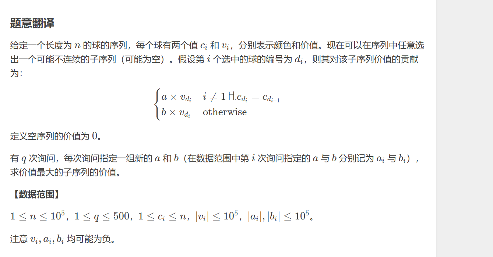


与上一题是同一类型的，值域DP。

```python
import sys
input=sys.stdin.readline

n,q=list(map(int,input().split()))
v=list(map(int,input().split()))
cc=list(map(int,input().split()))
# 定义dp[c]表示以颜色C作为最后一个的最长子序列
for _ in range(q):
    a, b = [int(x) for x in input().split()]
    mx1 = mx2 = 0# 表示最大的子序列对应的颜色，为了方便初始时指向0
    # 注意dp数组的大小只与颜色个数相关，不用定义为n
    dp = [-10**18] * (max(cc)+ 1)
    dp[0] = 0
    # 从前往后遍历每一个
    for val, c in zip(v, cc):
        # 拼接到相同的颜色后面，如果不存在相同的颜色也就是dp[c]=-inf，在取最大中会被排除
        x = dp[c] + val * a
        # 找到最大的与当前那颜色不同的
        y = (dp[mx1] if mx1 != c else dp[mx2]) + b * val
        if x < y: x = y
        # 更新最长的子序列对应的颜色，不用取等，如果等于在某个上一轮中jiu
        if dp[c] < x:
            dp[c] = x
            if dp[mx1] < x:
                mx1, mx2 = c, mx1
            elif mx1 != c and dp[mx2] < x:
                mx2 = c
    print(dp[mx1])
```

#### [无矛盾的最佳球队](https://leetcode.cn/problems/best-team-with-no-conflicts/)

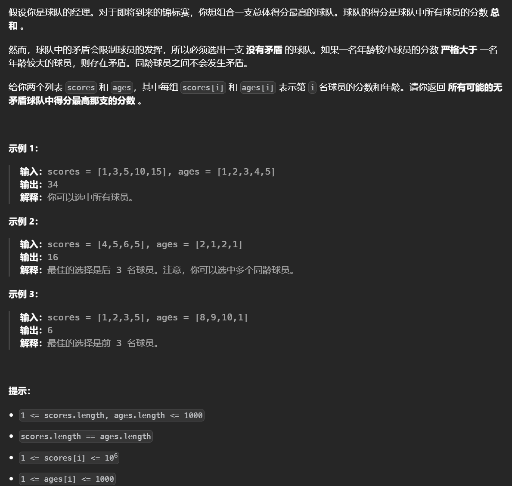

最长上升子序列可以用值域的写法求解

首先将数组按照得分的大小排序，定义dp(i)为年龄最大值恰好为i的最高得分，它可以由年龄小于等于自己的最大的分求出，同时因为排序，所以前面的得分一定是小于等于当前的得分所以不会违反要求。

```python
class Solution:
    def bestTeamScore(self, scores: List[int], ages: List[int]) -> int:
        nums=[(i,j) for i,j in zip(scores,ages)]
        nums.sort(key=lambda x:(x[1],x[0]))
        n=len(nums)
        dp=[0]*n 
        for i in range(n):
            res=0
            for j in range(i-1,-1,-1):
                if nums[j][1]<nums[i][1] and nums[j][0]>nums[i][0]:continue
                res=max(res,dp[j])
            dp[i]=res+nums[i][0]
        return max(dp)
    

# 用树状数组优化，注意由于数组中存的是最大得分，因此更新实际上是取最大值
def cal(x):
    return x&(-x)
class Tree:
    def __init__(self,n):
        # 这里没有原始数组
        self.tree=[0]*(n+1)
    # 更新
    def update(self,i,mx):
        i+=1
        while i<len(self.tree):
            self.tree[i]=max(self.tree[i],mx)
            i+=i&-i

    # 求出0,i的区间和，也就是小于等于i的个数
    def query(self,i: int) -> int:
        mx = 0
        while i:
            mx = max(mx, self.tree[i])
            i &= i - 1
        return mx

class Solution:
    def bestTeamScore(self, scores: List[int], ages: List[int]) -> int:
        x=max(ages)
        t=Tree(x+1)
        for i,j in sorted(zip(scores,ages)):
            mx=t.query(j+1)
            t.update(j,mx+i)
        return t.query(x+1)
```

#### [找出有效子序列的最大长度 II](https://leetcode.cn/problems/find-the-maximum-length-of-valid-subsequence-ii/)

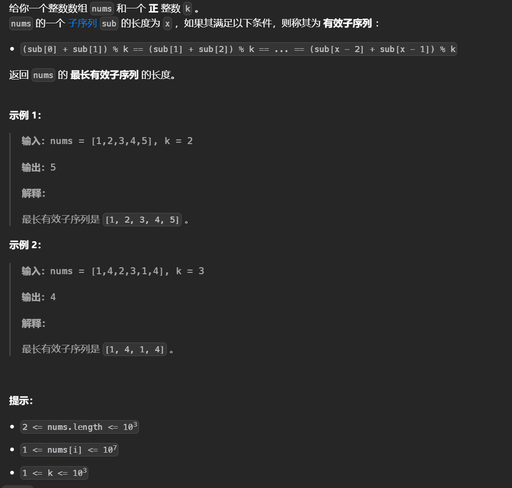

化简公式，实际上就是找奇数位置取余k相等并且偶数位置取余k也相等的最长子序列。

根据给定的数据范围，可以做到k^2。定义f[i]\[j]表示最后一个数为i倒数第二个数为j

```python
class Solution:
    def maximumLength(self, nums: List[int], k: int) -> int:
        f=[[0]*k for _ in range(k)]
        # 预处理数组
        nums=[v%k for v in nums]
        for v in nums:
            # 选这个数表示把这个数放在以任意个一个数为倒数第一个，以这个数为倒数第二个的子序列后面
            for j in range(k):
                f[v][j]=f[j][v]+1
        return max(map(max,f))
```


​	


### 可行性背包

#### [执行操作可获得的最大总奖励 I](https://leetcode.cn/problems/maximum-total-reward-using-operations-i/)

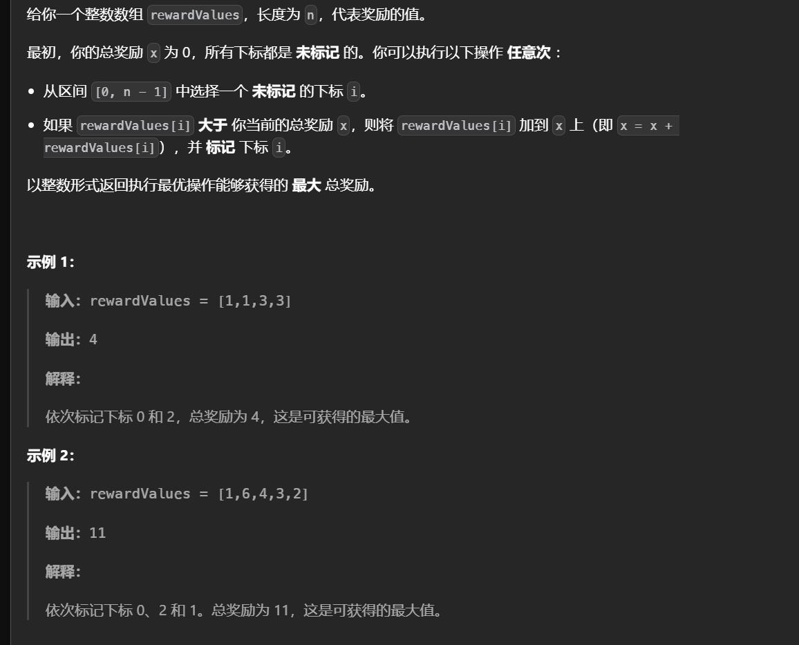

每次只能选大于当前总和的数，先贪心把数组去重后排序。

定义dp(i,j)表示考虑前i个元素，是否能满足最大和为J，初始时dp(0,0)为True，整个数组能能到的最大值为mx，因为每次只能选择大于当前和的数因此，一个值如果大于数组的最大值那么mx就是这个数，如果小于最大值则可以加上数组的最大值然后就不能再增大了，mx=max(nums)*2-1.

选一个数的条件是j-v<v（没选这个数之前小于当前数）只有这样才能选择j

```python
class Solution:
    def maxTotalReward(self, rewardValues: List[int]) -> int:
        rewardValues=sorted(set(rewardValues))
        n=len(rewardValues)
        mx=2*rewardValues[-1]
        # dp=[[False]*mx for _ in range(n+1)]
        # dp[0][0]=True
        # for i in range(1,n+1):
        #     for j in range(mx):
        #         v=rewardValues[i-1]
        #         if j>=v and j-v<v:dp[i][j]=dp[i-1][j]|dp[i-1][j-v]
        #         else:dp[i][j]=dp[i-1][j]
        # for j in range(mx-1,-1,-1):
        #     if dp[-1][j]:return j

        # 优化为一维
        dp=[False]*mx
        dp[0]=True
        for i in range(1,n+1):
            v=rewardValues[i-1]
            for j in range(mx-1,-1,-1):
                if j>=v and j-v<v:dp[j]=dp[j]|dp[j-v]

        for j in range(mx-1,-1,-1):
            if dp[j]:return j      
```

当数据比较大的时候就必须优化了


对于可行性背包最常见的优化技巧是bitset

用一个二进制数f表示dp数组,其中f的第i位表示dp[i]，为1表示TRUE,0表示FALSE


初始时f=1表示dp[0]=TRUE

```python
class Solution:
    def maxTotalReward(self, rewardValues: List[int]) -> int:
        rewardValues=sorted(set(rewardValues))
        n=len(rewardValues)
        f=1
        for v in rewardValues:
            f|=(f&(1<<v)-1)<<v     
        return f.bit_length()-1       
```


### [单调数组对的数目 II](https://leetcode.cn/problems/find-the-count-of-monotonic-pairs-ii/)

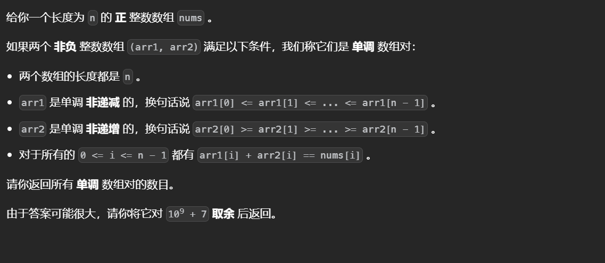

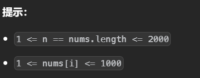


定义f[i]\[j]表示第i个位置选择j的个数，可以很简单的得出推导式，

```python
@cache
def dp(i,j):
    if not i:return 1
    mx=min(j,nums[i-1]-nums[i]+j)
    res=0
    for k in range(mx+1):
        res+=dp(i-1,k)
        res%=mod
    return res 
return sum(dp(n-1,k) for k in range(nums[-1]+1))%mod
```

但是对于给定的的数据范围无法求解只有优化一重循环才能得到结果，把dp改为递推之后发现其中一重循环完全可以用前缀和优化。

```python
        for v in range(nums[0]+1):f[0][v]=1
        for i in range(1,n):
            s=list(accumulate(f[i-1],initial=0))
            for j in range(nums[i]+1):
                mx=min(j,nums[i-1]-nums[i]+j)
                if mx<0:continue
                res=s[mx+1]
                # for k in range(mx+1):
                #     res+=f[i-1][k]
                res%=mod
                f[i][j]=res
        return sum(f[n-1][k] for k in range(nums[-1]+1))%mod
```


### [不同骰子序列的数目](https://leetcode.cn/problems/number-of-distinct-roll-sequences/)

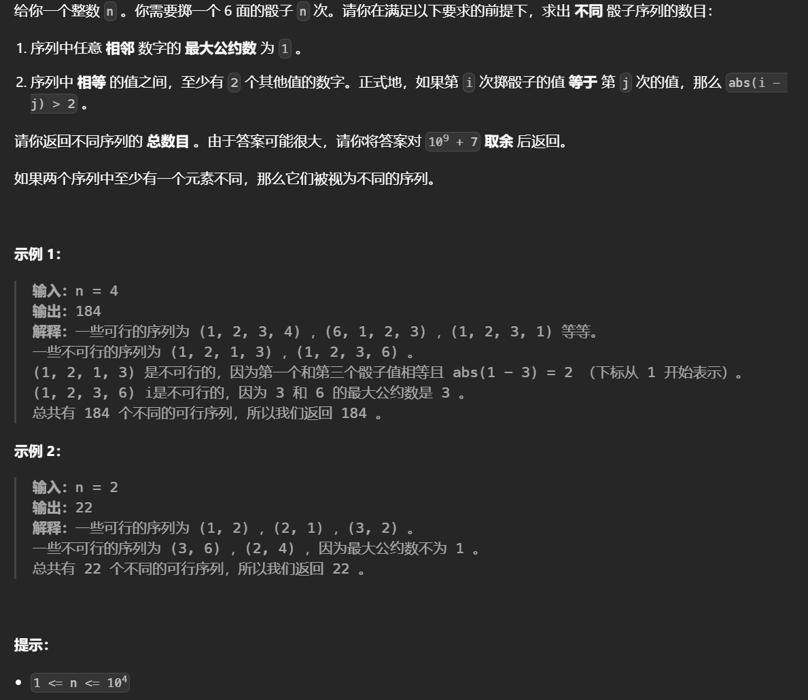

最直接的定义，设置l1，l2为倒数第一个数和倒数第二个数

```python
class Solution:
    def distinctSequences(self, n: int) -> int:
        mod=10**9+7
        @cache
        def dp(i,l1,l2):
            if i==n:return 1
            res=0
            for j in range(1,7):
                if gcd(l1,j)!=1 or l1==j or l2==j:continue
                res+=dp(i+1,j,l1)
                res%=mod
            return res 
        return dp(0,-1,-1)
```

优化，定义dp(i,j)表示前i个序列以j结尾，倒数第二个数的值可以推出

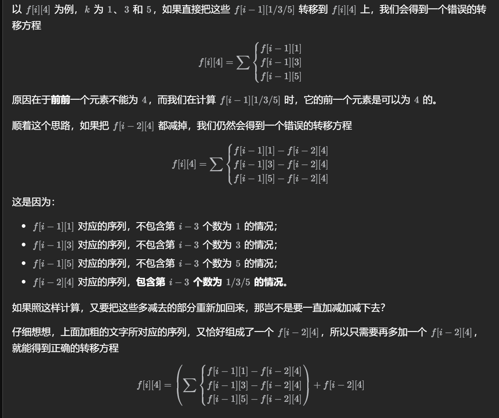

```python
class Solution:
    def distinctSequences(self, n: int) -> int:
        mod=10**9+7
        @cache
        def dp(i,j):
            if i==1:return 1
            elif i<=0:return 0
            res=0
            for k in range(1,7):
                if k!=j and gcd(k,j)==1:
                    res+=dp(i-1,k)-dp(i-2,j)
                    res%=mod
            # 注意这里按照定义只有I大于3的时候才能求解，否则是不存在i-3的
            if i>3:res+=dp(i-2,j)
            return res%mod
        return sum(dp(n,i) for i in range(1,7))%mod

```


### [出租车的最大盈利](https://leetcode.cn/problems/maximum-earnings-from-taxi/)

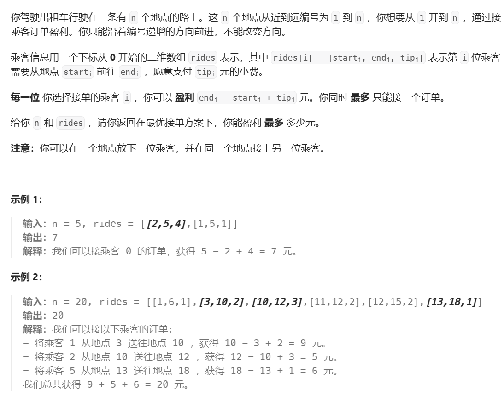

定义dp(i)表示到达第i个位置时的最大盈利

```python
class Solution:
    def maxTaxiEarnings(self, n: int, rides: List[List[int]]) -> int:
        memo=[[] for _ in range(n)]
        for l,r,w in rides:
            memo[r-1].append((l-1,w))

        # @cache
        # def dp(i):
        #     if i<0:return 0
        #     res=dp(i-1)
        #     if memo[i]:
        #         res=max(res,max(dp(pre)+w+i-pre for pre,w in memo[i]))
        #     return res
        # return dp(n-1)
        dp=[0]*n
        for i in range(n):
            if i-1>=0:dp[i]=dp[i-1]
            if memo[i]:dp[i]=max(dp[i],max(dp[pre]+w+i-pre for pre,w in memo[i]))
        return dp[-1]
```

### Toward 0

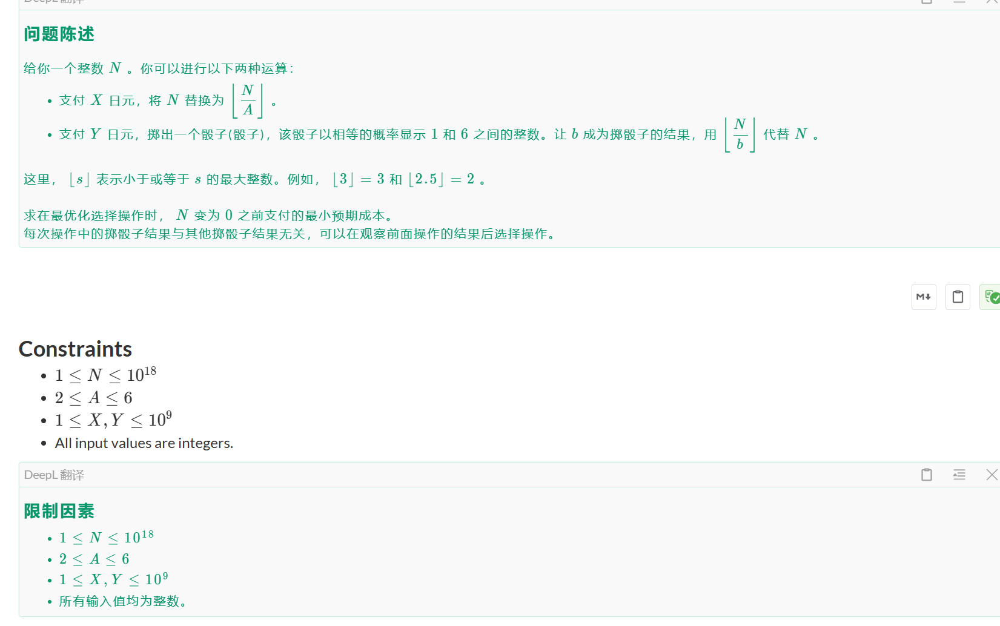


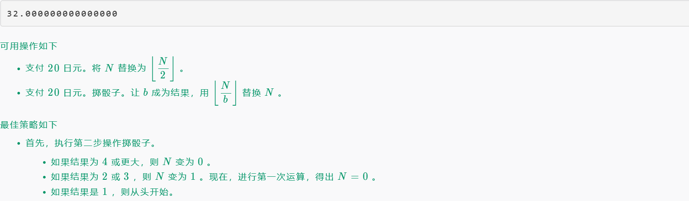

实际上是dp问题，每次可以选择掷色子或者固定减少两种选择，掷色子的花费dp(x)=(6*y+dp(n/1)+dp(n/2)+dp(n/3)+dp(n/4)+dp(n/5)+dp(n/6))/6，这里出现了重复项，可以变化公式得出最后的形式。

```python
from functools import lru_cache
n,a,x,y=[int(x) for x in input().split()]
@lru_cache(maxsize=None)
def dfs(u):
    if not u:return 0
    l=x+dfs(u//a)
    r=(6*y+dfs(u//2)+dfs(u//3)+dfs(u//4)+dfs(u//5)+dfs(u//6))/5
    return min(l,r)
print(dfs(n))
```

​	

### How Does the Rook Move

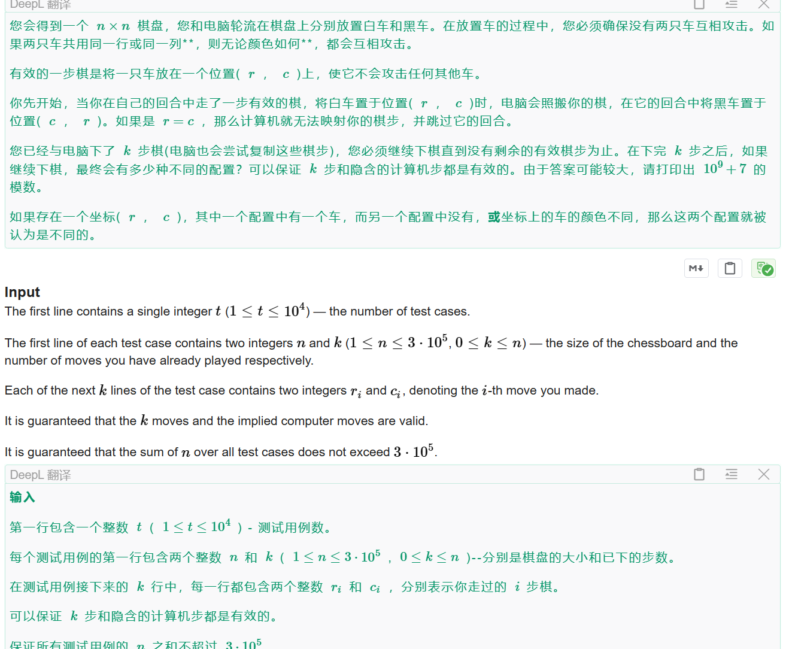

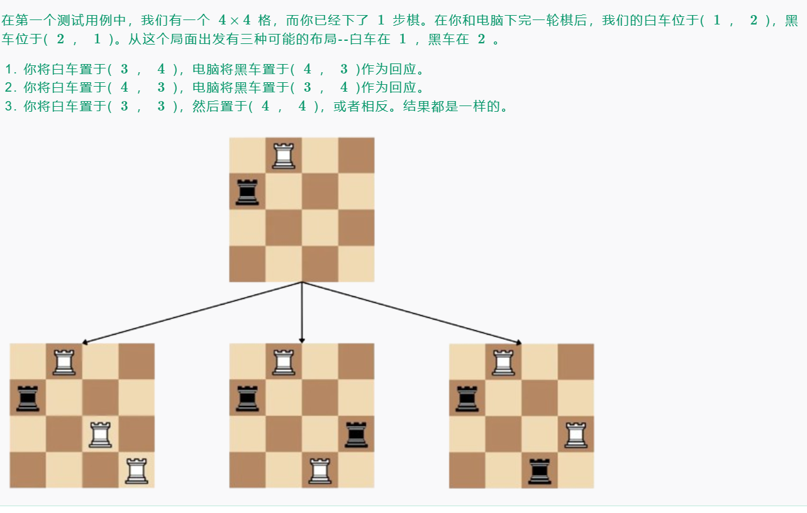


黑棋的位置不重要，因为只能由白棋决定，当白棋落在正对角线的位置时可选的行数减少1，其他位置时可选的行数减少2，显然是一个子问题求解过程。

dp[i]=dp[i-1]+(i-1+i-1)*dp[i-2]加上两个i-1是因为子啊除开对角线由2\*i-2个位置可选.

```python
from functools import lru_cache
mod=10**9+7
for _ in range(int(input())):
    n,k=[int(x) for x in input().split()]
    dp = [0] * (n + 1)
    dp[0]=dp[1] = 1
    for _ in range(k):
        a,b=[int(x) for x in input().split()]
        if a==b:n-=1
        else:n-=2

    for i in range(2,n+1):
        dp[i]=dp[i-1]+(2*i-2)*dp[i-2]
        dp[i]%=mod
    print(dp[n])
```


### [视频拼接](https://leetcode.cn/problems/video-stitching/)

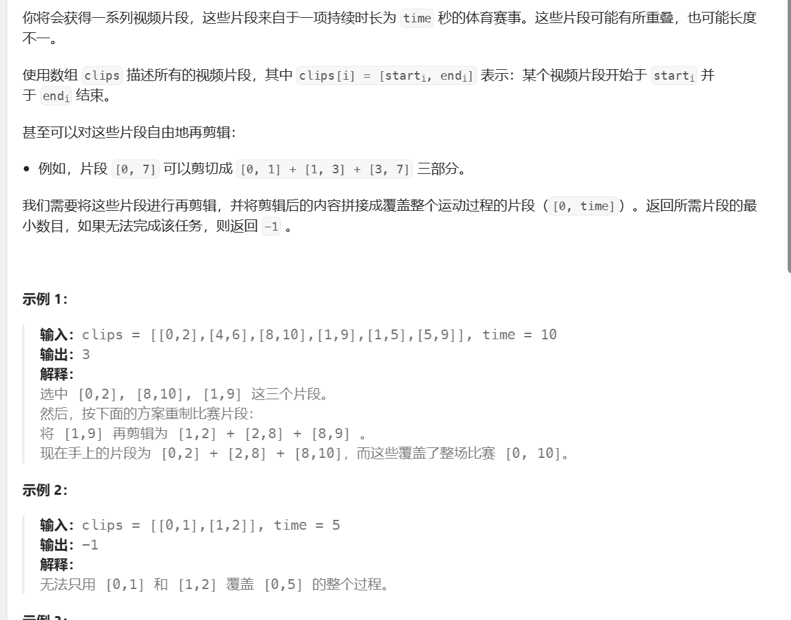

```python
class Solution(object):
    def videoStitching(self,clips, time):
        dp = [float('inf')] * (time + 1)
        dp[0] = 0
    
        for i in range(1, time + 1):
            for start, end in clips:
                if start < i <= end:
                    dp[i] = min(dp[i], dp[start] + 1)
    
        return dp[time] if dp[time] != float('inf') else -1

```

### [灌溉花园的最少水龙头数目](https://leetcode.cn/problems/minimum-number-of-taps-to-open-to-water-a-garden/)

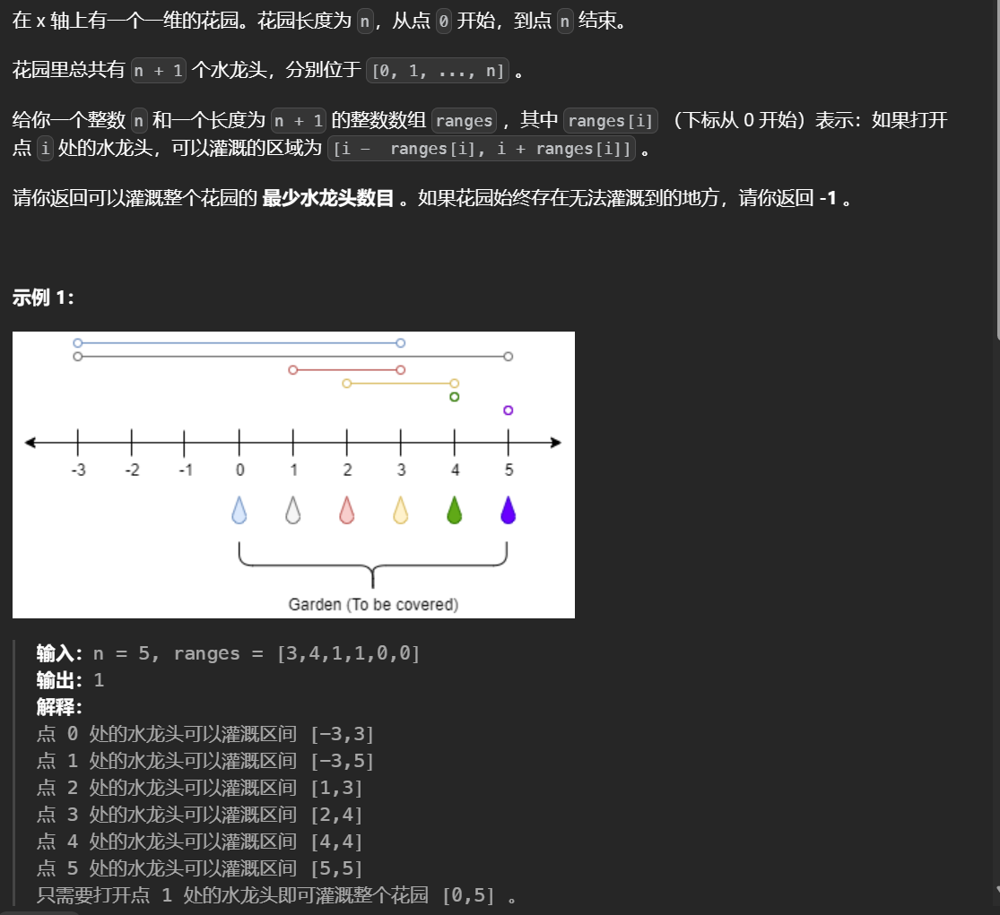


和上一题是一个类型，都选出最少的区间来覆盖整个区间，这种题目令dp[i]表示0~i区间内被全覆盖所需的最少区间数。


```python
class Solution:
    def minTaps(self, n: int, ranges: List[int]) -> int:
        inter=[]
        # 首先对区间进行操作，超出的位置不需要
        for i,v in enumerate(ranges):
            inter.append([max(0,i-v),min(i+v,n)])
        # 按照开始时间排序，能保证开始时间之前都是计算好的
        inter.sort()
        dp=[inf]*(n+1)
        dp[0]=0
        # 如果选了这个区间，那么到达这个区间中某一个点j的最少区间数与这个区间的左端点有关
        for l,r in inter:
            # 如果存在不合法的状态则表示有点没有被覆盖
            if dp[l]==inf:return -1
            for j in range(l,r+1):
                # 类似于刷表法
                dp[j]=min(dp[j],dp[l]+1)
        return dp[n]
```


### [知道秘密的人数](https://leetcode.cn/problems/number-of-people-aware-of-a-secret/)

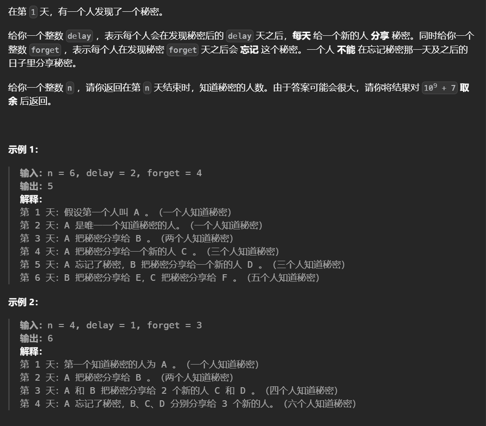

考虑dp[i]表示第i天新增的人数，最后求的总人数就是从最后一天往前数forget天增加的总人数之和。


```python
class Solution:
    def peopleAwareOfSecret(self, n: int, delay: int, forget: int) -> int:
        mod=10**9+7
        dp=[0]*(n+1)
        dp[1]=1
        # 使用刷表法，第i天会影响到后面的一个区间的时间端
        for i in range(1,n+1):
            for j in range(i+delay,i+forget):
                if j>=n+1:break
                dp[j]+=dp[i]
        ans=0
        # 最后求和
        for i in range(n-forget+1,n+1):
            ans+=dp[i]
            ans%=mod
        return ans 
```


### 最大子数组之和

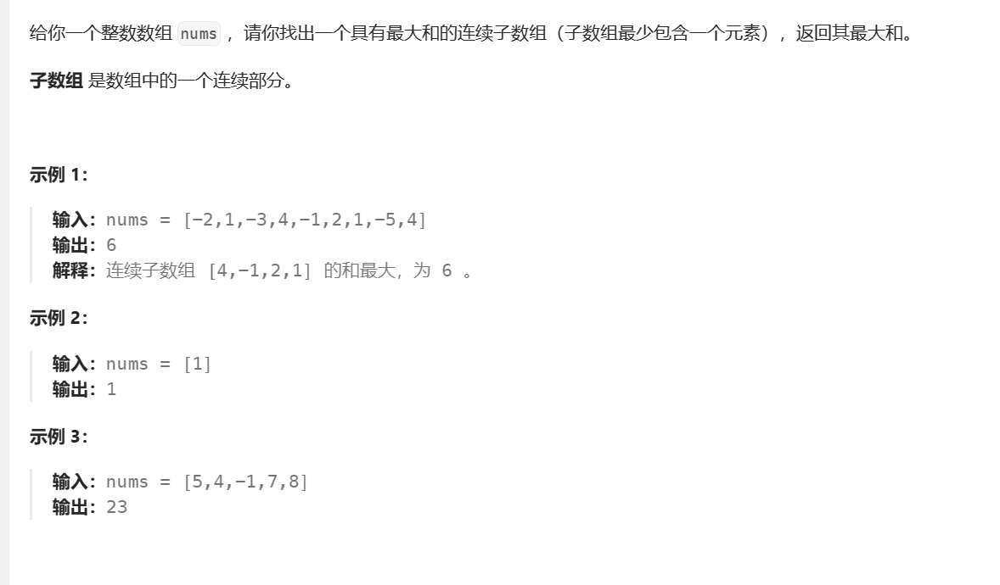

```python
class Solution:
    def maxSubArray(self, nums: List[int]) -> int:
        n=len(nums)
        dp=[0]*n
        dp[0]=nums[0]
        ans=dp[0]
        for i in range(1,n):
            dp[i]=max(nums[i],dp[i-1]+nums[i])
            ans=max(ans,dp[i])
        return ans 
```

### [将字符串翻转到单调递增](https://leetcode.cn/problems/flip-string-to-monotone-increasing/)

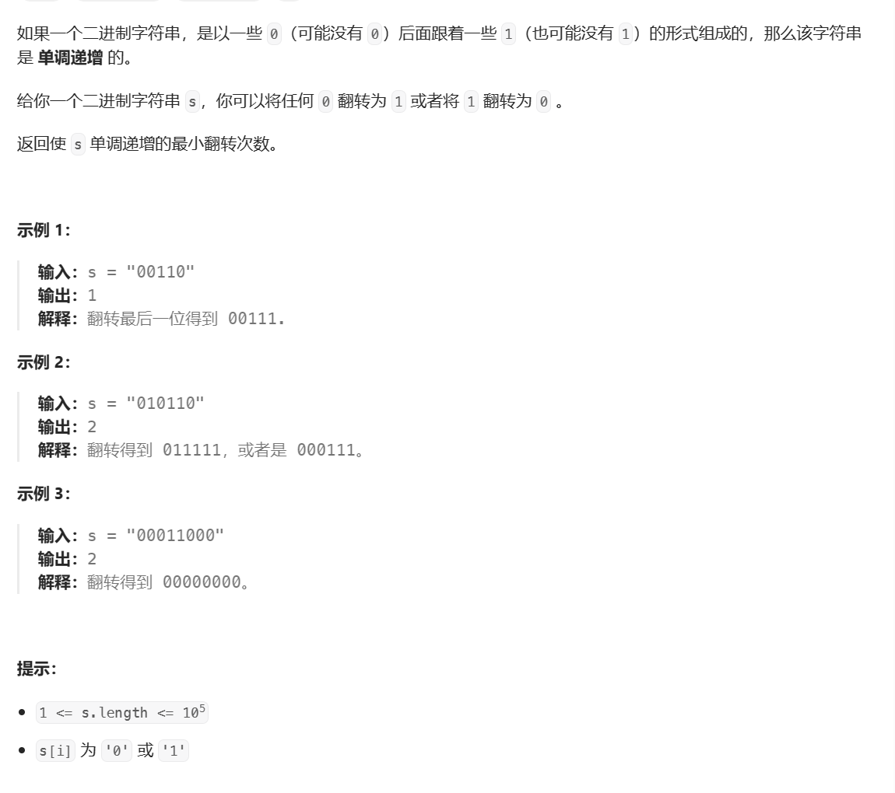

规定dp[i] [j]为把第i+1个变为j并且是递增的最小操作次数，最终的结果就是最后一个字符变为0或1中的最小的那个。

dp[i] [0]=dp[i-1] [0]，把当前位转换为0，前一位只能是0，次数就是前一位转换为0的次数加上当前位置字符是否为1。

dp[i] [1]，前一位可以是0或者是1，次数是前一位转换为0或1的最小值，加上当前位是否为0.

```python
class Solution:
    def minFlipsMonoIncr(self, s: str) -> int:
        n=len(s)
        dp=[[0,0] for _ in range(n+1)]
        for i in range(n):
            dp[i+1][0]=dp[i][0]+int(s[i]=='1')
            dp[i+1][1]=min(dp[i][0],dp[i][1])+int(s[i]=='0')
        return min(dp[n][0],dp[n][1])
    # 可以优化为只有两个变量
   	   zero=one=0
        for i in range(n):
            one,zero=min(zero,one)+int(s[i]=='0'),zero+int(s[i]=='1')
        return min(zero,one)
```

### [最大节点价值之和](https://leetcode.cn/problems/find-the-maximum-sum-of-node-values/)

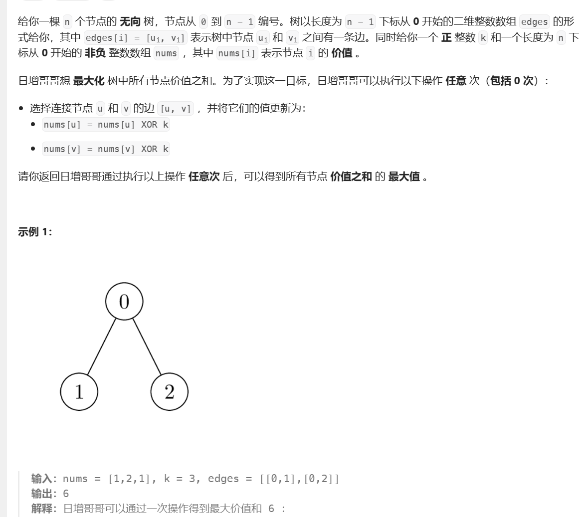

这道题目的边是没有用的，每次选出两个值进行异或操作：如果两个值都被操作过，总的异或个数减二，反之加二，如果只有一个操作过则总数不变。因此到最后异或的个数一定是偶数个，根据这一点给出dp(i,j)表示考虑前i个数，当有j(1表示奇数0表示偶数)个异或个数时的最大值。


```python
class Solution:
    def maximumValueSum(self, nums: List[int], k: int, edges: List[List[int]]) -> int:
        n=len(nums)
        @cache
        def dp(i,j):
            res=nums[i-1]^k
            # base case 对于第一个值如果操作次数是偶数则不会异或上值
            if i==1:
                return nums[i-1]^k if j else nums[i-1]
            return max(dp(i-1,j)+nums[i-1],dp(i-1,j^1)+(nums[i-1]^k))
        return dp(n,0)
```


### 编辑距离

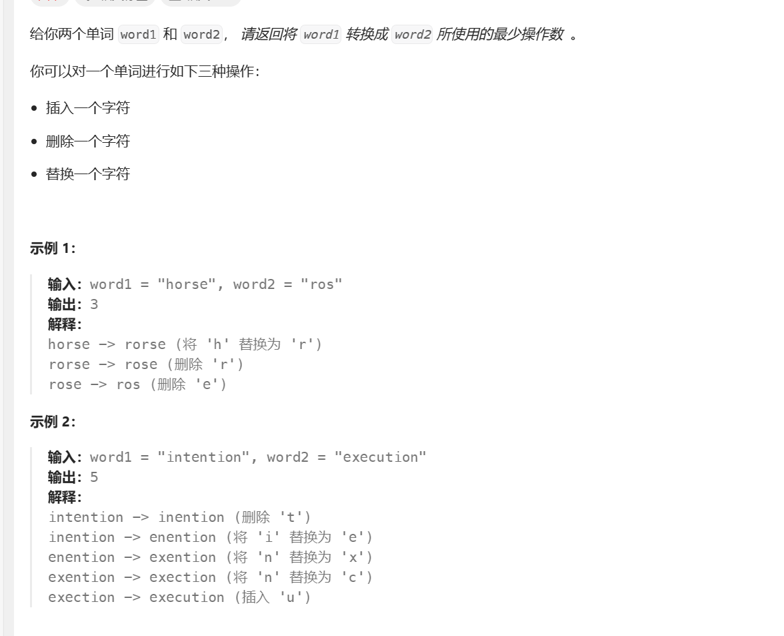

```python
class Solution(object):
    
    def minDistance(self, word1, word2):
        # 备忘录，记录当前剩下长度m和n的两个字符最少需要多少步
        memo=[[-1 for _ in range(len(word2))] for _ in range(len(word1))]
        # 表示从s1[0,m],s2[0,n]的字符串相等所需的最小步骤
        def dp(s1,m,s2,n):
	# 从末尾开始遍历，如果有一方提前结束，那么只需要另一个剩余字符长度的删除操作
            if m==-1:
                return n+1
            if n==-1:
                return m+1
			
            # 备忘录储存
            if memo[m][n]!=-1:
                return memo[m][n]

            # 如果字符相等，进入下一层
            if s1[m]==s2[n]:
                memo[m][n]=dp(s1,m-1,s2,n-1)
            else:
                # 反之找出最小的步骤，替换，减，增，注意不能拉下这一次的
                # dp(s1,m-1,s2,n-1)代表替换，没必要继续留在m,n顺势两个指针前移，dp(s1,m-1,s2,n)同时包含删除和增加，删除的是s1的最后一个字符，s1的指针前移一位，不一定删除之后就是末尾相等的两字符，也有可能是对s2增加一个，增加后s2的指针不动（因为增加了一位，匹配的是增加的），s1的前移一位因为匹配了，增加的一定是可以满足相等的（不会加入无用的浪费次数），
                memo[m][n]=min(dp(s1,m-1,s2,n-1)+1,dp(s1,m-1,s2,n)+1,dp(s1,m,s2,n-1)+1)
                
            return memo[m][n]

        return dp(word1, len(word1) - 1, word2, len(word2) - 1)
    
'''上述使用递归的是自定向下的写法，以下是使用DPtable，自底向上的写法'''
from math import inf

n1 = int(input())
s = input()
n2 = int(input())
p = input()
# 这里的dp[i][j]记录的是区间 s[i...n1)与p[j...n2)的最小操作次数，也可以认为是后n1-i,n2-j个
dp = [[inf] * (n2 + 1) for _ in range(n1 + 1)]

# 注意初始化，这里的dp[n1][x] dp[x][n2]表示的都是其中一个字符串空了，另一个字符串全删除的操作次数
dp[n1] =list(range(n2,-1,-1))
for i in range(n1 + 1):
    dp[i][n2] = n1-i
for i in range(n1,0,-1):
    for j in range(n2,0,-1):
        # 相等可以不操作
        if s[i - 1] == p[j - 1]:
            dp[i-1][j-1] = min(dp[i][j], dp[i - 1][j - 1])
        # 三个操作
        dp[i-1][j-1] = min(dp[i-1][j-1], 1 + dp[i - 1][j], 1 + dp[i][j - 1],1+dp[i][j])
print(dp[0][0])
```

### 最长公共子序列

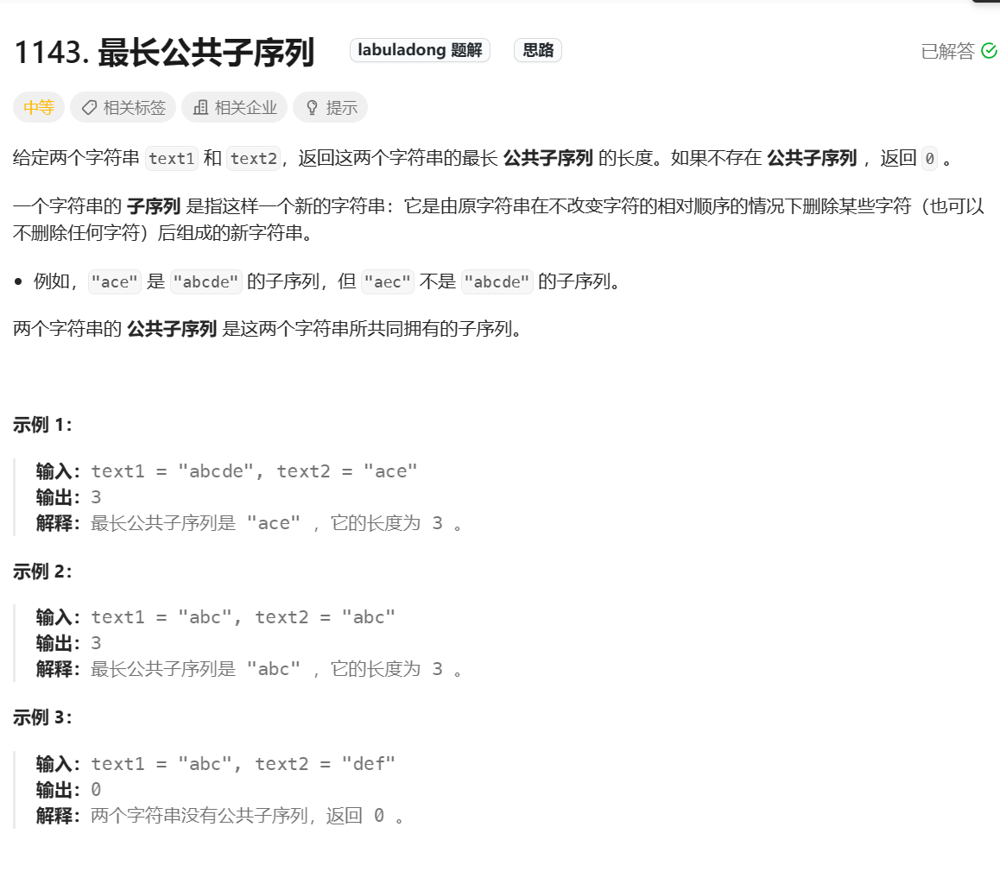

所有的字符串子序列问题都是使用两个指针进行动态规划，不看字符串而是看每个字符

```python
class Solution(object):
    def longestCommonSubsequence(self, text1, text2):
        m=len(text1)
        n=len(text2)
        # 备忘录
        memo=[[-1 for _ in range(n)] for _ in range(m)]
		
        # dp[m][n]返回s1[m:]与s2[n:]的最长公共子序列
        def dp(s1,m,s2,n):
            # base case 没有值
            if m==len(s1) or n==len(s2):
                return 0
            # 如果记录了
            if memo[m][n]!=-1:
                return memo[m][n]
            # 用指针比较字符
            if s1[m]==s2[n]:
                 memo[m][n]=1+dp(s1,m+1,s2,n+1)
            else:
                # 不等，说明至少有一个字符不是最长公共子序列中的，两个字符都不是的情况被至少一个不是包括
                memo[m][n]=max(dp(s1,m+1,s2,n),dp(s1,m,s2,n+1))#,dp(s1,m+1,s2,n+1))

            return memo[m][n]

        return dp(text1,0,text2,0)
    
# 自底向上的解法更快
class Solution(object):
    def longestCommonSubsequence(self, text1, text2):
        m=len(text1)
        n=len(text2)
        # 做一位偏移,dp[i]表示数组中以第i个元素结尾的最长公共子序列	
        dp=[[0 for _ in range(n+1)] for _ in range(m+1)]

        for i in range(1,m+1):
            for j in range(1,n+1):
                if text1[i-1]==text2[j-1]:
                    dp[i][j]=dp[i-1][j-1]+1
                else:
                    dp[i][j]=max(dp[i-1][j],dp[i][j-1])

        return dp[m][n]
```

### [不相交的线](https://leetcode.cn/problems/uncrossed-lines/)

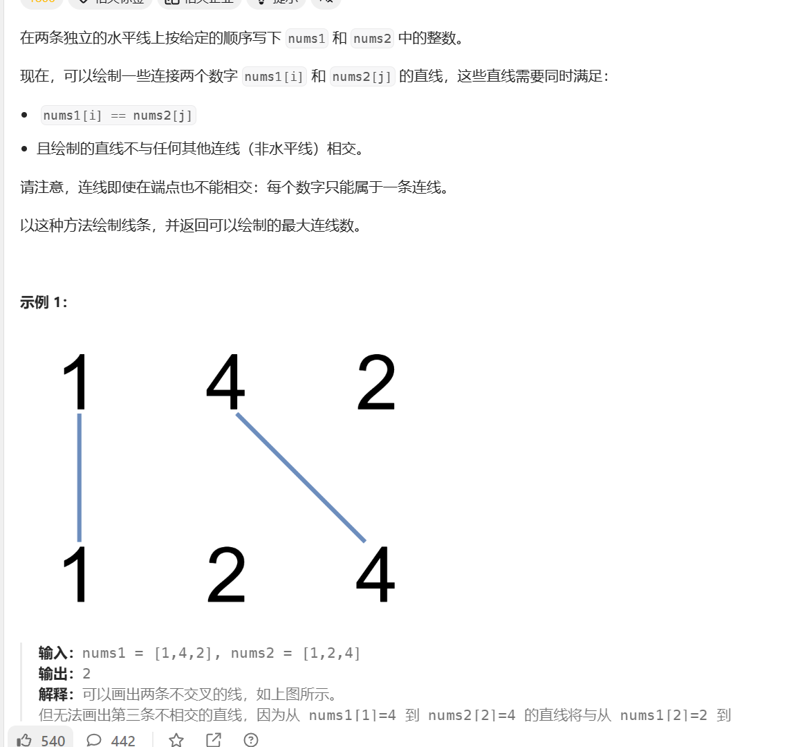

就是最长公共子序列的变形

```python
class Solution:
    def maxUncrossedLines(self, nums1: List[int], nums2: List[int]) -> int:
        n1,n2=len(nums1),len(nums2)
        @cache
        def dp(i,j):
            if i==n1 or j==n2:return 0
            return max(dp(i+1,j+1)+int(nums1[i]==nums2[j]),dp(i,j+1),dp(i+1,j))
        return dp(0,0)

```

### [ 两个子序列的最大点积](https://leetcode.cn/problems/max-dot-product-of-two-subsequences/)

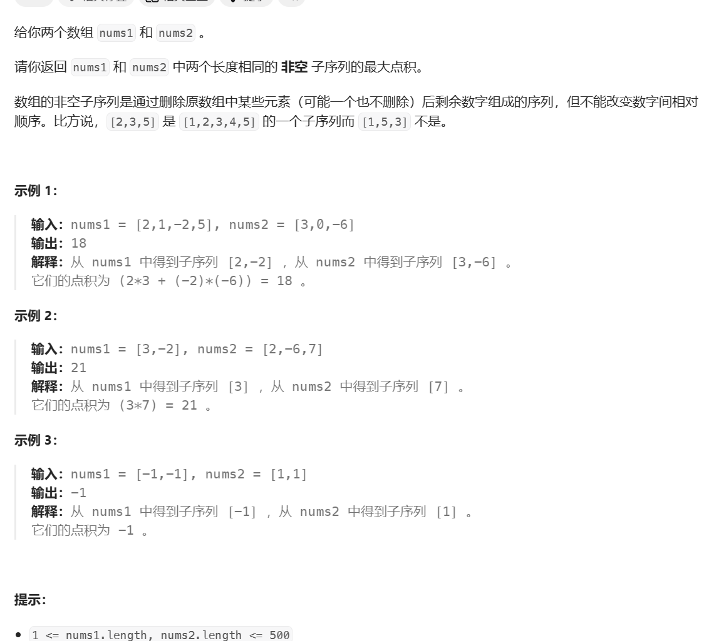

定义dp(i,j)为nums1[i:],nums2[j:]范围内的最大点积。

状态转移相当于枚举选或不选	


```python
class Solution:
    def maxDotProduct(self, nums1: List[int], nums2: List[int]) -> int:
        n1,n2=len(nums1),len(nums2)
        @cache 
        def dp(i,j):
            # 不合法的状态
            if i>=n1 or j>=n2:return -inf
            # 两个都选，注意后面的值取了可能会更小，因此取最大
            res=max(nums1[i]*nums2[j],nums1[i]*nums2[j]+dp(i+1,j+1))
            # 其中一个不选，包括了两个都不选的情况
            res=max(res,dp(i,j+1))
            res=max(res,dp(i+1,j))

            return res
        res=dp(0,0)
        return res 
```

### [最短公共超序列](https://leetcode.cn/problems/shortest-common-supersequence/)

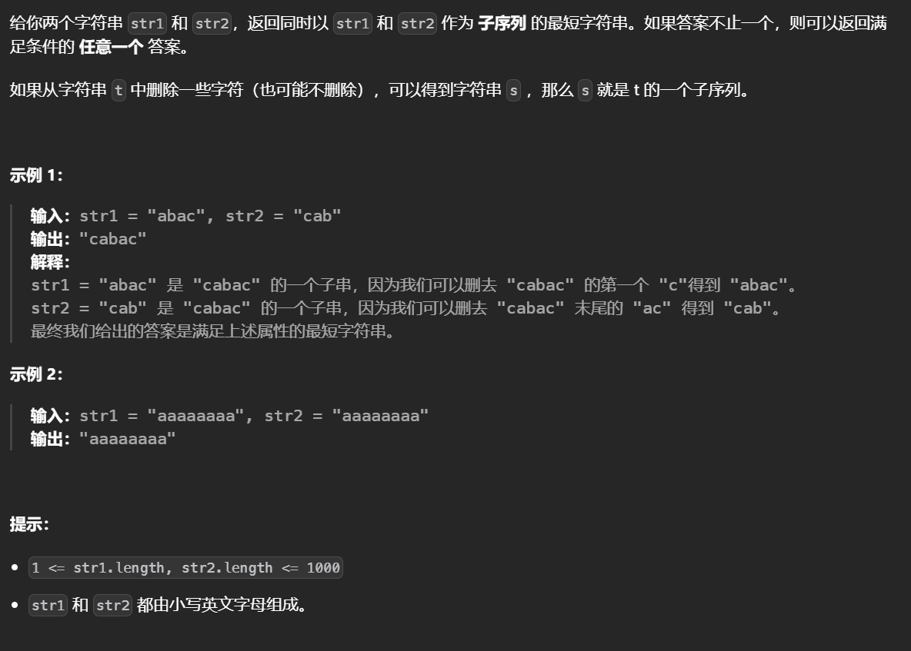


要求构造的字符串尽可能短那么最后一个字符一定是a或者b中的，如果是a中的那么问题变为从a[:-1]和b中构造字符串，反之问题变为从a,b[:-1]中构造字符串，如果相同那么就是从a[:-1]和b[:-1]中构造，可以分解出子问题。

如果直接使用记忆化搜索找最短的字符串那么内存会超出，在函数中使用另一个函数计算长度这样可以确保每一步走的都是正确的，不用递归循环找错误的子串

```python
class Solution:
    def shortestCommonSupersequence(self, s: str, t: str) -> str:
        @cache
        def dfs(i,j):
            if j<0:return i+1
            elif i<0:return j+1
            if s[i]==t[j]: return dfs(i-1,j-1)+1
            return min(dfs(i-1,j),dfs(i,j-1))+1
        
       # 不需要记忆化搜索了
        def maks(i,j):
            if j<0:return s[:i+1]
            elif i<0:return t[:j+1]
            if s[i]==t[j]: return maks(i-1,j-1)+s[i]
            if dfs(i-1,j)<dfs(i,j-1):
                return maks(i-1,j)+s[i]
            return maks(i,j-1)+t[j]
        return maks(len(s)-1,len(t)-1)
```


### 两个字符串的删除操作

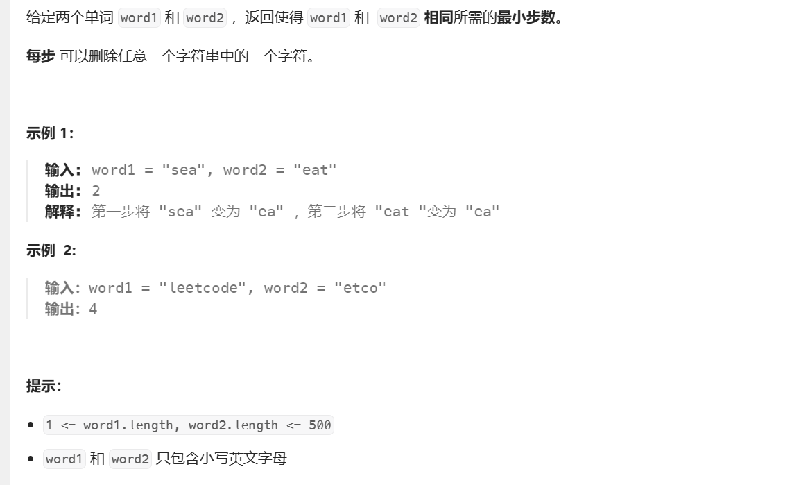

两个字符串可以任意删除，那就是找两字符串的最长公共子序列。

```python 
class Solution(object):
    def minDistance(self, word1, word2):
        m=len(word1)
        n=len(word2)
        memo=[[-1 for _ in range(n)] for _ in range(m)]

        def dp(s1,m,s2,n):
            if m==len(s1) or n==len(s2):
                return 0
            if memo[m][n]!=-1:
                return memo[m][n]
            if s1[m]==s2[n]:
                memo[m][n]=1+dp(s1,m+1,s2,n+1)
            else:
                memo[m][n]=max(dp(s1,m+1,s2,n),dp(s1,m,s2,n+1))
            return memo[m][n]

        length=dp(word1,0,word2,0)
        return m+n-2*length
    
# 自底向上的更快
class Solution(object):
    def minDistance(self, word1, word2):
        m=len(word1)
        n=len(word2)
        dp=[[0 for _ in range(n+1)] for _ in range(m+1)]

        for i in range(1,m+1):
            for j in range(1,n+1):
                if word1[i-1]==word2[j-1]:
                    dp[i][j]=dp[i-1][j-1]+1
                else:
                    dp[i][j]=max(dp[i-1][j],dp[i][j-1])

        length=dp[m][n]
        return m+n-2*length
```

### 两个字符串的最小ASCII删除和

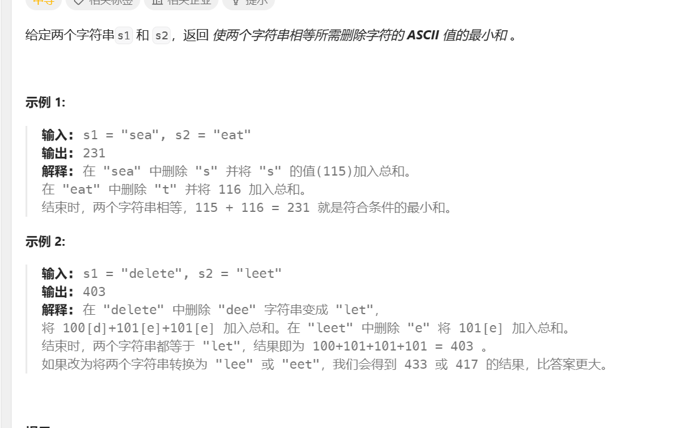

删除字符的最小的ASCII和，就是要求删除最少的字符，也就是找到最大的公共子序列。

```python
# 再求最长公共子序列的基础上改进
class Solution(object):
    def minimumDeleteSum(self, s1, s2):
        m = len(s1)
        n = len(s2)
        memo = [[-1 for _ in range(n)] for _ in range(m)]

        # 求解s[m:]和s[n:]的最小ASCII和
        def dp(s1, m, s2, n):
        
			# 如果其中一个字符串到头了，说明另一个要全部删除
            if m == len(s1):
                res=0
                for j in range(n,len(s2)):
                    res+=ord(s2[j])
                return res

            if n == len(s2):
                res=0
                for j in range(m,len(s1)):
                    res+=ord(s1[j])
                return res

            if memo[m][n] != -1:
                return memo[m][n]

            if s1[m] == s2[n]:
                memo[m][n] = dp(s1, m + 1, s2, n + 1)
            else:
                memo[m][n] = min(ord(s1[m])+dp(s1, m + 1, s2, n), dp(s1, m, s2, n + 1)+ord(s2[n]))

            return memo[m][n]
        
        return dp(s1,0,s2,0)
```

### 正则表达式

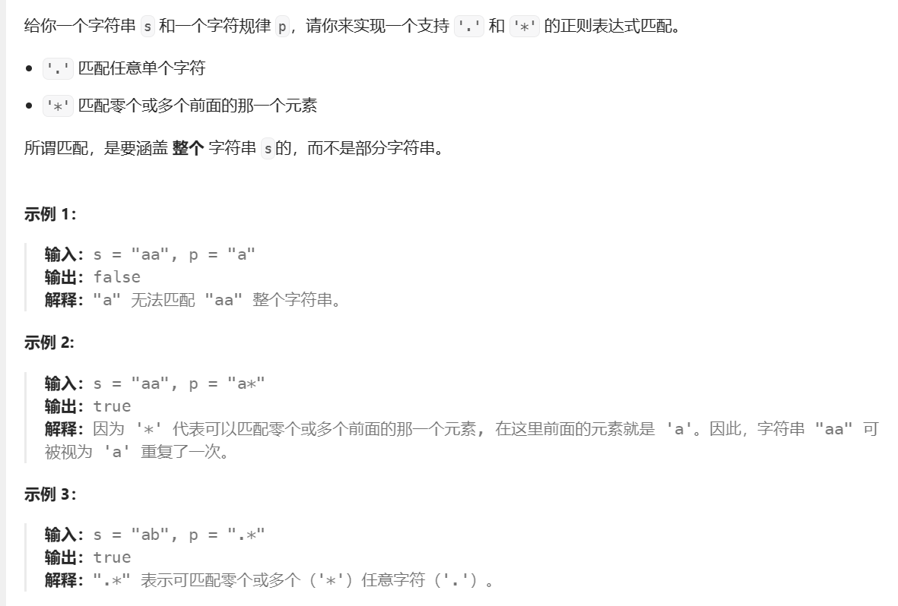

使用动态规划的思想。

如果两个指针指向的元素匹配了，如果规则中的下一位是*那么有可能是p匹配了多个s的指针移动一位，也有可能是p匹配了0个p的指针移动两位（跳过 *），比如说s=ab p=a * ab。如果下一位不是*那么就是正常的匹配，指针都移动一位。

如果两个元素不匹配，那么可能是*规则匹配了0次，或者就是s不满足p的规则。

```python
class Solution(object):
    def isMatch(self, s, p):
        memo=[[-1 for _ in range(len(p))] for _ in range(len(s))]

        # dp返回的是s[m:]与p[n:]是否匹配
        def dp(s, i, p, j):
            # base case,如果规则中的匹配完了，返回判断字符串是否检索完
            if j == len(p):
                return i == len(s)
            
            # 如果字符串检索完，不能认为规则检索完，因为规则中可能还有多个a*的形式 
            if i == len(s):
                
                # a*的形式必须是偶数
                if (len(p) - j) % 2 == 1:
                    return False
                # 判断剩下的规则元素中是否是a*的形式
                while j + 1 < len(p):
                    if p[j + 1] != "*":
                        return False
                    j += 2
                return True
            
            # 备忘录中存有值
            if memo[i][j]!=-1:
                return memo[i][j]
            
            # 如果匹配
            if s[i] == p[j] or p[j] == ".":
                # a*匹配0次或多次
                if j + 1 < len(p) and p[j + 1] == "*":
                    memo[i][j]=dp(s, i + 1, p, j) or dp(s, i, p, j + 2)
                else:# 正常匹配都移动一步
                    memo[i][j]=dp(s, i + 1, p, j + 1)
            else:# 不匹配
                # 判断是否是因为a*匹配0次导致的
                if j + 1 < len(p) and p[j + 1] == "*":
                    memo[i][j]=dp(s, i, p, j + 2)
                else:
                    memo[i][j]=False
            return memo[i][j]

        return dp(s, 0, p, 0)
```

### 最长回文子序列

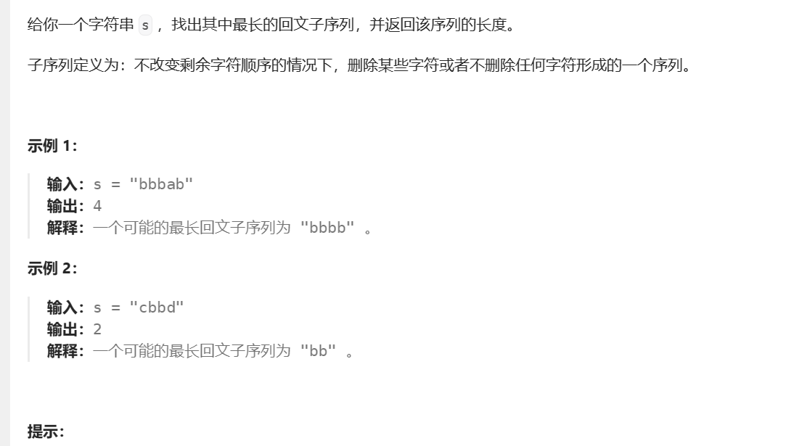

dp数组定义为二维的dp[m] [n]表示的是，s[m:n+1]的最长回文子序列，借助这个dp数组可以推出下一个状态，如果s[i]==s[j]说明这两个字符是回文子序列中的，那么dp[m] [n]=dp[m+1] [n-1]+2，反之最大长度应该等于将这两个字符分别加入后的结果。

```python
class Solution(object):
    def longestPalindromeSubseq(self, s):
        # 备忘录
        memo=[[-1 for _ in range(len(s))]for _ in range(len(s))]

        def dp(s,l,r):
            # base case，相等自然是只有一个字符
            if l==r:
                return 1
            # 如果索引不合法就是0
            if l>r:
                return 0
            
            if memo[l][r]!=-1:
                return memo[l][r]
            # 等于，加入
            if s[l]==s[r]:
                memo[l][r]=dp(s,l+1,r-1)+2
            else:# 反之找出最大的
                memo[l][r]= max(dp(s,l,r-1),dp(s,l+1,r))
            return memo[l][r]
        return dp(s,0,len(s)-1)


'''使用dp table的版本，dp[m][n]的结果要借助它的左下，左，下求出，因此选择自下而上自左而右的遍历顺序，初始时可以将不合法的值以及对角线上的值（只有一个字符）初始化'''
class Solution(object):
    def longestPalindromeSubseq(self, s):
        dp = [[0 for _ in range(len(s))] for _ in range(len(s))]
        for i in range(len(s)):
            dp[i][i]=1
        for i in range(len(s)-2,-1,-1):
            for j in range(i+1, len(s)):
                if s[i]==s[j]:
                    dp[i][j]=dp[i+1][j-1]+2
                else:
                    dp[i][j]=max(dp[i][j-1],dp[i+1][j])
        return dp[0][len(s)-1]
```

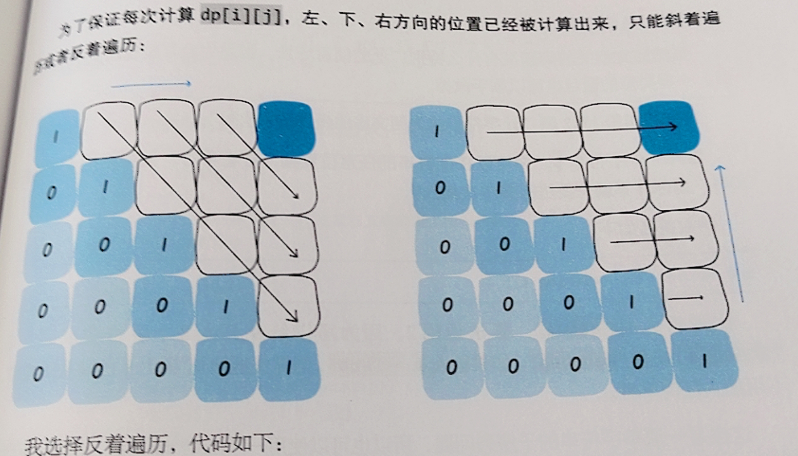

### 	[数组中的最长山脉](https://leetcode.cn/problems/longest-mountain-in-array/)

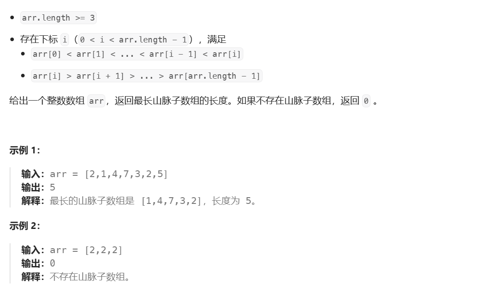


使用动态规划求解以第i位结尾的最长递增连续子数组的长度，题目中要求两边都是小于它的。因此求两个：dp1: 从左到右记录以这个数为结尾的最长连续递增子数组长度
dp2: 从右到左记录以这个数为结尾的最长连续递增序列长度，然后把它们依次相加再减一（重复了一位）就是这个位置左右的最长递增连续子序列长度。可以认为是有两个条件，对这两个条件分别讨论

```python
class Solution(object):
    def longestMountain(self, arr):
        n = len(arr)
        dp1=[1]*n
        dp2=[1]*n
        ans=0
        # 正序求一次
        for i in range(1,n):
            if arr[i]>arr[i-1]:
                dp1[i]=dp1[i-1]+1
	# 倒序求一次
        for i in range(n-1,0,-1):
            if arr[i-1]>arr[i]:
                dp2[i-1]=dp2[i]+1
        for i in range(n):
            # 注意一个山的要求最少有三个元素，如果两个都等于1，无法构成山
            if dp1[i]>1 and dp2[i]>1:
                curr=dp1[i]+dp2[i]-1
                ans=max(ans,curr)
        return ans
```


### [统计元音字母序列的数目](https://leetcode.cn/problems/count-vowels-permutation/)	

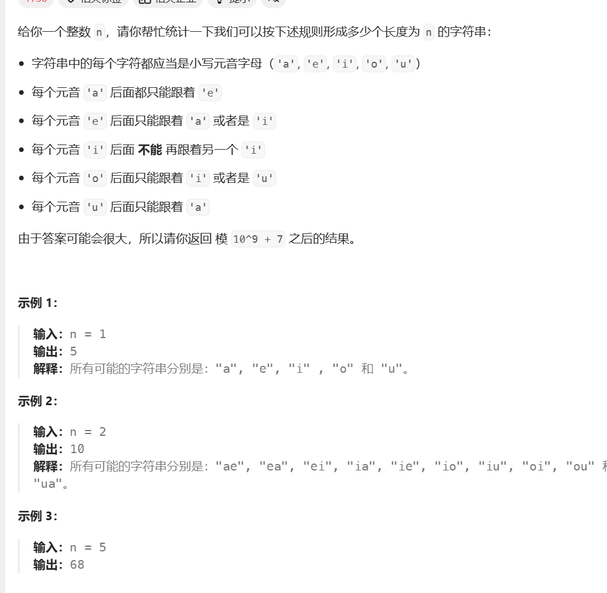


问题可以分解为子问题求解，定义f[i] [j]为长度为i+1结尾元素为j的方案数，状态方程是：以e为结尾元素且长度为i+1的方案数等于长度为i并且是以a,i结尾的方案数的总和。

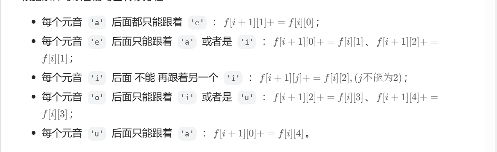

```python
class Solution:
    def countVowelPermutation(self, n: int) -> int:
        m=10**9+7
        f=[[0]*5 for _ in range(n)]
        f[0]=[1]*5
        for i in range(n-1):
            f[i+1][1]+=f[i][0]

            f[i+1][0]+=f[i][1]
            f[i+1][2]+=f[i][1]

            f[i+1][0]+=f[i][2]
            f[i+1][1]+=f[i][2]
            f[i+1][3]+=f[i][2]
            f[i+1][4]+=f[i][2]

            f[i+1][2]+=f[i][3]
            f[i+1][4]+=f[i][3]

            f[i+1][0]+=f[i][4]

            for j in range(5):
                f[i+1][j]%=m

        ans=0
        for i in range(5):
            ans+=f[n-1][i]
            
        return ans%m 
```


### [拼接数组的最大分数](https://leetcode.cn/problems/maximum-score-of-spliced-array/)

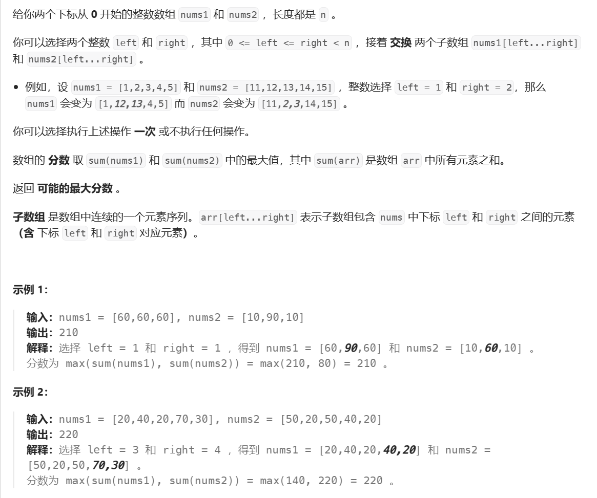

交换同一个区间内的两个值，转换为数学公式就是：

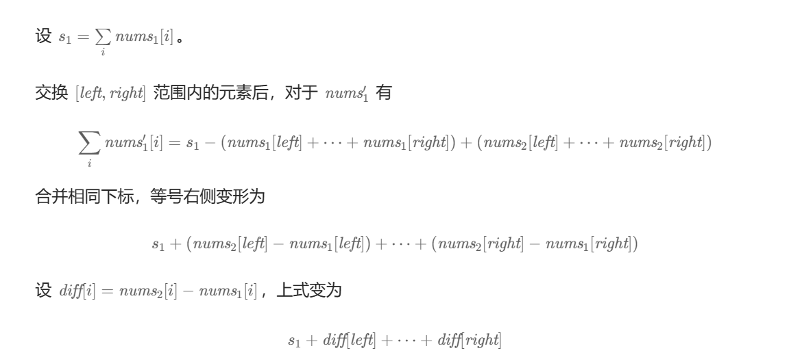


问题变为求diff数组的最大子数组之和


```python
class Solution:
    def maximumsSplicedArray(self, nums1: List[int], nums2: List[int]) -> int:
        # 构建两个diff数组
        diff1=[a-b for a,b in zip(nums2,nums1)]
        diff2=[a-b for a,b in zip(nums1,nums2)]
        a=b=0
        
        # 状态定义为以nums[i]结尾的子数组
        def dp1(i):
            if i==0:
                return diff1[0]
            c=dp1(i-1)
            res=max(diff1[i],c+diff1[i])
            # 记录最大值
            nonlocal a 
            a=max(a,res)
            return res

        def dp2(i):
            if i==0:
                return diff2[0]
            c=dp2(i-1)
            res=max(diff2[i],c+diff2[i])
            nonlocal b
            b=max(b,res)
            return res

        dp1(len(nums1)-1)
        dp2(len(nums1)-1)
	# 求两个的最大
        return max(sum(nums1)+a,sum(nums2)+b)

```


### 乌龟棋

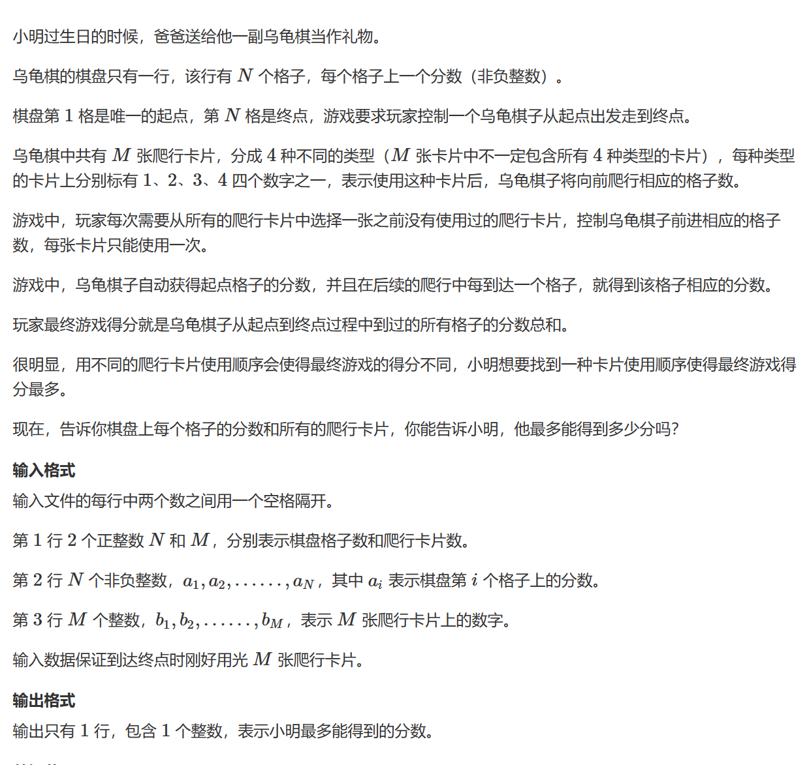


如果只用单纯的i表示以nums[i]结尾，为了表示卡牌的使用情况会在内部使用字典记录但这样就没法记忆化搜索了，如果加上abcd表示卡牌的用量那么状态太多了，关键在于卡牌的用量可以表示当前的位置。这道题使用递归会超时，用递推


```python
from collections import Counter
from math import inf
from functools import lru_cache

n, m = [int(x) for x in input().split()]
nums = [int(x) for x in input().split()]
memo = [0] * 4
# 记录每种卡牌的数量
for k in list(map(int, input().split())):
    memo[k - 1] += 1
a,b,c,d=memo[0],memo[1],memo[2],memo[3]

# 开四维数组表示每种卡牌的用量，注意定义时要顺序颠倒
dp=[[[[0 for _ in range(d+1)] for _ in range(c+1)] for _ in range(b+1)] for _ in range(a+1)]
# base case 
dp[0][0][0][0]=nums[0]

# 开始枚举
for i in range(a+1):
    for j in range(b+1):
        for u in range(c+1):
            for v in range(d+1):
                index=i+2*j+3*u+4*v
                # 找出最大的
                if i:dp[i][j][u][v]=max(dp[i][j][u][v],dp[i-1][j][u][v]+nums[index])
                if j:dp[i][j][u][v]=max(dp[i][j][u][v],dp[i][j-1][u][v]+nums[index])
                if u:dp[i][j][u][v]=max(dp[i][j][u][v],dp[i][j][u-1][v]+nums[index])
                if v:dp[i][j][u][v]=max(dp[i][j][u][v],dp[i][j][u][v-1]+nums[index])
                
                
                
print(dp[a][b][c][d])


```


### 传纸条

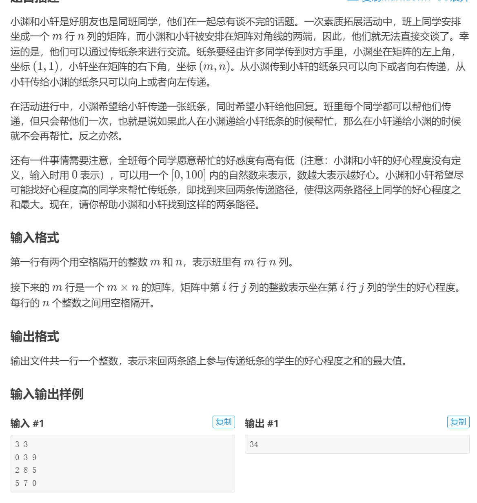

一来一回，并且前一条路径对后一条路径有影响（不能经过同一个位置），转换思想定义两条路径同时走，因为只能向右或向下所以两个路径走过的距离是一样的也就是同时出发同时到达。

定义dp(i,j,a,b)表示两个人的位置从原点出发到达(i,j)以及(a,b)的时候所经过的最大路径和。

```python
from math import inf
from functools import lru_cache

m,n=[int(x) for x in input().split()]
nums=[]
for _ in range(m):
    nums.append([int(x) for x in input().split()])
@lru_cache(maxsize=None)
def dp(i,j,a,b):
    # 起点位置作为base case
    if i==j==a==b==0:return 0
    # 不合法状态
    if i < 0 or j < 0 or a < 0 or b < 0: return -inf
    # 防止走到重复的位置除了终点
    if  i==a!=m-1 and j==b!=n-1:return -inf
    temp = nums[i][j] if i == a and j == b else nums[i][j] + nums[a][b]
    res=max(dp(i-1,j,a-1,b),dp(i,j-1,a,b-1),dp(i-1,j,a,b-1),dp(i,j-1,a-1,b))+temp
    return res
print(dp(m-1,n-1,m-1,n-1))

```


四维dp较大由于可以确定两个路径同时行动因此定义状态p表示走了多少步，同时定义两个状态ab表示两个路径当前的纵坐标，通过p-a可以算出对应的横坐标。

```python
from math import inf
from functools import lru_cache
m,n=[int(x) for x in input().split()]
nums=[]
for _ in range(m):
    nums.append([int(x) for x in input().split()])
@lru_cache(maxsize=None)
def dp(p,a,b):
    # 一步还没走的时候作为base case
    if not p:
        if a==b==0:return 0
        return -inf
    i,j=p-a,p-b
    # 不合法状态
    if i<0 or j<0 or a<0 or b<0:return -inf
    # 防止走到重复的位置除了终点
    if i==j!=m-1 and a==b!=n-1:return -inf
    temp=nums[i][a]+nums[j][b] if i!=j and a!=b else nums[i][a]
    return max(dp(p-1,a,b),dp(p-1,a,b-1),dp(p-1,a-1,b),dp(p-1,a-1,b-1))+temp

print(dp(m+n-2,n-1,n-1))

```


### Color with Occurrences


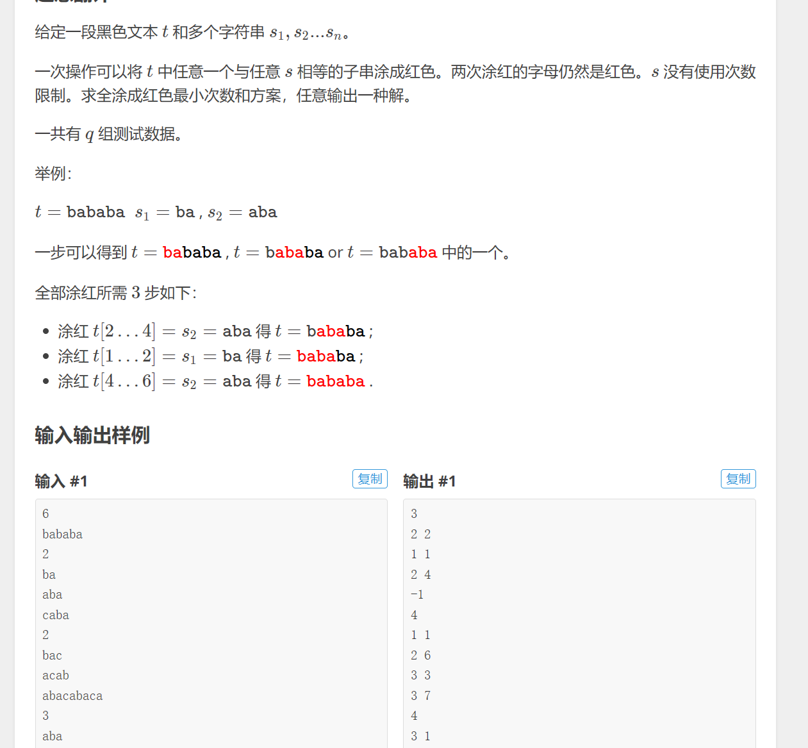

每次可以选不同的字符串会得到不同的结果，因此使用动态规划，定义dp(i)表示前i个染成红色所需的最少次数


```python
from math import inf

for _ in range(int(input())):
    # 处理输入
    s = input()
    n = len(s)
    m = int(input())
    memo=[input() for _ in range(m)]
    f=[inf]*(n+1)
    # 第0个自然需要0此
    f[0]=0
    pre=[0]*(n+1)
    vis={}
    
    for i in range(1,n+1):
        # 枚举每个字符串看是否能匹配
        for j in range(m):
            # 如果能匹配，那么可以由(i-len(p),i)的任意一个位置转移过来而不是从i-len(p)过来
            if len(memo[j])<=i and s[i-len(memo[j]):i]==memo[j]:
                for k in range(i-len(memo[j]),i):
                    # 如果较小，可以取得
                    if f[k]+1<f[i]:
                        f[i]=f[k]+1
                        # 由于需要输出转移方案，因此使用一个数组pre记录从哪里转移过来
                        pre[i]=k
                        # vis记录当前位置的转移操作，注意是在i-len(memo[j])（从0开始）操作而不是k位置
                        vis[i]=[j+1,i-len(memo[j])+1]
    if f[n]==inf:print(-1)
    else:
        print(f[n])
        # 迭代输出结果
        now=n
        while now:
            print(vis[now][0],vis[now][1])
            now=pre[now]
```


### [ 统计打字方案数](https://leetcode.cn/problems/count-number-of-texts/)

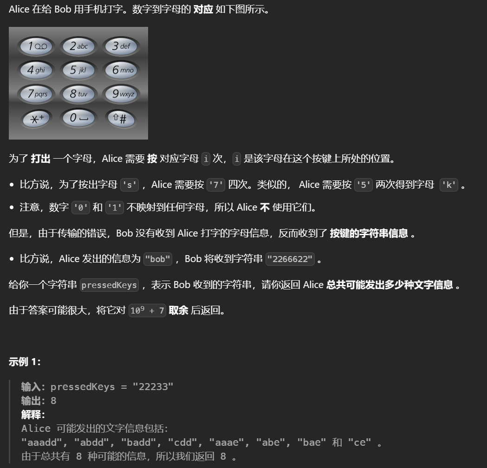

f(i)=f(i-1)+f(i-2)+f(i-3)+[f(i-4)如果当前数字为7或9]实际上是在枚举最后一位数


```python
class Solution:
    def countTexts(self,s: str) -> int:
        m=10**9+7
        @cache
        def dp(i,c):
            if i==0:return 1
            elif i<0:return 0
            if c:
                return (dp(i-1,c)+dp(i-2,c)+dp(i-3,c)+dp(i-4,c))%m
            return (dp(i-1,c)+dp(i-2,c)+dp(i-3,c))%m
        i=0
        n=len(s)
        ans=[]
        while i<n:
            start=i
            i+=1
            while i<n and s[i]==s[start]:
                i+=1
            l=i-start
            ans.append(dp(l,int(s[start] in {'7','9'})))
        return reduce(lambda x,y:x*y,ans)%m

```

### [公平分发饼干](https://leetcode.cn/problems/fair-distribution-of-cookies/)

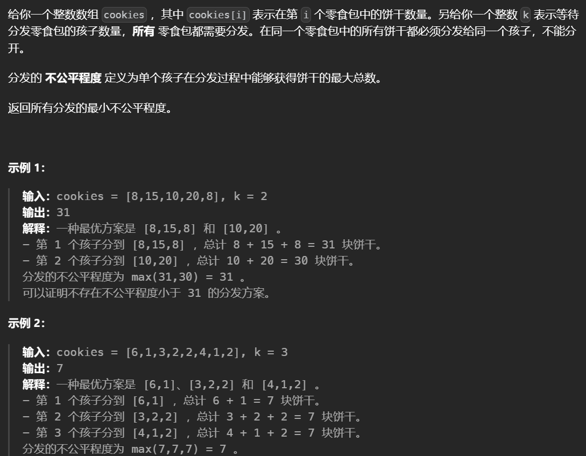

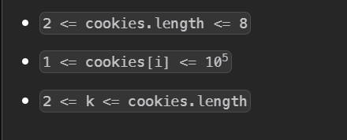


每个人可以选任意多个饼干，用dp[i]\[j]表示前i个人，j表示饼干的选取状态，通过枚举第i个人分配到的饼干状态p（s的子集）来转移方程。

```python
class Solution:
    def distributeCookies(self, cookies: List[int], k: int) -> int:
        n=len(cookies)
        mask=(1<<n)
        s=[0]*mask
        # 首先预处理出
        for i in range(mask):
            t=0
            for j in range(n):
                if i>>j&1:
                    t+=cookies[j]
            s[i]=t

        @cache
        def dp(i,m):
            # 对于0个人，应该不分配饼干
            if not i:
                return 0 if not m else inf 
            res=inf 
            p=m
            # 枚举出m的所有子集作为当前的结果
            while p:
                res=min(res,max(dp(i-1,m-p),s[p]))
                p=(p-1)&m
            return res 
        return dp(k,mask-1)
```


### [最长理想子序列](https://leetcode.cn/problems/longest-ideal-subsequence/)

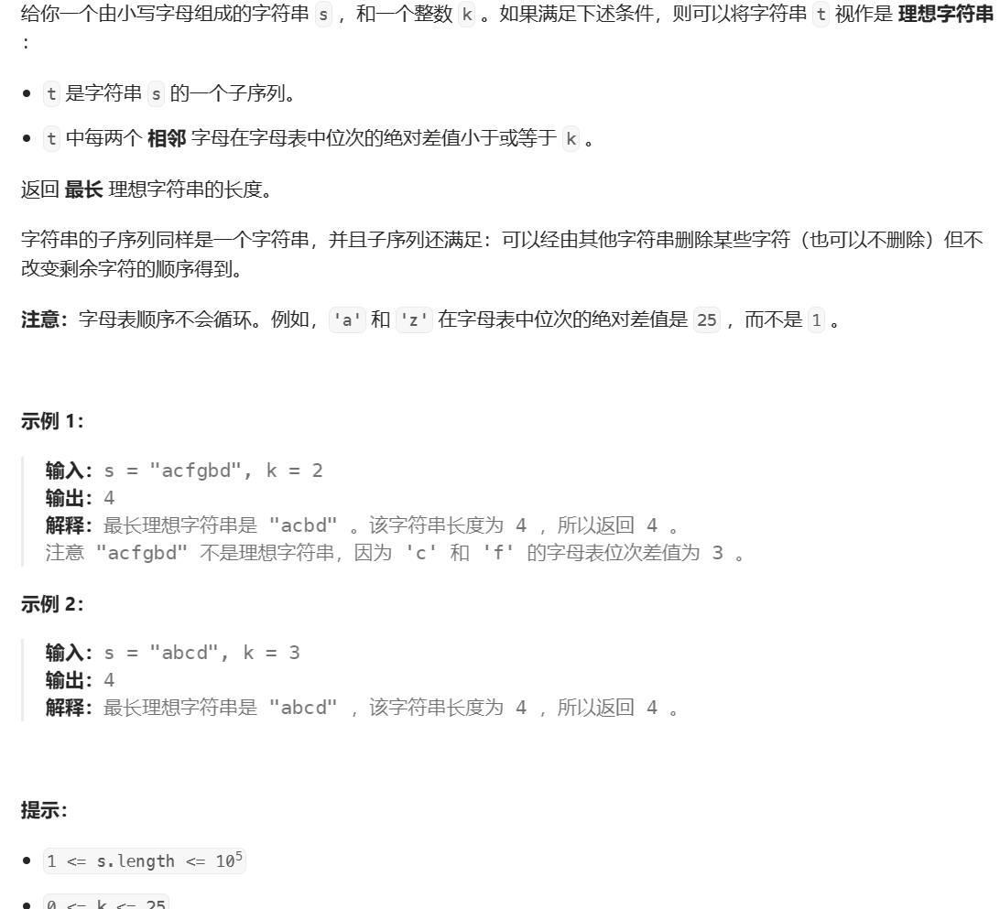

枚举选或不选，根据题目中的约束条件要多出一维表示前一个字符。

定义dp(i,j)为考虑前i个中以字符j结尾的最长长度

如果不选的话：dp[i] [j]=dp[i-1] [j]，选的话dp[i-1] [j]=1+max(dp[合适的范围])，可以发现能够去掉一维。

```python
class Solution:
    def longestIdealString(self, s: str, k: int) -> int:
        n=len(s)
        f=[0]*26
        for c in s:
            c=ord(c)-ord('a')
            f[c]=1+max(f[max(0,c-k):min(c+k+1,26)])
        return max(f)
```

### 保险箱

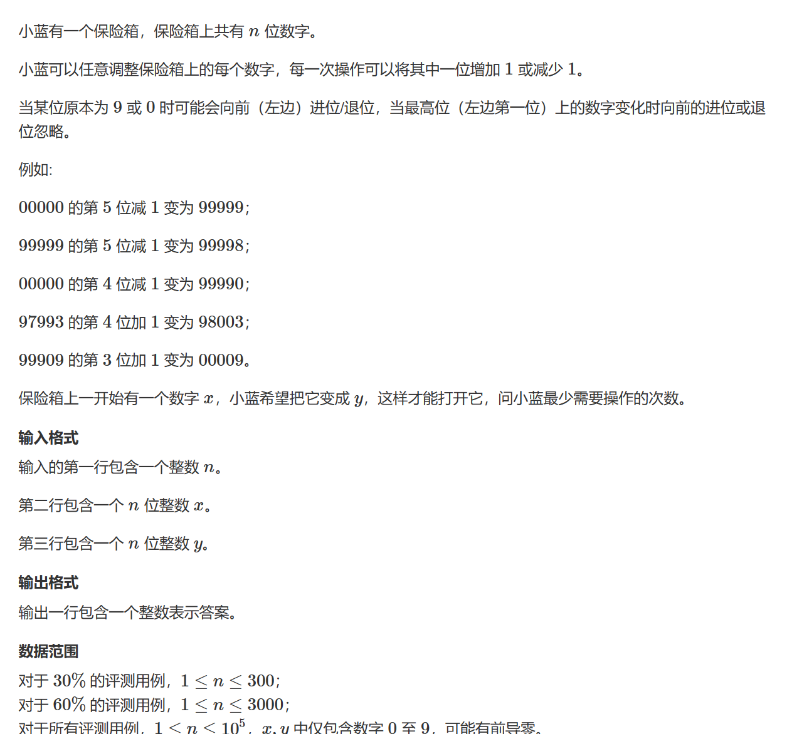

通过观察可以得到，对左边的数位操作不会影响到右边的数位因此从右往左看。由于操作低位会影响到高位所以需要多出一个状态来表示这个影响，定义dp(i,j)表示为状态为j的时候，nums[i:]都匹配的最小操作次数。 (j=0对前一位无影响，j=1进一位，j=2借一位)

```python
from math import inf 
from functools import lru_cache 
n=int(input())
a=input()
b=input()

dp=[[inf]*3 for _ in range(n+1)]

# 没有数字的时候只能是无影响，其他的两个状态不合法
dp[n][0]=0

for i in range(n-1,-1,-1):
    x=int(a[i])
    y=int(b[i])
    dp[i][0]=min(dp[i+1][0]+abs(x-y),dp[i+1][1]+abs(x+1-y),dp[i+1][2]+abs(x-1-y))
    dp[i][1]=min(dp[i+1][0]+abs(10-x+y),dp[i+1][1]+abs(9-x+y),dp[i+1][2]+abs(11-x+y))
    dp[i][2]=min(dp[i+1][0]+abs(10+x-y),dp[i+1][1]+abs(11+x-y),dp[i+1][2]+abs(9+x-y))

# 最后的结果要三者中最小的，因为最高位进位借位无影响
print(min(dp[0]))
```


### [最长的斐波那契子序列的长度](https://leetcode.cn/problems/length-of-longest-fibonacci-subsequence/)

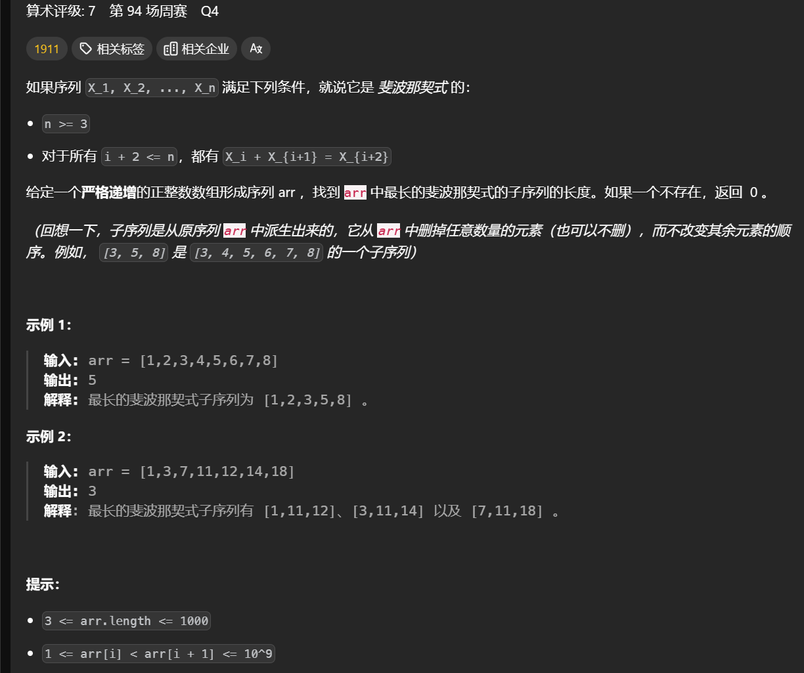


对于给定的数据范围可以做到n^2，定义状态dp(i,j)表示以nums[i]和nums[j]为结尾的斐波那契数列的最长长度，根据这两个值可以去推前面的值，由于数组是递增的因此前一个值一定在i位置前，如果第二个与第三个数的差大于等于第二个数那么是不合法的可以直接跳出，之后的状态也会是不合法的

```python
class Solution:
    def lenLongestFibSubseq(self,nums: List[int]) -> int:
        # 首先建立哈希表
        memo={x:i for i,x in enumerate(nums)}
        n=len(nums)
        ans=-inf
        dp=[[0]*n for _ in range(n)]
        for i in range(n):
            for j in range(i+1,n):
                # 可行性剪枝，如果不满足下述条件一定是不合法的
                if nums[i]*2<=nums[j]:break
                if (x:=nums[j]-nums[i]) in memo:
                    index=memo[x]
                    # 如果能找到至少为3
                    dp[i][j]=max(3,dp[index][i]+1)
                ans=max(ans,dp[i][j])
        return ans                 

```


### [不相交的握手](https://leetcode.cn/problems/handshakes-that-dont-cross/)

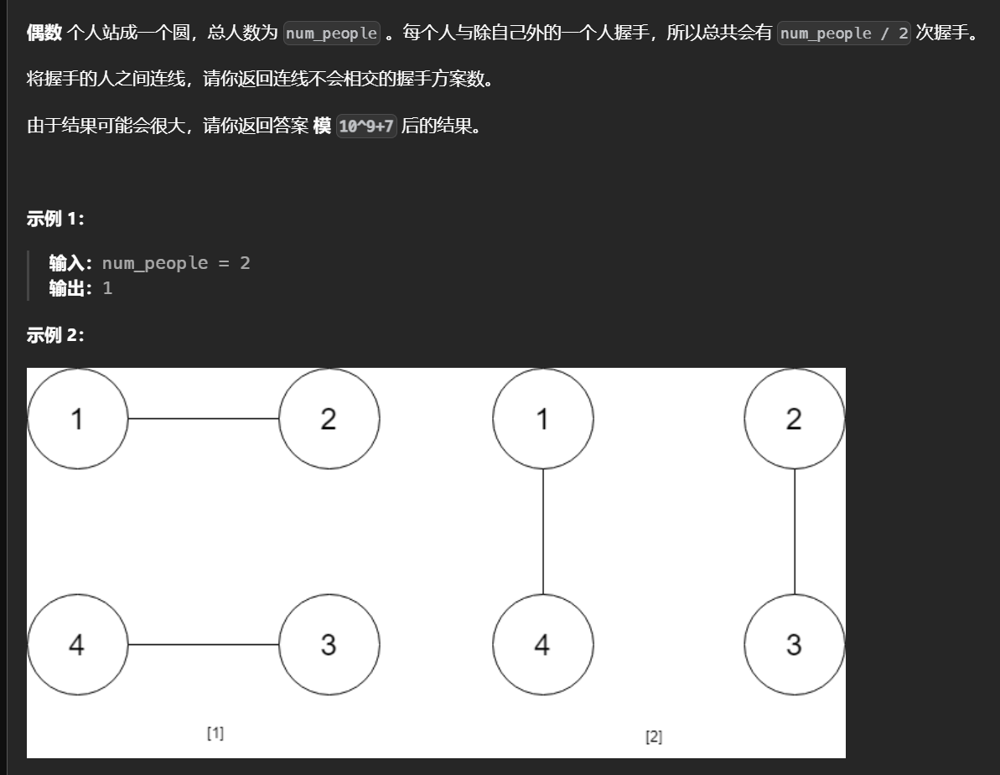


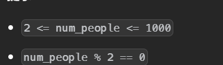

一段连线可以把区间分为两部分，而这两部分又可以继续划分这就出现了子问题。要求两两相连，因此每个区间内的数量必须是偶数才能做到相连，想要划分出的区间是偶数，要求是奇偶不同的两个数相连。这里规定以每个圈中的最后一个点去找相连的点，因为圈为偶数，所以可以对最后一个数去找每个奇数，这样就把区间分为了两部分。

```python
class Solution:
    def numberOfWays(self, numPeople: int) -> int:
        mod=10**9+7
        # 定义dp[i]为I个人的握手方案
        dp=[0]*(numPeople+1)
        # 0个人和2个人的时候只有一次
        dp[0]=dp[2]=1
        # i必须是偶数
        for i in range(4,numPeople+1,2):
            # 以每个圈中最后一个去找他要相连的，就是去找奇数
            for j in range(1,numPeople,2):
                dp[i]=(dp[i]+dp[i-j-1]*dp[j-1])%mod
        return dp[numPeople]
```


### [石子游戏](https://leetcode.cn/problems/stone-game/)

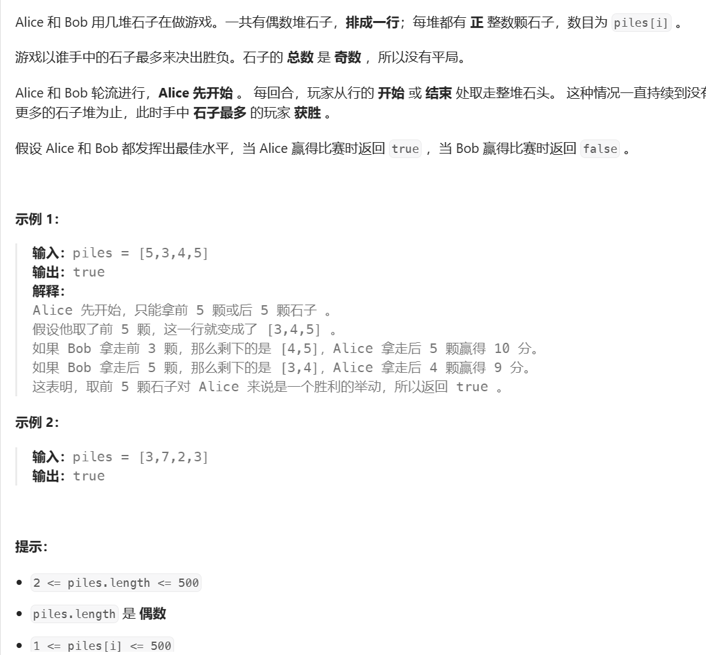

定义dp(i,j)为i,j范围内先手玩家比后手玩家得分多出的最大（因为两人采取最优策略）差值。

对于先手玩家，可以选择开头的元素或者是末尾的元素，当选择完成后，先手变为后手，后手变为先手，状态转移方程为piles[i]-dp(i+1,j)，这里的dp(i+1,j)表示在i+1,j这个区间内先手与后手的最大差值，不过这里的先手是i,j区间内的后手，piles[i]-dp(i+1,j)表示在i,j区间内先手选择的值，减去i+1,j区间内原来的后手比先手的最大差值，结果是i,j区间内先手与后手的差值。


```python
class Solution:
    def stoneGame(self, piles: List[int]) -> bool:
        @cache 
        def dp(i,j):
            if i>j :return 0
            return max(piles[i]-dp(i+1,j),piles[j]-dp(i,j-1))
        return dp(0,len(piles)-1)>0
```


### [石子游戏 VII](https://leetcode.cn/problems/stone-game-vii/)

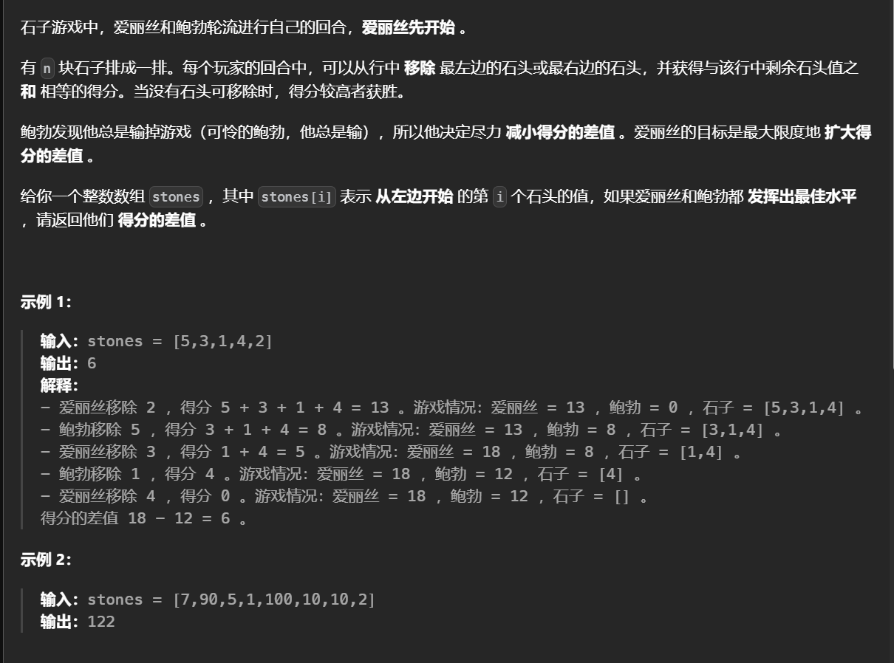


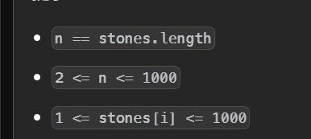

数据范围更大，使用记忆化搜索内存会超限，之后需要清空内存

```python
class Solution:
    def stoneGameVII(self, nums: List[int]) -> int:
        pre=list(accumulate(nums,initial=0))
        @cache
        def dp(l,r):
            if l>r:return 0
            return max(pre[r+1]-pre[l+1]-dp(l+1,r),pre[r]-pre[l]-dp(l,r-1))
        res=dp(0,len(nums)-1)
        dp.cache_clear()
        return res
```

改为递推形式，考虑dp[i]\[j]的转移方程dp[i+1]\[j],dp[i]\[j-1]，所以i要从大到小枚举，j要从小到大枚举

```python
class Solution:
    def stoneGameVII(self, stones: List[int]) -> int:
        pre = list(accumulate(stones, initial=0))  # 前缀和
        n=len(stones)
        f=[[0]*n for _ in range(n)]
        for i in range(n-2,-1,-1):
            # 注意根据题意j是要大于等于i的
            for j in range(i+1,n):
                f[i][j]=max(pre[j+1]-pre[i+1]-f[i+1][j],pre[j]-pre[i]-f[i][j-1])
        return f[0][-1]

```


### 游戏

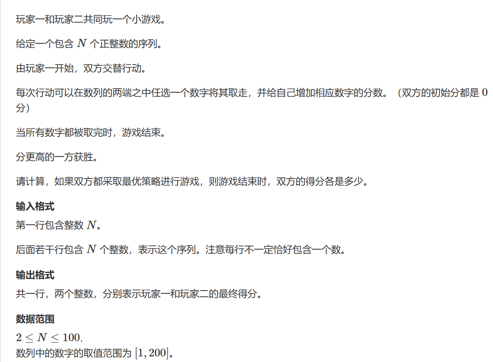


```python
from math import inf 
from functools import lru_cache
n=int(input())
nums=[]
# 读取值
while len(nums)!=n:
    nums.extend([int(x) for x in input().split()])
t=sum(nums)

# 同上一题一样，定义dp(i,j)表示区间[i,j]范围内先手比后手多出的值
@lru_cache(maxsize=None)
def dp(i,j):
    # 不合法状态
    if i>j:return 0
    # 下一轮的dp(i,j)就表示下一轮中的先手比后手多出的值，不过下一轮的先手是这一轮的后手，通过相减可以得出结果
    return max(nums[i]-dp(i+1,j),nums[j]-dp(i,j-1))
res=dp(0,n-1)
# 已知两个值的和，又知道一个值和另一个值的差，通过简单的数学运算可得
print((t+res)//2,t-(t+res)//2)
```


### [最长字符串链](https://leetcode.cn/problems/longest-string-chain/)

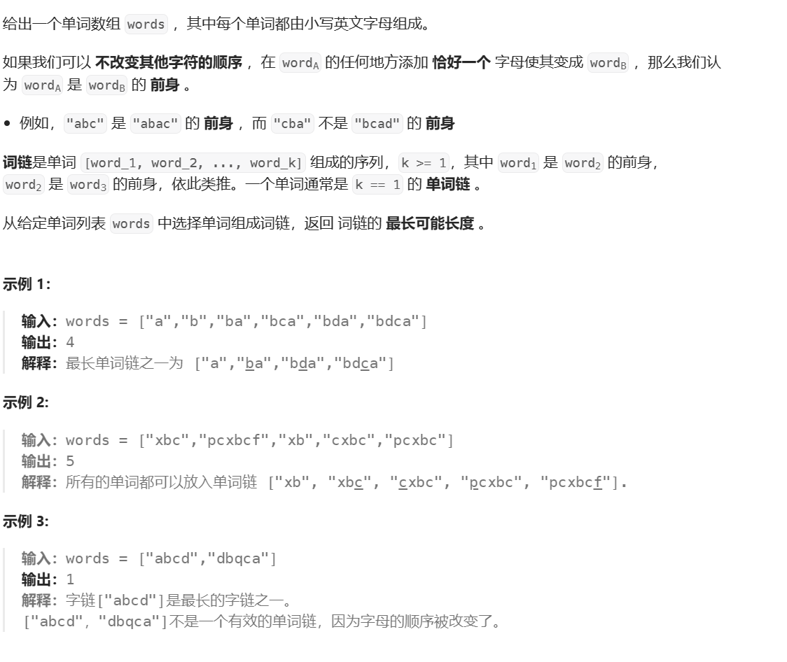

​	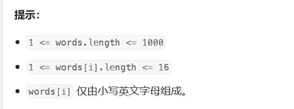

使用动态规划，对于以一个字符串s结尾，所能形成的的最长的子链，取决于它去掉某一位之后的形成的字符串得到的最大子链数加一，减小了问题规模。由于字符串长度不大，可以直接枚举。

```python
class Solution:
    def longestStrChain(self, words: List[str]) -> int:
        words=set(words)
        @cache 
        # 返回字符串s所能形成的子链的最长长度
        def dp(s):
            res=0
            # 枚举去掉每一位
            for i in range(len(s)):
                t=s[:i]+s[i+1:]
                # 如果存在，才会进行下一次递归
                if t in words:
                    res=max(res,dp(t))
            return res+1
        return max(dp(s) for s in words
             
# 自下而上
class Solution:
    def longestStrChain(self, words: List[str]) -> int:
        # 先排序
        words=sorted(words,key=lambda x:len(x))
        n=len(words)
        dp=defaultdict(int)
        for c in words:
            c=list(c)
            # 枚举删掉每一位
            for i in range(len(c)):
                temp=c[:]
                del temp[i]
                dp[tuple(c)]=max(dp[tuple(temp)]+1,dp[tuple(c)])
        return max(dp.values())
```

### [不同的子序列 II](https://leetcode.cn/problems/distinct-subsequences-ii/)

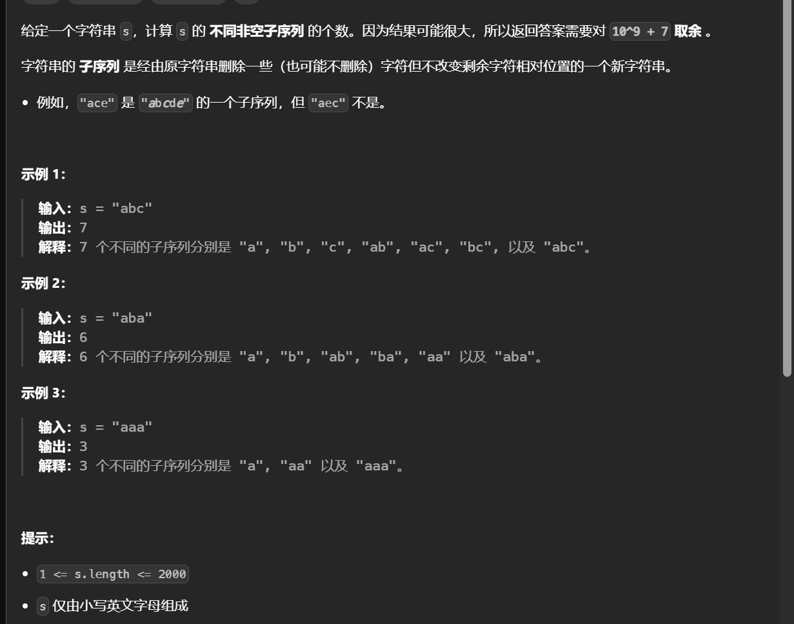

很难去想对于前i个元素不同的子序列有多少个，不能简单的拼接操作（把当前元素拼接到前面不同的子序列上再加上不拼接的数量，这样无法避免重复），但如果细分的话即多出一个状态j表示以字符j结尾，分别去统计以j结尾的不同序列数可以避免重复。

最后统计一个位置上所有的字符即可。

```python
class Solution:
    def distinctSubseqII(self, s: str) -> int:
        mod=10**9+7
        @cache
        def dp(i,j):
            if not i:return 0
            if ord(s[i-1])-ord('a')==j:
                return 1+sum(dp(i-1,j) for j in range(26))%mod
            return dp(i-1,j)
        return sum(dp(len(s),i) for i in range(26))%mod         
```


### [买卖股票的最佳时机 II](https://leetcode.cn/problems/best-time-to-buy-and-sell-stock-ii/)

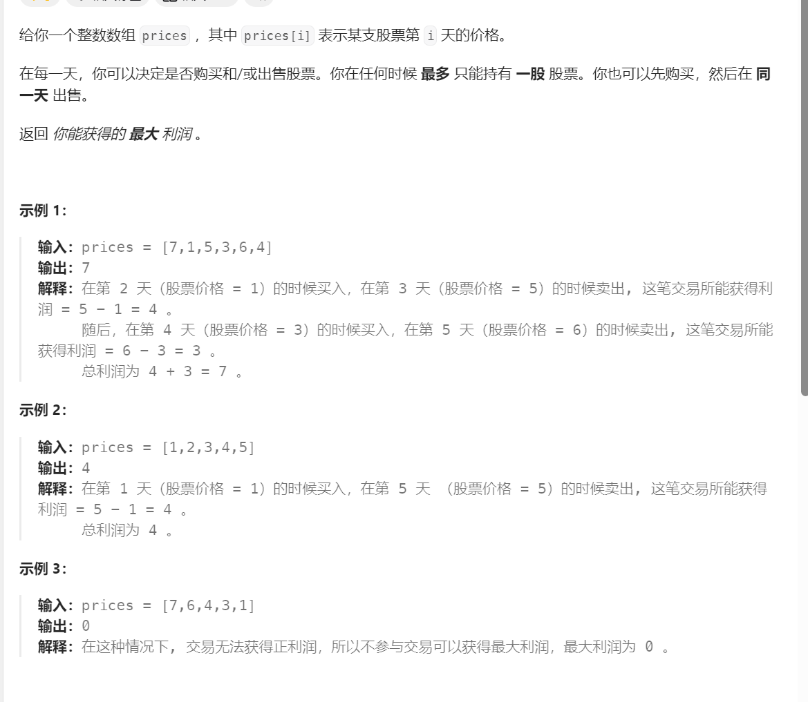

0到i天获得的利润可以由0到i-1天获得的利润加上第i天进行的操作求解得出，关键在于定义状态是否持有股票。

定义dp(i,hold)为第i天所获得的利润，hold表示是否持有股票。

```python
class Solution:
    def maxProfit(self, prices: List[int]) -> int:
        n=len(prices)
        @cache
        def dp(i,hold):
            # 一开始是不会持有股票的，因此定义一个不会取到的状态
            if i<0:
                return 0 if not hold else -inf
            # 如果持有股票，可以是前一天就有，也可能是今天买的利润要减去
            if hold :
                return max(dp(i-1,True),dp(i-1,False)-prices[i])
           # 反之，可能是今天买了，或者是本来就没有
            return max(dp(i-1,False),dp(i-1,True)+prices[i])
        return dp(n-1,False)

```

### [买卖股票的最佳时机 IV](https://leetcode.cn/problems/best-time-to-buy-and-sell-stock-iv/)

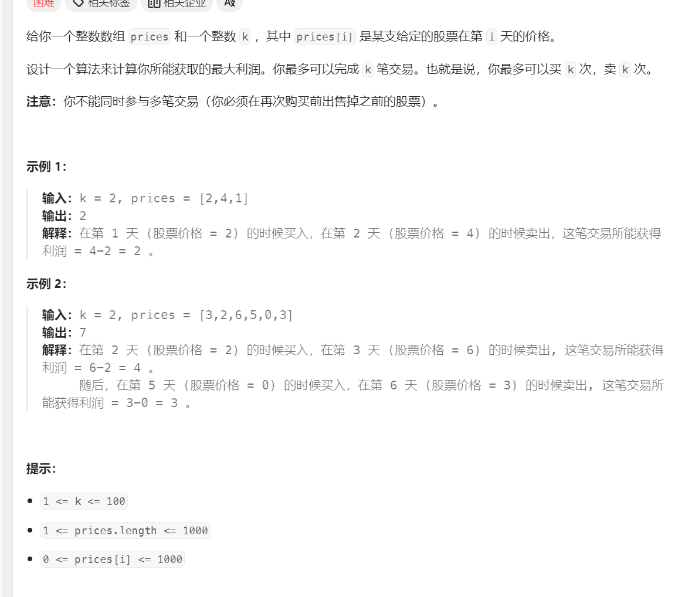

多出一个状态表示进行了几次买卖，如果买卖次数小于0了则是一个不合法的状态，注意一次买一次卖才算一次操作，有卖必有买因此在卖或者买的一个位置将次数减一即可。

```python
class Solution:
    def maxProfit(self, k: int, prices: List[int]) -> int:
        n=len(prices)
        @cache
        def dp(i,j,hold):
            if j<0:
                return -inf
            if i<0:
                return -inf if hold else 0
            if hold:
                return max(dp(i-1,j,1),dp(i-1,j,0)-prices[i])
            return max(dp(i-1,j,0),dp(i-1,j-1,1)+prices[i])
        return dp(n-1,k,0)
```


如果要求恰好是k次，则修改判断边界条件。

```python
class Solution:
    def maxProfit(self, k: int, prices: List[int]) -> int:
        n=len(prices)
        @cache
        def dp(i,j,hold):
            if j<0:
                return -inf
            if i<0:
                # 这里j必须等于0，大于或者小于都不行
                return -inf if hold or j>0 else 0
            if hold:
                return max(dp(i-1,j,1),dp(i-1,j,0)-prices[i])
            return max(dp(i-1,j,0),dp(i-1,j-1,1)+prices[i])
        return dp(n-1,k,0)
```


如果要求是至少的话，当次数减小到了0相当于进行无限次交易，因此取出j<0的边界条件

```python
class Solution:
    def maxProfit(self, k: int, prices: List[int]) -> int:
        n=len(prices)
        @cache
        def dp(i,j,hold):
            if i<0:
                # 这里j必须小于等于0，表示至少进行了k次
                return -inf if hold or j>0 else 0
            if hold:
                return max(dp(i-1,j,1),dp(i-1,j,0)-prices[i])
            return max(dp(i-1,j,0),dp(i-1,j-1,1)+prices[i])
        return dp(n-1,k,0)
```

### [购买水果需要的最少金币数](https://leetcode.cn/problems/minimum-number-of-coins-for-fruits/)

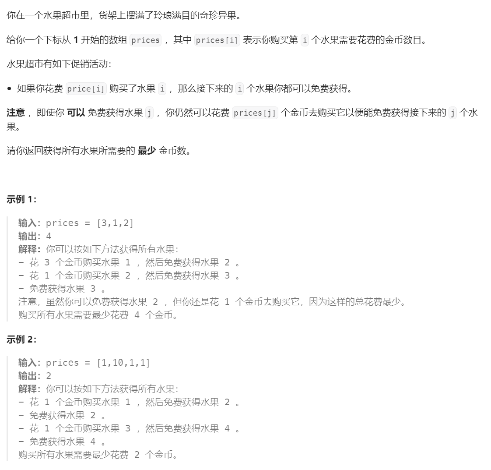

定义dp(i)为购买第i个以及之后的水果所需的最少金币数，这里的base case 是如果2*i大于等于n那最少的金币数就是只购买一个i

```python
class Solution:
    def minimumCoins(self, prices: List[int]) -> int:
        n=len(prices)
        @cache 
        def dp(i):
            if i*2>=n:
                return prices[i-1]
            # 这里i+1到2i+1一定需要买一个
            return min([dp(j) for j in range(i+1,2*i+2)])+prices[i-1]
        return dp(1)
```


### [ 构造最长非递减子数组](https://leetcode.cn/problems/longest-non-decreasing-subarray-from-two-arrays/)

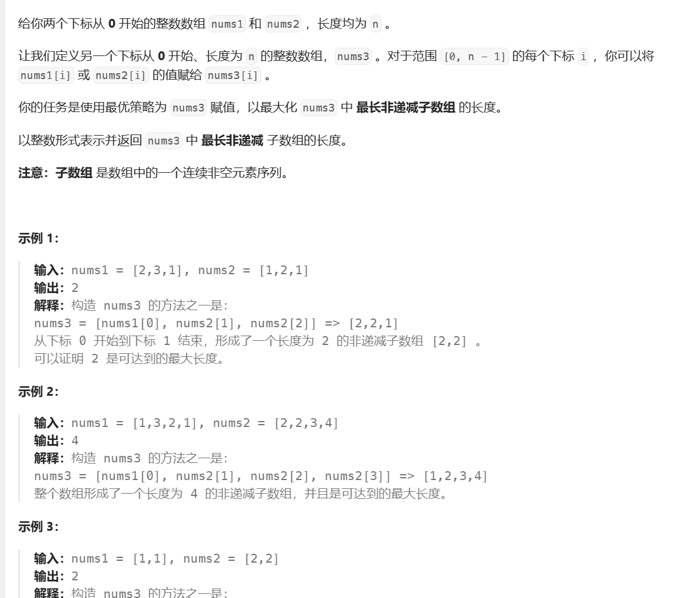


枚举选择两个数组中那个

定义dp(i,j)表示为以$$nums_{j}[i]$$结尾的最长递增数组的长度

```python
class Solution:
    def maxNonDecreasingLength(self, nums1: List[int], nums2: List[int]) -> int:
        n=len(nums1)
        nums=(nums1,nums2)
        @cache
        def dp(i,j):
            # 只有一个元素，那最大就是1
            if i==0:return 1
            res=1
            # 枚举可选的
            if nums1[i-1]<=nums[j][i]:
                res=dp(i-1,0)+1
            if nums2[i-1]<=nums[j][i]:
                res=max(res,dp(i-1,1)+1)
            return res
        # 因为以最后一个元素结尾的最长不一定是最终答案，因此找出所有的
        return max(dp(i,j) for j in range(2) for i in range(n))
        
```


### 状压dp

#### 毕业旅行问题

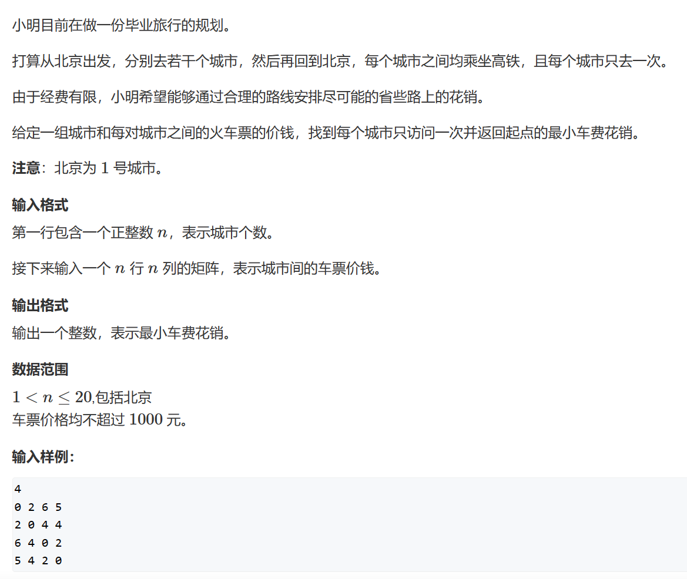


状态压缩dp，定义dp(i,j)，i表示访问过的集合是一个二进制表示，j表示当前在那个位置。状态转移定义为到dp(i,j)的最小距离为在i中访问过的其他点中（除了j以外）到j的距离的最小。

```python
from math import inf 

n=int(input())
m=1<<n
# 建图
g=[[inf]*n for _ in range(n)]

for i in range(n):
    nums=[int(x) for x in input().split()]
    for j ,v in enumerate(nums):
        g[i][j]=v

# 定义状态
dp=[[inf]*n for _ in range(m)]

# base case 初始的时候必须从0号节点开始也就是i=1，j=0
dp[1][0]=0

# 枚举所有的状态，访问过的点的集合
for i in range(1,1<<n,2):
    # 枚举j，当前所在位置
    for j in range(n):
        # 首先需要j在集合中存在
        if (i>>j&1):
            # 枚举集合中的其他点，用从这个点出发到j的距离更新结果
            for k in range(n):
                # 这个点需要存在于剩下的集合中
                if ((i-(1<<j))>>k&1): dp[i][j]=min(dp[i][j],dp[i-(1<<j)][k]+g[k][j])
res=inf 
# 最后找出从不同节点到0的最短距离
for i in range(1,n):
    res=min(res,dp[(1<<n)-1][i]+g[i][0])
print(res)
```

#### [不同路径 III](https://leetcode.cn/problems/unique-paths-iii/)

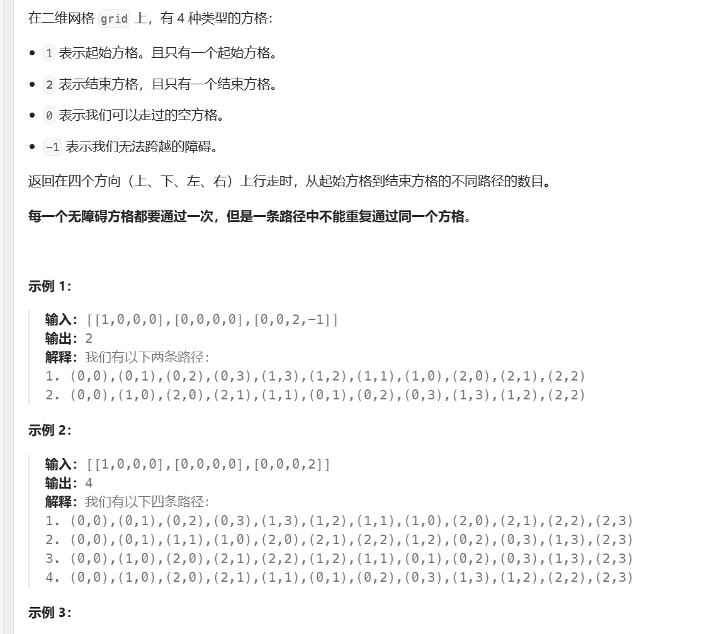


可用回溯做，这里介绍状态压缩


定义dp(i,j)表示从i,j到终点的路径数，这里由于要求所有的可行点必须经过且不能重复走，多使用一个状态表示做过的路径。

定义vis为储存了走过路径的集合


```python
class Solution:
    def uniquePathsIII(self, grid: List[List[int]]) -> int:
        m,n=len(grid),len(grid[0])
        # 全集
        all=(1<<m*n)-1
        vis=0
        # 注意为了方便比较要把障碍先加上，同时找出终点
        for i in range(m):
            for j in range(n):
                if grid[i][j]<0:
                    vis|=(1<<(i*n+j))
                elif grid[i][j]==1:
                    sx,sy=i,j
        @cache
        def dfs(x,y,vis):
            # 不合法
            if x>=m or x<0 or y<0 or y>=n or vis>>(n*x+y)&1:
                return 0
            # 记录到集合中，注意这里把二维转化为一维
            vis|=1<<(n*x+y)
            # 找到终点
            if grid[x][y]==2:
                return int(vis==all)
            # 四个方向走
            return dfs(x-1,y,vis)+dfs(x+1,y,vis)+dfs(x,y-1,vis)+dfs(x,y+1,vis)
        return dfs(sx,sy,vis)
```


#### [校园自行车分配 II](https://leetcode.cn/problems/campus-bikes-ii/)

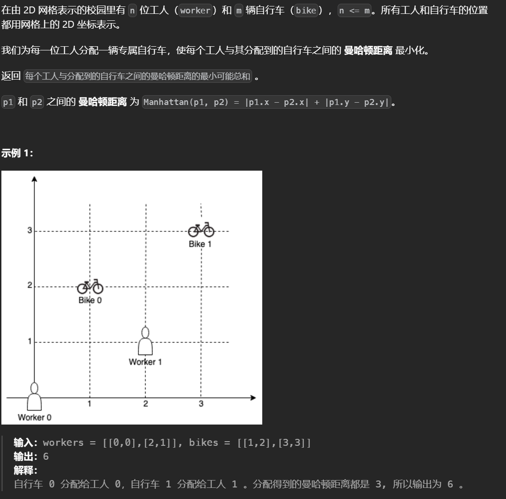


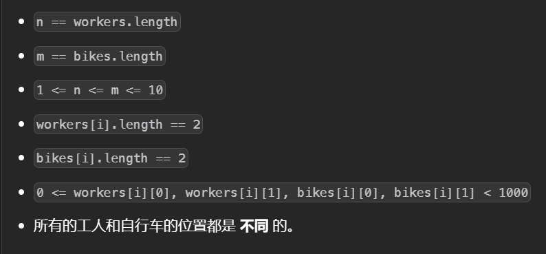


状态压缩dp，有两个对象一个是工人一个是自行车，把工人用i表示第几个，自行车用mask表示选或未选的状态，这里不是把两个对象都是用mask表示。

```python
class Solution:
    def assignBikes(self, workers: List[List[int]], bikes: List[List[int]]) -> int:
        n=len(workers)
        m=len(bikes)
        def  cal(x,y):
            return abs(workers[x][0]-bikes[y][0])+abs(workers[x][1]-bikes[y][1])
        @cache
        def dp(i,mask):
            if i==n:return 0
            res=inf
            for j in range(m):
                if mask>>j&1:continue
                res=min(res,dp(i+1,mask|(1<<j))+cal(i,j))
            return res
        return dp(0,0)

```

#### [特别的排列](https://leetcode.cn/problems/special-permutations/)

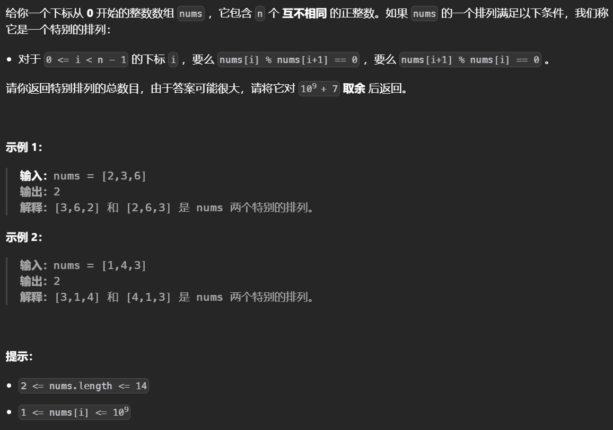

对于给定的数据范围可以想到状压dp

定义dp(i,j)表示还有i(表示集合)可选，上一次选了j。

```python
class Solution:
    def specialPerm(self, nums: List[int]) -> int:
        mod=10**9+7
        n=len(nums)
        @cache
        def dp(i,j):
            # 能到这就是一个合法的排列
            if not i:return 1
            res=0
            # 枚举可选
            for k,x in enumerate(nums):
                # 判断是否合法
                if i>>k&1 and (nums[j]%x==0 or x%nums[j]==0):
                    res+=dp(i^(1<<k),k)
                    res%=mod
            return res
        # 注意是减一
        s=(1<<n)-1
        return sum(dp(s^(1<<j),j)for j in range(n))%mod 
```

#### [并行课程 II](https://leetcode.cn/problems/parallel-courses-ii/)

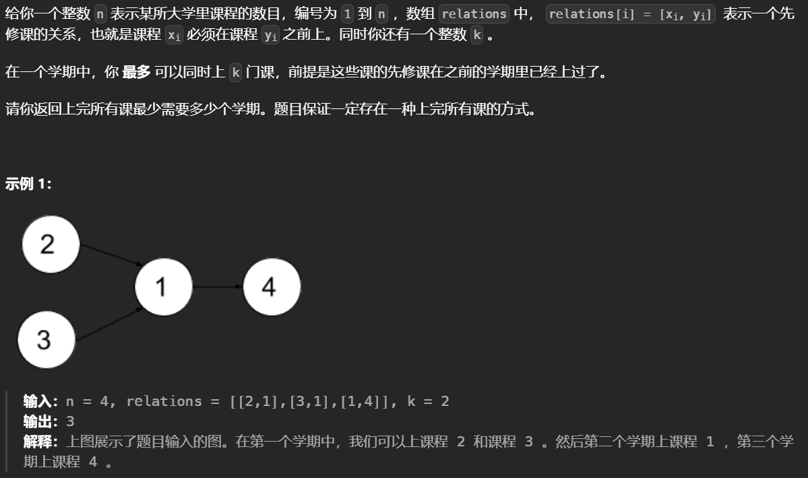

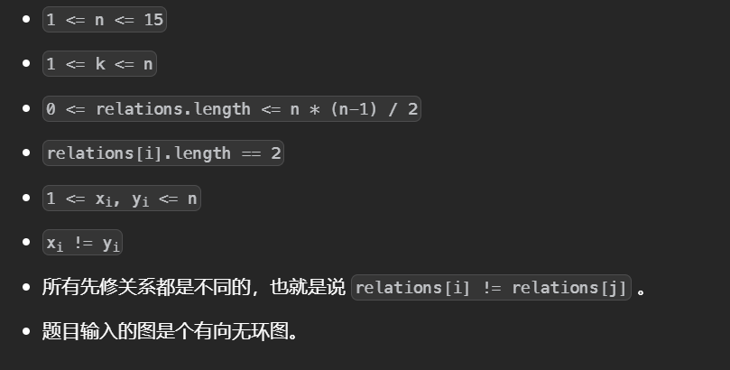


对于给定的数据范围考虑使用状压dp，定义dp(i)表示有哪些没有完成。	


```python
class Solution:
    def minNumberOfSemesters(self, n: int, relations: List[List[int]], k: int) -> int:
        pre1=[0]*n
        # 用二进制储存每个课程的先修课
        for u,v in relations:
            pre1[v-1]|=(1<<(u-1))
        # 全集
        u=(1<<n)-1
        @cache
        def dp(i):
            # 都学了
            if not i:return 0
            # 找当前的补集也即是学了那些
            c1=u^i
            i1=0
            # 遍历所有的课程找出那些没有被选过的且满足先修课要求的
            for j,p in enumerate(pre1):
                if i>>j&1 and p|c1==c1:
                    i1|=(1<<j)
            # 如果这个可以选的课程小于等于k那么就一次性解决
            if i1.bit_count()<=k:
                return dp(i1^i)+1
            # 否则选其中k个，这里通过枚举子集实现
            res=inf 
            j=i1
            while j:
                if j.bit_count()<=k:res=min(res,dp(i^j)+1)
                j=(j-1)&i1
            return res 
        return dp(u)          
```

### 换根DP

####  [树中距离之和](https://leetcode.cn/problems/sum-of-distances-in-tree/)

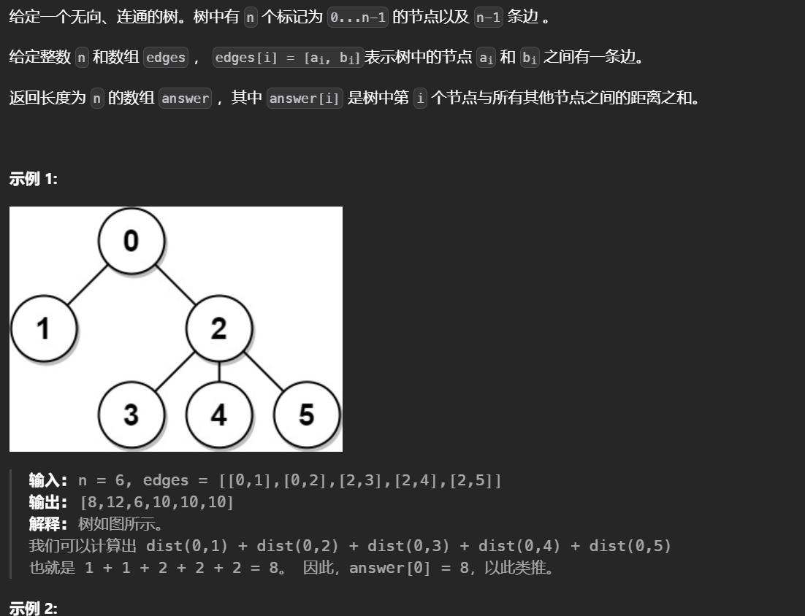

暴力的做法是对每个节点做一次dfs求结果，但对于给定的数据范围N^2会超时，作图发现当换节点时距离也会有规律的变化，具体表现为距离会减少当前节点的子树数目加一并增加不是他子树的数目，然后对于这个子树的节点又可以以相同的方式求解。

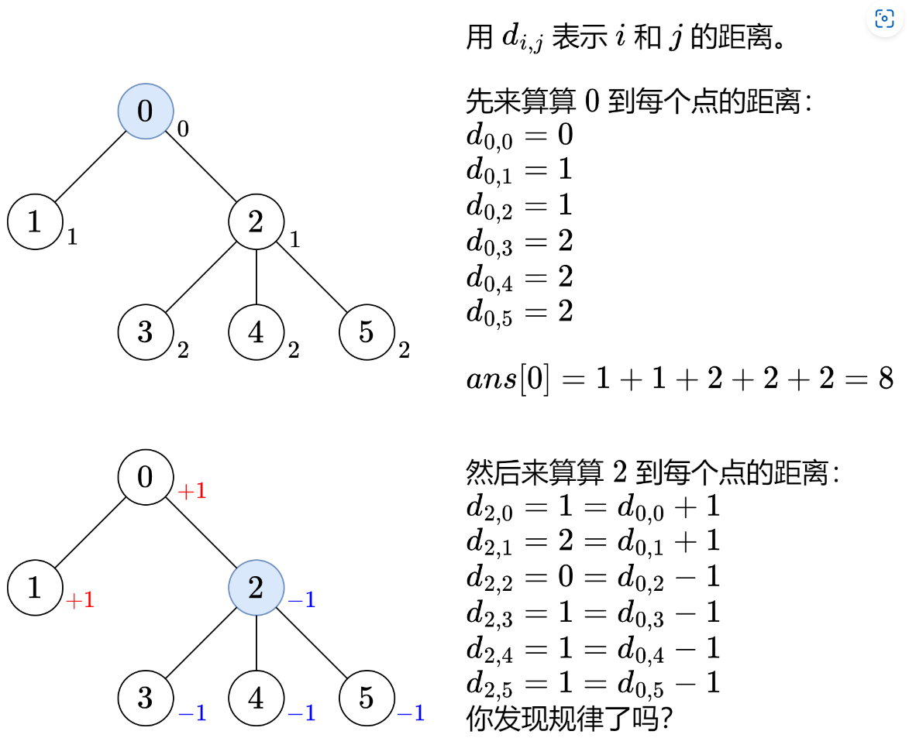


这里先做一次dfs求出对于起始节点的距离，以及每个节点的子树，对于给定的无向图转换为有向图求解。

```python
class Solution:
    def sumOfDistancesInTree(self, n: int, edges: List[List[int]]) -> List[int]:
        dis=[0]*n
        size=[0]*n

        g=[[] for _ in range(n)]
        # 建图
        for u,v in edges:
            g[u].append(v)
            g[v].append(u)

        def dfs(root,fa,cnt):
            dis[root]=cnt
            t=0
            for y in g[root]:
                if y!=fa:
                    t+=dfs(y,root,cnt+1)# 求距离
            size[root]=t# 求子树
            return t+1
        dfs(0,-1,0)
        ans=[0]*n
        ans[0]=res=sum(dis)
        def reroot(x,fa,res):
            # 这个节点的子树以及它自身
            ss=size[x]+1
            # 当前的距离
            d=res-ss+n-ss
            ans[x]=d
            # 求解其他的节点
            for y in g[x]:
                if y!=fa:
                    # 每次用的距离都是父节点的距离
                    reroot(y,x,d)
        # 因为预先求解出了0，因此从0的子节点开始
        for y in g[0]:
            reroot(y,0,res)
        return ans 

```

#### [标记所有节点需要的时间](https://leetcode.cn/problems/time-taken-to-mark-all-nodes/)

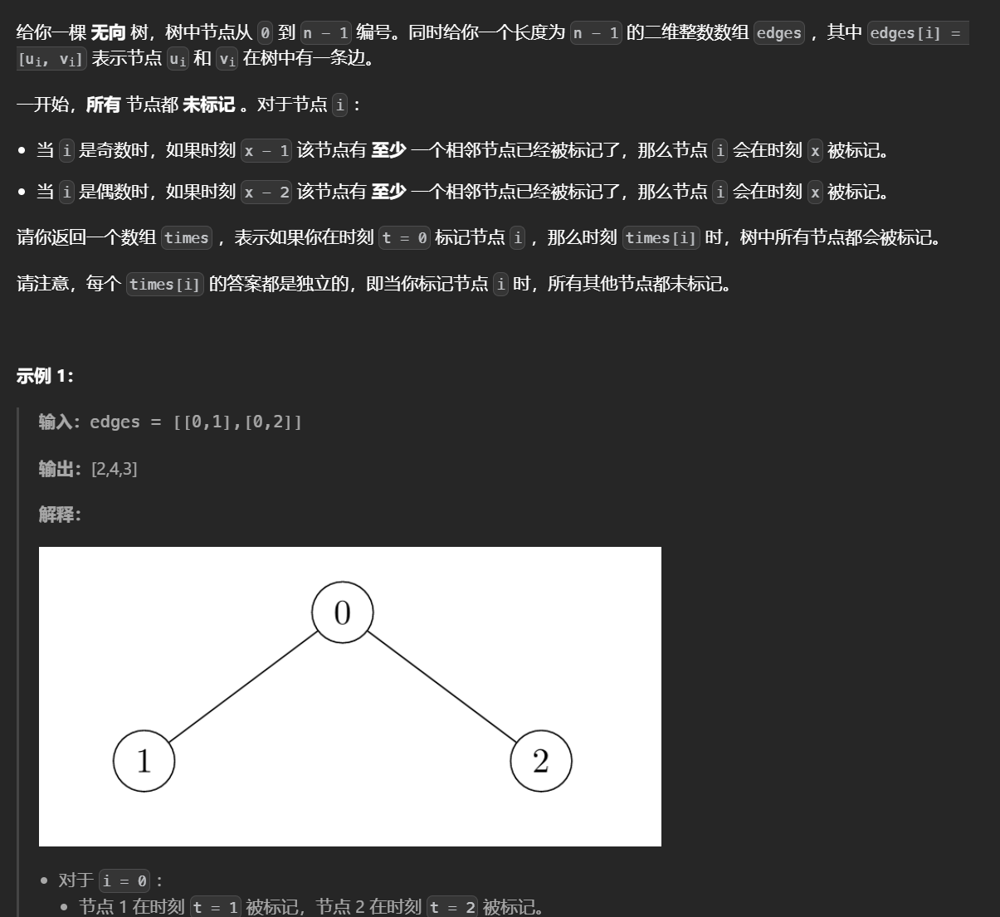

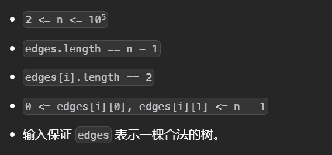

很明显暴力求解不行，这里所谓的时间可以转换为边权，即其他节点到偶数节点的距离是2，那么问题转换为了以每个节点为根所走的最大距离是多少。

对于节点x有最远距离mx1和此大距离mx2，那么对于x的子节点y，它的结果就是max(y到子节点的最大距离,y到父节点的距离加上mx1或mx2)，具体是mx1还是mx2，看mx1是不是由y得到，那么对于该题每个节点需要维护[mx1,mx2,my(得到mx1的子节点)]，这种维护额外信息的称为第二类换根dp

```python
class Solution:
    def timeTaken(self, edges: List[List[int]]) -> List[int]:
        n=len(edges)+1
        g=[[] for _ in range(n)]
        for u,v in edges:
            g[u].append(v)
            g[v].append(u)

        nodes=[[] for _ in range(n)]
        def dfs(x,fa):
            mx1=mx2=my=0
            for y in g[x]:
                if y!=fa:
                    # 计算距离，边权不用记录直接计算即可
                    dis=dfs(y,x)+(1 if y&1 else 2)
                    # 记录最远和次远距离
                    if dis>mx1:
                        mx1,mx2=dis,mx1
                        my=y
                    elif dis>mx2:
                        mx2=dis
            # 维护额外信息
            nodes[x]=[mx1,mx2,my]
            return mx1
        dfs(0,-1)
        ans=[0]*n
        def reroot(x,fa,dis):
            mx1,mx2,my=nodes[x]
            cnt= 1 if x&1 else 2
            # 以该节点为根的答案是它到子树的最大距离与他到其他子树(即父节点)的最大距离的最大值
            ans[x]=max(mx1,dis)
            for y in g[x]:
                if y!=fa:
                    # 下一个节点到其他子树的最大距离也可能是是当前节点到其他子树的最大距离(dis)而不是他到自己子树的最大距离，因此取最大
                    reroot(y,x,cnt+max(dis,mx1 if y!=my else mx2))

        reroot(0,-1,0)
        return ans 
```

### 划分型dp

#### [划分数组得到最小的值之和](https://leetcode.cn/problems/minimum-sum-of-values-by-dividing-array/)

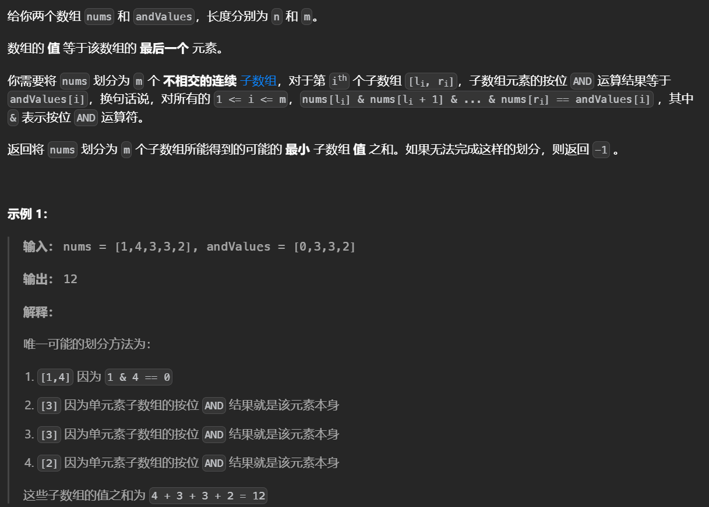

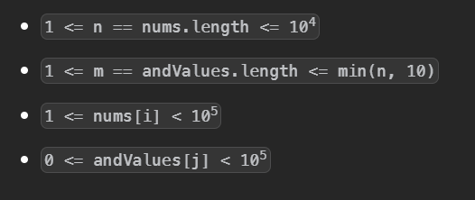


对于长度为n的数组，有n^2个子数组，如果每个子数组按位与的话最终只会有nlogU(U为最大的整数)个不同的子数组，即以一个点为右端点从起点到这个点构成的子数组中只会有logU个不同的子数组。

该题要划分子数组，定义dp(i,j,nd)表示考虑第i位，已经划分了j个子数组，当前的and值为nd，因为nd最多只有logU个因此状态数不会太大。

```python
class Solution:
    def minimumValueSum(self, nums: List[int], andValues: List[int]) -> int:
        n,m=len(nums),len(andValues)
        @cache
        def dp(i,j,nd):
            # 只有每一个都划分到了一组才能是成功
            if i==n:
                return 0 if j==m else inf
            if j==m:return inf
				
            nd&=nums[i]
            # 剪枝，因为按位与只会变小
            if nd<andValues[j]:return inf 
			
            res=dp(i+1,j,nd)
            # 只有当按位与的结果满足要求时才能作为一组
            if nd==andValues[j]:
                res=min(res,dp(i+1,j+1,-1)+nums[i])
            return res
        res=dp(0,0,-1)
        return res if res!=inf else -1
```


### [最长等差数列](https://leetcode.cn/problems/longest-arithmetic-subsequence/)

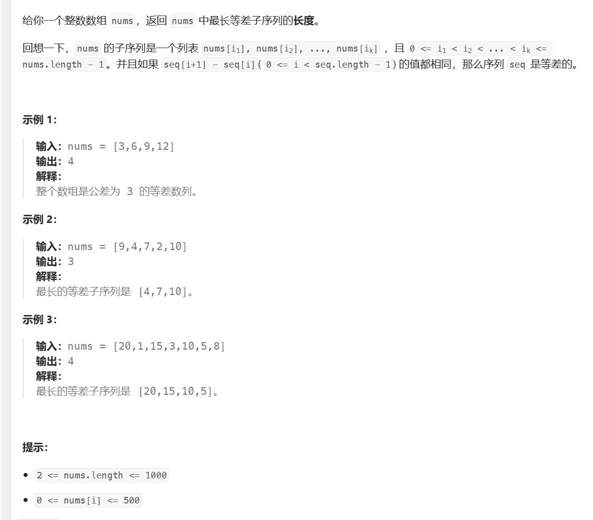

对于[9,4,7,2,10]，a[2]=7他能形成公差为2和3的两个子序列，在找a[4]=10的过程中他和7形成公差为3的子序列，而对于7如果已知他能形成的公差为3的子序列长度最大为2，就可以直接求出答案。这里利用了等差子序列的公差是一样的。


```python
class Solution:
    def longestArithSeqLength(self, nums: List[int]) -> int:
        ans=-inf
        @cache
        def dp(i):
            # 使用哈希表记录每个公差所能形成的最长子序列
            m={}
            for j in range(i-1,-1,-1):
                d=nums[i]-nums[j]
                # 去找j位的公差为d的，不存在默认就为1
                if d not in m:
                    m[d]=dp(j).get(d,1)+1          
            return m
        return max(max(dp(i).values()) for i in range(1,len(nums)))
```

### **Count Arithmetic Subsequences**	

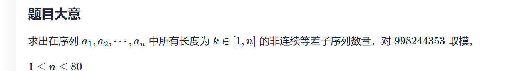


不好确定差值，因此使用两个状态表示序列中相邻的两个值，这就就可以表示差值了，再用一个状态表示序列的长度


```python
from collections import deque, defaultdict, Counter
from functools import lru_cache,cache
from bisect import bisect_left
from heapq import heappop, heappush
from itertools import accumulate
from math import ceil, inf
import sys
from typing import List
input = sys.stdin.readline
def R(): return int(input())
def RR(): return [int(x) for x in input().split()]
def get_pre(nums): return list(accumulate(nums, initial=0))

n=R()
nums=RR()

mod=998244353

ans=[0]*(n+1)

ans[1]=n
@cache
def dfs(i,j,cnt):
    if cnt==2:return 1
    res=0
    for k in range(j+1,n):
        if nums[k]-nums[j]==nums[j]-nums[i]:
            res+=dfs(j,k,cnt-1)
            res%=mod
    return res 
for i in range(n):
    for j in range(i+1,n):
        for k in range(2,n+1):
            ans[k]+=dfs(i,j,k)
            ans[k]%=mod
print(*ans[1:])
       
```


### [ 最大子序列交替和](https://leetcode.cn/problems/maximum-alternating-subsequence-sum/)

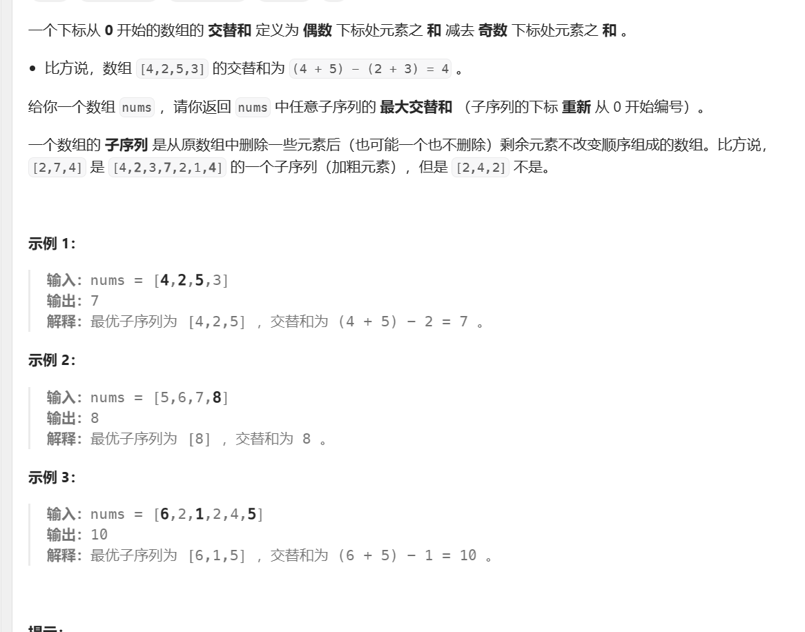

每个元素有选或不选两种，考虑dp(i,j)表示前i个元素中选了J(1表示偶数0表示奇数)，如果选了当前元素那么就是从前i-1转移过来，如果是偶数则上一位就是奇数个，比当前位小nums[i]，不选则直接跳过


```python
class Solution:
    def maxAlternatingSum(self, nums: List[int]) -> int:
        @cache
        def dp(i,j):
            if i==0:
                return -inf if j==1 else 0
            a=dp(i-1,j)
            b=dp(i-1,j^1)
            if j:
                b+=nums[i-1]
            else:
                b-=nums[i-1]
            return max(a,b)
        return max(dp(len(nums),1),dp(len(nums),0))
```


### [检查数组是否存在有效划分](https://leetcode.cn/problems/check-if-there-is-a-valid-partition-for-the-array/)

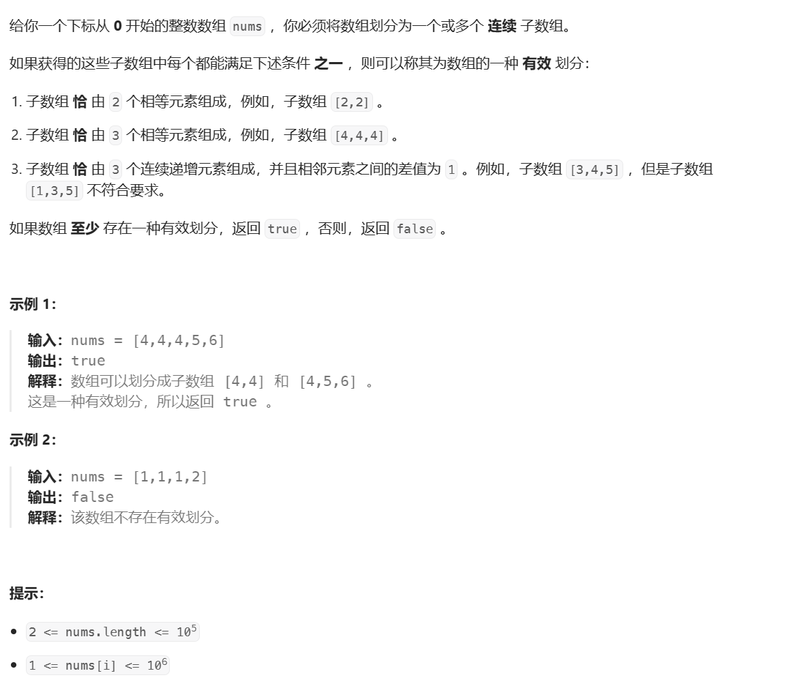

定义dp(i)表是以nums[i]结尾的数组是否可以划分，对于dp(i)他有三种选择，删除两个相同的，删除三个相同的，删除三个连续的，这样dp(i就变为dp(i-2)或dp(i-3)缩减了子问题，类似于爬楼梯问题。

```python
class Solution:
    def validPartition(self, nums: List[int]) -> bool:
        
        @cache 
        def dp(i):
            if i<0:
                return True 
            if i-1>=0 and nums[i]==nums[i-1]and dp(i-2):
                return True 
            if i-2>=0 and nums[i]==nums[i-1]==nums[i-2] and dp(i-3):
                return True 
            if i-2>=0 and nums[i]==nums[i-1]+1==nums[i-2]+2 and dp(i-3):
                return True  
            return False 
        return dp(len(nums)-1)
```

### [ 删除一次得到子数组最大和](https://leetcode.cn/problems/maximum-subarray-sum-with-one-deletion/)

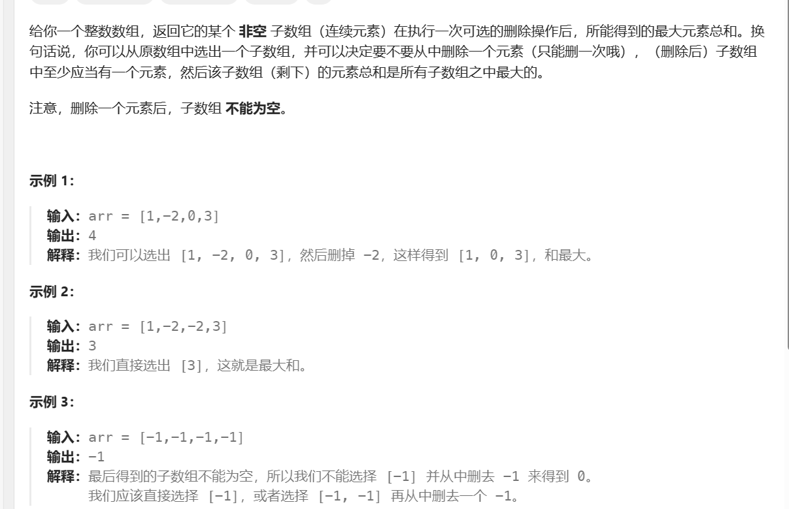

状态机dp，定义dp(i,j)表示以nums[i]结尾的子数组，其中j=1表示删除一次，j=0表示没有删除过

```python
class Solution:
    def maximumSum(self, arr: List[int]) -> int:
        l=r=0
        n=len(arr)
        i=0
        ans=-inf
        @cache
        def dp(i,j):
            nonlocal ans
            if i==0:
                # 对于一个值如果删除了是不合法的
                return -inf if j else arr[i]
            # 删除过一次，那么可能是删去当前位置的，或者之前删除过
            if j:
                res=max(dp(i-1,0),dp(i-1,1)+arr[i])
            else:
                res=max(dp(i-1,0)+arr[i],arr[i]) 
            return res
            
        return max(max(dp(i,0),dp(i,1)) for i in range(n))        


```

### 小红的序列乘积2.0


子序列问题尝试使用dp求解

要找出所有非空子序列的权值和，这个权值和只与f序列的个位数有关因此全看f序列个位数，状态为0到9，总体的权值和很难求使用贡献法求解

这里定义dp[i]\[j]表示前i个数构成的子序列的f序列的最后一位的各位为j的个数

对于a[i]有选或不选，如果选可以单独作为一个序列或者跟在之前的序列后面，具体实现类似刷表法。如果选且j*a[i]%10==6那么a[i]的贡献为2^(n-i-1)认为是后面的元素构成的序列接在a[i]后面。

```python
mod=10**9+7

n=R()
nums=[v%10 for v in RR()]
dp=[0 for _ in range(10)]
ans=0

# 用一维滚动数组
for i,x in enumerate(nums):
    # 先复制一份，这里已经完成了不选的操作，同时也不会有贡献
    dp1=dp[:]
    # 选，单独作为一个序列
    if x==6:# 如果是6那么可以贡献答案
        ans+=pow(2,n-i-1)
        ans%=mod
    # 序列的最后一位为a[i]同时也是f序列的最后一位，因此个数加一
    dp1[x]+=1
    dp1[x]%=mod
    for j in range(10):
        if (j*x)%10==6:
            # 注意这里不能忘掉dp[j]
            ans+=pow(2,n-i-1,mod)*dp[j]
            ans%=mod
        dp1[j*x%10]+=dp[j]
        dp1[j*x%10]%=mod
    dp=dp1[:]
print(ans)
```


### [乘积最大子数组](https://leetcode.cn/problems/maximum-product-subarray/)	

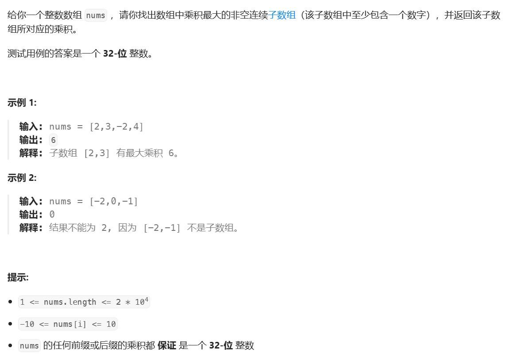

定义dp(i,j)表示以nums[i]结尾的最（大1/小0）子数组，不能定义j表示为是否包含过当前子数值是正/负，因为无法定义出合适的base case。

数组中的负数可以使得最小的数组变为最大的，最大的变为最小的。

```python
class Solution:
    def maxProduct(self, nums: List[int]) -> int:
        n=len(nums)
        ans=nums[0]
        @cache
        def dp(i,j):
            # 只有一个值，那么最大最小都是它
            if i==0:return nums[0]
            if nums[i]>=0:
                if j:
                    # 当前值是正数，那么最大的子数组来自于自身或者前面的最大子数组
                    res=max(nums[i],dp(i-1,1)*nums[i])
                else:
                    # 最小同理
                    res=min(nums[i],dp(i-1,0)*nums[i])
            else:
                if j:
                    # 对于负数它的最大子数组可能是本身或者是前面最小的子数组乘上本身，如果前面最大的子数组是正数那么一定不会大于这个负数本身，如果是负数那么一定不如反转更小的最小子数组
                    res=max(nums[i],dp(i-1,0)*nums[i])
                else:
                    # 对于最小的本身或者乘上前面最大的，如果前面最大的子数组是那么最小的只会更大，如果是负数一定会比最小的子数组小。
                    res=min(nums[i],nums[i]*dp(i-1,1))
            return res
        return max(max(dp(i,0),dp(i,1)) for i in range(n))
```

###  Jellyfish and Mex

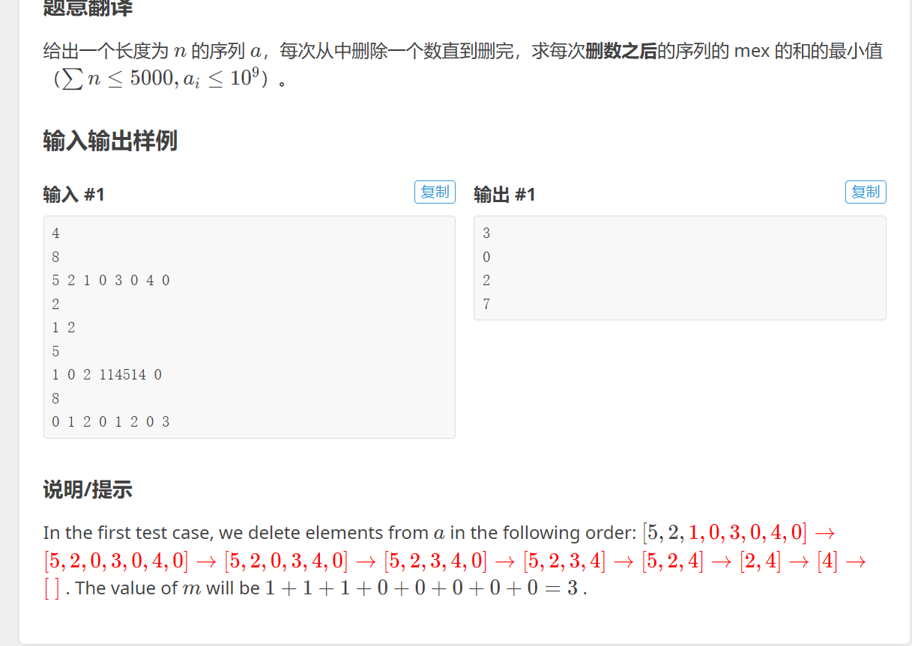

为了使结果最小要尽可能地减小MEN，对于当前的MEN而言删除比它大的不会改变MEN，只有删除某个小于他的值并且全部删除掉这个才能改变MEN，定义dp(i)表示MEN=i时最小的结果，这个状态由比它大的MEN转移删除了所有的i后转移过来，对于给定的数据范围可以枚举所有大的MEN。

```python
import sys
from collections import Counter
from math import inf

input = sys.stdin.readline
for _ in range(int(input())):
    n = int(input())
    nums = [int(x) for x in input().split()]
    # 记录元素出现的个数
    cnt = Counter(nums)
    M = 0
    # 找一开始出现的MEN 
    while M in cnt:
        M += 1
    
    dp=[inf]*(M+1)
    dp[M]=0
    # 往回找
    for i in range(M,-1,-1):
        for j in range(i+1,M+1):
            dp[i]=min(dp[i],dp[j]+(cnt[i]-1)*j+i)
    print(dp[0])

```

###  **Alphabet Tiles**

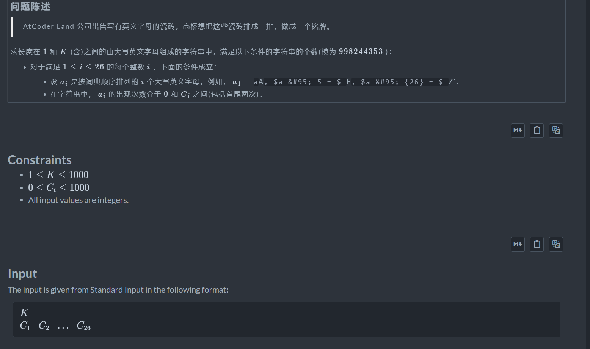

动态规划加组合数，对于每个字符组有选或不选两种，定义dp(i,j)表示考虑前i个字母，长度为j时有多少种方案。在长度为 *j* 的情况下，把 *k* 个字母放进字符串的方案数是 $C^{k}_{j}$

注意到组合数的上下限不超过1000，同时会进行很多次的组合数计算，因此打表记录所有的组合数快速求解。

```python
from functools import lru_cache
from math import comb

n=int(input())
a=[int(x) for x in input().split()]
mod=MOD=998244353

C=[[0]*2010 for _ in range(2010)]
# 打表
for i in range(2010):
    # 内层的循环只能到i，在往外无意义
    for j in range(i+1):
        # j=0的时候结果为1
        if not j:C[i][j]=1
        else:
            C[i][j]=(C[i-1][j-1]+C[i-1][j])%mod

      
f=[[0]*(n+1) for _ in range(27)]
f[0][0]=1

for i in range(1,27):
    for j in range(n+1):
        # 对于字母a[i-1]可选的方案数
        for k in range(min(a[i-1],j)+1):
            f[i][j]=(f[i][j]+f[i-1][j-k]*C[j][k])%mod

ans = 0
for j in range(1, n + 1):
  ans += f[-1][j]
  ans %= MOD
print(ans)
```


### **Remove Pairs**

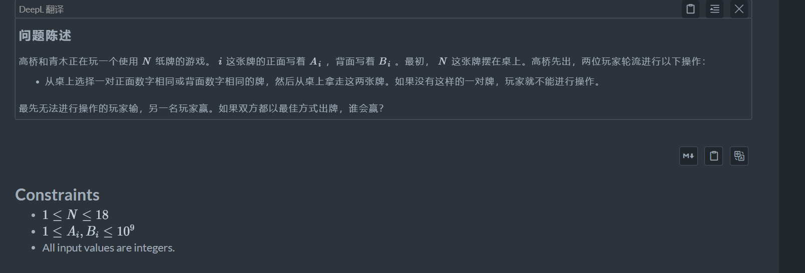

博弈dp，给定的数据范围可以启发思考，定义dp(i)表示当前剩余牌的状态，对于当前的人如果能让后手必输，则它能取得胜利，如果后手都是赢那么他是必输。


```python
from functools import lru_cache

nums=[]
n=int(input())
for _ in range(n):
    nums.append([int(x) for x in input().split()])
@lru_cache(maxsize=None)
def dp(i):
    # 只有两张牌，base case 注意要判断这两张牌是否能满足要求
    if bin(i).count('1')==2:
        temp=[]
        for index in range(n):
            if i>>index&1:
                temp.append(nums[index])
        return int(temp[0][0]==temp[1][0] or temp[0][1]==temp[1][1])
    # 当前无法操作，必输
    elif bin(i).count('1')<2:return 0

	# 通过n^2 枚举要删除的牌
    for l in range(n):
        if (i>>l)&1==0:continue
        for r in range(n):
            if (i>>r)&1==0 or l==r :continue
            elif nums[l][0]!=nums[r][0] and nums[l][1]!=nums[r][1]:continue
            if not dp(i^(1<<l)^(1<<r)):return 1
    return 0
res=dp((1<<n)-1)
if res:print('Takahashi')
else:print('Aoki')

```


### 让字符串成为回文串的最少插入次序

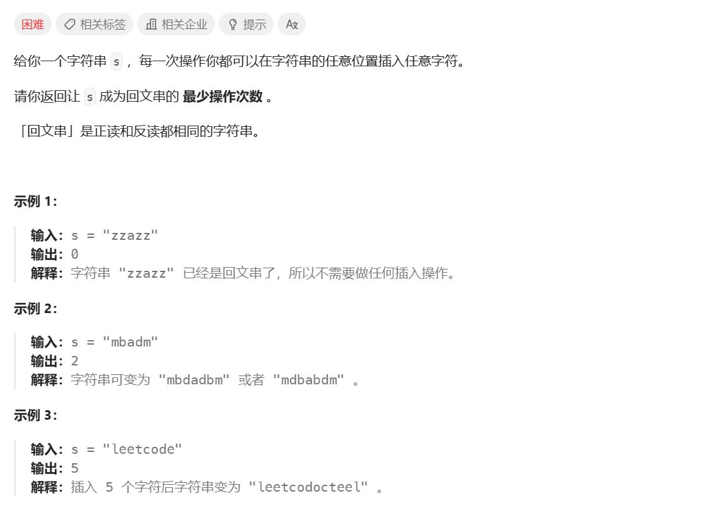


只要找出最长回文子序列后，不在最大公共子序列中的值就是要添加的，因为没人和他们匹配。

```python
class Solution(object):
    def minInsertions(self, s):
        return len(s)-self.longestPalindromeSubseq(s)
    def longestPalindromeSubseq(self,s):
        memo=[[-1 for _ in range(len(s))]for _ in range(len(s))]

        def dp(s,l,r):
            if l==r:
                return 1
            if l>r:
                return 0
            if memo[l][r]!=-1:
                return memo[l][r]
            if s[l]==s[r]:
                memo[l][r]=dp(s,l+1,r-1)+2
            else:
                memo[l][r]= max(dp(s,l,r-1),dp(s,l+1,r))
            return memo[l][r]
        return dp(s,0,len(s)-1)
```

### 鸡蛋掉落

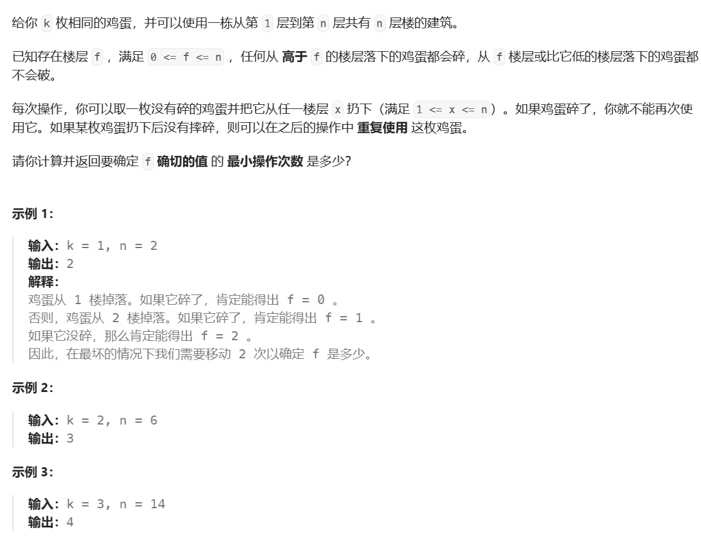

如果不考虑鸡蛋数目，假如现在有7层楼，想要找到f使用线性查找一层楼一层楼的遍历，最坏的情况是遍历7次，想要找最小的操作数需要使用二分查找，先去第 (1 + 7) / 2 = 4 层扔一下：如果碎了说明 F 小于 4，我就去第 (1 + 3) / 2 = 2 层试……如果没碎说明 F 大于等于 4，我就去第 (5 + 7) / 2 = 6 层试……

以这种策略，最坏情况应该是试到第 7 层鸡蛋还没碎（F = 7），或者鸡蛋一直碎到第 1 层（F = 0）。然而无论那种最坏情况，只需要试 log7 向上取整等于 3 次，比刚才尝试 7 次要少，这就是所谓的至少要扔几次。

只有找最坏情况才能确定f的确切的值。

如果限制鸡蛋数目，比如只有1个，就无法使用二分查找，1个鸡蛋只能一个个线性查找（鸡蛋在f之下不会碎）

选择使用动态规划解决，首先明确状态和选择，状态是当前的鸡蛋数目以及面对的楼层数目，选择是在第几楼扔鸡蛋，扔下去之后，鸡蛋可能碎也可能不碎，找出其中最大的那个，因为要求最坏情况。dp的结果是在有K个鸡蛋的情况下面对n层楼的最小操作数。


```python
class Solution(object):
    def superEggDrop(self, k, n):
        memo = {}
        
        def dp(k, n):
            
            # 只有一个鸡蛋只能线性搜索
            if k == 1:
                return n
            
            # 0层楼自然操作0次
            if n == 0:
                return 0
            # 备忘录
            if (k,n) in memo:
                return memo[(k,n)]
            res = float('inf')
            
            # 当前有k个鸡蛋但不知道从哪扔，遍历所有的楼层选择从最小的那个扔
            for i in range(1, n + 1):
                # 如果鸡蛋没碎，f在i及i之上（base case 中包含了0的情况），反之，在下
                res = min(res, max(dp(k - 1, i - 1), dp(k, n - i))+1) 
            
            memo[(k,n)] = res
            return res
        
        return dp(k, n)
```

改进的二分查找，不是遍历每一层选择最少的，而是直接从中间开始，根据结果的情况不断二分区间

```python
class Solution(object):
    def superEggDrop(self, k, n):
        memo = {}


        def dp(k, n):
            if k == 1:
                return n
            if n == 0:
                return 0
            if (k, n) in memo:
                return memo[(k, n)]
            lo=1
            high=n
            res=float('inf')
            while lo<=high:
                mid=(lo+high)//2
                broken=dp(k-1,mid-1)
                broken_no=dp(k,n-mid)
                if broken>broken_no:
                    
                    high=mid-1
                    res=min(res,broken+1)
                else:
                    lo=mid+1
                    res=min(res,broken_no+1)
            memo[(k,n)]=res
            return res
        return dp(k,n)
```


### 戳气球

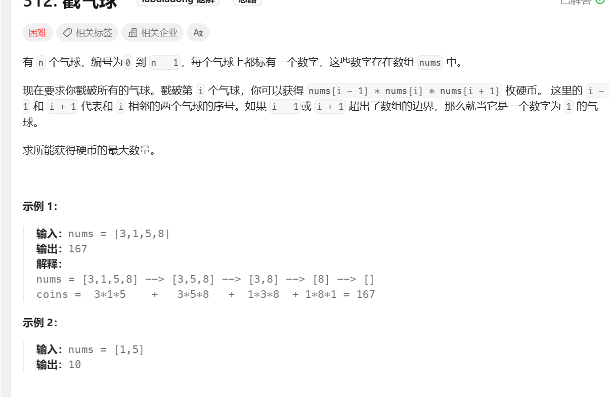

注意如果有编号为1到4的气球，第一次戳了第二个，第二次戳了死三个，此时计算分数用的是nums[1] * nums[3] * nums[4]

由题意知，超出边界的值选择为1，在原数组中加入两个边界值左边一个右边一个，将原问题转换为一排气球吹破除了起点于端点外的所有气球所能得到的最大分数。

选取状态为区间，dp[i] [j]表示从i到j的开区间内，戳破所有气球的最大分数，而选择k是那个气球是最后一个戳破的，这样就有状态转移方程。最后的结果是dp[0] [n+1]。

dp[i] [j]=dp[i] [k]+dp[k] [j]+nums[k]*nums [i] *nums[j]，既然是最后一个戳破的，那么左右的值只能是区间的边界。

注意i和j的遍历顺序，选择从左到右，从下到上遍历，因为每个状态要由它的前一个状态推出

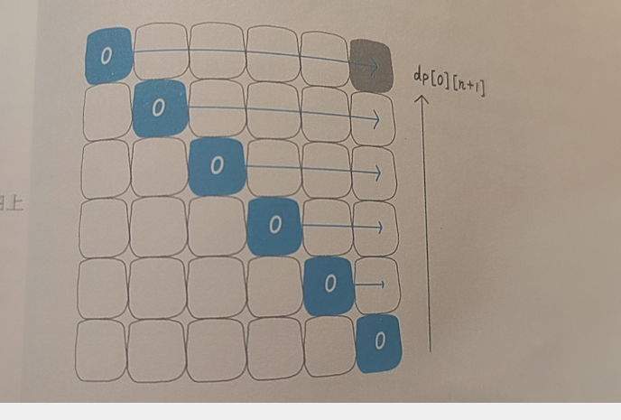


```python
class Solution(object):
    def maxCoins(self, nums):
        n=len(nums)
        # 构建新数组，加入两个虚拟节点
        nums_dummy=[1]
        nums_dummy.extend(nums)
        nums_dummy.append(1)
        # 初始化，base case 是当区间内没有值的时候，即i>=j，初始化结果为0
        dp=[[0 for _ in range(n+2)] for _ in range(n+2)]
        # 按照从左到右从下到上的顺序遍历
        for i in range(n,-1,-1):
            for j in range(i+1,n+2):
                # 在当前区间内选取k，作为最后一个吹破的气球
                for k in range(i+1,j):
                    dp[i][j]=max(dp[i][j],dp[i][k]+dp[k][j]+nums_dummy[i]*nums_dummy[k]*nums_dummy[j])
        # 注意dp表示的是开区间
        return dp[0][n+1]
```


## 拓扑排序

拓扑排序可以用将环和其他的节点区分。

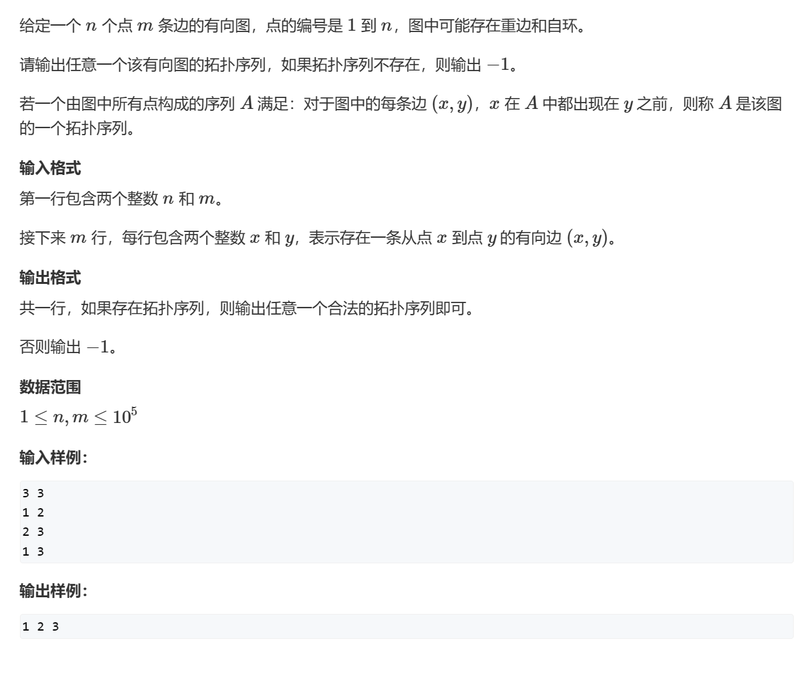

只有有向无环图才会有拓扑序列，拓扑序列不唯一，序列中边起点一定排在终点之前。

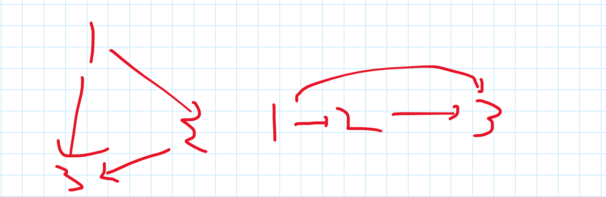

建图的过程中要记录每个节点的入度，使用节点的过程中首先把入度为0的点加入到队列中，之后遍历队列中的点，对于每一个在队列中的点把与它相连的点之间的边去掉，具体表示为减少下一个点的入度，如果这个点的入度为0了，那么就加入到队列中。最后判断队列的长度是否为N。

```python
from collections import deque
n,m=[int(x) for x in input().split()]
path=[set() for _ in range(n)]
d=[0]*n
q=deque()
for _ in range(m):
    u,v=[int(x)-1 for x in input().split()]
    # 防止重边
    if v not in path[u]:
        path[u].add(v)
        d[v]+=1
 # 排序
def topsort():
    # 加入入度为0的点
    for i,val in enumerate(d):
        if not val:
            q.append(i) 
    index=0
    # 遍历队列中的点
    while index<len(q):
        p=q[index]
        # 去掉边，如果入度变为0则加入
        for p_ in path[p]:
            d[p_]-=1
            if not d[p_]:
                q.append(p_)
        index+=1
    # 判断是否有拓扑序
    return len(q)==n
if (topsort()):
    for i in q:
        print(i+1,end=' ')
else:
    print(-1)
```

### [课程表 IV](https://leetcode.cn/problems/course-schedule-iv/)

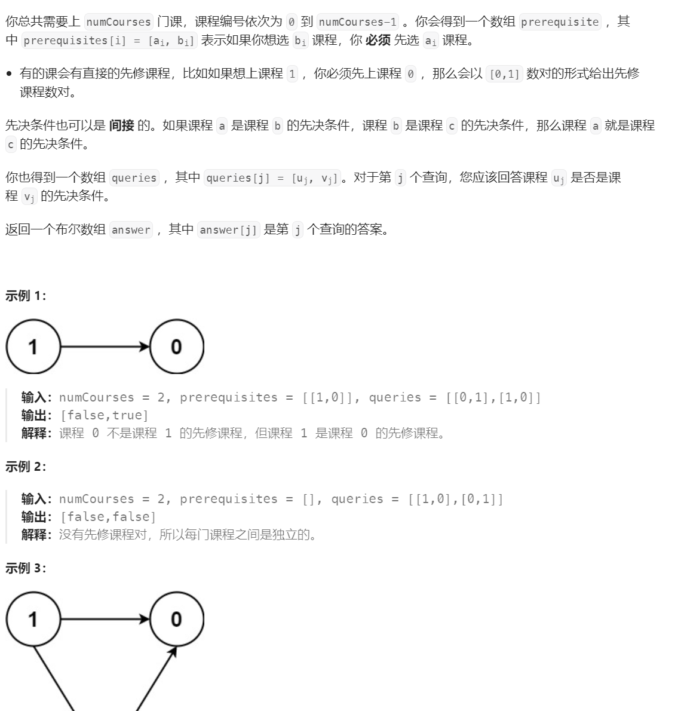


需要知道节点之间的顺序，需要用到拓扑排序，这里同时需要知道两个节点是否相连单单用拓扑排序是做不到的，所以在排序的过程中要枚举每个节点是否能和下一个节点相连。

```python
class Solution:
    def checkIfPrerequisite(self, n: int, p: List[List[int]], queries: List[List[int]]) -> List[bool]:
        path=defaultdict(dict)
        # 用于记录两个节点是否相连
        f=[[False]*n for _ in range(n)]
        cnt=[0]*n
        vis=set()
        for u,v in p:
            path[u][v]=None
            cnt[v]+=1
         # 加入所有入度为0的，即使是单独一个节点也会算入不hi影响到最后的结果
        d=deque(i for i,v in enumerate(cnt) if v==0)
        # 这里只需要按照拓扑排序的顺序处理即可，不需要保留序列
        while d:
            curr=d.popleft()
            for p in path[curr].keys():
                f[curr][p]=True
                # 类似于floyd的处理方式
                for h in range(n):
                    f[h][p]=f[h][curr] or f[h][p]
                cnt[p]-=1
                if not cnt[p]:
                    d.append(p)

        ans=[]
        for u,v in queries:
            ans.append(f[u][v])
        return ans 
```

### [给定条件下构造矩阵](https://leetcode.cn/problems/build-a-matrix-with-conditions/)	 

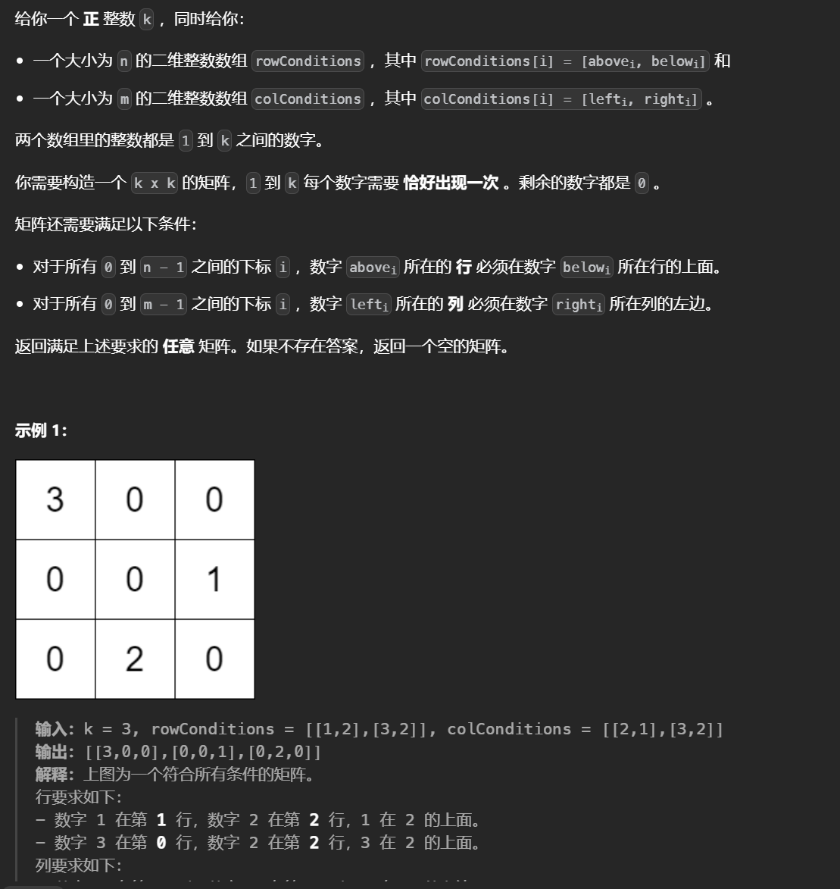

给定的两个数组规定了两两之间的相对顺序但是这个顺序不是很明确，可以用拓扑排序给出所有点的顺序。

```python
class Solution:
    def buildMatrix(self, k: int, rowConditions: List[List[int]], colConditions: List[List[int]]) -> List[List[int]]:
        	# 拓扑排序
            def top(d):
                q=deque()
                for i,v in enumerate(d):
                    if not i:continue
                    if not v:q.append(i)
                index=0
                while index<len(q):
                    # 保留序列
                    curr=q[index]
                    for c in path[curr].keys():
                        d[c]-=1
                        if not d[c]:
                            q.append(c)
                    index+=1
                # 最后判断是否满足拓扑序，防止不合法的相对顺序
                return q if len(q)==k else []
            
            # 分别统计行和列两个数组的入度
            
            m,n=len(rowConditions),len(colConditions)
            d=[0]*(k+1)
            grid=[[0]*k for _ in range(k)]
            path=defaultdict(dict)
            for a,b in rowConditions:
                if b not in path[a]:
                    path[a][b]=None
                    d[b]+=1
            row=top(d)

            d=[0]*(k+1)
            path=defaultdict(dict)
            for a,b in colConditions:
                if b not in path[a]:
                    path[a][b]=None
                    d[b]+=1
            col=top(d)
			
            if not col or not row:return []
        	# 使用哈希表记录每个值对应的行和列
            memo=defaultdict(list)
            for i,v in enumerate(row):
                memo[v]=[i]
            for i,v in enumerate(col):
                memo[v].append(i)
            for k,v in memo.items():
                r,c=v
                grid[r][c]=k
            return grid                 
```

### [并行课程 III](https://leetcode.cn/problems/parallel-courses-iii/)

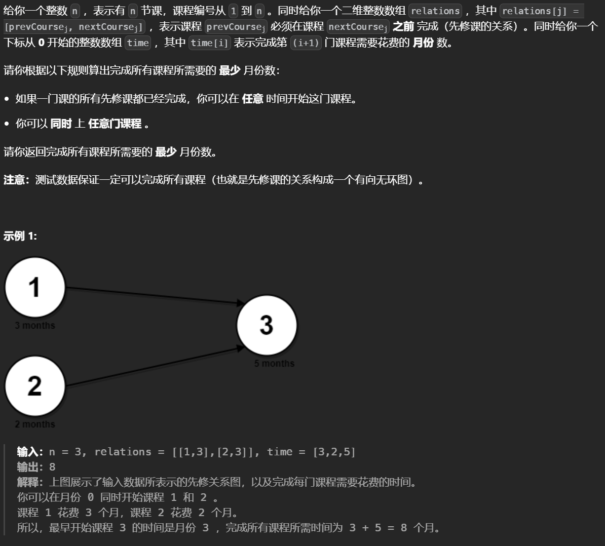

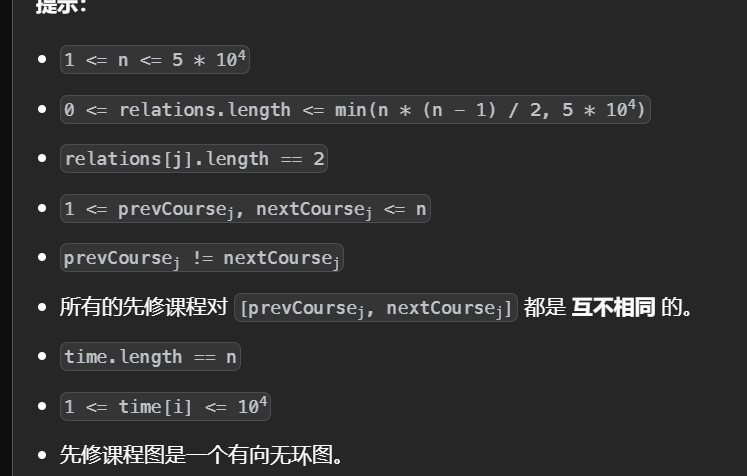

用拓扑排序加动态规划，f[i]表示完成课程i所需的最小月份，在拓扑排序的过程中当一个点出队时用它去更新其他点的拓扑值。

```python
class Solution:
    def minimumTime(self, n: int, relations: List[List[int]], time: List[int]) -> int:
        p=defaultdict(dict)
        e=[0]*n
        # 建图
        for u,v in relations:
            p[u-1][v-1]=None
            e[v-1]+=1
        q=deque([i for i,v in enumerate(e) if not v])
        f=[0]*n
        # 拓扑排序
        while q:
            curr=q.popleft()
            # 出队，说明它的先修课都处理过了，那么这个课程所需的时间就要加上他自身所需的时间
            f[curr]+=time[curr]
            for k in p[curr].keys():
                # 他作为先修课去更新别的课程
                f[k]=max(f[k],f[curr])
                e[k]-=1
                if not e[k]:q.append(k)
        return max(f)
       
```


## 内向基环树

### [ 参加会议的最多员工数](https://leetcode.cn/problems/maximum-employees-to-be-invited-to-a-meeting/)

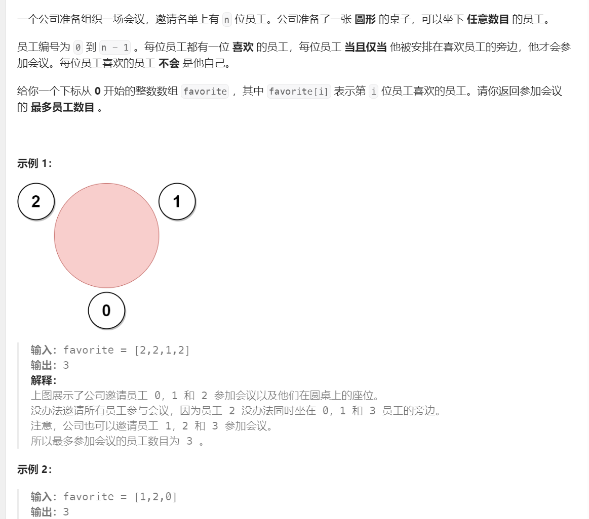

内向基环图，具有n个节点n条边的连通块，内向指的是连通块中的每个节点的出度为1，外向指的是入度为1，基环图中在基环外可以连接有多个树枝

每个员工只能坐在喜欢的人边上那么座次必须要满足是一个内向基环图

如果基环的大小大于等于3，那么圆桌上能做的人数就是基环的大小，一旦往这个环里向x->y插入其他的节点，一定会使得x不满足条件。

如果基环的大小为2，那么两个点的两边可以继续坐人也就是求出两个点的最长链，为此需要构造一个反图，此外在这个座次中可以继续坐入大小为2的基环。

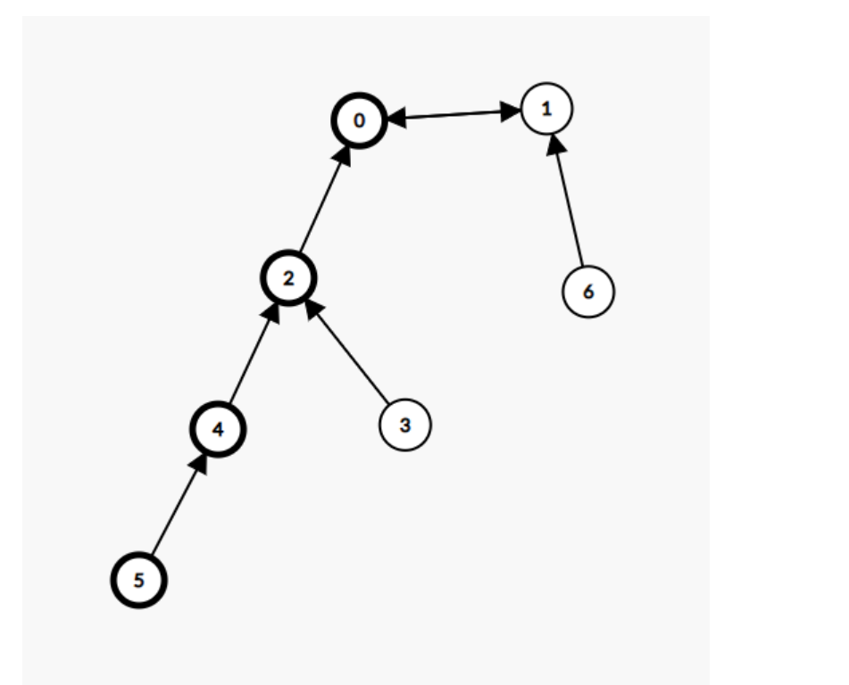

通过一次拓扑排序可以将树枝的入度变为0以此与基环分开，因为图谱排序中只能操作树枝，通过构建反图。

```python
class Solution:
    def maximumInvitations(self, favorite: List[int]) -> int:
        n=len(favorite)
	# 计算入度
        deg=[0]*n
        for f in favorite:
            deg[f]+=1
        q=deque([i for i,v in enumerate(deg) if not v])    
        r=defaultdict(list)
        # 将树枝与基环分开，基环是不会入队的
        while q:
            x=q.popleft()
            y=favorite[x]
            # 构建反图
            r[y].append(x)
            deg[y]-=1
            if not deg[y]:
                q.append(y)
         # 求出最长的链
        def dfs(x):
            if not r[x]:return 0
            return max(dfs(y)+1 for y in r[x])
        a=b=0
        # 遍历每一个点，找出基环
        for i,v in enumerate(deg):
            if not v:continue
            # 设置为0防止重复访问到
            deg[i]=0
            j=favorite[i]
            res=1
            # 一直顺着基环找
            while j!=i:
                deg[j]=0
                j=favorite[j]
                res+=1
            # 分类讨论 
            if res>2:
                a=max(a,res)
            elif res==2:
                # 基环长度为2的可以一直累加
                b+=dfs(i)+dfs(favorite[i])+res
        return max(a,b) 
```


### [图中的最长环](https://leetcode.cn/problems/longest-cycle-in-a-graph/)

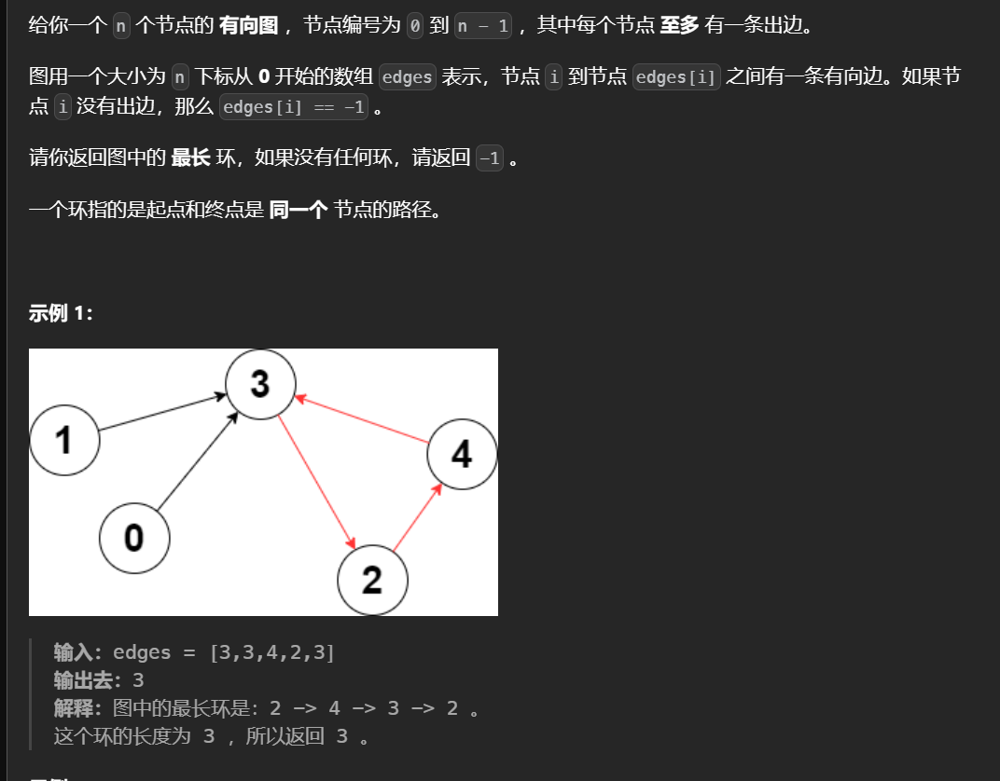


问题就是在找最大的基环数，把树枝通过拓扑排序与基环分开后直接去找基环的大小。

```python
class Solution:
    def longestCycle(self, edges: List[int]) -> int:
        n=len(edges)
        deg=[0]*n
        for f in edges:
            if f==-1:continue
            deg[f]+=1
        q=deque([i for i,v in enumerate(deg) if not v])
        # 基环是不会入队的
        while q:
            x=q.popleft()
            y=edges[x]
            if y==-1:continue
            deg[y]-=1
            if not deg[y]:
                q.append(y)
        ans=0
        for i,v in enumerate(deg):
            if not v:continue
            j=edges[i]
            res=1
            deg[i]=0
            while deg[j]:
                deg[j]=1
                j=edges[j]
                res+=1
            ans=max(ans,res)
        return ans if ans else -1
```


### **Reachability in Functional Graph**

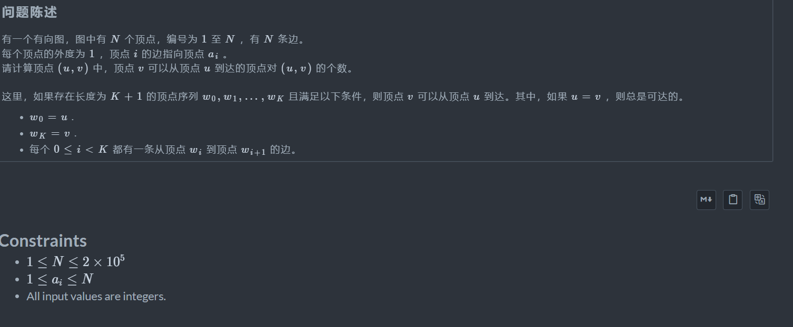

特意强调了每个点的出边只有一个，那么就是一个基环树。找两两可以相互到达的点首先看环，在环上的点能到达其他点的数目就是环的大小，作为分支的点可以到的点的数目就是就是他所连的点能到达的数目加一。

```python
from collections import deque,defaultdict
import sys
sys.setrecursionlimit(150000)
from functools import lru_cache

input=sys.stdin.readline

n=int(input())
nums=[int(x)-1 for x in input().split()]

e=[0]*n

for i,v in enumerate(nums):
    e[v]+=1

# 把环筛出来
p=[False]*n
d=deque([i for i,v in enumerate(e) if not v])
while d:
    curr=d.popleft()
    p[curr]=True
    k=nums[curr]
    if k==curr:continue
    e[k]-=1
    if not e[k]:d.append(k)

ans=[0]*n
# 计算环上每个点能连接的大小
for i in range(n):
    if not p[i]:
        cnt=0
        j=nums[i]
        while not p[j]:
            cnt+=1
            p[j]=True
            j=nums[j]
        for _ in range(cnt):
            ans[i]=cnt
            i=nums[i]
vis=set()

# 计算分支，使用递归注意要设置深度
@lru_cache(maxsize=None)
def dfs(i):
    if e[i]:return ans[i]
    return 1+dfs(nums[i])

for i,v in enumerate(e):
    if not v and i not in vis:
        ans[i]=dfs(i)
print(sum(ans))
```


## 平衡树

### [避免洪水泛滥](https://leetcode.cn/problems/avoid-flood-in-the-city/)

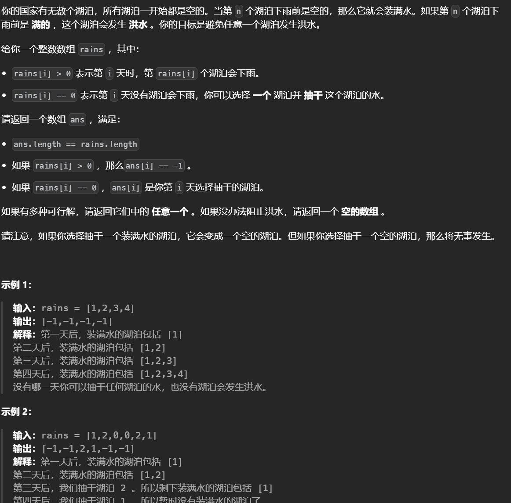

贪心的思想，遍历rains数组如果这个湖泊之前已经遍历过也就是会发生洪水，就需要把离这个湖泊之前的位置最近的晴天分配给他，然后这个晴天就不能在用了。

可以二分快速找到最近的晴天，但是把这个晴天去除后仍需要保持数组顺序以此来继续二分，这需要用到平衡树。

### [考场就座](https://leetcode.cn/problems/exam-room/)

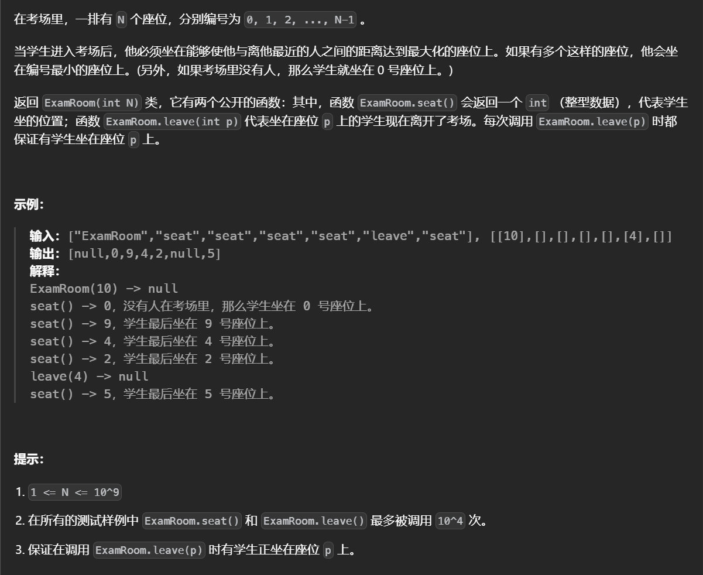

有序集合不仅可以存储元素也可以存储区间，对于本题首先找出距离最大的，而后是最靠前的位置，每次加入一个点会删除一个区间加入两个区间

```python
from sortedcontainers import SortedList
class ExamRoom:

    def __init__(self, n: int):
        # 计算距离的函数，如果点是最左或最右则特判
        def dist(x):
            l,r=x
            return r-l-1 if l==-1 or r==n else (r-l)>>1
        self.n=n
        # 按照区间距离和左端点排序
        self.s=SortedList(key=lambda x:(-dist(x),x[0]))
        # 记录一个点的左边位置和右边端点，可以用来更新区间
        self.l={}
        self.r={}
        # 初始化
        self.s.add((-1,n))
        self.l[n]=-1
        self.r[-1]=n
        
    def seat(self) -> int:
        # 找到距离最大的区间
        ss=self.s[0]
        l,r=ss
        # 计算中点位置
        p=(l+r)>>1
        # 对于两端特判
        if l==-1:p=0
        elif r==self.n:p=self.n-1
        # 先删除当前的区间，因为加入这个点这个区间就用不上了
        self.delete(ss)
        # 新增两个区间
        self.add((l,p))
        self.add((p,r))
        return p
    def delete(self,s):
        # 不仅删除区间还有删除左右对应的位置
        self.s.remove(s)
        del self.l[s[1]]
        del self.r[s[0]]

    def add(self,s):
        self.s.add(s)
        self.l[s[1]]=s[0]
        self.r[s[0]]=s[1]

    def leave(self, p: int) -> None:
        # 先记录两个位置
        l,r=self.l[p],self.r[p]
        # 一个点的删除会减少两个区间增加一个大的区间
        self.delete((self.l[p],p))
        self.delete((p,self.r[p]))
        self.add((l,r))
```

### [最近的房间](https://leetcode.cn/problems/closest-room/)

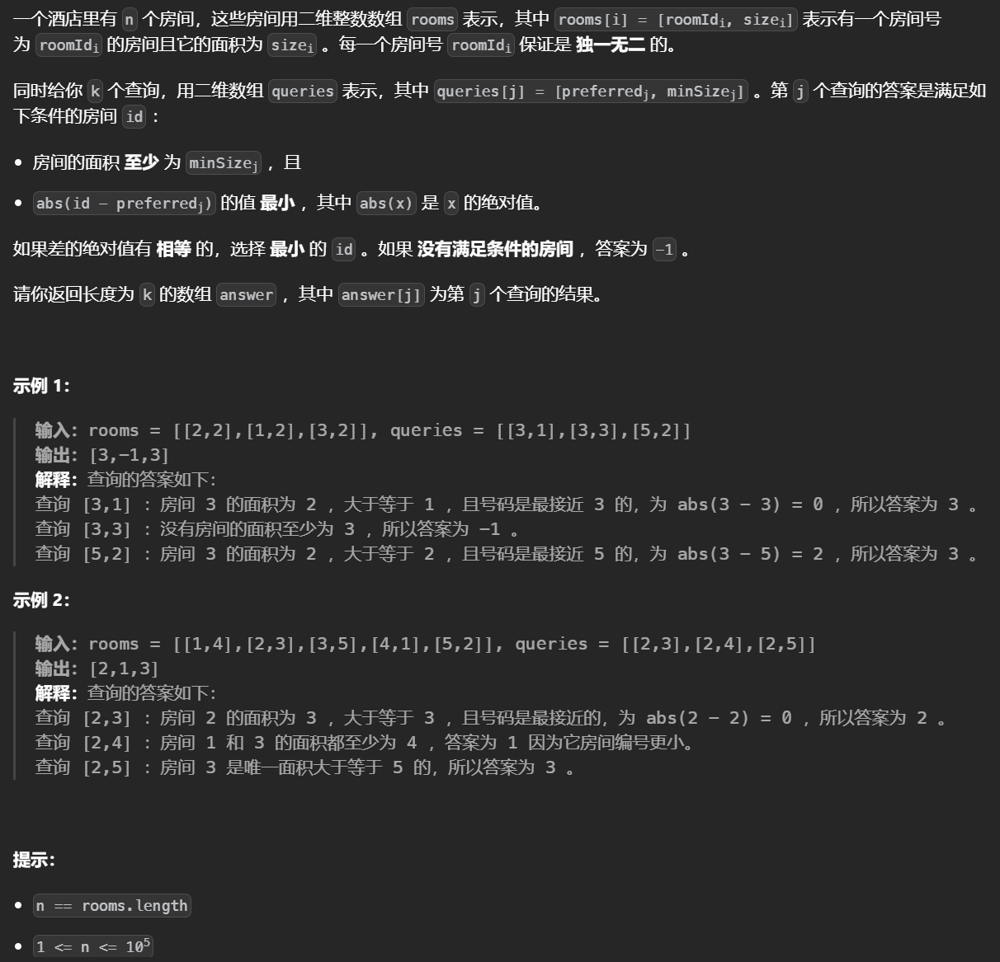

对询问离线，按照面积从大到小操作，同时对给定的数组也按照面积从大到小排序，这样保证了每次处理询问时数据结构内都是合法的选择(面积更大)。把合法的选择放入到有序集合中查找与当前询问的id差不多的数值。

```python
from sortedcontainers import SortedList
class Solution:
    def closestRoom(self, nums: List[List[int]], queries: List[List[int]]) -> List[int]:
        n=len(nums)
        # 排序
        nums.sort(key=lambda x:(-x[1]))
        q=[[queries[i][0],queries[i][1],i] for i in range(len(queries))]
        q.sort(key=lambda x:-x[1])
        ans=[-1]*len(queries)
        # 哨兵，取无穷保证了不会被取到
        sl=SortedList((-inf,inf))
        j=0
        n=len(nums)
        # 按照面积从大到小操作
        for rid,s,i in q:
            # 离线，保证数据结构内都是合法的选择
            while j<n and nums[j][1]>=s:
                sl.add(nums[j][0])
                j+=1
            # 找在当前id左右的
            if len(sl)>2:
                index=sl.bisect_left(rid)
                curr=sl[index]
                pre=sl[index-1]
                if not abs(rid-curr)<abs(rid-pre):
                    curr=sl[index-1]
                ans[i]=curr
        return ans 
```


## KMAP

全称 Knuth–Morris–Pratt 算法，是用于在给定的字符串s中查找模式串p是否存在，如果存在，是在那个位置开始。

暴力的做法是，从第一个位置开始遍历s，如果遇到了p的开头，开始一一枚举，如果不匹配则s会回退到自己的第 2 个字符，p则回退到自己的开头，然后开始重新比较。

而kmap是减少了查找的次数，即遇到了不匹配的字符，s的位置不会回退，而p会回退。

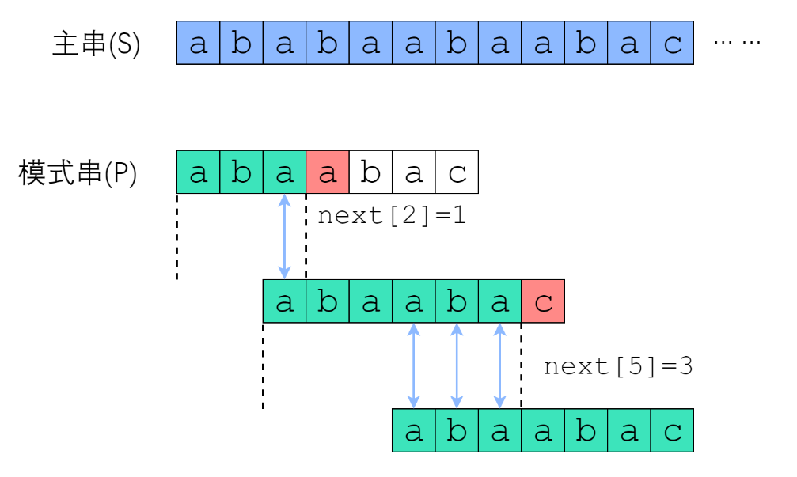

这里可以看出s不会回退，而p会回退

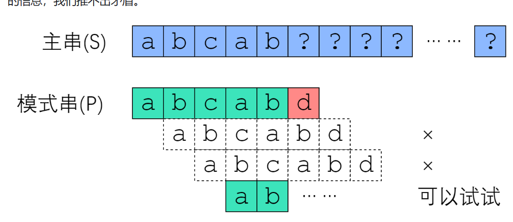

即找到相同的前缀和后缀，把p原来的起始位置换到对应的后缀位置上，减少了无用的枚举，只有从相等的后缀处开始才有可能找到。

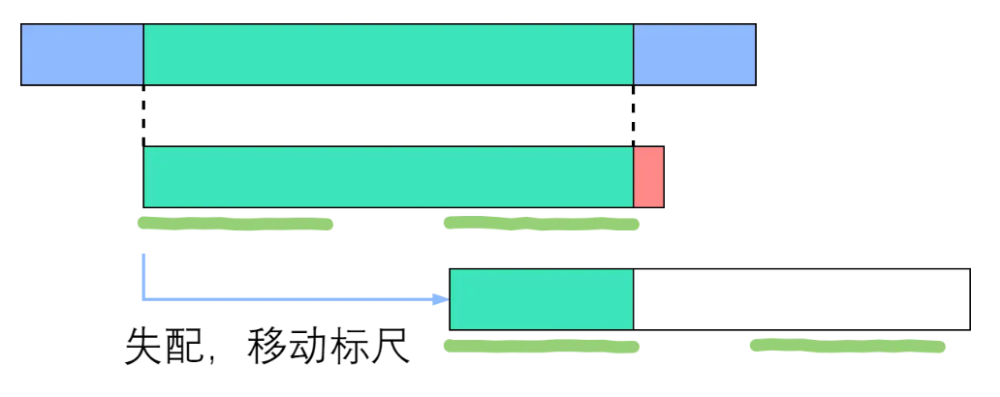


kmap算法的关键在于，构造next数组，next[i]表示P[0]~P[x] 这一段字符串，使得**k-前缀恰等于k-后缀**的最大的k。

记录now为next[x-1]的结果，如果下一位的字符相同

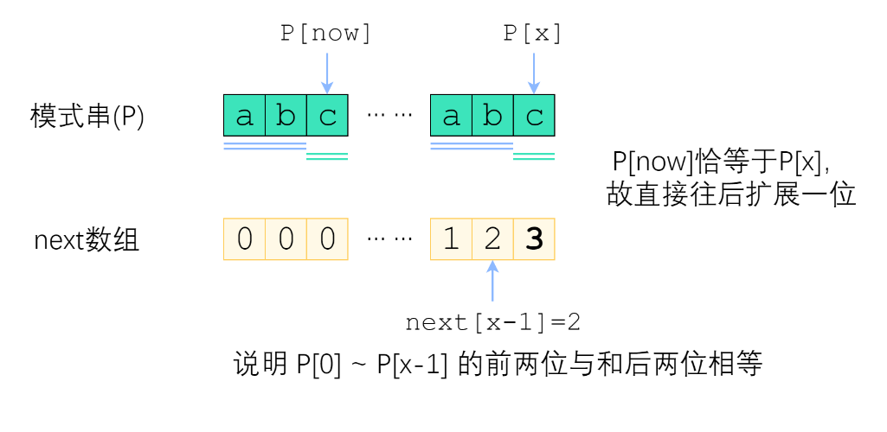

不同，可以看出子串A与B是一样的，找到子串A的next长度，递归的判断现在的now和x相不相同。

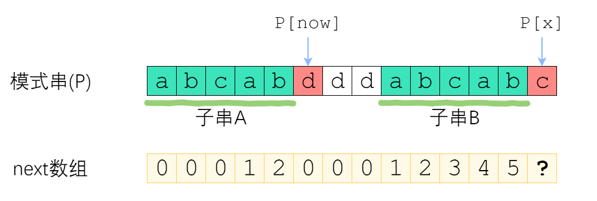

arr：arr[i]表示s[:i+1]**中**最长的前缀和后缀相等的长度

```python
def build():
    # 初始时，自己与自己是等于0的
    arr=[0]
    x=1
    now=arr[x-1]
    while x<len(p):
        # 相等，都往后扩展，记录结果
        if p[now]==p[x]:
            now+=1
            x+=1
            arr.append(now)
        # 不同的话，递归
        elif now:
            now=arr[now-1]
        # 确实不存在相同的前后缀
        else:
            arr.append(0)
            x+=1
    return arr
```


```python
def search(s,p):
    # 构建前后缀数组
    arr=build(p)
    # 标识两个字符串的指针
    tar,pos=0,0
    res=[]
    while tar<len(s):
        # 相同，往后
        if s[tar]==p[pos]:
            tar+=1
            pos+=1
        # s与p存在不匹配的
        elif pos:
            pos=arr[pos-1]
        else:
            # 还没匹配到第一个字符
            tar+=1
        # 匹配了一个p，记录结果，这里p要回退而不是重新开始
        if pos==len(p):
            res.append(tar-pos)
            pos=arr[pos-1]
    return res
```


### [找出数组中的美丽下标 II](https://leetcode.cn/problems/find-beautiful-indices-in-the-given-array-ii/)

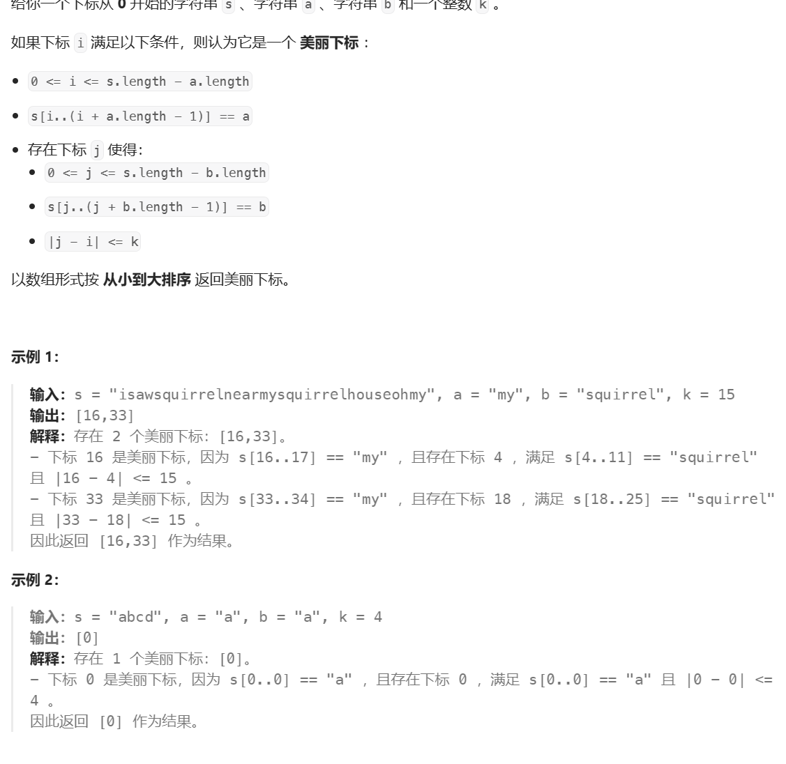


搭建kmap，然后使用二分

```python
class Solution:
    def beautifulIndices(self, s: str, a: str, b: str, k: int) -> List[int]:
        def build(p):
            arr=[0]
            x=1
            now=arr[x-1]
            while x<len(p):
                if p[now]==p[x]:
                    now+=1
                    x+=1
                    arr.append(now)
                elif now:
                    now=arr[now-1]
                else:
                    arr.append(0)
                    x+=1
            return arr

        def search(s,p):
            arr=build(p)
            tar,pos=0,0
            res=[]
            while tar<len(s):
                if s[tar]==p[pos]:
                    tar+=1
                    pos+=1
                elif pos:
                    pos=arr[pos-1]
                else:
                    tar+=1
                if pos==len(p):
                    res.append(tar-pos)
                    pos=arr[pos-1]
            return res
        ans=[]
        li1=search(s,a)
        li2=search(s,b)
        n=len(li2)
        # 使用二分
        # for i in range(len(li1)):
        #     index=bisect_left(li2,li1[i])
        #     if index<n and li2[index]-li1[i]<=k:
        #         ans.append(li1[i])
        #     elif index>0 and li1[i]-li2[index-1]<=k:
        #         ans.append(li1[i])
        # return ans
        
        # 使用双指针
        l=0
        for val in li1:
            while l<len(li2) and li2[l]<val-k:
                l+=1
            if l<len(li2) and li2[l]<=val+k:
                ans.append(val)
        return ans 
```


### [匹配模式数组的子数组数目 II](https://leetcode.cn/problems/number-of-subarrays-that-match-a-pattern-ii/)

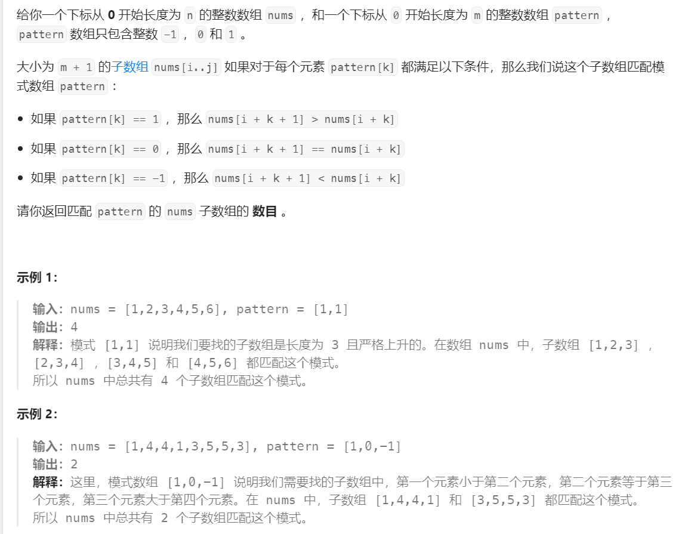

模式串适用于表示大小增减关系的，因此可以把原字符串转换为表示大小的字符串，这样问题就变为在文本串中找模式串，注意把-1换为2方便查找。

```python
class Solution:
    def countMatchingSubarrays(self, nums: List[int], pattern: List[int]) -> int:
        text=''
        # 转化
        for i in range(1,len(nums)):
            if nums[i]>nums[i-1]:
                text+='1'
            elif nums[i]==nums[i-1]:
                text+='0'
            else:
                text+='2'
        # kmp模板
        def build(p):
            arr=[0]
            x=1
            now=arr[x-1]
            while x<len(p):
                if p[now]==p[x]:
                    x+=1
                    now+=1
                    arr.append(now)
                elif now:
                    now=arr[now-1]
                else:
                    arr.append(0)
                    x+=1
            return arr
        def search(s,p):
            l=r=0
            arr=build(p)
            ans=[]
            while r<len(s):
                if s[r]==p[l]:
                    r+=1
                    l+=1
                elif l:
                    l=arr[l-1]
                else:
                    r+=1
                if l==len(p):
                    ans.append(r-l)
                    l=arr[l-1]
            return ans 
        pattern=[x if x!=-1 else 2 for x in pattern ]
        p=''.join(list(map(str,pattern)))
        return len(search(text,p))
```


### [最长快乐前缀](https://leetcode.cn/problems/longest-happy-prefix/)

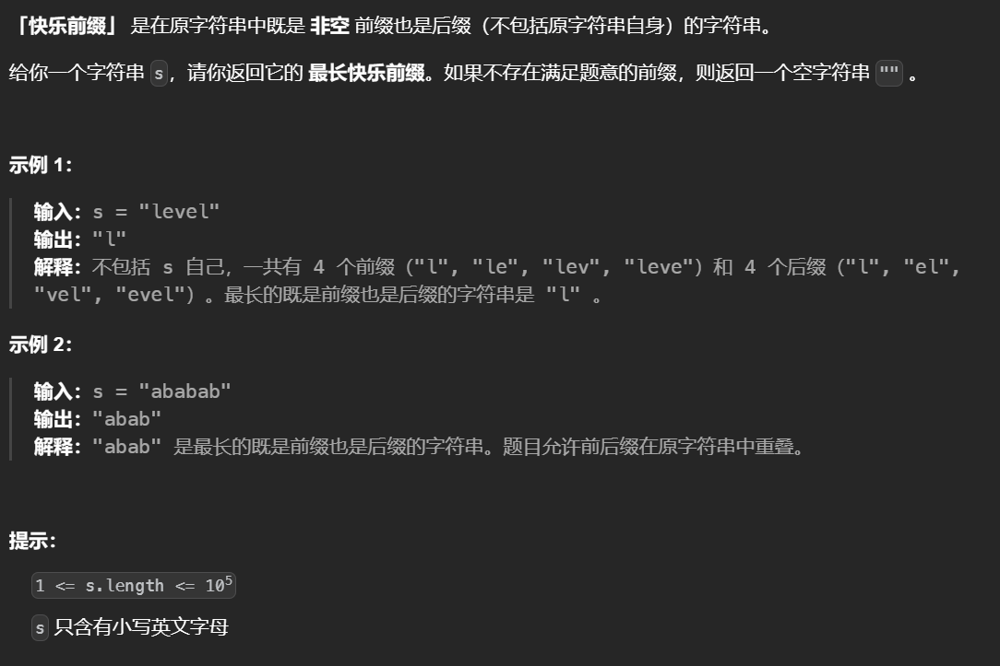


运用了kmp算法中的一部分

```python
class Solution:
    def longestPrefix(self, s: str) -> str:    
        arr=[0]
        x=1
        now=arr[x-1]
        while x<len(s):
            if s[x]==s[now]:
                x+=1
                now+=1
                arr.append(now)
            elif now:
                now=arr[now-1]
            else:
                arr.append(0)
                x+=1
        return s[:arr[-1]]
```


## Z函数

z[i]表示s[i:]与s的公共最长前缀是多少

初始时从1开始比较，找到最长前缀就是暴力匹配，匹配之后会有一段z-box:
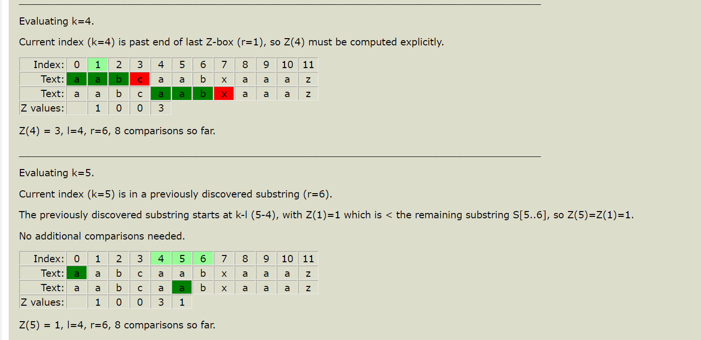

再找下一个s[i:]的过程中如果i落在了z-box中，首先判断z[i-l]是否小于z-box的边界到i的距离，如果小于就确定了z[i]=z[i-l]，反之说明在z-box中的这一段都是匹配的继续往后找，最后更新z-box

```python
def z(s):
    n=len(s)
    z=[0]*n
    l,r=0,0
    for i in range(1,n):
        # 在z-box中并且小于
        if i<=r and z[i-l]<r-i+1:
            z[i]=z[i-l]
        else:
            # 先初始化为到边界的距离
            z[i]=max(0,r-i+1)
            # 往后找
            while i+z[i]<n and s[z[i]]==s[i+z[i]]:      
                z[i]+=1
            # 更新区间
            if i+z[i]-1>r:
                l=i
                r=i+z[i]-1
    return z
```


### [将单词恢复初始状态所需的最短时间 II](https://leetcode.cn/problems/minimum-time-to-revert-word-to-initial-state-ii/)

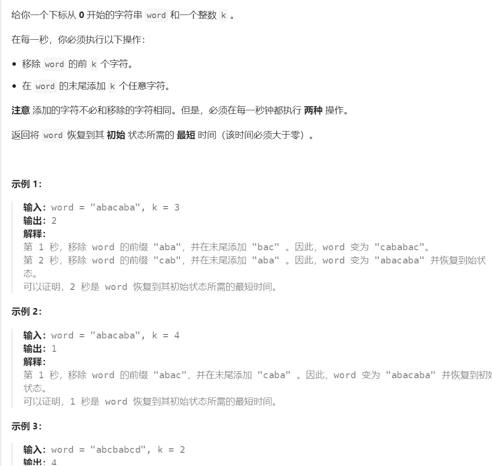


删除k个前面的子串后，如果剩余的子串能完美匹配前缀那么就可以提前结束，因为在后面添加的值是任意的。

使用z函数找出每个后缀与字符串的最长公共前缀，如果大于当前剩余子串的长度那么可以提前结束反之只能删除所有原来的字符。

```python
class Solution:
    def minimumTimeToInitialState(self, word: str, k: int) -> int:
        def z(s):
            n=len(s)
            z=[0]*n
            l=r=0
            for i in range(1,n):
                if i<=r and z[i-l]<r-i+1:
                    z[i]=z[i-l]
                else:
                    z[i]=max(0,r-i+1)
                    while i+z[i]<n and s[z[i]]==s[i+z[i]]:
                        z[i]+=1
                    if i+z[i]-1>r:
                        l=i
                        r=i+z[i]-1
            return z
        z=z(word)
        n=len(word)
        for i in range(1,ceil(n/k)):
            if z[k*i]>=n-k*i:
                return i
        return ceil(n/k)

```

### Tavas and Malekas

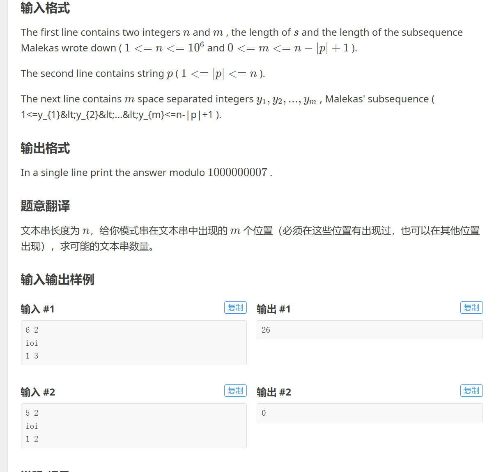


关键在于判断每个模式串的位置是否合法，对于两个位置l1和l2，如果前者的r1不与或者相交那么自然合法，否则要去判断上下两端是否相等。使用Z函数可以快速判断，因为Z函数的Z[i]表示S[i:]能匹配S的最长前缀。

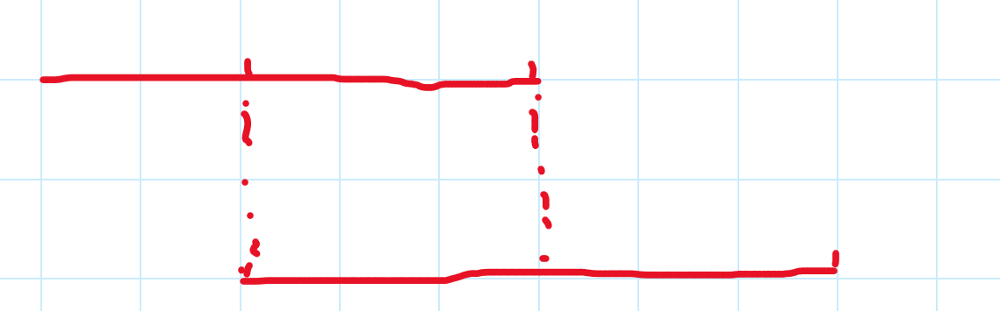


```python

def z(s):
    n=len(s)
    z=[0]*n
    l,r=0,0
    for i in range(1,n):
        # 在z-box中并且小于
        if i<=r and z[i-l]<r-i+1:
            z[i]=z[i-l]
        else:
            # 先初始化为到边界的距离
            z[i]=max(0,r-i+1)
            # 往后找
            while i+z[i]<n and s[z[i]]==s[i+z[i]]:
                z[i]+=1
            # 更新区间
            if i+z[i]-1>r:
                l=i
                r=i+z[i]-1
    return z
def slove():
    mod = 10 ** 9 + 7
    n, k = [int(x) for x in input().split()]
    s = input()
    if not k:
        print(pow(26,n,mod))
        return
    ll = len(s)
    nums = [int(x) for x in input().split()]
    nums.sort()
    tt = n


    arr=z(s)
    pre=nums[0]
    ans=ll

    for i in range(1,k):
        index=nums[i]
        r=pre+ll-1
        if r<index:
            ans+=ll
            pre=index
        else:
            l_=r-index+1
            x=arr[index-pre]
            if x<l_:
                print(0)
                return
            else:
                pre=index
                ans+=ll-l_
    print(pow(26, n - ans, mod))

slove()
```


## 字符串哈希

### 字符串哈希模板

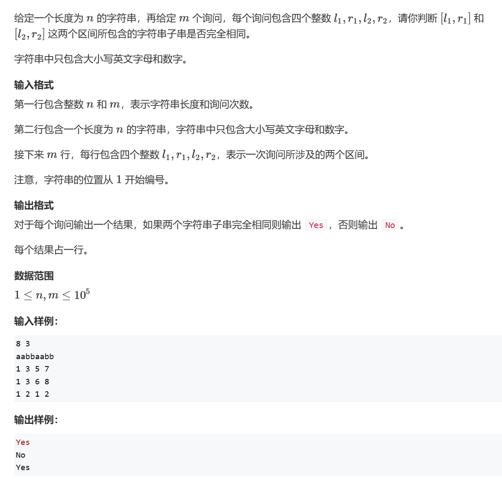


逐一比较字符串的每个值超时，对字符串构建前缀和。把字符串看作一个p进制的数，比如说aa代表一个$$a \times p^1+a\times p^0$$

就这样构造前缀字符串数组，查询一个区间的值的时候，可以通过相减得到字串的数值，但是注意不是直接相减，比如aabbc，为了得到bbc需要减去前面的aa但是aa是高进制的需要先左移三位才能减去。

```python
n,m =[int(x) for x in input().split()]
s=input()
pre=[0]*(n+1)
# 进制，p取131可以防止哈希冲突（技巧点）
p=131
# P[i]表示p^i
P=[1]
# 数值太大会导致计算非常慢，因此要取模
mod = 998244353
# 构造前缀和，注意取模
for i ,c in enumerate(s,1):
    pre[i]=(pre[i-1]*p+ord(c))%mod
    P.append((P[-1]*p)%mod)
while m:
    l1,r1,l2,r2=[int(x) for x in input().split()]
    # 比较的结果也要取模，防止太大，注意要把后面的数乘上P[字符串的长度]
    if (pre[r1]-pre[l1-1]*P[r1-l1+1])%mod==(pre[r2]-pre[l2-1]*P[r2-l2+1])%mod:
        print('Yes')
    else:
        print('No')
    m-=1
```


### [最长快乐前缀](https://leetcode.cn/problems/longest-happy-prefix/)

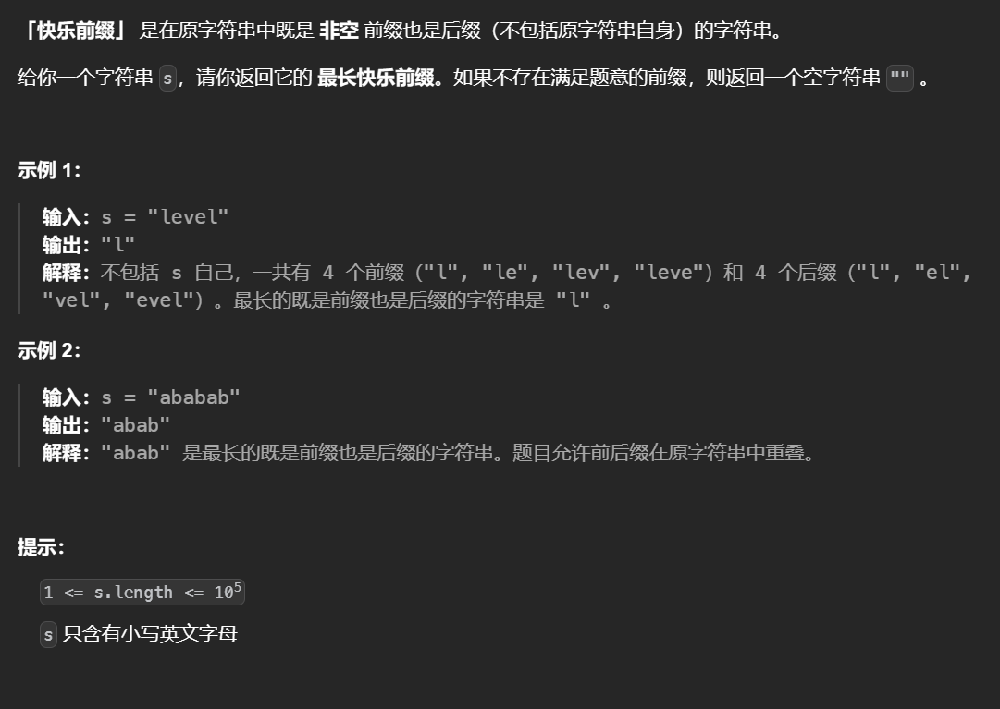

```python
class Solution:
    def longestPrefix(self, s: str) -> str:
        pre=[0]
        P=[1]
        p=131
        mod=10**9+7
        n=len(s)
        ans=0
        # 注意取模
        for i,c in enumerate(s):
            pre.append((pre[-1]*p+ord(c))%mod)
            P.append((P[-1]*p)%mod)
        # 这里枚举长度
        for i in range(1,n):
            l=(pre[i]-pre[0]*P[i])%mod
            r=(pre[n]-pre[n-i]*P[i])%mod
            if l==r:
                ans=max(ans,i)
        return s[:ans]
```


## 数位dp

用于解决在[l,r]区间内满足一定条件的数字的个数。

@cache表示记忆化搜索，对于重复的参数列表会跳过，但是参数中不能有个列表，只能是数字，没有记忆化搜索直接完蛋。

数位dp有一套板子，*index用于对每个位置进行操作，limit用于约束每个位置上的最大值，防止跳出n的范围，mask用于记录这个值是否出现过并方便调用记忆化搜索，is_num用于忽略前导0的影响，用来跳过一些前面的位置。*


### 数字1的个数

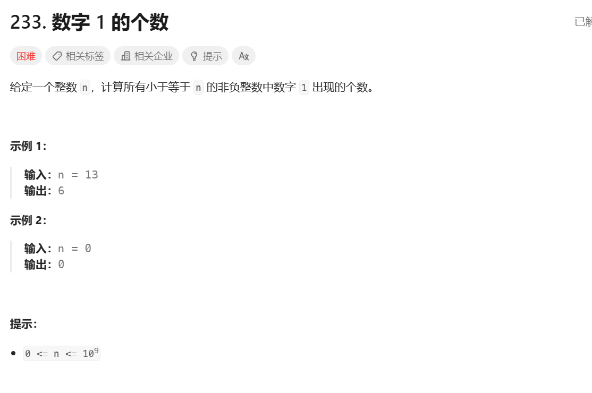

```python
from collections import Counter
class Solution(object):

    def countDigitOne(self, n):
        # 把最大的数转换为字符串，从头开始遍历
        n=str(n)
        @cache
        # i表示索引,cnt表示满足的个数，limit表示前面的数字是否到上限，比如说123，第一个数只能是0，1（也就是up=int(s[i])），如果第一个数字达到了上限，第二个数字up=int(s[i])，否则是9，
        def dp(i , cnt,limit):
            if i==len(n):
                return cnt
            res=0
            up=9 if not limit else int(n[i])
            for index in range(up+1):
                # 递归操作
                res+=dp(i+1,cnt+(index==1),limit and index==up)   
                return res
            #开始的Limit必须是true否则会取到9
            return dp(0,0,True)
```

### 2出现的次数

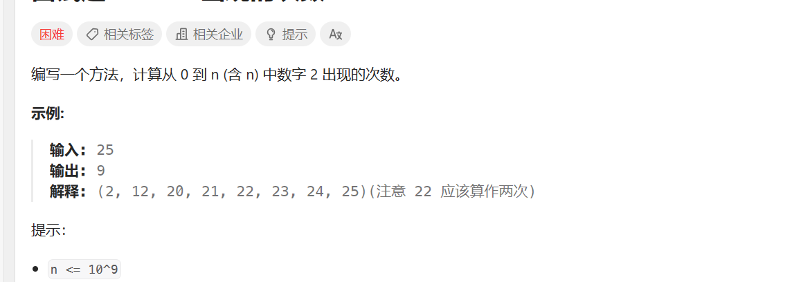

```python
class Solution(object):
    def numberOf2sInRange(self, n):
        s=str(n)
        @cache
        def dp(i ,cnt,limit):
            if i ==len(s):
                return cnt
            res=0
            up=9 if not limit else int(s[i])
            for d in range(up+1):
                res+=dp(i+1,cnt+(d==2),limit and d ==up)
            return res
        return dp(0,0,True)
```

### 不含连续1的非负整数

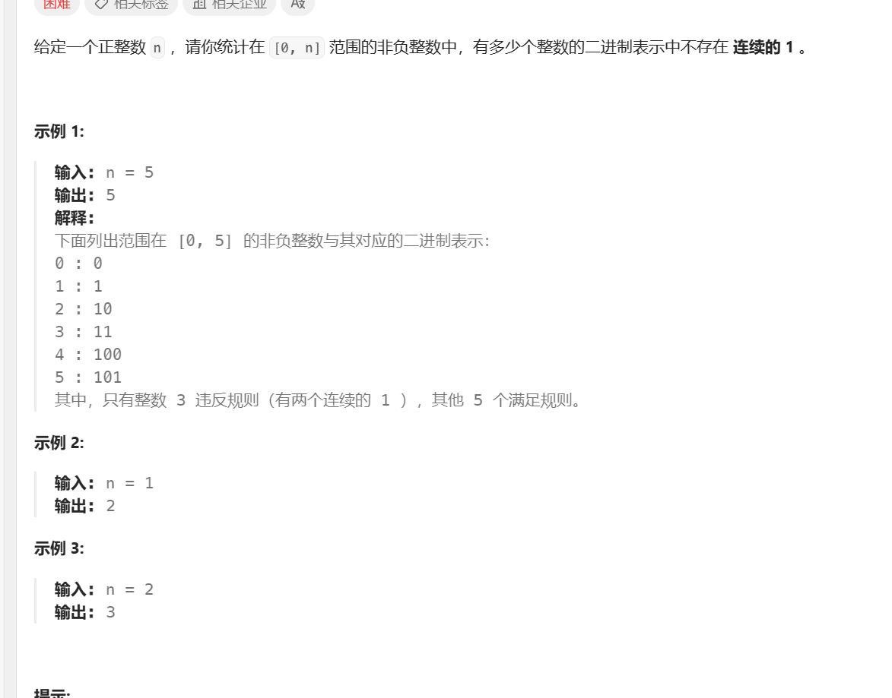

```python
from functools import cache
class Solution:
    def findIntegers(self, n: int) -> int:
        # 直接转化为二进制求解
        s=bin(n)[2:]
        @cache
        def dp(i,pre,limit):# pre表示前一位是否为1
            # 能走到最后一步的都是可行的
            if i==len(s):
                return 1
            # 先加入0
            up=int(s[i]) if  limit else 1
            res=dp(i+1 ,False,limit and up==0)
            # 再判断是否可以加入1
            if not pre and up==1:
                res+=dp(i+1,True,limit)
            return res
        return dp(0,False,True)
```

### 旋转数字

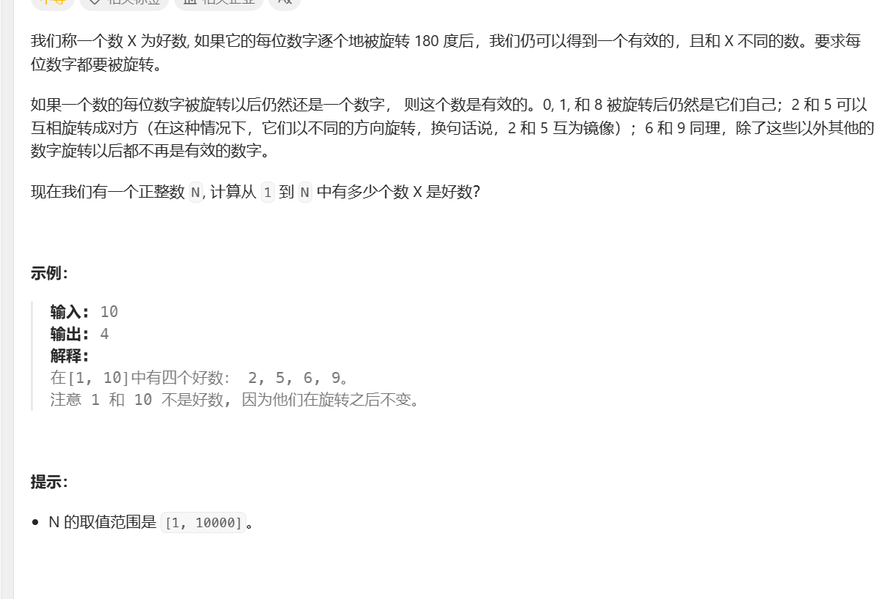


```python
from functools import cache
class Solution(object):
    def rotatedDigits(self, n):
        dict={0:'0',1:'1',8:'8',2:'5',5:'2',6:'9',9:'6'}
        s=str(n)
        @cache
        def dp(i,limit,origin,reverse):# 使用两个变量记录反转后的字符串和反转前的字符串
            if i==len(s):
                # 如果两个字符串不相等，则是一个有效数字
                return 1 if origin!=reverse else 0
            res=0
            up=int(s[i]) if limit else 9
            
            for d in range(up+1):
                # 只有在字典中的才是可以反转的数字，不在字典中的数字没必要测试，不会是有效的
                if d not in dict.keys():
                    continue
                res+=dp(i+1,limit and d==up,origin+str(d) ,reverse+dict[d])
            return res
        return dp(0,True,"","")
```

### 至少有一位重复的数字

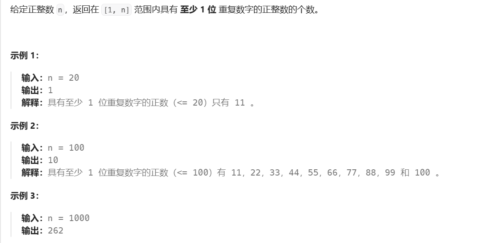


至少有一位那就是n减去一位都没有

这道题中需要考虑前导0，比如010就不是一个合法的数，因此使用一个外部变量记录是否跳过。

```python
from functools import cache
class Solution(object):
    def numDupDigitsAtMostN(self, n):
        s=str(n)
        @cache
        def dp(i,mask,limit,is_num):# is_num记录是否有插入值
            if i==len(s):
                # 只有插入值了才是一个有效的数
                return int(is_num)
            res=0
            # 如果前面没有插入值可以继续跳过
            if not is_num:
                res+=dp(i+1,mask,False,is_num)
            up=int(s[i]) if limit else 9
            # 如果前面没有填数字，必须从 1 开始（因为不能有前导零）
            low=0 if is_num else 1
            for d in range(low,up+1):
                if mask>>d&1==0: # d 不在 mask 中
                    res+=dp(i+1,mask|(1<<d),limit and d==up,True)
            return res
        return n-dp(0,0,True,False)
```

### 最大和为N的数字组合

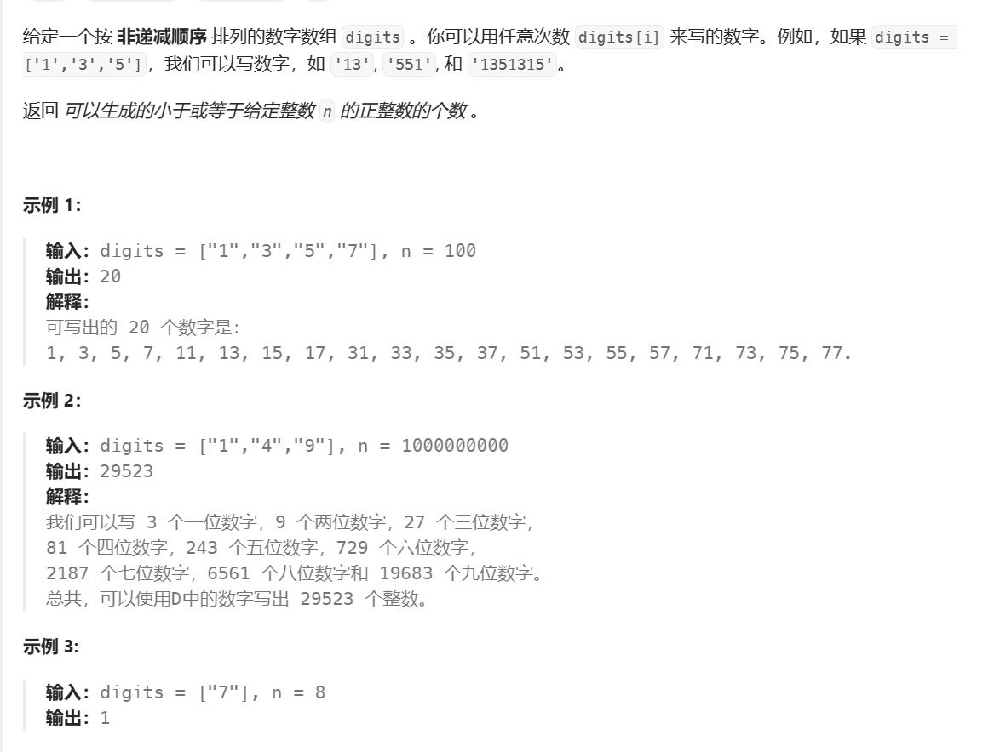

根据数位dp，每次找的值都是小于等于n的，不需要在函数中判断是否是小于等于n，注意这里的1实际上是001，为了实现跳过某个位数，一个实现一个is_num的变量来进行数位的跳过

```python
class Solution(object):
    def atMostNGivenDigitSet(self, digits, n):
        s=str(n)
        @cache
        def dp(i,limit ,is_num):
            if i==len(s):
                return int(is_num)
            res=0
            if not is_num:# 如果前面没有填入值，可以继续跳过，这个操作会处理类似于01，02，03之类的数
                res+=dp(i+1,False,False)
            up=s[i] if limit else '9'
            # 从给定的列中中选择值
            for digit in digits:
                if digit >up:
                    break
                res+=dp(i+1,limit and up==digit,True)
            return res
        return dp(0,True,False)
```

### 范围内的数字计数

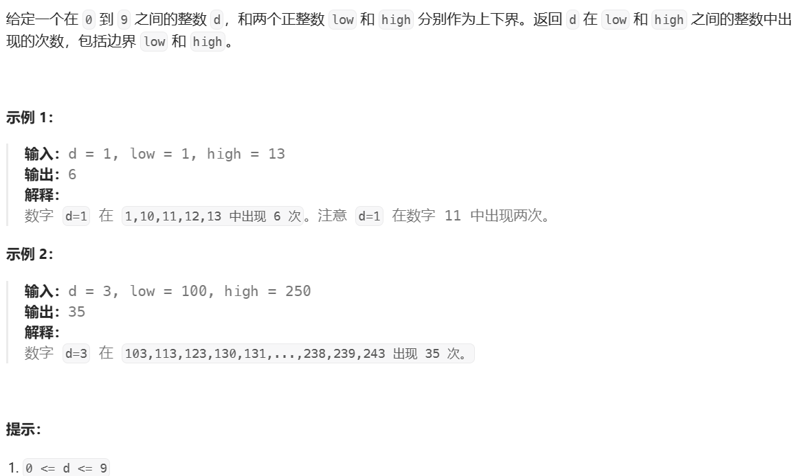

对于不是从1开始的区间，`比如[l,r]，返回dp(r)-dp(l-1)即可`

由于数字可能为0，所以考虑前导0.

```python
from functools import cache


class Solution(object):
    def digitsCount(self, d, low, high):
        k=d
        @cache
        def dp(s,i,cnt,limit,is_num):
            if i==len(s):
                return cnt if is_num else 0
            res=0
			# 考虑前导0
            if not is_num:
                res+=dp(s,i+1,cnt,False,False)
            up=int(s[i]) if limit else 9
            # 控制最低从哪里开始
            low=0 if is_num else 1
            for d in range(low,up+1):
                res+=dp(s,i+1,cnt+int(d==k),limit and d==up,True)
            return res
        return dp(str(high),0,0,True,False)-dp(str(low-1),0,0,True,False)
    
    
    
    
# 数位dp2.0
class Solution(object):
    def digitsCount(self, d, down, high):
        k=d
        high=str(high)
        down=str(down)
        # 补全下界
        down='0'*(len(high)-len(down))+down
        @cache
        def dp(i,is_up,is_down,cnt,is_num):
            if i==len(high):
                return cnt if is_num else 0
            
            up=int(high[i]) if is_up else 9
            low=int(down[i]) if is_down else 0
            res=0
            for j in range(low,up+1):
            # 这里比较重要，是否插入值：如果前面插入了这里也插入了，反之前面没插入并且当前位选了0自然就不算插入了值
                is_num=is_num or j>0
                res+=dp(i+1,is_up and j==up, is_down and j==low,cnt+int(j==k and is_num),is_num)
            return res
        return dp(0,True,True,0,False)
```

### [价值和小于等于 K 的最大数字](https://leetcode.cn/problems/maximum-number-that-sum-of-the-prices-is-less-than-or-equal-to-k/) 

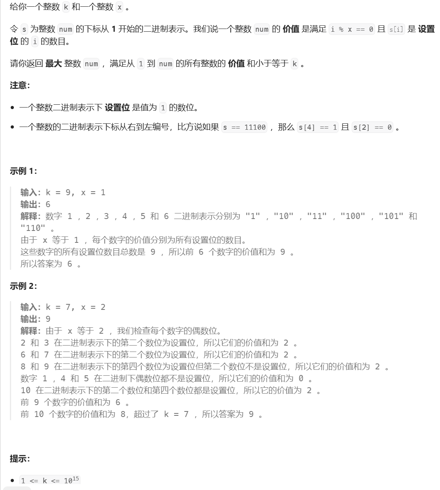

题目有二分的性质，但关键在于`如何求出1~nums二进制中所有1的个数`，可以使用数位dp求解。

```python
class Solution:
    def findMaximumNumber(self, k: int, x: int) -> int:
        def count(num,x):
            n=num.bit_length()
            @cache
            def dp(i, cnt, is_limit):
                if i == n:
                    return cnt
                # 判断上界，查找这个数二进制中这个位置最大值
                up = num >>(n-i-1) & 1 if is_limit else 1
                res=0
                for j in range(up + 1):
                    # 这里需要注意，只有位置是x的倍数才能贡献答案，而题目中要求是从右往左数，并且最右边为1，可以发现i和实际索引之和相加等于总长度，做一步转换。
                    res += dp(i+1, cnt + int(j == 1 and (n-i)%x==0), is_limit and j == up)
                return res
            
            return dp(0, 0, True)
	# 二分搜索的上界设置为
        l,r=0,(k+1)*(2**(x-1))
        while l<=r:
            mid=(l+r)//2
            val=count(mid,x)
            if val<k:
                l=mid+1
            elif val>k:
                r=mid-1
            else:
                l=mid+1
        return r
```

### [统计强大整数的数目](https://leetcode.cn/problems/count-the-number-of-powerful-integers/)

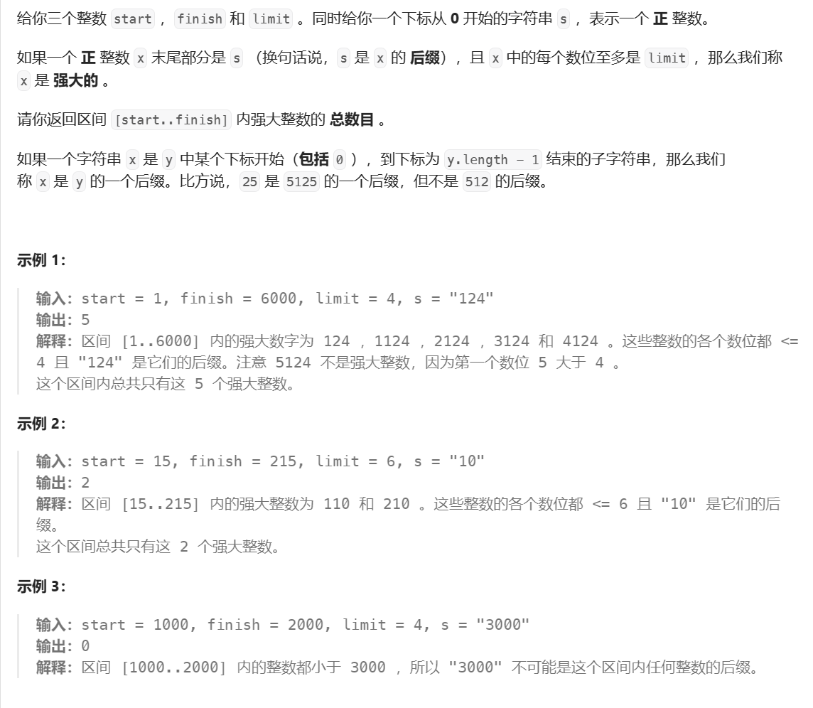


数位dp第二版，不需要写两个范围的dp然后相减，可以在dp中直接规划上下界


```python
class Solution:
    def numberOfPowerfulInt(self, start: int, finish: int, limit: int, s: str) -> int:
        high=str(finish)
        low=str(start)
        n=len(high)
        # 下界，需要补上前导0
        low='0'*(n-len(low))+low
	# 只能操作前diff位，后面的都是固定的后缀
        diff=n-len(s)        
        @cache
        def dp(i,is_up,is_down):
            # 能走到这一步表示是一个合法的值
            if i==n:
                return 1
            # 找出上下界，注意这里不能把上界的范围规定为min(hi,limit)，如果上一位数的最大值是6，但因为limit选了5，在进入下一轮时会因为取到了5而认为是到达上界，从而在下一轮中最大只能取到当前数位上的值，从而错过limit或者可取的值
            hi=int(high[i]) if is_up else 9
            lo=int(low[i]) if is_down else 0
            res=0
            if i<diff:
                # 取limit的限制应该在这里判断，数位dp中其他对数位的限制也应该在这里判断
                for j in range(lo,min(hi,limit)+1):
                    res+=dp(i+1,is_up and j==hi,is_down and j==lo)
            else:
                # 对于不能改变的后缀只能取对应的值
                x=int(s[i-diff])
                # 如果超出限制不能考虑
                if lo<=x<=hi:
                    res=dp(i+1,is_up and x==hi ,is_down and x==lo)
            return res
        return dp(0,True,True)
```

### 计数问题

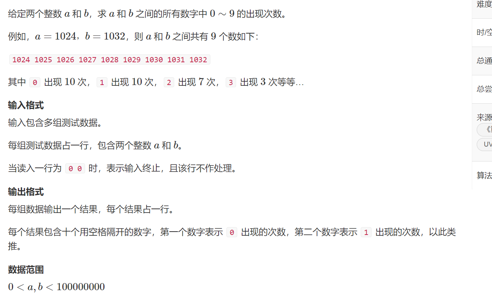

使用2.0版本的数位dp，注意这里为了使用记忆化搜索，在一次操作中求出0~9中某一个数字出现的次数，而不是枚举a ~b找所有个数字出现的次数这样。

```python
from collections import Counter
from functools import lru_cache

# 处理输入
q = []
while 1:
    res = [int(x) for x in input().split()]
    if res == [0, 0]:
        break
    q.append(res)

for a, b in q:
    memo = Counter()
    temp = []
    # 方便操作，让b是最大的
    if a > b:
        b, a = a, b
    a = str(a)
    b = str(b)
    n = len(b)
    a = '0' * (n - len(a)) + a

    # 类似于数字1的个数，不过是2.0版本的
    @lru_cache(maxsize=None)
    def dp(i, is_up, is_down, is_num, cnt, target):
        if i == n:
            if is_num:
                return cnt
            return 0
        # 规定上下界
        up = int(b[i]) if is_up else 9
        down =low= int(a[i]) if is_down else 0
        res = 0
        # 跳过，注意这里为了不小于下界一定要满足下界这个位置的元素是0
        if not is_num and not int(a[i]):
            # 上界的极限一定不满足，但下界的极限一定满足
            res += dp(i + 1, False, True, is_num, cnt, target)
        # 重要的一步，如果前面跳过了，这里一定是从1开始，但是注意不能更改下界范围
        if not is_num:
            low=max(1,low)

        for j in range(low, up + 1):
            res += dp(i + 1, is_up and j == up, is_down and j == down, True, cnt + int(j == target), target)
        return res

    # 分别找每一个的
    for i in range(10):
        memo[i] += dp(0, True, True, False, 0, i)
    ans = []
    k = sorted(memo)
    for i in k:
        ans.append(memo[i])
    print(*ans)
    # print(temp)
```

### **Masked Popcount**

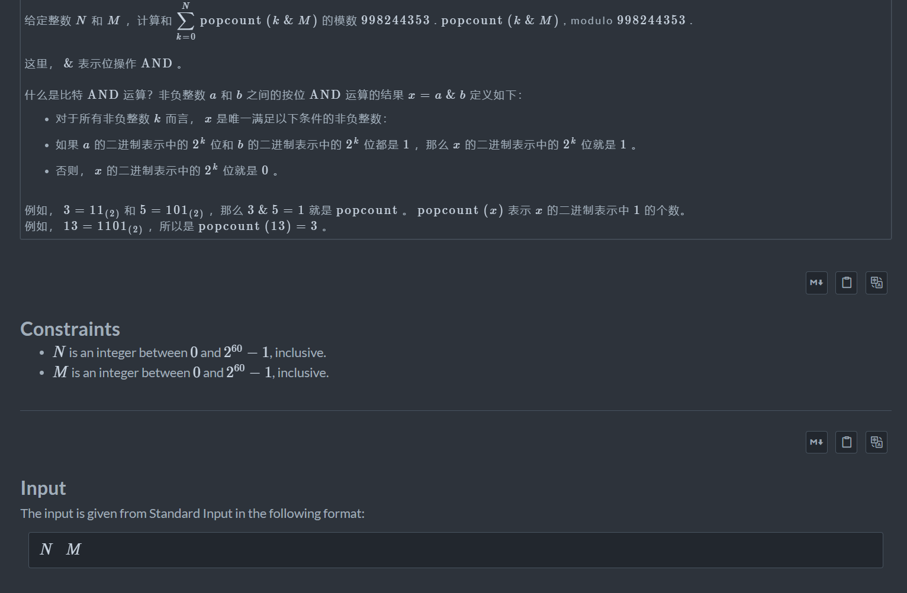


统计0到N的所有Popcount，根据描述使用数位dp。

只有m二进制中为1的位才能贡献到最后的答案，对于n的二进制进行数位dp，如果当前位选了1并且对应到m中也是1那么会给答案贡献。

```python
from functools import cache

n,m=[int(x) for x in input().split()]
s=bin(n)[2:]
l=len(s)
memo=set()
m=bin(m)[2:]
mod=998244353

# 统计m中1的位置，因为对n统计数位要从高位到低位，如果m小的话要左边补0否则截断（因为高位一定为0）
if len(s)>=len(m):m='0'*(len(s)-len(m)) +m
else:m=m[len(m)-len(s):]

for i,c in enumerate(m):
    if c=='1':memo.add(i)

@cache
def dp(i,is_limit,is_num,cnt):
    if i==l:
        if is_num:return cnt
        return 0
    res=0
    # 先找到上限
    up = int(s[i]) if is_limit else 1
    # 如果前面跳过了则当前为也可以跳过
    if not is_num:res+=dp(i+1,False,False,cnt)
    # 如果不跳过（也就是前面选了数）可以选0，否则选0是不合理的（等同于跳过）
	else:res+=dp(i+1,is_limit and 0==up,True,cnt)
    if up==1:
        res+=dp(i+1,is_limit ,True ,cnt+int(i in memo))
    return res%mod
r=dp(0,True,False,0)
print(r%mod)
```


### [ 易混淆数 II](https://leetcode.cn/problems/confusing-number-ii/)[ 易混淆数 II](https://leetcode.cn/problems/confusing-number-ii/)

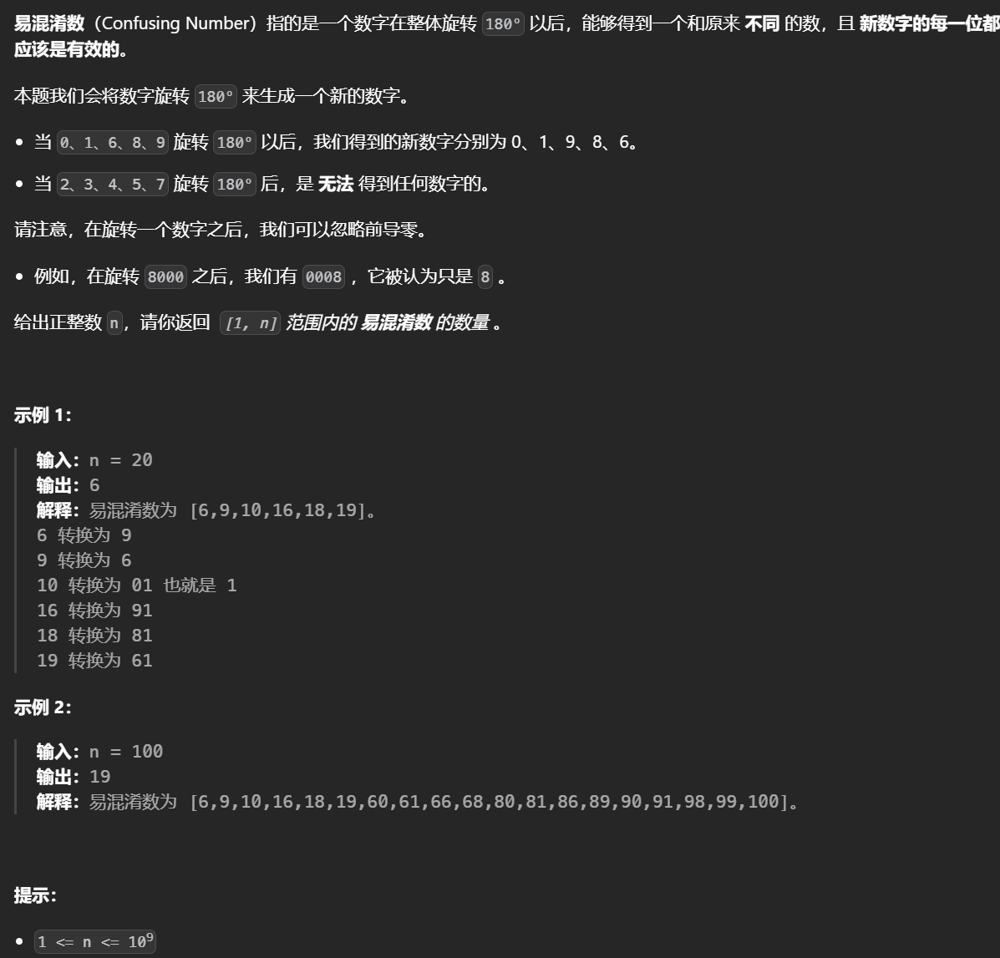

对于给定的数据范围可以直接记录表示当前数的字符串

```python
class Solution:
    def confusingNumberII(self, n: int) -> int:
        n=str(n)
        memo={'0':'0','1':'1','6':'9','8':'8','9':'6'}
        @cache
        def dp(i,curr,is_num,is_limit):
            if i==len(n):
                if not is_num:return 0
                temp=''
                for c in curr[::-1]:
                    temp+=memo[c]
                return int(temp!=curr)
            res=0
            if not is_num:res+=dp(i+1,curr,is_num,False)
            up=int(n[i]) if is_limit else 9
            low=0 if is_num else 1
            for c in memo.keys():
                c=int(c)
                if c<low:continue
                if c>up:break
                res+=dp(i+1,curr+str(c),True,is_limit and c==up)
            return res 
            
        return dp(0,'',False ,True)
```


## 树状dp

### [相邻字符不同的最长路径](https://leetcode.cn/problems/longest-path-with-different-adjacent-characters/)


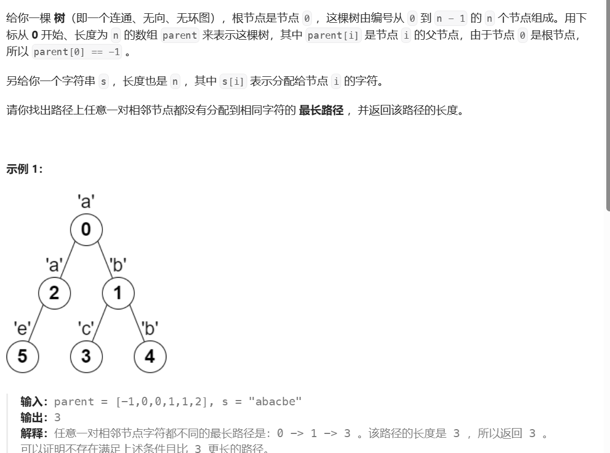

即找到一条最长的路径，其中路径上不存在连续的字符。

对于多叉树，`由于一个节点会有多个子树，想要找到最长的链需要遍历每一个子树，同时为了找到最大的路径和需要找到前两个最长的链相加他们`。

```python
class Solution:
    def longestPath(self, parent: List[int], s: str) -> int:
        ans=0
        n=len(parent)
        # 建立图，由于根节点是-1，因此跳过
        g=[[] for _ in range(n)]
        for i in range(1,n):
            g[parent[i]]=i
	
        # 返回以当前节点为根的最大的边数
        def dfs(x):
            nonlocal ans
            # 记录最大的链数
            x_len=0
            # 找子树，对于叶子节点会直接返回边数0
            for y in g[x]:                
                y_len=dfs(y)+1
                
                # 如果是合法的才能进行操作，即不存在连续的
                if s[x]!=s[y]:
                    # 用最大的边数和当前的边数相加
                    ans=max(ans,x_len+y_len)
                    # 更新
                    x_len=max(y_len,x_len)
            return x_len
        dfs(0)
        # 由于找的是节点个数，因此在最长路径上加1
        return ans+1

```

### [N 叉树的直径](https://leetcode.cn/problems/diameter-of-n-ary-tree/)

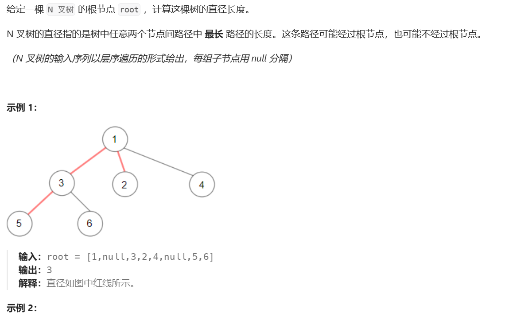

和上一题一样的思路，对每个节点找出它子树中边数最大的两个再相加，这个值就是经过这个节点的最大路径长度

```python
class Solution:
    def diameter(self, root: 'Node') -> int:
        ans=0
        def dfs(root):
            x_len=0
            nonlocal ans
            for r in root.children:
                y_len=dfs(r)+1
                ans=max(ans,x_len+y_len)
                x_len=max(x_len,y_len)
            return x_len
        dfs(root)
        return ans
```


### [最长同值路径](https://leetcode.cn/problems/longest-univalue-path/)

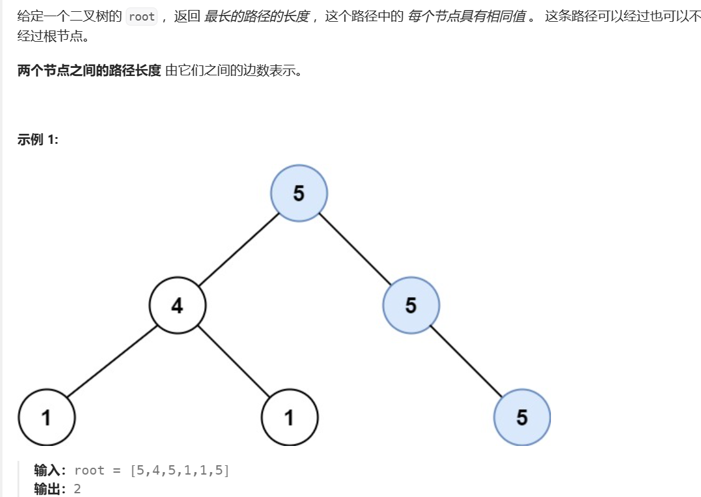

找最长的路径，要求路径上的节点的值都是相同的，使用树状dp求出每个节点左右满足条件的最大边数，即是当前节点的满足条件的最大边数

```python
class Solution:
    def longestUnivaluePath(self, root: Optional[TreeNode]) -> int:
        ans=0
        # 返回以root为根的满足条件的最长路径上的边数
        def dfs(root):
            # 以叶子节点为根最大边数是0
            if not root:
                return 0
            # 找到左边满足的最大边数
            left =dfs(root.left)
            # 如果值不同则为0
            if root.left and root.left.val!=root.val:
                left=0
            right=dfs(root.right) 
            if root.right and root.right.val!=root.val:
                right=0
            nonlocal ans
            ans=max(ans,left+right)
            return max(left,right)+1
        dfs(root)
        return ans
```


### 打家劫舍 III

树上的最大独立集，从图中选取尽可能多的节点，使这些节点互不相邻。

对于每个节点都有选择和不选两种状态，如果选择了那些以这个节点为根节点的子树的最大值为：当前节点的值加上左右子树不包含的最大值，如果不加上，那么对于子树也有可选可不选的两种状态，以这个节点为根节点的子树的最大值为：左右子树的两种状态最大的那个相加。

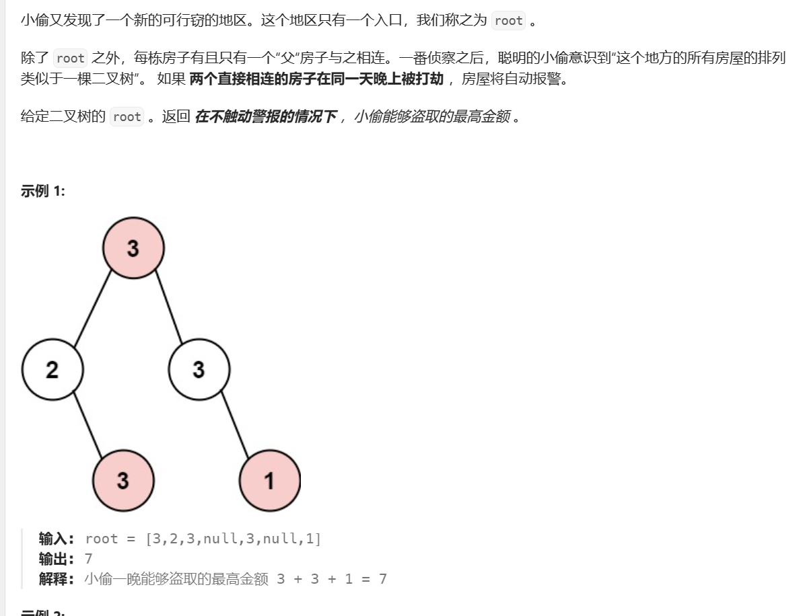

```python
class Solution(object):
    def rob(self, root):


        def dp(root):
            # 如果节点不存在，那么包不包含的结果都是0
            if not root:
                return 0,0
            # 找出左右子树包含和不包含的结果
            l_rob,l_not_rob=dp(root.left)
            r_rob,r_not_rob=dp(root.right)
            
            # 选择当前节点
            rob_=r_not_rob+l_not_rob+root.val
            # 不选择当前节点
            not_rob=max(l_rob,l_not_rob)+max(r_rob,r_not_rob)
            return rob_,not_rob
        # 最后的结果是选择和不选择中最大的
        return max(dp(root))
```


### 在树上执行操作以后得到的最大分数

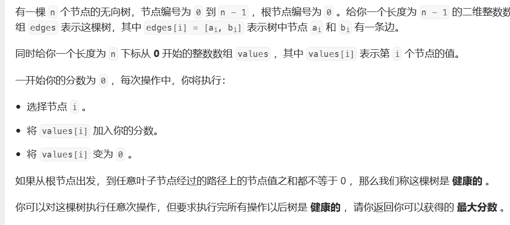

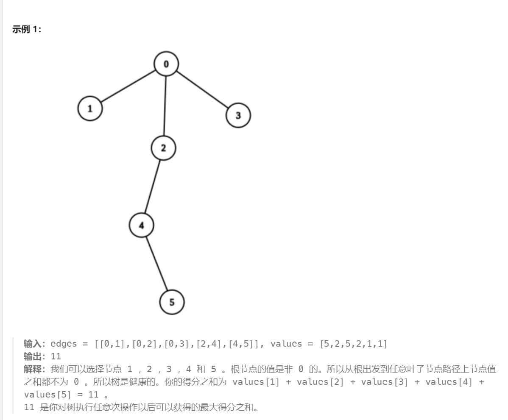


要求使得树仍是健康的情况下，抽取的数字的和最大，反向思考，假设抽取出所有的数组成一个结果，而这些数中有一些要留在树中为保证其是健康的。令dp函数为保证以x为节点的树是健康的结果中失去的最小分数。

```python
class Solution(object):
    def maximumScoreAfterOperations(self, edges, values):
        paths = [set() for _ in range(len(edges) + 1)]
        # 无向图
        for i in range(len(edges)):
            u, v = edges[i]
            paths[u].add(v)
            paths[v].add(u)
        # 防止根节点被当成叶子
        paths[0].add(-1)
		
        # 保证x为根节点的树是健康的所需损失的最小的数，这些最小的数用于构造健康的树，dp(0)也就是抽取完之后，树中剩下的节点的总和
        def dp(x,fa):
            # 如果已经到了叶子，为保证健康只能损失总和中该叶节点对应的值（即选择根节点）
            if len(paths[x])==1:
                return values[x]
            # 对于以x为根的树，可以选择根节点或是不选，如果说选择了根节点的话，那么对应的树就已经是健康的了，只需损失根节点对应的值，反之考虑对根节点的叶节点做同样的操作
            loss=0
            for path in paths[x]:
                # 向下递归防止找到本身的父节点
                if path!=fa:
                    # 累加
                    loss+=dp(path,x)
            return min(loss,values[x])
        # 用总和减去树中剩下的数的总和就是抽取出能保证树仍是健康的最大的总和
        return sum(values)-dp(0,-1)
```


### [统计子树中城市之间最大距离](https://leetcode.cn/problems/count-subtrees-with-max-distance-between-cities/)


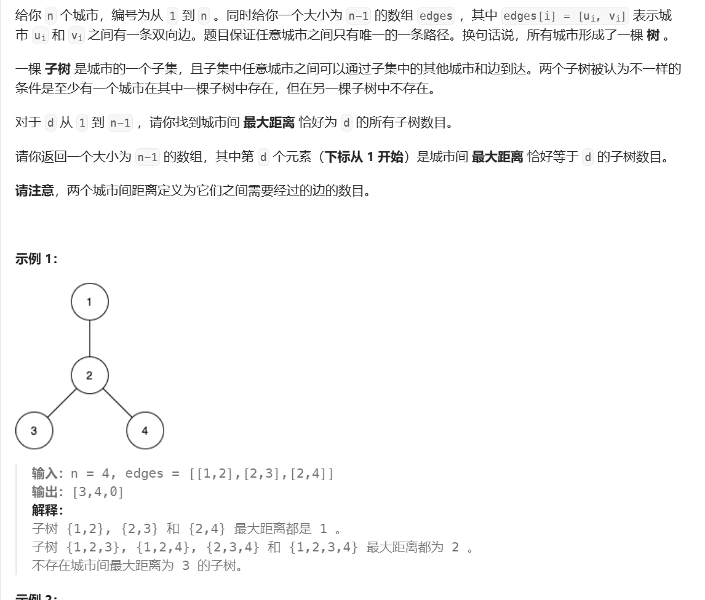


对每个子树的直径计数，在图中找子图可以通过枚举每个节点选或者不选一共有2^15个子集

（`最大距离就是树的直径`）`对每一个集合找它的最大直径`，对这个直径做一次记录，注意这里的集合由于是找出所有的可能，`因此可能不是子树`，可能是多个连通块之类的，因此在找出直径后，`判断是否有访问到所有的节点`如果是一颗合法的树，那么必然可以访问到所有的节点，反之，不是一颗合法的树。

```python
class Solution:
    def countSubgraphsForEachDiameter(self, n: int, edges: List[List[int]]) -> List[int]:
        g=[[]for _ in range(n) ]
        # 建立图，由于是从1开始的，做一位偏移
        for u,v in edges:
            g[u-1].append(v-1)
            g[v-1].append(u-1)
        # 答案数组，ans[i]表示直径为i的子树有多少个
        ans=[0]*n
        # 用于记录选了那些节点
        in_set=[False]*n
        # 对每个集合选或者不选
        def f(x):
            # 到头了，找直径
            if x==n:
                diameter=0
                # 记录是否访问过，防止重复访问以及用来判断是不是一棵树
                vis=[False]*n
                # 找一个集合中的点求直径，由于是无向图从哪个节点开始都行，且只用找一次
                for i,v in enumerate(in_set):
                    # 如果没有选这个值，跳过
                    if not v:
                        continue
                    # 找直径
                    def dfs(x):
                        # 由于一个节点可能连多个子树，因此要找出最长的两个
                        x_len=0
                        # 记录访问过
                        vis[x]=True
                        # 找子树
                        for y in g[x]:
                            # 如果没有选这个元素，或者访问过
                            if not in_set[y] or vis[y]:continue
                            y_len=dfs(y)+1
                            nonlocal diameter
                            # 更新
                            diameter=max(diameter,y_len+x_len)
                            x_len=max(x_len,y_len)
                        return x_len
                    
                    dfs(i)
                    # 判断所选的值是否都访问过，一次判断是否是合法的子图
                    if vis==in_set:
                            ans[diameter]+=1
                    break
                return 

            # 选或不选
            f(x+1)
            
            in_set[x]=True
            f(x+1)
            in_set[x]=False
            
        f(0)
        # 题目没有要求间距为0的，跳过
        return ans[1:] 

```


### Vlad and Trouble at MIT

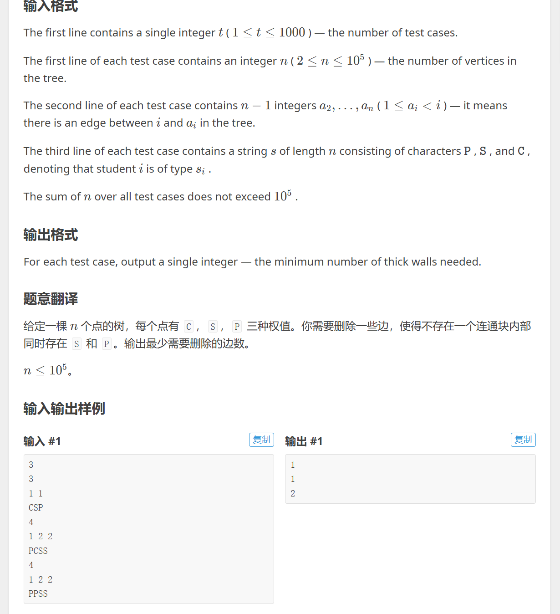

s和p不能相连，那么对于每一个节点要么与s相连要么与p相连，而这个节点与s或p相连所需删除边得最少数目可以通过它的子节点求出。

对于本题不用建树，先求解出叶子节点然后去更新它的父节点。

```python
from collections import defaultdict
from functools import lru_cache
from math import inf

for _ in range(int(input())):
    n=int(input())
    # 记录每个节点的父节点，用于向上递归
    parent =[0]*(n+10)
    a = [int(x) for x in input().split()]
    # 统计那些是叶子节点
    vis=set()
    for i,x in enumerate(a,2):
        parent[i]=x
        vis.add(x)
    s = input()
    ss=[]
    # 把CSP变换为012
    for v in s:
        if v=='C':ss.append(2)
        elif v=='S':ss.append(0)
        else:ss.append(1)
    # 递推得写法
    f = [[0] * 2 for _ in range(n + 1)]
    for i in range(n,0,-1):
        p=parent[i]
        # 如果该节点是子节点，那么要做base case,如果这个节点对应得是S或P那么把它变为P或S是不可能的
        if i not in vis and ss[i-1]!=2:
            f[i][ss[i-1]]=0
            f[i][ss[i-1]^1]=inf
        # 处理完子节点后往上更新父节点
        # 把当前节点和S连通，等于max(子节点和S连通所需的次数，子节点和P连通得次数加一)
        f[p][0]+=min(f[i][0],f[i][1]+1)
        f[p][1]+=min(f[i][1],f[i][0]+1)
        # 父节点是S不能和P相连
        if ss[p-1]!=2:
            f[p][ss[p-1]^1]=inf
    print(min(f[1][0],f[1][1]))
```


## 博弈论

### Turtle and Piggy Are Playing a Game 2

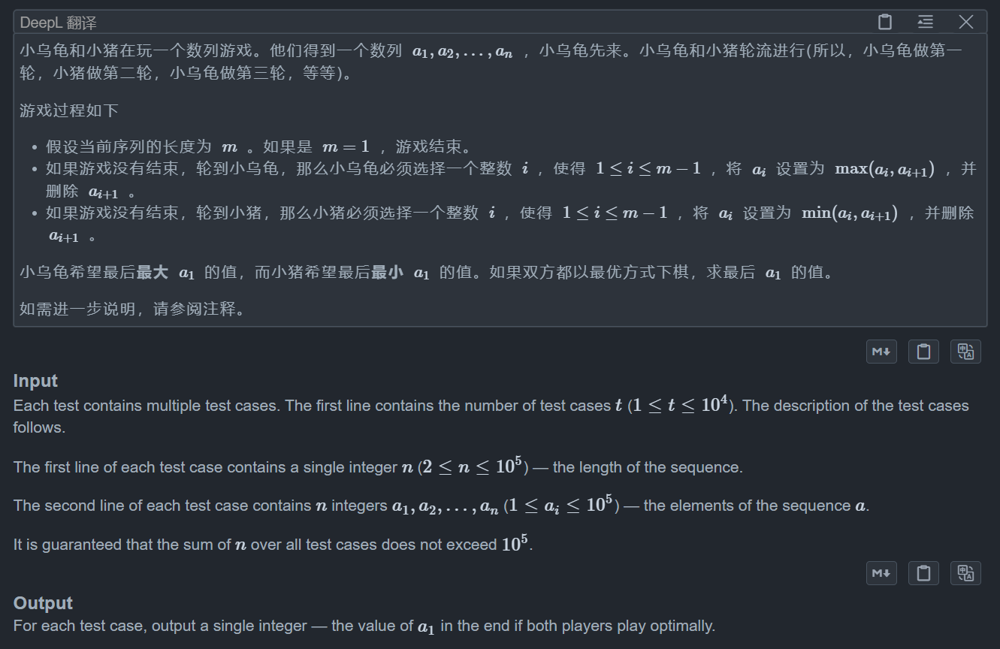

先手选两个值删除最小的，后手选两个值删除最大的，最直接的想为了达到自己的目的先手一定是删除序列中最小的值而后手一定是删除序列中最大的值，最后留下的就是中间的值。

```python
for _ in range(R()):
    n=R()
    nums=RR()
    nums.sort()
    print(nums[n>>1])
```


### Dividing Game

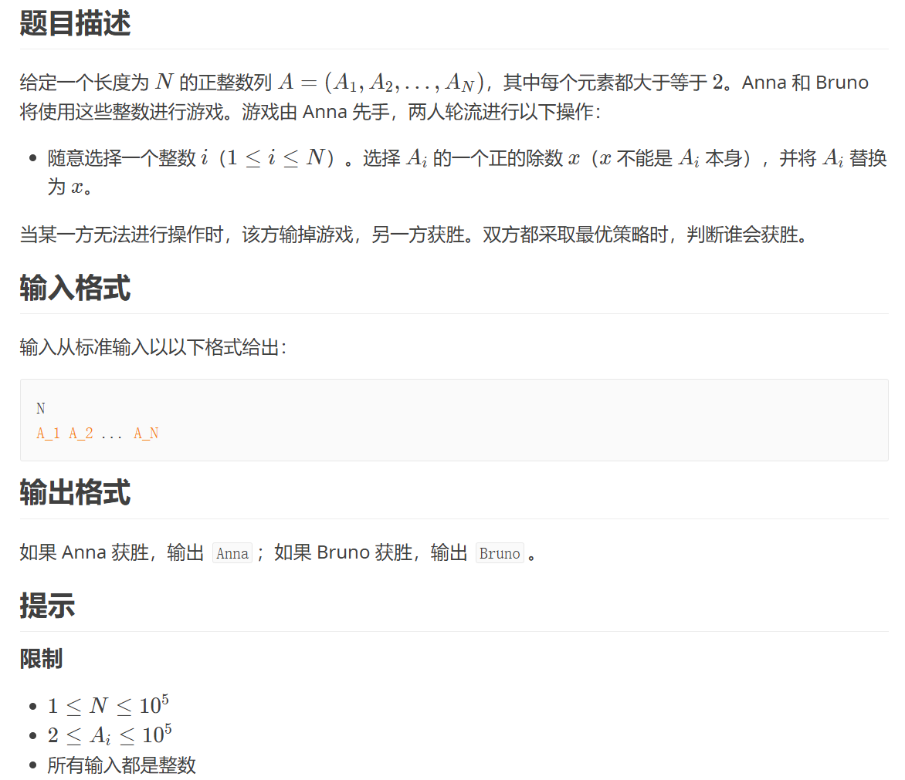

把一个数替换为它的因数相当于拿走了这个数的部分质因数，如果处理出每个数的质因数个数那么这个问题就变为了Nim问题

最后只要看异或和即可

```python
n=R()
nums=RR()
arr=[]
# 处理质因数
for v in nums:
    s=0
    for i in range(2,isqrt(v)+1):
        if v%i==0:
            while v%i==0:
                v//=i
                s+=1
    if v>1:s+=1
    arr.append(s)

res=reduce(xor,arr)
if not res:print('Bruno')
else:print('Anna')
```


## 背包问题

背包问题是经典的动态规划问题，一般的问题描述是：给你一个可装载重量为w的背包和N个物品，每个物品有重量和价值两个属性。其中第i个物品的重量为 wt[i]，价值为 val[i]，现在让你用这个背包装物品，最多能装中的价值是多少?

首先明白状态：状态就是当前的容量以及可选择的物品

dp数字定义为dp[i] [w]意为在前i个物品中，当背包容量为w的时候最多可以装下价值为多少的物品。

最后定义状态转移方程：对于每个物品有可选和不可选两种选择，如果不选则当前的dp数组的值等于它的上一个状态，反之等于上一个状态加上当前物品的值。

### 分割等和子集


转换为0-1背包问题，两个等和子集就是找是否存在一个子集的总和等于总和的一半。

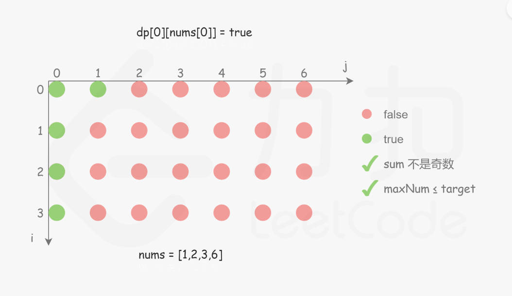

```python
class Solution(object):
    def canPartition(self, nums):
        # 不够划分子集
        if len(nums) < 2:
            return False
        total= sum(nums)
        # 无法分为两个值
        if total % 2!=0:
            return False
        target=total//2
        # 存在一个值大于总和的一半，没法构建两个等和的子集
        if max(nums)>target:
            return False
        
		# dp数组表示在0-i的范围内，是否存在子集等于j
        def backpack(nums):
            dp = [[0 for _ in range(target+1)] for _ in range(len(nums))]
            # 当只能取nums[0]的时候，可以满足j=nums[0]
            dp[0][nums[0]] = 1
            # 对于j=0，任意区间都存在子集等于0（不取）
            for i in range(len(nums)):
                dp[i][0] = 1

            for i in range(1, len(nums)):
                for j in range(1, target + 1):
                    # 要加入的值大于当前的容量，那就不加入
                    if nums[i] > j:
                        dp[i][j] = dp[i - 1][j]
                    else:
                        # 反之，可以加入也可以不加入
                        dp[i][j] = dp[i - 1][j] | dp[i-1][j - nums[i]]# 后面的这个式子重要
            return dp[len(nums) - 1][target]

        return bool(backpack(nums))
```

### 零钱兑换 II

每个物品可以无限取，称为完全背包问题。

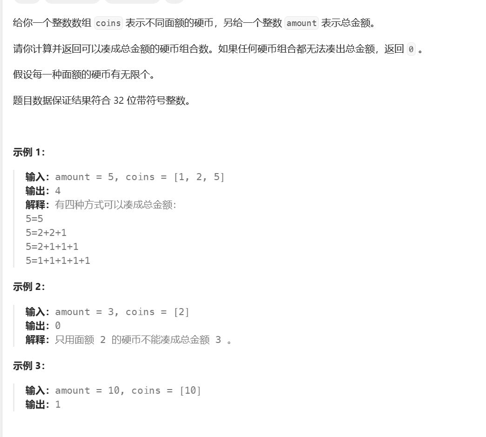

```python
class Solution(object):
    def change(self, amount, coins):
        # dp数组表示当前amount的解法有几种
        def dp_slove(amount,coins):
            dp=[0]*(amount+1)
            dp[0]=1
            for coin in coins:
                for i in range(coin,amount+1):
                    dp[i]+=dp[i-coin]# 状态转移方程变为加
            return dp[amount]
        return dp_slove(amount,coins)
```


## 优先级队列

### **Intersecting Intervals**

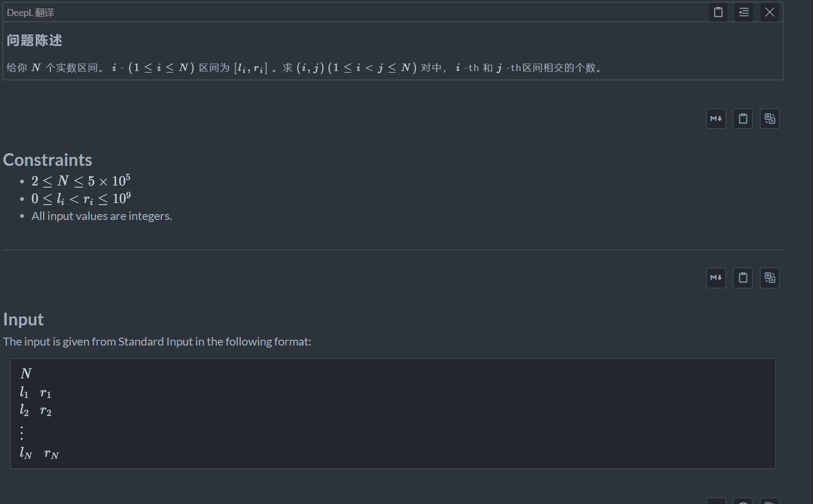

很简单的想到把区间排序，要数数对可以枚举其中一个然后维护前面的，初始的想法是使用线段树对于当前的区间找范围内的最大值，这个最大值就是会重叠的部分，然后再更新区间，这种做法会超时。

从左向右枚举，使用根堆记录每个区间的右端点，如果堆中最小的右端点不与当前的左端点重叠，那么也一定不会与之后的左端点重叠（排过序了），可以弹出，这样更新根堆之后留下的就是会重叠部分，累加这个长度然后压入现在的右端点继续。

```python
import heapq
from functools import lru_cache
n = int(input())
nums = []
import sys
input=sys.stdin.readline
for _ in range(n):
    nums.append([int(x) for x in input().split()])

# 排序
nums.sort(key=lambda x: (x[0],x[1]))
res=[]
ans=0
for i in range(n):
    l,r=nums[i]
    # 最小的右端点（即做靠左的区间）
    while res and res[0]<l:
        # 无法重叠弹出
        heapq.heappop(res)
   # 剩下的一定可以重叠
    ans+=len(res)
    heapq.heappush(res,r)
print(ans)
```


### [找到 Alice 和 Bob 可以相遇的建筑](https://leetcode.cn/problems/find-building-where-alice-and-bob-can-meet/)


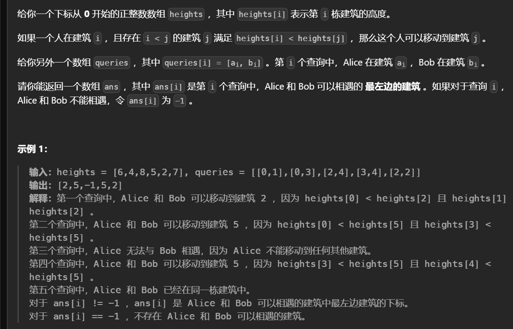


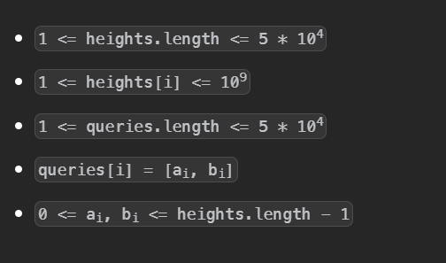


如果两个人在同一个位置，则答案就是这个位置，如果位置靠后的人比前面的热要高，那么答案就是后面人的位置。

最后如果是前一个人(a)较高，后一个人(b)较矮，那么就要去找在在b之后比a还高的第一个位置(此时的b位置一定矮于a位置)，如果只有一组询问那么很好解决但是这里的询问是多个混在在一起的，由于询问都给出了可以不按照给定的顺序去做，也就是离线。

由于每个询问需要去找b之后的位置，同时这个位置的是否可行由a的高度决定，因此在每个b位置上记录a的高度和对应的是第几个询问，预处理之后遍历数组同时维护遇到的询问，遍历到某一个位置时查看当前维护的讯问中最小的高度是否小于当前位置的高度，如果小于则弹出同时得到一个答案，因为讯问中的位置是一定小于当前位置的然后把当前位置记录的询问加入维护中，使用堆来维护，可以快速求出最小值

```python
class Solution:
    def leftmostBuildingQueries(self, heights: List[int], queries: List[List[int]]) -> List[int]:
        # 一个位置会有多个询问
        path=defaultdict(list)
        ans=[-1]*len(queries)
        for i,li in enumerate(queries):
            a,b=li
            # 找出可以直接求的情况
            if a==b:
                ans[i]=a 
                continue
            if a>b:
                a,b=b,a
            # 预处理询问
            if heights[a]<heights[b]:
                ans[i]=b
                continue
            path[b].append((heights[a],i))
            
        h=[]
        for i in range(len(heights)):
            # 一直弹出
            while h and h[0][0]<heights[i]:
                a,index=heappop(h)
                ans[index]=i
            # 加入到维护
            if i in path:
                for k in path[i]:heappush(h,k)
        return ans 
        
```


### [ 包含每个查询的最小区间](https://leetcode.cn/problems/minimum-interval-to-include-each-query/)

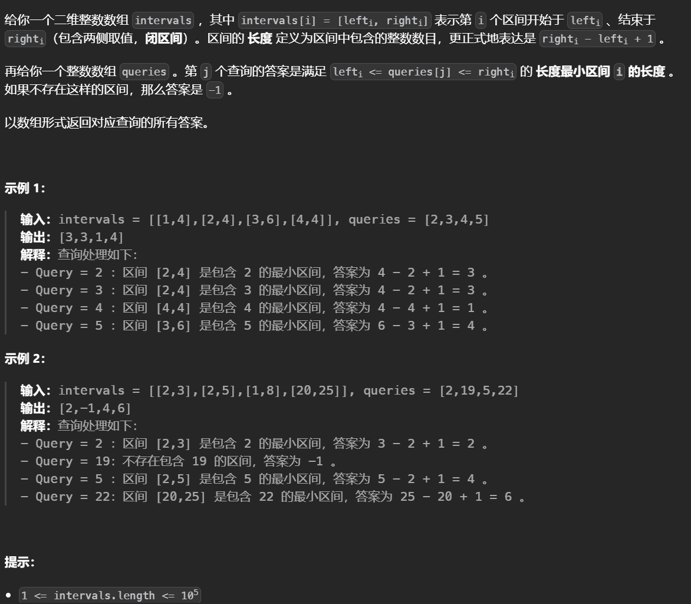


把区间按照区间的左端点排序同时对查询离线这样可以从左到右按照递增的顺序处理。

遍历每个询问，同时查找区间数组，把所有左端点小于当前位置的区间的长度和右端点记录到到根堆中（这些区间都是可能的结果），这样使得队首是长度最短的区间，之后将根堆中所有右端点不满足条件的弹出，因为区间是排了序的如果指定区间的右端点不能满足小的询问，那么大的询问而一定不能满足。

```python
class Solution:
    def minInterval(self, intervals: List[List[int]], queries: List[int]) -> List[int]:
        # 离线询问
        q=sorted([(v,i) for i,v in enumerate(queries)])
        intervals.sort(key=lambda x:x[0])
        ans=[-1]*len(q)
        h=[]
        index=0
        n=len(intervals)
        # 遍历每个询问
        for v,i in q:
            # 维护可能的结果
            while index<n and intervals[index][0]<=v:
                heappush(h,((intervals[index][1]-intervals[index][0]+1),intervals[index][1]))
                index+=1
            # 排除不合法的结果
            while h and h[0][1]<v:
                heappop(h)
            if h:
                ans[i]=h[0][0]
        return ans 
        
```


### [多次求和构造目标数组](https://leetcode.cn/problems/construct-target-array-with-multiple-sums/)

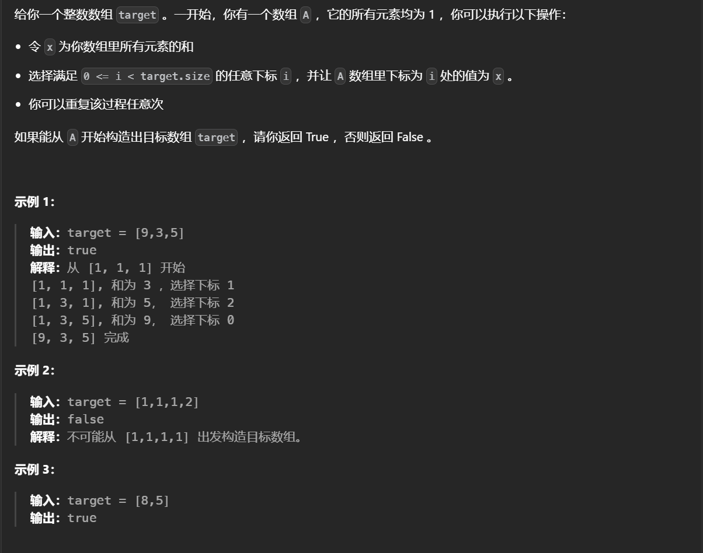


从1转换到不同的数字不好求解，因此把问题转化为从不同的数字是否能到1.

可以知道，数组中当前最大的数就是上一轮数组的总和，因此把最大的数减去上一轮除了这个位置的总和就可以得到上一轮这个位置的值，以此递推，最后判断是否都是1。注意对于较大的数据[1,100000]采取取模，也就是最大的数一直减去其他的总和知道不能减，用取余会很快求出。

这里借助根堆找出操作后最大的数，同时维护总和

```python
class Solution:
    def isPossible(self, target: List[int]) -> bool:
        # 特判只有一个数的情况
        if len(target)==1:
            return target[0]==1
        # 根堆
        h=[-v for v in target]
        s=sum(target)
        heapify(h)
        while 1:
            x=heappop(h)
            x=-x
            if x==1:break
            # 其他位置的和
            temp=s-x
            # 取余加速计算
            if x%temp:curr=x%temp
            else:curr=temp
            if curr==x:return False
            heappush(h,-curr)
            # 下一轮的总和
            s=curr+temp
        # 最后的判断
        if min(h)==-1:return True 
        return False
```

### [最多可以参加的会议数目](https://leetcode.cn/problems/maximum-number-of-events-that-can-be-attended/)

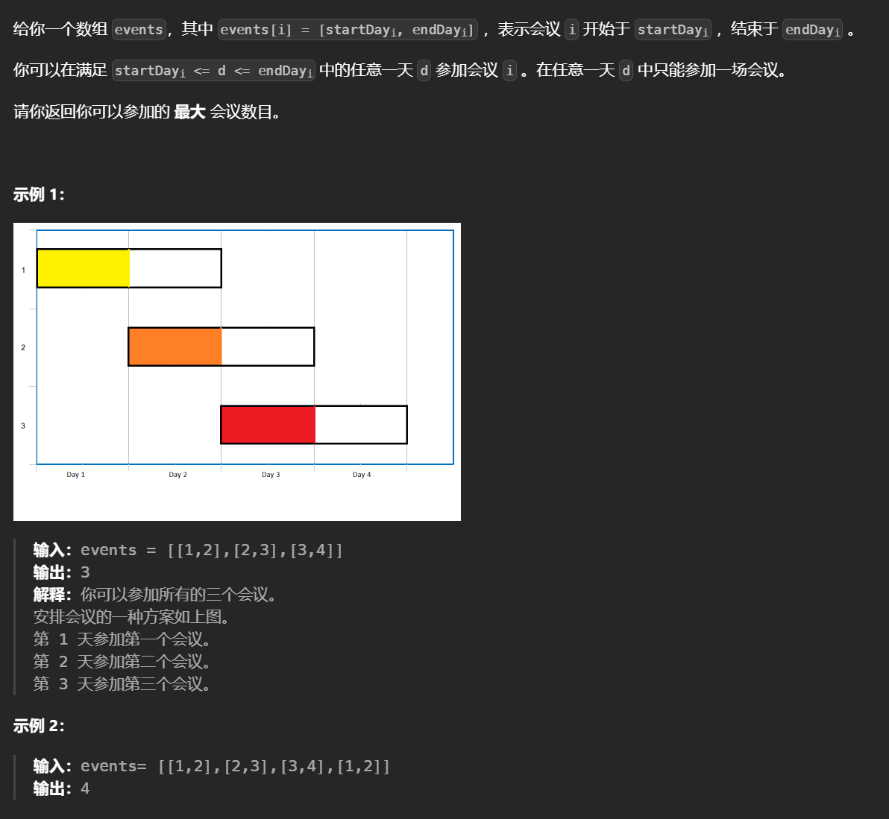


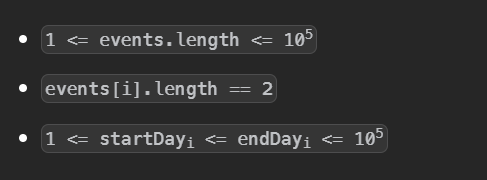


对于天数i最优的是去找相对i最早的结束时间的会议，对于给定的数据范围可以去枚举每一天，把以当前时间为开始时间的会议的结束时间加入到根堆中，随后选出最小的那个。

```python
class Solution:
    def maxEvents(self, nums: List[List[int]]) -> int:
        nums.sort()
        # 按照开始时间排序
        n=len(nums)
        h=[]
        ans=0
        j=0
        # 枚举每一天
        for i in range(1,100010):  
            # 弹出不合法的天数
            while h and h[0]<i:heappop(h)
            # 加入对应的结束天数
            while j<n and nums[j][0]==i:
                heappush(h,nums[j][1]) 
                j+=1
            # 弹出最小的，相当于选了一个会议
            if h:
                heappop(h)
                ans+=1
        return ans
```


### Too Many Segments

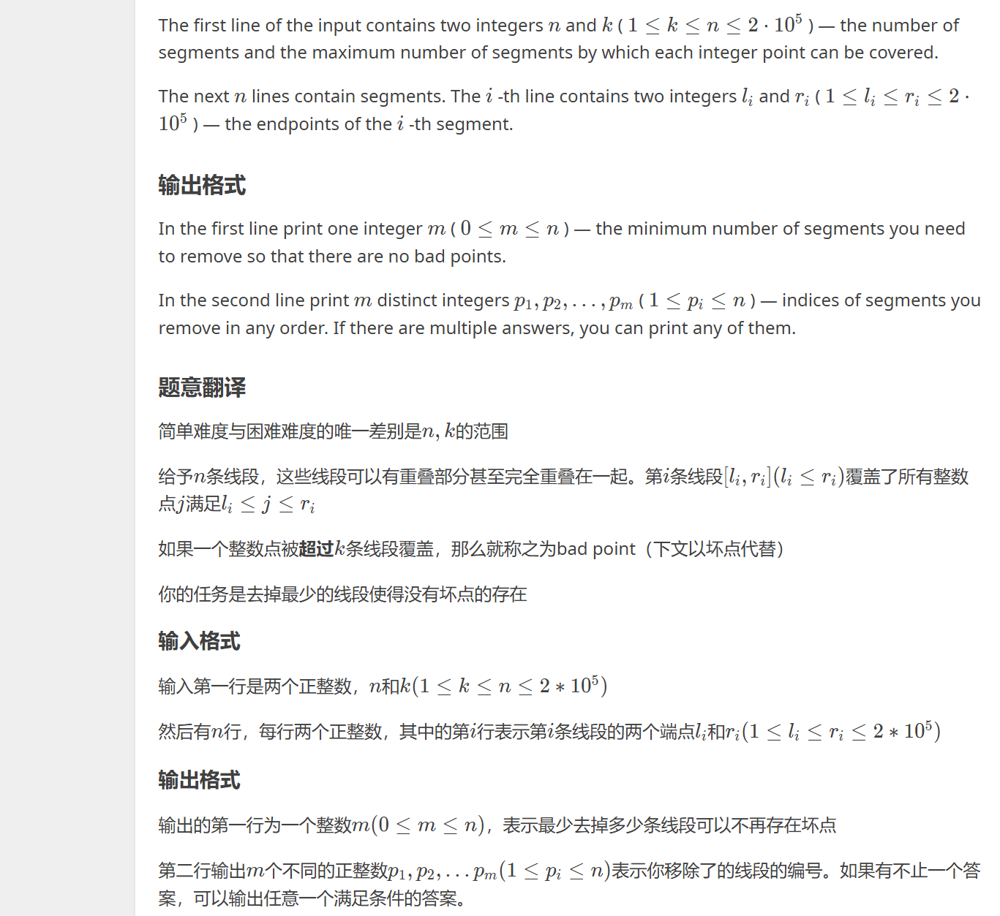

用不着线段树，直接使用差分在遍历的过程中累加即可。

对于给定的数据范围可以扫描所有的点，对于多个不符合的点，先从左边第一个开始操作，如果一个点不满足要求那么去删除包含他的右端点最大的线段。用差分数组表示每个位置的个数。

首先对线段按左端点排序，在遍历点的过程中把包含

这个点的线段的右端点全部加入到根堆中（同时记录编号），如果这个点不合法则删除右端点最大的线段，同时更新差分数组。


```python
import sys
from heapq import heappop, heappush

input=sys.stdin.readline
def R():
    return [int(x) for x in input().split()]
n,k=R()
N=2*10**5+10
d=[0]*N
h=[]
p=[]
# 处理所有的线段
for i in range(n):
    l,r=R()
    p.append([l,r,i+1])
    d[l]+=1
    d[r+1]-=1

# 线段排序
p.sort()

curr=0
index=0
ans=[]

# 扫描
for i in range(N):
    curr+=d[i]
    # 不合法的线段
    while h and -h[0][0]<i:
        heappop(h)
    # 记录所有合法的右端点
    while index<n and p[index][0]<=i:
        heappush(h,(-p[index][1],p[index][2]))
        index+=1
    # 当前点不满足条件，弹出最大的
    while curr>k:
        x,f=heappop(h)
        x=-x
        curr-=1
        # 更新差分数组
        d[x+1]+=1
        ans.append(f)
print(len(ans))
print(*ans)

```

### [将珠子放入背包中](https://leetcode.cn/problems/put-marbles-in-bags/)

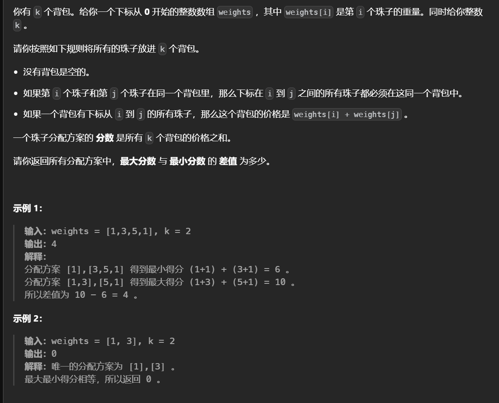

将数组分为k个子数组，每个子数组的价值等于数组中首尾元素相加，不管是那种分配方案相减，第一个和最后一个元素一定会被抵消因为它们一定会贡献到数组的价值中。此外每个数组的价值就是a[i]+a[i+1]一共有k-1个因为首尾一定会去掉，那么最大的差值就是最大的k-1个a[i]+a[i+1]减去最小的k-1个a[i]+a[i+1]。

```python
class Solution:
    def putMarbles(self, weights: List[int], k: int) -> int:
        h=[]
        for i,j in pairwise(weights):
            heappush(h,i+j)
        return sum(nlargest(k-1,h))-sum(nsmallest(k-1,h))
```

### [最大子序列的分数](https://leetcode.cn/problems/maximum-subsequence-score/)

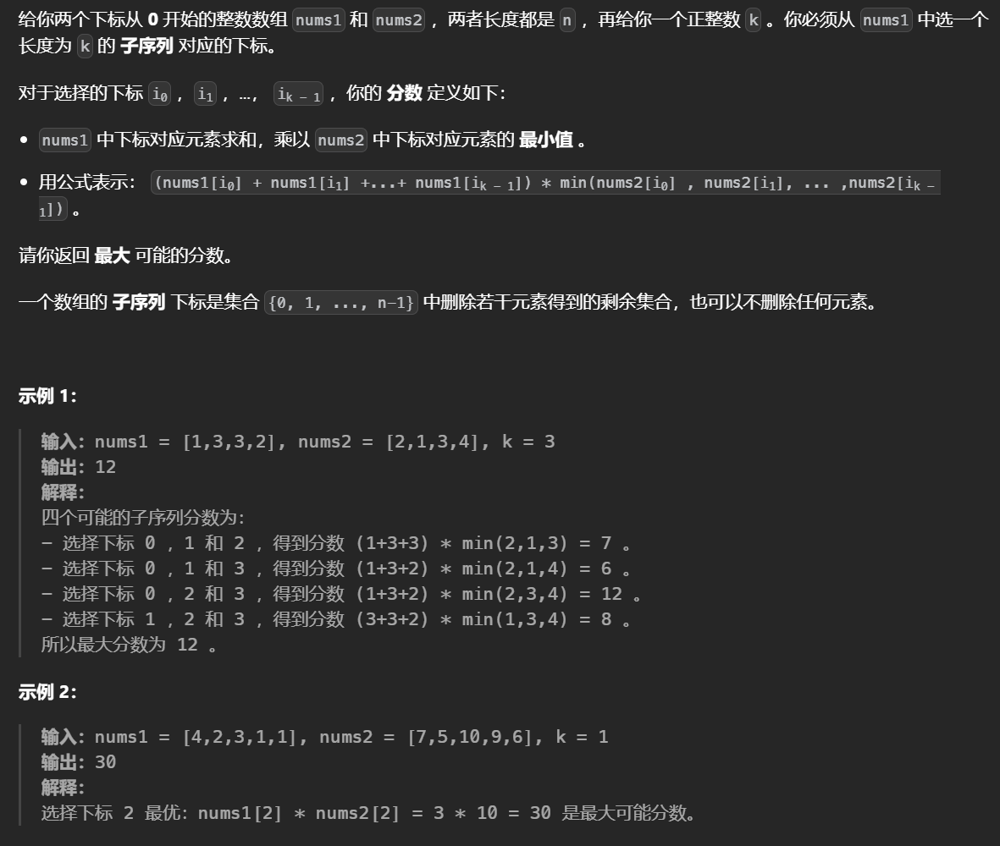

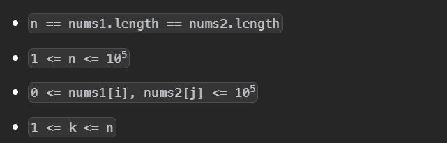

对于给定的数据范围无法使用动态规划，这里要求子序列并且结果只和子序列的数值相关和相对顺序无关，因此可以排序，按照nums2递减的顺序。

对于每个结果一定是有一个nums2中的值作为最小值那么可以枚举这个最小值，同时维护这个位置之前的k-1个nums1中的最大的值


```python
class Solution:
    def maxScore(self, nums1: List[int], nums2: List[int], k: int) -> int:
		# 排序
        nums=[(i,j) for i,j in zip(nums1,nums2)]
        nums.sort(key=lambda x:-x[1])
        # 先保证根堆中有k个值
        h=[i for i,j in nums[:k]]
        heapify(h)
        s=sum(h)
        ans=s*nums[k-1][1]
        # 枚举每个nums2中的值作为最小值
        for i,j in nums[k:]:
            # 更新堆，只维护k个值的总和
            if i>h[0]:
                s-=heappop(h)
                s+=i
                heappush(h,i)
                ans=max(ans,s*j)
        return ans 
```

### Phoenix and Towers

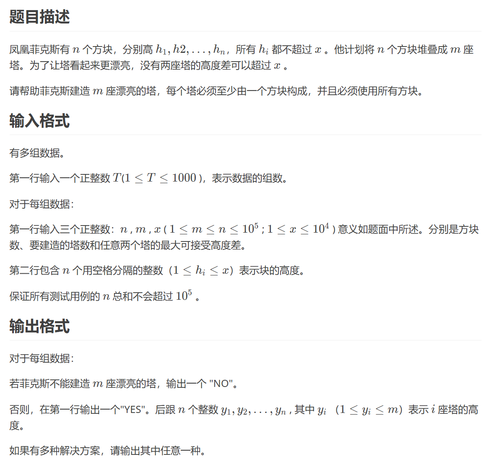

根据题目给定的hi<=x，如果存在两个塔高度之差大于等于x那么高的塔一定可以给低的塔一些方块来防止差值过大，因此不存在无解的情况，这里只需要按照贪心使用优先级队列：每次把值给当前高度最低的塔即可。


```python
for _ in range(R()):
    n,m,x=RR()
    nums=RR()
    ans=[]
    h=[(0,i+1) for i in range(m)]
    heapify(h)
    for i in range(n):
        val=nums[i]
        s,pos=heappop(h)
        ans.append(pos)
        heappush(h,(s+val,pos))
    print('YES')
    print(*ans)
```


## 线段树

**线段树解决区间和的问题，并且区间会被修改。线段数的两个操作：求区间和，修改区间，时间夫再度均为logn**

线段树的每一个节点代表一个区间，节点的值可以根据题目而设置数字之和「总数字之和 = 左区间数字之和 + 右区间数字之和」最大公因数 (GCD)「总 GCD = gcd(左区间 GCD, 右区间 GCD)」最大值「总最大值 = max(左区间最大值，右区间最大值)」：
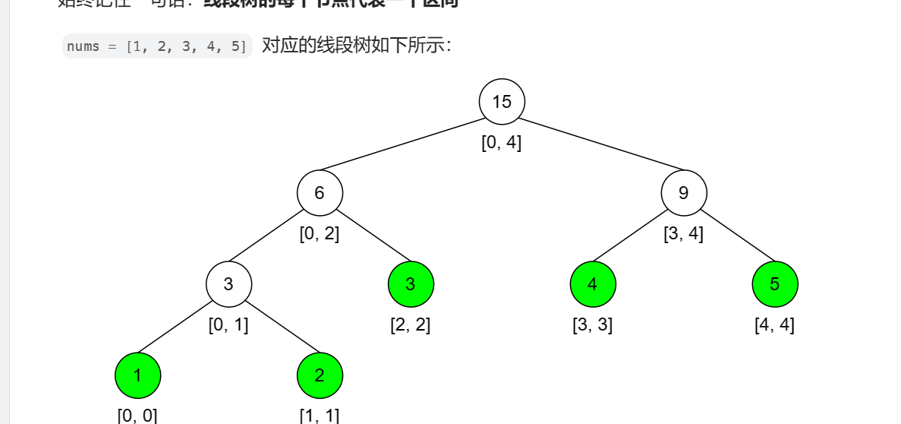


使用线段树的关键在于变化原数组比如：

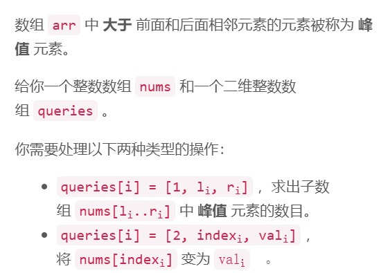

为了统计峰值元素的个数，把数组中为峰值元素的变为1其他的变为0


线段数具有二分的性质。

线段树数组实现（单点修改），根据题目要求传入不同的函数：

```python
class SegTree:
    def __init__(self,nums,func):
        self.nums=nums
        self.n=len(nums)
        self.tree=[0]*(4*self.n)
        self.func=func
        if self.n>0:
            self._build(0,0,self.n-1)
    def _build(self,root,l,r):
        if l==r:
            self.tree[root]=self.nums[r]
            return 
        mid=(l+r)>>1
        self._build(root*2+1,l,mid)
        self._build(root*2+2,mid+1,r)
        self.tree[root]=self.func(self.tree[root*2+1],self.tree[root*2+2])


    def update(self,idx,newvalue):
        self.nums[idx]=newvalue
        self._update(0,0,self.n-1,idx,newvalue)
    def _update(self,root,l,r,idx,newvalue):
        if l==r==idx:
            self.tree[root]=newvalue
            return
        mid=(l+r)>>1
        if idx<=mid:self._update(root*2+1,l,mid,idx,newvalue)
        else:self._update(root*2+2,mid+1,r,idx,newvalue)
        self.tree[root]=self.func(self.tree[2*root+1],self.tree[2*root+2])
    def query(self,l,r):
        return self._query(0,0,self.n-1,l,r)
    def _query(self,root,l,r,ql,qr):
        if l==ql and qr==r:
            return self.tree[root]
        mid=l+r>>1
        if qr<=mid:return self._query(root*2+1,l,mid,ql,qr)
        elif mid<ql:return self._query(root*2+2,mid+1,r,ql,qr)
        else:return self.func(self._query(root*2+1,l,mid,ql,mid),self._query(root*2+2,mid+1,r,mid+1,qr))
```


线段树模板（动态开点，区间和）需要注意当区间较大时才会用到动态开点线段树，这个版本的实现很慢：

```python
class Node:
    def __init__(self):
        self.left=None
        self.right=None
        self.add=0
        self.val=0
def pushup(node):
    node.val=node.left.val+node.right.val

def pushdown(node,lc,rc):
    if not node.left:node.left=Node()
    if not node.right:node.right=Node()

    if node.add==0:return
    node.left.val+=lc*node.add
    node.right.val+=rc*node.add
    # 懒标记不需要加
    node.left.add += node.add
    node.right.add += node.add
    node.add=0

def update(root,start,end,l,r,val):
    if l<=start and r>=end:
        root.val+=(end-start+1)*val
        root.add+=val
        return
    mid=(start+end)>>1
    pushdown(root,mid-start+1,end-mid)
    if l<=mid:update(root.left,start,mid,l,r,val)
    if r>=mid+1:update(root.right,mid+1,end,l,r,val)
    pushup(root)
def query(root,start,end,l,r):
    if l <= start and r >= end:return root.val
    mid=(start+end)>>1
    ans=0
    pushdown(root,mid-start+1,end-mid)
    if l<=mid:ans+=query(root.left,start,mid,l,r)
    if r>=mid+1:ans+=query(root.right,mid+1,end,l,r)
    return ans
```

注意根据题意的不同线段树中的各个函数也是可能改变的，基本上pushup,pushdown 之类的函数会变化


线段树与二分的结合使用，下述的模板不需要做索引偏移

```python
n=len(heights)
mx=[0]*(2<<n.bit_length())
# 用 heights 初始化线段树，维护区间最大值
def build(o: int, l: int, r: int) -> None:
    if l == r:
        mx[o] = heights[l]
        return
    m = (l + r) // 2
    build(o * 2, l, m)
    build(o * 2 + 1, m + 1, r)
    mx[o] = max(mx[o * 2], mx[o * 2 + 1])

    # 返回 [L,n-1] 中第一个 > v 的值的下标
    # 如果不存在，返回 -1
    def query(o: int, l: int, r: int, L: int, v: int) -> int:
        if mx[o] <= v:  # 区间最大值 <= v
            return -1  # 没有 > v 的数
        if l == r:  # 找到了
            return l
        m = (l + r) // 2
        if L <= m and (pos := query(o * 2, l, m, L, v)) >= 0:  # 递归左子树
            return pos
        return query(o * 2 + 1, m + 1, r, L, v)  # 递归右子树

    build(1, 0, n - 1)
```


### 日程安排表（典型的最大值线段树）

### [ 我的日程安排表 I](https://leetcode.cn/problems/my-calendar-i/)

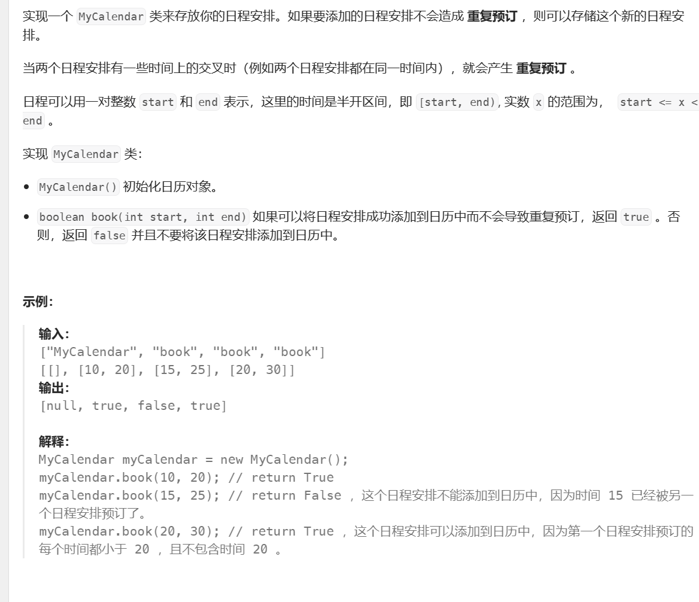

使用treeset()的做法，插入前查找大于等于该end的start（一定不会重叠），去找这个时间段的前一个这是唯一可能重叠的时间段如果满足条件就加入。

```python
from sortedcontainers import SortedDict
class MyCalendar:

    def __init__(self):
        # 有序字典
        self.d=SortedDict()
    def book(self, start: int, end: int) -> bool:
        # 找大于等于的
        pre=self.d.bisect_left(end)
        # 判断与唯一重叠的是否会重叠，注意对有序字典的索引要使用items
        if not pre or self.d.items()[pre-1][1]<=start:
            # 开始时间对应结束时间
            self.d[start]=end
            return True
        return False
```

线段树操作，对于合法的区间会把对应的位置都增加一（类似于计数操作），在加入下一个值的时候需要判断这个区间的最大值是否等于0也就是判断这个区间是否会和当前区间重叠。

```python
2

class MyCalendar:

    def __init__(self):
        self.n=10**9
        self.node=Node()

    # 判断给定的区间是否是空的，如果是就更新
    def book(self, start: int, end: int) -> bool:
        if query(self.node,0,self.n,start,end-1)!=0:
            return False
        update(self.node,0,self.n,start,end-1,1)
        return True


# Your MyCalendar object will be instantiated and called as such:
# obj = MyCalendar()
# param_1 = obj.book(start,end)
```


### [我的日程安排表 II](https://leetcode.cn/problems/my-calendar-ii/)

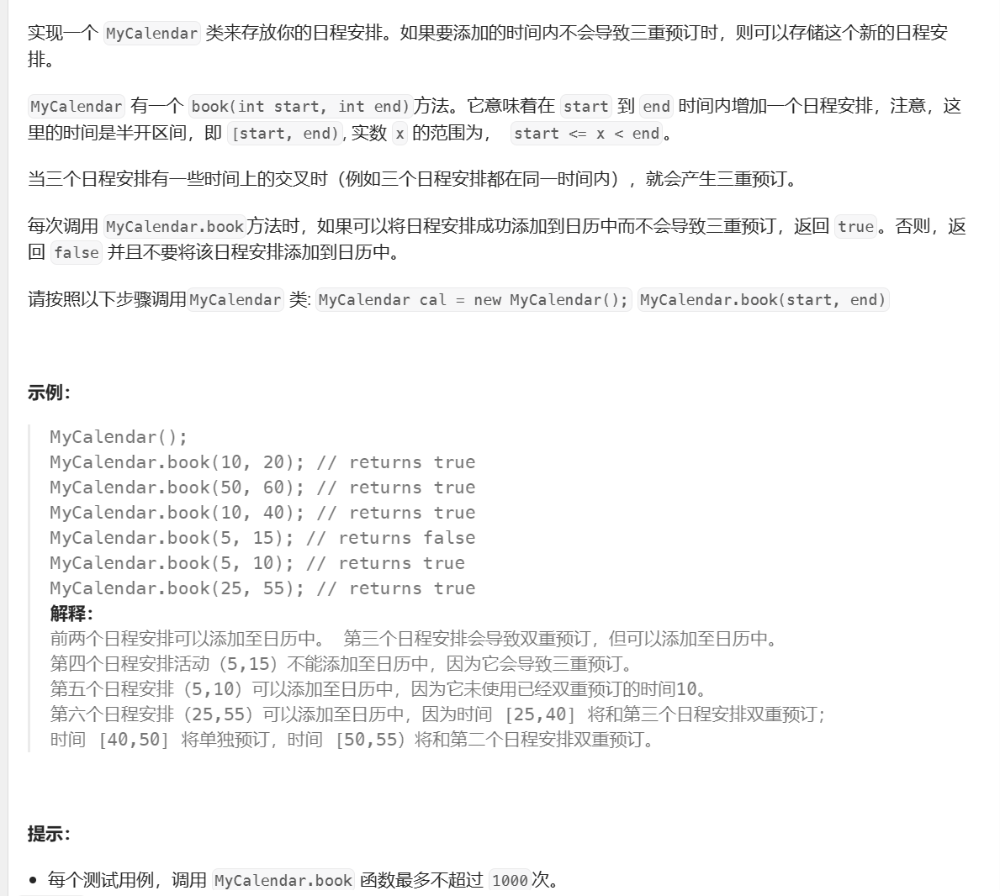

判断给定的区间是否合法去找这个区间上的最大值（就是覆盖了几次），如果是2的话当前日期覆盖上会导致三重预定。

```python
class Node:
    def __init__(self):
        self.left=None
        self.right=None
        self.add=0
        self.val=0

def pushup(node):
    node.val=max(node.left.val,node.right.val)

def pushdown(node):
    if not node.left:node.left=Node()
    if not node.right:node.right=Node()
    node.left.val+=node.add
    node.right.val+=node.add
    node.left.add+=node.add
    node.right.add+=node.add
    node.add=0

def update(node,start,end,l,r,val):
    if l<=start and r>=end:
        node.val+=val
        node.add+=val
        return 
    mid=(start+end)>>1
    pushdown(node)
    if l<=mid:
        update(node.left,start,mid,l,r,val)
    if r>=mid+1:
        update(node.right,mid+1,end,l,r,val)
    pushup(node)
    

def query(node,start,end,l,r):
    if l<=start and r>=end:
        return node.val
    mid=(start+end)>>1
    ans=0
    pushdown(node)
    if l<=mid:
        ans=query(node.left,start,mid,l,r) 
    if r>=mid+1:
        ans=max(ans,query(node.right,mid+1,end,l,r))
    return ans 
class MyCalendarTwo:

    def __init__(self):
        self.n=10**9
        self.node=Node()
    def book(self, start: int, end: int) -> bool:
        # 变化的地方
        if query(self.node,0,self.n,start,end-1)==2:
            return False
        update(self.node,0,self.n,start,end-1,1)
        return True 


# Your MyCalendarTwo object will be instantiated and called as such:
# obj = MyCalendarTwo()
# param_1 = obj.book(start,end)	
```

### [我的日程安排表 III](https://leetcode.cn/problems/my-calendar-iii/)

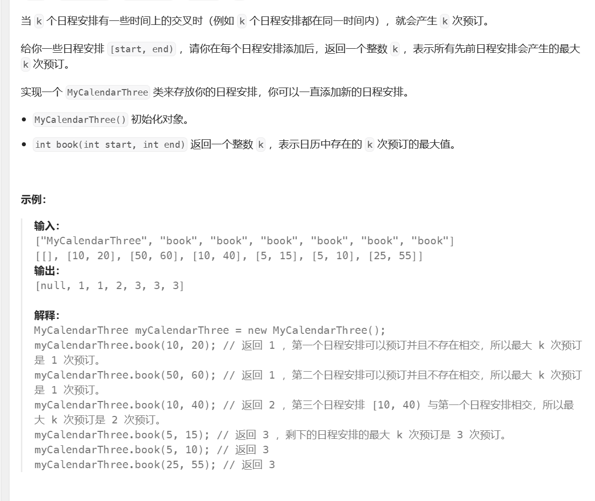

先更新再返回区间的最大值

```python
class Node:
    def __init__(self):
        self.left=None
        self.right=None
        self.add=0
        self.val=0
 # 这里不是求区间和，而是找区间是否被选过，可以取子区间的最大值
def pushup(node):
    node.val=max(node.left.val,node.right.val)

# 向下推，这里不是求区间和因此不用乘上子树大小直接加上
def pushdown(node):
    if not node.left:node.left=Node()
    if not node.right:node.right=Node()

    if node.add==0:return
    node.left.val+=node.add
    node.right.val+=node.add

    node.left.add += node.add
    node.right.add += node.add
    node.add=0

def update(root,start,end,l,r,val):
    if l<=start and r>=end:
        root.val+=val
        root.add+=val
        return
    mid=(start+end)>>1
    pushdown(root)
    # 注意最大值不是累加
    if l<=mid:update(root.left,start,mid,l,r,val)
    if r>=mid+1:update(root.right,mid+1,end,l,r,val)
    pushup(root)
def query(root,start,end,l,r):
    if l <= start and r >= end:return root.val
    mid=(start+end)>>1
    ans=0
    pushdown(root)
    if l<=mid:ans=query(root.left,start,mid,l,r)
    if r>=mid+1:ans=max(query(root.right,mid+1,end,l,r),ans)
    return ans
class MyCalendarThree:

    def __init__(self):
        self.n=10**9
        self.node=Node()
        self.ans=-inf
    def book(self, startTime: int, endTime: int) -> int:
        update(self.node,0,self.n,startTime,endTime-1,1)
        self.ans=max(self.ans,query(self.node,0,self.n,startTime,endTime-1))
        return self.ans 

# Your MyCalendarThree object will be instantiated and called as such:
# obj = MyCalendarThree()
# param_1 = obj.book(startTime,endTime)
```

### [区域和检索 - 数组可修改](https://leetcode.cn/problems/range-sum-query-mutable/)

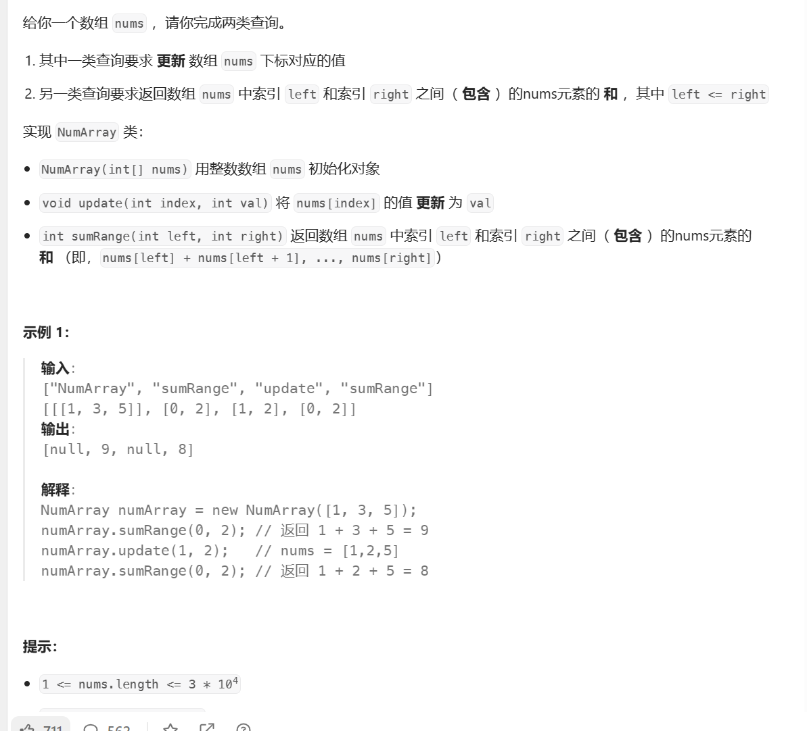

注意这里是覆盖，也就是说值不是累加而是覆盖（修改为），同样的懒惰标记也是更新不是累加

```python
class Node:
    def __init__(self):
        self.left = None
        self.right = None
        self.add = 0
        self.val = 0


def pushup(node):
    # 这里要修改
    node.val = node.left.val + node.right.val


def pushdown(node, lc, rc):
    if not node.left: node.left = Node()
    if not node.right: node.right = Node()

    if not node.add:return
    # 注意覆盖
    node.left.val = node.add * lc
    node.right.val = node.add * rc
	
    # 注意覆盖
    node.left.add = node.add
    node.right.add = node.add
    node.add = 0


def update_(node, start, end, l, r, val):
    if l <= start and r >= end:
        # 覆盖
        node.val = (end-start+1)*val
        node.add = val
        return
    mid = (start + end) >> 1
    pushdown(node, mid - start + 1, end - mid)
    if l <= mid: update_(node.left, start, mid, l, r, val)
    if r >= mid + 1: update_(node.right, mid + 1, end, l, r, val)
    pushup(node)


def query(node, start, end, l, r):
    if l <= start and r >= end:
        return node.val
    mid = (start + end) >> 1
    res = 0
    pushdown(node,mid-start+1,end-mid)
    if l <= mid: res += query(node.left, start, mid, l, r)
    if r >= mid + 1: res += query(node.right, mid + 1, end, l, r)
    return res


class NumArray:

    def __init__(self, nums: List[int]):
        self.node = Node()
        self.n=len(nums)-1
        for i, c in enumerate(nums):
            update_(self.node, 0, self.n, i, i, c)


    def update(self, index: int, val: int) -> None:
        update_(self.node, 0, self.n, index, index, val)


    def sumRange(self, left: int, right: int) -> int:
        return query(self.node, 0, self.n, left, right)

# Your NumArray object will be instantiated and called as such:
# obj = NumArray(nums)
# obj.update(index,val)
# param_2 = obj.sumRange(left,right)
```

### [最长递增子序列](https://leetcode.cn/problems/longest-increasing-subsequence/)

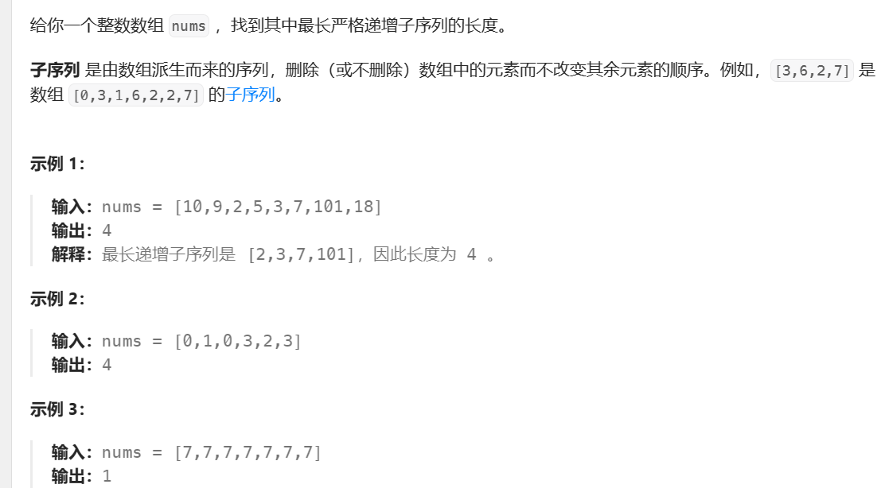

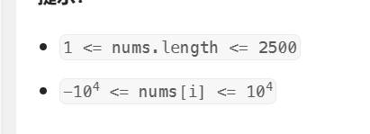

每一个元素所能形成的最长递增子序列等于小于它的元素中所能形成的最长的递增子序列加一，定义dp(j)=max(dp(i))+1，dp(j)表示yi元素j结尾的最长递增子序列，其中i是小于j的所有元素。这个转移方程中要求出区间（小于j）的最大值，然后用这个最大值去更新下一个状态，这个状态又会被用到其他的状态转移方程中，这需要快速求解区间最大值以及单点修改通过线段树完成。

```python
class Node:
    def __init__(self):
        self.left=None
        self.right=None
        self.add=0
        self.val=0
# 求最大值的更新操作
def pushup(node):
    node.val=max(node.left.val,node.right.val)
# 进行的是区间覆盖操作
def pushdown(node):
    if not node.left:node.left=Node()
    if not node.right:node.right=Node()
    if not node.add:return
    # 不是累和而是覆盖
    node.left.val=node.right.val=node.left.add=node.right.add=node.add
    node.add=0

   
def update(node,start,end,l,r,v):
    if l<=start and r>=end:
        node.val=v
        node.add=v
        return 
    mid=(start+end)>>1
    pushdown(node)
    if l<=mid:update(node.left,start,mid,l,r,v)
    if r>=mid+1:update(node.right,mid+1,end,l,r,v)
    pushup(node)
def query(node,start,end,l,r):
    if l<=start and r>=end:
        return node.val
    mid=(start+end)>>1
    pushdown(node)
    res=0
    if l<=mid:res=max(res,query(node.left,start,mid,l,r))
    if r>=mid+1:res=max(res,query(node.right,mid+1,end,l,r))
    return res

class Solution:
    def lengthOfLIS(self, nums: List[int]) -> int:
        # 先离散化处理把元素换到1,n，方便处理
        temp=sorted(set(nums))
        # 注意这里把每个值加一是为了防止0的出现导致l>r
        nums=[bisect_left(temp,v)+1 for v in nums]
        N=max(nums)+10
        node=Node()
        ans=0
        # 依次求解每个元素小于他的元素中能形成的最长的序列
        for v in nums:
            # 找小于当前的元素，注意长度要加一
            cnt=query(node,0,N,0,v-1)+1
            # 求出后更新，因为维护的实际是一个dp(v)
            update(node,0,N,v,v,cnt)
            ans=max(ans,cnt)
        return ans 
```

### [物块放置查询](https://leetcode.cn/problems/block-placement-queries/)

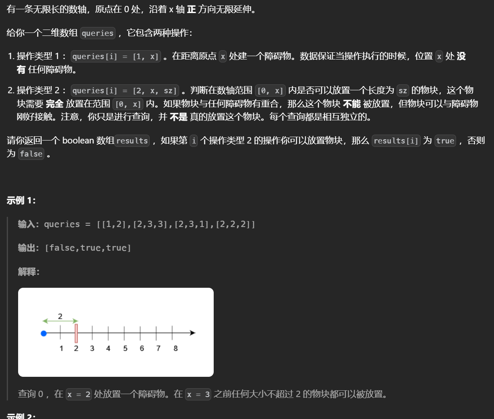

这个题目是对线段树的高级运用，每次更新一个位置后该如何求出闲置的区间呢，这里每个点记录的是以他为右端点所能得到的区间长度是多少，而不是每次更新一个点就把他认为是加一，这样再查询的时候，可以直接查询区间内的最大值以此求的给定区间内最长的闲置空间，另一个问题是，当你更新一个位置时，更新的具体的值是多少呢，这个值应该是这个点有它前面的那个点的值，同时更新一个点，这个点后面的点的大小也要变化，这就需要快速求出给定点的两端的点，可以通过有序数组求出

```python
from sortedcontainers import SortedList as sl
class Node:
    def __init__(self):
        self.left=None
        self.right=None
        self.add=0
        self.val=0

def pushup(node):
    node.val=max(node.left.val,node.right.val)

def pushdown(node):
    if not node.left:node.left=Node()
    if not node.right:node.right=Node()
    node.left.val+=node.add
    node.right.val+=node.add
    node.left.add+=node.add
    node.right.add+=node.add
    node.add=0

def update(node,start,end,l,r,val):
    if l<=start and r>=end:
        node.val+=val
        node.add+=val
        return 
    mid=(start+end)>>1
    pushdown(node)
    if l<=mid:
        update(node.left,start,mid,l,r,val)
    if r>=mid+1:
        update(node.right,mid+1,end,l,r,val)
    pushup(node)
    

def query(node,start,end,l,r):
    if l<=start and r>=end:
        return node.val
    mid=(start+end)>>1
    ans=0
    pushdown(node)
    if l<=mid:
        ans=query(node.left,start,mid,l,r) 
    if r>=mid+1:
        ans=max(ans,query(node.right,mid+1,end,l,r))
    return ans 
class Solution:
    def getResults(self, queries: List[List[int]]) -> List[bool]:
        # 值域
        m = max(q[1] for q in queries) + 1
        node=Node()
        # 初始时，放入哨兵，这样在插入第一个点时不用特判，同时哨兵又不会影响结果（不会包含在区间内）不用特判
        s=sl([0,m])
        ans=[]
        for li in queries:
            # 找到前后的点
            j=s.bisect_left(li[1])
            pre=s[j-1]
            x=li[1]
            nx=s[j]
            if li[0]==1:
                # 更新前后的点，注意板子中val是更新的值
                update(node,0,m,x,x,x-pre)
                # 后面的节点应该减小
                update(node,0,m,nx,nx,-(nx-pre-(nx-x)))
                # 不能落下
                s.add(li[1])
            else:
                x,sz=li[1:]
                # 求出最大值，这个最大的空闲区间应该是0~pre之间的，以及pre~i之间的
                mx=max(query(node,0,m,0,pre),x-pre)
                ans.append(mx>=sz)
        return ans 
```


## 树状数组

类似于线段树可以快速求出区间和，同时可以更新，这两个操作的时间复杂度为logn,不过这里的更新只能是单点修改。

树状数组的关键在于巧妙地区间拆分

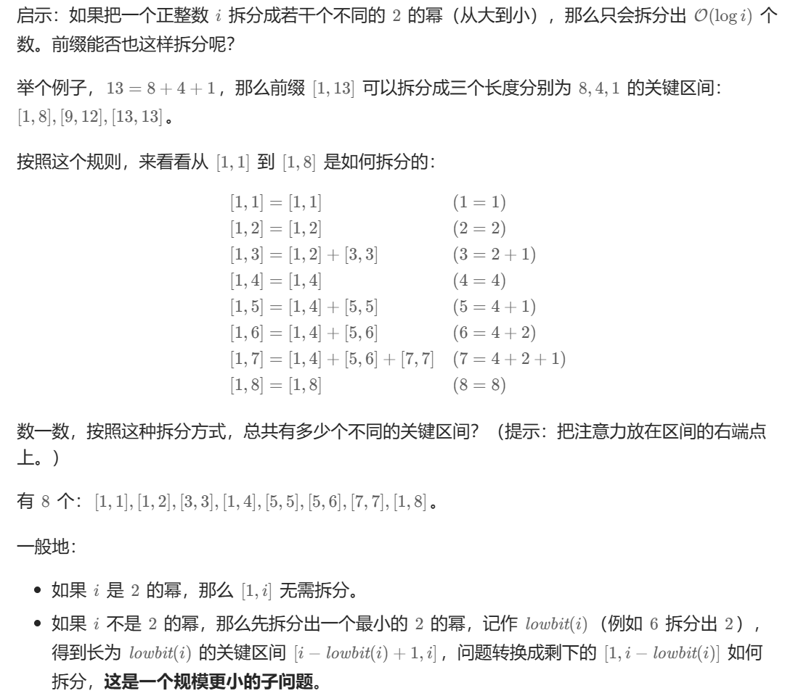


由于关键区间的右端点互不相同，我们可以把右端点为 *i* 的关键区间的元素和保存在*tree*[*i*] 中

想要求解[1,i]的区间和，先求出[i-lowbit(i),i]，然后更新i为i-lowbit(i)表示去找[1,i-lowbit(i)]的区间和，使用一个s变量在外部累加。

而对于更新操作除了把对应的点更新外，还要去更新会受到影响的区间，其中第一个区间就是[1,i]而下一个要更新的区间为[i+1,i+lowbit(i)]就这样一直找下去


query(i)的结果是小于等于i-1的有多少个，数组要开n+2的因为想要取到数字n并且前缀和要做一位偏移


简略版板子如下，只能实现区间求和且数组数值数组

```python
    def cal(x):
        return x&(-x)
    class Tree:
        def __init__(self,n):
            # 这里没有原始数组
            self.tree=[0]*(n+1)
        def update(self,i,detal):
            # 注意偏移
            i+=1
            while i<len(self.tree):
                self.tree[i]+=detal
                i+=cal(i)

        # 注意查询函数传入的参数I，表示的是[0,i-1]，在使用时需要做一位偏移
        # 求最大值
        def querymax(self,i: int) -> int:
            mx = 0
            while i:
                mx = max(mx, self.tree[i])
                i &= i - 1
            return mx
        # 区间和
        def query(self,i):
            s=0
            while i:
                s+=self.tree[i]
                i-=cal(i)
                return s
```

进阶版如下，该版本演示为区间最大值且数组元素为(数值，索引)：

```python
class SegTree:
    def __init__(self,op,e,n,nums):# op表示操作函数，e表示单位元，n表示数组大小，nums表示数组
        self._n=n
        self._op=op
        self._e=e
        self._log=(n-1).bit_length()
        self._size=1<<self._log
        self._d=[self._e()]*(self._size<<1)
        if nums:
            for i in range(self._n):self._d[self._size+i]=nums[i]
            for i in range(self._size-1,0,-1):self._d[i]=self._op(self._d[i<<1],self._d[i<<1|1])
    # 这里的更新是修改数组而不是在增大或减小
    def update(self,index,x):
        index+=self._size
        self._d[index]=x
        while index:
            self._d[index>>1]=self._op(self._d[index],self._d[index^1])
            index>>=1
    # 得到一个位置的值
    def get(self,p):return self._d[p+self._size]
    # 查询区间，类似于前缀和的操作，l,r+1表示数组l,r之间的最值
    def query(self,l,r):
        sml,smr=self._e(),self._e()
        l+=self._size
        r+=self._size
        while l<r:
            if l&1:
                sml=self._op(sml,self._d[l])
                l+=1
            if r&1:
                r-=1
                smr=self._op(smr,self._d[r])
            l>>=1
            r>>=1
        return self._op(sml,smr)
    def all_prod(self):return self._d[1]

# 运算函数，可以diy
def op(x,y):
    val1,i1=x
    val2,i2=y
    if val1>val2:return (val1,i1)
    return (val2,i2)

def e():return(-1,-1)# 返回不影响运算结果的值，如果是和返回0，取最大值返回-inf 最小值饭饭返回inf

init=[(0,-1)]*(w+2)# 数组如果数据范围不大就不需要初始化，多开2
t=SegTree(op,e,len(init),init)
```


### [区域和检索 - 数组可修改](https://leetcode.cn/problems/range-sum-query-mutable/)

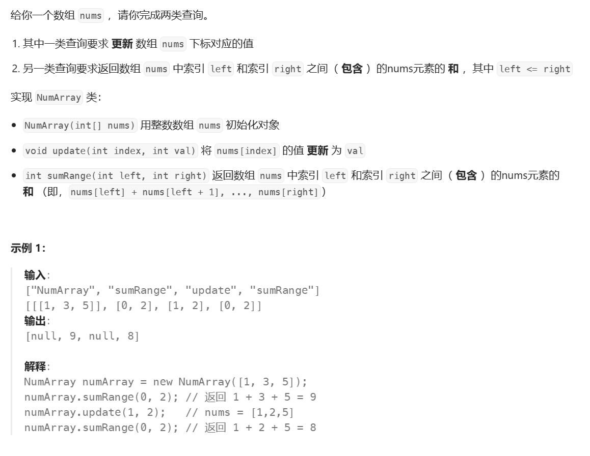


```python
class NumArray:

    def __init__(self, nums: List[int]):
        # 初始化，相当把每个点更新一次
        n=len(nums)
        self.nums=[0]*n
        self.tree=[0]*(n+1)
        for i,x in enumerate(nums):
            self.update(i,x)


    def update(self, index: int, val: int) -> None:
        # 找出差值用于更新前缀
        diff=val-self.nums[index]
        # 更新对应的位置
        self.nums[index]=val
        # 找区间，注意区间会多一位偏移
        i=index+1
        # 迭代
        while i<len(self.tree):
            self.tree[i]+=diff
            # 结论，更新
            i+=i&-i
     # 求前缀
    def preSum(self,i):
        # 累加
        s=0
        while i:
            s+=self.tree[i]
            i-=i&-i
        return s
    def sumRange(self, left: int, right: int) -> int:
        # 左右位置，求解方式类似于一维
        return self.preSum(right+1)-self.preSum(left)
```

### [计算右侧小于当前元素的个数](https://leetcode.cn/problems/count-of-smaller-numbers-after-self/)

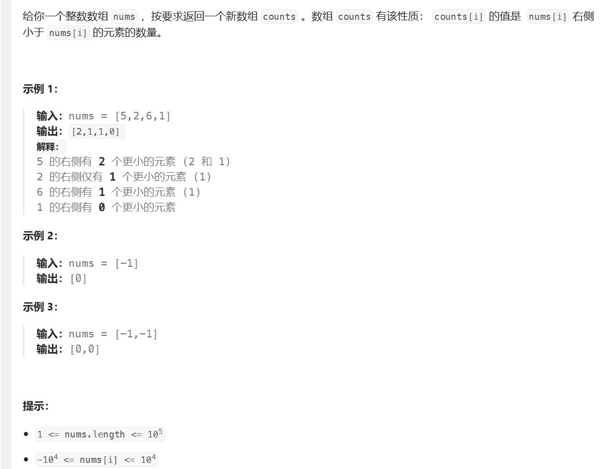

找一个值右边小于当前值的有多少个必然要已知右边，因此从右到左的思考。

这里使用树状数组，树状数组的前缀和pre[i+1]表示i前面小于i的有多少个数，因为每次插入一个值i会更新1这也就表示i的个数，将计数问题转换为前缀和（技巧点）

```python
class Solution:
    def countSmaller(self, nums: List[int]) -> List[int]:
        def cal(x):
            return x&(-x)
        # 离散化
        li=sorted(list(set(nums)))
        nums=[bisect_left(li,v) for v in nums]
        
        class Tree:
            def __init__(self,n):
                # 这里没有原始数组
                self.tree=[0]*(n+1)
            # 更新
            def update(self,i,detal):
                # 注意偏移
                i+=1
                while i<len(self.tree):
                    self.tree[i]+=detal
                    i+=cal(i)
            # 求出0,i的区间和，也就是小于等于i的个数
            def query(self,i):
                s=0
                while i:
                    s+=self.tree[i]
                    i-=cal(i)
                return s
        n=len(nums)
        t=Tree(n)
        ans=[0]*n
        # 倒序处理
        for i in range(n-1,-1,-1):
            # 先更新
            t.update(nums[i],1)
            # 这里做了一位偏移
            ans[i]=t.query(nums[i])
        return ans
```

### [ 交易逆序对的总数](https://leetcode.cn/problems/shu-zu-zhong-de-ni-xu-dui-lcof/)


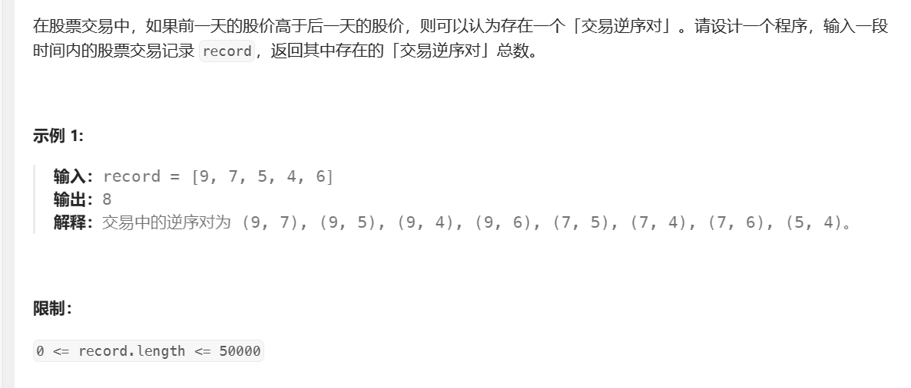


```python
class Solution:
    def reversePairs(self, record: List[int]) -> int:
        li=sorted(set(record))
        nums=[bisect_left(li,v) for v in record]
        class Tree:
            def __init__(self,n):
                self.tree=[0]*(n+1)
            def update(self,i,d):
                i+=1
                while i<len(self.tree):
                    self.tree[i]+=d
                    i+=i&(-i)
            def query(self,i):
                s=0
                while i:
                    s+=self.tree[i]
                    i-=i&(-i)
                return s
        n=len(nums)
        t=Tree(n)
        ans=0
        for i in range(n-1,-1,-1):
            t.update(nums[i],1)
            ans+=t.query(nums[i])
        return ans 
```

### [邻位交换的最小次数](https://leetcode.cn/problems/minimum-adjacent-swaps-to-reach-the-kth-smallest-number/)

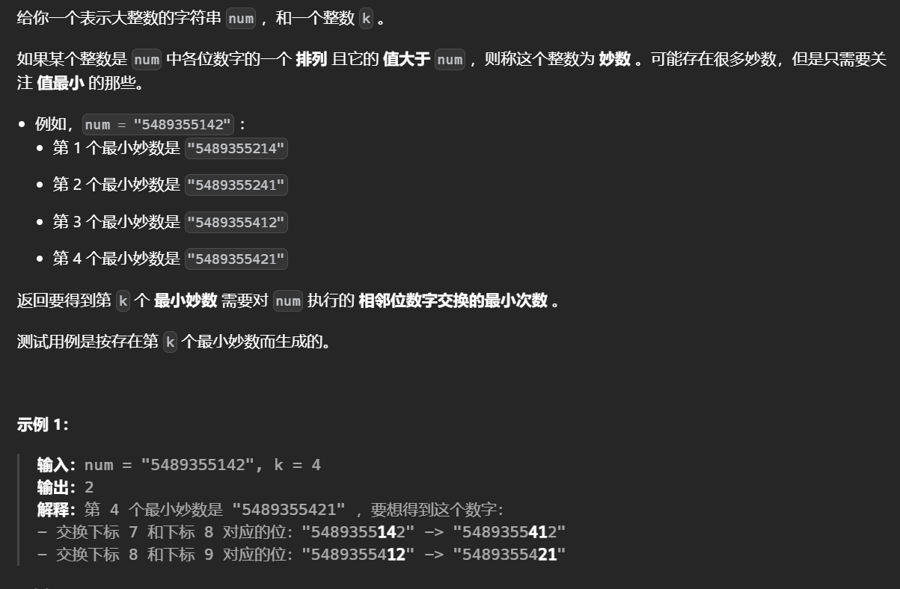

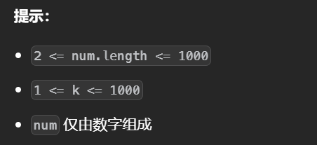

分为两步，先求出第k个排列，其实就是进行k次求下一个更大的排列，然后求解所需的操作次数。因为只能相邻交换因此转换为求逆序对。对原数组的每个值做映射对于bcad有：b->0 c->1 a->2 d->3，那么对于结果cdba就是 1302所需的操作次数就是逆序对，一个字符有多种可能的映射，由于要让交换次数尽可能小，所以贪心地让映射的下标升序就行。。

```python
class Tree:
    def __init__(self,n):
        self.tree=[0]*(n+1)
    def update(self,i,d):
        i+=1
        while i<len(self.tree):
            self.tree[i]+=d
            i+=i&(-i)
    def query(self,i):
        s=0
        while i:
            s+=self.tree[i]
            i-=i&(-i)
        return s
class Solution:
    def getMinSwaps(self, nums: str, k: int) -> int:
        n=len(nums)
        nums=list(nums)
        arr=nums[:]
        # 求解下一个更大的排列
        def slove(nums):
            for i in range(n-2,-1,-1):
                r=int(nums[i+1])
                l=int(nums[i])
                if l<r:
                    for j in range(n-1,-1,-1):
                        x=int(nums[j])
                        if l<x:
                            nums[i],nums[j]=nums[j],nums[i]
                            nums=nums[:i+1]+sorted(nums[i+1:])
                            return nums
        # 进行k次
        for _ in range(k):
            nums=slove(nums)   
        # 对每个位置做映射
        memo=defaultdict(deque)
        for i,c in enumerate(arr):
            memo[c].append(i)
        # 构建映射后的数组
        temp=[]
        for i,c in enumerate(nums):
            temp.append(memo[c].popleft())
        # 树状数组求解逆序对
        t=Tree(n)
        ans=0
        for i in range(n-1,-1,-1):
            t.update(temp[i],1)
            ans+=t.query(temp[i])
        return ans          
```


### 小朋友排队

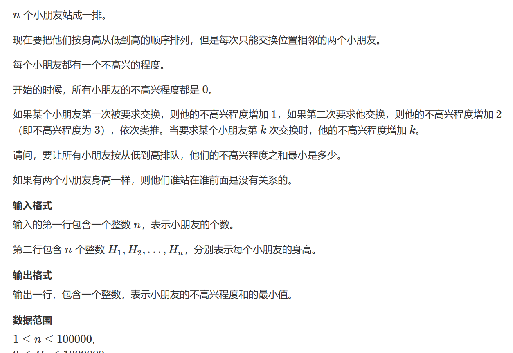

要想交换次数最少那必须是逆序对的个数，每交换一次减少一对逆序对，但是这个题不是统计逆序对，每个人可以贡献的结果与他被交换的次数有关，他交换的次数等于它找别人交换的次数即他右边小于他的数字的个数（逆序对），以及别人找他交换的次数，他左边大于它的个数。

对于第二点，统计每一个数左边大于这个数的个数也可以用逆序对解决不过要稍加变化，比如3 2 1逆序对是右边小于当前数的个数所以第一步要把值的大小颠倒变为1 2 3 然后反转数组求解逆序对即可。

```python
from bisect import bisect_left as bl
n=int(input())
nums=[int(x) for x in input().split()]
class Tree:
    def __init__(self):
        self.tree=[0]*1000010
    def update(self,i,delta):
        i+=1
        while i<len(self.tree):
            self.tree[i]+=delta
            i+=i&(-i)
    def query(self,i):
        s=0
        while i:
            s+=self.tree[i]
            i-=i&(-i)
        return s
ans=[0]*n

# 标准的求解逆序对
t=Tree()
for i in range(n-1,-1,-1):
    v=nums[i]
    t.update(v,1)
    ans[i]+=t.query(v)

t=Tree()
# 离散化，这里是大小颠倒
a=sorted(set(nums))
temp=[n-bl(a,v) for v in nums]
# 反转
temp=temp[::-1]
# 求逆序对
for i in range(n-1,-1,-1):
    v=temp[i]
    t.update(v,1)
    # 注意这个贡献的逆序对要加到反转前的位置上
    ans[n-i-1]+=t.query(v)
res=0
for v in ans:
    res+=(v+1)*v//2
print(res)
```


### 火柴排队


对于给定的公式展开：$Σ(a_i^2-2*a_i*b_i+b_i^2)$公式的首项和末项是固定的，无论怎么变换顺序都不影响，而只有$Σa_i*b_i$会影响到最终结果为了使结果最小，这个项需要是最大，当两个序列按照顺序排列对应相乘的时候最终的结果会是最大，也就是满足a中的第k大的值乘上b中第k大的值所需的最少交换次数。为了使a中的第k大的值对应b中第k大的值构造数组p[a[i]]=b[i]，只有当p[i]=i也就是p是升序的时候才能满足要求，由于每一次只能交换相邻的两个值，因此每一次操作可以减少一个逆序对最后最少的的操作次数就是数组中的逆序对。

 


```python
from bisect import bisect_left as bl
n=int(input())
a=[int(x) for x in input().split()]
b=[int(x) for x in input().split()]

m=10**8-3
# 带着下标排序
a=sorted([(v,i) for i,v in enumerate(a)])
b=sorted([(v,i) for i,v in enumerate(b)])

p=[0]*n
# 第k大的对应第k大的，构建数组
for i in range(n):
    p[b[i][1]]=a[i][1]
# 板子
class Tree:
    def __init__(self,n):
        self.tree=[0]*(n+1)
    def update(self,i,d):
        i+=1
        while i<len(self.tree):
            self.tree[i]+=d
            i+=i&(-i)
    def query(self,i):
        s=0
        while i:
            s+=self.tree[i]
            i-=i&(-i)
        return s
ans=0
t=Tree(n)
for i in range(n-1,-1,-1):
    t.update(p[i],1)
    ans+=t.query(p[i])
print(ans%m)
```

### 数星星

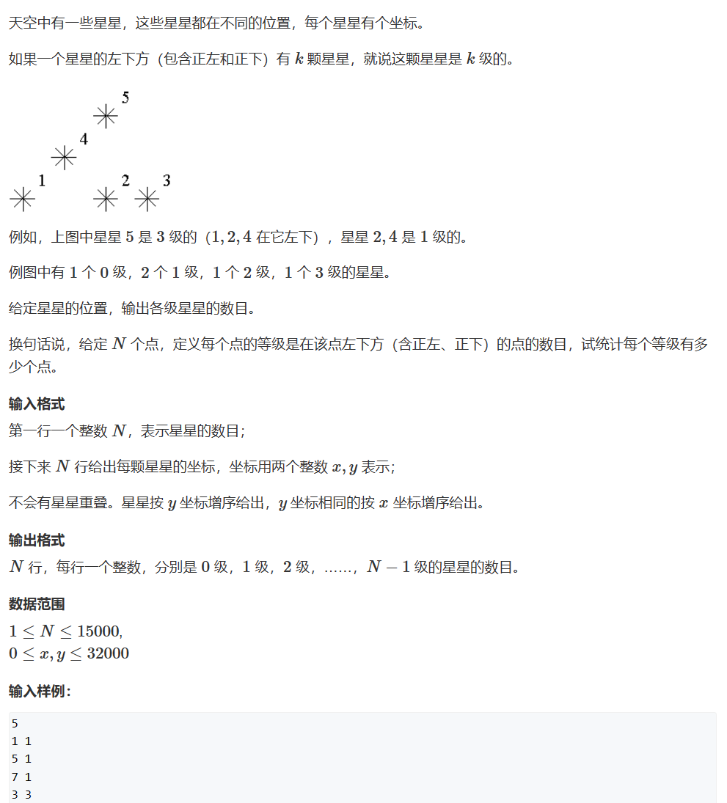


对于给定的数据，由于是已经按照纵坐标排好序的因此前面的值都是在他下面的，能够满足要求的值需要看横坐标大小，横坐标小于等于当前值的即可。通过树状数组记录每个横坐标（将这个位置加一）通过计算前缀和就能得出满足的个数。

```python
# 树状数组
class Tree:
    def __init__(self):
        self.tree=[0]*70000

    def update(self,i,delta):
        i+=1
        while i<len(self.tree):
            self.tree[i]+=delta
            i+=i&(-i)

    def query(self,i):
        s=0
        while i:
            s+=self.tree[i]
            i-=i&(-i)
        return s

t=Tree()
n=int(input())
ans=[0]*n
for _ in range(n):
    x,y=[int(x) for x in input().split()]
    # 记录横坐标的值
    t.update(x,1)
    # 查询，要同时包含这个横坐标，因为可能存在在正下面的点，同时减去一表示不包括本身
    ans[t.query(x+1)-1]+=1
for v in ans:
    print(v)
```

### **Gather Coins**

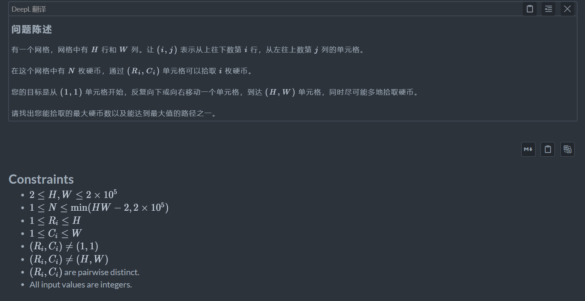


给定的数据范围无法使用回溯，这里因为只能往右下走所以每个硬币只能从左边和上面转移过来，先将数组按照行和列排序，fi表示考虑前i个硬币并且取第i个硬币时最多的硬币数


明显的使用树状数组优化求解，为了得到路径在计算的过程中同时记录一个转移数组，在变数组的过程中已经保证了行是递增的，而对于列用树状数组取得小于等于当前的最大的即可，树状数组中用列的坐标作为数组，这里因为数据范围不大所以不需要离散化

```python
class SegTree:
    def __init__(self,op,e,n,nums):
        self._n=n
        self._op=op
        self._e=e
        self._log=(n-1).bit_length()
        self._size=1<<self._log
        self._d=[self._e()]*(self._size<<1)
        if nums:
            for i in range(self._n):self._d[self._size+i]=nums[i]
            for i in range(self._size-1,0,-1):self._d[i]=self._op(self._d[i<<1],self._d[i<<1|1])
    def update(self,index,x):
        index+=self._size
        self._d[index]=x
        while index:
            self._d[index>>1]=self._op(self._d[index],self._d[index^1])
            index>>=1
    def get(self,p):return self._d[p+self._size]
    def query(self,l,r):
        sml,smr=self._e(),self._e()
        l+=self._size
        r+=self._size
        while l<r:
            if l&1:
                sml=self._op(sml,self._d[l])
                l+=1
            if r&1:
                r-=1
                smr=self._op(smr,self._d[r])
            l>>=1
            r>>=1
        return self._op(sml,smr)
    def all_prod(self):return self._d[1]

def op(x,y):
    val1,i1=x
    val2,i2=y
    if val1>val2:return (val1,i1)
    return (val2,i2)

def e():return(-1,-1)

h,w,n=RR()
nums=[]
for _ in range(n):nums.append([v-1 for v in RR()])
nums.sort()

init=[(0,-1)]*(w+2)
t=SegTree(op,e,len(init),init)
pre=[-1]*n

for i,(r,c) in enumerate(nums):
    val,index=t.query(0,c+1)
    t.update(c,(val+1,i))
    pre[i]=index

val,index=t.query(0,w+2)

m=h-1
n=w-1
ans=[]
# 往回构造路径
while 1:
    r,c=nums[index]
    ans+=['D']*(m-r)
    ans+=['R']*(n-c)
    index=pre[index]
    m,n=r,c
    if index==-1:
        ans += ['D'] * m
        ans += ['R'] *n
        break
print(val)
print(''.join(ans[::-1]))
```


## 回溯算法（DFS）

回溯算法需要确定：路径（已做出的选择），选择列表（可以做的选择），结束条件（无法再做选择的条件），本质上是一种暴力穷举的算法，复杂度一般都很高。

其基本框架如下，核心是for循环中的递归，在递归调用之前做选择，然后在递归中根据这个选择深入，在递归调用之后撤销选择


`回溯有一个很重要的优化就是从大到小去回溯，这样可以更快的选出不合法的值大大减小状态数目`。

在一些题目中需要枚举字符串或数组的切分点，定义dfs(i)表示从i位置开始切割，然后枚举后面的位置作为切分点

```python
result=[]
def backtrace(路径,选择列表):
	if 满足结束条件:
		result.add(路径)
		return 
	for 条件 in 选择列表:
		做选择
        backtrace(路径,选择列表)
        撤销选择
```

dfs中的选择一旦大于6就有可能超时！

### [从根到叶的二进制数之和](https://leetcode.cn/problems/sum-of-root-to-leaf-binary-numbers/)

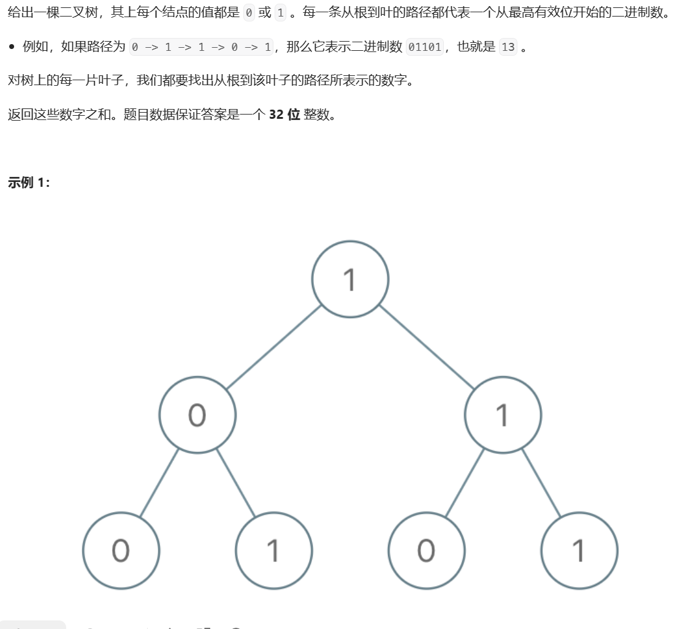


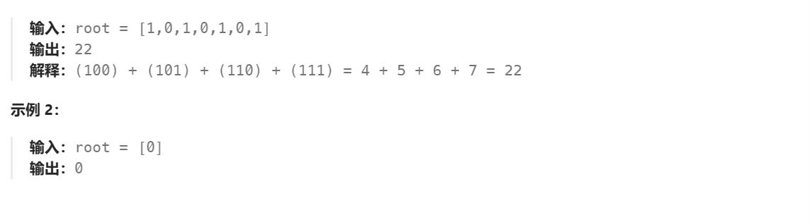

使用dfs深度优先搜索

```python
class Solution:
    def sumRootToLeaf(self, root: Optional[TreeNode]) -> int:
        ans=[]
       
        def cal(s):
            return int(s,2)
        def dfs(root,s):
            # 因为不会遍历空节点，因此直接加入值
            s+=str(root.val)
            # 加入后判断是不是叶子节点，如果是记录结果
            if not root.left and not root.right:
                ans.append(cal(s))
                return
	   # 只有节点存在才会进入dfs，保证不会遍历空节点
            if root.left:
                dfs(root.left,s)
            if root.right:
                dfs(root.right,s)
            
        dfs(root,"")
        return sum(ans)
```


### 子集（元素唯一不可复选）

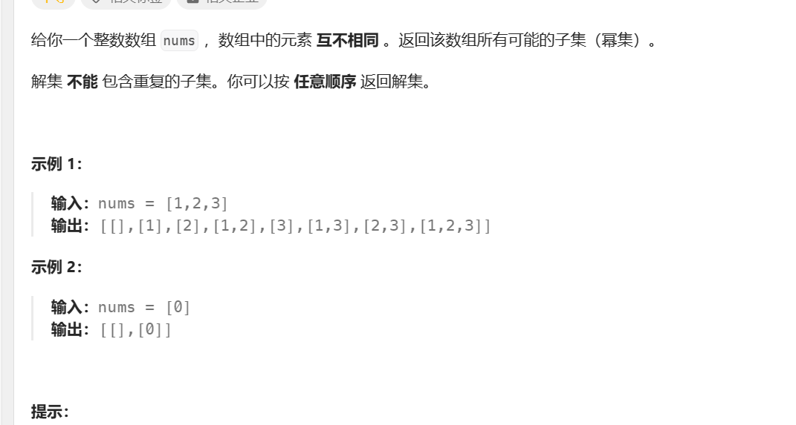

回溯算法解决

```python
# 在输入的角度来看，每个数有选还是不选的两种情况
class Solution(object):
    def subsets(self, nums):
        n=len(nums)
        ans=[]
        def dfs(i,path):
            if i==n:
                ans.append(path[:])
                return
            # 不选，直接进入下一层
            dfs(i+1,path)
            # 选择
            path.append(nums[i])
            dfs(i+1,path)
            path.pop()
        dfs(0,[])
        return ans 


# 从答案角度来看，选哪个数
class Solution(object):
    def subsets(self, nums):
        self.res=[]
        self.backtrace(nums,[],0)
        return self.res
    def backtrace(self,nums,path,start):
        # 注意
        self.res.append(path[:])
        # 通过索引控制区间的起始，不断缩减区间，从而到达防止重复的效果
        for i in range(start,len(nums)):
            path.append(nums[i])
            self.backtrace(nums,path,i+1)
            path.pop()
```

### 组合


子集注意不能跳过

```python
class Solution(object):
    def combine(self, n, k):
        if not n:
            return None
        self.res=[]
        nums=[i+1 for i in range(n)]
        self.backtrace(nums,k,[],0)
        return self.res
        
    def backtrace(self,nums,k,path,start):
        # 在子集的基础上加上一个base case 
        if len(path)==k:
            self.res.append(path[:])
            return
        for i in range(start,len(nums)):    
            path.append(nums[i])
            self.backtrace(nums,k,path,i+1)
            path.pop()
```

### 子集（包括重复元素）

每个元素有选或者不选，对于数组[1,2,2]选择第一个2和第二个2都是一样的，因此对于当前的x，如果前面有相同的y并且没有被选择那么这个元素应该被跳过否则会出现相同的子集

```python
class Solution:
    def subsetsWithDup(self, nums: List[int]) -> List[List[int]]:
        #通过排序将相同的元素集中到一起
        nums.sort()
        vis=set()
        ans=[]
        # 每个元素选或者不选
        def dfs(i,path):
            if i==len(nums):
                ans.append(path[:])
                return 
            # 判断需要跳过的情况
            if not (i>0 and nums[i-1]==nums[i] and i-1 not in vis):
                path.append(nums[i])
                vis.add(i)
                dfs(i+1,path)
                vis.remove(i)
                path.pop()
            dfs(i+1,path)
            
        dfs(0,[])
        return ans 
```

### 组合总和（元素重复）

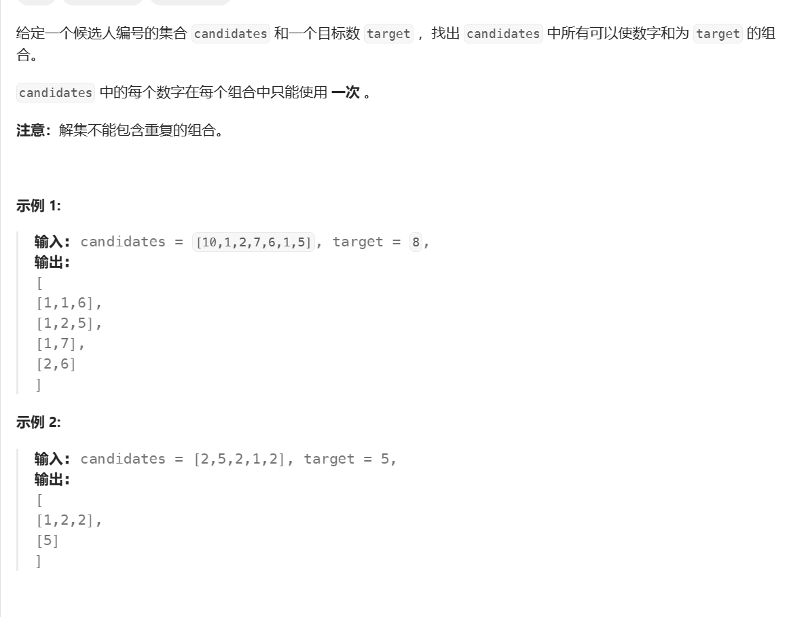

元素重复可能会出现相同的结果，因此对于当前的x，如果前面有相同的y并且没有被选择那么这个元素应该被跳过否则会出现相同的子集。

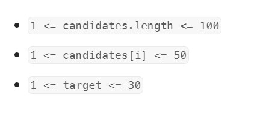

给定的数据范围不能枚举每个（选或不选），这里通过规定起始点来标定每次选择的元素，

```python
class Solution:
    def combinationSum2(self, candidates: List[int], target: int) -> List[List[int]]:
        res=[]
        n=len(candidates)
        # 排序
        candidates.sort()
        vis=set()
        def dfs(i,target,path):
            # 合理的
            if not target:
                res.append(path[:])
                return 
            # 不合法的
            if target<0:
                return 
            
            for j in range(i,n):
                if j>0 and candidates[j]==candidates[j-1] and j-1 not in vis:
                    continue
                # 剪枝
                if target-candidates[j]<0:
                    break
                # 回溯
                vis.add(j)
                path.append(candidates[j])
                dfs(j+1,target-candidates[j],path)
                path.pop()
                vis.remove(j)
        dfs(0,target,[])
        return res 
```

### 组合总和（可重选）

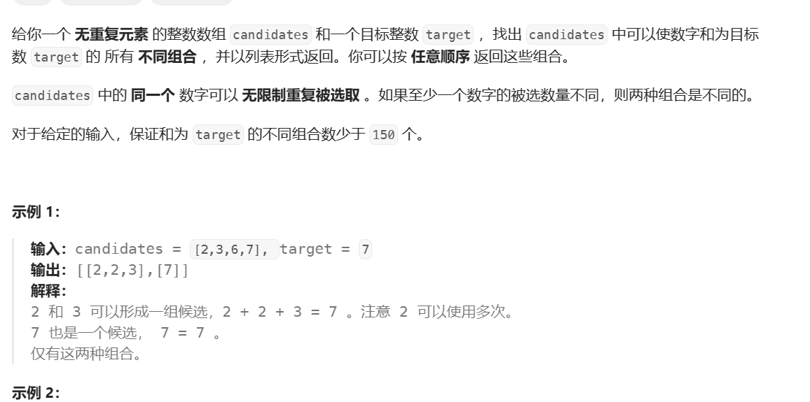

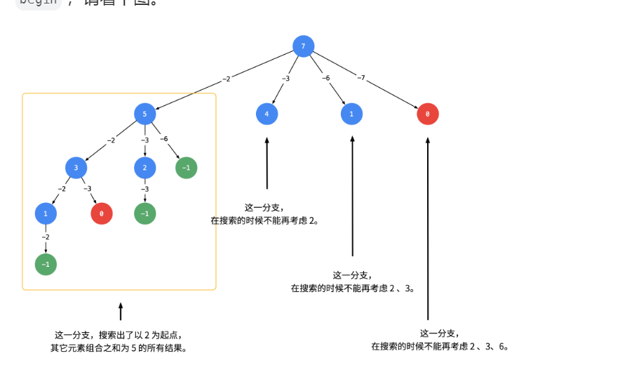

通过树形图可以看出不能考虑每个元素选或者不选，一个元素可以选多次而这个可以通过控制区间来实现。

先将数组排序，这样选的过程中如果当前的元素选了会使target小于0，那么这个元素之后的也一定会，因此可以直接退出。

```python
class Solution:
    def combinationSum(self, candidates: List[int], target: int) -> List[List[int]]:
        res=[]
        n=len(candidates)
        # 排序
        candidates.sort()
        def dfs(i,target,path):
            # 合理的
            if not target:
                res.append(path[:])
            # 不合法的
            if target<0:
                return 
            for j in range(i,n):
                # 剪枝
                if target-candidates[j]<0:
                    break
                # 回溯
                path.append(candidates[j])
                dfs(j,target-candidates[j],path)
                path.pop()
        dfs(0,target,[])
        return res 
```


### 全排列


实际上就是决策树遍历的问题，选择了1下一步只能选择23，再选择了2就只剩下3了，然后完成一次排列，接着就回溯（撤销选择），从3到2没得选，选2到1，再以这个节点可以选择3（for 条件 in 选择列表），当初始的1节点完成排列之后，回溯到选择2或3作为第一个值。

```python
class Solution(object):
    def permute(self, nums):
        res=[]# 记录最终结果的列表
        
        used=[False]*len(nums)# 用于判断数字是否包含
    
    	trace=[]# 路径
        
        self.backtrace(nums,res,trace,used)
        
        return res
    # 这个函数会返回一个排列
    def backtrace(self,nums,res,trace,used):
        
        if len(trace)==len(nums):# 长度一致时既是一个排列
            res.append(trace[:])# 注意要传入一个新的列表，否则在之后会被改动
            return
        
        for i in range(len(nums)):# 遍历每一个数
            if used[i]:# 如果包含过了，跳过
                continue
            trace.append(nums[i])# 否则加入路径
            used[i]=True# 并设置为True
            self.backtrace(nums,res,trace,used)# 按照现有的路径深入
            trace.pop()
            used[i]=False
```

### 全排列（包含重复元素）

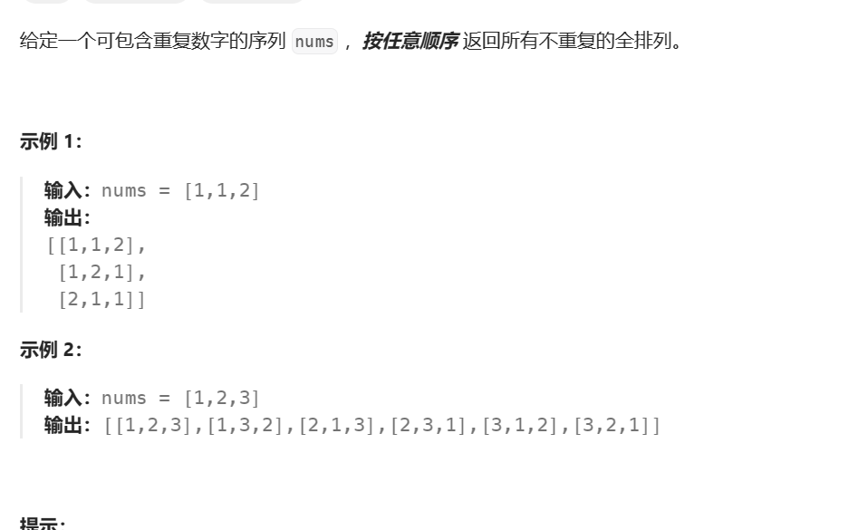

字典的妙用，使用字典初始化列表使得需要遍历的次数减少，无与伦比的剪枝，此外最重要的是规定了一个元素出现的次数，绝对不会超出。（技巧点）

通过字典可以排除重复的全排列序列

```python
from collections import Counter
class Solution(object):
    def permuteUnique(self, nums):
        memo=Counter(nums)
        ans=[]
        vis=[False]*len(nums)
        def dfs(path):
            if len(path)==len(nums):
                ans.append(path[:])
                return 
            for d in memo:
                if memo[d]>0:
                    memo[d]-=1
                    path.append(d)
                    dfs(path)
                    path.pop()
                    memo[d]+=1
        dfs([])
        return ans 
```

### [正方形数组的数目](https://leetcode.cn/problems/number-of-squareful-arrays/)


本质上是在找全排列，注意这里有重复元素，判断是否满足要求打表即可

```python
a=set()
a.add(0)
v=1
while v**2<10**9+10:
    a.add(v**2)
    v+=1
class Solution:
    def numSquarefulPerms(self, nums: List[int]) -> int:
        n=len(nums)
        vis=[False]*n
        ans=[]
        nums.sort()
        memo=Counter(nums)
        def dfs(k,path):
            if k==n:
                ans.append(path[:])
                return 
            # 通过字典防止找到一样的排列
            for d in memo:
                # 注意不能忘了条件
                if path and path[-1]+d not in a :continue
                if memo[d]>0:
                    memo[d]-=1
                    path.append(d)
                    dfs(k+1,path)
                    path.pop()
                    memo[d]+=1
        dfs(0,[])
        return len(ans)

```


或者直接加条件判断

```python
a=set()
a.add(0)
v=1
while v**2<10**9+10:
    a.add(v**2)
    v+=1
class Solution:
    def numSquarefulPerms(self, nums: List[int]) -> int:
        n=len(nums)
        vis=[False]*n
        ans=[]
        # 注意，要先排列使相同元素凑在一起
        nums.sort()
        def dfs(k,path):
            if k==n:
                ans.append(path[:])
                return 
            for i in range(n):
                if vis[i]:continue
                # 如果前面有相同的值，并且这个值没被选中
                elif i>0 and nums[i-1]==nums[i] and not vis[i-1]:continue
                elif path and path[-1]+nums[i] not in a:continue
                vis[i]=True
                path.append(nums[i])
                dfs(k+1,path)
                path.pop()
                vis[i]=False
        dfs(0,[])
        return len(ans)
```


### [ 找出 3 位偶数](https://leetcode.cn/problems/finding-3-digit-even-numbers/)

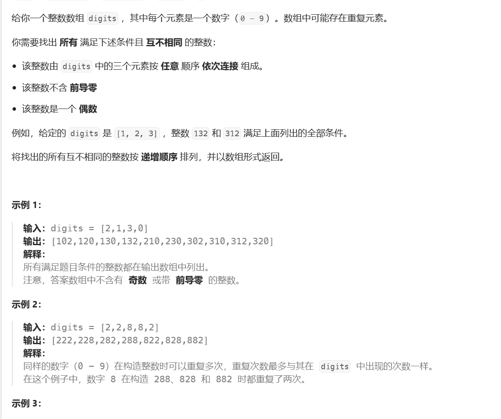

实际上就是在选出三个元素，然后看他们的全排列中有几个满足条件的

使用字典的高效的dfs,如果选择遍历digits中的每一个值，绝对超时

```python
from collections import Counter
class Solution(object):
    def findEvenNumbers(self, digits):
        memo=Counter(digits)
        ans=[]
        def dfs(path):
            if len(path)==3:
                val=path[0]*100+path[1]*10+path[2]
                if val>99 and val%2==0:
                    ans.append(val)
                return 
            for d in memo:
                if memo[d]>0:
                    memo[d]-=1
                    path.append(d)
                    dfs(path)
                    path.pop()
                    memo[d]+=1
        dfs([])
        ans.sort()
        return ans
```


### 		[统计字典序元音字符串的数目](https://leetcode.cn/problems/count-sorted-vowel-strings/)

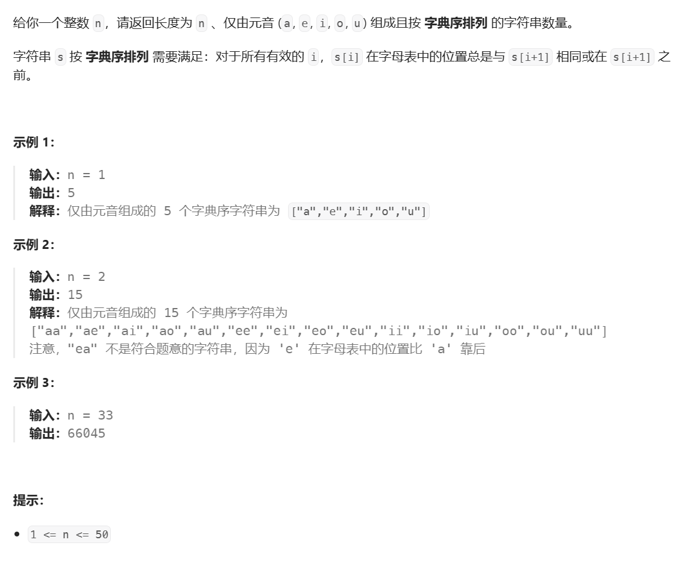


使用dfs()进行选择，对每一个元音字母有选和不选两种选择，这里使用一个变量pre表示当前字符时元音中的第几个，因为不能选择字典序小于当前的。

```python
from functools import cache
class Solution:
    def countVowelStrings(self, n: int) -> int:
        type=5
        ans=0
        @cache
        def dfs(i,pre):
            nonlocal ans
            if pre>=type:
                return 0
            if i==n:
                return 1
            # 内部使用一个值记录结果返回，不能累加一个外部变量，因为使用记忆化搜索不会进行里面的累加操作，只会返回dfs的结果。
            res=0
            # 不选，跳过当前的
            res+=dfs(i,pre+1)
            # 选，i+1表示个数，pre不变，因为下一个可以选当前值
            res+=dfs(i+1,pre)
            # 返回结果
            return res
        return dfs(0,0)
```


### [判断一个数字是否可以表示成三的幂的和](https://leetcode.cn/problems/check-if-number-is-a-sum-of-powers-of-three/)

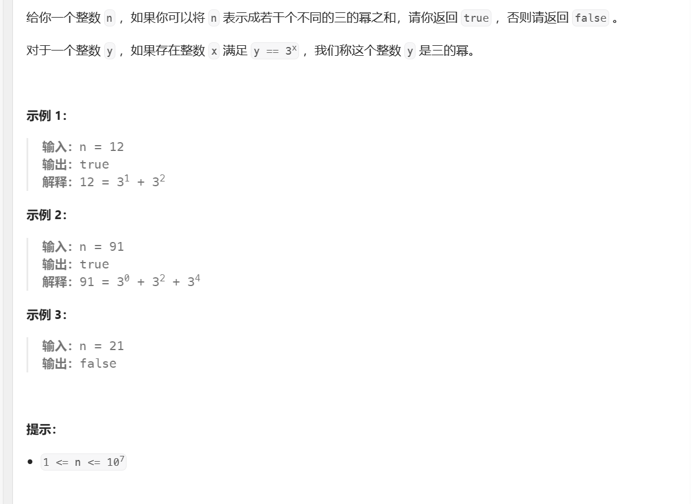

由于10** 7小于3 **15，因此枚举3的冥到15(技巧点)然后用dfs从中找值组合为n既=即可，注意这里的dfs找值不要用for循环加上一个vis数组遍历，只有两个状态：`选或不选`！

```python
class Solution:
    def checkPowersOfThree(self, n: int) -> bool:
        li=[3**i for i in range(16)]
        vis=[False]*len(li)
        flag=False
        def dfs(i,x):
            nonlocal flag
            if i==15 or flag:
                # if x==n:
                #     flag=True
                return

            if x==n:
                flag=True
                return
            dfs(i+1,x+li[i])
            dfs(i+1,x)

        dfs(0,0)
        return flag

```


### N皇后问题


回溯算法解决，以行为单位推进，选择列表中是任意的列

```python
class Solution(object):
    def solveNQueens(self, n):
        res = []
        square = [['.' for _ in range(n)] for _ in range(n)]# 棋盘
        self.backtrace(square, n, res, 0)
        return res

    def backtrace(self, square, n, res, row):
        if row >n-1:# 行超出边界作为结束条件
            res.append(["".join(row) for row in square])# 二维的似乎不能用square[:]
            return
        for col in range(n):# 选择列表，每一行的任意列都可以选择，然后进入到下一行从左到右选择一列（需要判断合法，否则跳过）
            if self.isvalid(square, row, col, n):# 如果位置合法
                
                square[row][col] = 'Q'# 选择
                
                self.backtrace(square, n, res, row + 1)# 进入下一层
                
                square[row][col] = '.'# 撤销

    def isvalid(self, square, row, col, n):# 判断皇后的位置是否合法
        for i in range(row):# 判断该位置上方的列
            if square[i][col] == 'Q':
                return False

        for i, j in zip(range(row - 1, -1, -1), range(col - 1, -1, -1)):# 判断左上
            if square[i][j] == 'Q':
                return False

        for i, j in zip(range(row - 1, -1, -1), range(col + 1, n)):# 判断右上
            if square[i][j] == 'Q':
                return False

        return True

```

### 划分为K个相等的子集


按照球盒模型理解，K个盒子N个球，每个盒子遍历一遍数组，从中选取合适的值加入到盒子中，盒子满了就换下一个盒子

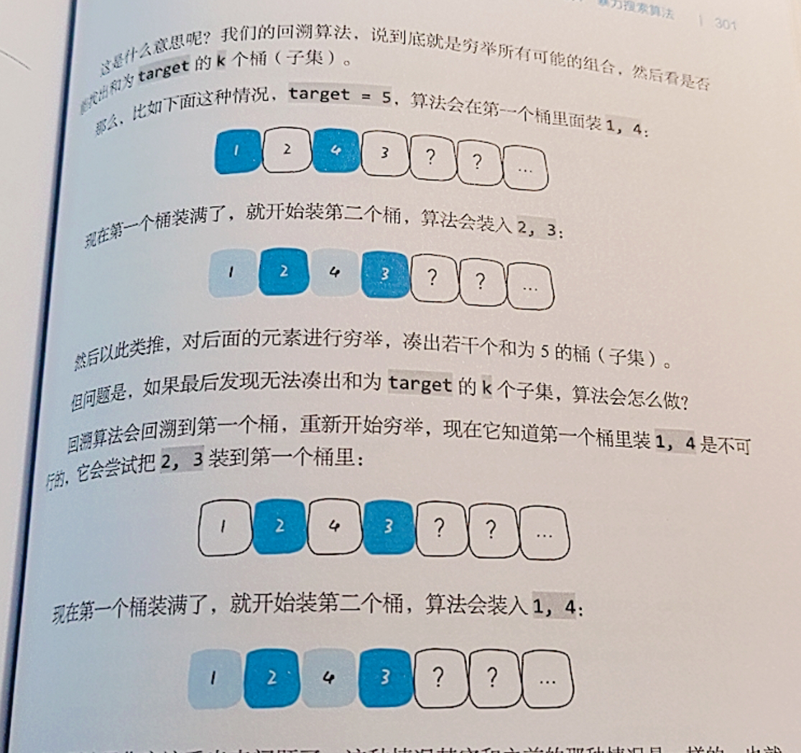

两个盒子可能出现一样的选球组合：当前一个盒子的组合（比如说选了1，5）后面的无论怎么组合结果都是不对的，那么会进行回溯，这是前一个选了（2，4）后一个盒子有可能拿到（1，5）那么结果是已经确定了的，使用哈希表记录下每个失败的组合，当盒子选到失败的组合直接返回

```python
class Solution(object):
    def canPartitionKSubsets(self, nums, k):
	# 数组长度没有要划分的集合多
        if k>len(nums):
            return False
        # 数字总和
        vals=sum(nums)
	# 数字总和无法被均分为K份
        if vals%k!=0:
            return False
        # 每个盒子中数字的总和
        target=vals//k
        # 记录数字是否被加入,使用位图的方式记录，节省空间并且方便记录到字典中
        used=0
        # 字典，防止重复求解
        self.hash={}
        return self.backtrace(nums,target,0,used,k,0)
    # nums数组，target每个盒子中的数，start当盒子中加入了一个数后，下一个数从哪里开始找，k表示当前是第几号盒子，bucket当前盒子中的数
    def backtrace(self,nums,target,start,used,k,bucket):
        if not k:
            return True
        if bucket==target:
            # 当前盒子满了求解下一个盒子
            res=self.backtrace(nums,target,0,used,k-1,0)
            # 记录装满这个盒子方式的结果
            self.hash[used]=res
            return res
        # 这个方式已经求过了，直接返回结果
        if used in self.hash:
            return self.hash[used]
        for i in range(start,len(nums)):
            # 位运算，判断第i位是否为1（TRUE）
            if (used>>i)&1==1:
                continue
            # 大了
            if bucket+nums[i]>target:
                continue
			# 更新
            bucket+=nums[i]
            # 将第i位设置为1
            used|=1<<i
            # 从下一个位置开始选数填入桶中，如果能满足，直接返回
            if self.backtrace(nums,target,i+1,used,k,bucket):
                return True
            bucket-=nums[i]
            # 第i位设置为0
            used^=1<<i
        # 穷举了所有数字都无法装满桶
        return False
```


从球的视角看就是每个球有k种选择，对每个合法的选择都进行一次

这里一个重要的剪枝是当两个盒子有相同的值的时候，当前的球放到哪一个中结果都是一样的

```python
class Solution:
    def canPartitionKSubsets(self, num	s: List[int], k: int) -> bool:
        # 通过排序保证指望一个方向走，同时每次都是找没有被选的最大的球，如果较大的球无法塞入那么小的也一定不行，这样可以更快的筛出无用的结果
        nums.sort(reverse=True)
        # 可行性剪枝
        total=sum(nums)
        n=len(nums)
        if total%k:
            return False
        target=total//k
        # 记录k个盒子中储存的值
        buckets=[0]*k
        # i表示第几个球
        def dfs(i):
            # 能走到最后就是一个可行的解
            if i==n: return True
      	  # 遍历每一个盒子，就是在模拟球放入每一个盒子
            for j in range(k):
                # 如果当前盒子和前一个盒子储存的值是一样的，相当于把球塞入两个相同的箱子，那么结果也是一样的（False）
                if j>0 and buckets[j]==buckets[j-1]:continue 
                # 如果超出盒子容积了，换下一个盒子
                if buckets[j]+nums[i]>target:continue
                # 递归，看下一个球
                buckets[j]+=nums[i]
                if dfs(i+1):
                    return True
                buckets[j]-=nums[i]
            return False
        return dfs(0)
```


以盒子的视角来看，每个盒子遍历一遍数组，每个值有加入和不加入两种情况，时间复杂度为$$2^{kn}$$

以球的视角n个数字每个数字有k个桶可供选择，时间复杂度为$$k^{n}$$​


### 木棒

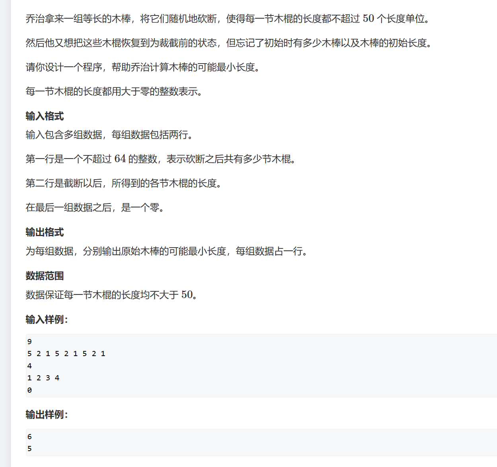

回溯加剪枝，枚举每个长度找是否可以划分，类似于划分K个相等的子集，给定m个桶每个桶的值为n

剪枝：

+ 对于相同的值，如果之前选了这个值不行，那么再选相同的值结果也是一样的
+ 如果前面选了先选了1再选了5，而后不能先选5在选1，结果是一样的
+ 对于一个桶，如果他第一个放入的值不行就退出。反证法：如果存在一组合法的方案，那么这根木棍一定是存在于某组木棍中，因为组内木棍的顺序是任意的，所以可以将其调至为第一根木棍，故和已知牟盾。
+ 同理，对于一个桶，如果他最后放入的值不行就退出。


```python
import sys
input=sys.stdin.readline
# u表示桶的数目，curr表示当前桶内的值,start表示从第几个开始，k表示目标值
def dfs(u,curr,start,k):
    # 找到了合适的组合
    if u*k==total:return True
    # 一个桶满了
    if curr==k:return dfs(u+1,0,0,k)
    
    i=start
    # 往桶里装值
    while i<n:
        # 访问过
        if vis[i]:
            i+=1
            continue
        # 超出了 
        if curr+nums[i]<=k:
            vis[i]=True
            #  回溯
            if dfs(u,curr+nums[i],i+1,k):
                return True 
            vis[i]=False
        # 如果是第一个值或最后一个值
        if not curr or curr+nums[i]==k:return False
        # 跳过重复的值
        j=i+1
        while j<n and nums[j]==nums[i]:j+=1
        i=j
    return False


while 1:
    n = int(input())
    if not n:
        break
    # 注意一定要先倒序排序，通过先访问大的值排除尽可能多的错误答案
    nums = sorted([int(x) for x in input().split()],reverse=True)
    total=sum(nums)
    vis=[False]*70

    # 枚举
    for k in range(max(nums), total + 1):
    
        if total % k != 0: continue
        
        if dfs(0, 0, 0,k):
            print(k)
            break


```


### [构建字典序最大的可行序列](https://leetcode.cn/problems/construct-the-lexicographically-largest-valid-sequence/)

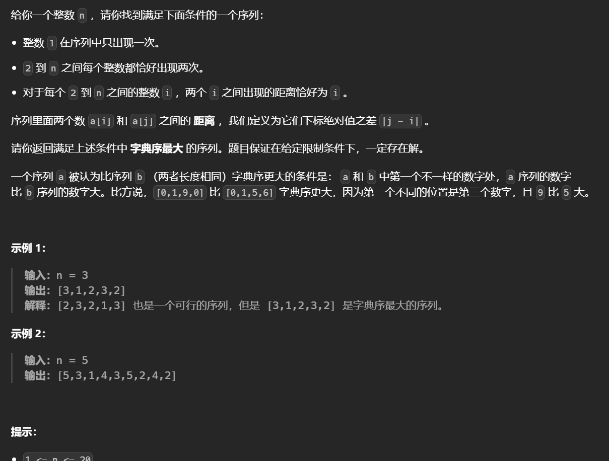

对高位尽可能的填较大的值，如果找到一个合适的解就可以直接退出不用继续找了，这里的关键在于给回溯一个返回值表示是否能找到一个解，从高位开始遍历尝试填较大的值，填了后进行回溯如果能成功那么直接就返回

```python
class Solution:
    def constructDistancedSequence(self, n: int) -> List[int]:
        t=2*n-1
        res=[-1]*t
        def dfs(curr):
            if curr==t:return True # 走到这一步就是成功了
            if res[curr]!=-1:return dfs(curr+1)# 这一位填过了
            for num in range(n,-1,-1):# 找大的值
                if num in res:continue# 这个值用过了
                gap=0 if num==1 else num
                if curr+gap<t and res[curr]==res[curr+gap]==-1:
                    res[curr]=res[curr+gap]=num
                    # 如果能得到解就不用继续了
                    if dfs(curr+1):return True 
                    res[curr]=res[curr+gap]=-1
            
        dfs(0)
        return res 
```

### [检查是否有合法括号字符串路径](https://leetcode.cn/problems/check-if-there-is-a-valid-parentheses-string-path/)

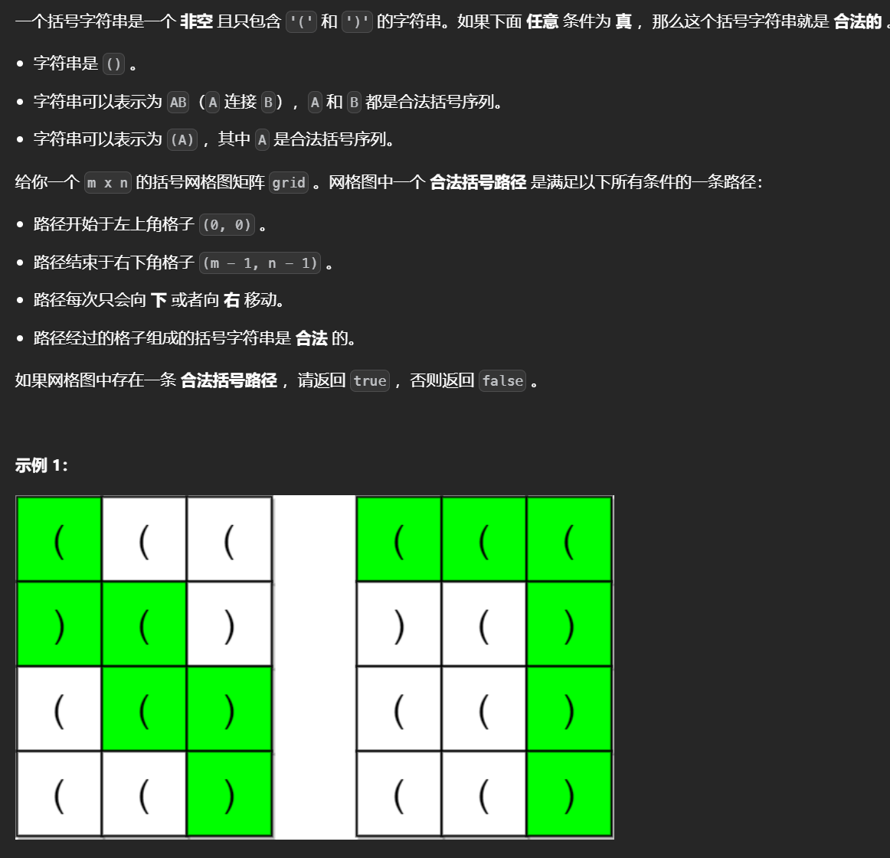

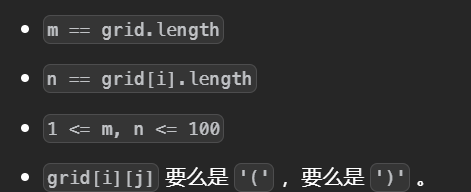

括号匹配不用一个数组储存，而是用一个变量表示，遇到左括号加一遇到右括号减一，在回溯的过程中如果变量小于0说明右括号更多所以一定是不满足条件的，当回溯到最后的位置变量的值必须是0才能完成匹配。矩阵的开头必须是左括号结尾必须是右括号，因为是要括号匹配因此走过的路程是偶数。

```python
class Solution:
    def hasValidPath(self, grid: List[List[str]]) -> bool:
        m,n=len(grid),len(grid[0])
        # 可行性剪枝
        if (m+n-1)&1 or grid[0][0] == ')' or grid[m - 1][n - 1] == '(':return False
        @cache
        def dfs(i,j,d):
            # 左括号的个数不能超过一半
            if d>(m+n-1)//2:return False
            # 到达最终位置
            if i==m-1 and j==n-1:return d==0

            for dx,dy in (0,1),(1,0):
                if 0<=(x:=i+dx)<m and 0<=(y:=j+dy)<n:
                    c=grid[x][y]
                    dd=d
                    if c=='(':dd+=1
                    else:dd-=1
                    # 变量的值必须大于等于0
                    if d>=0 and dfs(x,y,dd):return True 
            return False
        return dfs(0,0,1)
```


### [求一个整数的惩罚数](https://leetcode.cn/problems/find-the-punishment-number-of-an-integer/)

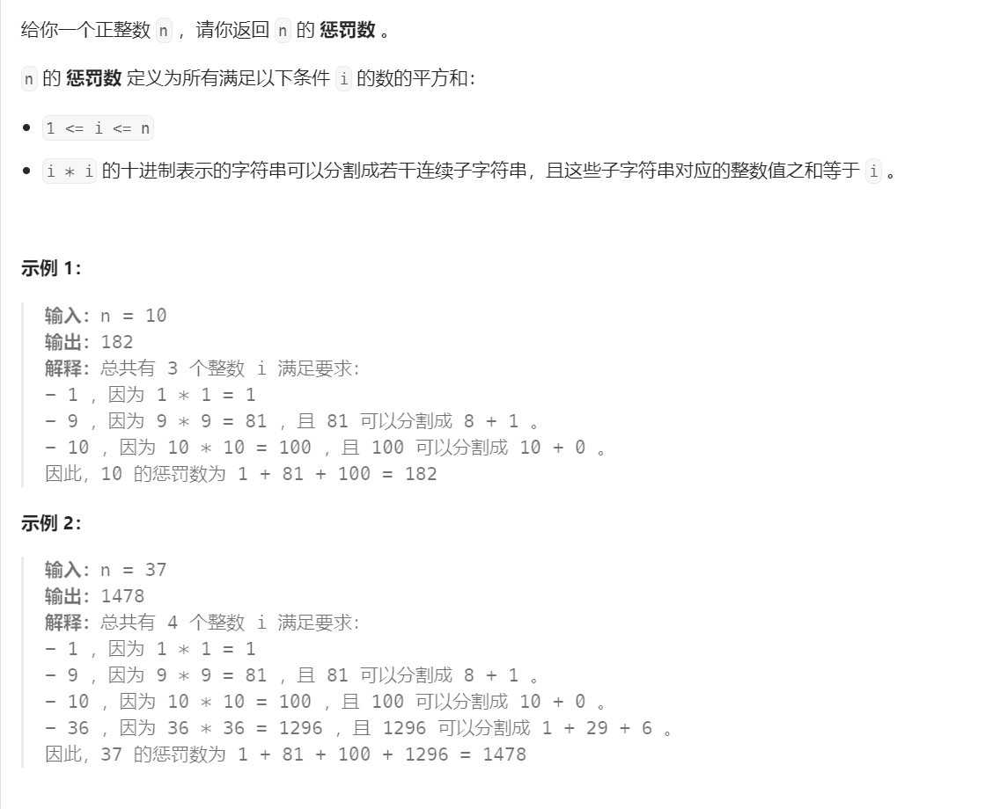


可以枚举每个数看他的平方后的字符后是否能分割为连续的子字符串相加的结果为i。

对于这个字符串的分割可能可以使用暴力回溯，找每一个位置分割的结果，字符串最多长为6，状态数不会太多。

```python
pre=[0]*1001
# 打表
for i in range(1,1001):
    s=str(i**2)
    n=len(s)
   # 暴力枚举每个分割的位置
    def dfs(p,summ):
        # 如果最后结果合法 ，返回True
        if p==n:
            return summ==i
        # 记录从当前位置开始分割得到的子字符串的大小
        x=0
        for j in range(p,n):
            x=10*x+int(s[j])
            # 进入下一层
            if dfs(j+1,summ+x):
                return True
        # 不存在可行的
        return False
    pre[i]=pre[i-1]+(i**2 if dfs(0,0) else 0)


    123
class Solution:
    def punishmentNumber(self, n: int) -> int:
        return pre[n]
	
```


### 岛屿数量

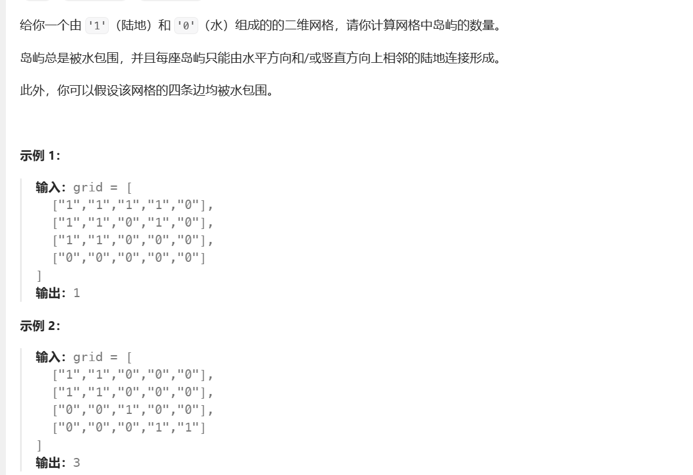


遍历每一个值，如果是陆地使用DFS将这块陆地及周围的陆地淹没，这样可以防止重复计算，每一块陆地只会计入一次。

```python
class Solution(object):
    def numIslands(self, grid):
        # 长度
        m=len(grid)
        n=len(grid[0])
        res=0
        # 方向
        self.dirs=[
            lambda x,y:(x-1,y),
            lambda x,y:(x,y+1),
            lambda x,y:(x+1,y),
            lambda x,y:(x,y-1)]
        # 遍历每一个
        for i in range(m):
            for j in range(n):
                if grid[i][j]=='1':
                    # 淹没周围的陆地
                    self.dfs(grid,i,j)
                    res+=1
        return res
    def dfs(self,grid,i,j):
        # 淹没本身
        grid[i][j]='0'
        # 各个方向
        for dir in self.dirs:
            x,y=dir(i,j)
            # 判断是否索引合法
            if 0<=x<len(grid) and 0<=y<len(grid[0]):
                if grid[x][y]=='1':
                    self.dfs(grid,x,y)
```


### 封闭岛屿数目

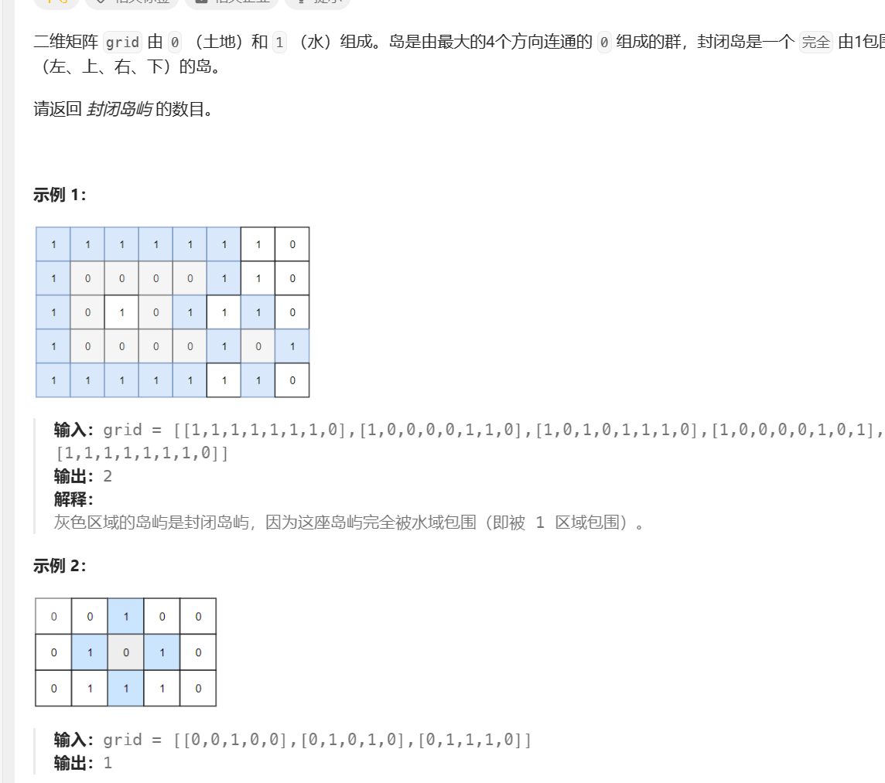

在地图中只要不与边界相邻就是封闭的，因此先去掉边界上的陆地，然后再遍历内部的陆地即可。

```python
class Solution(object):
    def closedIsland(self, grid):
        m = len(grid)
        n = len(grid[0])
        res = 0
        self.dirs = [
            lambda x, y: (x - 1, y),
            lambda x, y: (x, y + 1),
            lambda x, y: (x + 1, y),
            lambda x, y: (x, y - 1)]
        for i in range(m):
            if grid[i][0]==0:
                self.dfs(grid,i,0)
            if grid[i][n-1]==0:
                self.dfs(grid,i,n-1)
        for i in range(n):
            if grid[0][i]==0:
                self.dfs(grid,0,i)
            if grid[m-1][i]==0:
                self.dfs(grid,m-1,i)
        for i in range(1,m-1):
            for j in range(1,n-1):
                if grid[i][j] == 0:
                    self.dfs(grid, i, j)
                    res += 1
        return res

    def dfs(self, grid, i, j):
        grid[i][j] = 1
        for dir in self.dirs:
            x, y = dir(i, j)
            if 0 <= x < len(grid) and 0 <= y < len(grid[0]):
                if grid[x][y] == 0:
                    self.dfs(grid, x, y)
```


### 岛屿的最大面积


回溯每个岛屿的时候将用于记录最大值的外部变量更新

```python
class Solution(object):
    def maxAreaOfIsland(self, grid):
        m = len(grid)
        n = len(grid[0])
        res = 0
        self.dirs = [
            lambda x, y: (x - 1, y),
            lambda x, y: (x, y + 1),
            lambda x, y: (x + 1, y),
            lambda x, y: (x, y - 1)]
        self.count=0
        for i in range(m):
            for j in range(n):
                self.count=0
                if grid[i][j] == 1:
                    self.dfs(grid, i, j)
                    res = max(res,self.count)
        return res

    def dfs(self, grid, i, j):
        
        grid[i][j] =0
        self.count+=1
        for dir in self.dirs:
            x, y = dir(i, j)
            if 0 <= x < len(grid) and 0 <= y < len(grid[0]):
                if grid[x][y] == 1:
                    self.dfs(grid, x, y)
```


### 统计子岛屿

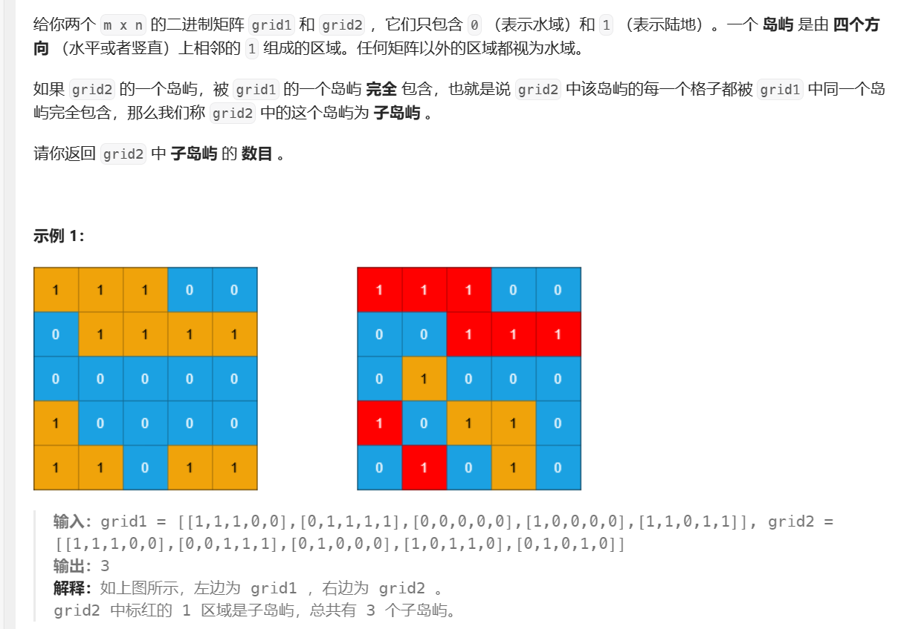

grid2中的子岛屿的每一块陆地必须在grid1中出现，遍历grid2，如果其中有一块陆地在grid2中出现而没有在grid1中出现，说明这个陆地所连的岛屿不是子岛屿，将其淹没。完成上述步骤后，再次遍历grid2进行计数即可。

### 不同的岛屿数目


使用回溯算法寻找每一个岛屿，对于相同的岛屿他们的回溯的顺序是一样的，因此在回溯过程中定义一个字符串记录每次的回溯顺序，比如令向下为1 向上为0，当向上的时候加入'0'到字符串中。此外不能拉下撤销的顺序。

比如：

[[1,1,0],[0,1,1],[0,0,0],[1,1,1],[0,1,0]]如果只记录加入的顺序会认为是一样的。

```python
class Solution(object):
    def numDistinctIslands(self, grid):
        m = len(grid)
        n = len(grid[0])
        dirs = [
            lambda x, y: (x - 1, y),# left
            lambda x, y: (x + 1, y),# right
            lambda x, y: (x, y + 1),# up
            lambda x, y: (x, y - 1)]# down
        self.build=""
        hash={}

        def dfs(i,j,s):
            self.build+=s
            grid[i][j]=0
            for index,dir in enumerate(dirs):
                x,y=dir(i,j)
                if 0<=x<m and 0<=y<n and grid[x][y]==1:
                    # 回溯过程中记录顺序，使用index表示
                    dfs(x,y,str(index))
                    # 撤销使用-index
                    self.build+=str(-index)
            
        for i in range(m):
            for j in range(n):
                self.build = ""# 每次清空
                if grid[i][j]==1:
                    dfs(i,j,"")
                    # 计入集合防止重复
                    hash[self.build]=None
            
        return len(hash)# 返回有多少
```

### [受限条件下可到达节点的数目](https://leetcode.cn/problems/reachable-nodes-with-restrictions/)

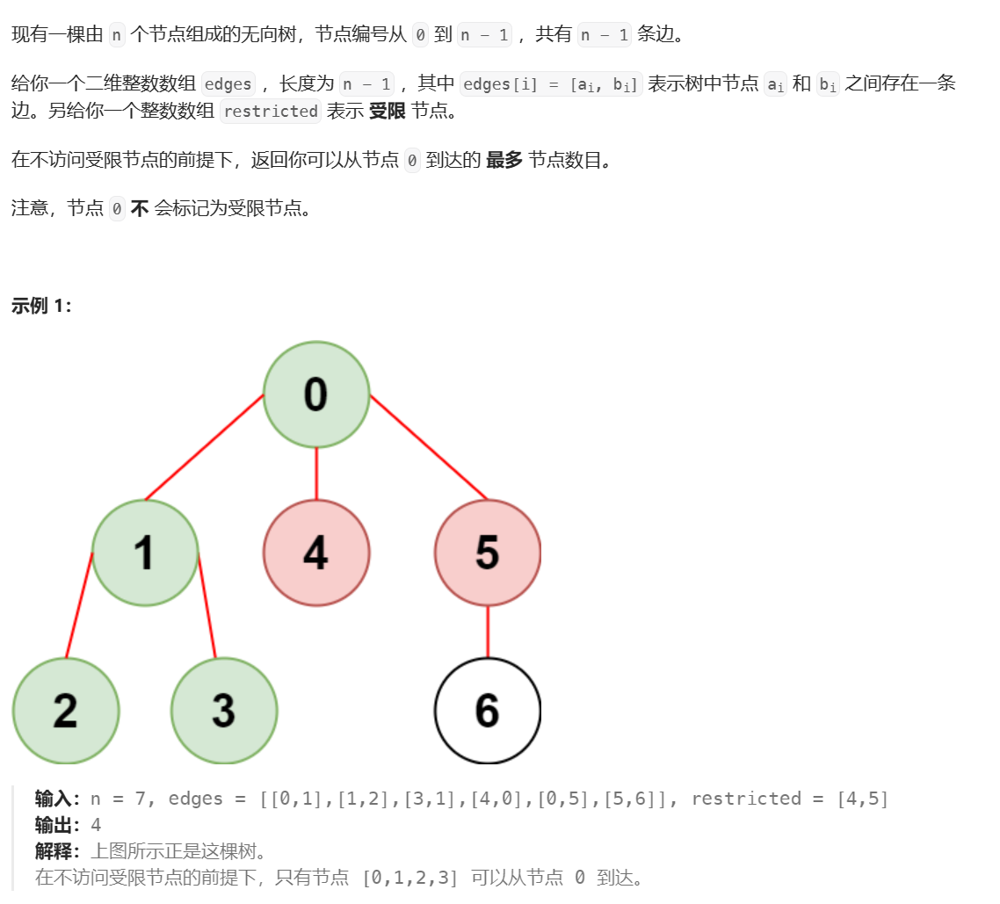


bfs写法

```python
from collections import deque
class Solution:
    def reachableNodes(self, n: int, edges, restricted) -> int:
        paths=[set() for _ in range(n)]
        vis=[False]*n
        vis[0]=True
        ans=1
        # 这里把restriceed转换为set可以降低时间复杂度，因为对set的in 操作复杂度为O(1)
        restricted=set(restricted)
        for edge in edges:
            u,v =edge
            # 在受限数组中的不加入
            if u in restricted or v in restricted:
                continue
            paths[v].add(u)
            paths[u].add(v)
        d=deque(paths[0])
        while d:
            sz=len(d)
            for _ in range(sz):
                curr=d.popleft()
                vis[curr]=True
                if curr not in restricted:
                    ans+=1
                    for e in paths[curr]:
                        if not vis[e]:
                            d.append(e)
        return ans
```

dfs可以用来代替bfs遍历图，只要在传入一个参数表示父节点，在加入连接的节点时判断如果是父节点跳过即可。


### 目标和


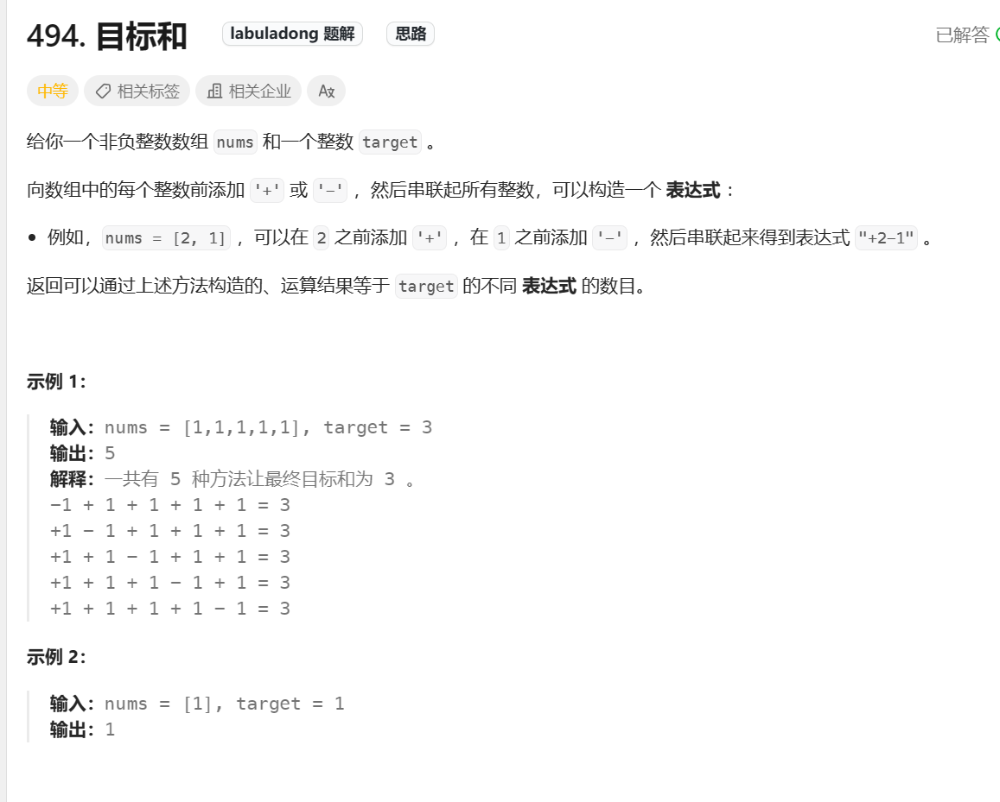

回溯算法，找出所有的组合，如果满足条件外部变量加一

```python
class Solution(object):
    def findTargetSumWays(self, nums, target):
        self.count=0
        def backtrace(nums,target,start,sum):
            if start==len(nums):
                if sum==target:
                    self.count+=1
            else:
                # 不直接修改start的值，做到回溯的效果，由于要计算加和减，调用两次，并用一个sum表示组合的值
                backtrace(nums,target,start+1,sum+nums[start])
                backtrace(nums,target,start+1,sum-nums[start])
        backtrace(nums,target,0,0)
        return self.count

# 由于超出时间限制，选择使用备忘录，将函数改为有返回值的，
class Solution(object):
    def findTargetSumWays(self, nums, target):
        self.memo = {}
        # start表示当前的值，sum是组合
        def backtrace(nums, target, start, sum):
            # 键
            key=(start,sum)
            # 查找备忘录
            if key in self.memo:
                return self.memo[key]
            
            # 每一个值都要有，所以必须遍历完，结束条件就是当前遍历到末尾
            if start == len(nums):
                if sum == target:
                    return 1
                else:
                    return 0
                
            else:# 向外层
                res = backtrace(nums, target, start + 1, sum + nums[start]) + backtrace(nums, target, start + 1, sum - nums[start])
                self.memo[key] = res
                
            return res

        return backtrace(nums, target, 0, 0)
```

###  统计无向图中无法互相到达点对数

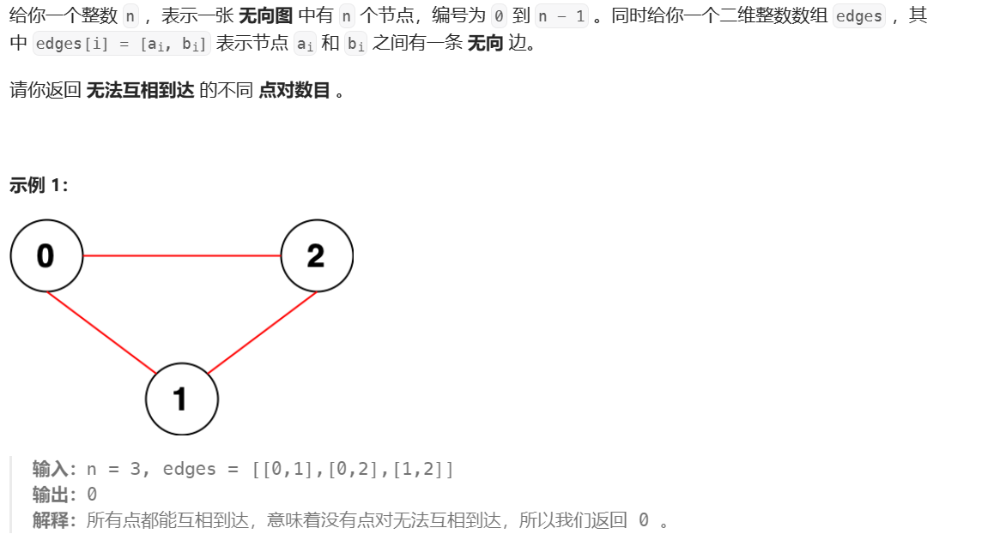


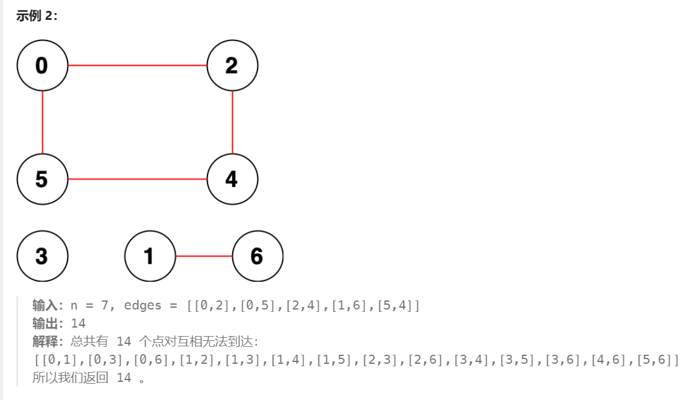


优美的dfs回溯

```python
class Solution(object):
    def countPairs(self, n, edges):
        # cnt表示当前连通块中有多少个点
        res=cnt=total=0
        # 是否访问
        vis=[False]*n
        g=[[] for _ in range(n)]
	# 建图
        for edge in edges:
            p,q=edge[0],edge[1]
            g[p].append(q)
            g[q].append(p)
        def dfs(p):
            vis[p]=True
            nonlocal cnt
            cnt+=1
            for q in g[p]:
                if not vis[q]:
                   
                    dfs(q)
                    
        for i in range(n):
            cnt=0
            if not vis[i]:
                dfs(i)
            res+=cnt*total
            total+=cnt
        return res
```

### 二叉树中的伪回文路径


使用dfs找出所有的路径，然后判断是否为伪回文串，伪回文串满足至多存在一个出现奇数次的数字。

```python
class Solution(object):
    def pseudoPalindromicPaths (self, root):
        count=0
        # 使用计数列表
        path=[0]*10
        # 找是否有一个数字出现奇数次
        def find(paths):
            flag=0
            for path in paths:
                if path%2==1:
                    flag+=1
            return flag>=2
        def dfs(root):
            
            path[root.val]+=1
            # 注意加入放在判断之前，因为判断的是是否为叶子节点
            if not root.left and not root.right:
                nonlocal count
                count+=0 if find(path) else 1      
            if root.left:
                dfs(root.left)
            if root.right:
                dfs(root.right)
            path[root.val] -= 1
        dfs(root)
        return count
```

### [检查替换后的词是否有效](https://leetcode.cn/problems/check-if-word-is-valid-after-substitutions/)

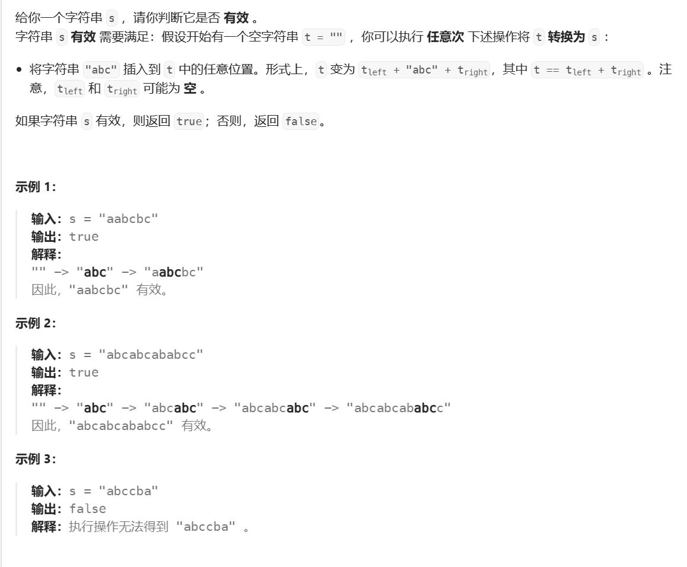

dfs不一样的用法，同样是遍历每一个位置，将该位置的子串和pattern比较，如果相等进入下一层，如果一直找不到就说明没有满足的返回false，在这个过程中参数是字符串。


```python
class Solution(object):
    def isValid(self, s):
        pattern='abc'# 用于比较
        @cache
        def dfs(s):
            # 如果长度为0表示找到了
            if len(s)==0:
                return True
            # 从当前字符串一直找到倒数第三个
            for i in range(len(s)-2):
                # 取其中的三个
                if s[i:i+3]==pattern:
                    # 参数是去除了找到的子串
                    return dfs(s[:i]+s[i+3:len(s)])
            return False
        return dfs(s)
```

### [ 连续差相同的数字](https://leetcode.cn/problems/numbers-with-same-consecutive-differences/)


根据长度为n，回溯遍历每个位置上的值，这里不能有前导0，因此第一个位置上要注意。

连续位置上数字相差是一样的，使用dfs每次加入的值应该是原列表中最后一个值加k或者是减k，


```python
class Solution(object):
    def numsSameConsecDiff(self, n, k):
        ans=[]
        def dfs(temp):
            if len(temp)==n:
                ans.append(int("".join(temp)))
                return
            left=int(temp[-1])-k
            right=int(temp[-1])+k
            
            # 一个位置上的两个值不会超出9以及小于0
            if right<=9:
                dfs(temp+[str(right)])
            if left!=right and left>=0:# 加入left!=right的条件，防止在k=0的时候加入两个相同的
                dfs(temp+[str(left)])
	
       # 在外部遍历，防止前导0
        for i in range(1,10):
            dfs([str(i)])
        return ans
```

### [节点与其祖先之间的最大差值](https://leetcode.cn/problems/maximum-difference-between-node-and-ancestor/)

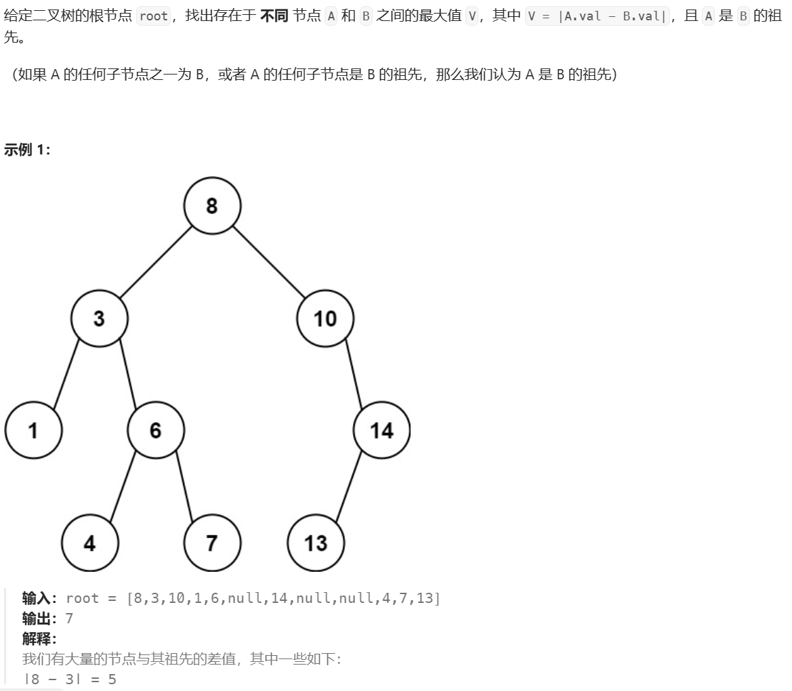


找节点与祖先节点的最大差值，节点与其祖先节点一定是在同一条路径上，使用dfs深度优先遍历记录路径上的最大最小值，最后最差就是这条路径上节点与其祖先节点的最大差值，找出所有的路径的最大差值取最大即可。

```python
class Solution(object):
    def maxAncestorDiff(self, root):
        ans=0
        def dfs(root,mx,mn):
            nonlocal ans
            if not root:
                ans=max(ans,mx-mn)
                return
            mx=max(mx,root.val)
            mn=min(mn,root.val)
            dfs(root.left,mx,mn)
            dfs(root.right,mx,mn)
        dfs(root,0,float('inf'))
        return ans
```


### 素因数

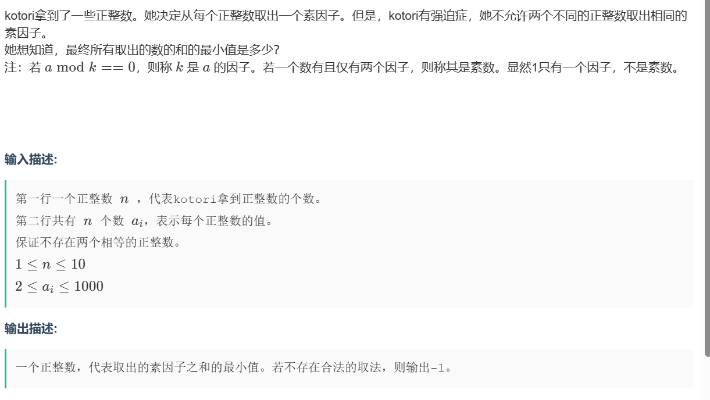


由于数据量不是很大，使用dfs暴力求解，这里的素因数指的是一个数的因数同时这个因数是一个质数。


```python
n=int(input())
nums=list(map(int,input().split()))
ans=float('inf')
# 题目中要求同一个素因数不能同时出现
vis=set()
# 判断是不是质数的函数，技巧点
def prime(x):
    i=2
    # 从2开始判断到开方即可（要取到），只能被1和自己整除
    while i<=(x**0.5):
        if x%i==0:
            return False
        i+=1
    return True
# dfs暴力求解，对每一个数取一个素因数，暴力求解找出所有的
def dfs(index,nums,val):
    global ans
    if index==n:
        # 取最小
        ans=min(sum(val),ans)
        return
    i=2
    # 找一个数的所有因数，从2开始遍历所有的数，因为1不是素因数
    while i<=(nums[index]):
        # 判断这个数是不是因数，是不是质数，有没有重复
        if nums[index]%i==0 and prime(i) and i not in vis:
            vis.add(i)
            val.append(i)
            dfs(index+1,nums,val)
            val.pop()
            vis.remove(i)
        i+=1
dfs(0,nums,[])
print(ans if ans !=float('inf') else -1)
#4
#12 15 28 22
```

### [给定数字能组成的最大时间](https://leetcode.cn/problems/largest-time-for-given-digits/)


暴力法，枚举出每一种可能然后判断可行与否


```python
class Solution:
    def largestTimeFromDigits(self, arr) -> str:
        vis=[False]*4
        # 先进行倒序排列，这里得出的结果才是最大的，如果是正序的话，第一个值就有可能选到0，然后通过判断条件
        arr.sort(reverse=True)
        ans=[]
        # dfs找出所有的排列，注意这里是全排列，不用控制索引
        def dfs(path):
            if len(path)==4:
                ans.append(path[:])
                return
            for i in range(4):
                if vis[i]:
                    continue
                vis[i]=True
                path.append(arr[i])
                dfs(path)
                path.pop()
                vis[i]=False
        dfs([])
        for a,b,c,d in ans :
            # 判断的方式比较巧妙
            if a*10+b<24 and c*10+d<60:
                # 不使用字符串拼接，用格式化字符串
                return f"{a}{b}:{c}{d}"
```

### [重新规划路线](https://leetcode.cn/problems/reorder-routes-to-make-all-paths-lead-to-the-city-zero/)

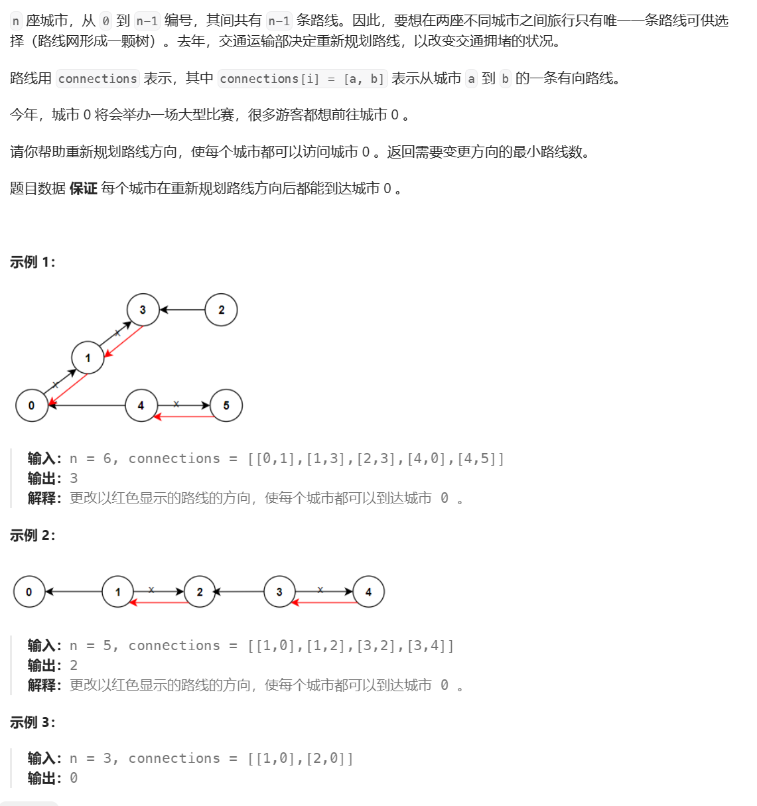

要求从每个城市都可以到达0，那么从0出发（路线相反）应该可以去往每一个城市，`在路线中添加相反的路线(技巧点)`，以确保从0出发可以到达每一个城市，用1表示原本的路线，0表示添加的路线

如果0可以通过原来的路线到该城市，说明这个路线需要反向，如果通过的是添加的路线，那么不需要反转路线。

```python
class Solution:
    def minReorder(self, n: int, connections: List[List[int]]) -> int:
        paths=[set() for _ in range(n)]
        for u,v in connections:
            paths[u].add((v,1))
            paths[v].add((u,0))

        def dfs(i,fa):
            res=0
            for p,j in paths[i]:
                if p==fa:continue
                res+=dfs(p,i)+j
            return res
        return dfs(0,-1)
```

### [将整数减少到零需要的最少操作数](https://leetcode.cn/problems/minimum-operations-to-reduce-an-integer-to-0/)

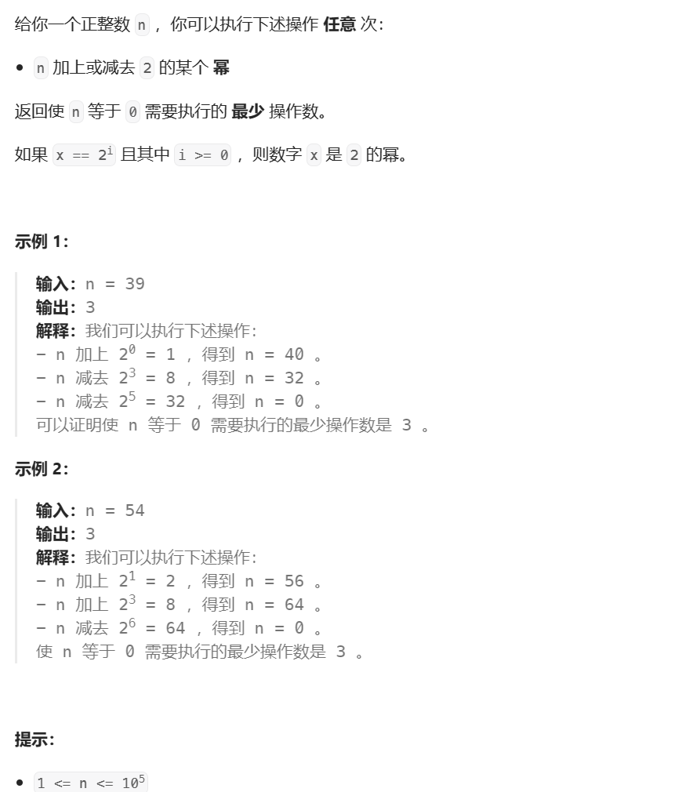

将二进制的1全部消掉，对于最低位的1，可以选择加上或者减去，使用dfs找出最小的结果

```python
class Solution:
    def minOperations(self, n: int) -> int:
        @cache
        def dfs(x):
            # 判断x是否是2的冥（技巧点）
            if x&(x-1)==0:
                return 1
            # lowbit计算最小的1所在位置，比如101100，会找出100
            lb=x&-x
            return 1+min(dfs(x+lb),dfs(x-lb))
        return dfs(n)
```


### 树的重心

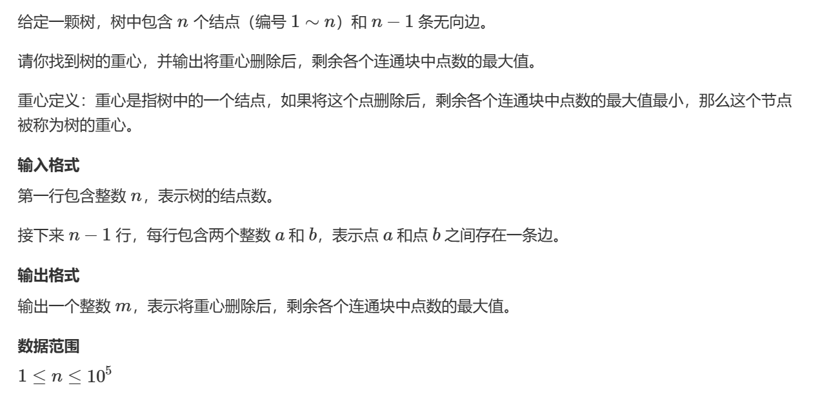

简言之，树的重心就是每个节点最大的子树中的最小值，使用dfs遍历可以得到每一个节点的子树最大值，从中找出最小的的即可，不需要对每个节点使用dfs遍历，遍历一个节点的过程会算出其他节点的子树最大值。对于一个节点他会分为边的数目个子树，其中父节点所在的由于不会回头因此不是通过回溯算出的，但是这个子树的大小，是节点总数减去当前节点dfs遍历到达节点数目。


```python
from functools import lru_cache
from collections import Counter

n = int(input())
memo = Counter()
temp = n - 1
path = [set() for _ in range(n)]
while temp:
    u, v = [int(x) - 1 for x in input().split()]
    path[u].add(v)
    path[v].add(u)
    memo[v] += 1
    memo[u] += 1
    temp -= 1
nums = list(memo.items())
nums.sort(key=lambda x: x[1], reverse=True)
tar = nums[0][1]
ans = float('inf')

li=[]
@lru_cache(maxsize=None)
# 函数会求出每个节点子树数目，不包括父节点
def dfs(i, fa):
    # 记录以i为重心的，删除i后的最大连通块的节点数目
    res = 0
    # 表示以i为根的节点总数（包括根）
    mx = 0
    for p in path[i]:
        if p == fa: continue
        val=dfs(p, i)
        res = max(res, val)
        mx += val
    mx+=1
    res=max(n-mx,res)
    # 使用一个列表记录所有节点的最大子树
    li.append(res)
    return mx


dfs(0,-1)
print(min(li))
```


### [收集树上所有苹果的最少时间](https://leetcode.cn/problems/minimum-time-to-collect-all-apples-in-a-tree/)

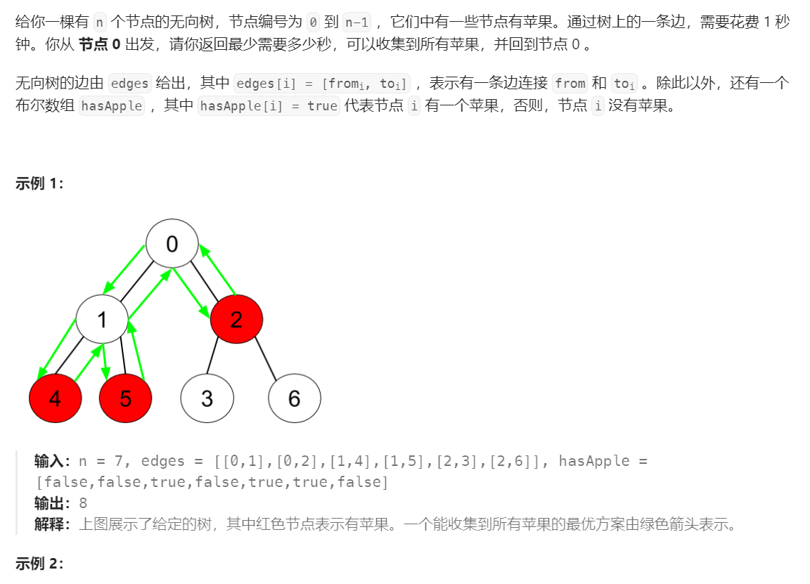


先用一遍dfs找除每个节点子树中苹果的数目（包括自身，防止子树没有苹果），然后在深度遍历的过程中如果当前节点子树有苹果更新时间。

如果知道了这个子树没有苹果就不会进入从而减少花费无用的书简。

```python
class Solution:
    def minTime(self, n: int, edges: List[List[int]], hasApple: List[bool]) -> int:
        ans=0
        g=defaultdict(set)
        for u,v in edges:
            g[u].add(v)
            g[v].add(u)
        # 记录以i为根的子树的苹果数目
        count=[0]*n
       	
        def dfs(root,p):
            # 叶子节点，注意防止根节点被误判的情况
            if len(g[root])==1 and p in g[root]:
                count[root]=int(hasApple[root])
                return count[root]
            res=0
            for u in g[root]:
                if u==p:continue
                res+=dfs(u,root)
             # 更新苹果
            count[root]=res +int(hasApple[root])
            return count[root]
        dfs(0,-1)
        time=0
        # 判断
        def dp(root,p):
            # 叶子节点
            if len(g[root])==1 and p in g[root]:
                return 0
            nonlocal time
            for u in g[root]:
                if u==p:continue
                # 如果子树中有苹果一定会有一个来回
                if count[u]:
                    time+=2
                dp(u,root)
        dp(0,-1)
        return time 
```


### [ 统计构造好字符串的方案数](https://leetcode.cn/problems/count-ways-to-build-good-strings/)

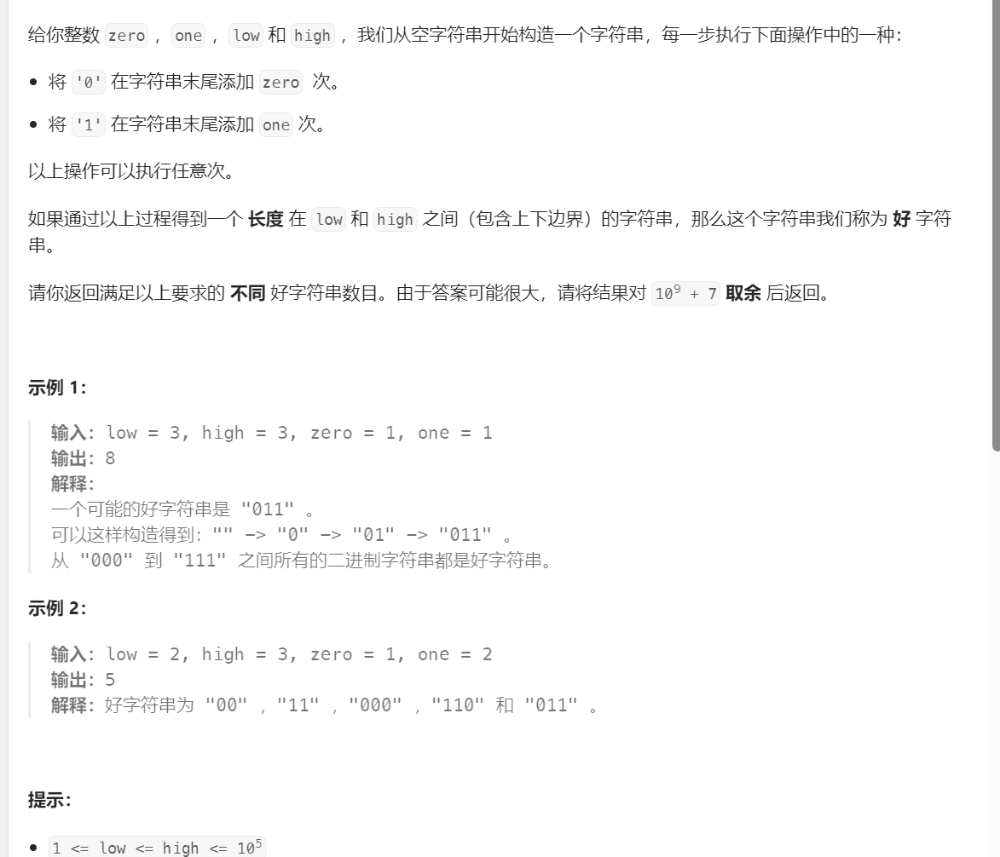

一个操作1一个操作0，无论怎么组合都不会重复，因此也就是找出不同的操作组合（执行几次zero几次one）

```python
class Solution:
    def countGoodStrings(self, low: int, high: int, zero: int, one: int) -> int:
        mod=10**9+7
        @cache
        def dfs(i):
            if i==0:
                return 1
            elif i<0:
                return 0
            return (dfs(i-zero)+dfs(i-one))%mod   
        res=0
        for i in range(low,high+1):
            res+=dfs(i)
            res%=mod
        return res
```

从low到high都求一遍即可。

### 带分数

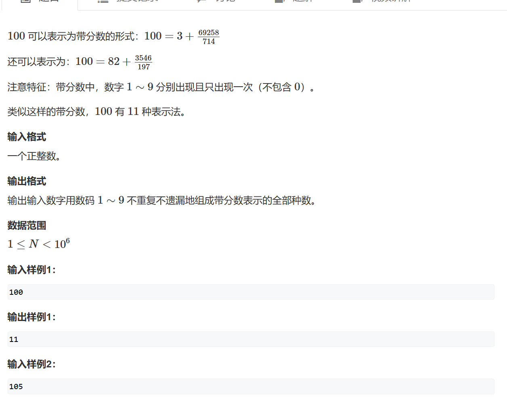

最暴力的做法：找出所有1-9的全排列，对每个排列在其中用隔板法找出a和b以及c判断是否是满足条件的。

```python
from itertools import permutations

target=int(input())

li=list(range(1,10))
# 全排列
nums=permutations(li)

res=[]
ans=0
for s in nums:
    s=''.join(map(str,s))
    for i in range(7):
        for j in range(i+1,8):
            # 剪枝，分母比分子大
            if len(s[j+1:])>len(s[i+1:j+1]):continue
            # 隔板法找出所有的可能
            a=int(s[:i+1])
            b=int(s[i+1:j+1])
            c=int(s[j+1:])
            # 满足条件
            if b%c:continue
            elif a+b//c==target:
                res.append([a,b,c])
                ans+=1
print(ans)

```


优化的做法是：变化公式发现b=nc-ac只要枚举出a和c即可，使用回溯法找a对于a的每个叶节点去找可能的c，也就是回溯套回溯，然后对于每个c可以求出b由此判断是否合法。

```python
import copy

n = int(input())
st = [False] * 10
ans = 0

# 检查是否满足条件，abc中分别包含1~9且只含有一个
def check(a, b, c):
    temp = a + b + c
    if len(temp)==9 and set(temp) == set('123456789'):
        return True
    return False

ans=0
# 在a的基础上找c
def dfs_c(a, c):
    # 推出b
    b = str(n * c - a * c)
    # 重要剪枝
    if len(str(a)) + len(str(b)) + len(str(c)) > 9:
        return
    # 查看当下的a b c是否可行
    if check(str(a), b, str(c)):
        global ans
        ans += 1
     # 回溯找c
    for i in range(1,10):
        if not st[i]:
            st[i] = True
            dfs_c(a, c * 10 + i)
            st[i] = False

# 回溯找a
def dfs_a(a):
    # 剪枝
    if a >= n:
        return
    # 回溯套回溯，在a的每个叶节点找c
    if a:
        dfs_c(a, 0)
	
    for i in range(1,10):
        if not st[i]:
            st[i] = True
            dfs_a(a * 10 + i)
            st[i] = False


dfs_a(0)
print(ans)


```

### [将数组拆分成斐波那契序列](https://leetcode.cn/problems/split-array-into-fibonacci-sequence/)

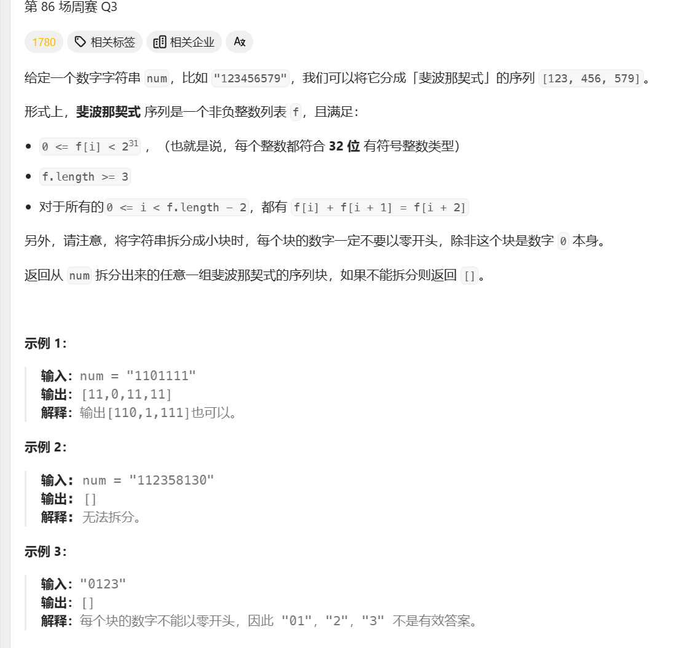

回溯加剪枝，找到一个即可因此dfs返回布尔值，只要是True就表示找到了直接返回，使用回溯划分子数组。

如果开头是0 并且不会在开头划分则不行。如果当前子数组的值大于2**32-1不行。根据斐波那契的性质，划分的数组的前两个值必须等于当前值，如果当前值大于了直接返回，只有等于才能放入

```python
class Solution:
    def splitIntoFibonacci(self, nums: str) -> List[int]:
        n=len(nums)
        ans=[]
        def dfs(index):
            # 能够走到最后的就行
            if index==n:
                return len(ans)>=3
            # 记录的当前划分数组的值
            curr=0
            # 划分
            for i in range(index,n):
                # 剪枝
                if i>index and nums[index]=='0':
                    break
                curr=curr*10+int(nums[i])
                if curr>2**31-1:break
                # 只有满足性质才能，数组中先得有两个数
                if len(ans)<2 or ans[-2]+ans[-1]==curr:
                    ans.append(curr)
                    if dfs(i+1):
                        return True 
                    ans.pop()
                elif len(ans)>2 and curr>ans[-2]+ans[-1]:
                    break
            
            return False
        dfs(0)
        return ans 
```

### [最低票价](https://leetcode.cn/problems/minimum-cost-for-tickets/)

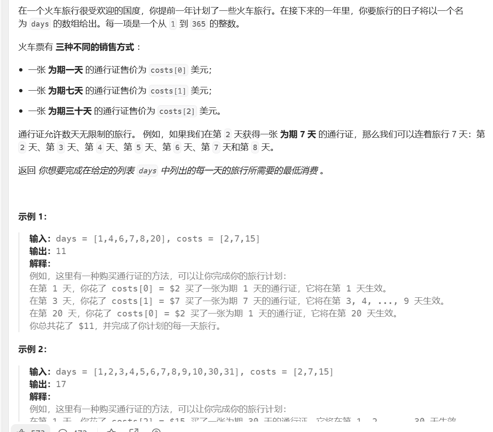

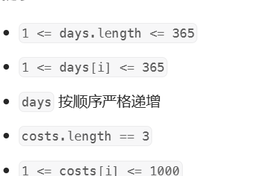


纯暴力的做法，直接看做三种选择的最小值：

```python
class Solution:
    def mincostTickets(self, days: List[int], costs: List[int]) -> int:
        n=len(days)
        ans=[]
        @cache
        def dfs(i,c):
            # 全部完成
            if i>n-1:
                ans.append(c)
                return 
            # 使用二分看这个选择能到那天
            dfs(bisect_left(days,days[i]+1),c+costs[0])
            dfs(bisect_left(days,days[i]+7),c+costs[1])
            dfs(bisect_left(days,days[i]+30),c+costs[2])
        dfs(0,0)
        return min(ans)
```


动态规划的思想，定义dfs(i)为从第i天开始到这一年结束所需的最小的费用，对于车票贪心的思想是晚点买这样可以持续长的时间。

```python
class Solution:
    def mincostTickets(self, days: List[int], costs: List[int]) -> int:
        T=[1,7,30]
        d=set(days)
        ans=[]
        @cache
        def dfs(i):
            if i>365:
                return 0 
            if i in d:
                # 需要出行选最xaio'de
                return min(dfs(i+t)+c for t,c in zip(T,costs) )
            else:
                return dfs(i+1)# 不需要出行就跳过
        return dfs(1)
```


​	

### 飞行员兄弟

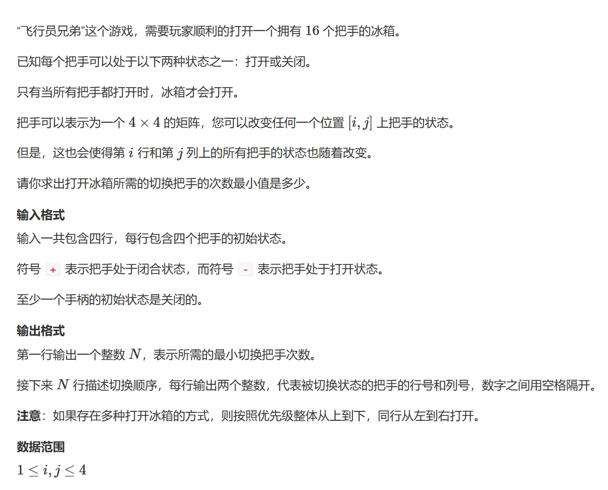

每个按钮操作两次及以上就没有意义了，因此每个按钮只有选和不选两种状态枚举出所有的状态然后判断是否合法。

```python
from copy import deepcopy
from math import inf

path = [list(input()) for _ in range(4)]


def convert(x):
    return divmod(x, 4)

# 翻转这一行和这一列
def change(g, x, y):
    for i in range(4):
        if i == y: continue
        g[x][i] = '-' if g[x][i] == '+' else '+'
    for i in range(4):
        if i == x: continue
        g[i][y] = '-' if g[i][y] == '+' else '+'
    g[x][y] = '-' if g[x][y] == '+' else '+'


ans = inf
res = []
# 枚举每种状态
for i in range(1<<16):
    g = deepcopy(path)
    cnt = 0
    temp = []
    # 找有那些位置被操作了
    for j in range(i.bit_length()):
        if (i >> j) & 1:
            # 一维转换为二维坐标
            x, y = convert(j)
            change(g, x, y)
            cnt += 1
            temp.append([x+1, y+1])
    temp.sort()
    r = True
    for j in range(4):
        if g[j] != ['-']*4:
            r = False
            break
    if r and cnt <= ans:
        ans = cnt
        if not res or temp < res:
            res = temp
print(ans)
for v in res:
    print(*v)
```

###  [将字符串拆分为递减的连续值](https://leetcode.cn/problems/splitting-a-string-into-descending-consecutive-values/)

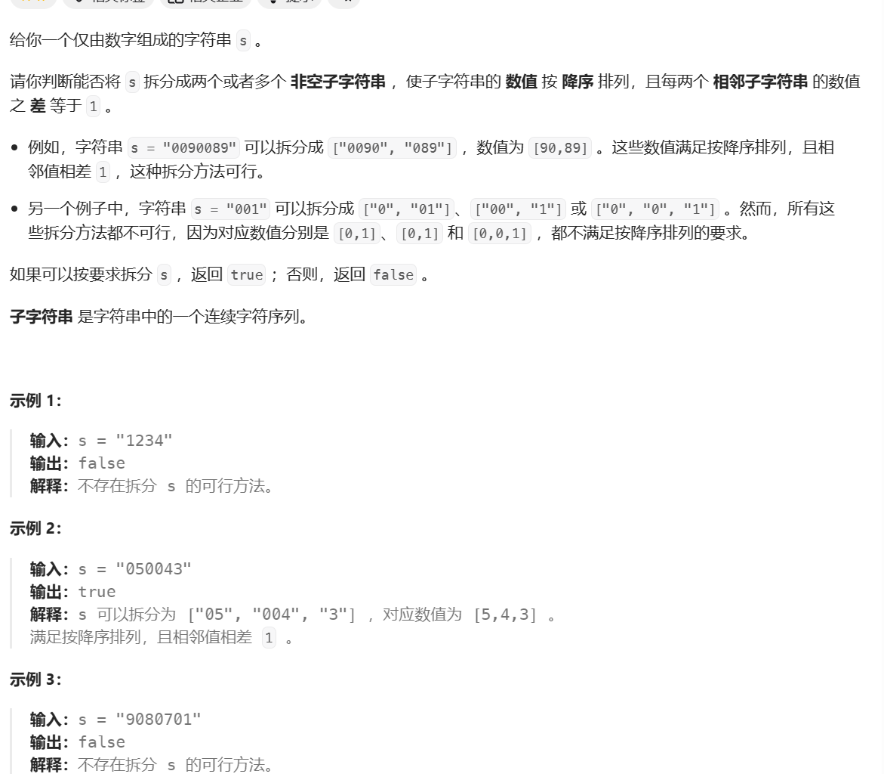

由于是低递减的序列因此枚举出第一个数字后面的就确定了。

```python
class Solution:
    def splitString(self, s: str) -> bool:
        n=len(s)
        
        def dfs(i,num):
            if i==n:
                return True
            for j in range(i+1,n+1):
                if int(s[i:j])==num-1:
                    if dfs(j,num-1):
                        return True
            return False
        for i in range(1,n):
            if dfs(i,int(s[:i])):
                return True
        return False
```

### [将字符串分割为最少的美丽子字符串](https://leetcode.cn/problems/partition-string-into-minimum-beautiful-substrings/)


定义dfs(i)表示从那个位置开始，对于给定的数据范围可用去找它对应的结尾

​	

```python
class Solution:
    def minimumBeautifulSubstrings(self, s: str) -> int:
        n=len(s)
        @cache
        def dfs(i):
            if i==n:return 0
            if s[i]=='0':return inf 
            res=inf
            for j in range(i,n):
                c=s[i:j+1]
                v=int(c,2)
                if v==5**int(log(v,5)):
                    res=min(res,1+dfs(j+1))
            return res  
        ans=dfs(0)
        if ans==inf:ans=-1
        return ans 
```

### [跳跃游戏 V](https://leetcode.cn/problems/jump-game-v/)

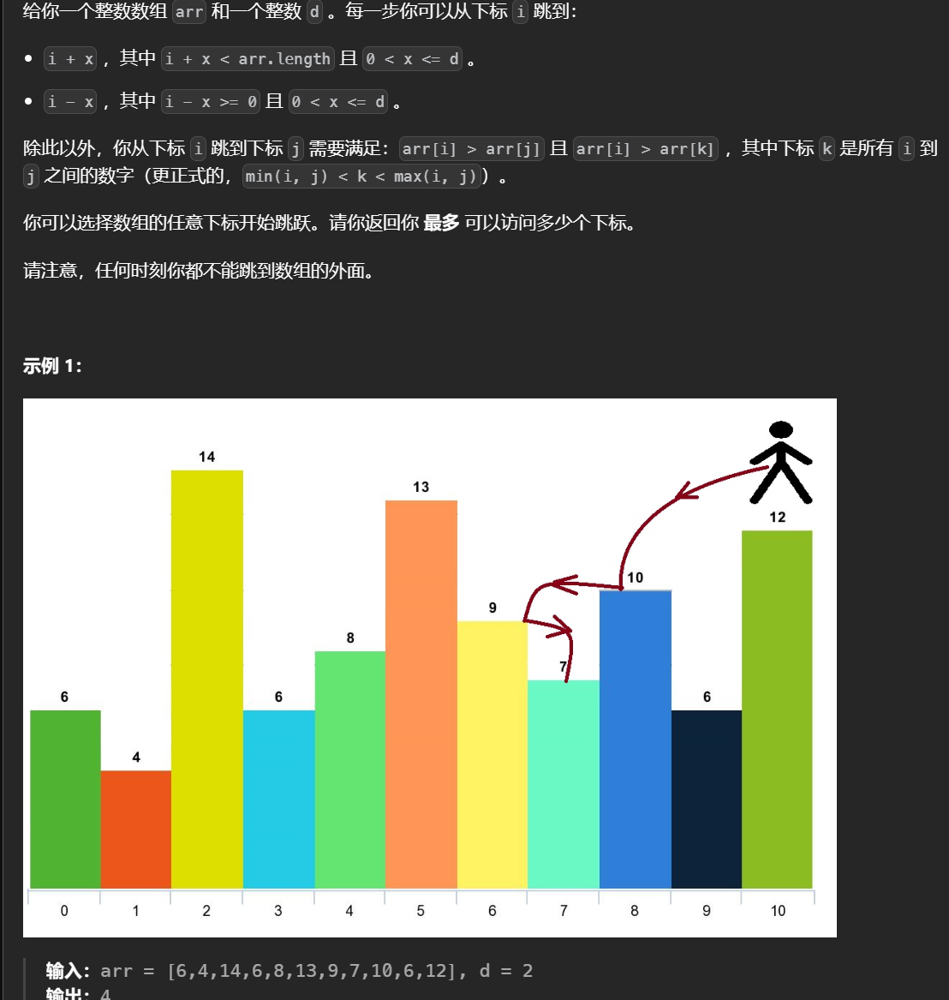


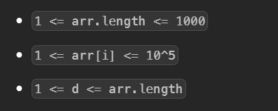


对于给定的数据方位可以直接暴力回溯

往左找小于的所有位置，往右找小于的所有位置。

```python
class Solution:
    def maxJumps(self, arr: List[int], d: int) -> int:
        nums=arr
        seen=dict()
        n=len(arr)
        def dp(i):
            # 剪枝放置重复计算
            if i in seen:return
            seen[i]=1
            l=i-1
            while i-l<=d and l>=0 and nums[i]>nums[l]:
                dp(l)
                seen[i]=max(seen[i],seen[l]+1)
                l-=1
            r=i+1
            while r<n and r-i<=d and nums[i]>nums[r]:
                dp(r)
                seen[i]=max(seen[i],seen[r]+1)
                r+=1
        for i in range(n):
            dp(i)
        return max(seen.values())
```


或者反过来看

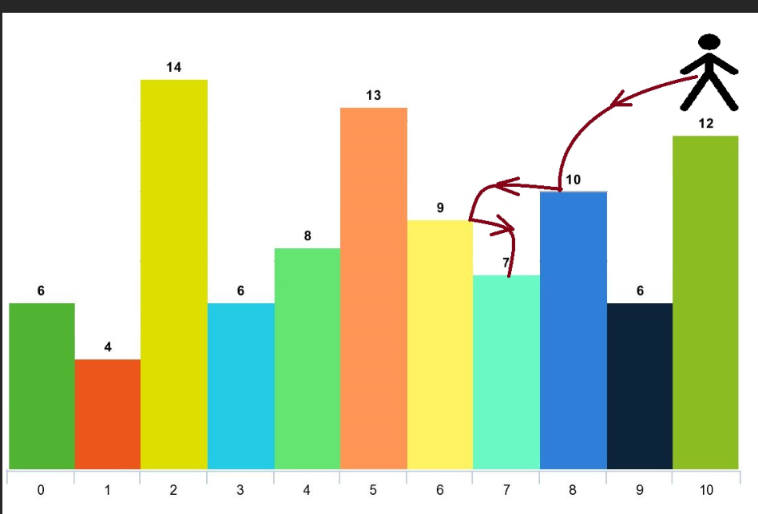

每个位置能走的最多的就是去左边第一个比它大的，右边第一个比它大的，用单调栈处理然后回溯做。


```python
class Solution:
    def maxJumps(self, nums: List[int], k: int) -> int:
        n=len(nums)
        d=deque()
        l=[0]*n
        r=[0]*n
        for i in range(n):
            while d and nums[d[-1]]<=nums[i]:
                d.pop()
            if d:l[i]=d[-1]
            else:l[i]=-1
            d.append(i)
        d=deque()
        for i in range(n-1,-1,-1):
            while d and nums[d[-1]]<=nums[i]:
                d.pop()
            if d:r[i]=d[-1]
            else:r[i]=n
            d.append(i)
        d=k
        @cache
        def dfs(i):
            if i==-1 or i==n:return 0
            res=1
            if abs(l[i]-i)<=d:
                res=max(res,dfs(l[i])+1)
            if abs(r[i]-i)<=d:
                res=max(res,dfs(r[i])+1)
            return res
        return max(dfs(i) for i in range(n-1,-1,-1))	
```


### [统计最高分的节点数目](https://leetcode.cn/problems/count-nodes-with-the-highest-score/)

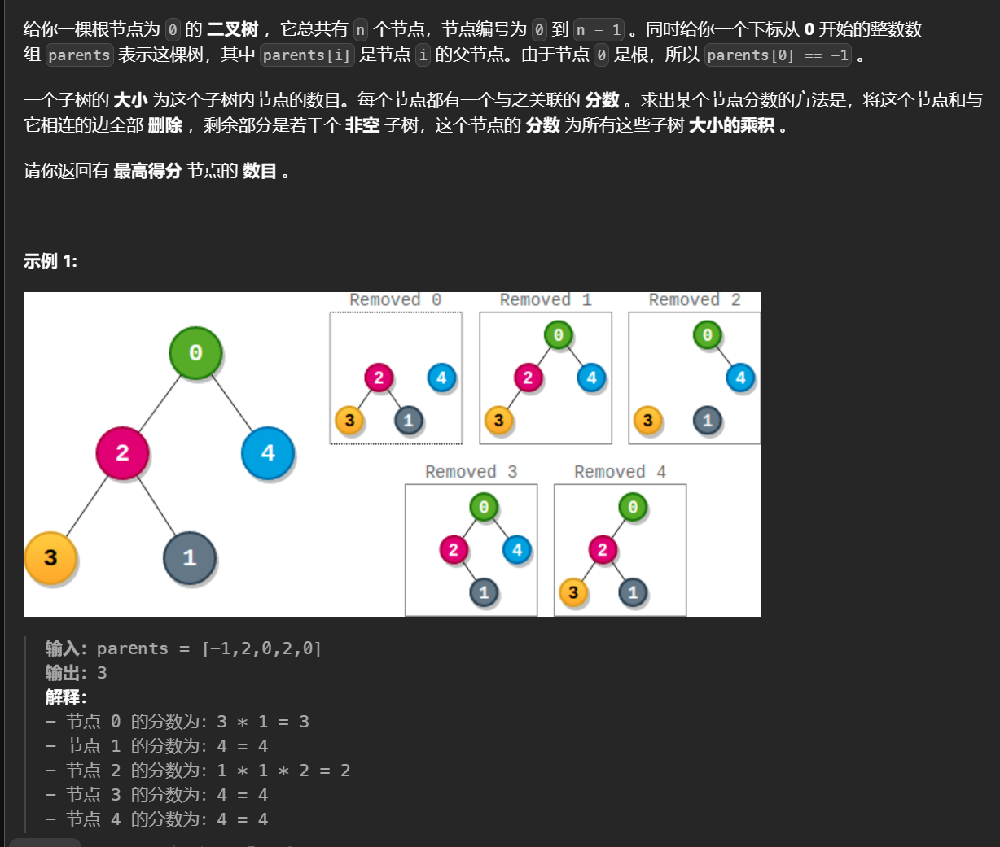


想使用dfs求出所有节点子树的大小，但是担心进入递归后无法求出父节点对应的子树大小。这里的关键在于父节点对应的子树大小可以由当前节点对应子树大小总和求出，因为节点的个数是确定的。

```python
class Solution:
    def countHighestScoreNodes(self, parents: List[int]) -> int:
        memo=Counter()
        path=defaultdict(dict)
        n=len(parents)
        # 建图，树的结构无用
        for i,v in enumerate(parents):
            if v==-1:continue
            path[v][i]=None
	# 回溯往下找
        def dfs(x):
            # 定义分数
            score=1
            # 定义其他节点的个数
            size=n-1
            for k in path[x].keys():
                sz=dfs(k)
                score*=sz
                # 不断地减去子树的大小，剩下的就是父节点的大小
                size-=sz
            if x:score*=size
            memo[score]+=1
            return n-size
        dfs(0)
        return memo[max(memo.keys())]


```


### [基于陈述统计最多好人数](https://leetcode.cn/problems/maximum-good-people-based-on-statements/)

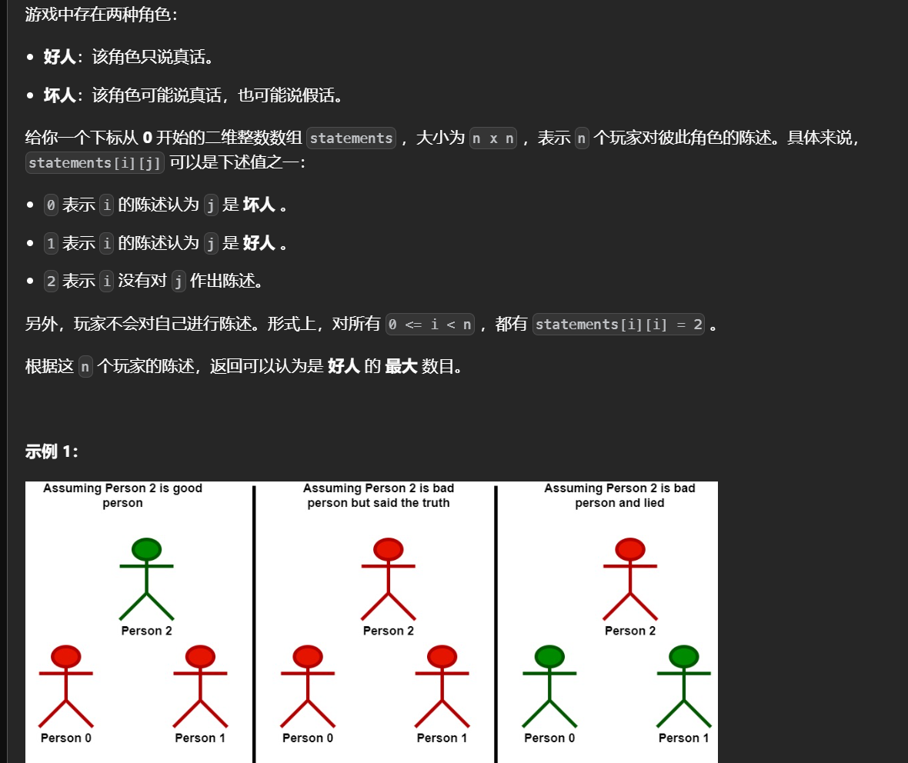


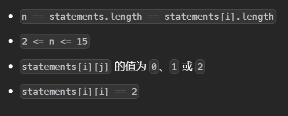

直接暴力枚举查看是否矛盾即可

```python
class Solution:
    def maximumGood(self, statements: List[List[int]]) -> int:
        n=len(statements)
        def check(vis):
            for i in range(n):
                if i not in vis:continue
                for j in range(n):
                    if i==j or statements[i][j]==2:continue 
                    elif statements[i][j]==1 and j not in vis:return False
                    elif statements[i][j]==0 and j in vis:return False
            return True

        ans=0
        for i in range(1,1<<n):
            vis=set()
            for j in range(n):
                if i>>j&1:vis.add(j)
            if check(vis):ans=max(ans,len(vis))
        return ans

```

### Two Buttons


将问题转换为从m到n每次只能加一或者除二，此时只有偶数才能除而而奇数只能加一，并且为了逼近n每次都是尽量选择除二。

```python
@lru_cache(maxsize=None)
def dfs(x):
    if x==n:return 0
    if x<n:return n-x
    if x&1==0:return 1+dfs(x>>1)
    return 1+dfs(x+1)
print(dfs(m))
```


### [找出最大的 N 位 K 回文数](https://leetcode.cn/problems/find-the-largest-palindrome-divisible-by-k/)

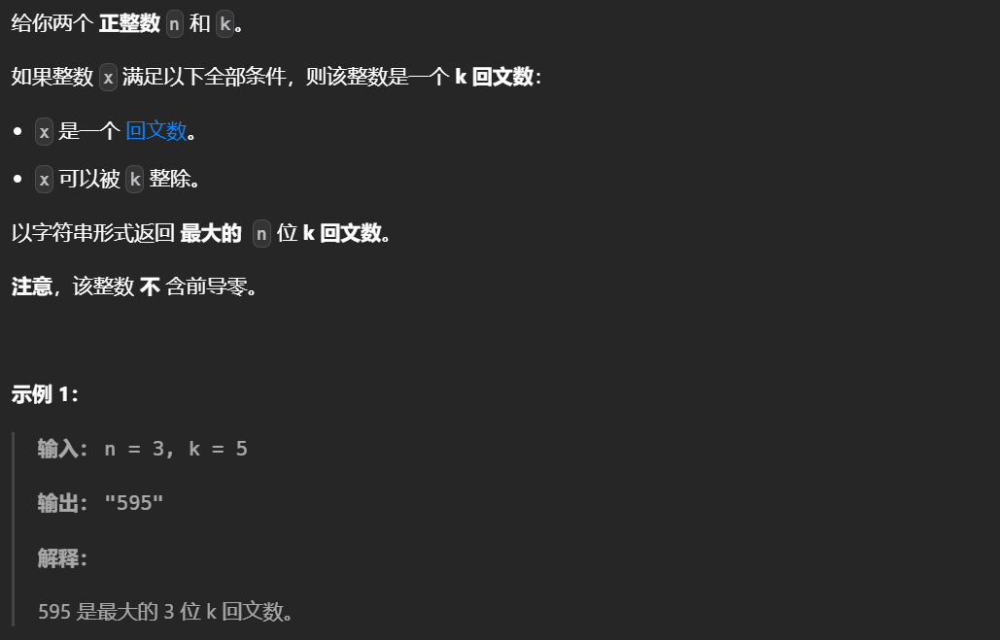

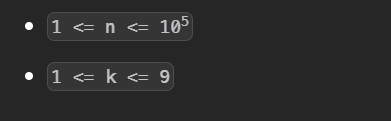


x是一个长度为n的数，在构造这个数的过程中想要被k整除就要看余数，同时为了满足回文数的条件构造一个位置就确定了对称的另一个位置，定义dfs(i,j)表示当前考虑位置i并且余数为j，终止状态为m,0其中m是中间位置的下一个。

```python
class Solution:
    def largestPalindrome(self, n: int, k: int) -> str:
        pow10 = [1] * n
        # 预处理
        for i in range(1, n):
            pow10[i] = pow10[i - 1] * 10 % k

        m=(n+1)>>1
        ans=['']*n
        # 防止进入重复的状态，用擦车也行
        vis=[[False]*k for _ in range(m+1)]
        def dfs(i,j):
            if i==m:
                return j==0
            vis[i][j]=True
            # 贪心，从大到小，如果可以就直接退出
            for d in range(9,-1,-1):
                if n%2 and i==m-1:
                    j2=(j+pow10[i]*d)%k
                else:
                    j2=(j+pow10[i]*d+pow10[n-i-1]*d)%k
                if not vis[i+1][j2] and dfs(i+1,j2):
                    # 构造答案
                    ans[i]=ans[n-i-1]=str(d)
                    return True

            return False
        dfs(0,0)
        return ''.join(ans)
```


## BFS算法

BFS是把一些问题抽象成图，从一个点开始向四周扩散。一般的应用场景是求从起点到终点的最小距离。


### 二叉树的最小深度

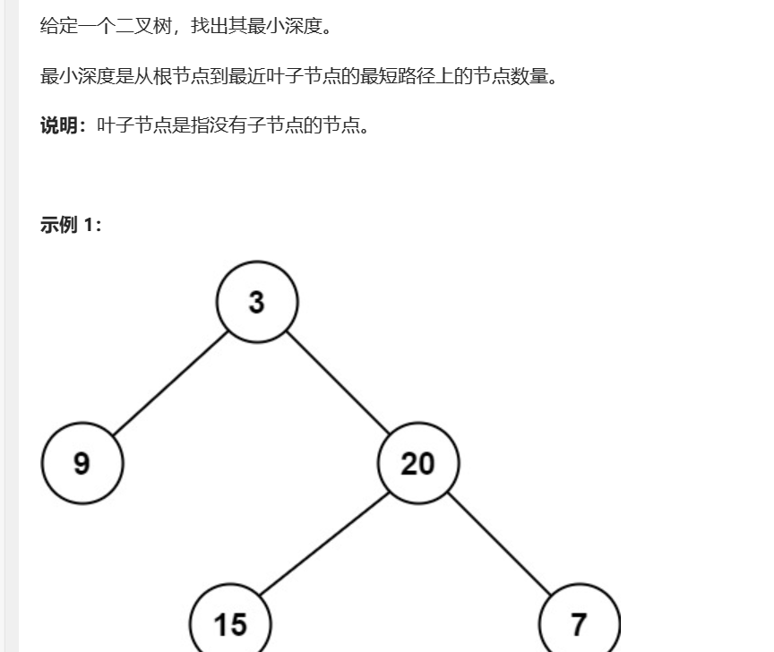

```python
class Solution(object):

    def minDepth(self, root):

        if not root:
            return 0

        q=deque()
        q.append(root)
        depth=1
        while q:# 一层层往下走
            sz=len(q)
            for i in range(sz): # 遍历每一层的节点
                curr=q.popleft()# 弹出
                
                if curr.left==None and curr.right==None:# 满足是叶子节点
                    return depth
                # 扩散
                if curr.left:
                    q.append(curr.left)
                if curr.right:
                    q.append(curr.right)
            
            depth+=1# 一层判断完了，再加一
        return depth

#可以使用DFS算法解出，但是时间复杂度会更高因为需要遍历每一个路径，而BFS借助队列做到齐头并进，可以在不完整遍历的情况下找到最短距离，但是BFS 的空间复杂度较高     
class Solution(object):

    def minDepth(self, root):
        if not root:
            return 0
        self.res=[]
        depth=1
        self.backtrace(root,depth)
        return min(self.res)
        
    def backtrace(self,root,depth):
        
        if root.left==None and root.right==None:
            self.res.append(depth)
            return 
        if root.left:
            self.backtrace(root.left,depth+1)
        if root.right:
            self.backtrace(root.right,depth+1)
```

### 树的直径

#### 树的直径


树的直径就是两个相邻最远的节点的距离

+ BFS方法，从任意节点开始都可以得到任意一个极端节点（距离所有节点最远的两个节点），然后从这个节点开始再进行一次BFS就可以得到另一个极端节点，这两个极端节点之间的距离就是树的直径。

```python
from collections import deque


class Solution(object):
    def treeDiameter(self, edges):
        if not len(edges):
            return 0
        # 使用set集合记录每一个边
        paths = [set() for _ in range(len(edges) + 1)]
        for edge in edges:
            u, v = edge
            paths[u].add(v)
            paths[v].add(u)

        # bfs框架
        def bfs(start):
            d = deque([start])
            
            # 备忘录防止重复加入
            visited = [False] * (len(paths))
            visited[start] = True
            # 记录最后一个节点
            lastnode = None
            # 距离从-1开始，因为遍历到最后一层时还会向外遍历一次，如果从0开始最后的结果会多出一
            distance=-1
            while d:
                sz = len(d)
                # 只遍历之前队列中元素的个数次
                for _ in range(sz):
                    # 弹出
                    curr = d.popleft()
                    for i in paths[curr]:
                        # 加入不重复的邻居
                        if not visited[i]:
                            visited[i] = True
                            d.append(i)
                            lastnode = i
				# 距离加一
                distance += 1
            return [distance, lastnode]
       
        distance, lastnode = bfs(0)
        return bfs(lastnode)[0]
```


+ 使用回溯算法解题，如果可以得到从父节点到任何后代叶子节点的最长距离t1,t2，那么经过该父节点的最长半径就是t1+t2，整个树的最长半径就是所有节点中的最长半径

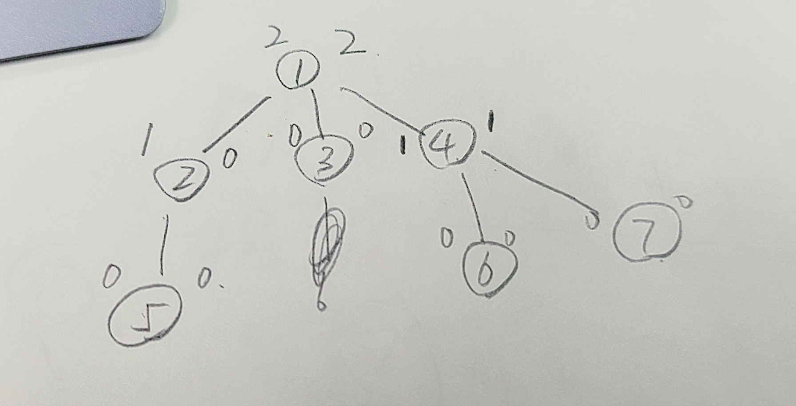

```python
class Solution(object):
    def treeDiameter(self, edges):

        paths = [set() for _ in range(len(edges) + 1)]
		# 记录所有边
        for edge in edges:
            u, v = edge
            paths[u].add(v)
            paths[v].add(u)
            
         # 设置备忘录
        visited=[False]*len(paths)
        # 不断更新外部变量来得到最大值
        self.diameter=0

        # 会返回以p为父节点到叶子结点的最大距离
        def dfs(p,visited):
            # 设置两个到叶子节点的最长距离
            left = 0
            right = 0
            # 标记
            visited[p]=True
            for val in paths[p]:
                # 包含过了
                if visited[val]:
                    continue
                # 该节点到叶子结点的距离为它的子节点到叶子结点的距离加一
                distance=1+dfs(val,visited)
                # 更新
                if distance>left:
                    left,right=distance,left
                elif distance>right:
                    right=distance
			
                self.diameter=max(self.diameter,left+right)
            
            return left

        dfs(0,visited)
        return self.diameter
```

#### N叉树的直径

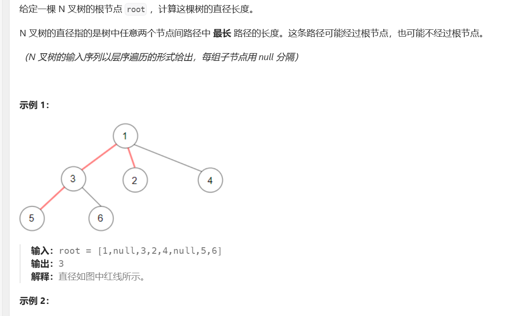

与上一题一样

```python
class Solution(object):
    def diameter(self, root):
        self.diameter=0
        def dfs(root):

            left=0
            right=0
            for child in root.children:
                distance=1+dfs(child)
                if distance>left:
                    left,right=distance,left
                elif distance>right:
                    right=distance
                self.diameter=max(self.diameter,left+right)
            return left
        dfs(root)
        return self.diameter
```

#### 串门


这种问题的最短路径就是所有的边之和乘2减去一条树的直径，但是这题每条边是有权重的，计算直径不能按照一般的方法。照样使用bfs模板，不过在遍历中有一个外部变量记录距离。

```python
from collections import deque

# 接收输入
n=int(input())
# 使用集合记录每个节点相连的节点以及相应的权重
edges=[set() for _ in range(n+1)]
w_sum=0
# 记录
for _ in range(n-1):
    u,v,w=list(map(int,input().split()))
    edges[u].add((v,w))
    edges[v].add((u,w))
    w_sum+=w

# 返回距离start最远的节点，以及一个记录距离的列表
def bfs(start):
    # distance记录的是所有节点到start的距离，先初始化为-1
    distance=[-1 for _ in range(n+1)]
    # 自己到自己的距离是0
    distance[start]=0
    # 接下来是bfs模板
    d=deque([start])
    while d:
        sz=len(d)
        for _ in range(sz):
            # 弹出
            curr=d.popleft()
            for u,w in edges[curr]:
                # 如果记录过，跳过
                if distance[u]!=-1:
                    continue
                # 从start到u的距离等于从start到curr的距离加上从curr到u的距离
                distance[u]=w+distance[curr]
                # 加入路径，称为下一轮的curr
                d.append(u)
     # 找出最远的点，也就是直径
    lastnode=distance.index(max(distance))
    return lastnode ,distance

# 先找出一个极端节点
node1,_=bfs(1)
# 再根据这个极端节点找另一个
node2,distance=bfs(node1)

print(w_sum*2-distance[node2])
```

#### [合并两棵树后的最小直径](https://leetcode.cn/problems/find-minimum-diameter-after-merging-two-trees/)

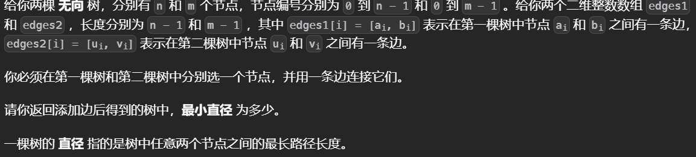

两棵树合并后树的直径有两种情况，直径不会改变还是合并前两个树的直径中最大的那个，或者树的直径会经过连接的位置然后加上两个树的剩余直径之和（因为直径是树上最长的边所以一定会经过原本树上的直径），为了保证整个树的直径最小应该选择两个树的直径的中点相连，这里不需要知道那个是中点，因为只需要求出数值大小

```python
class Solution:
    def minimumDiameterAfterMerge(self, edges1: List[List[int]], edges2: List[List[int]]) -> int:
        # 用于求直径
        def cal(path):
            d=0
            def dfs(root,fa):
                l=r=0
                nonlocal d
                for child in path[root]:
                    if child ==fa:continue
                    x=dfs(child,root)+1
                    if x>l:
                        r=l
                        l=x
                    elif x>r:
                        r=x
                d=max(d,l+r)
                return l
            dfs(0,-1)
            return d
        path1=defaultdict(dict)
        path2=defaultdict(dict)
        for u,v in edges1:
            path1[u][v]=path1[v][u]=None
        for u,v in edges2:
            path2[u][v]=path2[v][u]=None
        d1,d2=cal(path1),cal(path2)
        # 三种情况，这里保证了相连后的直径是最小的
        return max(d1,d2,ceil(d1/2)+ceil(d2/2)+1)
```


### 家族树

一个多叉树的题目 给与我们两个整数NM 整数N表示树中结点总数，整数M表示非叶子结点数。根节点数序号01接下来s行每行输入一个节点和该节点的子节点 格式如下ID K ID[1]ID[2] ... ID [K] 工D表示当前节点K表示该节点的子节点的数目后面一次是子节点的ID以空格间隔 要求我们输出从上往下树的每一层有多少叶子结点以空格间隔。

要求查看每一层的叶子节点数目，使用BFS进行层次遍历的同时用一个外部变量记录当前层次的叶子节点数目。


使用字典来对应多叉树的关系，每个值设置为一个数组，其中装着键所对应的子树。根节点是1，使用BFS广度优先搜索在队列中首先存入的是根节点，然后弹出根节点，根据字典查看它有没有子树，如果没有说明他是一个叶子节点，如果有加入它的子树们，之后一个个弹出当前队列中的子树，判断他们是否有子树，如果没有更新外部变量，如果有加入到末尾，当前队列中每一个子树都遍历完了，将外部变量加入到最终结果中，然后进入下一层。

```python
from collections import deque

N,M=map(int,input().split())
# 使用字典表示多叉树，而不是用树的结构其中的val设置为一个数组，太过麻烦
family={}

for i in range(M):
    # 值得注意的是'01'使用Int会转化为1
    li=list(map(int,input().split()))
    parent=li[0]
    li=li[2:]
    family[parent]=li[:]


d=deque()
d.append(1)
res=[]
while d:
    sz=len(d)
    count=0
    for i in range(sz):
        curr=d.popleft()
        # 如果不存在
        if curr not in family:
            count+=1
        else:
            d.extend(family[curr])
            # 外部变量记录
    res.append(count)

print(" ".join(map(str,res)))
```


### 打开转盘锁

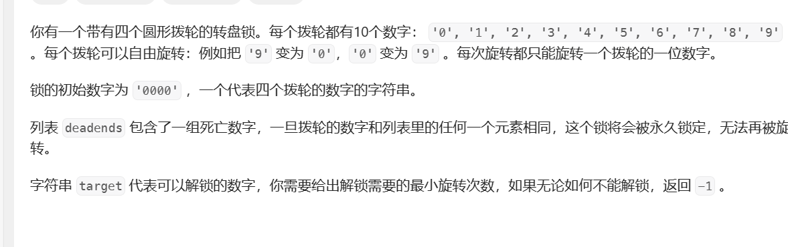

如果不考虑死亡号码只看如何得出所有的号码，每次拨动一位，一个号码再拨动后会有八种可能，可以理解为BFS，在BFS的框架上加上细节改动即可。

```python
class Solution(object):
    # 上拨一位，python中不能对字符串使用索引，索引变为列表
    def upone(self,s,j):
        s=list(s)
        if s[j]=='9':
            s[j]='0'
        else:
            s[j]=str(int(s[j])+1)
        return ''.join(s)
	# 下拨一位
    def downone(self,s,j):
        s = list(s)
        if s[j] == '0':
            s[j] = '9'
        else:
            s[j] = str(int(s[j]) - 1)
        return ''.join(s)

    def openLock(self, deadends, target):
        q=deque()
        visit=set()# 防止回头

        q.append('0000')
        visit.append('0000')

        depth=0

        while q:
            for i in range(len(q)):

                curr=q.popleft()
				# 遇到死亡号码跳过
                if curr in deadends:
                    continue
				# 满足条件退出
                if curr==target:
                    return depth
				# 遍历得出所有的子节点
                for j in range(4):
                    up=self.upone(curr,j)
                    down=self.downone(curr,j)

                    if up not in visit:# 未曾记录过

                        q.append(up)
                        visit.append(up)

                    if down not in visit:
                        q.append(down)
                        visit.append(down)

            depth+=1

        return -1# 穷举完了说明不存在
```

BFS算法存在一种优化，双向BFS ，即同时从起点和终点开始扩散，当两边有交集的时候停止，这要求必须知道终点的值。

```python
class Solution(object):
    def upone(self,s,j):
        s=list(s)
        if s[j]=='9':
            s[j]='0'
        else:
            s[j]=str(int(s[j])+1)
        return ''.join(s)

    def downone(self,s,j):
        s = list(s)
        if s[j] == '0':
            s[j] = '9'
        else:
            s[j] = str(int(s[j])-1)
        return ''.join(s)

    def openLock(self, deadends, target):
        if '0000' in deadends:
            return -1
		
        # 设置两个队列
        start=deque()
        end=deque()
        start_visit=set()
        end_visit=set()

        start.append('0000')
        end.append(target)
        start_visit.add('0000')
        end_visit.add(target)

        depth=0

        while start and end:
            for _ in range(len(start)):
                curr = start.popleft()

                if curr in end_visit:# 只要有交集
                    return depth

                if curr in deadends:
                    continue
                
                for j in range(4):

                    up = self.upone(curr, j)
                    down = self.downone(curr, j)
                    
                    if up not in start_visit:
                        start.append(up)
                        start_visit.add(up)
                    
                    if down not in start_visit:
                        start.append(down)
                        start_visit.add(down)

            if len(start) > len(end):# 在末尾交换二者，选择条件判断是为了节省交换的次数
                start, end = end, start
                start_visit, end_visit = end_visit, start_visit

            depth += 1  


        return -1
```

### 八转码


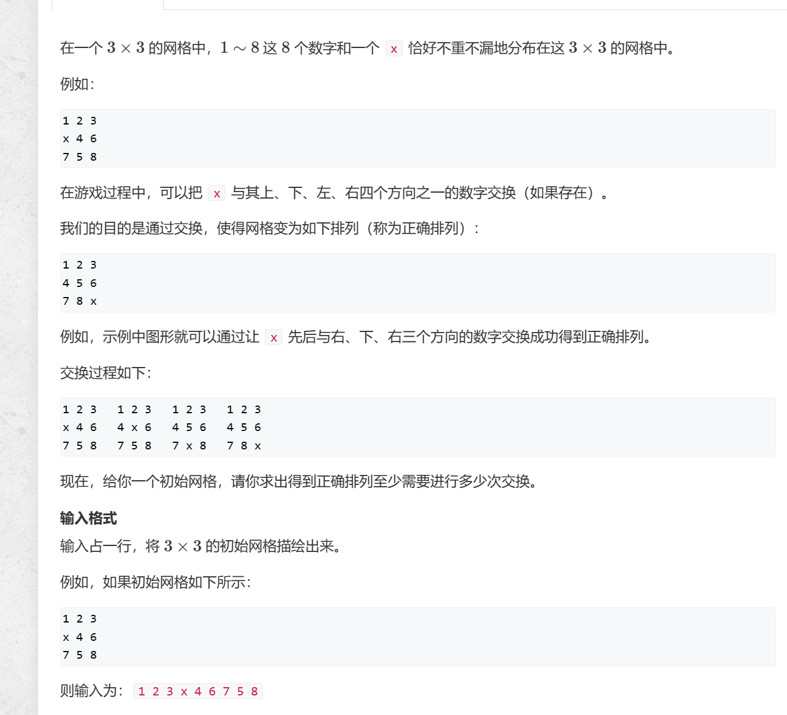


使用bfs找从起始到目标值的最小操作次数，但是二维数组状态不好定义，选择将二维数组变为一维的字符串操作，目标结果是1234568x。

在进行操作的时候，取得字符串中x的位置，模拟进行二维操作。


```python
from collections import deque 
tar='12345678x'

def bfs():
    # 转化位一维的字符串
    s=input().replace(' ','')
    d=deque()
    # 防止重复
    vis=set()
    vis.add(s)
    d.append(s)
    ans=-1
    while d:
        sz=len(d)
        ans+=1
        for _ in range(sz):
            curr=d.popleft()
            if curr==tar:
                return ans
           	# 根据一维下x的位置，可以求出二维下的索引
            index=curr.find('x')
            # 技巧点
            x,y=divmod(index,3)
            # 模拟二维下操作
            for dx,dy in (-1,0),(0,-1),(0,1),(1,0):
                i,j=x+dx,y+dy
                temp=list(curr)
                if 0<=i<3 and 0<=j<3  :
                    temp[index],temp[i*3+j]=temp[i*3+j],temp[index]
                    # 转换为一维字符串
                    c=''.join(temp)
                    if c not in vis:
                        vis.add(c)
                        d.append(c)
    return -1
print(bfs())
                
```


### [引爆最多的炸弹](https://leetcode.cn/problems/detonate-the-maximum-bombs/)


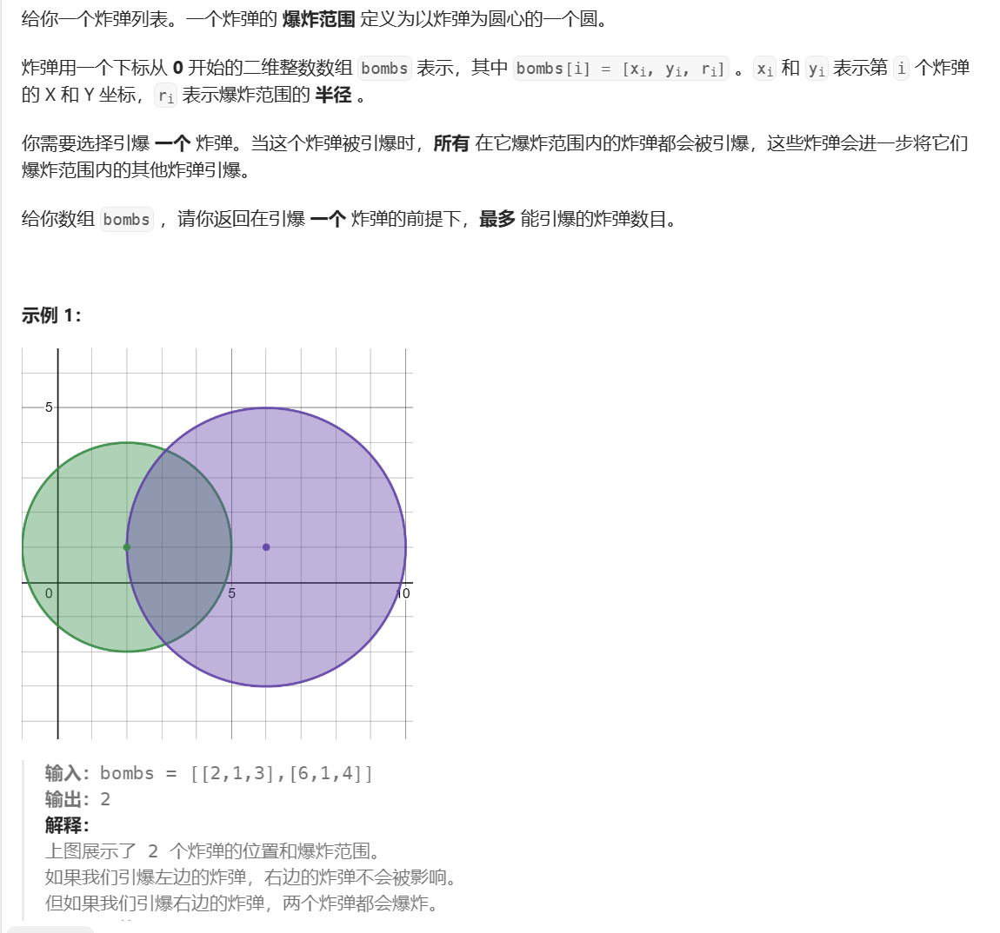

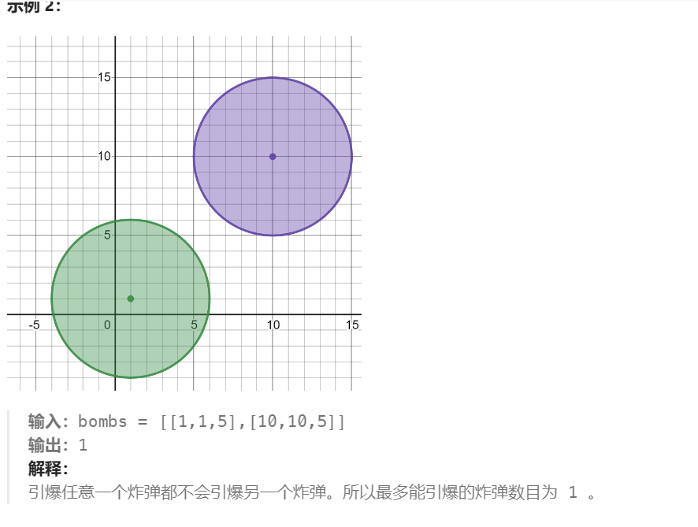


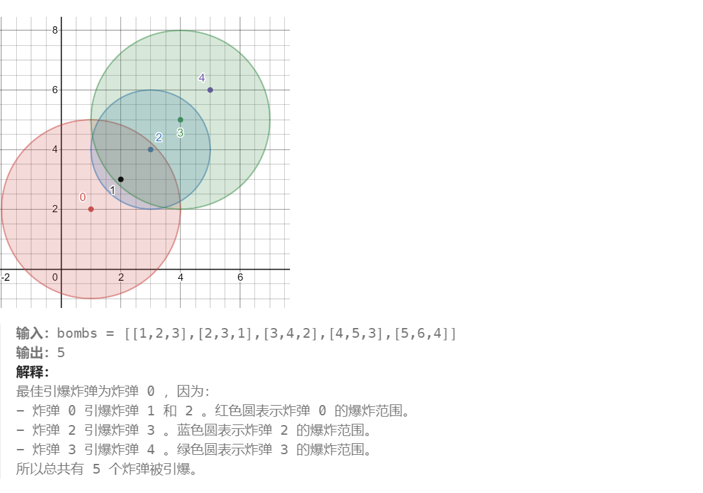


建立图，对于每个炸弹把每个和它距离（圆心说圆心）不超过它的半径的炸弹相连，建立图之后，使用bfs统计有多少个相连的炸弹。

```python
from collections import deque 
class Solution:
    def maximumDetonation(self, bombs: List[List[int]]) -> int:
        n = len(bombs)
        ans = 0
        path = [set() for _ in range(n)]
        # 判断两个炸弹是否相连
        def valid(a,b):
            x1, y1, r1 =a
            x2, y2, _ = b
            d = ((x1 - x2) ** 2 + (y1 - y2) ** 2) ** 0.5
            if d <= r1:
                return True
            else:
                return False
        # 遍历每个炸弹建立图
        for i in range(n):
            for j in range(n):
                # 排除自己和自己
                if i!=j and valid(bombs[i],bombs[j]):
                    path[i].add(j)
        
        # 对每个炸弹使用一次bfs找打与他相连的炸弹的个数
        for i in range(n):
            # 初始为1，算上自己
            cnt=1
            d=deque([i])
            # 要带上备忘录，防止死循环
            vis=[False]*n
            # 自己要设置为True
            vis[i]=True
            while d:
                sz=len(d)
                for _ in range(sz):
                    curr=d.popleft()
                    # 把相连的加入
                    for j in path[curr]:
                        # 如果没有被访问过
                        if not vis[j]:
                            d.append(j)
                            # 标记	
                            vis[j]=True
                            cnt+=1
            ans=max(ans,cnt)
        return ans 
```

### [ 逐层排序二叉树所需的最少操作数目](https://leetcode.cn/problems/minimum-number-of-operations-to-sort-a-binary-tree-by-level/)

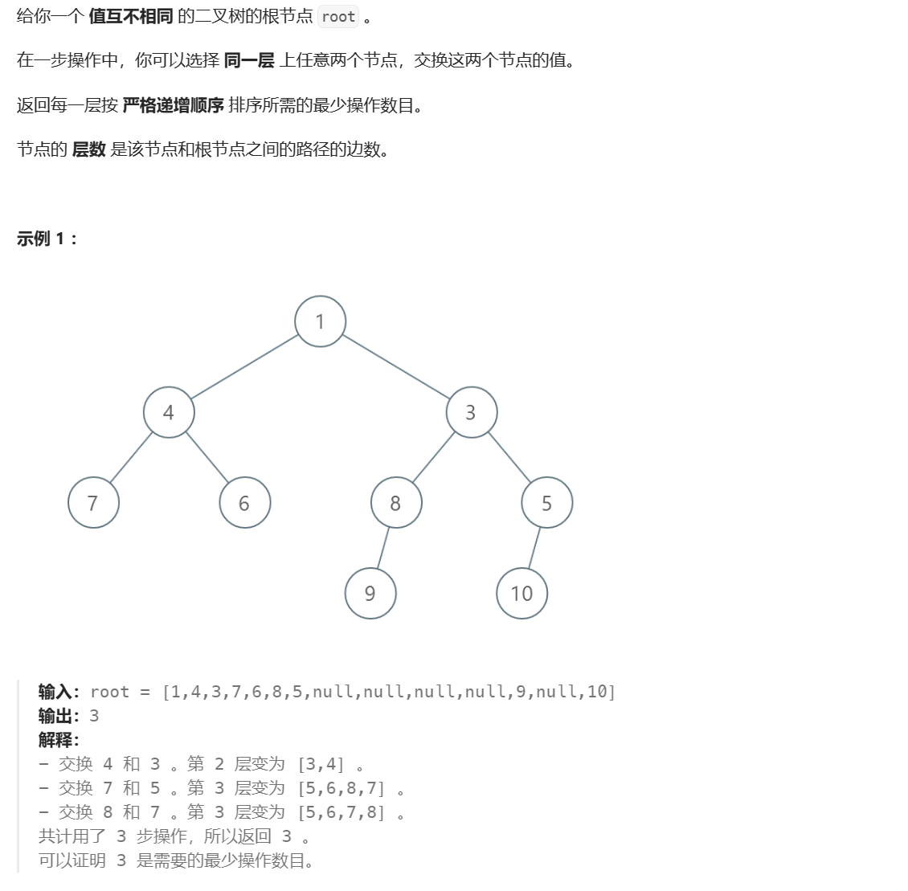

问题的关键在于一串数字如何确定通过交换两个数字达到有序的最少次数是多少，`这个问题要用到置换环（技巧点）：比如一串数字1 0 3 4 2，其中后三位和前两位的交换是互不干涉的，可以被分为两个环，而找到环的技巧是以当前值为下标，不断在数组中查找直到，回到原位，这就是一个环，最少的交换次数是环中的数字个数减一（或者是数组中元素的个数减去环的个数）`，而本题中数组并不使从0到n的而是随机开始的，因此需要离散化处理（技巧点），把5 6 7 8 变为0 1 2 3，`最简单的做法是将值排序后用二分搜索`。

本题中的bfs采用滚动数组的形式，没有选择双向队列。

```python
class Solution:
    def minimumOperations(self, root: Optional[TreeNode]) -> int:
        ans=0
        q=[root]
        while q:
            # 滚动数组形式，用tmp操作，q变为储存下一层内容的数组
            tmp=q
            # a中存储的是节点的值
            a=[]
            q=[]
            for node in tmp:
                a.append(node.val)
                if node.left:
                    q.append(node.left)
                if node.right:
                    q.append(node.right)
            # 离散化，排序二分
            b=sorted(a)
            a=[bisect_left(b,v) for v in a]
            n=len(a)
            # 最小的操作次数可以化简为，数字个数之和减去环的个数
            ans+=n
            # 使用vis数组标记是否访问过
            vis=[False]*n
            for p in a:
                if vis[p]:continue
                # 一直往下找
                while not vis[p]:
                    vis[p]=True
                    p=a[p]
                ans-=1
        return ans 
```


### [推多米诺](https://leetcode.cn/problems/push-dominoes/)

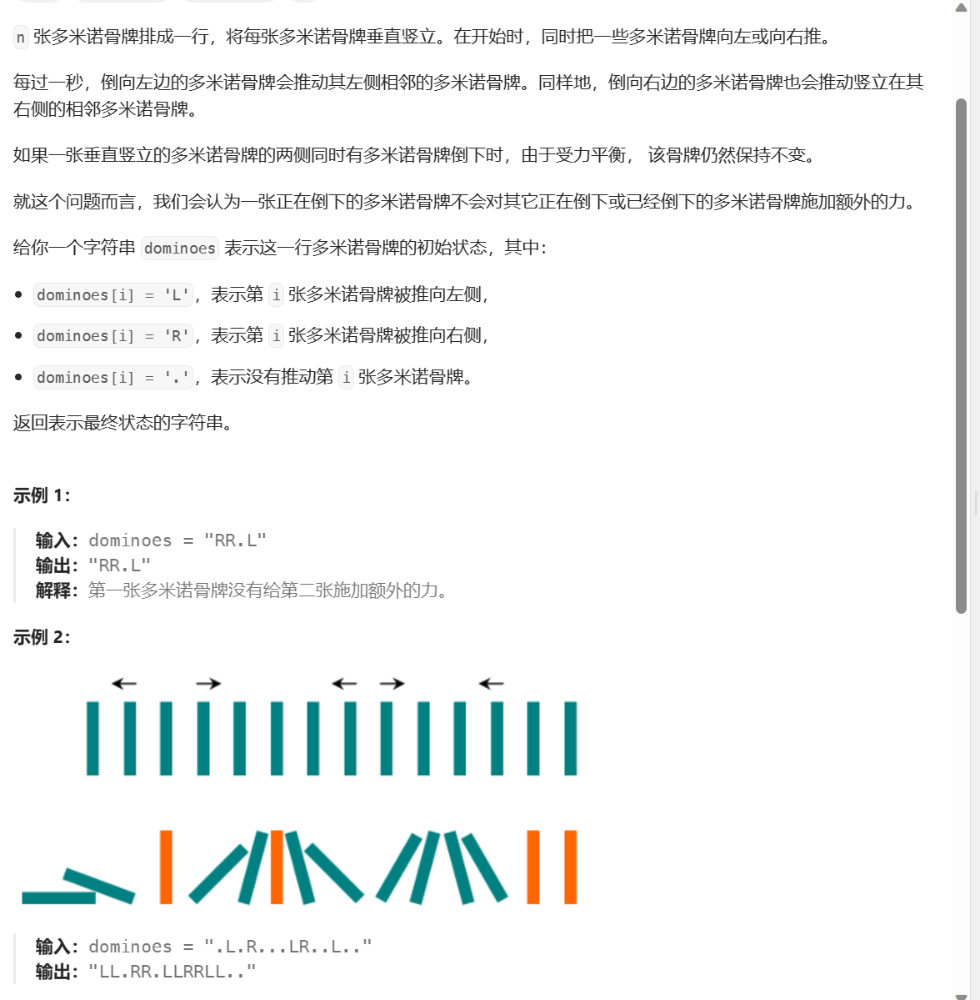

使用bfs模拟，每个受力的纸牌在下一时间都会影响到它受力方向的那个纸牌，如果一个纸牌在同一时间受到两个同向的力，那么他会保持不懂，使用bfs模拟同一时间每个纸牌的受力。

```python
class Solution:
    def pushDominoes(self, dominoes: str) -> str:
        d=deque()
        n=len(dominoes)
        # 需要一个时间数组记录每个纸牌变化的时间
        time=[-1]*n
        # 初始加入变化的纸牌，同时设置时间
        for i,c in enumerate(dominoes):
            if c!='.':
                d.append((i,c))
                time[i]=0
        res=list(dominoes)
        while d:
            i,f =d.popleft()
            t=time[i]
            # 下一个的位置
            ix=i-1 if f=='L' else i+1
            # 如果位置合法
            if 0<=ix<=n-1:
                # 如果这个纸牌没有受力
                if time[ix]==-1:
                    res[ix]=f
                    # 设置时间
                    time[ix]=t+1
                    d.append((ix,f))
                # 说明在同一时间有两个相向的力，恢复纸牌为原状态
                elif time[ix]==t+1:
                    res[ix]='.'
                # 已经推到的纸牌不会bei
        return "".join(res)
```


### [二叉树中所有距离为 K 的结点](https://leetcode.cn/problems/all-nodes-distance-k-in-binary-tree/)

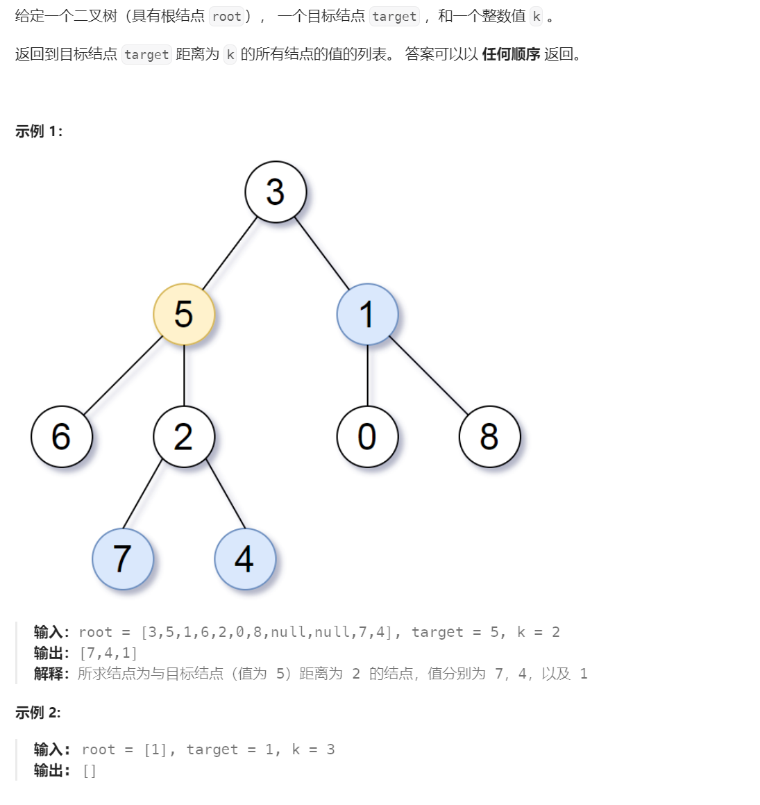


对于树的操作比较难，因此把树转化为图进行bfs操作

```python
class Solution:
    def distanceK(self, root: TreeNode, target: TreeNode, k_: int) -> List[int]:
        path=defaultdict(set)
        # 遍历的过程建图
        def build(root):
            if not root:
                return 
            if root.left:
                # 注意是无向图
                path[root.val].add(root.left.val)
                path[root.left.val].add(root.val)
            if root.right:
                path[root.val].add(root.right.val)
                path[root.right.val].add(root.val)
            build(root.left)
            build(root.right)
        build(root)
        # Bfs模板
        d=[]
        d.append(target.val)
        dis=0
        vis=set()
        # 初始时注意标记根节点
        vis.add(target.val)
        while d:
            sz=len(d)
            if dis==k_:
                return d
            for _ in  range(sz):
                curr=d[0]
                d=d[1:]
                
                for k in path[curr]:
                    if k not in vis:
                        vis.add(k)
                        d.append(k)
            dis+=1
        return []
```

### [颜色交替的最短路径](https://leetcode.cn/problems/shortest-path-with-alternating-colors/)

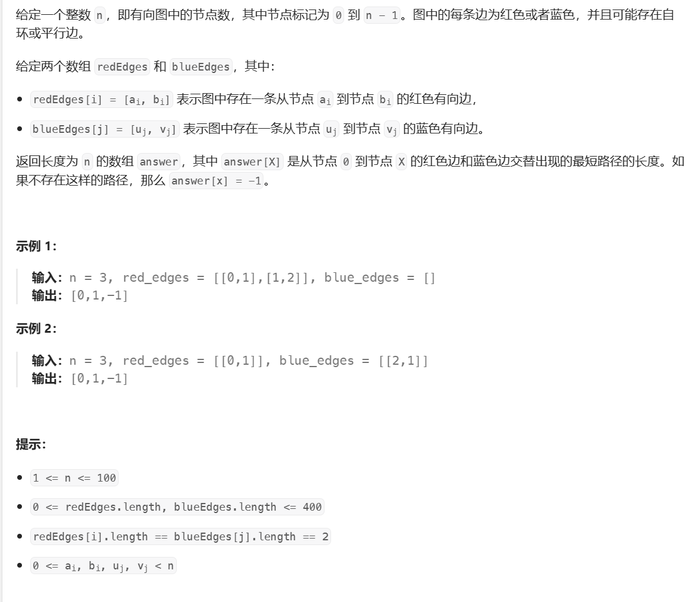

并给是最短路问题

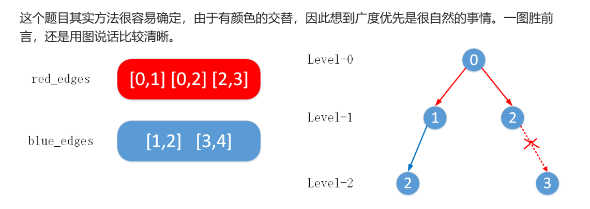

使用bfs遍历，最短路就是最先遍历到的距离，向外遍历的时候只有颜色不同的才能走到。

```python
class Solution:
    def shortestAlternatingPaths(self, n: int, redEdges: List[List[int]], blueEdges: List[List[int]]) -> List[int]:
        path=defaultdict(dict)
        # 使用字典记录两个点以及之间的颜色，注意一条路径有两个颜色则定义为2
        for x,y in redEdges:
            if y in path[x]:path[x][y]=2
            else:path[x][y]=0
            
        for x, y in blueEdges:
            if y in path[x]:path[x][y]=2
            else:path[x][y]=1
	
        # 记录距离
        dis=[-1]*n
        d=deque()
        # 初始时，0到0可以是任意颜色
        d.append([0,0])
        d.append([0,1])
        # 反之重复
        vis=set()
        vis.add((0,0))
        vis.add((0,1))
        # 记录距离
        level=0
        while d:
            for _ in range(len(d)):
                # 弹出
                x,c=d.popleft()
                if dis[x]==-1:dis[x]=level
                for k,v in path[x].items():
                    # 往外扩展，只有颜色不同的才能扩展
                    if v==c or (k,c^1) in vis:continue
                    vis.add((k,c^1))
                    d.append([k,c^1])
            level+=1
        return dis

       
```


### 母亲的牛奶


使用bfs模拟从一个桶倒入另一个桶的过程

```python
from collections import deque

# 初始状态
A,B,C=[int(x) for x in input().split()]
W=[A,B,C]
# 防止重复加入
vis=set()
def bfs():
    # 加入初始状态
    vis.add((0,0,C))
    d=deque()
    d.append((0,0,C))
    
    while d:
        
        for _ in range(len(d)):
            a,b,c=d.popleft()
            # 模拟从一个桶倒入另一个桶
            for i in range(3):
                for j in range(3):
                    # 每次重置为初始状态
                    w=[a,b,c]
                    # 不能自己到自己
                    if i==j:continue
                    # 倒出的牛奶不能超过本身有的或者是另一个溢出
                    r=min(W[j]-w[j],w[i])
                    # 变化
                    w[i]-=r
                    w[j]+=r
                    temp=tuple(w)
                    # 加入集合中
                    if temp not in vis:
                        vis.add(temp)
                        d.append(temp)
ans=[]
bfs()
# 对于给定的状态枚举所有的，如果在集合中说明存在是可以达到的
for i in range(21):
    for j in range(21):
        if (0,i,j) in vis:
            ans.append(j)
print(*sorted(ans))
```

### [跳跃游戏 IV](https://leetcode.cn/problems/jump-game-iv/)


使用bfs而不是dfs回溯，可以看作是在图中的一个点到另一个点

```python
class Solution:
    def minJumps(self, arr: List[int]) -> int:
        memo=defaultdict(list)
        # 记录相同值的坐标
        for i,v in enumerate(arr):
            memo[v].append(i)
        ans=0
        # 防止加入重复值
        vis=set()
        vis.add(len(arr)-1)
        d=deque()
        d.append(len(arr)-1)
        while d:
            for _ in range(len(d)):
                curr=d.popleft()
                
                if curr==0:return ans
                # 记录前后
                if curr-1>=0 and curr-1 not in vis  :
                    d.append(curr-1)
                    vis.add(curr-1)
                if curr+1<len(arr) and curr+1 not in vis :
                    d.append(curr+1)
                    vis.add(curr+1)
                # 记录等值
                for k in memo[arr[curr]]:
                    if k in vis:continue
                    vis.add(k)
                    d.append(k)
                # 注意对每个等值只记录一次，因为只需要一次就能全部考虑这些位置，如果不删除下一个还会再重复记录
                del memo[arr[curr]]
            ans+=1
```

### [转化数字的最小运算数](https://leetcode.cn/problems/minimum-operations-to-convert-number/)


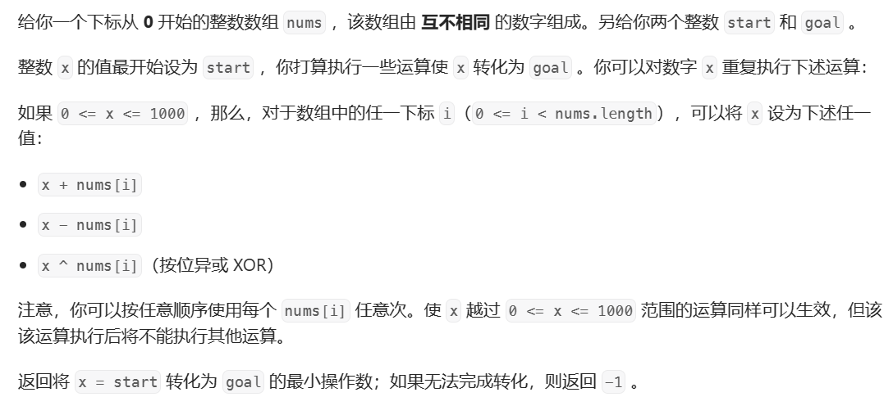

每次有三种可能，使用bfs


```python
class Solution:
    def minimumOperations(self, nums: List[int], start: int, goal: int) -> int:
        d=deque()
        d.append(start)
        cnt=0
        vis=set()
        vis.add(start)
        while d:
            cnt+=1
            for _ in range(len(d)):
                curr=d.popleft()     
                # 由于状态众多，选择在循环内判断
                for x in nums:
                    for t in curr+x,curr-x,curr^x:
                        if t==goal:return cnt
                        if 0<=t<=1000 and t not in vis:
                            vis.add(t)
                            d.append(t)
            
        return -1
```


### [图中的最短环](https://leetcode.cn/problems/shortest-cycle-in-a-graph/)


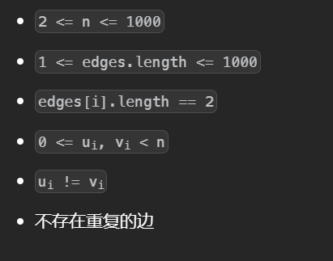

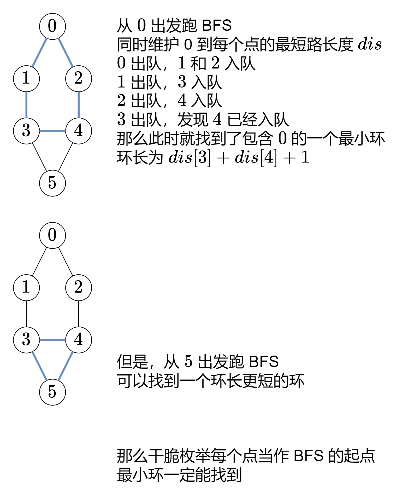

枚举每一个起点走bfs，与一般的bfs不同在于这里需要一个记录距离的数组

```python
class Solution:
    def findShortestCycle(self, n: int, edges: List[List[int]]) -> int:
        g = [[] for _ in range(n)]
        for x, y in edges:
            g[x].append(y)
            g[y].append(x)  # 建图
        def bfs(x):
            d=deque()
            d.append((x,-1))
            dis=[-1]*n
            dis[x]=0
            ans =inf
            while d:
                x,fa=d.popleft()
                for y in g[x]:
                    if dis[y]<0:
                        dis[y]=dis[x]+1
                        d.append((y,x))
                    elif y!=fa:
                        ans=min(ans,dis[x]+dis[y]+1)
            return ans 
        ans=inf

        for i in range(n):
            ans=min(ans,bfs(i))
        return ans if ans!=inf else -1

```

### [执行操作后字典序最小的字符串](https://leetcode.cn/problems/lexicographically-smallest-string-after-applying-operations/)

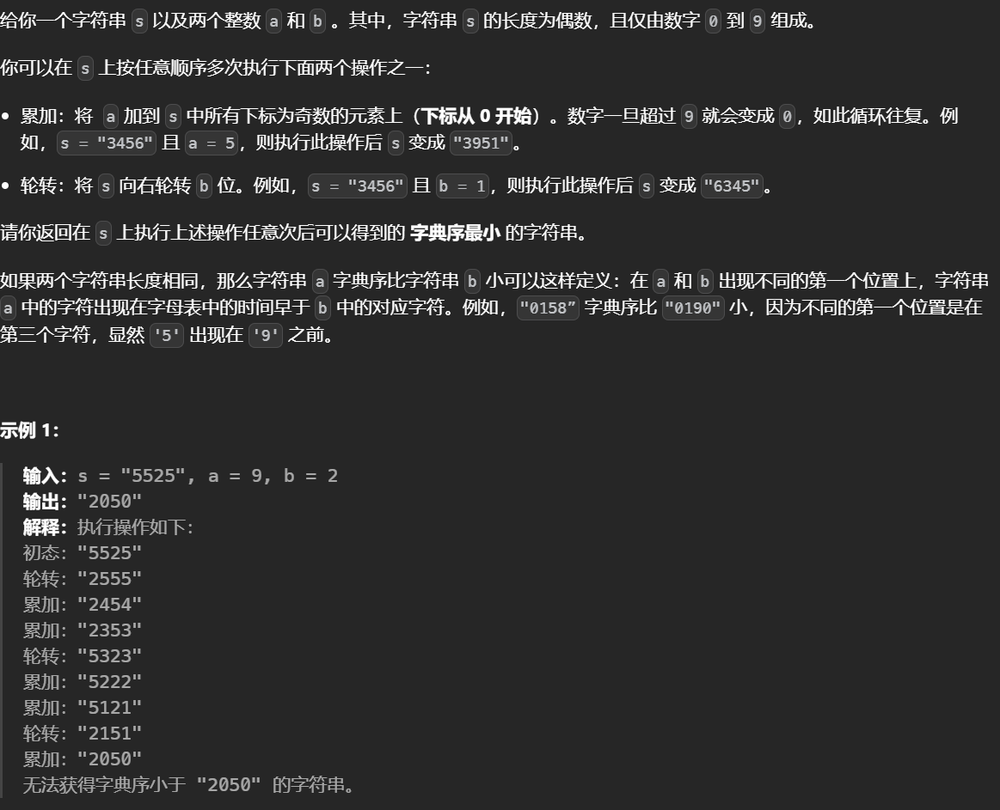

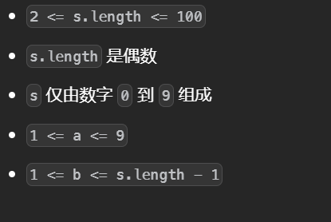


对于给定的数据范围可以暴力枚举，因为一次只有两个操作所以可以使用bfs模拟。

```python
class Solution:
    def findLexSmallestString(self, s: str, a: int, b: int) -> str:
        ans=''
        n=len(s)
        d=deque([s])
        vis=set()
        vis.add(s)
        while d:
            for _ in range(len(d)):
                curr=d.popleft() 
                if not ans or curr<ans:
                    ans=curr
                s1=curr[-b:]+curr[:-b]
                s2=''
                for i,c in enumerate(curr):
                    if i&1:s2+=str((int(c)+a)%10)
                    else:s2+=c
                if s1 not in vis:
                    vis.add(s1)
                    d.append(s1)
                if s2 not in vis:
                    vis.add(s2)
                    d.append(s2)
        return ans

```

### 走一个大整数迷宫

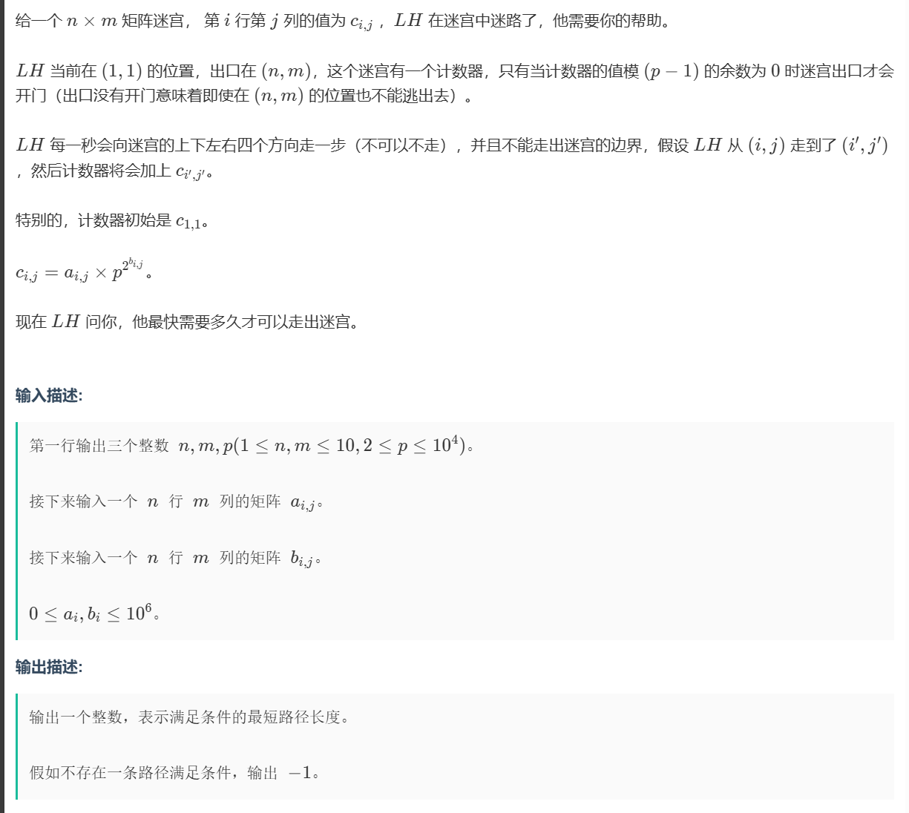

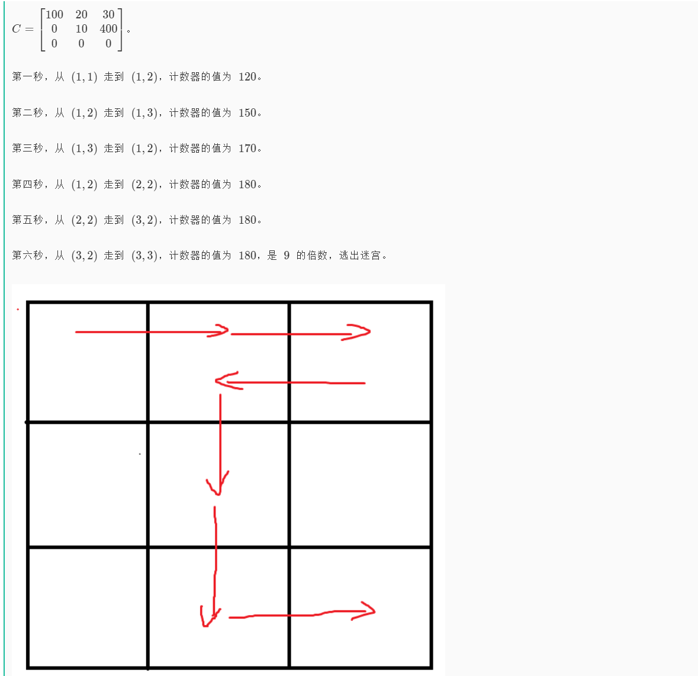

这道题用bfs存在回头的走法为了保证计数器的大小模p-1可以为0，同时对于同一个位置虽然他可以多次访问但是条件是再次访问这个位置时计数器的大小模p-1不会重复，如果重复了那么相当于多走了无用的步数不符合题目要求。

b数组没有作用，因为$p^{2^b}$取模p-1等于1（拆开看，每个p模p-1都为1，那么都累成上还是1）

```python
from collections import deque, defaultdict, Counter
from functools import lru_cache
from bisect import bisect_left
from math import ceil
import sys
from typing import List
input = sys.stdin.readline
def R(): return int(input())
def RR(): return [int(x) for x in input().split()]
    
m,n,p=RR()
a=[]
b=[]
for _ in range(m):
    a.append(RR())
for _ in range(m):
    b.append(RR())
d=deque()
vis=set()
p-=1
path=[[[-1]*(p+10) for _ in range(n+2)] for _ in range(m+2)]
path[0][0][a[0][0]%p]=0
d.append((a[0][0]%p,0,0))
def slove():
    s=-1
    while d:
        s+=1
        for _ in range(len(d)):
            v,i,j=d.popleft()
            # 能够结束的条件
            if i==m-1 and j==n-1 and not v:return s
            for dx,dy in (1,0),(0,1),(-1,0),(0,-1):
                x=i+dx
                y=j+dy
                # 对于同一个位置计数器取模p-1的结果不能重复
                if 0<=x<m and 0<=y<n and path[x][y][(v+a[x][y])%p]==-1:
                    d.append([(v+a[x][y])%p,x,y])
                    path[x][y][(v+a[x][y])%p]=s+1
    return -1          
        
res=slove()
print(res)
```

### **Go Stone Puzzle**

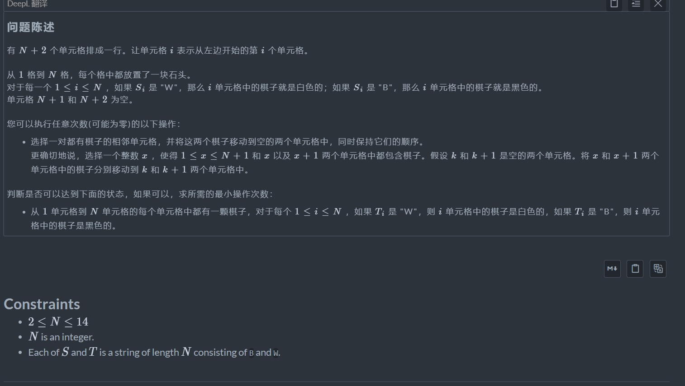


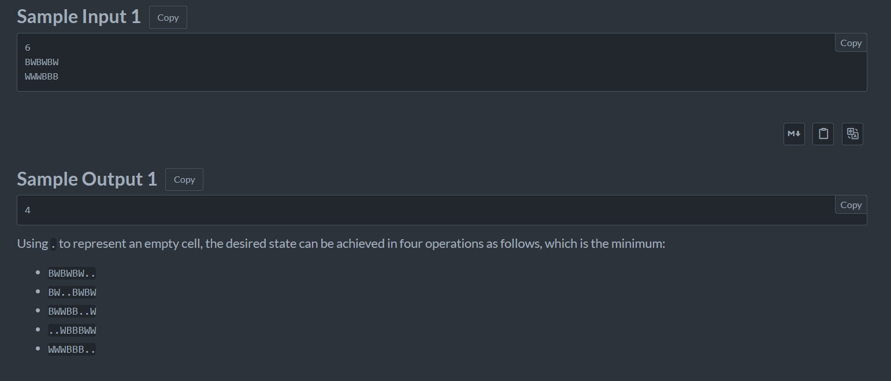

相当于用bfs求解最短路，将一个状态出发能得到的可能都枚举出来（过程中用集合去重）一步步往后找最终状态。

```python
from collections import deque, defaultdict, Counter
from functools import lru_cache
from bisect import bisect_left
from itertools import accumulate
from math import ceil, inf
import sys
from typing import List
#input = sys.stdin.readline
def R(): return int(input())
def RR(): return [int(x) for x in input().split()]
def get_pre(nums):return list(accumulate(nums,initial=0))

from collections import Counter
n=int(input())
a=list(input())+['1','1']
b=list(input())+['1','1']
l1=Counter(a)
l2=Counter(b)
d=deque()
d.append(a)
vis=set()
vis.add(tuple(a))
sz=-1
while d:
    sz+=1
    for _ in range(len(d)):
        nums=d.popleft()
        if nums==b:
            print(sz)
            exit()
        index=nums.index('1')
        for i in range(1,n+2):
            if nums[i]=='1' or nums[i-1]=='1':continue
            temp=nums[:]
            l=temp[i-1]
            r=temp[i]
            temp[index],temp[index+1]=l,r
            temp[i-1]=temp[i]='1'
            if tuple(temp) not in vis:
                vis.add(tuple(temp))
                d.append(temp)
print(-1)
```


### bfs问题总结

在使用bfs的时候总是会出现超时的现象，但反而可以使用df解决，这是因为Bfs中的一些细节没有处理好，

比如说这里，选择将满足的元素在外部循环中更新，这就有可能使得在下一次循环中将相同的元素加入到队列中，因为满足的元素没有改变，需要使用一个哈希表防止重复加入，

不过最好的选择是在最内部的循环中更新元素，这样在下一次循环中就不会再次加入了。

另外一些技巧：四个方向写lambda函数太过麻烦，直接选择遍历四个元组，象牙符号:=，用于在判断的同时赋值一个新变量，方便操作

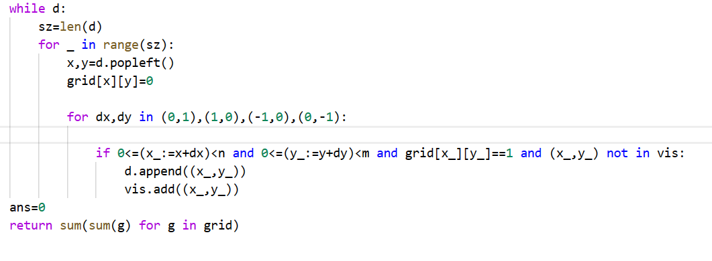

迷宫走格子的问题要使用bfs而不是dfs，因为如果存在往右走有无限步, 但是往左走一步就到了，这时深度优先就超时了，并且上下左右走的操作不能使用记忆化搜索，因为回溯为了防止回头会使用哈希表记录上一个位置，而到了当前位置记忆化搜索记录到达终点最小的距离，是在上一个位置A确定的情况下，而回溯中从另一个位置到这个位置时直接从记忆化搜索中拿到的是以A为上一个位置的最短距离。

有的题目中可以令grid[x] [y]为特殊值以表示还没访问过，从而不需要使用set()查找防止重复，只有是特殊值的才会走，虽然set查找操作是O(1)的但没想得那么快。


## 二叉树

前中后序遍历是遍历二叉树过程中处理每一个节点的三个特殊时间点，前序是在各个进入一个结点的时候，后序是在将要离开一个节点的时候，中序是二叉树左子树遍历完，将开始遍历右子树的时候执行。注意多叉树没有中序位置。二叉树的所有问题就是要在前中后三个位置注入能达成目的的代码，只需单独考虑每一个节点应该做什么，其他的不用管，递归会在所有的节点上做相同的事情。

二叉树解题的两种思路：是否可以通过遍历一遍二叉树得出答案（BFS），是否可以通过定义一个递归函数，通过子问题的答案呢推导出原问题的答案（动态规划）。

如果一个问题必须要遍历完才能得出答案，那么需要时用后序，如果可以在遍历的同时求解可以使用前序。


二叉树天生具有递归的性质，每一个子树本身又可以作为新的er'cha'shu


### 二叉树最大深度

解法一：遍历每一条路径找出最大的那个，DFS

```python
class Solution(object):
    def maxDepth(self, root):
        
        if not root:# 节点不存在
            return 0
        
        self.res=[]# 储存结果
        depth=0
        
        self.backtrace(root,depth)
        
        return max(self.res)
    def backtrace(self,root,depth):
        depth+=1# 每次调用都是向下了一层
        if root.left==None and root.right==None:
            self.res.append(depth)
            return 
        if root.left:
            self.backtrace(root.left,depth)
        if root.right:
            self.backtrace(root.right,depth)
        depth-=1# 回溯了
```

 解法二：根据子树的最大深度求解

```python
class Solution(object):
    def maxDepth(self, root):
        if not root:           
            return 0
        a=self.maxDepth(root.left)
        b=self.maxDepth(root.right)
        return max(a,b)+1# 先计算出左右子树的最大深度，再计算本身
```

### 二叉树是否相同

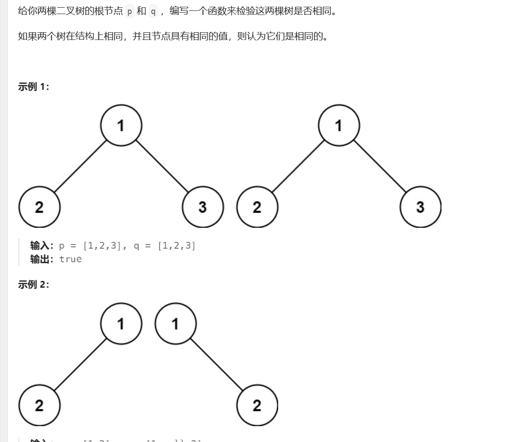

递归调用，如果一个空了返回F，如果都空了返回T

```python
class Solution(object):
    def isSameTree(self, p, q):
        if not p or not q:
            return p==q
        if p.val!=q.val:
            return False
        return self.isSameTree(p.right,q.right) and self.isSameTree(p.left,q.left)
```


### 后序位置的特殊性

前序位置只能通过函数参数获取父节点的信息，而后续位置可以获取函数参数的信息以及函数的返回值的信息

+ 如果以根节点为第一层，如何打印出每一个节点所在层数

```python 
def traverse(root,level):
    if not root:
		return 
	print('节点%s在第%d层',root,level)
    travese(root,level+1)
    trave(root,level+1)
```


+ 如果打印出每个节点有多少子节点

```python 
def traverse(root):
	if not root:
        return 0
    a=traverse(root.left)
    b=traverse(root.right)
    return a+b+1
```

只有后序位置才能通过返回值获取子树的信息。

子树问题一般可以考虑用后序优化

### 二叉树直径

二叉树的直径是两个节点之间的边数

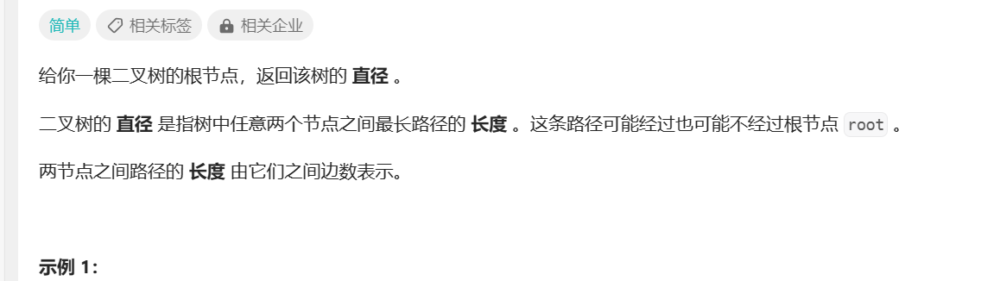

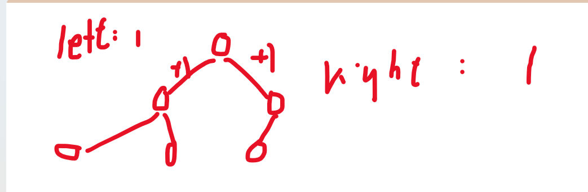


```python
class Solution:
    def diameterOfBinaryTree(self, root: Optional[TreeNode]) -> int:
        ans=0
        # 返回以当前节点为根的最长边数
        def dfs(root):
            nonlocal ans
            # 如果为空返回-1
            if not root:
                return -1
            # 找到左右子树的边数
            left=dfs(root.left)
            right=dfs(root.right)
            # 记录结果
            temp=left+right+2
            ans=max(ans,temp)
            # 返回最大的边数
            return max(left,right)+1
        dfs(root)
        return ans 
```

### [二叉树中的最大路径和](https://leetcode.cn/problems/binary-tree-maximum-path-sum/)


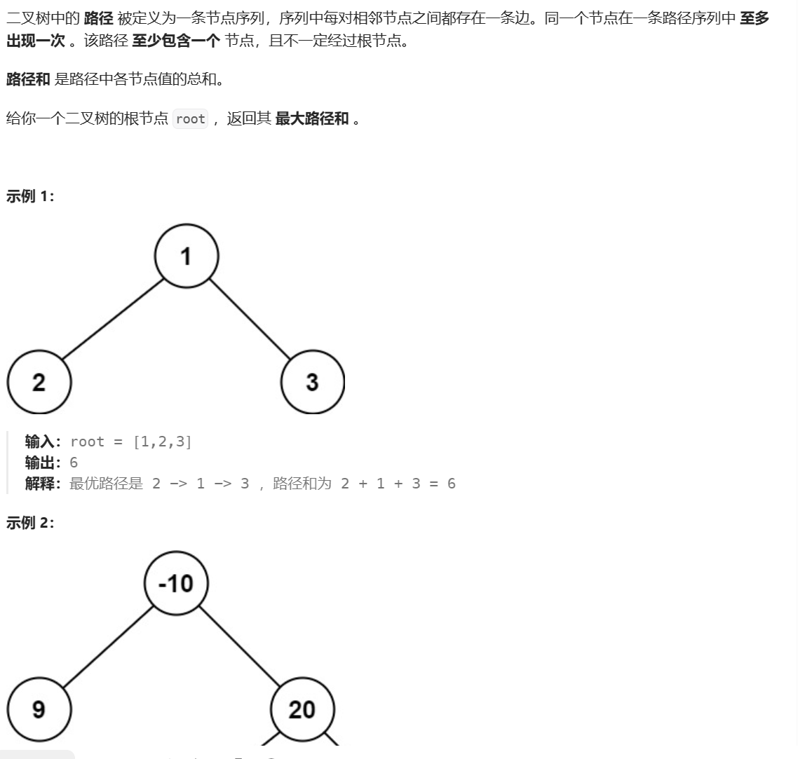

树形dp

就是找`最大和的子链`，如果子链最大和小于0，那么就不考虑加上这个子链


```python
class Solution:
    def maxPathSum(self, root: Optional[TreeNode]) -> int:
        ans=-inf
        # 返回以当前节点为头的最大子链和
        def dfs(root):
            nonlocal ans
            if not root:
                return 0
	    # 找当前节点的左右链和
            left=dfs(root.left)
            right=dfs(root.right)
            # 记录最大路劲
            temp=left+right+root.val
            ans=max(ans,temp)
            # 返回当前节点所能组成的最大子链和，如果小于0，取0代表不选
            return max(root.val+max(left,right,0),0)
        dfs(root)
        return ans 
```


### 层次遍历

```python
from collections import deque 

def leveltrace(root):
    d=deque()
    d.append(root)
    
    while d:
        for i in range(len(d)):
			d.popleft()
            if d.left:
            	d.append(d.left)
            if d.right:
				d.append(d.right)
             
```

BFS 就是从层次遍历中扩展出的

###  翻转二叉树

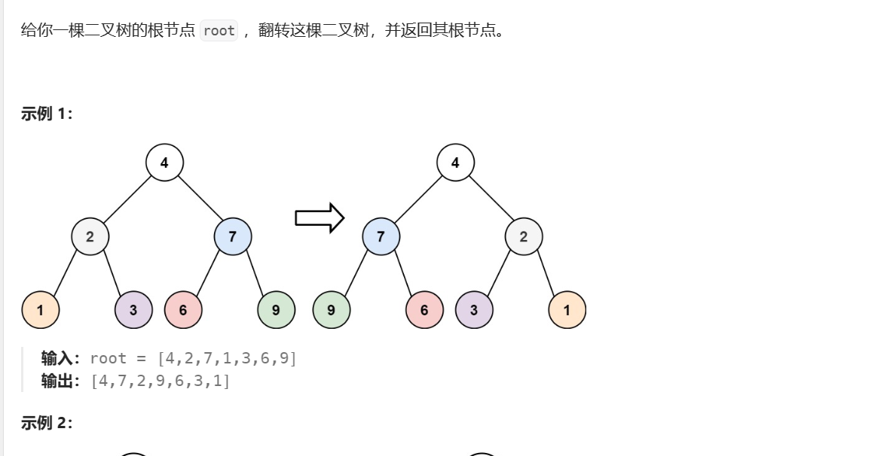

所谓反转就是将每个节点的左右子树交换。

遍历每个节点交换他们的左右子节点。

```python
class Solution(object):
    def invertTree(self, root):
        if not root:
            return None
        # 交换
        self.root.left,self.root.right=self.root.right,self.root.left
        self.invertTree(self.root.left)
        self.invertTree(self.root.right)
        return root
```

使用分解子问题的解法，先将左右子树翻转，再交换左右子树

```python
class Solution(object):
    def invertTree(self, root):
        if not root :
            return None
        
        self.invertTree(root.left)
        self.invertTree(root.right)
        # 交换
        root.left,root.right=root.right,root.left
        return root
```

### [翻转等价二叉树](https://leetcode.cn/problems/flip-equivalent-binary-trees/)


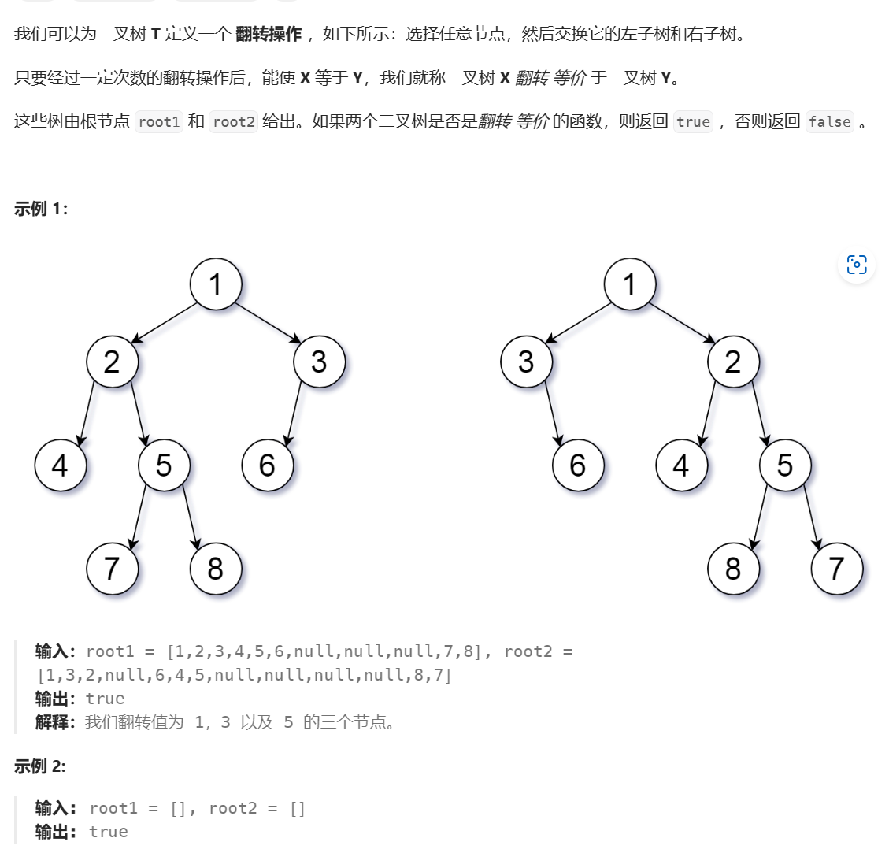


并不需要真的去反转二叉树，只需判断左右子树是否与等价的树相等（左子树等于左子树右子树等于右子树，或者是左子树等于右子树，右子树等于左子树）


```python
class Solution:
    def flipEquiv(self, root1: Optional[TreeNode], root2: Optional[TreeNode]) -> bool:
        # 两个子树相等了，返回True，同时会判断二者都为空的情况
        if root1 is root2:
            return True
        # 如果两个树其中一个空了，或者说值不相等就返回false
        if not root1 or not root2 or root1.val !=root2.val:
            return False
	# 不需反转，判断左右子树相不相等即可
        return ( self.flipEquiv(root1.left,root2.left) and  self.flipEquiv(root1.right,root2.right)) or (self.flipEquiv(root1.right,root2.left) and self.flipEquiv(root1.left,root2.right))
```


### 填充每个节点的下一个右侧节点指针

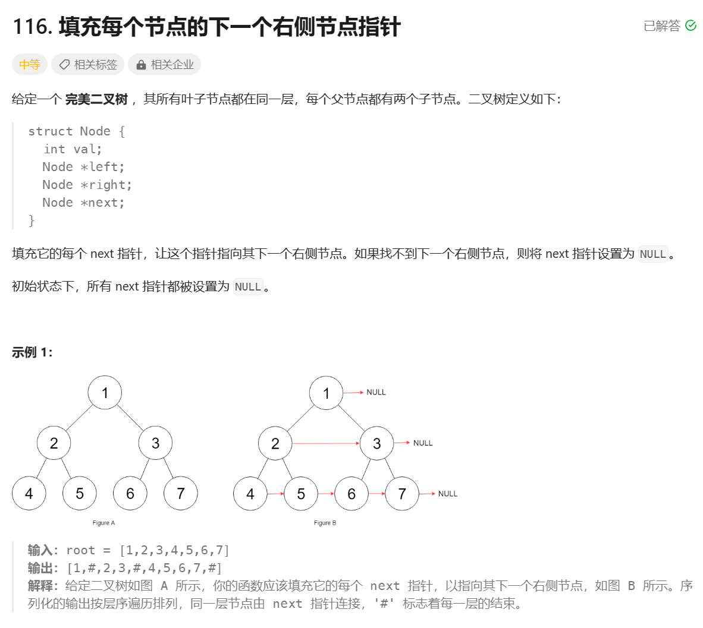

初始的时候每个节点的next指针都指向None，问题在于如何连接两个不相干的节点，在遍历过程中只给一个节点只能连接它自身的两个子树

```python
class Solution(object):
    def connect(self, root):
        if not root:
            return None
        self.traverse(root.left,root.right)
        return root

    def traverse(self,node1,node2):# 连接所给的两个所给节点
        if not node1 or not node2:
            return 
        
        node1.next=node2
        self.traverse(node1.left,node1.right)
        self.traverse(node2.left,node2.right)
        # 连接不相干子树的节点
        self.traverse(node1.right,node2.left)
```

使用BFS进行层次遍历

```python
class Solution(object):
    def connect(self, root):
        d=deque()
        d.append(root)
        while d:
            # 记录这一层的元素数
            sz=len(d)
            for i in range(sz):
                curr=d.popleft()# 弹出，注意从左边弹出
                # 加入下一层的元素
                d.append(curr.left)
                d.append(curr.right)
            for i in range(len(d)):
                if i+1<len(d)-1:# 防止溢出
                    d[i].next=d[i+1]
                else:
                    d[i].next=None
        return root
```


### 二叉树展开为链表

将每个节点提取到一个列表，然后对列表遍历连接。

```python
class Solution(object):
    def flatten(self, root):
        if not root:
            return None
        self.res=[]
        self.traverse(root)
        for i in range(len(self.res)):
            if i+1<len(self.res):# 防止溢出
                self.res[i].left=None
                self.res[i].right=self.res[i+1]
            else:
                self.res[i].right=None
        return root


    def traverse(self,root):
        if not root:
            return
        self.res.append(root)# 提取
        self.traverse(root.left)
        self.traverse(root.right)
```

使用分解问题，每个子树都构造为一个链表后，将左子树作为根节点的右子树，然后将原来的右子树连接到现在的右子树上

```python 
class Solution(object):
    def flatten(self, root):
        if not root:
            return None
        self.traverse(root)
        return root

    def traverse(self,root):
        if not root:
            return
        
        self.traverse(root.left)
        self.traverse(root.right)
        
        # 记录防止丢失
        left=root.left
        right=root.right
		
        # 开始转换
        root.left=None
        root.right=left

        p=root

        # 找到现在右子树的尾
        while p.right:
            p=p.right
        # 接上
        p.right=right
```

### 最大二叉树

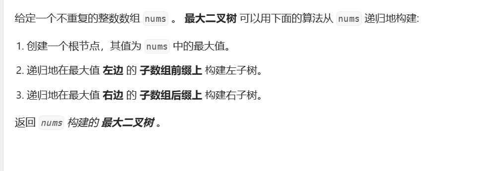

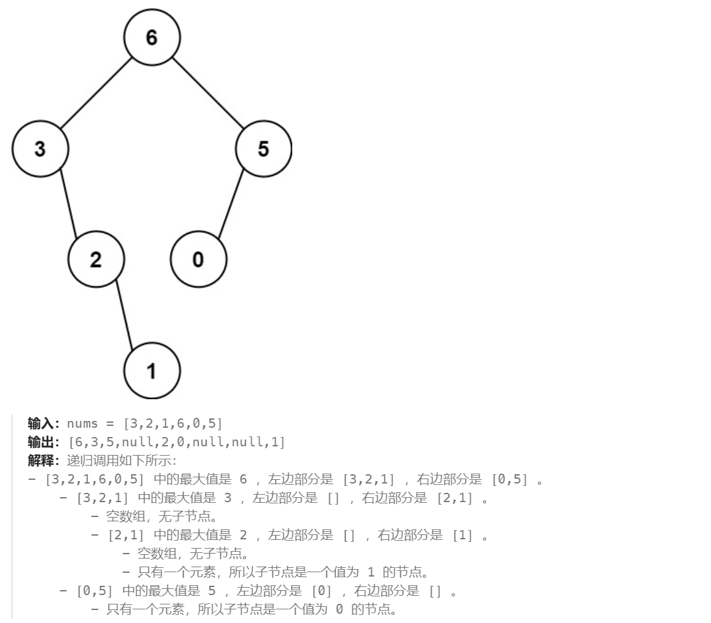

构造一颗二叉树一般使用分解问题的方法，先构造根节点，然后构造左右子树。	

```python
class Solution(object):
    def constructMaximumBinaryTree(self, nums):
        if not nums:
            return None
        val=max(nums)# 找出最大值
        index=nums.index(val)# 找出最大值的索引
        root=TreeNode(val)# 构造根节点
        root.left=self.constructMaximumBinaryTree(nums[:index])# 构造左子树
        root.right=self.constructMaximumBinaryTree(nums[index+1:])# 构造右子树
        
        return root# 返回节点
```

### 从前序与中序遍历序列构造二叉树

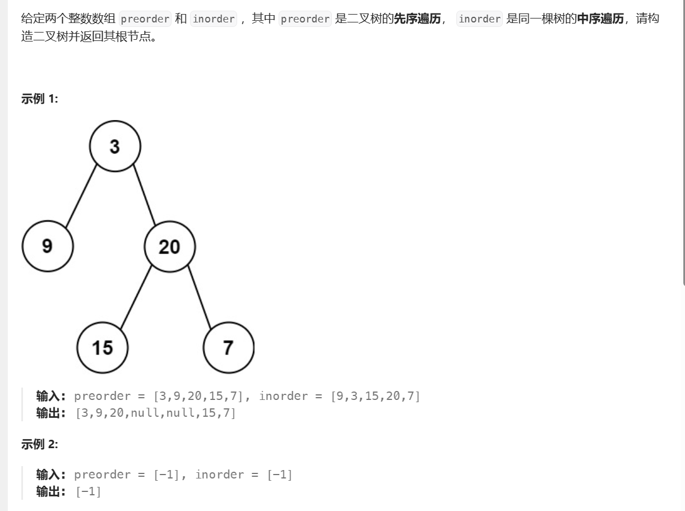


```python
class Solution(object):
    def buildTree(self, preorder, inorder):
        # 建立哈希表，设置映射，再找根节点值索引时不用遍历
        self.hashmap={}
        for i in range(len(inorder)):
            self.hashmap[inorder[i]]=i
          
        # 使用索引作为参数避免了额外构造列表
        return self.traverse(preorder,0,len(preorder)-1,inorder,0,len(inorder)-1)
    
            
    def traverse(self,preorder,prestart,preend,inorder,instart,inend):        
        if prestart>preend:
            return None
        # 找根节点
        val=preorder[prestart]
        # 建立根节点
        root=TreeNode(val)
        # 根据映射找索引
        index=self.hashmap.get(val)
        # 左子树的长度
        leftsize=index-instart
        # 在下一层递归中，前序的索引要相应改变，中序根据根节点的索引分割
        root.left=self.traverse(preorder,prestart+1,prestart+leftsize,inorder,instart,index)
        root.right=self.traverse(preorder,prestart+leftsize+1,preend,inorder,index+1,inend)
        return root
```


### 从中序与后序遍历序列构造二叉树

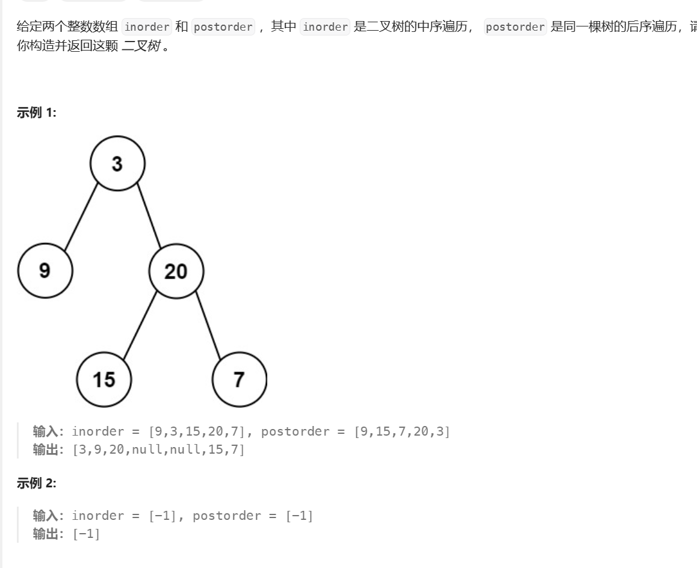

与前序区别不大

```python
class Solution(object):
    def buildTree(self, inorder, postorder):
        # 建立哈希表
        self.hashmap = {}
        for i in range(len(inorder)):
            self.hashmap[inorder[i]] = i
        return self.traverse(inorder,0,len(inorder)-1,postorder,0,len(postorder)-1)
    def traverse(self,inorder,instart,inend,postorder,pstart,pend):
        if pstart>pend:
            return None
        val=postorder[pend]
        root=TreeNode(val)
        index=self.hashmap.get(val)
        leftsize=index-instart
        # 索引的取值可以画图解析
        root.left=self.traverse(inorder,instart,index,postorder,pstart,pstart+leftsize-1)
        root.right=self.traverse(inorder,index+1,inend,postorder,pstart+leftsize,pend-1)
        return root 
```

### 根据前序和后序遍历构造二叉树

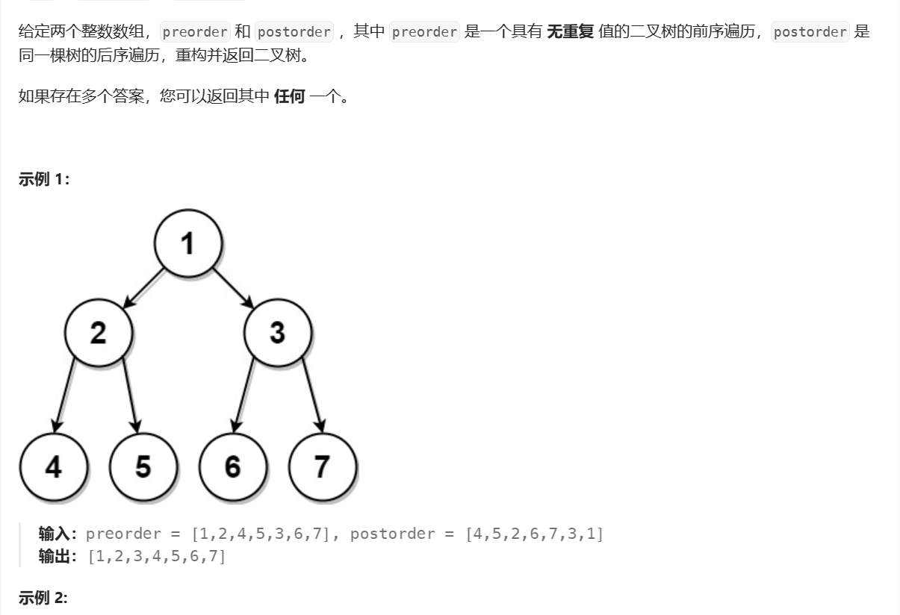


```python
class TreeNode(object):
    def __init__(self, val=0, left=None, right=None):
        self.val = val
        self.left = left
        self.right = right
class Solution(object):
    def constructFromPrePost(self, preorder, postorder):
        self.hashmap = {}
        # 建立哈希表，记录后续位置
        for i in range(len(postorder)):
            self.hashmap[postorder[i]] = i
        return self.traverse(preorder,0,len(preorder)-1,postorder,0,len(postorder)-1)
    def traverse(self,preorder,prestart,preend,postorder,pstart,pend):
        if prestart>preend:
            return None
        # 防止溢出
        if prestart==preend:
            return TreeNode(preorder[preend])

        val=preorder[prestart]
        root=TreeNode(val)
        # 以根节点的下一位为该节点的左子树根节点，根据这个节点在后序中的位置，推出左右子树的区间
        valleft=preorder[prestart+1]
        # 找出索引位置
        index=self.hashmap.get(valleft)
        # 左子树长度，加一是因为index指向的左子树节点，要包括这个节点
        leftsize=index-pstart+1
        root.left=self.traverse(preorder,prestart+1,prestart+leftsize,postorder,pstart,index)
        root.right=self.traverse(preorder,prestart+leftsize+1,preend,postorder,index+1,pend-1)
        return root
```

该题目有多个结果是因为根节点的下一位不一定是左子树，有可能是右子树因为左子树为None，无法确定。

### 二叉树最近的公共祖先

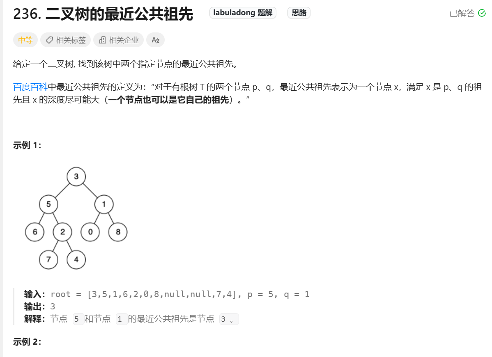

如果一个节点能在它的左右子树分别找到pq，则该节点为LCA。

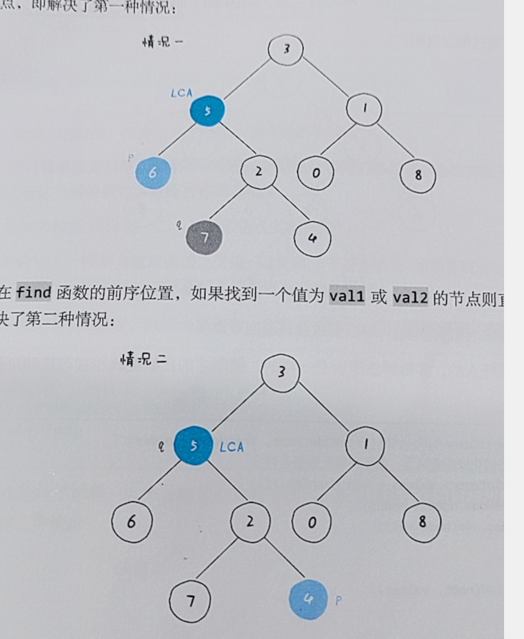

```python
class Solution(object):
    def lowestCommonAncestor(self, root, p, q):

        def find(root,p,q):
            if not root:
                return None
            # 前序遍历，一直往下找，满足情况二
            if root==p or root==q:
                return root
            left=find(root.left,p,q)
            right=find(root.right,p,q)
			
            # 如果左右子树中能分别找到节点，那么该节点就是LCA
            if left!=None and right!=None:
                return root
            
            # 如果在左子树先找到了q，右子树中没有相应的节点，那么说明p在q的下面，最近的公共祖先就是q，满足情况一
            return left if left!=None else right
        return find(root,p,q)
```

### 二叉树的最近公共祖先II

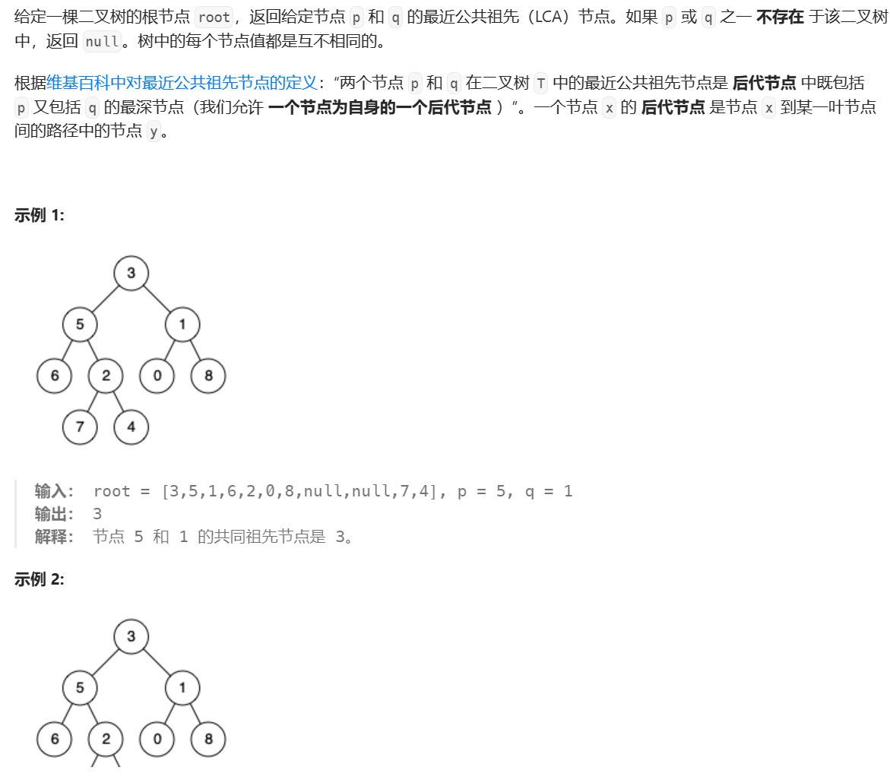

上一题因为确定节点都在树中，所以一旦找到一个相应的节点就会返回，但是这题不能直接返回，因为不确定另一个节点是否在树中。


```python
class Solution(object):
    def lowestCommonAncestor(self, root, p, q):
        # 要用self记录，不然在函数中无法修改
        self.findp=False
        self.findq=False
        
        def find(root,p,q):
            if not root:
                return None
            left=find(root.left,p,q)
            right=find(root.right,p,q)
            
            # 如果左右子树都存在返回本身
            if right and left:
                return root
            # 使用后序遍历，进行完全搜索，用两个外部变量记录节点是否都存在
            if root==p or root==q:
                # 记录
                if root==p:
                    self.findp=True
                if root==q:
                    self.findq=True
                return root
            
            return left if left!=None else right
        
        res=find(root,p,q)
        # 判断是否节点都存在
        if self.findp and self.findq:
            return res
        else:
            return None
```

### 二叉树的最近公共祖先III

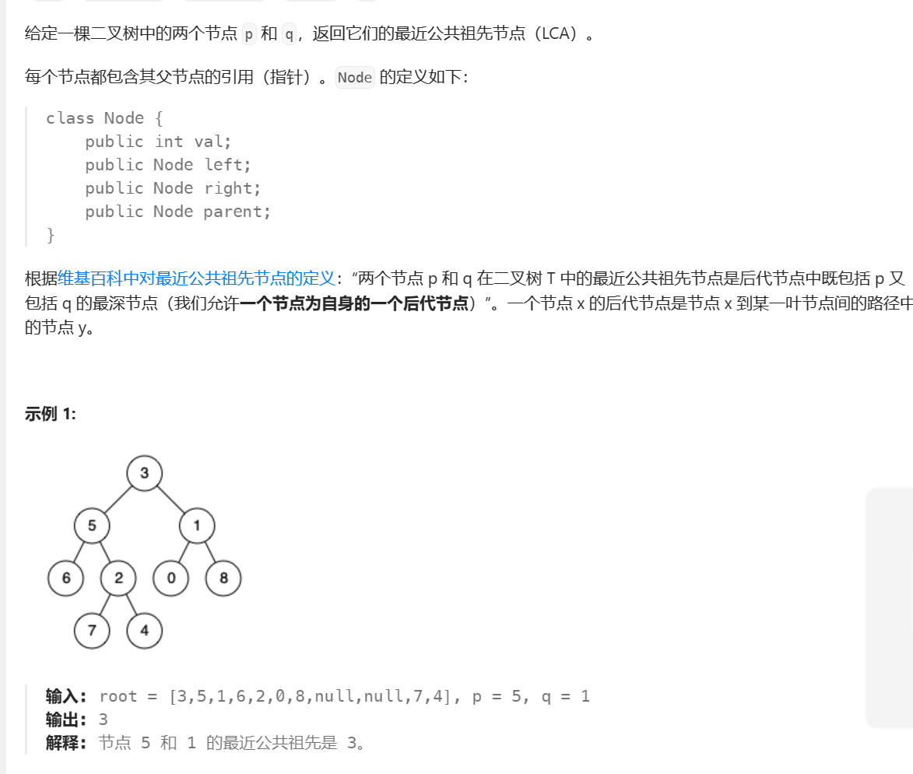

没有给头节点但是给了父节点，就是判断两个链表是否有交点，因为求公共祖先就是看从两个节点到根结点是否有交点，第一个交点就是公共祖先。

将父节点看作next指针，这个问题就是两个单链表（到根节点）的交点

```python
class Solution(object):
    def lowestCommonAncestor(self, p, q):
        # 双指针技巧
        a=p
        b=q
        while a!=b:
            # 到头了，连到另一个上
            if not a:
                a=q
            else:
                a=a.parent
            if not b:
                b=p
            else:
                b=b.parent
        return a
```


### 二叉树的最近公共祖先IV

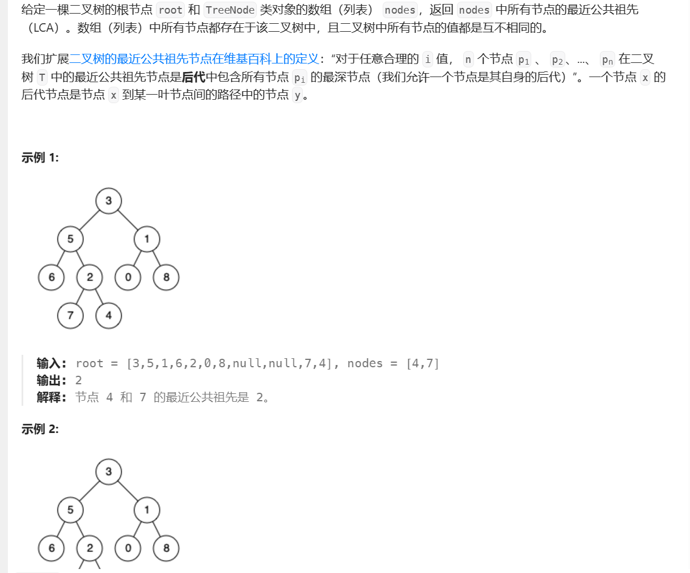

同上，遍历每一个节点，如果这个节点在列表中的返回它，否则找他的左右子树，如果左右子树不空返回它，不然返回不为空的左右子树

```python
class Solution(object):
    def lowestCommonAncestor(self, root, nodes):

        def find(root,nodes):
            if not root:
                return None
            # 在列表中
            if root in nodes:
                return root
            # 找左右子树
            left=find(root.left,nodes)
            right=find(root.right,nodes)
            
            if left and right:
                return root
            return left if left!=None else right
        return find(root,nodes)
```

### [ 最小公共区域](https://leetcode.cn/problems/smallest-common-region/)

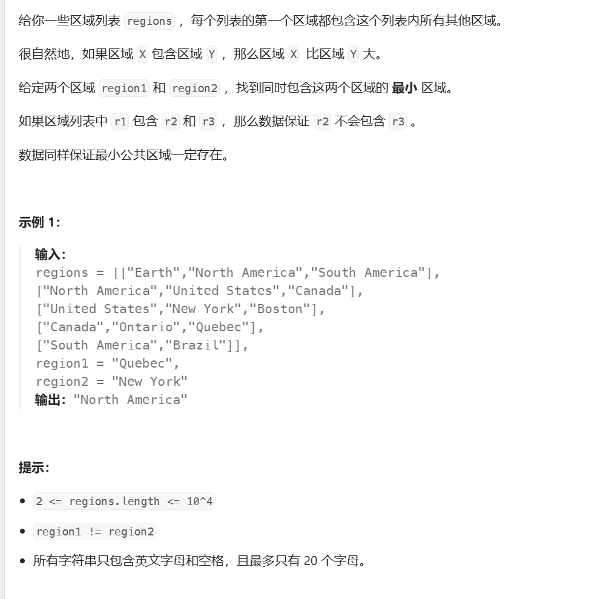

实际上就是在多叉树上找最近公共祖先。

```python
class Solution:
    def findSmallestRegion(self, regions: List[List[str]], region1: str, region2: str) -> str:
        memo=defaultdict(list)
        # 建树
        for re in regions:
            memo[re[0]]=re[1:]
        ans=[]
        # 遍历的函数，返回子树是否包含要找的值，如果包含返回1
        def traverse(root):
            res=0
            # 如果自己就是一个要找的值，记录值加一
            if root==region1 or root==region2:
                res+=1
            if not memo[root]:
                return int((root==region1 or root==region2))
            for p in memo[root]:
                res+=traverse(p)
            # 一旦记录的值等于2，就要加入一个节点
            if res==2:
                ans.append(root)
            return int(res>=1)
            
        root=regions[0][0]
        traverse(root)
        return ans[0]
```

### [查询树中环的长度](https://leetcode.cn/problems/cycle-length-queries-in-a-tree/)

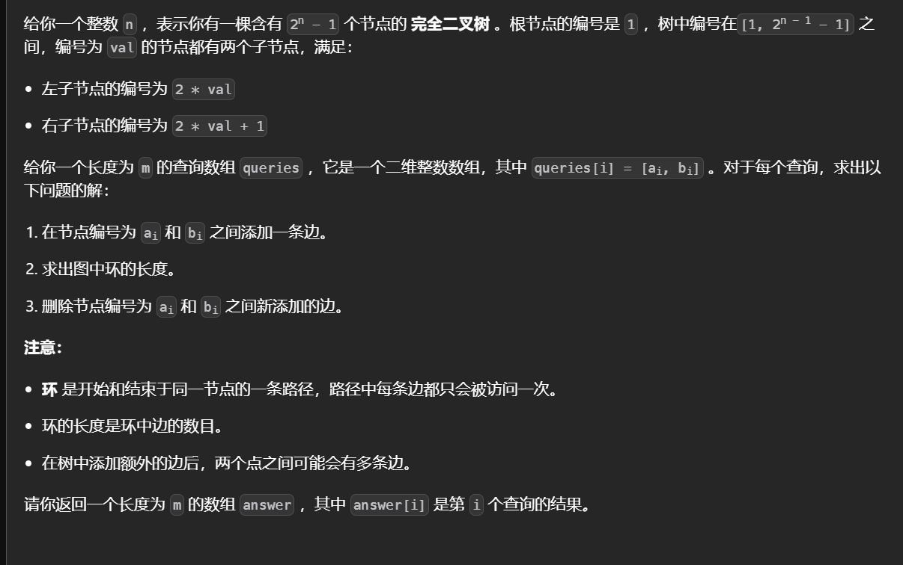


找给定节点的祖先，此题中将根据完全二叉树的性质可以反找节点的父节点，比较给定的两个节点，较大的那个说明更深，通过整除二来反找父节点，就这样每次把更深的节点去找它的父节点最后一定会找到二者的交点即祖先。

```python
class Solution:
    def cycleLengthQueries(self, n: int, queries: List[List[int]]) -> List[int]:
        ans=[]
        path=defaultdict(dict)
        for a,b in queries:
            res=1
            # 最后一定会汇于一点
            while a!=b:
                # 每次换较深的那个点
                if a>b:a//=2
                else:b//=2
                # 记录
                res+=1
            ans.append(res)
        return ans 
```


### 二叉树的序列化与反序列化

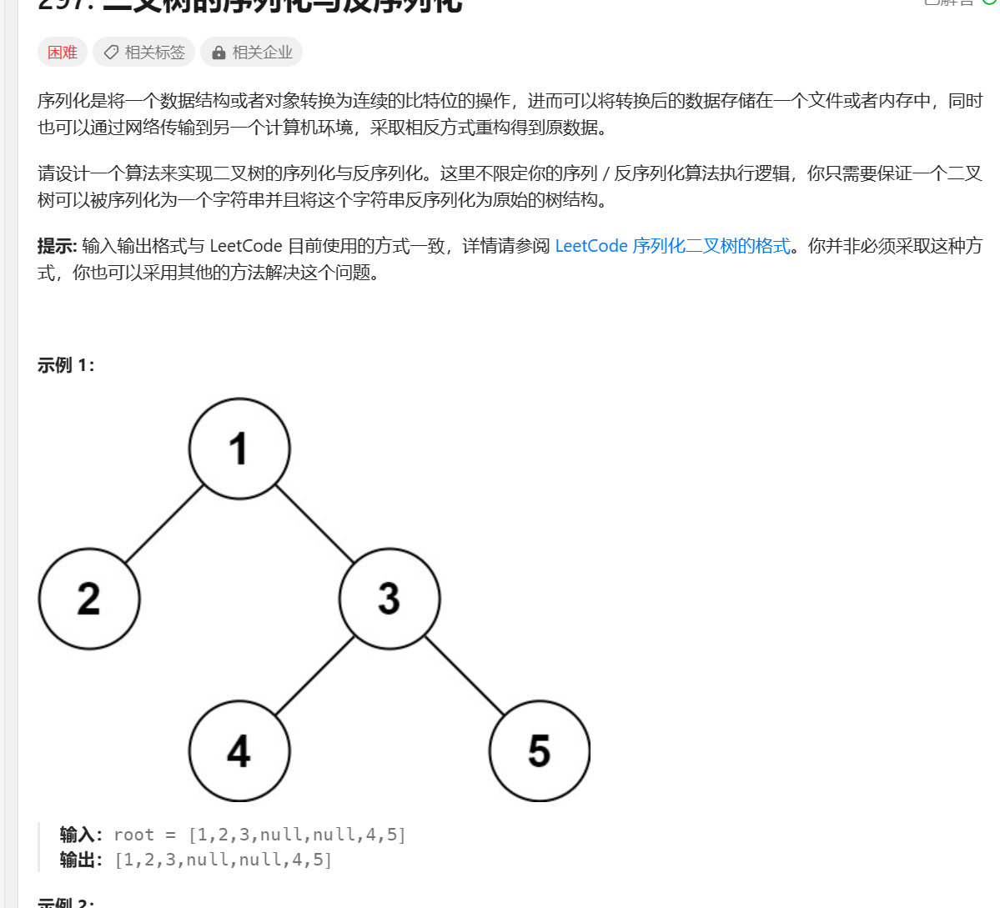

使用BFS将所有节点入队，空节点被视为'#'加入

```python
class Codec:
	# 使用BFS层次遍历输出
    def serialize(self, root):
        if not root:
            return ''
        res=[]
        self.d=deque()
        self.d.append(root)
        while self.d:
            sz=len(self.d)
            for i in range(sz):
                curr=self.d.popleft()

                if not curr:
                    res.append('#')
                    continue
                res.append(str(curr.val))
                self.d.append(curr.left)
                self.d.append(curr.right)
        return ','.join(res)# 转换为字符串输出

    def deserialize(self, data):
        if not data:
            return None
        data=data.split(',')# 将字符串转换为列表
        root=TreeNode(data[0])# 构造根节点
        self.d=deque()
        self.d.append(root)
        index=1# 使用索引找出子树的值
        while self.d:# 迭代加入
          for i in range(len(self.d)):
            curr = self.d.popleft()# 弹出
            left = data[index]
            # 如果左右子树是空的不做操作，默认为None，否则创造节点并连接
            if left != '#':
                curr.left = TreeNode(left)
                self.d.append(curr.left)
            index += 1
            right = data[index]
            index+=1
            if right != '#':
                curr.right = TreeNode(right)
                self.d.append(curr.right)

            
        return root
```

使用前序遍历，将所有节点转化为字符串，给出前序遍历或者后序遍历，只要包括空指针就能找出树结构。

```python
class Codec:
    def serialize(self, root):
        if not root:
          return ''
        res = []
        self.traversetostr(root,res)
        return ','.join(res)

    def traversetostr(self, root,res):
        # 前序位置操作
        if not root:
            res.append('#')
            return
        res.append(str(root.val))
        self.traversetostr(root.left,res)
        self.traversetostr(root.right,res)

    def deserialize(self, data):
        if not data:
          return None
        self.index = 0# 使用索引确定每个子节点的值
        data = data.split(',')
        root = self.traversetotree(data)
        return root

    def traversetotree(self, data):

        val = data[self.index]
        self.index += 1
        if val == '#':
            return None
        val = int(val)
        root = TreeNode(val)# 递归加入

        root.left = self.traversetotree(data)
        root.right = self.traversetotree(data)
        return root
```


### [删点成林](https://leetcode.cn/problems/delete-nodes-and-return-forest/)

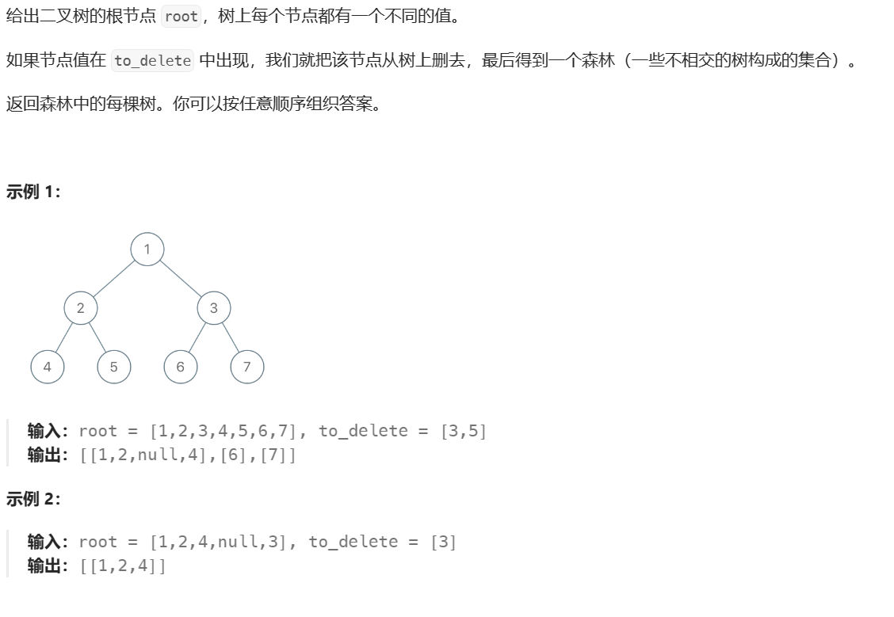

这个题目只能用后序遍历做，只有得到了左右子树的信息才能判断以这个节点（如果不是要删除的）的形状。

```python
class Solution:
    def delNodes(self, root: Optional[TreeNode], to_delete: List[int]) -> List[TreeNode]:
        ans=[]
        # 用set可以快速查找
        delete=set(to_delete)
        # 返回更新后的节点，使用一个变量标记这个节点是否可以做一个根节点
        def dfs(root,is_delete):
            if not root:
                return
            # 如果这个节点是要删除的，那么它的根节点可以作为一个独立的节点
            d=root.val in delete

            # 使用后序遍历
            root.left=dfs(root.left,d)
            root.right=dfs(root.right,d)

            if d:
                return None
            else:
                # 如果不需删除并且有能力做一个独立的节点，在结果中加入它
                if is_delete:
                    ans.append(root)
                return root 
            
        dfs(root,True)
        return ans


```

### [ 二叉树的完全性检验](https://leetcode.cn/problems/check-completeness-of-a-binary-tree/)

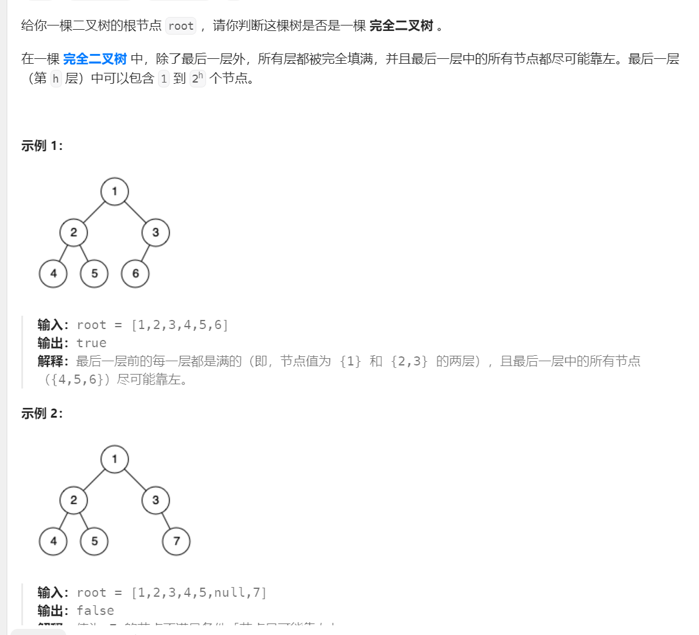


对二叉树每个节点编号，左节点是当前节点的两倍，右节点是两倍加一，如果是完全二叉树的话最后的节点编号应该等于节点的数目

```python
class Solution:
    def isCompleteTree(self, root: Optional[TreeNode]) -> bool:
        d=deque()
        d.append((root,1))
        ans=[]
        while d :
            sz=len(d)
            for _ in range(sz):
                node,index=d.popleft()
                ans.append((node,index))
                if node.left:
                    d.append((node.left,2*index))
                if node.right:
                    d.append((node.right,2*index+1))
        return ans[-1][1]==len(ans)
```

### [在二叉树中分配硬币](https://leetcode.cn/problems/distribute-coins-in-binary-tree/)

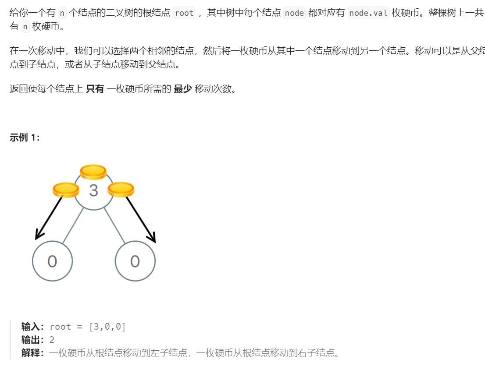

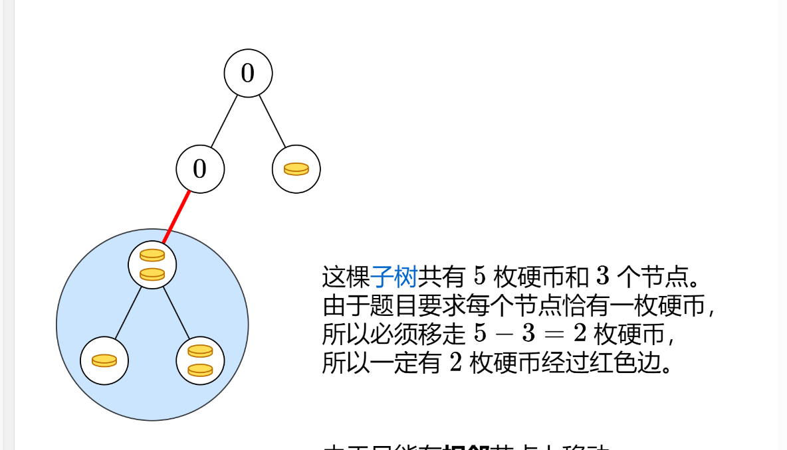


对于如图所示的子树，如果想要满足条件那么必须移出两个金币也就是金币数和节点数之差的绝对值，每个子树都会贡献一部分。

```python
class Solution:
    def distributeCoins(self, root: Optional[TreeNode]) -> int:
        ans=0
        def dfs(root):
            if not root:
                return 0,0
            cntl,coinl=dfs(root.left)
            cntr,coinr=dfs(root.right)
            nonlocal ans 
            ans+=abs(cntl-coinl)+abs(cntr-coinr)
            return cntl+cntr+1,coinl+coinr+root.val
        dfs(root)
        return ans 
```

### [所有可能的真二叉树](https://leetcode.cn/problems/all-possible-full-binary-trees/)

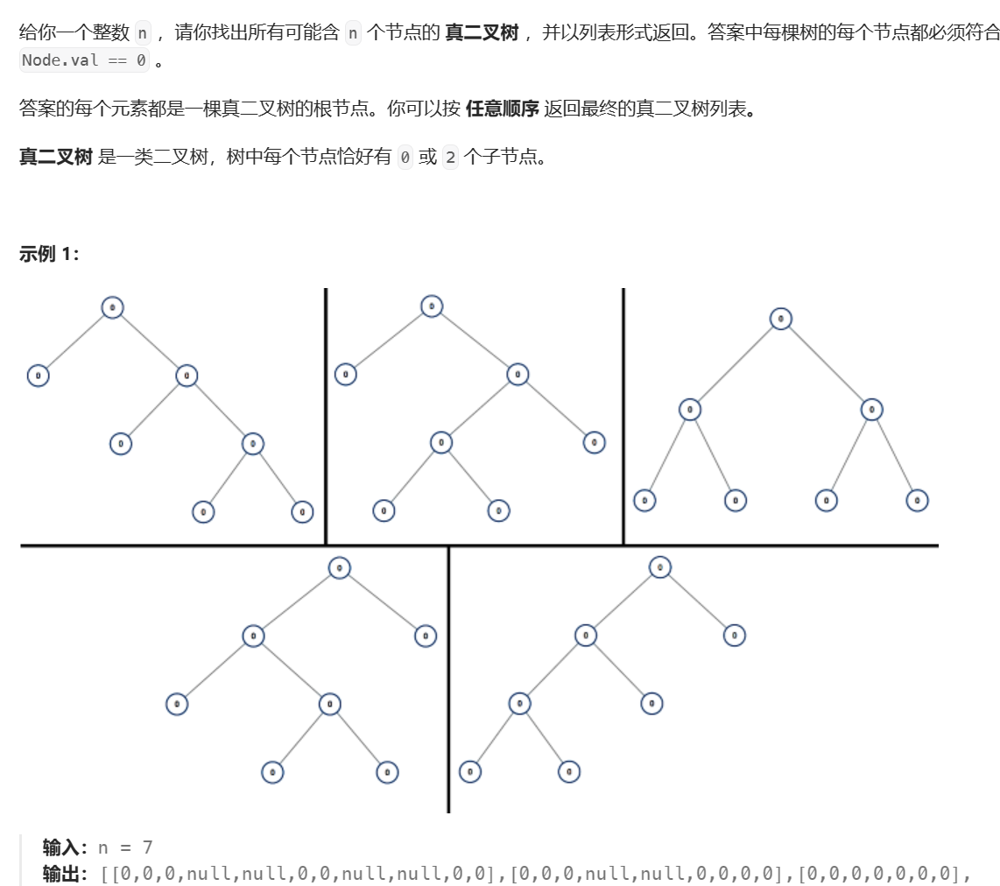

递归的过程，每个二叉树的子树也是一颗二叉树，且每个二叉树的节点个数都是奇数个，考虑给每个根节点的左子树分配x个右子树分配n-x-1个节点然后去递归。

```python
# Definition for a binary tree node.
# class TreeNode:
#     def __init__(self, val=0, left=None, right=None):
#         self.val = val
#         self.left = left
#         self.right = right
class Solution:
    def allPossibleFBT(self, n: int) -> List[Optional[TreeNode]]:
        res=[]
        # 只有一个自然返回本身
        if n==1:
            return [TreeNode()]
        # 偶数个是不可能构成的
        elif n%2==0:return []
	
        # 分配左右子树的节点个数
        left_num=1
        right_num=n-2
        
        while right_num>0:
            l=self.allPossibleFBT(left_num)
            r=self.allPossibleFBT(right_num)
            # 循环遍历挑选出所有的
            for i in range(len(l)):
                for j in range(len(r)):
                    root=TreeNode()
                    left=l[i]
                    right=r[j]
                    root.left=left
                    root.right=right
                    res.append(root)
            left_num+=2
            right_num-=2
        return res
```


### [翻转二叉树以匹配先序遍历](https://leetcode.cn/problems/flip-binary-tree-to-match-preorder-traversal/)

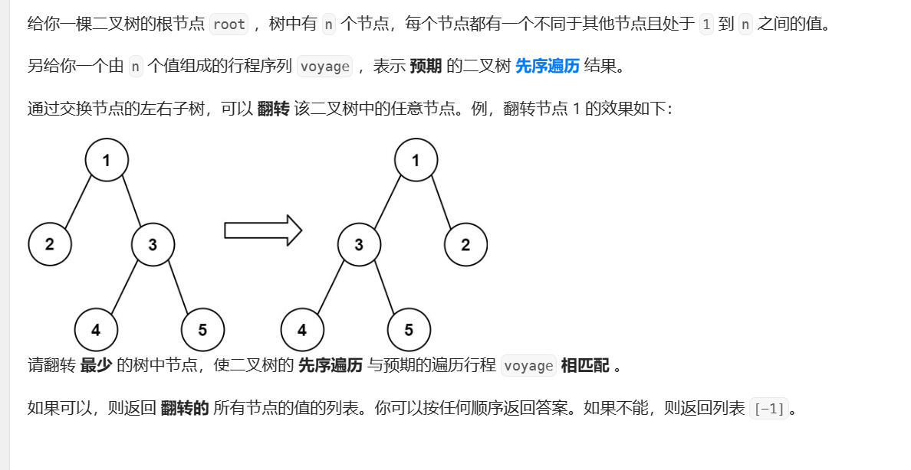

二叉树只有两个选择，如果下一个的预期值不同则翻转节点


```python
# Definition for a binary tree node.
# class TreeNode:
#     def __init__(self, val=0, left=None, right=None):
#         self.val = val
#         self.left = left
#         self.right = right
class Solution:
    def flipMatchVoyage(self, root: Optional[TreeNode], voyage: List[int]) -> List[int]:
        
        ans = []
        # 标识符
        k=0
        
        def traverse(root, nums):
            nonlocal k
        	
            # 如果值不同返回false
            if root.val != nums[0]:
                k=-1
                return
            # 遍历到最后一个节点 并且可行
            if len(nums)==1:
                return
            else:
                # 如果只有左子树或者右子树直接进入，无法改变
                if root.left and not root.right:
                    traverse(root.left, nums[1:])
                    return
                if not root.left and root.right:
                    traverse(root.right, nums[1:])
                    return
                # 如果每个子树意为值没遍历到
                if not root.left and not root.right:
                    k=-1
                    return
                
                # 配合index函数
                if root.right.val not in nums or root.left.val not in nums:
                    k=-1
                    return
		# 找到左右子树的开始位置
                l,r=nums.index(root.left.val),nums.index(root.right.val)
		
        	# 如果当前的左子树再后面，说明需要翻转
                if l>r:
                    # 加入
                    ans.append(root.val)
                    # 并不会实际翻转，只是以子树作为一个新的二叉树规定好它的数组再开始调用
                    traverse(root.left,nums[l:])
                    traverse(root.right,nums[r:l])
                else:
                    traverse(root.left,nums[l:r])
                    traverse(root.right,nums[r:])
        traverse(root,voyage[:])
        return ans if k!=-1 else [-1]

```


### 归并排序

归并排序就是二叉树遍历中的后序遍历

```python
class Solution(object):
    def sortArray(self, nums):
        
        self.sort(nums,0,len(nums)-1)
        return nums
    def sort(self,nums,left,right):
        if left<right:
            mid=(left+right)//2# 划分中点
            self.sort(nums,left,mid)# 对左边的排序
            self.sort(nums,mid+1,right)# 对右边的排序
            self.merge(nums,left,mid,right)# 合并
    
    # 接受两个有序的数组
    def merge(self,nums,left,mid,right):
        i=left
        j=mid+1
        res=[]
        while i<=mid and j<=right:
            
            # 选取两个有序数组中较小的值，加入到临时数组中
            if nums[i]<nums[j]:
                res.append(nums[i])
                i+=1
            else:
                res.append(nums[j])
                j+=1
        # 将未完成排序的数组接上
        if i<=mid:
            res.extend(nums[i:mid+1])
        if j<=right:
            res.extend(nums[j:right+1])
        # 临时数组用于改变原数组中相应区间的值
        nums[left:right+1]=res
```

#### 计算右侧小于当前元素的个数

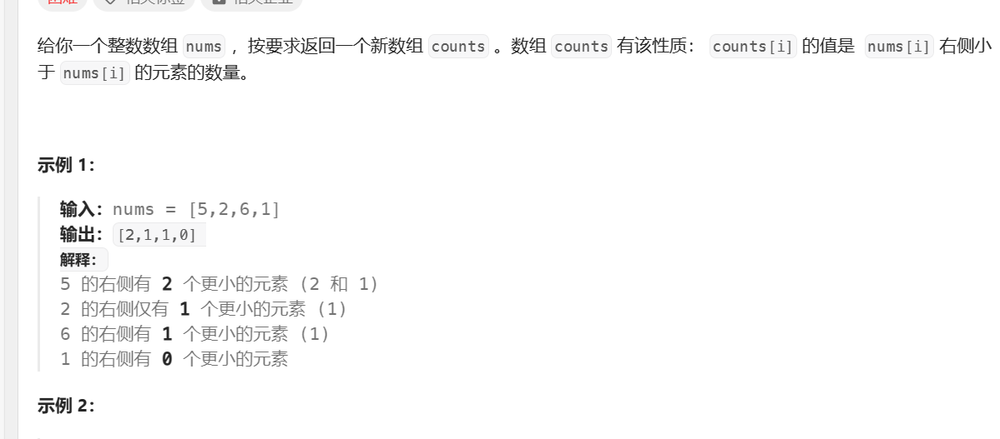


使用归并排序，归并排序划分完区域后，右区间中的值就是原数组中排在左区间之后的值，每次当左指针要移动时（左指针所指的值小于右指针所指的值），左指针所指的元素所对应的结果（小于他的元素个数）就是右指针的位置减去右区间的开头，这个结果在每次归并排序过程中叠加。归并排序是从最小的区间开始合并的，因此每个区间中的元素都是相对有序的。结果记录在ans数组中，但是记录的值需要一个索引来叠加到相应的位置，因此使用一个数组记录索引，每次排序过程中元素位置变化，索引数组也跟着变化。

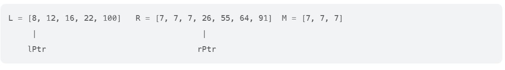


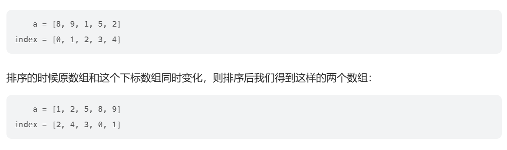


```python
class Solution(object):
    def countSmaller(self, nums):
        self.index=[]# index[i]记录num[i]位置的元素在原始数组中的索引，在遍历的过程中始终存在索引的偏移
        self.ans=[0 for i in range(len(nums))]# 答案数组，用作叠加
        
        for i in range(len(nums)):# 记录
            self.index.append(i)
        self.sort(nums,0,len(nums)-1)
        return self.ans
    # 归并排序
    def sort(self,nums,left,right):
        if left<right:

            mid=(left+right)//2

            self.sort(nums,left,mid)
            self.sort(nums,mid+1,right)

            self.merge(nums,left,mid,right)
    
    def merge(self,nums,left,mid,right):
        i=left
        j=mid+1
        temp=[]
        tempindex=[]
        while i<=mid and j<=right:
			# 左指针移动
    		if nums[i]<=nums[j]:
				# 在临时数组中储存值的时候，一并储存
                temp.append(nums[i])
                tempindex.append(i)
                # 叠加，注意使用索引数组来对应正确的位置
                self.ans[self.index[i]]+=j-mid-1
                i+=1
                
			# 右指针移动不会有操作
            else:

                temp.append(nums[j])
                tempindex.append(j)
                j+=1

        # 若左区间多出来，则多出来的部分的结果就是整个右区间的长度
        while i<=mid:
            temp.append(nums[i])
            tempindex.append(i)
            self.ans[self.index[i]]+=j-mid-1# 注意使用j，如果使用right之后的mid不能减一（因为包括right本身）
            i+=1

        while j<=right:
            temp.append(nums[j])
            tempindex.append(j)
            j+=1

        nums[left:right+1]=temp# 更新数组
        self.index[left:right+1]=tempindex# 更新索引数组
```

### 求解逆序对

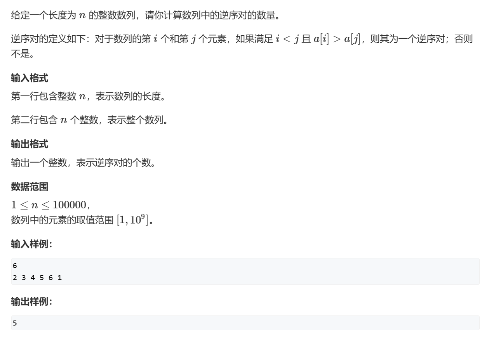

实质上是在找一个数右边大于它的数有多少个

```python
n=int(input())
nums=list(map(int,input().split()))
ans=0
def merge(li,l,mid,r):
    low=l
    high=mid+1
    temp=[]
    global ans
    while low<=mid and high<=r:
        if li[low]<=li[high]:
            temp.append(li[low])
            ans+=high-mid-1
            low+=1
        else:
            temp.append(li[high])
            high+=1
    while low<=mid:
        temp.append(li[low])
        ans+=high-mid-1
        low+=1
    while high<=r:
        temp.append(li[high])
        high+=1
    li[l:r+1]=temp
def s(li,l,r):
    if l>=r:
        return
    mid=(l+r)//2
    s(li,l,mid)
    s(li,mid+1,r)
    merge(li,l,mid,r)
s(nums,0,len(nums)-1)
print(ans)
```


## 二叉搜索树

BST是一种特殊的二叉树，对于BST的每一个节点，左子树节点的值都小于node的值，右子树节点的值反之，对于BST每一个节点，它的左右子树都是BST。BST增删改查的时间复杂度都是log(n)，因为左小右大的特性，可以做到类似二分搜索的效果。

BST的中序遍历是有序的。

以下是基本框架：

```python
def BST(root,target):
	if root.val==target:
        ...
    if root.val<target:
        self.BST(root.right,target)
    if root.val>target:
        self.BST(root.left,target)
```


### 二叉搜索树中第K小的元素

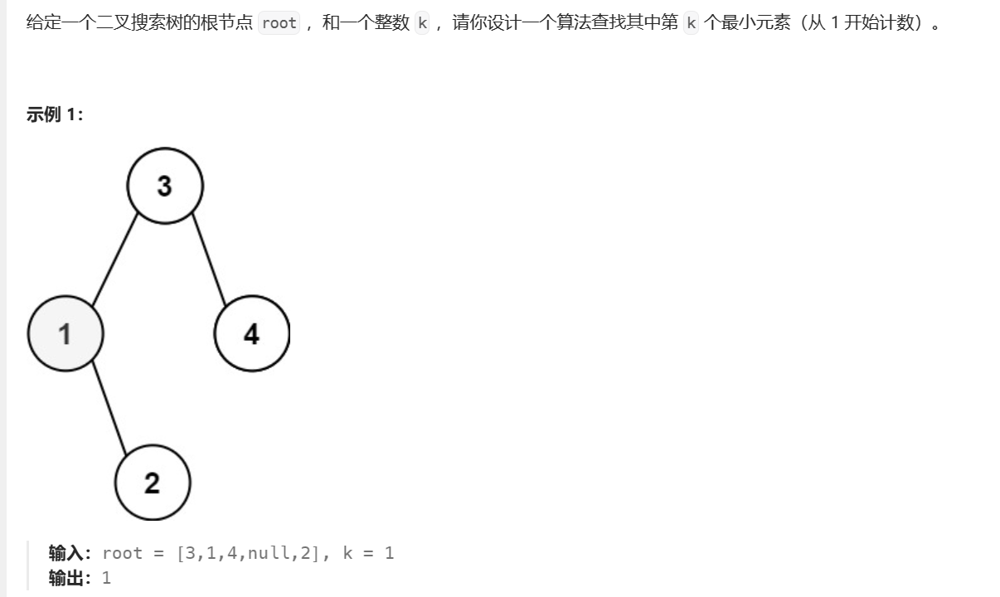

```python
class Solution(object):
    def kthSmallest(self, root, k):
        self.rank=0
        self.minval=0
        self.traverse(root,k)
        return self.minval
    def traverse(self,root,k):
        if not root:
            return

        self.traverse(root.left,k)

        self.rank+=1
        if self.rank==k:
            self.minval=root.val
            
        self.traverse(root.right,k)
```


###  把二叉搜索树转换为累加树


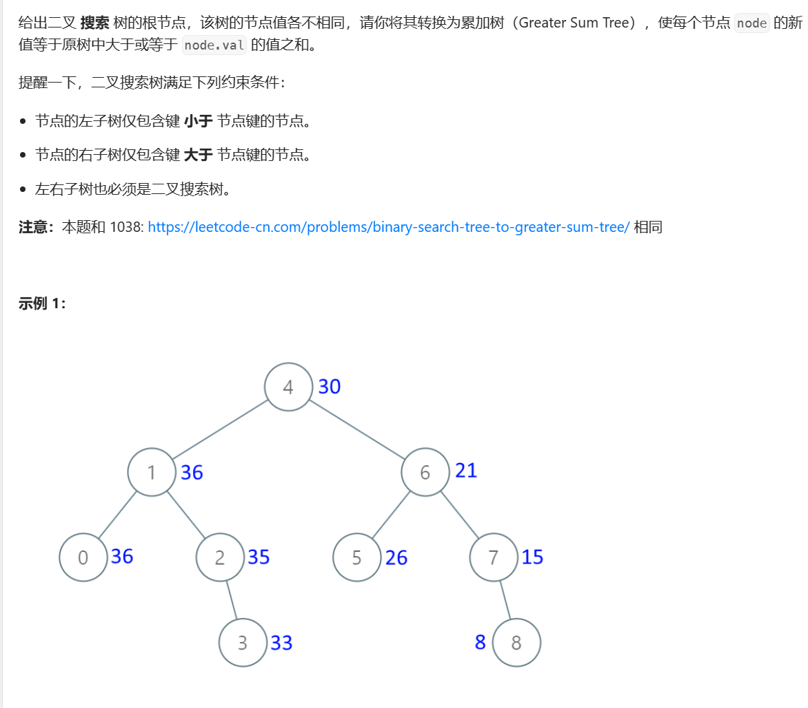

中序遍历一遍，按照降序的顺序输出，记录一个外部变量sum，每次累计然后重新赋值即可

```python
class Solution(object):
    def convertBST(self, root):
        self.sum=0# 外部变量
        self.traverse(root)# 遍历
        return root
    def traverse(self,root):
        if not root:
            return 
        # 注意按照倒序的顺序输出
        self.traverse(root.right)
        self.sum+=root.val# 累加
        root.val=self.sum
        self.traverse(root.left)
```

### 验证二叉搜索树

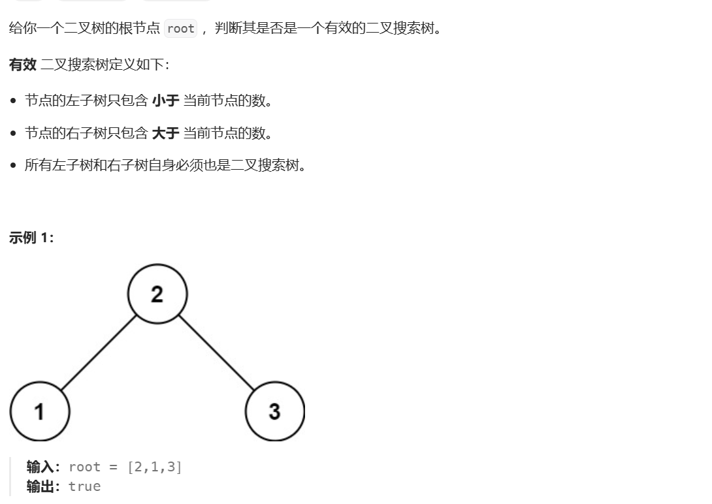

判断是否合法，并不能只判断左右子树的值和当前根节点的值，还要判断根节点的根节点

```python
class Solution(object):
    # 使用前序遍历，判断每个节点是否合法，不合法直接返回False，如果节点满足当前的范围，那么它的左子树要以该节点的值为最大值，右子树以该节点的值为最小值。
    def isValidBST(self, root):
        # 初始根节点没有比较对象
        return self.traverse(root,None,None)
        
    def traverse(self,root,min,max):
        if not root:
            return True
        # 判断
        if min and root.val<=min.val:
            return False
        if max and root.val>=max.val:
            return False
        # 判断左右子树并更新范围
        return self.traverse(root.left,min,root) and self.traverse(root.right,root,max)
```

### 二叉搜索树中的搜索

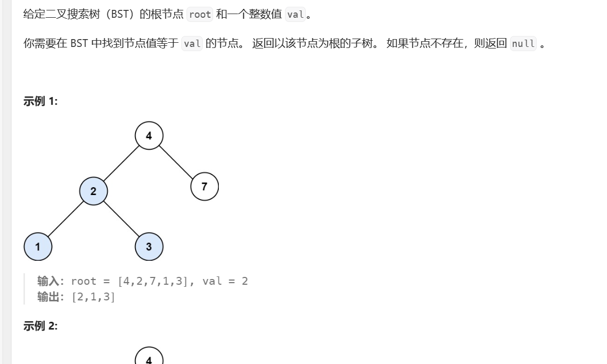

类似于二分搜索

```python
class Solution(object):
    def searchBST(self, root, val):
        
        return self.traverse(root,val)
    def traverse(self,root,val):
        # 快速判断，无论找到了还是节点不存在都返回该节点
        if not root or root.val==val:
            return root
        if root.val>val:
            return self.traverse(root.left,val)
        else :
            return self.traverse(root.right,val)
```

### 插入一个数

```python
def insert(root,val):
    # 找到空位
    if not root:
		return Treenode(val)
    if root.val>val:
        root.right=self.insert(root.right,val)
    else:
		root.left=self.insert(root.left,val)
    return root# 不能落下
```

### 删除一个数

在二叉搜索树中删除一个数，首先要找到，找到后有三种情况，一是这个节点为叶子节点，二是这个节点只有一个子树，三是这个节点有两个子树

```python
def deletenode(root,val):
    if not root:
        return None

    if root.val==val:
        # 如果只有一个子树就返回它的子树接替它成为新的节点，如果没有子树将会返回None，正好满足
        if not root.left:
            return root.right
        if not root.right:
            return root.left
        # 如果有两个子树的话，选择左子树中最大的或者是右子树中最小的来接替它
        if root.left and root.right:
            temp=root.right
            # 找到右子树中最小的
            while temp.left:
                temp=temp.left
             
            #先在右子树中删除这个最小的
            root.right=deletenode(root.right,temp.val)
            # 然后这个节点成为新的节点
            temp.left=root.left
            temp.right=root.right
            return temp

    elif root.val>val:
        root.left=deletenode(root.left,val)
    else:
        root.right=deletenode(root.right,val)
    return root
```

### 不同的二叉树I

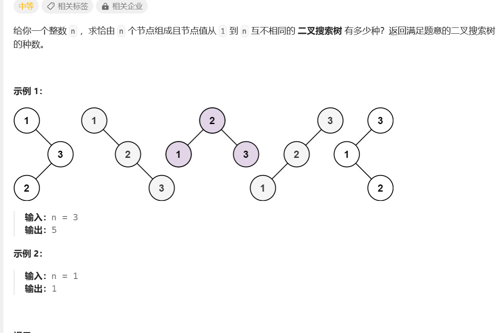

本质上还是分解子问题，按照升序排列，枚举每一个值作为根节点，这个值左边的是左子树右边的是右子树，这个节点所有的可能等于左子树所有的可能乘上右子树所有的可能，如果右子树空了也就是None，也同样是一个看你的结果返回一，至于左子树右子树就是递归的事情了。

```python
class Solution(object):
    def numTrees(self, n):
        if not n:
            return 0
        # 一个备忘录，注意节点从1到n,,self.memo[i][j]数字i到j能构造多少种树	
        self.memo=[[0 for _ in range(n+1)]for _ in range(n+1)]
        return self.traveback(1,n)

    def traveback(self,low,high):
		# 树中没有值
        if low>high:
            return 1
		# 如果已知
        if self.memo[low][high]!=0:
            return self.memo[low][high]

        res=0
        # 枚举每一个节点
        for i in range(low,high+1):
            # 左右能构造多少种子树
            left=self.traveback(low,i-1)
            right=self.traveback(i+1,high)
            res+=left*right# 相乘就是当前节点所有的子树可能
        self.memo[low][high]=res
        return res
```


### 不同的二叉搜索树II

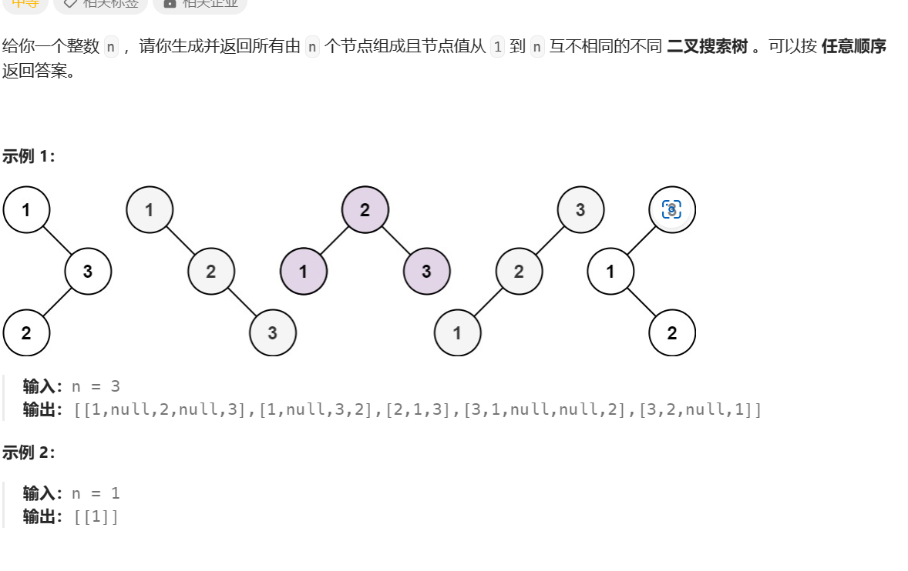

数组1到n，按照顺序排列，想要找出所有的可能就需要枚举每一个值作为根节点，由于数组按顺序排列，而根据二叉搜索树的左右子树的性质，从1到n中选取i之后，它的左子树就是0到i-1，右子树就是i+1到n，从而达到分解子问题的效果。

```python
class Solution(object):
    def generateTrees(self, n):
        if not n:
            return None
        return self.bulid(1,n)

	# 这个递归函数返回的是当前索引对应的数组下，能构建的所有的二叉搜索树
    def bulid(self,low,high):
        res=[]
        # 结束条件，二叉树为空
        if low>high:
            return [None]
        # 枚举当前数组中的每一个值作为根节点
        for i in range(low,high+1):
			
            # 返回low到i-1区间的数组能够组成的所有二叉搜索树，
            lefttrees=self.bulid(low,i-1)
            # 同上
            righttrees=self.bulid(i+1,high)

            # 组合找出所有可能
            for lefttree in lefttrees:
                for righttree in righttrees:
                    root = TreeNode(i)
                    root.left=lefttree
                    root.right=righttree
                    res.append(root)
        return res
```

### 恢复二叉搜索树

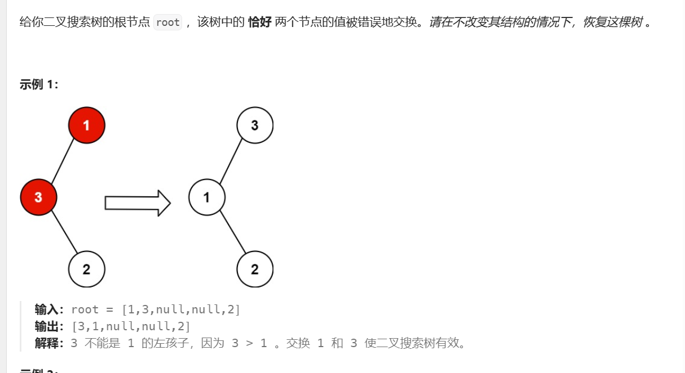

二叉搜索数的中序遍历是有序的，如果恰好有两个值交换破坏了树，可以将树的中序遍历输出找到错误的值，错误的节点的值将大于他后一个节点的值，如果是相邻的两个节点交换导致的，那么将只找到一个满足的i，实际上错误的节点时ai和ai+1，而如果是不相邻的两个节点交换的，那么错误的节点是i和j+1，选择使用后面和前面比较，因为后面的值无论如何一定会取到。

```python
class Solution(object):
    def recoverTree(self, root):
        self.nums=[]
        self.traverse(root)
        x=None
        y=None
        # 前一个
        # 有趣的方法
        pre=self.nums[0]
        for i in range(1,len(self.nums)):
            # 前面的节点值大于后面的
            if pre.val>self.nums[i].val:
                # 记录
                y=self.nums[i]
                # 如果x没有设置，说明是相邻的
                if not x:
                    x=pre
            # 更新
            pre=self.nums[i]
        # 交换值
        if x and y:
            x.val,y.val=y.val,x.val
    # 中序遍历，数组中存入节点而不是值
    def traverse(self,root):
        if not root:
            return
        self.traverse(root.left)
        self.nums.append(root)
        self.traverse(root.right)
```

### 二叉搜索树的最近公共祖先

与二叉树找最近公共祖先一样，如果当前节点值等于的话就返回，这里利用二叉搜索树的性质，公共祖先的值一个小于pq中最大的，大于等于pq中最小的。

```python
class Solution(object):
    def lowestCommonAncestor(self, root, p, q):
        val1=min(p.val,q.val)
        val2=max(p.val,q.val)
        def find(root,p,q):
            if not root:
                return None
            # 根据大小分类
            if root.val>val2:
                return find(root.left,p,q)
            if root.val<val1:
                return find(root.right,p,q)
            else:
                return root
        return find(root,p,q) 
```


### [将二叉搜索树变平衡](https://leetcode.cn/problems/balance-a-binary-search-tree/)


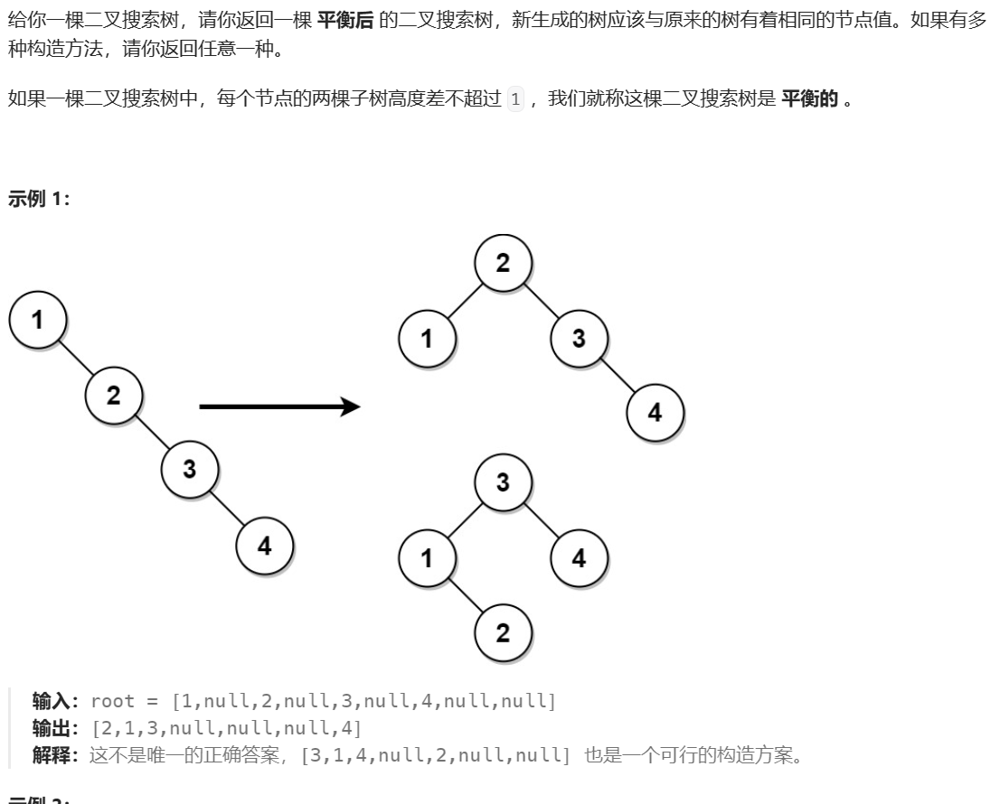

要求构造一个平衡的二叉搜索树，为了二叉树的性质左小右大，对树使用`中序遍历`得出的结果是有序的，为了是一颗平衡树，`从中间节点分治法构造树`。

对树使用旋转操作很难...

```python
class Solution:
    def balanceBST(self, root: TreeNode) -> TreeNode:
        li=[]
        # 中序遍历
        def traverse(root):
            if not root:
                return
            traverse(root.left)
            li.append(root.val)
            traverse(root.right)
        traverse(root)
        # 构造
        def construct(li):
            if not li:
                return 
            mid=len(li)//2
            root=TreeNode(li[mid])
            root.left=construct(li[:mid])
            root.right=construct(li[mid+1:])
            return root
        return construct(li)
```

## Trie树

### 构造字典树

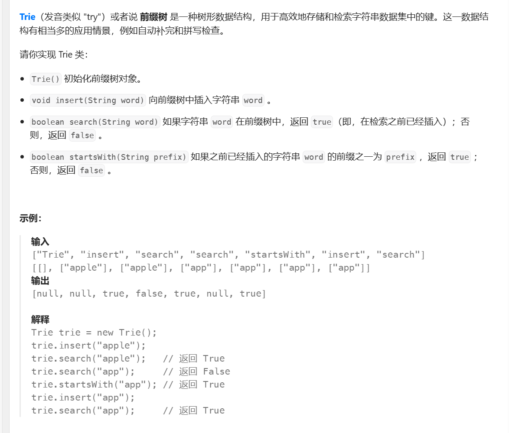


```python
class Trie:

    def __init__(self):
        # 只存在26位
        self.child=[None]*26
        
        # 表示是否存在一个字符串
        self.isend=False

    def searchPrefix(self, prefix: str) -> "Trie":
        node=self
        for c in prefix:
            c=ord(c)-ord('a')
            if not node.child[c]:
                return None
            node=node.child[c]
        return node
             
    def insert(self, word: str) -> None:
        node=self
        for c in word:
            c=ord(c)-ord('a')
            if not node.child[c]:
                node.child[c]=Trie()
            node=node.child[c]
        # 设置isend表示存在一个字符串
        node.isend=True

    def search(self, word: str) -> bool:
        res=self.searchPrefix(word)
        return res is not None and res.isend

    def startsWith(self, prefix: str) -> bool:
        return self.searchPrefix(prefix) is not None
```

### Trie字符串统计

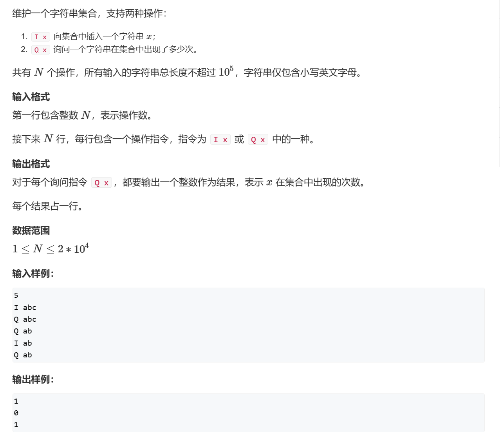

```python
    class Trie:
        def __init__(self):
            self.children=[None]*26
            self.is_end=0
    def insert(self,s):
        d=self
        for c in s:
            c=ord(c)-ord('a')
            if not d.children[c]:
                d.children[c]=Trie()
            d=d.children[c]
        d.is_end+=1
    def search(self,s):
        d=self
        for c in s:
            c=ord(c)-ord('a')
            if not d.children[c]:
                return 0
            d=d.children[c]
        return d.is_end
q=int(input())
tree=Trie()
while q:
    a,s=input().split()
    if a=='I':
        tree.insert(s)
    else:
        print(tree.search(s))
    q-=1
```


### [数组中两个数的最大异或值](https://leetcode.cn/problems/maximum-xor-of-two-numbers-in-an-array/)

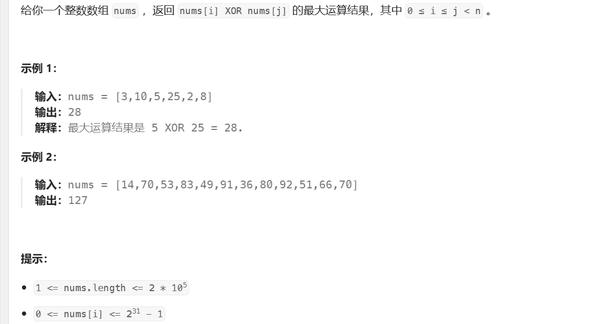


两个数异或和最大要求尽可能多的二进制位不相同（并且在是尽可能地在高位不同），因此把所有数字转换为二进制到字典树中，然后贪心的对每个数找相反的路径比如是01，则在树中找10，注意由于数字的二进制不同，把题目都补为32位。

```python
class Trie:
    def __init__(self):
        self.children=[None]*2
        self.is_end=-1
    def insert(self,x):
        d=self
        for i in range(15,-1,-1):
            c=(x>>i)&1
            if not d.children[c]:
                d.children[c]=Trie()
            d=d.children[c]
        d.is_end=x
    def search(self,x):
        d=self
        for i in range(15,-1,-1):
            c= 0 if (x>>i)&1 else 1
            # 尽可能的找相反的，如果不存在就只能找存在的
            if not d.children[c]:
                c=0 if c else 1
            d=d.children[c]
            # 返回的是异或的结果
        return d.is_end^x if d.is_end else 0
class Solution:
    def findMaximumXOR(self, nums: List[int]) -> int:
        tree=Trie()
        # 插入每个数到字典树中
        for x in nums:
            tree.insert(x)
        # 对每个数在字典树中找与他相反的路劲，返回最大的
        return max([tree.search(x) for x in nums])
```


### [ 最长公共前缀](https://leetcode.cn/problems/longest-common-prefix/)

字典树可以用来求公共前缀，这需要在字典树中构建一个新的变量cnt，用于记录有多少个字符串经过这个位置。如果是公共前缀那么经过这个点的点数应该是n，因此在字典树中找最后一个cnt等于n的节点，同时记录树的深度就可以得到最长的公共前缀。

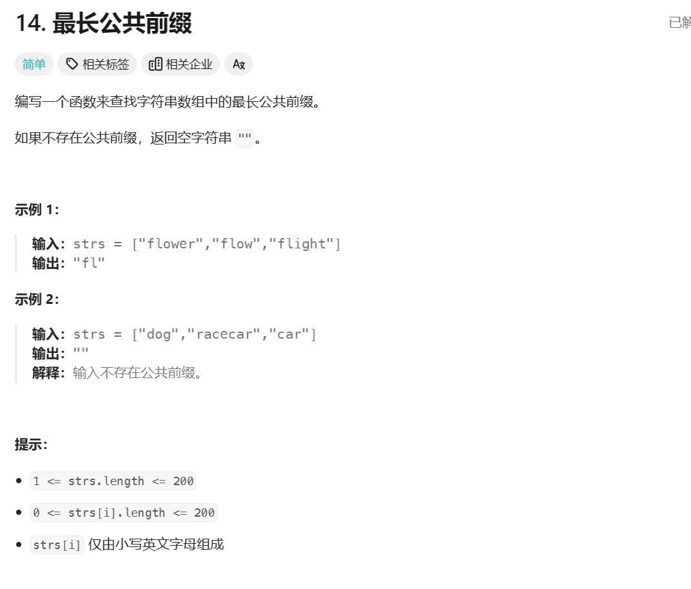

```python
class Trie:
    def __init__(self):
        self.children={}
        # 多出一个变量cnt
        self.isend=0
    def insert(self,s):
        d=self
        for c in s:
            c=ord(c)-ord('a')
            if c not in d.children:
                d.children[c]=Trie()
            d=d.children[c]
            # 在循环中更新注意，记录要多少个字符串经过这个位置
            d.isend+=1
class Solution:
    def longestCommonPrefix(self, strs: List[str]) -> str:
        tree=Trie()
        n=len(strs)
        # 插入
        for s in strs:
            tree.insert(s)
        # 记录深度
        depth=0
        # 如果遇到了分叉，那么一定不是公共前缀
        while len(tree.children)==1:
            for k,v in tree.children.items():
                # 找到前缀为n的最大的节点的深度
                if v.isend!=n:
                    return strs[0][:depth]
                tree=tree.children[k]
                depth+=1
        return strs[0][:depth]
```


### Collapsing Strings

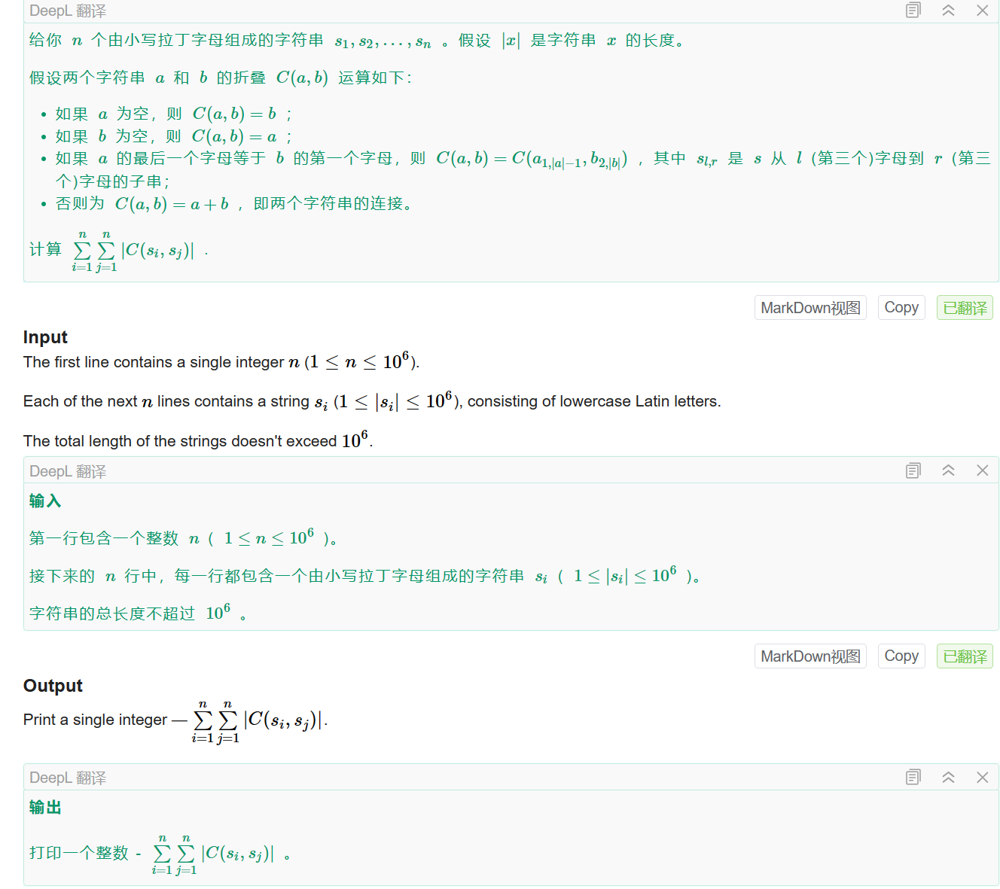

实际上是在求解两个字符串之间长度之和减去它们公共的前后缀的长度。


根据观察可以发现如果不考虑重合的部分最后的结果就是$2\times n \times$所有字符串的长度之和

一个字符串倒序前缀和与所有字符串前缀重合的部分不好计算，把该字符串转换为颠倒的，这样就可以求解公共前缀了。而求字符串和所有的字符串的前缀之和可以通过模拟加入字符串的过程，减去遍历到的每一个节点经过的字符串数来实现。

至于为什么只能说是通过观察得出

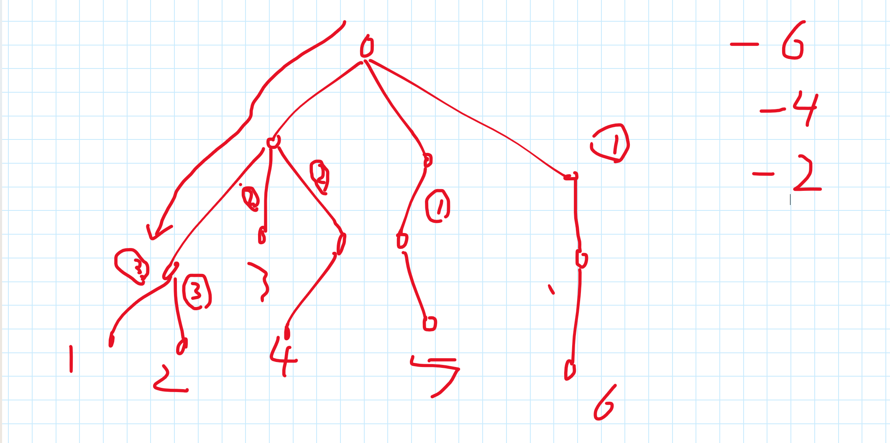


```python
import sys
input=sys.stdin.readline
n=int(input())
S=[input().rstrip() for _ in range(n)]
# 搭建字典树
class TrieNode:
    def __init__(self):
        # 邻接表的方式连接
        self.nxt={}
        # 多一个额外的变量记录有多少字符经过
        self.cnt=0
class Trie:
    def __init__(self):
        self.root=TrieNode()

T = Trie()
ans = 0
for s in S:
    # 插入所有的点同时记录大小
    ans += len(s)*n*2
    node = T.root
    for t in s:
        j = ord(t)-ord("a")
        if j not in node.nxt :
            node.nxt[j] = TrieNode()
        node = node.nxt[j]
        node.cnt+=1
 
for s in S:
    # 在对每个字符倒序模拟插入
    node = T.root
    
    for i in range(len(s)-1,-1,-1):
        t=s[i]
        j = ord(t)-ord("a")
        if j not in  node.nxt:
            break
        # 减去遍历到的每一个点储存的经过字符数，组合以要乘二，因为是两个字符串的贡献都要减
        node = node.nxt[j]
        ans -= node.cnt*2
 
print(ans) 
```


### Fixed Prefix Permutations

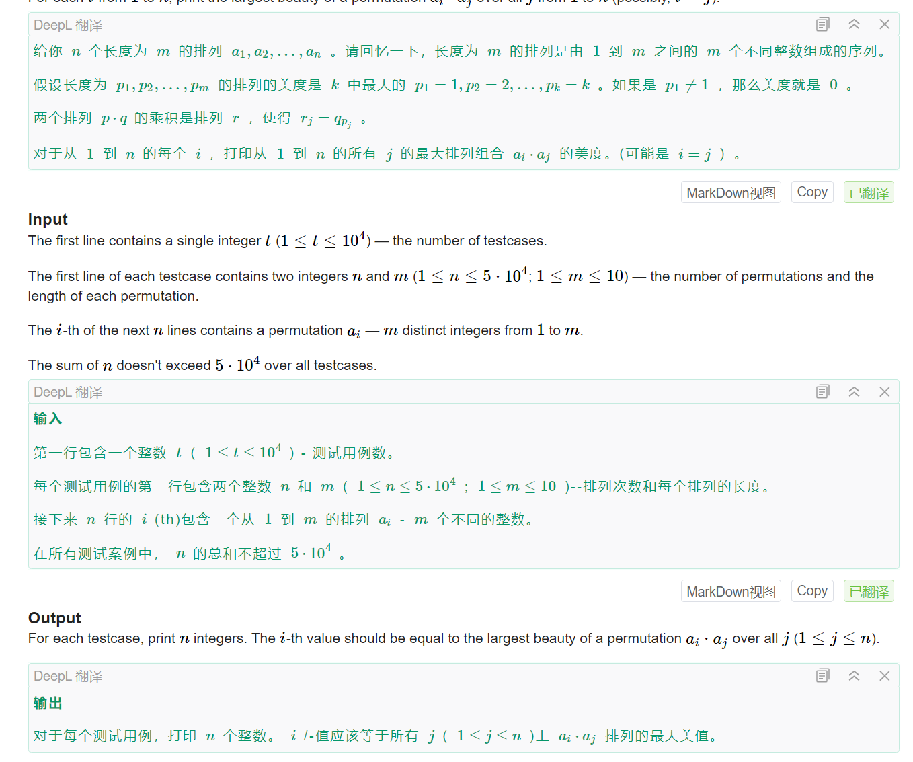

题目大意是：每个数组与其他数组（包括本身）相乘后最大的美丽值，美丽值指的是数组从1开始的严格递增序列的长度。两个数组相乘指的是，前一个数组中从左到右的每个值作为下标取第二个数组中的元素：

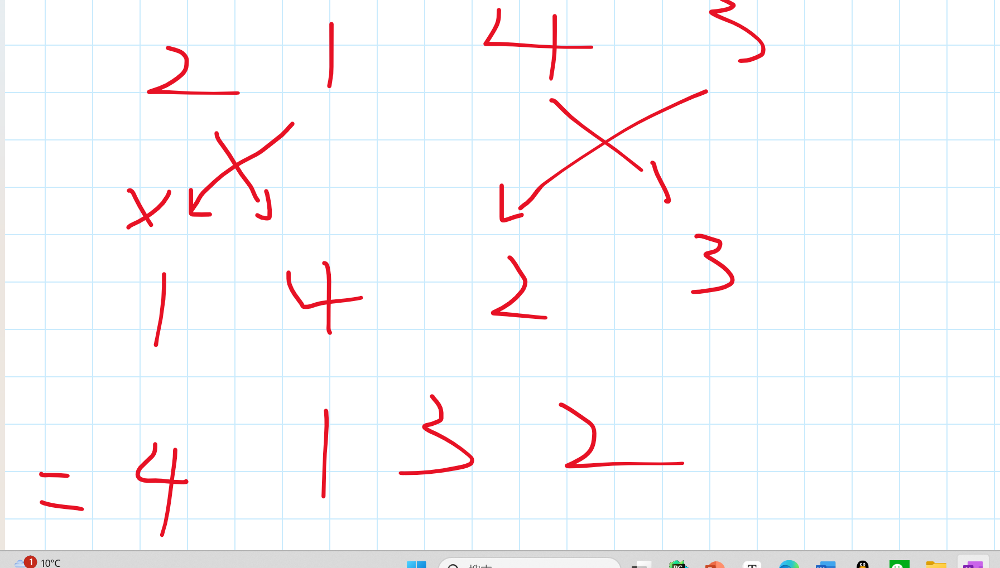

而对于一个数组想要得到最大的美丽值就要映射如下：
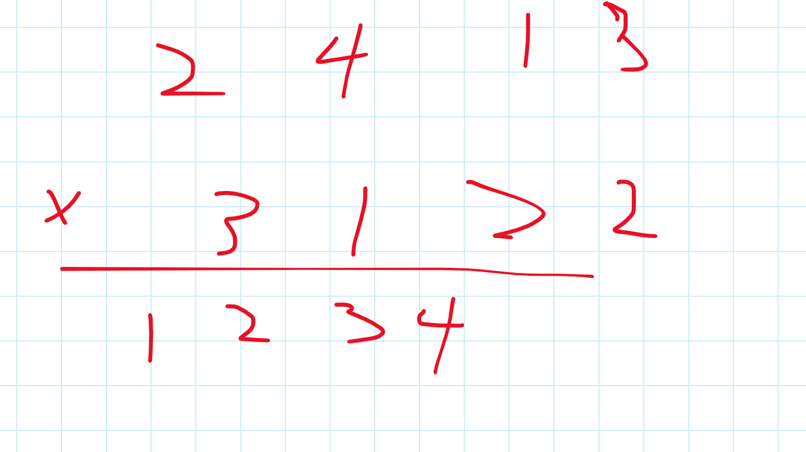


要求必须是从1开始的递增序列，因此后面可以没有但是前面不能缺少，前一个数组想要获得大的美丽值就必须是左边正确指出下一个数组中对应元素的正确位置，然后才能找下一个位置。对于3142只有用2413乘它才能得到最大的，如果不存在2413则找241是否存在，如果存在最大的美丽值就是3，反之继续。对于给定的数组要找一个a数组使得a[i]能指向第i+1大的数，这个数组可以通过给定的数组的值为索引下标为值来实现，然后去看所有数组能匹配的这个逆序对最大前缀是？（因为要求第一个必须是1），求解前缀可以用字典树。

```python
import sys
from collections import defaultdict
input=sys.stdin.readline
t=int(input())
# 字典树
class Trie:
    def __init__(self):
        self.children={}
    
    def insert(self,nums):
        d=self
        for v in nums:
            if v not in d.children:
                d.children[v]=Trie()
            d=d.children[v]
    def find(self,nums):
        d=self
        cnt=0
        for v in nums:
            if v not in d.children:
                return cnt
            cnt+=1
            d=d.children[v]
        return cnt 

# 构造最优数组
def traverse(nums):
    n_=len(nums)
    res=[0]*n_
    for i,v in enumerate(nums):
        res[v]=i
    return res 

for _ in range(t):
    n,m=[int(x) for x in input().split()]
    # 注意要放到里面
    tree=Trie()
    temp=[]
    for _ in range(n):
        # 做一位偏移
        nums=[int(x)-1 for x in input().split()]
        # 将逆序对插入
        tree.insert(traverse(nums))
        temp.append(nums)
    for li in temp:
        # 对每个数组找他能匹配的最大前缀，
        print(tree.find(li),end=' ')
    print()
```

### [统计前后缀下标对 II](https://leetcode.cn/problems/count-prefix-and-suffix-pairs-ii/)

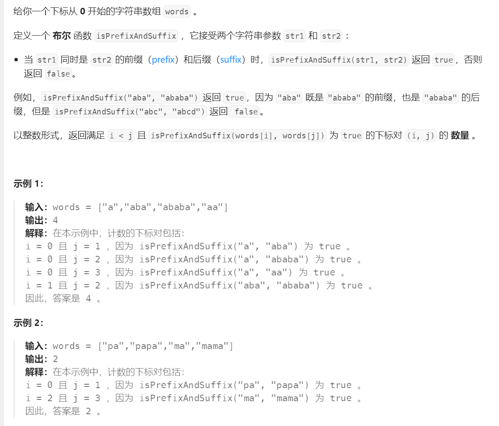

统计前后缀相同的，构造每个字符串的第i个和倒数第i个的pair存入字典树。相当于同时在匹配前缀和后缀

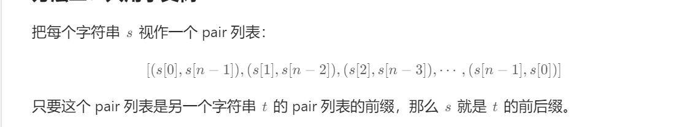

```python
class Trie:
    def __init__(self):
        self.children={}
        self.isend=0


class Solution:
    def countPrefixSuffixPairs(self, words: List[str]) -> int:
        tree=Trie()
        n=len(words)
        ans=0
	# 由于是要找i和j，那么要先检查再插入	
        for s in words:
            temp=tree
            for c in zip(s,reversed(s)):
                if c not in temp.children:
                    temp.children[c]=Trie()
                temp=temp.children[c]
                ans+=temp.isend
            temp.isend+=1
            
        return ans 
```


## AC自动机

AC 自动机是 **以 Trie 的结构为基础**，结合 **KMP 的思想** 建立的自动机，用于解决多模式匹配等任务。

建立一个 AC 自动机有两个步骤：

1. 基础的 Trie 结构：将所有的模式串构成一棵 Trie。
2. KMP 的思想：对 Trie 树上所有的结点构造失配指针

对于一个后缀他去匹配的是所有匹配串的最长前缀


这里使用数组的建立字典树，tr[i]\[j]表示i节点经过j字符会到达那个位置

AC自动机的关键在于构建fail指针，用于在匹配失败时跳到对应的位置而不是从头开始，这里与KMP的回退不同，fail可以跳到另一条链上。

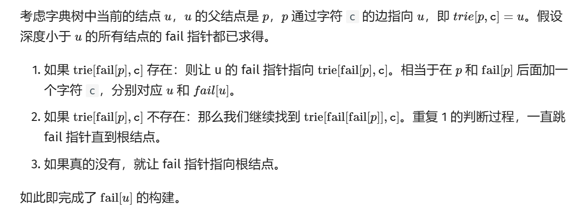


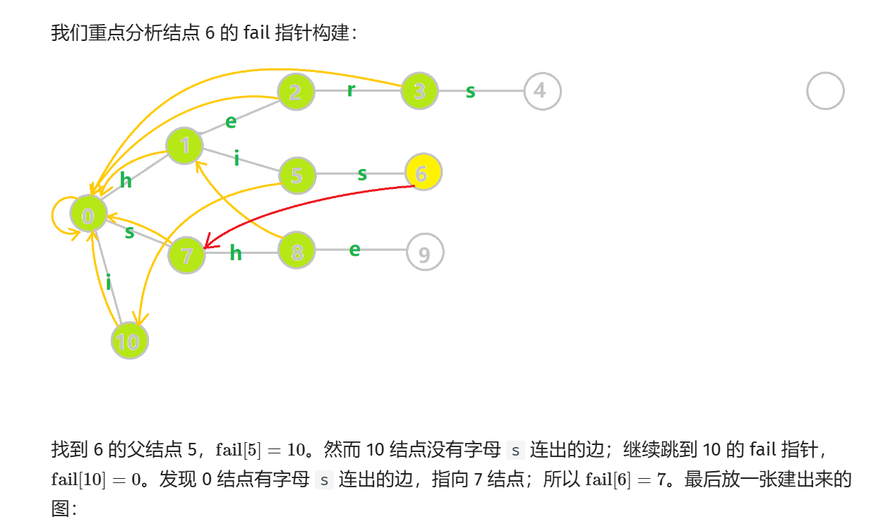


```python
tr=[[0]*26 for _ in range(N)]
def insert(s):
    # P表示的是节点，初始时从0开始表示根节点
    p=0
    # index是节点编号
    global index
    for c in s:
        c=ord(c)-ord('a')
        if not tr[p][c]:
            # 如果没有则建立
            tr[p][c]=index
            index+=1
        p=tr[p][c]
    # 记录个数
    cnt[p]+=1

# 初始时，0对应的就是0
fail=[0]*N
def build():
    d=deque()
    # 按照定义，与根节点相连点的fail指针就是根节点
    for j in range(26):
        # 如果与根节点相连
        if tr[0][j]:
            d.append(tr[0][j])
    # bfs更新 
    while d:
        for _ in range(len(d)):
            curr=d.popleft()
            # 找它的子节点
            for j in range(26):
                # 如果没有子树，则跳过
                if not tr[curr][j]:continue
                next=tr[curr][j]
                # 取出父节点的回退
                p=fail[curr]
                # 查看这个回退到的位置是否能接收字符j，如果不能继续回退
                while p and not tr[p][j]:p=fail[p]
                if tr[p][j]: p=tr[p][j]
                # 如果一直没有，就会回退到根节点
                fail[next]=p
                d.append(next)
            
            # 以下是优化版本，做了路径压缩
            for j in range(26):
                # 如果不接受字符j，原先当某个节点回退到这个位置时查看是否能接收j，如果不能则继续回退，这里直接将接收j的结果设为回退的结果，这样就不用递归找了
                if not tr[curr][j]:
                    tr[curr][j]=tr[fail[curr]][j]
                else:
                    next=tr[curr][j]
                    fail[next]=tr[fail[curr]][j]
                    d.append(next)
```


### 搜索关键词

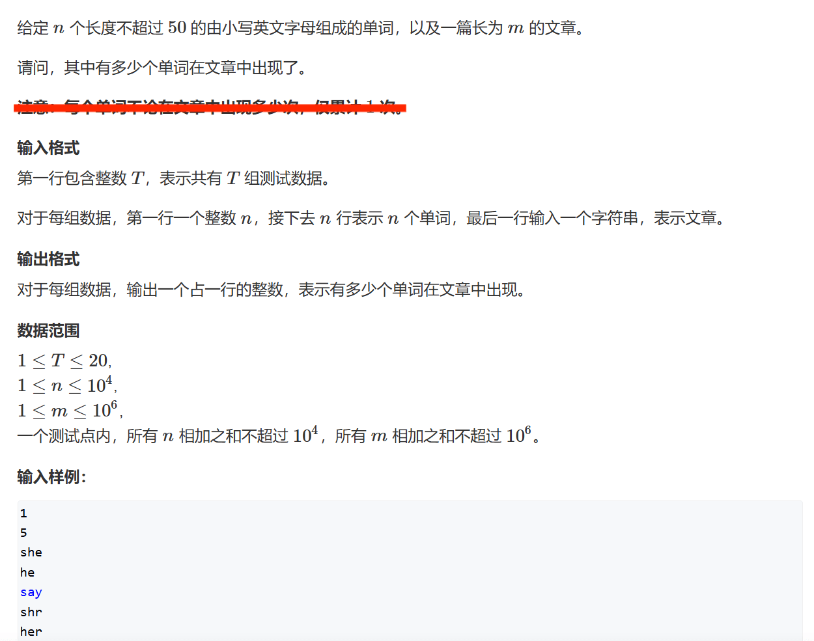


```python
from collections import deque
N=10**4+10
N*=55# 每个单词最长55

# AC自动机模板
def insert(s):
    p=0
    global index
    for c in s:
        c=ord(c)-ord('a')
        if not tr[p][c]:
            tr[p][c]=index
            index+=1
        p=tr[p][c]
    cnt[p]+=1

def build():
    d=deque()
    for j in range(26):
        if tr[0][j]:
            d.append(tr[0][j])
    while d:
        for _ in range(len(d)):
            curr=d.popleft()
            for j in range(26):
                if not tr[curr][j]:
                    tr[curr][j]=tr[fail[curr]][j]
                else:
                    next=tr[curr][j]
                    fail[next]=tr[fail[curr]][j]
                    d.append(next)
def query(s):
    t=0
    ans=0
    # 查询，遍历每一个字符
    for c in s:
        c=ord(c)-ord('a')
        # 如果不匹配，自动做了回退
        t=tr[t][c]
        p=t
        # 对于abcd，他会匹配bcd也会匹配cd,因此对于匹配到的节点要回退他去统计所有的可能匹配的
        while p and cnt[p]!=-1:
            ans+=cnt[p]
            cnt[p]=-1
            p=fail[p]
    return ans
for _ in range(int(input())):
    n=int(input())
    N=n*55
    tr=[[0]*26 for _ in range(N)]
    fail=[0]*N
    cnt=[0]*N
    # 注意从1开始
    index=1
    # 构建AC自动机
    for _ in range(n):
        insert(input())
    build()
    s=input()
   
    print(query(s.strip()))

```


### 单词


AC自动机的特殊用法，用于在一堆模式串找找出每个模式串在其他模式串中出现的次数（包括自己）

```python
from collections import deque, Counter

N = 10 ** 6 + 10
tr = [[0] * 27 for _ in range(N)]
cnt = [0] * N
fail = [0] * N
index = 1
q = [0] * N
n = int(input())
ans = [0] * n
# 用于记录第几个字符串对应那个节点
pos = {}


def insert(s, id):
    t = 0
    global index
    for c in s:
        c = ord(c) - ord('a')
        if not tr[t][c]:
            tr[t][c] = index
            index += 1
        t = tr[t][c]
        # 这里是要对每个节点记录要多少模式经过他
        cnt[t] += 1
    pos[id] = t


# 这里需要用数组模拟队列，因为不能弹出需要用到记录的结果 
def build():
    hh = 0
    tt = -1
    for j in range(26):
        if tr[0][j]:
            tt += 1
            q[tt]=tr[0][j]

    while hh <= tt:
        curr = q[hh]
        hh += 1
        for j in range(26):
            if not tr[curr][j]:
                tr[curr][j] = tr[fail[curr]][j]
            else:
                next = tr[curr][j]
                fail[next] = tr[fail[curr]][j]
                tt += 1
                q[tt] = next

# 关键在于把每个节点对应的值累积他子节点的值，最终这个节点对应的值就是这个字符串在其他模式串中出现的次数（包括自己）
def rev():
    # 从队列中倒序遍历，先从最下面的节点累加一直往上
    for j in range(index - 1, -1, -1):
        cnt[fail[q[j]]] += cnt[q[j]]


for i in range(n):
    insert(input(), i)
build()
rev()

for i in range(n):
    id=pos[i]
    print(cnt[id])


```

## 有向图的强连通分量

连通分量指的是两个点可以相互到达，而强连通分量是极大的连通分量对于该连通分量在加上其他点该连通分量不会在变大。

用于将有向图通过缩点（把所有连通分量变为一个点）变为有向无环图。

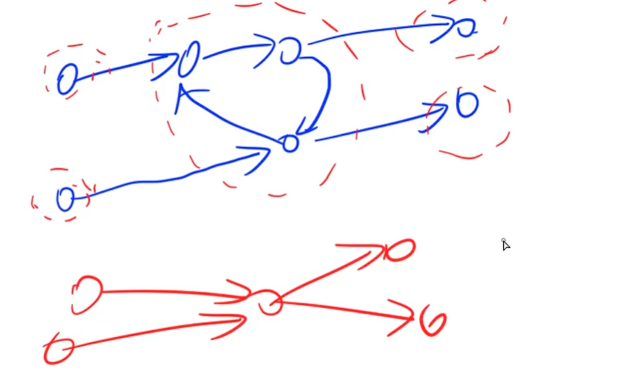


Tarjan求强连通分量(SCC)，引入时间戳的概念，对每个点定义两个时间戳

dfn[u]表示遍历到u的时间

low[u]表示从u开始走所能遍历到的最小时间戳

dfn[u]==low[u]则u是他所在的强连通分量的最低点


首先求出每个点属于那个强连通分量

然后缩点，遍历每个点i再遍历它的邻点j，如果他们不在同一个连通分量中那么加一条新边(连接二者的SCC)，这样就完成了缩点建图

按照连通分量编号递减的顺序满足拓扑序

### 受欢迎的牛

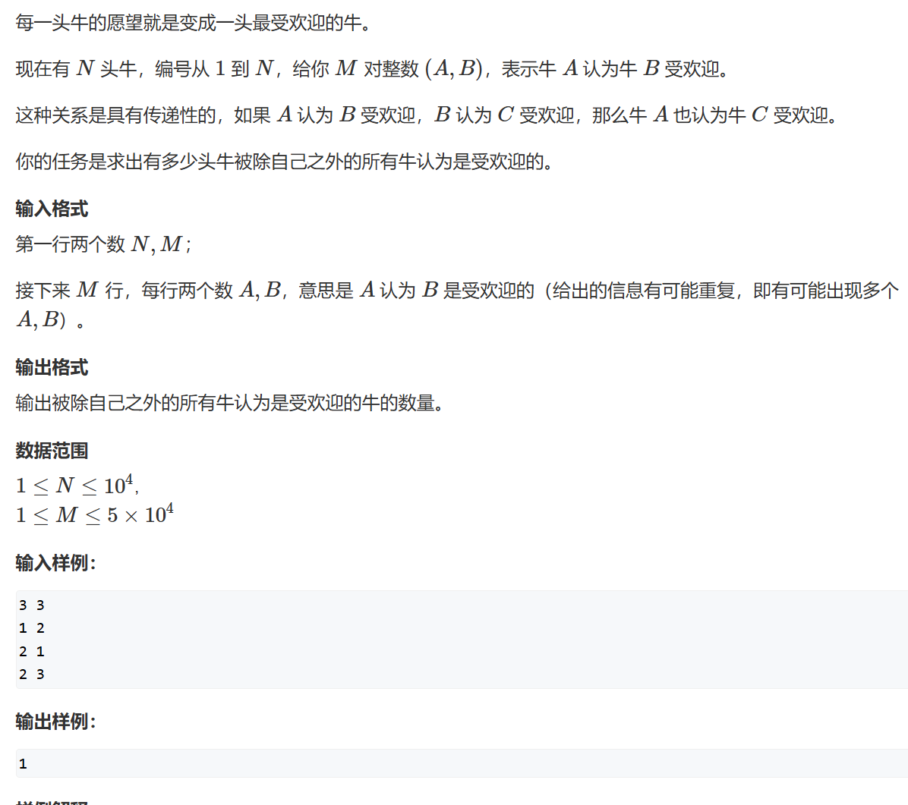

对于该题只要建立拓扑序然后看看是否只有1个出度为0的点(可能有单独的点)，但是建立拓扑序需要没有环因此使用tarjan缩点 

```python
from collections import deque
import sys

input = sys.stdin.readline
sys.setrecursionlimit(5000)

N = 10010

n, m = [int(x) for x in input().split()]
# 建图
e = [[] for _ in range(N)]
# 栈
d = deque()
# 记录点是否入栈
in_d = [False] * (N)
# 记录遍历到这个点的时间
dfn = [0] * (N)
# 记录从这个点开始走能得到的最小时间戳
low = [0] * (N)
# 记录每个点对应的连通分量
id = [-1] * (N)
# 记录点所对的连通分量的大小
size = [0] * (N)
# 时间，注意初始化为1方便判断
t = 1
# 连通分量编号
idx = 0
# 记录出度
out = [0] * (N)

for _ in range(m):
    u, v = [int(x) for x in input().split()]
    e[u].append(v)


def tarjan(i):
    global t, idx
    # 首先记录时间戳
    dfn[i] = low[i] = t
    t += 1
    # 入栈
    d.append(i)
    in_d[i] = True
    # 找相邻的点
    for k in e[i]:
        # 没有访问过操作一下
        if not dfn[k]:
            tarjan(k)
            # 更新时间
            low[i] = min(low[i], low[k])
        elif in_d[k]:
            low[i] = min(low[i], dfn[k])
    a = d
    # 如果这个点可以作为它所对连通分量的最低点
    if low[i] == dfn[i]:
        idx += 1
        # 出栈操作
        while True:
            curr = d.pop()
            in_d[curr] = False
            id[curr] = idx
            size[idx] += 1
            if i == curr: break

# 对每个点操作
for i in range(1, n + 1):
    if not dfn[i]: tarjan(i)
# 缩点后建图，这里不需要建图只有考虑出度
for i in range(1, n + 1):
    for j in e[i]:
        # 所对的连通分量不同，需要建立一条边，这里更新出度
        if id[i] != id[j]: out[id[i]] += 1

zero = 0
ans = 0
# 查找是否只有一个出度为0的点
for i in range(1, idx + 1):
    if not out[i]:
        ans += size[i]
        zero += 1
        if zero > 1:
            ans = 0
            break
print(ans)
```

### 学校网络

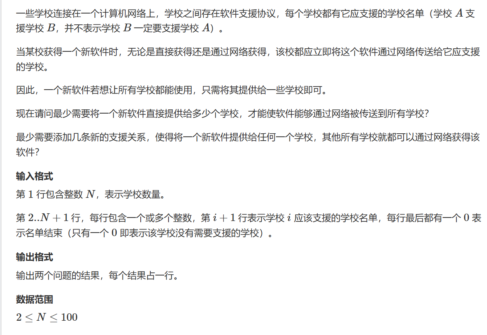


对于第一个问题只要找到入度为0的点即可，第二问要求将图变为强联通分量也就是图中所有的点都可以相互到达，那么有结论需要连接的边数是max(入度为0的点的数目，出度为0的点的数目)。

```python
N=110
from collections import deque, defaultdict
import sys
input=sys.stdin.readline

n=int(input())
path=defaultdict(dict)
d=deque()
for i in range(1,n+1):
    temp=[int(x) for x in input().split()]
    for v in temp:
        if not v:break
        path[i][v]=None

dfn=[0]*N
low=[0]*N
id=[-1]*N
t=1
idx=0
out=[0]*(n+1)
inn=[0]*(n+1)
in_d=[False]*N

def tarjan(i):
    global idx,t
    dfn[i]=low[i]=t
    t+=1
    d.append(i)
    in_d[i]=True
    for k in path[i].keys():
        if not dfn[k]:
            tarjan(k)
            low[i]=min(low[i],low[k])
        elif in_d[k]:
            low[i]=min(low[i],dfn[k])
    if dfn[i]==low[i]:
        idx+=1
        while True:
            curr=d.pop()
            in_d[curr]=False
            id[curr]=idx
            if i==curr:break
for i in range(1,n+1):
    if not dfn[i]: tarjan(i)

for i in range(1,n+1):
    for j in path[i].keys():
        if id[i]!=id[j]:
            out[id[i]]+=1
            inn[id[j]]+=1
# 做了一位偏移
out=out[1:idx+1]
inn=inn[1:idx+1]

l,r=out.count(0),inn.count(0)
print(r)
# 特判，本身就是一个强连通分量
if idx==1:print(0)
else:print(max(l,r))

```


## 无向图的双连通分量

双连通分量分为：边双连通分量e-dcc，点双连通分量v-dcc

桥指的是对于连通的图如果删除一条边后图变得不连通了，那么这个边就成为桥。e-dcc指的是极大的不含有桥的连通分量

割点，如果删掉这个点后整个图会变得不连通，那么这个点就是割点，每一个割点至少属于两个连通分量。v-dcc是极大的不包含割点的连通分量。

两个割点之间的边不一定是桥，桥的端点不一定是割点


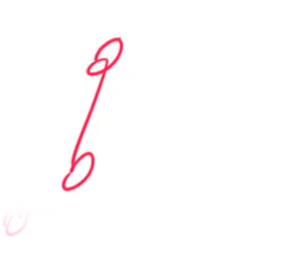


dfn[x]定义为遍历过程中到达x的最早时间

low[x]定义为以x为顶点往下走所能到达的最早的点是那个点

e-dcc

1.找到桥，对于xy之间的边如果dfn[x]<low[y]那么这条边是桥。

2.找到所有的e-dcc，删掉所有的桥或者使用栈类似于有向图的做法


​	


## 图

图是二叉树的延申，本质上是一个多叉树。

图有两种实现形式：

邻接矩阵是一个二维的布尔数组，如果x和y是相连的，那么matrix[x] [y]的结果是True，想要找x的邻居的话比例一遍matrix[x]即可。

两种方法各有好处，邻接表可以节省空间，但无法快速的判断两个节点是否相连，一般使用较多的是邻接表，而邻接矩阵可以揭露一些图的隐晦的性质。

对于无向图，它的度指节点所拥有的边的个数，有向图则分为入度和出度。

### Dijkstra算法（单源最短路）

用于计算有权图中最短路径的算法，如果求解最小值要求`边权不能是负的`，但是求解最大值可以将边权变为负的从而求解最小值。时间复杂度为O(n^2)

最终要得到如下的表：

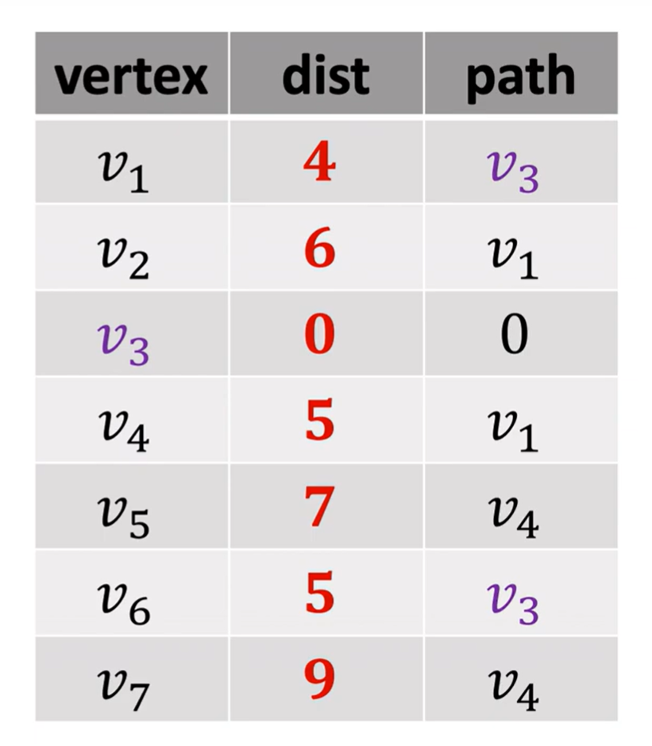

第一列表示当前的节点，第二列表示从起始节点到目标节点的之间的最短路径是多少，第三列是到在起始节点到当前节点路径上当前节点的前一个节点。

初始时，将所有的距离设置为无穷大，而起始节点对应的距离设置为0，表示自己到自己的距离为0，所有的前序节点设置为0.

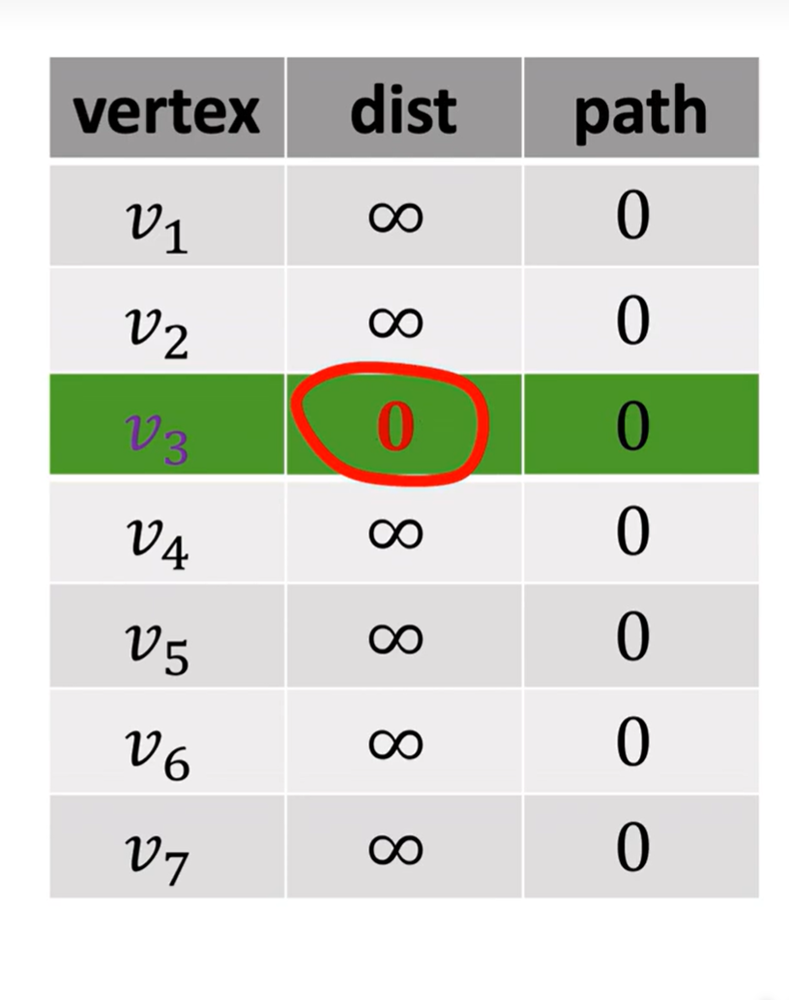

朴素的做法是，每一次找到当前没有被访问过的距离起点最近的点（贪心），把这个点当作中间节点(mid)，更新与他相连的点(curr)距离起点(start)的距离，这个距离是（start到mid的距离加上mid到curr，start到curr距离）的最小值。

算法中使用优先级队列（以距离作为优先级），每轮循环弹出优先级最大的（距离最小的），然后找这个节点的邻居，从起始节点的距离到邻居的距离等于从起始节点到弹出节点的距离加上弹出节点到邻居的距离，如果这个值小于邻居原本的距离则更新，并将邻居加入到优先级队列中（如果起始节点到这个节点的距离变化了，所有经过这个节点的路径也都会变化，所以加入到队列中稍后进行处理）。一直循环直到队列空了。

使用堆优化的版本时间复杂度为O(mlogn),其中m表示边的数目适用于稀疏图。


#### 模板

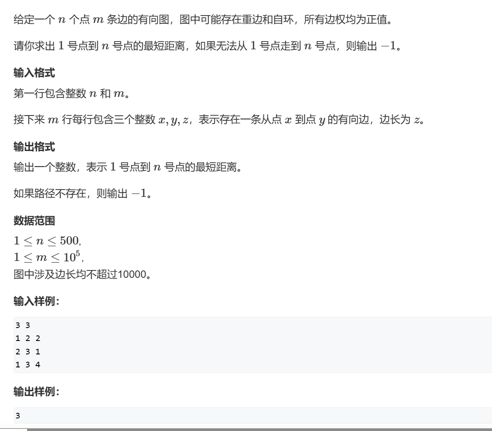

```python
from math import inf

n, m = [int(x) for x in input().split()]
path = [[inf] * n for _ in range(n)]
dis = [inf] * n
dis[0] = 0
# 不用标记初始点
vis = [False] * n
for _ in range(m):
    u, v, w = [int(x) for x in input().split()]
    #注意要取最小值，可能有重边
    path[u-1][v-1] = min(w,path[u-1][v-1])
while True:
    x = -1
    # 遍历一遍所有点，选出其中没有被访问过且力起点最近的点
    for i in range(n):
        if not vis[i] and (x < 0 or dis[i] < dis[x]):
            x = i
    # 图不连通
    if x < 0 or dis[x] == inf:
        print(-1)
        break
    # 找到了，由于求的是单源最短路直接返回
    if x == n - 1:
        print(dis[x])
        break
    # 标记
    vis[x] = True
    # 更新状态
    for u, w in enumerate(path[x]):
        dis[u] = min(dis[u], dis[x] + w)

```

很明显的看出，每次要遍历所有的点n然后进行这个点边的个数次操作，一次操作中是O(m+n)，最多遍历vis数组的大小，也就是O(n^2)


点数太多而边数有限，使用优先队列优化的算法，优先队列优化指的是使用根堆每次找当前没有被访问过的且距离最小的点。

```python
from collections import defaultdict
from math import inf
import heapq

n, m = [int(x) for x in input().split()]
# 这里由于点数太多，且图是稀疏图因此使用邻接表
path =defaultdict(dict)
dis = [inf for i in range(n)]
dis[0] = 0

# 建图
for _ in range(m):
    u, v, w = [int(x)-1 for x in input().split()]
    # 不使用默认字典，即使是双向边也能用
    if v in path[u]:
        path[u][v]=min(path[u][v],w+1)
    else:
        path[u][v]=w+1

# 第一个值作为权重
h=[(0,0)]
while h:
    d,x=heapq.heappop(h)
    # 当前点之前出过堆
    if d>dis[x]:continue
    
    for k,v in path[x].items():
        # 严格小于 
        if d+v<dis[k]:
            dis[k]=d+v
            heappush(h,(dis[k],k))       
print(*dis[1:])
```

时间复杂度为O(mn)，根堆中找值的速度为O(logn)，大概一共进行m（边的个数次）


#### [概率最大的路径](https://leetcode.cn/problems/path-with-maximum-probability/) 


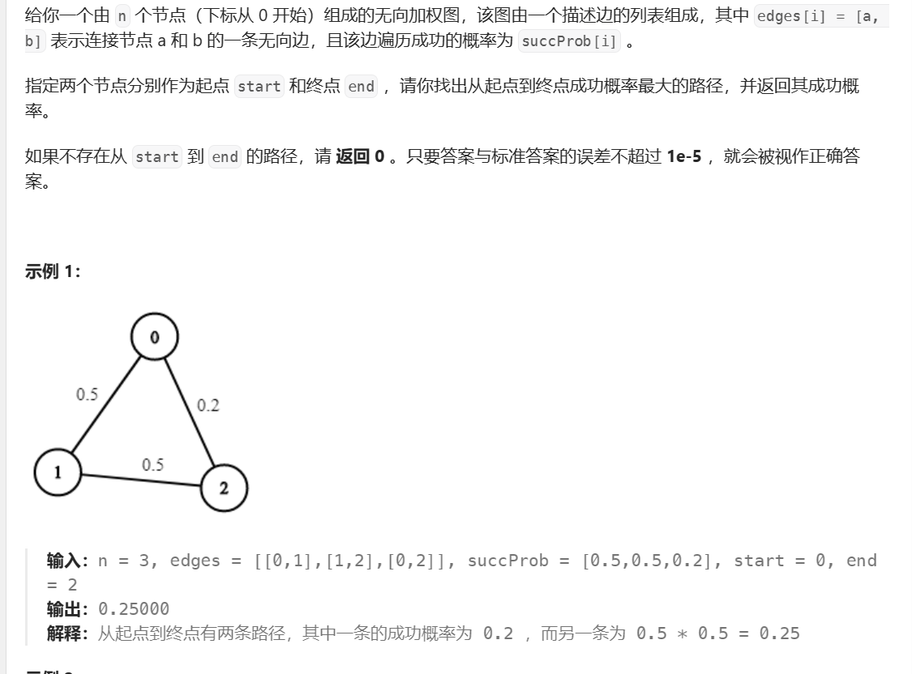

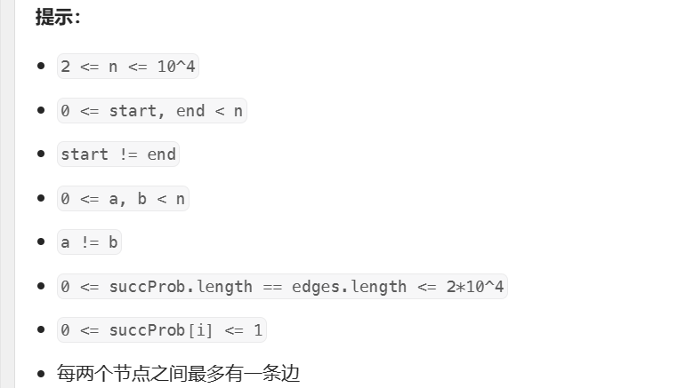


边有非负的权重求单源最短路，使用迪杰斯特拉求解，对于给定的数据范围使用根堆优化版本。

```python
class Solution:
    def maxProbability(self, n: int, edges: List[List[int]], succProb: List[float], start_node: int, end_node: int) -> float:
        ans=0
        
        # 建图
        path=defaultdict(dict)
        for i,li in enumerate(edges):
            u,v=li
            path[u][v]=succProb[i]
            path[v][u]=succProb[i]

        # 初始时定义所有点到起始位置的概率为0
        dis=[0]*n
        dis[start_node]=1

        # 建堆
        nums=[(-v,i) for i,v in enumerate(dis)]
        heapify(nums)
        memo=set()
        vis=set()

        while 1:
            v,i=heappop(nums)
            if v==0:return 0
            if i==end_node:
                return -v
            elif i in vis:continue
            
            v=-v
            # 标记
            vis.add(i)
            for k ,p in path[i].items():
                # 注意这里求的是最大值
                dis[k]=max(dis[k],dis[i]*p)
                temp=(-dis[k],k)
                if temp not in memo and k not in vis:
                    memo.add(temp)
                    heappush(nums,temp)

```


​	


#### 设计可以求最短路径的图类

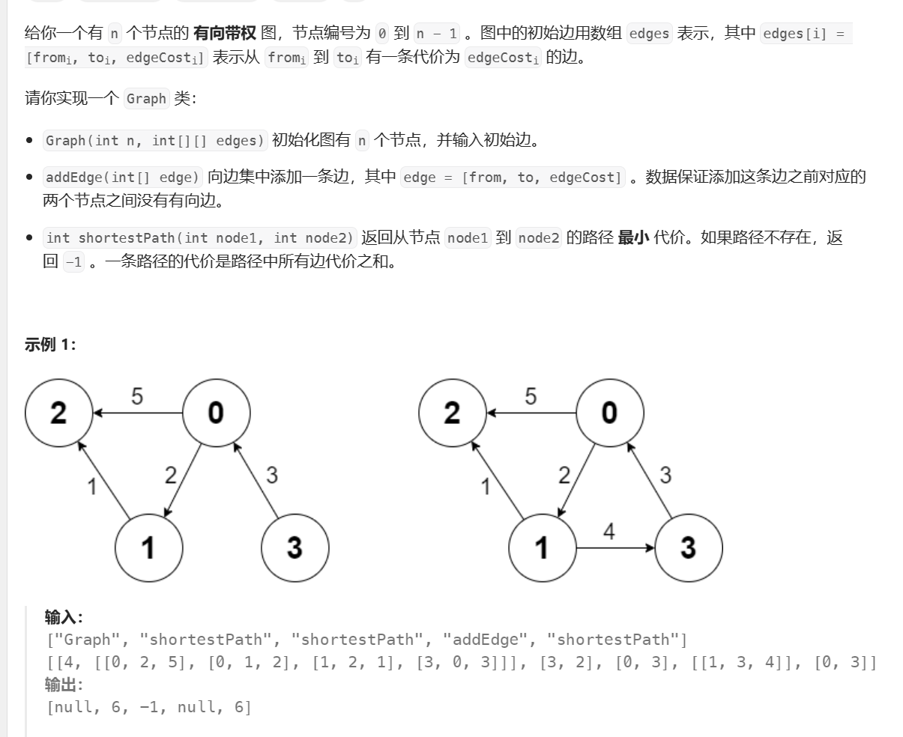

在代码实现中没有使用优先级队列，而是使用一个循环找出没被访问过且距离最小的节点（使用优先级队列，则是弹出栈顶的元素）

```python
from cmath import inf
class Graph(object):

    def __init__(self, n, edges):
        # 使用领接矩阵，距离初始化为inf
        self.matrix = [[inf for _ in range(n)] for _ in range(n)]
        for edge in edges:
            u ,v,w= edge[0],edge[1],edge[2]
            # 注意由于可能存在重边，因此要取最小
            self.matrix[u][v] = min(self.path[u][v],w)

    def addEdge(self, edge):
        u, v, w = edge
        self.matrix[u][v] = w
    def shortestPath(self, start, end):
        n=len(self.matrix)
        # start到其他节点的距离
        dis=[inf]*n
        # 自己到自己距离为0
        dis[start]=0
        # 距离是否访问过
        vis=[False]*n

        while True:
            # 初始化为-1表示还没有找到最短路,x表示的是当前节点
            x=-1

            # 遍历所有的节点找出没被访问过且距离最小的一个
            for i in range(n):
                if not vis[i] and (x<0 or dis[i]<dis[x]):
                    x=i

            # 如果找到最后，最短路径是无穷大或者说x=-1没找到最短路，说明图不是联通的，返回-1
            if x<0 or dis[x]==inf:
                return -1

            # 找到了直接返回，无需找出单元最短路径
            if x==end:
                return dis[x]
            # 标记
            vis[x]=True

            # 找x节点的邻居节点y
            for  y,w in enumerate(self.matrix[x]):
                # 如果从起点经过x的距离到y的距离，小于从起点以目前的路径到y的距离，更新从起点到y的距离，表示从起点到y要经过x
                if dis[x]+w<dis[y]:
                    dis[y]=dis[x]+w
```

接下来是一个使用优先级队列的解法，由于找的是单元最短路径所以时间超出限制了，可以加一个约束条件，暂时不知。

```python
def shortestPath(self, start, end):
    n = len(self.matrix)
    # start到其他节点的距离
    dis = [inf] * n
    # 自己到自己距离为0
    dis[start] = 0

    pq = PriorityQueue()
    pq.put((0, start))  # 计入起点到优先级队列中，优先级队列以第一个元素为优先级

    visited = set()  # 用于记录节点是否已经访问过,因为一个节点只会处理一次

    while not pq.empty():
        # 弹出
        dist, x = pq.get()

        # 如果节点已经访问过，跳过
        if x in visited:
            continue

        # 标记节点为已访问
        visited.add(x)

        # 将终点作为结束条件
        if x == end:
            return dist

        # self.matrix[x]记录这x与其他节点之间的权，y是节点，w是权重
        for y, w in enumerate(self.matrix[x]):
            # 如果从起点到当前路径的最小距离加上从当前节点到邻居的最小距离，小于从起点到邻居的最小距离，更新
            if dis[x] + w < dis[y]:
                dis[y] = dis[x] + w
                pq.put((dis[y], y))

    return -1
```

#### 前往目标的最小代价

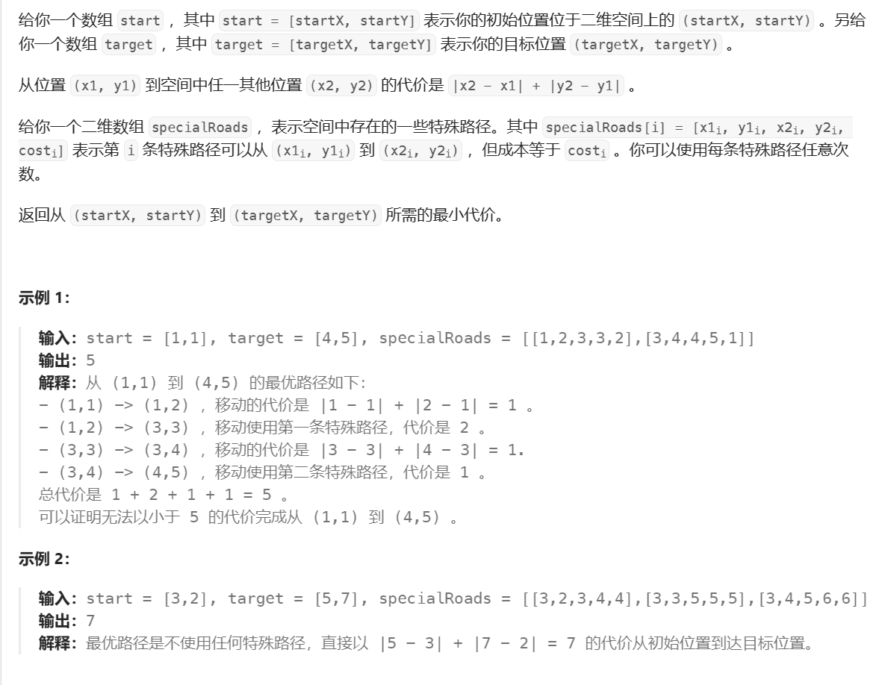

不考虑特殊路径，起点到中的距离就是曼哈顿距离，也就是两个坐标之差的绝对值之和，不需考虑怎么走（向上向下一类的），直接就是两个点的间距。

抽象为一幅图，认为每个节点和终点以及特殊路径中的终点相连，从起点记过一段特殊路径到达特殊路径的终点后，又可以直接到起点或者继续走一段特殊路径，接下来使用Dijkstra算法。

模拟一下：从起点开始，可以到达终点以及多个特殊路径的终点，如果在循环中选取出的最短路是直接到终点的话，也就是说经过特殊路径反而不会缩减距离，那么结果就是从起点直接到终点，否则就是选择了从起点到某一段特殊路径端点的最短的路径，然后从这个端点继续选择，如果从这个端点到重点的距离最短，那么下一轮循环就会直接找出答案， 如果是经过另一条特殊路径最短的话，那么下一轮继续之前的操作。

```python
from cmath import inf
from collections import defaultdict
class Solution(object):
    def minimumCost(self, start, target, specialRoads):
        # 将传入的数组转化为元组形式
        t = tuple(target)
        # 由于是二维下的，因此使用一个字典记录距离
        dis = defaultdict(lambda: inf)
        # 自己到自己的距离是0
        dis[tuple(start)] = 0
        # 记录有无加入过
        vis = set()

        def Dijastra():
            # 算法模板，没有用优先级队列
            
            while True:
                
                # v表示当前节点
                v = None
                
                # 使用循环找出队列中优先级最高的且没有被访问过的
                for point, d in dis.items():
                    if point not in vis and (v is None or d < dis[v]):
                        v = point
                # 到达目标点
                if v == t:
                    return dis[v]
                
                vis.add(v)
                vx, vy = v

                # 更新相连的节点
                
                # 更新到终点
                dis[t] = min(dis[t], dis[v] + abs(vx - t[0]) + abs(vy - t[1]))
                # 更新经过特殊路径的点
                for x1, y1, x2, y2, c in specialRoads:
                    # 只需要考虑特殊路径的另一端
                    w = (x2, y2)
                    # 从当前节点到特殊路径的另一端有两种走法，首先得到特殊路径的起始点，之后，一个是直接曼哈顿距离，一个经过特殊路径到另一端（加上cost）
                    d = dis[v] + min(abs(x2 - vx) + abs(y2 - vy), abs(x1 - vx) + abs(y1 - vy) + c)
                    # 更新
                    dis[w] = min(dis[w], d)

        return Dijastra()
```

#### Buy a Ticket

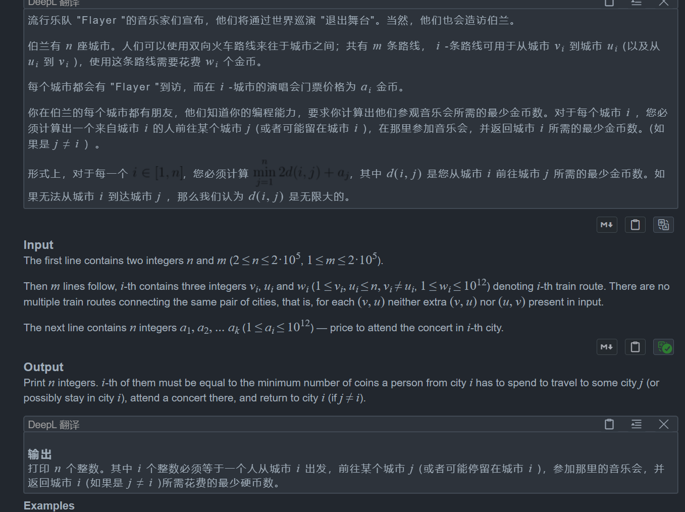


该题目中存在点权，并且只有终点的点权需要计算而路径上的点权不需要考虑，对于此类题目可以建立一个超级源点，该源点连接每一个点并且边权为每个点的点权，从该超级源点出发做迪杰斯特拉的结果就是每个点到其他点的最短路径（可以是本身），该题目中需要考虑来回因此边权需要乘上2，而从超级源点出发的边边权不变。

对于给定的数据范围需要使用根堆优化

```python
import heapq
from collections import defaultdict
from heapq import heappush
from math import inf
import sys
input=sys.stdin.readline

n,m=[int(x) for x in input().split()]
path=defaultdict(dict)
# 建图 这里是无向图
for _ in range(m):
    u,v,w=[int(x) for x in input().split()]
    path[u][v]=w*2
    path[v][u]=w*2
a=[int(x) for x in input().split()]
# 建立超级源点，由于点是从1到n的，因此超级源点可以设置为0
for i,v in enumerate(a,1):
    path[0][i]=v
    path[i][0]=v
dis=[inf]*(n+1)
dis[0]=0
# 建立根堆
h=[(0,0)]
while h:
    # 弹出
    d,x=heapq.heappop(h)
    # 访问过
    if d>dis[x]:continue
    for k,v in path[x].items():
        # 更行
        if d+v<dis[k]:
            dis[k]=d+v
            heappush(h,(dis[k],k))       
print(*dis[1:])
```

#### [最小体力消耗路径](https://leetcode.cn/problems/path-with-minimum-effort/)

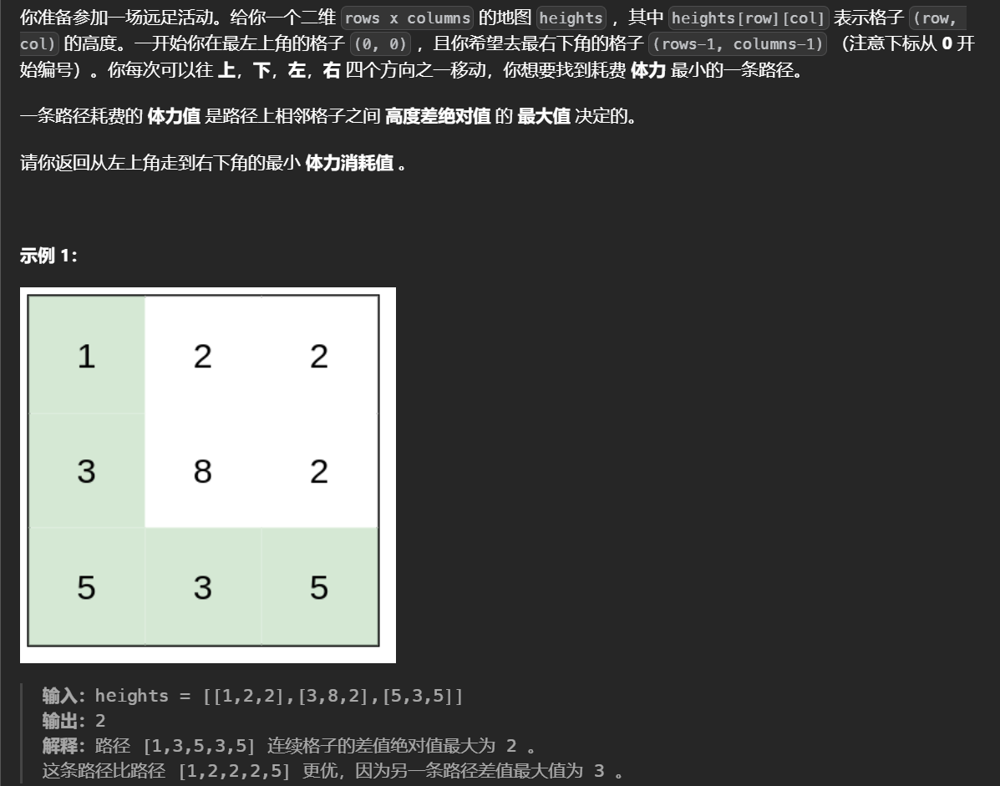


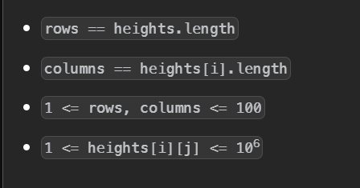


由于可以向任意方向移动因此不能使用dp，根据给定的数据范围使用dfs会超时，把矩阵变为图使用dijkstra算法求解最短路，图中的点数大于边数使用根堆优化的dijkstra算法。

```python
class Solution:
    def minimumEffortPath(self,g: List[List[int]]) -> int:
        m,n=len(g),len(g[0])
        dis=[inf]*(m*n)
        dis[0]=0
        path=defaultdict(dict)
        # 首先建图，每个点连接与他下方和右方的点，只有上方和左方在之前就会被操作过
        for i in range(m):
            for j in range(n):
                if j+1<n:
                    # 注意是无向图
                    path[i*n+j][i*n+j+1]=abs(g[i][j]-g[i][j+1])
                    path[i*n+j+1][i*n+j]=abs(g[i][j]-g[i][j+1])
                if i+1<m:
                    path[(i+1)*n+j][i*n+j]=abs(g[i][j]-g[i+1][j])
                    path[i*n+j][(i+1)*n+j]=abs(g[i][j]-g[i+1][j])
		# 根堆，第一个作为权重
        h=[(0,0)]
        while h:
            d,x=heapq.heappop(h)
            # 如果这个点访问过
            if d>dis[x]:continue
            # 找到
            if x==m*n-1:break
            for k,v in path[x].items():
                # 注意是严格的小于，这里要去权重的最大值作为距离
                if max(d,v)<dis[k]:
                    dis[k]=max(d,v)
                    heapq.heappush(h,(dis[k],k))
        return dis[m*n-1]   
```

#### [得分最高的路径](https://leetcode.cn/problems/path-with-maximum-minimum-value/)

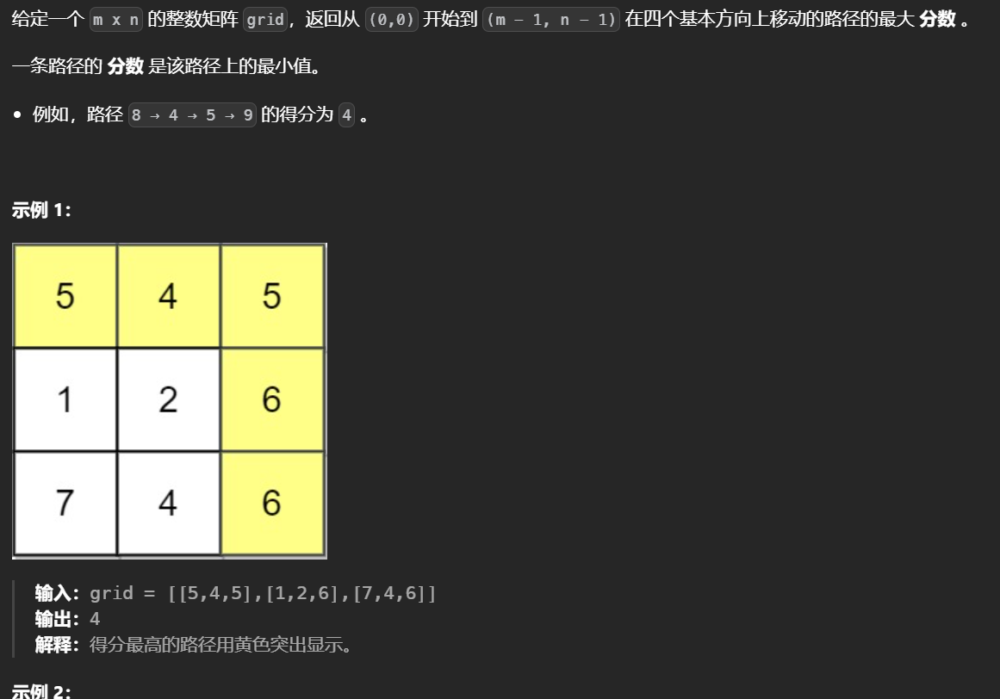		


使用dfs超时，bfs无法求解，使用图论。此题点数太多使用根堆优化的版本，由于要求最大值，因此把边权转换为负数求解最小值。

```python
class Solution:
    def maximumMinimumPath(self, grid: List[List[int]]) -> int:
        m,n=len(grid),len(grid[0])
        # 用一维数组代替二维
        dis=[inf]*(m*n)
        h=[(-grid[0][0],0,0)] 
        dis[0]=-grid[0][0]
        while h:
            d,i,j=heapq.heappop(h)
            curr=i*n+j
            # 访问过了
            if d>dis[curr]:continue
            # 找相连的点
            for dx,dy in (0,1),(-1,0),(1,0),(0,-1):
                if 0<=(x:=dx+i)<m and 0<=(y:=dy+j)<n:
                    target=x*n+y
                    # 路径距离的计算是取最小值
                    cc=max(-grid[x][y],d)
                    #如果小于可以更新
                    if cc<dis[target]:
                        dis[target]=cc
                        heappush(h,(dis[target],x,y))
        
        return -dis[-1]
```

#### [到达目的地的方案数](https://leetcode.cn/problems/number-of-ways-to-arrive-at-destination/)


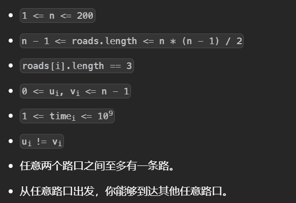


用dijstra找最短路的过程中使用dp求解路径数，定义dp[i]为0~i最短路的数目，如果存在d+v<dis[k]说明从 0 到 *x* 再到 *y* 的路径是目前最短的，所以更新 *f*[*y*] 为 *f*[*x*]，如果等于，说明从 0 到 *x* 再到 *y* 的路径与之前找到的路径一样短，所以把 *f*[*y*] 增加 *f*[*x*]。

```python
class Solution:
    def countPaths(self, n: int, edges: List[List[int]]) -> int:
        mod=10**9+7
        path=defaultdict(dict)
        f=[0]*n
        f[0]=1
        for u,v,w in edges:
            path[u][v]=path[v][u]=w
        dis=[inf]*n
        dis[0]=0
        h=[(0,0)]
        while h:
            d,x=heappop(h)
            if d>dis[x]:continue
            for k,v in path[x].items():
                if d+v<dis[k]:
                    f[k]=f[x]
                    dis[k]=d+v
                    heappush(h,(dis[k],k))
                elif d+v<=dis[k]:
                    f[k]+=f[x]
                    f[k]%=mod
        
        return f[-1]
```


### [使网格图至少有一条有效路径的最小代价](https://leetcode.cn/problems/minimum-cost-to-make-at-least-one-valid-path-in-a-grid/)

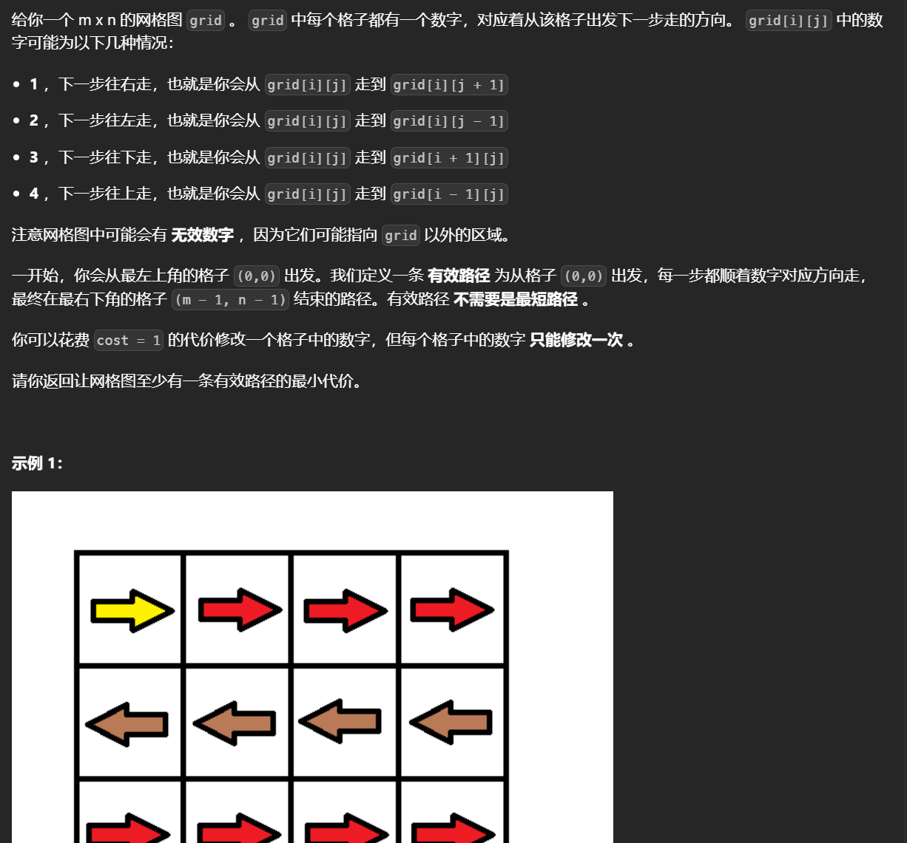

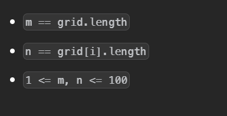

最短路问题，把每个格子看作是一个点，是否要变化看作是权重0和1，用迪杰斯特拉求解从起点到终点的距离。


```python
class Solution:
    def minCost(self, grid: List[List[int]]) -> int:
        m,n=len(grid),len(grid[0])
        # 用二维矩阵表示从(0,0)到(i,j)的最小距离
        dis=[[inf]*n for _ in range(m)]
        # 初始化
        dis[0][0]=0
        h=[(0,0,0)]
        dirs=[(0,1),(0,-1),(1,0),(-1,0)]
			
        while h:
            c,x,y=heappop(h)
            if c>dis[x][y]:continue
            for jj in range(4):
                dx,dy=dirs[jj]
                # 合法的位置
                if 0<=(i:=dx+x)<m and  0<=(j:=dy+y)<n:
                    # 代价是是否要变化方向
                    cnt=c+int((jj+1)!=grid[x][y])
                    if cnt<dis[i][j]:
                        dis[i][j]=cnt
                        heappush(h,(dis[i][j],i,j))
        return dis[-1][-1]
```


### Bellman-Ford算法（单源最短路，存在负权边）

如果图中存在负环，那么最短路径可能是无穷小（一直经过负环减小距离），迪杰斯特拉算法不能用于计算有负权边的路径，因为该算法是基于贪心的思路每次找一个距离源点最近的点作为该点到源点的最短路径，而如果存在负权边那么可能会存在一个次优点，这一点在经过一个负权边可能会得到更小的距离，这就破坏了贪心的正确性。

Bellman-Ford算法只有两层for循环，外层进行n次，内层找所有的边。外层进行k次可以找到源点到其他点只经过少于等于k条边的最短路径。

时间复杂度为O(mn)点数乘边数。

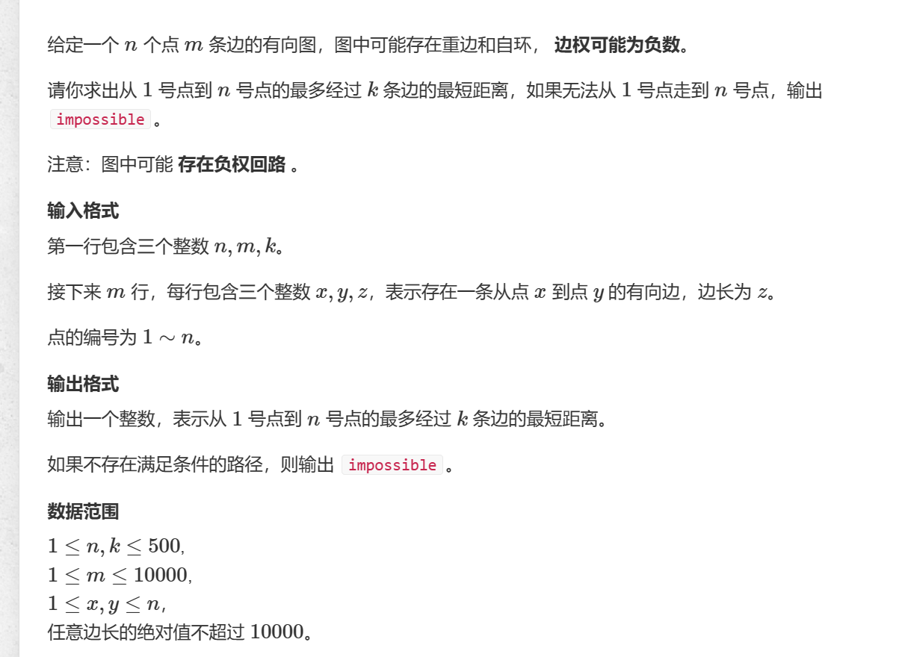

要求最多经过k条边，那么规定外层循环最多为k次

```python
from math import inf
# 用数组存储所有的边
edges=[]
n,m,k=[int(x) for x in input().split()]
for _ in range(m):
    edges.append([int(x) for x in input().split()])
# 索引不做偏移
dis=[inf]*(n+1)
# 自己到自己的距离初始化为0
dis[1]=0

for i in range(k):
    # 注意由于每次内存循环都会更新距离数组，可能存在使用更新的位置去更新别的位置，因此使用一个temp数组，记录上一次迭代的结果，每次从这个临时数组中取值
    temp=dis.copy()
    for j in range(m):
        u,v,w=edges[j]
        dis[v]=min(dis[v],temp[u]+w)
if dis[n]==inf:
    print('impossible')
else:
    print(dis[n])
```

### spfa算法（单源最短路）

#### 求最短路

**spfa算法的时间复杂度一般为O(m)最坏的为O(mn)，注意要求图中不能有负权环**

spfa算法是对bellamn-ford算法的改进，在bellman-ford算法的更新操作中dis[v]=min(dis[v],temp[u]+w)，只有dis[u]变化了才会改变dis[v]也就是到达一个点的距离改变了，这个点相连的点到源点的距离都会变化。因此使用队列进行广搜，每次弹出队列头的点，对这个点找与他相连的点查看是否可以更新，如果可以则放入队列中。为了防止重复放入可以使用数组标记放入过的点。

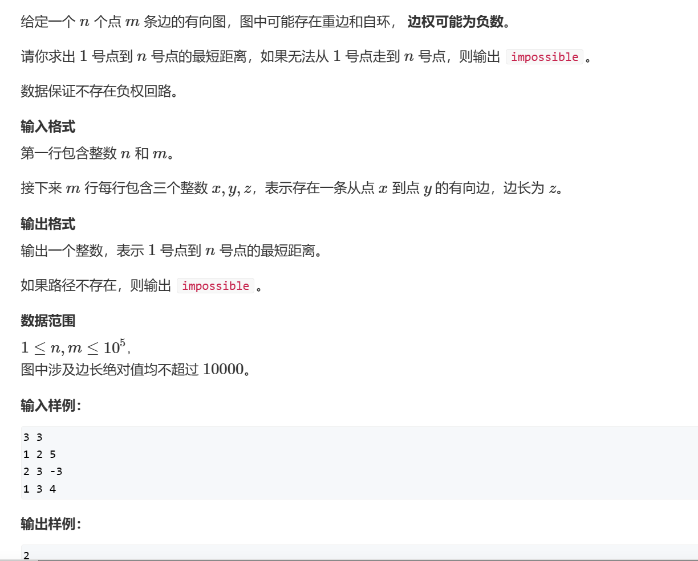


```python
from collections import defaultdict,deque
from math import inf

n,m=[int(x) for x in input().split()]
# 邻接表
path=defaultdict(dict)
for _ in range(m):
    u,v,w=[int(x) for x in input().split()]
    # 注意要找最小的
    if v not in path[u]:
        path[u][v]=w
    else:
        path[u][v]=min(path[u][v],w)
def spfa():
     # 队列
    d=deque()
    dis=[inf]*(n+1)
    # 自己到自己的距离最短
    dis[1]=0
    d.append(1)
    # 标记
    vis=[False]*(n+1)
    # 首先标记自己
    vis[1]=True
    while d:
        curr=d.popleft()
        # 不能删，自己到自己可能是负值
        vis[curr]=False
        for k,v in path[curr].items():
            # 如果可以更新，并且不在队列中则加入
            if dis[k]>dis[curr]+v:
                dis[k]=dis[curr]+v
                if not vis[k]:
                    vis[k]=True
                    d.append(k)
    return dis[n] if dis[n]!=inf else 'impossible'
print(spfa())

                
```


#### 判断负环

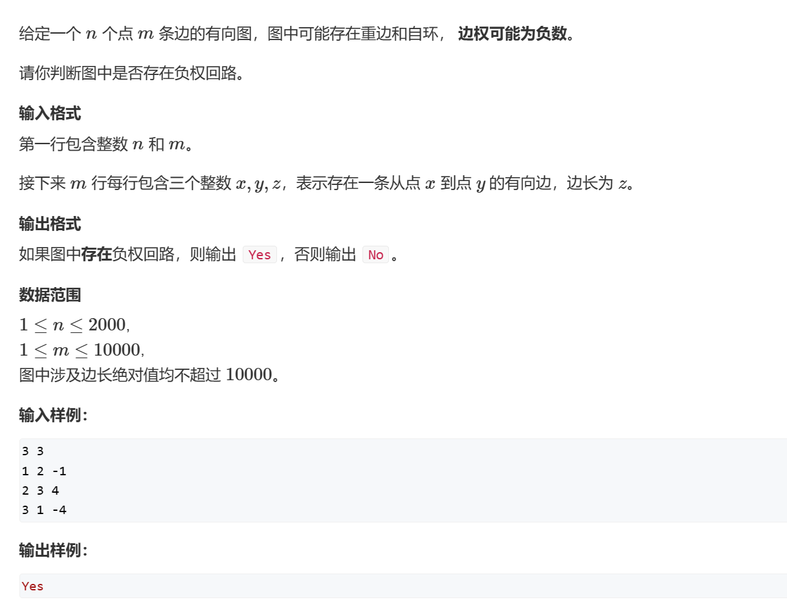


这里多使用一个数组cnt记录每个点到终点经过的边数，如果这个边数大于等于n，那么说明至少有n+1个点，那么就至少有两个点是重复的，而重复意味着经过了两次以上说明是一个环，而在求最短路的过程中不会经过正权环，因此只能是负权环。

```python
from collections import defaultdict,deque
from math import inf

n,m=[int(x) for x in input().split()]
path=defaultdict(dict)

for _ in range(m):
    u,v,w=[int(x) for x in input().split()]
    if v not in path[u]:
        path[u][v]=w
    else:
        path[u][v]=min(path[u][v],w)

def spfa():
    # 注意这里要把每个点入队，因此从某一个点出发不一定经过负环，所以对所有点找，而距离要设置为0这样只有负权边才会移动
    dis=[0]*(n+1)
    cnt=[0]*(n+1)
    # 塞入所有点
    d=deque([x for x in range(1,n+1)])
    vis=[True]*(n+1)
    while d:
        curr=d.popleft()
        vis[curr]=False
        for k,v in path[curr].items():
            if dis[k]>dis[curr]+v:
                dis[k]=dis[curr]+v
                # 注意更新次数
                cnt[k]=cnt[curr]+1
                # 遍历的过程中一旦出现大于等于n的情况就返回
                if cnt[k]>=n:
                    return 'Yes'
                if not vis[k]:
                    vis[k]=True
                    d.append(k)
    return 'No'
print(spfa())

                
```


### FLoyd算法（多源最短路）


基本原理：对于每个中间点v，和任一顶点对(i,j)，i!=j,i!=v ,j!=v(不和中间点相连，如果相连经不经过中间点都是一样的，如果i==j也就是自己到自己也没必要考虑)，如果A[i] [j]>A[i] [v] +A[v] [j]（如果经过中间到达目标点的距离更短，更新），则更新A[i] [j]为后者。

初始时建立两张表格，A,path下标为-1表示没有考虑任何中间点，A中的值表示的是两点之间的最短距离，path中的值表示两个点之间的最短路是否经过一个中间点。


​	

之后根据原理不断更新距离，对每个中间点，遍历一遍A数组更新最短路径。


实际上是在不断考虑经过每个中间点之后是否会是当前路径变短，


#### [阈值距离内邻居最少的城市](https://leetcode.cn/problems/find-the-city-with-the-smallest-number-of-neighbors-at-a-threshold-distance/)

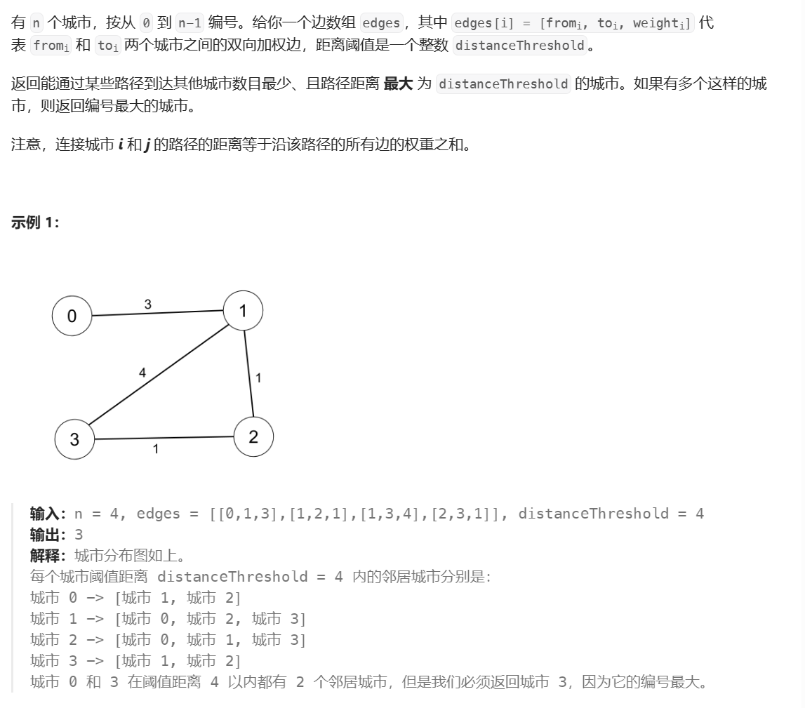


即找出每个城市到其他城市的最短路中小于distanceThrehold的有多少个，选出其中最少的且编号最大的那个。

从起点到终点枚举中间点。

​	


```python
from math import inf
class Solution:
    def findTheCity(self, n: int, edges: List[List[int]], distanceThreshold: int) -> int:
        # 初始化为无穷，表示不相连
        dis=[[inf for _ in range(n)] for _ in range(n)]
        # 建立直接相连的图
        for u,v,w in edges:
            dis[u][v]=dis[v][u]=w
            
         # dfs(k,i,j)返回从i到j的最短路径，并且这条最短路的中间节点编号都 ≤k。注意中间节点不包含 i 和 j。对于选取每个中间节点改为设置一个最大的中间节点，在递归中做到选取每一个中间节点
        @cache
        def dfs(k,i,j):
            # 当二者之间的中间节点为-1时，表示i 和 j 之间没有任何中间节点，此时最短路长度只能是连接 i和 j 的边的边权
            if k<0:
                return dis[i][j]
            else:
                # 对于给定的中间节点，有选或者不选两种可能.
                return min(dfs(k-1,i,j),dfs(k-1,i,k)+dfs(k-1,k,j))
        val=inf
        ans=0
        # 使用双层循环，外层循环找所有的城市，内层循环找所有的其他的城市，计算二者之间的距离如果小于将次数加一
        for i in range(n):
            cnt=0
            for j in range(n):
                # 中间节点设置为节点个数，以便选择所有的中间节点
                if j!=i and dfs(n-1,i,j)<=distanceThreshold:
                    cnt+=1
             # 记录，相等时取最大的 i
            if cnt<=val:
                val=cnt
                ans=i
        return ans 
    
    
    
# 自底向上的写法
from math import inf
class Solution:
    def findTheCity(self, n: int, edges: List[List[int]], distanceThreshold: int) -> int:
        dis=[[inf for _ in range(n)] for _ in range(n)]
        for u,v,w in edges:
            dis[u][v]=dis[v][u]=w
        # 注意不能忘记标记自己到自己为0
        for i in range(n):
            dis[i][i]=0
        f=dis
        flag=inf
        ans=0
        # 三重循环找最短距离，注意首先是枚举中间节点k
        for k in range(n):
            for i in range(n):
                for j in range(n):
                    f[i][j]=min(f[i][j],f[i][k]+f[k][j])

        for i,v in enumerate(f):
            cnt=0
            for j,jv in enumerate(v):
                # 注意自己到自己不能算
                if i!=j and jv<=distanceThreshold:
                    cnt+=1
            # 设置小于等于找最大的编号
            if cnt<=flag:
                flag=cnt
                ans=i
        return ans
```

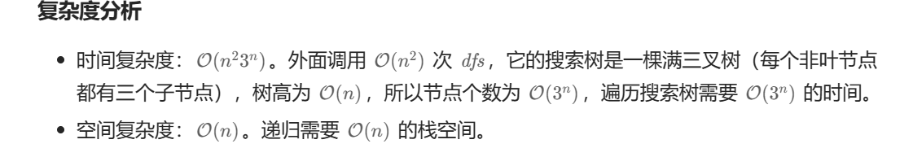

加上记忆化搜索后，结果是O($n^3$)


#### [设计可以求最短路径的图类](https://leetcode.cn/problems/design-graph-with-shortest-path-calculator/)


使用floyd算法

```python
from math import inf


class Graph:

    def __init__(self, n: int, edges: List[List[int]]):
        g = [[inf for _ in range(n)] for _ in range(n)]
        self.n = n
        # 初始化临界矩阵
        for u, v, w in edges:
            g[u][v] = w
        for i in range(n):
            g[i][i] = 0
        # floyd直接计算最短路，先建立好不需要每次调用的时候再计算
        for k in range(self.n):
            for i in range(self.n):
                for j in range(self.n):
                    g[i][j] = min(g[i][j], g[i][k] + g[k][j])
        self.g = g

    def addEdge(self, edge: List[int]) -> None:
        g=self.g
        n=len(g)
        u,v,w=edge
        # 每次加入一条边，判断每个节点经过这个这条边的两端的最短距离是否会剪短
        for i in range(n):
            for j in range(n):
                g[i][j]=min(g[i][j],g[i][u]+w+g[v][j])
        self.g=g

    def shortestPath(self, n1: int, n2: int) -> int:
        val=self.g[n1][n2]
        return val if val!=inf else -1
   
```


#### [关闭分部的可行集合数	目](https://leetcode.cn/problems/number-of-possible-sets-of-closing-branches/)

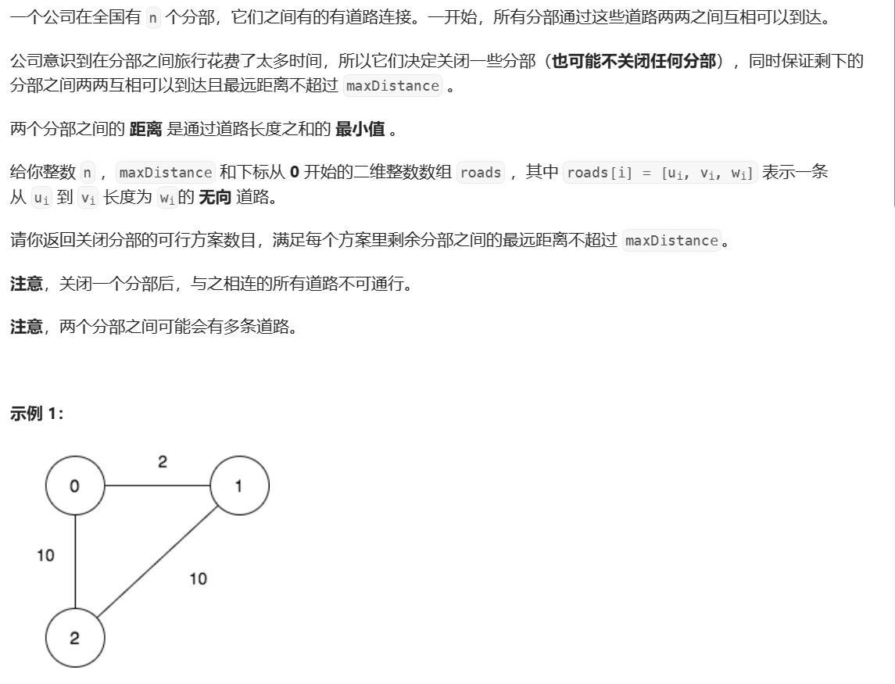


删去某些节点后，剩余的节点之间的最短距离是否小于给定的值，找出删除的方法个数。


对于给定的范围可以暴力枚举，列出所有的可能，可能选择有二进制集合表示，比如n=10，1024表示1000 0000 00，即只有10一个元素。


使用s>>i&1可以判断i是否在集合中


```python
from math import inf
class Solution:
    def numberOfSets(self, n: int, maxDistance: int, roads: List[List[int]]) -> int:
        w=[[inf for _ in range(n)]for _ in range(n)]
        # 建立边权表，这里可能会有重边因此每次选择最小的值
        for u,v,w_ in roads:
            w[u][v]=min(w_,w[u][v])
            w[v][u]=min(w_,w[v][u])
        for i in range(n):
            w[i][i]=0

        f=[None]*n
        def check(s):
            for i,v in enumerate(w):
                # 如果包含这个元素复制一份，以此来排除未选择的节点
                if s>>i&1:
                    f[i]=v[:]
            # Floyd算法模板，对集合中存在的元素找它到集合中存在的终点的最短路径，通过遍历他们两的存在的中间节点
            for k in range(n):
                # 如果中间值不在集合中，跳过
                if not s>>k&1: continue 
                for i in range(n):
                    # 如果要找的起点终点不在集合中跳过
                    if not s>>i&1: continue 
                    for j in range(n):
                        if not s>>j&1: continue
                        # 更新
                        f[i][j]=min(f[i][j],f[i][k]+f[k][j])
            # 判断，对于集合中存在的点，它到其他点的距离是否小于给定值，如果有一个大于那就不行
            for i ,v in enumerate(f):
                if not s>>i&1:continue
                for j,vj in enumerate(v):
                    # 判断终点是否存在，来避免null与值比较
                    if s>>j&1 and vj>maxDistance:
                        return 0
            return 1
        # 枚举处每一种集合的可能，传入判断函数取和
        return sum(check(s) for s in range(1<<n))
```


#### [转换字符串的最小成本 II](https://leetcode.cn/problems/minimum-cost-to-convert-string-ii/)

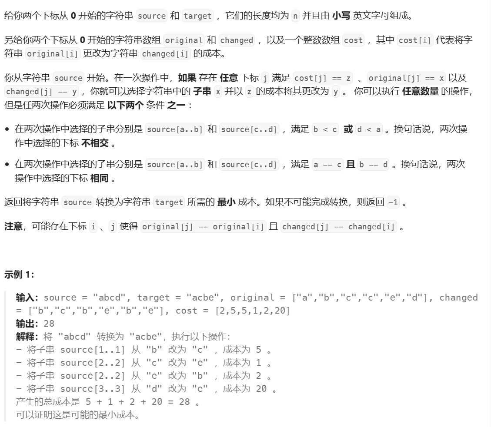

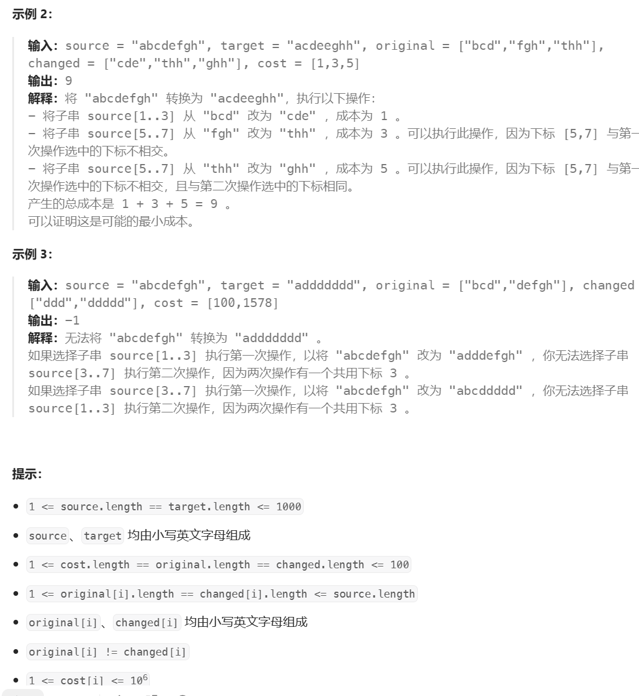

注意每次选择的子集可以相同但是不能相交。

1.如何找到要替换的子串? 选择遍历给定的两个字符串，如果对应位置两个字符串相同，可以选择跳过也可以选择就在这个位置替换;替换子串多长?如果选择枚举给定字符串的各个位置，由于给定字符串的长度最多为1000，很容易超时，因此转向枚举给定的用于替换的字符数组中所有字符串的长度（最多只有100个不同的长度），需要对字符数组按照长度进行分组。能不能替换？要看两个子串是否在字符数组中。

2.如何找替换的最小成本？使用floyd算法。

```python
class Solution:
    def minimumCost(self, source: str, target: str, original: List[str], changed: List[str], cost: List[int]) -> int:
        len_to_str=defaultdict(set)
        # 图使用哈希表表示，不需要用二维数组（尤其是在图比较稀疏的时候），使用二维列表还要转化为数字，技巧点
        dis=defaultdict(lambda :defaultdict(lambda :inf))
        for x,y,c in zip(original,changed,cost):
            # 把替换的字符按照长度分组
            len_to_str[len(x)].add(x)
            len_to_str[len(y)].add(y)
            # 建图，注意两个点之间会有多条路，选取其中最小的
            dis[x][y]=min(dis[x][y],c)
            dis[x][x]=0
            dis[y][y]=0 

        # folyd找最短路
        # 不同长度的字符串一定是不连通的
        for strs in len_to_str.values():
            for k in strs:
                for i in strs:
                    # 进行条件判断，如果从起始点到这个中间节点的距离为无限远，跳过。
                    if dis[i][k]==inf: continue
                    for j in strs:
                        dis[i][j]=min(dis[i][j],dis[i][k]+dis[k][j])
        @cache
        # 动态规划
        def dfs(i):
            if i==0: return 0
            res=inf
            # 如果两个值相等，可以选择跳过
            if source[i-1]==target[i-1]:
                res=dfs(i-1)
            # 枚举字符数组中的长度，而不是枚举整个字符串的位置
            for size,strs in len_to_str.items():
                if i<size:continue # 不够替换，跳过
                s=source[i-size:i]
                t=target[i-size:i]
                # 能替换
                if s in strs and t in strs:
            	# 找出最小值        
                    res=min(res,dis[s][t]+dfs(i-size))
            return res

        ans=dfs(len(source))
        return ans if ans<inf else -1
```

#### **Sightseeing Tour**


k的范围很小可以暴力枚举，首先用floyd求出两点间最短距离，然后全排列给定的必须通过的桥，在枚举每个桥是从u到v，还是从v到u。

```python
n,m=RR()
# Floyd模板
dis=[[inf]*n for _ in range(n)]
p=[]
for _ in range(m):
    u,v,w=RR()
    u-=1
    v-=1
    p.append((u,v,w))
    # 注意可能存在重复的路径取最小
    dis[u][v]=min(dis[u][v],w)
    dis[v][u]=min(dis[v][u],w)
for i in range(n):dis[i][i]=0# 自己到自己的距离初始化为0
f=dis
for k in range(n):
    for i in range(n):
        for j in range(n):
            f[i][j]=min(f[i][j],f[i][k]+f[k][j])
for _ in range(R()):
    k=R()
    nums=[v-1 for v in RR()]
    ans=inf
    # 全排列
    for arr in permutations(nums):
        # 枚举经过的方向
        for s in range(1<<k):
            curr = temp = 0
            for j in range(k):
                u,v,w =p[arr[j]]
                temp+=w
                if s>>j&1:
                    temp+=f[curr][u]
                    curr=v
                else:
                    temp+=f[curr][v]
                    curr=u
            # 最后要到终点
            temp+=dis[curr][-1]
            # 取最小
            ans=min(ans,temp)
    print(ans)
```


## 并查集

该算法主要用于解决图论中的动态连通性问题。

动态连通性可以抽象为给一幅图连线，联通是一种等价关系，有对称性传递性自反性等性质。

以下模型使用森林来表示动态连通性：

```python
class UF:
    def __init__(self,n):
        self.count=n
        # self.parent[i]，表示的是i节点的根节点，初始设定每个节点的根节点是本身。
        self.parent=[x for x in range(n)]

    # 如果两个节点被联通，则将其中一个（任意）的根节点连接到另一个的根节点
    def union(self,p,q):
        # 找到根节点
        rootp=self.find(p)
        rootq=self.find(q)

        if rootq ==rootp:
		return 
        self.parent[rootp]=rootq# 反之亦可
        self.count-=1

    # 判断两个节点是否联通，如果联通一定有相同的根节点
    def connect(self,p,q):
        rootp=self.find(p)
        rootq=self.find(q)
        return rootq==rootp

    # 找根节点，不断向上遍历。
    def find(self,p):
        while self.parent[p]!=p:
            p=self.parent[p]

        return p

```

上述函数的时间复杂度主要依赖于find函数，而find函数的时间复杂度依赖于树的高度。

上述过程中可能会出现不平衡的状况导致树变成链表，降低时间复杂度，为此做出平衡性优化。


```python
class UF:
    def __init__(self,n):
        self.count=n
        # self.parent[i]，表示的是i节点的父节点，初始设定每个节点的根节点是本身。
        self.parent=[x for x in range(n)]
        self.size=[1 for _ in range(n)]# 给每个节点加上一个size变量，表示每棵树包含的节点数目
        
    # 如果两个节点被联通，则将其中一个（任意）的根节点连接到另一个的根节点
    def union(self,p,q):
        # 找到根节点
        rootp=self.find(p)
        rootq=self.find(q)

        if rootq ==rootp:
			return 
        # 节点数少的连接到节点数多的上
        if self.size[rootp]<self.size[rootq]:
        	self.parent[rootp]=rootq
            self.size[rootp]+=self.size[rootq]# 更新
        else:
		self.parent[rootq]=rootp
             self.size[rootq]+=self.size[rootp]
        self.count-=1
```


根据上述代码可知，森林的结构并不重要，只在乎根节点。于是乎想要压缩每棵树的高度，改写find函数。


```python
# 完整模板
# 迭代方式的find函数要配合size使用
class UF:
    def __init__(self, n):
        self.count = n
        self.parent = [i for i in range(n)]
        self.size = [1 for _ in range(n)]

    def union(self, p, q):
        rootp = self.find(p)
        rootq = self.find(q)
        if rootq == rootp:
            return
        # 小的连接到大的上面去
        if self.size[rootq] < self.size[rootp]:
            self.parent[rootq] = rootp
            self.size[rootp] += self.size[rootq]
        else:
            self.parent[rootp] = rootq
            self.size[rootq] += self.size[rootp]
        self.count -= 1

    def connect(self, p, q):
        rootp = self.find(p)
        rootq = self.find(q)
        return rootq == rootp

    def find(self,p):
        if self.parent[p]!=p:
            self.parent[p]=self.find(self.parent[p])
        return self.parent[p]
    # 并查集的撤销
    def isolate(self,x):
        self.parent[x]=x
```

### 被环绕的区域

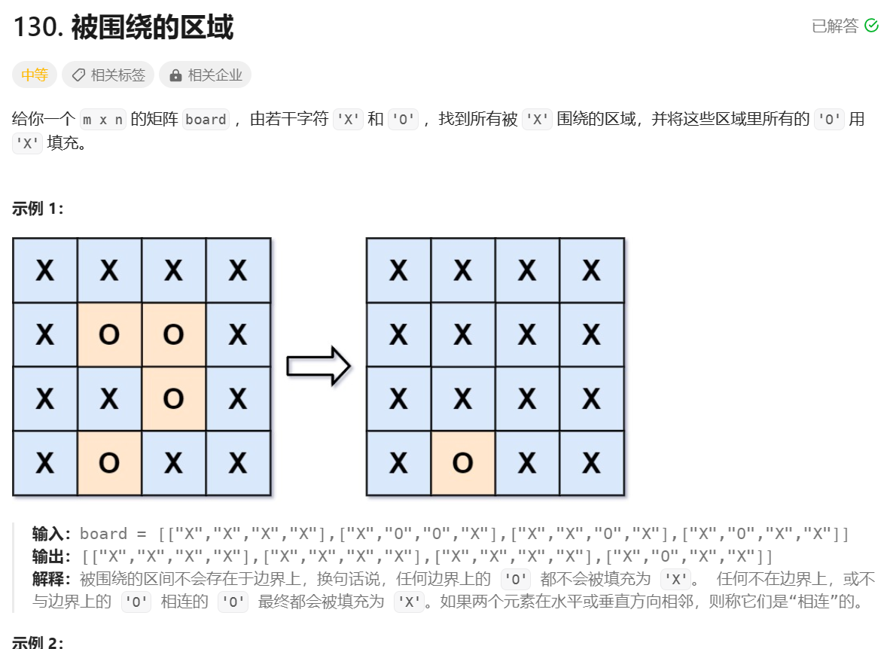

使用BFS解决

```python 
from collections import deque

dirs = [
    lambda x, y: (x - 1, y),  # 左
    lambda x, y: (x + 1, y),  # 右
    lambda x, y: (x, y - 1),  # 下
    lambda x, y: (x, y + 1),  # 上
]

class Solution(object):
    def solve(self, board):
        if not board:
            return []

        m, n = len(board), len(board[0])

        # 首先，将所有与边界上的 'O' 相连的区域标记为临时标记 '#'
        for i in range(m):
            for j in range(n):
                if (i == 0 or i == m - 1 or j == 0 or j == n - 1) and board[i][j] == 'O':
                    self.bfs(board, i, j)

        # 然后，将标记为 '#' 的区域恢复为 'O'，将未标记的 'O' 修改为 'X'
        for i in range(m):
            for j in range(n):
                if board[i][j] == 'O':
                    board[i][j] = 'X'
                elif board[i][j] == '#':
                    board[i][j] = 'O'

        return board
	
    '''边界上的点向四周扩散'''
    def bfs(self, board, i, j):
        m, n = len(board), len(board[0])
        queue = deque([(i, j)])
        board[i][j] = '#'  # 标记为 '#'

        while queue:
            x, y = queue.popleft()
            for dir in dirs:
                new_x, new_y = dir(x, y)
                if 0 <= new_x < m and 0 <= new_y < n and board[new_x][new_y] == 'O':
                    queue.append((new_x, new_y))
                    board[new_x][new_y] = '#'  # 继续标记为 '#'
```

使用union-find解决，将所有边界上的点与一个虚拟节点连接，然后遍历内部的点，连接它与周围的点，之后再次遍历如果节点与虚拟节点相连则设置为X。但是UF内部使用一维数组储存值，因此将二维的迷宫转换为一维的数组

就是利用动态连通性构造等价关系。

```python
'''图'''
class UF:
    def __init__(self,n):
        self.count=n
        self.parent=[i for i in range(n)]
        self.size=[1 for _ in range(n)]

    def union(self,p,q):
        rootp=self.find(p)
        rootq=self.find(q)
        if rootq==rootp:
            return
        if self.size[rootq]<self.size[rootp]:
            self.parent[rootq]=rootp
            self.size[rootp]+=self.size[rootq]
        else:
            self.parent[rootp]=rootq
            self.size[rootq] += self.size[rootp]
        self.count-=1
    def connect(self,p,q):
        rootp = self.find(p)
        rootq = self.find(q)
        return rootq == rootp
    def find(self,p):
        if self.parent[p]!=self.parent[p]:
            self.parent[p]=self.find(self.parent[p])
        return self.parent[p]
    
class Solution(object):

    def solve(self, board):
        if not board:
            return None
		# 方向的函数
        dirs = [
            lambda x, y: (x - 1, y),  # 左
            lambda x, y: (x + 1, y),  # 右
            lambda x, y: (x, y - 1),  # 下
            lambda x, y: (x, y + 1),  # 上
        ]
		# 长宽
        m=len(board)
        n=len(board[0])
        # 转换，选择m*n+1是为了给虚拟节点腾个位置
        uf=UF(m*n+1)
        dummy=m*n# 虚拟节点
        '''将边界上的点与虚拟节点相连'''
        for i in range(m):
            if board[i][0]=='O':
                uf.union(dummy,i*n)
            if board[i][n-1]=='O':
                uf.union(dummy,i*n+n-1)
        for i in range(n):
            if board[0][i]=='O':
                uf.union(dummy,i)
            if board[m-1][i]=='O':
                uf.union(dummy,(m-1)*n+i)
        # 内部的点与其他的点相连
        for i in range(1,m-1):
            for j in range(1,n-1):
                if board[i][j]=='O':
                    for dir in dirs:
                        x,y=dir(i,j)
                        if board[x][y]=='O':
                            uf.union(x*n+y,i*n+j)
            
        for i in range(1,m-1):
            for j in range(1,n-1):
                if board[i][j] == 'O' and not uf.connect(dummy,i*n+j):
                    board[i][j]='X'
```


### 等式方程的可满足性

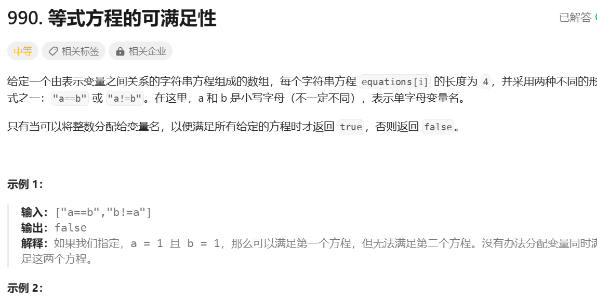

验证连通性

```python
class UF:
    def __init__(self, n):
        self.count = n
        self.parent = [i for i in range(n)]
        self.size = [1 for _ in range(n)]

    def union(self, p, q):
        rootp = self.find(p)
        rootq = self.find(q)
        if rootq == rootp:
            return
        if self.size[rootq] < self.size[rootp]:
            self.parent[rootq] = rootp
            self.size[rootp] += self.size[rootq]
        else:
            self.parent[rootp] = rootq
            self.size[rootq] += self.size[rootp]
        self.count -= 1

    def connect(self, p, q):
        rootp = self.find(p)
        rootq = self.find(q)
        return rootq == rootp

    def find(self,p):
        if self.parent[p]!=p:
            self.parent[p]=self.find(self.parent[p])
        return self.parent[p]
class Solution(object):
    def equationsPossible(self, equations):
        # 26个字母
        uf =UF(26)
        # 先将相等的连通起来
        for equation in equations:
            if equation[1]=='=':
                # 将字符转化为对应的数字，因为UF的内部使用数字表示
                p=ord(equation[0])
                q=ord(equation[3])
                uf.union(p-ord('a'),q-ord('a'))
        # 对每个不等的验证是否联通，如果是联通的返回False
        for equation in equations:
            if equation[1]=='!':
                p = ord(equation[0])
                q = ord(equation[3])
                if uf.connect(p-ord('a'),q-ord('a')):
                    return False
        return True
```

### [ 交换字符串中的元素](https://leetcode.cn/problems/smallest-string-with-swaps/)


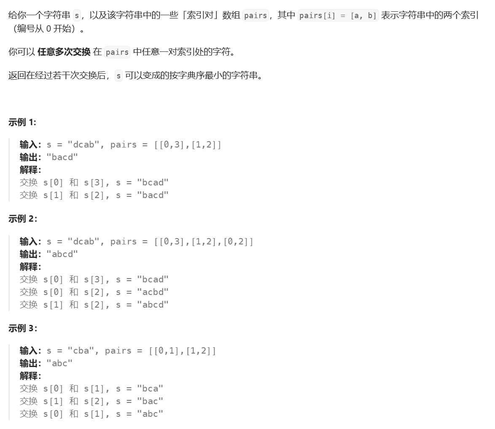


使用并查集将相同的节点连成一个区块，之后遍历字符串，将字符对应的下标转换为对应的区块，使用一个map记录每个区块中储存的值，最后从头遍历一遍数组的下标，根据下标到并查集中找到对应的区块，取出区块中储存的值中最小的那个。

```python
from collections import defaultdict
# 并查集
class UF:
    def __init__(self,n):
        self.parent=[i for i in range(n)]
        self.count=n
        self.size=[1 for _ in range(n)]
    def find(self,p):

        if self.parent[p]!=p:
            self.parent[p]=self.find(self.parent[p])
        return self.parent[p]

    def union(self,p,q):
        rootp=self.find(p)
        rootq=self.find(q)
        if rootq==rootp:
            return
        if self.size[rootp]<self.size[rootq]:
            self.parent[rootp]=rootq
            self.size[rootq]+=self.size[rootp]
        else:
            self.parent[rootq]=rootp
            self.size[rootp] += self.size[rootq]
        self.count-=1

class Solution:
    def smallestStringWithSwaps(self, s: str, pairs: List[List[int]]) -> str:
        s=list(s)
        n=len(s)
        uf=UF(n)
        map=defaultdict(list)
        # 联通位置
        for p in pairs:
            a,b=p
            uf.union(a,b)
         # 对下标转化为区块，将值填到对应的数组中
        for i,c in enumerate(s):
            map[uf.find(i)].append(c)
         # 为了保证字典序，进行排序，逆序是因为列表只能取出最后面的值
        for v in map.values():
            v.sort(reverse=True)
        ans=[]
        # 开始填充，这个位置要填的值是与它联通的位置中最小的那个值，也就是区块对应的列表的最后一个值
        for i in range(n):
            index=uf.find(i)
            ans.append(map[index][-1])
            map[index].pop()
        return "".join(ans)
```

### [验证二叉树](https://leetcode.cn/problems/validate-binary-tree-nodes/)


这道题不能单纯的使用并查集，这样的话无法判断下面的情况：

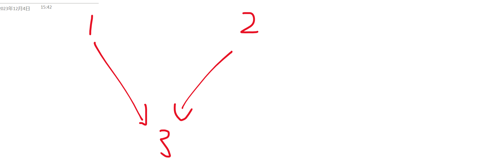

对于树，一个节点只能有一个父节点且最后的连通分量为1


这种情况的联通分量满足条件同时还不会成环，因此在使用并查集判断前线遍历一遍左右节点的数组，如果一个值出现多次（也就是出现了以上的情况）返回False。

```python
from collections import defaultdict
# 并查集
class UF:
    def __init__(self,n):
        self.parent=[i for i in range(n)]
        self.count=n
        self.flag=True
        self.size=[1 for _ in range(n)]
    def find(self,p):

        if self.parent[p]!=p:
            self.parent[p]=self.find(self.parent[p])
        return self.parent[p]

    def union(self,p,q):
        rootp=self.find(p)
        rootq=self.find(q)
        if rootq==rootp:
            self.count-=1
            return
        if self.size[rootp]<self.size[rootq]:
            self.parent[rootp]=rootq
            self.size[rootq]+=self.size[rootp]
        else:
            self.parent[rootq]=rootp
            self.size[rootp] += self.size[rootq]
        self.count-=1
class Solution:
    def validateBinaryTreeNodes(self, n: int, leftChild: List[int], rightChild: List[int]) -> bool:
        uf=UF(n)
        memo=set()
        for i,j in zip(leftChild,rightChild):
            # 使用set记录，判断是否有多次出现的节点
            if (i!=-1 and i in memo) or (j!=-1 and j in memo):
                return False
            else:
                memo.add(i)
                memo.add(j)
        index=0
        # 使用并查集连接
        for i,j in zip(leftChild,rightChild):
            if i!=-1:
                # 成环的操作
                if uf.find(i)==uf.find(index):
                    return False
                else:
                    uf.union(index,i)
            if j!=-1:
                if uf.find(j)==uf.find(index):
                    return False
                else:
                    uf.union(index,j)
            index+=1
         # 判断联通分量
        return uf.count==1
```

### 连通块中点的数量

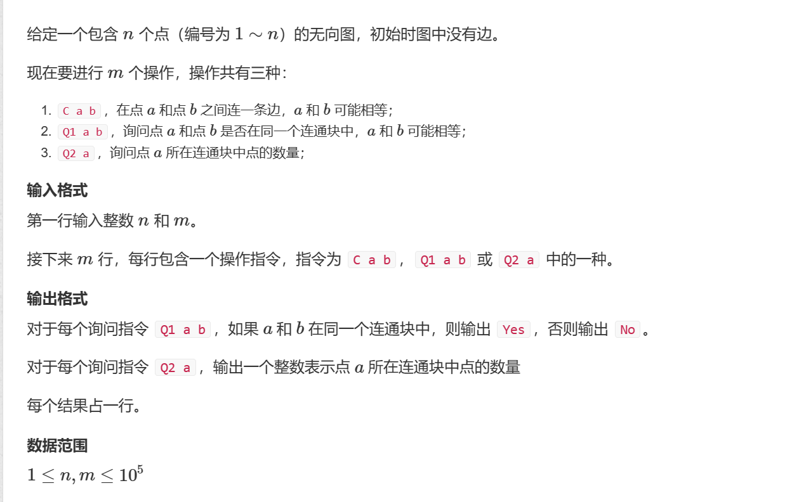

使用带有size数组的并查集，查找是输出根节点的size即可

```python
class UF:
    def __init__(self,n):
        self.parent=[i for i in range(n)]
        self.size=[1 for _ in range(n)]
    def find(self,x):
        if self.parent[x]!=x:
            self.parent[x]=self.find(self.parent[x])
        return self.parent[x]
    def union(self,u,v):
        p=self.find(u)
        q=self.find(v)
        if p==q:
           return 
        if self.size[p]<self.size[q]:
           self.parent[p]=q
           self.size[q]+=self.size[p]
        else:
            self.parent[q]=p
            self.size[p]+=self.size[q]
           
    def search(self,x):
        q=self.find(x)
        return self.size[q]
    def connect(self,u,v):
        p=self.find(u)
        q=self.find(v)
        return p==q
        
n,m =[int(x) for x in input().split()]
uf=UF(n+1)
while m:
    s=input().split()
    if s[0]=='Q1':
        u,v =int(s[1]),int(s[2])
        if uf.connect(u,v):
            print('Yes')
        else:
            print('No')
    elif s[0]=='Q2':
        p=int(s[1])
        print(uf.search(p))
    else:
        u,v =int(s[1]),int(s[2])
        uf.union(u,v)
    m-=1
```


### 食物链

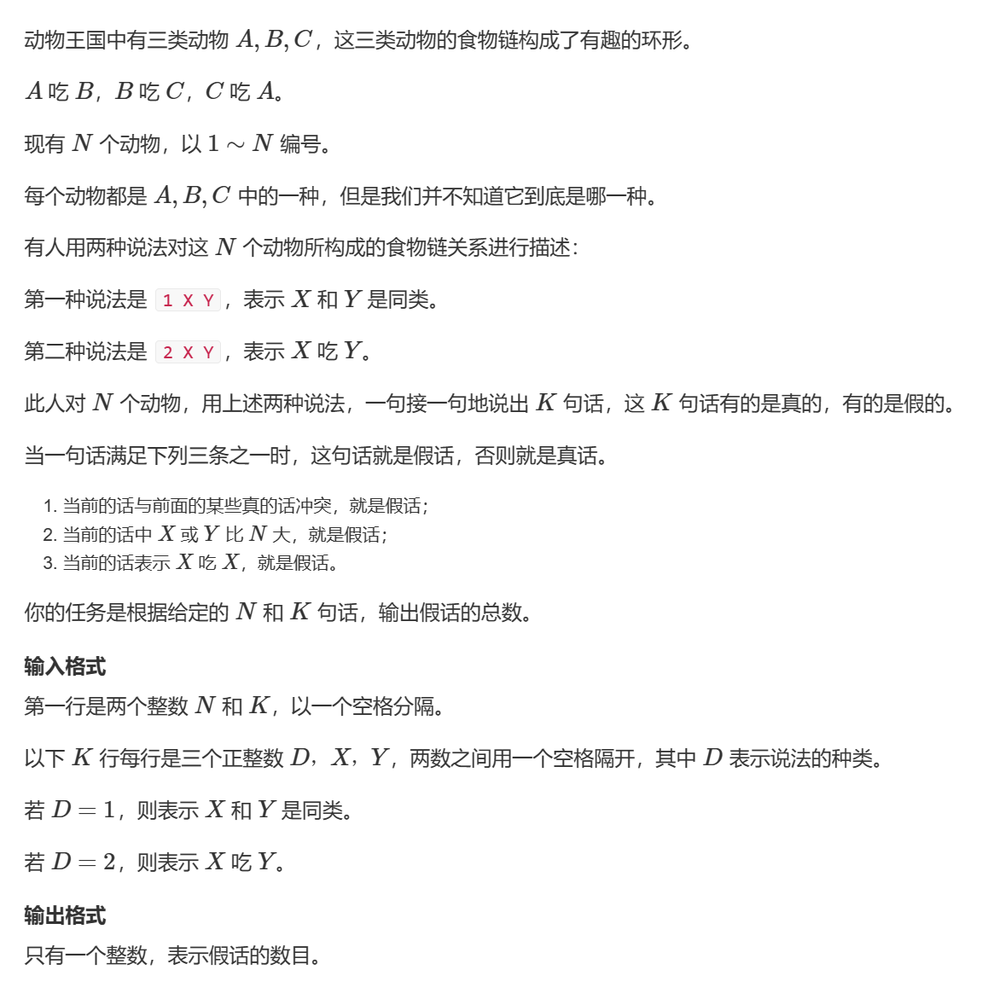

`最重要的思想是对于两个物种，不论是什么关系，都先放进并查集中，但每一个物种都先属于单独的一类`，在并查集中多加一个数组d，d[i]表示i节点与当前集合中根的关系，0表示同类，1表示吃，2表示被吃，通过是由于食物链中只有三种关系，因此2也表示可以吃1，初始时d中的元素都是0表示自己与自己是同类。

当选择两个元素是同类时，首先通过find函数查找他们是否是同一类，如果是的话，判断它们与根节点的关系，如果不相同就是假话，如果不在同一个集合中，则把p连接到q，其中p与q的关系可由两个xy求出：
将q连接到p上关系是1-2=-1 取余结果是2表示被吃

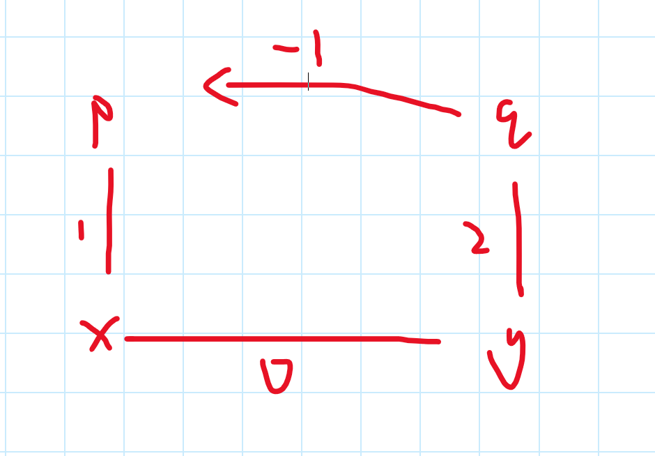


​	


当选择两个元素是吃的关系时，首先通过find函数查找他们是否在一个集合中，如果在的话，判断它们与根节点的关系，如果不满足则是假话，如果不在一个集合中，则把他们连接到一个集合中，然后由关系得出同余公式求解距离。

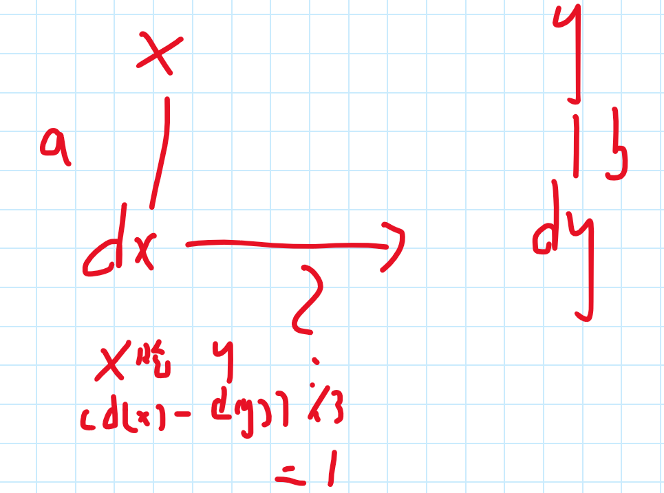

```python
class UF:
    def __init__(self,n):
        self.parent=[i for i in range(n)]
        self.size=[1 for _ in range(n)]
        self.d=[0]*n
        self.res=0
    # find函数用于压缩，注意同时要更新d
    def find(self,x):
        if self.parent[x]!=x:
            temp=self.parent[x]
            self.parent[x]=self.find(self.parent[x])
            self.d[x]+=self.d[temp]
        return self.parent[x]
    def union(self,u,v,flag):
        if u>n or v>n :
            self.res+=1
            return 
        p,q=self.find(u),self.find(v)
        if flag==1:
            # 同一个类中，却不满足关系
            if p==q and (self.d[u]-self.d[v])%3:
                self.res+=1
            elif p!=q:
                # 不同的集合相连，注意d数组的更新公式
                if self.size[q]<self.size[p]:
                    self.parent[q]=p
                    self.d[q]=self.d[u]-self.d[v]
                else:
                    self.parent[p]=q
                    self.d[p]=self.d[v]-self.d[u]
        else:
            # 特判，自己吃自己
            if u==v:
                self.res+=1
            # 同一个集合中，却不满足关系
            elif p==q:
                if (self.d[u]-self.d[v]-1)%3:
                    self.res+=1
            # 注意不同类间，是连接根节点
            else:
                self.parent[p]=q
                self.d[p]=self.d[v]-self.d[u]+1
            
                
        
        
n,k=[int(x) for x in input().split()]
uf=UF(n+1)
while k:
    flag,u,v=[int(x) for x in input().split()]
    uf.union(u,v,flag)
    k-=1
print(uf.res)
```


### 奶酪

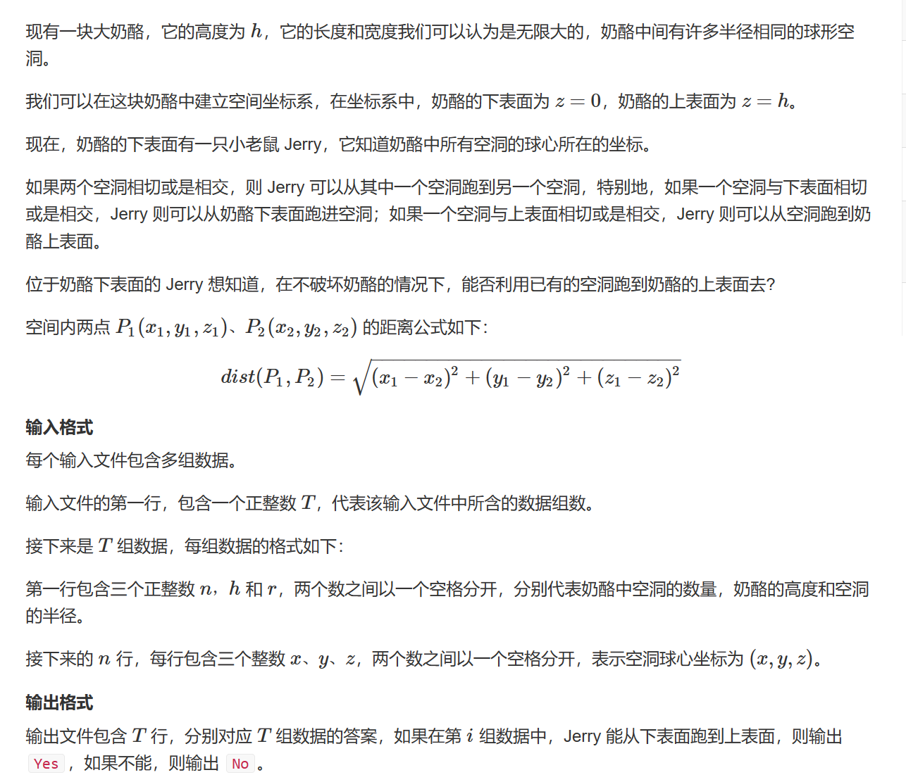

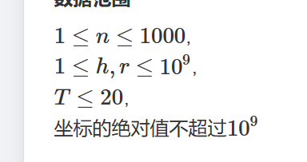

对所有的点入队同时分出哎底部的和顶部的，连接范围内的两个点，最后枚举底部的和顶部的看看是否相连。

​	

```python
class UF:
    def __init__(self, n):
        self.parent = [i for i in range(n)]
        self.size = [1 for _ in range(n)]

    def union(self, u, v):
        p = self.find(u)
        q = self.find(v)
        if p == q: return
        if self.size[p] < self.size[q]:
            self.parent[p] = q
            self.size[q] += self.size[p]
        else:
            self.parent[q] = p
            self.size[p] += self.size[q]

    def connect(self, u, v):
        p = self.find(u)
        q = self.find(v)
        return p == q

    def find(self, x):
        if self.parent[x] != x:
            self.parent[x] = self.find(self.parent[x])
        return self.parent[x]


for _ in range(int(input())):
    n, h, r = [int(x) for x in input().split()]
    bottom = []
    up = []
    nums = []
    # 节点入队划分
    for i in range(n):
        li = [int(x) for x in input().split()]
        if li[2] + r >= h:
            up.append(i)
        if li[2] - r <= 0:
            bottom.append(i)

        nums.append(li)
    uf = UF(n)
    flag = False
    # 枚举所有的点可以相连
    for i in range(n):
        x1, x2, x3 = nums[i]
        for j in range(i + 1, n):
            y1, y2, y3 = nums[j]
            d=((x1-y1)**2+(x2-y2)**2+(x3-y3)**2)**0.5
            if d <=2*r:
                uf.union(i, j)
                
    # 枚举底部的和顶部的
    for u in up:
        if flag:break
        for v in bottom:
            if uf.connect(u, v):
                flag = True
                break
    res = 'Yes' if flag else 'No'
    print(res)

```


### [包含每个查询的最小区间](https://leetcode.cn/problems/minimum-interval-to-include-each-query/)

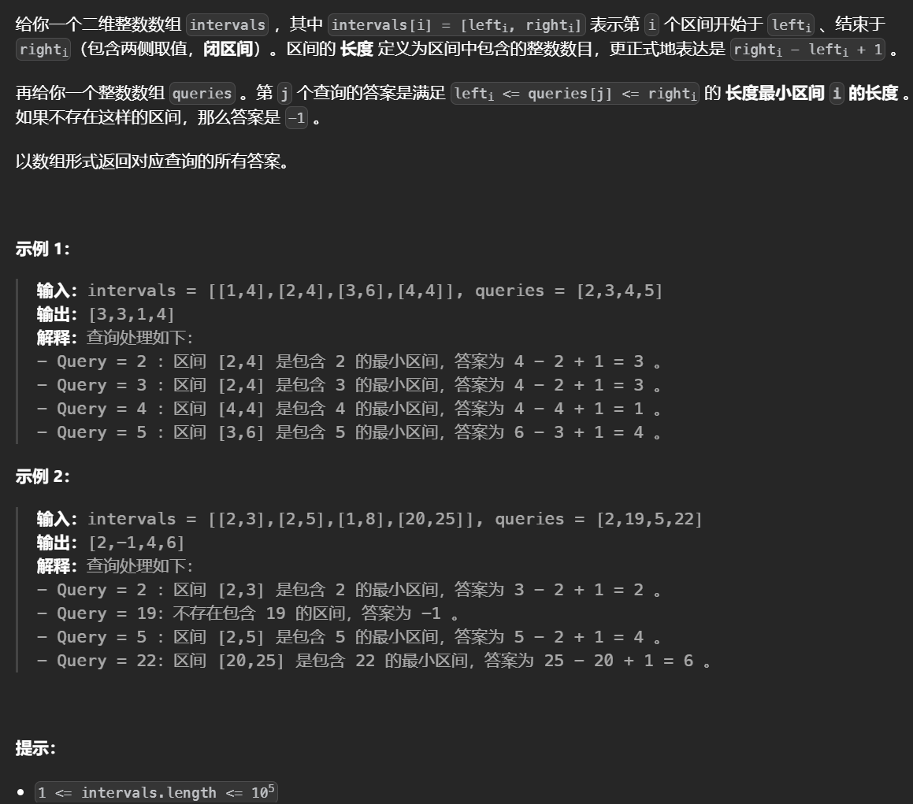

转换思想，将区间按照长度排序，去找每个区间可以包含的询问，每个询问的答案就是第一个包括他的区间。

在这个过程中区间可能会包含已经处理过的询问，也就是说需要对一些询问跳过，可以使用并查集跳过连续的询问。

如下所示，在找完1之后应该去找2但是2一直到4是已经处理过的，所以直接跳到5


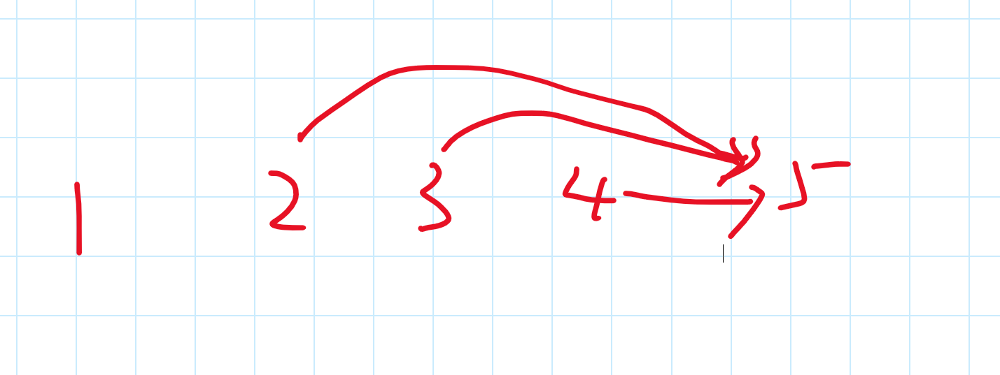


```python
class UF:
    def __init__(self, n):
        self.count = n
        self.parent = [i for i in range(n)]
        self.size = [1 for _ in range(n)]

    def union(self, p, q):
        rootp = self.find(p)
        rootq = self.find(q)
        if rootq == rootp:
            return
        # 小的连接到大的上面去
        if self.size[rootq] < self.size[rootp]:
            self.parent[rootq] = rootp
            self.size[rootp] += self.size[rootq]
        else:
            self.parent[rootp] = rootq
            self.size[rootq] += self.size[rootp]
        self.count -= 1

    def connect(self, p, q):
        rootp = self.find(p)
        rootq = self.find(q)
        return rootq == rootp

    def find(self,p):
        if self.parent[p]!=p:
            self.parent[p]=self.find(self.parent[p])
        return self.parent[p]
class Solution:
    def minInterval(self, intervals: List[List[int]], queries: List[int]) -> List[int]:
        m,n=len(intervals),len(queries)
        uf=UF(n+1)
        # 按照长度排序
        intervals.sort(key=lambda x:(x[1]-x[0]))
        # 离线
        q=sorted([(v,i) for i,v in enumerate(queries)])
        ans=[-1]*n
        for l,r in intervals:
            # 对于这个区间，去找可能的询问
            j=bisect_left(q,(l,-1))
            # 通过并查集跳过处理过的位置
            idx=uf.find(j)
            while idx<n and q[idx][0]<=r:
                ans[q[idx][1]]=r-l+1
                # 将当前询问和下一个询问连接起来（按照位置），这样当下一次包括到当前询问时会从下一个询问开始
                uf.parent[idx]=idx+1
                idx+=1
                # 由于下一个询问可能和其他的位置相连，所以要通过并查集跳过
                idx=uf.find(idx)
        return ans 
```


### [ 避免洪水泛滥](https://leetcode.cn/problems/avoid-flood-in-the-city/)

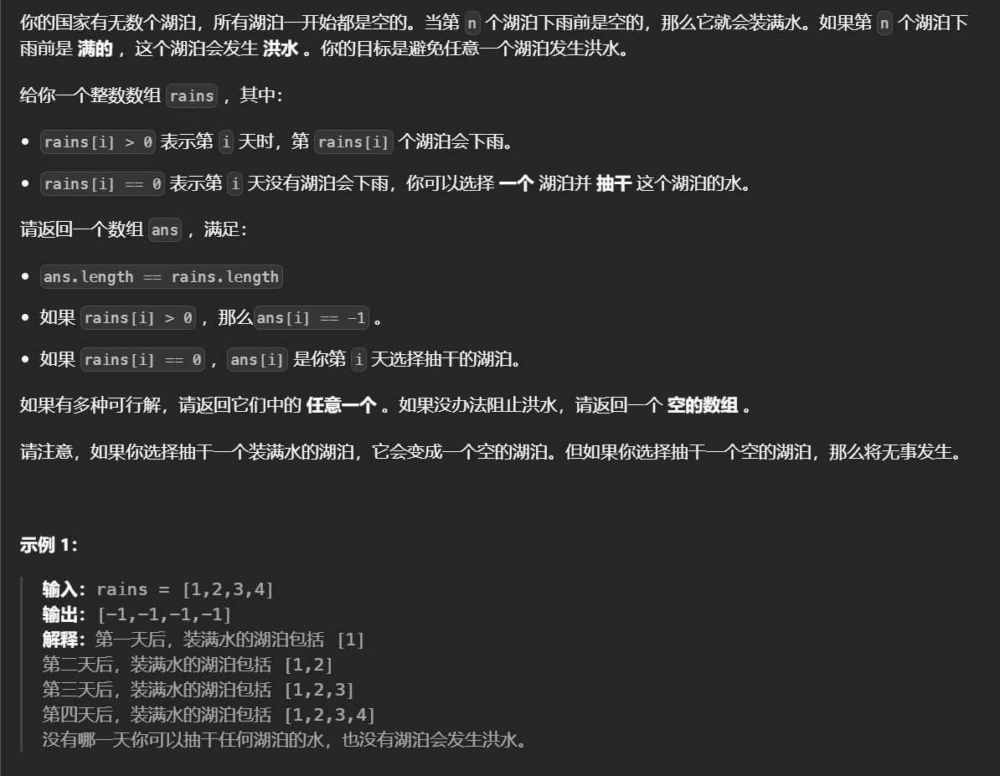


对于重复下雨的位置i和j，去找离i最近的晴天把这个晴天分配给他，之后这个晴天就不能在操作了，如果下一次再找到这晴天应该跳过，使用并查集可以快速跳过某些连续的位置

```python
class UF:
    def __init__(self, n):
        self.count = n
        self.parent = [i for i in range(n)]
        self.size = [1 for _ in range(n)]

    def union(self, p, q):
        rootp = self.find(p)
        rootq = self.find(q)
        if rootq == rootp:
            return
        # 小的连接到大的上面去
        if self.size[rootq] < self.size[rootp]:
            self.parent[rootq] = rootp
            self.size[rootp] += self.size[rootq]
        else:
            self.parent[rootp] = rootq
            self.size[rootq] += self.size[rootp]
        self.count -= 1

    def connect(self, p, q):
        rootp = self.find(p)
        rootq = self.find(q)
        return rootq == rootp

    def find(self,p):
        if self.parent[p]!=p:
            self.parent[p]=self.find(self.parent[p])
        return self.parent[p]
        
class Solution:
    def avoidFlood(self, rains: List[int]) -> List[int]:
        memo={}
        s=[]
        ans=[1]*len(rains)
        # 记录晴天位置
        for i,v in enumerate(rains):
            if not v:s.append(i)
        uf=UF(len(s)+1)
        for i,v in enumerate(rains):
            if not v:continue
            elif v not in memo:
                ans[i]=-1
            else:
                # 取出前面的位置
                pre=memo[v]
                # 使用二分找到最近的位置
                j=bisect_left(s,pre)
                # 跳过已取的位置
                j=uf.find(j)
                if j>=len(s) or s[j]>i:return []              
                ans[s[j]]=v
                # 连接到下一个位置，使得下一次取到这个位置可以跳过
                uf.parent[j]=j+1
                ans[i]=-1
            memo[v]=i
        return ans
```

### [找出知晓秘密的所有专家](https://leetcode.cn/problems/find-all-people-with-secret/)

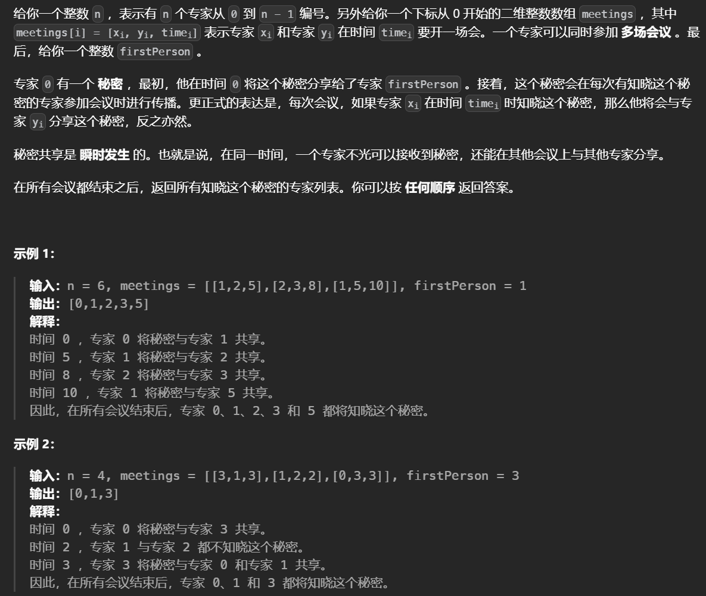

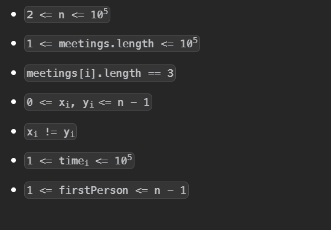


这道题是对时间有要求的，如果a和b在t1时刻开会（a知晓秘密）,而b和c在t2时刻开会（t2<t1）那么c是不会知晓秘密的，需要使用可撤销的并查集

同时对于同一时刻具有瞬时性，因此要把数组按照时间排序，把同一时刻的分为一组同时处理

```python
class UF:
    def __init__(self, n):
        self.count = n
        self.parent = [i for i in range(n)]
        self.size = [1 for _ in range(n)]

    def union(self, p, q):
        rootp = self.find(p)
        rootq = self.find(q)
        if rootq == rootp:
            return
        # 小的连接到大的上面去
        if self.size[rootq] < self.size[rootp]:
            self.parent[rootq] = rootp
            self.size[rootp] += self.size[rootq]
        else:
            self.parent[rootp] = rootq
            self.size[rootq] += self.size[rootp]
        self.count -= 1

    def connect(self, p, q):
        rootp = self.find(p)
        rootq = self.find(q)
        return rootq == rootp

    def find(self,p):
        if self.parent[p]!=p:
            self.parent[p]=self.find(self.parent[p])
        return self.parent[p]
    def isolate(self,x):
        self.parent[x]=x
        
class Solution:
    def findAllPeople(self, n: int, meetings: List[List[int]], firstPerson: int) -> List[int]:
        uf=UF(n)
        #初始
        uf.union(0,firstPerson)
        f=defaultdict(list)
        # 分组
        for x,y,t in meetings:
            f[t].append([x,y])
        for v in sorted(f.keys()):
            nums=f[v]
            # 对于同一时刻的两个人先把它们连接起来，如果当前没有知晓秘密那么可能由同一时刻的其他人知晓秘密
            for x,y in nums:
                uf.union(x,y)
            #再次遍历，不知晓秘密的两个人不应该连接，因为如果在下一个时刻某一个人知晓了秘密会导致前一时刻的另个人知晓秘密。
            for x,y in nums:
                if not uf.connect(x,0):
                    uf.isolate(x)
                    uf.isolate(y)
     
        return [i for i in range(n) if uf.connect(0,i)]
```

### [移除最多的同行或同列石头](https://leetcode.cn/problems/most-stones-removed-with-same-row-or-column/)

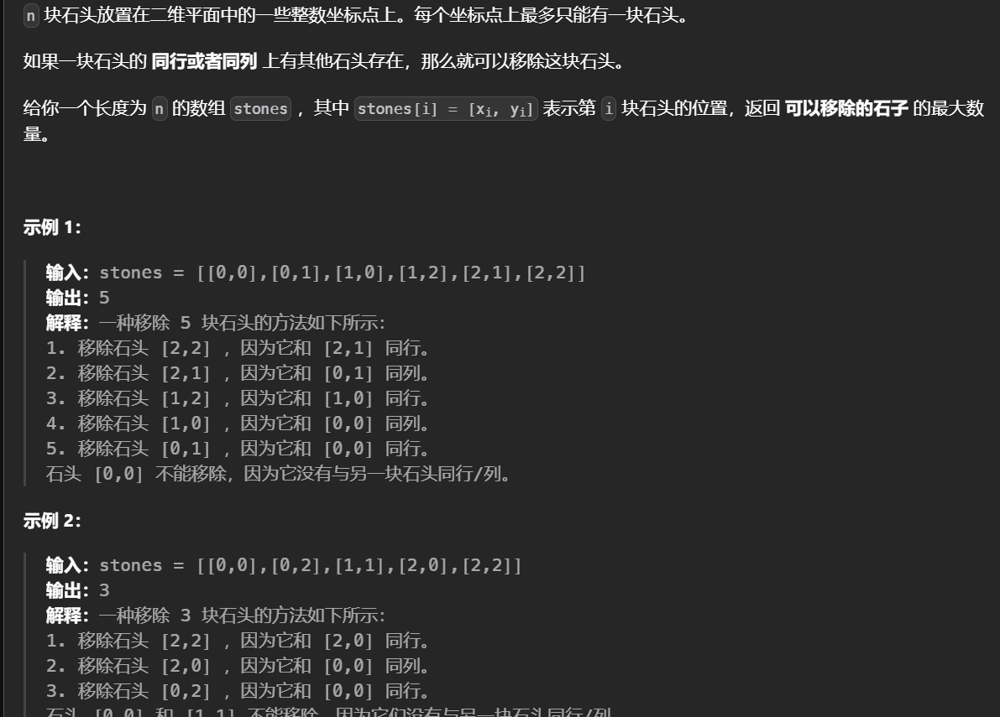

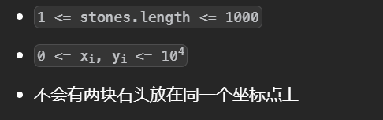


把每个石子看作是图上的一个点，那么行列相同的属于同一个连通块，一个连通块一定可以去除到只剩一个点，因此最后的结果就是所有的石子减去连通块的个数。

```python
# 完整模板
# 迭代方式的find函数要配合size使用
class UF:
    def __init__(self, n):
        self.count = n
        self.parent = [i for i in range(n)]
        self.size = [1 for _ in range(n)]

    def union(self, p, q):
        rootp = self.find(p)
        rootq = self.find(q)
        if rootq == rootp:
            return
        # 小的连接到大的上面去
        if self.size[rootq] < self.size[rootp]:
            self.parent[rootq] = rootp
            self.size[rootp] += self.size[rootq]
        else:
            self.parent[rootp] = rootq
            self.size[rootq] += self.size[rootp]
        self.count -= 1

    def connect(self, p, q):
        rootp = self.find(p)
        rootq = self.find(q)
        return rootq == rootp

    def find(self,p):
        if self.parent[p]!=p:
            self.parent[p]=self.find(self.parent[p])
        return self.parent[p]
    # 并查集的撤销
    def isolate(self,x):
        self.parent[x]=x

class Solution:
    def removeStones(self, stones: List[List[int]]) -> int:
        n=len(stones)
        uf=UF(n)
        row={}
        col={}
        for i,(u,v) in enumerate(stones):
            if u not in row:row[u]=i
            else:uf.union(row[u],i)
            if v not in col:col[v]=i
            else:uf.union(col[v],i)
        return n-uf.count

```

### [使子数组元素和相等](https://leetcode.cn/problems/make-k-subarray-sums-equal/)

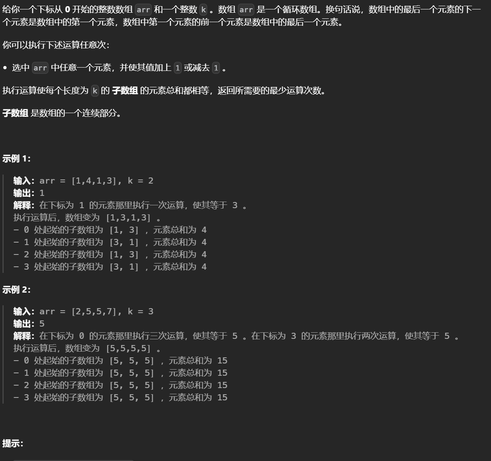

明显的中位数贪心关键在于如何把需要相等的归为一组，可以用并查集来归类

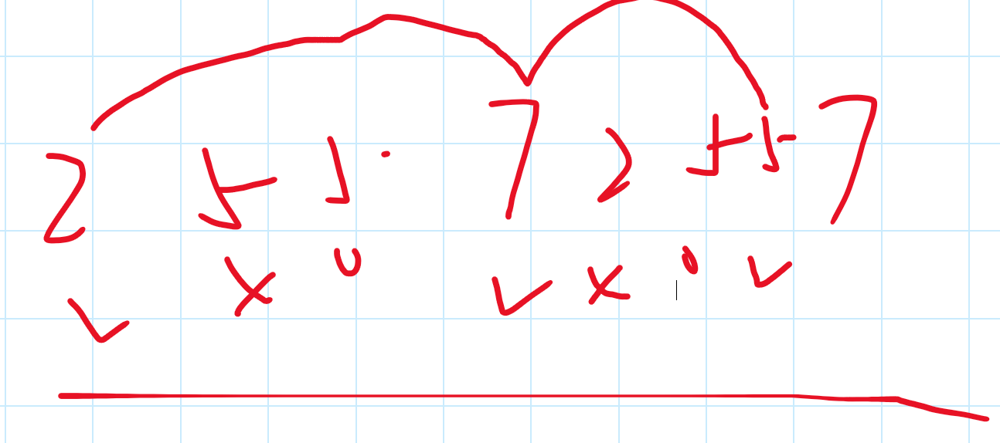

```python
class UF:
    def __init__(self, n):
        self.count = n
        self.parent = [i for i in range(n)]
        self.size = [1 for _ in range(n)]

    def union(self, p, q):
        rootp = self.find(p)
        rootq = self.find(q)
        if rootq == rootp:
            return
        # 小的连接到大的上面去
        if self.size[rootq] < self.size[rootp]:
            self.parent[rootq] = rootp
            self.size[rootp] += self.size[rootq]
        else:
            self.parent[rootp] = rootq
            self.size[rootq] += self.size[rootp]
        self.count -= 1

    def connect(self, p, q):
        rootp = self.find(p)
        rootq = self.find(q)
        return rootq == rootp

    def find(self,p):
        if self.parent[p]!=p:
            self.parent[p]=self.find(self.parent[p])
        return self.parent[p]
    # 并查集的撤销
    def isolate(self,x):
        self.parent[x]=x
class Solution:
    def makeSubKSumEqual(self, arr: List[int], k: int) -> int:
        n=len(arr)
        uf=UF(n)
        memo=defaultdict(list)
        ans=0
        # 每个位置只需和后k个相连
        for i in range(n):uf.union(i,(i+k)%n)
        # 对每个位置去找根节点，把它们按照根节点归为一类
        for i in range(n):
            j=uf.find(i)
            memo[j].append(arr[i])
        for k,nums in memo.items():
            n=len(nums)
            nums.sort()
            if n&1:
                for v in nums:
                    ans+=abs(v-nums[n>>1])
            else:
                # 偶数长度的话，取中间两位的均值（上取整或下取整都操作一次取最小值）
                index=n//2
                x=(nums[index-1]+nums[index])//2
                for v in nums:
                    ans+=abs(v-x)
        return ans
```

### Where is the Pizza

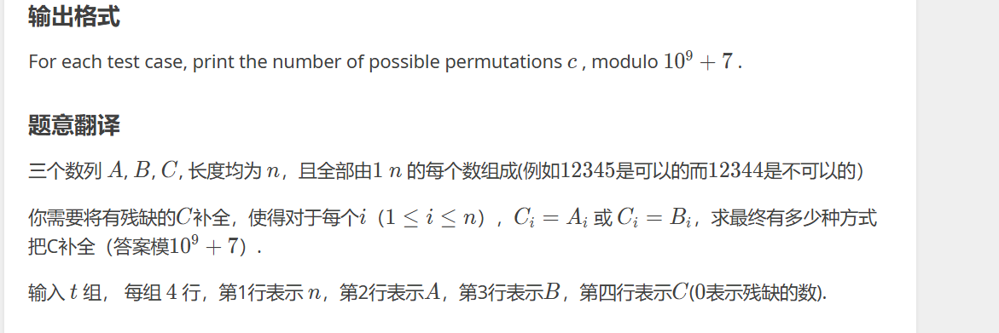

观察样例发现，先假设C中都没选择，这里如果第一个位置选择1那么第二个位置和第三个位置选择的结果也都是确定的，因为每个数组都是一个排列，可以把ab中的数字看作是环，连接a[i]和b[i]会得到1-2-3 4-7 5-6三个环，如果一个环的大小大于等于2那么他对答案啊的贡献是2，因为在第一个位置只有两种选择一旦选了其中一个那么剩下值的位置都是已经确定了的。如果环的大小为1也就只有一个选择。如果c[i]中有值那么也就是确定了一个环，最后的答案等于2^m，其中m是所有大于等于2的环的格式且对应的c[i]不为0


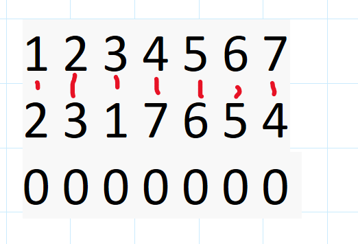

```python
from collections import deque, defaultdict, Counter
from functools import lru_cache
from bisect import bisect_left
from itertools import accumulate
from math import ceil, inf
import sys
from typing import List
input = sys.stdin.readline
def R(): return int(input())
def RR(): return [int(x) for x in input().split()]
def get_pre(nums): return list(accumulate(nums, initial=0))
mod=10**9+7
class UF:
    def __init__(self, n):
        self.count = n
        self.parent = [i for i in range(n)]
        self.size = [1 for _ in range(n)]

    def union(self, p, q):
        rootp = self.find(p)
        rootq = self.find(q)
        if rootq == rootp:
            return
        # 小的连接到大的上面去
        if self.size[rootq] < self.size[rootp]:
            self.parent[rootq] = rootp
            self.size[rootp] += self.size[rootq]
        else:
            self.parent[rootp] = rootq
            self.size[rootq] += self.size[rootp]
        self.count -= 1

    def connect(self, p, q):
        rootp = self.find(p)
        rootq = self.find(q)
        return rootq == rootp

    def find(self,p):
        if self.parent[p]!=p:
            self.parent[p]=self.find(self.parent[p])
        return self.parent[p]
    # 并查集的撤销
    def isolate(self,x):
        self.parent[x]=x

for _ in range(R()):
    n=R()
    a=RR()
    b=RR()
    c=RR()
    ans=1
    uf=UF(n+1)
    # 连接a和b，如果c存在那么这个环无贡献，把他和0相连后面做判断
    for i,k in enumerate(zip(a,b)):
        l,r=k
        uf.union(l,r)
        if c[i]:
            uf.union(0,l)
    memo=Counter()
    # 求解一个环的大小
    for i in range(1,n+1):
        p=uf.find(i)
        memo[p]+=1

    for k,v in memo.items():
        # 只有长度大于等于2且不包含c[i]!=0的环才有贡献
        if v>=2 and not uf.connect(0,k):ans*=2
        ans%=mod
    print(ans)

```


### [新增道路查询后的最短距离 II](https://leetcode.cn/problems/shortest-distance-after-road-addition-queries-ii/)

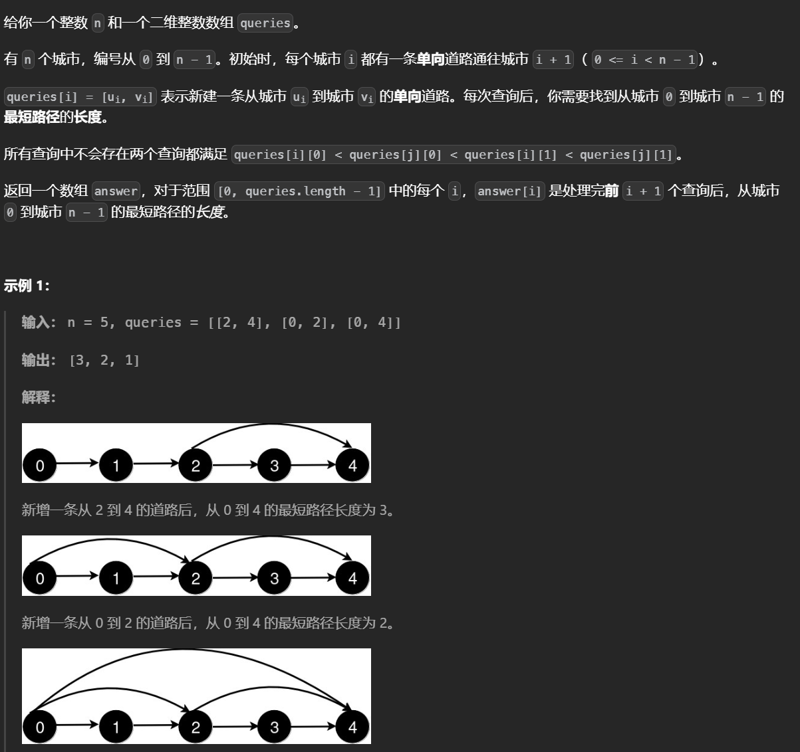

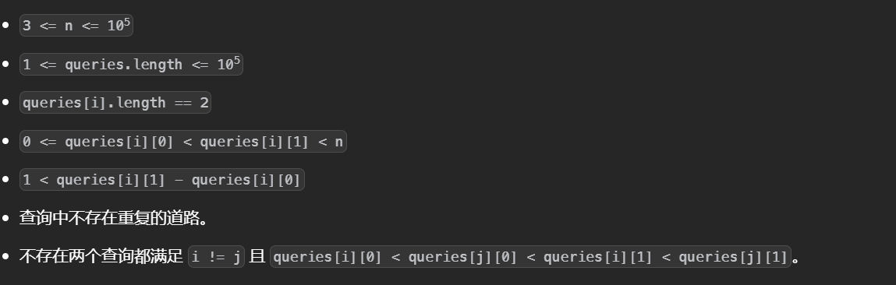


可以发现如果在两个点之间加了一条边那么从起点走到终点必然要经过这条边才能使路径最短，同时有条件两个新边不会交叉重叠，那么每次添加一条边就可以视为将范围内的边合并为一条边，同时起点到终点的距离就是边的个数，如果把每个边视为点那么答案就是连通分量的大小。

```python
class Solution:
    def shortestDistanceAfterQueries(self, n: int, queries: List[List[int]]) -> List[int]:
        uf=UF(n-1)
        ans=[]
        # 这里用点数减一表示边数
        for u,v in queries:
            l=uf.find(u)
            while l<v-1:
                # 实际操作中，需要跳过一些已经是连通块的点，因此把每个点的父节点设置为右边的点，这样方便跳过
                uf.parent[l]=l+1
                uf.count-=1
                l+=1
                # 通过find函数跳到遇到的连通块的父节点
                l=uf.find(l)
            ans.append(uf.count)
        return ans
```


## 最小生成树算法(prim)

###  模板

边权是负数或者存在环无影响，算法的实现类似于迪杰斯特拉，并且时间复杂度也是O(n^2)，不过区别在于前者是找每个点与起点的最短距离而后者是找每个点与集合的最短距离

每次遍历过程中，选出与集合距离最近的点然后将与这个点相连的点到集合的距离更新，之后把这个点加入到集合，一直往下。如果图是不连通的，那么不存在最小生成树。

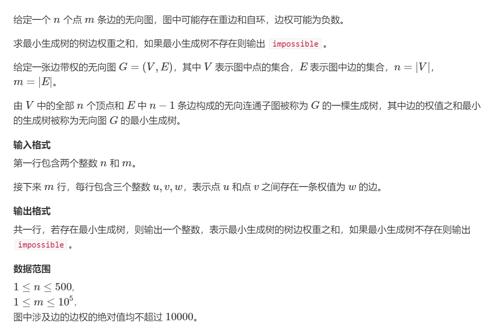

实现中会以0作为集合的第一个元素

```python
from math import inf
n,m=[int(x) for x in input().split()]
grid=[[inf]*n for _ in range(n)]
for _ in range(m):
    u,v,w =[int(x)-1 for x in input().split()]
    # 一般的最小生成树问题都是无向图，注意这里可能存在重边
    grid[u][v]=grid[v][u]=min(grid[u][v],w+1)
    
def prim():
    vis=[False]*n
    # dis数组定义的是每个点到集合的距离
    dis=[inf]*n
    res=0
    for i in range(n):# 就是while i
        x=-1
        for j in range(n):
            # 选出到集合最近的点
            if not vis[j] and (x==-1 or dis[x]>dis[j]):
                x=j
         # 如果不是第一次选（第一次会选到0）并且距离集合最近的点的距离都是无穷，那么图是不连通的
        if x and (x<0 or dis[x]==inf) :
            return inf
        # 如果不是第一次，记录
        if i: res+=dis[x]
        vis[x]=True
        # 更新其他点到集合的距离，这里使用领接矩阵实现的因此遍历所有
        for j in range(n):dis[j]=min(dis[j],grid[x][j])
    return res
res=prim()
if res==inf :
    print('impossible')
else:
    print(res)
        
    
```


以下是根堆版本的，时间复杂度为O(mlogn)

```python
from math import inf
import heapq
from collections import defaultdict

n,m=[int(x) for x in input().split()]

grid=defaultdict(dict)

for _ in range(m):
    u,v,w =[int(x)-1 for x in input().split()]
    if v not in grid[u]:
        grid[u][v]=w+1
    else:
        grid[u][v]=min(grid[u][v],w+1)
    grid[v][u]=grid[u][v]
    
def prim():
    vis=[False]*n
    memo=set()
    dis=[inf]*n
    
    # 不对原dis数组操作
    nums=[(v,i) for i,v in enumerate(dis)]
    heapq.heapify(nums)
    
    res=time=0
    
    # 当包含了所有的点就退出
    while time<n:
        # 弹出距离集合最近的点
        val,j =heapq.heappop(nums)
        # 如果不是第一次并且记录无限远，说明图是不连通的
        if time and val==inf:
            return inf
        # 没有访问过
        elif vis[j]:
            continue
            
        vis[j]=True
        
        if time: res+=dis[j]
        # 找相邻的边，更新加入
        for k in grid[j].keys():
            # 注意这里是j到k的距离，也就是k到集合的距离
            dis[k]=min(dis[k],grid[j][k])
            if (dis[k],k) not in memo and not vis[k]:
                memo.add((dis[k],k))
                heapq.heappush(nums,(dis[k],k))
        time+=1
            
    return res
res=prim()
if res==inf :
    print('impossible')
else:
    print(res)
        
    
```


### [ 最低成本连通所有城市](https://leetcode.cn/problems/connecting-cities-with-minimum-cost/)

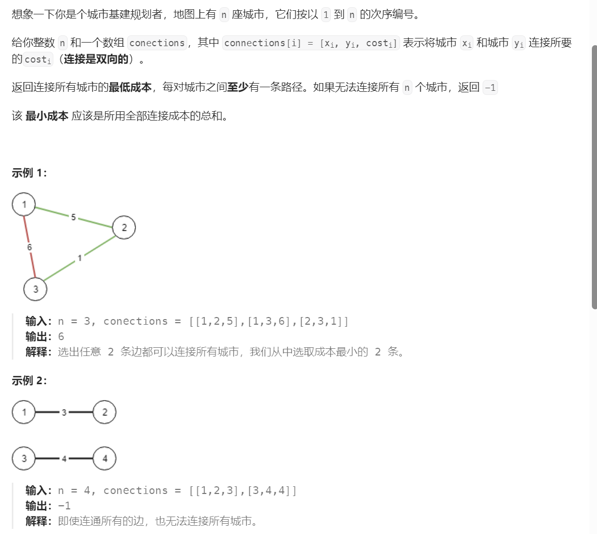

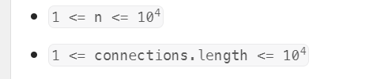

由给定的数据可知只能用根堆优化的prim算法

```python
from math import inf
import heapq
from collections import defaultdict
class Solution:
    def minimumCost(self, n: int, connections) -> int:
        path=defaultdict(dict)
        for u,v,w in connections:
            u-=1
            v-=1
            if v in path[u]:
                path[u][v]=min(path[u][v],w)
            else:
                path[u][v]=w
            path[v][u]=path[u][v]
        def prim():
            dis=[inf]*n
            nums=[(val,i) for i,val in enumerate(dis)]
            heapq.heapify(nums)
            res=time=0
            vis=[False]*n
            memo=set()
            while time<n:
                val,i =heapq.heappop(nums)
                if val ==inf and time:
                    return -1
                elif vis[i]:continue
                if time:res+=dis[i]
                vis[i]=True
                for j,v in path[i].items():
                    dis[j]=min(dis[j],v)
                    if (dis[j],j) not in memo:
                        memo.add((dis[j],j))
                        heapq.heappush(nums,(dis[j],j)) 
                time+=1
            return res
        return prim()
```


## 最小生成树之Kruskal算法

最小生成树（Minimum Spanning Tree，MST）是一个在连接所有图的顶点的同时具有最小总权重的树形子图。在一个连通的带权无向图中，生成树是原图的一个子图，它包含了图中的所有顶点，并且是一棵树，没有包含任何环路。树与图的区别是树没有环。

首先对所有的边排序然后从最小的边开始遍历，如果二者不连通则连接上同时累加权重，**最后判断是否连通分量等于1（即n个点n-1条边）**

最小生成树算法可以用于求最短路


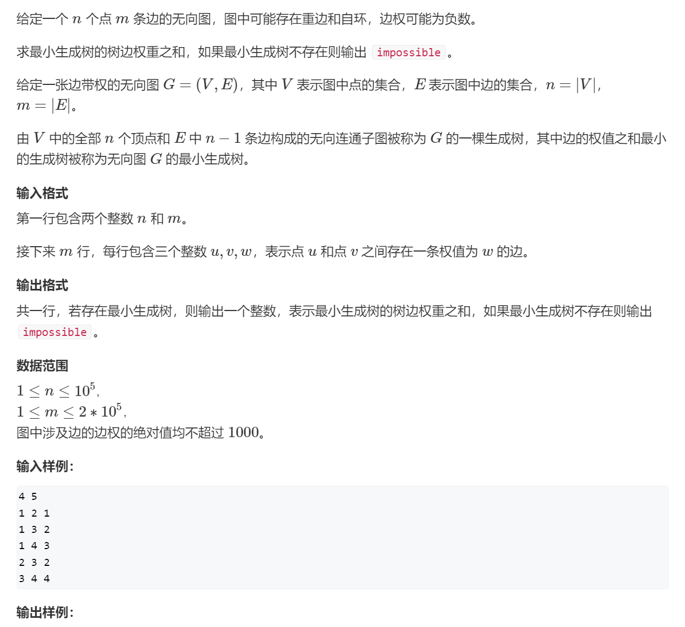

```python
class UF:
    def __init__(self,n):
        self.p=[i for i in range(n)]
        self.count=n
        self.size=[1 for _ in range(n)]
    def find(self,x):
        d=self
        if d.p[x]!=x:
            d.p[x]=d.find(d.p[x])
        return d.p[x]
    def union(self,x,y):
        d=self
        u=d.find(x)
        v=d.find(y)
        if u==v:
            return
        if d.size[u]<d.size[v]:
            d.size[v]+=d.size[u]
            d.p[u]=d.p[v]
        else:
            d.size[u]+=d.size[v]
            d.p[v]=d.p[u]
        d.count-=1
    def connect(self,x,y):
        d=self
        u=d.find(x)
        v=d.find(y)
        return v==u
    def judge(self):
        return self.count==1
n,m=[int(x) for x in input().split()]
edges=[]
for _ in range(m):
    edges.append(list(map(int,input().split())))
edges.sort(lambda x:x[2])

uf=UF(n)
res=0
for i in range(m):
    u,v,w =edges[i]
    u-=1
    v-=1
    if not uf.connect(u,v):
        uf.union(u,v)
        res+=w
if uf.judge():
    print(res)
else:
    print('impossible')
```

时间复杂度为O(mlogm+m)


#### 最低成本联通城市


城市看作是节点，城市之间联通成本看作是权重，联通城市的最小成本即最小生成树的权重之和。每座城市之间至少有一条路径的，并要求最小成本，这就避免了环的出现，因为环的出现多此一举要花费更多的成本。

最小生成树问题，最小生成树是若干边的集合，这些边需要满足：保证包含图中所有节点，形成的结构不包含环，权重和最小。

其中前两点在遍历所有节点构造的同时，判断两个节点之间是否相连即可满足，权重最小利用贪心的思想，将所有边按照权重从小到达排序，从权重最小的边开始遍历，如果这条边和最小生成树中的其他边不会形成环，就将其加入到最小生成树，反之不加入

```python
def minimumCost(n,connection):
    connection=sorted(connection,key=lambda x:x[2])# 按照权重升序排序
    uf =UF(n+1)# 因为城市从1开始
    weight=0
    for connect in connection:
        p=connect[0]
        q=connect[1]
        w=connect[2]
        if uf.connect(p,q):
            continue
        weight+=w
        uf.union(p,q)
    # 0节点没有操作，所以连通分量应该是2，如果不是2说明存在没有连接上的，可能是会形成环。
    return weight if uf.count()==2else -1
```

#### 联通所有点的最小费用

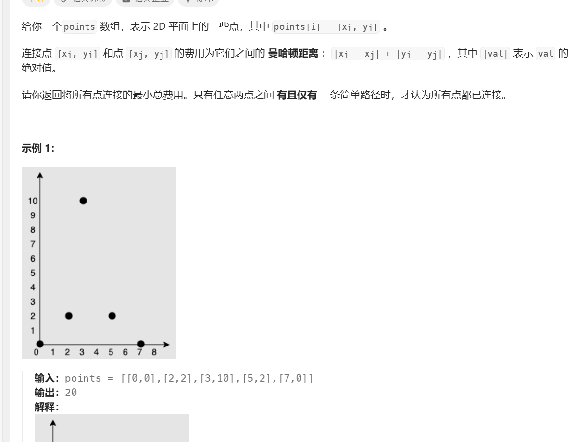

最小生成树问题，

```python
class UF:
    def __init__(self, n):
        self.count = n
        self.parent = [i for i in range(n)]
        self.size = [1 for _ in range(n)]

    def union(self, p, q):
        rootp = self.find(p)
        rootq = self.find(q)
        if rootq == rootp:
            return
        if self.size[rootq] < self.size[rootp]:
            self.parent[rootq] = rootp
            self.size[rootp] += self.size[rootq]
        else:
            self.parent[rootp] = rootq
            self.size[rootq] += self.size[rootp]
        self.count -= 1

    def connect(self, p, q):
        rootp = self.find(p)
        rootq = self.find(q)
        return rootq == rootp

# 递归，最终返回树的根节点
	def find(self,x):
    # 递归终止的条件是找到根节点
		if self.parent[x]!=x:
        	#在递归过程中把每一个节点的父节点设置为根节点
			self.parent[x]=self.find(self.parent[x])
    	return self.parent[x]
    def count(self):
        return self.count
class Solution(object):
    def minCostConnectPoints(self, points):
        connection=[]
        # 计算出每个节点之间的权重
        for i in range(len(points)):
            for j in range(i+1,len(points)):
                x_i=points[i][0]
                y_i=points[i][1]
                x_j = points[j][0]
                y_j = points[j][1]
                # 每个节点是一个坐标，选择将节点映射为它在points中的索引
                connection.append((i,j,abs(x_i-x_j)+abs(y_i-y_j)))
        # 按照权重排序
        connection=sorted(connection,key=lambda x:x[2])

        uf =UF(len(points))
        mst=0
        for connect in connection:
            # 避免多余的迭代
            if uf.count==1:
                break
            p=connect[0]
            q=connect[1]
            w=connect[2]
            if uf.connect(p,q):
                continue
            uf.union(p,q)
            mst+=w
        return mst 
```


#### [最小体力消耗路径](https://leetcode.cn/problems/path-with-minimum-effort/)


由于可以向任意方向移动因此不能使用dp，根据给定的数据范围使用dfs会超时，这里使用最小生成树算法，但不是要加入所有子树而是遇到目标值就停止。

```python
class UF:
    def __init__(self, n):
        self.count = n
        self.parent = [i for i in range(n)]
        self.size = [1 for _ in range(n)]

    def union(self, p, q):
        rootp = self.find(p)
        rootq = self.find(q)
        if rootq == rootp:
            return
        # 小的连接到大的上面去
        if self.size[rootq] < self.size[rootp]:
            self.parent[rootq] = rootp
            self.size[rootp] += self.size[rootq]
        else:
            self.parent[rootp] = rootq
            self.size[rootq] += self.size[rootp]
        self.count -= 1

    def connect(self, p, q):
        rootp = self.find(p)
        rootq = self.find(q)
        return rootq == rootp

    def find(self,p):
        if self.parent[p]!=p:
            self.parent[p]=self.find(self.parent[p])
        return self.parent[p]
class Solution:
    def minimumEffortPath(self, g: List[List[int]]) -> int:
        m,n=len(g),len(g[0])
        uf=UF(m*n)
        path=[]
        
        vis=set()
        # 建图
        for i in range(m):
            for j in range(n):
                vis.add(i*n+j)
                for dx ,dy in (1,0),(0,1),(-1,0),(0,-1):
                    if 0<=(x:=dx+i)<m and 0<=(y:=dy+j)<n and x*n+y not in vis:
                        path.append([i*n+j,x*n+y,abs(g[i][j]-g[x][y])])
        # 按照权重排序
        path.sort(key=lambda x:x[2])
        for u,v,w in path:
            # 连接
            uf.union(u,v)
            # 两个目标值已经相连，直接返回权重，这个权重就是路径上最大的且是所有路径中最小的
            if uf.connect(0,m*n-1):
                return w
        return 0
        
```


### [水资源分配优化](https://leetcode.cn/problems/optimize-water-distribution-in-a-village/)

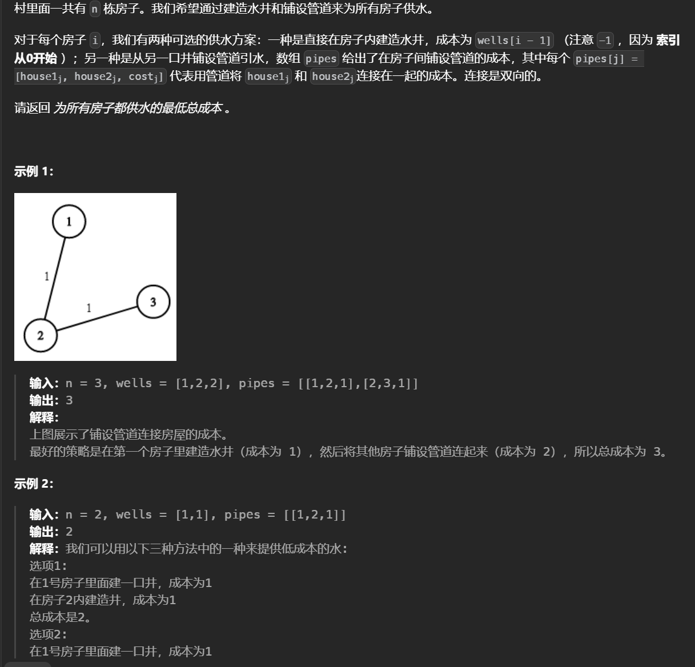

把水井看作是一个超级源点那么问题就变为了求解最小生成树。

```python
class UF:
    def __init__(self,n):
        self.p=[i for i in range(n)]
        self.count=n
        self.size=[1 for _ in range(n)]
    def find(self,x):
        d=self
        if d.p[x]!=x:
            d.p[x]=d.find(d.p[x])
        return d.p[x]
    def union(self,x,y):
        d=self
        u=d.find(x)
        v=d.find(y)
        if u==v:
            return
        if d.size[u]<d.size[v]:
            d.size[v]+=d.size[u]
            d.p[u]=d.p[v]
        else:
            d.size[u]+=d.size[v]
            d.p[v]=d.p[u]
        d.count-=1
    def connect(self,x,y):
        d=self
        u=d.find(x)
        v=d.find(y)
        return v==u
    def judge(self):
        return self.count==1
class Solution:
    def minCostToSupplyWater(self, n: int, wells: List[int], edges: List[List[int]]) -> int:
        for i,v in enumerate(wells,1):
            edges.append([0,i,v])
        edges.sort(key=lambda x:x[-1])
        ans=0
        uf=UF(n+1)
        for u,v,w in edges:
            if not uf.connect(u,v):
                ans+=w
                uf.union(u,v)
        return ans 
```


## 二分图

二分图就是可以把所有的点分为两部分，这两部分内部不存在边，而边只存在于两个图之间。

二分图一定不含奇数环


### 判断二分图

使用红蓝染色法进行判断，用bfs实现，使用dfs爆栈，注意自边不能忽略

```python
from collections import defaultdict, deque

n, m = [int(x) for x in input().split()]
path = defaultdict(set)
color = [-1] * n

for _ in range(m):
    u, v = [int(x) - 1 for x in input().split()]
    # 无向图
    path[u].add(v)
    path[v].add(u)


def bfs(i, c):
    d = deque()
    d.append(i)
    # 标记颜色
    color[i] = c
    while d:
        sz = len(d)
        for _ in range(sz):
            curr = d.popleft()
            for j in path[curr]:
                # 如果没有染色，标记颜色为相反的加入队列
                if color[j] == -1:
                    color[j] = 1 - c
                    d.append(j)
                # 如果染了色并且颜色矛盾
                elif color[j] == c:
                    return False
        # 变更颜色，1变为0，0变为1，通过用1减去快速转换
        c = 1 - c
    return True


for i in range(n):
    if color[i] == -1:
        if not bfs(i, 0):
            print('No')
            break
else:
    print('Yes')
```


### [可能的二分法](https://leetcode.cn/problems/possible-bipartition/)

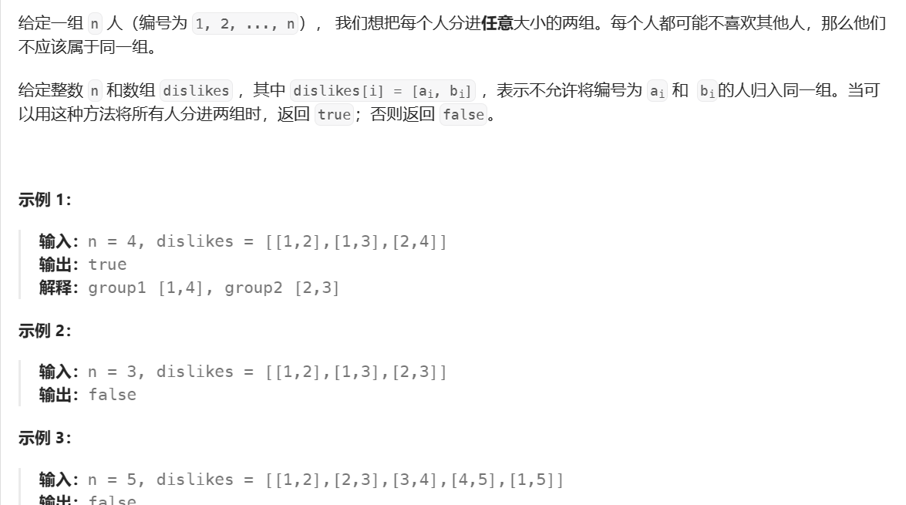

问题是对于给定的数据是否可以划分出一个二分图，使用红蓝染色法判定。

```python
class Solution:
    def possibleBipartition(self, n: int, dislikes: List[List[int]]) -> bool:
        path=defaultdict(dict)
        for u,v in dislikes:
            v-=1
            u-=1
            path[u][v]=None
            path[v][u]=None
        color=[-1]*n
        def bfs(i,c):
            d=deque()
            d.append(i)
            color[i]=c
            while d:
                for _ in range(len(d)):
                    curr=d.popleft()
                    for k in path[curr].keys():
                        if color[k]==-1:
                            color[k]=color[curr]^1
                            d.append(k)
                            vis.add(k)
                        elif color[curr]==color[k]:return False
                        
        
            return True
        vis=set()
        for i in range(n):
            if i in vis:continue
            if not bfs(i,0):return False
        return True

```


### 二分图最大匹配

使用匈牙利算法，时间复杂度为O(mn)

匹配指的是**任意两条边都不会依附于同一个点**，而最大匹配找的就是最多的匹配数。

基本的思路是把匹配的过程视为找男女朋友，遍历所有的男生找与他相匹配的女生，如果这个女生没有男朋友就是为他们两个匹配，如果有男朋友看看它的男朋友是否能换一个女生，如哦能皆大欢喜反之不能匹配。

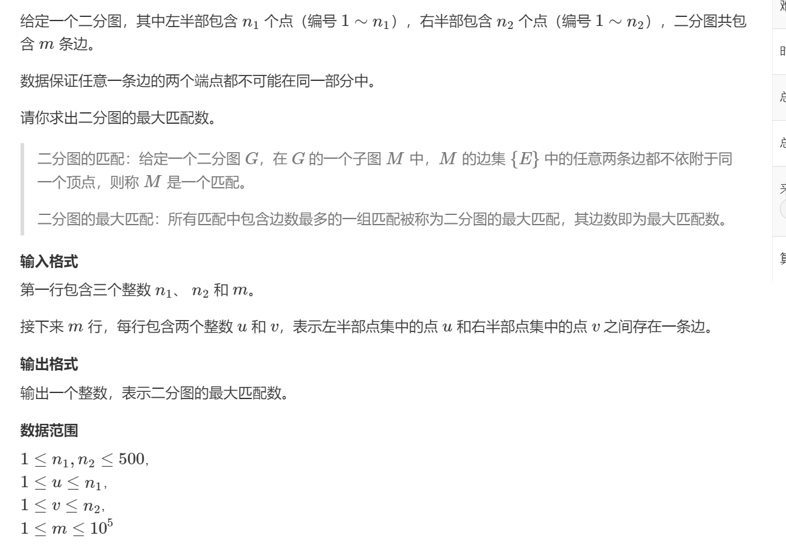

```python
from collections import defaultdict

n1, n2, m = [int(x) for x in input().split()]
path = defaultdict(set)
# 建图只需要建立一边，另一部分不会被考虑
for _ in range(m):
    u, v = [int(x) - 1 for x in input().split()]
    path[u].add(v)

# 构建数组，表示当前女生的男朋友是
match = [-1] * n2

# 该函数返回当前男生是否能匹配成功
def find(u):
    # 找中意的女生
    for k in path[u]:
        # 这个女生没有被考虑过
        if not st[k]:
            # 标记
            st[k] = True
            # 如果这个女生没有男朋友或者说可以叫他的男朋友换一个（递归函数实现），成功
            if match[k]==-1 or find(match[k]):
                # 记录
                match[k]=u
                return True
    return False

res = 0
# 遍历所有的男生
for i in range(n1):
    # 该数组标记女生有没有考虑过，每次循环更新一遍
    st = [False] * n2
    if find(i):
        # 累加
        res += 1
print(res)
```


## 接雨水

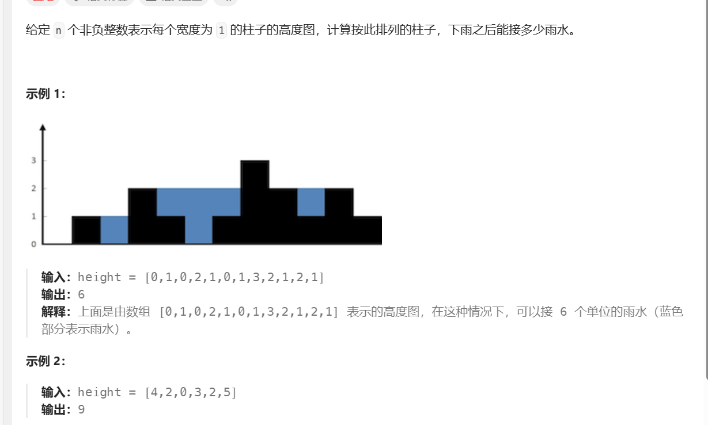

从局部看，每个位置能接到的雨水数与它左右柱子的最大高度有关，nums[i]=min(max(height[:i]),max(height[i+1:])再减去它本身的高度

```python
class Solution(object):
    def trap(self, height):
        res=0

        l_max=[]
        r_max=[]
		# 使用两个数组记录位置i左右主子的最大高度
        for i in range(1, len(height) - 1):
            l_max.append(max(height[:i]))
            r_max.append(max(height[i+1:]))

        for i in range(1,len(height)-1):
            # 最有最高的柱子中最小的那个能决定水柱的高度
            val=min(l_max[i-1],r_max[i-1])-height[i]
            # 如果这个值小于0，不考虑
            if val>=0:
                res+=val
        return res
```

使用双指针可以优化空间复杂度，时间复杂度大大降低

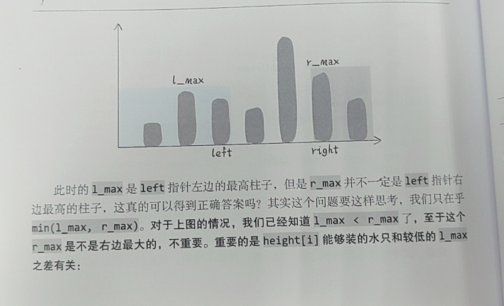


```python
class Solution(object):
    def trap(self, height):
        left=0
        right=len(height)-1
        
        l_max=0
        r_max=0
        
        res=0
        
        while left<right:
            
            l_max=max(l_max,height[left])
            r_max=max(r_max,height[right])
            
            if l_max>r_max:
                res+=r_max-height[right]
                right-=1
            else:
                res+=l_max-height[left]
                left+=1
        return res
```


## 盛水最多的容器

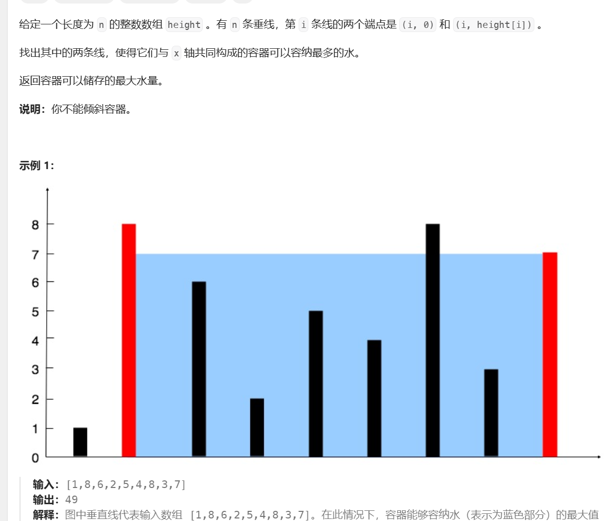

线条没有宽度，可以直接求解。

```python
class Solution(object):
    def maxArea(self, height):
        left=0
        right=len(height)-1
        res=0

        while left<right:
            res=max(res,min(height[right],height[left])*(right-left))
            # 移动较小的边，只有移动较小的边才有可能使面积变大，像移动较大的边得到更大的边不存在，英文只有较小边才能决定面积
            if height[right]>height[left]:
                left+=1
            else:
                right-=1
        return res
```


## nsum问题

2sum问题：假设输入一个数组nums和一个目标和target，请你返回数组中能够凑出target的两个元素。

对于一般的2sum问题，直接使用排序加双指针，但是如果数组中有重复元素就需要做一些改进。

```python
def nsum(nums,target):
    
    # 排序
    nums.sort()
    
    # 记录结果
    res=[]
    
    # 左右指针
    l=0
    r=len(nums)-1
    
    while l<r:
        sum=nums[l]+nums[r]
    	# 记录左右的值    
        left=nums[l]
        right=nums[r]
        
        # 判断大小
        if sum<target:
            while l<r and nums[left]==left :
                left+=1
            l+=1
        
        elif sum>target:
            while l<r and nums[right]==right:
                right-=1
            r-=1
        
    	else:
             # 不断跳过
            while l<r and nums[left]==left :
                left+=1
            while l<r and nums[right]==right:
                right-=1
            res.append((nums[l],nums[r]))
    return res
```

### 三数之和

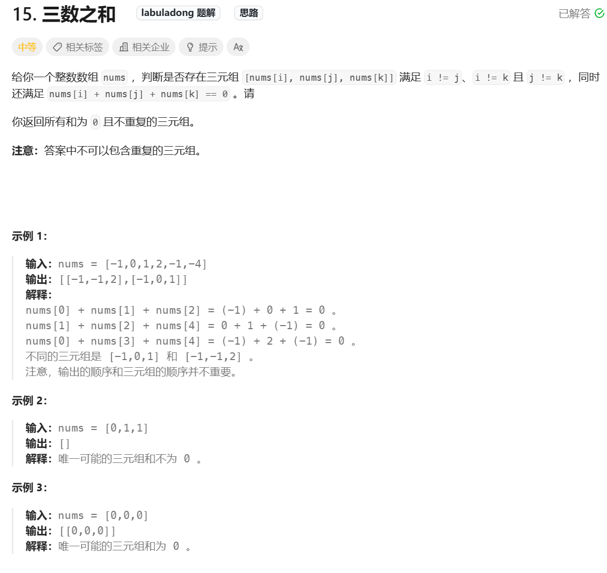

三个数字的和可以转换为求两个数字的和

```python
class Solution(object):
    def threeSum(self, nums):
        # 求两数之和的函数
        def twosum(nums,start, target):
            res = []
            l = start
            r = len(nums) - 1

            while l < r:
                sum = nums[l] + nums[r]

                left = nums[l]
                right = nums[r]

                if sum < target:
                    l += 1
                elif sum > target:
                    r -= 1
                else:
                    res.append([nums[l], nums[r]])
                    while l < r and nums[l] == left:
                        l+= 1
                    while l < r and nums[r] == right:
                        r-= 1
                    
            return res

        res=[]
        nums.sort()

        # 遍历每一个数字，以它为基准求两个数之和
        for i in range(len(nums)):
            # 跳过重复元素
            if i > 0 and nums[i] == nums[i - 1]:
                continue
            
            tuples=nsum(nums,i+1,0-nums[i])
            for tuple_ in tuples:
                # 记得加入
                tuple_  .append(nums[i])
                res.append(tuple_)
        return res
```

### 4sum之和

该问题可以复用3sum的代码，问题可以延申的100sum之和，实现一个100sum之和的函数：

```python 
class Solution(object):
    def fourSum(self, nums, target):
		# n表示几数之和，start表示开始位置
        def nsum(nums, n, start, target):
            res = []
            # 至少是 2Sum，且数组大小不应该小于 n
            if n < 2 or len(nums) < n:
                return res
            # 2Sum 是 base case
        		elif n == 2:
                l = start
                r = len(nums) - 1
               # 使用数组双指针
                while l < r:
                    left = nums[l]
                    right = nums[r]
                    sum = nums[l] + nums[r]
                    if sum > target:
                        while l < r and nums[r] == right:
                            r -= 1
                    elif sum < target:
                        while l < r and nums[l] == left:
                            l += 1
                    else:
                        res.append([left, right])
                        while l < r and nums[l] == left:
                            l += 1
                        while l < r and nums[r] == right:
                            r-= 1
               
            else:
                # 大于2的话，递归计算
                for i in range(start, len(nums)):
                    # 跳过重复的数字
                    if i>start and nums[i]==nums[i-1]:
                        continue
                    # 以当前位置的值为基准，求和数减一，目标值减去当前位置的值，如果得不到合适的值返回的是一个空数组，下面的循环不会进行
                    subs = nsum(nums, n - 1, i + 1, target - nums[i])
                    # 得到结果后，加入当前位置的值
                    for sub in subs:
                        sub.append(nums[i])
                        res.append(sub)
                    
            return res
        
        nums.sort()
        return nsum(nums,4,0,target)
```


## 二分搜索算法

二分搜索的基本框架

```python 
def binarysearch(nums,target):
    left=0
    right=len(nums)-1# 令right=len(nums)-1,这里的区间是全闭的
    while left<=right:
        mid=left+(rihgt-left)/2# 防止溢出
		if target==nums[mid]:
			return mid
        elif target>nums[mid]:
			left=mid+1
        elif target<nums[mid]:
            right=mid-1
    return -1
```

注意结束的条件，while(left<=right)的终止条件是left= =right+1，例如[ 3 , 2 ]，这时候区间为空，而while (left<right) 终止条件为left==right，例如[2,2]区间中还有值但却结束了，导致漏掉一个值没有索引，如果使用<的话需要打补丁,return nums[left]= =target?left:-1

该二分搜索存在局限性，例如nums=[1,2,2,2,3]，target=2，返回的结果是索引2 ，无法找左右边界

如果找一个不存在的值，`如果二分搜索返回的是l，那结果就是数组中第一个大于该值的索引，如果返回的是r，就是数组中最后一个小于该值的索引，因为搜索退出的条件是l==r+1，而该值在数组中不存在，因此返回的是第一个大于该值的索引以及最后一个小于该值的索引`。

### 寻找左侧边界的二分搜索

```python
def binarysearch(nums,target):
    left=0
    right=len(nums)-1# 闭区间
    while left<=right:# 终止的条件是left==right+1，可能会超出边界
        mid=left+(rihgt-left)/2
        if target==nums[mid]:# 如果相等，更新上边界然后不断缩小,假如列表中只有一个目标值，最终left=right+1，不会错过目标值
			right=mid-1
        elif target>nums[mid]:
			left=mid+1
        elif target<nums[mid]:
            right=mid-1
    if left==len(nums):# 防止索引超出，先做判断
        return -1
    return nums[left]==target ?left:-1
```

### 寻找右侧边界的二分搜索（小于等于目标值）

```python
def binarysearch(nums,target):
    left=0
    right=len(nums)-1# 闭区间
    while left<=right:# 终止的条件是left==right+1，可能会超出边界
        mid=left+(rihgt-left)/2
        if target==nums[mid]:# 收缩左边界
			left=mid+1
        elif target>nums[mid]:
			left=mid+1
        elif target<nums[mid]:
            right=mid-1
    if right<0:# 防止索引超出，先做判断
        return -1
    return nums[right]==target ?right:-1
```

### 在排序数组中查找元素的第一个和最后一个位置

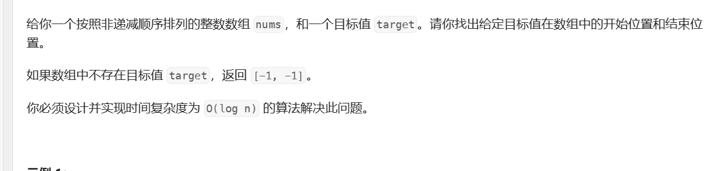

```python 
class Solution(object):
    def searchRange(self, nums, target):
        return [self.binarysearch_left(nums,target),self.binarysearch_right(nums,target)]
    def binarysearch_right(self,nums,target):
        left=0
        right=len(nums)-1
        while left<=right:
            mid=left+(right-left)/2
            if nums[mid]==target:
                left=mid+1
            elif nums[mid]>target:
                right=mid-1
            elif nums[mid]<target:
                left=mid+1
        if right<0:
            return -1
        return  right if nums[right]==target else-1

    def binarysearch_left(self,nums,target):
        left=0
        right=len(nums)-1
        while left<=right:
            mid=left+(right-left)/2
            if nums[mid]==target:
                right=mid-1
            elif nums[mid]>target:
                right=mid-1
            elif nums[mid]<target:
                left=mid+1
        if left>=len(nums):
            return -1
        return  left if nums[left]==target else-1
```

### [和为 K 的最少斐波那契数字数目](https://leetcode.cn/problems/find-the-minimum-number-of-fibonacci-numbers-whose-sum-is-k/)

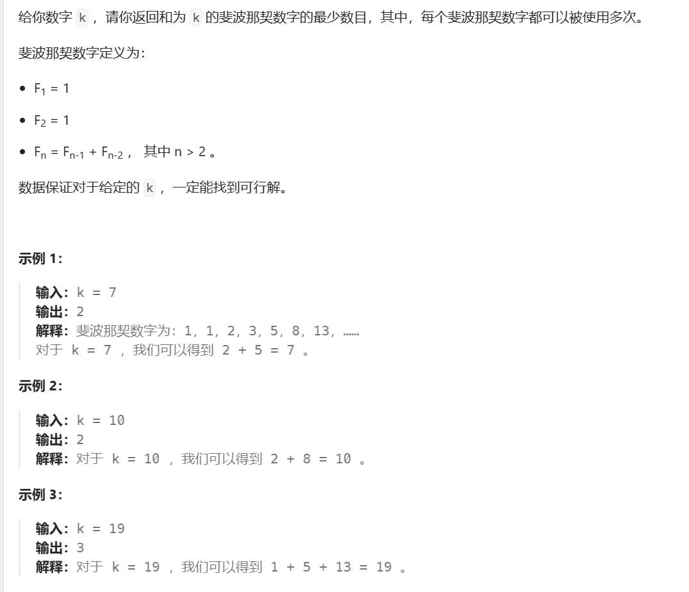

根据数据范围（10**9）可以直接构造出斐波那契数列表，斐波那契数列的增长很快，所以表长度不会很大，然后利用贪心每次选取其中的小于K的最大值，然后更新k值。


```python
class Solution:
    def findMinFibonacciNumbers(self, k: int) -> int:
        fibo=[1,1]
        ans=0
        # 建表
        while  fibo[-1]<=10**9:
            fibo.append(fibo[-1]+fibo[-2])

         # 每次找一个小于k的最大值最为选出的结果，注意要更新k
        while k!=0:
            l, r = 0, len(fibo)
            # 使用二分查找，下面的条件要选择是l<=r，因为r是可以取到的，如果不是小于等于的话会漏掉一个值
            while l<=r:
                mid=(l+r)//2
                val=fibo[mid]
                # 如果恰好能找到这个值，将r设置为mid，因为在循环结束后减去的是r的值
                if val==k:
                    r=mid
                    break
                # 以下按照一般的二分查找框架即可，最后如果在数列中找不到相等的值，最后退出循环的时候，r指的就是小于k的最大值，l值得是r后一位（有可能越界） 
                elif val>k:
                    r=mid-1
                else:
                    l=mid+1
            ans+=1
	   # 注意更新
            k-=fibo[r]
        return ans
Solution().findMinFibonacciNumbers(19)
```


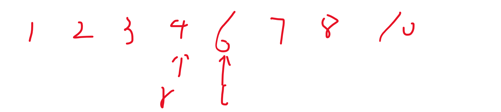

### [基于时间的键值存储](https://leetcode.cn/problems/time-based-key-value-store/)

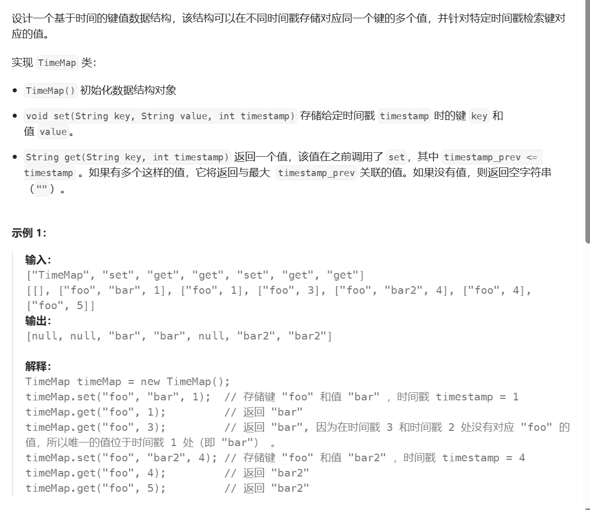

构建哈希表，key作为键，用一个数组作为值，数组中储存着时间和字符串，每次查找的时候对数组中存储的时间做二分搜索，因为时间是保证有序的。


```python
class TimeMap:

    def __init__(self):
        self.memo=defaultdict(list)
        self.count={}

    def set(self, key: str, value: str, timestamp: int) -> None:
        self.memo[key].append([timestamp,value])
        if key not in self.count:
            self.count[key]=timestamp
        else:
            self.count[key]=min(self.count[key],timestamp)
    def get(self, key: str, timestamp: int) -> str:
        li=self.memo[key]
        if key not in self.count:
            return ""
        elif timestamp<self.count[key]:
            return ""
        def binary_search(li,l,r):
            while l<=r:
                mid=(l+r)//2
                time=li[mid][0]
                if time<timestamp:
                    l=mid+1
                elif time>timestamp:
                    r=mid-1
                else:
                    return li[mid][1]
            return li[r][1]
        return binary_search(li,0,len(li)-1)
```

### [与目标颜色间的最短距离](https://leetcode.cn/problems/shortest-distance-to-target-color/)


找到目标索引附近的距某个颜色最近的距离，就是要找出一个最近的索引，对三个颜色的索引构建他们的索引数组，然后利用二分搜索算法即可。

```python
class Solution:
    def shortestDistanceColor(self, colors: List[int], queries: List[List[int]]) -> List[int]:
        # 使用字典，没必要进行判断选择那个数组
        c=defaultdict(list)
        ans=[]
        for i,v in enumerate(colors):
            c[v].append(i)
        for i,v in queries:
            # 找到位置
            index=bisect_left(c[v],i)
            # 如果不存在，存入-1
            if not c[v]:
                ans.append(-1)
            # 只有大于的索引
            elif index-1<0:
                ans.append(abs(c[v][index]-i))
            # 不存在大于这个值的最小索引，也就是所有的索引都小于，取其中zui'da'de
            elif index>=len(c[v]):
                ans.append(abs(c[v][index-1]-i))
            # 选择大于小于两个位置的距离的最小的那个
            elif abs(c[v][index-1]-i)<abs(c[v][index]-i):
                ans.append(abs(c[v][index-1]-i))
            else:
                ans.append(abs(c[v][index]-i))
        return ans 
```

### 最长上升子序列 II

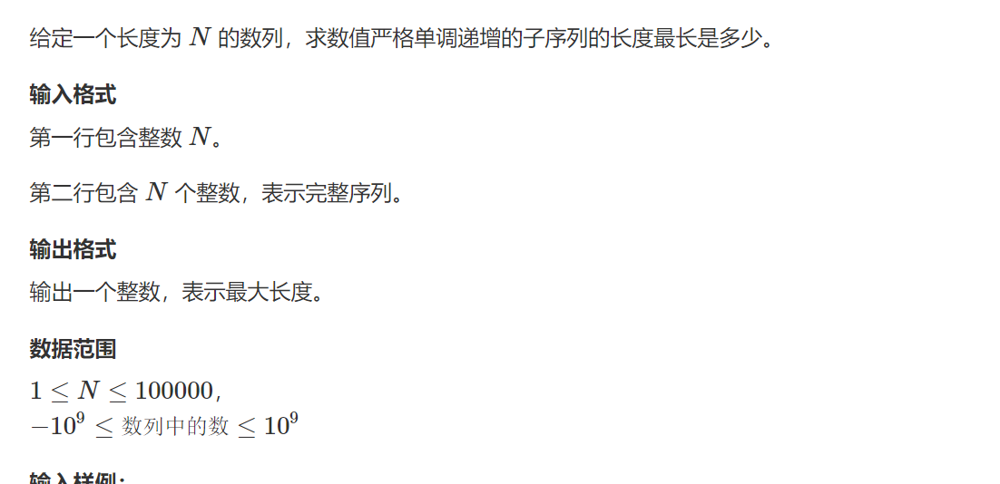

给定的数据无法用n^2的做法，这里的做法十分巧妙构建一个数组g，其中g[i]储存长度为i+1的子序列的末尾的元素，贪心的思想这个元素一定是越小越好，对于数据[5,1,4]，a[0]=1，因为如果取5或者是4那么最小的1一定可行，可以证明随着子序列的长度的增加他最后一个元素的一定是严格递增的，比如a[6]如果小于a[5],由于要求的子序列是严格递增的因此a[6]表示的子序列中倒数第二个元素一定是小于a[6]的也就小于a[5],而这倒数第二个元素也同时是一个a[5]，这与定义相矛盾因此a一定是单调递增的。


```python
from bisect import bisect_left as bl
n=int(input())
nums=[int(x) for x in input().split()]
g=[]
for x in nums:
    i=bl(g,x)
    #可以作为结尾
    if i==len(g):
        g.append(x)
    else:
        # 取最小值
        g[i]=x
print(len(g))
```

### Once Again...


如果t<n那么直接变换数组操作即可，但是当t>=n时元素太多无法操作，一个数组重复多次后的LIS一定是数组中的一个数在不断地被选，可以假设数组重复1000次后第1001~max使得LIS增长的大小是一样的，因此只需要让数组重复1000次即可，后面重复的次数能增加的长度是已经确定了的。

这里认为数组重复n次后都是一样的。

```python
from collections import deque, defaultdict, Counter
from functools import lru_cache
from bisect import bisect_left,bisect_right
from itertools import accumulate
from math import ceil, inf
import sys
from typing import List

input = sys.stdin.readline
def R(): return int(input())
def RR(): return [int(x) for x in input().split()]
def get_pre(nums): return list(accumulate(nums, initial=0))

n,t=RR()
nums=RR()
# 取最小
k=min(t,n)
g=[]
for _ in range(k):
    # 用于记录最后一轮增大的长度，后面的次数乘上这个长度的结果就是后面的次数的贡献
    ll=len(g)
    for x in nums:
        i=bisect_right(g,x)
        if i==len(g):
            g.append(x)
        else:g[i]=x
    d=len(g)-ll
print(len(g)+(t-k)*d)
```


### [将三个组排序](https://leetcode.cn/problems/sorting-three-groups/)


不用特意把每个数据都分为三组，既然要求从按1到3组的顺序似乎递增的，那么原数列中组数的遍历也一定是递增的，问题变为把数组变为递增子序列需要变换多少次，在转换为用原数组长度减去多少个不需要改变的数据，也就是球最长递增子序列，同上，但是本题要求的不是严格递增的子序列因此需要用到bisect_right把等于的也都包括了。

```python
class Solution:
    def minimumOperations(self, nums: List[int]) -> int:
        n=len(nums)
        g=[]
        for x in nums:
            index=bisect_right(g,x)
            if index==len(g):
                g.append(x)
            else:
                g[index]=x
        return len(nums)-len(g)
```


### [ 统计公平数对的数目](https://leetcode.cn/problems/count-the-number-of-fair-pairs/)

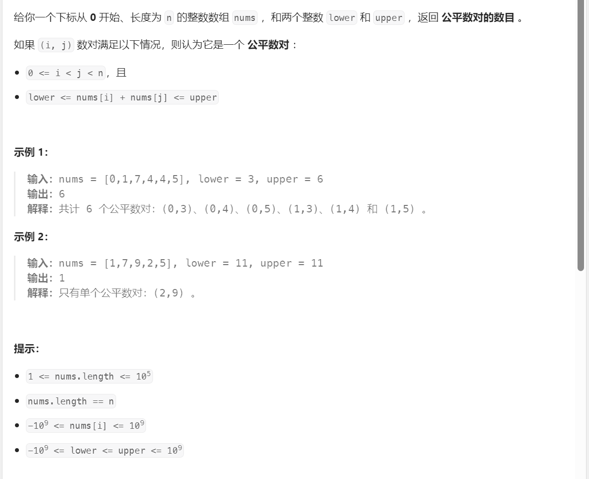

明显的顺序不重要因此可以先排序，排序过后枚举其中一个值让后二分去找另一个值即可。

```python
class Solution:
    def countFairPairs(self, nums: List[int], lower: int, upper: int) -> int:
        vis=set()        
        nums.sort()
        n=len(nums)
        ans=0
        # 枚举一个值之后要去左边找，而不是两边都找
        for j,val in enumerate(nums):
            l=lower-val
            r=upper-val
            index1=bisect_left(nums,l,0,j)
            index2=bisect_right(nums,r,0,j)
            # 排除不合法的状态
            if index2<index1 or index1>=n or index2<=0:continue
            ans+=index2-index1
        return ans
```


### 浮点数二分

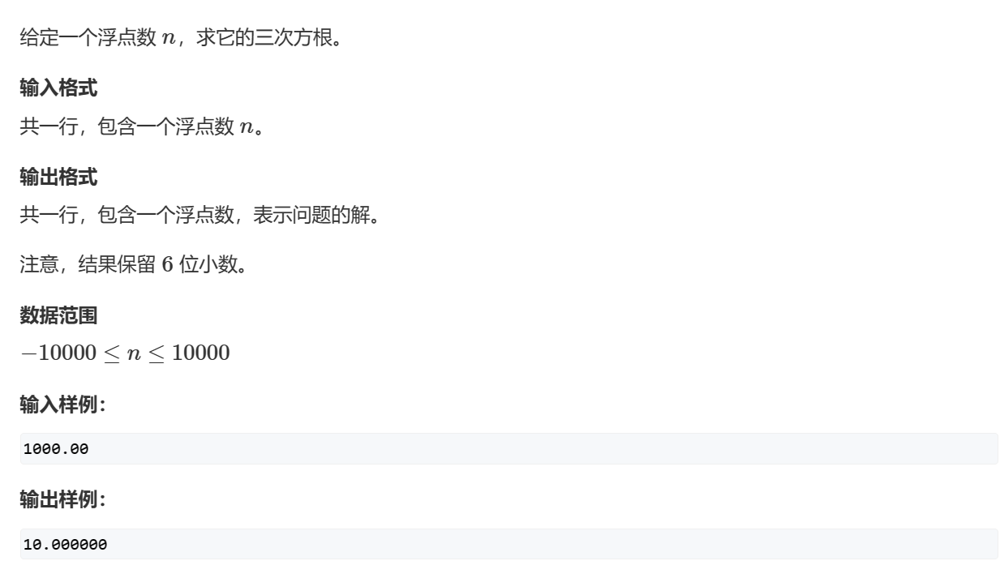

浮点数二分，要保留六位有效数字，则左右之差必须大于10**-8，往后取两位

```python
n=float(input())
l=-10000
r=-l
while r-l>1e-8:
    mid=(l+r)/2
    if mid**3>=n:r=mid
    else:
        l=mid
print(f"{l:.6f}")
```

### Array game 

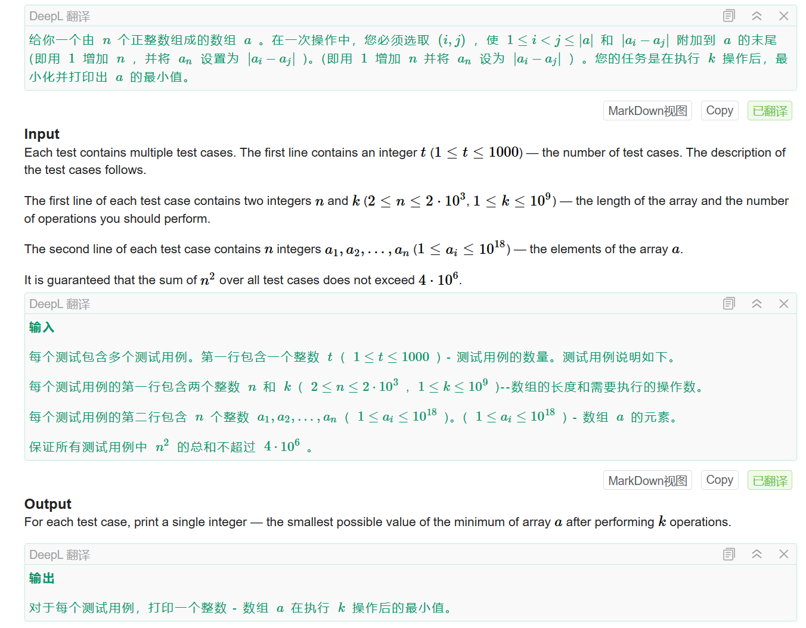

分类讨论，k>=3的情况必然可以得到两个相同的值，k==1的时候找出最小值与排序后相邻元素差值的最小值，k ==2，暴力做，首先n^2的时间复杂度得出所有元素两两之间的差值，然后根据这个差值在数组中使用二分搜索找到最相近的两个元素求出差值，找出其中k= =1情况下的最小值

总的时间复杂度是n^2logn

```python
from bisect import bisect_right as br
from bisect import bisect_left as bf
q=int(input())
while q:
    n,k=[int(x) for x in input().split()]
    nums=[int(x) for x in input().split()]
    if k>=3:
        print(0)
    else:
        # 排序
        nums.sort()
        tar=nums[0]
        # 相邻找差值
        for i in range(1,n):
            tar=min(nums[i],tar)
            if nums[i]-nums[i-1]<tar:
                tar=nums[i]-nums[i-1]
        if k==1:
            print(tar)
        else:
            temp =tar
            # 两两找差值
            for i in range(n):
                for j in range(i+1,n):
		   #对每个差值找出最接近的两个值，求差值
                    val = abs(nums[i] - nums[j])
                    temp=min(temp,tar)
                    r = bf(nums, val)
                    l = r - 1
                    if l >= 0:
                        temp = min(temp, abs(nums[l] - val))
                    if r < n:
                        temp = min(temp, abs(nums[r] - val))
            print(temp)

    q-=1
```


### [每一个查询的最大美丽值](https://leetcode.cn/problems/most-beautiful-item-for-each-query/)

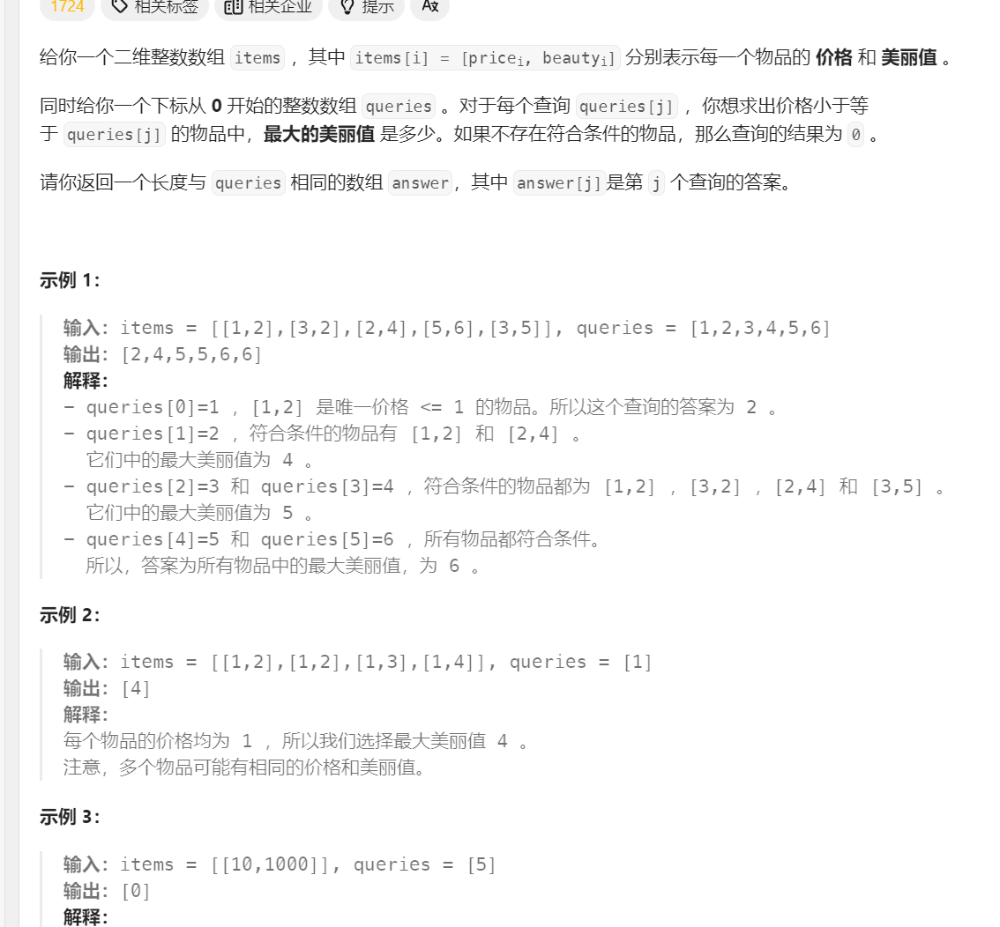

将给定的数组排序，对每个询问使用二分去找小于等于它的价格中最大的，这里需要对items预处理，每个价格对应的美丽值应该去小于等于自己价格中美丽值的最大值才有用。


```python
class Solution:
    def maximumBeauty(self, items: List[List[int]], queries: List[int]) -> List[int]:
        items.sort(key=lambda x:(x[0],x[1]))
        n=len(items)
        ans=[]
        
        # 也可以把每个询问离线，从小到大排一次遍历同时维护一个最大美丽值表示当前价格下的合法值，每次遍历询问都只需要遍历当前价格与之前价格之间的数据，总体只需遍历一次
        # queries=sorted((v,i) for i,v in enumerate(queries))
        # index=mx=0
        # ans=[0]*len(queries)
        # for q,i in queries:
        #     while index<n and items[index][0]<=q:
        #         mx=max(mx,items[index][1])
        #         index+=1
        #     ans[i]=mx
                
        # return ans 
        
        # 预处理
        for i in range(1, n):
            items[i][1] = max(items[i][1], items[i-1][1])
        # 二分找
        def query(target):
            l,r=0,n-1
            while l<=r:
                mid=(l+r)//2
                if items[mid][0]>target:
                    r=mid-1
                else:
                    l=mid+1
            if l==0:
                return 0
            else:
                return items[l-1][1]
        for q  in queries:
            ans.append(query(q))
        return ans
```


### [蜡烛之间的盘子](https://leetcode.cn/problems/plates-between-candles/)


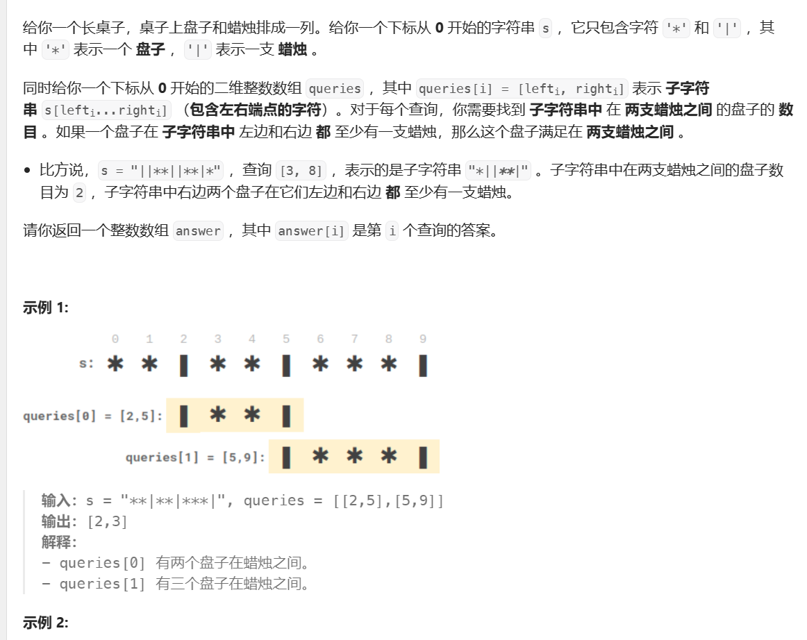

记录每个蜡烛的位置以及它到下一个蜡烛的距离（即盘子的多少），对这个距离构造前缀和。对于每个区间询问找到这个区间中两边的蜡烛，然后求这两个蜡烛中盘组的前缀和。


```python
class Solution:
    def platesBetweenCandles(self, s: str, queries: List[List[int]]) -> List[int]:
        i=0
        n=len(s)
        temp=[]
        r=[]
        ans=[]
        # 使用分组循环求出蜡烛的位置以及之间的盘子数
        while i<n:
            if s[i]=="*":
                i+=1
                continue
            start=i
            # 记录蜡烛的位置
            temp.append(start)
            i+=1
            while i<n and s[i]=='*':
                i+=1
            if i==n:break
            # 减一防止包括蜡烛本身
            l=i-start-1
            # r[temp[i]]记录到r[temp[i+1]]的盘子数
            r.append(l)
	# 构造前缀和
        nums=list(accumulate(r,initial=0))   
        for u,v in queries:
            # 找到这个区间内的两边的蜡烛
            l1=bisect_left(temp,u)
            l2=bisect_right(temp,v)-1
            # 如果没有蜡烛或者不合法，就是不存在可行的盘子
            if l1>=l2 or l1>n-1 or l2<0:
                ans.append(0)
                continue
             # l1到l2就是0到l2减去0到l1
            ans.append(nums[l2]-nums[l1])
        return ans 
            

```


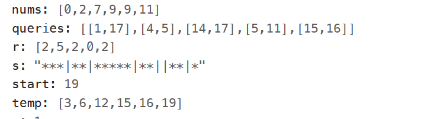

如图所示nums中记录的是3到3，3到6，3到12，3到15的盘子数在坐标中看就是0到9，0到1，0到2，0到3...


### 递增三元组

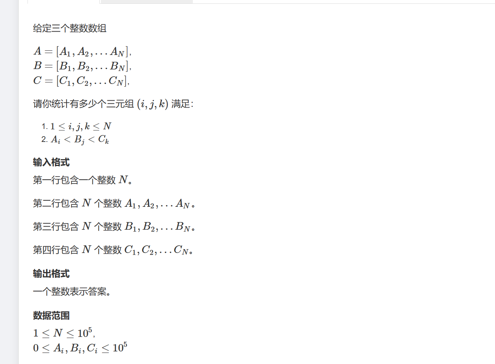

枚举所有的B，而后的A和C的返回已经确定使用二分可以找出来有多少满足要求的，使用乘法原理求解即可。

```python
from collections import Counter 
from bisect import bisect_left as bl
n=int(input())
a=[int(x) for x in input().split()]
b=[int(x) for x in input().split()]
c=[int(x) for x in input().split()]
a.sort()
memo=Counter(b)
c.sort()

res=0
for k,v in memo.items():
    l=bl(a,k)    
    r=n-bl(c,k+1)
    res+=l*r*v
print(res)

```

### [山脉数组中查找目标值](https://leetcode.cn/problems/find-in-mountain-array/)

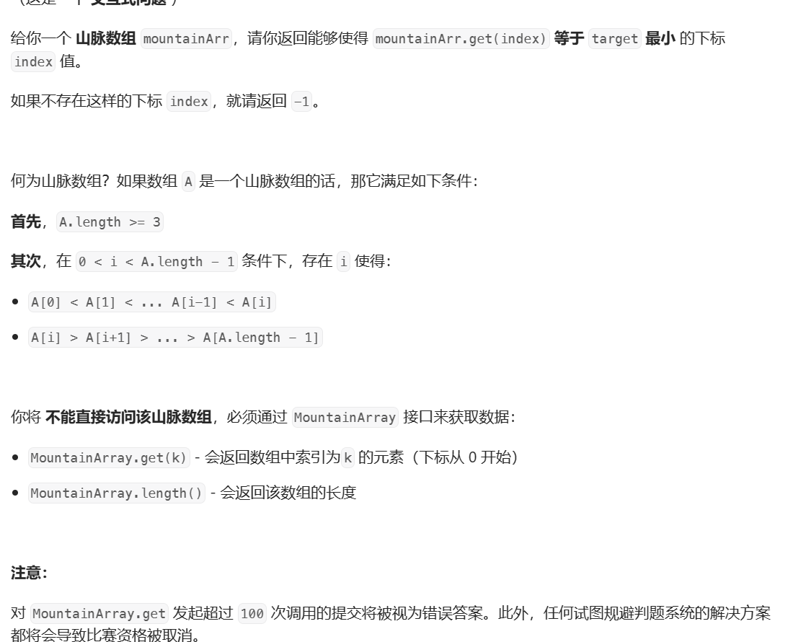

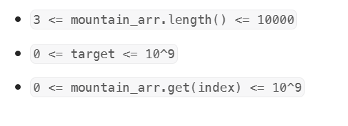


题目具有二分的性质，先二分一次把山脉数组的峰找出来，然后在左半部分找值再在右半部分找值。

```python
# """
# This is MountainArray's API interface.
# You should not implement it, or speculate about its implementation
# """
#class MountainArray:
#    def get(self, index: int) -> int:
#    def length(self) -> int:
class Solution:
    def findInMountainArray(self, target: int, mountain_arr: 'MountainArray') -> int:
        n= mountain_arr.length()
        l,r=0,n-1
        flag=False
        # 找边界
        while l<=r:
            mid=(l+r)>>1
            v=mountain_arr.get(mid)
            d=mountain_arr.get(mid+1) if mid+1<n else -inf 
            if v<d:
                l=mid+1
            else:r=mid-1
        index=l
        l,r=0,index
        while l<=r:
            mid=(l+r)>>1
            v=mountain_arr.get(mid)
            if v==target:
                r=mid-1
                flag=True 
            elif v>target:
                r=mid-1
            else:
                l=mid+1
        if flag:return r+1

        l,r=index+1,n-1
        while l<=r:
            mid=(l+r)>>1
            v=mountain_arr.get(mid)
            if v==target:
                r=mid-1
                flag=True 
            elif v>target:
                l=mid+1
            else:
                r=mid-1
        if flag:return r+1
        else: return -1        
```

### [删除最短的子数组使剩余数组有序](https://leetcode.cn/problems/shortest-subarray-to-be-removed-to-make-array-sorted/)

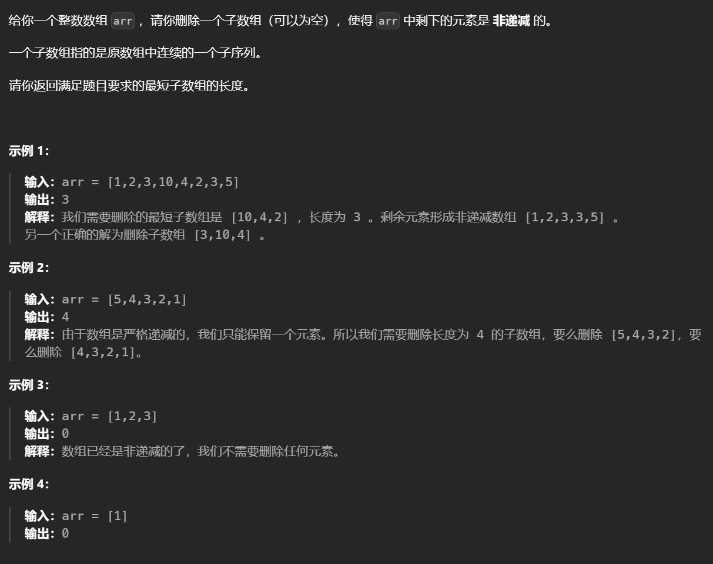


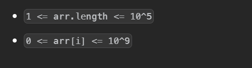


三种情况；

+ 删除左边开头:只留下从右边过来的最长非非递增序列
+ 删除右边结尾：留下从左边开始的最长非递减序列
+ 删除中间一段：枚举左边最长非递减序列的端点，通过二分在右边的最长非非递增序列中查找第一个大于他的值，这中间的部分可以作为删除的子数组


```python
class Solution:
    def findLengthOfShortestSubarray(self, arr: List[int]) -> int:
        n=len(arr)
        l,r=0,n-1
        # 找从右边过来的最长非非递增序列
        while r-1>=0 and arr[r]>=arr[r-1]:
            r-=1
        # 找从左边开始的最长非递减序列
        while l+1<n and arr[l]<=arr[l+1]:
            l+=1
        # 不用删除
        if l>=r:return 0
        ans=min(n-l-1,r)
        # 枚举左端点
        for i in range(l+1):
            j=bisect_left(arr,arr[i],r,n-1)
            if j==n-1 and arr[j]<arr[i]:j+=1
            ans=min(ans,j-i-1)
        return ans 
```


### [找出到每个位置为止最长的有效障碍赛跑路线](https://leetcode.cn/problems/find-the-longest-valid-obstacle-course-at-each-position/)

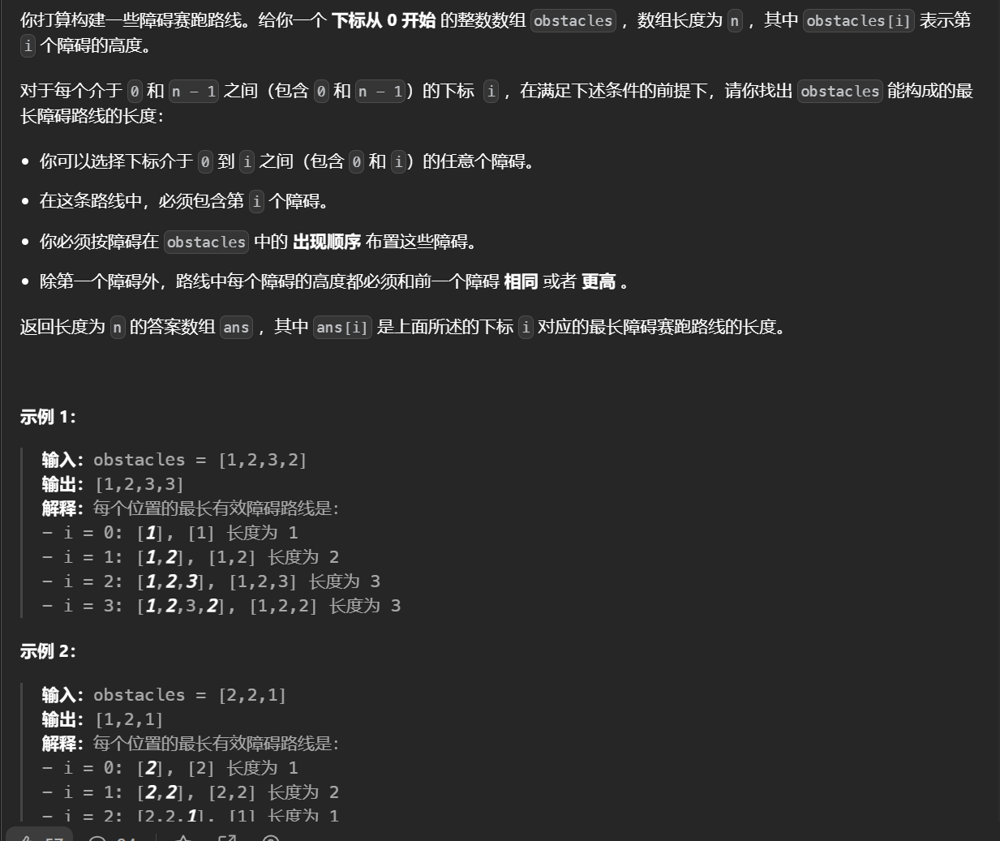


这里是不严格递增的子序列，通过bisect_right找到可以添加的位置，最后的结果是要看每个位置的最长而不是整个，因此将二分后的结果传入答案数组中。	

```python
class Solution:
    def longestObstacleCourseAtEachPosition(self, obstacles: List[int]) -> List[int]:
        ans=[]
        g=[]
        for v in obstacles:
            j=bisect_right(g,v)
            if j==len(g):
                g.append(v)
            else:
                g[j]=v
            ans.append(j+1)
        return ans 
```


### [使数组 K 递增的最少操作次数](https://leetcode.cn/problems/minimum-operations-to-make-the-array-k-increasing/)

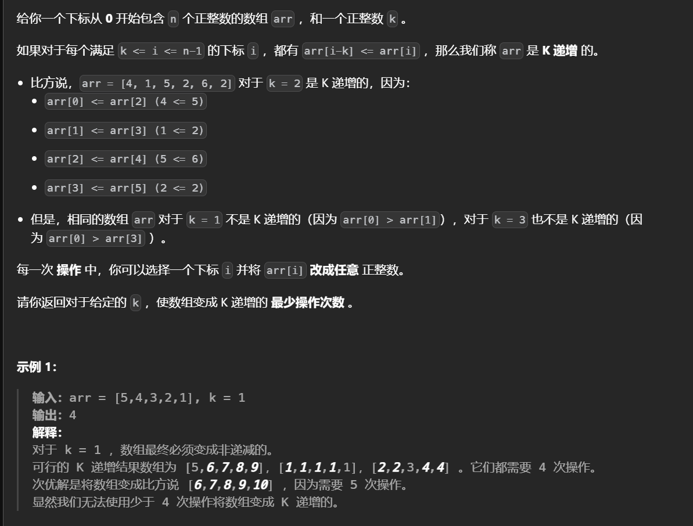

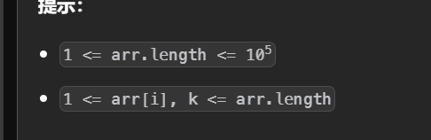

根据给定的k可以将数组分为几组，组与组之间是互不影响的

对于一组，要让他变为不严格递增的子数组的最少操作次数可以通过长度减去这个子数组的最长不严格递增子序列的长度求出

```python
class Solution:
    def kIncreasing(self, arr: List[int], k: int) -> int:
        n=len(arr)
        def f(i):
            p=[]
            cnt=0
            # 按照步长为k提取元素
            for j in range(i,n,k):
                v=arr[j]
                # 记录总长
                cnt+=1
                # 因为是找不严格递增，因此使用bisect_right以次来保留相同的值
                index=bisect_right(p,v)
                if index==len(p):
                    p.append(v)
                else:
                    p[index]=v
            # 返回长度只差就是需要操作的个数
            return cnt-len(p)
        # 从0位置开始分组到k位置位置，因为k位置是已经分过组了的，在往后的就都是分过组的
        return sum([f(i) for i in range(k)])  
```

### [将数组分成三个子数组的方案数](https://leetcode.cn/problems/ways-to-split-array-into-three-subarrays/)

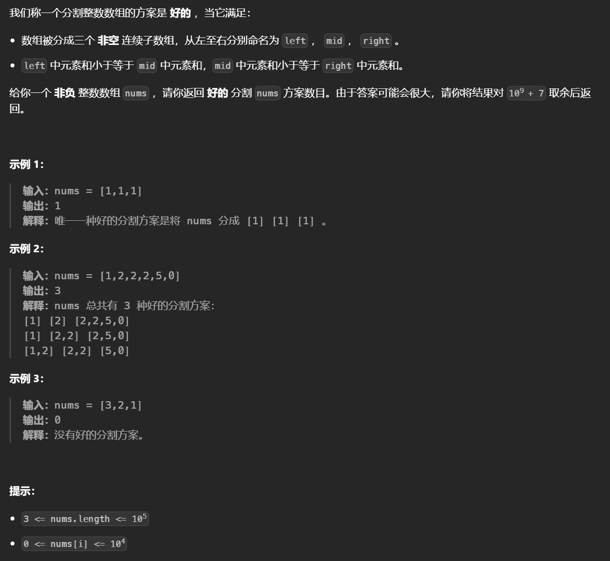

使用前缀和快速求解

枚举第一个分割点，然后使用二分求解第二个分割点的范围，这个范围就是第一个分割点的贡献，下界要求满足pre[l+1]-pre[i+1]>=pre[i+1] right>=mid，分割第一个点后剩下的值为(pre[-1]-pre[i+1])分割的上界要小于等于一半

```python
class Solution:
    def waysToSplit(self, nums: List[int]) -> int:
        pre=list(accumulate(nums,initial=0))
        mod=10**9+7
        ans=0
        n=len(nums)
        # 枚举第一个分割点
        for i in range(n):
            left=pre[i+1]
            # 下界，这里把坐标转换为原数组上的
            l=max(i+1,bisect_left(pre,2*left)-1)
            d=pre[-1]-left
            # 上界，注意上界要小于n-2，必须留一个给最后一段
            r=min(n-2,bisect_left(pre,d//2+left+1)-2)
            # 如果不满足不是直接退出而是跳过
            if l>r:continue
            ans+=r-l+1
            ans%=mod
        return ans
```


## 二分搜索解决具体问题

对于二分搜索的具体题目，从题目中抽象出一个自变量x，一个关于x的函数f(x)，以及一个目标值，其中f(x)必须是关于x的单调函数，并且target约束f(x)。

例如，题目要求一个升序排列的数组以及一个目标值target,请计算target在数组中的索引位置，如果有多个目标元素则返回最小的索引。

其中认为索引是自变量x，函数f(x)就是数组中索引x对应位置的元素，目标值就是target。

抽象为：

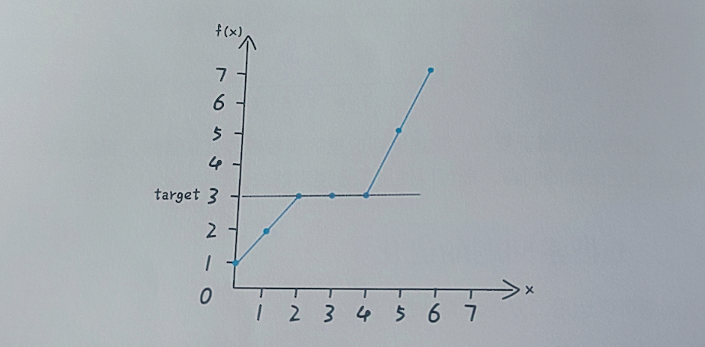

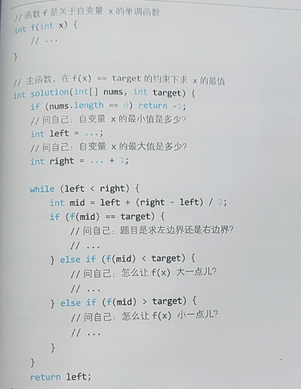

使...的最大值尽可能小是二分搜索题目常见的用法

有的时候是通过二分一个结果，看这个结果是否合法来确定答案的


如果是要最大化答案，一般是满足要求的情况下l=mid+1，最后的结果就是l-1，如果是最小化答案就是r=mid-1,最后的结果就是r+1

### 爱吃香蕉的珂珂

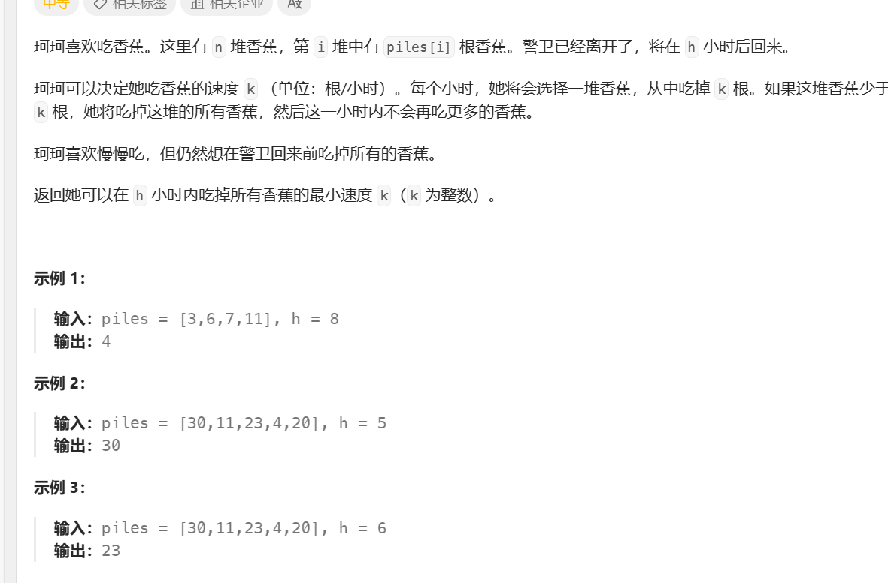

题目中令每小时吃香蕉的速度为x，f(x)为吃完所有香蕉的时间，约束条件是target=h


```python
class Solution(object):

    def minEatingSpeed(self, piles, h):
        def f(piles,x):
            hours=0
            for pile in piles:
                hours+=pile//x
                if pile%x!=0:
                    hours+=1
            return hours
        left=1
        right=10**9
        while left<right:
            mid=(left+right)//2

            if (f(piles, mid)==h):
                right=mid

            if(f(piles,mid)>h):
                left = mid + 1

            else:
                right=mid
        
        return left
```


### 在 D 天内送达包裹的能力

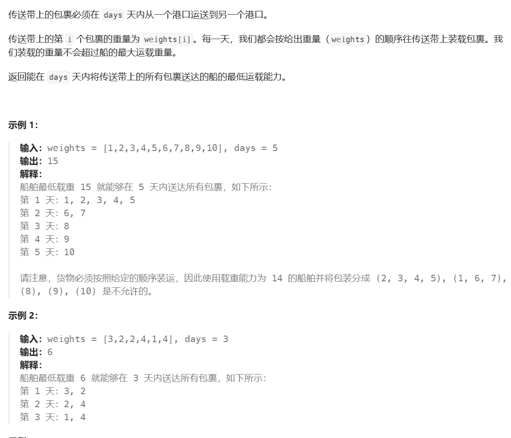

令每天运载的货物量为自变量x，f(x)表示以x为最小货物量时所需的天数。

注意x的初始值不能随便设，每天货物运载量最小的要是weights中最大的值如果从一开始那么什么也运不了，最大应该是所有货物总和，一次可以把所有货物运走。


```python
class Solution(object):
    def shipWithinDays(self, weights, days):
        # f(x)函数，说实话不好写
        def f(nums, x):
            i = 0
            days = 0
            while i < len(nums):
                cap = x
                while i < len(nums):
                    if nums[i] > cap:
                        break
                    else:
                        cap -= nums[i]
                        i += 1
                days += 1
            return days
        # 左右边界
        left=max(weights)
        right=sum(weights)
        while left < right:
            mid = (left + right) // 2
            # 不断缩减右边界
            if f(weights, mid) <= days:
                right = mid
            else:
                left = mid + 1  

        return left
```

### 分割数组的最大值

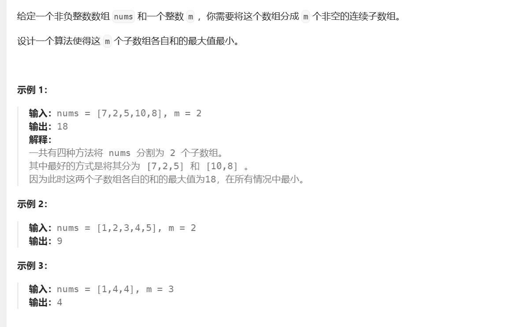

将问题抽象为有一个nums的数组表示货物量，需要在m天内运完所有的货物，问每天至少需要运多少。

```python
class Solution(object):
    def splitArray(self, nums, k):
        def f(nums,x):
            days=0
            i=0
            while i<len(nums):
                cap=x
                while i<len(nums):
                    if nums[i]>cap:
                        break
                    else:
                        cap-=nums[i]
                        i+=1
                days+=1
            return days
                
        left=max(nums) 
        right=sum(nums)
        while left<right:
            mid=(left+right)//2
            if f(nums,mid)<=k:
                right=mid
            else:
                left=mid+1
        return left
```


使用动态规划的思想，设置dp[i] [j]表示前i个数分为j段的最大连续子数组和的最小值，状态转移时，枚举一个变量从0到i-1表示前i个数中的前k个,dp[i] [j]=min(dp[i] [j],max(dp[k] [j-1],sum(nums[k:i+1])))

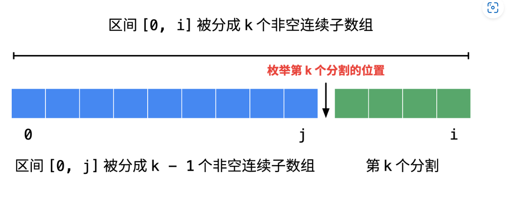

对于不合法的值，分的段数大于拥有的数，设置为一个很大的数。

根据dp表推出base case 为dp[0] [0]=0

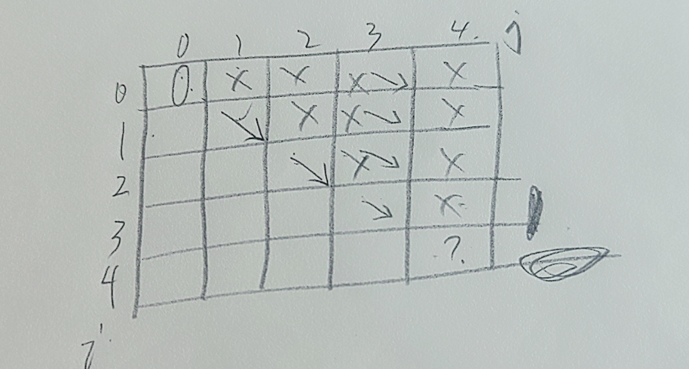


```python 
class Solution(object):
    def splitArray(self, nums, k):
        n=len(nums)
        # 初始化
        dp=[[float('inf') for _ in range(k+1)] for _ in range(n+1)]
        dp[0][0]=0
		# 构造前缀和数组
        sub=[0]
        for ele in nums:
            sub.append(sub[-1]+ele)
        # 遍历填充每个位置
        for i in range(1,n+1):
            # 对于分的段数大于当前拥有的不能遍历了
            for j in range(1,min(k,i)+1):
                # 从前I个中不断划分
                for m in range(i):
                    dp[i][j]=min(dp[i][j],max(dp[m][j-1],sub[i]-sub[m]))

        return dp[n][k]
```


### [使结果不超过阈值的最小除数](https://leetcode.cn/problems/find-the-smallest-divisor-given-a-threshold/)

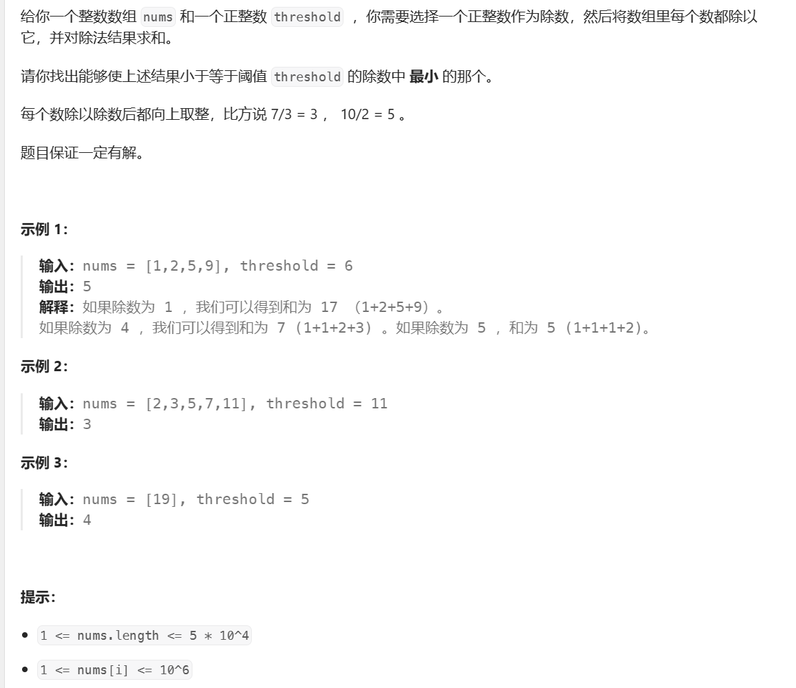

给定的数据范围可以进行二分搜索（二分的搜索次数很小即使在过程中会遍历这个数组也很快），注意界定开始点为1防止除数为0.

根据二分搜索算法找出除数，如果结果大于给定值说明除数小了，更新左边界，如果小于等于收缩右边界

```python
from math import ceil
class Solution:
    def smallestDivisor(self, nums: List[int], threshold: int) -> int:
        l,r=1, max(nums)
        ans=-1
        def f (x):
            return sum([ceil(i/x) for i in nums])
            
        while l<=r:
            mid=(l+r)//2

            val=f(mid)
            
            if val<=threshold:
                ans=mid
                r=mid-1
            else:
                l=mid+1
        return ans
```

### [完成旅途的最少时间](https://leetcode.cn/problems/minimum-time-to-complete-trips/)

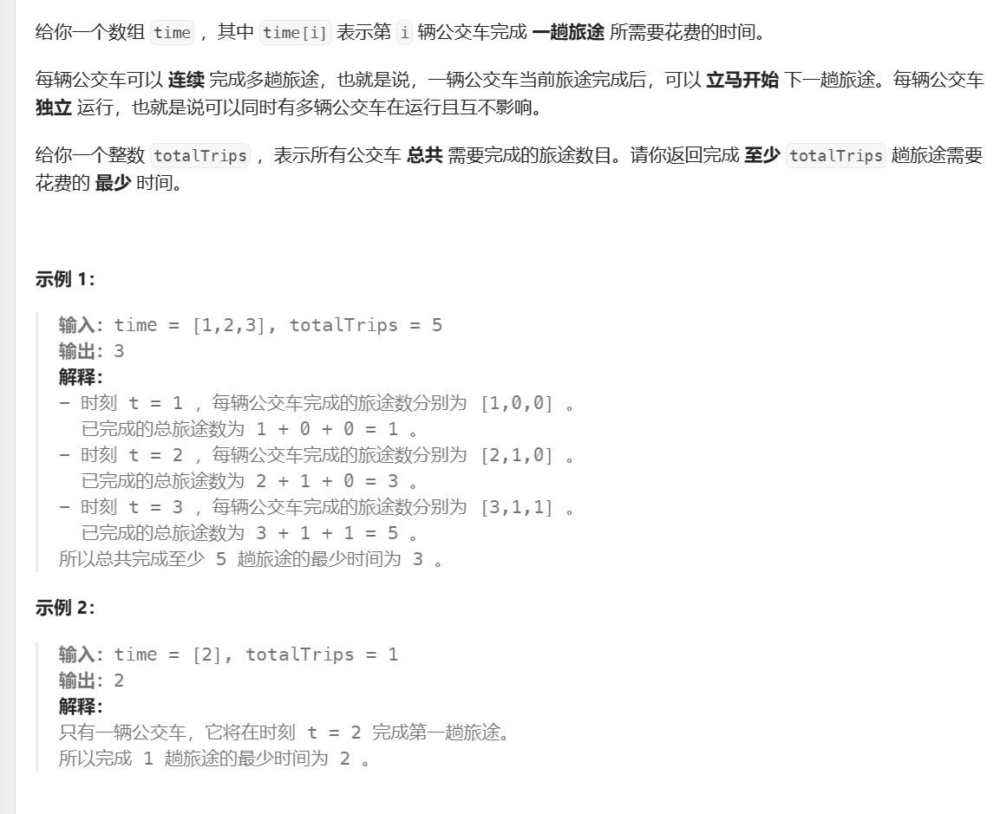

很明显使用二分应用，这里需要注意的一点是，当t=2,time=[1,2,3]的时候，不需要去找那些车可以移动，因为2//3=0，不会对答案有影响。

这里的上界是最小的启动时间去满足totaltime，使用找左侧边界的二分算法，即找到了答案不断缩减右边界。

```python
class Solution:
    def minimumTime(self, time: List[int], totalTrips: int) -> int:
        time.sort()
        r=time[0]*totalTrips
        l=1
        while l<=r:
            mid=(l+r)//2
            res=sum(mid//x for x in time)
            if res>totalTrips:
                r=mid-1
            elif res<totalTrips:
                l=mid+1
            else:
                r=mid-1
        return r+1
```

### 机器人跳跃问题

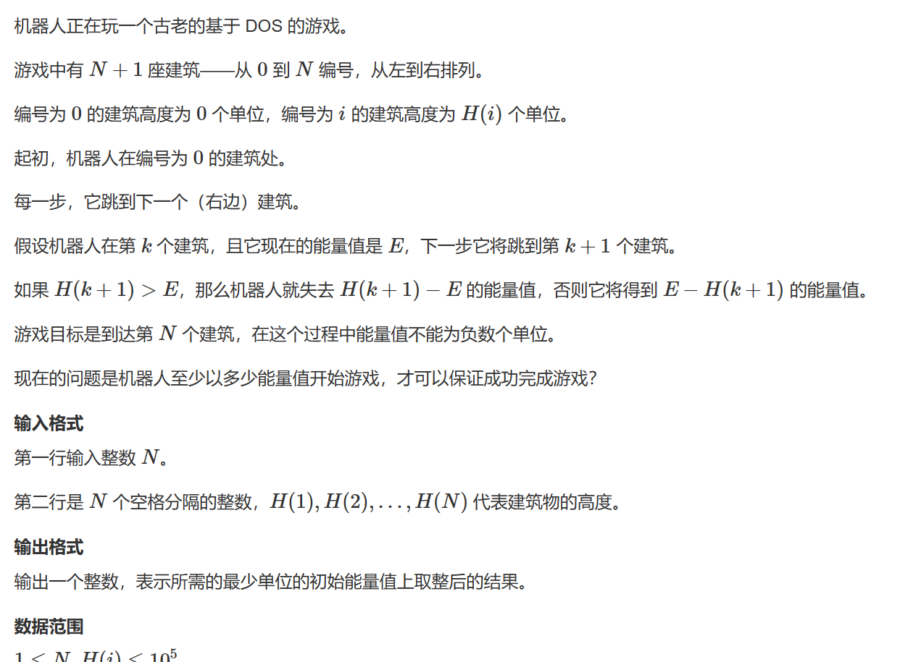

具有二分的性质，使用bisect_left的模板

```python
n=int(input())
nums=[int(x) for x in input().split()]

def cal(x):
    ans=x
    for i in range(n):
        ans=ans*2-nums[i]
        if ans<0:
            return False
    return True
l,r=0,10**5
while l<=r:
    mid=(l+r)>>1
    if cal(mid):
        r=mid-1
    else:
        l=mid+1
print(l)
```

### 借教室

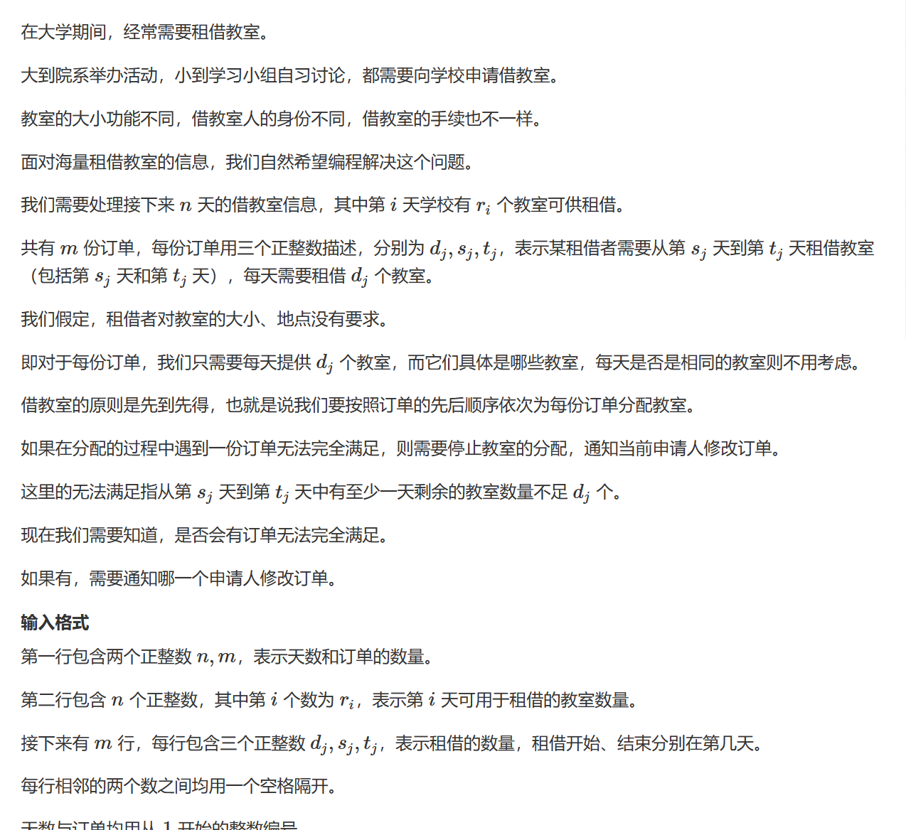


对能完成的任务数二分枚举前k个任务可以被完成，使用差分对前k操作快速操作，在操作之后求出前缀和如果某一个前缀和大于实际的值说明不满足条件直接退出

```python
import sys
input=sys.stdin.readline
n, k = [int(x) for x in input().split()]
nums = [int(x) for x in input().split()]
op = []

for i in range(1, k + 1):
    op.append([int(x) for x in input().split()])


def cal(x):
    # 差分
    d = [0]*n
    for i in range(x):
        w, s, e = op[i]
        s -= 1
        e -= 1
        d[s] += w
        if e + 1 < n:
            d[e + 1] -= w
    # 注意第一个值也要判断
    if d[0]>nums[0]:return False
    for i in range(1,n):
        d[i]+=d[i-1]
        if d[i]>nums[i]:
            return False
    return True


l, r = 1, k
while l <= r:
    mid = (l + r) >> 1
    if cal(mid):
        l = mid + 1
    else:
        r = mid - 1
if l >k:
    print(0)
else:
    print(-1)
    print(r+1)


```


### getting points 

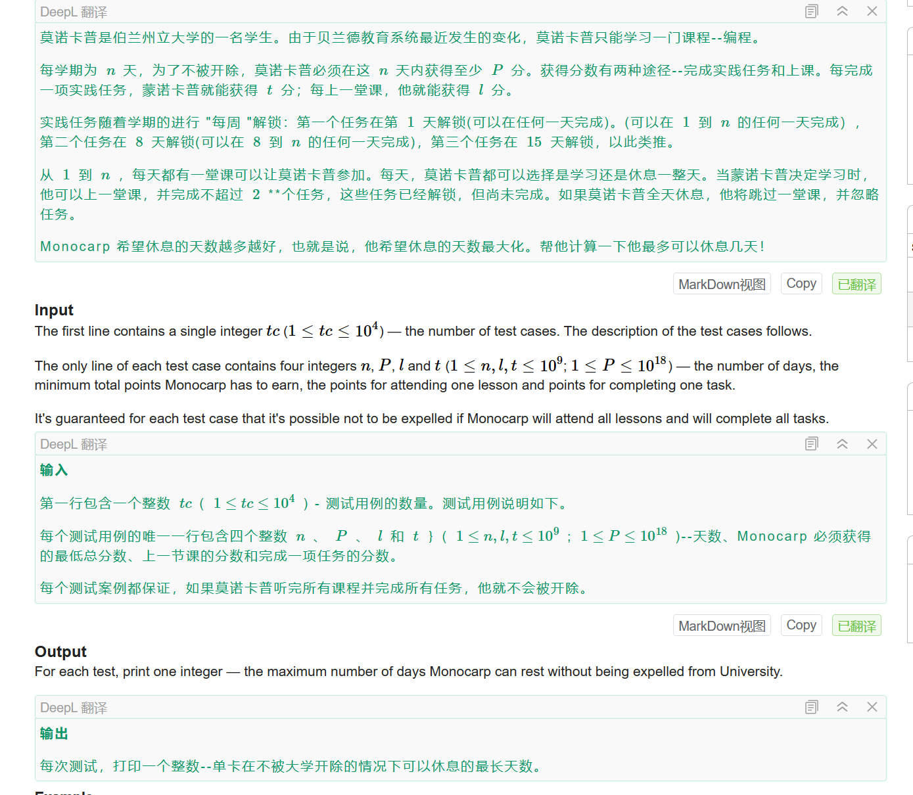

贪心的思想，为了得到最多的休息天数要工作最少的天数，从最后一天开始，往前每次推7天为了保证每次工作都能完成任务使得分最大化，也就是从后往前每次挑出能做任务的天工作，一次为基准使用二分找

```python
from math import ceil
tc=int(input())
def f(x,n,tasks,t,c):
    time=(n-x)//7
    x=n-7*time
    return min(2*(time+1),tasks)*t+(time+1)*c
while tc:
    n,p,c,t=[int(x) for x in input().split()]
    task=1+(n-1)//7
    # 如果完成所有的任务还不够，只能额外加上学习的天数
    if task*t+task*c<p:
        print(n-(task+ceil((p-(task*t+task*c))/c)))
    else:
        temp=n
        l,r=1,n
        while l<=r:
            mid=(l+r)//2
            val=f(mid,n,task,t,c)
            if val<p:
                r=mid-1
            elif val>p:
                l=mid+1
            else:
                l=mid+1
        print(n-((n-l+1)//7+1))

    tc-=1
```

### [求出最多标记下标](https://leetcode.cn/problems/find-the-maximum-number-of-marked-indices/)

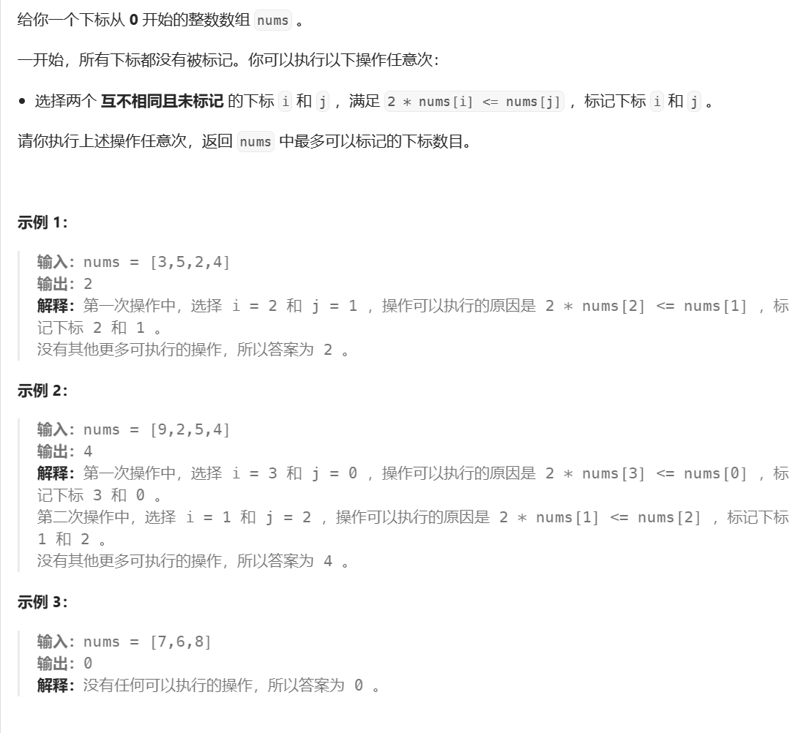

想要找到尽可能多的组那么应该把最小的数和最大的数匹配才能得到最多的，对于数组先排序，排序后可以对答案进行二分。

​	

```python
class Solution:
    def maxNumOfMarkedIndices(self, nums: List[int]) -> int:
        nums.sort()
        n=len(nums)
        # 枚举最小的数的结束位置，注意减一防止越界
        l,r=0,(len(nums))//2-1
        while l<=r:
            mid=(l+r)>>1
            flag=True
            # 判断前k个数和后k个数是否满足要求
            for i in range(mid+1):
                if nums[i]>nums[n-mid-1+i]//2:
                    flag=False
                    break
            if flag:l=mid+1
            else: r=mid-1
        return l*2
```

### [可移除字符的最大数目](https://leetcode.cn/problems/maximum-number-of-removable-characters/)

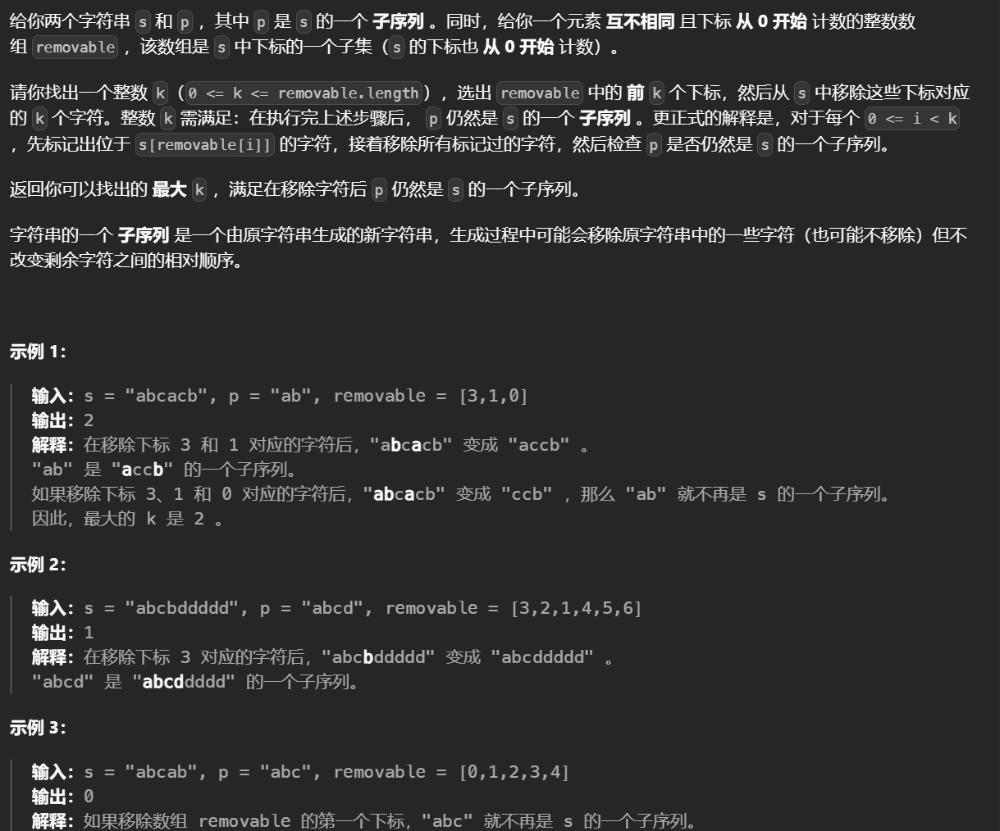

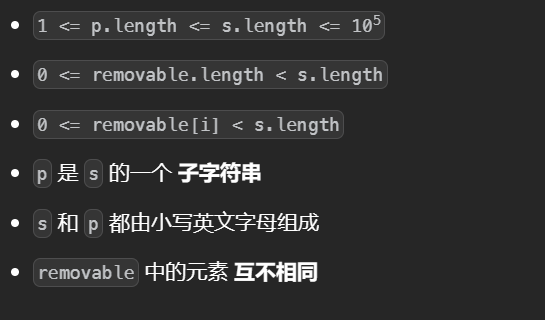


二分答案

```python
class Solution:
    def maximumRemovals(self, s: str, p: str, removable: List[int]) -> int:
        r=len(removable)
        l=0
        def cal(x):
            vis=set(removable[:x])
            j=0
            for i,c in enumerate(s):
                if i in vis:continue
                if c==p[j]:
                    j+=1
                    if j==len(p):return True 
            return False      
        while l<=r:
            mid=(l+r)>>1
            if cal(mid):
                l=mid+1
            else:
                r=mid-1
        return r
```


### [两球之间的磁力](https://leetcode.cn/problems/magnetic-force-between-two-balls/)

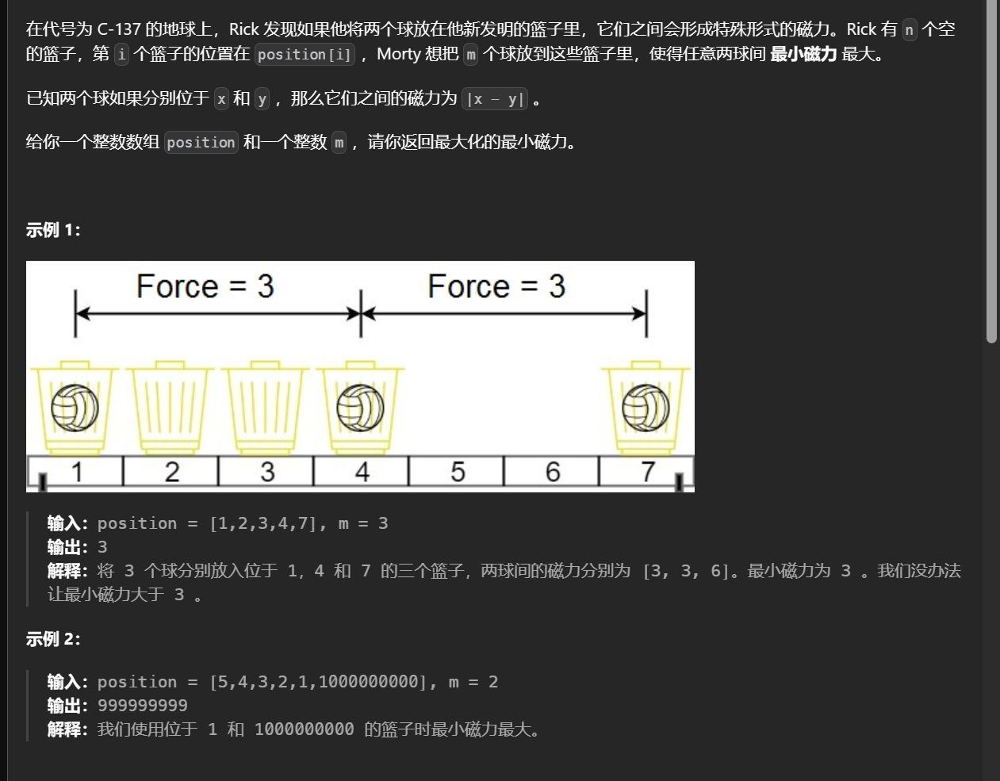


最大化最小值的描述可以想到使用二分，二分枚举可能的最小值，然后在数组中看以该距离为两球之间的最小距离是否能放下所有的球

```python
class Solution:
    def maxDistance(self, position: List[int], m: int) -> int:
        position.sort()
        l=inf
        r=position[-1]-position[0]
        for i,j in pairwise(position):
            l=min(l,j-i)
        def cal(x):
            temp=m
            temp-=1
            pre=position[0]
            for v in position[1:]:
                if not temp:return True 
                if v-pre>=x:
                    pre=v
                    temp-=1
            if temp:return False
            return True 

        while l<=r:
            mid=(l+r)>>1
            if cal(mid):
                l=mid+1
            else:
                r=mid-1
        return l-1
        
```


### [袋子里最少数目的球](https://leetcode.cn/problems/minimum-limit-of-balls-in-a-bag/)


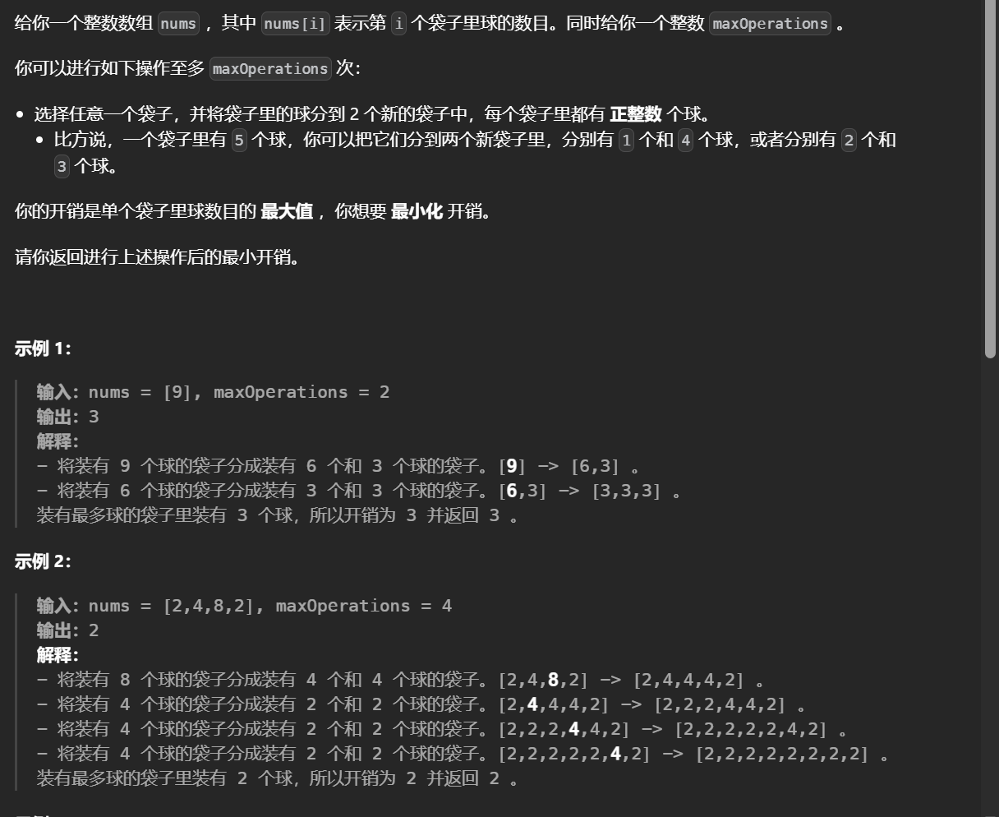


看到最小化答案想到二分，这里对答案二分，令最终的结果为x，那么每个数操作的次数为ceil(v/x)-1，只要最终操作次数不超过给定的值那么这个最终结果就是合理的。

```python
class Solution:
    def minimumSize(self, nums: List[int], maxOperations: int) -> int:
        r=max(nums)
        l=1
        def cal(x):
            temp=0
            for v in nums:
                temp+=ceil(v/mid)-1
            return temp<=maxOperations
        while l<=r:
            mid=(l+r)>>1
            if cal(mid):
                r=mid-1
            else:l=mid+1
        return r+1
```

###  [分享巧克力](https://leetcode.cn/problems/divide-chocolate/)

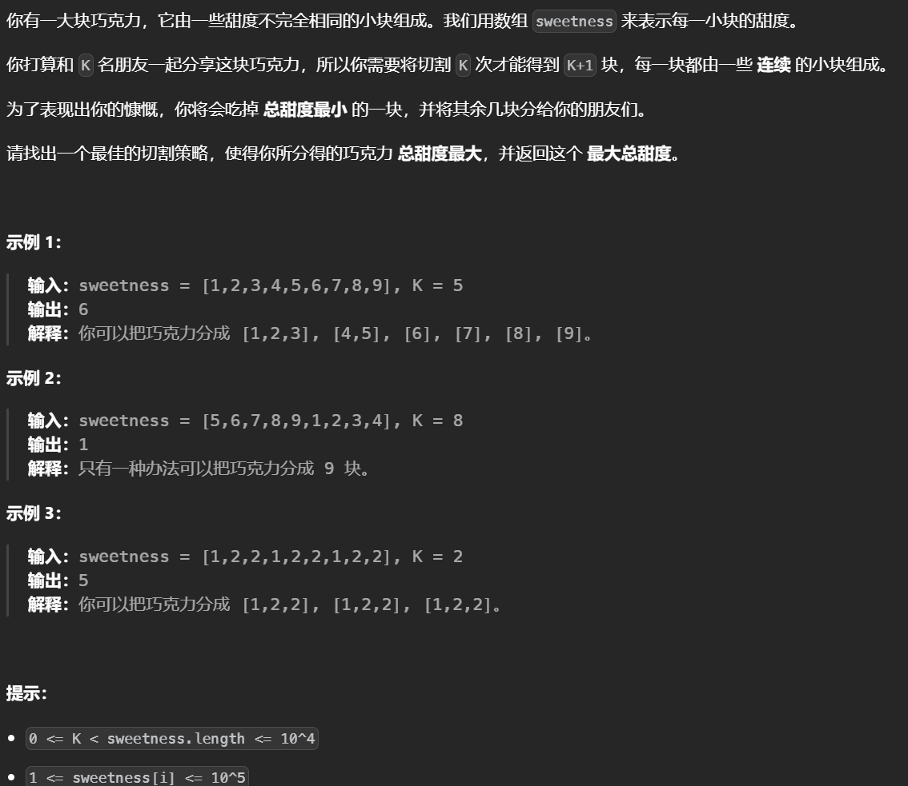

可以枚举甜度，然后在数组中划分，如果累计和大于等于给定的甜度那么就分为一个集合当遍历完整个数组后判断划分的集合是否大于等于k+1即可。


```python
class Solution:
    def maximizeSweetness(self, sweetness: List[int], k: int) -> int:
        l,r=1,sum(sweetness)
        def cal(x):
            temp=0
            cnt=0
            for v in sweetness:
                temp+=v
                if temp>=x:
                    cnt+=1
                    temp=0
            return cnt>=k+1 
        while l<=r:
            mid=(l+r)>>1
            if cal(mid):
                l=mid+1
            else:r=mid-1
        return l-1
```

### [ 销售价值减少的颜色球](https://leetcode.cn/problems/sell-diminishing-valued-colored-balls/)

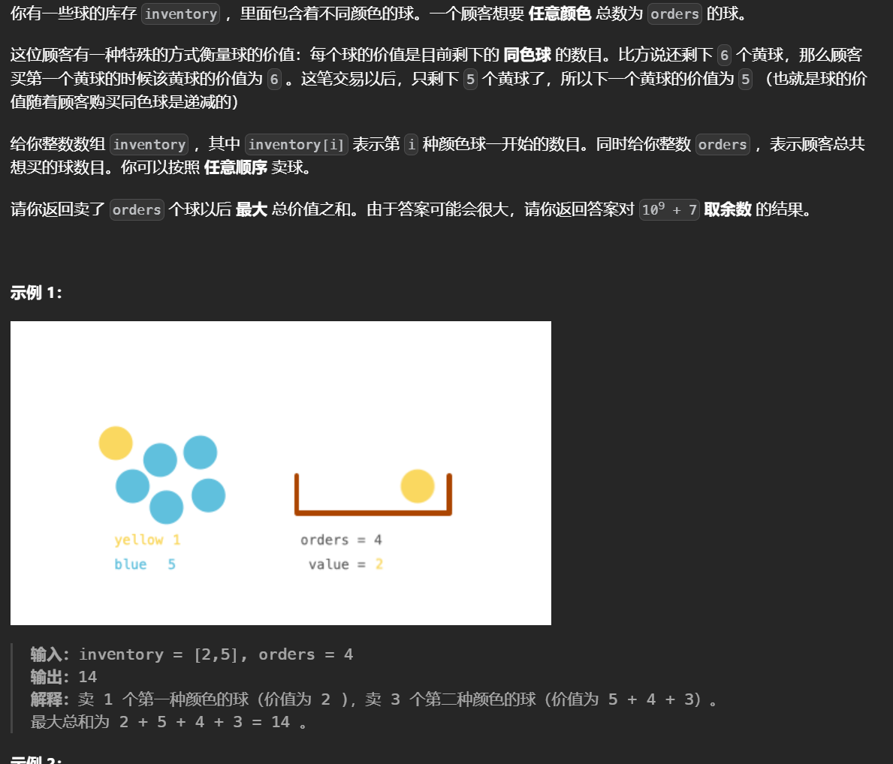

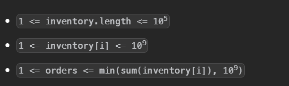


按照贪心的思路一定是先处理当前较大的数，最后较大而数会减小到一个定值，用二分找出这个值。

```python
class Solution:
    def maxProfit(self, inventory: List[int], orders: int) -> int:
        mod=10**9+7
        l=0
        r=max(inventory)
        # 找到能使操作次数小于等于orders的最大x
        while l<=r:
            mid=(l+r)>>1
            t=sum(v-mid for v in inventory if v>mid)
            if t<=orders:
                r=mid-1
            else:
                l=mid+1
        x=r+1
        ans=cnt=0
        # 求和
        for v in inventory:
            if v<=x:continue
            cnt+=v-x
            ans+=(v+x+1)*(v-x)//2
            ans%=mod
        # 因为操作次数是小于等于x的，所以可能不满足orders，缺少的次数一定是通过减小(orders-cnt)个x获得的，不可能是到x-1，因为如果是到x-1那么在二分中算出的就不会是x了
        if cnt<orders:ans+=(orders-cnt)*x
        return ans%mod
```


### Wooden Toy Festival

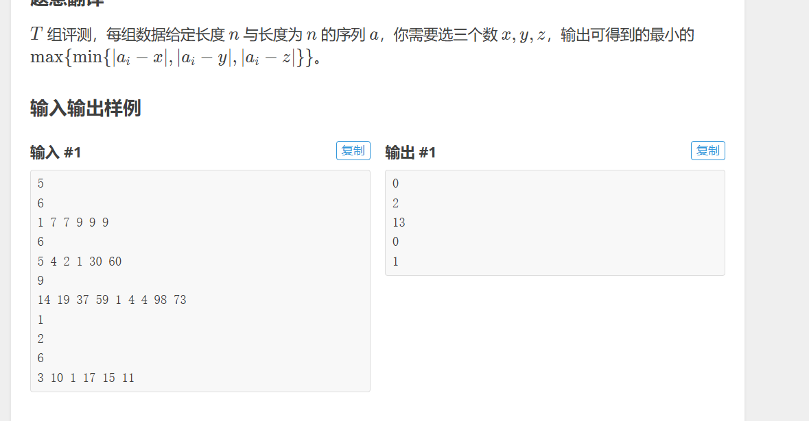

不需要关心选出的三个数是什么，只需要考虑答案，根据答案判断是否能分为三组，使得这三组的差都小于等于答案。

因此可以二分枚举答案

```python
from collections import deque,defaultdict,Counter
from functools import lru_cache
from bisect import bisect_left
from math import ceil
import sys
from typing import List

input=sys.stdin.readline
def R():return int(input())
def RR():return [int(x) for x in input().split()]

for _ in range(R()):
    n=R()
    nums=RR()
    nums.sort()
    l,r=0,10**9+10
    # 对于一组的数，要求都能满足和某一个数做差后的绝对值小于等于x，那么这一组数的最大和最小能的差要小于小于2x
    def cal(x):
        cnt=0
        j=0
        while j<n:
            v = nums[j]
            t = v + 2 * x
            j=bisect_left(nums,t+1)
            cnt+=1
        return cnt<=3

    while l<=r:
        mid=(l+r)>>1
        if cal(mid):
            r=mid-1
        else:
            l=mid+1
    print(r+1)


```

### [打家劫舍 IV](https://leetcode.cn/problems/house-robber-iv/)

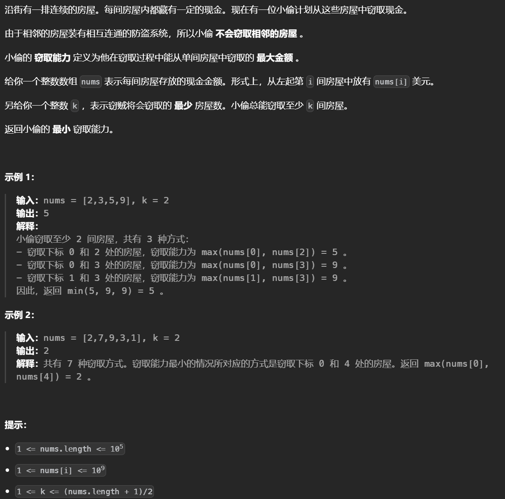

二分能拿到的最大的金额然后看是否满足能取至少k个小于等于该金额的相邻的房屋，后面的问题可以使用dp解决

```python
class Solution:
    def minCapability(self, nums: List[int], k: int) -> int:    
        n=len(nums)
        l=min(nums)
        r=max(nums)
        def cal(x):
            # 定义dp[i]表示在0~i范围内能取到小于等于x的最多有多少个不相邻的房屋
            @cache
            def dp(i):
                if i<0:return 0
                if nums[i]<=x:return max(dp(i-1),dp(i-2)+1)
                return dp(i-1)
            res=dp(n-1)
            dp.cache_clear()
            return res
        # 二分能拿到的最小金额
        while l<=r:
            mid=(l+r)>>1
            if cal(mid)>=k:
                r=mid-1
            else:
                l=mid+1
        return r+1
```

### **K-th Nearest**

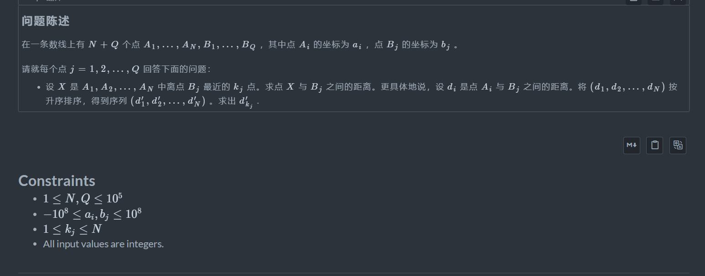

离x最近的第k个的距离，这里可以二分距离，用这个距离表示范围内的数的个数来表示是第几个，比如对于x当距离为10时，如果数组中x-10到x+10范围内的数是5，说明离x最近的第5个数的距离至少可能10（后续会用二分缩减）

```python
from collections import deque, defaultdict, Counter
from functools import lru_cache
from bisect import bisect_left,bisect_right
from heapq import heappop, heappush
from itertools import accumulate
from math import ceil, inf, gcd, sqrt, prod
import sys
from typing import List
input = sys.stdin.readline
def R(): return int(input())
def RR(): return [int(x) for x in input().split()]
def get_pre(nums): return list(accumulate(nums, initial=0))

n,m=RR()
nums=RR()
nums.sort()
def cal(mid):
    r,l=bisect_right(nums, b + mid),bisect_left(nums, b - mid)
    return r-l

for _ in range(m):
    b,k=RR()
    l=0
    r=2*10**8+10
    while l<=r:
        mid=(l+r)>>1
        if cal(mid)<k:
            l=mid+1
        else:
            r=mid-1
    print(l)

```


### Perform Operations to Maximize Score

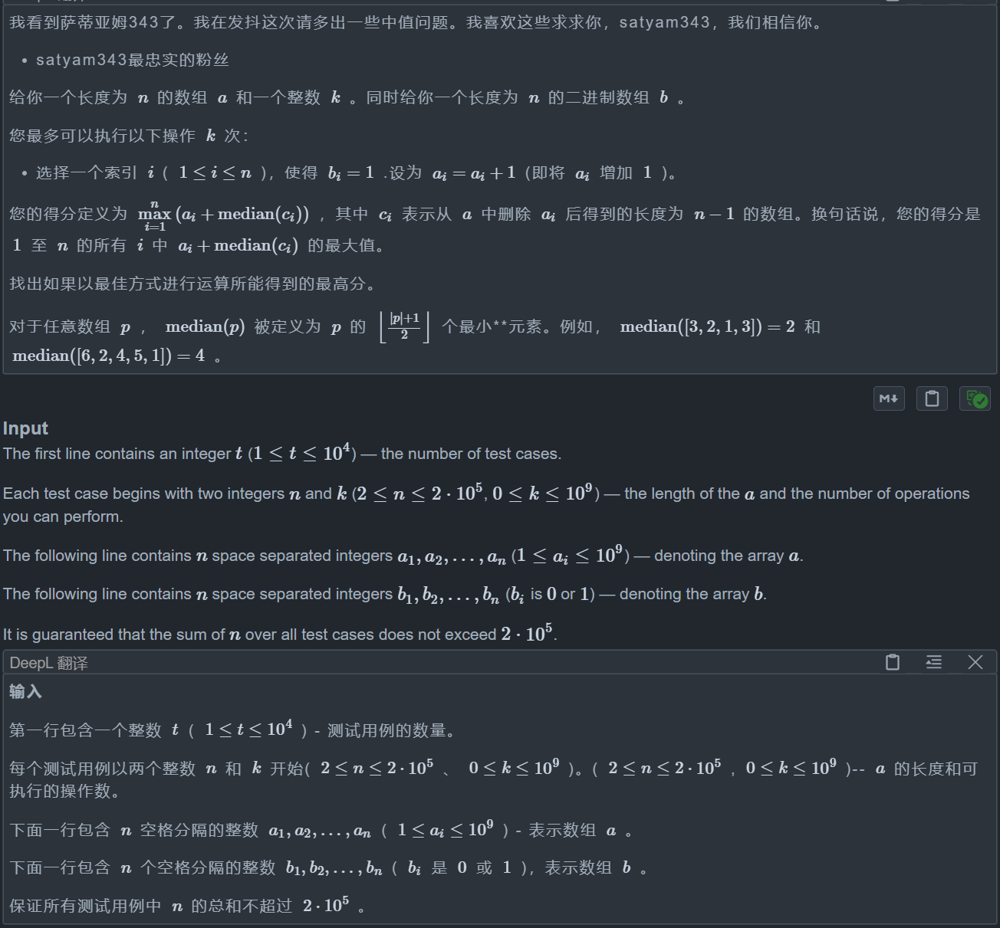

题目大意为给定两个数组a和b以及k此操作，每次操作可以使得一个bi=1的位置的对应的ai增大一，求解最高的得分，得分定义为ai+除了ai的a数组的中位数。

很明显，对于b=1的位置直接增大a更好，因此可以先枚举每个b=1的位置求解最大值。

也可以取数组的最大值然后用所有的的k去增大中位数，把中位数增大的方法不是用前缀和模拟的方法，而是用二分查找看是否满足条件。

```python
for _ in range(R()):
    n,k=RR()
    a=RR()
    b=RR()
    # 合成一个数组
    nums=[(i,j) for i,j in  zip(a,b)]
    nums.sort()# 排序
    # 找到中间位置
    index=n>>1 if n&1 else n//2-1
    ans=0
    # 枚举每个b=1的位置
    for ii in range(n):
        i,j=nums[ii]
        if j:
            # 删去这个位置后对中位数的位置分类讨论
            if ii<=index and n&1==0:ans=max(ans,i+k+nums[index+1][0])
            elif ii<index and n&1:ans=max(ans,i+k+nums[index][0])
            elif ii== index and n & 1:ans = max(ans, i + k + nums[index-1][0])
            elif n&1:ans=max(ans,i+k+nums[index-1][0])
            else:ans=max(ans,i+k+nums[index][0])
    l,r=0,10**9
    # 二分查找，看是否能找到一半以上的大于等于x的数且代价小于等于k，如果可以那么中位数至少是x
    def cal(x):
        cnt=0
        cost=0
        arr=nums
        for j in range(n-2,-1,-1):
            if nums[j][0]>=x:cnt+=1
            elif nums[j][1]:
                cost+=x-nums[j][0]
                if cost>k and cnt<ceil(n/2):return False
                cnt+=1
        return cnt>=ceil(n/2)

	# 二分找除去了最大值后能把中位数增大到多少
    while l<=r:
        mid=(l+r)>>1
        if cal(mid):
            l=mid+1
        else:
            r=mid-1
    ans=max(ans,nums[-1][0]+l-1)
    print(ans)
```

### **Triple Attack**

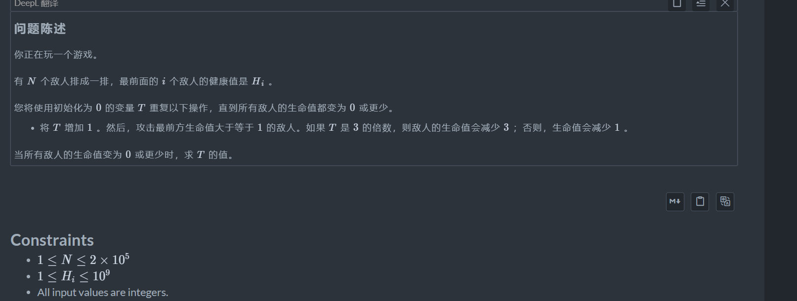

能直接想到二分法，但这里不是对最终答案二分而是对每个数需要操作几次二分

 假设对一个数需要操作x次，为了确定x次是否能满足要求需要得到T+1,T+mid之间3的个数可以用类似前缀和的操作求出cnt = ((ans + mid) // 3 - ans // 3)

```python
n = R()
nums = RR()
ans = 0
for x in nums:
    l, r = 1, x
    while l <= r:
        mid = (l + r) >> 1

        def cal(mid):
            cnt = ((ans + mid) // 3 - ans // 3)
            return mid - cnt + 3 * cnt >= x

        if cal(mid):
            r = mid - 1
        else:
            l = mid + 1
    ans += r + 1
print(ans)
```


## 滑动窗口

滑动窗口多用于解决最长/最短数组

滑动窗口算法借助快慢指针实现窗口，时间复杂度为O(N)，因为双指针不会回退，每个元素只会进入一次然后移除一次，不会有某个元素多次进入移除。

注意数组中如果有负值就不能用滑动窗口。

基本框架

```python
left,right=0
while right<len(nums):
	window.add(nums[right])
    right+=1
    while left<right and window needs shrink:
        window.remove(nums[left])
        left+=1
```

需要明确：

+ 扩大窗口需要更新什么
+ 什么时候停止扩大窗口
+ 缩小窗口需要更新什么
+ 结果是在扩大还是缩小的时候更新 

### 最小覆盖字串

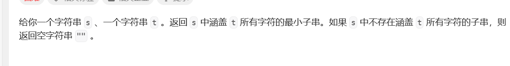

解题思路：首先使用双指针技巧初始化一个窗口，然后扩大窗口直到满足条件，之后缩小窗口，直到不满足条件，重复上述过程。

总是寻找可行解再优化可行解。

```python
from collections import Counter

class Solution(object):
    def minWindow(self, s, t):

        if s==t:
            return s
		
        # 左右指针
        left = 0
        right = 0
		
        # 两个计数器，记录两个字符串中字符串出现的次数
        needs = Counter(t)
        windows = {}
		
        # 表示窗口中满足needs条件的字符个数
        valid = 0
		
        # 记录开始的索引
        start = 0
        # 记录子串的长度
        end = 1000000
		
        # 开始滑动
        while right < len(s):
            # 区间左闭右开
            c = s[right]# 加入的字符
            right += 1
			
            # 判断加入的字符是否在t
            if c in needs:
                # 满足条件，更新计数器，以下是python中字典的更新的方法，不能直接加一
                if c not in windows:
                    windows[c] = 1
                else:
                    windows[c] += 1
                # 如果当前字串中这个类型的字符已经与t中同类型的字符相等了，更新valid
                if windows[c] == needs[c]:
                    valid += 1
			
            # 当前字串已经涵盖了t中的所有字符，优化可行解，缩小窗口
            while valid == len(needs):
				
                # 判断当前字串是否是最小的
                if right - left < end:
                    # 更新索引长度
                    start = left
                    end = right - left
				
                # 移出的字符
                d = s[left]
                left += 1
				
                # 判断移出的字符是否在t
                if d in needs:
                    if windows[d] == needs[d]:
                        valid -= 1
                    windows[d] -= 1
         
        # 返回最终结果
        return s[start:start + end] if end!=1000000 else ''
```


### 字符串的排列

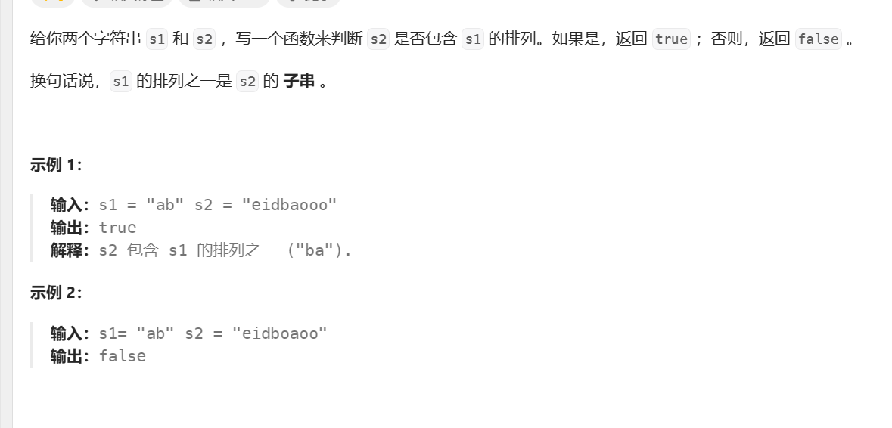

要求s2中存在一个子串包含s1中的所有字符，且不存在其他字符。

这道题与之前不同，要求维护一个定长的窗口，因此停止窗口的条件是窗口的大小大于s1长度，扩大窗口时更新计数器，缩小窗口时更新计数器，判断结果是否成立。

```python
from collections import Counter
class Solution(object):
    def checkInclusion(self, s1, s2):
        left=0
        right=0
        valid=0

        needs=Counter(s1)
        windows={}

        while right<len(s2):

            c=s2[right]
            right+=1

            if c in needs:
                if c not in windows:
                    windows[c]=1
                else:
                    windows[c]+=1

                if windows[c]==needs[c]:
                    valid+=1
            
            # 窗口是定长的，一旦窗口大于了固定的长度就要缩减优化
            while right-left>=len(s1):# 实际上改为if也一样，定长的窗口一旦超出就要剪短，一剪短就要扩大，相当于扩大一步缩减一步
                # 判断结束条件
                if valid==len(needs):
                    return True
                
                d=s2[left]
                left+=1
                
                if d in needs:
                    
                    if windows[d]==needs[d]:
                        valid-=1
                    
                    windows[d]-=1
        return False
```


### 找到字符串中所有字母异位词

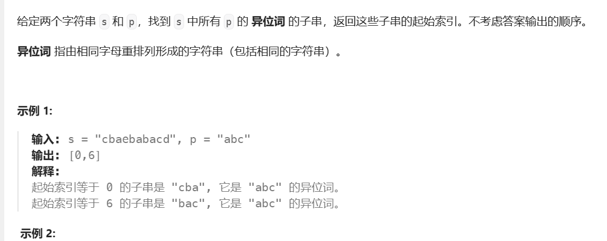

即在S中找出P的所有组合。

```python
from collections import Counter
class Solution(object):
    def findAnagrams(self, s, p):

        left=0
        right=0

        res=[]
        valid=0

        needs=Counter(p)
        windows={}

        while right<len(s):
            c=s[right]
            right+=1

            if c in needs :
                if c not in windows:
                    windows[c]=1
                else:
                    windows[c]+=1
                if windows[c]==needs[c]:
                    valid+=1

		# 同样是定长的
            while right-left>=len(p):

                if valid==len(needs):
                    res.append(left)

                d=s[left]
                left+=1

                if d in needs:
                    if windows[d]==needs[d]:
                        valid-=1
                    windows[d]-=1

        return res
```

### 无重复字符的最长子串

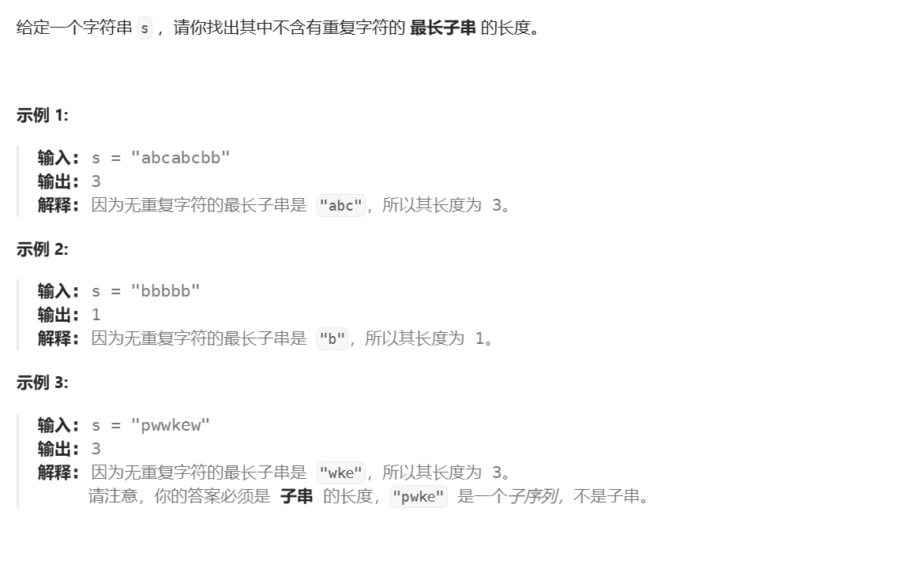

```python
class Solution(object):
    def lengthOfLongestSubstring(self, s):
        left=0
        right=0
        res=0
        windows={}

        while right<len(s):
            c=s[right]
            right+=1
			
            # 扩大的同时更新计数器
            if c not in windows:
                windows[c]=1
            else:
                windows[c]+=1
				
            # 如果新加入的元素出现了多次，停止扩大窗口
            while windows[c]>1:
                # 缩小时更a新计数器
                d=s[left]
                left+=1
                windows[d]-=1
                
            res=max(res,right-left)
        return res

```

### 最长交替子序列

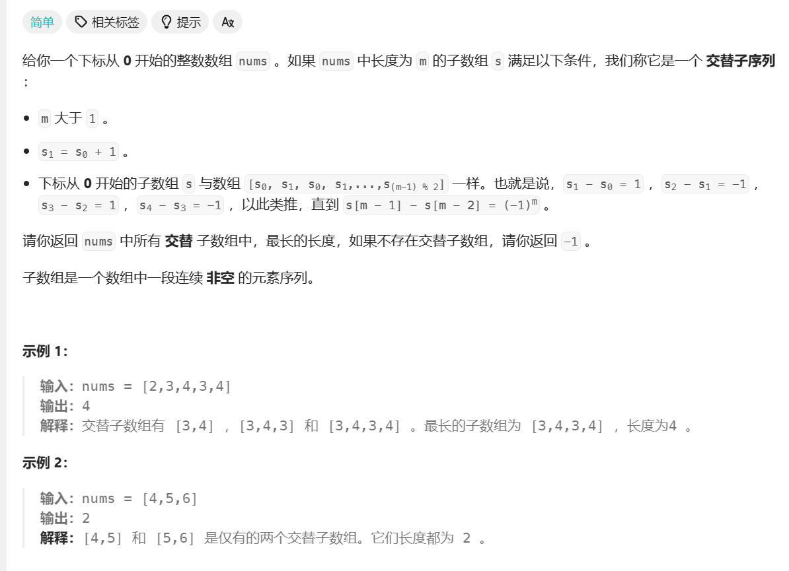

```python
class Solution(object):
    def alternatingSubarray(self, nums):
        ans=-1
        left=0
        right=1
        while right<len(nums):
            if nums[right]-nums[left]==1:
                # 注意条件即可
                while right<len(nums) and nums[right]-nums[right-1]==(-1)**(right-left+1):
                    right+=1
                ans=max(ans,right-left)
                left=right-1
            else:
                left=right
                right+=1
        return ans
```

### [删掉一个元素以后全为 1 的最长子数组](https://leetcode.cn/problems/longest-subarray-of-1s-after-deleting-one-element/)

滑动窗口求解，最长的区间内必然至多只有一个0，实用滑动窗口向右滑动，直到区间内包含了两个0，此时开始收缩区间直到区间中只有一个0，然后继续滑动，过程中不断记录最大值。


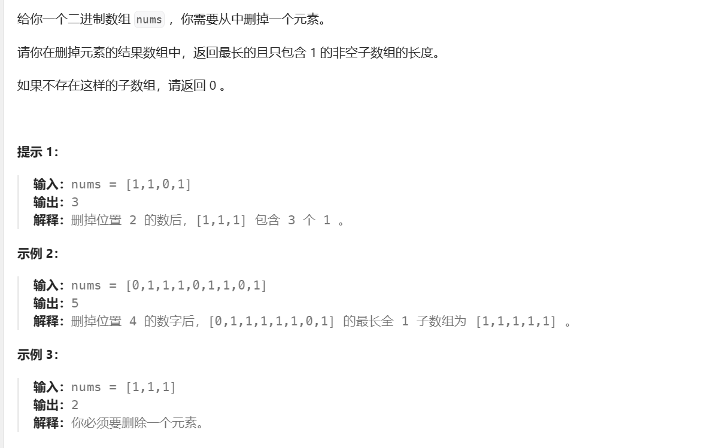

```python
class Solution(object):
    def longestSubarray(self, nums):
        l=r=0
        count=0
        n=len(nums)
        res=0
        while r<n:
            if nums[r]==0:
                count+=1

            while l<r and count>1:
                if nums[l]==0:
                    count-=1
                l+=1
            res=max(r-l+1,res)
            r += 1
        return res-1
```


### [数组的最大美丽值](https://leetcode.cn/problems/maximum-beauty-of-an-array-after-applying-operation/)

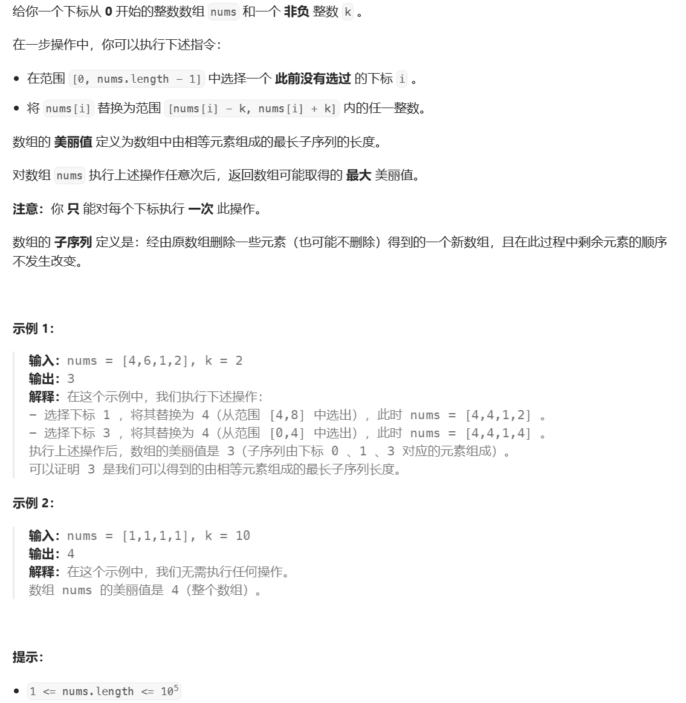

`很明显不考虑顺序，可以将原数组进行排序，但要想到排完序之后就是找一个子数组了(技巧点)`，按照题目的要求，一个数只能加k或者减k，那么如果区间内的值不满足，区间外的也不会满足。

对于一个顺序数组的区间，要想其中的值都相同，最大值不能再增加，最小值不能再减小，因此最大值减小后必须小于等于最小值增大后的结果，问题转换为找一个最长的子数组其中最大值和最小值的差不超过2k。

```python
class Solution:
    def maximumBeauty(self, nums: List[int], k: int) -> int:
        nums.sort()
        n=len(nums)
        ans=1
        l,r=0,1
        while r<n:
            if nums[r]-nums[l]<=2*k:
                ans=max(ans,r-l+1)
            else:
                while nums[r]-nums[l]>2*k:
                    l+=1
            r+=1
        return ans 
```


### [最大连续1的个数 III](https://leetcode.cn/problems/max-consecutive-ones-iii/)

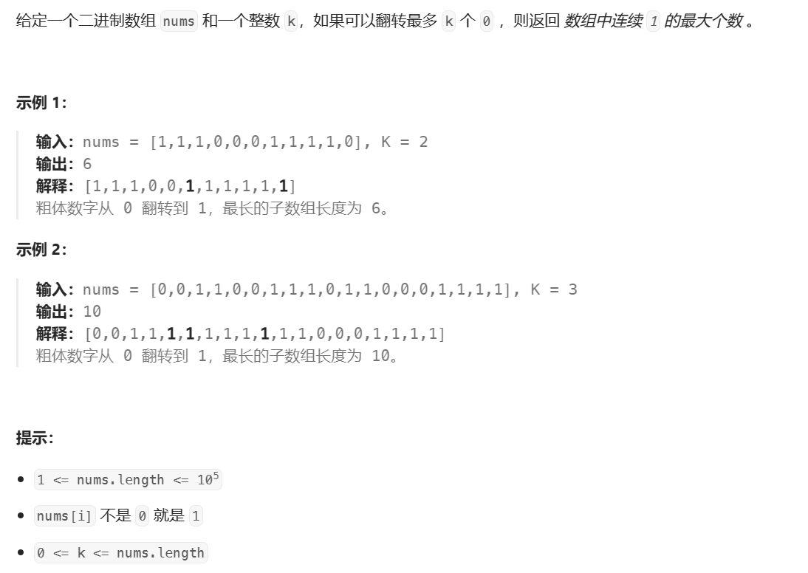


可以进行k次把0转换为1的操作，那么要求区间内最多有k个0，`问题转为求解包含最多k个0的最长区间是？`

注意去思考一个区间的限制条件是什么，是什么不能让他无限扩大，就这个限制条件取解题。

```python
class Solution:
    def longestOnes(self, nums: List[int], k: int) -> int:
        n=len(nums)
        l=r=cnt=ans=0
        while r<n:
            if nums[r]==0:
                cnt+=1
            while cnt>k:
                cnt-=int(nums[l]==0)
                l+=1
            ans=max(ans,r-l+1)
            r+=1
        return ans 
```


### [绝对差不超过限制的最长连续子数组](https://leetcode.cn/problems/longest-continuous-subarray-with-absolute-diff-less-than-or-equal-to-limit/)


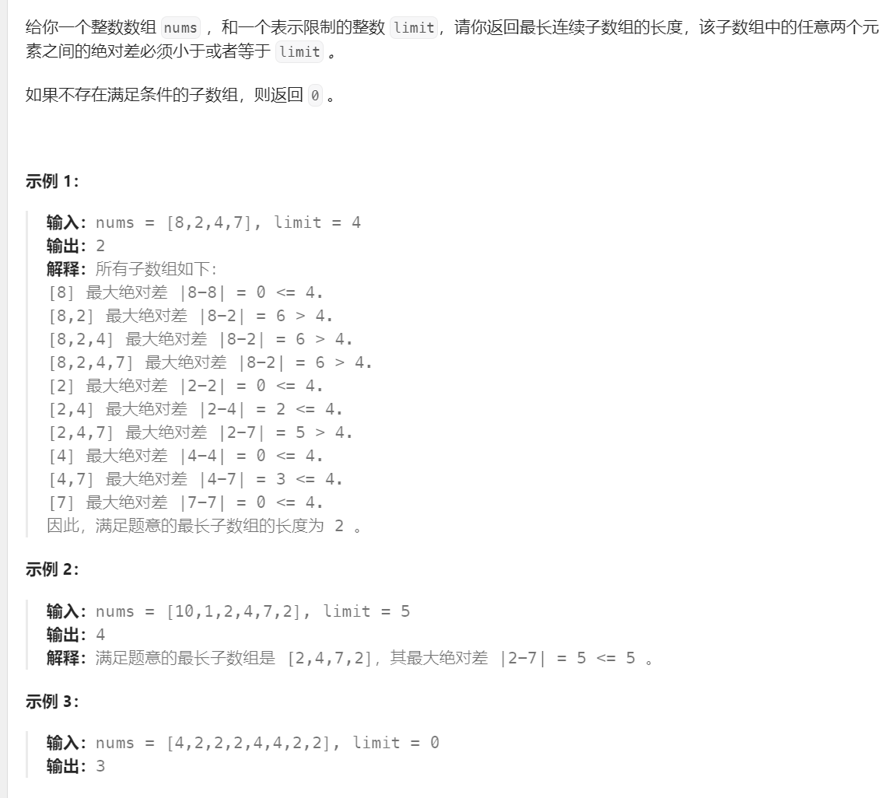


使用滑动窗口但是需要得到窗口中元素的最大值和最小值，以及删除了当前最大值最小值后能快速得到下一个最大值最小值，可以用队列维护窗口中的元素。

```python
class Solution:
    def longestSubarray(self, nums: List[int], limit: int) -> int:
        n=len(nums)
        l=r=ans=0
        mx=deque()
        mn=deque()
        while r<n:
            val=nums[r]
            # 按顺序加入，如果后面的元素更大那么前面的元素不会起作用，并且会被窗口先去除，因此弹出队列中比自己小的。
            while mn and mn[-1]>val:
                mn.pop()
            while mx and mx[-1]<val:
                mx.pop()
            mx.append(val)
            mn.append(val)
            while mn and mx and mx[0]-mn[0]>limit:
                if nums[l]==mn[0]:
                    mn.popleft()
                if nums[l]==mx[0]:
                    mx.popleft()
                l+=1
            r+=1
            ans=max(r-l,ans)
        return ans 
    
       from sortedcontainers import SortedList
        # 使用内置的有序列表来维护窗口中的元素
       s=SortedList()
        while r<n:
            s.add(nums[r])
            while s[-1]-s[0]>limit:
                s.remove(nums[l])
                l+=1
            ans=max(ans,r-l+1)
            r+=1
        return ans 
```


### [最少交换次数来组合所有的 1 II](https://leetcode.cn/problems/minimum-swaps-to-group-all-1s-together-ii/)

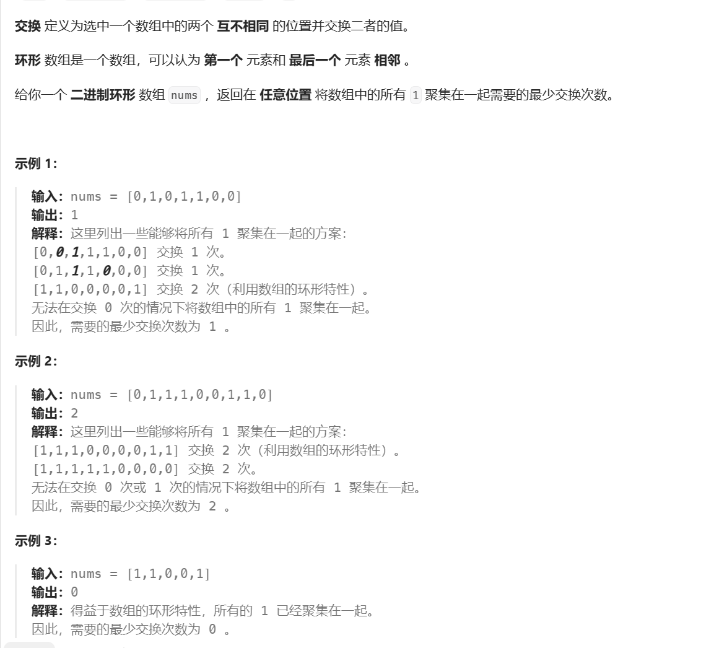

最后的结果一定是所有的1聚集在一起（技巧点），因此找每个长度为L(1的个数)的区间其中0的个数就是要交换的次数，环形可以通过连接数组求出。

```python
class Solution:
    def minSwaps(self, nums: List[int]) -> int:
        t=nums.count(1)
        nums=nums*2   
        
        l=r=cnt=0
        ans=inf
        n=len(nums)
        while r<n:
            if nums[r]==0:
                cnt+=1
            if r-l+1==t:
                ans=min(ans,cnt)
                cnt-=1 if nums[l]==0 else 0
                l+=1
            r+=1
        return ans if ans!=inf else 0

```

### [统计得分小于 K 的子数组数目](https://leetcode.cn/problems/count-subarrays-with-score-less-than-k/)

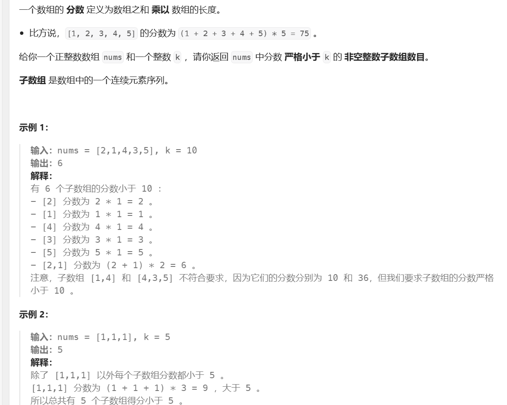

一个区间如果满足条件那么它内部比它小的区间也也一定满足条件，枚举每个右端点去找它满足条件的最左的左端点

```python
class Solution:
    def countSubarrays(self, nums: List[int], k: int) -> int:
        s=ans=l=0
        for r,num in enumerate(nums):
            # s表示区间内的和
            s+=num
            # 如果不满足条件移动左端点，这里的左端点不是从头开始
            while s*(r-l+1)>=k:
                s-=nums[l]
                l+=1              
            # 记录满足的区间数，这个区间能贡献的大小：(l,r-1)贡献的大小（每个为开头结尾是r）外加上r单独的一个，有点递推的性质	
            # 比如说1位贡献1(1)，2位贡献（ 1 2，2）3位贡献(1 2 3 ,2 3 ,3 )即在上一个的基础上加一
            # 技巧点
            ans+=r-l+1
        return ans 
```

### [将 x 减到 0 的最小操作数](https://leetcode.cn/problems/minimum-operations-to-reduce-x-to-zero/)

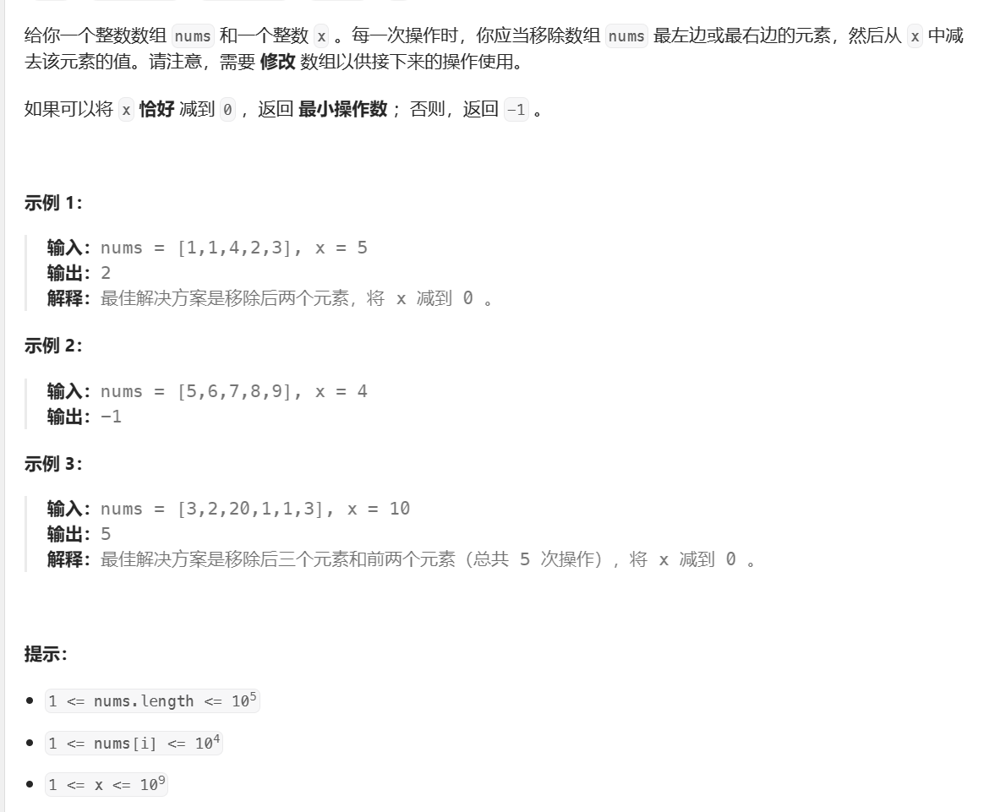

减去两边最后留下中间一部分，就是在找子数组。反向思考，找出总和为total-target的最长子数组。

```python
class Solution:
    def minOperations(self, nums: List[int], target: int) -> int:
        total=sum(nums)
        if total<target:return -1
        s=l=0
        ans=-1
        target=total-target
        # 枚举右指针，找到满足条件的最小的左指针
        for r,v in enumerate(nums):
            s+=v
            while s>target:
                s-=nums[l]
                l+=1
            if target==s:
                ans=max(ans,r-l+1)
        return -1 if ans<0 else len(nums)-ans
```

 

### [最高频元素的频数](https://leetcode.cn/problems/frequency-of-the-most-frequent-element/)

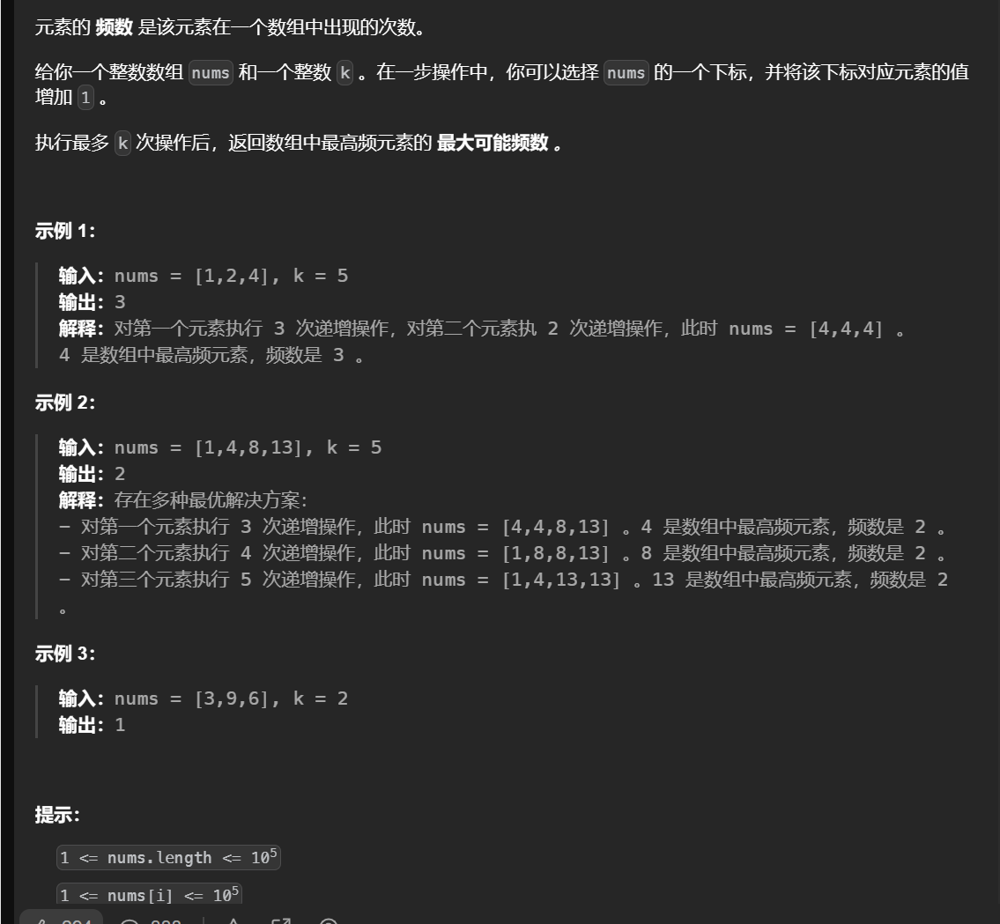


首先将数组排序，然后使用双指针判断能满足下述条件的最长区间。这种填充问题可以想象出阶梯图。


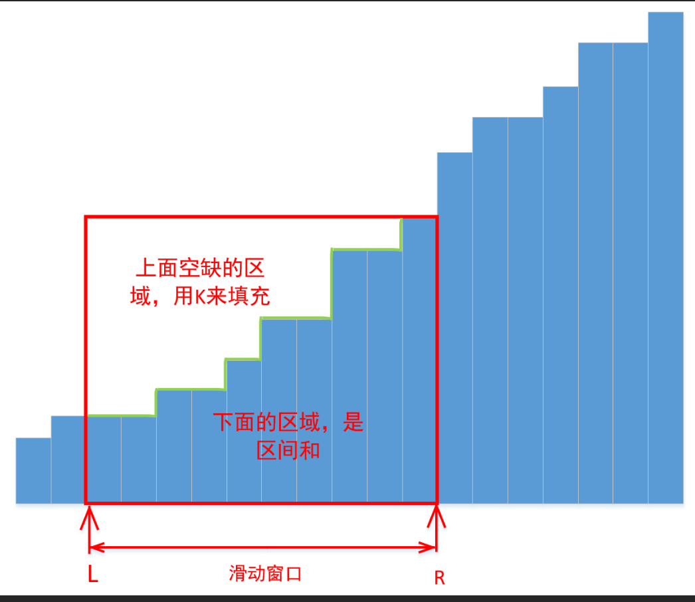


```python
class Solution:
    def maxFrequency(self, nums: List[int], k: int) -> int:
        l=r=0
        nums.sort()
        pre=list(accumulate(nums,initial=0))
        n=len(nums)
        ans=0
        while r<n:
            val=pre[r+1]-pre[l]
            total=nums[r]*(r-l+1)
            while total-val>k and l<r:
                l+=1
                total=nums[r]*(r-l+1)
                val=pre[r+1]-pre[l]
            ans=max(ans,r-l+1)
            r+=1
        return ans 
```

### [统计好子数组的数目](https://leetcode.cn/problems/count-the-number-of-good-subarrays/)

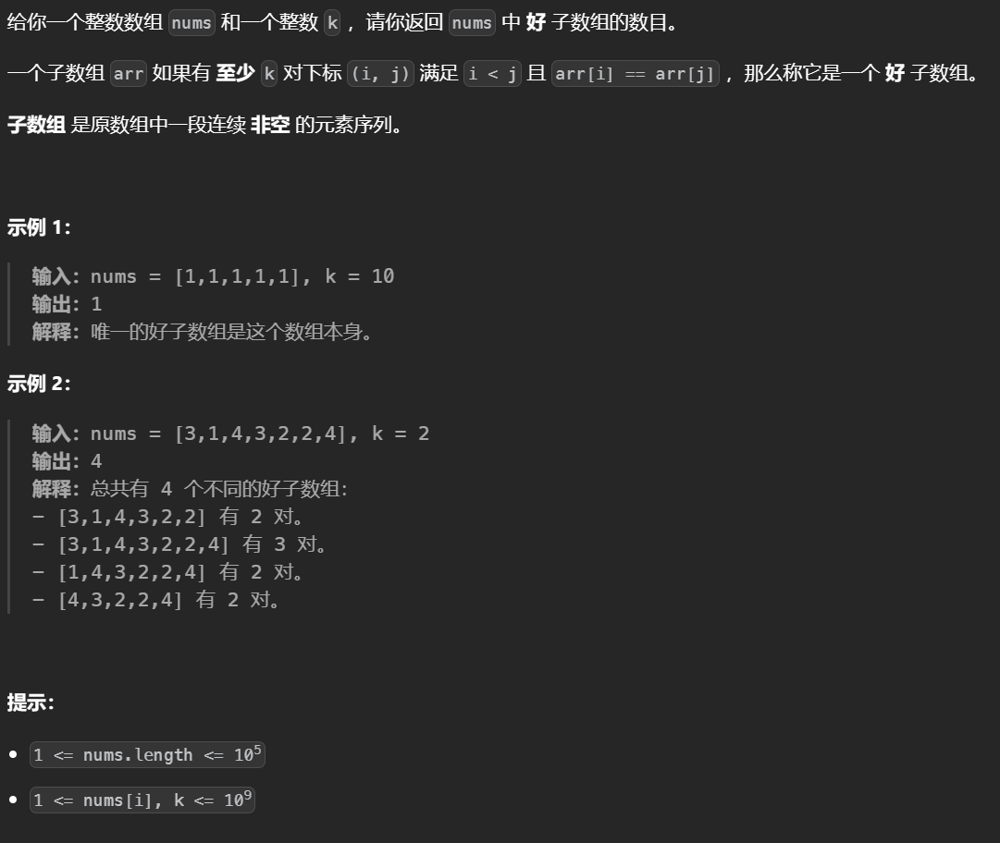

这里考虑枚举右端点，如果一个区间满足那么这个区间左端点以左的位置都是合适的区间，因此在枚举的过程中一直更新答案

计数的过程中如果一个增加一，那么根据数学公式计算总的满足条件的个数会增加k个(k是原先的个数)，如果减少一上述个数会减少k个(k是减少后的个数)

```python
class Solution:
    def countGood(self, nums: List[int], k: int) -> int:
        cnt=Counter()
        # p记录当前有多少个相等的数对
        l=p=ans=0
        # 滑动
        for x in nums:
            p+=cnt[x]
            # 计数
            cnt[x]+=1
            # 左端点左边的位置都是可以的，因此不断加上，只有当找到了满足的情况左端点才会移动
            ans+=l
            # 满足条件收缩边界
            while p>=k:
                # 注意当前整个子数组要记录一次
                ans+=1
                cnt[nums[l]]-=1
                p-=cnt[nums[l]]
                l+=1
        return ans 
```


### Quiz Master


找一个子序列，要求子序列中所有值的因数可以涵盖1~m，每加入一个值都会增加多个因数，序列具有单调性满足滑动窗口的性质。观察发现，选择的数一定是连续的。

```python
from cmath import inf
from collections import defaultdict

for _ in range(int(input())):
    n, m = [int(x) for x in input().split()]
    nums = sorted(set([int(x) for x in input().split()]))
    # 求解因数
    memo = defaultdict(list)
    for v in nums:
        for i in range(1, int(v ** 0.5 + 1)):
            if v % i == 0:
                memo[v].append(i)
                if v//i!=i:memo[v].append(v//i)
    vis = defaultdict(int)
    l = 0
    ans=inf
    # 左右端点
    for r, x in enumerate(nums):
        for c in memo[x]:
            # 超出的不加入
            if c > m: continue
            vis[c] += 1
        # 相等了收缩窗口
        while len(vis) == m:
            ans = min(ans, x - nums[l])
            for c in memo[nums[l]]:
                if c > m: continue
                vis[c] -= 1
                if not vis[c]: del vis[c]
            l+=1
    print(ans if ans!=inf else -1)


```


### [预算内的最多机器人数目](https://leetcode.cn/problems/maximum-number-of-robots-within-budget/)

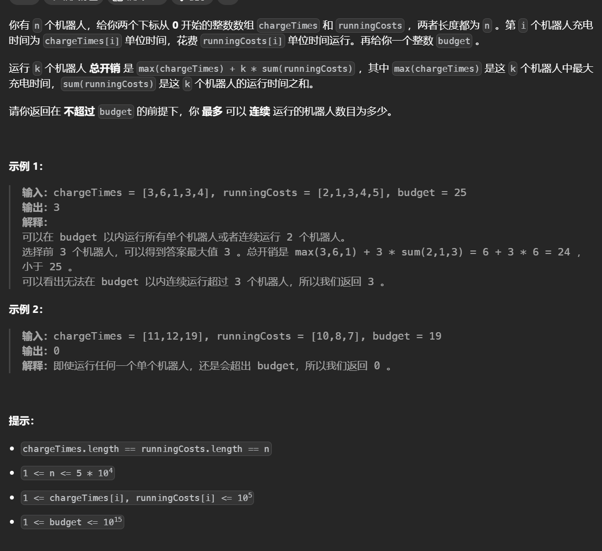

对于题目给定的连续区间，可以想到使用滑动窗口求解，用滑动窗口求解k*sum(runningCosts)，同时使用栈来求解这个区间内的最大值。

```python
class Solution:
    def maximumRobots(self, chargeTimes: List[int], runningCosts: List[int], budget: int) -> int:
        l=t=ans=0
        d=deque()
        for r,x in enumerate(runningCosts):
            t+=x
            while d and chargeTimes[d[-1]]<=chargeTimes[r]:
                d.pop()
            d.append(r)
            while l<=r and  d and  t*(r-l+1)+chargeTimes[d[0]]>budget:
                if d[0]==l:
                    d.popleft()
                t-=runningCosts[l]
                l+=1
            ans=max(ans,r-l+1)
        return ans 
```

### [找出最长等值子数组](https://leetcode.cn/problems/find-the-longest-equal-subarray/)

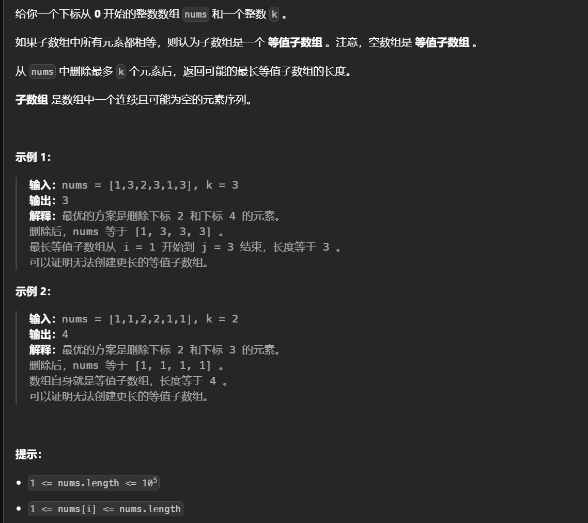

滑动窗口，这里不是对整个数组滑动，而是对于同一组值滑动。

对相同的值记录他们的下标，然后滑动，这样的话既可以直到区间长度又可以直到区间内相同值的个数

```python
class Solution:
    def longestEqualSubarray(self, nums: List[int], k: int) -> int:
        pos=defaultdict(list)
        # 记录每个相同值的下标
        for i,v in enumerate(nums):
            pos[v].append(i)
        ans=0
        # 遍历每一组
        for p in pos.values():
            l=0
            for r,x in enumerate(p):
                # 区间长度
                ll=p[r]-p[l]+1
                # 相同的x的个数
                cnt=r-l+1
                # 收缩
                while l<r and ll-cnt>k:
                    l+=1
                    ll=p[r]-p[l]+1
                    cnt=r-l+1
                ans=max(ans,cnt)
        return ans
```

### [使二进制字符串字符交替的最少反转次数](https://leetcode.cn/problems/minimum-number-of-flips-to-make-the-binary-string-alternating/)

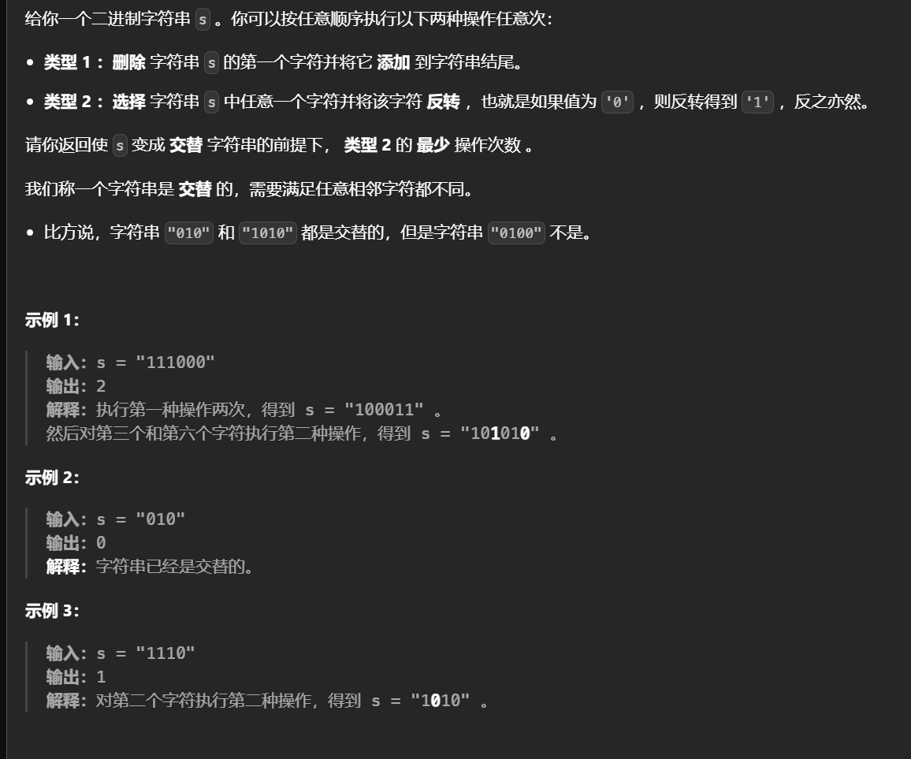


考虑结果必然是01连续或者10连续，那么直接将原字符串与目标字符串对比判断即可，这里的方法一是将首字符转移到尾部也就是类似于首尾相连，可以拼接字符串来模拟操作，这里只要求找类型二最少的操作次数因此可以直接比较。

```python
class Solution:
    def minFlips(self, s: str) -> int:
        ll=len(s)
        s+=s
        n=len(s)
        # 创建两个模式串，长度为拼接后的
        p1='10'*(n//2) if not n&1 else '10'*(n//2)+'1'
        p2='01'*(n//2) if not n&1 else '01'*(n//2)+'0'
        d1=d2=l=0
        ans=inf 
        # 滑动窗口找不同
        for r,x in enumerate(s):
            if s[r]!=p1[r]:d1+=1
            if s[r]!=p2[r]:d2+=1
            while r-l+1>ll:
                if s[l]!=p1[l]:d1-=1
                if s[l]!=p2[l]:d2-=1
                l+=1
            # 大小满足
            if r-l+1==ll:ans=min(ans,d1,d2)
        return ans 

```


### [毯子覆盖的最多白色砖块数](https://leetcode.cn/problems/maximum-white-tiles-covered-by-a-carpet/)

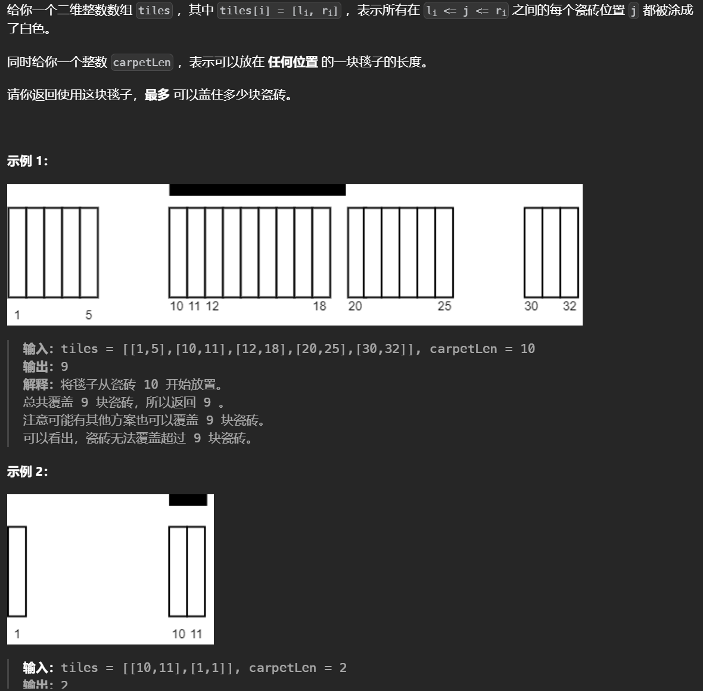

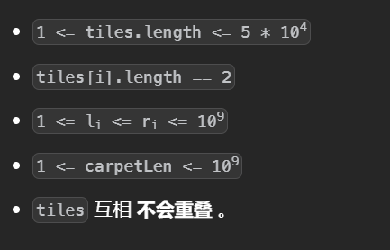


为了覆盖最大的范围，每次都是从区间的左端点开始找，使用双指针对区间操作。

```python
class Solution:
    def maximumWhiteTiles(self, nums: List[List[int]], carpetLen: int) -> int:
        l=r=ans=0
        # 首先排序
        nums.sort()
        n=len(nums)
        now=0
        while l<=r and r<n:
            # 如果毯子的长度足够覆盖当前的区间，那么右指针移动
            while r<n and nums[r][1]-nums[l][0]+1<=carpetLen:
                now+=nums[r][1]-nums[r][0]+1
                r+=1
            # 如果不能完全覆盖，即只覆盖一部分
            if r<n and nums[r][0]-nums[l][0]+1<=carpetLen:
                ans=max(ans,now+carpetLen+nums[l][0]-nums[r][0])
            else:
                # 不能覆盖
                ans=max(ans,now)
            # 移动左端点
            now-=nums[l][1]-nums[l][0]+1
            l+=1
        return ans 
```

### To Add or Not to Add

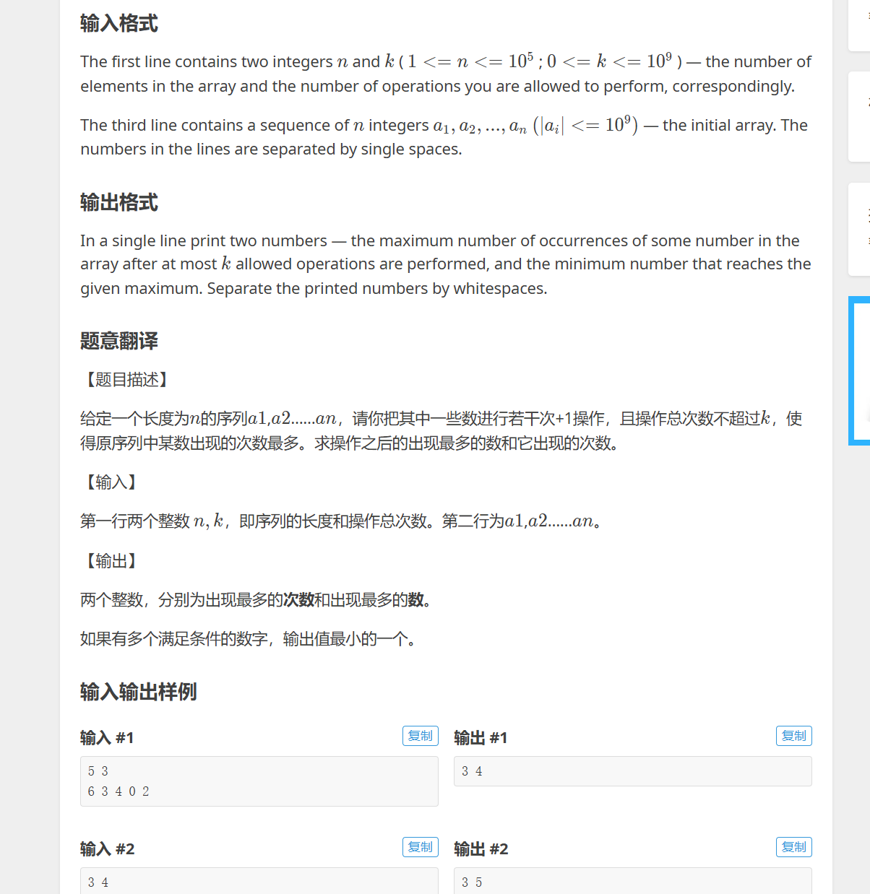

数组的顺序不影响答案，因此可以先排序，一个元素只能把比他小的变为他同时最优的选择是紧跟在这个元素之后的元素，用不定长滑动窗口求解，把给定区间内的数都变为一个数所需的操作次数可以用前缀和快速求解，如果这个操作所需的次数大于k那么必须收缩窗口因为如果不收缩在窗口往外扩大的时候也一定不会满足条件，也就是不会漏。

```python
from collections import deque, defaultdict, Counter
from functools import lru_cache
from bisect import bisect_left
from itertools import accumulate
from math import ceil
import sys
from typing import List
input = sys.stdin.readline
def R(): return int(input())
def RR(): return [int(x) for x in input().split()]
def get_pre(nums):return list(accumulate(nums,initial=0))

n,k=RR()
a=RR()
a.sort()
l=0
ans=0
res=-1
# 前缀和
pre=get_pre(a)
# 不定长滑动窗口
for r,x in enumerate(a):
    tt=x*(r-l+1)-(pre[r+1]-pre[l])
    while tt>k:
        l += 1
        tt=x*(r-l+1)-(pre[r+1]-pre[l])

    if r-l+1>ans:
        ans=r-l+1
        res=x
print(ans,res)
```

### [交替组 II](https://leetcode.cn/problems/alternating-groups-ii/)

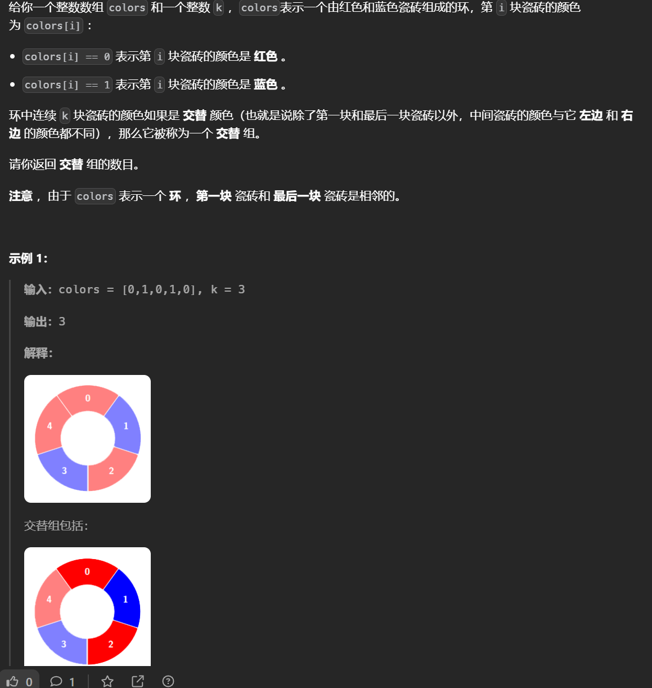

双指针操作，如果满足相邻元素不同那么右指针右移，否则让左指针等于右指针，一直操作直到超出范围。如果在这个过程中双指针范围内的元素个数大于等于k了那么更新答案。对于环可以首尾拼接。

```python
class Solution:
    def numberOfAlternatingGroups(self, nums: List[int], k: int) -> int:
        ans=cnt=0
        n=len(nums)
        nums*=2
        l,r=0,1
        while r<2*n and l<n:
            if nums[r-1]!=nums[r]:r+=1
            # 不满足则重新指向
        	else:
                l=r
                r+=1
            # 窗口内的元素个数满足了
            if r-l>=k:
                # 如果左指针在范围内，防止重复计算
                if r-k<n:
                    ans+=1
                # 左指针超出了给定的范围，在操作下去只会重复
                else:break
        return ans 
```

### [使数组连续的最少操作数](https://leetcode.cn/problems/minimum-number-of-operations-to-make-array-continuous/)

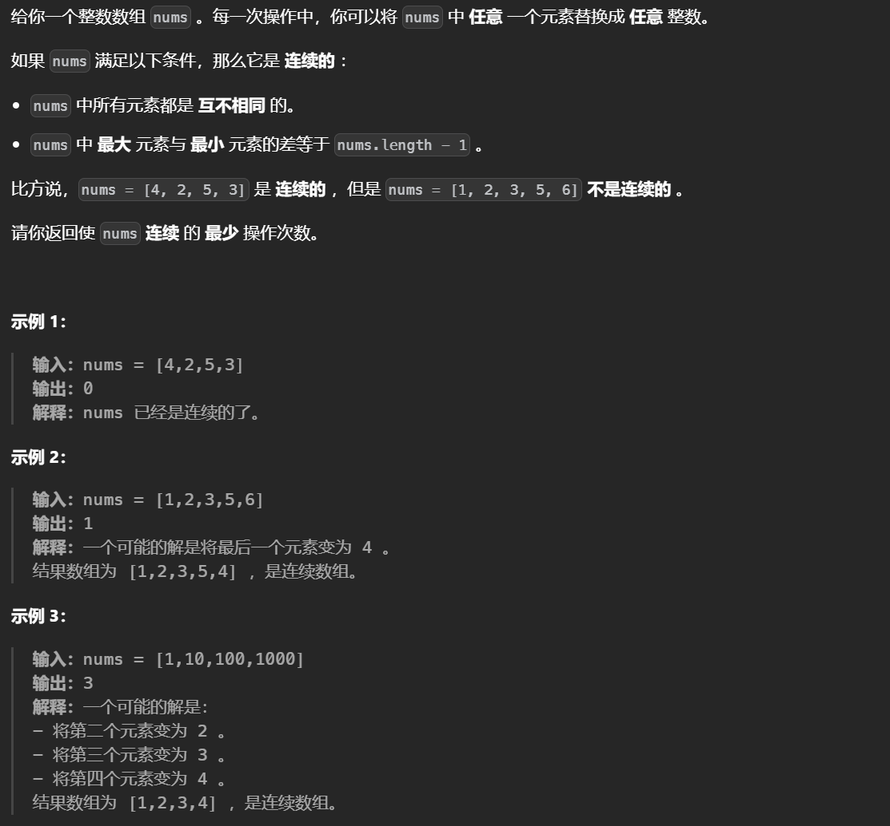

找到有哪些不用变，对排序去重后的数组用双指针操作，枚举每个位置用左端点维护不需要变得值的区间。

```python
class Solution:
    def minOperations(self, nums: List[int]) -> int:
        n=len(nums)
        # 首先排序去重
        nums=sorted(set(nums))
        l=0
        ans=0
        for r,x in enumerate(nums):
            # 不满足条件收缩
            while l<r and nums[r]-nums[l]>n-1:
                l+=1
            ans=max(ans,r-l+1)
        return  n-ans  
```

### [统计定界子数组的数目](https://leetcode.cn/problems/count-subarrays-with-fixed-bounds/)	

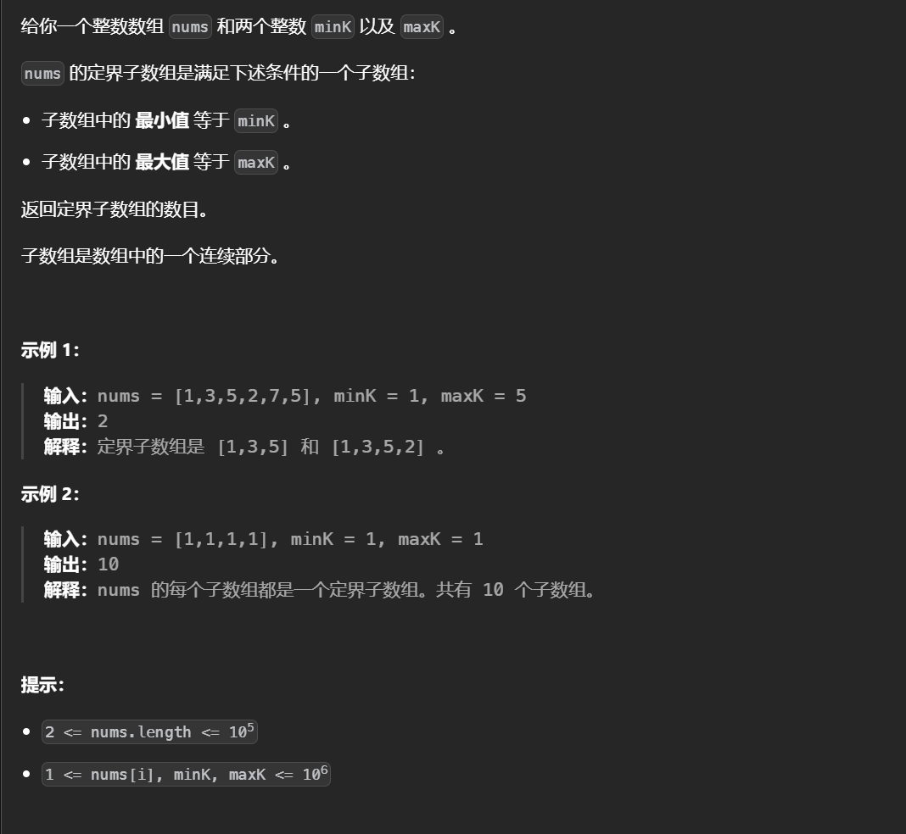

滑动窗口求解，过程中记录窗口中maxk和mink最后一次出现的位置，枚举右端点的过程中如果存在maxk和mink那么可以构成min(maxk,mink)-left个子数组，如果新加入的值不在范围内那么窗口需要重置

```python
class Solution:
    def countSubarrays(self, nums: List[int], mink: int, maxk: int) -> int:
        l=0
        l1=l2=-1
        ans=0
        for r,x in enumerate(nums):
            # 窗口重置
            if x<mink or x>maxk:
                l1=l2=-1
                l=r+1
            # 记录两个边界最后一次出现的位置
            if x==mink:l1=r
            if x==maxk:l2=r
			# 满足条件更新答案
            if l1!=-1 and l2!=-1:
                ans+=min(l1,l2)-l+1
        return ans 
```

### [统计满足 K 约束的子字符串数量 II](https://leetcode.cn/problems/count-substrings-that-satisfy-k-constraint-ii/)

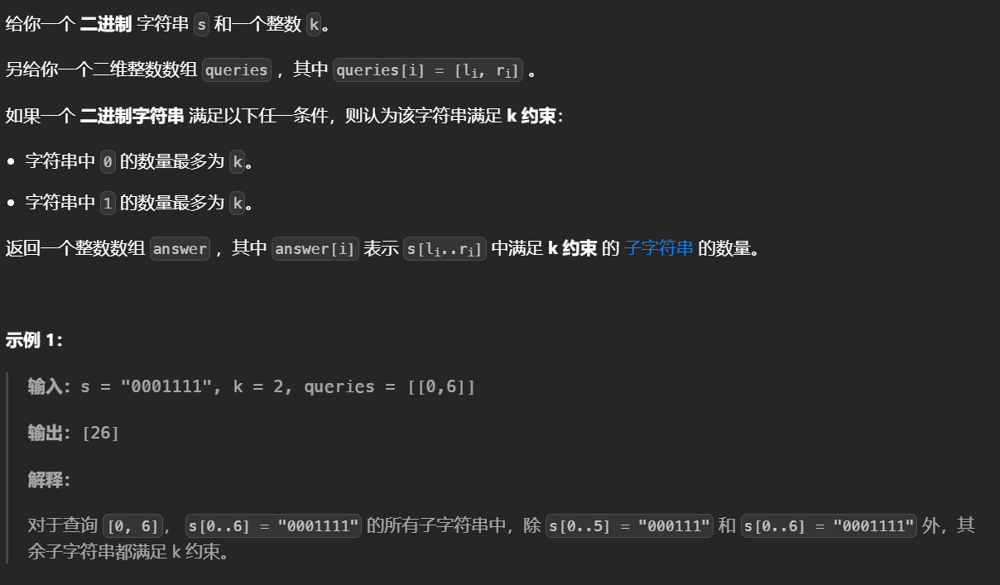


子串问题想到滑动窗口，用滑动窗口计算出以i为右端点满足要求的左端点最远是那里

如果给定的left[r]<=l也就是给定的区间的任意子串都满足要求(left是一个递增的数组，left[r]满足在r之前的也一定满足)，答案就是r-l+1的子段数，长度为r-l+1的有一个，长度为r-l的有两个...一共是1+2+3+...r-l+1个

反之，用二分找到第一个left[j]>=l的这样[l,r-1]区间内都是满足要求的子串，而[j,r]区间内每个点的个数是i-left[i]+1也就是以这个点为右端点的合法子段数，这里可以用前缀和快速求解

```python
class Solution:
    def countKConstraintSubstrings(self, s: str, k: int, queries: List[List[int]]) -> List[int]:
        cnt=[0,0]
        l=0
        left=[]
        arr=[]
        # 滑动窗口求解
        for r,x in enumerate(s):
            cnt[int(x)]+=1
            # 收缩
            while cnt[0]>k and cnt[1]>k:
                cnt[int(s[l])]-=1
                l+=1
            # 记录左端点
            left.append(l)
            # 记录以这个点为右端点的合法数
            arr.append(r-l+1)
        pre=list(accumulate(arr,initial=0))
        ans=[]
        for l,r in queries:
            # 每个子串都可以
            if left[r]<=l:
                ans.append((r-l+2)*(r-l+1)//2)
            else:
                j=bisect_left(left,l,l,r+1)
                cnt=(j-l+1)*(j-l)//2+(pre[r+1]-pre[j])
                ans.append(cnt)
        return ans 
```

### [找出唯一性数组的中位数](https://leetcode.cn/problems/find-the-median-of-the-uniqueness-array/)

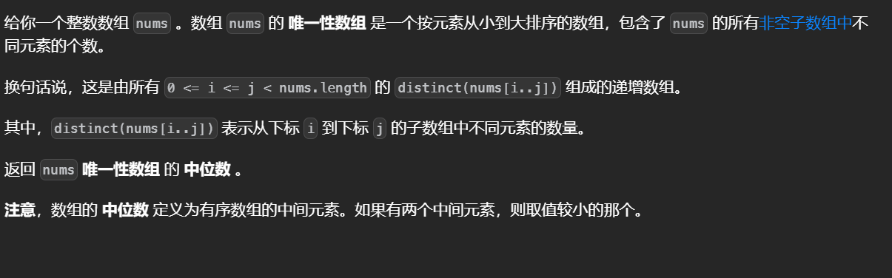

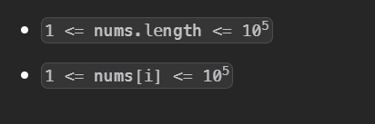

中位数看作是第k大问题可以想到二分distinct值，要找所有的子数组的distinct值考虑到滑动窗口


```python
class Solution:
    def medianOfUniquenessArray(self, nums: List[int]) -> int:
        n=len(nums)
        l,r=1,n
        k=(1+n)*n//2# 一共有多少distinct值
        k=ceil(k/2)
        def cal(xx):
            l=ans=0
            # 用默认字典比counter快一倍
            memo=defaultdict(int)
            for r,x in enumerate(nums):
                memo[x]+=1
                while l<r and len(memo)>xx:
                    memo[nums[l]]-=1
                    if not memo[nums[l]]:del memo[nums[l]]
                    l+=1
                # 这里是子数组，所以计算的是拼接到后面的结果
                ans+=r-l+1
                if ans>=k:return True 
            return False
        while l<=r:
            mid=(l+r)>>1
            if cal(mid):
                r=mid-1
            else:
                l=mid+1
        return r+1
```


# 网络习题


## 连接公路

在战争中，让所有的城市都有公路连接是非常重要的。如果一个城市被敌人占领了，所有来自/前往该城市的公路都会关闭。我们必须立即知道我们是否需要修复任何其他公路以保持其余城市的连接。给出标有所有剩余公路的城市地图，你就该迅速知道需要修复的公路数量。 例如，如果我们有3个城市和2条高速公路连接城市1-城市2和城市1-城市3那么如果城市1被敌人占领，我们必须修复1条公路，也就是公路上的城市2-城市3 输入规范。 每个输入文件包含一个测试案例。每个案例以一行开始，包含3个数字N (<1000)，M和K，分别是城市的总数，剩余的高速公路的数量和要检查的城市数量。然后是M行，每行用2个整数描述—条高速公路，这些整数是高速公路所连接的城市的编号。这些城市的编号从1到N。最后有一行包含K个数字，这些数字什表我们关注的城市。 输出规范。 对于每一个K个城市，在一行中输出如果该城市丢失，需要修复的高速公路的数量。如何解决。

本质上考的是并查集，但可以用dfs解决，当其中一个城市断开时，返回遍历一般除了断开的城市所需的次数减一，即使所需修复的公路

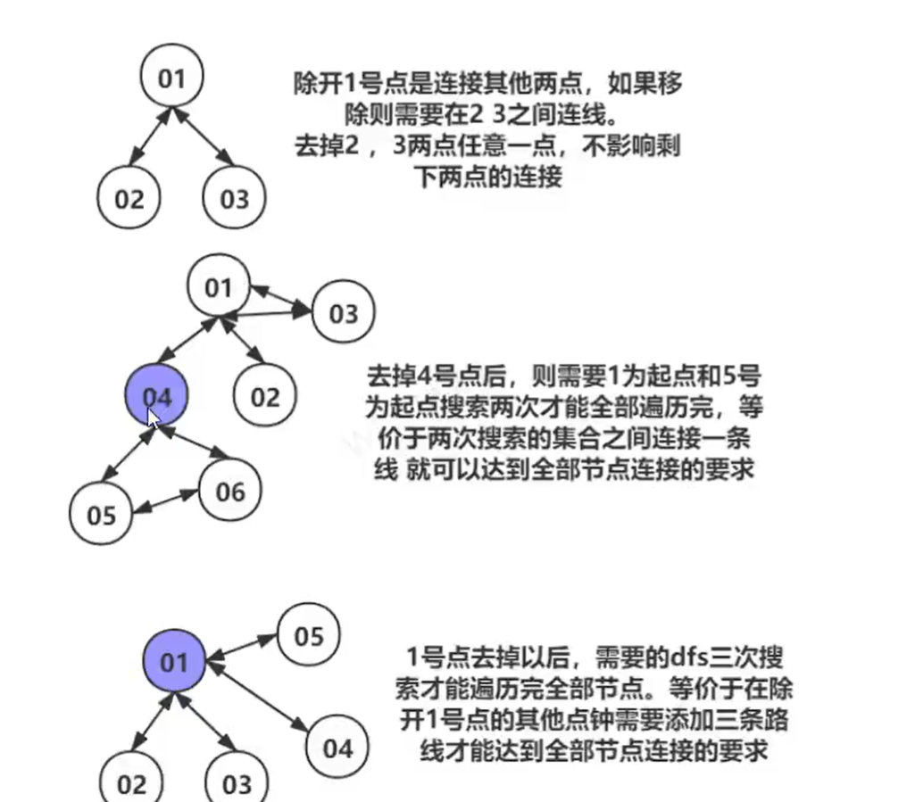

​		

```python
n,m,k=map(int,input().split())
# 使用列表储存每个城市所连的城市,城市从1开始所以空出0
citys=[[]for _ in range(n+1)]

# 相连的城市互相装入
for i in range(m):
    city1,city2=map(int, input().split())
    citys[city1].append(city2)
    citys[city2].append(city1)

# 断开的城市
checks=list(map(int,input().split()))


# 将当前城市所连的城市遍历一般，不包括断开的城市
def dfs(i,check):
    vis[i]=1
    for j in citys[i]:
        if j!=check and vis[j]!=1:
            dfs(j,check)
res=[]

for check in checks:
    # 使用一个列表表示是否访问过
    vis=[0]*(n+1)
    ans=0
    
    for i in range(1,n+1):
       # 如果没访问过并且不是断开的城市，视为一个连接的城市区块
    	if i!=check and vis[i]!=1:
            # 将该城市所连的全部遍历一般
            dfs(i,check)
            ans+=1
	# 结果应该是减一的
    res.append(ans-1)
for i in res:
    print(i)
```

##  同积元组

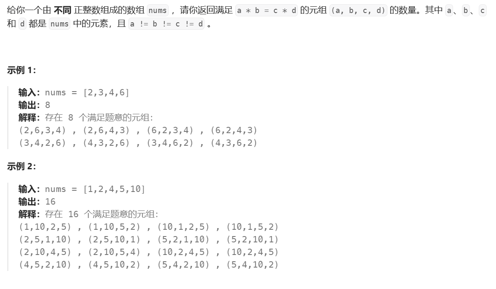

由题意知，找出一个结果就会有八种组合，所有的元素不重复，因此使用一个字典记录所有的乘积的个数，每个乘积对应的个数就是一个个数对，从这些数对中选择两个即是一种结果，从数对中一共可以选出$$C^{2}_{n}$$中结果，最后将这些结果数乘8即可。

```python
class Solution(object):
    def tupleSameProduct(self, nums):
        hash={}
        res=0
        # 记录所有的乘积
        for i in range(len(nums)):
            for j in range(i+1,len(nums)):
               val=nums[i]*nums[j]
               if val not in hash:
                   hash[val]=1
               else:
                   hash[val]+=1
        
        for _,val in hash.items():      
            res+=val*(val-1)//2
        return res*8
```

## 优势洗牌

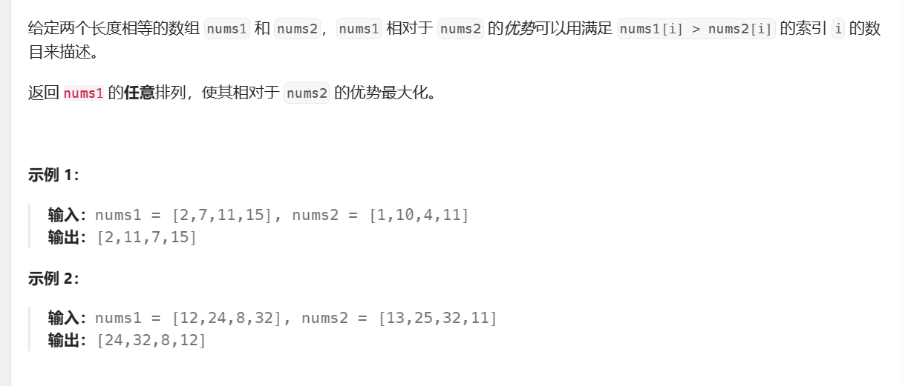

类似于田忌赛马，将两个数组排序后，比较两个数组中的值，如果大于则记录相应的值，反之记录最小的值。

排好序之后从尾部遍历，得到的都是两个数组中的最大值，如果nums1大于nums2，那就直接记录而不用在nums1在找一个小于nums1大于nums2的值，完全没必要，省下来的值用不到了。

```python
class Solution(object):
    def advantageCount(self, nums1, nums2):
        res=[0 for _ in range(len(nums1))]
        nums1.sort()
        num2_temp=[]
        # 不直接对nums2操作，记录值的同时记录索引
        for index,val in enumerate(nums2):
            num2_temp.append((index,val))
            
        num2_temp.sort(key=lambda x: x[1])

		# 用两个变量表示取nums1中的最大还是最小的
        left=0
        right=len(nums1)-1
        # 倒序
        for i in range(len(num2_temp)-1,-1,-1):
            
            val=num2_temp[i]
            index = val[0]
            # 得到在相应的位置记录，不用找是否还有满足的值
            if nums1[right]>val[1]:
               
                res[index]=nums1[right]
                right-=1
            else:
                # yong'zu'hi
                res[index]=nums1[left]
                left+=1
        return res
```

## 摆玩具

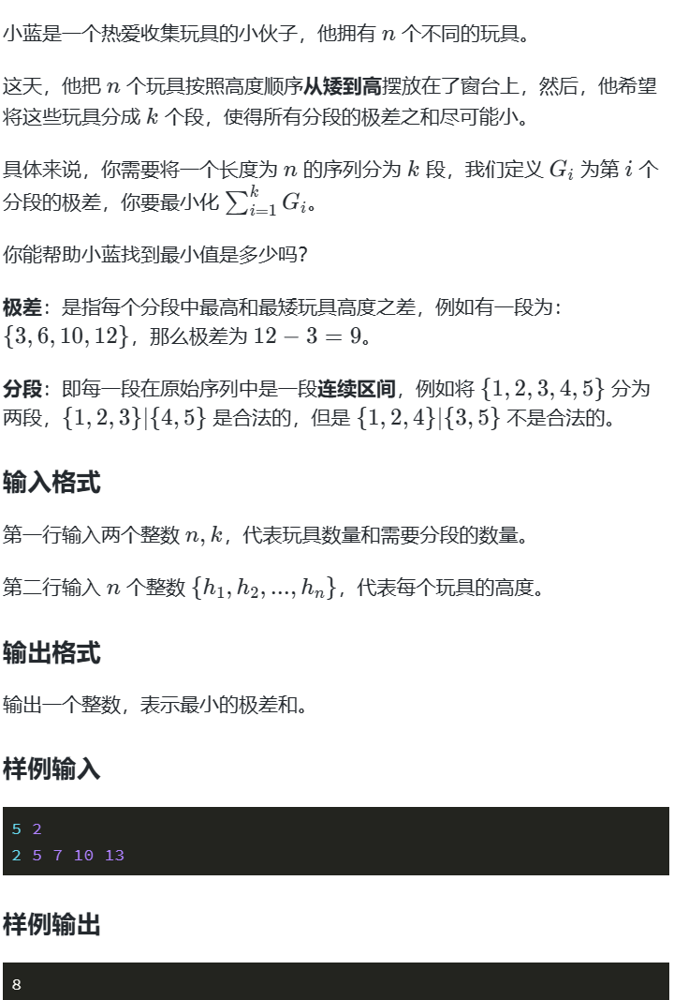

计算极差，如果不分组的话，极差就是最后一个元素减去第一个元素，同时也等于n2-n1+n3-n2+n4-n3+...$n_{n}-n_{n-1}$

如果分组的话，就是减去其中某几项，而要求最小的极差和，就是减去最大的几项。

```python
n,k=list(map(int,input().split()))
toys=list(map(int,input().split()))

diff=[]
# 构建差分和数组，但不包含前几项
for i in range(1,n):
    diff.append(toys[i]-toys[i-1])

diff.sort()
# 分k组就删去最后k-1个数
print(sum(diff[:n-k]))
```

## 通关

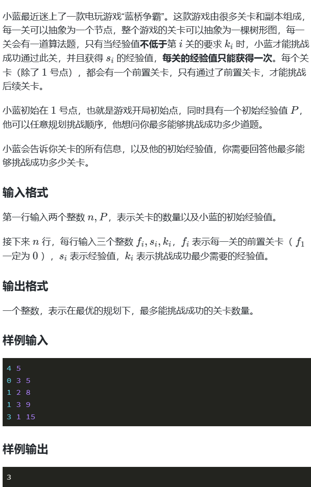

优先级队列，从第一个元素开始，如果经验值满足，将这个关卡的后序加入到优先级队列中，优先级队列以关卡的最小要求为排序关键，然后弹出优先级队列中最小的那个，满足继续加否则推出。

```python
import os
import sys

# 请在此输入您的代码
from queue import PriorityQueue

n, p = list(map(int, input().split()))
paths = [set() for _ in range(n+1)]
conditions = [() for _ in range(n+1)]
pq=PriorityQueue()	

for i in range(1, n + 1):
    f, s, k = list(map(int, input().split()))
    # 将前序关卡和当前关卡连起来
    paths[f].add(i)
    # 记录所需最小经验值和给的经验值
    conditions[i]=(s,k)

# 记录个数
count = 0
# 将初始的值加入到优先级队列，conditions[1][1]所需经验值，conditions[1][0]给的经验值
pq.put((conditions[1][1],(conditions[1][0],1)))

while pq:
    curr= pq.get()
    # print(k,s,i)
    if p >= curr[0]:
        # 如果满足，则加入它的后序
        for path in paths[curr[1][1]]:
            s,k= conditions[path]
            pq.put((k,(s,path)))
        p += curr[1][0]
        count += 1
    else:
        break
    
print(count)
```

## 找出所有行中的最小公共元素

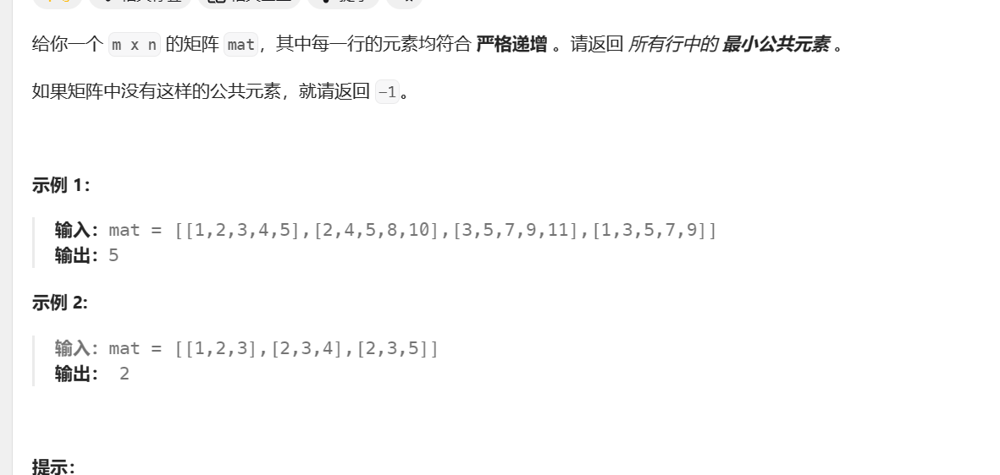


由于元素不重复所以如果一个元素满足是公共元素，那么他一定出现n次，使用计数排序的思路，最后从头到尾遍历的过程中可以找到最小的公共元素。

```python
class Solution(object):
    def smallestCommonElement(self, mat):
        # 以确定元素的范围
        count=[0]*10001
        n=len(mat)
        # 计数
        for i in range(n):
            for j in range(len(mat[0])):
                val=mat[i][j]
                count[val]+=1
        # 从开始遍历，可以找到最小的值
        for i in range(10001):
            if count[i]==n:
                return i
        return -1
```

## 子数组排序后的区间和

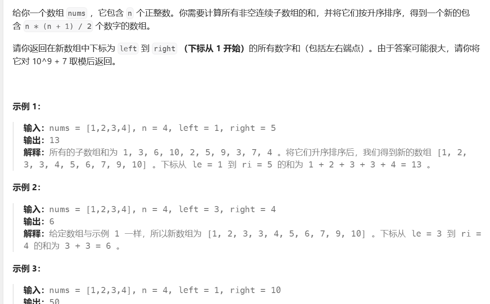

连续的子数组之和两层遍历即可，不需要动态规划

```python
class Solution(object):
   
    def rangeSum(self, nums, n, left, right):
        li=[]
        for i in range(n):
            total=0
            for j in range(i,n):
                total+=nums[j]
                li.append(total)
        li.sort()
        return sum(li[left-1:right])%(10**9+7)
```

## 操作后的最大异或和

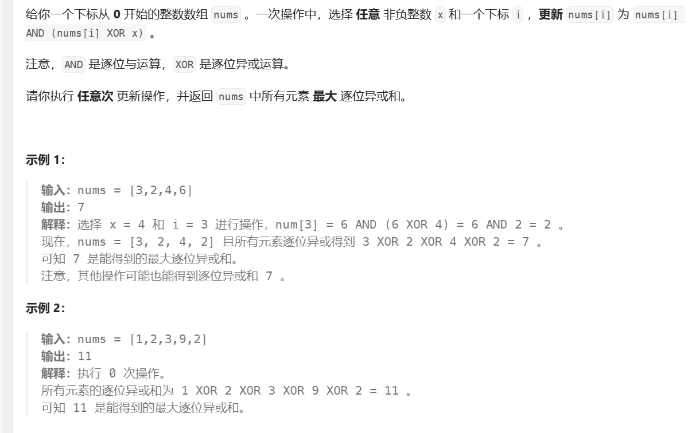

nums中的一个数与一个随机的数进行异或（相同为0不同为1）操作，得到的结果也是一个随机数，而进行与操作，与操作只能把1变为0不能把0变为1，最后的结果可以是nums中比特位为1的进行转换。

而最后想得到列表中最大的按位异或和，需要有奇数个1，而nums经过与操作后可以把1变为0，因此只要存在1（不是奇数个就进行与操作变为0）既可.

```python
from functools import reduce
from operator import or_
class Solution(object):
    def maximumXOR(self, nums):
        # nums and (nums xor x)=nums and x
        # nums and x =nums比特位中为1的位置可以被转换
        # reduce用于对可迭代对象中的元素进行累积操作
        return reduce(or_,nums)
```

## HTML 实体解析器

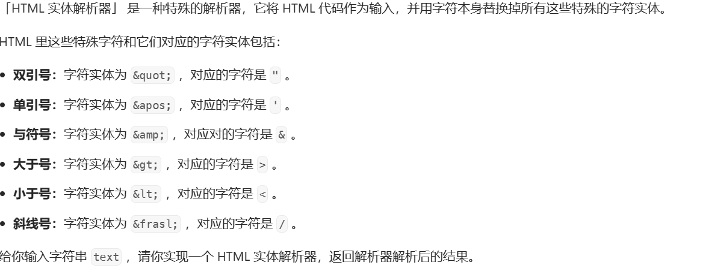

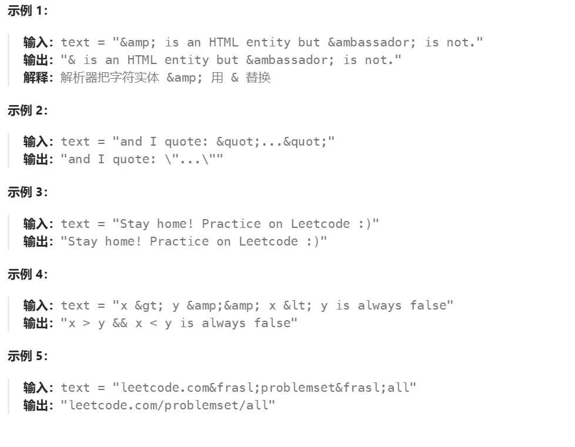

直接使用python中自带的类方法，但是要注意amp要放在最后，否则会出现下述情况：

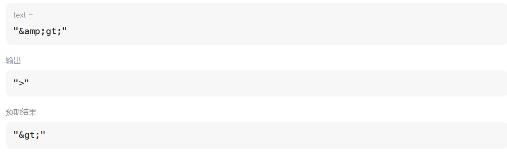

```python
class Solution(object):
    def entityParser(self, text):
        html={'&quot;':'"','&apos;':"'",'&gt;':'>',"&lt;":'<',"&frasl;":'/',"&amp;":'&',}
        for key ,val in html.items():
            text=text.replace(key,val)
        #find(list(text))
        return text
```

## 判断矩阵经轮转后是否一致

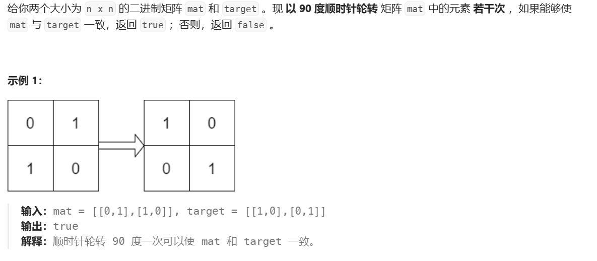

考虑如何90度反转矩阵。

```python
class Solution(object):
    def findRotation(self, mat, target):
        # 如果相等，直接返回
        if mat == target:
            return True
        for i in range(3):
            # *mat会解包，将[[1,2],[3,4]]放入打开放入一个元组([1,2],[3,4]),之后的zip会同时迭代两个对象，第一次取出1,3,注意zip函数取出的元素是zip类型的，必须使用函数转换。
            mat=[list(l[::-1]) for l in zip(*mat)]
            if mat==target:
                return True
        return False
```

## 股票平滑下跌阶段的数目


动态规划的思想，dp[i]表示第i天结尾的平滑天数目，如果prices[i]==prices[i-1]-1，dp[i]=dp[i-1]+1（即本身），dp[i-1]的所有可能末尾加上第i位的结果不会变。反之不等于的话，dp[i]=1。由于dp[i]只依赖于它的前一位所以不需要维护一个数组，只需要一个值即可。

```python
class Solution(object):
    def getDescentPeriods(self, prices):
        res=1
        dp=1
        for i in range(1,len(prices)):
            if prices[i]==prices[i-1]-1:
                dp+=1
            else:
                dp=1
            res+=dp
        return res
```

## 字母板上的路径


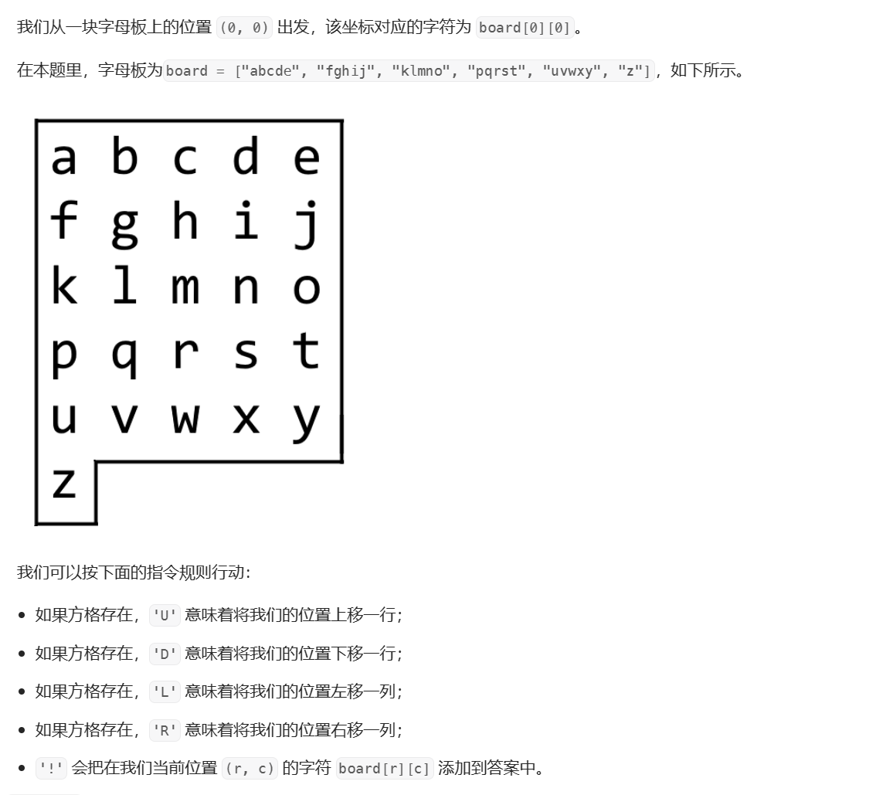

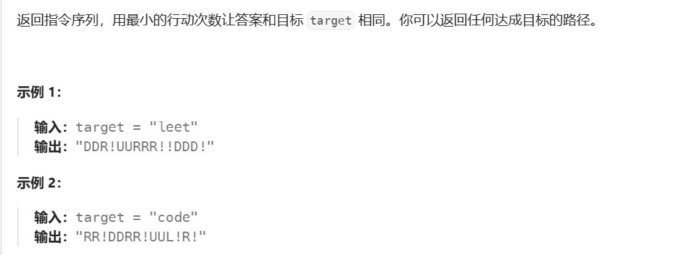


对于无权二维矩阵最短路径就是曼哈顿距离，把字母转换成它在字母版上的位置，使用ASCII值减去a 的 ASCII 值，就得到了它是第几个字母，根据这个值可以得到他在字母版中的位置。需要注意的是，这里的z单独一行，在走到z的时候必须先纵向在横向。

```python
class Solution(object):
    def alphabetBoardPath(self, target):
        # 使用列表储存每一次的位置	
        res=[]
        # 记录当前的坐标位置
        x,y=0,0
        for t in target:
            # 将字母转换为二维字母板中的坐标
            nx,ny=divmod(ord(t)-ord('a'),5)
            # 根据目标位置的大小与当前位置的大小可以判断出用什么字母而不是写if语句，字符串可以使用乘法操作重复多次，注意要是正值
            v="UD"[nx>x]*abs(nx-x)
            h="LR"[ny>y]*abs(ny-y)
            # 最后注意判断是否为z
            res.append((v+h if t!='z' else h+v)+"!")
            # 更新当前位置
            x=nx
            y=ny
        return "".join(res)
```

## 使用质因数之和替换后可以取到的最小值

ruhe


质因数，从二开始，如果可以整除x,则x是一个质因数，用当前的数一直整除x直到不能整除为止，然后继续找下一个数，寻找数的范围是从二到x*x<=nums

```python 
class Solution(object):
    def smallestValue(self, n):
            # 一直做循环
        while 1:
            # x表示当前的数，s是质因数之和，i表示索引
            x=n 
            s=0
            i=2
            # 索引范围不超过根号x
            while i*i<=x:
                # 如果可以整除，加入然后更新x
                while x%i==0:
                    s+=i
                    x=x//i
                i+=1
             # 如果最后剩余了一个不能被整除数，加上
            if x>1:
                s+=x
            # 如果所有质因数之和等于当前数，说明无法在缩小了
            if s==n:
                return n
            # 更新
            else:
                n=s
```

## 数组乘积中的不同质因数数目

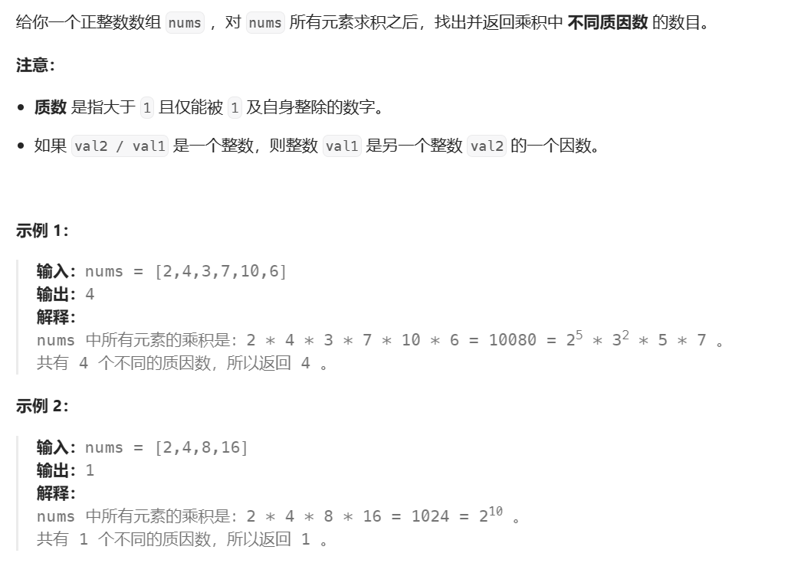

```python
class Solution(object):
    def distinctPrimeFactors(self, nums):
        ans=set()
        # 不需要求出列表中所有数的总和，只要对每个数求质因数即可
        for num in nums:
            i=2
            while i**2<=num:
                while num%i==0:
                    if i not in ans:
                        ans.add(i)
                    num=num//i
                i+=1
            if num>1:
                if num not in ans:
                    ans.add(num)
        return(len(ans))
```

## 查找和替换模式

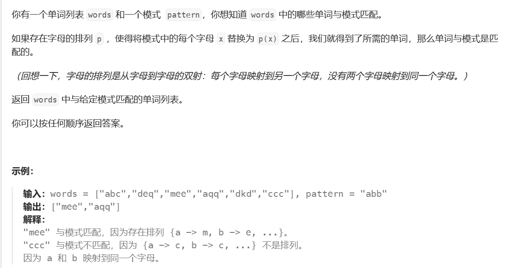


通过构造映射来解决比如说abb到mpp，构造a到m，b到p的映射


```python
class Solution(object):
    def findAndReplacePattern(self, words, pattern):
        res = []
	# 遍历每一个元素
        for word in words:
            # 每次重新构建字典
            mp = {}
            flag = True
            # 遍历每一个字符
            for i in range(len(word)):
                w = word[i]
                p = pattern[i]
                # 根据模式来构造字典而不是word
                if p not in mp:
                    # 判断如果出现一个键对应多个值的情况退出
                    if w in mp.values():
                        flag=False
                        break
                    # 反之，记录
                    mp[p] = w
                else:
                    # 如果说已经存在了键，但不对应退出
                    if mp[p] != w:
                        flag = False
                        break
            if flag:
                res.append(word)
        return res
```


## 划分数组使最大差为 K

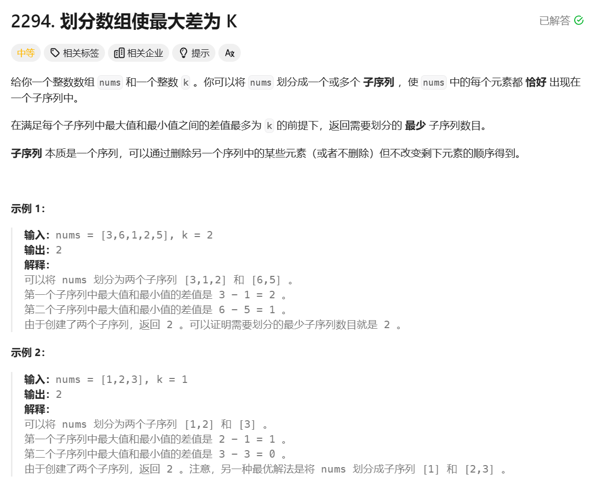


不需要复杂的算法，使用排序加上贪心即可，要使序列的极差小于等于k，并且所分子序列最小，这就要求所划分的序列要大，排好序之后求极差，正好可以满足要求。

```python
class Solution(object):
    def partitionArray(self, nums, k):
        nums.sort()
        res=0
        # 双指针遍历
        left,right=0,0
        while right<len(nums):
            # 如果差值大于k，更新答案以及左指针
            if nums[right]-nums[left]>k:
                res+=1
                left=right
            right+=1
        
        return res+1 
```

## 拆炸弹

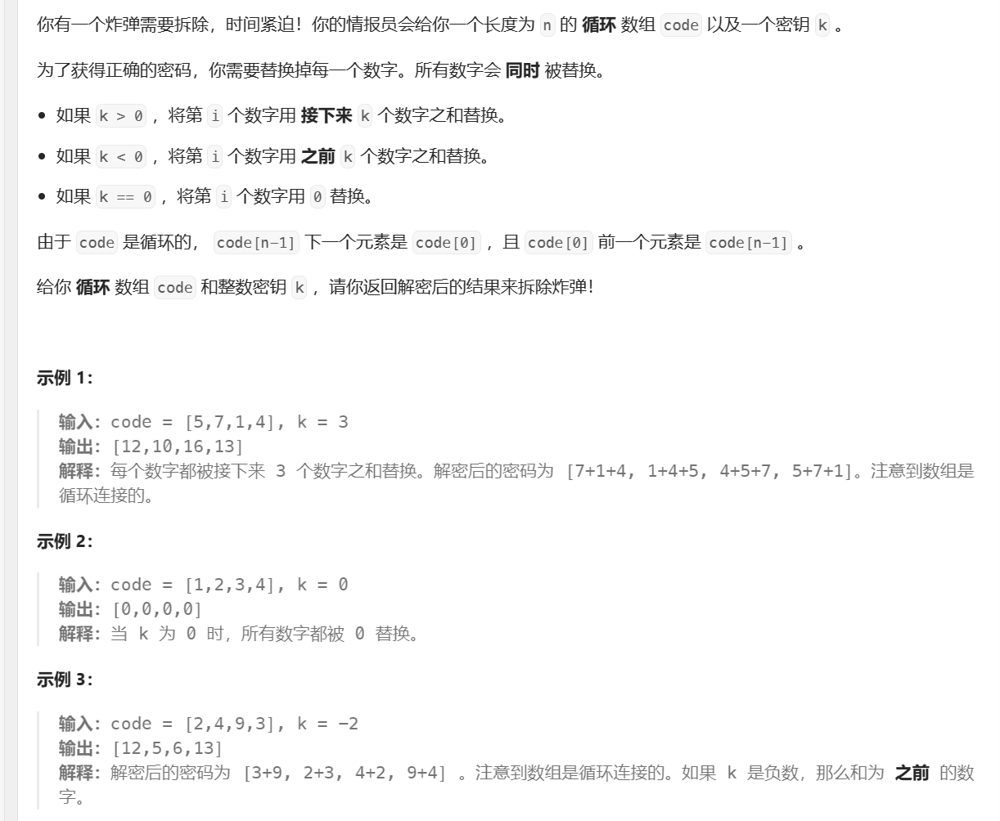

接收接下来的k个值或者是前面的k个值之和，想到固定一个窗口然后滑动。选择取模防止超出索引，或者拼接上数组。

```python
class Solution(object):
    def decrypt(self, code, k):
        n=len(code)
        if k==0:
            return [0]*n
        res=[]
        if k>0:
            l=1
            r=k
        else:
            r=n-1
            l=n+k
        w=sum(code[l:r+1])
        for i in range(n):
            res.append(w)
            # 更新窗口
            w-=code[l%n]
            w+=code[(r+1)%n]
            l,r=l+1,r+1

        return res
```

## 得到目标值的最少行动次数


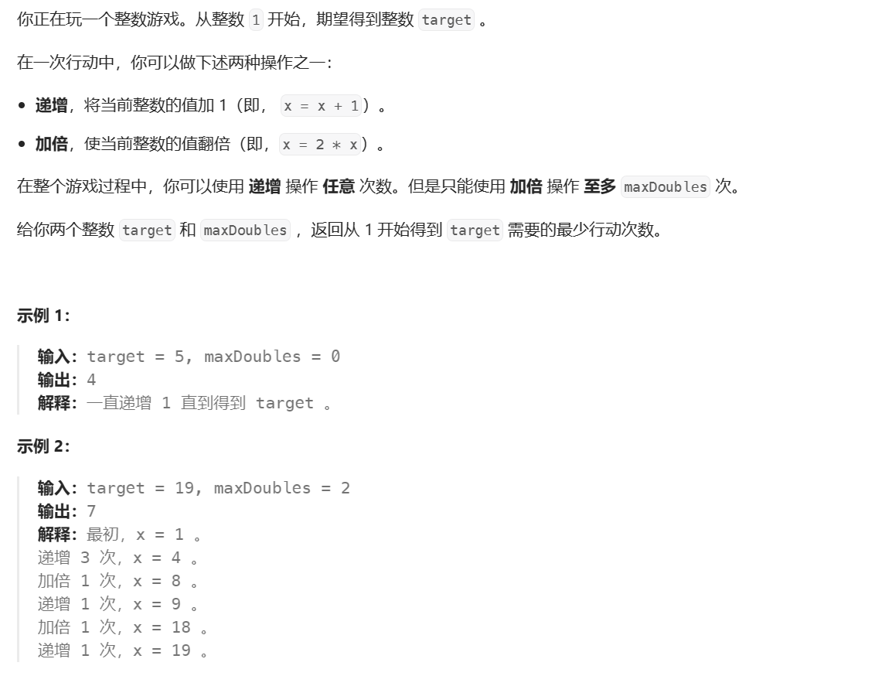

贪心加递归，每次折半可以使操作次数最小因此每次选择整除操作，但是这要求操作数必须是偶数。以下的贪心思想的证明：

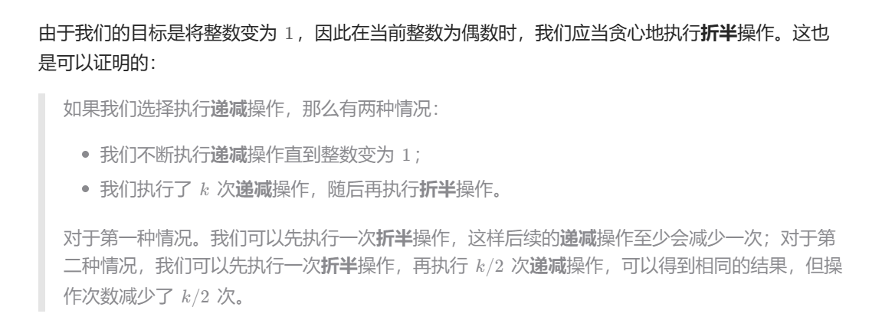

```python
class Solution(object):
    def minMoves(self, target, maxDoubles):
        if target==1 or maxDoubles==0:
            return target-1
        if target%2==0:
            return 1+self.minMoves(target//2,maxDoubles-1)
        else:
            # 不是偶数的话多操作一步
            return 2+self.minMoves((target-1)//2,maxDoubles-1)
```

## 移除石子使总数最小

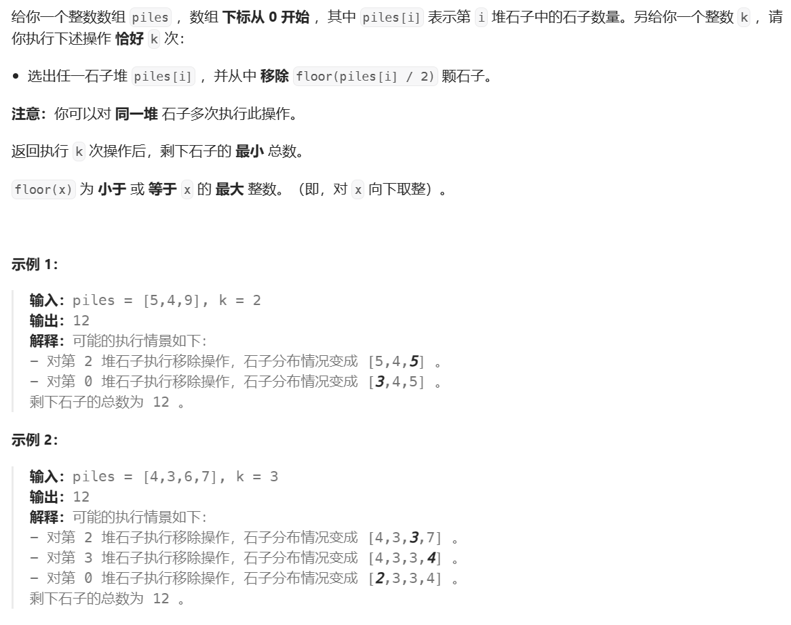

按照贪心的思想，先排序然后取出最大的操作，之后继排序取最大值，但是使用内置的排序函数太慢了，选择使用根堆操作：

```python
import heapq

class Solution(object):
    def minStoneSum(self, piles, k):
        # 由于python中实现的小根堆，因此传入负数
        for i in range(len(piles)):
            piles[i]=-piles[i]
        # 根堆化
        heapq.heapify(piles)
        # 操作k次
        for i in range(k):
            temp=-heapq.heappop(piles)
            temp-=temp//2
            heapq.heappush(piles,-temp)
        return -sum(piles)
```

## 日期之间隔几天

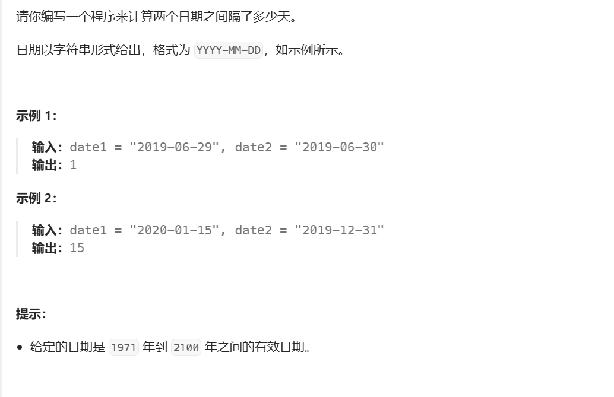

调用库函数

```python
from datetime import date
class Solution(object):
    def daysBetweenDates(self, date1, date2):
        date1=date1.split('-')
        date2 = date2.split('-')
        a=date(int(date1[0]),int(date1[1]),int(date1[2]))
        b=date(int(date2[0]),int(date2[1]),int(date2[2]))
        return abs((a-b).days)
```

## 螺旋矩阵

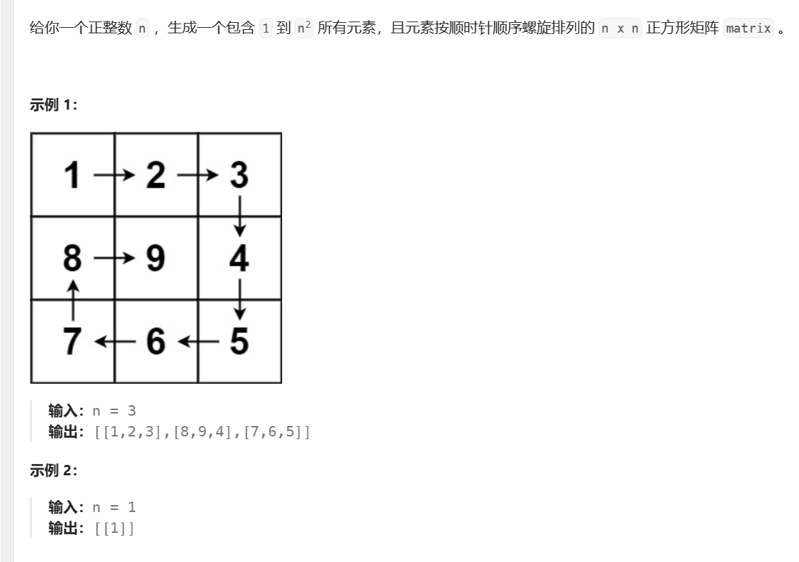

遍历答案数组，当到达边界或者是下一个位置上已经被访问过了，右转，右转通过四个方向函数实现。

```python
class Solution(object):
    def generateMatrix(self, n):
        # 答案数组
        ans = [[0 for _ in range(n)] for _ in range(n)]
        ans[0][0] = 1
        
        # 四个方向函数
        dirs = [
            lambda x, y: (x, y + 1),
            lambda x, y: (x + 1, y),
            lambda x, y: (x, y - 1),
            lambda x, y: (x - 1, y),


        ]
	# 判断是否合法，不合法则右转
        def valid(x, y):
            if x > n - 1 or y > n - 1 or y < 0 or x < 0:
                return False
            if ans[x][y] != 0:
                return False
            return True

        index = 0
        # 上一个位置
        x, y = 0, 0
        # 由于一开始以及确定了起始点的值，所以遍历次数减一
        for i in range(n ** 2-1):
            dir = dirs[index % 4]
            x_, y_ = dir(x, y)
            # 下一个位置的值等于上一个位置的值加一
            if valid(x_, y_):
                ans[x_][y_] = ans[x][y] + 1
            else:
                index += 1
                dir = dirs[index % 4]
                x_, y_ = dir(x, y)
                ans[x_][y_] = ans[x][y] + 1
            # 更新位置
            x,y=x_,y_
        return ans
```

## 螺旋矩阵（节点）

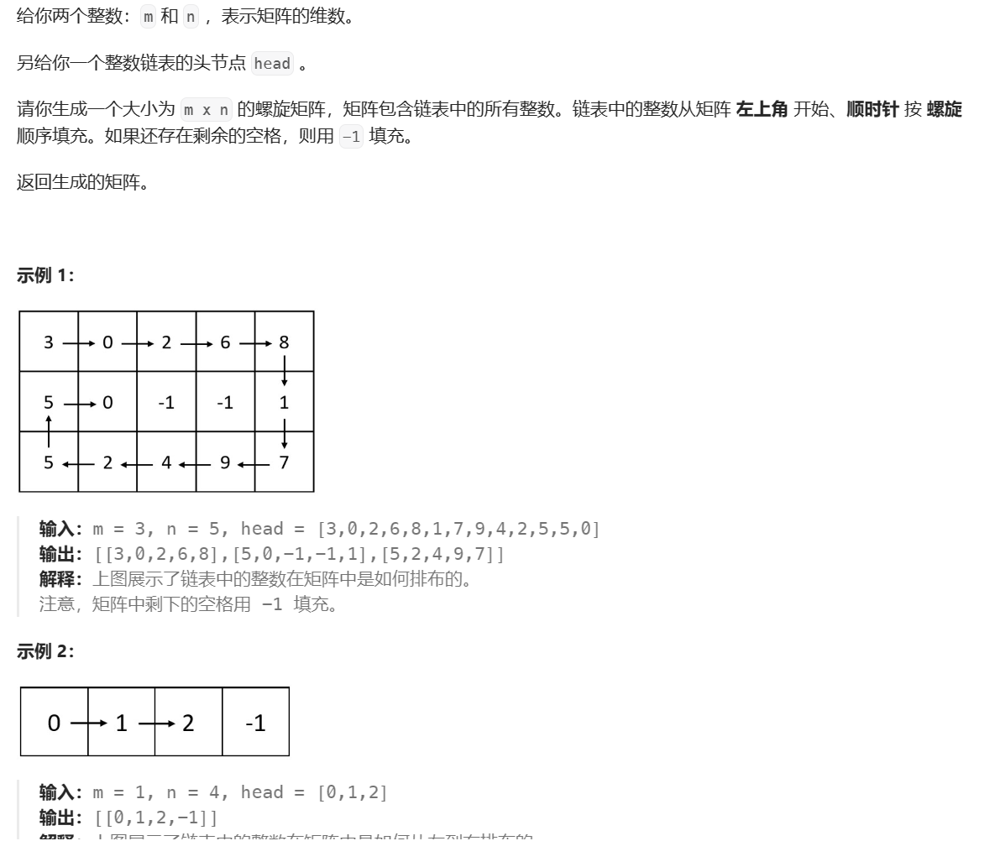

改为在节点上操作即可。

```python
	# Definition for singly-linked list.
# class ListNode(object):
#     def __init__(self, val=0, next=None):
#         self.val = val
#         self.next = next
class Solution(object):
    def spiralMatrix(self, m, n, head):
        ans = [[-1 for _ in range(n)] for _ in range(m)]
        ans[0][0] = head.val

        head=head.next

        dirs = [
            lambda x, y: (x, y + 1),
            lambda x, y: (x + 1, y),
            lambda x, y: (x, y - 1),
            lambda x, y: (x - 1, y),


        ]

        def valid(x, y):
            if x > m - 1 or y > n - 1 or y < 0 or x < 0:
                return False
            if ans[x][y] != -1:
                return False
            return True

        index = 0
        x, y = 0, 0
        while head:
            dir = dirs[index % 4]
            x_, y_ = dir(x, y)
            if valid(x_, y_):
                ans[x_][y_] = head.val
            else:
                index += 1
                dir = dirs[index % 4]
                x_, y_ = dir(x, y)
                ans[x_][y_] = head.val
            head=head.next
            x,y=x_,y_
        return ans
```

## [螺旋矩阵 III](https://leetcode.cn/problems/spiral-matrix-iii/)

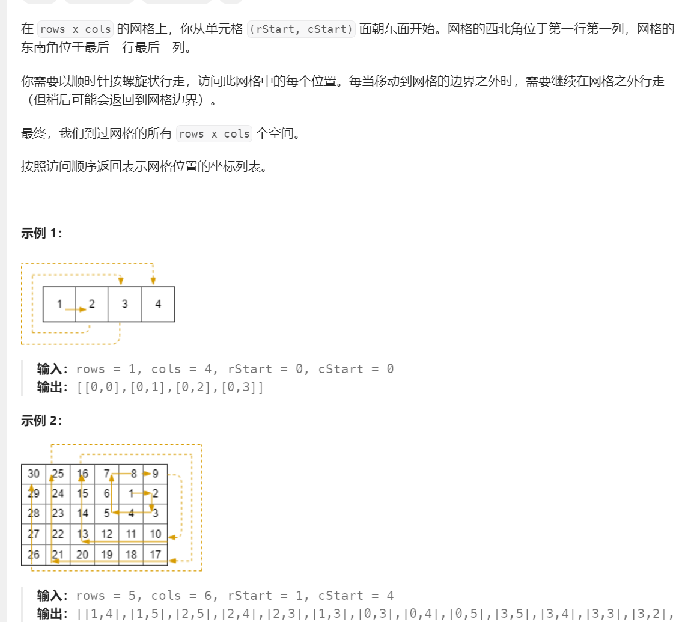


根据观察矩阵每次先往又走一步，再往下走一步，往左走两步，往上走两步，之后重复这个过程，也就是运动轨迹满足1122，3344，5566这样的规律。

因此模拟这个过程，只有位置合法的时候才加入答案。

```python
class Solution:
    def spiralMatrixIII(self, rows: int, cols: int, rStart: int, cStart: int) -> List[List[int]]:
        cnt=1# 用于累加
        ans=[]
        ans.append([rStart,cStart])
        while len(ans)!=rows*cols:
            for dx,dy in (0,1),(1,0),(0,-1),(-1,0):
                # 记录要往一个方向走几次，向左向上的次数要多一次
                temp=cnt if dx>=0 and dy>=0 else cnt+1
                for _ in range(temp):
                    rStart+=dx
                    cStart+=dy
                    if 0<=rStart<rows and 0<=cStart<cols:
                        ans.append([rStart,cStart])
            cnt+=2
        return ans 
```


## [矩阵中的幻方](https://leetcode.cn/problems/magic-squares-in-grid/)

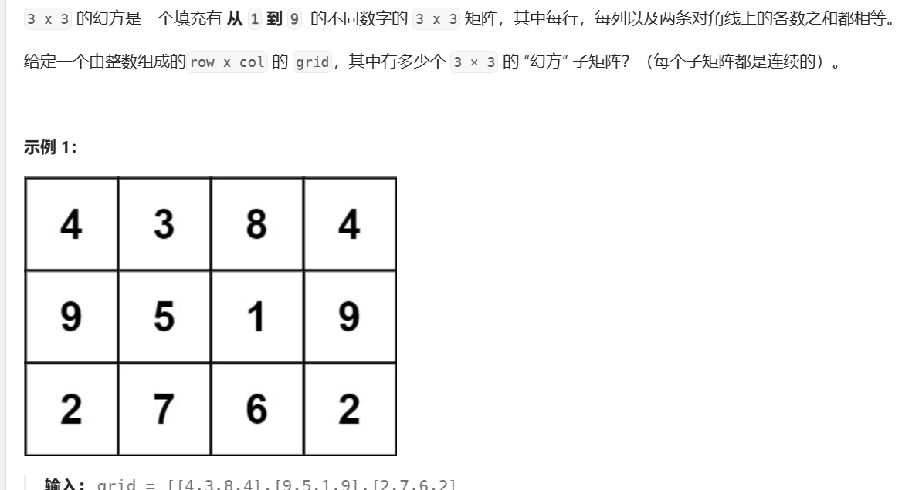


直接暴力解，判断条件，幻方矩阵的中心必然是5，行列对角线之和相等，遍历除最后两行两列外每一个节点作为幻方矩阵的左上角

```python
class Solution(object):
    def numMagicSquaresInside(self, grid):
        r,c=len(grid),len(grid[0])
        if r<3 or c<3:
            return 0

        def magic(a,b,c,d,e,f,g,h,i):
            if sorted([a,b,c,d,e,f,g,h,i])!=list(range(1,10)):
                return False
            if a+b+c==d+e+f==g+h+i==a+d+g==b+e+h==c+f+i==a+e+i==c+e+g==15:
                return True
            return False

        ans=0
        for i in range(r-2):
            for j in range(c-2):
                if grid[i+1][j+1]!=5:
                    continue
                if magic(grid[i][j],grid[i][j+1],grid[i][j+2],grid[i+1][j],grid[i+1][j+1],grid[i+1][j+2],grid[i+2][j],grid[i+2][j+1],grid[i+2][j+2]):
                    ans+=1
        return ans
```

## [使数组元素相等的减少操作次数](https://leetcode.cn/problems/reduction-operations-to-make-the-array-elements-equal/)

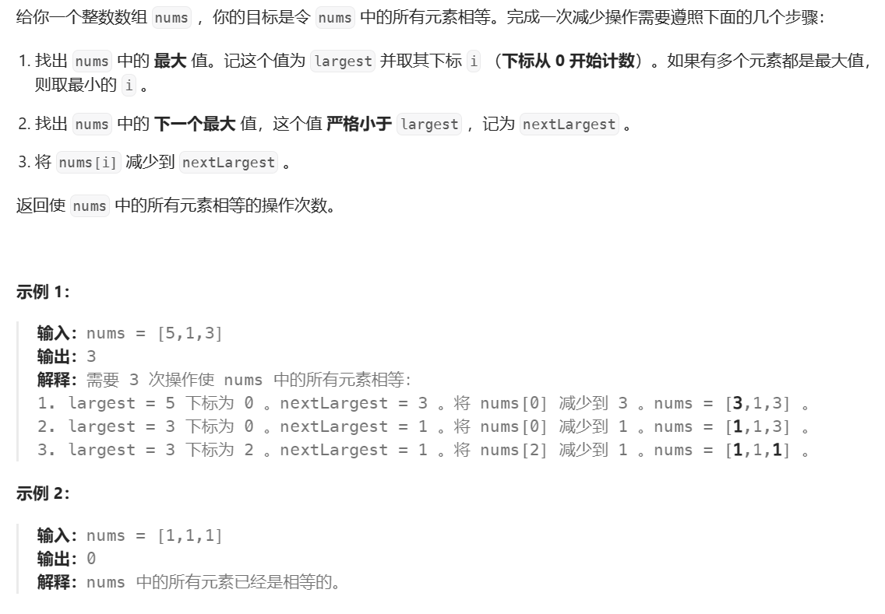

转换思路每个元素的操作次数等于小于它的不同值的数量

将列表排序后，找每个元素的操作次数，如果如果这个元素等于前面的的元素，操作次数不变，大于则加一，因为排了序所以不会有小于。

由于操作次数只会变大不会减小，使用一个变量记录即可，最后的结果用一个变量不断累加。

```python
class Solution:
    def reductionOperations(self, nums: List[int]) -> int:
        nums.sort()
        n = len(nums)
        dp=[0]*n
        for i in range(1,n):
            if nums[i]==nums[i-1]:
                dp[i]=dp[i-1]
            elif nums[i]>nums[i-1]:
                dp[i]=dp[i-1]+1
            
        return sum(dp)
```

## [ 座位预约管理系统](https://leetcode.cn/problems/seat-reservation-manager/)


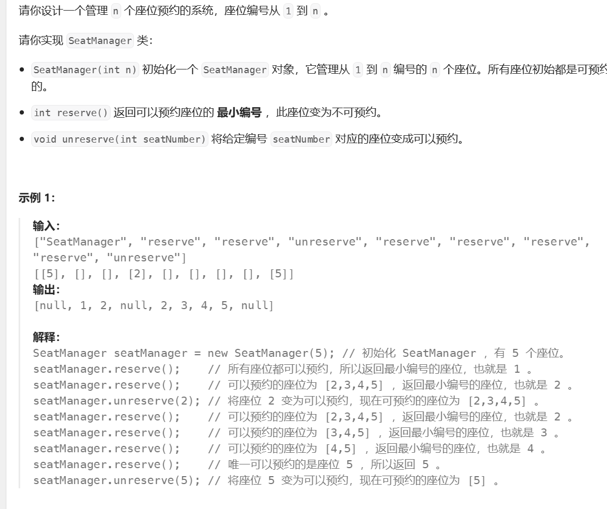

根据题目要求能偶快速的弹出最小值，并加入一个值，使用一个记录布尔值的列表，以O(n)的时间复杂度弹出最小值，O(1)的时间按复杂度加入值无法通过题目


于是考虑使用根堆操作，以O(logn)的时间复杂度弹出值加入值。

```python
import heapq
class SeatManager(object):
        def __init__(self, n):
            # 初始的顺序就是一个小根堆了
            self.seats=list(range(1,n+1))

        def reserve(self):
            # 弹出最小的
            return heapq.heappop(self.seats)
        def unreserve(self, seatNumber):
            # 加入
            heapq.heappush(self.seats,seatNumber)
```

## [ 区分黑球与白球](https://leetcode.cn/problems/separate-black-and-white-balls/)

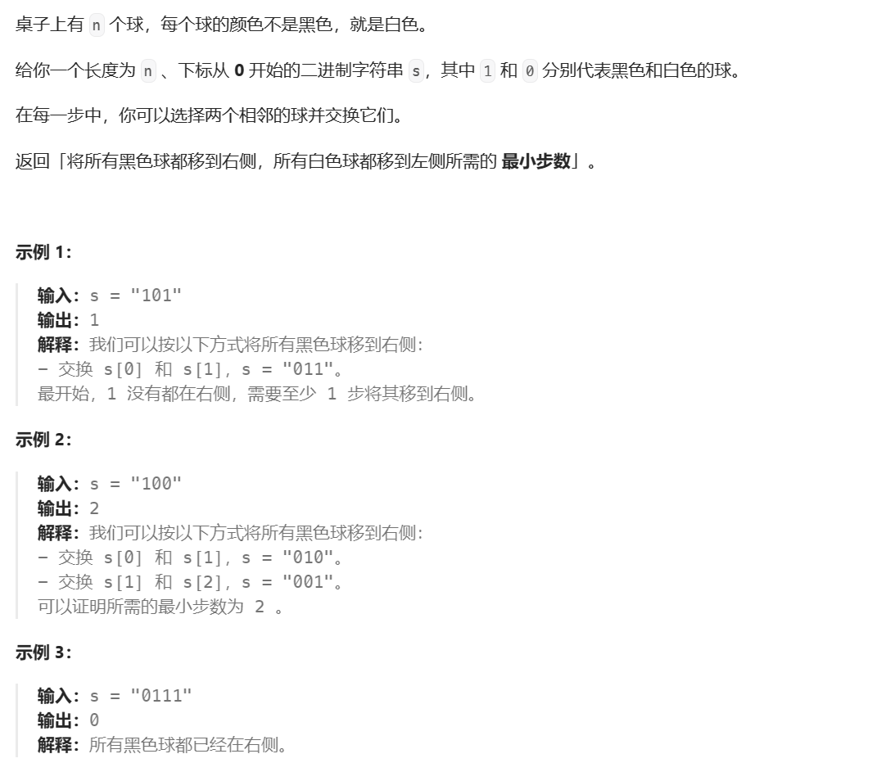


只有两个变量，原字符串中0左边的1的数目，就是这个0所需要移动到左边所需的步数，用数组双指针的方法比较麻烦

```python
class Solution:
    def minimumSteps(self, s: str) -> int:
        ans=cnt=0
        for c in s:
            if c=='1':
                cnt+=1
            if c=='0':
                ans+=cnt
        return ans
```

## [可互换矩形的组数](https://leetcode.cn/problems/number-of-pairs-of-interchangeable-rectangles/)

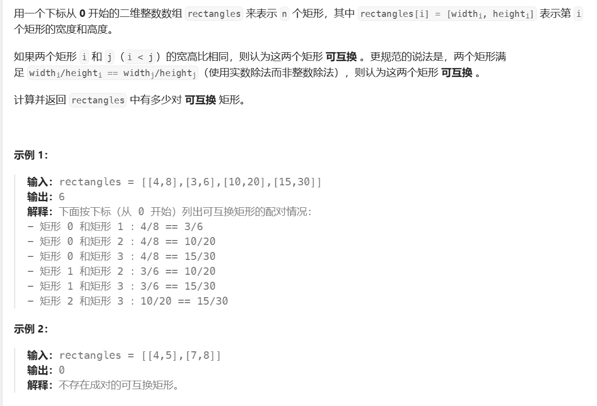


使用哈希表记录每一个比例的个数，个数运用公式即可求出有多少对


```python
from collections import defaultdict
class Solution(object):
    def interchangeableRectangles(self, rectangles):
        n=len(rectangles)
        ans=0
        def cal(n):
            return n*(n-1)//2
        m=defaultdict(int)
        for r in rectangles:
            w,h=r[0],r[1]
            m[w/h]+=1
        for val in m.values():
            ans+=cal(val)
        return ans
```

## [二进制字符串前缀一致的次数](https://leetcode.cn/problems/number-of-times-binary-string-is-prefix-aligned/)

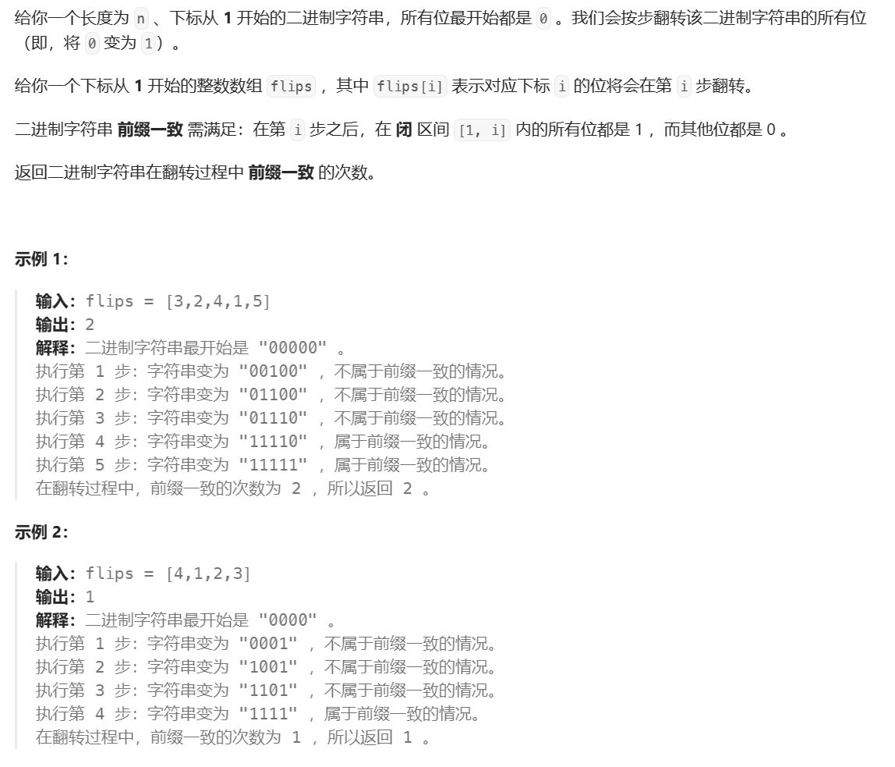

利用性质，当第i步前缀和一致的时候，i及之前的位置都是1而之后的位置都是0，每一步只能操作1个数，因此可以得知flips数组的前i个一定刚好填满1到i,接下来判断在第i步是否找到了1到i的所有整数，因为flips数组中的值都是不同的，遍历数组，当数组中最大值等于数组中的数字数目的时候就填满了。

```python
class Solution(object):
    def numTimesAllBlue(self, flips):
        ans,val=0,0
        index=1# 注意所有从开始
        for f in flips:
            # 记录最大值
            val=max(val,f)
            # 最大值和数组的数目一样，找到了一个
            if val==index:
                ans+=1
            index+=1
        return ans
```

## [ 在受污染的二叉树中查找元素](https://leetcode.cn/problems/find-elements-in-a-contaminated-binary-tree/)

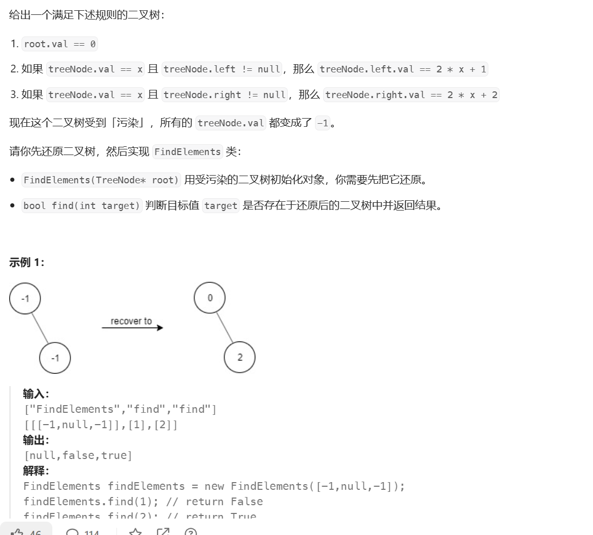


在修复树的过程中记录值，之后在find函数中判断，而不是使用递归去查找

```python
class FindElements(object):

    def __init__(self, root):
        self.root=root
        self.memo=set()
        def traverse(root,val):
            if not root:
                return
            self.memo.add(val)
            root.val=val
            traverse(root.left,2*val+1)
            traverse(root.right,2*val+2)
        traverse(self.root,0)
    def find(self, target):
        return target in self.memo
```


## 	[矩形重叠](https://leetcode.cn/problems/rectangle-overlap/)

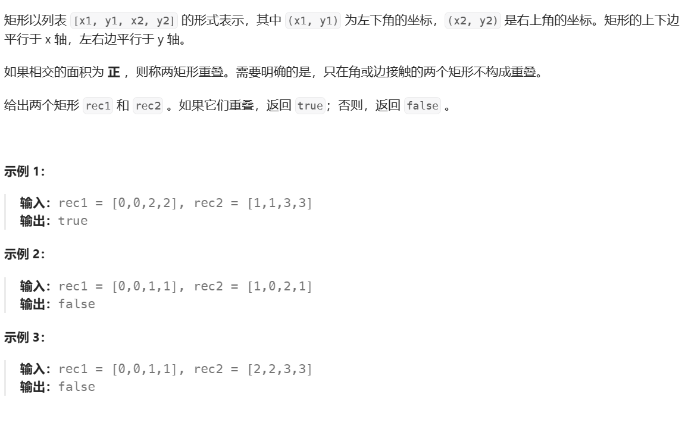

如果两个矩阵重叠那么它们在坐标轴上的投影必然会有重叠，判断在坐标轴上的投影即可

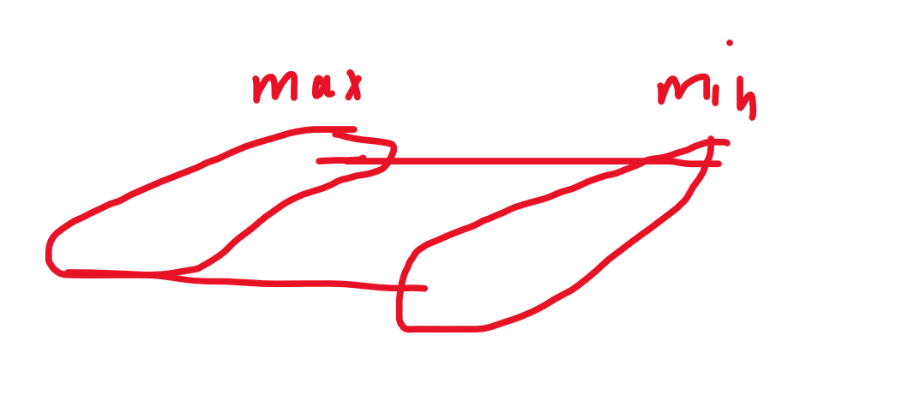

判断两个区间重叠那么右端点中最小的应大于左端点中最大的，技巧点


```python
class Solution(object):
    def isRectangleOverlap(self, rec1, rec2):
        if min(rec1[2],rec2[2])>max(rec1[0],rec2[0]) and min(rec1[3],rec2[3])>max(rec1[1],rec2[1]):
            return True
        else:
            return False
```

## [找出缺失的观测数据](https://leetcode.cn/problems/find-missing-observations/)

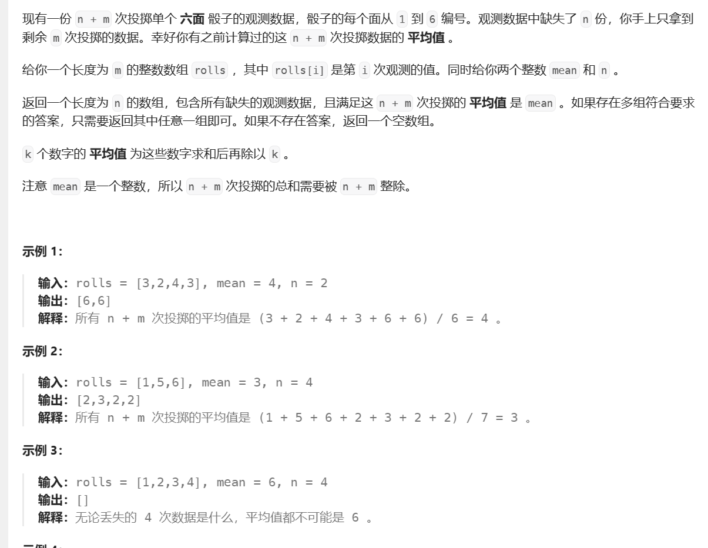

求出缺失值之后，进行简单的判断，因为取值在1到6之间，所以如果缺失值大于6*N或者说小于n一定不能取到，之后的问题转化为求n个数，这些数的和为target

用整除求出一种可能，然后将余数平均加到这种可能上，技巧点

```python
class Solution(object):
    def missingRolls(self, rolls, mean, n):
        m=len(rolls)
        target=(m+n)*mean-sum(rolls)
        if target>6*n or target<n:
            return []
        q,r=divmod(target,n)
        # 将余数平均分，剩下的不变
        return [q+1]*r+[q]*(n-r)
```


## [循环移位后的矩阵相似检查](https://leetcode.cn/problems/matrix-similarity-after-cyclic-shifts/)


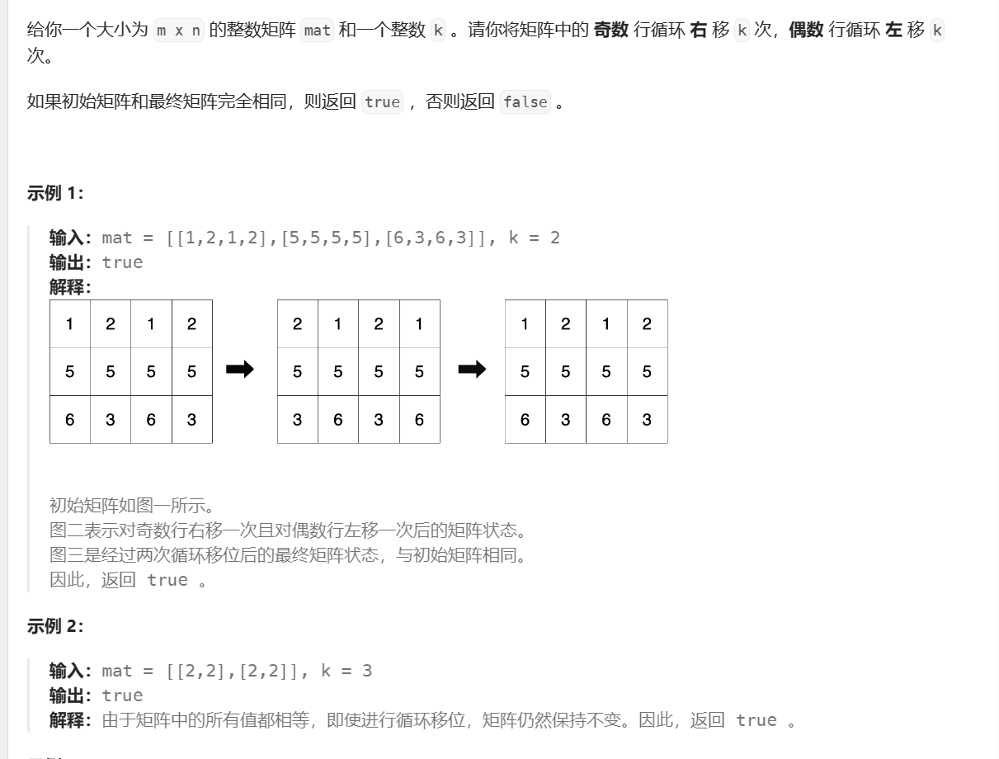

首先对k进行取模，如果是n的整数倍那么结果是不变的，反之模拟移动矩阵，这里使用的是`切片技巧`（技巧点）比起用指针取模遍历要好得多。

```python
    def areSimilar(self, mat, k):
        n=len(mat[0])
        k%=n
        if k==0:
            return True
        for i,r in enumerate(mat):
            r0=r.copy()
            # 切片操作
            if i%2==0:
                r=r[k:]+r[:k]
            else:
                r=r[:-k]+r[-k:]
            if r!=r0:
                return False
        return True	
```


## [替换数组中的元素](https://leetcode.cn/problems/replace-elements-in-an-array/)

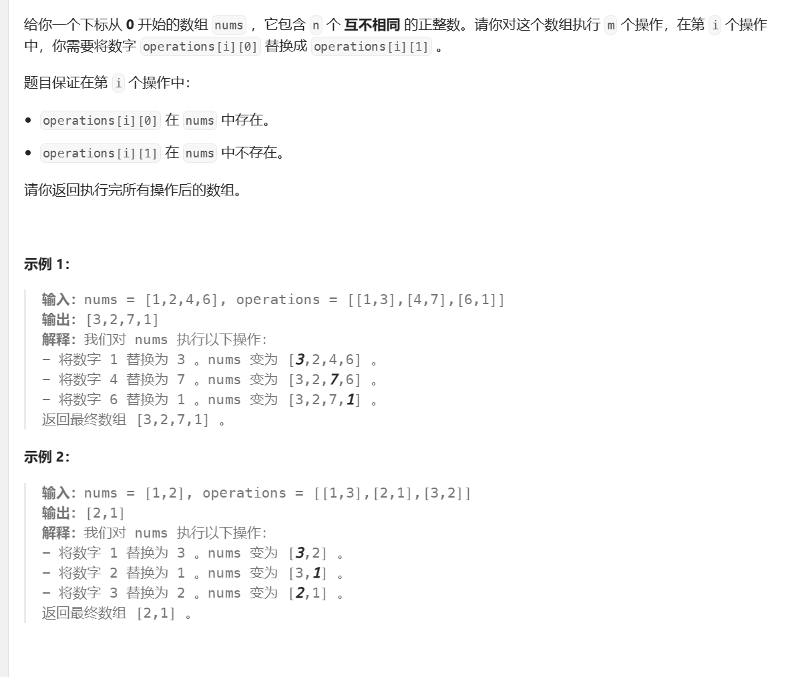

每次操作都是把存在的数换为不存在的数，可以使用字典。

模拟操作，使用字典记录下元素以及对应的位置，然后遍历operations在原数组中操作即可

```python
class Solution(object):
    def arrayChange(self, nums, operations):
        # 技巧点，将列表中的内容连带索引记录到字典中
        memo={num:i for i,num in enumerate(nums)}
        for x,y in operations:
            i=memo[x]
            nums[i]=y
            del memo[x]
            memo[y]=i
        return nums
```


## [收集垃圾的最少总时间](https://leetcode.cn/problems/minimum-amount-of-time-to-collect-garbage/)


模拟操作，所有垃圾的数目及字符串的长度，每次记录每种垃圾的最后位置即可，不需要每次都记录。

```python
from collections import Counter
# 不好的写法
class Solution(object):
    def garbageCollection(self, garbage, travel):
        m=g=p=0
        # 记录几个垃圾车的上一次位置
        p_m=p_g=p_p=pos=0
        for gar in garbage:
            memo=Counter(gar)
            for k,v in memo.items():
                if k=='G':
                    g+=v
                    if pos>0:
                        g+=sum(travel[p_g:pos])
                    p_g=pos
                elif k=='P':
                    p+=v
                    if pos>0:
                        p+=sum(travel[p_p:pos])
                    p_p=pos
                else:
                    m += v
                    if pos>0:
                        m += sum(travel[p_m:pos])
                    p_m=pos
            pos+=1
        return m+g+p

class Solution(object):
    def garbageCollection(self, garbage, travel):
        right={}
        ans=0
        for i ,val in enumerate(garbage):
            # 加上它的字符串长度
            ans+=len(val)
            # 记录位置
            for c in val:
                right[c]=i
        ans+=sum(sum(travel[:r]) for r in right.values())
        return ans
```


## [统计字符串中的元音子字符串](https://leetcode.cn/problems/count-vowel-substrings-of-a-string/)


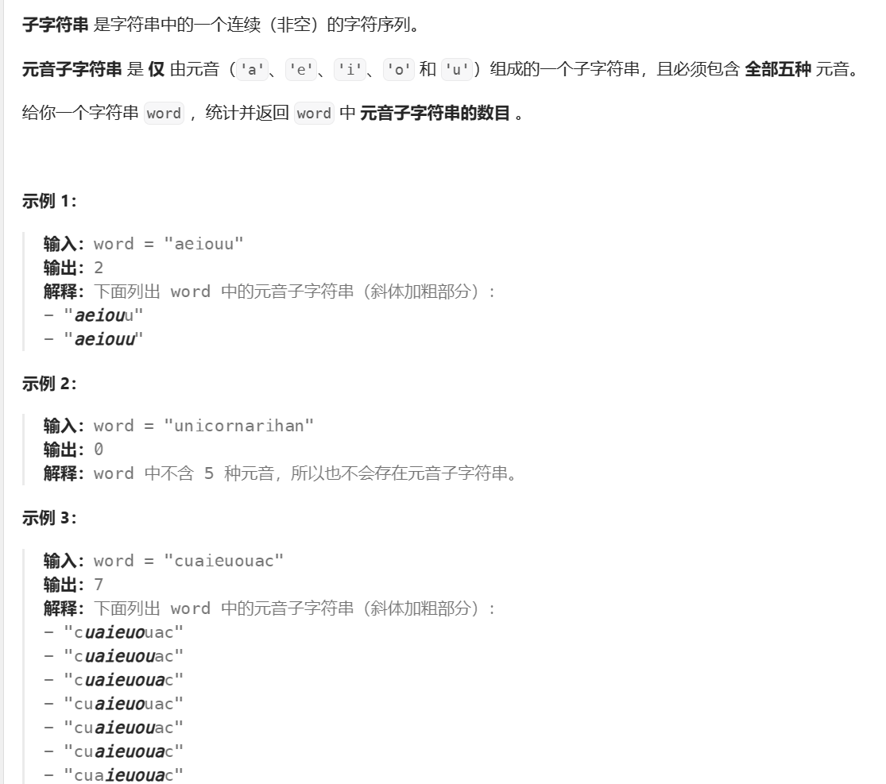


找出所有的子字符串，然后使用集合（技巧点）比较

```python
from collections import defaultdict
class Solution:
    def countVowelSubstrings(self, word: str) -> int:
        n=len(word)
        judge=set(['a','e','i','o','u'])
        ans=0
        for i in range(n-4):
            for j in range(i+4,n):
                # 用切片操作
                if set(word[i:j+1])==judge:
                    ans+=1
        return ans
```

## [删除一个元素使数组严格递增](https://leetcode.cn/problems/remove-one-element-to-make-the-array-strictly-increasing/)

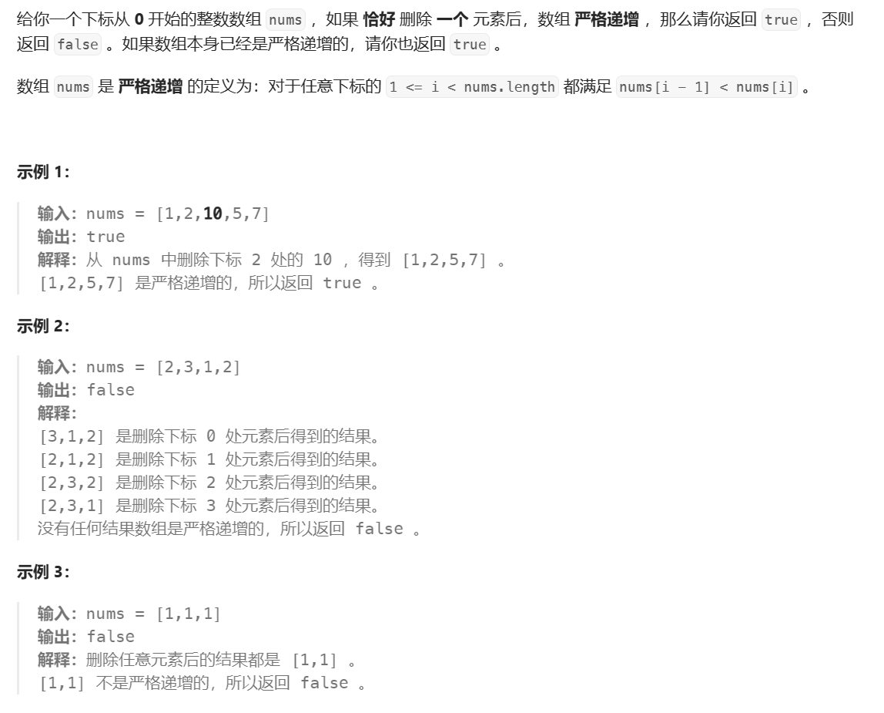

模拟操作，从头遍历一遍数组，找到不满足递增的两个值，模拟删除他们之后数组是否为递增的

删除的时候有两种情况，两种情况都考虑

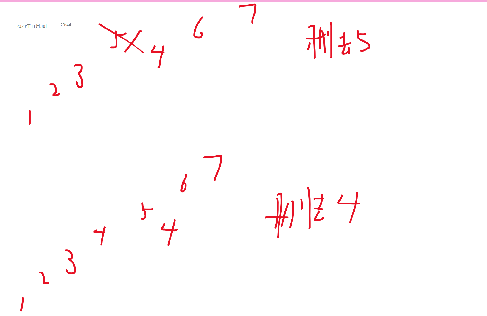

```python
class Solution:
    def canBeIncreasing(self, nums: List[int]) -> bool:
        # 检查是否是递增的
        def check(index):
            # 跳过删除的值，技巧点，这里只遍历到n-1,防止超出索引
           for i in range(1,len(nums)-1):
                pre,curr=i-1,i
                # 大于要跳过的值的时候，做一位偏移
                if pre>=index:
                    pre+=1
                if curr>=index:
                   curr+=1
                if nums[curr]<=nums[pre]:
                    return False
           return True
        for i in range(1,len(nums)):
            if nums[i]<=nums[i-1]:
                return check(i) or check(i-1)
        return True
```


## [大样本统计](https://leetcode.cn/problems/statistics-from-a-large-sample/)


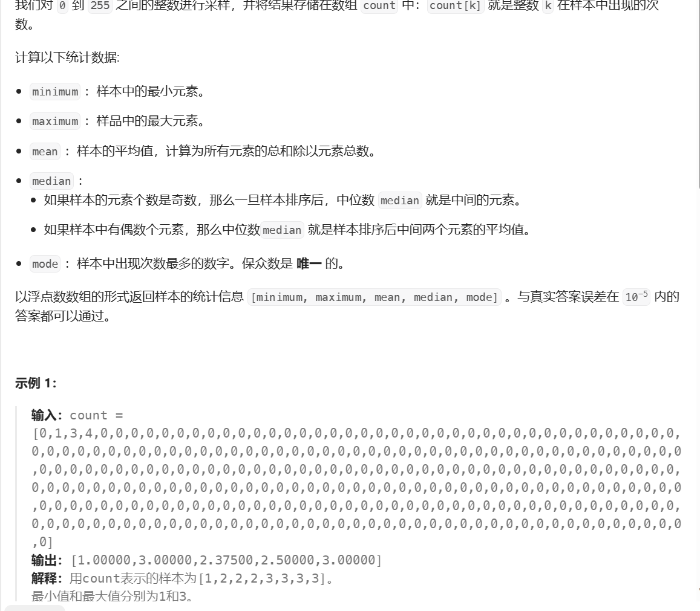


中位数不好算，对原始数据做前缀和，得到的lst[i]表示原数组中小于等于i的元素有多少个，在这个前缀数组中找总数的一半得出的索引就是中位数。

```python
import bisect
from itertools import accumulate
from bisect import bisect_left

class Solution:
    def sampleStats(self, count: List[int]) -> List[float]:
        c=[0]*256
        start=last=freq=pos=-1
        val=total=0
        for i,v in enumerate(count):
            if v!=0:
                c[i]+=v
                total+=v
                if c[i]>freq:
                    freq=c[i]
                    pos=i
                if start==-1:
                    start=i
                last=i
                val+=i*v
        times=total//2
        # 借助accumulate快速实现前缀数组
        lst=list(accumulate(count))
        # 使用total&1判断奇数偶数，>>1减半，在前缀和数组大于等于总数一半的索引就是所求中位数
        median=bisect_left(lst, (total>>1)+1)if total&1 else (bisect_left(lst,total>>1) +bisect_left(lst,(total>>1)+1))/2.0


        return [start,last,val/total,median,pos]
```

## [不含 AAA 或 BBB 的字符串](https://leetcode.cn/problems/string-without-aaa-or-bbb/)


按照情况分类，如果a>b则填入aab反之bba，如果二者相等填入ab，最后判断是否有剩余，有就加上，由于题目保证对于给定的ab一定会有s，所以不会出现a=3,b=0的情况，a=2b=0的情况不会进入循环。

```python
class Solution:
    def strWithout3a3b(self, a: int, b: int) -> str:
        ans="" 
        while a>0 and b>0:
            if a==b:
                ans+='ab'*a
                a=b=0
                break
            elif a>b:
                ans+='aab'
                a-=2
                b-=1
            else:
                ans+='bba'
                a-=1
                b-=2
        if a>0:
            ans+='a'*a
        else:
            ans+='b'*b
        return ans
```

## [四因数](https://leetcode.cn/problems/four-divisors/)

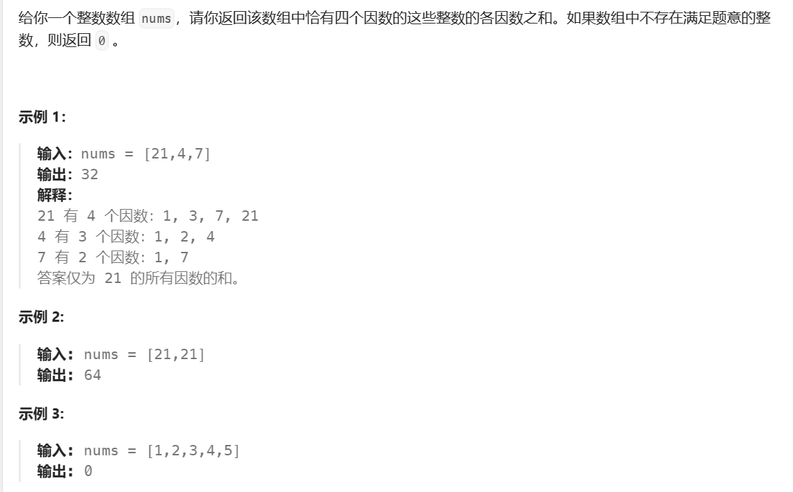

找因数的方法是从1到num的开方，如果这个数可以被num整除，那么就是一个因数，同时可以避免出现4* 6 6 *4这种重复数对，然后如果这个数不等于num的开方（避免2 2重复出现）那么就把num//这个数加上，这也是一个因数。

```python
class Solution:
    def sumFourDivisors(self, nums: List[int]) -> int:
	# 找因数的函数
        def cal(x):
            ans=cnt=0
            i=1
            # 从1到开方（开方要取到）技巧点
            while i*i<=x:
                # 超出4个，不满足返回0
                if cnt>4:
                    return 0 
                # 找到了一个
                if x%i==0:
                    ans+=i
                    cnt+=1
                    # 判断它的平方是不是num，防止出现两个一样的数
                    if i*i!=x:
                        # 加入与i配对的数
                        ans+=x//i
                        cnt+=1
                i+=1
            # 不等于4的不满足条件
            if cnt!=4:
                return 0
            return ans 
	# 用字典记忆，避免相同的结果重复计算
        memo={}
        ans=0
        for num in nums:
            if num in memo:
                ans+=memo[num]
            else:
                li=cal(num)
                if li :
                    memo[num]=li
                    ans+=memo[num]
        return ans
```

## [ 数组中最长的方波](https://leetcode.cn/problems/longest-square-streak-in-an-array/)

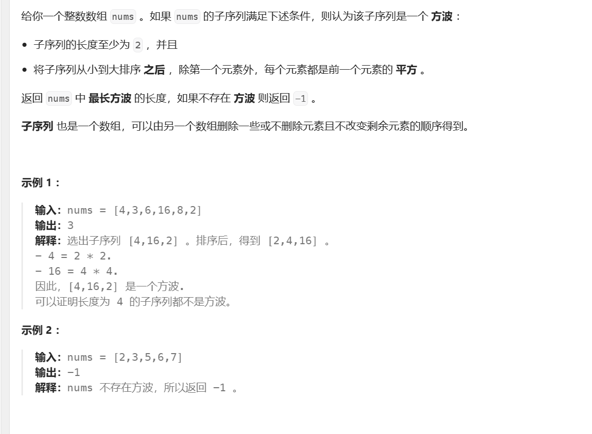	

利用集合o(1)的查找操作，快速判断平方项在不在数组内，如果不在结束这次循环

```python
class Solution:
    def longestSquareStreak(self, nums: List[int]) -> int:
        s=set(nums)
        ans=0
        for v in nums:
            cnt=0
            while v in s:
                cnt+=1
                v=v*v
            ans=max(cnt,ans)
        return ans if ans>=2 else -1
```

## 红色和紫色

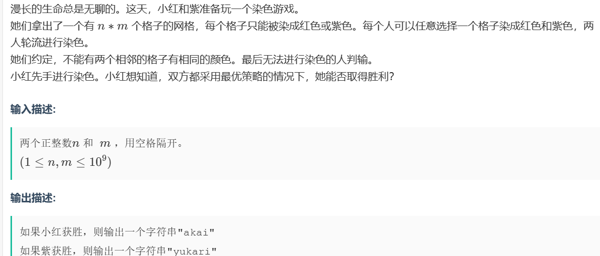


博弈论，如果格子数是偶数，那么必然是后手的人赢：此时没有中心点，攻守之势易也。无论先手在哪里染色，后手都可以在与之 中心对称的位置 染相反的颜色。，否则是先手的人赢：先手可以占据中心点。无论后手在哪里染色，先手必可以在与之中心对称的位置 染相同的颜色。

因此判奇偶即可，可能是由数据结论得出，具体的内部逻辑不清楚，这种题试一试多找几个案例得出结论。

## 找abb的叠词

	


不使用dfs找合适的子序列，时间复杂度太高了。

对于每一个位置，找它后面与它不同字符共有多少个，如果字符个数大于2那么既可以形成一个abb形式的字符后，比如示例中对第一位的a来说，其后面两个b三个c，可以构成abb acc acc acc acc 即$C_{n}^{2}$对一种类型的字符。


```python
from collections import Counter
n=int(input())
s=input()
ans=0
# 使用Counter建立字典，每次遍历的时候把相应的字符的个数减一
d=Counter(s)
def cal(x):
    return x*(x-1)//2
for i in range(n):
    c=s[i]
    d[c]-=1
    for k,v in d.items():
        if k!=c and v>=2:
            ans+=cal(v)
print(ans)
```


## [你完成的完整对局数](https://leetcode.cn/problems/the-number-of-full-rounds-you-have-played/)

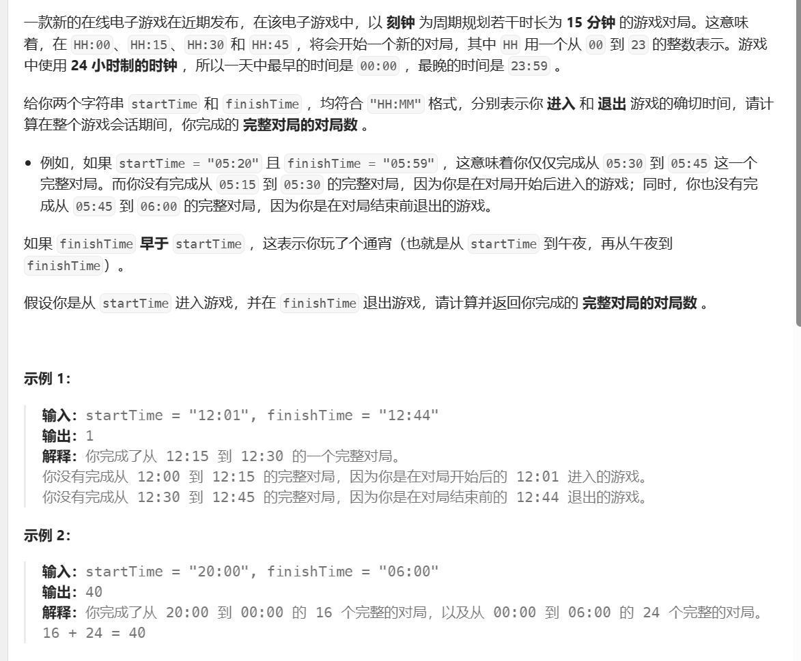

 

将时间转换为分钟数（以开始登入的那一天的00:00为基准），保证结束时间是在最近的刻钟而开始时间不变，利用整除的性质可以得到结果

```python
class Solution:
    def numberOfRounds(self, start: str, end: str) -> int:
        start=60*int(start[:2])+int(start[3:])
        end=60*int(end[:2])+int(end[3:])
        if end<start# 如果开始时间大于结束时间，说明通宵了，加上一天的时间
            end+=1440
        end=end//15*15# 技巧点
        return max(end-start,0)//15 # 保证结果是大于0的，比如00:43,00:57
```


## [一个小组的最大实力值](https://leetcode.cn/problems/maximum-strength-of-a-group/)


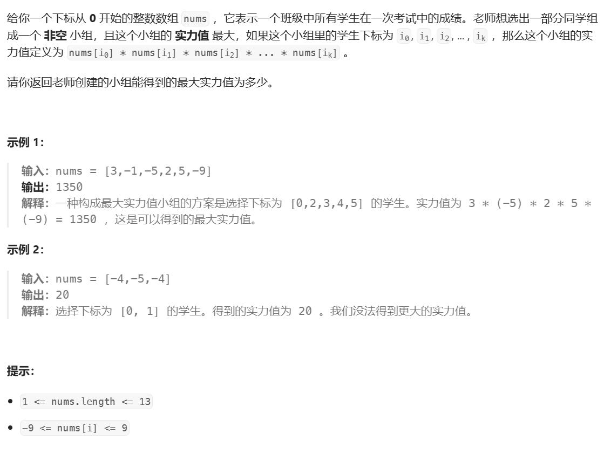

不能简单的挑选出正数和负数然后判断负数的个数再相乘，这里有一些特殊情况，比如当只有一个负数的时候，或者数组中都是0，或者一个0一个负数。

这里的做法是`筛选`而不是上来就乘，`先筛掉奇数个负数中最大的`，`在删去0`，最后可能会是`空列表`，因为列表中只有0，可以做一次判断，如果列表空了返回0，但是也有可能是原列表中只有一个负数删去了导致列表为空，为了排除这种情况，在开始的时候对元素个数做一次判断。

首先挑出所有的负数，判断负数的个数，如果是奇数个就再在列表中减去负数中最大的，偶数的话不用考虑，相乘后的结果一定是正的

```python
from functools import reduce
class Solution:
    def maxStrength(self, nums) -> int:
        # 判断个数，排除只有一个负数的情况
        if len(nums)==1:
            return nums[0]
        # 找负数，技巧点
        neg=[n for n in nums if n<0]
        if len(neg)&1:
            nums.remove(max(neg))
         # 删去所有的0
        nums=[n for n in nums if n]
        # 如果列表中只有0的话，删去后列表为空，应该判断
        return reduce(lambda x,y :x*y ,nums)if nums else 0
```

## [分组的最大数量](https://leetcode.cn/problems/maximum-number-of-groups-entering-a-competition/)

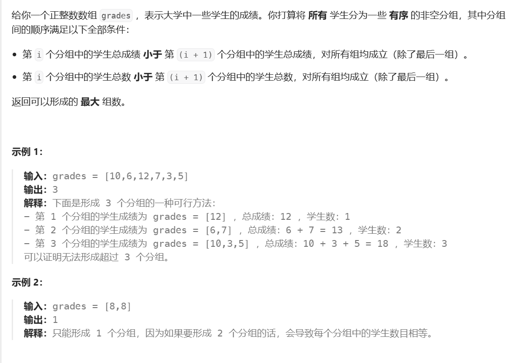


就是找能不能分为1 2 3 4 5 6...组

```python
class Solution:
    def maximumGroups(self, grades: List[int]) -> int:
        n=len(grades)
        ans=0
        cnt=1
        # 使用迭代方法，找元素总数可以分为多少组，如果最后的元素不够再分一组，则归为上一组的元素（推出迭代）
        while n>=cnt:
            ans+=1
            n-=cnt
            cnt+=1
        return ans 
```


## [重新排序得到 2 的幂](https://leetcode.cn/problems/reordered-power-of-2/)


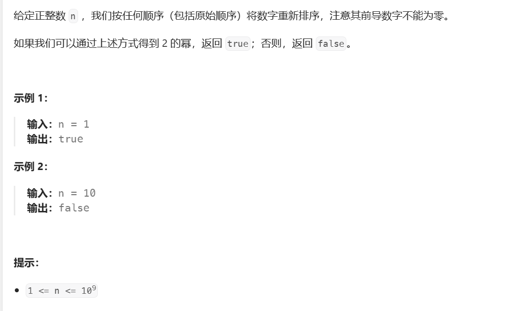

由于要重新排序，因此数字的`顺序不重要，出现的次数才是重点`（技巧点）。

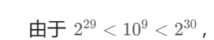

因此枚举出所有的2的冥，统计数字中各元素出现的次数，与给定数字的个元素出现次数作比较即可

```python
class Solution:
    def reorderedPowerOf2(self, n: int) -> bool:
        # 计数
        def count(n):
            cnt=[0]*10
            while n:
                cnt[n%10]+=1
                n//=10
            return tuple(cnt)
        # 枚举所有2的冥
        judge=[count(1<<i) for i in range(30)]
        return count(n) in judge
```


## [和等于目标值的质数对](https://leetcode.cn/problems/prime-pairs-with-target-sum/)

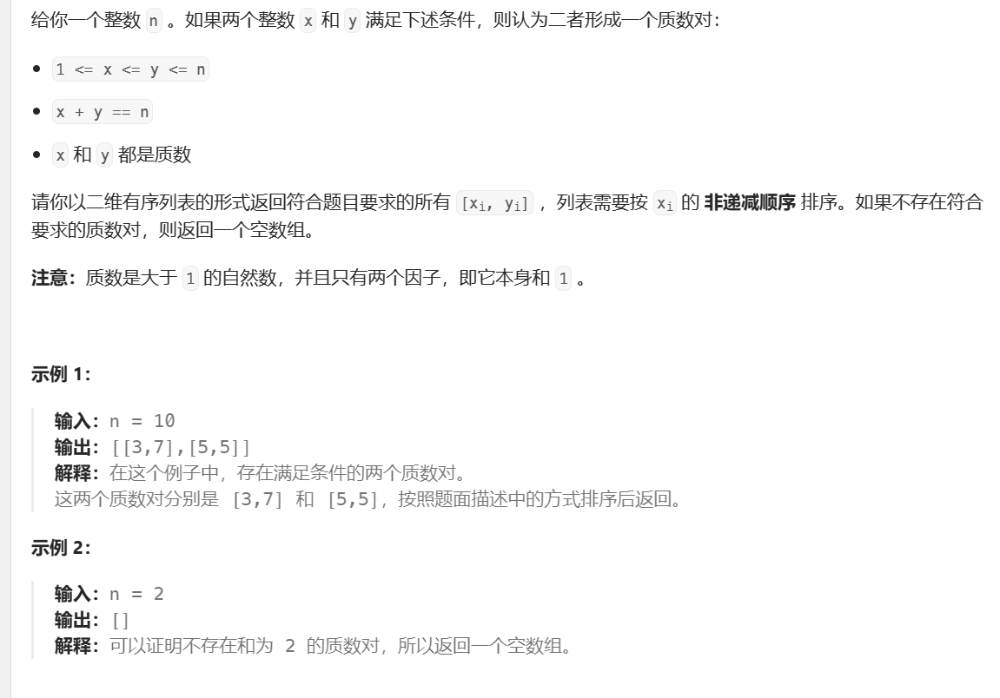


打表预处理所有的质数，然后再里面找两个等于n的。

这里优化的一点是，如果N是奇数，那么只有奇数+偶数才是奇数，而质数中只有2是偶数（技巧点），那么只有一对

```python
MAX=(10**6)+1
is_prime=[True]*MAX
prime=[]
for i in range(2,MAX):
    if is_prime[i]:
        prime.append(i)
        for j in range(i*i,MAX,i):
            is_prime[j]=False
class Solution:
    def findPrimePairs(self, n: int) :
        res=[]
        if n&1: 
            return [[2,n-2]] if n>4 and is_prime[n-2] else []
        for x in prime:
            y=n-x
            # 如果y小于x，直接退出防止加入相同的值([1,5],[5,1])
            if y<x:
                break
            if is_prime[y]:
                res.append([x,y])
        return res
```


## [ 下标对中的最大距离](https://leetcode.cn/problems/maximum-distance-between-a-pair-of-values/)

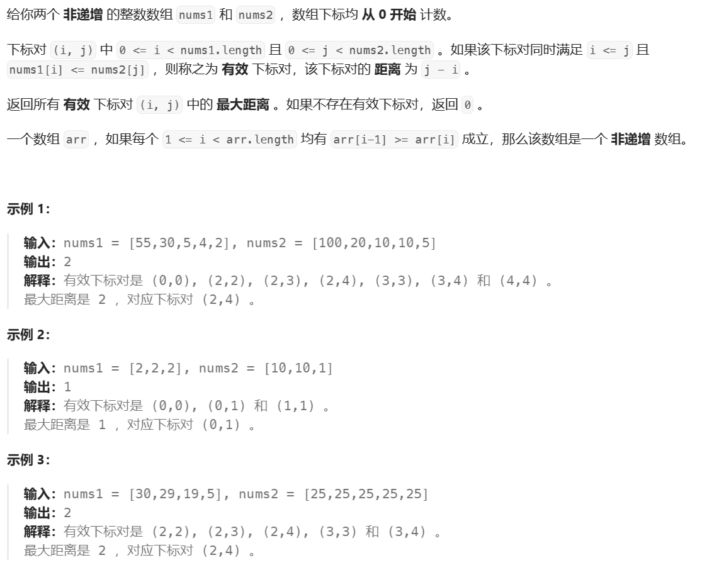

枚举每个i找它最远的j，因此要贪心，J的位置要尽可能靠后，由于数组都是降序的，因此i找到了一个j，那么对i+1一定成立,所以在i到i+1的时候不需更新j

```python
class Solution:
    def maxDistance(self, nums1: List[int], nums2: List[int]) -> int:
        j=ans=0
        n1,n2=len(nums1),len(nums2)
        for i in range(n1):
            while j<n2 and nums2[j]>=nums1[i]:  
                j+=1
            ans=max(ans,j-i-1)
        return ans 
```


或者使用二分搜素，对Nums1中的每个值，在nums2中找最后一个大于等于它的值的索引，这样就构成一个区间

```python
class Solution:
    def maxDistance(self, nums1: List[int], nums2: List[int]) -> int:
        ans=0
        n1,n2=len(nums1),len(nums2)
        def binary_search(nums,i,target):
            l=i
            r=n2-1
            while l<=r:
                mid=(l+r)//2
                if nums[mid]>=target:
                    l=mid+1
                else :
                    r=mid-1
            return r
        for i in range(n1):
            j=binary_search(nums2,i,nums1[i])
            ans=max(ans,j-i)
        return ans 
```

## [ 困于环中的机器人](https://leetcode.cn/problems/robot-bounded-in-circle/)

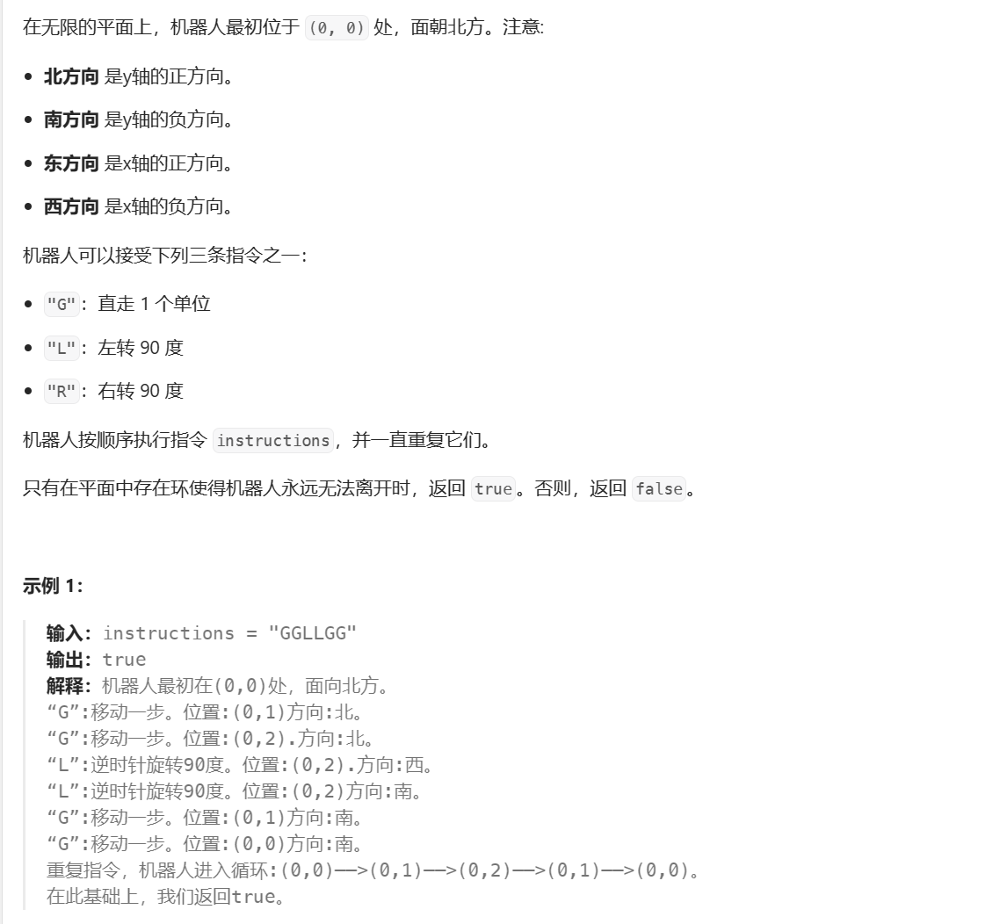


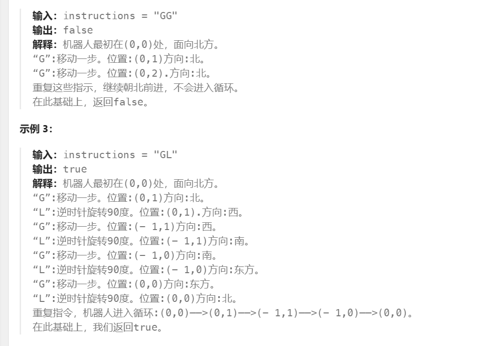


如果经过一串指令之后，位置仍在原点，那么每一次执行指令都会回到原点，如果经过一串指令后，位置不在原点，且方向朝上，那么每一次重复指令都不会进入循环，如果方向朝南，说明经过一次指令，返回会发生180度的转换，那么第二次执行指令时会回到原点，如果方向朝右，那么每次都会向右转90度，那么第一次和第三次，第二次和第四次会抵消，最后会回到原点。

```python
class Solution:
    def isRobotBounded(self, instructions: str) -> bool:
        dirs=[
            lambda x, y: (x + 1, y),
            lambda x, y: (x, y-1),
            lambda x, y: (x -1, y),
            lambda x,y:(x,y+1),
        ]
        d=3
        x=y=0
        for i in instructions:
            dir=dirs[d]
            if i=='G':
                x,y=dir(x,y)
            # 负数也可以取模操作（技巧点）
            elif i=='L':
                d-=1
                d%=4
            else:
                d+=1
                d%=4
        if (x,y)!=(0,0) and d==3:
            return False
        return True

```


## [至少有 K 个重复字符的最长子串](https://leetcode.cn/problems/longest-substring-with-at-least-k-repeating-characters/)


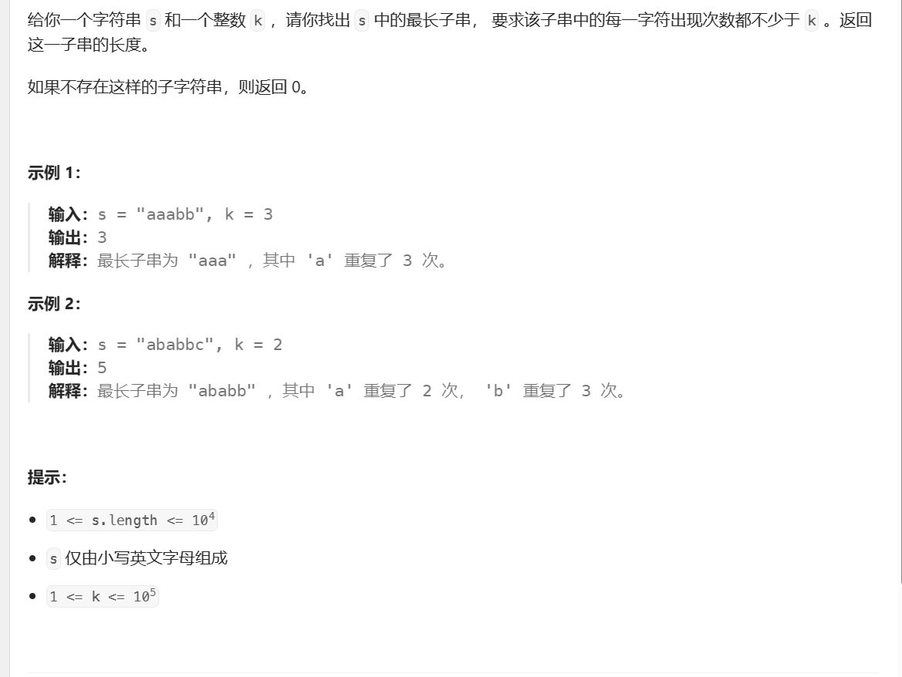

使用分治法，如果一个字符在原字符串中的出现次数小于k次，那么原字符串中所有包含这个字符的子串一定不满足条件，因此在非法字符处断开


```python
from collections import Counter as C
class Solution:
    def longestSubstring(self, s: str, k: int) -> int:
        def find(s):
            if len(s)<k:
                return 0
            for i,c in enumerate(s):
                # 找到非法字符，使用count计数很快（技巧点）
                if s.count(c)<k:
                    left=find(s[:i])
                    right=find(s[i+1:])
                    return max(left,right)
            return len(s)
        return find(s)
```


## [最长的美好子字符串](https://leetcode.cn/problems/longest-nice-substring/)


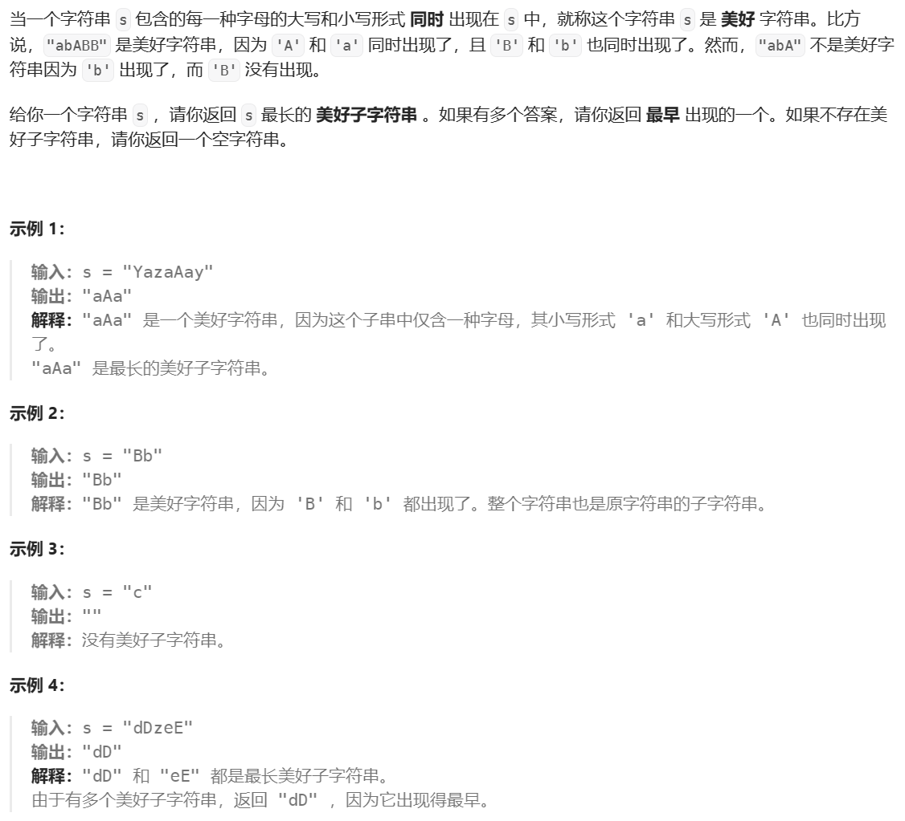

方法一 暴力枚举：

由于给定的数据量很小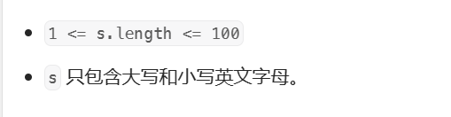

因此暴力枚举，最多是n^3

```python
class Solution:
    def longestNiceSubstring(self, s: str) -> str:
        n=len(s)
        ans=""
        def check(s):
            memo=set()
	    # 枚举一遍加入集合
            for c in s:
                memo.add(c)
             # 再枚举一遍，判断这个字符的大小写是否在集合中
            for c in s:
                a=str.lower(c)
                b=str.upper(c)
                if a not in memo or b not in memo:
                    return False
            return True
        for i in range(n):
            # 找出每个子串，判断是否满足条件
            for j in range(i,n):
                if check(s[i:j+1]) and j-i+1>len(ans):
                    ans=s[i:j+1]
        return ans 
```


方法二，分治法：

对于美丽字符串，一定不会存在单个只出现大写或者小写形式的字符，如果出现这个字符，那么所有包含这个字符的当前字符串的子串都不是美丽字符串，因此采用分治法（技巧点）将字符串在这个非法的位置断开为切分为若干段，对分出的段进行相同操作即可。

```python
class Solution:
    def longestNiceSubstring(self, s: str) -> str:
        def find(s):
            if len(s)<2:
                return ""
            for i,c in enumerate(s):
                c=str.lower(c) if str.islower(c) else str.upper(c)
                # 找到断开处
                if c not in s:
                    # 分为左右两段
                    left=find(s[:i])
                    right=find(s[i+1:])
                    # 使用大于等于找最大的且最先出现的
                    if len(left)>=len(right):
                        return left
                    else:
                        return right
            # 如果没有非法字符那么就返回本身
            return s
        return find(s)
```

## [构造 K 个回文字符串](https://leetcode.cn/problems/construct-k-palindrome-strings/)

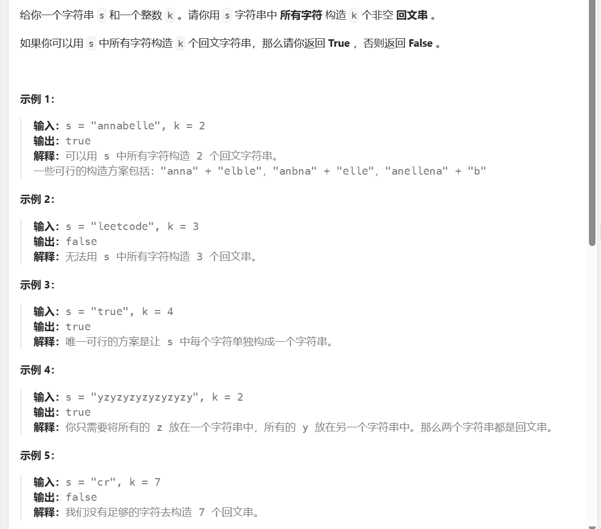

对于字符串找出他所能形成的最多的回文串right，以及最少的回文串left（用到所有的字符）

right：就是每个字符单独作为一个回文串，即字符串的长度

left：`最少的回文串要求回文串要尽可能长，每一种出现了奇数次的字符都必须放在不同的回文串中。特别地，如果没有奇数次字符，那么最少构造的回文串个数为1。`

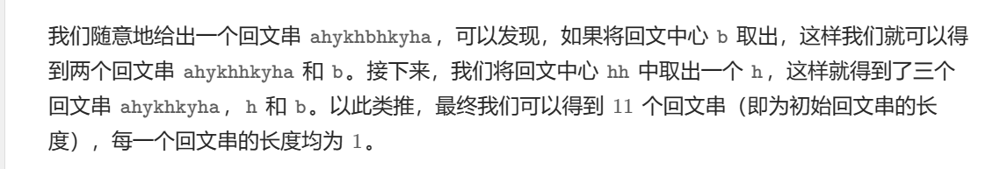

可以通过归纳法证明，left,right之间的值是满足要求的。

```python
from collections import Counter as C
class Solution:
    def canConstruct(self, s: str, k: int) -> bool:
        n=len(s)
        memo=C(s)
        p=0
        for _,v,in memo.items():
            if v&1:
                p+=1
        p=max(p,1)
        if p<=k<=n:
            return True
        else:
            return False
```

## 	[长度为 3 的不同回文子序列](https://leetcode.cn/problems/unique-length-3-palindromic-subsequences/)

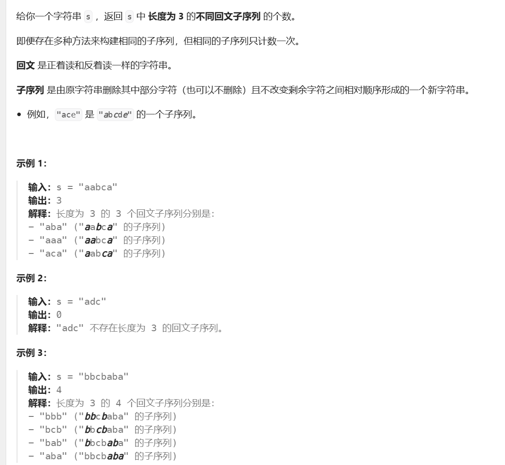

 找左右两侧的相同字符的位置，中间位置的字符种类数就是所能构成的回文串数目，这里数据范围在$10^7$,使用set()初始化这个数据范围所需的时间是0.17s左右

```python
class Solution:
    def countPalindromicSubsequence(self, s: str) -> int:
        n=len(s)
        ans=0
        # 遍历set中的数据范围，大大去重
        for c in set(s):
            start=s.index(c)
            # 使用函数rindex可以找出右边的位置，技巧点
            end=s.rindex(c)
            ans+=len(set(s[start+1:end]))
        return ans 
```


## [设计数字容器系统](https://leetcode.cn/problems/design-a-number-container-system/) 

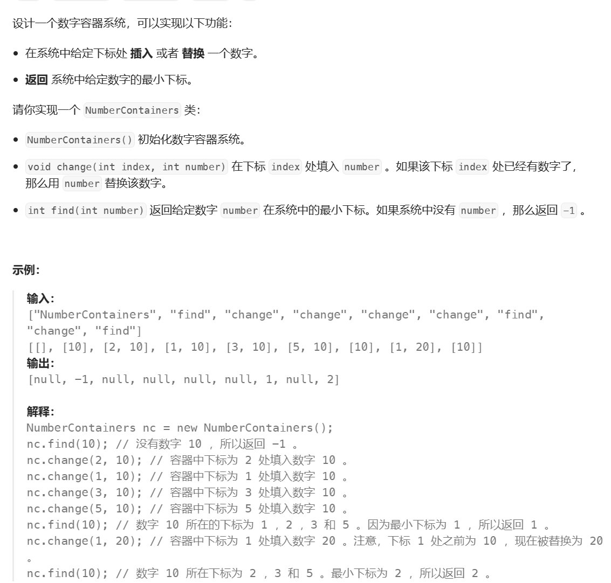


方法一（平衡树）：

借助平衡树快速更新值所对应的键，借助内置函数SortedSet可以快速实现


```python
from collections import defaultdict as f
from sortedcontainers import SortedSet
class NumberContainers:

    def __init__(self):
        self.kv={}
        self.vk=f(SortedSet)

    def change(self, index: int, number: int) -> None:
        # 如果这个值存在的话，需要在原来的树种删除它，在新的树中加入它
        if index in self.kv:
            val=self.kv[index]
            self.kv[index]=number
            self.vk[val].remove(index)
            self.vk[number].add(index)
        else:
            self.kv[index]=number
            self.vk[number].add(index)

    def find(self, number: int) -> int:
        s=self.vk[number]
        if s:
            return s[0]
        else:
            return -1
```


方法二（懒根堆）：

用优先级队列储存值对应的键，在change函数中只管加入值，在最后查找的时候更新堆顶。

```python
class NumberContainers:

    def __init__(self):
        self.kv={}
        self.vk=f(list)

    def change(self, index: int, number: int) -> None:
        # 只管加入
        self.kv[index]=number
        heapq.heappush(self.vk[number],index)

    def find(self, number: int) -> int:
        li=self.vk[number]
        # 如果堆顶的元素对应的值不是所需的，说明这个键被改变了，弹出
        while li and self.kv[li[0]]!=number:
            heapq.heappop(self.vk[number])
        # 如果堆空了说明没有对应的键
        return li[0] if li else -1
```

## [安排会议日程](https://leetcode.cn/problems/meeting-scheduler/)

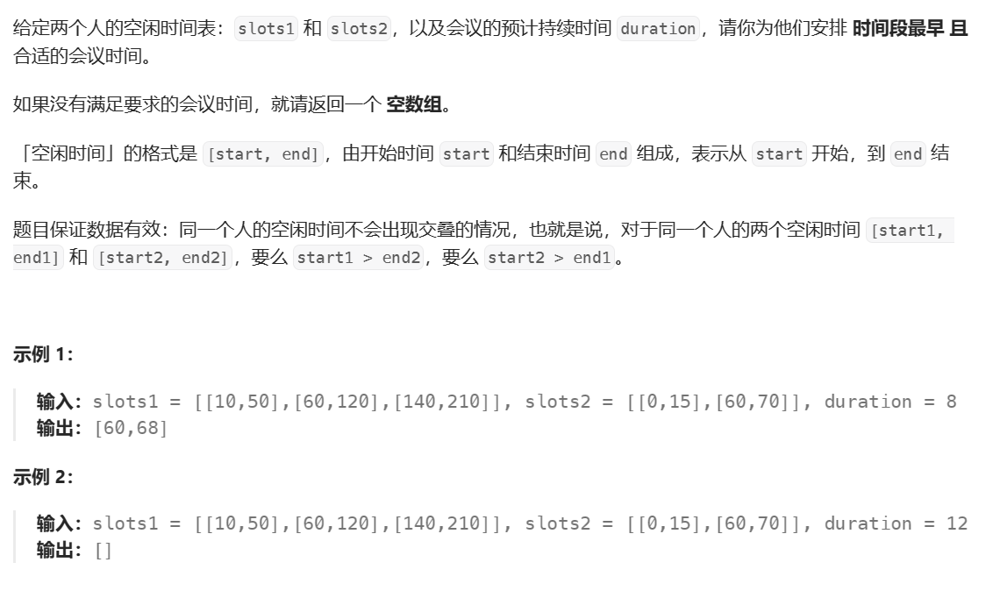

区间重叠使用双指针对两个范围找重叠，并不是都用差分，移动结束早的区间，因为区间都是递增的，结束玩的区间不会和另一个人的笑一个区间有重叠，这样的双指针不会回头。

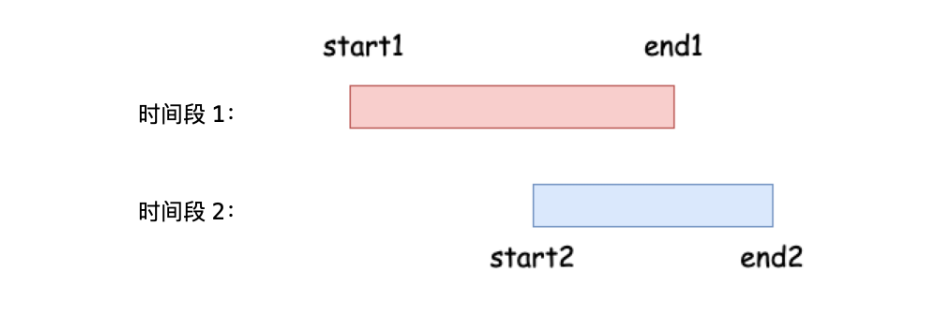


```python
class Solution:
    def minAvailableDuration(self, s1: List[List[int]], s2: List[List[int]], d: int) -> List[int]:
        p1=p2=0
        s1.sort()
        s2.sort()
        n1=len(s1)
        n2=len(s2)
        # 双指针
        while p1<n1 and p2<n2:
            l=max(s1[p1][0],s2[p2][0])
            r=min(s1[p1][1],s2[p2][1])
            # 判断重叠区间是否满足要求
            if r-l>=d:
                return [l,l+d]
            # 移动结束范围短的区间 
            if s1[p1][1]>s2[p2][1]:
                p2+=1
            else:
                p1+=1
        return []
```


## [找出字符串的可整除数组](https://leetcode.cn/problems/find-the-divisibility-array-of-a-string/)

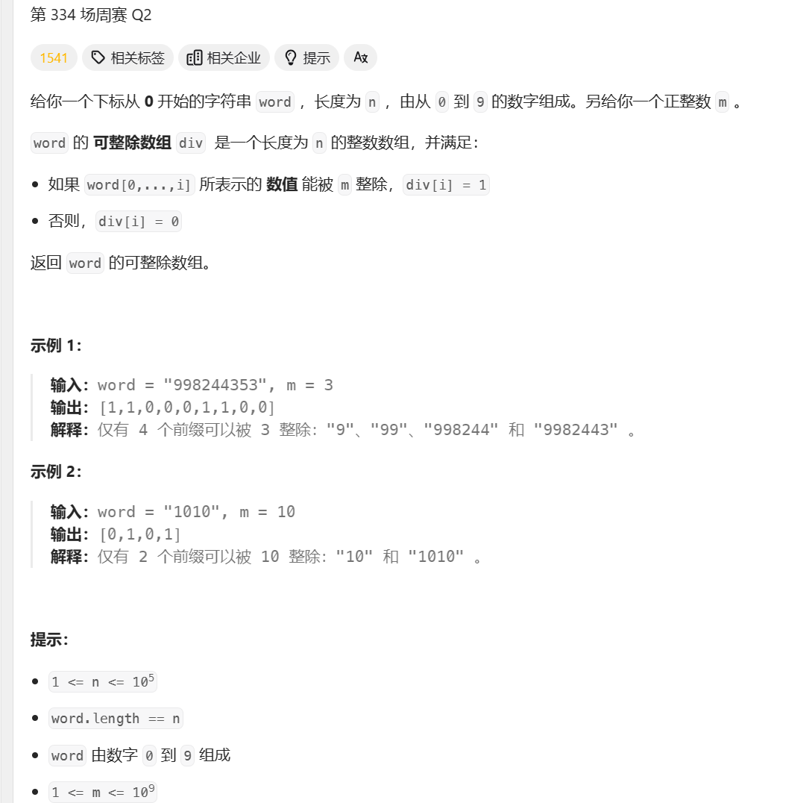

不能一直往后取数，最后的数值太大取模的时间会相当长，应该缩减数值。到当前的数字，数值大小是前面的和乘上10加上这个数字取模的结果。


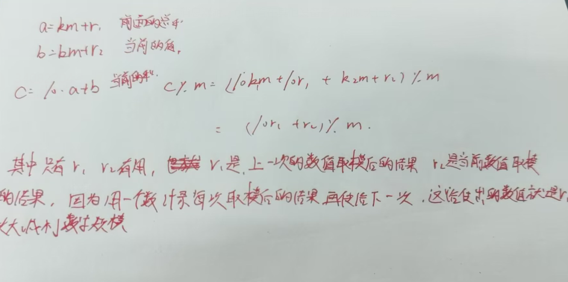


```python
class Solution:
    def divisibilityArray(self, word: str, m: int) -> List[int]:
        n=len(word)
        ans=[0]*n
        temp=0
        for i,v in enumerate(map(int,word)):
            temp=(temp*10+v)%m
            ans[i]=int(temp==0)
        return ans
```

## [删除子文件夹](https://leetcode.cn/problems/remove-sub-folders-from-the-filesystem/)

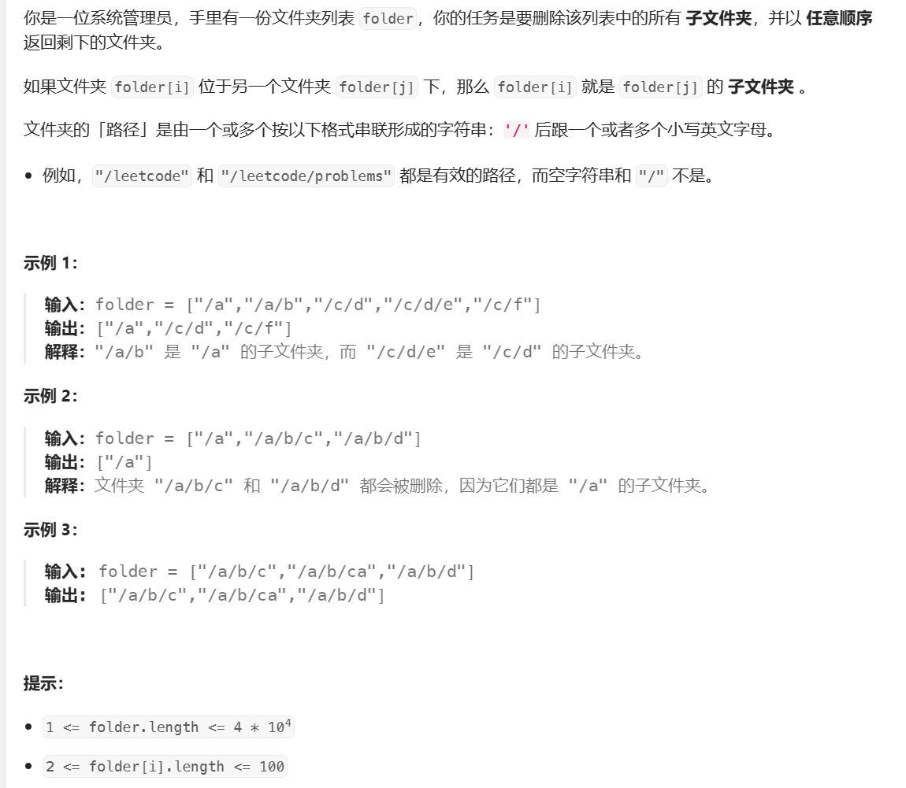

`文件系统的路径是由树的结构组成的`，这道题目使用字典树的数据结构来解决。

```python
class Trie:
    def __init__(self):
        self.children={}
        # 内部的ref代表这个节点是中间节点（-1）还是一个存在的值，如果ref=i即这个节点所代表的值位folder[i]的字符串
        self.ref=-1

class Solution:
    def removeSubfolders(self, folder: List[str]) -> List[str]:
        tree = Trie()
        for i,f in enumerate(folder):
            curr=tree
            f=f.split('/')
            # 对字符串分组之后遍历
            for name in f:
                # 如果这个字符不存在则创建
                if name not in curr.children:
                    curr.children[name]=Trie()
                # 随着这条路径深入
                curr=curr.children[name]
            # 给最后的节点赋值i，使它代表folder[i]，中间路径上的节点会被默认设置为-1代表中间节点，可以保证/c,/c/d都被赋予对应的值
            curr.ref=i
        ans=[]
        # 回溯遍历，一旦遇到了非中间节点就退出，因为这之后代表的都是它的子文件，没必要再继续。
        def dfs(root):
            if root.ref!=-1:
                ans.append(folder[root.ref])
                return
            for c in root.children.values():
                dfs(c)
        dfs(tree)
        return ans 
```

## [递减元素使数组呈锯齿状](https://leetcode.cn/problems/decrease-elements-to-make-array-zigzag/)

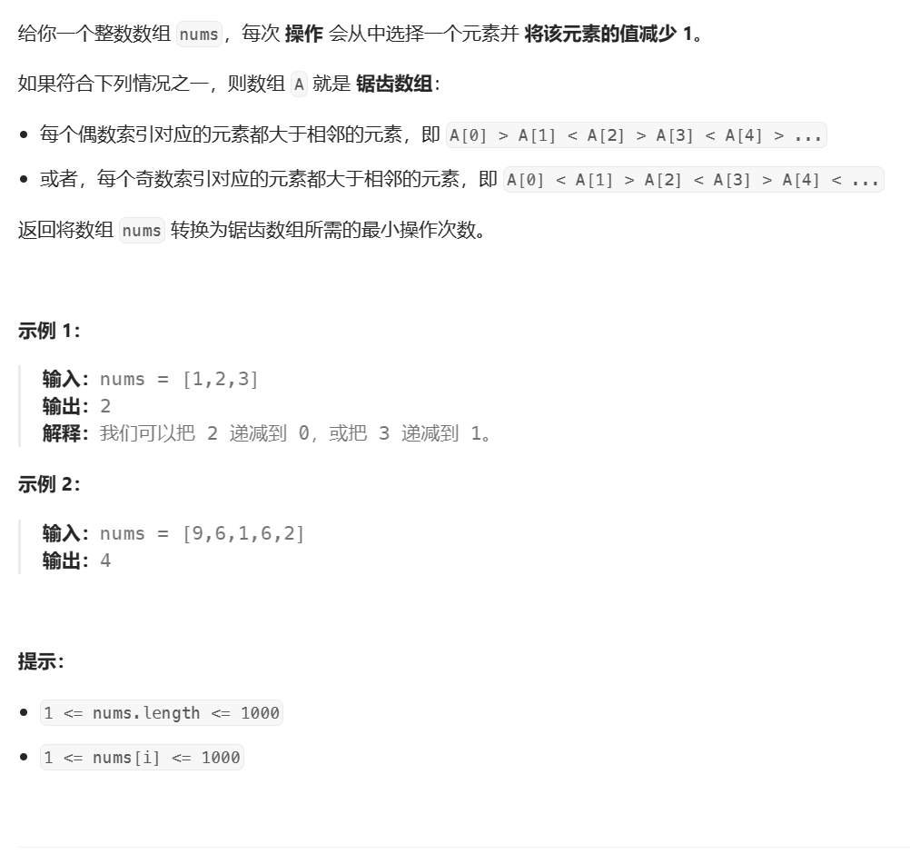


无论是奇数还是偶数位置，要想要这个位置的值大于两边都需要减小两边的值直到满足。

```python
class Solution:
    def movesToMakeZigzag(self, nums: List[int]) -> int:
        ans=0
        n=len(nums)
        ans=temp=0
        def f(x):
            res=0
            for i in range(x,n,2):
                d=0
                if i>0:
                    d=max(d,nums[i]-nums[i-1]+1)
                if i+1<n:
                    d=max(d,nums[i]-nums[i+1]+1)
                res+=d
            return res
        return min(f(0),f(1))
```


## [最小公倍数为 K 的子数组数目](https://leetcode.cn/problems/number-of-subarrays-with-lcm-equal-to-k/)


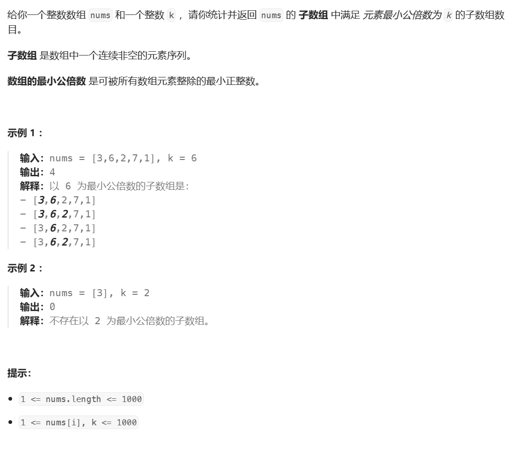

暴力枚举，找出每一个连续子数组，使用lcm求解最小公倍数

```python
class Solution:
    def subarrayLCM(self, nums: List[int], k: int) -> int:
        n=len(nums)
        ans=0
        for i in range(n):
            res=1
            for j in range(i,n):
                res=lcm(res,nums[j])
                if k%res:break# 求出的公倍数必须是k的因数，否则退出
                if res==k: ans+=1
        return ans 
```


## [最大公因数等于 K 的子数组数目](https://leetcode.cn/problems/number-of-subarrays-with-gcd-equal-to-k/)


同上，数据范围可以暴力枚举所有的子数组。

```python
class Solution:
    def subarrayGCD(self, nums: List[int], k: int) -> int:
        ans=0
        n=len(nums)
        for i in range(n):
            res=nums[i]
            for j in range(i,n):
                res=gcd(res,nums[j])
                if res==k:ans +=1
                elif res<k:break
        return ans 
```


## [可获得的最大点数](https://leetcode.cn/problems/maximum-points-you-can-obtain-from-cards/)

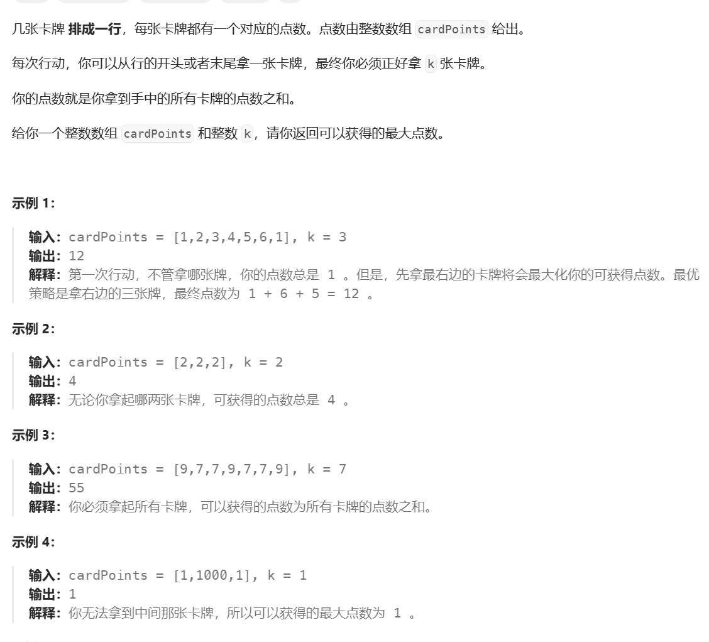

正难则反（技巧点），要求从两边拿走的点数最多，则剩下的点数和最小，这是一个定长的滑动窗口问题。

```python
class Solution:
    def maxScore(self, c: List[int], k: int) -> int:
        n=len(c)
        total=sum(c)
        l,r=0,n-k-1
        temp=val=sum(c[l:r+1])
        while r+1<n:
            r+=1
            val+=c[r]-c[l]
            l+=1
            temp=min(temp,val)
        return total-temp
```


## [句子相似性 III](https://leetcode.cn/problems/sentence-similarity-iii/)


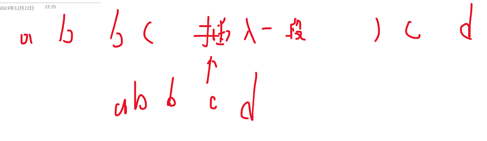

如果只是在中间插入一段的话，那么从两边向中间遍历（字符不同停止移动）的过程中一定会遍历到较小的字符串的全部字符

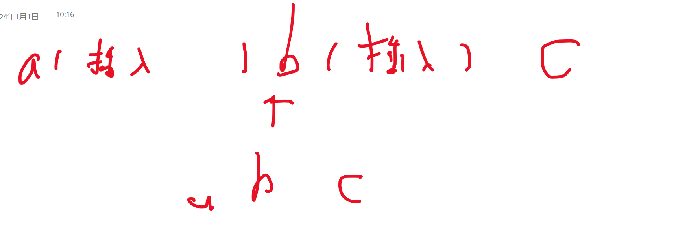

如果是插入多个位置，那么遍历过程中不会得到短的字符串的所有字符。


```python
class Solution:
    def areSentencesSimilar(self, s1: str, s2: str) -> bool:
        # 交换字符，方便操作	
        if len(s2)>len(s1):
            s1,s2=s2,s1
        s1=s1.split()
        s2=s2.split()
        i=j=0
        m=len(s1)
        n=len(s2)
        # 从两边遍历，遇到不同的字符停止
        while i<n and s1[i]==s2[i]:
            i+=1
        while j<n and s1[m-1-j]==s2[n-1-j]:
            j+=1
        # 由于插入的字符可能原字段相同，所以大于可以选到
        return i+j>=n
```


## [特殊等价字符串组](https://leetcode.cn/problems/groups-of-special-equivalent-strings/)


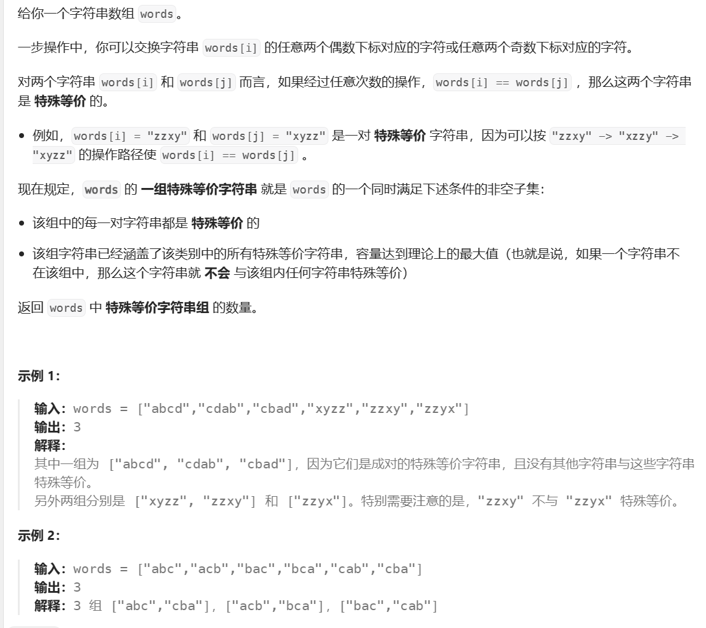

这是一道字符顺序不重要的题目，可以记录奇数位置和偶数位置的字符（技巧点）

```python
class Solution:
    def numSpecialEquivGroups(self, words: List[str]) -> int:
        memo=set()
        # 记录位置
        def valid(s):
            # 区分偶数和奇数
            ans=[0]*52
            for i,v in enumerate(s):
                ans[ord(v)-ord('a')+26*(i%2)]+=1
            # 使用tuple因为列表无法存入字典
            return tuple(ans)
        return len({valid(c) for c in words})

#  也可以把每个字符串按照偶数和奇数位置排序，然后记录个数
class Solution:
    def numSpecialEquivGroups(self, words: List[str]) -> int:
        memo=set()
        ans=0
        for c in words:
            s=list(c)
            for i in range(len(s)):
                for j in range(i%2,len(s)-2,2):
                    if s[j]>s[j+2]:
                        s[j],s[j+2]=s[j+2],s[j]
            s="".join(s)
            if s not in memo:
                memo.add(s)
                ans+=1
        return ans 
```


## [数的平方等于两数乘积的方法数](https://leetcode.cn/problems/number-of-ways-where-square-of-number-is-equal-to-product-of-two-numbers/)

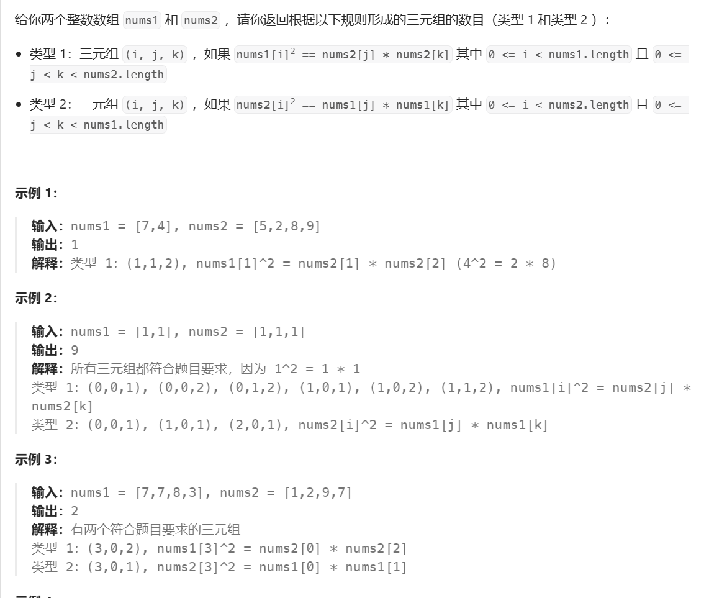


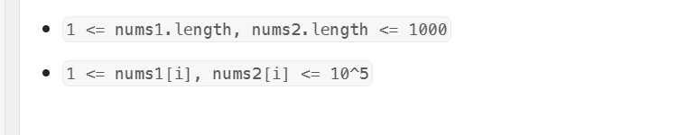

暴力枚举，对每个数组构造他每个元素的平方的哈希表，然后分别对每个数组找各个元素的乘积，查看是否在另一个元素的哈希表中。

```python
class Solution:
    def numTriplets(self, nums1: List[int], nums2: List[int]) -> int:
        s1=Counter([x**2 for x in nums1])
        s2=Counter([x**2 for x in nums2])
        ans=0
        for i in range(len(nums1)):
            for j in range(i+1,len(nums1)):
                if nums1[i]*nums1[j] in s2:
                    ans+=s2[nums1[i]*nums1[j]]
        for i in range(len(nums2)):
            for j in range(i+1,len(nums2)):
                if nums2[i]*nums2[j] in s1:
                    ans+=s1[nums2[i]*nums2[j]]
        return ans 
```

## [交换字符使得字符串相同](https://leetcode.cn/problems/minimum-swaps-to-make-strings-equal/)

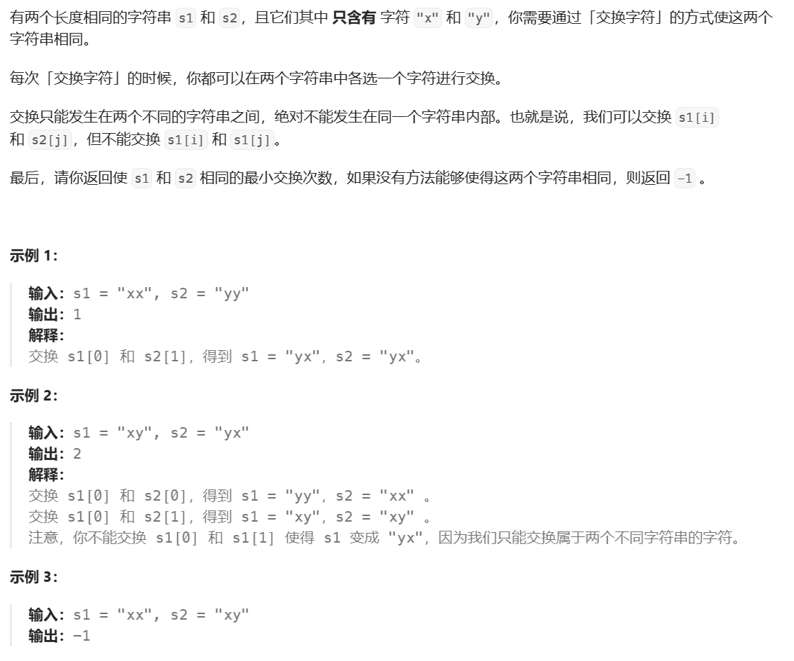

记录字符串中不同字符的数目d，如果d是奇数，说明不同字符中存在奇数个x偶数个y，或者反过来,xxy yyx这个类型一定无法通过交换形成相等的字符。如果d是偶数那么就存在偶数个x偶数个y，或者奇数个x奇数个y。

偶数个x偶数个y所需的最小操作次数为,一次操作可以最多可以是使两个字符对应相等：


d//2，而奇数的情况，通过交换一次变为偶数，然后按照偶数的操作方式进行，即为d//2+1


多画图，找规律


```python
class Solution:
    def minimumSwap(self, s1: str, s2: str) -> int:
        d=0
        cnt=Counter(x for x,y in zip(s1,s2) if x!=y)
        d=cnt['x']+cnt['y']
        return -1 if d%2 else d//2+cnt['x']%2
```

## [构成交替字符串需要的最小交换次数](https://leetcode.cn/problems/minimum-number-of-swaps-to-make-the-binary-string-alternating/)

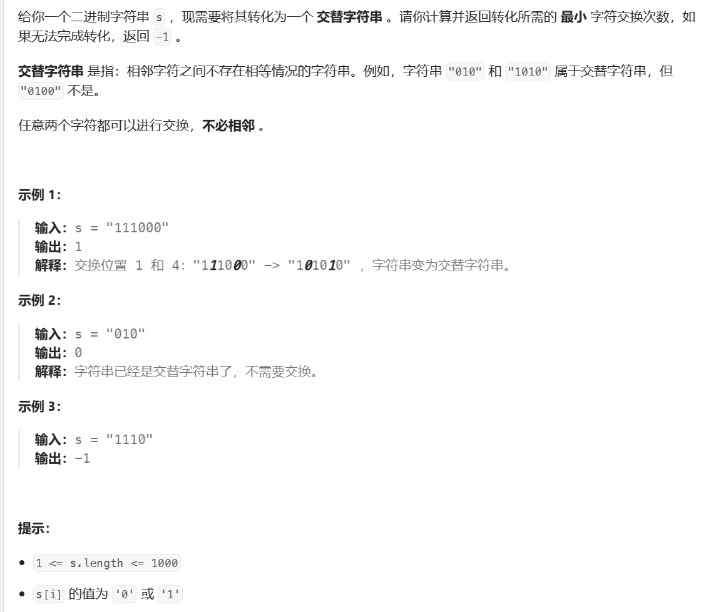

由于字符串中只有01，因此交替字符串的形式只有两种，以1开头以0开头，统计当前字符串与两种结果字符串的差，再除上2就是交换的最小次数，以1开头的字符串在偶数位置为1，以0开头的字符串在奇数位置为1

```python
class Solution:
    def minSwaps(self, s: str) -> int:
        n=len(s)
        ans=0
        memo=Counter(s)
        # 只有两种字符数量的差不超过2的时候才能变为交替字符串
        if abs(memo['1']-memo['0'])>=2:
            return -1
        s1=s2=0
        # 遍历一遍，找到要修改的次数
        for i,v in enumerate(s):
            if i&1:
                s1+=int(v=='1')
                s2+=int(v=='0')
            else:
                s1+=int(v=='0')
                s2+=int(v=='1')
        # 1多，只能以1开头 
        if memo['1']>memo['0']:
            return s1//2
        # 0多只能以0开头
        elif memo['1']<memo['0']:
            return s2//2
        else:
            # 一样多找出最小的
            s1=min(s1,s2)
            return s1//2
```


## [最长上传前缀](https://leetcode.cn/problems/longest-uploaded-prefix/)

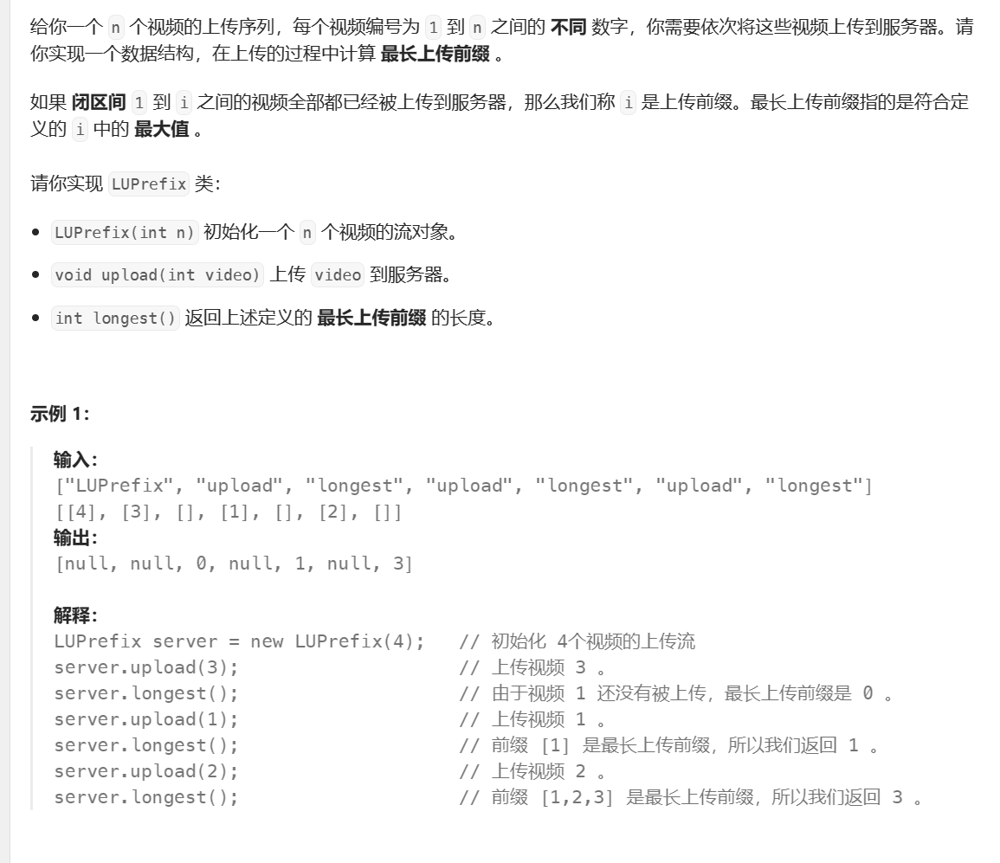

根据最长上传前缀不会递减的性质，维护一个变量	

```python
class LUPrefix:

    def __init__(self, n: int):
        self.x=1
        self.memo=set()


    def upload(self, video: int) -> None:
        self.memo.add(video)

    def longest(self) -> int:
        while self.x in self.memo:
            self.x+=1
        return self.x-1
```


## [ 转变数组后最接近目标值的数组和](https://leetcode.cn/problems/sum-of-mutated-array-closest-to-target/)

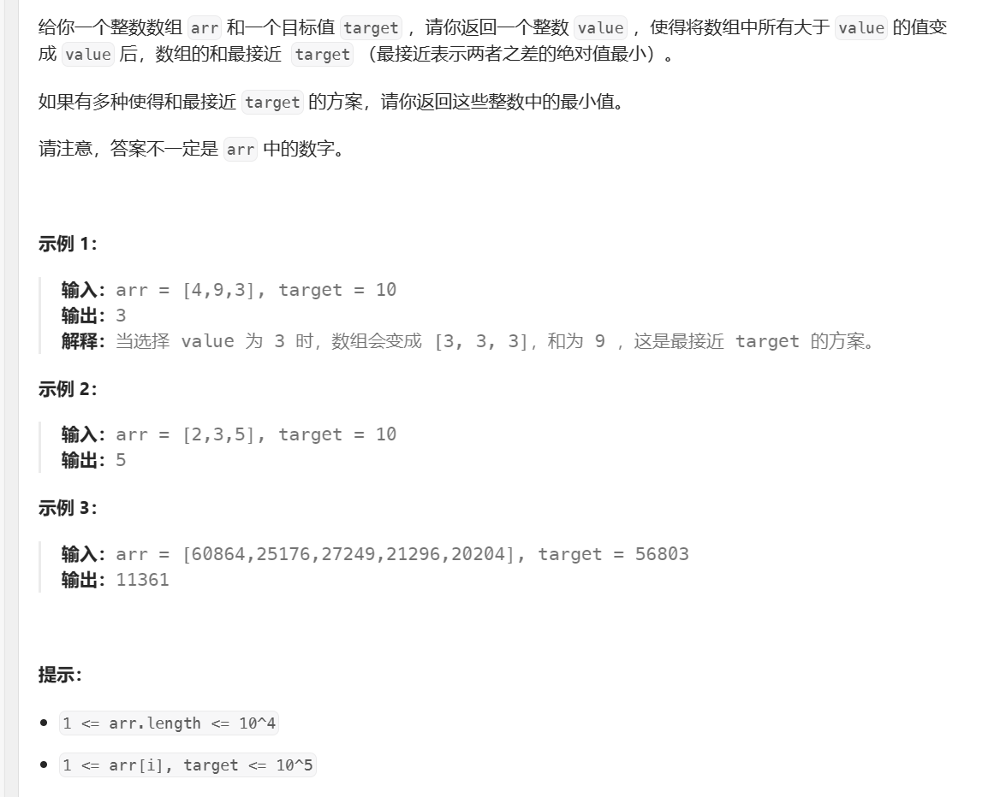


可以选择的value是0到最大值，最多10^5个，想要快速计算出变换后的数字之和利用前缀和数组即可，小于value的不变，大于的全变为value，这要求要找到区分二者的位置，通过二分搜索可以快速得到这个位置，注意首先要排序。这题最重要的是 10^5是可以暴力解决的，毕竟用到了前缀和和二分。

```python
class Solution:
    def findBestValue(self, arr: List[int], target: int) -> int:
        total=sum(arr)
        if total<=target:
            return max(arr)
        arr.sort()
        up=max(arr)
        pre=[0]+list(accumulate(arr))
        n=len(arr)
        ans,temp=0,float('inf')
        for i in range(1,up+1):
            index=bisect_left(arr,i)
            curr=pre[index]+i*(n-index)
            if abs(curr-target)<temp:
                temp=abs(curr-target)
                ans=i
        return ans 
```

## [找出出现至少三次的最长特殊子字符串 II](https://leetcode.cn/problems/find-longest-special-substring-that-occurs-thrice-ii/)

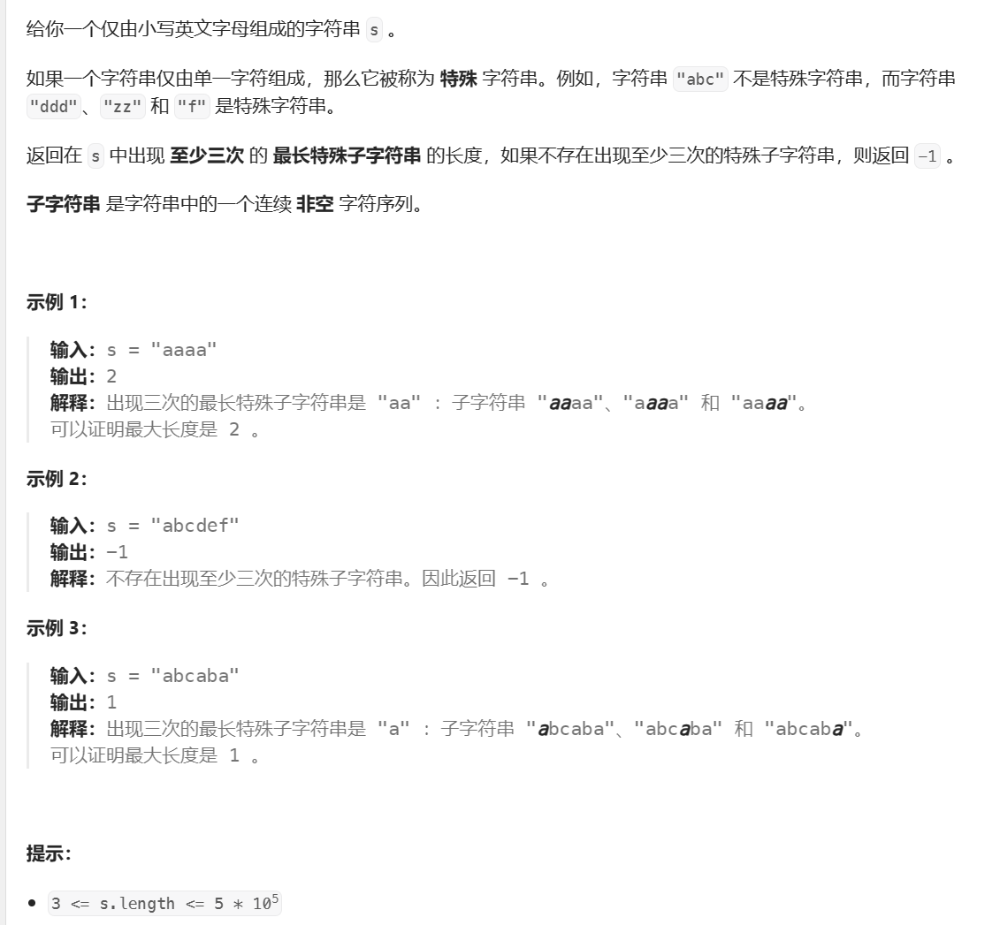


分类讨论，对于一个特殊字符串有三种情况：第一，最长的l1所形成的l1-2个，比如aaaaaa可以形成aaaa,aaaa,aaaa，第二，有第二长的l2，如果l2等于l1那么存在可以形成l2-1个，如果不等于就有l2个，第三，对于第三长的l3，可能会有l3个，比较返回最大的即可。


```python
class Solution:
    def maximumLength(self, s: str) -> int:
        memo=defaultdict(list)
        i=ans=0
        n=len(s)
        # 分组循环记录个数
        while i<n:
            start=i
            i+=1
            while i<n and s[i]==s[i-1]:
                i+=1
            memo[s[i-1]].append(i-start)
        for p in memo.values():
            p.sort(reverse=True)
            # 数组长度可能不够，为方便计算加入不影响的两个0
            p.extend([0,0])
            l1,l2,l3=p[:3]
            ans=max(ans,l1-2,min(l1-1,l2),l3)
        return ans if ans else -1
```


## 	[所有蚂蚁掉下来前的最后一刻](https://leetcode.cn/problems/last-moment-before-all-ants-fall-out-of-a-plank/)	

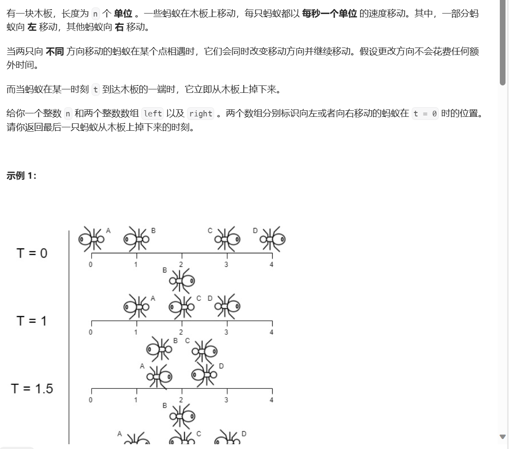


脑筋急转弯，转向是相向的两只蚂蚁同时转向，并且不耗时，那么跟没转一样，遍历左右蚂蚁群，找出最小值，左边掉下去的时间就是它的位置，右边掉下去的时间是板长减去它的位置。

```python
class Solution:
    def getLastMoment(self, n: int, left: List[int], right: List[int]) -> int:
        ans=0
        for l in left:
            ans=max(ans,l)
        for r in right:
            ans=max(ans,n-r)
        return ans 
```

## [ 使数组中所有元素相等的最小操作数 II](https://leetcode.cn/problems/minimum-operations-to-make-array-equal-ii/)

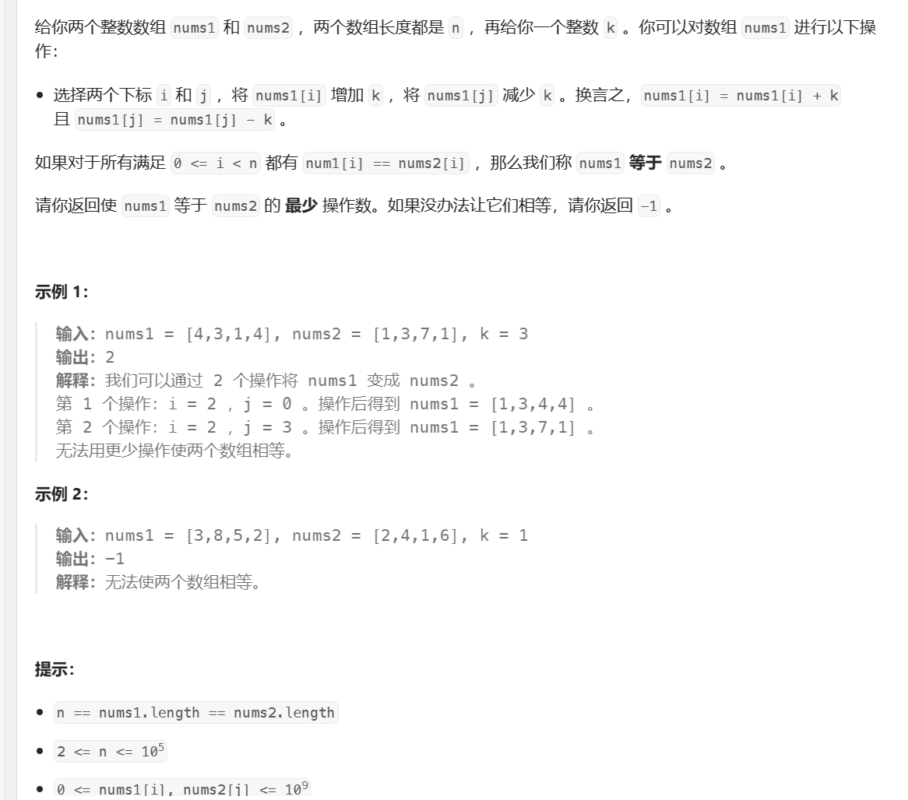

`取得a[i]，表示两个数组之间的差，要使两个数组相等，就是要a[i]中每一项都为0(技巧点)`，a[i]每一次只能变换k，如果k不是a[i]的倍数就不可能是a[i]变为0，，如果k是0，就要求a[i]不为0，并且加一次k也要减一次k，数组最终大小是不变的，最终对a[i]中正数的操作次数要和负数的操作次数相抵。

```python
class Solution:
    def minOperations(self, nums1: List[int], nums2: List[int], k: int) -> int:
        n=len(nums1)
        sum=ans=0# 前者记录正数和负数的操作次数，后者记录正数的操作次数
        for x,y in zip(nums1,nums2):
            x-=y
            if k:
                if x%k: return -1
                sum+=x//k
                if x>0:
                    # 这里认为每一次减小正数，都会把相应的k加到对应的负数上，认为是最优决策
                    ans+=x//k
            elif x: return -1
        return -1 if sum else ans 
```

## [统计坏数对的数目](https://leetcode.cn/problems/count-number-of-bad-pairs/)

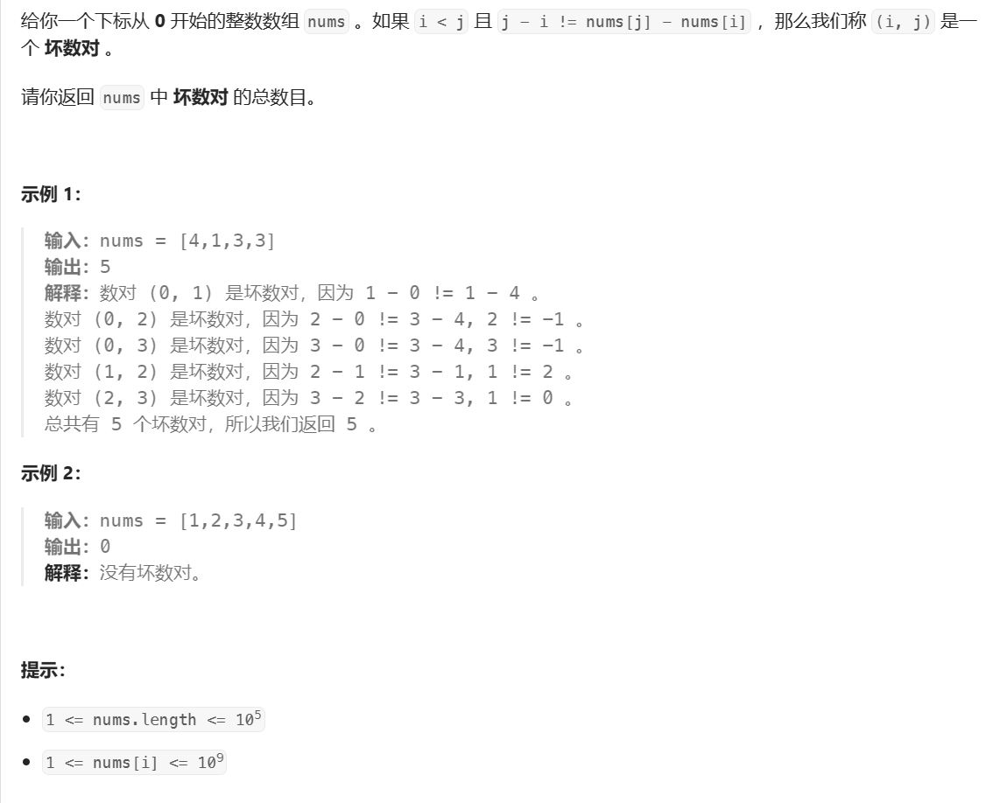

`变形式子（技巧点）`为：nums[i]-i!=nums[j]-j，正难则反找nums[i]-i==nums[j]-j，即好数对的个数，然后用总数减去即可

```python
class Solution:
    def countBadPairs(self, nums: List[int]) -> int:
        n=len(nums)
        total=n*(n-1)//2
        memo=defaultdict(int)
        for i in range(n):
            val=nums[i]
            memo[val-i]+=1
        ans=0
        for k,v in memo.items():
            ans+=(v-1)*v//2
        return total-ans 

```


## [通过投票对团队排名](https://leetcode.cn/problems/rank-teams-by-votes/)


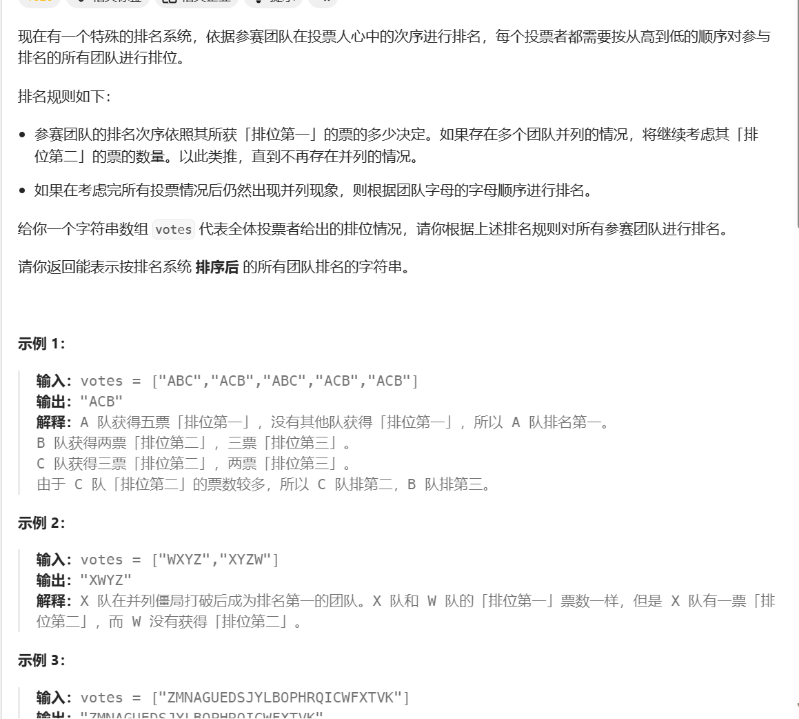


构建每个字母对应的位置数组即可，使用内置的排序算法就可以完成直接进行`数组间的比较排序的（技巧点）`，比较的方式是从首部的元素开始，依次比较两个数组同一位置的元素的大小，若相等则继续比较下一位置，直至数组的尾部（此时长度较长的数组较大，若长度相同，则这两个数组同样大）

```python
class Solution:
    def rankTeams(self, votes: List[str]) -> str:
        n=len(votes[0])
        memo=defaultdict(lambda: [0]*n)
        for v in votes:
            for i,c in enumerate(v):
                memo[c][i]+=1
        res=list(memo.items())
        res.sort(key=lambda x:(x[1],-ord(x[0])),reverse=True)
        return "".join(c for c,_ in res)
```

## [删除回文子序列](https://leetcode.cn/problems/remove-palindromic-subsequences/)

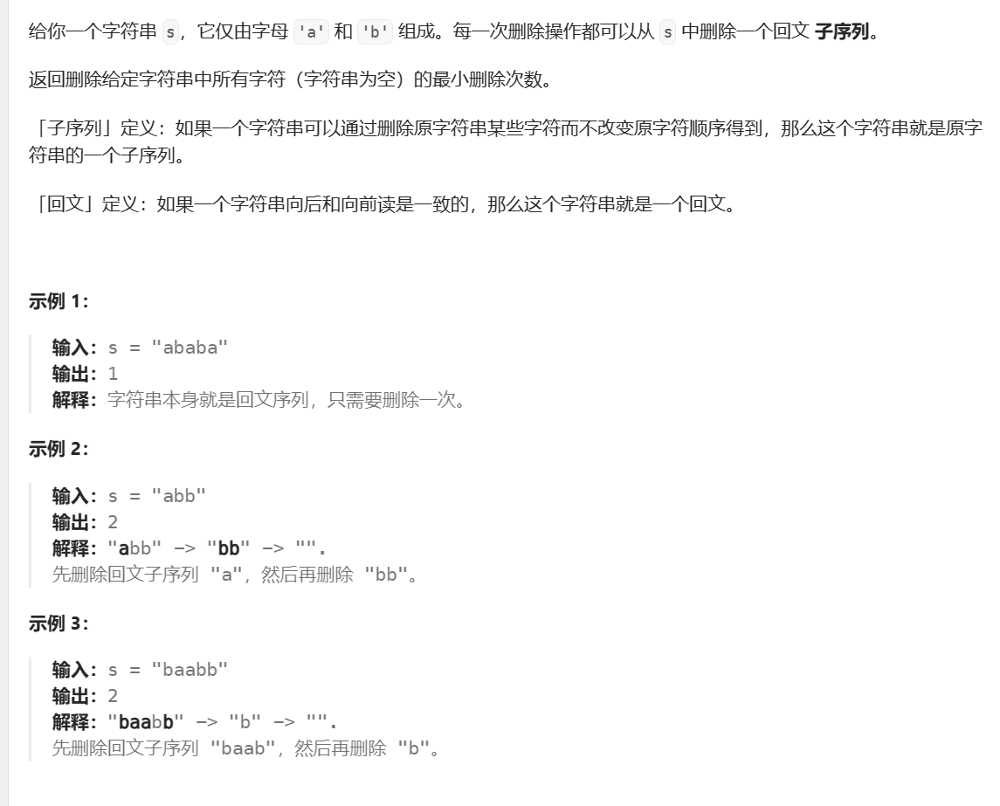

由于给定的字符串只有a和b，因此最多需要两次删除所有的字符串，而删除一次的情况就是整个字符串是回文串。

```python
class Solution:
    def removePalindromeSub(self, s: str) -> int:
        n=len(s)
        l,r=0,n-1
        while l<=r:
            if s[l]!=s[r]:break
            l+=1
            r-=1
        else:
            return 1
        return 2
```

## 合并区间

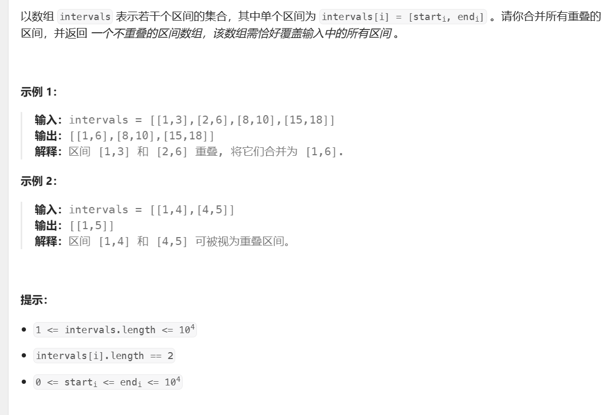

`通过排序，一次遍历找出重叠的区间。`

`找到可以合并的区间，先按照左端点的大小排序，维护一个最大的右端点，然后遍历数组，如果当前左端点小于最大的右端点，表示存在重叠是一个重叠区间，更新一下右端点即可，如果不小于，说明区间不存在重叠是一个独立的区间，将他加入到结果中，并重置最大的右端点，以此类推。`

```python
class Solution:
    def merge(self, t: List[List[int]]) -> List[List[int]]:
        t.sort(key=lambda x:(x[0],x[1]))
        # 初始时，放入第一个区间方便操作
        mr=t[0][1]
        ans=[t[0]]
        for i in range(1,len(t)):
            a,b =t[i]
            # 如果小于，说明存在重叠
            if a<=mr:
                # 更新右端点，同时更新答案
                mr=max(mr,b)
                ans[-1][1]=max(ans[-1][1],mr)
            else:
                # 否则是一个独立的区间
                mr=b
                ans.append([a,b])

        return ans 
```


[统计将重叠区间合并成组的方案数](https://leetcode.cn/problems/count-ways-to-group-overlapping-ranges/)


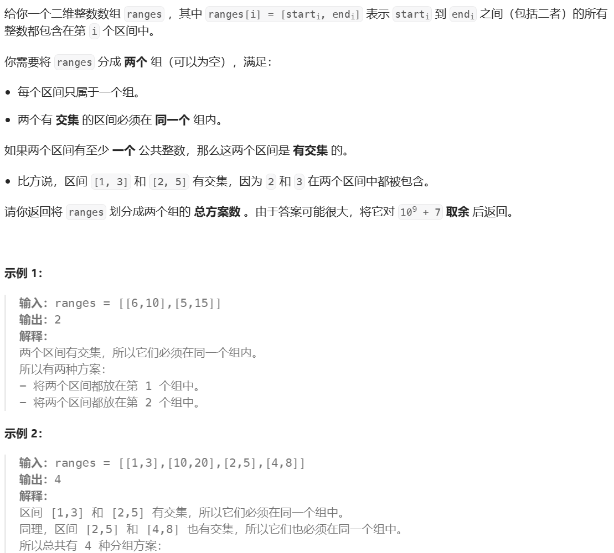

这里要找出所有的区间，把重叠区间视为一个，每个区间的放置有两个选择，最后的结果是2^i。


```python
class Solution:
    def countWays(self, ranges: List[List[int]]) -> int:
        m=10**9+7
        ans=1
        ranges.sort(key=lambda x:(x[0],x[1]))
        mr=ranges[0][1]
        for i in range(1,len(ranges)):
            a,b =ranges[i]
            if a<=mr:
                mr=max(mr,b)
            else:
                ans+=1
                mr=b
        return (2**ans)%m
```

## [使数组可以被整除的最少删除次数](https://leetcode.cn/problems/minimum-deletions-to-make-array-divisible/)

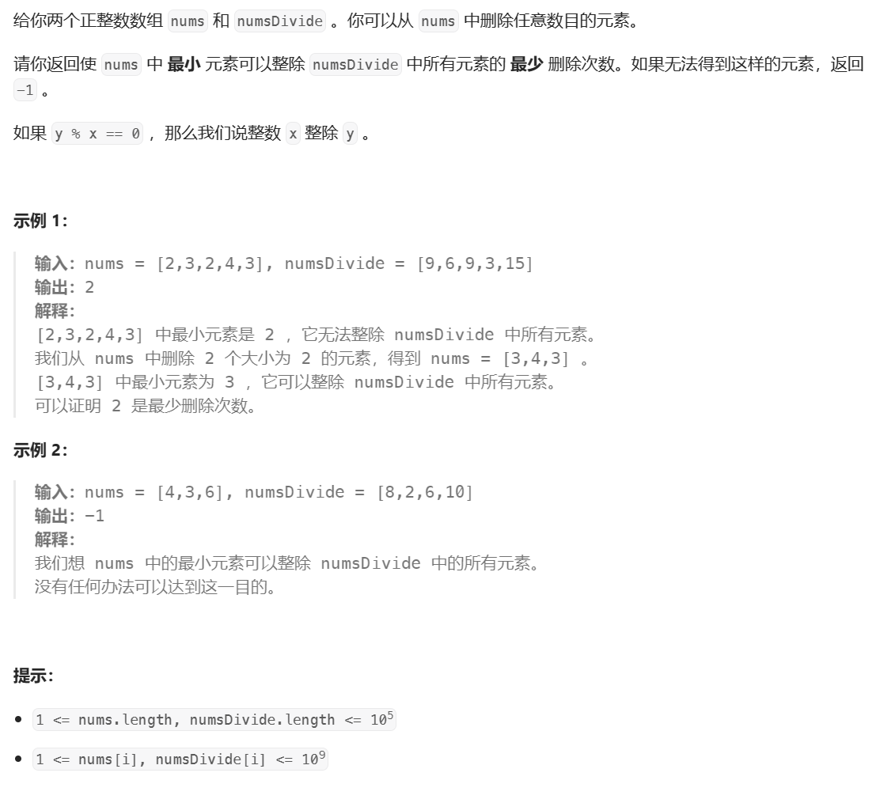

找出所有元素的最大公约数，把nums排序后，再里面找能整除最大公约数的数，能整除最大公约数的数也能整除所有的除数。

```python
class Solution:
    def minOperations(self, nums: List[int], numsDivide: List[int]) -> int:
        val=reduce(gcd,numsDivide)
        nums.sort()
        n=len(nums)
        for i in range(n):
            if val%nums[i]==0:
                return i
        return -1
```

## [包含所有三种字符的子字符串数目](https://leetcode.cn/problems/number-of-substrings-containing-all-three-characters/)

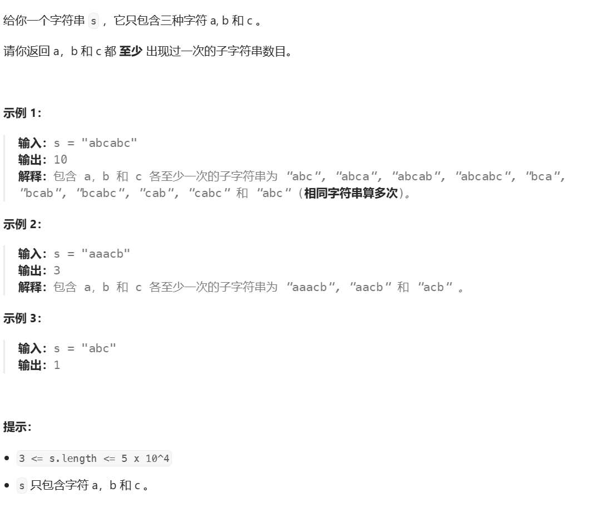

双指针解法，往后扩展一旦集齐三个字符，就以当前l到r的字符串为开头计算他所能形成的子串个数，也就是数组的长度减去右指针，然后移动左指针并记录结果直到不满足。

我的方法是，每次找到了合适的子串，也它为结尾找有多少个，难以捉摸不如找开头。

```python
class Solution:
    def numberOfSubstrings(self, s: str) -> int:
        n=len(s)
        l,r=0,0
        ans=0
        memo=Counter()
        while r<n:
            memo[s[r]]+=1
            while len(memo)==3:
                ans+=n-r
                memo[s[l]]-=1
                if not memo[s[l]]:
                    del memo[s[l]]
                l+=1
            r+=1
        return ans 

```


## [ 删除字符使频率相同](https://leetcode.cn/problems/remove-letter-to-equalize-frequency/)

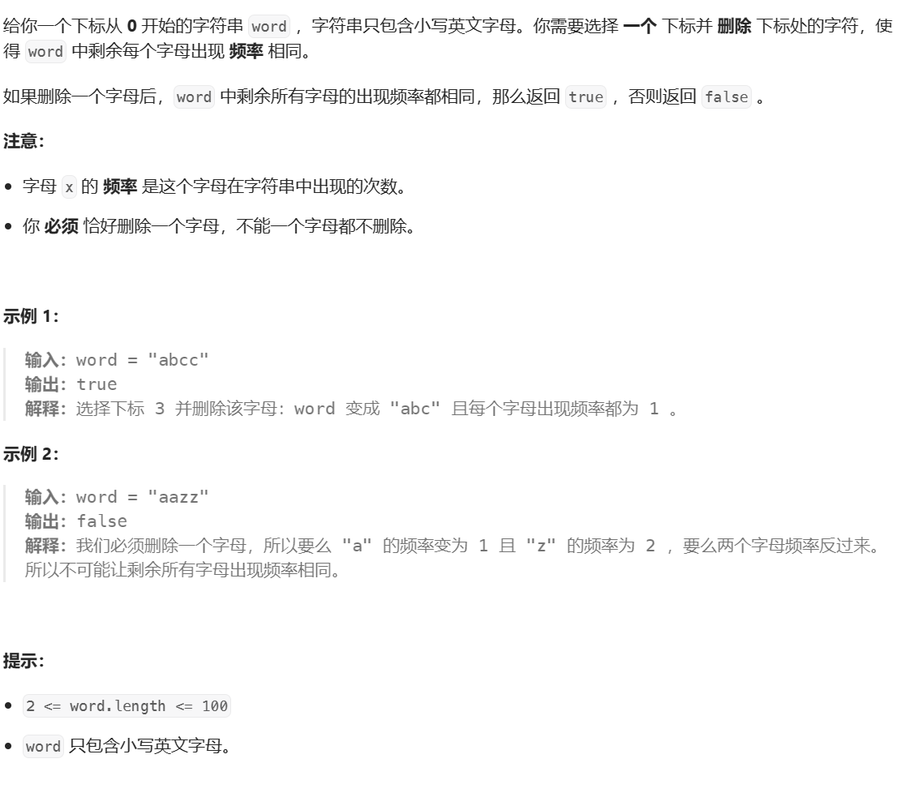

暴力枚举删除每个字符之后，字符的频数是否相等。

```python
class Solution:
    def equalFrequency(self, word: str) -> bool:
        for i in range(len(word)):
            memo=Counter(word[:i]+word[i+1:])
            if len(set(memo.values()))==1:
                return True
        return False
```

## 	[选择建筑的方案数](https://leetcode.cn/problems/number-of-ways-to-select-buildings/)

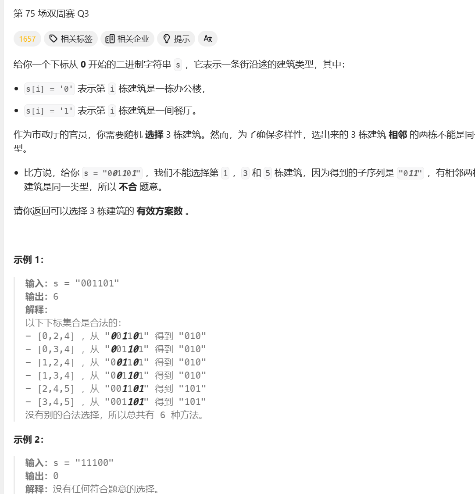


即找出101与010的个数，对于每一个1和0，统计左右1或者是0的个数。

```python
class Solution:
    def numberOfWays(self, s: str) -> int:
        n=len(s)
        l,r=0,s.count('1')
        i=0
        ans=0
        while i<n:
            if s[i]=='0':
                ans+=l*r
            else:
                l+=1
                r-=1
            i+=1
        l,r=0,s.count('0')
        i=0
        while i<n :
            if s[i]=='1':
                ans+=l*r
            else:
                l+=1
                r-=1
            i+=1
        return ans 

```

## Diverse Substrings


要求子串中每个字符的数目不能超过字符的种类数，字符串中是由0到9的数字，因此合法的子串必然是小于等于100的，因为子串有10种而每个字符不能超过10种因此最多长为100。枚举每个位置，往后扩展100位找合法的子串。

```python
from collections import Counter

t=int(input())
def f(x):
    return (1+x)*x//2

while t:
    n=int(input())
    s=input()
    
    ans=0
    for i in range(n):
        c=s[i]
        memo=Counter()
        memo[c]+=1
        ans+=1
        temp=1
        for j in range(i+1,min(i+101,n)):
            c=s[j]
            memo[c]+=1
            temp=max(temp,memo[c])
            if len(memo)>=temp:
                ans+=1
    print(ans)
    t-=1
```


## Robot Queries

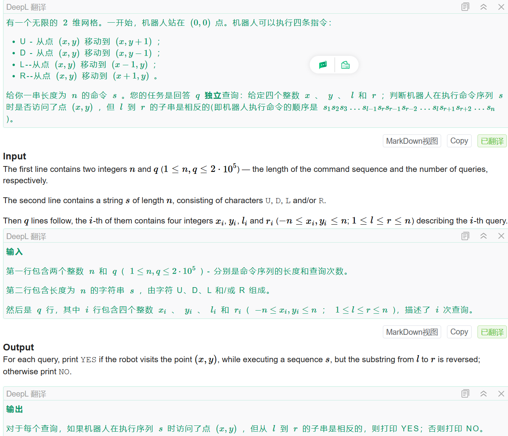

对l到r区间的子串是反向执行的。

问题的个数达到了十万级别，因此需要高效的解出答案。

先考虑如果不反转，该如何高效解出是否能到达目标点，首先执行一遍字符串，用字典记录每个位置能在第几步到达，当查询目标点的时候，直接在字典中查找即可。

对于反转的区间，区间外的点不影响（反转的区间只改变顺序不改变最终到达的位置），如果目标点被记录了且存在在区间之外的步数，那么说明可以到达，否则目标点只能是在反转的区间内到达的。

对于反转的区间，它的顺序是颠倒的但是起点和终点的位置不变，并且两个颠倒的字符串遍历到的点是关于终点和起点的中点中心对称的，如果目标点在反转的区间内，那么经过中心对称变化后的点就一定会被这个区间的原始子串遍历到，于是查询中心对称变化后的点对应的不是是否是在区间内的，如果不存在或是不在区间内说明无法到达。

对于每个点对应的步数，判断是否在区间外只需要找首项和末项即可，查询是否在区间内，即找一个大于l的步数使用二分保证效率

```python
import sys
input=sys.stdin.readline
from collections import defaultdict
from bisect import bisect_left as bl

n,q=[int(x) for x in input().split()]
s=input()[:-1]
memo=defaultdict(list)
path={}
x=y=0
# 构造原始字符串能到达的位置
for i,c in enumerate(s):
    if c=='D':
        y-=1
    elif c=='U':
        y+=1
    elif c=='L':
        x-=1
    else:
        x+=1
    memo[(x,y)].append(i)
    # 记录每一步能到达哪里
    path[i]=(x,y)
ans=[]
while q:
    x,y,l,r=[int(x) for x in input().split()]
    l-=1
    r-=1
    if x==y==0:
        print('YES')
        q-=1
        continue
    nums=memo[(x,y)]
    # 如果这个能到达这个点的步数存在在区间外的，直接返回
    if nums and (nums[0]<l or nums[-1]>=r):
        print('YES')
    else:
        # 中心对称变化，取得起点和终点
        start=path[l-1] if l-1 in path  else (0,0)
        mid=(start[0]+path[r][0],start[1]+path[r][1])
        X=(mid[0])-x
        Y=(mid[1])-y
        # 找到对应的数组
        nums=memo[(X,Y)]
        # 二分找大于等于l的步数
        index=bl(nums,l)
        # 注意这里判断的是新的nums长度而不是n
        if not nums or index>=len(nums) or not (l<=nums[index]<=r):
            print('NO')
        else:
            print('YES')
    q-=1
```

## [ Pow(x, n)](https://leetcode.cn/problems/powx-n/)

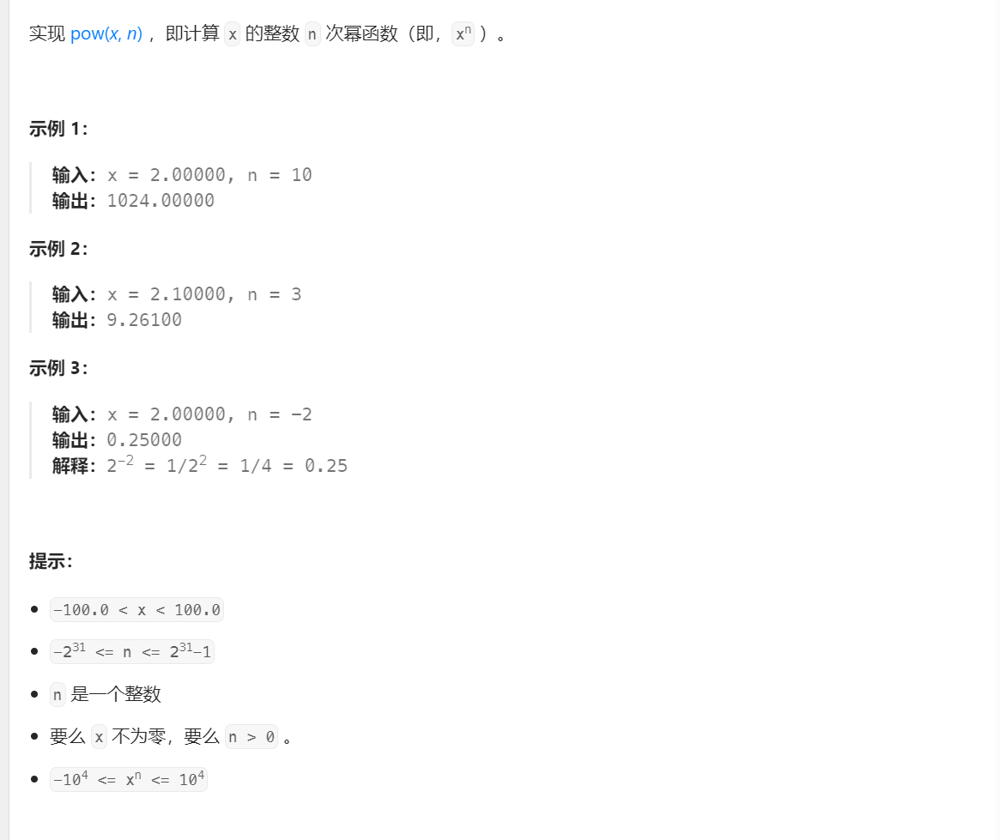


对于一个数较大的冥次，比如说是百万次冥那么就要进行百万次操作，需要对这个操作进行优化。利用数学公式可以推导出：$$x^y=(x\times x)^{y//2}$$依次类推一直往下，可以实现Logn的效率，这也就是分治法。

如果y不是偶数那么单独再乘上一个x就行了。

```python
class Solution:
    def myPow(self, x: float, n: int) -> float:
        def quick_mod(x,y):
            if y==0:
                return 1
            # 注意负数整数二的结果不会是0
            if y==-1:
                return x**y
            # 得到x**(y//2)
            res=quick_mod(x,y//2)
            # 如果是奇数多乘一个x	
            return res*res if y%2==0 else res*res*x
        return quick_mod(x,n)
```


## [猴子碰撞的方法数](https://leetcode.cn/problems/count-collisions-of-monkeys-on-a-polygon/)

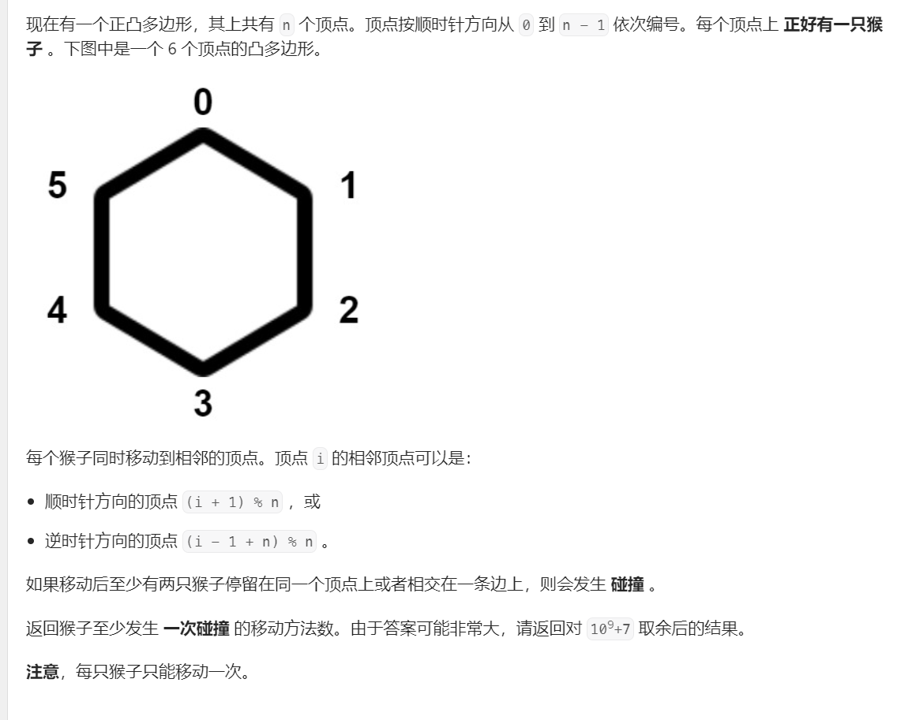

正难则反，用所有猴子移动的可能减去不会碰撞的次数（也就是所有猴子都按照一个方向移动）

```python
class Solution:
    def monkeyMove(self, n: int) -> int:
        mod=10**9+7
        # 注意求冥的过程中也要取模，防止过大
        return (pow(2,n,mod)-2)%mod
```

## [子集中元素的最大数量](https://leetcode.cn/problems/find-the-maximum-number-of-elements-in-subset/)

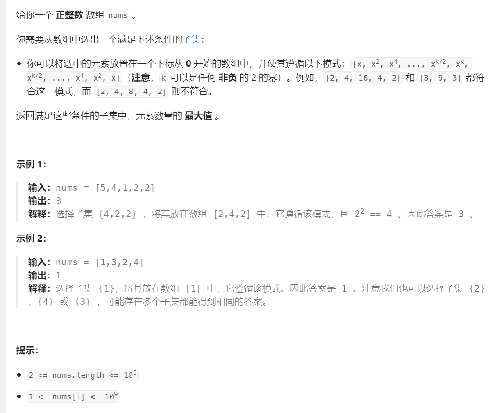

主要考察对数据的敏感程度：

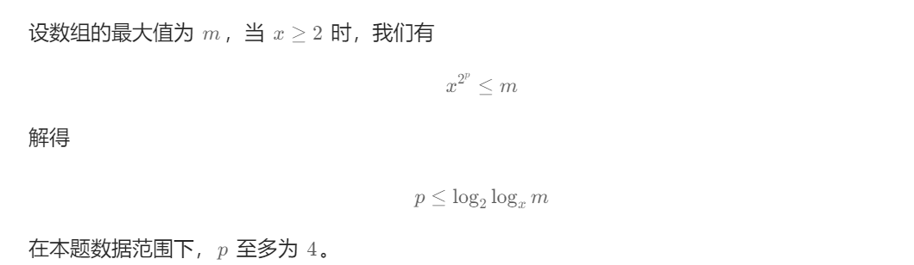

也就是说可以直接暴力枚举做。注意特判1的情况，找对应的数字的个数，如果下一个数字不满足，看当前的数字个数，如果是偶数减去以，反之不变。

```python
class Solution:
    def maximumLength(self, nums: List[int]) -> int:
        memo=Counter(nums)
        ans=0
        for k in memo.keys():
            if k==1:
                res=memo[1] if memo[1]&1 else memo[1]-1
                ans=max(ans,res)
                continue
            time=1
            temp=0
            k_=k
            while memo[k_]>=2:
                k_=pow(k,2**time)
                time+=1
                temp+=2
            if memo[k_]==1:
                ans=max(temp+1,ans)
            else:
                ans=max(temp-1,ans)
        return ans 


```


## [车队](https://leetcode.cn/problems/car-fleet/)

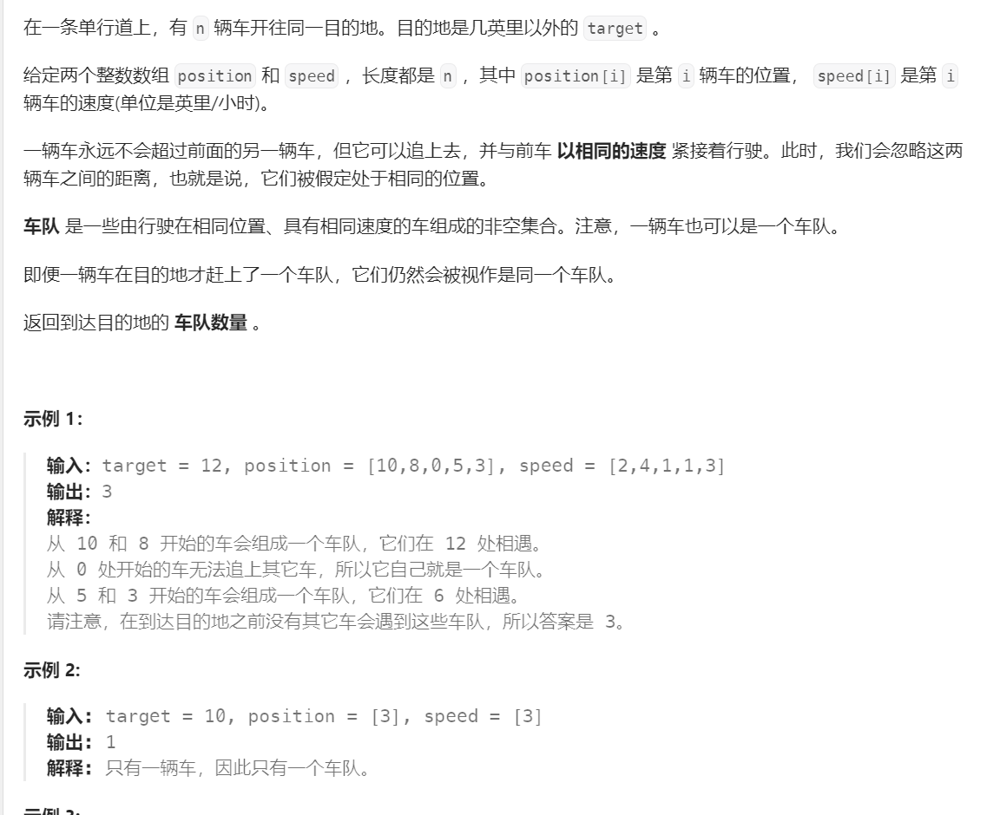 


只能是后面的追上前面的，追上后保持前车的速度前进，先按照距离排序，由于是后车追前车把距离大的放到前面。只有后车到达终点的时间小于前车才能追上，如果大于则只能独立为一个车队，它后面的车最多只能追到自己。

```python
class Solution:
    def carFleet(self, target: int, position: List[int], speed: List[int]) -> int:
        nums=sorted([(p,s) for p,s in zip(position,speed)],reverse=True)
        res=0
        n=len(nums)
        # 记录前车到达的时间
        pre=0
        for i in range(n):
            p,s=nums[i]
            # 记录时间，这里不是取整
            time=(target-p)/s
            # 如果追上了，pre时间不变因为保持前车的速度前进
            if time>pre:
                res+=1
                # 反之，更新pre为自己
                pre=time
        return res
```

## [ 构造限制重复的字符串](https://leetcode.cn/problems/construct-string-with-repeat-limit/)


每次选择一个当前剩余的最大的字符，如果他出现次数大于repeattime次，就先截取一部分，然后在后面选出一个次大的字符加入到答案中如果不存在次大的字符则退出。

使用根堆来找次大的字符，加入弹出的时间复杂度位logn，总共进行n次

```python
class Solution:
    def repeatLimitedString(self, s: str, repeatLimit: int) -> str:
        memo=Counter(s)
        q=[]
        ans=''
        # 加入根堆，使用负数保证优先级
        for k,v in memo.items():
            heapq.heappush(q,(-1*(ord(k)-ord('a')),k,v))
        while q:
            # 弹出当前最大的
            fre,k,v=heapq.heappop(q)
            if v<=repeatLimit:
                # 可以直接加入
                ans+=k*v
            else:
                # 截取一部分
                ans+=k*repeatLimit
                # 找次大的
                if q:
                    frec,kc,vc=heapq.heappop(q)
                    vc-=1
                    ans+=kc
                    # 注意是要重新加入
                    if vc:
                        heapq.heappush(q,(frec,kc,vc))
                    heapq.heappush(q,(fre,k,v-repeatLimit))
        return ans 

                        
                    
```


## Qingshan Loves Strings 2


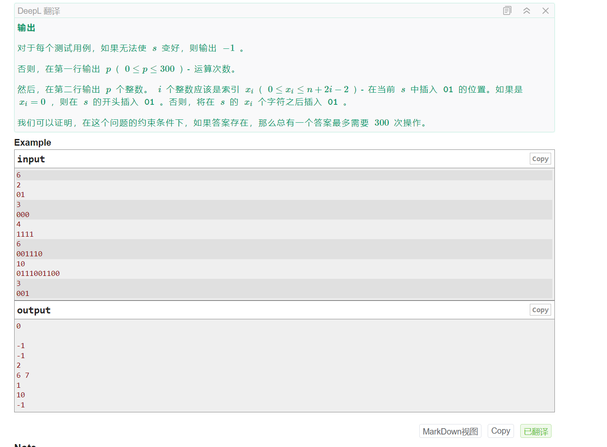


分类讨论，使用双指针对最外部的两个字符比较，如果不同指针可以向内进一步，如果都为1则必须在左边补上01才能保证右边的1匹配上，如果都为0必须在右边补上01才能保证左边的0匹配上，如果操作的次数超过了300次说明不存在。


```python
t=int(input())
for _ in range(t):
    n=int(input())
    s=input()
    # 奇数一定不可以
    if n&1:
        print(-1)
        continue
    l,r=0,n-1
    ans=[]
    cnt=0
    while l<r:
        # 相同向内移动
        if s[l]!=s[r]:
            l+=1
            r-=1
        # 不同在相应的位置操作，注意指针的移动都是扩大
        elif s[l]=='1':
            s=s[:l]+'01'+s[l:]
            cnt+=1
            ans.append(l)
            r+=1
            l+=1
        else:
            s=s[:r+1]+'01'+s[r+1:]
            cnt+=1
            ans.append(r+1)
            l+=1
            r+=1
        if cnt>300:
            break
    if cnt>300:
        print(-1)
    else:
        print(cnt)
        print(*ans)
```


## Doremy's Connecting Plan

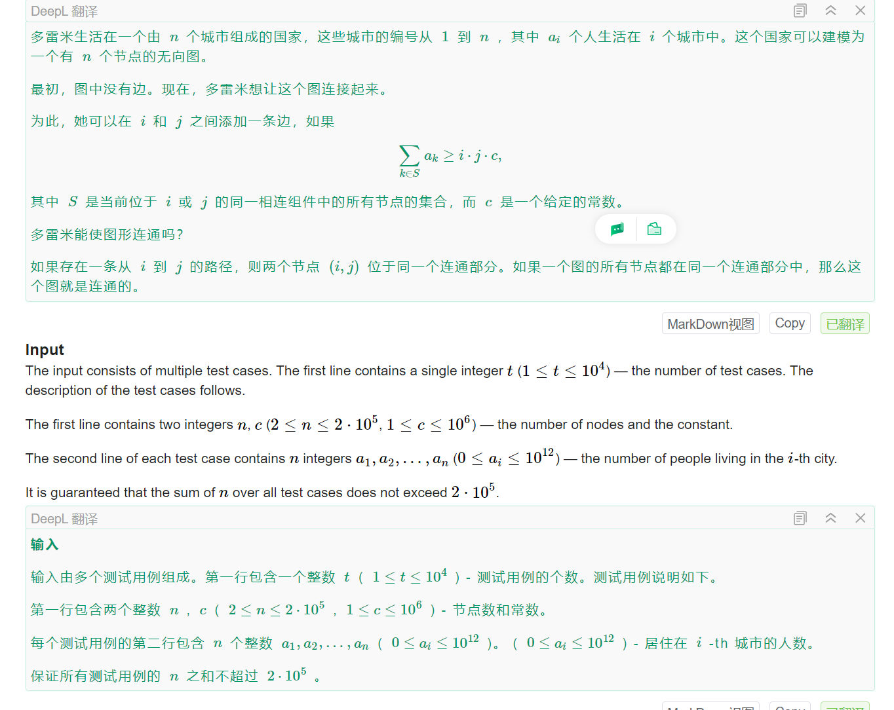

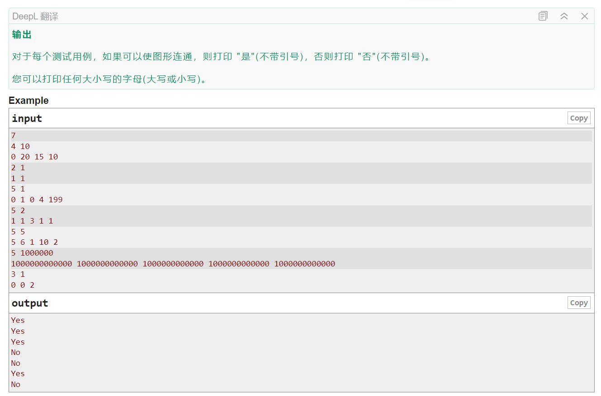

只有满足公式的两个城市才可以连接起来，对于公式：

可以推出对于大于1的任意两个位置相连，它们都先与1相连才行，因此先找与1相连的然后类加上这个值再继续，所以为了得到最大的结果，根据公式要找j*c-aj最小的那个然后找次小的那个，先把jc-aj的值排序。


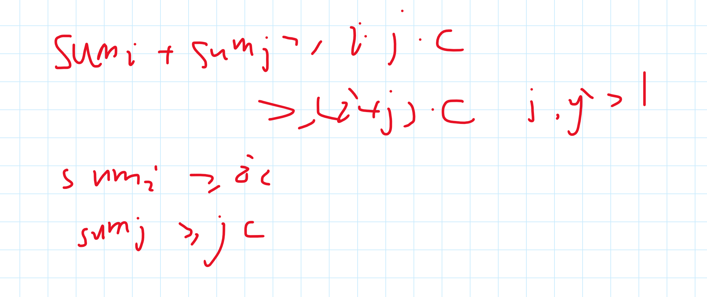	


```python
import sys
input = sys.stdin.readline
t = int(input())
for _ in range(t):
    n, c = [int(x) for x in input().split()]
    li = [int(x) for x in input().split()]
    nums = sorted(((j + 2) * c - v,j+1) for j, v in enumerate(li[1:]))
    summ = li[0]

    for i,v in enumerate(nums):
        if v[0]>summ:
            print('No')
            break
        summ+=li[v[1]]
    else:
        print('Yes')
```

## [图中最大星和](https://leetcode.cn/problems/maximum-star-sum-of-a-graph/)

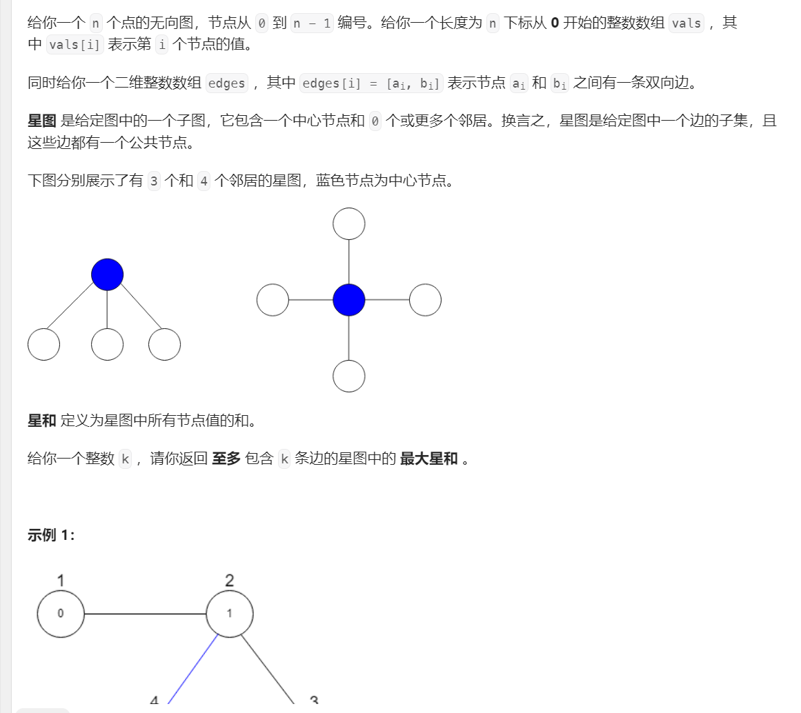


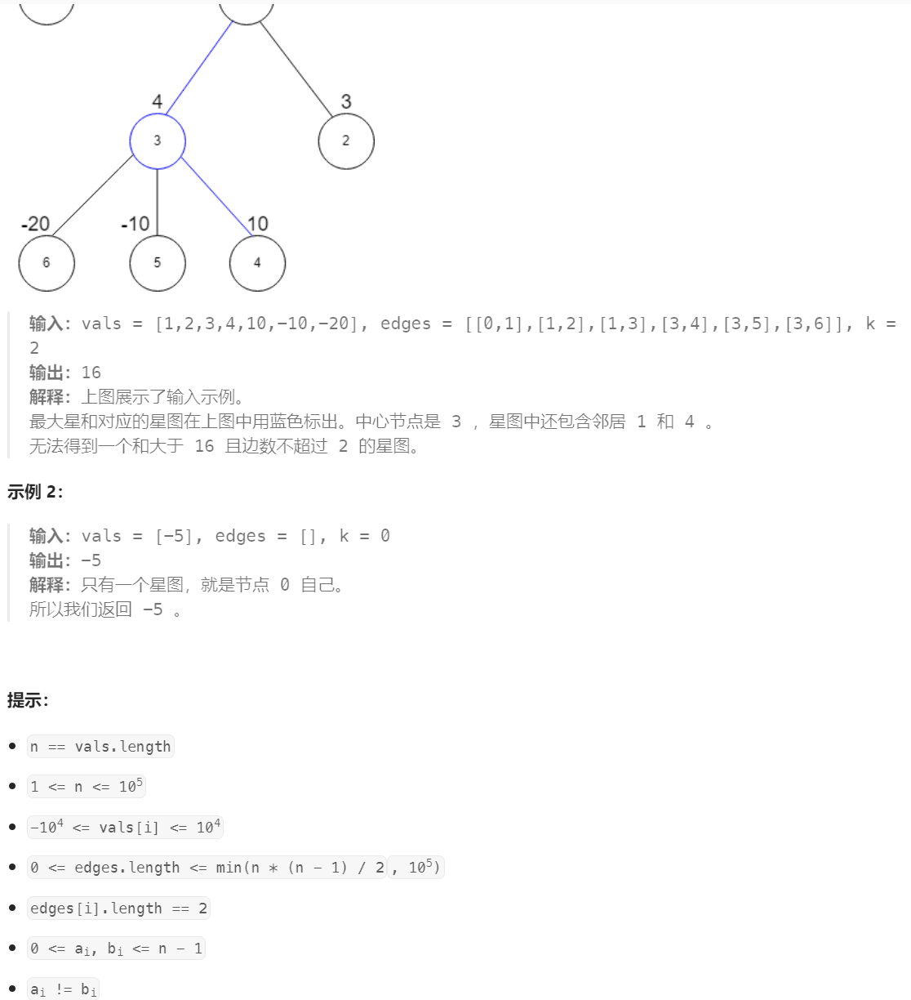

也就是对每个节点找与他相邻的最大的k个节点，如果邻居中存在负数可以不选择，因此在建图的过程中忽略负数，枚举每个节点的去找它的邻居中最大的k个数。

```python
class Solution:
    def maxStarSum(self, vals: List[int], edges: List[List[int]], k: int) -> int:
        g=[[] for _ in vals]
        for u,v in edges:
            if vals[v]>0:g[u].append(vals[v])
            if vals[u]>0:g[v].append(vals[u])
        ans=-inf
        for li,v in zip(g,vals):
            ans=max(ans,sum(nlargest(k,li))+v)
        return ans 
```


## [ 按递增顺序显示卡牌](https://leetcode.cn/problems/reveal-cards-in-increasing-order/)

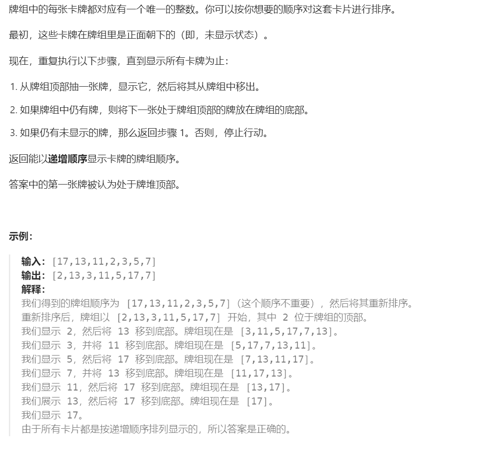

使用队列模拟正确数组的弹出操作，每次弹出队列中的第一个值这个值一定是按顺序得到的结果，然后把队列中的下一个放到末尾，这里正确的数组是未知的因此模拟的是索引。


```python
class Solution:
    def deckRevealedIncreasing(self,nums: List[int]) -> List[int]:
        n=len(nums)
        nums.sort()
        ans=[0]*n
        d=deque(range(n))
        for v in nums:
            ans[d.popleft()]=v
            if d:
                d.append(d.popleft())
        return ans
```

## [数青蛙](https://leetcode.cn/problems/minimum-number-of-frogs-croaking/)

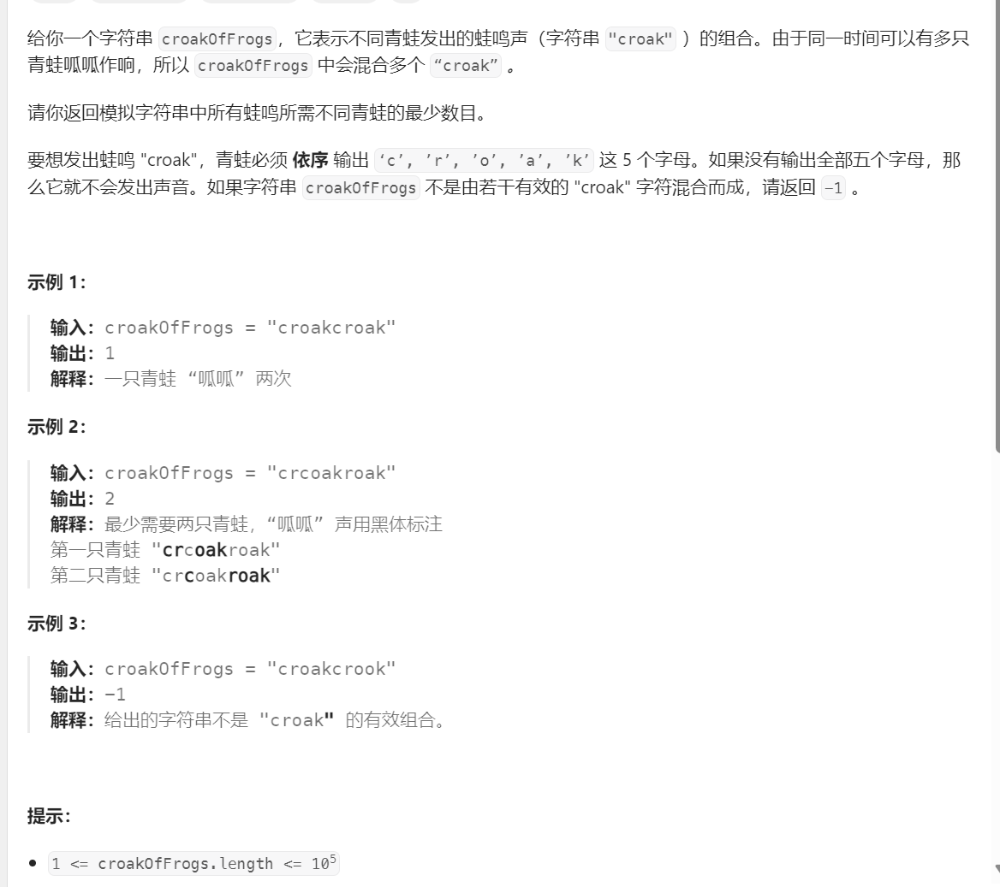

发出'r'的只能由发出'c'的转移过来，发出'k'的只能由发出'a'的转移过来，模拟这个过程。

```python
class Solution:
    def minNumberOfFrogs(self, s: str) -> int:
        # 快速记录字典
        d=dict(pairwise('croakc'[::-1]))
        memo=Counter()
        for c in s:
            # 发出c的可以是k转移过来的也可以是一个新的青蛙
            if c=='c':
                if memo['k']:
                    memo['k']-=1
                memo[c]+=1
            else:
                # 其他的必须是从上一个转移过来的，如果上一个不存在一定是不成立的
                if memo[d[c]]>0:
                    memo[d[c]]-=1
                    memo[c]+=1
                else:
                    return -1
         # 模拟到最后，所有的青蛙一定是发出k的，如果前面的海存在一定是不合法的字符串
        for c in ['c','r','o','a']:
            if memo[c]:
                return -1
        return memo['k']
```

## [移动片段得到字符串](https://leetcode.cn/problems/move-pieces-to-obtain-a-string/)

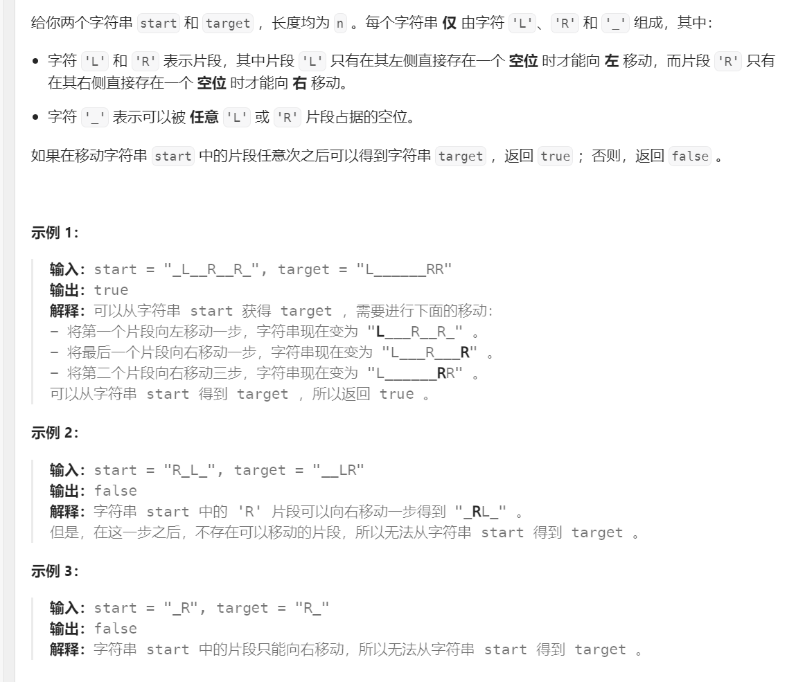

L可以向左移动而R可以向右移动，彼此不能向通过，因此去除了_之后的字符串一概是相等的。使用双指针比较每个LR，如果当前字符是L并且在目标字符串对应的L之前的话返回False，因为L只能向左移动，同理对R也是一样，如果和目标字符串对应的字符不同也是错误的，最后如果都遍历完了，返回TRUE


```python
class Solution:
    def canChange(self, start: str, target: str) -> bool:
        n=len(start)
        l=r=0
        while True:
            while l<n and start[l]=='_':
                l+=1
            while r<n and target[r]=='_':
                r+=1
            if l>=n and r>=n :
                return True
            if l>=n or r>=n or start[l]!=target[r]:
                return False 
            if start[l]=='L' and r>l:
                return False
            if start[l]=='R' and r<l:
                return False
            l+=1
            r+=1
```

## [连续整数求和](https://leetcode.cn/problems/consecutive-numbers-sum/)

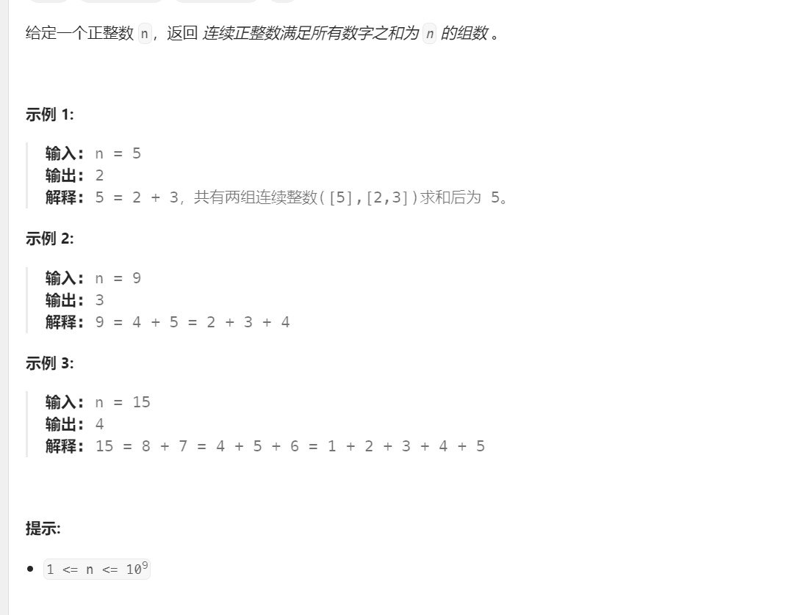

连续数组求和运用公式：
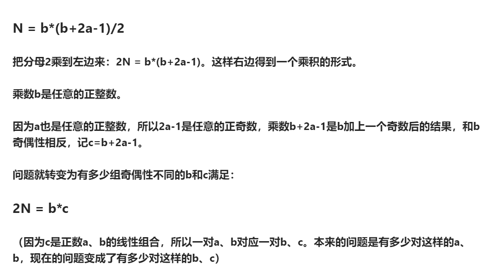


将问题转换为对于2n有多少对b和c相乘等于2n，并且奇偶性不同。

```python
class Solution:
    def consecutiveNumbersSum(self, n: int) -> int:
        b=1
        limit=2*n
        res=0
        while b**2<limit:
            if not limit%b and (limit//b-b)&1:
                res+=1
            b+=1
        return res

```


## [圆和矩形是否有重叠](https://leetcode.cn/problems/circle-and-rectangle-overlapping/)

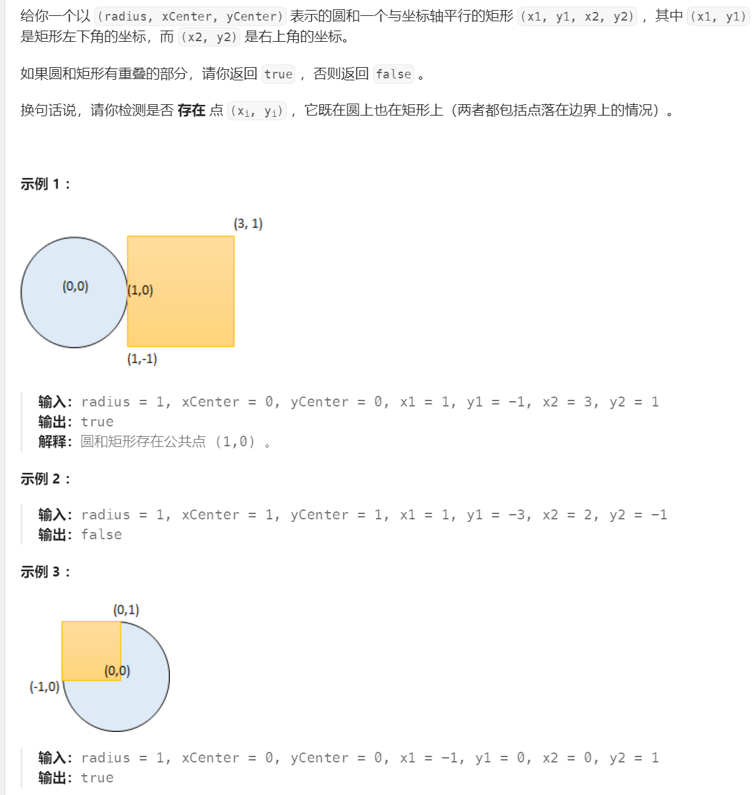


如果矩形中一点到圆心的距离小于等于半径，那么存在重叠，这里不需要枚举矩形中每一个点，只要找出距离圆心最近的点是否满足条件即可，距离圆心最近的点分条件考虑，如果xcenter在x1x2之间那么x到圆心的横坐标距离就是0，如果小于x1那么就是x1-xcenter，反之就是xcenter-x2，对纵坐标同理（技巧点）。

```python
class Solution:
    def checkOverlap(self, radius: int, xCenter: int, yCenter: int, x1: int, y1: int, x2: int, y2: int) -> bool:
        def f(i,j,k):
            if i<=k<=j:
                return 0
            elif k<i:
                return i-k
            else:
                return k-j
        a=f(x1,x2,xCenter)
        b=f(y1,y2,yCenter)
        return a*a+b*b<=radius**2
```

## [三数之和的多种可能](https://leetcode.cn/problems/3sum-with-multiplicity/)


从arr中选取三个值使得和为target，使用回溯法找组合费时，可以直接把问题转换为三数之和。

首先枚举数组中每一个数从而把问题转换为两数之和，再从数组左右找到合适的两个值，这里数组优先排序去重。

```python
class Solution:
    def threeSumMulti(self, nums: List[int], target: int) -> int:
        m=10**9+7
        memo=Counter(nums)
        # 排序去重的数组
        keys=sorted(memo)
        ans=0
        # 枚举每一个数
        for i,v in enumerate(keys):
            t=target-v
            # 双指针找
            l=i
            r=len(keys)-1
            while l<=r:
                if keys[l]+keys[r]<t:
                    l+=1
                elif keys[l]+keys[r]>t:
                    r-=1
                else:
                    # 这里如果只有一个1但是选了两个1，那么计算的结果会是0不影响答案
                    i=v
                    j=keys[l]
                    k=keys[r]
                    # 使用组合数求解每个组合贡献的答案
                    if i<j<k:
                        ans+=memo[i]*memo[j]*memo[k]
                    elif i==j<k:
                        ans+=memo[i]*(memo[i]-1)//2*memo[k]
                    elif i<j==k:
                        ans+=memo[i]*(memo[j]*(memo[j]-1))//2
                    else:
                        ans+=memo[i]*(memo[i]-1)*(memo[i]-2)//6
                    # 继续找，可能不止一对
                    l+=1
                    r-=1

        return ans %m


```


## [不邻接植花](https://leetcode.cn/problems/flower-planting-with-no-adjacent/)

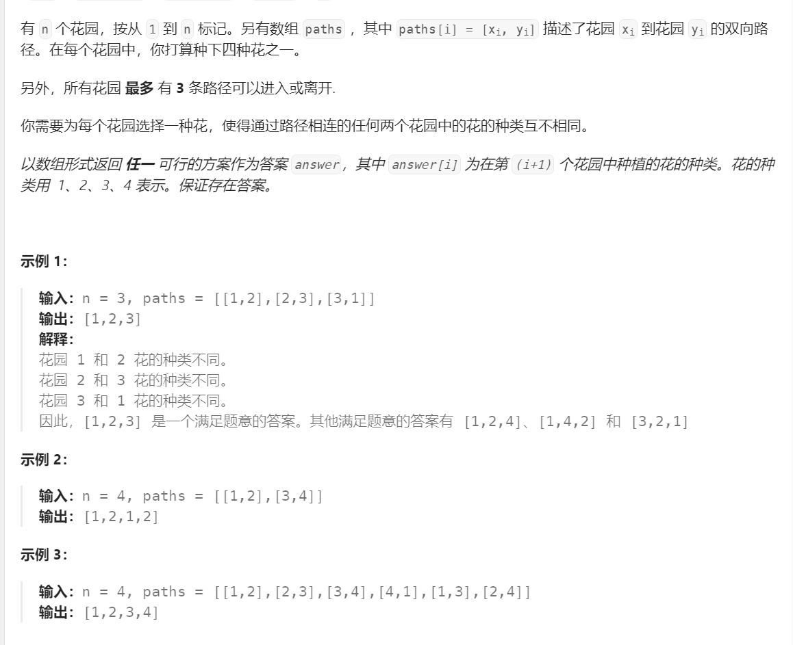

要求每个直接相连的节点不能有相同的颜色，题目保证每个节点的入度至多位三，因此对于每个节点只要找出与邻居不同的颜色即可。

```python
class Solution:
    def gardenNoAdj(self, n: int, paths: List[List[int]]) -> List[int]:
        g=[[] for _ in range(n)]
        # 建图
        for u,v in paths:
            g[u-1].append(v-1)
            g[v-1].append(u-1)
        colors=[0]*n
        # 使用集合快速找出可选的
        for i,node in enumerate(g):
            colors[i]=(set(range(1,5))-{colors[j] for j in node}).pop()
        return colors
```


## [找到离给定两个节点最近的节点](https://leetcode.cn/problems/find-closest-node-to-given-two-nodes/)

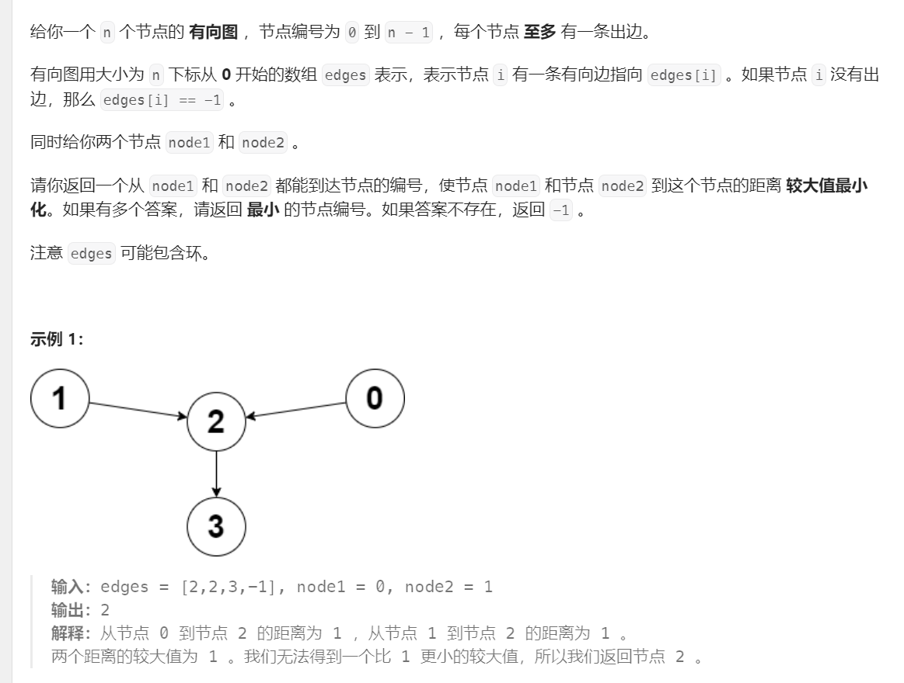

求出node1,node2到每个节点的距离，求距离不使用dfs直接迭代找

```python
class Solution:
    def closestMeetingNode(self, edges: List[int], node1: int, node2: int) -> int:
        n=len(edges)
        ans=-1
        mn=inf
        def cal(x):
            dis=[inf]*n
            d=0
            while x!=-1 and dis[x]==inf:
                dis[x]=d
                d+=1
                x=edges[x]
            return dis
        l1=cal(node1)
        l2=cal(node2)
        for i in range(n):
            # 遍历更新答案
            d=max(l1[i],l2[i])
            if d<mn:
                mn=d
                ans=i
        return ans
```

## 费解的开关


改变一个灯它的上下左右都会变化，不管以什么样的顺序操作都会影响过去操作的状态，为了保证一个状态不会多次被操作到选择让每个状态只能由它的下一行去改变（技巧点），依次来递推出每一行都是1。这样每一行可以确定它的下一行要操作那些位置，而第一行的操作那些可以枚举所有的。

```python
import copy
from math import inf

n = int(input())
for _ in range(n):
    grid = [[int(x) for x in input()] for _ in range(5)]
    # 读取空格
    if _ < n - 1:
        _ = input()

    # 翻转
    def turn(g, i, j):
        g[i][j] ^= 1
        if i - 1 >= 0:
            g[i - 1][j] ^= 1
        if j + 1 < len(g[0]):
            g[i][j + 1] ^= 1
        if i + 1 < len(g):
            g[i + 1][j] ^= 1
        if j - 1 >= 0:
            g[i][j - 1] ^= 1


    res = inf
    # 5个位置每个位置选或不选
    for i in range(32):
        # 记录操作次数
        cnt = 0
        # copy不在原数组上操作
        g = copy.deepcopy(grid)
        for j in range(i.bit_length()):
            if (i >> j) & 1:
                # 操作
                turn(g, 0, 4-j)
                cnt += 1
         # 遍历每一行找出所有的0依次确定下一行的操作
        for j in range(4):
            index = [k for k, v in enumerate(g[j]) if v == 0]
            # 对下一行操作
            for k in index:
                cnt += 1
                turn(g, j+1, k)
        # 最后一行无法在被修改，如果最后一行满足了都是1那么就是有效的操作次数
        if g[-1] == [1] * 5:
            res = min(res, cnt)
    if res == inf or res > 6:
        res = -1
    print(res)

```

## [网格图中机器人回家的最小代价](https://leetcode.cn/problems/minimum-cost-homecoming-of-a-robot-in-a-grid/)

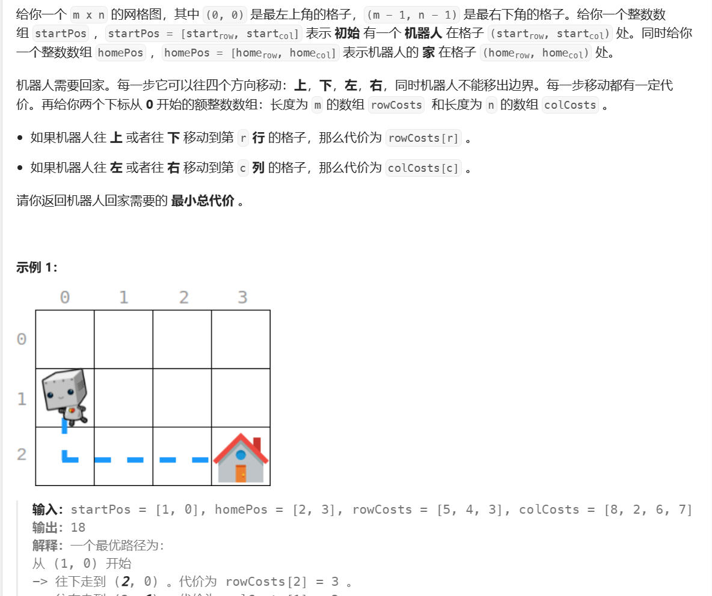

无论机器人怎么走一定要经过x行n列这是不可避免的，因此可以得出径直走是最优解。

```python
class Solution:
    def minCost(self, startPos: List[int], homePos: List[int], rowCosts: List[int], colCosts: List[int]) -> int:
        x,y=startPos
        m,n=homePos
        ans=sum(rowCosts[min(x,m):max(x,m)+1])+sum(colCosts[min(y,n):max(y,n)+1])
        return ans-rowCosts[x]-colCosts[y]	
```

## 四平方和

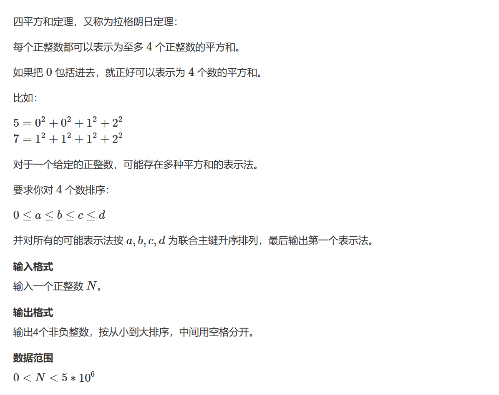


由于是平方求和因此一个数最大不过是n开方，对于给定的数据范围可以枚举出两个数的所有的可能，但是这里有四个数。补充：对于n=a+b+c+d实际上只需要枚举三个数（技巧点）。这里可以把四个数两两分组，枚举出一组的所有情况需要10^6，首先先枚举一组的所有情况组合的值储存在哈希表中，然后再枚举另一组查找当前的组合是否能子啊哈希表中找到阈值对应的一组数。

```python
from collections import defaultdict as d 
n=int(input())
ans=[]

# 使用哈希表记录所有的
memo=d(list)
# 找出一组所有的可能
c=0
while c**2<=n:
    d=c
    while c**2+d**2<=n:
        t=c**2+d**2
        # 取最小的
        if t not in memo:
            memo[t]=[c,d]
        else:
            memo[t]=min(memo[t],[c,d])
        d+=1
    c+=1

 # 枚举ling
def f():
    a=0
    while a**2<=n:
        b=a
        while a**2+b**2<=n:
            t=n-a**2-b**2
            if t in memo:
                return [a,b,memo[t][0],memo[t][1]]
            b+=1
        a+=1
ans=f()
print(*ans)
```

## [统计只差一个字符的子串数目](https://leetcode.cn/problems/count-substrings-that-differ-by-one-character/)

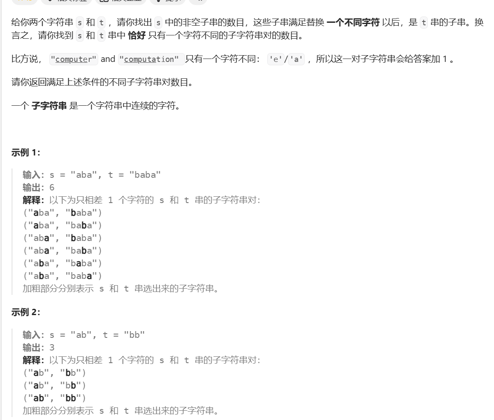

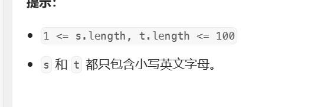

暴力枚举，定义ij分别为两个字符串的开头然后往后枚举，定义一个diff表示字符串差值，每次往后推的过程中更新diff的值，如果大于1则退出。（技巧点，提供了一种新的找子串的方式）

```python
class Solution:
    def countSubstrings(self, s: str, t: str) -> int:
        m,n=len(s),len(t)
        ans=0
        diff=0
        for i in range(m):
            for j in range(n):
                for k in range(min(m-i,n-j)):
                    if s[k+i]!=t[k+j]:diff+=1
                    if diff==1:ans+=1
                    elif diff>1:break
                diff=0
        return ans
```

## [有效括号的嵌套深度](https://leetcode.cn/problems/maximum-nesting-depth-of-two-valid-parentheses-strings/)

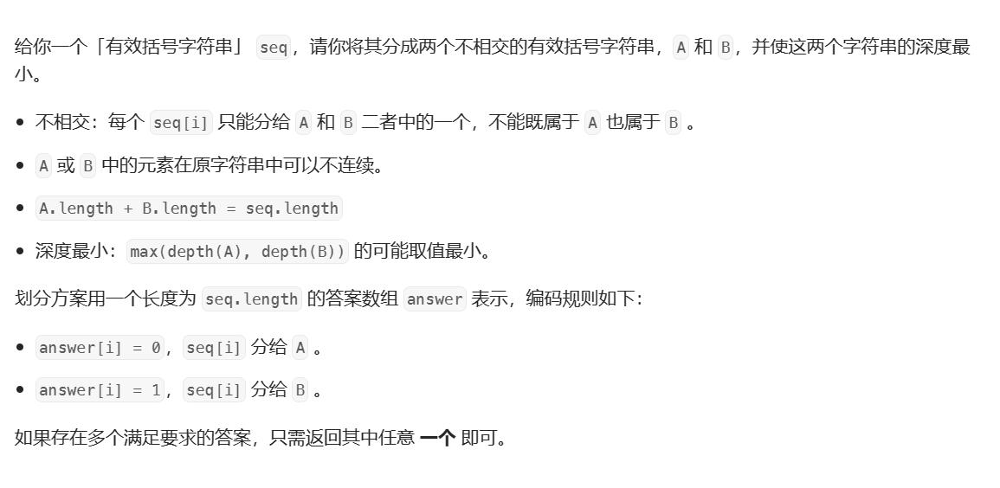

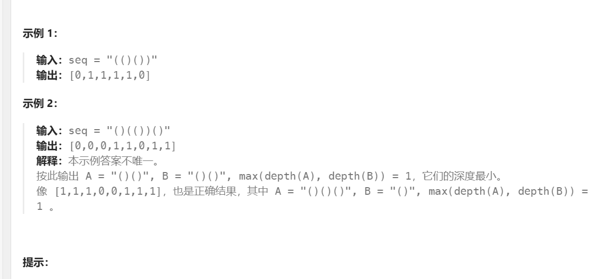


注意选出的括号是按照原字符串中的顺序排列的，并不是选出来后随意排序。

嵌套深度可以通过栈求出（栈中只存放左括号），每次加入一个字符判断当前栈的大小这个就是深度。为了保证深度最小每次分配值的时候注意分类讨论


```python
class Solution:
    def maxDepthAfterSplit(self, s: str) -> List[int]:
        ans=[]
        # 定义两个栈分别表示AB
        l=deque()
        r=deque()
        for c in s:
            # 左括号要放到较小的栈中
            if c=='(':
                if not l or len(l)<len(r):
                    l.append(c)
                    ans.append(1)
                elif not r or len(l)>=len(r):
                    r.append(c)
                    ans.append(0)
            else:
                # 右括号匹配最大的以此来减小深度
                if len(l)<len(r):
                    r.pop()
                    ans.append(0)
                else:
                    l.pop()
                    ans.append(1)
        return ans     
```


## [最小面积矩形](https://leetcode.cn/problems/minimum-area-rectangle/)

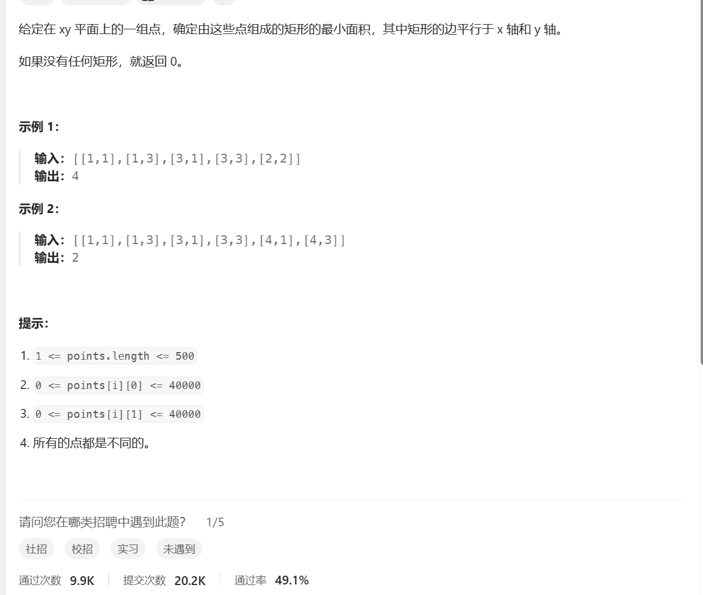

通过枚举对角线从而做到只枚举两个点就能找出一个正方形的可能（技巧点）

```python
class Solution:
    def minAreaRect(self, points: List[List[int]]) -> int:
        # 使用哈希表记录所有的点
        memo=set([tuple(val) for val in points])
        n=len(points)
        ans=inf
        # 枚举
        for i in range(n):
            u,v=points[i]
            for j in range(i+1,n):
                a,b=points[j]
                if a==u or v==b:continue
                if (a,v) in memo and (u,b) in memo:
                    ans=min(abs((b-v)*(a-u)),ans)
        return ans if ans!=inf else 0
        

```

## [青蛙过河 II](https://leetcode.cn/problems/frog-jump-ii/)

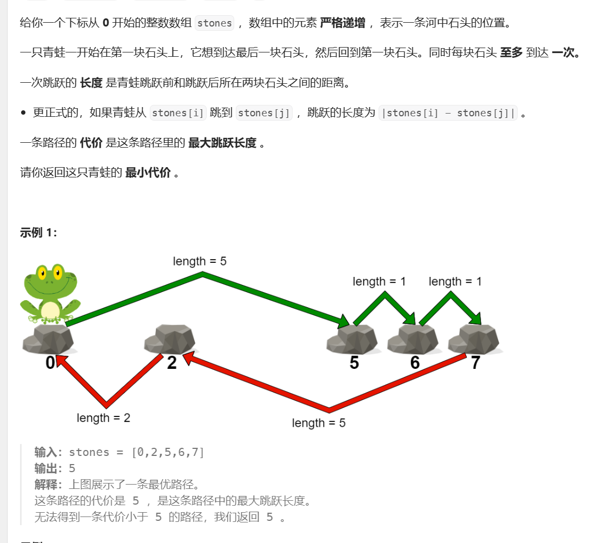


等价于两只青蛙从起点出发到终点，路径上不会有交集（除了始末位置）所能经过的最小的最大跳跃长度。

因为数组是递增的，因此每次跳跃尽可能地间隔跳，一只青蛙是1 3 5 7 另一只是2 4 6 8


```python
class Solution:
    def maxJump(self, stones: List[int]) -> int:
        l=1
        r=2
        n=len(stones)
        if n==2:
            return stones[-1]-stones[0]
        ans=max(stones[l]-stones[0],stones[r]-stones[0])
        while l<n:
            if l+2<n:
                ans=max(ans,stones[l+2]-stones[l])
            else:
                ans=max(ans,stones[-1]-stones[l])
                break
            l+=2
        while r<n:
            if r+2<n:
                ans=max(ans,stones[r+2]-stones[r])
            else:
                ans=max(ans,stones[-1]-stones[r])
                break
            r+=2
        return ans 
```


## Informatics in MAC 

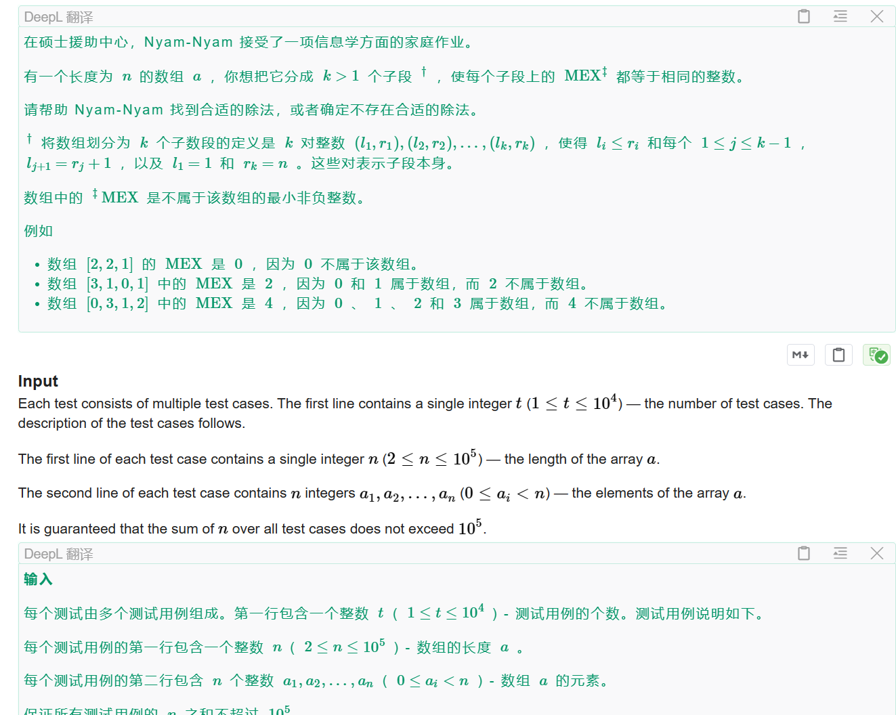

对于给定的整个数组假设它的men=y，而每一段的men=x,猜想x=y。

可以容易的得出x一定是小于等于y的，而对于x=2，每一段必然是由0和1的，如果y=3,那么也就意味着数组中是存在2的，而这个2无论分给那一段都会违背每一段Men等于x的条件，因此x=y

由贪心的思想，每一段要尽可能的小因此遍历过程中一旦满足了men==y就去找下一段，如果最后会剩余一段则把这段加上。

```python
from bisect import bisect_left as bl
from math import inf
import sys

input = sys.stdin.readline
for _ in range(int(input())):
    n = int(input())
    nums = [int(x) for x in input().split()]
    vis=set(nums)
    
    # 找出整个数组的men
    men=0
    while men in vis:
        men+=1
    ml=0 if nums[0] else 1
    memo=set()
    r=0
    cnt=l=0
    ans=[]
    # 贪心的找每一段的men 
    while r<n:
        memo.add(nums[r])
        while ml in memo:
            ml+=1
        # 满足了
        if ml==men:
            # 如果到最后一个直接返回
            if r==n-1:
                ans.append([l+1,n])
                cnt+=1
                break
                
            cnt+=1
            ans.append([l+1,r+1])
            # 到下一段
            l=r+1
            r+=1
            memo=set()
            ml=0 if nums[r] else 1
            continue
        r+=1
     # 不存在，比如 2 2 2
    if len(ans)==1:
        print(-1)
    else :
        # 加上最后的剩余
        print(cnt)
        ans[-1][1]=n
        for i in range(cnt):
            print(*ans[i])


```


## 鱼塘钓鱼

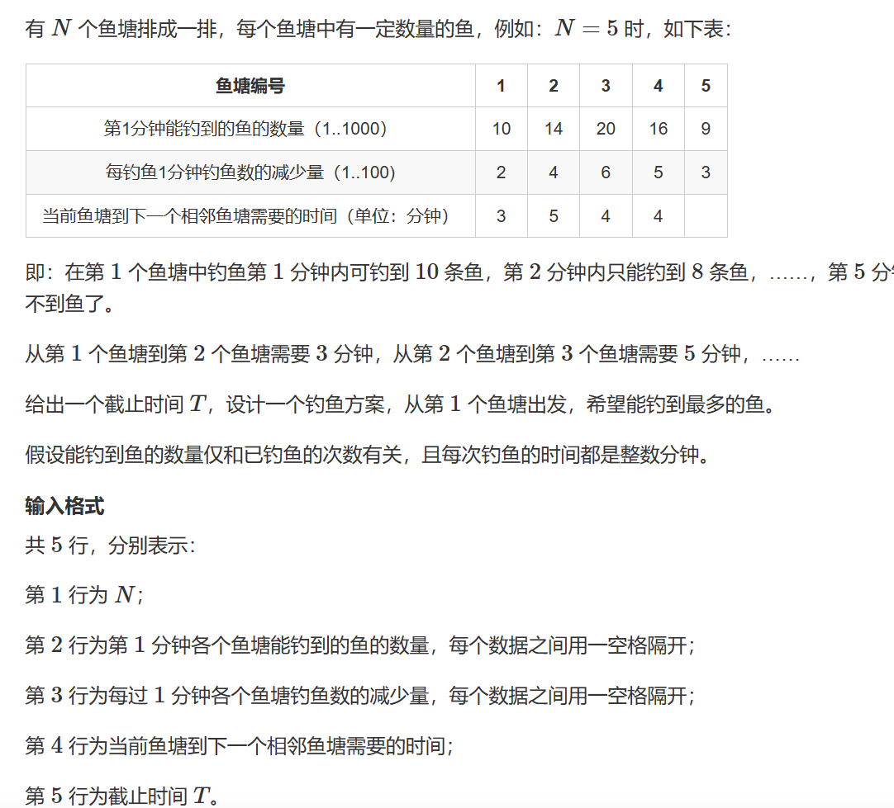

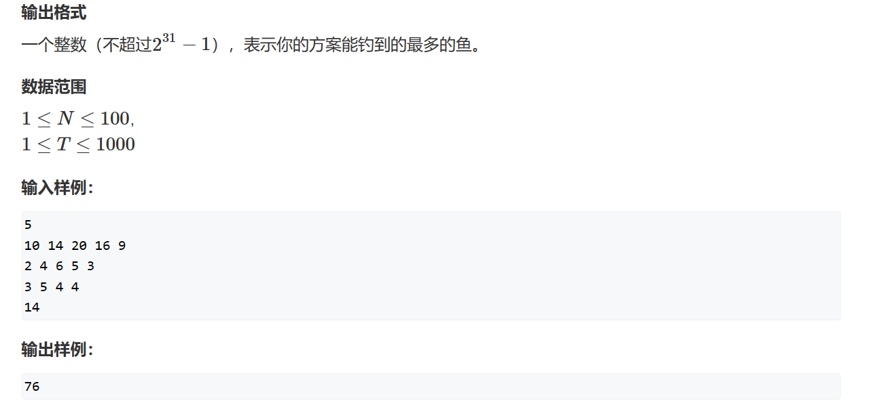

注意这里鱼的数量只与钓的次数相关与时间无关，因此不可能走回头路对于给定的数据可以枚举到前i个位置能调到的最多的鱼的数目。

这里使用多路归并解决在0:i的范围内每次钓最多的鱼，即使用根堆模拟。

```python
from heapq import heappop, heappush, heapify
from itertools import accumulate as ac

n=int(input())
nums=[int(x) for x in input().split()]
d=[int(x) for x in input().split()]
diff=[0]+list(ac([int(x) for x in input().split()]))
t_=int(input())
ans=-1
for i in range(n):
    t=t_
    # 减去赶路的时间
    t-=diff[i]
    # 根堆化，注意这里不仅要记录鱼的数目还要记录递减的数目，因为这也是排序的依据
    temp=[(-v,d[i]) for i,v in enumerate(nums[:i+1])]
    heapify(temp)
    res=0
    while t>0:
        v,delta =heappop(temp)
        v=-v
        if v<0:
            break
        res+=v
        heappush(temp,(-v+delta,delta))
        t-=1
    ans=max(ans,res)
print(ans)

```

## 孤独的照片


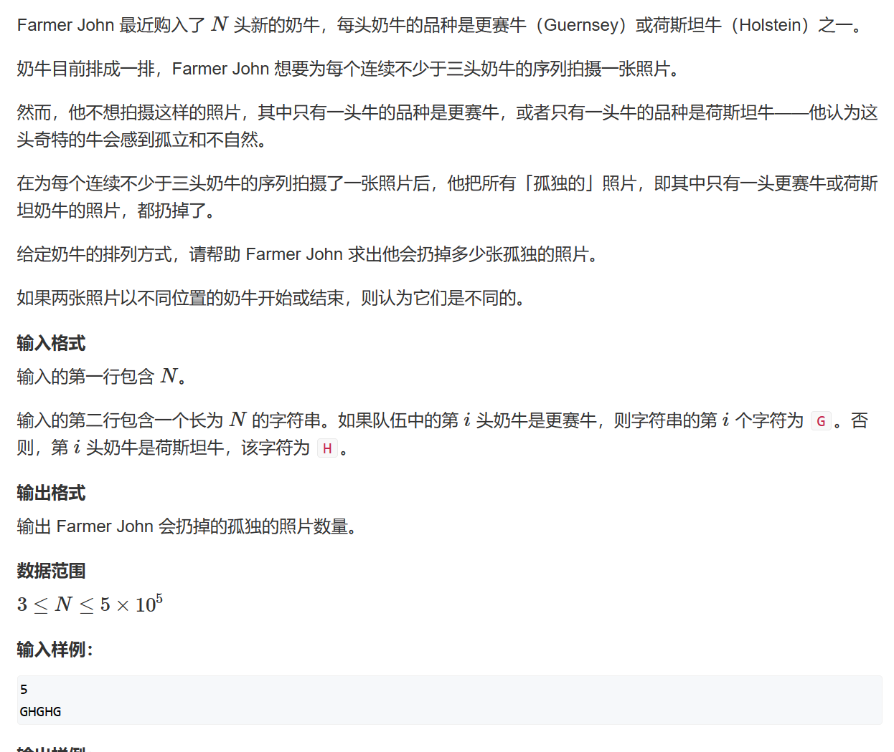

使用贡献法求出每个奶牛的共享，难点在于知道了一个奶牛左右的l和r该如何求解最后的值，这里要求序列长度是大于的三的

如果l>=2，那么先求出只有左边的，如果r>=2可以直接求出右边的，如果l>=1 and r>=1就往两边求解。

```python
n = int(input())
nums = [0 if s == 'G' else 1 for s in input()]

#01010
def cal(x):
    ans = 0
    l = r = i = 0
    while i < n:
        if nums[i] ==x^ 1:
            i += 1
            continue
        r = i+1
        while r < n and nums[r] == x ^ 1:
            r += 1
        if r==i:
            while i<n and nums[i]==x:
                i+=1
            l=r=i
        if i - l + r - i - 1>=2:
            if i-l>=2:
                ans+=i-l-1
            if r-i-1>=2:
                ans+=r-i-1-1
            if i-l>=1 and r-i-1>=1:
                ans+=(i-l)*(r-i-1)
        l = i + 1
        i = r

#4 GHGG

    return ans
res = cal(1) + cal(0)
print(res)
```

## [查询后矩阵的和](https://leetcode.cn/problems/sum-of-matrix-after-queries/)

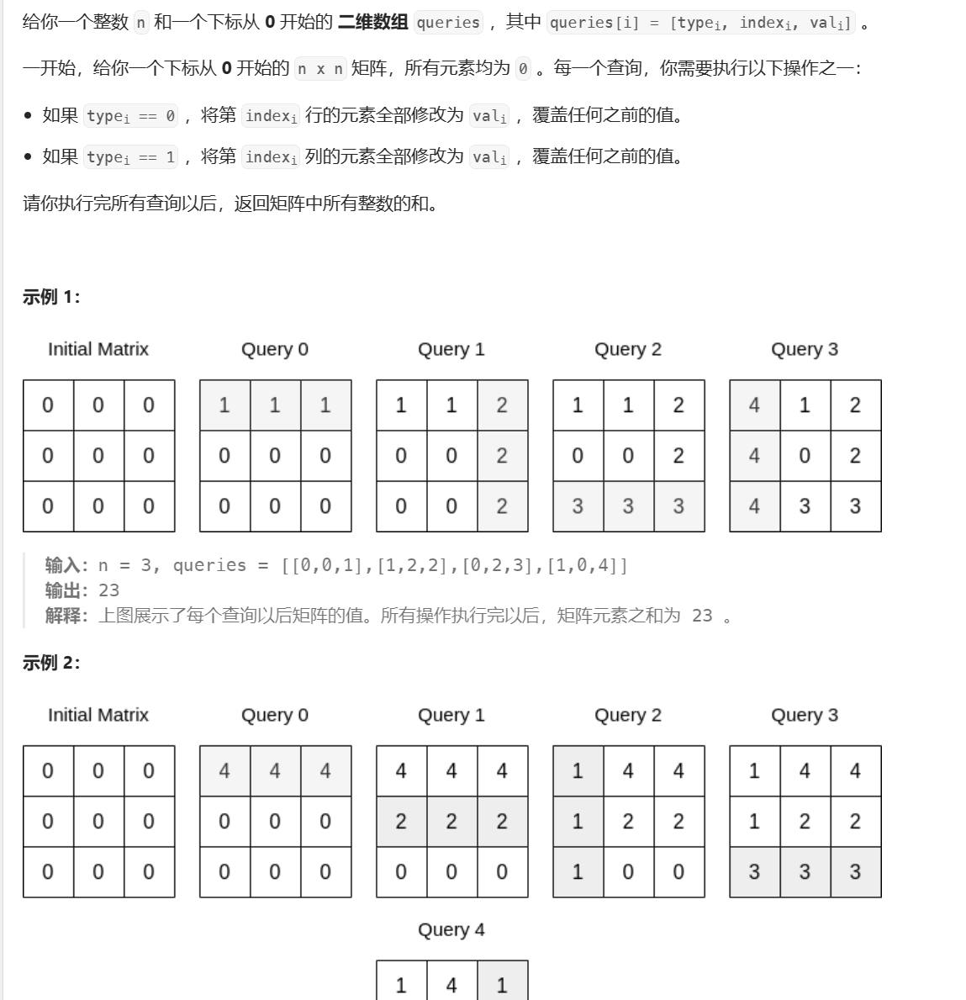


由于每次操作是覆盖，因此倒序遍历数组，如果某一行已经选过了那么就跳过，因为后面的会覆盖前面的。如果没选过需要看已经选过的列，对于已经选过的是不能再操作，因此只有n-m个各自可以使用了。

```python
class Solution:
    def matrixSumQueries(self, n: int, queries: List[List[int]]) -> int:
        vis=[set(),set()]
        ans=0
        for t, i,v in reversed(queries):
            if i not in vis[t]:
                ans+=(n-len(vis[t^1]))*v
                vis[t].add(i)
        return ans         
```


## [环形子数组的最大和](https://leetcode.cn/problems/maximum-sum-circular-subarray/)


分类讨论，跨越数组和不跨越数组。前者（前后缀）就是找出最小的连续子数组之和，这样结果就是所有元素之和减去最小的连续子数组，后者找出最大的来纳许子数组即可，注意如果最小的连续子数组是整个数组的化就没法取第一种情况，因此结果就是后者。

```python
class Solution:
    def maxSubarraySumCircular(self, nums: List[int]) -> int:
        nums=nums
        mx=-inf
        # 最小的可以是不取
        mn=0
        # 两个函数找出最大的最小的连续子数组
        @cache
        def dp_mx(i):
            nonlocal mx
            if i==0:return nums[0]
            mx=max(max(nums[i],nums[i]+dp_mx(i-1)),mx)
            return max(nums[i],nums[i]+dp_mx(i-1))
        @cache
        def dp_mn(i):
            nonlocal mn
            if i==0:
                return nums[0]
            mn=min(min(nums[i],nums[i]+dp_mn(i-1)),mn)
            return min(nums[i],nums[i]+dp_mn(i-1))
    
        dp_mx(len(nums)-1)
        dp_mn(len(nums)-1)
        # 特判
        if sum(nums)==mn:
            return mx
        return max(mx,sum(nums)-mn)
```


## [设计食物评分系统](https://leetcode.cn/problems/design-a-food-rating-system/)


调用平衡树sortedSet,排序方式类似于heapq可以排序两个值，先按照第一个值在按照第二个值，从小到大。

```python
from sortedcontainers import SortedSet
class FoodRatings:

    def __init__(self, foods: List[str], cuisines: List[str], ratings: List[int]):
        self.food={}
        self.rat=defaultdict(SortedSet)
        for f ,c,r in zip(foods,cuisines,ratings):
            self.food[f]=[r,c]
            # 使用负数找出最大的
            self.rat[c].add((-r,f))

    # 更新操作，先删除再插入
    def changeRating(self, food: str, newRating: int) -> None:
        r,c =self.food[food]
        self.rat[c].remove((-r,food))
        self.rat[c].add((-newRating,food))
        self.food[food][0]=newRating
    def highestRated(self, cuisine: str) -> str:
        return self.rat[cuisine][0][1]


# Your FoodRatings object will be instantiated and called as such:
# obj = FoodRatings(foods, cuisines, ratings)
# obj.changeRating(food,newRating)
# param_2 = obj.highestRated(cuisine)
```

## [元音拼写检查器](https://leetcode.cn/problems/vowel-spellchecker/)

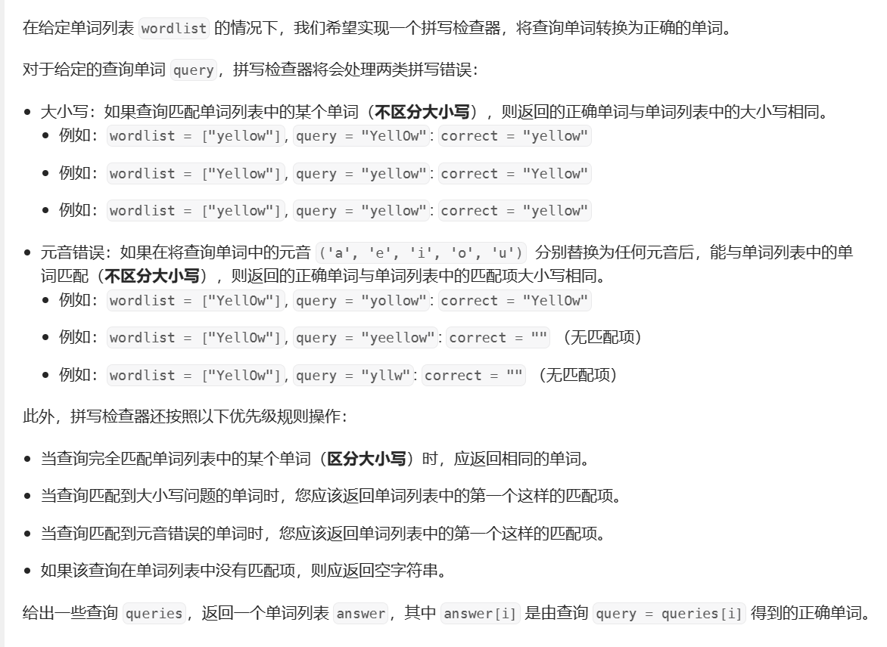

使用三个哈希表，一个记录小写一个记录本身，一个记录去除元音的，因为元音可以随意替换


```python
class Solution:
    def spellchecker(self, wordlist: List[str], queries: List[str]) -> List[str]:
        vis=set(wordlist)
        memo={}
        p={'a', 'e', 'i', 'o', 'u'}
        t={}
        ans=[]

        for c in wordlist:
            # 小写
            if str.lower(c) not in memo:
                memo[str.lower(c)]=c
                
            # 去除元音
            temp=''
            for a in str.lower(c):
                # 为了保证顺序元音使用空格替代
                if a in p:temp+=' '
                else:temp+=a
	    # 注意要取第一个
            if temp not in t:t[temp]=c

        for c in queries:
            temp=''
            for a in str.lower(c):
                if a in p:temp+=' '
                else:temp+=a
            if c in vis:ans.append(c)
            elif str.lower(c) in memo:ans.append(memo[str.lower(c)])
            
            elif temp in t:ans.append(t[temp])
            else:ans.append('')


        return ans


```

## [按列翻转得到最大值等行数](https://leetcode.cn/problems/flip-columns-for-maximum-number-of-equal-rows/)

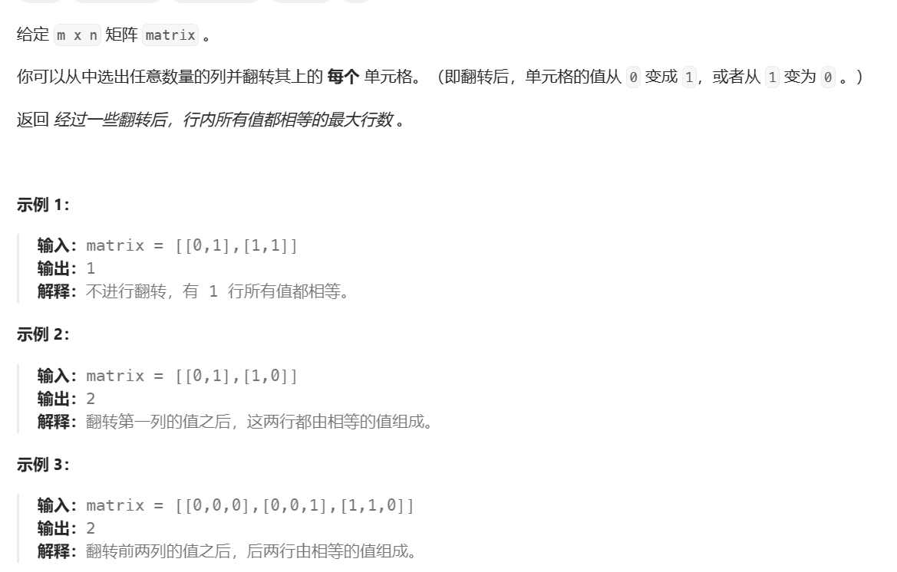


翻转偶数次无用，翻转方式只有是或不是，对于相同的行或互补的行(110 001)存在一种反转方式使得它们最终相等，而其他的行不会变得相等。如果把这些行看作是点的话就是去找联通块的大小，但使用哈希记录相同行和互补行作为一组的个数，这些组都可以通过反转变得一样

```python
class Solution:
    def maxEqualRowsAfterFlips(self, matrix: List[List[int]]) -> int:
        memo=Counter()
        for row in matrix:
            # 固定开头为0的，只把开头为1的转换为互补的
            if row[0]:
                for j in range(len(row)):
                    row[j]^=1
            memo[tuple(row)]+=1
        return max(memo.values())
```


## [最大化数组末位元素的最少操作次数](https://leetcode.cn/problems/minimum-operations-to-maximize-last-elements-in-arrays/)

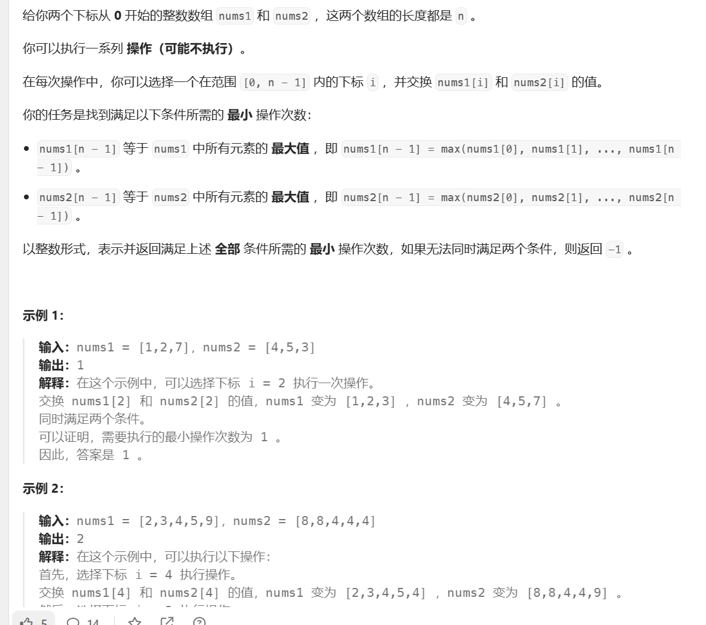

对于两个数组，从头开始遍历如果当前值大于最后的值才交换，如果交换了还是不行就是不合法的。最后位置有两种状态枚举选出最小的。

```python
class Solution:
    def minOperations(self, nums1: List[int], nums2: List[int]) -> int:
        def f(l,r):
            res=0
            for x,y in zip(nums1,nums2):
                if x>l or y>r:
                    if x>r or y>l:
                        return inf 
                    res+=1
            return res
        r=min(f(nums1[-1],nums2[-1]),f(nums2[-1],nums1[-1]))
        return r if r!=inf else -1
```

## [负二进制数相加](https://leetcode.cn/problems/adding-two-negabinary-numbers/)

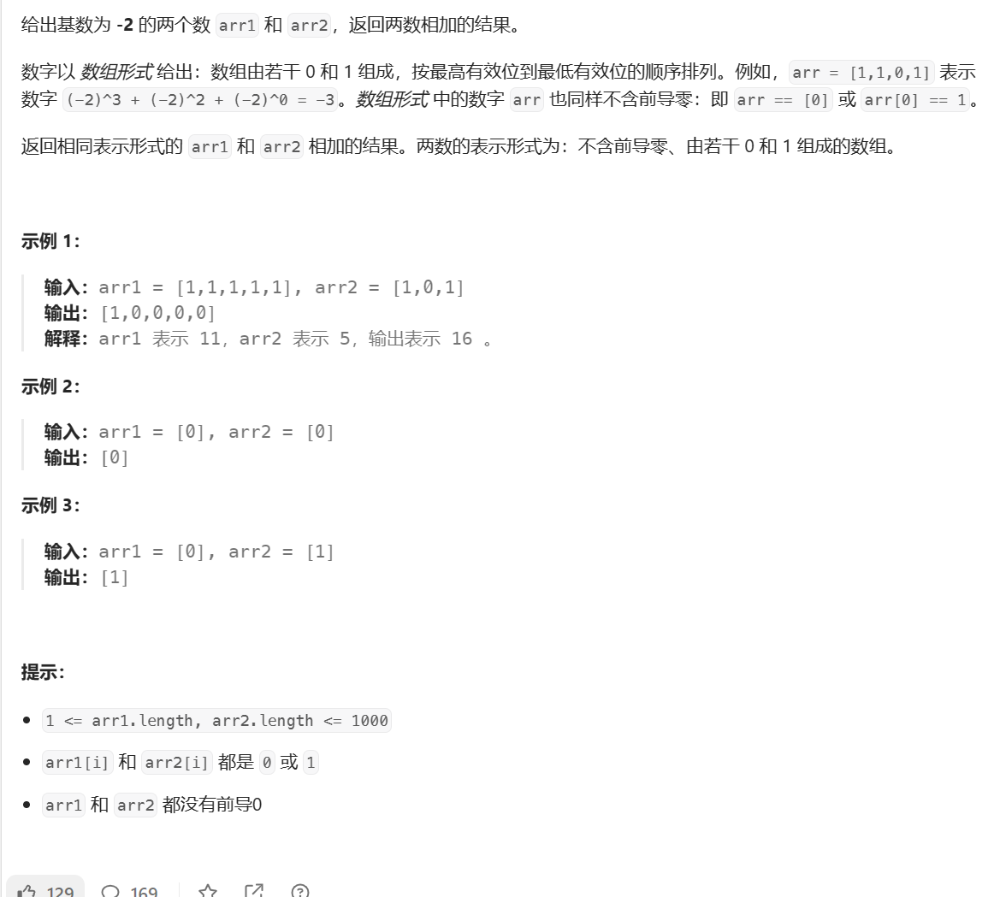


```python
t=[pow(-2,i) for i in range(1001)]
class Solution:
    def addNegabinary(self, arr1: List[int], arr2: List[int]) -> List[int]:
        # 通过reduce 函数可以快速求出各类转化函数
        r=reduce(lambda x,y:-2*x+y,arr1)+reduce(lambda x,y:-2*x+y,arr2)
        if not r:return [0]
        ans=[]
        # 负数二进制转化需要考虑奇偶
        while r:
            if r&1:
                # 奇数一定会余1，除二的时候需要向上取整
                ans.append(1)
                r=(r-1)//-2
            else:
                #偶数一般求解即可
                ans.append(0)
                r=r//-2
        return list(reversed(ans)) 

            
```

## 星空之夜

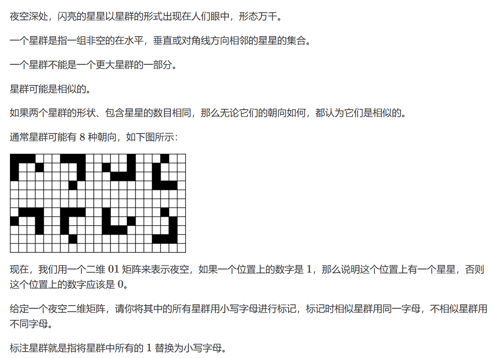


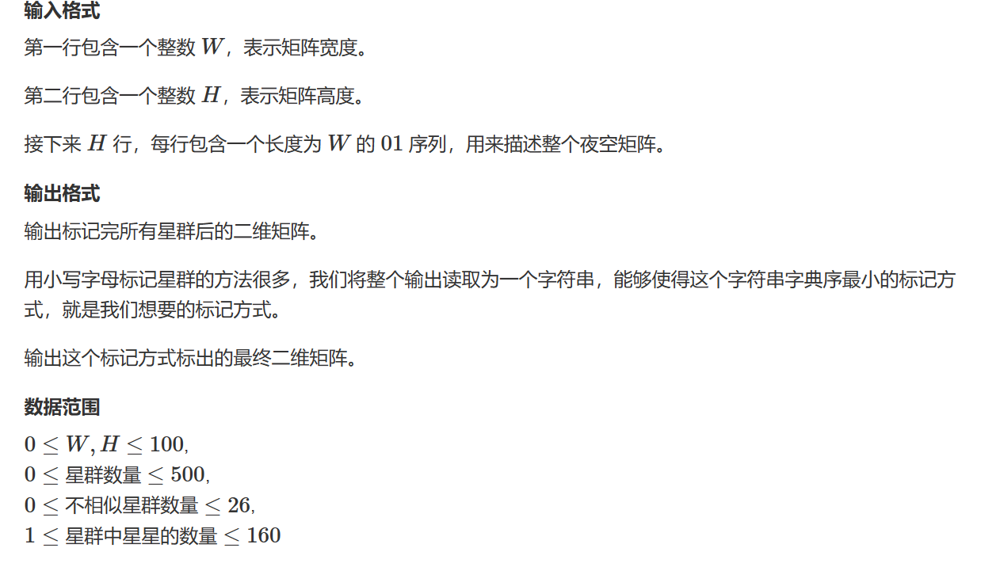


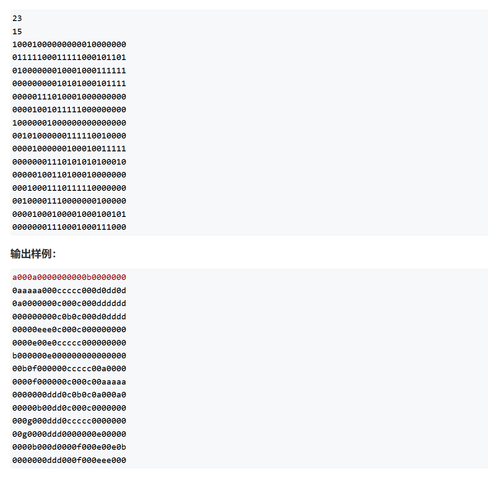


将图形抽象为哈希值，对于一个图将它的哈希值定义为每个点之间的哈夫曼距离，这样对于同一个图形不同的方向可以基本抽象为同一个值，为了保证字典序最小会将先遇到的集合转换位字母表中的对应的字母。

```python
from cmath import sqrt

n = int(input())
m = int(input())
grid = []
for _ in range(m):
    grid.append(list(input()))
index = 0
alphbet = [chr(97 + i) for i in range(26)]

# 找出集合中的点
def dfs(i,j):
    for dx, dy in (1,0),(-1,0),(0,1),(0,-1),(1,-1),(-1,-1),(1,1),(-1,1):
        x=i+dx
        y=j+dy
        if 0<=x<m and 0<=y<n and grid[x][y]=='1':
            points.append((x,y))
            grid[x][y]='0'
            dfs(x,y)
index=0
color={}

def get_value(points):
    ans=0
    # 计算每个点之间的哈夫曼距离
    for i in range(len(points)):
        x1,y1=points[i]
        for j in range(i+1,len(points)):
            x2,y2=points[j]
            ans+=sqrt((x1-x2)**2+(y1-y2)**2)
    return ans

def get_color(val):
    global index
    # 找是否存在同一组的
    for k,v in color.items():
        # 哈希表不是完全对应的，两个哈希值相等可以表示为相减的结果很小
        if abs(val-k)<1e-8:
            return v
    # 没有的话，新开一组定义到字母表的下一位
    color[val]=alphbet[index]
    index+=1
    return color[val]

def draw(points,c):
    for x,y in points:    
        grid[x][y]=c

# 枚举每一个点
for i in range(m):
    for j in range(n):
        if grid[i][j] == '1':
            # 找到一个使用dfs找出集合中所有的点的坐标
            points=[]
            points.append((i,j))
            grid[i][j]='0'
            dfs(i,j)
            # 计算哈夫曼距离
            val=get_value(points)
            # 去找这个哈希值是否出现过，是否和其他集合属于同一组，如果是得到这一组的字母，否则新定义一组
            c=get_color(val)
            # 将这个集合中的点都换为字母
            draw(points,c)
for v in grid:
    print(''.join(v))
    
```


## [找到指定长度的回文数](https://leetcode.cn/problems/find-palindrome-with-fixed-length/)

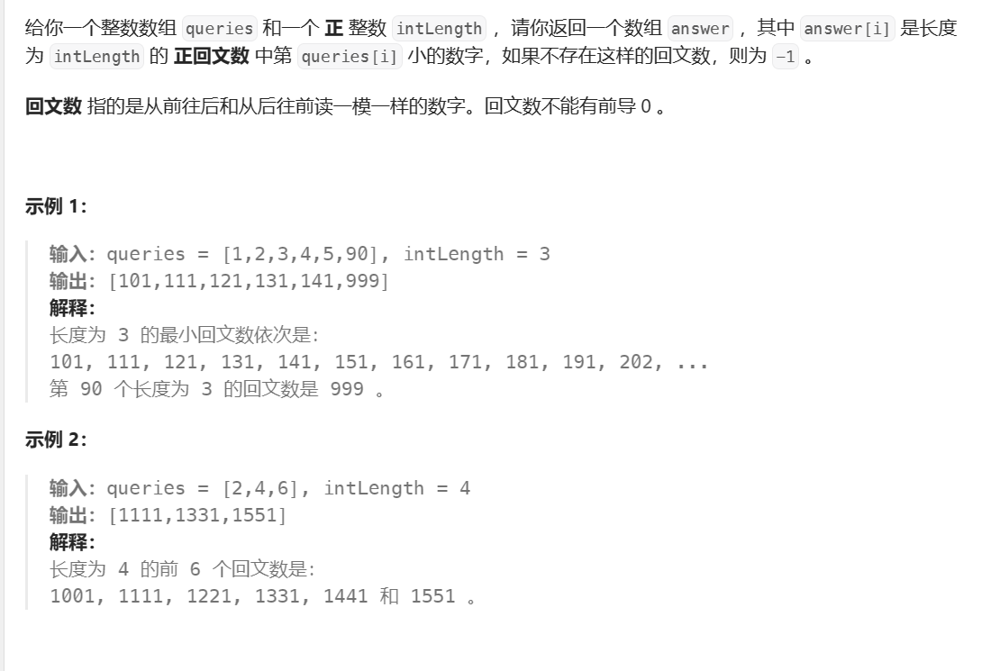

枚举回文串的左半部分，对于第i个转换到回文串中就是左半部分加上i-1（回文串的性质）

```python
class Solution:
    def kthPalindrome(self, queries: List[int], intLength: int) -> List[int]:
        ans=[-1]*len(queries)
        # 注意长度减一后再取半，因为1本身占一位
        base=10**((intLength-1)//2)
        for i,q in enumerate(queries):
            # 注意q-1要小于否则加上去会是左半部分进位
            if q<=9*base:
                s=str(base+q-1)
                # 如果是奇数，减去最后一位再反转
                s+=s[-2::-1] if intLength%2 else s[::-1]
                ans[i]=int(s)
        return ans 
```


## [修改后的最大二进制字符串](https://leetcode.cn/problems/maximum-binary-string-after-change/)

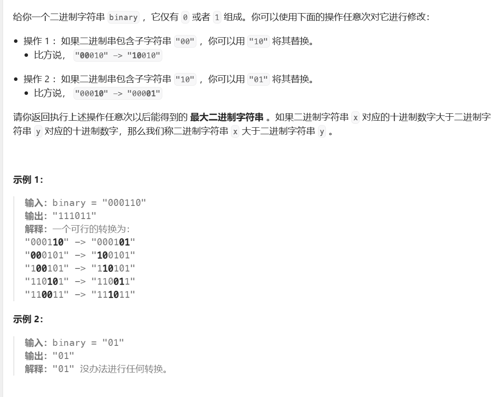

为了二进制数大，左边的1不会去动，将10变为01的操作就是把1右移一位，把00变为10可以使得二进制数变大。遍历字符串对第一个以0开始的子串统计0的个数，如果小于2也就是只有一个那么无法变得更大，如果大于等于2的话为了保证高位尽可能大，首先将所有的1移到右边给左边腾出位置，然后左边将00转化为10，最后可以将0000 变为1110只剩最后一位为0.

```python
class Solution:
    def maximumBinaryString(self, binary: str) -> str:
        n=len(binary)
        i=0
        ans=''
        # 找到第一个以0开始的
        while i<n:
            if binary[i]=='1':
                ans+='1'
                i+=1
                continue
             # 统计个数
            cnt=binary[i:].count('0')
            if cnt>=2:
                a1=n-cnt-i
                # 构造
                ans+='1'*(cnt-1)+'0'+'1'*a1
                return ans 
            break
        return binary
```

## [统计追加字母可以获得的单词数](https://leetcode.cn/problems/count-words-obtained-after-adding-a-letter/)

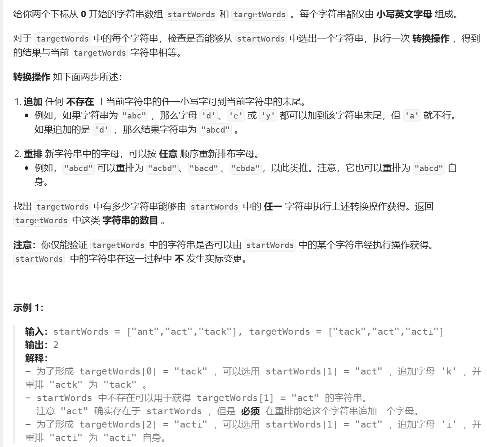

反向思考是否可以由字符串中减去某一个字符得到在start中的字符，枚举减去每一个字符。关键在于，由于不考虑顺序在使用哈希记录排好序的结果。

```python
class Solution:
    def wordCount(self, startWords: List[str], targetWords: List[str]) -> int:
        memo=set()
        ans=0
        for s in startWords:
            #注意先排序
            memo.add(tuple(sorted(s)))
        
        for s in targetWords:
            for j in range(len(s)):
                temp=s[:j]+s[j+1:]
                temp=sorted(temp)
                if tuple(temp) in memo:
                    ans+=1
                    break
        return ans 


```


## [构造字典序最大的合并字符串](https://leetcode.cn/problems/largest-merge-of-two-strings/)

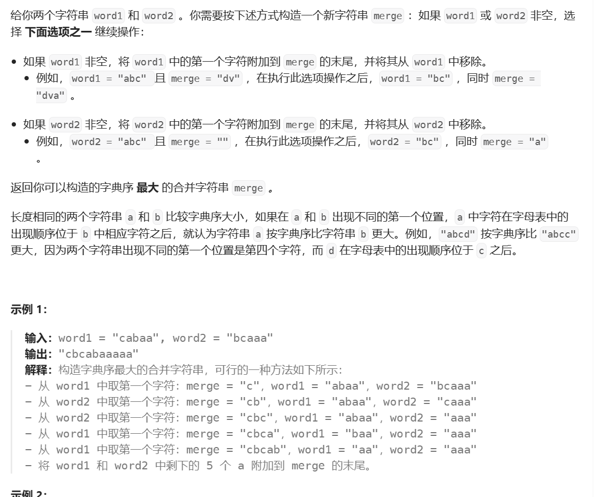

构造过程中可能会出现abaa aaaa的情况这时候选择字典序最大的可以保证取到abaa


```python
class Solution:
    def largestMerge(self, word1: str, word2: str) -> str:
        n1,n2=len(word1),len(word2)
        i=j=0
        ans=[]
        # 双指针直接比较
        while i<n1 and j<n2:
            if word1[i:]>word2[j:]:
                ans.append(word1[i])
                i+=1
            else:
                ans.append(word2[j])
                j+=1
        ans.append(word1[i:])
        ans.append(word2[j:])
        return ''.join(ans)


            
```


## [股票价格波动](https://leetcode.cn/problems/stock-price-fluctuation/) 


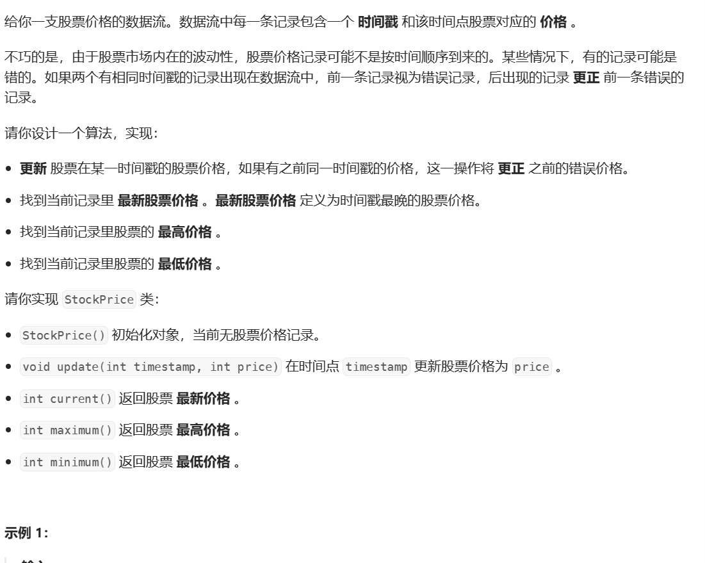


借助有序列表储存所有的价格，再使用一个哈希表记录每个时间对应的价格，如果当前时间更新了，对应的价格在列表中也应该变化

```python
from sortedcontainers import SortedList as sd

class StockPrice:
    def __init__(self):
        self.price=sd()
        self.curr=0
        self.m={}
    def update(self, timestamp: int, price: int) -> None:
        if timestamp in self.m:
            self.price.discard(self.m[timestamp])
        self.m[timestamp]=price
        self.price.add(price)
        self.curr=max(self.curr,timestamp)

    def current(self) -> int:
        return self.m[self.curr]

    def maximum(self) -> int:
        return self.price[-1]

    def minimum(self) -> int:
        return self.price[0]


# Your StockPrice object will be instantiated and called as such:
# obj = StockPrice()
# obj.update(timestamp,price)
# param_2 = obj.current()
# param_3 = obj.maximum()
# param_4 = obj.minimum()
```


## [通过操作使数组长度最小](https://leetcode.cn/problems/minimize-length-of-array-using-operations/)

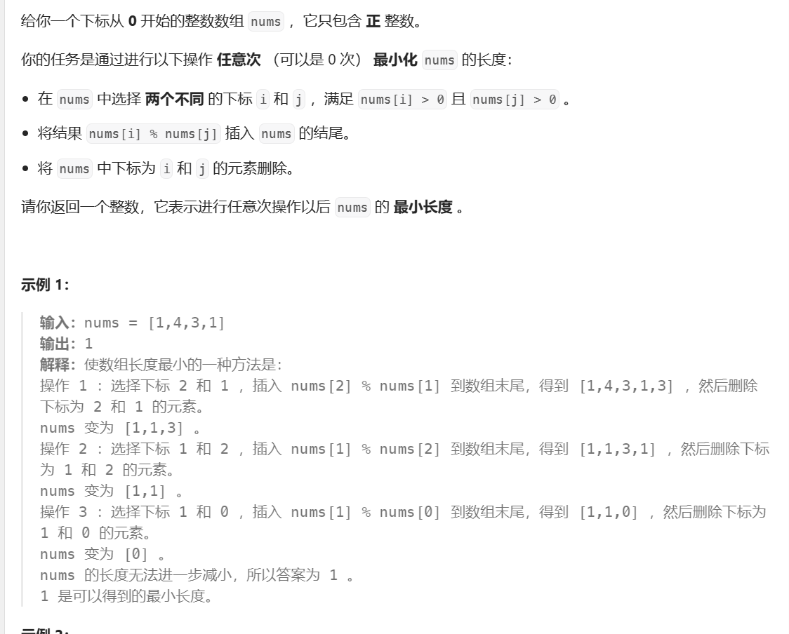

对于一个大的值和一个小的值进行操作，实际上是将大的值去除掉只保留小的值（如果大的值放到后面），如果小的值的个数为1可以一直删除其他值最后只剩下一个值。反之，个数大于1

如果可以找到一个不是这个值倍数的数那么就可以构造一个更小的值（大的值放前面）然后利用上一条规则删到只剩一个。如果都是最小值的个数那么利用规则一后就是剩下的最小值们的内部相消。

```python
class Solution:
    def minimumArrayLength(self, nums: List[int]) -> int:
        memo=Counter(nums)
        v=min(nums)
        if memo[v]==1:return 1
        for k,_ in memo.items():
            if k%v:
                return 1
        return ceil(memo[v]/2)
        
```


## [ K 连续位的最小翻转次数](https://leetcode.cn/problems/minimum-number-of-k-consecutive-bit-flips/)

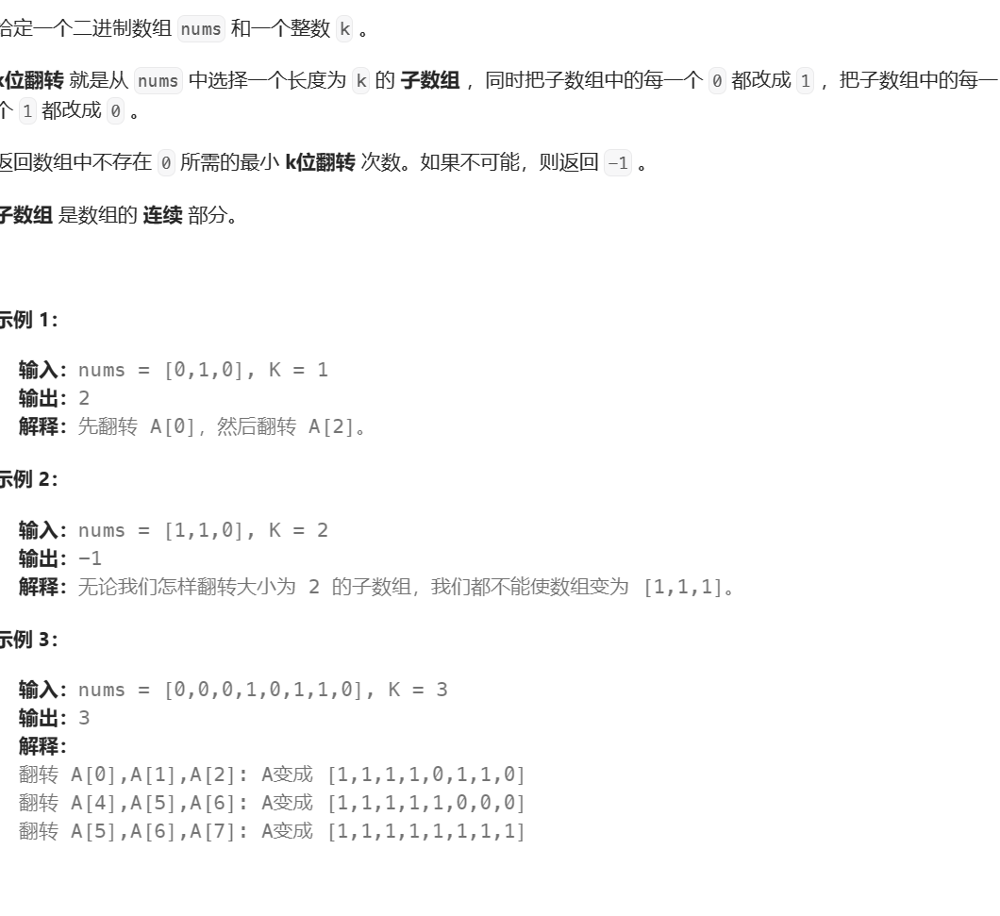


每次一遇到0就反转（0必须要反转），因为如果在遇到0之前反转反而会多出无用的0，而如果是遇到区间内的其他0再反转不如反转第一个方便，因为顺序无关。

对于给定的数据，模拟反转过程会超时，可用记录反转次数，这里选择使用队列记录反转的位置，队列长度为反转的次数如果是奇数次且当前位置为1那么就必须反转当前位置，如果是偶数次且当前位置为0那就要反转当前位置。

```python
class Solution:
    def minKBitFlips(self, nums: List[int], k: int) -> int:
        n=len(nums)
        # 队列记录反转的开始位置
        d=deque()
        cnt=0
        for i in range(n):
            # 如果反转的位置影响不到现在这个
            while d and d[0]+k<=i:
                d.popleft()
            # 长度为奇数且当前为1，或长度为偶数且当前为0
            if len(d)%2==nums[i]:
                if i+k>n:return -1
                cnt+=1
                d.append(i)

        return cnt 
```

## [坐上公交的最晚时间](https://leetcode.cn/problems/the-latest-time-to-catch-a-bus/)


模拟，首先将两个数组排序，对于所有的车看看他最终能载几名乘客，如果最后一辆车还剩下那么可以选择做最后一班车（这里需要判断最后一名乘客的到达时间是否等于等于最后一把车的到达时间防止重复），如果车都坐满了，那么从能能坐上车的最后一名乘客往前找一个空余的时间点插队。

```python
class Solution:
    def latestTimeCatchTheBus(self, buses: List[int], passengers: List[int], capacity: int) -> int:
        b=sorted(buses)
        p=sorted(passengers)
        vis=set(p)
        i=0
        for t in b:
            c=capacity
            while c and i<len(p) and p[i]<=t:
                i+=1
                c-=1

        if c:
            temp=b[-1]
            while temp in vis:
                temp-=1
            return temp
        else:
            temp=p[i-1]
            while temp in vis:
                temp-=1
            return temp
```


## [给 N x 3 网格图涂色的方案数](https://leetcode.cn/problems/number-of-ways-to-paint-n-3-grid/)

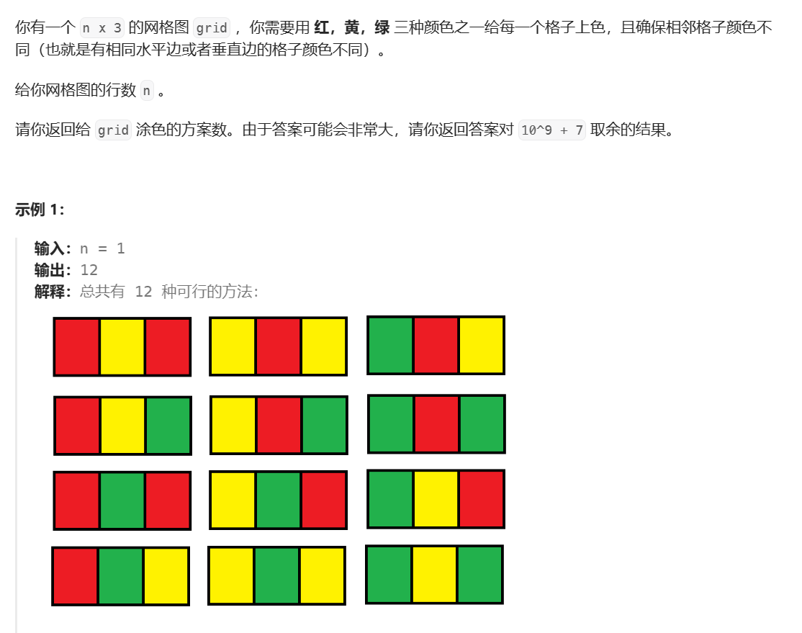

通过观察可以发现一层只有12个状态并且可以分为ABA和ABC两种形式，对于第i层它的状态数等于ABA加上ABC的状态数

而当前层ABA的状态数等于上一层的三色CAB,BAC 双色情况：BAB,CAC,CBC，BAC等于三色情况：CAB,BCA 双色情况：BAB,BCB，这是一个递推的过程。

```python
class Solution:
    def numOfWays(self, n: int) -> int:
        if n==0:return 0
        elif n==1:return 12
        m=10**9+7
        l=r=6
        curr=0
        for i in range(1,n):
            templ=(3*l+2*r)%m
            tempr=(2*l+2*r)%m
            curr=(templ+tempr)%m
            l,r=templ,tempr
        return curr
```


## [统计全 1 子矩形](https://leetcode.cn/problems/count-submatrices-with-all-ones/)

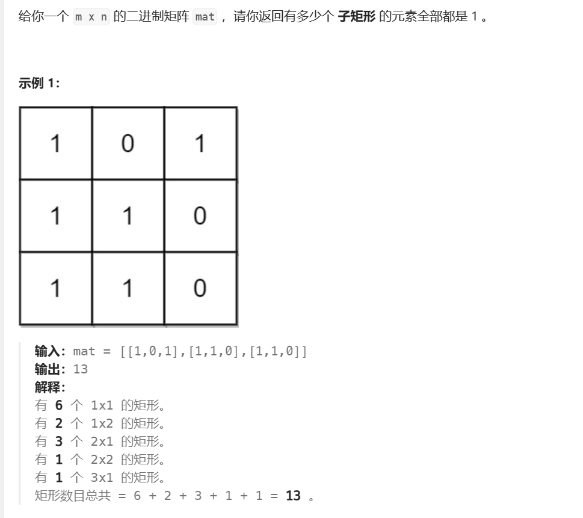

利用排列组合对暴力枚举优化

定义数组row表示i,j这个位置左边连续1的个数包括i,j，枚举每个右下端点暴力的做法是枚举左上端点但是一会超时，通过row数组往上找，定义col为这个过程中的最小row（防止不合法的状态[0,1,1],[0,0,1]），累加这个col类似于滑动窗口中的操作（排列组合的性质）1 1 1 -> 结果加3，1 1 1 1 ->结果加4（与之前的每个构建一个新的再加上自己）


```python
class Solution:
    def numSubmat(self, mat: List[List[int]]) -> int:
        m,n=len(mat),len(mat[0])
        row=[[0]*n for _ in range(m)]
        ans=0
        # 构建row数组
        for i in range(m):
            for j in range(n):
                if not j:row[i][j]=mat[i][j]
                else:row[i][j]= 0 if not mat[i][j] else row[i][j-1]+1
        for i in range(m):
            for j in range(n):
                # 维护最小的col
                col=row[i][j]
                for k in range(i,-1,-1):
                    col=min(col,row[k][j])
                    # 累加
                    ans+=col
        return ans 
```


## [找两个和为目标值且不重叠的子数组](https://leetcode.cn/problems/find-two-non-overlapping-sub-arrays-each-with-target-sum/)

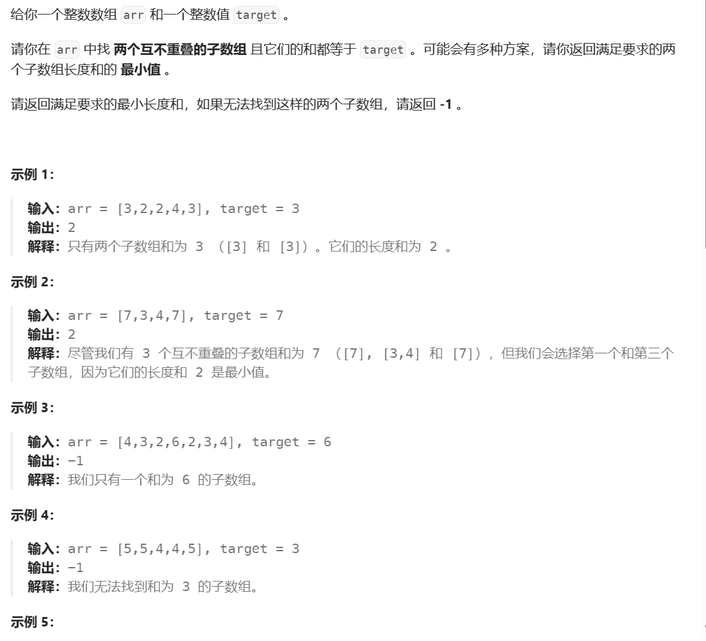

不存在负数可以通过滑动窗口找到所有的区间，为了找到不重叠的区间用队列维护前面最小的区间。

```python
class Solution:
    def minSumOfLengths(self, nums: List[int], target: int) -> int:
        l=r=t=0
        n=len(nums)
        mn=inf
        ans=inf
        d=deque()
        while r<n:
            t+=nums[r]
            while l<=r and t>target:
                t-=nums[l]
                l+=1
            if t==target:
                # 如果队列中记录区间，且这个区间不重叠那么就取出来作为前面的区间，之后的所有的区间都可以配这个区间
                while d and d[0][-1]<l:
                    left,right=d.popleft()
                    mn=min(mn,right-left+1)
                # 如果存在一个合法的前面区间更新答案
                if mn!=inf:
                    ans=min(ans,mn+r-l+1)
                # 记录新的区间，如果这个区间没有之前的小就没必要加入
                if r-l+1<mn:
                    d.append((l,r))
            r+=1
        return ans if ans!=inf else -1

```

## 小A的任务

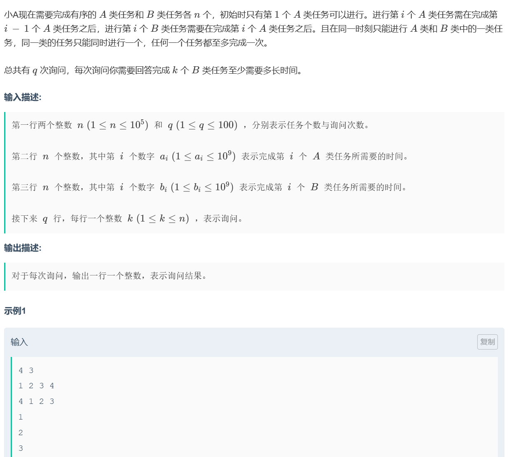


枚举最右边的B任务燃火在左边挑选出最小的k-1个b任务，关键在于使用根堆维护最小的k个值。

```python
from itertools import accumulate as ac
from math import inf 
from functools import lru_cache
from heapq import heapify,heappop,heappush

n,q=[int(x) for x in input().split()]
a=[int(x) for x in input().split()]
# 构建前缀和快速求解a任务之和
pre=[0]+list(ac(a))
b=[int(x) for x in input().split()]

for _ in range(q):
    k=int(input())
    # 建立根堆
    g=[-v for v in b[:k-1]]  
    heapify(g)
    res=inf
    # 维护前k-1个之和
    preb=sum(b[:k-1])
    # 枚举每个最右端点
    for i in range(k-1,n):
        # 每个最右端点的大小为这个位置的b加上到这个位置的所有的以及前面k-1个最小的b
        temp=preb+pre[i+1]+b[i]
        # 更新根堆
        heappush(g,-b[i])
        # 这里更新位置的值
        preb+=b[i]
        if len(g)>=k:
            preb+=heappop(g)
        res=min(res,temp)
    print(res)    
```


## [包含三个字符串的最短字符串](https://leetcode.cn/problems/shortest-string-that-contains-three-strings/)

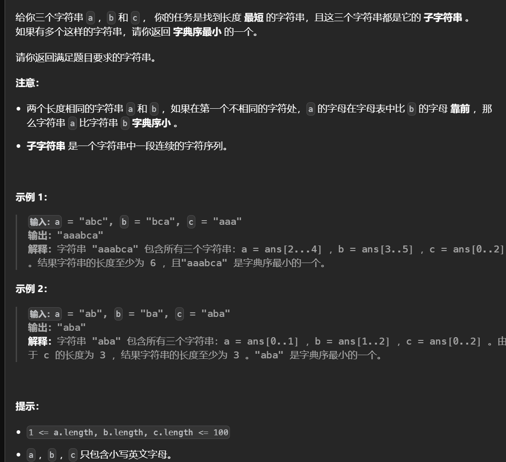


对于给定的数据范围可以暴力枚举，对abc的全排序两两之间判断前后缀相同的情况。

```python
class Solution:
    def minimumString(self, a: str, b: str, c: str) -> str:
        def merge(a,b):
            if a in b:return b
            if b in a:return a 
            for i in range(min(len(a),len(b))-1,0,-1):
                if a[-i:]==b[:i]:
                    return a+b[i:]
            return a+b
        ans=""
        for i,j,k in permutations([a,b,c]):
            res=merge(merge(i,j),k)
            if not ans or len(res)<len(ans) or len(res)==len(ans ) and res<ans:
                ans=res
        return ans 
```

## [回文字符串的最大数量](https://leetcode.cn/problems/maximum-palindromes-after-operations/)

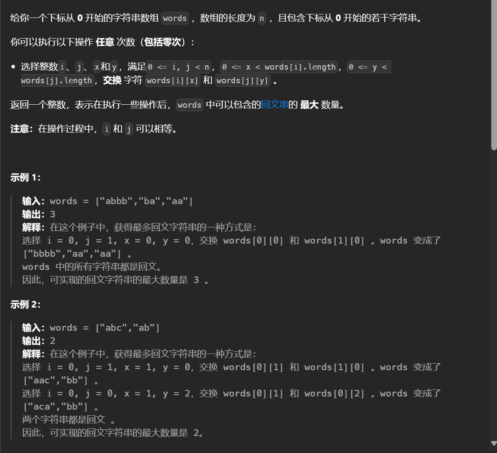


长度为奇数的回文串中间的字符是什么都一样，因此统计两边可以填什么，两边只能填出现次数为偶数的字符。

```python
class Solution:
    def maxPalindromesAfterOperations(self, words: List[str]) -> int:
        cnt=Counter()
        t=0
        for c in words:
            t+=len(c)
            cnt+=Counter(c)
        # 统计出现次数为偶数的
        t-=sum(v%2 for k,v in cnt.items())
        words.sort(key=len)
        ans=0
        # 从小到大遍历
        for c in words:
            t-=len(c)//2*2
            if t<0:break
            ans+=1
        return ans 
```


##  [替换字符后匹配](https://leetcode.cn/problems/match-substring-after-replacement/)

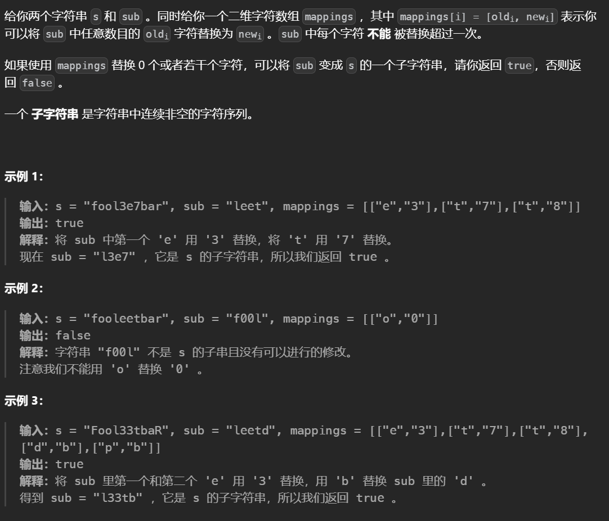


给定的数据范围直接枚举子串

```python
class Solution:
    def matchReplacement(self, s: str, sub: str, mappings: List[List[str]]) -> bool:
        n=len(s)
        path=defaultdict(set)
        for a,b in mappings:
            path[a].add(b)

        for i in range(n-len(sub)+1):
            pre=s[i:i+len(sub)]
            for j in range(len(sub)):
                if pre[j]==sub[j] or pre[j] in path[sub[j]]:continue
                else:break
            else:
                return True 
        return False

```


## [游戏中弱角色的数量](https://leetcode.cn/problems/the-number-of-weak-characters-in-the-game/) 

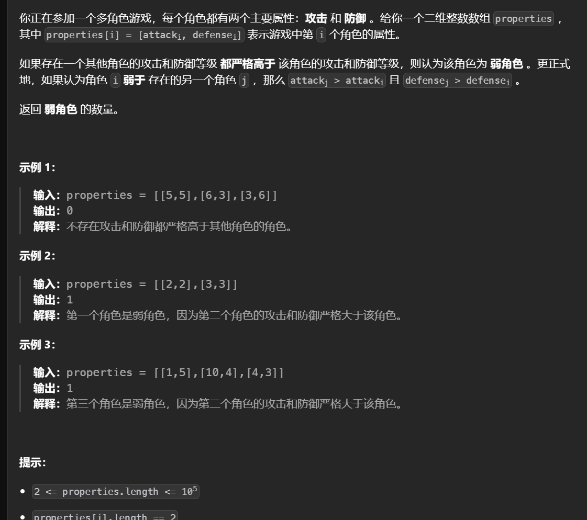

将数组元素按照攻击力从大到小排序，攻击力相同的按照防御值从小到大排序。

正向遍历的过程中维护最大的防御值，如果当前元素的防御值小于之前的说明存在一个防御力更高的，而根据排序方式在前面的且防御更高的攻击也一定是更高的。

如果当前防御值更大那么更新最大的防御值，在这个元素之前也不hi存在防御更高的


```python
class Solution:
    def numberOfWeakCharacters(self, properties: List[List[int]]) -> int:
        nums=sorted(properties,key=lambda x:(-x[0],x[1]))
        ans=mx=0
        for _,d in nums:
            if d<mx:ans+=1
            else:mx=d
        return ans 
```

## [按字典序排在最后的子串](https://leetcode.cn/problems/last-substring-in-lexicographical-order/)

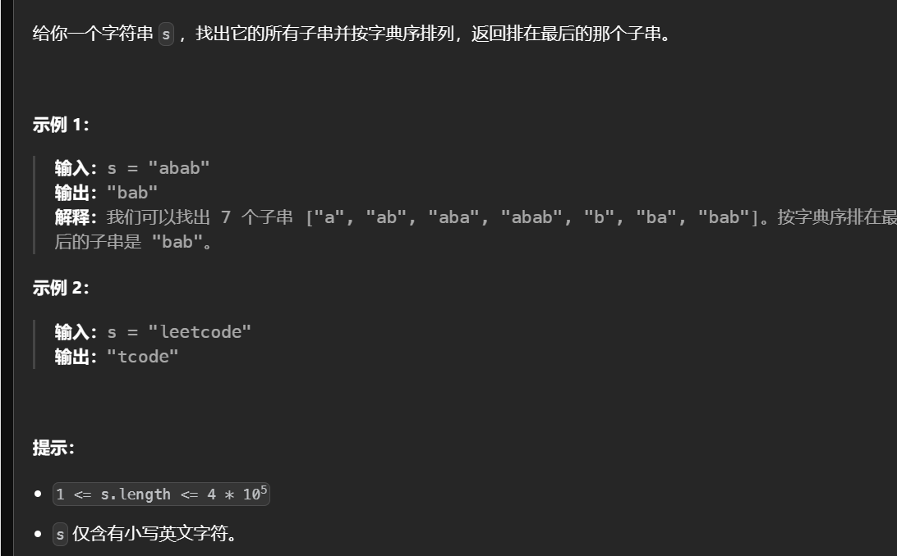

贪心的思想是找到以字典序最大开头的一直到末尾的子串是排在最后的，但是字符串中可能存在多个字典序最大的。

通过双指针模拟，i指向以目前字典序最大的开头的子串，j指向当前的子串，通过枚举k比较后面的字符


```python
class Solution:
    def lastSubstring(self, s: str) -> str:
        n=len(s)
        i,j,k=0,1,0
        while j+k<n:
            # 相等往后扩展
            if s[i+k]==s[j+k]:
                k+=1
            # 如果以字典序最大开头的更大，那么以s[j:j+k]所有字符开头的都小于s[i]开头，更新j的位置往后找同时把k归为0再从头比较
            elif s[i+k]>s[j+k]:
                j=j+k+1
                k=0
            else:
                # 如果当前的更大，则把这个作为字典序最大的开头子串，更新j和k
                i=i+k+1
                j=i+1
                k=0
        return s[i:]
```

## 两个回文子序列长度的最大乘积

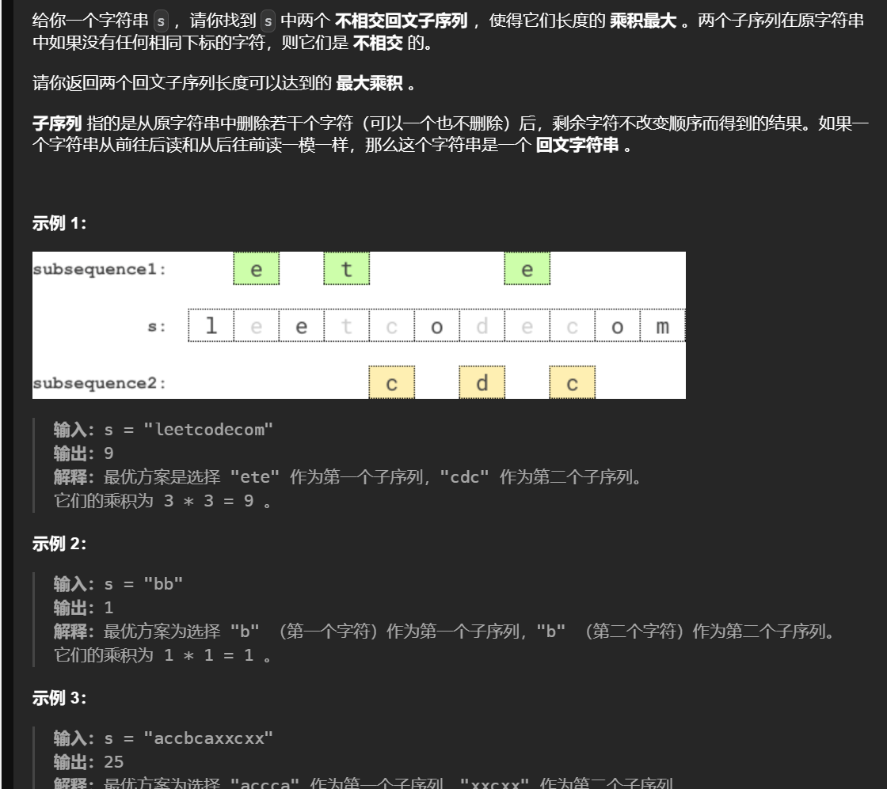


枚举出所有的可行的回文方案，最后要求不相交的两个乘积最大，两层for循环遍历即可

```python
class Solution:
    def maxProduct(self, s: str) -> int:
        n=len(s)
        nums=[]
        ans=0
        # 枚举出所有的
        for i in range(1,1<<n):
            temp=''
            for j in range(n):
                if i>>j&1:temp+=s[j]
            # 快速判断是否是回文串
            if temp==temp[::-1]:nums.append((i,len(temp)))
        for i in range(len(nums)):
            for j in range(i+1,len(nums)):
                if not nums[i][0]&nums[j][0]:
                    ans=max(ans,nums[i][1]*nums[j][1])
        return ans 
```

## [使循环数组所有元素相等的最少秒数](https://leetcode.cn/problems/minimum-seconds-to-equalize-a-circular-array/)


看作是扩散问题，扩散所需的时间由相邻距离最远的两个点决定不是使用Bfs推，这里由于是环形的也就是最后一个是和第一个相邻的，为了操作方便在数组的最后多加一项。


```python
class Solution:
    def minimumSeconds(self, nums: List[int]) -> int:
        memo=defaultdict(list)
        n=len(nums)
        for i ,x in enumerate(nums):
            memo[x].append(i)
        ans=inf 
        for a in memo.values():
            # 多出一项
            a.append(a[0]+n)
            mx=max(j-i for i,j in pairwise(a))
            ans=min(ans,mx)
        return ans//2
```

## Equal Sums 

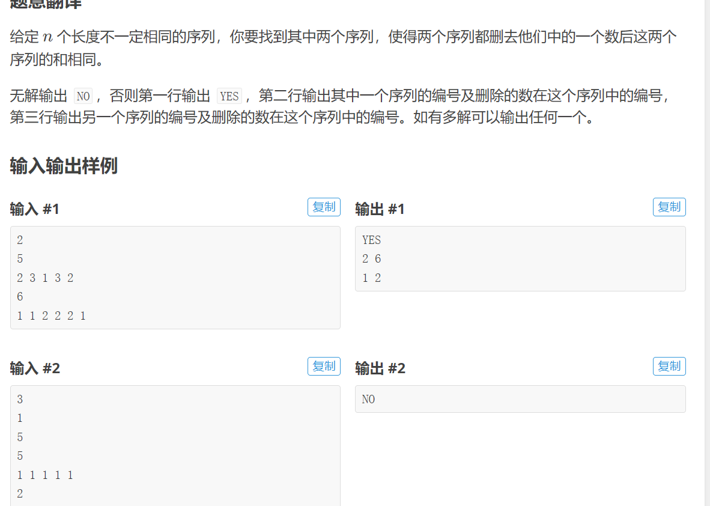


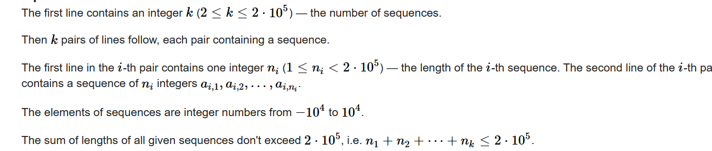

注意总的数据范围，对于每一个队列枚举删除每一个之后的结果用哈希表存起来即可。

```python
grid=[]
index=1
memo={}
flag=False
for _ in range(int(input())):
    n=int(input())
    grid.append([int(x) for x in input().split()])
    t=sum(grid[-1])
    temp={}
    if flag:continue
    for i,v in enumerate(grid[-1]):
        if t-v in memo:
            print("YES")
            print(memo[t-v][0],memo[t-v][1])
            print(index,i+1)
            flag=True
            break
        else:
            temp[t-v]=(index,i+1)
    for k,v in temp.items():
        memo[k]=v
    index+=1
if not flag:print("NO")
```


## Air Conditioner

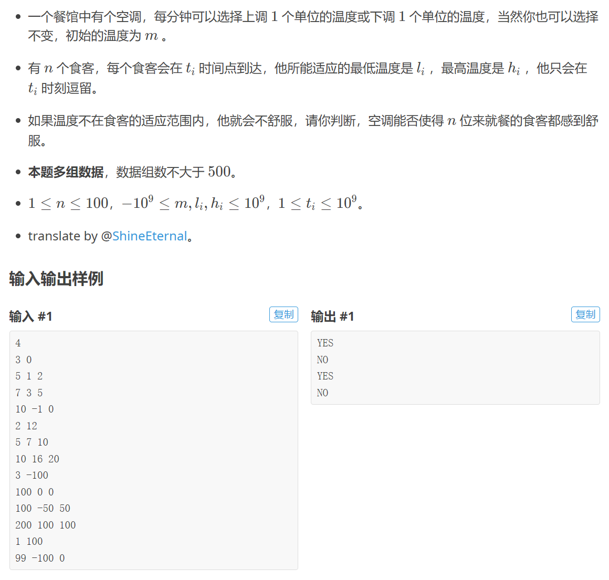 


空调的温度区间每过一分钟可能的取值区间[l,r]变为[l-1,r+1]，因此模拟每个时刻的温度区间，然后与给定的区间取交集，如果交集为空则说明不可能调到这个区间。

```python
for _ in range(int(input())):
    n, m = [int(x) for x in input().split()]
    memo={}

    for i_ in range(n):
        t, l, r = [int(x) for x in input().split()]
        if t in memo:
            l_,r_=memo[t]
            memo[t]=(max(l,l_),min(r,r_))
        else:
            memo[t]=(l,r)
    # 上一时刻
    pre=0
    # 初始时的区间
    l, r = m, m
    
    for k in sorted(memo.keys()):
        l1,r1=memo[k]
        diff=k-pre
        l-=diff
        r+=diff
        # 取交集
        l=max(l,l1)
        r=min(r,r1)
        if l>r:
            print("NO")
            break
        pre=k
    else:print("YES")


```


## [删列造序 II](https://leetcode.cn/problems/delete-columns-to-make-sorted-ii/) 

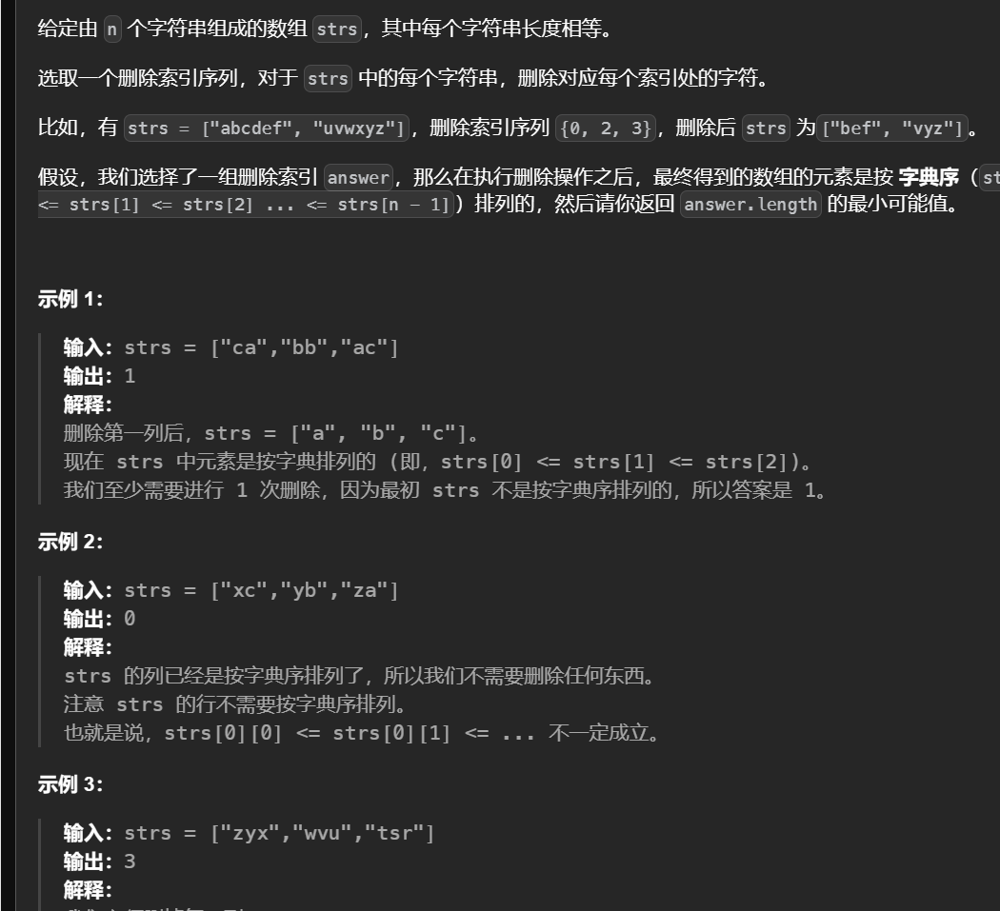

模拟写法，每次对同一列的字符比较，如果不满足条件的话，这一列是一定要删除的。


```python
class Solution:
    def minDeletionSize(self, strs: List[str]) -> int:
        n,m=len(strs),len(strs[0])
        p=[""]*n
        ans=0
        # 比较每一列
        for j in range(m):
            # any关键字
            if any(p[i]+strs[i][j]>p[i+1]+strs[i+1][j] for i in range(n-1)):
                ans+=1
            else:
                # 如果满足不能直接退出，加入到字符串中继续比较
                p=[p[i]+strs[i][j] for i in range(n)]
        return ans 
```

## A BIT of a Construction

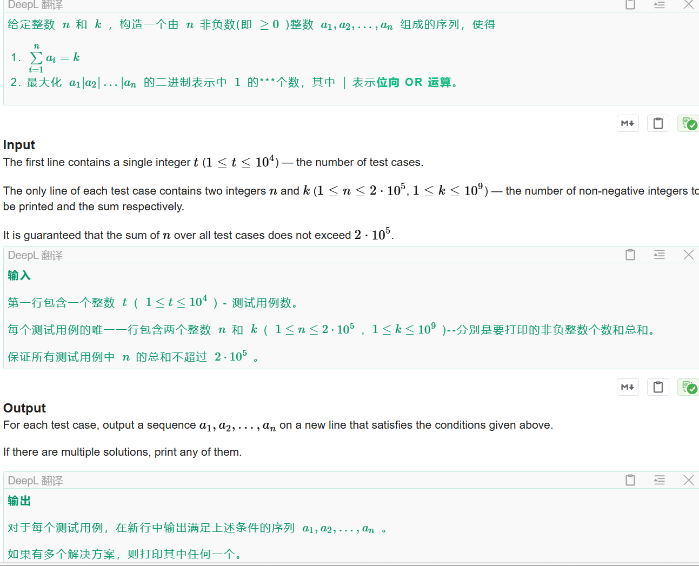 


关键点在于可以补0，为了位数最多把51，0b110011尝试在每个位置都写一个1直到不行

```python
for _ in range(int(input())):
    n,k=[int(x) for x in input().split()]
    ans=[]
    if n==1:print(k)
    else:
        a=1
        while a*2+1<=k:
            a=a*2+1
        ans.append(a)
        ans.append(k-a)
        if len(ans)<n:
            ans.extend([0]*(n-len(ans)))
        print(*ans )
```

## [镜面反射](https://leetcode.cn/problems/mirror-reflection/)

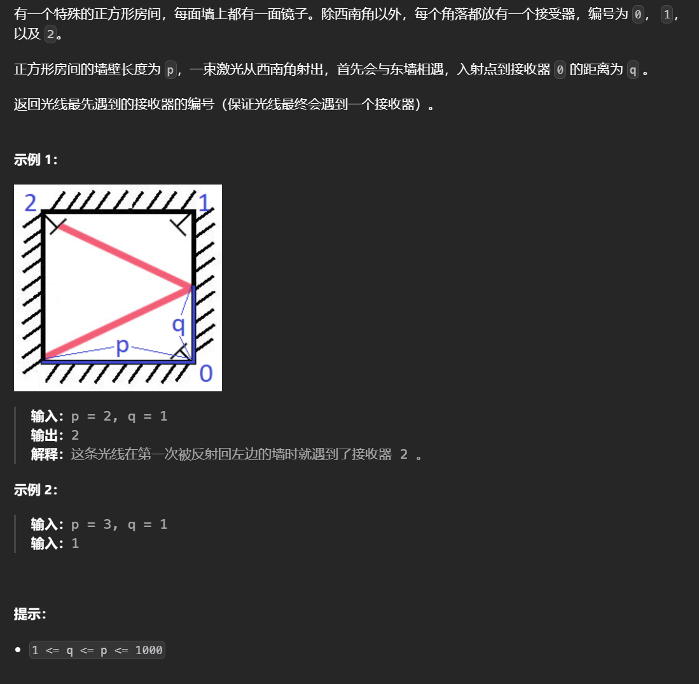

脑筋急转弯，假设光线不会反射只会只会沿一个方向走，其他位置都是镜像后的结果。

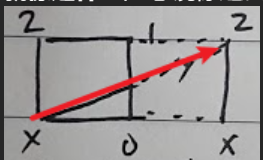


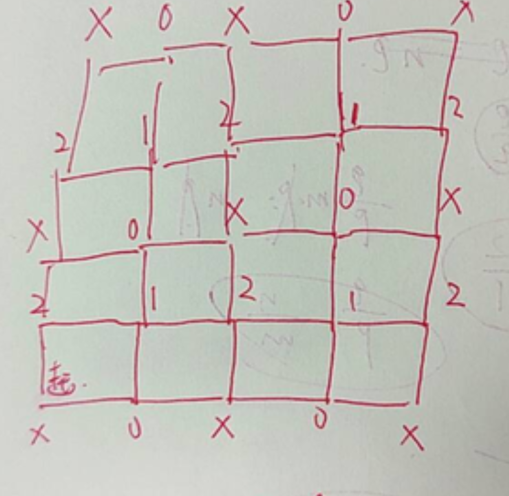


通过观察，如果pq是奇数那么结果是1，p是奇数q是偶数那么结果是0,pq是偶数会回到起点，p是偶数q是奇数结果是2，其实可以构造一个y=(q/p)x的函数，只有每次走过p的整数倍的长度才可能到达端点，最后的结果和pq的比例有关，如果pq都是偶数就需要约分。


```python
class Solution:
    def mirrorReflection(self, p: int, q: int) -> int:
        # 约分
        while not p&1 and not q&1:
            p>>=1
            q>>=1
        if p&1:
            if q&1:return 1 
            return 0
        else:
            if q&1:return 2
```


## [ 两个最好的不重叠活动](https://leetcode.cn/problems/two-best-non-overlapping-events/)

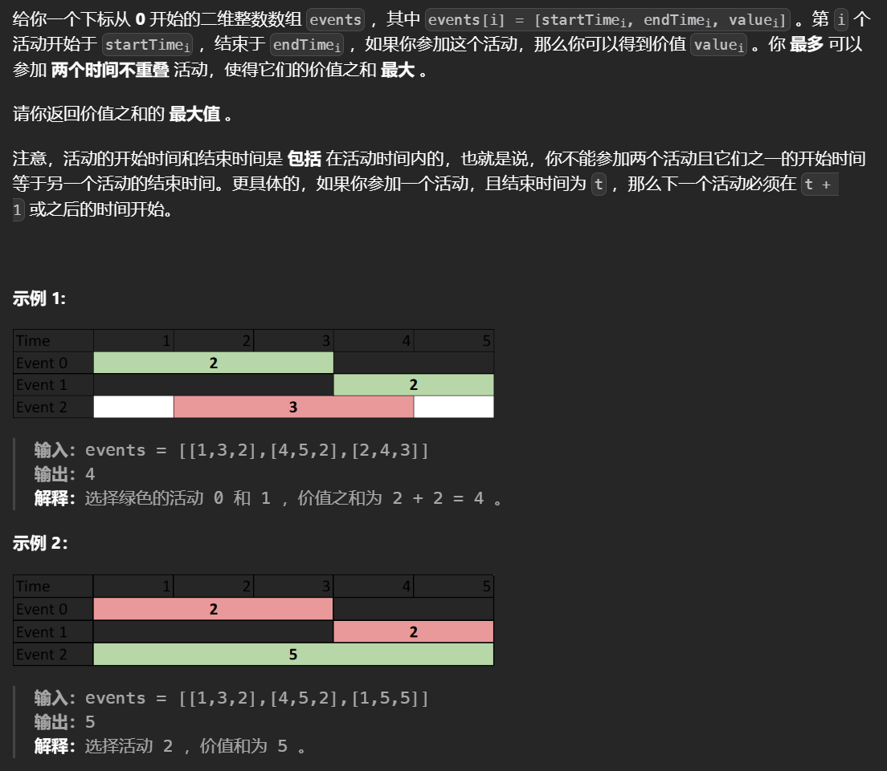


最多只有两个值，因此可以枚举其中一个然后去找另一个，注意这种方法不是每次在列表中固定一个值，然后从头到尾找其他值，而是不断遍历数组同时维护这个数组之前遍历过的值查找其中是否有满足条件的。

对开始时间排序保证了一个位置之后的位置一定可以满足前面维护的最大值，在遍历的过程使用根堆维护左边最小的结束时间，如果满足条件那么这个结束时间对应的区间也一定会满足该位置之后的区间，因此弹出这个值来更新维护的最大值然后继续判断是否满足。


```python
class Solution:
    def maxTwoEvents(self, nums: List[List[int]]) -> int:
        nums.sort(key=lambda x:x[0])
        d=[]
        ans=pre=0
        # 遍历的过程就是在枚举
        for x,y,v in nums:
            # 维护最大值
            while d and d[0][0]<x:
                pre=max(pre,heappop(d)[1])
            ans=max(ans,pre+v)
            # 维护前面的区间
            heappush(d,[y,v])
        return ans 
```


## [替换字符串中的问号使分数最小](https://leetcode.cn/problems/replace-question-marks-in-string-to-minimize-its-value/)

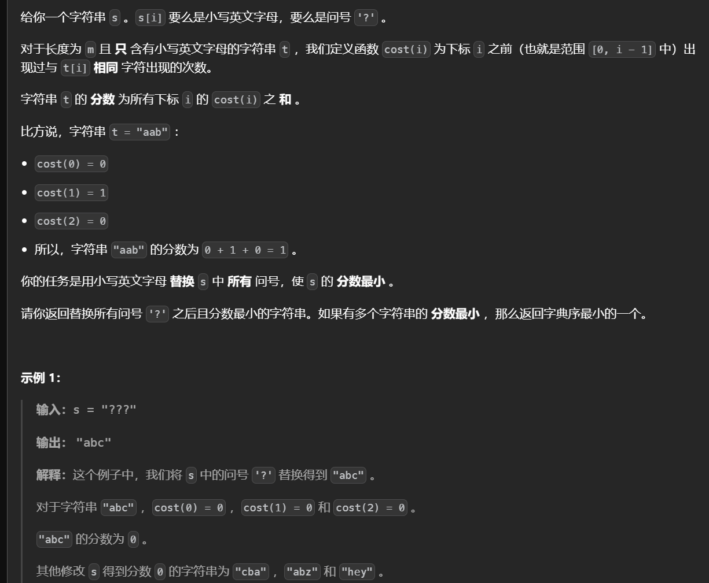

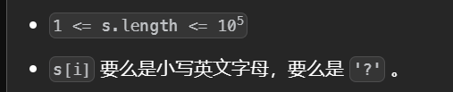


对于每一个字母统计它的出现次数最后的结果等于1+2+⋯+(*freq*[*i*]−1)也就是只与字母出现次数相关，对于问号先填入没有出现过的字母，如果所有的字母都出现过那么只能填入出现次数最少的，为了最后的结果最小要使得每个字母的出现次数尽可能一致，通过根堆实现操作。

```python
class Solution:
    def minimizeStringValue(self, s: str) -> str:
        memo=Counter(s)
        nums=[]
        for i in range(26):
            c=chr(i+ord('a'))
            nums.append([memo[c],i])
        # 以出现次数为第一排序，字符顺序为第二
        heapify(nums)
        t=[]
        # 查找所有的问号要替换为什么
        for _ in range(memo['?']):
            cnt,c=heappop(nums)
            t.append(chr(c+ord('a')))
            heappush(nums,[cnt+1,c])
        ans=''
        t.sort()
        i=0
        # 填入
        for c in s:
            if c=='?':
                ans+=t[i]
                i+=1
            else:
                ans+=c
        return ans 
```


## [分割回文串 IV](https://leetcode.cn/problems/palindrome-partitioning-iv/)

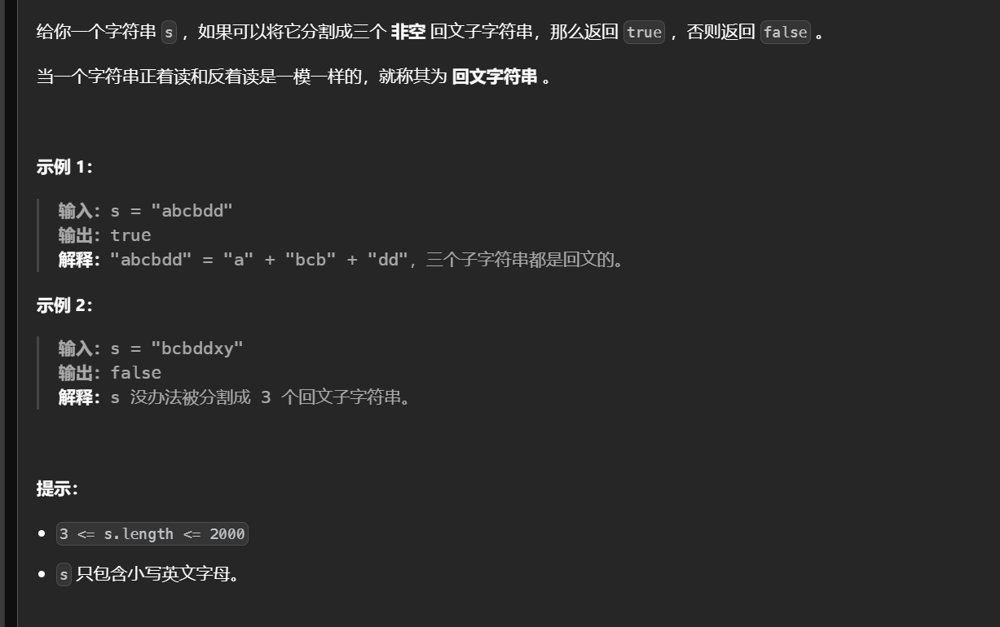

对于给定的数据直接暴力分割，但是判断字符串是否是回文串会很费时，借助动态规划预处理即可


```python
class Solution:
    def checkPartitioning(self, s: str) -> bool:
        n=len(s)
        dp=[[True]*n for _ in range(n)]
        for i in range(n-1,-1,-1):
            for j in range(i+1,n):
                if s[i]==s[j]:
                    dp[i][j]=dp[i+1][j-1]
                else:dp[i][j]=False
        for i in range(n-2):
            for j in range(i+1,n-1):
                if dp[0][i] and dp[i+1][j] and dp[j+1][-1]:return True 
        return False
```

	## [重新排列后的最大子矩阵](https://leetcode.cn/problems/largest-submatrix-with-rearrangements/)

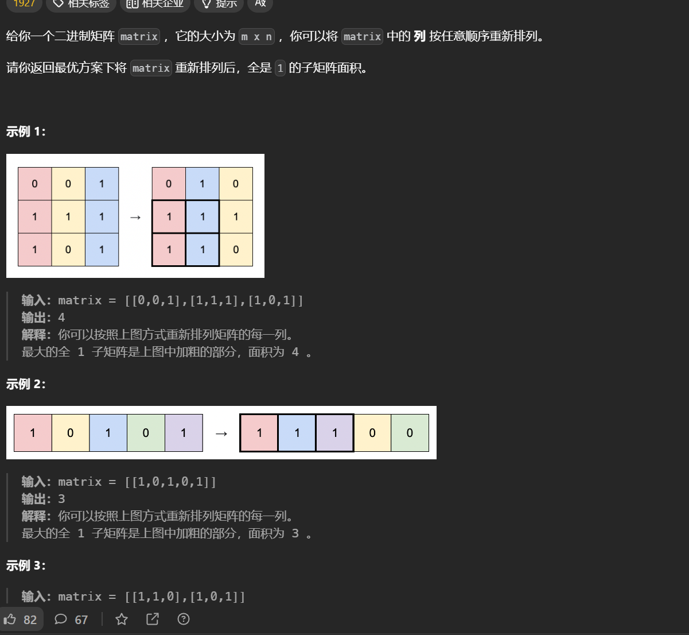

对于给定的数据范围可以做到枚举，但是二维不好枚举

考虑每一行，通过记录每个点它的上面连续1的个数（包括自己）将二维转换为一维，这个不考虑顺序所以可以直接排序，通过排序保证了每个点的右边的点的高度都是大于等于它自身的，这样这个点所能形成的最大子矩形就是自身的高度乘上到右边界的距离，如果不能排序那该题就相当于求直方图中最大的矩形。

```python
class Solution:
    def largestSubmatrix(self, matrix: List[List[int]]) -> int:
        m=len(matrix)
        n=len(matrix[0])
        for i in range(1,m):
            for j in range(n):
                if matrix[i][j]==1:
                    matrix[i][j]+=matrix[i-1][j]
        ans=0
        for i in range(m):
            nums=sorted(matrix[i])
            for j in range(n):
                ans=max(ans,nums[j]*(n-j))
        return ans 
```

## [最大矩形](https://leetcode.cn/problems/maximal-rectangle/)


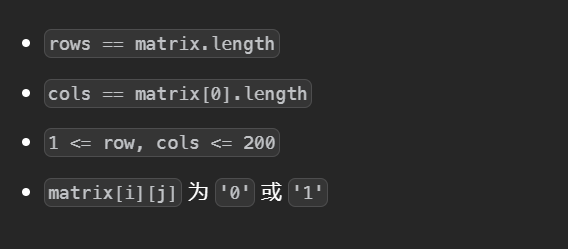

将二维转换为一维进行枚举，这里不能随意排列因此使用单调栈求出每个点两边第一个小于他的位置，从而求出以这个点的高度能往两边扩展多少，至于有没有可能更大的矩形面积是再往外扩展，这里会有其他的点求出。

```python
class Solution:
    def maximalRectangle(self, matrix: List[List[str]]) -> int:
        m,n=len(matrix),len(matrix[0])
        def cal(g):
            l=deque()
            r=deque()
            d=deque()
            for i in range(n):
                if not d:
                    d.append(i)
                    l.append(-1)
                    continue
                while d and g[d[-1]]>=g[i]:
                    d.pop()
                if not d:
                    l.append(-1)
                else:
                    l.append(d[-1])
                d.append(i)
            d=deque()
            for i in range(n-1,-1,-1):
                if not d:
                    d.append(i)
                    r.append(n)
                while d and g[d[-1]]>=g[i]:
                    d.pop()
                if not d:
                    r.append(n)
                else:
                    r.append(d[-1])
                d.append(i)
            r=list(reversed(r))
            res=0
            for i in range(n):
                res=max(res,(r[i]-l[i]-1)*g[i])
            return res

        ans=0
        for i in range(m):
            if not i:
                g=list(map(int,matrix[0]))
                ans=max(ans,cal(g))
                continue
            for j in range(n):
                if matrix[i][j]=='0':g[j]=0
                else:g[j]+=1
            ans=max(ans,cal(g))
        return ans  
```


## [查找大小为 M 的最新分组](https://leetcode.cn/problems/find-latest-group-of-size-m/) 

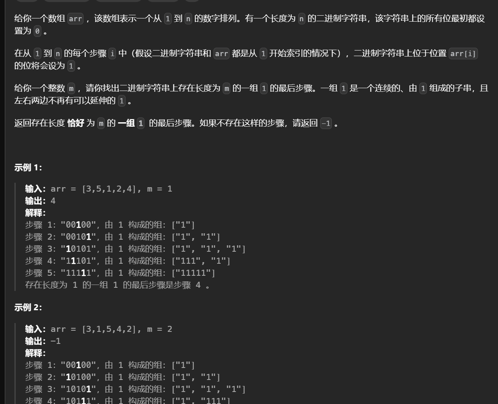

关键在于如何确定添加一个位置后能形成的连续1的什么样的。

通过一个集合记录加入的点，当新添加一个点v时，查看v-1和v+1是否在集合中，至于如何确定连续1的长度这里需要一个link数组判断，link[v]表示以v为端点的另一个端是？这样就可以确定连续1的长度。

```python
class Solution:
    def findLatestStep(self, arr: List[int], m: int) -> int:
        # 通过哈希表记录长度为k的连续1的个数
        memo=Counter()
        n=len(arr)
        link=[0]*n
        vis=set()
        ans=-1
        index=1
        arr=[v-1 for v in arr]
        for v in arr:
            # 看左边右边是否都在，如果都在说明是把连续的两端连起来
            if v-1 in vis and v+1 in vis:
                l=(v-1)-link[v-1]+1+link[v+1]-(v+1)+1+1
                # 不仅连接后的新长度要加一，原来对应的长度需要减去
                memo[l]+=1
                memo[(v-1)-link[v-1]+1]-=1
                memo[link[v+1]-(v+1)+1]-=1
                # 要重新设置端点
                link[link[v-1]],link[link[v+1]]=link[v+1],link[v-1]
            # 只一端是相连的
            elif v-1 in vis:
                l=(v-1)-link[v-1]+1+1
                memo[l]+=1
                memo[l-1]-=1
                link[v]=link[v-1]
                link[link[v-1]]=v
            elif v+1 in vis:
                l=link[v+1]-(v+1)+1+1
                memo[l]+=1
                memo[l-1]-=1
                link[v]=link[v+1]
                link[link[v+1]]=v
            # 只有单独一个
            else:
                memo[1]+=1
                link[v]=v
            vis.add(v)
           # 记录结果
            if memo[m]>=1:
                ans=index
            index+=1
        return ans
```


## 找到数字

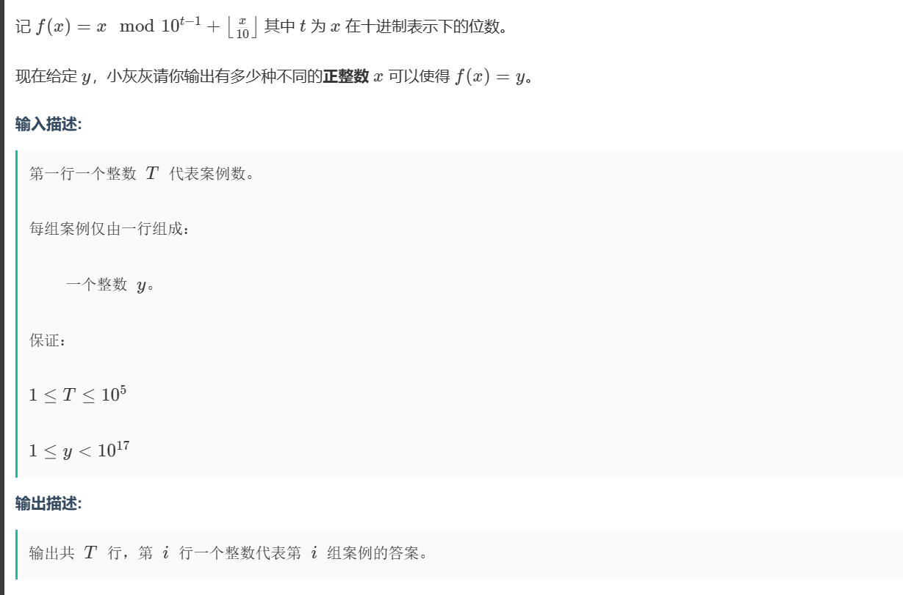

设这个数为ABC，其中A为最低位，B为中间位，C位最高位，m为这个数的长度

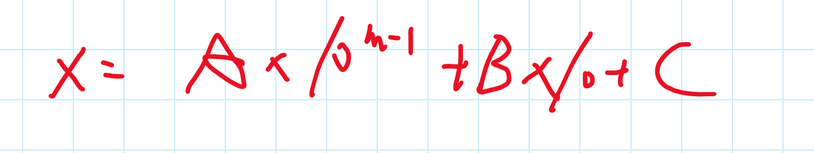


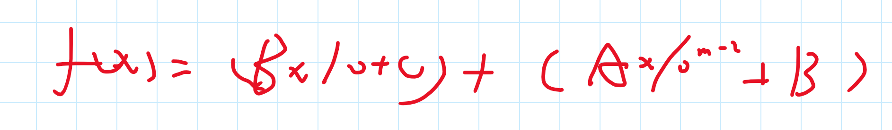

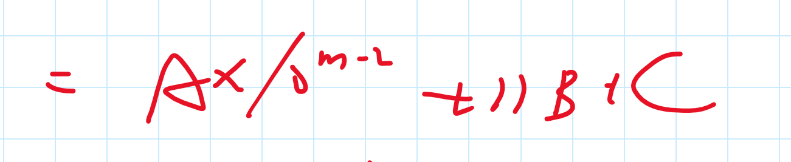


化简公式可得，可以枚举A以及m来确定答案的个数，其中A为1~9,M为n或者n+1，注意b要满足小于10**(m-2)，因为整个数都是小于10\*\*m的，而b是少了两位的。

```python
import sys
input = sys.stdin.readline
    
for _ in range(int(input())):
    x = int(input())
    m=len(str(x))
    if m==1:print(x)
    else:
        cnt=0
        for t in [pow(10,m-1),pow(10,m-2)]:
            for a in range(1,10):
                res=x-t*a# 结果为11*b+c
                # 如果大于等于0并且c<10
                if res>=0 and res%11<10 and res//11<t:cnt+=1
        print(cnt)
```

## Ingenuity-2

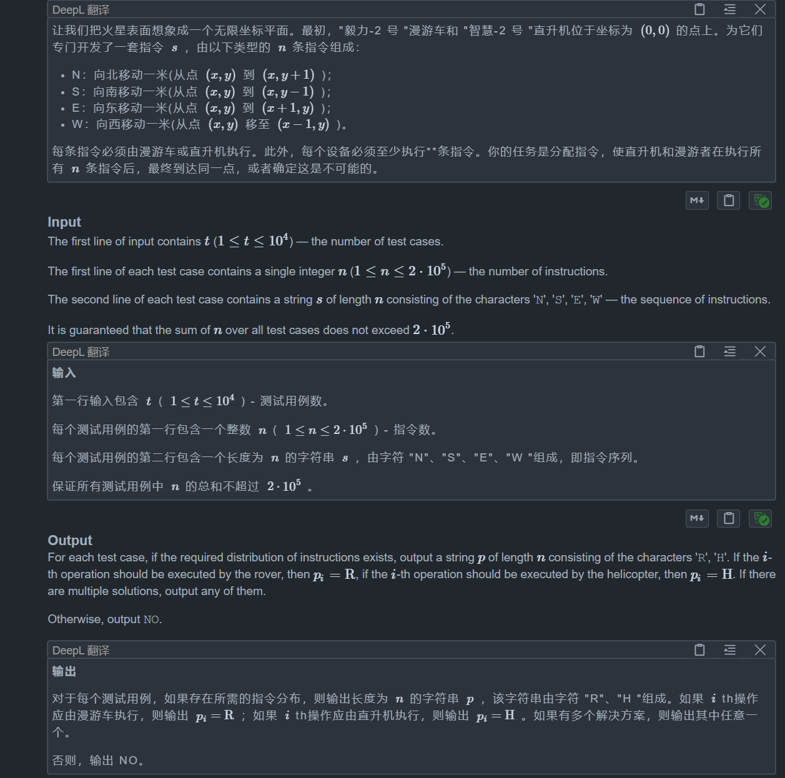


很明显是要统计最后的位置，看看最终的偏移量，如果最终x方向上偏移了4，那么分两个给a两个给b。其中的方向不重要因为最终会消掉，默认下给R

```python
memo={'W':'E','E':'W','S':'N','N':'S'}

def slove():
    n=int(input())
    s=input()
    x=y=0
    # 统计个数
    for c in s:
        if c=='W':x-=1
        elif c=='E':x+=1
        elif c=='S':y-=1
        else:y+=1
    # 没法分
    if x&1 or y&1:
        print('NO')
        return 
    ans=['R']*n
    # 如果没有偏移量那么是不会去分配的，为了保证R至少要操作一个指令，特判
    if x==y==0:
        # 因为最终偏移量为0，所以H至少要分配两个，如果一共只有两个，那么无法分配
        if n==2:
            print('NO')
            return 
        # 把第一个给R，然后去找他匹配的即可，这里有很强的技巧性
        ans[0]=ans[s.find(memo[s[0]])]='H'
        print(*ans,sep='')
        return 
    # 对于多出来的分配一半，每次分配减二实现对半分(技巧点)
    for i,c in enumerate(s):
        if c=='W' and x<0:
            x+=2
            ans[i]='H'
        if c=='E' and x>0:
            x-=2
            ans[i]='H'
        if c=='S' and y<0:
            y+=2
            ans[i]='H'
        if c=='N' and y>0:
            y-=2
            ans[i]='H'
    print(*ans,sep='')


for _ in range(int(input())):
    slove()


```


## [加密解密字符串](https://leetcode.cn/problems/encrypt-and-decrypt-strings/) 

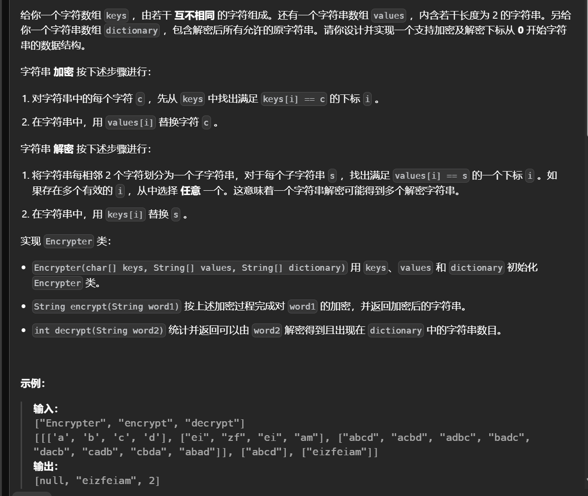


最粗暴的做法是dfs套字典树判断，但是可以逆向思维（wird2中会有重复的字符因此解密会出现多种可能），要求统计解密后的字符在dictionary中，则可以直接把dictionary加密然后哈希表统计个数。

## [字符串转化](https://leetcode.cn/problems/string-transforms-into-another-string/)

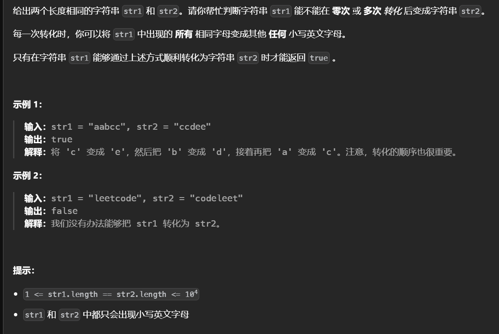


如果相同不需要转换，在str1中的同一字符如果在str2中对应不同的字符那么一定无法转换，如果str2中存在26个字符也无法转换，比如对于ab和ba，可以把b换为不搭嘎的e然后在转换，这样就不会冲突了，但是如果str2中存在26个字符那么一定不存在不搭嘎的字符，转换为任何一个不搭嘎的字符再换回来的时候一定会影响到已匹配的字符。

```python
class Solution:
    def canConvert(self, str1: str, str2: str) -> bool:
        memo=defaultdict(list)
        if str1==str2:return True
        if len(set(str2))==26:return False
        for i,c in enumerate(str1):
            memo[c].append(i)
        for k,li in memo.items():
            if len(li)==1:continue
            pre=str2[li[0]]
            for a in li[1:]:
                if str2[a]!=pre:return False
        return True
```


## Turtle and an Incomplete Sequence

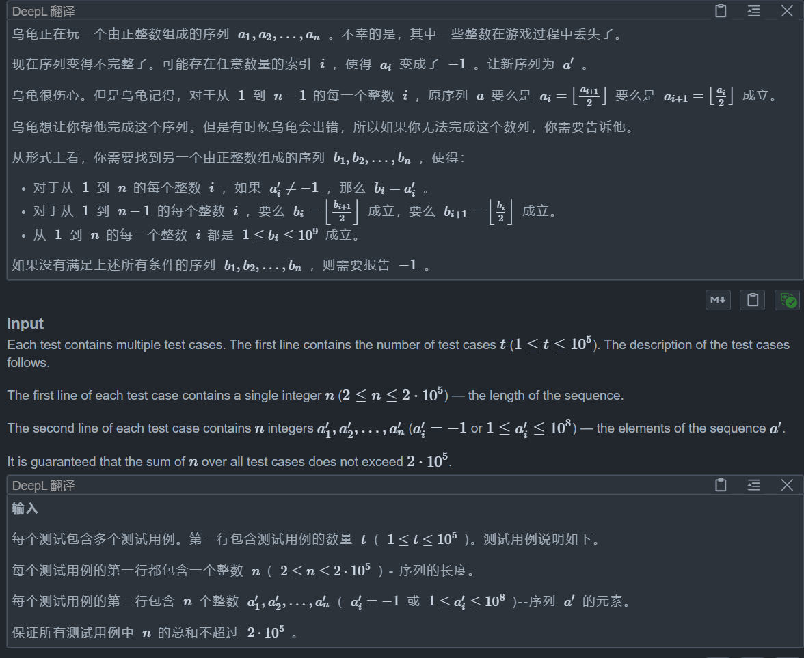


要求每个数和他左边或者右边的数满足给定的性质

对于从头开始和结尾的为连续的-1的，直接乘2除2构造即可，关键在于如何构造两个数(a,b)之间的数组，给定的性质相当于是左移或者右移（右移后结尾可以是1）

对于两个二进制数，竖着看可以找到性质

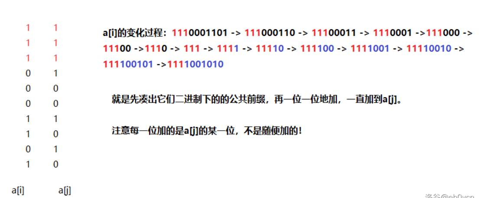


在增加的时候是要按照a[j]的每一位加的

除了最长的公共前缀不用处理之外，必须要经过左移若干步和右移若干步才能得到结果，如果两个数之间的位置不能满足必须的移动次数那么必然是错误的，如果能满足但是剩余的步数不是偶数即不能*2,//2操作也不行。

```python
def slove():
    n=int(input())
    nums=[int(x) for x in input().split()]
    ans=[0]*n
    start=0
    # 去除前缀-1
    while start<n and nums[start]==-1:
        start+=1
    # 如果都是-1，按照1212输出
    if start==n:
        temp=[]
        for _ in range(n//2):
            temp.extend([1,2])
        if n&1:temp.append(1)
        print(*temp)
        return
    ans[start]=nums[start]
    flag=0 if nums[start]*2>10**9 else 1
    for j in range(start-1,-1,-1):
        if flag:
            ans[j]=ans[j+1]<<1
        else:
            ans[j]=ans[j+1]>>1
        flag^=1
	# 去除后缀-1
    end=n-1
    while end>0 and nums[end]==-1:
        end-=1
    ans[end]=nums[end]
    flag=0 if nums[start]*2>10**9 else 1
    for j in range(end+1,n):
        if flag:
            ans[j]=ans[j-1]<<1
        else:
            ans[j]=ans[j-1]>>1
        flag^=1
    i=start
    n=end
    
    # 分组循环找ab
    while i<n:
        start=i
        i+=1
        while i<n and nums[i]==-1:
            i+=1
        length=i-start
        # 找出ab
        l,r=nums[start],nums[i]
        p=0
        # 找最长公共前缀
        for a,b in zip(bin(l)[2:],bin(r)[2:]):
            if a!=b:break
            p+=1
        # 必要的次数
        cnt=len(bin(l)[2:])-p+len(bin(r)[2:])-p
        if cnt>length or (length-cnt)&1:
            print(-1)
            return
        ans[start]=nums[start]
        ans[i]=nums[i]
        index=start+1
        temp=nums[start]
        # 先右移
        for _ in range(len(bin(l)[2:])-p):
            temp>>=1
            ans[index]=temp
            index+=1
        # 再左移
        for rr in range(len(bin(r)[2:])-p-1,-1,-1):
            ans[index]=nums[i]>>rr
            index+=1
        # 多余的位置找*2,//2
        flag = 0 if nums[i] * 2 > 10 ** 9 else 1
        while index<i:
            if flag:
                ans[index]=nums[i]*2
                ans[index+1]=nums[i]
            else:
                ans[index] = nums[i]>>1
                ans[index + 1] = nums[i]
            index+=2
    print(*ans)
    return

for _ in range(int(input())):
    slove()
```


## Permutation of Rows and Columns

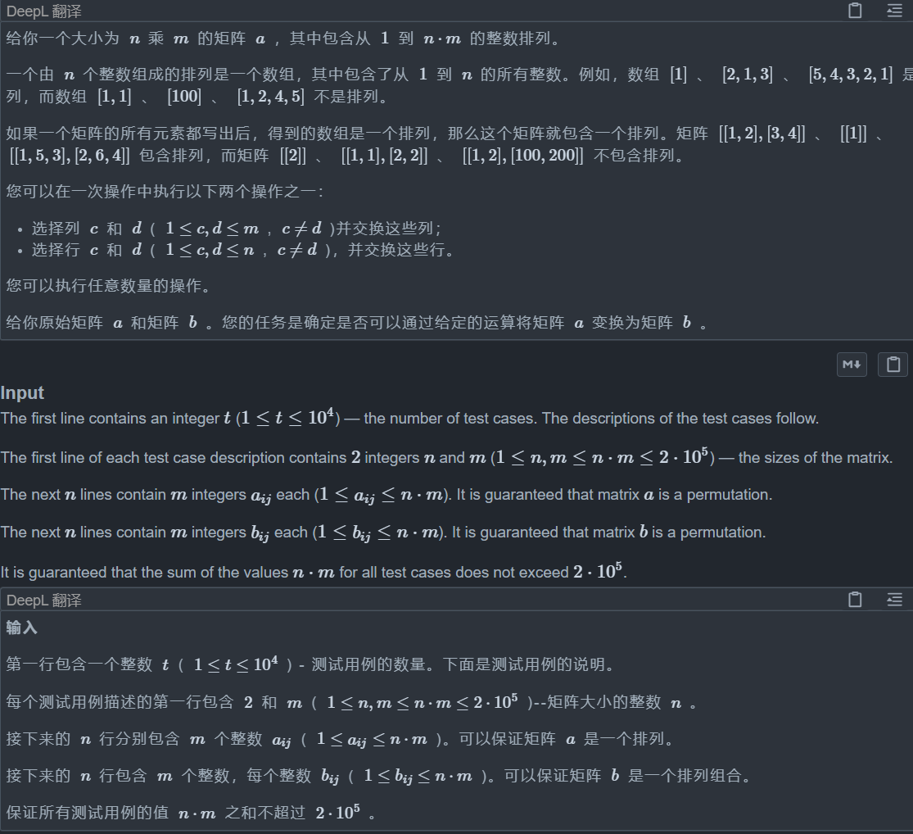


简言之就是两个 𝑛×*m* 矩阵，里面元素构成排列，你可以交换任意一列任意一行，求任意次操作后两个矩阵能否相同。

如果任意交换行和列最终每一行和每一列中包含的数字都是不变的，只要判断两个矩阵中所有的行和列是否对应即可。

对于行和列进行排序，这样就可以从头到尾一一比较了。

```python
for _ in range(int(input())):
    n,m=[int(x) for x in input().split()]
    a=[]
    b=[]
    for _ in range(n):
        a.append([int(x) for x in input().split()])
    for _ in range(n):
        b.append([int(x) for x in input().split()])
    r1=sorted([sorted(v) for v in a])
    r2=sorted([sorted(v) for v in b])

	# 使用zip取出列
    h1=sorted([sorted(v) for v in zip(*a)])
    h2=sorted([sorted(v) for v in zip(*b)])

    if r1==r2 and h1==h2:print("Yes")
    else:print("No")
```


## [三等分](https://leetcode.cn/problems/three-equal-parts/)

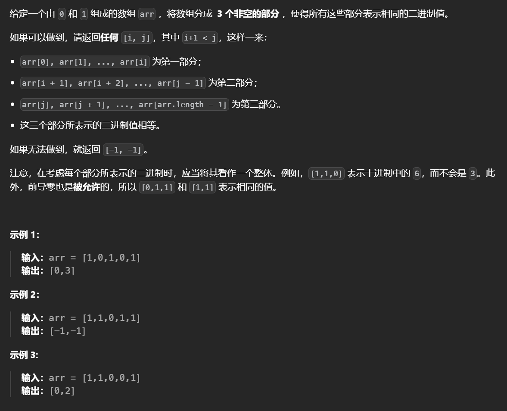 

要分为相同的二进制那么1的个数要相等，通过1的位置可以判断每一段的开头，每一段的的结尾无法确定因为可以作为本段的结尾也可以作为下一段的开始（前导0忽略），但是最后一段的结尾就是数组的结尾因此可以根据最后一段来确定长度，最后判断每一段对应的二进制是否相等即可。

```python
class Solution:
    def threeEqualParts(self, arr: List[int]) -> List[int]:
        a=b=c=0
        tt=arr.count(1)
        # 排除不合法的情况和特例
        if tt%3:return [-1,-1]
        elif not tt:return [0,len(arr)-1]
        cnt=tt//3
        index=0
        n=len(arr)
        # 找到每一段的开始通过1的个数
        for i,v in enumerate(arr):
            if v:
                index+=1
                if index==1:a=i
                elif index==cnt+1:b=i
                elif index==2*cnt+1:c=i
        l=n-c
        def cal(nums):
            a=nums
            return int(''.join(list(map(str,nums))),2)

        if cal(arr[c:])==cal(arr[b:b+l])==cal(arr[0:a+l]):return [a+l-1,b+l]
        return [-1,-1]
```


## [统计包含每个点的矩形数目](https://leetcode.cn/problems/count-number-of-rectangles-containing-each-point/)


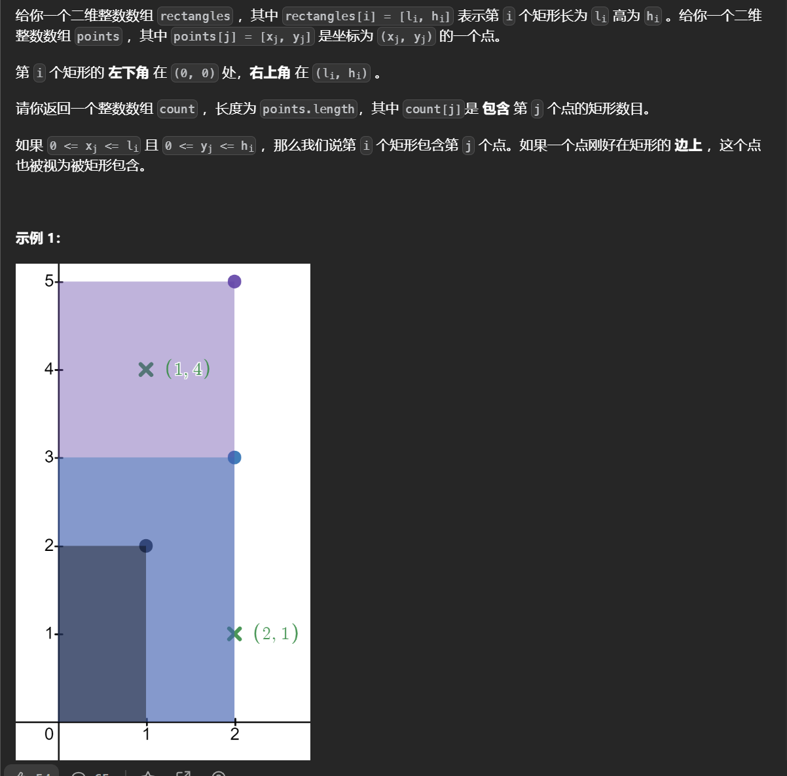

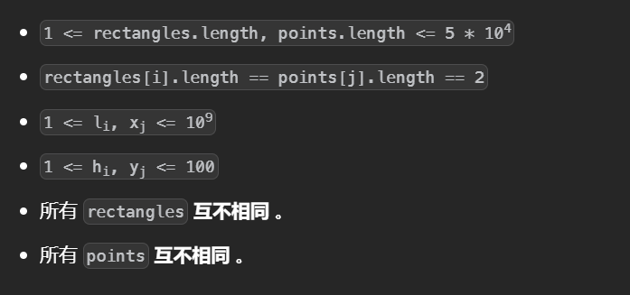


注意到y的范围很小，因此可以统计纵坐标相同的点。对每个纵坐标提取出矩形中纵坐标更大的矩形的横坐标，然后用二分去找相同纵坐标下每个横坐标能小于的个数。

```python
class Solution:
    def countRectangles(self, re: List[List[int]], points: List[List[int]]) -> List[int]:
        n=len(points)
        memo=defaultdict(list)
        ans=[0]*n
        for i,p in enumerate(points):
            u,v=p
            memo[v].append([u,i])
        re.sort(key=lambda x:x[1])
        p=[x for y,x in re]
        for k,li in memo.items():
            j=bisect_left(p,k)
            nums=sorted([x for x,y in re[j:]])
            m=len(nums)
            for x,i in li:
                k=bisect_left(nums,x)
                ans[i]=m-k
        return ans 
```

## Numbers on Tree

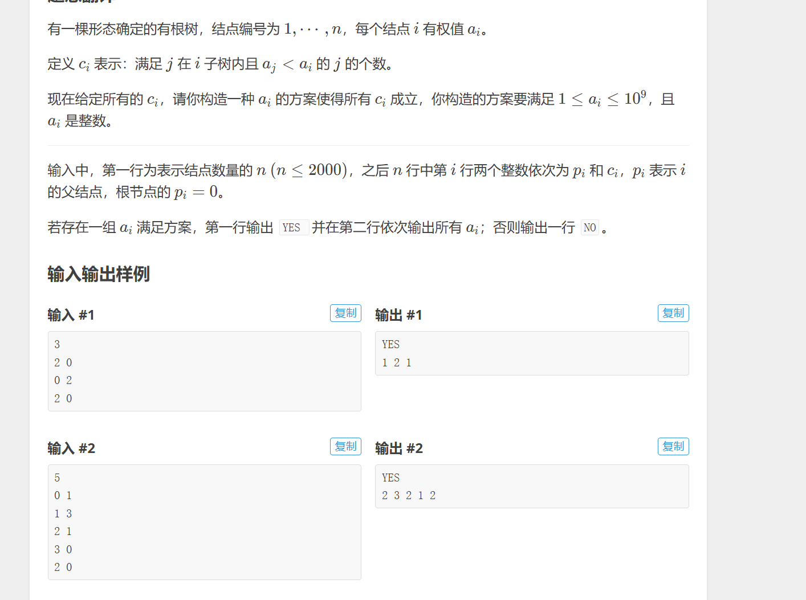

题目大意：有一颗有根树，每一个节点有一个值ai，用ci表示以i为根的子树中比i小的节点的j个数（即aj < ai）。现在给你n和c数组，让你给出满足以上条件的任意一种a的方案。

关键在于构造的同时要保证子树的相对顺序 

按照树的基本思想，从子树开始构造然后往上递归，对于子树如果它的c不为0则无法构造，不然可以直接给定1

对于一个节点如果它对应的c大于他子树的数量那么就无法构造，否则取出它的所有子树按照赋值的大小排序（利可以保证相对顺序），这里规定赋给定每个节点的值互不相同，当c=k的时候会把子树中第k大的值给当前的父节点，K及K之后的节点对应的值都加一，k之前的值不变。

```python
import sys
from collections import defaultdict, deque

input=sys.stdin.readline


n=int(input())
cnt=[0]*n
path=defaultdict(dict)
# 建树
for i in range(n):
    u,v=[int(x) for x in input().split()]
    u-=1
    cnt[i]=v
    if u!=-1:path[u][i]=None
    else:root=i

a=[0]*n

d=deque([root])
dfs_order=[]
#使用bfs构造储存树从上到下的节点的列表，使用dfs开销会太大
while d:
    for _ in range(len(d)):
        curr=d.popleft()
        for k in path[curr].keys():
            d.append(k)
        dfs_order.append(curr)

ans=[0]*n

# 这里的排序使用的是基数排序，c对应的值小于2000
nodes=[[] for _ in range(n)]
# 倒序遍历，从叶节点开始
for node in dfs_order[::-1]:
    s=[node]
    # 找出当前节点所有的子节点
    while s:
        u=s.pop()
        for k in path[u].keys():
            s.append(k)
            # 把子节点按照它被赋值的大小，放到对应的nodes，这样在取出nodes中节点的同时也能完成排序
            nodes[ans[k]].append(k)
    tmp=[]
    # 取出子树，已经排好序了
    for i in range(n):
        if not nodes[i]:continue
        tmp.extend(nodes[i])
        nodes[i].clear()
    # 不满足
    if len(tmp)<cnt[node]:
        print("NO")
        break
    # 插入当前节点到第k大的位置
    tmp.insert(cnt[node],node)
    for i,v in enumerate(tmp,1):
        ans[v]=i
else:
    print("YES")
    print(*ans) 
```

## [索引处的解码字符串](https://leetcode.cn/problems/decoded-string-at-index/)

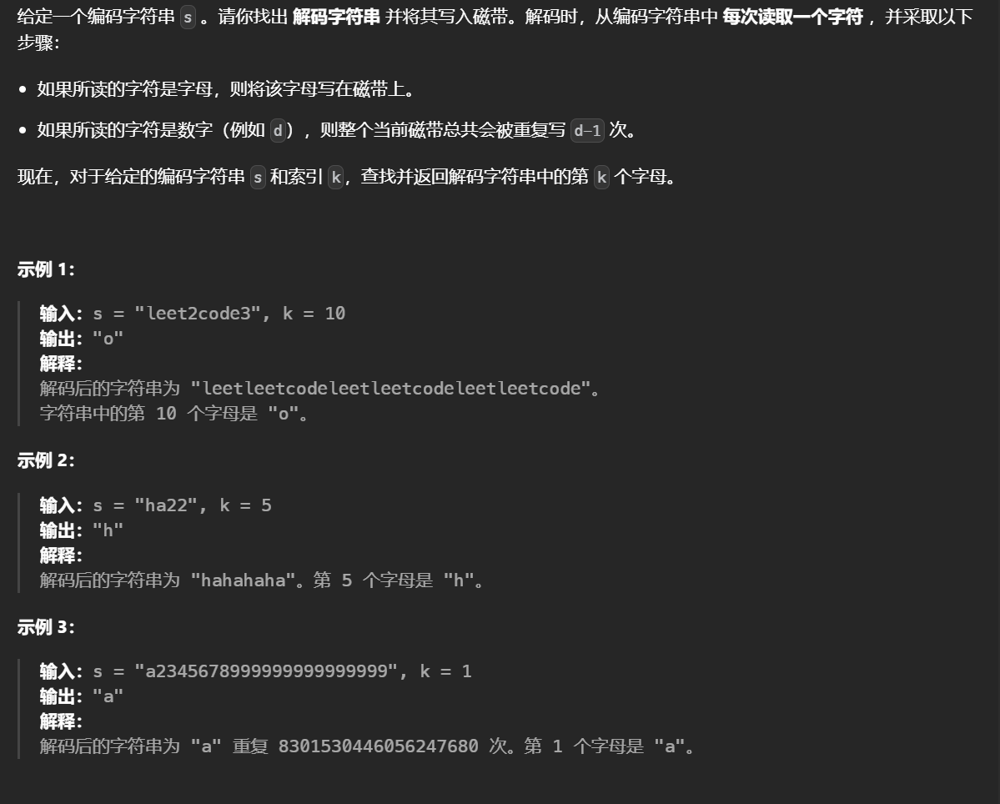


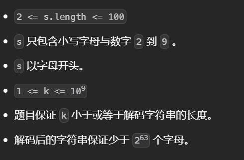


对于一个长度为size的单词重复任意次，去找k处的字符等价于找k%size处的字符

首先找出解码后的单词的长度然后逆向找结果

```python
class Solution:
    def decodeAtIndex(self, s: str, k: int) -> str:
        size=0
        for c in s:
            if c.isalpha():
                size+=1
            else:
                size*=int(c)
        for c in s[::-1]:
            k%=size
            if not k and c.isalpha():
                return c
            # 更新长度
            if c.isalha():
                size-=1
            else:
                size//=int(c)
```

## [不重叠回文子字符串的最大数目](https://leetcode.cn/problems/maximum-number-of-non-overlapping-palindrome-substrings/)

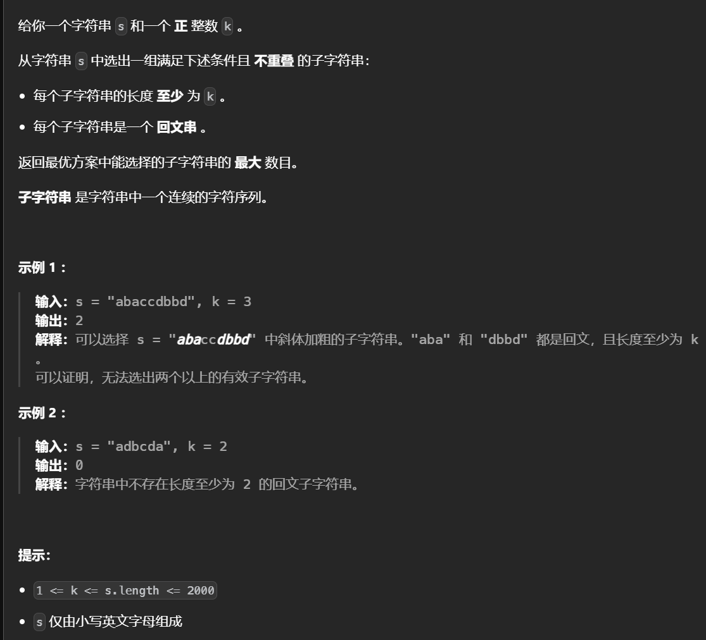


计算有多少个回文子串的最朴素方法就是枚举出所有的回文子串，枚举每一个可能的回文中心，然后用两个指针分别向左右两边拓展，当两个指针指向的元素相同的时候就拓展，否则停止拓展。回文长度可能是奇数或者偶数，如果是奇数需要枚举n次，偶数则要枚举n-1次，一共是2n-1次。

本体有贪心的思想，每次找回文子串都找满足条件的最短的，同时要避免重叠

```python
class Solution:
    def maxPalindromes(self, s: str, k: int) -> int:
        n=len(s)
        # 使用外部变量避免重叠
        ans=pre=0
        for i in range(2*n-1):
            l=i//2
            r=i//2+i%2
            while l>=pre and r<n and s[l]==s[r]:
                # 找到就退出
                if r-l+1>=k:
                    pre=r+1
                    ans+=1
                    break
                l-=1
                r+=1
                
        return ans 
```

##  Nested Segments


区间包含问题，对区间按照左端点从小到大排序右端点从大到小排序，在遍历的过程中记录最大的右端点mx，当前的节点一定满足左端点更大，如果右端点小于mx那么就找到了答案。

```python
import sys
input=sys.stdin.readline
n=int(input())
nums=[]
for i in range(n):
    nums.append([int(x) for x in input().split()]+[i+1])
nums.sort(key=lambda x:(x[0],-x[1]))
mx=nums[0][1]
pre=nums[0][2]
for i in range(1,n):
    if nums[i][1]<=mx:
        print(nums[i][2],pre)
        break
    else:
        mx=nums[i][1]
        pre=nums[i][2]
else:print(-1,-1)
```

## Mister B and PR Shifts

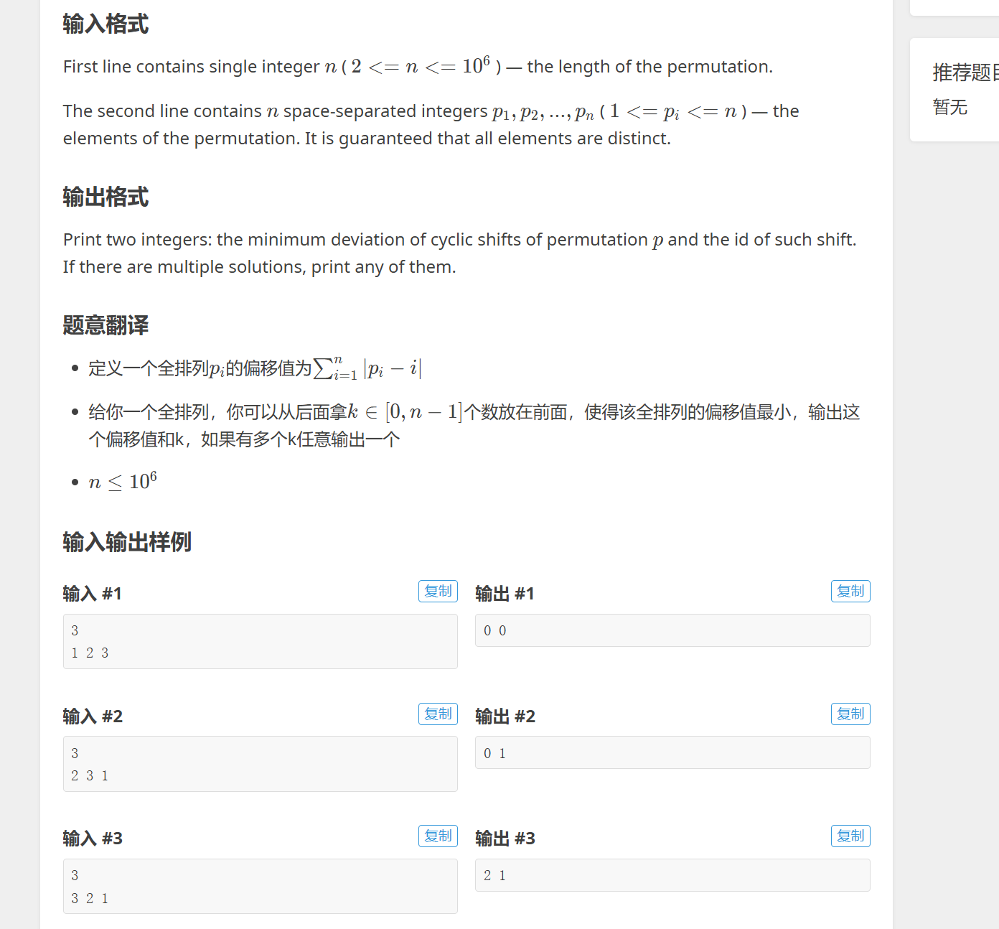


模拟的做法，将数组中的元素分为p>i(l个)和p<=i(r个)的，每次移动当前最后一个到第一位，移动后总和会减小l（因为p>i的i都增大一位），同时也会增大r-1（因为p<=i的i都增大一位,同时排除了要移走的最后一位，他一定是小于n的，所有元素都小于等于n），然后找最后一个元素对总和的贡献。在移动的过程中l和r的大小会发生变化，当最后一个元素移动到开头时只要他不是1那么l会增大r会减小，同时每个l都在经过一定次数后会变为r，这可以在遍历前求出，如果一个元素是p>i的那么p-i轮时p会等于当前的坐标，反之会在n-i+x轮时p=i。注意这里有一个特殊的是1，因为1无论经过多少轮都还是属于第二类的。

```python
n=int(input())
nums=[int(x) for x in input().split()]
ans=l=r=0
d=[0]*(n+1)
for i,x in enumerate(nums,1):
    # 记录第几轮会变为第二类
    if x-i>0:d[abs(x-i)]+=1
    # 特判1
    elif n-i+x<=n:d[n-i+x]+=1
    # 统计两类的个数
    if x>i:l+=1
    else:r+=1
    ans+=abs(x-i)
temp=ans

# 用于找最后一个
j=n-1
f=0
# 遍历
for k in range(1,n):
    # 总和大小变化
    temp-=l
    temp+=r-1
    # 最后一个换到第一个后，对总和的影响
    temp-=abs(n-nums[j])
    temp+=abs(1-nums[j])
    # 记录结果
    if ans>temp:
        ans=temp
        f=k
	
    l-=d[k]
    r+=d[k]
    if nums[j]!=1:
        r-=1
        l+=1
    j -= 1
print(ans,f)
```

## 小红的伪回文子串

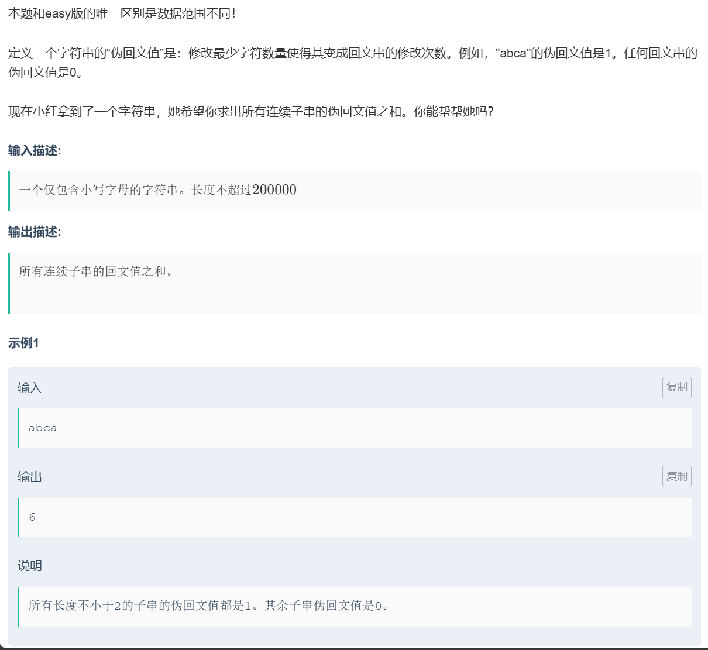

说先假设所有的字符都不相等，那么一共所需的操作次数为回文串的长度//2，对于长度为n的字符串回文串的长度从1~n，长度为k的回文串有n-k+1个，因此每个长度为k的字符串需操作(n-k+1)*(k//2)。然后考虑可以不用操作的，把相同元素归到一起只有相同的元素才不用操作，对于字符a的所有位置d=[3 5 7 9]，3可以匹配5 7 9 ，与5匹配后两边可以往外扩展也就是有多个包含35 的子串同理对于7 9也是。为了防止重复或者漏掉，每次从两边计算。利用栈模拟，能往两边扩展的大小肯定是min(d[0]+1,n-d[-1])，每个当前考虑的元素可以匹配数组中剩余的元素然后同时又可以往外扩展，因此有min(d[0]+1,n-d[-1])\*len(a)个子串可以少操作一次，一直对子数组进行上述操作知道长度为1.

```python
from collections import deque,defaultdict
ans=0
s=input()
n=len(s)
memo=defaultdict(deque)
# 先假设都是不同的元素
for i in range(1,n+1):
    ans+=(n-i+1)*(i//2)
# 把相同元素归到一起
for i,c in enumerate(s):
    memo[c].append(i)
# 子串中相同的元素是不用操作的
for k in memo.keys():
    nums=memo[k]
    if len(nums)<=1:continue
    while len(nums)>1:
        # 为了不重不漏从两边操作
        # 计算可以往外扩展多少
        l=nums[0]+1
        r=n-nums[-1]
        if l<r:
            # 弹出，这个位置的和其他剩余的位置匹配并且可以往外扩展
            nums.popleft()
            ans-=l*len(nums)
        else:
            nums.pop()
            ans-=r*len(nums)
print(ans)
```


## [字符串的总引力](https://leetcode.cn/problems/total-appeal-of-a-string/)

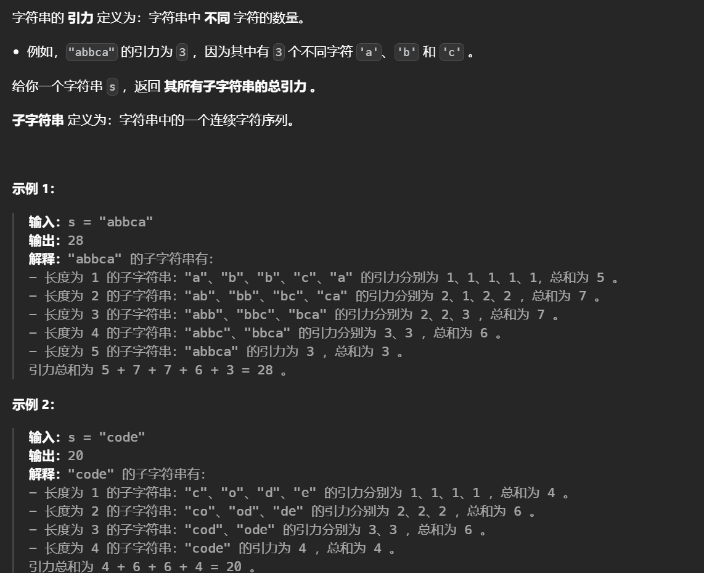	


考虑贡献法，由于相同的字符只能贡献一次，规定每个子串中只有第一个出现的重复字符才能贡献结果，因此每个字符的贡献是他所能影响的子串=(n-i)右边可以扩展的,(i-pre)左边可以扩展的不能超过上一个相同的字符的位置。

```python
class Solution:
    def appealSum(self, s: str) -> int:
        memo=defaultdict(list)
        n=len(s)
        # 对于每个字符统计他们的位置
        for i,c in enumerate(s):
            memo[c].append(i)
        ans=0
        for k,nums in memo.items():
            pre=0
            for i in nums:
                ans+=(i-pre+1)*(n-i)
                pre=i+1
        return ans 

```

## [包含所有 1 的最小矩形面积 II](https://leetcode.cn/problems/find-the-minimum-area-to-cover-all-ones-ii/)

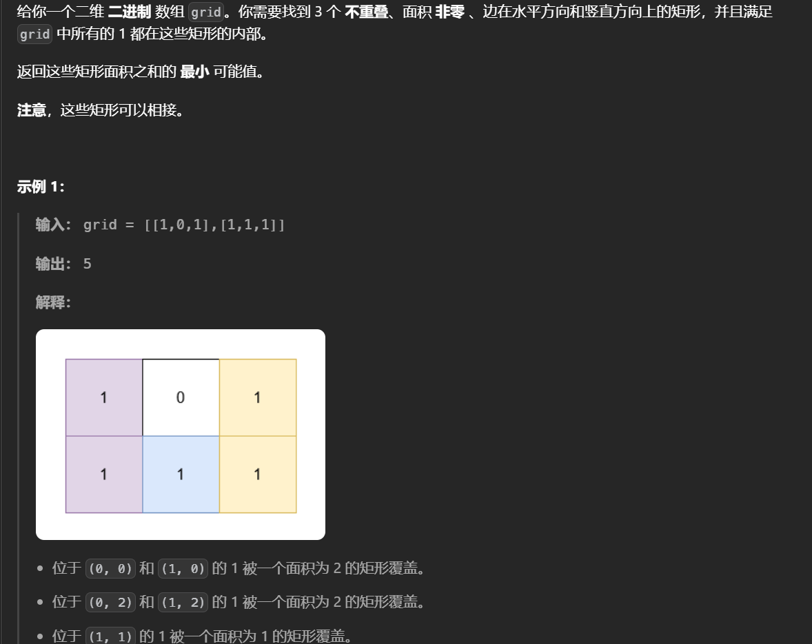

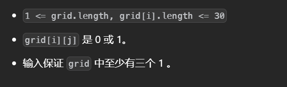

三个矩形又不重叠（无论怎么排列都可以归为六类）可以暴力枚举分割线的位置把矩形分为三个区域，在每个区域找包括这个区域最大的矩形。

上中下，上左右，左右上....下面三个可以看作是上面三个旋转90°或的上中下，上左右，左右上可以简化代码


```python
class Solution:
    def minimumSum(self, g: List[List[int]]) -> int:
        
        # 计算给定区域内包含所有1的最小矩形面积，即找到最上边最下边最左边最右边
        def cal(g,a,b,c,d):
            l=up=inf 
            r=down=-inf 
            for i in range(c,d+1):
                row=g[i][a:b+1]
                if 1 not in row:continue
                up=min(up,i)
                down=max(down,i)
                for j in range(len(row)):
                    if row[j]==1:
                        l=min(l,j)
                        r=max(r,j)
            return (down-up+1)*(r-l+1)
        ans=inf 
        def f1(g):
            nonlocal ans
            m,n=len(g),len(g[0]) 
            # 枚举上中下,0~i,i+1~j，j+1~m-1
            for i in range(m-2):
                for j in range(i+1,m-1):
                    ans=min(ans,cal(g,0,n-1,0,i)+cal(g,0,n-1,i+1,j)+cal(g,0,n-1,j+1,m-1))
            # 枚举上左右
            for i in range(m-1):
                for j in range(n-1):
                    ans=min(ans,cal(g,0,n-1,0,i)+cal(g,0,j,i+1,m-1)+cal(g,j+1,n-1,i+1,m-1))
            # 枚举左右上
            for i in range(m-1):
                for j in range(n-1):
                    ans=min(ans,cal(g,0,j,0,i)+cal(g,j+1,n-1,0,i)+cal(g,0,n-1,i+1,m-1))
        f1(g)
        # 翻转矩阵
        nums=[]
        for j in range(len(g[0])):
            temp=[]
            for i in range(len(g)):
                temp.append(g[i][j])
            nums.append(temp[::-1])
        f1(nums)
        return ans 

            
```


## [收集巧克力](https://leetcode.cn/problems/collecting-chocolates/)

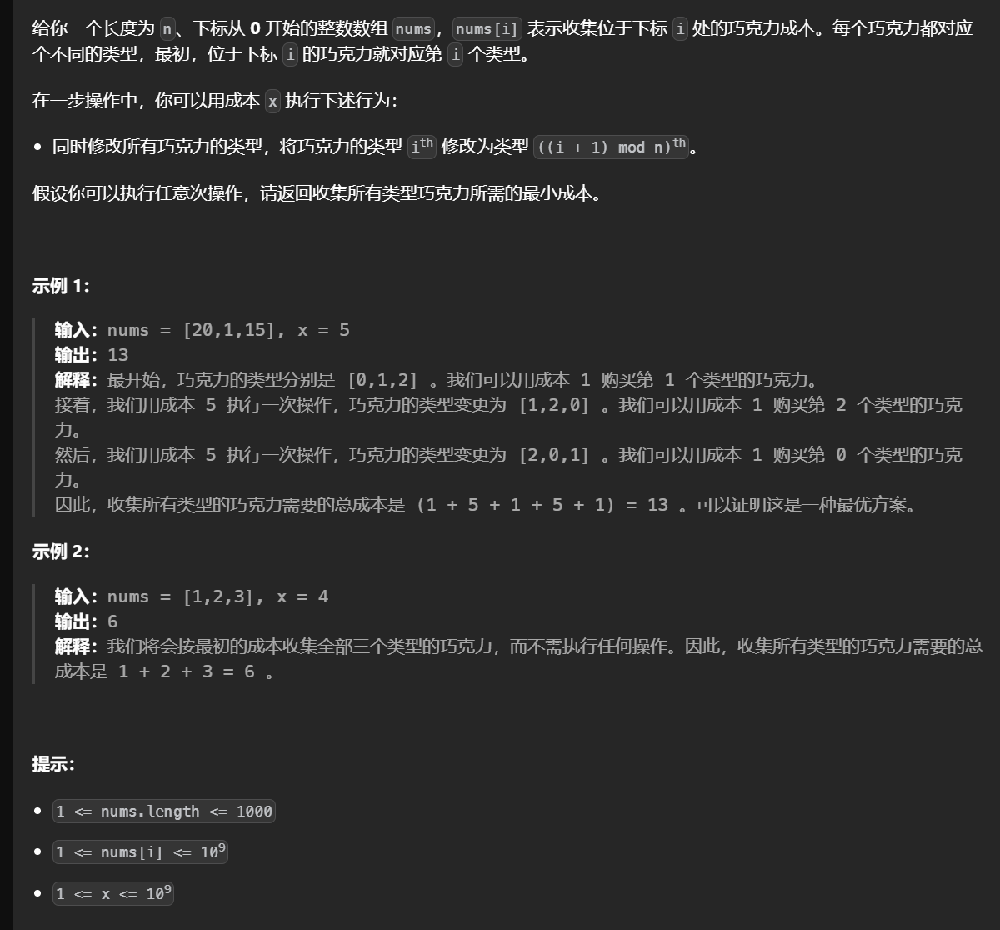

最多进行n-1次操作，再多了就没必要了。对于给定的数据范围可以枚举操作次数

```python
class Solution:
    def minCost(self, nums: List[int], x: int) -> int:
        n=len(nums)
        # 先预处理出区间最小值
        pre=[[inf]*n for _ in range(n)]
        for i in range(n):
            pre[i][i]=nums[i]
            for j in range(i+1,n):
                pre[i][j]=min(pre[i][j-1],nums[j])
        ans=sum(nums)
        # 枚举操作次数
        for i in range(1,n):
            temp=0
            for j in range(n):
                l=j
                r=j+i
                if r>=n:
                    # 如果超出了，对两端去最小值
                    temp+=min(pre[l][-1],pre[0][r%n])
                else:
                    temp+=pre[l][r]
            # 最后要加上操作的成本
            ans=min(ans,temp+i*x)
        return ans      
```

## **Vertical Reading**

​	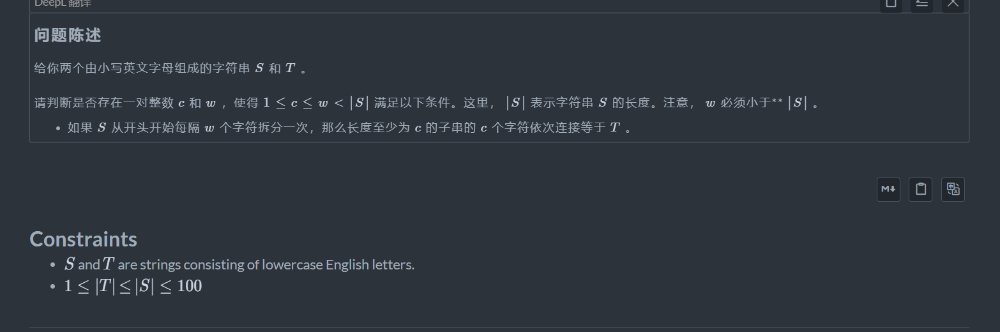

对于给定的数据范围直接暴力切片

枚举S中的几个字符归为一组，然后枚举每个组的第i个值看看是否能组成t

```python
from math import ceil

s,t=input().split()
# 按照题目要求不能全为一组
for step in range(1,len(s)):
    for i in range(step):
        if s[i::step]==t:
            print("Yes")
            exit()
print("No")
```

## [最大相等频率](https://leetcode.cn/problems/maximum-equal-frequency/)

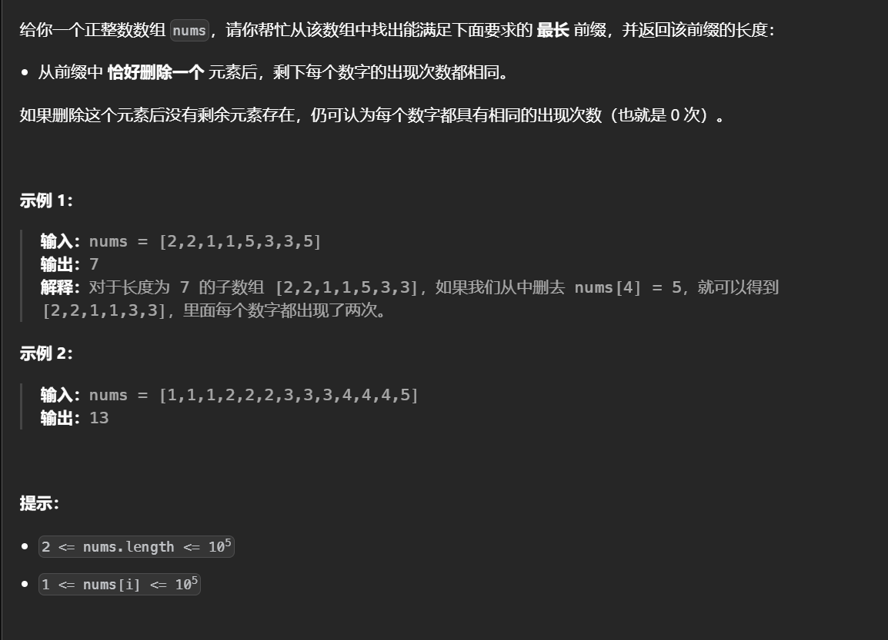


只需要去考虑什么时候会更新答案，令mx为元素的最大频率那么，如果最大频率为1也就是所有元素都只出现一次那么可以更新结果，如果除了最大频率外还有单独一个元素那么可以更新答案，如果最大频率只有一个并且其他的元素都是次大频率可以更新答案。

```python
class Solution:
    def maxEqualFreq(self, nums: List[int]) -> int:
        # 两个哈希表一个记录每个元素频率，一个记录每个频率有多少个
        memo=Counter()
        cnt=Counter()
        mx=ans=0
        # 遍历的过程中记录结果
        for i,v in enumerate(nums,1):
            cnt[memo[v]]-=1
            memo[v]+=1
            cnt[memo[v]]+=1
            mx=max(mx,memo[v])
            if mx==1:ans=i
            # 除了最大频率外只有一个单独的
        	elif cnt[mx]*mx+1==i:
                ans=i
            # 形如222 3333 444
            elif (mx-1)*(cnt[mx-1]+1)+1==i:
                ans=i
        return ans 
```

## Theofanis' Nightmare

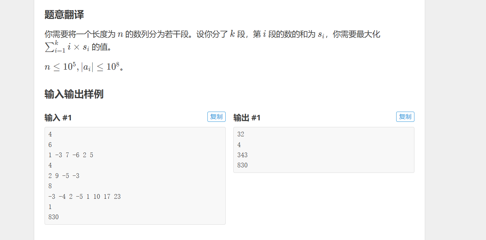

考虑断开的位置，从某个位置断开不会影响到前面的值，只会使的后面的值的系数加一也就是会把这个断开位置的后缀在加一遍，为了使得结果最大肯定是当后缀大于0的时候就断开（也就是加上后缀）

```python
from collections import deque, defaultdict, Counter
from functools import lru_cache
from bisect import bisect_left
from itertools import accumulate
from math import ceil
import sys
from typing import List
input = sys.stdin.readline
def R(): return int(input())
def RR(): return [int(x) for x in input().split()]

for _ in range(R()):
    n=R()
    a=RR()
    pre=list(accumulate(a[::-1],initial=0))
    pre=pre[::-1]
    ans=sum(a)
    for i in range(n):
        if i and pre[i]>0:ans+=pre[i]
    print(ans)
```

## [英雄的力量](https://leetcode.cn/problems/power-of-heroes/) 

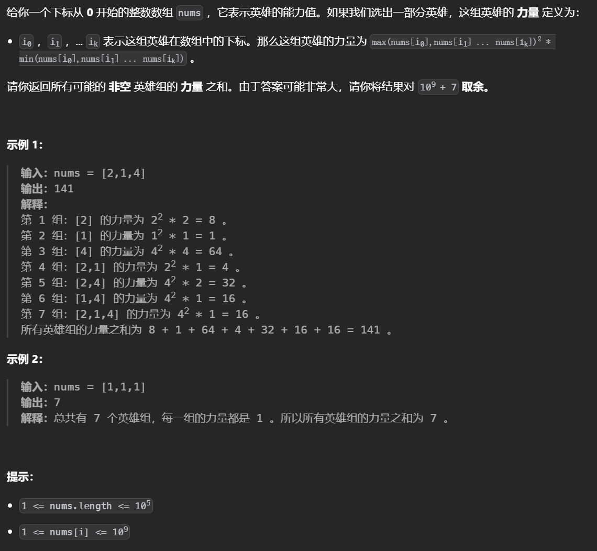


注意题目描述，问题的结果和数组的顺序无关因此可以直接排序。

而后使用贡献法求解，假设有abcde五个一次增大的数，对于d他所能做出的贡献是

枚举他作为最大值，那么他右边的都是可以作为最小值的存在，同时在d和b之间的数可以选或不选因此要乘上2的冥次，然后枚举每个值作为最大值求解贡献即可。

```python
class Solution:
    def sumOfPower(self, nums: List[int]) -> int:
        ans=0
        mod=10**9+7
        nums.sort()
        pre=0
        n=len(nums)
        for i in range(n):
            x=nums[i]
            ans+=x**3+x**2*pre
            pre*=2
            pre+=x
            pre%=mod
            ans%=mod 
        return ans 
```

## [将数组排序的最少替换次数](https://leetcode.cn/problems/minimum-replacements-to-sort-the-array/) 

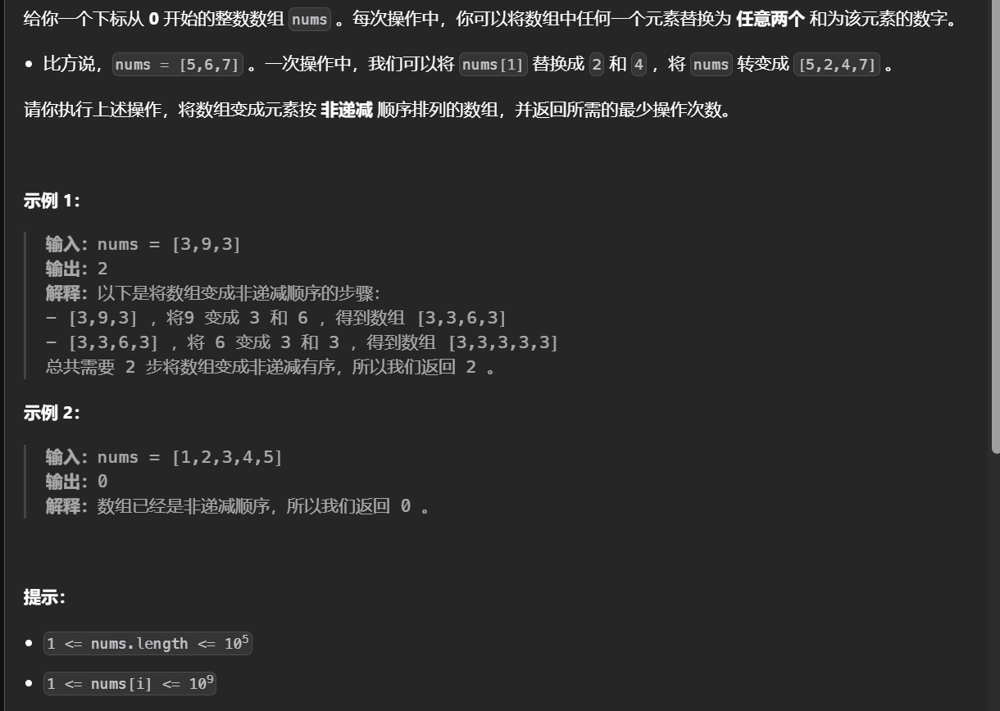

最后一个值肯定是保持不变的，为了减少操作次数每次划分后都需要值尽可能大。

如果当前值小于后一个值那么就不用操作，否则假设分为了x份，每一份都小于m那么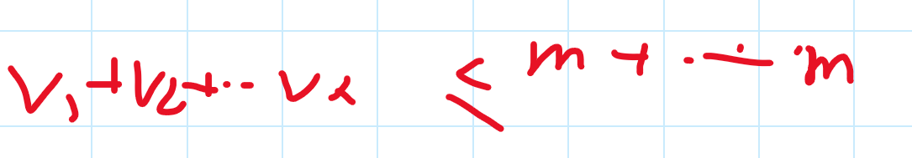

那么mx>=v,x>=v/m，为了操作次数尽可能小应该要取等，因此操作次数是k-1，同时划分后为值要尽可能大所以要分为大小相等的x份，多出的补到第一份里面。

```python
class Solution:
    def minimumReplacement(self, nums: List[int]) -> int:
        ans=0
        # 表示前一个值
        m=nums[-1]
        nums=nums[:-1]
        # 倒序枚举
        for v in nums[::-1]:
            # 最少分几份
            x=ceil(v/m)
            # 
            ans+=x-1
            m=v//x
        return ans
```

## [优质数对的数目](https://leetcode.cn/problems/number-of-excellent-pairs/)

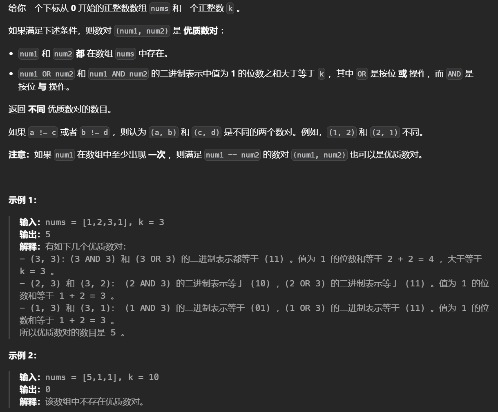

C(x|y)+C(x&y)=C(x)+C(y)因为对于x和y中都为1的部分在与和或中都会统计而不同的部分只会在或中统计，最后的结果恰好是统计了两个数中的1的个数。结果要求数对，而数对是数值的因此把数组去重，对每个数按照它1的个数分类一共不会超过30

```python
class Solution:
    def countExcellentPairs(self, nums: List[int], c: int) -> int:
        # 去重后按照1的个数分组
        memo=Counter([x.bit_count() for x in set(nums)])
        ans=0
        # 双重循环求解，因为自己与自己也可以组成一个数对，同时顺序不同也可以是一个数对
        for k,v in memo.items():
            for kk,vv in memo.items():
                if k+kk>=c:
                    ans+=v*vv
        return ans 
```


## [使数组相似的最少操作次数](https://leetcode.cn/problems/minimum-number-of-operations-to-make-arrays-similar/)

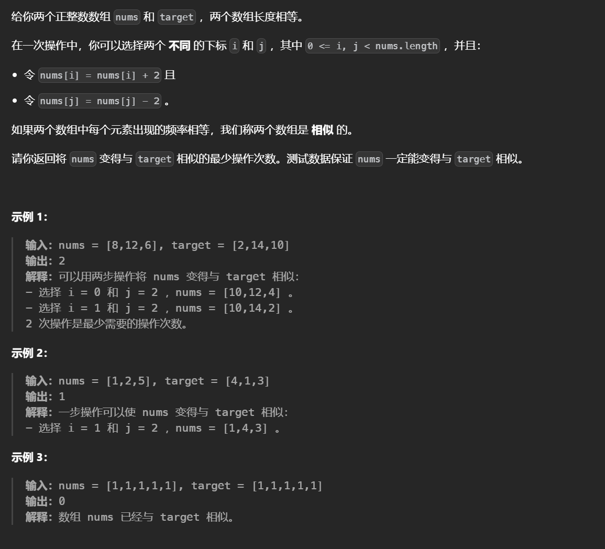

最简单的想法就是最小的与最小匹配，这样可以让操作次数最小，但是对于奇偶不同的两个数是无法通过变化是他们相等的因此，把数组按照奇数偶数分组，然后最小的匹配最小的，题目保证有解因此直接求即可

```python
class Solution:
    def makeSimilar(self, nums: List[int], target: List[int]) -> int:
            a1=[]
            a2=[]
            b1=[]
            b2=[]
            nums.sort()
            target.sort()
            # 分类
            for i, j in zip(nums,target):
                if i&1:
                    a1.append(i)
                else:
                    a2.append(i)
                if j&1:
                    b1.append(j)
                else:
                    b2.append(j)
            cnt=0
            # 只用统计需要增加的，减小的一定是与增加的次数匹配
            for i,j in zip(a1,b1):
                if j>i:cnt+=(j-i)>>1
            for i,j in zip(a2,b2):
                if j>i:cnt+=(j-i)>>1
            return cnt


```

## **Sum = 0**

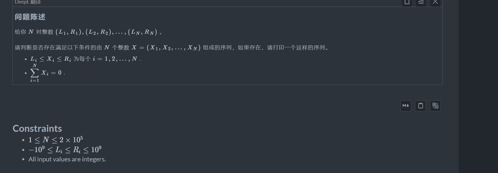

要在给定的区间构造数不容易，先让结果是每个区间的最大值，然后遍历每个区间如果当前数组的和不为0那么就减小他也就是选这个区间的下界是总和减小，一旦总和为0了那么就可以直接退出。将问题转换为将数组的和减小为0


```python
from collections import deque, defaultdict, Counter
from functools import lru_cache
from bisect import bisect_left
from itertools import accumulate
from math import ceil, inf
import sys
from typing import List
input = sys.stdin.readline
def R(): return int(input())
def RR(): return [int(x) for x in input().split()]
def get_pre(nums): return list(accumulate(nums, initial=0))

n=R()
nums=[]
ans=[0]*n
res=0
# 构造答案数组同时记录总和
for i in range(n):
    nums.append(RR())
    l,r=nums[-1]
    res+=r
    ans[i]=r
if res<0:
    print('No')
else:
    # 如果总和大于0那么取区间最小值是总和减小
    for i in range(n):
        l,r=nums[i]
        diff=r-l
        if not res:continue
        if res<diff:
            ans[i] -= res
            res=0
            break
        if res>=diff:
            ans[i]=r-diff
            res-=diff
    if res:print('No')
    else:
        print('Yes')
        print(*ans)
    
```


## [ 两个线段获得的最多奖品](https://leetcode.cn/problems/maximize-win-from-two-segments/)


两个线段一定是尽可能不重叠较好

经典做法，对于两个线段首先预处理好其中一个然后枚举另一个。

首先预处理，f[i]表示以i为右端点的能获得的最多的物品，然后用滑动窗口求解每一个合适的右线段，有了预处理的f[i]就可以求出这个线段左侧最大的物品数，枚举的过程中不断更新答案。


```python
class Solution:
    def maximizeWin(self, nums: List[int], k: int) -> int:
        n=len(nums)
        f=[0]*n  
        l=cnt=0
        # 首先用滑动窗口求出满足要求的，右端点不超过i的物品数
        for r,x in enumerate(nums):
            cnt+=1
            while nums[r]-nums[l]>k:
                cnt-=1
                l+=1
            f[r]=cnt
        # 做前缀最大值
        for i in range(1,n):f[i]=max(f[i],f[i-1])
        l=cnt=0
        ans=0
        # 用滑动窗口求解右线段
        for r,x in enumerate(nums):
            cnt+=1 
            while nums[r]-nums[l]>k:
                cnt-=1
                l+=1
			# 用预处理的前缀最大值求出不重叠的左线段的最大值
            ans=max(ans,cnt+(f[l-1] if l else 0))
        return ans
```

## [有序队列](https://leetcode.cn/problems/orderly-queue/)

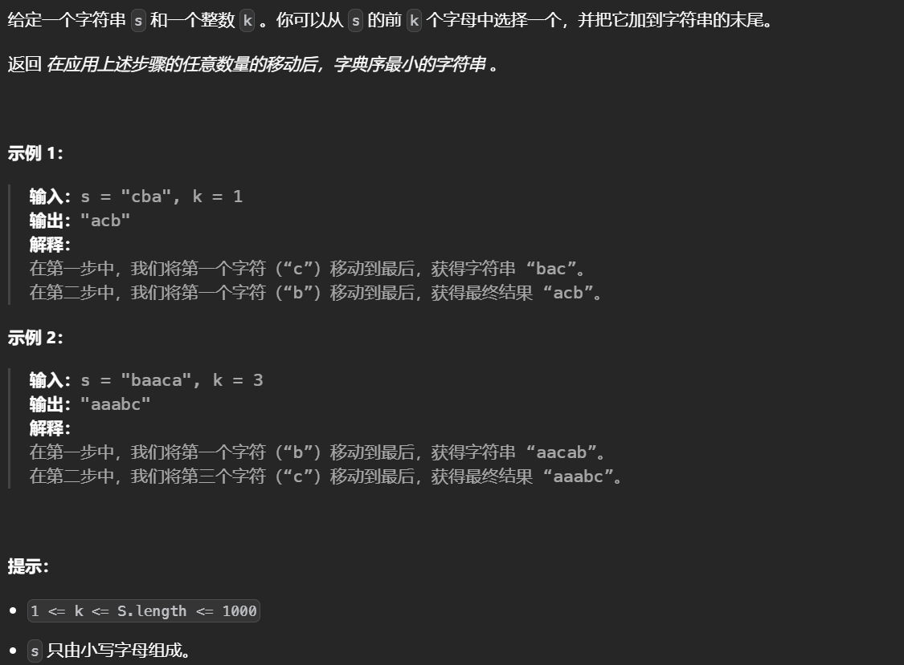

对于k>=2可以实现冒泡排序，因此直接返回排序后的结果

对于k=1直接模拟

```python
class Solution:
    def orderlyQueue(self, s: str, k: int) -> str:
        if k>=2:return ''.join(sorted(s))
        s=list(s)
        ans=s[:]
        for i in range(len(s)):
            temp=s[i:]+s[:i]
            if temp<ans:ans=temp
        return ''.join(ans) 
```


## [最少翻转次数使二进制矩阵回文 I](https://leetcode.cn/problems/minimum-number-of-flips-to-make-binary-grid-palindromic-i/)

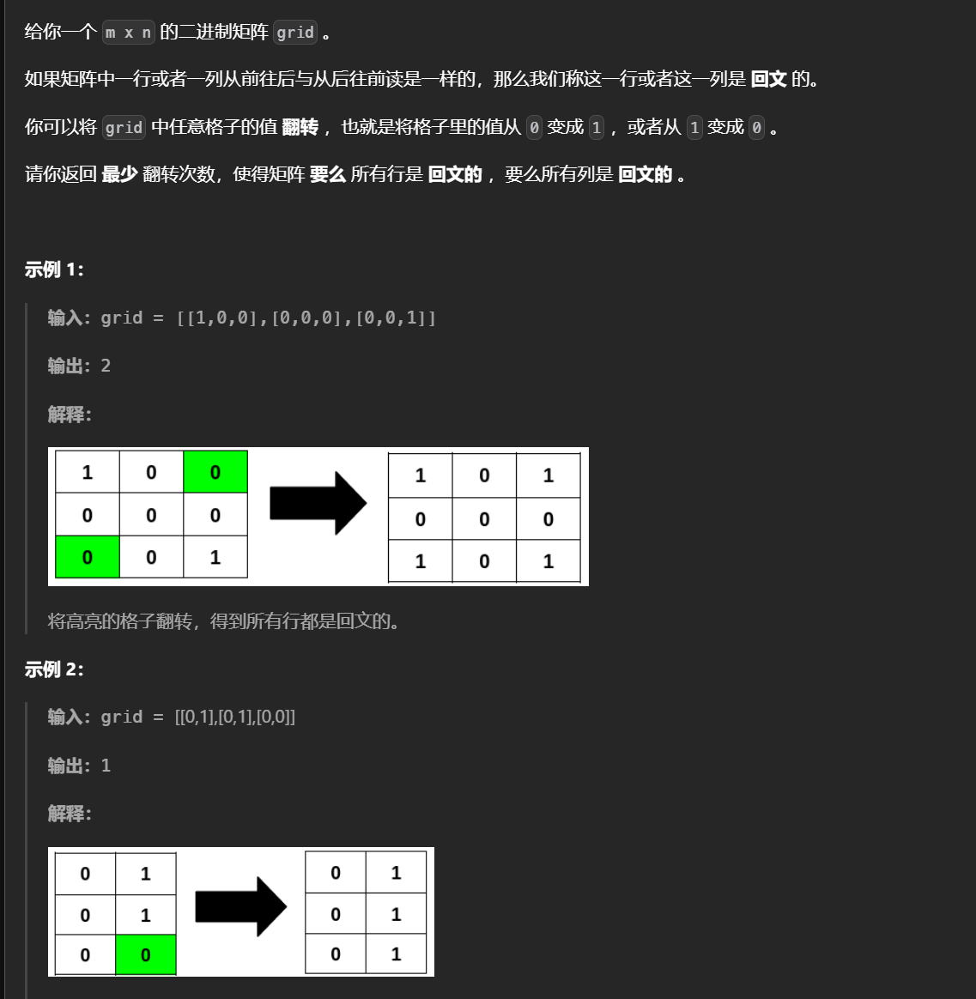

直接暴力做枚举行相同和列相同，如果用前缀和操作会很复杂，直接作比较看看有几个不相同的。

```python
class Solution:
    def minFlips(self, g: List[List[int]]) -> int:
       return min(sum(sum(int(a!=b) for a,b in zip(row,row[::-1])) for row in g),
       sum(sum(int(a!=b) for a,b in zip(col,col[::-1])) for col in zip(*g)))//2
```

因为是对整个数组比较而不是左半边和右半边比较所以会重复


## [最少翻转次数使二进制矩阵回文 II](https://leetcode.cn/problems/minimum-number-of-flips-to-make-binary-grid-palindromic-ii/)

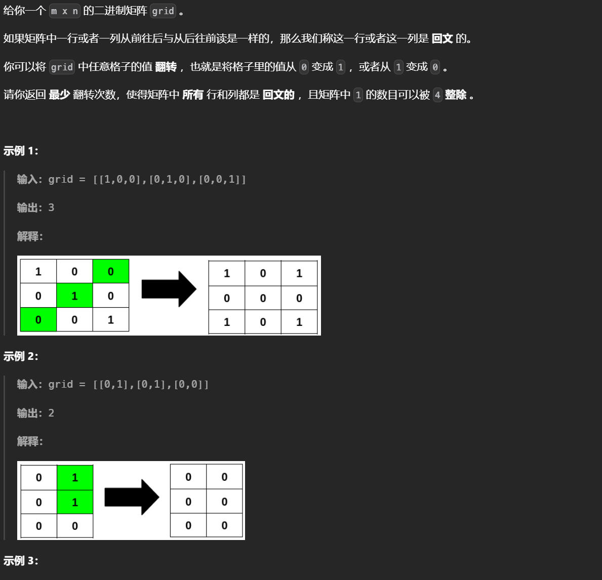


要是行和列都是回文的，那么对于一个位置必然要求和它镜像的三个位置相同，同时又要求1的个数使4的倍数，而这四个位置都相同(0/1)所以不会影响最终结果，只有当行或列是奇数时会出现一列/行无法镜像出四个位置就会多出或者少一些值。首相求出这个行或列照中镜像位置相同和不同的个数，同时记录镜像相同的1的个数，如果满足是4的倍数，那么直接把不同的位置改变一下(变为0)即可，如果不满足那么一定是余2的，为了保证修改次数最少，可以把不镜像位置改一个这样就多出了两个2，如果不对称的位置不够那么只能把镜像的两个1都修改为0操作两次。

```python
class Solution:
    def minFlips(self, g: List[List[int]]) -> int:
        ans=0
        m,n=len(g),len(g[0])
        # 不影响结果的位置
        for i in range(m>>1):
            for j in range(n>>1):
                # 1的个数
                cnt=g[i][j]+g[i][n-j-1]+g[m-i-1][j]+g[m-i-1][n-j-1]
                # 修改为1或0都可以，取最小
                ans+=min(cnt,4-cnt)
        cnt=0
        common=0
        t=0# 统计有多少个对称的位置
        # 如果多出一列
        if n&1:
            t+=m>>1
            for i in range(m>>1):
                if g[i][n>>1]==g[m-i-1][n>>1]:
                    # 统计镜像的位置
                    common+=1
                    if g[i][n>>1]==1:cnt+=2# 统计1的个数
        # 多出一行
        if m&1:
            t+=n>>1
            for i in range(n>>1):
                if g[m>>1][i]==g[m>>1][n-i-1]:
                    common+=1
                    if g[m>>1][n-i-1]==1:cnt+=2
        ans+=t-common
        # 注意如果有奇数行和列，那么中心位置必须是0.否则会使最后结果不满足模4
        if n&1 and m&1 and g[m>>1][n>>1]==1:ans+=1
        if cnt%4==0:return ans 
        else:
            # 看是否能用不镜像的位置tian'cho
            if t-common>=1:return ans
            return ans+2
```


## [放三个车的价值之和最大 II](https://leetcode.cn/problems/maximum-value-sum-by-placing-three-rooks-ii/)

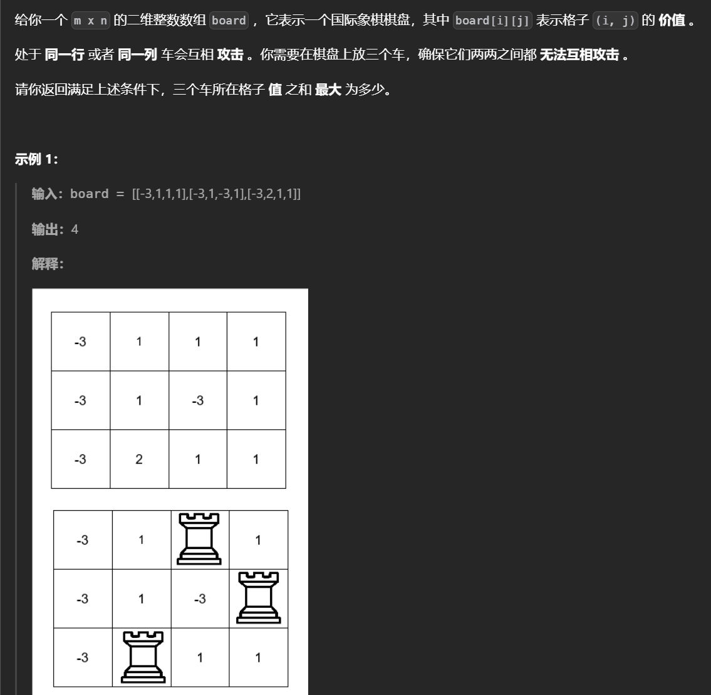

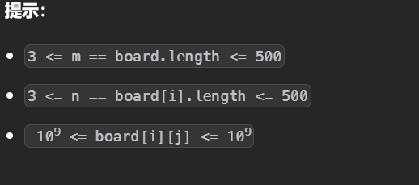

只有三个元素的一般方法是枚举中间那个，这样枚举其他两个的时候就不需要考虑二者之间的影响了。

枚举中间的车在第 *i* 排，那么需要知道第 0 到 *i*−1 排的车放在哪最合适，以及第 *i*+1 到 *m*−1 排的车放在哪最合适，这样考虑可以保证行不会重叠，这里令pre[i]表示0到i排最大的不同列的三个元素，suf同理，之后枚举中间的车在那一排然后枚举前缀和后缀保证不重叠取最大值。

```python
class Solution:
    def maximumValueSum(self,g: List[List[int]]) -> int:
        pre=[]
        suf=[]
        m,n=len(g),len(g[0])
	
    	# 找前缀最大值
        for i in range(m):
            # 起始特判
            if not i:
                arr=[(v,i) for i,v in enumerate(g[i])]
                arr.sort()
                pre.append(arr[-3:])
            else:
                temp=pre[-1][:]
                vis=set([j for i,j in temp])
                for i,x in enumerate(g[i]):
                    # 对于同一列的值更新
                    if i in vis:
                        for k in range(3):
                            if temp[k][1]==i:
                                temp[k]=(max(temp[k][0],x),i)
                                temp.sort()
                                break

                    else:
                        # 不同列的如果可以进入前三大那么处理temp数组和vis记录
                        if x>=temp[-1][0]:
                            temp.append((x,i))
                            vis.add(i)
                            vis.remove(temp[0][1])
                            temp=temp[1:]
                        elif x>=temp[1][0]:
                            vis.remove(temp[0][1])
                            temp[0]=temp[1]
                            vis.add(i)
                            temp[1]=(x,i)
                        elif x>=temp[0][0]:
                            vis.remove(temp[0][1])
                            vis.add(i)
                            temp[0]=(x,i)
                pre.append(temp[:])
		# 后缀同理
        for i in range(m-1,-1,-1):
            if i==m-1:
                arr=[(v,i) for i,v in enumerate(g[i])]
                arr.sort()
                suf.append(arr[-3:])
            else:
                temp=suf[-1][:]
                vis=set([j for i,j in temp])
                for i,x in enumerate(g[i]):
                    if i in vis:
                        for k in range(3):
                            if temp[k][1]==i:
                                temp[k]=(max(temp[k][0],x),i)
                                temp.sort()
                                break

                    else:
                        if x>=temp[-1][0]:
                            temp.append((x,i))
                            vis.add(i)
                            vis.remove(temp[0][1])
                            temp=temp[1:]
                        elif x>=temp[1][0]:
                            vis.remove(temp[0][1])
                            temp[0]=temp[1]
                            vis.add(i)
                            temp[1]=(x,i)
                        elif x>=temp[0][0]:
                            vis.remove(temp[0][1])
                            vis.add(i)
                            temp[0]=(x,i)
                suf.append(temp[:])
        suf=suf[::-1]
        ans=-inf 
        
        # 枚举中间的车的位置
        for i in range(1,m-1):
            arr=[(v,i) for i,v in enumerate(g[i])]
            # 找出对于中间车的前三大
            arr=sorted(arr)[-3:]
            # 枚举
            for v1,i1 in pre[i-1]:
                for v2,i2 in arr:
                    for v3,i3 in suf[i+1]:
                        if len(set([i1,i2,i3]))==3:# 只要不重叠
                            ans=max(ans,v1+v2+v3)
        return ans 

```

## [统计近似相等数对 II](https://leetcode.cn/problems/count-almost-equal-pairs-ii/)


对于两个值如何判断对其中一个至多执行两次操作后两个数相等是一个难点，这两个数不需要每个都模拟交换只需要对其中一个操作即可，如果能通过交换相等那么操作哪一个都是一样的，本题中不考虑前导0因此操作的数需要是两个数中较大的那个，所以首先对数组排序。如果选出两个数然后对较大的那个暴力模拟交换两次，对于n=5000的数据会超出，该题每次操作的对象是两个因此可以使用枚举右维护左的做法实现，枚举的数暴力他所有的交换两次的结果去找记录的左中是否有一致的。

```python
class Solution:
    def countPairs(self, nums: List[int]) -> int:
        ans=0
        memo=Counter()
        # 预处理
        nums.sort()
        for r,x in enumerate(nums):
            # 反之计算重复的
            st=set()
            ans+=memo[x]
            st.add(x)
            s=list(str(x)) 
            m=len(s)
            # 交换两次
            for i in range(m):
                for j in range(i+1,m):
                    s[i],s[j]=s[j],s[i]
                    temp=int(''.join(s))
                    if temp not in st:
                        st.add(temp)
                        ans+=memo[temp]
                    for a in range(m):
                        for b in range(a+1,m):
                            s[a],s[b]=s[b],s[a]
                            temp=int(''.join(s))
                            if temp not in st:
                                st.add(temp)
                                ans+=memo[temp]
                            s[a],s[b]=s[b],s[a]
                    s[i],s[j]=s[j],s[i]
            memo[x]+=1
        return ans 

```


# CF

## The Humanoid

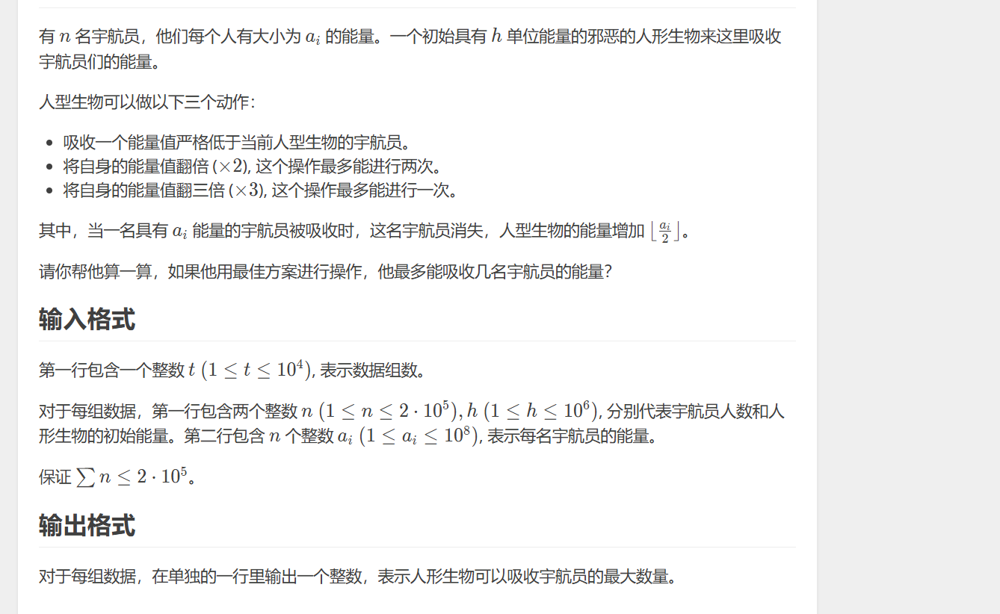

将宇航员的按能量大小排序，对于小于自身能量的可以直接吸收，大于的可以选择第二种和第三种操作（可以一起执行），执行的方案不是每次操作最小的。因为只有三种方案因此可以枚举分别执行这三种的不同答案 112 211 121。

```python
from functools import lru_cache
import sys

def slove():
    n, k = [int(x) for x in input().split()]
    nums = [int(x) for x in input().split()]
    nums.sort()
    a = 2
    b = 1
    ans = temp = 0
    x = k
    for i in range(n):
        if x > nums[i]:
            x += nums[i] // 2
            temp += 1
            continue
        if b:
            b -= 1
            x *= 3
            if x > nums[i]:
                x += nums[i] // 2
                temp += 1
                continue
        if a > 0:
            a -= 1
            x *= 2
            if x > nums[i]:
                x += nums[i] // 2
                temp += 1
                continue
        if a > 0:
            a -= 1
            x *= 2
            if x > nums[i]:
                x += nums[i] // 2
                temp += 1
                continue
        break
    ans = max(ans, temp)

    a = 2
    b = 1
    temp = 0
    x = k
    for i in range(n):
        if x > nums[i]:
            x += nums[i] // 2
            temp += 1
            continue

        if a ==2:
            a -= 1
            x *= 2
            if x > nums[i]:
                x += nums[i] // 2
                temp += 1
                continue
        if b:
            b -= 1
            x *= 3
            if x > nums[i]:
                x += nums[i] // 2
                temp += 1
                continue
        if a > 0:
            a -= 1
            x *= 2
            if x > nums[i]:
                x += nums[i] // 2
                temp += 1
                continue

        break
    ans = max(ans, temp)

    a = 2
    b = 1
    temp = 0
    x = k
    for i in range(n):
        if x > nums[i]:
            x += nums[i] // 2
            temp += 1
            continue

        if a > 0:
            a -= 1
            x *= 2
            if x > nums[i]:
                x += nums[i] // 2
                temp += 1
                continue
        if a > 0:
            a -= 1
            x *= 2
            if x > nums[i]:
                x += nums[i] // 2
                temp += 1
                continue
        if b:
            b -= 1
            x *= 3
            if x > nums[i]:
                x += nums[i] // 2
                temp += 1
                continue
        break
    ans = max(ans, temp)

    print(ans)
for i in range(int(input())):
    slove()

```

## Equalize the Remainders

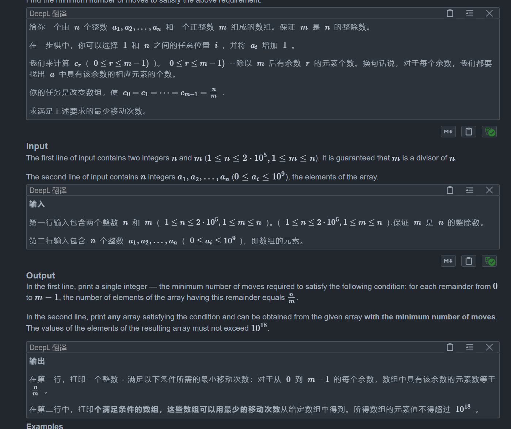


不存在最少操作次数，所需的次数是固定的。最终要求的结果是n//m个0~m-1，因此先对原数组按照取模m后的结果分组。随后遍历每一组，因为所需的次数是固定的因此变哪一个值都一样，如果这一组的数量多了那么就去出其中多出的部分，反之小于的话就将储存的部分填充进去，可以通过枚举两次来解决，第一次遍历后每组都不会超过n//m了，第二次操作所有不够的都会被填充，因此只需要两次操作即可。

```python
from collections import deque, defaultdict, Counter
from functools import lru_cache
from bisect import bisect_left
from itertools import accumulate
from math import ceil
import sys
from typing import List
input = sys.stdin.readline
def R(): return int(input())
def RR(): return [int(x) for x in input().split()]

n,m=RR()
l=n//m
a=RR()
ans=0
# 分组
idx=[[] for _ in range(m)]
for i,v in enumerate(a):
    idx[v%m].append(i)
d=deque()
# 遍历两次
for i in range(2*m):
    x=i%m
    # 不够，填充
    while d and len(idx[x])<l:
        j=d.popleft()
        diff=(x-a[j])%m
        ans+=diff
        a[j]+=diff
        idx[x].append(j)
    # 多了，提出来
    while len(idx[x])>l:
        j=idx[x].pop()
        d.append(j)

print(ans)
print(*a)
```


## Find the Different Ones!

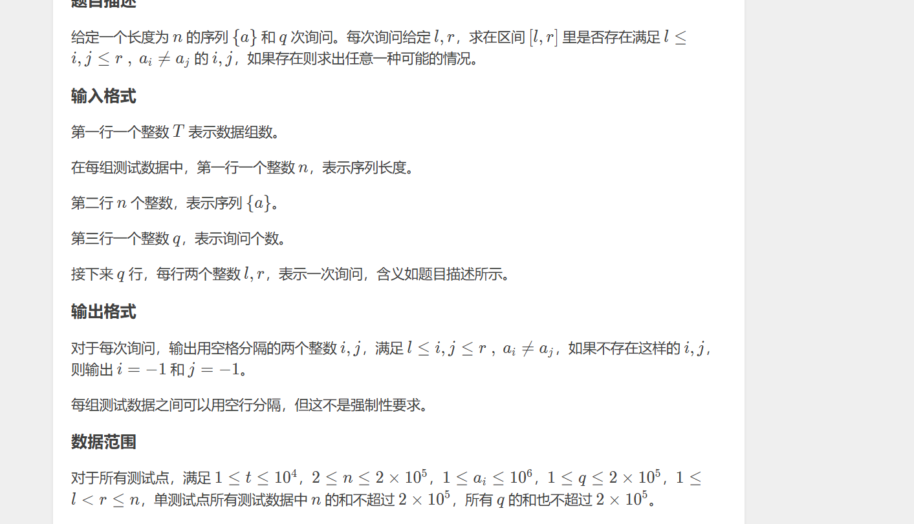			

要找到每个区间中不同的两个数的下标，首先可用预处理出每个点左边离他最近的点的位置，在给定的询问中查看右端点左边离他最近的点的位置，如果小于左端点那么说明整个区间中都是相同的数无法得出答案。

```python
from collections import deque, defaultdict, Counter
from functools import lru_cache
from bisect import bisect_left
from itertools import accumulate
from math import ceil, inf
import sys
from typing import List

input = sys.stdin.readline
def R(): return int(input())
def RR(): return [int(x) for x in input().split()]
def get_pre(nums): return list(accumulate(nums, initial=0))

for _ in range(R()):
    n=R()
    nums=RR()
    ll=[-1]
    ans=0
    for i in range(1,n):
        if nums[i]==nums[i-1]:ll.append(ll[-1])
        else:ll.append(i-1)
    for _ in range(R()):
        l,r=RR()
        l-=1
        r-=1
        if ll[r]<l:print(-1,-1)
        else:print(ll[r]+1,r+1)
    print()
```

## Corner Twist 

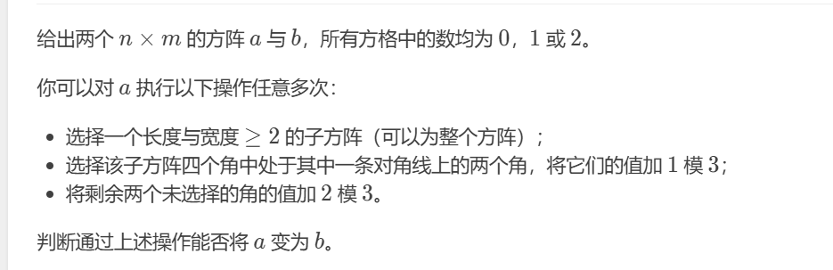

观察发现，进行操作后每一行和每一列的和是不会改变的，因此比较两个数组每一行和每一列的和如果不同则无法变化。


## Phoenix and Beauty

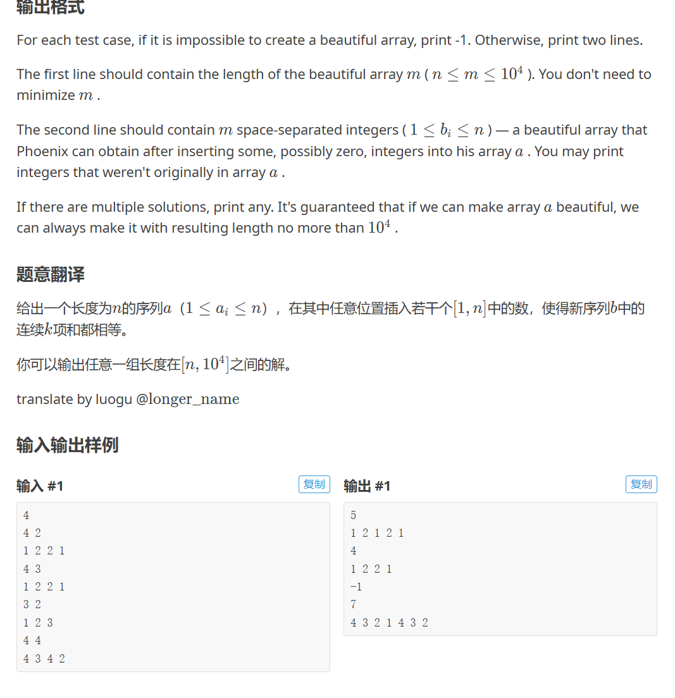

每个长度为K的子段和都相同说明构造后的数组以K为周期，那么就就要求数组中不同的数的个数要小于等于k否则无法做到周期为k

最后的结果是一个包含k个不同元素的数组重复n次（直接暴力），这个数组是原数组中不同的元素构成的，如果小于k那么从1到N中补不在集合中的，这可以保证原数组中的元素都考虑到了，原数组也一定可以通过添加值来形成构造的数组

```python
from collections import deque, defaultdict, Counter
from functools import lru_cache
from bisect import bisect_left
from heapq import heappop, heappush
from itertools import accumulate
from math import ceil, inf, gcd, sqrt, prod
import sys
from typing import List
input = sys.stdin.readline
def R(): return int(input())
def RR(): return [int(x) for x in input().split()]
def get_pre(nums): return list(accumulate(nums, initial=0))

for _ in range(R()):
    n,k=RR()
    nums=RR()
    vis=set(nums)
    if len(vis)>k:
        print(-1)
    else:
        for i in range(1,n+1):
            if len(vis)==k:break
            if i not in vis:vis.add(i)
            
        b=n*list(vis)
        print(len(b))
        print(*b)
```

## Colored Portals

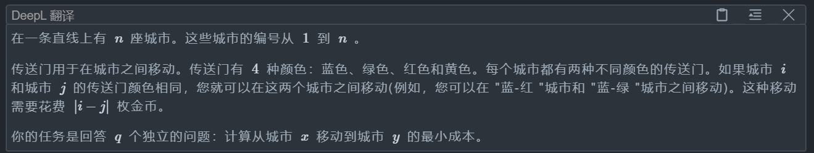

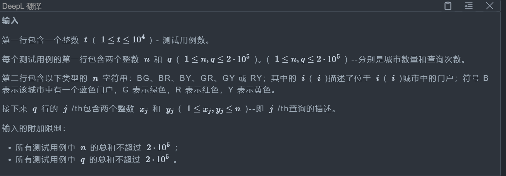

这里不用考虑图论的做法，因为要满足给定的询问一定只能用floyd但是给定的数据范围无法做到，考虑每个点的颜色一共只有六种不同的颜色组合，先记录每个颜色对应的点有哪些，如果询问的两个点颜色有重合那么距离就是索引差，否则需要枚举和两个点颜色都不同的颜色，去看对应的索引中有没有在给定点范围内的（二分求解），如果有那么距离也还是索引之差，否则去看离这两个点最近的点，距离就是最小的|i-index|+|j-index|，枚举不同的颜色找出最小的结果。

```python
for _ in range(R()):
    n, q = RR()
    nums = [c for c in input().split()]
    memo = defaultdict(list)
    # 记录每种颜色对应的索引
    for i, x in enumerate(nums):
        memo[x].append(i)
    for _ in range(q):
        l, r = RR()
        if l>r:
            # 令r为最大值
            l,r=r,l
        l -= 1
        r -= 1
        if l == r:
            print(0)
            continue
        # 有重合
        if set(nums[l]) & set(nums[r]):
            print(abs(l - r))
            continue
			
        # 记录最小值
        res = inf
        # 枚举不同的颜色
        for k, arr in memo.items():
            if k != nums[l] and k != nums[r]:
                index = bisect_left(arr, r + 1) - 1
                # 是否存在i,j之间的点
                if index >= 0 and arr[index] > l:
                    res=min(res,abs(l - r))
                    f = True
                else:
                    # 找两边
                    i1, i2 = bisect_left(arr, l + 1) - 1, bisect_left(arr, r)

                    if i1 >= 0:
                        res = min(res,abs(arr[i1] - l) + abs(arr[i1] - r))
                    if i2 < len(arr):
                        res = min(res,abs(arr[i2] - l) + abs(arr[i2] - r))
        if res!=inf:print(res)
        else:print(-1)
```


# 构造题


通过构造样例n=5,s=15，如果序列是12345那么从1到S的所有数字都可以被组合出来，但如果是11157那么组合出来的数或缺少4和11。那么猜想只要相同的数越多那么构造出来的范围就越小。考虑构造n-1个1和x=s-n+1那么他能表示的范围就是1到n-1和x到s那么如果n不大于x-1就一定能找到一个k。

```python
n,s=RR()
x=s-n+1
if n<=x-1:
    arr=[1]*(n-1)+[x]
    print('YES')
    print(*arr)
    print(n)

else:
    print('NO')
```


