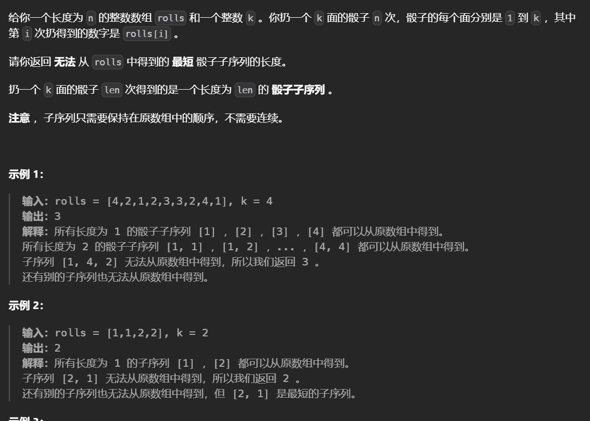
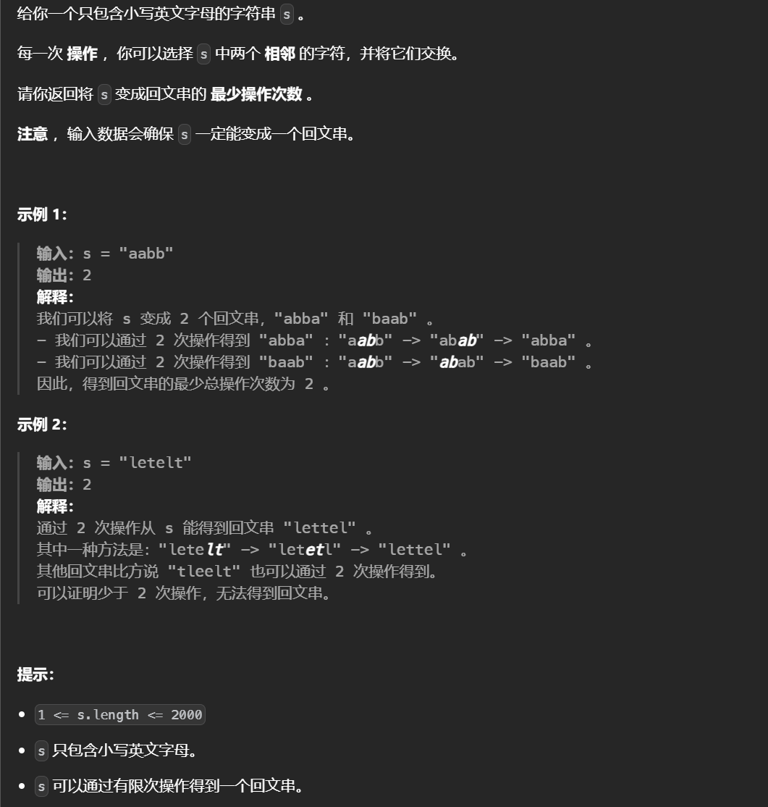
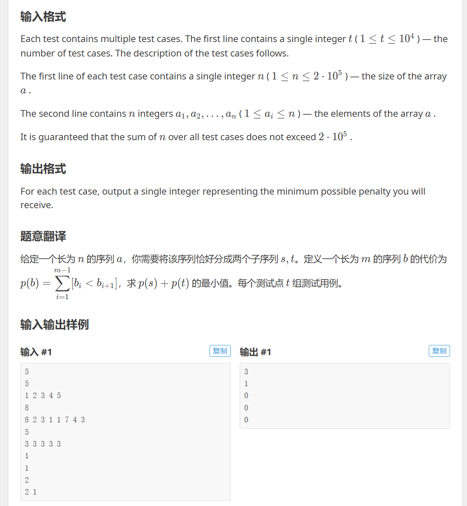
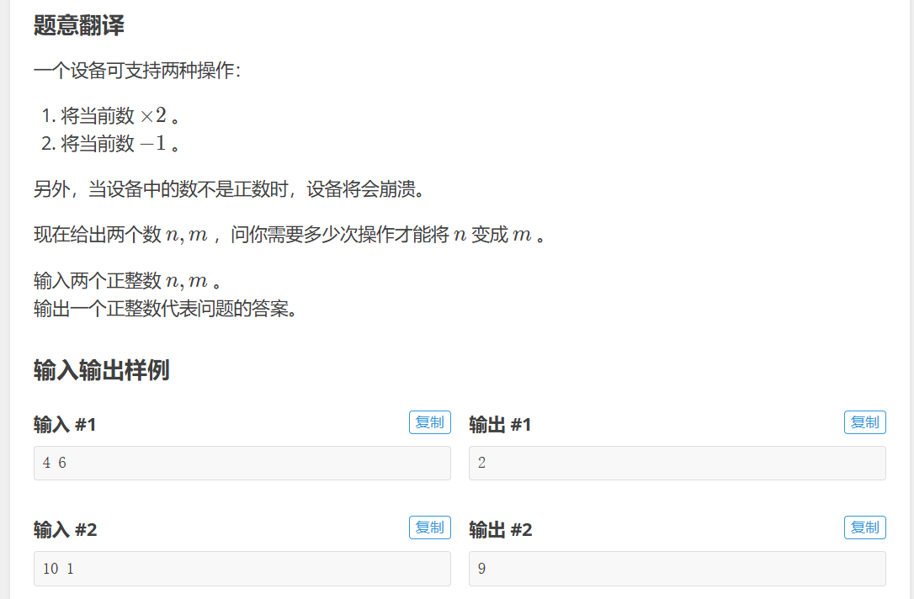
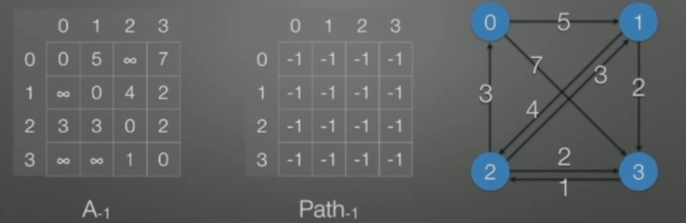
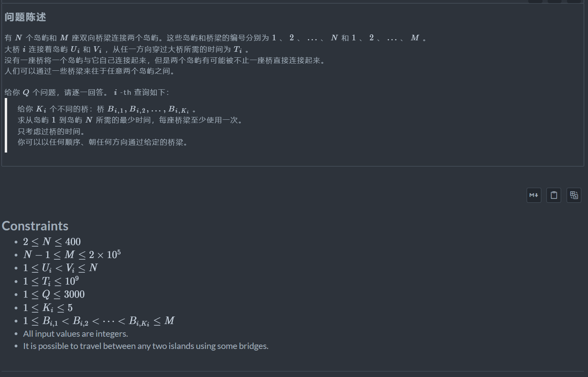

# 数据结构和算法

## 估算算法效率和时间复杂度

时间复杂度是用来体现算法的运行的快慢的，这是一个通用的表示，不会因为硬件的差异而不同，可以形象的比较时间的快慢，时间复杂度越高运行慢。

常见的时间复杂度如下：


```python
#O(1)，对于基本的操作，加减乘除打印等时间消耗为1时间单位
print('hello world')
#O(n)，大约会运行n次
for i in range(10):
    print('hello world')
#O(n^2)两层嵌套
for i in range(10):
    for j in range(10):
        print('hello world')
#O(n^3)三层嵌套
for i in range(10):
    for j in range(10):
        for k in range(10):
            print('hello world')
#并非是O(3)，O(1)代表的是一个单位，打印一次和多次没有区别，只要规模不上升到n的程度，结果就还是O(1)，时间复杂的大约是一个大约
print('hello world')
print('hello world')
print('hello world')
#并非O(n+n^2)，时间复杂度表示大约n^2大于n，只留下大单位，O(n^2)
for i in range(10):
    print('hello world')
    for j in range(10):
        print('hello world')
```

开苏判断时间复杂度的方法（适用于大部分简单的情况）：

+ 确定问题的规模n
+ 循环减半->logn
+ k层关于n的循环->n^k

复杂的情况要根据算法的执行过程具体判断。

递归函数的时间复杂度：递归树的节点*每一个节点操作的时间复杂度。

一些不太明显的算法，比如滑动窗口，每次两个指针只有前进没有后退，时间复杂度是O（n）

## 空间复杂度

用来评估算法内存的的占用大小。

时间复杂度和空间复杂度的计算完全一样，讨论算法的时候时间比空间更重要，因为随着时间的发展内存越来越先进，大部分算法都有一个规则叫做”空间换时间“，牺牲空间来换取时间。

递归函数的空间复杂度是递归树的深度加上每次操作开的空间。

## 递归

递归有两个特点：

+ 调用自己
+ 结束条件


### 实例：汉诺塔问题


在小圆盘上不能放大圆盘，一次只能移动一个圆盘，只有三根柱子。

当只有两个圆盘时，小的移动到B，大的移动到C，然后小的再移动到C上。

递归的思想是将上面的n-1个盘子视为一个整体，最下面的视为另一个，接下来：

+ 把n-1个盘子从A经过C移动到B
+ 把第n个盘子从A移动到C
+ 把n-1个盘子从B经过A移动到C

其中只有第二步是移动一个盘子，第一步和第三步是移动n-1个盘子，但是比原问题规模小了1

```python
#h(x)=2h(x-1)+1
#n表示盘子的数量,abc表示柱子，从a经过b移动到c
def hanio(n,a,b,c):
    #终止条件是n=0也就是说没有盘子的时候
    if n>0:
        #把n-1个盘子从A经过C移动到B
        hanio(n-1,a,c,b)
        #把第n个盘子从A移动到C
        print("moving from %s to %s"%(a,c))
        #把n-1个盘子从B经过A移动到C
        hanio(n-1,b,a,c)
hanio(3,'A','B','C')
moving from A to C
moving from A to B
moving from C to B
moving from A to C
moving from B to A
moving from B to C
moving from A to C
```

## 列表查找

### 顺序查找

顺序查找也叫线性查找，从列表第一个元素开始，顺序进行搜索，直到查找到元素或是到列表最后一个元素为止。


### 二分查找

又叫折半查找，从有序列表的初始候选区li[0:n]开始，通过对待查找的值与候选区中间值的比较，可以使候选区减少一半，时间复杂度为O(logn)

```python
def binary_search_new(li,val):
    #定义一个左顶点
    left=0
    #定义一个右顶点
    right=len(li)-1
    #循环成立的条件是候选区有值
    while left<=right:
        #中间的位置
        mid=(left+right)//2
        #以下是三种情况，每当大于或者是小于的时候，左顶点或者右顶点都要移动到mid的左侧/右侧
        if li[mid] ==val:
            return mid
        elif li[mid]>val:
            right=mid-1
        if li[mid]<val:
            left=mid+1
    #找不到返回-1
    return -1
```

列表内置函数index()使用的是顺序查找，因为线性查找要求是二分查找。	

## 排序(3个较低的算法)

### 冒泡排序

时间复杂度为O(n^2)，对于传入n=10000，大概需要十秒运行，一般的电脑每秒运行 10^7

列表每两个相邻的数，如果前面的比后面的大，则交换这两个数。

一趟列表排完，无序区域减少一个数，有序区域增加一个数。

```python
li=[1,3,32,3,543,7,43,124,436,2]
for i in range(len(li)):
    for j in range(len(li)-1-i):
        if li[j]>li[j+1]:
            li[j+1],li[j]=li[j],li[j+1]
print(li)
```


### 选择排序

每次遍历列表取出其中最小的数。

建立有序区和无序区的概念。

```python
#多生成一个列表，占用内存
#复杂度包括其中remov和min都是要遍历一边的操作，时间复杂度为O(n^2)
def select_sort(li):
    new_list=[]
    for i in range(len(li)):
        min_val=min(li)
        new_list.append(min_val)
        li.remove(min_val)
    return new_list
def select_sort_batter(li):
    #执行的次数，最后一次不用执行一定是最大的，同时i也代表无序区的开始
    for i in range(len(li)-1):
        #初始化无序区最小的位置为无序区的开端,蛮重要的一步
        min_loc=i
        #遍历无序区
        for j in range(i+1,len(li)):
            #如果小于的话就交换，会找到无序区中最小的元素
            if li[j]<li[min_loc]:
                min_loc=j
        #最后将无序区最小的值作为无序区第一个值，下一次循环会改变无序区的位置
        li[i],li[min_loc]=li[min_loc],li[i]
    return li

list=[2,3,4,2,1,5,7,3,9,6,7]
print(select_sort_batter(list))
```

### 插入排序

有序区只有一个元素，每次从无序区中选择一个元素然后插入有序区。	

```python
#时间复杂度为O(n^2)
def insert_sort(li):
    #无序区从1开始
    for i in range(1,len(li)):
        #保存拿到的值
        tem=li[i]
        #每一次遍历都会插入一个元素，j作为有序区最后一个元素的开端
        j=i-1
        #遍历有序区，要插入的元素小于有序区的元素，就把所有的有序区元素右移一位
        while li[j]>tem and j>=0:
            li[j+1]=li[j]
            j-=1
        #如果拿的元素大于所指有序去的元素，退出循环然后将拿的元素插到所指元素的后一位
        #或者如果拿的元素小于所有的有序区元素的话，也就是J的索引指到 -1，就把拿的元素放到最前端，有序区元素都往后移一位
        li[j+1]=tem
    return li
```

## 快速排序

快速排序思路：

+  取一个元素p（一般取第一个元素），使元素p归位（左边的元素小于p，右边的元素大于p）
+ 递归完成排序

```python
#时间复杂度为O(n)，因为从两边往中间扫
def partition(data,left,right):
    #先暂存这个数，注意要存为left
    temp=data[left]
    #只要区间里面有值
    while left<right:
        #因为把第一个元素作为用来划分的值，第一个空位在左边，从右边开始寻找小于的值填到左边，只要大于等于就递减并且保证区间有效
        while data[right]>=temp and right>left:
            right-=1
        #填上左边的空位
        #如果右边的值全都大于要划分的值,left就会等于right,while循环就会都退出,下面的赋值就会使自身赋值
        data[left]=data[right]
        #现在右边出现了一个空位，从左边寻找值
        while data[left]<=temp and left<right:
            left+=1
        data[right]=data[left]
    #当left和right相等时，就是划分用的值要填充的位置也就是mid
    data[left]=temp
    #返回mid
    return left

def quick_sort(data,left,right):
     #列表区域至少有两个元素
    if left<right:
        #对区间安置排序
        mid=partition(data,left,right)
        #对右半部分
        quick_sort(data,mid+1,right)
        #对左半部分
        quick_sort(data,left,mid-1)
    return data
li= [5,7,4,6,3,1,2,9,8]
print(quick_sort(li,0,len(li)-1))
```


快速排序每次划分为两个部分，其中进行一次partition划分logn次，时间复杂度为nlog(n)

最坏的情况是n^2:如果列表是[9,8,7,6,5,4,3,2,1]


每次调用时只会减少一个数，做不到减半,时间复杂度为n^2，想要改变的话可以选择划分区域时随机选择一个数，而不是从头开始，因此可以随机找一个数然后与第一个数交换即可。

注意函数递归是由最大深度的，一般是999可以使用sys模块下的sys.setrecrusionlimit(n)来改变。

对于比较大的数据量，不能一直选取第一个数，需要随机选择

```python
import random

input()
li = list(map(int, input().split()))
n = len(li)

def quick_sort(arr):
    if len(arr) <= 1:
        return arr
    index = random.randint(0, len(arr) - 1)
    temp = arr[index]
    left = [x for x in arr if x < temp]
    right = [x for x in arr if x > temp]
    mid = [x for x in arr if x == temp]
    return quick_sort(left) + mid + quick_sort(right)


a=quick_sort(li)
for l in a:
    print(l, end=' ')
    
```


## 堆排序

### 树与二叉树

树是一种数据结构，树是由n个节点组成的集合，如果n=0则是一个空树，如果n>0则存在一个节点作为树的根节点，其他节点可以分为m个集合，每个集合本身又是一棵树。不能再分的节点称为叶子节点，树的深度就是层数，树的度就是整个树中最大的度，节点的度就是它分了几个岔。

二叉树就是度不超过2的树，每个节点最多有两个子节点。

满二叉树：每一层的节点数都达到最大值


完全二叉树：是满二叉树最下一层没有满，但缺少的部分必须是右边的	


二叉树的存储方式：

顺序储存方式 使用列表来存,表示方法是[9 8 7 6 5 0 1 2 4 3 ]如下图，这应该是理解堆排序重要的的一部，使用父节点和子节点之间的关系来找。

父节点和左子节点的下标之间有：i->2i+1

父节点和右子节点下表之间有:i->2i+2

### 堆

堆是一种特殊的完全二叉树且应满足以下两个之一：

+ 大根堆：一棵完全二叉树，满足任意节点都比其他子节点大。


+ 小根堆：与大根堆相反。


堆的性质：假设节点的左右子树都是堆，但自身不是堆，如下不满足大根堆：


此时可以通过一次向下调整过程来将其变换为一个堆，将2提出，从子节点中选取满足的9上移，9的位置再由它的子结点和2中满足的替代……


### 堆排序过程

+ 用一个数列建立一个未排序的堆，然后对每个叶子节点部分调整，从而得到排序的堆
+ 挨个出数，取出堆顶的元素，在将最后一个元素放到堆顶，不能直接将下一层的最大数放到堆顶，这会导致出现一个空位破坏完全二叉树。
+ 进行一次向下调整，将堆变为合法的堆，从而使得堆顶的元素为最大值
+ 重复第二和三步

```python
'''调整的函数'''
#时间复杂度为log(n),有一个这般的过程，每次从两个树中选一个进行
def sift(li ,low ,high):
    ''''low指的是堆顶的元素，high是最后一个元素'''
    i=low#i最开始指向根节点
    j=2*i+1#j开始是左子节点
    temp=li[low]#取得堆顶
    while j<=high:#保证j位置有数
        if j+1<=high and li[j+1]>li[j]:#右子树有数并且大于左子树
            j=j+1
        if li[j]>temp:#子树的值更大，i位置的值等于j位置的值，并且更新j
            li[i]=li[j]
            i=j
            j=2*i+1
        else:#不然的话就退出
            li[i]=temp
            break
    else:#找的元素都大于堆顶元素则把堆顶元素放在叶子节点上
        li[i]=temp
'''时间复杂度为nlog(n)'''
def heap_sort(li):
    n=len(li)
    #建立堆，调整叶子节点，i代表的是每个叶子节点
    for i in range((n-2)//2,-1,-1):
         #调整函数中的high全部设置为整个堆的最后一个元素，因为high是用来判断有没有超出边界，而整个对的最后一个元素可以完全满			足判断
         #根据叶子节点很难找出相应的最后一个元素
        sift(li,i,n-1)
    '''挨个出数，为了节省内存不会再创建一个列表，每次提出的最大的数与最后一个元素交换位置'''
    for i in range(n-1,-1,-1):
        #i代表的是最后一个元素
        li[0],li[i]=li[i],li[0]
        sift(li,0,i-1)#交换位置后，再次调整获得最大值，high的位置应该提前一位保证不影响提出的最大值
li=[i for i in range(100)]
import random
random.shuffle(li)
print(li)
heap_sort(li)
print(li)
```

### topk问题

topk问题是指从n个元素中选择前k大个数：以下是三种解决方案

+ 排序后切片：nlog(n)
+ 排序k次：kn，比如冒泡排序每次排序都会提出列表中最大的元素，排序k次即可
+ 堆排序：nlog(k)，从原列表中中取前k个元素，组成一个小根堆，然后依次从之后的列表中提取元素与小根堆的堆顶进行比较，此时的堆顶意味着前k个元素中第k大的元素，后面的元素如果小于则不考虑，反之替换小根堆堆顶，然后调整一次。最后得到的堆就是目前前k大的元素。

```python
#调整小根堆的函数
def sift(li,low ,high):
    i=low
    j=2*i+1
    temp=li[low]
    while j<=high:
        if j+1<=high and li[j+1]<li[j]:
            j+=1
        if li[j]<temp:
            li[i]=li[j]
            i=j
            j=2*i+1
        else:
            li[i]=temp
            break
    else:
        li[i]=temp
def topk(li,k):
    heap=li[0:k]#选取前k个
    for i in range((k-2 )//2,-1,-1):#建立堆
        sift(heap,i ,k-1)
    for i in range(k,len(li)-1):#往后逐个比较
        if li[i]>heap[0]:
            heap[0]=li[i]
            sift(heap,0,k-1)
    for i in range(k-1,-1,-1):#逐个出数
        heap[0],heap[i]=heap[i],heap[0]
        sift(heap,0,i-1)
    print(heap)
import random
li=list(range(1000))
random.shuffle(li)
topk(li,10)
```

## 归并排序

归并：假设现在的列表分两段有序，将它们合成为一段有序的列表称为归并。

具体过程是从两个列表头开始，依次比较，较小的出来然后指针然后后移，之后再比较。

```python
def merge(li,low,mid,high):
    '''low：左列表起始位置 mid左列表终止位置 high右列表终止位置'''
    i=low
    j=mid+1
    new_li=[]#临时存储列表
    while i<=mid and j<=high:
        if li[i]<li[j]:#左边值小
            new_li.append(li[i])
            i+=1
        else:
            new_li.append(li[j])#右边值小
            j += 1
    while i<=mid:#左边列表有剩余
        new_li.append(li[i])
        i+=1
    while j<=high:#右边列表有剩余
        new_li.append(li[j])
        j+=1
    li[low:high+1]=new_li#还原原列表
li=[2, 4 ,5 ,7 ,1 ,3 ,6,8]
merge(li,0,3,7)
print(li)
```

将列表越分越小，直到只有一个元素，一个元素是有序的，之后合并两个列表，把列表越合越大。


```python
def merge_sort(li,low,high):#时间复杂度为nlog(n)
    if low<high:#只要有元素
        merge_sort(li,low,(low+high)//2)#对左区间排序
        merge_sort(li,(low+high)//2+1,high)#对右区间排序
        merge(li,low,(low+high)//2,high)#归并
li=list(range(1000))
import random
random.shuffle(li)
print(li)
merge_sort(li,0,len(li)-1)
print(li)
```

归并排序需要额外的内存开销。


稳定性指的是两个相同的元素在排完序后，其相对位置不变。

## 希尔排序

希尔排序是一种分组插入排序法，首先取一个整数d1=n//2，把元素分为d1组，每组中的元素是由原列表中距离为d1元素构成的，再取第二个数，d2=d1//2，重复上述过程，直到dn=1。希尔排序每趟并不使某些元素有序，而是使整体元素越来越趋向于有序，最后一趟使得所有数据有序。

比如说58492167，八个数分为4组，52 81 46 97

```python
def insert_sort_gap(li,gap):
    for i in range(gap,len(li)):
        j=i-gap
        temp=li[i]
        while j>=0 and li[j]>temp:
            li[j+gap]=li[j]
            j-=gap
        li[j+gap]=temp
def shell_sort(li):
    n=len(li)//2
    while n>=1:
        insert_sort_gap(li,n)
        n=n//2
li=list(range(1000))
import random
random.shuffle(li)
print(li)
shell_sort(li)
print(li)
```

希尔排序的时间复杂度和gap的选取有关，上述的gap使得时间复杂度为${n}/2^k$

## 计数排序


已知列表的范围，对每个元素的出现的次数进行计数，最后根据计数求出应有的范围。

```python
#时间复杂度为o(n)
def count_sort(li,max_count=100):
    count=[0 for _ in range(max_count+1)]#创造一个列表，初始化元素都为0
    for val in li:#对每个元素进行计数，索引为元素值，索引所对的值为元素的个数
        count[val]+=1
    li=[]#清空原列表
    for index ,val in enumerate(count):
        #val个index
        for i in range(val):
            li.append(index)
    return li
li=list(range(100))
import random
random.shuffle(li)
print(li)
print(count_sort(li,99))
```

注意需要已知范围，比如年龄之类的，并且消耗内存。

## 桶排序

同样是知道区间，桶排序是当区间比较大的时候，把元素装到不同的桶里，在对每个桶中的元素做排序。

```python
def bucket_sort(li,n=100,max_num=10000):#桶的数目，和最大值
    buckets=[[] for _ in range(n)]#创建一个二维列表，其中每个列表代表一个桶
    for val in li:
        i=min(val//(max_num//n),n-1)#利用整除判断每个元素值属于那个桶，遇到最大值时，痛的数目不够用，因此放到最后一个桶中
        buckets[i].append(val)#先加入再排序（利用冒泡排序）
        for j in range(len(buckets[i])-1,0,-1):#不能到-1，否则会和最后一个元素比较
            if buckets[i][j]<buckets[i][j-1]:
                buckets[i][j],buckets[i][j-1]=buckets[i][j-1],buckets[i][j]
            else:#列表中已有的元素已经是排好序的，如果不满足条件则退出
                break
    sorted_li=[]
    for buc in buckets:
        sorted_li.extend(buc)
    return sorted_li
li=list(range(10000))
import random
random.shuffle(li)
print(li)
print(bucket_sort(li))
```

## 基数排序

是桶排序的进阶，按照多关联值的方式排序，这是一种稳定的排序，相同的数之间不会改变顺序。按照位数进行排序，每一次排完序，对应位数的次序是排好的，但下一位数是不确定的，下一次再排序的时候，按照之前排好的次序遍历，根据下一位数加入新的桶，再这个过程中顺序慢慢的形成。

```python
def radix_sort(li):#时间复杂度为O(kn)，其中K是最大数的位数，其速度快于快速排序，如果最大数的位数很大，其速度可能慢于快排
    max_num=max(li)#找出最大的值，其他的元素补0
    it=0#代表迭代次数
    while 10**it<=max_num:#迭代次数满足元素的位数
        buckets=[[] for _ in range(10)]
        for var in li:
            digit=(var//10 ** it)%10#找到相应的位数
            buckets[digit].append(var)
        li=[]#清空
        for buc in buckets:
            li.extend(buc)#extend用来添加列表的元素，而非直接添加列表
        it+=1
    return li
li=list(range(10000))
import random
random.shuffle(li)
print(li)
print(radix_sort(li))
```


# 数据结构

数据结构按照逻辑可以分为线性结构，树结构（一对多），和图结构（多对多）

## 列表

列表的元素是顺序存储的。

C的数组中使用下标查找元素时，时间复杂度为O(1)，其并非把数组遍历一遍，而是根据索引计算该元素的内存地址，比如一个整数占四个字节，查找整数数组中的第三个元素，传入索引2，会将首地址加上2*一个整数所占的字节。

python中的列表与数组不同，数组要求其中的元素类型都相同，数组长度固定。列表中可以是不同的类型，其中存储的是每个元素的地址，使用索引查找的时候，依旧是通过首地址加法运算取得值，不过此时的值是地址，然后再通过地址找到真正的元素值。列表的长度可以扩充类似于C++中的向量，在添加元素的时候，申请一块新的内存然后，把之前列表复制过来，新的内存长度不止是原内存长度加一，而可能是加倍。

append的时间复杂度是O(1)，但如果储存空间不够的话，时间复杂度为O(n)

插入和删除对列表都是O(n)的复杂度。

## 栈

只能在一段进行插入和删除的列表，后进先出：


栈的实现：

```python
class stack:
    def __init__(self):
        self.stack=[]
    def pop(self):
        return self.stack.pop()
    def get_pop(self):
        if len(self.stack)>0:
            return self.stack[-1]
        else:
            return None
    def push(self,ele):
        self.stack.append(ele)
```

栈的的一个实例应用：用来判断括号是否匹配。函数中如果是左括号加入栈，右括号不加入堆，只是用来匹配。	

```python
def brace_match(str):
    stack=Stack()
    match={')':'(','}':'{',']':'['}#使用字典来表示与右括号匹配的
    for  s in str:#遍历每一个元素
        if s in ['[','{','(']:#如果是左括号，加入
            stack.push(s)
        else:
            if stack.is_empty():#栈是空的，没人匹配
                return False
            elif stack.get_pop()==match[s]:#如果栈顶元素与右括号匹配，弹出
                stack.pop()
            else:
                return False
    if stack.is_empty():#如果是空的说明全部匹配
        return True
    else:
        return False
```

## 队列

一端进行插入另一端进行删除的数据集合，插入端为队尾，删除端为队首。


```python
class Queue:
    def __init__(self,size=100):
        self.queue=[0 for _ in range(size)]
        self.size=size
        self.rear=0
        self.front=0
    def push(self,ele):
        if self.is_filled():
            raise IndexError('the queue is filled')
        self.rear=(self.rear+1)%self.size
        self.queue[self.rear]=ele
    def pop(self):
        if self.is_empty():
            raise IndexError('no value in the queue')
        self.front=(self.front+1)%self.size
        return self.queue[self.front]
    def is_empty(self):
        return self.rear==self.front
    def is_filled(self):
        return (self.rear+1)%self.size==self.front
queue=Queue(5)
for i in range(4):
    queue.push(i)
print(queue.pop())
```

## 双向队列

在 Python 中，`deque`（双端队列）是一种高效的数据结构，它可以在两端进行插入和删除操作。`deque` 是由 `collections` 模块提供的一个类，它的名称来自于 "double-ended queue"（双端队列）的缩写。

`deque` 的主要特点包括：

1. 高效的插入和删除：`deque` 在两端进行插入和删除操作的时间复杂度均为 O(1)，即常数时间复杂度。
2. 可以用作队列或栈：由于 `deque` 支持在两端进行操作，因此它既可以像队列一样按照先进先出（FIFO）的顺序进行操作，也可以像栈一样按照后进先出（LIFO）的顺序进行操作。
3. 可指定最大长度：通过指定 `maxlen` 参数，可以创建一个有限长度的 `deque`，超过指定长度时，插入操作会自动移除最早的元素，可以用于对文件进行切片操作。


1. 内置的高级功能：`deque` 提供了许多内置的方法，如旋转、计数、索引等，方便进行各种常见操作。

```python 
from collections import deque
# 创建一个空的 deque
d = deque()
# 在 deque 的末尾插入元素
d.append(1)
d.append(2)
d.append(3)
# 在 deque 的开头插入元素
d.appendleft(0)
# 从 deque 的末尾删除元素
d.pop()
# 从 deque 的开头删除元素
d.popleft()
# 访问 deque 中的元素
print(d[0])
```

## 迷宫问题


### 使用栈

给一个二维列表，其中1表示墙，0表示路径。

使用栈进行深度优先搜索，深度指的是一条路走到死，走不通了回溯到上一个位置换一个方向。

```python
maze =[
[1,1,1,1,1,1,1,1,1,1],
[1,0,0,1,0,0,0,1,0,1],
[1,0,0,1,0,0,0,1,0,1],
[1,0,0,0,0,1,1,0,0,1],
[1,0,1,1,1,0,0,0,0,1],
[1,0,0,0,1,0,0,0,0,1],
[1,0,1,0,0,0,1,0,0,1],
[1,0,1,1,1,0,1,1,0,1],
[1,1,0,0,0,0,0,0,0,1],
[1,1,1,1,1,1,1,1,1,1]
]
#一个包含了函数的列表，用于计算上下左右的位置
dirs=[
    lambda x,y:(x-1,y),
    lambda x,y:(x,y+1),
    lambda x,y:(x+1,y),
    lambda x,y:(x,y-1)
]
def maze_path(x1,y1,x2,y2):#传入起始位置和终点位置
    stack=[]#一个栈，用于记录所走的路程
    stack.append((x1,y1))#首先传入起点位置
    while len(stack)>0:#如果没有合适的路径会回溯，回溯到最后没有元素
        current=stack[-1]
        if current[0]==x2 and current[1]==y2:#如果位置到达，输出路径
            for path in stack:
                print(path)
            return True
        for dir in dirs:#向每个方向试探
            next=dir(current[0],current[1])#调用的是函数
            if maze[next[0]][next[1]]==0:#可以走
                stack.append(next)#加入
                maze[next[0]][next[1]]=2#标记已走过
                break#并退出
        else:#每个方向都不可以走的话，说明路已经走死了，回溯
            stack.pop()
    else:
        print('no path')
        return False
maze_path(1,1,2,1)
```

然而找到的路径并非是最短的。

### 使用队列

广度优先搜索，从一个结点开始，寻找所有接下来能继续走的点，继续不断寻找直到找到出口。

使用队列实现，队列中只储存每一条路径的末尾加上它的索引（该索引表示的是该路径的上一个路径点在列表中的位置），一条路径点在循环中会将下一次所有的可能路径加入并把自身弹出，弹出的值被储存在列表中，当找到终点之后，从列表中遍历路径点，根据路劲点的索引值找到上一个路径点，直到开头。

```python
from collections import deque
maze =[
[1,1,1,1,1,1,1,1,1,1],
[1,0,0,1,0,0,0,1,0,1],
[1,0,0,1,0,0,0,1,0,1],
[1,0,0,0,0,1,1,0,0,1],
[1,0,1,1,1,0,0,0,0,1],
[1,0,0,0,1,0,0,0,0,1],
[1,0,1,0,0,0,1,0,0,1],
[1,0,1,1,1,0,1,1,0,1],
[1,1,0,0,0,0,0,0,0,1],
[1,1,1,1,1,1,1,1,1,1]
]
#一个包含了函数的列表，用于计算上下左右的位置
dirs=[
    lambda x,y:(x-1,y),
    lambda x,y:(x,y+1),
    lambda x,y:(x+1,y),
    lambda x,y:(x,y-1)
]
def print_r(path):
    #最后一个
    current=path[-1]
    index=current[2]
    realpath=[]
    while not index==-1:
        realpath.append((current[0],current[1]))
        current=path[index]
        index=current[2]
    realpath.append((path[0][0],path[0][1]))
    realpath.reverse()
    for res in realpath :
        print(res)

def maze_path(x1,y1,x2,y2):
    queue=deque()
    path=[]
    queue.append((x1,y1,-1))
    while len(queue)>0:
        current=queue.pop()
        maze[current[0]][current[1]]=2
        path.append(current)
        if current[0]==x2 and current[1]==y2:
            print_r(path)#找到路径，遍历列表打印
            return True
        for dir in dirs:#观察每个方向
            next=dir(current[0],current[1])
            if maze[next[0]][next[1]]==0:
                queue.append((next[0],next[1],len(path)-1))#第三个值代表该路径点的上一个关联的路径点的的索引
                maze[next[0]][next[1]]=2#标记路径
    else:
        print('no path')
        return False
maze_path(1,1,3,3)
```

## 链表

链表是由一系列节点组成的元素集合，每个节点包含两部分，一个元素值，一个指向下一个节点的指针，通过节点之间的指针相互连接，最终串联成一个链表。

创建链表：

```python
class Note:
    def __init__(self,item):
        self.item=item
        self.next=None
def create_link_head(li):#头插法
    head =Note(li[0])
    for ele in li[1:]:
        note=Note(ele)
        note.next=head
        head=note
    return head
def create_link_tail(li):#尾插法
    head=Note(li[0])
    tail=head
    for ele in li[1:]:
        note=Note(ele)
        tail.next=note
        tail=note
    return head
def print_lk(head):#遍历打印
    while not head==None:
        print(head.item,end=",")
        head=head.next
lk1=create_link_head([1,2,3,4,5,6])
lk2=create_link_tail([1,2,3,4,5,6])
print_lk(lk1)
print_lk(lk2)

# 链表的反转
class Solution:
    def isPalindrome(self, head):
        """一个快节点一个慢节点，如果列表长度是奇数，快节点到达尾部，慢节点正好在中间，反之是偶数，快节点超出尾部一位，慢节点在中间偏右一位"""
        curr = head
        fast = head
        # 开始的时候头节点的前一节点不存在
        prev = None
        '''遍历的过程中反转前半列表，将链子全部反向'''
        while fast is not None and fast.next is not None:
            fast = fast.next.next
            # 记录下一节点
            temp = curr.next
            # 使当前节点的下一位指向前一节点，反转链子
            curr.next = prev
            # 更新前一节点的位置
            prev = curr
            # 更新当前节点
            curr = temp
        '''判断出是奇数，形如121，将慢节点后移一位，不需要判断中间的位数'''
        if fast is not None:
            curr = curr.next
        while prev is not None:
            if prev.val != curr.val:
                return False
            prev = prev.next
            curr = curr.next
        return True

```

链表的插入和删除：链表的插入考虑当前节点和插入节点，首先应该将插入节点的指针指向当前节点下一个节点，防止数据丢失，然后将当前节点的指针指向插入节点。删除，将当前节点指向下一节点的下一节点即可。


数组实现单链表


使用两个数组，n与nx，前者储存第i个位置的值，后者储存该位置下一个的指针，使用一个curr指针表示当前操作的位置，head表示头节点所指元素的位置。

```python
n=[0]*100010
nx=[-1]*100010
curr=0
head=-1
# 头插法
def add(x):
    global curr,head
    # 在当前位置设置这个值
    n[curr]=x
    # 设置该位置的下一个指向的是头节点的下一个
    nx[curr]=head
    # 把头节点的下一个指向当前位置
    head=curr
    # 更新
    curr+=1
# 在插入的第k个元素之后插入一个值
def insert(k,x):
    global curr, head
    n[curr]=x
    # 注意要先设置当前值的指针
    nx[curr]=nx[k-1]
    nx[k-1]=curr
    curr+=1
def remove(k):
    global curr, head
    if k==0:
        head=nx[head]
        return
    # 这里要注意，不是把nx[k-1]设置为nx[k]，nx的下标实际上第几个，而里面存储的值才是真正的元素位置所在
    nx[k-1]=nx[nx[k-1]]

m=int(input())

while m:
    li=input().split()
    flag=li[0]
    if flag=='H':
        add(int(li[1]))
    elif flag=='I':
        insert(int(li[1]),int(li[2]))
    else:
        remove(int(li[1]))
    m-=1

while head!=-1:
    print(n[head],end=' ')
    head=nx[head]


```


## 双链表

每个节点两个指针，一个指向前面，一个指向后面。

双链表的插入：先连接插入节点与下一节点，插入节点的后指针指向节点，下一节点的前指针指向插入节点，再连接当前节点与插入节点，插入节点的前指针指向当前节点，当前节点的后指针指向插入节点。

双链表的删除：当前节点的后指针指向删除节点的后一节点，后一节点的前指针指向当前节点。


双链表用数组实现


l，r分别表示左右指针，初用0和1表示左右端点，当前位置从2开始，需要索引偏移一位，初始时二者相连

```python
m=int(input())
l=[-1]*100010
r=[-1]*100010
n=[0]*100010
curr=2

def init():
    r[0]=1
    l[1]=0
# 在k位置右边插入
def insert(k,x):
    global curr
    n[curr]=x
    r[curr]=r[k]
    l[curr]=k
    l[r[k]]=curr
    r[k]=curr
    curr+=1
# 删除操作
def remove(k):
    l[r[k]]=l[k]
    r[l[k]]=r[k]
    

    
init()
while m:
    li=input().split()
    if li[0]=='L':
        insert(0,int(li[1]))
    elif li[0]=='R':
        insert(l[1],int(li[1]))
    elif li[0]=='D':
        remove(int(li[1])+1)
    elif li[0]=='IL':
        insert(l[int(li[1])+1],int(li[2]))
    else:
        insert(int(li[1])+1,int(li[2]))
    m-=1
head=r[0]
while head!=1:
    print(n[head],end=' ')
    head=r[head]


```


## 哈希表

哈希表是一个通过哈希函数来计算数据储存位置的数据结构，通常支持以下操作：

+ insert(ley,value)
+ get(key)
+ delete(key)

直接寻址表，将键所有可能的值作为一个域，假设有一个关键字的全集为k，创建一个长度为k的列表，然后将数据元素储存在列表中，列表的索引就是元素的键，当需要查找某个值的时候，支取通过其关键字key，直接在数组中寻找对应的位置从而实现快速的数据查找。这种方式只适用于域很小的时候，如果域很大但是出现的key很小，会浪费内存，并别这种方式无法处理关键字不是数字的情况。

哈希表是线性储存结构，由一个直接寻址表和一个哈希函数组成，并且规定列表长度为m，哈希函数h(k)，将关键字K作为自变量返回元素的储存下标。


由于哈希表的大小是有限的，而要储存的值的数量是无限的，因此会出现来两个不同的元素映射到同一个位置上的，这称为哈希冲突。

开放寻址法：

+ 线性探查：如果位置被占用，则探查i+1,i+2,i+3...
+ 二次探查：如果位置被占用，则探查$i+1^2$  $i-1^2$$i+2^2$$i-2^2$
+ 二度哈希：有多个哈希函数，使用第一个哈希函数冲突，则使用第二个哈希函数

拉链法：哈希表每个位置都连接一个链表，发生哈希冲突的时候，冲突的元素放到该链表位置的最后一个。


## 二叉树

二叉树的结构是一个节点连接两个子树：

```python
class binarytree:
    def __init__(self,data):
        self.data=data
        self.lchild=None
        self.rchild=None
```

与线性结构不同，二叉树的遍历并不能通过循环得到，需要使用递归：

+ 前向遍历：

  ```python
  def pre_order(root):
      if root:
          print(root.data,end=' ')
          pre_order(root.lchild)
          pre_order(root.rchild)
  ```

+ 中序遍历：

  ```python
  def in_order(root):
      if root:
          in_order(root.lchild)
          print(root.data,end=' ')
          in_order(root.rchild)
  ```

  

+ 后序遍历

  ```python
  def in_order(root):
      if root:
          in_order(root.lchild)
          in_order(root.rchild)
          print(root.data,end=' ')
  ```

以上三个遍历出的结果，只要有前序和中序就可以得到树的结构：


可以得到，E是树的根，在中序中，E左是左子树（ABCD），E右使右子树(GF)，在左子树中A是根，通过中序可知，A没有左子树，而BCD是其右子树...

层次遍历，按照层级遍历，适用于多叉树：

```python
def level_order(root):
    queue=deque()
    queue.append(root)
    while len(queue)>0:
        current=queue.popleft()
        print(current.data)
        if current.rchild:
            queue.append(current.rchild)
        if current.lchild:
            queue.append(current.lchild)
```

## 二叉搜索树

满足二叉树的基本结构，左节点的值小于父节点，右节点的值大于父节点。

插入：

```python
#节点
class Node:
    def __init__(self, data):
        self.data = data
        self.lchild = None
        self.rchild = None
        self.parent = None
#树
class BST:
    def __init__(self, li=None):
        self.root = None#根节点
        if li:#列表初始化
            for val in li:
                self.insert_not_rec(val)
     #使用递归插入，node用于代表当前节点，初始时是根节点
    def insert(self, node, val):
        if not node:
            node = Node(val)
        if val < node.data:
            node.lchild = self.insert(node.lchild, val)
            node.lchild.parent = node
        if val > node.data:
            node.rchild = self.insert(node.rchild, val)
            node.rchild.parent = node
        return node
	#非递归的方式
    def insert_not_rec(self, val):
        p = self.root
        if not p:#如果是空树，直接构造
            self.root = Node(val)
            return
        while 1:#反之，不断遍历
            if val > p.data:
                if not p.rchild:
                    p.rchild = Node(val)
                    p.rchild.parent = p
                    return
                else:
                    p = p.rchild
            elif val < p.data:
                if not p.lchild:
                    p.lchild = Node(val)
                    p.lchild.parent = p
                    return
                else:
                    p = p.lchild
            else :
                return
```

通过运行可以知道，对于搜索二叉树使用中序遍历，输出的结果是升序的。

查询：

```python
    def find(self, node, val):
        if not node:
            return None
        if node.data > val:
            return self.find(node.lchild, val)
        elif node.data < val:
            return self.find(node.rchild, val)
        else:
            return node

    def find_not_rec(self, val):
        p = self.root
        while p:
            if p.data == val:
                return p
            if p.data > val:
                p = p.lchild
            elif p.data < val:
                p = p.rchild
        return None
```

删除操作：但要删除的节点是叶节点的时候，直接删除，如果是有一个子节点的根的话，

```python
    def __remove__node1(self, node):  # 删除的节点没有子节点
        if not node.parent:  # 如果树中只有这一个节点
            self.root = None
        # 先判断是左/右那个节点，然后断开
        if node == node.parent.lchild:  # 如果是父节点的左子树
            node.parent.lchild = None
            node.parent = None
        else:  # 反之，右子树
            node.parent.rchild = None
            node.parent = None

    def __remove__node21(self, node):  # 删除的节点有一个子节点,并且这个子节点是左子树的
        if not node.parent:  # 如果树中只有这两个节点
            self.root = node.lchild
            node.lchild.parent = None
        elif node.parent.lchild == node:  # 如果该节点是其父节点的左节点
            node.parent.lchild = node.lchild
            node.lchild.parent = node.parent
        else:  # 反之，右节点
            node.parent.rchild = node.lchild
            node.rchild.parent = node.parent

    def __remove__node22(self, node):  # 删除的节点有一个子节点,并且这个子节点是右子树的
        if not node.parent:  # 如果树中只有这两个节点
            self.root = node.rchild
            node.rchild.parent = None
        elif node.parent.lchild == node:
            node.parent.lchild = node.rchild
            node.rchild.parent = node.parent
        else:
            node.parent.rchild = node.rchild
            node.rchild.parent = node.parent

    def delete(self, val):
        if not self.root:  # 判断是否是空的树
            print('the tree is empty')
            return
        node = self.find_not_rec(val)  # 找到这个节点
        if not node:  # 该值不存在
            print('not exist')
            return
        if not node.lchild and not node.rchild:  # 如果是单独一个节点
            self.__remove__node1(node)
        elif not node.rchild:  # 没有右子节点，只有左子节点
            self.__remove__node21(node)
        elif not node.lchild:  # 只有一个右子节点
            self.__remove__node22(node)
        else:  # 两个子节点都有，找到该节点右子树中最小的替换该节点
            min_node = node.rchild
            while min_node.lchild:#一直往左子树遍历
                min_node = min_node.lchild
            node.data = min_node.data#替换数据
            if min_node.rchild:#在把这个节点删除，判断他有没有右子节点
                self.__remove__node22(min_node)
            else:
                self.__remove__node1(min_node)
```

二叉树的搜索时间复杂度为log(n)，极端的情况是二叉树十分倾斜。

## AVL树

一个自平衡的二叉搜索树，平衡指每个节点的子树最大高度的差不能超过1，没有子树认为是0。如下认为是一个不平衡的树：


左子树的高度为1，右子树的高度为3.

平衡因数即两个子树的高度差，AVL树要求根的左右子树都是平衡二叉树。

AVL树在插入一个节点的时候，可能会破坏树的平衡，可以通过旋转操作来进行修正，在插入了节点之后，只有从插入节点到根节点的路径上的节点的平衡可能会被改变，需要找出第一个平衡被破坏的节点，称其为K，K的两颗子树的高度之差为2。

不平衡的情况右四种：

+ 对K的右子树的右子树插入，通过左旋解决


+ 对K的左子树的左子树插入，通过右旋解决


+ 对K右子树的左子树插入，通过右旋和左旋


+ 对K左子树的右子树插入，通过左旋和右旋

```python
from binarytree_ import Node, BST
class node_(Node):
    def __init__(self, data):
        Node.__init__(self, data)
        self.bf = 0


class AVL(BST):
    def __init__(self, li=None):
        BST.__init__(self, li)

    def rotate_left(self, p, c):
        s = c.lchild
        p.rchild = s
        if s:
            s.parent = p
        c.lchild = p
        p.parent = c

        p.bf = 0
        c.bf = 0

        return c

    def rotate_right(self, p, c):
        s = c.rchild
        p.lchild = s
        if s:
            s.parent = p
        c.rchild = p
        p.parent = c

        p.bf = 0
        c.bf = 0

        return c

    def rotate_left_right(self, p, c):
        g = c.lchild
        g_left = g.lchild
        g_right = g.rchild
        c.rchild = g_left
        if g_left:
            g_left.parent = c
        p.lchild = g_right
        if g_right:
            g_right.parent = p
        g.lchlid = p
        g.rchild = c
        p.parent = g
        c.parent = c
        if g.bf > 0:
            c.bf = -1
            p.bf = 0
        elif g.bf < 0:
            c.bf = 0
            p.bf = -1
        elif g.bf == 0:
            p.bf = 0
            c.bf = 0
        return g

    def rotate_right_left(self, p, c):
        g = c.lchild
        g_left = g.lchild
        g_right = g.rchild
        p.rchild = g_left
        if g_left:
            g_left.parent = p
        c.lchlid = g_right
        if g_right:
            g_right.parent = c
        g.lchlid = p
        g.rchild = c
        p.parent = g
        c.parent = c
        if g.bf > 0:
            c.bf = 0
            p.bf = -1
        elif g.bf < 0:
            c.bf = -1
            p.bf = 0
        elif g.bf == 0:
            p.bf = 0
            c.bf = 0
        return g

    # 重写插入函数
    def insert_not_rec(self, val):
        p = self.root
        if not p:
            self.root = node_(val)
            return
        while 1:
            if val > p.data:
                if not p.rchild:
                    p.rchild = node_(val)
                    p.rchild.parent = p
                    node = p.rchild
                    break
                else:
                    p = p.rchild
            elif val < p.data:
                if not p.lchild:
                    p.lchild = node_(val)
                    p.lchild.parent = p
                    node = p.lchild
                    break
                else:
                    p = p.lchild
            else:
                return
        '''由规律可以得知，每次加入节点，当节点是在左子树的时候，根节点的bf会减一，反之加一，然后继续往上更新节点的bf，当一个节点的bf为0的时候，就不会在继续往上传递了'''
        while node.parent:
            # 获取节点的根节点的根节点，用于连接旋转之后的子树
            g = node.parent.parent
            # 记录旋转之前的根节点，用于之后连接
            x = node.parent
            # 如果添加到了左子树，减一
            if node.parent.lchild == node:
                # 原先根节点的bf为-1，变为-2，需要调整，左子树更重
                if node.parent.bf < 0:
                    # 左子树重的情况有两种，一是左左，使用右旋，而是左右，使用左旋加右旋，具体是哪种判断当前节点的bf
                    # 如果当前节点偏右，说明是左右
                    if node.bf > 0:
                        n = self.rotate_left_right(node.parent, node)
                    # 反之，是左左
                    else:
                        n = self.rotate_right(node.parent, node)
                # 如果原先根节点的bf为0，现在减少1，然后继续传递
                elif node.parent.bf == 0:
                    node.parent.bf = -1
                    node = node.parent
                    continue
                # 如果是1，变为0，不在传递
                else:
                    node.parent.bf = 0
                    break
            # 添加到右子树的情况，加一
            else:
                # 原先的根节点为1，变为2 ，需要调整，右子树更重
                if node.parent.bf > 0:
                    # 右子树更重的情况，可能是右右使用左旋，或者是右左，先右旋在左旋
                    # 当前节点偏左,右左
                    if node.bf < 0:
                        n = self.rotate_right_left(node.parent, node)
                    # 反之右右
                    else:
                        n = self.rotate_left(node.parent, node)
                # 同上
                elif node.parent.bf == 0:
                    node.parent.bf = 1
                    node = node.parent
                    continue
                else:
                    node.parent.bf = 0
                    break
            # 到达这一步，说明所有的节点的都已经满足|bf|<2
            # 连接旋转之后的节点，然会退出循环
            n.parent = g
            # 如果该节点存在
            if g:
                # 判断是哪个节点,此时的node.parent右键变化
                if x == g.lchild:
                    g.lchild = n
                else:
                    g.rchild = n
                    break
            # 如果这个节点不存在的话，也就是原本就没有节点连接这个子树
            else:
                self.root = n
                break


tree = AVL([9, 8, 7, 6, 5, 4, 3, 2, 1])
print(tree.root)
tree.in_order(tree.root)
print("")
tree.pre_order(tree.root)
```


# 工具方法

## 数据

$$2\times 10^9==2^{31}$$，而这开方后的结果是44721

$$log_2{10^9}==29$$，七次方则是23

做比较时如果次数非常多那么应该避免使用math.inf，可以用10**18替代Inf


## tuple

把列表转换为tuple可以存入字典

## 读取

内置的的input函数处理大数据时非常低效，一般使用：

```python
import sys
input=sys.stdin.readline
```

这个读取函数会一并将语句末尾的换行符读取，因此对字符串操作的时候注意带上rstrip()

在读取过程中，使用int()对于一定特定的值会卡住，因此如果不是必须要使用数值类型，尽量不要转换为整数


## 设置字符串转换限制

```python
sys.set_int_max_str_digits(10000)# str(a)对a的长度是有限制的，通过该函数把限制放大
```


## 优先级队列(根堆)

```python 
import heapq
heap = [3, 1, 4, 1, 5, 9, 2]
heapq.heapify(heap)# 可以将列表转换为小根堆形式
print(heap)  # 输出: [1, 1, 2, 4, 5, 9, 3]

# 向堆中添加一个元素，并保持堆的顺序
heap = [1, 3, 5, 7, 9]
heapq.heappush(heap, 4)
print(heap)  # 输出: [1, 3, 4, 7, 9, 5]

# 弹出并返回堆中最小的元素，保持堆的顺序
heap = [1, 3, 4, 7, 9, 5]
smallest = heapq.heappop(heap)
print(smallest)  # 输出: 1
print(heap)      # 输出: [3, 5, 4, 7, 9]

import heapq

# 初始堆为空
heap = []

# 向堆中推入元组 (priority, value)，以第一个值为优先级，当第一个值相同时以第二个值排序
heapq.heappush(heap, (2, 'Task 2'))
heapq.heappush(heap, (1, 'Task 1'))
heapq.heappush(heap, (3, 'Task 3'))

# 弹出并打印最小元素，弹出优先级最小的
while heap:
    priority, task = heapq.heappop(heap)
    print(f'Priority: {priority}, Task: {task}')

    
# 获取前几个最大/最小值
array = [10, 17, 50, 7, 30, 24, 27, 45, 15, 5, 36, 21]
heapq.heapify(array)
print(heapq.nlargest(2, array))
print(heapq.nsmallest(3, array))
```

## 求数组的乘积

使用math.prod()即可


## 记忆化搜索

借助缓存策略用空间换时间

### functools.lru_cache（3.2）

`functools.lru_cache` 是 Python 标准库中 `functools` 模块的一部分。`lru_cache` 装饰器可以用来为一个函数添加一个缓存系统。这个缓存系统会存储函数的输入和对应的输出。如果函数被调用，并且给出了已经缓存过的输入，那么函数就不会重新计算，而是直接从缓存中获取对应的输出。

LRU 是 “Least Recently Used” 的缩写，意思是 “最近最少使用”。LRU 缓存就是一种缓存淘汰算法，当缓存达到预设的容量上限时，会优先淘汰最近最少使用的数据。

使用lru_cache完成记忆化搜索可以大大提高效率

```python
from functools import lru_cache
# 从functools中导入，其中包含一个参数，maxsize表示最大缓存容量
@lru_cache(maxsize=None)
def febo(n):
    if n==0 or n==1:
        return n
    return febo(n-1)+febo(n-2)
print(febo(100))
```

### cache(3.9)

与lru_cache 没有大的区别，只是取消了缓存的限制。

dp.cache_clear()

注意记忆化搜索，需要dfs有一个返回值，如果在函数中是一个外部变量累加，`记忆化搜索不会对这个值进行累计，而是直接跳过`。因此要使用记忆化搜索需要用一个内部变量在函数中累加，然后返回他。

同样要注意的是：使用set判断，原本因为在外面加入到set中的值不同导致dfs的结果也会不同，而这里使用了记忆化搜索，记忆的很可能不是以a为初始值的set()而是在以前某次循环中以b为初始值的set()


## 字符串格式化


```python
print(f"{100.126:.2f}")# 这将输出100.13，.2f表示保留两位小数，大于5的会进位

print(f'{100: 10}') # 将会设置字符宽度为10，默认为右对齐
name = "John"
print(f"{name:_<10}")  # 使用下划线填充，总宽度为10，<表示左对齐


print(f"{2:+>10}")  # 使用加号填充，右对齐，总宽度为10
+++++++++2


```


注意字符串的拼接使用列表，在列表尾部多添加一个值而不是s+=c，后者在字符串比较长的时候会浪费大量时间。


## 前缀和

```python
from itertools import accumulate
# 可以轻松构造前缀和数组
lst=list(accumulate(count))
list(accumulate(nums,initial=0))等价于[0]+list(accumulate(nums))
```

## 二分搜索

```python
from bisect import bisect_left

# 内部使用二分搜索实现
# bisect_left(a, x, lo=0, hi=len(a))),用于在列表中(起始位置为lo,终止位置为hi，左闭右开区间）查找元素 x 插入的位置，使得插入后序列仍然保持有序，函数返回一个索引值，这个值可以认为是列表中大于等于x的最小的索引

#bisect_right找出的索引减去一，就是列表中小于等于这个元素的最大的元素的位置，一般通过 bisect_left(a, x+1)-1来找小于等于x的位置

# 可用于快速查找列表中大于等于查找值的最小值的索引	
from bisect import bisect_right,bisect_left

# 已排序的列表
sorted_list = [1, 3, 4, 4, 6, 8, 10]

# 查找插入位置
insert_index = bisect_left(sorted_list, 4)

left：{insert_index}")# 插入位置left：2


# 两个函数的实现，注意边界条件
def bisect_left():
    l,r=0,n-1
    while l<=r:
        mid=(l+r)//2
        # 找到目标值，因为要求的是大于等于目标值的最小，因此对于找到的值不能确定左边是否还有所以缩减右边界往左找
        if nums[mid]<target:
            l=mid+1
        else:
            r=mid-1
def bisect_right():
    l,r=0,n-1
    while l<=r:
        mid=(l+r)//2
        # 不能确定找到的值右边是否还有桐言的值，因此缩减左边界
        if nums[mid]>=target:
            l=mid+1
        else:
            r=mid-1
    

```

## set集合

使用集合可以用来连接图

```python
for edge in edges:
    u,v =edge
    if u in restricted or v in restricted:
        continue
    paths[v].add(u)
    paths[u].add(v)
```

集合的另一个妙用是`对集合的in 操作时间复杂度是O(1)的`，实际上大量使用set做判断也会耗时

集合操作：

```python
memo[i].issubset(memo[j])# 判断i是否是j集合的子集

# 并
set1 = {1, 2, 3}
set2 = {3, 4, 5}
a=set1|set2

# 交
b= set1&set2

# 差，可以通过直接相减得到
a={2,3,5}
b={2,3,4}
print((a-b).pop())

#  复制
new_set = my_set.copy()

```


## 全排列permutations

全排列可以用于数据量较小的匹配，比如对于长度都为9的a和b数组相互任意匹配，可以固定b数组然后找a的全排列一一匹配。

```python
from itertools import permutations

# 创建一个集合
my_set = {1, 2, 3}
# 使用permutations生成全排列
perm_generator = permutations(my_set)
# 遍历生成的排列
for perm in perm_generator:
    print(perm)
 # 限制排列的长度
perm_generator = permutations(my_set, 2)


# from more_itertools import distinct_permutations as dispermutations
使用该API可以更快的生成不重复的全排列
```

## 最小公倍数lcm和最大公约数gcd

```python
from math import lcm,gcd	
lcm(11,23)
```

## 有序集合

```python
from sortedcontainers import SortedList,SortedDict，SortedSet

# 分别实现了有序列表和有序字典，以及集合。集合与列表的不同在于集合中没有重复元素

# 可以直接初始化
s=SortedList([1,2,3])

# 加入值，按照第一个排序后按照第二个排序，类似于根堆
s.add((i,j))


# 可以直接调用二分查找
s.bisect_left(val)
s.bisect_right(val)

# update方法可以合并两个有序列表
a=sl([1,2,3,4,4])
a.update(sl([3,4,5]))

# 以下两个都是删除操作，但第一个如果删除的值不存在会抛出异常，而第二个不会	
# 如果这个值重复了，不会都删除而是只删除一个
a.remove(1)
a.discard(1)

# 此外有序容器可以切片，使用索引，反转操作

s=SortedDict()
s[k]=val
s.bisect_left/right(val)

# 在有序集合中可以存放元组，并指定排序规则
s=sl(key=lambda x:(x[0],-x[1]))
如果使用二分搜索也会按照给给定的规则去寻找

```

可以在循环中不断加入元素同时保证从小到大的顺序


```python
class SortedList:
    def __init__(self, iterable=[], _load=200):
        """Initialize sorted list instance."""
        values = sorted(iterable)
        self._len = _len = len(values)
        self._load = _load
        self._lists = _lists = [values[i:i + _load] for i in range(0, _len, _load)]
        self._list_lens = [len(_list) for _list in _lists]
        self._mins = [_list[0] for _list in _lists]
        self._fen_tree = []
        self._rebuild = True

    def _fen_build(self):
        """Build a fenwick tree instance."""
        self._fen_tree[:] = self._list_lens
        _fen_tree = self._fen_tree
        for i in range(len(_fen_tree)):
            if i | i + 1 < len(_fen_tree):
                _fen_tree[i | i + 1] += _fen_tree[i]
        self._rebuild = False

    def _fen_update(self, index, value):
        """Update `fen_tree[index] += value`."""
        if not self._rebuild:
            _fen_tree = self._fen_tree
            while index < len(_fen_tree):
                _fen_tree[index] += value
                index |= index + 1

    def _fen_query(self, end):
        """Return `sum(_fen_tree[:end])`."""
        if self._rebuild:
            self._fen_build()

        _fen_tree = self._fen_tree
        x = 0
        while end:
            x += _fen_tree[end - 1]
            end &= end - 1
        return x

    def _fen_findkth(self, k):
        """Return a pair of (the largest `idx` such that `sum(_fen_tree[:idx]) <= k`, `k - sum(_fen_tree[:idx])`)."""
        _list_lens = self._list_lens
        if k < _list_lens[0]:
            return 0, k
        if k >= self._len - _list_lens[-1]:
            return len(_list_lens) - 1, k + _list_lens[-1] - self._len
        if self._rebuild:
            self._fen_build()

        _fen_tree = self._fen_tree
        idx = -1
        for d in reversed(range(len(_fen_tree).bit_length())):
            right_idx = idx + (1 << d)
            if right_idx < len(_fen_tree) and k >= _fen_tree[right_idx]:
                idx = right_idx
                k -= _fen_tree[idx]
        return idx + 1, k

    def _delete(self, pos, idx):
        """Delete value at the given `(pos, idx)`."""
        _lists = self._lists
        _mins = self._mins
        _list_lens = self._list_lens

        self._len -= 1
        self._fen_update(pos, -1)
        del _lists[pos][idx]
        _list_lens[pos] -= 1

        if _list_lens[pos]:
            _mins[pos] = _lists[pos][0]
        else:
            del _lists[pos]
            del _list_lens[pos]
            del _mins[pos]
            self._rebuild = True

    def _loc_left(self, value):
        """Return an index pair that corresponds to the first position of `value` in the sorted list."""
        if not self._len:
            return 0, 0

        _lists = self._lists
        _mins = self._mins

        lo, pos = -1, len(_lists) - 1
        while lo + 1 < pos:
            mi = (lo + pos) >> 1
            if value <= _mins[mi]:
                pos = mi
            else:
                lo = mi

        if pos and value <= _lists[pos - 1][-1]:
            pos -= 1

        _list = _lists[pos]
        lo, idx = -1, len(_list)
        while lo + 1 < idx:
            mi = (lo + idx) >> 1
            if value <= _list[mi]:
                idx = mi
            else:
                lo = mi

        return pos, idx

    def _loc_right(self, value):
        """Return an index pair that corresponds to the last position of `value` in the sorted list."""
        if not self._len:
            return 0, 0

        _lists = self._lists
        _mins = self._mins

        pos, hi = 0, len(_lists)
        while pos + 1 < hi:
            mi = (pos + hi) >> 1
            if value < _mins[mi]:
                hi = mi
            else:
                pos = mi

        _list = _lists[pos]
        lo, idx = -1, len(_list)
        while lo + 1 < idx:
            mi = (lo + idx) >> 1
            if value < _list[mi]:
                idx = mi
            else:
                lo = mi

        return pos, idx

    def add(self, value):
        """Add `value` to sorted list."""
        _load = self._load
        _lists = self._lists
        _mins = self._mins
        _list_lens = self._list_lens

        self._len += 1
        if _lists:
            pos, idx = self._loc_right(value)
            self._fen_update(pos, 1)
            _list = _lists[pos]
            _list.insert(idx, value)
            _list_lens[pos] += 1
            _mins[pos] = _list[0]
            if _load + _load < len(_list):
                _lists.insert(pos + 1, _list[_load:])
                _list_lens.insert(pos + 1, len(_list) - _load)
                _mins.insert(pos + 1, _list[_load])
                _list_lens[pos] = _load
                del _list[_load:]
                self._rebuild = True
        else:
            _lists.append([value])
            _mins.append(value)
            _list_lens.append(1)
            self._rebuild = True

    def discard(self, value):
        """Remove `value` from sorted list if it is a member."""
        _lists = self._lists
        if _lists:
            pos, idx = self._loc_right(value)
            if idx and _lists[pos][idx - 1] == value:
                self._delete(pos, idx - 1)

    def remove(self, value):
        """Remove `value` from sorted list; `value` must be a member."""
        _len = self._len
        self.discard(value)
        if _len == self._len:
            raise ValueError('{0!r} not in list'.format(value))

    def pop(self, index=-1):
        """Remove and return value at `index` in sorted list."""
        pos, idx = self._fen_findkth(self._len + index if index < 0 else index)
        value = self._lists[pos][idx]
        self._delete(pos, idx)
        return value

    def bisect_left(self, value):
        """Return the first index to insert `value` in the sorted list."""
        pos, idx = self._loc_left(value)
        return self._fen_query(pos) + idx

    def bisect_right(self, value):
        """Return the last index to insert `value` in the sorted list."""
        pos, idx = self._loc_right(value)
        return self._fen_query(pos) + idx

    def count(self, value):
        """Return number of occurrences of `value` in the sorted list."""
        return self.bisect_right(value) - self.bisect_left(value)

    def __len__(self):
        """Return the size of the sorted list."""
        return self._len

    def __getitem__(self, index):
        """Lookup value at `index` in sorted list."""
        pos, idx = self._fen_findkth(self._len + index if index < 0 else index)
        return self._lists[pos][idx]

    def __delitem__(self, index):
        """Remove value at `index` from sorted list."""
        pos, idx = self._fen_findkth(self._len + index if index < 0 else index)
        self._delete(pos, idx)

    def __contains__(self, value):
        """Return true if `value` is an element of the sorted list."""
        _lists = self._lists
        if _lists:
            pos, idx = self._loc_left(value)
            return idx < len(_lists[pos]) and _lists[pos][idx] == value
        return False

    def __iter__(self):
        """Return an iterator over the sorted list."""
        return (value for _list in self._lists for value in _list)

    def __reversed__(self):
        """Return a reverse iterator over the sorted list."""
        return (value for _list in reversed(self._lists) for value in reversed(_list))

    def __repr__(self):
        """Return string representation of sorted list."""
        return 'SortedList({0})'.format(list(self))
```


## 除法

有的时候需要进行高精度除法判断，python自带的除法无法准确在进行判断的时候会出问题，因此选择使用分数进行判断

```python
from factions import Factions as f
res=f(10,3)
res的结果是10/3	，内部会自动进行约分
```

## pairwise

有的时候要在数组中在每个位置和它的下一个位置进行比较，这是哦胡可以用pairwise进行操作。


```python
[[1,2],[2,3],[3,4],[4,5],[5,6]]
```

## 分数

```python
from fractions import Fraction as f
# 可以接受字符串
f(2,3)
f('2/3')
# 可以做到自动约分，分数相加或与整数相加，结果显示为分数
```


## 日期

```python
import datetime
s="2024-03-11 12:30:00"
# 构造时间戳，对于不同的日期格式使用不同的方式格式化，如果是20110101就是%Y%m%d,注意大小写
a=datetime.datetime.strptime(s,"%Y-%m-%d %H:%M:%S")
# 使用内置方法timedelta构造用于加减的时间戳
print(a+datetime.timedelta(days=5,hours=3))

# 两个时间戳运算后，通过调用days()取出天数，单独的时间戳不行。	
print((a-b).days())
```

## 递归次数

```python
import sys
sys.setrecursionlimit(1500) # 设置限制数1500

atcoder平台对迭代有优化
import pypyjit
pypyjit.set_param("max_unroll_recursion=-1")
```

## Counter

注意a+=Counter(nums[-1])的操作很慢，使用defaultdict(int)会更快


# 链表反转

## 反转链表


使用迭代函数以及双指针，么此将下一个指针指向上一个指针，注意要提前记录下一个值否则会丢失

```python
class Solution(object):
    def reverseList(self, head):
        l=None
        r=head
        while r:
            temp=r.next
            r.next=l
            l,r=r,temp
        return l
```


使用递归函数操作，每次递归的操作是将下一个节点的下一指针连接到自己上，将自己的下一指针断开，防止形成环，递归会对每个节点做相同的操作。

```python
class Solution(object):
    def reverseList(self, head):
        # 如果传入的节点是空的或者只有一个，直接返回，在递归中会返回原本的尾节点，反转操作最后是要获得新的头节点，找到了尾节点之后一直传递
        if not head or not head.next:
            return head
        temp=self.reverseList(head.next)
        head.next.next=head
        head.next=None
		# 传递
        return temp
```


## 反转链表II


找到开始反转节点的前一个，对之后的k个节点使用上述的双指针操作，注意如果要求的是最开始的节点就无法找到前一位，因此加入一个虚拟节点。

```python 
class Solution(object):
    def reverseBetween(self, head, left, right):
        # 虚拟节点
        dummy=ListNode(-1)
        dummy.next=head
        p0=dummy
        # 找到前一节点
        for _ in range(left-1):
            p0=p0.next
        pre=None
        curr=p0.next
        # 双指针操作
        for _ in range(right-left+1):
            temp=curr.next
            curr.next=pre
            pre,curr=curr,temp
         # 最后curr指向末尾节点的下一个，pre指向末尾节点，开始的前一个此时还指向这开始节点，将开始节点的下一个连到末尾的下一个去，开始节点的下一个连接到末尾节点 
        p0.next.next=curr
        p0.next=pre
        return  dummy.next
```


## [K 个一组翻转链表](https://leetcode.cn/problems/reverse-nodes-in-k-group/)


k个一组反转链表，首先要得到链表的长度，如果剩下的节点数目不够，就不进行操作了。

和上一题一样的思路，唯一要注意的是每次需更新p0（p0是开始反转节点的前一个节点），每次的p0按照观察就是上一次操作的p0.next（因为反转了过来）。如图所示第一次操作前是21435，p0是dummy节点，下一个节点是2，在将前两个反转后12435，下一个要反转43,p0应该是2，也就是上一次操作的p0.next。


```python
class Solution(object):
    def reverseKGroup(self, head, k):
        temp=head
        n=1
        # 首先找到链表的长度
        while temp.next:
            temp=temp.next
            n+=1
        index=0
        # 记录虚拟节点，防止删除第一个
        dummy = ListNode(-1)
        dummy.next = head
        p0 = dummy
        
        while n-index>=k:
            pre=None
            # 每次记录p0的下一个节点
            cnt=curr=p0.next
            # 反转k个节点的操作
            for _ in range(k):
                temp=curr.next
                curr.next=pre
                pre,curr=curr,temp
            p0.next.next=curr
            p0.next=pre
            # 更新p0
            p0=cnt
            # 每次操作完了后，递增k个
            index+=k
        return dummy.next
```

## [从链表中移除节点](https://leetcode.cn/problems/remove-nodes-from-linked-list/)


正难则反，找到右侧存在一个更大的值比较难，于是反转链表，删除小于当前节点的，最后再反转一次链表即可

```python
class Solution(object):
    def removeNodes(self, head):
        pre=None
        curr=head
        # 反转链表
        while curr:
            temp=curr.next
            curr.next=pre
            pre,curr=curr,temp
        
        head=pre
        t=head
        # 删除小于当前节点的
        while t:
            if t.next and t.next.val<t.val:
                t.next=t.next.next
                # 删掉了之后继续而不是更新节点
                continue
            t=t.next
        # 最后再反转
        pre = None
        curr = head
        while curr:
            temp = curr.next
            curr.next = pre
            pre, curr = curr,temp
        return pre
```


# 链表双指针技巧全面总结

## 删除排序链表中的重复元素

给定一个已排序的链表的头 `head` ， *删除所有重复的元素，使每个元素只出现一次* 。返回 *已排序的链表* 。

```python
class Solution(object):
    def deleteDuplicates(self, head):
        if not head:
            return None
        # 双指针，一快一慢
        slow=head
        fast=head
        while fast:
            # 通过连接不同的元素来达到删除的效果，而不是遇到相同的元素就解链子
            if fast.val!=slow.val:
                slow.next=fast
                slow=slow.next
            fast=fast.next
        slow.next=None
        return head
```


## 合并两个有序链表

```python
class Solution(object):
    def mergeTwoLists(self, list1, list2):
        p=ListNode()
        curr=p

        while list1!=None and list2!=None:
            if list1.val>list2.val:
                curr.next=list2
                list2=list2.next
            else:
                curr.next=list1
                list1=list1.next
            curr=curr.next
        if list1!=None:
            curr.next=list1
        else:
            curr.next=list2
        return p.next
```

## 合并k个升序链表

```python
'''借助优先级队列（实际上内部是堆），每次加入元素按照他们的优先级排序好'''
class ListNode(object):
    def __init__(self, val=0, next=None):
        self.val = val
        self.next = next
class Solution(object):
    def mergeKLists(self, lists):
        # list中装的是所有链表的头节点
        if len(lists) == 0:
            return None
        head = ListNode(-1)
        curr = head

        li = []
        for head_ in lists:
            if head_ != None:
                # 传入元组以第一个元素作为优先级，第二个元素是加入的值，这里是链表的头节点
                heapq.heappush(li, (head_.val, head_))

        while len(li) != 0:
            _, node = heapq.heappop(li)
            curr.next = node

            if node.next:
                # 取出头节点之后，再加入该节点所连接的下一个节点
                heapq.heappush(li, (node.next.val, node.next))
            curr = curr.next
        return head.next
```


## 分割链表

使用两个链表来储存

```python
class Solution(object):
    def partition(self, head, x):
         lesshead=ListNode()
         lessthan=lesshead
         morehead=ListNode()
         morethan=morehead
         while head:
             if head.val>=x:
                 morethan.next=head
                 morethan=morethan.next
             else:
                 lessthan.next=head
                 lessthan=lessthan.next
             head= head.next
         # 注意要把morethan的下一个连接断开
         morethan.next=None
         lessthan.next=morehead.next
         return lesshead.next
```


## 单链表倒数第k个节点

倒数的第K个节点即整数的第n-k+1个节点

单链表只能从前往后遍历，如果想找倒数的元素一般需要遍历两次，一次找出总长度一次遍历到n-k+1的位置。但是可以使用双指针技巧（初始两个指针都指向头节点），首先一个指针走k步，然后在与另一个指针走n-k步，此时前一个指针到达None，后一个指针到达n-k+1。

删除链表时需要注意头结点的情况，如果有5个节点，要删除倒数第5个节点，按照理论需要找到倒数第6个，但此时倒数第6个不存在，因此使用虚拟头节点，虚拟头节点的时候不会影响倒数的个数，因为是加在头节点之前的。

```python
'''给你一个链表，删除链表的倒数第 n 个结点，并且返回链表的头结点。'''
class ListNode(object):
    def __init__(self, val=0, next=None):
        self.val = val
        self.next = next

class Solution(object):

    def removeNthFromEnd(self, head, n):
        dummy = ListNode(0)
        dummy.next = head
        p1, p2 = dummy, dummy
		
        # 要删除倒数第K个节点，首先要找到倒数第K+1个节点
        for _ in range(n + 1):
            p1 = p1.next

        while p1:
            p1 = p1.next
            p2 = p2.next

        p2.next = p2.next.next
        return dummy.next

```

## 单链表的中点

使用一快一慢的两个指针

```python
'''给你单链表的头结点 head ，请你找出并返回链表的中间结点。	
如果有两个中间结点，则返回第二个中间结点。'''
class Solution(object):
    def middleNode(self, head):
        slow=head
        fast=head
        while fast and fast.next:
            # 慢的走一步快的走两步
            slow=slow.next
            fast=fast.next.next
        return slow
```

## 判断链表是否包含环

使用双指针，如果fast遇到空指针说明不是环，如果快指针等于慢指针说明前者超过后者一圈。

```python
class Solution(object):
    def middleNode(self, head):
        slow=head
        fast=head
        while fast and fast.next:
            # 慢的走一步快的走两步
            slow=slow.next
            fast=fast.next.next
        	if fast==slow:
				return True
        return False
```

## 计算环起点


由图可得，K是环的长度的整数倍

假设环的起点到相遇点的距离是m，那么从起点到环起点和相遇点到环起点的距离是相同的k-m

让慢节点从头开始，快节点继续从相遇点出发，以相同的速度，一旦相遇就是环起点


```python
class ListNode(object):
    def __init__(self, x):
        self.val = x
        self.next = None

class Solution(object):
    def hasCycle(self, head):
        slow=head
        fast=head
        while fast and fast.next:
            slow=slow.next
            fast=fast.next.next
            if slow==fast:
                break
        # 始终未相遇
        if not (fast and fast.next):
            return None
        # 慢节点从头开始，快节点继续
        slow=head
        while fast!=slow:
            fast=fast.next
            slow=slow.next
        return fast
```

## 两个链表是否相交

使用双指针技巧，但是两个链表相交前的节点个数不同，双指针无法同步，于是把他们拼接起来。


```python
# Definition for singly-linked list.
# class ListNode(object):
#     def __init__(self, x):
#         self.val = x
#         self.next = None

class Solution(object):
    def getIntersectionNode(self, headA, headB):
        a=headA
        b=headB
        while a!=b:
            if a :
                a=a.next
            else:
                a=headB
            if b:
                b=b.next
            else:
                b=headA
        return a
```

# 数组双指针题型汇总

## 删除有序数组中的重复项


原地指的是不额外创建O(n)空间

使用双指针技巧，一个快指针在前面遍历数组，一个慢指针留在原地。数组的双指针就是下标。

```python
class Solution(object):
    def removeDuplicates(self, nums):
        slow=0
        fast=0
        # 遍历一次足以
        while fast<len(nums):
            # 一旦遇到不同的值，更新慢指针
            if nums[slow]!=nums[fast]:
                slow+=1
                nums[slow]=nums[fast]
            fast+=1
        return slow+1
```

## 移除元素


```python
class Solution(object):
    def removeElement(self, nums, val):
        slow=0
        for fast in range(len(nums)):
            # 记录所有不是val的值
            if nums[fast]!=val:
                nums[slow]=nums[fast]
                slow+=1
        return slow
```

## 移动零

给定一个数组 `nums`，编写一个函数将所有 `0` 移动到数组的末尾，同时保持非零元素的相对顺序。

**请注意** ，必须在不复制数组的情况下原地对数组进行操作。

利用双指针将所有的零元素删除，然后再末尾加上相应的零元素。

```python
class Solution(object):
    def moveZeroes(self, nums):
        slow=0
        fast=0
        while fast<len(nums):
            if nums[fast]!=0:
                nums[slow]=nums[fast]
                slow+=1
            fast+=1
        nums[slow:]=[0]*(len(nums)-slow)
        return nums
```

## 两数之和


左右指针，一个在开头一个在末尾，满足一定的条件移动

```python
class Solution(object):
    def twoSum(self, numbers, target):
        left=0
        right=len(numbers)-1
        while True:
            # 计算和
            sum=numbers[left]+numbers[right]
            # 判断一些列条件
            if sum>target:
                right-=1
            elif sum<target:
                left+=1
            else:
                return [left+1,right+1]  
```

## 反转字符串

编写一个函数，其作用是将输入的字符串反转过来。输入字符串以字符数组 `s` 的形式给出。

不要给另外的数组分配额外的空间，你必须**[原地](https://baike.baidu.com/item/原地算法)修改输入数组**、使用 O(1) 的额外空间解决这一问题。

同样使用左右指针技巧。

```python
class Solution(object):
    def reverseString(self, s):
        left = 0
        right = len(s) - 1
        while left <= right:
            temp = s[left]
            s[left] = s[right]
            s[right] = temp
            right -= 1
            left += 1
        return s
```

## 最长回文字符串

给你一个字符串 `s`，找到 `s` 中最长的回文子串。

如果字符串的反序与原始字符串相同，则该字符串称为回文字符串。

左右指针，不过是从中间往两边扩展，一种特殊的方法，最长回文字符串分为偶数和奇数，函数pendling同时考虑二者

```python
class Solution(object):   
    def pendling(self, s, l, r):
        while l >= 0 and r < len(s) and s[l] == s[r]:
            l -= 1
            r += 1
           
        # 最后退出的条件是s[l]!=s[r]或是l<0，因此返回的结果是[left+1,right)防止包括不满足的字符和越界
        return s[l + 1:r]

    def longestPalindrome(self, s):
        if len(s) <= 1:
            return s
        
        res = ''
        # 同时考虑奇数和偶数
        for i in range(len(s)):
            # 奇数情况
            temp = self.pendling(s, i, i)
            if len(temp) > len(res):
                res = temp
            # 偶数情况
            temp = self.pendling(s, i, i + 1)
            if len(temp) > len(res):
                res = temp
        
        return res
```


​	


# 前后缀分解

[最少得分子序列](https://leetcode.cn/problems/subsequence-with-the-minimum-score/)子序列匹配问题

[字典序最小的合法序列](https://leetcode.cn/problems/find-the-lexicographically-smallest-valid-sequence/)子序列匹配问题 可以修改一个字符


# 实现缓存策略的数据结构

## LRU

LRU算法是一种缓存淘汰策略，按照访问时间来淘汰。


要求删除最晚使用的，则需要数据结构具有顺序顺序，要求get和put的时间复杂度为O(1)，即查找和加入要十分快，即可以快速找到某个key对应的val，以及能在任意位置快速的插入删除元素。哈希表查找很快但是数据没有固定的顺序，双向链表在任意位置插入删除快但是查找慢，因此将二者结合起来，使用双向链表作为数组的存储形式，用哈希表作为索引。

```python
# 节点的数据结构
class node:
    def __init__(self, k,v):
        self.key=k
        self.val=v
        self.prev=None
        self.next=None
        
# 选择使用双向链表
class Doublelinklist:
    
    # 双向链表加入头节点和尾节点方便操作
    def __init__(self):
        self.head=node(0,0)
        self.tail=node(0,0)
        self.head.next=self.tail
        self.tail.prev=self.head
        self.size=0
    
    # 加入，注意头节点尾节点不做为真正的数据
    def addlist(self,x):
        self.size+=1
        x.prev=self.tail.prev
        self.tail.prev.next=x
        x.next=self.tail
        self.tail.prev=x
        
    # 删除
    def remove(self,x):
        x.prev.next=x.next
        x.next.prev=x.prev
        self.size-=1
    
	# 删除第一个
    def removeFirst(self):
        if self.head.next==self.tail:
            return None
        curr=self.head.next
        self.remove(curr)
        return curr
    
    # 返回节点数目
    def size_(self):
        return self.size

    
class LRUCache:
    
    def __init__(self,capacity):
        # 哈希表作为映射索引，注意再操作时要同时更新哈希表
        self.hashmap={}
        # 双向链表储存数据
        self.db=Doublelinklist()
        self.cap=capacity
    
    # 将节点更新为最近使用的，删除后加入即可
    def makeRecently(self,k):
        x=self.hashmap.get(k)
        self.db.remove(x)
        self.db.addlist(x)
    
    # 加入
    def addRecently(self,k,val):
        x=node(k,val)
        self.hashmap[k]=x
        self.db.addlist(x)
    
    # 删除
    def removeRecently(self,k):
        x = self.hashmap.get(k)
        self.db.remove(x)
        del self.hashmap[k]
    
    # 当链表满了的时候，删除最晚使用的
    def removeLeastRecently(self):
        first=self.db.removeFirst()
        if first:
            del self.hashmap[first.key]

    # 获取
    def get(self,k):
        x = self.hashmap.get(k)
        # 不存在
        if not x:
            return -1
        self.makeRecently(k)
        
        return x.val
    
    # 放入
    def put(self,key,val):
        
        # 如果存在，删除再加入即可
        if key in self.hashmap:
            self.removeRecently(key)
            self.addRecently(key,val)
            return
        
        # 如果已满，删除最晚的再加入
        if self.db.size_()>=self.cap:
            self.removeLeastRecently()    
        self.addRecently(key,val)
```

## LFU

LFU要求是每次淘汰访问频率最少的。


重点在于三个映射表

```python 
# 默认字典，当访问不存在的键时，会自动创建该键，并以给定的默认值作为键的值
from collections import defaultdict
# 有序字典，根据加入顺序排序
from collections import OrderedDict

class LFUCache:
    def __init__(self,capacity):
	# get(key)要求时间复杂度为O(1)，设置键值对
        self.kv={}
        # 一旦使用get或是put访问key，该key对应的频率就要增加，设置键频率表
        self.kf={}
        # 当容量满了的时候删除频率最小的，同时可能有多个频率最小的，使用频率对应的键，有序字典作为值(可以储存多个值并且保留顺序还能快速查找)，
        self.fk=defaultdict(OrderedDict)
        self.cap=capacity

    def get(self,key):

        # 如果这个键存在，增加频率并返回相应的值
        if key in self.kv:

            self.increasefreq(key)
            return self.kv[key]

        return -1

    def increasefreq(self,k):

        freq=self.kf[k]
        # 频率加一
        self.kf[k]+=1

        # 删除这个频率对应的有序字典的键
        del self.fk[freq][k]
        # 如果这个频率对应的字典空了，删除
        if not self.fk[freq]:
            del self.fk[freq]

        freq+=1
        # 在更新后的频率对应的字典中添加k对应的键（默认字典，不存在则创建）,值不重要
        self.fk[freq][k]=None

    def put(self,key,val):

        if key in self.kv:
            # 更新值
            self.kv[key]=val
            self.increasefreq(key)
            return

        # 如果已满
        if len(self.kv)>=self.cap:
            self.removemin()
        self.kv[key]=val
        self.kf[key]=1
        self.fk[1][key]=None

    def removemin(self):
        # 找出最小的频率
        minfreq=min(self.fk)
        # 返回对应的有序字典中的第一个，只取键不去值
        key,_ =self.fk[minfreq].popitem(last=False)

        del self.kv[key]
        del self.kf[key]
```


# 单调队列

## 滑动窗口最大值


如果暴力去枚举大概是O(n^2)的时间复杂度

窗口内的最大最小值具有单调性，比如最大值，在窗口中加入一个新的值的时候，它前面比它小的数都是没有用的，自然是要弹出的，于是窗口中的值都是保持单调递减的，所维护的第一个值就是最大值。而对于最小值，加入一个值的时候，前面比它大的值是没有用的，自然弹出，于是维护的队列是一个单调递增的，第一个值就是最小的。

总而言之，是使用队列维护窗口

```python
from collections import deque
n,k =[int(x) for x in input().split()]
li=list(map(int,input().split()))

# 进行两次一次找最大一次找最小
mx=[]
d=deque()
for i,val in enumerate(li):
    while d and li[d[-1]]<=val:
        d.pop()
    d.append(i)
    # 当滑窗移动后最大值被排除
    if i-d[0]>=k:
        d.popleft()
    if i-k+1>=0:
        mx.append(d[0])
d=deque()
mn=[]
for i ,val in enumerate(li):
    while d and li[d[-1]]>=val:
        d.pop()
    d.append(i)
    if i-d[0]>=k:
        d.popleft()
    if i+1>=k:
        mn.append(d[0])
print(*[li[x] for x in mn ] , end=' ')
print()
print(*[li[x] for x in mx],end=' ')
```

##  Set To Max 


元素只能被变大不能被变小，大的元素可以向外扩散影响小的元素。

两个条件：不会使被影响元素大于对应的bi，在影响该元素的元素中是最大的，才能影响一个元素。

为了找到每个元素可以影响的区间，双向遍历找左右区间。接下来的做法类似于找下一个最小元素。使用双向队列，队列中存储着可以影响当前元素的元素，如果队列为空直接加入，遍历过程中如果当前元素更大，弹出队尾元素直到不在大于，这个过程可以满足队首的元素是在影响该元素的元素中是最大的，如果队首元素超过bi，则弹出队首因为他不能够影响当前元素了


```python
from collections import deque
t=int(input())
while t:
    n=int(input())
    a=[int(x) for x in input().split()]
    b=[int(x) for x in input().split()]
    d=deque()
    # 队列双向遍历
    for i in range(n):
        while d and d[-1]<a[i]:
            d.pop()
        while d and d[0]>b[i]:
            d.popleft()
        d.append(a[i])
        a[i]=d[0]

    for i in range(n-1,-1,-1):
        while d and d[-1]<a[i]:
            d.pop()
        while d and d[0]>b[i]:
            d.popleft()
        d.append(a[i])
        a[i]=d[0
    # 最后判断是否相等	
    for i,j in zip(a,b):
        if i!=j:
            print('NO')
            break
    else:
        print('YES')
    t-=1
```


# 算法


## 贪心

贪心算法指的是在对问题求解的时候选择从当前看来做好的选择，不从整体上考虑而是局部上，贪心算法不保证得到最优解，但某些问题的最优解就是贪心算法，需要判断一个问题是否适合用贪心求解。贪心是动态规划的一个特例。

比如在背包问题中，用承载能力有限的背包中带走最大价值的商品：
优先选择最有价值的商品装入背包

```python
goods=[(50,10),(120,30),(100,20)]
goods.sort(key=lambda x:x[0]/x[1],reverse=True)# 按照价值排序
def backpack(goods,w):
    m=[0 for _ in range(len(goods))]# 每种货物拿取的百分比
    for i ,(_,weight) in enumerate(goods):
        if w>=weight:
            m[i]=1
            w-=weight
        else:# 空间不够
            m[i]=w/weight
            w=0
            break
    return m
print(backpack(goods,50))
```

将一群非负整数组合出最大的值，同样是贪心的思想，将首位最大的放到前面

```python
li=[32,94,128,1286,6,71]

def number_join(li):
    li=list(map(str,li))
    li=sorted(li)
    li.reverse()
    return "".join(li)
print(number_join(li))
```

贪心算法重要的是选择最优的条件，在我呢提活动场地中（一个场地依次只能进行一个活动，每个活动有固定的开始时间和结束时间，问如何安排才能进行最多的活动）认为活动结束时间最早的为最优条件。

```python
a=[(1,4),(3,5),(0,6),(5,7),(3,9),(5,9),(6,10),(8,11),(8,12),(2,14),(12,16)]
a.sort(key=lambda x : x[1])
def activity(a):
    res=[a[0]]
    for i in range(1,len(a)):
        if a[i][0]>=res[-1][1]:# 当前活动的开始时间小于上一结束时间
            res.append(a[i])
    return res
print(activity(a))
```

### 执行子串操作后的字典序最小字符串


注意a前面是z而不是不存在，对每个字符进行替换，如果是a会变成z导致字典序变大，因此不能操作a字符，而其他的所有字符都可以前进一位。

贪心的思想，尽可能地将前面的值换掉，除非不能换。

```python
class Solution:0
    def smallestString(self, s: str) -> str:
        t=list(s)
        for i in range(len(s)):
            # 如果不是a的话，对他后面的元素操作，直到又遇到了a或者是到了末尾
            if t[i]!='a':
                for j in range(i,len(s)):
                    if t[j]=='a':
                        break
                    else:
                        t[j]=chr(ord(t[j])-1)
                return "".join(t)
        # 注意如果字符串全是a ，但又不能选择空的字符串，只能将字符串的最后一个元素换为z
        t[-1]='z'
        return "".join(t)
```


### Sakurako's Exam


1比较万能所以先让2相互抵消然后用1抵消剩下的2，最后让1相互抵消

```python
for _ in range(R()):
    l,r=RR()
    if l&1==0 and r&1==0:print('YES')
    elif l&1==0 and (r+(l>>1))&1==0:print('YES')
    else:print('NO')
```


### [使数组唯一的最小增量](https://leetcode.cn/problems/minimum-increment-to-make-array-unique/)


将数组排序后，保证其中的每个元素是唯一的即可

```python
class Solution:
    def minIncrementForUnique(self, nums: List[int]) -> int:
        nums.sort()
        ans=0
        for i in range(1,len(nums)):
            if  nums[i]<=nums[i-1]:
                ans+=nums[i-1]-nums[i]+1
                nums[i]=nums[i-1]+1
                
        return ans
```


### [减小和重新排列数组后的最大元素](https://leetcode.cn/problems/maximum-element-after-decreasing-and-rearranging/)	


排序加贪心

```python
class Solution(object):
    def maximumElementAfterDecrementingAndRearranging(self, arr):
        n=len(arr)
        arr.sort()
        arr[0]=1
        for i in range(1,n):
            # 元素值不能超过自身，因为操作里没有递增
            arr[i]=min(arr[i],arr[i-1]+1)
        return arr[-1]
```

### [具有给定数值的最小字符串](https://leetcode.cn/problems/smallest-string-with-a-given-numeric-value/)


贪心的思想，对于每个位置，为了保证字典序小，前面的位置应该尽可能小的选取值，而这个位置选取'a'的条件是后面的位置可以满足全取z而总和大于k-1,如果这个位置不能取a，那也应该尽可能地小，即取到k-26*n也就是后面的位置都取z，这个位置才能保证取到满足和为k的最小字符。

```python
class Solution:
    def getSmallestString(self, n: int, k: int) -> str:
        ans=[]
        def tran(n):
            return chr(n+ord('a')-1)
        for i in range(1,n+1):
            val =max(1,k-26*(n-i))
            k-=val
            ans.append(tran(val))
        return "".join(ans)
```

### [破坏回文串](https://leetcode.cn/problems/break-a-palindrome/)


回文串只需考虑前一半即可，对于中间的值不取，比如aba改中间的值没用。

按照贪心的思路，必然要把第一个不是a的改为a,一旦改变那么就不是回文串了可以直接返回，不然的话就说明字符串中全是a,将最后一个字符改为b即可

```python
class Solution:
    def breakPalindrome(self, p: str) -> str:
        if len(p)==1:
            return ""
        p=list(p)
        n=len(p)//2
        for i in range(n):
            c=p[i]
            if c!='a':
                p[i]='a'
                return "".join(p)
        p[-1]='b'
        return "".join(p)
```

### [连接棒材的最低费用](https://leetcode.cn/problems/minimum-cost-to-connect-sticks/)


为了保证成本最少，每次只连接最小的两个，使用优先级队列快速找出最小的两个


```python
import heapq
class Solution:
    def connectSticks(self, sticks: List[int]) -> int:
        heapq.heapify(sticks)
        ans=0
        while len(sticks)>1:
            a=heapq.heappop(sticks)
            b=heapq.heappop(sticks)
            val=a+b
            heapq.heappush(sticks,val)
            ans+=val
        return ans 
```

### [移除石子的最大得分](https://leetcode.cn/problems/maximum-score-from-removing-stones/)


数学的做法是:


贪心的做法是每次从最大的两个堆中取

```python
class Solution:
    def maximumScore(self, a: int, b: int, c: int) -> int:
        s=sorted([a,b,c])
        ans=0
        while s[1]:
            s[1]-=1
            s[2]-=1
            s.sort()
            ans+=1
        return ans
```

### [K 次增加后的最大乘积](https://leetcode.cn/problems/maximum-product-after-k-increments/)


为了让结果更大每次增加小的元素，使用根堆来找出数组中最小的元素


```python
class Solution:
    def maximumProduct(self, nums: List[int], k: int) -> int:
        m=10**9+7
        heapify(nums)
        index=0
        target=nums[-1]
        while k:
            val=heappop(nums)
            heappush(nums,val+1)
            k-=1
        val=1
        for i in nums:
            val*=i
            val%=m
        return val
```


### [ 吃掉 N 个橘子的最少天数](https://leetcode.cn/problems/minimum-number-of-days-to-eat-n-oranges/)


一定是做除法更好，在最优的操作下，如果能整除2则不存在-1-1再除2，因为大小上m-1-1/2=m/2-1，但是操作次数上后者会更少，同理如果能整除3则不会-1-1-1再除3。


```python
class Solution:
    def minDays(self, n: int) -> int:
        @cache
        def dp(i):
            if i<=1:return 1
        	# 一直做除法
            return min(dp(i//2)+i%2,dp(i//3)+i%3)+1
        return dp(n)
```


### [拆分成最多数目的正偶数之和](https://leetcode.cn/problems/maximum-split-of-positive-even-integers/)


贪心的思想，要尽可能多的数字又不能重复，因此从最小的2开始分，每次递增2，最后如果有余数加到数组的最后一个元素上。

```python
class Solution:
    def maximumEvenSplit(self, finalSum: int) -> List[int]:
        # 判断奇偶，偶数之和只能是偶数
        if finalSum&1:
            return []
        ans=[]
        index=2
        while index<=finalSum:
            ans.append(index)
            finalSum-=index
            index+=2
        ans[-1]+=finalSum
        return ans
```

### [使数组成为等数数组的最小代价](https://leetcode.cn/problems/minimum-cost-to-make-array-equalindromic/)


想要找到所有的数到一个数的代价最小，这个数不能是平均数而是`中位数`(技巧点)，想象一下，从1到n，`当选取得数在这个范围之间的时候，往右移动的过程中，距离左边的数越远距离（距离加上左边的数目乘上一），右边的数越近（距离减上右边的数目乘一），由此距离不断减小，当达到中间位置的时候距离最小`。

题目中要求找的数是回文数，数据范围在10^9之内，`打表计算(技巧点，构造回文表)`, 10^9这个范围的回文数可以通过递归左边的数求出，比如11奇数反转为111，偶数反转为1111， 枚举10^5-1,即99999反转，先奇数反转再偶数反转，保证数据的顺序性。

```python
from bisect import bisect_left as bf
# 打表，找出回文表
li=[]
base=1
while base<=10000:
    for i in range(base ,base*10):
        temp=i
        # 奇数反转先去掉最低位
        i//=10
        # 不断加个位
        while i:
            temp=temp*10+i%10
            i//=10
        li.append(temp)
    
    # 偶数反转不需要去掉最低位
    for i in range(base,base*10):
        temp=i
        while i:
            temp=temp*10+i%10
            i//=10
        li.append(temp)
    base*=10
    
class Solution:
    def minimumCost(self, nums: List[int]) -> int:
        n=len(nums)
        # 记得排序
        nums.sort()
        def f(x):
            return sum([abs(i-x) for i in nums])
        # 用二分法找距离中位数最近的回文数。偶数有两个中位数，这两个中位数之间（包括本身）到其他数的距离都属一样的，随意取
        i=bf(li,nums[(n-1)//2])
	# 如果中位数就是回文数，直接计算
        if li[i]==nums[n//2]:
            return f(li[i])
        # 如果不是的话，就找出li中位数附近的两个回文数，求出最小的
        return min(f(li[i-1]),f(li[i]))
```


### [使数组相等的最小开销](https://leetcode.cn/problems/minimum-cost-to-make-array-equal/)


运用中位数贪心的思想，把元素转换为他们的中位数可以得到最小的操作数，然而这道题目中，给定了每个元素转换的开销，原先的最小操作数认为开销为1，这里转换思路，`把cost[i]视为有cost[i]个nums[i]`，这样每次操作的开销满足条件同时也可以使用中位数贪心。

```python
class Solution:
    def minCost(self, nums: List[int], cost: List[int]) -> int:
        a=sorted(zip(nums,cost))
        mid=sum(cost)//2
        s=0
        for x,c in a:
            s+=c
            if s>mid:
                return sum([abs(v-x)*time for v,time in zip(nums,cost)])    
```


### 树上贪心


即在一棵树上找出不是直接根节点的两个节点。

如果一颗树的根节点的一个子树（节点数目最多）的节点数目没有超过这个根节点的一半，那么这个根节点的所有子节点都可以找到另一个满足条件的节点，满足的节点对是根节点数目的一半。

反之，可以找一个节点与这个这个子树的根节点配对，就这样一直递归下去。

```python
t=int(input())

def slove():
    n=int(input())
    li=list(map(int,input().split()))
    # 储存每个节点的节点数目（包括自己）
    v=[0]*n
    g=[[]for _ in range(n)]
    # 建图，做一位索引偏移
    for i,val in enumerate(li):
        g[val-1].append(i+1)
     # 找出所有结点的子树数目
    def init(x):
        # 自己算上
        v[x]=1
        # 找他的子树
        for j in g[x]:
            # 对他的子树操作
            init(j)
            # 该节点的节点数目一个加上子树的节点数目
            v[x]+=v[j]
            # 在这个过程中，把每个节点对应的最长的子树放到第一位，方便操作
            if v[j]>v[g[x][0]]:
                index=g[x].index(j)
                g[x][0],g[x][index]=g[x][index],g[x][0]
    init(0)
    # x是当前节点，other是迭代之前其他节点之和
    other=ans=x=0
    # 不断迭代
    while True:
        # 如果other有值代表情况二，在其他的节点中选一个出来与最长的子树的根节点匹配
        if other:
            ans+=1
            other-=1
            
        if not g[x]:
            break
        # 找到这个节点对应的最长的子树的根节点
        y=g[x][0]
        # 找到它的值
        val=v[y]
        # s是当前节点的总的节点数目（包括自己因此要减去，因为根节点在上一层迭代中进行过了），开始时当前节点是根节点
        s=v[x]-1
        # 如果小于等于一半，直接得出结果
        if 2*val<=s+other:
            ans+=(s+other)//2
            break
        # 反之，进行情况二，other记录除了最长的子树以外的节点
        other+=s-val
        # 下一轮从这个节点开始找，因为这个节点对应的值中最大的基本上是所有节点中最大的
        x=y
    print(ans)

while t:
    slove()
    t-=1

```

###  Memory for Arrays


问题可以抽象为背包问题，每次拿走一部分要求拿走最多的物品，按照贪心的思路每次拿最少的可以使一个背包空余的空间最多，因此把b数组排序求解问题。但是对于b中的1，如果用偶数解决它，偶数会变成奇数，那么可能会余下一个1（数组中除了1就是偶数），从而造成浪费，因此应该把1都给奇数解决。

```python
n,m=[int(x) for x in input().split()]
a=sorted([int(x) for x in input().split()])
b=sorted([int(x) for x in input().split()])
j=ans=0
for i in range(n):
    if j>=m or b[j]:
        break
    if a[i]&1:
        a[i]-=1
        j+=1
        ans+=1
i=0
while i<n and j<m:
    v=2**b[j]
    if v<=a[i]:
        a[i]-=v
        j+=1
        ans+=1
    else:
        i+=1
print(ans)
```

### [老鼠和奶酪](https://leetcode.cn/problems/mice-and-cheese/)	


两个变量的问题选择固定其中一个去找另一个，考虑如果k是1的情况，那么把所有的奶酪到给老鼠二，选择一个i给老鼠1最后的得分增加了r1[i]-r2[i]，为了使结果最大应该让这个值尽可能大。k>1的情况就是要给老鼠1k个r1[i]-r2[i]一个选出最大的这样的值，因此把两个数组的差值相减后排个序，从中选取k个。

```python
class Solution:
    def miceAndCheese(self, reward1: List[int], reward2: List[int], k: int) -> int:
        r=sorted([r1 -r2 for r1,r2 in zip(reward1,reward2)],reverse=True)
        return sum(reward2)+sum(r[:k])
```


```python
class Solution:
    def twoCitySchedCost(self, costs: List[List[int]]) -> int:
        n=len(costs)//2
        ans=sum([x[1] for x in costs])
        nums=sorted([x[0]-x[1] for x in costs])
        return ans+sum(nums[:n])
```


### [将数组分成几个递增序列](https://leetcode.cn/problems/divide-array-into-increasing-sequences/)


贪心的做法，由于要求序列不能出现相同的值，因此必须至少要分数组中出现频率最大的元素个序列，每个序列至少长k，则最终要求数组中至少有freq*k个元素。

```python
class Solution:
    def canDivideIntoSubsequences(self, nums: List[int], k: int) -> bool:
        memo=Counter(nums)
        val=max(memo.values())
        return len(nums)>=val*k
```

### [删除数对后的最小数组长度](https://leetcode.cn/problems/minimum-array-length-after-pair-removals/)


鸽巢原理

```python
class Solution:
    def minLengthAfterRemovals(self, nums: List[int]) -> int:
        memo=Counter(nums)
        cnt=max(memo.values())
        n=len(nums)
        if cnt*2>n:
            return 2*cnt-n
        else:
            l=n-cnt
            if (l-cnt)&1:
                return 1
            return 0
```


### [使所有字符相等的最小成本](https://leetcode.cn/problems/minimum-cost-to-make-all-characters-equal/)


对于一组串，其中不等的都是01组成的，而对于所有的01每次翻转左边或者右边都只能更改一对01串，并且不会影响已经相等的字符（不相等的还是不相等），因此一旦遇到不等的字符就会翻转

```python
class Solution:
    def minimumCost(self, s: str) -> int:
        n=len(s)
        ans=0
        for i in range(n-1):
            if s[i]!=s[i+1]:
                # 每次找翻转代价最小的
                ans+=min(i+1,n-i-1)
        return ans 
```


### [最长快乐字符串](https://leetcode.cn/problems/longest-happy-string/)


容易想到的是两个相同的一组中间用其他的字符隔开但是这样很难实现，贪心的思想每次取剩余的最多的字符，如果和前面两个一样就取次多的，如果次多的不存在就退出。

```python
class Solution:
    def longestDiverseString(self, a: int, b: int, c: int) -> str:
        nums=[]
        # 没有就不用加入
        if a:heappush(nums,(-a,'a'))
        if b:heappush(nums,(-b,'b'))
        if c:heappush(nums,(-c,'c'))
        s=''
        while nums:
            # 弹出剩余最多的
            cnt,c =heappop(nums)
            cnt=-cnt
            # 如果不满足条件就选择次多的
            if (len(s)>=2 and s[-2:]==2*c):
                if not nums:break
                cnt_,c_ =heappop(nums)
                cnt_=-cnt_
                s+=c_
                cnt_-=1
                # 如果没有值了就不要加入
                if cnt_:heappush(nums,(-cnt_,c_))
            else:
                s+=c
                cnt-=1
            if cnt:heappush(nums,(-cnt,c))
        return s
```

### [小于等于 K 的最长二进制子序列](https://leetcode.cn/problems/longest-binary-subsequence-less-than-or-equal-to-k/)


对于要找的子序列前面的前导0越多越好，应该在s靠后的位置找一个不大于k的子序列这样就可以加更多的0，找s中不超过K的最长后缀，如果不能往这个后缀中在添加1那么说明就只能添加0.

​	

```python
class Solution:
    def longestSubsequence(self, s: str, k: int) -> int:
        n,m=len(s),k.bit_length()
        if n<m:return n
        ans=m if int(s[-m:],2)<=k else m-1
        return ans+s[:-m].count('0')
        
```

### [通过最少操作次数使数组的和相等](https://leetcode.cn/problems/equal-sum-arrays-with-minimum-number-of-operations/)


考虑总和为了使得操作次数最少，应该每一次能使差值减少最大。对于总和较大的数组每个元素最小变为1，差值最多减小nums[i]-1。对于总和较小的数组每个元素最大变为6，差值最多减小6-nums[i]，统计这些变化量的个数。

```python
class Solution:
    def minOperations(self, nums1: List[int], nums2: List[int]) -> int:
        n1,n2=len(nums1),len(nums2)
        # 特判
        if max(n1,n2)>min(n1,n2)*6:return -1
        # 交换，方便操作
        t1,t2=sum(nums1),sum(nums2)
        if t1==t2:return 0
        if t1>t2:
            nums1,nums2=nums2,nums1
        # 差值
        d=abs(t1-t2)
        memo=[0]*6
        # 记录变化量
        for a in nums1:
            memo[6-a]+=1
        for b in nums2:
            memo[b-1]+=1
        
        ans=0
        # 从大到小枚举
        for i in range(5,0,-1):
            # 如果能直接消除差值，那么向上取整
            if i*memo[i]>=d:
                return ans+ceil(d/i)
            # 反之，累减
            d-=i*memo[i]
            ans+=memo[i]

        return ans 
```

### [无重叠区间](https://leetcode.cn/problems/non-overlapping-intervals/)


考虑问题：今天有好几个活动，每个活动有相应的开始和结束时间，同一时间段只能参加一个活动，问一天最多能参加多少个活动。贪心的思考就是要参加结束时间最早的活动使得有更多的空余时间去参加别的活动，同时对于结束时间相同的活动选择开始时间晚的留出更多的时间。将数组排序后依次遍历，对于不能满足的活动就排除。


```python
class Solution:
    def eraseOverlapIntervals(self, intervals: List[List[int]]) -> int:
        # 排序
        intervals.sort(key=lambda x:(x[1],x[0]))
        r=intervals[0][1]
        cnt=1
        for i in range(1,len(intervals)):
            # 可选
            if intervals[i][0]>=r:
                cnt+=1
                r=intervals[i][1]
        return len(intervals)-cnt
```


### [排布二进制网格的最少交换次数](https://leetcode.cn/problems/minimum-swaps-to-arrange-a-binary-grid/)


最少的交换次数按贪心的做法，一定是把在这个位置之下的第一个符合条件的放上来，对于给定的数据可以模拟暴力操作。

```python
class Solution:
    def minSwaps(self, grid: List[List[int]]) -> int:
        nums=[]
        vis=set()
        ans=i=temp=0
        n=len(grid)
        # 统计右边1的个数
        for g in grid:
            cnt=0
            for c in g[::-1]:
                if c==0:cnt+=1
                else:break
            nums.append(cnt)
        # 从上往下找
        while i<n:
            v=n-i-1
            j=i
            while j<n and nums[j]<v:j+=1
            if j==n:return -1
	
    	# 模拟交换顺便记录次数
            while j>i:
                nums[j],nums[j-1]=nums[j-1],nums[j]
                ans+=1
                j-=1
            i+=1

        return ans 
```


### Blue-Red Permutation


贪心的思想，把每个元素按照颜色分类，在找1到n的过程中如果蓝色有值就匹配蓝色中最小的，因为越小的蓝色和越大的红色表示的范围越小，把数尽可能的用蓝色去填充可以保证后面能匹配更多大的值，如果当前的蓝色小于当前值说明这个蓝色没有地方放无法满足，当蓝色用完了后去使用红色，如果红色大于当前值则这个位置无法填充不满足条件。


```python
import sys
input=sys.stdin.readline
from collections import deque
ans=[]
for _ in range(int(input())):
    n=int(input())
    nums=[int(x) for x in input().split()]
    color=input().rstrip()
    # 使用队列储存
    r=deque()
    b=deque()
    # 分类，注意要先排序
    for v,c in sorted([(a,b) for a,b in zip(nums,color)]):
        if c=='B':b.append(v)
        else:r.append(v)
    # 找1到n的数
    for i in range(1,n+1):
        v=i
        # 先弹出蓝色的
        if b:
            if b[0]>=v:
                b.popleft()
            else:
                # 队首的蓝色无处安放 
                ans.append('NO')
                break
        else:
            if r[0]<=v:
                r.popleft()
            else:
                ans.append('NO')
                break
    else:
        ans.append('YES')
for v in ans:
    print(v)
```

### [分割两个字符串得到回文串](https://leetcode.cn/problems/split-two-strings-to-make-palindrome/)


从同一个位置分开然后组合判断是否是回文串，如果前后缀相同就有可能是回文串，接着去判断中间的字符，前后缀能匹配的字母越多中间需要判断的字符就越少，因此找到最大的前后缀匹配字符然后去判断中间。

```python
class Solution:
    def checkPalindromeFormation(self, a: str, b: str) -> bool:
        n=len(a)
        def check(a,b):
            l,r=0,n-1
            while l<r and a[l]==b[r]:
                l+=1
                r-=1
            # 中间的那段
            s=a[l:r+1]
            t=b[l:r+1]
            return s==s[::-1] or t==t[::-1]
        # 两种情况
        return  check(a,b) or check(b,a)

```

### [形成目标数组的子数组最少增加次数](https://leetcode.cn/problems/minimum-number-of-increments-on-subarrays-to-form-a-target-array/)


贪心的做法：每个元素所需要的操作与它左边的相关，如果左边的数小于它，那么需要补一个差值，如果大于等于它那么就不要需要操作。	

```python
class Solution:
    def minNumberOperations(self, target: List[int]) -> int:
        n=len(target)
        # dp=[0]*n
        # dp[0]=target[0]
        # for i in range(1,n):
        #     if target[i]<=target[i-1]:
        #         dp[i]=dp[i-1]
        #     else:
        #         dp[i]=dp[i-1]+target[i]-target[i-1]
        # return dp[-1]
        ans=target[0]
        for i in range(1,n):
            if target[i]>target[i-1]:
                ans+=target[i]-target[i-1]
        return ans 
```


### [跳跃游戏 II](https://leetcode.cn/problems/jump-game-ii/)


贪心的做法，每次尽可能地走远，维护两个值一个标记终止位置一个表示当前可以走到的最远位置，一旦走到终止位置，那就需要跳一步，因为如果不跳跃的话就无法得到遍历后面的元素获得更远的位置。

```python
class Solution:
    def jump(self, nums: List[int]) -> int:
        n=len(nums)
        curr=mx=end=ans=0
        for i in range(n-1):
            mx=max(mx,i+nums[i])
            if i==end:
                ans+=1
                end=mx
        return ans 
```

### Rotation Matching


移动那个数组都一样，因此固定B去移动A，对于每个元素查看它在AB中的位置，如果在A中的位置靠左代表A数组需要向右移动r-l个单位才能保证这个元素满足要求，反之要移动l+n-r个单位才能相同，查询每个元素相等所需的A数组向右移动次数最多的那个就是最后能得到的最大的结果。

```python
from collections import Counter,defaultdict
n=int(input())
a=[int(x) for x in input().split()] 
b=[int(x) for x in input().split()]
l=Counter()
r=Counter()
for i in range(n):
    l[a[i]]=i
    r[b[i]]=i
cnt=Counter()
for i in range(1,n+1):
    l1,r1=l[i],r[i]
    if l1<=r1:
        cnt[r1-l1]+=1
    else:
        cnt[r1+n-l1]+=1
print(max(cnt.values()))

```


### [完成所有任务的最少初始能量](https://leetcode.cn/problems/minimum-initial-energy-to-finish-tasks/)


贪心的思想，对于每个任务min-actual是最少能剩余多少能量，倒序遍历保证剩余能量最多，从而可以遍历完所有的。

```python
class Solution:
    def minimumEffort(self, tasks: List[List[int]]) -> int:
        tasks.sort(key=lambda x:(x[1]-x[0]),reverse=True)
        # 一个表示当前能量一个表示初始能量
        t=ans=0
        for l,r in tasks:
            # 如果当前能量不满足只能增加
            if t<r:
                ans+=r-t
                t=r-l
            else:
                t-=l
        return ans
```

### [全部开花的最早一天](https://leetcode.cn/problems/earliest-possible-day-of-full-bloom/)


播种所需的时间是固定的，可以交替播种或者一个一个播种，两种方式所需的总播种时间是固定的，但是交替播种会使一个花的播种完成时间延后这一定是不好的，因此选择种完一个去种另一个。


```python
class Solution:
    def earliestFullBloom(self, plantTime: List[int], growTime: List[int]) -> int:
        d=ans=0
        for i,j in sorted(zip(plantTime,growTime),key=lambda x:-x[-1]):
            d+=i
            ans=max(ans,d+j)
        return ans 
```


### [ 移除后集合的最多元素数](https://leetcode.cn/problems/maximum-size-of-a-set-after-removals/)


逆向思维：从两个数组中取出一半的元素组合在一起

贪心的思想：每次取值要从两个数组中独有的取，且不能大于一半

```python
class Solution:
    def maximumSetSize(self, nums1: List[int], nums2: List[int]) -> int:
        n=len(nums1)
        nums1=set(nums1)
        nums2=set(nums2)
        common=len(nums1&nums2)
        # 独有的就是取出了重复值后再减去两个共有的
        a=min(len(nums1)-common,n//2)
        b=min(len(nums2)-common,n//2)
	# 如果没取满n，再从共有的里面取n-a-b个，如果不够就只能是common个
        return a+b+min(n-a-b,common)   
```


从正向看

```python
class Solution:
    def maximumSetSize(self, nums1: List[int], nums2: List[int]) -> int:
        n=len(nums1)
        m=n//2
        
        nums1=set(nums1)
        nums2=set(nums2)
        # 先假设不删除值设置初始的结果
        ans=len(nums1)+len(nums2)
        common=len(nums1&nums2)
        ans-=common
        
        # 如果删除的值不足一半
        if n-len(nums1)<m:
            temp=m-(n-len(nums1))
            # 先从重复的值中删除，这样可以保证最后结果最大
            if common>=temp:
                common-=temp
            else:
                # 如果重复的值不够，只能在删完重复的之后把出现一次的值删除
                temp-=common
                ans-=temp
                common=0
        # 对于另一个也是同样的操作
        if n-len(nums2)<m:
            temp=m-(n-len(nums2))
            if common>=temp:
                common-=temp
            else:
                temp-=common
                ans-=temp
                common=0
        
        return ans

```


### Cat, Fox and Double Maximum


题目大意是对于给定的排列找一个从1到n的排列使得对应位置相加后的新的排列得分最大，这个的得分最大指定的存在最多的峰(即一个数严格大于两边的数)

对于一个数组，最多可以构造n//2-1个这样的峰

对于该题认为一定可以构造出n//2-1个峰，观察样例发现，峰的位置要么是1 3 5...要么是2 4 6...，因此对该题直接构造，至于为什么，贪心有的时候是看感觉的。

```python
from collections import deque
import sys
input=sys.stdin.readline
for _ in range(int(input())):
    n=int(input())
    nums=[int(x) for x in input().split()]
    k=n//2-1
    ans=[0]*n
    # 提取出对应位置的值，把大的值赋给小的峰，把小的值赋给较大的谷底
    mx=[]
    mn=[]
    r=n
    l=1
    for i in range(n):
        if i&1 and i!=n-1:mx.append([nums[i],i])
        else:mn.append([nums[i],i])
    mx.sort(key=lambda x:x[0])
    mn.sort(key=lambda x:x[0])
    for i,j in mx:
        ans[j]=r
        r-=1
    for i,j in mn[::-1]:
        ans[j]=l
        l+=1
    temp=0
    # 如果 1 3 5等位置不可。那么就去找 2 4 6位置
    for i in range(1,n-1,2):
        if nums[i]+ans[i]>nums[i+1]+ans[i+1] and nums[i]+ans[i]>nums[i-1]+ans[i-1]:temp+=1
    if temp==k:print(*ans)
    else:
        mx=[]
        mn=[]
        ans=[0]*n
        r=n
        l=1
        for i in range(n):
            if i>=2 and i&1==0 and i!=n-1:mx.append([nums[i],i])
            else:mn.append([nums[i],i])
        mx.sort(key=lambda x:x[0])
        mn.sort(key=lambda x:x[0])
        for i,j in mx:
            ans[j]=r
            r-=1
        for i,j in mn[::-1]:
            ans[j]=l
            l+=1
        print(*ans)

```


### Alternating Subsequence


选取相邻异号的数字，要求最后的子序列和最大并且这个子序列的长度必须等于整个数组最长的相邻异号的长度。

为了取出相邻异号的数字，把数组中符号相同的分为一组，从每个组中取出一个数字这能做到取出最长的相邻异号的子序列，要求子数组和最大那么要在每个组中取出数是最大的。

```python
import sys
input=sys.stdin.readline

for _ in range(int(input())):
    n=int(input())
    nums=[int(x) for x in input().split()]
    i=0
    ans=0
    while i<n:
        start=i
        i+=1
        mx=nums[start]
        while i<n and nums[i]*nums[i-1]>0:
            mx=max(mx,nums[i])
            i+=1
        ans+=mx
    print(ans)
```

### [不可能得到的最短骰子序列](https://leetcode.cn/problems/shortest-impossible-sequence-of-rolls/)



题目大意是要找出一个最小的长度，对于这个长度在数组中无法找到所有元素的组合

贪心的思路：每次找出包含所有元素的最短前缀，找到了之后再继续往后找下一组。假设找到了m组那么一定能构造出长度为m的子序列，即从每一组中取出需要的，因此不能得到的最短子序列就是m+1

```python
class Solution:
    def shortestSequence(self, rolls: List[int], k: int) -> int:
        memo=Counter()
        m=0
        for r,x in enumerate(rolls):
            memo[x]+=1
            if len(memo)==k:
                m+=1
                memo=Counter()
        return m+1
```


### Alarm Clock 


把问题想象成是在一个数轴上有多个点

更具体一点就是：数轴上有 n 个点，要求任意长为 m-1 的闭区间不能包含 >= k 个点。问：至少要去掉多少个点？

维护窗口内的点的个数 cnt。枚举 $a_i$ 作为窗口右端点位置，如果窗口长度 ≥𝑚≥*m* 则移动窗口左端点 left*left*。如果发现 cnt=𝑘*cnt*=*k*，则优先删除窗口最右边的点，这样更右边的窗口可以包含的点更少，删除右边的点可以使一个区间能包含的点最少从而减少操作次数。

```python
from bisect import bisect_left
from collections import deque

n,m,k=[int(x) for x in input().split()]
nums=[int(x) for x in input().split()]
nums.sort()
ans=0
d=deque()
for r,x in enumerate(nums):
    d.append(x)
    while d and d[-1]-d[0]+1>m:
        d.popleft()
    while d and len(d)>=k:
        d.pop()
        ans+=1
print(ans)
```

### [需要教语言的最少人数](https://leetcode.cn/problems/minimum-number-of-people-to-teach/)


注意是只能教一门语言，找出所有无法沟通的好友统计他们会的最多的语言，这样可以使得需要教的人最少。

### Two Movies


这里不需要按照顺序处理，对于不同的得分一定是要高分，而对于都为1的情况肯定是给较小的分数都为-1的情况一定是给较大那个，但是只有当所有不同的处理完了才能知道相同的该如何分配，因此先处理不同的再处理相同的。

```python
for _ in range(R()):
    n=R()
    a=RR()
    b=RR()
    arr=[]
    l=r=pre=0
    for i,j in zip(a,b):
        if  i>j:
            l+=i
        elif j>i:
            r+=j
        else:
          arr.append(i)
    for v in arr:
        if v==1:
            if l<r:l+=1
            else:r+=1
        elif v==-1:
            if l<r:r-=1
            else:l-=1
    print(min(l,r))
```


### [ 石子游戏 VI](https://leetcode.cn/problems/stone-game-vi/)


贪心的思想，拿走一个位置的结果不单单看他能给自身贡献多少值，同时还要看他能减少别人多少，比如这个位置能给自身贡献1，但是却能让别人减少100，总的收益实际上就是101，在计算的过程中每个人选择当前收益最大的，将对应的分数累加到自身。

或者


```python
class Solution:
    def stoneGameVI(self, aliceValues: List[int], bobValues: List[int]) -> int:
        a=b=0
        # 按照实际的收益排序
        nums=[(a+b,i) for i,(a,b) in enumerate(zip(aliceValues,bobValues))]
        nums.sort()
        nums=nums[::-1]
        for i in range(len(nums)):
            x,j=nums[i]
            # 累加之类加每个位置相应的值而不是实际收益
            if i&1:
                b+=bobValues[j]
            else:
                a+=aliceValues[j]
        if a==b:return 0
        elif a>b:return 1
        return -1
```


### 0, 1, 2, Tree!


首先判断不满足的条件，对于a，他能有2*a个节点，但是已经用掉了a-1个，剩下的a+1个节点最终一定连接到c因为b不会影响到c的数量，因此a+1=c。

为了树的高度最小一定是先构造所有的a，因为b只会让树的高度增大而a可以多容纳别的节点。

```python
from math import ceil

for _ in range(int(input())):
    a,b,c=[int(x) for x in input().split()]
    if a+1!=c:print(-1)
    elif not a:print(b)
    else:
        # a能放置的层数等于a的二进制长度
        l=a.bit_length()
        # 最后一层不一定铺满所以留给b
        k=pow(2,l)-c
        b-=k
        if b<=0:print(l)
        else:
            # 如果还有b就只能接在c的下面
            l+=ceil(b/c)
            print(l)

```

### [判断一个括号字符串是否有效](https://leetcode.cn/problems/check-if-a-parentheses-string-can-be-valid/)


首先正向遍历，遇到可以变换的加一，否则对(加一，)减一，如果在这个过程中变量的值小于0说明无法匹配过多的右括号(即使把所有可以变得都变化了)，再倒序遍历，用同样的方式处理左括号较多的情况。

```python
class Solution:
    def canBeValid(self, s: str, locked: str) -> bool:
        n=len(locked)
        # 奇数一定不行
        if n&1:return False
        cnt=0
        for i,c in enumerate(s):
            if locked[i]=='0':
                cnt+=1
                continue
            if c=='(':cnt+=1
            else:cnt-=1
            if cnt<0:return False

        cnt=0
        for i in range(n-1,-1,-1):
            c=s[i]
            if locked[i]=='0':
                cnt+=1
                continue
            if c==')':cnt+=1
            else:cnt-=1
            if cnt<0:return False
        return True 
```

### [得到回文串的最少操作次数](https://leetcode.cn/problems/minimum-number-of-moves-to-make-palindrome/)



贪心的思路，每次先操作最外边的字符使它位置对应，当处理完完了外边的字符问题的规模就会缩小。


```python
class Solution:
    def minMovesToMakePalindrome(self, s: str) -> int:
        @cache
        def dfs(s):
            n=len(s)
            if n<=1:return 0
            # 先处理右边最先出现的字符    
            for i in range(n-1):
                if s[i]==s[-1]:
                    return i+dfs(s[:i]+s[i+1:-1])
            # 如果能走到这里说明这个字符出现一次，先跳过接着从左边开始找
            for i in range(n-1,0,-1):
                if s[i]==s[0]:
                    return n-1-i+dfs(s[1:i]+s[i+1:])
            return -1
        return dfs(s)
```

### [完成所有交易的初始最少钱数](https://leetcode.cn/problems/minimum-money-required-before-transactions/)


首先对每个投资分类要么是亏了要么是赚了，之后考虑每个交易为了完成这个交易最坏的情况是把除了它自身外投资亏损的处理过了后剩下的钱大于等于cost，最后的答案就是枚举过程中的最大值

```python
class Solution:
    def minimumMoney(self,nums: List[List[int]]) -> int:
        n=len(nums)
        s=0
        ans=0
        # 先求出所有的亏损
        for i in range(n):
            l,r=nums[i]
            deg=l-r
            s+=max(deg,0)
        # 对于亏损的交易，先减去总的亏损中自己的那一部分，赚了的不需要考虑
        for i in range(n):
            l,r=nums[i]
            deg=l-r
            if deg>0:
                ans=max(ans,s-deg+l)
            else:
                ans=max(ans,s+l)
        return ans
```


### Grouping Increases



定义两个子序列的结尾元素x,y(x>y)，答案的贡献只与两个相邻的数有关，对于每一个元素考虑把它放入那个序列中，如果这个元素大于x那么只能贡献答案，把y变为这个元素因为要保证两个元素都尽可能大才能使答案较小，如果x>=val>y那么不想变大答案把它放到x的末尾，如果val<y那么为了两个结尾都尽可能大把x变为val。

```python
for _ in range(R()):
    n=R()
    nums=RR()
    ans=0
    s,t=n+2,n+1
    for i in range(n):
        v=nums[i]
        if v>s:
            t=v
            ans+=1
            if t>s:s,t=t,s
        elif s>=v>t:
            s=v
        else:
            t=v
    print(ans)
```


### 题目列表

http://codeforces.com/problemset/problem/1579/D 一组数两两匹配，匹配一次数值减小1，问最多的匹配次数


## 离散化

`对于数据范围比较大(10^9)，但是数据量不是很大的情况(10 ^5)，因此把序列映射到从0开始的连续自然数`。

如果有重复元素需要去重，数组需要先进行排序

```python
a=[...]
a.sort()
b=[bisect_left(a,x) for x in a ]
```

### 区间和


这里数据范围很大但是h只有10^5个数据

```python
from bisect import bisect_left
from collections import Counter
from itertools import accumulate as ac
n,m =[int(x) for x in input().split()]
memo=Counter()
index=[]
while n:
    u,v=[int(x) for x in input().split()]
    # 需要注意，一个位置可能多次改变，因此累加他的值
    memo[u]+=v
    index.append(u)
    n-=1
q=[]

while m:
    u,v=[int(x) for x in input().split()]
    q.append([u,v])
    index.extend([u,v])
    m-=1

# 注意要去重
index=list(set(index))
index.sort()
# 离散化
arr=[bisect_left(index,x) for x in index]

res=[0]*len(arr)

for k,l in memo.items():
    res[bisect_left(index,k)]+=memo[k]

pre=[0]+list(ac(res))

for s,e in q:
    # 查询之前记得改变一下坐标
    s=bisect_left(index,s)
    e=bisect_left(index,e)
    print(pre[e+1]-pre[s])
    
```


## 优先级队列

### [最小未被占据椅子的编号](https://leetcode.cn/problems/the-number-of-the-smallest-unoccupied-chair/)


对于每一个人到达时需要选出最小的椅子，当一个人离开时需要把他占据的椅子释放，使用根堆实现当前最小的椅子编号以及可释放的椅子。

```python
class Solution:
    def smallestChair(self, times: List[List[int]], targetFriend: int) -> int:
        # 按照开始时间排序
        nums=sorted([ (v,i) for i,v in enumerate(times)],key=lambda x:x[0][0])
        # 记录使用的椅子
        endtime=[]
        n=len(nums)
        chair=list(range(n))
        for time,p in nums:
            s,e=time
            # 找出当前可释放的
            while endtime and s>=endtime[0][0]:
                _ , c =heappop(endtime)
                # 加入到可用椅子
                heappush(chair,c)
            c=heappop(chair)
            if p==targetFriend:
                return c
            heappush(endtime,(e,c))
```


​	


## 分组循环

适用场景：按照题目要求数组会被分给为若干组，且每一组的判断方式/处理逻辑是相同的。

核心思想：

+ 外层循环负责遍历组之前的准备工作（记录开始位置），和遍历组之后的统计工作（记录最大值）
+ 内存循环负责遍历组，找出这一组最远的位置


### 最长奇偶子数组


```python
class Solution(object):
    def longestAlternatingSubarray(self, nums, threshold):
        n=len(nums)
        ans=i=0
        while i<n:
             # 找到一组的开始位置，使用if判断而不是使用while，可以防止索引超出
            if nums[i]%2 or nums[i]>threshold:
                i+=1
                continue
            start=i#  记录这一组的开始位置
            i+=1 # 开始位置已经满足，从下一个位置开始判断
            while i<n and nums[i]%2!=nums[i-1]%2 and nums[i]<=threshold:# 按照要求向外延申
                i+=1
             # 记录最大值
            ans=max(ans,i-start)
        return ans
```


### 连续字符

可以看作是把字符串分为很多组


```python
class Solution(object):
    def maxPower(self, s):
        ans=i=0
        n=len(s)
        while i<n:
            start=i
            i+=1
            while i<n and  s[i]==s[i-1]:
                i+=1
            ans=max(ans,i-start)
        return ans
```


### 哪种连续子字符串更长


分组循环找出1与0最长的一组

```python
class Solution(object):
    def checkZeroOnes(self, s):
        ans1=ans0=i=0
        n=len(s)
        while i<n:
            start=i
            i+=1
            while i<n and s[i]==s[i-1]:
                i+=1
            if s[i-1]=='0':
                ans0=max(ans0,i-start)
            else:
                ans1=max(ans1,i-start)
        return ans1>ans0
```

### 统计同质子字符串的数目


分组循环，找每一组的阶乘和,比如说一组的长度是n，则这一组的结果为n+n-1+n-2....

```python
class Solution(object):
    def countHomogenous(self, s):
        def cal(a):
            if a==1 or a==0:
                return a
            return a+cal(a-1)
        ans=i=0
        n=len(s)
        while i<n:
            start=i
            i+=1
            while i<n and s[i]==s[i-1]:
                i+=1
            ans+=cal(i-start)
        return ans%(10**9+7)	
```

### 如果相邻两个颜色均相同则删除当前颜色


想要删除一个颜色片段，就必须要求两边有相同的颜色片段，也就是说对于一个连续的颜色块两边的颜色是不会被删除的，因此删除其中一个不会影响另一种颜色。至于两个人先手后手谁会赢，转化为比较两个人的操作次数，如果a先手则a的操作次数应该大于b的操作次数才行。

分组循环只有长度大于等于3的才能删除，记录操作次数为长度减去2（两边的无法删除）

```python
class Solution(object):
    def winnerOfGame(self, colors):
        a=b=0
        i=0
        n=len(colors)
        while i<n:
            start=i
            i+=1
            while i<n and colors[i]==colors[i-1]:
               i+=1
            if i-start>=3:
                if colors[i-1]=='A':
                    a+=i-start-2
                else:
                    b+=i-start-2
        return a>b
```

### 所有元音按顺序排布的最长子字符串


分组循环，用条件约束。

```python
class Solution(object):
    def longestBeautifulSubstring(self, word):
        ans=i=0
        word=list(word)
        n=len(word)
        while i<n:
            start=i
            i+=1
            while i<n and ord(word[i])>=ord(word[i-1]):
                i+=1
            li=word[start:i]
            if 'a' in li and 'e' in li and 'i' in li and 'o' in li and 'u' in li :
                ans=max(ans,i-start)
        return ans
```


### 使绳子变成彩色的最短时间


找出所有连续大于等于2的子数组，然后遍历对应的时间区间，由于只需要留一个，所以用时间区间元素的总和减去最大值（因为要求的是最少的时间）

```python
class Solution(object):
    def minCost(self, colors, neededTime):
        i=ans=0
        n=len(colors)
        while i<n:
            start=i
            i+=1
            while i<n and colors[i]==colors[i-1]:
                i+=1
            if i-start>=2:
                ans+=sum(neededTime[start:i])-max(neededTime[start:i])
        return ans
```


### [ 交换得到字典序最小的数组](https://leetcode.cn/problems/make-lexicographically-smallest-array-by-swapping-elements/)


只有相差小于等于limit的才能进行交换，把nums带着下标排序（排完序之后可以很容易的找出相差为limit的值），将连续的相差等于limit的记为一组，因为没有要求是连续的数组因此这一组的值可以在它们对应的位置区间任意交换。


```python
class Solution:
    def lexicographicallySmallestArray(self, nums: List[int], limit: int) -> List[int]:
        n=len(nums)
        # 带着下标以数字大小排序
        a=sorted(zip(nums,range(n)))（技巧点）
        i=0
        # 答案
        ans=[0]*n
        # 分组循环
        while i<n:
            st=i
            i+=1
            while i<n and a[i][0]-a[i-1][0]<=limit:
                i+=1
             # 注意下标也要排序，因为此时的值是从小到大的，为了保证字典序最小，最小的值应该对应最小的索引，但此时的下标是数值在原数组中对应的位置huo'zhe'shuo
            index=sorted(i for _,i in a[st:i])
            # 把最小的值放到当前组中最前面的位置
            for pos,(x,_) in zip(index,a[st:i]):
                ans[pos]=x
        return ans 
```


### [ 构造有效字符串的最少插入数](https://leetcode.cn/problems/minimum-additions-to-make-valid-string/)


分组循环加上贪心，为了保证插入次数最少，每次尽可能找ab bc ac之类为一组，然后更新答案即可。


```python
from collections import deque
class Solution:
    def addMinimum(self, word: str) -> int:
        i=ans=l=0
        n=len(word)
        while i<n:
            start=i
            i+=1
            # 分组尽可能找多的
            while i<n and (ord(word[i-1])==ord(word[i])-1 or ord(word[i-1])+2==ord(word[i]) ):
                i+=1
            l=i-start
            ans+=3-l
        return ans
```


## KMAP

全称 Knuth–Morris–Pratt 算法，是用于在给定的字符串s中查找模式串p是否存在，如果存在，是在那个位置开始。

暴力的做法是，从第一个位置开始遍历s，如果遇到了p的开头，开始一一枚举，如果不匹配则s会回退到自己的第 2 个字符，p则回退到自己的开头，然后开始重新比较。

而kmap是减少了查找的次数，即遇到了不匹配的字符，s的位置不会回退，而p会回退。


这里可以看出s不会回退，而p会回退


即找到相同的前缀和后缀，把p原来的起始位置换到对应的后缀位置上，减少了无用的枚举，只有从相等的后缀处开始才有可能找到。


kmap算法的关键在于，构造next数组，next[i]表示P[0]~P[x] 这一段字符串，使得**k-前缀恰等于k-后缀**的最大的k。

记录now为next[x-1]的结果，如果下一位的字符相同


不同，可以看出子串A与B是一样的，找到子串A的next长度，递归的判断现在的now和x相不相同。


arr：arr[i]表示s[:i+1]**中**最长的前缀和后缀相等的长度

```python
def build(p):
    # 初始时，自己与自己是等于0的
    arr=[0]
    x=1
    now=arr[x-1]
    while x<len(p):
        # 相等，都往后扩展，记录结果
        if p[now]==p[x]:
            now+=1
            x+=1
            arr.append(now)
        # 不同的话，递归
        elif now:
            now=arr[now-1]
        # 确实不存在相同的前后缀
        else:
            arr.append(0)
            x+=1
    return arr
```


```python
def search(s,p):
    # 构建前后缀数组
    arr=build(p)
    # 标识两个字符串的指针
    tar,pos=0,0
    res=[]
    while tar<len(s):
        # 相同，往后
        if s[tar]==p[pos]:
            tar+=1
            pos+=1
        # s与p存在不匹配的
        elif pos:
            pos=arr[pos-1]
        else:
            # 还没匹配到第一个字符
            tar+=1
        # 匹配了一个p，记录结果，这里p要回退而不是重新开始
        if pos==len(p):
            res.append(tar-pos)
            pos=arr[pos-1]
    return res
```


### [找出数组中的美丽下标 II](https://leetcode.cn/problems/find-beautiful-indices-in-the-given-array-ii/)


搭建kmap，然后使用二分

```python
class Solution:
    def beautifulIndices(self, s: str, a: str, b: str, k: int) -> List[int]:
        def build(p):
            arr=[0]
            x=1
            now=arr[x-1]
            while x<len(p):
                if p[now]==p[x]:
                    now+=1
                    x+=1
                    arr.append(now)
                elif now:
                    now=arr[now-1]
                else:
                    arr.append(0)
                    x+=1
            return arr

        def search(s,p):
            arr=build(p)
            tar,pos=0,0
            res=[]
            while tar<len(s):
                if s[tar]==p[pos]:
                    tar+=1
                    pos+=1
                elif pos:
                    pos=arr[pos-1]
                else:
                    tar+=1
                if pos==len(p):
                    res.append(tar-pos)
                    pos=arr[pos-1]
            return res
        ans=[]
        li1=search(s,a)
        li2=search(s,b)
        n=len(li2)
        # 使用二分
        # for i in range(len(li1)):
        #     index=bisect_left(li2,li1[i])
        #     if index<n and li2[index]-li1[i]<=k:
        #         ans.append(li1[i])
        #     elif index>0 and li1[i]-li2[index-1]<=k:
        #         ans.append(li1[i])
        # return ans
        
        # 使用双指针
        l=0
        for val in li1:
            while l<len(li2) and li2[l]<val-k:
                l+=1
            if l<len(li2) and li2[l]<=val+k:
                ans.append(val)
        return ans 
```


### [匹配模式数组的子数组数目 II](https://leetcode.cn/problems/number-of-subarrays-that-match-a-pattern-ii/)


模式串适用于表示大小增减关系的，因此可以把原字符串转换为表示大小的字符串，这样问题就变为在文本串中找模式串，注意把-1换为2方便查找。

```python
class Solution:
    def countMatchingSubarrays(self, nums: List[int], pattern: List[int]) -> int:
        text=''
        # 转化
        for i in range(1,len(nums)):
            if nums[i]>nums[i-1]:
                text+='1'
            elif nums[i]==nums[i-1]:
                text+='0'
            else:
                text+='2'
        # kmp模板
        def build(p):
            arr=[0]
            x=1
            now=arr[x-1]
            while x<len(p):
                if p[now]==p[x]:
                    x+=1
                    now+=1
                    arr.append(now)
                elif now:
                    now=arr[now-1]
                else:
                    arr.append(0)
                    x+=1
            return arr
        def search(s,p):
            l=r=0
            arr=build(p)
            ans=[]
            while r<len(s):
                if s[r]==p[l]:
                    r+=1
                    l+=1
                elif l:
                    l=arr[l-1]
                else:
                    r+=1
                if l==len(p):
                    ans.append(r-l)
                    l=arr[l-1]
            return ans 
        pattern=[x if x!=-1 else 2 for x in pattern ]
        p=''.join(list(map(str,pattern)))
        return len(search(text,p))
```


### [最长快乐前缀](https://leetcode.cn/problems/longest-happy-prefix/)


运用了kmp算法中的一部分

```python
class Solution:
    def longestPrefix(self, s: str) -> str:    
        arr=[0]
        x=1
        now=arr[x-1]
        while x<len(s):
            if s[x]==s[now]:
                x+=1
                now+=1
                arr.append(now)
            elif now:
                now=arr[now-1]
            else:
                arr.append(0)
                x+=1
        return s[:arr[-1]]
```


## 字符串哈希

### 字符串哈希模板


逐一比较字符串的每个值超时，对字符串构建前缀和。把字符串看作一个p进制的数，比如说aa代表一个$$a \times p^1+a\times p^0$$

就这样构造前缀字符串数组，查询一个区间的值的时候，可以通过相减得到字串的数值，但是注意不是直接相减，比如aabbc，为了得到bbc需要减去前面的aa但是aa是高进制的需要先左移三位才能减去。

```python
n,m =[int(x) for x in input().split()]
s=input()
pre=[0]*(n+1)
# 进制，p取131可以防止哈希冲突（技巧点）
p=131
# P[i]表示p^i
P=[1]
# 数值太大会导致计算非常慢，因此要取模
mod = 998244353
# 构造前缀和，注意取模
for i ,c in enumerate(s,1):
    pre[i]=(pre[i-1]*p+ord(c))%mod
    P.append((P[-1]*p)%mod)
while m:
    # 注意这里的l,r是从1开始的
    l1,r1,l2,r2=[int(x) for x in input().split()]
    # 比较的结果也要取模，防止太大，注意要把后面的数乘上P[字符串的长度]
    if (pre[r1]-pre[l1-1]*P[r1-l1+1])%mod==(pre[r2]-pre[l2-1]*P[r2-l2+1])%mod:
        print('Yes')
    else:
        print('No')
    m-=1
```

### 题目列表

[形成目标字符串需要的最少字符串数 II](https://leetcode.cn/problems/minimum-number-of-valid-strings-to-form-target-ii/)跳跃游戏+字符串哈希+二分


### [最长快乐前缀](https://leetcode.cn/problems/longest-happy-prefix/)


```python
class Solution:
    def longestPrefix(self, s: str) -> str:
        pre=[0]
        P=[1]
        p=131
        mod=10**9+7
        n=len(s)
        ans=0
        # 注意取模
        for i,c in enumerate(s):
            pre.append((pre[-1]*p+ord(c))%mod)
            P.append((P[-1]*p)%mod)
        # 这里枚举长度
        for i in range(1,n):
            l=(pre[i]-pre[0]*P[i])%mod
            r=(pre[n]-pre[n-i]*P[i])%mod
            if l==r:
                ans=max(ans,i)
        return s[:ans]
```


## 有序集合


关键在于模拟，需要一个能够快速查找并且可以删除元素的数据结构，选择SortedList表示每一行每一列，可以用二分加速找左右的位置并且可以删除值

```python
g=[]
m,n,q=RR()

# 先构建每行每列的有序集合
row=[ls(list(range(n))) for _ in range(m)]
col=[ls(list(range(m))) for _ in range(n)]

for _ in range(m):g.append([1]*n)

ans=m*n

queries=[RR() for _ in range(q)]
for l,r in queries:
    l-=1
    r-=1
    # 如果存在，在有序集合中直接删除
    if g[l][r]:
        g[l][r]-=1
        ans-=1
        row[l].remove(r)
        col[r].remove(l)
    else:
        # 找到两侧，判断是否存在
        # 注意删除时行列都要考虑到，不能只删除其中一个的
        i1,i2=row[l].bisect_left(r),row[l].bisect_left(r+1)-1
        if row[l] and i1<len(row[l]):
            index=row[l][i1]
            g[l][index]-=1
            ans-=1
            row[l].remove(index)
            col[index].remove(l)

        if i2>=0:
            index=row[l][i2]
            g[l][index]-=1
            ans-=1
            row[l].remove(index)
            col[index].remove(l)
        i1, i2 = col[r].bisect_left(l), col[r].bisect_left(l + 1) - 1
        if col[r] and i1 < len(col[r]):
            index=col[r][i1]
            g[index][r] -= 1
            ans -= 1
            col[r].remove(index)
            row[index].remove(r)
        if i2 >= 0:
            index=col[r][i2]
            g[index][r] -= 1
            ans -= 1
            col[r].remove(index)
            row[index].remove(r)
print(ans)
```


## 数位dp

用于解决在[l,r]区间内满足一定条件的数字的个数。

@cache表示记忆化搜索，对于重复的参数列表会跳过，但是参数中不能有个列表，只能是数字，没有记忆化搜索直接完蛋。

数位dp有一套板子，*index用于对每个位置进行操作，limit用于约束每个位置上的最大值，防止跳出n的范围，mask用于记录这个值是否出现过并方便调用记忆化搜索，is_num用于忽略前导0的影响，用来跳过一些前面的位置。*


### 数字1的个数


```python
from collections import Counter
class Solution(object):

    def countDigitOne(self, n):
        # 把最大的数转换为字符串，从头开始遍历
        n=str(n)
        @cache
        # i表示索引,cnt表示满足的个数，limit表示前面的数字是否到上限，比如说123，第一个数只能是0，1（也就是up=int(s[i])），如果第一个数字达到了上限，第二个数字up=int(s[i])，否则是9，
        def dp(i , cnt,limit):
            if i==len(n):
                return cnt
            res=0
            up=9 if not limit else int(n[i])
            for index in range(up+1):
                # 递归操作
                res+=dp(i+1,cnt+(index==1),limit and index==up)   
                return res
            #开始的Limit必须是true否则会取到9
            return dp(0,0,True)
```

### 2出现的次数


```python
class Solution(object):
    def numberOf2sInRange(self, n):
        s=str(n)
        @cache
        def dp(i ,cnt,limit):
            if i ==len(s):
                return cnt
            res=0
            up=9 if not limit else int(s[i])
            for d in range(up+1):
                res+=dp(i+1,cnt+(d==2),limit and d ==up)
            return res
        return dp(0,0,True)
```

### 不含连续1的非负整数


```python
from functools import cache
class Solution:
    def findIntegers(self, n: int) -> int:
        # 直接转化为二进制求解
        s=bin(n)[2:]
        @cache
        def dp(i,pre,limit):# pre表示前一位是否为1
            # 能走到最后一步的都是可行的
            if i==len(s):
                return 1
            # 先加入0
            up=int(s[i]) if  limit else 1
            res=dp(i+1 ,False,limit and up==0)
            # 再判断是否可以加入1
            if not pre and up==1:
                res+=dp(i+1,True,limit)
            return res
        return dp(0,False,True)
```

### 旋转数字


```python
from functools import cache
class Solution(object):
    def rotatedDigits(self, n):
        dict={0:'0',1:'1',8:'8',2:'5',5:'2',6:'9',9:'6'}
        s=str(n)
        @cache
        def dp(i,limit,origin,reverse):# 使用两个变量记录反转后的字符串和反转前的字符串
            if i==len(s):
                # 如果两个字符串不相等，则是一个有效数字
                return 1 if origin!=reverse else 0
            res=0
            up=int(s[i]) if limit else 9
            
            for d in range(up+1):
                # 只有在字典中的才是可以反转的数字，不在字典中的数字没必要测试，不会是有效的
                if d not in dict.keys():
                    continue
                res+=dp(i+1,limit and d==up,origin+str(d) ,reverse+dict[d])
            return res
        return dp(0,True,"","")
```

### 至少有一位重复的数字


至少有一位那就是n减去一位都没有

这道题中需要考虑前导0，比如010就不是一个合法的数，因此使用一个外部变量记录是否跳过。

```python
from functools import cache
class Solution(object):
    def numDupDigitsAtMostN(self, n):
        s=str(n)
        @cache
        def dp(i,mask,limit,is_num):# is_num记录是否有插入值
            if i==len(s):
                # 只有插入值了才是一个有效的数
                return int(is_num)
            res=0
            # 如果前面没有插入值可以继续跳过
            if not is_num:
                res+=dp(i+1,mask,False,is_num)
            up=int(s[i]) if limit else 9
            # 如果前面没有填数字，必须从 1 开始（因为不能有前导零）
            low=0 if is_num else 1
            for d in range(low,up+1):
                if mask>>d&1==0: # d 不在 mask 中
                    res+=dp(i+1,mask|(1<<d),limit and d==up,True)
            return res
        return n-dp(0,0,True,False)
```

### 最大和为N的数字组合


根据数位dp，每次找的值都是小于等于n的，不需要在函数中判断是否是小于等于n，注意这里的1实际上是001，为了实现跳过某个位数，一个实现一个is_num的变量来进行数位的跳过

```python
class Solution(object):
    def atMostNGivenDigitSet(self, digits, n):
        s=str(n)
        @cache
        def dp(i,limit ,is_num):
            if i==len(s):
                return int(is_num)
            res=0
            if not is_num:# 如果前面没有填入值，可以继续跳过，这个操作会处理类似于01，02，03之类的数
                res+=dp(i+1,False,False)
            up=s[i] if limit else '9'
            # 从给定的列中中选择值
            for digit in digits:
                if digit >up:
                    break
                res+=dp(i+1,limit and up==digit,True)
            return res
        return dp(0,True,False)
```

### 范围内的数字计数


对于不是从1开始的区间，`比如[l,r]，返回dp(r)-dp(l-1)即可`

由于数字可能为0，所以考虑前导0.

```python
from functools import cache


class Solution(object):
    def digitsCount(self, d, low, high):
        k=d
        @cache
        def dp(s,i,cnt,limit,is_num):
            if i==len(s):
                return cnt if is_num else 0
            res=0
			# 考虑前导0
            if not is_num:
                res+=dp(s,i+1,cnt,False,False)
            up=int(s[i]) if limit else 9
            # 控制最低从哪里开始
            low=0 if is_num else 1
            for d in range(low,up+1):
                res+=dp(s,i+1,cnt+int(d==k),limit and d==up,True)
            return res
        return dp(str(high),0,0,True,False)-dp(str(low-1),0,0,True,False)
    
    
    
    
# 数位dp2.0
class Solution(object):
    def digitsCount(self, d, down, high):
        k=d
        high=str(high)
        down=str(down)
        # 补全下界
        down='0'*(len(high)-len(down))+down
        @cache
        def dp(i,is_up,is_down,cnt,is_num):
            if i==len(high):
                return cnt if is_num else 0
            
            up=int(high[i]) if is_up else 9
            low=int(down[i]) if is_down else 0
            res=0
            for j in range(low,up+1):
            # 这里比较重要，是否插入值：如果前面插入了这里也插入了，反之前面没插入并且当前位选了0自然就不算插入了值
                is_num=is_num or j>0
                res+=dp(i+1,is_up and j==up, is_down and j==low,cnt+int(j==k and is_num),is_num)
            return res
        return dp(0,True,True,0,False)
```

### [价值和小于等于 K 的最大数字](https://leetcode.cn/problems/maximum-number-that-sum-of-the-prices-is-less-than-or-equal-to-k/) 


题目有二分的性质，但关键在于`如何求出1~nums二进制中所有1的个数`，可以使用数位dp求解。

```python
class Solution:
    def findMaximumNumber(self, k: int, x: int) -> int:
        def count(num,x):
            n=num.bit_length()
            @cache
            def dp(i, cnt, is_limit):
                if i == n:
                    return cnt
                # 判断上界，查找这个数二进制中这个位置最大值
                up = num >>(n-i-1) & 1 if is_limit else 1
                res=0
                for j in range(up + 1):
                    # 这里需要注意，只有位置是x的倍数才能贡献答案，而题目中要求是从右往左数，并且最右边为1，可以发现i和实际索引之和相加等于总长度，做一步转换。
                    res += dp(i+1, cnt + int(j == 1 and (n-i)%x==0), is_limit and j == up)
                return res
            
            return dp(0, 0, True)
	# 二分搜索的上界设置为
        l,r=0,(k+1)*(2**(x-1))
        while l<=r:
            mid=(l+r)//2
            val=count(mid,x)
            if val<k:
                l=mid+1
            elif val>k:
                r=mid-1
            else:
                l=mid+1
        return r
```

### [统计强大整数的数目](https://leetcode.cn/problems/count-the-number-of-powerful-integers/)


数位dp第二版，不需要写两个范围的dp然后相减，可以在dp中直接规划上下界


```python
class Solution:
    def numberOfPowerfulInt(self, start: int, finish: int, limit: int, s: str) -> int:
        high=str(finish)
        low=str(start)
        n=len(high)
        # 下界，需要补上前导0
        low='0'*(n-len(low))+low
	# 只能操作前diff位，后面的都是固定的后缀
        diff=n-len(s)        
        @cache
        def dp(i,is_up,is_down):
            # 能走到这一步表示是一个合法的值
            if i==n:
                return 1
            # 找出上下界，注意这里不能把上界的范围规定为min(hi,limit)，如果上一位数的最大值是6，但因为limit选了5，在进入下一轮时会因为取到了5而认为是到达上界，从而在下一轮中最大只能取到当前数位上的值，从而错过limit或者可取的值
            hi=int(high[i]) if is_up else 9
            lo=int(low[i]) if is_down else 0
            res=0
            if i<diff:
                # 取limit的限制应该在这里判断，数位dp中其他对数位的限制也应该在这里判断
                for j in range(lo,min(hi,limit)+1):
                    res+=dp(i+1,is_up and j==hi,is_down and j==lo)
            else:
                # 对于不能改变的后缀只能取对应的值
                x=int(s[i-diff])
                # 如果超出限制不能考虑
                if lo<=x<=hi:
                    res=dp(i+1,is_up and x==hi ,is_down and x==lo)
            return res
        return dp(0,True,True)
```

### 计数问题


使用2.0版本的数位dp，注意这里为了使用记忆化搜索，在一次操作中求出0~9中某一个数字出现的次数，而不是枚举a ~b找所有个数字出现的次数这样。

```python
from collections import Counter
from functools import lru_cache

# 处理输入
q = []
while 1:
    res = [int(x) for x in input().split()]
    if res == [0, 0]:
        break
    q.append(res)

for a, b in q:
    memo = Counter()
    temp = []
    # 方便操作，让b是最大的
    if a > b:
        b, a = a, b
    a = str(a)
    b = str(b)
    n = len(b)
    a = '0' * (n - len(a)) + a

    # 类似于数字1的个数，不过是2.0版本的
    @lru_cache(maxsize=None)
    def dp(i, is_up, is_down, is_num, cnt, target):
        if i == n:
            if is_num:
                return cnt
            return 0
        # 规定上下界
        up = int(b[i]) if is_up else 9
        down =low= int(a[i]) if is_down else 0
        res = 0
        # 跳过，注意这里为了不小于下界一定要满足下界这个位置的元素是0
        if not is_num and not int(a[i]):
            # 上界的极限一定不满足，但下界的极限一定满足
            res += dp(i + 1, False, True, is_num, cnt, target)
        # 重要的一步，如果前面跳过了，这里一定是从1开始，但是注意不能更改下界范围
        if not is_num:
            low=max(1,low)

        for j in range(low, up + 1):
            res += dp(i + 1, is_up and j == up, is_down and j == down, True, cnt + int(j == target), target)
        return res

    # 分别找每一个的
    for i in range(10):
        memo[i] += dp(0, True, True, False, 0, i)
    ans = []
    k = sorted(memo)
    for i in k:
        ans.append(memo[i])
    print(*ans)
    # print(temp)
```

### **Masked Popcount**


统计0到N的所有Popcount，根据描述使用数位dp。

只有m二进制中为1的位才能贡献到最后的答案，对于n的二进制进行数位dp，如果当前位选了1并且对应到m中也是1那么会给答案贡献。

```python
from functools import cache

n,m=[int(x) for x in input().split()]
s=bin(n)[2:]
l=len(s)
memo=set()
m=bin(m)[2:]
mod=998244353

# 统计m中1的位置，因为对n统计数位要从高位到低位，如果m小的话要左边补0否则截断（因为高位一定为0）
if len(s)>=len(m):m='0'*(len(s)-len(m)) +m
else:m=m[len(m)-len(s):]

for i,c in enumerate(m):
    if c=='1':memo.add(i)

@cache
def dp(i,is_limit,is_num,cnt):
    if i==l:
        if is_num:return cnt
        return 0
    res=0
    # 先找到上限
    up = int(s[i]) if is_limit else 1
    # 如果前面跳过了则当前为也可以跳过
    if not is_num:res+=dp(i+1,False,False,cnt)
    # 如果不跳过（也就是前面选了数）可以选0，否则选0是不合理的（等同于跳过）
	else:res+=dp(i+1,is_limit and 0==up,True,cnt)
    if up==1:
        res+=dp(i+1,is_limit ,True ,cnt+int(i in memo))
    return res%mod
r=dp(0,True,False,0)
print(r%mod)
```


### [ 易混淆数 II](https://leetcode.cn/problems/confusing-number-ii/)[ 易混淆数 II](https://leetcode.cn/problems/confusing-number-ii/)


对于给定的数据范围可以直接记录表示当前数的字符串

```python
class Solution:
    def confusingNumberII(self, n: int) -> int:
        n=str(n)
        memo={'0':'0','1':'1','6':'9','8':'8','9':'6'}
        @cache
        def dp(i,curr,is_num,is_limit):
            if i==len(n):
                if not is_num:return 0
                temp=''
                for c in curr[::-1]:
                    temp+=memo[c]
                return int(temp!=curr)
            res=0
            if not is_num:res+=dp(i+1,curr,is_num,False)
            up=int(n[i]) if is_limit else 9
            low=0 if is_num else 1
            for c in memo.keys():
                c=int(c)
                if c<low:continue
                if c>up:break
                res+=dp(i+1,curr+str(c),True,is_limit and c==up)
            return res 
            
        return dp(0,'',False ,True)
```


## 树状dp

### [相邻字符不同的最长路径](https://leetcode.cn/problems/longest-path-with-different-adjacent-characters/)


即找到一条最长的路径，其中路径上不存在连续的字符。

对于多叉树，`由于一个节点会有多个子树，想要找到最长的链需要遍历每一个子树，同时为了找到最大的路径和需要找到前两个最长的链相加他们`。

```python
class Solution:
    def longestPath(self, parent: List[int], s: str) -> int:
        ans=0
        n=len(parent)
        # 建立图，由于根节点是-1，因此跳过
        g=[[] for _ in range(n)]
        for i in range(1,n):
            g[parent[i]]=i
	
        # 返回以当前节点为根的最大的边数
        def dfs(x):
            nonlocal ans
            # 记录最大的链数
            x_len=0
            # 找子树，对于叶子节点会直接返回边数0
            for y in g[x]:                
                y_len=dfs(y)+1
                
                # 如果是合法的才能进行操作，即不存在连续的
                if s[x]!=s[y]:
                    # 用最大的边数和当前的边数相加
                    ans=max(ans,x_len+y_len)
                    # 更新
                    x_len=max(y_len,x_len)
            return x_len
        dfs(0)
        # 由于找的是节点个数，因此在最长路径上加1
        return ans+1

```

### [N 叉树的直径](https://leetcode.cn/problems/diameter-of-n-ary-tree/)


和上一题一样的思路，对每个节点找出它子树中边数最大的两个再相加，这个值就是经过这个节点的最大路径长度

```python
class Solution:
    def diameter(self, root: 'Node') -> int:
        ans=0
        def dfs(root):
            x_len=0
            nonlocal ans
            for r in root.children:
                y_len=dfs(r)+1
                ans=max(ans,x_len+y_len)
                x_len=max(x_len,y_len)
            return x_len
        dfs(root)
        return ans
```


### [最长同值路径](https://leetcode.cn/problems/longest-univalue-path/)


找最长的路径，要求路径上的节点的值都是相同的，使用树状dp求出每个节点左右满足条件的最大边数，即是当前节点的满足条件的最大边数

```python
class Solution:
    def longestUnivaluePath(self, root: Optional[TreeNode]) -> int:
        ans=0
        # 返回以root为根的满足条件的最长路径上的边数
        def dfs(root):
            # 以叶子节点为根最大边数是0
            if not root:
                return 0
            # 找到左边满足的最大边数
            left =dfs(root.left)
            # 如果值不同则为0
            if root.left and root.left.val!=root.val:
                left=0
            right=dfs(root.right) 
            if root.right and root.right.val!=root.val:
                right=0
            nonlocal ans
            ans=max(ans,left+right)
            return max(left,right)+1
        dfs(root)
        return ans
```


### 打家劫舍 III

树上的最大独立集，从图中选取尽可能多的节点，使这些节点互不相邻。

对于每个节点都有选择和不选两种状态，如果选择了那些以这个节点为根节点的子树的最大值为：当前节点的值加上左右子树不包含的最大值，如果不加上，那么对于子树也有可选可不选的两种状态，以这个节点为根节点的子树的最大值为：左右子树的两种状态最大的那个相加。


```python
class Solution(object):
    def rob(self, root):


        def dp(root):
            # 如果节点不存在，那么包不包含的结果都是0
            if not root:
                return 0,0
            # 找出左右子树包含和不包含的结果
            l_rob,l_not_rob=dp(root.left)
            r_rob,r_not_rob=dp(root.right)
            
            # 选择当前节点
            rob_=r_not_rob+l_not_rob+root.val
            # 不选择当前节点
            not_rob=max(l_rob,l_not_rob)+max(r_rob,r_not_rob)
            return rob_,not_rob
        # 最后的结果是选择和不选择中最大的
        return max(dp(root))
```


### 在树上执行操作以后得到的最大分数


要求使得树仍是健康的情况下，抽取的数字的和最大，反向思考，假设抽取出所有的数组成一个结果，而这些数中有一些要留在树中为保证其是健康的。令dp函数为保证以x为节点的树是健康的结果中失去的最小分数。

```python
class Solution(object):
    def maximumScoreAfterOperations(self, edges, values):
        paths = [set() for _ in range(len(edges) + 1)]
        # 无向图
        for i in range(len(edges)):
            u, v = edges[i]
            paths[u].add(v)
            paths[v].add(u)
        # 防止根节点被当成叶子
        paths[0].add(-1)
		
        # 保证x为根节点的树是健康的所需损失的最小的数，这些最小的数用于构造健康的树，dp(0)也就是抽取完之后，树中剩下的节点的总和
        def dp(x,fa):
            # 如果已经到了叶子，为保证健康只能损失总和中该叶节点对应的值（即选择根节点）
            if len(paths[x])==1:
                return values[x]
            # 对于以x为根的树，可以选择根节点或是不选，如果说选择了根节点的话，那么对应的树就已经是健康的了，只需损失根节点对应的值，反之考虑对根节点的叶节点做同样的操作
            loss=0
            for path in paths[x]:
                # 向下递归防止找到本身的父节点
                if path!=fa:
                    # 累加
                    loss+=dp(path,x)
            return min(loss,values[x])
        # 用总和减去树中剩下的数的总和就是抽取出能保证树仍是健康的最大的总和
        return sum(values)-dp(0,-1)
```


### [统计子树中城市之间最大距离](https://leetcode.cn/problems/count-subtrees-with-max-distance-between-cities/)


对每个子树的直径计数，在图中找子图可以通过枚举每个节点选或者不选一共有2^15个子集

（`最大距离就是树的直径`）`对每一个集合找它的最大直径`，对这个直径做一次记录，注意这里的集合由于是找出所有的可能，`因此可能不是子树`，可能是多个连通块之类的，因此在找出直径后，`判断是否有访问到所有的节点`如果是一颗合法的树，那么必然可以访问到所有的节点，反之，不是一颗合法的树。

```python
class Solution:
    def countSubgraphsForEachDiameter(self, n: int, edges: List[List[int]]) -> List[int]:
        g=[[]for _ in range(n) ]
        # 建立图，由于是从1开始的，做一位偏移
        for u,v in edges:
            g[u-1].append(v-1)
            g[v-1].append(u-1)
        # 答案数组，ans[i]表示直径为i的子树有多少个
        ans=[0]*n
        # 用于记录选了那些节点
        in_set=[False]*n
        # 对每个集合选或者不选
        def f(x):
            # 到头了，找直径
            if x==n:
                diameter=0
                # 记录是否访问过，防止重复访问以及用来判断是不是一棵树
                vis=[False]*n
                # 找一个集合中的点求直径，由于是无向图从哪个节点开始都行，且只用找一次
                for i,v in enumerate(in_set):
                    # 如果没有选这个值，跳过
                    if not v:
                        continue
                    # 找直径
                    def dfs(x):
                        # 由于一个节点可能连多个子树，因此要找出最长的两个
                        x_len=0
                        # 记录访问过
                        vis[x]=True
                        # 找子树
                        for y in g[x]:
                            # 如果没有选这个元素，或者访问过
                            if not in_set[y] or vis[y]:continue
                            y_len=dfs(y)+1
                            nonlocal diameter
                            # 更新
                            diameter=max(diameter,y_len+x_len)
                            x_len=max(x_len,y_len)
                        return x_len
                    
                    dfs(i)
                    # 判断所选的值是否都访问过，一次判断是否是合法的子图
                    if vis==in_set:
                            ans[diameter]+=1
                    break
                return 

            # 选或不选
            f(x+1)
            
            in_set[x]=True
            f(x+1)
            in_set[x]=False
            
        f(0)
        # 题目没有要求间距为0的，跳过
        return ans[1:] 

```


### Vlad and Trouble at MIT


s和p不能相连，那么对于每一个节点要么与s相连要么与p相连，而这个节点与s或p相连所需删除边得最少数目可以通过它的子节点求出。

对于本题不用建树，先求解出叶子节点然后去更新它的父节点。

```python
from collections import defaultdict
from functools import lru_cache
from math import inf

for _ in range(int(input())):
    n=int(input())
    # 记录每个节点的父节点，用于向上递归
    parent =[0]*(n+10)
    a = [int(x) for x in input().split()]
    # 统计那些是叶子节点
    vis=set()
    for i,x in enumerate(a,2):
        parent[i]=x
        vis.add(x)
    s = input()
    ss=[]
    # 把CSP变换为012
    for v in s:
        if v=='C':ss.append(2)
        elif v=='S':ss.append(0)
        else:ss.append(1)
    # 递推得写法
    f = [[0] * 2 for _ in range(n + 1)]
    for i in range(n,0,-1):
        p=parent[i]
        # 如果该节点是子节点，那么要做base case,如果这个节点对应得是S或P那么把它变为P或S是不可能的
        if i not in vis and ss[i-1]!=2:
            f[i][ss[i-1]]=0
            f[i][ss[i-1]^1]=inf
        # 处理完子节点后往上更新父节点
        # 把当前节点和S连通，等于max(子节点和S连通所需的次数，子节点和P连通得次数加一)
        f[p][0]+=min(f[i][0],f[i][1]+1)
        f[p][1]+=min(f[i][1],f[i][0]+1)
        # 父节点是S不能和P相连
        if ss[p-1]!=2:
            f[p][ss[p-1]^1]=inf
    print(min(f[1][0],f[1][1]))
```


## 博弈论

### Turtle and Piggy Are Playing a Game 2


先手选两个值删除最小的，后手选两个值删除最大的，最直接的想为了达到自己的目的先手一定是删除序列中最小的值而后手一定是删除序列中最大的值，最后留下的就是中间的值。

```python
for _ in range(R()):
    n=R()
    nums=RR()
    nums.sort()
    print(nums[n>>1])
```


### Dividing Game


把一个数替换为它的因数相当于拿走了这个数的部分质因数，如果处理出每个数的质因数个数那么这个问题就变为了Nim问题

最后只要看异或和即可

```python
n=R()
nums=RR()
arr=[]
# 处理质因数
for v in nums:
    s=0
    for i in range(2,isqrt(v)+1):
        if v%i==0:
            while v%i==0:
                v//=i
                s+=1
    if v>1:s+=1
    arr.append(s)

res=reduce(xor,arr)
if not res:print('Bruno')
else:print('Anna')
```


## 背包问题

背包问题是经典的动态规划问题，一般的问题描述是：给你一个可装载重量为w的背包和N个物品，每个物品有重量和价值两个属性。其中第i个物品的重量为 wt[i]，价值为 val[i]，现在让你用这个背包装物品，最多能装中的价值是多少?

首先明白状态：状态就是当前的容量以及可选择的物品

dp数字定义为dp[i] [w]意为在前i个物品中，当背包容量为w的时候最多可以装下价值为多少的物品。

最后定义状态转移方程：对于每个物品有可选和不可选两种选择，如果不选则当前的dp数组的值等于它的上一个状态，反之等于上一个状态加上当前物品的值。

### 分割等和子集


转换为0-1背包问题，两个等和子集就是找是否存在一个子集的总和等于总和的一半。


```python
class Solution(object):
    def canPartition(self, nums):
        # 不够划分子集
        if len(nums) < 2:
            return False
        total= sum(nums)
        # 无法分为两个值
        if total % 2!=0:
            return False
        target=total//2
        # 存在一个值大于总和的一半，没法构建两个等和的子集
        if max(nums)>target:
            return False
        
		# dp数组表示在0-i的范围内，是否存在子集等于j
        def backpack(nums):
            dp = [[0 for _ in range(target+1)] for _ in range(len(nums))]
            # 当只能取nums[0]的时候，可以满足j=nums[0]
            dp[0][nums[0]] = 1
            # 对于j=0，任意区间都存在子集等于0（不取）
            for i in range(len(nums)):
                dp[i][0] = 1

            for i in range(1, len(nums)):
                for j in range(1, target + 1):
                    # 要加入的值大于当前的容量，那就不加入
                    if nums[i] > j:
                        dp[i][j] = dp[i - 1][j]
                    else:
                        # 反之，可以加入也可以不加入
                        dp[i][j] = dp[i - 1][j] | dp[i-1][j - nums[i]]# 后面的这个式子重要
            return dp[len(nums) - 1][target]

        return bool(backpack(nums))
```

### 零钱兑换 II

每个物品可以无限取，称为完全背包问题。


```python
class Solution(object):
    def change(self, amount, coins):
        # dp数组表示当前amount的解法有几种
        def dp_slove(amount,coins):
            dp=[0]*(amount+1)
            dp[0]=1
            for coin in coins:
                for i in range(coin,amount+1):
                    dp[i]+=dp[i-coin]# 状态转移方程变为加
            return dp[amount]
        return dp_slove(amount,coins)
```


## 回溯算法（DFS）

回溯算法需要确定：路径（已做出的选择），选择列表（可以做的选择），结束条件（无法再做选择的条件），本质上是一种暴力穷举的算法，复杂度一般都很高。

其基本框架如下，核心是for循环中的递归，在递归调用之前做选择，然后在递归中根据这个选择深入，在递归调用之后撤销选择


`回溯有一个很重要的优化就是从大到小去回溯，这样可以更快的选出不合法的值大大减小状态数目`。

在一些题目中需要枚举字符串或数组的切分点，定义dfs(i)表示从i位置开始切割，然后枚举后面的位置作为切分点

```python
result=[]
def backtrace(路径,选择列表):
	if 满足结束条件:
		result.add(路径)
		return 
	for 条件 in 选择列表:
		做选择
        backtrace(路径,选择列表)
        撤销选择
```

dfs中的选择一旦大于6就有可能超时！

### [从根到叶的二进制数之和](https://leetcode.cn/problems/sum-of-root-to-leaf-binary-numbers/)


使用dfs深度优先搜索

```python
class Solution:
    def sumRootToLeaf(self, root: Optional[TreeNode]) -> int:
        ans=[]
       
        def cal(s):
            return int(s,2)
        def dfs(root,s):
            # 因为不会遍历空节点，因此直接加入值
            s+=str(root.val)
            # 加入后判断是不是叶子节点，如果是记录结果
            if not root.left and not root.right:
                ans.append(cal(s))
                return
	   # 只有节点存在才会进入dfs，保证不会遍历空节点
            if root.left:
                dfs(root.left,s)
            if root.right:
                dfs(root.right,s)
            
        dfs(root,"")
        return sum(ans)
```


### 子集（元素唯一不可复选）


回溯算法解决

```python
# 在输入的角度来看，每个数有选还是不选的两种情况
class Solution(object):
    def subsets(self, nums):
        n=len(nums)
        ans=[]
        def dfs(i,path):
            if i==n:
                ans.append(path[:])
                return
            # 不选，直接进入下一层
            dfs(i+1,path)
            # 选择
            path.append(nums[i])
            dfs(i+1,path)
            path.pop()
        dfs(0,[])
        return ans 


# 从答案角度来看，选哪个数
class Solution(object):
    def subsets(self, nums):
        self.res=[]
        self.backtrace(nums,[],0)
        return self.res
    def backtrace(self,nums,path,start):
        # 注意
        self.res.append(path[:])
        # 通过索引控制区间的起始，不断缩减区间，从而到达防止重复的效果
        for i in range(start,len(nums)):
            path.append(nums[i])
            self.backtrace(nums,path,i+1)
            path.pop()
```

### 组合


子集注意不能跳过

```python
class Solution(object):
    def combine(self, n, k):
        if not n:
            return None
        self.res=[]
        nums=[i+1 for i in range(n)]
        self.backtrace(nums,k,[],0)
        return self.res
        
    def backtrace(self,nums,k,path,start):
        # 在子集的基础上加上一个base case 
        if len(path)==k:
            self.res.append(path[:])
            return
        for i in range(start,len(nums)):    
            path.append(nums[i])
            self.backtrace(nums,k,path,i+1)
            path.pop()
```

### 子集（包括重复元素）

每个元素有选或者不选，对于数组[1,2,2]选择第一个2和第二个2都是一样的，因此对于当前的x，如果前面有相同的y并且没有被选择那么这个元素应该被跳过否则会出现相同的子集

```python
class Solution:
    def subsetsWithDup(self, nums: List[int]) -> List[List[int]]:
        #通过排序将相同的元素集中到一起
        nums.sort()
        vis=set()
        ans=[]
        # 每个元素选或者不选
        def dfs(i,path):
            if i==len(nums):
                ans.append(path[:])
                return 
            # 判断需要跳过的情况
            if not (i>0 and nums[i-1]==nums[i] and i-1 not in vis):
                path.append(nums[i])
                vis.add(i)
                dfs(i+1,path)
                vis.remove(i)
                path.pop()
            dfs(i+1,path)
            
        dfs(0,[])
        return ans 
```

### 组合总和（元素重复）


元素重复可能会出现相同的结果，因此对于当前的x，如果前面有相同的y并且没有被选择那么这个元素应该被跳过否则会出现相同的子集。


给定的数据范围不能枚举每个（选或不选），这里通过规定起始点来标定每次选择的元素，

```python
class Solution:
    def combinationSum2(self, candidates: List[int], target: int) -> List[List[int]]:
        res=[]
        n=len(candidates)
        # 排序
        candidates.sort()
        vis=set()
        def dfs(i,target,path):
            # 合理的
            if not target:
                res.append(path[:])
                return 
            # 不合法的
            if target<0:
                return 
            
            for j in range(i,n):
                if j>0 and candidates[j]==candidates[j-1] and j-1 not in vis:
                    continue
                # 剪枝
                if target-candidates[j]<0:
                    break
                # 回溯
                vis.add(j)
                path.append(candidates[j])
                dfs(j+1,target-candidates[j],path)
                path.pop()
                vis.remove(j)
        dfs(0,target,[])
        return res 
```

### 组合总和（可重选）


通过树形图可以看出不能考虑每个元素选或者不选，一个元素可以选多次而这个可以通过控制区间来实现。

先将数组排序，这样选的过程中如果当前的元素选了会使target小于0，那么这个元素之后的也一定会，因此可以直接退出。

```python
class Solution:
    def combinationSum(self, candidates: List[int], target: int) -> List[List[int]]:
        res=[]
        n=len(candidates)
        # 排序
        candidates.sort()
        def dfs(i,target,path):
            # 合理的
            if not target:
                res.append(path[:])
            # 不合法的
            if target<0:
                return 
            for j in range(i,n):
                # 剪枝
                if target-candidates[j]<0:
                    break
                # 回溯
                path.append(candidates[j])
                dfs(j,target-candidates[j],path)
                path.pop()
        dfs(0,target,[])
        return res 
```


### 全排列


实际上就是决策树遍历的问题，选择了1下一步只能选择23，再选择了2就只剩下3了，然后完成一次排列，接着就回溯（撤销选择），从3到2没得选，选2到1，再以这个节点可以选择3（for 条件 in 选择列表），当初始的1节点完成排列之后，回溯到选择2或3作为第一个值。

```python
class Solution(object):
    def permute(self, nums):
        res=[]# 记录最终结果的列表
        
        used=[False]*len(nums)# 用于判断数字是否包含
    
    	trace=[]# 路径
        
        self.backtrace(nums,res,trace,used)
        
        return res
    # 这个函数会返回一个排列
    def backtrace(self,nums,res,trace,used):
        
        if len(trace)==len(nums):# 长度一致时既是一个排列
            res.append(trace[:])# 注意要传入一个新的列表，否则在之后会被改动
            return
        
        for i in range(len(nums)):# 遍历每一个数
            if used[i]:# 如果包含过了，跳过
                continue
            trace.append(nums[i])# 否则加入路径
            used[i]=True# 并设置为True
            self.backtrace(nums,res,trace,used)# 按照现有的路径深入
            trace.pop()
            used[i]=False
```

### 全排列（包含重复元素）


字典的妙用，使用字典初始化列表使得需要遍历的次数减少，无与伦比的剪枝，此外最重要的是规定了一个元素出现的次数，绝对不会超出。（技巧点）

通过字典可以排除重复的全排列序列

```python
from collections import Counter
class Solution(object):
    def permuteUnique(self, nums):
        memo=Counter(nums)
        ans=[]
        vis=[False]*len(nums)
        def dfs(path):
            if len(path)==len(nums):
                ans.append(path[:])
                return 
            for d in memo:
                if memo[d]>0:
                    memo[d]-=1
                    path.append(d)
                    dfs(path)
                    path.pop()
                    memo[d]+=1
        dfs([])
        return ans 
```

### [正方形数组的数目](https://leetcode.cn/problems/number-of-squareful-arrays/)


本质上是在找全排列，注意这里有重复元素，判断是否满足要求打表即可

```python
a=set()
a.add(0)
v=1
while v**2<10**9+10:
    a.add(v**2)
    v+=1
class Solution:
    def numSquarefulPerms(self, nums: List[int]) -> int:
        n=len(nums)
        vis=[False]*n
        ans=[]
        nums.sort()
        memo=Counter(nums)
        def dfs(k,path):
            if k==n:
                ans.append(path[:])
                return 
            # 通过字典防止找到一样的排列
            for d in memo:
                # 注意不能忘了条件
                if path and path[-1]+d not in a :continue
                if memo[d]>0:
                    memo[d]-=1
                    path.append(d)
                    dfs(k+1,path)
                    path.pop()
                    memo[d]+=1
        dfs(0,[])
        return len(ans)

```


或者直接加条件判断

```python
a=set()
a.add(0)
v=1
while v**2<10**9+10:
    a.add(v**2)
    v+=1
class Solution:
    def numSquarefulPerms(self, nums: List[int]) -> int:
        n=len(nums)
        vis=[False]*n
        ans=[]
        # 注意，要先排列使相同元素凑在一起
        nums.sort()
        def dfs(k,path):
            if k==n:
                ans.append(path[:])
                return 
            for i in range(n):
                if vis[i]:continue
                # 如果前面有相同的值，并且这个值没被选中
                elif i>0 and nums[i-1]==nums[i] and not vis[i-1]:continue
                elif path and path[-1]+nums[i] not in a:continue
                vis[i]=True
                path.append(nums[i])
                dfs(k+1,path)
                path.pop()
                vis[i]=False
        dfs(0,[])
        return len(ans)
```


### [ 找出 3 位偶数](https://leetcode.cn/problems/finding-3-digit-even-numbers/)


实际上就是在选出三个元素，然后看他们的全排列中有几个满足条件的

使用字典的高效的dfs,如果选择遍历digits中的每一个值，绝对超时

```python
from collections import Counter
class Solution(object):
    def findEvenNumbers(self, digits):
        memo=Counter(digits)
        ans=[]
        def dfs(path):
            if len(path)==3:
                val=path[0]*100+path[1]*10+path[2]
                if val>99 and val%2==0:
                    ans.append(val)
                return 
            for d in memo:
                if memo[d]>0:
                    memo[d]-=1
                    path.append(d)
                    dfs(path)
                    path.pop()
                    memo[d]+=1
        dfs([])
        ans.sort()
        return ans
```


### 		[统计字典序元音字符串的数目](https://leetcode.cn/problems/count-sorted-vowel-strings/)


使用dfs()进行选择，对每一个元音字母有选和不选两种选择，这里使用一个变量pre表示当前字符时元音中的第几个，因为不能选择字典序小于当前的。

```python
from functools import cache
class Solution:
    def countVowelStrings(self, n: int) -> int:
        type=5
        ans=0
        @cache
        def dfs(i,pre):
            nonlocal ans
            if pre>=type:
                return 0
            if i==n:
                return 1
            # 内部使用一个值记录结果返回，不能累加一个外部变量，因为使用记忆化搜索不会进行里面的累加操作，只会返回dfs的结果。
            res=0
            # 不选，跳过当前的
            res+=dfs(i,pre+1)
            # 选，i+1表示个数，pre不变，因为下一个可以选当前值
            res+=dfs(i+1,pre)
            # 返回结果
            return res
        return dfs(0,0)
```


### [判断一个数字是否可以表示成三的幂的和](https://leetcode.cn/problems/check-if-number-is-a-sum-of-powers-of-three/)


由于10** 7小于3 **15，因此枚举3的冥到15(技巧点)然后用dfs从中找值组合为n既=即可，注意这里的dfs找值不要用for循环加上一个vis数组遍历，只有两个状态：`选或不选`！

```python
class Solution:
    def checkPowersOfThree(self, n: int) -> bool:
        li=[3**i for i in range(16)]
        vis=[False]*len(li)
        flag=False
        def dfs(i,x):
            nonlocal flag
            if i==15 or flag:
                # if x==n:
                #     flag=True
                return

            if x==n:
                flag=True
                return
            dfs(i+1,x+li[i])
            dfs(i+1,x)

        dfs(0,0)
        return flag

```


### N皇后问题


回溯算法解决，以行为单位推进，选择列表中是任意的列

```python
class Solution(object):
    def solveNQueens(self, n):
        res = []
        square = [['.' for _ in range(n)] for _ in range(n)]# 棋盘
        self.backtrace(square, n, res, 0)
        return res

    def backtrace(self, square, n, res, row):
        if row >n-1:# 行超出边界作为结束条件
            res.append(["".join(row) for row in square])# 二维的似乎不能用square[:]
            return
        for col in range(n):# 选择列表，每一行的任意列都可以选择，然后进入到下一行从左到右选择一列（需要判断合法，否则跳过）
            if self.isvalid(square, row, col, n):# 如果位置合法
                
                square[row][col] = 'Q'# 选择
                
                self.backtrace(square, n, res, row + 1)# 进入下一层
                
                square[row][col] = '.'# 撤销

    def isvalid(self, square, row, col, n):# 判断皇后的位置是否合法
        for i in range(row):# 判断该位置上方的列
            if square[i][col] == 'Q':
                return False

        for i, j in zip(range(row - 1, -1, -1), range(col - 1, -1, -1)):# 判断左上
            if square[i][j] == 'Q':
                return False

        for i, j in zip(range(row - 1, -1, -1), range(col + 1, n)):# 判断右上
            if square[i][j] == 'Q':
                return False

        return True

```

### 划分为K个相等的子集


按照球盒模型理解，K个盒子N个球，每个盒子遍历一遍数组，从中选取合适的值加入到盒子中，盒子满了就换下一个盒子


两个盒子可能出现一样的选球组合：当前一个盒子的组合（比如说选了1，5）后面的无论怎么组合结果都是不对的，那么会进行回溯，这是前一个选了（2，4）后一个盒子有可能拿到（1，5）那么结果是已经确定了的，使用哈希表记录下每个失败的组合，当盒子选到失败的组合直接返回

```python
class Solution(object):
    def canPartitionKSubsets(self, nums, k):
	# 数组长度没有要划分的集合多
        if k>len(nums):
            return False
        # 数字总和
        vals=sum(nums)
	# 数字总和无法被均分为K份
        if vals%k!=0:
            return False
        # 每个盒子中数字的总和
        target=vals//k
        # 记录数字是否被加入,使用位图的方式记录，节省空间并且方便记录到字典中
        used=0
        # 字典，防止重复求解
        self.hash={}
        return self.backtrace(nums,target,0,used,k,0)
    # nums数组，target每个盒子中的数，start当盒子中加入了一个数后，下一个数从哪里开始找，k表示当前是第几号盒子，bucket当前盒子中的数
    def backtrace(self,nums,target,start,used,k,bucket):
        if not k:
            return True
        if bucket==target:
            # 当前盒子满了求解下一个盒子
            res=self.backtrace(nums,target,0,used,k-1,0)
            # 记录装满这个盒子方式的结果
            self.hash[used]=res
            return res
        # 这个方式已经求过了，直接返回结果
        if used in self.hash:
            return self.hash[used]
        for i in range(start,len(nums)):
            # 位运算，判断第i位是否为1（TRUE）
            if (used>>i)&1==1:
                continue
            # 大了
            if bucket+nums[i]>target:
                continue
			# 更新
            bucket+=nums[i]
            # 将第i位设置为1
            used|=1<<i
            # 从下一个位置开始选数填入桶中，如果能满足，直接返回
            if self.backtrace(nums,target,i+1,used,k,bucket):
                return True
            bucket-=nums[i]
            # 第i位设置为0
            used^=1<<i
        # 穷举了所有数字都无法装满桶
        return False
```


从球的视角看就是每个球有k种选择，对每个合法的选择都进行一次

这里一个重要的剪枝是当两个盒子有相同的值的时候，当前的球放到哪一个中结果都是一样的

```python
class Solution:
    def canPartitionKSubsets(self, num	s: List[int], k: int) -> bool:
        # 通过排序保证值往一个方向走，同时每次都是找没有被选的最大的球，如果较大的球无法塞入那么小的也一定不行，这样可以更快的筛出无用的结果
        nums.sort(reverse=True)
        # 可行性剪枝
        total=sum(nums)
        n=len(nums)
        if total%k:
            return False
        target=total//k
        # 记录k个盒子中储存的值
        buckets=[0]*k
        # i表示第几个球
        def dfs(i):
            # 能走到最后就是一个可行的解
            if i==n: return True
      	  # 遍历每一个盒子，就是在模拟球放入每一个盒子
            for j in range(k):
                # 如果当前盒子和前一个盒子储存的值是一样的，相当于把球塞入两个相同的箱子，那么结果也是一样的（False）
                if j>0 and buckets[j]==buckets[j-1]:continue 
                # 如果超出盒子容积了，换下一个盒子
                if buckets[j]+nums[i]>target:continue
                # 递归，看下一个球
                buckets[j]+=nums[i]
                if dfs(i+1):
                    return True
                buckets[j]-=nums[i]
            return False
        return dfs(0)
```


以盒子的视角来看，每个盒子遍历一遍数组，每个值有加入和不加入两种情况，时间复杂度为$$2^{kn}$$

以球的视角n个数字每个数字有k个桶可供选择，时间复杂度为$$k^{n}$$​


### 木棒


回溯加剪枝，枚举每个长度找是否可以划分，类似于划分K个相等的子集，给定m个桶每个桶的值为n

剪枝：

+ 对于相同的值，如果之前选了这个值不行，那么再选相同的值结果也是一样的
+ 如果前面选了先选了1再选了5，而后不能先选5在选1，结果是一样的
+ 对于一个桶，如果他第一个放入的值不行就退出。反证法：如果存在一组合法的方案，那么这根木棍一定是存在于某组木棍中，因为组内木棍的顺序是任意的，所以可以将其调至为第一根木棍，故和已知牟盾。
+ 同理，对于一个桶，如果他最后放入的值不行就退出。


```python
import sys
input=sys.stdin.readline
# u表示桶的数目，curr表示当前桶内的值,start表示从第几个开始，k表示目标值
def dfs(u,curr,start,k):
    # 找到了合适的组合
    if u*k==total:return True
    # 一个桶满了
    if curr==k:return dfs(u+1,0,0,k)
    
    i=start
    # 往桶里装值
    while i<n:
        # 访问过
        if vis[i]:
            i+=1
            continue
        # 超出了 
        if curr+nums[i]<=k:
            vis[i]=True
            #  回溯
            if dfs(u,curr+nums[i],i+1,k):
                return True 
            vis[i]=False
        # 如果是第一个值或最后一个值
        if not curr or curr+nums[i]==k:return False
        # 跳过重复的值
        j=i+1
        while j<n and nums[j]==nums[i]:j+=1
        i=j
    return False


while 1:
    n = int(input())
    if not n:
        break
    # 注意一定要先倒序排序，通过先访问大的值排除尽可能多的错误答案
    nums = sorted([int(x) for x in input().split()],reverse=True)
    total=sum(nums)
    vis=[False]*70

    # 枚举
    for k in range(max(nums), total + 1):
    
        if total % k != 0: continue
        
        if dfs(0, 0, 0,k):
            print(k)
            break


```


### [构建字典序最大的可行序列](https://leetcode.cn/problems/construct-the-lexicographically-largest-valid-sequence/)


对高位尽可能的填较大的值，如果找到一个合适的解就可以直接退出不用继续找了，这里的关键在于给回溯一个返回值表示是否能找到一个解，从高位开始遍历尝试填较大的值，填了后进行回溯如果能成功那么直接就返回

```python
class Solution:
    def constructDistancedSequence(self, n: int) -> List[int]:
        t=2*n-1
        res=[-1]*t
        def dfs(curr):
            if curr==t:return True # 走到这一步就是成功了
            if res[curr]!=-1:return dfs(curr+1)# 这一位填过了
            for num in range(n,-1,-1):# 找大的值
                if num in res:continue# 这个值用过了
                gap=0 if num==1 else num
                if curr+gap<t and res[curr]==res[curr+gap]==-1:
                    res[curr]=res[curr+gap]=num
                    # 如果能得到解就不用继续了
                    if dfs(curr+1):return True 
                    res[curr]=res[curr+gap]=-1
            
        dfs(0)
        return res 
```

### [检查是否有合法括号字符串路径](https://leetcode.cn/problems/check-if-there-is-a-valid-parentheses-string-path/)


括号匹配不用一个数组储存，而是用一个变量表示，遇到左括号加一遇到右括号减一，在回溯的过程中如果变量小于0说明右括号更多所以一定是不满足条件的，当回溯到最后的位置变量的值必须是0才能完成匹配。矩阵的开头必须是左括号结尾必须是右括号，因为是要括号匹配因此走过的路程是偶数。

```python
class Solution:
    def hasValidPath(self, grid: List[List[str]]) -> bool:
        m,n=len(grid),len(grid[0])
        # 可行性剪枝
        if (m+n-1)&1 or grid[0][0] == ')' or grid[m - 1][n - 1] == '(':return False
        @cache
        def dfs(i,j,d):
            # 左括号的个数不能超过一半
            if d>(m+n-1)//2:return False
            # 到达最终位置
            if i==m-1 and j==n-1:return d==0

            for dx,dy in (0,1),(1,0):
                if 0<=(x:=i+dx)<m and 0<=(y:=j+dy)<n:
                    c=grid[x][y]
                    dd=d
                    if c=='(':dd+=1
                    else:dd-=1
                    # 变量的值必须大于等于0
                    if d>=0 and dfs(x,y,dd):return True 
            return False
        return dfs(0,0,1)
```


### [求一个整数的惩罚数](https://leetcode.cn/problems/find-the-punishment-number-of-an-integer/)


可以枚举每个数看他的平方后的字符后是否能分割为连续的子字符串相加的结果为i。

对于这个字符串的分割可能可以使用暴力回溯，找每一个位置分割的结果，字符串最多长为6，状态数不会太多。

```python
pre=[0]*1001
# 打表
for i in range(1,1001):
    s=str(i**2)
    n=len(s)
   # 暴力枚举每个分割的位置
    def dfs(p,summ):
        # 如果最后结果合法 ，返回True
        if p==n:
            return summ==i
        # 记录从当前位置开始分割得到的子字符串的大小
        x=0
        for j in range(p,n):
            x=10*x+int(s[j])
            # 进入下一层
            if dfs(j+1,summ+x):
                return True
        # 不存在可行的
        return False
    pre[i]=pre[i-1]+(i**2 if dfs(0,0) else 0)


    123
class Solution:
    def punishmentNumber(self, n: int) -> int:
        return pre[n]
	
```


### 岛屿数量


遍历每一个值，如果是陆地使用DFS将这块陆地及周围的陆地淹没，这样可以防止重复计算，每一块陆地只会计入一次。

```python
class Solution(object):
    def numIslands(self, grid):
        # 长度
        m=len(grid)
        n=len(grid[0])
        res=0
        # 方向
        self.dirs=[
            lambda x,y:(x-1,y),
            lambda x,y:(x,y+1),
            lambda x,y:(x+1,y),
            lambda x,y:(x,y-1)]
        # 遍历每一个
        for i in range(m):
            for j in range(n):
                if grid[i][j]=='1':
                    # 淹没周围的陆地
                    self.dfs(grid,i,j)
                    res+=1
        return res
    def dfs(self,grid,i,j):
        # 淹没本身
        grid[i][j]='0'
        # 各个方向
        for dir in self.dirs:
            x,y=dir(i,j)
            # 判断是否索引合法
            if 0<=x<len(grid) and 0<=y<len(grid[0]):
                if grid[x][y]=='1':
                    self.dfs(grid,x,y)
```


### 封闭岛屿数目


在地图中只要不与边界相邻就是封闭的，因此先去掉边界上的陆地，然后再遍历内部的陆地即可。

```python
class Solution(object):
    def closedIsland(self, grid):
        m = len(grid)
        n = len(grid[0])
        res = 0
        self.dirs = [
            lambda x, y: (x - 1, y),
            lambda x, y: (x, y + 1),
            lambda x, y: (x + 1, y),
            lambda x, y: (x, y - 1)]
        for i in range(m):
            if grid[i][0]==0:
                self.dfs(grid,i,0)
            if grid[i][n-1]==0:
                self.dfs(grid,i,n-1)
        for i in range(n):
            if grid[0][i]==0:
                self.dfs(grid,0,i)
            if grid[m-1][i]==0:
                self.dfs(grid,m-1,i)
        for i in range(1,m-1):
            for j in range(1,n-1):
                if grid[i][j] == 0:
                    self.dfs(grid, i, j)
                    res += 1
        return res

    def dfs(self, grid, i, j):
        grid[i][j] = 1
        for dir in self.dirs:
            x, y = dir(i, j)
            if 0 <= x < len(grid) and 0 <= y < len(grid[0]):
                if grid[x][y] == 0:
                    self.dfs(grid, x, y)
```


### 岛屿的最大面积


回溯每个岛屿的时候将用于记录最大值的外部变量更新

```python
class Solution(object):
    def maxAreaOfIsland(self, grid):
        m = len(grid)
        n = len(grid[0])
        res = 0
        self.dirs = [
            lambda x, y: (x - 1, y),
            lambda x, y: (x, y + 1),
            lambda x, y: (x + 1, y),
            lambda x, y: (x, y - 1)]
        self.count=0
        for i in range(m):
            for j in range(n):
                self.count=0
                if grid[i][j] == 1:
                    self.dfs(grid, i, j)
                    res = max(res,self.count)
        return res

    def dfs(self, grid, i, j):
        
        grid[i][j] =0
        self.count+=1
        for dir in self.dirs:
            x, y = dir(i, j)
            if 0 <= x < len(grid) and 0 <= y < len(grid[0]):
                if grid[x][y] == 1:
                    self.dfs(grid, x, y)
```


### 统计子岛屿


grid2中的子岛屿的每一块陆地必须在grid1中出现，遍历grid2，如果其中有一块陆地在grid2中出现而没有在grid1中出现，说明这个陆地所连的岛屿不是子岛屿，将其淹没。完成上述步骤后，再次遍历grid2进行计数即可。

### 不同的岛屿数目


使用回溯算法寻找每一个岛屿，对于相同的岛屿他们的回溯的顺序是一样的，因此在回溯过程中定义一个字符串记录每次的回溯顺序，比如令向下为1 向上为0，当向上的时候加入'0'到字符串中。此外不能拉下撤销的顺序。

比如：

[[1,1,0],[0,1,1],[0,0,0],[1,1,1],[0,1,0]]如果只记录加入的顺序会认为是一样的。

```python
class Solution(object):
    def numDistinctIslands(self, grid):
        m = len(grid)
        n = len(grid[0])
        dirs = [
            lambda x, y: (x - 1, y),# left
            lambda x, y: (x + 1, y),# right
            lambda x, y: (x, y + 1),# up
            lambda x, y: (x, y - 1)]# down
        self.build=""
        hash={}

        def dfs(i,j,s):
            self.build+=s
            grid[i][j]=0
            for index,dir in enumerate(dirs):
                x,y=dir(i,j)
                if 0<=x<m and 0<=y<n and grid[x][y]==1:
                    # 回溯过程中记录顺序，使用index表示
                    dfs(x,y,str(index))
                    # 撤销使用-index
                    self.build+=str(-index)
            
        for i in range(m):
            for j in range(n):
                self.build = ""# 每次清空
                if grid[i][j]==1:
                    dfs(i,j,"")
                    # 计入集合防止重复
                    hash[self.build]=None
            
        return len(hash)# 返回有多少
```

### [受限条件下可到达节点的数目](https://leetcode.cn/problems/reachable-nodes-with-restrictions/)


bfs写法

```python
from collections import deque
class Solution:
    def reachableNodes(self, n: int, edges, restricted) -> int:
        paths=[set() for _ in range(n)]
        vis=[False]*n
        vis[0]=True
        ans=1
        # 这里把restriceed转换为set可以降低时间复杂度，因为对set的in 操作复杂度为O(1)
        restricted=set(restricted)
        for edge in edges:
            u,v =edge
            # 在受限数组中的不加入
            if u in restricted or v in restricted:
                continue
            paths[v].add(u)
            paths[u].add(v)
        d=deque(paths[0])
        while d:
            sz=len(d)
            for _ in range(sz):
                curr=d.popleft()
                vis[curr]=True
                if curr not in restricted:
                    ans+=1
                    for e in paths[curr]:
                        if not vis[e]:
                            d.append(e)
        return ans
```

dfs可以用来代替bfs遍历图，只要在传入一个参数表示父节点，在加入连接的节点时判断如果是父节点跳过即可。


### 目标和


回溯算法，找出所有的组合，如果满足条件外部变量加一

```python
class Solution(object):
    def findTargetSumWays(self, nums, target):
        self.count=0
        def backtrace(nums,target,start,sum):
            if start==len(nums):
                if sum==target:
                    self.count+=1
            else:
                # 不直接修改start的值，做到回溯的效果，由于要计算加和减，调用两次，并用一个sum表示组合的值
                backtrace(nums,target,start+1,sum+nums[start])
                backtrace(nums,target,start+1,sum-nums[start])
        backtrace(nums,target,0,0)
        return self.count

# 由于超出时间限制，选择使用备忘录，将函数改为有返回值的，
class Solution(object):
    def findTargetSumWays(self, nums, target):
        self.memo = {}
        # start表示当前的值，sum是组合
        def backtrace(nums, target, start, sum):
            # 键
            key=(start,sum)
            # 查找备忘录
            if key in self.memo:
                return self.memo[key]
            
            # 每一个值都要有，所以必须遍历完，结束条件就是当前遍历到末尾
            if start == len(nums):
                if sum == target:
                    return 1
                else:
                    return 0
                
            else:# 向外层
                res = backtrace(nums, target, start + 1, sum + nums[start]) + backtrace(nums, target, start + 1, sum - nums[start])
                self.memo[key] = res
                
            return res

        return backtrace(nums, target, 0, 0)
```

###  统计无向图中无法互相到达点对数


优美的dfs回溯

```python
class Solution(object):
    def countPairs(self, n, edges):
        # cnt表示当前连通块中有多少个点
        res=cnt=total=0
        # 是否访问
        vis=[False]*n
        g=[[] for _ in range(n)]
	# 建图
        for edge in edges:
            p,q=edge[0],edge[1]
            g[p].append(q)
            g[q].append(p)
        def dfs(p):
            vis[p]=True
            nonlocal cnt
            cnt+=1
            for q in g[p]:
                if not vis[q]:
                   
                    dfs(q)
                    
        for i in range(n):
            cnt=0
            if not vis[i]:
                dfs(i)
            res+=cnt*total
            total+=cnt
        return res
```

### 二叉树中的伪回文路径


使用dfs找出所有的路径，然后判断是否为伪回文串，伪回文串满足至多存在一个出现奇数次的数字。

```python
class Solution(object):
    def pseudoPalindromicPaths (self, root):
        count=0
        # 使用计数列表
        path=[0]*10
        # 找是否有一个数字出现奇数次
        def find(paths):
            flag=0
            for path in paths:
                if path%2==1:
                    flag+=1
            return flag>=2
        def dfs(root):
            
            path[root.val]+=1
            # 注意加入放在判断之前，因为判断的是是否为叶子节点
            if not root.left and not root.right:
                nonlocal count
                count+=0 if find(path) else 1      
            if root.left:
                dfs(root.left)
            if root.right:
                dfs(root.right)
            path[root.val] -= 1
        dfs(root)
        return count
```

### [检查替换后的词是否有效](https://leetcode.cn/problems/check-if-word-is-valid-after-substitutions/)


dfs不一样的用法，同样是遍历每一个位置，将该位置的子串和pattern比较，如果相等进入下一层，如果一直找不到就说明没有满足的返回false，在这个过程中参数是字符串。


```python
class Solution(object):
    def isValid(self, s):
        pattern='abc'# 用于比较
        @cache
        def dfs(s):
            # 如果长度为0表示找到了
            if len(s)==0:
                return True
            # 从当前字符串一直找到倒数第三个
            for i in range(len(s)-2):
                # 取其中的三个
                if s[i:i+3]==pattern:
                    # 参数是去除了找到的子串
                    return dfs(s[:i]+s[i+3:len(s)])
            return False
        return dfs(s)
```

### [ 连续差相同的数字](https://leetcode.cn/problems/numbers-with-same-consecutive-differences/)


根据长度为n，回溯遍历每个位置上的值，这里不能有前导0，因此第一个位置上要注意。

连续位置上数字相差是一样的，使用dfs每次加入的值应该是原列表中最后一个值加k或者是减k，


```python
class Solution(object):
    def numsSameConsecDiff(self, n, k):
        ans=[]
        def dfs(temp):
            if len(temp)==n:
                ans.append(int("".join(temp)))
                return
            left=int(temp[-1])-k
            right=int(temp[-1])+k
            
            # 一个位置上的两个值不会超出9以及小于0
            if right<=9:
                dfs(temp+[str(right)])
            if left!=right and left>=0:# 加入left!=right的条件，防止在k=0的时候加入两个相同的
                dfs(temp+[str(left)])
	
       # 在外部遍历，防止前导0
        for i in range(1,10):
            dfs([str(i)])
        return ans
```

### [节点与其祖先之间的最大差值](https://leetcode.cn/problems/maximum-difference-between-node-and-ancestor/)


找节点与祖先节点的最大差值，节点与其祖先节点一定是在同一条路径上，使用dfs深度优先遍历记录路径上的最大最小值，最后最差就是这条路径上节点与其祖先节点的最大差值，找出所有的路径的最大差值取最大即可。

```python
class Solution(object):
    def maxAncestorDiff(self, root):
        ans=0
        def dfs(root,mx,mn):
            nonlocal ans
            if not root:
                ans=max(ans,mx-mn)
                return
            mx=max(mx,root.val)
            mn=min(mn,root.val)
            dfs(root.left,mx,mn)
            dfs(root.right,mx,mn)
        dfs(root,0,float('inf'))
        return ans
```


### 素因数


由于数据量不是很大，使用dfs暴力求解，这里的素因数指的是一个数的因数同时这个因数是一个质数。


```python
n=int(input())
nums=list(map(int,input().split()))
ans=float('inf')
# 题目中要求同一个素因数不能同时出现
vis=set()
# 判断是不是质数的函数，技巧点
def prime(x):
    i=2
    # 从2开始判断到开方即可（要取到），只能被1和自己整除
    while i<=(x**0.5):
        if x%i==0:
            return False
        i+=1
    return True
# dfs暴力求解，对每一个数取一个素因数，暴力求解找出所有的
def dfs(index,nums,val):
    global ans
    if index==n:
        # 取最小
        ans=min(sum(val),ans)
        return
    i=2
    # 找一个数的所有因数，从2开始遍历所有的数，因为1不是素因数
    while i<=(nums[index]):
        # 判断这个数是不是因数，是不是质数，有没有重复
        if nums[index]%i==0 and prime(i) and i not in vis:
            vis.add(i)
            val.append(i)
            dfs(index+1,nums,val)
            val.pop()
            vis.remove(i)
        i+=1
dfs(0,nums,[])
print(ans if ans !=float('inf') else -1)
#4
#12 15 28 22
```

### [给定数字能组成的最大时间](https://leetcode.cn/problems/largest-time-for-given-digits/)


暴力法，枚举出每一种可能然后判断可行与否


```python
class Solution:
    def largestTimeFromDigits(self, arr) -> str:
        vis=[False]*4
        # 先进行倒序排列，这里得出的结果才是最大的，如果是正序的话，第一个值就有可能选到0，然后通过判断条件
        arr.sort(reverse=True)
        ans=[]
        # dfs找出所有的排列，注意这里是全排列，不用控制索引
        def dfs(path):
            if len(path)==4:
                ans.append(path[:])
                return
            for i in range(4):
                if vis[i]:
                    continue
                vis[i]=True
                path.append(arr[i])
                dfs(path)
                path.pop()
                vis[i]=False
        dfs([])
        for a,b,c,d in ans :
            # 判断的方式比较巧妙
            if a*10+b<24 and c*10+d<60:
                # 不使用字符串拼接，用格式化字符串
                return f"{a}{b}:{c}{d}"
```

### [重新规划路线](https://leetcode.cn/problems/reorder-routes-to-make-all-paths-lead-to-the-city-zero/)


要求从每个城市都可以到达0，那么从0出发（路线相反）应该可以去往每一个城市，`在路线中添加相反的路线(技巧点)`，以确保从0出发可以到达每一个城市，用1表示原本的路线，0表示添加的路线

如果0可以通过原来的路线到该城市，说明这个路线需要反向，如果通过的是添加的路线，那么不需要反转路线。

```python
class Solution:
    def minReorder(self, n: int, connections: List[List[int]]) -> int:
        paths=[set() for _ in range(n)]
        for u,v in connections:
            paths[u].add((v,1))
            paths[v].add((u,0))

        def dfs(i,fa):
            res=0
            for p,j in paths[i]:
                if p==fa:continue
                res+=dfs(p,i)+j
            return res
        return dfs(0,-1)
```

### [将整数减少到零需要的最少操作数](https://leetcode.cn/problems/minimum-operations-to-reduce-an-integer-to-0/)


将二进制的1全部消掉，对于最低位的1，可以选择加上或者减去，使用dfs找出最小的结果

```python
class Solution:
    def minOperations(self, n: int) -> int:
        @cache
        def dfs(x):
            # 判断x是否是2的冥（技巧点）
            if x&(x-1)==0:
                return 1
            # lowbit计算最小的1所在位置，比如101100，会找出100
            lb=x&-x
            return 1+min(dfs(x+lb),dfs(x-lb))
        return dfs(n)
```


### 树的重心


简言之，树的重心就是每个节点最大的子树中的最小值，使用dfs遍历可以得到每一个节点的子树最大值，从中找出最小的的即可，不需要对每个节点使用dfs遍历，遍历一个节点的过程会算出其他节点的子树最大值。对于一个节点他会分为边的数目个子树，其中父节点所在的由于不会回头因此不是通过回溯算出的，但是这个子树的大小，是节点总数减去当前节点dfs遍历到达节点数目。


```python
from functools import lru_cache
from collections import Counter

n = int(input())
memo = Counter()
temp = n - 1
path = [set() for _ in range(n)]
while temp:
    u, v = [int(x) - 1 for x in input().split()]
    path[u].add(v)
    path[v].add(u)
    memo[v] += 1
    memo[u] += 1
    temp -= 1
nums = list(memo.items())
nums.sort(key=lambda x: x[1], reverse=True)
tar = nums[0][1]
ans = float('inf')

li=[]
@lru_cache(maxsize=None)
# 函数会求出每个节点子树数目，不包括父节点
def dfs(i, fa):
    # 记录以i为重心的，删除i后的最大连通块的节点数目
    res = 0
    # 表示以i为根的节点总数（包括根）
    mx = 0
    for p in path[i]:
        if p == fa: continue
        val=dfs(p, i)
        res = max(res, val)
        mx += val
    mx+=1
    res=max(n-mx,res)
    # 使用一个列表记录所有节点的最大子树
    li.append(res)
    return mx


dfs(0,-1)
print(min(li))
```


### [收集树上所有苹果的最少时间](https://leetcode.cn/problems/minimum-time-to-collect-all-apples-in-a-tree/)


先用一遍dfs找除每个节点子树中苹果的数目（包括自身，防止子树没有苹果），然后在深度遍历的过程中如果当前节点子树有苹果更新时间。

如果知道了这个子树没有苹果就不会进入从而减少花费无用的书简。

```python
class Solution:
    def minTime(self, n: int, edges: List[List[int]], hasApple: List[bool]) -> int:
        ans=0
        g=defaultdict(set)
        for u,v in edges:
            g[u].add(v)
            g[v].add(u)
        # 记录以i为根的子树的苹果数目
        count=[0]*n
       	
        def dfs(root,p):
            # 叶子节点，注意防止根节点被误判的情况
            if len(g[root])==1 and p in g[root]:
                count[root]=int(hasApple[root])
                return count[root]
            res=0
            for u in g[root]:
                if u==p:continue
                res+=dfs(u,root)
             # 更新苹果
            count[root]=res +int(hasApple[root])
            return count[root]
        dfs(0,-1)
        time=0
        # 判断
        def dp(root,p):
            # 叶子节点
            if len(g[root])==1 and p in g[root]:
                return 0
            nonlocal time
            for u in g[root]:
                if u==p:continue
                # 如果子树中有苹果一定会有一个来回
                if count[u]:
                    time+=2
                dp(u,root)
        dp(0,-1)
        return time 
```


### [ 统计构造好字符串的方案数](https://leetcode.cn/problems/count-ways-to-build-good-strings/)


一个操作1一个操作0，无论怎么组合都不会重复，因此也就是找出不同的操作组合（执行几次zero几次one）

```python
class Solution:
    def countGoodStrings(self, low: int, high: int, zero: int, one: int) -> int:
        mod=10**9+7
        @cache
        def dfs(i):
            if i==0:
                return 1
            elif i<0:
                return 0
            return (dfs(i-zero)+dfs(i-one))%mod   
        res=0
        for i in range(low,high+1):
            res+=dfs(i)
            res%=mod
        return res
```

从low到high都求一遍即可。

### 带分数


最暴力的做法：找出所有1-9的全排列，对每个排列在其中用隔板法找出a和b以及c判断是否是满足条件的。

```python
from itertools import permutations

target=int(input())

li=list(range(1,10))
# 全排列
nums=permutations(li)

res=[]
ans=0
for s in nums:
    s=''.join(map(str,s))
    for i in range(7):
        for j in range(i+1,8):
            # 剪枝，分母比分子大
            if len(s[j+1:])>len(s[i+1:j+1]):continue
            # 隔板法找出所有的可能
            a=int(s[:i+1])
            b=int(s[i+1:j+1])
            c=int(s[j+1:])
            # 满足条件
            if b%c:continue
            elif a+b//c==target:
                res.append([a,b,c])
                ans+=1
print(ans)

```


优化的做法是：变化公式发现b=nc-ac只要枚举出a和c即可，使用回溯法找a对于a的每个叶节点去找可能的c，也就是回溯套回溯，然后对于每个c可以求出b由此判断是否合法。

```python
import copy

n = int(input())
st = [False] * 10
ans = 0

# 检查是否满足条件，abc中分别包含1~9且只含有一个
def check(a, b, c):
    temp = a + b + c
    if len(temp)==9 and set(temp) == set('123456789'):
        return True
    return False

ans=0
# 在a的基础上找c
def dfs_c(a, c):
    # 推出b
    b = str(n * c - a * c)
    # 重要剪枝
    if len(str(a)) + len(str(b)) + len(str(c)) > 9:
        return
    # 查看当下的a b c是否可行
    if check(str(a), b, str(c)):
        global ans
        ans += 1
     # 回溯找c
    for i in range(1,10):
        if not st[i]:
            st[i] = True
            dfs_c(a, c * 10 + i)
            st[i] = False

# 回溯找a
def dfs_a(a):
    # 剪枝
    if a >= n:
        return
    # 回溯套回溯，在a的每个叶节点找c
    if a:
        dfs_c(a, 0)
	
    for i in range(1,10):
        if not st[i]:
            st[i] = True
            dfs_a(a * 10 + i)
            st[i] = False


dfs_a(0)
print(ans)


```

### [将数组拆分成斐波那契序列](https://leetcode.cn/problems/split-array-into-fibonacci-sequence/)


回溯加剪枝，找到一个即可因此dfs返回布尔值，只要是True就表示找到了直接返回，使用回溯划分子数组。

如果开头是0 并且不会在开头划分则不行。如果当前子数组的值大于2**32-1不行。根据斐波那契的性质，划分的数组的前两个值必须等于当前值，如果当前值大于了直接返回，只有等于才能放入

```python
class Solution:
    def splitIntoFibonacci(self, nums: str) -> List[int]:
        n=len(nums)
        ans=[]
        def dfs(index):
            # 能够走到最后的就行
            if index==n:
                return len(ans)>=3
            # 记录的当前划分数组的值
            curr=0
            # 划分
            for i in range(index,n):
                # 剪枝
                if i>index and nums[index]=='0':
                    break
                curr=curr*10+int(nums[i])
                if curr>2**31-1:break
                # 只有满足性质才能，数组中先得有两个数
                if len(ans)<2 or ans[-2]+ans[-1]==curr:
                    ans.append(curr)
                    if dfs(i+1):
                        return True 
                    ans.pop()
                elif len(ans)>2 and curr>ans[-2]+ans[-1]:
                    break
            
            return False
        dfs(0)
        return ans 
```

### [最低票价](https://leetcode.cn/problems/minimum-cost-for-tickets/)


纯暴力的做法，直接看做三种选择的最小值：

```python
class Solution:
    def mincostTickets(self, days: List[int], costs: List[int]) -> int:
        n=len(days)
        ans=[]
        @cache
        def dfs(i,c):
            # 全部完成
            if i>n-1:
                ans.append(c)
                return 
            # 使用二分看这个选择能到那天
            dfs(bisect_left(days,days[i]+1),c+costs[0])
            dfs(bisect_left(days,days[i]+7),c+costs[1])
            dfs(bisect_left(days,days[i]+30),c+costs[2])
        dfs(0,0)
        return min(ans)
```


动态规划的思想，定义dfs(i)为从第i天开始到这一年结束所需的最小的费用，对于车票贪心的思想是晚点买这样可以持续长的时间。

```python
class Solution:
    def mincostTickets(self, days: List[int], costs: List[int]) -> int:
        T=[1,7,30]
        d=set(days)
        ans=[]
        @cache
        def dfs(i):
            if i>365:
                return 0 
            if i in d:
                # 需要出行选最xaio'de
                return min(dfs(i+t)+c for t,c in zip(T,costs) )
            else:
                return dfs(i+1)# 不需要出行就跳过
        return dfs(1)
```


​	

### 飞行员兄弟


每个按钮操作两次及以上就没有意义了，因此每个按钮只有选和不选两种状态枚举出所有的状态然后判断是否合法。

```python
from copy import deepcopy
from math import inf

path = [list(input()) for _ in range(4)]


def convert(x):
    return divmod(x, 4)

# 翻转这一行和这一列
def change(g, x, y):
    for i in range(4):
        if i == y: continue
        g[x][i] = '-' if g[x][i] == '+' else '+'
    for i in range(4):
        if i == x: continue
        g[i][y] = '-' if g[i][y] == '+' else '+'
    g[x][y] = '-' if g[x][y] == '+' else '+'


ans = inf
res = []
# 枚举每种状态
for i in range(1<<16):
    g = deepcopy(path)
    cnt = 0
    temp = []
    # 找有那些位置被操作了
    for j in range(i.bit_length()):
        if (i >> j) & 1:
            # 一维转换为二维坐标
            x, y = convert(j)
            change(g, x, y)
            cnt += 1
            temp.append([x+1, y+1])
    temp.sort()
    r = True
    for j in range(4):
        if g[j] != ['-']*4:
            r = False
            break
    if r and cnt <= ans:
        ans = cnt
        if not res or temp < res:
            res = temp
print(ans)
for v in res:
    print(*v)
```

###  [将字符串拆分为递减的连续值](https://leetcode.cn/problems/splitting-a-string-into-descending-consecutive-values/)


由于是低递减的序列因此枚举出第一个数字后面的就确定了。

```python
class Solution:
    def splitString(self, s: str) -> bool:
        n=len(s)
        
        def dfs(i,num):
            if i==n:
                return True
            for j in range(i+1,n+1):
                if int(s[i:j])==num-1:
                    if dfs(j,num-1):
                        return True
            return False
        for i in range(1,n):
            if dfs(i,int(s[:i])):
                return True
        return False
```

### [将字符串分割为最少的美丽子字符串](https://leetcode.cn/problems/partition-string-into-minimum-beautiful-substrings/)


定义dfs(i)表示从那个位置开始，对于给定的数据范围可用去找它对应的结尾

​	

```python
class Solution:
    def minimumBeautifulSubstrings(self, s: str) -> int:
        n=len(s)
        @cache
        def dfs(i):
            if i==n:return 0
            if s[i]=='0':return inf 
            res=inf
            for j in range(i,n):
                c=s[i:j+1]
                v=int(c,2)
                if v==5**int(log(v,5)):
                    res=min(res,1+dfs(j+1))
            return res  
        ans=dfs(0)
        if ans==inf:ans=-1
        return ans 
```

### [跳跃游戏 V](https://leetcode.cn/problems/jump-game-v/)


对于给定的数据方位可以直接暴力回溯

往左找小于的所有位置，往右找小于的所有位置。

```python
class Solution:
    def maxJumps(self, arr: List[int], d: int) -> int:
        nums=arr
        seen=dict()
        n=len(arr)
        def dp(i):
            # 剪枝放置重复计算
            if i in seen:return
            seen[i]=1
            l=i-1
            while i-l<=d and l>=0 and nums[i]>nums[l]:
                dp(l)
                seen[i]=max(seen[i],seen[l]+1)
                l-=1
            r=i+1
            while r<n and r-i<=d and nums[i]>nums[r]:
                dp(r)
                seen[i]=max(seen[i],seen[r]+1)
                r+=1
        for i in range(n):
            dp(i)
        return max(seen.values())
```


或者反过来看


每个位置能走的最多的就是去左边第一个比它大的，右边第一个比它大的，用单调栈处理然后回溯做。


```python
class Solution:
    def maxJumps(self, nums: List[int], k: int) -> int:
        n=len(nums)
        d=deque()
        l=[0]*n
        r=[0]*n
        for i in range(n):
            while d and nums[d[-1]]<=nums[i]:
                d.pop()
            if d:l[i]=d[-1]
            else:l[i]=-1
            d.append(i)
        d=deque()
        for i in range(n-1,-1,-1):
            while d and nums[d[-1]]<=nums[i]:
                d.pop()
            if d:r[i]=d[-1]
            else:r[i]=n
            d.append(i)
        d=k
        @cache
        def dfs(i):
            if i==-1 or i==n:return 0
            res=1
            if abs(l[i]-i)<=d:
                res=max(res,dfs(l[i])+1)
            if abs(r[i]-i)<=d:
                res=max(res,dfs(r[i])+1)
            return res
        return max(dfs(i) for i in range(n-1,-1,-1))	
```


### [统计最高分的节点数目](https://leetcode.cn/problems/count-nodes-with-the-highest-score/)


想使用dfs求出所有节点子树的大小，但是担心进入递归后无法求出父节点对应的子树大小。这里的关键在于父节点对应的子树大小可以由当前节点对应子树大小总和求出，因为节点的个数是确定的。

```python
class Solution:
    def countHighestScoreNodes(self, parents: List[int]) -> int:
        memo=Counter()
        path=defaultdict(dict)
        n=len(parents)
        # 建图，树的结构无用
        for i,v in enumerate(parents):
            if v==-1:continue
            path[v][i]=None
	# 回溯往下找
        def dfs(x):
            # 定义分数
            score=1
            # 定义其他节点的个数
            size=n-1
            for k in path[x].keys():
                sz=dfs(k)
                score*=sz
                # 不断地减去子树的大小，剩下的就是父节点的大小
                size-=sz
            if x:score*=size
            memo[score]+=1
            return n-size
        dfs(0)
        return memo[max(memo.keys())]


```


### [基于陈述统计最多好人数](https://leetcode.cn/problems/maximum-good-people-based-on-statements/)


直接暴力枚举查看是否矛盾即可

```python
class Solution:
    def maximumGood(self, statements: List[List[int]]) -> int:
        n=len(statements)
        def check(vis):
            for i in range(n):
                if i not in vis:continue
                for j in range(n):
                    if i==j or statements[i][j]==2:continue 
                    elif statements[i][j]==1 and j not in vis:return False
                    elif statements[i][j]==0 and j in vis:return False
            return True

        ans=0
        for i in range(1,1<<n):
            vis=set()
            for j in range(n):
                if i>>j&1:vis.add(j)
            if check(vis):ans=max(ans,len(vis))
        return ans

```

### Two Buttons




将问题转换为从m到n每次只能加一或者除二，此时只有偶数才能除而而奇数只能加一，并且为了逼近n每次都是尽量选择除二。

```python
@lru_cache(maxsize=None)
def dfs(x):
    if x==n:return 0
    if x<n:return n-x
    if x&1==0:return 1+dfs(x>>1)
    return 1+dfs(x+1)
print(dfs(m))
```


### [找出最大的 N 位 K 回文数](https://leetcode.cn/problems/find-the-largest-palindrome-divisible-by-k/)


x是一个长度为n的数，在构造这个数的过程中想要被k整除就要看余数，同时为了满足回文数的条件构造一个位置就确定了对称的另一个位置，定义dfs(i,j)表示当前考虑位置i并且余数为j，终止状态为m,0其中m是中间位置的下一个。

```python
class Solution:
    def largestPalindrome(self, n: int, k: int) -> str:
        pow10 = [1] * n
        # 预处理
        for i in range(1, n):
            pow10[i] = pow10[i - 1] * 10 % k

        m=(n+1)>>1
        ans=['']*n
        # 防止进入重复的状态，用擦车也行
        vis=[[False]*k for _ in range(m+1)]
        def dfs(i,j):
            if i==m:
                return j==0
            vis[i][j]=True
            # 贪心，从大到小，如果可以就直接退出
            for d in range(9,-1,-1):
                if n%2 and i==m-1:
                    j2=(j+pow10[i]*d)%k
                else:
                    j2=(j+pow10[i]*d+pow10[n-i-1]*d)%k
                if not vis[i+1][j2] and dfs(i+1,j2):
                    # 构造答案
                    ans[i]=ans[n-i-1]=str(d)
                    return True

            return False
        dfs(0,0)
        return ''.join(ans)
```


### 题目列表

多次操作 每次操作数组长度翻倍[ 找出第 K 个字符 II](https://leetcode.cn/problems/find-the-k-th-character-in-string-game-ii/)


## AC自动机

AC 自动机是 **以 Trie 的结构为基础**，结合 **KMP 的思想** 建立的自动机，用于解决多模式匹配等任务。

建立一个 AC 自动机有两个步骤：

1. 基础的 Trie 结构：将所有的模式串构成一棵 Trie。
2. KMP 的思想：对 Trie 树上所有的结点构造失配指针

对于一个后缀他去匹配的是所有匹配串的最长前缀


这里使用数组的建立字典树，tr[i]\[j]表示i节点经过j字符会到达那个位置

AC自动机的关键在于构建fail指针，用于在匹配失败时跳到对应的位置而不是从头开始，这里与KMP的回退不同，fail可以跳到另一条链上。


```python
tr=[[0]*26 for _ in range(N)]
def insert(s):
    # P表示的是节点，初始时从0开始表示根节点
    p=0
    # index是节点编号
    global index
    for c in s:
        c=ord(c)-ord('a')
        if not tr[p][c]:
            # 如果没有则建立
            tr[p][c]=index
            index+=1
        p=tr[p][c]
    # 记录个数
    cnt[p]+=1

# 初始时，0对应的就是0
fail=[0]*N
def build():
    d=deque()
    # 按照定义，与根节点相连点的fail指针就是根节点
    for j in range(26):
        # 如果与根节点相连
        if tr[0][j]:
            d.append(tr[0][j])
    # bfs更新 
    while d:
        for _ in range(len(d)):
            curr=d.popleft()
            # 找它的子节点
            for j in range(26):
                # 如果没有子树，则跳过
                if not tr[curr][j]:continue
                next=tr[curr][j]
                # 取出父节点的回退
                p=fail[curr]
                # 查看这个回退到的位置是否能接收字符j，如果不能继续回退
                while p and not tr[p][j]:p=fail[p]
                if tr[p][j]: p=tr[p][j]
                # 如果一直没有，就会回退到根节点
                fail[next]=p
                d.append(next)
            
            # 以下是优化版本，做了路径压缩
            for j in range(26):
                # 如果不接受字符j，原先当某个节点回退到这个位置时查看是否能接收j，如果不能则继续回退，这里直接将接收j的结果设为回退的结果，这样就不用递归找了
                if not tr[curr][j]:
                    tr[curr][j]=tr[fail[curr]][j]
                else:
                    next=tr[curr][j]
                    fail[next]=tr[fail[curr]][j]
                    d.append(next)
```


### 搜索关键词


```python
from collections import deque
N=10**4+10
N*=55# 每个单词最长55

# AC自动机模板
def insert(s):
    p=0
    global index
    for c in s:
        c=ord(c)-ord('a')
        if not tr[p][c]:
            tr[p][c]=index
            index+=1
        p=tr[p][c]
    cnt[p]+=1

def build():
    d=deque()
    for j in range(26):
        if tr[0][j]:
            d.append(tr[0][j])
    while d:
        for _ in range(len(d)):
            curr=d.popleft()
            for j in range(26):
                if not tr[curr][j]:
                    tr[curr][j]=tr[fail[curr]][j]
                else:
                    next=tr[curr][j]
                    fail[next]=tr[fail[curr]][j]
                    d.append(next)
def query(s):
    t=0
    ans=0
    # 查询，遍历每一个字符
    for c in s:
        c=ord(c)-ord('a')
        # 如果不匹配，自动做了回退
        t=tr[t][c]
        p=t
        # 对于abcd，他会匹配bcd也会匹配cd,因此对于匹配到的节点要回退他去统计所有的可能匹配的
        while p and cnt[p]!=-1:
            ans+=cnt[p]
            cnt[p]=-1
            p=fail[p]
    return ans
for _ in range(int(input())):
    n=int(input())
    N=n*55
    tr=[[0]*26 for _ in range(N)]
    fail=[0]*N
    cnt=[0]*N
    # 注意从1开始
    index=1
    # 构建AC自动机
    for _ in range(n):
        insert(input())
    build()
    s=input()
   
    print(query(s.strip()))

```


### 单词


AC自动机的特殊用法，用于在一堆模式串找找出每个模式串在其他模式串中出现的次数（包括自己）

```python
from collections import deque, Counter

N = 10 ** 6 + 10
tr = [[0] * 27 for _ in range(N)]
cnt = [0] * N
fail = [0] * N
index = 1
q = [0] * N
n = int(input())
ans = [0] * n
# 用于记录第几个字符串对应那个节点
pos = {}


def insert(s, id):
    t = 0
    global index
    for c in s:
        c = ord(c) - ord('a')
        if not tr[t][c]:
            tr[t][c] = index
            index += 1
        t = tr[t][c]
        # 这里是要对每个节点记录要多少模式经过他
        cnt[t] += 1
    pos[id] = t


# 这里需要用数组模拟队列，因为不能弹出需要用到记录的结果 
def build():
    hh = 0
    tt = -1
    for j in range(26):
        if tr[0][j]:
            tt += 1
            q[tt]=tr[0][j]

    while hh <= tt:
        curr = q[hh]
        hh += 1
        for j in range(26):
            if not tr[curr][j]:
                tr[curr][j] = tr[fail[curr]][j]
            else:
                next = tr[curr][j]
                fail[next] = tr[fail[curr]][j]
                tt += 1
                q[tt] = next

# 关键在于把每个节点对应的值累积他子节点的值，最终这个节点对应的值就是这个字符串在其他模式串中出现的次数（包括自己）
def rev():
    # 从队列中倒序遍历，先从最下面的节点累加一直往上
    for j in range(index - 1, -1, -1):
        cnt[fail[q[j]]] += cnt[q[j]]


for i in range(n):
    insert(input(), i)
build()
rev()

for i in range(n):
    id=pos[i]
    print(cnt[id])


```

## 有向图的强连通分量

连通分量指的是两个点可以相互到达，而强连通分量是极大的连通分量对于该连通分量在加上其他点该连通分量不会在变大。

用于将有向图通过缩点（把所有连通分量变为一个点）变为有向无环图。


Tarjan求强连通分量(SCC)，引入时间戳的概念，对每个点定义两个时间戳

dfn[u]表示遍历到u的时间

low[u]表示从u开始走所能遍历到的最小时间戳

dfn[u]==low[u]则u是他所在的强连通分量的最低点


首先求出每个点属于那个强连通分量

然后缩点，遍历每个点i再遍历它的邻点j，如果他们不在同一个连通分量中那么加一条新边(连接二者的SCC)，这样就完成了缩点建图

按照连通分量编号递减的顺序满足拓扑序

### 受欢迎的牛


对于该题只要建立拓扑序然后看看是否只有1个出度为0的点(可能有单独的点)，但是建立拓扑序需要没有环因此使用tarjan缩点 

```python
from collections import deque
import sys

input = sys.stdin.readline
sys.setrecursionlimit(5000)

N = 10010

n, m = [int(x) for x in input().split()]
# 建图
e = [[] for _ in range(N)]
# 栈
d = deque()
# 记录点是否入栈
in_d = [False] * (N)
# 记录遍历到这个点的时间
dfn = [0] * (N)
# 记录从这个点开始走能得到的最小时间戳
low = [0] * (N)
# 记录每个点对应的连通分量
id = [-1] * (N)
# 记录点所对的连通分量的大小
size = [0] * (N)
# 时间，注意初始化为1方便判断
t = 1
# 连通分量编号
idx = 0
# 记录出度
out = [0] * (N)

for _ in range(m):
    u, v = [int(x) for x in input().split()]
    e[u].append(v)


def tarjan(i):
    global t, idx
    # 首先记录时间戳
    dfn[i] = low[i] = t
    t += 1
    # 入栈
    d.append(i)
    in_d[i] = True
    # 找相邻的点
    for k in e[i]:
        # 没有访问过操作一下
        if not dfn[k]:
            tarjan(k)
            # 更新时间
            low[i] = min(low[i], low[k])
        elif in_d[k]:
            low[i] = min(low[i], dfn[k])
    a = d
    # 如果这个点可以作为它所对连通分量的最低点
    if low[i] == dfn[i]:
        idx += 1
        # 出栈操作
        while True:
            curr = d.pop()
            in_d[curr] = False
            id[curr] = idx
            size[idx] += 1
            if i == curr: break

# 对每个点操作
for i in range(1, n + 1):
    if not dfn[i]: tarjan(i)
# 缩点后建图，这里不需要建图只有考虑出度
for i in range(1, n + 1):
    for j in e[i]:
        # 所对的连通分量不同，需要建立一条边，这里更新出度
        if id[i] != id[j]: out[id[i]] += 1

zero = 0
ans = 0
# 查找是否只有一个出度为0的点
for i in range(1, idx + 1):
    if not out[i]:
        ans += size[i]
        zero += 1
        if zero > 1:
            ans = 0
            break
print(ans)
```

### 学校网络


对于第一个问题只要找到入度为0的点即可，第二问要求将图变为强联通分量也就是图中所有的点都可以相互到达，那么有结论需要连接的边数是max(入度为0的点的数目，出度为0的点的数目)。

```python
N=110
from collections import deque, defaultdict
import sys
input=sys.stdin.readline

n=int(input())
path=defaultdict(dict)
d=deque()
for i in range(1,n+1):
    temp=[int(x) for x in input().split()]
    for v in temp:
        if not v:break
        path[i][v]=None

dfn=[0]*N
low=[0]*N
id=[-1]*N
t=1
idx=0
out=[0]*(n+1)
inn=[0]*(n+1)
in_d=[False]*N

def tarjan(i):
    global idx,t
    dfn[i]=low[i]=t
    t+=1
    d.append(i)
    in_d[i]=True
    for k in path[i].keys():
        if not dfn[k]:
            tarjan(k)
            low[i]=min(low[i],low[k])
        elif in_d[k]:
            low[i]=min(low[i],dfn[k])
    if dfn[i]==low[i]:
        idx+=1
        while True:
            curr=d.pop()
            in_d[curr]=False
            id[curr]=idx
            if i==curr:break
for i in range(1,n+1):
    if not dfn[i]: tarjan(i)

for i in range(1,n+1):
    for j in path[i].keys():
        if id[i]!=id[j]:
            out[id[i]]+=1
            inn[id[j]]+=1
# 做了一位偏移
out=out[1:idx+1]
inn=inn[1:idx+1]

l,r=out.count(0),inn.count(0)
print(r)
# 特判，本身就是一个强连通分量
if idx==1:print(0)
else:print(max(l,r))

```


## 无向图的双连通分量

双连通分量分为：边双连通分量e-dcc，点双连通分量v-dcc

桥指的是对于连通的图如果删除一条边后图变得不连通了，那么这个边就成为桥。e-dcc指的是极大的不含有桥的连通分量

割点，如果删掉这个点后整个图会变得不连通，那么这个点就是割点，每一个割点至少属于两个连通分量。v-dcc是极大的不包含割点的连通分量。

两个割点之间的边不一定是桥，桥的端点不一定是割点


dfn[x]定义为遍历过程中到达x的最早时间

low[x]定义为以x为顶点往下走所能到达的最早的点是那个点

e-dcc

1.找到桥，对于xy之间的边如果dfn[x]<low[y]那么这条边是桥。

2.找到所有的e-dcc，删掉所有的桥或者使用栈类似于有向图的做法


​	


## 图

图是二叉树的延申，本质上是一个多叉树。

图有两种实现形式：

邻接矩阵是一个二维的布尔数组，如果x和y是相连的，那么matrix[x] [y]的结果是True，想要找x的邻居的话比例一遍matrix[x]即可。

两种方法各有好处，邻接表可以节省空间，但无法快速的判断两个节点是否相连，一般使用较多的是邻接表，而邻接矩阵可以揭露一些图的隐晦的性质。

对于无向图，它的度指节点所拥有的边的个数，有向图则分为入度和出度。


### Bellman-Ford算法（单源最短路，存在负权边）

如果图中存在负环，那么最短路径可能是无穷小（一直经过负环减小距离），迪杰斯特拉算法不能用于计算有负权边的路径，因为该算法是基于贪心的思路每次找一个距离源点最近的点作为该点到源点的最短路径，而如果存在负权边那么可能会存在一个次优点，这一点在经过一个负权边可能会得到更小的距离，这就破坏了贪心的正确性。

Bellman-Ford算法只有两层for循环，外层进行n次，内层找所有的边。外层进行k次可以找到源点到其他点只经过少于等于k条边的最短路径。

时间复杂度为O(mn)点数乘边数。


要求最多经过k条边，那么规定外层循环最多为k次

```python
from math import inf
# 用数组存储所有的边
edges=[]
n,m,k=[int(x) for x in input().split()]
for _ in range(m):
    edges.append([int(x) for x in input().split()])
# 索引不做偏移
dis=[inf]*(n+1)
# 自己到自己的距离初始化为0
dis[1]=0

for i in range(k):
    # 注意由于每次内存循环都会更新距离数组，可能存在使用更新的位置去更新别的位置，因此使用一个temp数组，记录上一次迭代的结果，每次从这个临时数组中取值
    temp=dis.copy()
    for j in range(m):
        u,v,w=edges[j]
        dis[v]=min(dis[v],temp[u]+w)
if dis[n]==inf:
    print('impossible')
else:
    print(dis[n])
```

### spfa算法（单源最短路）

#### 求最短路

**spfa算法的时间复杂度一般为O(m)最坏的为O(mn)，注意要求图中不能有负权环**

spfa算法是对bellamn-ford算法的改进，在bellman-ford算法的更新操作中dis[v]=min(dis[v],temp[u]+w)，只有dis[u]变化了才会改变dis[v]也就是到达一个点的距离改变了，这个点相连的点到源点的距离都会变化。因此使用队列进行广搜，每次弹出队列头的点，对这个点找与他相连的点查看是否可以更新，如果可以则放入队列中。为了防止重复放入可以使用数组标记放入过的点。


```python
from collections import defaultdict,deque
from math import inf

n,m=[int(x) for x in input().split()]
# 邻接表
path=defaultdict(dict)
for _ in range(m):
    u,v,w=[int(x) for x in input().split()]
    # 注意要找最小的
    if v not in path[u]:
        path[u][v]=w
    else:
        path[u][v]=min(path[u][v],w)
def spfa():
     # 队列
    d=deque()
    dis=[inf]*(n+1)
    # 自己到自己的距离最短
    dis[1]=0
    d.append(1)
    # 标记
    vis=[False]*(n+1)
    # 首先标记自己
    vis[1]=True
    while d:
        curr=d.popleft()
        # 不能删，自己到自己可能是负值
        vis[curr]=False
        for k,v in path[curr].items():
            # 如果可以更新，并且不在队列中则加入
            if dis[k]>dis[curr]+v:
                dis[k]=dis[curr]+v
                if not vis[k]:
                    vis[k]=True
                    d.append(k)
    return dis[n] if dis[n]!=inf else 'impossible'
print(spfa())

                
```


#### 判断负环


这里多使用一个数组cnt记录每个点到终点经过的边数，如果这个边数大于等于n，那么说明至少有n+1个点，那么就至少有两个点是重复的，而重复意味着经过了两次以上说明是一个环，而在求最短路的过程中不会经过正权环，因此只能是负权环。

```python
from collections import defaultdict,deque
from math import inf

n,m=[int(x) for x in input().split()]
path=defaultdict(dict)

for _ in range(m):
    u,v,w=[int(x) for x in input().split()]
    if v not in path[u]:
        path[u][v]=w
    else:
        path[u][v]=min(path[u][v],w)

def spfa():
    # 注意这里要把每个点入队，因此从某一个点出发不一定经过负环，所以对所有点找，而距离要设置为0这样只有负权边才会移动
    dis=[0]*(n+1)
    cnt=[0]*(n+1)
    # 塞入所有点
    d=deque([x for x in range(1,n+1)])
    vis=[True]*(n+1)
    while d:
        curr=d.popleft()
        vis[curr]=False
        for k,v in path[curr].items():
            if dis[k]>dis[curr]+v:
                dis[k]=dis[curr]+v
                # 注意更新次数
                cnt[k]=cnt[curr]+1
                # 遍历的过程中一旦出现大于等于n的情况就返回
                if cnt[k]>=n:
                    return 'Yes'
                if not vis[k]:
                    vis[k]=True
                    d.append(k)
    return 'No'
print(spfa())

                
```


### FLoyd算法（多源最短路）


基本原理：对于每个中间点v，和任一顶点对(i,j)，i!=j,i!=v ,j!=v(不和中间点相连，如果相连经不经过中间点都是一样的，如果i==j也就是自己到自己也没必要考虑)，如果A[i] [j]>A[i] [v] +A[v] [j]（如果经过中间到达目标点的距离更短，更新），则更新A[i] [j]为后者。

初始时建立两张表格，A,path下标为-1表示没有考虑任何中间点，A中的值表示的是两点之间的最短距离，path中的值表示两个点之间的最短路是否经过一个中间点。



​	

之后根据原理不断更新距离，对每个中间点，遍历一遍A数组更新最短路径。


实际上是在不断考虑经过每个中间点之后是否会是当前路径变短，


#### [阈值距离内邻居最少的城市](https://leetcode.cn/problems/find-the-city-with-the-smallest-number-of-neighbors-at-a-threshold-distance/)


即找出每个城市到其他城市的最短路中小于distanceThrehold的有多少个，选出其中最少的且编号最大的那个。

从起点到终点枚举中间点。

​	


```python
from math import inf
class Solution:
    def findTheCity(self, n: int, edges: List[List[int]], distanceThreshold: int) -> int:
        # 初始化为无穷，表示不相连
        dis=[[inf for _ in range(n)] for _ in range(n)]
        # 建立直接相连的图
        for u,v,w in edges:
            dis[u][v]=dis[v][u]=w
            
         # dfs(k,i,j)返回从i到j的最短路径，并且这条最短路的中间节点编号都 ≤k。注意中间节点不包含 i 和 j。对于选取每个中间节点改为设置一个最大的中间节点，在递归中做到选取每一个中间节点
        @cache
        def dfs(k,i,j):
            # 当二者之间的中间节点为-1时，表示i 和 j 之间没有任何中间节点，此时最短路长度只能是连接 i和 j 的边的边权
            if k<0:
                return dis[i][j]
            else:
                # 对于给定的中间节点，有选或者不选两种可能.
                return min(dfs(k-1,i,j),dfs(k-1,i,k)+dfs(k-1,k,j))
        val=inf
        ans=0
        # 使用双层循环，外层循环找所有的城市，内层循环找所有的其他的城市，计算二者之间的距离如果小于将次数加一
        for i in range(n):
            cnt=0
            for j in range(n):
                # 中间节点设置为节点个数，以便选择所有的中间节点
                if j!=i and dfs(n-1,i,j)<=distanceThreshold:
                    cnt+=1
             # 记录，相等时取最大的 i
            if cnt<=val:
                val=cnt
                ans=i
        return ans 
    
    
    
# 自底向上的写法
from math import inf
class Solution:
    def findTheCity(self, n: int, edges: List[List[int]], distanceThreshold: int) -> int:
        dis=[[inf for _ in range(n)] for _ in range(n)]
        for u,v,w in edges:
            dis[u][v]=dis[v][u]=w
        # 注意不能忘记标记自己到自己为0
        for i in range(n):
            dis[i][i]=0
        f=dis
        flag=inf
        ans=0
        # 三重循环找最短距离，注意首先是枚举中间节点k
        for k in range(n):
            for i in range(n):
                for j in range(n):
                    f[i][j]=min(f[i][j],f[i][k]+f[k][j])

        for i,v in enumerate(f):
            cnt=0
            for j,jv in enumerate(v):
                # 注意自己到自己不能算
                if i!=j and jv<=distanceThreshold:
                    cnt+=1
            # 设置小于等于找最大的编号
            if cnt<=flag:
                flag=cnt
                ans=i
        return ans
```


加上记忆化搜索后，结果是O($n^3$)


#### [设计可以求最短路径的图类](https://leetcode.cn/problems/design-graph-with-shortest-path-calculator/)


使用floyd算法

```python
from math import inf


class Graph:

    def __init__(self, n: int, edges: List[List[int]]):
        g = [[inf for _ in range(n)] for _ in range(n)]
        self.n = n
        # 初始化临界矩阵
        for u, v, w in edges:
            g[u][v] = w
        for i in range(n):
            g[i][i] = 0
        # floyd直接计算最短路，先建立好不需要每次调用的时候再计算
        for k in range(self.n):
            for i in range(self.n):
                for j in range(self.n):
                    g[i][j] = min(g[i][j], g[i][k] + g[k][j])
        self.g = g

    def addEdge(self, edge: List[int]) -> None:
        g=self.g
        n=len(g)
        u,v,w=edge
        # 每次加入一条边，判断每个节点经过这个这条边的两端的最短距离是否会剪短
        for i in range(n):
            for j in range(n):
                g[i][j]=min(g[i][j],g[i][u]+w+g[v][j])
        self.g=g

    def shortestPath(self, n1: int, n2: int) -> int:
        val=self.g[n1][n2]
        return val if val!=inf else -1
   
```


#### [关闭分部的可行集合数	目](https://leetcode.cn/problems/number-of-possible-sets-of-closing-branches/)


删去某些节点后，剩余的节点之间的最短距离是否小于给定的值，找出删除的方法个数。


对于给定的范围可以暴力枚举，列出所有的可能，可能选择有二进制集合表示，比如n=10，1024表示1000 0000 00，即只有10一个元素。


使用s>>i&1可以判断i是否在集合中


```python
from math import inf
class Solution:
    def numberOfSets(self, n: int, maxDistance: int, roads: List[List[int]]) -> int:
        w=[[inf for _ in range(n)]for _ in range(n)]
        # 建立边权表，这里可能会有重边因此每次选择最小的值
        for u,v,w_ in roads:
            w[u][v]=min(w_,w[u][v])
            w[v][u]=min(w_,w[v][u])
        for i in range(n):
            w[i][i]=0

        f=[None]*n
        def check(s):
            for i,v in enumerate(w):
                # 如果包含这个元素复制一份，以此来排除未选择的节点
                if s>>i&1:
                    f[i]=v[:]
            # Floyd算法模板，对集合中存在的元素找它到集合中存在的终点的最短路径，通过遍历他们两的存在的中间节点
            for k in range(n):
                # 如果中间值不在集合中，跳过
                if not s>>k&1: continue 
                for i in range(n):
                    # 如果要找的起点终点不在集合中跳过
                    if not s>>i&1: continue 
                    for j in range(n):
                        if not s>>j&1: continue
                        # 更新
                        f[i][j]=min(f[i][j],f[i][k]+f[k][j])
            # 判断，对于集合中存在的点，它到其他点的距离是否小于给定值，如果有一个大于那就不行
            for i ,v in enumerate(f):
                if not s>>i&1:continue
                for j,vj in enumerate(v):
                    # 判断终点是否存在，来避免null与值比较
                    if s>>j&1 and vj>maxDistance:
                        return 0
            return 1
        # 枚举处每一种集合的可能，传入判断函数取和
        return sum(check(s) for s in range(1<<n))
```


#### [转换字符串的最小成本 II](https://leetcode.cn/problems/minimum-cost-to-convert-string-ii/)


注意每次选择的子集可以相同但是不能相交。

1.如何找到要替换的子串? 选择遍历给定的两个字符串，如果对应位置两个字符串相同，可以选择跳过也可以选择就在这个位置替换;替换子串多长?如果选择枚举给定字符串的各个位置，由于给定字符串的长度最多为1000，很容易超时，因此转向枚举给定的用于替换的字符数组中所有字符串的长度（最多只有100个不同的长度），需要对字符数组按照长度进行分组。能不能替换？要看两个子串是否在字符数组中。

2.如何找替换的最小成本？使用floyd算法。

```python
class Solution:
    def minimumCost(self, source: str, target: str, original: List[str], changed: List[str], cost: List[int]) -> int:
        len_to_str=defaultdict(set)
        # 图使用哈希表表示，不需要用二维数组（尤其是在图比较稀疏的时候），使用二维列表还要转化为数字，技巧点
        dis=defaultdict(lambda :defaultdict(lambda :inf))
        for x,y,c in zip(original,changed,cost):
            # 把替换的字符按照长度分组
            len_to_str[len(x)].add(x)
            len_to_str[len(y)].add(y)
            # 建图，注意两个点之间会有多条路，选取其中最小的
            dis[x][y]=min(dis[x][y],c)
            dis[x][x]=0
            dis[y][y]=0 

        # folyd找最短路
        # 不同长度的字符串一定是不连通的
        for strs in len_to_str.values():
            for k in strs:
                for i in strs:
                    # 进行条件判断，如果从起始点到这个中间节点的距离为无限远，跳过。
                    if dis[i][k]==inf: continue
                    for j in strs:
                        dis[i][j]=min(dis[i][j],dis[i][k]+dis[k][j])
        @cache
        # 动态规划
        def dfs(i):
            if i==0: return 0
            res=inf
            # 如果两个值相等，可以选择跳过
            if source[i-1]==target[i-1]:
                res=dfs(i-1)
            # 枚举字符数组中的长度，而不是枚举整个字符串的位置
            for size,strs in len_to_str.items():
                if i<size:continue # 不够替换，跳过
                s=source[i-size:i]
                t=target[i-size:i]
                # 能替换
                if s in strs and t in strs:
            	# 找出最小值        
                    res=min(res,dis[s][t]+dfs(i-size))
            return res

        ans=dfs(len(source))
        return ans if ans<inf else -1
```

#### **Sightseeing Tour**



k的范围很小可以暴力枚举，首先用floyd求出两点间最短距离，然后全排列给定的必须通过的桥，在枚举每个桥是从u到v，还是从v到u。

```python
n,m=RR()
# Floyd模板
dis=[[inf]*n for _ in range(n)]
p=[]
for _ in range(m):
    u,v,w=RR()
    u-=1
    v-=1
    p.append((u,v,w))
    # 注意可能存在重复的路径取最小
    dis[u][v]=min(dis[u][v],w)
    dis[v][u]=min(dis[v][u],w)
for i in range(n):dis[i][i]=0# 自己到自己的距离初始化为0
f=dis
for k in range(n):
    for i in range(n):
        for j in range(n):
            f[i][j]=min(f[i][j],f[i][k]+f[k][j])
for _ in range(R()):
    k=R()
    nums=[v-1 for v in RR()]
    ans=inf
    # 全排列
    for arr in permutations(nums):
        # 枚举经过的方向
        for s in range(1<<k):
            curr = temp = 0
            for j in range(k):
                u,v,w =p[arr[j]]
                temp+=w
                if s>>j&1:
                    temp+=f[curr][u]
                    curr=v
                else:
                    temp+=f[curr][v]
                    curr=u
            # 最后要到终点
            temp+=dis[curr][-1]
            # 取最小
            ans=min(ans,temp)
    print(ans)
```


## 最小生成树算法(prim)

###  模板

边权是负数或者存在环无影响，算法的实现类似于迪杰斯特拉，并且时间复杂度也是O(n^2)，不过区别在于前者是找每个点与起点的最短距离而后者是找每个点与集合的最短距离

每次遍历过程中，选出与集合距离最近的点然后将与这个点相连的点到集合的距离更新，之后把这个点加入到集合，一直往下。如果图是不连通的，那么不存在最小生成树。


实现中会以0作为集合的第一个元素

```python
from math import inf
n,m=[int(x) for x in input().split()]
grid=[[inf]*n for _ in range(n)]
for _ in range(m):
    u,v,w =[int(x)-1 for x in input().split()]
    # 一般的最小生成树问题都是无向图，注意这里可能存在重边
    grid[u][v]=grid[v][u]=min(grid[u][v],w+1)
    
def prim():
    vis=[False]*n
    # dis数组定义的是每个点到集合的距离
    dis=[inf]*n
    res=0
    for i in range(n):# 就是while i
        x=-1
        for j in range(n):
            # 选出到集合最近的点
            if not vis[j] and (x==-1 or dis[x]>dis[j]):
                x=j
         # 如果不是第一次选（第一次会选到0）并且距离集合最近的点的距离都是无穷，那么图是不连通的
        if x and (x<0 or dis[x]==inf) :
            return inf
        # 如果不是第一次，记录
        if i: res+=dis[x]
        vis[x]=True
        # 更新其他点到集合的距离，这里使用领接矩阵实现的因此遍历所有
        for j in range(n):dis[j]=min(dis[j],grid[x][j])
    return res
res=prim()
if res==inf :
    print('impossible')
else:
    print(res)
        
    
```


以下是根堆版本的，时间复杂度为O(mlogn)

```python
from math import inf
import heapq
from collections import defaultdict

n,m=[int(x) for x in input().split()]

grid=defaultdict(dict)

for _ in range(m):
    u,v,w =[int(x)-1 for x in input().split()]
    if v not in grid[u]:
        grid[u][v]=w+1
    else:
        grid[u][v]=min(grid[u][v],w+1)
    grid[v][u]=grid[u][v]
    
def prim():
    vis=[False]*n
    memo=set()
    dis=[inf]*n
    
    # 不对原dis数组操作
    nums=[(v,i) for i,v in enumerate(dis)]
    heapq.heapify(nums)
    
    res=time=0
    
    # 当包含了所有的点就退出
    while time<n:
        # 弹出距离集合最近的点
        val,j =heapq.heappop(nums)
        # 如果不是第一次并且记录无限远，说明图是不连通的
        if time and val==inf:
            return inf
        # 没有访问过
        elif vis[j]:
            continue
            
        vis[j]=True
        
        if time: res+=dis[j]
        # 找相邻的边，更新加入
        for k in grid[j].keys():
            # 注意这里是j到k的距离，也就是k到集合的距离
            dis[k]=min(dis[k],grid[j][k])
            if (dis[k],k) not in memo and not vis[k]:
                memo.add((dis[k],k))
                heapq.heappush(nums,(dis[k],k))
        time+=1
            
    return res
res=prim()
if res==inf :
    print('impossible')
else:
    print(res)
        
    
```


### [ 最低成本连通所有城市](https://leetcode.cn/problems/connecting-cities-with-minimum-cost/)


由给定的数据可知只能用根堆优化的prim算法

```python
from math import inf
import heapq
from collections import defaultdict
class Solution:
    def minimumCost(self, n: int, connections) -> int:
        path=defaultdict(dict)
        for u,v,w in connections:
            u-=1
            v-=1
            if v in path[u]:
                path[u][v]=min(path[u][v],w)
            else:
                path[u][v]=w
            path[v][u]=path[u][v]
        def prim():
            dis=[inf]*n
            nums=[(val,i) for i,val in enumerate(dis)]
            heapq.heapify(nums)
            res=time=0
            vis=[False]*n
            memo=set()
            while time<n:
                val,i =heapq.heappop(nums)
                if val ==inf and time:
                    return -1
                elif vis[i]:continue
                if time:res+=dis[i]
                vis[i]=True
                for j,v in path[i].items():
                    dis[j]=min(dis[j],v)
                    if (dis[j],j) not in memo:
                        memo.add((dis[j],j))
                        heapq.heappush(nums,(dis[j],j)) 
                time+=1
            return res
        return prim()
```


## 二分图

二分图就是可以把所有的点分为两部分，这两部分内部不存在边，而边只存在于两个图之间。

二分图一定不含奇数环


### 判断二分图

使用红蓝染色法进行判断，用bfs实现，使用dfs爆栈，注意自边不能忽略

```python
from collections import defau
n, m = [int(x) for x in input().split()]
path = defaultdict(set)
color = [-1] * n

for _ in range(m):
    u, v = [int(x) - 1 for x in input().split()]
    # 无向图
    path[u].add(v)
    path[v].add(u)


def bfs(i, c):
    d = deque()
    d.append(i)
    # 标记颜色
    color[i] = c
    while d:
        sz = len(d)
        for _ in range(sz):
            curr = d.popleft()
            for j in path[curr]:
                # 如果没有染色，标记颜色为相反的加入队列
                if color[j] == -1:
                    color[j] = 1 - c
                    d.append(j)
                # 如果染了色并且颜色矛盾
                elif color[j] == c:
                    return False
        # 变更颜色，1变为0，0变为1，通过用1减去快速转换
        c = 1 - c
    return True


for i in range(n):
    if color[i] == -1:
        if not bfs(i, 0):
            print('No')
            break
else:
    print('Yes')
```


### [可能的二分法](https://leetcode.cn/problems/possible-bipartition/)


问题是对于给定的数据是否可以划分出一个二分图，使用红蓝染色法判定。

```python
class Solution:
    def possibleBipartition(self, n: int, dislikes: List[List[int]]) -> bool:
        path=defaultdict(dict)
        for u,v in dislikes:
            v-=1
            u-=1
            path[u][v]=None
            path[v][u]=None
        color=[-1]*n
        def bfs(i,c):
            d=deque()
            d.append(i)
            color[i]=c
            while d:
                for _ in range(len(d)):
                    curr=d.popleft()
                    for k in path[curr].keys():
                        if color[k]==-1:
                            color[k]=color[curr]^1
                            d.append(k)
                            vis.add(k)
                        elif color[curr]==color[k]:return False
                        
        
            return True
        vis=set()
        for i in range(n):
            if i in vis:continue
            if not bfs(i,0):return False
        return True

```


### 二分图最大匹配

使用匈牙利算法，时间复杂度为O(mn)

匹配指的是**任意两条边都不会依附于同一个点**，而最大匹配找的就是最多的匹配数。

基本的思路是把匹配的过程视为找男女朋友，遍历所有的男生找与他相匹配的女生，如果这个女生没有男朋友就是为他们两个匹配，如果有男朋友看看它的男朋友是否能换一个女生，如哦能皆大欢喜反之不能匹配。


```python
from collections import defaultdict

n1, n2, m = [int(x) for x in input().split()]
path = defaultdict(set)
# 建图只需要建立一边，另一部分不会被考虑
for _ in range(m):
    u, v = [int(x) - 1 for x in input().split()]
    path[u].add(v)

# 构建数组，表示当前女生的男朋友是
match = [-1] * n2

# 该函数返回当前男生是否能匹配成功
def find(u):
    # 找中意的女生
    for k in path[u]:
        # 这个女生没有被考虑过
        if not st[k]:
            # 标记
            st[k] = True
            # 如果这个女生没有男朋友或者说可以叫他的男朋友换一个（递归函数实现），成功
            if match[k]==-1 or find(match[k]):
                # 记录
                match[k]=u
                return True
    return False

res = 0
# 遍历所有的男生
for i in range(n1):
    # 该数组标记女生有没有考虑过，每次循环更新一遍
    st = [False] * n2
    if find(i):
        # 累加
        res += 1
print(res)
```


## nsum问题

2sum问题：假设输入一个数组nums和一个目标和target，请你返回数组中能够凑出target的两个元素。

对于一般的2sum问题，直接使用排序加双指针，但是如果数组中有重复元素就需要做一些改进。

```python
def nsum(nums,target):
    
    # 排序
    nums.sort()
    
    # 记录结果
    res=[]
    
    # 左右指针
    l=0
    r=len(nums)-1
    
    while l<r:
        sum=nums[l]+nums[r]
    	# 记录左右的值    
        left=nums[l]
        right=nums[r]
        
        # 判断大小
        if sum<target:
            while l<r and nums[left]==left :
                left+=1
            l+=1
        
        elif sum>target:
            while l<r and nums[right]==right:
                right-=1
            r-=1
        
    	else:
             # 不断跳过
            while l<r and nums[left]==left :
                left+=1
            while l<r and nums[right]==right:
                right-=1
            res.append((nums[l],nums[r]))
    return res
```

### 三数之和


三个数字的和可以转换为求两个数字的和

```python
class Solution(object):
    def threeSum(self, nums):
        # 求两数之和的函数
        def twosum(nums,start, target):
            res = []
            l = start
            r = len(nums) - 1

            while l < r:
                sum = nums[l] + nums[r]

                left = nums[l]
                right = nums[r]

                if sum < target:
                    l += 1
                elif sum > target:
                    r -= 1
                else:
                    res.append([nums[l], nums[r]])
                    while l < r and nums[l] == left:
                        l+= 1
                    while l < r and nums[r] == right:
                        r-= 1
                    
            return res

        res=[]
        nums.sort()

        # 遍历每一个数字，以它为基准求两个数之和
        for i in range(len(nums)):
            # 跳过重复元素
            if i > 0 and nums[i] == nums[i - 1]:
                continue
            
            tuples=nsum(nums,i+1,0-nums[i])
            for tuple_ in tuples:
                # 记得加入
                tuple_  .append(nums[i])
                res.append(tuple_)
        return res
```

### 4sum之和

该问题可以复用3sum的代码，问题可以延申的100sum之和，实现一个100sum之和的函数：

```python 
class Solution(object):
    def fourSum(self, nums, target):
		# n表示几数之和，start表示开始位置
        def nsum(nums, n, start, target):
            res = []
            # 至少是 2Sum，且数组大小不应该小于 n
            if n < 2 or len(nums) < n:
                return res
            # 2Sum 是 base case
        		elif n == 2:
                l = start
                r = len(nums) - 1
               # 使用数组双指针
                while l < r:
                    left = nums[l]
                    right = nums[r]
                    sum = nums[l] + nums[r]
                    if sum > target:
                        while l < r and nums[r] == right:
                            r -= 1
                    elif sum < target:
                        while l < r and nums[l] == left:
                            l += 1
                    else:
                        res.append([left, right])
                        while l < r and nums[l] == left:
                            l += 1
                        while l < r and nums[r] == right:
                            r-= 1
               
            else:
                # 大于2的话，递归计算
                for i in range(start, len(nums)):
                    # 跳过重复的数字
                    if i>start and nums[i]==nums[i-1]:
                        continue
                    # 以当前位置的值为基准，求和数减一，目标值减去当前位置的值，如果得不到合适的值返回的是一个空数组，下面的循环不会进行
                    subs = nsum(nums, n - 1, i + 1, target - nums[i])
                    # 得到结果后，加入当前位置的值
                    for sub in subs:
                        sub.append(nums[i])
                        res.append(sub)
                    
            return res
        
        nums.sort()
        return nsum(nums,4,0,target)
```


## 二分搜索算法

二分搜索的基本框架

```python 
def binarysearch(nums,target):
    left=0
    right=len(nums)-1# 令right=len(nums)-1,这里的区间是全闭的
    while left<=right:
        mid=left+(rihgt-left)/2# 防止溢出
		if target==nums[mid]:
			return mid
        elif target>nums[mid]:
			left=mid+1
        elif target<nums[mid]:
            right=mid-1
    return -1
```

注意结束的条件，while(left<=right)的终止条件是left= =right+1，例如[ 3 , 2 ]，这时候区间为空，而while (left<right) 终止条件为left==right，例如[2,2]区间中还有值但却结束了，导致漏掉一个值没有索引，如果使用<的话需要打补丁,return nums[left]= =target?left:-1

该二分搜索存在局限性，例如nums=[1,2,2,2,3]，target=2，返回的结果是索引2 ，无法找左右边界

如果找一个不存在的值，`如果二分搜索返回的是l，那结果就是数组中第一个大于该值的索引，如果返回的是r，就是数组中最后一个小于该值的索引，因为搜索退出的条件是l==r+1，而该值在数组中不存在，因此返回的是第一个大于该值的索引以及最后一个小于该值的索引`。

### 寻找左侧边界的二分搜索

```python
def binarysearch(nums,target):
    left=0
    right=len(nums)-1# 闭区间
    while left<=right:# 终止的条件是left==right+1，可能会超出边界
        mid=left+(rihgt-left)/2
        if target==nums[mid]:# 如果相等，更新上边界然后不断缩小,假如列表中只有一个目标值，最终left=right+1，不会错过目标值
			right=mid-1
        elif target>nums[mid]:
			left=mid+1
        elif target<nums[mid]:
            right=mid-1
    if left==len(nums):# 防止索引超出，先做判断
        return -1
    return nums[left]==target ?left:-1
```

### 寻找右侧边界的二分搜索（小于等于目标值）

```python
def binarysearch(nums,target):
    left=0
    right=len(nums)-1# 闭区间
    while left<=right:# 终止的条件是left==right+1，可能会超出边界
        mid=left+(rihgt-left)/2
        if target==nums[mid]:# 收缩左边界
			left=mid+1
        elif target>nums[mid]:
			left=mid+1
        elif target<nums[mid]:
            right=mid-1
    if right<0:# 防止索引超出，先做判断
        return -1
    return nums[right]==target ?right:-1
```

### 在排序数组中查找元素的第一个和最后一个位置


```python 
class Solution(object):
    def searchRange(self, nums, target):
        return [self.binarysearch_left(nums,target),self.binarysearch_right(nums,target)]
    def binarysearch_right(self,nums,target):
        left=0
        right=len(nums)-1
        while left<=right:
            mid=left+(right-left)/2
            if nums[mid]==target:
                left=mid+1
            elif nums[mid]>target:
                right=mid-1
            elif nums[mid]<target:
                left=mid+1
        if right<0:
            return -1
        return  right if nums[right]==target else-1

    def binarysearch_left(self,nums,target):
        left=0
        right=len(nums)-1
        while left<=right:
            mid=left+(right-left)/2
            if nums[mid]==target:
                right=mid-1
            elif nums[mid]>target:
                right=mid-1
            elif nums[mid]<target:
                left=mid+1
        if left>=len(nums):
            return -1
        return  left if nums[left]==target else-1
```

### [和为 K 的最少斐波那契数字数目](https://leetcode.cn/problems/find-the-minimum-number-of-fibonacci-numbers-whose-sum-is-k/)


根据数据范围（10**9）可以直接构造出斐波那契数列表，斐波那契数列的增长很快，所以表长度不会很大，然后利用贪心每次选取其中的小于K的最大值，然后更新k值。


```python
class Solution:
    def findMinFibonacciNumbers(self, k: int) -> int:
        fibo=[1,1]
        ans=0
        # 建表
        while  fibo[-1]<=10**9:
            fibo.append(fibo[-1]+fibo[-2])

         # 每次找一个小于k的最大值最为选出的结果，注意要更新k
        while k!=0:
            l, r = 0, len(fibo)
            # 使用二分查找，下面的条件要选择是l<=r，因为r是可以取到的，如果不是小于等于的话会漏掉一个值
            while l<=r:
                mid=(l+r)//2
                val=fibo[mid]
                # 如果恰好能找到这个值，将r设置为mid，因为在循环结束后减去的是r的值
                if val==k:
                    r=mid
                    break
                # 以下按照一般的二分查找框架即可，最后如果在数列中找不到相等的值，最后退出循环的时候，r指的就是小于k的最大值，l值得是r后一位（有可能越界） 
                elif val>k:
                    r=mid-1
                else:
                    l=mid+1
            ans+=1
	   # 注意更新
            k-=fibo[r]
        return ans
Solution().findMinFibonacciNumbers(19)
```


### [基于时间的键值存储](https://leetcode.cn/problems/time-based-key-value-store/)


构建哈希表，key作为键，用一个数组作为值，数组中储存着时间和字符串，每次查找的时候对数组中存储的时间做二分搜索，因为时间是保证有序的。


```python
class TimeMap:

    def __init__(self):
        self.memo=defaultdict(list)
        self.count={}

    def set(self, key: str, value: str, timestamp: int) -> None:
        self.memo[key].append([timestamp,value])
        if key not in self.count:
            self.count[key]=timestamp
        else:
            self.count[key]=min(self.count[key],timestamp)
    def get(self, key: str, timestamp: int) -> str:
        li=self.memo[key]
        if key not in self.count:
            return ""
        elif timestamp<self.count[key]:
            return ""
        def binary_search(li,l,r):
            while l<=r:
                mid=(l+r)//2
                time=li[mid][0]
                if time<timestamp:
                    l=mid+1
                elif time>timestamp:
                    r=mid-1
                else:
                    return li[mid][1]
            return li[r][1]
        return binary_search(li,0,len(li)-1)
```

### [与目标颜色间的最短距离](https://leetcode.cn/problems/shortest-distance-to-target-color/)


找到目标索引附近的距某个颜色最近的距离，就是要找出一个最近的索引，对三个颜色的索引构建他们的索引数组，然后利用二分搜索算法即可。

```python
class Solution:
    def shortestDistanceColor(self, colors: List[int], queries: List[List[int]]) -> List[int]:
        # 使用字典，没必要进行判断选择那个数组
        c=defaultdict(list)
        ans=[]
        for i,v in enumerate(colors):
            c[v].append(i)
        for i,v in queries:
            # 找到位置
            index=bisect_left(c[v],i)
            # 如果不存在，存入-1
            if not c[v]:
                ans.append(-1)
            # 只有大于的索引
            elif index-1<0:
                ans.append(abs(c[v][index]-i))
            # 不存在大于这个值的最小索引，也就是所有的索引都小于，取其中zui'da'de
            elif index>=len(c[v]):
                ans.append(abs(c[v][index-1]-i))
            # 选择大于小于两个位置的距离的最小的那个
            elif abs(c[v][index-1]-i)<abs(c[v][index]-i):
                ans.append(abs(c[v][index-1]-i))
            else:
                ans.append(abs(c[v][index]-i))
        return ans 
```

### 最长上升子序列 II


给定的数据无法用n^2的做法，这里的做法十分巧妙构建一个数组g，其中g[i]储存长度为i+1的子序列的末尾的元素，贪心的思想这个元素一定是越小越好，对于数据[5,1,4]，a[0]=1，因为如果取5或者是4那么最小的1一定可行，可以证明随着子序列的长度的增加他最后一个元素的一定是严格递增的，比如a[6]如果小于a[5],由于要求的子序列是严格递增的因此a[6]表示的子序列中倒数第二个元素一定是小于a[6]的也就小于a[5],而这倒数第二个元素也同时是一个a[5]，这与定义相矛盾因此a一定是单调递增的。


```python
from bisect import bisect_left as bl
n=int(input())
nums=[int(x) for x in input().split()]
g=[]
for x in nums:
    i=bl(g,x)
    #可以作为结尾
    if i==len(g):
        g.append(x)
    else:
        # 取最小值
        g[i]=x
print(len(g))
```

### Once Again...


如果t<n那么直接变换数组操作即可，但是当t>=n时元素太多无法操作，一个数组重复多次后的LIS一定是数组中的一个数在不断地被选，可以假设数组重复1000次后第1001~max使得LIS增长的大小是一样的，因此只需要让数组重复1000次即可，后面重复的次数能增加的长度是已经确定了的。

这里认为数组重复n次后都是一样的。

```python
from collections import deque, defaultdict, Counter
from functools import lru_cache
from bisect import bisect_left,bisect_right
from itertools import accumulate
from math import ceil, inf
import sys
from typing import List

input = sys.stdin.readline
def R(): return int(input())
def RR(): return [int(x) for x in input().split()]
def get_pre(nums): return list(accumulate(nums, initial=0))

n,t=RR()
nums=RR()
# 取最小
k=min(t,n)
g=[]
for _ in range(k):
    # 用于记录最后一轮增大的长度，后面的次数乘上这个长度的结果就是后面的次数的贡献
    ll=len(g)
    for x in nums:
        i=bisect_right(g,x)
        if i==len(g):
            g.append(x)
        else:g[i]=x
    d=len(g)-ll
print(len(g)+(t-k)*d)
```


### [将三个组排序](https://leetcode.cn/problems/sorting-three-groups/)


不用特意把每个数据都分为三组，既然要求从按1到3组的顺序似乎递增的，那么原数列中组数的遍历也一定是递增的，问题变为把数组变为递增子序列需要变换多少次，在转换为用原数组长度减去多少个不需要改变的数据，也就是球最长递增子序列，同上，但是本题要求的不是严格递增的子序列因此需要用到bisect_right把等于的也都包括了。

```python
class Solution:
    def minimumOperations(self, nums: List[int]) -> int:
        n=len(nums)
        g=[]
        for x in nums:
            index=bisect_right(g,x)
            if index==len(g):
                g.append(x)
            else:
                g[index]=x
        return len(nums)-len(g)
```


### [ 统计公平数对的数目](https://leetcode.cn/problems/count-the-number-of-fair-pairs/)


明显的顺序不重要因此可以先排序，排序过后枚举其中一个值让后二分去找另一个值即可。

```python
class Solution:
    def countFairPairs(self, nums: List[int], lower: int, upper: int) -> int:
        vis=set()        
        nums.sort()
        n=len(nums)
        ans=0
        # 枚举一个值之后要去左边找，而不是两边都找
        for j,val in enumerate(nums):
            l=lower-val
            r=upper-val
            index1=bisect_left(nums,l,0,j)
            index2=bisect_right(nums,r,0,j)
            # 排除不合法的状态
            if index2<index1 or index1>=n or index2<=0:continue
            ans+=index2-index1
        return ans
```


### 浮点数二分


浮点数二分，要保留六位有效数字，则左右之差必须大于10**-8，往后取两位

```python
n=float(input())
l=-10000
r=-l
while r-l>1e-8:
    mid=(l+r)/2
    if mid**3>=n:r=mid
    else:
        l=mid
print(f"{l:.6f}")
```

### Array game 


分类讨论，k>=3的情况必然可以得到两个相同的值，k==1的时候找出最小值与排序后相邻元素差值的最小值，k ==2，暴力做，首先n^2的时间复杂度得出所有元素两两之间的差值，然后根据这个差值在数组中使用二分搜索找到最相近的两个元素求出差值，找出其中k= =1情况下的最小值

总的时间复杂度是n^2logn

```python
from bisect import bisect_right as br
from bisect import bisect_left as bf
q=int(input())
while q:
    n,k=[int(x) for x in input().split()]
    nums=[int(x) for x in input().split()]
    if k>=3:
        print(0)
    else:
        # 排序
        nums.sort()
        tar=nums[0]
        # 相邻找差值
        for i in range(1,n):
            tar=min(nums[i],tar)
            if nums[i]-nums[i-1]<tar:
                tar=nums[i]-nums[i-1]
        if k==1:
            print(tar)
        else:
            temp =tar
            # 两两找差值
            for i in range(n):
                for j in range(i+1,n):
		   #对每个差值找出最接近的两个值，求差值
                    val = abs(nums[i] - nums[j])
                    temp=min(temp,tar)
                    r = bf(nums, val)
                    l = r - 1
                    if l >= 0:
                        temp = min(temp, abs(nums[l] - val))
                    if r < n:
                        temp = min(temp, abs(nums[r] - val))
            print(temp)

    q-=1
```


### [每一个查询的最大美丽值](https://leetcode.cn/problems/most-beautiful-item-for-each-query/)


将给定的数组排序，对每个询问使用二分去找小于等于它的价格中最大的，这里需要对items预处理，每个价格对应的美丽值应该去小于等于自己价格中美丽值的最大值才有用。


```python
class Solution:
    def maximumBeauty(self, items: List[List[int]], queries: List[int]) -> List[int]:
        items.sort(key=lambda x:(x[0],x[1]))
        n=len(items)
        ans=[]
        
        # 也可以把每个询问离线，从小到大排一次遍历同时维护一个最大美丽值表示当前价格下的合法值，每次遍历询问都只需要遍历当前价格与之前价格之间的数据，总体只需遍历一次
        # queries=sorted((v,i) for i,v in enumerate(queries))
        # index=mx=0
        # ans=[0]*len(queries)
        # for q,i in queries:
        #     while index<n and items[index][0]<=q:
        #         mx=max(mx,items[index][1])
        #         index+=1
        #     ans[i]=mx
                
        # return ans 
        
        # 预处理
        for i in range(1, n):
            items[i][1] = max(items[i][1], items[i-1][1])
        # 二分找
        def query(target):
            l,r=0,n-1
            while l<=r:
                mid=(l+r)//2
                if items[mid][0]>target:
                    r=mid-1
                else:
                    l=mid+1
            if l==0:
                return 0
            else:
                return items[l-1][1]
        for q  in queries:
            ans.append(query(q))
        return ans
```


### [蜡烛之间的盘子](https://leetcode.cn/problems/plates-between-candles/)


记录每个蜡烛的位置以及它到下一个蜡烛的距离（即盘子的多少），对这个距离构造前缀和。对于每个区间询问找到这个区间中两边的蜡烛，然后求这两个蜡烛中盘组的前缀和。


```python
class Solution:
    def platesBetweenCandles(self, s: str, queries: List[List[int]]) -> List[int]:
        i=0
        n=len(s)
        temp=[]
        r=[]
        ans=[]
        # 使用分组循环求出蜡烛的位置以及之间的盘子数
        while i<n:
            if s[i]=="*":
                i+=1
                continue
            start=i
            # 记录蜡烛的位置
            temp.append(start)
            i+=1
            while i<n and s[i]=='*':
                i+=1
            if i==n:break
            # 减一防止包括蜡烛本身
            l=i-start-1
            # r[temp[i]]记录到r[temp[i+1]]的盘子数
            r.append(l)
	# 构造前缀和
        nums=list(accumulate(r,initial=0))   
        for u,v in queries:
            # 找到这个区间内的两边的蜡烛
            l1=bisect_left(temp,u)
            l2=bisect_right(temp,v)-1
            # 如果没有蜡烛或者不合法，就是不存在可行的盘子
            if l1>=l2 or l1>n-1 or l2<0:
                ans.append(0)
                continue
             # l1到l2就是0到l2减去0到l1
            ans.append(nums[l2]-nums[l1])
        return ans 
            

```


如图所示nums中记录的是3到3，3到6，3到12，3到15的盘子数在坐标中看就是0到9，0到1，0到2，0到3...


### 递增三元组


枚举所有的B，而后的A和C的返回已经确定使用二分可以找出来有多少满足要求的，使用乘法原理求解即可。

```python
from collections import Counter 
from bisect import bisect_left as bl
n=int(input())
a=[int(x) for x in input().split()]
b=[int(x) for x in input().split()]
c=[int(x) for x in input().split()]
a.sort()
memo=Counter(b)
c.sort()

res=0
for k,v in memo.items():
    l=bl(a,k)    
    r=n-bl(c,k+1)
    res+=l*r*v
print(res)

```

### [山脉数组中查找目标值](https://leetcode.cn/problems/find-in-mountain-array/)


题目具有二分的性质，先二分一次把山脉数组的峰找出来，然后在左半部分找值再在右半部分找值。

```python
# """
# This is MountainArray's API interface.
# You should not implement it, or speculate about its implementation
# """
#class MountainArray:
#    def get(self, index: int) -> int:
#    def length(self) -> int:
class Solution:
    def findInMountainArray(self, target: int, mountain_arr: 'MountainArray') -> int:
        n= mountain_arr.length()
        l,r=0,n-1
        flag=False
        # 找边界
        while l<=r:
            mid=(l+r)>>1
            v=mountain_arr.get(mid)
            d=mountain_arr.get(mid+1) if mid+1<n else -inf 
            if v<d:
                l=mid+1
            else:r=mid-1
        index=l
        l,r=0,index
        while l<=r:
            mid=(l+r)>>1
            v=mountain_arr.get(mid)
            if v==target:
                r=mid-1
                flag=True 
            elif v>target:
                r=mid-1
            else:
                l=mid+1
        if flag:return r+1

        l,r=index+1,n-1
        while l<=r:
            mid=(l+r)>>1
            v=mountain_arr.get(mid)
            if v==target:
                r=mid-1
                flag=True 
            elif v>target:
                l=mid+1
            else:
                r=mid-1
        if flag:return r+1
        else: return -1        
```

### [删除最短的子数组使剩余数组有序](https://leetcode.cn/problems/shortest-subarray-to-be-removed-to-make-array-sorted/)


三种情况；

+ 删除左边开头:只留下从右边过来的最长非非递增序列
+ 删除右边结尾：留下从左边开始的最长非递减序列
+ 删除中间一段：枚举左边最长非递减序列的端点，通过二分在右边的最长非非递增序列中查找第一个大于他的值，这中间的部分可以作为删除的子数组


```python
class Solution:
    def findLengthOfShortestSubarray(self, arr: List[int]) -> int:
        n=len(arr)
        l,r=0,n-1
        # 找从右边过来的最长非非递增序列
        while r-1>=0 and arr[r]>=arr[r-1]:
            r-=1
        # 找从左边开始的最长非递减序列
        while l+1<n and arr[l]<=arr[l+1]:
            l+=1
        # 不用删除
        if l>=r:return 0
        ans=min(n-l-1,r)
        # 枚举左端点
        for i in range(l+1):
            j=bisect_left(arr,arr[i],r,n-1)
            if j==n-1 and arr[j]<arr[i]:j+=1
            ans=min(ans,j-i-1)
        return ans 
```


### [找出到每个位置为止最长的有效障碍赛跑路线](https://leetcode.cn/problems/find-the-longest-valid-obstacle-course-at-each-position/)


这里是不严格递增的子序列，通过bisect_right找到可以添加的位置，最后的结果是要看每个位置的最长而不是整个，因此将二分后的结果传入答案数组中。	

```python
class Solution:
    def longestObstacleCourseAtEachPosition(self, obstacles: List[int]) -> List[int]:
        ans=[]
        g=[]
        for v in obstacles:
            j=bisect_right(g,v)
            if j==len(g):
                g.append(v)
            else:
                g[j]=v
            ans.append(j+1)
        return ans 
```


### [使数组 K 递增的最少操作次数](https://leetcode.cn/problems/minimum-operations-to-make-the-array-k-increasing/)


根据给定的k可以将数组分为几组，组与组之间是互不影响的

对于一组，要让他变为不严格递增的子数组的最少操作次数可以通过长度减去这个子数组的最长不严格递增子序列的长度求出

```python
class Solution:
    def kIncreasing(self, arr: List[int], k: int) -> int:
        n=len(arr)
        def f(i):
            p=[]
            cnt=0
            # 按照步长为k提取元素
            for j in range(i,n,k):
                v=arr[j]
                # 记录总长
                cnt+=1
                # 因为是找不严格递增，因此使用bisect_right以次来保留相同的值
                index=bisect_right(p,v)
                if index==len(p):
                    p.append(v)
                else:
                    p[index]=v
            # 返回长度只差就是需要操作的个数
            return cnt-len(p)
        # 从0位置开始分组到k位置位置，因为k位置是已经分过组了的，在往后的就都是分过组的
        return sum([f(i) for i in range(k)])  
```

### [将数组分成三个子数组的方案数](https://leetcode.cn/problems/ways-to-split-array-into-three-subarrays/)


使用前缀和快速求解

枚举第一个分割点，然后使用二分求解第二个分割点的范围，这个范围就是第一个分割点的贡献，下界要求满足pre[l+1]-pre[i+1]>=pre[i+1] right>=mid，分割第一个点后剩下的值为(pre[-1]-pre[i+1])分割的上界要小于等于一半

```python
class Solution:
    def waysToSplit(self, nums: List[int]) -> int:
        pre=list(accumulate(nums,initial=0))
        mod=10**9+7
        ans=0
        n=len(nums)
        # 枚举第一个分割点
        for i in range(n):
            left=pre[i+1]
            # 下界，这里把坐标转换为原数组上的
            l=max(i+1,bisect_left(pre,2*left)-1)
            d=pre[-1]-left
            # 上界，注意上界要小于n-2，必须留一个给最后一段
            r=min(n-2,bisect_left(pre,d//2+left+1)-2)
            # 如果不满足不是直接退出而是跳过
            if l>r:continue
            ans+=r-l+1
            ans%=mod
        return ans
```

### Klee's SUPER DUPER LARGE Array!!!


二分找分割点，在这个过程中更新答案，因为二分的性质不是很明确无法根据最后的分割点划分。


```python
for _ in range(R()):
    n,k=RR()
    l,r=k,k+n-1
    res=inf
    def cal(x):
        pre=(k+x)*(x-k+1)//2
        suff=(k+n-1+x+1)*(k+n-1-x-1+1)//2
        if suff>=pre:
            return True
        return False

    while l<=r:
        mid=(l+r)>>1

        x = mid
        pre = (k + x) * (x - k + 1) // 2
        suff = (k + n - 1 + x + 1) * (k + n - 1 - x - 1 + 1) // 2
        res = min(res, abs(pre - suff))

        if cal(mid):
            l=mid+1
        else:
            r=mid-1

    print(res)
```


### 双指针

同向

[611. 有效三角形的个数](https://leetcode.cn/problems/valid-triangle-number/)

[1782. 统计点对的数目](https://leetcode.cn/problems/count-pairs-of-nodes/)


# 网络习题


## 连接公路

在战争中，让所有的城市都有公路连接是非常重要的。如果一个城市被敌人占领了，所有来自/前往该城市的公路都会关闭。我们必须立即知道我们是否需要修复任何其他公路以保持其余城市的连接。给出标有所有剩余公路的城市地图，你就该迅速知道需要修复的公路数量。 例如，如果我们有3个城市和2条高速公路连接城市1-城市2和城市1-城市3那么如果城市1被敌人占领，我们必须修复1条公路，也就是公路上的城市2-城市3 输入规范。 每个输入文件包含一个测试案例。每个案例以一行开始，包含3个数字N (<1000)，M和K，分别是城市的总数，剩余的高速公路的数量和要检查的城市数量。然后是M行，每行用2个整数描述—条高速公路，这些整数是高速公路所连接的城市的编号。这些城市的编号从1到N。最后有一行包含K个数字，这些数字什表我们关注的城市。 输出规范。 对于每一个K个城市，在一行中输出如果该城市丢失，需要修复的高速公路的数量。如何解决。

本质上考的是并查集，但可以用dfs解决，当其中一个城市断开时，返回遍历一般除了断开的城市所需的次数减一，即使所需修复的公路


​		

```python
n,m,k=map(int,input().split())
# 使用列表储存每个城市所连的城市,城市从1开始所以空出0
citys=[[]for _ in range(n+1)]

# 相连的城市互相装入
for i in range(m):
    city1,city2=map(int, input().split())
    citys[city1].append(city2)
    citys[city2].append(city1)

# 断开的城市
checks=list(map(int,input().split()))


# 将当前城市所连的城市遍历一般，不包括断开的城市
def dfs(i,check):
    vis[i]=1
    for j in citys[i]:
        if j!=check and vis[j]!=1:
            dfs(j,check)
res=[]

for check in checks:
    # 使用一个列表表示是否访问过
    vis=[0]*(n+1)
    ans=0
    
    for i in range(1,n+1):
       # 如果没访问过并且不是断开的城市，视为一个连接的城市区块
    	if i!=check and vis[i]!=1:
            # 将该城市所连的全部遍历一般
            dfs(i,check)
            ans+=1
	# 结果应该是减一的
    res.append(ans-1)
for i in res:
    print(i)
```

##  同积元组


由题意知，找出一个结果就会有八种组合，所有的元素不重复，因此使用一个字典记录所有的乘积的个数，每个乘积对应的个数就是一个个数对，从这些数对中选择两个即是一种结果，从数对中一共可以选出$$C^{2}_{n}$$中结果，最后将这些结果数乘8即可。

```python
class Solution(object):
    def tupleSameProduct(self, nums):
        hash={}
        res=0
        # 记录所有的乘积
        for i in range(len(nums)):
            for j in range(i+1,len(nums)):
               val=nums[i]*nums[j]
               if val not in hash:
                   hash[val]=1
               else:
                   hash[val]+=1
        
        for _,val in hash.items():      
            res+=val*(val-1)//2
        return res*8
```

## 优势洗牌


类似于田忌赛马，将两个数组排序后，比较两个数组中的值，如果大于则记录相应的值，反之记录最小的值。

排好序之后从尾部遍历，得到的都是两个数组中的最大值，如果nums1大于nums2，那就直接记录而不用在nums1在找一个小于nums1大于nums2的值，完全没必要，省下来的值用不到了。

```python
class Solution(object):
    def advantageCount(self, nums1, nums2):
        res=[0 for _ in range(len(nums1))]
        nums1.sort()
        num2_temp=[]
        # 不直接对nums2操作，记录值的同时记录索引
        for index,val in enumerate(nums2):
            num2_temp.append((index,val))
            
        num2_temp.sort(key=lambda x: x[1])

		# 用两个变量表示取nums1中的最大还是最小的
        left=0
        right=len(nums1)-1
        # 倒序
        for i in range(len(num2_temp)-1,-1,-1):
            
            val=num2_temp[i]
            index = val[0]
            # 得到在相应的位置记录，不用找是否还有满足的值
            if nums1[right]>val[1]:
               
                res[index]=nums1[right]
                right-=1
            else:
                # yong'zu'hi
                res[index]=nums1[left]
                left+=1
        return res
```

## 摆玩具


计算极差，如果不分组的话，极差就是最后一个元素减去第一个元素，同时也等于n2-n1+n3-n2+n4-n3+...$n_{n}-n_{n-1}$

如果分组的话，就是减去其中某几项，而要求最小的极差和，就是减去最大的几项。

```python
n,k=list(map(int,input().split()))
toys=list(map(int,input().split()))

diff=[]
# 构建差分和数组，但不包含前几项
for i in range(1,n):
    diff.append(toys[i]-toys[i-1])

diff.sort()
# 分k组就删去最后k-1个数
print(sum(diff[:n-k]))
```

## 通关


优先级队列，从第一个元素开始，如果经验值满足，将这个关卡的后序加入到优先级队列中，优先级队列以关卡的最小要求为排序关键，然后弹出优先级队列中最小的那个，满足继续加否则推出。

```python
import os
import sys

# 请在此输入您的代码
from queue import PriorityQueue

n, p = list(map(int, input().split()))
paths = [set() for _ in range(n+1)]
conditions = [() for _ in range(n+1)]
pq=PriorityQueue()	

for i in range(1, n + 1):
    f, s, k = list(map(int, input().split()))
    # 将前序关卡和当前关卡连起来
    paths[f].add(i)
    # 记录所需最小经验值和给的经验值
    conditions[i]=(s,k)

# 记录个数
count = 0
# 将初始的值加入到优先级队列，conditions[1][1]所需经验值，conditions[1][0]给的经验值
pq.put((conditions[1][1],(conditions[1][0],1)))

while pq:
    curr= pq.get()
    # print(k,s,i)
    if p >= curr[0]:
        # 如果满足，则加入它的后序
        for path in paths[curr[1][1]]:
            s,k= conditions[path]
            pq.put((k,(s,path)))
        p += curr[1][0]
        count += 1
    else:
        break
    
print(count)
```

## 找出所有行中的最小公共元素


由于元素不重复所以如果一个元素满足是公共元素，那么他一定出现n次，使用计数排序的思路，最后从头到尾遍历的过程中可以找到最小的公共元素。

```python
class Solution(object):
    def smallestCommonElement(self, mat):
        # 以确定元素的范围
        count=[0]*10001
        n=len(mat)
        # 计数
        for i in range(n):
            for j in range(len(mat[0])):
                val=mat[i][j]
                count[val]+=1
        # 从开始遍历，可以找到最小的值
        for i in range(10001):
            if count[i]==n:
                return i
        return -1
```

## 子数组排序后的区间和


连续的子数组之和两层遍历即可，不需要动态规划

```python
class Solution(object):
   
    def rangeSum(self, nums, n, left, right):
        li=[]
        for i in range(n):
            total=0
            for j in range(i,n):
                total+=nums[j]
                li.append(total)
        li.sort()
        return sum(li[left-1:right])%(10**9+7)
```

## 操作后的最大异或和


nums中的一个数与一个随机的数进行异或（相同为0不同为1）操作，得到的结果也是一个随机数，而进行与操作，与操作只能把1变为0不能把0变为1，最后的结果可以是nums中比特位为1的进行转换。

而最后想得到列表中最大的按位异或和，需要有奇数个1，而nums经过与操作后可以把1变为0，因此只要存在1（不是奇数个就进行与操作变为0）既可.

```python
from functools import reduce
from operator import or_
class Solution(object):
    def maximumXOR(self, nums):
        # nums and (nums xor x)=nums and x
        # nums and x =nums比特位中为1的位置可以被转换
        # reduce用于对可迭代对象中的元素进行累积操作
        return reduce(or_,nums)
```

## HTML 实体解析器


直接使用python中自带的类方法，但是要注意amp要放在最后，否则会出现下述情况：


```python
class Solution(object):
    def entityParser(self, text):
        html={'&quot;':'"','&apos;':"'",'&gt;':'>',"&lt;":'<',"&frasl;":'/',"&amp;":'&',}
        for key ,val in html.items():
            text=text.replace(key,val)
        #find(list(text))
        return text
```

## 判断矩阵经轮转后是否一致


考虑如何90度反转矩阵。

```python
class Solution(object):
    def findRotation(self, mat, target):
        # 如果相等，直接返回
        if mat == target:
            return True
        for i in range(3):
            # *mat会解包，将[[1,2],[3,4]]放入打开放入一个元组([1,2],[3,4]),之后的zip会同时迭代两个对象，第一次取出1,3,注意zip函数取出的元素是zip类型的，必须使用函数转换。
            mat=[list(l[::-1]) for l in zip(*mat)]
            if mat==target:
                return True
        return False
```

## 股票平滑下跌阶段的数目


动态规划的思想，dp[i]表示第i天结尾的平滑天数目，如果prices[i]==prices[i-1]-1，dp[i]=dp[i-1]+1（即本身），dp[i-1]的所有可能末尾加上第i位的结果不会变。反之不等于的话，dp[i]=1。由于dp[i]只依赖于它的前一位所以不需要维护一个数组，只需要一个值即可。

```python
class Solution(object):
    def getDescentPeriods(self, prices):
        res=1
        dp=1
        for i in range(1,len(prices)):
            if prices[i]==prices[i-1]-1:
                dp+=1
            else:
                dp=1
            res+=dp
        return res
```

## 字母板上的路径


对于无权二维矩阵最短路径就是曼哈顿距离，把字母转换成它在字母版上的位置，使用ASCII值减去a 的 ASCII 值，就得到了它是第几个字母，根据这个值可以得到他在字母版中的位置。需要注意的是，这里的z单独一行，在走到z的时候必须先纵向在横向。

```python
class Solution(object):
    def alphabetBoardPath(self, target):
        # 使用列表储存每一次的位置	
        res=[]
        # 记录当前的坐标位置
        x,y=0,0
        for t in target:
            # 将字母转换为二维字母板中的坐标
            nx,ny=divmod(ord(t)-ord('a'),5)
            # 根据目标位置的大小与当前位置的大小可以判断出用什么字母而不是写if语句，字符串可以使用乘法操作重复多次，注意要是正值
            v="UD"[nx>x]*abs(nx-x)
            h="LR"[ny>y]*abs(ny-y)
            # 最后注意判断是否为z
            res.append((v+h if t!='z' else h+v)+"!")
            # 更新当前位置
            x=nx
            y=ny
        return "".join(res)
```

## 使用质因数之和替换后可以取到的最小值

ruhe


质因数，从二开始，如果可以整除x,则x是一个质因数，用当前的数一直整除x直到不能整除为止，然后继续找下一个数，寻找数的范围是从二到x*x<=nums

```python 
class Solution(object):
    def smallestValue(self, n):
            # 一直做循环
        while 1:
            # x表示当前的数，s是质因数之和，i表示索引
            x=n 
            s=0
            i=2
            # 索引范围不超过根号x
            while i*i<=x:
                # 如果可以整除，加入然后更新x
                while x%i==0:
                    s+=i
                    x=x//i
                i+=1
             # 如果最后剩余了一个不能被整除数，加上
            if x>1:
                s+=x
            # 如果所有质因数之和等于当前数，说明无法在缩小了
            if s==n:
                return n
            # 更新
            else:
                n=s
```

## 数组乘积中的不同质因数数目


```python
class Solution(object):
    def distinctPrimeFactors(self, nums):
        ans=set()
        # 不需要求出列表中所有数的总和，只要对每个数求质因数即可
        for num in nums:
            i=2
            while i**2<=num:
                while num%i==0:
                    if i not in ans:
                        ans.add(i)
                    num=num//i
                i+=1
            if num>1:
                if num not in ans:
                    ans.add(num)
        return(len(ans))
```

## 查找和替换模式


通过构造映射来解决比如说abb到mpp，构造a到m，b到p的映射


```python
class Solution(object):
    def findAndReplacePattern(self, words, pattern):
        res = []
	# 遍历每一个元素
        for word in words:
            # 每次重新构建字典
            mp = {}
            flag = True
            # 遍历每一个字符
            for i in range(len(word)):
                w = word[i]
                p = pattern[i]
                # 根据模式来构造字典而不是word
                if p not in mp:
                    # 判断如果出现一个键对应多个值的情况退出
                    if w in mp.values():
                        flag=False
                        break
                    # 反之，记录
                    mp[p] = w
                else:
                    # 如果说已经存在了键，但不对应退出
                    if mp[p] != w:
                        flag = False
                        break
            if flag:
                res.append(word)
        return res
```


## 划分数组使最大差为 K


不需要复杂的算法，使用排序加上贪心即可，要使序列的极差小于等于k，并且所分子序列最小，这就要求所划分的序列要大，排好序之后求极差，正好可以满足要求。

```python
class Solution(object):
    def partitionArray(self, nums, k):
        nums.sort()
        res=0
        # 双指针遍历
        left,right=0,0
        while right<len(nums):
            # 如果差值大于k，更新答案以及左指针
            if nums[right]-nums[left]>k:
                res+=1
                left=right
            right+=1
        
        return res+1 
```

## 拆炸弹


接收接下来的k个值或者是前面的k个值之和，想到固定一个窗口然后滑动。选择取模防止超出索引，或者拼接上数组。

```python
class Solution(object):
    def decrypt(self, code, k):
        n=len(code)
        if k==0:
            return [0]*n
        res=[]
        if k>0:
            l=1
            r=k
        else:
            r=n-1
            l=n+k
        w=sum(code[l:r+1])
        for i in range(n):
            res.append(w)
            # 更新窗口
            w-=code[l%n]
            w+=code[(r+1)%n]
            l,r=l+1,r+1

        return res
```

## 得到目标值的最少行动次数


贪心加递归，每次折半可以使操作次数最小因此每次选择整除操作，但是这要求操作数必须是偶数。以下的贪心思想的证明：


```python
class Solution(object):
    def minMoves(self, target, maxDoubles):
        if target==1 or maxDoubles==0:
            return target-1
        if target%2==0:
            return 1+self.minMoves(target//2,maxDoubles-1)
        else:
            # 不是偶数的话多操作一步
            return 2+self.minMoves((target-1)//2,maxDoubles-1)
```

## 移除石子使总数最小


按照贪心的思想，先排序然后取出最大的操作，之后继排序取最大值，但是使用内置的排序函数太慢了，选择使用根堆操作：

```python
import heapq

class Solution(object):
    def minStoneSum(self, piles, k):
        # 由于python中实现的小根堆，因此传入负数
        for i in range(len(piles)):
            piles[i]=-piles[i]
        # 根堆化
        heapq.heapify(piles)
        # 操作k次
        for i in range(k):
            temp=-heapq.heappop(piles)
            temp-=temp//2
            heapq.heappush(piles,-temp)
        return -sum(piles)
```

## 日期之间隔几天


调用库函数

```python
from datetime import date
class Solution(object):
    def daysBetweenDates(self, date1, date2):
        date1=date1.split('-')
        date2 = date2.split('-')
        a=date(int(date1[0]),int(date1[1]),int(date1[2]))
        b=date(int(date2[0]),int(date2[1]),int(date2[2]))
        return abs((a-b).days)
```

## 螺旋矩阵


遍历答案数组，当到达边界或者是下一个位置上已经被访问过了，右转，右转通过四个方向函数实现。

```python
class Solution(object):
    def generateMatrix(self, n):
        # 答案数组
        ans = [[0 for _ in range(n)] for _ in range(n)]
        ans[0][0] = 1
        
        # 四个方向函数
        dirs = [
            lambda x, y: (x, y + 1),
            lambda x, y: (x + 1, y),
            lambda x, y: (x, y - 1),
            lambda x, y: (x - 1, y),


        ]
	# 判断是否合法，不合法则右转
        def valid(x, y):
            if x > n - 1 or y > n - 1 or y < 0 or x < 0:
                return False
            if ans[x][y] != 0:
                return False
            return True

        index = 0
        # 上一个位置
        x, y = 0, 0
        # 由于一开始以及确定了起始点的值，所以遍历次数减一
        for i in range(n ** 2-1):
            dir = dirs[index % 4]
            x_, y_ = dir(x, y)
            # 下一个位置的值等于上一个位置的值加一
            if valid(x_, y_):
                ans[x_][y_] = ans[x][y] + 1
            else:
                index += 1
                dir = dirs[index % 4]
                x_, y_ = dir(x, y)
                ans[x_][y_] = ans[x][y] + 1
            # 更新位置
            x,y=x_,y_
        return ans
```

## 螺旋矩阵（节点）


改为在节点上操作即可。

```python
	# Definition for singly-linked list.
# class ListNode(object):
#     def __init__(self, val=0, next=None):
#         self.val = val
#         self.next = next
class Solution(object):
    def spiralMatrix(self, m, n, head):
        ans = [[-1 for _ in range(n)] for _ in range(m)]
        ans[0][0] = head.val

        head=head.next

        dirs = [
            lambda x, y: (x, y + 1),
            lambda x, y: (x + 1, y),
            lambda x, y: (x, y - 1),
            lambda x, y: (x - 1, y),


        ]

        def valid(x, y):
            if x > m - 1 or y > n - 1 or y < 0 or x < 0:
                return False
            if ans[x][y] != -1:
                return False
            return True

        index = 0
        x, y = 0, 0
        while head:
            dir = dirs[index % 4]
            x_, y_ = dir(x, y)
            if valid(x_, y_):
                ans[x_][y_] = head.val
            else:
                index += 1
                dir = dirs[index % 4]
                x_, y_ = dir(x, y)
                ans[x_][y_] = head.val
            head=head.next
            x,y=x_,y_
        return ans
```

## [螺旋矩阵 III](https://leetcode.cn/problems/spiral-matrix-iii/)


根据观察矩阵每次先往又走一步，再往下走一步，往左走两步，往上走两步，之后重复这个过程，也就是运动轨迹满足1122，3344，5566这样的规律。

因此模拟这个过程，只有位置合法的时候才加入答案。

```python
class Solution:
    def spiralMatrixIII(self, rows: int, cols: int, rStart: int, cStart: int) -> List[List[int]]:
        cnt=1# 用于累加
        ans=[]
        ans.append([rStart,cStart])
        while len(ans)!=rows*cols:
            for dx,dy in (0,1),(1,0),(0,-1),(-1,0):
                # 记录要往一个方向走几次，向左向上的次数要多一次
                temp=cnt if dx>=0 and dy>=0 else cnt+1
                for _ in range(temp):
                    rStart+=dx
                    cStart+=dy
                    if 0<=rStart<rows and 0<=cStart<cols:
                        ans.append([rStart,cStart])
            cnt+=2
        return ans 
```


## [矩阵中的幻方](https://leetcode.cn/problems/magic-squares-in-grid/)


直接暴力解，判断条件，幻方矩阵的中心必然是5，行列对角线之和相等，遍历除最后两行两列外每一个节点作为幻方矩阵的左上角

```python
class Solution(object):
    def numMagicSquaresInside(self, grid):
        r,c=len(grid),len(grid[0])
        if r<3 or c<3:
            return 0

        def magic(a,b,c,d,e,f,g,h,i):
            if sorted([a,b,c,d,e,f,g,h,i])!=list(range(1,10)):
                return False
            if a+b+c==d+e+f==g+h+i==a+d+g==b+e+h==c+f+i==a+e+i==c+e+g==15:
                return True
            return False

        ans=0
        for i in range(r-2):
            for j in range(c-2):
                if grid[i+1][j+1]!=5:
                    continue
                if magic(grid[i][j],grid[i][j+1],grid[i][j+2],grid[i+1][j],grid[i+1][j+1],grid[i+1][j+2],grid[i+2][j],grid[i+2][j+1],grid[i+2][j+2]):
                    ans+=1
        return ans
```

## [使数组元素相等的减少操作次数](https://leetcode.cn/problems/reduction-operations-to-make-the-array-elements-equal/)


转换思路每个元素的操作次数等于小于它的不同值的数量

将列表排序后，找每个元素的操作次数，如果如果这个元素等于前面的的元素，操作次数不变，大于则加一，因为排了序所以不会有小于。

由于操作次数只会变大不会减小，使用一个变量记录即可，最后的结果用一个变量不断累加。

```python
class Solution:
    def reductionOperations(self, nums: List[int]) -> int:
        nums.sort()
        n = len(nums)
        dp=[0]*n
        for i in range(1,n):
            if nums[i]==nums[i-1]:
                dp[i]=dp[i-1]
            elif nums[i]>nums[i-1]:
                dp[i]=dp[i-1]+1
            
        return sum(dp)
```

## [ 座位预约管理系统](https://leetcode.cn/problems/seat-reservation-manager/)


根据题目要求能偶快速的弹出最小值，并加入一个值，使用一个记录布尔值的列表，以O(n)的时间复杂度弹出最小值，O(1)的时间按复杂度加入值无法通过题目


于是考虑使用根堆操作，以O(logn)的时间复杂度弹出值加入值。

```python
import heapq
class SeatManager(object):
        def __init__(self, n):
            # 初始的顺序就是一个小根堆了
            self.seats=list(range(1,n+1))

        def reserve(self):
            # 弹出最小的
            return heapq.heappop(self.seats)
        def unreserve(self, seatNumber):
            # 加入
            heapq.heappush(self.seats,seatNumber)
```

## [ 区分黑球与白球](https://leetcode.cn/problems/separate-black-and-white-balls/)


只有两个变量，原字符串中0左边的1的数目，就是这个0所需要移动到左边所需的步数，用数组双指针的方法比较麻烦

```python
class Solution:
    def minimumSteps(self, s: str) -> int:
        ans=cnt=0
        for c in s:
            if c=='1':
                cnt+=1
            if c=='0':
                ans+=cnt
        return ans
```

## [可互换矩形的组数](https://leetcode.cn/problems/number-of-pairs-of-interchangeable-rectangles/)


使用哈希表记录每一个比例的个数，个数运用公式即可求出有多少对


```python
from collections import defaultdict
class Solution(object):
    def interchangeableRectangles(self, rectangles):
        n=len(rectangles)
        ans=0
        def cal(n):
            return n*(n-1)//2
        m=defaultdict(int)
        for r in rectangles:
            w,h=r[0],r[1]
            m[w/h]+=1
        for val in m.values():
            ans+=cal(val)
        return ans
```

## [二进制字符串前缀一致的次数](https://leetcode.cn/problems/number-of-times-binary-string-is-prefix-aligned/)


利用性质，当第i步前缀和一致的时候，i及之前的位置都是1而之后的位置都是0，每一步只能操作1个数，因此可以得知flips数组的前i个一定刚好填满1到i,接下来判断在第i步是否找到了1到i的所有整数，因为flips数组中的值都是不同的，遍历数组，当数组中最大值等于数组中的数字数目的时候就填满了。

```python
class Solution(object):
    def numTimesAllBlue(self, flips):
        ans,val=0,0
        index=1# 注意所有从开始
        for f in flips:
            # 记录最大值
            val=max(val,f)
            # 最大值和数组的数目一样，找到了一个
            if val==index:
                ans+=1
            index+=1
        return ans
```

## [ 在受污染的二叉树中查找元素](https://leetcode.cn/problems/find-elements-in-a-contaminated-binary-tree/)


在修复树的过程中记录值，之后在find函数中判断，而不是使用递归去查找

```python
class FindElements(object):

    def __init__(self, root):
        self.root=root
        self.memo=set()
        def traverse(root,val):
            if not root:
                return
            self.memo.add(val)
            root.val=val
            traverse(root.left,2*val+1)
            traverse(root.right,2*val+2)
        traverse(self.root,0)
    def find(self, target):
        return target in self.memo
```


## 	[矩形重叠](https://leetcode.cn/problems/rectangle-overlap/)


如果两个矩阵重叠那么它们在坐标轴上的投影必然会有重叠，判断在坐标轴上的投影即可


判断两个区间重叠那么右端点中最小的应大于左端点中最大的，技巧点


```python
class Solution(object):
    def isRectangleOverlap(self, rec1, rec2):
        if min(rec1[2],rec2[2])>max(rec1[0],rec2[0]) and min(rec1[3],rec2[3])>max(rec1[1],rec2[1]):
            return True
        else:
            return False
```

## [找出缺失的观测数据](https://leetcode.cn/problems/find-missing-observations/)


求出缺失值之后，进行简单的判断，因为取值在1到6之间，所以如果缺失值大于6*N或者说小于n一定不能取到，之后的问题转化为求n个数，这些数的和为target

用整除求出一种可能，然后将余数平均加到这种可能上，技巧点

```python
class Solution(object):
    def missingRolls(self, rolls, mean, n):
        m=len(rolls)
        target=(m+n)*mean-sum(rolls)
        if target>6*n or target<n:
            return []
        q,r=divmod(target,n)
        # 将余数平均分，剩下的不变
        return [q+1]*r+[q]*(n-r)
```


## [循环移位后的矩阵相似检查](https://leetcode.cn/problems/matrix-similarity-after-cyclic-shifts/)


首先对k进行取模，如果是n的整数倍那么结果是不变的，反之模拟移动矩阵，这里使用的是`切片技巧`（技巧点）比起用指针取模遍历要好得多。

```python
    def areSimilar(self, mat, k):
        n=len(mat[0])
        k%=n
        if k==0:
            return True
        for i,r in enumerate(mat):
            r0=r.copy()
            # 切片操作
            if i%2==0:
                r=r[k:]+r[:k]
            else:
                r=r[:-k]+r[-k:]
            if r!=r0:
                return False
        return True	
```


## [替换数组中的元素](https://leetcode.cn/problems/replace-elements-in-an-array/)


每次操作都是把存在的数换为不存在的数，可以使用字典。

模拟操作，使用字典记录下元素以及对应的位置，然后遍历operations在原数组中操作即可

```python
class Solution(object):
    def arrayChange(self, nums, operations):
        # 技巧点，将列表中的内容连带索引记录到字典中
        memo={num:i for i,num in enumerate(nums)}
        for x,y in operations:
            i=memo[x]
            nums[i]=y
            del memo[x]
            memo[y]=i
        return nums
```


## [收集垃圾的最少总时间](https://leetcode.cn/problems/minimum-amount-of-time-to-collect-garbage/)


模拟操作，所有垃圾的数目及字符串的长度，每次记录每种垃圾的最后位置即可，不需要每次都记录。

```python
from collections import Counter
# 不好的写法
class Solution(object):
    def garbageCollection(self, garbage, travel):
        m=g=p=0
        # 记录几个垃圾车的上一次位置
        p_m=p_g=p_p=pos=0
        for gar in garbage:
            memo=Counter(gar)
            for k,v in memo.items():
                if k=='G':
                    g+=v
                    if pos>0:
                        g+=sum(travel[p_g:pos])
                    p_g=pos
                elif k=='P':
                    p+=v
                    if pos>0:
                        p+=sum(travel[p_p:pos])
                    p_p=pos
                else:
                    m += v
                    if pos>0:
                        m += sum(travel[p_m:pos])
                    p_m=pos
            pos+=1
        return m+g+p

class Solution(object):
    def garbageCollection(self, garbage, travel):
        right={}
        ans=0
        for i ,val in enumerate(garbage):
            # 加上它的字符串长度
            ans+=len(val)
            # 记录位置
            for c in val:
                right[c]=i
        ans+=sum(sum(travel[:r]) for r in right.values())
        return ans
```


## [统计字符串中的元音子字符串](https://leetcode.cn/problems/count-vowel-substrings-of-a-string/)


找出所有的子字符串，然后使用集合（技巧点）比较

```python
from collections import defaultdict
class Solution:
    def countVowelSubstrings(self, word: str) -> int:
        n=len(word)
        judge=set(['a','e','i','o','u'])
        ans=0
        for i in range(n-4):
            for j in range(i+4,n):
                # 用切片操作
                if set(word[i:j+1])==judge:
                    ans+=1
        return ans
```

## [删除一个元素使数组严格递增](https://leetcode.cn/problems/remove-one-element-to-make-the-array-strictly-increasing/)


模拟操作，从头遍历一遍数组，找到不满足递增的两个值，模拟删除他们之后数组是否为递增的

删除的时候有两种情况，两种情况都考虑


```python
class Solution:
    def canBeIncreasing(self, nums: List[int]) -> bool:
        # 检查是否是递增的
        def check(index):
            # 跳过删除的值，技巧点，这里只遍历到n-1,防止超出索引
           for i in range(1,len(nums)-1):
                pre,curr=i-1,i
                # 大于要跳过的值的时候，做一位偏移
                if pre>=index:
                    pre+=1
                if curr>=index:
                   curr+=1
                if nums[curr]<=nums[pre]:
                    return False
           return True
        for i in range(1,len(nums)):
            if nums[i]<=nums[i-1]:
                return check(i) or check(i-1)
        return True
```


## [大样本统计](https://leetcode.cn/problems/statistics-from-a-large-sample/)


中位数不好算，对原始数据做前缀和，得到的lst[i]表示原数组中小于等于i的元素有多少个，在这个前缀数组中找总数的一半得出的索引就是中位数。

```python
import bisect
from itertools import accumulate
from bisect import bisect_left

class Solution:
    def sampleStats(self, count: List[int]) -> List[float]:
        c=[0]*256
        start=last=freq=pos=-1
        val=total=0
        for i,v in enumerate(count):
            if v!=0:
                c[i]+=v
                total+=v
                if c[i]>freq:
                    freq=c[i]
                    pos=i
                if start==-1:
                    start=i
                last=i
                val+=i*v
        times=total//2
        # 借助accumulate快速实现前缀数组
        lst=list(accumulate(count))
        # 使用total&1判断奇数偶数，>>1减半，在前缀和数组大于等于总数一半的索引就是所求中位数
        median=bisect_left(lst, (total>>1)+1)if total&1 else (bisect_left(lst,total>>1) +bisect_left(lst,(total>>1)+1))/2.0


        return [start,last,val/total,median,pos]
```

## [不含 AAA 或 BBB 的字符串](https://leetcode.cn/problems/string-without-aaa-or-bbb/)


按照情况分类，如果a>b则填入aab反之bba，如果二者相等填入ab，最后判断是否有剩余，有就加上，由于题目保证对于给定的ab一定会有s，所以不会出现a=3,b=0的情况，a=2b=0的情况不会进入循环。

```python
class Solution:
    def strWithout3a3b(self, a: int, b: int) -> str:
        ans="" 
        while a>0 and b>0:
            if a==b:
                ans+='ab'*a
                a=b=0
                break
            elif a>b:
                ans+='aab'
                a-=2
                b-=1
            else:
                ans+='bba'
                a-=1
                b-=2
        if a>0:
            ans+='a'*a
        else:
            ans+='b'*b
        return ans
```

## [四因数](https://leetcode.cn/problems/four-divisors/)


找因数的方法是从1到num的开方，如果这个数可以被num整除，那么就是一个因数，同时可以避免出现4* 6 6 *4这种重复数对，然后如果这个数不等于num的开方（避免2 2重复出现）那么就把num//这个数加上，这也是一个因数。

```python
class Solution:
    def sumFourDivisors(self, nums: List[int]) -> int:
	# 找因数的函数
        def cal(x):
            ans=cnt=0
            i=1
            # 从1到开方（开方要取到）技巧点
            while i*i<=x:
                # 超出4个，不满足返回0
                if cnt>4:
                    return 0 
                # 找到了一个
                if x%i==0:
                    ans+=i
                    cnt+=1
                    # 判断它的平方是不是num，防止出现两个一样的数
                    if i*i!=x:
                        # 加入与i配对的数
                        ans+=x//i
                        cnt+=1
                i+=1
            # 不等于4的不满足条件
            if cnt!=4:
                return 0
            return ans 
	# 用字典记忆，避免相同的结果重复计算
        memo={}
        ans=0
        for num in nums:
            if num in memo:
                ans+=memo[num]
            else:
                li=cal(num)
                if li :
                    memo[num]=li
                    ans+=memo[num]
        return ans
```

## [ 数组中最长的方波](https://leetcode.cn/problems/longest-square-streak-in-an-array/)

	

利用集合o(1)的查找操作，快速判断平方项在不在数组内，如果不在结束这次循环

```python
class Solution:
    def longestSquareStreak(self, nums: List[int]) -> int:
        s=set(nums)
        ans=0
        for v in nums:
            cnt=0
            while v in s:
                cnt+=1
                v=v*v
            ans=max(cnt,ans)
        return ans if ans>=2 else -1
```

## 红色和紫色


博弈论，如果格子数是偶数，那么必然是后手的人赢：此时没有中心点，攻守之势易也。无论先手在哪里染色，后手都可以在与之 中心对称的位置 染相反的颜色。，否则是先手的人赢：先手可以占据中心点。无论后手在哪里染色，先手必可以在与之中心对称的位置 染相同的颜色。

因此判奇偶即可，可能是由数据结论得出，具体的内部逻辑不清楚，这种题试一试多找几个案例得出结论。

## 找abb的叠词

	


不使用dfs找合适的子序列，时间复杂度太高了。

对于每一个位置，找它后面与它不同字符共有多少个，如果字符个数大于2那么既可以形成一个abb形式的字符后，比如示例中对第一位的a来说，其后面两个b三个c，可以构成abb acc acc acc acc 即$C_{n}^{2}$对一种类型的字符。


```python
from collections import Counter
n=int(input())
s=input()
ans=0
# 使用Counter建立字典，每次遍历的时候把相应的字符的个数减一
d=Counter(s)
def cal(x):
    return x*(x-1)//2
for i in range(n):
    c=s[i]
    d[c]-=1
    for k,v in d.items():
        if k!=c and v>=2:
            ans+=cal(v)
print(ans)
```


## [你完成的完整对局数](https://leetcode.cn/problems/the-number-of-full-rounds-you-have-played/)


 

将时间转换为分钟数（以开始登入的那一天的00:00为基准），保证结束时间是在最近的刻钟而开始时间不变，利用整除的性质可以得到结果

```python
class Solution:
    def numberOfRounds(self, start: str, end: str) -> int:
        start=60*int(start[:2])+int(start[3:])
        end=60*int(end[:2])+int(end[3:])
        if end<start# 如果开始时间大于结束时间，说明通宵了，加上一天的时间
            end+=1440
        end=end//15*15# 技巧点
        return max(end-start,0)//15 # 保证结果是大于0的，比如00:43,00:57
```


## [一个小组的最大实力值](https://leetcode.cn/problems/maximum-strength-of-a-group/)


不能简单的挑选出正数和负数然后判断负数的个数再相乘，这里有一些特殊情况，比如当只有一个负数的时候，或者数组中都是0，或者一个0一个负数。

这里的做法是`筛选`而不是上来就乘，`先筛掉奇数个负数中最大的`，`在删去0`，最后可能会是`空列表`，因为列表中只有0，可以做一次判断，如果列表空了返回0，但是也有可能是原列表中只有一个负数删去了导致列表为空，为了排除这种情况，在开始的时候对元素个数做一次判断。

首先挑出所有的负数，判断负数的个数，如果是奇数个就再在列表中减去负数中最大的，偶数的话不用考虑，相乘后的结果一定是正的

```python
from functools import reduce
class Solution:
    def maxStrength(self, nums) -> int:
        # 判断个数，排除只有一个负数的情况
        if len(nums)==1:
            return nums[0]
        # 找负数，技巧点
        neg=[n for n in nums if n<0]
        if len(neg)&1:
            nums.remove(max(neg))
         # 删去所有的0
        nums=[n for n in nums if n]
        # 如果列表中只有0的话，删去后列表为空，应该判断
        return reduce(lambda x,y :x*y ,nums)if nums else 0
```

## [分组的最大数量](https://leetcode.cn/problems/maximum-number-of-groups-entering-a-competition/)


就是找能不能分为1 2 3 4 5 6...组

```python
class Solution:
    def maximumGroups(self, grades: List[int]) -> int:
        n=len(grades)
        ans=0
        cnt=1
        # 使用迭代方法，找元素总数可以分为多少组，如果最后的元素不够再分一组，则归为上一组的元素（推出迭代）
        while n>=cnt:
            ans+=1
            n-=cnt
            cnt+=1
        return ans 
```


## [重新排序得到 2 的幂](https://leetcode.cn/problems/reordered-power-of-2/)


由于要重新排序，因此数字的`顺序不重要，出现的次数才是重点`（技巧点）。


因此枚举出所有的2的冥，统计数字中各元素出现的次数，与给定数字的个元素出现次数作比较即可

```python
class Solution:
    def reorderedPowerOf2(self, n: int) -> bool:
        # 计数
        def count(n):
            cnt=[0]*10
            while n:
                cnt[n%10]+=1
                n//=10
            return tuple(cnt)
        # 枚举所有2的冥
        judge=[count(1<<i) for i in range(30)]
        return count(n) in judge
```


## [和等于目标值的质数对](https://leetcode.cn/problems/prime-pairs-with-target-sum/)


打表预处理所有的质数，然后再里面找两个等于n的。

这里优化的一点是，如果N是奇数，那么只有奇数+偶数才是奇数，而质数中只有2是偶数（技巧点），那么只有一对

```python
MAX=(10**6)+1
is_prime=[True]*MAX
prime=[]
for i in range(2,MAX):
    if is_prime[i]:
        prime.append(i)
        for j in range(i*i,MAX,i):
            is_prime[j]=False
class Solution:
    def findPrimePairs(self, n: int) :
        res=[]
        if n&1: 
            return [[2,n-2]] if n>4 and is_prime[n-2] else []
        for x in prime:
            y=n-x
            # 如果y小于x，直接退出防止加入相同的值([1,5],[5,1])
            if y<x:
                break
            if is_prime[y]:
                res.append([x,y])
        return res
```


## [ 下标对中的最大距离](https://leetcode.cn/problems/maximum-distance-between-a-pair-of-values/)


枚举每个i找它最远的j，因此要贪心，J的位置要尽可能靠后，由于数组都是降序的，因此i找到了一个j，那么对i+1一定成立,所以在i到i+1的时候不需更新j

```python
class Solution:
    def maxDistance(self, nums1: List[int], nums2: List[int]) -> int:
        j=ans=0
        n1,n2=len(nums1),len(nums2)
        for i in range(n1):
            while j<n2 and nums2[j]>=nums1[i]:  
                j+=1
            ans=max(ans,j-i-1)
        return ans 
```


或者使用二分搜素，对Nums1中的每个值，在nums2中找最后一个大于等于它的值的索引，这样就构成一个区间

```python
class Solution:
    def maxDistance(self, nums1: List[int], nums2: List[int]) -> int:
        ans=0
        n1,n2=len(nums1),len(nums2)
        def binary_search(nums,i,target):
            l=i
            r=n2-1
            while l<=r:
                mid=(l+r)//2
                if nums[mid]>=target:
                    l=mid+1
                else :
                    r=mid-1
            return r
        for i in range(n1):
            j=binary_search(nums2,i,nums1[i])
            ans=max(ans,j-i)
        return ans 
```

## [ 困于环中的机器人](https://leetcode.cn/problems/robot-bounded-in-circle/)


如果经过一串指令之后，位置仍在原点，那么每一次执行指令都会回到原点，如果经过一串指令后，位置不在原点，且方向朝上，那么每一次重复指令都不会进入循环，如果方向朝南，说明经过一次指令，返回会发生180度的转换，那么第二次执行指令时会回到原点，如果方向朝右，那么每次都会向右转90度，那么第一次和第三次，第二次和第四次会抵消，最后会回到原点。

```python
class Solution:
    def isRobotBounded(self, instructions: str) -> bool:
        dirs=[
            lambda x, y: (x + 1, y),
            lambda x, y: (x, y-1),
            lambda x, y: (x -1, y),
            lambda x,y:(x,y+1),
        ]
        d=3
        x=y=0
        for i in instructions:
            dir=dirs[d]
            if i=='G':
                x,y=dir(x,y)
            # 负数也可以取模操作（技巧点）
            elif i=='L':
                d-=1
                d%=4
            else:
                d+=1
                d%=4
        if (x,y)!=(0,0) and d==3:
            return False
        return True

```


## [至少有 K 个重复字符的最长子串](https://leetcode.cn/problems/longest-substring-with-at-least-k-repeating-characters/)


使用分治法，如果一个字符在原字符串中的出现次数小于k次，那么原字符串中所有包含这个字符的子串一定不满足条件，因此在非法字符处断开


```python
from collections import Counter as C
class Solution:
    def longestSubstring(self, s: str, k: int) -> int:
        def find(s):
            if len(s)<k:
                return 0
            for i,c in enumerate(s):
                # 找到非法字符，使用count计数很快（技巧点）
                if s.count(c)<k:
                    left=find(s[:i])
                    right=find(s[i+1:])
                    return max(left,right)
            return len(s)
        return find(s)
```


## [最长的美好子字符串](https://leetcode.cn/problems/longest-nice-substring/)


方法一 暴力枚举：

由于给定的数据量很小

因此暴力枚举，最多是n^3

```python
class Solution:
    def longestNiceSubstring(self, s: str) -> str:
        n=len(s)
        ans=""
        def check(s):
            memo=set()
	    # 枚举一遍加入集合
            for c in s:
                memo.add(c)
             # 再枚举一遍，判断这个字符的大小写是否在集合中
            for c in s:
                a=str.lower(c)
                b=str.upper(c)
                if a not in memo or b not in memo:
                    return False
            return True
        for i in range(n):
            # 找出每个子串，判断是否满足条件
            for j in range(i,n):
                if check(s[i:j+1]) and j-i+1>len(ans):
                    ans=s[i:j+1]
        return ans 
```


方法二，分治法：

对于美丽字符串，一定不会存在单个只出现大写或者小写形式的字符，如果出现这个字符，那么所有包含这个字符的当前字符串的子串都不是美丽字符串，因此采用分治法（技巧点）将字符串在这个非法的位置断开为切分为若干段，对分出的段进行相同操作即可。

```python
class Solution:
    def longestNiceSubstring(self, s: str) -> str:
        def find(s):
            if len(s)<2:
                return ""
            for i,c in enumerate(s):
                c=str.lower(c) if str.islower(c) else str.upper(c)
                # 找到断开处
                if c not in s:
                    # 分为左右两段
                    left=find(s[:i])
                    right=find(s[i+1:])
                    # 使用大于等于找最大的且最先出现的
                    if len(left)>=len(right):
                        return left
                    else:
                        return right
            # 如果没有非法字符那么就返回本身
            return s
        return find(s)
```

## [构造 K 个回文字符串](https://leetcode.cn/problems/construct-k-palindrome-strings/)


对于字符串找出他所能形成的最多的回文串right，以及最少的回文串left（用到所有的字符）

right：就是每个字符单独作为一个回文串，即字符串的长度

left：`最少的回文串要求回文串要尽可能长，每一种出现了奇数次的字符都必须放在不同的回文串中。特别地，如果没有奇数次字符，那么最少构造的回文串个数为1。`


可以通过归纳法证明，left,right之间的值是满足要求的。

```python
from collections import Counter as C
class Solution:
    def canConstruct(self, s: str, k: int) -> bool:
        n=len(s)
        memo=C(s)
        p=0
        for _,v,in memo.items():
            if v&1:
                p+=1
        p=max(p,1)
        if p<=k<=n:
            return True
        else:
            return False
```

## 	[长度为 3 的不同回文子序列](https://leetcode.cn/problems/unique-length-3-palindromic-subsequences/)


 找左右两侧的相同字符的位置，中间位置的字符种类数就是所能构成的回文串数目，这里数据范围在$10^7$,使用set()初始化这个数据范围所需的时间是0.17s左右

```python
class Solution:
    def countPalindromicSubsequence(self, s: str) -> int:
        n=len(s)
        ans=0
        # 遍历set中的数据范围，大大去重
        for c in set(s):
            start=s.index(c)
            # 使用函数rindex可以找出右边的位置，技巧点
            end=s.rindex(c)
            ans+=len(set(s[start+1:end]))
        return ans 
```


## [设计数字容器系统](https://leetcode.cn/problems/design-a-number-container-system/) 


方法一（平衡树）：

借助平衡树快速更新值所对应的键，借助内置函数SortedSet可以快速实现


```python
from collections import defaultdict as f
from sortedcontainers import SortedSet
class NumberContainers:

    def __init__(self):
        self.kv={}
        self.vk=f(SortedSet)

    def change(self, index: int, number: int) -> None:
        # 如果这个值存在的话，需要在原来的树种删除它，在新的树中加入它
        if index in self.kv:
            val=self.kv[index]
            self.kv[index]=number
            self.vk[val].remove(index)
            self.vk[number].add(index)
        else:
            self.kv[index]=number
            self.vk[number].add(index)

    def find(self, number: int) -> int:
        s=self.vk[number]
        if s:
            return s[0]
        else:
            return -1
```


方法二（懒根堆）：

用优先级队列储存值对应的键，在change函数中只管加入值，在最后查找的时候更新堆顶。

```python
class NumberContainers:

    def __init__(self):
        self.kv={}
        self.vk=f(list)

    def change(self, index: int, number: int) -> None:
        # 只管加入
        self.kv[index]=number
        heapq.heappush(self.vk[number],index)

    def find(self, number: int) -> int:
        li=self.vk[number]
        # 如果堆顶的元素对应的值不是所需的，说明这个键被改变了，弹出
        while li and self.kv[li[0]]!=number:
            heapq.heappop(self.vk[number])
        # 如果堆空了说明没有对应的键
        return li[0] if li else -1
```

## [安排会议日程](https://leetcode.cn/problems/meeting-scheduler/)


区间重叠使用双指针对两个范围找重叠，并不是都用差分，移动结束早的区间，因为区间都是递增的，结束玩的区间不会和另一个人的笑一个区间有重叠，这样的双指针不会回头。


```python
class Solution:
    def minAvailableDuration(self, s1: List[List[int]], s2: List[List[int]], d: int) -> List[int]:
        p1=p2=0
        s1.sort()
        s2.sort()
        n1=len(s1)
        n2=len(s2)
        # 双指针
        while p1<n1 and p2<n2:
            l=max(s1[p1][0],s2[p2][0])
            r=min(s1[p1][1],s2[p2][1])
            # 判断重叠区间是否满足要求
            if r-l>=d:
                return [l,l+d]
            # 移动结束范围短的区间 
            if s1[p1][1]>s2[p2][1]:
                p2+=1
            else:
                p1+=1
        return []
```


## [找出字符串的可整除数组](https://leetcode.cn/problems/find-the-divisibility-array-of-a-string/)


不能一直往后取数，最后的数值太大取模的时间会相当长，应该缩减数值。到当前的数字，数值大小是前面的和乘上10加上这个数字取模的结果。


```python
class Solution:
    def divisibilityArray(self, word: str, m: int) -> List[int]:
        n=len(word)
        ans=[0]*n
        temp=0
        for i,v in enumerate(map(int,word)):
            temp=(temp*10+v)%m
            ans[i]=int(temp==0)
        return ans
```

## [删除子文件夹](https://leetcode.cn/problems/remove-sub-folders-from-the-filesystem/)


`文件系统的路径是由树的结构组成的`，这道题目使用字典树的数据结构来解决。

```python
class Trie:
    def __init__(self):
        self.children={}
        # 内部的ref代表这个节点是中间节点（-1）还是一个存在的值，如果ref=i即这个节点所代表的值位folder[i]的字符串
        self.ref=-1

class Solution:
    def removeSubfolders(self, folder: List[str]) -> List[str]:
        tree = Trie()
        for i,f in enumerate(folder):
            curr=tree
            f=f.split('/')
            # 对字符串分组之后遍历
            for name in f:
                # 如果这个字符不存在则创建
                if name not in curr.children:
                    curr.children[name]=Trie()
                # 随着这条路径深入
                curr=curr.children[name]
            # 给最后的节点赋值i，使它代表folder[i]，中间路径上的节点会被默认设置为-1代表中间节点，可以保证/c,/c/d都被赋予对应的值
            curr.ref=i
        ans=[]
        # 回溯遍历，一旦遇到了非中间节点就退出，因为这之后代表的都是它的子文件，没必要再继续。
        def dfs(root):
            if root.ref!=-1:
                ans.append(folder[root.ref])
                return
            for c in root.children.values():
                dfs(c)
        dfs(tree)
        return ans 
```

## [递减元素使数组呈锯齿状](https://leetcode.cn/problems/decrease-elements-to-make-array-zigzag/)


无论是奇数还是偶数位置，要想要这个位置的值大于两边都需要减小两边的值直到满足。

```python
class Solution:
    def movesToMakeZigzag(self, nums: List[int]) -> int:
        ans=0
        n=len(nums)
        ans=temp=0
        def f(x):
            res=0
            for i in range(x,n,2):
                d=0
                if i>0:
                    d=max(d,nums[i]-nums[i-1]+1)
                if i+1<n:
                    d=max(d,nums[i]-nums[i+1]+1)
                res+=d
            return res
        return min(f(0),f(1))
```


## [最小公倍数为 K 的子数组数目](https://leetcode.cn/problems/number-of-subarrays-with-lcm-equal-to-k/)


暴力枚举，找出每一个连续子数组，使用lcm求解最小公倍数

```python
class Solution:
    def subarrayLCM(self, nums: List[int], k: int) -> int:
        n=len(nums)
        ans=0
        for i in range(n):
            res=1
            for j in range(i,n):
                res=lcm(res,nums[j])
                if k%res:break# 求出的公倍数必须是k的因数，否则退出
                if res==k: ans+=1
        return ans 
```


## [最大公因数等于 K 的子数组数目](https://leetcode.cn/problems/number-of-subarrays-with-gcd-equal-to-k/)


同上，数据范围可以暴力枚举所有的子数组。

```python
class Solution:
    def subarrayGCD(self, nums: List[int], k: int) -> int:
        ans=0
        n=len(nums)
        for i in range(n):
            res=nums[i]
            for j in range(i,n):
                res=gcd(res,nums[j])
                if res==k:ans +=1
                elif res<k:break
        return ans 
```


## [可获得的最大点数](https://leetcode.cn/problems/maximum-points-you-can-obtain-from-cards/)


正难则反（技巧点），要求从两边拿走的点数最多，则剩下的点数和最小，这是一个定长的滑动窗口问题。

```python
class Solution:
    def maxScore(self, c: List[int], k: int) -> int:
        n=len(c)
        total=sum(c)
        l,r=0,n-k-1
        temp=val=sum(c[l:r+1])
        while r+1<n:
            r+=1
            val+=c[r]-c[l]
            l+=1
            temp=min(temp,val)
        return total-temp
```


## [句子相似性 III](https://leetcode.cn/problems/sentence-similarity-iii/)


如果只是在中间插入一段的话，那么从两边向中间遍历（字符不同停止移动）的过程中一定会遍历到较小的字符串的全部字符


如果是插入多个位置，那么遍历过程中不会得到短的字符串的所有字符。


```python
class Solution:
    def areSentencesSimilar(self, s1: str, s2: str) -> bool:
        # 交换字符，方便操作	
        if len(s2)>len(s1):
            s1,s2=s2,s1
        s1=s1.split()
        s2=s2.split()
        i=j=0
        m=len(s1)
        n=len(s2)
        # 从两边遍历，遇到不同的字符停止
        while i<n and s1[i]==s2[i]:
            i+=1
        while j<n and s1[m-1-j]==s2[n-1-j]:
            j+=1
        # 由于插入的字符可能原字段相同，所以大于可以选到
        return i+j>=n
```


## [特殊等价字符串组](https://leetcode.cn/problems/groups-of-special-equivalent-strings/)


这是一道字符顺序不重要的题目，可以记录奇数位置和偶数位置的字符（技巧点）

```python
class Solution:
    def numSpecialEquivGroups(self, words: List[str]) -> int:
        memo=set()
        # 记录位置
        def valid(s):
            # 区分偶数和奇数
            ans=[0]*52
            for i,v in enumerate(s):
                ans[ord(v)-ord('a')+26*(i%2)]+=1
            # 使用tuple因为列表无法存入字典
            return tuple(ans)
        return len({valid(c) for c in words})

#  也可以把每个字符串按照偶数和奇数位置排序，然后记录个数
class Solution:
    def numSpecialEquivGroups(self, words: List[str]) -> int:
        memo=set()
        ans=0
        for c in words:
            s=list(c)
            for i in range(len(s)):
                for j in range(i%2,len(s)-2,2):
                    if s[j]>s[j+2]:
                        s[j],s[j+2]=s[j+2],s[j]
            s="".join(s)
            if s not in memo:
                memo.add(s)
                ans+=1
        return ans 
```


## [数的平方等于两数乘积的方法数](https://leetcode.cn/problems/number-of-ways-where-square-of-number-is-equal-to-product-of-two-numbers/)


暴力枚举，对每个数组构造他每个元素的平方的哈希表，然后分别对每个数组找各个元素的乘积，查看是否在另一个元素的哈希表中。

```python
class Solution:
    def numTriplets(self, nums1: List[int], nums2: List[int]) -> int:
        s1=Counter([x**2 for x in nums1])
        s2=Counter([x**2 for x in nums2])
        ans=0
        for i in range(len(nums1)):
            for j in range(i+1,len(nums1)):
                if nums1[i]*nums1[j] in s2:
                    ans+=s2[nums1[i]*nums1[j]]
        for i in range(len(nums2)):
            for j in range(i+1,len(nums2)):
                if nums2[i]*nums2[j] in s1:
                    ans+=s1[nums2[i]*nums2[j]]
        return ans 
```

## [交换字符使得字符串相同](https://leetcode.cn/problems/minimum-swaps-to-make-strings-equal/)


记录字符串中不同字符的数目d，如果d是奇数，说明不同字符中存在奇数个x偶数个y，或者反过来,xxy yyx这个类型一定无法通过交换形成相等的字符。如果d是偶数那么就存在偶数个x偶数个y，或者奇数个x奇数个y。

偶数个x偶数个y所需的最小操作次数为,一次操作可以最多可以是使两个字符对应相等：


d//2，而奇数的情况，通过交换一次变为偶数，然后按照偶数的操作方式进行，即为d//2+1


多画图，找规律


```python
class Solution:
    def minimumSwap(self, s1: str, s2: str) -> int:
        d=0
        cnt=Counter(x for x,y in zip(s1,s2) if x!=y)
        d=cnt['x']+cnt['y']
        return -1 if d%2 else d//2+cnt['x']%2
```

## [构成交替字符串需要的最小交换次数](https://leetcode.cn/problems/minimum-number-of-swaps-to-make-the-binary-string-alternating/)


由于字符串中只有01，因此交替字符串的形式只有两种，以1开头以0开头，统计当前字符串与两种结果字符串的差，再除上2就是交换的最小次数，以1开头的字符串在偶数位置为1，以0开头的字符串在奇数位置为1

```python
class Solution:
    def minSwaps(self, s: str) -> int:
        n=len(s)
        ans=0
        memo=Counter(s)
        # 只有两种字符数量的差不超过2的时候才能变为交替字符串
        if abs(memo['1']-memo['0'])>=2:
            return -1
        s1=s2=0
        # 遍历一遍，找到要修改的次数
        for i,v in enumerate(s):
            if i&1:
                s1+=int(v=='1')
                s2+=int(v=='0')
            else:
                s1+=int(v=='0')
                s2+=int(v=='1')
        # 1多，只能以1开头 
        if memo['1']>memo['0']:
            return s1//2
        # 0多只能以0开头
        elif memo['1']<memo['0']:
            return s2//2
        else:
            # 一样多找出最小的
            s1=min(s1,s2)
            return s1//2
```


## [最长上传前缀](https://leetcode.cn/problems/longest-uploaded-prefix/)


根据最长上传前缀不会递减的性质，维护一个变量	

```python
class LUPrefix:

    def __init__(self, n: int):
        self.x=1
        self.memo=set()


    def upload(self, video: int) -> None:
        self.memo.add(video)

    def longest(self) -> int:
        while self.x in self.memo:
            self.x+=1
        return self.x-1
```


## [ 转变数组后最接近目标值的数组和](https://leetcode.cn/problems/sum-of-mutated-array-closest-to-target/)


可以选择的value是0到最大值，最多10^5个，想要快速计算出变换后的数字之和利用前缀和数组即可，小于value的不变，大于的全变为value，这要求要找到区分二者的位置，通过二分搜索可以快速得到这个位置，注意首先要排序。这题最重要的是 10^5是可以暴力解决的，毕竟用到了前缀和和二分。

```python
class Solution:
    def findBestValue(self, arr: List[int], target: int) -> int:
        total=sum(arr)
        if total<=target:
            return max(arr)
        arr.sort()
        up=max(arr)
        pre=[0]+list(accumulate(arr))
        n=len(arr)
        ans,temp=0,float('inf')
        for i in range(1,up+1):
            index=bisect_left(arr,i)
            curr=pre[index]+i*(n-index)
            if abs(curr-target)<temp:
                temp=abs(curr-target)
                ans=i
        return ans 
```

## [找出出现至少三次的最长特殊子字符串 II](https://leetcode.cn/problems/find-longest-special-substring-that-occurs-thrice-ii/)


分类讨论，对于一个特殊字符串有三种情况：第一，最长的l1所形成的l1-2个，比如aaaaaa可以形成aaaa,aaaa,aaaa，第二，有第二长的l2，如果l2等于l1那么存在可以形成l2-1个，如果不等于就有l2个，第三，对于第三长的l3，可能会有l3个，比较返回最大的即可。


```python
class Solution:
    def maximumLength(self, s: str) -> int:
        memo=defaultdict(list)
        i=ans=0
        n=len(s)
        # 分组循环记录个数
        while i<n:
            start=i
            i+=1
            while i<n and s[i]==s[i-1]:
                i+=1
            memo[s[i-1]].append(i-start)
        for p in memo.values():
            p.sort(reverse=True)
            # 数组长度可能不够，为方便计算加入不影响的两个0
            p.extend([0,0])
            l1,l2,l3=p[:3]
            ans=max(ans,l1-2,min(l1-1,l2),l3)
        return ans if ans else -1
```


## 	[所有蚂蚁掉下来前的最后一刻](https://leetcode.cn/problems/last-moment-before-all-ants-fall-out-of-a-plank/)	


脑筋急转弯，转向是相向的两只蚂蚁同时转向，并且不耗时，那么跟没转一样，遍历左右蚂蚁群，找出最小值，左边掉下去的时间就是它的位置，右边掉下去的时间是板长减去它的位置。

```python
class Solution:
    def getLastMoment(self, n: int, left: List[int], right: List[int]) -> int:
        ans=0
        for l in left:
            ans=max(ans,l)
        for r in right:
            ans=max(ans,n-r)
        return ans 
```

## [ 使数组中所有元素相等的最小操作数 II](https://leetcode.cn/problems/minimum-operations-to-make-array-equal-ii/)


`取得a[i]，表示两个数组之间的差，要使两个数组相等，就是要a[i]中每一项都为0(技巧点)`，a[i]每一次只能变换k，如果k不是a[i]的倍数就不可能是a[i]变为0，，如果k是0，就要求a[i]不为0，并且加一次k也要减一次k，数组最终大小是不变的，最终对a[i]中正数的操作次数要和负数的操作次数相抵。

```python
class Solution:
    def minOperations(self, nums1: List[int], nums2: List[int], k: int) -> int:
        n=len(nums1)
        sum=ans=0# 前者记录正数和负数的操作次数，后者记录正数的操作次数
        for x,y in zip(nums1,nums2):
            x-=y
            if k:
                if x%k: return -1
                sum+=x//k
                if x>0:
                    # 这里认为每一次减小正数，都会把相应的k加到对应的负数上，认为是最优决策
                    ans+=x//k
            elif x: return -1
        return -1 if sum else ans 
```

## [统计坏数对的数目](https://leetcode.cn/problems/count-number-of-bad-pairs/)


`变形式子（技巧点）`为：nums[i]-i!=nums[j]-j，正难则反找nums[i]-i==nums[j]-j，即好数对的个数，然后用总数减去即可

```python
class Solution:
    def countBadPairs(self, nums: List[int]) -> int:
        n=len(nums)
        total=n*(n-1)//2
        memo=defaultdict(int)
        for i in range(n):
            val=nums[i]
            memo[val-i]+=1
        ans=0
        for k,v in memo.items():
            ans+=(v-1)*v//2
        return total-ans 

```


## [通过投票对团队排名](https://leetcode.cn/problems/rank-teams-by-votes/)


构建每个字母对应的位置数组即可，使用内置的排序算法就可以完成直接进行`数组间的比较排序的（技巧点）`，比较的方式是从首部的元素开始，依次比较两个数组同一位置的元素的大小，若相等则继续比较下一位置，直至数组的尾部（此时长度较长的数组较大，若长度相同，则这两个数组同样大）

```python
class Solution:
    def rankTeams(self, votes: List[str]) -> str:
        n=len(votes[0])
        memo=defaultdict(lambda: [0]*n)
        for v in votes:
            for i,c in enumerate(v):
                memo[c][i]+=1
        res=list(memo.items())
        res.sort(key=lambda x:(x[1],-ord(x[0])),reverse=True)
        return "".join(c for c,_ in res)
```

## [删除回文子序列](https://leetcode.cn/problems/remove-palindromic-subsequences/)


由于给定的字符串只有a和b，因此最多需要两次删除所有的字符串，而删除一次的情况就是整个字符串是回文串。

```python
class Solution:
    def removePalindromeSub(self, s: str) -> int:
        n=len(s)
        l,r=0,n-1
        while l<=r:
            if s[l]!=s[r]:break
            l+=1
            r-=1
        else:
            return 1
        return 2
```

## 合并区间


`通过排序，一次遍历找出重叠的区间。`

`找到可以合并的区间，先按照左端点的大小排序，维护一个最大的右端点，然后遍历数组，如果当前左端点小于最大的右端点，表示存在重叠是一个重叠区间，更新一下右端点即可，如果不小于，说明区间不存在重叠是一个独立的区间，将他加入到结果中，并重置最大的右端点，以此类推。`

```python
class Solution:
    def merge(self, nums: List[List[int]]) -> List[List[int]]:
        # 先排序
        nums.sort()
        n=len(nums)
        a,b=nums[0]
        inv=[]
        for i in range(1,n):
            l,r=nums[i]
            # 区间有重叠可以被合并
            if l<=b:b=max(b,r)
            else:
                # 只能单独作为一个区间
                inv.append([a,b])
                a,b=l,r
        # 添加最后合并的区间
        inv.append([a,b])
        return inv 
```


[统计将重叠区间合并成组的方案数](https://leetcode.cn/problems/count-ways-to-group-overlapping-ranges/)


这里要找出所有的区间，把重叠区间视为一个，每个区间的放置有两个选择，最后的结果是2^i。


```python
class Solution:
    def countWays(self, ranges: List[List[int]]) -> int:
        m=10**9+7
        ans=1
        ranges.sort(key=lambda x:(x[0],x[1]))
        mr=ranges[0][1]
        for i in range(1,len(ranges)):
            a,b =ranges[i]
            if a<=mr:
                mr=max(mr,b)
            else:
                ans+=1
                mr=b
        return (2**ans)%m
```

## [使数组可以被整除的最少删除次数](https://leetcode.cn/problems/minimum-deletions-to-make-array-divisible/)


找出所有元素的最大公约数，把nums排序后，再里面找能整除最大公约数的数，能整除最大公约数的数也能整除所有的除数。

```python
class Solution:
    def minOperations(self, nums: List[int], numsDivide: List[int]) -> int:
        val=reduce(gcd,numsDivide)
        nums.sort()
        n=len(nums)
        for i in range(n):
            if val%nums[i]==0:
                return i
        return -1
```

## [包含所有三种字符的子字符串数目](https://leetcode.cn/problems/number-of-substrings-containing-all-three-characters/)


双指针解法，往后扩展一旦集齐三个字符，就以当前l到r的字符串为开头计算他所能形成的子串个数，也就是数组的长度减去右指针，然后移动左指针并记录结果直到不满足。

我的方法是，每次找到了合适的子串，也它为结尾找有多少个，难以捉摸不如找开头。

```python
class Solution:
    def numberOfSubstrings(self, s: str) -> int:
        n=len(s)
        l,r=0,0
        ans=0
        memo=Counter()
        while r<n:
            memo[s[r]]+=1
            while len(memo)==3:
                ans+=n-r
                memo[s[l]]-=1
                if not memo[s[l]]:
                    del memo[s[l]]
                l+=1
            r+=1
        return ans 

```


## [ 删除字符使频率相同](https://leetcode.cn/problems/remove-letter-to-equalize-frequency/)


暴力枚举删除每个字符之后，字符的频数是否相等。

```python
class Solution:
    def equalFrequency(self, word: str) -> bool:
        for i in range(len(word)):
            memo=Counter(word[:i]+word[i+1:])
            if len(set(memo.values()))==1:
                return True
        return False
```

## 	[选择建筑的方案数](https://leetcode.cn/problems/number-of-ways-to-select-buildings/)


即找出101与010的个数，对于每一个1和0，统计左右1或者是0的个数。

```python
class Solution:
    def numberOfWays(self, s: str) -> int:
        n=len(s)
        l,r=0,s.count('1')
        i=0
        ans=0
        while i<n:
            if s[i]=='0':
                ans+=l*r
            else:
                l+=1
                r-=1
            i+=1
        l,r=0,s.count('0')
        i=0
        while i<n :
            if s[i]=='1':
                ans+=l*r
            else:
                l+=1
                r-=1
            i+=1
        return ans 

```

## Diverse Substrings


要求子串中每个字符的数目不能超过字符的种类数，字符串中是由0到9的数字，因此合法的子串必然是小于等于100的，因为子串有10种而每个字符不能超过10种因此最多长为100。枚举每个位置，往后扩展100位找合法的子串。

```python
from collections import Counter

t=int(input())
def f(x):
    return (1+x)*x//2

while t:
    n=int(input())
    s=input()
    
    ans=0
    for i in range(n):
        c=s[i]
        memo=Counter()
        memo[c]+=1
        ans+=1
        temp=1
        for j in range(i+1,min(i+101,n)):
            c=s[j]
            memo[c]+=1
            temp=max(temp,memo[c])
            if len(memo)>=temp:
                ans+=1
    print(ans)
    t-=1
```


## Robot Queries


对l到r区间的子串是反向执行的。

问题的个数达到了十万级别，因此需要高效的解出答案。

先考虑如果不反转，该如何高效解出是否能到达目标点，首先执行一遍字符串，用字典记录每个位置能在第几步到达，当查询目标点的时候，直接在字典中查找即可。

对于反转的区间，区间外的点不影响（反转的区间只改变顺序不改变最终到达的位置），如果目标点被记录了且存在在区间之外的步数，那么说明可以到达，否则目标点只能是在反转的区间内到达的。

对于反转的区间，它的顺序是颠倒的但是起点和终点的位置不变，并且两个颠倒的字符串遍历到的点是关于终点和起点的中点中心对称的，如果目标点在反转的区间内，那么经过中心对称变化后的点就一定会被这个区间的原始子串遍历到，于是查询中心对称变化后的点对应的不是是否是在区间内的，如果不存在或是不在区间内说明无法到达。

对于每个点对应的步数，判断是否在区间外只需要找首项和末项即可，查询是否在区间内，即找一个大于l的步数使用二分保证效率

```python
import sys
input=sys.stdin.readline
from collections import defaultdict
from bisect import bisect_left as bl

n,q=[int(x) for x in input().split()]
s=input()[:-1]
memo=defaultdict(list)
path={}
x=y=0
# 构造原始字符串能到达的位置
for i,c in enumerate(s):
    if c=='D':
        y-=1
    elif c=='U':
        y+=1
    elif c=='L':
        x-=1
    else:
        x+=1
    memo[(x,y)].append(i)
    # 记录每一步能到达哪里
    path[i]=(x,y)
ans=[]
while q:
    x,y,l,r=[int(x) for x in input().split()]
    l-=1
    r-=1
    if x==y==0:
        print('YES')
        q-=1
        continue
    nums=memo[(x,y)]
    # 如果这个能到达这个点的步数存在在区间外的，直接返回
    if nums and (nums[0]<l or nums[-1]>=r):
        print('YES')
    else:
        # 中心对称变化，取得起点和终点
        start=path[l-1] if l-1 in path  else (0,0)
        mid=(start[0]+path[r][0],start[1]+path[r][1])
        X=(mid[0])-x
        Y=(mid[1])-y
        # 找到对应的数组
        nums=memo[(X,Y)]
        # 二分找大于等于l的步数
        index=bl(nums,l)
        # 注意这里判断的是新的nums长度而不是n
        if not nums or index>=len(nums) or not (l<=nums[index]<=r):
            print('NO')
        else:
            print('YES')
    q-=1
```

## [ Pow(x, n)](https://leetcode.cn/problems/powx-n/)


对于一个数较大的冥次，比如说是百万次冥那么就要进行百万次操作，需要对这个操作进行优化。利用数学公式可以推导出：$$x^y=(x\times x)^{y//2}$$依次类推一直往下，可以实现Logn的效率，这也就是分治法。

如果y不是偶数那么单独再乘上一个x就行了。

```python
class Solution:
    def myPow(self, x: float, n: int) -> float:
        def quick_mod(x,y):
            if y==0:
                return 1
            # 注意负数整数二的结果不会是0
            if y==-1:
                return x**y
            # 得到x**(y//2)
            res=quick_mod(x,y//2)
            # 如果是奇数多乘一个x	
            return res*res if y%2==0 else res*res*x
        return quick_mod(x,n)
```


## [猴子碰撞的方法数](https://leetcode.cn/problems/count-collisions-of-monkeys-on-a-polygon/)


正难则反，用所有猴子移动的可能减去不会碰撞的次数（也就是所有猴子都按照一个方向移动）

```python
class Solution:
    def monkeyMove(self, n: int) -> int:
        mod=10**9+7
        # 注意求冥的过程中也要取模，防止过大
        return (pow(2,n,mod)-2)%mod
```

## [子集中元素的最大数量](https://leetcode.cn/problems/find-the-maximum-number-of-elements-in-subset/)


主要考察对数据的敏感程度：


也就是说可以直接暴力枚举做。注意特判1的情况，找对应的数字的个数，如果下一个数字不满足，看当前的数字个数，如果是偶数减去以，反之不变。

```python
class Solution:
    def maximumLength(self, nums: List[int]) -> int:
        memo=Counter(nums)
        ans=0
        for k in memo.keys():
            if k==1:
                res=memo[1] if memo[1]&1 else memo[1]-1
                ans=max(ans,res)
                continue
            time=1
            temp=0
            k_=k
            while memo[k_]>=2:
                k_=pow(k,2**time)
                time+=1
                temp+=2
            if memo[k_]==1:
                ans=max(temp+1,ans)
            else:
                ans=max(temp-1,ans)
        return ans 


```


## [车队](https://leetcode.cn/problems/car-fleet/)

 


只能是后面的追上前面的，追上后保持前车的速度前进，先按照距离排序，由于是后车追前车把距离大的放到前面。只有后车到达终点的时间小于前车才能追上，如果大于则只能独立为一个车队，它后面的车最多只能追到自己。

```python
class Solution:
    def carFleet(self, target: int, position: List[int], speed: List[int]) -> int:
        nums=sorted([(p,s) for p,s in zip(position,speed)],reverse=True)
        res=0
        n=len(nums)
        # 记录前车到达的时间
        pre=0
        for i in range(n):
            p,s=nums[i]
            # 记录时间，这里不是取整
            time=(target-p)/s
            # 如果追上了，pre时间不变因为保持前车的速度前进
            if time>pre:
                res+=1
                # 反之，更新pre为自己
                pre=time
        return res
```

## [ 构造限制重复的字符串](https://leetcode.cn/problems/construct-string-with-repeat-limit/)


每次选择一个当前剩余的最大的字符，如果他出现次数大于repeattime次，就先截取一部分，然后在后面选出一个次大的字符加入到答案中如果不存在次大的字符则退出。

使用根堆来找次大的字符，加入弹出的时间复杂度位logn，总共进行n次

```python
class Solution:
    def repeatLimitedString(self, s: str, repeatLimit: int) -> str:
        memo=Counter(s)
        q=[]
        ans=''
        # 加入根堆，使用负数保证优先级
        for k,v in memo.items():
            heapq.heappush(q,(-1*(ord(k)-ord('a')),k,v))
        while q:
            # 弹出当前最大的
            fre,k,v=heapq.heappop(q)
            if v<=repeatLimit:
                # 可以直接加入
                ans+=k*v
            else:
                # 截取一部分
                ans+=k*repeatLimit
                # 找次大的
                if q:
                    frec,kc,vc=heapq.heappop(q)
                    vc-=1
                    ans+=kc
                    # 注意是要重新加入
                    if vc:
                        heapq.heappush(q,(frec,kc,vc))
                    heapq.heappush(q,(fre,k,v-repeatLimit))
        return ans 

                        
                    
```


## Qingshan Loves Strings 2


分类讨论，使用双指针对最外部的两个字符比较，如果不同指针可以向内进一步，如果都为1则必须在左边补上01才能保证右边的1匹配上，如果都为0必须在右边补上01才能保证左边的0匹配上，如果操作的次数超过了300次说明不存在。


```python
t=int(input())
for _ in range(t):
    n=int(input())
    s=input()
    # 奇数一定不可以
    if n&1:
        print(-1)
        continue
    l,r=0,n-1
    ans=[]
    cnt=0
    while l<r:
        # 相同向内移动
        if s[l]!=s[r]:
            l+=1
            r-=1
        # 不同在相应的位置操作，注意指针的移动都是扩大
        elif s[l]=='1':
            s=s[:l]+'01'+s[l:]
            cnt+=1
            ans.append(l)
            r+=1
            l+=1
        else:
            s=s[:r+1]+'01'+s[r+1:]
            cnt+=1
            ans.append(r+1)
            l+=1
            r+=1
        if cnt>300:
            break
    if cnt>300:
        print(-1)
    else:
        print(cnt)
        print(*ans)
```


## Doremy's Connecting Plan


只有满足公式的两个城市才可以连接起来，对于公式：

可以推出对于大于1的任意两个位置相连，它们都先与1相连才行，因此先找与1相连的然后类加上这个值再继续，所以为了得到最大的结果，根据公式要找j*c-aj最小的那个然后找次小的那个，先把jc-aj的值排序。


	


```python
import sys
input = sys.stdin.readline
t = int(input())
for _ in range(t):
    n, c = [int(x) for x in input().split()]
    li = [int(x) for x in input().split()]
    nums = sorted(((j + 2) * c - v,j+1) for j, v in enumerate(li[1:]))
    summ = li[0]

    for i,v in enumerate(nums):
        if v[0]>summ:
            print('No')
            break
        summ+=li[v[1]]
    else:
        print('Yes')
```

## [图中最大星和](https://leetcode.cn/problems/maximum-star-sum-of-a-graph/)


也就是对每个节点找与他相邻的最大的k个节点，如果邻居中存在负数可以不选择，因此在建图的过程中忽略负数，枚举每个节点的去找它的邻居中最大的k个数。

```python
class Solution:
    def maxStarSum(self, vals: List[int], edges: List[List[int]], k: int) -> int:
        g=[[] for _ in vals]
        for u,v in edges:
            if vals[v]>0:g[u].append(vals[v])
            if vals[u]>0:g[v].append(vals[u])
        ans=-inf
        for li,v in zip(g,vals):
            ans=max(ans,sum(nlargest(k,li))+v)
        return ans 
```


## [ 按递增顺序显示卡牌](https://leetcode.cn/problems/reveal-cards-in-increasing-order/)


使用队列模拟正确数组的弹出操作，每次弹出队列中的第一个值这个值一定是按顺序得到的结果，然后把队列中的下一个放到末尾，这里正确的数组是未知的因此模拟的是索引。


```python
class Solution:
    def deckRevealedIncreasing(self,nums: List[int]) -> List[int]:
        n=len(nums)
        nums.sort()
        ans=[0]*n
        d=deque(range(n))
        for v in nums:
            ans[d.popleft()]=v
            if d:
                d.append(d.popleft())
        return ans
```

## [数青蛙](https://leetcode.cn/problems/minimum-number-of-frogs-croaking/)


发出'r'的只能由发出'c'的转移过来，发出'k'的只能由发出'a'的转移过来，模拟这个过程。

```python
class Solution:
    def minNumberOfFrogs(self, s: str) -> int:
        # 快速记录字典
        d=dict(pairwise('croakc'[::-1]))
        memo=Counter()
        for c in s:
            # 发出c的可以是k转移过来的也可以是一个新的青蛙
            if c=='c':
                if memo['k']:
                    memo['k']-=1
                memo[c]+=1
            else:
                # 其他的必须是从上一个转移过来的，如果上一个不存在一定是不成立的
                if memo[d[c]]>0:
                    memo[d[c]]-=1
                    memo[c]+=1
                else:
                    return -1
         # 模拟到最后，所有的青蛙一定是发出k的，如果前面的海存在一定是不合法的字符串
        for c in ['c','r','o','a']:
            if memo[c]:
                return -1
        return memo['k']
```

## [移动片段得到字符串](https://leetcode.cn/problems/move-pieces-to-obtain-a-string/)


L可以向左移动而R可以向右移动，彼此不能向通过，因此去除了_之后的字符串一概是相等的。使用双指针比较每个LR，如果当前字符是L并且在目标字符串对应的L之前的话返回False，因为L只能向左移动，同理对R也是一样，如果和目标字符串对应的字符不同也是错误的，最后如果都遍历完了，返回TRUE


```python
class Solution:
    def canChange(self, start: str, target: str) -> bool:
        n=len(start)
        l=r=0
        while True:
            while l<n and start[l]=='_':
                l+=1
            while r<n and target[r]=='_':
                r+=1
            if l>=n and r>=n :
                return True
            if l>=n or r>=n or start[l]!=target[r]:
                return False 
            if start[l]=='L' and r>l:
                return False
            if start[l]=='R' and r<l:
                return False
            l+=1
            r+=1
```

## [连续整数求和](https://leetcode.cn/problems/consecutive-numbers-sum/)


连续数组求和运用公式：


将问题转换为对于2n有多少对b和c相乘等于2n，并且奇偶性不同。

```python
class Solution:
    def consecutiveNumbersSum(self, n: int) -> int:
        b=1
        limit=2*n
        res=0
        while b**2<limit:
            if not limit%b and (limit//b-b)&1:
                res+=1
            b+=1
        return res

```


## [圆和矩形是否有重叠](https://leetcode.cn/problems/circle-and-rectangle-overlapping/)


如果矩形中一点到圆心的距离小于等于半径，那么存在重叠，这里不需要枚举矩形中每一个点，只要找出距离圆心最近的点是否满足条件即可，距离圆心最近的点分条件考虑，如果xcenter在x1x2之间那么x到圆心的横坐标距离就是0，如果小于x1那么就是x1-xcenter，反之就是xcenter-x2，对纵坐标同理（技巧点）。

```python
class Solution:
    def checkOverlap(self, radius: int, xCenter: int, yCenter: int, x1: int, y1: int, x2: int, y2: int) -> bool:
        def f(i,j,k):
            if i<=k<=j:
                return 0
            elif k<i:
                return i-k
            else:
                return k-j
        a=f(x1,x2,xCenter)
        b=f(y1,y2,yCenter)
        return a*a+b*b<=radius**2
```

## [三数之和的多种可能](https://leetcode.cn/problems/3sum-with-multiplicity/)


从arr中选取三个值使得和为target，使用回溯法找组合费时，可以直接把问题转换为三数之和。

首先枚举数组中每一个数从而把问题转换为两数之和，再从数组左右找到合适的两个值，这里数组优先排序去重。

```python
class Solution:
    def threeSumMulti(self, nums: List[int], target: int) -> int:
        m=10**9+7
        memo=Counter(nums)
        # 排序去重的数组
        keys=sorted(memo)
        ans=0
        # 枚举每一个数
        for i,v in enumerate(keys):
            t=target-v
            # 双指针找
            l=i
            r=len(keys)-1
            while l<=r:
                if keys[l]+keys[r]<t:
                    l+=1
                elif keys[l]+keys[r]>t:
                    r-=1
                else:
                    # 这里如果只有一个1但是选了两个1，那么计算的结果会是0不影响答案
                    i=v
                    j=keys[l]
                    k=keys[r]
                    # 使用组合数求解每个组合贡献的答案
                    if i<j<k:
                        ans+=memo[i]*memo[j]*memo[k]
                    elif i==j<k:
                        ans+=memo[i]*(memo[i]-1)//2*memo[k]
                    elif i<j==k:
                        ans+=memo[i]*(memo[j]*(memo[j]-1))//2
                    else:
                        ans+=memo[i]*(memo[i]-1)*(memo[i]-2)//6
                    # 继续找，可能不止一对
                    l+=1
                    r-=1

        return ans %m


```


## [不邻接植花](https://leetcode.cn/problems/flower-planting-with-no-adjacent/)


要求每个直接相连的节点不能有相同的颜色，题目保证每个节点的入度至多位三，因此对于每个节点只要找出与邻居不同的颜色即可。

```python
class Solution:
    def gardenNoAdj(self, n: int, paths: List[List[int]]) -> List[int]:
        g=[[] for _ in range(n)]
        # 建图
        for u,v in paths:
            g[u-1].append(v-1)
            g[v-1].append(u-1)
        colors=[0]*n
        # 使用集合快速找出可选的
        for i,node in enumerate(g):
            colors[i]=(set(range(1,5))-{colors[j] for j in node}).pop()
        return colors
```


## [找到离给定两个节点最近的节点](https://leetcode.cn/problems/find-closest-node-to-given-two-nodes/)


求出node1,node2到每个节点的距离，求距离不使用dfs直接迭代找

```python
class Solution:
    def closestMeetingNode(self, edges: List[int], node1: int, node2: int) -> int:
        n=len(edges)
        ans=-1
        mn=inf
        def cal(x):
            dis=[inf]*n
            d=0
            while x!=-1 and dis[x]==inf:
                dis[x]=d
                d+=1
                x=edges[x]
            return dis
        l1=cal(node1)
        l2=cal(node2)
        for i in range(n):
            # 遍历更新答案
            d=max(l1[i],l2[i])
            if d<mn:
                mn=d
                ans=i
        return ans
```

## 费解的开关


改变一个灯它的上下左右都会变化，不管以什么样的顺序操作都会影响过去操作的状态，为了保证一个状态不会多次被操作到选择让每个状态只能由它的下一行去改变（技巧点），依次来递推出每一行都是1。这样每一行可以确定它的下一行要操作那些位置，而第一行的操作那些可以枚举所有的。

```python
import copy
from math import inf

n = int(input())
for _ in range(n):
    grid = [[int(x) for x in input()] for _ in range(5)]
    # 读取空格
    if _ < n - 1:
        _ = input()

    # 翻转
    def turn(g, i, j):
        g[i][j] ^= 1
        if i - 1 >= 0:
            g[i - 1][j] ^= 1
        if j + 1 < len(g[0]):
            g[i][j + 1] ^= 1
        if i + 1 < len(g):
            g[i + 1][j] ^= 1
        if j - 1 >= 0:
            g[i][j - 1] ^= 1


    res = inf
    # 5个位置每个位置选或不选
    for i in range(32):
        # 记录操作次数
        cnt = 0
        # copy不在原数组上操作
        g = copy.deepcopy(grid)
        for j in range(i.bit_length()):
            if (i >> j) & 1:
                # 操作
                turn(g, 0, 4-j)
                cnt += 1
         # 遍历每一行找出所有的0依次确定下一行的操作
        for j in range(4):
            index = [k for k, v in enumerate(g[j]) if v == 0]
            # 对下一行操作
            for k in index:
                cnt += 1
                turn(g, j+1, k)
        # 最后一行无法在被修改，如果最后一行满足了都是1那么就是有效的操作次数
        if g[-1] == [1] * 5:
            res = min(res, cnt)
    if res == inf or res > 6:
        res = -1
    print(res)

```

## [网格图中机器人回家的最小代价](https://leetcode.cn/problems/minimum-cost-homecoming-of-a-robot-in-a-grid/)


无论机器人怎么走一定要经过x行n列这是不可避免的，因此可以得出径直走是最优解。

```python
class Solution:
    def minCost(self, startPos: List[int], homePos: List[int], rowCosts: List[int], colCosts: List[int]) -> int:
        x,y=startPos
        m,n=homePos
        ans=sum(rowCosts[min(x,m):max(x,m)+1])+sum(colCosts[min(y,n):max(y,n)+1])
        return ans-rowCosts[x]-colCosts[y]	
```

## 四平方和


由于是平方求和因此一个数最大不过是n开方，对于给定的数据范围可以枚举出两个数的所有的可能，但是这里有四个数。补充：对于n=a+b+c+d实际上只需要枚举三个数（技巧点）。这里可以把四个数两两分组，枚举出一组的所有情况需要10^6，首先先枚举一组的所有情况组合的值储存在哈希表中，然后再枚举另一组查找当前的组合是否能子啊哈希表中找到阈值对应的一组数。

```python
from collections import defaultdict as d 
n=int(input())
ans=[]

# 使用哈希表记录所有的
memo=d(list)
# 找出一组所有的可能
c=0
while c**2<=n:
    d=c
    while c**2+d**2<=n:
        t=c**2+d**2
        # 取最小的
        if t not in memo:
            memo[t]=[c,d]
        else:
            memo[t]=min(memo[t],[c,d])
        d+=1
    c+=1

 # 枚举ling
def f():
    a=0
    while a**2<=n:
        b=a
        while a**2+b**2<=n:
            t=n-a**2-b**2
            if t in memo:
                return [a,b,memo[t][0],memo[t][1]]
            b+=1
        a+=1
ans=f()
print(*ans)
```

## [统计只差一个字符的子串数目](https://leetcode.cn/problems/count-substrings-that-differ-by-one-character/)


暴力枚举，定义ij分别为两个字符串的开头然后往后枚举，定义一个diff表示字符串差值，每次往后推的过程中更新diff的值，如果大于1则退出。（技巧点，提供了一种新的找子串的方式）

```python
class Solution:
    def countSubstrings(self, s: str, t: str) -> int:
        m,n=len(s),len(t)
        ans=0
        diff=0
        for i in range(m):
            for j in range(n):
                for k in range(min(m-i,n-j)):
                    if s[k+i]!=t[k+j]:diff+=1
                    if diff==1:ans+=1
                    elif diff>1:break
                diff=0
        return ans
```

## [有效括号的嵌套深度](https://leetcode.cn/problems/maximum-nesting-depth-of-two-valid-parentheses-strings/)


注意选出的括号是按照原字符串中的顺序排列的，并不是选出来后随意排序。

嵌套深度可以通过栈求出（栈中只存放左括号），每次加入一个字符判断当前栈的大小这个就是深度。为了保证深度最小每次分配值的时候注意分类讨论


```python
class Solution:
    def maxDepthAfterSplit(self, s: str) -> List[int]:
        ans=[]
        # 定义两个栈分别表示AB
        l=deque()
        r=deque()
        for c in s:
            # 左括号要放到较小的栈中
            if c=='(':
                if not l or len(l)<len(r):
                    l.append(c)
                    ans.append(1)
                elif not r or len(l)>=len(r):
                    r.append(c)
                    ans.append(0)
            else:
                # 右括号匹配最大的以此来减小深度
                if len(l)<len(r):
                    r.pop()
                    ans.append(0)
                else:
                    l.pop()
                    ans.append(1)
        return ans     
```


## [最小面积矩形](https://leetcode.cn/problems/minimum-area-rectangle/)


通过枚举对角线从而做到只枚举两个点就能找出一个正方形的可能（技巧点）

```python
class Solution:
    def minAreaRect(self, points: List[List[int]]) -> int:
        # 使用哈希表记录所有的点
        memo=set([tuple(val) for val in points])
        n=len(points)
        ans=inf
        # 枚举
        for i in range(n):
            u,v=points[i]
            for j in range(i+1,n):
                a,b=points[j]
                if a==u or v==b:continue
                if (a,v) in memo and (u,b) in memo:
                    ans=min(abs((b-v)*(a-u)),ans)
        return ans if ans!=inf else 0
        

```

## [青蛙过河 II](https://leetcode.cn/problems/frog-jump-ii/)


等价于两只青蛙从起点出发到终点，路径上不会有交集（除了始末位置）所能经过的最小的最大跳跃长度。

因为数组是递增的，因此每次跳跃尽可能地间隔跳，一只青蛙是1 3 5 7 另一只是2 4 6 8


```python
class Solution:
    def maxJump(self, stones: List[int]) -> int:
        l=1
        r=2
        n=len(stones)
        if n==2:
            return stones[-1]-stones[0]
        ans=max(stones[l]-stones[0],stones[r]-stones[0])
        while l<n:
            if l+2<n:
                ans=max(ans,stones[l+2]-stones[l])
            else:
                ans=max(ans,stones[-1]-stones[l])
                break
            l+=2
        while r<n:
            if r+2<n:
                ans=max(ans,stones[r+2]-stones[r])
            else:
                ans=max(ans,stones[-1]-stones[r])
                break
            r+=2
        return ans 
```


## Informatics in MAC 


对于给定的整个数组假设它的men=y，而每一段的men=x,猜想x=y。

可以容易的得出x一定是小于等于y的，而对于x=2，每一段必然是由0和1的，如果y=3,那么也就意味着数组中是存在2的，而这个2无论分给那一段都会违背每一段Men等于x的条件，因此x=y

由贪心的思想，每一段要尽可能的小因此遍历过程中一旦满足了men==y就去找下一段，如果最后会剩余一段则把这段加上。

```python
from bisect import bisect_left as bl
from math import inf
import sys

input = sys.stdin.readline
for _ in range(int(input())):
    n = int(input())
    nums = [int(x) for x in input().split()]
    vis=set(nums)
    
    # 找出整个数组的men
    men=0
    while men in vis:
        men+=1
    ml=0 if nums[0] else 1
    memo=set()
    r=0
    cnt=l=0
    ans=[]
    # 贪心的找每一段的men 
    while r<n:
        memo.add(nums[r])
        while ml in memo:
            ml+=1
        # 满足了
        if ml==men:
            # 如果到最后一个直接返回
            if r==n-1:
                ans.append([l+1,n])
                cnt+=1
                break
                
            cnt+=1
            ans.append([l+1,r+1])
            # 到下一段
            l=r+1
            r+=1
            memo=set()
            ml=0 if nums[r] else 1
            continue
        r+=1
     # 不存在，比如 2 2 2
    if len(ans)==1:
        print(-1)
    else :
        # 加上最后的剩余
        print(cnt)
        ans[-1][1]=n
        for i in range(cnt):
            print(*ans[i])


```


## 鱼塘钓鱼


注意这里鱼的数量只与钓的次数相关与时间无关，因此不可能走回头路对于给定的数据可以枚举到前i个位置能调到的最多的鱼的数目。

这里使用多路归并解决在0:i的范围内每次钓最多的鱼，即使用根堆模拟。

```python
from heapq import heappop, heappush, heapify
from itertools import accumulate as ac

n=int(input())
nums=[int(x) for x in input().split()]
d=[int(x) for x in input().split()]
diff=[0]+list(ac([int(x) for x in input().split()]))
t_=int(input())
ans=-1
for i in range(n):
    t=t_
    # 减去赶路的时间
    t-=diff[i]
    # 根堆化，注意这里不仅要记录鱼的数目还要记录递减的数目，因为这也是排序的依据
    temp=[(-v,d[i]) for i,v in enumerate(nums[:i+1])]
    heapify(temp)
    res=0
    while t>0:
        v,delta =heappop(temp)
        v=-v
        if v<0:
            break
        res+=v
        heappush(temp,(-v+delta,delta))
        t-=1
    ans=max(ans,res)
print(ans)

```

## 孤独的照片


使用贡献法求出每个奶牛的共享，难点在于知道了一个奶牛左右的l和r该如何求解最后的值，这里要求序列长度是大于的三的

如果l>=2，那么先求出只有左边的，如果r>=2可以直接求出右边的，如果l>=1 and r>=1就往两边求解。

```python
n = int(input())
nums = [0 if s == 'G' else 1 for s in input()]

#01010
def cal(x):
    ans = 0
    l = r = i = 0
    while i < n:
        if nums[i] ==x^ 1:
            i += 1
            continue
        r = i+1
        while r < n and nums[r] == x ^ 1:
            r += 1
        if r==i:
            while i<n and nums[i]==x:
                i+=1
            l=r=i
        if i - l + r - i - 1>=2:
            if i-l>=2:
                ans+=i-l-1
            if r-i-1>=2:
                ans+=r-i-1-1
            if i-l>=1 and r-i-1>=1:
                ans+=(i-l)*(r-i-1)
        l = i + 1
        i = r

#4 GHGG

    return ans
res = cal(1) + cal(0)
print(res)
```

## [查询后矩阵的和](https://leetcode.cn/problems/sum-of-matrix-after-queries/)


由于每次操作是覆盖，因此倒序遍历数组，如果某一行已经选过了那么就跳过，因为后面的会覆盖前面的。如果没选过需要看已经选过的列，对于已经选过的是不能再操作，因此只有n-m个各自可以使用了。

```python
class Solution:
    def matrixSumQueries(self, n: int, queries: List[List[int]]) -> int:
        vis=[set(),set()]
        ans=0
        for t, i,v in reversed(queries):
            if i not in vis[t]:
                ans+=(n-len(vis[t^1]))*v
                vis[t].add(i)
        return ans         
```


## [环形子数组的最大和](https://leetcode.cn/problems/maximum-sum-circular-subarray/)


分类讨论，跨越数组和不跨越数组。前者（前后缀）就是找出最小的连续子数组之和，这样结果就是所有元素之和减去最小的连续子数组，后者找出最大的来纳许子数组即可，注意如果最小的连续子数组是整个数组的化就没法取第一种情况，因此结果就是后者。

```python
class Solution:
    def maxSubarraySumCircular(self, nums: List[int]) -> int:
        nums=nums
        mx=-inf
        # 最小的可以是不取
        mn=0
        # 两个函数找出最大的最小的连续子数组
        @cache
        def dp_mx(i):
            nonlocal mx
            if i==0:return nums[0]
            mx=max(max(nums[i],nums[i]+dp_mx(i-1)),mx)
            return max(nums[i],nums[i]+dp_mx(i-1))
        @cache
        def dp_mn(i):
            nonlocal mn
            if i==0:
                return nums[0]
            mn=min(min(nums[i],nums[i]+dp_mn(i-1)),mn)
            return min(nums[i],nums[i]+dp_mn(i-1))
    
        dp_mx(len(nums)-1)
        dp_mn(len(nums)-1)
        # 特判
        if sum(nums)==mn:
            return mx
        return max(mx,sum(nums)-mn)
```


## [设计食物评分系统](https://leetcode.cn/problems/design-a-food-rating-system/)


调用平衡树sortedSet,排序方式类似于heapq可以排序两个值，先按照第一个值在按照第二个值，从小到大。

```python
from sortedcontainers import SortedSet
class FoodRatings:

    def __init__(self, foods: List[str], cuisines: List[str], ratings: List[int]):
        self.food={}
        self.rat=defaultdict(SortedSet)
        for f ,c,r in zip(foods,cuisines,ratings):
            self.food[f]=[r,c]
            # 使用负数找出最大的
            self.rat[c].add((-r,f))

    # 更新操作，先删除再插入
    def changeRating(self, food: str, newRating: int) -> None:
        r,c =self.food[food]
        self.rat[c].remove((-r,food))
        self.rat[c].add((-newRating,food))
        self.food[food][0]=newRating
    def highestRated(self, cuisine: str) -> str:
        return self.rat[cuisine][0][1]


# Your FoodRatings object will be instantiated and called as such:
# obj = FoodRatings(foods, cuisines, ratings)
# obj.changeRating(food,newRating)
# param_2 = obj.highestRated(cuisine)
```

## [元音拼写检查器](https://leetcode.cn/problems/vowel-spellchecker/)


使用三个哈希表，一个记录小写一个记录本身，一个记录去除元音的，因为元音可以随意替换


```python
class Solution:
    def spellchecker(self, wordlist: List[str], queries: List[str]) -> List[str]:
        vis=set(wordlist)
        memo={}
        p={'a', 'e', 'i', 'o', 'u'}
        t={}
        ans=[]

        for c in wordlist:
            # 小写
            if str.lower(c) not in memo:
                memo[str.lower(c)]=c
                
            # 去除元音
            temp=''
            for a in str.lower(c):
                # 为了保证顺序元音使用空格替代
                if a in p:temp+=' '
                else:temp+=a
	    # 注意要取第一个
            if temp not in t:t[temp]=c

        for c in queries:
            temp=''
            for a in str.lower(c):
                if a in p:temp+=' '
                else:temp+=a
            if c in vis:ans.append(c)
            elif str.lower(c) in memo:ans.append(memo[str.lower(c)])
            
            elif temp in t:ans.append(t[temp])
            else:ans.append('')


        return ans


```

## [按列翻转得到最大值等行数](https://leetcode.cn/problems/flip-columns-for-maximum-number-of-equal-rows/)


翻转偶数次无用，翻转方式只有是或不是，对于相同的行或互补的行(110 001)存在一种反转方式使得它们最终相等，而其他的行不会变得相等。如果把这些行看作是点的话就是去找联通块的大小，但使用哈希记录相同行和互补行作为一组的个数，这些组都可以通过反转变得一样

```python
class Solution:
    def maxEqualRowsAfterFlips(self, matrix: List[List[int]]) -> int:
        memo=Counter()
        for row in matrix:
            # 固定开头为0的，只把开头为1的转换为互补的
            if row[0]:
                for j in range(len(row)):
                    row[j]^=1
            memo[tuple(row)]+=1
        return max(memo.values())
```


## [最大化数组末位元素的最少操作次数](https://leetcode.cn/problems/minimum-operations-to-maximize-last-elements-in-arrays/)


对于两个数组，从头开始遍历如果当前值大于最后的值才交换，如果交换了还是不行就是不合法的。最后位置有两种状态枚举选出最小的。

```python
class Solution:
    def minOperations(self, nums1: List[int], nums2: List[int]) -> int:
        def f(l,r):
            res=0
            for x,y in zip(nums1,nums2):
                if x>l or y>r:
                    if x>r or y>l:
                        return inf 
                    res+=1
            return res
        r=min(f(nums1[-1],nums2[-1]),f(nums2[-1],nums1[-1]))
        return r if r!=inf else -1
```

## [负二进制数相加](https://leetcode.cn/problems/adding-two-negabinary-numbers/)


```python
t=[pow(-2,i) for i in range(1001)]
class Solution:
    def addNegabinary(self, arr1: List[int], arr2: List[int]) -> List[int]:
        # 通过reduce 函数可以快速求出各类转化函数
        r=reduce(lambda x,y:-2*x+y,arr1)+reduce(lambda x,y:-2*x+y,arr2)
        if not r:return [0]
        ans=[]
        # 负数二进制转化需要考虑奇偶
        while r:
            if r&1:
                # 奇数一定会余1，除二的时候需要向上取整
                ans.append(1)
                r=(r-1)//-2
            else:
                #偶数一般求解即可
                ans.append(0)
                r=r//-2
        return list(reversed(ans)) 

            
```

## 星空之夜


将图形抽象为哈希值，对于一个图将它的哈希值定义为每个点之间的哈夫曼距离，这样对于同一个图形不同的方向可以基本抽象为同一个值，为了保证字典序最小会将先遇到的集合转换位字母表中的对应的字母。

```python
from cmath import sqrt

n = int(input())
m = int(input())
grid = []
for _ in range(m):
    grid.append(list(input()))
index = 0
alphbet = [chr(97 + i) for i in range(26)]

# 找出集合中的点
def dfs(i,j):
    for dx, dy in (1,0),(-1,0),(0,1),(0,-1),(1,-1),(-1,-1),(1,1),(-1,1):
        x=i+dx
        y=j+dy
        if 0<=x<m and 0<=y<n and grid[x][y]=='1':
            points.append((x,y))
            grid[x][y]='0'
            dfs(x,y)
index=0
color={}

def get_value(points):
    ans=0
    # 计算每个点之间的哈夫曼距离
    for i in range(len(points)):
        x1,y1=points[i]
        for j in range(i+1,len(points)):
            x2,y2=points[j]
            ans+=sqrt((x1-x2)**2+(y1-y2)**2)
    return ans

def get_color(val):
    global index
    # 找是否存在同一组的
    for k,v in color.items():
        # 哈希表不是完全对应的，两个哈希值相等可以表示为相减的结果很小
        if abs(val-k)<1e-8:
            return v
    # 没有的话，新开一组定义到字母表的下一位
    color[val]=alphbet[index]
    index+=1
    return color[val]

def draw(points,c):
    for x,y in points:    
        grid[x][y]=c

# 枚举每一个点
for i in range(m):
    for j in range(n):
        if grid[i][j] == '1':
            # 找到一个使用dfs找出集合中所有的点的坐标
            points=[]
            points.append((i,j))
            grid[i][j]='0'
            dfs(i,j)
            # 计算哈夫曼距离
            val=get_value(points)
            # 去找这个哈希值是否出现过，是否和其他集合属于同一组，如果是得到这一组的字母，否则新定义一组
            c=get_color(val)
            # 将这个集合中的点都换为字母
            draw(points,c)
for v in grid:
    print(''.join(v))
    
```


## [找到指定长度的回文数](https://leetcode.cn/problems/find-palindrome-with-fixed-length/)


枚举回文串的左半部分，对于第i个转换到回文串中就是左半部分加上i-1（回文串的性质）

```python
class Solution:
    def kthPalindrome(self, queries: List[int], intLength: int) -> List[int]:
        ans=[-1]*len(queries)
        # 注意长度减一后再取半，因为1本身占一位
        base=10**((intLength-1)//2)
        for i,q in enumerate(queries):
            # 注意q-1要小于否则加上去会是左半部分进位
            if q<=9*base:
                s=str(base+q-1)
                # 如果是奇数，减去最后一位再反转
                s+=s[-2::-1] if intLength%2 else s[::-1]
                ans[i]=int(s)
        return ans 
```


## [修改后的最大二进制字符串](https://leetcode.cn/problems/maximum-binary-string-after-change/)


为了二进制数大，左边的1不会去动，将10变为01的操作就是把1右移一位，把00变为10可以使得二进制数变大。遍历字符串对第一个以0开始的子串统计0的个数，如果小于2也就是只有一个那么无法变得更大，如果大于等于2的话为了保证高位尽可能大，首先将所有的1移到右边给左边腾出位置，然后左边将00转化为10，最后可以将0000 变为1110只剩最后一位为0.

```python
class Solution:
    def maximumBinaryString(self, binary: str) -> str:
        n=len(binary)
        i=0
        ans=''
        # 找到第一个以0开始的
        while i<n:
            if binary[i]=='1':
                ans+='1'
                i+=1
                continue
             # 统计个数
            cnt=binary[i:].count('0')
            if cnt>=2:
                a1=n-cnt-i
                # 构造
                ans+='1'*(cnt-1)+'0'+'1'*a1
                return ans 
            break
        return binary
```

## [统计追加字母可以获得的单词数](https://leetcode.cn/problems/count-words-obtained-after-adding-a-letter/)


反向思考是否可以由字符串中减去某一个字符得到在start中的字符，枚举减去每一个字符。关键在于，由于不考虑顺序在使用哈希记录排好序的结果。

```python
class Solution:
    def wordCount(self, startWords: List[str], targetWords: List[str]) -> int:
        memo=set()
        ans=0
        for s in startWords:
            #注意先排序
            memo.add(tuple(sorted(s)))
        
        for s in targetWords:
            for j in range(len(s)):
                temp=s[:j]+s[j+1:]
                temp=sorted(temp)
                if tuple(temp) in memo:
                    ans+=1
                    break
        return ans 


```


## [构造字典序最大的合并字符串](https://leetcode.cn/problems/largest-merge-of-two-strings/)


构造过程中可能会出现abaa aaaa的情况这时候选择字典序最大的可以保证取到abaa


```python
class Solution:
    def largestMerge(self, word1: str, word2: str) -> str:
        n1,n2=len(word1),len(word2)
        i=j=0
        ans=[]
        # 双指针直接比较
        while i<n1 and j<n2:
            if word1[i:]>word2[j:]:
                ans.append(word1[i])
                i+=1
            else:
                ans.append(word2[j])
                j+=1
        ans.append(word1[i:])
        ans.append(word2[j:])
        return ''.join(ans)


            
```


## [股票价格波动](https://leetcode.cn/problems/stock-price-fluctuation/) 


借助有序列表储存所有的价格，再使用一个哈希表记录每个时间对应的价格，如果当前时间更新了，对应的价格在列表中也应该变化

```python
from sortedcontainers import SortedList as sd

class StockPrice:
    def __init__(self):
        self.price=sd()
        self.curr=0
        self.m={}
    def update(self, timestamp: int, price: int) -> None:
        if timestamp in self.m:
            self.price.discard(self.m[timestamp])
        self.m[timestamp]=price
        self.price.add(price)
        self.curr=max(self.curr,timestamp)

    def current(self) -> int:
        return self.m[self.curr]

    def maximum(self) -> int:
        return self.price[-1]

    def minimum(self) -> int:
        return self.price[0]


# Your StockPrice object will be instantiated and called as such:
# obj = StockPrice()
# obj.update(timestamp,price)
# param_2 = obj.current()
# param_3 = obj.maximum()
# param_4 = obj.minimum()
```


## [通过操作使数组长度最小](https://leetcode.cn/problems/minimize-length-of-array-using-operations/)


对于一个大的值和一个小的值进行操作，实际上是将大的值去除掉只保留小的值（如果大的值放到后面），如果小的值的个数为1可以一直删除其他值最后只剩下一个值。反之，个数大于1

如果可以找到一个不是这个值倍数的数那么就可以构造一个更小的值（大的值放前面）然后利用上一条规则删到只剩一个。如果都是最小值的个数那么利用规则一后就是剩下的最小值们的内部相消。

```python
class Solution:
    def minimumArrayLength(self, nums: List[int]) -> int:
        memo=Counter(nums)
        v=min(nums)
        if memo[v]==1:return 1
        for k,_ in memo.items():
            if k%v:
                return 1
        return ceil(memo[v]/2)
        
```


## [ K 连续位的最小翻转次数](https://leetcode.cn/problems/minimum-number-of-k-consecutive-bit-flips/)


每次一遇到0就反转（0必须要反转），因为如果在遇到0之前反转反而会多出无用的0，而如果是遇到区间内的其他0再反转不如反转第一个方便，因为顺序无关。

对于给定的数据，模拟反转过程会超时，可用记录反转次数，这里选择使用队列记录反转的位置，队列长度为反转的次数如果是奇数次且当前位置为1那么就必须反转当前位置，如果是偶数次且当前位置为0那就要反转当前位置。

```python
class Solution:
    def minKBitFlips(self, nums: List[int], k: int) -> int:
        n=len(nums)
        # 队列记录反转的开始位置
        d=deque()
        cnt=0
        for i in range(n):
            # 如果反转的位置影响不到现在这个
            while d and d[0]+k<=i:
                d.popleft()
            # 长度为奇数且当前为1，或长度为偶数且当前为0
            if len(d)%2==nums[i]:
                if i+k>n:return -1
                cnt+=1
                d.append(i)

        return cnt 
```

## [坐上公交的最晚时间](https://leetcode.cn/problems/the-latest-time-to-catch-a-bus/)


模拟，首先将两个数组排序，对于所有的车看看他最终能载几名乘客，如果最后一辆车还剩下那么可以选择做最后一班车（这里需要判断最后一名乘客的到达时间是否等于等于最后一把车的到达时间防止重复），如果车都坐满了，那么从能能坐上车的最后一名乘客往前找一个空余的时间点插队。

```python
class Solution:
    def latestTimeCatchTheBus(self, buses: List[int], passengers: List[int], capacity: int) -> int:
        b=sorted(buses)
        p=sorted(passengers)
        vis=set(p)
        i=0
        for t in b:
            c=capacity
            while c and i<len(p) and p[i]<=t:
                i+=1
                c-=1

        if c:
            temp=b[-1]
            while temp in vis:
                temp-=1
            return temp
        else:
            temp=p[i-1]
            while temp in vis:
                temp-=1
            return temp
```


## [给 N x 3 网格图涂色的方案数](https://leetcode.cn/problems/number-of-ways-to-paint-n-3-grid/)


通过观察可以发现一层只有12个状态并且可以分为ABA和ABC两种形式，对于第i层它的状态数等于ABA加上ABC的状态数

而当前层ABA的状态数等于上一层的三色CAB,BAC 双色情况：BAB,CAC,CBC，BAC等于三色情况：CAB,BCA 双色情况：BAB,BCB，这是一个递推的过程。

```python
class Solution:
    def numOfWays(self, n: int) -> int:
        if n==0:return 0
        elif n==1:return 12
        m=10**9+7
        l=r=6
        curr=0
        for i in range(1,n):
            templ=(3*l+2*r)%m
            tempr=(2*l+2*r)%m
            curr=(templ+tempr)%m
            l,r=templ,tempr
        return curr
```


## [统计全 1 子矩形](https://leetcode.cn/problems/count-submatrices-with-all-ones/)


利用排列组合对暴力枚举优化

定义数组row表示i,j这个位置左边连续1的个数包括i,j，枚举每个右下端点暴力的做法是枚举左上端点但是一会超时，通过row数组往上找，定义col为这个过程中的最小row（防止不合法的状态[0,1,1],[0,0,1]），累加这个col类似于滑动窗口中的操作（排列组合的性质）1 1 1 -> 结果加3，1 1 1 1 ->结果加4（与之前的每个构建一个新的再加上自己）


```python
class Solution:
    def numSubmat(self, mat: List[List[int]]) -> int:
        m,n=len(mat),len(mat[0])
        row=[[0]*n for _ in range(m)]
        ans=0
        # 构建row数组
        for i in range(m):
            for j in range(n):
                if not j:row[i][j]=mat[i][j]
                else:row[i][j]= 0 if not mat[i][j] else row[i][j-1]+1
        for i in range(m):
            for j in range(n):
                # 维护最小的col
                col=row[i][j]
                for k in range(i,-1,-1):
                    col=min(col,row[k][j])
                    # 累加
                    ans+=col
        return ans 
```


## [找两个和为目标值且不重叠的子数组](https://leetcode.cn/problems/find-two-non-overlapping-sub-arrays-each-with-target-sum/)


不存在负数可以通过滑动窗口找到所有的区间，为了找到不重叠的区间用队列维护前面最小的区间。

```python
class Solution:
    def minSumOfLengths(self, nums: List[int], target: int) -> int:
        l=r=t=0
        n=len(nums)
        mn=inf
        ans=inf
        d=deque()
        while r<n:
            t+=nums[r]
            while l<=r and t>target:
                t-=nums[l]
                l+=1
            if t==target:
                # 如果队列中记录区间，且这个区间不重叠那么就取出来作为前面的区间，之后的所有的区间都可以配这个区间
                while d and d[0][-1]<l:
                    left,right=d.popleft()
                    mn=min(mn,right-left+1)
                # 如果存在一个合法的前面区间更新答案
                if mn!=inf:
                    ans=min(ans,mn+r-l+1)
                # 记录新的区间，如果这个区间没有之前的小就没必要加入
                if r-l+1<mn:
                    d.append((l,r))
            r+=1
        return ans if ans!=inf else -1

```

## 小A的任务


枚举最右边的B任务燃火在左边挑选出最小的k-1个b任务，关键在于使用根堆维护最小的k个值。

```python
from itertools import accumulate as ac
from math import inf 
from functools import lru_cache
from heapq import heapify,heappop,heappush

n,q=[int(x) for x in input().split()]
a=[int(x) for x in input().split()]
# 构建前缀和快速求解a任务之和
pre=[0]+list(ac(a))
b=[int(x) for x in input().split()]

for _ in range(q):
    k=int(input())
    # 建立根堆
    g=[-v for v in b[:k-1]]  
    heapify(g)
    res=inf
    # 维护前k-1个之和
    preb=sum(b[:k-1])
    # 枚举每个最右端点
    for i in range(k-1,n):
        # 每个最右端点的大小为这个位置的b加上到这个位置的所有的以及前面k-1个最小的b
        temp=preb+pre[i+1]+b[i]
        # 更新根堆
        heappush(g,-b[i])
        # 这里更新位置的值
        preb+=b[i]
        if len(g)>=k:
            preb+=heappop(g)
        res=min(res,temp)
    print(res)    
```


## [包含三个字符串的最短字符串](https://leetcode.cn/problems/shortest-string-that-contains-three-strings/)


对于给定的数据范围可以暴力枚举，对abc的全排序两两之间判断前后缀相同的情况。

```python
class Solution:
    def minimumString(self, a: str, b: str, c: str) -> str:
        def merge(a,b):
            if a in b:return b
            if b in a:return a 
            for i in range(min(len(a),len(b))-1,0,-1):
                if a[-i:]==b[:i]:
                    return a+b[i:]
            return a+b
        ans=""
        for i,j,k in permutations([a,b,c]):
            res=merge(merge(i,j),k)
            if not ans or len(res)<len(ans) or len(res)==len(ans ) and res<ans:
                ans=res
        return ans 
```

## [回文字符串的最大数量](https://leetcode.cn/problems/maximum-palindromes-after-operations/)


长度为奇数的回文串中间的字符是什么都一样，因此统计两边可以填什么，两边只能填出现次数为偶数的字符。

```python
class Solution:
    def maxPalindromesAfterOperations(self, words: List[str]) -> int:
        cnt=Counter()
        t=0
        for c in words:
            t+=len(c)
            cnt+=Counter(c)
        # 统计出现次数为偶数的
        t-=sum(v%2 for k,v in cnt.items())
        words.sort(key=len)
        ans=0
        # 从小到大遍历
        for c in words:
            t-=len(c)//2*2
            if t<0:break
            ans+=1
        return ans 
```


##  [替换字符后匹配](https://leetcode.cn/problems/match-substring-after-replacement/)


给定的数据范围直接枚举子串

```python
class Solution:
    def matchReplacement(self, s: str, sub: str, mappings: List[List[str]]) -> bool:
        n=len(s)
        path=defaultdict(set)
        for a,b in mappings:
            path[a].add(b)

        for i in range(n-len(sub)+1):
            pre=s[i:i+len(sub)]
            for j in range(len(sub)):
                if pre[j]==sub[j] or pre[j] in path[sub[j]]:continue
                else:break
            else:
                return True 
        return False

```


## [游戏中弱角色的数量](https://leetcode.cn/problems/the-number-of-weak-characters-in-the-game/) 


将数组元素按照攻击力从大到小排序，攻击力相同的按照防御值从小到大排序。

正向遍历的过程中维护最大的防御值，如果当前元素的防御值小于之前的说明存在一个防御力更高的，而根据排序方式在前面的且防御更高的攻击也一定是更高的。

如果当前防御值更大那么更新最大的防御值，在这个元素之前也不hi存在防御更高的


```python
class Solution:
    def numberOfWeakCharacters(self, properties: List[List[int]]) -> int:
        nums=sorted(properties,key=lambda x:(-x[0],x[1]))
        ans=mx=0
        for _,d in nums:
            if d<mx:ans+=1
            else:mx=d
        return ans 
```

## [按字典序排在最后的子串](https://leetcode.cn/problems/last-substring-in-lexicographical-order/)


贪心的思想是找到以字典序最大开头的一直到末尾的子串是排在最后的，但是字符串中可能存在多个字典序最大的。

通过双指针模拟，i指向以目前字典序最大的开头的子串，j指向当前的子串，通过枚举k比较后面的字符


```python
class Solution:
    def lastSubstring(self, s: str) -> str:
        n=len(s)
        i,j,k=0,1,0
        while j+k<n:
            # 相等往后扩展
            if s[i+k]==s[j+k]:
                k+=1
            # 如果以字典序最大开头的更大，那么以s[j:j+k]所有字符开头的都小于s[i]开头，更新j的位置往后找同时把k归为0再从头比较
            elif s[i+k]>s[j+k]:
                j=j+k+1
                k=0
            else:
                # 如果当前的更大，则把这个作为字典序最大的开头子串，更新j和k
                i=i+k+1
                j=i+1
                k=0
        return s[i:]
```

## 两个回文子序列长度的最大乘积


枚举出所有的可行的回文方案，最后要求不相交的两个乘积最大，两层for循环遍历即可

```python
class Solution:
    def maxProduct(self, s: str) -> int:
        n=len(s)
        nums=[]
        ans=0
        # 枚举出所有的
        for i in range(1,1<<n):
            temp=''
            for j in range(n):
                if i>>j&1:temp+=s[j]
            # 快速判断是否是回文串
            if temp==temp[::-1]:nums.append((i,len(temp)))
        for i in range(len(nums)):
            for j in range(i+1,len(nums)):
                if not nums[i][0]&nums[j][0]:
                    ans=max(ans,nums[i][1]*nums[j][1])
        return ans 
```

## [使循环数组所有元素相等的最少秒数](https://leetcode.cn/problems/minimum-seconds-to-equalize-a-circular-array/)


看作是扩散问题，扩散所需的时间由相邻距离最远的两个点决定不是使用Bfs推，这里由于是环形的也就是最后一个是和第一个相邻的，为了操作方便在数组的最后多加一项。


```python
class Solution:
    def minimumSeconds(self, nums: List[int]) -> int:
        memo=defaultdict(list)
        n=len(nums)
        for i ,x in enumerate(nums):
            memo[x].append(i)
        ans=inf 
        for a in memo.values():
            # 多出一项
            a.append(a[0]+n)
            mx=max(j-i for i,j in pairwise(a))
            ans=min(ans,mx)
        return ans//2
```

## Equal Sums 


注意总的数据范围，对于每一个队列枚举删除每一个之后的结果用哈希表存起来即可。

```python
grid=[]
index=1
memo={}
flag=False
for _ in range(int(input())):
    n=int(input())
    grid.append([int(x) for x in input().split()])
    t=sum(grid[-1])
    temp={}
    if flag:continue
    for i,v in enumerate(grid[-1]):
        if t-v in memo:
            print("YES")
            print(memo[t-v][0],memo[t-v][1])
            print(index,i+1)
            flag=True
            break
        else:
            temp[t-v]=(index,i+1)
    for k,v in temp.items():
        memo[k]=v
    index+=1
if not flag:print("NO")
```


## Air Conditioner

 


空调的温度区间每过一分钟可能的取值区间[l,r]变为[l-1,r+1]，因此模拟每个时刻的温度区间，然后与给定的区间取交集，如果交集为空则说明不可能调到这个区间。

```python
for _ in range(int(input())):
    n, m = [int(x) for x in input().split()]
    memo={}

    for i_ in range(n):
        t, l, r = [int(x) for x in input().split()]
        if t in memo:
            l_,r_=memo[t]
            memo[t]=(max(l,l_),min(r,r_))
        else:
            memo[t]=(l,r)
    # 上一时刻
    pre=0
    # 初始时的区间
    l, r = m, m
    
    for k in sorted(memo.keys()):
        l1,r1=memo[k]
        diff=k-pre
        l-=diff
        r+=diff
        # 取交集
        l=max(l,l1)
        r=min(r,r1)
        if l>r:
            print("NO")
            break
        pre=k
    else:print("YES")


```


## [删列造序 II](https://leetcode.cn/problems/delete-columns-to-make-sorted-ii/) 


模拟写法，每次对同一列的字符比较，如果不满足条件的话，这一列是一定要删除的。


```python
class Solution:
    def minDeletionSize(self, strs: List[str]) -> int:
        n,m=len(strs),len(strs[0])
        p=[""]*n
        ans=0
        # 比较每一列
        for j in range(m):
            # any关键字
            if any(p[i]+strs[i][j]>p[i+1]+strs[i+1][j] for i in range(n-1)):
                ans+=1
            else:
                # 如果满足不能直接退出，加入到字符串中继续比较
                p=[p[i]+strs[i][j] for i in range(n)]
        return ans 
```

## A BIT of a Construction

 


关键点在于可以补0，为了位数最多把51，0b110011尝试在每个位置都写一个1直到不行

```python
for _ in range(int(input())):
    n,k=[int(x) for x in input().split()]
    ans=[]
    if n==1:print(k)
    else:
        a=1
        while a*2+1<=k:
            a=a*2+1
        ans.append(a)
        ans.append(k-a)
        if len(ans)<n:
            ans.extend([0]*(n-len(ans)))
        print(*ans )
```

## [镜面反射](https://leetcode.cn/problems/mirror-reflection/)


脑筋急转弯，假设光线不会反射只会只会沿一个方向走，其他位置都是镜像后的结果。


通过观察，如果pq是奇数那么结果是1，p是奇数q是偶数那么结果是0,pq是偶数会回到起点，p是偶数q是奇数结果是2，其实可以构造一个y=(q/p)x的函数，只有每次走过p的整数倍的长度才可能到达端点，最后的结果和pq的比例有关，如果pq都是偶数就需要约分。


```python
class Solution:
    def mirrorReflection(self, p: int, q: int) -> int:
        # 约分
        while not p&1 and not q&1:
            p>>=1
            q>>=1
        if p&1:
            if q&1:return 1 
            return 0
        else:
            if q&1:return 2
```


## [ 两个最好的不重叠活动](https://leetcode.cn/problems/two-best-non-overlapping-events/)


最多只有两个值，因此可以枚举其中一个然后去找另一个，注意这种方法不是每次在列表中固定一个值，然后从头到尾找其他值，而是不断遍历数组同时维护这个数组之前遍历过的值查找其中是否有满足条件的。

对开始时间排序保证了一个位置之后的位置一定可以满足前面维护的最大值，在遍历的过程使用根堆维护左边最小的结束时间，如果满足条件那么这个结束时间对应的区间也一定会满足该位置之后的区间，因此弹出这个值来更新维护的最大值然后继续判断是否满足。


```python
class Solution:
    def maxTwoEvents(self, nums: List[List[int]]) -> int:
        nums.sort(key=lambda x:x[0])
        d=[]
        ans=pre=0
        # 遍历的过程就是在枚举
        for x,y,v in nums:
            # 维护最大值
            while d and d[0][0]<x:
                pre=max(pre,heappop(d)[1])
            ans=max(ans,pre+v)
            # 维护前面的区间
            heappush(d,[y,v])
        return ans 
```


## [替换字符串中的问号使分数最小](https://leetcode.cn/problems/replace-question-marks-in-string-to-minimize-its-value/)


对于每一个字母统计它的出现次数最后的结果等于1+2+⋯+(*freq*[*i*]−1)也就是只与字母出现次数相关，对于问号先填入没有出现过的字母，如果所有的字母都出现过那么只能填入出现次数最少的，为了最后的结果最小要使得每个字母的出现次数尽可能一致，通过根堆实现操作。

```python
class Solution:
    def minimizeStringValue(self, s: str) -> str:
        memo=Counter(s)
        nums=[]
        for i in range(26):
            c=chr(i+ord('a'))
            nums.append([memo[c],i])
        # 以出现次数为第一排序，字符顺序为第二
        heapify(nums)
        t=[]
        # 查找所有的问号要替换为什么
        for _ in range(memo['?']):
            cnt,c=heappop(nums)
            t.append(chr(c+ord('a')))
            heappush(nums,[cnt+1,c])
        ans=''
        t.sort()
        i=0
        # 填入
        for c in s:
            if c=='?':
                ans+=t[i]
                i+=1
            else:
                ans+=c
        return ans 
```


## [分割回文串 IV](https://leetcode.cn/problems/palindrome-partitioning-iv/)


对于给定的数据直接暴力分割，但是判断字符串是否是回文串会很费时，借助动态规划预处理即可


```python
class Solution:
    def checkPartitioning(self, s: str) -> bool:
        n=len(s)
        dp=[[True]*n for _ in range(n)]
        for i in range(n-1,-1,-1):
            for j in range(i+1,n):
                if s[i]==s[j]:
                    dp[i][j]=dp[i+1][j-1]
                else:dp[i][j]=False
        for i in range(n-2):
            for j in range(i+1,n-1):
                if dp[0][i] and dp[i+1][j] and dp[j+1][-1]:return True 
        return False
```

	## [重新排列后的最大子矩阵](https://leetcode.cn/problems/largest-submatrix-with-rearrangements/)


对于给定的数据范围可以做到枚举，但是二维不好枚举

考虑每一行，通过记录每个点它的上面连续1的个数（包括自己）将二维转换为一维，这个不考虑顺序所以可以直接排序，通过排序保证了每个点的右边的点的高度都是大于等于它自身的，这样这个点所能形成的最大子矩形就是自身的高度乘上到右边界的距离，如果不能排序那该题就相当于求直方图中最大的矩形。

```python
class Solution:
    def largestSubmatrix(self, matrix: List[List[int]]) -> int:
        m=len(matrix)
        n=len(matrix[0])
        for i in range(1,m):
            for j in range(n):
                if matrix[i][j]==1:
                    matrix[i][j]+=matrix[i-1][j]
        ans=0
        for i in range(m):
            nums=sorted(matrix[i])
            for j in range(n):
                ans=max(ans,nums[j]*(n-j))
        return ans 
```

## [最大矩形](https://leetcode.cn/problems/maximal-rectangle/)


将二维转换为一维进行枚举，这里不能随意排列因此使用单调栈求出每个点两边第一个小于他的位置，从而求出以这个点的高度能往两边扩展多少，至于有没有可能更大的矩形面积是再往外扩展，这里会有其他的点求出。

```python
class Solution:
    def maximalRectangle(self, matrix: List[List[str]]) -> int:
        m,n=len(matrix),len(matrix[0])
        def cal(g):
            l=deque()
            r=deque()
            d=deque()
            for i in range(n):
                if not d:
                    d.append(i)
                    l.append(-1)
                    continue
                while d and g[d[-1]]>=g[i]:
                    d.pop()
                if not d:
                    l.append(-1)
                else:
                    l.append(d[-1])
                d.append(i)
            d=deque()
            for i in range(n-1,-1,-1):
                if not d:
                    d.append(i)
                    r.append(n)
                while d and g[d[-1]]>=g[i]:
                    d.pop()
                if not d:
                    r.append(n)
                else:
                    r.append(d[-1])
                d.append(i)
            r=list(reversed(r))
            res=0
            for i in range(n):
                res=max(res,(r[i]-l[i]-1)*g[i])
            return res

        ans=0
        for i in range(m):
            if not i:
                g=list(map(int,matrix[0]))
                ans=max(ans,cal(g))
                continue
            for j in range(n):
                if matrix[i][j]=='0':g[j]=0
                else:g[j]+=1
            ans=max(ans,cal(g))
        return ans  
```


## [查找大小为 M 的最新分组](https://leetcode.cn/problems/find-latest-group-of-size-m/) 


关键在于如何确定添加一个位置后能形成的连续1的什么样的。

通过一个集合记录加入的点，当新添加一个点v时，查看v-1和v+1是否在集合中，至于如何确定连续1的长度这里需要一个link数组判断，link[v]表示以v为端点的另一个端是？这样就可以确定连续1的长度。

```python
class Solution:
    def findLatestStep(self, arr: List[int], m: int) -> int:
        # 通过哈希表记录长度为k的连续1的个数
        memo=Counter()
        n=len(arr)
        link=[0]*n
        vis=set()
        ans=-1
        index=1
        arr=[v-1 for v in arr]
        for v in arr:
            # 看左边右边是否都在，如果都在说明是把连续的两端连起来
            if v-1 in vis and v+1 in vis:
                l=(v-1)-link[v-1]+1+link[v+1]-(v+1)+1+1
                # 不仅连接后的新长度要加一，原来对应的长度需要减去
                memo[l]+=1
                memo[(v-1)-link[v-1]+1]-=1
                memo[link[v+1]-(v+1)+1]-=1
                # 要重新设置端点
                link[link[v-1]],link[link[v+1]]=link[v+1],link[v-1]
            # 只一端是相连的
            elif v-1 in vis:
                l=(v-1)-link[v-1]+1+1
                memo[l]+=1
                memo[l-1]-=1
                link[v]=link[v-1]
                link[link[v-1]]=v
            elif v+1 in vis:
                l=link[v+1]-(v+1)+1+1
                memo[l]+=1
                memo[l-1]-=1
                link[v]=link[v+1]
                link[link[v+1]]=v
            # 只有单独一个
            else:
                memo[1]+=1
                link[v]=v
            vis.add(v)
           # 记录结果
            if memo[m]>=1:
                ans=index
            index+=1
        return ans
```


## 找到数字


设这个数为ABC，其中A为最低位，B为中间位，C位最高位，m为这个数的长度


化简公式可得，可以枚举A以及m来确定答案的个数，其中A为1~9,M为n或者n+1，注意b要满足小于10**(m-2)，因为整个数都是小于10\*\*m的，而b是少了两位的。

```python
import sys
input = sys.stdin.readline
    
for _ in range(int(input())):
    x = int(input())
    m=len(str(x))
    if m==1:print(x)
    else:
        cnt=0
        for t in [pow(10,m-1),pow(10,m-2)]:
            for a in range(1,10):
                res=x-t*a# 结果为11*b+c
                # 如果大于等于0并且c<10
                if res>=0 and res%11<10 and res//11<t:cnt+=1
        print(cnt)
```

## Ingenuity-2


很明显是要统计最后的位置，看看最终的偏移量，如果最终x方向上偏移了4，那么分两个给a两个给b。其中的方向不重要因为最终会消掉，默认下给R

```python
memo={'W':'E','E':'W','S':'N','N':'S'}

def slove():
    n=int(input())
    s=input()
    x=y=0
    # 统计个数
    for c in s:
        if c=='W':x-=1
        elif c=='E':x+=1
        elif c=='S':y-=1
        else:y+=1
    # 没法分
    if x&1 or y&1:
        print('NO')
        return 
    ans=['R']*n
    # 如果没有偏移量那么是不会去分配的，为了保证R至少要操作一个指令，特判
    if x==y==0:
        # 因为最终偏移量为0，所以H至少要分配两个，如果一共只有两个，那么无法分配
        if n==2:
            print('NO')
            return 
        # 把第一个给R，然后去找他匹配的即可，这里有很强的技巧性
        ans[0]=ans[s.find(memo[s[0]])]='H'
        print(*ans,sep='')
        return 
    # 对于多出来的分配一半，每次分配减二实现对半分(技巧点)
    for i,c in enumerate(s):
        if c=='W' and x<0:
            x+=2
            ans[i]='H'
        if c=='E' and x>0:
            x-=2
            ans[i]='H'
        if c=='S' and y<0:
            y+=2
            ans[i]='H'
        if c=='N' and y>0:
            y-=2
            ans[i]='H'
    print(*ans,sep='')


for _ in range(int(input())):
    slove()


```


## [加密解密字符串](https://leetcode.cn/problems/encrypt-and-decrypt-strings/) 


最粗暴的做法是dfs套字典树判断，但是可以逆向思维（wird2中会有重复的字符因此解密会出现多种可能），要求统计解密后的字符在dictionary中，则可以直接把dictionary加密然后哈希表统计个数。

## [字符串转化](https://leetcode.cn/problems/string-transforms-into-another-string/)


如果相同不需要转换，在str1中的同一字符如果在str2中对应不同的字符那么一定无法转换，如果str2中存在26个字符也无法转换，比如对于ab和ba，可以把b换为不搭嘎的e然后在转换，这样就不会冲突了，但是如果str2中存在26个字符那么一定不存在不搭嘎的字符，转换为任何一个不搭嘎的字符再换回来的时候一定会影响到已匹配的字符。

```python
class Solution:
    def canConvert(self, str1: str, str2: str) -> bool:
        memo=defaultdict(list)
        if str1==str2:return True
        if len(set(str2))==26:return False
        for i,c in enumerate(str1):
            memo[c].append(i)
        for k,li in memo.items():
            if len(li)==1:continue
            pre=str2[li[0]]
            for a in li[1:]:
                if str2[a]!=pre:return False
        return True
```


## Turtle and an Incomplete Sequence


要求每个数和他左边或者右边的数满足给定的性质

对于从头开始和结尾的为连续的-1的，直接乘2除2构造即可，关键在于如何构造两个数(a,b)之间的数组，给定的性质相当于是左移或者右移（右移后结尾可以是1）

对于两个二进制数，竖着看可以找到性质


在增加的时候是要按照a[j]的每一位加的

除了最长的公共前缀不用处理之外，必须要经过左移若干步和右移若干步才能得到结果，如果两个数之间的位置不能满足必须的移动次数那么必然是错误的，如果能满足但是剩余的步数不是偶数即不能*2,//2操作也不行。

```python
def slove():
    n=int(input())
    nums=[int(x) for x in input().split()]
    ans=[0]*n
    start=0
    # 去除前缀-1
    while start<n and nums[start]==-1:
        start+=1
    # 如果都是-1，按照1212输出
    if start==n:
        temp=[]
        for _ in range(n//2):
            temp.extend([1,2])
        if n&1:temp.append(1)
        print(*temp)
        return
    ans[start]=nums[start]
    flag=0 if nums[start]*2>10**9 else 1
    for j in range(start-1,-1,-1):
        if flag:
            ans[j]=ans[j+1]<<1
        else:
            ans[j]=ans[j+1]>>1
        flag^=1
	# 去除后缀-1
    end=n-1
    while end>0 and nums[end]==-1:
        end-=1
    ans[end]=nums[end]
    flag=0 if nums[start]*2>10**9 else 1
    for j in range(end+1,n):
        if flag:
            ans[j]=ans[j-1]<<1
        else:
            ans[j]=ans[j-1]>>1
        flag^=1
    i=start
    n=end
    
    # 分组循环找ab
    while i<n:
        start=i
        i+=1
        while i<n and nums[i]==-1:
            i+=1
        length=i-start
        # 找出ab
        l,r=nums[start],nums[i]
        p=0
        # 找最长公共前缀
        for a,b in zip(bin(l)[2:],bin(r)[2:]):
            if a!=b:break
            p+=1
        # 必要的次数
        cnt=len(bin(l)[2:])-p+len(bin(r)[2:])-p
        if cnt>length or (length-cnt)&1:
            print(-1)
            return
        ans[start]=nums[start]
        ans[i]=nums[i]
        index=start+1
        temp=nums[start]
        # 先右移
        for _ in range(len(bin(l)[2:])-p):
            temp>>=1
            ans[index]=temp
            index+=1
        # 再左移
        for rr in range(len(bin(r)[2:])-p-1,-1,-1):
            ans[index]=nums[i]>>rr
            index+=1
        # 多余的位置找*2,//2
        flag = 0 if nums[i] * 2 > 10 ** 9 else 1
        while index<i:
            if flag:
                ans[index]=nums[i]*2
                ans[index+1]=nums[i]
            else:
                ans[index] = nums[i]>>1
                ans[index + 1] = nums[i]
            index+=2
    print(*ans)
    return

for _ in range(int(input())):
    slove()
```


## Permutation of Rows and Columns


简言之就是两个 𝑛×*m* 矩阵，里面元素构成排列，你可以交换任意一列任意一行，求任意次操作后两个矩阵能否相同。

如果任意交换行和列最终每一行和每一列中包含的数字都是不变的，只要判断两个矩阵中所有的行和列是否对应即可。

对于行和列进行排序，这样就可以从头到尾一一比较了。

```python
for _ in range(int(input())):
    n,m=[int(x) for x in input().split()]
    a=[]
    b=[]
    for _ in range(n):
        a.append([int(x) for x in input().split()])
    for _ in range(n):
        b.append([int(x) for x in input().split()])
    r1=sorted([sorted(v) for v in a])
    r2=sorted([sorted(v) for v in b])

	# 使用zip取出列
    h1=sorted([sorted(v) for v in zip(*a)])
    h2=sorted([sorted(v) for v in zip(*b)])

    if r1==r2 and h1==h2:print("Yes")
    else:print("No")
```


## [三等分](https://leetcode.cn/problems/three-equal-parts/)

 

要分为相同的二进制那么1的个数要相等，通过1的位置可以判断每一段的开头，每一段的的结尾无法确定因为可以作为本段的结尾也可以作为下一段的开始（前导0忽略），但是最后一段的结尾就是数组的结尾因此可以根据最后一段来确定长度，最后判断每一段对应的二进制是否相等即可。

```python
class Solution:
    def threeEqualParts(self, arr: List[int]) -> List[int]:
        a=b=c=0
        tt=arr.count(1)
        # 排除不合法的情况和特例
        if tt%3:return [-1,-1]
        elif not tt:return [0,len(arr)-1]
        cnt=tt//3
        index=0
        n=len(arr)
        # 找到每一段的开始通过1的个数
        for i,v in enumerate(arr):
            if v:
                index+=1
                if index==1:a=i
                elif index==cnt+1:b=i
                elif index==2*cnt+1:c=i
        l=n-c
        def cal(nums):
            a=nums
            return int(''.join(list(map(str,nums))),2)

        if cal(arr[c:])==cal(arr[b:b+l])==cal(arr[0:a+l]):return [a+l-1,b+l]
        return [-1,-1]
```


## [统计包含每个点的矩形数目](https://leetcode.cn/problems/count-number-of-rectangles-containing-each-point/)


注意到y的范围很小，因此可以统计纵坐标相同的点。对每个纵坐标提取出矩形中纵坐标更大的矩形的横坐标，然后用二分去找相同纵坐标下每个横坐标能小于的个数。

```python
class Solution:
    def countRectangles(self, re: List[List[int]], points: List[List[int]]) -> List[int]:
        n=len(points)
        memo=defaultdict(list)
        ans=[0]*n
        for i,p in enumerate(points):
            u,v=p
            memo[v].append([u,i])
        re.sort(key=lambda x:x[1])
        p=[x for y,x in re]
        for k,li in memo.items():
            j=bisect_left(p,k)
            nums=sorted([x for x,y in re[j:]])
            m=len(nums)
            for x,i in li:
                k=bisect_left(nums,x)
                ans[i]=m-k
        return ans 
```

## Numbers on Tree


题目大意：有一颗有根树，每一个节点有一个值ai，用ci表示以i为根的子树中比i小的节点的j个数（即aj < ai）。现在给你n和c数组，让你给出满足以上条件的任意一种a的方案。

关键在于构造的同时要保证子树的相对顺序 

按照树的基本思想，从子树开始构造然后往上递归，对于子树如果它的c不为0则无法构造，不然可以直接给定1

对于一个节点如果它对应的c大于他子树的数量那么就无法构造，否则取出它的所有子树按照赋值的大小排序（利可以保证相对顺序），这里规定赋给定每个节点的值互不相同，当c=k的时候会把子树中第k大的值给当前的父节点，K及K之后的节点对应的值都加一，k之前的值不变。

```python
import sys
from collections import defaultdict, deque

input=sys.stdin.readline


n=int(input())
cnt=[0]*n
path=defaultdict(dict)
# 建树
for i in range(n):
    u,v=[int(x) for x in input().split()]
    u-=1
    cnt[i]=v
    if u!=-1:path[u][i]=None
    else:root=i

a=[0]*n

d=deque([root])
dfs_order=[]
#使用bfs构造储存树从上到下的节点的列表，使用dfs开销会太大
while d:
    for _ in range(len(d)):
        curr=d.popleft()
        for k in path[curr].keys():
            d.append(k)
        dfs_order.append(curr)

ans=[0]*n

# 这里的排序使用的是基数排序，c对应的值小于2000
nodes=[[] for _ in range(n)]
# 倒序遍历，从叶节点开始
for node in dfs_order[::-1]:
    s=[node]
    # 找出当前节点所有的子节点
    while s:
        u=s.pop()
        for k in path[u].keys():
            s.append(k)
            # 把子节点按照它被赋值的大小，放到对应的nodes，这样在取出nodes中节点的同时也能完成排序
            nodes[ans[k]].append(k)
    tmp=[]
    # 取出子树，已经排好序了
    for i in range(n):
        if not nodes[i]:continue
        tmp.extend(nodes[i])
        nodes[i].clear()
    # 不满足
    if len(tmp)<cnt[node]:
        print("NO")
        break
    # 插入当前节点到第k大的位置
    tmp.insert(cnt[node],node)
    for i,v in enumerate(tmp,1):
        ans[v]=i
else:
    print("YES")
    print(*ans) 
```

## [索引处的解码字符串](https://leetcode.cn/problems/decoded-string-at-index/)


对于一个长度为size的单词重复任意次，去找k处的字符等价于找k%size处的字符

首先找出解码后的单词的长度然后逆向找结果

```python
class Solution:
    def decodeAtIndex(self, s: str, k: int) -> str:
        size=0
        for c in s:
            if c.isalpha():
                size+=1
            else:
                size*=int(c)
        for c in s[::-1]:
            k%=size
            if not k and c.isalpha():
                return c
            # 更新长度
            if c.isalha():
                size-=1
            else:
                size//=int(c)
```

## [不重叠回文子字符串的最大数目](https://leetcode.cn/problems/maximum-number-of-non-overlapping-palindrome-substrings/)


计算有多少个回文子串的最朴素方法就是枚举出所有的回文子串，枚举每一个可能的回文中心，然后用两个指针分别向左右两边拓展，当两个指针指向的元素相同的时候就拓展，否则停止拓展。回文长度可能是奇数或者偶数，如果是奇数需要枚举n次，偶数则要枚举n-1次，一共是2n-1次。

本体有贪心的思想，每次找回文子串都找满足条件的最短的，同时要避免重叠

```python
class Solution:
    def maxPalindromes(self, s: str, k: int) -> int:
        n=len(s)
        # 使用外部变量避免重叠
        ans=pre=0
        for i in range(2*n-1):
            l=i//2
            r=i//2+i%2
            while l>=pre and r<n and s[l]==s[r]:
                # 找到就退出
                if r-l+1>=k:
                    pre=r+1
                    ans+=1
                    break
                l-=1
                r+=1
                
        return ans 
```

##  Nested Segments


区间包含问题，对区间按照左端点从小到大排序右端点从大到小排序，在遍历的过程中记录最大的右端点mx，当前的节点一定满足左端点更大，如果右端点小于mx那么就找到了答案。

```python
import sys
input=sys.stdin.readline
n=int(input())
nums=[]
for i in range(n):
    nums.append([int(x) for x in input().split()]+[i+1])
nums.sort(key=lambda x:(x[0],-x[1]))
mx=nums[0][1]
pre=nums[0][2]
for i in range(1,n):
    if nums[i][1]<=mx:
        print(nums[i][2],pre)
        break
    else:
        mx=nums[i][1]
        pre=nums[i][2]
else:print(-1,-1)
```

## Mister B and PR Shifts


模拟的做法，将数组中的元素分为p>i(l个)和p<=i(r个)的，每次移动当前最后一个到第一位，移动后总和会减小l（因为p>i的i都增大一位），同时也会增大r-1（因为p<=i的i都增大一位,同时排除了要移走的最后一位，他一定是小于n的，所有元素都小于等于n），然后找最后一个元素对总和的贡献。在移动的过程中l和r的大小会发生变化，当最后一个元素移动到开头时只要他不是1那么l会增大r会减小，同时每个l都在经过一定次数后会变为r，这可以在遍历前求出，如果一个元素是p>i的那么p-i轮时p会等于当前的坐标，反之会在n-i+x轮时p=i。注意这里有一个特殊的是1，因为1无论经过多少轮都还是属于第二类的。

```python
n=int(input())
nums=[int(x) for x in input().split()]
ans=l=r=0
d=[0]*(n+1)
for i,x in enumerate(nums,1):
    # 记录第几轮会变为第二类
    if x-i>0:d[abs(x-i)]+=1
    # 特判1
    elif n-i+x<=n:d[n-i+x]+=1
    # 统计两类的个数
    if x>i:l+=1
    else:r+=1
    ans+=abs(x-i)
temp=ans

# 用于找最后一个
j=n-1
f=0
# 遍历
for k in range(1,n):
    # 总和大小变化
    temp-=l
    temp+=r-1
    # 最后一个换到第一个后，对总和的影响
    temp-=abs(n-nums[j])
    temp+=abs(1-nums[j])
    # 记录结果
    if ans>temp:
        ans=temp
        f=k
	
    l-=d[k]
    r+=d[k]
    if nums[j]!=1:
        r-=1
        l+=1
    j -= 1
print(ans,f)
```

## 小红的伪回文子串


说先假设所有的字符都不相等，那么一共所需的操作次数为回文串的长度//2，对于长度为n的字符串回文串的长度从1~n，长度为k的回文串有n-k+1个，因此每个长度为k的字符串需操作(n-k+1)*(k//2)。然后考虑可以不用操作的，把相同元素归到一起只有相同的元素才不用操作，对于字符a的所有位置d=[3 5 7 9]，3可以匹配5 7 9 ，与5匹配后两边可以往外扩展也就是有多个包含35 的子串同理对于7 9也是。为了防止重复或者漏掉，每次从两边计算。利用栈模拟，能往两边扩展的大小肯定是min(d[0]+1,n-d[-1])，每个当前考虑的元素可以匹配数组中剩余的元素然后同时又可以往外扩展，因此有min(d[0]+1,n-d[-1])\*len(a)个子串可以少操作一次，一直对子数组进行上述操作知道长度为1.

```python
from collections import deque,defaultdict
ans=0
s=input()
n=len(s)
memo=defaultdict(deque)
# 先假设都是不同的元素
for i in range(1,n+1):
    ans+=(n-i+1)*(i//2)
# 把相同元素归到一起
for i,c in enumerate(s):
    memo[c].append(i)
# 子串中相同的元素是不用操作的
for k in memo.keys():
    nums=memo[k]
    if len(nums)<=1:continue
    while len(nums)>1:
        # 为了不重不漏从两边操作
        # 计算可以往外扩展多少
        l=nums[0]+1
        r=n-nums[-1]
        if l<r:
            # 弹出，这个位置的和其他剩余的位置匹配并且可以往外扩展
            nums.popleft()
            ans-=l*len(nums)
        else:
            nums.pop()
            ans-=r*len(nums)
print(ans)
```


## [字符串的总引力](https://leetcode.cn/problems/total-appeal-of-a-string/)

	


考虑贡献法，由于相同的字符只能贡献一次，规定每个子串中只有第一个出现的重复字符才能贡献结果，因此每个字符的贡献是他所能影响的子串=(n-i)右边可以扩展的,(i-pre)左边可以扩展的不能超过上一个相同的字符的位置。

```python
class Solution:
    def appealSum(self, s: str) -> int:
        memo=defaultdict(list)
        n=len(s)
        # 对于每个字符统计他们的位置
        for i,c in enumerate(s):
            memo[c].append(i)
        ans=0
        for k,nums in memo.items():
            pre=0
            for i in nums:
                ans+=(i-pre+1)*(n-i)
                pre=i+1
        return ans 

```

## [包含所有 1 的最小矩形面积 II](https://leetcode.cn/problems/find-the-minimum-area-to-cover-all-ones-ii/)


三个矩形又不重叠（无论怎么排列都可以归为六类）可以暴力枚举分割线的位置把矩形分为三个区域，在每个区域找包括这个区域最大的矩形。

上中下，上左右，左右上....下面三个可以看作是上面三个旋转90°或的上中下，上左右，左右上可以简化代码


```python
class Solution:
    def minimumSum(self, g: List[List[int]]) -> int:
        
        # 计算给定区域内包含所有1的最小矩形面积，即找到最上边最下边最左边最右边
        def cal(g,a,b,c,d):
            l=up=inf 
            r=down=-inf 
            for i in range(c,d+1):
                row=g[i][a:b+1]
                if 1 not in row:continue
                up=min(up,i)
                down=max(down,i)
                for j in range(len(row)):
                    if row[j]==1:
                        l=min(l,j)
                        r=max(r,j)
            return (down-up+1)*(r-l+1)
        ans=inf 
        def f1(g):
            nonlocal ans
            m,n=len(g),len(g[0]) 
            # 枚举上中下,0~i,i+1~j，j+1~m-1
            for i in range(m-2):
                for j in range(i+1,m-1):
                    ans=min(ans,cal(g,0,n-1,0,i)+cal(g,0,n-1,i+1,j)+cal(g,0,n-1,j+1,m-1))
            # 枚举上左右
            for i in range(m-1):
                for j in range(n-1):
                    ans=min(ans,cal(g,0,n-1,0,i)+cal(g,0,j,i+1,m-1)+cal(g,j+1,n-1,i+1,m-1))
            # 枚举左右上
            for i in range(m-1):
                for j in range(n-1):
                    ans=min(ans,cal(g,0,j,0,i)+cal(g,j+1,n-1,0,i)+cal(g,0,n-1,i+1,m-1))
        f1(g)
        # 翻转矩阵
        nums=[]
        for j in range(len(g[0])):
            temp=[]
            for i in range(len(g)):
                temp.append(g[i][j])
            nums.append(temp[::-1])
        f1(nums)
        return ans 

            
```


## [收集巧克力](https://leetcode.cn/problems/collecting-chocolates/)


最多进行n-1次操作，再多了就没必要了。对于给定的数据范围可以枚举操作次数

```python
class Solution:
    def minCost(self, nums: List[int], x: int) -> int:
        n=len(nums)
        # 先预处理出区间最小值
        pre=[[inf]*n for _ in range(n)]
        for i in range(n):
            pre[i][i]=nums[i]
            for j in range(i+1,n):
                pre[i][j]=min(pre[i][j-1],nums[j])
        ans=sum(nums)
        # 枚举操作次数
        for i in range(1,n):
            temp=0
            for j in range(n):
                l=j
                r=j+i
                if r>=n:
                    # 如果超出了，对两端去最小值
                    temp+=min(pre[l][-1],pre[0][r%n])
                else:
                    temp+=pre[l][r]
            # 最后要加上操作的成本
            ans=min(ans,temp+i*x)
        return ans      
```

## **Vertical Reading**

​	

对于给定的数据范围直接暴力切片

枚举S中的几个字符归为一组，然后枚举每个组的第i个值看看是否能组成t

```python
from math import ceil

s,t=input().split()
# 按照题目要求不能全为一组
for step in range(1,len(s)):
    for i in range(step):
        if s[i::step]==t:
            print("Yes")
            exit()
print("No")
```

## [最大相等频率](https://leetcode.cn/problems/maximum-equal-frequency/)


只需要去考虑什么时候会更新答案，令mx为元素的最大频率那么，如果最大频率为1也就是所有元素都只出现一次那么可以更新结果，如果除了最大频率外还有单独一个元素那么可以更新答案，如果最大频率只有一个并且其他的元素都是次大频率可以更新答案。

```python
class Solution:
    def maxEqualFreq(self, nums: List[int]) -> int:
        # 两个哈希表一个记录每个元素频率，一个记录每个频率有多少个
        memo=Counter()
        cnt=Counter()
        mx=ans=0
        # 遍历的过程中记录结果
        for i,v in enumerate(nums,1):
            cnt[memo[v]]-=1
            memo[v]+=1
            cnt[memo[v]]+=1
            mx=max(mx,memo[v])
            if mx==1:ans=i
            # 除了最大频率外只有一个单独的
        	elif cnt[mx]*mx+1==i:
                ans=i
            # 形如222 3333 444
            elif (mx-1)*(cnt[mx-1]+1)+1==i:
                ans=i
        return ans 
```

## Theofanis' Nightmare


考虑断开的位置，从某个位置断开不会影响到前面的值，只会使的后面的值的系数加一也就是会把这个断开位置的后缀在加一遍，为了使得结果最大肯定是当后缀大于0的时候就断开（也就是加上后缀）

```python
from collections import deque, defaultdict, Counter
from functools import lru_cache
from bisect import bisect_left
from itertools import accumulate
from math import ceil
import sys
from typing import List
input = sys.stdin.readline
def R(): return int(input())
def RR(): return [int(x) for x in input().split()]

for _ in range(R()):
    n=R()
    a=RR()
    pre=list(accumulate(a[::-1],initial=0))
    pre=pre[::-1]
    ans=sum(a)
    for i in range(n):
        if i and pre[i]>0:ans+=pre[i]
    print(ans)
```

## [英雄的力量](https://leetcode.cn/problems/power-of-heroes/) 


注意题目描述，问题的结果和数组的顺序无关因此可以直接排序。

而后使用贡献法求解，假设有abcde五个一次增大的数，对于d他所能做出的贡献是

枚举他作为最大值，那么他右边的都是可以作为最小值的存在，同时在d和b之间的数可以选或不选因此要乘上2的冥次，然后枚举每个值作为最大值求解贡献即可。

```python
class Solution:
    def sumOfPower(self, nums: List[int]) -> int:
        ans=0
        mod=10**9+7
        nums.sort()
        pre=0
        n=len(nums)
        for i in range(n):
            x=nums[i]
            ans+=x**3+x**2*pre
            pre*=2
            pre+=x
            pre%=mod
            ans%=mod 
        return ans 
```

## [将数组排序的最少替换次数](https://leetcode.cn/problems/minimum-replacements-to-sort-the-array/) 


最后一个值肯定是保持不变的，为了减少操作次数每次划分后都需要值尽可能大。

如果当前值小于后一个值那么就不用操作，否则假设分为了x份，每一份都小于m那么

那么mx>=v,x>=v/m，为了操作次数尽可能小应该要取等，因此操作次数是k-1，同时划分后为值要尽可能大所以要分为大小相等的x份，多出的补到第一份里面。

```python
class Solution:
    def minimumReplacement(self, nums: List[int]) -> int:
        ans=0
        # 表示前一个值
        m=nums[-1]
        nums=nums[:-1]
        # 倒序枚举
        for v in nums[::-1]:
            # 最少分几份
            x=ceil(v/m)
            # 
            ans+=x-1
            m=v//x
        return ans
```

## [优质数对的数目](https://leetcode.cn/problems/number-of-excellent-pairs/)


C(x|y)+C(x&y)=C(x)+C(y)因为对于x和y中都为1的部分在与和或中都会统计而不同的部分只会在或中统计，最后的结果恰好是统计了两个数中的1的个数。结果要求数对，而数对是数值的因此把数组去重，对每个数按照它1的个数分类一共不会超过30

```python
class Solution:
    def countExcellentPairs(self, nums: List[int], c: int) -> int:
        # 去重后按照1的个数分组
        memo=Counter([x.bit_count() for x in set(nums)])
        ans=0
        # 双重循环求解，因为自己与自己也可以组成一个数对，同时顺序不同也可以是一个数对
        for k,v in memo.items():
            for kk,vv in memo.items():
                if k+kk>=c:
                    ans+=v*vv
        return ans 
```


## [使数组相似的最少操作次数](https://leetcode.cn/problems/minimum-number-of-operations-to-make-arrays-similar/)


最简单的想法就是最小的与最小匹配，这样可以让操作次数最小，但是对于奇偶不同的两个数是无法通过变化是他们相等的因此，把数组按照奇数偶数分组，然后最小的匹配最小的，题目保证有解因此直接求即可

```python
class Solution:
    def makeSimilar(self, nums: List[int], target: List[int]) -> int:
            a1=[]
            a2=[]
            b1=[]
            b2=[]
            nums.sort()
            target.sort()
            # 分类
            for i, j in zip(nums,target):
                if i&1:
                    a1.append(i)
                else:
                    a2.append(i)
                if j&1:
                    b1.append(j)
                else:
                    b2.append(j)
            cnt=0
            # 只用统计需要增加的，减小的一定是与增加的次数匹配
            for i,j in zip(a1,b1):
                if j>i:cnt+=(j-i)>>1
            for i,j in zip(a2,b2):
                if j>i:cnt+=(j-i)>>1
            return cnt


```

## **Sum = 0**


要在给定的区间构造数不容易，先让结果是每个区间的最大值，然后遍历每个区间如果当前数组的和不为0那么就减小他也就是选这个区间的下界是总和减小，一旦总和为0了那么就可以直接退出。将问题转换为将数组的和减小为0


```python
from collections import deque, defaultdict, Counter
from functools import lru_cache
from bisect import bisect_left
from itertools import accumulate
from math import ceil, inf
import sys
from typing import List
input = sys.stdin.readline
def R(): return int(input())
def RR(): return [int(x) for x in input().split()]
def get_pre(nums): return list(accumulate(nums, initial=0))

n=R()
nums=[]
ans=[0]*n
res=0
# 构造答案数组同时记录总和
for i in range(n):
    nums.append(RR())
    l,r=nums[-1]
    res+=r
    ans[i]=r
if res<0:
    print('No')
else:
    # 如果总和大于0那么取区间最小值是总和减小
    for i in range(n):
        l,r=nums[i]
        diff=r-l
        if not res:continue
        if res<diff:
            ans[i] -= res
            res=0
            break
        if res>=diff:
            ans[i]=r-diff
            res-=diff
    if res:print('No')
    else:
        print('Yes')
        print(*ans)
    
```


## [ 两个线段获得的最多奖品](https://leetcode.cn/problems/maximize-win-from-two-segments/)


两个线段一定是尽可能不重叠较好

经典做法，对于两个线段首先预处理好其中一个然后枚举另一个。

首先预处理，f[i]表示以i为右端点的能获得的最多的物品，然后用滑动窗口求解每一个合适的右线段，有了预处理的f[i]就可以求出这个线段左侧最大的物品数，枚举的过程中不断更新答案。


```python
class Solution:
    def maximizeWin(self, nums: List[int], k: int) -> int:
        n=len(nums)
        f=[0]*n  
        l=cnt=0
        # 首先用滑动窗口求出满足要求的，右端点不超过i的物品数
        for r,x in enumerate(nums):
            cnt+=1
            while nums[r]-nums[l]>k:
                cnt-=1
                l+=1
            f[r]=cnt
        # 做前缀最大值
        for i in range(1,n):f[i]=max(f[i],f[i-1])
        l=cnt=0
        ans=0
        # 用滑动窗口求解右线段
        for r,x in enumerate(nums):
            cnt+=1 
            while nums[r]-nums[l]>k:
                cnt-=1
                l+=1
			# 用预处理的前缀最大值求出不重叠的左线段的最大值
            ans=max(ans,cnt+(f[l-1] if l else 0))
        return ans
```

## [有序队列](https://leetcode.cn/problems/orderly-queue/)


对于k>=2可以实现冒泡排序，因此直接返回排序后的结果

对于k=1直接模拟

```python
class Solution:
    def orderlyQueue(self, s: str, k: int) -> str:
        if k>=2:return ''.join(sorted(s))
        s=list(s)
        ans=s[:]
        for i in range(len(s)):
            temp=s[i:]+s[:i]
            if temp<ans:ans=temp
        return ''.join(ans) 
```


## [最少翻转次数使二进制矩阵回文 I](https://leetcode.cn/problems/minimum-number-of-flips-to-make-binary-grid-palindromic-i/)


直接暴力做枚举行相同和列相同，如果用前缀和操作会很复杂，直接作比较看看有几个不相同的。

```python
class Solution:
    def minFlips(self, g: List[List[int]]) -> int:
       return min(sum(sum(int(a!=b) for a,b in zip(row,row[::-1])) for row in g),
       sum(sum(int(a!=b) for a,b in zip(col,col[::-1])) for col in zip(*g)))//2
```

因为是对整个数组比较而不是左半边和右半边比较所以会重复


## [最少翻转次数使二进制矩阵回文 II](https://leetcode.cn/problems/minimum-number-of-flips-to-make-binary-grid-palindromic-ii/)


要是行和列都是回文的，那么对于一个位置必然要求和它镜像的三个位置相同，同时又要求1的个数使4的倍数，而这四个位置都相同(0/1)所以不会影响最终结果，只有当行或列是奇数时会出现一列/行无法镜像出四个位置就会多出或者少一些值。首相求出这个行或列照中镜像位置相同和不同的个数，同时记录镜像相同的1的个数，如果满足是4的倍数，那么直接把不同的位置改变一下(变为0)即可，如果不满足那么一定是余2的，为了保证修改次数最少，可以把不镜像位置改一个这样就多出了两个2，如果不对称的位置不够那么只能把镜像的两个1都修改为0操作两次。

```python
class Solution:
    def minFlips(self, g: List[List[int]]) -> int:
        ans=0
        m,n=len(g),len(g[0])
        # 不影响结果的位置
        for i in range(m>>1):
            for j in range(n>>1):
                # 1的个数
                cnt=g[i][j]+g[i][n-j-1]+g[m-i-1][j]+g[m-i-1][n-j-1]
                # 修改为1或0都可以，取最小
                ans+=min(cnt,4-cnt)
        cnt=0
        common=0
        t=0# 统计有多少个对称的位置
        # 如果多出一列
        if n&1:
            t+=m>>1
            for i in range(m>>1):
                if g[i][n>>1]==g[m-i-1][n>>1]:
                    # 统计镜像的位置
                    common+=1
                    if g[i][n>>1]==1:cnt+=2# 统计1的个数
        # 多出一行
        if m&1:
            t+=n>>1
            for i in range(n>>1):
                if g[m>>1][i]==g[m>>1][n-i-1]:
                    common+=1
                    if g[m>>1][n-i-1]==1:cnt+=2
        ans+=t-common
        # 注意如果有奇数行和列，那么中心位置必须是0.否则会使最后结果不满足模4
        if n&1 and m&1 and g[m>>1][n>>1]==1:ans+=1
        if cnt%4==0:return ans 
        else:
            # 看是否能用不镜像的位置tian'cho
            if t-common>=1:return ans
            return ans+2
```


## [放三个车的价值之和最大 II](https://leetcode.cn/problems/maximum-value-sum-by-placing-three-rooks-ii/)


只有三个元素的一般方法是枚举中间那个，这样枚举其他两个的时候就不需要考虑二者之间的影响了。

枚举中间的车在第 *i* 排，那么需要知道第 0 到 *i*−1 排的车放在哪最合适，以及第 *i*+1 到 *m*−1 排的车放在哪最合适，这样考虑可以保证行不会重叠，这里令pre[i]表示0到i排最大的不同列的三个元素，suf同理，之后枚举中间的车在那一排然后枚举前缀和后缀保证不重叠取最大值。

```python
class Solution:
    def maximumValueSum(self,g: List[List[int]]) -> int:
        pre=[]
        suf=[]
        m,n=len(g),len(g[0])
	
    	# 找前缀最大值
        for i in range(m):
            # 起始特判
            if not i:
                arr=[(v,i) for i,v in enumerate(g[i])]
                arr.sort()
                pre.append(arr[-3:])
            else:
                temp=pre[-1][:]
                vis=set([j for i,j in temp])
                for i,x in enumerate(g[i]):
                    # 对于同一列的值更新
                    if i in vis:
                        for k in range(3):
                            if temp[k][1]==i:
                                temp[k]=(max(temp[k][0],x),i)
                                temp.sort()
                                break

                    else:
                        # 不同列的如果可以进入前三大那么处理temp数组和vis记录
                        if x>=temp[-1][0]:
                            temp.append((x,i))
                            vis.add(i)
                            vis.remove(temp[0][1])
                            temp=temp[1:]
                        elif x>=temp[1][0]:
                            vis.remove(temp[0][1])
                            temp[0]=temp[1]
                            vis.add(i)
                            temp[1]=(x,i)
                        elif x>=temp[0][0]:
                            vis.remove(temp[0][1])
                            vis.add(i)
                            temp[0]=(x,i)
                pre.append(temp[:])
		# 后缀同理
        for i in range(m-1,-1,-1):
            if i==m-1:
                arr=[(v,i) for i,v in enumerate(g[i])]
                arr.sort()
                suf.append(arr[-3:])
            else:
                temp=suf[-1][:]
                vis=set([j for i,j in temp])
                for i,x in enumerate(g[i]):
                    if i in vis:
                        for k in range(3):
                            if temp[k][1]==i:
                                temp[k]=(max(temp[k][0],x),i)
                                temp.sort()
                                break

                    else:
                        if x>=temp[-1][0]:
                            temp.append((x,i))
                            vis.add(i)
                            vis.remove(temp[0][1])
                            temp=temp[1:]
                        elif x>=temp[1][0]:
                            vis.remove(temp[0][1])
                            temp[0]=temp[1]
                            vis.add(i)
                            temp[1]=(x,i)
                        elif x>=temp[0][0]:
                            vis.remove(temp[0][1])
                            vis.add(i)
                            temp[0]=(x,i)
                suf.append(temp[:])
        suf=suf[::-1]
        ans=-inf 
        
        # 枚举中间的车的位置
        for i in range(1,m-1):
            arr=[(v,i) for i,v in enumerate(g[i])]
            # 找出对于中间车的前三大
            arr=sorted(arr)[-3:]
            # 枚举
            for v1,i1 in pre[i-1]:
                for v2,i2 in arr:
                    for v3,i3 in suf[i+1]:
                        if len(set([i1,i2,i3]))==3:# 只要不重叠
                            ans=max(ans,v1+v2+v3)
        return ans 

```

## [统计近似相等数对 II](https://leetcode.cn/problems/count-almost-equal-pairs-ii/)


对于两个值如何判断对其中一个至多执行两次操作后两个数相等是一个难点，这两个数不需要每个都模拟交换只需要对其中一个操作即可，如果能通过交换相等那么操作哪一个都是一样的，本题中不考虑前导0因此操作的数需要是两个数中较大的那个，所以首先对数组排序。如果选出两个数然后对较大的那个暴力模拟交换两次，对于n=5000的数据会超出，该题每次操作的对象是两个因此可以使用枚举右维护左的做法实现，枚举的数暴力他所有的交换两次的结果去找记录的左中是否有一致的。

```python
class Solution:
    def countPairs(self, nums: List[int]) -> int:
        ans=0
        memo=Counter()
        # 预处理
        nums.sort()
        for r,x in enumerate(nums):
            # 反之计算重复的
            st=set()
            ans+=memo[x]
            st.add(x)
            s=list(str(x)) 
            m=len(s)
            # 交换两次
            for i in range(m):
                for j in range(i+1,m):
                    s[i],s[j]=s[j],s[i]
                    temp=int(''.join(s))
                    if temp not in st:
                        st.add(temp)
                        ans+=memo[temp]
                    for a in range(m):
                        for b in range(a+1,m):
                            s[a],s[b]=s[b],s[a]
                            temp=int(''.join(s))
                            if temp not in st:
                                st.add(temp)
                                ans+=memo[temp]
                            s[a],s[b]=s[b],s[a]
                    s[i],s[j]=s[j],s[i]
            memo[x]+=1
        return ans 

```

## Palindromes Coloring


回文串，先填偶数对然后再插入奇数

```python
for _ in range(R()):
    n, k = RR()
    s = input()
    even = odd = 0
    memo = Counter(s)
    # 统计个数
    for _, v in memo.items():
        if v & 1:
            even += (v - 1) >> 1
            odd += 1
        else:
            even += v >> 1
    # 能填入多少偶数对
    cnt=2*(even//k)
    # 对于回文串奇数只能填入一个，注意多出的偶数对可以拆开
    cnt+=int(odd+2*(even%k)>=k)
    print(cnt)
```

## Dominant Character


定义距离未两个a之间其他字符的数目，如果距离为0那么直接输出2，如果距离为1-’aba' 'aca'输出3，为2 如果字符不同'abca' 'acba'输出4 或者拼接上'abbacca' 'accabba'，距离在3及以上无法得到结构

```python
for _ in range(R()):
    n=R()
    s=input()
    if 'aa' in s:print(2)
    elif 'aba' in s or 'aca' in s:print(3)
    elif 'abca' in s or 'acba' in s:print(4)
    elif 'abbacca' in s  or 'accabba'  in s:print(7)
    else:print(-1)
```


## 题目列表

http://codeforces.com/problemset/problem/1462/D 给定的数据范围可以n^2 直接暴力枚举第一段


# CF

## The Humanoid


将宇航员的按能量大小排序，对于小于自身能量的可以直接吸收，大于的可以选择第二种和第三种操作（可以一起执行），执行的方案不是每次操作最小的。因为只有三种方案因此可以枚举分别执行这三种的不同答案 112 211 121。

```python
from functools import lru_cache
import sys

def slove():
    n, k = [int(x) for x in input().split()]
    nums = [int(x) for x in input().split()]
    nums.sort()
    a = 2
    b = 1
    ans = temp = 0
    x = k
    for i in range(n):
        if x > nums[i]:
            x += nums[i] // 2
            temp += 1
            continue
        if b:
            b -= 1
            x *= 3
            if x > nums[i]:
                x += nums[i] // 2
                temp += 1
                continue
        if a > 0:
            a -= 1
            x *= 2
            if x > nums[i]:
                x += nums[i] // 2
                temp += 1
                continue
        if a > 0:
            a -= 1
            x *= 2
            if x > nums[i]:
                x += nums[i] // 2
                temp += 1
                continue
        break
    ans = max(ans, temp)

    a = 2
    b = 1
    temp = 0
    x = k
    for i in range(n):
        if x > nums[i]:
            x += nums[i] // 2
            temp += 1
            continue

        if a ==2:
            a -= 1
            x *= 2
            if x > nums[i]:
                x += nums[i] // 2
                temp += 1
                continue
        if b:
            b -= 1
            x *= 3
            if x > nums[i]:
                x += nums[i] // 2
                temp += 1
                continue
        if a > 0:
            a -= 1
            x *= 2
            if x > nums[i]:
                x += nums[i] // 2
                temp += 1
                continue

        break
    ans = max(ans, temp)

    a = 2
    b = 1
    temp = 0
    x = k
    for i in range(n):
        if x > nums[i]:
            x += nums[i] // 2
            temp += 1
            continue

        if a > 0:
            a -= 1
            x *= 2
            if x > nums[i]:
                x += nums[i] // 2
                temp += 1
                continue
        if a > 0:
            a -= 1
            x *= 2
            if x > nums[i]:
                x += nums[i] // 2
                temp += 1
                continue
        if b:
            b -= 1
            x *= 3
            if x > nums[i]:
                x += nums[i] // 2
                temp += 1
                continue
        break
    ans = max(ans, temp)

    print(ans)
for i in range(int(input())):
    slove()

```

## Equalize the Remainders


不存在最少操作次数，所需的次数是固定的。最终要求的结果是n//m个0~m-1，因此先对原数组按照取模m后的结果分组。随后遍历每一组，因为所需的次数是固定的因此变哪一个值都一样，如果这一组的数量多了那么就去出其中多出的部分，反之小于的话就将储存的部分填充进去，可以通过枚举两次来解决，第一次遍历后每组都不会超过n//m了，第二次操作所有不够的都会被填充，因此只需要两次操作即可。

```python
from collections import deque, defaultdict, Counter
from functools import lru_cache
from bisect import bisect_left
from itertools import accumulate
from math import ceil
import sys
from typing import List
input = sys.stdin.readline
def R(): return int(input())
def RR(): return [int(x) for x in input().split()]

n,m=RR()
l=n//m
a=RR()
ans=0
# 分组
idx=[[] for _ in range(m)]
for i,v in enumerate(a):
    idx[v%m].append(i)
d=deque()
# 遍历两次
for i in range(2*m):
    x=i%m
    # 不够，填充
    while d and len(idx[x])<l:
        j=d.popleft()
        diff=(x-a[j])%m
        ans+=diff
        a[j]+=diff
        idx[x].append(j)
    # 多了，提出来
    while len(idx[x])>l:
        j=idx[x].pop()
        d.append(j)

print(ans)
print(*a)
```


## Find the Different Ones!

			

要找到每个区间中不同的两个数的下标，首先可用预处理出每个点左边离他最近的点的位置，在给定的询问中查看右端点左边离他最近的点的位置，如果小于左端点那么说明整个区间中都是相同的数无法得出答案。

```python
from collections import deque, defaultdict, Counter
from functools import lru_cache
from bisect import bisect_left
from itertools import accumulate
from math import ceil, inf
import sys
from typing import List

input = sys.stdin.readline
def R(): return int(input())
def RR(): return [int(x) for x in input().split()]
def get_pre(nums): return list(accumulate(nums, initial=0))

for _ in range(R()):
    n=R()
    nums=RR()
    ll=[-1]
    ans=0
    for i in range(1,n):
        if nums[i]==nums[i-1]:ll.append(ll[-1])
        else:ll.append(i-1)
    for _ in range(R()):
        l,r=RR()
        l-=1
        r-=1
        if ll[r]<l:print(-1,-1)
        else:print(ll[r]+1,r+1)
    print()
```

## Corner Twist 


观察发现，进行操作后每一行和每一列的和是不会改变的，因此比较两个数组每一行和每一列的和如果不同则无法变化。


## Phoenix and Beauty


每个长度为K的子段和都相同说明构造后的数组以K为周期，那么就就要求数组中不同的数的个数要小于等于k否则无法做到周期为k

最后的结果是一个包含k个不同元素的数组重复n次（直接暴力），这个数组是原数组中不同的元素构成的，如果小于k那么从1到N中补不在集合中的，这可以保证原数组中的元素都考虑到了，原数组也一定可以通过添加值来形成构造的数组

```python
from collections import deque, defaultdict, Counter
from functools import lru_cache
from bisect import bisect_left
from heapq import heappop, heappush
from itertools import accumulate
from math import ceil, inf, gcd, sqrt, prod
import sys
from typing import List
input = sys.stdin.readline
def R(): return int(input())
def RR(): return [int(x) for x in input().split()]
def get_pre(nums): return list(accumulate(nums, initial=0))

for _ in range(R()):
    n,k=RR()
    nums=RR()
    vis=set(nums)
    if len(vis)>k:
        print(-1)
    else:
        for i in range(1,n+1):
            if len(vis)==k:break
            if i not in vis:vis.add(i)
            
        b=n*list(vis)
        print(len(b))
        print(*b)
```

## Colored Portals


这里不用考虑图论的做法，因为要满足给定的询问一定只能用floyd但是给定的数据范围无法做到，考虑每个点的颜色一共只有六种不同的颜色组合，先记录每个颜色对应的点有哪些，如果询问的两个点颜色有重合那么距离就是索引差，否则需要枚举和两个点颜色都不同的颜色，去看对应的索引中有没有在给定点范围内的（二分求解），如果有那么距离也还是索引之差，否则去看离这两个点最近的点，距离就是最小的|i-index|+|j-index|，枚举不同的颜色找出最小的结果。

```python
for _ in range(R()):
    n, q = RR()
    nums = [c for c in input().split()]
    memo = defaultdict(list)
    # 记录每种颜色对应的索引
    for i, x in enumerate(nums):
        memo[x].append(i)
    for _ in range(q):
        l, r = RR()
        if l>r:
            # 令r为最大值
            l,r=r,l
        l -= 1
        r -= 1
        if l == r:
            print(0)
            continue
        # 有重合
        if set(nums[l]) & set(nums[r]):
            print(abs(l - r))
            continue
			
        # 记录最小值
        res = inf
        # 枚举不同的颜色
        for k, arr in memo.items():
            if k != nums[l] and k != nums[r]:
                index = bisect_left(arr, r + 1) - 1
                # 是否存在i,j之间的点
                if index >= 0 and arr[index] > l:
                    res=min(res,abs(l - r))
                    f = True
                else:
                    # 找两边
                    i1, i2 = bisect_left(arr, l + 1) - 1, bisect_left(arr, r)

                    if i1 >= 0:
                        res = min(res,abs(arr[i1] - l) + abs(arr[i1] - r))
                    if i2 < len(arr):
                        res = min(res,abs(arr[i2] - l) + abs(arr[i2] - r))
        if res!=inf:print(res)
        else:print(-1)
```


## 题目列表

http://codeforces.com/problemset/problem/1691/C 只有把两边的1移动到两侧才能减小答案且移动到右边减少的更多

http://codeforces.com/problemset/problem/1628/A 贪心mex问题


# 构造题


通过构造样例n=5,s=15，如果序列是12345那么从1到S的所有数字都可以被组合出来，但如果是11157那么组合出来的数或缺少4和11。那么猜想只要相同的数越多那么构造出来的范围就越小。考虑构造n-1个1和x=s-n+1那么他能表示的范围就是1到n-1和x到s那么如果n不大于x-1就一定能找到一个k。

```python
n,s=RR()
x=s-n+1
if n<=x-1:
    arr=[1]*(n-1)+[x]
    print('YES')
    print(*arr)
    print(n)

else:
    print('NO')
```


