# 头

```python
from collections import deque, defaultdict, Counter
from functools import *
from bisect import bisect_left, bisect_right
from heapq import heappop, heappush
from itertools import accumulate,permutations
#from more_itertools import distinct_permutations as dispermutations
from math import *
import sys
from typing import List
input = sys.stdin.readline
def R(): return int(input())
def RS():return input().rstrip()
def RSS():return [c for c in input().rstrip()]
def RLS():return input().rstrip().split()
def RR(): return [int(x) for x in input().split()]
def get_pre(nums): return list(accumulate(nums, initial=0))
from operator import xor,or_,and_
```

# 对拍

如果程序是C++那么要先编译为可执行文件

`res=subprocess.check_output(['./demo'],input=input_data, encoding='utf-8',text=True)`

```python
import subprocess

# 测试用例数
for i in range(10): 
    # 生成输入数据 check_output运行命令并接受程序的输出 text将返回结果解码为字符串
    input_data=subprocess.check_output(['python','gen.py'],encoding='utf-8')

    # 调用正解和暴力解 指定input数据
    try:
        WA=subprocess.check_output(['python','own.py'],input=input_data,encoding='utf-8')
    except Exception  as e:
        print('own code error')
        print(e)
        print(input_data)
        break

    try: 
        TLE=subprocess.check_output(['python','time_out.py'],input=input_data,encoding='utf-8')
    except Exception  as e:
        print('time_out code error')
        print(e)
        print(input_data)
        break

    # 直接对结果比较即可
    if TLE!=WA:
        print('input_data: ')
        print(input_data)

        print('TLE: ')
        print(TLE)

        print('own: ')
        print(WA,end='\n')

        break
```


# KMAP

全称 Knuth–Morris–Pratt 算法，是用于在给定的字符串s中查找模式串p是否存在，如果存在，是在那个位置开始。

暴力的做法是，从第一个位置开始遍历s，如果遇到了p的开头，开始一一枚举，如果不匹配则s会回退到自己的第 2 个字符，p则回退到自己的开头，然后开始重新比较。

而kmap是减少了查找的次数，即遇到了不匹配的字符，s的位置不会回退，而p会回退。


这里可以看出s不会回退，而p会回退


即找到相同的前缀和后缀，把p原来的起始位置换到对应的后缀位置上，减少了无用的枚举，只有从相等的后缀处开始才有可能找到。


kmap算法的关键在于，构造next数组，next[i]表示P[0]~P[x] 这一段字符串，使得**k-前缀恰等于k-后缀**的最大的k。

记录now为next[x-1]的结果，如果下一位的字符相同


不同，可以看出子串A与B是一样的，找到子串A的next长度，递归的判断现在的now和x相不相同。


arr[i]表示s[:i+1]最长的前缀和后缀相等的长度

```python
def build(p):
    # 初始时，自己与自己是等于0的
    arr=[0]
    x=1
    now=arr[x-1]
    while x<len(p):
        # 相等，都往后扩展，记录结果
        if p[now]==p[x]:
            now+=1
            x+=1
            arr.append(now)
        # 不同的话，递归
        elif now:
            now=arr[now-1]
        # 确实不存在相同的前后缀
        else:
            arr.append(0)
            x+=1
    return arr
```


```python
def search(s,p):
    # 构建前后缀数组
    arr=build(p)
    # 标识两个字符串的指针
    tar,pos=0,0
    res=[]
    while tar<len(s):
        # 相同，往后
        if s[tar]==p[pos]:
            tar+=1
            pos+=1
        # s与p存在不匹配的
        elif pos:
            pos=arr[pos-1]
        else:
            # 还没匹配到第一个字符
            tar+=1
        # 匹配了一个p，记录结果，这里p要回退而不是重新开始
        if pos==len(p):
            res.append(tar-pos)
            pos=arr[pos-1]
    return res
```


# 字符串哈希

## 模板


逐一比较字符串的每个值超时，对字符串构建前缀和。把字符串看作一个p进制的数，比如说aa代表一个$$a \times p^1+a\times p^0$$

就这样构造前缀字符串数组，查询一个区间的值的时候，可以通过相减得到字串的数值，但是注意不是直接相减，比如aabbc，为了得到bbc需要减去前面的aa但是aa是高进制的需要先左移三位才能减去。

```python
n,m =[int(x) for x in input().split()]
s=input()
pre=[0]*(n+1)
# 进制，p取131可以防止哈希冲突（技巧点）
p=131
# P[i]表示p^i
P=[1]
# 数值太大会导致计算非常慢，因此要取模
mod = 998244353
# 构造前缀和，注意取模
for i ,c in enumerate(s,1):
    pre[i]=(pre[i-1]*p+ord(c))%mod
    P.append((P[-1]*p)%mod)
while m:
    # 注意这里的l,r是从1开始的
    l1,r1,l2,r2=[int(x) for x in input().split()]
    # 比较的结果也要取模，防止太大，注意要把后面的数乘上P[字符串的长度]
    if (pre[r1]-pre[l1-1]*P[r1-l1+1])%mod==(pre[r2]-pre[l2-1]*P[r2-l2+1])%mod:
        print('Yes')
    else:
        print('No')
    m-=1
```


使用双模哈希防止hack

```python
mod = 10 ** 18 + 3
BASE = randint(8 * 10 ** 17, 9 * 10 ** 17)
P=[1]+[0]*n
pre=[0]*(n+1)
# 构建字符串哈希
for i,c in enumerate(s):
    pre[i+1]=(pre[i]*BASE+ord(c))%mod
    P[i+1]=(P[i]*BASE)%mod
```


## Z函数

z[i]表示s[i:]\(每个后缀)与s的**公共最长前缀**是多少

初始时从1开始比较，找到最长前缀就是暴力匹配，匹配之后会有一段z-box:


再找下一个s[i:]的过程中如果i落在了z-box中，首先判断z[i-l]是否小于z-box的边界到i的距离，如果小于就确定了z[i]=z[i-l]，反之说明在z-box中的这一段都是匹配的继续往后找，最后更新z-box

```python
def z(s):
    n=len(s)
    z=[0]*n
    l,r=0,0
    for i in range(1,n):
        # 在z-box中并且小于
        if i<=r and z[i-l]<r-i+1:
            z[i]=z[i-l]
        else:
            # 先初始化为到边界的距离
            z[i]=max(0,r-i+1)
            # 往后找
            while i+z[i]<n and s[z[i]]==s[i+z[i]]:      
                z[i]+=1
            # 更新区间
            if i+z[i]-1>r:
                l=i
                r=i+z[i]-1
    return z
```


如果存在s和p 想找s的每个前缀能匹配多长的p(子串)，由于z函数是自身与自身匹配，这里可以拼接p+s求解z函数 s[i:]能匹配的最长的p即为z[i+len(p)]


对于后缀要倒置s2=p[::-1]+s[::-1]， z2=z(s2) 求解时b=z2[len(p)+len(s)-r(子串的右端点)]


# 拓扑排序

**拓扑排序可以用环和其他的节点区分，拓扑序列不唯一，序列中边起点一定排在终点之前。**

**拓扑排序的另一个用处是删除无用的叶子节点**


并非只有有向图可以做拓扑排序，对于无向图也可以做，需要加入**入度为1的**。


建图的过程中要记录每个节点的入度，使用节点的过程中首先把入度为0的点加入到队列中，之后遍历队列中的点，对于每一个在队列中的点把与它相连的点之间的边去掉，具体表示为减少下一个点的入度，如果这个点的入度为0了，那么就加入到队列中。最后判断队列的长度是否为N。

```python
from collections import deque
n,m=[int(x) for x in input().split()]
path=[set() for _ in range(n)]
d=[0]*n
q=deque()
for _ in range(m):
    u,v=[int(x)-1 for x in input().split()]
    # 防止重边
    if v not in path[u]:
        path[u].add(v)
        d[v]+=1
 # 排序
def topsort():
    # 加入入度为0的点
    for i,val in enumerate(d):
        if not val:
            q.append(i) 
    index=0
    # 遍历队列中的点
    while index<len(q):
        p=q[index]
        # 去掉边，如果入度变为0则加入
        for p_ in path[p]:
            d[p_]-=1
            if not d[p_]:
                q.append(p_)
        index+=1
    # 判断是否有拓扑序
    return len(q)==n
if (topsort()):
    for i in q:
        print(i+1,end=' ')
else:
    print(-1)
```


# 基环树

## [ 参加会议的最多员工数](https://leetcode.cn/problems/maximum-employees-to-be-invited-to-a-meeting/)


内向基环图，具有n个节点n条边的连通块，内向指的是连通块中的每个节点的出度为1，外向指的是入度为1，基环图中在基环外可以连接有多个树枝

每个员工只能坐在喜欢的人边上那么座次必须要满足是一个内向基环图

如果基环的大小大于等于3，那么圆桌上能做的人数就是基环的大小，一旦往这个环里**向x->y插入其他的节点**，一定会使得x不满足条件。

如果基环的大小为2，那么两个点的**两边**可以继续坐人也就是求出两个点的最长链，为此需要构造一个反图，此外在这个座次中可以继续坐入大小为2的基环。


通过一次拓扑排序可以**将树枝的入度变为0以此与基环分开**，因为图拓扑排序中只能操作树枝，通过构建反图。

```python
class Solution:
    def maximumInvitations(self, favorite: List[int]) -> int:
        n=len(favorite)
	# 计算入度
        deg=[0]*n
        for f in favorite:
            deg[f]+=1
        q=deque([i for i,v in enumerate(deg) if not v])    
        r=defaultdict(list)
        # 将树枝与基环分开，基环是不会入队的
        while q:
            x=q.popleft()
            y=favorite[x]
            # 构建反图
            r[y].append(x)
            deg[y]-=1
            if not deg[y]:
                q.append(y)
         # 求出最长的链
        def dfs(x):
            if not r[x]:return 0
            return max(dfs(y)+1 for y in r[x])
        a=b=0
        # 遍历每一个点，找出基环
        for i,v in enumerate(deg):
            if not v:continue
            # 设置为0防止重复访问到
            deg[i]=0
            j=favorite[i]
            res=1
            # 一直顺着基环找
            while j!=i:
                deg[j]=0
                j=favorite[j]
                res+=1
            # 分类讨论 
            if res>2:
                a=max(a,res)
            elif res==2:
                # 基环长度为2的可以一直累加
                b+=dfs(i)+dfs(favorite[i])+res
        return max(a,b) 
```


# Dijkstra算法

对于有多个状态的问题，需要扩展dIs数组，类似DP的做法。

通过将所有的点入队做Dijkstra可以得到每个点到其他点的最短距离


## 模板


```python
from math import inf

n, m = [int(x) for x in input().split()]
path = [[inf] * n for _ in range(n)]
dis = [inf] * n
dis[0] = 0
# 不用标记初始点
vis = [False] * n
for _ in range(m):
    u, v, w = [int(x) for x in input().split()]
    #注意要取最小值，可能有重边
    path[u-1][v-1] = min(w,path[u-1][v-1])
while True:
    x = -1
    # 遍历一遍所有点，选出其中没有被访问过且力起点最近的点
    for i in range(n):
        if not vis[i] and (x < 0 or dis[i] < dis[x]):
            x = i
    # 图不连通
    if x < 0 or dis[x] == inf:
        print(-1)
        break
    # 找到了，由于求的是单源最短路直接返回
    if x == n - 1:
        print(dis[x])
        break
    # 标记
    vis[x] = True
    # 更新状态
    for u, w in enumerate(path[x]):
        dis[u] = min(dis[u], dis[x] + w)

```

很明显的看出，每次要遍历所有的点n然后进行这个点边的个数次操作，一次操作中是O(m+n)，最多遍历vis数组的大小，也就是O(n^2)


点数太多而边数有限，使用优先队列优化的算法，优先队列优化指的是使用根堆每次找当前没有被访问过的且距离最小的点。

```python
from collections import defaultdict
from math import inf
import heapq

n, m = [int(x) for x in input().split()]
# 这里由于点数太多，且图是稀疏图因此使用邻接表
path =defaultdict(dict)
dis = [inf for i in range(n)]
dis[0] = 0

# 建图
for _ in range(m):
    u, v, w = [int(x)-1 for x in input().split()]
    # 不使用默认字典，即使是双向边也能用
    if v in path[u]:
        path[u][v]=min(path[u][v],w+1)
    else:
        path[u][v]=w+1

# 第一个值作为权重
h=[(0,0)]
while h:
    d,x=heapq.heappop(h)
    # 当前点之前出过堆
    if d>dis[x]:continue
    
    for k,v in path[x].items():
        # 严格小于 
        if d+v<dis[k]:
            dis[k]=d+v
            heappush(h,(dis[k],k))       
print(*dis[1:])
```

时间复杂度为O(mn)，根堆中找值的速度为O(logn)，大概一共进行m（边的个数次）


# FLoyd算法（多源最短路）

```python
from math import inf
class Solution:
    def findTheCity(self, n: int, edges: List[List[int]], distanceThreshold: int) -> int:
        # 初始化为无穷，表示不相连
        dis=[[inf for _ in range(n)] for _ in range(n)]
        # 建立直接相连的图
        for u,v,w in edges:
            dis[u][v]=dis[v][u]=w
            
         # dfs(k,i,j)返回从i到j的最短路径，并且这条最短路的中间节点编号都 ≤k。注意中间节点不包含 i 和 j。对于选取每个中间节点改为设置一个最大的中间节点，在递归中做到选取每一个中间节点
        @cache
        def dfs(k,i,j):
            # 当二者之间的中间节点为-1时，表示i 和 j 之间没有任何中间节点，此时最短路长度只能是连接 i和 j 的边的边权
            if k<0:
                return dis[i][j]
            else:
                # 对于给定的中间节点，有选或者不选两种可能.
                return min(dfs(k-1,i,j),dfs(k-1,i,k)+dfs(k-1,k,j))
        val=inf
        ans=0
        # 使用双层循环，外层循环找所有的城市，内层循环找所有的其他的城市，计算二者之间的距离如果小于将次数加一
        for i in range(n):
            cnt=0
            for j in range(n):
                # 中间节点设置为节点个数，以便选择所有的中间节点
                if j!=i and dfs(n-1,i,j)<=distanceThreshold:
                    cnt+=1
             # 记录，相等时取最大的 i
            if cnt<=val:
                val=cnt
                ans=i
        return ans 
    
    
    
# 自底向上的写法
from math import inf
class Solution:
    def findTheCity(self, n: int, edges: List[List[int]], distanceThreshold: int) -> int:
        dis=[[inf for _ in range(n)] for _ in range(n)]
        for u,v,w in edges:
            dis[u][v]=dis[v][u]=w
        # 注意不能忘记标记自己到自己为0
        for i in range(n):
            dis[i][i]=0
        f=dis
        flag=inf
        ans=0
        # 三重循环找最短距离，注意首先是枚举中间节点k
        for k in range(n):
            for i in range(n):
                for j in range(n):
                    f[i][j]=min(f[i][j],f[i][k]+f[k][j])

        for i,v in enumerate(f):
            cnt=0
            for j,jv in enumerate(v):
                # 注意自己到自己不能算
                if i!=j and jv<=distanceThreshold:
                    cnt+=1
            # 设置小于等于找最大的编号
            if cnt<=flag:
                flag=cnt
                ans=i
        return ans
```


# Kruskal算法

该算法用于**重构**一棵树，从而生成**最小生成树**（Minimum Spanning Tree，MST）是一个在连接所有图的顶点的同时具有最小总权重的树形子图。在一个连通的带权无向图中，生成树是原图的一个子图，它包含了图中的所有顶点，并且是一棵树，没有包含任何环路。树与图的区别是树没有环。

基本思想是**贪心+并查集**，首先对所有的边按**权重**排序然后从最小的边开始遍历，如果二者不连通则连接上同时累加权重，**最后判断是否连通分量等于1（即n个点n-1条边）**

最小生成树算法可以用于求最短路


```python
class UF:
    def __init__(self,n):
        self.p=[i for i in range(n)]
        self.count=n
        self.size=[1 for _ in range(n)]
    def find(self,x):
        d=self
        if d.p[x]!=x:
            d.p[x]=d.find(d.p[x])
        return d.p[x]
    def union(self,x,y):
        d=self
        u=d.find(x)
        v=d.find(y)
        if u==v:
            return
        if d.size[u]<d.size[v]:
            d.size[v]+=d.size[u]
            d.p[u]=d.p[v]
        else:
            d.size[u]+=d.size[v]
            d.p[v]=d.p[u]
        d.count-=1
    def connect(self,x,y):
        d=self
        u=d.find(x)
        v=d.find(y)
        return v==u
    def judge(self):
        return self.count==1
n,m=[int(x) for x in input().split()]
edges=[]
for _ in range(m):
    edges.append(list(map(int,input().split())))
edges.sort(lambda x:x[2])

uf=UF(n)
res=0
for i in range(m):
    u,v,w =edges[i]
    u-=1
    v-=1
    if not uf.connect(u,v):
        uf.union(u,v)
        res+=w
if uf.judge():
    print(res)
else:
    print('impossible')
```

时间复杂度为O(mlogm+m)


# 欧拉回路

**欧拉路径定义为：如果一条路径可以经过图中所有的边恰好一次，那么这条路径就是欧拉路径。**数学家欧拉为了解决著名的哥尼斯堡七桥问题提出的。

欧拉路径又分为欧拉回路——路径的**起点与终点一样**，欧拉开路(通路)——**起点和终点不同**。


对于无向图：

+ 欧拉回路：**图是连通的，每个顶点的度数均是偶数**
+ 欧拉开路：**图是连通的，并且只有两个顶点的度是奇数**

对于有向图：

+ 欧拉回路：**图是连通的，每个顶点的入度等于出度**
+ 欧拉开路：**图是连通的，只有两个顶点的入度出度不同，其中一个入度比出度大一，其为欧拉路径的终点；另一个入度比出度小一，其为欧拉路径的起点**


## [重新安排行程](https://leetcode.cn/problems/reconstruct-itinerary/)


本题需要找出**经过所有边一次的路径**，那么就是求解欧拉路径，题目保证**有解**，那么“JFK“一定是欧拉路径的起点。


求解欧拉路径使用**Hierholzer**算法：

1. **从起点出发，进行深度优先搜索。**
2. **每次沿着某条边从某个顶点移动到另外一个顶点的时候，都需要删除这条边。**
3. **如果没有可移动的路径，则将所在节点加入到栈中，并返回。**

最后求解出的是**倒序**的欧拉路径


本题为了得到最小的字典序，需要向将边排序

```python
class Solution:
    def findItinerary(self, edges: List[List[str]]) -> List[str]:
        deg=defaultdict(list)
        # 使用堆排序
        for u,v in edges:
            deg[u].append(v)
        for k in deg:
            heapify(deg[k])
        ans=[]

        def dfs(root):
            # 不断往后找
            while deg[root]:
                # 拆边
                dfs(heappop(deg[root]))
            # 没有边了，加入自己
            ans.append(root)
        dfs("JFK")
        # 求解出的是倒序
        return ans[::-1]
```


# 有向图的强连通分量

一般用于有向图的缩点

## 定义


**连通：无向图中可以从任意点i可以到达任意点j**

**强连通：有向图中可以从任意点i可以到达任意点j**

**弱连通：有向图看作是无向图时，可以从任意点i可以到达任意点j**

dfn[x]定义为遍历过程中到达x的最早时间

low[x]定义为以x可以回溯到的最早时间点


## 过程

在dfs遍历的过程中将元素存储到栈中


d能回溯到更早的时间点，更新low[d]=low[b]


d返回到c，c跟更新其Low为最小的


随后c返回到b，b的low值不会在变小了，并且b的dfn==low值，此时弹出栈中的值直到弹出b，因此dcb就组成了一个强连通分量


## [施法所需最低符文数量](https://leetcode.cn/problems/minimum-runes-to-add-to-cast-spell/)


对于水晶访问不到的分量进行缩点，缩点后所有入度为0的点就是要添加的边的数量

```python
class Solution:
    def minRunesToAdd(self, n: int, crystals: List[int], flowFrom: List[int], flowTo: List[int]) -> int:
        g=defaultdict(list)
        deg=[0]*n
        # 拓扑排序，防止从一条链的末尾开始不断重复访问
        for u,v in zip(flowFrom,flowTo):
            g[u].append(v)
            deg[v]+=1
        d=deque()
        for i,x in enumerate(deg):
            if not x:d.append(i)

        curr=0
        while curr<len(d):
            x=d[curr]
            for nx in g[x]:
                deg[nx]-=1
                if not deg[nx]:d.append(nx)
            curr+=1
        nums=list(d)

        vis=set(crystals)
        d=deque(crystals)
        # 连通分量的标号
        gid=n

        # 有哪些新的连通分量
        group=defaultdict(set)
        # 点属于哪个连通分量
        m={}

        # bfs标记可以水晶可以访问到的点
        while d:
            x=d.popleft()
            for nx in g[x]:
                if nx not in vis:
                    vis.add(nx)
                    d.append(nx)
        def tarjan(root,t):
            nonlocal gid
            dfn[root]=low[root]=t
            d.append(root)
            for nx in g[root]:
                if nx not in dfn:
                    tarjan(nx,t+1)
                    low[root]=min(low[root],low[nx])
                else:
                    low[root]=min(low[root],dfn[nx])
            # 可以弹出
            if low[root]==dfn[root]:   
                while d:
                    x=d.pop()
                    group[gid].add(x)
                    m[x]=gid
                    if x==root:break
                gid+=1

        dfn={}
        low={}
        d=deque()
        # 对访问不到的分量进行缩点，通过拓扑序可以先访问链的首部，防止从尾部开始重复访问
        for i in nums:
            # 通过m记录可以防止重复对同一个连通块缩点
            if i not in vis and i not in m: 
                tarjan(i,0)
        # 并非所有的点都会被拓扑排序到
        for i in range(n):
            if i not in vis and i not in m: 
                tarjan(i,0)
        # 统计缩点后的入度
        deg=defaultdict(int)
        for u,v in zip(flowFrom,flowTo):
            if u in m:u=m[u]
            if v in m:v=m[v]
            # 缩点后属于同一点，跳过
            if u==v:continue
            deg[v]+=1
        ans=0
        # 找出缩点后入度为0的，且不会被访问到的点
        for i in group:
            if i in vis:continue
            if not deg[i]:ans+=1
        return ans
```


##

# 无向图的双连通分量

讲解视频https://www.bilibili.com/video/BV1Q7411e7bM?vd_source=63004f7ee2f738d6adc086e00ebcede2&spm_id_from=333.788.player.switch&p=4

进行缩点后可以看作是一颗树

## 定义

桥：**对于连通的图如果删除一条边后图变得不连通了**

割点：**如果删掉这个点后整个图会变得不连通，割点的判断比较反常，有时是看不出来的，需要按照dfn和low判断来决定**


dfn[x]定义为遍历过程中到达x的最早时间

low[x]定义为以x可以回溯到的最早时间点

在无向图中从子节点到父节点的边不予处理，防止low[y]=dfn[x]导致无法判断桥。


双连通分量分为：**边双连通分量e-dcc(极大的不含有桥的连通分量)，点双连通分量v-dcc(极大的不包含割点的连通分量)**

**对于v-dcc找到割点后，对其他点做bfs遇到割点就加入结果，但不加入队列，这样就能找到所有的连通分量。**


**两个割点之间的边不一定是桥**


**桥的两个端点不一定是割点**


如果x是割点：

**这里的root指的是整个回溯的起点**

**1. x非root&x有子节点&low[x.child]>=dfn[x]**，即子节点不能回溯到x的祖先，删除会导致不连通，因此是一个割点。


**2. 当x是根节点且子节点>=2**

这里的子节点指的是**dfs搜索过程中的子节点**。左图中有两个子节点，右图中只有一个子节点。


如果边是**桥**：
	x->y是桥有**low[y]>dfn[x]**，这样就不会回溯到比x更早的时间点，那么删除x->y就会导致不连通。


tarjan算法是基于dfs搜索的过程，**其中每条边只会访问一次**。


## 过程

 


假设从A开始dfs，接下来先找B再找C


无向图中不会往回找父节点，**但经过一条边到父节点的父节点是没有问题的**，因此可以从C到A，那么low[C]=dfn[A]=1


当前回溯结束，从C返回到B，C的Low能更小，自然B的low也能更小，因为可以从B到C，low[b]=low[c]=1，**这里的B应该是找子节点中最小的low**


返回到A后继续找D和E，也是一样的过程


## [查找集群内的关键连接](https://leetcode.cn/problems/critical-connections-in-a-network/)


关键路径——删除掉图就无法连通，那么就是桥，因此使用Tarjan找到桥即可。

```python
class Solution:
    def criticalConnections(self, n: int, edges: List[List[int]]) -> List[List[int]]:
        dfn=[-1]*n
        low=[-1]*n
        ans=[]
        # 建图
        g=[[] for _ in range(n)]
        for u,v in edges:
            g[u].append(v)
            g[v].append(u)
        
        def Tarjan(root,fa,t):
            # 更新时间戳
            dfn[root]=t
            low[root]=t
            # 找下一点
            for nx in g[root]:
                # 不能往回走
                if nx==fa:continue
                # 没访问过
                if dfn[nx]==-1:
                    Tarjan(nx,root,t+1)
                    # 更新low为最小的
                    low[root]=min(low[root],low[nx])
                    # 判断是否是桥
                    if low[nx]>dfn[root]:
                        ans.append([root,nx])
                else:
                    low[root]=min(dfn[nx],low[root])
        Tarjan(0,-1,0)
        return ans 
```


# 二分图

**二分图就是可以把所有的点分为两部分，这两部分内部不存在边，而边只存在于两个图之间。**

**二分图一定不含奇数环，图中只有偶数环**


## 二分图染色

### 判断二分图

使用红蓝染色法进行判断，用bfs实现，使用dfs爆栈，注意自边不能忽略

```python
from collections import defau
n, m = [int(x) for x in input().split()]
path = defaultdict(set)
color = [-1] * n

for _ in range(m):
    u, v = [int(x) - 1 for x in input().split()]
    # 无向图
    path[u].add(v)
    path[v].add(u)


def bfs(i, c):
    d = deque()
    d.append(i)
    # 标记颜色
    color[i] = c
    while d:
        sz = len(d)
        for _ in range(sz):
            curr = d.popleft()
            for j in path[curr]:
                # 如果没有染色，标记颜色为相反的加入队列
                if color[j] == -1:
                    color[j] = 1 - c
                    d.append(j)
                # 如果染了色并且颜色矛盾
                elif color[j] == c:
                    return False
        # 变更颜色，1变为0，0变为1，通过用1减去快速转换
        c = 1 - c
    return True

# 这里枚举每个点，因为图不一定连通
for i in range(n):
    if color[i] == -1:
        if not bfs(i, 0):
            print('No')
            break
else:
    print('Yes')
```


### [将节点分成尽可能多的组](https://leetcode.cn/problems/divide-nodes-into-the-maximum-number-of-groups/)


从特殊开始思考，如果无向图中没有环，那么就是一颗树，通过枚举每个点做bfs得到的最大的深度就是最多的分组。

如果图中存在环，如果是奇环那么一定无解，如果是偶数则可以按照树的方式求解，因此要判断图中是否只有偶数环(通过红蓝染色法)

注意图不一定连通所以对每个连通块操作

```python
class Solution:
    def magnificentSets(self, n: int, edges: List[List[int]]) -> int:
        g=[[] for _ in range(n)]
        color=[-1]*n
        # 建图
        for u,v in edges:
            g[u-1].append(v-1)
            g[v-1].append(u-1)
        def br(i,c):
            color[i]=c
            d=deque([i])
            while d:
                for _ in range(len(d)):
                    curr=d.popleft()
                    # 这里需要记录每个连通块有哪些点
                    node.append(curr)
                    for nx in g[curr]:
                        if color[nx]==-1:
                            color[nx]=1-c
                            d.append(nx)
                        # 颜色不能矛盾
                        elif color[nx]==c:
                            return False
                # 颜色转换
                c=1-c
            return True        
        
        def bfs(root):
            cnt=0
            vis=set([root])
            d=deque([root])
            
            while d:
                cnt+=1
                for _ in range(len(d)):
                    curr=d.popleft()
                    for nx in g[curr]:
                        if nx not in vis:
                            vis.add(nx)
                            d.append(nx)
            return cnt
        
        ans=0
        for i in range(n):
            # 找连通块
            if color[i] == -1:
                node=[]
                # 找到连通块且块中没有奇数环
                if not br(i, 0):return -1
                # 枚举块中的每个点做bfs
                ans+=max(bfs(i) for i in node)
        return ans
```


## 二分图最大匹配

使用匈牙利算法，时间复杂度为O(mn)

匹配指的是**任意两条边都不会依附于同一个点**，而最大匹配找的就是最多的匹配数。

基本的思路是把匹配的过程视为找男女朋友，遍历所有的男生找与他相匹配的女生，如果这个女生没有男朋友就是为他们两个匹配，如果有男朋友看看它的男朋友是否能换一个女生，如能皆大欢喜反之不能匹配。


```python
from collections import defaultdict

n1, n2, m = [int(x) for x in input().split()]
path = defaultdict(set)
# 建图只需要建立一边，另一部分不会被考虑
for _ in range(m):
    u, v = [int(x) - 1 for x in input().split()]
    path[u].add(v)

# 构建数组，表示当前女生的男朋友是
match = [-1] * n2

# 该函数返回当前男生是否能匹配成功
def find(u):
    # 找中意的女生
    for k in path[u]:
        # 这个女生没有被考虑过
        if not st[k]:
            # 标记
            st[k] = True
            # 如果这个女生没有男朋友或者说可以叫他的男朋友换一个（递归函数实现），成功
            if match[k]==-1 or find(match[k]):
                # 记录
                match[k]=u
                return True
    return False

res = 0
# 遍历所有的男生
for i in range(n1):
    # 该数组标记女生有没有考虑过，每次循环更新一遍
    st = [False] * n2
    if find(i):
        # 累加
        res += 1
print(res)
```


# 置换环

## [ 逐层排序二叉树所需的最少操作数目](https://leetcode.cn/problems/minimum-number-of-operations-to-sort-a-binary-tree-by-level/)


问题的关键在于一串数字如何确定通过交换两个数字达到有序的最少次数是多少，`这个问题要用到置换环（技巧点）：比如一串数字1 0 3 4 2，其中后三位和前两位的交换是互不干涉的，可以被分为两个环，而找到环的技巧是以当前值为下标，不断在数组中查找直到，回到原位，这就是一个环，最少的交换次数是环中的数字个数减一（或者是数组中元素的个数减去环的个数）`，而本题中数组并不使从0到n的而是随机开始的，因此需要离散化处理（技巧点），把5 6 7 8 变为0 1 2 3，`最简单的做法是将值排序后用二分搜索`。

本题中的bfs采用滚动数组的形式，没有选择双向队列。

```python
class Solution:
    def minimumOperations(self, root: Optional[TreeNode]) -> int:
        ans=0
        q=[root]
        while q:
            # 滚动数组形式，用tmp操作，q变为储存下一层内容的数组
            tmp=q
            # a中存储的是节点的值
            a=[]
            q=[]
            for node in tmp:
                a.append(node.val)
                if node.left:
                    q.append(node.left)
                if node.right:
                    q.append(node.right)
            # 离散化，排序二分
            b=sorted(a)
            a=[bisect_left(b,v) for v in a]
            n=len(a)
            # 最小的操作次数可以化简为，数字个数之和减去环的个数
            ans+=n
            # 使用vis数组标记是否访问过
            vis=[False]*n
            for p in a:
                if vis[p]:continue
                # 一直往下找
                while not vis[p]:
                    vis[p]=True
                    p=a[p]
                ans-=1
        return ans 
```


# 数学知识

# 偶数和奇数

从1到n中**奇数**的个数为**(n+1)//2**，偶数的个数为**n-(n+1)//2**，通过**异或**两个数可以判断两个数的奇偶性是否相同(==1?)

# 取模

想迭代计算x=10x+1，为防止结果太大需要取模，在迭代的过程中10*x+1中的x可以直接取上一次迭代后取模的结果


# 质数（素数）

对于质数相关的题目经常打表计算，构建质数表的效率至关重要，如果选择遇到一个数字就去从2开始遍历它，然后在遍历中判断是不是质数，这样的效率非常低。


`注意使用质数表的时候，要把表的运算放到外面进行`，因为一道题有很多个测试数据，放在里面每次测试都需要算，放在外面只需要算一次。

注意**1e7**无法打表

找因数质数什么的都可以从开方处找（可以取到）。

梅森素数指的是x是质数，x-1也是质数。

**两个互质的数，不能组合出的最大的数是AB-A-B**

## 分解质因数

一个数的质因数指的是它的因数都是由质数组成的，比如说6就是有2和3组成的，而8是由三个2组成的。

找质因数的过程类似于试除法，从小到大找每个数如果他是一个因数，通过把给定的数一直整除这个因数直到不再是因数来排除掉这个因数的倍数从而保证所有的因数都是质数，然后继续找下一个数。注意质因数中只会有一个大于根号n，因此可以遍历到根号n，如果最后剩下的数大于1那么这就是余下的质数。


```python
from math import sqrt
n=int(input())
def cal(x):
    # 找每个数判断是不是因数
    for i in range(2,int(sqrt(x)+1)):
        if x%i==0:
            s=0
            # 如果是，把他的倍数全部消掉
            while x%i==0:
                x//=i
                s+=1
            ans.append([i,s])
    # 如果最后留下一个那就是剩余的质因数
    if x>1:
        ans.append([x,1])

for _ in range(n):
    x=int(input())
    ans=[]
    cal(x)
    for i in ans:
        print(*i)
    print()
```


## 埃氏筛

对于给定的数据范围，从2开始找质数，如果这个数是质数，那么它的冥次一定不是质数，在判断表中标记

```python
MAX=10**6+1
# 记录这个数是不是质数，初始为True
is_prime=[True]*MAX
# 注意0和1的特判
is_prime[0]=False
is_prime[1]=False
# 记录质数
prime=[]
# 对于给定的数据范围，从2开始找质数
for i in range(2,MAX):
    if is_prime[i]:
        # 如果是质数加入，并把他的冥次标记
        prime.append(i)
        # 这里的优化是设置步长并从i**2开始
        for j in range(i*i,MAX,i):
            is_prime[j]=False
```

**在1e6的范围下速度更快**


下述式子的时间复杂度为O(nlogn)

```python
for i in range(1,MX):
    for j in range(i,MX,i):
```


## 线性筛（欧拉筛）

每个数只会被他的最小质因数划掉，每个数乘上所有小于等于它最小质因数的质数来筛别的数。

```python
MAX=(10**6)+1
is_prime=[True]*MAX
is_prime[0]=is_prime[1]=False
prime=[]
for i in range(2,MAX):
    if is_prime[i]:
        prime.append(i)
     # 要对每个数进行筛选，不是只对质数筛选，下面的循环要放到外面
    for p in prime:
        # 防止越界
        if p*i>=MAX:
            break
        is_prime[p*i]=False
        if i%p==0:
            break
```


## 试除法

判断是否是质数使用试除法，对于不是质数的数，它的因数都是成对存在的。因此判断质数的时候只需要对一边判断即可。

```python
from math import sqrt
n=int(input())
ans=[]
def cal(x):
    # 特判1
    if x==1:
        return False
    for i in range(2,int(sqrt(x)+1)):
        if x%i==0:
            return False
    return True
for _ in range(n):
    x=int(input())
    if cal(x):
        ans.append('Yes')
    else:
        ans.append('No')
for i in ans:
    print(i)
```


更好的方法是用打表判断出的质数，而不是一个一个看，因为本来也就只有质数能起作用。

对于10^9 (30000)的数据可以开5*10^4

```python
p=[]
MX=(10**4)*5
is_prime=[True]*MX
for i in range(2,MX):
    if is_prime[i]:
        p.append(i)
        for j in range(i**2,MX,i):is_prime[j]=False
n=len(p)

i=0
cnt=0
x=int(input())
while x>1 and j<n:
    v=p[i]
	if x%v==0:
        while x%v==0:
            cnt+=1
            x//=v
    j+=1
if x>1:
    cnt+=1
```


## 质数个数

判断1~n中质因数p的个数

[1,n]中p的倍数有**n1=n//p**个，这些数贡献了n1个质因子p，**$p^2$的倍数有n//$p^2$个**，由于这些数已经是**p的倍数**了，为了**不重复统计**p的个数，这里仅考虑**额外贡献**的质因子个数，即这些数额外贡献了**n2个质因子p**，以此类推有


# 因数

一个数的因数个数大概是立方级别

## 因数个数


一个数的约数个数通过公式可得是：是他的质因数中(指数+1)的累积


而质因数可以通过因数的质因数求解

```python
from math import sqrt
from collections import Counter
n=int(input())
# 用于记录指数的累和
memo=Counter()
mod=10**9+7

# 求解质因数的模板
def cal(x):
    for i in range(2,int(sqrt(x)+1)):
        if x%i==0:
            s=0
            while x%i==0:
                x//=i
                s+=1
            memo[i]+=s
    if x>1:
        memo[x]+=1

for _ in range(n):
    x=int(input())
    # 对每个因数找它的质因数
    cal(x)
nums=[x+1 for x in memo.values()]
ans=nums[0]
# 计算累乘
for i in range(1,len(nums)):
    ans*=nums[i]
    ans%=mod
print(ans)
```

### **9 Divisors**

给定一个整数 *N*，请你求出1~ *N* 中所有因数个数为 9 的数的个数。N<=4*10^12

因数个数可以由质因数的冥次求得，9=1\*9=3\*3，那么一个数如果满足条件，那么必然是x=$a^8$=$a^2b^2$的形式

首先找出范围内所有的质因数，质因数的上限一定是10^6


```python
n=R()

ans=0

MAX=10**6+10
# 记录这个数是不是质数，初始为True
is_prime=[True]*MAX
is_prime[0]=False
is_prime[1]=False
# 记录质数
prime=[]
# 对于给定的数据范围，从2开始找质数
for i in range(2,MAX):
    if is_prime[i]:
        # 如果是质数加入，并把他的冥次标记
        prime.append(i)
        # 这里的优化是设置步长并从i**2开始
        for j in range(i*i,MAX,i):
            is_prime[j]=False
i=2
while i<n and pow(i,8)<=n:
    if is_prime[i]:
        ans+=1
    i+=1


# 使用双指针来找
p=[v**2 for v in prime]
ll=len(p)
r=ll-1
for i,v in enumerate(p):
    while i<=r and p[r]*v>n:r-=1
    if i>=r:break
    ans+=r-(i+1)+1
print(ans)
```


## 约数之和


约数之和同样需要质因数的指数，需要对每个质数计算质数从0到出现次数的累和，然后再累积上


```python
from math import sqrt
from collections import Counter
n=int(input())
# 用于记录指数的累和
memo=Counter()
mod=10**9+7

# 求解质因数的模板
def cal(x):
    for i in range(2,int(sqrt(x)+1)):
        if x%i==0:
            s=0
            while x%i==0:
                x//=i
                s+=1
            memo[i]+=s
    if x>1:
        memo[x]+=1

for _ in range(n):
    x=int(input())
    # 对每个因数找它的质因数，累加指数
    cal(x)

# 计算每个质数的结果
def count_(k,v):
    ans=0
    for i in range(v+1):
        ans+=pow(k,i)
    return ans 
ans=1

# 计算累和
for k,v in memo.items():
    ans*=count_(k,v)
    ans%=mod
print(ans)
```


# 欧拉函数

用于求解N在1到N之间有多少个与N互质的数字，需要利用到质因数，**这里的特例是1的欧拉函数是1**


质数的欧拉函数是该质数减1


```python
n=int(input())
from math import sqrt
# 这里只需要考虑质因数的底数而不需要考虑指数
def cal(x):
    ans=[]
    for i in range(2,int(sqrt(x)+1)):
        if x%i==0:
            s=0
            while x%i==0:
                x//=i
                s+=1
            ans.append(i)
    if x>1:
        ans.append(x)
    return ans

for _ in range(n):
    x=int(input())
    nums=cal(x)
    ans=x
    # 利用公式求解
    for p in nums:
        ans*=(1-1/p)
    print(int(ans))
```

## 求欧拉函数之和


如果对每个数求欧拉函数，时间复杂度为O($$n\sqrt{n}$$)，而线性筛的方法可以在找质因数的过程中求出1到n所有数字的欧拉函数。

**注意1的欧拉函数为1**

在线性筛中每次枚举p*i的时候顺便求出P * i的欧拉函数，根据公式它的欧拉函数比i的多出了p乘(1-1/p)，如果在前面判断了p是i的因数，就说明这个p已经在i的欧拉函数中乘过了，欧拉函数和质因数的个数无关和种类有关，因此不需要再乘一次了。

```python
n=int(input())
prime=[]
# 做偏移
is_prime=[True]*(n+1)
res=[0]*(n+1)
# 特例
res[1]=1
# 线性筛
for i in range(2,n+1):
    # 对于一个质数，它的质因数只能是自己，由公式推出欧拉函数是p-1
    if is_prime[i]:
        prime.append(i)
        res[i]=i-1
     # 注意不能再if语句块中
    for p in prime:
        if i*p>n:
            break
        is_prime[i*p]=False
        # 判断
        if i%p==0:
            res[i*p]=p*res[i]
            break
        else:
            res[i*p]=res[i]*(p-1)
print(sum(res))
                
```


# 递归

## 河内塔

如何花费最少的操作次数，在每次只能**移动一个**圆盘并且大圆盘不能**放在小圆盘上**的情形下，将整个圆盘移动到另一个柱子上


令Tn为在规则下将一个1~n的所有塔移动到另一个柱子上的最少操作次数，一个思路是**先将n-1小的圆盘移动到其他柱子上，然后移动第n个圆盘，再将n-1个移动到第n个圆盘上。**则有$T_n=2T_{n-1}+1$

由数学归纳法可得，$T_n=2^n-1$

## 平面上的直线

平面上n条直线所能界定的区域的最大个数L


通过观察较小的例子可以假设$L=2^n$，这是基于每一条线能划分现存的每个区域，但是一条线与m条线相交只能划分m-1个区域，因此假设$L_n=L_{n-1}+k$，意味着与k-1条线相交，而k-1<=n-1，因此k最多等于n，则有$L_n=L_{n-1}+n$

用数学归纳法不断展开有$L_n=1+(1+n)*n/2$


## 约瑟夫问题

1~n个人围成一个圈，每个一个删去一个人，直到最后只剩一个人。


令J(n)表示最后剩下的人的编号

假设有2n个人，那么经过一轮后有


这种情况可以看作从n个人开始，但是编号变为了2n-1，那么有**J(2n)=2*J(n)-1**


对于2*n+1个人有相似的情况


**J(2n+1)=2*J(n)+1**


则有递归式


构造几组解，观察有$J(2^m+l)=2l-1$


从二进制出发


即把n向左循环移动一位，这样不断递归下去就得到了$J(n)=2^{cnt}-1，cnt是n二进制中1的个数$


# 裴属定理

**对于不全为0任意整数a和b，对于整数x和y都一定满足ax+by是gcd(a,b)的倍数；特别的一定存在整数 x 和 y 的解，使得 ax+by=gcd(a,b) 成立**

**一个重要的推论是对于ax+by=1只有在ab互质的情况下有解，反过来也一样如果ab互质，则必须满足ax+by=1**

上述的性质可以推广到**n**个


一个经典运用是：判断是否存在一个ax+by+cy+.....=k(a,b,c...是系数)的问题，这可以用裴属定理，即**k是gcd(x,y,z,....)的整数倍则有解**


## [检查「好数组」](https://leetcode.cn/problems/check-if-it-is-a-good-array/)


实际上就是裴属定理扩展到n上的性质，即询问是否有


那么直接判断数组中的数是否互质，求解最大公约数是否等于1


# 欧几里得算法


## 求出所有的公约数

a和b所有的公约数是a和b的最大公约数的约数。

```python
temp=set()
n=gcd(a,b)
i=1
while i<=int(n**0.5)+1:
    if not n%i:
        temp.add(i)
        # 注意另一部分不能落下	
        temp.add(n//i)
    i+=1
temp=sorted(temp)
```


## 基本欧几里得算法

```python
# 迭代的写法
def gcd(x,y):
    if x<y:
        x,y=y,x
    m=-1
    while m:
        _,m=divmod(x,y)
        x=y
        y=m
        temp=m
    return m

# 递归的写法，根据性质：gcd(a,b)=gcd(b,a%b)
def gcd(a,b):
	if not b:
		return a
    return gcd(b,a%b)
    
```


## 扩展欧几里得算法

但是仅仅根据欧几里得算法无法得出系数，需要用到扩展的欧几里得算法，即在找最大公约数的过程中求解出系数。


在调用欧几里得算法的过程中，反转了a和b，因此x和y传入的时候也要反转。根据推到可以得到外层的系数和下一层循环的系数右一定的联系。


注意调用扩展欧几里得时，后两个传入0，0

```python
def exgcd(a,b,x,y):
    if not b:
        # 如果b等于0，根据公式一定有ax+by=a，选择返回系数1，0
        return a,1,0
    # 反之，递归
    d,y,x=exgcd(b,a%b,y,x)
    return d,x,y-a//b*x
t=int(input())
for _ in range(t):
    x,y=[int(x) for x in input().split()]
    # 初始的参数都为0
    _,a,c=exgcd(x,y,0,0)
    print(*[a,c])
```


## 扩展欧几里得求逆元

扩展欧几里得算法还能求出逆


**当ab互素时，即ax+by==1，求解出的x是a模b的逆元，y是b模a的逆元。**


## 线性同余方程


找a和m的最大公约数，如果这个数可以被b整除则存在x，结果是`b//d*(a的系数)%m`

```python
t=int(input())
def exgcd(a,b,x,y):
    if not b:
        return a ,1,0
    d,y,x=exgcd(b,a%b,y,x)
    return d,x,y-a//b*x
    
for _ in range(t):
    a,b,m=[int(x) for x in input().split()]
    d,x,y=exgcd(a,m,0,0)
    if b%d:
        print('impossible')
    else:
        print((x*b//d)%m)
```


# 逆元

就是扩展欧几里得算法中求解出的x或者是y的系数，另外根据费马小定理有：**当取模的数是质数的时候，a的逆元就是a^m-1**。在对两个较大的数相除的结果取模的时候，由于同余定理对除法不起作用，因此要把被除数转化为逆元变为乘法后取模，而找一个数取逆元的过程如下：


这里可以使用费马小定理主要是因为10**9+7是一个质数


# 排列

**对于长度为n的数组它的全排列个数为n!，如果数组中有重复的元素那么总的排列个数要除以数组中相同元素的个数的阶乘。**


# 第二类斯特林数

第二类斯特林数S(n,m)表示的是把n个**不同**的小球放在m个**相同**的盒子里方案数，可以递推求解：**一个球单独放f(n-1,m-1)以及放入前面的盒子中f(n-1,m)*m**


## [计算分配糖果的不同方式](https://leetcode.cn/problems/count-ways-to-distribute-candies/)


第二类斯特林数，要求每个盒子至少有一个球。

```python
class Solution:
    def waysToDistribute(self, n: int, k: int) -> int:
        mod=10**9+7
        f=[[0]*(n+1) for _ in range(k+1)]
        # 0个盒子0个球的时候有一种可能，如果球数更多则不满足要求(都要放到盒子中)
        f[0][0]=1
        for i in range(1,k+1):
            # 球的个数需要大于等于盒子数
            for j in range(i,n+1):
                f[i][j]=(f[i-1][j-1]+f[i][j-1]*i)%mod
        return f[k][n]
```


# 组合数

## 递推式

组合数的递推公式为：$$C_{a}^b= C_{a-1}^b+C_{a-1}^{b-1}$$注意是加法

注意组合数在python3中可以直接用comb快速计算，但是在pypy3中并没有comb函数，即使comb对于大数很快但是对于多次询问还是需要打表求解。


对于长度为k的数组任意取有2^k-1个非空序列


对于多次询问（十万次）必须快速求解出组合数，因此选择打表计算对于给定的数据打表最多是10**6。

初始化dp[0]\[0]=1

```python
dp=[[0]*2010 for _ in range(2010)]
mod=10**9+7
for i in range(2010):
    # 内层的循环只能到i，在往外无意义
    for j in range(i+1):
        # j=0的时候结果为1
        if not j:dp[i][j]=1
        else:
            dp[i][j]=(dp[i-1][j-1]+dp[i-1][j])%mod
t=int(input())
for _ in range(t):
    a,b=[int(x) for x in input().split()]
    if b>a:
        a,b=b,a
    print(dp[a][b])
    
```


## 阶乘


这里给定的数据范围无法打表计算每一组解，根据组合数的性质求解除使用递推求解每个数的阶乘，然后在计算中使用阶乘求解即可。

```python
n=10**5+10
mod=10**9+7
dp=[1]*n
infact=[0]*n
for i in range(1,n):
    dp[i]=(i*dp[i-1])%mod
t=int(input())
for _ in range(t):
    a,b=[int(x) for x in input().split()]
    # 转换为逆元进行乘法操作，才能取模
    print(dp[a]*pow(dp[b],mod-2,mod) *pow(dp[a-b],mod-2,mod)%mod)
```


# Lucas


对于数据范围**很大的组合数**取模的结果，如果模数是一个**不大的质数**那么可以用卢卡斯定理求解：


```python
def C(a,b,p):
    j=a
    res=1
    # 根据定义计算，根据公式拆分为(a/b)*(c/d)的形式...，一共有b项，这个过程中一直取模
    for i in range(1,b+1):
        res=res*j%p
        # 使用逆元
        res=res*pow(i,p-2,p)%p
        j-=1
    return res
        
def locus(a,b,p):
    # 如果ab的范围可以接收（十万以内），直接计算
    if a<p and b<p:
        return C(a,b,p)
    # 否则用卢卡斯定理简化计算
    return C(a%p,b%p,p)*locus(a//p,b//p,p)%p
for _ in range(int(input())):
    a,b,p=[int(x) for x in input().split()]
    print(locus(a,b,p))
```


# 中国剩余定理

中国剩余定理是扩展lucas定理，**可以求解lucas中P不为质数的情况**。

「物不知数」问题：有物不知其数，三三数之剩二，五五数之剩三，七七数之剩二。问物几何？


其中a和m是已知的，注意m是互质(最大公约数为1)的要求，求解x。


反过来可以用于求解**大数取模合数**时的结果，例如，**其中a1.a2,a3...是comb(n,k)取模2,3,4679的结果**，只能运用于冥次为1的情况


## [判断操作后字符串中的数字是否相等 II](https://leetcode.cn/problems/check-if-digits-are-equal-in-string-after-operations-ii/)


最后化简出的两个数实际上就是s的n-1位(前n-1位以及后n-1位)与杨辉三角形的第n-1层一一相乘，关键在于如何快速求解出杨辉三角形的n-1层的系数。

根据公式杨辉三角形的第n层的第m个，数值为C(n-1,m-1)由数据范围可知无法递推求解，但是通过阶乘或者lacus定理需要模数为质数，然而这里给的是模10。因此要使用扩展lucas定理使得可以模一个合数。

将10拆为2和5然后运用公式


将10拆位2和5构造中国剩余定理的公式有：$$a1 =r1= \binom{n}{k} \mod 2 \quad \quad a2 =r2= \binom{n}{k}\mod5$$，而n1=5,n2=2，由此可以构造公式求解x即$\binom{n}{k} \mod 10$

```python
MX=5
C=[[0]*MX for _ in range(MX)]
for i in range(MX):
    for j in range(i+1):
        if not j:C[i][j]=1
        else:C[i][j]=C[i-1][j-1]+C[i-1][j]

class Solution:
    def hasSameDigits(self, s: str) -> bool:
        n=len(s)-1  
        mod=10
        # lucas定理
        def lucas(n,k,p):
            # 第二个数为0   
            if not k:return 1
            # 数值范围较小可以直接求解
            return C[n%p][k%p]*lucas(n//p,k//p,p)%p
        
        def cal(n,k):
            # 经过变换后的公式
            return (5*lucas(n,k,2)+6*lucas(n,k,5))%10
        
        temp1=temp2=idx=0
        s=[int(c) for c in s]
        # 枚举两个位置
        for i,j in pairwise(s):
            val=cal(n-1,idx)
            temp1+=val*i
            temp2+=val*j
            idx+=1
        # 比较
        return temp1%10==temp2%10


        
```


# 卡特兰数

一种特殊的组合数

问题一般是有两个选择，问这两种选择满足的组合有多少种


## 生成字符串


把文图抽象为图像，1相当于向右上走，0相当于向右下走，为了1的个数要大于0需要在组合的过程中不要经过y=-1这条线否则就是0的个数大于1的个数


最后的结果是所有的组合数减去不合法的组合数，其中所有的组合数就是从起点走到(n,m)有多少种走法也就是从m+n中选出n个或者m个。而不合法的数目，将路线从开头到第一次经过y=-1这条线的点的路线反转，问题变为从0，-2开始走到目标点有多少种走法，这里变化后，通过观察图像发现0的个数减少1的个数增加1，从m+n中选出n+1个或者m-1个

```python
from math import factorial as f
mod=20100403
n,m=[int(x) for x in input().split()]

#  不使用内置的函数计算防止内存超限
def C(a,b):
    # 使用一个变量记录上面的结果
    j=a
    # res记录当前的结果
    res=1
    # 下面是从1到b
    for i in range(1,b+1):
        res=(res*j)%mod
        res=(res*pow(i,mod-2,mod))%mod
        j-=1
    return res%mod
res=C(m+n,n)-C(m+n,n+1)
print(res%mod)
```


## 鸡蛋饼


就是求解卡特兰数

```python
mod=100000007
n=int(input())
def C(a,b):
    res=1
    j=a
    for i in range(1,b+1):
        res=(res*j)%mod
        res=(res*pow(i,mod-2,mod))%mod
        j-=1
    return res%mod
print(C(2*n,n)*pow(n+1,mod-2,mod)%mod)
```

## 矩阵ii


这里取模数是100不能使用飞马小定理求解逆元，对卡特兰数使用定义计算：


这里注意取模操作要放到括号外面，对于每个卡特兰数他都是由前面的数推出，这里不存在除法可以直接取模

```python
f=[0]*110
mod=100
f[0]=1
for i in range(1,101):
    # 从0到n-1
    for j in range(i):
        f[i]=(f[i]+f[j]*f[i-1-j])%mod
n=int(input())
print(f[n])
```

# 快速冥


对于较大的冥次比如说n达到10**9，保证不会溢出的情况下使用迭代求解会超时。快速冥的做法是把冥次拆分为二进制数（比如6写为110，$2^2+2^1$），然后只操作这些位


这样就只需要迭代log(n)次

```python
n=int(input())
def cal(a,b,p):
    res=1

    while b:
        # 只有在有1的时候才会葛更新结果，也就是每次乘的时候恰好对应到拆分的位数
        if b&1:
            res=(res*a)%p
        b=b>>1
        a=(a*a)%p
    return res
        
for _ in range(n):
    a,b,p=[int(x) for x in input().split()]
    print(cal(a,b,p))
```


# 冥次

使用内置函数Pow可快速求解，为了防止数据太大可以在**Pow函数中加入第三个参数**作为取模的值防止过大导致计算较慢。

内置函数sqrt()可以求解开方，isqrt()可以求出开方后的整数。

补充2^31开方后的结果为40000多

比起log函数求冥，模拟整除更好


# 曼哈顿距离转换为切比雪夫距离

将所有的点按照原点顺时针旋转45'再乘根号2倍转换到切比雪夫坐标系

## [最小化曼哈顿距离](https://leetcode.cn/problems/minimize-manhattan-distances/)


对于给定的数据范围无法得到最大的曼哈顿距离（因为要两层循环），同时无法枚举删除每一个点后的最大距离。但是可以通过将曼哈顿距离转化为切比雪夫距离一次遍历求出最大的曼哈顿距离。

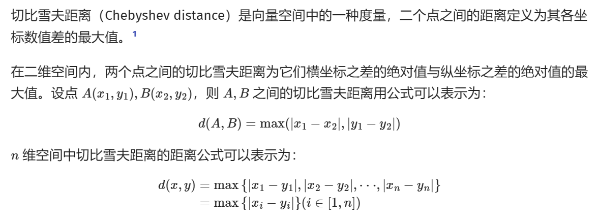


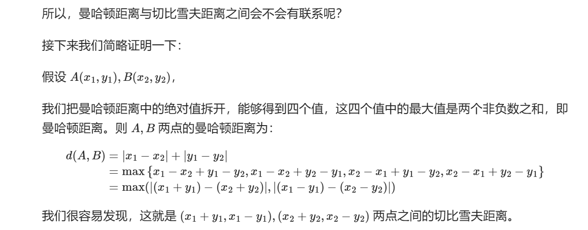


在原坐标系中通过将点的横纵坐标转换**为(x+y,y-x)可以转化到切比雪夫坐标系中**，把所有点转化到切比雪夫坐标系中可以求解切比雪夫距离这个距离等价于原坐标系中的曼哈顿距离，而切比雪夫距离通过最大与最小的横/纵的相减就可以求出，也就是一次遍历把所有点换到切比雪夫中同时维护值的大小，之后枚举删除每一个值后的结果。

```python
from sortedcontainers import SortedList as sl
class Solution:
    def minimumDistance(self, points: List[List[int]]) -> int:
        # 使用有序集合维护
        x=sl()
        y=sl()
        for l,r in points:
            x.add(l+r)
            y.add(r-l)
        ans=inf
        for l,r in points:
            # 先删除在加入
            x.remove(l+r)
            y.remove(r-l)
            ans=min(ans,max(x[-1]-x[0],y[-1]-y[0]))
            x.add(l+r)
            y.add(r-l)
        return ans
```


# 容斥原理

在计算结果的时候不去考虑重叠的部分，先把所有的加上然后再家去重叠的部分，这个公式就是概率论中的几个集合相交


往外推广的结果是1-2+3-4+5-6+....+(-1)^(n-1)*n，奇数个集合是加偶数个集合是减。


可以看作是从n个数中选取任意个，一共有2^n-1个状态（注意不会选0个，等式左边会补上 $$C^0_n$$）


使用容斥原理找能被一个质数整除的个数，这里补充一点1到n中能被p整除的个数是n//p，而能被n和m同时整除的个数是n//(m*n)，这里的p是质数。

能被质数整除的集合一共有m个，枚举每个选或者是不选则有2^m-1个状态

```python
n,m=[int(x) for x in input().split()]
prime=[int(x) for x in input().split()]
res=0
# 使用位图表示当前位置的集合有没有选
for i in range(1,1<<len(prime)):
    # 记录选取的集合的乘积
    t=1
    # 分别记录当前枚举的集合个数和结果
    cnt=summ=0
    # 遍历每一位
    for j in range(m):
        p=prime[j]
        if i>>j&1:
            t*=p
            # 如果累乘的结果大于N说明不存在能被当前集合所除的数
            if t>n:
                t=-1
                break
            cnt+=1
    summ+=n//t
    if t!=-1:
        # 奇数加偶数减
        res+= summ if cnt&1 else -summ
print(res)
```


## [单面值组合的第 K 小金额](https://leetcode.cn/problems/kth-smallest-amount-with-single-denomination-combination/)


二分枚举金额的大小，查看是否满足至少有k个小于等于该金额

注意这里的金额不能有重复值，也就是不能直接取整除后的结果，需要减去重复的值，不仅两个值之间要减去重复的内容，三个值四个值之间也同样需要，因此使用容斥定理求解。

容斥定理枚举子集找出子集的最小公倍数，然后选择减或加。


```python
class Solution:
    def findKthSmallest(self, coins: List[int], k: int) -> int:
        l,r=0,min(coins)*k
        n=len(coins)
        memo={}
        # 预处理出每个子集的最小公倍数
        for s in range(1,1<<n):
            lcm=1
            for j in range(n):
                if s>>j&1:lcm=math.lcm(lcm,coins[j])
            memo[s]=lcm

        def cal(x):
            cnt=0
            for i in range(1,1<<n):
                c=0
                lcm=1
                # 根据子集中元素的个数判断是加还是减(奇数加偶数减)
                c=i.bit_count()
                lcm=memo[i]
                cnt+=pow(-1,c+1)*(x//lcm)
            return cnt>=k

        while l<=r:
            mid=(l+r)>>1
            if cal(mid):
                r=mid-1
            else:
                l=mid+1
        return r+1
```


# 简单博弈论

## NIM游戏

n堆物品，每堆有ai 个，两个玩家轮流取走任意一堆的任意个物品，但不能不取。取走最后一个物品的人获胜

结论是每堆石子的异或和如果等于0，则先手必输反之必胜。

## Training Before the Olympiad


先手想要结果最大后手想要结果最小，每次选奇偶不同的数可以使得元素总和减小一，而相同的总和不变，因此前者尽可能多的选奇偶相同的后者选不同的，此外为了保证先手胜利，先手会每次优先完奇数/偶数优先保证后手不能减小总和。

维护两个前缀数组，一个是奇数的个数一个是前缀和，每一轮如果奇数的个数足够的话可以减少三个如果不够，剩余0个或2个那么最后的总和一定不变，反之一定会减小1.

```python
import sys
from itertools import accumulate as ac
input=sys.stdin.readline


for _ in range(int(input())):
    n=int(input())
    nums=list(map(int,input().split()))
    # 记录奇数个数
    odd=[0]*n
    odd[0]=int(nums[0]&1==1)
    for i in range(1,n):
        odd[i]+=odd[i-1]+int(nums[i]&1==1)
    # 记录前缀和
    pre=list(ac(nums))
    ans=[]
    for i in range(n):
        # 对于第一个要特判
        if i==0:
            ans.append(pre[i])
            continue
        v=odd[i]
        a,b =divmod(v,3)
        # 总和要减去轮数
        if b==0 or b==2:
            ans.append(pre[i]-a)
        else:
            ans.append(pre[i]-a-1)
    for v in ans:
        print(v,end=' ')
    print()
```


​	

# 树状数组

类似于线段树可以快速求出区间和，同时可以更新，这两个操作的时间复杂度为logn,不过这里的更新只能是单点修改。

树状数组的关键在于巧妙地区间拆分

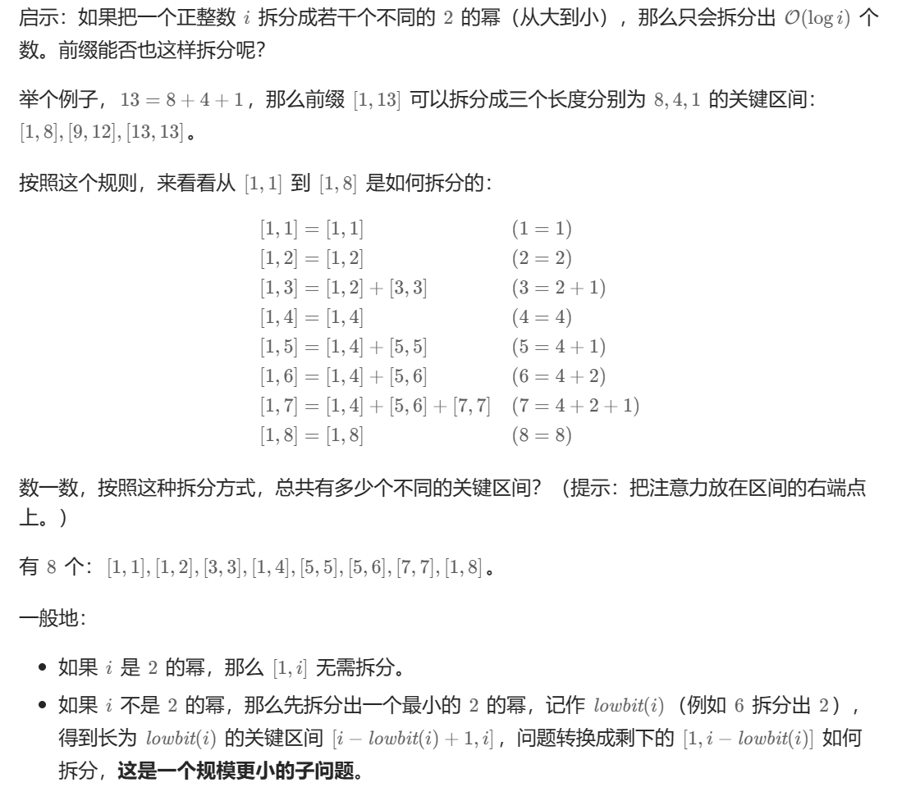


由于关键区间的右端点互不相同，我们可以把右端点为 *i* 的关键区间的元素和保存在*tree*[*i*] 中

想要求解[1,i]的区间和，先求出[i-lowbit(i),i]，然后更新i为i-lowbit(i)表示去找[1,i-lowbit(i)]的区间和，使用一个s变量在外部累加。

而对于更新操作除了把对应的点更新外，还要去更新会受到影响的区间，其中第一个区间就是[1,i]而下一个要更新的区间为[i+1,i+lowbit(i)]就这样一直找下去


query(i)的结果是小于等于i-1的有多少个，数组要开n+2的因为想要取到数字n并且前缀和要做一位偏移


简略版板子如下，只能实现区间求和且数组数值数组，使用时像前缀和的操作方法

```python
class Tree:

    def __init__(self, nums: List[int]):
        # 初始化，相当把每个点更新一次
        n=len(nums)
        self.nums=[0]*n
        self.tree=[0]*(n+1)
        for i,x in enumerate(nums):
            self.update(i,x)

	# 修改索引i位置为val，索引从0开始
    def update(self, index: int, val: int) -> None:
        # 找出差值用于更新前缀
        diff=val-self.nums[index]
        # 更新对应的位置
        self.nums[index]=val
        # 找区间，注意区间会多一位偏移
        i=index+1
        # 迭代
        while i<len(self.tree):
            self.tree[i]+=diff
            # 结论，更新
            i+=i&-i
     # 求前i个数字的和
    def preSum(self,i):
        # 累加
        s=0
        while i:
            s+=self.tree[i]
            i-=i&-i
        return s
    # 求区间[l,r]的和，索引从0开始
    def sumRange(self, left: int, right: int) -> int:
        # 左右位置，求解方式类似于一维
        return self.preSum(right+1)-self.preSum(left)
```


##

# 线段树

**线段树解决区间和的问题，并且区间会被修改。线段数的两个操作：求区间和，修改区间，时间复杂度均为logn**


## 模板


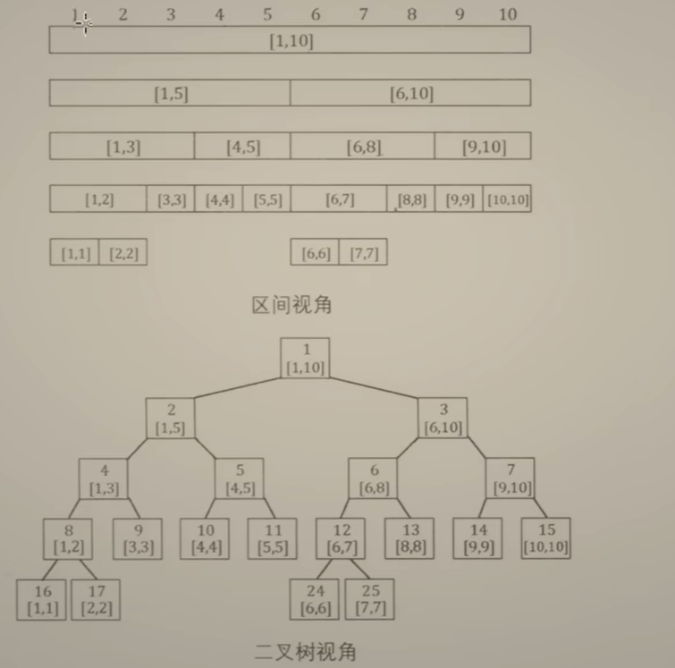


将区间划分**至多4n**(因为满二叉树的节点个数为2n-1，一个**基于经验的安全值**是4n)个节点，其中每个节点记录的是一个区间的**结果**(和，最大值等等)

查询过程通过分支划分较小的区间，但不一定会划分到叶子节点，如果**当前节点对应的区间范围已经被查询的范围包括了，就直接返回该节点储存的结果，**而不需要再往下划分了，这样可以节省时间。

更新的过程中通过**分治**不断划分出**较小的子区间**，但如果要划分到**叶子节点**再更新，则在范围较大时会涉及到**大量节点耗时较多**，因此使用**懒标记(延迟更新)**，即更新操作推迟到真正需要的时候执行，每个节点会配备一个懒标记记录该节点上未处理的更新操作，当对该节点对应的区间进一步查询或更新时，会将标记下推，这样避免了对每个叶子节点的操作。


最基本结构

```python
# 单点修改
def add(o,l,r,idx,val):
    # 到了叶子节点
    if l==r:
        sum[o]+=val
        return 
    mid=(l+r)>>1
    # 在左子树
    if idx<=mid:
        add(2*o,l,mid,idx,val)
    else:# 右子树
        add(2*o+1,mid+1,r,idx,val)
    # 子树递归完了需要更新大的区间
    sum[o]+=sum[2*o]+sum[2*o+1]

# L,R表示实际求解的区间
def query(o,l,r,L,R):
    # 搜索区间被覆盖，直接返回结果，无需要划分下去
    if L<=l and r<=R:
        return sum[o]
    mid=(l+r)>>1
    res=0
    # 左子树存在要计算的区间
    if L<=mid:
        res+=query(2*o,l,mid,L,R)
    if R>=mid+1:# 右子树存在
        res+=query(2*o+1,mid+1,r,L,R)
    return res 
```


涉及到区间更新据需要用到懒标记了


线段树数组实现（数组版本，懒标记，区间查询/修改），根据题目要求传入不同的函数：

```python
class SegTree:
    def __init__(self, nums, func):
        self.nums = nums
        self.n = len(nums)
        self.tree = [0] * (4 * self.n)  # 存储节点，4n是基于经验的安全值
        self.lazy = [0] * (4 * self.n)  # 懒标记数组和节点数组一样大
        self.func = func # 操作的函数，求最大值，求和一类的
        if self.n > 0:
            self._build(0, 0, self.n - 1)
	# 构建节点数组
    def _build(self, root, l, r):
        if l == r:
            self.tree[root] = self.nums[r]
            return
        mid = (l + r) >> 1
        # 递归更新左右，然后合并
        self._build(root * 2 + 1, l, mid)
        self._build(root * 2 + 2, mid + 1, r)
        self.tree[root] = self.func(self.tree[root * 2 + 1], self.tree[root * 2 + 2])

    def _push_down(self, root, l, r):
        """将懒标记下推到子节点"""
        if self.lazy[root] != 0:
            mid = (l + r) >> 1
            # 更新左右子节点的值
            self.tree[root * 2 + 1] += self.lazy[root] * (mid - l + 1)
            self.tree[root * 2 + 2] += self.lazy[root] * (r - mid)
            # 传递懒标记到子节点
            self.lazy[root * 2 + 1] += self.lazy[root]
            self.lazy[root * 2 + 2] += self.lazy[root]
            # 清除当前节点的懒标记
            self.lazy[root] = 0

    def update(self, ul, ur, diff):
        """区间更新，将区间 [ul, ur] 的值增加 diff"""
        self._update_range(0, 0, self.n - 1, ul, ur, diff)
	
    # 更新区间，root表示节点编号，可以从0或者1开始(这里从0开始，如果从1开始则左节点20,右节点2o+1)，lr是该节点覆盖的范围，LR是实际操作的范围
    def _update_range(self, root, l, r, ul, ur, diff):
        if ul <= l and r <= ur:  # 当前区间完全在目标区间内，无需下推直接在这一层标记
            self.tree[root] += diff * (r - l + 1)  # 更新当前区间的值
            self.lazy[root] += diff  # 标记懒更新
            return
        self._push_down(root, l, r)  # 下推懒标记
        mid = (l + r) >> 1
        # 涉及到当前节点的左儿子
        if ul <= mid:
            self._update_range(root * 2 + 1, l, mid, ul, ur, diff)
        # 右儿子
        if ur > mid:
            self._update_range(root * 2 + 2, mid + 1, r, ul, ur, diff)
        # 更新当前节点的值
        self.tree[root] = self.func(self.tree[root * 2 + 1], self.tree[root * 2 + 2])

    def query(self, ql, qr):
        """区间查询，返回 [ql, qr] 的值"""
        return self._query_range(0, 0, self.n - 1, ql, qr)
	
    # 参数同理
    def _query_range(self, root, l, r, ql, qr):
        if ql <= l and r <= qr:  # 当前区间完全在目标区间内，无需继续划分直接返回
            return self.tree[root]
        self._push_down(root, l, r)  # 下推懒标记
        mid = (l + r) >> 1
        res = 0
        # 划分区间
        if ql <= mid:
            res = self.func(res, self._query_range(root * 2 + 1, l, mid, ql, qr))
        if qr > mid:
            res = self.func(res, self._query_range(root * 2 + 2, mid + 1, r, ql, qr))
        return res

```


线段树模板（动态开点，区间和）需要注意当区间较大时(10**9)才会用到动态开点线段树，这个版本的实现很慢：

```python
class Node:
    def __init__(self):
        self.left=None
        self.right=None
        self.add=0
        self.val=0
def pushup(node):
    node.val=node.left.val+node.right.val

def pushdown(node,lc,rc):
    if not node.left:node.left=Node()
    if not node.right:node.right=Node()

    if node.add==0:return
    node.left.val+=lc*node.add
    node.right.val+=rc*node.add
    # 懒标记不需要加
    node.left.add += node.add
    node.right.add += node.add
    node.add=0

def update(root,start,end,l,r,val):
    if l<=start and r>=end:
        root.val+=(end-start+1)*val
        root.add+=val
        return
    mid=(start+end)>>1
    pushdown(root,mid-start+1,end-mid)
    if l<=mid:update(root.left,start,mid,l,r,val)
    if r>=mid+1:update(root.right,mid+1,end,l,r,val)
    pushup(root)
def query(root,start,end,l,r):
    if l <= start and r >= end:return root.val
    mid=(start+end)>>1
    ans=0
    pushdown(root,mid-start+1,end-mid)
    if l<=mid:ans+=query(root.left,start,mid,l,r)
    if r>=mid+1:ans+=query(root.right,mid+1,end,l,r)
    return ans
```

注意根据题意的不同线段树中的各个函数也是可能改变的，基本上pushup,pushdown 之类的函数会变化


##

# 字典树


## Trie字符串统计

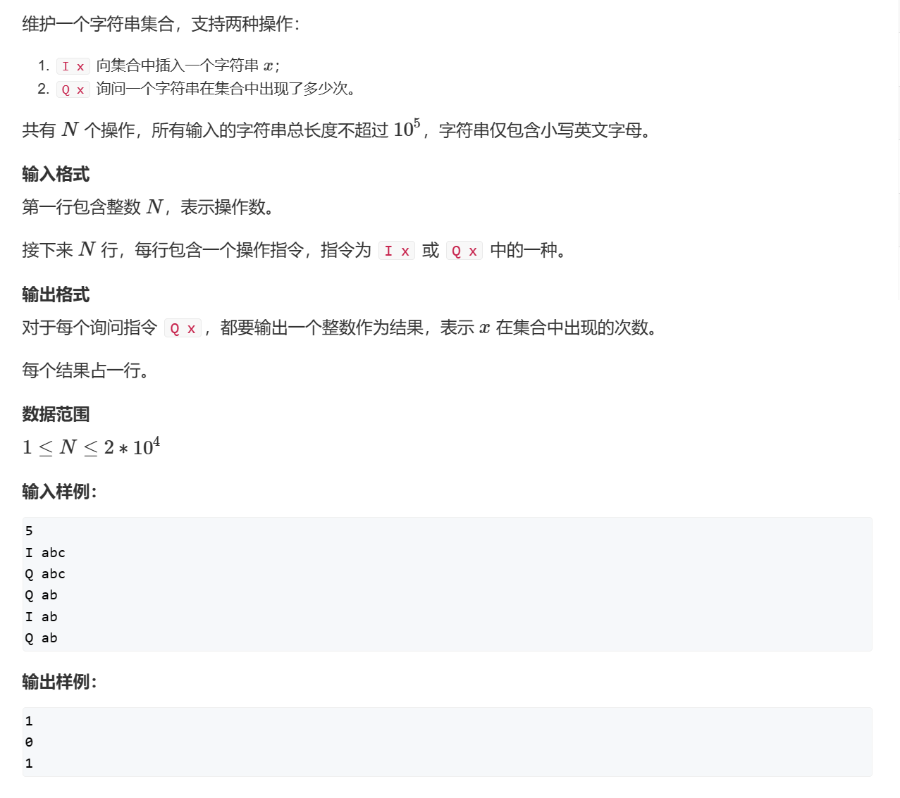

```python
class Trie:
    def __init__(self):
        self.children=[None]*26
        self.is_end=0
    def insert(self,s):
        d=self
        for c in s:
            c=ord(c)-ord('a')
            if not d.children[c]:
                d.children[c]=Trie()
            d=d.children[c]
        d.is_end+=1
    def search(self,s):
        d=self
        for c in s:
            c=ord(c)-ord('a')
            if not d.children[c]:
                return 0
            d=d.children[c]
        return d.is_end
q=int(input())
tree=Trie()
while q:
    a,s=input().split()
    if a=='I':
        tree.insert(s)
    else:
        print(tree.search(s))
    q-=1
```


# 二维前缀和

## 二维区域和检索–矩阵不可变

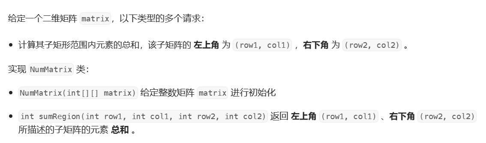

利用前缀和数组，计算出从原点到[i,j]的矩阵元素和

1. 从 `(row2, col2)` 处的前缀和减去 `(row1 - 1, col2)` 处的前缀和（如果 `row1` 不为0的话）。
2. 再减去 `(row2, col1 - 1)` 处的前缀和（如果 `col1` 不为0的话）。
3. 最后再加上 `(row1 - 1, col1 - 1)` 处的前缀和（如果 `row1` 和 `col1` 都不为0的话）。

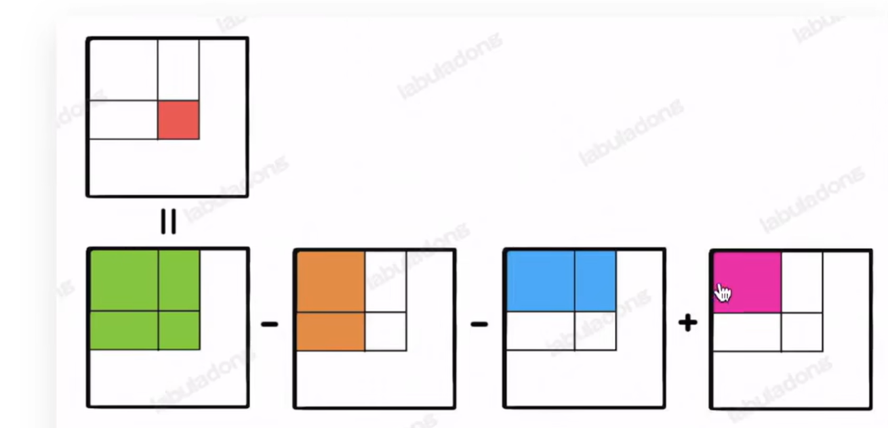

```python
class NumMatrix(object):

    def __init__(self, matrix):
        if not matrix or not matrix[0]:
            self.prefix_sum = None
            return
        self.matrix=matrix
        m=len(matrix)
        n=len(matrix[0])
        # 所构建的数组长宽都要多出一，可以方便计算，不是防止越界
        self.prematrix=[[0]*(n+1) for _ in range(m+1)]
        for i in range(1,m+1):
            for j in range(1,n+1):
                # 子矩阵的元素和为矩阵元素加上左边的子矩阵加上上边的子矩阵减去重复的左上矩阵 
                self.prematrix[i][j]=self.matrix[i-1][j-1]+self.prematrix[i-1][j]+self.prematrix[i][j-1]-self.prematrix[i-1][j-1]
	
    def sumRegion(self, row1, col1, row2, col2):
        # 最后的计算中注意不能重叠，放到矩阵上做一位偏移
        return self.prematrix[row2+1][col2+1]-self.prematrix[row2+1][col1]-self.prematrix[row1][col2+1]+self.prematrix[row1][col1]
```


# 二维差分

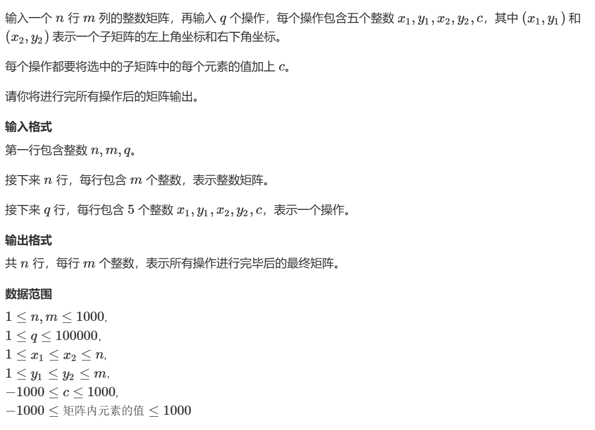

二维差分`要构造比给定矩阵大2的差分矩阵，初始化为0，因为方便构建前缀和操作需要n+1（在原矩阵上构建前缀和），而差分的更新操作又需要n+1`。坐标都要做一位偏移，而右侧下侧的坐标额外做一次偏移

然后根据原矩阵构造差分，对于原矩阵的每一个值，`相当于在差分矩阵中插入一个值，不过左上角和右下角是一样的`。`差分矩阵的更新操作为对(i,j,x,y)把i,j位置加一，最后的前缀和使得以i,j为左上角到最右下的矩阵面积中的值都变化，因此需要在i,y+1和x+1,j减去对应的值，而在x+1,y+1处加上多减去的部分。`

```python
from itertools import accumulate as ac
n,m,q=[int(x) for x in input().split()]
li=[]
for _ in range(n):
    li.append([int(x) for x in input().split()])
# 矩阵规模大出2
diff=[[0 for _ in range(m+2)] for _ in range(n+2)]

# 根据原矩阵初始化差分矩阵
for i in range(n):
    for j in range(m):
        c=li[i][j]
        # 与一般的更新操作一样
        diff[i+1][j+1]+=c
        diff[i+1][j+2]-=c
        diff[i+2][j+1]-=c
        diff[i+2][j+2]+=c


while q:
    # 更新
    x1,y1,x2,y2,c=[int(x)-1 for x in input().split()]
    c+=1
    diff[x1+1][y1+1]+=c
    diff[x1+1][y2+2]-=c
    diff[x2+2][y1+1]-=c
    diff[x2+2][y2+2]+=c
    q-=1
    
# 构建二维前缀和
for i in range(1,n+1):
    for j in range(1,m+1):
        diff[i][j]+=diff[i-1][j]+diff[i][j-1]-diff[i-1][j-1]

 # 减去无用的第一行最后一行第一列最后一列
for i in range(n+2):
    diff[i]=diff[i][1:-1]
diff=diff[1:-1]

for d in diff:
    print(*d,end=' ')
    print()
```


# 并查集

该算法主要用于解决图论中的动态连通性问题。

```python
class UF:
    def __init__(self, n):
        self.count = n
        self.parent = [i for i in range(n)]
        self.size = [1 for _ in range(n)]
	
    # 默认p->q
    def union(self, p, q):
        rootp = self.find(p)
        rootq = self.find(q)
        if rootq == rootp:
            return
        self.parent[rootp] = rootq
        self.size[rootq] += self.size[rootp]
        self.count -= 1

    def connect(self, p, q):
        rootp = self.find(p)
        rootq = self.find(q)
        return rootq == rootp
    # 会将节点铺开理解到一个节点上，保证数树的深度为一，给一个连通块理解上一个新的连通块并不改改变原有的根节点
    def find(self,p):
        if self.parent[p]!=p:
            self.parent[p]=self.find(self.parent[p])
        return self.parent[p]
```


# Logtrick

利用运算结果是有限的(位运算，乘积等于和，公因数)，来维护一个较短的数组(如果求得的是一个最接近的值那么可以直接往回找，如果求的是子数组的长度，那么额外维护一个索引值，如果是个数，那么就维护一个个数，在去重的时候更新或合并)，这个数组是当前位置之前的所有子数组的运算结果，每次枚举一个值的时候都会遍历这个数组重新计算以当前值为端点得到的新的子数组的结果。


## [按位或最大的最小子数组长度](https://leetcode.cn/problems/smallest-subarrays-with-maximum-bitwise-or/)

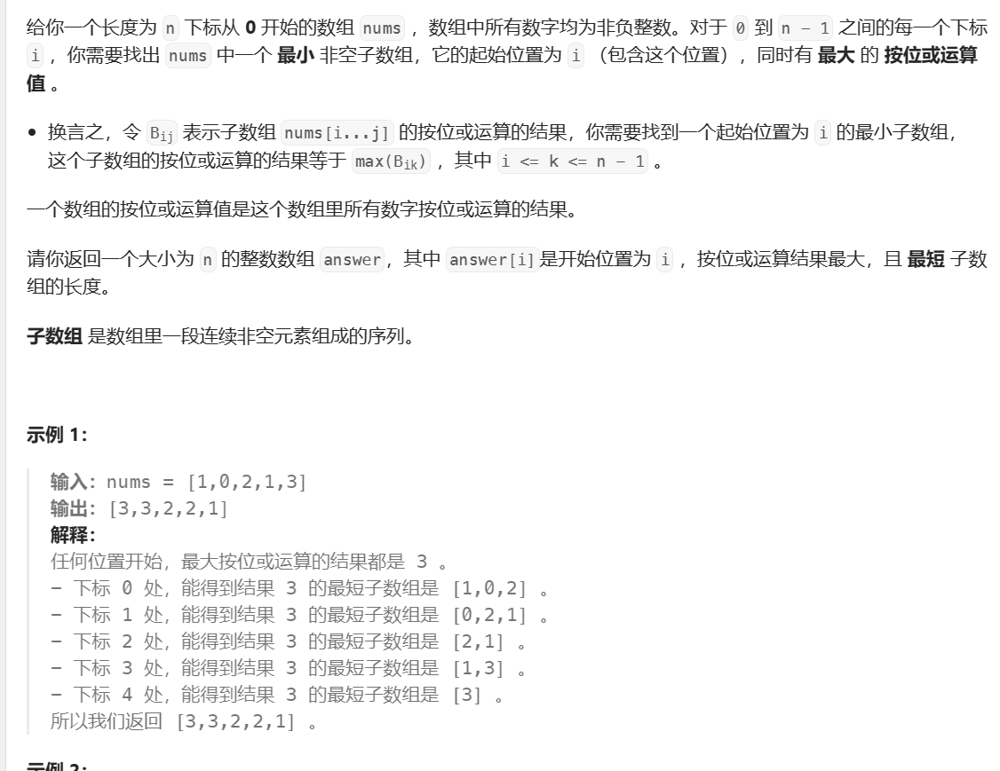

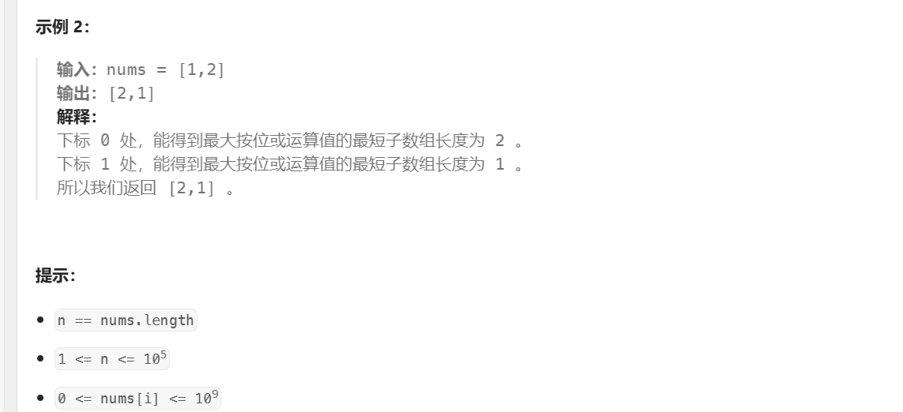

题意为：找出以每个元素为起始位置的子数组中，按位或能得到最大值的最短子数组。

异或运算得到的子数组只会是递增或是不变的具有单调性，使用一个数组来维护每个位置的元素所能得到的最大值以及这个位置，百万级别的数据对应到二进制上最多只有三十几个状态，因此维护的数据不会太大，而每个元素能对应的区间又可以由前一个元素推出。


```python
class Solution:
    def smallestSubarrays(self, nums: List[int]) -> List[int]:
        n=len(nums)
        ans=[0]*n
		# 维护状态（异或值，右端点索引），每次加到尾部，因此数组首部就是最大的异或值
        ors=[]
        # 倒序遍历，因为要以i为起点
        for i in range(n-1,-1,-1):
            ors.append([0,i])
            # 每个元素所有子数组的结果可以由上一个元素的结果推出，因为运算具有单调性
            for p in ors:
                p[0]|=nums[i]
            # 以下是去重的逻辑，因为对于相同的值，题目要求去最短区间
            l=0
            r=1
            while r<len(ors):
                if ors[r][0]!=ors[l][0]:
                    l+=1
                    ors[l]=ors[r]
                else:
                    # 对于相同的值取小的右端点
                    ors[l][1]=ors[r][1]
                r+=1
            del ors[l+1:]
            # 可以保证数组中的第一个元素是当前能到达的最大的
            ans[i]=ors[0][1]-i+1
        return ans 
        
```


## [子数组按位或操作](https://leetcode.cn/problems/bitwise-ors-of-subarrays/)

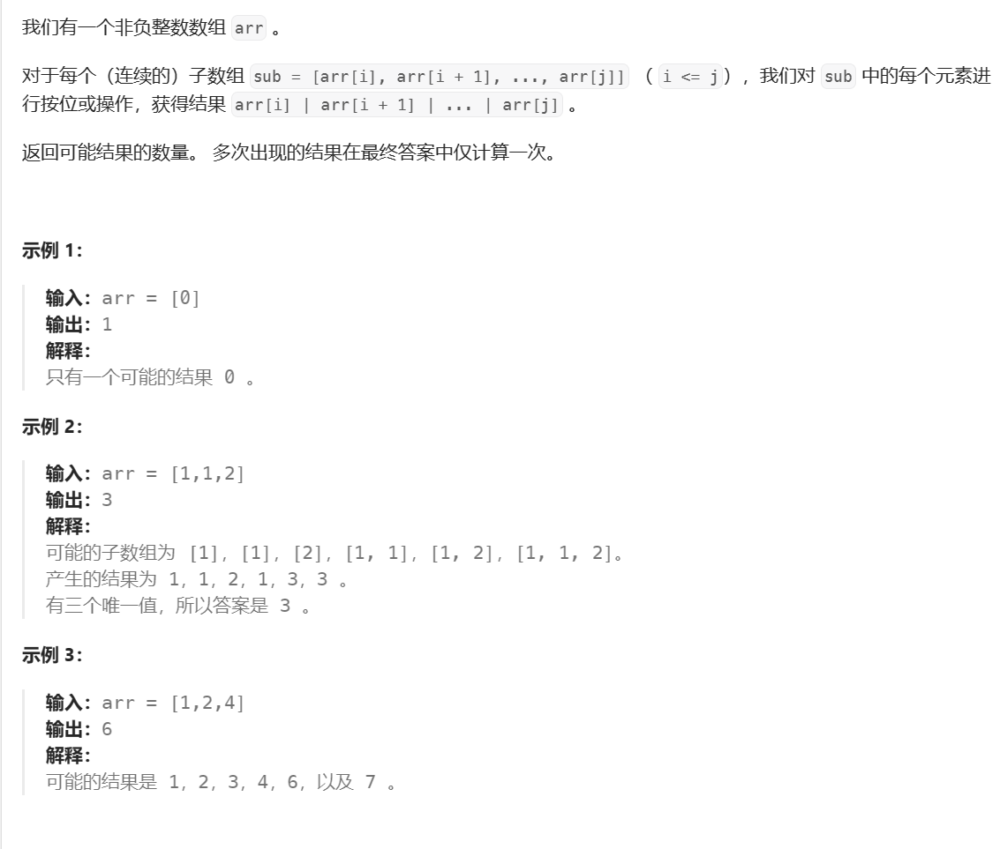

同上一题一样的解法，在找一个子数组最大的或结果中记录结果。或实质上是并集，遍历每一个元素，求他和之前的元素之间的或的结果，如果if nums[i]|nums[j]==nums[j]就说明当前的元素不会再使前面的集合变大了直接退出	


```python
class Solution:
    def subarrayBitwiseORs(self, nums: List[int]) -> int:
        ans=0
        n=len(nums)
        memo=set()
        # 这个题目不需要记录索引直接用集合去重
        ors=set()
        for i in range(n-1,-1,-1):
            ors.add(nums[i])
            temp=set()
            # 不能直接对原集合操作
            for j in ors:
                j|=nums[i]
                if j not in memo:
                    ans+=1
                    memo.add(j)
                temp.add(j)
            ors=temp        
        return ans 
```


# 倍增

## Teleporter

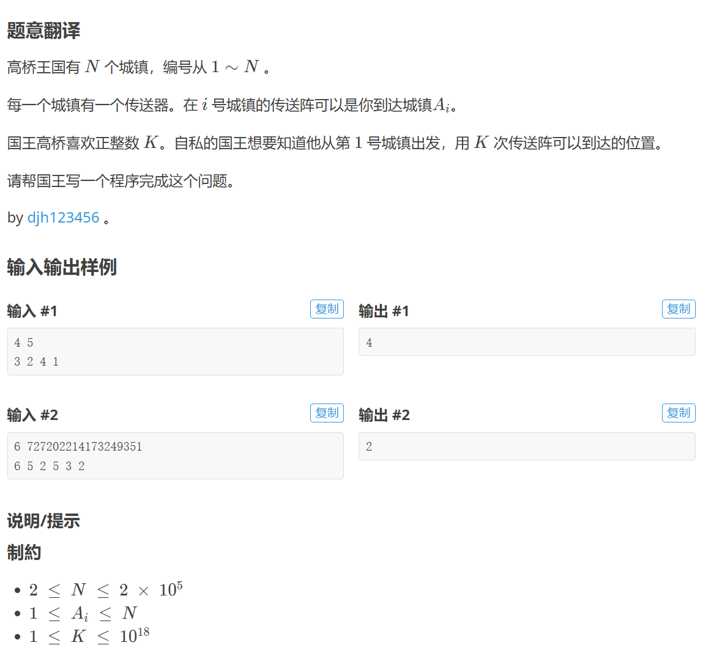

给定的K非常大，唯一的做法是nlogk，定义fi,j表示从第i个城市经过2\^j后所在的城市，这个结果可以由f[f[i]\[j-1]]\[j-1]求出，即i位置经过了2\^(j-1)步后再走2^(j-1)步求出。这样选定的状态j最多只有65。而题目所求的第一个位置在k步后所在的位置可以拆位递推求解。

另一种写法是找周期取模

```python
n,k=RR()
nums=RR()
K=66

f=[[0]*K for _ in range(n)]
# 初始化
for i in range(n):
    f[i][0]=nums[i]-1

# 递推过程
for j in range(1,K):
    for i in range(n):
        f[i][j]=f[f[i][j-1]][j-1]

ans=j=0
# 对于k=11也就是1011拆分为8+2+1，模拟这个递推过程
while k:
    if k&1:ans=f[ans][j]
    j+=1
    k>>=1

print(ans+1)

```


# 试填法

位运算经典算法，本质上是对每一位去构造答案


## [给定操作次数内使剩余元素的或值最小](https://leetcode.cn/problems/minimize-or-of-remaining-elements-using-operations/)

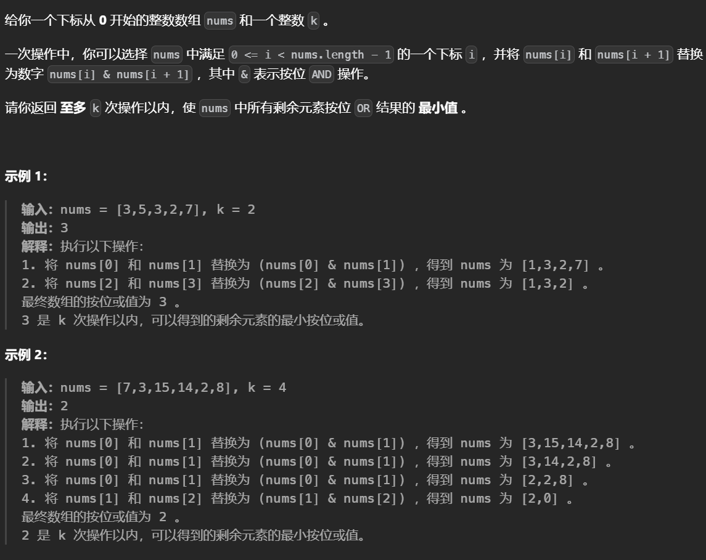	   											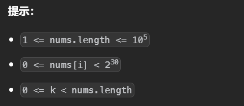


要求最后或出的结果最小，那么所有数字最高位的1都应该尝试消除掉，通过试填法来构造答案，从高位到低位枚举

按照题目要求两两相与，如果一段数字能与出0，那么操作次数就是这段数字长度-1，否则就需要从外部引入一个0，操作次数就是这段数字的长度。如果把这一位变为0需要的次数大于k，就说明无论如何都无法将这一位变为0，遂不考虑这位，否则在找更低位的时候仍需保持这一位为0的约束。

```python
class Solution:
    def minOrAfterOperations(self, nums: List[int], k: int) -> int:
        ans=0
        # mask用于取出每个数字的约束位，比如要考虑第一位和第三位，那么mask就为101，将每个数的一三位取出，第二位不考虑因为无法变为0，通过mask在找低位时可以同时考虑到高位的约束
        mask=0
        # 操作每一位
        for i in range(29,-1,-1):
            # ans_res是用于计算按位与的结果，初始时应该为11111...，这里令为-1可以简单表示
            ans_res=-1
            # 先要取出这一位
            mask|=(1<<i)
            # 记录操作次数
            cnt=0
            # 从头开始找每一段
            for v in nums:
                # 取出约束位
                v&=mask
                # 按位与
                ans_res&=v
                # 合并x操作次数加一，因为k小于数组长度，所以如果一直找不到的话最后cnt的次数一定会大于k
                if ans_res:
                    cnt+=1
                else:
                    # 这一段操作成功，那么去找下一段
                    ans_res=-1
            # 无法变为1
            if cnt>k:
                # 加入到答案中
                ans|=(1<<i)
                # 撤销mask上这一位
                mask^=(1<<i)
        return ans 
```


# 位运算常用技巧


## 集合与集合

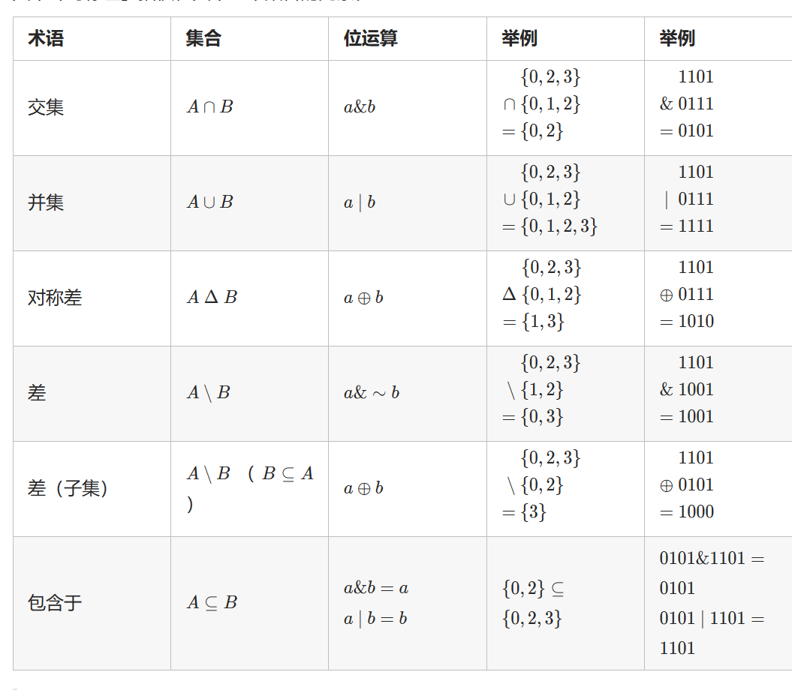


## 集合与元素


**i>>n<<n可以取出n位之上的**

二进制取反就是找补集的操作：**异或上((1<<n)-1)**，n表示二进制长度，如果不想把最高位取反那么把n减去1即可。

**lowbit就是二进制下最低位1与其右边的0构成数字大小，可以通过i&-i求出**

对于二进制加法有**a+b=(a^b)+2(a&b)**


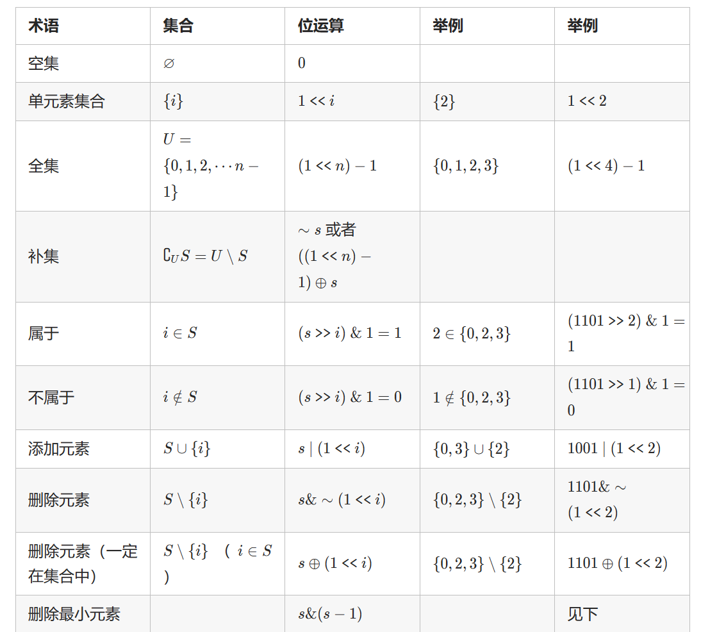


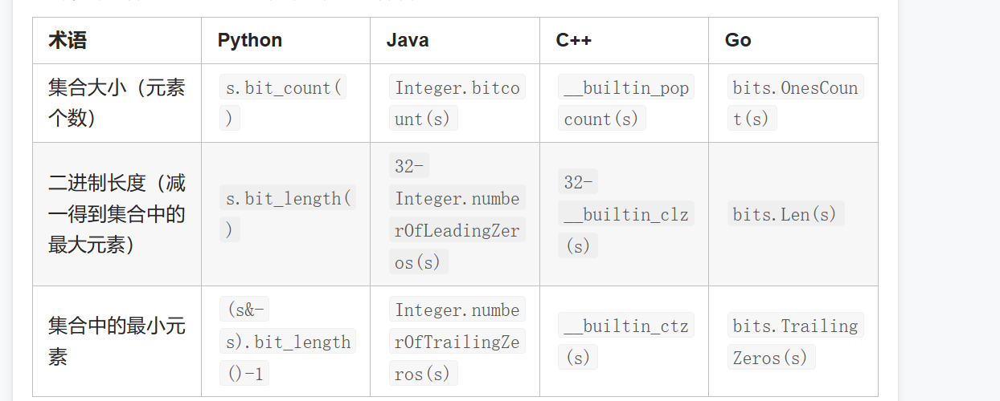


## 遍历集合

直接循环

```python
for i in range(n):
    if (s >> i) & 1:  # i 在 s 中
        # 处理 i 的逻辑
```


使用lowbit的技巧

```python
t = s
while t:
    lowbit = t & -t
    t ^= lowbit
    i = lowbit.bit_length() - 1
    # 处理 i 的逻辑
```


## 枚举集合

最直接的是for循环

所有子集

```python
sub = s
while True:
    # 处理 sub 的逻辑
    sub = (sub - 1) & s
    if sub == s:
        break
```


**从大到小**枚举所有子集，**不包括空集**

```python
sub = s
while sub:
    # 处理 sub 的逻辑
    sub = (sub - 1) & s
```

# 树的直径


## 树的直径


树的直径就是两个相邻最远的节点的距离

+ BFS方法，从任意节点开始都可以得到任意一个极端节点（距离所有节点最远的两个节点），然后从这个节点开始再进行一次BFS就可以得到另一个极端节点，这两个极端节点之间的距离就是树的直径。

```python
from collections import deque


class Solution(object):
    def treeDiameter(self, edges):
        if not len(edges):
            return 0
        # 使用set集合记录每一个边
        paths = [set() for _ in range(len(edges) + 1)]
        for edge in edges:
            u, v = edge
            paths[u].add(v)
            paths[v].add(u)

        # bfs框架
        def bfs(start):
            d = deque([start])
            
            # 备忘录防止重复加入
            visited = [False] * (len(paths))
            visited[start] = True
            # 记录最后一个节点
            lastnode = None
            # 距离从-1开始，因为遍历到最后一层时还会向外遍历一次，如果从0开始最后的结果会多出一
            distance=-1
            while d:
                sz = len(d)
                # 只遍历之前队列中元素的个数次
                for _ in range(sz):
                    # 弹出
                    curr = d.popleft()
                    for i in paths[curr]:
                        # 加入不重复的邻居
                        if not visited[i]:
                            visited[i] = True
                            d.append(i)
                            lastnode = i
				# 距离加一
                distance += 1
            return [distance, lastnode]
       
        distance, lastnode = bfs(0)
        return bfs(lastnode)[0]
```


+ 使用回溯算法解题，如果可以得到从父节点到任何后代叶子节点的最长距离t1,t2，那么经过该父节点的最长半径就是t1+t2，整个树的最长半径就是所有节点中的最长半径


```python
class Solution(object):
    def treeDiameter(self, edges):

        paths = [set() for _ in range(len(edges) + 1)]
		# 记录所有边
        for edge in edges:
            u, v = edge
            paths[u].add(v)
            paths[v].add(u)
            
         # 设置备忘录
        visited=[False]*len(paths)
        # 不断更新外部变量来得到最大值
        self.diameter=0

        # 会返回以p为父节点到叶子结点的最大距离
        def dfs(p,visited):
            # 设置两个到叶子节点的最长距离
            left = 0
            right = 0
            # 标记
            visited[p]=True
            for val in paths[p]:
                # 包含过了
                if visited[val]:
                    continue
                # 该节点到叶子结点的距离为它的子节点到叶子结点的距离加一
                distance=1+dfs(val,visited)
                # 更新
                if distance>left:
                    left,right=distance,left
                elif distance>right:
                    right=distance
			
                self.diameter=max(self.diameter,left+right)
            
            return left

        dfs(0,visited)
        return self.diameter
```

# 矩形面积

## 矩形牛棚

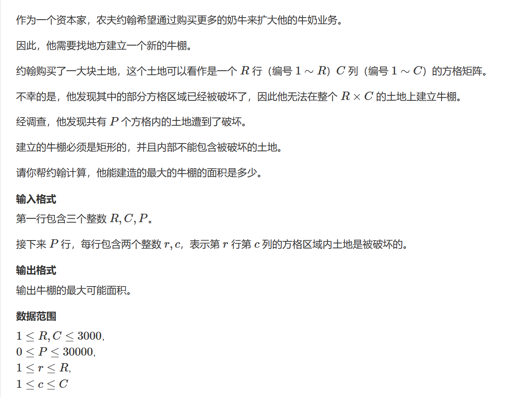


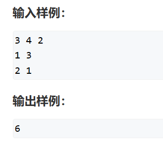


样例类似于：

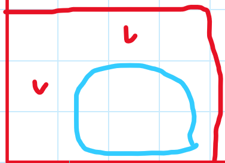


枚举每一条下边界，求以这个下边界为底找最大的矩形面积，问题转换为直方图中的最大矩形，对于一条下边它每个位置上的直方高是多少使用递归求解如果这个位置上有一个破坏的点那么它的高是0，否则是上一行的高加上一。

```python
from collections import deque
import copy
import sys
input=sys.stdin.readline

m, n, c = [int(x) for x in input().split()]

# 记录破坏的点
grid=[[0]*n for _ in range(m)]
# 记录每个位置上直方的高
h=[[0]*n for _ in range(m)]


for _ in range(c):
    a, b = [int(x)-1 for x in input().split()]
    grid[a][b]=1

# 迭代求解
h[0]=[v^1 for v in grid[0]]
for i in range(1,m):
    for j in range(n):
        if not grid[i][j]:h[i][j]=h[i-1][j]+1

ans = 0
# 枚举每个高
for b in range(m):
    nums =h[b]
    l = [0]*n
    r = [0]*n
    d = deque()
    # 单调栈计算左右位置
    for i in range(len(nums)):
        v = nums[i]

        while d and nums[d[-1]] >= v:
            d.pop()
        if d:
            l[i]=d[-1]
        else:
            l[i]=-1
        d.append(i)
    d = deque()
    for i in range(n- 1, -1, -1):
        v = nums[i]
        while d and nums[d[-1]] >= v:
            d.pop()
        if d:
            r[i]=d[-1]
        else:
            r[i]=n
        d.append(i)
    
    for i, v in enumerate(nums):
        ans = max(ans, (v) * (r[i] - l[i]-1))
print(ans)
```


## 直方图中最大的矩形

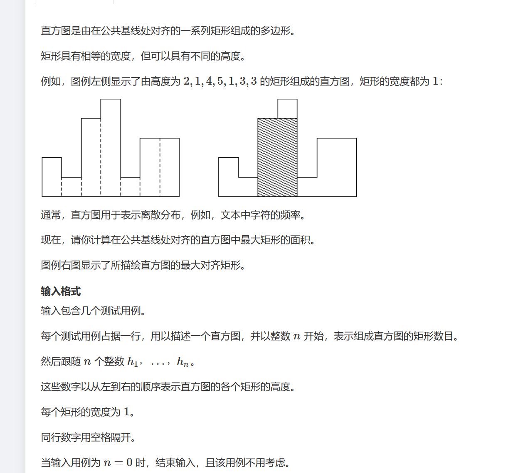


枚举每一个上边，以该上边形成的最大矩形取决于两边比它小的上边的位置，使用单调栈找出两边小于它的位置即可。

```python
from math import inf
import sys
from collections import deque

input = sys.stdin.readline
while 1:
    nums = [int(x) for x in input().split()][1:]
    if len(nums) ==0:
        break
    # 储存左边小于的，右边小于的
    l = []
    r = []
    # 栈中储存的是下标
    d = deque()
    ans = -inf
    for i, v in enumerate(nums):
        if not d:
            l.append(-1)
            d.append(i)
            continue
        # 大于的值没必要留在栈中，因为只会取到小的值
        while d and nums[d[-1]] >= v:
            d.pop()
        if not d:
            l.append(-1)
        else:
            l.append(d[-1])
        d.append(i)
    # 注意清空栈
    d=deque()
    for i in range(len(nums) - 1, -1, -1):
        v = nums[i]
        if not d:
            r.append(len(nums))
            d.append(i)
            continue
        while d and nums[d[-1]] >= v:
            d.pop()
        if not d:
            r.append(len(nums))
        else:
            r.append(d[-1])
        d.append(i)
    r = list(reversed(r))
    for i, v in enumerate(nums):
        ans = max(ans, v * (r[i] - l[i] - 1))
    print(ans)
```

