# 板子

# 并查集

```python
# 完整模板
# 迭代方式的find函数要配合size使用
class UF:
    def __init__(self, n):
        self.count = n
        self.parent = [i for i in range(n)]
        self.size = [1 for _ in range(n)]

    def union(self, p, q):
        rootp = self.find(p)
        rootq = self.find(q)
        if rootq == rootp:
            return
        # 小的连接到大的上面去
        if self.size[rootq] < self.size[rootp]:
            self.parent[rootq] = rootp
            self.size[rootp] += self.size[rootq]
        else:
            self.parent[rootp] = rootq
            self.size[rootq] += self.size[rootp]
        self.count -= 1

    def connect(self, p, q):
        rootp = self.find(p)
        rootq = self.find(q)
        return rootq == rootp
    # 会将节点铺开理解到一个节点上，保证数树的深度为一，给一个连通块理解上一个新的连通块并不改改变原有的根节点
    def find(self,p):
        if self.parent[p]!=p:
            self.parent[p]=self.find(self.parent[p])
        return self.parent[p]
```


# 内向基环树

## [ 参加会议的最多员工数](https://leetcode.cn/problems/maximum-employees-to-be-invited-to-a-meeting/)


内向基环图，具有n个节点n条边的连通块，内向指的是连通块中的每个节点的出度为1，外向指的是入度为1，基环图中在基环外可以连接有多个树枝

每个员工只能坐在喜欢的人边上那么座次必须要满足是一个内向基环图

如果基环的大小大于等于3，那么圆桌上能做的人数就是基环的大小，一旦往这个环里向x->y插入其他的节点，一定会使得x不满足条件。

如果基环的大小为2，那么两个点的两边可以继续坐人也就是求出两个点的最长链，为此需要构造一个反图，此外在这个座次中可以继续坐入大小为2的基环。


通过一次拓扑排序可以将树枝的入度变为0以此与基环分开，因为图谱排序中只能操作树枝，通过构建反图。

```python
class Solution:
    def maximumInvitations(self, favorite: List[int]) -> int:
        n=len(favorite)
	# 计算入度
        deg=[0]*n
        for f in favorite:
            deg[f]+=1
        q=deque([i for i,v in enumerate(deg) if not v])    
        r=defaultdict(list)
        # 将树枝与基环分开，基环是不会入队的
        while q:
            x=q.popleft()
            y=favorite[x]
            # 构建反图
            r[y].append(x)
            deg[y]-=1
            if not deg[y]:
                q.append(y)
         # 求出最长的链
        def dfs(x):
            if not r[x]:return 0
            return max(dfs(y)+1 for y in r[x])
        a=b=0
        # 遍历每一个点，找出基环
        for i,v in enumerate(deg):
            if not v:continue
            # 设置为0防止重复访问到
            deg[i]=0
            j=favorite[i]
            res=1
            # 一直顺着基环找
            while j!=i:
                deg[j]=0
                j=favorite[j]
                res+=1
            # 分类讨论 
            if res>2:
                a=max(a,res)
            elif res==2:
                # 基环长度为2的可以一直累加
                b+=dfs(i)+dfs(favorite[i])+res
        return max(a,b) 
```


# Dijkstra

```python
# 一般版本
from math import inf

n, m = [int(x) for x in input().split()]
path = [[inf] * n for _ in range(n)]
dis = [inf] * n
dis[0] = 0
# 不用标记初始点
vis = [False] * n
for _ in range(m):
    u, v, w = [int(x) for x in input().split()]
    #注意要取最小值，可能有重边
    path[u-1][v-1] = min(w,path[u-1][v-1])
while True:
    x = -1
    # 遍历一遍所有点，选出其中没有被访问过且力起点最近的点
    for i in range(n):
        if not vis[i] and (x < 0 or dis[i] < dis[x]):
            x = i
    # 图不连通
    if x < 0 or dis[x] == inf:
        print(-1)
        break
    # 找到了，由于求的是单源最短路直接返回
    if x == n - 1:
        print(dis[x])
        break
    # 标记
    vis[x] = True
    # 更新状态
    for u, w in enumerate(path[x]):
        dis[u] = min(dis[u], dis[x] + w)

# 根堆优化
from collections import defaultdict
from math import inf
import heapq

n, m = [int(x) for x in input().split()]
# 这里由于点数太多，且图是稀疏图因此使用邻接表
path =defaultdict(dict)
dis = [inf for i in range(n)]
dis[0] = 0

# 建图
for _ in range(m):
    u, v, w = [int(x)-1 for x in input().split()]
    # 不使用默认字典，即使是双向边也能用
    if v in path[u]:
        path[u][v]=min(path[u][v],w+1)
    else:
        path[u][v]=w+1

# 第一个值作为权重
h=[(0,0)]
while h:
    d,x=heapq.heappop(h)
    # 当前点之前出过堆
    if d>dis[x]:continue
    
    for k,v in path[x].items():
        # 严格小于 
        if d+v<dis[k]:
            dis[k]=d+v
            heappush(h,(dis[k],k))       
print(*dis[1:])
```


# Kruskal


## 联通所有点的最小费用


最小生成树问题，

```python
class UF:
    def __init__(self, n):
        self.count = n
        self.parent = [i for i in range(n)]
        self.size = [1 for _ in range(n)]

    def union(self, p, q):
        rootp = self.find(p)
        rootq = self.find(q)
        if rootq == rootp:
            return
        if self.size[rootq] < self.size[rootp]:
            self.parent[rootq] = rootp
            self.size[rootp] += self.size[rootq]
        else:
            self.parent[rootp] = rootq
            self.size[rootq] += self.size[rootp]
        self.count -= 1

    def connect(self, p, q):
        rootp = self.find(p)
        rootq = self.find(q)
        return rootq == rootp

# 递归，最终返回树的根节点
	def find(self,x):
    # 递归终止的条件是找到根节点
		if self.parent[x]!=x:
        	#在递归过程中把每一个节点的父节点设置为根节点
			self.parent[x]=self.find(self.parent[x])
    	return self.parent[x]
    def count(self):
        return self.count
class Solution(object):
    def minCostConnectPoints(self, points):
        connection=[]
        # 计算出每个节点之间的权重
        for i in range(len(points)):
            for j in range(i+1,len(points)):
                x_i=points[i][0]
                y_i=points[i][1]
                x_j = points[j][0]
                y_j = points[j][1]
                # 每个节点是一个坐标，选择将节点映射为它在points中的索引
                connection.append((i,j,abs(x_i-x_j)+abs(y_i-y_j)))
        # 按照权重排序
        connection=sorted(connection,key=lambda x:x[2])

        uf =UF(len(points))
        mst=0
        for connect in connection:
            # 避免多余的迭代
            if uf.count==1:
                break
            p=connect[0]
            q=connect[1]
            w=connect[2]
            if uf.connect(p,q):
                continue
            uf.union(p,q)
            mst+=w
        return mst 
```

# Z函数

z[i]表示s[i:]\(每个后缀)与s的公共最长前缀是多少

初始时从1开始比较，找到最长前缀就是暴力匹配，匹配之后会有一段z-box:


再找下一个s[i:]的过程中如果i落在了z-box中，首先判断z[i-l]是否小于z-box的边界到i的距离，如果小于就确定了z[i]=z[i-l]，反之说明在z-box中的这一段都是匹配的继续往后找，最后更新z-box

```python
def z(s):
    n=len(s)
    z=[0]*n
    l,r=0,0
    for i in range(1,n):
        # 在z-box中并且小于
        if i<=r and z[i-l]<r-i+1:
            z[i]=z[i-l]
        else:
            # 先初始化为到边界的距离
            z[i]=max(0,r-i+1)
            # 往后找
            while i+z[i]<n and s[z[i]]==s[i+z[i]]:      
                z[i]+=1
            # 更新区间
            if i+z[i]-1>r:
                l=i
                r=i+z[i]-1
    return z
```


如果存在s和p 想找s的每个前缀能匹配多长的p(子串)，由于z函数是自身与自身匹配，这里可以拼接p+s求解z函数 s[i:]能匹配的最长的p即为z[i+len(p)]


对于后缀要倒置s2=p[::-1]+s[::-1]， z2=z(s2) 求解时b=z2[len(p)+len(s)-r(子串的右端点)]


# 树状数组


```python
class Tree:
    def __init__(self, n):
        # 初始化树状数组，大小为 n + 1
        self.tree = [0] * (n + 1)

    def cal(self,x):
        return x & (-x)
    def update(self, i, detal):
        # 更新操作，i 是索引，detal 是增量
        i += 1  # 树状数组下标从 1 开始
        while i < len(self.tree):
            self.tree[i] += detal
            i += self.cal(i)

    def querymax(self, i: int) -> int:
        # 查询最大值，[0, i-1] 区间
        mx = 0
        while i:
            mx = max(mx, self.tree[i])
            i &= i - 1  # 去掉最低有效位
        return mx

    def get(self, i):
        # 查询前缀和，[0, i-1] 区间
        s = 0
        while i:
            s += self.tree[i]
            i -= self.cal(i)
        return s
    def query(self,l,r):
        # 查询[l,r-1]的区间和
        return self.get(r)-self.get(l)
```


# 数学知识

# 偶数和奇数

从1到n中**奇数**的个数为**(n+1)//2**，偶数的个数为**n-(n+1)//2**，通过**异或**两个数可以判断两个数的奇偶性是否相同(==1?)

# 取模

想要求迭代求10x+1，为防止结果太大需要取模，在迭代的过程中10*x+1中的x可以直接取上一次迭代后取模的结果


# 质数（素数）

对于质数相关的题目经常打表计算，构建质数表的效率至关重要，如果选择遇到一个数字就去从2开始遍历它，然后在遍历中判断是不是质数，这样的效率非常低。

`注意使用质数表的时候，要把表的运算放到外面进行`，因为一道题有很多个测试数据，放在里面每次测试都需要算，放在外面只需要算一次。

找因数质数什么的都可以从开方处找（可以取到）。


补充：梅森素数指的是x是质数，x-1也是质数。


## 分解质因数

一个数的质因数指的是它的因数都是由质数组成的，比如说6就是有2和3组成的，而8是由三个2组成的。

找质因数的过程类似于试除法，从小到大找每个数如果他是一个因数，通过把给定的数一直整除这个因数直到不再是因数来排除掉这个因数的倍数从而保证所有的因数都是质数，然后继续找下一个数。注意质因数中只会有一个大于根号n，因此可以遍历到根号n，如果最后剩下的数大于1那么这就是余下的质数。

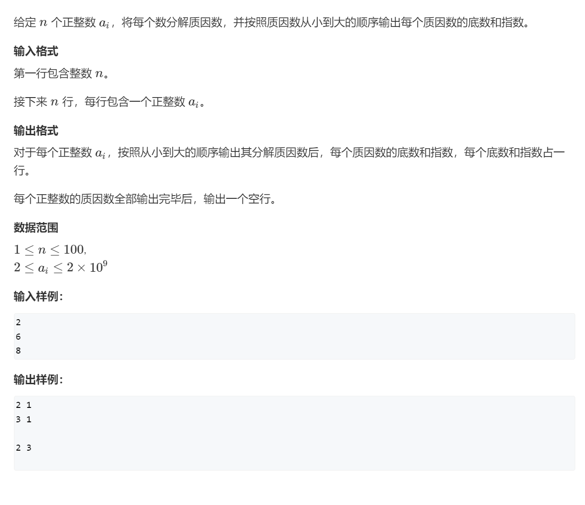

```python
from math import sqrt
n=int(input())
def cal(x):
    # 找每个数判断是不是因数
    for i in range(2,int(sqrt(x)+1)):
        if x%i==0:
            s=0
            # 如果是，把他的倍数全部消掉
            while x%i==0:
                x//=i
                s+=1
            ans.append([i,s])
    # 如果最后留下一个那就是剩余的质因数
    if x>1:
        ans.append([x,1])

for _ in range(n):
    x=int(input())
    ans=[]
    cal(x)
    for i in ans:
        print(*i)
    print()
```


## 埃氏筛

对于给定的数据范围，从2开始找质数，如果这个数是质数，那么它的冥次一定不是质数，在判断表中标记

```python
MAX=10**6+1
# 记录这个数是不是质数，初始为True
is_prime=[True]*MAX
is_prime[0]=False
is_prime[1]=False
# 记录质数
prime=[]
# 对于给定的数据范围，从2开始找质数
for i in range(2,MAX):
    if is_prime[i]:
        # 如果是质数加入，并把他的冥次标记
        prime.append(i)
        # 这里的优化是设置步长并从i**2开始
        for j in range(i*i,MAX,i):
            is_prime[j]=False
```


## 线性筛（欧拉筛）

每个数只会被他的最小质因数划掉，每个数乘上所有小于等于它最小质因数的质数来筛别的数。

```python
MAX=(10**6)+1
is_prime=[True]*MAX
prime=[]
for i in range(2,MAX):
    if is_prime[i]:
        prime.append(i)
     # 要对每个数进行筛选，不是只对质数筛选，下面的循环要放到外面
    for p in prime:
        # 防止越界
        if p*i>=MAX:
            break
        is_prime[p*i]=False
        if i%p==0:
            break
```

在数据范围比较大（10**7）的时候效率比埃氏筛好,大约快一倍。

## 试除法

判断是否是质数使用试除法，对于不是质数的数，它的因数都是成对存在的。因此判断质数的时候只需要对一边判断即可。

```python
from math import sqrt
n=int(input())
ans=[]
def cal(x):
    # 特判1
    if x==1:
        return False
    for i in range(2,int(sqrt(x)+1)):
        if x%i==0:
            return False
    return True
for _ in range(n):
    x=int(input())
    if cal(x):
        ans.append('Yes')
    else:
        ans.append('No')
for i in ans:
    print(i)
```


更好的方法是用打表判断出的质数，而不是一个一个看，因为本来也就只有质数能起作用。

对于10^9 (30000)的数据可以开5*10^4

```python
p=[]
MX=(10**4)*5
is_prime=[True]*MX
for i in range(2,MX):
    if is_prime[i]:
        p.append(i)
        for j in range(i**2,MX,i):is_prime[j]=False
n=len(p)

i=0
cnt=0
x=int(input())
while x>1 and j<n:
    v=p[i]
	if x%v==0:
        while x%v==0:
            cnt+=1
            x//=v
    j+=1
if x>1:
    cnt+=1
```


## 质数个数

判断1~n中质因数p的个数

[1,n]中p的倍数有**n1=n//p**个，这些数贡献了n1个质因子p，**$p^2$的倍数有n//$p^2$个**，由于这些数已经是**p的倍数**了，为了**不重复统计**p的个数，这里仅考虑**额外贡献**的质因子个数，即这些数额外贡献了**n2个质因子p**，以此类推有


# 因数

一个数的因数个数大概是立方级别

## 因数个数


一个数的约数个数通过公式可得是：是他的质因数中(指数+1)的累积

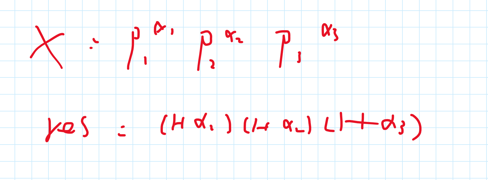

而质因数可以通过因数的质因数求解

```python
from math import sqrt
from collections import Counter
n=int(input())
# 用于记录指数的累和
memo=Counter()
mod=10**9+7

# 求解质因数的模板
def cal(x):
    for i in range(2,int(sqrt(x)+1)):
        if x%i==0:
            s=0
            while x%i==0:
                x//=i
                s+=1
            memo[i]+=s
    if x>1:
        memo[x]+=1

for _ in range(n):
    x=int(input())
    # 对每个因数找它的质因数
    cal(x)
nums=[x+1 for x in memo.values()]
ans=nums[0]
# 计算累乘
for i in range(1,len(nums)):
    ans*=nums[i]
    ans%=mod
print(ans)
```

### **9 Divisors**

给定一个整数 *N*，请你求出1~ *N* 中所有因数个数为 9 的数的个数。N<=4*10^12

因数个数可以由质因数的冥次求得，9=1\*9=3\*3，那么一个数如果满足条件，那么必然是x=$a^8$=$a^2b^2$的形式

首先找出范围内所有的质因数，质因数的上限一定是10^6


```python
n=R()

ans=0

MAX=10**6+10
# 记录这个数是不是质数，初始为True
is_prime=[True]*MAX
is_prime[0]=False
is_prime[1]=False
# 记录质数
prime=[]
# 对于给定的数据范围，从2开始找质数
for i in range(2,MAX):
    if is_prime[i]:
        # 如果是质数加入，并把他的冥次标记
        prime.append(i)
        # 这里的优化是设置步长并从i**2开始
        for j in range(i*i,MAX,i):
            is_prime[j]=False
i=2
while i<n and pow(i,8)<=n:
    if is_prime[i]:
        ans+=1
    i+=1


# 使用双指针来找
p=[v**2 for v in prime]
ll=len(p)
r=ll-1
for i,v in enumerate(p):
    while i<=r and p[r]*v>n:r-=1
    if i>=r:break
    ans+=r-(i+1)+1
print(ans)
```


## 约数之和


约数之和同样需要质因数的指数，需要对每个质数计算质数从0到出现次数的累和，然后再累积上


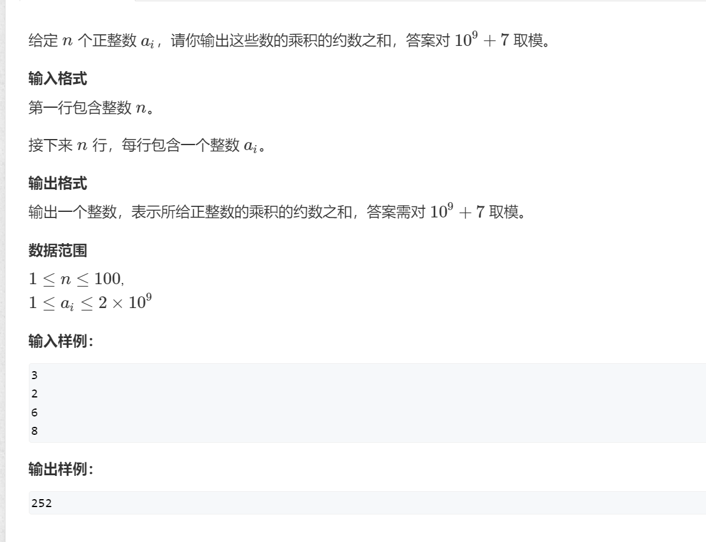

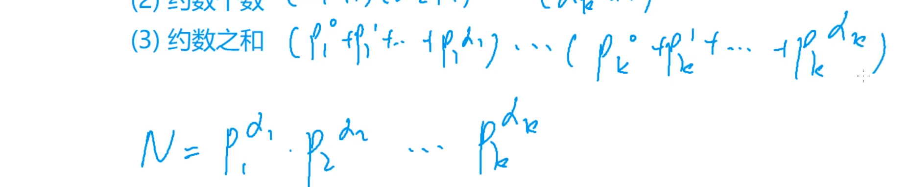

```python
from math import sqrt
from collections import Counter
n=int(input())
# 用于记录指数的累和
memo=Counter()
mod=10**9+7

# 求解质因数的模板
def cal(x):
    for i in range(2,int(sqrt(x)+1)):
        if x%i==0:
            s=0
            while x%i==0:
                x//=i
                s+=1
            memo[i]+=s
    if x>1:
        memo[x]+=1

for _ in range(n):
    x=int(input())
    # 对每个因数找它的质因数，累加指数
    cal(x)

# 计算每个质数的结果
def count_(k,v):
    ans=0
    for i in range(v+1):
        ans+=pow(k,i)
    return ans 
ans=1

# 计算累和
for k,v in memo.items():
    ans*=count_(k,v)
    ans%=mod
print(ans)
```


# 欧拉函数

用于求解N在1到N之间有多少个与N互质的数字，需要利用到质因数，这里的特例是1的欧拉函数是1/


质数的欧拉函数是该质数减1


```python
n=int(input())
from math import sqrt
# 这里只需要考虑质因数的底数而不需要考虑指数
def cal(x):
    ans=[]
    for i in range(2,int(sqrt(x)+1)):
        if x%i==0:
            s=0
            while x%i==0:
                x//=i
                s+=1
            ans.append(i)
    if x>1:
        ans.append(x)
    return ans

for _ in range(n):
    x=int(input())
    nums=cal(x)
    ans=x
    # 利用公式求解
    for p in nums:
        ans*=(1-1/p)
    print(int(ans))
```

## 求欧拉函数之和


如果对每个数求欧拉函数，时间复杂度为O($$n\sqrt{n}$$)，而线性筛的方法可以在找质因数的过程中求出1到n所有数字的欧拉函数。

**注意1的欧拉函数为1**

在线性筛中每次枚举p*i的时候顺便求出P * i的欧拉函数，根据公式它的欧拉函数比i的多出了p乘(1-1/p),如果在前面判断了p是i的因数，就说明这个p已经在i的欧拉函数中乘过了，欧拉函数和质因数的个数无关和种类有关，因此不需要再乘一次了。

```python
n=int(input())
prime=[]
# 做偏移
is_prime=[True]*(n+1)
res=[0]*(n+1)
# 特例
res[1]=1
# 线性筛
for i in range(2,n+1):
    # 对于一个质数，它的质因数只能是自己，由公式推出欧拉函数是p-1
    if is_prime[i]:
        prime.append(i)
        res[i]=i-1
     # 注意不能再if语句块中
    for p in prime:
        if i*p>n:
            break
        is_prime[i*p]=False
        # 判断
        if i%p==0:
            res[i*p]=p*res[i]
            break
        else:
            res[i*p]=res[i]*(p-1)
print(sum(res))
                
```


# 递归

## 河内塔

如何花费最少的操作次数，在每次只能**移动一个**圆盘并且大圆盘不能**放在小圆盘上**的情形下，将整个圆盘移动到另一个柱子上

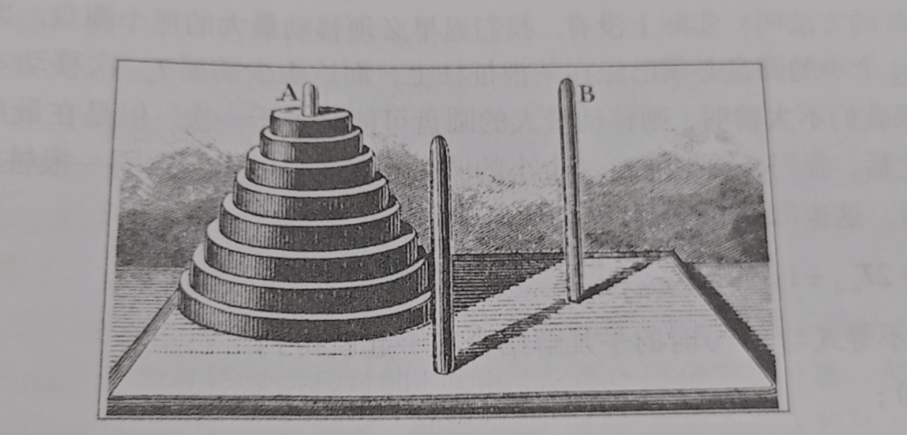


令Tn为在规则下将一个1~n的所有塔移动到另一个柱子上的最少操作次数，一个思路是**先将n-1小的圆盘移动到其他柱子上，然后移动第n个圆盘，再将n-1个移动到第n个圆盘上。**则有$T_n=2T_{n-1}+1$

由数学归纳法可得，$T_n=2^n-1$

## 平面上的直线

平面上n条直线所能界定的区域的最大个数L

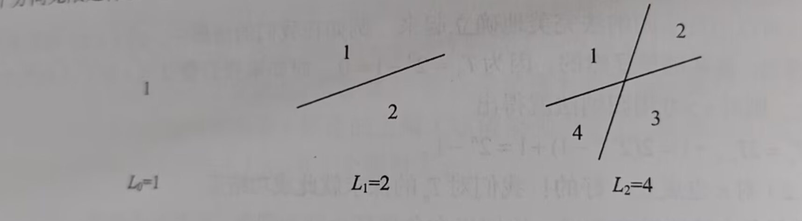


通过观察较小的例子可以假设$L=2^n$，这是基于每一条线能划分现存的每个区域，但是一条线与m条线相交只能划分m-1个区域，因此假设$L_n=L_{n-1}+k$，意味着与k-1条线相交，而k-1<=n-1，因此k最多等于n，则有$L_n=L_{n-1}+n$

用数学归纳法不断展开有$L_n=1+(1+n)*n/2$


## 约瑟夫问题

1~n个人围成一个圈，每个一个删去一个人，直到最后只剩一个人。


令J(n)表示最后剩下的人的编号

假设有2n个人，那么经过一轮后有


这种情况可以看作从n个人开始，但是编号变为了2n-1，那么有**J(2n)=2*J(n)-1**


对于2*n+1个人有相似的情况

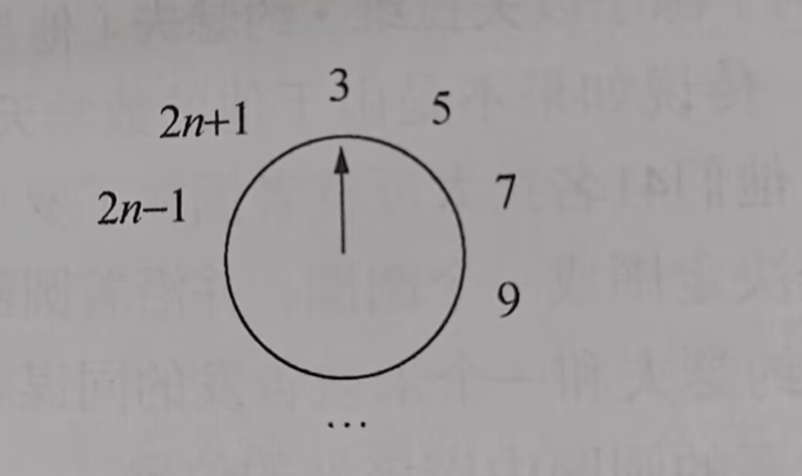

**J(2n+1)=2*J(n)+1**


则有递归式

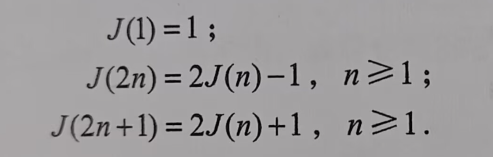


构造几组解，观察有$J(2^m+l)=2l-1$


从二进制出发

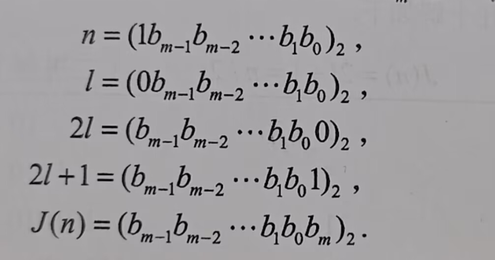


即把n向左循环移动一位，这样不断递归下去就得到了$J(n)=2^{cnt}-1，cnt是n二进制中1的个数$


# 裴属定理+欧几里得算法

**对于任意一对正整数x,y一定存在整数a,b，使得ax+by=gcd(x,y)**

**两个互质的数，不能组合出的最大的数是(n-1)*(m-1)-1**

是否存在一个ax+by+cy+.....=k(a,b,c...是系数)的问题，这可以用裴属定理，即**k是gcd(a,b,c,....)的整数倍则有解**，不过这里要求x.y,z,...**不全为0**


## 求出所有的公约数

a和b所有的公约数是a和b的最大公约数的约数。

```python
temp=set()
n=gcd(a,b)
i=1
while i<=int(n**0.5)+1:
    if not n%i:
        temp.add(i)
        # 注意另一部分不能落下	
        temp.add(n//i)
    i+=1
temp=sorted(temp)
```


## 基本欧几里得算法

```python
# 迭代的写法
def gcd(x,y):
    if x<y:
        x,y=y,x
    m=-1
    while m:
        _,m=divmod(x,y)
        x=y
        y=m
        temp=m
    return m

# 递归的写法，根据性质：gcd(a,b)=gcd(b,a%b)
def gcd(a,b):
	if not b:
		return a
        return gcd(b,a%b)
    
```


## 扩展欧几里得算法

但是仅仅根据欧几里得算法无法得出系数，需要用到扩展的欧几里得算法，即在找最大公约数的过程中求解出系数。


在调用欧几里得算法的过程中，反转了a和b，因此x和y传入的时候也要反转。根据推到可以得到外层的系数和下一层循环的系数右一定的联系。


注意调用扩展欧几里得时，后两个传入0，0

```python
def exgcd(a,b,x,y):
    if not b:
        # 如果b等于0，根据公式一定有ax+by=a，选择返回系数1，0
        return a,1,0
    # 反之，递归
    d,y,x=exgcd(b,a%b,y,x)
    return d,x,y-a//b*x
t=int(input())
for _ in range(t):
    x,y=[int(x) for x in input().split()]
    # 初始的参数都为0
    _,a,c=exgcd(x,y,0,0)
    print(*[a,c])
```


## 扩展欧几里得求逆

扩展欧几里得算法还能求出逆

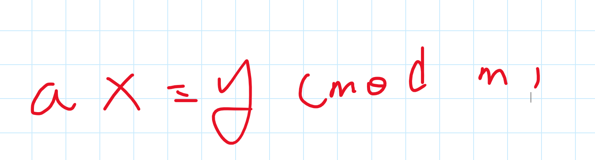


a的逆等于exgcd(a,m,0,0)[1]，求出a的逆后x的结果等于y*(a的逆)//(a和m的最大公约数)%m，注意这里如果结果不能整除二者的最大公约数那么无法找到x。


## 线性同余方程

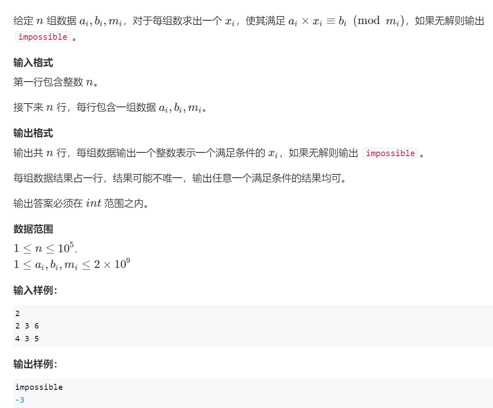

找a和m的最大公约数，如果这个数可以被b整除则存在x，结果是`b//d*(a的系数)%m`

```python
t=int(input())
def exgcd(a,b,x,y):
    if not b:
        return a ,1,0
    d,y,x=exgcd(b,a%b,y,x)
    return d,x,y-a//b*x
    
for _ in range(t):
    a,b,m=[int(x) for x in input().split()]
    d,x,y=exgcd(a,m,0,0)
    if b%d:
        print('impossible')
    else:
        print((x*b//d)%m)
```

# 互素的数所不能表示的最大的数

如果两个数互素，那么它们所不能表示的最大的数是x*y-x-y

# 逆元

就是扩展欧几里得算法中求解出的x或者是y的系数，另外根据费马小定理有：当取模的数是质数的时候，a的逆元就是a^m-1。在对两个较大的数相除的结果取模的时候，由于同余定理对除法不起作用，因此要把被除数转化为逆元变为乘法后取模，而找一个数取逆元的过程如下：

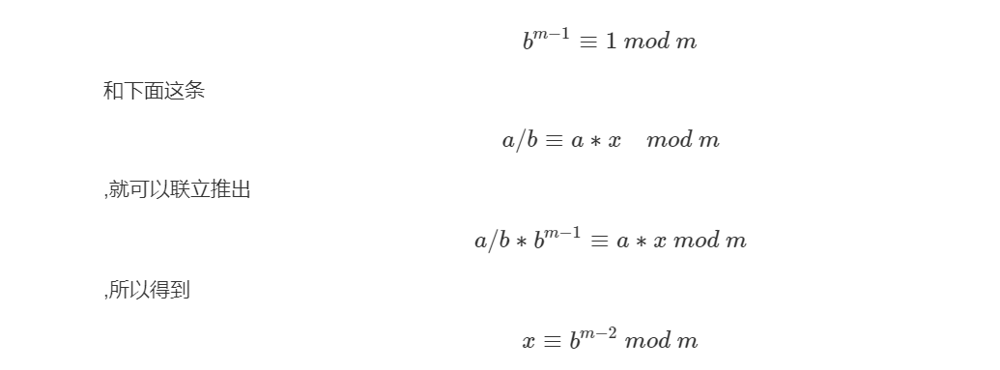

这里可以使用费马小定理主要是因为10**9+7是一个质数


# 中国剩余定理


其中a和m是已知的，注意m是互质(最大公约数为1)的要求

不论证明过程，最后最小的x等于


令M等于所有m的乘积，Mi等于M//mi，$M_{i}t_i≡1(mod m_i)$ti就是Mi对mi的逆


```python
n = int(input())
S = 1
m = [0] * n
a = [0] * n

# 扩展欧几里得
def exgcd(a, b, x, y):
    if not b: return a, 1, 0
    d, y, x = exgcd(b, a % b, y, x)
    return d,x, y - a // b * x


for i in range(n):
    m_, a_ = [int(x) for x in input().split()]
    a[i] = a_
    m[i] = m_
    S *= m_
ans = 0
for i in range(n):
    x,y,z=exgcd(S // m[i], m[i], 0, 0)
    M=S//m[i]
    # 注意累加过程要取模M
    ans= (ans+a[i]*y*M)%S
print(ans)
```


# 排列

对于长度为n的数组它的全排列个数为n!，如果不区分相同元素的话那么总的排列个数要除以数组中相同元素的个数的阶乘。


# 组合数

组合数的递推公式为：$$C_{a}^b= C_{a-1}^b+C_{a-1}^{b-1}$$注意是加法

注意组合数在python3中可以直接用comb快速计算，但是在pypy3中并没有comb函数


注意即使comb对于大数很快但是对于多次询问还是需要打表求解。


对于长度为k的数组任意取有2^k-1个非空序列

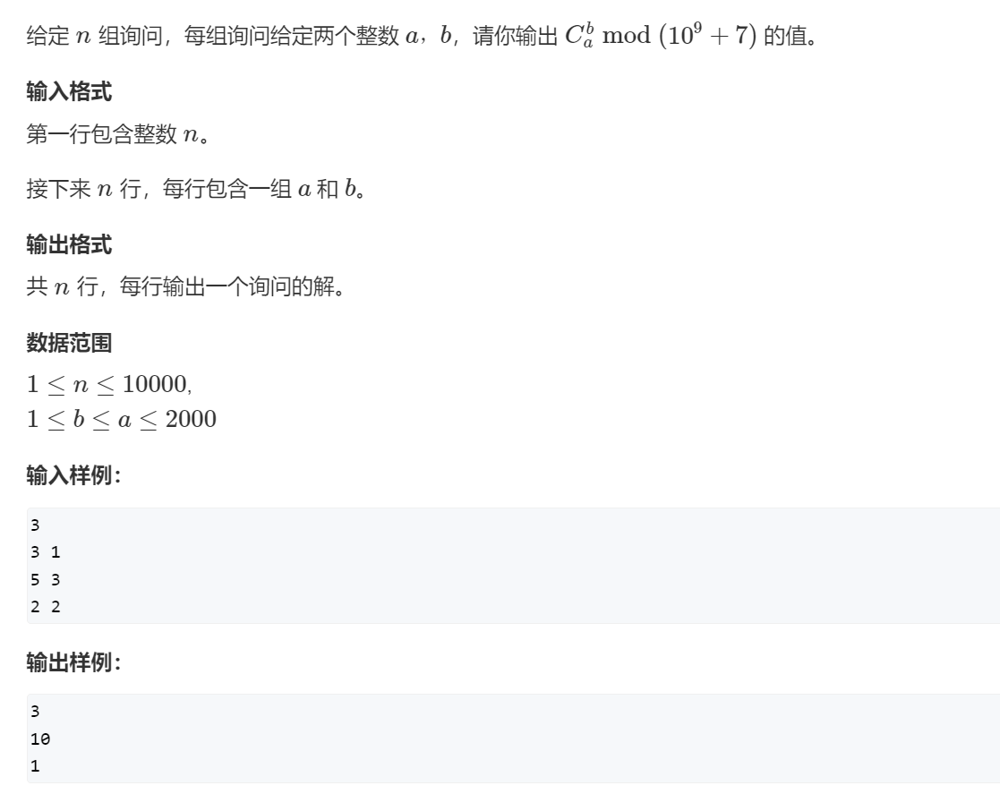

对于多次询问（十万次）必须快速求解出组合数，因此选择打表计算对于给定的数据打表最多是10**6。

初始化dp[0]\[0]=1

```python
dp=[[0]*2010 for _ in range(2010)]
mod=10**9+7
for i in range(2010):
    # 内层的循环只能到i，在往外无意义
    for j in range(i+1):
        # j=0的时候结果为1
        if not j:dp[i][j]=1
        else:
            dp[i][j]=(dp[i-1][j-1]+dp[i-1][j])%mod
t=int(input())
for _ in range(t):
    a,b=[int(x) for x in input().split()]
    if b>a:
        a,b=b,a
    print(dp[a][b])
    
```


这里给定的数据范围无法打表计算每一组解，根据组合数的性质求解除使用递推求解每个数的阶乘，然后在计算中使用阶乘求解即可。

```python
n=10**5+10
mod=10**9+7
dp=[1]*n
infact=[0]*n
for i in range(1,n):
    dp[i]=(i*dp[i-1])%mod
t=int(input())
for _ in range(t):
    a,b=[int(x) for x in input().split()]
    # 转换为逆元进行乘法操作，才能取模
    print(dp[a]*pow(dp[b],mod-2,mod) *pow(dp[a-b],mod-2,mod)%mod)
```


对于数据范围很大的组合数取模的结果，如果模数是一个质数那么可以用卢卡斯定理简化计算：
	$$C_{a}^{b}=C_{a mod p}^{bmod p}*C_{a/p}^{b/p} mod p$$

注意这里的p一定是一个质数

```python
def C(a,b,p):
    j=a
    res=1
    # 根据定义计算，根据公式拆分为(a/b)*(c/d)的形式...，一共有b项，这个过程中一直取模
    for i in range(1,b+1):
        res=res*j%p
        # 使用逆元
        res=res*pow(i,p-2,p)%p
        j-=1
    return res
        
def locus(a,b,p):
    # 如果ab的范围可以接收（十万以内），直接计算
    if a<p and b<p:
        return C(a,b,p)
    # 否则用卢卡斯定理简化计算
    return C(a%p,b%p,p)*locus(a//p,b//p,p)%p
for _ in range(int(input())):
    a,b,p=[int(x) for x in input().split()]
    print(locus(a,b,p))
```

## [有效的快递序列数目](https://leetcode.cn/problems/count-all-valid-pickup-and-delivery-options/)

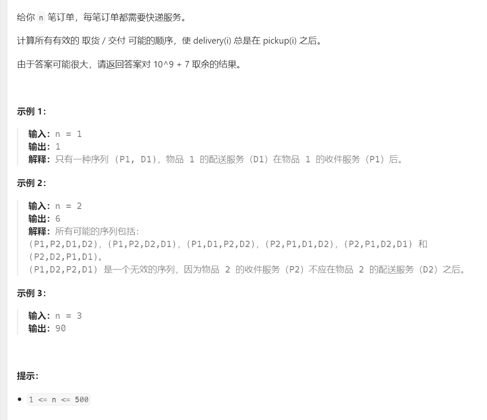


注意comb(5,2)中两个数字的顺序是只有一种的，要么是i先j后，或者反过来,不会都有。

两种放置方式：两个数字一块放也就是在所有的空位中选一个出来，或者是间隔放即在空位中选出两个。

```python
class Solution:
    def countOrders(self, n: int) -> int:
        m=10**9+7
        p=1
        for i in range(2,n+1):
            a=2*(i-1)+1
            b=a*(a-1)//2
            p=p*(a+b)%m

        return p
        
```


# 卡特兰数

一种特殊的组合数

问题一般是有两个选择，问这两种选择满足的组合有多少种


## 生成字符串

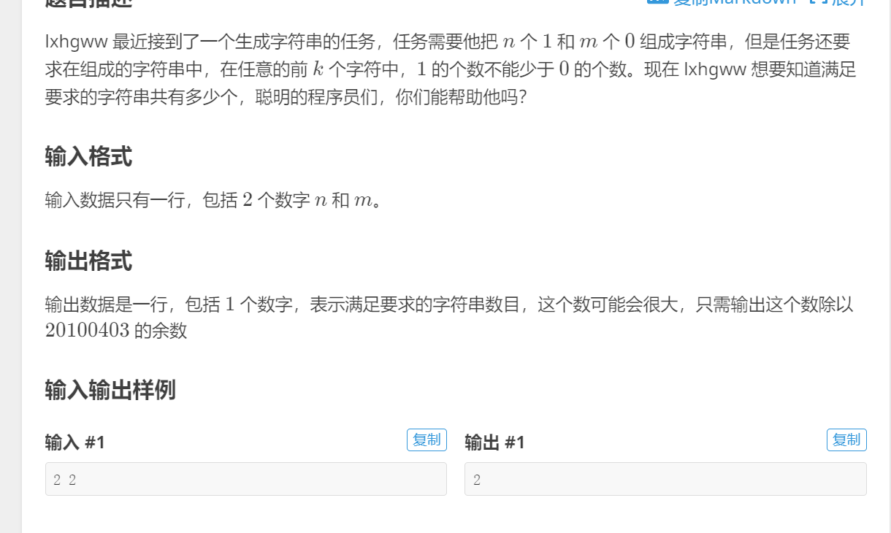


把文图抽象为图像，1相当于向右上走，0相当于向右下走，为了1的个数要大于0需要在组合的过程中不要经过y=-1这条线否则就是0的个数大于1的个数


最后的结果是所有的组合数减去不合法的组合数，其中所有的组合数就是从起点走到(n,m)有多少种走法也就是从m+n中选出n个或者m个。而不合法的数目，将路线从开头到第一次经过y=-1这条线的点的路线反转，问题变为从0，-2开始走到目标点有多少种走法，这里变化后，通过观察图像发现0的个数减少1的个数增加1，从m+n中选出n+1个或者m-1个

```python
from math import factorial as f
mod=20100403
n,m=[int(x) for x in input().split()]

#  不使用内置的函数计算防止内存超限
def C(a,b):
    # 使用一个变量记录上面的结果
    j=a
    # res记录当前的结果
    res=1
    # 下面是从1到b
    for i in range(1,b+1):
        res=(res*j)%mod
        res=(res*pow(i,mod-2,mod))%mod
        j-=1
    return res%mod
res=C(m+n,n)-C(m+n,n+1)
print(res%mod)
```


## 鸡蛋饼


就是求解卡特兰数

```python
mod=100000007
n=int(input())
def C(a,b):
    res=1
    j=a
    for i in range(1,b+1):
        res=(res*j)%mod
        res=(res*pow(i,mod-2,mod))%mod
        j-=1
    return res%mod
print(C(2*n,n)*pow(n+1,mod-2,mod)%mod)
```

## 矩阵ii


这里取模数是100不能使用飞马小定理求解逆元，对卡特兰数使用定义计算：


这里注意取模操作要放到括号外面，对于每个卡特兰数他都是由前面的数推出，这里不存在除法可以直接取模

```python
f=[0]*110
mod=100
f[0]=1
for i in range(1,101):
    # 从0到n-1
    for j in range(i):
        f[i]=(f[i]+f[j]*f[i-1-j])%mod
n=int(input())
print(f[n])
```

# 快速冥

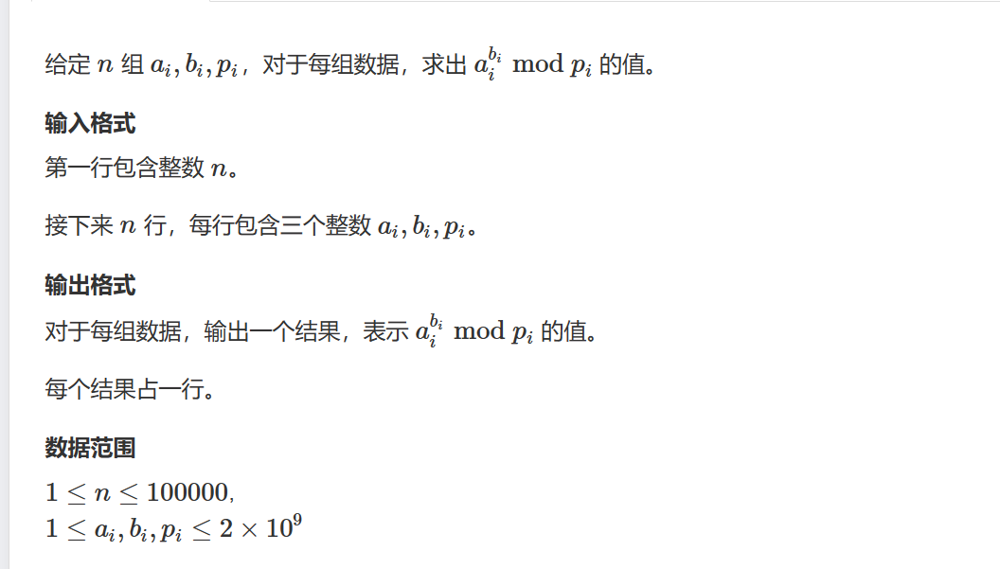


对于较大的冥次比如说n达到10**9，保证不会溢出的情况下使用迭代求解会超时。快速冥的做法是把冥次拆分为二进制数（比如6写为110，$2^2+2^1$），然后只操作这些位

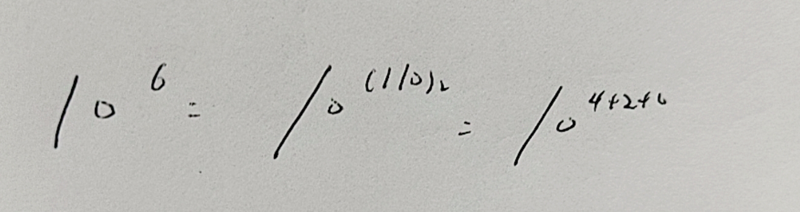

这样就只需要迭代log(n)次

```python
n=int(input())
def cal(a,b,p):
    res=1

    while b:
        # 只有在有1的时候才会葛更新结果，也就是每次乘的时候恰好对应到拆分的位数
        if b&1:
            res=(res*a)%p
        b=b>>1
        a=(a*a)%p
    return res
        
for _ in range(n):
    a,b,p=[int(x) for x in input().split()]
    print(cal(a,b,p))
```

# 矩阵快速冥

对于递推式可以变为矩阵得形式，利用矩阵快速计算求解。


对于给定的数据范围迭代和递归都无法满足，观察递推式发现：

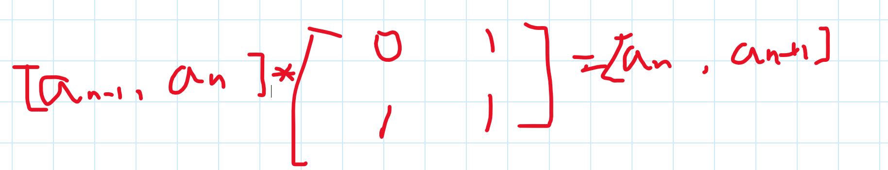


递推式可以转换为矩阵相乘的形式，$f_n=f_0*mat^n$

为此实现矩阵快速冥

```python
n=int(input())
m=10000

# 矩阵乘法
def mul(a,b):
    # 初始状态
    R=[[0,0],[0,0]]
    # 先遍历每个位置
    for i in range(2):
        for j in range(2):
            # k表示共有的部分，m*k k*n
            for k in range(2):
                # 注意这个算式，这个过程中要取模
                R[i][j]=(R[i][j]+a[i][k]*b[k][j])%m
    return R
    
# 修改快速冥即可
def cal(n):
    # base case，初始时应该是[0,1]但是为了使用mul函数，统一为[[0,1],[0,0]]
    R=[[0,1],[0,0]]
    # mat
    A=[[0,1],[1,1]]
    while n:
        if n&1:
            R=mul(R,A)
        A=mul(A,A)
        n>>=1
    return R[0][0]
    
    
while n!=-1:
    res=cal(n)
    print(res)
    n=int(input())
```

## Iterated Linear Function


对于给定的数据范围必须用快速冥求解。

首先构造出公式，对于[g1(x),1]要得出[g2(x)=A*g1(x)+B,1]，注意这一步是关键必须同时满足后面的1，为方便操作将矩阵扩展为2\*2得。


```python
mod=10**9+7
a,b,n,x=[int(x) for x in input().split()]
# 矩阵乘法
def mul(a,b):
    # 初始状态
    R=[[0,0],[0,0]]
    # 先遍历每个位置
    for i in range(2):
        for j in range(2):
            # k表示共有的部分，m*k k*n
            for k in range(2):
                # 注意这个算式，这个过程中要取模
                R[i][j]=(R[i][j]+a[i][k]*b[k][j])%mod
    return R
def cal(n):
    # 初始结果
    R=[[x,1],[0,0]]
    # 用于计算的矩阵
    A=[[a,0],[b,1]]
    # 快速冥拆分
    while n:
        if n&1:
            R=mul(R,A)
        A=mul(A,A)
        n>>=1
    return R[0][0]
print(cal(n))
```


# 冥次

使用内置函数Pow可快速求解，为了防止数据太大可以在Pow函数中加入第三个参数作为取模的值防止过大导致计算较慢。

内置函数sqrt()可以求解开方，isqrt()可以求出开方后的整数。

补充2^31开方后的结果为40000多

比起log函数求冥，模拟整除更好


# 容斥原理

在计算结果的时候不去考虑重叠的部分，先把所有的加上然后再家去重叠的部分，这个公式就是概率论中的几个集合相交


往外推广的结果是1-2+3-4+5-6+....+(-1)^(n-1)*n，奇数个集合是加偶数个集合是减。

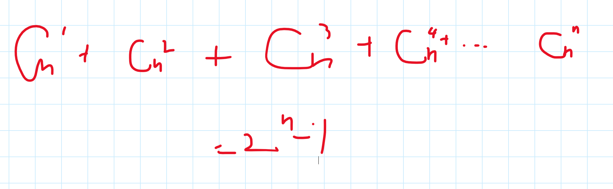

可以看作是从n个数中选取任意个，一共有2^n-1个状态（注意不会选0个，等式左边会补上 $$C^0_n$$）

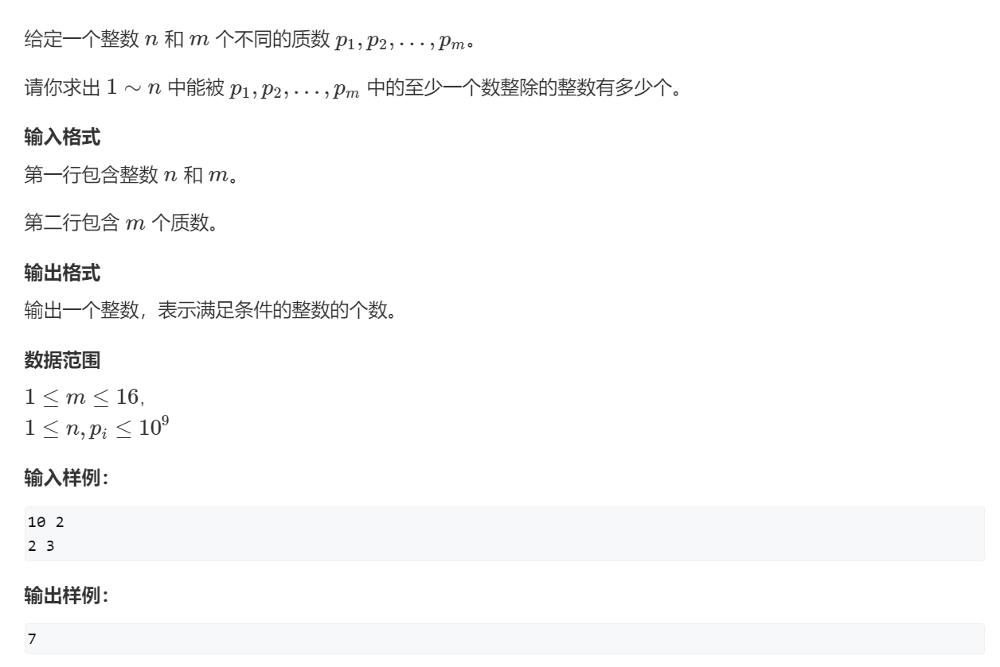


使用容斥原理找能被一个质数整除的个数，这里补充一点1到n中能被p整除的个数是n//p，而能被n和m同时整除的个数是n//(m*n)，这里的p是质数。

能被质数整除的集合一共有m个，枚举每个选或者是不选则有2^m-1个状态

```python
n,m=[int(x) for x in input().split()]
prime=[int(x) for x in input().split()]
res=0
# 使用位图表示当前位置的集合有没有选
for i in range(1,1<<len(prime)):
    # 记录选取的集合的乘积
    t=1
    # 分别记录当前枚举的集合个数和结果
    cnt=summ=0
    # 遍历每一位
    for j in range(m):
        p=prime[j]
        if i>>j&1:
            t*=p
            # 如果累乘的结果大于N说明不存在能被当前集合所除的数
            if t>n:
                t=-1
                break
            cnt+=1
    summ+=n//t
    if t!=-1:
        # 奇数加偶数减
        res+= summ if cnt&1 else -summ
print(res)
```


## [单面值组合的第 K 小金额](https://leetcode.cn/problems/kth-smallest-amount-with-single-denomination-combination/)

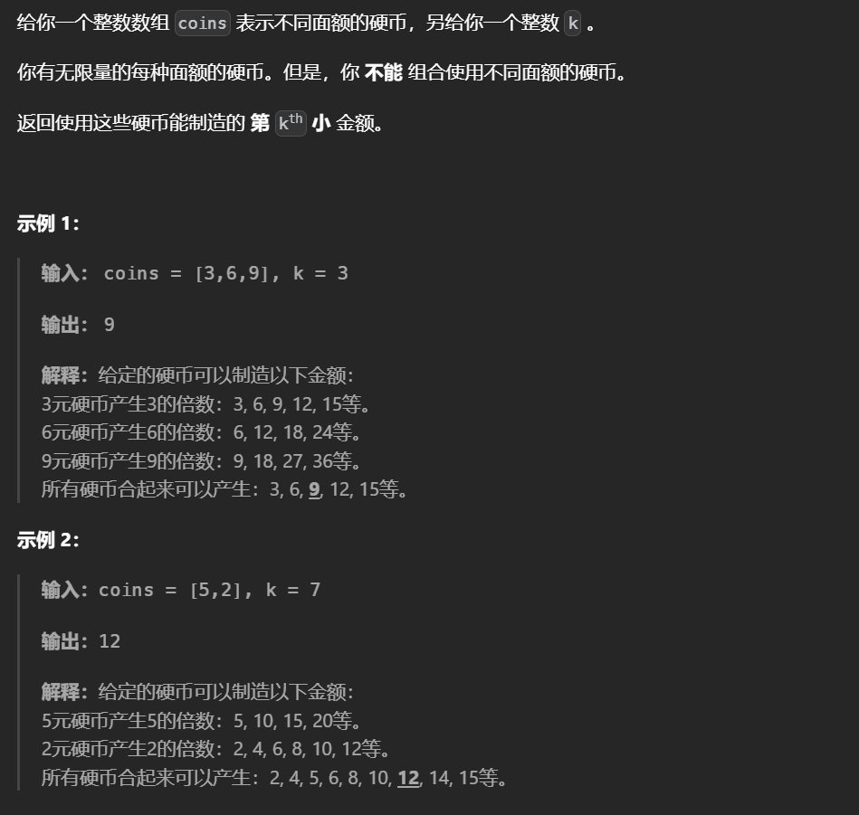

二分枚举金额的大小，查看是否满足至少有k个小于等于该金额

注意这里的金额不能有重复值，也就是不能直接取整除后的结果，需要减去重复的值，不仅两个值之间要减去重复的内容，三个值四个值之间也同样需要，因此使用容斥定理求解。

容斥定理枚举子集找出子集的最小公倍数，然后选择减或加。


```python
class Solution:
    def findKthSmallest(self, coins: List[int], k: int) -> int:
        l,r=0,min(coins)*k
        n=len(coins)
        memo={}
        # 预处理出每个子集的最小公倍数
        for s in range(1,1<<n):
            lcm=1
            for j in range(n):
                if s>>j&1:lcm=math.lcm(lcm,coins[j])
            memo[s]=lcm

        def cal(x):
            cnt=0
            for i in range(1,1<<n):
                c=0
                lcm=1
                # 根据子集中元素的个数判断是加还是减(奇数加偶数减)
                c=i.bit_count()
                lcm=memo[i]
                cnt+=pow(-1,c+1)*(x//lcm)
            return cnt>=k

        while l<=r:
            mid=(l+r)>>1
            if cal(mid):
                r=mid-1
            else:
                l=mid+1
        return r+1
```


# 简单博弈论

## NIM游戏

n堆物品，每堆有ai 个，两个玩家轮流取走任意一堆的任意个物品，但不能不取。取走最后一个物品的人获胜

结论是每堆石子的异或和如果等于0，则先手必输反之必胜。

## Training Before the Olympiad


先手想要结果最大后手想要结果最小，每次选奇偶不同的数可以使得元素总和减小一，而相同的总和不变，因此前者尽可能多的选奇偶相同的后者选不同的，此外为了保证先手胜利，先手会每次优先完奇数/偶数优先保证后手不能减小总和。

维护两个前缀数组，一个是奇数的个数一个是前缀和，每一轮如果奇数的个数足够的话可以减少三个如果不够，剩余0个或2个那么最后的总和一定不变，反之一定会减小1.

```python
import sys
from itertools import accumulate as ac
input=sys.stdin.readline


for _ in range(int(input())):
    n=int(input())
    nums=list(map(int,input().split()))
    # 记录奇数个数
    odd=[0]*n
    odd[0]=int(nums[0]&1==1)
    for i in range(1,n):
        odd[i]+=odd[i-1]+int(nums[i]&1==1)
    # 记录前缀和
    pre=list(ac(nums))
    ans=[]
    for i in range(n):
        # 对于第一个要特判
        if i==0:
            ans.append(pre[i])
            continue
        v=odd[i]
        a,b =divmod(v,3)
        # 总和要减去轮数
        if b==0 or b==2:
            ans.append(pre[i]-a)
        else:
            ans.append(pre[i]-a-1)
    for v in ans:
        print(v,end=' ')
    print()
```


# 拓扑排序

拓扑排序可以用将环和其他的节点区分。


只有有向无环图才会有拓扑序列，拓扑序列不唯一，序列中边起点一定排在终点之前。

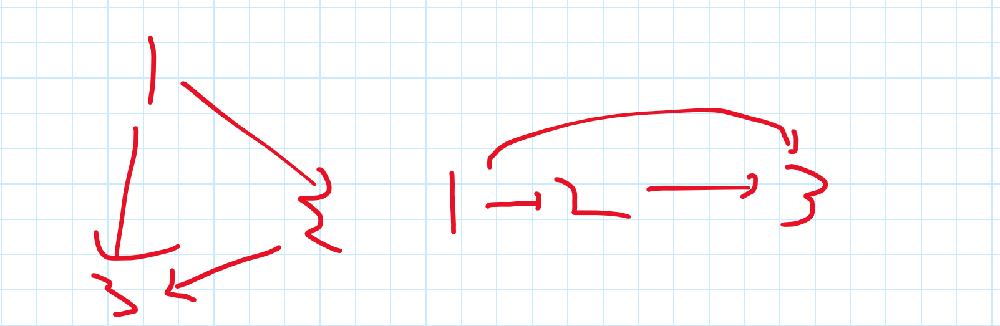

建图的过程中要记录每个节点的入度，使用节点的过程中首先把入度为0的点加入到队列中，之后遍历队列中的点，对于每一个在队列中的点把与它相连的点之间的边去掉，具体表示为减少下一个点的入度，如果这个点的入度为0了，那么就加入到队列中。最后判断队列的长度是否为N。

```python
from collections import deque
n,m=[int(x) for x in input().split()]
path=[set() for _ in range(n)]
d=[0]*n
q=deque()
for _ in range(m):
    u,v=[int(x)-1 for x in input().split()]
    # 防止重边
    if v not in path[u]:
        path[u].add(v)
        d[v]+=1
 # 排序
def topsort():
    # 加入入度为0的点
    for i,val in enumerate(d):
        if not val:
            q.append(i) 
    index=0
    # 遍历队列中的点
    while index<len(q):
        p=q[index]
        # 去掉边，如果入度变为0则加入
        for p_ in path[p]:
            d[p_]-=1
            if not d[p_]:
                q.append(p_)
        index+=1
    # 判断是否有拓扑序
    return len(q)==n
if (topsort()):
    for i in q:
        print(i+1,end=' ')
else:
    print(-1)
```


# 线段树

本质上是使用递归加速计算，线段树的结构如下所示

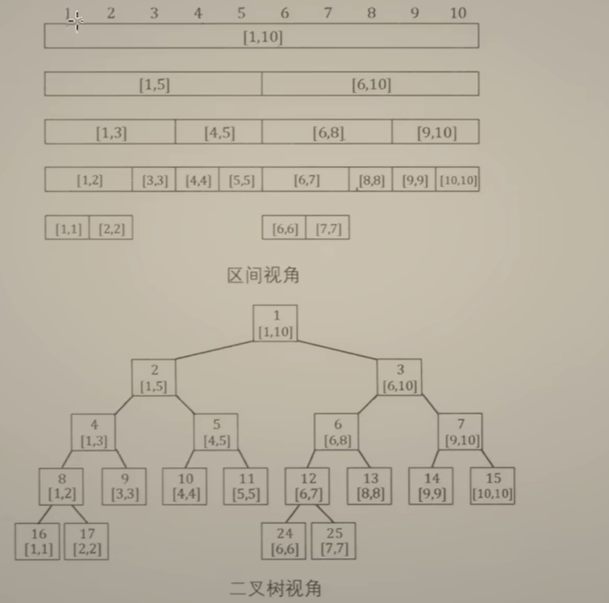


将区间划分**至多4n**(因为满二叉树的节点个数为2n-1，一个**基于经验的安全值**是4n)个节点，其中每个节点记录的是一个区间的**结果**(和，最大值等等)

查询过程通过分支划分较小的区间，但不一定会划分到叶子节点，如果**当前节点对应的区间范围已经被查询的范围包括了，就直接返回该节点储存的结果，**而不需要再往下划分了，这样可以节省时间。

更新的过程中通过**分治**不断划分出**较小的子区间**，但如果要划分到**叶子节点**再更新，则在范围较大时会涉及到**大量节点耗时较多**，因此使用**懒标记(延迟更新)**，即更新操作推迟到真正需要的时候执行，每个节点会配备一个懒标记记录该节点上未处理的更新操作，当对该节点对应的区间进一步查询或更新时，会将标记下推，这样避免了对每个叶子节点的操作。


线段树数组实现（数组版本，懒标记，区间查询/修改），根据题目要求传入不同的函数：

```python
class SegTree:
    def __init__(self, nums, func):
        self.nums = nums
        self.n = len(nums)
        self.tree = [0] * (4 * self.n)  # 存储节点，4n是基于经验的安全值
        self.lazy = [0] * (4 * self.n)  # 懒标记数组和节点数组一样大
        self.func = func # 操作的函数，求最大值，求和一类的
        if self.n > 0:
            self._build(0, 0, self.n - 1)
	# 构建节点数组
    def _build(self, root, l, r):
        if l == r:
            self.tree[root] = self.nums[r]
            return
        mid = (l + r) >> 1
        # 递归更新左右，然后合并
        self._build(root * 2 + 1, l, mid)
        self._build(root * 2 + 2, mid + 1, r)
        self.tree[root] = self.func(self.tree[root * 2 + 1], self.tree[root * 2 + 2])

    def _push_down(self, root, l, r):
        """将懒标记下推到子节点"""
        if self.lazy[root] != 0:
            mid = (l + r) >> 1
            # 更新左右子节点的值
            self.tree[root * 2 + 1] += self.lazy[root] * (mid - l + 1)
            self.tree[root * 2 + 2] += self.lazy[root] * (r - mid)
            # 传递懒标记到子节点
            self.lazy[root * 2 + 1] += self.lazy[root]
            self.lazy[root * 2 + 2] += self.lazy[root]
            # 清除当前节点的懒标记
            self.lazy[root] = 0

    def update(self, ul, ur, diff):
        """区间更新，将区间 [ul, ur] 的值增加 diff"""
        self._update_range(0, 0, self.n - 1, ul, ur, diff)
	
    # 更新区间，root表示节点编号，可以从0或者1开始(这里从0开始，如果从1开始则左节点20,右节点2o+1)，lr是该节点覆盖的范围，LR是实际操作的范围
    def _update_range(self, root, l, r, ul, ur, diff):
        if ul <= l and r <= ur:  # 当前区间完全在目标区间内，无需下推直接在这一层标记
            self.tree[root] += diff * (r - l + 1)  # 更新当前区间的值
            self.lazy[root] += diff  # 标记懒更新
            return
        self._push_down(root, l, r)  # 下推懒标记
        mid = (l + r) >> 1
        # 涉及到当前节点的左儿子
        if ul <= mid:
            self._update_range(root * 2 + 1, l, mid, ul, ur, diff)
        # 右儿子
        if ur > mid:
            self._update_range(root * 2 + 2, mid + 1, r, ul, ur, diff)
        # 更新当前节点的值
        self.tree[root] = self.func(self.tree[root * 2 + 1], self.tree[root * 2 + 2])

    def query(self, ql, qr):
        """区间查询，返回 [ql, qr] 的值"""
        return self._query_range(0, 0, self.n - 1, ql, qr)
	
    # 参数同理
    def _query_range(self, root, l, r, ql, qr):
        if ql <= l and r <= qr:  # 当前区间完全在目标区间内，无需继续划分直接返回
            return self.tree[root]
        self._push_down(root, l, r)  # 下推懒标记
        mid = (l + r) >> 1
        res = 0
        # 划分区间
        if ql <= mid:
            res = self.func(res, self._query_range(root * 2 + 1, l, mid, ql, qr))
        if qr > mid:
            res = self.func(res, self._query_range(root * 2 + 2, mid + 1, r, ql, qr))
        return res

```


线段树模板（动态开点，区间和）需要注意当区间较大时(10**9)才会用到动态开点线段树，这个版本的实现很慢：

```python
class Node:
    def __init__(self):
        self.left=None
        self.right=None
        self.add=0
        self.val=0
def pushup(node):
    node.val=node.left.val+node.right.val

def pushdown(node,lc,rc):
    if not node.left:node.left=Node()
    if not node.right:node.right=Node()

    if node.add==0:return
    node.left.val+=lc*node.add
    node.right.val+=rc*node.add
    # 懒标记不需要加
    node.left.add += node.add
    node.right.add += node.add
    node.add=0

def update(root,start,end,l,r,val):
    if l<=start and r>=end:
        root.val+=(end-start+1)*val
        root.add+=val
        return
    mid=(start+end)>>1
    pushdown(root,mid-start+1,end-mid)
    if l<=mid:update(root.left,start,mid,l,r,val)
    if r>=mid+1:update(root.right,mid+1,end,l,r,val)
    pushup(root)
def query(root,start,end,l,r):
    if l <= start and r >= end:return root.val
    mid=(start+end)>>1
    ans=0
    pushdown(root,mid-start+1,end-mid)
    if l<=mid:ans+=query(root.left,start,mid,l,r)
    if r>=mid+1:ans+=query(root.right,mid+1,end,l,r)
    return ans
```

注意根据题意的不同线段树中的各个函数也是可能改变的，基本上pushup,pushdown 之类的函数会变化

# KMAP

全称 Knuth–Morris–Pratt 算法，是用于在给定的字符串s中查找模式串p是否存在，如果存在，是在那个位置开始。

暴力的做法是，从第一个位置开始遍历s，如果遇到了p的开头，开始一一枚举，如果不匹配则s会回退到自己的第 2 个字符，p则回退到自己的开头，然后开始重新比较。

而kmap是减少了查找的次数，即遇到了不匹配的字符，s的位置不会回退，而p会回退。


这里可以看出s不会回退，而p会回退


即找到相同的前缀和后缀，把p原来的起始位置换到对应的后缀位置上，减少了无用的枚举，只有从相等的后缀处开始才有可能找到。


kmap算法的关键在于，构造next数组，next[i]表示P[0]~P[x] 这一段字符串，使得**k-前缀恰等于k-后缀**的最大的k。

记录now为next[x-1]的结果，如果下一位的字符相同


不同，可以看出子串A与B是一样的，找到子串A的next长度，递归的判断现在的now和x相不相同。


arr：arr[i]表示s[:i+1]**中**最长的前缀和后缀相等的长度

```python
def build(p):
    # 初始时，自己与自己是等于0的
    arr=[0]
    x=1
    now=arr[x-1]
    while x<len(p):
        # 相等，都往后扩展，记录结果
        if p[now]==p[x]:
            now+=1
            x+=1
            arr.append(now)
        # 不同的话，递归
        elif now:
            now=arr[now-1]
        # 确实不存在相同的前后缀
        else:
            arr.append(0)
            x+=1
    return arr
```


```python
def search(s,p):
    # 构建前后缀数组
    arr=build(p)
    # 标识两个字符串的指针
    tar,pos=0,0
    res=[]
    while tar<len(s):
        # 相同，往后
        if s[tar]==p[pos]:
            tar+=1
            pos+=1
        # s与p存在不匹配的
        elif pos:
            pos=arr[pos-1]
        else:
            # 还没匹配到第一个字符
            tar+=1
        # 匹配了一个p，记录结果，这里p要回退而不是重新开始
        if pos==len(p):
            res.append(tar-pos)
            pos=arr[pos-1]
    return res
```


# 字符串哈希模板


逐一比较字符串的每个值超时，对字符串构建前缀和。把字符串看作一个p进制的数，比如说aa代表一个$$a \times p^1+a\times p^0$$

就这样构造前缀字符串数组，查询一个区间的值的时候，可以通过相减得到字串的数值，但是注意不是直接相减，比如aabbc，为了得到bbc需要减去前面的aa但是aa是高进制的需要先左移三位才能减去。

```python
n,m =[int(x) for x in input().split()]
s=input()
pre=[0]*(n+1)
# 进制，p取131可以防止哈希冲突（技巧点）
p=131
# P[i]表示p^i
P=[1]
# 数值太大会导致计算非常慢，因此要取模
mod = 998244353
# 构造前缀和，注意取模
for i ,c in enumerate(s,1):
    pre[i]=(pre[i-1]*p+ord(c))%mod
    P.append((P[-1]*p)%mod)
while m:
    # 注意这里的l,r是从1开始的
    l1,r1,l2,r2=[int(x) for x in input().split()]
    # 比较的结果也要取模，防止太大，注意要把后面的数乘上P[字符串的长度]
    if (pre[r1]-pre[l1-1]*P[r1-l1+1])%mod==(pre[r2]-pre[l2-1]*P[r2-l2+1])%mod:
        print('Yes')
    else:
        print('No')
    m-=1
```


# 数位dp

用于解决在[l,r]区间内满足一定条件的数字的个数。

@cache表示记忆化搜索，对于重复的参数列表会跳过，但是参数中不能有个列表，只能是数字，没有记忆化搜索直接完蛋。

数位dp有一套板子，*index用于对每个位置进行操作，limit用于约束每个位置上的最大值，防止跳出n的范围，mask用于记录这个值是否出现过并方便调用记忆化搜索，is_num用于忽略前导0的影响，用来跳过一些前面的位置。*


## 数字1的个数

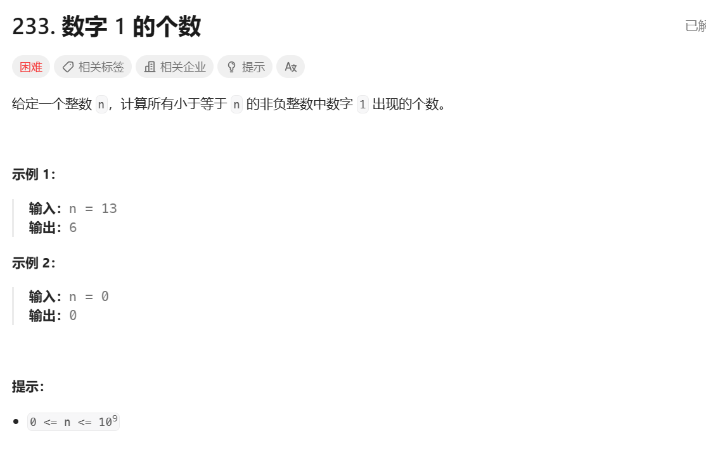

```python
from collections import Counter
class Solution(object):

    def countDigitOne(self, n):
        # 把最大的数转换为字符串，从头开始遍历
        n=str(n)
        @cache
        # i表示索引,cnt表示满足的个数，limit表示前面的数字是否到上限，比如说123，第一个数只能是0，1（也就是up=int(s[i])），如果第一个数字达到了上限，第二个数字up=int(s[i])，否则是9，
        def dp(i , cnt,limit):
            if i==len(n):
                return cnt
            res=0
            up=9 if not limit else int(n[i])
            for index in range(up+1):
                # 递归操作
                res+=dp(i+1,cnt+(index==1),limit and index==up)   
                return res
            #开始的Limit必须是true否则会取到9
            return dp(0,0,True)
```

## [统计强大整数的数目](https://leetcode.cn/problems/count-the-number-of-powerful-integers/)


数位dp第二版，不需要写两个范围的dp然后相减，可以在dp中直接规划上下界


```python
class Solution:
    def numberOfPowerfulInt(self, start: int, finish: int, limit: int, s: str) -> int:
        high=str(finish)
        low=str(start)
        n=len(high)
        # 下界，需要补上前导0
        low='0'*(n-len(low))+low
	# 只能操作前diff位，后面的都是固定的后缀
        diff=n-len(s)        
        @cache
        def dp(i,is_up,is_down):
            # 能走到这一步表示是一个合法的值
            if i==n:
                return 1
            # 找出上下界，注意这里不能把上界的范围规定为min(hi,limit)，如果上一位数的最大值是6，但因为limit选了5，在进入下一轮时会因为取到了5而认为是到达上界，从而在下一轮中最大只能取到当前数位上的值，从而错过limit或者可取的值
            hi=int(high[i]) if is_up else 9
            lo=int(low[i]) if is_down else 0
            res=0
            if i<diff:
                # 取limit的限制应该在这里判断，数位dp中其他对数位的限制也应该在这里判断
                for j in range(lo,min(hi,limit)+1):
                    res+=dp(i+1,is_up and j==hi,is_down and j==lo)
            else:
                # 对于不能改变的后缀只能取对应的值
                x=int(s[i-diff])
                # 如果超出限制不能考虑
                if lo<=x<=hi:
                    res=dp(i+1,is_up and x==hi ,is_down and x==lo)
            return res
        return dp(0,True,True)
```


# AC自动机


## 搜索关键词


```python
from collections import deque
N=10**4+10
N*=55# 每个单词最长55

# AC自动机模板
def insert(s):
    p=0
    global index
    for c in s:
        c=ord(c)-ord('a')
        if not tr[p][c]:
            tr[p][c]=index
            index+=1
        p=tr[p][c]
    cnt[p]+=1

def build():
    d=deque()
    for j in range(26):
        if tr[0][j]:
            d.append(tr[0][j])
    while d:
        for _ in range(len(d)):
            curr=d.popleft()
            for j in range(26):
                if not tr[curr][j]:
                    tr[curr][j]=tr[fail[curr]][j]
                else:
                    next=tr[curr][j]
                    fail[next]=tr[fail[curr]][j]
                    d.append(next)
def query(s):
    t=0
    ans=0
    # 查询，遍历每一个字符
    for c in s:
        c=ord(c)-ord('a')
        # 如果不匹配，自动做了回退
        t=tr[t][c]
        p=t
        # 对于abcd，他会匹配bcd也会匹配cd,因此对于匹配到的节点要回退他去统计所有的可能匹配的
        while p and cnt[p]!=-1:
            ans+=cnt[p]
            cnt[p]=-1
            p=fail[p]
    return ans
for _ in range(int(input())):
    n=int(input())
    N=n*55
    tr=[[0]*26 for _ in range(N)]
    fail=[0]*N
    cnt=[0]*N
    # 注意从1开始
    index=1
    # 构建AC自动机
    for _ in range(n):
        insert(input())
    build()
    s=input()
   
    print(query(s.strip()))

```


# 有向图的强连通分量

连通分量指的是两个点可以相互到达，而强连通分量是极大的连通分量对于该连通分量在加上其他点该连通分量不会在变大。

用于将有向图通过缩点（把所有连通分量变为一个点）变为有向无环图。

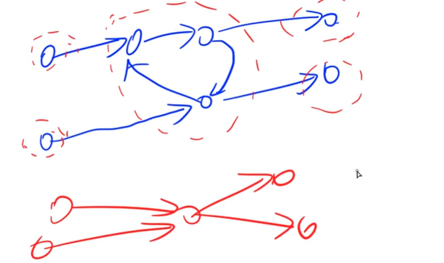


Tarjan求强连通分量(SCC)，引入时间戳的概念，对每个点定义两个时间戳

dfn[u]表示遍历到u的时间

low[u]表示从u开始走所能遍历到的最小时间戳

dfn[u]==low[u]则u是他所在的强连通分量的最低点


首先求出每个点属于那个强连通分量

然后缩点，遍历每个点i再遍历它的邻点j，如果他们不在同一个连通分量中那么加一条新边(连接二者的SCC)，这样就完成了缩点建图

按照连通分量编号递减的顺序满足拓扑序

## 受欢迎的牛


对于该题只要建立拓扑序然后看看是否只有1个出度为0的点(可能有单独的点)，但是建立拓扑序需要没有环因此使用tarjan缩点 

```python
from collections import deque
import sys

input = sys.stdin.readline
sys.setrecursionlimit(5000)

N = 10010

n, m = [int(x) for x in input().split()]
# 建图
e = [[] for _ in range(N)]
# 栈
d = deque()
# 记录点是否入栈
in_d = [False] * (N)
# 记录遍历到这个点的时间
dfn = [0] * (N)
# 记录从这个点开始走能得到的最小时间戳
low = [0] * (N)
# 记录每个点对应的连通分量
id = [-1] * (N)
# 记录点所对的连通分量的大小
size = [0] * (N)
# 时间，注意初始化为1方便判断
t = 1
# 连通分量编号
idx = 0
# 记录出度
out = [0] * (N)

for _ in range(m):
    u, v = [int(x) for x in input().split()]
    e[u].append(v)


def tarjan(i):
    global t, idx
    # 首先记录时间戳
    dfn[i] = low[i] = t
    t += 1
    # 入栈
    d.append(i)
    in_d[i] = True
    # 找相邻的点
    for k in e[i]:
        # 没有访问过操作一下
        if not dfn[k]:
            tarjan(k)
            # 更新时间
            low[i] = min(low[i], low[k])
        elif in_d[k]:
            low[i] = min(low[i], dfn[k])
    a = d
    # 如果这个点可以作为它所对连通分量的最低点
    if low[i] == dfn[i]:
        idx += 1
        # 出栈操作
        while True:
            curr = d.pop()
            in_d[curr] = False
            id[curr] = idx
            size[idx] += 1
            if i == curr: break

# 对每个点操作
for i in range(1, n + 1):
    if not dfn[i]: tarjan(i)
# 缩点后建图，这里不需要建图只有考虑出度
for i in range(1, n + 1):
    for j in e[i]:
        # 所对的连通分量不同，需要建立一条边，这里更新出度
        if id[i] != id[j]: out[id[i]] += 1

zero = 0
ans = 0
# 查找是否只有一个出度为0的点
for i in range(1, idx + 1):
    if not out[i]:
        ans += size[i]
        zero += 1
        if zero > 1:
            ans = 0
            break
print(ans)
```

