# [Plus and Multiply](https://codeforces.com/contest/1542/problem/B)

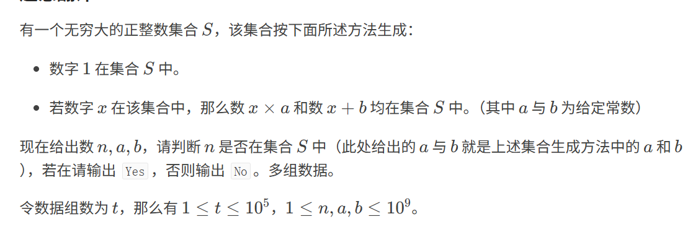

X先加b再乘a等价于先乘a再加ab，与先乘a再加b一致，可以认为得到一个$a^x+yb$的数

那么枚举a的幂次判断$n-a^x$是否可以模b，这里需要特判a=1的情况，即$1+yb=n$，值得注意的是这个条件要通过$(n-1)\%b$来判断而不是$$n\%b==1$$

```python
for _ in range(R()):
    n,a,b=RR()
    if a==1:
        if (n-1)%b==0:print('Yes')
        else:print('No')
        continue
    tmp=1
    while tmp<=n:
        if (n-tmp)%b==0:
            print('Yes')
            break
        tmp*=a
    else:
        print('No')
```


# [Special Permutation](https://codeforces.com/contest/1352/problem/G)

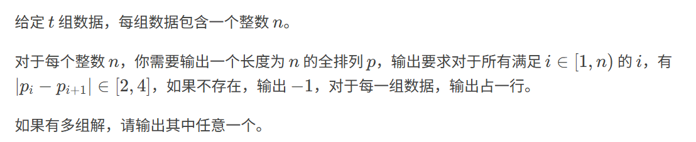

绝对值之差为2表示两个相邻的奇/偶数，4则是隔了一位的相邻的奇/偶数，那么考虑奇数数列和偶数数列

以9为例，奇数有1,3,5,7,9，偶数有2,4,6,8，不妨考虑先把奇数从小到大排好满足条件。如果再将偶数从大到小排序，构成1,3,5,7,9,8,6,4,2，那么中间两个数的差为1不满足条件，可以将偶数数列的后两位交换一下满足条件(6,8)，因此如果偶数数列只有一位或0位就无解(<=3)。

如果n是偶数，那么奇数有1,3,5,7,9，偶数有2,4,6,8,10，如果还是先排奇数再排偶数的话，无法通过交换满足条件，可以尝试先排偶数再排奇数，那么有2,4,6,8,10,9,7,5,3,1，中间的10,9不满足条件将奇数的后两位交换一下即可。

总的策略就是划分奇数数列和偶数数列，按照n的奇偶性拼接。

```python
for _ in range(R()):
    n=R()
    if n<=3:
        print(-1)
        continue
    odd=[]
    even=[]
    for i in range(1,n+1):
        if i&1:odd.append(i)
        else:even.append(i)
    if n&1:
        even=even[::-1]
        even[0],even[1]=even[1],even[0]
        ans=odd+even
    else:
        odd=odd[::-1]
        odd[0],odd[1]=odd[1],odd[0]
        ans=even+odd
    print(*ans)
```


# [Circle of Monsters](https://codeforces.com/problemset/problem/1334/C)

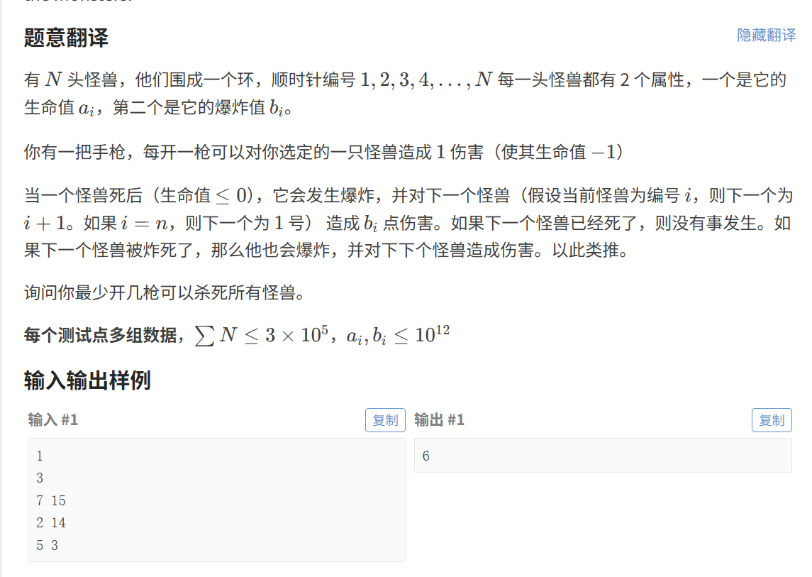

对于每个怪兽，消灭他有两种策略，第一种是直接用枪打死，第二种是在它被上一个炸过了之后补枪，由于爆炸没有传递性(只会影响到下一位)，因此累加每个怪兽被炸后还需操作的次数，这是必要，无论如何操作都不可或缺，然后枚举每个怪兽进行第一种操作的最小次数。

```python
for _ in range(R()):
    n=R()
    nums=[RR() for _ in range(n)]
    res=0
    ans=inf
    # 累计
    for i in range(n):
        pre=(i-1)%n
        res+=max(0,nums[i][0]-nums[pre][1])

    # 枚举对每个怪兽进行第一种操作
    for i in range(n):
        pre=(i-1)%n
        # 要减去补枪的次数
        c=max(0,nums[i][0]-nums[pre][1])
        ans=min(ans,res-c+nums[i][0])
    print(ans)
```


# [Jumping Through Segments](https://codeforces.com/problemset/problem/1907/D)

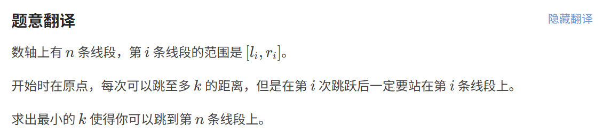

题目中的k是至多的距离而不是只能跳跃k，因此二分答案，关键在于如何检验

维护每一次跳跃的区间(l,r)初始时l=r=0，一次跳跃后区间为(ll-k,rr+k)，与给定的区间取交集(按照题意，是不能超出的)，如果是空间那么k值还是太小

```python
for _ in range(R()):
    n=R()
    nums=[RR() for _ in range(n)]
    l,r=0,10**10
    
    def check(x):
        ll,rr=0,0
        for i,j in nums:
            ll=max(0,ll-x)
            rr+=x
            if max(ll,i)>min(rr,j):return False
            ll=max(ll,i)
            rr=min(rr,j)
        return True
   
    while l<=r:
        mid=(l+r)>>1
        if check(mid):
            r=mid-1
        else:
            l=mid+1
    print(r+1)
```


# [Hossam and Friends](https://codeforces.com/contest/1771/problem/B)

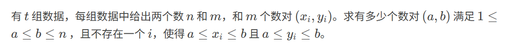

初始时维护每个位置能跳到的最远的右端点，也就是n

每加入一个区间[l,r]，就将l能跳到的位置更新为min(l,r-1)，最后从大到小枚举每个位置更新a1=min(a1,a2)因为每个位置都会受到下一个位置的影响。

```python
for _ in range(R()):
    n,m=RR()
    dis=[n]*(n+1)
    for _ in range(m):
        l,r=RR()
        if l>r:
            l,r=r,l
        dis[l]=min(dis[l],r-1)
    for i in range(n-1,0,-1):
        dis[i]=min(dis[i],dis[i+1])
    ans=sum(r-l+1 for l,r in enumerate(dis[1:],1))
    print(ans)
```


# [Sage's Birthday](https://codeforces.com/problemset/problem/1419/D2)

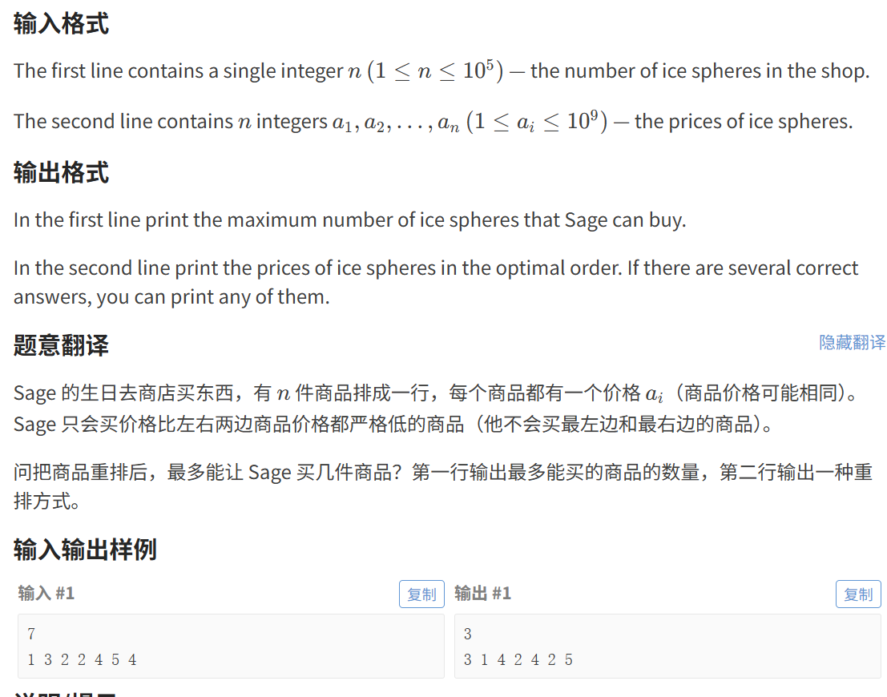

根据题意，答案一定不超过n//2，因为不可能有一种排列出现连续两个满足条件的位置。

为了靠近这个上限，想到奇数偶数位置，因为排列的两边不会被计算而题目求解的又是谷底，因此在两边放最大的数，为了最大化答案优先把小的数放到偶数位置(索引从1开始)，每个偶数的边上贪心的放置仅比它大一点的数，也就是按照排序后的结果放置。

```python
n=R()
nums=RR()
nums.sort()
res=0
ans=[-1]*n

idx=0
for i in range(1,n,2):
    ans[i]=nums[idx]
    idx+=1
for i in range(n):
    if ans[i]==-1:
        ans[i]=nums[idx]
        idx+=1

for i in range(n):
    if i-1>=0 and i+1<n and ans[i]<ans[i+1] and ans[i]<ans[i-1]:res+=1
print(res)
print(*ans)
```


# [LIS or Reverse LIS?](https://codeforces.com/problemset/problem/1682/C)

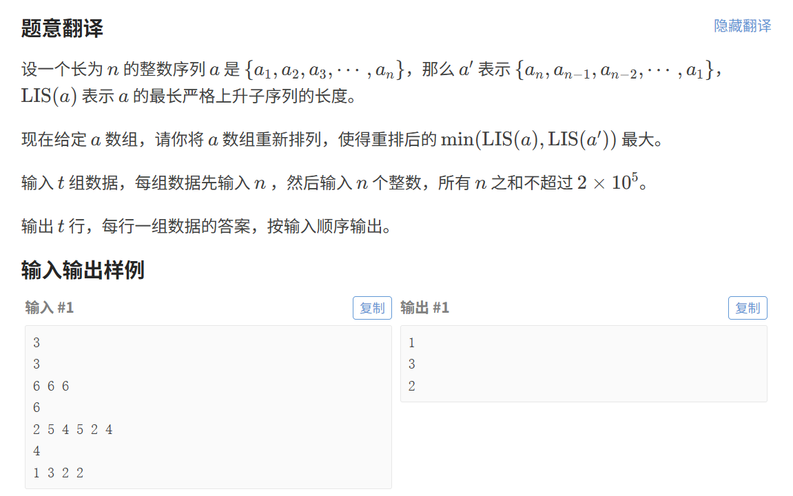

考虑计数，如果一个元素出现次数大于等于2次，那么它一定会在两个上升子序列中出现，如果只出现一次那么可能出现在一边，或者两边共享这个元素(这会出现一次，因为是LIS)，因此计数统计即可。

```python
for _ in range(R()):
    n=R()
    nums=RR()
    memo=Counter(nums)
    ans=0
    f=False
    for k,v in memo.items():
        if v>=2:
            ans+=2
        else:
            f=True
            ans+=1
    if f:
        ans+=1
    print(ans//2)
```


# [No Prime Differences](https://codeforces.com/problemset/problem/1838/C)

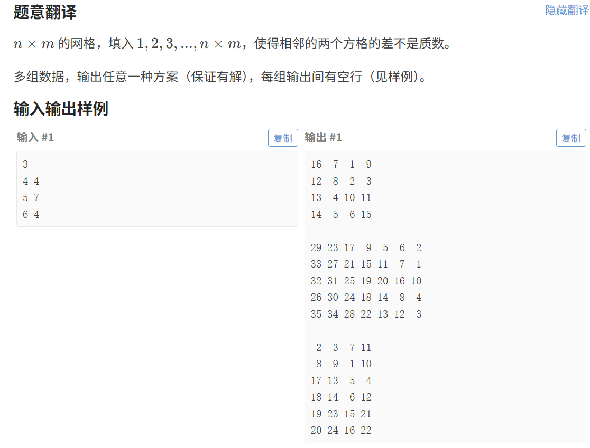

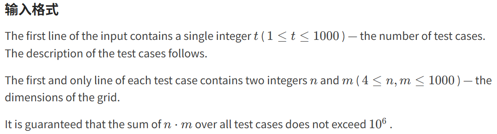


考虑最简单的构造：[[1,2,3],[4,5,6],[7,8,9]]

这种情况下横向之差为1，一定满足条件，但是纵向之差为m(列数)，如果m是质数那么不满足条件。如果纵向之差为2*m那么一定不为质数，因此考虑构造2\*m的纵向差，因此将奇数行和偶数行归到一类。此时考虑奇数行和偶数行之间的差，如果奇数行在上方，当n为奇数时的差为 m(n−2)，n为偶数时差为m(n−3)。当n(n?=4)是4，m是质数时，差就会变成m，是个质数，但是如果将奇数行放到下方，则有当n为奇数时差为m(n−2)，n为偶数时差为 m(n−1)。不会出现差变成m的情况。

```python
for _ in range(R()):
    m,n=RR()
    idx=1
    odd=[]
    even=[]
    for i in range(1,m+1):
        tmp=[]
        for j in range(n):
            tmp.append(idx)
            idx+=1
        if i&1:
            odd.append(tmp[:])
        else:
            even.append(tmp[:])
    arr=even+odd
    for tmp in arr:
        print(*tmp)
    print()
```


# [Multiples of Length](https://codeforces.com/problemset/problem/1396/A) 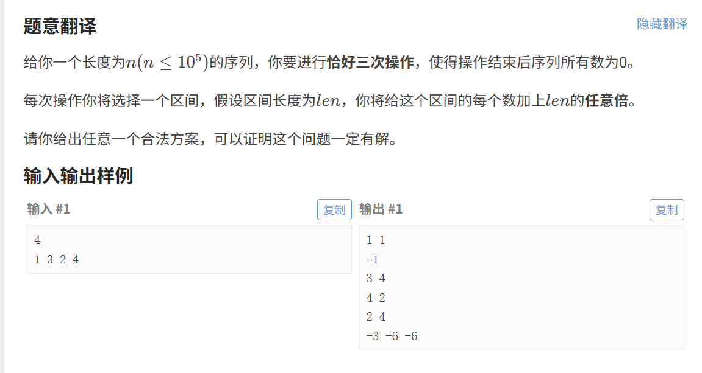

猜测最后一次操作一定是操作1到n，那么前两次操作尝试将1到n-1变化为n的倍数，对于x变化为n的倍数的操作是加上(n-1)x，那么就需要对长度为n-1的区间操作一次，然后对长度为1的区间操作一次即可。

```python
n=R()
nums=RR()
if n==1:
    print(1,1)
    print(1)
    print(1,1)
    print(1)
    print(1,1)
    print(-nums[0]-2)
else:
    print(2,n)
    tmp=[(n-1)*x for x in nums[1:]]
    print(*tmp)
    nums[1:]=[i+j for i,j in zip(nums[1:],tmp)]
    print(1,1)
    tmp=lcm(nums[0],n)-nums[0]
    print(tmp)
    nums[0]+=tmp
    print(1,n)
    print(*nums)
```


# [Not Assigning](https://codeforces.com/problemset/problem/1627/C)

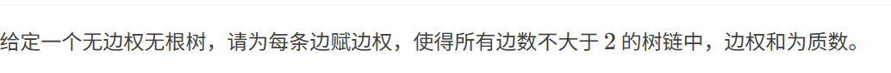 

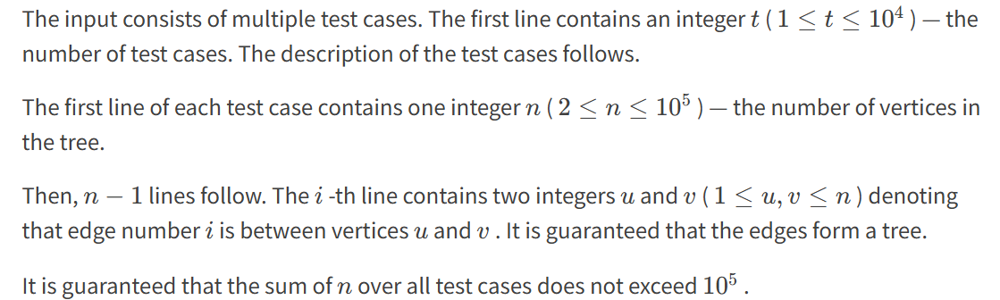


质数一定是一个奇数，因此如果有一个点连接了三条边，为了保证是奇数，其中一对点一定是奇数+偶数的组合，而另一个点无论是奇数还是偶数都会与现有的某一个点组合为偶数不满足条件，因此满足条件的结构一定是一条链子，只要2 3 2 3组合即可


# [The Trail](https://codeforces.com/problemset/problem/2055/C)

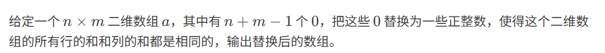

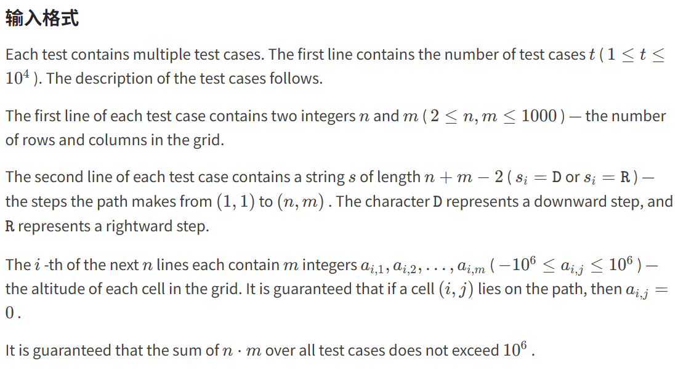

令行和列的和为x，那么对于整个网格有有nx=mx，因此可以令x等于0


# [ Longest Regular Bracket Sequence](https://codeforces.com/problemset/problem/5/C)

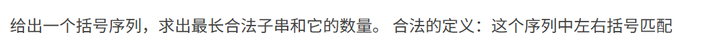

将合法的括号序列弹出标记为1，那么问题转换为找全为1的序列。

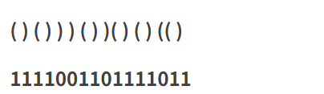


# [Poi 的消消乐](https://ac.nowcoder.com/acm/problem/292229)

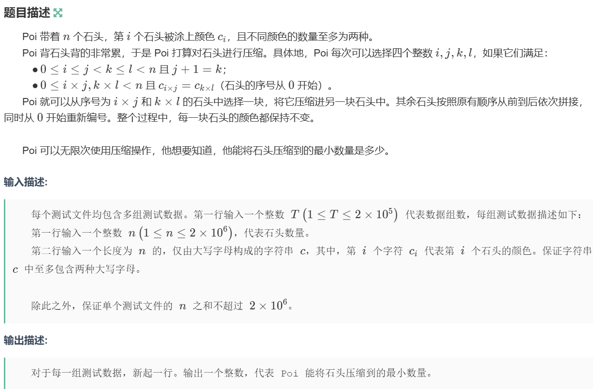


问题中的四个坐标看似十分复杂，但是只需考虑特殊情况比如**j=0,k=1**，当这两个位置的元素颜色相同时，可以将改颜色削减到只剩一个，考虑AABBABABA，如果将除了首位外的A全部并到首位上的A，B就无法压缩到最小，正确的做法是在最后一次压缩的过程中，将首位的A压缩到另一个A的位置，那么有BBBBA，然后再压缩全部的B，最终得到BA。

当S=AAAABBBB时，无法将A压缩到后面最终前面一定会留一个A那么有ABBBBB，此时选择j=1,k=2能将B删除到最多三个。

对于只有一种颜色的情况，必然可以剩下一个

```python
for _ in range(R()):
    n=R()
    s=RS()
    i=0
    memo=Counter(s)
    if memo[s[0]]==n:
        print(1)
        continue
    while i<n and s[i]==s[0]:
        i+=1
    if s.count(s[0])==i:
        print(1+min(3,n-memo[s[0]]))
    else:
        print(2)
```


# [awoo's Favorite](https://codeforces.com/problemset/problem/1697/C)

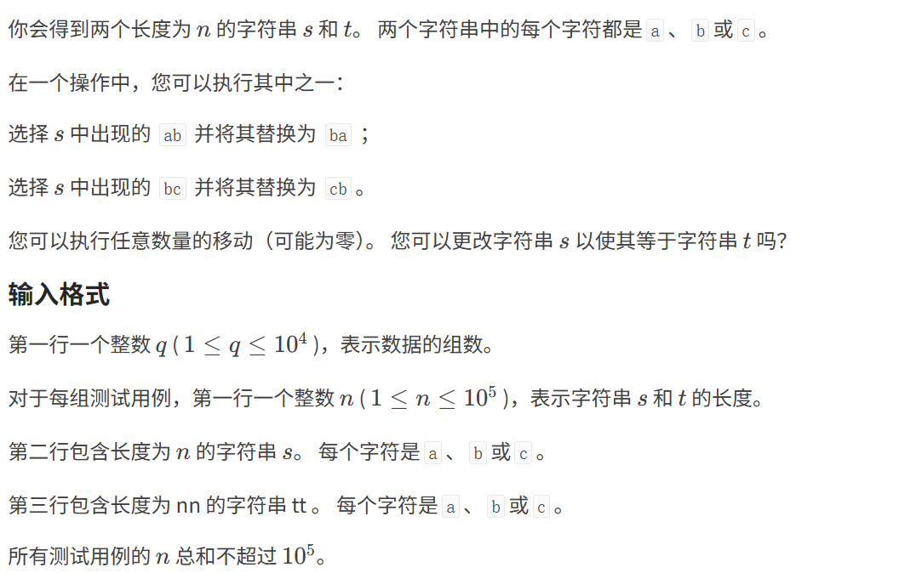

根据题意，a只能往后走，c只能往前走，并且a和c不能相互跨越，那么将字符串中的b全删除判断s和t中的a和c字母是否有相同的相对位置，如果相对位置不同那么一定无解。

但是相对位置相同也不一定有解，以S=ba T=ab为例，转换为_a 和a\_，因为S中的a只能往后走所以无解，因此在比较相对位置的时候也要判断S中的a是否在T的前面，S中的c是否在T后面。


# [Dual](https://codeforces.com/problemset/problem/1854/A1)

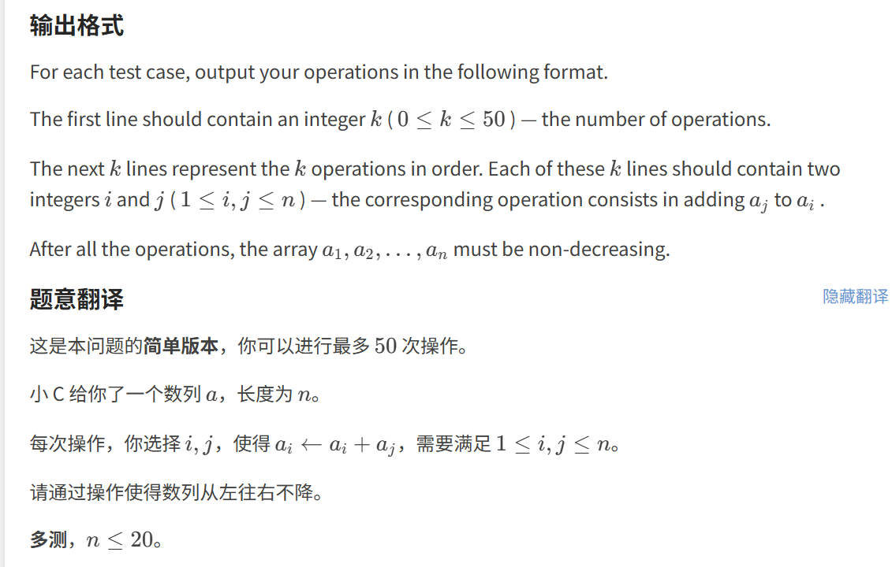

对于给定的数据范围可以操作整个数组两次，当数组中全是正数，对每个位置依次操作a[i]<-a[i]+a[i-1]，如果是负数则是a[i]=a[i]+a[i-1]，这样可以保证大小，如果有正有负，因为数组较短，因此可以将所有数变为正数或负数再考虑。

```python
for _ in range(R()):
    n=R()
    nums=RR()
    ans=[]
    if max(nums)*min(nums)<0:
        mx=0
        for i,x in enumerate(nums):
            if abs(x)>abs(nums[mx]):
                mx=i
        if nums[mx]<0:
            for i in range(n):
                if i==mx:continue
                nums[i]+=nums[mx]
                ans.append((i,mx))
        else:
            for i in range(n):
                if i==mx:continue
                nums[i]+=nums[mx]
                ans.append((i,mx))
    if sum(int(x<0) for x in nums)==0:
        for i in range(1,n):
            nums[i]+=nums[i-1]
            ans.append((i,i-1))
    else:
        for i in range(n-2,-1,-1):
            nums[i]+=nums[i+1]
            ans.append((i,i+1))
    print(len(ans))
    for l,r in ans:
        print(l+1,r+1)
```


# [Phoenix and Distribution](https://codeforces.com/problemset/problem/1348/C)

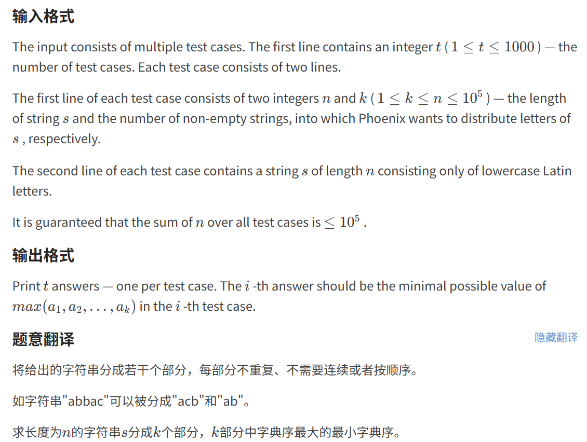

首先一定是将最小的字符放到k个位置的首位，如果不够，则将第k大的字符就是答案，满足字典序最大(首位并且最短)。

如果够，当剩下的数相同时最优策略是均分——减小长度，反之全部接到某一段上，保证就最大的字符往后放，如给定baacb，最大的应该是abbc而不是abc。


# [ Minimum Ties](https://codeforces.com/problemset/problem/1487/C)

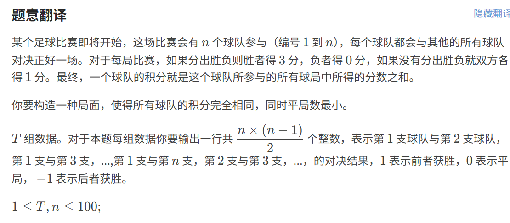

令x表示非平局次数，y表示平局次数，因为最后所有队伍得分相同，那么有

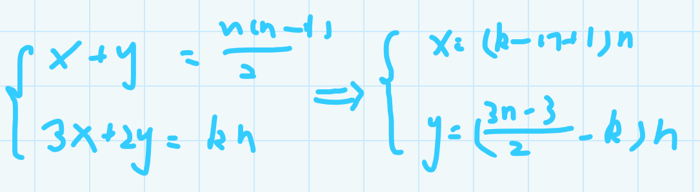

其中k表示倍数，这里需要y最小且y是非负整数。

当n是奇数时，k可以取到(3n-3)//2，因为其是一个整数，且满足y最小，因此x=n(n-1)//2，表示每个队伍赢(n-1)//2次

反之，k需要等于(3n-4)//2保证倍数是一个整数，且最小，x=n(n-2)//2，y=1，表示每个队伍赢(n-2)//2，且平局一次


# [Mocha and Diana](https://codeforces.com/problemset/problem/1559/D1)

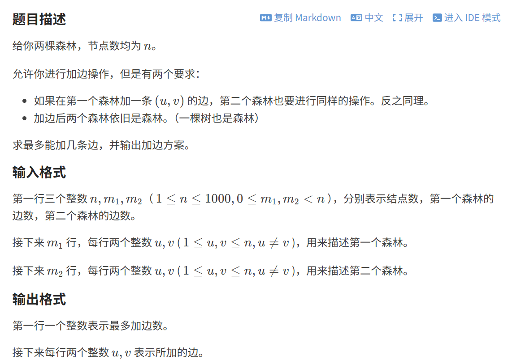

森林指的是一颗或多棵树，对于给定的数据范围可以做到枚举每一条边，能连就连

# [A Tale of Two Lands](https://codeforces.com/problemset/problem/1166/C)

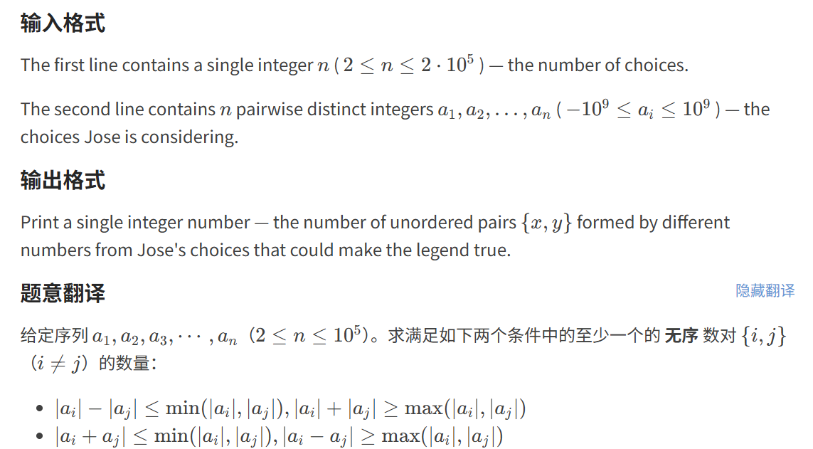

观察条件二，有

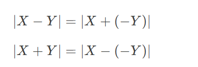

变化X，或者同时变化X和Y结果不变，因此X和Y的正负对答案没有影响，可以将所有元素全部取绝对值，将所有元素排序(只求数对个数)，对X和Y相加必然大于max(X,Y)，想要满足Y-X<min(X,Y)需要满足Y-X<=X也就是Y<=2*X

```python
n=R()
nums=[abs(x) for x in RR()]
nums.sort()
l=ans=0
for r in range(n):
    while l<=r and nums[l]*2<nums[r]:
        l+=1
    ans+=r-l
print(ans)
```


# [Doremy's IQ](https://codeforces.com/problemset/problem/1707/A)

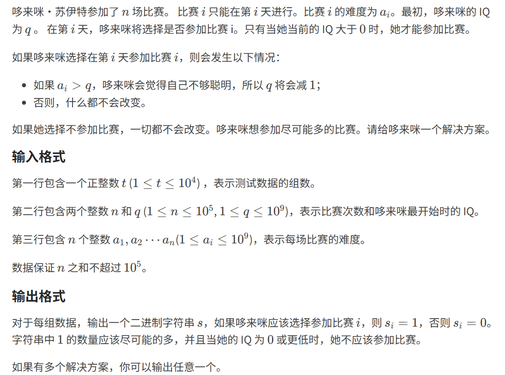

尽可能地把扣分的操作放到最后，并且最后的IQ是0(越小越好)最好，那么初始化cur=0表示最终的IQ，然后倒着遍历遇到更大的值就将cur+1，当cur=q时，退出循环，表示从该位置开始扣智商，接着从停止的位置向前，将难度小于等于q的考试改为参加。

```python
for _ in range(R()):
    n,q=RR()
    nums=RR()
    cur=0
    ans=[]
    for r in range(n-1,-1,-1):  
        if nums[r]>cur:
            cur+=1
        if cur==q:
            break
    for i in range(r):
        if q>=nums[i]:ans.append('1')
        else:ans.append('0')
    ans=''.join(ans+['1']*(n-r))
    print(ans)
```


