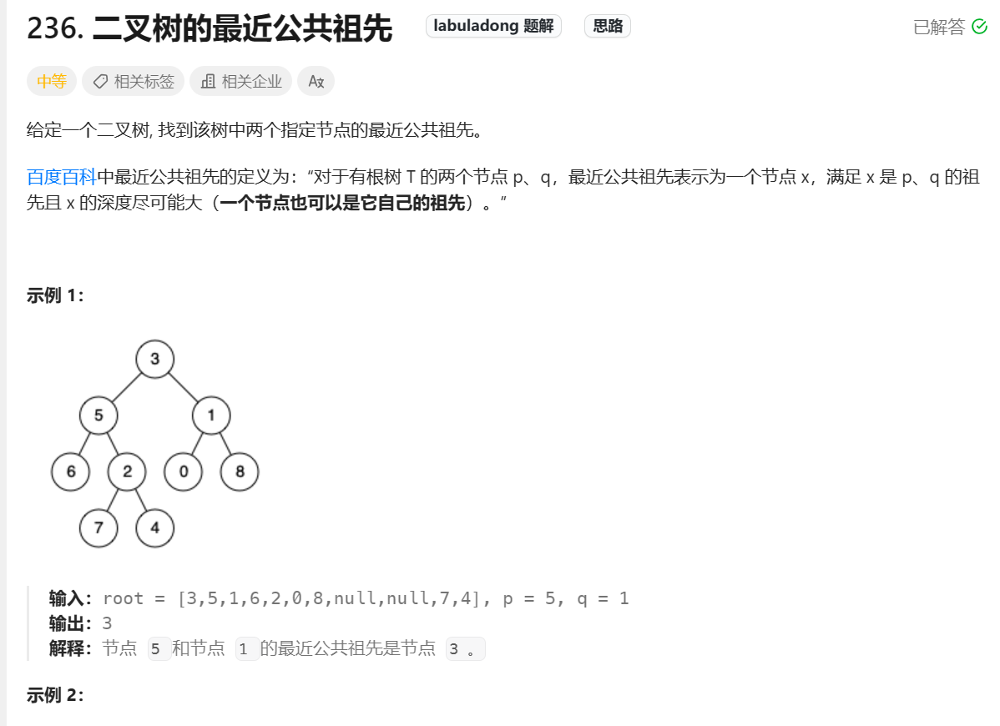
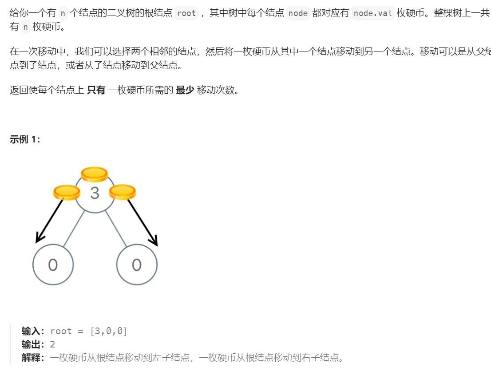
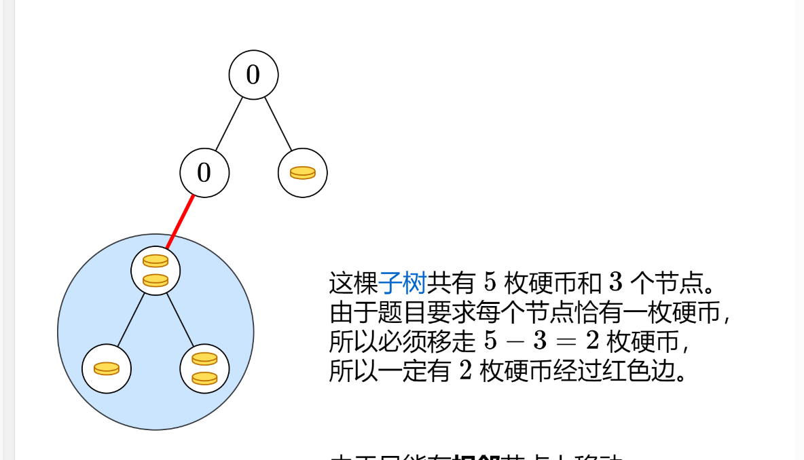
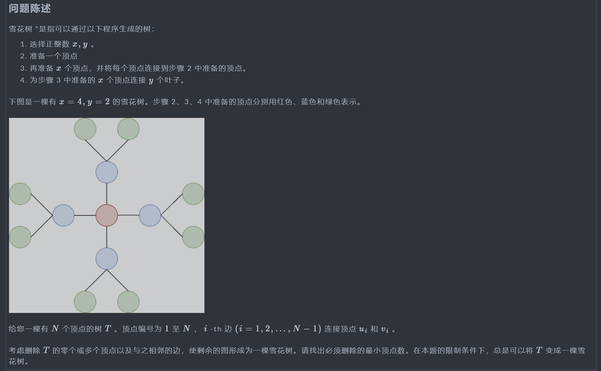
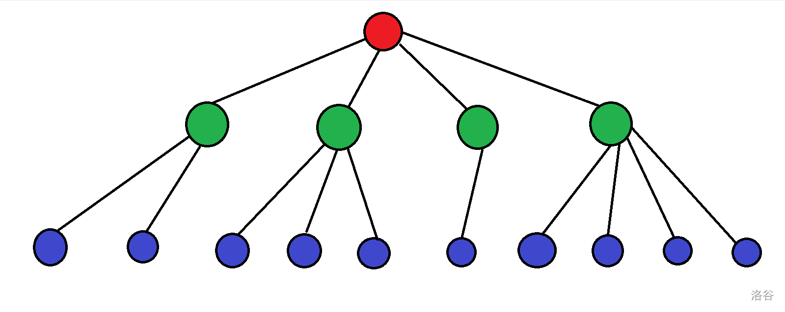
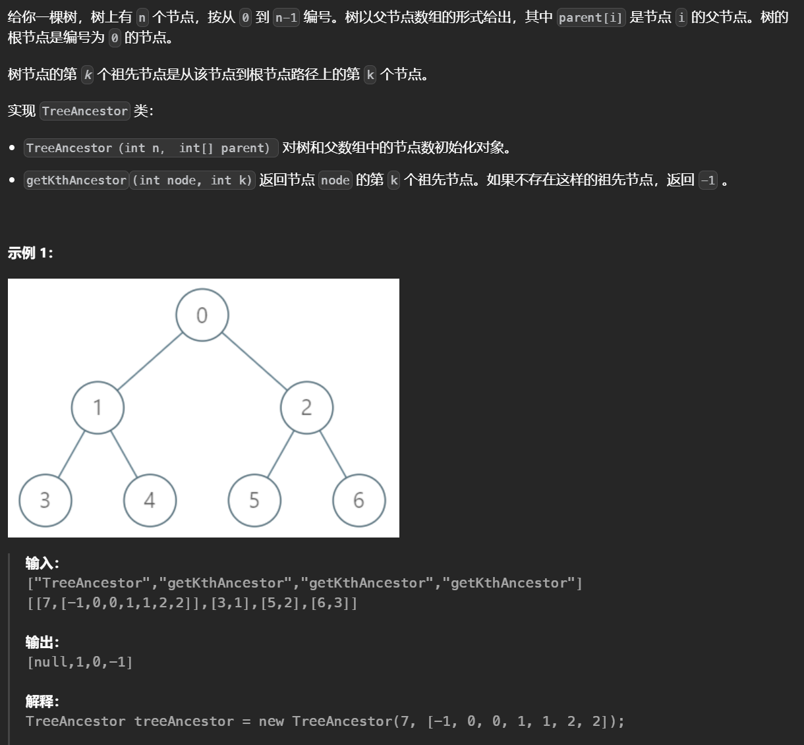

# 树形结构


# 公共祖先

## 二叉树最近的公共祖先



如果一个节点能在它的左右子树分别找到pq，则该节点为LCA。


```python
class Solution(object):
    def lowestCommonAncestor(self, root, p, q):

        def find(root,p,q):
            if not root:
                return None
            # 前序遍历，一直往下找，满足情况二
            if root==p or root==q:
                return root
            left=find(root.left,p,q)
            right=find(root.right,p,q)
			
            # 如果左右子树中能分别找到节点，那么该节点就是LCA
            if left!=None and right!=None:
                return root
            
            # 如果在左子树先找到了q，右子树中没有相应的节点，那么说明p在q的下面，最近的公共祖先就是q，满足情况一
            return left if left!=None else right
        return find(root,p,q)
```


## [ 最小公共区域](https://leetcode.cn/problems/smallest-common-region/)


实际上就是在多叉树上找最近公共祖先。

```python
class Solution:
    def findSmallestRegion(self, regions: List[List[str]], region1: str, region2: str) -> str:
        memo=defaultdict(list)
        # 建树
        for re in regions:
            memo[re[0]]=re[1:]
        ans=[]
        # 遍历的函数，返回子树是否包含要找的值，如果包含返回1
        def traverse(root):
            res=0
            # 如果自己就是一个要找的值，记录值加一
            if root==region1 or root==region2:
                res+=1
            if not memo[root]:
                return int((root==region1 or root==region2))
            for p in memo[root]:
                res+=traverse(p)
            # 一旦记录的值等于2，就要加入一个节点
            if res==2:
                ans.append(root)
            return int(res>=1)
            
        root=regions[0][0]
        traverse(root)
        return ans[0]
```

## [查询树中环的长度](https://leetcode.cn/problems/cycle-length-queries-in-a-tree/)


找给定节点的祖先，此题中将根据完全二叉树的性质可以反找节点的父节点，比较给定的两个节点，较大的那个说明更深，通过整除二来反找父节点，就这样每次把更深的节点去找它的父节点最后一定会找到二者的交点即祖先。

```python
class Solution:
    def cycleLengthQueries(self, n: int, queries: List[List[int]]) -> List[int]:
        ans=[]
        path=defaultdict(dict)
        for a,b in queries:
            res=1
            # 最后一定会汇于一点
            while a!=b:
                # 每次换较深的那个点
                if a>b:a//=2
                else:b//=2
                # 记录
                res+=1
            ans.append(res)
        return ans 
```


# 树上模拟


## [在二叉树中分配硬币](https://leetcode.cn/problems/distribute-coins-in-binary-tree/)






对于如图所示的子树，如果想要满足条件那么必须移出两个金币也就是金币数和节点数之差的绝对值，每个子树都会贡献一部分。

```python
class Solution:
    def distributeCoins(self, root: Optional[TreeNode]) -> int:
        ans=0
        def dfs(root):
            if not root:
                return 0,0
            cntl,coinl=dfs(root.left)
            cntr,coinr=dfs(root.right)
            nonlocal ans 
            ans+=abs(cntl-coinl)+abs(cntr-coinr)
            return cntl+cntr+1,coinl+coinr+root.val
        dfs(root)
        return ans 
```


## **Snowflake Tree**



枚举每一个中心节点，对于中心节点再去找子节点(O(n))，为了删除的节点数最少那么就需要保留最多的节点，因为雪花树的性质，子节点的出度会限制可选的子节点数目。

如下所示，如果令y=1那么可以选择的x=4个，子节点的子节点只有1*4个；如果y=2，那么x=3，子节点的子节点有2\*3个，可以将子节点按照出度来排序，从小到大枚举选择的y更新最大的答案。




```python
n=R()
path=defaultdict(list)
reg=[0]*(n+1)
for _ in range(n-1):
    u,v=RR()
    path[u].append(v)
    path[v].append(u)
    reg[u]+=1
    reg[v]+=1

ans=0
for i in range(1,n+1):
    arr=[]
    cnt=len(path[i])
    for c in path[i]:
        # 减一是排除父节点
        arr.append(reg[c]-1)
    arr.sort()
    for j,x in enumerate(arr):
        # 统计总的节点个数时需要加上父节点
        ans=max(ans,cnt-j+(cnt-j)*x+1)
print(n-ans)
```


# 树上倍增

## [树节点的第 K 个祖先](https://leetcode.cn/problems/kth-ancestor-of-a-tree-node/)



暴力的做法是从Node开始往上走k步，如果一次走两步的话就能节省一半的时间，一次走三步可以节省三倍的时间，因此使用倍增的方法，预处理往上走2^i步到达的位置，k可以拆为二进制之和。

定义pa[node]\[i]为node节点往上走2^i到达的位置，先枚举i从低到高求解，pa[node]\[i]=pa[pa[node]\[i-1]]\[i-1]，实际是一个动态规划的递推式。

```python
class TreeAncestor:

    def __init__(self, n: int, parent: List[int]):
        m=n.bit_length()
        pa=[[-1]*m for _ in range(n)]
        for i in range(m):
            for x in range(n):
                if not i:pa[x][i]=parent[x]
                elif pa[x][i-1]!=-1:pa[x][i]=pa[pa[x][i-1]][i-1]
        self.pa=pa
        self.m=m 

    def getKthAncestor(self, node: int, k: int) -> int:
        pa=self.pa
        m=self.m
        ans=node
        for j in range(m):
            if k>>j&1:ans=pa[ans][j]
            if ans<0:return ans 
        return ans 
```
