# 树形结构


# 公共祖先

## 二叉树最近的公共祖先

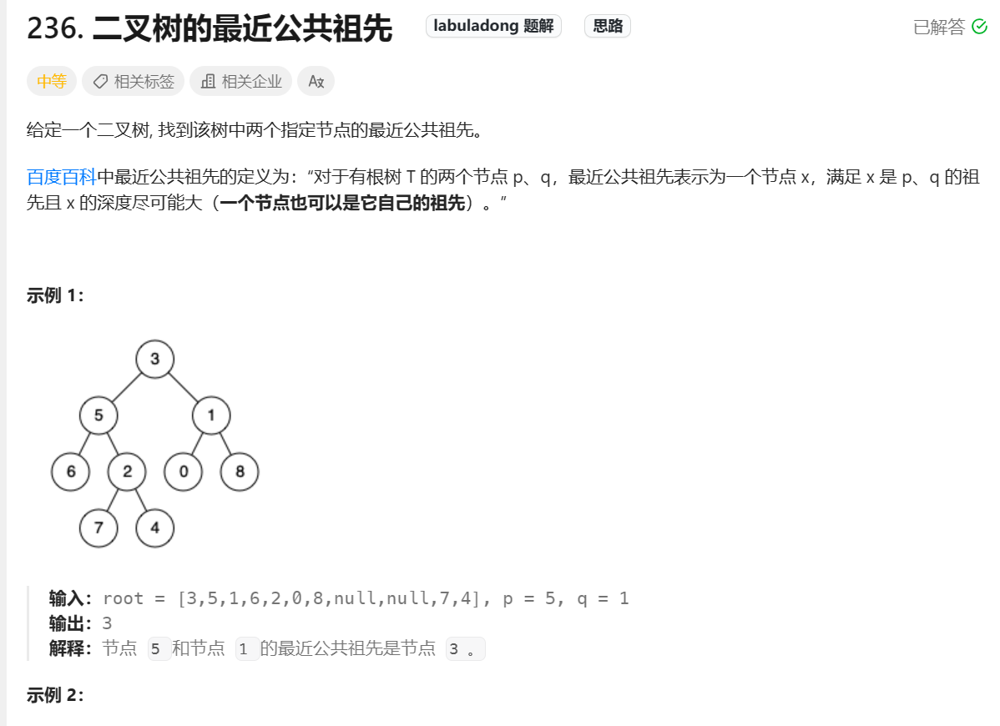

如果一个节点能在它的左右子树分别找到pq，则该节点为LCA。

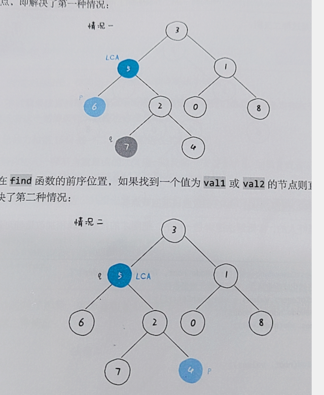

```python
class Solution(object):
    def lowestCommonAncestor(self, root, p, q):

        def find(root,p,q):
            if not root:
                return None
            # 前序遍历，一直往下找，满足情况二
            if root==p or root==q:
                return root
            left=find(root.left,p,q)
            right=find(root.right,p,q)
			
            # 如果左右子树中能分别找到节点，那么该节点就是LCA
            if left!=None and right!=None:
                return root
            
            # 如果在左子树先找到了q，右子树中没有相应的节点，那么说明p在q的下面，最近的公共祖先就是q，满足情况一
            return left if left!=None else right
        return find(root,p,q)
```


## [ 最小公共区域](https://leetcode.cn/problems/smallest-common-region/)

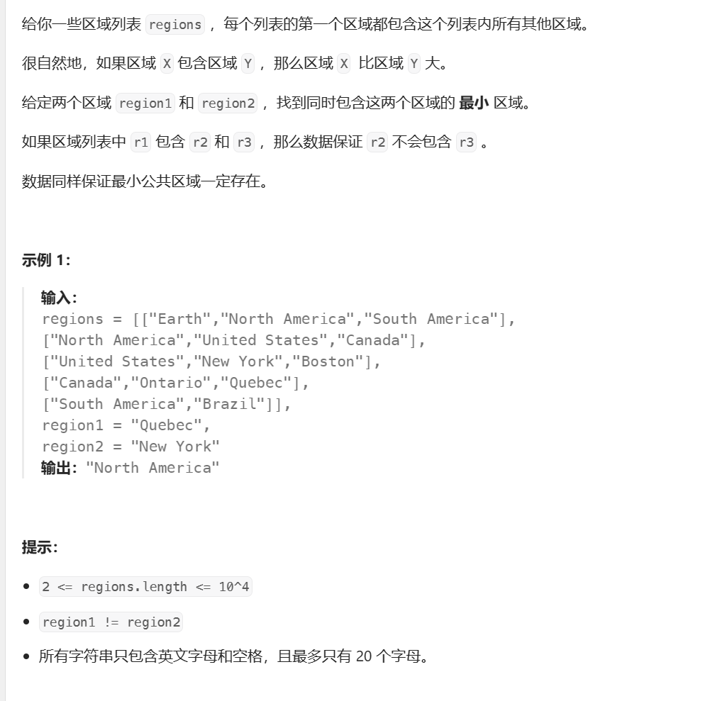

实际上就是在多叉树上找最近公共祖先。

```python
class Solution:
    def findSmallestRegion(self, regions: List[List[str]], region1: str, region2: str) -> str:
        memo=defaultdict(list)
        # 建树
        for re in regions:
            memo[re[0]]=re[1:]
        ans=[]
        # 遍历的函数，返回子树是否包含要找的值，如果包含返回1
        def traverse(root):
            res=0
            # 如果自己就是一个要找的值，记录值加一
            if root==region1 or root==region2:
                res+=1
            if not memo[root]:
                return int((root==region1 or root==region2))
            for p in memo[root]:
                res+=traverse(p)
            # 一旦记录的值等于2，就要加入一个节点
            if res==2:
                ans.append(root)
            return int(res>=1)
            
        root=regions[0][0]
        traverse(root)
        return ans[0]
```

## [查询树中环的长度](https://leetcode.cn/problems/cycle-length-queries-in-a-tree/)

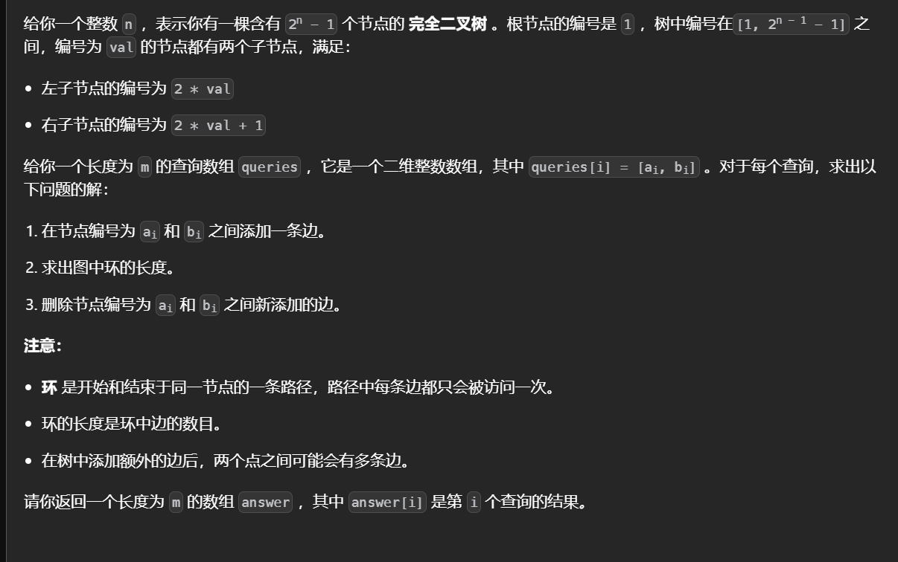


找给定节点的祖先，此题中将根据完全二叉树的性质可以反找节点的父节点，比较给定的两个节点，较大的那个说明更深，通过整除二来反找父节点，就这样每次把更深的节点去找它的父节点最后一定会找到二者的交点即祖先。

```python
class Solution:
    def cycleLengthQueries(self, n: int, queries: List[List[int]]) -> List[int]:
        ans=[]
        path=defaultdict(dict)
        for a,b in queries:
            res=1
            # 最后一定会汇于一点
            while a!=b:
                # 每次换较深的那个点
                if a>b:a//=2
                else:b//=2
                # 记录
                res+=1
            ans.append(res)
        return ans 
```


# 树的直径


## 树的直径

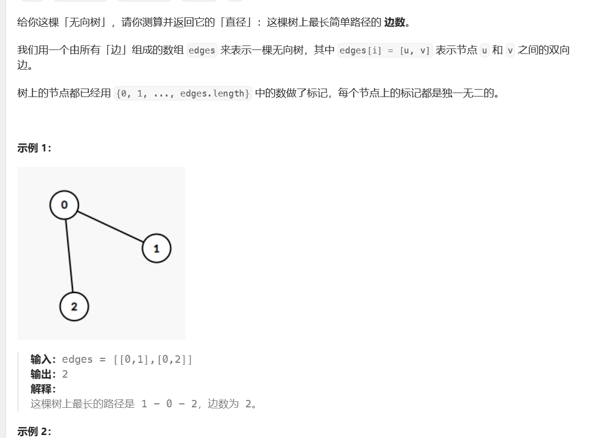

树的直径就是两个相邻最远的节点的距离

+ BFS方法，从任意节点开始都可以得到任意一个极端节点（距离所有节点最远的两个节点），然后从这个节点开始再进行一次BFS就可以得到另一个极端节点，这两个极端节点之间的距离就是树的直径。

```python
from collections import deque


class Solution(object):
    def treeDiameter(self, edges):
        if not len(edges):
            return 0
        # 使用set集合记录每一个边
        paths = [set() for _ in range(len(edges) + 1)]
        for edge in edges:
            u, v = edge
            paths[u].add(v)
            paths[v].add(u)

        # bfs框架
        def bfs(start):
            d = deque([start])
            
            # 备忘录防止重复加入
            visited = [False] * (len(paths))
            visited[start] = True
            # 记录最后一个节点
            lastnode = None
            # 距离从-1开始，因为遍历到最后一层时还会向外遍历一次，如果从0开始最后的结果会多出一
            distance=-1
            while d:
                sz = len(d)
                # 只遍历之前队列中元素的个数次
                for _ in range(sz):
                    # 弹出
                    curr = d.popleft()
                    for i in paths[curr]:
                        # 加入不重复的邻居
                        if not visited[i]:
                            visited[i] = True
                            d.append(i)
                            lastnode = i
				# 距离加一
                distance += 1
            return [distance, lastnode]
       
        distance, lastnode = bfs(0)
        return bfs(lastnode)[0]
```


+ 使用回溯算法解题，如果可以得到从父节点到任何后代叶子节点的最长距离t1,t2，那么经过该父节点的最长半径就是t1+t2，整个树的最长半径就是所有节点中的最长半径

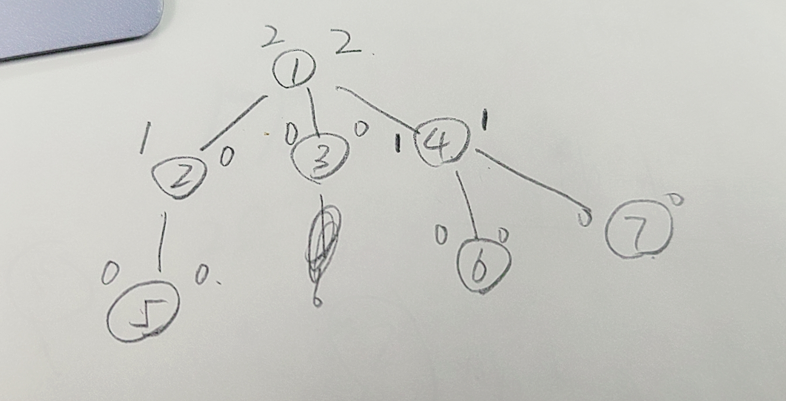

```python
class Solution(object):
    def treeDiameter(self, edges):

        paths = [set() for _ in range(len(edges) + 1)]
		# 记录所有边
        for edge in edges:
            u, v = edge
            paths[u].add(v)
            paths[v].add(u)
            
         # 设置备忘录
        visited=[False]*len(paths)
        # 不断更新外部变量来得到最大值
        self.diameter=0

        # 会返回以p为父节点到叶子结点的最大距离
        def dfs(p,visited):
            # 设置两个到叶子节点的最长距离
            left = 0
            right = 0
            # 标记
            visited[p]=True
            for val in paths[p]:
                # 包含过了
                if visited[val]:
                    continue
                # 该节点到叶子结点的距离为它的子节点到叶子结点的距离加一
                distance=1+dfs(val,visited)
                # 更新
                if distance>left:
                    left,right=distance,left
                elif distance>right:
                    right=distance
			
                self.diameter=max(self.diameter,left+right)
            
            return left

        dfs(0,visited)
        return self.diameter
```

## N叉树的直径

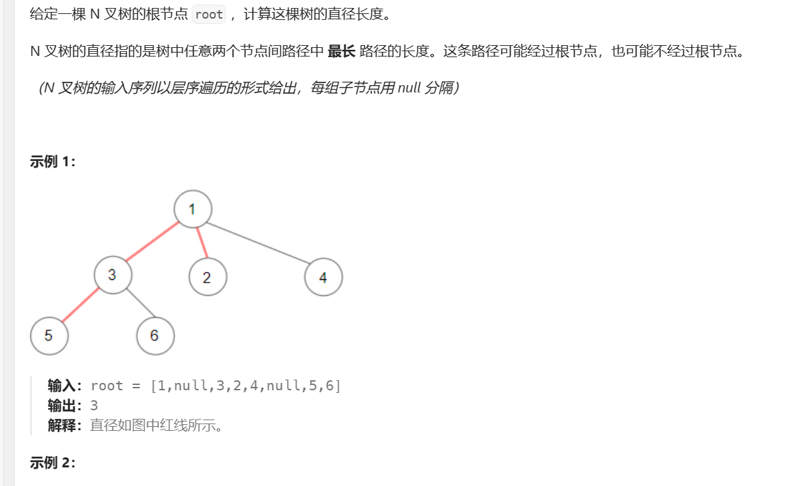

对每个节点找出它子树中边数最大的两个再相加，这个值就是经过这个节点的最大路径长度

```python
class Solution(object):
    def diameter(self, root):
        self.diameter=0
        def dfs(root):
            left=0
            right=0
            for child in root.children:
                distance=1+dfs(child)
                if distance>left:
                    left,right=distance,left
                elif distance>right:
                    right=distance
                self.diameter=max(self.diameter,left+right)
            return left
        dfs(root)
        return self.diameter
```

## 串门

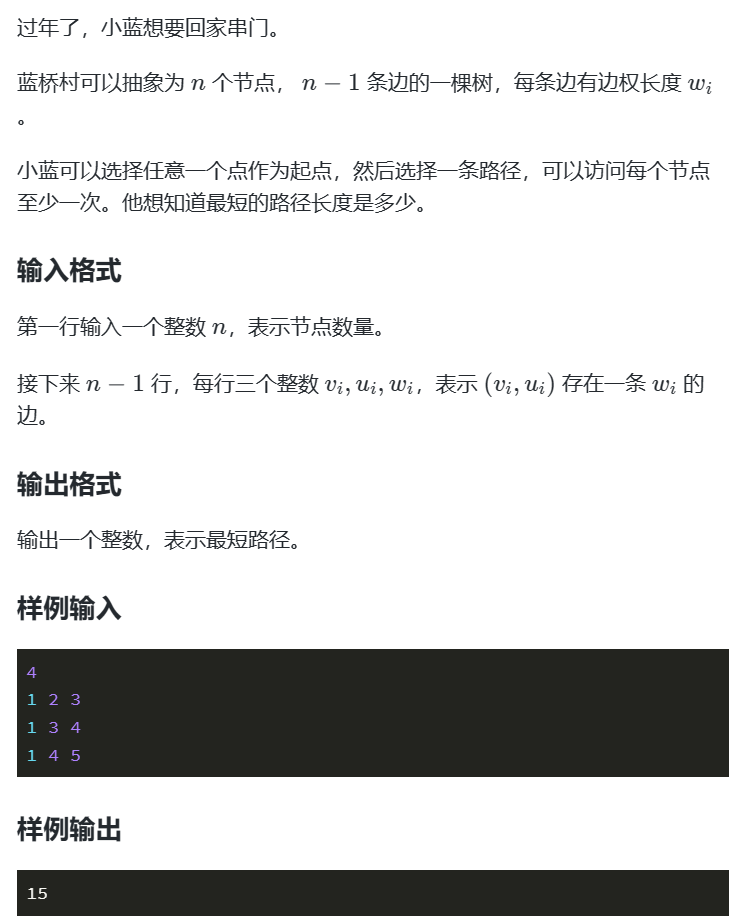

为了访问所有的点，除了主路，对于每条路径都要走两次(来回)。

这种问题的最短路径就是所有的边之和乘2减去一条树的直径，但是这题每条边是有权重的，计算直径不能按照一般的方法。照样使用bfs模板，不过在遍历中有一个外部变量记录距离。

```python
from collections import deque

# 接收输入
n=int(input())
# 使用集合记录每个节点相连的节点以及相应的权重
edges=[set() for _ in range(n+1)]
w_sum=0
# 记录
for _ in range(n-1):
    u,v,w=list(map(int,input().split()))
    edges[u].add((v,w))
    edges[v].add((u,w))
    w_sum+=w

# 返回距离start最远的节点，以及一个记录距离的列表
def bfs(start):
    # distance记录的是所有节点到start的距离，先初始化为-1
    distance=[-1 for _ in range(n+1)]
    # 自己到自己的距离是0
    distance[start]=0
    # 接下来是bfs模板
    d=deque([start])
    while d:
        sz=len(d)
        for _ in range(sz):
            # 弹出
            curr=d.popleft()
            for u,w in edges[curr]:
                # 如果记录过，跳过
                if distance[u]!=-1:
                    continue
                # 从start到u的距离等于从start到curr的距离加上从curr到u的距离
                distance[u]=w+distance[curr]
                # 加入路径，称为下一轮的curr
                d.append(u)
     # 找出最远的点，也就是直径
    lastnode=distance.index(max(distance))
    return lastnode ,distance

# 先找出一个极端节点
node1,_=bfs(1)
# 再根据这个极端节点找另一个
node2,distance=bfs(node1)

print(w_sum*2-distance[node2])
```

## [合并两棵树后的最小直径](https://leetcode.cn/problems/find-minimum-diameter-after-merging-two-trees/)

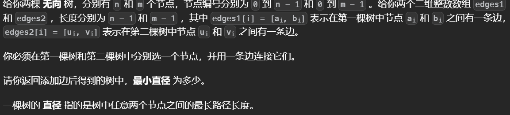

两棵树合并后树的直径有两种情况，直径不会改变还是合并前两个树的直径中最大的那个，或者树的直径会经过连接的位置然后加上两个树的剩余直径之和（因为直径是树上最长的边所以一定会经过原本树上的直径），为了保证整个树的直径最小应该选择两个树的直径的中点相连，这里不需要知道那个是中点，因为只需要求出数值大小

```python
class Solution:
    def minimumDiameterAfterMerge(self, edges1: List[List[int]], edges2: List[List[int]]) -> int:
        # 用于求直径
        def cal(path):
            d=0
            def dfs(root,fa):
                l=r=0
                nonlocal d
                for child in path[root]:
                    if child ==fa:continue
                    x=dfs(child,root)+1
                    if x>l:
                        r=l
                        l=x
                    elif x>r:
                        r=x
                d=max(d,l+r)
                return l
            dfs(0,-1)
            return d
        path1=defaultdict(dict)
        path2=defaultdict(dict)
        for u,v in edges1:
            path1[u][v]=path1[v][u]=None
        for u,v in edges2:
            path2[u][v]=path2[v][u]=None
        d1,d2=cal(path1),cal(path2)
        # 三种情况，这里保证了相连后的直径是最小的
        return max(d1,d2,ceil(d1/2)+ceil(d2/2)+1)
```


## [转化数字的最小运算数](https://leetcode.cn/problems/minimum-operations-to-convert-number/)


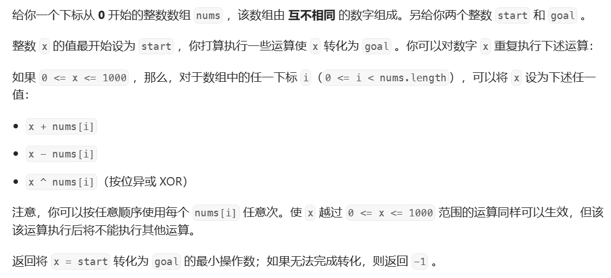

每次有三种可能，使用bfs


```python
class Solution:
    def minimumOperations(self, nums: List[int], start: int, goal: int) -> int:
        d=deque()
        d.append(start)
        cnt=0
        vis=set()
        vis.add(start)
        while d:
            cnt+=1
            for _ in range(len(d)):
                curr=d.popleft()     
                # 由于状态众多，选择在循环内判断
                for x in nums:
                    for t in curr+x,curr-x,curr^x:
                        if t==goal:return cnt
                        if 0<=t<=1000 and t not in vis:
                            vis.add(t)
                            d.append(t)
            
        return -1
```


# 树上模拟


## [在二叉树中分配硬币](https://leetcode.cn/problems/distribute-coins-in-binary-tree/)

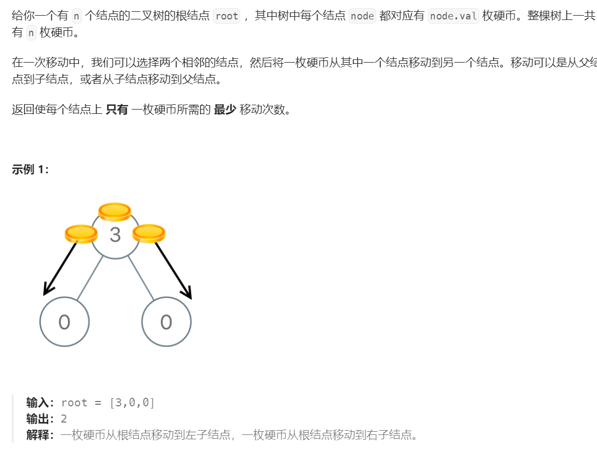

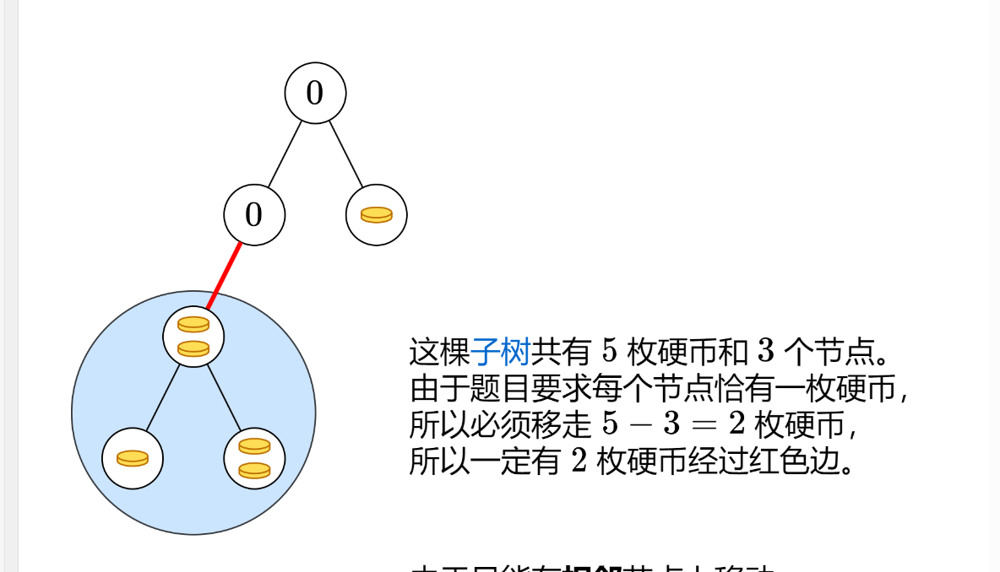


对于如图所示的子树，如果想要满足条件那么必须移出两个金币也就是金币数和节点数之差的绝对值，每个子树都会贡献一部分。

```python
class Solution:
    def distributeCoins(self, root: Optional[TreeNode]) -> int:
        ans=0
        def dfs(root):
            if not root:
                return 0,0
            cntl,coinl=dfs(root.left)
            cntr,coinr=dfs(root.right)
            nonlocal ans 
            ans+=abs(cntl-coinl)+abs(cntr-coinr)
            return cntl+cntr+1,coinl+coinr+root.val
        dfs(root)
        return ans 
```


## **Snowflake Tree**

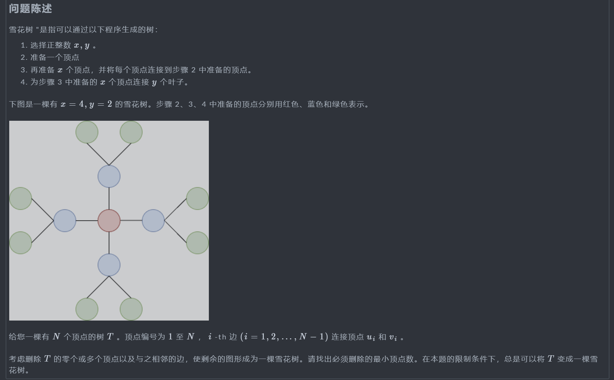

枚举每一个中心节点，对于中心节点再去找子节点(O(n))，为了删除的节点数最少那么就需要保留最多的节点，因为雪花树的性质，子节点的出度会限制可选的子节点数目。

如下所示，如果令y=1那么可以选择的x=4个，子节点的子节点只有1*4个；如果y=2，那么x=3，子节点的子节点有2\*3个，可以将子节点按照出度来排序，从小到大枚举选择的y更新最大的答案。

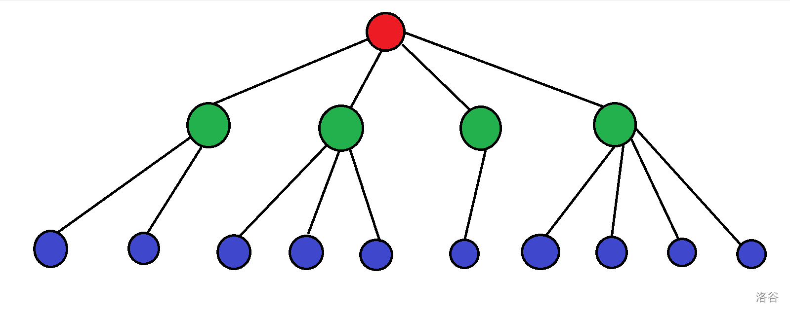


```python
n=R()
path=defaultdict(list)
reg=[0]*(n+1)
for _ in range(n-1):
    u,v=RR()
    path[u].append(v)
    path[v].append(u)
    reg[u]+=1
    reg[v]+=1

ans=0
for i in range(1,n+1):
    arr=[]
    cnt=len(path[i])
    for c in path[i]:
        # 减一是排除父节点
        arr.append(reg[c]-1)
    arr.sort()
    for j,x in enumerate(arr):
        # 统计总的节点个数时需要加上父节点
        ans=max(ans,cnt-j+(cnt-j)*x+1)
print(n-ans)
```


# 树上倍增

## [树节点的第 K 个祖先](https://leetcode.cn/problems/kth-ancestor-of-a-tree-node/)

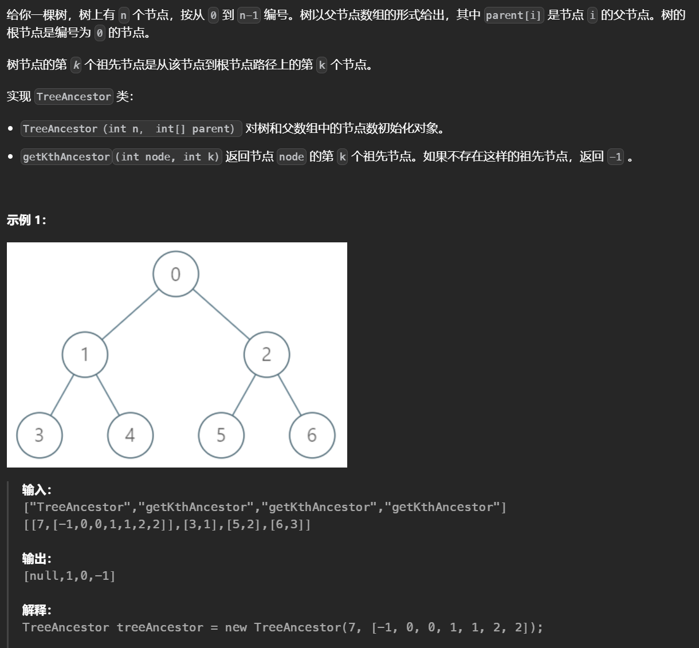

暴力的做法是从Node开始往上走k步，如果一次走两步的话就能节省一半的时间，一次走三步可以节省三倍的时间，因此使用倍增的方法，预处理往上走2^i步到达的位置，k可以拆为二进制之和。

定义pa[node]\[i]为node节点往上走2^i到达的位置，先枚举i从低到高求解，pa[node]\[i]=pa[pa[node]\[i-1]]\[i-1]，实际是一个动态规划的递推式。

```python
class TreeAncestor:

    def __init__(self, n: int, parent: List[int]):
        m=n.bit_length()
        pa=[[-1]*m for _ in range(n)]
        for i in range(m):
            for x in range(n):
                if not i:pa[x][i]=parent[x]
                elif pa[x][i-1]!=-1:pa[x][i]=pa[pa[x][i-1]][i-1]
        self.pa=pa
        self.m=m 

    def getKthAncestor(self, node: int, k: int) -> int:
        pa=self.pa
        m=self.m
        ans=node
        for j in range(m):
            if k>>j&1:ans=pa[ans][j]
            if ans<0:return ans 
        return ans 
```

## [在传球游戏中最大化函数值](https://leetcode.cn/problems/maximize-value-of-function-in-a-ball-passing-game/)

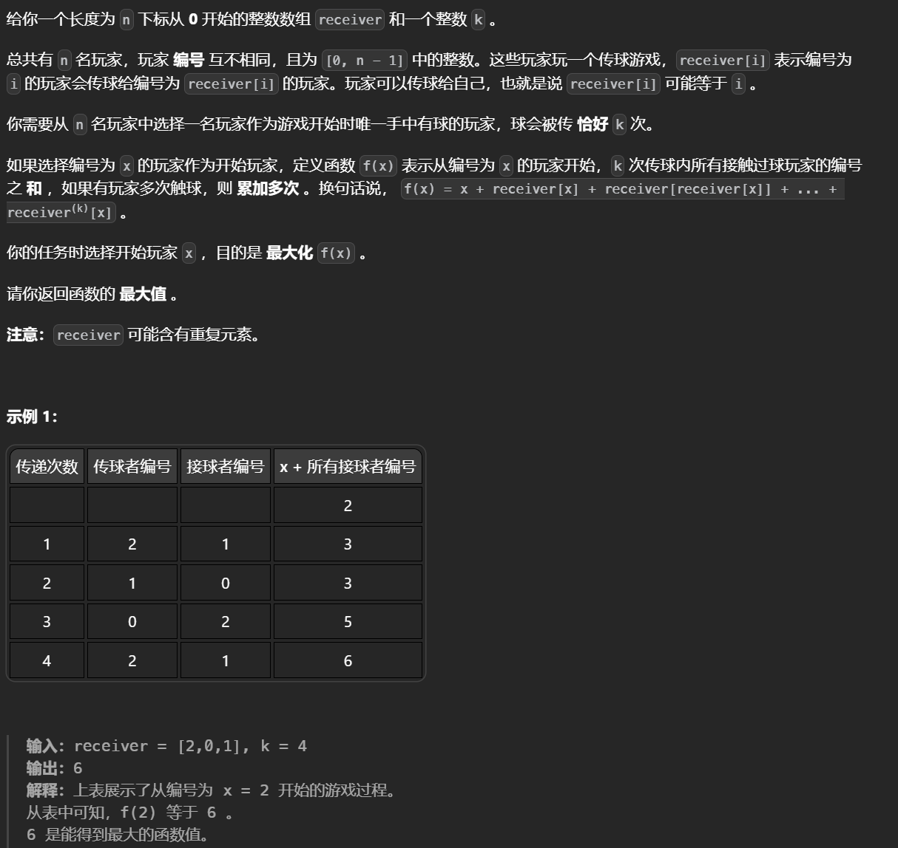

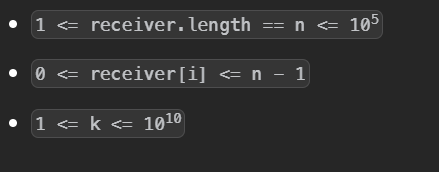

观察到k的范围只能选择**倍增**，然后枚举从每个点开始往下倍增地走，时间复杂度不会超，这里预处理倍增需使用**刷表法**因为**每个点可能会被多个点到达，但只能到达一个点**，因此使用刷表法从上往下找

这里需要在预处理的过程中把累和一并计算，而不是在枚举每个点的过程中在往下找(也找不出来)

```python
class Solution:
    def getMaxFunctionValue(self, nums, k: int) -> int:
        n=len(nums)
        m=k.bit_length()-1
        pa = [[(p,p)]+[None]*m for p in nums]
        for i in range(m):
            for x in range(n):
                fa,s=pa[x][i]
                ga,ss=pa[fa][i]
                # 使用元组会快一倍
                pa[x][i+1]=(ga,ss+s)

        ans=0
        for curr in range(n):
            temp=curr
            for j in range(m+1):
                if k>>j&1:
                    curr,s=pa[curr][j]
                    temp+=s 
            ans=max(temp,ans)
        return ans 
```

