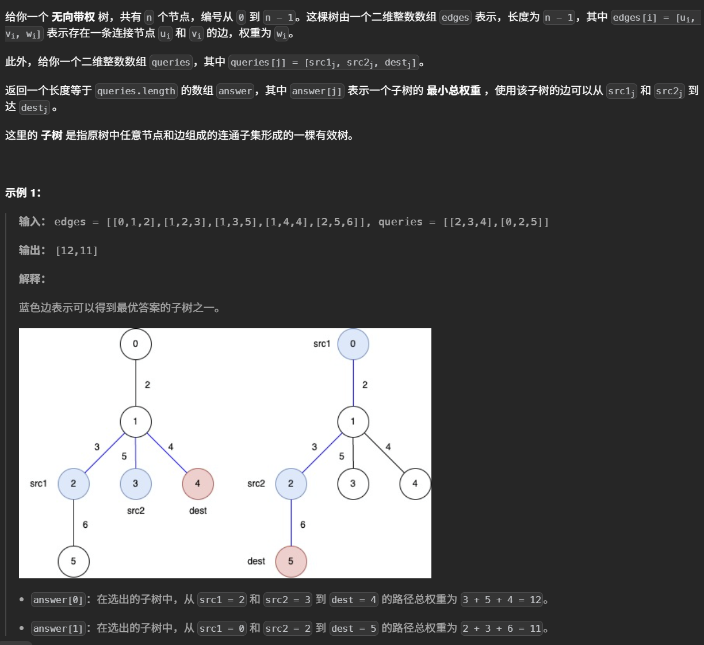
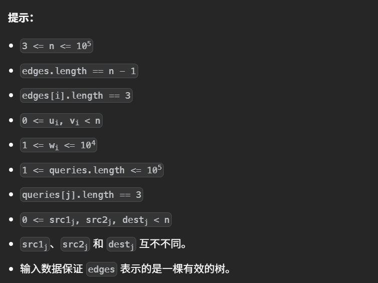
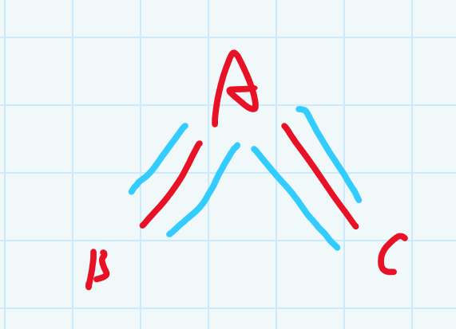
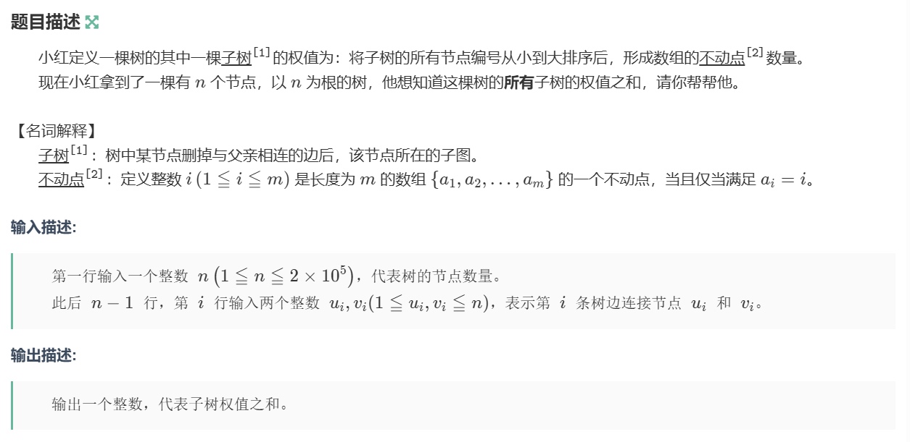
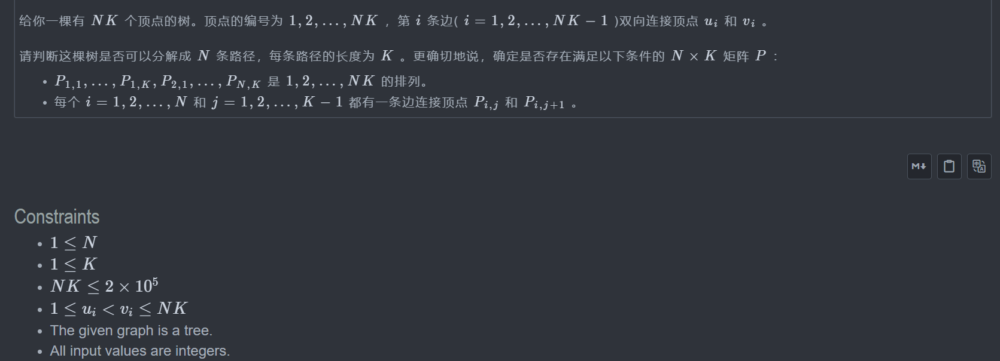
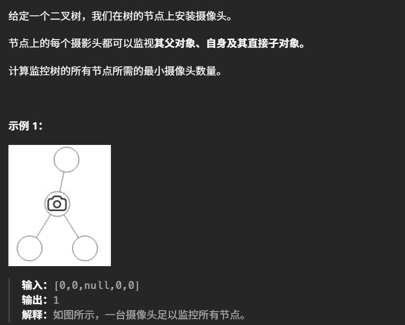
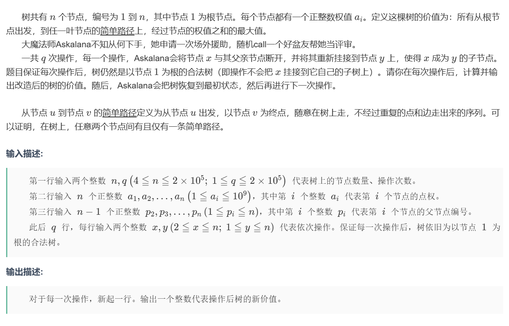

# 公共祖先

## [包含给定路径的最小带权子树 II](https://leetcode.cn/problems/minimum-weighted-subgraph-with-the-required-paths-ii/)






先简化问题——对于树上的两个点如何快速求解它们之间的距离，显然要找出最近公共祖先p，用dis[x]+dis[y]-2*dis[p]即从根结点出发到x,y的距离-重复计算的到LCA的距离。

而对于三个点，一种做法是求解出x-y,y-z,z-x的距离，这个路径形成了一个回路，路径被重复计算了一次，因此最终需要除二。



问题可以扩展到多个节点上，对于k个节点也是一样的套路，但是这个过程中可能会出现某一条边被多次重复计算，而其他边只计算一次，这是由计算的顺序导致的，因此需要按照dfn序计算(前序)保证结果不重不漏。

最终问题转换为了如何快速计算出两个节点的lca，这需要使用倍增求解。

1. 用倍增计算出每个节点的第k个父节点
2. 让两个节点保证深度一致
3. 往上找父节点，从高位开始
4. 一旦父节点不一致，说明走到了分支点，更新当前节点

注意这里的倍增和st表中的倍增不同，f[x]\[c]表示从x节点往上走1<<c步

```python
class Solution:
    def minimumWeight(self, edges: List[List[int]], queries: List[List[int]]) -> List[int]:
        n=len(edges)+1
        # 建图
        g=[[] for _  in range(n)]
        for u,v,w in edges:
            g[u].append((v,w))
            g[v].append((u,w))
        
        
        dis=[-1]*n
        pa=[[-1]*18 for _ in range(n)]
        dfn=[-1]*n        
        dth=[-1]*n
        t=0
        # dfs构建深度，距离，dfn序，初始化pa
        def dfs(root,fa,x,val):
            nonlocal t
            dfn[root]=t
            dth[root]=x
            pa[root][0]=fa
            dis[root]=val
            
            for nx,w in g[root]:
                if nx!=fa:
                    t+=1
                    dfs(nx,root,x+1,val+w)

    
        dfs(0,-1,0,0)

        # 倍增
        for j in range(1,18):
            for i in range(n):
                if pa[i][j-1]!=-1:pa[i][j]=pa[pa[i][j-1]][j-1]

        # 往上走，让两个节点保证同一深度
        def goup(root,x):
            for i in range(18):
                if x>>i&1:
                    root=pa[root][i]
            return root

        def get_dis(x,y):
            if dth[x]>dth[y]:
                x,y=y,x 
            # 保证同一深度
            by=goup(y,dth[y]-dth[x])
            bx=x
            # 其中一个是另一个的祖先
            if x==by:
                return dis[x]+dis[y]-dis[x]*2
            #往上走，从同一深度出发往上走一定能同时遇到祖先，这个步数从高位到低位的遍历过程中可以构建出
            for i in range(len(pa[x])-1,-1,-1):
                px,py=pa[bx][i],pa[by][i]
                # 不等说明遇到分支点
                if px!=py:
                    bx,by=px,py
            # lca
            p=pa[bx][0]
            return dis[x]+dis[y]-dis[p]*2
        
        ans=[]
        for arr in queries:
            # 计算之前先按照dfn序排序，保证不重不漏
            arr.sort(key=lambda x:dfn[x])
            tmp=0
            for i,j in pairwise(arr):
                tmp+=get_dis(i,j)
            tmp+=get_dis(arr[-1],arr[0])
            tmp//=2# 除二
            ans.append(tmp)
        return ans 
```

## [小红的树不动点](https://ac.nowcoder.com/acm/contest/114848/F)



通过贡献法，考虑每个点作为不动点所做的贡献。如果一个点x作为不动点，那么就要求它的子树中[1,x]都出现过，因此去找[1...x]的的lca，lca的深度就是x作为不动点能贡献的次数(注意，子树指的是断开与父节点相连的边后甚于的部分)。


# 树的直径


## 树的直径


树的直径就是两个相邻最远的节点的距离

+ BFS方法，从任意节点开始都可以得到任意一个极端节点（距离所有节点最远的两个节点），然后从这个节点开始再进行一次BFS就可以得到另一个极端节点，这两个极端节点之间的距离就是树的直径。

```python
from collections import deque


class Solution(object):
    def treeDiameter(self, edges):
        if not len(edges):
            return 0
        # 使用set集合记录每一个边
        paths = [set() for _ in range(len(edges) + 1)]
        for edge in edges:
            u, v = edge
            paths[u].add(v)
            paths[v].add(u)

        # bfs框架
        def bfs(start):
            d = deque([start])
            
            # 备忘录防止重复加入
            visited = [False] * (len(paths))
            visited[start] = True
            # 记录最后一个节点
            lastnode = None
            # 距离从-1开始，因为遍历到最后一层时还会向外遍历一次，如果从0开始最后的结果会多出一
            distance=-1
            while d:
                sz = len(d)
                # 只遍历之前队列中元素的个数次
                for _ in range(sz):
                    # 弹出
                    curr = d.popleft()
                    for i in paths[curr]:
                        # 加入不重复的邻居
                        if not visited[i]:
                            visited[i] = True
                            d.append(i)
                            lastnode = i
				# 距离加一
                distance += 1
            return [distance, lastnode]
       
        distance, lastnode = bfs(0)
        return bfs(lastnode)[0]
```


+ 使用回溯算法解题，如果可以得到从父节点到任何后代叶子节点的最长距离t1,t2，那么经过该父节点的最长半径就是t1+t2，整个树的最长半径就是所有节点中的最长半径


```python
class Solution(object):
    def treeDiameter(self, edges):

        paths = [set() for _ in range(len(edges) + 1)]
		# 记录所有边
        for edge in edges:
            u, v = edge
            paths[u].add(v)
            paths[v].add(u)
            
         # 设置备忘录
        visited=[False]*len(paths)
        # 不断更新外部变量来得到最大值
        self.diameter=0

        # 会返回以p为父节点到叶子结点的最大距离
        def dfs(p,visited):
            # 设置两个到叶子节点的最长距离
            left = 0
            right = 0
            # 标记
            visited[p]=True
            for val in paths[p]:
                # 包含过了
                if visited[val]:
                    continue
                # 该节点到叶子结点的距离为它的子节点到叶子结点的距离加一
                distance=1+dfs(val,visited)
                # 更新
                if distance>left:
                    left,right=distance,left
                elif distance>right:
                    right=distance
			
                self.diameter=max(self.diameter,left+right)
            
            return left

        dfs(0,visited)
        return self.diameter
```

## N叉树的直径


对每个节点找出它子树中边数最大的两个再相加，这个值就是经过这个节点的最大路径长度

```python
class Solution(object):
    def diameter(self, root):
        self.diameter=0
        def dfs(root):
            left=0
            right=0
            for child in root.children:
                distance=1+dfs(child)
                if distance>left:
                    left,right=distance,left
                elif distance>right:
                    right=distance
                self.diameter=max(self.diameter,left+right)
            return left
        dfs(root)
        return self.diameter
```

## 串门


为了访问所有的点，除了主路，对于每条路径都要走两次(来回)。

这种问题的最短路径就是所有的边之和乘2减去一条树的直径，但是这题每条边是有权重的，计算直径不能按照一般的方法。照样使用bfs模板，不过在遍历中有一个外部变量记录距离。

```python
from collections import deque

# 接收输入
n=int(input())
# 使用集合记录每个节点相连的节点以及相应的权重
edges=[set() for _ in range(n+1)]
w_sum=0
# 记录
for _ in range(n-1):
    u,v,w=list(map(int,input().split()))
    edges[u].add((v,w))
    edges[v].add((u,w))
    w_sum+=w

# 返回距离start最远的节点，以及一个记录距离的列表
def bfs(start):
    # distance记录的是所有节点到start的距离，先初始化为-1
    distance=[-1 for _ in range(n+1)]
    # 自己到自己的距离是0
    distance[start]=0
    # 接下来是bfs模板
    d=deque([start])
    while d:
        sz=len(d)
        for _ in range(sz):
            # 弹出
            curr=d.popleft()
            for u,w in edges[curr]:
                # 如果记录过，跳过
                if distance[u]!=-1:
                    continue
                # 从start到u的距离等于从start到curr的距离加上从curr到u的距离
                distance[u]=w+distance[curr]
                # 加入路径，称为下一轮的curr
                d.append(u)
     # 找出最远的点，也就是直径
    lastnode=distance.index(max(distance))
    return lastnode ,distance

# 先找出一个极端节点
node1,_=bfs(1)
# 再根据这个极端节点找另一个
node2,distance=bfs(node1)

print(w_sum*2-distance[node2])
```

## [合并两棵树后的最小直径](https://leetcode.cn/problems/find-minimum-diameter-after-merging-two-trees/)


两棵树合并后树的直径有两种情况，直径不会改变还是合并前两个树的直径中最大的那个，或者树的直径会经过连接的位置然后加上两个树的剩余直径之和（因为直径是树上最长的边所以一定会经过原本树上的直径），为了保证整个树的直径最小应该选择两个树的直径的中点相连，这里不需要知道那个是中点，因为只需要求出数值大小

```python
class Solution:
    def minimumDiameterAfterMerge(self, edges1: List[List[int]], edges2: List[List[int]]) -> int:
        # 用于求直径
        def cal(path):
            d=0
            def dfs(root,fa):
                l=r=0
                nonlocal d
                for child in path[root]:
                    if child ==fa:continue
                    x=dfs(child,root)+1
                    if x>l:
                        r=l
                        l=x
                    elif x>r:
                        r=x
                d=max(d,l+r)
                return l
            dfs(0,-1)
            return d
        path1=defaultdict(dict)
        path2=defaultdict(dict)
        for u,v in edges1:
            path1[u][v]=path1[v][u]=None
        for u,v in edges2:
            path2[u][v]=path2[v][u]=None
        d1,d2=cal(path1),cal(path2)
        # 三种情况，这里保证了相连后的直径是最小的
        return max(d1,d2,ceil(d1/2)+ceil(d2/2)+1)
```


## [转化数字的最小运算数](https://leetcode.cn/problems/minimum-operations-to-convert-number/)


每次有三种可能，使用bfs


```python
class Solution:
    def minimumOperations(self, nums: List[int], start: int, goal: int) -> int:
        d=deque()
        d.append(start)
        cnt=0
        vis=set()
        vis.add(start)
        while d:
            cnt+=1
            for _ in range(len(d)):
                curr=d.popleft()     
                # 由于状态众多，选择在循环内判断
                for x in nums:
                    for t in curr+x,curr-x,curr^x:
                        if t==goal:return cnt
                        if 0<=t<=1000 and t not in vis:
                            vis.add(t)
                            d.append(t)
            
        return -1
```


# 树上模拟


## [在二叉树中分配硬币](https://leetcode.cn/problems/distribute-coins-in-binary-tree/)


对于如图所示的子树，如果想要满足条件那么必须移出两个金币也就是金币数和节点数之差的绝对值，每个子树都会贡献一部分。

```python
class Solution:
    def distributeCoins(self, root: Optional[TreeNode]) -> int:
        ans=0
        def dfs(root):
            if not root:
                return 0,0
            cntl,coinl=dfs(root.left)
            cntr,coinr=dfs(root.right)
            nonlocal ans 
            ans+=abs(cntl-coinl)+abs(cntr-coinr)
            return cntl+cntr+1,coinl+coinr+root.val
        dfs(root)
        return ans 
```


## **Snowflake Tree**


枚举每一个中心节点，对于中心节点再去找子节点(O(n))，为了删除的节点数最少那么就需要保留最多的节点，因为雪花树的性质，子节点的出度会限制可选的子节点数目。

如下所示，如果令y=1那么可以选择的x=4个，子节点的子节点只有1*4个；如果y=2，那么x=3，子节点的子节点有2\*3个，可以将子节点按照出度来排序，从小到大枚举选择的y更新最大的答案。


```python
n=R()
path=defaultdict(list)
reg=[0]*(n+1)
for _ in range(n-1):
    u,v=RR()
    path[u].append(v)
    path[v].append(u)
    reg[u]+=1
    reg[v]+=1

ans=0
for i in range(1,n+1):
    arr=[]
    cnt=len(path[i])
    for c in path[i]:
        # 减一是排除父节点
        arr.append(reg[c]-1)
    arr.sort()
    for j,x in enumerate(arr):
        # 统计总的节点个数时需要加上父节点
        ans=max(ans,cnt-j+(cnt-j)*x+1)
print(n-ans)
```

## [Path Decomposition of a Tree](https://atcoder.jp/contests/abc397/tasks/abc397_e)




题目大意是问是否能将大小为NK的树划分为N条长度为K的链子

可以通过dfs求解，定义dfs返回节点在满足题意的情况能形成的最长链，如果子节点返回k则不要考虑 

如果一个根节点有多个子节点剩余则无法满足条件，因为题目要求形成链的节点之间互相连接；

如果有两个子节点剩余，且剩余与根节点组合刚好满足k，那么可以求解，反之无解

如果只有一个子节点有剩余，那么可以组合

```python
n,k=RR()
edges=defaultdict(list)

for _ in range(n*k-1):
    l,r=RR()
    edges[l].append(r)
    edges[r].append(l)


def dp(root,fa):
    c=0 # 记录个数
    mx,mn=-1,10**9# 子节点剩余
    for nx in edges[root]:
        if nx==fa:continue
        res=dp(nx,root)
        if res!=k:# 要么等于k，要么小于k
            c+=1# 记录
            mx=max(mx,res)
            mn=min(mn,res)
    # 该节点为叶子节点，直接返回1
    if not c:return 1
    elif c==1:return mx+1
    elif c==2:
        # 两个子节点可以与根节点形成一条链
        if mx+mn+1==k:return k
        print('No')
        exit(0)
    print('No')
    exit(0)

res=dp(1,-1)  
print('Yes')
```

## [监控二叉树](https://leetcode.cn/problems/binary-tree-cameras/)



显而易见的从叶子节点开始处理能减少所需摄像头的个数，因此采用后序遍历。对于每个节点定义三种状态：0无覆盖，1有摄像头，2有覆盖。如果一个节点的子结点中有无覆盖，那么该点就必须防止 摄像头；如果子结点中有摄像头，那么该点就是有覆盖；如果子节点都是有覆盖那么该点就是无覆盖。

最后需要判断一下根节点是否有覆盖，如果没有需要额外防止摄像头。本题的思想是贪心。

```python
class Solution:
    def minCameraCover(self, root) -> int:
        ans=0
        def dfs(root):
            nonlocal ans
            
            if not root:return 2
            l,r=dfs(root.left),dfs(root.right)
            if l==r==2:
                return 0
        
            if 0 in {l,r}:
                ans+=1
                return 1

            if 1 in {l,r}:return 2 
        l=dfs(root)
        return ans+int(l==0)
```


## [升！龙！](https://ac.nowcoder.com/acm/contest/106318/G)



关键在于如果在截取一段后求解出权重最大的链，这里借助dfn序和前后缀最大值求解。

对于每个节点求出mx[root]表示以root为根的最大权值，a[root]表示以root为终点的最大权值，因为树形结构不会重复访问一个位置或者回头，所以节点以及它的子节点的访问时间一定是一个**连续的区间**，访问一个节点时，记录当前时间所对应的a[root]，同时该节点记录它对应的**时间区间**，当截取一个节点及其子树时，因为是连续区间那么可以通过**前后缀最大值**得到该节点拼接前的最大a数组的值，然后在与拼接后的结果比较一下。

```python
sys.setrecursionlimit(10**6)
n,q=RR()
nums=RR()

g=[[] for _ in range(n+1)]
mx=defaultdict(int) # 以该点为根能得到的最大权值和
a=defaultdict(int) # 以该点为终点的最大权值和

dfn={}# 记录节点对应的时间区间

arr=[0]*n# a[i]表示时间i对应的最大值

# 时间
t=0

# 建图
for i,p in enumerate(RR(),2):
    g[p].append(i)

def dfs(root,s):
    global t
    s+=nums[root-1]
    a[root]=s
    arr[t]=a[root]

    # 叶子节点
    if not g[root]:
        dfn[root]=(t,t)
        mx[root]=nums[root-1]
        return
     
    start=t
    mx[root]=nums[root-1]
    for nx in g[root]:
        t+=1
        dfs(nx,s)
        mx[root]=max(mx[root],nums[root-1]+mx[nx])
    # 记录时间区间
    dfn[root]=(start,t)


dfs(1,0)

# 前后缀最大值
left=[arr[0]]
for i in range(1,n):
    left.append(max(left[-1],arr[i]))

right=[arr[-1]]
for i in range(n-2,-1,-1):
    right.append(max(right[-1],arr[i]))
right=right[::-1]


for _ in range(q):
    x,y=RR()
    # 拼接后的的结果
    res=mx[x]+a[y]
    
    # x不是最大权值链子上的点，与最大值比较一下就好了
    if mx[x]+a[x]-nums[x-1]!=mx[1]:
        res=max(res,mx[1])
    else:
        # 选出不包括该点的最大值
        l,r=dfn[x]
        if l-1>=0:
            res=max(res,left[l-1])
        if r+1<n:
            res=max(res,right[r+1])
    print(res)
```


# 树上倍增

## [树节点的第 K 个祖先](https://leetcode.cn/problems/kth-ancestor-of-a-tree-node/)


暴力的做法是从Node开始往上走k步，如果一次走两步的话就能节省一半的时间，一次走三步可以节省三倍的时间，因此使用倍增的方法，预处理往上走2^i步到达的位置，k可以拆为二进制之和。

定义pa[node]\[i]为node节点往上走2^i到达的位置，先枚举i从低到高求解，pa[node]\[i]=pa[pa[node]\[i-1]]\[i-1]，实际是一个动态规划的递推式。

```python
class TreeAncestor:

    def __init__(self, n: int, parent: List[int]):
        m=n.bit_length()
        pa=[[-1]*m for _ in range(n)]
        for i in range(m):
            for x in range(n):
                if not i:pa[x][i]=parent[x]
                elif pa[x][i-1]!=-1:pa[x][i]=pa[pa[x][i-1]][i-1]
        self.pa=pa
        self.m=m 

    def getKthAncestor(self, node: int, k: int) -> int:
        pa=self.pa
        m=self.m
        ans=node
        for j in range(m):
            if k>>j&1:ans=pa[ans][j]
            if ans<0:return ans 
        return ans 
```

## [在传球游戏中最大化函数值](https://leetcode.cn/problems/maximize-value-of-function-in-a-ball-passing-game/)


观察到k的范围只能选择**倍增**，然后枚举从每个点开始往下倍增地走，时间复杂度不会超，这里预处理倍增需使用**刷表法**因为**每个点可能会被多个点到达，但只能到达一个点**，因此使用刷表法从上往下找

这里需要在预处理的过程中把累和一并计算，而不是在枚举每个点的过程中在往下找(也找不出来)

```python
class Solution:
    def getMaxFunctionValue(self, nums, k: int) -> int:
        n=len(nums)
        m=k.bit_length()-1
        pa = [[(p,p)]+[None]*m for p in nums]
        for i in range(m):
            for x in range(n):
                fa,s=pa[x][i]
                ga,ss=pa[fa][i]
                # 使用元组会快一倍
                pa[x][i+1]=(ga,ss+s)

        ans=0
        for curr in range(n):
            temp=curr
            for j in range(m+1):
                if k>>j&1:
                    curr,s=pa[curr][j]
                    temp+=s 
            ans=max(temp,ans)
        return ans 
```

