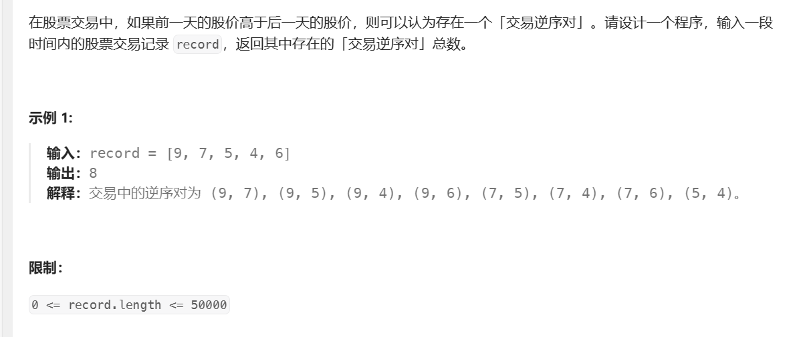
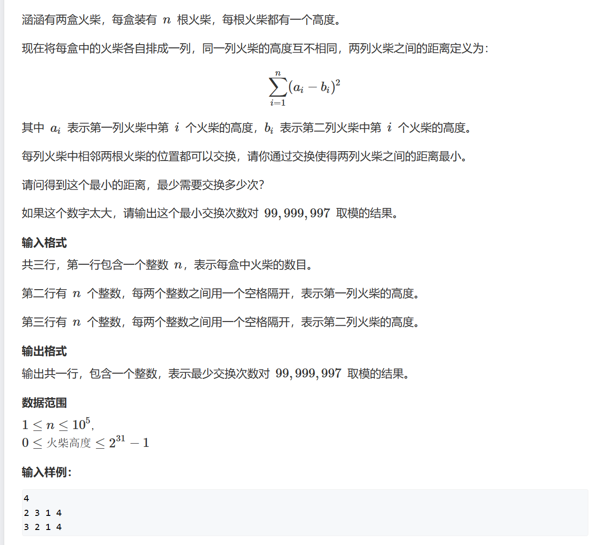
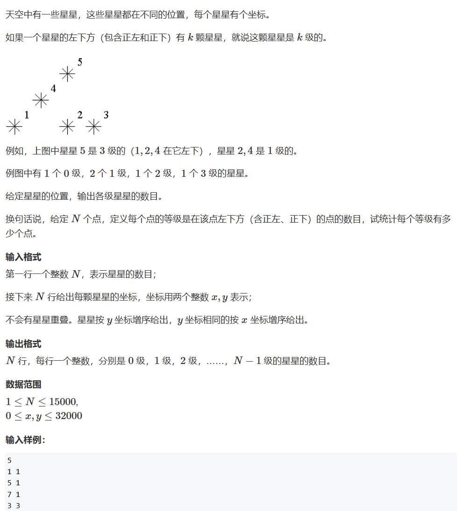
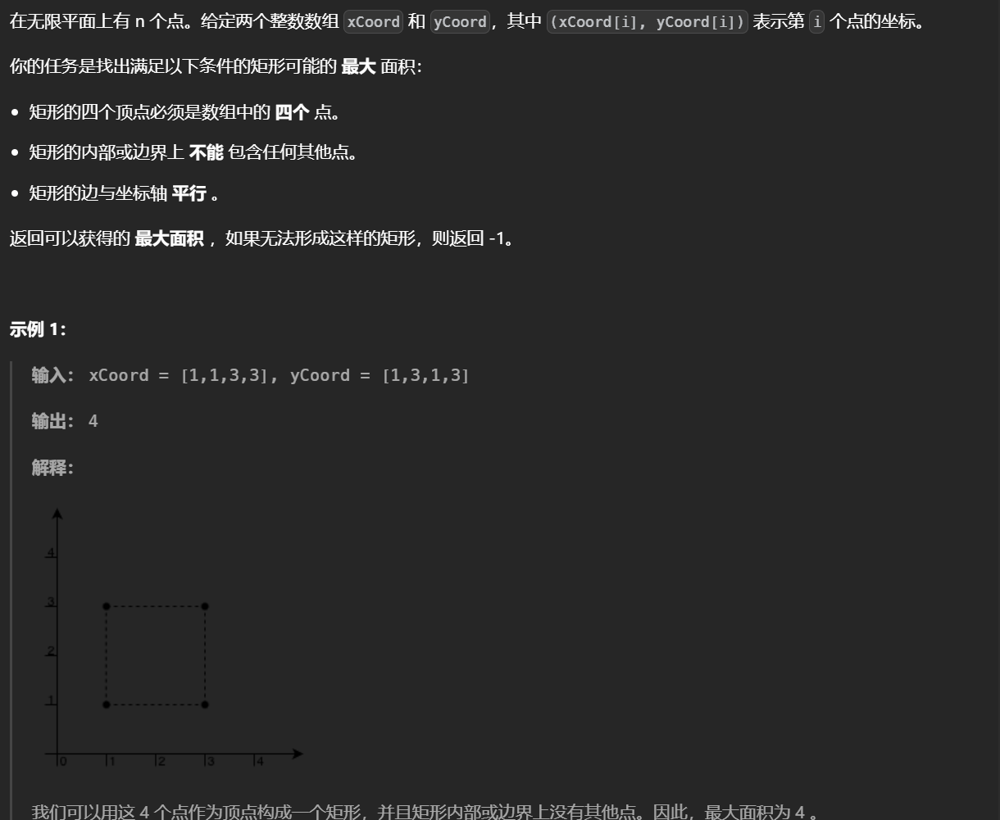
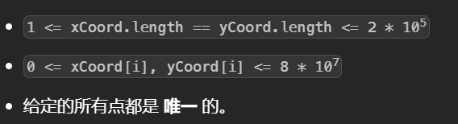

# 树状数组

类似于线段树可以快速求出区间和，同时可以更新，这两个操作的时间复杂度为logn,不过这里的更新只能是单点修改。

树状数组的关键在于巧妙地区间拆分


由于关键区间的右端点互不相同，我们可以把右端点为 *i* 的关键区间的元素和保存在*tree*[*i*] 中

想要求解[1,i]的区间和，先求出[i-lowbit(i),i]，然后更新i为i-lowbit(i)表示去找[1,i-lowbit(i)]的区间和，使用一个s变量在外部累加。

而对于更新操作除了把对应的点更新外，还要去更新会受到影响的区间，其中第一个区间就是[1,i]而下一个要更新的区间为[i+1,i+lowbit(i)]就这样一直找下去


query(i)的结果是小于等于i-1的有多少个，数组要开n+2的因为想要取到数字n并且前缀和要做一位偏移


简略版板子如下，只能实现区间求和且数组数值数组，使用时像前缀和的操作方法

```python
class Tree:
    def __init__(self, n):
        # 初始化树状数组，大小为 n + 1
        self.tree = [0] * (n + 1)

    def cal(self,x):
        return x & (-x)
    def update(self, i, detal):
        # 更新操作，i 是索引，detal 是增量
        i += 1  # 树状数组下标从 1 开始
        while i < len(self.tree):
            self.tree[i] += detal
            i += self.cal(i)

    def querymax(self, i: int) -> int:
        # 查询最大值，[0, i-1] 区间
        mx = 0
        while i:
            mx = max(mx, self.tree[i])
            i &= i - 1  # 去掉最低有效位
        return mx

    def get(self, i):
        # 查询前缀和，[0, i-1] 区间
        s = 0
        while i:
            s += self.tree[i]
            i -= self.cal(i)
        return s
    def query(self,l,r):
        # 查询[l,r-1]的区间和
        return self.get(r)-self.get(l)
```


## [区域和检索 - 数组可修改](https://leetcode.cn/problems/range-sum-query-mutable/)


```python
class NumArray:

    def __init__(self, nums: List[int]):
        # 初始化，相当把每个点更新一次
        n=len(nums)
        self.nums=[0]*n
        self.tree=[0]*(n+1)
        for i,x in enumerate(nums):
            self.update(i,x)


    def update(self, index: int, val: int) -> None:
        # 找出差值用于更新前缀
        diff=val-self.nums[index]
        # 更新对应的位置
        self.nums[index]=val
        # 找区间，注意区间会多一位偏移
        i=index+1
        # 迭代
        while i<len(self.tree):
            self.tree[i]+=diff
            # 结论，更新
            i+=i&-i
     # 求前缀
    def preSum(self,i):
        # 累加
        s=0
        while i:
            s+=self.tree[i]
            i-=i&-i
        return s
    def sumRange(self, left: int, right: int) -> int:
        # 左右位置，求解方式类似于一维
        return self.preSum(right+1)-self.preSum(left)
```

## [计算右侧小于当前元素的个数](https://leetcode.cn/problems/count-of-smaller-numbers-after-self/)


找一个值右边小于当前值的有多少个必然要已知右边，因此从右到左的思考。

这里使用树状数组，树状数组的前缀和pre[i+1]表示i前面小于i的有多少个数，因为每次插入一个值i会更新1这也就表示i的个数，将计数问题转换为前缀和（技巧点）

```python
class Solution:
    def countSmaller(self, nums: List[int]) -> List[int]:
        def cal(x):
            return x&(-x)
        # 离散化
        li=sorted(list(set(nums)))
        nums=[bisect_left(li,v) for v in nums]
        
        class Tree:
            def __init__(self,n):
                # 这里没有原始数组
                self.tree=[0]*(n+1)
            # 更新
            def update(self,i,detal):
                # 注意偏移
                i+=1
                while i<len(self.tree):
                    self.tree[i]+=detal
                    i+=cal(i)
            # 求出0,i的区间和，也就是小于等于i的个数
            def query(self,i):
                s=0
                while i:
                    s+=self.tree[i]
                    i-=cal(i)
                return s
        n=len(nums)
        t=Tree(n)
        ans=[0]*n
        # 倒序处理
        for i in range(n-1,-1,-1):
            # 先更新
            t.update(nums[i],1)
            # 这里做了一位偏移
            ans[i]=t.query(nums[i])
        return ans
```

## [ 交易逆序对的总数](https://leetcode.cn/problems/shu-zu-zhong-de-ni-xu-dui-lcof/)





```python
class Solution:
    def reversePairs(self, record: List[int]) -> int:
        li=sorted(set(record))
        nums=[bisect_left(li,v) for v in record]
        class Tree:
            def __init__(self,n):
                self.tree=[0]*(n+1)
            def update(self,i,d):
                i+=1
                while i<len(self.tree):
                    self.tree[i]+=d
                    i+=i&(-i)
            def query(self,i):
                s=0
                while i:
                    s+=self.tree[i]
                    i-=i&(-i)
                return s
        n=len(nums)
        t=Tree(n)
        ans=0
        for i in range(n-1,-1,-1):
            t.update(nums[i],1)
            ans+=t.query(nums[i])
        return ans 
```

## [邻位交换的最小次数](https://leetcode.cn/problems/minimum-adjacent-swaps-to-reach-the-kth-smallest-number/)


分为两步，先求出第k个排列，其实就是进行k次求下一个更大的排列，然后求解所需的操作次数。因为只能相邻交换因此转换为求逆序对。对原数组的每个值做映射对于bcad有：b->0 c->1 a->2 d->3，那么对于结果cdba就是 1302所需的操作次数就是逆序对，一个字符有多种可能的映射，由于要让交换次数尽可能小，所以贪心地让映射的下标升序就行。。

```python
class Tree:
    def __init__(self,n):
        self.tree=[0]*(n+1)
    def update(self,i,d):
        i+=1
        while i<len(self.tree):
            self.tree[i]+=d
            i+=i&(-i)
    def query(self,i):
        s=0
        while i:
            s+=self.tree[i]
            i-=i&(-i)
        return s
class Solution:
    def getMinSwaps(self, nums: str, k: int) -> int:
        n=len(nums)
        nums=list(nums)
        arr=nums[:]
        # 求解下一个更大的排列
        def slove(nums):
            for i in range(n-2,-1,-1):
                r=int(nums[i+1])
                l=int(nums[i])
                if l<r:
                    for j in range(n-1,-1,-1):
                        x=int(nums[j])
                        if l<x:
                            nums[i],nums[j]=nums[j],nums[i]
                            nums=nums[:i+1]+sorted(nums[i+1:])
                            return nums
        # 进行k次
        for _ in range(k):
            nums=slove(nums)   
        # 对每个位置做映射
        memo=defaultdict(deque)
        for i,c in enumerate(arr):
            memo[c].append(i)
        # 构建映射后的数组
        temp=[]
        for i,c in enumerate(nums):
            temp.append(memo[c].popleft())
        # 树状数组求解逆序对
        t=Tree(n)
        ans=0
        for i in range(n-1,-1,-1):
            t.update(temp[i],1)
            ans+=t.query(temp[i])
        return ans          
```


## 小朋友排队


要想交换次数最少那必须是逆序对的个数，每交换一次减少一对逆序对，但是这个题不是统计逆序对，每个人可以贡献的结果与他被交换的次数有关，他交换的次数等于它找别人交换的次数即他右边小于他的数字的个数（逆序对），以及别人找他交换的次数，他左边大于它的个数。

对于第二点，统计每一个数左边大于这个数的个数也可以用逆序对解决不过要稍加变化，比如3 2 1逆序对是右边小于当前数的个数所以第一步要把值的大小颠倒变为1 2 3 然后反转数组求解逆序对即可。

```python
from bisect import bisect_left as bl
n=int(input())
nums=[int(x) for x in input().split()]
class Tree:
    def __init__(self):
        self.tree=[0]*1000010
    def update(self,i,delta):
        i+=1
        while i<len(self.tree):
            self.tree[i]+=delta
            i+=i&(-i)
    def query(self,i):
        s=0
        while i:
            s+=self.tree[i]
            i-=i&(-i)
        return s
ans=[0]*n

# 标准的求解逆序对
t=Tree()
for i in range(n-1,-1,-1):
    v=nums[i]
    t.update(v,1)
    ans[i]+=t.query(v)

t=Tree()
# 离散化，这里是大小颠倒
a=sorted(set(nums))
temp=[n-bl(a,v) for v in nums]
# 反转
temp=temp[::-1]
# 求逆序对
for i in range(n-1,-1,-1):
    v=temp[i]
    t.update(v,1)
    # 注意这个贡献的逆序对要加到反转前的位置上
    ans[n-i-1]+=t.query(v)
res=0
for v in ans:
    res+=(v+1)*v//2
print(res)
```


## 火柴排队




对于给定的公式展开：$Σ(a_i^2-2*a_i*b_i+b_i^2)$公式的首项和末项是固定的，无论怎么变换顺序都不影响，而只有$Σa_i*b_i$会影响到最终结果为了使结果最小，这个项需要是最大，当两个序列按照顺序排列对应相乘的时候最终的结果会是最大，也就是满足a中的第k大的值乘上b中第k大的值所需的最少交换次数。为了使a中的第k大的值对应b中第k大的值构造数组p[a[i]]=b[i]，只有当p[i]=i也就是p是升序的时候才能满足要求，由于每一次只能交换相邻的两个值，因此每一次操作可以减少一个逆序对最后最少的的操作次数就是数组中的逆序对。

 


```python
from bisect import bisect_left as bl
n=int(input())
a=[int(x) for x in input().split()]
b=[int(x) for x in input().split()]

m=10**8-3
# 带着下标排序
a=sorted([(v,i) for i,v in enumerate(a)])
b=sorted([(v,i) for i,v in enumerate(b)])

p=[0]*n
# 第k大的对应第k大的，构建数组
for i in range(n):
    p[b[i][1]]=a[i][1]
# 板子
class Tree:
    def __init__(self,n):
        self.tree=[0]*(n+1)
    def update(self,i,d):
        i+=1
        while i<len(self.tree):
            self.tree[i]+=d
            i+=i&(-i)
    def query(self,i):
        s=0
        while i:
            s+=self.tree[i]
            i-=i&(-i)
        return s
ans=0
t=Tree(n)
for i in range(n-1,-1,-1):
    t.update(p[i],1)
    ans+=t.query(p[i])
print(ans%m)
```

## 数星星




对于给定的数据，由于是已经按照纵坐标排好序的因此前面的值都是在他下面的，能够满足要求的值需要看横坐标大小，横坐标小于等于当前值的即可。通过树状数组记录每个横坐标（将这个位置加一）通过计算前缀和就能得出满足的个数。

```python
# 树状数组
class Tree:
    def __init__(self):
        self.tree=[0]*70000

    def update(self,i,delta):
        i+=1
        while i<len(self.tree):
            self.tree[i]+=delta
            i+=i&(-i)

    def query(self,i):
        s=0
        while i:
            s+=self.tree[i]
            i-=i&(-i)
        return s

t=Tree()
n=int(input())
ans=[0]*n
for _ in range(n):
    x,y=[int(x) for x in input().split()]
    # 记录横坐标的值
    t.update(x,1)
    # 查询，要同时包含这个横坐标，因为可能存在在正下面的点，同时减去一表示不包括本身
    ans[t.query(x+1)-1]+=1
for v in ans:
    print(v)
```

## **Gather Coins**


给定的数据范围无法使用回溯，这里因为只能往右下走所以每个硬币只能从左边和上面转移过来，先将数组按照行和列排序，fi表示考虑前i个硬币并且取第i个硬币时最多的硬币数


明显的使用树状数组优化求解，为了得到路径在计算的过程中同时记录一个转移数组，在变数组的过程中已经保证了行是递增的，而对于列用树状数组取得小于等于当前的最大的即可，树状数组中用列的坐标作为数组，这里因为数据范围不大所以不需要离散化

```python
class SegTree:
    def __init__(self,op,e,n,nums):
        self._n=n
        self._op=op
        self._e=e
        self._log=(n-1).bit_length()
        self._size=1<<self._log
        self._d=[self._e()]*(self._size<<1)
        if nums:
            for i in range(self._n):self._d[self._size+i]=nums[i]
            for i in range(self._size-1,0,-1):self._d[i]=self._op(self._d[i<<1],self._d[i<<1|1])
    def update(self,index,x):
        index+=self._size
        self._d[index]=x
        while index:
            self._d[index>>1]=self._op(self._d[index],self._d[index^1])
            index>>=1
    def get(self,p):return self._d[p+self._size]
    def query(self,l,r):
        sml,smr=self._e(),self._e()
        l+=self._size
        r+=self._size
        while l<r:
            if l&1:
                sml=self._op(sml,self._d[l])
                l+=1
            if r&1:
                r-=1
                smr=self._op(smr,self._d[r])
            l>>=1
            r>>=1
        return self._op(sml,smr)
    def all_prod(self):return self._d[1]

def op(x,y):
    val1,i1=x
    val2,i2=y
    if val1>val2:return (val1,i1)
    return (val2,i2)

def e():return(-1,-1)

h,w,n=RR()
nums=[]
for _ in range(n):nums.append([v-1 for v in RR()])
nums.sort()

init=[(0,-1)]*(w+2)
t=SegTree(op,e,len(init),init)
pre=[-1]*n

for i,(r,c) in enumerate(nums):
    val,index=t.query(0,c+1)
    t.update(c,(val+1,i))
    pre[i]=index

val,index=t.query(0,w+2)

m=h-1
n=w-1
ans=[]
# 往回构造路径
while 1:
    r,c=nums[index]
    ans+=['D']*(m-r)
    ans+=['R']*(n-c)
    index=pre[index]
    m,n=r,c
    if index==-1:
        ans += ['D'] * m
        ans += ['R'] *n
        break
print(val)
print(''.join(ans[::-1]))
```

## [用点构造面积最大的矩形 II](https://leetcode.cn/problems/maximum-area-rectangle-with-point-constraints-ii/)






经典扫描线做法，枚举每个右边界，这里的数据范围要做离散化处理，但是最后要求解面积，所以需要做一个映射找回去。

以横坐标分组，每个横坐标对应一个排好序的y序列，为了保证竖直边界上没有点，这里遍历相邻的y坐标作为左上和左下，在扫描的过程中记录每对y坐标对应的最近的x坐标以保证水平边界上没有多余的点，这样就找出了一个矩形，为了保证矩形内部没有多余的点，这里以y来做区间和

```python
class Tree:
    def __init__(self, n):
        # 初始化树状数组，大小为 n + 1
        self.tree = [0] * (n + 1)

    def cal(self,x):
        return x & (-x)
    def update(self, i, detal):
        # 更新操作，i 是索引，detal 是增量
        i += 1  # 树状数组下标从 1 开始
        while i < len(self.tree):
            self.tree[i] += detal
            i += self.cal(i)

    def querymax(self, i: int) -> int:
        # 查询最大值，[0, i-1] 区间
        mx = 0
        while i:
            mx = max(mx, self.tree[i])
            i &= i - 1  # 去掉最低有效位
        return mx

    def get(self, i):
        # 查询前缀和，[0, i-1] 区间
        s = 0
        while i:
            s += self.tree[i]
            i -= self.cal(i)
        return s
    def query(self,l,r):
        # 查询[l,r-1]的区间和
        return self.get(r)-self.get(l)

class Solution:
    def maxRectangleArea(self, xCoord: List[int], yCoord: List[int]) -> int:
        # 用于离散化
        xs=sorted(set(xCoord))
        ys=sorted(set(yCoord))
        
        mx={}
        my={}

        xp=[]
        yp=[]

        # 开始对X数组离散化，同时要记录映射，因为最后是要求解面积大小的不能用离散化的值来算
        for v in xCoord:
            xp.append(bisect_left(xs,v))
            mx[bisect_left(xs,v)]=v
        
        # 对y同理
        for v in yCoord:
            yp.append(bisect_left(ys,v))
            my[bisect_left(ys,v)]=v

        # 记录每组x对应的y
        x_list=[[]for _ in range(len(xs))]
        for i,j in zip(xp,yp):
            x_list[i].append(j)

        # 排序 为了保证边界上只有一个点，需要相邻取y坐标
        for i in range(len(xs)):x_list[i].sort()

        # 记录前一对相邻的y对应的x位置
        last={}
        # 建立树状数组
        tree=Tree(max(len(xs),len(ys)))
        # 记录前一对相邻的y范围内，从0开始到其对应的x中点的个数 
        pre={}

        ans=-1

        # 枚举右边界
        for i in range(len(xs)):
            arr=x_list[i]
            x2=i
            tree.update(arr[0],1)
            # 找相邻的y值，同时更新区间内点的个数
            for y1,y2 in pairwise(arr):
                tree.update(y2,1)
                # 找前面这对相邻的y值是否出现过，从而确定一个矩形
                if (y1,y2) in last:
                    x1=last[(y1,y2)]
                    # 0到x1,y1到y2范围内点的个数
                    sum1=pre[(y1,y2)]
                    # 0到x2,y1到y2范围内点的个数
                    sum2=tree.query(y1,y2+1)
                    # 说明区间内没有点
                    if sum1+2==sum2:
                        # 更新答案时注意映射回去
                        ans=max(ans,(mx[x2]-mx[x1])*(my[y2]-my[y1]))

                last[(y1,y2)]=i
                pre[(y1,y2)]=tree.query(y1,y2+1)
        return ans
```

