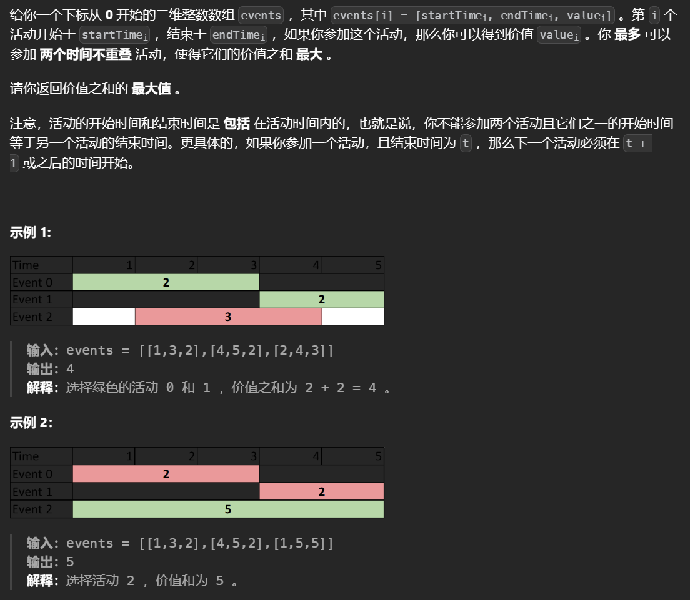
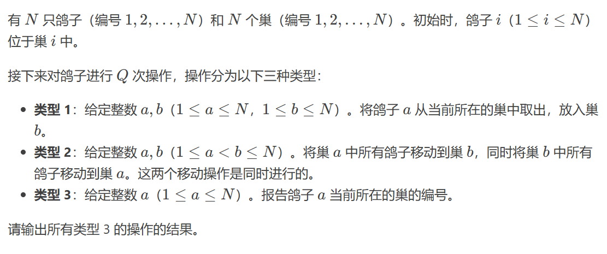
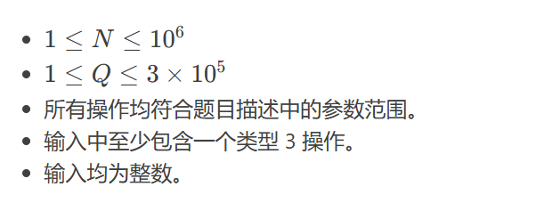
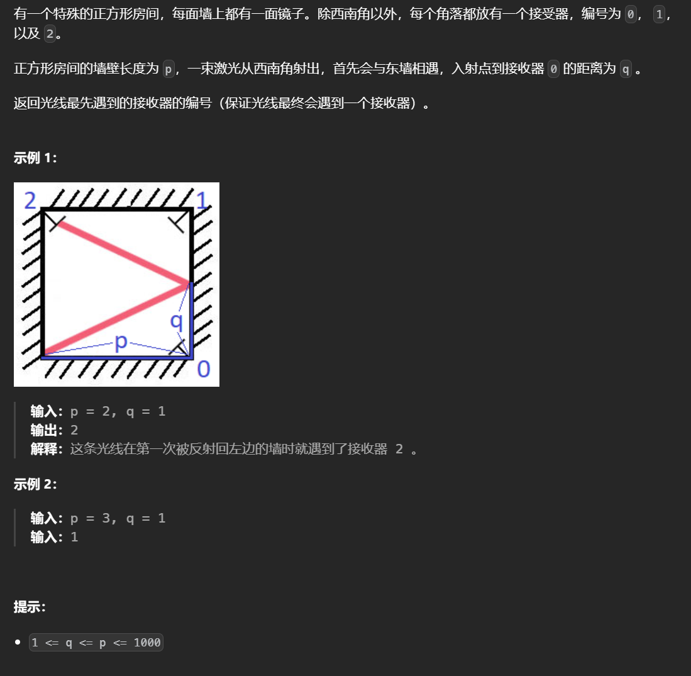
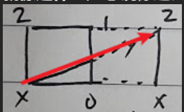
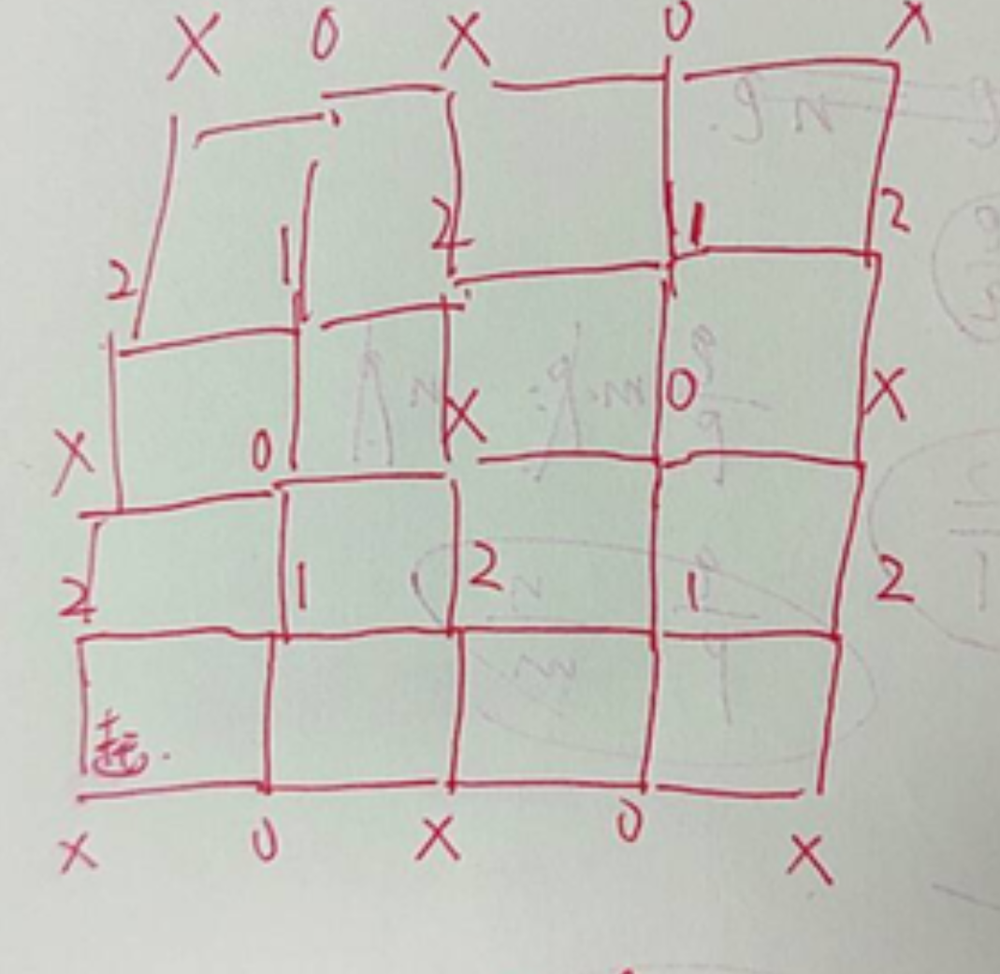
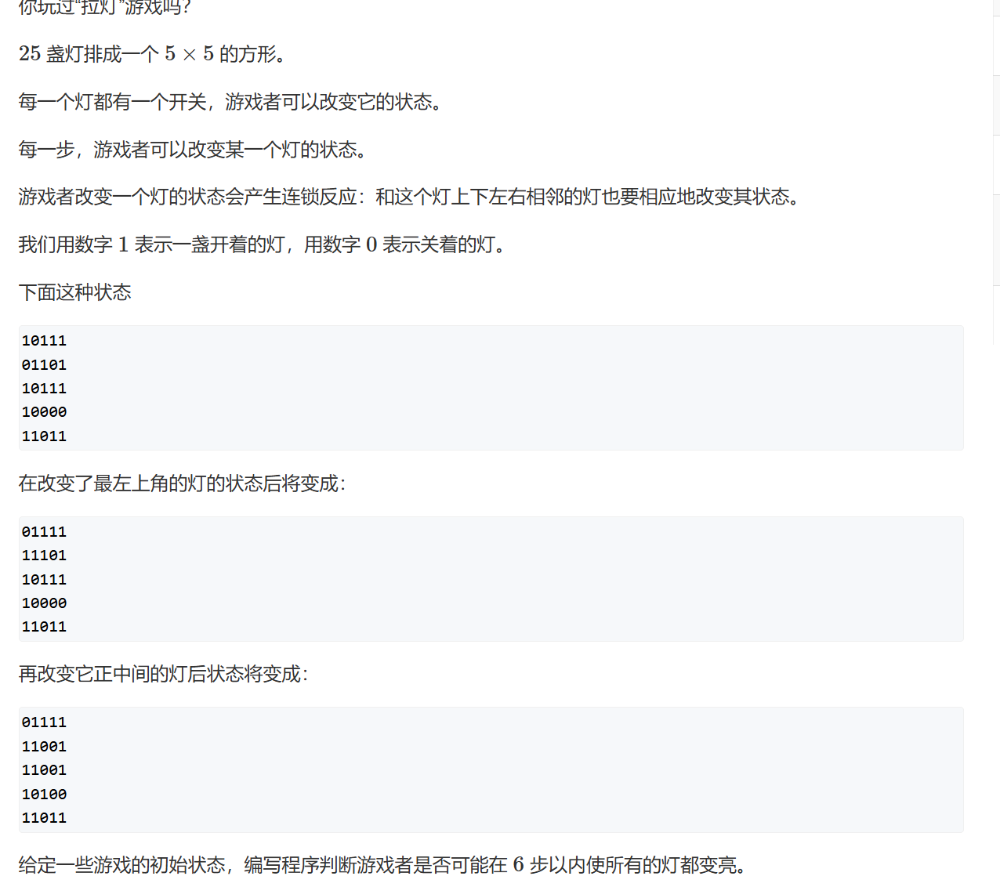
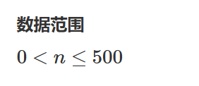

# 模拟


## [ 两个最好的不重叠活动](https://leetcode.cn/problems/two-best-non-overlapping-events/)




最多只有两个值，因此可以枚举其中一个然后去找另一个，注意这种方法不是每次在列表中固定一个值，然后从头到尾找其他值，而是不断遍历数组同时维护这个数组之前遍历过的值查找其中是否有满足条件的。

对开始时间排序保证了一个位置之后的位置一定可以满足前面维护的最大值，在遍历的过程使用根堆维护左边最小的结束时间，如果满足条件那么这个结束时间对应的区间也一定会满足该位置之后的区间，因此弹出这个值来更新维护的最大值然后继续判断是否满足。


```python
class Solution:
    def maxTwoEvents(self, nums: List[List[int]]) -> int:
        nums.sort(key=lambda x:x[0])
        d=[]
        ans=pre=0
        # 遍历的过程就是在枚举
        for x,y,v in nums:
            # 维护最大值
            while d and d[0][0]<x:
                pre=max(pre,heappop(d)[1])
            ans=max(ans,pre+v)
            # 维护前面的区间
            heappush(d,[y,v])
        return ans 
```


## [Pigeon Swap](https://atcoder.jp/contests/abc395/tasks/abc395_d)





对于操作2，如果移动每个巢穴的同时操作其中的每只鸽子必然会超时，**为此要使得对于操作2不会移动鸽子**，**这里将每只鸽子对应的巢穴转换为对应一个坐标，再对这个坐标建立映射pos[i]=j表示位置i对应巢穴j**，操作一中需要改变对应的巢穴，经过转换后则是变化对应的坐标，为了得到巢穴对应的坐标还需额外建立一个映射。对于操作二，由于鸽子都是对应坐标位置的，只需修改位置所对应的巢穴，即可实现不操作鸽子，此外还要修改巢穴所对的位置。

```python
n,q=RR()
ans={}
home={}
pos={}
# 初始化映射
for i in range(1,n+1):
    home[i]=i
    pos[i]=i
    ans[i]=i

for _ in range(q):
    tmp=RR()
    # 操作一
    if tmp[0]==1:
        # 鸽子映射到新的位置
        ans[tmp[1]]=home[tmp[2]]
    # 操作二
    elif tmp[0]==2:
        # 巢穴所对的位置
        l,r=home[tmp[1]],home[tmp[2]]
        # 修改位置所对的巢穴
        pos[l],pos[r]=tmp[2],tmp[1]
        # 修改巢穴所对的位置
        home[tmp[1]],home[tmp[2]]=r,l    
    else:
        # 鸽子对应的位置映射到具体的巢穴
        print(pos[ans[tmp[1]]])
```


## [镜面反射](https://leetcode.cn/problems/mirror-reflection/)



脑筋急转弯，假设光线不会反射只会只会沿一个方向走，其他位置都是镜像后的结果。







通过观察，如果pq是奇数那么结果是1，p是奇数q是偶数那么结果是0,pq是偶数会回到起点，p是偶数q是奇数结果是2，其实可以构造一个y=(q/p)x的函数，只有每次走过p的整数倍的长度才可能到达端点，最后的结果和pq的比例有关，如果pq都是偶数就需要约分。

```python
class Solution:
    def mirrorReflection(self, p: int, q: int) -> int:
        # 约分
        while not p&1 and not q&1:
            p>>=1
            q>>=1
        if p&1:
            if q&1:return 1 
            return 0
        else:
            if q&1:return 2
```


## [费解的开关](https://www.acwing.com/problem/content/97/)






改变一个灯它的上下左右都会变化，不管以什么样的顺序操作都会影响过去操作的状态，为了保证一个状态不会多次被操作到选择让每个状态只能由它的下一行去改变（技巧点），依次来递推出每一行都是1。这样每一行可以确定它的下一行要操作那些位置，而第一行的操作那些可以枚举所有的。

```python
for _ in range(R()):
    grid = [RR() for _ in range(5)]
    
    # 翻转，接受坐标
    def turn(g, i, j):
        g[i][j] ^= 1
        if i - 1 >= 0:
            g[i - 1][j] ^= 1
        if j + 1 < len(g[0]):
            g[i][j + 1] ^= 1
        if i + 1 < len(g):
            g[i + 1][j] ^= 1
        if j - 1 >= 0:
            g[i][j - 1] ^= 1
    
    res = inf
    # 每行的空缺由下一行修改，会导致第一行没有操作，这里枚举第一行所有的操作可能
    for i in range(32):
        # 记录每次的操作次数
        cnt = 0
        # 不在原数组上操作
        g = copy.deepcopy(grid)
        # 第一行操作后的状态
        for j in range(i.bit_length()):
            if (i >> j) & 1:
                # 操作
                turn(g, 0, 4-j)
                cnt += 1
         # 找出前四行每一行的0位置以确定下一行的操作
        for j in range(4):
            index = [k for k, v in enumerate(g[j]) if v == 0]
            # 对下一行操作
            for k in index:
                cnt += 1
                turn(g, j+1, k)
        # 最后一行无法再被修改，如果最后一行满足了都是1那么就是有效的操作次数
        if g[-1] == [1] * 5:res = min(res, cnt)
    if res == inf or res > 6:
        res = -1
    print(res)
```

