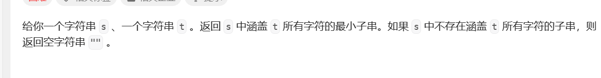

# 滑动窗口

滑动窗口多用于解决最长/最短数组

滑动窗口算法借助快慢指针实现窗口，时间复杂度为O(N)，因为双指针不会回退，每个元素只会进入一次然后移除一次，不会有某个元素多次进入移除。

注意数组中如果有负值就不能用滑动窗口。

基本框架

```python
left,right=0
while right<len(nums):
	window.add(nums[right])
    right+=1
    while left<right and window needs shrink:
        window.remove(nums[left])
        left+=1
```

需要明确：

+ 扩大窗口需要更新什么
+ 什么时候停止扩大窗口
+ 缩小窗口需要更新什么
+ 结果是在扩大还是缩小的时候更新 

### 最小覆盖字串



解题思路：首先使用双指针技巧初始化一个窗口，然后扩大窗口直到满足条件，之后缩小窗口，直到不满足条件，重复上述过程。

总是寻找可行解再优化可行解。

```python
from collections import Counter

class Solution(object):
    def minWindow(self, s, t):

        if s==t:
            return s
		
        # 左右指针
        left = 0
        right = 0
		
        # 两个计数器，记录两个字符串中字符串出现的次数
        needs = Counter(t)
        windows = {}
		
        # 表示窗口中满足needs条件的字符个数
        valid = 0
		
        # 记录开始的索引
        start = 0
        # 记录子串的长度
        end = 1000000
		
        # 开始滑动
        while right < len(s):
            # 区间左闭右开
            c = s[right]# 加入的字符
            right += 1
			
            # 判断加入的字符是否在t
            if c in needs:
                # 满足条件，更新计数器，以下是python中字典的更新的方法，不能直接加一
                if c not in windows:
                    windows[c] = 1
                else:
                    windows[c] += 1
                # 如果当前字串中这个类型的字符已经与t中同类型的字符相等了，更新valid
                if windows[c] == needs[c]:
                    valid += 1
			
            # 当前字串已经涵盖了t中的所有字符，优化可行解，缩小窗口
            while valid == len(needs):
				
                # 判断当前字串是否是最小的
                if right - left < end:
                    # 更新索引长度
                    start = left
                    end = right - left
				
                # 移出的字符
                d = s[left]
                left += 1
				
                # 判断移出的字符是否在t
                if d in needs:
                    if windows[d] == needs[d]:
                        valid -= 1
                    windows[d] -= 1
         
        # 返回最终结果
        return s[start:start + end] if end!=1000000 else ''
```


### 字符串的排列


要求s2中存在一个子串包含s1中的所有字符，且不存在其他字符。

这道题与之前不同，要求维护一个定长的窗口，因此停止窗口的条件是窗口的大小大于s1长度，扩大窗口时更新计数器，缩小窗口时更新计数器，判断结果是否成立。

```python
from collections import Counter
class Solution(object):
    def checkInclusion(self, s1, s2):
        left=0
        right=0
        valid=0

        needs=Counter(s1)
        windows={}

        while right<len(s2):

            c=s2[right]
            right+=1

            if c in needs:
                if c not in windows:
                    windows[c]=1
                else:
                    windows[c]+=1

                if windows[c]==needs[c]:
                    valid+=1
            
            # 窗口是定长的，一旦窗口大于了固定的长度就要缩减优化
            while right-left>=len(s1):# 实际上改为if也一样，定长的窗口一旦超出就要剪短，一剪短就要扩大，相当于扩大一步缩减一步
                # 判断结束条件
                if valid==len(needs):
                    return True
                
                d=s2[left]
                left+=1
                
                if d in needs:
                    
                    if windows[d]==needs[d]:
                        valid-=1
                    
                    windows[d]-=1
        return False
```


### 找到字符串中所有字母异位词


即在S中找出P的所有组合。

```python
from collections import Counter
class Solution(object):
    def findAnagrams(self, s, p):

        left=0
        right=0

        res=[]
        valid=0

        needs=Counter(p)
        windows={}

        while right<len(s):
            c=s[right]
            right+=1

            if c in needs :
                if c not in windows:
                    windows[c]=1
                else:
                    windows[c]+=1
                if windows[c]==needs[c]:
                    valid+=1

		# 同样是定长的
            while right-left>=len(p):

                if valid==len(needs):
                    res.append(left)

                d=s[left]
                left+=1

                if d in needs:
                    if windows[d]==needs[d]:
                        valid-=1
                    windows[d]-=1

        return res
```

### 无重复字符的最长子串


```python
class Solution(object):
    def lengthOfLongestSubstring(self, s):
        left=0
        right=0
        res=0
        windows={}

        while right<len(s):
            c=s[right]
            right+=1
			
            # 扩大的同时更新计数器
            if c not in windows:
                windows[c]=1
            else:
                windows[c]+=1
				
            # 如果新加入的元素出现了多次，停止扩大窗口
            while windows[c]>1:
                # 缩小时更a新计数器
                d=s[left]
                left+=1
                windows[d]-=1
                
            res=max(res,right-left)
        return res

```

### 最长交替子序列


```python
class Solution(object):
    def alternatingSubarray(self, nums):
        ans=-1
        left=0
        right=1
        while right<len(nums):
            if nums[right]-nums[left]==1:
                # 注意条件即可
                while right<len(nums) and nums[right]-nums[right-1]==(-1)**(right-left+1):
                    right+=1
                ans=max(ans,right-left)
                left=right-1
            else:
                left=right
                right+=1
        return ans
```

### [删掉一个元素以后全为 1 的最长子数组](https://leetcode.cn/problems/longest-subarray-of-1s-after-deleting-one-element/)

滑动窗口求解，最长的区间内必然至多只有一个0，实用滑动窗口向右滑动，直到区间内包含了两个0，此时开始收缩区间直到区间中只有一个0，然后继续滑动，过程中不断记录最大值。


```python
class Solution(object):
    def longestSubarray(self, nums):
        l=r=0
        count=0
        n=len(nums)
        res=0
        while r<n:
            if nums[r]==0:
                count+=1

            while l<r and count>1:
                if nums[l]==0:
                    count-=1
                l+=1
            res=max(r-l+1,res)
            r += 1
        return res-1
```


### [数组的最大美丽值](https://leetcode.cn/problems/maximum-beauty-of-an-array-after-applying-operation/)


`很明显不考虑顺序，可以将原数组进行排序，但要想到排完序之后就是找一个子数组了(技巧点)`，按照题目的要求，一个数只能加k或者减k，那么如果区间内的值不满足，区间外的也不会满足。

对于一个顺序数组的区间，要想其中的值都相同，最大值不能再增加，最小值不能再减小，因此最大值减小后必须小于等于最小值增大后的结果，问题转换为找一个最长的子数组其中最大值和最小值的差不超过2k。

```python
class Solution:
    def maximumBeauty(self, nums: List[int], k: int) -> int:
        nums.sort()
        n=len(nums)
        ans=1
        l,r=0,1
        while r<n:
            if nums[r]-nums[l]<=2*k:
                ans=max(ans,r-l+1)
            else:
                while nums[r]-nums[l]>2*k:
                    l+=1
            r+=1
        return ans 
```


### [最大连续1的个数 III](https://leetcode.cn/problems/max-consecutive-ones-iii/)


可以进行k次把0转换为1的操作，那么要求区间内最多有k个0，`问题转为求解包含最多k个0的最长区间是？`

注意去思考一个区间的限制条件是什么，是什么不能让他无限扩大，就这个限制条件取解题。

```python
class Solution:
    def longestOnes(self, nums: List[int], k: int) -> int:
        n=len(nums)
        l=r=cnt=ans=0
        while r<n:
            if nums[r]==0:
                cnt+=1
            while cnt>k:
                cnt-=int(nums[l]==0)
                l+=1
            ans=max(ans,r-l+1)
            r+=1
        return ans 
```


### [绝对差不超过限制的最长连续子数组](https://leetcode.cn/problems/longest-continuous-subarray-with-absolute-diff-less-than-or-equal-to-limit/)


使用滑动窗口但是需要得到窗口中元素的最大值和最小值，以及删除了当前最大值最小值后能快速得到下一个最大值最小值，可以用队列维护窗口中的元素。

```python
class Solution:
    def longestSubarray(self, nums: List[int], limit: int) -> int:
        n=len(nums)
        l=r=ans=0
        mx=deque()
        mn=deque()
        while r<n:
            val=nums[r]
            # 按顺序加入，如果后面的元素更大那么前面的元素不会起作用，并且会被窗口先去除，因此弹出队列中比自己小的。
            while mn and mn[-1]>val:
                mn.pop()
            while mx and mx[-1]<val:
                mx.pop()
            mx.append(val)
            mn.append(val)
            while mn and mx and mx[0]-mn[0]>limit:
                if nums[l]==mn[0]:
                    mn.popleft()
                if nums[l]==mx[0]:
                    mx.popleft()
                l+=1
            r+=1
            ans=max(r-l,ans)
        return ans 
    
       from sortedcontainers import SortedList
        # 使用内置的有序列表来维护窗口中的元素
       s=SortedList()
        while r<n:
            s.add(nums[r])
            while s[-1]-s[0]>limit:
                s.remove(nums[l])
                l+=1
            ans=max(ans,r-l+1)
            r+=1
        return ans 
```


### [最少交换次数来组合所有的 1 II](https://leetcode.cn/problems/minimum-swaps-to-group-all-1s-together-ii/)


最后的结果一定是所有的1聚集在一起（技巧点），因此找每个长度为L(1的个数)的区间其中0的个数就是要交换的次数，环形可以通过连接数组求出。

```python
class Solution:
    def minSwaps(self, nums: List[int]) -> int:
        t=nums.count(1)
        nums=nums*2   
        
        l=r=cnt=0
        ans=inf
        n=len(nums)
        while r<n:
            if nums[r]==0:
                cnt+=1
            if r-l+1==t:
                ans=min(ans,cnt)
                cnt-=1 if nums[l]==0 else 0
                l+=1
            r+=1
        return ans if ans!=inf else 0

```

### [统计得分小于 K 的子数组数目](https://leetcode.cn/problems/count-subarrays-with-score-less-than-k/)


一个区间如果满足条件那么它内部比它小的区间也也一定满足条件，枚举每个右端点去找它满足条件的最左的左端点

```python
class Solution:
    def countSubarrays(self, nums: List[int], k: int) -> int:
        s=ans=l=0
        for r,num in enumerate(nums):
            # s表示区间内的和
            s+=num
            # 如果不满足条件移动左端点，这里的左端点不是从头开始
            while s*(r-l+1)>=k:
                s-=nums[l]
                l+=1              
            # 记录满足的区间数，这个区间能贡献的大小：(l,r-1)贡献的大小（每个为开头结尾是r）外加上r单独的一个，有点递推的性质	
            # 比如说1位贡献1(1)，2位贡献（ 1 2，2）3位贡献(1 2 3 ,2 3 ,3 )即在上一个的基础上加一
            # 技巧点
            ans+=r-l+1
        return ans 
```

### [将 x 减到 0 的最小操作数](https://leetcode.cn/problems/minimum-operations-to-reduce-x-to-zero/)


减去两边最后留下中间一部分，就是在找子数组。反向思考，找出总和为total-target的最长子数组。

```python
class Solution:
    def minOperations(self, nums: List[int], target: int) -> int:
        total=sum(nums)
        if total<target:return -1
        s=l=0
        ans=-1
        target=total-target
        # 枚举右指针，找到满足条件的最小的左指针
        for r,v in enumerate(nums):
            s+=v
            while s>target:
                s-=nums[l]
                l+=1
            if target==s:
                ans=max(ans,r-l+1)
        return -1 if ans<0 else len(nums)-ans
```

 

### [最高频元素的频数](https://leetcode.cn/problems/frequency-of-the-most-frequent-element/)


首先将数组排序，然后使用双指针判断能满足下述条件的最长区间。这种填充问题可以想象出阶梯图。


```python
class Solution:
    def maxFrequency(self, nums: List[int], k: int) -> int:
        l=r=0
        nums.sort()
        pre=list(accumulate(nums,initial=0))
        n=len(nums)
        ans=0
        while r<n:
            val=pre[r+1]-pre[l]
            total=nums[r]*(r-l+1)
            while total-val>k and l<r:
                l+=1
                total=nums[r]*(r-l+1)
                val=pre[r+1]-pre[l]
            ans=max(ans,r-l+1)
            r+=1
        return ans 
```

### [统计好子数组的数目](https://leetcode.cn/problems/count-the-number-of-good-subarrays/)


这里考虑枚举右端点，如果一个区间满足那么这个区间左端点以左的位置都是合适的区间，因此在枚举的过程中一直更新答案

计数的过程中如果一个增加一，那么根据数学公式计算总的满足条件的个数会增加k个(k是原先的个数)，如果减少一上述个数会减少k个(k是减少后的个数)

```python
class Solution:
    def countGood(self, nums: List[int], k: int) -> int:
        cnt=Counter()
        # p记录当前有多少个相等的数对
        l=p=ans=0
        # 滑动
        for x in nums:
            p+=cnt[x]
            # 计数
            cnt[x]+=1
            # 左端点左边的位置都是可以的，因此不断加上，只有当找到了满足的情况左端点才会移动
            ans+=l
            # 满足条件收缩边界
            while p>=k:
                # 注意当前整个子数组要记录一次
                ans+=1
                cnt[nums[l]]-=1
                p-=cnt[nums[l]]
                l+=1
        return ans 
```


### Quiz Master


找一个子序列，要求子序列中所有值的因数可以涵盖1~m，每加入一个值都会增加多个因数，序列具有单调性满足滑动窗口的性质。观察发现，选择的数一定是连续的。

```python
from cmath import inf
from collections import defaultdict

for _ in range(int(input())):
    n, m = [int(x) for x in input().split()]
    nums = sorted(set([int(x) for x in input().split()]))
    # 求解因数
    memo = defaultdict(list)
    for v in nums:
        for i in range(1, int(v ** 0.5 + 1)):
            if v % i == 0:
                memo[v].append(i)
                if v//i!=i:memo[v].append(v//i)
    vis = defaultdict(int)
    l = 0
    ans=inf
    # 左右端点
    for r, x in enumerate(nums):
        for c in memo[x]:
            # 超出的不加入
            if c > m: continue
            vis[c] += 1
        # 相等了收缩窗口
        while len(vis) == m:
            ans = min(ans, x - nums[l])
            for c in memo[nums[l]]:
                if c > m: continue
                vis[c] -= 1
                if not vis[c]: del vis[c]
            l+=1
    print(ans if ans!=inf else -1)


```


### [预算内的最多机器人数目](https://leetcode.cn/problems/maximum-number-of-robots-within-budget/)


对于题目给定的连续区间，可以想到使用滑动窗口求解，用滑动窗口求解k*sum(runningCosts)，同时使用栈来求解这个区间内的最大值。

```python
class Solution:
    def maximumRobots(self, chargeTimes: List[int], runningCosts: List[int], budget: int) -> int:
        l=t=ans=0
        d=deque()
        for r,x in enumerate(runningCosts):
            t+=x
            while d and chargeTimes[d[-1]]<=chargeTimes[r]:
                d.pop()
            d.append(r)
            while l<=r and  d and  t*(r-l+1)+chargeTimes[d[0]]>budget:
                if d[0]==l:
                    d.popleft()
                t-=runningCosts[l]
                l+=1
            ans=max(ans,r-l+1)
        return ans 
```

### [找出最长等值子数组](https://leetcode.cn/problems/find-the-longest-equal-subarray/)


滑动窗口，这里不是对整个数组滑动，而是对于同一组值滑动。

对相同的值记录他们的下标，然后滑动，这样的话既可以直到区间长度又可以直到区间内相同值的个数

```python
class Solution:
    def longestEqualSubarray(self, nums: List[int], k: int) -> int:
        pos=defaultdict(list)
        # 记录每个相同值的下标
        for i,v in enumerate(nums):
            pos[v].append(i)
        ans=0
        # 遍历每一组
        for p in pos.values():
            l=0
            for r,x in enumerate(p):
                # 区间长度
                ll=p[r]-p[l]+1
                # 相同的x的个数
                cnt=r-l+1
                # 收缩
                while l<r and ll-cnt>k:
                    l+=1
                    ll=p[r]-p[l]+1
                    cnt=r-l+1
                ans=max(ans,cnt)
        return ans
```

### [使二进制字符串字符交替的最少反转次数](https://leetcode.cn/problems/minimum-number-of-flips-to-make-the-binary-string-alternating/)


考虑结果必然是01连续或者10连续，那么直接将原字符串与目标字符串对比判断即可，这里的方法一是将首字符转移到尾部也就是类似于首尾相连，可以拼接字符串来模拟操作，这里只要求找类型二最少的操作次数因此可以直接比较。

```python
class Solution:
    def minFlips(self, s: str) -> int:
        ll=len(s)
        s+=s
        n=len(s)
        # 创建两个模式串，长度为拼接后的
        p1='10'*(n//2) if not n&1 else '10'*(n//2)+'1'
        p2='01'*(n//2) if not n&1 else '01'*(n//2)+'0'
        d1=d2=l=0
        ans=inf 
        # 滑动窗口找不同
        for r,x in enumerate(s):
            if s[r]!=p1[r]:d1+=1
            if s[r]!=p2[r]:d2+=1
            while r-l+1>ll:
                if s[l]!=p1[l]:d1-=1
                if s[l]!=p2[l]:d2-=1
                l+=1
            # 大小满足
            if r-l+1==ll:ans=min(ans,d1,d2)
        return ans 

```


### [毯子覆盖的最多白色砖块数](https://leetcode.cn/problems/maximum-white-tiles-covered-by-a-carpet/)


为了覆盖最大的范围，每次都是从区间的左端点开始找，使用双指针对区间操作。

```python
class Solution:
    def maximumWhiteTiles(self, nums: List[List[int]], carpetLen: int) -> int:
        l=r=ans=0
        # 首先排序
        nums.sort()
        n=len(nums)
        now=0
        while l<=r and r<n:
            # 如果毯子的长度足够覆盖当前的区间，那么右指针移动
            while r<n and nums[r][1]-nums[l][0]+1<=carpetLen:
                now+=nums[r][1]-nums[r][0]+1
                r+=1
            # 如果不能完全覆盖，即只覆盖一部分
            if r<n and nums[r][0]-nums[l][0]+1<=carpetLen:
                ans=max(ans,now+carpetLen+nums[l][0]-nums[r][0])
            else:
                # 不能覆盖
                ans=max(ans,now)
            # 移动左端点
            now-=nums[l][1]-nums[l][0]+1
            l+=1
        return ans 
```

### To Add or Not to Add


数组的顺序不影响答案，因此可以先排序，一个元素只能把比他小的变为他同时最优的选择是紧跟在这个元素之后的元素，用不定长滑动窗口求解，把给定区间内的数都变为一个数所需的操作次数可以用前缀和快速求解，如果这个操作所需的次数大于k那么必须收缩窗口因为如果不收缩在窗口往外扩大的时候也一定不会满足条件，也就是不会漏。

```python
from collections import deque, defaultdict, Counter
from functools import lru_cache
from bisect import bisect_left
from itertools import accumulate
from math import ceil
import sys
from typing import List
input = sys.stdin.readline
def R(): return int(input())
def RR(): return [int(x) for x in input().split()]
def get_pre(nums):return list(accumulate(nums,initial=0))

n,k=RR()
a=RR()
a.sort()
l=0
ans=0
res=-1
# 前缀和
pre=get_pre(a)
# 不定长滑动窗口
for r,x in enumerate(a):
    tt=x*(r-l+1)-(pre[r+1]-pre[l])
    while tt>k:
        l += 1
        tt=x*(r-l+1)-(pre[r+1]-pre[l])

    if r-l+1>ans:
        ans=r-l+1
        res=x
print(ans,res)
```

### [交替组 II](https://leetcode.cn/problems/alternating-groups-ii/)


双指针操作，如果满足相邻元素不同那么右指针右移，否则让左指针等于右指针，一直操作直到超出范围。如果在这个过程中双指针范围内的元素个数大于等于k了那么更新答案。对于环可以首尾拼接。

```python
class Solution:
    def numberOfAlternatingGroups(self, nums: List[int], k: int) -> int:
        ans=cnt=0
        n=len(nums)
        nums*=2
        l,r=0,1
        while r<2*n and l<n:
            if nums[r-1]!=nums[r]:r+=1
            # 不满足则重新指向
        	else:
                l=r
                r+=1
            # 窗口内的元素个数满足了
            if r-l>=k:
                # 如果左指针在范围内，防止重复计算
                if r-k<n:
                    ans+=1
                # 左指针超出了给定的范围，在操作下去只会重复
                else:break
        return ans 
```

### [使数组连续的最少操作数](https://leetcode.cn/problems/minimum-number-of-operations-to-make-array-continuous/)


找到有哪些不用变，对排序去重后的数组用双指针操作，枚举每个位置用左端点维护不需要变得值的区间。

```python
class Solution:
    def minOperations(self, nums: List[int]) -> int:
        n=len(nums)
        # 首先排序去重
        nums=sorted(set(nums))
        l=0
        ans=0
        for r,x in enumerate(nums):
            # 不满足条件收缩
            while l<r and nums[r]-nums[l]>n-1:
                l+=1
            ans=max(ans,r-l+1)
        return  n-ans  
```

### [统计定界子数组的数目](https://leetcode.cn/problems/count-subarrays-with-fixed-bounds/)	


滑动窗口求解，过程中记录窗口中maxk和mink最后一次出现的位置，枚举右端点的过程中如果存在maxk和mink那么可以构成min(maxk,mink)-left个子数组，如果新加入的值不在范围内那么窗口需要重置

```python
class Solution:
    def countSubarrays(self, nums: List[int], mink: int, maxk: int) -> int:
        l=0
        l1=l2=-1
        ans=0
        for r,x in enumerate(nums):
            # 窗口重置
            if x<mink or x>maxk:
                l1=l2=-1
                l=r+1
            # 记录两个边界最后一次出现的位置
            if x==mink:l1=r
            if x==maxk:l2=r
			# 满足条件更新答案
            if l1!=-1 and l2!=-1:
                ans+=min(l1,l2)-l+1
        return ans 
```

### [统计满足 K 约束的子字符串数量 II](https://leetcode.cn/problems/count-substrings-that-satisfy-k-constraint-ii/)


子串问题想到滑动窗口，用滑动窗口计算出以i为右端点满足要求的左端点最远是那里

如果给定的left[r]<=l也就是给定的区间的任意子串都满足要求(left是一个递增的数组，left[r]满足在r之前的也一定满足)，答案就是r-l+1的子段数，长度为r-l+1的有一个，长度为r-l的有两个...一共是1+2+3+...r-l+1个

反之，用二分找到第一个left[j]>=l的这样[l,r-1]区间内都是满足要求的子串，而[j,r]区间内每个点的个数是i-left[i]+1也就是以这个点为右端点的合法子段数，这里可以用前缀和快速求解

```python
class Solution:
    def countKConstraintSubstrings(self, s: str, k: int, queries: List[List[int]]) -> List[int]:
        cnt=[0,0]
        l=0
        left=[]
        arr=[]
        # 滑动窗口求解
        for r,x in enumerate(s):
            cnt[int(x)]+=1
            # 收缩
            while cnt[0]>k and cnt[1]>k:
                cnt[int(s[l])]-=1
                l+=1
            # 记录左端点
            left.append(l)
            # 记录以这个点为右端点的合法数
            arr.append(r-l+1)
        pre=list(accumulate(arr,initial=0))
        ans=[]
        for l,r in queries:
            # 每个子串都可以
            if left[r]<=l:
                ans.append((r-l+2)*(r-l+1)//2)
            else:
                j=bisect_left(left,l,l,r+1)
                cnt=(j-l+1)*(j-l)//2+(pre[r+1]-pre[j])
                ans.append(cnt)
        return ans 
```

### [找出唯一性数组的中位数](https://leetcode.cn/problems/find-the-median-of-the-uniqueness-array/)


中位数看作是第k大问题可以想到二分distinct值，要找所有的子数组的distinct值考虑到滑动窗口


```python
class Solution:
    def medianOfUniquenessArray(self, nums: List[int]) -> int:
        n=len(nums)
        l,r=1,n
        k=(1+n)*n//2# 一共有多少distinct值
        k=ceil(k/2)
        def cal(xx):
            l=ans=0
            # 用默认字典比counter快一倍
            memo=defaultdict(int)
            for r,x in enumerate(nums):
                memo[x]+=1
                while l<r and len(memo)>xx:
                    memo[nums[l]]-=1
                    if not memo[nums[l]]:del memo[nums[l]]
                    l+=1
                # 这里是子数组，所以计算的是拼接到后面的结果
                ans+=r-l+1
                if ans>=k:return True 
            return False
        while l<=r:
            mid=(l+r)>>1
            if cal(mid):
                r=mid-1
            else:
                l=mid+1
        return r+1
```


# 定长滑动窗口

## [K 个关闭的灯泡](https://leetcode.cn/problems/k-empty-slots/)


定长滑动窗口解法，根据bulbs数组构建days数组，**days[x]存储x-1位置的灯泡被打开的日期**，问题转化为，找一个定长的k+2的窗口，窗口**需满足内部l+1~r-1的最小值大于两端的日期**，这保证了两个打开的灯泡之间恰好有k个未打开的灯泡。

```python
class Solution:
    def kEmptySlots(self, nums: List[int], k: int) -> int:
        l=0
        n=len(nums)
        days=[-1]*n
        ans=inf 
        for i,x in enumerate(nums,1):
            x-=1
            days[x]=i
            if not k:
                if x-1>=0 and days[x-1]!=-1:ans=min(ans,i)
                if x+1<n and days[x+1]!=-1:ans=min(ans,i)
        if not k:return ans 
		# 定长滑动窗口，初始化l=r=0
        for r ,x in enumerate(days):
            # 窗口长度合法时做操作
            if r-l+1==k+2:
                mn=max(days[l],days[r])
                for v in days[l+1:r]:
                    if v<mn:break
                else:ans=min(ans,mn)
                # 更新窗口左端点
                l+=1
        return -1 if ans==inf else ans
```


## [串联所有单词的子串](https://leetcode.cn/problems/substring-with-concatenation-of-all-words/)


```python
'''
最朴素的做法是统计words中每个单词的出现次数，然后枚举s中对应长度的子串检查其中每个单词的出现次数
是否能对应上
由于words中单词的长度是一致的，因此在枚举s中子串时可以利用滑动窗口以len(words[i])
为步长快速求解下一个子串 并且l从0开始的结果包含了从len(words[i])-1开始
也就是说开始位置是一个周期
'''

class Solution:
    def findSubstring(self, s: str, words: List[str]) -> List[int]:
        m=len(words)
        w=len(words[0])
        n=len(s)
        ans=[]
        # 统计words中每个单词的出现次数
        memo=Counter(words)
        # 0~len(words[i])-1每个位置开始
        for i in range(w):
            # 统计出现次数
            temp=Counter()
            # 规定步长为len(words[i])
            for j in range(i,n,w):
                cur=s[j:j+w]
                temp[cur]+=1
                # 收缩窗口 当前的长度已经满足
                if j-i>=m*w:
                    # 找到当前串窗口的左端点
                    idx=j-m*w
                    pre=s[idx:idx+w]
                    temp[pre]-=1
                    if not temp[pre]:del temp[pre]
                    if temp[pre]!=memo[pre]:continue
                if temp[cur]!=memo[cur]:continue
                # 上述的两个continue减少判等的调用
                if temp==memo:ans.append(j-(m-1)*w)
        return ans 

```


## [统计完全子字符串](https://leetcode.cn/problems/count-complete-substrings/)


```python
'''
要求相邻字符在字母表中的顺序至多相差2可以把word分为诺干个子串 然后分别求解这些子串
对于一个子串只需考虑是否每个字母都只出现k次 这里可以枚举字母的类型数用定长滑动窗口求解

'''

class Solution:
    def countCompleteSubstrings(self, word: str, k: int) -> int:
        i=ans=0
        n=len(word)
        def f(s):  
            res=0
            # 枚举字母类型数
            for m in range(1,27):
                # 统计出现次数
                cnt=[0]*26
                # 统计有多少满足个数等于k
                count=0
                # 长度不够   
                if m*k>len(s):break
                for r,x in enumerate(s):
                    # 判断
                    if cnt[ord(x)-ord('a')]==k-1:count+=1
                    elif cnt[ord(x)-ord('a')]==k:count-=1
                    cnt[ord(x)-ord('a')]+=1
                    # 计算左端点
                    l=r-m*k+1
                    
                    if l>=0:
                        res+=int(count==m)
                        if cnt[ord(s[l])-ord('a')]==k+1:count+=1
                        elif cnt[ord(s[l])-ord('a')]==k:count-=1
                        cnt[ord(s[l])-ord('a')]-=1
            return res

        # 分组循环找子串
        while i<n:
            start=i
            i+=1
            while i<n and abs(ord(word[i])-ord(word[i-1]))<=2:
                i+=1
            ans+=f(word[start:i])
        return ans 
```


# 不定长滑动窗口

不定长滑动窗口主要分为三类：求最长子数组，求最短子数组，以及求子数组个数


## 求最长


### [执行操作使频率分数最大](https://leetcode.cn/problems/apply-operations-to-maximize-frequency-score/)


```python
'''
将数组排序后，要变成一样的数必然在一个连续子数组中
使用双指针找子数组 对于子数组变得一样的最少操作次数必然是变为中位数,对枚举的子数组判断操作次数
小于等于k，如果不满足则收缩数组，反之继续扩大数组，在这个过程中记录最大值
'''
class Solution:
    def maxFrequencyScore(self, nums: List[int], k: int) -> int:
        nums.sort()
        ans=0
        pre=list(accumulate(nums,initial=0))
        def cal(l,mid,r):
            left=(mid-l+1)*nums[mid]-(pre[mid+1]-pre[l])
            right=pre[r+1]-pre[mid+1]-(r-mid)*nums[mid]
            return right+left
        l=0
        for r in range(len(nums)):
            while cal(l,(l+r)>>1,r)>k:l+=1
            ans=max(ans,r-l+1)
        return ans
```


### [通过插入区间最小化连通组](https://leetcode.cn/problems/minimize-connected-groups-by-inserting-interval/)


首先合并区间，然后用滑动窗口找到最长的间隔小于等于k的区间，通过添加一个新的区间能把窗口内的区间合并

```python
class Solution:
    def minConnectedGroups(self, nums: List[List[int]], k: int) -> int:
        n=len(nums)
        nums.sort()
        a,b=nums[0]
        inv=[]
        for i in range(1,n):
            l,r=nums[i]
            if l<=b:
                b=max(b,r)
            else:
                inv.append([a,b])
                a,b=l,r
        inv.append([a,b])
        ans=n=len(inv)
        s=l=0
        for r in range(1,n):
            a,b=inv[r]
            while l<r and a-inv[l][1]>k:
                l+=1
            s=max(s,r-l)
        return ans-s
```


## 求最短


### [最小区间](https://leetcode.cn/problems/smallest-range-covering-elements-from-k-lists/)


```python
'''
要求找到的区间能覆盖所有的列表
这里将列表合并到一起，同时给列表下的数要标号表示他原先属于哪个列表 则问题变为在合并的数组中找到包含所有列表号
的最小区间
'''

class Solution:
    def smallestRange(self, nums: List[List[int]]) -> List[int]:
        l=0
        ll=inf 
        arr=[]
        k=len(nums)
        # 合并
        for i,li in enumerate(nums):
            arr.extend([(c,i) for c in li])
        # 排序
        arr.sort()
        temp=arr[:]
        # 提取出列表号
        arr=[j for _,j in arr]
        memo=Counter()

        # 不定长滑动窗口
        for r,x in enumerate(arr):
            memo[x]+=1
            while len(memo)==k:
                if temp[r][0]-temp[l][0]+1<ll:
                    ll=temp[r][0]-temp[l][0]+1
                    ans=[temp[l][0],temp[r][0]]
                memo[arr[l]]-=1
                if not memo[arr[l]]:del memo[arr[l]]
                l+=1
        return ans 
```


# 求子数组个数


## 越长越合法

**一般写ans+=left**

滑动窗口的内层循环结束时，右端点固定在 right，左端点在 0,1,2,...,left-1的所有子数组(子串)都是合法的，这一共有 lef 个。


### [ 统计重新排列后包含另一个字符串的子字符串数目 II ](https://leetcode.cn/problems/count-substrings-that-can-be-rearranged-to-contain-a-string-ii/) 


```python
'''
word2要重排再去word1中找到匹配的子串 明显的是要看出现次数是否相等
该问题可以转换为双指针求解满足条件的子数组数
关键在于如何判断现次数匹配———子字符串中对应字符的数目超过模式串
这里定义pre为word2与word1字母出现次数之差
less为窗口内有多少个字幕出现次数比word2少 当less=0时满足条件可以收缩窗口
'''

class Solution:
    def validSubstringCount(self, word1: str, word2: str) -> int:
        if len(word1)<len(word2):
            return 0
        l=ans=0
        pre=defaultdict(int)
        for c in word2:
            pre[c]+=1

        less=len(pre)
        for r,x in enumerate(word1):
            pre[x]-=1
            if not pre[x]:
                less-=1
            while not less:
                if not pre[word1[l]]:
                    less+=1
                pre[word1[l]]+=1
                l+=1
            ans+=l
        return ans 
```


## 越短越合法

**一般写ans=right-left+1**

滑动窗口的内层循环结束时，右端点固定在 right，左端点在 lef,left+1,...,right 的所有子数组(子串)都是合法的，这一共有 right - left+1个。


## 恰好型

**「恰好」可以拆分成两个「至少」，也就是两个「越长越合法」的滑窗问题。**


### [元音辅音字符串计数 II](https://leetcode.cn/problems/count-of-substrings-containing-every-vowel-and-k-consonants-ii/)


```python
class Solution:
    def countOfSubstrings(self, word: str, k: int) -> int:
        ans1=ans2=l=cnt=0
        s={'a','e','i','o','u'}
        memo=defaultdict(int)
        for r,x in enumerate(word):
            if x in s:memo[x]+=1
            else:cnt+=1

            while len(memo)==5 and cnt>=k:
                if word[l] in s:
                    memo[word[l]]-=1
                    if not memo[word[l]]:del memo[word[l]]
                else:cnt-=1
                l+=1
            ans1+=l
        memo=defaultdict(int)
        l=cnt=0
        for r,x in enumerate(word):
            if x in s:memo[x]+=1
            else:cnt+=1

            while len(memo)==5 and cnt>=k+1:
                if word[l] in s:
                    memo[word[l]]-=1
                    if not memo[word[l]]:del memo[word[l]]
                else:cnt-=1
                l+=1
            ans2+=l
        return ans1-ans2
```


# 双指针

http://codeforces.com/problemset/problem/1932/C逆向思维

同向双指针[581. 最短无序连续子数组](https://leetcode.cn/problems/shortest-unsorted-continuous-subarray/)

## 相向双指针

**两个指针 left = 0,right=n-1，从数组的两端开始，向中间移动。**


### [较小的三数之和](https://leetcode.cn/problems/3sum-smaller/)


经典双指针应用

给定的数据范围无法三重循环，但是可以做到n^2，**固定i，然后令j=i+1,k=n-1双指针查找满足条件的二元组**。

令**s=nums[i]+nums[j]+nums[k]**，则当**s>=target**时，只有**左移j**才能减小s；**s<target**时满足条件，**nums[j+1:k+1]**内的元素和nums[i]都能组成合法的二元组，因为**最大的nums[k]**能满足**那么左侧较小**的也一定能，而**nums[j:k]**内的元素和nums[k]不一定能组成合法的二元组，因为元素**在递增**，所以这里选择左移j。


```python
class Solution:
    def threeSumSmaller(self, nums: List[int], target: int) -> int:
        nums.sort()
        n=len(nums)
        ans=0
        # 固定I 枚举j,k
        for i in range(n-2):
            l,r=i+1,n-1
            while l<r:
                s=nums[l]+nums[r]+nums[i]
                if s<target:
                    ans+=r-l
                    l+=1
                # 只有左移右指针才能减小s
                else:
                    r-=1
        return ans         
```


## 同向双指针

两个指针的移动方向相同（都向右，或者都向左）。


### [统计移除递增子数组的数目 II](https://leetcode.cn/problems/count-the-number-of-incremovable-subarrays-ii/)


移除一段子数组后剩下的就是一个前缀和一个后缀，维护最长递增前缀的长度i，枚举递增后缀，令j为递增后缀的第一个位置，不断减小J直到nums[j]>nums[j+1]即不合法，在这个过程中当nums[i]>nums[j]就较减小i，更新答案为i+2

```python
class Solution:
    def incremovableSubarrayCount(self, nums: List[int]) -> int:
        i=1
        n=len(nums)
        # 找到最长递增前缀
        while i<=n-1 and nums[i-1]<nums[i]:i+=1
        # 如果整个数组都递增就直接返回
        if i==n:return (n+1)*n//2
        j=n-1
        # 注意i-1，否则是最长递增前缀的后一位置
        i-=1
        # 初始时答案为没有后缀，即j=n
        ans=i+2
        # 枚举j,更新答案
        while j==n-1 or nums[j]<nums[j+1]:
            while i>=0 and nums[i]>=nums[j]:i-=1
            ans+=i+2
            j-=1
        return ans 
```


## 双序列双指针


### [比较含退格的字符串](https://leetcode.cn/problems/backspace-string-compare/)


回退只会影响到**前面的字符**，因此**倒序**遍历字符串，当遍历到一个**#**，不能直接**移动多位**因为要考虑**前面的#**，因此**保存变量**，当遇到**普通字符**时，如果该变量还**有值**那么**直接移动**指针。

```python
class Solution:
    def backspaceCompare(self, s: str, t: str) -> bool:
        n1,n2=len(s),len(t)
        l,r=n1-1,n2-1
        sk1=sk2=0
        while l>=0 and r>=0:
            # 如果是普通字符且不需要跳
            if not sk1 and not sk2 and s[l]!='#' and t[r]!='#':
                if s[l]!=t[r]:
                    return False
                else:
                    l-=1
                    r-=1
                    continue
            # 是#，则更新变量，移动一位
            if s[l]=='#':
                l-=1
                sk1+=1
            elif sk1:
                sk1-=1
                l-=1

            if t[r]=='#':
                r-=1
                sk2+=1
            elif sk2:
                r-=1
                sk2-=1
        # 没有遍历完
        while l>=0:
            # 可能是# 或者没删完
            if s[l]=='#':
                l-=1
                sk1+=1
            elif sk1:
                sk1-=1
                l-=1
            # 如果是普通字符那么一定无法对应
            else:return False
        # 同理
        while r>=0:
            if t[r]=='#':
                r-=1
                sk2+=1
            elif sk2:
                r-=1
                sk2-=1
            else:return False

        if l<0 and r<0:return True
        return False
            
```


###  [在 LR 字符串中交换相邻字符](https://leetcode.cn/problems/swap-adjacent-in-lr-string/)


一次操作可以看作是start中R右移一位，L左移一位，前提是L和R不能相互跨越，那么直接用双直至遍历，遇到X就一直跳过，如果start和result对应位置的字符不同，就一定不匹配，反之当start是L是要求start的指针要在result指针的右侧，这样才能往左移动匹配，对于R也是同理。

```python
class Solution:
    def canTransform(self, arr1: str, arr2: str) -> bool:
        n=len(arr1)
        arr1=list(arr1)
        arr2=list(arr2)
        l=0
        for r,x in enumerate(arr2):
            if x=='X':continue
            while l<n and arr1[l]=='X':l+=1
            if l==n or arr1[l]!=x:return False
            if arr1[l]=='L' and l<r:return False
            if arr1[l]=='R' and l>r:return False
            l+=1
        while l<n and arr1[l]=='X':l+=1
        return l==n
```


### [字典序最小的合法序列](https://leetcode.cn/problems/find-the-lexicographically-smallest-valid-sequence/)


```python
'''
从s中找子序列满足等于t 从左往右遍历 贪心的想如果s和t能匹配就匹配(满足下标数组字典序最小)
如果不能匹配再考虑是否能交换(需有交换机会) 能交换的条件是s[i+1:]能匹配到的最长前缀的左端点
是小于等于j+1的 因此需要一个后缀数组，同时为了保证字典序最小能执行交换就交换
'''
class Solution:
    def validSequence(self, s: str, t: str) -> List[int]:
        n,m=len(s),len(t)
        suf=[m]*(n+1)
        j=m-1
        # 计算后缀匹配数组
        for i in range(n-1,-1,-1):
            if j>=0 and s[i]==t[j]:
                j-=1
            suf[i]=j+1
        
        j=0
        ans=[]
        changed=False
        for i,x in enumerate(s):
            # 从左往右遍历能匹配就匹配
            if x==t[j]:
                j+=1
                ans.append(i)
            # 能交换就交换 
            elif not changed and suf[i+1]<=j+1:
                changed=True 
                ans.append(i)
                j+=1
            if j==m:return ans
        return []
```

### [最少得分子序列](https://leetcode.cn/problems/subsequence-with-the-minimum-score/)


```python
'''
删除t子序列的得分=删除子数组的得分 且字符越少越容易匹配 因此贪心的做法将区间内所有的字符删除
删除后t会剩下前后两个子串 假设前缀匹配的是s的一个前缀 s[:i]，后缀匹配的是s的一个后缀 s[i:]。这里匹配指子序列匹配。
那么枚举 i（s前后缀分界点），分别计算能够与 s[:i] 和 s[i:] 匹配的 t 的最长前缀和最长后缀
就知道要删除的子串的最小值了。

'''
class Solution:
    def minimumScore(self, s: str, t: str) -> int:
        n,m=len(s),len(t)
        # suf[i]表示s[i:]可以匹配到t[s[i]:] 
        suf=[m]*(n+1)
        j=m-1
        for i in range(n-1,-1,-1):
            # 双指针求解
            if j>=0 and t[j]==s[i]:
                j-=1
            suf[i]=j+1
            # t本身就是s的一个子序列 直接返回
            if j<0:return 0
        j=0
        # 注意答案初始化为整个s作为后缀能匹配多少
        ans=suf[0]
        # 前缀在计算的过程中求解答案
        for i,x in enumerate(s):
            if x==t[j]:
                j+=1
                # 更新答案
                ans=min(ans,suf[i+1]-j)
        return ans 
```


## 三指针

### [等差三元组的数目](https://leetcode.cn/problems/number-of-arithmetic-triplets/)


数组是严格递增的因此不会有重复出现的值，这里枚举nums[k]，用l和r指针操作nums[i]和nums[j]，因为数组递增所以l和r每一轮不需要重置。

```python
class Solution:
    def arithmeticTriplets(self, nums: List[int], diff: int) -> int:
        ans,i,j=0,1,0
        n=len(nums)
        for x in nums:
            while i<n and nums[i]+diff<x:
                i+=1
            if i>=n: return ans 
            if nums[i]+diff>x:continue
            while j<n and nums[j]+2*diff<x:j+=1
            if j>=n: return ans 
            if nums[j]+2*diff>x:continue
            ans+=1
        return ans
```


### [适龄的朋友](https://leetcode.cn/problems/friends-of-appropriate-ages/)


排序后三指针，枚举ages[x]，用左右指针划定所有满足条件的ages[y]，这个ages[y]会包含ages[x]所以更新中要减一

```python
class Solution:
    def numFriendRequests(self, ages: List[int]) -> int:
        ans=l=r=0
        n=len(ages)
        ages.sort()
        for x in ages:
            # 左指针找到满足条件的左端点
            while l<n and ages[l]<=x*0.5+7:l+=1
            # 右指针找到不满足条件时的右端点
            while r<n and ages[r]<=x:r+=1
            ans+=max(0,r-l-1)# 这里减一是因为右端点会覆盖当前元素
        return ans 
```

