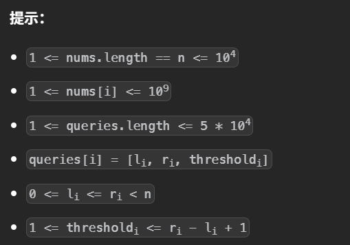

# 莫队

用于解决一类离线区间查询的问题，算法的核心是把询问按照左端点所在块分组，左端点在同一个块的询问归为一组，同一组按照右端点的大小排序。这样离线处理询问时，左端点在一个较小的区间内抖动，右端点类似滑动窗口不断右移，添加元素。

莫队算法的时间复杂度为O(n$\sqrt{2m}$)，其中m为询问的长度

```python
# 块的大小，其中n为数组长度，m为询问长度
bz=ceil(n/sqrt(m*2))
```


## 回滚莫队

由于左端点在区间内不断抖动，因此会涉及到删除操作，对于一些题目(找出频率最大的)，删除操作需要额外的数据结构维护才能得到想要的信息，但是莫队算法再使用一个数据结构维护会导致时间复杂度过大，因此思考每次不进行删除操作，只有添加。

这里使用快照的思想，因为左端点在区间内抖动，区间的大小有是有限的，那么左端点移动后可以再从头移动。每次右端点移动后(不会再回头)，记录下此时的的信息，左端点重新开始时，将快照作为当前的状态。

### [查询超过阈值频率最高元素](https://leetcode.cn/problems/threshold-majority-queries/)




```python
class Solution:
    def subarrayMajority(self, nums: List[int], queries: List[List[int]]) -> List[int]:
        n,m=len(nums),len(queries)
        # 块的大小
        bz=ceil(n/sqrt(m*2))
        
        mx_cnt=0
        mx_k=-1
        # 计数
        cnt=defaultdict(int)
        # 临时变量
        tmp_cnt,tmp_k=-1,-1

        # 添加一个元素
        def add(idx):
            nonlocal mx_cnt,mx_k
            cnt[nums[idx]]+=1
            if cnt[nums[idx]]>mx_cnt:
                mx_cnt=cnt[nums[idx]]
                mx_k=nums[idx]
            elif cnt[nums[idx]]==mx_cnt:
                mx_k=min(mx_k,nums[idx])
        # 清空
        def clear():
            nonlocal mx_cnt,mx_k,cnt
            mx_cnt,mx_k=0,-1
            cnt=defaultdict(int)
        
        ans=[-1]*m
        idx=0
        qs=[]

        for l,r,threshold in queries:
            # 小的询问区间直接计算，防止出现做右端点在同一块
            if r-l+1<=bz:
                for pos in range(l,r+1):
                    add(pos)
                if mx_cnt>=threshold:
                    ans[idx]=mx_k
                clear()
            else:
                # 大的区间记录块号和答案所对的索引，进行离线
                qs.append((l//bz,l,r,threshold,idx))
            
            idx+=1
        # 按照块号和右端点排序
        qs.sort(key=lambda x:(x[0],x[2]))
        
        cnt=defaultdict(int)

        for i,(bid,l,r,threshold,idx) in enumerate(qs):
            # 先从块右端点+1的位置开始
            l0=(bid+1)*bz
            # 快照回滚
            mx_cnt,mx_k=tmp_cnt,tmp_k
            # 新的块，重置
            if not i or bid>qs[i-1][0]:
                clear()
                r0=l0
            # 往右扩展
            while r0<=r:
                add(r0)
                r0+=1
            # 记录快照，对于左端点在同一块中区间，左端点可能颠簸，但是右端点只会增大
            tmp_cnt,tmp_k=mx_cnt,mx_k
            
            # 扩展左端点
            while l0>l:
                l0-=1
                add(l0)
            # 是否大于阈值
            if mx_cnt>=threshold:
                ans[idx]=mx_k
            # 重置左端点
            l0=(bid+1)*bz
            # 回滚，由于颠簸的范围较小，可以直接遍历恢复状态
            for j in range(l,l0):
                cnt[nums[j]]-=1
        return ans 
```

