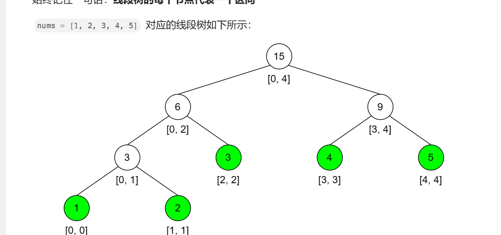
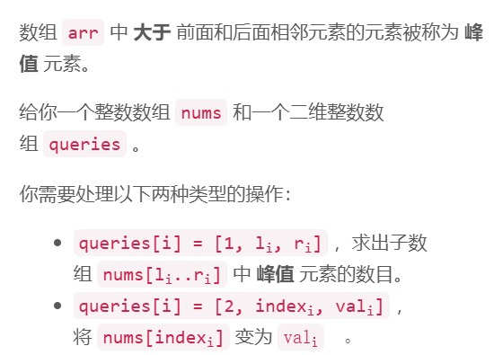
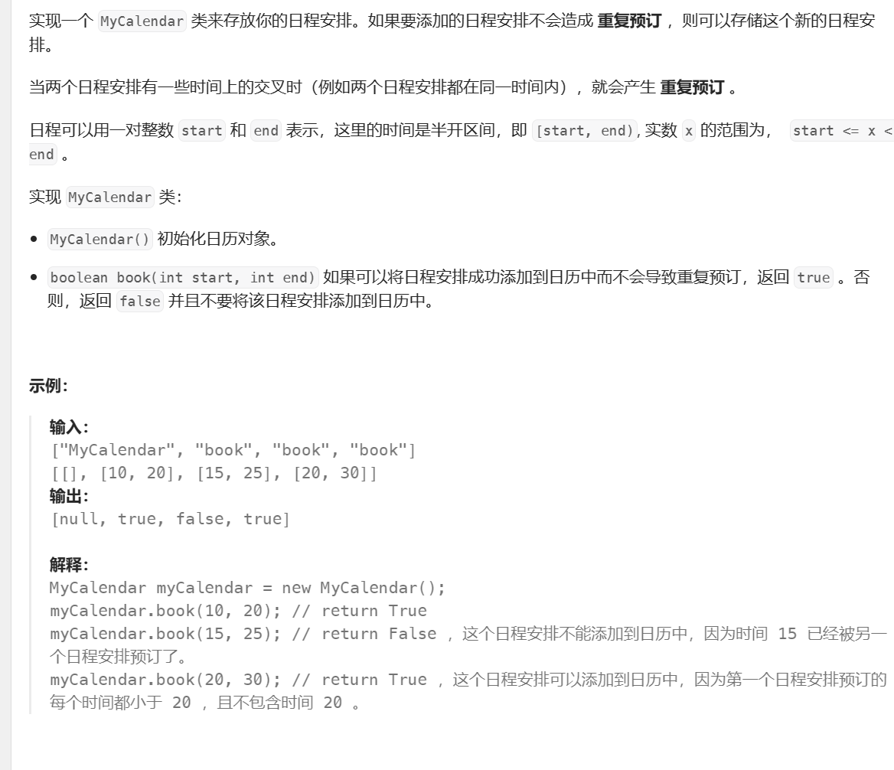
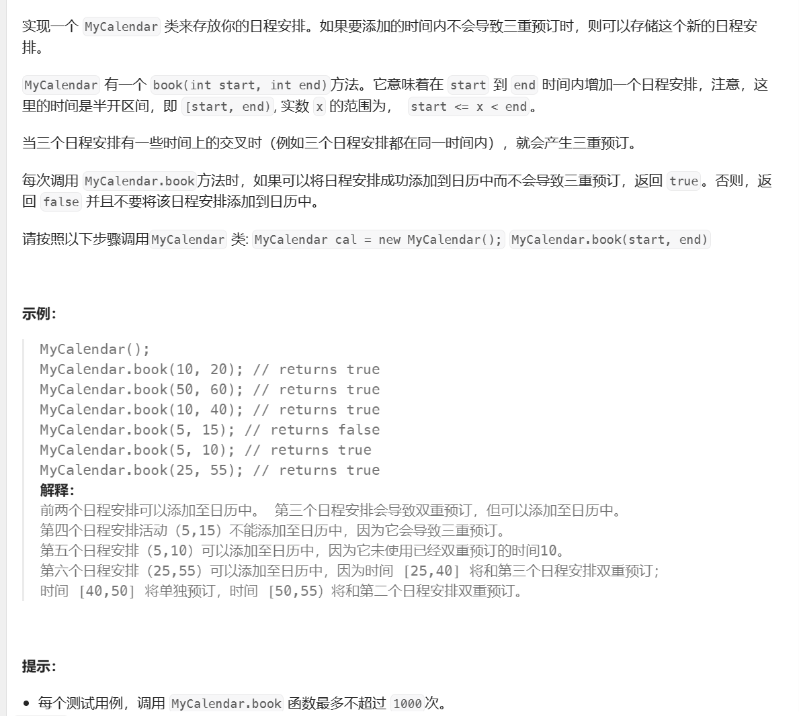
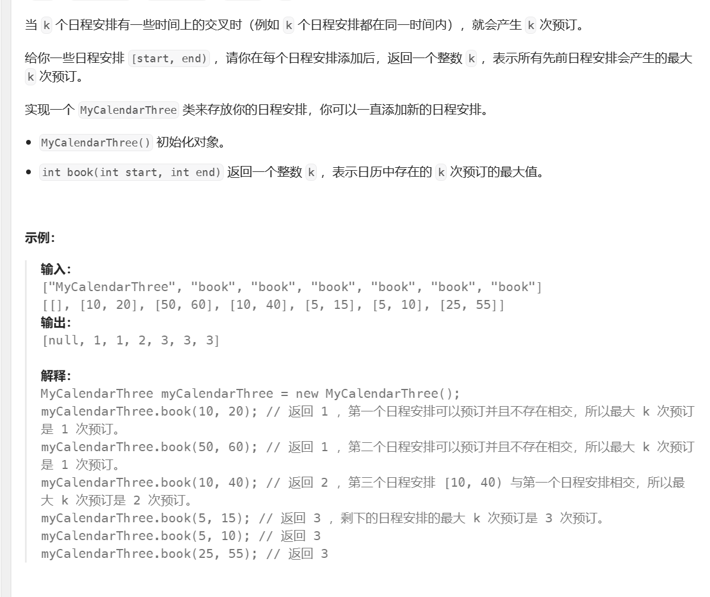
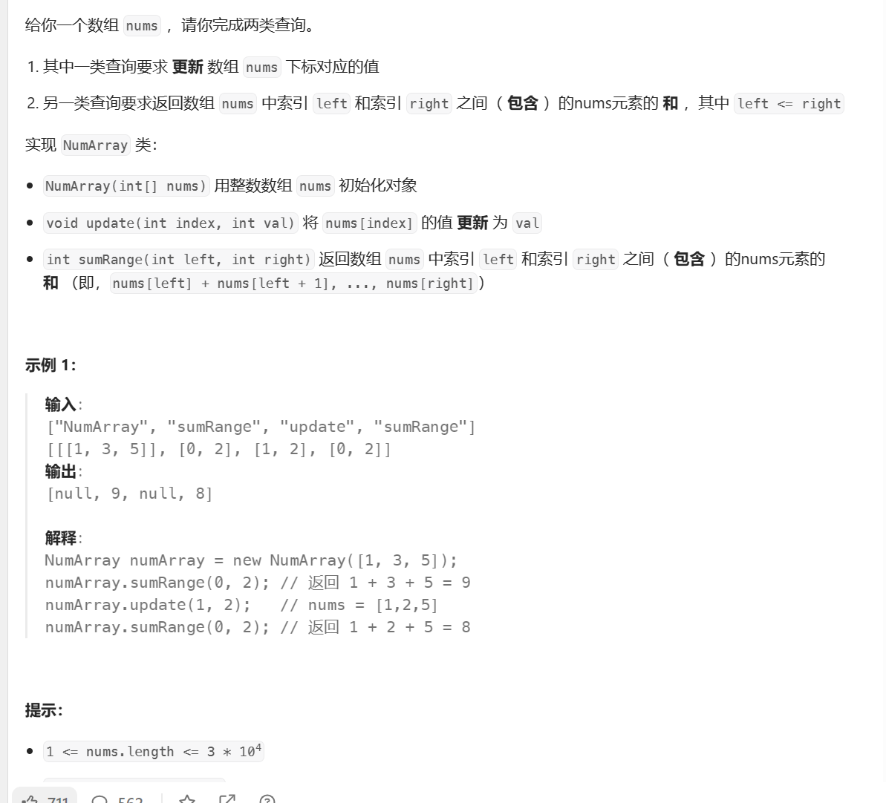
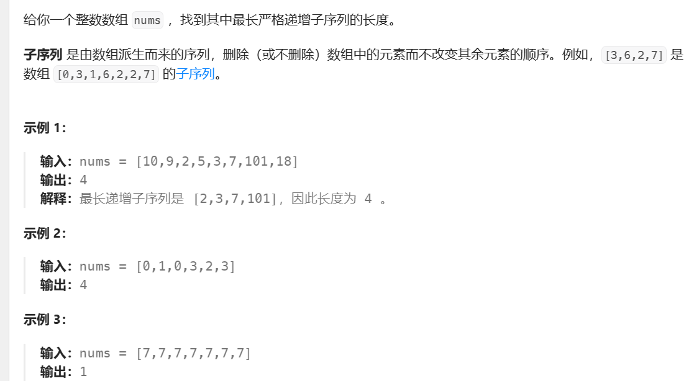
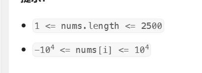
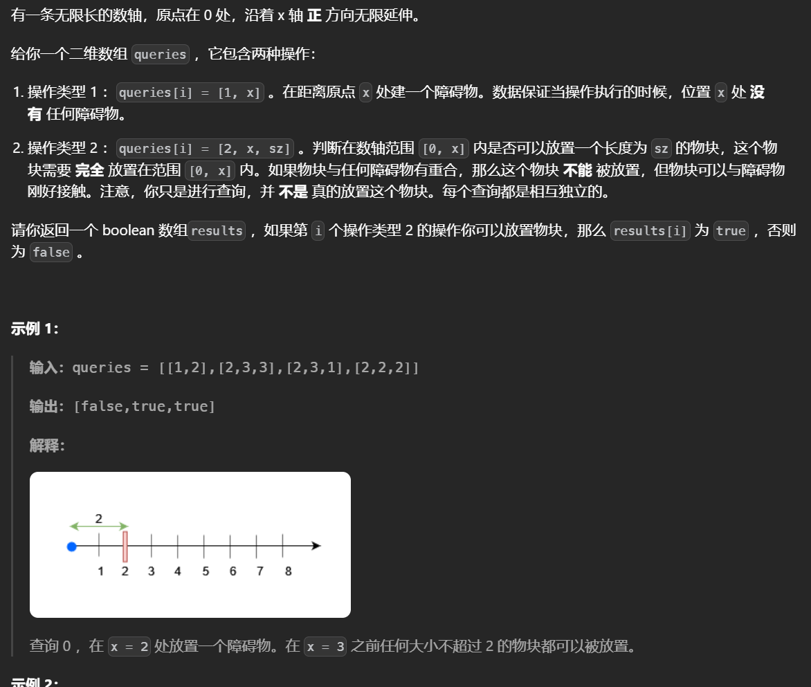

# 线段树

**线段树解决区间和的问题，并且区间会被修改。线段数的两个操作：求区间和，修改区间，时间夫再度均为logn**

线段树的每一个节点代表一个区间，节点的值可以根据题目而设置数字之和「总数字之和 = 左区间数字之和 + 右区间数字之和」最大公因数 (GCD)「总 GCD = gcd(左区间 GCD, 右区间 GCD)」最大值「总最大值 = max(左区间最大值，右区间最大值)」：



使用线段树的关键在于变化原数组比如：



为了统计峰值元素的个数，把数组中为峰值元素的变为1其他的变为0


线段数具有二分的性质。

线段树数组实现（单点修改），根据题目要求传入不同的函数：

```python
class SegTree:
    def __init__(self,nums,func):
        self.nums=nums
        self.n=len(nums)
        self.tree=[0]*(4*self.n)
        self.func=func
        if self.n>0:
            self._build(0,0,self.n-1)
    def _build(self,root,l,r):
        if l==r:
            self.tree[root]=self.nums[r]
            return 
        mid=(l+r)>>1
        self._build(root*2+1,l,mid)
        self._build(root*2+2,mid+1,r)
        self.tree[root]=self.func(self.tree[root*2+1],self.tree[root*2+2])


    def update(self,idx,newvalue):
        self.nums[idx]=newvalue
        self._update(0,0,self.n-1,idx,newvalue)
    def _update(self,root,l,r,idx,newvalue):
        if l==r==idx:
            self.tree[root]=newvalue
            return
        mid=(l+r)>>1
        if idx<=mid:self._update(root*2+1,l,mid,idx,newvalue)
        else:self._update(root*2+2,mid+1,r,idx,newvalue)
        self.tree[root]=self.func(self.tree[2*root+1],self.tree[2*root+2])
    def query(self,l,r):
        return self._query(0,0,self.n-1,l,r)
    def _query(self,root,l,r,ql,qr):
        if l==ql and qr==r:
            return self.tree[root]
        mid=l+r>>1
        if qr<=mid:return self._query(root*2+1,l,mid,ql,qr)
        elif mid<ql:return self._query(root*2+2,mid+1,r,ql,qr)
        else:return self.func(self._query(root*2+1,l,mid,ql,mid),self._query(root*2+2,mid+1,r,mid+1,qr))
```


线段树模板（动态开点，区间和）需要注意当区间较大时才会用到动态开点线段树，这个版本的实现很慢：

```python
class Node:
    def __init__(self):
        self.left=None
        self.right=None
        self.add=0
        self.val=0
def pushup(node):
    node.val=node.left.val+node.right.val

def pushdown(node,lc,rc):
    if not node.left:node.left=Node()
    if not node.right:node.right=Node()

    if node.add==0:return
    node.left.val+=lc*node.add
    node.right.val+=rc*node.add
    # 懒标记不需要加
    node.left.add += node.add
    node.right.add += node.add
    node.add=0

def update(root,start,end,l,r,val):
    if l<=start and r>=end:
        root.val+=(end-start+1)*val
        root.add+=val
        return
    mid=(start+end)>>1
    pushdown(root,mid-start+1,end-mid)
    if l<=mid:update(root.left,start,mid,l,r,val)
    if r>=mid+1:update(root.right,mid+1,end,l,r,val)
    pushup(root)
def query(root,start,end,l,r):
    if l <= start and r >= end:return root.val
    mid=(start+end)>>1
    ans=0
    pushdown(root,mid-start+1,end-mid)
    if l<=mid:ans+=query(root.left,start,mid,l,r)
    if r>=mid+1:ans+=query(root.right,mid+1,end,l,r)
    return ans
```

注意根据题意的不同线段树中的各个函数也是可能改变的，基本上pushup,pushdown 之类的函数会变化


线段树与二分的结合使用，下述的模板不需要做索引偏移

```python
n=len(heights)
mx=[0]*(2<<n.bit_length())
# 用 heights 初始化线段树，维护区间最大值
def build(o: int, l: int, r: int) -> None:
    if l == r:
        mx[o] = heights[l]
        return
    m = (l + r) // 2
    build(o * 2, l, m)
    build(o * 2 + 1, m + 1, r)
    mx[o] = max(mx[o * 2], mx[o * 2 + 1])

    # 返回 [L,n-1] 中第一个 > v 的值的下标
    # 如果不存在，返回 -1
    def query(o: int, l: int, r: int, L: int, v: int) -> int:
        if mx[o] <= v:  # 区间最大值 <= v
            return -1  # 没有 > v 的数
        if l == r:  # 找到了
            return l
        m = (l + r) // 2
        if L <= m and (pos := query(o * 2, l, m, L, v)) >= 0:  # 递归左子树
            return pos
        return query(o * 2 + 1, m + 1, r, L, v)  # 递归右子树

    build(1, 0, n - 1)
```


### 日程安排表（典型的最大值线段树）

### [ 我的日程安排表 I](https://leetcode.cn/problems/my-calendar-i/)



使用treeset()的做法，插入前查找大于等于该end的start（一定不会重叠），去找这个时间段的前一个这是唯一可能重叠的时间段如果满足条件就加入。

```python
from sortedcontainers import SortedDict
class MyCalendar:

    def __init__(self):
        # 有序字典
        self.d=SortedDict()
    def book(self, start: int, end: int) -> bool:
        # 找大于等于的
        pre=self.d.bisect_left(end)
        # 判断与唯一重叠的是否会重叠，注意对有序字典的索引要使用items
        if not pre or self.d.items()[pre-1][1]<=start:
            # 开始时间对应结束时间
            self.d[start]=end
            return True
        return False
```

线段树操作，对于合法的区间会把对应的位置都增加一（类似于计数操作），在加入下一个值的时候需要判断这个区间的最大值是否等于0也就是判断这个区间是否会和当前区间重叠。

```python
2

class MyCalendar:

    def __init__(self):
        self.n=10**9
        self.node=Node()

    # 判断给定的区间是否是空的，如果是就更新
    def book(self, start: int, end: int) -> bool:
        if query(self.node,0,self.n,start,end-1)!=0:
            return False
        update(self.node,0,self.n,start,end-1,1)
        return True


# Your MyCalendar object will be instantiated and called as such:
# obj = MyCalendar()
# param_1 = obj.book(start,end)
```


### [我的日程安排表 II](https://leetcode.cn/problems/my-calendar-ii/)



判断给定的区间是否合法去找这个区间上的最大值（就是覆盖了几次），如果是2的话当前日期覆盖上会导致三重预定。

```python
class Node:
    def __init__(self):
        self.left=None
        self.right=None
        self.add=0
        self.val=0

def pushup(node):
    node.val=max(node.left.val,node.right.val)

def pushdown(node):
    if not node.left:node.left=Node()
    if not node.right:node.right=Node()
    node.left.val+=node.add
    node.right.val+=node.add
    node.left.add+=node.add
    node.right.add+=node.add
    node.add=0

def update(node,start,end,l,r,val):
    if l<=start and r>=end:
        node.val+=val
        node.add+=val
        return 
    mid=(start+end)>>1
    pushdown(node)
    if l<=mid:
        update(node.left,start,mid,l,r,val)
    if r>=mid+1:
        update(node.right,mid+1,end,l,r,val)
    pushup(node)
    

def query(node,start,end,l,r):
    if l<=start and r>=end:
        return node.val
    mid=(start+end)>>1
    ans=0
    pushdown(node)
    if l<=mid:
        ans=query(node.left,start,mid,l,r) 
    if r>=mid+1:
        ans=max(ans,query(node.right,mid+1,end,l,r))
    return ans 
class MyCalendarTwo:

    def __init__(self):
        self.n=10**9
        self.node=Node()
    def book(self, start: int, end: int) -> bool:
        # 变化的地方
        if query(self.node,0,self.n,start,end-1)==2:
            return False
        update(self.node,0,self.n,start,end-1,1)
        return True 


# Your MyCalendarTwo object will be instantiated and called as such:
# obj = MyCalendarTwo()
# param_1 = obj.book(start,end)	
```

### [我的日程安排表 III](https://leetcode.cn/problems/my-calendar-iii/)



先更新再返回区间的最大值

```python
class Node:
    def __init__(self):
        self.left=None
        self.right=None
        self.add=0
        self.val=0
 # 这里不是求区间和，而是找区间是否被选过，可以取子区间的最大值
def pushup(node):
    node.val=max(node.left.val,node.right.val)

# 向下推，这里不是求区间和因此不用乘上子树大小直接加上
def pushdown(node):
    if not node.left:node.left=Node()
    if not node.right:node.right=Node()

    if node.add==0:return
    node.left.val+=node.add
    node.right.val+=node.add

    node.left.add += node.add
    node.right.add += node.add
    node.add=0

def update(root,start,end,l,r,val):
    if l<=start and r>=end:
        root.val+=val
        root.add+=val
        return
    mid=(start+end)>>1
    pushdown(root)
    # 注意最大值不是累加
    if l<=mid:update(root.left,start,mid,l,r,val)
    if r>=mid+1:update(root.right,mid+1,end,l,r,val)
    pushup(root)
def query(root,start,end,l,r):
    if l <= start and r >= end:return root.val
    mid=(start+end)>>1
    ans=0
    pushdown(root)
    if l<=mid:ans=query(root.left,start,mid,l,r)
    if r>=mid+1:ans=max(query(root.right,mid+1,end,l,r),ans)
    return ans
class MyCalendarThree:

    def __init__(self):
        self.n=10**9
        self.node=Node()
        self.ans=-inf
    def book(self, startTime: int, endTime: int) -> int:
        update(self.node,0,self.n,startTime,endTime-1,1)
        self.ans=max(self.ans,query(self.node,0,self.n,startTime,endTime-1))
        return self.ans 

# Your MyCalendarThree object will be instantiated and called as such:
# obj = MyCalendarThree()
# param_1 = obj.book(startTime,endTime)
```

### [区域和检索 - 数组可修改](https://leetcode.cn/problems/range-sum-query-mutable/)



注意这里是覆盖，也就是说值不是累加而是覆盖（修改为），同样的懒惰标记也是更新不是累加

```python
class Node:
    def __init__(self):
        self.left = None
        self.right = None
        self.add = 0
        self.val = 0


def pushup(node):
    # 这里要修改
    node.val = node.left.val + node.right.val


def pushdown(node, lc, rc):
    if not node.left: node.left = Node()
    if not node.right: node.right = Node()

    if not node.add:return
    # 注意覆盖
    node.left.val = node.add * lc
    node.right.val = node.add * rc
	
    # 注意覆盖
    node.left.add = node.add
    node.right.add = node.add
    node.add = 0


def update_(node, start, end, l, r, val):
    if l <= start and r >= end:
        # 覆盖
        node.val = (end-start+1)*val
        node.add = val
        return
    mid = (start + end) >> 1
    pushdown(node, mid - start + 1, end - mid)
    if l <= mid: update_(node.left, start, mid, l, r, val)
    if r >= mid + 1: update_(node.right, mid + 1, end, l, r, val)
    pushup(node)


def query(node, start, end, l, r):
    if l <= start and r >= end:
        return node.val
    mid = (start + end) >> 1
    res = 0
    pushdown(node,mid-start+1,end-mid)
    if l <= mid: res += query(node.left, start, mid, l, r)
    if r >= mid + 1: res += query(node.right, mid + 1, end, l, r)
    return res


class NumArray:

    def __init__(self, nums: List[int]):
        self.node = Node()
        self.n=len(nums)-1
        for i, c in enumerate(nums):
            update_(self.node, 0, self.n, i, i, c)


    def update(self, index: int, val: int) -> None:
        update_(self.node, 0, self.n, index, index, val)


    def sumRange(self, left: int, right: int) -> int:
        return query(self.node, 0, self.n, left, right)

# Your NumArray object will be instantiated and called as such:
# obj = NumArray(nums)
# obj.update(index,val)
# param_2 = obj.sumRange(left,right)
```

### [最长递增子序列](https://leetcode.cn/problems/longest-increasing-subsequence/)





每一个元素所能形成的最长递增子序列等于小于它的元素中所能形成的最长的递增子序列加一，定义dp(j)=max(dp(i))+1，dp(j)表示yi元素j结尾的最长递增子序列，其中i是小于j的所有元素。这个转移方程中要求出区间（小于j）的最大值，然后用这个最大值去更新下一个状态，这个状态又会被用到其他的状态转移方程中，这需要快速求解区间最大值以及单点修改通过线段树完成。

```python
class Node:
    def __init__(self):
        self.left=None
        self.right=None
        self.add=0
        self.val=0
# 求最大值的更新操作
def pushup(node):
    node.val=max(node.left.val,node.right.val)
# 进行的是区间覆盖操作
def pushdown(node):
    if not node.left:node.left=Node()
    if not node.right:node.right=Node()
    if not node.add:return
    # 不是累和而是覆盖
    node.left.val=node.right.val=node.left.add=node.right.add=node.add
    node.add=0

   
def update(node,start,end,l,r,v):
    if l<=start and r>=end:
        node.val=v
        node.add=v
        return 
    mid=(start+end)>>1
    pushdown(node)
    if l<=mid:update(node.left,start,mid,l,r,v)
    if r>=mid+1:update(node.right,mid+1,end,l,r,v)
    pushup(node)
def query(node,start,end,l,r):
    if l<=start and r>=end:
        return node.val
    mid=(start+end)>>1
    pushdown(node)
    res=0
    if l<=mid:res=max(res,query(node.left,start,mid,l,r))
    if r>=mid+1:res=max(res,query(node.right,mid+1,end,l,r))
    return res

class Solution:
    def lengthOfLIS(self, nums: List[int]) -> int:
        # 先离散化处理把元素换到1,n，方便处理
        temp=sorted(set(nums))
        # 注意这里把每个值加一是为了防止0的出现导致l>r
        nums=[bisect_left(temp,v)+1 for v in nums]
        N=max(nums)+10
        node=Node()
        ans=0
        # 依次求解每个元素小于他的元素中能形成的最长的序列
        for v in nums:
            # 找小于当前的元素，注意长度要加一
            cnt=query(node,0,N,0,v-1)+1
            # 求出后更新，因为维护的实际是一个dp(v)
            update(node,0,N,v,v,cnt)
            ans=max(ans,cnt)
        return ans 
```

### [物块放置查询](https://leetcode.cn/problems/block-placement-queries/)



这个题目是对线段树的高级运用，每次更新一个位置后该如何求出闲置的区间呢，这里每个点记录的是以他为右端点所能得到的区间长度是多少，而不是每次更新一个点就把他认为是加一，这样再查询的时候，可以直接查询区间内的最大值以此求的给定区间内最长的闲置空间，另一个问题是，当你更新一个位置时，更新的具体的值是多少呢，这个值应该是这个点有它前面的那个点的值，同时更新一个点，这个点后面的点的大小也要变化，这就需要快速求出给定点的两端的点，可以通过有序数组求出

```python
from sortedcontainers import SortedList as sl
class Node:
    def __init__(self):
        self.left=None
        self.right=None
        self.add=0
        self.val=0

def pushup(node):
    node.val=max(node.left.val,node.right.val)

def pushdown(node):
    if not node.left:node.left=Node()
    if not node.right:node.right=Node()
    node.left.val+=node.add
    node.right.val+=node.add
    node.left.add+=node.add
    node.right.add+=node.add
    node.add=0

def update(node,start,end,l,r,val):
    if l<=start and r>=end:
        node.val+=val
        node.add+=val
        return 
    mid=(start+end)>>1
    pushdown(node)
    if l<=mid:
        update(node.left,start,mid,l,r,val)
    if r>=mid+1:
        update(node.right,mid+1,end,l,r,val)
    pushup(node)
    

def query(node,start,end,l,r):
    if l<=start and r>=end:
        return node.val
    mid=(start+end)>>1
    ans=0
    pushdown(node)
    if l<=mid:
        ans=query(node.left,start,mid,l,r) 
    if r>=mid+1:
        ans=max(ans,query(node.right,mid+1,end,l,r))
    return ans 
class Solution:
    def getResults(self, queries: List[List[int]]) -> List[bool]:
        # 值域
        m = max(q[1] for q in queries) + 1
        node=Node()
        # 初始时，放入哨兵，这样在插入第一个点时不用特判，同时哨兵又不会影响结果（不会包含在区间内）不用特判
        s=sl([0,m])
        ans=[]
        for li in queries:
            # 找到前后的点
            j=s.bisect_left(li[1])
            pre=s[j-1]
            x=li[1]
            nx=s[j]
            if li[0]==1:
                # 更新前后的点，注意板子中val是更新的值
                update(node,0,m,x,x,x-pre)
                # 后面的节点应该减小
                update(node,0,m,nx,nx,-(nx-pre-(nx-x)))
                # 不能落下
                s.add(li[1])
            else:
                x,sz=li[1:]
                # 求出最大值，这个最大的空闲区间应该是0~pre之间的，以及pre~i之间的
                mx=max(query(node,0,m,0,pre),x-pre)
                ans.append(mx>=sz)
        return ans 
```


# 懒标记线段树


