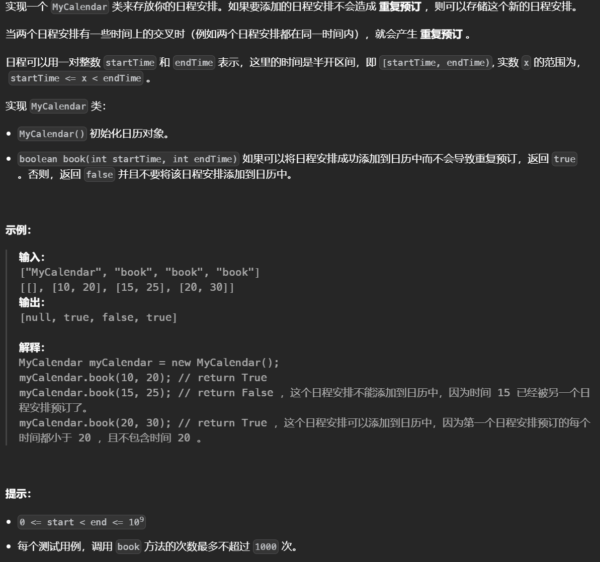

# 线段树

**线段树解决区间和的问题，并且区间会被修改。线段数的两个操作：求区间和，修改区间，时间复杂度均为logn**


# 模板

本质上是使用递归加速计算，线段树的结构如下所示


将区间划分**至多4n**(因为满二叉树的节点个数为2n-1，一个**基于经验的安全值**是4n)个节点，其中每个节点记录的是一个区间的**结果**(和，最大值等等)

查询过程通过分支划分较小的区间，但不一定会划分到叶子节点，如果**当前节点对应的区间范围已经被查询的范围包括了，就直接返回该节点储存的结果，**而不需要再往下划分了，这样可以节省时间。

更新的过程中通过**分治**不断划分出**较小的子区间**，但如果要划分到**叶子节点**再更新，则在范围较大时会涉及到**大量节点耗时较多**，因此使用**懒标记(延迟更新)**，即更新操作推迟到真正需要的时候执行，每个节点会配备一个懒标记记录该节点上未处理的更新操作，当对该节点对应的区间进一步查询或更新时，会将标记下推，这样避免了对每个叶子节点的操作。


线段树数组实现（数组版本，懒标记，区间查询/修改），根据题目要求传入不同的函数：

```python
class SegTree:
    def __init__(self, nums, func):
        self.nums = nums
        self.n = len(nums)
        self.tree = [0] * (4 * self.n)  # 存储节点，4n是基于经验的安全值
        self.lazy = [0] * (4 * self.n)  # 懒标记数组和节点数组一样大
        self.func = func # 操作的函数，求最大值，求和一类的
        if self.n > 0:
            self._build(0, 0, self.n - 1)
	# 构建节点数组
    def _build(self, root, l, r):
        if l == r:
            self.tree[root] = self.nums[r]
            return
        mid = (l + r) >> 1
        # 递归更新左右，然后合并
        self._build(root * 2 + 1, l, mid)
        self._build(root * 2 + 2, mid + 1, r)
        self.tree[root] = self.func(self.tree[root * 2 + 1], self.tree[root * 2 + 2])

    def _push_down(self, root, l, r):
        """将懒标记下推到子节点"""
        if self.lazy[root] != 0:
            mid = (l + r) >> 1
            # 更新左右子节点的值
            self.tree[root * 2 + 1] += self.lazy[root] * (mid - l + 1)
            self.tree[root * 2 + 2] += self.lazy[root] * (r - mid)
            # 传递懒标记到子节点
            self.lazy[root * 2 + 1] += self.lazy[root]
            self.lazy[root * 2 + 2] += self.lazy[root]
            # 清除当前节点的懒标记
            self.lazy[root] = 0

    def update(self, ul, ur, diff):
        """区间更新，将区间 [ul, ur] 的值增加 diff"""
        self._update_range(0, 0, self.n - 1, ul, ur, diff)
	
    # 更新区间，root表示节点编号，可以从0或者1开始(这里从0开始，如果从1开始则左节点20,右节点2o+1)，lr是该节点覆盖的范围，LR是实际操作的范围
    def _update_range(self, root, l, r, ul, ur, diff):
        if ul <= l and r <= ur:  # 当前区间完全在目标区间内，无需下推直接在这一层标记
            self.tree[root] += diff * (r - l + 1)  # 更新当前区间的值
            self.lazy[root] += diff  # 标记懒更新
            return
        self._push_down(root, l, r)  # 下推懒标记
        mid = (l + r) >> 1
        # 涉及到当前节点的左儿子
        if ul <= mid:
            self._update_range(root * 2 + 1, l, mid, ul, ur, diff)
        # 右儿子
        if ur > mid:
            self._update_range(root * 2 + 2, mid + 1, r, ul, ur, diff)
        # 更新当前节点的值
        self.tree[root] = self.func(self.tree[root * 2 + 1], self.tree[root * 2 + 2])

    def query(self, ql, qr):
        """区间查询，返回 [ql, qr] 的值"""
        return self._query_range(0, 0, self.n - 1, ql, qr)
	
    # 参数同理
    def _query_range(self, root, l, r, ql, qr):
        if ql <= l and r <= qr:  # 当前区间完全在目标区间内，无需继续划分直接返回
            return self.tree[root]
        self._push_down(root, l, r)  # 下推懒标记
        mid = (l + r) >> 1
        res = 0
        # 划分区间
        if ql <= mid:
            res = self.func(res, self._query_range(root * 2 + 1, l, mid, ql, qr))
        if qr > mid:
            res = self.func(res, self._query_range(root * 2 + 2, mid + 1, r, ql, qr))
        return res

```


线段树模板（动态开点，区间和）需要注意当区间较大时(10**9)才会用到动态开点线段树，这个版本的实现很慢：

```python
class Node:
    def __init__(self):
        self.left=None
        self.right=None
        self.add=0
        self.val=0
def pushup(node):
    node.val=node.left.val+node.right.val

def pushdown(node,lc,rc):
    if not node.left:node.left=Node()
    if not node.right:node.right=Node()

    if node.add==0:return
    node.left.val+=lc*node.add
    node.right.val+=rc*node.add
    # 懒标记不需要加
    node.left.add += node.add
    node.right.add += node.add
    node.add=0

def update(root,start,end,l,r,val):
    if l<=start and r>=end:
        root.val+=(end-start+1)*val
        root.add+=val
        return
    mid=(start+end)>>1
    pushdown(root,mid-start+1,end-mid)
    if l<=mid:update(root.left,start,mid,l,r,val)
    if r>=mid+1:update(root.right,mid+1,end,l,r,val)
    pushup(root)
def query(root,start,end,l,r):
    if l <= start and r >= end:return root.val
    mid=(start+end)>>1
    ans=0
    pushdown(root,mid-start+1,end-mid)
    if l<=mid:ans+=query(root.left,start,mid,l,r)
    if r>=mid+1:ans+=query(root.right,mid+1,end,l,r)
    return ans
```

注意根据题意的不同线段树中的各个函数也是可能改变的，基本上pushup,pushdown 之类的函数会变化


# 懒标记线段树

## [更新数组后处理求和查询](https://leetcode.cn/problems/handling-sum-queries-after-update/)


对于操作二，不需要**操作数组**，只记录**nums2的和**，将和每次添加**nums1中1的个数**即可，使用线段树维护Nums1中**1的个数(区间和)**，对区间的反转变化即操作一就是将**区间和修改为区间长度-区间和**

模板中修改懒标记为1和0表示是否**反转**，节点的值修改为区间长度减区间和

```python
class SegTree:
    def __init__(self, nums, func):
        self.nums = nums
        self.n = len(nums)
        self.tree = [0] * (4 * self.n)  # 存储节点，4n是基于经验的安全值
        self.lazy = [0] * (4 * self.n)  # 懒标记数组和节点数组一样大
        self.func = func # 操作的函数，求最大值，求和一类的
        if self.n > 0:
            self._build(0, 0, self.n - 1)
	# 构建节点数组
    def _build(self, root, l, r):
        if l == r:
            self.tree[root] = self.nums[r]
            return
        mid = (l + r) >> 1
        # 递归更新左右，然后合并
        self._build(root * 2 + 1, l, mid)
        self._build(root * 2 + 2, mid + 1, r)
        self.tree[root] = self.func(self.tree[root * 2 + 1], self.tree[root * 2 + 2])

    def _push_down(self, root, l, r):
        """将懒标记下推到子节点"""
        if self.lazy[root]:
            mid = (l + r) >> 1
            # 更新左右子节点的值
            self.tree[root * 2 + 1] = (mid - l + 1)-self.tree[root * 2 + 1]
            self.tree[root * 2 + 2] = (r - mid)-self.tree[root * 2 + 2]
            # 传递懒标记到子节点
            self.lazy[root * 2 + 1] ^= self.lazy[root]
            self.lazy[root * 2 + 2] ^= self.lazy[root]
            # 清除当前节点的懒标记
            self.lazy[root] = 0

    def update(self, ul, ur, diff):
        """区间更新，将区间 [ul, ur] 的值增加 diff"""
        self._update_range(0, 0, self.n - 1, ul, ur, diff)
	
    # 更新区间，root表示节点编号，可以从0或者1开始(这里从0开始，如果从1开始则左节点20,右节点2o+1)，lr是该节点覆盖的范围，LR是实际操作的范围
    def _update_range(self, root, l, r, ul, ur, diff):
        if ul <= l and r <= ur:  # 当前区间完全在目标区间内，无需下推直接在这一层标记
            self.tree[root] =(r - l + 1)-self.tree[root]  # 更新当前区间的值
            self.lazy[root] ^= 1  # 标记懒更新
            return
        self._push_down(root, l, r)  # 下推懒标记
        mid = (l + r) >> 1
        # 涉及到当前节点的左儿子
        if ul <= mid:
            self._update_range(root * 2 + 1, l, mid, ul, ur, diff)
        # 右儿子
        if ur > mid:
            self._update_range(root * 2 + 2, mid + 1, r, ul, ur, diff)
        # 更新当前节点的值
        self.tree[root] = self.func(self.tree[root * 2 + 1], self.tree[root * 2 + 2])

    def query(self, ql, qr):
        """区间查询，返回 [ql, qr] 的值"""
        return self._query_range(0, 0, self.n - 1, ql, qr)
	
    # 参数同理
    def _query_range(self, root, l, r, ql, qr):
        if ql <= l and r <= qr:  # 当前区间完全在目标区间内，无需继续划分直接返回
            return self.tree[root]
        self._push_down(root, l, r)  # 下推懒标记
        mid = (l + r) >> 1
        res = 0
        # 划分区间
        if ql <= mid:
            res = self.func(res, self._query_range(root * 2 + 1, l, mid, ql, qr))
        if qr > mid:
            res = self.func(res, self._query_range(root * 2 + 2, mid + 1, r, ql, qr))
        return res

class Solution:
    def handleQuery(self, nums1: List[int], nums2: List[int], queries: List[List[int]]) -> List[int]:
        t=SegTree(nums1,lambda x,y:x+y)
        s=sum(nums2)
        n=len(nums1)
        ans=[]
        for i,j,k in queries:
            if i==1:
                t.update(j,k,1)
            elif i==2:
                s+=t.query(0,n-1)*j
            else:
                ans.append(s)
        return ans 
```


# 动态开点线段树

## [ 我的日程安排表 I](https://leetcode.cn/problems/my-calendar-i/)



对于给定的数据范围只能动态

线段树操作，对于合法的区间会把对应的位置都增加一（类似于计数操作），在加入下一个值的时候需要判断这个区间的最大值是否等于0也就是判断这个区间是否会和当前区间重叠。

```python
class Node:
    def __init__(self):
        self.left=None
        self.right=None
        self.add=0
        self.val=0
def pushup(node):
    node.val=max(node.left.val,node.right.val)

def pushdown(node):
    if not node.left:node.left=Node()
    if not node.right:node.right=Node()

    if node.add==0:return
    node.left.val+=node.add
    node.right.val+=node.add

    node.left.add += node.add
    node.right.add += node.add
    node.add=0

def update(root,start,end,l,r,val):
    if l<=start and r>=end:
        root.val+=val
        root.add+=val
        return
    mid=(start+end)>>1
    pushdown(root)
    if l<=mid:update(root.left,start,mid,l,r,val)
    if r>=mid+1:update(root.right,mid+1,end,l,r,val)
    pushup(root)
def query(root,start,end,l,r):
    if l <= start and r >= end:return root.val
    mid=(start+end)>>1
    ans=0
    pushdown(root)
    if l<=mid:ans=query(root.left,start,mid,l,r)
    if r>=mid+1:ans=max(query(root.right,mid+1,end,l,r),ans)
    return ans

class MyCalendar:

    def __init__(self):
        self.n=10**9
        self.node=Node()

    def book(self, start: int, end: int) -> bool:
        if query(self.node,0,self.n,start,end-1)!=0:
            return False
        update(self.node,0,self.n,start,end-1,1)
        return True
```


### [最长递增子序列](https://leetcode.cn/problems/longest-increasing-subsequence/)


每一个元素所能形成的最长递增子序列等于小于它的元素中所能形成的最长的递增子序列加一，定义dp(j)=max(dp(i))+1，dp(j)表示yi元素j结尾的最长递增子序列，其中i是小于j的所有元素。这个转移方程中要求出区间（小于j）的最大值，然后用这个最大值去更新下一个状态，这个状态又会被用到其他的状态转移方程中，这需要快速求解区间最大值以及单点修改通过线段树完成。

```python
class Node:
    def __init__(self):
        self.left=None
        self.right=None
        self.add=0
        self.val=0
# 求最大值的更新操作
def pushup(node):
    node.val=max(node.left.val,node.right.val)
# 进行的是区间覆盖操作
def pushdown(node):
    if not node.left:node.left=Node()
    if not node.right:node.right=Node()
    if not node.add:return
    # 不是累和而是覆盖
    node.left.val=node.right.val=node.left.add=node.right.add=node.add
    node.add=0

   
def update(node,start,end,l,r,v):
    if l<=start and r>=end:
        node.val=v
        node.add=v
        return 
    mid=(start+end)>>1
    pushdown(node)
    if l<=mid:update(node.left,start,mid,l,r,v)
    if r>=mid+1:update(node.right,mid+1,end,l,r,v)
    pushup(node)
def query(node,start,end,l,r):
    if l<=start and r>=end:
        return node.val
    mid=(start+end)>>1
    pushdown(node)
    res=0
    if l<=mid:res=max(res,query(node.left,start,mid,l,r))
    if r>=mid+1:res=max(res,query(node.right,mid+1,end,l,r))
    return res

class Solution:
    def lengthOfLIS(self, nums: List[int]) -> int:
        # 先离散化处理把元素换到1,n，方便处理
        temp=sorted(set(nums))
        # 注意这里把每个值加一是为了防止0的出现导致l>r
        nums=[bisect_left(temp,v)+1 for v in nums]
        N=max(nums)+10
        node=Node()
        ans=0
        # 依次求解每个元素小于他的元素中能形成的最长的序列
        for v in nums:
            # 找小于当前的元素，注意长度要加一
            cnt=query(node,0,N,0,v-1)+1
            # 求出后更新，因为维护的实际是一个dp(v)
            update(node,0,N,v,v,cnt)
            ans=max(ans,cnt)
        return ans 
```

### [物块放置查询](https://leetcode.cn/problems/block-placement-queries/)


这个题目是对线段树的高级运用，每次更新一个位置后该如何求出闲置的区间呢，这里每个点记录的是以他为右端点所能得到的区间长度是多少，而不是每次更新一个点就把他认为是加一，这样再查询的时候，可以直接查询区间内的最大值以此求的给定区间内最长的闲置空间，另一个问题是，当你更新一个位置时，更新的具体的值是多少呢，这个值应该是这个点有它前面的那个点的值，同时更新一个点，这个点后面的点的大小也要变化，这就需要快速求出给定点的两端的点，可以通过有序数组求出

```python
from sortedcontainers import SortedList as sl
class Node:
    def __init__(self):
        self.left=None
        self.right=None
        self.add=0
        self.val=0

def pushup(node):
    node.val=max(node.left.val,node.right.val)

def pushdown(node):
    if not node.left:node.left=Node()
    if not node.right:node.right=Node()
    node.left.val+=node.add
    node.right.val+=node.add
    node.left.add+=node.add
    node.right.add+=node.add
    node.add=0

def update(node,start,end,l,r,val):
    if l<=start and r>=end:
        node.val+=val
        node.add+=val
        return 
    mid=(start+end)>>1
    pushdown(node)
    if l<=mid:
        update(node.left,start,mid,l,r,val)
    if r>=mid+1:
        update(node.right,mid+1,end,l,r,val)
    pushup(node)
    

def query(node,start,end,l,r):
    if l<=start and r>=end:
        return node.val
    mid=(start+end)>>1
    ans=0
    pushdown(node)
    if l<=mid:
        ans=query(node.left,start,mid,l,r) 
    if r>=mid+1:
        ans=max(ans,query(node.right,mid+1,end,l,r))
    return ans 
class Solution:
    def getResults(self, queries: List[List[int]]) -> List[bool]:
        # 值域
        m = max(q[1] for q in queries) + 1
        node=Node()
        # 初始时，放入哨兵，这样在插入第一个点时不用特判，同时哨兵又不会影响结果（不会包含在区间内）不用特判
        s=sl([0,m])
        ans=[]
        for li in queries:
            # 找到前后的点
            j=s.bisect_left(li[1])
            pre=s[j-1]
            x=li[1]
            nx=s[j]
            if li[0]==1:
                # 更新前后的点，注意板子中val是更新的值
                update(node,0,m,x,x,x-pre)
                # 后面的节点应该减小
                update(node,0,m,nx,nx,-(nx-pre-(nx-x)))
                # 不能落下
                s.add(li[1])
            else:
                x,sz=li[1:]
                # 求出最大值，这个最大的空闲区间应该是0~pre之间的，以及pre~i之间的
                mx=max(query(node,0,m,0,pre),x-pre)
                ans.append(mx>=sz)
        return ans 
```


