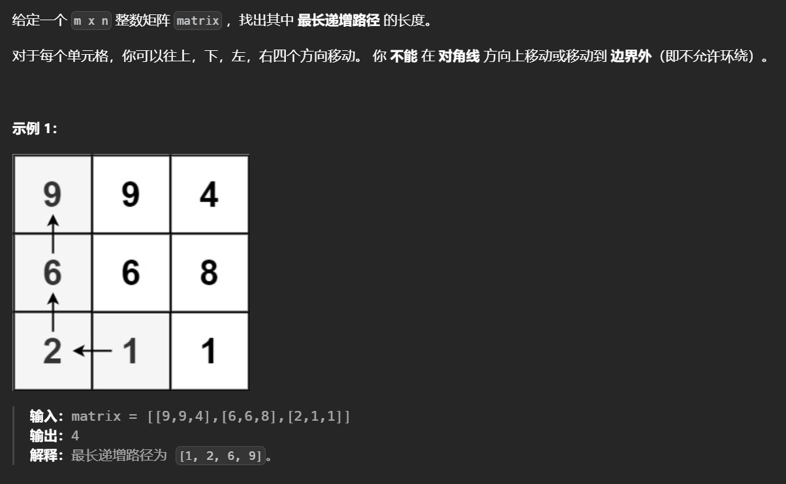
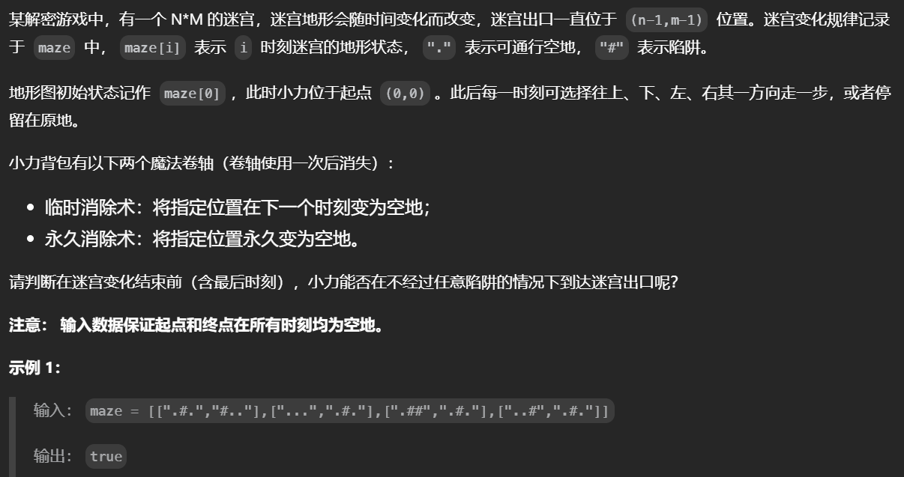
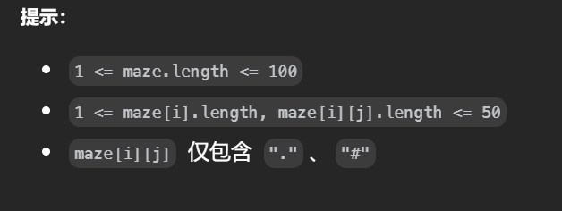
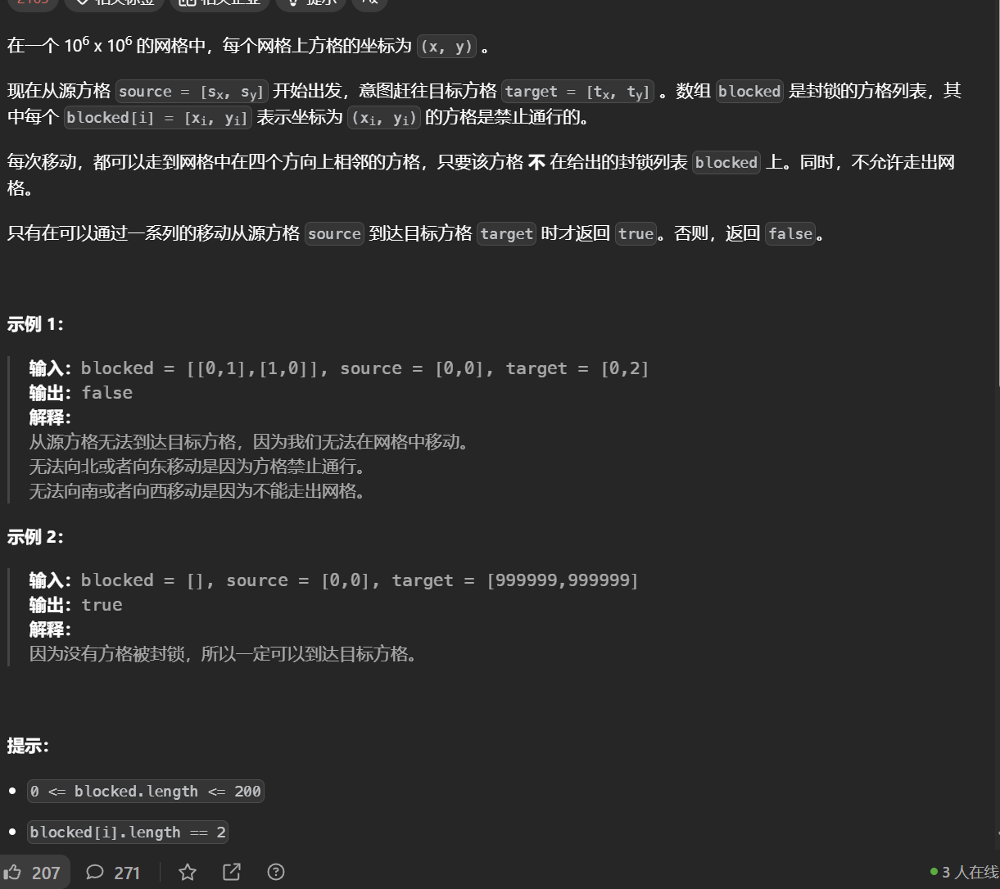
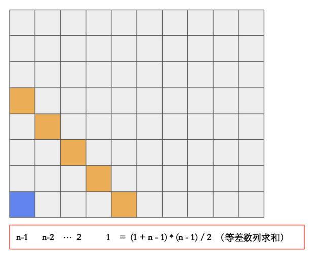
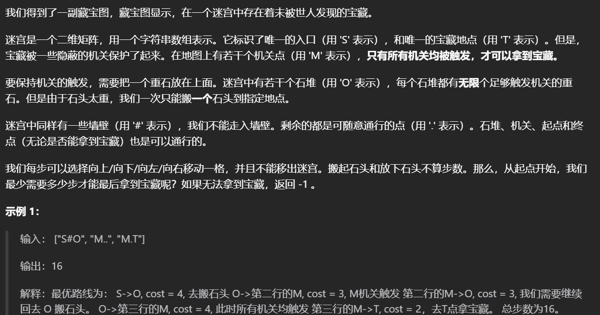
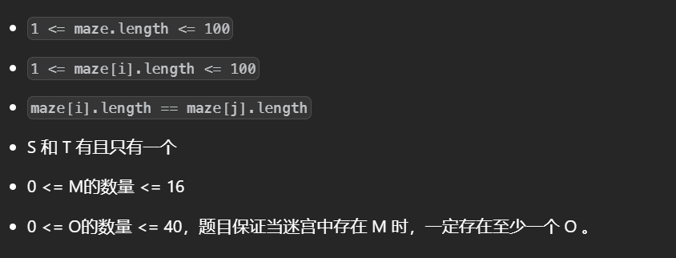

# 网格图应用


# DFS

## [矩阵中的最长递增路径](https://leetcode.cn/problems/longest-increasing-path-in-a-matrix/)




注意元素是**递增的性质**，那么一个元素就只能往比它大的元素移动，这里要求统计最长路径长度，可以使用dfs加记忆化搜索找出从每个位置出发能得到的最长路径。

```python
class Solution:
    def longestIncreasingPath(self, g: List[List[int]]) -> int:
        if not g:return 0
        m,n=len(g),len(g[0])
        dirs=[(1,0),(0,1),(0,-1),(-1,0)]
        @cache
        def dfs(i,j):
            res=1
            for dx,dy in dirs:
                if 0<=(x:=dx+i)<m and 0<=(y:=dy+j)<n and g[x][y]>g[i][j]:
                    res=max(dfs(x,y)+1,res)
            return res 
        ans=0
        for i in range(m):
            for j in range(n):
                ans=max(ans,dfs(i,j))
        return ans 
```

## [变换的迷宫](https://leetcode.cn/problems/Db3wC1/)





有时间的变化使用dfs走迷宫更好

```python
class Solution:
    def escapeMaze(self, maze: List[List[str]]) -> bool:
        ll=len(maze)
        m,n=len(maze[0]),len(maze[0][0])
        # 记忆化搜索
        @cache
        def dfs(idx,i,j,f1,f2):
            if idx+1==ll:
                return i==m-1 and j==n-1
            # 重要的可行性剪枝
            if n-1-i+m-1-j>ll-idx-1:return False
            g=maze[idx+1]
            if i==m-1 and j==n-1:return True 
            # 想要停留在原地需要当前位置不能是陷阱，可以是使用永久卷轴修改后的
            if (g[i][j]!='#' or (f1!=-1 and i==f1//n and j==f1%n)) and dfs(idx+1,i,j,f1,f2):return True
            for dx,dy in (1,0),(0,1),(-1,0),(0,-1):
                if 0<=(x:=dx+i)<m and 0<=(y:=dy+j)<n:
                    # 没有陷阱或者使用永久卷轴修改了
                    if g[x][y]!='#' or (f1!=-1 and x==f1//n and y==f1%n):
                        if dfs(idx+1,x,y,f1,f2):return True
                    else:
                        # 使用永久卷轴
                        if f1==-1:
                            if dfs(idx+1,x,y,x*n+y,f2):return True
                        # 使用临时卷轴
                        elif f2:
                            if dfs(idx+1,x,y,f1,0):return True
            return False
        return dfs(0,0,0,-1,1)
```


# BFS

## [隔离病毒](https://leetcode.cn/problems/contain-virus/)


最初的想法记录每个连通块，让后一轮对所有的连通块做Bfs，但是这种做法无法处理连通块相连。

按照**天数**进行模拟，每一轮**重置vis矩阵**，**使用bfs找到连通块并往外扩展**，在bfs中记录连通块中有哪些点l1，以及有哪些点会被感染l2（这里不去重），在对所有的连通块做完bfs后，**找出能感染最多(威胁最大)的连通块（题目保证唯一）**，**把这个连通块中的点都设置为-1**，这样在之后就不能访问相当于隔离了，这一轮所建立的防火墙的数量等于l2的长度，因为防火墙是所有已感染区域到未感染区域的边界，如果一个区域会被感染,**那么感染几次及记录几次**，这个次数就是对于这个位置要建立的防火墙个数。**对于其他的连通块按照l2进行扩散**

```python
class Solution:
    def containVirus(self, g: List[List[int]]) -> int:
        m,n=len(g),len(g[0])
        ans=0
        def cal():
            vis=[[False]*n for _ in range(m)]
            tmp1=[]
            tmp2=[]
            mx=-1
            for i in range(m):
                for j in range(n):
                    if not vis[i][j] and g[i][j]==1:
                        def speard(i,j):
                            d=deque()
                            d.append((i,j))
                            vis[i][j]=True
                            l1=[]
                            l2=[]
                            while d:
                                i,j=d.popleft()
                                l1.append((i,j))
                                for dx,dy in (1,0),(-1,0),(0,1),(0,-1):
                                    if 0<=(x:=dx+i)<m and 0<=(y:=dy+j)<n and not vis[x][y] and g[x][y]!=-1:
                                        # 未被感染的区域，记录后即不再扩散了，能被感染就记录一次
                                        if not g[x][y]:l2.append((x,y))
                                        else:
                                            d.append((x,y))
                                            vis[x][y]=True
                            return l1,l2
                        l1,l2=speard(i,j)
                        # 注意要去重才能找出威胁最大的
                        if len(set(l2))>mx:
                            mx=len(set(l2))
                        tmp1.append(l1)
                        tmp2.append(l2)
            cnt=0
            for arr1,arr2 in zip(tmp1,tmp2):
                if len(set(arr2))==mx:
                    cnt=len(arr2)
                    # 隔离
                    for i,j in arr1:g[i][j]=-1
                else:
                    # 扩散
                    for i,j in arr2:g[i][j]=1
            return cnt

        

        while 1:
            cnt=cal()
            # 感染完了
            if not cnt:return ans 
            ans+=cnt
```

## [逃离大迷宫](https://leetcode.cn/problems/escape-a-large-maze/)



两个位置不能到达说明有一方被包裹住了，对于给定的范围**无法使用bfs判断是否能够相通**，因此只能判断**Blocked的单元格是否包裹住某一方**，这里令blocked的长度为n，那么它所能包裹住的最大范围是如下，**因此只要判断从一端出发能到达的格子是否大于等于这个范围即可**



```python
class Solution:
    def isEscapePossible(self, blocked: List[List[int]], source: List[int], target: List[int]) -> bool:
        if not blocked:return True 
        m=nn=1e6
        n=len(blocked)
        lim=(1+(n-1))*(n-1)//2
        v=set()
        for i,j in blocked:v.add((i,j))
        vis=set()
        vis|=v
        vis.add(tuple(source))
        d=deque()
        d.append(source)
        cnt=0
        while d:
            i,j=d.popleft()
            if i==target[0] and j==target[1]:return True
            cnt+=1
            if cnt>lim:break
            for dx,dy in (1,0),(0,1),(-1,0),(0,-1):
                if 0<=(x:=dx+i)<m and 0<=(y:=dy+j)<nn and (x,y) not in vis:
                    vis.add((x,y))
                    d.append((x,y))
        else:
            return False
        
        vis=set()
        vis|=v
        vis.add(tuple(target))
        d=deque()
        d.append(target)
        cnt=0
        while d:
            i,j=d.popleft()
            cnt+=1
            if cnt>lim:break
            for dx,dy in (1,0),(0,1),(-1,0),(0,-1):
                if 0<=(x:=dx+i)<m and 0<=(y:=dy+j)<nn and (x,y) not in vis:
                    vis.add((x,y))
                    d.append((x,y))
        else:
            return False
        return True                    
```


## [寻宝](https://leetcode.cn/problems/xun-bao/)





旅行商问题，对于给定的数据范围使用**状压DP**

这里必须要访问的点是**起点和所有的机关位置**，而这些点之间想要到达就**必须经过石堆**，可以计算出石堆到所有点的距离，**遍历每一个石堆，然后双重循环必须要访问的点**，这样就得到了从一个点经过石堆到达另一个点的最小距离。	

```python
class Solution:
    def minimalSteps(self, g: List[str]) -> int:
        m,n=len(g),len(g[0])
        points=[]
        stones=[]
        # 遍历矩阵统计所有的点
        for i in range(m):
            for j in range(n):
                c=g[i][j]
                if c=='S':
                    sx,sy=i,j
                elif c=='O':
                    stones.append((i,j))
                elif c=='M':
                    points.append((i,j))
                elif c=='T':
                    tx,ty=i,j
        # 将起点作为第一个必须要访问的点
        points=[(sx,sy)]+points
        # 计算出i,j到所有位置的最短距离，这道题中使用的0-1BFS
        def bfs(i,j):
            dis=[inf]*(m*n)
            d=deque([(i,j)])
            dis[i*n+j]=0
            while d:
                i,j=d.popleft()
                c=dis[i*n+j]+1
                for dx,dy in (1,0),(0,1),(-1,0),(0,-1): 
                    if 0<=(x:=dx+i)<m and 0<=(y:=dy+j)<n and c<dis[x*n+y] and g[x][y]!='#':
                        dis[x*n+y]=c
                        d.append((x,y))
            return dis
        # 求解必须要访问的点经过石堆的距离
        dis=[[inf]*len(points) for _ in range(len(points))]
        for x,y in stones:
            # 求出石堆到所有点的距离
            ret=bfs(x,y)
            # 枚举每一个必须要访问你的点
            for i,(x,y) in enumerate(points):
                for j ,(a,b) in enumerate(points):
                    # 取最小，就得到了经过石堆的最小距离
                    dis[i][j]=min(dis[i][j],ret[x*n+y]+ret[a*n+b])
        # 状压DP求解，在位置i时有状态j的最小距离
        @cache
        def dp(i,mask):
            # 状态中必须包含着点，且必须有起点，因为从起点你出发
            if not mask&1 or not mask>>i&1:return inf
            # base case
            if mask&1 and mask.bit_count()==1:return 0
            res=inf 
            for j in range(len(points)):
                # 不等于自己且在状态中
                if j==i or not mask>>i&1:continue
                res=min(res,dis[j][i]+dp(j,mask^(1<<i)))
            return res 
        ans=inf
        # 终点到每个点的距离
        res=bfs(tx,ty)
        for i in range(len(points)):
            a,b=points[i]
            # 枚举从每个必须访问的位置到达重点的距离，取最小
            ans=min(ans,dp(i,(1<<len(points))-1)+res[a*n+b])
        return ans if ans!=inf else -1                                                                
```

