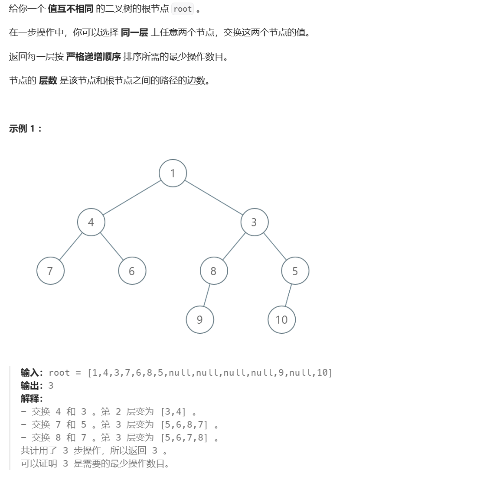

# 置换环

## [ 逐层排序二叉树所需的最少操作数目](https://leetcode.cn/problems/minimum-number-of-operations-to-sort-a-binary-tree-by-level/)



问题的关键在于一串数字如何确定通过交换两个数字达到有序的最少次数是多少，`这个问题要用到置换环（技巧点）：比如一串数字1 0 3 4 2，其中后三位和前两位的交换是互不干涉的，可以被分为两个环，而找到环的技巧是以当前值为下标，不断在数组中查找直到，回到原位，这就是一个环，最少的交换次数是环中的数字个数减一（或者是数组中元素的个数减去环的个数）`，而本题中数组并不使从0到n的而是随机开始的，因此需要离散化处理（技巧点），把5 6 7 8 变为0 1 2 3，`最简单的做法是将值排序后用二分搜索`。

本题中的bfs采用滚动数组的形式，没有选择双向队列。

```python
class Solution:
    def minimumOperations(self, root: Optional[TreeNode]) -> int:
        ans=0
        q=[root]
        while q:
            # 滚动数组形式，用tmp操作，q变为储存下一层内容的数组
            tmp=q
            # a中存储的是节点的值
            a=[]
            q=[]
            for node in tmp:
                a.append(node.val)
                if node.left:
                    q.append(node.left)
                if node.right:
                    q.append(node.right)
            # 离散化，排序二分
            b=sorted(a)
            a=[bisect_left(b,v) for v in a]
            n=len(a)
            # 最小的操作次数可以化简为，数字个数之和减去环的个数
            ans+=n
            # 使用vis数组标记是否访问过
            vis=[False]*n
            for p in a:
                if vis[p]:continue
                # 一直往下找
                while not vis[p]:
                    vis[p]=True
                    p=a[p]
                ans-=1
        return ans 
```

