# 最小/最大

优先考虑最小/最大的数，从小到大/从大到小贪心。

## [长度为 K 的最大偶数和子序列](https://leetcode.cn/problems/subsequence-of-size-k-with-the-largest-even-sum/)

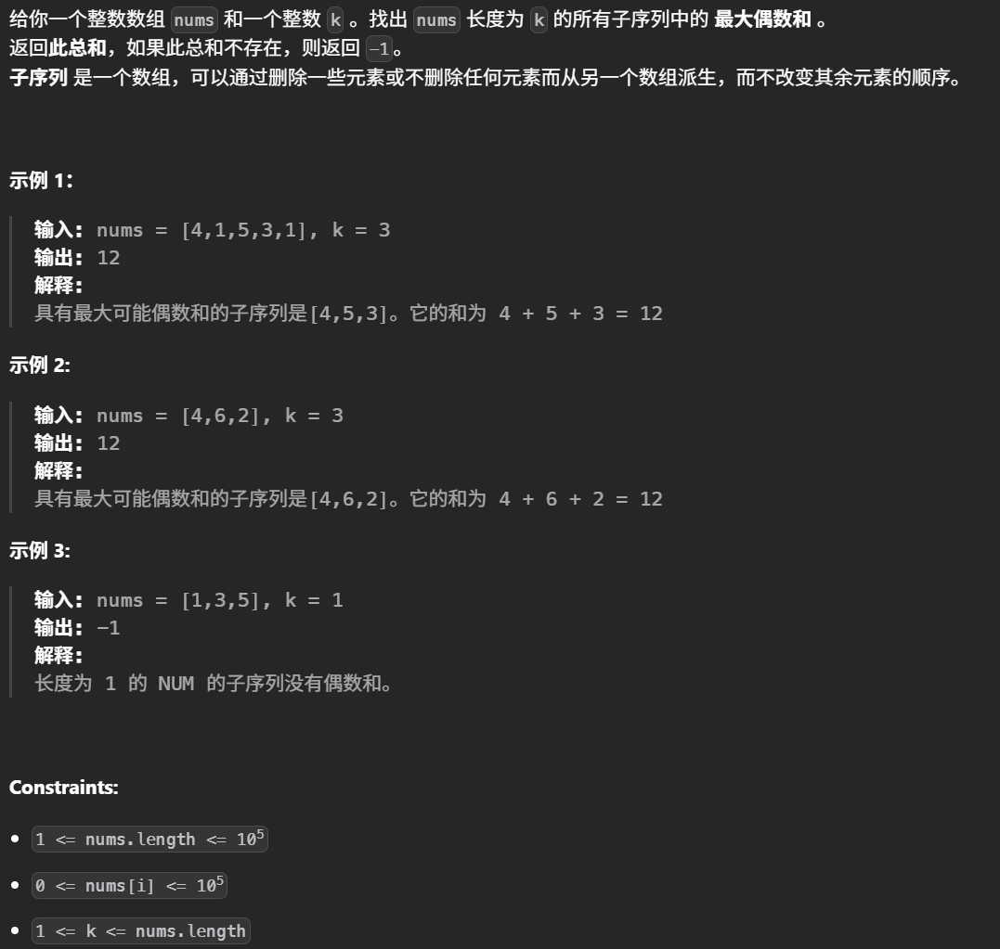

首先从数组中提取最大的K个数，如果和为偶数那么直接返回，反之要将K个数中的最小的奇数和剩下的N-K个数中的最大的偶数交换，反之同理。

```python
class Solution:
    def largestEvenSum(self, nums, k: int) -> int:
        n=len(nums)
        # 排序
        nums.sort()
        # 最大的K个数的和
        total=sum(nums[-k:])
        # 如果是偶数直接返回
        if total&1==0:return total
        
        mx=[-1,-1]
        mn=[inf,inf]
        
        # 前N-K个数中最大的偶数和奇数
        for i in range(n-k):
            x=nums[i]
            if x&1:
                mx[1]=max(mx[1],x)
            else:
                mx[0]=max(mx[0],x)
        # 最大的K个数中最小的偶数和奇数
        for i in range(n-k,n):
            x=nums[i]
            if x&1:
                mn[1]=min(mn[1],x)
            else:
                mn[0]=min(mn[0],x)
        # 枚举如何交换得到最大和
        c=-inf 
        if mn[1]!=inf and mx[0]!=-1:
            c=-mn[1]+mx[0]
        if mn[0]!=inf and mx[1]!=-1:
            c=max(c,-mn[0]+mx[1])
        # 没的换，则无解
        if c==-inf:return -1
        total+=c
        return total
  
```

## [吃披萨](https://leetcode.cn/problems/eat-pizzas/)

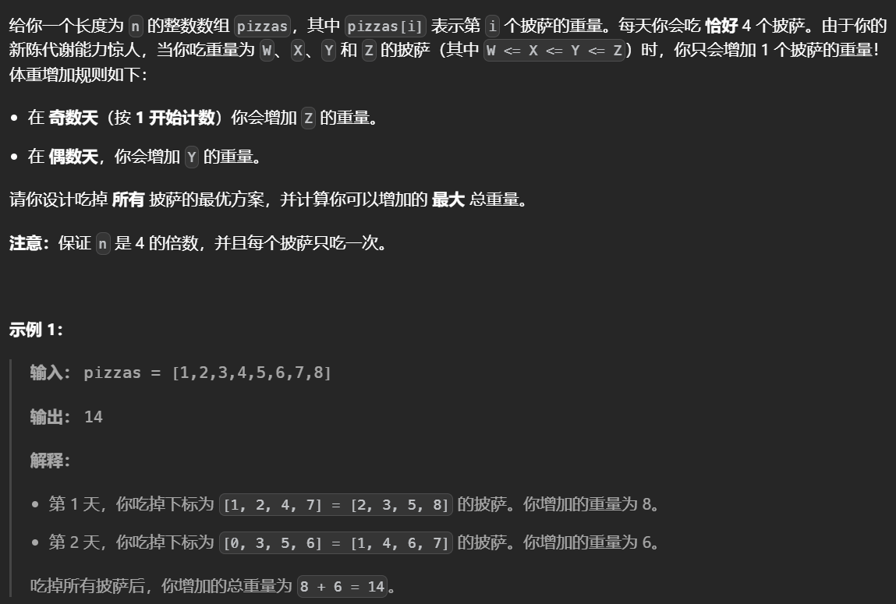

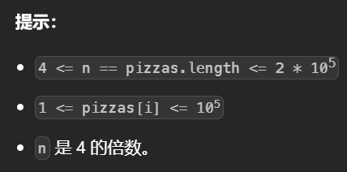

贪心的做法，显然对于奇数天一定是要选一个最大的和三个最小的，但是对于偶数天他可能是选四个最小的来保证奇数天可能不漏选最大的，也可能是就从最大的两个和最小的两个中选来尽可能增大最后结果，似乎是使用动态规划之类的做法因为两种选择无法确定。

本题是任意位置选四个数，因为一定存在一种选法使得取到奇数次最大的元素，所以先取走奇数次最大的，剩下的元素再取走偶数次第二大的。


## [通过最少操作次数使数组的和相等](https://leetcode.cn/problems/equal-sum-arrays-with-minimum-number-of-operations/)

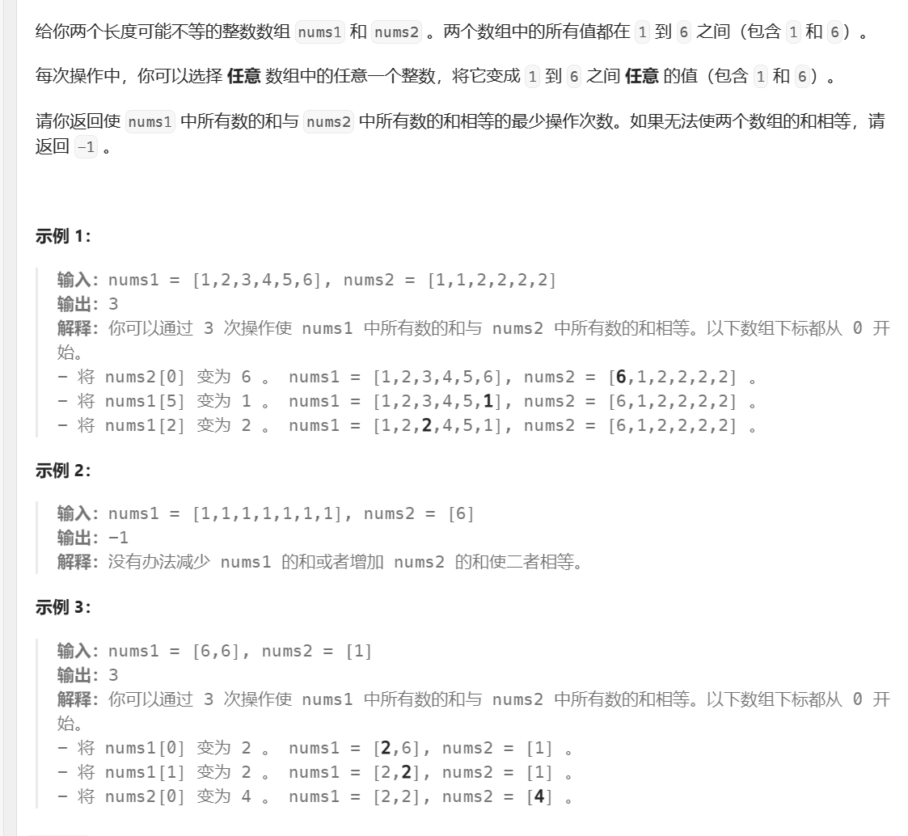

考虑总和为了使得操作次数最少，应该每一次能使差值减少最大。对于总和较大的数组每个元素最小变为1，差值最多减小nums[i]-1。对于总和较小的数组每个元素最大变为6，差值最多减小6-nums[i]，统计这些变化量的个数。

```python
class Solution:
    def minOperations(self, nums1: List[int], nums2: List[int]) -> int:
        n1,n2=len(nums1),len(nums2)
        # 特判
        if max(n1,n2)>min(n1,n2)*6:return -1
        # 交换，方便操作
        t1,t2=sum(nums1),sum(nums2)
        if t1==t2:return 0
        if t1>t2:
            nums1,nums2=nums2,nums1
        # 差值
        d=abs(t1-t2)
        memo=[0]*6
        # 记录变化量
        for a in nums1:
            memo[6-a]+=1
        for b in nums2:
            memo[b-1]+=1
        
        ans=0
        # 从大到小枚举
        for i in range(5,0,-1):
            # 如果能直接消除差值，那么向上取整
            if i*memo[i]>=d:
                return ans+ceil(d/i)
            # 反之，累减
            d-=i*memo[i]
            ans+=memo[i]

        return ans 
```


# 划分型贪心

## [将相邻元素相乘后得到最小化数组](https://leetcode.cn/problems/minimizing-array-after-replacing-pairs-with-their-product/)

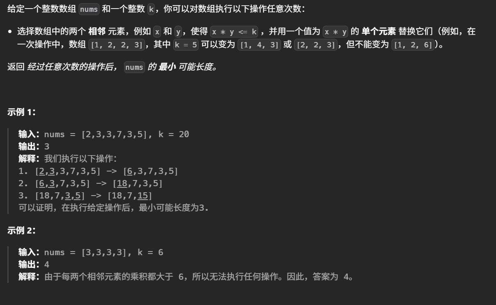

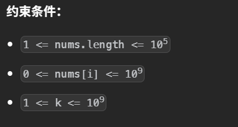

既然想要操作后的数组尽可能地短，那么就需要每一段尽可能地长。因此对于每个元素如果他能和前面一段累乘不超过k，那么就将其归入那一段，否则自己作为新的一段。

```python
class Solution:
    def minArrayLength(self, nums: List[int], k: int) -> int:
        ans=0
        # 特判0
        if 0 in nums:
            return 1
        pre=-1
        for r,x in enumerate(nums):
            if not r:
                pre=x
                ans+=1
                continue
            if x*pre>k:
                pre=x
                ans+=1
            else:
                pre*=x
        return ans
```


# 区间贪心


## **区间覆盖**

给定一些区间，从中选出最小的区间，覆盖一条指定的线段


### [跳跃游戏 II](https://leetcode.cn/problems/jump-game-ii/)

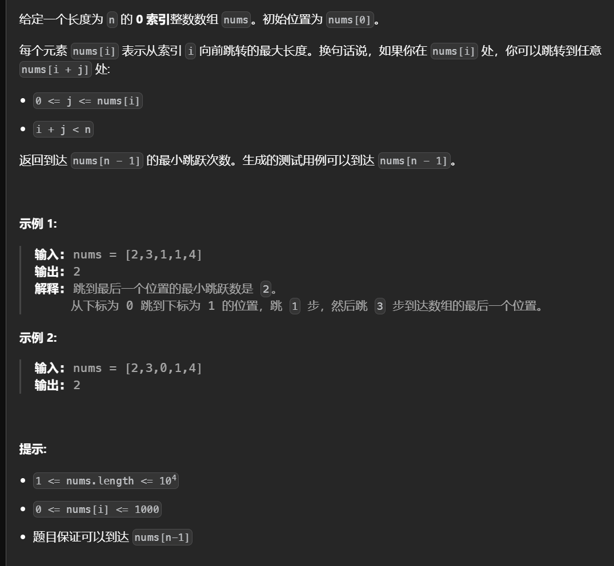

贪心的做法，每次尽可能地走远，维护两个值一个标记终止位置一个表示当前可以走到的最远位置，一旦走到终止位置，那就需要跳一步，因为如果不跳跃的话就无法得到遍历后面的元素获得更远的位置。

维护从一个位置i 起跳能到的最远位置end，在[i,end]区间内维护能跳到最远位置mx，下一次跳跃到的区间就是[end+1,mx]，一旦遍历到end就必须跳到下一个区间。

```python
class Solution:
    def jump(self, nums: List[int]) -> int:
        n=len(nums)
        curr=mx=end=ans=0
        # 遍历到n-1，防止在结尾位置再跳一次
        for i in range(n-1):
            mx=max(mx,i+nums[i])
            if i==end:
                ans+=1
                end=mx
        return ans 
```


### [灌溉花园的最少水龙头数目](https://leetcode.cn/problems/minimum-number-of-taps-to-open-to-water-a-garden/)

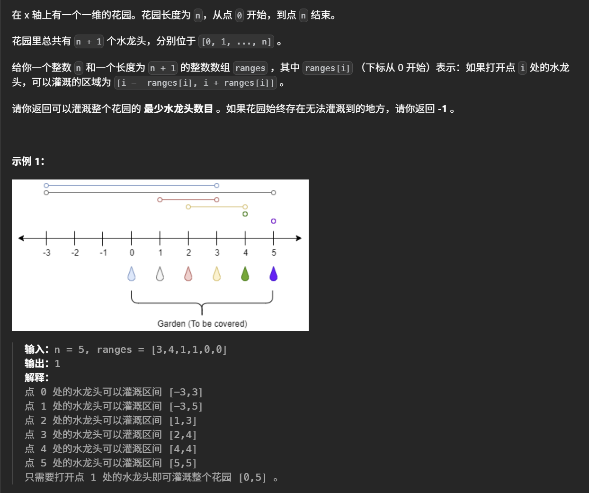

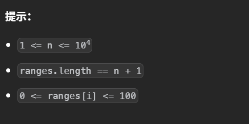

与上一题类似，这里每个点可以向两个方向跳跃，可以将其转换为向一个方向跳跃——i能跳到l,r等价于，l能跳到r

```python
class Solution:
    def minTaps(self, n: int, ranges) -> int:
        right_mx=[0]*(n+1)
        for i,x in enumerate(ranges):
            left=max(0,i-x)
            right_mx[left]=max(right_mx[left],min(n,i+x))
        
        end=mx=ans=0

        for i,x in enumerate(right_mx[:-1]):
            mx=max(mx,x)
            if i==end:
                end=mx
                ans+=1
        return ans if end==n else -1
```


## [零数组变换 III](https://leetcode.cn/problems/zero-array-transformation-iii/)

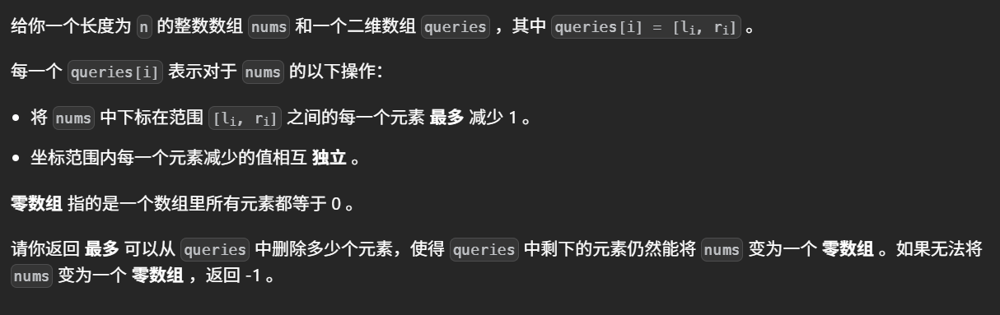

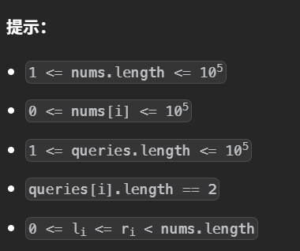

对于一个非0的位置如果要选择区间，那么一定要选一个左端点小于等于该位置的区间，而右端点要尽可能地大，那么使用堆维护所有左端点小于等于该位置的区间依次筛选最大的右端点。选择了一个区间后是用差分数组维护已选的区间的贡献。

```python
class Solution:
    def maxRemoval(self, nums, q) -> int:
        n=len(nums)
        diff=[0]*(n+10)
        h=[]
        # 先按照左端点排序
        q.sort()
        pre=idx=0
        # 枚举每个位置
        for i,x in enumerate(nums):
            # 将左端点小于等于该位置的值压入堆
            while idx<len(q) and q[idx][0]<=i:
                heappush(h,(-q[idx][1],q[idx][0]))
                idx+=1
            # 差分维护
            pre+=diff[i]
            # 如果需要操作
            if x-pre>0:
                # 选出右端点最大的
                for _ in range(x-pre):
                    if not h or -h[0][0]<i:return -1
                    r,l=heappop(h)
                    diff[l]+=1
                    pre+=1
                    diff[-r+1]-=1
        # 剩余的就是不需要选择的区间
        return len(h)
```


# 交换论证法


交换论证法（exchange argument）用于证明一类贪心算法的正确性，也可以用来启发思考。做法如下：

1. 对于题目，猜想按照「某种顺序」处理数据，可以得到最优解。
2. 交换顺序中的两个元素 ai 和 aj，计算交换后的答案。
3. 对比交换前后的答案。如果交换后，答案没有变得更优，则说明猜想成立。


## [对 Bob 造成的最少伤害](https://leetcode.cn/problems/minimum-amount-of-damage-dealt-to-bob/)

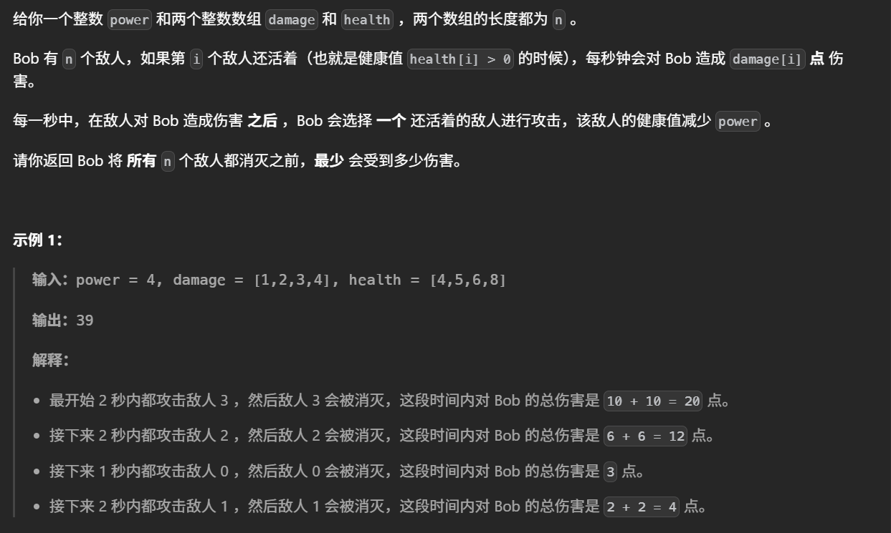

根据题目，必然是要根据某种顺序处理更优。

从简单的情况入手(只有两个值)，假设有A和B，令先处理A比B更优，那么需要满足

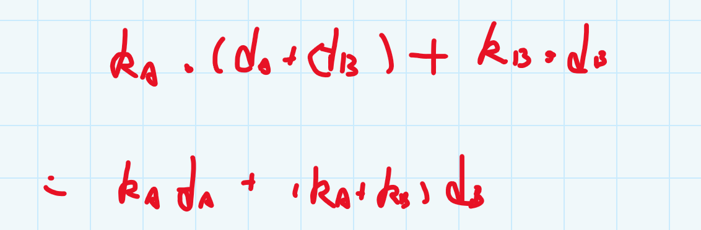

小于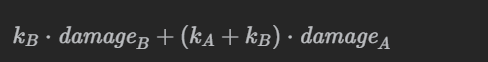

化简公式有


那么将数值按照d/k的顺序倒序即可

```python
class Solution:
    def minDamage(self, power: int, damage, health) -> int:
        nums=[(i,j) for i,j in zip(damage,health)]
        nums.sort(key=lambda p:p[0]/ceil(p[1]/power))
        total=sum(damage)
        ans=0
        for i,j in nums[::-1]:
            ans+=ceil(j/power)*total
            total-=i
        return ans
```


## [全部开花的最早一天](https://leetcode.cn/problems/earliest-possible-day-of-full-bloom/)

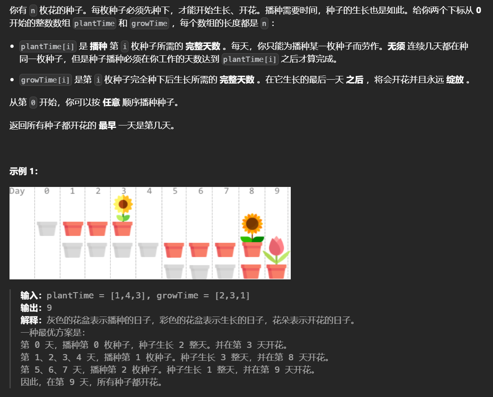

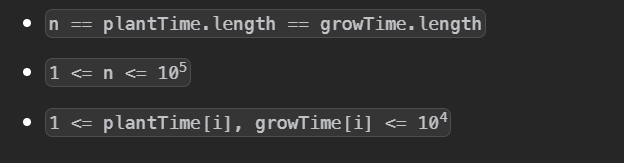

播种所需的时间是固定的，可以交替播种或者一个一个播种，两种方式所需的总播种时间是固定的，但是交替播种会使一个花的播种完成时间延后这一定是不好的，因此选择种完一个去种另一个。

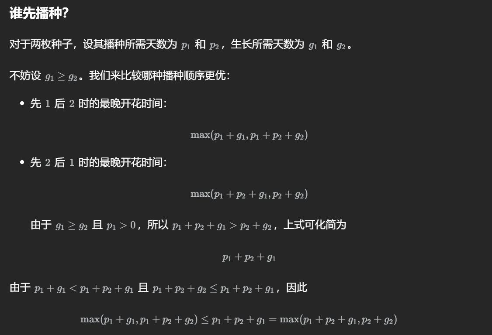

```python
class Solution:
    def earliestFullBloom(self, plantTime: List[int], growTime: List[int]) -> int:
        d=ans=0
        for i,j in sorted(zip(plantTime,growTime),key=lambda x:-x[-1]):
            d+=i
            ans=max(ans,d+j)
        return ans 
```


# 中位数贪心

## [得到连续 K 个 1 的最少相邻交换次数](https://leetcode.cn/problems/minimum-adjacent-swaps-for-k-consecutive-ones/)

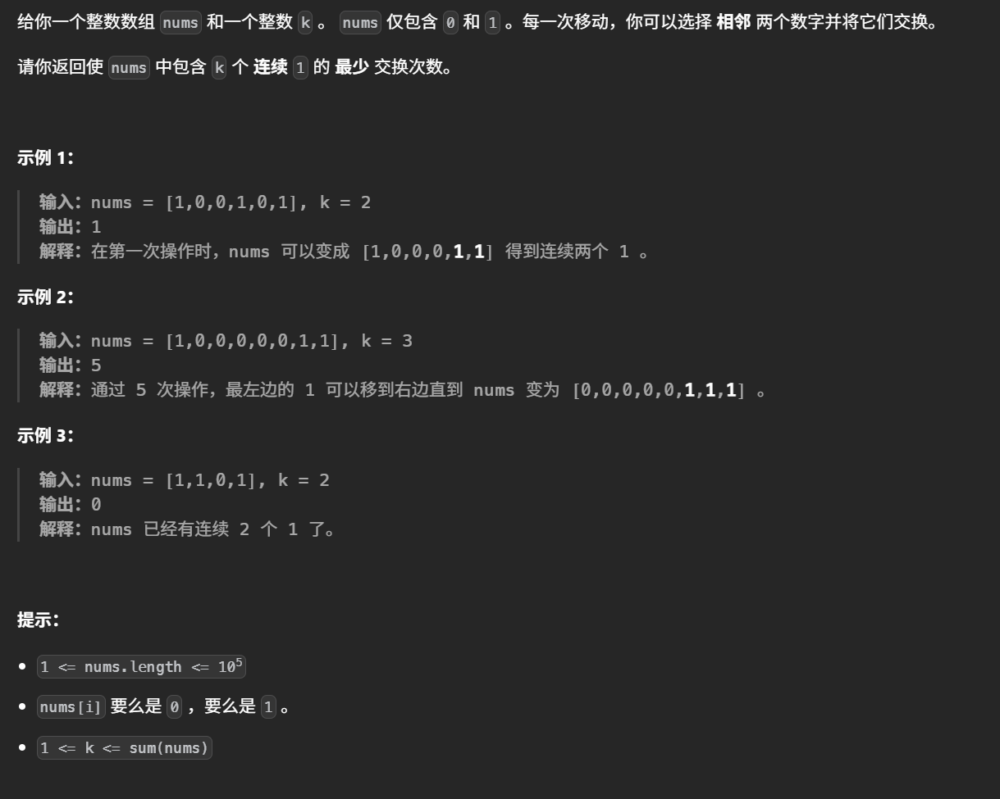

取出所有1的位置，做大小为K的定长滑动窗口，问题变为将窗口中所有位置移动为连续的一段所需的最小操作次数。

令1的位置为 $p_0,p_1,p_2…,p_{m−1}$，设连续位置从$q$开始

那么交换次数为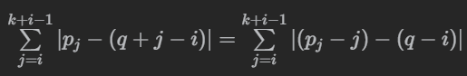，显然要变化公式，然后预处理1的位置数位为g，其中g[j]=f[j]-j


想要代价最小，发现公式形如距离和，那么按照距离和最小的做法进行中位数贪心，也就是(q-i)等g的中位数，求解最小值即可。

```python
class Solution:
    def minMoves(self, nums: List[int], k: int) -> int:
        pos=[i for i,c in enumerate(nums) if c ]
        # 变化数组
        for i in range(len(pos)):pos[i]-=i
        # 前缀和加速求解
        pre=list(accumulate(pos,initial=0))
        l=0
        ans=inf
        # 滑动
        for r,x in enumerate(pos):
            if r-l+1==k:
                # 中间位置
                mid=l+(r-l+1)//2
                # 注意，默认找的是中间偏右的位置，因此如果长度为偶数的话，右侧的个数要减一
                ans=min(ans,k//2*pos[mid]-(pre[mid]-pre[l])+pre[r+1]-pre[mid+1]-(k//2-int(k%2==0))*pos[mid])
                if k&1==0:
                    mid-=1
                    ans=min(ans,(k//2-1)*pos[mid]-(pre[mid]-pre[l])+pre[r+1]-pre[mid+1]-k//2*pos[mid])
                l+=1    
        return ans 
```


# 反悔贪心

## [课程表 III](https://leetcode.cn/problems/course-schedule-iii/)

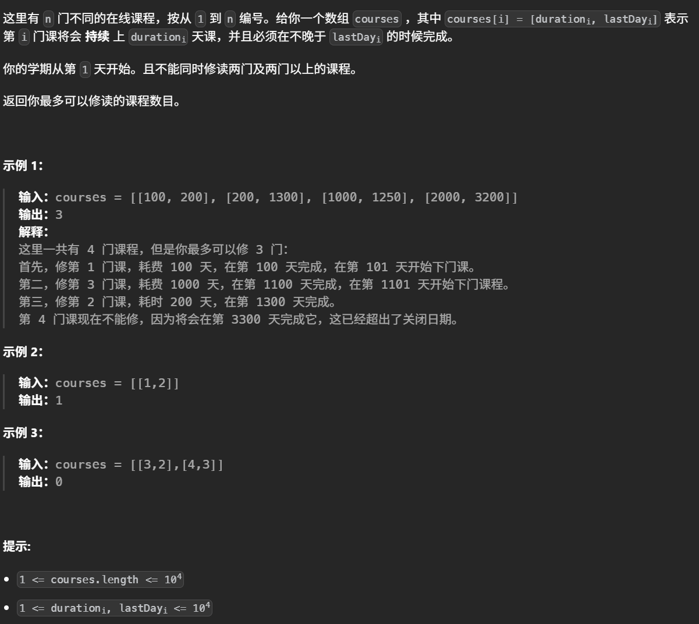


对于给定的数据范围DP无法求解，因此考虑使用贪心——首先一定要处理截止日期比较早的任务，但是有的任务耗时又比较长，这些任务的时间可能留给其他的任务会更好

这里采用反悔贪心，即将数组按照截止日期排好序然后依次处理，如果后面遇到花费时间更少的任务就将之前的选择的花费时间较多的任务取消选择，转为选择这个任务，这一过程需要堆来维护。

```python
class Solution:
    def scheduleCourse(self, nums: List[List[int]]) -> int:
        # 先排序
        nums.sort(key=lambda x:(x[1],x[0]))
        cur=1
        h=[]
        for duration,lasyday in nums:
            # 如果能选
            if duration+cur-1<=lasyday:
                cur+=duration 
                heappush(h,-duration)   
            # 反悔
            elif h and -h[0]>duration:
                cur+=heappop(h)
                cur+=duration
                heappush(h,-duration)
        return len(h)
```


